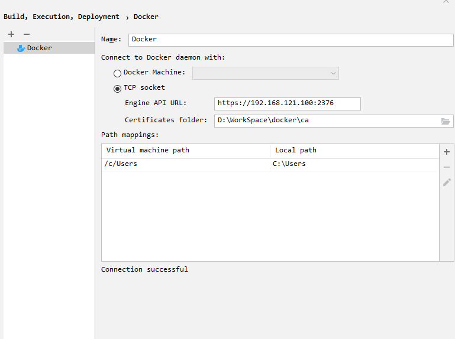
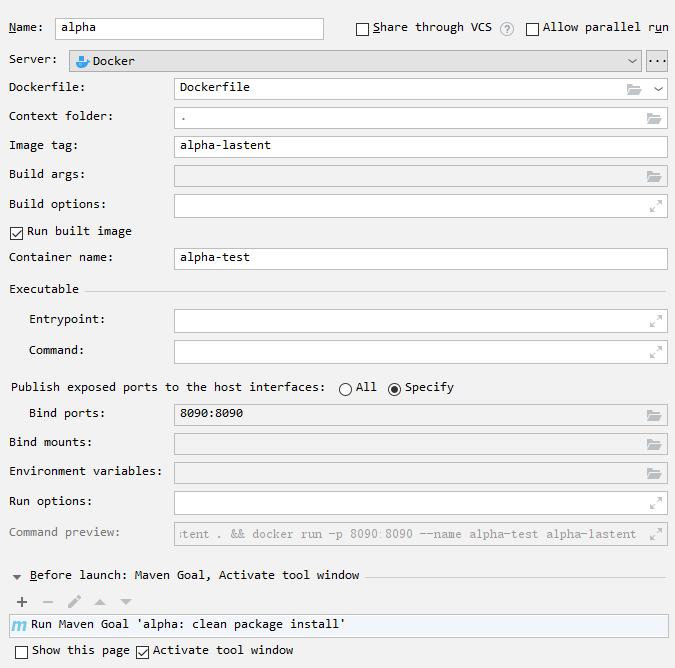

[TOC]

# 1.Centos7 安装 Docker

* 删除旧版本的 Docker

```bash
$ yum remove docker \
                  docker-client \
                  docker-client-latest \
                  docker-common \
                  docker-latest \
                  docker-latest-logrotate \
                  docker-logrotate \
                  docker-engine
```

* 按照所需软件包

```bash
 $ yum -y install gcc gcc-c++ yum-utils device-mapper-persistent-data lvm2 vim
```

* 更新yum源

```bash
# 阿里云源
$ yum-config-manager --add-repo http://mirrors.aliyun.com/docker-ce/linux/centos/docker-ce.repo
$ yum makecache fast
```

* 安装docker

```bash
$ yum -y install docker
$ systemctl start docker
```

* 验证安装

```bash
$ docker version
$ docker info
$ docker run hello-world
```

* 阿里云镜像加速  

```bash
$ mkdir -p /etc/docker
$ tee /etc/docker/daemon.json <<-'EOF'
{
    "registry-mirrors": ["https://3h6bfq2b.mirror.aliyuncs.com"]
}
EOF
$ systemctl daemon-reload
$ systemctl restart docker
$ ps -ef | grep docker*
```

* 设置开机自启

```bash
$ systemctl enable docker
```


# 2.Docker 安装常见应用

## 2.1 安装 MySQL

* 启动容器

```bash
$ docker pull mysql:5.7
$ docker run --name mysql \
	-p 3306:3306 \
	-e "MYSQL_ROOT_PASSWORD=123456" \
	-v /mydata/mysql/log:/var/log/mysql \
	-v /mydata/mysql/data:/var/lib/mysql \
	-v /mydata/mysql/conf:/etc/mysql \
	--privileged=true \
	-idt mysql:5.7
```

* 进入容器

```bash
$ docker exec -it mysql env LANG=C.UTF-8 /bin/bash
	$ mysql -h localhost -u root -p
	mysql> select host,user,plugin,authentication_string from mysql.user;
	mysql> use mysql;
	mysql> alter user 'root'@'%' identified with mysql_native_password by '123456';
	mysql> flush privileges;    
	mysql> select host,user,plugin,authentication_string from mysql.user;
```

* 修改编码配置

```bash
$ vim /mydata/mysql/conf/my.cnf
[client]
default-character-set=utf8

[mysql]
default-character-set=utf8

[mysqld]
init_connect='SET collation_connection = utf8_unicode_ci'
init_connect='SET NAMES utf8'
character-set-server=utf8
collation-server=utf8_unicode_ci
skip-character-set-client-handshake
skip-name-resolve

$ docker restart mysql
```

## 2.2 安装 Redis

* 预先创建宿主机挂载目录

```bash
$ mkdir -p /mydata/redis/conf
$ touch /mydata/redis/conf/redis.conf
```

* 启动redis容器

```bash
$ docker pull redis
$ docker run --name redis \
	-p 6379:6379 \
	-v /mydata/redis/data:/data \
	-v /mydata/redis/conf/redis.conf:/etc/redis/redis.conf \
	--privileged=true \
	-idt redis redis-server /etc/redis/redis.conf
$ docker exec -it redis redis-cli
```

* 修改持久化配置

```bash
$ vim /mydata/redis/conf/redis.conf
appendonly yes
$ docker restart redis
```

## 2.3.安装 ElasticSearch，Logstash，Kibana

* 安装elasticsearch

```bash
$ mkdir -p /mydata/elasticsearch/config
$ mkdir -p /mydata/elasticsearch/data
$ mkdir -p /mydata/elasticsearch/plugins
$ echo "http.host: 0.0.0.0" >> /mydata/elasticsearch/config/elasticsearch.yml
$ chmod -R 777 /mydata/elasticsearch/

$ docker run --name elasticsearch \
	-p 9200:9200 -p 9300:9300 \
	-e "discovery.type=single-node" \
	-e ES_JAVA_OPTS="-Xms64m -Xmx128m" \
	-v /mydata/elasticsearch/config/elasticsearch.yml:/usr/share/elasticsearch/config/elasticsearch.yml \
	-v /mydata/elasticsearch/data:/usr/share/elasticsearch/data \
	-v /mydata/elasticsearch/plugins:/usr/share/elasticsearch/plugins \
	--privileged=true \
	-d elasticsearch:7.4.2
```

* 解决跨域问题

```bash
$ docker exec -it elasticsearch /bin/bash
	> cd /usr/share/elasticsearch/config
	> vi elasticsearch.yml
		http.cors.enabled: true
		http.cors.allow-origin: "*"
	> exit
$ docker restart elasticsearch
```

* 安装ik分词器

```bash
$ docker exec -it elasticsearch /bin/bash
	> cd /usr/share/elasticsearch/plugins
	> elasticsearch-plugin install https://github.com/medcl/elasticsearch-analysis-ik/releases/download/v6.8.9/elasticsearch-analysis-ik-6.8.9.zip
	> exit
$ docker restart elasticsearch
```

* 安装kibana

```bash
$ docker pull kibana:6.8.9
$ docker run \
	--name kibana \
	--net somenetwork \
	# --link=elasticsearch \
	-p 5601:5601 \
	-d kibana:6.8.9
$ curl http://192.168.121.100:5601
```

* 安装logstash

```bash
$ docker pull logstash:6.8.9
$ docker run \
	--name logstash \
	-p 5044:5044  \
	--net somenetwork \
	-v /mydata/logstash/logstash.yml:/usr/share/logstash/config/logstash.yml \
	-v /mydata/logstash/conf.d/:/usr/share/logstash/conf.d/ \
	-d logstash:6.8.9
$ vim /mydata/logstash/logstash.yml
	path:
	 config: /usr/share/logstash/conf.d/*.conf
	path:
	 logs: /var/log/logstash
$ vim /mydata/logstash/conf.d/test.conf
	input {
		beats {
			port => 5044
			codec => "json"
		}
	}
	output {
		elasticsearch {
			hosts => ["elasticsearch:9200"]
		}
		stdout { 
			codec => rubydebug 
		}
	}
```

## 2.4 安装 RabbitMQ

```bash
$ docker pull rabbitmq:3.7.7-management
$ docker run --name rabbitmq -p 5672:5672 -p 15672:15672 \
	-v /mydata/rabbitmq:/var/lib/rabbitmq --hostname myRabbit \ 
	-e "RABBITMQ_DEFAULT_VHOST=/abigtomato" \
	-e "RABBITMQ_DEFAULT_USER=abigtomato" \ 
	-e "RABBITMQ_DEFAULT_PASS=123456" \
	-d rabbitmq:3.4.4-management
$ curl http://192.168.121.100:15672
```

## 2.5 安装 Zookeeper，Kafka

* 启动zookeeper

```bash
$ docker pull wurstmeister/zookeeper
$ docker run --name zookeeper -p 2181:2181 -t -d wurstmeister/zookeeper
```

* 启动kafka

```bash
$ docker pull wurstmeister/kafka:2.11-0.11.0.3
$ docker run --name kafka --publish 9092:9092 --link zookeeper \
	--env KAFKA_ZOOKEEPER_CONNECT=zookeeper:2181 \
	--env KAFKA_ADVERTISED_HOST_NAME=192.168.121.100 \
	--env KAFKA_ADVERTISED_PORT=9092 \
	--volume /etc/localtime:/etc/localtime 
	-d wurstmeister/kafka:latest
```

* 启动kafka生产者

```bash
$ docker exec -it kafka /bin/bash
	> cd /opt/kafka_2.11-0.11.0.3/bin/
	> ./kafka-topics.sh --create --zookeeper zookeeper:2181 --replication-factor 1 --partitions 8 --topic test
	> ./kafka-console-producer.sh --broker-list 192.168.121.100:9092 --topic test
```

* 启动kafka消费者

```bash
$ docker exec -it kafka /bin/bash
	> cd /opt/kafka_2.11-0.11.0.3/bin/
	> ./kafka-console-consumer.sh --bootstrap-server 192.168.121.100:9092 --topic test --from-beginning
```

## 2.6 安装 Alibaba Nacos

```bash
$ docker pull nacos/nacos-server
$ docker run --env MODE=standalone --name nacos -p 8848:8848 -d nacos/nacos-server
```

# 3.配置CA认证的远程端口2376

## 3.1.编写脚本

```shell
#!/bin/bash

# 相关配置信息
SERVER="192.168.121.100"
PASSWORD="123456"
COUNTRY="cn"
STATE="zhejiang"
CITY="hangzhou"
ORGANIZATION="google"
ORGANIZATIONAL_UNIT="dev"
EMAIL="123456789@hello.com"

###开始生成文件###
echo "开始生成文件"

# 切换配置密钥的目录
cd /etc/docker
# 生成ca私钥（使用aes256加密）
openssl genrsa -aes256 -passout pass:$PASSWORD -out ca-key.pem 4096
# 生成ca证书，并填写配置信息
openssl req -new -x509 -passin "pass:$PASSWORD" -days 365 -key ca-key.pem -sha256 -out ca.pem -subj "/C=$COUNTRY/ST=$STATE/L=$CITY/O=$ORGANIZATION/OU=$ORGANIZATIONAL_UNIT/CN=$SERVER/emailAddress=$EMAIL"

# 生成server证书私钥文件
openssl genrsa -out server-key.pem 4096
# 生成server证书请求文件
openssl req -subj "/CN=$SERVER" -sha256 -new -key server-key.pem -out server.csr

# 配置白名单
echo subjectAltName = IP:$SERVER,IP:0.0.0.0 >> extfile.cnf
# 将Docker守护进程密钥的扩展使用属性设置为仅用于服务器身份验证
echo extendedKeyUsage = serverAuth >> extfile.cnf

# 使用CA证书及CA密钥以及server证书请求文件进行签发，生成server自签证书
openssl x509 -req -days 365 -in server.csr -CA ca.pem -CAkey ca-key.pem -passin "pass:$PASSWORD" -CAcreateserial -out server-cert.pem -extfile extfile.cnf

# 生成client证书RSA私钥文件
openssl genrsa -out key.pem 4096
# 生成client证书请求文件
openssl req -subj '/CN=client' -new -key key.pem -out client.csr

# 要使密钥适合客户端身份验证，请创建扩展配置文件
echo extendedKeyUsage = clientAuth >> extfile.cnf
#sh -c 'echo "extendedKeyUsage=clientAuth" > extfile.cnf'

# 生成client自签证书（根据上面的client私钥文件、client证书请求文件生成）
openssl x509 -req -days 365 -sha256 -in client.csr -CA ca.pem -CAkey ca-key.pem -passin "pass:$PASSWORD" -CAcreateserial -out cert.pem -extfile extfile.cnf

# 修改权限，要保护您的密钥免受意外损坏，请删除其写入权限。要使它们只能被您读取，更改文件模式
chmod -v 0400 ca-key.pem key.pem server-key.pem
# 证书可以是对外可读的，删除写入权限以防止意外损坏
chmod -v 0444 ca.pem server-cert.pem cert.pem

# 删除不需要的文件，两个证书签名请求
rm -v client.csr server.csr

echo "生成文件完成"
###生成结束###
```

## 3.2.修改配置

```bash
# 1.修改docker配置
$ vim /lib/systemd/system/docker.service
    ExecStart=/usr/bin/dockerd \
            --tlsverify \
            --tlscacert=/etc/docker/ca.pem \
            --tlscert=/etc/docker/server-cert.pem \
            --tlskey=/etc/docker/server-key.pem \
            -H tcp://0.0.0.0:2376 \
            -H unix:///var/run/docker.sock \
            -H fd:// --containerd=/run/containerd/containerd.sock

# 2.开放防火墙的2376的端口
$ firewall-cmd --zone=public --add-port=2376/tcp --permanent
$ firewall-cmd --reload

# 3.重载服务并重启docker
$ systemctl daemon-reload
$ systemctl restart docker
$ service docker restart

# 4.查看是否存在2376端口
$ yum install net-tools
$ netstat -tunlp

# 5.保存证书客户端文件到本地，这里用的是sz命令，ftp也可以只要能放到本地客户端即可
$ cd /etc/docker
$ sz ca.pem cert.pem key.pem

# 6.测试一下证书是否配置成功，如果成功，会输出证书相关信息，如果有fail，请检查证书
$ docker --tlsverify --tlscacert=ca.pem --tlscert=cert.pem --tlskey=key.pem -H=192.168.121.100:2376 version
```





## 3.3.配置docker maven插件

```xml
<build>
    <finalName>docker-alpha</finalName>
    <plugins>
        <!--      Docker maven插件      -->
            <plugin>
                <groupId>com.spotify</groupId>
                <artifactId>dockerfile-maven-plugin</artifactId>
                <version>1.3.6</version>
                <configuration>
                    <repository>${docker.image.prefix}/${project.artifactId}</repository>
                    <buildArgs>
                        <JAR_FILE>target/${project.build.finalName}.jar</JAR_FILE>
                    </buildArgs>
                </configuration>
            </plugin>
    </plugins>
    </build>
```

## 3.4.编写dockerfile

```dockerfile
# 指定基础镜像，在其上进行定制
FROM java:8
# 这里的 /tmp 目录就会在运行时自动挂载为匿名卷，任何向 /tmp 中写入的信息都不会记录进容器存储层
VOLUME /tmp
# 复制上下文目录下的 target/Docker-alpha.jar 到容器里，这里写自己的工程名称
COPY target/docker-alpha.jar alpha.jar
# 指定容器启动程序及参数
ENTRYPOINT ["java", "-jar", "/alpha.jar"]
```

# 4.镜像管理

## 4.1 search 搜索

```bash
# 搜索镜像仓库（Docker Hub，各种公/私有的Registry）中的镜像
$ docker search <镜像名>
```

|   返回值    |     解释     |
| :---------: | :----------: |
|    NAME     |     名称     |
| DESCRIPTION | 基本功能描述 |
|    STARS    |   下载次数   |
|  OFFICIAL   |  是否为官方  |
|  AUTOMATED  | 是否自动运行 |

## 4.2 pull 拉取

```bash
# 下载远程镜像仓库（Docker Hub，各种公/私有的Registry）中的镜像
$ docker pull <镜像名>:<版本标签>
```

## 4.3 images 查看

```bash
# 查看下载到本地的镜像列表
$ docker images
$　docker images ls <镜像名>:<版本标签>
```

|   返回值   |   解释   |
| :--------: | :------: |
| REPOSITORY |   名称   |
|    TAG     |   版本   |
|  IMAGE ID  |    ID    |
|  CREATED   | 创建时间 |
|    SIZE    |   大小   |

## 4.4 tag 重命名

```BASH
* 对本地镜像的NAME和TAG进行重新命名，并产生一个新命名后的镜像（起别名）；
* 格式：`docker tag <旧名称>:<旧版本> <新名称>:<新版本>`
```

## 4.5 rmi 删除

```bash
#　将本地的一个或多个镜像删除
$ docker rmi [参数] <镜像id|名称:版本>...
$ docker image rm|rmi [参数] <镜像id|名称:版本>...
```

|     参数      |   解释   |
| :-----------: | :------: |
| -f \| --force | 强制删除 |

## 4.6 save 打包

```bash
# 将本地的一个或多个镜像打包到本地保存为tar文件
$ docker save -o <导出路径>
# -o | --output：指定导出镜像的路径
```

## 4.7 load 导入

```bash
# 将save命令打包的镜像导入本地镜像库中
$ docker load -i <导入路径>
$ docker load < <导入路径>
# -i | --input | <：指定要导入镜像的路径
```

## 4.8 history 历史信息

```bash
# 查看一个本地镜像的历史信息
$ docker history <名称:版本>
```

|   返回值   |        解释        |
| :--------: | :----------------: |
|   IMAGE    |        编号        |
|  CREATED   |     创建的时间     |
| CREATED BY | 基于哪些命令创建的 |
|    SIZE    |        大小        |
|  COMMENT   |        评论        |

## 4.9 inspect 详细信息

```bash
# 查看一个或多个本地镜像的详细信息
$ docker [image] inspect [参数] <名称:版本>
```

## 4.10 import 模板导入

* 登录系统模板镜像网站：https://download.openvz.org/template/precreated/
* 找到一个镜像模板进行下载，如ubuntu-16.04-x86_64.tar.gz，地址为：https://download.openvz.org/template/precreated/ubuntu-16.04-x86_64.tar.gz

```bash
$ cat <模板文件名.tar> | docker import - [自定义镜像名]
```

# 5.容器管理

## 5.1 create 创建

```bash
# 创建出一个 created 状态的待启动容器
$ docker create [参数] <依赖的镜像> [命令] [命令参数...]
```

|        参数         |                  解释                   |
| :-----------------: | :-------------------------------------: |
|     -t \| --tty     |    分配一个伪TTY，也就是分配虚拟终端    |
| -i \| --interactive | 即使没有连接，也要保持stdin标准输入打开 |
|       --name        |     为容器起名，如果没有会随机产生      |

## 5.2 start 启动

* 启动容器的三种方式：
  * 启动待启动或已关闭的容器；
  * 基于镜像新建一个容器并启动；
  * 守护进程的方式启动Docker。

```bash
# 将一个或多个处于创建状态或关闭状态的容器启动起来
$ docker start [参数] <容器名称或ID>
```

|        参数         |                    解释                    |
| :-----------------: | :----------------------------------------: |
|   -a \| --attach    | 将当期 shell 的 STDOUT/STDERR 连接到容器上 |
| -i \| --interactive |     将当前 shell 的 STDIN 连接到容器上     |

## 5.3 run 创建并启动

```bash
# 基于指定镜像创建并启动一个容器
$ docker run [参数] <镜像> [命令] [命令参数...]
```

|       **参数**        |                   **解释**                   |
| :-------------------: | :------------------------------------------: |
|     -t   \| --tty     |      分配一个伪TTY，也就是分配虚拟终端       |
| -i   \| --interactive | 即时没有连接，也要保持STDIN（标准输入）打开  |
|        --name         |        为容器起名，如果没有会随机产生        |
|   -d   \| --detach    | 在后台以守护进程的方式运行容器并打印出容器ID |
|         --rm          |         当前容器运行后会自动删除容器         |

## 5.4 ps 查看

```bash
# 显示本地的docker容器列表
$ docker ps [参数]
```

| **参数** |       **解释**       |
| :------: | :------------------: |
|    -a    | 显示所有运行过的容器 |
|    -s    |  显示正在运行的容器  |

|   **返回值**   |     **解释**     |
| :------------: | :--------------: |
| CONTAINER   ID |      容器ID      |
|     IMAGE      |    基于的镜像    |
|    COMMAND     | 运行时使用的命令 |
|    CREATED     |     创建时间     |
|     STATUS     |     是否启动     |
|     PORTS      |      端口号      |
|     NAMES      |      容器名      |

## 5.5 pause 暂停

```bash
# 暂停一个或多个处于运行状态的容器
$ docker pause <容器>
```

## 5.6 unpause 恢复

```bash
# 取消一个或多个处于暂停状态的容器，恢复运行
$ docker unpause <容器>
```

## 5.7 restart 重启

```BASH
# 重启一个或多个处于运行，暂停，关闭或新建状态的容器
$ docker restart [参数] <容器>
```

|     **参数**      |          **解释**          |
| :---------------: | :------------------------: |
| -t \| --time 时间 | 等待一定的时间重启，单位秒 |

## 5.8 stop 延迟关闭

```bash
# 延迟关闭一个或多个处于暂停或运行状态的容器
$ docker stop <容器>
```

## 5.9 kill 强制关闭

```bash
# 强制关闭一个或多个处于暂停或运行状态的容器
$ docker kill <容器>
```

## 5.10 rm 删除

```bash
# 删除一个或多个容器
$ docker rm [参数] <容器>
```

| **参数** | **解释** |
| :------: | :------: |
|    -f    | 强制删除 |

## 5.11 exec 创建并进入

```bash
# 创建并进入容器
$ docker run --name <容器> -it <镜像> /bin/bash
$ docker exec -it <容器> /bin/bash
# -i：标准输入的方式打开
# -t：分配一个伪终端，并绑定到标准输入的终端
# /bin/bash：容器启动后执行bash命令
```

* 脚本方式进入容器

```bash
# !/bin/bash
docker_in() {
	NAME_ID = $1
	PID = $(docker inspect --format {{.State.Pid}} $NAME_ID)
	nsenter --target $PID --mount --uts --ipc --net --pid
}
docker_in $1
```

```bash
$ chmod +x docker_in.sh
```

## 5.12 commit/export 创建镜像

```BASH
# 基于容器创建镜像
$ docker commit -m <改动信息> -a <作者信息> <容器> <镜像:标签>
$ docker export <容器> > <模板>
```

* import与load的区别：
* import可以重新指定镜像的名字，docker load不可以。
* export与save的区别：

  * export导出的镜像文件大小小于save保存的镜像；
  * export 导出（import导入）是根据容器拿到的镜像，再导入时会丢失镜像所有的历史。

## 5.13 logs 查看日志

```bash
# 查看容器运行的日志
$ docker logs <容器>
```

## 5.14 inspect 详细信息

```bash
# 查看容器的详细信息
$ docker inspect <容器>
```

## 5.15 port 查看端口

```bash
# 查看容器的端口信息；
$ docker port <容器>
```

## 5.16 rename 修改名称

```bash
# 修改容器名称；
$ docker rename <old> <new>
```

# 6.数据管理


# 7.网络管理


# 8.Dockerfile

## 8.1 构建镜像

```bash
$ docker build -t <镜像:标签> ./
```

## 8.2 FROM

* FROM指令必须是dockerfile文件开篇的一个非注释行，用于为镜像文件构建过程指定基准镜像，后续的指令运行于此基准镜像所提供的运行环境；
* 实践中，基准镜像可以是任何可用镜像文件，默认情况下，docker build会在docker主机上查找指定的镜像文件，在其不存在时，则会从docker hub registry拉取所需的镜像文件；

```dockerfile
FROM <repository>[:<tag>]
```

## 8.3 MAINTANIER

- 该指令用于让dockerfile制作者提供本人的详细信息；
- dockerfile并不限制MAINTANIER指令出现的位置，但推荐将其放置于FROM指令之后；

```dockerfile
MAINTAINER <author detail>
# <author detail>`：可以是任何文本信息，但约定俗成的使用作者名称以及邮件地址
# 例：MAINTAINER "albert <albert@google.com>"`
```

## 8.4 LABEL

* 添加构建镜像的元数据信息；

```dockerfile
LABEL <key>=<value> <key>=<value> <key>=<value> ...
# 例：LABEL maintainer="albert <albert@google.com>" app="httpd"
```

## 8.5 COPY

* 用于从docker宿主机复制文件到新创建的镜像中；

```dockerfile
COPY <src> … <dest>
COPY ["<src>", …, "<dest>"]
# <src>：要复制的源文件或目录，支持使用通配符；
# <dest>：目标路径，即正在创建的image的文件系统路径；建议为`<dest>`使用绝对路径，否则，COPY指令则以WORKDOR为其起始路径；
# 注：路径中存在空白字符时，通常使用第二种格式
```

* 文件复制标准：
  * `<src>`必须是build上下文中的路径，不能是其父目录中的文件；
  * 如果`<src>`是目录，则其内部文件或子目录会被递归复制，但`<src>`目录自身不会被复制；
  * 如果指定了多个`<src>`，或在`<src>`中使用了通配符，则`<dest>`必须是一个目录，且必须以 / 结尾；
  * 如果`<dest>`事先不存在，它会被自动创建，包括其父目录。

## 8.6 ADD

* ADD指令类似于COPY指令，不同的是ADD支持使用tar文件和url路径；

```dockerfile
ADD <src> … <dest>
ADD ["<src>", …, "<dest>"]
```

* 操作准则：
  - 同COPY指令；
  - 如果`<src>`为url且`<dest>`不以 / 结尾，则`<src>`指定的文件将被下载并创建为`<dest>`；如果`<dest>`以 / 结尾，则文件名url指定的文件将被直接下载并保存为`<dest>/<filename>`；
  - 如果`<src>`是一个本地系统上的压缩格式tar的文件，将被自动展开为一个目录，其行为类似于“tar -x”命令；然而，通过url获取的tar文件将不会被自动展开；
  - 如果`<src>`有多个，或其间接或直接使用了通配符，则`<dest>`必须是一个以 / 结尾的目录路径；如果`<dest>`不以 / 结尾，则其被视作一个普通文件，`<src>`的内容将被直接写入到`<dest>`。

## 8.7 WORKDIR

* 用于为dockerfile中所有的RUN, CMD, ENTRYPOINT, COPY和ADD指定工作目录；

```dockerfile
WORKDIR <dirpath>
```

* 在dockerfile文件中，WORKDIR指令可出现多次，其路径也可以为相对路径（相对于前一个WORKDIR指定的路径）；
* 另外，WORKDIR也可调用由ENV指令定义的变量。
* 示例：WORKDIR /var/log

## 8.8 VOLUME

* 用于在image中创建一个挂载点目录，以挂载docker host上的卷或其他容器上的卷；

```dockerfile
VOLUME <mountpoint>
VOLUME ["<mountpoint>"]
```

* 如果挂载点目录此前有文件存在，docker run命令会在卷挂载完成后将此前所有文件复制到新挂载的卷中。

## 8.9 EXPOSE

* 用于为容器指定要监听的端口以实现与外部通信；

```dockerfile
EXPOSE <post>[/<protocol>][<port>[/<protocol>]…]
# <protocol>：用于指定传输层协议，可为tcp或udp二者之一，默认为tcp协议。
```

* EXPOSE指令可以一次指定多个端口，例：EXPOSE 11211/udp 11211/tcp。
* 在docker run中使用 -P 参数暴露全部EXPOSE指定的端口。

## 8.10 ENV

- 用于为镜像定义所需的环境变量，并可被dockerfile文件中位于气候的其他指令（如：ENV, ADD, COPY等）所调用；
- 调用格式：`$variable_name 或 ${variable_name}`；
- 格式：
  - `ENV <key> <value>`
  - `ENV <key>=<value> …`
- 第一种格式中，`<key>`之后的所有内容均会被视作其`<value>`的组成部分，因此一次只能设置一个变量；
- 第二种格式中可以一次设置多个变量，每个变量为一个`<key>=<value>`的键值对，如果`<value>`中包含空格，可用以 \ 进行转义，也可以通过对`<value>`加引号进行标识；另外，反斜线 \ 也可以用于续行；
- 定义多个变量时，建议使用第二种方式，以便在同一层完成所有功能。

## 8.11 RUN

- 用于指定docker build过程中运行的程序，可以是任何命令；

```dockerfile
RUN <command>
RUN ["<executable>", "<param1>", "<param2>"]
```

- 第一种格式中，`<command>`通常是一个shell命令，且以“/bin/sh -c”来运行它（系统默认将其当做shell的子进程来运行，先启动shell进程，将其当做参数传入shell），这意味着此进程在容器中的PID不为1，不能接收Unix信号，因此，当使用`docker stop <container>`命令停止容器时，此进程收不到SIGTERM信号；
- 第二种语法格式中的参数是一个JSON格式的数组，
- 其中`<executable>`为要运行的命令，后面的`<paramN>`为传递给命令的选项或参数；然而，此种格式指定的命令不会以“/bin/sh -c”来执行（由kernol内核直接创建），因此常见的shell操作如环境变量以及通配符（？，* 等）替换将不会进行；如果要运行的命令想要依赖shell特性的话，可以将其替换为 `RUN ["/bin/bash", "-c", "<executable>", "<param1>"]`。

## 8.12 CMD

- 类似于RUN指令，CMD指令也可用于运行任何命令或应用程序，二者的区别就是运行的时间点不同：
  - RUN指令运行于镜像文件构建过程中，而CMD指令运行于基于Dockerfile构建出的镜像启动容器时；
  - CMD指令的首要目的在于为启动的容器指定默认要运行的程序，且当其运行结束后，容器也将终止；
  - CMD指令可以被docker run的命令行选项所覆盖；
  - 在Dockerfile中可以存在多个CMD指令，但仅最后一个会生效。

```dockerfile
CMD <command>
CMD ["<executable>", "<param1>", "<param2>"]
CMD ["<param1>", "<param2>"]
```

- 前两种语法格式的意义同RUN；
- 第三种则用于为ENTRYPOINT指令提供默认参数。

## 8.13 ENTRYPOINT

- 类似CMD指令的功能，用于为容器指定默认运行程序，从而使得容器像是一个单独的可执行程序；
- 与CMD不同的是，由ENTRYPOINT启动的程序不会被docker run命令行指定的参数所覆盖，而且这些命令行参数会被当做参数传递给ENTRYPOINT指定的程序：
  - Docker run命令的--entrypoint选项的参数可覆盖ENTRYPOINT指令指定的程序。

```dockerfile
ENTRYPOINT <command>
ENTRYPOINT ["<executable>", "<param1>", "<param2>"]
```

- 若CMD和ENTRYPOINT指令同时使用，Docker run命令传入的参数会覆盖CMD指令的内容并且附加到ENTRYPOINT命令最后做为其参数使用；
- Dockerfile文件中也可以存在多个ENTRYPOINT指令，但只会生效最后一个。

## 8.14 USER

- 用于指定运行image时的或运行RUN, CMD,      ENTRYPOINT指令指定的程序时的用户名或UID；
- 默认情况下，容器的运行身份为root用户；

```dockerfile
USER <UID>|<UserName>
```

- 需要注意的是，`<UID>`可以为任意数字，但实践中其必须为 /etc/passwd 中某用户的有效UID，否则docker run命令运行会失败。

## 8.15 ONBUILD

- 用于在Dockerfile中定义一个触发器；
- Dockerfile用于build映像文件，此映像文件亦可做为base image被另一个Dockerfile当做FROM指令的参数，并以之构建新的映像文件；
- 后面的Dockerfile中的FROM指令在build过程中被执行时，将会触发其基于的base image的Dockerfile文件中定义的ONBUILD定义的触发器；

```dockerfile
ONBUILD <INSTRUCTION>
```

- 尽管任何指令都可以注册成为触发器指令，但ONBUILD不能自我嵌套，且不会触发FROM和MAINTAINER指令；
- 使用包含ONBUILD指令的Dockerfile构建的镜像应该使用特殊的标签，如：ruby:2.0-onbuild；
- 在ONBUILD指令中使用ADD或COPY指令应该格外小心，因为新构建过程的上下文在缺少指定的源文件时会失败。

# 9.Docker-compose

## 9.1 配置

* 安装pip

  ```bash
  $ yum update
  $ yum -y install epel-release　python-pip
  $ pip install --upgrade pip
  ```
  
* 设置pip源

  ```bash
  $ mkdir ~/.pip
  $ vim .pip/pip.conf 
  	[global]
  	trusted-host=mirrors.aliyun.com
  	index-url=http://mirrors.aliyun.com/pypi/simple/
  ```

* 安装docker-compose

  ```bash
  $ pip install docker-compose
  $ docker-compose version
  ```

* 编辑配置文件

  ```bash
  $ mkdir -p docker/compose
  $ vim docker/compose/docker-compose.yml
      version: '2'
      services:
        web1:
          image: nginx
          ports:
            - "9999:80"
          container_name: nginx-web1
        web2:
          image: nginx
          ports:
            - "8888:80"
          container_name: nginx-web2
  ```

* 运行docker-compose

  ```bash
  $ docker-compose up -d
  $ docker-compose ps
  ```

## 9.2 命令

* 服务的启动，关闭和查看
  * 后台启动：`docker-compose up -d`
  * 删除服务：`docker-compose down`
  * 查看运行中的服务：`docker-compose ps`
* 容器的开启，关闭和删除
  * 启动：`docker-compose start <容器名> # 不添加容器名会启动所有容器`
  * 停止：`docker-compose stop <容器名> # 不添加容器名会停止所有容器`
  * 删除：`docker-compose rm # 不会删除应用的网络和数据卷`
* 其他信息查看
  * 查看服务运行状态：`docker-compose ps`
  * 查看服务运行日志：`docker-compose logs -f # 添加-f选项，可以持续跟踪服务产生的日志`
  * 查看服务依赖的镜像：`docker-compose images`
  * 进入服务容器：`docker-compose exec <服务名> <执行命令>`
  * 查看服务网络：`docker network ls`

## 9.3 配置文件

* 格式

  ```bash
  version: '2' # compose 版本号 					
  services: # 服务标识符 						
    web1: # 子服务命名 						    
      image: nginx # 服务依赖镜像属性	 			    
      ports: # 服务端口属性 						
        - "9999:80" # 宿主机端口:容器端口 					
      container_name: nginx-web1 # 容器命名 	
  ```

  * compose版本号，服务标识符必须顶格写；

  * 属性名和属性值是以 ': '（冒号+空格）隔开；

  * 层级使用'  '（两个空格）表示；

  * 服务属性使用'  - '（两个空格-空格）来表示。

* compose属性

  ```bash
  ○ 镜像：
      格式：
      	image: 镜像名称:版本号
      举例：
      	image: nginx:latest
  ○ 容器命名：
      格式：
      	container_name: 自定义容器命名
      举例：
      	container_name: nginx-web1
  ○ 数据卷：
      格式：
      	volumes:
           - 宿主机文件:容器文件
      举例：
      	volumes:
           - ./linshi.conf:/nihao/haha.sh
  ○ 端口：
      格式：
          ports:
           - "宿主机端口:容器端口"
      举例：
          ports:
           - "9999:80"
  ○ 镜像构建：
      格式：
      	build: Dockerfile 的路径
      举例：
          build: .
          build: ./dockerfile_dir/
          build: /root/dockerfile_dir/
  ○ 镜像依赖：
      格式：
      	depends_on:
      	 - 本镜像依赖于哪个服务
      举例：
      	depends_on:
      	 - web1
  ```

## 9.4 案例

- 需求：使用Docker compose自动化部署一个服务器集群，使用nginx反向代理两个golang服务器；

- compose基础目录搭建

  ```bash
  $ mkdir -p docker/compos/
  $ cd docker/compose/
  ```

- 编辑nginx配置文件

  ```bash
  $ mkdir nginx/
  $ cd nginx/
  $ vim nginx-golang.conf
      upstream beegos {
          # upstream模块
          server 192.168.121.131:10086;
          server 192.168.121.131:10087;
      } 
      server {
          # 提供服务的端口
          listen 80;
          # 服务名称
          server_name _;
          location / {
              # 反向代理upstream模块beegos
              proxy_pass http://beegos;
              # 默认首页
              index index.html index.htm;
          }
      }
  ```

- 编写golang服务器代码

  ```bash
  $ mkdir beego1 beego2
  $ vim beego1/test.go
  ```

  ```go
  package main
  
  import "github.com/astaxie/beego"
  
  type MainController struct {
      beego.Controller
  }
  
  func (this *MainController) Get() {
      this.Ctx.WriteString("<h1>Hello Golang1</h1>\n")
  }
  
  func main() {
      beego.Router("/", &MainController{})
      beego.Run()
  }
  ```

  ```bash
  vim beego2/test.go
  ```

  ```go
  package main
  
  import "github.com/astaxie/beego"
  
  type MainController struct {
      beego.Controller
  }
  
  func (this *MainController) Get() {
      this.Ctx.WriteString("<h1>Hello Golang2</h1>\n")
  }
  
  func main() {
      beego.Router("/", &MainController{})
      beego.Run()
  }
  ```

- 编写Dockerfile文件

  ```bash
  $ mkdir go-base
  $ cp ./beego1/test.go ./go-base
  $ vim ./go-base/Dockerfile
  ```

  ```dockerfile
  # 依赖镜像
  FROM ubuntu
  # 作者信息
  MAINTAINER albert 18895672556@163.com
  # 软件源配置
  RUN sed -i 's/archive.ubuntu.com/mirrors.ustc.edu.cn/g' /etc/apt/sources.list
  RUN sed -i 's/security.ubuntu.com/mirrors.ustc.edu.cn/g' /etc/apt/sources.list
  # 安装依赖软件
  RUN apt-get update && apt-get install -y gcc libc6-dev git lrzsz golang
  # 配置环境变量
  ENV GOROOT=/usr/lib/go-1.10
  ENV GOPATH=/root/go
  ENV PATH=$GOROOT/bin:$GOPATH/bin:$PATH
  # 下载beego框架
  RUN go get -v github.com/astaxie/beego
  # 拷贝go代码
  COPY test.go /root/go/src/myTest
  # 切换到工作目录
  WORKDIR /root/go/src/myTest
  # 运行go代码
  ENTRYPOINT ["go", "run", "test.go"]
  # 对外端口
  EXPOSE 8080
  ```

- 编辑compose编排文件

  ```yaml
  version: '2'
  services:
   web1:
   image: nginx
   ports:
    - "9999:80"
   volumes:
    - ./nginx/nginx-beego.conf:/etc/nginx/conf.d/default.conf
   container_name: nginx-web1
  
  go-base:
   build: ./go-base/
   image: go-base:v0.1
  
  beego-web1:
   image: go-base:v0.1
   volumes:
    - ./beego1/test.go:/root/go/src/myTest/test.go
   ports:
    - "10086:8080"
   container_name: beego-web1
   depends_on:
    - go-base
  
  beego-web2:
   image: go-base:v0.1
   volumes:
    - ./beego2/test.go:/root/go/src/myTest/test.go
   ports:
    - "10087:8080"
   container_name: beego-web2
   depends_on:
    - go-base
  ```

* 目录结构

  ```bash
  > tree
  	.
  	├── beego1
  	│   └── test.go
  	├── beego2
  	│   └── test.go
  	├── docker-compose.yml
  	├── go-base
  	│   ├── Dockerfile
  	│   └── test.go
  	└── nginx
  	    └── nginx-golang.conf
  	
  4 directories, 6 files
  ```

* 案例测试

  ```bash
  $ docker-compose build
  $ docker-compose up -d
  $ docker-compose ps
  ```


# 10.搭建Docker私有仓库

