[TOC]

# 1.类加载子系统

## 1.1.内存结构

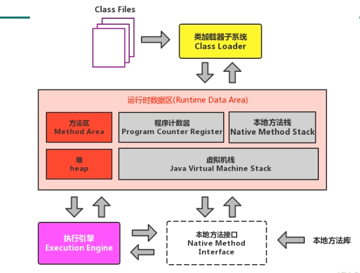


## 1.2.类加载过程

1. 由类加载子系统从磁盘文件系统或网络加载.class文件（class文件在内容开头有特定的文件标识）；
2. 类加载器只负责将class文件加载进内存，决定其是否能运行的是执行引擎；
3. 类会被加载进内存中方法区，这块空间会存储类的信息和运行时的常量池信息，字符串字面量和数字常量。


### 1.2.1.Loading

1. 通过类的全限定名获取定义此类的二进制字节流；

2. 将字节流对应的静态存储结构转化为方法区的运行时数据结构；

3. 在内存中生成一个代表该类的`java.lang.Class`对象，作为方法区中该类的数据访问入口。

### 1.2.2.Linking

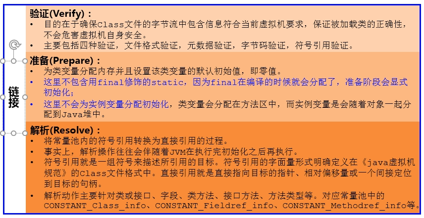

* 验证：通过工具打开.class字节码文件，16进制内容的前4位，就是文件标识

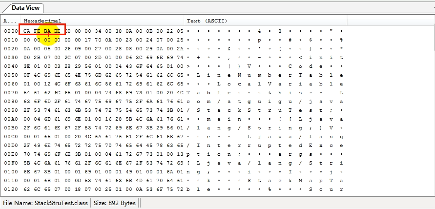

### 1.2.3.Initialization

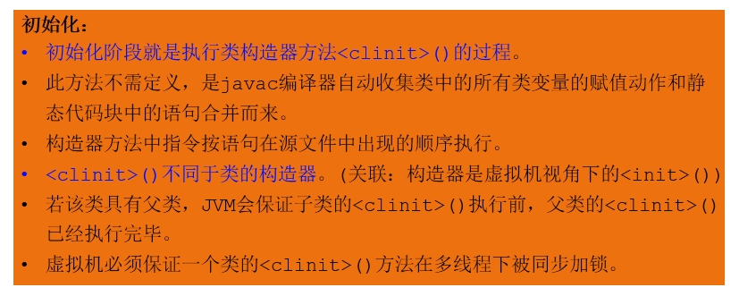

## 1.3.类加载器分类


1. JVM支持的两种类型：引导类加载器（Bootstrap ClassLoader），自定义类加载器（User-Defined ClassLoader）；

2. 所有派生于抽象类ClassLoader的类加载器都是自定义类加载器.。

   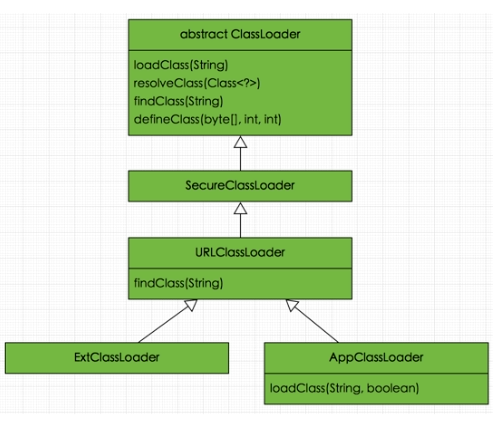

### 1.3.1.启动类加载器（引导类加载器，Bootstrap ClassLoader）

1. 由C/C++语言编写，嵌套在JVM内部；
2. 用来加载Java的核心库（JAVA_HOME/jre/lib/rt.jar，resources.jar，sun.boot.class.path），提供JVM自身需要的类；
3. 并不继承自java.lang.ClassLoader，没有父加载器；
4. 加载扩展类和应用程序类加载器，并指定为他们的父类加载器；
5. Bootstrap加载器只加载包名为java，javax，sun等开头的类。

### 1.3.2.扩展类加载器（Extension ClassLoader）

1. 由Java语言编写，sun.misc.Launcher$ExtClassLoader实现；
2. 派生于ClassLoader类；
3. 父类加载器是启动类加载器；
4. 从java.ext.dirs系统属性所指定的目录或JDK安装目录的jre/lib/ext子目录中加载类库（用户自定义的jar放在该目录下也会被加载）。

### 1.3.3.应用程序类加载器（系统类加载器，AppClassLoader）

1. 由Java语言编写，sun.misc.Launcher$AppClassLoader实现；
2. 派生于ClassLoader类；
3. 父类加载器是启动类加载器；
4. 负责加载环境变量classpath或系统属性java.class.path指定路径下的类库；
5. 是程序中的默认类加载器；
6. 通过ClassLoader#getSystemClassLoader()方法可以获取到该类加载器。

## 1.4.双亲委派机制

JVM对class文件的加载是按需加载的方式，也就是当需要使用该类时才会加载进内存生成对象。在加载某个类的class文件时，采用的说双亲委派机制，就是把请求交由父类处理。

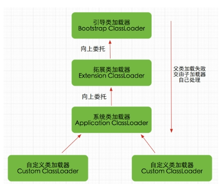

1. 如果一个类加载器收到了类加载请求，会先把这个请求委托给父类加载器去加载；
2. 若父类加载器还存在更上一层的父类，则进一步向上委托，依次递归，请求最终达到顶层的启动类加载器；
3. 如果父类加载器可以完成类加载任务，则直接加载完成，若无法加载，子类加载器才会尝试自己加载。

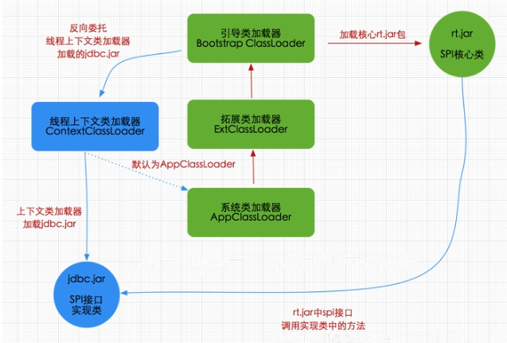

优势：

1. 避免类的重复加载；
2. 保护程序安全，防止核心API被篡改。

沙箱安全机制：

若是自定义java核心类，在加载的时候会优先使用引导类加载器加载，而引导类加载器会先加载jdk中的相应类，而不会去加载自定义的类，保证了java核心源代码的安全。


# 2.运行时数据区

## 2.1.内部结构

内存是硬盘和cpu的中间仓库和桥梁，承载着os和application的实时运行，jvm内存布局规定了java在运行过程中对内存的申请，分配和管理的策略。


JVM定义了多个程序运行期间会使用的运行时数据区，其中有一些会随着JVM启动而创建，随虚拟机退出而销毁，另一种则是与线程对应，随线程的开始和结束而创建和销毁。

下图灰色部分为线程私有，红色为多个线程共享：

1. 每个线程：包括程序计数器，栈，本地栈；
2. 线程间共享：堆，堆外内存（永久代或元空间，代码缓存）。

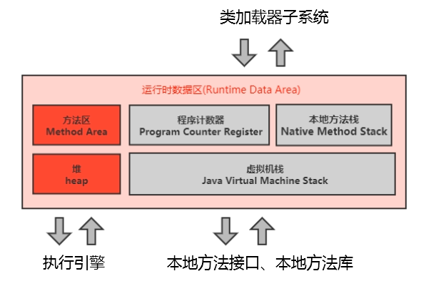

注：每个jvm只有一个Runtime实例（运行环境）。

## 2.2.JVM系统线程

* 虚拟机线程：该线程的操作需要jvm达到安全点才会出现。这些操作必须在不同的线程中发生的原因是他们都需要jvm达到安全点，这样堆才不会变化。这种线程的执行类型包括“stop-the-world”的垃圾收集，线程栈收集，线程挂起以及偏向锁撤销；
* 周期任务线程：该线程是时间周期事件的体现（如：中断），一般用于周期性操作的调度操作；
* GC线程：该线程对在jvm里不同种类的垃圾收集行为提供支持；
* 编译线程：该线程在运行时会将字节码编译成本地代码；
* 信号调度线程：该线程接收信号并发送给jvm，在内部通过适当方法进行处理。

## 2.3.程序计数器

### 2.3.1.PC寄存器

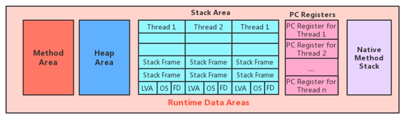

程序计数寄存器（Program Counter Register），寄存器的命名源于cpu的寄存器，其存储指令相关的现场信息，cpu只有把数据装载到寄存器中才能运行。

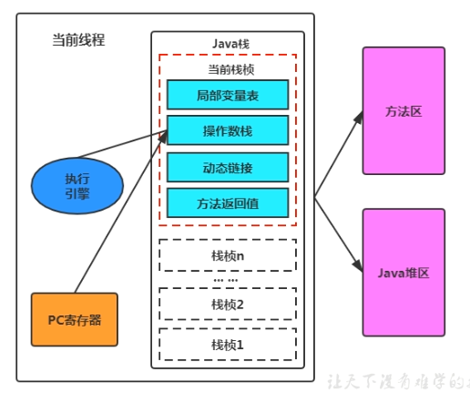

* pc寄存器用来存储指向下一条指令的地址，以及将要执行的指令代码，由执行引擎读取下一条指令；
* 是一块很小的内存空间，也是运行速度最快的存储区域；
* jvm规范中，每个线程都有自己私有的程序计数器，生命周期与线程一致；
* 任何时间一个线程都只有一个方法在执行，也就是所谓的当前方法。程序计数器会存储当前线程正在执行的java方法和jvm指令地址。如果执行的是native方法，则是undefined；
* 是程序控制流的指示器，分支，循环， 跳转，异常处理，线程恢复等基础功能都需要依赖这个计数器完成；
* 字节码解释器工作时就是通过改变计数器中的值来选取下一条需要执行的字节码指令；
* 是jvm规范中唯一没有规定oom异常的内存区域。

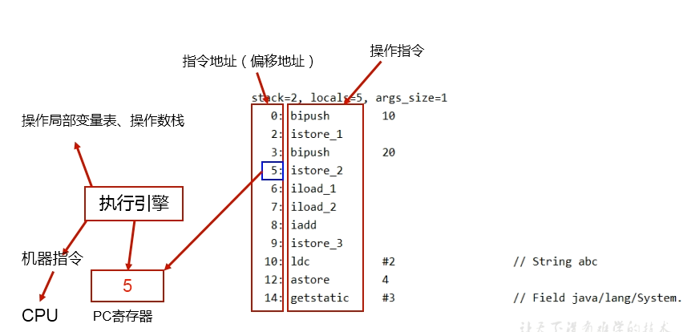

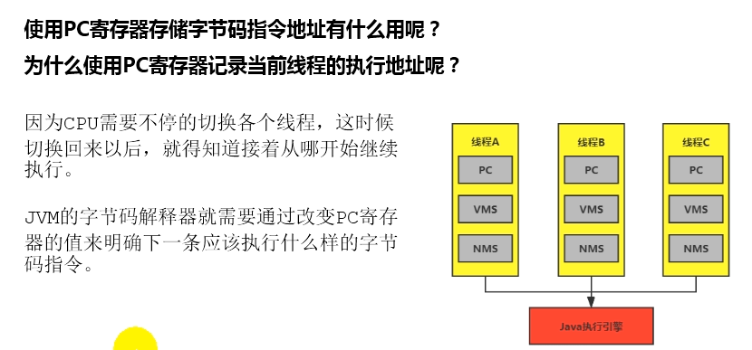

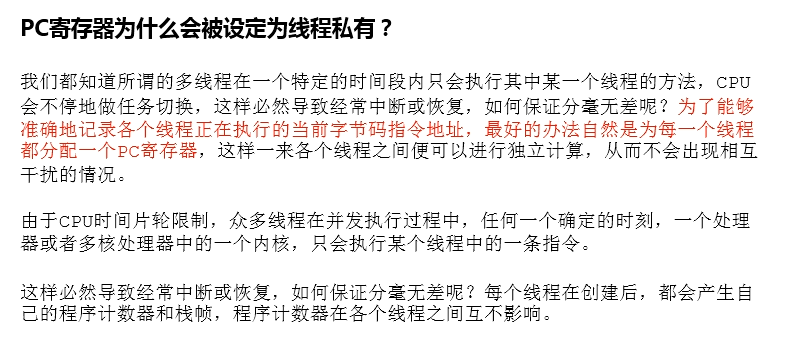

## 2.4.虚拟机栈

栈是运行时的单位（解决程序的运行问题，如何执行如何处理数据），堆是存储的单位（解决数据的存储问题，数据怎么放，放在哪里）


* java虚拟机栈（java virtual machine stack），每个线程在创建时都会创建一个虚拟机栈，其内部保存一个个的栈帧（stack frame），对应着一次次的方法调用；
* 生命周期与线程一致；
* 保存方法的局部变量，部分结果，并参与方法的调用和返回。

栈的特点：

* 栈是一种快速有效的分配存储方式，访问数据仅次于程序计数器；
* 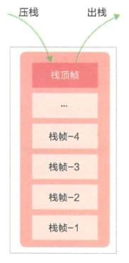

* jvm对栈的操作：方法执行时的压栈操作和执行结束后的弹栈操作；
* 栈不存在GC问题。

栈中可能出现的异常：

* jvm规范允许栈的大小是动态的或者是固定不变的；
* 固定大小：对于每一个线程的虚拟机栈容量可以在线程创建时独立选定，若线程请求分配的栈容量超过java虚拟机允许的最大容量，jvm会抛出StackOverflowError异常；
* 动态扩展：在尝试扩展时无法申请到足够的内存，或在创建新线程时没有足够的内存去创建对应的虚拟机栈，jvm会抛出OutOfMemoryError异常。

设置栈内存大小：

使用jvm的 -Xss 选项设置线程的最大栈空间， 栈的大小直接决定了方法调用的最大可达深度。

```
-Xss256K
```

### 2.4.1. 栈的存储单位

栈运行原理：

* jvm直接对栈的操作只有两个，就是对栈帧的压栈和弹栈，遵循先进后出/后进先出的原则；
* 一条活动的线程中，任意一个时间点上都只有一个活动的栈帧。即只有当前执行方法的栈帧（栈顶栈帧）是有效的，这个栈帧被称为当前栈帧（current frame），相对应的方法是当前方法（current method），定义该方法的类就是当前类（current class）；
* 执行引擎运行的所有字节码指令只针对当前栈帧进行操作；
* 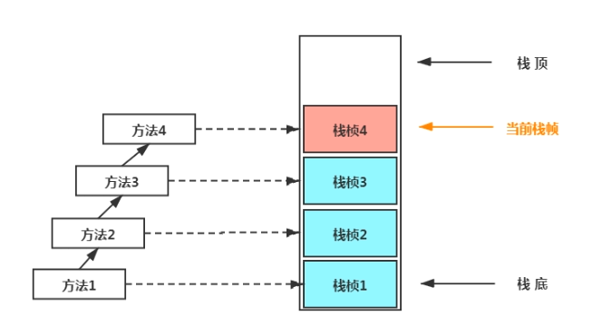
* 如果在一个方法中调用其他方法，对应的新栈帧会被创建并压入栈顶，成为当前帧并执行；

* 不同线程中所包含的栈帧是不允许存在相互引用的；
* 当前方法调用了其他方法，被调用者在返回时会传递自己的执行结果给前一个栈帧，然后被虚拟机出栈；
* java方法有两种返回方法的方式，一种是正常返回，使用return指令；另一种是抛出异常结束方法，两种方法都会使方法弹出栈顶；

### 2.4.2.栈帧的内部结构

每个栈帧种存储着：

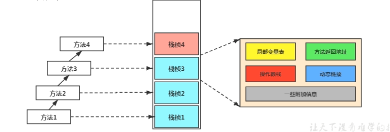

* 局部变量表（local variables）；
* 操作数栈/表达式栈（operand stack）；
* 动态链接/指向运行时常量池的方法引用（dynamic linking）；
* 方法返回地址/方法正常退出或异常退出的定义（return address）；
* 其他附加信息。

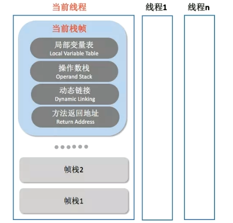

#### 2.4.2.1.局部变量表

* 也被称为局部变量数组或本地变量表；
* 是一个数字数组，主要用于存储方法参数和定义在方法体内的局部变量，数据类型包括：基本数据类型，对象引用（reference），以及return address类型；
* 由于该表是建立在线程栈上的私有数据，因此不存在数据安全问题；
* 容量大小是在编译期确定下来并保存在方法的Code属性的maximum local variable数据项中，在方法运行期间是不会改变局部变量表大小的。

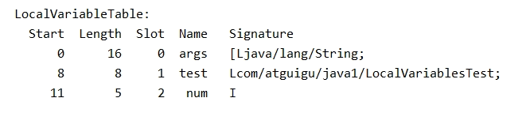

* 方法嵌套调用的次数由栈的大小决定，栈越大方法嵌套调用次数越多。对于一个方法而言，参数和局部变量越多，使得局部变量表膨胀，栈帧变大，以满足方法调用所需传递的信息增大的需求。进而方法就会占用更多的栈空间，导致其嵌套调用的次数就会减少；
* 局部变量表中的变量只在当前方法调用中有效。在方法执行时，虚拟机通过使用局部变量表完成参数值到参数变量列表的传递过程。当方法结束后，随着方法栈帧的销毁，局部变量表也会随之销毁。

#### 2.4.2.2.Slot变量槽

* 参数值的存放总是在局部变量数组的index0开始，到数组长度-1的索引结束；
* 局部变量表最基本的存储单元是Slot；
* 局部变量表中存放编译期可知的各种基本数据类型，引用类型（reference），returnAddress类型的变量；
* 在局部变量表中，32位以内的类型只占一个slot（包括returnAddress类型），64位的类型（long和double）占两个slot；
  * byte，short，char，boolean在存储前被转换为int，boolean转换后的0表示false，1表示true；
  * long和double则占据两个slot。
* jvm会为局部变量表中的每一个slot都分配一个访问索引，通过这个索引可以方法表中指定的变量值；
* 当一个实例方法被调用时，方法参数和方法内定义的局部变量将会按照顺序被复制到局部变量表中的每一个slot上；
* 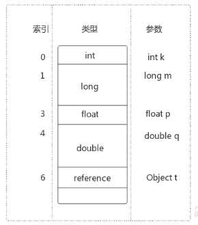
* 如果需要访问局部变量表中一个64bit的局部变量值时，只需要使用第一个索引即可（占2个slot）；
* 若当前帧是由构造方法或实例方法创建的，那么该对象的this引用将会存放在index为0的slot处，其余的参数按照参数表顺序依次排序。
* 栈帧中局部变量表的槽位是可以重用的，如果一个变量过了其作用域，那么在其作用域之后申明的新局部变量就很可能复用过期局部变量的槽位，达到节省资源的目的。

* 在栈帧中，局部变量表与性能调优关系最为密切，在方法执行时，虚拟机使用局部变量表完成方法的传递；
* 局部变量表中的变量也是重要的GC根节点，只要被局部变量表中直接或间接引用的对象都不会被回收。

#### 2.4.2.3.操作数栈

