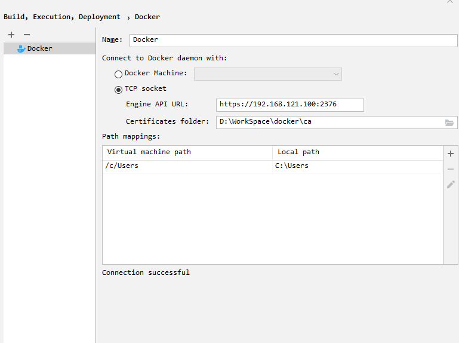
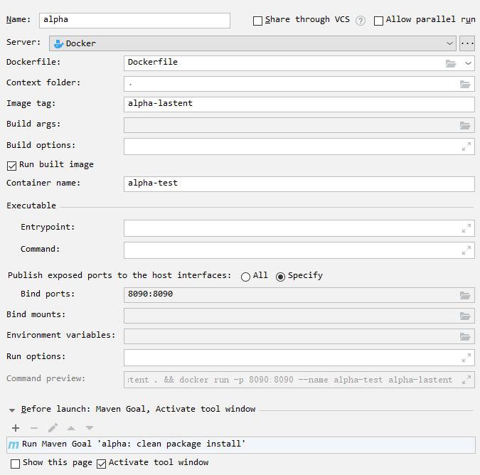

# 1.Centos7 安装 Docker

* 安装 gcc 依赖

  ```bash
  yum -y install gcc
  yum -y install gcc-c++
  ```

* 删除旧版本的 Docker

  ```bash
  yum remove docker \
      docker-client \
      docker-client-latest \
      docker-common \
      docker-latest \
      docker-latest-logrotate \
      docker-logrotate \
      docker-selinux \
      docker-engine-selinux \
      docker-engine
  ```

* 安装所需的软件包

  ```bash
  yum install -y yum-utils device-mapper-persistent-data lvm2
  ```

* 更新 yum 源

  ```bash
  yum-config-manager --add-repo http://mirrors.aliyun.com/docker-ce/linux/centos/docker-ce.repo
  yum makecache fast
  ```

* 安装 Docker-ce

  ```bash
  yum -y install docker-ce
  systemctl start docker
  ```

* 验证安装

  ```bash
  docker version
  docker info
  ```

* 添加阿里云镜像加速

  ```bash
  mkdir -p /etc/docker
  vim /etc/docker/daemon.json
  {
  	"registry-mirrors": ["https://vob2wv9t.mirror.aliyuncs.com"]
  }
  ```

* 启动，重启和查看docker进程

  ```bash
  systemctl daemon-reload
  systemctl restart docker
  ps -ef | grep docker*
  ```


# 2.安装常见应用示例

## 2.1 安装 MySQL

```bash
docker pull mysql:5.7
docker run --name mysql -p 3306:3306 -e MYSQL_ROOT_PASSWORD=123456 -d mysql:5.7
docker exec -it mysql env LANG=C.UTF-8 /bin/bash
    > mysql -h localhost -u root -p
    > Enter password: 123456
    mysql> select host,user,plugin,authentication_string from mysql.user;
    mysql> use mysql;
    mysql> alter user 'root'@'%' identified with mysql_native_password by '123456';
    mysql> flush privileges;    
    mysql> select host,user,plugin,authentication_string from mysql.user;
```

## 2.2 安装 Redis

```bash
docker pull redis
docker run --name redis -p 6379:6379 -v $PWD/data:/data -d redis redis-server --appendonly yes
docker exec -it redis redis-cli
```

## 2.3 安装 ElasticSearch，Kibana

* 安装elasticsearch

  ```bash
  docker pull elasticsearch:6.4.0
  docker run --name elasticsearch -p 9200:9200 -p 9300:9300 -e "discovery.type=single-node" -d elasticsearch:6.4.0
  curl http://192.168.121.100:9200
  ```

* 解决跨域问题

  ```bash
  docker exec -it elasticsearch /bin/bash
  	> cd /usr/share/elasticsearch/config
      > vi elasticsearch.yml
      	- http.cors.enabled: true
          - http.cors.allow-origin: "*"
      > exit
  docker restart elasticsearch
  ```

* 安装ik分词器

  ```bash
  docker exec -it elasticsearch /bin/bash
      > cd /usr/share/elasticsearch/plugins
      > elasticsearch-plugin install https://github.com/medcl/elasticsearch-analysis-ik/releases/download/v6.4.0/elasticsearch-analysis-ik-6.4.0.zip
  	> exit
  docker restart elasticsearch
  ```

* 安装kibana

  ```bash
  docker pull kibana
  docker run --name kibana5.6.11 --link=elasticsearch  -p 5601:5601 -d kibana
  curl http://192.168.121.100:5601
  ```

## 2.4 安装 RabbitMQ

```bash
docker pull rabbitmq:3.7.7-management
docker run --name rabbitmq -p 5672:5672 -p 15672:15672 \
	-v $PWD/data:/var/lib/rabbitmq --hostname myRabbit \ 
    -e "RABBITMQ_DEFAULT_VHOST=/leyou" \
    -e "RABBITMQ_DEFAULT_USER=leyou" \ 
    -e "RABBITMQ_DEFAULT_PASS=leyou" \
    -d rabbitmq:3.4.4-management

http://192.168.121.100:15672
    - username: guest 
    - password: guest
```

## 2.5 安装 kafka，zookeeper

```bash
docker pull wurstmeister/zookeeper
docker pull wurstmeister/kafka:2.11-0.11.0.3

docker run --name zookeeper -p 2181:2181 -t -d wurstmeister/zookeeper
docker run --name kafka --publish 9092:9092 --link zookeeper \
	--env KAFKA_ZOOKEEPER_CONNECT=zookeeper:2181 \
    --env KAFKA_ADVERTISED_HOST_NAME=192.168.121.100 \
    --env KAFKA_ADVERTISED_PORT=9092 \
    --volume /etc/localtime:/etc/localtime 
    -d wurstmeister/kafka:latest
    
docker exec -it kafka /bin/bash
	> cd /opt/kafka_2.11-0.11.0.3/bin/
    > ./kafka-topics.sh --create --zookeeper zookeeper:2181 --replication-factor 1 --partitions 8 --topic test
    > ./kafka-console-producer.sh --broker-list 192.168.121.100:9092 --topic test

docker exec -it kafka /bin/bash
	> cd /opt/kafka_2.11-0.11.0.3/bin/
    > ./kafka-console-consumer.sh --bootstrap-server 192.168.121.100:9092 --topic test --from-beginning
```

## 2.6 安装 alibaba nacos

```bash
docker pull nacos/nacos-server
docker run --env MODE=standalone --name nacos -d -p 8848:8848 nacos/nacos-server
```


# 3.配置CA认证的远程端口2376

## 3.1.编写脚本

```shell
#!/bin/bash

#相关配置信息
SERVER="192.168.121.100"
PASSWORD="zhy1234"
COUNTRY="cn"
STATE="zhejiang"
CITY="hangzhou"
ORGANIZATION="kykj"
ORGANIZATIONAL_UNIT="dev"
EMAIL="18895672556@163.com"

###开始生成文件###
echo "开始生成文件"

#切换到生产密钥的目录
cd /etc/docker
#生成ca私钥(使用aes256加密)
openssl genrsa -aes256 -passout pass:$PASSWORD -out ca-key.pem 4096
#生成ca证书，填写配置信息
openssl req -new -x509 -passin "pass:$PASSWORD" -days 365 -key ca-key.pem -sha256 -out ca.pem -subj "/C=$COUNTRY/ST=$STATE/L=$CITY/O=$ORGANIZATION/OU=$ORGANIZATIONAL_UNIT/CN=$SERVER/emailAddress=$EMAIL"

#生成server证书私钥文件
openssl genrsa -out server-key.pem 4096
#生成server证书请求文件
openssl req -subj "/CN=$SERVER" -sha256 -new -key server-key.pem -out server.csr

#配置白名单
echo subjectAltName = IP:$SERVER,IP:0.0.0.0 >> extfile.cnf
#将Docker守护程序密钥的扩展使用属性设置为仅用于服务器身份验证
echo extendedKeyUsage = serverAuth >> extfile.cnf

#使用CA证书及CA密钥以及上面的server证书请求文件进行签发，生成server自签证书
openssl x509 -req -days 365 -in server.csr -CA ca.pem -CAkey ca-key.pem -passin "pass:$PASSWORD" -CAcreateserial -out server-cert.pem -extfile extfile.cnf

#生成client证书RSA私钥文件
openssl genrsa -out key.pem 4096
#生成client证书请求文件
openssl req -subj '/CN=client' -new -key key.pem -out client.csr

#要使密钥适合客户端身份验证，请创建扩展配置文件
echo extendedKeyUsage = clientAuth >> extfile.cnf
#sh -c 'echo "extendedKeyUsage=clientAuth" > extfile.cnf'

#生成client自签证书（根据上面的client私钥文件、client证书请求文件生成）
openssl x509 -req -days 365 -sha256 -in client.csr -CA ca.pem -CAkey ca-key.pem -passin "pass:$PASSWORD" -CAcreateserial -out cert.pem -extfile extfile.cnf

#修改权限，要保护您的密钥免受意外损坏，请删除其写入权限。要使它们只能被您读取，更改文件模式
chmod -v 0400 ca-key.pem key.pem server-key.pem
#证书可以是对外可读的，删除写入权限以防止意外损坏
chmod -v 0444 ca.pem server-cert.pem cert.pem

#删除不需要的文件，两个证书签名请求
rm -v client.csr server.csr

echo "生成文件完成"
###生成结束###
```

## 3.2.修改配置

```bash
# 修改docker配置
vim /lib/systemd/system/docker.service
ExecStart=/usr/bin/dockerd \
        --tlsverify \
        --tlscacert=/etc/docker/ca.pem \
        --tlscert=/etc/docker/server-cert.pem \
        --tlskey=/etc/docker/server-key.pem \
        -H tcp://0.0.0.0:2376 \
        -H unix:///var/run/docker.sock \
        -H fd:// --containerd=/run/containerd/containerd.sock

# 开放防火墙的2376的端口
firewall-cmd --zone=public --add-port=2376/tcp --permanent
firewall-cmd --reload

# 重载服务并重启docker
systemctl daemon-reload
systemctl restart docker
service docker restart

# 查看是否存在2376端口
yum install net-tools
netstat -tunlp

# 保存证书客户端文件到本地,这里用的是sz命令，ftp也可以只要能放到本地客户端即可
cd /etc/docker
sz ca.pem cert.pem key.pem

# 测试一下证书是否配置成功，如果成功，会输出证书相关信息，如果有fail，请检查证书
docker --tlsverify --tlscacert=ca.pem --tlscert=cert.pem --tlskey=key.pem -H=192.168.121.100:2376 version
```





## 3.3.配置docker maven插件

```xml
<build>
    <finalName>docker-alpha</finalName>
    <plugins>
        <!--      docker maven插件      -->
            <plugin>
                <groupId>com.spotify</groupId>
                <artifactId>dockerfile-maven-plugin</artifactId>
                <version>1.3.6</version>
                <configuration>
                    <repository>${docker.image.prefix}/${project.artifactId}</repository>
                    <buildArgs>
                        <JAR_FILE>target/${project.build.finalName}.jar</JAR_FILE>
                    </buildArgs>
                </configuration>
            </plugin>
    </plugins>
    </build>
```

## 3.4.编写dockerfile

```dockerfile
# 指定基础镜像，在其上进行定制
FROM java:8
# 这里的 /tmp 目录就会在运行时自动挂载为匿名卷，任何向 /tmp 中写入的信息都不会记录进容器存储层
VOLUME /tmp
# 复制上下文目录下的 target/docker-alpha.jar 到容器里，这里写自己的工程名称
COPY target/docker-alpha.jar alpha.jar
# 指定容器启动程序及参数
ENTRYPOINT ["java", "-jar", "/alpha.jar"]
```


# 4.镜像管理

## 4.1 search 搜索

* 搜索镜像仓库（Docker Hub，各种公/私有的Registry）中的镜像；

* 格式：`docker search <镜像名>`

* 返回格式：

  |    表头     |     解释     |
  | :---------: | :----------: |
  |    NAME     |     名称     |
  | DESCRIPTION | 基本功能描述 |
  |    STARS    |   下载次数   |
  |  OFFICIAL   |  是否为官方  |
  |  AUTOMATED  | 是否自动运行 |

## 4.2 pull 拉取

* 下载远程镜像仓库（Docker Hub，各种公/私有的Registry）中的镜像；
* 格式：`docker pull <镜像名>:<版本标签>`

## 4.3 images 查看

* 查看下载到本地的镜像列表；

* 格式：

  * `docker images`
  * `docker images ls <镜像名>:<版本标签>`

* 返回格式：

  |    表头    |   解释   |
  | :--------: | :------: |
  | REPOSITORY |   名称   |
  |    TAG     |   版本   |
  |  IMAGE ID  |    ID    |
  |  CREATED   | 创建时间 |
  |    SIZE    |   大小   |

## 4.4 tag 重命名

* 对本地镜像的NAME和TAG进行重新命名，并产生一个新命名后的镜像（起别名）；
* 格式：`docker tag <旧名称>:<旧版本> <新名称>:<新版本>`

## 4.5 rmi 删除

* 将本地的一个或多个镜像删除；

* 格式：

  * `docker rmi [参数] <镜像id|名称:版本>...`
  * `docker image rm|rmi [参数] <镜像id|名称:版本>...` `

* 参数：

  | 参数 |        解释         |
  | :--: | :-----------------: |
  |  -f  | --force	强制删除 |

## 4.6 save 打包

* 将本地的一个或多个镜像打包到本地保存为tar文件；
* 格式：
  * `docker save -o <导出路径>`
  * `-o | --output：指定导出镜像的路径`

## 4.7 load 导入

* 将save命令打包的镜像导入本地镜像库中；
* 格式：
  * `docker load -i <导入路径>`
  * `docker load < <导入路径>`
  * `-i | --input | <：指定要导入镜像的路径`

## 4.8 history 历史信息

* 查看一个本地镜像的历史信息；

* 格式：`docker history <名称:版本>`

* 返回格式：

  |    表头    |        解释        |
  | :--------: | :----------------: |
  |   IMAGE    |        编号        |
  |  CREATED   |     创建的时间     |
  | CREATED BY | 基于哪些命令创建的 |
  |    SIZE    |        大小        |
  |  COMMENT   |        评论        |

## 4.9 inspect 详细信息

* 查看一个或多个本地镜像的详细信息；
* 格式：`docker [image] inspect [参数] <名称:版本>`

## 4.10 import 模板导入

* 登录系统模板镜像网站：https://download.openvz.org/template/precreated/
* 找到一个镜像模板进行下载，如ubuntu-16.04-x86_64.tar.gz，地址为：https://download.openvz.org/template/precreated/ubuntu-16.04-x86_64.tar.gz
* 格式：`cat <模板文件名.tar> | docker import - [自定义镜像名]`


# 5.容器管理

## 5.1 create 创建

* 创建出一个 created 状态的待启动容器；

* 格式： `docker create [参数] <依赖的镜像> [命令] [命令参数...]`

* 参数：

  |        参数         |                  解释                   |
  | :-----------------: | :-------------------------------------: |
  |     -t \| --tty     |    分配一个伪TTY，也就是分配虚拟终端    |
  | -i \| --interactive | 即使没有连接，也要保持stdin标准输入打开 |
  |       --name        |     为容器起名，如果没有会随机产生      |

## 5.2 start 启动

* 将一个或多个处于创建状态或关闭状态的容器启动起来；

* 启动容器的三种方式：

  * 启动待启动或已关闭的容器；
  * 基于镜像新建一个容器并启动；
  * 守护进程的方式启动Docker。

* 格式： `docker start [参数] <容器名称或ID>`

* 参数：

  |        参数         |                    解释                    |
  | :-----------------: | :----------------------------------------: |
  |   -a \| --attach    | 将当期 shell 的 STDOUT/STDERR 连接到容器上 |
  | -i \| --interactive |     将当前 shell 的 STDIN 连接到容器上     |

## 5.3 run 创建并启动

* 基于指定镜像创建并启动一个容器；

* 格式：`docker run [参数] <镜像> [命令] [命令参数...]`

* 参数：

  |       **参数**        |                   **解释**                   |
  | :-------------------: | :------------------------------------------: |
  |     -t   \| --tty     |      分配一个伪TTY，也就是分配虚拟终端       |
  | -i   \| --interactive | 即时没有连接，也要保持STDIN（标准输入）打开  |
  |        --name         |        为容器起名，如果没有会随机产生        |
  |   -d   \| --detach    | 在后台以守护进程的方式运行容器并打印出容器ID |
  |         --rm          |         当前容器运行后会自动删除容器         |

* 演示：`docker run --rm --name myNginx nginx /bin/echo "Hello World"`

## 5.4 ps 查看

* 显示本地的docker容器列表；

* 格式：``docker ps [参数]``

* 参数：

  | **参数** |       **解释**       |
  | :------: | :------------------: |
  |    -a    | 显示所有运行过的容器 |
  |    -s    |  显示正在运行的容器  |

* 返回结构：

  |    **字段**    |     **解释**     |
  | :------------: | :--------------: |
  | CONTAINER   ID |      容器ID      |
  |     IMAGE      |    基于的镜像    |
  |    COMMAND     | 运行时使用的命令 |
  |    CREATED     |     创建时间     |
  |     STATUS     |     是否启动     |
  |     PORTS      |      端口号      |
  |     NAMES      |      容器名      |

## 5.5 pause 暂停

* 暂停一个或多个处于运行状态的容器；
* 格式：``docker pause <容器>``

## 5.6 unpause 恢复

* 取消一个或多个处于暂停状态的容器，恢复运行；
* 格式：``docker unpause <容器>``

## 5.7 restart 重启

* 重启一个或多个处于运行，暂停，关闭或新建状态的容器；

* 格式：``docker restart [参数] <容器>`

* 参数：

  |     **参数**      |          **解释**          |
  | :---------------: | :------------------------: |
  | -t \| --time 时间 | 等待一定的时间重启，单位秒 |

## 5.8 stop 延迟关闭

* 延迟关闭一个或多个处于暂停或运行状态的容器；
* 格式：``docker stop <容器>``

## 5.9 kill 强制关闭

* 强制关闭一个或多个处于暂停或运行状态的容器；
* 格式：``docker kill <容器>``

## 5.10 rm 删除

* 删除一个或多个容器；

* 格式：``docker rm [参数] <容器>``

* 参数：

  | **参数** | **解释** |
  | :------: | :------: |
  |    -f    | 强制删除 |

## 5.11 exec 创建并进入

* 创建并进入容器；

* 格式：

  * `docker run --name <容器> -it <镜像> /bin/bash`
  * `docker exec -it <容器> /bin/bash`
    * -i：标准输入的方式打开
    * -t：分配一个伪终端，并绑定到标准输入的终端
    * /bin/bash：容器启动后执行bash命令

* 脚本方式进入容器：

  ```shell
  # !/bin/bash
  
  docker_in() {
  	NAME_ID = $1
  	PID = $(docker inspect --format {{.State.Pid}} $NAME_ID)
  	nsenter --target $PID --mount --uts --ipc --net --pid
  }
  
  docker_in $1
  ```

  ```bash
  chmod +x docker_in.sh
  ```

## 5.12 commit/export 创建镜像

* 基于容器创建镜像；

* 格式：

  * `docker commit -m <改动信息> -a <作者信息> <容器> <镜像:标签>`

  * `docker export <容器> > <模板>`

* import与load的区别：import可以重新指定镜像的名字，docker load不可以。

* export与save的区别：

  * export导出的镜像文件大小小于save保存的镜像；
  * export 导出（import导入）是根据容器拿到的镜像，再导入时会丢失镜像所有的历史。

## 5.13 logs 查看日志

* 查看容器运行的日志；
* 格式：`docker logs <容器>`

## 5.14 inspect 详细信息

* 查看容器的详细信息；
* 格式：`docker inspect <容器>`

## 5.15 port 查看端口

* 查看容器的端口信息；
* 格式：`docker port <容器>`

## 5.16 rename 修改名称

* 修改容器名称；
* `docker rename <old> <new>`


# 6.数据管理


# 7.网络管理


# 8.Dockerfile

## 8.1 命令格式

- `docker build -t <镜像:标签> ./`

## 8.2 FROM

* from指令必须为dockerfile文件开篇的一个非注释行，用于为镜像文件构建过程指定基准镜像，后续的指令运行于此基准镜像所提供的运行环境；
* 实践中，基准镜像可以是任何可用镜像文件，默认情况下，docker build会在docker主机上查找指定的镜像文件，在其不存在时，则会从docker hub registry拉取所需的镜像文件；

## 8.3 MAINTANIER

## 8.4 LABEL

## 8.5 COPY

## 8.6 ADD

## 8.7 WORKDIR

## 8.8 VOLUME

## 8.9 EXPOSE

## 8.10 ENV

## 8.11 RUN

## 8.12 CMD

## 8.13 ENTRYPOINT

## 8.14 USER

## 8.15 ONBUILD


# 9.Docker-compose

## 9.1 配置compose

## 9.2 命令

## 9.3 配置文件

## 9.4 案例


# 10.搭建Docker私有仓库

