# Java多线程高并发

## 基本概念

### 从OS的角度来看

* **程序的概念**：是含有指令和数据的文件，一般被存储在磁盘或其他数据存储设备中，即程序是静态的代码和数据；

* **进程的概念**：是资源分配的基本单位，也是内存中指令和数据的集合。是程序的一次执行过程，是系统运行程序的基本单位，可以理解为获得了系统的资源从而由静态变为动态的程序。在运行时进程会占用如CPU时间、内存空间、文件和IO设备等资源，并且一条一条的执行指令，直至进程消亡也代表程序的执行结束；

* **线程的概念**：是系统调度的基本单位，也是一个进程内共享资源的多条执行路径。与进程类似，但却是粒度更小的独立执行单位，一个进程在执行过程中可以产生多个线程，同源的多个线程共享进程的内存空间和其他资源，因此线程间切换的开销要远小于进程，所以也被称为轻量级线程。


### 从JVM的角度来看

JVM进程运行时所管理的内存区域如下图，一个进程中可以存在多个线程，多个线程共享堆空间和元空间，每个线程有自己的虚拟机栈、本地方法栈和程序计数器。线程是进程划分出来的执行单元，最大的不同在于各个进程间是独立的，而线程则不一定，这是因为同一进程中各线程可能会相互影响。


### 并发和并行的区别

* **并发**：同一时间段内，多个任务都在执行，但单位时间内不一定同时执行。
* **并行**：单位时间内，多个任务同时执行。


### 为什么使用多线程？

* **从总体来看**：线程是程序执行的最小单位，切换和调度的成本远远小于进程，并且多核CPU时代意味着多线程可以并行执行，减少了并发执行时上下文切换的开销。再者，随着互联网飞速发展，存在百万千万级别的并发量要求，多线程做为撑起高并发系统的基石，更应该需要被使用。
* **从底层探讨**：
  * 单核时代：主要是为了提高CPU和IO设备的综合利用率。当只有一个线程时，会出现CPU计算时IO设备空闲、IO操作时CPU空闲的情况，但多个线程会让两个操作在一段时间内都执行；
  * 多核时代：主要是为了提高CPU利用率。每一个线程被分配到一个核心去执行，多核CPU就能够并行的执行多个线程。

* **使用多线程带来的问题**：内存泄漏、上下文切换的性能损耗、死锁和受限于硬件和软件的资源闲置问题。


### HotSpot后台运行的系统线程分类

|          类型           |                             功能                             |
| :---------------------: | :----------------------------------------------------------: |
| 虚拟机线程（VM thread） | 等待JVM到达安全点的操作出现。这些操作必须要在独立的线程里执行，因为当堆修改无法进行时，线程都需要JVM位于安全点。这些操作的类型有： STW垃圾回收、线程栈dump、线程暂停、线程偏向锁解除 |
|     周期性任务线程      |    负责定时器事件（也就是中断），用来调度周期性操作的执行    |
|         GC线程          |                 支持JVM中不同的垃圾回收活动                  |
|       编译器线程        |        在运行时将字节码动态编译成本地平台相关的机器码        |
|      信号分发线程       |        接收发送到 JVM 的信号并调用适当的 JVM 方法处理        |


## 多线程机制

### 创建线程

#### 实现Runnable接口

```java
public class MyRunnable implements Runnable {

    @Override
    public void run() {
        // ...        
    }
}

public static void main(String[] args) {
    new Thread(new MyRunnable()).start();
}
```


#### 实现Callable接口

```java
public class MyCallable implements Callable<Integer> {

    public Integer call() {
        // ...
    }
}

public static void main(String[] args) throws ExecutionException, InterruptedException {
    MyCallable mc = new MyCallable();
    FutureTask<Integer> ft = new FutureTask<>(mc);
    new Thread(ft).start();
    System.out.println(ft.get());
}
```


#### 继承Thread类

```java
public class MyThread extends Thread {

    public void run() {
        // ...
    }
}

public static void main(String[] args) {
    new MyThread().start();
}
```


### 基础机制

#### Exector

线程池可以管理多个互不干扰，不需要同步操作的异步任务的执行。

```java
public static void main(String[] args) {
    ExecutorService executorService = Executors.newCachedThreadPool();
    for (int i = 0; i < 5; i++) {
        executorService.execute(() -> {
            // ......
        });
    }
    executorService.shutDown();
}
```


#### Daemon

守护线程是程序运行时在后台提供服务的线程。当所有守护线程结束时，程序也就终止，同时会杀死所有守护线程。

```JAVA
public static void main(String[] args) {
    Thread thread = new Thread(() -> {
        // ......
    });
    // 将线程设置为守护线程
    thread.setDaemon(true);
}
```


#### sleep()

会休眠执行它的线程一段时间。可能会抛出InterruptedException，由于异常不能跨线程传回main中，所以子线程处理异常只能在本地捕获处理而不能抛出。

```JAVA
public static void main(String[] args) {
    new Thread(() -> {
        try {
            Thread.sleep(3000);
        } catch (InterruptedException e) {
            e.printStackTrace();
        }
    }).start();
}
```


#### yield()

将调用它的线程的CPU执行权让出，给其他线程执行的机会。该方法只是对调度器的一个建议，而且也只会建议具有相同优先级的线程可以运行，下一个具体被调度的线程是由调度器决定的。

```JAVA
public static void main(String[] args) {
    new Thread(() -> {
        Thread.yield();
    }).start();
}
```


### 中断机制

#### interrupt()

通过调用指定线程对象提供的 `interrupt()` 方法来中断该线程，如果该线程处于阻塞、有限期或无限期等待状态，就会抛出InterruptedException，从而提前结束线程。但是不能中断I/O阻塞或synchronized锁的阻塞。


#### isInterrupted()

如果一个线程执行了一个无限循环，且没有执行sleep等待则会抛出InterruptedException的操作，那么可以通过调用 `Thread.currentThread().isInterrupted()` 方法设置一个线程的中断标记。若该线程在外部被调用了 `interrupet()` 方法，则 `isInterrupted()` 标记会返回true，因此可以在无限循环中判断中断标记来决定是否中断线程。

```JAVA
public static void main(String[] args) throws InterruptedException {
    Thread thread = new Thread(() -> {
        while (!Thread.currentThread().isInterrupted()) {
            System.out.println("执行逻辑");
        }
        System.out.println("线程中断");
    });
    thread.start();

    try {
        Thread.sleep(3000);
    } catch (InterruptedException e) {
        e.printStackTrace();
    }
    thread.interrupt();
}
```


#### Executor的中断操作

* 调用Executor的 `shutdown()` 方法会等待池中的线程都执行完毕后再关闭。若调用 `shutdownNow() ` 方法，则相当于调用了池中每个线程的 `interrupt()` 方法。

```JAVA
public static void main(String[] args) {
    ExecutorService executorService = Executors.newCachedThreadPool();
    executorService.execute(() -> {
        try {
            Thread.sleep(2000);
        } catch (InterruptedException e) {
            e.printStackTrace();
        }
    });
    executorService.shutdownNow();
}
```

* 如果只想中断Executor中的一个线程，可以通过 `submit()` 提交任务，会返回一个Future对象，通过Future提供的 `cancel()` 方法就可以中断该线程。

```JAVA
public static void main(String[] args) {
    ExecutorService executorService = Executors.newCachedThreadPool();
    Future<?> future = executorService.submit(() -> {
        // ......
    });
    future.cancel(true);
}
```


### 同步机制

#### 线程间同步的方式

* **互斥量（Mutex）**：采用互斥对象机制，只有拥有互斥对象的线程才有访问公共资源的权限。因为互斥对象只有一个，所以可以保证公共资源不会被多个线程同时访问；
* **信号量（Semphares）**：允许同一时刻多个线程访问同一资源，但是需要控制同一时刻访问此资源的最大线程数量；
* **事件（Event）**：即 `wait/notify` 操作，通过通知的方式来保持多线程同步，还可以方便的实现多线程的优先级。


#### synchronized同步锁

```JAVA
public class SynchronizedExample {

    private Object object = new Object();

    public void func1() {
        // 同步代码块-对象锁
        synchronized (object) {
            for (int i = 0; i < 10; i++) {
                System.out.println(i + " ");
            }
        }
    }

    public static void main(String[] args) {
        SynchronizedExample example = new SynchronizedExample();
        ExecutorService executorService = Executors.newCachedThreadPool();
        executorService.execute(() -> e1.func1());
        executorService.execute(() -> e1.func1());
    }
}
```

```JAVA
// 同步方法-this锁
public synchronized void func() {
    // ......
}
```

```JAVA
public class SynchronizedExample {

    public void func1() {
        // 同步代码块-类锁
        synchronized (SynchronizedExample.class) {
            for (int i = 0; i < 10; i++) {
                System.out.println(i + " ");
            }
        }
    }

    public static void main(String[] args) {
        SynchronizedExample example1 = new SynchronizedExample();
        SynchronizedExample example2 = new SynchronizedExample();
        ExecutorService executorService = Executors.newCachedThreadPool();
        executorService.execute(() -> e1.fun1());
        executorService.execute(() -> e2.fun1());
    }
}
```

```JAVA
// 同步静态方法-类锁
public synchronized static void func() {
    // ......
}
```


#### ReentrantLock可重入锁

```JAVA
public class ReentrantLockExample {

    private Lock lock = new ReentrantLock();

    public void func() {
        lock.lock();
        try {
            for (int i = 0; i < 10; i++) {
                System.out.println(i + " ");
            }
        } finally {
            lock.unlock();
        }
    }

    public static void main(String[] args) {
        LockExample lockExample = new LockExample();
        ExecutorService executorService = Executors.newCachedThreadPool();
        executorService.execute(() -> lockExample.func());
        executorService.execute(() -> lockExample.func());
    }
}
```


### 协作机制

#### join() 线程连接机制

在一个线程中调用另一个线程的 `join()` 方法，会让当前线程阻塞，直到被调用join的目标线程结束后才会继续执行，从而保证多线程解决问题的先后顺序。

```JAVA
public class JoinExample {

    private class A extends Thread {

        @Override
        public void run() {
            System.out.println("A");
        }
    }

    private class B extends Thread {

        private A a;

        B(A a) {
            this.a = a;
        }

        @Override
        public void run() {
            try {
                a.join();
            } catch (InterruptedException e) {
                e.printStackTrace();
            }
            System.out.println("B");
        }
    }

    public void test() {
        A a = new A();
        B b = new B(a);
        b.start();
        a.start();
    }
}

public static void main(String[] args) {
    JoinExample example = new JoinExample();
    example.test();
}
```


#### wait()&notify()/notifyAll()等待唤醒机制

使用 `wait()` 会使线程等待某个条件满足，线程在等待时会进入阻塞状态，当其他线程调用的 `notify()` 或 `notifyAll()` 使得这个条件满足时，会唤醒阻塞的线程。

```JAVA
public class WaitNotifyExample {

    public synchronized void before() {
        System.out.println("before");
        // notify会随机唤醒this锁对应的WaitSet中的一个线程，底层的操作是由操作系统完成
        // notifyAll会唤醒this锁对应的WaitSet中的所有线程
        notifyAll();
    }

    public synchronized void after() {
        try {
            // wait调用前线程必须持有锁
            // 调用后线程会释放this锁，然后进入this锁对应的WaitSet中阻塞
            // 直到被其他线程调用同一个锁对象的notify/notifyAll唤醒后，才会进入就绪状态竞争锁
            wait();
        } catch (InterruptedException e) {
            e.printStackTrace();
        }
        System.out.println("after");
    }

    public static void main(String[] args) {
        WaitNotifyExample example = new WaitNotifyExample();
        ExcutorService executorService = Executors.newCachedThreadPool();
        executorService.execute(() -> example.after());
        executorService.execute(() -> example.before());
    }
}
```


#### sleep()和wait()的区别

* 最主要的区别是 `sleep()` 方法不会释放锁，而 `wait()` 方法会释放锁；
* `wait()` 通常被用于线程间交互/通信，`sleep()` 通常被用于暂停线程的执行；
* `wait()` 被调用后，线程不会自动苏醒，而是需要别的线程调用同一个锁对象上的 `notify()` 或者 `notifyAll()` 方法进行唤醒。或者可以使用 `wait(long timeout)` 超时后自动苏醒。而 `sleep()` 只有超时苏醒这一种模式。


#### await()&signal()/signalAll()等待唤醒机制

JUC提供的Condition类来实现线程间的协作，可以在Condition上调用 `await()` 方法使线程等待，其他线程调用 `signal()` 或 `signalAll()` 方法唤醒等待的线程。相对于wait/notify来说，`await()` 可以指定在哪个条件上等待，`signal()` 可以唤醒在指定条件上阻塞的线程。

```JAVA
public class AwaitSignalExample {

    private Lock lock = new ReentrantLock();
    // 条件对象
    private Condition condition = lock.newCondition();

    public void before() {
        lock.lock();
        try {
            System.out.println("before");
            // 唤醒在此条件对象上阻塞的所有线程
            condition.signalAll();
        } finally {
            lock.unlock();
        }
    }

    public void after() {
        lock.lock();
        try {
            // 在指定的条件对象上阻塞
            condition.await();
            System.out.prinln("after");
        } catch (InterruptedException e) {
            e.printStackTrace();
        } finally {
            lock.unlock();
        }
    }

    public static void main(String[] args) {
        AwaitSignalExample example = new AwaitSignalExample();
        ExecutorService executorService = Executors.newCachedThreadPool();
        executorService.execute(() -> example.after());
        executorService.execute(() -> example.before());
    }
}
```


## 状态及切换

### 线程状态

* **初始（New）**：新创建的线程对象，还没有调用 `start()` 方法时的状态；
* **运行（Runnable）**：
  * **就绪（Ready）**：线程对象创建后，其他线程如main线程调用了该对象的 `start()` 方法，线程就会位于就绪状态的队列中，等待被调度器选中，获得CPU的使用权；
  * **运行中（Running）**：就绪状态的线程在获得CPU的时间片后变为运行中状态。
* **阻塞（Blocked）**：表示线程阻塞于锁；
* **等待（Waiting）**：进入该状态的线程需要无限期的等待其他线程做出一些特定动作（如唤醒或中断）；
* **超时等待（Timed_Waiting）**：与Waiting相似，但可以经过指定的时间返回；
* **终止（Terminated）**：表示该线程已经执行完毕。


### 状态切换

* **初始 —> 运行**：线程对象被创建后处于New状态，调用 `start()` 后进入Runnable状态（准确的说是进入Ready状态）；
* **就绪 <—> 运行中**：Ready状态的线程若是被调度器选中获得了CPU时间片（timeslice）就会进入Running状态。Running状态的线程若是时间片耗尽或是调用 `yield()` 方法后会重新进入Ready状态；
* **运行 <—> 等待**：当线程调用 `Object.wait()/Thread.join()/LockSupport.park()` 方法后，会处于Waiting状态，处于等待状态的线程需要依靠其他线程的通知或指定线程执行完毕后才能取消等待返回到Ready状态，如通过 `Object.notify()/Object.notifyAll()/LockSupport.unpark(Thread)` 方法唤醒等待的线程；
* **运行 <—> 超时等待**：Timed_Waiting状态相当于在Waiting状态的基础上增加了超时限制，如通过  `Thread.sleep(long)/Object.wait(long)/Thread.join(long)/LockSupport.parkNanos()/LockSupport.parkUntil()` 方法可以将线程置于超时等待状态，当超时时间到达后或被其他线程唤醒会返回到Ready状态；
* **运行 <—> 阻塞：**当线程执行同步代码，且没有获取到锁时，会处于Blocked状态，直到其获取到锁，才会回到Ready状态；
* **运行 —> 终止**：线程执行完毕后会进入Terminated状态。


### EntryList和WaitSet

JVM底层维护了两种队列用于管理处于等待和阻塞状态的线程。

* **_WaitSet**：处于wait状态的线程，会被加入到WaitSet；
* **_EntryList**：处于等待锁的block状态的线程，会被加入到EntryList。


下图是线程通过wait/notify/synchronized操作后的状态变换图：

* synchronized同步锁在底层由对象监视器Monitor实现，Monitor维护了两个队列EntryList和WaitSet；
* 当线程处于同步代码中，且调用了wait方法，会释放锁并进入同步锁（监视器）对应的WaitSet中等待（处于Waiting状态）；
* 当其他线程调用了同一把锁对象的notify/notifyAll方法后，会唤醒WaitSet中等待的线程，让其进入EntryList中；
* 当线程获取锁失败时，会进入EntryList中阻塞，直到锁被释放后才会被唤醒，然后竞争锁。

注：处于EntryList和WaitSet中的线程都处于OS级别的阻塞状态，不会参与调度。

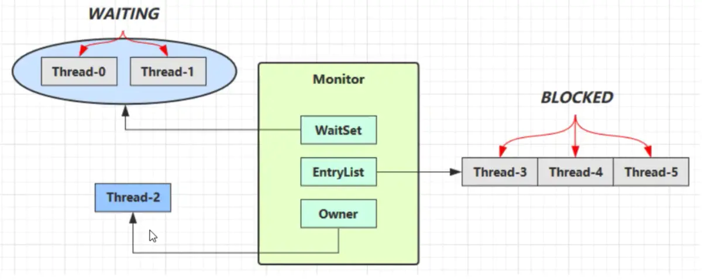


### 影响线程状态的方法

* **`Thread.sleep(long millis)`**：当前线程调用此方法会进入Timed_Waiting状态，但不会释放对象锁，millis时间后线程会自动苏醒进入Ready状态。这是一种给其他线程执行机会的最佳方式；
* **`Thread.yield()`**：当前线程调用此方法会让出CPU执行权，由Running状态切换为Ready状态，让调度器重新调度，不会释放对象锁。可以让相同优先级的线程轮流执行，但并不保证一定会让其他线程执行，因为让步的线程有可能再次被调度器选中；
* **`Thread.join()/Thread.join(long millis)`**：当前线程调用其他线程的join方法会让当前线程进入Waiting/Timed_Waiting状态，不会释放对象锁，当被调用join方法的线程执行完毕或millis时间到，当前线程会进入Ready状态；
* **`Object.wait()/Object.wait(long timeout)`**：当前线程调用此方法后，会释放对象锁，进入对象锁的WaitSet中，依赖于notify/notifyAll唤醒或timeout时间到后自动唤醒；
* **`Object.notify()/Object.notify()`**：调用此方法会唤醒在对象锁WaitSet中等待的单个或全部线程，若是notify则唤醒的是WaitSet中的头节点，即等待时间最长的线程（JDK1.8）；
* **`LockSupport.park()/LockSupport.parkUntil(long deadlines)`**：当前线程调用park/parkUntil会进入Waiting/Timed_Waiting状态，相对于wait方法，可以不用获取锁就进入等待状态，依赖于unpark唤醒或自动唤醒。


## 上下文切换

### 进程上下文切换

由于Java的JVM线程和OS的内核线程是1:1的映射关系，所以在发生上下文切换时，需要通过OS完成。以Linux为例，在切换过程中，正在执行的进程现场会被保存起来，保证未来能被恢复。这里的现场包括所有有关的寄存器，和一些操作系统的必要数据。

* **进程控制块（PCB，process control block）**：操作系统中用于保存进程信息的数据结构被称为进程控制块。PCB通常是系统内存占用区中的一块连续内存，其存放着操作系统用于描述进程情况及控制进程运行所需的全部信息，可以使一个在多道程序环境下不能独立运行的程序成为一个能独立运行的基本单位或一个能与其他进程并发执行的单位。

* **以进程A切换到进程B为例看上下文切换的步骤**：
  * 保存进程A的CPU环境（各种寄存器的数据）到私有堆栈中；
  * 更新PCB中的信息，对进程A的状态做出切换；
  * 将进程A的PCB放入相关状态的队列；
  * 将进程B的PCB信息切换为运行状态，并执行进程B；
  * 之后调度器若是选择了进程A，会从队列中取出A的PCB，根据里面的信息恢复A被切换时暂停的现场，继续执行。


### 引起上下文切换的原因

* **调度**：进程持有的CPU时间片耗尽，操作系统正常调度下一个任务；
* **抢占**：进程的CPU执行权被其他优先级更高的任务抢占；
* **中断**：因为CPU发生中断，切换到中断服务程序去执行。中断包括硬中断和软中断。常见的由软中断导致的上下文切换有I/O阻塞和未获取到资源等；
* **让步**：用户代码主动让出CPU的执行权，导致调度器重新调度。


### 上下文切换的性能问题

* **现场的保存恢复**：每次上下文切换都是纳秒甚至微秒级的CPU时间消耗，若是在进程上下文频繁切换的场景下，很容易导致CPU将大量的时间耗费在寄存器、内核栈和虚拟内存等资源的保存和恢复上，从而大大缩短了真正运行进程任务的时间。

* **内存映射的刷新**：另外，由于Linux通过TLB来管理虚拟内存到物理内存的映射关系，当进程切换导致虚拟内存更新后，TLB也会随之刷新，缓存/内存的访问也会随之变慢。特别是在多处理器系统上，高速缓存是被多个核心共享的，刷新缓存不仅会影响当前处理器上的进程，还会影响到共享缓存的其他处理器上的进程。


### 系统调用上下文切换

一次系统调用的过程中，其实是发生了两次CPU的上下文切换，即 `用户态->内核态->用户态`。但在系统调用过程中，并不会涉及到虚拟内存等进程用户态的资源，也不会切换进程，也就是系统调用是在同一个进程中完成的。

* **Linux的系统调用**：Linux在进行系统调用时，会从用户态切换到内核态，而每个进程都有一个关联内核模式的堆栈，专门给系统调用时使用。在执行系统调用之前，尚处于用户态的进程会将寄存器信息保存在用户模式堆栈中。当进程处于内核态时，调用相同模式的函数不需要上下文切换，当结束调用后才会恢复用户态继续执行。

* **系统调用情况下CPU的上下文切换步骤**：
  * 保存CPU寄存器中用户态的指令和数据；
  * 为了执行内核态指令，PC需要更新到内核态指令的位置；
  * 跳转到内核态运行系统调用的指令；
  * 系统调用结束后，寄存器恢复保存的用户态指令和数据，然后切换回用户态，继续运行进程。


### 线程上下文切换

所谓内核中的任务调度，就是线程的调度，进程是给线程提供了虚拟内存、全局变量等资源。在Linux中，线程就是和其他进程共享某些资源的进程，共享的资源包括虚拟内存和全局变量等，这些资源在线程上下文切换时不需要被修改。需要修改的是线程的私有数据，如栈和寄存器等。

* **线程上下文切换的场景**：
  * **前后两个线程属于不同进程的情况**：由于资源不共享，和进程切换是一样的；
  * **前后两个线程属于同一进程的情况**：因为虚拟内存共享，所以切换时只需要保存和恢复寄存器等私有数据即可。


### 减少上下文切换的方式

* **无锁并发编程**：多线程竞争锁时，会引起上下文的切换，所以多线程处理数据时，可以使用其他方法规避锁的使用。如通过对数据的ID计算Hash后取模分段，从而让不同的线程处理不同段的数据，避免竞争；
* **CAS算法**：CAS会通过先比较后替换的方式去操作共享资源，无需加锁；
* **减少线程数量**：使用线程池来控制最大线程数，并且可以重复利用线程，避免了线程创建和销毁的开销；
* **协程/用户级线程**：与操作系统内核线程1:N或M:N的比例创建用户级线程，在一个内核线程内控制多个任务的执行，任务的调度和切换都在用户空间完成，无需操作系统参与。


## 死锁问题

### 死锁演示

死锁指两个及以上的线程为一组，组内各个线程都互相持有着其他成员想要获取的资源，但各个线程在获取到目标资源之前不会释放自己已经持有的资源，所以组内各线程形成了互相等待对方释放资源而自己又不能释放的环路结构。如下图，线程A持有资源2，线程B持有资源1，它们都想申请对方锁住的资源，但又不能释放自己锁住的资源，所以这两个线程会因为互相等待而进入死锁状态。

* **产生死所需要具备的条件**：
  * 锁资源是互斥的；
   * 	线程阻塞时不会释放自己持有的资源；
   * 	线程持有的资源不可被剥夺；
   * 	多个线程形成了互相等待对方释放而自己又不释放的环路结构。


```JAVA
public class DeadLockExample {
    
    private static Object resource1 = new Object();
    private static Object resource2 = new Object();
    
    public static void main(String[] args) {
        new Thread(() -> {
            // 线程1首先获resource1锁
            synchronized (resource1) {
                System.out.println(Thread.currentThread() + " get resource1");
                try {
                	Thread.sleep(1000);
                } catch (InterruptedException e) {
                	e.printStackTrace();
                }
                System.out.println(Thread.currentThread() + " waiting get resource2");
                // 线程1继续阻塞等待resource2锁但没有释放自己持有的resource1锁
                // 但此时线程2持有resource2锁又阻塞在resourse1锁上
                synchronized (resource2) {
                    System.out.println(Thread.currentThread() + " get resource2");
                }
            }
        }, "线程1").start();
        
        new Thread(() -> {
            // 线程2获取resource2锁
            synchronized (resource2) {
                System.out.println(Thread.currentThread() + " get resource1");
                try {
                	Thread.sleep(1000);
                } catch (InterruptedException e) {
                	e.printStackTrace();
                }
                System.out.println(Thread.currentThread() + " waiting get resource2");
                // 线程2继续阻塞等待resource1锁但没有释放自己持有的resource2锁
                // 但此时线程1持有resource1锁又阻塞在resource2锁上
         		synchronized (resource1) {
                    System.out.println(Thread.currentThread() + " get resource1");
                }
            }
        }, "线程2").start();
    }
}
```

```
Thread[线程 1,5,main] get resource1
Thread[线程 2,5,main] get resource2
Thread[线程 1,5,main] waiting get resource2
Thread[线程 2,5,main] waiting get resource1
```


### 解决死锁

```java
/**
 * 要解决上面代码中的死锁问题，只需要破坏形成死锁的4个条件的1条或多条即可。
 * 修改线程2获取锁的顺序，通过破坏环路结构，从而解决死锁问题。
 */
// 重写线程2的代码
new Thread(() -> {
    // 让线程2在resource1锁上就与线程1发生竞争，最终达到一方持有一方阻塞的状态
    synchronized (resource1) {
        System.out.println(Thread.currentThread() + "get resource1");
        try {
            Thread.sleep(1000);
        } catch (InterruptedException e) {
            e.printStackTrace();
        }
        System.out.println(Thread.currentThread() + "waiting get resource2");
        // 获取锁的顺序和线程1保持一致，就会因为互斥关系而顺序执行
        synchronized (resource2) {
            System.out.println(Thread.currentThread() + "get resource1");
        }
    }
}, "线程2").start();
```

```
Thread[线程 1,5,main]get resource1
Thread[线程 1,5,main]waiting get resource2
Thread[线程 1,5,main]get resource2
Thread[线程 2,5,main]get resource1
Thread[线程 2,5,main]waiting get resource2
Thread[线程 2,5,main]get resource2

Process finished with exit code 0
```


## synchronized

### 基本概念

synchronized关键字用于解决多线程场景下资源访问的同步问题，保证在任意时刻被其修饰的代码块或方法只能被一个线程执行。在Java早期版本，synchronized底层使用效率低下重量级锁，因为其底层对象监视器（Monitor）是依赖于OS的Mutex Lock实现的，由于JVM线程是1:1与OS内核线程映射的，在这种方式的实现下，线程的阻塞、唤醒和重新调度，都需要CPU从用户态陷入内核态，开销较大。


### 使用方式

* **修饰实例方法**：即this对象锁，给当前对象的实例加锁，进入同步代码前要获得当前对象实例的锁；
* **修饰静态方法**：即类锁，给当前类的字节码对象加锁，会作用于类的所有对象实例，一旦线程持有类锁，无论其他线程调用的是该类的任意对象实例的方法，都会互斥；
* **修饰代码块**：即手动指定加锁对象，对给定对象加锁，进入同步代码库前要获得给定对象的锁；
* **注**：不要使用 `synchronized(String str)` 这种方式加锁，因为JVM的字符串常量池具有缓存功能。


### 字节码

#### 修饰代码块时的字节码

```JAVA
public class Example {

    private static Object object = new Object();

    public static void main(String[] args) {
        synchronized (object) {
            System.out.println("welcome");
        }
    }
}
```

```shell
> javac Example.java
> javap -c -v Example.class
```

* 使用synchronized修饰同步代码块时，字节码层面是通过 `monitorenter` 和 `monitorexit` 这两条指令来实现锁对象监视器的获取和释放动作，这两个指令隐式的执行了lock和unlock的操作；
* 至于monitorexit指令为什么会有两条，是为了应对异常情况的发生而多执行了一步释放锁的操作；
* 在HotSpot中，Monitor是基于C++实现的ObjectMonitor类实现的。每个Java对象都内置了一个ObjectMonitor对象；
* wait&notify/notifyAll机制也是基于Monitor对象实现的，这也就解释了为什么只有在同步块中才能使用wait让线程等待，否则会抛出java.lang.IllegalMonitorStateException异常。

```java
public static void main(java.lang.String[]);
    descriptor: ([Ljava/lang/String;)V
    flags: ACC_PUBLIC, ACC_STATIC
    Code:
      stack=2, locals=3, args_size=1
         0: getstatic     #2                  // Field object:Ljava/lang/Object;
         3: dup
         4: astore_1
         5: monitorenter
         6: getstatic     #3                  // Field java/lang/System.out:Ljava/io/PrintStream;
         9: ldc           #4                  // String welcome
        11: invokevirtual #5                  // Method java/io/PrintStream.println:(Ljava/lang/String;)V
        14: aload_1
        15: monitorexit
        16: goto          24
        19: astore_2
        20: aload_1
        21: monitorexit
        22: aload_2
        23: athrow
        24: return
      Exception table:
         from    to  target type
             6    16    19   any
            19    22    19   any
      LineNumberTable:
        line 8: 0
        line 9: 6
        line 10: 14
        line 11: 24 
```


#### 修饰方法时的字节码

```java
public class Example {

    private static Object object = new Object();

    public synchronized void method() {
        System.out.println("welcome");
    }
}
```

synchronized修饰方法的字节码没有monitorenter和monitorexit指令的存在，取而代之的是 `ACC_SYNCHRONIZED` 标识，指明该方法是同步方法。

```

```


### 锁升级原理

JDK1.6之后优化了synchronized操作，锁会随着竞争的激烈而逐渐升级，主要存在4种状态：**无锁（unlocked）、偏向锁（biasble）、轻量级锁（lightweight locked）和重量级锁（inflated）**。

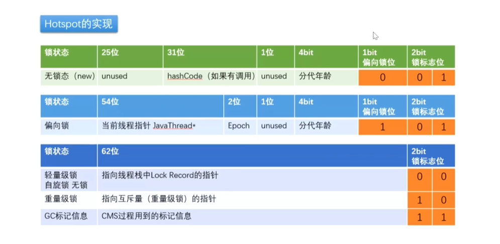

#### Java对象内存布局

HotSpot虚拟机堆中的对象实例被划分为三个组成部分，即**对象头、实例数据和对齐填充位**。

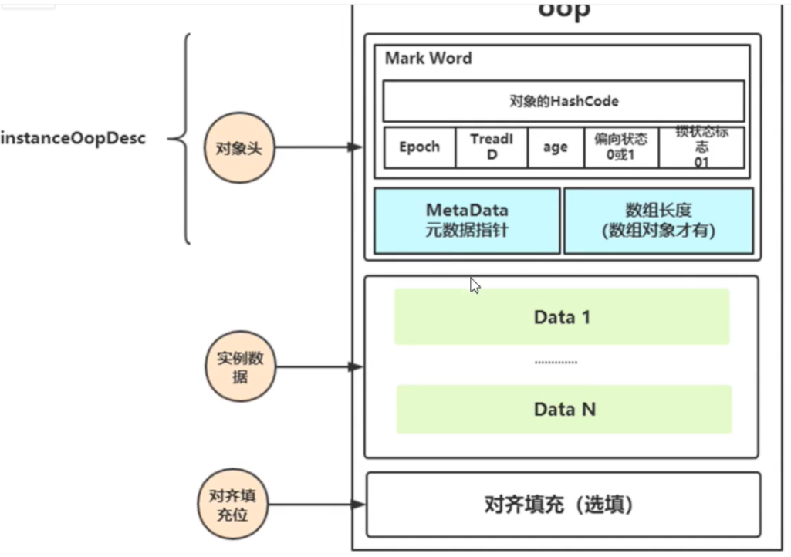

通过JOL工具打印出对象头的信息：

```JAVA
public class JOLExample {

    public static void main(String[] args) {
        Object o = new Object();
        System.out.println(ClassLayout.parseInstance(o).toPrintable());

        synchronized (o) {
            System.out.println(ClassLayout.parseInstance(o).toPrintable());
        }
    }
}
```

* 偏移量0开始的和偏移量4开始的共8个字节代表对象的MarkWord（对象头的前8byte/64bit）；
* 偏移量8开始的4个字节代表对象的ClassPoint（对象所属的类）；
* 因为示例类中没有成员变量，所以从偏移量12开始的4个字节是填充字节（字节对齐），为了让整个对象的字节大小能够被8整除。

```JAVA
java.lang.Object object internals:
OFFSET  SIZE   TYPE DESCRIPTION                               VALUE
    0      4        (object header)                           01 00 00 00 (00000001 00000000 00000000 00000000) (1)
    4      4        (object header)                           00 00 00 00 (00000000 00000000 00000000 00000000) (0)
    8      4        (object header)                           e5 01 00 f8 (11100101 00000001 00000000 11111000) (-134217243)
    12     4        (loss due to the next object alignment)
Instance size: 16 bytes 空对象16个字节
Space losses: 0 bytes internal + 4 bytes external = 4 bytes total
```

使用synchronized后，此时从偏移量4开始的4个字节发生了变化，是因为偏向锁的信息被添加到了对象的MarkWord上。说白了偏向锁就是将线程的id直接关联到锁对象上，无需争抢竞争。

```JAVA
java.lang.Object object internals:
OFFSET  SIZE   TYPE DESCRIPTION                               VALUE
    0      4        (object header)                           28 f7 a8 02 (00101000 11110111 10101000 00000010) (44627752)
    4      4        (object header)                           00 00 00 00 (00000000 00000000 00000000 00000000) (0)
    8      4        (object header)                           e5 01 00 f8 (11100101 00000001 00000000 11111000) (-134217243)
    12     4        (loss due to the next object alignment)
Instance size: 16 bytes
Space losses: 0 bytes internal + 4 bytes external = 4 bytes total
```

对象头中的MarkWord结构：

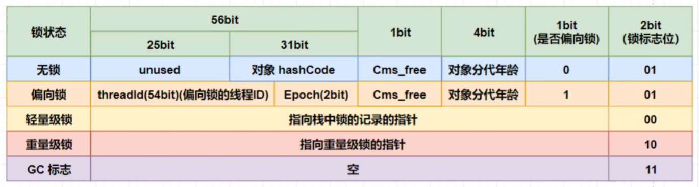


#### 偏向锁

偏向锁会偏向第一个获取它的线程，若接下来的执行中，该锁没有被其他线程所获取，那么持有偏向锁的线程在访问锁住的资源时不需要再进行同步操作（即加锁和释放锁）。


* **获取锁流程**：
  * 当一个线程访问同步块并获取锁时，会在锁对象的MarkWord和栈帧中的锁记录里存储锁偏向的线程id；
  * 之后该线程进入或退出同步块时不需要再进行加锁操作，只需要测试锁对象的MarkWord是否设置了指向自己的偏向锁，即是否保存了自己的线程id；
  * 若测试成功则表示已获取锁，若失败则需要再测试MarkWord中偏向锁的标志位是否被设置为1；
  * 若不为1，使用CAS竞争锁并设置偏向。若为1，则尝试使用CAS将锁对象的MarkWord中的偏向锁标志指向自己。

* **释放锁流程**：
  * 偏向锁直到出现竞争才会被释放，即当有其他线程尝试竞争偏向锁时，持有偏向锁的线程才会释放锁；
  * 偏向锁的释放需要等待JVM的全局安全点，即在该时间点上没有正在执行的字节码指令；
  * 首先会阻塞持有锁的线程，然后检查该线程是否存活，若不存活，则将锁对象的MarkWord设置为无锁状态；
  * 若仍存活，且出现了多个线程竞争，则锁对象的MarkWord的锁标志就会变为轻量级锁00，最后唤醒被阻塞的线程。

* **偏向锁升级为轻量级锁**：在存在锁竞争的场合下，偏向锁就会失效，因为这样的场合存在每次申请锁的线程都是不相同的情况，所以不适合使用偏向锁，而是升级成轻量级锁。


#### 轻量级锁

轻量级锁存在于多线程竞争不会非常激烈的情况下，可以减少获取重量级锁时需要操作系统进行调度和使用互斥量而产生的性能消耗，而轻量级锁使用的是自旋竞争锁和CAS的方式加锁/释放锁。

* **自旋锁和适应性自旋锁**：
  * **为什么引入自旋锁？**所谓自旋锁是为了避免线程在未获取到锁时的阻塞/唤醒操作而提出的技术，并且很多对象锁的锁定状态只会持续很短的一段时间（如整数的自增操作），在很短的时间内阻塞/唤醒线程显然不值得；
  * **自旋**：就是让线程去执行一轮空转，循环结束后再去重新竞争锁，如果竞争不到就继续循环，循环过程中线程会一直处于Running状态。但是基于线程的调度策略，一段时间后还是会让出时间片，让其他线程也能通过自旋获取锁和释放锁；
  * **适应性自旋**：JDK1.6引入了适应性自旋锁，自旋的轮次不固定，而是由前一次同一个锁上的自旋时间以及锁拥有者的状态决定。

* **获取锁流程**：

  * 线程进入同步代码块之前，JVM会在轻量级锁运行过程中在当前线程的栈帧中创建锁记录空间（Lock Record），并将锁对象的MarkWord拷贝到这片空间中（Displaced Mark Word）；

    

  * 然后线程尝试使用CAS操作将锁对象的MarkWord中的stack指针指向自己的Lock Record，同时将Lock Record中的owner指针指向锁对象的MarkWord；

    

  * 若修改指向成功，表示当前线程获取到锁，并且锁对象的MarkWord的锁标志位变为00，即表示该对象处于轻量级锁状态；

  * 若修改指向失败，JVM首先检查对象的Mark Word的stack pointer是否指向当前线程的Lock Record，如果是则说明当前线程已拥有锁，直接执行同步操作；

  * 若没有指向，则当前线程会尝试自旋获取锁，获取成功则持有锁。若自旋失败，即自旋若干轮后仍未获取到锁（适应性自旋决定轮次），此时轻量级锁会膨胀成重量级锁，锁对象的MarkWord的锁标志位变为10，线程会阻塞在互斥量上面。

* **释放锁流程**：
  * 线程首先使用CAS将自己的Displaced Mark Word替换锁对象的MarkWord；

  * 若替换成功，则表示同步操作完成；
  * 若替换失败，则表示锁对象的MarkWord被修改过，即存在竞争锁的线程自旋失败将锁升级为重量级锁了，此时在释放锁（解锁对象的MarkWord的stack pointer指向）的同时要唤醒阻塞（互斥量的阻塞队列中）在该锁上的线程。

* **轻量级锁一定比重量级锁效率更高吗？**不一定，如果锁的竞争非常激烈，有非常多的线程在自旋等待锁，则CPU的资源会大量消耗在空转和上下文切换上面（即不断切换线程去执行循环操作）。


#### 重量级锁

JVM的重量级锁是基于进入与退出对象监视器（Monitor）实现的，Java中每个对象实例都关联一个与之共同创建和销毁的Monitor对象（由C++实现）。锁对象的MarkWord中记录了指向Monitor内存地址的指针，Monitor对象记录了当前持有锁的线程id。

* **EntryList阻塞队列和WaitSet等待集合**：
  * 当多个线程访问一段同步代码时，只有一个线程能够获取锁对象的监视器，其他线程会进入EntryList队列中阻塞，Monitor是基于操作系统的Mutex互斥量实现的（`Mutex(0|1)`）；
  * 如果线程调用了 `wait()` 方法后，则会释放持有的锁监视器，然后进入WaitSet集合中等待被其他线程的 `notify()/notifyAll()` 唤醒。

* **重量级锁涉及到的用户态到内核态的切换**：
  * **互斥量修改时的切换**：Monitor是依赖于操作系统实现的，在线程尝试对Mutex进行原子修改时，会从用户态陷入到内核态，增加CPU性能的开销；
  * **线程阻塞状态的切换**：EntryList和WaitSet中的线程均处于阻塞状态，阻塞操作是由操作系统完成的（Linux的 `pthread_mutex_lock()`），线程阻塞后会陷入内核态等待事件就绪（锁释放）和重新调度，当其重新获取CPU执行权后又会切回用户态，频繁的切换大幅增加CPU的开销。


#### 锁消除和锁粗化

**锁消除和逃逸分析**：

* JIT编译器（Just In Time，即时编译器）在动态编译同步代码时，使用了逃逸分析技术，判断锁对象若只被一个线程使用，没有散布到其他线程中时，则JIT在编译同步代码时就不会生成相应的加锁释放锁的机器码，从而消除了锁的使用流程。

  ```java
  public class Example {
  
      public void method() {
          Object object = new Object();
  
          synchronized (object) {
              System.out.println("hello world");
          }
      }
  }
  ```

* 即使JIT的逃逸分析判定成功，但编译后字节码中还是能找到monitorenter和monitorexit这两个指令，但真正执行的机器码是由JIT在运行时动态控制的。


**锁粗化**：

* JIT编译器在执行动态编译时，若发现前后相邻的synchronized块使用的是同一个锁对象，则会将多个同步块合并起来，这样做的好处是线程在顺序经过多个同步块时就无需频繁的申请和释放锁资源了。

  ```java
  public class Example {
  
      private Object object = new Object();
  
      public void method() {
          synchronized (object) {
              System.out.println("hello world");
          }
  
          synchronized (object) {
              System.out.println("welcome");
          }
  
          synchronized (object) {
              System.out.println("person");
          }
      }
  }
  ```

* 由于JIT是运行时的动态编译机制，所以通过查看静态的字节码还是会有多条加锁/解锁的指令存在。

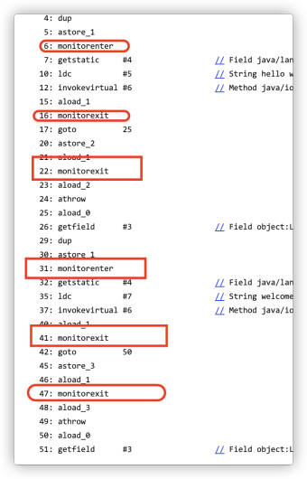


### synchronized与ReentrantLock的区别

* **都是可重入锁**：所谓可重入锁就是同一个线程可以重复获取自己已经获得的锁。如一个线程获得了某个对象的锁，此时还没有释放该锁，当其在同步代码内部想要再次获取该锁的时候仍能成功，即同一个线程获取同一把锁时，锁的计数器会自增1，只有等到0时才能释放。因为若是该锁不可重入的话，就会发生死锁；
* **实现方式**：synchronized是依赖于JVM实现的，而ReentrantLock是依赖于JDK的API实现的；
* **ReentrantLock比synchronized增加了一些高级功能**：
  * **等待可中断**：提供中断等待锁的线程的机制，ReentrantLock可通过 ``lock.lockInterruptibly()`` 来实现让正在等待该锁的线程放弃等待，改为处理其他事情；
  * **公平锁/非公平**：提供了公平锁和非公平锁的机制，synchronized只能是公平锁。所谓的公平锁就是先等待锁的线程先获取锁，所谓非公平锁就是先竞争锁，若成功直接获取，若失败再进行排队等待。ReentrantLock可通过 `new ReentrantLock(boolean fair)` 来指定锁的公平机制；
  * **多条件选择性通知**：借助Condition接口与 `newCondition()` 方法实现等待/唤醒机制，与synchronized不同之处在于ReentrantLock可以给一个Lock对象关联多个Condition实例实现按条件的选择性通知功能，线程对象可以注册在指定的Condition条件中，从而可以有选择性的进行线程唤醒，而 `notify()/notifyAll()` 方式通知的线程是由JVM选择的。


## JMM内存模型

### CPU高速缓存

缓存是一种中间组件，为了解决关系双方的处理速度存在巨大差异的情况，如网站服务端使用缓存就可以解决程序处理速度和数据库处理速度不对等的问题。因此，CPU的缓存也是为了解决CPU处理速度和内存处理速度的不对等问题。

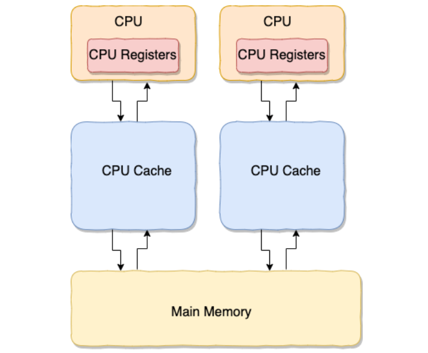


### 主存和Java工作内存

**线程私有的工作内存**：程序中所有的变量都存储在主存（Main Memory）中，每个线程都有自己的工作内存（Local Memory），一般处于高速缓存和寄存器中，保存了该线程使用变量的主存副本。线程只能直接操作工作内存中的变量，不同线程之间的变量值传递需要通过主存完成。JMM内存模型存在的意义是定义了共享内存系统中多线程读写操作行为的规范，来屏蔽各种硬件和操作系统的内存访问差异，实现Java在各个平台下都能达到一致的内存访问效果。


**缓存一致性问题**：若多个缓存共享一块主内存区域，那么可能会出现数据不一致的情况，需要通过缓存一致性协议来解决问题。如多线程执行自增操作，两个线程同时读取原值在自己的工作内存中自增，然后再写回内存，就会出现少增加一次的情况。


### 缓存一致性协议

TODO


### 内存间的交互操作

* **read读取**：从主存读取变量的值到工作内存；
* **store存储**：把工作内存的一个变量的值传递到主存中；
* **load加载**：在read执行后，将变量的值放入工作内存的变量副本中；
* **use使用**：把工作内存中一个变量的值传递给执行引擎；
* **assign分配**：把一个从执行引擎接收到的值赋给工作内存中的变量；
* **write写入**：在store之后执行，将变量的值放入主内存变量中；
* **lock加锁**：为主内存中的变量加锁；
* **unlock解锁**：释放锁。


### 并发安全问题-原子性

* JMM保证了load、assign、store等单个操作具有原子性，但并不保证一整个系列的操作具备原子性。如下图，T1读取cnt并修改但还未将其写入主存，T2此时读取的依然是旧值。

  

* 使用Atomic类或synchronized关键字可以保证一整个系列操作的原子性。

  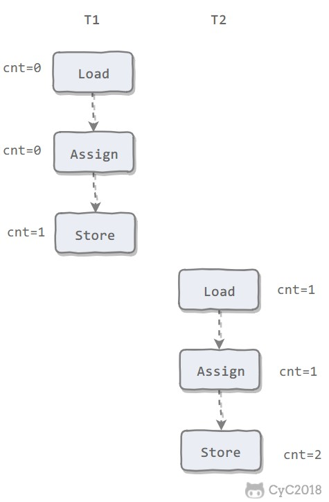


### 并发安全问题-可见性

指当一个线程修改共享内存中的变量后，其他线程能够立即得知这个修改。JMM是通过在变量修改后将新值同步回主存，和在变量读取前从主存刷新变量值来实现可见性的。

* **volatile**：被修饰的变量每次使用都需要从主存读取；
* **synchronized**：在操作变量前获取锁，释放锁之前必须将变量的值同步回主存；
* **final**：被修饰的字段在构造器中初始化完成，并且没有发生this逃逸，那么其他线程就能够看见final字段的值。


### 并发安全问题-有序性

有序性是指在本线程内观察，所有的操作都是有序的，但在一个线程观察另一个线程，操作会存在无序的特点。所谓的无序是因为发生了指令重排序，JMM允许编译器和处理器对指令进行重新排序，该过程不会影响到单线程的执行，却会影响到多线程并发执行的正确性。

* **volatile**：通过添加内存屏障的方式来禁止指令重排，即发生重排时不能将内存屏障后的指令放到屏障之前；

* **synchronized**：通过添加互斥锁的方式保证每一个时刻只有一个线程执行同步代码，相当于让多个线程顺序执行。 


## volatile

### JMM引出的问题

* 线程会将变量保存在本地内存（如高速缓存和寄存器）中，而不是直接在主存中进行读写，这样可能会造成一个线程在主存中修改了一个变量的值，而另一个线程还继续使用它之前存储在寄存器中变量值的拷贝，从而造成了数据的不一致。

  

* 通过将变量声明为volatile，指示JVM该变量是不稳定的，每次使用都需要从主存中进行读取。即volatile关键字就是保证了变量的可见性和防止指令重排序。

  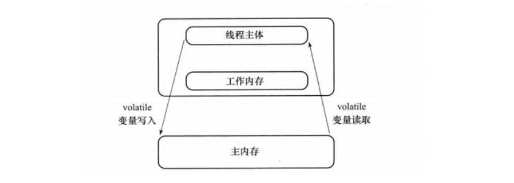


### 指令重排序

在Java程序的执行过程中，以提高性能为目的，编译器和处理器通常都会对其执行的指令顺序进行重新调整。

* **编译器优化重排序**：编译器在不改变单线程程序语义的前提下，可以重新安排语句的执行顺序；
* **指令并行重排序**：现代处理器使用了指令并行技术（ILP）来将多条指令重叠执行，如果不存在数据依赖性，处理器可以改变语句对应的机器指令的执行顺序；
* **内存系统重排序**：由于处理器使用高速缓存和读/写缓冲区，这使得加载和存储操作看上去可能是在乱序执行。


### 内存屏障

#### 基本概念

* 每个CPU都由自己的缓存（L1、L2、L3），缓存的目的是为了提高性能，避免每次都从主存中读取数据。但这样的弊端也很明显，即不能实时的和内存发生信息交换，分布在不同CPU上的不同线程对同一变量的缓存值可能不同；
* 而通过添加内存屏障，可阻止屏障两侧的指令重排序，强制把写缓冲区/高速缓存中的数据写回内存，和让缓存中的相应数据失效，以此来达到多CPU的多线程访问一致和有序；
* 内存屏障是硬件层的概念，不同的硬件平台实现可能不同，所以由JVM生成指令序列时在适当的位置插入内存屏障指令（Memory Barrier）来禁止特定类型的重排序，从而让指令按照预定的顺序执行，并且能够强制刷新/输出各种CPU的缓存。
* 硬件层次的内存屏障分为两种：
  * **Load Barrier**：在指令前插入，可以让高速缓存中的数据实现强制从主存中加载数据；
  * **Store Barrier**：在指令后插入，可以让写入缓存中的最新数据更新到主存中，让其他线程可见。


#### JVM的4类内存屏障指令

|      屏障类型       |         指令示例         |                             说明                             |
| :-----------------: | :----------------------: | :----------------------------------------------------------: |
|  LoadLoad Barriers  |   Load1;LoadLoad;Load2   | 在Load2及后续读取操作被执行前，保证Load1要读取的数据从主存中加载完毕。 |
| StoreStore Barriers | Store1;StoreStore;Store2 | 在Store2及后续写入操作被执行前，保证Store1的写入会被更新到主存中。 |
| LoadStore Barriers  |  Load1;LoadStore;Store2  | 在Store2及后续写入操作被执行前，保证Load1要读取的数据从主存中加载完毕。 |
| StoreLoad Barriers  |  Store1;StoreLoad;Load2  | 在Load2及后续读取操作被执行前，保证Store1的写入会被更新到主存中。 |


#### 内存屏障分类

**按可见性保障划分**：

* **加载屏障Load Barrier**：StoreLoad屏障可充当加载屏障，即刷新缓存，从主存中读取最新数据。
* **存储屏障Store Barrier**：StoreLoad屏障可充当存储屏障，即缓存写出，将缓存中的数据写入主存。

**按有序性保障划分**：

* **获取屏障Acquire Barrier**：相当于LoadLoad与LoadStore屏障的组合。在读操作之后插入，禁止该读操作与其后面的任何读写操作发生指令重排。
* **释放屏障Release Barrier**：相当于LoadStore与StoreStore屏障的组合。在写操作之前插入，禁止该写操作与其前面的任何读写操作发生指令重排。


#### synchronized的内存屏障

synchronized的底层是通过获取屏障Acquire Barrier和释放屏障Release Barrier保证有序性，通过加载屏障Load Barrier和存储屏障Store Barrier保证可见性，最后通过互斥锁保证原子性。


#### volatile的内存屏障

在每个volatile写操作前插入StoreStore屏障，在写操作后插入StoreLoad屏障。在每个volatile读操作前插入LoadLoad屏障，在读操作后插入LoadStore屏障。

* **读操作的内存屏障**：

  

* **写操作的内存屏障**： 

  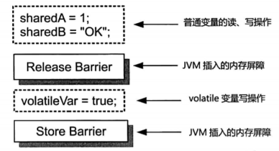


### volatile与synchronized的区别

* volatile是轻量级的实现多线程间可见性和有序性的机制，性能比synchronized好，但只能作用于变量。而synchronized可以修饰方法和代码块；

* 多线程访问volatile关键字修饰的变量不会发生阻塞。而synchronized修饰的代码可能会发生阻塞；

* volatile只能保证数据操作的可见和有序性但不能保证原子性。而synchronized三者都能保证。


### DCL双重检索式单例

```JAVA
/**
 * 饿汉式单例：类加载到内存后就实例化一个单例对象，JVM保证线程安全
 */
public class SingletonExample {

    private static final SingletonExample INSTANCE = new SingletonExample();

    // 私有化构造方法
    private SingletonExample() { }

    // 类加载的时候直接初始化，永远只会存在一个对象
    public static SingletonExample getInstance() {
        return INSTANCE;
    }

    public static void main(String[] args) {
        SingletonExample m1 = SingletonExample.getInstance();
        TSingletonExample m2 = SingletonExample.getInstance();
        System.out.println(m1 == m2);
    }
}
```

创建Java对象的字节码指令：`class T { int = 8; } T t = new T();`

```
0 new #2 <T>
3 dup
4 invokespecial #3 <T.<init>>
7 astore_1
8 return
```

使用DCL单例模式下，为什么需要加volatile？因为创建对象时的字节码指令可能会发生重排序。

* `0 new #2 \<T>` 半初始化对象，成员变量赋予初始值；
* `4 invokespecial #3 <T.\<init>>` 调用构造方法；
* `7 astore_1` 引用和对象关联。

4和7若是发生了指令重排，那会先关联引用和对象，此时INSTANCE就不为空了，当前线程先去执行权。此时新线程的外层检索 `if (INSTANCE == null)` 就会通过，新线程就会使用半初始化的对象，值都是默认值。

```JAVA
/**
 * 懒汉式单例：虽然达到了按需初始化的目的，但却带来了线程不安全的问题
 */
public class SingletonExample {

    private static volatile SingletonExample INSTANCE;

    private SingletonExample() { }

    // DCL双重检索式（Double Check Lock）
    public static SingletonExample getInstance() throws InterruptedException {
        // 外层检索：防止大量线程直接去竞争锁带来的性能问题
        if (INSTANCE == null) {
            synchronized (SingletonExample.class) {
                // 内层检索：防止其他通过外层检索的线程又执行一遍内部逻辑
                if (INSTANCE == null) {
                    Thread.sleep(1);
                    // 若不加锁则会出现多个线程创建多个对象的问题，单例则无从谈起
                    INSTANCE = new SingletonExample();
                }
            }
        }
        return INSTANCE;
    }

    public static void main(String[] args) {
        for (int i = 0; i < 100; i++) {
            new Thread(() -> {
                try {
                    System.out.println(SingletonExample.getInstance().hashCode());
                } catch (InterruptedException e) {
                    e.printStackTrace();
                }
            }).start();
        }
    }
}
```


## Atomic原子类

### 基本概念

原子操作是指一个操作是不可中断的，即使是在多个线程共同执行的时候，一个操作一旦开始，就不会被其他线程干扰。JUC的原子类都存放在 `java.util.concurrent.atomic` 包下。


### JUC包中的原子类

* **基本类型**：`AtomicInteger`、`AtomicLong` 和 `AtomicBoolean`；

* **数组类型**：`AtomicIntegerArray`、`AtomicLongArray` 和 `AtomicReferenceArray`；

* **引用类型**：`AtomicReference`、`AtomicStampedReference` 原子更新带有版本号的引用类型（该类将整数值与引用关联起来，可用于解决使用CAS进行原子更新时可能出现的ABA问题）和 `AtomicMarkableReference` 原子更新带有标记位的引用类型；

* **对象属性修改类型**：`AtomicIntegerFieldUpdater` 原子更新整型字段的更新器等。


### AtomicInteger使用示例

```JAVA
public final int get()	// 获取当前的值
public final int getAndSet(int newValue)	// 获取当前的值，并设置新的值
public final int getAndIncrement()	// 获取当前的值，并⾃增
public final int getAndDecrement() 	// 获取当前的值，并⾃减
public final int getAndAdd(int delta)	// 获取当前的值，并加上预期的值
boolean compareAndSet(int expect, int update)	// 如果输⼊的数值等于预期值expect，则以原⼦⽅式将更新值update设置为输⼊值
public final void lazySet(int newValue)	// 懒设置，即最终设置为newValue，使⽤lazySet设置之后可能导致其他线程在之后的⼀⼩段时间内还是可以读到旧的值
```

```JAVA
public class AtomicIntegerExample {

    private static final AtomicInteger m = new AtomicInteger(0);

    public static void main(String[] args) throws InterruptedException {
        Thread[] threads = new Thread[100];
        CountDownLatch latch = new CountDownLatch(threads.length);

        for (int i = 0; i < threads.length; i++) {
            threads[i] = new Thread(() -> {
                for (int j = 0; j < 1000; j++) {
                    // 原子性操作
                    m.incrementAndGet();
                }
                latch.countDown();
            });
        }

        Arrays.stream(threads).forEach(Thread::start);

        latch.await();

        System.out.println(m.get());
    }
}
```


### AtomicInteger源码分析

AtomicInteger底层主要使用了CAS+volatile+native方法来保证原子性。

```JAVA
public class AtomicInteger extends Number implements java.io.Serializable {
    
    private static final long serialVersionUID = 6214790243416807050L;

    // setup to use Unsafe.compareAndSwapInt for updates
    private static final Unsafe unsafe = Unsafe.getUnsafe();
    private static final long valueOffset;

    static {
        try {
            valueOffset = unsafe.objectFieldOffset
                (AtomicInteger.class.getDeclaredField("value"));
        } catch (Exception ex) { throw new Error(ex); }
    }

    // 内部维护一个具有内存可见性的变量
    private volatile int value;

    /**
     * Creates a new AtomicInteger with the given initial value.
     *
     * @param initialValue the initial value
     */
    public AtomicInteger(int initialValue) {
        value = initialValue;
    }

    /**
     * Creates a new AtomicInteger with initial value {@code 0}.
     */
    public AtomicInteger() {
    }

    /**
     * Gets the current value.
     *
     * @return the current value
     */
    public final int get() {
        return value;
    }

    /**
     * Sets to the given value.
     *
     * @param newValue the new value
     */
    public final void set(int newValue) {
        value = newValue;
    }
```

```java
/**
 * Atomically sets to the given value and returns the old value.
 *
 * @param newValue the new value
 * @return the previous value
 */
public final int getAndSet(int newValue) {
    return unsafe.getAndSetInt(this, valueOffset, newValue);
}

public final int getAndSetInt(Object var1, long var2, int var4) {
    int var5;
    do {
        var5 = this.getIntVolatile(var1, var2);
    } while(!this.compareAndSwapInt(var1, var2, var5, var4));

    return var5;
}

// 调用本地方法使用CAS操作
public final native boolean compareAndSwapInt(Object var1, long var2, int var4, int var5);
```


### CAS比较并交换

CAS（Compare And Swap）是多线程的场景下，修改共享数据前先使用期望值与共享数据进行比较，若符合期望则允许修改，不符合期望则修改失败（也可以通过自旋的方式多次尝试）。CAS本身是由硬件提供的原子指令实现的，可以确保操作的原子性。

* **操作过程**：每个CAS的操作过程都包含三个运算符，即内存地址V、期望值A和更新值B，每次更新前先比较期望值A和内存V上的变量值是否相同，若相同则直接对内存V赋新值，否则不做任何操作。若是自旋+CAS的方式则会通过循环一段时间后再去比较期望值，直到内存V中的值符合期望并操作成功为止。

  

* **ABA问题**：CAS在修改值时，会先比较期望值，但如果出现内存中的值从A被修改为B，再从B被修改为A的A->B->A情况发生，那么CAS的期望值比较就会认为值没有发生变化，从而操作成功，这对某些需要严格控制过程的场景来说是一个严重问题（如金融领域的资金流动等）。解决方式就是使用带有版本号的CAS进行操作，对内存中的变量设定唯一的版本号，每次被修改后都会让版本号递增，CAS的期望值比较也会增加版本号的比较，若期望值和期望版本都一致才会真正更新。

* **大量线程自旋的性能开销问题**：如果使用自旋+CAS的方式实现了用户空间的自旋锁时，若竞争锁的线程过多，则会导致大量的线程处于就绪和运行状态，通过运行时空转和频繁的上下文切换损耗CPU的资源。


## ThreadLocal

### 基本概念

ThreadLocal是通过空间换取时间，从而实现每个线程当中都会有一套数据的副本，这样每个线程都会操作自己的副本，从而隔离了多线程对共享数据的操作造成的问题。


### 使用示例


```JAVA
public class ThreadLockExample {
    
    public static void main(String[] args) {
        ThreadLocal threadLocal1 = new ThreadLocal();
        ThreadLocal threadLocal2 = new ThreadLocal();
        
        new Thread(() -> {
            threadLocal1.set(1);
            threadLocal2.set(1);
        }).start();
        
        new Thread(() -> {
            threadLocal1.set(2);
            threadLocal2.set(2);
        }).start();
    }
}
```


### 源码分析

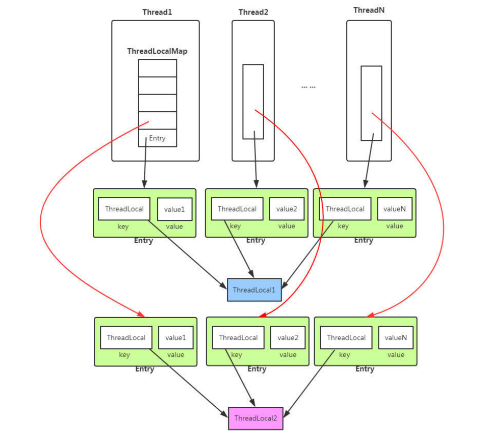

* **Thread类源码分析**：每个线程自己维护一个Map结构存储本地变量。ThreadLocl类只是负责定义ThreadLocalMap类型。

  ```java
  public class Thread implements Runnable {
      // ......
      // 每个Thread类都维护一个ThreadLocal.ThreadLocalMap对象
      ThreadLocal.ThreadLocalMap threadLocals = null;
      // 与此线程有关的InheritableThreadLocal值。由	InheritableThreadLocal类维护
      ThreadLocal.ThreadLocalMap inheritableThreadLocals = null;
      // ......
  }
  ```

* **ThreadLocal类的 `set()` 方法源码分析**：调用ThreadLocal的set方法是将ThreadLocal的引用为key，具体要存储的值为value，存入当前调用方法的线程的ThreadLocalMap中。

  ```java
  public void set(T value) {
      Thread t = Thread.currentThread();
      // 先获取当前线程的ThreadLocalMap对象
      ThreadLocalMap map = getMap(t);
      if (map != null)
          // 将当前ThreadLocal对象的引用和要存储的数据做为键值对插入Map中
          map.set(this, value);
      else
          createMap(t, value);
  }
  ```

* **ThreadLocal类的 `get()` 方法源码分析**：根据ThreadLocal对应作为key，从线程本地的ThreadLocalMap中获取对应的值。

  ```java
  public T get() {
      Thread t = Thread.currentThread();
      ThreadLocalMap map = getMap(t);
      if (map != null) {
          // 通过当前ThreadLocal对象的引用做为key获取到对应的value
          ThreadLocalMap.Entry e = map.getEntry(this);
          if (e != null) {
              @SuppressWarnings("unchecked")
              T result = (T)e.value;
              return result;
          }
      }
      return setInitialValue();
  }
  ```


### 内存泄漏


* **使用强引用的key产生的问题**：若Entry中的key使用强引用，当ThreadLocal变量被置为null，相当于外部的强引用断开联系。但由于ThreadLocalMap中的key依旧在强引用ThreadLocal对象导致其不会被GC回收，最终可能会因为积累过多的ThreadLocal对象造成内存泄漏的发生；
* **使用弱引用的key依旧存在的问题**：若Entry中的key使用弱引用，那么会在外部的引用都断开后允许GC回收，但又会出现key为null的Entry。由于Entry中的value是强引用，value又无key映射导致无法被访问和回收的情况出现，最终也可能会出现内存泄漏；
* 所以使用ThreadLocal后需要手动调用 `remove()` 方法清除键值对，防止内存泄漏。

```JAVA
ThreadLocalMap(ThreadLocal<?> firstKey, Object firstValue) {
    table = new Entry[INITIAL_CAPACITY];
    int i = firstKey.threadLocalHashCode & (INITIAL_CAPACITY - 1);
    table[i] = new Entry(firstKey, firstValue);
    size = 1;
    setThreshold(INITIAL_CAPACITY);
}

// ThreadLocalMap中的元素类型Entry，其中的key就是指向ThreadLocal对象的弱引用
static class Entry extends WeakReference<ThreadLocal<?>> {
    // value使用强应用
    Object value;

    Entry(ThreadLocal<?> k, Object v) {
        super(k);
        value = v;
    }
}
```


## 线程池

### 基本概念

线程池是一种使用了池化思想管理多线程执行任务的机制。在创建多个线程执行任务后不会销毁线程，而是将其缓存下来，等接下来的任务就绪后再次使用，以此来避免线程的频繁创建和销毁带来的性能浪费。

* **使用线程池的好处**：
  * **降低资源消耗**：通过重复利用已经创建的线程降低因为频繁创建和销毁而造成的消耗；

  * **提高响应速度**：当任务到达时，无需等待线程的创建即可立即执行；

  * **提高线程的可管理性**：线程池可以统一的分配、调优和监控线程。


### 创建方式

**创建线程池的两种方式**：

* 通过 `ThreadPoolExecutor` 重载的4种有参构造方法创建。

* 通过 `Executor` 的工具类 `Executors` 来创建4种类型的线程池：
  * **FixedThreadPool**：通过 `Executors.newFixedThreadPool()` 创建，该方法返回一个固定容量的线程池，当有新任务提交时，池中若有空闲线程，则立即执行，若没有则将任务暂存到任务队列中，待池中有线程空闲，便处理队列中的任务。
  * **SingleThreadExecutor**：通过 `Executors.newSingleThreadExecutor()` 创建，该方法返回一个单一线程的线程池，同一时间只能执行一个任务，若多余出来的任务被提交则会被暂存到任务队列，待池中的线程空闲，便处理队列中的任务。
  * **CachedThreadPool**：通过 `Executors.newCachedThreadPool()` 创建，该方法返回一个可根据实际情况调整线程数量的线程池（带缓冲的线程池），其中的线程数量是不确定的，但若有空闲线程可以复用，则优先使用，若无空闲线程，则会创建新线程处理任务。
  * **ScheduledThreadPool**：通过 `Executors.newScheduledThreadPool()` 创建，可以管理定时任务的线程池。

**不推荐使用Executors去创建**：

* **FixedThreadPool和SingleThreadExecutor**：默认允许请求的队列长度为Integer.MAX_VALUE，可能会在队列中堆积过多的请求，从而导致OOM。

* **CachedThreadPool和ScheduledThreadPool**：默认允许创建的线程数量为Integer.MAX_VALUE，可能会创建过多的线程，从而导致OOM。


### 任务提交

**任务提交的两种方式**：

* **`execute()`**：用于提交不需要返回值的任务，无法判断任务是否被成功执行。

* **`submit()`**：用于提交需要返回值的任务，线程池会返回Future对象，通过该对象可以判断任务是否成功执行，并且可以通过get方法获取返回值。get方法会阻塞当前线程直到任务完成，而使用 ``get(long timeout, TimeUnit unit)`` 方法则会阻塞当前线程一段时间后立即返回，这时候任务有可能没有执行完。

  * `submit()` 有3个重载的方法，但无论调用哪个方法，最终都是将传递进来的任务转换为 `Callable` 对象，并通过 `execute()` 方法提交任务。

  ```java
  /**
   * @throws RejectedExecutionException {@inheritDoc}
   * @throws NullPointerException       {@inheritDoc}
   */
  public Future<?> submit(Runnable task) {
      if (task == null) throw new NullPointerException();
      RunnableFuture<Void> ftask = newTaskFor(task, null);
      execute(ftask);
      return ftask;
  }
  
  /**
   * @throws RejectedExecutionException {@inheritDoc}
   * @throws NullPointerException       {@inheritDoc}
   */
  public <T> Future<T> submit(Runnable task, T result) {
      if (task == null) throw new NullPointerException();
      RunnableFuture<T> ftask = newTaskFor(task, result);
      execute(ftask);
      return ftask;
  }
  
  /**
   * @throws RejectedExecutionException {@inheritDoc}
   * @throws NullPointerException       {@inheritDoc}
   */
  public <T> Future<T> submit(Callable<T> task) {
      if (task == null) throw new NullPointerException();
      RunnableFuture<T> ftask = newTaskFor(task);
      execute(ftask);
      return ftask;
  }
  ```

**实现Runnable接口和Callable接口的区别**：

* Runnable接口不会返回结果或者抛出异常，而Callable接口既可以返回结果也可以抛出异常；

* 工具类Executors可以实现Runnable和Callable对象的相互转换，使用 `Executors.callable(Runnable task)` 或 `Executors.callable(Runnable task, Object result)`。

  ```java
  @FunctionalInterface
  public interface Runnable {
  
      // 被线程执⾏，没有返回值也⽆法抛出异常
      public abstract void run();
  }
  ```

  ```java
  @FunctionalInterface
  public interface Callable<V> {
  
      // 计算结果，或在⽆法得到结果时抛出异常
      V call() throws Exception;
  }
  ```


### 使用示例

```java
public class ThreadPoolExecutorDemo {

    private static final int CORE_POOL_SIZE = 5;
    private static final int MAX_POOL_SIZE = 10;
    private static final int QUEUE_CAPACITY = 100;
    private static final Long KEEP_ALIVE_TIME = 1L;

    public static void main(String[] args) {
        // 通过ThreadPoolExecutor构造方法⾃定义参数创建线程池
        ThreadPoolExecutor executor = new ThreadPoolExecutor(
            CORE_POOL_SIZE,
            MAX_POOL_SIZE,
            KEEP_ALIVE_TIME,
            TimeUnit.SECONDS,
            new ArrayBlockingQueue<>(QUEUE_CAPACITY),
            new ThreadPoolExecutor.CallerRunsPolicy());
        for (int i = 0; i < 10; i++) {
            // 任务提交
            executor.execute(() -> "SayHello " + i);
        }

        // 优雅关闭
        executor.shutdown();
        // 主线程等待线程池的关闭
        while (!executor.isTerminated()) {}
        System.out.println("Finished all threads");
    }
}
```


### 源码分析

#### 构造方法分析

**构造方法参数**：

* **`int corePoolSize`**：线程池中的核心线程数，数量内的线程会一直保持不会被回收。当线程池处于初始状态，有一个任务被提交时，线程池会创建一个新线程执行任务，直到创建的线程数达到corePoolSize，再继续提交的任务会进入阻塞队列中，等待线程空闲后去执行。如果调用了线程池的 `prestartAllCoreThreads()` 方法，线程池会提前创建并启动所有核心线程。

* **`int maximumPoolSize`**：线程池允许的最大线程数，当阻塞队列已满，且继续提交任务时，才会创建新的线程执行任务，前提是不能超过最大线程数，这些在corePoolSize数量之外的线程若长时间空闲则会被回收。若超过了最大线程数，则会使用拒绝策略。

* **`long keepAliveTime`**：额外线程的空闲状态存活时间，这些corePoolSize数量之外的线程在keepAliveTime时间内若一直处于空闲状态，那么就会被回收。即当额外线程没有任务执行时，继续存活的时间。

* **`TimeUnit unit`**：keepAliveTime参数的时间单位。

* **`BlockingQueue<Runnable> workQueue`**：阻塞任务队列，当新任务到来的时会先判断当前池中线程数量是否达到corePoolSize，若已达到，则将新任务存入该队列中。一般会使用有界队列，使用无界队列会对线程池带来以下的影响：
* 当线程池中的线程数到达corePoolSize后，所有的新任务都会进入无界队列中等待，因此不会出现额外线程被创建，导致maximumPoolSize和keepAliveTime参数无用；
  * 最重要的是，使用无界队列会耗尽系统资源；
  * 所以一般会使用ArrayBlockingQueue、LinkedBlockingQueue、SynchronousQueue和PriorityBlockingQueue做为workQueue。

* **`ThreadFactory threadFactory`**：设置Executor创建新线程时使用的线程工厂，即为了统一在创建线程时设置的参数（如线程名、是否为守护线程）和线程的一些特性（如优先级）等。通过统一的工厂类创建出来的线程能保证具有相同的特性。Executors默认的线程工厂对线程的命名规则是 `pool-数字-thread-数字`。

* **`RejectedExecutionHandler handler`**：线程池的饱和策略，当阻塞队列已满，且所有活动的线程已达到最大线程数量时，若继续提交任务，则会采取一种策略处理该任务，线程池提供了多种策略：
* `ThreadPoolExecutor.AbortPolicy`：默认策略，直接抛出 `RejectedExecutionException` 异常来拒绝接收新任务；
  * `ThreadPoolExecutor.CallerRunsPolicy`：用调用者所在的线程执行该任务；
  * `ThreadPoolExecutor.DiscardPolicy`：直接丢弃该任务；
  * `ThreadPoolExecutor.DiscardOldestPolicy`：丢弃队列中最早的未处理的任务，并入队当前任务；
  * 也可以根据应用场景实现 `RejectedExecutionHandler` 接口，自定义饱和策略，如记录日志或持久化存储不能处理的任务。


```java
// ⽤给定的初始参数创建⼀个新的ThreadPoolExecutor
public ThreadPoolExecutor(int corePoolSize,
                          int maximumPoolSize,
                          long keepAliveTime,
                          TimeUnit unit,
                          BlockingQueue<Runnable> workQueue,
                          ThreadFactory threadFactory,
                          RejectedExecutionHandler handler) {
    if (corePoolSize < 0 ||
        maximumPoolSize <= 0 ||
        maximumPoolSize < corePoolSize ||
        keepAliveTime < 0)
        throw new IllegalArgumentException();
    if (workQueue == null || threadFactory == null || handler == null)
        throw new NullPointerException();
    this.acc = System.getSecurityManager() == null ?
        null :
    AccessController.getContext();
    this.corePoolSize = corePoolSize;
    this.maximumPoolSize = maximumPoolSize;
    this.workQueue = workQueue;
    this.keepAliveTime = unit.toNanos(keepAliveTime);
    this.threadFactory = threadFactory;
    this.handler = handler;
}
```


#### 基本属性和方法分析

**线程池状态**：

* **RUNNING**：线程池可以接收新的任务提交，并且还可以正常处理阻塞队列中的任务；
* **SHUTDOWN**：线程池不再接收新的任务提交，但线程池还可以继续处理阻塞队列中的任务；
* **STOP**：线程池不再接收新的任务，同时还会丢弃阻塞队列中的任务。此外，它还会中断正在处理的任务；
* **TIDYING**：当所有任务都执行完毕后，当前线程池中的活动线程数降为0，将会调用terminated方法；
* **TERMINATED**：线程池的终止状态，当terminated方法执行完毕后，线程池将会处于该状态。

**状态转换**：

* **RUNNING -> SHUTDOWN**：当调用了线程池的 `shutdown()` 方法时；
* **RUNNING/SHUTDOWN -> STOP**：当调用了线程池的 `shutdownNow()` 方法时；
* **SHUTDOWN -> TIDYING**：当线程池中活动的线程数变为0，阻塞队列为空时；
* **STOP -> TIDYING**：当线程池变为空时；
* **TIDYING -> TERMINATED**：当 `terminated()` 方法被执行完毕时。

```java
// ctl的前3位表示线程池的状态，后29位表示线程池中运行的线程数量
private final AtomicInteger ctl = new AtomicInteger(ctlOf(RUNNING, 0));
private static final int COUNT_BITS = Integer.SIZE - 3;
private static final int CAPACITY   = (1 << COUNT_BITS) - 1;

// runState is stored in the high-order bits
private static final int RUNNING    = -1 << COUNT_BITS;
private static final int SHUTDOWN   =  0 << COUNT_BITS;
private static final int STOP       =  1 << COUNT_BITS;
private static final int TIDYING    =  2 << COUNT_BITS;
private static final int TERMINATED =  3 << COUNT_BITS;

// Packing and unpacking ctl
private static int runStateOf(int c)     { return c & ~CAPACITY; }
private static int workerCountOf(int c)  { return c & CAPACITY; }
private static int ctlOf(int rs, int wc) { return rs | wc; }
```


#### execute方法分析

* 如果线程池中活动线程数 < corePoolSize，那么线程池就会创建新的线程来执行任务；
* 如果线程池中活动线程数 >= corePoolSize，那么线程池就会将提交的任务放入阻塞排队；
* 如果提交的任务无法再加入到阻塞队列中，且当前活动线程数 < maximumPoolSize，那么线程池会创建新线程；
* 如果活动线程数 >= maximumPoolSize，那么就会按照拒绝策略处理任务。


```JAVA
// 存放线程池的运⾏状态runState和线程池内有效线程的数量workerCount
private final AtomicInteger ctl = new AtomicInteger(ctlOf(RUNNING, 0));

private static int workerCountOf(int c) {
	return c & CAPACITY;
}

// 阻塞任务队列
private final BlockingQueue<Runnable> workQueue;

public void execute(Runnable command) {
    // 如果提交的任务为null，则抛出空指针异常
    if (command == null)
    	throw new NullPointerException();
    // ctl中保存的是线程池当前的⼀些状态信息
    int c = ctl.get();
    
    // 1.⾸先判断当前线程池中执行的任务数量是否⼩于corePoolSize，若⼩于则通过addWorker(command, true)方法新建⼀个线程，并将任务command交给该线程执⾏
    if (workerCountOf(c) < corePoolSize) {
    	if (addWorker(command, true))
            return;
        c = ctl.get();
	}
	// 2.如果当前执行的任务数量⼤于等于corePoolSize时，则通过isRunning()⽅法判断线程池状态，只有线程池处于RUNNING状态并且队列未满时，该任务才会被加⼊队列中
	if (isRunning(c) && workQueue.offer(command)) {
        // 再次获取线程池状态
		int recheck = ctl.get();
		// 若线程池状态不是RUNNING状态就需要从任务队列中移除任务，并尝试判断线程是否全部执⾏完毕，同时执⾏拒绝策略
		if (!isRunning(recheck) && remove(command))
            reject(command);
        // 如果当前线程池为空就创建⼀个新线程并执⾏。
		else if (workerCountOf(recheck) == 0)
			addWorker(null, false);
    }
	// 3.若队列已满，则通过addWorker(command, false)新建⼀个线程，并将任务command添加到该线程中启动并执⾏任务。若addWorker(command, false)执⾏失败则代表线程池达到最大容量，则通过reject()执⾏相应的拒绝策略
	else if (!addWorker(command, false))
		reject(command);
}
```


#### worker分析

```java
// firstTask：线程第一次被创建时会执行的任务
// core：true表示创建核心线程，false表示创建额外线程
private boolean addWorker(Runnable firstTask, boolean core) {
    retry:
    for (;;) {
        // 线程数
        int c = ctl.get();
        // 线程池状态
        int rs = runStateOf(c);

        // Check if queue empty only if necessary.
        if (rs >= SHUTDOWN &&
            ! (rs == SHUTDOWN &&
               firstTask == null &&
               ! workQueue.isEmpty()))
            return false;

        for (;;) {
            int wc = workerCountOf(c);
            if (wc >= CAPACITY ||
                wc >= (core ? corePoolSize : maximumPoolSize))
                return false;
            // 这里是线程个数加1，不是真的创建线程
            if (compareAndIncrementWorkerCount(c))
                // 操作成功，退出循环，往下面走
                break retry;
            c = ctl.get();  // Re-read ctl
            if (runStateOf(c) != rs)
                continue retry;
            // else CAS failed due to workerCount change; retry inner loop
        }
    }

    boolean workerStarted = false;
    boolean workerAdded = false;
    Worker w = null;
    try {
        w = new Worker(firstTask);
        final Thread t = w.thread;
        if (t != null) {
            final ReentrantLock mainLock = this.mainLock;
            mainLock.lock();
            try {
                // Recheck while holding lock.
                // Back out on ThreadFactory failure or if
                // shut down before lock acquired.
                int rs = runStateOf(ctl.get());

                if (rs < SHUTDOWN ||
                    (rs == SHUTDOWN && firstTask == null)) {
                    if (t.isAlive()) // precheck that t is startable
                        throw new IllegalThreadStateException();
                    // 这里worker添加到集合中，但还是没执行任务
                    workers.add(w);
                    int s = workers.size();
                    if (s > largestPoolSize)
                        largestPoolSize = s;
                    workerAdded = true;
                }
            } finally {
                mainLock.unlock();
            }
            if (workerAdded) {
                // 开始执行任务
                t.start();
                workerStarted = true;
            }
        }
    } finally {
        if (! workerStarted)
            // 回滚操作
            addWorkerFailed(w);
    }
    return workerStarted;
}
```

```JAVA
// 基实现AQS实现，用于维护一个线程对象
private final class Worker
    extends AbstractQueuedSynchronizer
    implements Runnable
{

    private static final long serialVersionUID = 6138294804551838833L;

    // 工作线程
    final Thread thread;
    // 要运行的初始任务，可能为空
    Runnable firstTask;
    // 每个线程的任务计数器
    volatile long completedTasks;

    // 初始化Worker
    Worker(Runnable firstTask) {
        setState(-1); // inhibit interrupts until runWorker
        this.firstTask = firstTask;
        this.thread = getThreadFactory().newThread(this);
    }

    // 将主运行循环委托给runWorker
    public void run() {
        runWorker(this);
    }

    protected boolean isHeldExclusively() {
        return getState() != 0;
    }

    protected boolean tryAcquire(int unused) {
        if (compareAndSetState(0, 1)) {
            setExclusiveOwnerThread(Thread.currentThread());
            return true;
        }
        return false;
    }

    protected boolean tryRelease(int unused) {
        setExclusiveOwnerThread(null);
        setState(0);
        return true;
    }

    public void lock()        { acquire(1); }
    public boolean tryLock()  { return tryAcquire(1); }
    public void unlock()      { release(1); }
    public boolean isLocked() { return isHeldExclusively(); }

    void interruptIfStarted() {
        Thread t;
        if (getState() >= 0 && (t = thread) != null && !t.isInterrupted()) {
            try {
                t.interrupt();
            } catch (SecurityException ignore) {
            }
        }
    }
}
```

```java
final void runWorker(Worker w) {
    Thread wt = Thread.currentThread();
    Runnable task = w.firstTask;
    w.firstTask = null;
    w.unlock(); // allow interrupts
    boolean completedAbruptly = true;
    try {
        // 若worker中的firstTask不为空，就运行这个任务
        // 若为空，就调用getTask()从阻塞队列中获取一个任务去运行
        while (task != null || (task = getTask()) != null) {
            w.lock();
            // If pool is stopping, ensure thread is interrupted;
            // if not, ensure thread is not interrupted.  This
            // requires a recheck in second case to deal with
            // shutdownNow race while clearing interrupt
            if ((runStateAtLeast(ctl.get(), STOP) ||
                 (Thread.interrupted() &&
                  runStateAtLeast(ctl.get(), STOP))) &&
                !wt.isInterrupted())
                wt.interrupt();
            try {
                beforeExecute(wt, task);
                Throwable thrown = null;
                try {
                    task.run();
                } catch (RuntimeException x) {
                    thrown = x; throw x;
                } catch (Error x) {
                    thrown = x; throw x;
                } catch (Throwable x) {
                    thrown = x; throw new Error(x);
                } finally {
                    afterExecute(task, thrown);
                }
            } finally {
                task = null;
                w.completedTasks++;
                w.unlock();
            }
        }
        completedAbruptly = false;
    } finally {
        processWorkerExit(w, completedAbruptly);
    }
}
```


#### shutDown方法分析

* `shutDown()`：不再接受新任务，正在执行的和阻塞队列中的任务继续执行。调用后会立即返回，但线程池中还可能存在任务被运行。

  ```java
  public void shutdown() {
      final ReentrantLock mainLock = this.mainLock;
      mainLock.lock();
      try {
          // 权限检查，当前线程是否有权限关闭
          checkShutdownAccess();
          // CAS操作将线程池状态设置为ShutDown
          advanceRunState(SHUTDOWN);
          // 中断当前空闲的线程
          interruptIdleWorkers();
          onShutdown(); // hook for ScheduledThreadPoolExecutor
      } finally {
          mainLock.unlock();
      }
      // 唤醒其他线程
      tryTerminate();
  }
  ```

* `shutDownNow()`：尝试停止所有正在执行的线程，丢弃阻塞队列中的任务，并返回未执行的任务列表。

  ```java
  public List<Runnable> shutdownNow() {
      List<Runnable> tasks;
      final ReentrantLock mainLock = this.mainLock;
      mainLock.lock();
      try {
          // 权限检查
          checkShutdownAccess();
          // CAS操作将线程池状态改为STOP
          advanceRunState(STOP);
          // 中断所有线程，包括正在执行的线程
          interruptWorkers();
          // 复制阻塞队列中的任务到tasks中
          tasks = drainQueue();
      } finally {
          mainLock.unlock();
      }
      // 唤醒其他线程
      tryTerminate();
      // 返回未执行完的任务
      return tasks;
  }
  ```


## AQS

### 基本概念


AQS（Abstract Queued Synchronizer）抽象的队列同步器是用来构建锁和同步组件的框架，其内置一个队列来管理资源获取线程的排队工作，并通过一个int类型的变量表示同步状态。

* **核心思想**：如果请求的共享资源空闲，则将该线程设置为工作线程，并将共享资源设置为锁定状态。如果请求的共享资源被占用，那么使用CLH队列实现线程阻塞以及被唤醒时锁分配的机制，即将暂时获取不到锁的线程加入到队列中。

* **CLH队列**：是一个底层使用链表实现的双向队列，AQS将每个请求共享资源的线程封装成CLH队列中的一个结点Node，并通过CAS、自旋和LockSupport的方式去维护state的状态，使并发达到同步的控制效果。

* **AQS的队列结构**：由一个同步队列和多个条件队列（ConditionObject）组成。同步队列管理竞争锁失败的线程，条件队列管理await状态的线程，条件队列中的线程若被唤醒会先进入阻塞队列再竞争锁资源。

  

* **AQS的使用方式**：其本身是抽象类，不能直接使用，主要的使用方式是通过子类的继承，子类通过继承AQS并实现其抽象方法来管理同步状态。在实现上，子类推荐被定义为自定义同步组件的静态内部类，AQS自身没有实现任何接口，仅定义了若干同步状态获取和释放的方法来供自定义同步组件使用，同步器既支持独占获取，也支持共享获取。

  ```java
  static final class Node {
      
      // 表示节点处于共享模式下等待
      static final Node SHARED = new Node();
      // 表示节点处于独占模式下等待
      static final Node EXCLUSIVE = null;
  
      // 表示线程获取锁的请求已被取消
      static final int CANCELLED =  1;
      // 表示线程已经准备好了，等待资源被释放
      static final int SIGNAL    = -1;
      // 表示处于队列中的节点等待唤醒
      static final int CONDITION = -2;
      // 当前线程处于共享状态时才会使用该状态
      static final int PROPAGATE = -3;
  
      // 当前节点在队列中的等待状态，0表示Node被初始化时的默认值
      volatile int waitStatus;
  
      // 前驱指针
      volatile Node prev;
  
      // 后继指针
      volatile Node next;
  
      // 当前Node封装的线程
      volatile Thread thread;
  
      // 指向下一个处于CONDITION状态的节点
      Node nextWaiter;
  
      // 节点释放在共享模式下等待
      final boolean isShared() {
          return nextWaiter == SHARED;
      }
  
      // 返回当前节点的前驱节点
      final Node predecessor() throws NullPointerException {
          Node p = prev;
          if (p == null)
              throw new NullPointerException();
          else
              return p;
      }
  
      Node() {    // Used to establish initial head or SHARED marker
      }
  
      Node(Thread thread, Node mode) {     // Used by addWaiter
          this.nextWaiter = mode;
          this.thread = thread;
      }
  
      Node(Thread thread, int waitStatus) { // Used by Condition
          this.waitStatus = waitStatus;
          this.thread = thread;
      }
  }
  
  // 等待队列的头指针，延迟初始化。除初始化外，只能通过方法setHead修改
  // 注意：如果head存在，它的waitStatus保证不会被取消
  private transient volatile Node head;
  
  // 等待队列的尾指针，延迟初始化。
  // 仅通过方法enq修改以添加新的等待节点
  private transient volatile Node tail;
  ```

  ```java
  // AQS维护了一个由内存可见性的int类型成员变量来表示同步状态
  // 通过使用CAS对该同步状态进行修改，通过内置的FIFO队列来完成等待获取资源的线程的排队工作
  private volatile int state;
  
  // 返回同步状态的当前值
  protected final int getState() {
      return state;
  }
  
  // 设置同步状态的值
  protected final void setState(int newState) {
      state = newState;
  }
  
  // 若当前同步状态的值等于期望值，则将同步状态值设置为给定值update
  protected final boolean compareAndSetState(int expect, int update) {
      // See below for intrinsics setup to support this
      return unsafe.compareAndSwapInt(this, stateOffset, expect, update);
  }
  ```


### 共享资源的管理方式

**Exclusive独占**：只有一个线程能够访问资源，如ReentrantLock，该方式又分为公平锁和非公平锁。

* **公平锁**：按照线程在队列中的排队顺序，FIFO的获取锁；
* **非公平锁**：当线程要获取锁时，先通过CAS操作去竞争锁，若没抢到，再入队等待唤醒。

**Shared共享**：

* 多个线程可以同时访问资源，如Semaphore信号量和CountDownLatch闭锁；
* ReentrantReadWriteLock允许多个线程同时对某一资源进行读操作，但写操作是互斥的。

不同同步器竞争共享资源的方式不同，自定义同步器在实现时只需要实现共享资源state的获取与释放方式即可，至于线程的等待队列的维护（如获取资源失败入队/唤醒出队等操作），AQS已经实现了。


###  AQS的设计模式

**使用AQS自定义同步器**：

* 子类继承AbstractQueuedSynchronizer并重写指定方法，即对共享资源state的获取和释放的方法。
* 将子类组合在自定义同步器的实现中，即将子类当作自定义同步器的静态内部类。并调用其模板方法，而这些模板方法会调用子类重写的方法。

**模板方法设计模式**：

* 模板方法设计模式是基于继承的设计模式，主要是为了在不改变模板结构的前提下在子类中重新定义模板中的内容以实现代码复用。
* 如生活中 **`购票butTicket() -> 安检securityCheck() -> 乘坐交通工具ride() -> 到达目的地arrive()`** 这样的一个常见的流程，除了具体乘坐哪种交通工具不确定外，其他的流程都可以固定下来。即可以定义抽象类，实现除了 `ride()` 以外的其他方法，而 `ride()` 则根据具体实现重写即可。

**自定义同步器需要重写的AQS模板方法**：这些方法默认都会抛出 ``UnsupportedOperationException``，方法内部的实现必须是线程安全的。AQS类中的其他方法都有final修饰，无法被其他类使用。

```JAVA
// 判断该线程是否正在独占资源，只有用到condition才需要去实现它
isHeldExclusively()
// 独占方式尝试获取资源，成功则返回true，失败则返回false
tryAcquire(int)
// 独占方式尝试释放资源，成功则返回true，失败则返回false
tryRelease(int)
// 共享方式尝试获取资源，负数表示失败；0表示成功，但没有剩余可用资源；正数表示成功，且有剩余资源
tryAcquireShared(int)
// 共享方式尝试释放资源，成功则返回true，失败则返回false
tryReleaseShared(int)
```


### Condition条件对象

#### 基本概念

Condition将对象监视器Monitor的wait&notify/notifyAll机制根据不同的条件分解成为多个对象，可以将这些对象与任意Lock接口的实现绑定起来，即为一个Lock对象提供多个条件队列。Lock和Condition组合的目的是加强synchronized和wait&notify组合的等待唤醒机制，实现针对特定条件的阻塞和唤醒。


#### 使用示例

Condition+ReentrantLock实现生产者消费者模型：

```java
public class ProducterConsumer {
    
    private LinkedList<Object> buffer;
    private int maxSize;
    private Lock lock;
    private Condition producterCondition;	// 生产者条件（满时阻塞）
    private Condition consumerCondition;	// 消费者条件（空时阻塞）
    
    ProducerCustomer(int maxSize) {
        this.maxSize = maxSize;
        this.buffer = new LinkedList<Object>;
        this.lock = new ReentrantLock();
        this.producterCondition = lock.newCondition();
        this.consumerCondition = lock.newCondition();
    }
    
    public void put(Object obj) throws InterruptedException {
        lock.lock();
        try {
            // 当容器已满时在生产者条件上等待
            while (maxSize == buffer.size()) {
                producterCondition.await();
            }
            buffer.add(obj);
            // 唤醒在消费者条件上等待的线程
            consumerCondition.signal();
        } finally {
            lock.unlock();
        }
    }
    
    public Object get() throws InterruptedException {
        Object obj;
        lock.lock;
        try {
            // 当容器为空时在消费者条件上等待
            while (buffer.size() == 0) {
                consumerCondition.await();
            }
            obj = buffer.poll();
            // 唤醒在生产者条件上等待的线程
            producterCondition.signal();
        } finally {
            lock.unlock();
        }
        return obj;
    }
}
```


#### 源码分析

ConditionObject实现了Condition接口，是AQS的内部类。每个ConditionObject都包含一个条件队列，队列中的每个Node都包含一个线程引用，这些线程都在队列所属的Condition上等待。

```JAVA
public class ConditionObject implements Condition, java.io.Serializable {
    private static final long serialVersionUID = 1173984872572414699L;
    // 条件队列的第一个节点
    private transient Node firstWaiter;
    // 条件队列最后一个节点
    private transient Node lastWaiter;
```

如果一个线程调用 `await()` 方法，就会释放锁并封装为Node加入条件队列中通过 `LockSupport.park(this)` 进入阻塞状态。

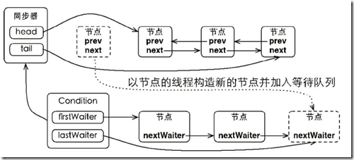

```JAVA
public final void await() throws InterruptedException {
    if (Thread.interrupted())
        throw new InterruptedException();
    // 向条件队列中添加一个等待者，并返回Node封装后的实例
    Node node = addConditionWaiter();
    int savedState = fullyRelease(node);
    int interruptMode = 0;
    while (!isOnSyncQueue(node)) {
        // 阻塞线程
        LockSupport.park(this);
        if ((interruptMode = checkInterruptWhileWaiting(node)) != 0)
            break;
    }
    if (acquireQueued(node, savedState) && interruptMode != THROW_IE)
        interruptMode = REINTERRUPT;
    if (node.nextWaiter != null) // clean up if cancelled
        unlinkCancelledWaiters();
    if (interruptMode != 0)
        reportInterruptAfterWait(interruptMode);
}
```

其他线程调用 `signal()` 方法，会通过 `LockSupport.unpark(node.thread)` 唤醒在条件队列中等待时间最长的Node（首节点），并将其移动到Lock的同步队列中去，让其获得竞争锁的资格。

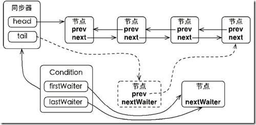

```JAVA
public final void signal() {
    // 判断是否为排它锁
    if (!isHeldExclusively())
        throw new IllegalMonitorStateException();
    // 首节点
    Node first = firstWaiter;
    if (first != null)
        doSignal(first);
}

private void doSignal(Node first) {
    do {
        if ( (firstWaiter = first.nextWaiter) == null)
            lastWaiter = null;
        first.nextWaiter = null;
    } while (!transferForSignal(first) &&
             (first = firstWaiter) != null);
}

final boolean transferForSignal(Node node) {
    // 如果无法更改waitStatus，则节点已被取消。
    if (!compareAndSetWaitStatus(node, Node.CONDITION, 0))
        return false;

    /*
     * Splice onto queue and try to set waitStatus of predecessor to
     * indicate that thread is (probably) waiting. If cancelled or
     * attempt to set waitStatus fails, wake up to resync (in which
     * case the waitStatus can be transiently and harmlessly wrong).
     */
    Node p = enq(node);
    int ws = p.waitStatus;
    if (ws > 0 || !compareAndSetWaitStatus(p, ws, Node.SIGNAL))
        // 唤醒线程
        LockSupport.unpark(node.thread);
    return true;
}
```


### ReentrantLock可重入锁

#### 基本概念

ReentrantLock可重入锁是基于AQS实现的同步器。使用整型变量state记录锁的状态（0未占用，1已被占用），并维护一个管理未获取到锁而被阻塞的线程的队列。其最大的特点是已持有锁的线程再次加锁无需重新获取锁，而是让state状态加1，表示重入了一次，在释放锁的时候也需要释放相应的次数。


#### 基于AQS实现的同步器Sync

```JAVA
// 实现所有AQS同步机制的同步器
private final Sync sync;

abstract static class Sync extends AbstractQueuedSynchronizer {

    private static final long serialVersionUID = -5179523762034025860L;

    // 抽象的，有公平/非公平两种实现
    abstract void lock();

    // 尝试获取锁
    final boolean nonfairTryAcquire(int acquires) {
        final Thread current = Thread.currentThread();
        int c = getState();
        if (c == 0) {
            if (compareAndSetState(0, acquires)) {
                setExclusiveOwnerThread(current);
                return true;
            }
        }
        else if (current == getExclusiveOwnerThread()) {
            int nextc = c + acquires;
            if (nextc < 0) // overflow
                throw new Error("Maximum lock count exceeded");
            setState(nextc);
            return true;
        }
        return false;
    }

    // 尝试释放锁
    protected final boolean tryRelease(int releases) {
        int c = getState() - releases;
        if (Thread.currentThread() != getExclusiveOwnerThread())
            throw new IllegalMonitorStateException();
        boolean free = false;
        if (c == 0) {
            free = true;
            setExclusiveOwnerThread(null);
        }
        setState(c);
        return free;
    }

    protected final boolean isHeldExclusively() {
        return getExclusiveOwnerThread() == Thread.currentThread();
    }

    // 获取一个和Lock绑定的条件对象
    final ConditionObject newCondition() {
        return new ConditionObject();
    }

    // Methods relayed from outer class
    final Thread getOwner() {
        return getState() == 0 ? null : getExclusiveOwnerThread();
    }

    final int getHoldCount() {
        return isHeldExclusively() ? getState() : 0;
    }

    // 锁是否已被锁定
    final boolean isLocked() {
        return getState() != 0;
    }

    private void readObject(java.io.ObjectInputStream s)
        throws java.io.IOException, ClassNotFoundException {
        s.defaultReadObject();
        setState(0); // 重置为解锁状态
    }
}
```


#### 构造方法分析

```JAVA
// 空构造器默认使用非公平锁，性能更佳
public ReentrantLock() {
    sync = new NonfairSync();
}

// 通过参数指定使用公平锁还是非公平锁
public ReentrantLock(boolean fair) {
    sync = fair ? new FairSync() : new NonfairSync();
}

// 加锁（公平/非公平）
public void lock() {
    sync.lock();
}

// 释放锁
public void unlock() {
    sync.release(1);
}
```


#### 非公平锁加锁流程

```java
// 非公平锁类型的同步器
static final class NonfairSync extends Sync {

    private static final long serialVersionUID = 7316153563782823691L;

    // 非公平版的加锁
    final void lock() {
        // 非公平锁会直接进行一次CAS抢锁，成功就返回，否则和公平锁一样处理
        if (compareAndSetState(0, 1))
            setExclusiveOwnerThread(Thread.currentThread());
        else
            acquire(1);
    }
    
    // 尝试获取锁
    protected final boolean tryAcquire(int acquires) {
        return nonfairTryAcquire(acquires);
    }
}

// 非公平版的尝试获取锁
final boolean nonfairTryAcquire(int acquires) {
    final Thread current = Thread.currentThread();
    int c = getState();
    if (c == 0) {
        // 若锁未被占用，非公平锁会再次CAS抢锁
        if (compareAndSetState(0, acquires)) {
            // 若抢锁成功，则设置当前线程为持有锁的线程
            setExclusiveOwnerThread(current);
            return true;
        }
    } else if (current == getExclusiveOwnerThread()) {
        // 若是当前线程已经持有锁，则可重入，锁状态+1
        int nextc = c + acquires;
        if (nextc < 0) // overflow
            throw new Error("Maximum lock count exceeded");
        setState(nextc);
        return true;
    }
    return false;
}
```


#### 公平锁加锁流程

```java
// 公平锁类型的同步器
static final class FairSync extends Sync {

    private static final long serialVersionUID = -3000897897090466540L;

    // 公平版的加锁
    final void lock() {
        acquire(1);
    }

    // 公平版的尝试获取锁
    protected final boolean tryAcquire(int acquires) {
        final Thread current = Thread.currentThread();
        int c = getState();
        if (c == 0) {
            // 公平锁的实现和非公平锁相比，唯一的区别就是多了一个判断阻塞队列中是否有线程在等待
            // 若队列中存在等待的线程，则按照FIFO的规则出队一个线程去持有锁，若队列为空，则直接CAS抢锁
            if (!hasQueuedPredecessors() &&
                compareAndSetState(0, acquires)) {
                setExclusiveOwnerThread(current);
                return true;
            }
        }
        else if (current == getExclusiveOwnerThread()) {
            // 可重入机制
            int nextc = c + acquires;
            if (nextc < 0)
                throw new Error("Maximum lock count exceeded");
            setState(nextc);
            return true;
        }
        return false;
    }
}
```


#### 公共加锁流程

* 尝试以公平/非公平的方式获取锁 `tryAcquire()`；
* 获取成功的占用锁；
* 获取失败的封装为节点 `addWaiter()`，然后阻塞 `LockSupport.park()` 并入队 `acquireQueued()` 。

```java
// 获取锁的整体流程
public final void acquire(int arg) {
    if (!tryAcquire(arg) &&
        acquireQueued(addWaiter(Node.EXCLUSIVE), arg))
        // 未抢到锁的线程自我中断
        selfInterrupt();
}

// 封装未抢到锁的线程为Node
private Node addWaiter(Node mode) {
    Node node = new Node(Thread.currentThread(), mode);
    Node pred = tail;
    if (pred != null) {
        node.prev = pred;
        if (compareAndSetTail(pred, node)) {
            pred.next = node;
            return node;
        }
    }
    enq(node);
    return node;
}

// Node入队
final boolean acquireQueued(final Node node, int arg) {
    boolean failed = true;
    try {
        boolean interrupted = false;
        for (;;) {
            final Node p = node.predecessor();
            if (p == head && tryAcquire(arg)) {
                setHead(node);
                p.next = null; // help GC
                failed = false;
                return interrupted;
            }
            if (shouldParkAfterFailedAcquire(p, node) &&
                parkAndCheckInterrupt())
                interrupted = true;
        }
    } finally {
        if (failed)
            cancelAcquire(node);
    }
}

// 阻塞线程并检查中断
private final boolean parkAndCheckInterrupt() {
    LockSupport.park(this);
    return Thread.interrupted();
}

// 线程自我中断
static void selfInterrupt() {
    Thread.currentThread().interrupt();
}
```


#### 释放锁流程

```java
// 释放锁
public final boolean release(int arg) {
    if (tryRelease(arg)) {
        Node h = head;
        if (h != null && h.waitStatus != 0)
            unparkSuccessor(h);
        return true;
    }
    return false;
}

// 尝试释放锁
protected final boolean tryRelease(int releases) {
    // 锁状态state释放一次（重入几次释放几次）
    int c = getState() - releases;
    if (Thread.currentThread() != getExclusiveOwnerThread())
        throw new IllegalMonitorStateException();
    boolean free = false;
    if (c == 0) {
        // 锁被释放（state减为0）
        free = true;
        setExclusiveOwnerThread(null);
    }
    setState(c);
    return free;
}

// 释放锁后去唤醒队列中阻塞的线程
private void unparkSuccessor(Node node) {
    int ws = node.waitStatus;
    if (ws < 0)
        compareAndSetWaitStatus(node, ws, 0);

	// 获取头节点的后继节点，即队列中第一个节点
    Node s = node.next;
    if (s == null || s.waitStatus > 0) {
        s = null;
        for (Node t = tail; t != null && t != node; t = t.prev)
            if (t.waitStatus <= 0)
                s = t;
    }
    if (s != null)
        // 唤醒队列中第一个节点
        LockSupport.unpark(s.thread);
}
```


#### 公平/非公平锁的区别

* 非公平锁在调用lock后，首先就会使用CAS进行竞争锁的操作，若这时锁恰好没有被占用，则直接获取锁返回；
* 非公平锁在CAS操作失败后，和公平锁一样都会进入 `tryAcquire()` 方法，在该方法中，若发现锁的状态state为0，即锁已被释放，非公平锁会直接CAS抢占，但公平锁会判断等待队列中是否有线程处于等待状态，若有则出队线程去占有锁，新的线程入队等待；
* 若非公平锁的两次CAS都不成功，则接下来和公平锁一样，线程会进入阻塞队列等待唤醒；
* 相对公平锁，非公平锁具有更好的性能，但也会让线程获取锁的时间不确定，导致阻塞队列中的线程长期处于等待状态。


### ReentrantReadWriteLock可重入读写锁

#### 基本概念

ReentrantReadWriteLock可重入读写锁是基于AQS实现的同步器。同样也维护同步状态state和阻塞队列来保证同步，其特点是具有读/写两种锁状态，允许同一时刻多个读线程访问共享资源，但写线程访问时，其他所有的读写线程均被阻塞。这种分离读写操作的方式除了保证写操作的线程安全外，还能让读操作的并发性能得到提升，如应用在缓存结构上。


#### 构造方法和基本方法及属性

```JAVA
// 读锁
private final ReentrantReadWriteLock.ReadLock readerLock;
// 写锁
private final ReentrantReadWriteLock.WriteLock writerLock;
// AQS同步器
final Sync sync;

// 默认非公平
public ReentrantReadWriteLock() {
    this(false);
}

// 初始化两把锁
public ReentrantReadWriteLock(boolean fair) {
    sync = fair ? new FairSync() : new NonfairSync();
    readerLock = new ReadLock(this);
    writerLock = new WriteLock(this);
}

// 获取读/写锁
public ReentrantReadWriteLock.WriteLock writeLock() { return writerLock; }
public ReentrantReadWriteLock.ReadLock  readLock()  { return readerLock; }
```


#### 基于AQS实现的同步器Sync

```java
abstract static class Sync extends AbstractQueuedSynchronizer {
    
    private static final long serialVersionUID = 6317671515068378041L;

    /*
     * 读写计数提取常量和函数。
     * 锁状态逻辑上分为两个无符号短路：
     * 下面的一个表示独占（写入）锁保持计数，上限表示共享（读卡器）保持计数。
     */
    static final int SHARED_SHIFT   = 16;
    static final int SHARED_UNIT    = (1 << SHARED_SHIFT);
    static final int MAX_COUNT      = (1 << SHARED_SHIFT) - 1;
    static final int EXCLUSIVE_MASK = (1 << SHARED_SHIFT) - 1;

    // 返回以count表示的共享保留数，高16位
    static int sharedCount(int c)    { return c >>> SHARED_SHIFT; }
    // 返回以count表示的独占保留数，低16位
    static int exclusiveCount(int c) { return c & EXCLUSIVE_MASK; }
```


#### 公平/非公平锁

```java
static final class NonfairSync extends Sync {
    private static final long serialVersionUID = -8159625535654395037L;
    final boolean writerShouldBlock() {
        return false; // writers can always barge
    }
    final boolean readerShouldBlock() {
        return apparentlyFirstQueuedIsExclusive();
    }
}

static final class FairSync extends Sync {
    private static final long serialVersionUID = -2274990926593161451L;
    final boolean writerShouldBlock() {
        return hasQueuedPredecessors();
    }
    final boolean readerShouldBlock() {
        return hasQueuedPredecessors();
    }
}
```


#### 读锁的获取和释放流程

静态内部类——读锁：

```java
public static class ReadLock implements Lock, java.io.Serializable {
    private static final long serialVersionUID = -5992448646407690164L;
    private final Sync sync;

    protected ReadLock(ReentrantReadWriteLock lock) {
        sync = lock.sync;
    }
	
    // 读锁获取锁
    public void lock() {
        sync.acquireShared(1);
    }

    public void lockInterruptibly() throws InterruptedException {
        sync.acquireSharedInterruptibly(1);
    }
	
    // 读锁释放锁
    public boolean tryLock() {
        return sync.tryReadLock();
    }

    public boolean tryLock(long timeout, TimeUnit unit)
        throws InterruptedException {
        return sync.tryAcquireSharedNanos(1, unit.toNanos(timeout));
    }

    public void unlock() {
        sync.releaseShared(1);
    }

    public Condition newCondition() {
        throw new UnsupportedOperationException();
    }

    public String toString() {
        int r = sync.getReadLockCount();
        return super.toString() +
            "[Read locks = " + r + "]";
    }
}
```

读锁获取锁：

* 获取读锁时，会尝试判断当前对象是否拥有了写锁，如果拥有，则直接获取失败；
* 如果没有，就尝试加锁；
* 如果当前线程已经持有读锁，则直接读锁状态state加1。

```java
// AbstractQueuedSynchronizer
// 获取共享锁
public final void acquireShared(int arg) {
    if (tryAcquireShared(arg) < 0)
        doAcquireShared(arg);
}

// ReentrantReadWriteLock.ReadLock
// 尝试获取共享锁
protected final int tryAcquireShared(int unused) {
    Thread current = Thread.currentThread();
    int c = getState();
    // 获取低16位，独占计数，即写锁的state状态
    if (exclusiveCount(c) != 0 &&
        getExclusiveOwnerThread() != current)
        return -1;
    // 读取高16位，共享计数，即读锁的state状态
    int r = sharedCount(c);
    // 公平锁排队，非公平锁先抢后排队
    if (!readerShouldBlock() &&
        r < MAX_COUNT &&
        compareAndSetState(c, c + SHARED_UNIT)) {
        if (r == 0) {
            // 第一个获取读锁
            firstReader = current;
            firstReaderHoldCount = 1;
        } else if (firstReader == current) {
            // 如果当前线程已经持有读锁，则可重入
            firstReaderHoldCount++;
        } else {
            HoldCounter rh = cachedHoldCounter;
            if (rh == null || rh.tid != getThreadId(current))
                cachedHoldCounter = rh = readHolds.get();
            else if (rh.count == 0)
                readHolds.set(rh);
            rh.count++;
        }
        return 1;
    }
    return fullTryAcquireShared(current);
}

// AbstractQueuedSynchronizer
// 获取共享锁的具体实现
private void doAcquireShared(int arg) {
    final Node node = addWaiter(Node.SHARED);
    boolean failed = true;
    try {
        boolean interrupted = false;
        for (;;) {
            final Node p = node.predecessor();
            if (p == head) {
                int r = tryAcquireShared(arg);
                if (r >= 0) {
                    setHeadAndPropagate(node, r);
                    p.next = null; // help GC
                    if (interrupted)
                        selfInterrupt();
                    failed = false;
                    return;
                }
            }
            if (shouldParkAfterFailedAcquire(p, node) &&
                parkAndCheckInterrupt())
                interrupted = true;
        }
    } finally {
        if (failed)
            cancelAcquire(node);
    }
}
```

读锁释放锁：

```java
// AbstractQueuedSynchronizer
// 释放共享锁
public final boolean releaseShared(int arg) {
    if (tryReleaseShared(arg)) {
        doReleaseShared();
        return true;
    }
    return false;
}

// ReentrantReadWriteLock.ReadLock
// 尝试释放共享锁
protected final boolean tryReleaseShared(int unused) {
    Thread current = Thread.currentThread();
    if (firstReader == current) {
        // assert firstReaderHoldCount > 0;
        if (firstReaderHoldCount == 1)
            // 释放读锁计数
            firstReader = null;
        else
            // 释放一次读锁计数
            firstReaderHoldCount--;
    } else {
        HoldCounter rh = cachedHoldCounter;
        if (rh == null || rh.tid != getThreadId(current))
            rh = readHolds.get();
        int count = rh.count;
        if (count <= 1) {
            // 清除ThreadLocal，防止内存泄漏
            readHolds.remove();
            if (count <= 0)
                throw unmatchedUnlockException();
        }
        --rh.count;
    }
    for (;;) {
        int c = getState();
        int nextc = c - SHARED_UNIT;
        if (compareAndSetState(c, nextc))
            // CAS操作置换state，判断最终结果是否为0，若结果为0，则写线程可以参与竞争
            return nextc == 0;
    }
}

// AbstractQueuedSynchronizer
// 释放共享锁的具体实现
private void doReleaseShared() {
    for (;;) {
        Node h = head;
        if (h != null && h != tail) {
            int ws = h.waitStatus;
            if (ws == Node.SIGNAL) {
                if (!compareAndSetWaitStatus(h, Node.SIGNAL, 0))
                    continue;            // loop to recheck cases
                unparkSuccessor(h);
            }
            else if (ws == 0 &&
                     !compareAndSetWaitStatus(h, 0, Node.PROPAGATE))
                continue;                // loop on failed CAS
        }
        if (h == head)                   // loop if head changed
            break;
    }
}
```


#### 写锁的获取和释放流程

静态内部类——写锁：

```java
public static class WriteLock implements Lock, java.io.Serializable {
    private static final long serialVersionUID = -4992448646407690164L;
    private final Sync sync;

    protected WriteLock(ReentrantReadWriteLock lock) {
        sync = lock.sync;
    }

    // 写锁获取锁
    public void lock() {
        sync.acquire(1);
    }

    public void lockInterruptibly() throws InterruptedException {
        sync.acquireInterruptibly(1);
    }

    public boolean tryLock( ) {
        return sync.tryWriteLock();
    }

    public boolean tryLock(long timeout, TimeUnit unit)
        throws InterruptedException {
        return sync.tryAcquireNanos(1, unit.toNanos(timeout));
    }
	
    // 写锁释放锁
    public void unlock() {
        sync.release(1);
    }

    public Condition newCondition() {
        return sync.newCondition();
    }

    public String toString() {
        Thread o = sync.getOwner();
        return super.toString() + ((o == null) ?
                                   "[Unlocked]" :
                                   "[Locked by thread " + o.getName() + "]");
    }

    public boolean isHeldByCurrentThread() {
        return sync.isHeldExclusively();
    }

    public int getHoldCount() {
        return sync.getWriteHoldCount();
    }
}
```

写锁获取锁：

* 在获取写锁时，会尝试判断锁是否已被占用，如果已被占用且占用的线程非当前线程，则直接获取失败，加入阻塞队列；
* 如果锁没有被占用，则当前线程就会持有写锁，且写锁个数加1；

```java
public final void acquire(int arg) {
    if (!tryAcquire(arg) &&
        acquireQueued(addWaiter(Node.EXCLUSIVE), arg))
        selfInterrupt();
}

protected final boolean tryAcquire(int acquires) {
    Thread current = Thread.currentThread();
    int c = getState();
    // 获取state低16位的写锁计数
    int w = exclusiveCount(c);
    if (c != 0) {
        // (Note: if c != 0 and w == 0 then shared count != 0)
        if (w == 0 || current != getExclusiveOwnerThread())
            // 锁非当前线程持有
            return false;
        // 超过最大锁计数
        if (w + exclusiveCount(acquires) > MAX_COUNT)
            throw new Error("Maximum lock count exceeded");
        // 可重入获取
        setState(c + acquires);
        return true;
    }
    if (writerShouldBlock() ||
        !compareAndSetState(c, c + acquires))
        // 竞争写锁失败
        return false;
    // 竞争成功
    setExclusiveOwnerThread(current);
    return true;
}
```

写锁释放锁：

```JAVA
public final boolean release(int arg) {
    if (tryRelease(arg)) {
        Node h = head;
        if (h != null && h.waitStatus != 0)
            // 唤醒下一个线程
            unparkSuccessor(h);
        return true;
    }
    return false;
}

protected final boolean tryRelease(int releases) {
    if (!isHeldExclusively())
        // 当前线程不是持有锁的线程
        throw new IllegalMonitorStateException();
    int nextc = getState() - releases;
    // 判断写锁的计数是否为0，为0则表示不被任何线程持有
    boolean free = exclusiveCount(nextc) == 0;
    if (free)
        setExclusiveOwnerThread(null);
    setState(nextc);
    return free;
}
```


### Semaphore信号量

#### 基本概念

Semaphore信号量与synchronized和ReetrantLock的区别是后两者都是一次只允许一个线程访问资源，而Semaphore可以指定多个线程同时访问某个资源。


#### 使用示例

```JAVA
public class SemaphoreExample {
    	
    // 初始化请求数量
    private static final int threadCount = 550;
    
    public static void main(String[] args) throws InterruptedException {
        // 固定容量线程池
        ExecutorService threadPool = Executors.newFixedThreadPool(300);
        // Semaphore维护一个可获得许可证的数量，不存在具体的许可证对象，经常用于限制同时访问某种资源的线程数量
        final Semaphore semaphore = new Semaphore(20);
        
        for (int i = 0; i < threadCount; i++) {
            final int threadNum = i;
        	threadPool.execute(() -> {
                try {
                    // 线程阻塞，直到存在可以获取的许可证并获取一个
                    semaphore.acquire();	
                    // semaphore.acqurie(5);	// 获取多个许可证
                    // semaphore.tryAcqurie();	// 尝试获取许可证，但不会阻塞，获取不到会直接返回
                    
                    Thread.sleep(1000);
                    System.out.println("threadNum: " + threadNum);
                    Thread.sleep(1000);
                    
                    // 释放自己持有的许可证
                    semaphore.release();
                    // semaphore.release(5);
                } catch (InterruptedException e) {
                    e.printStackTrace();
                }
            });
        }
    }
    
    public static void test() throws InterruptedException {
        Thread.sleep(1000);
        System.out.println("threadNum: " + threadNum);
        Thread.sleep(1000);
    }
}
```


#### 源码分析

Semaphore与CoutDownLatch一样是共享锁的一种实现，默认初始化AQS的state为permits，当同时访问资源的线程超出permits（许可证发放完），那么超出的线程会进入阻塞队列并park，只有当state大于0时（有许可证被释放），阻塞的线程才能unpark继续执行。

```JAVA
public Semaphore(int permits) {
    // 默认非公平模式
    sync = new NonfairSync(permits);
}

public Semaphore(int permits, boolean fair) {
    // 公平模式：FIFO。非公平模式：抢占式
    sync = fair ? new FairSync(permits) : new NonfairSync(permits);
}
```

```JAVA
private final Sync sync;

/**
 * Synchronization implementation for semaphore.  Uses AQS state
 * to represent permits. Subclassed into fair and nonfair
 * versions.
 */
abstract static class Sync extends AbstractQueuedSynchronizer {
    
    private static final long serialVersionUID = 1192457210091910933L;

    Sync(int permits) {
        setState(permits);
    }

    final int getPermits() {
        return getState();
    }

    final int nonfairTryAcquireShared(int acquires) {
        for (;;) {
            int available = getState();
            int remaining = available - acquires;
            if (remaining < 0 ||
                compareAndSetState(available, remaining))
                return remaining;
        }
    }

    protected final boolean tryReleaseShared(int releases) {
        for (;;) {
            int current = getState();
            int next = current + releases;
            if (next < current) // overflow
                throw new Error("Maximum permit count exceeded");
            if (compareAndSetState(current, next))
                return true;
        }
    }

    final void reducePermits(int reductions) {
        for (;;) {
            int current = getState();
            int next = current - reductions;
            if (next > current) // underflow
                throw new Error("Permit count underflow");
            if (compareAndSetState(current, next))
                return;
        }
    }

    final int drainPermits() {
        for (;;) {
            int current = getState();
            if (current == 0 || compareAndSetState(current, 0))
                return current;
        }
    }
}
```

```JAVA
/**
 * NonFair version
 */
static final class NonfairSync extends Sync {
    private static final long serialVersionUID = -2694183684443567898L;

    NonfairSync(int permits) {
        super(permits);
    }

    protected int tryAcquireShared(int acquires) {
        return nonfairTryAcquireShared(acquires);
    }
}

/**
 * Fair version
 */
static final class FairSync extends Sync {
    private static final long serialVersionUID = 2014338818796000944L;

    FairSync(int permits) {
        super(permits);
    }

    protected int tryAcquireShared(int acquires) {
        for (;;) {
            if (hasQueuedPredecessors())
                return -1;
            int available = getState();
            int remaining = available - acquires;
            if (remaining < 0 ||
                compareAndSetState(available, remaining))
                return remaining;
        }
    }
}
```

```java
/**
     * Acquires a permit from this semaphore, blocking until one is
     * available, or the thread is {@linkplain Thread#interrupt interrupted}.
     *
     * <p>Acquires a permit, if one is available and returns immediately,
     * reducing the number of available permits by one.
     *
     * <p>If no permit is available then the current thread becomes
     * disabled for thread scheduling purposes and lies dormant until
     * one of two things happens:
     * <ul>
     * <li>Some other thread invokes the {@link #release} method for this
     * semaphore and the current thread is next to be assigned a permit; or
     * <li>Some other thread {@linkplain Thread#interrupt interrupts}
     * the current thread.
     * </ul>
     *
     * <p>If the current thread:
     * <ul>
     * <li>has its interrupted status set on entry to this method; or
     * <li>is {@linkplain Thread#interrupt interrupted} while waiting
     * for a permit,
     * </ul>
     * then {@link InterruptedException} is thrown and the current thread's
     * interrupted status is cleared.
     *
     * @throws InterruptedException if the current thread is interrupted
     */
public void acquire() throws InterruptedException {
    sync.acquireSharedInterruptibly(1);
}

/**
     * Releases a permit, returning it to the semaphore.
     *
     * <p>Releases a permit, increasing the number of available permits by
     * one.  If any threads are trying to acquire a permit, then one is
     * selected and given the permit that was just released.  That thread
     * is (re)enabled for thread scheduling purposes.
     *
     * <p>There is no requirement that a thread that releases a permit must
     * have acquired that permit by calling {@link #acquire}.
     * Correct usage of a semaphore is established by programming convention
     * in the application.
     */
public void release() {
    sync.releaseShared(1);
}
```


### CountDownLatch闭锁

#### 基本概念

基于AQS实现的一种共享锁，锁状态state做为count计数器使用，计数器的初值对应任务的数量，每当完成一个任务后（`CountDownLatch.countDown()`），就会减1。当计数器归0时，在闭锁上等待的线程就会恢复执行（`CountDownLatch.await()`）。


#### 使用场景

* **当某个线程在开始运行前需要等待多个前置线程执行完毕的场景**：主调线程通过 `new CountDownLatch(n)` 将计数器初始化为0，并且通过 `countDownLatch.await() ` 阻塞，每当一个前置线程执行完毕就会通过`countDownLatch.countDown()`将计数器减1，直到计数器变为0，主调线程才会从 ``await()`` 返回继续执行。典型的场景就是扣款操作，若干个前置的身份认证、操作合法性认证、余额认证等完成后，主调线程再进行扣款操作。

* **需要多个线程在某一时刻同时开始执行的场景**：多个线程在某一时刻同时开始执行的场景，如赛跑，多个线程在起点初始化，然后等待发令枪响，最后同时执行。首先主线程初始化一个`new CountDownLatch(1)`，然后多个子线程通过`countDownLatch.await()`阻塞，最后主线程调用`countDownLatch.coutDown()`让所有阻塞的子线程同时执行。


#### 使用示例

```JAVA
public class CountDownLatchExample {
    
    private static final int threadNum = 550;
    
    public static void main(String[] args) throws InterruptedException {
        ExecutorService threadPool = Executors.newFixedThreadPool(300);
        final CountDownLatch countDownLatch = new CountDownLatch(threadNum);
        
        threadPool.execute(() -> {
            try {
                // 模拟请求的耗时操作
                Thread.sleep(1000);
                System.out.println("threadNum: " + threadNum);
                Thread.sleep(1000);
            } catch (InterruptedException e) {
                e.printStackTrace();
            } finally {
                countDownLatch.countDown();
            }
        });
        
        countDownLatch.await();
        threadPool.shutdown();
    }
} 
```


#### 源码分析

Sync同步器分析：

```java
// 倒计时门闩的同步器，使用AQS的state状态表示计数
private static final class Sync extends AbstractQueuedSynchronizer {
    
    private static final long serialVersionUID = 4982264981922014374L;

    Sync(int count) {
        setState(count);
    }

    int getCount() {
        return getState();
    }

    protected int tryAcquireShared(int acquires) {
        return (getState() == 0) ? 1 : -1;
    }

    protected boolean tryReleaseShared(int releases) {
        // 计数减量，变为0时会发出唤醒信号
        for (;;) {
            int c = getState();
            if (c == 0)
                return false;
            int nextc = c-1;
            if (compareAndSetState(c, nextc))
                return nextc == 0;
        }
    }
}

private final Sync sync;
```

构造方法分析：

```java
// 初始化计数器的大小
public CountDownLatch(int count) {
    if (count < 0) throw new IllegalArgumentException("count < 0");
    this.sync = new Sync(count);
}
```

`await()` 方法分析：

```java
public void await() throws InterruptedException {
    sync.acquireSharedInterruptibly(1);
}

public final void acquireSharedInterruptibly(int arg)
    throws InterruptedException {
    if (Thread.interrupted())
        throw new InterruptedException();
    if (tryAcquireShared(arg) < 0)
        doAcquireSharedInterruptibly(arg);
}

// 尝试获取共享锁，计时器为0时不能获取
protected int tryAcquireShared(int acquires) {
    return (getState() == 0) ? 1 : -1;
}

// 以共享可中断模式获取锁
private void doAcquireSharedInterruptibly(int arg)
    throws InterruptedException {
    final Node node = addWaiter(Node.SHARED);
    boolean failed = true;
    try {
        for (;;) {
            final Node p = node.predecessor();
            if (p == head) {
                int r = tryAcquireShared(arg);
                if (r >= 0) {
                    setHeadAndPropagate(node, r);
                    p.next = null; // help GC
                    failed = false;
                    return;
                }
            }
            if (shouldParkAfterFailedAcquire(p, node) &&
                parkAndCheckInterrupt())
                throw new InterruptedException();
        }
    } finally {
        if (failed)
            cancelAcquire(node);
    }
}
```

`countDown()` 方法分析：

```java
public void countDown() {
    sync.releaseShared(1);
}

public final boolean releaseShared(int arg) {
    if (tryReleaseShared(arg)) {
        doReleaseShared();
        return true;
    }
    return false;
}

protected boolean tryReleaseShared(int releases) {
    // Decrement count; signal when transition to zero
    for (;;) {
        int c = getState();
        if (c == 0)
            return false;
        int nextc = c-1;
        if (compareAndSetState(c, nextc))
            return nextc == 0;
    }
}

/**
 * Release action for shared mode -- signals successor and ensures
 * propagation. (Note: For exclusive mode, release just amounts
 * to calling unparkSuccessor of head if it needs signal.)
 */
private void doReleaseShared() {
    /*
     * Ensure that a release propagates, even if there are other
     * in-progress acquires/releases.  This proceeds in the usual
     * way of trying to unparkSuccessor of head if it needs
     * signal. But if it does not, status is set to PROPAGATE to
     * ensure that upon release, propagation continues.
     * Additionally, we must loop in case a new node is added
     * while we are doing this. Also, unlike other uses of
     * unparkSuccessor, we need to know if CAS to reset status
     * fails, if so rechecking.
     */
    for (;;) {
        Node h = head;
        if (h != null && h != tail) {
            int ws = h.waitStatus;
            if (ws == Node.SIGNAL) {
                if (!compareAndSetWaitStatus(h, Node.SIGNAL, 0))
                    continue;            // loop to recheck cases
                unparkSuccessor(h);
            }
            else if (ws == 0 &&
                     !compareAndSetWaitStatus(h, 0, Node.PROPAGATE))
                continue;                // loop on failed CAS
        }
        if (h == head)                   // loop if head changed
            break;
    }
}
```


#### 注意事项

* CountDownLatch是一次性的，计数器只能在构造方法种初始化一次，之后没有任何机制可以修改，当CountDownLatch使用完毕后，就不能再次被使用。

* CountDownLatch的 `await()` 方法使用不当容易发生死锁，若是没有足够的线程去将state置为0，那么通过 `await()` 阻塞的线程会永久等待下去。


### CyclicBarrier循环屏障

#### 基本概念

CyclicBarrier的字面意思是可循环使用的屏障，就是让一组线程到一个屏障/同步点时被阻塞，直到该组最后一个线程到达后才会放行，所有被拦截的线程才会继续执行。CountDownLatch是直接基于AQS实现的，而CyclicBarrier是基于ReentrantLock和Condition实现的。

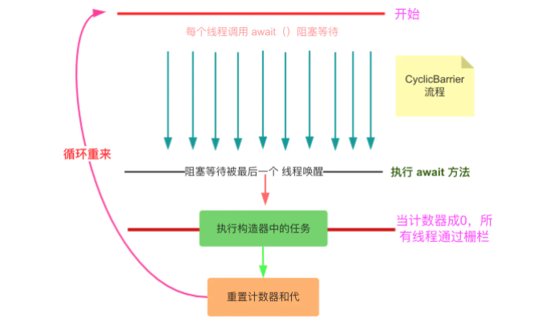


#### 应用场景

* 主要适用于多线程计算数据，最后合并计算结果的场景。如：统计2010-2020年某银行账户的年平均流水，可以通过多个子线程去计算每一年的流水总和，等所有线程计算完毕后，屏障打开，由主线程或是注册在栅栏上的方法合并这些数据求平均值；
* 若在上例的基础上，还要统计2010-2020各年度的流水占这10年总流水的比例，则屏障放开后还可以增加逻辑，在统计总流水之后，即放行之后，让线程各自再去计算比例。


#### 使用示例

```JAVA
public class CyclicBarrierExample {
    
    private static final int threadNum = 550;
    // private static final CyclicBarrier cyclicBarrier = new CyclicBarrier(5);
    private static final CyclicBayourrier cyclicBarrier = new CyclicBarrier(5, () -> {
    	System.out.println("当线程数量满足后，优先执行的代码逻辑。。。");
    });
    
    public static void main(String[] args) throws InterruptedException {
        ExecutorService threadPool = Executors.newFixedThreadPool(10);
        
        for (int i = 0; i < threadNum; i++) {
            final int threadNum = i;
            Thread.sleep(1000);
            threadPool.execute(() -> {
                try {
                    // 进入屏障之前的逻辑
                    System.out.println("threadNum: " + threadNum + " is ready");
                    
                    // 在屏障上阻塞，直到阻塞的线程数满足屏障的要求后才会继续执行
                    cyclicBarrier.await();
                    // 可以通过参数指定await的等待时间 
                    // cyclicBarrier.await(60, TimeUnit.SECONDS);
                    
                    // 通过屏障之后的逻辑
                    System.out.println("threadNum: " + threadNum + " is finish");
                } catch (InterruptedException e) {
                    e.printStackTrace();
                } catch (BrokenBarrierException e) {
                    e.printStackTrace();
                }
            });
        }
        
        threadPool.shutdown();
    }
}
```


#### 源码分析

基本属性和方法分析：

```java
// 分代（屏障和一组要共同通过屏障的线程就是一代）
private static class Generation {
    boolean broken = false;
}

// 控制同步的锁
private final ReentrantLock lock = new ReentrantLock();
// 等待跳闸的条件对象
private final Condition trip = lock.newCondition();
// 共同通过屏障的线程数
private final int parties;
// 屏障跳闸时执行的任务
private final Runnable barrierCommand;
// 当前代
private Generation generation = new Generation();

// 计数器
private int count;

// 创建屏障的下一代，并唤醒所有阻塞的线程，仅在同步锁中调用
private void nextGeneration() {
    // 发送上一代已经完成的信号
    trip.signalAll();
    // 建立下一代
    count = parties;
    generation = new Generation();
}

// 将屏障的当前代设置为损坏状态，并唤醒所有阻塞的线程，仅在同步锁中调用
private void breakBarrier() {
    generation.broken = true;
    count = parties;
    trip.signalAll();
}
```

构造方法分析：

```java
// parties表示屏障拦截的线程数，当拦截的线程数量达到该值时，就打开栅栏，放行所有线程
// barrierAction是在屏障打开时执行的任务
public CyclicBarrier(int parties, Runnable barrierAction) {
    if (parties <= 0) throw new IllegalArgumentException();
    this.parties = parties;
    this.count = parties;
    this.barrierCommand = barrierAction;
}

public CyclicBarrier(int parties) {
    this(parties, null);
}
```

`await()` 方法分析：

```JAVA
public int await() throws InterruptedException, BrokenBarrierException {
    try {
        return dowait(false, 0L);
    } catch (TimeoutException toe) {
        throw new Error(toe); // cannot happen
    }
}

private int dowait(boolean timed, long nanos) 
    throws InterruptedException, BrokenBarrierException,
		   TimeoutException {
    final ReentrantLock lock = this.lock;
    // 底层使用ReentrantLock获取和释放锁
    lock.lock();
    try {
        // 当前代（一组线程）
        final Generation g = generation;
        // 若这代损坏，则抛出异常
        if (g.broken)
            throw new BrokenBarrierException();

        // 若线程中断，则抛出异常
        if (Thread.interrupted()) {
            // 将损坏状态设置为true，并通知其他阻塞在该屏障上的线程
            breakBarrier();
            throw new InterruptedException();
        }
        
        // 每到达一个线程时，计算器count就会减1
        int index = --count;
        // 当count的数量减为0后，就说明最后一个线程已经到达屏障（即跳闸了），所有阻塞在屏障上的线程都可以继续执行
        if (index == 0) {  // tripped
            boolean ranAction = false;
            try {
                final Runnable command = barrierCommand;
                // 执行注册在屏障上的任务
                if (command != null)
                    command.run();
                ranAction = true;
                // 更新下一代，即重置count计数器，创建新的分代对象
                // 并且通过Condition.signalAll()方法唤醒所有在屏障上等待的线程
                nextGeneration();
                return 0;
            } finally {
                if (!ranAction)
                    breakBarrier();
            }
        }
	
        // 若count计数器不为0，则循环直到跳闸、损坏、中断或超时
        for (;;) {
            try {
                // 如果没有时间限制，则通过Condition.await()直接等待，直到被唤醒
                if (!timed)
                    trip.await();
                // 如果有时间限制，则等待指定的时间
                else if (nanos > 0L)
                    nanos = trip.awaitNanos(nanos);
            } catch (InterruptedException ie) {
                // 发生异常后，需要损坏当前代
                // g == generation 是当前代
                // ! g.broken 且没有损坏
                if (g == generation && ! g.broken) {
                    // 让屏障失效，即让当前代损坏，重置计数器，唤醒所有阻塞线程
                    breakBarrier();
                    throw ie;
                } else {
                    // 若上面的条件不满足，则说明当前线程不属于当前代
                    // 就不会影响当前这代的执行逻辑，只会打上中断标记
                    Thread.currentThread().interrupt();
                }
            }
			
            // 当有任何一个线程中断了，就会调用breakBarrier方法唤醒其他的线程，其他线程醒来后，也要抛出异常
            if (g.broken)
                throw new BrokenBarrierException();
			
            // 若g != generation，表示正常换代，返回当前线程所在的屏障的计数器个数
            // 如果g == generation，说明还没有换代，线程被其他的屏障唤醒了
            // 因为一个线程可以使用多个屏障，当别的屏障唤醒了这个线程，就会走到这里，所以需要判断是否是当前代
            // 正是因为这个原因，才需要generation来保证正确
            if (g != generation)
                return index;
			
            // 如果有时间限制，且时间被设置为小于等于0，则破坏屏障，并抛出异常
            if (timed && nanos <= 0L) {
                breakBarrier();
                throw new TimeoutException();
            }
        }
    } finally {
        // 释放锁
        lock.unlock();
    }
}
```


#### CyclicBarrier与CountDownLatch的区别

* CountDownLatch的计数器只能使用一次，在有些场合需要不停的创建CoutDownLatch的实例，存在浪费资源的现象。而CyclicBarrier的计数器可以多次使用，并且能够通过 ``reset()`` 方法重置。

* CountDownLatch是一个或多个线程，等待其他多个线程完成某些事情后才能执行。而CyclicBarrier是多个线程为一组互相等待，直到达到某一个同步点，再继续一起执行。


## JUC

### LockSupport锁支持

#### 基本概念

用于创建锁和其他同步类的基本线程阻塞原语。该类给使用它的每个线程关联一个许可证（在Semaphore类的意义上）， 如果许可证可用，将立即解阻塞返回 `park` ，并在此过程中消耗许可证，否则线程阻塞。如果尚未提供许可，则需要通过 `unpark` 获得许可，与Semaphore不同的是，LockSupport的许可证最多只能存在一个。


#### 出现原因

synchronized&wait&notify/notifyAll机制的限制：

```java
public class WaitNotify {
	
    private static Object objectLock = new Object();
    
    public static void main(String[] args) {
        new Thread(() -> {
            synchronized (objectLock) {
                try {
                    // 若执行notify的线程先执行，执行wait的线程会无限的阻塞下去
                    TimeUnit.SECONDS.sleep(3);
                    objectLock.wait();
                } catch (InterruptedException e) {
                    e.printStackTrace();
                }
           System.out.println(Thread.currentThread().getName() + "\t线程已被唤醒");
            }
        }, "A").start();
    	
        new Thread(() -> {
            synchronized (objectLock) {
                objectLock.notify();
                System.out.println(Thread.currentThread().getName() + "\t线程已发送通知唤醒等待线程");
            }
        }, "B").start();
    }
}
```

ReentrantLock&await&signal机制的限制：

```java
public class AwaitSignalTest {
    
    private static Lock lock = new ReentrantLock();
    private static Condition condition = lock.newCondition();
    
    public static void main(String[] args) {
        new Thread(() -> {
            lock.lock();
            try {
                // 若执行notify的线程先执行，执行wait的线程会无限的阻塞下去
                TimeUnit.SECONDS.sleep(3);
                condition.await();
                System.out.println(Thread.currentThread().getName() + "\t线程已被唤醒");
            } catch (InterruptedException e) {
                e.printStackTrace();
            } finally {
                lock.unlock();
            }
        }, "A").start();
        
        new Thread(() -> {
            lock.lock();
            try {
                condition.signal();
                System.out.println(Thread.currentThread().getName() + "\t线程已发送通知唤醒等待线程");
            } catch (InterruptedException e) {
                e.printStackTrace();
            } finally {
                lock.unlock();
            }
        }, "B").start();
    } 
}
```

* wait和notify都是Object中的方法，在调用这两个方法前必须先获得锁对象，但是park不需要获取某个对象的锁就可以锁住线程
* notify只能随机选择一个线程唤醒，无法唤醒指定的线程，unpark却可以唤醒一个指定的线程。


#### 使用示例

```java
public class LockSupport {
    
    public static void main(String[] args) {
        Thread a = new Thread(() -> {
            try {
                TimeUnit.SECONDS.sleep(3L);
            } catch (InterruptedException e) {
                e.printStackTrace();
            }
            // 阻塞当前线程，即凭证为0时阻塞，直到被发放凭证后才会唤醒
            LockSupport.park();
            System.out.println(Thread.currentThread().getName() + "\t线程已被唤醒");
        }, "A");
        a.start();
    	
        new Thread(() -> {
            // 唤醒指定线程，即为指定线程发放1个凭证（凭证的上限为1）
            LockSupport.unpark(a);
            System.out.println(Thread.currentThread().getName() + "\t线程已发送通知唤醒等待线程");
        }).start();
    }
}
```


#### 源码分析

LockSupport底层使用Posix线程库pthreads的系统级别锁互斥量mutex和condition，所以它的消耗是非常大的。所以在使用时通过一定的机制避免使用系统级资源的频率，如AQS会再三确认是否无法获得锁，如果确实无法获得，最后才会通过 `park()` 阻塞等待直到被唤醒后再去抢锁。

许可证permit：获得许可证则向下执行，没有许可证则等待直到获得为止。park 睡眠等待直到 permit >0，unpark 设置许可证以供 park 获取。许可证即就是 _counter，永远只有0、1两种值，即要么有许可，要么没有许可，不存在多个许可的情况。

注：不会释放锁资源，`park()` 更类似 `sleep()` 睡眠都不会释放锁，会继续持有当前锁，所以阻塞线程时需要手动管理锁的释放。

**`park()` 源码分析**：

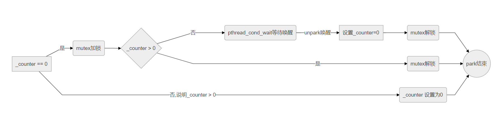

```c++
void Parker::park(bool isAbsolute, jlong time) {
    // 将_counter设置为0并返回旧值，若旧值>0则直接返回
    // 即有许可证的情况，直接消耗然后返回
    if (Atomic::xchg(0, &_counter) > 0) return;  
    ThreadBlockInVM tbivm(jt);  // mutex加锁
    // 如果 _counter > 0，直接设置 _counter=0，解锁mutex并返回
    // 即已经存在许可证的情况下，直接消耗许可证解除阻塞并返回
    if (_counter > 0)  {
        _counter = 0;
        status = pthread_mutex_unlock(_mutex);   // 解锁mutex
        return;
    }
    if (time == 0) {  
        // 否则通过condition条件等待，直到unpark()调用pthread_cond_signal()唤醒后，再继续向下执行
        // 即不存在许可证的情况下，阻塞等待唤醒
        status = pthread_cond_wait(_cond, _mutex);
    }  
    // 被唤醒后，直接设置 _counter=0，即消耗掉许可证
    _counter = 0;
    status = pthread_mutex_unlock(_mutex);    // 解锁mutex
    assert_status(status == 0, status, "invariant");
    OrderAccess::fence();
```

**`unpark()` 源码分析**：

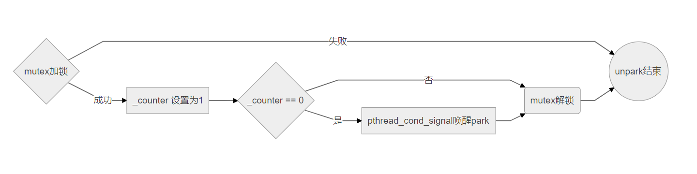

```c++
void Parker::unpark() {  
    int s, status ;  
    status = pthread_mutex_lock(_mutex);   // mutex加锁
    assert (status == 0, "invariant") ;   // 判断加锁是否成功
    s = _counter;  
    _counter = 1;   // 直接设置_counter=1，提供许可证
    /**
     * 此时：
     * 	若_counter=0，说明park()方法此时可能在睡眠中等待一个permit，需要unpark的signal唤醒
     * 	若_counter=1，说明存在许可permit，没有park()在此时睡眠，不需要额外操作
     */
    if (s < 1) {   // 判断_counter是否为0
        if (WorkAroundNPTLTimedWaitHang) {  
            status = pthread_cond_signal (_cond) ;  
            assert (status == 0, "invariant") ;  
            status = pthread_mutex_unlock(_mutex);  
            assert (status == 0, "invariant") ;  
        } else {  
            status = pthread_mutex_unlock(_mutex);  
            assert (status == 0, "invariant") ;  
            status = pthread_cond_signal (_cond) ;  
            assert (status == 0, "invariant") ;  
        }  
    } else {
        // 无论_counter旧值为几，最后都是要mutex解锁的，因为unpark最开始加了mutex锁。不做会导致mutex锁一直存在无法被其他线程获取到mutex锁
        pthread_mutex_unlock(_mutex);  
        assert (status == 0, "invariant") ;  
    }    
}
```


### FutureTask异步任务

#### 基本概念

Future用于异步获取执行结果或取消执行任务的场景。当一个计算任务需要执行很长时间，那么就可以用FutureTask来封装该任务，主线程可以在完成自己的任务后再去获取结果。


#### 使用示例

```java
public class FutureTaskExample {
    
    public static void main(String[] args) throws ExecutionException, InterruptedException {        
        new Thread(new FutureTask<Integer>(new Callable<Integer>() {
            @Override
            public Integer call() throws Exception {
                int result = 0;
                for (int i = 0; i < 100; i++) {
                    Thread.sleep(10);
                    result += i;
                }
                return result;
            }
        })).start();
        
        new Thread(() -> {
            try {
                Thread.sleep(1000);
            } catch (InterruptedException e) {
                e.printStackTrace();
            }
        }).start();
        
      	System.out.println(futureTask.get());
    }
}
```


#### 源码分析

```java
private volatile int state;
private static final int NEW          = 0;
private static final int COMPLETING   = 1;
private static final int NORMAL       = 2;
private static final int EXCEPTIONAL  = 3;
private static final int CANCELLED    = 4;
private static final int INTERRUPTING = 5;
private static final int INTERRUPTED  = 6;

// 异步任务
private Callable<V> callable;
// 异步任务的结果或是异常
private Object outcome; // non-volatile, protected by state reads/writes
// 异步任务执行的线程
private volatile Thread runner;
/** Treiber stack of waiting threads */
private volatile WaitNode waiters;
```

```java
// @throws CancellationException
public V get() throws InterruptedException, ExecutionException {
    // 通过state判断任务是否完成
    int s = state;
    if (s <= COMPLETING)
        s = awaitDone(false, 0L);
    // 返回完成后的结果
    return report(s);
}

// @throws CancellationException
public V get(long timeout, TimeUnit unit)
    throws InterruptedException, ExecutionException, TimeoutException {
    if (unit == null)
        throw new NullPointerException();
    int s = state;
    if (s <= COMPLETING &&
        (s = awaitDone(true, unit.toNanos(timeout))) <= COMPLETING)
        throw new TimeoutException();
    return report(s);
}
```


### CompletableFuture

TODO


### BlockingQueue阻塞队列

#### 基本概念

所谓阻塞队列，就是支持在特定情况下插入或移除元素时阻塞线程的队列。如队列已满则会阻塞执行插入操作的线程（直到不满），队列为空则会阻塞移除操作的线程（直到非空）。


#### FIFO队列的实现

* **`ArrayBlockingQueue`**：是基于数组实现的有界阻塞队列，按照FIFO的原则对元素进行操作。默认情况下不保证线程公平访问，所谓的公平访问是指阻塞的线程可按照阻塞的先后顺序访问队列，即先阻塞的先访问。所谓的非公平是当队列可用时，所有阻塞的线程都可以获得竞争队列访问权的资格，可能出现线程阻塞的线程后访问队列的情况（可通过参数调整）。

* **`LinkedBlockingQueue`**：是基于链表实现的有界阻塞队列（默认最大长度为Integer.MAX_VALUE），按照FIFO对元素进行操作。

* **二者的区别**：
  * **队列中的锁实现不同**：ArrayBlockingQueue使用的锁是没有分离的，即生产者消费者用的是同一把锁。而LinkedBlockingQueue使用的锁是分离的，即生产者使用putLock，消费者使用takeLock；
  * **生产或消费时的操作不同**：ArrayBlockingQueue在生产或消费时，直接将枚举对象插入或移除。而LinkedBlockingQueue在生产或消费时，需要将枚举对象包装为Node进行插入或移除，会影响性能；
  * **队列大小的初始化方式不同**：ArrayBlockingQueue必须指定队列的大小，LinkedBlockingQueue可以不指定，默认是 `Integer.MAX_VALUE`。


#### 优先级队列的实现

TODO


#### 使用示例

**阻塞队列实现生产者消费者模型**：

* 在线程的角度看，生产者就写入数据的线程，消费者就是获取数据的线程。在多线程并发的场景下，如果生产者处理很快，消费者很慢，那么需要让生产者的生产频率与消费者同步，反之亦如是。

* 通过引入阻塞队列，使生产者和消费者之间不用直接通信，而是通过阻塞队列间接通信，生产者生产完数据后无需等待消费者处理，而是直接丢给队列，消费者也不需要等待生产者给其数据，而是直接从队列中获取，这样阻塞队列就相当于一个中间的缓冲区，平衡了二者的处理速度不一致的问题。
* 当队列满时，如果生产者继续向里面生产数据，则会抛出 `IllegalStateException` 异常。当队列为空时，如果消费者继续从里面获取数据，则会抛出 `NoSuchElementException ` 异常。

```JAVA
public class ProducerConsumer {
    
    private static BlockingQueue<String> queue = new ArrayBlockingQueue<>(5);
    
    public static void main(String[] args) {
        for (int i = 0; i < 2; i++) {
            new Thread(() -> {
                try {
                    // 若队列已满，put()将阻塞
                    queue.put("product");
                } catch (InterruptedException e) {
                    e.printStackTrace();
                }
            }).start();
        }
        
        for (int i = 0; i < 3; i++) {
            new Thread(() -> {
                try {
                    // 若队列为空，task()将阻塞
                    String product = queue.task();
                    System.out.println("product: " + product);
                } catch (InterruptedException e) {
                    e.printStackTrace();
                }
            }).start();
        }   
    }
}
```


#### 源码分析


### ForkJoin分支合并

#### 基本概念

主要用于并行计算，和MapReduce原理相似，都是将大的计算任务拆分为小任务去并行计算，最后合并结果。ForkJoinPool使用工作窃取算法来提高CPU的利用率，即每个线程都维护了一个双端队列，用于存储自己需要执行的任务，工作窃取算法允许空闲的线程从其他线程的双端队列中窃取一个任务来执行，但窃取的必须是最晚进入队列的任务，避免和队列所属线程发生竞争。


#### 使用示例

```JAVA
public class ForkJoinExample extends RecursiveTask<Integer> {
    
    private final int threshold = 5;
    private int first;
    private int last;
    
    public ForkJoinExample(int first, int last) {
        this.first = first;
        this.last = last;
    }
    
    protected Integer compute() {
        int result = 0;
        if (last - first <= threshold) {
            // 若任务足够小则直接计算
            for (int i = first; i <= last; i++) {
                result += i;
            }
        } else {
            // 否则拆分为更小的任务
            int middle = first + (last - first) / 2;
        	ForkJoinExample leftTask = new ForkJoinExample(first, middle);
            ForkJoinExample rightTask = new ForkJoinExample(middle + 1, last);
            leftTask.join();
            rightTask.join();
            result = leftTask.join() + rightTask.join();
        }
        return result;
    }
}

public static void main(String[] args) throws ExecutionException, InterruptedException {
	ForkJoinExample example = new ForkJoinExample(1, 10000);
    ForkJoinPool pool = new ForkJoinPool();
    Future result = pool.submit(example);
	System.out.println(result.get());
}
```


#### 源码分析


## Java锁机制总结

| 序号 |  锁名称  |                             应用                             |
| :--: | :------: | :----------------------------------------------------------: |
|  1   |  乐观锁  |                             CAS                              |
|  2   |  悲观锁  |               synchronized、vector、hashtable                |
|  3   |  自旋锁  |                             CAS                              |
|  4   | 可重入锁 |              synchronized、Reentrantlock、Lock               |
|  5   |  读写锁  | ReentrantReadWriteLock，CopyOnWriteArrayList、CopyOnWriteArraySet |
|  6   |  公平锁  |                     Reentrantlock(true)                      |
|  7   | 非公平锁 |              synchronized、reentrantlock(false)              |
|  8   |  共享锁  |                 ReentrantReadWriteLock中读锁                 |
|  9   |  独占锁  | synchronized、vector、hashtable、ReentrantReadWriteLock中写锁 |
|  10  | 重量级锁 |                         synchronized                         |
|  11  | 轻量级锁 |                          锁优化技术                          |
|  12  |  偏向锁  |                          锁优化技术                          |
|  13  |  分段锁  |                      concurrentHashMap                       |
|  14  |  互斥锁  |                         synchronized                         |
|  15  |  同步锁  |                         synchronized                         |
|  16  |   死锁   |                      相互请求对方的资源                      |
|  17  |  锁粗化  |                          锁优化技术                          |
|  18  |  锁消除  |                          锁优化技术                          |

### 乐观锁

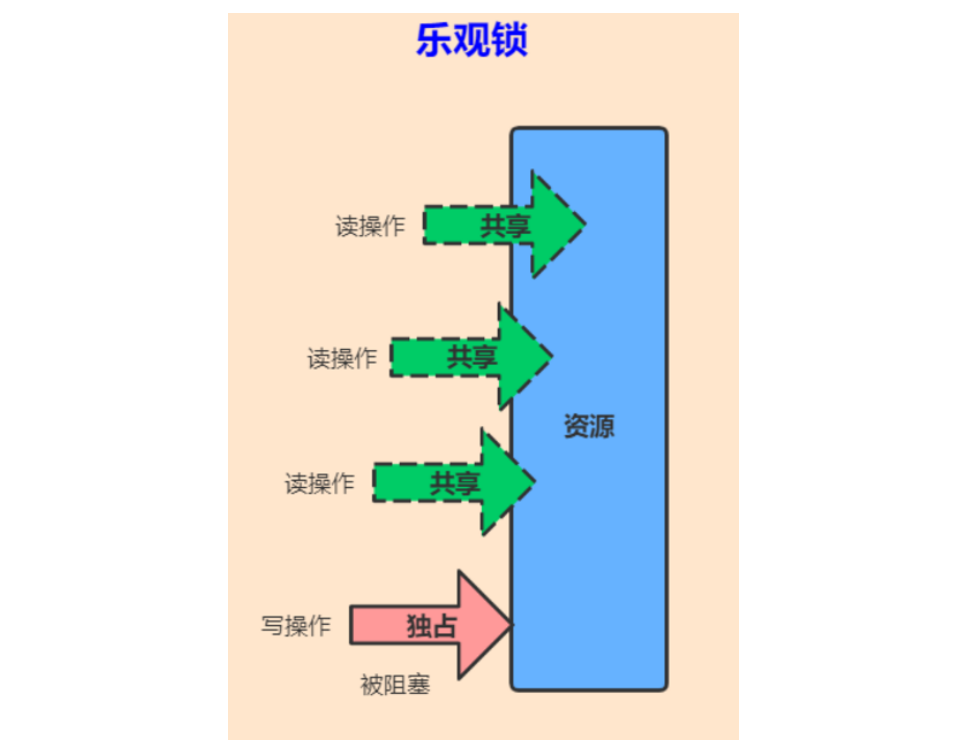

* 乐观锁是一种乐观的加锁思想，会先假定当前环境读多写少，且遇到并发写情况的概率比较低。因此读数据时认为其他线程不会正在进行修改，所以不去加锁。当写数据时，先判断当前值与期望值是否相同，相同才会更新，并在更新期间加锁，保证原子性。
* Java中通过CAS算法实现乐观锁，先比较当前值（主存中的值）与期望值（线程本地缓存中的值）是否相同，相同则更新，否则继续进行CAS操作。


### 悲观锁

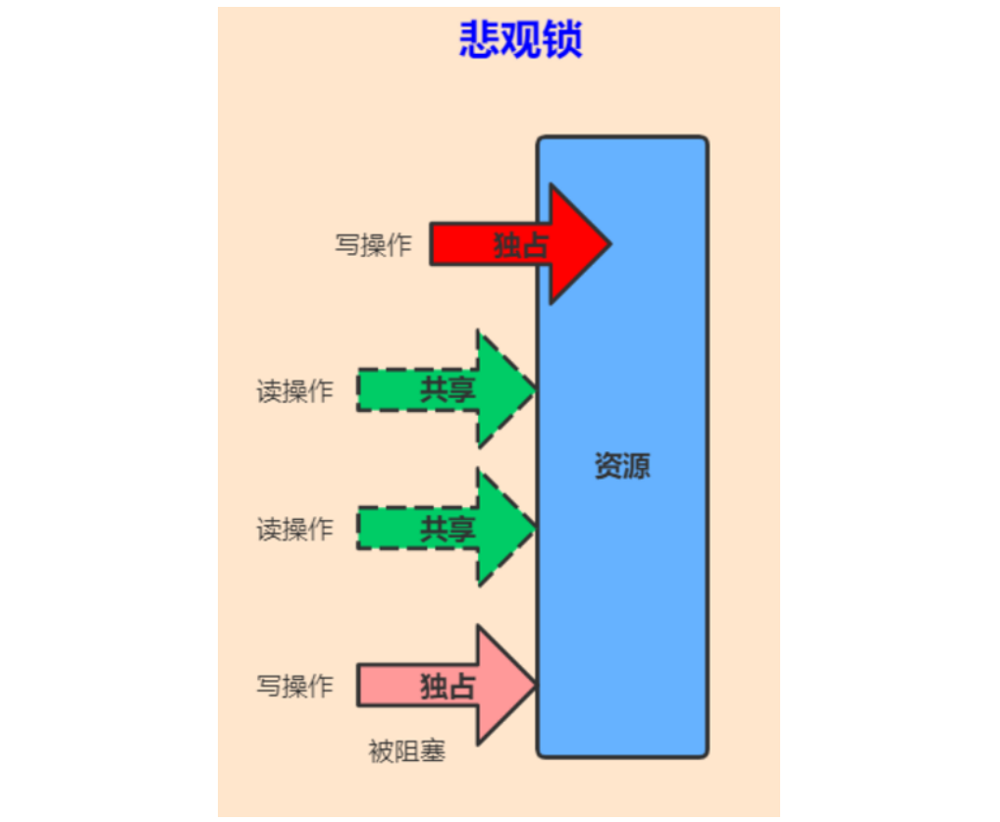

* 悲观锁是一种悲观加锁的思想，即认为写多读少，且遇到并发写的可能性高，所以每次读写数据时都会认为其他线程在修改，所以每次操作都会加锁。其他线程想要读写被锁上的数据时，都会被阻塞，直到加锁的线程释放锁。
* Java中的synchronized和ReentrantLock都是悲观锁的实现。


### 自旋锁

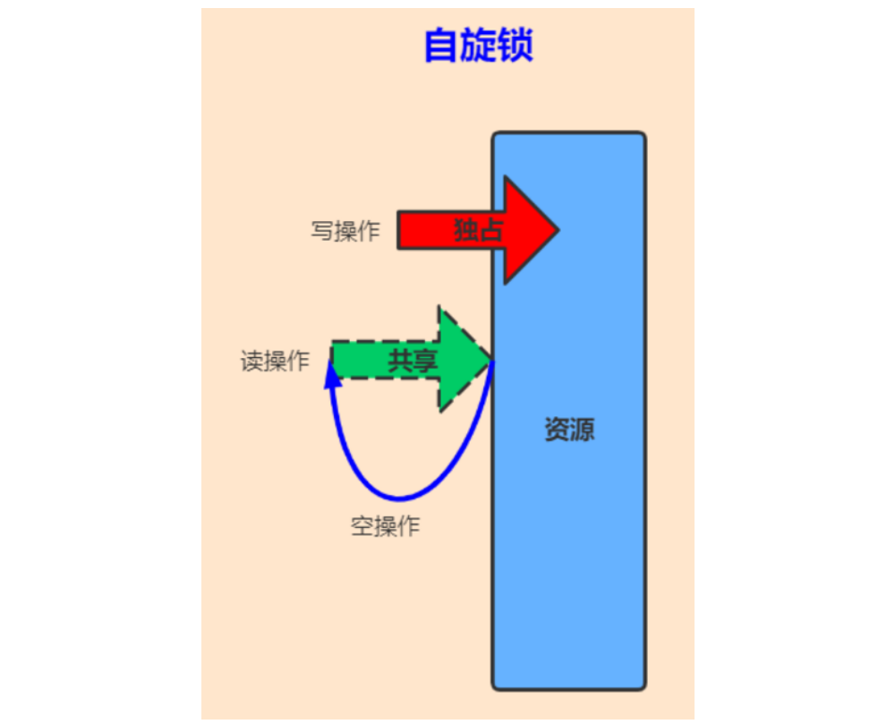

* 自旋锁是用户态的一种线程等待技术，让线程无法获取锁时不会在操作系统层面被阻塞，而是在运行状态执行一个忙循环空转。适用于持有锁的线程只会占用很短时间且参与竞争锁的线程不多的情况。
* 优点：避免了线程上下文切换带来的开销，阻塞和恢复线程都需要操作系统内核态来完成，频繁的陷入会给JVM的并发性能带来很大压力。
* 缺点：自旋的线程会一直占用处理器时间，如果等待时间过长，会浪费很多处理器的资源。并且如果竞争锁的线程多了，CPU需要不断的在这些线程间切换来维持自旋，这样会将CPU的性能浪费在频繁切换上。所以线程自旋的轮次需要被指定一个上限。
* Java的synchronized关键字的自旋锁自旋轮次默认10，可以通过 `-XX:PreBlockSpin` 参数来设置。
* 自适应自旋：即自旋的轮次不是固定的，而是由前一次在同一锁上的自旋时间及锁的拥有者状态来决定的。有了自适应自旋，随着程序运行时间的增长及性能监控信息的不断完善，JVM对程序锁状态的预测就会越来越精准。
* Java的自旋锁就是通过循环加上CAS操作实现的，CAS操作失败后循环再次尝试，直到成功或超过自旋轮次。


### 可重入锁

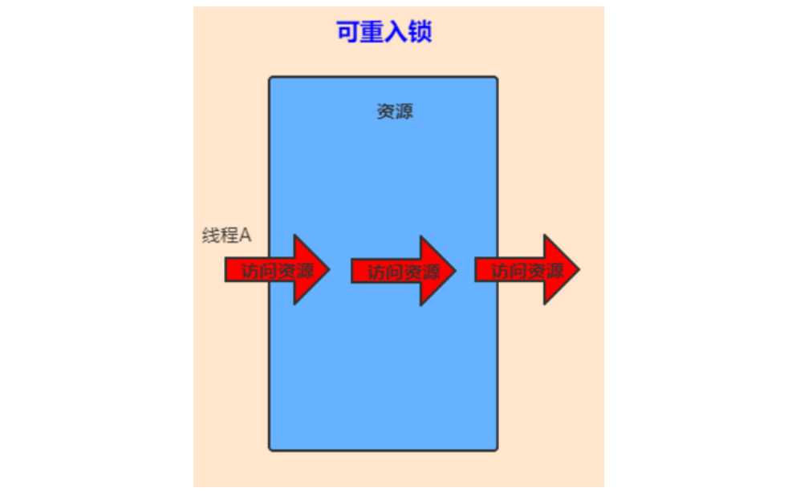

* 可重入锁是一种任意线程在获取到锁之后能够再次获取同一把锁而不需要被阻塞的技术。
* 原理：可以通过组合自定义AQS同步器来实现锁的获取和释放。若线程再次获取同一把锁，则将计数向上增加，同样，释放锁的时候也需要释放加锁的次数。
* Java中的ReentrantLock和synchronized都是可重入锁。
* 可重入锁的作用就是为了避免死锁的发生。一个线程获取到一把锁，在同步代码内部又去获取该锁，若无法重入，则会导致线程获取不到锁而阻塞且不会释放自己已经持有的锁。


### 读写锁

读写锁是一种用于保证读操作的并发性和写操作的同步性的一种技术。Java中通过ReentrantReadWriteLock类来实现读锁之间不阻塞，读锁和写锁阻塞，写锁之间阻塞的特性。

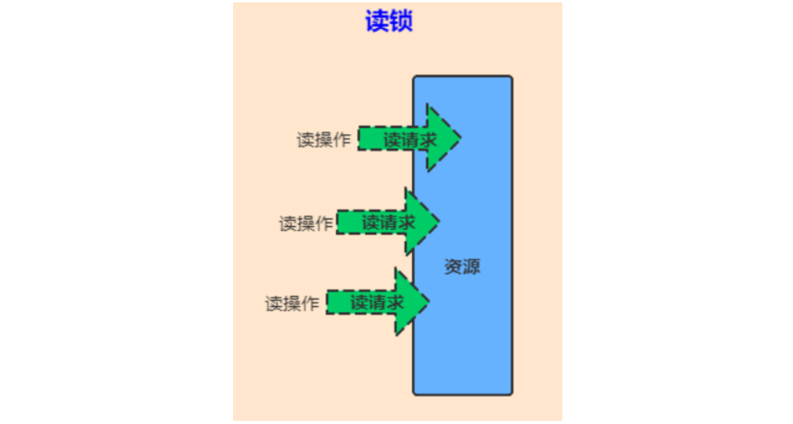

读锁就是允许多个线程同时获取，可以同时访问资源，让多线程的读操作可以并发执行。

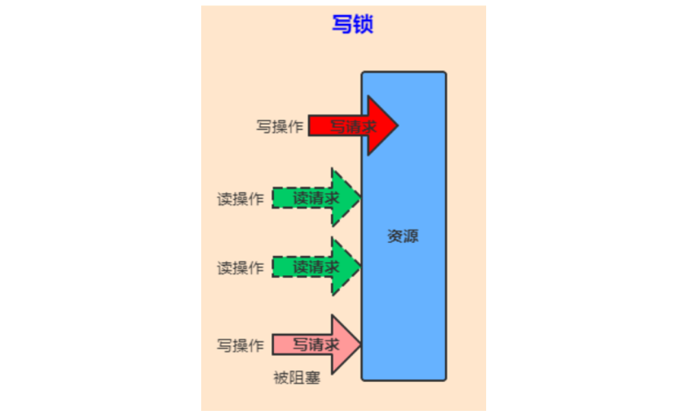

写锁就是只允许一个线程获取，同一时间只允许一个线程访问资源，让多线程的写操作可以同步执行。


### 公平锁

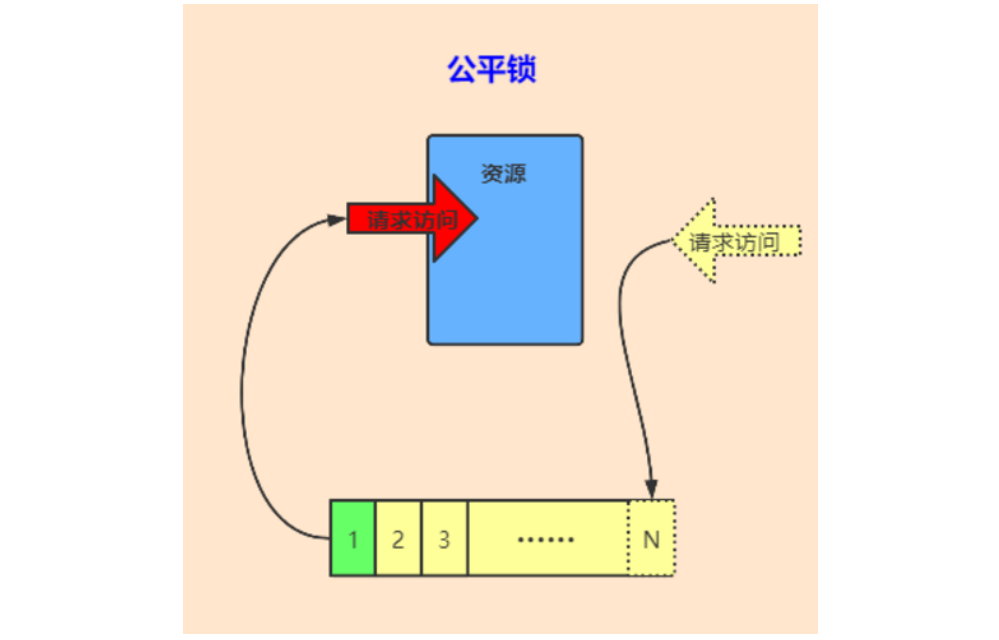

公平锁是一种让多个线程按申请锁的顺序获取锁的思想。在并发环境下，每个锁都会维护一个等待队列，按申请锁的时间入队排序（先申请的先加入），按等待的时间出队去获取锁（等待时间最长的先出队）。


### 非公平锁


* 非公平锁是一种多线程竞争锁，先直接尝试获取，获取失败再采用公平锁的思想。即多线程申请锁，不是一定按照FIFO的顺序获取，有可能后申请的比先申请的优先获得锁。
* 非公平的方式可以提高系统的并发性能，但可能会造成线程饥饿情况的发生，即某线程长时间无法获取锁。
* Java中的synchronized是非公平锁，ReentrantLock可以通过构造方法指定公平或非公平模式。


### 共享锁

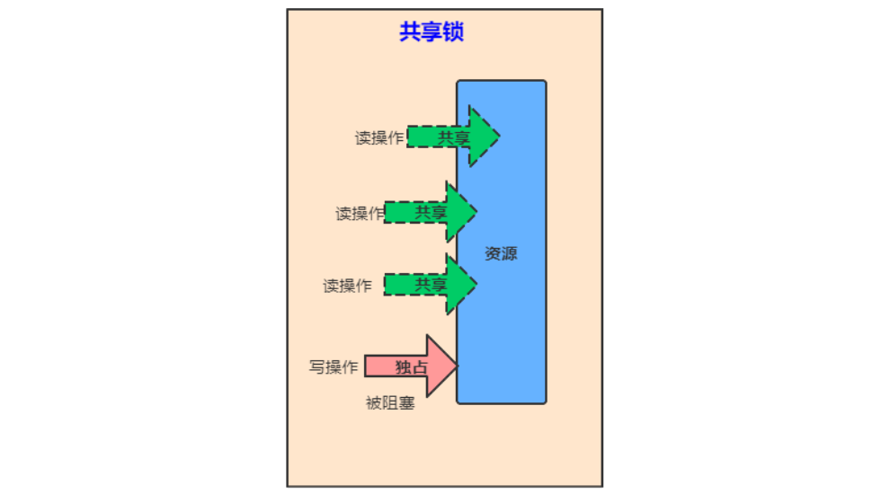

共享锁是一种多线程以共享方式持有锁的思想。即允许多个线程同时获取某资源的访问权。Java中的读写锁和信号量都是共享锁的实现。


### 独占锁

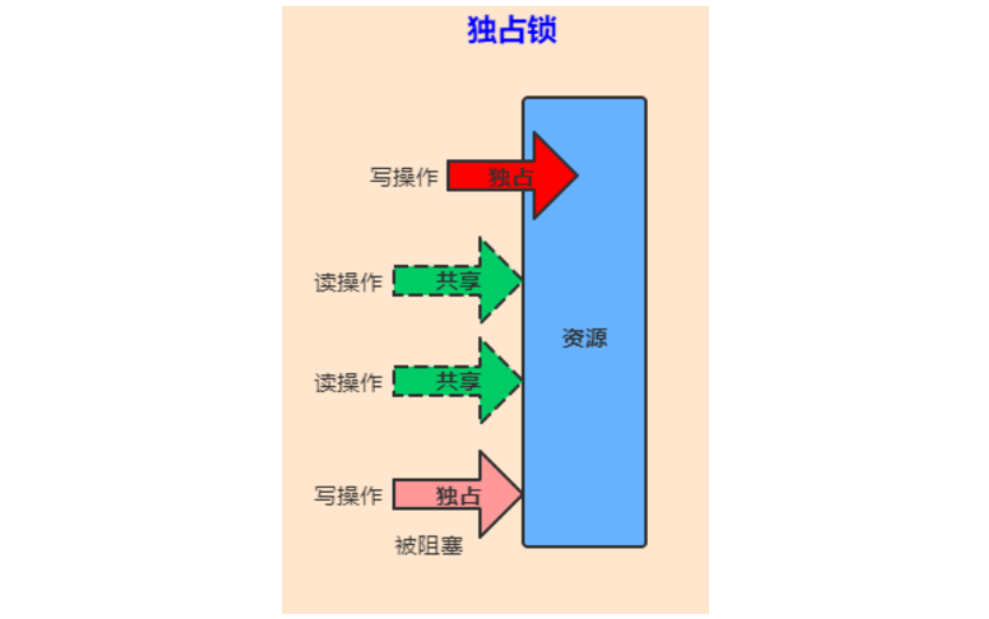

独占锁是一种同一时刻只能有一个线程访问共享资源的思想。和悲观锁、互斥锁意义相同。


### 重量级锁

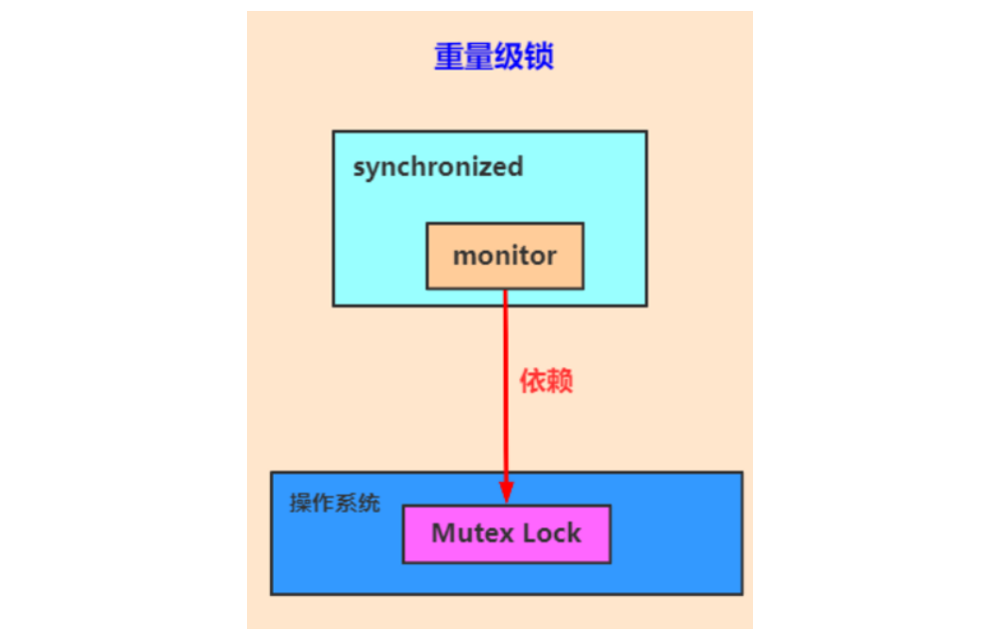

重量级锁是一种称谓，synchronized是通过对象内部的Monitor监视器来实现的，而Monitor又是依赖于操作系统底层的Mutex Lock互斥量实现。该种锁造成的线程切换需要操作系统从用户态陷入到内核态，成本非常高。


### 轻量级锁

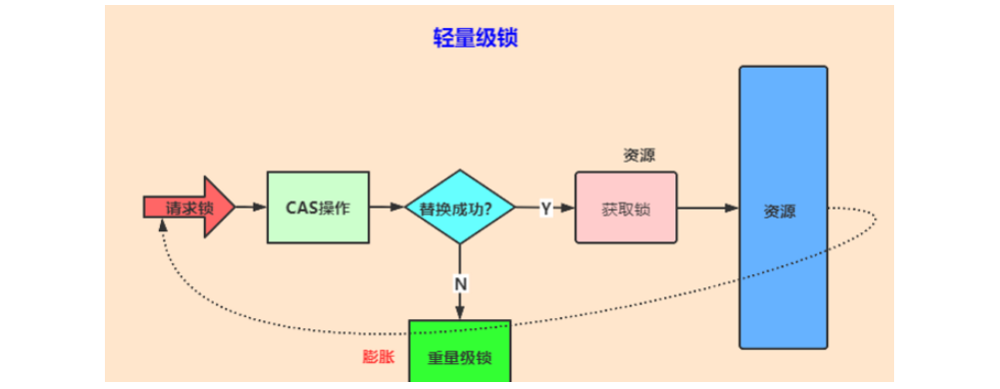

轻量级锁是synchronized在JDK1.6后的锁优化机制。即在锁竞争并不激烈的情况下，通过CAS和自旋等操作在用户态管理锁的获取释放和等待。所谓的轻量是相对于需要和操作系统产生交互重量级锁而言，轻量级锁在并发度并不是很高的场景下会有更少的性能消耗。


### 偏向锁

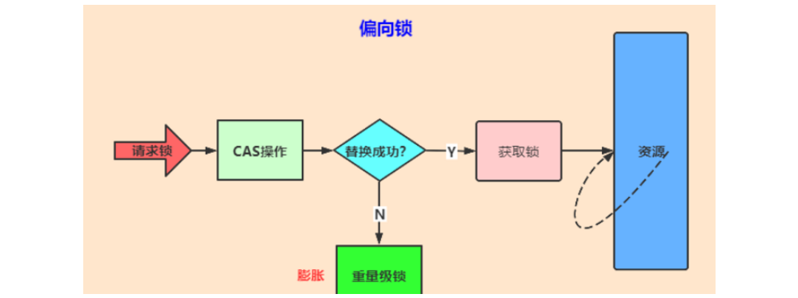

偏向锁是synchronized在JDK1.6后的锁优化机制。即在无锁竞争的情况下直接将整个同步过程取消，让锁直接偏向第一次获取它的线程，如果在接下来的执行过程种，该锁一直没有被其他线程所获取，那么持有锁的线程再次进入同步代码时就无需进行同步操作了，即无需加锁和释放锁。


### 分段锁

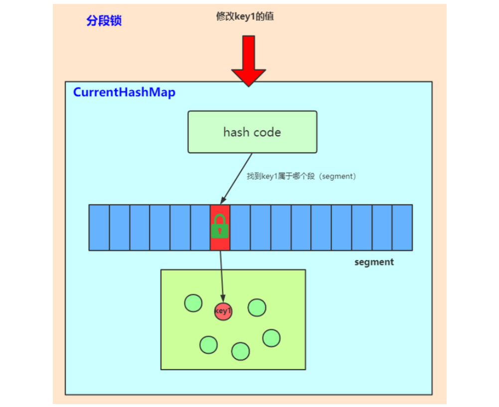

* 分段锁是一种将集合数据拆分成段后分开加锁以提高并发度的技术。Java在JDK1.7之前的ConcurrentHashMap就是通过分段锁为集合提供并发访问的能力。
* ConcurrentHashMap内部细分了若干个小的HashMap，被称为Segment段，默认情况下分为16个段，即表示该集合的并发度。如果要新增k-v对，会先根据hashCode得到本次需要存放的Segment，然后对该段加锁并完成put操作，所以在多线程环境下，如果同时进行put操作，只要被加入的k-v不存放在同一个段中，就能做到并发执行。
* ConcurrentHashMap本质上是一个Segment数组，Segment通过继承ReentrantLock来进行加锁，所以每次的加锁操作都是锁住一个Segment，只要保证每个Segment的线程安全，也就实现了全局的线程安全。


### 互斥锁

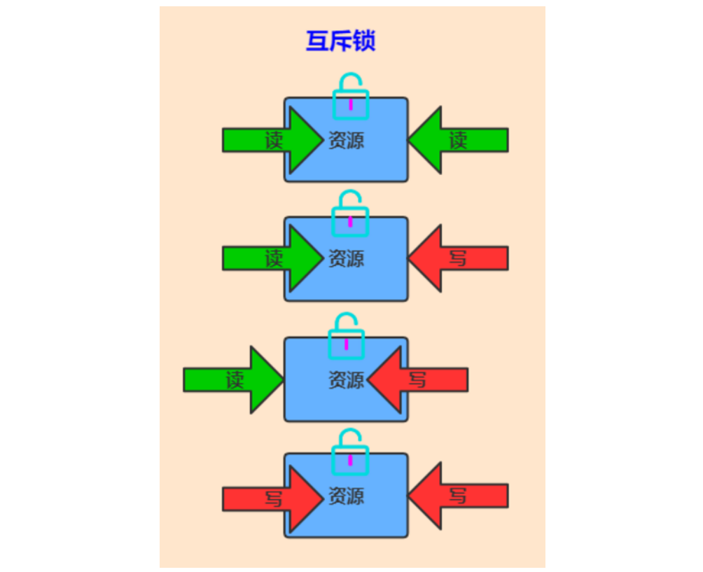

互斥锁和悲观锁、独占锁具有相同意义。即表示某个资源同一时刻只能被一个线程访问。


### 同步锁

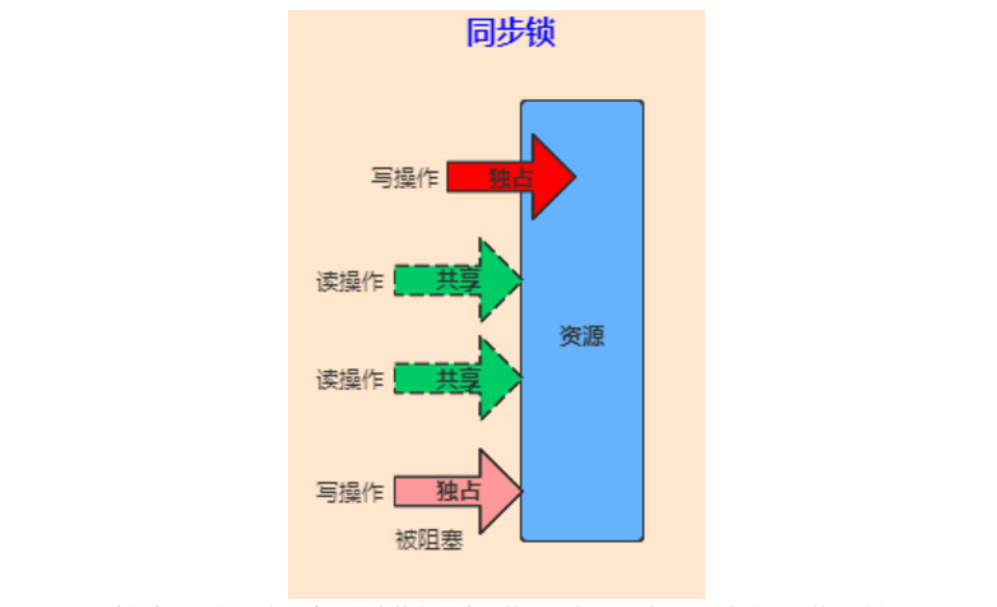

同步锁和互斥锁具有相同意义。同理，也和悲观锁、独占锁具有相同意义。


### 死锁

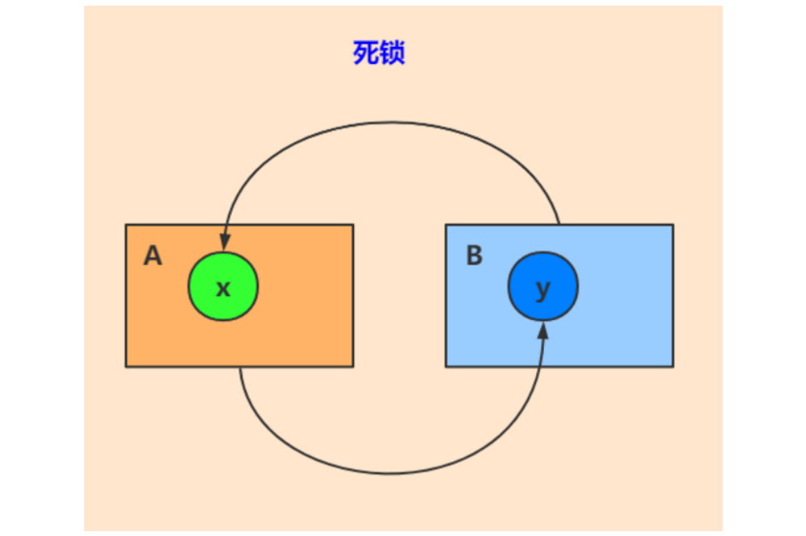

死锁是一种并发环境下出现的问题。即线程A持有资源X的锁，线程B持有资源Y的锁，线程A等待线程B释放资源Y，线程B等待线程A释放资源X，但两个线程在获得自己想要得资源之前不会释放自己已获得的资源，这样就会造成死锁。


### 锁粗化

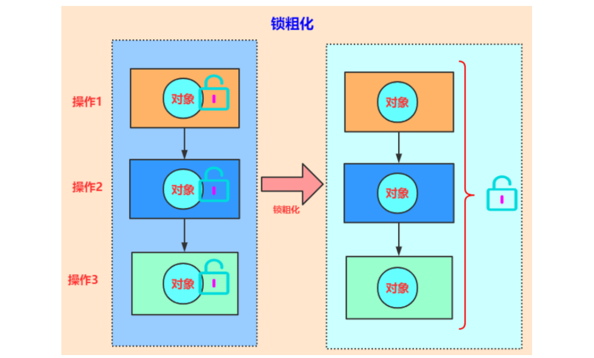

锁粗化是一种优化技术。即如果一系列的加锁和解锁操作都是对同一个对象进行的，甚至加锁操作都是出现在循环体之中的，那么频繁的加解锁操作会导致不必要的性能损耗。所以就将锁的范围扩展到整个操作序列的外部，这样降低了加锁的频率并减少了性能的消耗。


### 锁消除

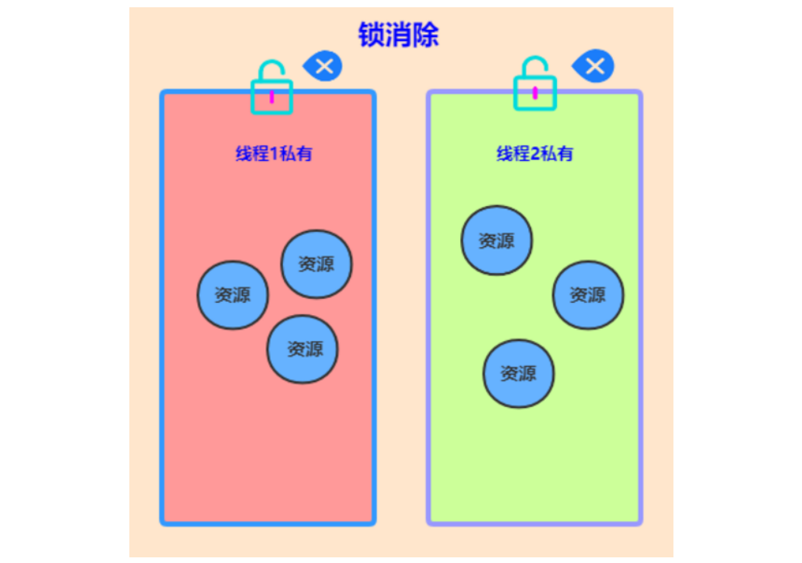

锁消除是一种优化技术。即当JVM运行时发现有些共享数据不会被多线程所竞争，就可以进行锁的消除。JVM是使用了逃逸分析技术，分析对象的作用域，如果对象在A方法中定义后，被作为参数传递到B方法中，则称为方法逃逸；如果被其他线程访问，则称为线程逃逸。在堆上的某个数据不会逃逸出去被其他线程访问到时，就可以被当作栈上数据对待，认为它是线程私有，这时加锁就没有必要了。