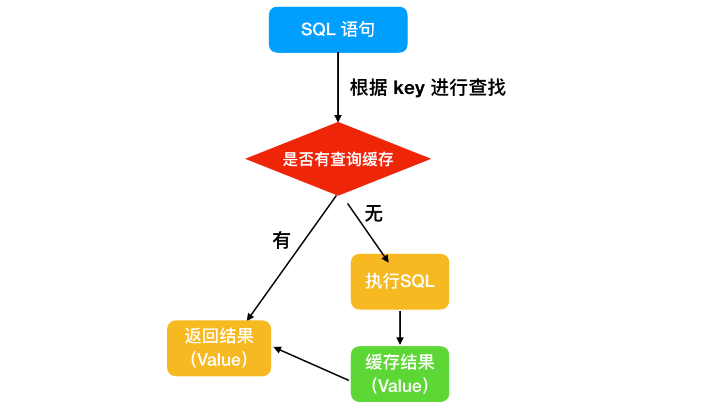

# MySQL

## 存储引擎

### MyISAM的特点

* 不支持事务操作，也不存在ACID特性，这一设计是为了性能和效率考虑的。
* 不支持外键操作，强行添加外键也不会起作用。
* 默认的锁粒度是表级锁，并发性能较低、加锁较块、锁冲突较少并且不容易发生死锁。
* 会在磁盘上存储三个文件，文件名和表名相同，分别是用于存储表的定义的 `.frm` 文件 、用于存储数据的 `.MYD` 文件和用于存储索引的 `.MYI` 。MyISAM只缓存索引文件，并不缓存数据文件。
* 支持的索引有全文索引、B-Tree索引和R-Tree索引。Full-Text是为了解决针对文本的模糊查询效率低的问题。B-Tree是所有索引节点都按照B树结构存储，所有的索引和数据节点都在叶子节点。
* 数据库所在的主机如果宕机，MyISAM数据文件容易损坏，且不具备安全恢复的能力，。
* 增删改查性能方面，SELECT性能更高，适用于查询较多的情况。


### InnoDB的特点

* 支持事务操作，具有事务的ACID和隔离特性，默认的隔离级别是可重复读，是通过MVCC实现的。
* 支持外键操作。
* 默认的锁粒度是行级锁，并发性能较好，但更容易发生死锁的情况。
* InnoDB也有 `.frm` 的存在，不同的是InnoDB的表数据和索引数据是存储在一起的，都位于B+树的叶子节点上，而MyISAM的表数据和索引数据是分开的。
* 具有安全日志文件，该日志文件用于恢复因数据库崩溃或其他情况导致的数据丢失问题，保证数据的一致性。
* InnoDB和MyISAM支持的索引类型相同，但具体的实现会因为文件结构的不同而具有较大差异，即聚簇和非聚簇索引。
* 增删改查性能方面，增删改的性能要更优秀。


### MyISAM和InnoDB的区别

* **锁粒度**：InnoDB的锁粒度为行级锁，MyISAM的锁粒度为表级锁。由于行级锁需要对每一行单独加锁，所以锁的开销更大，但带来了更高的并发支持和解决脏读、不可重复读的问题，也相对来说更容易发生死锁。
* **可恢复性**：由于InnoDB是有事务日志的，所以在产生数据库崩溃等问题后，可以根据日志文件进行恢复。而MyISAM则没有事务日志。
* **查询性能**：MyISAM要优于InnoDB，因为InnoDB在查询过程中需要维护数据缓存，且查询过程是先定位到行所在的数据块，然后再从数据块中定位到要查找的行。而MyISAM则可以直接定位到数据所在的内存地址。
* **表结构文件**：MyISAM的表结构文件包括 `.frm `、`.MYI`、`.MYD`。而InnoDB的表结构文件包括 `.ibd` 和 `.frm`。
* **MVCC支持**：只有InnoDB支持，用于应对高并发的事务，MVCC比单纯的加锁更高效，MVCC只在 `READ COMMITIED` 和 `REPEATABLE READ` 两个隔离级别下工作，且可以使用乐观锁和悲观锁来实现。

|              |   MylSAM   |           InnoDB           |
| :----------: | :--------: | :------------------------: |
|   索引类型   | 非聚簇索引 |          聚簇索引          |
|   支持事务   |     否     |             是             |
|   支持表锁   |     是     |             是             |
|   支持行锁   |     否     |             是             |
|   支持外键   |     否     |             是             |
| 支持全文检索 |     是     |             是             |
| 适合操作类型 | 大量select | 大量insert、delete、update |


## 基础架构

从整体上看，MySQL可以分为Server层和存储引擎层。

* **Server层**：包括连接器、分析器、优化器和执行器，包括了大部分MySQL的核心功能，所有跨存储引擎的功能也会在该层实现，如存储过程、触发器、视图等。
* **存储引擎层**：包括MySQL常见的存储引擎，如MyISAM、InnoDB和Memory等，默认也是最常用的是InnoDB。存储引擎可以在创建表的时候通过 `ENGINE = <Storage Engine>` 手动指定  。


### 连接器

MySQL需要完成登录认证后才能使用，所以需要一个连接器去连接用户和数据库。当MySQL的客户端和服务端连接建立后，连接器会通过用户名密码验证完成身份的认证，若认证成功，再通过权限表中的记录来判定用户的权限。


### 查询缓存

连接完成后，客户端就可以提交SQL语句执行了。当MySQL服务端收到一个执行请求后，会先去查询缓存中查看是否执行过这条SQL语句，之前执行过的语句及结果会以k-v格式存储在内存中。如果能在缓存中直接查到这条SQL，那么可以直接返回结果，如果缓存中不存在，则会执行后续的阶段，并在执行完成后将结果放入查询缓存中。

**注**：若是MySQL对其中的一张表执行了更新操作，那么所有的查询缓存都会失效，对于更新频繁的数据库来说，查询缓存效率低。




### 分析器

如果没有命中查询缓存，就会开始真正的执行SQL语句。

* 分析器会先进行词法分析，就是将代表SQL语句的字符串按空格解析出具体代表的含义；
* 然后再进行语法分析，就是根据词法分析的结果，判断是否符合MySQL的语法，若不正确，则会提示 `You have an error in your SQL syntax`。 


### 优化器

当一条SQL语句通过分析器的两步检查后，就证明是一条合法的SQL语句。但是在执行之前还需要经过优化器的处理，优化器会判断使用了哪种索引和连接，所谓的优化就是确定一个效率最高的执行方案。


### 执行器

在执行阶段，执行器首先会判断提交SQL的用户有没有执行该条SQL的权限。若具有权限，就会打开表继续执行，打开表的时候，执行器就会根据表的引擎定义，去使用该引擎提供的接口。至此，一条SQL执行完毕。


### SQL的执行顺序


```sql
SELECT DISTINCT
	< select_list >
FROM
	< left_table > < join_type >
JOIN 
	< right_table > 
ON 
	< join_condition >
WHERE
	< where_condition >
GROUP BY
	< group_by_list >
HAVING
	< having_condition >
ORDER BY
	< order_by_condition >
LIMIT < limit_number >
```

* **FROM**：首先会对FROM关键字两边的表执行连接操作（MySQL可以在FROM后面加多张表，隐式的指定连接），形成笛卡尔积，这时会产生一个虚表VT1。所谓的虚表（Virtual Table）就是一个视图，其映射的数据可能会来自多张表的执行结果。
* **ON**：然后对FROM连接的结果进行ON关键字后的条件筛选，生成虚拟表VT2，该虚表中存储符合条件的记录。
* **JOIN**：如果通过JOIN关键字显式的指定连接，那么会将关键字后的表添加进来。如果是 `OUTER(left join、right join)`，那么就添加外部行，如果是left/right join，则将左/右表添加进来。从而生成新的虚拟表VT3。
* **WHERE**：执行WHERE关键字后的过滤条件，对上一步生成的虚拟表应用WHERE过滤，生成新的虚拟表VT4。
* **GROUP BY**：根据GROUP BY后指定的列，对VT4表中的记录进行分组操作，产生虚拟表VT5。
* **HAVING**：HAVING会针对分组后的数据进行过滤操作，将符合条件的记录放在VT6中。
* **SELECT**：对VT6中的数据按照SELECT指定的列进行筛选，生成VT7。
* **DISTINCT**：对VT7中的记录进行去重操作，生成VT8。当然，如果使用了GROUP BY语句，那么DISTINCT去重操作是多余的，因为分组时会将列中唯一值分为一组，同时只为每一组返回一行记录，那么所有的记录都是不相同的。
* **ORDER BY**：最后应用ORDER BY子句，按照指定的列进行排序，生成VT8。此时返回一个游标而不是虚拟表。


### 临时表

临时表就是在SQL语句执行过程中，创建的一种用于存储中间结果集的表。临时表只对当前连接可见，当连接关闭时，临时表会被删除并释放所有空间。MySQL在以下的几种情况会产生临时表：

* 使用UNION查询会产生临时表。UNION有两种，一种是普通的UNION，一种是UNION ALL，都用于联合查询。区别是UNION会去掉两个表中的重复数据，而UNION ALL则会返回所有行。
* 使用TEMPTABLE算法或是UNION查询中的视图会产生临时表。TEMPTABLE算法是一种创建临时表的算法，它是将结果放置到临时表中，然后使用该临时表进行相应的查询。
* ORDER BY和GROUP BY的子句不一样时会产生临时表。
* DISTINCT查询并且加上ORDER BY时会产生临时表。
* SQL中用到SQL_SMALL_RESULT选项时，如果查询结果比较小，可以加上SQL_SMALL_RESULT来优化产生临时表。
* FROM中的子查询会产生临时表。
* EXPLAIN查询执行计划结果的Extra列中，如果使用Using Temporary就表示用到了临时表。


### 各种连接

* **外连接（Outer Join）**：
  * **左外连接（Left Outer Join）**：这种连接方式会显示左表不符合条件的数据行，右边不符合条件的数据行显示NULL。
  * **右外连接（Right Outer Join）**：这种连接方式会显示右表不符合条件的数据行，左表不符合条件的数据行显示NULL。
  * **全外连接（Full Outer Join）**：两边不符合条件的数据行都会显示。
* **内连接（Inner Join）**：结合两个表中相同的字段，返回和关联字段相符的记录。
* **交叉连接（Cross Join）**：就是笛卡尔积在SQL中的实现，在交叉连接中，随便增加一个表的字段，都会对结果造成很大影响。在MySQL的语法中，使用 `CROSS FROM` 或 `FROM table1, table2` 都能表示交叉连接。
  * **笛卡尔积（Cartesian product）**：集合 `A={0, 1}` 和 `B={2, 3, 4}`，二者的笛卡尔积就是 `A*B={(0, 2), (1, 2), (0, 3), (1, 3), (0, 4), (1, 4)}` 和 `B*A={(2, 0), (2, 1), (3, 0), (3, 1), (4, 0), (4, 1)}`。
* **全连接（Full Join）**：MySQL中可以使用UNION或UNION ALL进行全连接，`(select colum1, colum2, ..., columN from table1) union (select colum1, colum2, ..., columN from table2)`。


## 数据库操作

### 显示数据库

```sql
mysql> show databases;
+--------------------+
| Database           |
+--------------------+
| information_schema |
| mysql              |
| performance_schema |
| sys                |
+--------------------+
4 rows in set (0.00 sec)
```

* MySQL 自带的4个数据库：
  * **information_schema：** 存储了 mysql 服务器管理数据库的信息；
  * **performance_schema：** mysql5.5 新增的表，用来保存数据库服务器性能的参数；
  * **mysql：** mysql 系统数据库，保存的登录用户名，密码，以及每个用户的权限等等；
  * **test：** 给用户学习和测试的数据库。


### 创建数据库

* 语法：

```sql
create database [if not exists] `数据库名` [charset=字符编码];
```

* 直接创建数据库：

```sql
create database `stu`;
Query OK, 1 row affected (0.05 sec)
```

* 创建时添加判断条件：

```sql
create database if not exists `stu`;
Query OK, 1 row affected, 1 warning (0.00 sec)
```

**注**：创建时为数据库名添加反引号，以确保不受其他条件影响。

* 创建时指定字符编码：

```sql
create database `teacher` charset=utf8;
Query OK, 1 row affected, 1 warning (0.10 sec)
```


### 删除数据库

* 语法：

```sql
drop database [if exists] `数据库名`;
```

* 直接删除数据库：

```sql
drop database `stu`;
Query OK, 0 rows affected (0.19 sec)
```

* 删除时添加判断条件：

```sql
drop database if exists `teacher`;
Query OK, 0 rows affected (0.00 sec)
```


### 显示创建数据库时的 SQL 语句

* 语法：

```sql
show create database `数据库名`;
```

* 显示创建数据库的SQL语句：

```sql
create database if not exists `person` charset=utf8;
Query OK, 1 row affected, 1 warning (0.09 sec)

show create database `person`;
+----------+-----------------------------------------------------------------+
| Database | Create Database                                                 |
+----------+-----------------------------------------------------------------+
| person   | CREATE DATABASE `person` /*!40100 DEFAULT CHARACTER SET utf8 */ |
+----------+-----------------------------------------------------------------+
1 row in set (0.00 sec)
```


### 修改数据库

* 语法：

```sql
alter database `数据库名` charset=字符编码
```

* 修改数据库的字符编码：

```sql
alter database `person` charset=gbk;
Query OK, 1 row affected (0.00 sec)

show create database `person`;
+----------+----------------------------------------------------------------+
| Database | Create Database                                                |
+----------+----------------------------------------------------------------+
| person   | CREATE DATABASE `person` /*!40100 DEFAULT CHARACTER SET gbk */ |
+----------+----------------------------------------------------------------+
1 row in set (0.00 sec)
```


### 选择数据库

* 语法：

```sql
use `数据库名`
```

* 切换到其他数据库：

```sql
use `student`;
Database changed
```


## 表操作

### 显示所有表

* 语法：

```sql
show tables;
```

* 例：

```sql
show tables;
```


### 创建数据表

* 语法：

```sql
create table [if not exists] `表名`(
    `字段名` 数据类型 [null|not null] [auto_increment] [primary key] [comment],
    `字段名` 数据类型 [default]...
)engine=存储引擎
```

* 选项参数：

|      选项      |                 说明                 |
| :------------: | :----------------------------------: |
| null\|not null |               空\|非空               |
|    default     |                默认值                |
| auto_increment |               自动增长               |
|  primary key   |                 主键                 |
|    comment     |                 备注                 |
|     engine     | 数据库引擎（innodb, myisam, memory） |

* 创建简单的表：

```sql
create database `itcast`;
Query OK, 1 row affected (0.05 sec)

use `itcast`;
Database changed

show tables;
Empty set (0.00 sec)

create table `stu`(
    `id` int,
    `name` varchar(30)
);
Query OK, 0 rows affected (0.04 sec)

show tables;
+------------------+
| Tables_in_itcast |
+------------------+
| stu              |
+------------------+
1 row in set (0.00 sec)
```

* 创建复杂的表：

```sql
create table if not exists `teacher`(
    `id` int not null auto_increment primary key comment 'primary key',
    `name` varchar(20) null comment 'name',
    `phone` varchar(20) comment 'phone',
    `address` varchar(100) default 'empty' comment 'address'
)engine=innodb;
Query OK, 0 rows affected (2.01 sec)
```

* 为其他数据库创建表：

```sql
show databases;
+--------------------+
| Database           |
+--------------------+
| information_schema |
| itcast             |
| mysql              |
| performance_schema |
| person             |
| student            |
| sys                |
+--------------------+
7 rows in set (0.00 sec)

use `itcast`;
Database changed

create table person.stu(
    id int,
    name varchar(20)
);
Query OK, 0 rows affected (1.83 sec)
```


### 显示创建表时的语句

* 语法：

```sql
show create table `表名`
```

* 显示创建表的SQL（将显示结果的两个字段纵向排列）：

```sql
show create table `teacher`\G;
*************************** 1. row ***************************
       Table: teacher
Create Table: CREATE TABLE `teacher` (
  `id` int(11) NOT NULL AUTO_INCREMENT COMMENT 'primary key id',
  `name` varchar(20) DEFAULT NULL COMMENT 'name',
  `phone` varchar(20) DEFAULT NULL COMMENT 'phone',
  `address` varchar(100) DEFAULT 'empty' COMMENT 'address',
  PRIMARY KEY (`id`)
) ENGINE=InnoDB DEFAULT CHARSET=utf8mb4 COLLATE=utf8mb4_0900_ai_ci
1 row in set (0.01 sec)
```


### 查看表结构

* 语法：

```sql
desc[ribe] `表名`
```

* 格式化显示表的结构：

```sql
describe `teacher`;
+---------+--------------+------+-----+---------+----------------+
| Field   | Type         | Null | Key | Default | Extra          |
+---------+--------------+------+-----+---------+----------------+
| id      | int(11)      | NO   | PRI | NULL    | auto_increment |
| name    | varchar(20)  | YES  |     | NULL    |                |
| phone   | varchar(20)  | YES  |     | NULL    |                |
| address | varchar(100) | YES  |     | empty   |                |
+---------+--------------+------+-----+---------+----------------+
4 rows in set (0.00 sec)

desc `teacher`;
+---------+--------------+------+-----+---------+----------------+
| Field   | Type         | Null | Key | Default | Extra          |
+---------+--------------+------+-----+---------+----------------+
| id      | int(11)      | NO   | PRI | NULL    | auto_increment |
| name    | varchar(20)  | YES  |     | NULL    |                |
| phone   | varchar(20)  | YES  |     | NULL    |                |
| address | varchar(100) | YES  |     | empty   |                |
+---------+--------------+------+-----+---------+----------------+
4 rows in set (0.00 sec)
```


### 删除表

* 语法：

```sql
drop table [if exists] `表1`,`表2`,...
```

* 删除多个表表：

```sql
drop table `stu`,`teacher`;
Query OK, 0 rows affected (0.02 sec)
```

* 删除表时添加判断条件：

```sql
drop table if exists `stu`;
Query OK, 0 rows affected, 1 warning (0.00 sec)
```


### 修改表

* 语法：

```sql
alter table `表名`
```

* 添加字段：

```sql
# 语法：
alter table `表名` add [column] 字段名 数据类型 [first|after]

# 添加字段到最后：
create table `person`(
    `id` int,
    `name` varchar(20)
)
Query OK, 0 rows affected (0.08 sec)

alter table `person` add age int;
Query OK, 0 rows affected (1.05 sec)
Records: 0  Duplicates: 0  Warnings: 0

describe `person`;
+-------+-------------+------+-----+---------+-------+
| Field | Type        | Null | Key | Default | Extra |
+-------+-------------+------+-----+---------+-------+
| id    | int(11)     | YES  |     | NULL    |       |
| name  | varchar(20) | YES  |     | NULL    |       |
| age   | int(11)     | YES  |     | NULL    |       |
+-------+-------------+------+-----+---------+-------+
3 rows in set (0.00 sec)

# 添加到开头字段：
alter table `person` add sex varchar(2) first;
Query OK, 0 rows affected (0.07 sec)
Records: 0  Duplicates: 0  Warnings: 0

describe `person`;
 +-------+-------------+------+-----+---------+-------+
| Field | Type        | Null | Key | Default | Extra |
+-------+-------------+------+-----+---------+-------+
| sex   | varchar(2)  | YES  |     | NULL    |       |
| id    | int(11)     | YES  |     | NULL    |       |
| name  | varchar(20) | YES  |     | NULL    |       |
| age   | int(11)     | YES  |     | NULL    |       |
+-------+-------------+------+-----+---------+-------+
4 rows in set (0.00 sec)

# 添加到指定字段的后面：
alter table `person` add email varchar(10) after name;
Query OK, 0 rows affected (0.09 sec)
Records: 0  Duplicates: 0  Warnings: 0

describe `person`;
+-------+-------------+------+-----+---------+-------+
| Field | Type        | Null | Key | Default | Extra |
+-------+-------------+------+-----+---------+-------+
| sex   | varchar(2)  | YES  |     | NULL    |       |
| id    | int(11)     | YES  |     | NULL    |       |
| name  | varchar(20) | YES  |     | NULL    |       |
| email | varchar(10) | YES  |     | NULL    |       |
| age   | int(11)     | YES  |     | NULL    |       |
+-------+-------------+------+-----+---------+-------+
5 rows in set (0.00 sec)
```

* 删除字段：

```sql
alter table `person` drop email;
Query OK, 0 rows affected (0.06 sec)
Records: 0  Duplicates: 0  Warnings: 0

describe `person`;
+-------+-------------+------+-----+---------+-------+
| Field | Type        | Null | Key | Default | Extra |
+-------+-------------+------+-----+---------+-------+
| sex   | varchar(2)  | YES  |     | NULL    |       |
| id    | int(11)     | YES  |     | NULL    |       |
| name  | varchar(20) | YES  |     | NULL    |       |
| age   | int(11)     | YES  |     | NULL    |       |
+-------+-------------+------+-----+---------+-------+
5 rows in set (0.00 sec)
```

* 修改字段：

```sql
# 改名改类型：
alter table `person` change name `phone` varchar(20);
Query OK, 0 rows affected (0.38 sec)
Records: 0  Duplicates: 0  Warnings: 0

describe `person`;
+-------+-------------+------+-----+---------+-------+
| Field | Type        | Null | Key | Default | Extra |
+-------+-------------+------+-----+---------+-------+
| sex   | varchar(2)  | YES  |     | NULL    |       |
| id    | int(11)     | YES  |     | NULL    |       |
| phone | varchar(20) | YES  |     | NULL    |       |
| age   | int(11)     | YES  |     | NULL    |       |
+-------+-------------+------+-----+---------+-------+
4 rows in set (0.00 sec)

# 只改类型：
alter table `person` modify `phone` varchar(16);
Query OK, 0 rows affected (0.48 sec)
Records: 0  Duplicates: 0  Warnings: 0

describe `person`;
+-------+-------------+------+-----+---------+-------+
| Field | Type        | Null | Key | Default | Extra |
+-------+-------------+------+-----+---------+-------+
| sex   | varchar(2)  | YES  |     | NULL    |       |
| id    | int(11)     | YES  |     | NULL    |       |
| phone | varchar(16) | YES  |     | NULL    |       |
| age   | int(11)     | YES  |     | NULL    |       |
+-------+-------------+------+-----+---------+-------+
4 rows in set (0.00 sec)

# 修改引擎：
alter table `person` engine=myisam;
Query OK, 0 rows affected (0.42 sec)
Records: 0  Duplicates: 0  Warnings: 0

# 修改表名：
alter table `person` rename to `student`;
Query OK, 0 rows affected (0.13 sec)

show tables;
+------------------+
| Tables_in_itcast |
+------------------+
| student          |
+------------------+
1 row in set (0.00 sec)
```


### 复制表

* 语法一：

```sql
create table `新表名` select *|`字段`, ... from `旧表`
```

**特点：** 不能复制表的主键，只能够复制数据

* 语法二：

```sql
create table `新表名` like `旧表名`
```

**特点：** 只能复制表的结构，不能复制表的数据


## 数据操作

* 生成测试表：

```sql
create table if not exists `stu`(
    `id` int not null auto_increment primary key comment 'primary key',
    `name` varchar(20) null comment 'name',
    `phone` varchar(20) null comment 'phone',
    `address` varchar(100) default 'empty' comment 'address',
    `score` int default 0 comment 'score'
)engine=innodb;
```


### 插入数据

* 语法：

```sql
insert into `表名`(`字段名`, `字段名`, ...) values(值, 值, ...), (值, 值, ...), ...
```

* 插入一条完整字段的数据：

```sql
insert into `stu`(`id`, `name`, `phone`, `address`, `score`) values(1, 'albert', '123456789', 'mit', 80);
```

* 插入部分段，自增字段忽略：

```sql
insert into `stu`(`name`, `phone`, `address`) values('lily', '131007896', 'bkl');
```

* 忽略字段指定插入数据，自增字段可插入null：

```sql
insert into `stu` values(null, 'king', '4567890', 'usa', 90);
```

* 通过 default 插入默认值：

```sql
insert into `stu` values(null, 'jack', '1237890', default, 70);
```

* 插入多条数据：

```sql
insert into `stu` values(null, 'tom', '123456', default, 80), (null, 'stack', '456789', default, 90);
Query OK, 2 row affected (0.06 sec)
Records: 2  Duplicates: 0  Warnings: 0
```


### 更新数据

* 语法：

```sql
update `表名` set `字段`=`值` [where 条件]
```

* 修改1号学生的姓名为sony：

```sql
update `stu` set `name`='sony' where `id`=1;
```

* 修改2号学生的电话和地址：

```sql
update `stu` set `phone`='123', `address`='beijing' where `id`=2;
```


### 删除数据

* 语法：

```sql
delete from `表名` [where 条件]
```

* 删除成绩小于等于70的学生：

```sql
delete from `stu` where `score` <= 70;
```

* 删除表中全部数据：

```sql
delete from `stu`;
```


### 清空表

* 语法：清空数据，自增主键从0开始重新计数

```sql
truncate table `表名`
```


### 简单查询

* 语法：

```sql
select *|`字段`, `字段`, ... from `表名`
```

* 查询所有字段的数据：

```sql
select * from `stu`;
```

* 查询指定字段的数据：

```sql
select `id`, `name`, `phone` from `stu`;
```


## 数据库扩展

### SQL分类

* DDL（data definition language）数据库定义语言 CREATE, ALTER, DROP；
* DML（data manipulation language）数据操纵语言 SELECT, UPDATE, INSERT, DELETE；
* DCL（data control language）数据库控制语言，是用来设置或更改数据库用户或角色权限的语句。


### 数据表的文件

* 一个数据库对应一个文件夹；
* 若 engine 是 myisam，则一张数据表对应三个文件，后缀为 .frm 的文件存储表结构，后缀为 .MYD 的文件存储表数据，后缀为 . MYI 的文件存储表索引； 
* 若 engine 是 innodb，则一张数据表对应一个后缀为 .frm 的表结构文件，所有使用 innodb 引擎的表数据统一存储在 data\ibdata1 文件中，若数据量很大，则会自动创建 ibdata2, ibdata3, ... 目的就是便于管理；
* 若 engine 是 memory，数据存储在内存中，重启MySQL服务数据丢失，但是读取速度非常快。


### 字符编码

* 设置编码语法：

```sql
set names 字符编码
```

**注：** 通过 set names 设置，就可以同时改变 character_set_client, character_set_results 的值。

* 查看服务端编码：

```sql
show variables like 'character_set_%';
```

**总结：** 客户端编码，character_set_client，character_set_results 三个编码一致即可操作中文。


## 数据类型

### 整型

|   类型    | 字节 |       范围       |
| :-------: | :--: | :--------------: |
|  tinyint  |  1   |     -128~127     |
| smallint  |  2   |   -32768~32767   |
| mediumint |  3   | -8388608~8388607 |
|    int    |  4   |  -2^31^~2^31^-1  |
|  bigint   |  8   |  -2^63^~2^63^-1  |

* 无符号整数（unsigned），无符号数没有负数，正数部分是有符号的两倍。

```sql
create table stu(
    `id` smallint unsigned auto_increment primary key comment '主键',
    `age` tinyint unsigned not null comment '年龄',
    `money` bigint unsigned comment '存款'
);
Query OK, 0 rows affected (0.06 sec)
```

* 整型支持显示宽度（最小的位数）如：int(5)，如果数值的位数小于5位，前面加上前导0（需要结合zerofill使用），大于5位的则不需要。

```sql
create table stu(
    `id` int(5),
    `age` int(5) zerofill  # 填充前导0
);
Query OK, 0 rows affected (0.02 sec)

insert into stu values (1,11);
Query OK, 0 rows affected (0.02 sec)

insert into stu values (1111111,2222222);
Query OK, 0 rows affected (0.03 sec)

select * from stu;
+---------+---------+
| id      | age     |
+---------+---------+
|       1 |   00011 |
| 1111111 | 2222222 | 
+---------+---------+
2 rows in set (0.00 sec)
```


### 浮点数

|      浮点型      | 占用字节 |        范围        |
| :--------------: | :------: | :----------------: |
| float（单精度）  |    4     |  -3.4E+38~3.4E+38  |
| double（双精度） |    8     | -1.8E+308~1.8E+308 |

* 语法：

```sql
float(M,D), double(M,D) # M: 总位数, D: 小数位数
```

* 例：

```sql
create table t1(
    num1 float(5,2),   # 总位数是5，小数位数是2，那么整数位数是3
    num2 double(4,1)
);
Query OK, 0 rows affected (0.08 sec)

insert into t1 values (1.23,1.23);   # 如果精度超出了允许的范围，会四舍五入
Query OK, 1 row affected (0.00 sec)

select * from t1;
+------+------+
| num1 | num2 |
+------+------+
| 1.23 |  1.2 |   # 四舍五入的结果
+------+------+
1 row in set (0.00 sec)
```


### 定点数

* 定点数是变长的，大致每9个数字用4个字节来存储。定点数之所以能保存精确的小数，因为整数和小数是分开存储的。占用的资源比浮点数要多；
* 定点数和浮点数都支持显示宽度和无符号数。

* 语法：

```sql
decimal(M,D)
```

```sql
create table t4(
    num decimal(20,19)
);
Query OK, 0 rows affected (0.00 sec)

insert into t4 values (1.1234567890123456789);
Query OK, 1 row affected (0.01 sec)

select * from t4;
+-----------------------+
| num                   |
+-----------------------+
| 1.1234567890123456789 |
+-----------------------+
1 row in set (0.00 sec)
```


### 字符型

|   数据类型    |   描述   |     长度      |
| :-----------: | :------: | :-----------: |
|  char(长度)   |   定长   |    最大255    |
| varchar(长度) |   变长   |   最大65535   |
|   tinytext    | 大段文本 |  2^8^-1=255   |
|     text      | 大段文本 | 2^16^-1=65535 |
|  mediumtext   | 大段文本 |    2^24^-1    |
|   longtext    | 大段文本 |    2^32^-1    |

* char(10) 和 varchar(10) 的区别？
  * 相同点：它们最多只能保存10个字符；
  * 不同点：char 不回收多余的字符，varchar 会回收多余的字符。 
* char 的最大长度是255；
* varchar 理论长度是65535字节；
* 大块文本（text）不计算在总长度中，一个大块文本只占用10个字节来保存文本的地址。


### 枚举

* 语法：

```sql
enum(值1, 值2, 值3, ...)
```

* 枚举类型在定义表结构时定义好多个值，插入数据时只能插入已经定义过的一个值：

```sql
create table t8(
    name varchar(20),
    sex enum('男', '女', '保密')
)charset=utf8;
Query OK, 0 rows affected (0.06 sec)

insert into t8 values ('tom', '男');
Query OK, 1 row affected (0.00 sec)

insert into t8 values ('berry', '女');
Query OK, 1 row affected (0.05 sec)

select * from t8;
+-------+------+
| name  | sex  |
+-------+------+
| tom   | 男   |
| berry | 女   |
+-------+------+
```

* MySQL 的枚举类型是通过整数来管理的，第一个值是1，第二个值是2，以此类推：

```sql
select sex+0 from t8;    # 进行运算可以显示数字类型
+-------+
| sex+0 |
+-------+
|     1 |
|     2 |
+-------+
```

* 枚举在数据库内部存储的是整数，可以直接插入数字：

```sql
insert into t8 values ('rose', 3);  # 可以直接插入数字
Query OK, 1 row affected (0.00 sec)

select * from t8;
+-------+------+
| name  | sex  |
+-------+------+
| tom   | 男   |
| berry | 女   |
| rose  | 保密 |
+-------+------+
3 rows in set (0.00 sec)
```


### 集合

* 集合类型在定义表结构时定义好多个值，插入数据时只能插入已经定义过的一个或多个值：

```sql
create table t9(
    hobby set('爬山', '读书', '游泳', '敲代码')
);
Query OK, 0 rows affected (0.08 sec)

insert into t9 values('爬山');
Query OK, 1 row affected (0.00 sec)

insert into t9 values('爬山, 游泳');
Query OK, 1 row affected (0.00 sec)

insert into t9 values('游泳, 爬山');  # 插入顺序不一样，但是显示的顺序是一样的
Query OK, 1 row affected (0.02 sec)
```

**注：** 每个集合的元素都分配一个固定的数字，从左往右按2的0，1，2，…次方分配。


### 日期

| 数据类型  |         描述          |         范围         |
| :-------: | :-------------------: | :------------------: |
| datetime  | 日期时间，占用8个字节 |       1~9999年       |
|   date    |   日期 占用3个字节    |       1~9999年       |
|   time    |   时间 占用3个字节    | -838:59:59~838:59:59 |
| timestamp |  时间戳，占用4个字节  |     1970~2038年      |
|   year    |  年份   占用1个字节   |   1901-2155(255个)   |

* time支持以天的方式插入

```sql
insert into t14 values ('10 10:10:10');  # 10天会转换为240个小时存储
Query OK, 1 row affected (0.02 sec)

select * from t14;
+-----------+
| field     |
+-----------+
| 250:10:10 |
+-----------+
```


### Bool型

* MySQL 不支持真正意义上的 boolean 类型，true 和 false 在数据库中对应1和0：

```sql
create table t15(
    field boolean
);
Query OK, 0 rows affected (0.00 sec)

insert into t15 values (true),(false);
Query OK, 2 rows affected (0.00 sec)
Records: 2  Duplicates: 0  Warnings: 0

select * from t15;
+-------+
| field |
+-------+
|     1 |
|     0 |
+-------+
2 rows in set (0.00 sec)
```


## 列属性

### 主键

* 主键是唯一标识表中记录的一个或一组列；
* 特点是不能重复，不能为空；
* 一个表只能有一个主键，主键可以有多个字段组成；
* 作用是保证数据完整性，加快查询速度。

更改表的时候添加主键：

```sql
create table `t20`(
    `id` int,
    `name` varchar(10)
);
Query OK, 0 rows affected (0.00 sec)

alter table `t20` add primary key (`id`);
Query OK, 0 rows affected (0.08 sec)
Records: 0  Duplicates: 0  Warnings: 0
```

删除主键：

```sql
alter table `t20` drop primary key;
```


### 唯一键

特点：不能重复，可以为空，一个表可以有多个；

作用：保证数据不重复，保证数据完整性，加快数据访问。

* 创建表的时候添加唯一键：

```sql
create table `t22`(
    `id` int primary key,   
    `name` varchar(20) unique,   # unique关键字添加唯一键
    `addr` varchar(100) unique
);
Query OK, 0 rows affected (0.00 sec)
```

* 修改表的时候添加唯一键：

```sql
create table `t23`(
    `id` int primary key,
    `name` varchar(20),
    `addr` varchar(20),
    `score` int,
    `age` int
);
Query OK, 0 rows affected (0.02 sec)

alter table `t23` add unique(`name`), add unique(`addr`);
Query OK, 0 rows affected (0.02 sec)
Records: 0  Duplicates: 0  Warnings: 0

alter table `t23` add unique(`score`, `age`);   # 组合唯一键，表示两个字段的值组合起来是唯一的
Query OK, 0 rows affected (0.01 sec)
Records: 0  Duplicates: 0  Warnings: 0
```

* 删除唯一键：

```sql
alter table `t23` drop index `name`;     # 按照唯一键的名字删除，唯一键的名字默认就是字段名称
```


### 外键

#### 添加外键

* 语法：

```sql
foreign key (`外键字段`) references `主表名`(`主键字段`)
```

* 创建表的时候添加外键：

```sql
create table if not exists `stuinfo`(
    `stuno` char(4) primary key,
    `name` varchar(10) not null
);
Query OK, 0 rows affected (0.05 sec)

create table if not exists `stumarks`(
    `stuid` char(4) primary key,
    `score` tinyint unsigned,
    foreign key (`stuid`) references `stuinfo`(`stuno`)
);
Query OK, 0 rows affected (0.09 sec)
```

> * 主表中不存在的，从表中不允许插入；
> * 从表中存在的，主表中不允许删除；
> * 不能更改主表的数据后使得从表孤立。

* 语法：

```sql
alter table `从表名` add foreign key (`从表公共字段`) references `主从名`(`主表的公共字段`)
```

* 修改表的时候添加外键约束：

```sql
create table if not exists `teainfo`(
    `teano` int primary key,
    `name` varchar(10) not null
);
Query OK, 0 rows affected (0.05 sec)

create table if not exists `teamarks`(
    `teaid` int primary key,
    `score` tinyint unsigned
);
Query OK, 0 rows affected (0.05 sec)

alter table `teamarks` add foreign key (`teaid`) references `teainfo`(`teano`);
```

**注：** 要创建外键必须是innodb引擎，myisam不支持外键约束。


#### 删除外键

* 语法：

```sql
alter table `表名` drop foreign key `外建名`
```

* 例：

```sql
show create table `stumarks`\G;
*************************** 1. row ***************************
       Table: stumarks
Create Table: CREATE TABLE `stumarks` (
  `stuid` char(4) NOT NULL,
  `score` tinyint(3) unsigned DEFAULT NULL,
  PRIMARY KEY (`stuid`),
  CONSTRAINT `stumarks_ibfk_1` FOREIGN KEY (`stuid`) REFERENCES `stuinfo` (`stuno`)
) ENGINE=InnoDB DEFAULT CHARSET=utf8mb4 COLLATE=utf8mb4_0900_ai_ci
1 row in set (0.00 sec)

alter table `stumarks` drop foreign key `stumarks_ibfk_1`;
Query OK, 0 rows affected (0.16 sec)
Records: 0  Duplicates: 0  Warnings: 0
```


#### 外键操作

* 更新时级联，删除时置空（更新主表公共字段时从表也对应的更新，主表删除数据时从表将对应的公共字段置空）：

```sql
create table `stuinfo`(
    `stunno` char(4) primary key,
    `name` var char(10) not null
);
Query OK, 0 rows affected (0.02 sec)

create table `stumarks`(
    `stuid` int auto_increment primary key,
    `stuno` char(4),
    `score` tinyint unsigned,
    foreign key (`stuno`) reference `stuinfo`(`stuno`) on delete set null on update cascade
);
Query OK, 0 rows affected (0.00 sec)

insert into stuinfo values ('s101','tom');
Query OK, 1 row affected (0.00 sec)

insert into stumarks values (null,'s101',88);
Query OK, 1 row affected (0.00 sec)

select * from stuinfo;
+-------+------+
| stuno | name |
+-------+------+
| s101  | tom  |
+-------+------+
1 row in set (0.00 sec)

update stuinfo set stuno='s102' where stuno='s101';   # 更新时级联
Query OK, 1 row affected (0.00 sec)
Rows matched: 1  Changed: 1  Warnings: 0

select * from stumarks;
+-------+-------+-------+
| stuid | stuno | score |
+-------+-------+-------+
|     1 | s102  |    88 |
+-------+-------+-------+
1 row in set (0.00 sec)

delete from stuinfo where stuno='s102';    # 删除时置空
Query OK, 1 row affected (0.02 sec)

select * from stumarks;
+-------+-------+-------+
| stuid | stuno | score |
+-------+-------+-------+
|     1 | NULL  |    88 |
+-------+-------+-------+
1 row in set (0.00 sec)
```


## 数据查询

### 单表查询

#### 语法

```sql
select [选项] `字段名` [from `表名`] [where 条件] [order by `排序字段`] [group by `分组字段`] [having 条件] [limit 限制]
```


#### 字段表达式

```sql
select 10 * 10 as `result`;
+--------+
| result |
+--------+
|    100 |
+--------+
1 row in set (0.00 sec)
```


#### from 子句

* 指定从哪张或哪些表中查询，若是多张表，最终结果是所有表结果的笛卡尔积：

```sql
create table t01(
    `id` int,
    `name` varchar(10)
);
Query OK, 0 rows affected (1.82 sec)

create table t02(
    `score` int,
    `address` varchar(10)
);
Query OK, 0 rows affected (0.21 sec)

insert into t01 values(1, 'albert');
Query OK, 1 row affected (0.01 sec)

insert into t01 values(2, 'lily');
Query OK, 1 row affected (0.06 sec)

insert into t02 values(70, 'mit');
Query OK, 1 row affected (0.37 sec)

insert into t02 values(80, 'bkl');
Query OK, 1 row affected (0.19 sec)

select * from t01,t02;
+------+--------+-------+---------+
| id   | name   | score | address |
+------+--------+-------+---------+
|    1 | albert |    70 | mit     |
|    2 | lily   |    70 | mit     |
|    1 | albert |    80 | bkl     |
|    2 | lily   |    80 | bkl     |
+------+--------+-------+---------+
4 rows in set (0.00 sec)
```


#### dual 伪表

* 当将 select 当做表达式使用时，添加 from dual 保证SQL语句的完整性：

```sql
select 10*10 from dual;
+-------+
| 10*10 |
+-------+
|   100 |
+-------+
1 row in set (0.00 sec)
```


#### where 子句

* where子句对查找的数据进行条件过滤：

| 运算符 |   说明   |
| :----: | :------: |
|  `>`   |   大于   |
|  `<`   |   小于   |
|  `>=`  | 大于等于 |
|  `<=`  | 小于等于 |
|  `!=`  |  不等于  |
| `and`  |    与    |
|  `or`  |    或    |
| `not`  |    非    |


#### in \| not in

* 判断字段值是否出现在一段指定的集合中。
* 查找住在北京，上海，天津，并且姓名不是Tom的学生：

```SQL
select * from `stu` where `stuaddress` in('北京', '上海', '天津') and `stuName` not in('Tom');
+--------+--------------+--------+--------+---------+------------+------+------+
| stuNo  | stuName      | stuSex | stuAge | stuSeat | stuAddress | ch   | math |
+--------+--------------+--------+--------+---------+------------+------+------+
| s25301 | 张秋丽       | 男     |     18 |       1 | 北京       |   80 | NULL |
| s25302 | 李文才       | 男     |     31 |       3 | 上海       |   77 |   76 |
| s25303 | 李斯文       | 女     |     22 |       2 | 北京       |   55 |   82 |
| s25304 | 欧阳俊雄     | 男     |     28 |       4 | 天津       | NULL |   74 |
| s25318 | 争青小子     | 男     |     26 |       6 | 天津       |   86 |   92 |
+--------+--------------+--------+--------+---------+------------+------+------+
5 rows in set (0.00 sec)
```


#### between ... and \| not between ... and

* 判断字段值是否出现在一段范围中。
* 查找年龄在18~30之间，并且数学成绩不在60~80之间的学生：

```SQL
select * from `stu` where (`stuAge` between 18 and 30) and (`math` not between 60 and 80);
+--------+--------------+--------+--------+---------+------------+------+------+
| stuNo  | stuName      | stuSex | stuAge | stuSeat | stuAddress | ch   | math |
+--------+--------------+--------+--------+---------+------------+------+------+
| s25303 | 李斯文       | 女     |     22 |       2 | 北京       |   55 |   82 |
| s25305 | 诸葛丽丽     | 女     |     23 |       7 | 河南       |   72 |   56 |
| s25318 | 争青小子     | 男     |     26 |       6 | 天津       |   86 |   92 |
+--------+--------------+--------+--------+---------+------------+------+------+
3 rows in set (0.01 sec)
```


#### is null \| is not null

* 判断字段值是否为空。
* 查找语文缺考的，数学没有缺考的同学：

```SQL
mysql> select * from `stu` where `ch` is null and `math` is not null;
+--------+--------------+--------+--------+---------+------------+------+------+
| stuNo  | stuName      | stuSex | stuAge | stuSeat | stuAddress | ch   | math |
+--------+--------------+--------+--------+---------+------------+------+------+
| s25304 | 欧阳俊雄     | 男     |     28 |       4 | 天津       | NULL |   74 |
+--------+--------------+--------+--------+---------+------------+------+------+
1 row in set (0.00 sec)
```


#### 聚合函数

* 常用聚合函数：

|  函数   |   说明   |
| :-----: | :------: |
|  sum()  |   求和   |
|  avg()  | 求平均值 |
|  max()  | 求最大值 |
|  min()  | 求最小值 |
| count() | 求记录数 |

* 例：统计所有同学语文成绩的总值，平均值，最大值，最小值，记录数：

```SQL
select sum(`ch`) sum, avg(`ch`) avg, max(`ch`) max, min(`ch`) min, count(`ch`) count from `stu`;
+------+---------+------+------+-------+
| sum  | avg     | max  | min  | count |
+------+---------+------+------+-------+
|  597 | 74.6250 |   88 |   55 |     8 |
+------+---------+------+------+-------+
1 row in set (0.00 sec)
```


#### like 模糊查询

* 通配符：
  * `_` 表示任意一个字符；
  * `%` 表任意个数的任意字符。

* 查询所有“张”姓的学生：

```SQL
select * from `stu` where `stuname` like '张%';
+--------+-----------+--------+--------+---------+------------+------+------+
| stuNo  | stuName   | stuSex | stuAge | stuSeat | stuAddress | ch   | math |
+--------+-----------+--------+--------+---------+------------+------+------+
| s25301 | 张秋丽    | 男     |     18 |       1 | 北京       |   80 | NULL |
+--------+-----------+--------+--------+---------+------------+------+------+
1 row in set (0.00 sec)
```


#### order by 排序

* asc 升序；
* desc 降序。

* 语文成绩按降序排序。数学成绩按升序排序：

```SQL
select * from `stu` order by `ch` desc;
select * from `stu` order by `nath` asc;
```


#### group by 分组查询

* 语法：

```SQL
group by `字段名`, `字段名`, ...   # 根据相同的字段值将数据分成一组（多个字段会按照字段组合进行分组）
```

* 统计男女生的平均年龄：

```SQL
select avg(`stuAge`) as `平均年龄`, `stusex` from `stu` group by `stusex` desc;
+--------------+--------+
| 平均年龄     | stusex |
+--------------+--------+
|      25.4000 | 男     |
|      22.7500 | 女     |
+--------------+--------+
2 rows in set (0.00 sec)
```

* 统计相同地区男女生的平均年龄：

```SQL
select `stuAddress`, `stuSex`, avg(`stuAge`) from `stu` group by `stuAddress`, `stuSex`;
+------------+--------+---------------+
| stuAddress | stuSex | avg(`stuAge`) |
+------------+--------+---------------+
| 北京       | 男     |       21.0000 |
| 上海       | 男     |       31.0000 |
| 北京       | 女     |       22.0000 |
| 天津       | 男     |       27.0000 |
| 河南       | 女     |       23.0000 |
| 河北       | 女     |       23.0000 |
+------------+--------+---------------+
6 rows in set (0.00 sec)
```


#### having 条件

* where 和 having 的区别：
  * where 是直接对原始数据库的文件按一条条字段进行筛选；
  * having 是对 select...from... 映射出的虚拟表进行筛选。
* where 和 having的区别示例1：
  * where 先从原始库文件的所有数据一条一条过滤，筛选出符合条件的结果，select...from... 再对结果进行抽取映射；
  * select...from... 先从原始库文件中按表按字段抽取数据映射成虚拟表，having 再从虚拟表中按照条件筛选数据。

```SQL
select `stuname` from stu where `stusex`='男';   
+--------------+
| stuname      |
+--------------+
| 张秋丽       |
| 李文才       |
| 欧阳俊雄     |
| 争青小子     |
| Tom          |
+--------------+
5 rows in set (0.00 sec)

select `stuname` from `stu` having  `stusex`='男';
ERROR 1054 (42S22): Unknown column 'stusex' in 'having clause'
```

* where 和 having的区别示例2：
  * where 会先在数据库中对全部数据进行筛选，之后才会通过 select...from... 语句进行按表按字段映射虚拟表，total 字段是基于虚拟表定义的，where 自然无法识别此字段；
  * having 条件过滤操作是在 select...from... 映射虚拟表之后才会执行的，对虚拟表的数据进行筛选，total 是基于虚拟表定义的，所以 having 可以识别并操作。

```SQL
select `stuSex`, count(*) as total from `stu` group by `stuSex` where total >= 5;
ERROR 1064 (42000): You have an error in your SQL syntax; check the manual that corresponds to your MySQL server version for the right syntax to use near 'where total >= 5' at line 1

select `stuSex`, count(*) as total from `stu` group by `stuSex` having total >= 5;
+--------+-------+
| stuSex | total |
+--------+-------+
| 男     |     5 |
+--------+-------+
1 row in set (0.00 sec)
```


#### limit 抽取限制

* 语法：

```SQL
limit index, num      # index 表示限制开始的下标，num表示限制的条目数
```

* 查询班级总分前3的同学：

```SQL
select `stuName`, (`ch` + `math`) as `total` from `stu` order by `total` desc limit 0, 3;
+--------------+-------+
| stuName      | total |
+--------------+-------+
| 争青小子     |   178 |
| Tabm         |   165 |
| 李文才       |   153 |
+--------------+-------+
3 rows in set (0.00 sec)
```


#### 查询语句中的选项

> * all 显示所有数据（默认）；
> * distinct 去除结果集中重复的数据。

* 查找学生居住在那些城市：

```SQL
select distinct `stuAddress` from `stu`;
+------------+
| stuAddress |
+------------+
| 北京       |
| 上海       |
| 天津       |
| 河南       |
| 河北       |
+------------+
5 rows in set (0.00 sec)
```


### 多表查询

#### union 联合

* 语法：

```SQL
select 语句 union [选项] select 语句 union [选项] select ...
选项：all 显示全部，distinct 去重（默认）
```

* 将多条查询语句的结果纵向组合：

```SQL
create table t03(
    `id` int,
    `name` varchar(10)
);
Query OK, 0 rows affected (1.58 sec)

insert into t03 values(1, 'albert'), (2, 'lily');
Query OK, 2 rows affected (0.16 sec)
Records: 2  Duplicates: 0  Warnings: 0

select `stuNo`, `stuName` from `stu` union select `id`, `name` from `t03`;
+--------+--------------+
| stuNo  | stuName      |
+--------+--------------+
| s25301 | 张秋丽       |
| s25302 | 李文才       |
| s25303 | 李斯文       |
| s25304 | 欧阳俊雄     |
| s25305 | 诸葛丽丽     |
| s25318 | 争青小子     |
| s25319 | 梅超风       |
| s25320 | Tom          |
| s25321 | Tabm         |
| 1      | albert       |
| 2      | lily         |
+--------+--------------+
11 rows in set (0.00 sec)
```

> **注：**
>
> 1. union 两边的 select 语句的字段个数必须一致；
> 2. union 两边的 select 语句的字段名可以不一样，最终结果按照第一个 select 语句的字段名；
> 3. union 两边的 select 语句的数据类型可以不一致。


#### inner join 内连接

> * 内连接获取的是相对于连接字段的两个表的公共数据。

* 语法：

```SQL
select `字段名` from `表1` inner join `表2` on `表1`.`公共字段` = `表2`.`公共字段`
select `字段名` from `表1`, `表2` where `表1`.`公共字段` = `表2`.`公共字段`
```

* 查询学生的全部信息：

```SQL
select stuName, stuSex, stuAge, stuSeat, stuAddress, writtenExam, labExam from stuinfo i join stumarks m on i.stuNo=m.stuNo;
+--------------+--------+--------+---------+------------+-------------+---------+
| stuName      | stuSex | stuAge | stuSeat | stuAddress | writtenExam | labExam |
+--------------+--------+--------+---------+------------+-------------+---------+
| 李斯文       | 女     |     22 |       2 | 北京       |          80 |      58 |
| 李文才       | 男     |     31 |       3 | 上海       |          50 |      90 |
| 欧阳俊雄     | 男     |     28 |       4 | 天津       |          65 |      50 |
| 张秋丽       | 男     |     18 |       1 | 北京       |          77 |      82 |
| 争青小子     | 男     |     26 |       6 | 天津       |          56 |      48 |
+--------------+--------+--------+---------+------------+-------------+---------+
5 rows in set (0.00 sec)
```

* 内连接3张表查询：

```SQL
select * from stuinfo i inner join stumarks m on i.stuNo=m.stuNo inner join stu s on m.stuNo=s.stuNo;
+--------+--------------+--------+--------+---------+------------+---------+--------+-------------+---------+--------+--------------+--------+--------+---------+------------+------+------+
| stuNo  | stuName      | stuSex | stuAge | stuSeat | stuAddress | examNo  | stuNo  | writtenExam | labExam | stuNo  | stuName      | stuSex | stuAge | stuSeat | stuAddress | ch   | math |
+--------+--------------+--------+--------+---------+------------+---------+--------+-------------+---------+--------+--------------+--------+--------+---------+------------+------+------+
| s25303 | 李斯文       | 女     |     22 |       2 | 北京       | s271811 | s25303 |          80 |      58 | s25303 | 李斯文       | 女     |     22 |       2 | 北京       |   55 |   82 |
| s25302 | 李文才       | 男     |     31 |       3 | 上海       | s271813 | s25302 |          50 |      90 | s25302 | 李文才       | 男     |     31 |       3 | 上海       |   77 |   76 |
| s25304 | 欧阳俊雄     | 男     |     28 |       4 | 天津       | s271815 | s25304 |          65 |      50 | s25304 | 欧阳俊雄     | 男     |     28 |       4 | 天津       | NULL |   74 |
| s25301 | 张秋丽       | 男     |     18 |       1 | 北京       | s271816 | s25301 |          77 |      82 | s25301 | 张秋丽       | 男     |     18 |       1 | 北京       |   80 | NULL |
| s25318 | 争青小子     | 男     |     26 |       6 | 天津       | s271819 | s25318 |          56 |      48 | s25318 | 争青小子     | 男     |     26 |       6 | 天津       |   86 |   92 |
+--------+--------------+--------+--------+---------+------------+---------+--------+-------------+---------+--------+--------------+--------+--------+---------+------------+------+------+
5 rows in set (0.00 sec)
```


#### left join 左外连接

> * 左外连接获取的是以左表为主的数据（会保留所有左表数据），右表若没有对应字段的数据，则显示为NULL。

* 语法：

```SQL
select `字段名` from `表1` left join `表2` on `表1`.`公共字段` = `表2`.`公共字段`
```

* 以左边的表为标准，如果右边的表没有对应记录，用 NULL 填充：

```SQL
select stuName, writtenexam, labexam from stuinfo i left join stumarks m on i.stuNo=m.stuNo;
+--------------+-------------+---------+
| stuName      | writtenexam | labexam |
+--------------+-------------+---------+
| 李斯文       |          80 |      58 |
| 李文才       |          50 |      90 |
| 欧阳俊雄     |          65 |      50 |
| 张秋丽       |          77 |      82 |
| 争青小子     |          56 |      48 |
| 诸葛丽丽     |        NULL |    NULL |
| 梅超风       |        NULL |    NULL |
+--------------+-------------+---------+
7 rows in set (0.00 sec)
```


#### right join 右外连接

> * 右外连接获取的是以右表为主的数据（会保留所有右表数据），左表若没有对应字段的数据，则显示为NULL。

* 语法：

```SQL
select `字段名` from `表1` right join `表2` on `表1`.`公共字段` = `表2`.`公共字段`
```

* 例：

```SQL
select stuName, writtenexam, labexam from stuinfo i right join stumarks m on i.stuNo=m.stuNo;
+--------------+-------------+---------+
| stuName      | writtenexam | labexam |
+--------------+-------------+---------+
| 李斯文       |          80 |      58 |
| 李文才       |          50 |      90 |
| 欧阳俊雄     |          65 |      50 |
| 张秋丽       |          77 |      82 |
| 争青小子     |          56 |      48 |
| NULL         |          66 |      77 |
+--------------+-------------+---------+
6 rows in set (0.00 sec)
```


#### cross join 交叉连接

* 语法：

```SQL
select `字段名` from `表1` cross join `表2`
select `字段名` from `表1` cross join `表2` where `表1`.`公共字段` = `表2`.`公共字段`
```

* 生成测试数据：

```SQL
create table t04(
    `id` int,
    `name` varchar(10)
);
Query OK, 0 rows affected (0.46 sec)

create table t05(
    `id` int,
    `score` int
);
Query OK, 0 rows affected (0.18 sec)

insert into t04 values(1, 'albert'), (2, 'lily');
Query OK, 2 rows affected (0.02 sec)
Records: 2  Duplicates: 0  Warnings: 0

insert into t05 values(1, 80), (2, 99);
Query OK, 2 rows affected (0.07 sec)
Records: 2  Duplicates: 0  Warnings: 0
```

* 没有连接表达式（取两表的笛卡尔积）：

```SQL
select * from t04 cross join t05;
+------+--------+------+-------+
| id   | name   | id   | score |
+------+--------+------+-------+
|    1 | albert |    1 |    80 |
|    2 | lily   |    1 |    80 |
|    1 | albert |    2 |    99 |
|    2 | lily   |    2 |    99 |
+------+--------+------+-------+
4 rows in set (0.00 sec)
```

* 有连接表达式（相当于内连接）：

```SQL
select * from t04 cross join t05 where t04.id = t05.id;
+------+--------+------+-------+
| id   | name   | id   | score |
+------+--------+------+-------+
|    1 | albert |    1 |    80 |
|    2 | lily   |    2 |    99 |
+------+--------+------+-------+
2 rows in set (0.00 sec)
```


#### natural 自然连接

> * 自然内连接：natural join；
> * 自然左外连接：natural left join；
> * 自然右外连接：natural right join。

* 自动检测公共字段连接多表：

```SQL
select * from t04 natural join t05;
+------+--------+-------+
| id   | name   | score |
+------+--------+-------+
|    1 | albert |    80 |
|    2 | lily   |    99 |
+------+--------+-------+
2 rows in set (0.00 sec)
```

> **特点：**
>
> * 表连接通过同名字段连接；
> * 没有同名字段返回笛卡尔积；
> * 自动对结果进行整理，保留一个连接字段，连接字段放最前面。 


#### using()

> * 用于指定多个连接字段；
> * 对连接字段进行整理，整理方式同自然连接。

```SQL
select * from t04 join t05 using(id);
+------+--------+-------+
| id   | name   | score |
+------+--------+-------+
|    1 | albert |    80 |
|    2 | lily   |    99 |
+------+--------+-------+
2 rows in set (0.00 sec)
```

#### 子查询

* 查找笔试成绩80分的学生信息：

```SQL
select * from `stuinfo` where `stuNo` = (select stuNo from `stumarks` where `writtenexam` = 80);
+--------+-----------+--------+--------+---------+------------+
| stuNo  | stuName   | stuSex | stuAge | stuSeat | stuAddress |
+--------+-----------+--------+--------+---------+------------+
| s25303 | 李斯文    | 女     |     22 |       2 | 北京       |
+--------+-----------+--------+--------+---------+------------+
1 row in set (0.07 sec)
```

* 查找笔试成绩最高的学生成绩：

```SQL
select * from `stuinfo` where `stuNo` = (select `stuNo` from `stumarks` order by `writtenexam` desc limit 1);
+--------+-----------+--------+--------+---------+------------+
| stuNo  | stuName   | stuSex | stuAge | stuSeat | stuAddress |
+--------+-----------+--------+--------+---------+------------+
| s25303 | 李斯文    | 女     |     22 |       2 | 北京       |
+--------+-----------+--------+--------+---------+------------+
1 row in set (0.00 sec)
```

* 查找笔试成绩及格的学生：

```SQL
select * from `stuinfo` where `stuNo` in (select `stuNo` from `stumarks` where `writtenexam` >= 60);
+--------+--------------+--------+--------+---------+------------+
| stuNo  | stuName      | stuSex | stuAge | stuSeat | stuAddress |
+--------+--------------+--------+--------+---------+------------+
| s25303 | 李斯文       | 女     |     22 |       2 | 北京       |
| s25304 | 欧阳俊雄     | 男     |     28 |       4 | 天津       |
| s25301 | 张秋丽       | 男     |     18 |       1 | 北京       |
+--------+--------------+--------+--------+---------+------------+
3 rows in set (0.04 sec)
```

* 若有学生的成绩大于等于80分，则显示所有学生的信息：

```SQL
select * from `stuinfo` where exists (select * from `stumarks` where `writtenexam` >= 80);
+--------+--------------+--------+--------+---------+------------+
| stuNo  | stuName      | stuSex | stuAge | stuSeat | stuAddress |
+--------+--------------+--------+--------+---------+------------+
| s25301 | 张秋丽       | 男     |     18 |       1 | 北京       |
| s25302 | 李文才       | 男     |     31 |       3 | 上海       |
| s25303 | 李斯文       | 女     |     22 |       2 | 北京       |
| s25304 | 欧阳俊雄     | 男     |     28 |       4 | 天津       |
| s25305 | 诸葛丽丽     | 女     |     23 |       7 | 河南       |
| s25318 | 争青小子     | 男     |     26 |       6 | 天津       |
| s25319 | 梅超风       | 女     |     23 |       5 | 河北       |
+--------+--------------+--------+--------+---------+------------+
7 rows in set (0.00 sec)
```

> **行子查询：** 子查询返回的结果是一行数据

* 从 stu 表中查询成绩最高的男生和女生的信息：

```SQL
# 单表子查询：
select *, (`ch` + `math`) as `total` from `stu` where (`stusex`, `ch` + `math`) in (select `stusex`, max(`ch` + `math`) from `stu` group by `stusex`);
+--------+--------------+--------+--------+---------+------------+------+------+-------+
| stuNo  | stuName      | stuSex | stuAge | stuSeat | stuAddress | ch   | math | total |
+--------+--------------+--------+--------+---------+------------+------+------+-------+
| s25318 | 争青小子     | 男     |     26 |       6 | 天津       |   86 |   92 |   178 |
| s25321 | Tabm         | 女     |     23 |       9 | 河北       |   88 |   77 |   165 |
+--------+--------------+--------+--------+---------+------------+------+------+-------+
2 rows in set (0.00 sec)
```

* 从 stuinfo 和 stumarks 表中查询成绩最高的男生和女生的信息：

```SQL
# 多表子查询：
select * from stuinfo i join stumarks m on i.stuNo = m.stuNo where (stuSex, labExam) in (select stuSex, max(labExam) as t from stuinfo i join stumarks m on i.stuNo = m.stuNo group by stuSex);
+--------+-----------+--------+--------+---------+------------+---------+--------+-------------+---------+
| stuNo  | stuName   | stuSex | stuAge | stuSeat | stuAddress | examNo  | stuNo  | writtenExam | labExam |
+--------+-----------+--------+--------+---------+------------+---------+--------+-------------+---------+
| s25303 | 李斯文    | 女     |     22 |       2 | 北京       | s271811 | s25303 |          80 |      58 |
| s25302 | 李文才    | 男     |     31 |       3 | 上海       | s271813 | s25302 |          50 |      90 |
+--------+-----------+--------+--------+---------+------------+---------+--------+-------------+---------+
2 rows in set (1.72 sec)
```


## 视图操作

### 创建视图

> * 视图是一张虚拟表，表示一张表的部分或多张表的综合；
> * 视图仅存在表结构，不存在表数据，视图的结构和数据建立在原始表的基础上；
> * 创建视图后，会在数据库文件夹中创建一个以视图名命名的 .frm 文件。

* 语法：

```SQL
create [or replace] view `视图名称`
as 
select 语句
```

* 例：

```SQL
create view `vw_stu`
as
select `stuName`, `stuSex`, `writtenexam`, `labexam` from `stuinfo` i, `stumarks` m where i.`stuNo` = m.`stuNo`;
Query OK, 0 rows affected (0.13 sec)
```


### 查询视图

```SQL
select * from `vw_stu`;
+--------------+--------+-------------+---------+
| stuName      | stuSex | writtenexam | labexam |
+--------------+--------+-------------+---------+
| 李斯文       | 女     |          80 |      58 |
| 李文才       | 男     |          50 |      90 |
| 欧阳俊雄     | 男     |          65 |      50 |
| 张秋丽       | 男     |          77 |      82 |
| 争青小子     | 男     |          56 |      48 |
+--------------+--------+-------------+---------+
5 rows in set (0.00 sec)
```


### 查看视图结构

```SQL
desc `vw_stu`;
+-------------+-------------+------+-----+---------+-------+
| Field       | Type        | Null | Key | Default | Extra |
+-------------+-------------+------+-----+---------+-------+
| stuName     | varchar(10) | NO   |     | NULL    |       |
| stuSex      | char(2)     | NO   |     | NULL    |       |
| writtenexam | int(11)     | YES  |     | NULL    |       |
| labexam     | int(11)     | YES  |     | NULL    |       |
+-------------+-------------+------+-----+---------+-------+
4 rows in set (0.14 sec)
```


### 查看创建视图的SQL

```SQL
show create view `vw_stu`\G;
*************************** 1. row ***************************
                View: vw_stu
         Create View: CREATE ALGORITHM=UNDEFINED DEFINER=`root`@`localhost` SQL SECURITY DEFINER VIEW `vw_stu` AS select `i`.`stuName` AS `stuName`,`i`.`stuSex` AS `stuSex`,`m`.`writtenExam` AS `writtenexam`,`m`.`labExam` AS `labexam` from (`stuinfo` `i` join `stumarks` `m`) where (`i`.`stuNo` = `m`.`stuNo`)
character_set_client: utf8
collation_connection: utf8_general_ci
1 row in set (0.03 sec)
```


### 显示所有视图

```SQL
show tables;
+------------------+
| Tables_in_itcast |
+------------------+
| stu              |
| stuinfo          |
| stumarks         |
| t01              |
| t02              |
| t03              |
| t04              |
| t05              |
| vw_stu           |
+------------------+
9 rows in set (0.03 sec)

select table_name from information_schema.views;
```


### 更改视图

* 语法：

```SQL
alter view `视图名`
as
select 语句
```

* 例：

```SQL
alter view `vw_stu`
as
select * from `stuinfo`;
Query OK, 0 rows affected (0.33 sec)
```


### 删除视图

* 语法：

```SQL
drop view [if exists] `视图1`, `视图2`, ...
```

* 例：

```SQL
mysql> drop view `vw_stu`;
Query OK, 0 rows affected (0.29 sec)
```


### 视图的作用

> * 筛选数据；
> * 隐藏表结构；
> * 降低SQL语句的复杂度。


### 视图的算法

> * merge：合并算法，将视图的语句和外层的语句合并后在执行；
> * temptable：临时表算法，将视图生成一个临时表，再执行外层语句；
> * undefined：未定义，MySQL 到底用 merge 还是用 temptable 由 MySQL 决定，这是一个默认的算法，一般视图都会选择 merge 算法，因为 merge 效率高。

* 利用视图查询：

```SQL
create algorithm=temptable view `v-stu`
as
select * from `stu` order by `stuSex`;
Query OK, 0 rows affected (0.48 sec)
```


## 事务操作

### 开启/提交/回滚事务

* 语法：

```SQL
start transaction | begin   # 开启事务
commit      # 提交事务
rollback    # 回滚事务
```

* 例：

```SQL
# 更改定界符
delimiter //     

# 开启事务
start transaction;
update bank set money = money - 300 where cardid = 1001;
update bank set money = money + 300 where cardid = 1002;
//
Query OK, 0 rows affected (0.05 sec)

# 若所有语句全部执行通过，提交事务：
commit //

# 若存在语句执行出错，回滚事务：
rollback //

# 更改定界符
delimiter ;
```


### 设置事务的回滚点

* 语法：

```SQL
savepoint 回滚点    # 设置自定义回滚点
rollback to 回滚点  # 回滚到自定义的回滚点
```

* 例：

```SQL
delimiter //

insert into bank values(1003, 1000);
savepoint rb;    # 若触发回滚，则从回滚到此处
insert into bank values(1004, 1000);
//
Query OK, 1 row affected (1.93 sec)
Query OK, 0 rows affected (2.11 sec)
Query OK, 1 row affected (2.11 sec)

rollback to rb //
Query OK, 0 rows affected (1.67 sec)

delimiter ;
```


## 事务原理

### 事务的四大特性

* **原子性（Atomicity）**：事务是最小的执行单位，不允许分割。事务的原子性确保事务中的操作要么全都完成，要么都不完成；
* **一致性（Consistency）**：执行事务前后，数据保持一致，多个事务对同一个数据读取的结果是相同的；
* **隔离性（Isolation）**：并发访问数据库时，一个事务不能被其他事务所干扰，各个并发事务对数据库的操作都是独立的；
* **持久性（Durability）**：事务被提交后，其对数据库中数据的改变是永久的，即使数据库发生故障也不应该对其有任何影响。


### 事务并发带来的问题

* **脏读（Dirty Read）**：即一个事务读取到了另一个事务未提交的数据。事务B在执行过程中修改了数据X，在未提交之前，事务A读取了X，而事务B却回滚了，这时事务A读取的X就是脏数据，就形成了脏读的现象。即当前事务读到的是其他事务想要修改但没有修改成功的数据。脏读的本质就是因为操作完数据后就立即释放了锁，导致读数据的一方可能读取的是无用或错误的数据。
* **丢失更新（Lost to modify）**：即两个事务同时进行更新，后一个事务的更新覆盖了前一个事务的更新。丢失更新是数据没有保证一致性导致的，如：事务A修改了一条记录，事务B在事务A提交之后也进行了一次修改并且提交，当事务A查询的时候，会发现刚才修改的内容没有被正确体现，好像更新丢失了一样。
* **不可重复读（Unrepeatableread）**：即一个事务在多次读取时读取到另一个事务更新（update操作）成功的数据。事务A首先读取数据X，在执行接下来的逻辑前，事务B将数据X修改并提交了，然后事务A再次读取时发现前后两次读到的数据不匹配，这种情况就是不可重复读。即同一事务前后两次读取间隔存在数据已被其他事务修改的情况，导致前后不匹配。
* **幻读（Phantom Read）**：即一个事务在多次读取时读取到另一个事务插入或删除（insert或delete操作）成功的数据。事务A首先根据条件获得了N条数据，然后事务B增加或删除了M条符合A查询条件的数据，从而导致事务A再次查询发现有N+M或N-M条数据，就产生了幻读。即同一事务前后两次读取存在前一次和后一次读出的数据集不一致的情况，导致前后不匹配。


### 事务的隔离级别

* **读未提交（Read Uncommitted）**：允许事务读取其他事务未提交的操作结果。会出现脏读、不可重复读、幻读。
* **读已提交（Read Committed）**：只允许事务读取其他事务提交成功的操作结果。会出现不可重复读、幻读。
  * **避免脏读**：将释放锁的位置调整到事务提交之后，在事务提交之前，其他任何用户都无法对数据进行操作。
* **可重复读（Repeatable Read）**：一个事务的多次读取都是同一个版本，不会因为其他事务的改变而造成影响。会出现幻读。
  * **避免不可重复读**：读已提交这种隔离级别提供的是语句级别的快照，即每次读取的数据都是最新的版本，所以会出现被其他事务影响的情况。而可重复读这种隔离级别则提供事务级别的快照，即每次读取的数据都是当前事务的版本，即使数据被修改了，本次操作也只会读取当前快照的版本。
  * **如何避免幻读？**：MySQL的可重复读隔离级别+GAP间隙锁就可以处理幻读。
* **可串行化（Serializable）**：事务串行化，避免所有并发的问题。


## 锁原理

### 锁机制概述

从锁的粒度可以将MySQL的锁分为表锁和行锁：

* **表锁**：开销小，加锁快。不会出现死锁。锁定粒度大，发生锁冲突的概率低，并发度低；
* **行锁**：开销大，加锁慢。会出现死锁。锁定粒度小，发生锁冲突的概率高，并发度高。

InnoDB支持表锁和行锁，MyISAM仅支持表锁。InnoDB只有通过索引条件检索数据才使用行级锁，否则将使用表锁，即InnoDB的行锁是基于索引的。


### 表锁

MySQL的表锁分为表读锁（Table Read Lock）和表写锁（Table Write Lock）。二者遵循读锁共享，写锁互斥的原则，即读读操作不阻塞，读写操作阻塞，写写操作阻塞。

* **读读不阻塞**：当前用户在对表进行读操作时会加上读锁，其他用户的读操作无需获取锁而是直接读取；
* **读写阻塞**：当前用户在对表进行读操作时会加上读锁，其他用户的写操作就需要先获取锁才能继续；
* **写写/写读阻塞**：当前用户在对表进行写操作时会加上写锁，其他用户要对该表进行任何操作之前需要先获取锁。


### 行锁

MySQL的行锁分为共享锁（S锁）和排他锁（X锁）。

* **共享锁**：一个事务去读取一行时获取共享锁，会阻止其他事务获取相同数据集的排他锁，但依然可以重入共享锁。共享锁也叫做读锁，指多个用户可以同时读取同一个资源，但不允许其他用户修改；
* **排他锁**：只允许获取锁的事务操作数据，会阻止任何其他事务获取相同数据集的共享锁和排他锁。排他锁也叫做写锁，会阻塞其他的写锁和读锁。


### MVCC

MVCC（Multi-Version Concurrency Control）多版本并发控制，可以简单的认为是行锁的一个升级，事务的隔离就是通过锁机制来实现的。表锁中读写操作是阻塞的，基于提升并发性能的考虑，MVCC一般读写是非阻塞的。即通过一定机制生成一个数据请求时间点的一致性数据快照（Snapshot），并用这个快照来提供一定级别（语句级或事务级）的一致性读取。从用户的角度来看，就像是数据库可以提供同一数据的多个版本。

* **语句级别快照**：对单条语句操作的数据生成请求时间点的一致性快照，如：读已提交隔离级别。
* **事务级别快照**：对一个事务操作的数据生成请求时间点的一致性快照，如：可重复读隔离级别。


### 悲观锁和乐观锁

* **悲观锁**：是一种基于悲观的态度来防止并发带来数据冲突的加锁机制，所谓悲观是认为并发冲突一定会发生，所以在数据被操作前就将其锁住，然后再对数据进行读写，在释放锁之前任何人都不能对数据进行操作。数据库本身的锁机制都是悲观锁机制。
* **乐观锁**：对数据的冲突保持乐观的态度，操作时不会对数据进行加锁，使得多个任务可以并行。只有在数据提交时才通过一种机制验证数据是否存在冲突，一般的实现方式是通过加版本号对比的方式实现。如：数据表多加一个version字段，每次修改前先查询，获取修改前的版本号，提交修改操作时添加version的判断，若版本不同则表示会发生冲突，版本相同则在修改后升级版本。


### 间隙锁GAP

当通过范围条件检索数据而不是相等条件检索数据，并请求共享或排他锁时，InnoDB会给符合范围条件的已有数据记录的索引项加锁。对于未来可能存在的符合条件范围的但此时并不存在的记录（被称为间隙GAP），InnoDB也会对这个间隙加锁，这种锁机制就是间隙锁，只能在可重复读这种隔离级别下使用。

* **例**：在索引记录之间、之前和之后的区间加上GAP锁。间隙锁GAP对 `c1<10`、`c1=10~20` 和 `c1>20` 这3种情况都会加锁，在当前事务持有锁的过程中，任何其他事务都不能针对以上3种情况做操作，保证了当前事务多次范围查询时前后结果的一致，即解决了幻读问题。

  ```sql
  SELECT c1 FROM t WHERE c1 BETWEEN 10 and 20 FOR UPDATE;
  ```


### 死锁解决

* **以固定的顺序访问表和行**：如对两个job批量更新的情形，简单的方法是对id列表先排序，后执行。这样就避免了交叉等待锁的情形。将两个事务的SQL顺序调整为一致，能避免死锁；
* **将一个大的事务拆为小的事务**：操作资源的范围越窄越不容易发生死锁；
* **降低隔离级别**：如果业务允许，将隔离级别调低也是较好的选择，比如将隔离级别从可重复读调整为读已提交，可以避免掉很多因为GAP锁造成的死锁；
* **为表添加合理的索引**：添加索引将会为表的每一行记录上锁，死锁的概率大大增加。


## 索引操作

### 索引的类型

* 普通索引；
* 唯一索引（唯一键）；
* 主键索引：只要是主键就字段创建主键索引，不需要手动创建；
* 全文索引。


### 创建普通索引

```SQL
方式1：
create index [`索引名`] on `表名` (`字段名`)

方式2：
alter table `表名` add index [`索引名`] (`字段名`)
```

* 例：

```SQL
# 方式1：直接创建索引
create index i_name on stuinfo(stuName);
Query OK, 0 rows affected (1.42 sec)
Records: 0  Duplicates: 0  Warnings: 0

# 方式2：修改表的方式添加索引
alter table stuinfo add index i_address (stuAddress);
Query OK, 0 rows affected (0.63 sec)
Records: 0  Duplicates: 0  Warnings: 0

# 方式3：创建表时添加索引
create table emp(
    `id` int,
    `name` varchar(10),
    ndex i_name (name)
);
Query OK, 0 rows affected (2.14 sec)
```


### 创建唯一索引

* 语法：

```SQL
方式1：
create unique index `索引名` on `表名` (`字段名`)

方式2：
alter table `表名` add unique [index] [`索引名`] (`字段名`)
```

* 例：

```SQL
# 方式1：直接创建索引
create unique index UQ_stuName on stu(stuName);
Query OK, 0 rows affected (2.46 sec)
Records: 0  Duplicates: 0  Warnings: 0

# 方式2：修改表的方式添加索引
alter table stu add unique UQ_name (stuName);
Query OK, 0 rows affected, 1 warning (0.26 sec)
Records: 0  Duplicates: 0  Warnings: 1

# 方式3：创建表时添加索引
create table emp2(
    `id` int,
    `name` varchar(20),
    unique index UQ_name(name)
);
Query OK, 0 rows affected (2.06 sec)
```


### 删除索引

* 语法：

```SQL
drop index `索引名` on `表名`
```

* 例：

```SQL
drop index i_name on stuinfo;
Query OK, 0 rows affected (0.63 sec)
Records: 0  Duplicates: 0  Warnings: 0
```


### 创建索引的原则

* 用于频繁搜索的列；
* 该列用于排序；
* 公共字段要创建索引；
* 如果表中数据很少，不需要创建索引，MySQL搜索索引的时间比逐条搜索数据的时间还要长；
* 如果一个字段上的数据只有几个不同的值（如：性别），不适合创建索引。


## 索引原理

### MySQL基本存储结构


* MySQL的基本存储结构是基于页式的存储结构；
* 各个数据页之间可以组成一个双向链表；
* 每个数据页中的记录又可以组成一个单向链表：
  * 每个数据页都会为其内部存储的记录创建一个页目录。当通过主键查找某条记录的时候可以在页目录中使用二分查找算法快速定位到对应的槽，然后再遍历该槽对应分组中的记录即可快速找到指定的记录；
  * 若是以其他非主键的列作为搜索条件，则只能从头开始遍历单链表中的每条记录。
* 当提交 `select * from user where name = 'albert';` 这种没有进行任何优化的SQL语句时，默认的执行流程：
  * 首先需要遍历双向链表，定位到记录所在的页；
  * 由于不是根据主键查询，所以只能遍历所在页的单链表查找相应的记录。


### 局部性原理

* **概念**：程序信息在不全部装入主存的情况下就可以保证正常的运行；
* **空间局部性**：程序和数据的访问都有聚集成群的倾向，在一个时间段内，仅使用部分（如数组）；
* **时间局部性**：最近被访问过的程序代码和数据，很快又再次被访问的可能性很大（如循环操作）。


### 磁盘结构/磁盘预读

**磁盘结构**：

* 磁盘是一种能够大量保存数据（GB~TB级别），但读取速度较慢（因为涉及到机器操作，读取速度为ms级）的硬件存储器。

* 磁盘是由**盘片**构成，每个盘片有两个面，称为**盘面**。盘片中央有一个可以旋转的**主轴**，会让盘片以固定的速度旋转（通常是5400rpm或7200rpm），一个磁盘中包含多个这样的盘片并封装在一个密闭的容器中。盘片的每个表面是由一组称为**磁道**的同心圆组成，每个磁道被划分为一组**扇区**，每个扇区包含相等数量的数据位（通常是512byte），扇区之间由一些间隙隔开，这些间隙中不存储数据。


* 磁盘是用**磁头**来读写存储在盘片表面的数据位，而磁头连接到一个**移动臂**上，移动臂沿着盘片半径前后移动，可以将磁头定位到任何磁道上，这被称为寻道操作。一旦定位到磁道后，盘片转动，磁道上的每个位经过磁头时，读写磁头就可以感知和修改该位的值。对磁盘的访问时间分为寻道时间、旋转时间和传送时间。


**磁盘预读**：

* **为什么要预读？**由于存储介质的特性，磁盘本身的存取速度就慢于主存，再加上机械运动的消耗，因此为了提高效率，要尽量减少磁盘I/O，减少读写操作。为了达到这个目的，磁盘往往不会严格的按需读取，而是每次都会预读，即使只需要一个字节，磁盘也会从这个位置开始，顺序向后读取一定长度的数据放入内存，这样做的理论依据是计算机科学中著名的局部性原理（时间、空间局部性）。由于磁盘顺序读取的效率很高（不需要寻道，只需要旋转），因此预读可以提高I/O的效率。

* **页存储**：页是操作系统管理内存的逻辑块，硬件及操作系统往往将主存和磁盘存储区分割为连续的大小相等的块，每个存储块被称为一页（1024byte或其整数倍），预读的长度一般为页的整数倍。主存和磁盘以页为单位交换数据，当程序要读取的数据不在主存中时，会触发一个缺页异常，此时系统会向磁盘发出信号，磁盘会找到数据的起始位置并向后连续读取一页或几页装入内存中，然后异常中断返回，程序继续执行。

* **文件系统结构设计**：文件系统采用B数存储的设计上利用了磁盘预读的原理，将一个结点大小设为等于一个页，这样每个结点只需要一次I/O操作就可以完全载入。那么3层的B树可以容纳 `1024*1024*1024` 将近10亿左右的数据，如果使用二叉树类结构来存储，则需要30层的深度。假设操作系统一次读取一个结点，且根结点保留在内存中，那么B树在10亿个数据中查找目标，只需要最大3次的磁盘I/O就可以找到目标，但二叉树类结构如红黑树则需要30次以内的磁盘I/O，因此B树做为文件系统的底层结构远远优于二叉树。


### 索引基本概念

#### 什么是索引？

* 是帮助数据库高效获取数据的一种数据结构；
* 索引存储在文件系统中；
* 索引的文件存储形式和存储引擎有关；
* 索引文件的结构通常为哈希表或B+树等。


#### 为什么使用索引？

* 可以大幅加快数据的检索速度，即大幅减少检索的数据量；
* 帮助服务器避免排序和临时表；
* 将随机I/O变为顺序I/O；
* 加快表和表之间的连接，在实现数据的参照完整性方面有意义。


#### 为什么不对表中的每列都创建索引呢？

* **动态维护**：当表中的数据进行增加、删除和修改时，索引也会动态维护，就降低了数据的维护速度；
* **额外空间占用**：索引需要占用额外的物理空间，除了数据表需要占用数据空间，每一个索引还要占一定的物理空间，如果要建立聚簇索引，那么需要的空间就会更大；
* **时间消耗**：创建索引和维护索引要耗费时间，这种时间随着数据量的增加而增加。


#### 索引的分类

* **主键索引**：唯一性索引，每个表只能有一个；
* **唯一索引**：索引列中的值只能出现一次，即必须唯一，但值可以为空；
* **普通索引**：基本的索引类型，值可以为空，没有唯一性的限制；
* **全文索引**：FULLTEXT类型的索引，可以在varchar、char和text类型的列上创建；
* **组合索引**：由多个列组成的索引，专门用于组合搜索。


### MySQL索引结构的选择

#### 为什么不使用哈希表？


* 需要将数据文件添加到内存中，耗费内存空间；
* 如果所有的查询都是等值查询，哈希表的性能会很高，但实际生产环境下范围查询的情况非常多，这时哈希表就不太合适了。


#### 为什么不使用二叉树/红黑树？

一棵树结构在极端的情况下（如：元素有序的被插入），会退化为链表，导致二叉树的查询优势不复存在。


二分查找树/红黑树都是二叉树，每个节点最多只能有两个子节点，在特殊情况下都会导致树的深度过深而造成I/O次数变多，影响数据的查询效率。并且红黑树为了保证平衡的旋转操作也会影响整体的效率。


#### 为什么不使用B树？

**B树的特点**：所有键值分布在整棵树中。一次搜索有可能在非叶子节点就会结束，在关键字全集内做一次查找，性能接近二分查找。每个节点最多拥有m棵子树。

* 根节点至少拥有2棵子树；
* 分支节点至少拥有m/2棵子树（分支节点就是除根节点和叶子节点外的节点）；
* 所有叶子节点都在同一层，每个分支节点最多可以拥有m-1个key，并且以升序排序。

**B树索引原理**：每个结点占用一页（InnoDB是16kb），一个结点上有2个升序排序的键值和其对应数据记录，再加上3个指向子树根节点的指针，指针存储的是子节点所在页的地址。如下图所示，2个键值划分成的3个范围域对应3个指针指向的子树的数据范围域。以根节点为例，键值为16和34，P1指针指向的子树数据范围小于16，P2指针值指向的子树数据范围为16~34，P3指针指向的子树的数据范围大于34。


**B树索引根据关键字28查找记录的过程**：

1. 根据根结点找到磁盘块1，读入内存（磁盘I/O第1次）；
2. 比较出关键字28在（16，34）区间内，获取磁盘块1的P2指针；
3. 根据P2指针找到磁盘块3，读入内存（磁盘I/O第2次）；
4. 比较出关键字28在（27，29）区间内，获取磁盘块3的P2指针；
5. 根据P2指针找到磁盘块8，读入内存（磁盘I/O第3次）；
6. 在磁盘块8中的关键字列表中找到关键字28，并读取其对应的记录。

**缺点**：每个结点都有键值和其对应的记录，但每个页存储空间是有限的，如果记录比较大的话会导致每个结点存储的键值数量变小。当结点存储的数据量很大时会导致树的深度加深，即会增大查询时磁盘I/O的次数，进而影响查询性能。


### B+树索引原理

#### B+树索引结构

**B+树索引和B树索引的区别**：B+Tree的分支结点不会再包含记录而是包含更多的键值和指针，这样做是为了降低树的高度以减少磁盘的I/O次数，同时也能将数据的范围细分为更多的区间，区间越多，检索速度越快。

* B+Tree结构的索引只有叶子结点包含记录，分支结点只包含键值和指针；
* 叶子结点之间通过指针相互连接（符合磁盘预读的特性），使顺序查询性能更高。
* B+Tree上有两个头指针，一个指向根结点，另一个指向键值最小的结点，且所有叶子结点构成了一个环形链表结构。因此可以对B+Tree进行两种查找操作，一种是根据主键进行范围查找和分页查找，另一种就是从根结点开始进行随机查找。


#### InnoDB引擎实现的B+树索引

**聚簇索引**：InnoDB的文件存储方式是索引和数据存放在同一个文件中，所以叶子节点中包含数据记录（只有通过主键建立的索引才是聚簇索引）。InnoDB默认通过B+Tree结构对主键创建索引，然后叶子节点中存储记录，如果不存在主键，则会选择唯一键，如果没有唯一键，那么会生成一个6位的row_id来作为索引。


**回表**：如果是由其他字段创建的索引，那么在叶子节点中存储的数据是其对应记录的主键，之后再根据主键去主键索引中获取数据记录，这个步骤称为回表。这种通过其他字段创建的索引是非聚簇索引。


#### MyISAM引擎实现的B+树索引

**非聚簇索引**：MyISAM的文件存储方式是索引和数据分开存放为两个文件，B+Tree中叶子结点包含的是数据记录的地址。


### 使用索引的注意事项

* 在经常需要搜索的列上创建索引，可以加快搜索的速度；
* 在经常使用在 `where` 上的列创建索引，加快条件的判断速度；
* 在经常需要排序的列上创建索引，因为索引会完成排序，这样查询可以利用索引的排序，加快排序查询的时间；
* 对于中大型表来说索引都是非常有效的，但是特大型表的话维护开销会很大，不适合创建索引；
* 在经常使用在 `join` 上的列使用，这些列主要是一些外键，可以加快 `join` 的速度；
* 避免在 `where` 子句中对字段使用函数，这会造成索引无法命中；
* 在InnoDB中使用与业务无关的自增主键，而不要使用业务主键；
* 删除长期未使用的索引，不使用的索引会造成不必要的性能损耗；

* **选择索引和编写利用这些索引的原则**：
* 单行访问速度很慢，如果服务器从存储器中读取一个数据块只是为了获取其中一行，那么就浪费了很多工作，最好的情况是读取的块中能包含尽可能多的所需行，提高效率；
  * 按顺序访问范围数据是很快的，是因为顺序I/O不需要多次磁盘寻道，所以比随机I/O要快很多，还有就是如果服务器能够按需要的顺序读取数据，就不再需要额外的排序操作；
  * 使用索引覆盖查询效率是很高的，即如果一个索引包含了查询所需的所有列，那么存储引擎就不需要再回表查找需要的行。


### 最左前缀匹配原则

MySQL可以为多个列按照一定的顺序建立联合索引，如：User表的nam和city字段添加联合索引 `(name, city)`。所谓的最左前缀原则是如果查询时查询条件精确匹配索引左边的连续一列或几列，则可以命中索引。

* 若查询的时候两个条件都被使用，但是顺序不同，那么查询引擎可以根据联合索引的顺序进行优化，使查询能够命中索引；
* 根据最左前缀匹配原则，再创建联合索引时，索引字段的顺序需要考虑字段值去重后的个数，较多的放在前面，ORDER BY子句也遵循此规则。

```sql
--可以命中索引
select * from user where name='albert' and city='hz';
--可以命中索引
select * from user where name='ablert';
--无法命中索引
select * from user where city='hz';
```


## 内置函数

### 数字类

* 随机数：

```SQL
select rand();
+-------------------+
| rand()            |
+-------------------+
| 0.612017822090553 |
+-------------------+
1 row in set (0.00 sec)
```

* 随机抽取2名学生的信息：

```SQL
select * from stu order by rand() limit 2;
+--------+--------------+--------+--------+---------+------------+------+------+
| stuNo  | stuName      | stuSex | stuAge | stuSeat | stuAddress | ch   | math |
+--------+--------------+--------+--------+---------+------------+------+------+
| s25305 | 诸葛丽丽     | 女     |     23 |       7 | 河南       |   72 |   56 |
| s25303 | 李斯文       | 女     |     22 |       2 | 北京       |   55 |   82 |
+--------+--------------+--------+--------+---------+------------+------+------+
2 rows in set (0.01 sec)
```

* 四舍五入：

```SQL
select round(4.5);
+------------+
| round(4.5) |
+------------+
|          5 |
+------------+
1 row in set (0.00 sec)
```

* 向上取整：

```SQL
select ceil(3.3);
+-----------+
| ceil(3.3) |
+-----------+
|         4 |
+-----------+
1 row in set (0.00 sec)
```

* 向下取整：

```SQL
select floor(3.9);
+------------+
| floor(3.9) |
+------------+
|          3 |
+------------+
1 row in set (0.00 sec)
```

* 小数位截取：

```SQL
select truncate(3.1415926, 3);
+------------------------+
| truncate(3.1415926, 3) |
+------------------------+
|                  3.141 |
+------------------------+
1 row in set (0.11 sec)
```


### 字符串类

* 转换大写：

```SQL
select ucase('Hello MySql');
+----------------------+
| ucase('Hello MySql') |
+----------------------+
| HELLO MYSQL          |
+----------------------+
1 row in set (0.00 sec)
```

* 转换小写：

```SQL
select lcase('Hello MySql');
+----------------------+
| lcase('Hello MySql') |
+----------------------+
| hello mysql          |
+----------------------+
1 row in set (0.00 sec)
```

* 左边截取：

```SQL
select left('abcde', 3);
+------------------+
| left('abcde', 3) |
+------------------+
| abc              |
+------------------+
1 row in set (0.00 sec)
```

* 右边截取：

```SQL
select right('abcde', 3);
+-------------------+
| right('abcde', 3) |
+-------------------+
| cde               |
+-------------------+
1 row in set (0.00 sec)
```

* 取子串：

```SQL
select substring('abcde', 2, 3);     # 从第二个字符开始截取3个字符
+--------------------------+
| substring('abcde', 2, 3) |
+--------------------------+
| bcd                      |
+--------------------------+
1 row in set (0.00 sec)
```

* 连接字符串：

```SQL
select concat('USA', 'MIT');
+----------------------+
| concat('USA', 'MIT') |
+----------------------+
| USAMIT               |
+----------------------+
1 row in set (0.00 sec)
```

* 将学生姓名和性别连接显示：

```SQL
select concat(stuName, '-', stuSex) from stu;
+------------------------------+
| concat(stuName, '-', stuSex) |
+------------------------------+
| 张秋丽-男                    |
| 李文才-男                    |
| 李斯文-女                    |
| 欧阳俊雄-男                  |
| 诸葛丽丽-女                  |
| 争青小子-男                  |
| 梅超风-女                    |
| Tom-男                       |
| Tabm-女                      |
+------------------------------+
9 rows in set (0.00 sec)
```

* NULL值替换：

```SQL
select coalesce(NULL, '空');
+-----------------------+
| coalesce(NULL, '空')  |
+-----------------------+
| 空                    |
+-----------------------+
1 row in set (0.00 sec)
```

* 将没有成绩的学生的成绩字段显示为缺考：

```SQL
select stuName, coalesce(writtenExam, '缺考'), coalesce(labExam, '缺考') from stuinfo i left join stumarks m on i.stuNo = m.stuNo;
+--------------+---------------------------------+-----------------------------+
| stuName      | coalesce(writtenExam, '缺考')   | coalesce(labExam, '缺考')   |
+--------------+---------------------------------+-----------------------------+
| 李斯文       | 80                              | 58                          |
| 李文才       | 50                              | 90                          |
| 欧阳俊雄     | 65                              | 50                          |
| 张秋丽       | 77                              | 82                          |
| 争青小子     | 56                              | 48                          |
| 梅超风       | 缺考                            | 缺考                        |
| 诸葛丽丽     | 缺考                            | 缺考                        |
+--------------+---------------------------------+-----------------------------+
7 rows in set (0.00 sec)
```

* 查看字符串占用的字节数：

```SQL
select length('锄禾日当午');     # UTF-8编码汉字占用3个字节
+---------------------------+
| length('锄禾日当午')      |
+---------------------------+
|                        15 |
+---------------------------+
1 row in set (0.00 sec)
```

* 查看字符串的字符数：

```SQL
mysql> select char_length('锄禾日当午');
+--------------------------------+
| char_length('锄禾日当午')      |
+--------------------------------+
|                              5 |
+--------------------------------+
1 row in set (0.00 sec)
```


### 时间类

* 获取Unix时间戳：

```SQL
select unix_timestamp();
+------------------+
| unix_timestamp() |
+------------------+
|       1542895353 |
+------------------+
1 row in set (0.01 sec)
```

* 将时间戳转换为日期时间格式：

```SQL
select from_unixtime(unix_timestamp());
+---------------------------------+
| from_unixtime(unix_timestamp()) |
+---------------------------------+
| 2018-11-22 14:02:57             |
+---------------------------------+
1 row in set (0.37 sec)
```

* 获取当前时间的日期时间格式：

```SQL
select now();
+---------------------+
| now()               |
+---------------------+
| 2018-11-22 14:03:05 |
+---------------------+
1 row in set (0.00 sec)
```

* 单独获取年，月，日，时，分，秒：

```SQL
select year(now()) as 年, month(now()) as 月, day(now()) as 日, hour(now()) as 时, minute(now()) as 分, second(now()) as 秒;
+------+------+------+------+------+------+
| 年   | 月   | 日   | 时   | 分   | 秒   |
+------+------+------+------+------+------+
| 2018 |   11 |   22 |   14 |   19 |   39 |
+------+------+------+------+------+------+
1 row in set (0.00 sec)
```

* 获取星期天数等信息：

```SQL
select dayname(now()) as 星期, monthname(now()), dayofyear(now()) as 本年第几天;
+----------+------------------+-----------------+
| 星期     | monthname(now()) | 本年第几天      |
+----------+------------------+-----------------+
| Thursday | November         |             326 |
+----------+------------------+-----------------+
1 row in set (0.00 sec)
```

* 日期计算：

```SQL
select datediff(now(), '2008-8-8');  # 当前时间与2008-8-8相差多少天
+-----------------------------+
| datediff(now(), '2008-8-8') |
+-----------------------------+
|                        3758 |
+-----------------------------+
1 row in set (0.00 sec)
```

* 将now()转换为日期和时间格式：

```SQL
# 方式1：
select convert(now(), date), convert(now(), time);   # 将now()转成日期和时间格式
+----------------------+----------------------+
| convert(now(), date) | convert(now(), time) |
+----------------------+----------------------+
| 2018-11-22           | 14:35:52             |
+----------------------+----------------------+
1 row in set (0.01 sec)

# 方式2：
select cast(now() as date), cast(now() as time);
+---------------------+---------------------+
| cast(now() as date) | cast(now() as time) |
+---------------------+---------------------+
| 2018-11-22          | 14:36:56            |
+---------------------+---------------------+
1 row in set (0.37 sec)
```


### 加密函数

```SQL
select md5('root'), sha('user');
+----------------------------------+------------------------------------------+
| md5('root')                      | sha('user')                              |
+----------------------------------+------------------------------------------+
| 63a9f0ea7bb98050796b649e85481845 | 12dea96fec20593566ab75692c9949596833adc9 |
+----------------------------------+------------------------------------------+
1 row in set (0.00 sec)
```


### 判断函数

* 语法：

```SQL
if(表达式, 值1, 值2)
```

* 显示学生的考试通过情况（所有成绩都大于等于60）：

```SQL
select *, if(writtenexam >= 60 && labexam >= 60, '通过', '未通过') as 结果 from stuinfo i, stumarks m where i.stuNo = m..stuNo;
+--------+--------------+--------+--------+---------+------------+---------+--------+-------------+---------+-----------+
| stuNo  | stuName      | stuSex | stuAge | stuSeat | stuAddress | examNo  | stuNo  | writtenExam | labExam | 结果      |
+--------+--------------+--------+--------+---------+------------+---------+--------+-------------+---------+-----------+
| s25303 | 李斯文       | 女     |     22 |       2 | 北京       | s271811 | s25303 |          80 |      58 | 未通过    |
| s25302 | 李文才       | 男     |     31 |       3 | 上海       | s271813 | s25302 |          50 |      90 | 未通过    |
| s25304 | 欧阳俊雄     | 男     |     28 |       4 | 天津       | s271815 | s25304 |          65 |      50 | 未通过    |
| s25301 | 张秋丽       | 男     |     18 |       1 | 北京       | s271816 | s25301 |          77 |      82 | 通过      |
| s25318 | 争青小子     | 男     |     26 |       6 | 天津       | s271819 | s25318 |          56 |      48 | 未通过    |
+--------+--------------+--------+--------+---------+------------+---------+--------+-------------+---------+-----------+
5 rows in set (0.00 sec)
```


## 预处理

### 语法

```SQL
预处理语句：
prepare `预处理名` from 'SQL语句'

执行预处理：
execute `预处理名` [using 变量]
```


### 例子

```SQL
prepare stmt from 'select * from stuinfo where stuSex=? and stuAddress=?';        # ?表示占位符
Query OK, 0 rows affected (0.00 sec)
Statement prepared

set @sex = '男';      # 变量以@开头，通过set给变量赋值
Query OK, 0 rows affected (0.00 sec)

set @addr = '北京';
Query OK, 0 rows affected (0.00 sec)

execute stmt using @sex, @addr;      # 通过using传递变量替换占位符
+--------+-----------+--------+--------+---------+------------+
| stuNo  | stuName   | stuSex | stuAge | stuSeat | stuAddress |
+--------+-----------+--------+--------+---------+------------+
| s25301 | 张秋丽    | 男     |     18 |       1 | 北京       |
+--------+-----------+--------+--------+---------+------------+
1 row in set (0.00 sec)
```


## 存储过程

### 创建存储过程

* 语法：

```SQL
create procedure 存储过程名(参数)
begin
    SQL语句
end
```

* 例：

```SQL
delimiter //

create procedure proc()
begin
select * from stuinfo;
end //
Query OK, 0 rows affected (0.39 sec)

delimiter ;
```


### 调用存储过程

* 语法：

```SQL
call 存储过程名()
```

* 例：

```SQL
call proc();
+--------+--------------+--------+--------+---------+------------+
| stuNo  | stuName      | stuSex | stuAge | stuSeat | stuAddress |
+--------+--------------+--------+--------+---------+------------+
| s25301 | 张秋丽       | 男     |     18 |       1 | 北京       |
| s25302 | 李文才       | 男     |     31 |       3 | 上海       |
| s25303 | 李斯文       | 女     |     22 |       2 | 北京       |
| s25304 | 欧阳俊雄     | 男     |     28 |       4 | 天津       |
| s25305 | 诸葛丽丽     | 女     |     23 |       7 | 河南       |
| s25318 | 争青小子     | 男     |     26 |       6 | 天津       |
| s25319 | 梅超风       | 女     |     23 |       5 | 河北       |
+--------+--------------+--------+--------+---------+------------+
7 rows in set (0.00 sec)

Query OK, 0 rows affected (0.00 sec)
```


### 查看存储过程的信息

* 语法：

```SQL
show create procedure `存储过程名`\G
```

* 例：

```SQL
show create procedure proc\G;
*************************** 1. row ***************************
           Procedure: proc
            sql_mode: ONLY_FULL_GROUP_BY,STRICT_TRANS_TABLES,NO_ZERO_IN_DATE,NO_ZERO_DATE,ERROR_FOR_DIVISION_BY_ZERO,NO_ENGINE_SUBSTITUTION
    Create Procedure: CREATE DEFINER=`root`@`localhost` PROCEDURE `proc`()
begin
select * from stuinfo;
end
character_set_client: utf8
collation_connection: utf8_general_ci
  Database Collation: utf8_general_ci
1 row in set (0.00 sec)
```


### 删除存储过程

* 语法：

```SQL
drop procedure [if exists] `存储过程名`
```

* 例：

```SQL
drop procedure proc;
Query OK, 0 rows affected (0.06 sec)
```


### 存储过程的参数

例：查找学生的左右同桌

```SQL
delimiter //

create procedure proc(in name varchar(10)) # in表示输入参数
begin
declare seat tinyint;    # 使用declare声明局部变量
select stuSeat into seat from stuinfo where stuName=name;    # 使用into给变量赋值
select * from stuinfo where stuSeat=seat+1 or stuSeat=seat-1;
end //   
Query OK, 0 rows affected (0.04 sec)

call proc('李文才'); //
+--------+--------------+--------+--------+---------+------------+
| stuNo  | stuName      | stuSex | stuAge | stuSeat | stuAddress |
+--------+--------------+--------+--------+---------+------------+
| s25303 | 李斯文       | 女     |     22 |       2 | 北京       |
| s25304 | 欧阳俊雄     | 男     |     28 |       4 | 天津       |
+--------+--------------+--------+--------+---------+------------+
2 rows in set (0.00 sec)

Query OK, 0 rows affected, 1 warning (0.00 sec)

delimiter ;
```

* 输入数字，输出数字的平方：

```sql
delimiter //

create procedure proc(in num int, out result int)    # out表示输出参数
begin
set result = num * num;
end //
Query OK, 0 rows affected (1.80 sec)

call proc(10, @result); //   # 可在传入时通过@定义全局变量
Query OK, 0 rows affected (0.00 sec)

select @result; //
+---------+
| @result |
+---------+
|     100 |
+---------+
1 row in set (0.00 sec)

delimiter ;
```

