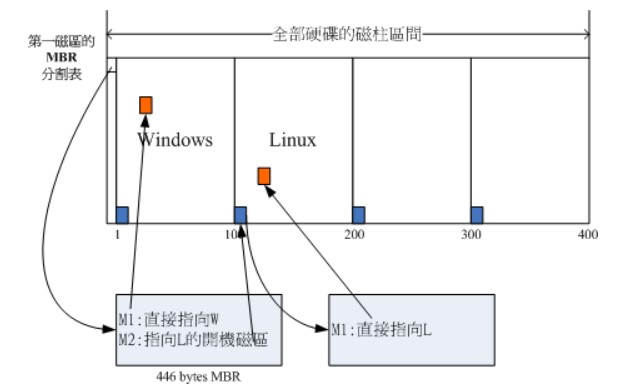

# Linux基础

## 虚拟机Linux安装

### 网络配置

* 修改主机名

```shell
$> vi /etc/hostname
basic
```

* 修改ip地址

```shell
$> vi /etc/sysconfig/network-scripts/ifcfg-ens33
BOOTPROTO=static        # 开启静态IP
ONBOOT=yes              # 开机启动网卡
IPADDR=192.168.25.140   # 静态IP地址
GATEWAY=192.168.25.2    # 默认网关
NETMASK=255.255.255.0   # 子网掩码
DNS1=119.29.29.29       # DNS服务器地址1
DNS2=114.114.114.114    # DNS服务器地址2
```

* 重启网络

```shell
$> service network restart
```

* 查看网络信息

```shell
$> ip addr
```

* 重启系统

```shell
$> reboot
```


### 工具安装和系统设置

* 安装工具

```shell
$> yum -y install vim
$> yum -y install wget
$> yum -y install unzip
```

* 更改 yum 源

```shell
# 1.备份 yum 配置文件
$> cd /etc/yum.repos.d
$> mv CentOS-Base.repo CentOS-Base.repo.backup

# 2.使用 wget 下载 yum 源
$> wget http://mirrors.163.com/.help/CentOS6-Base-163.repo

# 3.生成软件包缓存
$> yum makecache
```

* 关闭防火墙

```shell
# 1.关闭当前开启的防火墙
$> systemctl stop firewalld.service

# 2.关闭防火墙的开机自启
$> systemctl disable firewalld.service

# 3.查看防火墙状态
$> systemctl is-enabled firewalld.service
```


## 常用操作

### 命令格式

`command [-options] [parameter1] ...`

* 说明：
  * **command:** 命令名，相应功能的英文单词或单词的缩写；
  * **[-options]:** 选项，可用来对命令进行控制，也可以省略，[]代表可选；
  * **[parameter1]...:** 传给命令的参数，可以是零个，一个或多个。


### 基本命令

* 关机：`poweroff`

  * who：在关机前需要先使用 who 命令查看有没有其它用户在线。

  * sync：为了加快对磁盘文件的读写速度，位于内存中的文件数据不会立即同步到磁盘，因此关机之前需要先进行 sync 同步操作。
  * shutdown：

  ```bash
  shutdown [-krhc] 时间 [信息]
  -k ： 不会关机，只是发送警告信息，通知所有在线的用户
  -r ： 将系统的服务停掉后就重新启动
  -h ： 将系统的服务停掉后就立即关机
  -c ： 取消已经在进行的 shutdown
  ```

* 重启：`reboot`

* 查看网络：

  * `ifconfig`
  * `ip addr`

* 检查网络连通性：`ping 127.0.0.1`

* 配置主机名：

  * `/etc/sysconfig/network`
  * `/etc/hostname`

* 配置IP：

  * `/etc/sysconfig/network-scripts/ifcfg-eht0`
  * `/etc/sysconfig/network-scripts/ifcfg-ens33`

* 配置映射：`/etc/hosts`

* 防火墙：

  * centos6：
    * 一次性：`service iptables stop/start/status`
    * 永久性：`chkconfig iptables off/on`
  * centos7：
    * 关闭当前开启的防火墙：`systemctl stop firewalld.service`
    * 关闭防火墙的开机自启：`systemctl disable firewalld.service`
    * 查看防火墙状态：`systemctl is-enabled firewalld.service`

* 软件包：

  * 安装包：`rpm`
  * 安装仓库：`yum`

* 磁盘：

  * 显示磁盘使用情况：`df`
  * 显示文件系统使用情况：`du`
  * 挂载：`mount` `umoun`


### 帮助文档

* 命令类型：`type` 
* `file`
* 命令用法：`help` 一般是 Linux 命令自带的帮助信息，并不是所有命令都自带这个选项，如我们想查看命令 ls 的用法：`$> ls --help`；
* 命令手册：`man` 是 Linux 提供的一个手册，包含了绝大部分的命令和函数的使用说明。该手册分成很多章节（section），使用 man 时可以指定不同的章节来浏览不同的内容；
  * man 中各个 section 意义如下：
    * Standard commands（标准命令）
    * System calls（系统调用，如open, write）
    * Library functions（库函数，如printf, fopen） 
    * Special devices（设备文件的说明，/dev下各种设备） 
    * File formats（文件格式，如passwd） 
    * Games and toys（游戏和娱乐）
    * Miscellaneous（杂项、惯例与协定等，例如Linux档案系统、网络协定、ASCII 码；environ全局变量）
    * Administrative Commands（管理员命令，如ifconfig）
  * 例：我们想查看 ls 的用法：man 1 ls (数字"1"代表第1个 section) 实际上我们不用指定第几个章节也用查看，如：man ls。但是有这个一种情况，假如命令的名字和函数的名字刚好重名（如：printf），它既是命令，也可以是库函数，如果我们不指定章节号，man printf，它只查看命令的用法，不会查询函数的用法，因为 man 是按照手册的章节号的顺序进行搜索的。

| 功能键  |         功能         |
| :-----: | :------------------: |
| 空格键  |    显示手册下一屏    |
| Enter键 | 一次滚动手册页的一行 |
|    b    |       回滚一屏       |
|    f    |       前滚一屏       |
|    q    |     退出man命令      |
|    h    |    列出所有功能键    |
|  /word  |    搜索word字符串    |

* --help参数：提供指令的基本用法与选项介绍。
* man命令：man 是 manual 的缩写，将指令的具体信息显示出来。当执行 `man date` 时，有 DATE(1) 出现，其中的数字代表指令的类型，常用的数字及其类型如下：

| 代号 | 类型                                            |
| ---- | ----------------------------------------------- |
| 1    | 用户在 shell 环境中可以操作的指令或者可执行文件 |
| 5    | 配置文件                                        |
| 8    | 系统管理员可以使用的管理指令                    |

* info命令：man类似，但是 info 将文档分成一个个页面，每个页面可以跳转。

* doc：/usr/share/doc 存放着软件的一整套说明文件。


## Vim

### 工作模式

* **一般指令模式（Command mode）**：VIM 的默认模式，可以用于移动游标查看内容。
* **编辑模式（Insert mode）**：按下 "i" 等按键之后进入，可以对文本进行编辑。
* **指令列模式（Bottom-line mode）**：按下 ":" 按键之后进入，用于保存退出等操作。


### 基本操作

* **打开文件**：`vim filename` 打开或新建文件，并将光标置于第一行行首，如果文件不存在，则会新建文件。命令模式下的光标移动：h->左、j->下、k->上、L->右。
* **编辑文件**：如果通过 `vi/vim` 打开一个已经存在的文件，首先进入命令模式，此时输入的任何字符都被视为命令，不能输入内容。
* **保存文件**：要先退出编辑模式（按Esc进入命令模式），然后 `shift + zz`（按住 `shift` + 按两下 `z` 键）即可保存退出当前文件。


### 编辑模式

| 按键 |                功能                |
| :--: | :--------------------------------: |
|  a   |        光标位置右边插入文字        |
|  i   |       光标位置当前处插入文字       |
|  o   |        光标位置下方开启新行        |
|  O   |        光标位置上方开启新行        |
|  I   |        光标所在行首插入文字        |
|  A   |        光标所在行尾插入文字        |
|  s   | 以删除一个字符为条件，切换工作模式 |
|  S   |   以删除一行为条件，切换工作模式   |


### 退出

|     按键      |                     功能                     |
| :-----------: | :------------------------------------------: |
| zz(shift+z+z) |                   保存退出                   |
|      :wq      |                   保存退出                   |
|      :x       |                   保存退出                   |
|  :w filename  |                保存到指定文件                |
|      :q       | 退出，如果文件修改但没有保存，会提示无法退出 |
|      :q!      |                 退出，不保存                 |


### 复制粘贴

|   按键   |                             功能                             |
| :------: | :----------------------------------------------------------: |
|    yy    |                        复制光标所在行                        |
|  [n]yy   |                  复制光标所在行和之后的n行                   |
|    p     |                  粘贴至光标所在位置，下一行                  |
|    P     |                  粘贴至光标所在位置，上一行                  |
|    yw    |           将光标放置于单词的首字符上，复制一个单词           |
| 区域选择 | 将光标放置于待复制区的首字符上，按 "v" 键(左下角出现 "可视" 提示)，使用 h，j，k，l 选择复制区域 |


### 删除和修改

| 按键  |                            功能                             |
| :---: | :---------------------------------------------------------: |
|  dd   |                      剪切光标所在位置                       |
| [n]dd | 删除从当前行开始的n行（准确的说是剪切，剪切和粘贴即为删除） |
|  dw   |           将光标放置于单词首字符上，剪切一个单词            |
|  d0   |                 从光标所在位置，删除到行首                  |
| d$(D) |                 从光标所在位置，删除到行尾                  |
| [n]x  |                      删除光标后n个字符                      |
| [n]X  |                      删除光标前n个字符                      |
|  dG   |           删除光标所在行开始到文件末尾的所有字符            |


### 行定位

|     按键      |           功能            |
| :-----------: | :-----------------------: |
|   Ctrl + f    |     向前滚动一个屏幕      |
|   Ctrl + b    |     向后滚动一个屏幕      |
|      gg       |   跳转到文件第一行行首    |
|       G       |  跳转到文件最后一行行首   |
| [n]G 或 [n]gg | 跳转到指定行，n为目标行数 |


### 文本查找

|   按键   |                      功能                      |
| :------: | :--------------------------------------------: |
| :/字符串 |                 查找指定字符串                 |
|    n     | 寻找下一个（光标需放置在单词的任意一个字符上） |
|    \*    |           匹配一个已有字符，向后寻找           |
|    #     |           匹配一个已有字符，向前寻找           |


### 文本替换

|       按键        |                             功能                             |
| :---------------: | :----------------------------------------------------------: |
|    :s/old/new     | 单行替换，若有多个 "old" 被匹配，使用 "g" 键，否则只会替换一行的首个 |
|    :%s/old/new    | 通篇替换，若有多个 "old" 被匹配，使用 "g" 键，否则只会替换全文的首个 |
| :[n],[ms]/old/new | 替换从 n 开始，到 m 结束的所有 "old"，若有多个 "old" 被匹配，使用 "g" 键，否则只替换第一个 |


### set指令

|   按键    |    功能    |
| :-------: | :--------: |
|  :set nu  |  显示行号  |
| :set nonu | 不显示行号 |


## 磁盘管理

### 磁盘接口

* **IDE（ATA，Advanced Technology Attachment）**：接口速度最大为 133MB/s，因为并口线的抗干扰性太差，且排线占用空间较大，不利电脑内部散热，已逐渐被 SATA 所取代。
* **SATA（Serial ATA）**：也就是使用串口的 ATA 接口，抗干扰性强，且对数据线的长度要求比 ATA 低很多，支持热插拔等功能。SATA-II 的接口速度为 300MB/s，而 SATA-III 标准可达到 600MB/s 的传输速度。SATA 的数据线也比 ATA 的细得多，有利于机箱内的空气流通，整理线材也比较方便。
* **SCSI（Small Computer System Interface）**：即小型机系统接口，SCSI 硬盘广为工作站以及个人电脑以及服务器所使用，因此会使用较为先进的技术，如碟片转速 15000rpm 的高转速，且传输时 CPU 占用率较低，但是单价也比相同容量的 ATA 及 SATA 硬盘更加昂贵。
* **SAS（Serial Attached SCSI）**：是新一代的 SCSI 技术，和 SATA 硬盘相同，都是采取序列式技术以获得更高的传输速度，可达到 6Gb/s。此外也通过缩小连接线改善系统内部空间等。


### 磁盘文件名

Linux 中每个硬件都被当做一个文件，包括磁盘。磁盘以磁盘接口类型进行命名，常见磁盘的文件名如下：

- IDE 磁盘：/dev/hd[a-d]
- SATA/SCSI/SAS 磁盘：/dev/sd[a-p]

其中文件名后面的序号的确定与系统检测到磁盘的顺序有关，而与磁盘所插入的插槽位置无关。


### 分区表

* **MBR**：MBR 中，第一个扇区最重要，里面有主要开机记录（Master boot record, MBR）及分区表（partition table），其中主要开机记录占 446 bytes，分区表占 64 bytes。

  分区表只有 64 bytes，最多只能存储 4 个分区，这 4 个分区为主分区（Primary）和扩展分区（Extended）。其中扩展分区只有一个，它使用其它扇区来记录额外的分区表，因此通过扩展分区可以分出更多分区，这些分区称为逻辑分区。

  Linux 也把分区当成文件，分区文件的命名方式为：磁盘文件名 + 编号，例如 /dev/sda1。注意，逻辑分区的编号从 5 开始。

* **GPT**：扇区是磁盘的最小存储单位，旧磁盘的扇区大小通常为 512 bytes，而最新的磁盘支持 4 k。GPT 为了兼容所有磁盘，在定义扇区上使用逻辑区块地址（Logical Block Address, LBA），LBA 默认大小为 512 bytes。

  GPT 第 1 个区块记录了主要开机记录（MBR），紧接着是 33 个区块记录分区信息，并把最后的 33 个区块用于对分区信息进行备份。这 33 个区块第一个为 GPT 表头纪录，这个部份纪录了分区表本身的位置与大小和备份分区的位置，同时放置了分区表的校验码 (CRC32)，操作系统可以根据这个校验码来判断 GPT 是否正确。若有错误，可以使用备份分区进行恢复。

  GPT 没有扩展分区概念，都是主分区，每个 LBA 可以分 4 个分区，因此总共可以分 4 * 32 = 128 个分区。

  MBR 不支持 2.2 TB 以上的硬盘，GPT 则最多支持到 233 TB = 8 ZB。


### 开机检测程序

* **BIOS（Basic Input/Output System，基本输入输出系统）**：它是一个固件（嵌入在硬件中的软件），BIOS 程序存放在断电后内容不会丢失的只读内存中。

  BIOS 是开机的时候计算机执行的第一个程序，这个程序知道可以开机的磁盘，并读取磁盘第一个扇区的主要开机记录（MBR），由主要开机记录（MBR）执行其中的开机管理程序，这个开机管理程序会加载操作系统的核心文件。

  主要开机记录（MBR）中的开机管理程序提供以下功能：选单、载入核心文件以及转交其它开机管理程序。转交这个功能可以用来实现多重引导，只需要将另一个操作系统的开机管理程序安装在其它分区的启动扇区上，在启动开机管理程序时，就可以通过选单选择启动当前的操作系统或者转交给其它开机管理程序从而启动另一个操作系统。

  下图中，第一扇区的主要开机记录（MBR）中的开机管理程序提供了两个选单：M1、M2，M1 指向了 Windows 操作系统，而 M2 指向其它分区的启动扇区，里面包含了另外一个开机管理程序，提供了一个指向 Linux 的选单。

  安装多重引导，最好先安装 Windows 再安装 Linux。因为安装 Windows 时会覆盖掉主要开机记录（MBR），而 Linux 可以选择将开机管理程序安装在主要开机记录（MBR）或者其它分区的启动扇区，并且可以设置开机管理程序的选单。

  

* **UEFI**：BIOS 不可以读取 GPT 分区表，而 UEFI 可以。


## 文件系统管理

### 目录结构

* **/**：根目录一般只存放目录，在 linux 下有且只有一个根目录，所有的东西都是从这里开始的。
* **/bin; /usr/bin**：可执行二进制文件的目录，如常用命令 ls、tar、mv、cat。
* **/boot**：存放系统启动时用到的一些文件，如内核文件 /boot/vmlinuz，系统引导管理器 /boot/grub。
* **/dev**：存放系统下的设备文件，访问该目录下某个文件，相当于访问某个设备，常用的是挂载光驱 mount /dev/cdrom /mnt。
* **/etc**：存放系统配置文件，不建议在此目录下存放可执行文件。重要的配置文件有  /etc/inittab、/etc/fstab、/etc/init.d、/etc/X11、/etc/sysconfig和/etc/xinetd.d。
* **/home**：存放用户信息的家目录，新增用户账号时，用户的家目录都存放在此目录下。~ 表示当前用户的家目录，而~edu 则表示用户 edu 的家目录。
* **/lib; /usr/lib; /usr/local/lib**：系统使用的函数库的目录，程序在执行过程中，需要调用一些额外的参数时需要函数库的协助。
* **/lost + fount**：系统异常产生错误时，会将一些遗失的片段放置于此目录下。
* **/mnt; /media**：光盘默认挂载点，通常光盘挂载于 /mnt/cdrom 下，也可以选择任意位置进行挂载。
* **/opt**：给主机额外安装软件所摆放的目录。
* **/proc**：此目录的数据都在内存中，如系统核心，外部设备，网络状态，由于数据都存放于内存中，所以不占用磁盘空间，比较重要的目录有 /proc/cpuinfo、/proc/interrupts、/proc/dma、/proc/ioports、/proc/net/* 。
* **/root**：系统管理员 root 的家目录（宿主目录）。
* **/sbin; /usr/sbin; /usr/local/sbin**：放置系统管理员使用的可执行命令，如：fdisk、shutdown、mount 等。与 /bin 不同的是，这几个目录是给系统管理员 root 使用的命令，一般用户只能查看而不能设置和使用。
* **/tmp**：一般用户或正在执行的程序临时存放文件的目录，任何人都可以访问，重要数据不可放置在此目录下。
* **/srv**：服务启动之后需要访问的数据目录，如 www 服务需要访问的网页数据存放在 /srv/www 内。
* **/usr**：应用程序存放的目录。
  * /usr/bin：存放应用程序；
  * /usr/share：存放共享数据；
  * /usr/lib：存放不能直接运行的，却是许多程序运行所必需的一些函数库文件；
  * /usr/local：存放软件升级包；
  * /usr/share/doc：系统说明文件存放目录；
  * /usr/share/man：程序说明文件存放目录；
  * /usr/include：存放头文件。
* **/var**：放置系统执行过程中经常变化的文件。
  * /var/log：存放随时更改的日志文件；
  * /var/log/message：所有的登录文件存放目录；
  * /var/spool/mail：邮件存放的目录；
  * /var/run：程序或服务启动后，其 PID 存放在该目录下。


### 文件分类

* **统一抽象**：Unix/Linux 的数据文件 .mp3、.bmp，程序文件 .c、.h、*.o，设备文件 LCD、触摸屏、鼠标、网络文件Socket等都抽象为文件，使用统一的方式管理。
* **无扩展名**：在 Unix/Linux 操作系统中也必须区分文件类型，通过文件类型可以判断文件属于可执行文件，文本文件还是数据文件，在 Unix/Linux 系统中文件可以没有扩展名。
* **普通文件**：普通文件是计算机操作系统用于存放数据，程序等信息的文件，一般都长期存放于外存储器（磁盘，磁带等）中。普通文件一般包括文本文件，数据文件，可执行的二进制程序文件等。
* **设备文件**：Unix/Linux 系统把每个设备都映射成一个文件，这就是设备文件,用于向 I/O 设备提供连接的一种文件，分为字符设备和块设备文件。字符设备的存取以一个字符为单位，块设备的存取以字符块为单位。每一种 I/O 设备对应一个设备文件，存放在 /dev 目录中，如行式打印机对应 /dev/lp，第一个软盘驱动器对应 /dev/fd0；
* **管道文件**：管道文件也是 Unix/Linux 中较特殊的文件类型，这类文件多用于进程间的通信。
* **软链接文件**：类似于 Windows 下的快捷方式，链接又可以分为软链接（符号链接）和硬链接。

|   文件类型   | 标识符 |
| :----------: | :----: |
|   普通文件   |   -    |
|   目录文件   |   d    |
|   管道文件   |   p    |
|  套接字文件  |   s    |
|  软链接文件  |   l    |
|  块设备文件  |   b    |
| 字符设备文件 |   c    |


### 系统权限

**基本概念**：

* 文件权限就是文件的访问控制权限，即哪些用户和组群可以访问文件以及可以执行什么样的操作。
* Unix/Linux 系统是一个典型的多用户系统，不同的用户处于不同的地位，对文件和目录有不同的访问权限。为了保护系统的安全性，Unix/Linux 系统除了对用户权限作了严格的界定外，还在用户身份认证，访问控制，传输安全，文件读写权限等方面作了周密的控制。
* 在 Unix/Linux 中的每一个文件或目录都包含有访问权限，这些访问权限决定了谁能访问和如何访问这些文件和目录。

**访问用户**：

* **所有者**：即只允许用户自己访问。所有者就是创建文件的用户，用户是所有用户所创建文件的所有者，用户可以允许所在的用户组能访问用户的文件。
* **用户组**：即允许一个预先指定的用户组中的用户访问。用户都组合成用户组，例如：某一类或某一项目中的所有用户都能够被系统管理员归为一个用户组，一个用户能够授予所在用户组的其他成员的文件访问权限。
* **其他用户**：允许系统中的任何用户访问。用户也将自己的文件向系统内的所有用户开放，在这种情况下，系统内的所有用户都能够访问用户的目录或文件。在这种意义上，系统内的其他所有用户就是 other 类用户。

**访问权限**：

* **读权限r**：对文件而言，具有读取文件内容的权限。对目录来说，具有浏览目录的权限。
* **写权限w**：对文件而言，具有新增和修改文件内容的权限。对目录来说，具有删除和移动目录内文件的权限。
* **可执行权限x**：对文件而言，具有执行文件的权限。对目录来说，该用户具有进入目录的权限。
* 第1个字母代表文件的类型，即文件夹 `d`、普通文件 `-`、硬件字符设备 `c`、硬件块设备 `b`、管道文件 `s` 和软链接文件 `l`。
* 后9个字母分别代表三组权限，即文件所有者、用户所在的组和其他用户拥有的读权限 `r`、写权限 `w` 和执行权限 `x`。
  * 第一组权限控制访问自己的文件权限，即所有者权限；
  * 第二组权限控制用户组内访问其中一个用户的文件的权限；
  * 第三组权限控制其他所有用户访问一个用户的文件的权限。


### ls 查看目录信息

* ls 是英文单词 list 的简写，其功能为列出目录的内容，是用户最常用的命令之一，它类似于 DOS 下的 dir 命令；
* Linux 文件或者目录名称最长可以有256个字符，"." 代表当前目录，".." 代表上一级目录，以 "." 开头的文件为隐藏文件，需要用 -a 参数才能显示。
* ls 常用参数：

| 参数 |                      含义                      |
| :--: | :--------------------------------------------: |
|  -a  | 显示指定目录下的所有子目录和文件，包括隐藏文件 |
|  -l  |         以列表的方式显示文件的详细信息         |
|  -h  |       配合 -l 以任性化的方式显示文件大小       |

* 在 Unix/Linux 系统中，也同样允许使用特殊字符来同时引用多个文件名，这些特殊字符被称为通配符：

|   通配符    |                         含义                          |
| :---------: | :---------------------------------------------------: |
|      *      |                代表文件名中的所有字符                 |
|   ls te*    |            查看当前目录以 te 开头的目录项             |
|  ls \*.go   |            查看当前目录以 .go 结尾的目录项            |
|      ?      |               代表文件名中的任意1个字符               |
| ls ?.python |  查看当前目录第1个字符任意，后缀为 .python 的目录项   |
|   ls a.?    | 查看当前目录前2个字符为a.，最后一个字符为任意的目录项 |
|  ls [a-f]*  |   查看当前目录以 a 到 f 范围内任意字符开头的目录项    |
|     \|      |            转义字符将通配符转义为普通字符             |
|   ls \*a    |             查看当前目录下名为 \*a 的文件             |


### < 重定向命令

* Linux 允许将命令执行结果重定向到一个文件，本应显示在终端上的内容保存到指定文件中；
* 命令 `>` 重定向到指定文件，文件不存在则自动创建，存在则覆盖原文件；
* 命令 `>>` 将执行结果追加到指定文件，文件不存在自动创建。
* 示例：
  * `$> ls > abc.txt`
  * `$> ls -la >> abc.txt`
* 标准输入：
  * 数字 `0` 表示程序正常运行时的输入；
  * `read aaa 0<<< "hello"`
  * `<<<`：输入没有换行的字符串
  * `<<`：输入多行字符串
  * `<`：将打开的文本输入 `cat 0< /proc/***`
* 标准输出：
  * 数字 `1` 表示程序正常运行时的输出；
  * `ls 1> ls.out`
  * `ls /tmp 1>> ls.out`
* 标准错误：
  * 数字 `2` 表示程序遇到问题时的输出；
* 分别重定向：
  * `$> test.sh 1> res.log 2> err.log`
* 合并重定向：
  * `$> test.sh > res.log 2> &1`
* 丢弃输出：
  * `$> test.sh > /dev/null 2> &1`


### more 分屏显示

* 查看内容时，在信息过长无法在一屏上显示时，会出现快速滚屏，使得用户无法看清文件的内容，此时可以使用 `more` 命令，每次只显示一页，按下空格键可以显示下一页，按下 `q` 键退出显示，按下 `h` 键可以获取帮助。
* 示例：`$> more /etc/profile`


### | 管道

* 管道：一个命令的输出可以通过管道做为另一个命令的输入；
* 管道我们可以理解成管子，管子的一头塞东西进去，另一头取出来，这里 `|` 的左右分为两端，左端塞东西（写），右端取东西（读）。
* 示例：`$> ls -alh | more`


### clear 清屏

* `clear` 的作用是清除终端上的显示，也可使用快捷键：`Ctrl + l` 。


### cd 工作目录切换

* 在使用 Unix/Linux 的时候，经常需要更换工作目录。`cd` 命令可以帮助用户切换工作目录。Linux 所有的目录和文件名大小写敏感；
* `cd` 后面可跟绝对路径，也可以跟相对路径。如果省略目录，则默认切换到当前用户的主目录。

| 命令  |                             含义                             |
| :---: | :----------------------------------------------------------: |
|  cd   | 切换到当前用户的主目录(/home/用户目录)，用户登录时默认的目录就是该用户的主目录 |
| cd ~  |            切换到当前用户的主目录(/home/用户目录)            |
| cd .  |                        切换到当前目录                        |
| cd .. |                        切换到上级目录                        |
| cd -  |                    切换到上一次进入的目录                    |


### pwd 显示当前路径

* 使用 `pwd` 命令可以显示当前的工作目录。


### mkdir 创建目录

* 通过 `mkdir` 命令可以创建一个新的目录，参数 `-p` 可递归创建目录；
* 需要注意的是新建目录的名称不能与当前目录中已有的目录或文件同名，并且目录创建者必须对当前目录具有写权限。
* 示例：
  *  `$> mkdir test`
  *  `$> mkdir -p a/b/c`
* 创建文件：`touch`


### rmdir 删除目录

* 可使用 `rmdir` 命令删除一个目录。必须离开目录，并且目录必须为空目录，不然提示删除失败。


### rm 删除文件和目录

* 可通过 `rm` 删除文件或目录。使用 `rm` 命令要小心，因为文件删除后不能恢复。为了防止文件误删，可以在 `rm` 后使用 `-i` 参数以逐个确认要删除的文件。
* 常用参数：

| 参数 |                      含义                      |
| :--: | :--------------------------------------------: |
|  -i  |               进行交互式方式执行               |
|  -f  |     强制删除，忽略不存在的文件，不提示信息     |
|  -r  | 递归的删除目录下的内容，删除目录必须添加此参数 |


### ln 建立链接文件

* 链接文件分为软链接和硬链接：
  * 软链接：软链接不占用磁盘空间，源文件删除则软链接失效；
  * 硬链接：硬链接只能链接普通文件，不能链接目录。
* 如果没有 `-s` 选项代表建立一个硬链接文件，两个文件占用相同大小的硬盘空间，即使删除了源文件，链接文件还是存在，所以 `-s` 选项是更常见的形式；
* 注：如果软链接文件和源文件不在同一个目录，源文件要使用绝对路径，不能使用相对路径。


### cat 查看文件内容

* 查看或合并文件内容；
* 示例：
  * `$> cat a`
  * `$> cat a b > c`
* 首部尾部查看文件：`$> head/tail`
* 逐行查看文件：`$> less/more`


###  cp 拷贝文件

* `cp` 命令的功能是将给出的文件或目录复制到另一个文件或目录中。
* 常用选项：

| 选项 |                             含义                             |
| :--: | :----------------------------------------------------------: |
|  -a  | 通常在复制目录的时候使用，保留链接和文件属性，并递归的复制目录，简单而言，保持文件原有属性 |
|  -f  |              覆盖已经存在的目标文件并不显示信息              |
|  -i  |    交互式复制，在覆盖目标文件之前将给出提示并要求用户确认    |
|  -r  | 若复制的源文件是目录文件，添加 -r 参加将递归复制该目录下的所有子目录和文件，目标文件必须是目录 |
|  -v  |                        显示拷贝的进度                        |

* 示例：`$> cp -ivr ./aaa/ ./ddd/` 


### mv 移动文件

* 用户可以使用 `mv` 命令来移动文件或目录，也可以给文件或目录重命名。
* 常用选项：

| 选项 |                           含义                           |
| :--: | :------------------------------------------------------: |
|  -f  |             若目标文件存在覆盖，不会给出提示             |
|  -i  | 交互式方式，若 mv 操作存在覆盖，系统会向用户确认是否覆盖 |
|  -v  |                       显示操作进度                       |

* 示例：`$> mv ./file1 ./file2`


### file 获取文件类型

* Linux 系统文件类型不是根据文件扩展名分类的，可以通过 `file` 命令确认文件具体类型。
* 示例：`$> file ./sublime`


### tar 归档管理

* 计算机中的数据经常需要备份，`tar` 是 Unix/Linux 中最常用的备份工具，此命令可以把一系列文件归档到一个大文件中，也可以把档案文件解开以恢复数据。
* 常用参数：

| 参数 |                             含义                             |
| :--: | :----------------------------------------------------------: |
|  -c  |                       打包生成档案文件                       |
|  -v  |               列出归档解档的详细过程，显示进度               |
|  -f  | 指定档案文件名称，f 后面一定是以 .tar 后缀的文件，必须放在选择最后 |
|  -t  |                     列出档案中包含的文件                     |
|  -x  |                         解包档案文件                         |

* 示例：
  * `$> tar -cvf test.tar a b c`
  * `$> tar -xvf test.tar`


### gzip 文件压缩解压

* `tar` 与 `gzip` 命令结合使用实现文件打包和压缩。`tar` 只负责打包不压缩，用 `gzip` 压缩 `tar` 打包后的文件，其扩展名一般用 `xxxx.tar.gz`。
* 常用参数：

| 选项 |      含义      |
| :--: | :------------: |
|  -d  |      解压      |
|  -r  | 压缩所有子目录 |

* 示例：
  * `$> gzip -r test.tar test.tar.gz`
  * `$> gzip -d test.tar.gz`
* `tar` 这个命令并没有压缩的功能，它只是一个打包的命令，但是在 `tar` 命令中增加一个选项 `-z` 可以调用 `gzip` 实现了一个压缩或解压的功能。

| 选项 |                             含义                             |
| :--: | :----------------------------------------------------------: |
|  -z  |                指定压缩包的格式：file.tar.gz                 |
|  -C  | 用于解压文件，放在被解压文件名后面的选项，用于指定解压的目标路径 |

* 示例：
  * `$> tar -zcvf test.tar a b c`
  * `$> tar -zxvf test.tar -C ./`


### bzip2 文件压缩解压

* `tar` 与 `bzip2` 命令结合使用实现文件打包和压缩（用法和 `gzip` 一样）；
* `tar` 只负责打包文件，但不压缩，用 `bzip2` 压缩 `tar` 打包后的文件，其扩展名一般用 `xxxx.tar.bz2`；
* 在 `tar` 命令中增加一个选项 `-j` 可以调用 `bzip2` 实现了一个压缩的功能，实行一个先打包后压缩的过程；
* 压缩用法：`tar -jcvf 压缩包包名 文件 ...（tar jcvf bk.tar.bz2 *.c）`
* 解压用法：`tar -jxvf 压缩包包名（tar jxvf bk.tar.bz2）`


### zip 文件压缩解压

* 通过 `zip` 压缩的目标文件不需要指定扩展名，默认扩展名为 `zip`；
* 压缩文件：`zip [-r] 目标文件（没有扩展名）源文件`；
* 解压文件：`unzip -d 解压后目录文件 压缩文件`。
* 示例：
  * `$> zip -r myzip a b c`
  * `$> unzip -d test/ myzip.zip`


### which 查看命令位置

* 示例：
  * `$> which ls`
  * `$> which sudo`
  * `$> which tar`


## 用户/权限管理

* 用户是 Unix/Linux 系统工作中重要的一环，用户管理包括用户与组账号的管理；
* 在 Unix/Linux 系统中，不论是由本机或是远程登录系统，每个系统都必须拥有一个账号，并且对于不同的系统资源拥有不同的使用权限；
* Unix/Linux 系统中的 root 账号通常用于系统的维护和管理，它对 Unix/Linux 操作系统的所有部分具有不受限制的访问权限；
* 在 Unix/Linux 安装的过程中，系统会自动创建许多用户账号，而这些默认的用户就称为 "标准用户"；
* 在大多数版本的 Unix/Linux 中，都不推荐直接使用 root 账号登录系统。

### whoami 查看当前登录的用户

* `whoami` 命令用户查看当前系统当前账号的用户名。可通过 `cat /etc/passwd` 查看系统用户信息；
* 由于系统管理员通常需要使用多种身份登录系统，例如通常使用普通用户登录系统，然后再以 `su` 命令切换到 root 身份对传统进行管理。这时候就可以使用 `whoami` 来查看当前用户的身份。
* 示例：`$> whoami`


### exit 退出登录的用户

* 如果是图形界面，退出当前终端；
* 如果是使用 ssh 远程登录，退出登陆账户；
* 如果是切换后的登陆用户，退出则返回上一个登陆账号。


### su 切换用户

* 可以通过 `su` 命令切换用户，`su` 后面可以加 `-`。`su` 和 `su –` 命令不同之处在于，`su -` 切换到对应的用户时会将当前的工作目录自动转换到切换后的用户主目录。
* 注：如果是 ubuntu 平台，需要在命令前加 `sudo`，如果在某些操作需要管理员才能操作，ubuntu 无需切换到 root 用户即可操作，只需 `sudo` 即可。`sudo` 是 ubuntu 平台下允许系统管理员让普通用户执行一些或者全部的 root 命令的一个工具，减少了 root 用户的登陆和管理时间，提高了安全性。


### adduser/deluser 添加/删除用户

* `adduser 用户名`：新建用户；
* `userdel 用户名`：删除用户；
* `cat /etc/passwd`：查看用户组。


### addgroup/delgroup 添加/删除用户

* `addgroup 组名`：新建用户组；
* `delgroup 组名`：删除用户组；
* `cat /etc/group`：查看用户组。


### passwd 设置用户密码

* 在 Unix/Linux 中，超级用户可以使用 `passwd 用户名` 命令为普通用户设置或修改用户口令。用户也可以直接使用 passwd 命令来修改自己的口令，而无需在命令后面添加用户名。


### chown 修改文件所有者

* 使用方法：`chown 用户名 文件或目录名`
* 示例：`$> chown edu 1.txt`


### chgrp 修改文件所属组

* 使用方法：`chgrp 用户组名 文件或目录名`
* 示例：`$> chgrp root 1.txt`


### 修改文件到新的用户/用户组

* 使用命令：`chown 用户名:用户组名 文件或目录名` 可直接同时修改文件的所有者和所属组；
* 示例：`sudo chown nobody:nogroup a.c`，可将 a.c 文件设置到 nobody 用户，nogroup 用户组下。


### chmod 修改文件权限

* chmod 修改文件权限有两种使用格式：字母法与数字法；
* 字母法格式：`chmod u/g/o/a +/-/= r/w/x 文件`

| [u/g/o/a] |                       含义                       |
| :-------: | :----------------------------------------------: |
|     u     |              user 表示该文件所有者               |
|     g     | group 表示与该文件所有者同属一组的用户，即用户组 |
|     o     |              other 表示其他以外的人              |
|     a     |                all 表示这三者皆是                |

| [+-=] |   含义   |
| :---: | :------: |
|   +   | 增加权限 |
|   -   | 撤销权限 |
|   =   | 设定权限 |

| [r/w/x] |                             含义                             |
| :-----: | :----------------------------------------------------------: |
|    r    | read 表示可读取，对于目录来说，拥有r权限就能够通过ls查看目录的内容 |
|    w    | write 表示可写入，对于目录来说，拥有w权限就能够在目录下创建新的文件 |
|    x    | excute 表示可执行，对于目录来说，拥有x权限就能够通过cd进入到这个目录中 |

* 示例：
  * 为其他用户增加写权限：`$> chmod o+w file`
  * 为文件拥有者减去读权限：`$> chmod u-r file`
  * 为所有者的同组用户设置执行权限，同时去除读写权限：`$> chmod g=x file`
* 数字法："rwx"这些权限也可以用数字来代替。

| 字母 |             含义              |
| :--: | :---------------------------: |
|  r   |    读取权限，数字代号为"4"    |
|  w   |    写入权限，数字代号为"2"    |
|  x   |    执行权限，数字代号为"1"    |
|  -   | 不具备任何权限，数字代号为"0" |

* 如执行：`chmod u=rwx,g=rx,o=r filename`，等同于：`chmod u=7,g=5,o=4 filename`。
* 示例：
  * `$> chmod 751 file`
    * 为文件所有者设定读，写，执行的权限；
    * 为所有者同组用户设读，执行的权限；
    * 为其他所有用户设定执行的权限。
  * `$> chmod 777 file`
    * 使所有用户拥有读，写，执行权限。


## 系统管理

### ps 查看进程信息

* 进程是一个具有一定独立功能的程序，它是操作系统动态执行的基本单元。 
* `ps` 命令可以查看进程的详细状况，常用选项（选项可以不加 `-`）如下：

| 选项 |                   含义                   |
| :--: | :--------------------------------------: |
|  -a  | 显示终端上的所有进程，包括其他用户的进程 |
|  -u  |            显示进程的详细状态            |
|  -x  |          显示没有控制终端的进程          |
|  -r  |           只显示正在运行的进程           |

* 示例：`$> ps -a`


### kill 终止进程

* `kill` 命令指定进程号的进程，需要配合 `ps` 使用；
* 使用格式：`kill [-signal] pid`；
* 信号值从 `0` 到 `15`，其中 `9` 为绝对终止，可以处理一般信号无法终止的进程；
* 有些进程不能直接杀死，这时候我们需要加一个参数 `-9` 代表强制结束。
* 示例：`$> kill -9 9133`


### &/jobs/fg 后台程序

* 用户可以将一个前台执行的程序调入后台执行，方法为：命令 `&`；
* 如果程序已经在执行，`ctrl + z` 可以将程序调入后台；
* `jobs` 查看后台运行程序；
* `fg` 编号（编号为通过jobs查看的编号），将后台运行程序调出到前台。


### reboot/shuidown/init 关机重启

|       命令        |                 含义                  |
| :---------------: | :-----------------------------------: |
|      reboot       |           重新启动操作系统            |
|  shutdown -r now  |     重启操作系统，会提示其他用户      |
|  shutdown -h now  | 立即关机，shutdown相当于时间为0的状态 |
| shutdown -h 20:25 |          系统在当天20:25关闭          |
|  shutdown -h +10  |        系统再过10分钟自动关闭         |
|      init 0       |                 关机                  |
|      init 6       |                 重启                  |


### 字符界面和图形界面切换

* 在 RedHat 平台下，可通过命令进行切换：

| 命令 |      含义      |
| :--: | :------------: |
| int3 | 切换到字符界面 |
| int5 | 切换到图形界面 |

* 通过快捷键切换（适用大部分平台）：

|     快捷键      |      含义      |
| :-------------: | :------------: |
| Ctrl + Alt + F3 | 切换到字符界面 |
| Ctrl + Alt + F1 | 切换到图形界面 |


### ifconfig 查看或配置网卡信息

* `ifconfig` 命令会显示所有网卡的信息。

|  显示字段   |                             说明                             |
| :---------: | :----------------------------------------------------------: |
|    ens33    |                         网络接口名称                         |
| Link encap  |                         链路封装协议                         |
|   Hwaddr    |                      网络接口的MAC地址                       |
|    inet     |                           IPv4地址                           |
|    inet6    |                           IPv6地址                           |
|  broadcast  |                           广播地址                           |
|   netmask   |                           子网掩码                           |
|     UP      |          网络接口状态表示，UP表示启用，DOWN表示停用          |
|  BROADCAST  |              广播标识，标识网络接口是否支持广播              |
|   RUNNING   |        传输标识，标识网络接口是否已经开始传输分组数据        |
|  MULTICAST  |              多播表示，标识网络接口是否支持多播              |
| MTU, Metric | MTU：最大传输单位，单位：字节; Metric：度量值，用于RIP建立网络路由使用 |
|  RX bytes   |                       接收数据字节统计                       |
|  TX bytes   |                       发送数据字节统计                       |

* 可以通过 `ifconfig` 配置网络参数：
  * 只有 root 才能用 `ifconfig` 配置参数，其他用户只能查看网络配置；
  * 格式：`ifconfig 网络接口名称 [地址协议类型] [address] [参数]`；
  * 地址协议类型如：inet（IPv4），inet6（IPv6）等；
  * 如：`ifconfig ens33 inet 192.168.10.254 netmask 255.255.255.0 up`。
* 常用参数：

|       参数        |         功能         |
| :---------------: | :------------------: |
|        -a         | 显示所有网络接口状态 |
|   inet[IP地址]    |      设置IP地址      |
| netmask[子网掩码] |     设置子网掩码     |
|        up         |     启动网络接口     |
|       down        |     关闭网络接口     |

* `ifconfig` 配置的网络参数在内存中，计算机重新启动之后就失效了，如果需要持久有效就需要修改网络接口的配置文件：

  * ubuntu 修改 /etc/NetworkManager/system-connections/Wired connection1 文件：

  ```
  [ipv4]
  method=manual
  addressesl=IP地址;24;默认网关;
  ```


### ping 测试远程主机连通性

* `ping` 通过 ICMP 协议向远程主机发送 ECHO\_REQUEST 请求，期望主机回复 ECHO\_REPLY 消息；
* 通过 `ping` 命令可以检查是否与远程主机建立了 TCP/IP 连接；
* 使用方法：`ping [参数] 远程主机IP地址`

| 参数 |                             功能                             |
| :--: | :----------------------------------------------------------: |
|  -a  |                  每次响应时都会发出声音警示                  |
|  -A  |          表示以实际往返响应时间为间隔，连续发送消息          |
|  -f  |            连续不断的发送消息，不管是否接收到消息            |
|  -n  |             只显示主机IP，不需要把IP解释成主机名             |
|  -c  |                         发送指定次数                         |
|  -i  | 设置每次发送消息时间间隔，默认1秒，如: ping -i 2 192.168.121.100 |
|  -s  |                 设置分组数据大小，默认64字节                 |
|  -w  |           以秒为单位的超时值，一旦超时，就立即停止           |


## 查找与搜索

### find 文件查找

* 格式：`find [路径] [参数] [关键字]`
* 常用参数：

|   参数    |                    解释                    |                             示例                             |
| :-------: | :----------------------------------------: | :----------------------------------------------------------: |
|   -name   |                 按名称搜索                 |                   find ./ -name "for*.sh"                    |
|   -perm   |                 按权限搜索                 |                      find ./ -perm 777                       |
|   -user   |             按文件所属用户搜索             |                     find ./ -user albert                     |
|  -group   |            按文件所属用户组搜索            |                     find ./ -group admin                     |
|   -type   |                 按类型搜索                 |                 find ./ -type f/d/l/b/c/s/p                  |
|   -size   |                 按大小搜索                 | find ./ -size +3M -size -8M（+：大于，-：小于）; find ./ -size +3k -size -8k（M只支持大写，k只支持小写）; find ./ -size +3 -size -8（无单位，按照磁盘扇区512B计算） |
| -maxdepth |                 按层级搜索                 | find ./ -maxdepth 1 -name "\*.sh"（需要放置在其他参数之前）  |
|   -exec   |           对搜索结果执行某些命令           |     find ./ -maxdepth 1 -name "\*.sh" -exec ls -l {} \;      |
|  -xarge   | 需要结合管道，将搜索结果指定给某个命令使用 |                find ./ -type d \| xargs ls -l                |


### grep 内容搜索

* 格式：`grep [参数] [关键字] <文件名>`
* 常用参数：

| 参数 |            说明            |
| :--: | :------------------------: |
|  -c  |     只输出匹配行的计数     |
|  -n  |      显示匹配行及行号      |
|  -v  | 显示不包含匹配文本的所有行 |

* 按文件内容搜索文件：
  * `grep -r/-R [关键字] [目录位置]`
    * `-r/-R` 表示递归的在指定目录中寻找包含某字符串的文件。
* 示例：
  * `grep -rn bash ./`
    * 在当前目录及子目录中，搜索包含 bash 的行，并打印行号。

* find/grep 命令结合使用：
  * 先使用 find 命令查找文件, 然后使用 grep 命令查找哪些文件包含某个字符串：
  * `find ./ -name "*\.c" | xargs grep -n "main"`


### whereis 查找特定程序


### locate 快速查找程序


## 文件编辑

### sed 基于行的文件编辑工具

* `sed` 是以行为单位的文件编辑工具。
* 格式：`sed [参数] '[动作] <匹配条件>  [文件名]`
* 常用参数：
  * `-i` 表示对文件进行编辑（若不添加 `-i` 参数，修改的结果直接往屏幕输出，不影响原文件）。
* 匹配条件：
  * 数字行号匹配；
  * 关键字匹配格式：`/关键字/关键字/`（关键字两边的隔离符号 `/` 可以更换成 `@`，`#`，`!` 等符号）；
* 常用动作：

| 动作 |              说明              |
| :--: | :----------------------------: |
|  -a  | 在匹配到的内容的下一行增加内容 |
|  -i  | 在匹配到的内容的上一行增加内容 |
|  -d  |        删除匹配到的内容        |
|  -s  |        替换匹配到的内容        |

* 替换操作：

  * 命令格式：`sed -i [替换格式] [文件名]`
  * 替换格式：`s#原内容#替换后内容`

  ```shell
  # 1.准备文件
  $> cat sed.txt
  nihao sed sed sed
  nihao sed sed sed
  nihao sed sed sed
  
  # 2.替换每行首个匹配内容：sed -i 's#原内容#替换后内容#' 文件名
  # 示例：替换首每行的首个sed为SED
  $> sed -i 's#sed#SED#' sed.txt
  $> cat sed.txt
  nihao SED sed sed
  nihao SED sed sed
  nihao SED sed sed
  
  # 3.替换全部匹配内容：sed -i 's#原内容#替换后内容#g' 文件名
  # 示例：替换全部sed为des
  $> sed -i 's#sed#SED#g' sed.txt
  $> cat sed.txt
  nihao SED SED SED
  nihao SED SED SED
  nihao SED SED SED
  
  # 4.指定行号替换首个匹配内容：sed -i '行号s#原内容#替换后内容#' 文件名
  # 示例：替换第2行的首个SED为sed
  $> sed -i '2s#SED#sed#' sed.txt
  $> cat sed.txt
  nihao SED SED SED
  nihao sed SED SED
  nihao SED SED SED
  
  # 5.首行指定列号替换匹配内容：sed -i 's#原内容#替换后内容#列号' 文件名
  # 示例：替换每行的第2个SED为sed
  $> sed -i 's#SED#sed#2' sed.txt
  $> cat sed.txt
  nihao SED sed SED
  nihao sed SED sed
  nihao SED sed SED
  
  # 6.指定行号列号匹配内容：sed -i '行号s#原内容#替换后内容#列号' 文件名
  # 示例：替换第3行的第2个SED为sed
  $> sed -i '3s#SED#sed#2' sed.txt
  $> cat sed.txt
  nihao SED sed SED
  nihao sed SED sed
  nihao SED sed sed
  ```

* 追加操作：

  * 格式：
    * `sed -i '行号a\增加的内容' 文件名`
    * `sed -i '起始行,结束行a\增加的内容' 文件名`

  ```shell
  # 示例：指定行号增加内容
  $> sed -i '2a\zengjia-2' sed.txt
  $> cat sed.txt
  nihao SED sed SED
  nihao sed SED sed
  zengjia-2
  nihao SED sed sed
  
  # 示例：指定 1~3 行都增加内容
  $> sed -i '1,3a\tongshi-2' sed.txt
  $> cat sed.txt
  nihao SED sed SED
  tongshi-2
  nihao sed SED sed
  tongshi-2
  zengjia-2
  tongshi-2
  nihao SED sed sed
  ```

* 插入操作：

  * 格式：
    * `sed -i '行号i\增加的内容' 文件名`
    * `sed -i '起始行,结束行i\增加的内容' 文件名`

  ```shell
  # 示例：指定行号增加内容
  $> sed -i '1i\insert-1' sed.txt
  $> cat sed.txt
  insert-1
  nihao SED sed SED
  tongshi-2
  nihao sed SED sed
  tongshi-2
  zengjia-2
  tongshi-2
  nihao SED sed sed
  ```

* 删除操作：

  * 格式：
    * `sed -i '行号d' 文件名`
    * `sed -i '起始行,结束行d' 文件名`

  ```shell
  # 示例：删除第4行内容
  $> sed -i '4d' sed.txt
  $> cat sed.txt
  insert-1
  nihao SED sed SED
  tongshi-2
  tongshi-2
  zengjia-2
  tongshi-2
  nihao SED sed sed
  
  # 示例：删除 3~5 内容
  $> sed -i '3,5d' sed.txt
  $> cat sed.txt
  insert-1
  nihao SED sed SED
  tongshi-2
  nihao SED sed sed
  ```


### awk 基于行/列分隔的文件编辑工具

* `awk` 不仅能以行为单位还能以列为单位处理文件。
* 格式：
  * `awk [参数] '[动作]' [文件名]`
* 常用参数：
  * `-F` 指定行的分隔符。
* 常用动作：

| 动作  |                      说明                       |
| :---: | :---------------------------------------------: |
| print |                    显示内容                     |
|  $0   |              显示当前行的所有内容               |
|  $n   | 显示当前行第n列的内容，若存在多个$n，用逗号隔开 |

* 常用内置变量：

|   变量   |                     说明                      |
| :------: | :-------------------------------------------: |
| FILENAME |     当前输入文件的文件名，该变量是只读的      |
|    NR    |               指定显示行的行号                |
|    NF    |              输出最后一列的内容               |
|   OFS    |        输出格式的列分隔符，缺省是空格         |
|    FS    | 输入文件的列分隔符，缺省是连续的空格和tab模板 |

```shell
# 1.准备文件
$> cat awk.txt
nihao awk awk awk
nihao awk awk awk

# 2.打印每一行第1列的内容
$> awk '{print $1}' awk.txt
nihao
nihao

# 3.打印第1行第1列和第3列内容
$> awk 'NR==1 {print $1,$3}' awk.txt
nihao awk

# 4.打印每一行的最后一列
$> awk '{print $NF}' awk.txt
awk
awk

# 5.指定分隔符查看内容
$> cat linshi.txt
root:x:0:0:root:/root:/bin/bash
$> awk 'BEGIN{FS=":"} {print $1,$7}' linshi.txt
root /bin/bash
$> awk -F ':' '{print $1,$7}' linshi.txt
root /bin/bash

# 6.设置显示分隔符
$> awk 'BEGIN{OFS=":"} {print NR,$0}' awk.txt
1:nihao awk awk awk
2:nihao awk awk awk
```


## 正则表达式

### 普通字符

字母、数字、汉字、下划线以及没有特殊意义的标点符号都是普通字符。在正则表达式中匹配字符串时，普通字符匹配与之相同的一个字符。


### 转义字符

|                        格式                        |       说明       |
| :------------------------------------------------: | :--------------: |
|                         \n                         |    代表换行符    |
|                         \t                         |      制表符      |
|                        \\\                         |    代表\本身     |
| \^  \$  \.  \(  \)  \{  \}  \?  \+  \*  \|  \[  \] | 匹配这些字符本身 |


### 标准字符集合

| 格式 |                             说明                             |
| :--: | :----------------------------------------------------------: |
|  \d  |                      匹配0-9中任意数字                       |
|  \w  |             匹配任意字母数字下划线，a-z A-Z 0-9              |
|  \s  |          匹配空格，制表符，换行符等空白字符任意一个          |
|  .   | 匹配任意一个字符(除换行符)，如果要匹配包括"\n"在内的所有字符，一般用[\s\S] |


### 自定义字符集合

|   格式    |                说明                |
| :-------: | :--------------------------------: |
|  [ab5@]   |       匹配a或b或5或@任意一个       |
|  [^abc]   | 匹配a，b，c这3个字符之外的任意一个 |
|   [f-k]   |        匹配f~k之间任意一个         |
| [^A-F0-3] |     匹配A~F，0~3之外的任意一个     |


### 量词

| 格式  |                    说明                    |
| :---: | :----------------------------------------: |
|  {n}  |            前面的表达式重复n次             |
| {m,n} |    前面的表达式至少重复m次，最多重复n次    |
| {m,}  |          前面的表达式至少重复m次           |
|   ?   |    前面的表达式出现0或1次，相当于{0,1}     |
|   +   |    前面的表达式至少出现1次，相当于{1,}     |
|   *   | 前面的表达式不出现或出现任意次，相当于{0,} |


### 贪婪/非贪婪

* 匹配次数中的贪婪模式（匹配字符越多越好，默认）；
* 匹配次数中的非贪婪模式（匹配字符越少越好，修饰匹配次数的特殊符号后再加上一个"?"号）。


### 字符边界

| 格式 |                       说明                       |
| :--: | :----------------------------------------------: |
|  ^   |                 匹配的字符串开头                 |
|  $   |                 匹配的字符串结尾                 |
|  \b  | 匹配一个单词边界(前面的字符和后面的字符不全是\w) |


### 选择符和分组

* `|` 分支结构：左右两边表达式之间存在"或"的关系，匹配左边或者右边；
* `()` 捕获组：
  * 在被修饰匹配次数的时候，括号中的表达式可以作为整体被修饰；
  * 取匹配结果的时候，括号中的表达式匹配到的内容可以被单独得到；
  * 每一对括号会分配一个编号，使用()的捕获根据左括号的顺序从1开始自动编号，捕获元素编号为零的第一个捕获是由整个正则表达式模式匹配的文本。
* `(?:Expression)` 非捕获组：一些表达式中，不得不使用()，但又不需要保存()中子表达式匹配的内容，这时可以用非捕获组来抵消使用()带来的副作用。


### 反向引用

每一对 `()` 会分配一个编号，使用 `()` 的捕获根据左括号的顺序从1开始自动编号，通过反向引用，可以对分组已捕获的字符串进行引用。


### 分组别名

|     格式     |                说明                |
| :----------: | :--------------------------------: |
| (?P\<name\>) |             分组起别名             |
|  (?P=name)   | 引用别名为name的分组匹配到的字符串 |


### 预搜索/零宽断言

|   格式   |                  说明                   |
| :------: | :-------------------------------------: |
| (?=exp)  | 断言自身出现的位置的后面能匹配表达式exp |
| (?<=exp) | 断言自身出现的位置的前面能匹配表达式exp |
| (?!exp)  |    断言此位置的后面不能匹配表达式exp    |
| (?<!exp) |    断言此位置的前面不能匹配表达式exp    |


## Shell


## 远程操作

### SSH

* SSH 为 Secure Shell 的缩写，由 IETF 的网络工作小组（Network Working Group）所制定。SSH 为建立在应用层和传输层基础上的安全协议；
* SSH 是目前较可靠，专为远程登录会话和其他网络服务提供安全性的协议。常用于远程登录，以及用户之间进行资料拷贝。
* 利用 SSH 协议可以有效防止远程管理过程中的信息泄露问题。SSH 最初是 UNIX 系统上的一个程序，后来又迅速扩展到其他操作平台。SSH 在正确使用时可弥补网络中的漏洞。SSH 客户端适用于多种平台。几乎所有 UNIX 平台—包括 HP-UX、Linux、AIX、Solaris、Digital UNIX、Irix，以及其他平台，都可运行SSH。
* 使用SSH服务，需要安装相应的服务器和客户端。客户端和服务器的关系：如果，A机器想被B机器远程控制，那么，A机器需要安装SSH服务器，B机器需要安装SSH客户端。


### 远程登录

* 操作命令：`ssh -l username hostip`

|  命令项  |        含义        |
| :------: | :----------------: |
|    -l    |                    |
| username | 被远程登录的用户名 |
|  hostip  | 被远程登录的IP地址 |


### 远程传输文件

* SSH 提供了一些命令和 shell 用来登录远程服务器。在默认情况下，不允许用户拷贝文件，但还是提供了一个 `scp` 命令。
* 常用参数：

|      参数      |                         含义                         |
| :------------: | :--------------------------------------------------: |
| RemoteUserName |                      远程用户名                      |
|  RemoteHostIp  |                      远程IP地址                      |
|   RemoteFile   |                     远程目标路径                     |
|    FileName    | 拷贝到本地后的名字，可带路径，不带路径拷贝到当前目录 |

* 本地文件复制到远程：

```shell
$> scp FileName RemoteUserName@RemoteHostIp:RemoteFile
$> scp FileName RemoteHostIp:RemoteFile
```

* 本地目录复制到远程：

```shell
$> scp -r FolderName RemoteUserName@RemoteHostIp:RemoteFolder
$> scp -r FolderName RemoteHostIp:RemoteFolder
```

* 远程文件复制到本地：

```shell
$> scp RemoteUserName@RemoteHostIp:RemoteFile FileName
$> scp RemoteHostIp:RemoteFile FileName
```

* 远程目录复制到本地：

```shell
$> scp -r RemoteUserName@RemoteHostIp:RemoteFolder FolerName
$> scp -r RemoteHostIp:RemoteFolder FolerName
```
