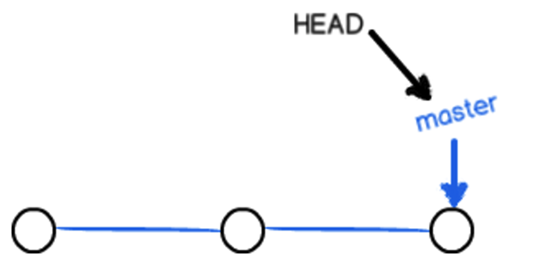
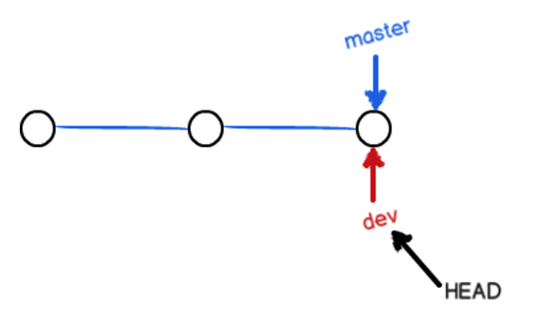
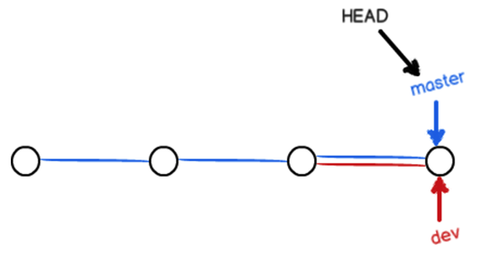
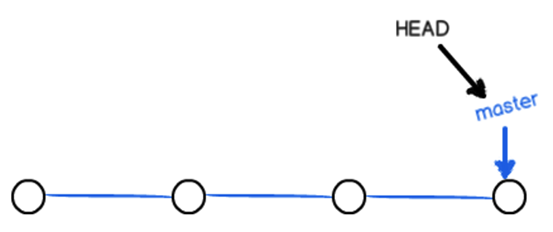
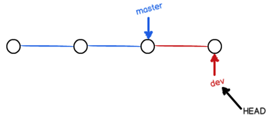
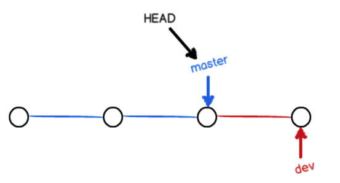
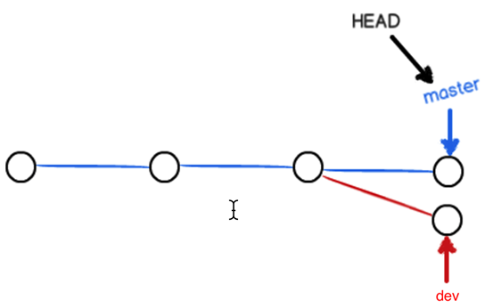
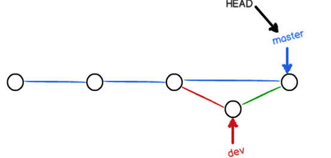

# 版本库创建

* 创建目录

```bash
mkdir git_test
```

* 创建版本库

```bash
cd git_test/
git init
```

* 验证版本库

```bash
ls -la
drwxr-xr-x  3 albert albert 4096 12月  3 10:28 .
drwxr-xr-x 23 albert albert 4096 12月  3 10:27 ..
drwxr-xr-x  7 albert albert 4096 12月  3 10:28 .git
```


# 版本的创建与回退

## 创建版本

* 创建代码文件并编辑内容

```shell
vim code.go
```

```go
package main

import "fmt"

func main() {
    fmt.Println("Hello World")
}
```

* 创建版本

```bash
git add code.go
git commit -m "version 1.0"
```

* 添加身份标识

```bash
git config --global user.email "18895672556@163.com"
git config --global user.name "albert"
git commit -m "version 1.0"
```

* 查看版本记录

```bash
git log
commit 75629dc388dc26471c579619bd6e03d40562d05d (HEAD -> master)
Author: albert <18895672556@163.com>
Date:   Mon Dec 3 10:36:00 2018 +0800

    version 1.0
```

* 修改代码文件

```bash
vim code.go
```

```go
package main

import "fmt"

func main() {
	fmt.Println("Hello Golang")
    fmt.Println("Hello World")
}
```

* 创建新版本

```bash
git add code.go 
git commit -m "version 2.0"
[master b9c1ce7] version 2.0
 1 file changed, 1 insertion(+)

albert@albert:~/git_test$ git log
commit b9c1ce7efd2ecfde4426895db30c41eee5e9d9fa (HEAD -> master)
Author: albert <18895672556@163.com>
Date:   Mon Dec 3 10:42:26 2018 +0800

    version 2.0

commit 75629dc388dc26471c579619bd6e03d40562d05d
Author: albert <18895672556@163.com>
Date:   Mon Dec 3 10:36:00 2018 +0800

    version 1.0
```

## 回退版本

* 其中 **HEAD** 表示当前最新版本，**HEAD^** 表示当前版本的前一个版本，**HEAD^^** 表示当前版本的上上个版本，也可以使用 **HEAD~1** 表示当前版本的前一个版本，**HEAD~100** 表示当前版本的前100版本。

* 例：回退到 version 1.0

```shell
albert@albert:~/git_test$ git reset --hard HEAD^
HEAD 现在位于 75629dc version 1.0

albert@albert:~/git_test$ git log
commit 75629dc388dc26471c579619bd6e03d40562d05d (HEAD -> master)
Author: albert <18895672556@163.com>
Date:   Mon Dec 3 10:36:00 2018 +0800

    version 1.0

albert@albert:~/git_test$ cat code.go 
package main

import "fmt"

func main() {
    fmt.Println("Hello World")
}
```

* 例：再次回退到 version 2.0

```bash
albert@albert:~/git_test$ git reflog	# 查看操作记录
b9c1ce7 (HEAD -> master) HEAD@{0}: reset: moving to b9c1ce7efd2ecfde4426895db30c41eee5e9d9fa
75629dc HEAD@{1}: reset: moving to HEAD^
b9c1ce7 (HEAD -> master) HEAD@{2}: commit: version 2.0
75629dc HEAD@{3}: commit (initial): version 1.0

albert@albert:~/git_test$ git reset --hard b9c1ce7
HEAD 现在位于 b9c1ce7 version 2.0

albert@albert:~/git_test$ git log
commit b9c1ce7efd2ecfde4426895db30c41eee5e9d9fa (HEAD -> master)
Author: albert <18895672556@163.com>
Date:   Mon Dec 3 10:42:26 2018 +0800

    version 2.0

commit 75629dc388dc26471c579619bd6e03d40562d05d
Author: albert <18895672556@163.com>
Date:   Mon Dec 3 10:36:00 2018 +0800

    version 1.0

albert@albert:~/git_test$ cat code.go 
package main

import "fmt"

func main() {
    fmt.Println("Hello Golang")
    fmt.Println("Hello World")
}
```


# 工作区和暂存区

## 工作区概念

* 操作系统中的目录，比如以上演示中的 **git_test**，就是一个工作区。


## 版本库操作

* 工作区有一个隐藏目录 **.git**，这个不是工作区，而是 git 的版本库；
* git 的版本库里存了很多东西，其中最重要的就是称为 index（或者叫stage）的暂存区，还有 git 为我们自动创建的第一个分支 master，以及指向 master 的一个指针叫 HEAD；

* 因为我们创建 git 版本库时，git 自动创建了唯一的 master 分支，所以 git commit 就是往 master 分支上提交更改；
* 可以简单理解为，需要提交的文件修改通通放到暂存区，然后再一次性提交暂存区的所有修改。

* 第一步是用```git add```把文件添加进去，实际上就是把文件修改添加到暂存区
* 第二步是用```git commit```提交更改，实际上就是把暂存区的所有内容提交到当前分支

```shell
albert@albert:~/git_test$ vim code.py
if __name__ == "__main__":
    print("Hello World")
```

* 查看工作树的状态

```shell
albert@albert:~/git_test$ git status
位于分支 master
未跟踪的文件:
  （使用 "git add <文件>..." 以包含要提交的内容）

	code.py

提交为空，但是存在尚未跟踪的文件（使用 "git add" 建立跟踪）
```

* 跟踪新文件并暂存

```shell
albert@albert:~/git_test$ git add code.py 

albert@albert:~/git_test$ git status
位于分支 master
要提交的变更：
  （使用 "git reset HEAD <文件>..." 以取消暂存）

	新文件：   code.py
```

* 提交新版本

```shell
albert@albert:~/git_test$ git commit -m "version 3.0"
[master b713073] version 3.0
 1 file changed, 2 insertions(+)
 create mode 100644 code.py
 
albert@albert:~/git_test$ git log
commit b71307324a4521f9b8c956aefb235484787baada (HEAD -> master)
Author: albert <18895672556@163.com>
Date:   Mon Dec 3 16:02:00 2018 +0800

    version 3.0

commit b9c1ce7efd2ecfde4426895db30c41eee5e9d9fa
Author: albert <18895672556@163.com>
Date:   Mon Dec 3 10:42:26 2018 +0800

    version 2.0

commit 75629dc388dc26471c579619bd6e03d40562d05d
Author: albert <18895672556@163.com>
Date:   Mon Dec 3 10:36:00 2018 +0800

    version 1.0
```

* 一旦提交后，没有对工作区做任何修改，那么工作区就是干净的

```shell
albert@albert:~/git_test$ git status
位于分支 master
无文件要提交，干净的工作区
```


## 管理修改

* Git管理文件的修改，只会提交暂存区的修改来创建版本。

* 修改 code.py，并添加到暂存区

```shell
albert@albert:~/git_test$ vim code.py
if __name__ == "__main__":
    print("Hello World")
    print("Hello Python")
    
albert@albert:~/git_test$ git add code.py
```

* 再次修改 code.py，但不添加到暂存区

```shell
albert@albert:~/git_test$ vim code.py
if __name__ == "__main__":
    print("Hello World")
    print("Hello Python")
    print("Hello Django")
```

* 提交并创建版本，第二次的修改是在工作区修改，并没有提交到暂存区，所有不会被提交

```shell
albert@albert:~/git_test$ git commit -m "version 4.0"
[master 2166a47] version 4.0
 1 file changed, 1 insertion(+)

albert@albert:~/git_test$ git status
位于分支 master
尚未暂存以备提交的变更：
  （使用 "git add <文件>..." 更新要提交的内容）
  （使用 "git checkout -- <文件>..." 丢弃工作区的改动）

	修改：     code.py
	
修改尚未加入提交（使用 "git add" 和/或 "git commit -a"）
```


## 撤销修改

* 撤销工作区的改动

```shell
albert@albert:~/git_test$ git checkout -- code.py

albert@albert:~/git_test$ cat code.py
if __name__ == "__main__":
    print("Hello World")
    print("Hello Python")
```

* 再次修改 code.py，并添加到暂存区

```shell
albert@albert:~/git_test$ cat code.py 
if __name__ == "__main__":
    print("Hello World")
    print("Hello Python")
    print("Hello Django")
    
albert@albert:~/git_test$ git add code.py

albert@albert:~/git_test$ git status
位于分支 master
要提交的变更：
  （使用 "git reset HEAD <文件>..." 以取消暂存）

	修改：     code.py
```

* 撤销暂存区的改动（重新放回工作区）

```shell
albert@albert:~/git_test$ git reset HEAD code.py
重置后取消暂存的变更：
M	code.py

albert@albert:~/git_test$ git status
位于分支 master
尚未暂存以备提交的变更：
  （使用 "git add <文件>..." 更新要提交的内容）
  （使用 "git checkout -- <文件>..." 丢弃工作区的改动）

	修改：     code.py

修改尚未加入提交（使用 "git add" 和/或 "git commit -a"）
```

* 应用场景：
  * 当工作区的某个文件内容被改乱，并且想直接丢弃工作区的修改时，使用用命令 ```git checkout -- file```；
  * 若已经将该乱的内容添加到了暂存区时，想丢弃修改则分为两步，第一步使用命令```git reset HEAD file```，就回到了场景1，第二步直接按场景1操作；
  * 已经提交了不合适的修改到版本库时，想要撤销本次提交，使用 ```git reset –hard 版本号``` 回退版本。


## 文件对比

### 对比工作区和某个版本中文件的不同

* 在 code.py 中添加新的内容

```shell
albert@albert:~/git_test$ vim code.py 
albert@albert:~/git_test$ cat code.py 
if __name__ == "__main__":
    print("Hello World")
    print("Hello Python")
    print("Hello Tonado")
```

* 对比工作区中的 code.py 和 HEAD 指向的版本中 code.py 的不同

```shell
albert@albert:~/git_test$ git diff HEAD -- code.py
diff --git a/code.py b/code.py
index def8245..6dbe9ee 100644
--- a/code.py	# 代表HEAD版本中code.py的内容，--- 表示相较于对方内容少
+++ b/code.py	# 代表工作区中code.py的内容，+++ 表示相较于对方内容多
@@ -1,3 +1,4 @@
 if __name__ == "__main__":
     print("Hello World")
     print("Hello Python")
+    print("Hello Tonado")		# + 标识的地方代表二者的不同之处
```

* 丢弃工作区的改动

```shell
albert@albert:~/git_test$ git status
位于分支 master
尚未暂存以备提交的变更：
  （使用 "git add <文件>..." 更新要提交的内容）
  （使用 "git checkout -- <文件>..." 丢弃工作区的改动）

	修改：     code.py

修改尚未加入提交（使用 "git add" 和/或 "git commit -a"）

albert@albert:~/git_test$ git checkout -- code.py

albert@albert:~/git_test$ git status
位于分支 master
无文件要提交，干净的工作区
```

### 对比两个版本间文件的不同

* 对比 HEAD 版本和 HEAD^ 版本中 code.py 的不同

```shell
albert@albert:~/git_test$ git diff HEAD HEAD^ -- code.py
diff --git a/code.py b/code.py
index def8245..73bd701 100644
--- a/code.py
+++ b/code.py
@@ -1,3 +1,2 @@
 if __name__ == "__main__":
     print("Hello World")
-    print("Hello Python")
```


## 删除文件

* 删除目录中的 code.go

```shell
albert@albert:~/git_test$ rm code.go 
albert@albert:~/git_test$ git status
位于分支 master
尚未暂存以备提交的变更：
  （使用 "git add/rm <文件>..." 更新要提交的内容）
  （使用 "git checkout -- <文件>..." 丢弃工作区的改动）

	删除：     code.go

修改尚未加入提交（使用 "git add" 和/或 "git commit -a"）
```

* 从版本库删除该文件（先执行rm操作，在提交此次删除后的版本）

```shell
albert@albert:~/git_test$ git rm code.go
rm 'code.go'

albert@albert:~/git_test$ git status
位于分支 master
要提交的变更：
  （使用 "git reset HEAD <文件>..." 以取消暂存）

	删除：     code.go
	
albert@albert:~/git_test$ git commit -m "version 4.5"
[master 4e9b1f2] version 4.5
 1 file changed, 8 deletions(-)
 delete mode 100644 code.go

albert@albert:~/git_test$ git status
位于分支 master
无文件要提交，干净的工作区
```

注：若是误操作删除了，则使用```git checkout --code.go```命令撤销工作区的删除操作


# 分支管理

## 创建与合并分支

* git 把我们之前提交的版本串成一条时间线，这条时间线就是一个分支。在 git 里默认的分支叫 master 分支。HEAD 严格来说不是指向提交，而是指向 master，master 才是指向提交的，所以，HEAD 指向的就是当前分支。

* 一开始的时候，master 分支是一条线，git 用 master 指向最新的提交，再用 HEAD 指向 master，就能确定当前分支，以及当前分支的提交点：



* 每次提交，master分支都会向前移动一步，这样随着不断提交，master分支的时间线也越来越长。

* 当创建新的分支如：dev 时，git新建了一个指针叫dev，指向master与相同的提交，再把HEAD指向dev，就表示当前分支在dev上：



* git创建一个分支很快，因为除了增加一个dev指针，改变HEAD的指向，工作区的文件都没有任何变化。

* 从现在开始，对工作区的修改和提交就是针对dev分支了，比如新提交一次后，dev指针往前移动一步，而master指针不变：


* 假如在dev上的工作完成了，就可以把dev合并到master上。最简单的方法，就是直接把master指向dev的当前提交，就完成了合并：

  

* git合并分支也很快，就只是改变指针的指向，工作区内容也不变。

* 合并完分支后，甚至可以删除dev分支。删除dev分支就是把dev指针给删掉，删掉后就剩下了一条master分支：



**命令演示：**

* 创建并切换分支

```shell
albert@albert:~/git_test$ git branch	# 查看所有分支，*前缀表示当前分支
* master

albert@albert:~/git_test$ git checkout -b dev	# 创建并切换分支
切换到一个新分支 'dev'

albert@albert:~/git_test$ git branch
* dev
  master
```


* 修改文件并提交版本

```shell
albert@albert:~/git_test$ vim code.py 

albert@albert:~/git_test$ cat code.py 
if __name__ == "__main__":
    print("Hello World")
    print("Hello Python")
    print("Hello PySpark")

albert@albert:~/git_test$ git add code.py

albert@albert:~/git_test$ git commit -m "dev version 1.0"
[dev 7e8792e] dev version 1.0
 1 file changed, 1 insertion(+)
```



* dev 工作完成后可以切换回 master 分支：

```shell
albert@albert:~/git_test$ git checkout master	# 切换分支
切换到分支 'master'

albert@albert:~/git_test$ git branch
  dev
* master

albert@albert:~/git_test$ cat code.py 	# master分支的内容不变
if __name__ == "__main__":
    print("Hello World")
    print("Hello Python")
```



* 合并 dev 和 master 分支：

```shell
albert@albert:~/git_test$ git merge dev
更新 4e9b1f2..7e8792e
Fast-forward	# 表示快速模式合并，就是把master指向dev的当前提交
 code.py | 1 +
 1 file changed, 1 insertion(+)

albert@albert:~/git_test$ cat code.py	# 和dev分支的最新提交时一样的
if __name__ == "__main__":
    print("Hello World")
    print("Hello Python")
    print("Hello PySpark")
```


* 删除 dev 分支：

```shell
albert@albert:~/git_test$ git branch -d dev
已删除分支 dev（曾为 7e8792e）。
albert@albert:~/git_test$ git branch
* master
```


## 冲突解决

* 创建新的分支

```shell
albert@albert:~/git_test$ git checkout -b dev
切换到一个新分支 'dev'
```

* 修改 dev 分支的 code.py 并提交

```shell
albert@albert:~/git_test$ vim code.py

albert@albert:~/git_test$ cat code.py 
if __name__ == "__main__":
    print("Hello World")
    print("Hello Python")
    print("Hello PySpark")
    print("Hello Docker")
    
albert@albert:~/git_test$ git add code.py

albert@albert:~/git_test$ git commit -m "dev version 1.0"
[dev be70a18] dev version 1.0
 1 file changed, 1 insertion(+)
```

* 修改master分支的code.py并提交

```shell
albert@albert:~/git_test$ git checkout master
切换到分支 'master'

albert@albert:~/git_test$ git branch
  dev
* master

albert@albert:~/git_test$ vim code.py

albert@albert:~/git_test$ cat code.py
if __name__ == "__main__":
    print("Hello World")
    print("Hello Python")
    print("Hello PySpark")
    print("Hello Hadoop")
    
albert@albert:~/git_test$ git add code.py

albert@albert:~/git_test$ git commit -m "master version 1.0"
[master 6b638e1] master version 1.0
 1 file changed, 1 insertion(+)
```



* 自动合并失败

```shell
albert@albert:~/git_test$ git merge dev
自动合并 code.py
冲突（内容）：合并冲突于 code.py
自动合并失败，修正冲突然后提交修正的结果。

albert@albert:~/git_test$ git status
位于分支 master
您有尚未合并的路径。
  （解决冲突并运行 "git commit"）
  （使用 "git merge --abort" 终止合并）

未合并的路径：
  （使用 "git add <文件>..." 标记解决方案）

	双方修改：   code.py

修改尚未加入提交（使用 "git add" 和/或 "git commit -a"）
```

* 手动修改冲突

```shell
albert@albert:~/git_test$ cat code.py
if __name__ == "__main__":
    print("Hello World")
    print("Hello Python")
    print("Hello PySpark")
<<<<<<< HEAD
    print("Hello Hadoop")
=======
    print("Hello Docker")
>>>>>>> dev
albert@albert:~/git_test$ vim code.py
albert@albert:~/git_test$ cat code.py
if __name__ == "__main__":
    print("Hello World")
    print("Hello Python")
    print("Hello PySpark")
    print("Hello Hadoop")
    print("Hello Docker")
```

* 提交解决冲突后的文件并删除分支dev

```shell
albert@albert:~/git_test$ git add code.py

albert@albert:~/git_test$ git commit -m "master dev version 1.0"
[master 65621ae] master dev version 1.0

albert@albert:~/git_test$ git log --graph --pretty=oneline
*   65621aebf4c42ca652c40214c2b66f10f2119c2b (HEAD -> master) master dev version 1.0
|\  
| * be70a1824afff94d1d1953b6374d96deef622d92 (dev) dev version 1.0
* | 6b638e19efd572d3074d60c5b7a7f704b28a6dde master version 1.0
|/  
* 7e8792e9c8deace29ac571d8ac76d25d5f007e6a dev version 1.0
* 4e9b1f281d82966a883edab7de5249c5ad7a4605 version 4.5
* 2166a47f33a15302f7cf5ff7eacbc076ccb07ea8 version 4.0
* b71307324a4521f9b8c956aefb235484787baada version 3.0
* b9c1ce7efd2ecfde4426895db30c41eee5e9d9fa version 2.0
* 75629dc388dc26471c579619bd6e03d40562d05d version 1.0

albert@albert:~/git_test$ git branch -d dev
已删除分支 dev（曾为 be70a18）。

albert@albert:~/git_test$ git branch
* master
```


## 分支管理策略

* 通常合并分支时，条件允许的情况下 git 会用 fast forward 模式，但是有些快速合并不能成功而且合并时没有冲突，这个时候会合并之后并做一次新的提交。但这种模式下，删除分支会丢掉分支信息。

* 在dev分支创建新的文件并提交

```shell
albert@albert:~/git_test$ git checkout -b dev
切换到一个新分支 'dev'

albert@albert:~/git_test$ vim code.scala

albert@albert:~/git_test$ cat code.scala 
object Hello {
  def main(args: Array[String]) {
    println("Hello World!")
  }
}

albert@albert:~/git_test$ git add code.scala 

albert@albert:~/git_test$ git commit -m "code.scala version 1.0"
[dev 5dc1fdb] code.scala version 1.0
 1 file changed, 5 insertions(+)
 create mode 100644 code.scala
```

* 在master分支修改文件并提交

```shell
albert@albert:~/git_test$ git checkout master
切换到分支 'master'

albert@albert:~/git_test$ vim code.py

albert@albert:~/git_test$ cat code.py
if __name__ == "__main__":
    print("Hello World")
    print("Hello Python")
    print("Hello PySpark")
    print("Hello Hadoop")
    print("Hello Docker")
    print("Hello HBase")

albert@albert:~/git_test$ git add code.py

albert@albert:~/git_test$ git commit -m "code.py version 1.0"
[master a38fe8e] code.py version 1.0
 1 file changed, 1 insertion(+)
```

* 不能进行快速合并，所以git提示输入合并说明信息，输入之后git会自动创建一次新的提交

```shell
albert@albert:~/git_test$ git merge dev
Merge made by the 'recursive' strategy.
 code.scala | 5 +++++
 1 file changed, 5 insertions(+)
 create mode 100644 code.scala
```

* 使用分支命令查看分支信息

```shell
albert@albert:~/git_test$ git log --graph --pretty=oneline
*   39d625285d4a4e8d5e44b9208f01fa34392f1ccb (HEAD -> master) Merge branch 'dev'
|\  
| * 5dc1fdbb3eeca927133b04a16dbe0d6e2c3a7a17 (dev) code.scala version 1.0
* | a38fe8e3667c8ef4280e39c16e16785e27c7ad45 code.py version 1.0
|/  
*   65621aebf4c42ca652c40214c2b66f10f2119c2b master dev version 1.0
|\  
| * be70a1824afff94d1d1953b6374d96deef622d92 dev version 1.0
* | 6b638e19efd572d3074d60c5b7a7f704b28a6dde master version 1.0
|/  
* 7e8792e9c8deace29ac571d8ac76d25d5f007e6a dev version 1.0
* 4e9b1f281d82966a883edab7de5249c5ad7a4605 version 4.5
* 2166a47f33a15302f7cf5ff7eacbc076ccb07ea8 version 4.0
* b71307324a4521f9b8c956aefb235484787baada version 3.0
* b9c1ce7efd2ecfde4426895db30c41eee5e9d9fa version 2.0
* 75629dc388dc26471c579619bd6e03d40562d05d version 1.0

albert@albert:~/git_test$ git branch -d dev
已删除分支 dev（曾为 5dc1fdb）。
```

* 如果要强制禁用 fast forward 模式，git就会在merge时生成一个新的commit，这样从分支历史上就可以看出分支信息。

* 在dev分支修改code.py的内容并提交

```shell
albert@albert:~/git_test$ git branch -d dev
已删除分支 dev（曾为 5dc1fdb）。

albert@albert:~/git_test$ git checkout -b dev
切换到一个新分支 'dev'

albert@albert:~/git_test$ vim code.py
albert@albert:~/git_test$ cat code.py
if __name__ == "__main__":
    print("Hello World")
    print("Hello Python")
    print("Hello PySpark")
    print("Hello Hadoop")
    print("Hello Docker")
    print("Hello HBase")
    print("Hello Hive")

albert@albert:~/git_test$ git add code.py 
albert@albert:~/git_test$ git commit -m "code.py new line"
[dev 52f37fb] code.py new line
 1 file changed, 1 insertion(+)
```

* 在master分支合并dev，禁用快速合并模式

```shell
albert@albert:~/git_test$ git checkout master
切换到分支 'master'

albert@albert:~/git_test$ git merge --no-ff -m "off fast-forward" dev
Merge made by the 'recursive' strategy.
 code.py | 1 +
 1 file changed, 1 insertion(+)
 
albert@albert:~/git_test$ git log --graph --pretty=oneline
*   c2648fbfa296904c8b57bfcdcb9e6bc6bdef67ef (HEAD -> master) off fast-forward
|\  
| * 52f37fb77d25f0170e5f862255369794d7590103 (dev) code.py new line
|/  
*   39d625285d4a4e8d5e44b9208f01fa34392f1ccb Merge branch 'dev'
|\  
| * 5dc1fdbb3eeca927133b04a16dbe0d6e2c3a7a17 code.scala version 1.0
* | a38fe8e3667c8ef4280e39c16e16785e27c7ad45 code.py version 1.0
|/  
*   65621aebf4c42ca652c40214c2b66f10f2119c2b master dev version 1.0
|\  
| * be70a1824afff94d1d1953b6374d96deef622d92 dev version 1.0
* | 6b638e19efd572d3074d60c5b7a7f704b28a6dde master version 1.0
|/  
* 7e8792e9c8deace29ac571d8ac76d25d5f007e6a dev version 1.0
* 4e9b1f281d82966a883edab7de5249c5ad7a4605 version 4.5
* 2166a47f33a15302f7cf5ff7eacbc076ccb07ea8 version 4.0
* b71307324a4521f9b8c956aefb235484787baada version 3.0
* b9c1ce7efd2ecfde4426895db30c41eee5e9d9fa version 2.0
* 75629dc388dc26471c579619bd6e03d40562d05d version 1.0
```



## Bug分支

* 每个bug都可以通过一个新的临时分支来修复，修复后合并分支，然后将临时分支删除。当你接到一个修复代号为001-bug的任务时，很自然地会创建一个分支bug-001来修复它，但是当前正在dev上进行的工作还没有提交：


```SHELL
albert@albert:~/git_test$ git checkout -b dev
切换到一个新分支 'dev'

albert@albert:~/git_test$ vim code.py

albert@albert:~/git_test$ git status
位于分支 dev
尚未暂存以备提交的变更：
  （使用 "git add <文件>..." 更新要提交的内容）
  （使用 "git checkout -- <文件>..." 丢弃工作区的改动）

	修改：     code.py

修改尚未加入提交（使用 "git add" 和/或 "git commit -a"）
```

> 并不是想提交，而是工作只进行到一半，还没法提交，预计完成还需1天时间。但是必须在两个小时内修复该bug，怎么办？
>

* git还提供了一个stash功能，可以把当前工作现场 “储藏” 起来，等以后恢复现场后继续工作：

```shell
albert@albert:~/git_test$ git stash
保存工作目录和索引状态 WIP on dev: c2648fb off fast-forward
```

* 首先确定要在哪个分支上修复bug，假定需要在master分支上修复，就从master创建临时分支：

```shell
albert@albert:~/git_test$ git checkout master
切换到分支 'master'

albert@albert:~/git_test$ git checkout -b bug-001
切换到一个新分支 'bug-001'

albert@albert:~/git_test$ vim code.py 

albert@albert:~/git_test$ git add code.py

albert@albert:~/git_test$ git commit -m "bug success"
[bug-001 a73ecbf] bug success
 1 file changed, 1 insertion(+), 1 deletion(-)
```

* 修复完成后切换到master分支，并完成合并，最后删除bug-001分支

```shell
albert@albert:~/git_test$ git checkout master
切换到分支 'master'

albert@albert:~/git_test$ git merge --no-ff -m "update bug-001 success" bug-001
Merge made by the 'recursive' strategy.
 code.py | 2 +-
 1 file changed, 1 insertion(+), 1 deletion(-)

albert@albert:~/git_test$ git branch -d bug-001
已删除分支 bug-001（曾为 a73ecbf）。
```

* 切换到dev继续上一次的工作进度继续开发

```shell
albert@albert:~/git_test$ git checkout dev
切换到分支 'dev'

albert@albert:~/git_test$ git status		# 此时发现工作区状态没有复原
位于分支 dev
无文件要提交，干净的工作区

albert@albert:~/git_test$ git stash list	# 查看暂存的工作区状态列表
stash@{0}: WIP on dev: c2648fb off fast-forward

albert@albert:~/git_test$ git stash pop		# 弹出暂存的工作区状态
位于分支 dev
尚未暂存以备提交的变更：
  （使用 "git add <文件>..." 更新要提交的内容）
  （使用 "git checkout -- <文件>..." 丢弃工作区的改动）

	修改：     code.py

修改尚未加入提交（使用 "git add" 和/或 "git commit -a"）
丢弃了 refs/stash@{0} (4dd2345e88cdc2be9e3f253249ab98c591bff41d)

albert@albert:~/git_test$ git status		# 现在可以继续开发了
位于分支 dev
尚未暂存以备提交的变更：
  （使用 "git add <文件>..." 更新要提交的内容）
  （使用 "git checkout -- <文件>..." 丢弃工作区的改动）

	修改：     code.py

修改尚未加入提交（使用 "git add" 和/或 "git commit -a"）
```

> **总结：**
>
> * 修复bug时，通过创建新的bug分支进行修复，然后合并，最后删除；
>
> * 当工作没有完成时，先把工作现场 ```git stash``` 一下，然后去修复bug，修复后再 ```git stash pop``` 恢复工作现场。
>
