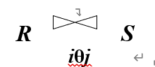
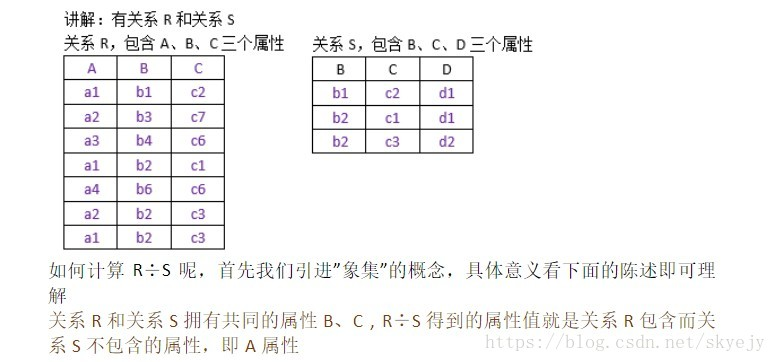
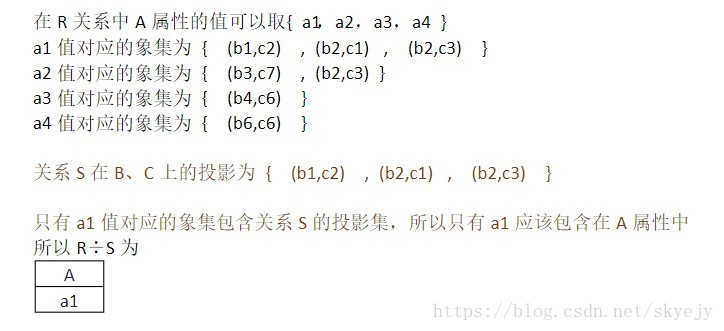

# 1.数据库系统概述

## 1.1.数据库基本概念

数据：

* 概念：<font color="red">数据是描述事物的符号记录</font>，是指用物理符号记录下来的可以鉴别的信息。
* 类型：
  * <font color='red'>文本数据</font>：数字，字母，特殊符号，汉字；
  * <font color='red'>多媒体数据</font>：视频，音频，图像。

* 信息的概念：<font color="red">信息就是对数据进行加工处理后获得的内容</font>，信息是有价值的，数据是杂乱无章的。

数据库：

* 概念：<font color='red'>是长期存储在计算机中的，有组织，可共享的数据集合</font>。

* 数据库中存储的数据特点：<font color='red'>永久存储，有组织，可共享</font>。

数据库管理系统：

* 概念：<font color="red">专门用来建立和管理数据库的一套软件</font>，介入系统软件和应用软件之间；

* 功能：
  * <font color='red'>数据定义</font>：使用数据库定义语言DDL去创建表，视图，索引等，还可以删除和修改这些对象；
  * <font color='red'>数据操作</font>：对数据库中的数据进行增删改查操作；
  * <font color='red'>数据的组织，存储和管理</font>；
  * <font color='red'>数据库的创建维护</font>：创建数据库，管理数据库的存储空间，备份和恢复，监视数据库的性能；
  * <font color='red'>数据库的运行管理功能</font>：在数据库运行过程中，需要确保数据的安全性，完整性，并发控制以及故障恢复；
  * <font color='red'>其他功能</font>。

数据库系统的概念：计算机中引入数据库技术之后的系统，包括：<font color='red'>数据库，数据库管理系统，数据库管理员，用户，应用程序</font>。

## 1.2.数据库管理技术的发展阶段

人工管理阶段的特点：

* 特点是<font color="red">数据不保存</font>；
* <font color="red">应用程序管理数据</font>；
* 数据是<font color="red">面向应用的</font>，无共享性和独立性。

文件系统阶段的特点：

* 实现了数据的逻辑结构和物理结构的分离，<font color='red'>通过存放方法实现了数据的物理独立性</font>；
* 实现了数据的<font color='red'>长久保存</font>；
* 实现了<font color="red">文件级别的数据共享</font>；
* 数据面向的是<font color='red'>特定用户</font>；
* 该阶段没有实现对数据进行统一的管理和控制，所以数据冗余度大，共享性差，独立性差。

数据库系统阶段的特点：

* <font color='red'>数据集成</font>：数据集成是数据库管理的主要目的，可以降低数据的冗余度，提高数据的共享性；
* 数据<font color='red'>共享性好</font>；
* 数据<font color='red'>冗余度低</font>；
* 数据的<font color='red'>一致性</font>；
* <font color='red'>数据独立性高</font>（逻辑独立性，物理独立性）；
* <font color='red'>实施统一的管理和控制</font>（安全性，完整性，并发控制，故障恢复）；
* <font color='red'>减少应用程序的开发与维护工作量</font>。

## 1.3.数据库系统的结构

三级模式：
* 模式：
  * 也叫做<font color='red'>逻辑模式或概念模式</font>，是数据库中<font color='red'>全体数据的逻辑结构和特征</font>的描述；
  * 模式其实就是一套建库，建表的规则，一套数据库<font color='red'>只能有一个模式</font>。
* 外模式：
  * 也叫做<font color='red'>子模式或用户模式</font>，是数据库用户能够看见和操作的<font color='red'>局部数据的逻辑结构和特征</font>的描述，是与某一应用有关的数据的逻辑表示；
  * 外模式是某个用户的数据视图，模式是所有用户的公共数据视图；
  * 一个数据库可以有<font color='red'>多个外模式</font>；
  * 在数据库中提供了DDL去定义外模式，其实就是定义视图。
* 内模式：
  * 也叫做<font color='red'>存储模式</font>，是对数据库中数据的<font color='red'>存储结构和存取方式</font>的描述，也是数据在数据库中的内部表现形式；
  * 一个数据库中只能有<font color='red'>一个内模式</font>；
  * 提供了DDL定义内模式的相关内容：如索引。

三级模式结构的两层映像及其作用：
* <font color='red'>外模式/模式</font>的映像：
  * 建立的是外模式与模式间的对应关系，对于同一个模式可以有多个外模式，每个外模式与模式间都有外模式/模式映像；
  * 作用：当模式改变时，可以修改外模式/模式的映像，从而不用修改外模式，不用修改应用程序，保证了<font color='red'>程序与数据的逻辑独立性</font>。
* <font color='red'>模式/内模式</font>的映像：
  * 建立全局的逻辑结构和物理存储结构间的对应关系，一个数据库只有一种模式和内模式，所以模式/内模式映像也是唯一的；
  * 作用：当存储结构改变时，可以修改模式/内模型的映像，使模式不用发生改变，实现了<font color='red'>数据与程序的物理独立性</font>。

数据库系统的运行与应用结构：
* C/S结构：客户端/服务器；
* B/S结构：浏览器/服务器（使用方便，维护成本低）。

## 1.4.数据模型

模型：是对<font color='red'>现实世界中事物的模拟和抽象</font>，帮助人们更好的认识和理解客观存在的事物；

数据模型：是对现实世界中数据特征的抽象，描述的是数据的共性内容；

数据的特征：
* 静态特征：数据类型，数据长度，数据取值范围；
* 动态特征：对数据进行的一些符合规则的操作。

数据模型三要素：
* <font color='red'>数据结构</font>：数据的静态特征，数据对象的类型，数据对象的联系；
* <font color='red'>数据操作</font>：数据的动态特征，对数据的增删改查操作；
* <font color='red'>数据约束</font>：描述数据结构中数据间语法和语义的关联，取值范围，数据类型，是否为空。

数据从现实世界抽象到机器世界的过程：
* 先将现实世界中的事物抽象为信息世界中的某一信息结构（对应于概念模型），既不依赖于计算机系统，也不依赖于数据库管理系统；
* 然后将概念模型通过组织转换为机器世界中的某一数据库管理系统所支持的数据模型。

数据模型的分类：
* 信息世界的基本概念：
  * 实体：客观存在的可相互区别的事物，如：学生，老师都是一个实体；
  * 属性：实体具有的某种特征，如：学生实体的属性就是学号，年龄，姓名，性别；
  * 码或键：可以用来唯一标识实体的属性集，如：学生实体的学号；
  * 域：属性的取值范围，如：性别分男女，分数0-100；
  * 实体型：用实体名和属性名的集合表示的同类实体，如：学生（学号、姓名、性别、年龄）；
  * 实体集：同类实体的集合，如：一个学生是实体，所有学生构成的集合就是实体集；
  * 联系：
    * 实体内的联系：指实体间各属性的关系，如：确定了学号，就可以知道该学生的姓名等其他信息。
    * 实体间的联系：一对一，一对多，多对多的联系。
* <font color='red'>概念层数据模型（使用E-R图表示实体以及实体间的联系）</font>是数据抽象级别的最高层，是现实世界对应于信息世界的建模，这种模型与计算机系统和数据库管理系统都无关，但是它容易向数据库管理系统所支持的逻辑结构转换：
  * <font color='red'>实体：矩形表示</font>；
  * <font color='red'>属性：椭圆表示</font>；
  * <font color='red'>联系：菱形表示</font>；
  * 注：如果联系也存在属性，需要将属性表示出来，并使用无向边将属性与联系连接起来。
* <font color='red'>逻辑层数据模型（逻辑模型）</font>是数据抽象的中间层，是对数据整体逻辑结构的描述，既考虑用户容易理解，又考虑数据库容易实现：
  * <font color='red'>层次模型</font>：
    * 使用树形结构去表示实体间的联系；
    * 特点：有且仅有一个根节点没有父节点；其他节点都有且仅有一个父节点；可以表示简单的实体间联系，但不适合表示复杂的联系。
  * <font color='red'>网状模型</font>：
    * 使用网状结构去表示实体间的联系；
    * 特点：可以有多个结点没有父节点，一个节点可以有多个父节点；方便比表示复杂的实体间联系，但结构复杂不易实现。
  * <font color='red'>关系模型</font>：
    * 使用二维表结构去表示实体间的联系；
    * 一对一联系，一对多联系，多对多联系。
  * <font color='red'>面向对象模型</font>。
* <font color='red'>物理层的数据模型（物理模型）</font>。


# 2.关系数据库

## 2.1.关系数据库的概述

关系数据库是<font color='red'>以关系模型做为数据的逻辑模型</font>，<font color='red'>以关系做为数据组织方式</font>的一类数据库。

历史：
* <font color='red'>1970</font>年由IBM公司的CODD提出关系模型的概念；
* <font color='red'>1972</font>年提出了三大范式；
* <font color='red'>1974</font>年提出了BC范式。

数据库系统类型： 
* 实验系统：System R，Ingres；
* 商用系统：Oracle，DB2，SQLServer；
* 中小型数据库系统：MySQL。

## 2.2.关系数据模型

关系数据模型：关系数据库采用了关系数据模型作为逻辑层结构；关系数据结构、关系操作集合、关系完整性约束；

关系数据结构：关系数据结构指的就是关系，使用关系去表示实体间的联系；可以将关系看成是一个二维表，如学生表也叫做学生关系；

关系数据库中的基本术语：
* **表**：也叫做关系，是二维的数据结构，由表名，行，列组成，表名在数据库中必须唯一；
* **关系**：概念同表，一个关系逻辑上对应一个二维表，关系可以命名，关系的类型有基本表，视图表，查询表；
* **列**：<font color='red'>也叫做属性或字段</font>，存在列名（字段名，属性名），表中的属性个数叫做元或度；
* **属性**：概念同列，一列就是一个属性；
* **行**：<font color='red'>也叫做元组或记录</font>，表中的数据就是按行存储的；
* **元组**：概念同行，一行就是一个元组；
* **分量**：<font color='red'>元组中的一个属性值就是一个分量</font>；
* **码或键**：能用来唯一<font color='red'>标识实体的属性集</font>；
* **超码或超键**：如果<font color='red'>一个关系的码移除某个属性后仍然是这个关系的码</font>，那么这个码就叫做超码，如：学生表中（学号，姓名）->（学号，姓名，年龄）；
* **候选码或候选键**：若<font color='red'>一个关系的码移除某个属性后就不再是这个关系的码</font>，那么这个码就叫做候选码，如：学生表中（学号）->（姓名，年龄，地址，身高，体重，爱好）；
* **主码或主键**：若指定<font color='red'>一个候选码来唯一标识一条记录</font>，那么这个候选码就叫做主码。一个关系中主码只有一个，候选码可以有多个；
* **全码或全键**：若<font color='red'>一个关系中的所有属性组成的集合是这个关系的主码</font>，那么就称该全码为全码；
* **主属性和非主属性**：<font color='red'>关系中被包含在任意候选码中的属性</font>，叫做主属性，反之是非主属性；
* **外码或外键**：若<font color='red'>一个关系中存在不是这个关系的主码或候选码而是另一个关系的主码的属性</font>，那么该属性就叫做该关系的外码；
* **参照关系和被参照关系**：<font color='red'>以外码作为主码的关系称为被参照关系，外码所在的关系称为参照关系；参照关系叫做从关系，被参照关系叫做主关系</font>。
* **域**：指的是属性的取值范围；
* **数据类型**：标准中的每列都有数据类型，用于限制该列存放的数据；
* **关系模式**：在关系数据库中，关系模式是型，关系是值，关系模式是二维表的结构，关系是元组的集合。

## 2.3.关系数据库对关系的的限定

并不是所有的二维表都可以称为关系，需要满足如下条件：

* 每个<font color='red'>属性都是不可以分解</font>的；
* 每一个关系必须<font color='red'>只有一个关系模式（二维表结构）</font>，每一个关系的属性的数据类型和属性个数是相对固定的；
* <font color='red'>同一个关系中候选码的值是不能完全相同的</font>；
* 在关系中<font color='red'>元组的顺序是可以任意交换</font>的；
* 在关系中<font color='red'>属性的顺序是可以任意交换</font>的。

## 2.4.关系操作的集合

常用关系操作：

* 查询：并，交，差，笛卡尔积，选择，投影，连接，除；
* 更新：增，删，改。

关系操作的特点：关系操作是集合操作方式，<font color='red'>操作对象和操作结果都是集合</font>，一次一集合；

关系操作的语言分类：

* <font color='red'>关系代数语言</font>；
* <font color='red'>关系演算语言</font>（元组关系演算，域关系演算）；
* 介于关系代数和关系演算语言之间的<font color='red'>SQL（结构化查询语言）</font>：
  * <font color='red'>数据定义语言（DDL）</font>；
  * <font color='red'>数据操作语言（DML）</font>；
  * <font color='red'>数据控制语言（DCL）</font>。

关系数据语言的特点：

* 具有<font color='red'>完备的表达能力</font>；
* 能独立使用，也可以<font color='red'>嵌入高级编程语言使用</font>；
* <font color='red'>功能强</font>；
* 是<font color='red'>非过程化集合操作语言</font>。

关系代数：

* 关系代数操作三要素：<font color='red'>操作对象，操作符，操作结果</font>。操作对象和结果都是关系，操作符分为专门的关系操作符和传统集合操作符：

* 传统的集合操作（先假设有两个关系R1和R2）：

  * <font color='red'>并</font>：R1，R2通过并运算产生新的关系R3，<font color='red'>R3是由属于R1和R2的所有不同的元组所组成</font>，即：R3 = R1 ∪ R2；
  * <font color='red'>差</font>：R1，R2通过差运算产生新的关系R3，<font color='red'>R3是由属于R1但不属于R2的元组所构成</font>，即：R3 = R1 - R2；
  * <font color='red'>交</font>：R1，R2通过交运算产生新的关系R3，<font color='red'>R3是由既属于R1又属于R2的的元组所构成</font>，即：R3 = R1 ∩ R2；
  * <font color='red'>笛卡尔积</font>：R1为M元关系，R2为N元关系，R1和R2通过笛卡尔积运算产生新关系R3，此时<font color='red'>R3是M+N元，M*N条记录</font>，即：R3 = R1 × R2；
  * 注：在进行交，并，差运算时，要求两个关系必须具有相同的属性个数，且相应的属性具有相同的值域。

* 专门的关系操作：

  * <font color='red'>选择</font>：

    * 从指定的关系中去<font color='red'>选择满足条件</font>的若干元组，并组成一个新的关系；

    * <font color='red'>F指的是条件表达式  R指的是关系名</font>：
      $$
      σ_F(R)
      $$

    * 还可以表示为`SELECT 关系名 WHERE 条件`。

  * <font color='red'>投影</font>：

    * 从指定的关系中<font color='red'>选取指定的若干属性</font>组成一个新的关系；

    * <font color='red'>A指的是列名，R指的是关系名</font>：
      $$
      π_A(R)
      $$
      
    * 还可以表示为`PROJECTION 关系名 (列名1,列名2,...)`；
    
    * 注：在做投影操作时，生成的新关系中不包含重复的元组。
    
  * <font color='red'>连接</font>：

    * 将两个关系连接起来，从中选择满足条件的元组组成新的关系；
    * 表示方式：
    * 还可以表示为`JOIN 关系1 AND 关系2 WHERE 条件 `；
    * 常用的连接：等值连接，自然连接；
    * 等值连接：比较运算符是 = ；
    * 自然连接是一种特殊的等值连接，进行等值连接的属性是相同的属性，且需要把结果中重复的列去除。

  * <font color='red'>除</font>：即笛卡尔积的逆运算，R ÷ S，R和S代表参与运算的两个关系。在除运算中，若被除关系是m元关系，除关系是n元关系，则运算结果是m-n元关系。

    

     

## 2.5.关系完整性约束

关系完整性的概念：<font color='red'>数据的正确性、一致性、相容性</font>；

关系完整性约束的概念：也叫做关系模型的完整性规则，是对关系的某种约束，是为了在操作（增删改）数据库时确保数据的一致性、正确性、相容性；

关系完整性约束的分类：

* <font color='red'>实体完整性约束</font>：若属性A是关系R中的主属性，那么A的取值不能为NULL；
* <font color='red'>参照完整性约束</font>：若属性或属性集F是关系R的外键，并与关系S的主键K对应，则R中属性F的取值只有两种可能，为空或是等于S关系中K的属性值；
* <font color='red'>用户定义完整性约束</font>：
  * 是针对某一应用环境的完整性约束条件，反映的是某一具体应用所涉及的数据应满足的要求；
  * 关系模型提供定义和检验这类完整性规则的机制，目的是用统一的方式由系统来处理它们，不再由应用程序来完成这项工作；
  * 在实际系统中，这类完整性约束一般在建立数据库表的同时进行定义，也可以由应用程序编写人员在各个模块具体编程中通过程序进行检查和控制。

关系完整性约束的检验：

* <font color='red'>插入操作执行检验</font>：
  * 检验实体完整性：先检查该记录的主键是否为空，为空则不允许插入，不为空则检查该记录的主键是否存在，存在不插入，不存在则插入。即<font color='red'>不为空不重复则插入</font>；
  * 检验参照完整性：先检查插入的记录的外键属性值是否存在于被参照关系的主键属性中，若存在可插入，若不存在，则将外健置空再插入。即<font color='red'>外键参照的主键存在则插入，或者将外键置空再插入</font>；
  * 检验用户完整性：检查<font color='red'>数据类型，取值范围</font>等。
* <font color='red'>删除操作执行检验</font>：
  * <font color='red'>一般只对被参照关系检查完整性约束</font>，如果删除被参照关系中的记录，检查记录的主键是否被参照关系的外键使用，若没有使用直接删除，若被使用，则有三种方式：
  * 方式1：<font color='red'>禁止删除</font>；
  * 方式2：<font color='red'>将参照关系中的外键置为null，再删除被参照关系的记录</font>；
  * 方式3：<font color='red'>级联删除，将参照关系中的外键记录和被参照关系的主键记录一同删除</font>。
* <font color='red'>修改操作执行检验</font>：先删除，再插入。

## 2.6.关系数据库的规范化理论

关系模式的存储异常问题：<font color='red'>数据冗余、插入异常、删除异常、更新异常</font>。

好的关系模式应该具有的特点：数据冗余度尽可能低，没有插入删除更新异常；

函数依赖与关键字：
* 函数依赖的定义：
  * 指的是属性间的对应关系；
  * 设R是一个任意给定的关系，对于<font color='red'>R中属性X的每一个值，R中属性Y都有唯一值与之对应，则称X函数决定Y或者Y函数依赖于X，即X->Y</font>，X是决定因素。
* 函数依赖的分类：
  * <font color='red'>完全函数依赖</font>：对于任意给定关系R，有<font color='red'>X -> Y，并且对于X的任意一个真子集X‘，都有X’ !-> Y</font>，则称Y完全函数依赖与X；
  * <font color='red'>部分函数依赖</font>：对于任意给定关系R，有<font color='red'>X -> Y，并且对于X的任意一个真子集X‘，都有X’ -> Y</font>，则称Y部分函数依赖与X；
  * <font color='red'>传递函数依赖</font>：对于任意给定关系R，X、Y、Z都为其中不同的属性子集，如果<font color='red'>X -> Y，Y -> Z，Y !-> X</font>，则称Z传递函数依赖于X；
  * <font color='red'>候选函数依赖</font>：对于任意给定关系R，U是包含该关系所有属性的集合，X为U的子集，如果有U完全函数依赖于X的关系，那么称X是R的候选关键字。

## 2.7.函数依赖对关系模式的影响

函数依赖可能会造成关系模式的数据冗余、插入异常、删除异常、更新异常；

通过规范化理论去改造关系模式，将复杂的关系模式通过分级关系模式来消除其中不合适的数据依赖，从而实现解决插入、删除、更新的异常和数据冗余的问题。

## 2.8.范式

二维表必须要满足一定的要求才是一个关系，那么<font color='red'>满足不同程度的要求，就称为不同的范式（NF）</font>；

范式的分类：
* 1NF：满足最低要求的范式是第一范式，也叫做基本范式；
* 2NF：在第一范式的基础上增加一些新要求，称为第二范式；
* 3NF：在第二范式的基础上增加一些新要求，称为第三范式；
* BCNF：在第三范式的基础上进行改进。

* 规范化概念：一个低一级范式的关系模式，通过模式分解为若干个高一级范式的关系模式集合，这个过程就叫做规范化；
* 注：在关系数据库中所有关系模式都必须是规范化的，至少是满足第一范式的。

<font color='red'>第一范式：如果一个关系R中的属性都是不可再分的基本数据项，那么R满足第一范式</font>。

<font color='red'>第二范式</font>：

* <font color='red'>设R为满足1NF的关系模型，若该关系中的所有非主属性都完全函数依赖于其候选关键字，则R满足第二范式</font>；
* 一范式转换为二范式其实就是消除了一范式中非主属性对候选关键字的部分函数依赖。

<font color='red'>第三范式</font>：

* <font color='red'>设R为满足2NF的关系模型，若该关系中的所有非主属性都传递函数依赖于其候选关键字，则R满足第三范式</font>；
* 满足第三范式的关系既没有非主属性对候选关键字的部分依赖也没有传递依赖。

BCNF：设R是任意关系，X和Y是其属性集，F为其函数依赖集，若R是3NF，其F中所有的函数依赖X->Y中的X必须包含候选关键字，则R为BCNF。即：函数依赖中的决定因素都包含一个候选关键字。


# 3.数据库设计

## 3.1.数据库设计的概述

数据库的生命周期：
* 数据库的分析与设计：
  * 需求分析；
  * 概念设计；
  * 逻辑设计；
  * 物理设计。
* 数据库的实现与操作：
  * 数据库的实现；
  * 数据库的操作与监督；
  * 数据库的修改与调整。

数据库设计的目标：
* 满足应用功能的要求；
* 良好的数据库性能：高效存取、空间节省、共享性、完整性、一致性、安全性。

数据库设计的内容：
* 数据库结构设计：<font color='red'>设计数据库的模式与子模式，包括概念结构设计、逻辑结构设计、物理结构设计（这种设计是不变的）</font>；
* 数据库行为设计：对数据库的操作，增删改查（这种设计是动态的）。

数据库设计的方法：
* <font color='red'>直观设计法</font>；
* <font color='red'>规范设计法</font>：新奥尔良设计法、基于E-R模型的设计法、基于第三范式的设计法。<font color='red'>最常用</font>；
* <font color='red'>计算机辅助设计法</font>：CASE工具、UML建模语言，VISIO。

数据库设计的过程：

* <font color='red'>需求分析</font>；
* <font color='red'>结构设计</font>；
* <font color='red'>行为设计</font>；
* <font color='red'>数据库实施</font>；
* <font color='red'>数据库的运行与维护</font>。

## 3.2.数据库设计的基本步骤

### 3.2.1.基本步骤

* <font color='red'>需求分析</font>；
* <font color='red'>概念结构设计</font>；
* <font color='red'>逻辑结构设计</font>；
* <font color='red'>物理设计</font>；
* <font color='red'>数据库实施</font>；
* <font color='red'>数据库运行与维护</font>。

### 3.2.2.需求分析

任务：了解并理解用户的功能需求；

步骤：<font color='red'>确定数据库范围 -> 应用过程分析 -> 收集和分析数据 -> 编写需求分析报告</font>；

1. <font color='red'>确认数据库的范围</font>：通过<font color='red'>机构职能关系图</font>去了解与确定数据库的范围；

2. <font color='red'>应用过程分析</font>：通过<font color='red'>数据流程图</font>实现；

3. <font color='red'>收集和分析数据</font>：
* 了解与分析数据的组成格式和操作特征，通常是收集**报表、单据、文件**等。
  
* 收集与分析数据的时候从哪些方面展开：
     * 数据静态结构：
       * 定义：没有对数据施加任何操作的时候，数据的原始状态；
       * 通过数据分类表和数据元素表去描述；
       * <font color='red'>数据分类表</font>：是对数据进行总体描述；
       * <font color='red'>数据元素表</font>：适用于描述数据项或属性。
     * 数据动态结构：
       * 定义：对数据施加操作后数据的状态；
       * 通过任务分类表和数据操作特征表去描述；
       * <font color='red'>任务分类表</font>：表示业务处理过程中划分的不同任务；
       * <font color='red'>数据操作特征表</font>：描述任务与数据间的关系。
     * 数据约束：
       * 定义：使用数据时的特殊要求；
       * 如：数据安全**保密性**，数据**完整性**、**响应时间**、**数据恢复**。

4. <font color='red'>编写需求分析报告</font>：
   * 数据库的应用功能目标；
   * 标明不同用户的视图范围；
   * 应用处理过程说明：
     * 数据流程图；
     * 任务分类表；
     * 数据操作特征表；
     * 操作说明书。
   * 数据字典：数据库系统中各类数据详细描述的集合。功能是**存储和检索数据描述**。一般包含数据分类表、数据元素表和各种原始材料；
   * 数据量；
   * 数据约束：安全保密性，完整性，响应时间，数据恢复。

### 3.2.3.数据库概念结构设计

* 任务：根据需求分析中的应用功能需求，设计相应的概念模型（用户信息结构）；
* 概念结构设计使用的工具：E-R图；
* 概念结构设计实际上就是画出E-R图，用于描述**实体及实体间的联系**；
* 概念结构设计方法：
  * 自顶向下：从实体分析开始；
  * 自底向上：从属性分析开始；
  * 混合策略：二者结合使用。

### 3.2.4.数据库逻辑结构设计

* 任务：将概念结构设计阶段产生的概念模型转换成数据库系统支持的数据逻辑结构。如果是关系数据库，则转换成关系数据模型；
* 逻辑结构设计的输入信息：
  * 独立于数据库管理系统的概念模型；
  * 有关响应时间、数据恢复、数据完整性、数据安全保密性的说明；
  * 数据量和使用频率；
  * DBMS的特性及其所支持的数据模型。
* 逻辑结构设计的输出信息：
  * 一个特点的概念模式，也称模式；
  * 一个或多个数据视图，也称子模式或外模式；
  * 物理设计说明，数据量、使用频率、响应时间等；
  * 程序设计说明。
* 逻辑结构设计的步骤：
  * 模型转换：将E-R图转换成关系数据模型；
  * 设计子模式；
  * 应用程序设计说明；
  * 设计评价。

### 3.2.5.物理设计

* 任务：根据设计好的逻辑结构，构建物理结构。主要考虑的问题就是文件的**存储结构和存取方式**；
* 物理结构设计的步骤：
  * 确定物理结构（存储结构和存取方式）；
  * 评价物理结构。

### 3.2.6.数据库实施

* 加载数据：将符号要求的数据装载到数据库中去，具体数据包括数据的收集、分类、校验、输入，收集和分类工作由人工完成，校验和输入工作由应用程序完成；
* 应用程序设计；
* 数据库试运行。

### 3.2.7.数据库运行与维护

* 在数据库实际使用的过程中，由于存储结构变坏或存取效率降低、程序扩展、对数据备份，都需要进行数据库维护；
* 重组：当空间利用率和存取效率下降时，需要对数据库进行重组，重组不会改变数据库物理结构和逻辑结构，通过DBMS的设施调整数据的存储位置，从而回收碎片，使有关系的数据存储到一块，达到提高空间利用率和提高存取效率的目的；
* 重构：就是会调整数据库的物理结构或逻辑结构。

## 3.3.关系数据库设计的方法

### 3.3.1.关系数据库设计的步骤

* 需求分析；
* 概念结构设计；
* 逻辑结构设计；
* 物理设计；
* 数据库实施；
* 数据库运行与维护。

### 3.3.2.关系数据库的逻辑数据模型

关系模型

### 3.3.3.关系数据库设计过程和各级模式

* 数据库的三级模式：模式，内模式，外模式；
* 概念结构设计阶段：概念模型（E-R图）；
* 逻辑结构设计阶段：模式，外模式；
* 物理结构设计阶段：内模式。

### 3.3.4.概念结构设计

* 概念结构设计的常用方法：

  * 自顶向下。

* 概念结构设计的步骤：

  * 形成局部信息结构；
  * 形参全局信息结构，并优化。

* 概念结构设计的工具：

  * E-R图；

  * E-R图表示方法：

    * 实体：用矩形表示，矩形框中表明实体的名字；

    * 属性：用椭圆表示，椭圆中标明实体的属性名，用无向边将属性与实体联系起来；

    * 联系：用菱形表示，菱形中标明联系的名称，用无向边将关联的实体联系起来。

      联系可能也会有属性，同样需要标注。

    * 一对一联系：对于实体集A中的每一个实体，实体集B中至多有一个实体与之关联，反之亦然，则称实体集A与实体集B是一对一的联系；

    * 一对多联系：对于实体集A中的每一个实体，实体集B中都有多个实体与之关联，反之对于实体集B中的每一个实体，实体集A中至多有一个实体与之关联，则称实体集A与实体集B是一对多的联系；

    * 多对多联系：对于实体集A中的每一个实体，实体集B中都有多个实体与之关联，反之对于实体集B中的每一个实体，实体集A中都有多个实体与之关联，则称实体集A与实体集B是多对多的联系。

* 局部信息结构设计：

  * 概念：根据用户的需求分析报告中标明的不同用户视图范围，建立起满足该范围内用户需求的信息结构；
  * 步骤：
    * 确定局部范围：根据需求分析报告中的用户视图范围确定；
    * 选择实体：
      * 在确定的局部范围内选择一些合适的信息单位作为局部信息结构的基本实体，这部分设计的实体应该是需要能够满足局部范围内的应用要求；
      * 一般是根据习惯使用来确定信息单位；
      * 选择实体的时候最大的困难：**如何区别实体与属性**；
      * 如果两个实体的共性内容比较多，考虑**合并**成一个实体。
    * 选择实体的关键字属性：
      * 实体的存在依赖于关键字的存在；
      * 确定了实体的关键字属性后，非关键字属性也容易确定。
    * 确定实体间的联系：
      * 方法：逐一提取局部范围内的实体，与该范围内的其他实体实行匹配，考察其能够找到两者之间的联系。
    * 确定实体属性：
      * 实体的属性包含标识属性和说明属性；
      * 标识属性指的是关键字属性，说明用于描述实体的特性；
      * 同一属性依赖于多个实体的关键字，看这个属性在哪个实体中使用频率最高，那么就分配到哪个实体中去。
  * 全局信息结构设计：
    * 将前面所产生的局部信息结构合并成一个全局信息结构，全局信息结构必须是局部信息结构的全面准确的映像，合并之前局部信息结构能够实现的功能，那么合并形成的全局信息结构仍能实现。
    * 合并信息结构的过程中出现的冲突：
      * 属性冲突：
        * 属性域冲突：数据类型，取值范围；
        * 属性取值单位冲突。
      * 命名冲突：
        * 同名异义：在不同的局部信息结构中不同的实体取了相同的名字；
        * 异名同义：在不同的局部信息结构中同一个实体取了不同的名字。
      * 结构冲突：
        * 同一个对象在一个局部E-R图中作为实体，在另一个局部E-R图中作为属性；
        * 同一个实体在不同的E-R图中属性的个数或类型不同；
        * 实体与实体之间的联系在不同的E-R图中是不同的类型。
    * 好的E-R模型的条件：
      * 实体的个数尽可能少；
      * 实体的属性尽可能少；
      * 实体间的联系无冗余。
    * 将一个不好的E-R模型转换成一个好的E-R模型：
      * 合并实体，将具有相同码的实体合并；
      * 消除不必要的冗余属性；
      * 消除不必要的联系。

### 3.3.5.逻辑结构设计方法

逻辑结构设计的任务：
* 将概念结构设计阶段产生的概念模型转换成关系数据模型（模式，外模式）；
* E-R图转换成关系数据模型。

逻辑结构设计的步骤：
* 将E-R图转换成关系数据模型的转换规则：
  * 实体类型的转换：一个实体类型转换成一个关系模式，实体的属性作为关系的属性，实体的码作为关系的码；
  * 联系类型的转换：
    * 实体间的联系是1:1：可以与任意一端对应的关系模式合并，需要在该关系模式中加入另一个关系模式的码和属性；
    * 实体间的联系是1:N：在N端对应的关系模式中加入1端对应的关系模式的码和属性；
    * 实体间的联系是N:M：
      * 将该联系转换成一个独立的关系模式，联系隔断的实体的码和联系的属性均转换成为该关系模型的属性，关系的码为各实体码的组合；
      * 以上的转换规则给出了一般情况下E-R模型转换成关系模式的转换方法，但实际情况还需根据m实际情况进行处理。
  * 对于关系数据模型进行优化：
    * 确定属性间的函数依赖关系：
    * 判断每个关系模式的范式，根据实际需要确定最合适的范式；
    * 对于各个关系模式间的数据依赖极小化处理，消除冗余联系；
    * 根据需求分析，确定关系模式是否合并或分解；
    * 对关系模式进行必要的分级，提供存储空间利用率或操作效率。
  * 设计面向用户的外模式：
    * 可以在设计用户视图的时候，给属性定义别名，使其更符合用户的使用习惯；
    * 可以对不同级别的用户定义不同的视图，提供系统的安全性；
    * 简化用户对系统的使用。

### 3.3.6.物理结构设计方法

任务：根据设计好的逻辑结构，构建物理结构，主要是解决<font color='red'>存储结构和存取方法</font>的问题；

主要做的事情是：建立索引与聚集去实现与应用相关数据的逻辑连接和物理聚集，改善对数据库的存取效率；

建立索引：
* 目的：<font color='red'>提高数据库的存取效率</font>；
* 分类：
  * <font color='red'>静态索引</font>：指应用人员预先建立的索引，一旦建立，后续的应用程序可以直接使用，一般是适用于用户较多且使用周期较长的数据；
  * <font color='red'>动态索引</font>：指应用人员在程序内外临时建立的索引，多适用于单独用户或者临时性使用的情况。

建立聚集：<font color='red'>聚集是将相关的数据集中存放的物理存储技术</font>，是用于提高I/O的命中率而改善存取速度。


# 4.SQL与关系数据库基本操作

## 4.1.SQL概述

### 4.1.1.SQL的发展

1. <font color='red'>1974年IBM推出SQL，在systemr实验系统上实现</font>；
2. <font color='red'>1986年ANSI颁布了最高的SQL标准</font>；
3. <font color='red'>1987年ISO采纳为国际标准</font>；
4. <font color='red'>1989年ISO推出了具有完整性特征的SQL89</font>；
5. <font color='red'>1992年ISO推出了SQL2</font>；
6. <font color='red'>1999年ISO推出了SQL3</font>。

注：<font color='red'>目前没有一个数据库系统可以完全支持SQL的全部概念和特性</font>，且各个数据库管理系统产品在实现标准SQL时各有差别。

### 4.1.2.SQL的特点

* <font color='red'>不是某个数据库厂商的专有语言</font>，几乎所有的关系型数据库管理系统都支持SQL；
* <font color='red'>简单易学</font>；
* <font color='red'>是一种强有力的语言</font>，灵活使用其语言的要素，可以实现非常复杂和高级的数据库操作；
* <font color='red'>SQL不区分大小写</font>（一般关键字用大写，数据库名、表名、列名用小写）。

### 4.1.3.SQL的组成

SQL是集数据查询、数据定义、数据操纵、数据控制于一体的语言。

<font color='red'>数据定义语言DDL</font>：

* 用于对数据库以及数据库对象进行<font color='red'>创建、删除、修改</font>等操作，数据库对象一般包含<font color='red'>表、视图、索引、触发器、存储过程</font>等；
* Create创建数据库或数据库对象；
* Drop删除数据库或数据库对象；
* Alter修改数据库或者数据库对象。

<font color='red'>数据库操纵语言DML</font>：

* 用于操作数据库中的各个对象，主要是<font color='red'>查询和更新</font>操作；
* Select用于查询数据库表或视图中的数据；
* Update用于修改表或视图中的数据；
* Insert用于插入表或视图中的数据；
* Delete用于删除表或视图中的数据。

<font color='red'>数据库控制语言DCL</font>：

* 主要用于<font color='red'>安全管理</font>；
* Grant用于授予权限；
* Revoke用于回收权限。

<font color='red'>嵌入式和动态SQL规则</font>：规定了SQL在高级程序设计语言中的使用；

<font color='red'>SQL的调用和会话规则</font>：

* 包括SQL例程和调用规则；
* 提高SQL的灵活性、有效性、共享性以及使SQL具有更多的高级语言的特征。

## 4.2.MySQL预备知识

### 4.2.1.MySQL的相关概念

MySQL是一个<font color='red'>关系数据库管理系统（RDBMS）</font>；

MySQL是B/S结构，最初由<font color='red'>瑞典的AB公司</font>研发；

MySQL特点：
* 体积小；
* 速度快；
* 开源；
* 遵循GPL（GUN通用公共许可证）。

### 4.2.2.MySQL使用基础

使用MySQL数据库系统构建开发环境，基本使用两种架构：
* <font color='red'>LAMP：Linux + Apache + Mysql + Php/Prel/Python</font>；
* <font color='red'>WAMP：Windows + Apache + Mysql + Php/Prel/Python</font>。

启动服务：`mysqld`；

用户登录：`mysql -u root -p`；

退出登录：`exit`。

### 4.2.3.MySQL中的SQL

#### 4.2.3.1.常量

**定义**：在程序运行过程中值不变的量叫做常量，也叫做<font color='red'>字面值或标准量</font>；

**字符串常量**：

* 指用单引号或双引号引起的字符序列；
* 字符串常量包含ASCII字符串常量、Unicode字符串常量；
* ASCII字符串常量'hello'；
* Unicode字符串常量N'hello'。

**数值常量**：

* 整型常量和浮点型常量；
* 整型常量就是不包含小数点的十进制数；
* 浮点型常量就是带小数点的十进制。

**十六进制常量**：

* 十六进制常量一般会转换成成一个字符串；
* 十六进制常量的表示方式：X'41'/x'42'/0x41。

**时间日期常量**：用单引号引起来，'2010-10-10 12:12:12'；

**位字段值**：b'value，value的值为二进制值(0,1)，b'0111'；

**布尔值**：只包含两个值，true或者是false，其中true的数值是1，false的数值是0；

**NULL**：代表空值，与空字符串""和数值0是不等价的。

#### 4.2.3.2.变量

**定义**：变量中的数据是随着程序的运行而变化的，变量一般用于临时存储数据。

**定义变量的时候有两个属性**：变量名、数据类型。变量名用于标识变量，数据类型用于指定存储数据的格式以及可执行的运算。

**分类**：

* 用户变量：`@varname`，在变量名前加上一个@，用于与列名分开；
* 系统变量：`@@varname`，在变量名前加上@@；
* 声明局部变量：`declare var_name var_type default value;`，用于在存储过程和存储函数中使用；
* 给变量赋值：`set @a=10;`；
* 查询变量的值：`select @a;`。

#### 4.2.3.3.运算符

算术运算符：`+ - * / %`；

位运算符：``& | ~ ^ >> <<``；

比较运算符：``> < >= <= = <> != <=>``；

* 注：``<=>``可以判断两个值相等或null值相等，都返回1。

逻辑运算符：`NOT或者! AND或&& OR或|| 异或XOR`。

#### 4.2.3.4.表达式

由<font color='red'>常量、变量、运算符、列名、函数、复杂计算</font>的组成，一个表达式通常可以得到一个值，这个值和变量或者常量一样，也是具有某种数据类型的，可能的类型有字符串、数值、时间日期型。

#### 4.2.3.5.内置函数

数学函数：``abs()绝对值``，``sqrt()平方根``，``rand()生成0~1的随机数``；

聚合函数：``count()计数``；

字符串函数：``ascii()获取字符对于的ASCII码``，``char()获取ASCII码对应的字符``；

日期时间函数：``now()获取当前的时间``，``year()获取当前时间的年份``；

加密函数：``encode()加密``，``encrypt()加密``；

控制流程函数：``if()选择``，``ifnull()判空``；

格式化函数：``format()``；

类型转换函数：``cast(字段名 as 转换的类型)``；

系统信息函数：``user()用于获取用户信息``，``version()用于获取版本信息``。

## 4.3.数据定义

### 4.3.1.数据库的定义

#### 4.3.1.1.创建数据库

语法：

```sql
create {database|scheme} [if not exists] 数据库名
[default] character set [=] 字符集名
[default] collate [=] 排序方式名
```

示例：

```sql
create database my_test;
create database if not exists my_test;
create database if not exists my_test character set gb2312 collate = gb2312_chinese_ci;
```

#### 4.3.1.2.选择数据库

在mysql中即使创建了数据库，也不会自动成为当前的数据库，需要使用`use 数据库名`来指定当前数据库，才可以实现对该数据库即存储的对象进行操纵。

示例：`use my_test;`。

#### 4.3.1.3.修改数据库

使用`alter database`修改数据库，一般修改的是数据库的字符编码集。

示例：`alter database my_test charchter set gb2312 collate = gb2312_chinese_cli;`。

#### 4.3.1.4.删除数据库

使用`drop {database|schema} [if exists] db_name`删除数据库；

示例：`drop database if exists my_tesst;`。

注：在删除数据库的时候数据库中所有的表都会被删除。

#### 4.3.1.5.查看数据库

语法：``show {databases|schemas} [like 'patterm']``；

查看所有数据库：`show databases`；

查看数据库名中带有sql的数据库：``show databases like '%sql%'``。

### 4.3.2.基本表的定义

#### 4.3.2.1.创建表 

语法：

```SQL
create [temporary] table 表名(
    列名 类型 [列级完整性约束] [默认值],
	列名 类型 [列级完整性约束] [默认值], 
    ..
	[,表级完整性约束]
)(engine=innodb);
```

* tempprary用于创建临时表，临时表断开与数据库的连接时会自动删除；
* engine=innodb指定数据库引擎为innodb。

类型和约束：

* **数值型**：整型int，浮点型float、double、decimal；
* **时间日期型**：time、date、timestamp；
* **字符串型**：定长字符串char、可变长字符串varchar、文本text；

* 关键字**：用于指定一个整型的列为自增列，编号从1开始，这个自增的值也是可以被覆盖的；

* **default**：设置默认值；

* **null/not null**：可空非空；

* **primary key**：主键，创建表的时候需要为该表指定一个主键，并且主键的值必须是唯一的，不能为null；


示例，创建一个customer表：

```SQL
create table customer(
    cust_id int auto_increment not null primary key,
    cust_name varchar(20) not null,
    cust_sex char(1) default 'M',
    cust_addr varchar(100),
    cust_phone varchar(20)
);
```

#### 4.3.2.2.修改表

**增加列add**：

* 语法：`alter table 表名 add [column] 列名 类型 [完整性约束] [after|first 列名]`。
* 示例：`alter table customer add column cust_city varchar(20) default 'hz' not null after cust_sex;`。
  * after：是用于指定放在某列之后；
  * first：是用于指定放在该表的第一列；
  * 注：如果没有指定位置，默认放在最后一列。

**修改列change**：

* 作用：change用于修改列的**名称**和列的**类型**。
* 语法：`alter table 表名 change column 旧列名 新列名 新类型`。
* 示例：`alter table stuinfo change column sedpt sdept int(8);`。
* 注意：在修改列的数据类型时，一定要记得是兼容的，如果不兼容SQL命令不会执行，系统会提示出错，在兼容的情况下，该列的数据可能会被截断，如varchar(10)变为char(1)。

**修改列alter**：

* 作用：alter用于修改列的**默认值**。
* 语法：`alter table 表名 alter column 列名 set default '默认值'`；
* 示例：`alter table customer alter column cust_city set default 'Beijing';`。

**修改列modify**：

* 作用：用于修改列的**数据类型**，不管列的名称，同样可以修改列的位置，使用after或者first即可。
* 语法：`alter table 表名 modify column 列名 新类型`。
* 示例：`alter table customer modify column cust_name char(20) not null first;`。

**删除列drop**：

* 语法：`alter table 表名 drop [column] 列名`。
* 示例：`alter table customer drop column cust_phone;`。

**重命名表rename**：

* 语法：`alter table 表名 rename to 新表名`。
* 示例：`alter table customer rename to cust;`。

#### 4.3.2.3.删除表

语法：`drop table [if exists] 表名 [restrict|cascade]`。

示例：`drop table test`。

#### 4.3.2.4.查看表

查看数据库中表的名称：
* 显示指定数据库下的所有表：`show [full] tables [{from|in} 库名]`。
* 显示当前使用的数据库下的表：`show tables;`。

查看数据库中表的结构：
* 查看列结构：`show columns [in|from 表名] [in|from 库名]`。
* `desc|describe 表名`。
* 查看创建表的结构：`show create table 表名`。

### 4.3.3.索引的定义

概念：索引是DBMS根据表中的某列或者若干列按照一定的顺序建立的列值与记录行之间的对应关系表。实质上就是描述索引列值与原表中记录行之间对应关系的有序表；

优点：<font color='red'>提高文件的访问效率</font>；

弊端：

* <font color='red'>索引是以文件的形式存储的，DBMS会将一个表的所有索引存储在一个索引文件中，文件存储需要占用磁盘空间</font>；
* <font color='red'>索引是在提高查询效率的同时降低表的更新速度</font>。

分类：

* 普通索引index；
* 唯一性索引unique，即索引的值都只能出现一次，必须是唯一的；
* 主键primary key，即一个表只能有一个主键。

#### 4.3.3.1.创建索引

方式一，使用create index在已有的表上创建索引：

* 这种方式只能创建普通索引和唯一索引，不能创建主键。

* 语法：`create [unique] index 索引名 on table(列名,列名2,...);` 。

  * `col_name:colname(length)[ASC|DESC]`，默认是升序ASC；

* 创建组合索引：``create index index_cust on customer(cust_name, cust_id);``；

方式二，使用create table在创建表的时候创建索引：

* 如果一个表的主键有多个字段，那么这个主键可以定义为表级约束，如果主键只有一个字段，那么既可以定义为列级又可以定义为表级：

  ```SQL
  create table seller(
      sid int not null,
      sname char(50) not null,
      saddr varchar(200),
      sphone char(11),
      stype int not null,
      snum int,
      primary key(sid, stype),
      index index_seller(snum),
      unique index unique_stype(stype)
  );
  ```

* 创建外键，在stuinfo1表中指定sdept是外键，引用dept表中的dno字段：

  ```SQL
  create table stuinfo1(
  	sno int(11) not null primary key,
      sname varchar(20) not null,
      sgender char(1) default 'Man',
      sage int,
      sdept int(11),
      constraint fk_sdept foreign key(sdept) references dept(dno)
  );
  ```

方式三，通过alter table ... add创建：

* 创建索引：`alter table seller add index index_seller_name(sname)`；
* 创建外键：`alter table stuinfo add constraint fk_sdept_1 foreign key(sdept) references dept(dno); `。

#### 4.3.3.2.查看索引

语法：`show {index|keys|indexes} {from|in} 表名 {from|in} 库名`；

示例：`show index in stuinfo;`。

#### 4.3.3.3.删除索引

通过drop删除索引：
* 语法：`drop index 索引名 on 表名` ；
* 例如：`drop index index_cust on customer`。

通过alter table ... drop删除索引、主键、外键：
* 删除索引：`alter table seller drop index 索引名`；
* 删除主键：`alter table seller drop primary key`；
* 删除外键：`alter table seller drop foreign key 外键名`。

## 4.4.数据更新

### 4.4.1.插入数据

使用insert into ... values插入数据：

* 语法：`insert into 表名 values(值,...)[,...值]`；
* 示例：`insert into customer(cust_name,cust_city,cust_addr) values('ww','cs','szx');`。

使用 insert  into ... set插入数据：

* 语法：`insert into 表名 set 列名=值[,列名=值]`；
* 示例：`insert into customer set cust_name='zs',cust_city='gz',cust_sex=default;`。

使用insert into ... select插入数据：

* 语法：`insert into 表名(列名,...) select 列名,... from 表名2`；
* 示例：`insert into 表名(sno,sname,sgender,sage,sdept) select * from stuinfo;`。

### 4.4.2.删除数据

语法：`delete from 表名 [where 条件]`；

示例：删除customer表中王五的信息 `delete from customer where cust_name='王五';`。

### 4.4.3.修改数据

语法：`update 表名 set 列名=值,... [where 条件] [order by ...] [limit ...]`；

示例：`update customer set cust_city='wh' where cust_name='zs';`。

## 4.5.数据查询

### 4.5.1.SELECT选择

语法：

```SQL
select [all|distinct] {*|列名,...} from {表名|视图名}
[where 查询过滤条件]
[group by 列名,...] [having 分组过滤条件]
[order by 列名[asc|desc],...]
[limit (offset,count)];
```

注意：having子句必须在group by子句后，在order by子句前。

### 4.5.2.列的选择与指定

查询员工表中所有信息：`select * from emp;`。

查询员工表中指定列的信息：`select empno,ename from emp;`。

带条件的查询：`select * from dept where dname='technology';`。

计算列值：

* 查询员工的名字和总工资：`select ename,esal+ifnull(ecomm,0) from emp;`。
* 注意：在参与运算的列中如果有null值，那么需要使用ifnull处理。

给列取别名：

* 方式1：`select 列名 as 别名 from tb_name where 查询条件`。
* 方式2：`select 列名 别名 from tb_name where 查询条件`。

替换查询结果集中的数据：

* 语法：

  ```SQL
  case
  	when 条件 then 表达式
  	when 条件 then 表达式
  else 表达式
  end as 别名
  ```

* 示例：

  ```SQL
  select ename,case when esex=0 then 'Man' else 'Woman' end as sex from emp;
  ```

查询结果中去掉重复行：

* 语法：`distinct [column]`。
* 示例：`select distinct dno from emp;`。

### 4.5.3.WHERE条件过滤

语法：`select * from 表名 where 条件1 {and|or} 条件2;`。

* and：指的是且；
* or：指的是或；
* where：必须紧跟from子句后。

查询条件中的比较运算符：

* `>= < <= = <> <=> >`；
* 示例，查询员工的雇用日期小于1982-1-23的员工信息：`select * from emp where ehireddate < '1982-1-23'; `。

查询条件中的特殊运算符：

```sql
is null 为空值
查询领导编码为null的员工信息：
select * from emp where emgr is null;

is not null 不为空值
查询员工表中领导编码不为空的员工信息：
select * from emp where emgr is not null;

between ... and 介于某个范围之内，指的是大于等于和小于等于
查询员工的提成工资在2500~3500的员工信息：
select * from emp where esal between 2500 and 3500;

not between ... and 不介于某个范围之内
查询员工的提成工资不在2500~3500的员工信息：
select * from emp where esal not between 2500 and 3500;

in(item1,item2,...) 在指定项内
查询员工领导编号为7698、7839、7566的员工信息：
select * from emp where emgr in(7698, 7839, 7566);

not in(item1,item2,...) 不在指定项内
查询员工领导编号不为7658、7839、7566的员工信息：
select * from emp where emgr not in(7698, 7839, 7566);

like 模糊查询
需要配合通配符使用：
%代表零个或者多个任意字符，_代表任意一个字符
查询员工姓名以's'开头的员工信息：
select * from emp where ename like 's%';
查询员工姓名第二个字符为o的员工信息：
select * from emp where ename like '_o%';
```

带多个条件的查询：

```SQL
and代表的是且，or代表的是或
查询员工的领导编号为7566且雇佣日期为1982-12-09的员工信息：
select * from emp where emgr=7566 and ehiredate='1982-12-09';

查询员工的领导编号为7566或雇佣日期为1982-12-09的员工信息：
select * from emp where emgr=7566 or ehiredate='1982-12-09';
```

### 4.5.4.ORDER BY数据排序

语法：`select * from 表名 where 条件 [order by 列名[asc|desc][,...]]`。

* 排序默认升序asc，降序是desc。

示例，查询员工表领导编号为7566的员工信息，并将其对雇佣日期升序排序：`select * from emp where emgr=7566 order by ehiredate asc;`。

示例，根据多个字段排序，查询员工表中的员工信息，将查询结构根据基本工资降序排序，如果基本工资相同，根据提成工资降序排序：`select * from emp order by ecomm desc, esal desc;`。

### 4.5.5.LIMIT 分页查询

语法：`select * from tb_name where conditions [order by 列名[asc|desc][,...]] [limit start,rows]`。

* start指的是从第几条开始，rows指的是查询多少条记录。

示例，查询员工表的前5条记录：`select * from emp limit 0,5;`。

### 4.5.6.常用函数

系统函数：
* 日期函数：
  * **now()**：获取系统当前的时间；
  * **year()**：获取年份；
  * **sysdate()**：实时获取系统当前的时间；
  * **curdate()**：获取当前的年月日；
  * **curtime()**：获取当前的时分秒；
* 字符函数：
  * **length()**：一个汉字占三个字符长度 `select length(cust_name) from customer`；
  * **char_length()**：一个汉字占一个字符长度 `select char_length(cust_name) from customer`；
  * **concat()**：连接字符 `select concat(cust_name, cust_addr) from customer`。
* 数学函数：
  * **rand()**：产生一个0~1之间的随机数 `select rand()`。

聚合函数：
* 聚合函数是作用于一组数据上，但是对一组数据只会返回一个值；
* **avg()**：平均数；
* **sum()**：求和；
* **max()**：最大值；
* **min()**：最小值；
* **count()**：计数。
* 查询销售人员的平均工资和总工资：`select avg(esal) as '平均工资',sum(esal) as '总工资' from emp where ejob='salesman'`；
* 查询员工表中最早的雇佣时间和最晚的雇佣时间：`select min(ehiredate) as '最早',max(ehiredate) as '最晚' from emp`；
* 查询部门编号30的员工个数：
  * `select count(*) from emp where dno=30`；
  * count(expr) 返回的是expr不为空的记录总数；
  * count(distinct expr) 返回的是expr非空且不重复的记录总数。

### 4.5.7.GROUP BY分组查询

语法：

```SQL
select * from tb_name where 查询条件
[group by ... having ...]
[order by ...]
[limit ...]
```

统计customer表中地址相同的男性客户人数和女性客户人数：

```SQL
select cust_sex,cust_addr,count(cust_sex) from customer group by cust_addr,cust_sex;
```

having子句：

* 作用：实现对数据分组进行过滤；

* having和where子句的区别是：

  * <font color='red'>having子句是实现对分组进行过滤，where子句实现对数据行进行过滤</font>；
  * <font color='red'>having子句中可以使用聚合函数，where子句中不可以使用聚合函数</font>；
  * <font color='red'>having子句是在数据分组后进行过滤，where子句在数据分组前进行过滤</font>。

* 查询员工表中的每种职业以及从事这种职业的人数，且从事这种职业的人数小于4：

  ```SQL
  select ejob,count(ejob) from emp group by ejob having count(ejob) > 4;
  ```

### 4.5.8.多表查询

交叉连接：
* 又称笛卡尔积，在mysql中通过在from中使用cross join来实现连接两张表，从而实现一张表的每一个于另一张表的每一行的笛卡尔积；
* 例：对员工表和部门表实现交叉连接查询 `select * from emp cross join dept;`；
* <font color='red'>在交叉连接中cross join可以省略，用逗号将两个表名隔开即可：`select from emp,dept;`</font>；
* 注意：交叉连接的查询结果非常庞大，且执行时间长，对于数据量大的表尽量避免使用交叉连接。

内连接：
* 定义：内连接是一种常用的连接类型，是通过在查询中设置连接条件的方式来移除结果集中不满足条件的数据行；
* 目的：就是为了消除不满足条件的数据行；
* 基本语法：
  * `select * from tb_name1 inner join tb_name2 on conditions`；
  * 其中``conditions: table1.列名 比较运算符 table2.列名``。
* 例：通过内连接查询每个员工所在部门的信息 `select emp.*,dept.* from emp inner join dept on emp.dno=dept.dno;`；
* 练习：
  * 查询部门编号、部门地址、部门下员工的姓名：`select dept.dno,dlocation,ename from dept inner join emp on dept.dno=emo.dno`；
  * 查询部门编号、部门名称、部门平均薪资，并按照平均薪资降序排序：`select dept.dno,dname,avg(esal+ifnull(ecomm,0)) as '平均薪资' from dept inner join emp on dept.dno=emp.dno group by dept.dno order by 平均薪资 desc`。

等值连接，非等值连接，自然连接：
* 把某一张表中的行同该表中的另外一些连接起来，主要用于查询比较相同的信息，并且所比较的列必须有相同的或者兼容的数据类型；
* 为了实现连接同一个表，需要为该表指定两个不同的别名，只有这样才能把该表逻辑上作为两个不同的表使用，查询的列必须使用表别名限制。
* 例如：查询员工的名字和他领导的名字 `select a.ename as '员工姓名',b.ename as '领导姓名' from emp a inner join emp b on.emgr=b.empno;`。

外连接：
* 内连接是在交叉连接的结果集上返回满足条件的记录，但如果还想要输出哪些不满足连接条件的元组信息，集需要使用外连接取实现；
* 左外连接：
  * 基本语法：`left [outer] join`；
  * 显示左表中的全部记录和右表中满足条件的记录，如果左表中有的，但是在右表中不匹配的行，对应这样的行，从右表中被选择的列的值被设置为NULL；
  * `select 表名1.列名1,表名2.列名2 from table left [outer] join table2 on table1.列名 = table2.列名;`；
  * 例如：查询员工编号、姓名、部门编号、部门名称，没有员工的部门信息也要返回 `select empno,ename,dept.dno,dname from dept left outer join emp on dept.dno=emp.dno;`。
* 右外连接：
  * 基本语法：`right [outer] join`；
  * 右外连接将显示右表中的全部记录，右表中只显示符合条件的记录，右表中存在但左表中不存在的信息置为NULL；
  * 例如：查询员工编号、姓名、部门编号、部门名称，没有员工的部门信息也要返回 `select empno,ename,dept.dno,dname from emp right outer join dept on dept.dno = emo.dno`。

子查询：
* 基本语法：`select * from table where expr operator(select select_list from table)`；
* 子查询会在主查询执行之前完成；
* 主查询中会用到子查询的查询结果；
* 例：查询提成工资比ford高的员工信息 `select * from emp where esal > (select esal from emp where ename='ford')`；
* 子查询类型：
  * 单行子查询：只返回一条结果，使用单行比较运算符 = > >= < <=；
  * 多行子查询：返回多条结果，使用多行比较运算符 in 和 any：
    * in指定项；
    * any和子查询返回的任意一个值比较，表达式与子查询中的任何一个结果满足比较关系返回true。
    * `select sno,sname from student where sno in(select sno from score where score > 80)`；
    * `select sno,sname from student where sno =any(select sno from score where score > 80)`。
  * 子查询的主要事项：
    * 子查询是需要包含在括号内的；
    * 将子查询放在比较条件的右侧；
    * 除非进行TOP-N分析，否则不需要在子查询中使用order by子句；
    * 单行子查询使用单行操纵符，多行子查询使用多行操纵符。

## 4.6.视图

### 4.6.1.视图的定义

概念：外模式对应到数据库中的概念就是视图，视图是一种数据库对象，是从一个或多个表或其他视图中通过查询语句导出的表，视图有子句的名字，和表十分类似。

视图与表的区别：
* <font color='red'>视图不是数据库中真实的表，而是一张虚拟表</font>；
* <font color='red'>视图的内容是有存储在数据库中进行查询操作的sql语句来定义的，其中的数据来自于定义视图的查询所引用的真实的表，并且这些数据是在引用视图的时候动态生成的</font>；
* <font color='red'>视图不是以数据集的形式存储在数据库中的，其对应的数据实际上是存储在视图所引用的真实表中的</font>；
* <font color='red'>视图是用来查看存储在别处的数据的一种虚拟表，而其自身并不存储数据</font>。

视图的特点：
* 集中分散数据；
* 简化查询语句；
* 重用sql语句；
* 保护数据安全；
* 共享所需数据；
* 更改数据格式。

### 4.6.2.创建视图

语法：`create view view_name(字段名,字段名2,...) as select_statement with check option;`；

* select _statement：表示查询条件。

示例，在数据库mysql_test中创建一个视图customer_view，要求该视图包含客户信息表customer中所有男性客户的信息，并且要求保证今后对该视图数据的修改都必须符合客户性别为男性这个条件：`create view customer_view as select * from customer where cust_sex='M' with check option;`。

### 4.6.3.删除视图

语法：`drop view [if exists] view_name [restrict|cascade]`；

* restrict：指定这种方式删除视图，由被删除的视图导出的视图仍然存在，只是无法使用，需要另行删除；

示例：`drop view if exists customer_view;`。

### 4.6.4.修改视图定义

语法：`alter view view_name [(column_list)] as select_statement [with [cascaded|local] check option]`；

示例：`alter view customer_view as select * from cutomer where cust_sex='M';`。

### 4.6.5.查看视图定义

语法：`show create view view_name`；

示例：`show create view customer_view;`。

###  4.6.6.更新视图数据

视图是虚拟表，可以通过插入、删除、修改等操作来更新视图中的数据，实质上是在更新视图所引用的基本表中的数据：

* 通过insert向视图中插入数据：`insert into customer_view values(11, '22', '33'. '44');`；

* 通过update修改视图中的数据：`update customer_view set cust_addr='2233';`；

* 通过delete语句删除视图的数据：`delete from customer_view where cust_id=909;`。

### 4.6.7.查询视图数据

视图一旦定义好之后，就可以像使用基本表一样进行查询操作：`select cust_name,cust_sex from customer_view where cust_name='周期';`。


# 5.数据库编程

## 5.1.存储过程

定义：

* 是一组为了完成某项特定功能的sql语句集；
* 包含声明式sql语句（crud）和过程式sql语句（if then else；case when then end）。

作用：存储过程中的语句经过编译后存储在数据库中，用户只需要通过指定存储过程的名字和给定参数就可以随机调用执行，且不需要重新编译，所有使用存储过程提高了数据库的执行效率；

优点：

* <font color='red'>增强了sql语句的功能和灵活性</font>；
* <font color='red'>良好的封装性</font>；
* <font color='red'>高性能</font>；
* <font color='red'>减少网络流量</font>；
* <font color='red'>确保数据库的安全性和完整性</font>。

### 5.1.1.创建存储过程

修改sql语句的结束符号：`delimiter $$;`。

语法：

```SQL
create procedure 存储过程名([pro_parameter1, pro_parameter2])
routine_body
```

* pro_parameter：[in|out|inout] 参数的名字 参数的类型；
* routine_body：包含在begin...end中，但如果存储过程只由一条语句，则可忽略。

示例，在mysql_test中创建一个存储过程，用于查询customer表中的所有客户信息：

```sql
create procedure pro_cust_select()
begin
	select * from customer;
end$$
```

示例，在mysql_test中创建一个存储过程，用于实现给定表customer中的一个客户的id号可以修改表customer中该客户的性别：

```sql
create procedure pro_cust_update(in id int, in sex char(2))
begin
	update customer set cust_sex = sex where cust_id = id;
end$$
```

### 5.1.2.定义存储过程体

局部变量：

* 在存储过程体中可以定义局部变量，用来存储过程体中的临时结果。
* 语法：`declare 变量名 type [default 默认值];`。
* 示例，声明一个局部变量cid为int型，默认值为10：`declare cid int default 10;`。

定义局部的注意事项：

* <font color='red'>局部变量只能在存储过程体中的begin...end语句块中声明</font>；
* <font color='red'>局部变量必须在存储过程体的开头处声明</font>；
* <font color='red'>局部变量的作用范围仅限于声明它的begin... end语句块中</font>；
* <font color='red'>局部变量不同于用户变量，没有@符号修饰，用户变量需要使用@符号修饰</font>。

set语句：

* 作用：为局部变量赋值。
* 语法：`set 变量名=值[,变量名=值];`。
* 示例，给变量cid赋值为910：`set cid = 910;`。

select...into语句：

* 作用：将选定列的值直接存储到局部变量中。

* 语法：`select 列名 into 变量名 table_expr;`。

  * col_name与var_name的个数和类型保持一致；
  * table_expr为select语句中的from子句后面的语法部分。

* 例，定义一个变量s_name，从customer表中查询cust_id为1的客户的名字直接赋值给s_name：

  ```SQL
  declare s_name char(50);
  select cust_name into s_name from customer where cust_id = 1;
  --select...into语句返回的结果集只能有一行数据。
  ```

流程控制语句：

* 条件判断语句：

  ```sql
  if conditions then statement_list else statement_list end if;
  case when conditions then statement_list else statement_list end;
  ```


循环语句：`while repeat loop`。

### 5.1.3.调用存储过程

语法：`call 存储过程名(参数1,参数2,...);`；

示例：
* `call pro_cust_sell();`。
* `call pro_cust_update(905, 'F');`。

### 5.1.4.删除存储过程

语法：`drop procedure [if exists] 存储过程名;`。

例，在删除存储过程的时候，存储过程名后面的``()``不需要： `drop procedure pro_cust_sell;`。

### 5.1.5.游标

select...into语句执行成功后，若返回的是一条记录，这行数据可以被读取到存储过程中处理，如果select语句进行查询时，返回多条数据，需要一行一行的处理，此时就需要使用游标。

步骤：

* 声明游标；
* 打开游标；
* 读取数据；
* 关闭游标。

声明游标：

* 在使用游标前需要定义游标，而定义游标需要使用select语句。
* 语法：`declare 游标名 cursor for select_statement;`。
  * select_statement：查询语句，该语句中不包含into。
* 例，声明一个游标，查询customer表中的所有数据：`declare cust_cursor cursor for select * from customer;`。

打开游标：

* 语法：`open 游标名;`。
* 目的：在使用游标前必须打开游标，打开游标实际上就是将游标连接到select语句返回的结果集中；
* 注意：游标可以被多次打开，每次打开游标的结果集可能不同。

读取数据：

* 通过fetch_into语句从中读取数据，与select...into具有相同的意义。fetch...into将游标指向的一行数据赋值给变量。
* 语法：`fetch 游标名 into 变量名[,...];`。
* 变量的数目必须等于声明游标时查询到的列的数目。

关闭游标：

* 在结束使用游标之前，需要关闭游标。
* 语法：`close 游标名;`。
* 注意：
  * 每个游标不再需要使用时，都应该被关闭，关闭游标会释放游标所使用的全部资源；
  * 当一个游标被关闭后，如果没有被重新打开，则不能使用；
  * 对于声明过的游标，不需要再次声明，直接打开即可使用；
  * 当一个游标没有明确关闭，在达到end语句时将自动关闭。

案例，在数据库my_test中创建一个存储过程，统计表customer中的记录条数：

```sql
create procedure sp_rows (out num int)
begin
	declare cid int default 0;
	declare found boolean default true;
	declare cur_id cursor for select cusr_id from customer;
	declare countinue handler for not found set found = false;
	set num = 0;
	open cur_cid;
	fetch cur_cid into cid;
	while found do
		set num = num + 1;
		fetch cur_cid into cid;
	end while;
	close cur_cid;
end$$

call sp_rows(@rows);
select @rows;
```

使用游标的总结：
* 变量必须定义在游标之前，句柄必须定义在游标之后 `declare countinue handler for not found set found = false`；
* 句柄是在条件出现时执行的代码，用于控制循环语句，实现游标的下移。

使用游标的注意事项：
* <font color='red'>游标不能单独使用，必须与存储过程或存储函数一块使用</font>；
* <font color='red'>在一个存储过程或存储函数中可以定义多个游标，但在一个beging...end语句块中每一个游标必须使用不同的名字</font>；
* <font color='red'>游标不是一条sql语句，是sql语句检索出来的结果集</font>。

## 5.2.存储函数

存储函数的概念：存储函数与存储过程一样，都是由sql语句和过程语句组成的代码片段，并且被应用程序和其他sql语句调用，但存在区别。

存储函数和存储过程的区别：

* <font color='red'>存储函数不能拥有输出参数，因为存储函数本身就是输出参数</font>；
* <font color='red'>可以直接对存储函数调用，不需要使用call语句</font>；
* <font color='red'>存储函数必须包含一条return语句，这条特殊的sql语句不允许包含在存储过程中</font>。

### 5.2.1.创建存储函数

语法：

```SQL
create function func_name([func_param,func_param,...]) returns type
routine_body
```

* func_param：存储函数参数没有 in out inout 的修饰，都是 in 型参数；
* returns type：用于声明存储函数返回值的数据类型，type为数据类型；
* routine_type：这个与存储过程体类似，只是需要包含一条语句return value语句，用以指定存储函数的返回值。 

### 5.2.2.调用存储函数

语法：`select func_name(func_param);`。

注意：调用存储函数的时候，即使没有函数参数，也不能省略小括号。

### 5.2.3.删除存储函数

语法：`drop function [if exists] func_name`。

示例：`drop function func_sex;`。


# 6.数据库安全与保护

## 6.1.数据库的完整性

数据库完整性的定义：<font color='red'>数据库完整性是指数据库中数据的正确性和相容性、一致性</font>；

数据库完整性约束的定义：加在数据库数据之上的语义约束条件；

数据库完整性约束的作用：为了防止数据库中出现不符合语义的数据；

完整性约束作为数据库关系模型定义的一部分，可以通过create table/alter table去定义；

完整性约束条件的作用对象：

* 列级约束；
* 数据类型约束；
* 数据格式约束；
* 空值约束；
* 取值范围约束；
* 元组约束：各个字段之间的相互约束；
* 表级约束：学生成绩表中的学员受学生基本信息表中的学号的约束。

### 6.1.1.实体完整性

* 通过主键约束和候选键约束来实现；
* 主键约束：
  * 主键可以由一列组成，也可以由多列组成，多列组成的主键叫做复合主键；
  * 定义主键列必须遵循以下规则：
    * 每个表只能定义一个；
    * 主键的值必须能够唯一标识每一条记录，且不能为null；
    * 复合主键不能包含不必要的列；
    * 一个列名在主键中不能重复出现。
* 实现主键约束：
  * 通过primary key实现；
  * 作为列的完整性约束，此时只需要将表中某列的属性定义后加关键字primary key即可；
    * `create table student(sno int not null primary key, sname varchar(20) not null, sage int, sdept int);`。
  * 作为表的完整性约束，此时只需要在表中所有列定义后添加一条primary key(column)来实现；
    * `create table dept1(dno int not null, dname varchar(50) not null, daddr varchar(100), primary key(dno));`。

* 删除主键：`alter table tb_name drop primary key;`；
* 通过alter table的方式定义主键：`alter table tb_name add primary key(column);`；
* 候选键约束（唯一键）：
  * 候选键约束与主键约束一样，可以由多列组成，成为复合候选键；
  * 候选键的值也必须是唯一的，且不能为null；
  * 候选键可以在create  table和alter table语句中使用unique定义，使用的方式与主键类似，可以定义为表级约束和列级约束；
  * 创建一个test表，表中有id name type，将id和type定义为候选约束；
    * `create table test(id int not null, name char(20) not null, type int not null, unique(id, type));`。
  * 主键与候选键的区别：
    * 一个表中只能有一个主键，但是可以有多个候选键；
    * 定义主键约束时，系统会自动产生一个primary key索引，定义候选键的时候，系统自动产生一个unique索引。

### 6.1.2.参照完整性

* 在mysql中，参照完整性就是定义一个外键来实现的；
* 外键的值可以为空，但主键的值不能为空；
* 外键的定义，可以定义为表级约束和列级约束；
* 表级约束：`foreign key(column1, column2, ...) references tb_name(column1, column2, ...) [on delete reference_option] [on update reference_option]`；
* 列级约束：`references tb_name(column) [on delete reference_option] [on update reference_option]`；
* 参照完整新实现策略：
  * restrict：**限制策略**，默认值，当要删除或更新被参照表上的被参照列上的，并且在外键中出现的值时，系统会拒绝这个操作；
  * cascade：**级联策略**，从被参照表中删除或更新记录行时，自动删除或更新参照表中的匹配的记录行；
  * set null：**置空策略**，当从被参照表中删除或更新记录时，设置参照表中与之对应的外键列的值为null；
  * no action：不采取措施，同restrict。

* 案例：

  * 给student表定义一个外键，引用的是dept表中的dno主键：

    ```SQL
    create table student(
    	sno int primary key,
    	sname varchar(20) not null,
    	sage int,
    	sdept int,
    	foreign key(sdept) references dept(dno)
    );
    ```

  * 修改表的时候定义外键：

    ```SQL
    alter table student add foreign key(sdept) references dept(dno);
    ```

  * 删除外键：

    ```SQL
    alter table student drop foreign key sdept;
    ```

* 定义外键需要遵守的规则：
  1. 被参照的关系必须已经创建；
  2. 被参照的关系必须定义主键；
  3. 类型必须与被参照关系的主键类型相同；
  4. 外键列的数目必须与被参照关系中主键列的数目相同；
  5. 主键的值不能为空，但是外键的值可以为空；
  6. 必须在被参照关系表中指定参照的列名或列名组合。

### 6.1.3.用户完整性约束

* 用户完整性约束是指非空约束、check约束、触发器；
* 非空约束：not null；
* check约束：check(score >= 0 and score <= 100)，mysql忽略。

* 命名完整性约束：

  * 使用constraint在定义约束的时候给约束指定名字

    ```SQL
    create table student add constraint fk_student foreign key(sdept) references dept(dno);
    ```

* 更新完整性约束：

  * 先删除，再定义一个同名的完整性约束：

    ```SQL
    alter table tb_name drop primary key;
    alter table tb_name drop foreign key 外键名;
    
    alter table tb_name add primary key(列名);
    alter table tb_name add constraint [symbol] foreign key(列名) references tb_name(列名);
    ```

## 6.2.触发器

触发器的定义：

* 是用户定义在表上的一类基于事件驱动的数据库对象；是一种保证数据库完整性的方法；
* 当触发器定义好后，无需用户调用，在表上出现指定事件，就会自动调用该对象，即表的操作事件触发表上的触发器执行。

### 6.2.1.创建触发器

* 基本语法：

  ```sql
  create trigger trigger_name trigger_time trigger_event 
  on table_name
  for each row trigger statement;
  
  trigger_name: 触发器名字
  trigger_time: 触发器执行的时机（before，after）
  trigger_event: 标识触发事件（insert，update，delete）
  for each row: 每一行数据改变的时候都需要激活触发器
  trigger statement: 触发器的程序体，可以是一条SQL语句，如果是多条语句放在begin...end中
  ```

* 举例：在数据库my_test中的customer表中创建一个触发器，用于每次向customer表中插入一行数据的时候，将用户变量str的值加1

  ```sql
  create trigger tri_customer_insert after insert 
  on mysql_test.customer for each row
  set @str = @str + 1;
  
  查看@str的值：select @str;
  ```

* 触发器创建的注意事项：

  <font color='red'>触发器在创建的时候，每个表中的每个事件每次只能创建一个触发器，所以每个表最多可用创建6个</font>；

  即：<font color='red'>before insert、after insert、before update、after  update、before delete、after delete</font>；

  创建触发器的时候，单个触发器并不能同时与多个表和多个事件关联。

### 6.2.2.删除触发器

```sql
drop trigger [if exists] [schema_name.] tri_name;
drop trigger if existes tri_customer_insert;

show triggers; 可用用于查看触发器
```

### 6.2.3.使用触发器

* insert触发器：

  创建一个触发器，往表中加入一条记录的同时往另一张表中也添加一条记录，如customer表和customer_copy：

  ```SQL
  create trigger tri_cust_insert after insert 
  on customer for each row
  insert into customer_copy set cust_id = new.cust_id, cust_name = new.cust_name, cust_sex = new.cust_sex, cust_addr = new.cust_addr;
  ```

  注意事项：

  1. 在insert触发器代码中，可用引用一个名为new的虚拟表，访问被插入的值；
  2. 在before insert触发器中，new的值也可以被更新，即允许更改被插入的值；
  3. auto_increment列，new在insert执行之前包含的是0，在insert之后包含的值是自动生成的值。

* update触发器：

  修改一条客户的记录，设置该客户的用户名为“小仙女”：

  ```SQL
  create trigger tri_cust_update before update 
  on customer for each row
  set new.cust_name = '小仙女';
  
  update customer set cust_name = 'hello' where cust_id = 919;
  ```

  注意事项：

  1. update触发器的代码内，可用使用一个叫做new表记录更新的值；old表记录以前的值；
  2. 在before update触发器中，new的值也可被更新，允许更改将要用于update中的值；
  3. old虚拟表中的值只能读，不能写。

* delete触发器：

  创建一个触发器，在删除customer表中的记录时，删除另外一个表中相同的记录：

  ```sql
  create trigger tri_cust_del after delete on customer for each row delete from customer_copy where cust_id = old.cust_id;
  ```

  注意事项：

  1. delete触发器代码内可以直接使用一个old虚拟表，来访问删除的行的信息；
  2. old表中的值只能读不能写。

## 6.3.安全性与访问控制

数据库安全性的定义：数据库安全性是指保护数据库以防止不合法的使用而造成数据的泄漏、更改或破坏。

在mysql中，采取的安全措施是只允许合法的用户进行合法的操作：

1. 用户身份认证；
2. 用户权限认证。

### 6.3.1.用户账户管理

* 在mysql数据库中有一个专门的表保存用户信息，即User表。

* 创建用户账号：

  基本语法：

  ```SQL
  create user user_name [identified by [password] 'password'];
  
  user_name: 用户名，格式是'user_name'@'localhost'，用户名@主机名
  identified by: 账号对应的口令，如果没有口令可用省略
  password: 用于指定加密的口令，如果设置明文口令则省略这个关键字
  可使用select password('123');获取字符串的密文
  ```

  举例：

  ```sql
  创建一个用户，账号为test1，密码为明文123：
  create user 'test1'@'localhost' identified by '123';
  
  创建一个用户，账号为test2，密码为123的密文：
  select password('123');
  create user 'test2'@'localhost' identified by password '*23AE809DDACAF96AF0FD78ED04B6A265E05AA257';
  ```

  注意事项：

  1. 使用create user语句，必须拥有mysql数据库的insert权限或全局的create user权限；
  2. 执行create user语句创建一个用户后，会在mysql的user表中添加一条新记录，如果该用户已经存在，则会报错；
  3. 如果两个用户具有相同的用户名和不同的主机名，mysql会将其视为两个用户，可用给其分配不同的权限；
  4. 如果在创建用户时没有指定用户口令，那么该用户可以不使用口令登录；
  5. 新建的用户权限很少，需要给用户分配权限。

* 删除用户：

  基本语法：

  ```SQL
  drop user user_name[,...];
  在删除用户时，同样需要指定用户的主机名；
  删除用户一次可以删除多个；
  删除用户如果没有指定主机名，默认为%，即'test1'@'%'。
  ```

  注意事项：

  1. 使用drop user 语句删除一个或多个用户，并消除其权限，删除多个用户用逗号隔开；
  2. 要使用drop user语句，必须拥有mysql中的delete权限或是全局的create user权限；
  3. 在删除用户时如果没有明期指定用户名后的主机名，默认为'%'；
  4. 删除用户，并不会影响该用户创建的各种数据库对象。

* 修改用户账号：

  基本语法：

  ```SQL
  rename user old_user to new_user;
  
  old_user: 指旧用户+主机名
  new_user: 指新用户+主机名
  ```

  举例：

  ```SQL
  将test2重命名为test250
  rename user 'test2'@'localhost' to 'test250'@'localhost';
  ```

  注意事项：

  1. 要使用rename user语句需要拥有mysql数据库的update权限或者全局的create user权限；
  2. 修改用户账号旧帐户不存在或者新账户已经存在，执行语句会出错。

* 修改用户口令：

  基本语法：

  ```SQL
  set password [for user] = password('new password') | 'encrypted password';
  
  for user: 可选项，不写则默认指当前账户，可手动指定用户
  修改用户口令时，只能使用密文，可以使用password()函数进行加密，也可以直接指定为密文
  ```

  举例：

  ```SQL
  修改test250的密码为456：
  set password for 'test250'@'localhost' = password('456');
  ```

### 6.3.2.用户权限管理

* 用户权限的授予：

  基本语法：

  ```SQL
  grant priv_type[(colomn_list)][,priv_type(colomn_list)]...
  on [object type] priv_level
  to user_specification[,user_specification]...
  [with grant option];
  
  priv_type: 指权限，如：select，update，delete，insert，create user，all，privileges；
  colomn_list: 指的是将指定权限授予给表中的哪些列；
  on: 授予对象类型以及权限的级别，权限的级别有表权限或数据库权限，*.*表示所有库下的所有表、db_name.*表示指定数据库下的所有表、db_name.tb_name表示指定数据库下的指定表；
  to: 指定授予权限的用户，如果指定的用户不存在，mysql会自动创建新用户；
  user_specification: user[identified by [password] 'password']; 
  with grant option: 用于实现权限的转移。
  ```

  举例：

  ```SQL
  授予用户test250在数据库mysql_test下的表customer上拥有cust_id, cust_name的select权限：
  grant select(cust_id, cust_name) on mysql_test.customer to 'test250'@'localhost';
  
  当前用户表中不存在用户liming和laowang，要求创建这两个用户，并设置口令为123，同时授予它们在数据库mysql_test的表customer上拥有的select和update的权限：
  grant select, update on mysql_test.customer to 'liming'@'localhost' identified by '123', 'laowang'@'localhost' identified by '123';
  
  授予系统中已经存在的用户test99在数据库mysql_test中执行所有数据库操作的权限：
  grant all privileges on mysql_test.* to 'test99'@'localhost';
  
  给用户liming授予创建用户的权限：
  grant create user on *.* to 'liming'@'localhost';
  ```

* 用户权限的转移：

  在grant语句中通过with grant option来实现，表示to子句中所指定的所有用户都具有把自己所拥有的权限授予给其他用户的权力；

  举例：

  ```sql
  授予老王操作数据库mysql_test的表customer上拥有select和update的权限，并允许其将自身的这个权限授予给其它用户：
  grant select,update on mysql_test.customer to 'laowang'@'localhost' with grant option;
  ```

* 用户权限的撤销：

  当需要撤销某个用户的权限，然后又不想删除该用户，那么可以使用撤销用户权限的语句；

  基本语法：

  ```SQL
  revoke priv_type[(column_list)][,priv_type[(column_list)]]...
  on priv_level
  from user[,user]...
  ```

  举例：

  ```SQL
  撤销laowang的查询与修改customer表上的权限：
  revoke select,update on mysql_test.customer from 'laowang'@'localhost';
  ```

## 6.4.事务与并发控制

并发控制：多个用户同时操作数据库中相同的数据，如果不采取任何措施，会造成数据库中数据的异常现象，DBMS对这种并发操作提供一定的控制，以防止它们彼此干扰，从而保证数据库的正确性不被破坏，避免数据库的不一致性，这种机制就是并发控制。

事务的概念：<font color='red'>事务是用户定义的一个数据操作序列，这些操作作为一个完整的工作单元，要么全部执行，要么全部不执行，是一个不可分割的工作单位</font>；

* begin tranction: 表示事务的开始； 
* commit: 提交事务；
* rollback: 事务回滚，在事务运行的过程如果发生了某种故障，事务不能继续执行，系统将该事务中对数据库的所有已完成操作全部撤销，回滚到事务开始的状态。

事务的特征（ACID）：

1. <font color='red'>原子性（Automicity）</font>：事务是一个不可分割的单位，事务中包含的操作，要么全部执行，要么都不执行；
2. <font color='red'>一致性（Consistrncy）</font>：事务执行完毕后，将数据由一个一致性状态转变到另一个一致性状态；
3. <font color='red'>隔离性（Isolation）</font>：要求事务必须是独立的、隔离的，一个事务的执行不受其他事务的干扰，一个事务对数据库的变更结果必须在commit之后，另一个事务才能操作；
4. <font color='red'>持续性（Durability）</font>：永久性，是指事物一旦提交，对数据库的改变是永久的。

并发操作的问题：

* <font color='red'>丢失更新：即重写问题，两个事务T1，T2，当它们同时读入一个数据并加以修改时，事务T2提交的结果会破坏事务T1提交的结果，由此导致事务T1的修改被丢失</font>；
* <font color='red'>不可重复读：两个事务T1，T2，不可重复读是指事务T1读取数据后，事务T2随即执行了更新操作，使事务T1无法再现前一次的读取结果</font>；
* <font color='red'>读脏数据：即读未提交，两个事务T1，T2，读脏数据是指T1事务修改某一个数据，并将其写回磁盘，随后事务T2读取修改后的同一个数据，这时事务T1被回滚，T1修改的数据恢复原样，那么T2读取的那个未被真正提交的数据就是脏数据</font>；
* 并发操作引发的这些问题的主要原因是：破坏了事务的隔离性，并发控制机制就是选用正确的方式调度并发操作，使一个用户事务的执行不受其他事务的干扰，从而避免数据的不一致；
* 解决数据不一致性的方法：封锁、时间戳、乐观锁、多版本并发控制。

封锁：

* 封锁是最常用的并发控制技术；
* 基本思想：事务通过向系统请求对他所希望操作的数据对象加锁，以确保不被非预期改变；
* 锁的概念：锁是允许或阻止一个事务对一个数据对象的存取特权；
* 锁的类型：排他锁（X锁）exclusive；共享锁（S锁）shared；一般读操作S锁，写操作X锁；
* 用锁进行并发控制，即封锁的工作原理：
  * <font color='red'>若事务T对数据D加X锁，则所有别的事务对数据D的锁请求都必须等待事务T释放锁</font>；
  * <font color='red'>若事务T对数据D加S锁，则所有别的事务还可以对数据D请求S锁，而对数据D请求X锁必须等待事务T释放锁</font>；
  * <font color='red'>事务执行数据库操作时，都要先请求相应的锁，对读操作请求S锁，写操作请求X锁，这个过程由DBMS在执行操作的时候隐含的进行</font>；
  * <font color='red'>事务一直占有获取的锁直到事务结束（commit、rollback）时释放</font>。

封锁的粒度：
* 以粒度去描述封锁数据单元的大小；
* 粒度越细，并发性越大，系统开销越大；
* 所住整个数据库，DBMS管理与控制最简单，只需要设置一个锁，系统开销小，但是对数据的存取只能顺序进行，系统总性能大大下降；
* 锁住数据元素，提供最高的并发性，需要大量的锁来标识那些当前被封锁的数据，还需要大量的锁监测，系统开销大，性能也会低。

封锁的级别：
* 封锁是为了避免并发控制导致不同的问题出现，如丢失更新、不可重复读、读脏数据，不同级别的锁有不同的作用；
* <font color='red'>0级封锁：封锁的事务不能重写其他非0级事务未提交的更新数据</font>；
* <font color='red'>1级封锁：被封锁的事务不允许重写未提交的更新数据，避免丢失更新</font>；
* <font color='red'>2级封锁：被封锁的事务既不重写也不读未提交的更新数据，避免丢失更新和脏读问题</font>；
* <font color='red'>3级封锁：被封锁的事务不读未提交的更新数据，不写任何未提交的数据，避免丢失更新、脏读、不可重复读</font>。
* 3级封锁是最严格的封锁，保证了多个事务并发执行的可串行化。

活锁与死锁：
* 封锁带来的问题：活锁，死锁；
* 活锁的概念：<font color='red'>因为事务的优先级较低永远处于等待状态</font>；
* 活锁的解决方法：采用先来先服务的调度算法；
* 死锁的概念：<font color='red'>两个或两个以上的事务循环等待被同组中另一个事务锁住的数据单元的情况</font>；

预防死锁的方法：
* <font color='red'>一次性锁请求</font>：每个事务在处理时，一次性提出对所有要操作数据的锁的请求，仅当这些请求全部满足时，事务才开始执行；
* <font color='red'>锁请求排序</font>：将每一个数据单元标以线性顺序，所有事务都要按照这个顺序请求锁；
* <font color='red'>序列化处理</font>：通过应用为每一个数据单元建立一个master程序，对给定数据单元的所有请求，都发送给master，master已单道的形式去运行；
* <font color='red'>资源剥夺</font>：强行令两个冲突的事务中的一个rollback，释放所有的锁，重新开始。
* 对死锁的另一个方法就是<font color='red'>不去预防</font>，让其发生并随时检测，一旦检测到系统<font color='red'>发生了死锁再进行解决</font>，死锁的检测可以用图论的方法实现，并以正在执行的事务为节点。

可串行性：再数据库中，可串行性是并发控制的正确性标准，当且仅当一组事务的并发调度是可串行化的，才任务它们是正确的。

两段封锁法：
* 封锁是并发控制的技术，而可串行化是并发控制的正确性标准。其中两段封锁法是一种最简单而有效的保障封锁其调度是可串行化的方法。
* 两段封锁法将事务分为两个阶段：发展与加锁阶段；收缩与释放锁阶段。
* 注意：遵循两段封锁协议的事务的任何并发调度都是可串行化的。

## 6.5.数据的备份与恢复

影响数据库中数据的正确性，破坏数据库的因素有：

1. 计算机硬件故障；
2. 自然灾害；
3. 计算机软件故障；
4. 病毒；
5. 人为误操作；
6. 盗窃。

数据备份的概念：数据库备份是指通过导出数据或者复制表文件的方式制作数据库副本；

数据恢复的概念：当数据库出现故障或者遭到破坏时，将备份的数据库加载到系统，从而使数据库从错误状态恢复到备份时的正确状态；

数据备份的基本语法：

```SQL
select column_list from tb_name 
into outfile 'file_name' export_options | into dumpfile 'file_name'

export_options: 备份的格式
[fields [terminated by 'string']]	默认是'\t'
[[optionally] enclosed by 'char']	默认是''
[escaped by 'char']					默认是'\\'
[lines terminated by 'string']		默认是'\n'
```

案例：

```SQL
备份数据库mysql_test中表customer的全部数据到C盘的backup目录下一个名为’customer.txt‘的文件中，要求字段值如果是字符则用双引号标注、字段值之间用逗号隔开，每行数据之间用问号作为结束标志：
select * from customer 
into outfile 'c:/backup/customer.txt' 
fields terminated by ','
optionally enclosed by ""
lines terminated by '?';
```

数据恢复的基本语法：

```sql
load data infile 'file_name' into table tb_name load_options

load_options: 导入的格式，与备份时相同
[fields [terminated by 'string']]	默认是'\t'
[[optionally] enclosed by 'char']	默认是''
[escaped by 'char']					默认是'\\'
[lines [terminated by 'string']]	默认是'\n'
```

案例：

```SQL
将customer.txt中的数据恢复到customer表中：
load data infile 'c:/backup/customer.txt' 
into table customer
fields terminated by ','
optionally enclosed by ""
lines terminated by '?';
```


# 7.数据管理技术的发展

## 7.1.发展阶段和概述

数据库管理技术分为三个阶段：
* 人工管理阶段：
  * 数据不保存；
  * 应用程序管理数据；
  * 数据是面向应用的。
* 文件系统阶段：
  * 数据可以长久保存；
  * 实现了文件级别的共享；
  * 实现了数据的物理独立性；
  * 通过存放方式实现；
  * 数据面向特定用户。
* 数据库系统阶段：
  * 数据独立性强；
  * 实现了物理独立性和逻辑独立性；
  * 数据集成；
  * 数据共享性高；
  * 数据冗余度低；
  * 数据一致性；
  * 实现了数据的统一控制与管理；
  * 减少了应用程序开发与维护的工作量。

数据库技术发展概述：
* 数据库技术的核心和基础是：数据模型；
* 以数据模型发展为主线，数据库技术分为三代：
  * 第一代数据库技术：网状、层次数据库系统；
  * 第二代数据库技术：关系数据库系统；
  * 第三代数据库技术：新一代数据库系统。

第一代数据库技术：
* 分为两类：
  * 层次模型的数据库系统：1969年，IBM公司提出；
  * 网状模型的数据库系统：1970年，DBTG提出。
* 这两类数据库管理技术的共同特点：
  * 支持三级模式的体系结构，模式之间有转换功能；
  * 用存取路径表示数据间的关系；
  * 独立的数据定义语言；
  * 导航的数据操纵语言。

第二代数据库技术——关系数据库系统：
* 1970年IBM公司CODD提出了关系数据模型；
* 20世纪70年代，关系数据库系统取得的研究成果：
  * 奠定了关系模型的理论基础；
  * 研究了关系数据语言：关系代数语言、关系演算语言、SQL；
  * 研制了大量的DBMS，解决了查询优化、并发控制、故障恢复等一系列难题。
* 20世纪80年代研发的数据库管理系统，几乎都是关系型数据库管理系统，它们具有的特点：
  * 理论简单清晰（数据结构单一，使用关系表示实体及实体间的联系）；
  * 理论基础好；
  * 数据独立性强（物理独立性，逻辑独立性）；
  * 数据语言非过程化和标准化。

第三代数据库技术——新一代数据库系统：
* 面向对象数据库系统不是第三代数据库系统的代表；
* 第三代数据库系统不同于前两代数据库系统，因为没有统一的、公认的数据模型，它们具有如下特定：
  * 支持数据管理、对象管理、知识管理。第三代数据库系统的数据模型应该包含面向对象的数据模型，但是不应该仅仅只包含，而是多种模型并存的；
  * 必须保持或继承第二代数据库系统的技术，应该支持非过程化的数据存取方法以及数据独立性；
  * 必须对其他系统开放，支持数据库标准语言，支持标准的网络协议。
* 数据库系统与其他计算机技术融合，是数据库技术发展的显著特征：
  * 与分布式处理技术结合——分布式数据库系统；
  * 与多媒体技术相结合——多媒体数据库系统；
  * 与并行处理技术相结合——并行数据库系统；
  * <font color='red'>与人工智能技术相结合——演绎数据库、知识数据库和主动数据库系统</font>。
* 第三代数据系统的应用领域：
  * 工程数据库：应用于工程领域；
  * 科学数据库：高性能、存储量大、精度要求还高；
  * 空间数据库：存储空间信息；
  * 数据仓库：做数据分析，提供管理决策支持；
  * 统计数据库：用于统计。

## 7.2.数据仓库和数据挖掘

从数据到数据仓库：
* 在计算机系统中，数据处理分为两类：
  * 操作型处理：也称为联机事务处理（OLTP），主要用于具体业务在数据库的日常操作，包括对少数数据的增删改查，用户较为关注响应实时间、安全性、完整性、并发操作的用户数量。传统数据库主要用于操作型数据库；
  * 分析型处理：也称联机分析处理（OLAP），一般是针对某些主题的历史数据进行分析，支持管理决策，通常需要针对海量的历史数据查询分析，得出结论，如AI选股。数据仓库用于分析型处理。
* 数据仓库的概念：
  * 数据仓库是面向主题的、集成的、稳定的、随时间变化的数据集合，用于支持管理决策的过程；
  * 数据仓库一种分析型处理，根据决策主题选择数据，并且数据仓库中的数据一般是不能修改的。
* 数据仓库的特点：
  * 面向主题；
  * 集成性；
  * 数据的非易失性；
  * 数据的时变性。
* 数据仓库的三个常用的重要概念：
  * <font color='red'>粒度</font>：数据仓库的数据单位中保存数据的细化和综合程度的级别，细化程度越高，粒度级别越小，相反的，细化程度越低，粒度级别越大；
  * <font color='red'>分割</font>：将数据分散到各自的物理单元中，以便能分别处理，提高数据的处理效率。数据分割后的单元称为切片；
  * <font color='red'>维</font>：人们观察数据的一个特定的角度，如：时间维、产品维。

数据挖掘技术：
* 数据挖掘的概念：
  * 数据挖掘是从大量的、不完全的、有噪声的、模糊的、随机的实际应用的数据中发现并提取隐藏在其中的、人们事先不知道的、但又潜在有用的信息和知识的一种技术，又称为数据库中的知识发现；
  * 数据挖掘和联机分析处理的区别：
    * OLAP是数据汇总/聚集的工具，可以帮助简化数据分析，而数据挖掘是自动的发现隐藏在大量数据中的知识；
    * OLAP的目标是简化和支持交互式数据分析，数据挖掘的目的是尽可能的自动处理。
* 数据挖掘的功能：
  * 概念描述；
  * <font color='red'>关联分析</font>：是数据挖掘中应用较为广泛的方法，包含简单关联、因果关联、时序关联；
  * <font color='red'>分类预测</font>：分类就是找出一个类别的概念描述，代表这类数据的整体信息；
  * <font color='red'>聚类</font>：把数据按照相似性归纳为若干类别，同一类的数据彼此相关，聚类是没有预先的分类特征。常见的聚类算法：k-means，GMM；
  * <font color='red'>孤立点检测</font>：孤立点是指数据中与整体表现行为不一致的数据集合。孤立点往往对错误检测和特例分析是非常有用的；
  * <font color='red'>趋势和演变分析</font>。
* 数据挖掘的过程实现步骤：
  1. 确定业务对象；
  2. 数据选择；
  3. 数据的预处理；
  4. 建模；
  5. 模型评估；
  6. 模型部署。

## 7.3.大数据管理技术

大数据的定义：
* 通常认为是数据量很大、数据类型多样化的技术；
* EMC公司任务大是指大型数据集，一般是10TB左右的规模；
* <font color='red'>IBM公司将大数据概括为4个"V"，即：大量化、多样化、快速化、真实性</font>；
* 大数据是指无法在可容忍的时间内用现有信息技术和软件、硬件工具对其进行感知、获取、管理、处理的服务的数据结构。

大数据的特征：
1. <font color='red'>数据量巨大</font>；
2. <font color='red'>数据种类繁多</font>；
3. <font color='red'>处理速度快</font>；
4. <font color='red'>价值密度低</font>。

大数据管理技术典型代表：
* 分布式文件系统：
  * 用于统一管理这些服务器节点上的数据，典型代表就是HDFS；
  * HDFS与常规的文件系统不同，它以大粒度的数据块存储文件，减少元数据的数量；
  * HDFS除了大规模存储数据和高并发访问能力外，还具有较强的容错能力，通过多副本数据块的存储方式保障系统从故障中快速恢复。
* 非关系型数据模型：
  * NoSQL是一种分布式数据管理系统；
  * NoSQL系统为了提高存储能力和并发读写能力采用及其简单的数据模型，采用的是一种非关系的方法来解决大数据的存储和管理问题；
  * NoSQL支持的数据存储模型有：
    * 键值存储：是nosql使用最多的存储方式，数据是以k-v对的形式存储，key是查询数据地址的唯一关键字，value是对应存储的实际内容。常见的有：redis、oracle BDB、Tokyo Cabinet；
    * 文档存储：存储格式多样化，适合存储系统日志等非结构化数据。常见的有：mongodb、couchdb；
    * 列存储：以列为单位存储，擅长以列为单位读入数据，适合对某一列进行随机查询处理。常见的有：hbase；
    * 图存储：基于图理论构建的，使用结点、属性、边的概念，结点表示实体，属性表示结点相关的信息，边用来连接结点，表示两者关系。
* 并行编程模型：
  * MapReduce应用于廉价集群上的大数据并行处理，以k-v对的分布式存储系统为基础；
  * MapReduce是并行编程模型，把计算机分为两个阶段：map阶段和reduce阶段。

