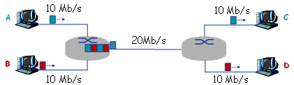

# 1.网络基础

1. **若发送40字节的数据帧，从开始发送到收到确认帧的时间为120ms。设信道的数据传输速率为4Kbps，采用停等协议，帧的控制信息、确认帧长及帧处理时间均忽略不计。试求出信道的传播时延：**

   ```
   数据帧长度：L = 40byte * 8 = 320bit
   开始发送到收到确认帧的时间：t = 120ms = 数据帧传播时延 + 确认帧传播时延 + 数据帧传输时延 = 2dp + dt
   信道的数据传输速率（链路带宽）：R = 4000bit/s
   数据的传输时延：dt = L/R = 320bit / 4000bps = 0.08s * 1000 = 80ms
   信道的传播时延：dp = (t - dt) / 2 = 20ms
   ```

2. **考虑两台主机A和主机B由一条带宽为R（bit/s）、长度为D（m）的链路互连，信号传播速度为V（m/s）。假设主机A从t=0时刻开始向主机B发送分组，分组长度为L位。试求：**

   1. **传播延迟（时延）：**`dp = D/V`

   2. **传输延迟：**`dt = L/R`

   3. **若忽略节点处理延迟和排队延迟，则端到端延迟T是多少？**`T = 传输时延 + 传播时延 = L/R + D/V`

   4. **若dp>dt，则t=dt时刻，分组的第一位在哪里？**

      ```
      若dp>dt：说明第一位分组没有传输到接收端，还在链路上
      解：距离主机A的V*dt（距离=速度*时间）米的链路上
      ```

   5. **若V=250 000km/s，L=512bit，R=100Mbit/s，则使时延带宽积刚好为一个分组长度（即512bit）的链路长度D是多少？**

      ```
      时延带宽积G = 传播时延dp * 链路带宽R = (D / V) * R = 512bit
      链路长度D = G * V / R = 512bit * 250000000m/s / 100000000bit/s = 1280m
      ```

3. **假设主机A向主机B以存储-转发的分组交换方式发送一个大文件。主机A到达主机B的路径上有3段链路，其速率分别是R1=500Kbit/s，R2=2Mbit/s，R3=1Mbit/s。试求：**

   1. **假设网络没有其他流量，则该文件传送的吞吐量是多少？**`吞吐量约等于瓶颈链路的带宽：500kbps`

   2. **假设文件大小为4MB，则传输该文件到主机B大约需要多少时间？**

      ```
      忽略传播时延，需要的时间等于
      分组大小除以瓶颈链路的带宽：T = 4 × 8 × 10^6 / (500 × 10^3) = 6.4s
      ```

4. **假设主机A向主机B发送一个L=1500B的分组，主机A到达主机B的路径上有3段链路、2个分组交换机，3段链路的长度分别为D1=5000km、D2=4000km，D3=1000km；每段链路的传输速率均为R=2Mbit/s，信号传播速度为V=250000km/s，分组交换机处理每个分组的时延为dc=3ms。试求：**

   1. **若以存储-转发的分组交换方式，则该分组从主机A到达主机B的端到端时延是多少？**

      ```
      端到端时延 = 3段链路的传输时延 + 3段链路的传播时延 + 2个分组交换机的处理时延 = 3 * (L/R) + (D1 + D2 + D3) / V + 2 * dc = 3 * ((1500 * 8) / (2 * 10^6)) + ((5000 * 10^3) + (4000 * 10^3) + (1000 * 10^3)) / (250000 * 10^3) + 2 * 3ms / 1000 = 0.064s = 64ms
      ```

   2. **若dc=0，且不采取存储-转发的分组交换方式，而是分组交换机直接转发收到的每个分组（即直通交换），则该分组从主机A到达主机B的端到到时延是多少？**`64ms - 2 * 3ms = 58ms`

5. **如下图所示的网络。A在t=0时刻开始向C发送一个2Mbits的文件；B在t=0.1+e秒（e为无限趋近于0的小正实数）向D发送一个1Mbits的文件。忽略传播延迟和结点处理延迟。（注：k=10^3，M=10^6）请回答下列问题：**

   

   1. **如果图中网络采用存储-转发的报文交换方式，则A将2Mbit的文件交付给C需要多长时间？B将1Mbit的文件交付给D需要多长时间？**

   ```
   由于采用了报文交换的方式，A的报文先到达第一个路由器，所以A的报文在路由器的队列中排在B的报文前面
   由于忽略了传播延迟和结点处理延迟，所以只考虑传输时延和排队时延
   A交付时间 = 第一段链路传输时延 + 第二段链路传输时延 + 第三段链路传输时延 = 2/10 + 2/20 + 2/10 = 0.5s = 500ms
   B交付时间 = 第一段链路传输时延 + 排队时延（A的第二段链路传输时延）+ 第二段链路传输时延 + 第三段链路传输时延 = 1/10 + 2/20 + 1/20 + 1/10 = 0.35s = 350ms
   ```

   2. **如果图中网络采用存储-转发方式的分组交换，分组长度为等长的1kbits，且忽略分组头开销以及报文的拆装开销，则A将2Mbits的文件交付给C需要大约多长时间？B将1Mbits的文件交付给D需要大约多长时间？**

   ```
   从t=0时刻到t=0.1s+e时刻，A发送的分组数 = 速度 * 时间 = (10^7bps * 0.1s) = 1Mbits / 1kbits = 1000个分组
   从t=0.1s时刻起与B共享连接路由器的链路，平均各共享到带宽10Mbps，A大约再用时：
   	= 第一段链路上所有分组的传播时延 * 后两段链路上最后一个分组的传播时延
   	= 剩余1000个分组 * 单个分组的传输时延 + 剩余两段链路 * 单个分组的传播时延 
   	= 1000 * 1000/10*10^6 + 2 * 1000/10*10^6 
   	= 0.1002s，交付剩余的1000个分组，故A向C交付2Mbits文件大约需要0.1 + 0.1002 ≈ 0.2s
   B向D交付1Mbits文件需要时间大约为：1000 * 1000/10*10^6 + 2 * 1000/10*10^6  = 0.1002s ≈ 0.1s
   ```

   3. **报文交换与分组交换相比，哪种交换方式更公平？**`分组交换更公平`


# 2.应用层

1. **假设你在浏览某网页时点击了一个超链接，URL为 "http://www.kicker.com.cn/index.html"，且该URL对应的IP地址在你的计算机上没有缓存；文件index.html引用了8个小图像。域名解析过程中，无等待的一次DNS解析请求与响应时间记为RTTd，HTTP请求传输Web对象过程的一次往返时间记为RTTh。请回答下列问题：**

   1. **你的浏览器解析到URL对应的IP地址的最短时间是多少？ 最长时间是多少？**

      ```
      最短时间 = 请求本地域名服务器直接获取结果 = 1RTTd
      最长时间 = 请求本地域名服务器 + 请求根域名服务器 + 请求顶级域名服务器解析cn + 请求权威域名服务器解析com + 请求权威域名服务器解析kicker.com.cn = 5RTTd
      ```

   2. **若浏览器没有配置并行TCP连接，则基于HTTP1.0获取URL链接Web页完整内容（包括引用的图像，下同）需要多长时间（不包括域名解析时间，下同）？**

      ```
      http1.0属于非持久连接，每次请求都要先建立tcp连接：
      建立tcp连接 + 请求web页面 + (建立tcp连接 + 请求图像地址) * 8 = 18RTTh
      ```

   3. **若浏览器配置5个并行TCP连接，则基于HTTP1.0获取URL链接Web页完整内容需要多长时间？**

      ```
      http1.0属于非持久连接，每次请求都要先建立tcp连接：
      建立tcp连接 + 请求web页面 + 并行建立5个tcp连接 + 并行请求5个图像地址 + 并行建立3个tcp连接 + 并行请求3个图像地址 = 6RTTh
      ```

   4. **若浏览器没有配置并行TCP连接，则基于非流水模式的HTTP1.1获取URL链接Web页完整内容需要多长时间？基于流水模式的HTTP1.1获取URL链接Web页完整内容需要多长时间？**

      ```
      http1.1的持久非流水连接，只需要建立一次tcp连接：
      建立tcp连接 + 请求web页面 + 请求图像地址 * 8 = 10RTTh
      http1.1的持久流水连接，只需建立一次tcp连接，8个图像无阻塞式请求（连续请求无需等待响应）：
      建立tcp连接 + 请求web页面 + 连续请求图像地址 = 3RTTh
      ```

2. **考虑向N个对等方（用户）分发F=15 GB的一个文件。该服务器具有us=30 Mbit/s的上传速率，每个对等方的下载速度di=2 Mbit/s，上传速率为u。请分别针对客户/服务器分发模式和P2P分发模式两种情况，对于N=10、100 和 1000 以及 u=500 kbit/s、1 Mbit/s和2 Mbit/s的每种组合，绘制最小分发时间图表（注：K=10^3、M=10^6、G=10^9）。**

   ```
   n=10,u=500kbps:
   dcs = 10 * 15 * 1024 * 1024 * 1024 * 8 / 30 * 1000000
   dcs = 15 * 1024 * 1024 * 1024 * 8 / 500 * 1000
   ```

   | 客户-服务器模式 |       |   N    |         |
   | :-------------: | :---: | :----: | :-----: |
   |        u        |  10   |  100   |  1000   |
   |     500kbps     | 7500s | 50000s | 500000s |
   |      1Mbps      | 7500s | 50000s | 500000s |
   |      2Mbps      | 7500s | 50000s | 500000s |

   | P2P 模式 |       |   N    |        |
   | :------: | :---: | :----: | :----: |
   |    u     |  10   |  100   |  1000  |
   | 500kbps  | 7500s | 18750s | 28302s |
   |  1Mbps   | 7500s | 11538s | 14563s |
   |  2Mbps   | 7500s | 7500s  | 7500s  |


# 3.传输层

1. **实现可靠数据传输的主要措施有哪些？这些措施主要用于解决哪些问题？**

   ```
   差错控制：数据传输过程差错的检验
   确认：数据是否正确接收的检验
   重传：重新发送未正确接收的数据
   序号：保证数据的按序和不重复提交
   计时器：超时机制解决数据的丢失问题
   ```

2. **UDP与TCP分别如何实现复用与分解？**

   ```
   UDP：UDP套接字（目的IP，目的端口）
   TCP：TCP套接字（源IP，源端口，目的IP，目的端口）
   ```

3. **请画出TCP报文结构，并简要说明各个字段的主要作用**

   ```
   源端口：发送方端口，目的端口：接收方端口，序号：所封装的数据首字节序号，确认序号：期望从对方接收的下一个字节的序号，首部长度，保留字段：ACK、SYN、FIN 、 …，接收窗口：滑动窗口，紧急指针：，选项：，填充：，数据：应用层字节数据。
   ```

4. **请说明TCP建立连接与断开连接的过程，并给出主要状态转移。**

   ```
   三次握手：C发送SYN(SYN=1,seq=x)段，从CLOSE进入SYN_SEND；S接收后发送SYNACK(SYN=1,ACK=1,seq=y,ack_seq=x+1),从LISTEN进入SYN_RCVD;C接收后发送ACK(ACK=1,seq=x+1,ack_seq=y+1)段,进入ESTABLISHED,S接收后也进入ESTABLISHED状态。
   
   四次挥手：C发送FIN(FIN=1,seq=u)段，从ESTABLISHED进入FIN_WAIT_1状态，C此时不能发只能收；S收到后发送ACK(ACK=1，seq=v,ack_seq=u+1)段，从ESTEBLISHED进入CLOSE_WAIT状态，S此时只发不收，C收到后进入FIN_WAIT_2状态；S发送FIN(FIN=1,ACK=1,seq=w,ack_seq=u+1),进入LAST_WAIT状态，S此时不再发送数据；C收到后发送ACK段(ACK=1,seq=u+1,seq_ack=w+1),进入TIME_WAIT状态，过2msl进入CLOSE状态，S收到数据后也进入CLOSE状态。
   ```

5. **TCP如果保证可靠数据传输？**

   ```
   基于滑动窗口协议，机制包括差错控制、确认、序号、重传、计时器。分组，计时器，校验和，排序，去重。
   ```

6. **TCP如何实现拥塞控制？**

   ```
   通过TCP拥塞窗口实现，慢启动和拥塞避免两个阶段：
   1.慢启动阶段：拥塞窗口每次接收确认都会增加1MSS，也就是说每经过1RTT都会扩增一倍；
   2.拥塞避免阶段：此时拥塞窗口每经过一个RTT才会增加1MSS。
   ```

7. **假设甲乙双方采用GBN协议发送报文段，甲已经发送了编号为0~7的报文段。当计时器超时时，若甲只收到0号和3号报文段的确认，则甲需要重发的报文段是哪些？**

   ```
   根据GBN累计确认的模式，只会重发最后一个正确接收的信息帧之后的未被确认的帧：4、5、6、7
   ```

8. **主机甲与主机乙之间已经建立一条TCP连接，主机甲向主机乙发送了两个连续的TCP段，分别包含300字节和500字节的有效载荷，第一个段的序列号是200，主机乙正确收到两个段后，发送给主机甲的确认序列号是多少？**

   ```
   第一段开始序号是200，tcp从200开始为每个字节进行编号，连续发送的两个tcp段：200~499，500~999，所以两段发送后的确认序号是1000。
   ```

9. **主机甲与主机乙之间已建立一个TCP连接，主机甲向主机乙发送了3个连续的TCP报文段，分别包含300字节、400字节和500字节的有效载荷，第3个段的序号为900。若主机乙仅正确接收到第1和第3个报文段，则主机乙发送给主机甲的确认序号是多少？**

   ```
   第3段的序号是900，前两段连续报文段序号为700，所以起始序号为200，此时为了重新构建主机A的数据流，仍需等待未正确接收的第2个报文段，所以从200~499是第2段的序号，乙发送的确认序号是500。
   ```

10. **主机甲与主机乙之间已建立一个TCP连接，双方持续有数据传输，且数据无差错与丢失。若甲收到1个来自乙的TCP段，该段的序号为1913、确认序号为 2046、有效载荷为100字节，则甲立即发送给乙的TCP段的序号和确认序号分别是多少？**

    ```
    乙发送的确认序号为2046，即期望获得的下一个字节序号为2046，所以甲发送的TCP序号为2046；
    乙发送的序号为1913，载荷为100byte，所以甲发送的TCP确认序号是2013。
    ```

11. **主机甲乙通过128kbit/s卫星信道互连，采用滑动窗口协议发送数据，链路单向传播时延250ms，分组长度为1000字节。不考虑确认分组的开销，为使信道利用率不小于80%，分组序号的位数至少要达到多少位？**

    ```
    链路带宽 = R = 128kbps = 128 * 10^3 = 128000bps
    单向传播时延 = dp = 250ms = 0.25s
    分组长度 = 1000byte = 1000 * 8 = 8000bit
    滑窗协议信道利用率 = Usender = Ws * tseg / (tseg + RTT + tack) = 80% = 0.8
    分组传输时延 = tseg = dt = L/R = 8000 / 128000 ≈ 0.06s
    一次请求的往返时间RTT = dp * 2 = 0.5s
    窗口大小 = Ws = 0.8 * (dt + RTT) / dt = 0.8 * 0.56 / 0.06 ≈ 7
    若使用GBN协议，则分组序号的位数k：Ws = 7 <= 2^k - 1, k = 4 
    若使用SR协议，则分组序号的位数k：Ws = 7 <= 2^(k-1), k = 4
    ```

12. **若甲乙之间已建立一条TCP连接，拥塞控制处于拥塞避免阶段，阈值为8 MSS，当甲的拥塞窗口大小为24 MSS时发生了超时，则甲的拥塞窗口和阈值将分别调整为多少？**

    ```
    因为是计时器超时发生的网络拥塞，所以拥塞控制进入慢启动阶段，此时拥塞窗口为1MSS，阈值重新调整为超时窗口的一半即12MSS。
    ```

13. **主机甲和主机乙已建立了TCP连接，甲始终以MSS=1 KB大小的报文段发送数据，并一直有数据发送；乙每收到一个报文段都会发出一个接收窗口为10 KB的确认段。若甲在t时刻发生超时时拥塞窗口为8 KB，则从t时刻起，不再发生超时的情况下，经过10个RTT后，甲的发送窗口是多少？**

    ```
    阈值减半为4kb，进入慢启动阶段，经过3次RTT（0-1，1-2，2-4）窗口为4kb进入拥塞避免阶段，加上剩余7次RTT的7kb = 11kb
    发送窗口 = min{接收窗口,拥塞窗口} = min{10kb,12kb} = 10kb
    ```

14. **主机甲和主机乙之间已建立了一个TCP连接，TCP最大段长度为1000字节。若主机甲的当前拥塞窗口为4000字节，在主机甲向主机乙连续发送两个最大段后，成功收到主机乙发送的对第一个段的确认段，确认段中通告的接收窗口大小为2000字节，则此时主机甲还可以向主机乙发送的最大字节数是多少？**

    ```
    TCP最大段1000字节，甲的拥塞窗口4000字节，说明可以连续发送4个TCP最大段；
    甲连续发送两段1000字节后，收到对第一段1000字节的确认，并通告接收窗口2000字节，除去第二段已经发送的1000字节，甲还能向乙再发送1000字节的数据。
    ```

15. **假设主机A向主机B发送5个连续的报文段，主机B对每个报文段进行确认，其中第二个报文段丢失，其余报文段以及重传的第二个报文段均被主机B正确接收，主机A正确接收所有ACK报文段；报文段从1开始依次连续编号（即1、2、3……），主机A的超时时间足够长。请回答下列问题：**

    1. **如果分别采用GBN、SR和TCP协议，则对应这三个协议，主机A分别总共发了多少个报文段？主机B分别总共发送了多少个ACK？它们的序号是什么？(针对3个协议分别给出解答）**

       ```
       GBN：
       	主机A总共发送9个报文段：若第二个报文段丢失，那么2，3，4，5会重新传，所以1，2，3，4，5，2，3，4，5；
       	主机B总共发送8个ACK段：第二个丢失不发，其他每收到一个发一个ACK，所以1，3，4，5，2，3，4，5。
       SR：
       	主机A总共发送6个报文段：只会重传丢失的2，所以1，2，3，4，5，2；
       	主机B总共发送5个ACK段：第二个丢失不发，其他每收到一个发一个ACK，所以1，3，4，5，2。
       TCP：
       	主机A总共发送6个报文段：只会重传丢失的2，所以1，2，3，4，5，2；
       	主机B总共发送5个ACK段：ack_seq=2会发送4次（1号报文成功接收后正常发送1次，快速重传机制发送3次），根据tcp累计确认的特性，最后会发送ack_seq=5。
       ```

    2. **如果对上述三个协议，超时时间比5RTT长得多，那么哪个协议将在最短的时间间隔内成功交付5个报文段？**

       ```
       TCP的快速重传机制，不需要等待超时就可以重传。
       ```

16. **假设A、B两个端系统通过唯一的一条8Mbps链路连接（M=10^6），该链路的双向传播时延是150ms；A通过一个TCP连接向B发送一个大文件，B的接收缓存足够大，每个TCP段最大段长度（MSS）为1500字节，TCP采用Reno版本，且总是处于拥塞避免阶段（即忽略慢启动）。请回答下列问题：**

    1. **该TCP连接能够获得的最大窗口尺寸（以TCP段数计）是多少？**

       ```
       设W是最大窗口尺寸，当最大发送速率超过链路带宽时会发生丢包，因此：W*MSS/RTT=8Mbps，于是W=100。
       ```

    2. **该TCP连接的平均窗口尺寸（以TCP段数计）和平均吞吐量（以bps计）是多少？**

       ```
       拥塞窗口从W/2（50）到W(100)之间变化，平均窗口尺寸:(50+100)/2=75 ；因此平均吞吐量为：75*1500*8/0.15=6Mbps。
       ```

    3. **该TCP连接的拥塞窗口从发生丢包到恢复到最大窗口尺寸要经历多长时间？**

       ```
       0.15*100/2=7.5秒，因为每个RTT窗口尺寸增加1个MSS。
       ```


# 4.网络层

1. **设某子网中的一个主机IP地址为203.123.1.135，子网掩码是255.255.255.192， 那么该子网的子网地址是什么？直接广播地址是什么？可分配的IP地址范围是多少？**

   ```
   子网地址：
   	IP地址与子网掩码做按位与运算：
   	203.123.1.135 & 255.255.255.192 
   	= 11001011 01111011 00000001 10000111 & 11111111 11111111 11111111 11000000
   	= 11001011 01111011 00000001 10000000
   	= 203.123.1.128 
   	= 203.123.1.128/26
   
   直接广播地址：
   	203.123.1.135转二进制11001011 01111011 00000001 10000111
   	255.255.255.192转二进制11111111 11111111 11111111 11000000
   	因为首位1为负数，反码计算方式就是二进制原码除符号位外，按位取反
   	10000000 00000000 00000000 0011111111
   	IP地址与子网掩码的反码做按位或运算：
   	203.123.1.135 | 255.255.255.192 
   	= 11001011 01111011 00000001 10000111 | 10000000 00000000 00000000 0011111111 
   	= 11001011 01111011 00000001 10111111 
   	= 203.123.1.191
   ```

2. **标准C类网络192.168.1.0/24，要分成3个子网，每个子网分配给一个部门。而且要满足每个子网支持的主机数目为50台以上。应如何对此C类地址进行子网划分？**

   ```
   子网个数 = 2^n >= 3，要满足3个子网的要求，则子网号位数n = 2；
   原网络号是/24位，主机号则是32 - 24 = 8位，主机号位数m = 原主机号位数8 - 子网号位数2 = 6, 子网下的主机数 = 2^m-2 = 62 > 50符合要求；
   此时子网的网络位 = 原网络号24 + 子网号2 = 26位，子网掩码 = 11111111 11111111 11111111 11000000 = 255.255.255.192/26；
   
   子网列表：
   192.168.1.00000000/26 = 192.168.1.0/26
   192.168.1.01000000/26 = 192.168.1.64/26
   192.168.1.10000000/26 = 192.168.1.128/26
   192.168.1.11000000/26 = 192.168.1.192/26
   
   网络范围：
   192.168.1.00000000 网络ID
   192.168.1.00000001 网络起始地址 192.168.1.1/26
   ......
   192.168.1.11111110 网络结束地址 192.168.1.62/26
   192.168.1.11111111 直接广播地址
   ```

3. **假设某子网中的一个主机的IP地址是203.123.1.135，子网掩码是255.255.255.192，那么该子网的子网地址是什么？直接广播地址是什么？该子网IP地址总数是多少？该子网的可分配的IP地址数是多少？可分配IP地址范围是多少？**

   ```
   子网地址：203.123.1.135 & 255.255.255.192 = 203.123.1.128/26
   直接广播地址：128 = 10000000，将主机位全置1 = 10111111 = 191，则直接广播地址是203.123.1.191
   IP地址总数：主机号是6位，则IP总数为2^6 = 64
   可分配的IP地址数：ip总数 - (子网IP + 直接广播地址) = 62
   可分配的IP地址范围：203.123.1.123 ~ 203.1.123.190
   ```

4. **网络拓扑如题48图所示，每个结点为一个路由器，连线上的数字为路由器间代价。如采用最短路由选择算法，请填写R1的路由表。**

   

   | 目标路由器 | 下一跳 | 最小代价 |
   | :--------: | :----: | :------: |
   |     R2     |   R2   |    2     |
   |     R3     |   R2   |    3     |
   |     R4     |   R4   |    3     |
   |     R5     |   R4   |    4     |

5. **已知由6个路由器组成的通信子网如题50图所示，图中标注的数字为延迟(单位ms)，请用Dijkstra算法计算A到D延迟最小的路径及相应延迟（要求写出计算步骤）。**

   

   ```
   A - B - C - D: 9
   ```

6. **某通信子网如图所示，使用距离矢量路由算法。假设到达路由器c的路由器B、D、G的矢量分别为(7，0，8，10，5，6，3)、(12，9，5，0，7，4，8)和(11，3，9，11，2，6，0)；C到B、D、G的延迟分别为5、2、3，试在题48表所示的C的新路由表中注明使用的输出线路及从C出发到达各路由器的延迟。**

   

   首先写出B、D、G路由器发送过来的距离向量：

   |      |  B   |
   | :--: | :--: |
   |  A   |  7   |
   |  B   |  0   |
   |  C   |  8   |
   |  D   |  10  |
   |  E   |  5   |
   |  F   |  6   |
   |  G   |  3   |

   |      |  D   |
   | :--: | :--: |
   |  A   |  12  |
   |  B   |  9   |
   |  C   |  5   |
   |  D   |  0   |
   |  E   |  7   |
   |  F   |  4   |
   |  G   |  8   |

   |      |  G   |
   | :--: | :--: |
   |  A   |  11  |
   |  B   |  3   |
   |  C   |  9   |
   |  D   |  11  |
   |  E   |  2   |
   |  F   |  6   |
   |  G   |  0   |

   根据距离向量更新C的路由表：

   | 目的路由器 |  A   |  B   |  C   |  D   |  E   |  F   |  G   |
   | :--------: | :--: | :--: | :--: | :--: | :--: | :--: | :--: |
   |  输出线路  |  B   |  B   |  C   |  D   |  G   |  G   |  G   |
   |    延迟    |  12  |  5   |  0   |  2   |  5   |  9   |  3   |

7. **设某子网的拓扑结构图如下图a，路由器C中来自B、D、E的列表如下图b，C到B、D、E的延迟分别为5、1、3。根据距离矢量路由算法，在下图c所示C的新路由表中给出从C出发的延时及使用的输出线路。**

   

   根据B、D、E的距离向量更新路由表：

   | 目的路由 | 下一跳路由 | 延迟 |
   | :------: | :--------: | :--: |
   |    A     |     B      |  9   |
   |    B     |     B      |  5   |
   |    C     |     C      |  0   |
   |    D     |     D      |  1   |
   |    E     |     E      |  3   |
   |    F     |     D      |  4   |

8. **设网络中路由器使用RIP协议，路由器B的当前路由表如表1所示，B收到从路由器C发来的路由信息如表2所示。试给出路由器B更新后的路由表。**

   B当前的路由表：
   
   | 目的网络 | 距离 | 下一跳路由 |
   | :------: | :--: | :--------: |
   |    N1    |  7   |     A      |
   |    N2    |  2   |     C      |
   |    N6    |  8   |     F      |
   |    N8    |  4   |     E      |
   |    N9    |  4   |     F      |
   
   C发送的路由信息：
   
   | 目的网络 | 距离 |
   | :------: | :--: |
   |    N2    |  4   |
   |    N3    |  8   |
   |    N6    |  4   |
   |    N8    |  3   |
   |    N9    |  5   |
   
   B更新后的路由信息：
   
   | 目的网络 | 下一跳路由器 | 距离 |
   | :------: | :----------: | :--: |
   |    N1    |      A       |  7   |
   |    N2    |      C       |  5   |
   |    N3    |      C       |  9   |
   |    N6    |      C       |  5   |
   |    N8    |      E       |  4   |
   |    N9    |      F       |  4   |
   
9. **请将IP网络183.164.128.0/17划分为等长的8个子网，并分别给出每个子网的子网地址、广播地址、子网掩码、IP地址总数、可分配IP地址数和可分配IP地址范围。**

   ```
   分析：
   	8个子网，2^3=8，则需要取出3个主机位做为子网位；
   	128转二进制=10000000，/17表示该ip网络位17位，再加上新划分的子网位，1000为网络位，0000为主机位。
   子网列表：
       183.164.10000000.0/20
       183.164.10010000.0/20
       183.164.10100000.0/20
       183.164.11010000.0/20
       183.164.10110000.0/20 
       183.164.11000000.0/20
       183.164.11100000.0/20
       183.164.11110000.0/20
   以第一个子网为例：
   	子网地址：183.164.10000000.0 -> 183.164.128.0/20
   	广播地址：183.164.10001111.0 -> 183.164.143.0/20
   	子网掩码：255.255.11110000.0 -> 255.255.240.0/20
   	IP地址总数：32-20=12，2^12=4096
   	可分配IP地址数：2^12-2=4094
   	可分配IP地址范围：183.164.128.1 ~ 183.164.143.254
   ```

10. **某ISP拥有一个网络地址块201.123.16.0/21，现在该ISP要为4个组织分配IP地址，其需要的地址数量分别为985、486、246以及211，请给出一个合理的分配方案，并说明各组织所分配子网的子网地址、广播地址、子网掩码、IP地址总数、可分配IP地址数和可分配IP地址范围。**

    ```
    
    ```

11. **某网络拓扑如图4.32所示，路由器R1通过接口E1 E2分别连接局域网1、局域网2，通过接口L0连接路由器R2，并通过路由器R2连接域名服务器与互联网。R1的L0接口的IP地址是202.118.2.1；R2的L0接口的IP地址是202.118.2.2，L1接口的IP地址是130.11.120.1，E0接口的IP地址是202.118.3.1；域名服务器的IP地址是202.118.3.2。**

    ```
    
    ```

12. **请回答下列问题：**

    **(1) 主机在配置IP地址时，其正确的子网掩码和默认网关分别是多少？**

    **(2) 若路由器R在向互联网转发一个由主机192.168.1.5发送、ID=12345、length=500B、DF=1的IP分组时，则该IP分组首部的哪些字段会被修改？如何修改？**

    **(3) 若主机192.168.1.10向互联网ID=6789、length=1500B、DF=0的IP分组时，路由器需要将该IP分组分为几片（每片尽可能封装为最大片）？给出分片结果，包括每片的ID、DF、MF、length、offset的取值。**

13. **某网络拓扑如图所示，其中路由器内网接口、DHCP服务器、WWW服务器与主机1均采用静态IP地址配置，相关地址信息见图中标注；主机2～主机N通过DHCP服务器动态获取IP地址等配置信息。**

    **请回答下列问题。**

    **(1) DHCP服务器可为主机2～主机N动态分配IP地址的最大范围是什么？主机2使用DHCP协议获取IP地址的过程中，发送的封装DHCP Discover报文的IP分组的源IP地址和目的IP地址分别是什么？**

    **(2) 主机2在通过DHCP服务器获取IP地址的同时还可以获取哪些IP地址配置所必须的信息？**

    **(3) 若主机1的子网掩码和默认网关分别配置为255.255.255.0和111.123.15.2，则该主机是否能访问WWW服务器？是否能访问Internet？请说明理由。**

14. **如图所示网络拓扑，所有路由器均采用距离向量路由算法计算到达两个子网的路由（注：到达子网的路由度量采用跳步数）。**

    **请回答下列问题：**

    **(1) 若所有路由器均已收敛，请给出R1的路由表，要求包括到达图中所有子网的路由，且路由表中的路由项尽可能少。**

    **(2) 在所有路由器均已收敛的状态下，R3突然检测到子网192.168.1.128/26不可到达，若接下来R2和R3同时向R1交换距离向量，则R1更新后的路由表是什么？更新后的R1距离向量是什么？**