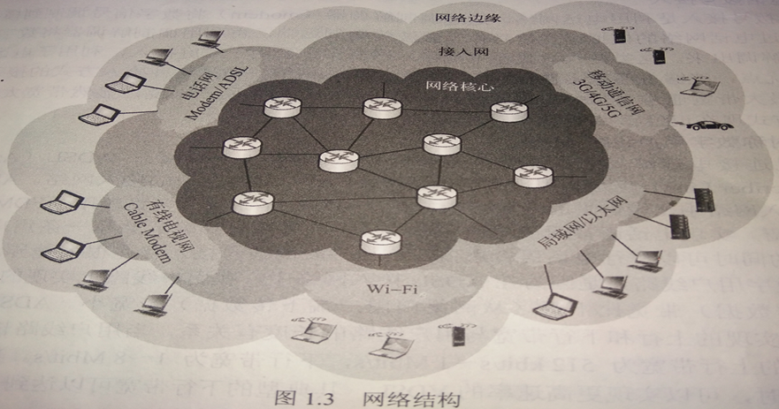
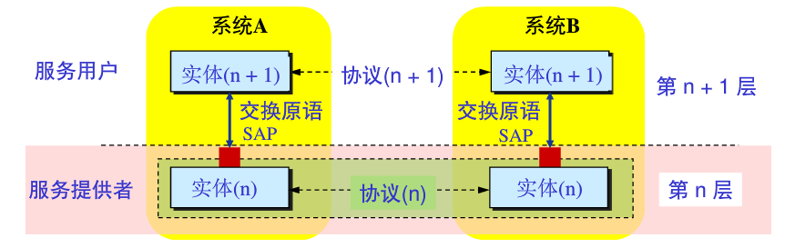
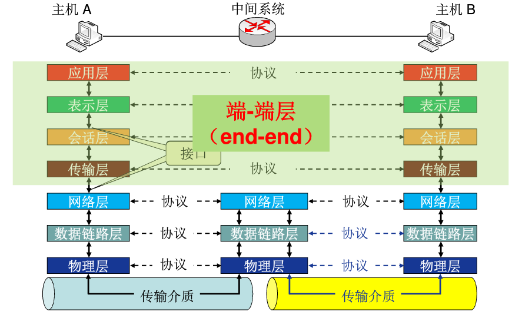
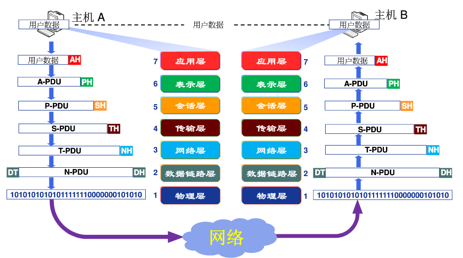
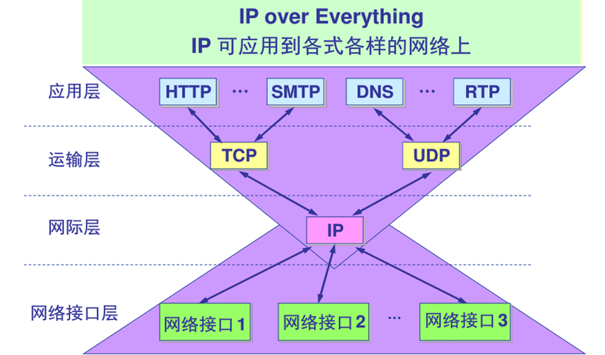

# 1.计算机网络基本概念

## 1.1.网络定义

计算机网络就是以能够相互共享资源的方式互联起来的自治计算机系统的集合：

* 在不同的主机间实现快速的信息交换，通过信息交换实现硬件，软件，信息资源的共享；
* 由分布在不同地理位置的多台独立的自治计算机组成；
* 通信必须遵守共同的网络协议。

## 1.2.网络协议

网络协议就是计算机网络中的实体在进行数据交换过程中必须遵守的规则或约定：

协议三要素：

* 语法：定义实体间交换信息的格式和结构，传输信息的电平等（涉及数据及控制信息的格式，编码，电平等）；
* 语义：定义实体间交换信息和差错处理的控制信息以及对其的响应（涉及用于协调与差错处理的控制信息）；
* 时序：定义实体间交换信息的顺序以及如何匹配速度（涉及速度匹配和排序）。

## 1.3.网络分类

* 覆盖范围区分：个域网，局域网，城域网，广域网；
* 拓扑结构区分：总线型，环型，星型，树型，网状型，混合型；
* 
* 交换方式区分：电路交换网，报文交换网，分组交换网；
* 用户属性区分：公用网，私有网。

## 1.4.网络结构

* 网络边缘：指连接到网络上的所有端系统，该层功能是为用户提供服务（资源子网，信息处理）；
* 接入网络：指实现了网络边缘和网络核心连接的网络（通信子网，信息交换）；
  * 电话拨号接入；
  * 非对称数字用户线路ADSL（家庭用户接入）；
  * 混合光纤同轴电缆HFC接入网络（有线电视网络接入）；
  * 局域网（企业、学校）；
  * 移动接入网络（移动通信网络）；
* 网络核心：指由通信链路互连的分组交换设备构成的网络，实现了网络边缘中主机间的数据中继和转发（通信子网，信息交换）；
* 

## 1.5.数据交换

实现了在大规模网络核心上进行数据传输的技术基础（路由器，交换机）：

* 电路交换：建立电路连接，传输数据，拆除电路。实时性高，时延小，不适合突发性数据传输，适用于音视频通信等实时性强的业务；
* 报文交换：无连接，发送方把要发送的信息加上发送/接收主机的地址及控制信息，组成一个报文通过存储-转发的方式独立传输。时延长。
* 分组交换：将报文分成较小的数据块，每个数据块加上地址，序号等控制信息构成分组。每个分组都通过存储-转发的方式独立传输，目的地将收到的分组重新组装还原为报文。优点：
  * 交换设备存储容量要求低；
  * 交换速度快；
  * 可靠传输效率高；
  * 更加公平。

## 1.6.网络性能

* 速率：网络中单位时间内传输的数据量，称为数据传输速率，单位bit/s；

* 带宽：链路或信道能不失真的传播电磁信号的最高频率和最低频率之差，称为信道的带宽，单位HZ；当描述链路或信道的数据传输能力时，通常用带宽表示最高数据速率，单位bit/s。

* 时延：时间延迟，例如：结点处理时延，排队时延，传输时延，传播时延：

  * 传输时延：也称发送时延，指分组数据从发送端第一个到做最后一个全部发送出去所需的时间，公式：
  
  $$
  d_t = L(分组长度)/R(链路带宽)
  $$
  
  * 传播时延：指在一段信道中信号从发送端到接收端所需的时间，公式：
  
  $$
  d_p=D(物理链路长度)/V(信号传输速度)
  $$
  
* 时延带宽积：指一段物理链路的传播时延与链路带宽的乘积，公式：
  $$
  G=d_pR
  $$
  
* 丢包率：引发网络丢包的主要因素是网络拥塞，公式：
  $$
  η=N_l/N_s=(N_s-N_r)/N_s
  $$

  > Ns为发送分组总数，Nr为接收分组总数，Nl为丢失分组总数。

* 吞吐量：在单位时间内源主机通过网络向目的主机实际送达的数据量，单位bit/s，在理想情况下，吞吐量约等于瓶颈链路的带宽，公式：
  $$
  Thr=min(R1,R2,...,R_n)
  $$

## 1.7.网络体系结构

* 体系结构定义：计算机网络各层次结构模型及其协议的集合。

* 层次结构：按照功能分成若干层，每层完成一部分子功能，分而治之，各个击破（不是按实现方式划分层次结构的）。

* 层次结构优点：

  * 各层间相互独立；
  * 灵活性好；
  * 结构上可分隔开；
  * 易于实现和维护；
  * 能促进网络标准化。

* 层次结构基本概念：

  * 

  * 实体：表示任何可发送或接收信息的硬件或软件进程；
  * 协议：控制两个对等实体进行通信的规则集合，协议是水平的；
  * 服务：下层为上层提供服务，上层使用下层提供的服务，服务是垂直的，下层协议的实现对上层的服务用户是透明的；
  * 接口：相邻层通过接口进行交互；
  * SAP：通过服务访问点SAP，交换原语，指定请求的特定服务。

## 1.8.OSI参考模型

OSI包括了体系结构，服务定义和协议规范三级抽象（异构网络系统互连的国际标准、理解网络通信的理论模型）：

* 物理层：使原始数据以比特流的形式在物理介质上传输（接口特性、比特编码、数据率、比特同步、传输模式）；
* 数据链路层：通过校验，确认，反馈重发等手段，将不可靠的物理链路改造成对网络层来说是无差错的数据链路，该层以帧为单位传输数据（点到点数据传输、成帧、物理寻址、流量控制、差错控制、访问控制）；
* 网络层：源主机到目的主机的数据分组交付，逻辑寻址，路由，分组转发。该层以数据包为单位传输数据（通过IP地址寻址通信）；
* 传输层：提供端到端（应用进程间）的透明数据传输服务，处理端到端的差错控制和流量控制问题。该层以数据段的形式传输数据（通过端口号寻址通信）；
* 会话层：负责建立，管理，终止进程间的会话和数据交换（会话控制，同步）；
* 表示层：负责数据的格式转换，加解密，压缩解压缩等；
* 应用层：为用户的应用进程提供网络服务。

通信过程：



数据封装：




## 1.9.TCP/IP参考模型

TCP/IP模型是简化的OSI参考模型，是因特网采用的标准化体系结构：

* 网络接口层：对应于OSI模型中的物理层和数据链路层（TCP/IP体系结构并没有对该层使用的协议做出强硬规定，允许主机连入网络时使用多种现成的和流行的协议）；
* 互联层：负责将源主机的报文分组发送到目的主机；
* 传输层：负责应用进程间的端到端的通信；
* 应用层：为用户提供各种网络应用服务。



## 1.10.五层参考模型

综合OSI和TCP/IP的优点，理论模型和实际应用的结合：

* 应用层：支持各种网络应用（FTP，HTTP，SMTP）；
* 传输层：进程到进程间的数据传输（TCP，UDP）；
* 网络层：源主机到目的主机的数据分组和路由转发（IP协议，路由协议）；
* 链路层：相邻节点（主机，交换机，路由器等）的数据传输（以太网，WIFI，PPP）；
* 物理层：比特流的传输。

数据封装：


# 2.应用层

## 2.1.网络应用体系结构

* C/S结构：
  * 
  * 网络应用的通信双方为服务器程序和客户端程序，由客户端发送请求，服务端做出响应（Web应用，FTP，电子邮件，DNS等）；
  * 服务端：
    * 7*24提供服务；
    * 永久性的访问地址和域名；
    * 利用大量服务器实现可拓展。
  * 客户端：
    * 主动与服务器通信，使用服务器提供的服务；
    * 间歇性的接入网络；
    * 可能使用动态IP地址；
    * 不会和其他客户机直接通信。
  * 主要应用：web应用，电子邮件，FTP，DNS等。
* P2P结构：
  * 
  * 通信双方直接对等通信，每个对等端都既是服务器又是客户端，没有中心服务器（文件共享、文件分发、视频流服务、QQ、MSN、微信、pplive等）；
  * 没有永远在线的服务器；
  * 任意端系统/节点之间都可以直接通信；
  * 节点间歇性的接入网络；
  * 节点IP地址可改变；
  * 优点是高度可伸缩，缺点是难于管理；
  * 主要应用：文件共享，文件分发等。
* 混合结构：
  * 既有中心服务器的存在，又有对等端之间的通信。
  * 

## 2.2.网络应用通信基本原理

* 通信过程：
  * 网络应用的本身是运行在不同主机或同一主机的不同应用进程间的通信；
  * 运行在不同主机上的应用进程以C/S的方式进行通信，服务器进程被动等待客户端请求服务，客户端主动发起连接请求。
* API：应用编程接口，应用层报文通过API将报文传递给传输层，请求传输层协议提供端到端的传输服务，如：socket套接字。
* 端口号：传输层协议为请求接口的每个套接字分配一个编号来标识套接字，这个编号就是端口号。
* 网络应用进程标识：通过进程所在的主机IP地址和其套接字所绑定的端口号可以标识应用进程。
* 网络应用与传输层服务：
  * TCP（面向连接的可靠字节流传输服务）：面向连接的服务-建立一条全双工的逻辑连接，可靠的数据传输服务-无差错，有序传输；
  * UDP（无连接的不可靠数据报传输服务）。

## 2.3.网络应用对传输服务的要求

* 数据丢失/可靠性：某些网络应用如网络电话等允许一定的数据丢失，某些网络应用如文件传输等要求100%可靠的数据传输；
* 时间延迟：某些网络应用如网络游戏/网络电话等需要低延时的环境；
* 带宽：某些网络应用如网络视频需要带宽达到最低要求时才能生效，某些应用如电子邮件能够适应任何带宽。

## 2.4.网络应用通信基本原理

网络应用需要遵循应用层协议。


* 公开协议：由RFC定义（IETF组织），允许互操作，HTTP，SMTP，FTP，......；
* 私有协议：大多数的p2p文件共享应用。

## 2.5.DNS域名系统

* DNS的功能：将用户使用的域名映射为计算机使用的IP地址的过程称为域名解析。由域名服务器提供域名解析服务（DNS使用UDP的53号端口）；
* 层次化域名结构：
  * 三级域名，二级域名，顶级域名；
  * 顶级域名分类：
    * 国家级域名（cn，us，uk等）；
    * 通用级域名（com，edu，net，org，gov，mil，int等）；
    * 基础结构域名（arpa用于反向域名解析）。
* 域名服务器：
  * 本地域名服务器（默认DNS，首先查询）；
  * 根域名服务器（13个不同IP地址的根域名服务器，由英文字母a-m命名）；
  * 顶级域名服务器；
  * 权威域名服务器（保存一个区内所有主机的域名到IP地址的映射）；
  * 中间域名服务器。
* 迭代解析：
  * 
  * 首先请求本地DNS；
  * 本地DNS没有则代为请求根DNS，若是根DNS也没有则由本地DNS依次代为请求顶级DNS和权威DNS，直到成功解析或无法解析。
* 递归解析：

  * 

  * 首先请求本地DNS；
  * 没有则代为去请求根DNS，没有则由根DNS代为请求顶级DNS，若依旧没有则依次向高层的权威域名服务器递归请求，直到解析结果依次返回。

## 2.6.Web应用

* URL（统一资源定位器）：协议类型，服务器主机域名，对象的路径名；

* HTML（超文本标记语言）；

* HTTP（超文本传输协议）：
  * HTTP特点：web应用层协议（使用TCP的80端口），定义了浏览器如何向web服务器发送请求以及web服务器如何向浏览器进行响应（http/1.0，http/1.1目前使用的主要版本，http/2.0）。

  * 非持久HTTP：http客户端与http服务器建立tcp连接后，通过该连接发送http请求报文，接收http响应报文，然后断开连接（http/1.0使用的就是非持久连接）；

  * 持久HTTP：

    * 非流水方式持久连接：建立一次tcp连接请求，等待其他http请求响应完成再断开；
    * 流水方式持久连接：建立一次tcp连接请求，多次相似的http请求可以并行处理。

  * HTTP交互过程响应时间分析（持久连接和非持久连接响应时间比较）：

    * 例：设用户请求一个引用了3个jpeg小图像的web页面，响应时间如下，各需要几个RTT（请求响应时间）？：
    * 
    * 

  * HTTP报文：

    * 起始行，首部行，空白行，实体主体；
    * 请求报文的起始行：`<方法><URL><协议版本>`；
    * 
    * 响应报文的起始行：`<协议版本><状态码><短语>`；
    * 
    * 

  * HTTP请求方法：

    * GET：请求读取由URL所标识的信息；
    * HEAD：请求读取由URL标识的信息的首部，即无需在响应报文中包含对象；
    * POST：给服务器添加信息；
    * OPTION：请求一些选项的信息；
    * PUT：在指定的URL下存储一个文件。

* Cookie（小型文本文件）：

  * 指某些网站为了辨别用户身份，进行会话跟踪而存储在用户本地终端上的数据；
  * cookie可以用于用户跟踪，实现在无状态的http协议上建立用户会话；
  * cookie技术主要包括4个部分：
    * http响应报文中的cookie头行：Set-Cookie；
    * 用户浏览器在本地存储，维护，管理的cookie文件；
    * http请求报文中的cookie头行：Cookie；
    * 网站在后台数据库中存储，维护cookie信息。
  * 

## 2.7.SMTP电子邮件核心协议

* 电子邮件系统结构：
  * 
  * 邮件服务器，SMTP，用户代理，邮件读取协议；
  * 电子邮件地址格式：用户名@邮箱所在主机的域名；
  * 用户代理：电子邮件应用的客户端软件（outlook，foxmail）。
* SMTP及其特点：
  * SMTP是电子邮件中核心应用层协议，实现邮件服务器之间或用户代理到邮件服务器之间的邮件传输，使用TCP进行可靠传输，使用25号端口；
  * 特点：
    * SMTP只能传送7bit的ASCII码文本内容，包括SMTP命令，应答消息以及邮件内容 （MIME：将非7bit的ASCII码文本转换为7bit文本内容的方案）；
    * SMTP传送的邮件内容不能包含"CRLF.CRLF"；
    * SMTP是"推动"协议；
    * SMTP使用TCP连接是持久的。
* SMTP邮件发送过程：
  * 
  * 客户端主动请求与服务器建立tcp连接，服务器以220类型消息进行应答；
  * 客户端通过HELP命令向服务器发送自己的域名，服务器以250类型消息进行应答，至此完成了握手；
  * 客户端通过MAIL FROM和RCPT TO命令向服务器通告邮件发送地址和接收地址，服务器以250类型的消息分别进行响应；
  * 客户端通过DATA命令通知服务器准备开始发送邮件内容，服务器以354类型消息进行应答；
  * 客户端开始传输邮件内容，传输完成后发送"CRLF.CRLF"通知服务器邮件内容发送完毕，服务器以250类型消息进行应答；
  * 客户端发送QUIT命令请求关闭tcp连接，服务器发送221类型应答，同意结束SMTP会话并断开连接。
* 邮件读取协议（用户代理读取邮件服务器中的邮件）：
  * POP3（使用tcp的110号断开）：
    * 
    * 客户端请求tcp连接，成功建立后，服务端利用"+ok pop3 server ready"进行应答；
    * 客户端使用user和pass命令完成授权；
    * 客户端发送list命令请求服务器发送邮件列表，服务器应答的邮件列表包含邮件序号和邮件长度；
    * 客户端发送retr 1命令请求服务端传输第1封邮件；
    * 客户端发送dele 1命令请求服务器为第1封邮件做删除标记；
    * 客户端发送quit命令请求服务器真正删除已标记删除的邮件，并断开连接。
  * IMAP：邮件的远程存储，存储在服务器上；
  * HTTP：读取web邮件。

## 2.8.FTP文件传输协议


* FTP协议及其特点：
  * FTP文件传输协议是在互联网两个主机间实现文件互传的网络应用；
  * 特点：
    * C/S模式；
    * 属于带外控制协议，也就是建立2个tcp连接；
    * 通过服务端的**TCP21号端口**建立**控制连接**，用来**传输控制信息**，**持久连接**；
    * 通过服务端的**TCP20号端口**建立**数据连接**，用来**传输文件信息**，**非持久连接**；
    * 有状态协议，对每个进行中的用户会话的状态信息进行追踪；
    * 从客户端到服务器的命令和从服务器到客户端的应答都是以7位ASCII码格式在控制连接上传输的。
* FTP协议常见命令：
  * USER：用于向服务器发送用户标识；
  * PASS：用于向服务器发送用户口令；
  * LIST：用于从服务器获取当前目录下的文件列表；
  * RETR：用于从服务器的当前目录下载文件；
  * STOR：用于向服务器的当前目录上传文件。

## 2.9.P2P点对点传输协议


* P2P应用特点：

  * 对服务器的依赖很小；
  * 应用动态的在对等方之间进行，具有很强的应用规模伸缩性；
  * 充分聚集利用了端系统（对等方主机）的计算能力以及网络传输带宽。

* P2P文件分发应用时间：

  * p2p结构实现文件分发的最快时间几乎不会随着用户数量的增加而显著增加，当用户数据足够多时，最快分发时间趋近于一个常量。C/S结构下文件分发的时间随客户数量的增加而线性增减；

  * 采用C/S体系结构实现文件分发的最小时间：
    $$
    D_{cs}=max\{nF/u_s,F/d_{min}\}
    $$

    $$
    dmin=min\{d_i|i\in[1,n]\}
    $$

    > F表示要分发的文件，us为服务器接入网络链路的上行带宽，di表示第i个用户主机接入网络链路的下行带宽。

  * 采用P2P体系结构实现文件分发的最小时间：
    $$
    D_{p2p}=max\{F/u_s,F/d_{min},nF/(u_s+\sum^{n}_{i=1}{u_i})\}
    $$

    $$
    dmin=min\{d_i|i\in[1,n]\}
    $$

    若us=ui=u，则公式为：
    $$
    D_{p2p}=max\{F/u,F/d_{min},{\frac{n}{n+1}}\cdot{\frac{F}{u}}\}
    $$

    > F表示要分发的文件，us为服务器接入网络链路的上行带宽，di为第i个用户主机接入网络链路的下行带宽，ui为第i个用户主机接入网络链路的上行带宽。


## 2.10.Socket编程基础

* socket基本概念：
  * 
  * 因特网中应用最为广泛的网络应用编程接口，实现与底层协议接口；
  * 分类：
    * 数据报类型套接字SOCK_DGRAM（面向UDP接口）；
    * 流式套接字SOCK_STREAM（面向TCP接口）；
    * 原始套接字SOCK_RAW（面向网络层协议接口）。
* 主要Socket API系统调用及其过程：
  * 
  * 

* Socket API函数：
  * 创建套接字：`socket()`；
  * 关闭套接字：`close()`；
  * 绑定套接字的本地端口地址：`bind()`；
  * 设置服务端的流（TCP）套接字为监听状态：`listen()`；
  * 将客户端套接字与服务端里连接：`connect()`；
  * 从监听状态的流套接字的客户连接请求队列中出队一个，并创建新套接字来与客户套接字建立TCP连接：`accept()`；
  * 基于UDP数据报发送数据：`sendto()`；
  * 流式发送数据：`send()`；
  * 基于UDP数据报接收数据：`recvfrom()`；
  * 流式接收数据：`recv()`；
  * 设置套接字选项：`setsockopt`；
  * 读取套接字选项：`getsockopt`。


# 3.传输层

## 3.1.基本服务

* 传输层提供面向连接的可靠数据数据传输服务（tcp）和无连接的不可靠数据传输服务（udp），两种服务均不保证延迟和带宽；
* 功能：
  * 为应用进程间提供端到端的逻辑通信服务；
  * 传输层寻址；
  * 对应用层报文进行分段和重组；
  * 对报文进行差错控制；
  * 面向应用层实现复用和分解；
  * 端到端的流量控制；
  * 拥塞控制。

## 3.2.复用与分解

* 支持多个应用进程公用同一个传输层协议，并能够将接收到的数据准确交付给不同的应用进程；
* 在同一主机上，多个应用进程同时利用同一个传输层协议进行通信，此时该传输层协议就被多个应用进程复用；
* 传输层将同时接收到的不同应用进程的数据交付给正确的应用进程就叫做分解；
* 在internet中，唯一标识套接字的基本信息是ip地址和端口号；
* **UDP通过UDP套接字（目的IP地址，目的端口号）实现分解**；
* **TCP通过TCP套接字（源IP地址，源端口号，目的IP地址，目的端口号）实现分解**。

## 3.3.可靠传输基本原理

* 不可靠信道的不可靠性：出错，乱序，丢失；
* 实现可靠传输的措施：
  * **差错控制**：利用差错编码实现数据传输过程中的差错检测；
  * **确认**：接收方向发送方反馈接收状态。若接收方接收的数据未发生错误且是接收方期望接收的数据，则发送ACK数据包，称为肯定确认，表示已正确接收数据，否则发送NAK数据包，称为否定确认，表示没有正确接收数据；
  * **重传**：发送方重新发送接收方还没有正确接收的数据；
  * **序号**：确保数据按序提交，避免数据被重复提交；
  * **计时器**：解决数据丢失问题。发送方在发送数据包后启动计时器，若计时器发生超时还没收到接收方确认，就认为数据丢失主动重传；
  * **停-等协议**；
  * **滑动窗口协议**。

## 3.4.停-等协议

* 基本原理：

  * 也称ARQ自动重传请求协议；
  * 发送方发送经过差错编码和编号的报文段，等待接收方确认；
  * 接收方如果正确接收报文段，即差错控制无误且序号正确，则接收报文段并向发送方发送ACK，否则丢弃报文段并向发送方发送NAK；
  * 发送方若收到ACK，则继续发送后续报文段，否则重新发送失败的报文端；
  * 发送窗口**Ws = 1，Wr = 1**。

* 信道利用率：
  $$
  Usender=t_{seg}/(t_{seg}+RTT+t_{ACK})
  $$
  假设ACK分组很小，可以忽略其发送时间，公式可以简化为：
  $$
  Usender=t_{seg}/(t_{seg}+RTT)
  $$
  停-等协议的信道利用率很低。

## 3.5.滑动窗口协议

* 基本原理：

  * 对分组连续编号，发送方按流水线方式依序发送分组；
  * 接收方接收分组，按分组序号向上有序提交，并通过确认向发送方通告正确接收的分组序号或出现差错的分组序号；
  * 发送方根据收到ACK中的序号以及计时器等，判断是向接收方继续发送新分组，还是重发已发送的某分组；
  * 在滑窗协议中，发送方对已经发送但未收到确认的分组，必须缓存；接收方对未按序到达的无差错分组，可以选择缓存或丢弃（取决于接收方的能力）；
  * 发送方和接收方各自维护一个窗口，称为发送窗口Ws和接收窗口Wr；
  * 发送窗口的大小表示发送方可以发送且未被确认的分组的最大数量，接收窗口大小表示接收方可以接收并缓存的正确到达的分组的最大数量。

* 信道利用率：
  $$
  Usender=W_s*t_{seg}/(t_{seg}+RTT+t_{ACK})
  $$

  > Ws是发送窗口大小，tseg是发送分组的传输时延，一次请求的往返时间，tack是应答报文的传输时延
  
* 滑窗协议的窗口大小与序号空间需要满足约束条件：

  * 发送窗口大小与接收窗口大小之和不大于分组序号空间大小；

  * 假设报文段的序号采用k位二进制串进行编号，则其编号空间为：0~2^K-1，即Ws+Wr<=2^k：
    $$
    GBN协议：Ws<=2^k-1
    $$

    $$
    SR协议：Ws<=2^{k-1}
    $$

* 发送窗口：

  * 
  * 已发送且已收到ACK的分组序号：1、2、3、4，这部分的序号会滑出窗口；
  * 发送窗口Ws的大小为7，目前窗口内的序号：5，6，7，8，9，10，11；
  * 窗口内的基序号：5是滑出窗口的最后一个序号加一，窗口内的序号会根据基序号依次递增；
  * 窗口内已发送但未收到ACK的序号：5、6、7，被这些序号标识的分组被缓存，序号被占用，且未滑出窗口；
  * 窗口内发送并已收到ACK但没有按序发送的分组序号：8号被占用，未滑出窗口；
  * 窗口内可使用但未使用的序号：9、10、11。

* 接收窗口：

  * 
  * 已接收且已向应用层提交的分组序号：1、2、3、4、5；
  * 接收窗口Wr的大小为5，目前窗口内的序号：6、7、8、9、10；
  * 窗口内的基序号：6是滑出窗口的最后一个序号加一，也就是目前最有希望收到的分组，窗口内的序号会根据基序号依次递增；
  * 窗口内已正确接收但未按序到达的分组：8号尚未向上提交，根据接收端的缓存能力选择是否缓存分组；
  * 窗口内可以接收但尚未收到分组的序号：9、10。

* GBN回退N帧协议：
  * 当接收方检测出失序的信息帧后，要求发送方重发最后一个正确接受的信息帧之后的所有未被确认的帧；
  * 或当发送方发送了n个帧后，若发现该n帧的前一帧在计时器超时区间内仍未返回其确认信息，则该帧被判定为出错或丢失，此时发送方不得不重新发送该出错帧及其后的n帧；
  * 发送窗口Ws>1，接收窗口Wr=1，接收窗口缓存能力为1，所以只能累计确认最后一个正确接收的信息帧；
  * 累积确认，只会确认最后一个正确接收的信息帧，回退也是从最后一个确认的信息帧向后回退。
  * 
  
* SR选择重传协议：
  * 发送方仅重传那些未被接收方确认（出错或丢失）的分组，从而避免了不必要的重传；
  * 发送窗口Ws>1，接收窗口Wr>1；
  * 接收方对每个正确接收的分组逐个确认。
  * 

## 3.8.UDP用户数据报协议

* 特点：无连接，尽力交付，面向报文，首部开销小，支持一对一、一对多、多对多；
* 数据报结构：
* 校验和计算：
  * 对所有参与运算的校验和内容（2byte=16bit）按二进制16位对齐求和，求和过程中的任何溢出都会被回卷（即进位与和的最低位再加），最后得到的和取反码，就是UDP首部校验和；
  
  * 参与校验和运算的内容包括：UDP伪首部，UDP首部，应用层数据。
  
  * ```
    0110011001100000
    0101010101010101
    
    1011101110110101
    0100010001001010
    ```

## 3.9.TCP传输控制协议

### 3.9.1.特点

面向连接，每一条tcp连接只有2个端点，可靠交付，全双工，面向字节流。

### 3.9.2.报文段结构


| 保留关键字 |           解释           |
| :--------: | :----------------------: |
|    URG     |       紧急指针字段       |
|    ACK     |       确认序号字段       |
|    PSH     | 推送字段，应用层数据传输 |
|    RST     |       连接重置字段       |
|    SYN     |       建立连接字段       |
|    FIN     |       关闭连接字段       |

### 3.9.3.序号与确认序号

* 序号：TCP的序号是对每个应用层数据的每个字节进行编号，因此TCP报文段的序号应该是该段所封装的应用层数据首字节的序号；

* 确认序号：期望从对方接收的下一个字节的序号；

* 假定主机A想通过TCP连接发送一个包含5000000byte的数据流，其MSS（最大报文段长度）为1000byte，数据量流的首字节编号是0，该TCP将为该数据流构建500个报文段，第一个分配序号0，第二个分配序号1000，依次类推，每一个序号都被填入到相应TCP报文段首部的序号字段中；

* 

* 假定主机B已经收到了来自主机A的序号为0-535的所有字节，这时B打算向A发送一个报文段，因为此时主机B在等待主机A的数据流中536号字节和其之后的，所以主机B会在发送给A的报文段的确认序号字段中填上536；

* 假定主机B已经收到主机A的包含0-535byte和900-1000byte的报文段。由于某种原因，主机B还未收到536-899的报文段，此时为了重新构建主机A的数据流，仍需等待字节536和其后字节，因此B到A的下一个报文段将在确认序号字段中填上536。


### 3.9.4.建立连接-三次握手


* 第一次握手：客户端发起连接建立的请求，初始序号x，发送（SYN=1，seq=x）的SYN段，客户端状态由CLOSE（初始）进入SYN_SEND（同步已发送）状态，等待服务器确认；
* 第二次握手：服务器收到客户发送的SYN段后，初始序号y，发送（SYN=1，ACK=1，seq=y，ack_seq=x+1）的SYNACK段，这时服务器的状态由LISTEN（监听）进入SYN_RCVD（同步已接收）状态；
* 第三次握手：客户端收到服务器的SYNACK段后，发送（ACK=1，seq=x+1，ack_seq=y+1）的ACK段，这时客户端进入ESTABLISHED（已建立）状态，服务器收到ACK段后也进入ESTABLISHED（已建立）状态，至此连接建立。

### 3.9.5.释放连接-四次挥手


* 第一次挥手：当客户端发送完最后一个数据段后，可以发送FIN段（FIN=1，seq=u）请求断开客户端到服务器的连接，其状态由ESTABLISHED进入FIN_WAIT_1，在该状态下只能接收服务器发送的数据但不能再发送数据了；
* 第二次挥手：服务器收到FIN段后，向客户端发送一个ACK段（ACK=1，seq=v，ack_seq=u+1），服务器状态由ESTABLISHED进入CLOSE_WAIT，在该状态下服务器仍可发送数据但不能接收数据了。当客户端收到ACK段，其状态由FIN_WAIT_1进入FIN_WAIT_2，仍然可以接收服务器的数据，此时TCP连接已经关闭了客户端向服务器方向的数据传输，也称半关闭；
* 第三次挥手：当服务器向客户端发送完最后一个数据段后，服务器向客户端发送FIN段（FIN=1，ACK=1，seq=w，ack_seq=u+1），该数据段也不携带应用层数据，此时服务器状态由CLOSE_WAIT进入LAST_ACK并不再发送数据；
* 第四次挥手：当客户端收到服务器发送的FIN段后，向服务器发送ACK段（ACK=1，seq=u+1，ack_seq=w+1），其状态由FIN_WAIT_2进入TIME_WAIT，等待2MSL时间后进入CLOSED状态，最终释放连接。服务器收到该ACK后，状态由LAST_ACK进入CLOSED，最终释放连接。

### 3.9.6.可靠数据传输机制

* TCP的可靠数据传输实现包括**差错编码、确认、序号、重传、计时器**等：
  * 序列号是针对每个字节的编号；
  * 确认序号指期望接收的字节序号，TCP通常采用累积确认；
  * 通常采用单一的重传计时器，计时器超时时间采用自适应算法设置超时时间；
  * 重传数据段主要针对两类事件，计时器超时和三次重复确认（TCP快速重传）。
  
* TCP的可靠传输基于**滑动窗口协议**，发送窗口大小动态变化，任一时刻的发送窗口等于接收窗口和拥塞窗口取最小值：
  $$
  W_s = min\{W_r,CongWin\}
  $$
  

* 可靠传输的工作机制：
  * **分组**：应用层数据被分割成TCP认为最适合发送的数据块（MSS），封装成TCP段，传递给IP；
  * **计时器**：当TCP发出一个段后，启动一个计时器，等待目的端确认收到这个报文段；
  * **校验和**：TCP首部中有校验和字段，用于检测数据在传输过程中是否发生差错；
  * **排序**：TCP将收到的错序报文段进行重新排序，以正确的顺序交给应用层；
  * **去重**：接收端根据序号丢弃重复的报文段；
  * TCP能够提供流量控制。
  
* 快速重传：

### 3.9.7.流量控制

* 协调发送方与接收方的数据发送与接收速度，避免因发送方发送数据太快，超出接收方的数据接收和处理能力，导致接收方被数据"淹没"，即：数据的到达速度超出接收方的接收、缓存或处理能力，致使数据在接收方被丢弃；
* TCP使用**窗口机制**进行流量控制（接收窗口）：
  * 连接建立时，接收端分配一块缓冲区用来存储接收的数据，并将缓冲区的尺寸发送给发送端；
  * 接收方发送的确认信息中包含了自己剩余的缓冲区尺寸；
  * 接收方剩余缓冲区空间的数量叫做窗口。

* 

### 3.9.8.拥塞控制

* 基本概念：
  * 拥塞：大量的主机高速向网络发送大量的数据，超出了网络处理能力，导致大量分组"拥挤"在网络中间设备的队列中等待转发，网络性能显著下降的现象；
  * 拥塞控制：通过合理调度、规范、调整向网络中发送数据的主机数量、发送速率或数据量，以避免拥塞或尽快消除已发生的拥塞。
* TCP拥塞控制：
  * 采用拥塞控制窗口机制，通过调节窗口的大小实现对发送速率的调整；
  * TCP的拥塞窗口CongWin：发送端维持一个拥塞窗口用于**表示在未收到接收端确认的情况下，可以连续发送的数据字节数**。 CongWin的大小取决于网络的拥塞程度，并且动态地发生变化；
  * AIMD：网络未发生拥塞时，逐渐"加性"增大窗口大小，当网络拥塞时"乘性"快速减少窗口大小（拥塞控制基本思想）；
  * 发送端判断网络拥塞的依据是发生计时器超时或对某个报文段的3次重复确认（报文丢失）；
  * TCP拥塞控制窗口的调节，分为**慢启动**阶段和**拥塞避免**阶段：
    * 慢启动阶段从一个MSS快速增长，达到某个阈值后转为拥塞避免阶段；
    * 在慢启动阶段，每收到1个确认段，拥塞窗口增加1个MSS，在1次RTT内拥塞窗口可以连续将所有报文段全部发送出去，也就是每经过1个RTT，拥塞窗口增长1倍；
    * 
    * 在拥塞避免阶段，每经过1个RTT，拥塞窗口才增加1个MSS。
  * TCP的拥塞控制算法：慢启动、拥塞避免、快速重传、快速恢复。
  * 计时器超时情况：
    * 
    * 在慢启动阶段，每次RTT都会让拥塞窗口扩大一倍，直到窗口大小到达Threshold阈值时，拥塞控制会进入拥塞避免阶段；
    * 在拥塞避免阶段，每次RTT只会增加窗口中的一个MSS，直到网络发送了拥塞，也就是计时器超时发送的丢失现象，这是拥塞控制会重新进入慢启动阶段，拥塞窗口复原为初值，此时阈值会更新为网络拥塞时窗口大小的一半；
    * 反复执行这个过程，实现TCP的拥塞控制。
  * 快速确认情况：
    * 
    * 与计时器超时发生网络拥塞的情况类似，在收到接收方3次重复确认（快速重传）的情况下，证明网络拥塞并不严重，不会直接进入慢启动阶段并将拥塞窗口复原为初值，而是更新阈值并进入拥塞避免阶段，这种处理方法称为快速恢复；
    * 注：拥塞窗口从网络拥塞阶段缩减到慢启动或拥塞避免阶段时会消耗一次RTT。


# 4.网络层

## 4.1.网络层服务

* 网络互连：网络层是网络核心的最高层，是实现大型网络互连的关键，是网络体系结构中最重要的一层；
* 分组转发：当通过一条输入链路接收到一个分组后，路由器需要决策通过哪条链条将分组转发出去，并将分组从输入接口转移到输出接口；
* 路由选择：当分组从源主机流向目的主机时，必须通过某种方式决定分组经过的路由或路径，计算分组所经过的路径的算法被称为路由选择算法；
* 服务类型：数据报服务和虚电路网络。

## 4.2.数据报网络与虚电路网络

* 虚电路交换与数据报交换特点的比较：

  |        项目        |                     虚电路交换                     |            数据报交换            |
  | :----------------: | :------------------------------------------------: | :------------------------------: |
  |        连接        |                   需要先建立连接                   |          不需要建立连接          |
  |        地址        |            每个分组含有一个短的虚电路号            |   每个分组包含源地址和目的地址   |
  |      分组顺序      |                 按序发送，按序接收                 |     按序发送，不一定按序接收     |
  |      路由选择      | 建立VC时需要路由选择，之后所有分组都沿此条路径转发 |        对每个分组独立选择        |
  | 转发结点失效的影响 |              所有经过失效结点的VC终止              | 除了崩溃时丢失分组外，无其他影响 |
  |      差错控制      |                   由通信网络负责                   |           由端系统负责           |
  |      流量控制      |                   由通信网络负责                   |           由端系统负责           |
  |      拥塞控制      |    若有足够的缓冲区分配给已建立的VC，则容易控制    |           由端系统负责           |
  |      状态信息      |    建立的每条VC都要求占用经过的每个结点的表空间    |        网络不存储状态信息        |
  |      通信类型      |                传输质量要求高的通信                |       数据通信，非实时通信       |
  |      典型网络      |                 X.25、帧中继、ATM                  |             Internet             |

*  数据报网络与虚电路网络的工作原理：

  

  

## 4.3.网络互连与网络互连设备

* 异构网络互连：
  * 网络层协议：IP；
  * 网络层寻址：IP地址；
  * 网络层互连设备：IP路由器。
* 路由器：
  * 功能：实现网络层的路由选择与分组转发；
  * 体系结构：
    * 输入端口：负责从物理接口接收信号，还原数据链路层帧，提取IP数据报（或其他网络层协议分组），根据IP数据报的目的IP地址检索路由表，决策需要将该IP数据报交换到哪个输出端口；
    * 交换结构：将输入端口的IP数据报交换到指定的输出端口，基于内存交换、总线交换、网络交换；
    * 输出端口：首先提供缓存队列功能，让交换到该端口的待发送分组排队，并从队列中不断的取出分组进行数据链路层数据帧的封装，最后通过物理线路端发送出去；
    * 路由处理器：路由器的CPU，负责执行路由器的各种指令，包括路由协议的运行、路由计算、路由表的更新维护等。
  * 路由表：
    * 路由器是根据路由表来进行分组的转发；
    * 路由表的组成：目的网络、吓一跳地址、接口。

## 4.4.网络层拥塞控制

* 拥塞的定义：

  在分组交换网络中，由于众多的用户随机的将信息送入网络中，使网络中需要传输的信息总量大于其传输能力，以至于某些网络结点因为缓冲区已满，从而无法接收新到达的分组，此时就发送了拥塞现象。

  当网络负荷增加到某一值后，网络吞吐量反而下降，表征就是网络出现了拥塞现象。

* 拥塞控制的定义：根据网络的通过能力或网络拥挤程度，来调整数据发送速率和数据量的过程，叫做拥塞控制。拥塞控制主要考虑端系统之间的网络环境，目的是使网络负载不超过网络的传送能力；

* 发生拥塞的原因：
  * 缓冲区容量有限；
  * 传输线路的带宽有限；
  * 网络结点的处理能力有限；
  * 网络中某些部分发生了故障。
* 拥塞预防和拥塞消除：
  * 拥塞预防：增加网络资源；
  * 拥塞消除：减少网络负载。
* 拥塞控制策略：
  * 流量感知路由：链路的权值根据网络负载动态调整，将网络流量引导到不同的链路上，均衡网络负载；
  * 准入控制：对新建的虚电路进行审核，若新建的VC会导致网络拥塞，则拒绝新VC的建立；
  * 流量调节：在网络发生拥塞时，通过调整发送方向的网络发送数据的速率来消除拥塞；
    * 抑制分组：当感知到拥塞的路由器选择一个被拥塞的数据报时，给发送该数据报的源主机返回一个抑制分组。同时对被拥塞数据报的首部的一个标志位进行修改，从而使该数据报在后续传输过程中不会被后续路由器再次选择来发送抑制分组。
    * 背压：如果因发送速率过快而导致拥塞结点与源节点的距离或跳数较远，那么在抑制分组的发送过程中又会有新的分组进入网络。这时让抑制分组从拥塞结点到源节点的路径上的每一跳都发挥作用，这样从上游第一跳时就能立即降低分组的发送速率。
  * 负载脱离：主动丢弃一些数据报来减轻网络负载，从而缓解或消除拥塞（当任何方法都不能消除通信子网的拥塞现象时，负载脱离是路由器的最后手段）。

## 4.5.Internet网络层

### 4.5.1.IPv4协议

* IP数据报格式：

  

* IP数据报分片：

  IP数据报是封装在数据链路层帧中进行传输的。一个数据链路层协议帧所能承载的最大数据量称为该链路的**最大传输单元（MTU）**；

  当路由器要将一个IP数据报转发至某个输出端口，而该数据报的总长度大于该输出端口所连接链路的MTU时，路由器将IP数据报进行**分片（DF=0时）**，或者将其**丢弃（DF=1时）**。IP分片的重组任务由目的主机完成。

  例，将一个总长度为3800byte的IP数据报通过MTU=1500byte的链路转发，该IP数据报被分为3个IP分片，得到的分片信息如下：

  **片偏移字段 = 1480 / 8 * (i - 1)**，1480为最大分片可封装的数据长度（1500减去首部20字节）；MF=1表示存在后续分片，MF=0时表示后续没有分片；分片中的字节数量都是从0开始。

  |  片   |      总长度/字节       | 片偏移 | 标志（DF） | 标志（MF） | 封装原IP数据报中的字节  |
  | :---: | :--------------------: | :----: | :--------: | :--------: | :---------------------: |
  | 第1片 | 1500（包含首部20字节） |   0    |     0      |     1      |  0~1479（共1480字节）   |
  | 第2片 | 1500（包含首部20字节） |  185   |     0      |     1      | 1480~2959（共1480字节） |
  | 第3片 | 840（包含首部20字节）  |  370   |     0      |     0      | 2960~3779（共820字节）  |

### 4.5.2.IPv4编址

* IP地址格式：
* 分类地址：
* 特殊地址：
* 私有地址：
* 子网划分与子网掩码：
* 路由聚合：

### 4.5.3.DHCP

### 4.5.4.NAT

### 4.5.5.ICMP

### 4.5.6.IPv6协议

## 4.6.路由算法

### 4.6.1.链路状态路由选择算法

### 4.6.2.距离向量路由选择算法

### 4.6.3.距离向量路由选择算法的无穷计数问题

## 4.7.路由选择协议

### 4.7.1.路由选择协议-RIP

### 4.7.2.路由选择协议-OSPF

### 4.7.3.路由选择协议-BGP

