# 前置：位运算，编码，进制转换

## 1.1.位运算

| 符号 | 描述 |                           运算规则                           |
| :--: | :--: | :----------------------------------------------------------: |
|  &   |  与  |           两个位都为1时，结果才为1，其余情况都为0            |
|  \|  |  或  |           两个位都为0时，结果才为0，其余情况都为1            |
|  ^   | 异或 |                    两个位相同为0，相异为1                    |
|  ~   | 取反 |                          0变1，1变0                          |
|  <<  | 左移 |          各二进位全部左移若干位，高位丢弃，低位补0           |
|  >>  | 右移 | 各二进位全部右移若干位，对无符号数，高位补0，有符号数，各编译器处理方法不一样，有的补符号位（算术右移），有的补0（逻辑右移） |

### 1.1.1.按位与

* 定义：0为假，1为真，&运算符两边都为真时，结果才为真；
* 规则：`0&0=0 0&1=0 1&0=0 1&1=1`；
* 总结：全1为1，有0则0；
* 例如：`3&5 即 0000 0011 & 0000 0101 = 0000 0001 = 1`；
* 注意：负数按补码的形式参与按位与运算。

### 1.1.2.按位或

* 定义：0为假，1为真，|运算符两边任意一边为真时，结果为真；
* 规则：`0|0=0 0|1=1 1|0=1 1|1=1`；
* 总结：全0为0，有1则1；
* 例如：`3|5 即 0000 0011 | 0000 0101 = 0000 0111 = 7`；
* 注意：负数按补码的形式参与按位或运算。

### 1.1.3.异或

* 定义：0为假，1为真，^运算符两边各不相同时，结果为真；
* 规则：`0^0=0 0^1=1 1^0=1 1^1=0`；
* 总结：相同为0，不同为1；
* 性质：
  * 交换律：`a^b=b^a`；
  * 结合律：`(a^b)^c=a^(b^c)`；
  * 对于任何数x，都有`x^x=0,x^0=x`；
  * 自反性：`a^b^b=a^0=a`。

### 1.1.4.取反

* 定义：对二进制位进行按位取反操作，即让各位上的0变1，1变0；
* 规则：`~0=1 ~1=0`；
* 总结：1为0，0为1。

### 1.1.5.左移

* 定义：将一个运算对象的各二进制位全部左移若干位（左边丢弃，并在右边补0）；
* 例如：`a=1010 1110, a=a<<2=1011 1000`；
* 若左移时舍弃的高位不包含1，则每左移1位，相当于该数乘2。

### 1.1.6.右移

* 定义：将一个运算对象的各二进制位全部右移若干位（右边丢弃，正数左补0，负数左补1）；
* 例如：`a=1010 1110, a=a>>2=1110 1011`；
* 操作数每右移一位，相当于该数除以2。

## 1.2.原码、反码、补码

### 1.2.1.原码

原码就是符号位加上真值的绝对值，即用第一位表示符号位，其余表示值，如：

```
[+1]原 = 0000 0001
[-1]原 = 1000 0001
```

第一位是符号位，所以8位二进制数的取值范围是：

```
[1111 1111, 0111 1111]即[-127, 127]
```

### 1.2.2.反码

正数的反码就是其本身；

负数的反码是在其原码的基础上，符号位不变，其余各位取反：

```
[+1] = [00000001]原 = [00000001]反
[-1] = [10000001]原 = [11111110]反
```

### 1.2.3.补码

正数的补码就是其本身；

负数的补码是在其原码的基础上，符号位不变，其余各位取反，最后+1，即在反码的基础上+1：

```
[+1] = [00000001]原 = [00000001]反 = [00000001]补
[-1] = [10000001]原 = [11111110]反 = [11111111]补
```

## 1.3.进制转换

### 1.3.1.二进制 转 十进制

* 方法：二进制数从低位到高位（即从右往左）计算，第0位的权值是2的0次方，第1位的权值是2的1次方，第2位的权值是2的2次方，依次递增计算下去，最后将所有结果求和就是十进制的值；

* 例：二进制(101011)B转十进制

  ```
  第0位：1*2^0=1
  第1位：1*2^1=2
  第2位：0*2^2=0
  第3位：1*2^3=8
  第4位：0*2^4=0
  第5位：1*2^5=32
  求和：1+2+0+8+0+32=43，即(101011)B=(43)D
  ```

* 方法2，把2进制从地位到高位的权值全部列举出来，如8位二进制位的权值列表：

  ```
  2^0=1
  2^1=2
  2^2=4
  2^3=8
  2^4=16
  2^5=32
  2^6=64
  2^7=128	
  2^8=255
  ```

  之后将二进制中的1的位置和权值列表中对应位置的权值取出来相加即可：

  ```
  1+2+8+32=43
  ```

### 1.3.2.八进制 转 十进制

* 方法：八进制数从低位到高位（即从右往左）计算，第0位的权值是8的0次方，第1位的权值是8的1次方，第2位的权值是8的2次方，依次递增计算下去，最后将所有结果求和就是十进制的值；

* 例：八进制(53)B转十进制：

  ```
  第0位：3*8^0=3
  第1位：5*8^1=40
  求和：3+40=43，即(53)O=(43)D
  ```

### 1.3.3.十六进制 转  十进制

* 方法：十六进制数从低位到高位（即从右往左）计算，第0位的权值是16的0次方，第1位的权值是16的1次方，第2位的权值是16的2次方，依次递增计算下去，最后将所有结果求和就是十进制的值；

* 例：十六进制(2B)H转十进制：

  ```
  第0位：11*16^0=11
  第1位：2*16^1=32
  求和：11+32=43，即(2B)H=(43)D
  ```

### 1.3.4.十进制 转 二进制

* 方法：除2取余法，即每次将整数部分除以2，余数为该位权上的数据，而商继续除以2，余数又为上一个位权上的数，依次执行到商为0为止，最后读数的时候，从最后一个余数开始，直到最开始的余数结束。

* 例：十进制(43)D转二进制：

  ```
  43除2，商21，余1
  21除2，商10，余1
  10除2，商5，余0
  5除2，商2，余1
  2除2，商1，余0
  1除2，商0，余1
  读数：(43)D=(101011)B
  ```

* 方法2，把2进制从地位到高位的权值全部列举出来，如8位二进制位的权值列表：

  ```
  2^0=1
  2^1=2
  2^2=4
  2^3=8
  2^4=16
  2^5=32
  2^6=64
  2^7=128	
  2^8=255
  ```

  权值列表中从高到低开始找寻小于十进制数的对应权值和位置，该位置就是二进制位的最高位，之后算出十进制数和权值之差，依次向后找出第一个权值小于差值的位置（每次都会更新差值），最后把找出的位置置为1，其他位置置为0：

  ```
  第一步：2^5=32<43，所以转换成的二进制是6位，且最高位为1
  第二步：43-32=11，2^3=8<21；11-8=3，2^1=2<3；3-2=1，2^0=1
  第三步：101011
  ```

### 1.3.5.十进制 转 八进制

* 方法：除8取余法，即每次将整数部分除以8，余数为该位权上的数据，而商继续除以8，余数又为上一个位权上的数，依次执行到商为0为止，最后读数的时候，从最后一个余数开始，直到最开始的余数结束。

* 例：十进制(796)D转八进制：

  ```
  796除8，商99，余4
  99除8，商12，余3
  12除8，商1，余4
  1除8，商0，余1
  读数：(796)D=(1434)O
  ```

### 1.3.6.十进制 转 十六进制

* 方法：除16取余法，即每次将整数部分除以16，余数为该位权上的数据，而商继续除以16，余数又为上一个位权上的数，依次执行到商为0为止，最后读数的时候，从最后一个余数开始，直到最开始的余数结束。

* 例：十进制(796)D转十六进制：

  ```
  796除16，商49，余12
  49除16，商3，余1
  3除16，商0，余3
  读数：(796)D=(31C)H
  ```

### 1.3.7.二进制 转 八进制

* 方法：取3合1法，即从二进制的小数点为分界点，向左（向右）每3位取成1位，接着将这3位二进制按权相加，然后按顺序排列，小数点位置不变，得到的数字就是所求的八进制数。如果向左（向右）取3位后，取到最高（最低）位时无法凑足3位，可以在小数点最左边（最右边），即整数的最高位（最低位）添0来凑足3位。最后从高位到低位（从左到右）开始读数。

* 例：二进制(11010111.0100111)B转八进制：

  ```
  小数点前取3合1：111=7，010=2，011=3
  小数点后取3合1：010=2，011=3，100=4
  读数：(11010111.0100111)B=(327.234)O
  ```

### 1.3.8.二进制 转 十六进制

* 方法：取4合1法，即从二进制的小数点为分界点，向左（向右）每4位取成1位，接着将这4位二进制按权相加，然后按顺序排列，小数点位置不变，得到的数字就是所求的十六进制数。如果向左（向右）取4位后，取到最高（最低）位时无法凑足4位，可以在小数点最左边（最右边），即整数的最高位（最低位）添0来凑足4位。最后从高位到低位（从左到右）开始读数。

* 例：二进制(11010111)B转十六进制：

  ```
  0111=7
  1101=D
  读数：(11010111)B=(7D)H
  ```

### 1.3.9.八进制 转 二进制

* 方法：取1分3法，即将每一位八进制数分解成3位二进制数（按十进制转二进制计算），用所有的3位二进制按权相加去拼凑，小数点位置不变。最后从高位到低位（从左到右）开始读数。

* 例：八进制(327)O转二进制：

  ```
  3=011
  2=010
  7=111
  读数：(327)O=(011010111)B
  ```

### 1.3.10.十六进制 转 二进制

* 方法：取1分4法，即将每一位十六进制数分解成4位二进制数（按十进制转二进制计算），用所有的4位二进制按权相加去拼凑，小数点位置不变。最后从高位到低位（从左到右）开始读数。

* 例：十六进制(D7)H转二进制：

  ```
  D=1101
  7=0111
  读数：(D7)H=(11010111)B
  ```

### 1.3.11.八进制 转 十六进制

* 方法：将八进制转换为二进制，然后将二进制转换为十六进制，小数点位置不变。

* 例：八进制(327)O转十六进制：

  ```
  3=011
  2=010
  7=111
  二进制：011010111
  0111=7
  1101=D
  读数：(327)O=(D7)H
  ```

### 1.3.12.十六进制 转 八进制

* 方法：将十六进制转换为二进制，然后将二进制转换为八进制，小数点位置不变。

* 例：十六进制(D7)转八进制：

  ```
  D=1101
  7=0111
  二进制：11010111
  111=7
  010=2
  011=3
  读数：(D7)H=(327)O
  ```


# 1.网络基础

## 1.1.网络定义

计算机网络就是以能够相互共享资源的方式互联起来的自治计算机系统的集合：

* 在不同的主机间实现快速的<font color='red'>信息交换</font>，通过信息交换实现硬件，软件，信息<font color='red'>资源的共享</font>；
* 由分布在不同地理位置的多台独立的自治计算机组成；
* 通信必须遵守共同的<font color='red'>网络协议</font>。

## 1.2.网络协议

网络协议就是计算机网络中的实体在进行数据交换过程中必须遵守的规则或约定：

协议三要素：（<font color='red'>重点</font>）

* 语法：定义实体间交换信息的格式和结构、传输信息的电平等，即<font color='red'>涉及数据及控制信息的格式，编码，电平等</font>；
* 语义：定义实体间交换信息和差错处理的控制信息以及对其的响应，即<font color='red'>涉及用于协调与差错处理的控制信息</font>；
* 时序：定义实体间交换信息的顺序以及如何匹配速度，即<font color='red'>涉及匹配速度和排序</font>。

## 1.3.网络分类

* 按覆盖范围区分：<font color='red'>个域网，局域网，城域网，广域网</font>；
* 拓扑结构区分：总线型，环型，星型，树型，网状型，混合型；

  

* 交换方式区分：<font color='red'>电路交换网，报文交换网，分组交换网</font>；
* 用户属性区分：公用网，私有网。

## 1.4.网络结构

* 网络边缘：指连接到网络上的所有端系统，该层功能是为用户提供服务，<font color='red'>资源子网（信息处理）</font>；
* 接入网络，指实现了网络边缘和网络核心连接的网络，<font color='red'>通信子网（信息交换）</font>:
  * 电话拨号接入；
  * 非对称数字用户线路ADSL（家庭用户接入）；
  * 混合光纤同轴电缆HFC接入网络（有线电视网络接入）；
  * 局域网（企业、学校）；
  * 移动接入网络（移动通信网络）；
* 网络核心，指由通信链路互连的分组交换设备构成的网络，实现了网络边缘中主机间的数据中继和转发，<font color='red'>通信子网（信息交换）</font>：

  

## 1.5.数据交换

实现了在大规模网络核心上进行数据传输的技术基础（<font color='red'>路由器，交换机</font>）：

* 电路交换：建立电路连接，传输数据，拆除电路。实时性高，时延小，不适合突发性数据传输，适用于<font color='red'>音视频通信</font>等实时性强的业务；
* 报文交换：无连接，发送方把要发送的信息加上发送/接收主机的地址及控制信息，组成一个报文通过<font color='red'>存储-转发</font>的方式独立传输，特点是时延长。
* <font color='red'>分组交换</font>：将报文分成较小的数据块，每个数据块加上地址，序号等控制信息构成分组。每个分组都通过<font color='red'>存储-转发</font>的方式独立传输，目的地将收到的分组重新组装还原为报文。优点：
  * 交换设备存储容量要求低；
  * 交换速度快；
  * 可靠传输效率高；
  * 更加公平。

## 1.6.网络性能

* 速率：网络中<font color='red'>单位时间内传输的数据量</font>，称为数据传输速率，单位<font color='red'>bit/s</font>；

* 带宽：链路或信道能不失真的<font color='red'>传播电磁信号的最高频率和最低频率之差</font>，称为信道的带宽，单位<font color='red'>HZ</font>，当描述链路或信道的数据传输能力时，通常用带宽表示<font color='red'>最高数据传输速率</font>，单位bit/s。

* 时延，即时间延迟，如结点处理时延、排队时延、传输时延、传播时延：（<font color='red'>重点</font>）

  * <font color='red'>传输时延</font>：也称发送时延，指分组数据从发送端第一个到做最后一个全部发送到信道上所需的时间，公式：
    $$
    d_t = L/R
    $$
    L是分组的长度，R是链路带宽。
  
  * <font color='red'>传播时延</font>：指在一段信道中信号从发送端到接收端所需的时间，公式：
    $$
    d_p=D/V
    $$
    D是物理链路长度，V是信号的传输速度。
  
* <font color='red'>时延带宽积</font>：指一段物理链路的传播时延与链路带宽的乘积，公式：（<font color='red'>重点</font>）
  $$
  G=d_pR
  $$
  
* <font color='red'>丢包率</font>：引发网络丢包的主要因素是网络拥塞，公式：
  $$
  η=N_l/N_s=(N_s-N_r)/N_s
  $$
N__s__为发送分组总数，N__r__为接收分组总数，N__l__为丢失分组总数。
  
* <font color='red'>吞吐量</font>：在单位时间内源主机通过网络向目的主机实际送达的数据量，单位bit/s，在<font color='red'>理想情况下，吞吐量约等于瓶颈链路的带宽</font>，公式：
  $$
  Thr=min(R1,R2,...,R_n)
  $$

## 1.7.网络体系结构

* 体系结构定义：计算机网络各层次结构模型及其协议的集合。

* 层次结构：按照<font color='red'>功能</font>分成若干层，每层完成一部分子功能，分而治之，各个击破（<font color='red'>不是按实现方式划分层次结构的</font>）。

* 层次结构优点：

  * 各层间相互独立；
  * 灵活性好；
  * 结构上可分隔开；
  * 易于实现和维护；
  * 能促进网络标准化。

* 层次结构基本概念：

  

  * 实体：表示任何可发送或接收信息的硬件或软件进程；
  * 协议：控制两个对等实体进行通信的规则集合，协议是水平的；
  * 服务：下层为上层提供服务，上层使用下层提供的服务，服务是垂直的，下层协议的实现对上层的服务用户是透明的；
  * 接口：相邻层通过接口进行交互；
  * SAP：即服务访问点，用于交换原语，指定请求的特定服务。

## 1.8.OSI参考模型

OSI包括了体系结构，服务定义和协议规范三级抽象，是异构网络系统互连的国际标准，理解网络通信的<font color='red'>理论模型</font>：（<font color='red'>重点</font>）

* <font color='red'>物理层</font>：使原始数据以<font color='red'>比特流</font>的形式在物理介质上传输（接口特性、比特编码、数据率、比特同步、传输模式）；
* <font color='red'>数据链路层</font>：通过校验，确认，反馈重发等手段，将不可靠的物理链路改造成对网络层来说是无差错的数据链路，该层以<font color='red'>帧</font>为单位传输数据（点到点数据传输、成帧、物理寻址、流量控制、差错控制、访问控制）；
* <font color='red'>网络层</font>：源主机到目的主机的数据分组交付、逻辑寻址、路由、分组转发。该层以<font color='red'>数据包</font>为单位传输数据（通过IP地址寻址通信）；
* <font color='red'>传输层</font>：提供端到端（应用进程间）的透明数据传输服务，处理端到端的差错控制和流量控制问题。该层以<font color='red'>数据段</font>的形式传输数据（通过端口号寻址通信）；
* <font color='red'>会话层</font>：负责建立，管理，终止进程间的会话和数据交换（会话控制，同步）；
* <font color='red'>表示层</font>：负责数据的格式转换，加解密，压缩解压缩等；
* <font color='red'>应用层</font>：为用户的应用进程提供网络服务，以<font color='red'>报文</font>为单位传输数据。

通信过程和数据封装：

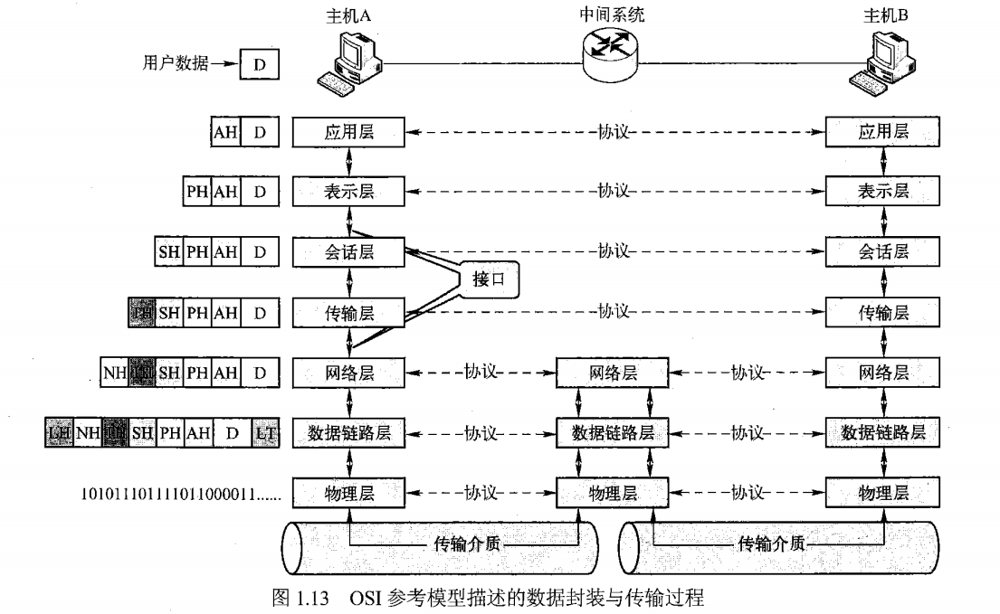


## 1.9.TCP/IP参考模型

TCP/IP模型是简化的OSI参考模型，是因特网采用的标准化体系结构：

* <font color='red'>网络接口层</font>：对应于OSI模型中的物理层和数据链路层（TCP/IP体系结构并没有对该层使用的协议做出强硬规定，允许主机连入网络时使用多种现成的和流行的协议）；
* <font color='red'>互联层（网际层）</font>：负责将源主机的报文分组发送到目的主机；
* <font color='red'>传输层（运输层）</font>：负责应用进程间的端到端的通信；
* <font color='red'>应用层</font>：为用户提供各种网络应用服务。


## 1.10.五层参考模型

综合OSI和TCP/IP的优点，理论模型和实际应用的结合：

* <font color='red'>应用层</font>：支持各种网络应用（FTP，HTTP，SMTP）；
* <font color='red'>传输层</font>：进程到进程间的数据传输（TCP，UDP）；
* <font color='red'>网络层</font>：源主机到目的主机的数据分组和路由转发（IP协议，路由协议）；
* <font color='red'>链路层</font>：相邻节点（主机，交换机，路由器等）的数据传输（以太网，WIFI，PPP）；
* <font color='red'>物理层</font>：比特流的传输。

数据封装：


## 1.11.例题

1. **若发送40字节的数据帧，从开始发送到收到确认帧的时间为120ms。设信道的数据传输速率为4Kbps，采用停等协议，帧的控制信息、确认帧长及帧处理时间均忽略不计。试求出信道的传播时延：**

   ```
   数据帧长度L=40byte*8=320bit
   信道的数据传输速率（链路带宽）R=4000bit/s
   开始发送到收到确认帧的时间t=120ms=数据帧传播时延+确认帧传播时延+数据帧传输时延=2dp+dt
   数据的传输时延dt=L/R=320bit/4000bps=0.08s=80ms
   信道的传播时延dp=(t-dt)/2=20ms
   ```

2. **考虑两台主机A和主机B由一条带宽为R（bit/s）、长度为D（m）的链路互连，信号传播速度为V（m/s）。假设主机A从t=0时刻开始向主机B发送分组，分组长度为L位。试求：**

   1. **传播延迟（时延）：**`dp = D/V`

   2. **传输延迟：**`dt = L/R`

   3. **若忽略节点处理延迟和排队延迟，则端到端延迟T是多少？**`T = 传输时延 + 传播时延 = L/R + D/V`

   4. **若dp>dt，则t=dt时刻，分组的第一位在哪里？**

      ```
      若dp>dt：说明第一位分组没有传输到接收端，还在链路上
      解：距离主机A的V*dt（距离=速度*时间）米的链路上
      ```

   5. **若V=250 000km/s，L=512bit，R=100Mbit/s，则使时延带宽积刚好为一个分组长度（即512bit）的链路长度D是多少？**

      ```
      时延带宽积G=传播时延dp*链路带宽R=(D/V)*R=512bit
      
      链路长度D=G*V/R=512bit*250000000m/s / 100000000bit/s = 1280m
      ```

3. **假设主机A向主机B以存储-转发的分组交换方式发送一个大文件。主机A到达主机B的路径上有3段链路，其速率分别是R1=500Kbit/s，R2=2Mbit/s，R3=1Mbit/s。试求：**

   1. **假设网络没有其他流量，则该文件传送的吞吐量是多少？**`吞吐量约等于瓶颈链路的带宽：500kbps`

   2. **假设文件大小为4MB，则传输该文件到主机B大约需要多少时间？**

      ```
      忽略传播时延，需要的时间等于分组大小除以瓶颈链路的带宽：
      T=4x1024x1024x8bit/(500x10^3)bps=67s
      ```

4. **假设主机A向主机B发送一个L=1500B的分组，主机A到达主机B的路径上有3段链路、2个分组交换机，3段链路的长度分别为D1=5000km、D2=4000km，D3=1000km；每段链路的传输速率均为R=2Mbit/s，信号传播速度为V=250000km/s，分组交换机处理每个分组的时延为dc=3ms。试求：**

   1. **若以存储-转发的分组交换方式，则该分组从主机A到达主机B的端到端时延是多少？**

      ```
      端到端时延 
      	=3段链路的传输时延+3段链路的传播时延+2个分组交换机的处理时延 
      	=3*(L/R)+(D1+D2+D3)/V+2*dc 
      	=3*((1500*8)/(2*10^6))+((5000*10^3)+(4000*10^3)+(1000*10^3))/(250000*10^3)+2*3ms/1000 
      	=0.064s
      	=64ms
      ```

   2. **若dc=0，且不采取存储-转发的分组交换方式，而是分组交换机直接转发收到的每个分组（即直通交换），则该分组从主机A到达主机B的端到到时延是多少？**`64ms - 2 * 3ms = 58ms`

5. **如下图所示的网络。A在t=0时刻开始向C发送一个2Mbits的文件；B在t=0.1+e秒（e为无限趋近于0的小正实数）向D发送一个1Mbits的文件。忽略传播延迟和结点处理延迟。（注：k=10^3^，M=10^6^）请回答下列问题：**

   

   1. **如果图中网络采用存储-转发的报文交换方式，则A将2Mbit的文件交付给C需要多长时间？B将1Mbit的文件交付给D需要多长时间？**

   ```
   由于采用了报文交换的方式，A的报文先到达第一个路由器，所以A的报文在路由器的队列中排在B的报文前面；
   
   由于忽略了传播延迟和结点处理延迟，所以只考虑传输时延和排队时延；
   
   A的交付时间=A第一段链路传输时延+A第二段链路传输时延+A第三段链路传输时延=2/10+2/20+2/10=0.5s=500ms
   
   B的交付时间=B第一段链路传输时延+排队时延（即A的第二段链路传输时延）+B第二段链路传输时延+B第三段链路传输时延=1/10+2/20+1/20+1/10=0.35s=350ms
   ```

   2. **如果图中网络采用存储-转发方式的分组交换，分组长度为等长的1kbits，且忽略分组头开销以及报文的拆装开销，则A将2Mbits的文件交付给C需要大约多长时间？B将1Mbits的文件交付给D需要大约多长时间？**

   ```
   从t=0时刻到t=0.1s+e时刻，A发送的分组数
      	=速度*时间
      	=(10Mbps*0.1s)
      	=1Mbits/1Kbits
      	=1000个分组
   
   从t=0.1s时刻起A与B共享第二段链路，平均各分到10Mbps带宽，A大约再用时
      	=第一段链路上所有分组的传输时延（即最后一个分组到达路由器1的时延）+后两段链路上最后一个分组的传输时延（因为最后一段分组到达路由器1时，前面的分组在之前已经向后发送一段时间了，所以只要求出最后一个分组通过连段链路的传输时延即可）
      	=剩余1000个分组*单个分组的传输时延+剩余两段链路*单个分组的传输时延 
      	=(1000*1000/10*10^6)+(2*1000/10*10^6) 
      	=0.1002s
   经过0.1002s交付剩余的1000个分组，故A向C交付2Mbits文件大约需要0.1+0.1002≈0.2s
   
   B向D交付1Mbits文件需要时间大约
      	=第一段链路上所有分组的传输时延+后两段链路上最后一个分组的传输时延		=(1000*1000/10*10^6)+(2*1000/10*10^6)
      	=0.1002s
      	≈0.1s
   ```
   3. **报文交换与分组交换相比，哪种交换方式更公平？**`分组交换更公平`


# 2.应用层

## 2.1.网络应用体系结构

C/S结构：

* 网络应用的通信双方为服务器程序和客户端程序，由客户端发送请求，服务端做出响应（Web应用，FTP，电子邮件，DNS等）；

  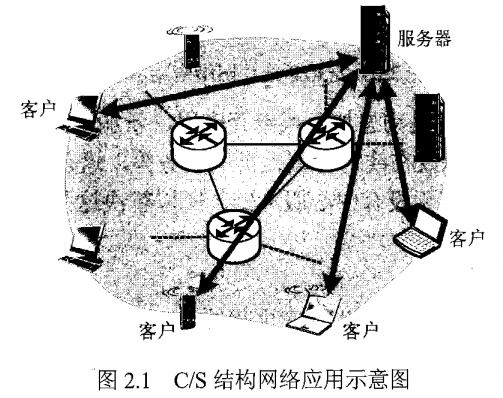

* 服务端：
  * 7*24提供服务；
  * 永久性的访问地址和域名；
  * 利用大量服务器实现可拓展。
  
* 客户端：
  * 主动与服务器通信，使用服务器提供的服务；
  * 间歇性的接入网络；
  * 可能使用动态IP地址；
  * 不会和其他客户机直接通信。
  
* 主要应用：web应用，电子邮件，FTP，DNS等。

P2P结构：

* 通信双方直接对等通信，每个对等端都既是服务器又是客户端，没有中心服务器（文件共享、文件分发、视频流服务、QQ、MSN、微信、pplive等）；

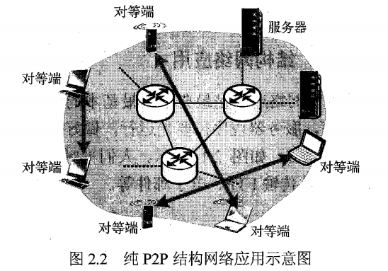

* 没有永远在线的服务器；
* 任意端系统/节点之间都可以直接通信；
* 节点间歇性的接入网络；
* 节点IP地址可改变；
* 优点是高度可伸缩，缺点是难于管理；
* 主要应用：文件共享，文件分发等；

* 混合结构：既有中心服务器的存在，又有对等端之间的通信。

  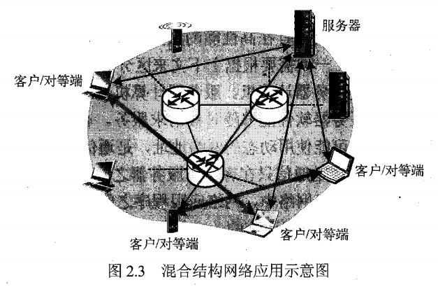

## 2.2.网络应用通信基本原理

* 通信过程：
  * 网络应用的本身是运行在不同主机或同一主机的不同应用进程间的通信；
  * 运行在不同主机上的应用进程以C/S的方式进行通信，服务器进程被动等待客户端请求服务，客户端主动发起连接请求。
* API：应用编程接口，应用层报文通过API将报文传递给传输层，请求传输层协议提供端到端的传输服务，如：socket套接字。
* 端口号：传输层协议为请求接口的每个套接字分配一个编号来标识套接字，这个编号就是端口号。
* 网络应用进程标识：通过进程所在的主机IP地址和其套接字所绑定的端口号可以标识应用进程。
* 网络应用与传输层服务：
  * TCP（面向连接的可靠字节流传输服务）：面向连接的服务-建立一条全双工的逻辑连接，可靠的数据传输服务-无差错，有序传输；
  * UDP（无连接的不可靠数据报传输服务）。

## 2.3.网络应用对传输服务的要求

* 数据丢失/可靠性：某些网络应用如网络电话等允许一定的数据丢失，某些网络应用如文件传输等要求100%可靠的数据传输；
* 时间延迟：某些网络应用如网络游戏/网络电话等需要低延时的环境；
* 带宽：某些网络应用如网络视频需要带宽达到最低要求时才能生效，某些应用如电子邮件能够适应任何带宽。

## 2.4.网络应用通信基本原理

网络应用需要遵循应用层协议。

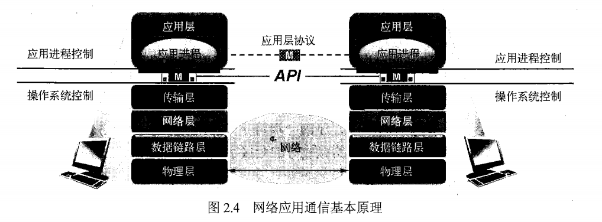

* <font color='red'>公开协议</font>：由RFC定义（IETF组织），允许互操作，HTTP，SMTP，FTP，......；
* <font color='red'>私有协议</font>：大多数的p2p文件共享应用。

## 2.5.DNS域名系统

* DNS的功能：将用户使用的域名映射为计算机使用的IP地址的过程称为域名解析，由域名服务器提供域名解析服务（<font color='red'>DNS使用UDP的53号端口</font>）；

* 层次化域名结构：
  * 三级域名，二级域名，顶级域名；
  * 顶级域名分类：
    * 国家级域名（<font color='red'>cn，us，uk等</font>）；
    * 通用级域名（<font color='red'>com，edu，net，org，gov，mil，int等</font>）；
    * 基础结构域名（<font color='red'>arpa用于反向域名解析</font>）。
  
* 域名服务器：

  1. 本地域名服务器（默认DNS，首先查询）；
  2. <font color='red'>根域名服务器（13个不同IP地址的根域名服务器，由英文字母a-m命名）</font>；
  3. 顶级域名服务器；
  4. <font color='red'>权威域名服务器（保存一个区内所有主机的域名到IP地址的映射）</font>；
  5. 中间域名服务器。

* 迭代解析：
  
  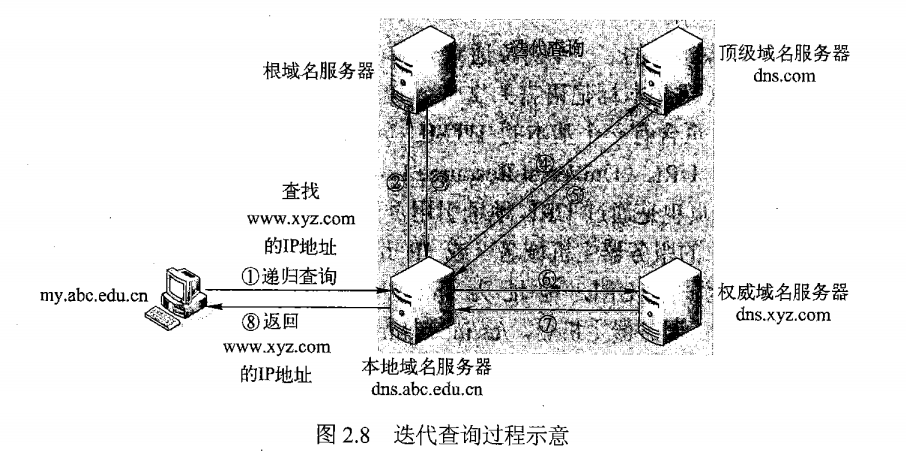
  * 首先请求本地DNS；
  * 本地DNS没有则代为请求根DNS；
  * 若是根DNS也没有则由本地DNS依次代为请求顶级DNS和权威DNS，直到成功解析返回或无法解析。
* 递归解析：

  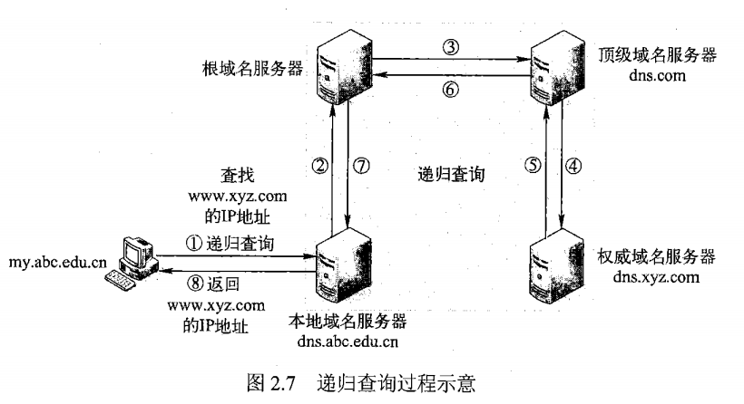

  * 首先请求本地DNS；
  * 没有则由本地DNS代为请求根DNS；
  * 也没有则由根DNS代为请求顶级DNS；
  * 若依旧没有则依次向高层的顶级和权威域名服务器递归请求，直到解析结果依次返回。
  

## 2.6.Web应用

* URL（统一资源定位器）：<font color='red'>协议类型、服务器主机域名、对象的路径名</font>；

* HTML（超文本标记语言）；

* HTTP（超文本传输协议）：
  * HTTP特点：web应用层协议（<font color='red'>使用TCP的80端口</font>），定义了浏览器如何向web服务器发送请求以及web服务器如何向浏览器进行响应（http/1.0，<font color='red'>http/1.1是目前使用的主要版本</font>，http/2.0）。

  * 非持久HTTP：http客户端与http服务器建立tcp连接后，通过该连接发送http请求报文，接收http响应报文，然后断开连接（<font color='red'>http/1.0使用的就是非持久连接</font>）；

  * 持久HTTP：

    * 非流水方式持久连接：建立一次tcp连接请求，等待其他所有很次连接的http请求响应后再断开；
    * 流水方式持久连接：建立一次tcp连接请求，多次相似的http请求可以同时处理，只占用一次RTT（http/1.1使用非持久连接）。

  * HTTP交互过程响应时间分析（持久连接和非持久连接响应时间比较）：

    例：设用户请求一个引用了3个jpeg小图像的web页面，响应时间如下，各需要几个RTT（请求响应时间）？
  
    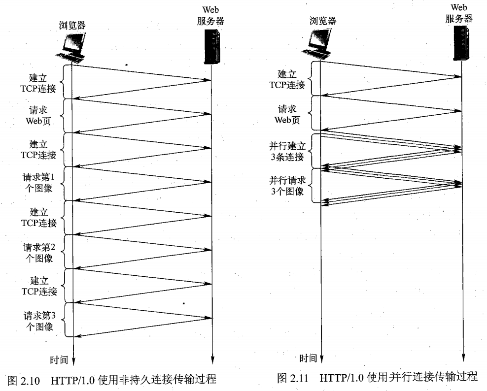

    非持久连接的方式需要使用8RTT。

    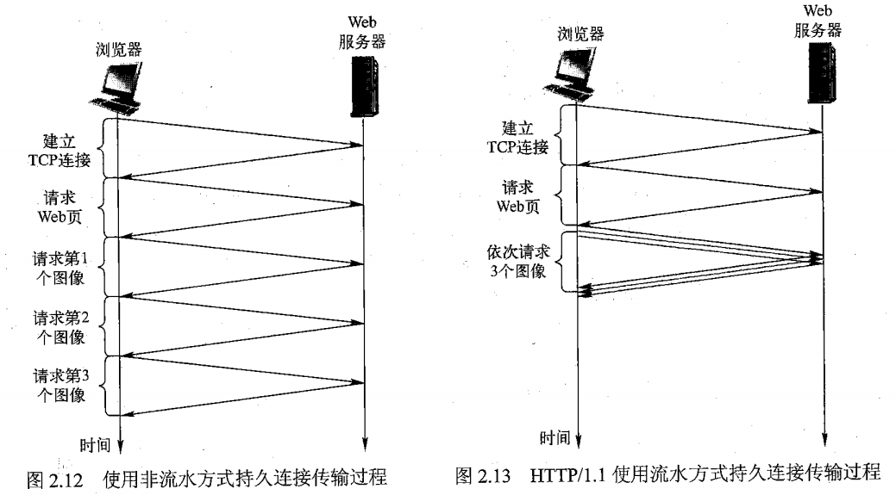
  
    非流水方式持久连接需要使用5RTT。流水方式持久连接需要使用3RTT。
  
  * HTTP报文：
  
  * 起始行、首部行、空白行、实体主体；
    * 请求报文的起始行：`<方法><URL><协议版本>`；

    
    * 响应报文的起始行：`<协议版本><状态码><短语>`；
  
    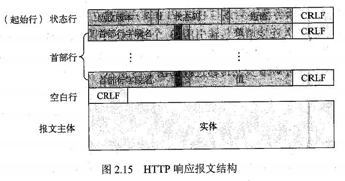
  
  
  * HTTP请求方法：
  
    * <font color='red'>GET：请求读取由URL所标识的信息，最为常用</font>；
    * HEAD：请求读取由URL标识的信息的首部，即无需在响应报文中包含对象；
    * POST：给服务器添加信息；
    * OPTION：请求一些选项的信息；
    * PUT：在指定的URL下存储一个文件。
  
* Cookie（小型文本文件）：

  * 指某些网站为了<font color='red'>辨别用户身份，进行会话跟踪而由服务器生成并存储在用户本地终端</font>上的数据；
  * cookie可以用于用户跟踪，实现在无状态的http协议上建立用户会话；
  * cookie技术主要包括4个部分：
    * http响应报文中的cookie头行：Set-Cookie；
    * 用户浏览器在本地存储，维护，管理的cookie文件；
    * http请求报文中的cookie头行：Cookie；
    * 网站在后台数据库中存储，维护cookie信息。
    
    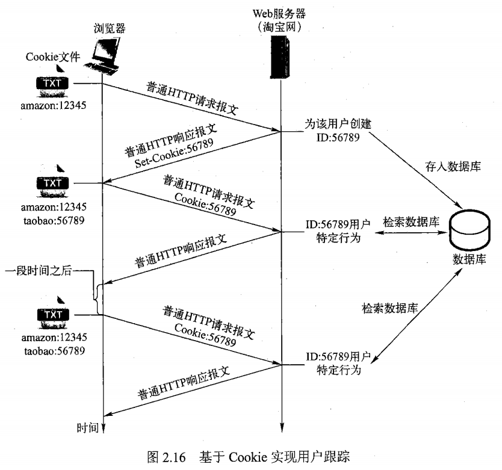

## 2.7.SMTP电子邮件传输协议

* 电子邮件系统结构：

  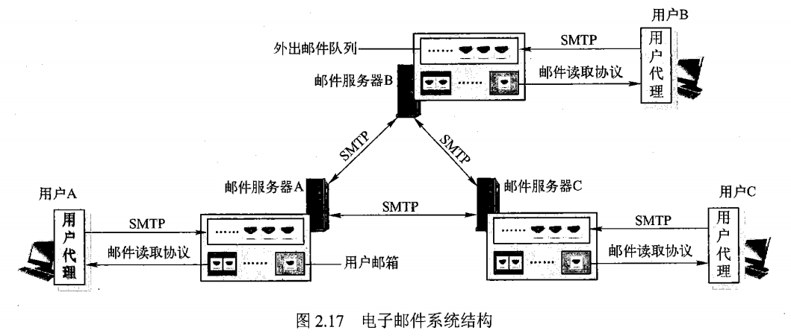

  * <font color='red'>邮件服务器、SMTP、用户代理、邮件读取协议</font>；
  * 电子邮件地址格式：<font color='red'>用户名@邮箱所在主机的域名</font>；
  * 用户代理：电子邮件应用的客户端软件（outlook、foxmail）。
  
* SMTP及其特点：
  * SMTP是电子邮件中核心应用层协议，实现邮件服务器之间或用户代理到邮件服务器之间的邮件传输，<font color='red'>使用TCP的25号端口进行可靠传输，使用</font>；
  * 特点：
    * SMTP只能传送7bit的ASCII码文本内容，包括SMTP命令，应答消息以及邮件内容 （<font color='red'>MIME：将非7bit的ASCII码文本转换为7bit文本内容的方案</font>）；
    * SMTP传送的邮件内容不能包含"CRLF.CRLF"；
    * SMTP是"推动"协议；
    * SMTP使用TCP连接是持久的。
  
* SMTP邮件发送过程：

  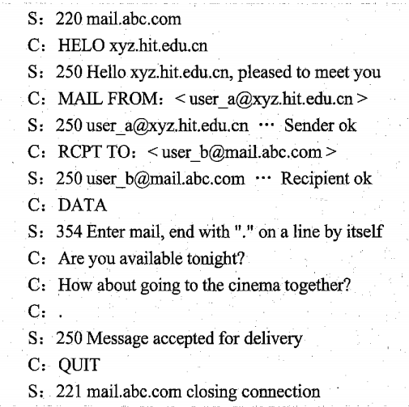

  1. 客户端主动请求与服务器建立tcp连接，服务器以<font color='red'>220</font>类型消息进行应答；
  2. 客户端通过<font color='red'>HELP命令向服务器发送自己的域名</font>，服务器以<font color='red'>250</font>类型消息进行应答，至此完成了握手；
  3. 客户端通过<font color='red'>MAIL FROM和RCPT TO命令向服务器通告邮件发送地址和接收地址</font>，服务器以<font color='red'>250</font>类型的消息分别进行响应；
  4. 客户端通过<font color='red'>DATA命令通知服务器准备开始发送邮件内容</font>，服务器以<font color='red'>354</font>类型消息进行应答；
  5. 客户端开始传输邮件内容，传输完成后发送<font color='red'>"CRLF.CRLF"通知服务器邮件内容发送完毕</font>，服务器以<font color='red'>250</font>类型消息进行应答；
  6. 客户端发送<font color='red'>QUIT命令请求关闭tcp连接</font>，服务器发送<font color='red'>221</font>类型应答，同意结束SMTP会话并断开连接。

* 邮件读取协议（用户代理读取邮件服务器中的邮件）：

  * IMAP：邮件的远程存储，存储在服务器上；
  * HTTP：读取web邮件；
  * POP3（<font color='red'>使用tcp的110号端口</font>）：

  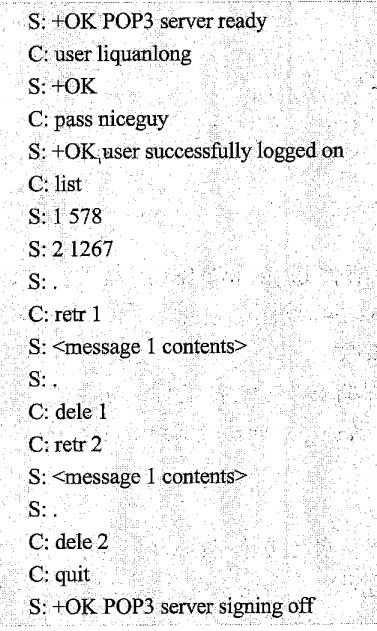

  1. 客户端请求tcp连接，成功建立后，服务端利用<font color='red'>"+OK POP3 server ready"</font>进行应答；
  2. 客户端使用<font color='red'>user和pass命令完成授权</font>；
  3. 客户端发送<font color='red'>list命令请求服务器发送邮件列表</font>，服务器应答的邮件列表包含邮件序号和邮件长度；
  4. 客户端发送<font color='red'>retr 1命令请求服务端传输第1封邮件</font>；
  5. 客户端发送<font color='red'>dele 1命令请求服务器为第1封邮件做删除标记</font>；
  6. 客户端发送<font color='red'>quit命令请求服务器真正删除已做标记删除的邮件，并断开连接</font>。

## 2.8.FTP文件传输协议

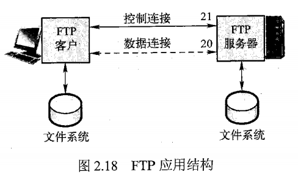

FTP协议及其特点：
* FTP文件传输协议是在互联网两个主机间实现文件互传的网络应用；
* 特点：
  * C/S模式；
  * <font color='red'>属于带外控制协议，也就是建立2个tcp连接</font>；
  * <font color='red'>通过服务端的TCP21号端口建立控制连接，用来传输控制信息，持久连接</font>；
  * <font color='red'>通过服务端的TCP20号端口建立数据连接，用来传输文件信息，非持久连接</font>；
  * 有状态协议，对每个进行中的用户会话的状态信息进行追踪；
  * 从客户端到服务器的命令和从服务器到客户端的应答都是以<font color='red'>7位ASCII码格式在控制连接上传输</font>的。

FTP协议常见命令：
* USER：用于向服务器发送用户标识；
* PASS：用于向服务器发送用户口令；
* LIST：用于从服务器获取当前目录下的文件列表；
* <font color='red'>RETR：用于从服务器的当前目录下载文件</font>；
* <font color='red'>STOR：用于向服务器的当前目录上传文件</font>。

## 2.9.P2P点对点传输协议

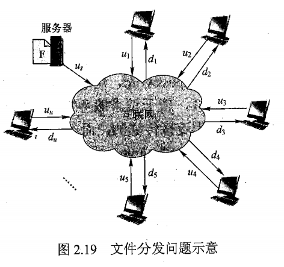

P2P应用特点：

* 对服务器的依赖很小；
* 应用动态的在对等方之间进行，具有很强的应用规模伸缩性；
* 充分聚集利用了端系统（对等方主机）的计算能力以及网络传输带宽。

P2P文件分发应用时间：

* p2p结构实现文件分发的最快时间几乎不会随着用户数量的增加而显著增加，当用户数据足够多时，最快分发时间趋近于一个常量。C/S结构下文件分发的时间随客户数量的增加而线性增减；

* 采用C/S体系结构实现文件分发的最小时间：
  $$
  D_{cs}=max\{nF/u_s,F/d_{min}\}
  $$

  $$
  dmin=min\{d_i|i\in[1,n]\}
  $$

  F表示要分发的文件，us为服务器接入网络链路的上行带宽，di表示第i个用户主机接入网络链路的下行带宽。

* 采用P2P体系结构实现文件分发的最小时间：
  $$
  D_{p2p}=max\{F/u_s,F/d_{min},nF/(u_s+\sum^{n}_{i=1}{u_i})\}
  $$

  $$
  dmin=min\{d_i|i\in[1,n]\}
  $$

  若us=ui=u，则公式为：
  $$
  D_{p2p}=max\{F/u,F/d_{min},{\frac{n}{n+1}}\cdot{\frac{F}{u}}\}
  $$

  F表示要分发的文件，us为服务器接入网络链路的上行带宽，di为第i个用户主机接入网络链路的下行带宽，ui为第i个用户主机接入网络链路的上行带宽。


## 2.10.Socket编程基础

Socket基本概念：

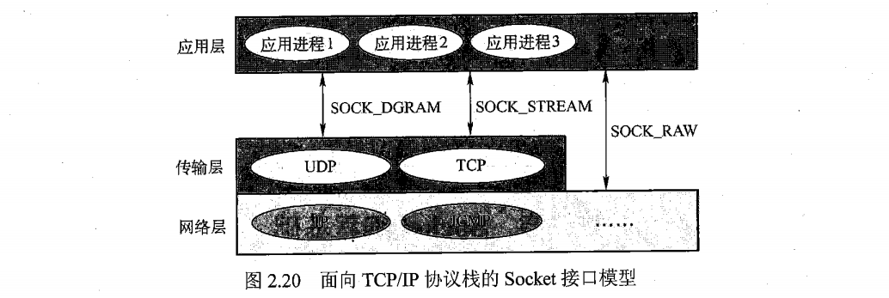

* 因特网中应用最为广泛的网络应用编程接口，实现与底层协议接口；
* 分类：
  * 数据报类型套接字SOCK_DGRAM（面向UDP接口）；
  * 流式套接字SOCK_STREAM（面向TCP接口）；
  * 原始套接字SOCK_RAW（面向网络层协议接口）。

主要Socket API系统调用及其过程：

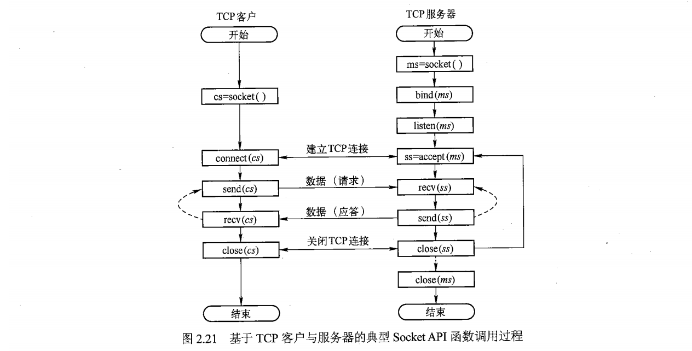

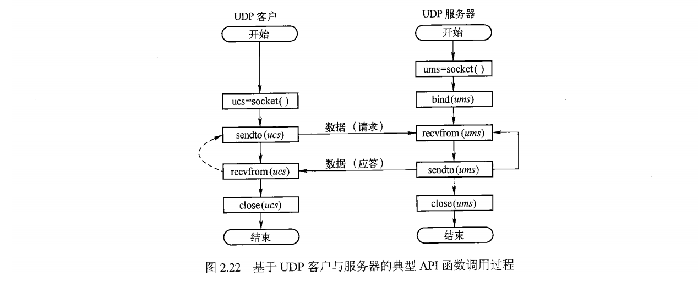

Socket API函数：
* 创建套接字：`socket()`；
* 关闭套接字：`close()`；
* 绑定套接字的本地端口地址：`bind()`；
* 设置服务端的流（TCP）套接字为监听状态：`listen()`；
* 将客户端套接字与服务端里连接：`connect()`；
* 从监听状态的流套接字的客户连接请求队列中出队一个，并创建新套接字来与客户套接字建立TCP连接：`accept()`；
* 基于UDP数据报发送数据：`sendto()`；
* 流式发送数据：`send()`；
* 基于UDP数据报接收数据：`recvfrom()`；
* 流式接收数据：`recv()`；
* 设置套接字选项：`setsockopt`；
* 读取套接字选项：`getsockopt`。

## 2.11.例题

1. **假设你在浏览某网页时点击了一个超链接，URL为 "http://www.kicker.com.cn/index.html"，且该URL对应的IP地址在你的计算机上没有缓存；文件index.html引用了8个小图像。域名解析过程中，无等待的一次DNS解析请求与响应时间记为RTTd，HTTP请求传输Web对象过程的一次往返时间记为RTTh。请回答下列问题：**

   1. **你的浏览器解析到URL对应的IP地址的最短时间是多少？ 最长时间是多少？**

      ```
      最短时间 = 请求本地域名服务器直接获取结果 = 1RTTd
      
      最长时间 = 请求本地域名服务器 + 请求根域名服务器 + 请求顶级域名服务器解析cn + 请求权威域名服务器解析com + 请求权威域名服务器解析kicker.com.cn = 5RTTd
      ```

      2. **若浏览器没有配置并行TCP连接，则基于HTTP1.0获取URL链接Web页完整内容（包括引用的图像，下同）需要多长时间（不包括域名解析时间，下同）？**

         ```
         http1.0属于非持久连接，每次请求都要先建立tcp连接：
         建立tcp连接 + 请求web页面 + (建立tcp连接 + 请求图像地址) * 8 = 18RTTh
         ```

   3. **若浏览器配置5个并行TCP连接，则基于HTTP1.0获取URL链接Web页完整内容需要多长时间？**

      ```
      http1.0属于非持久连接，每次请求都要先建立tcp连接：
      建立tcp连接 + 请求web页面 + 并行建立5个tcp连接 + 并行请求5个图像地址 + 并行建立3个tcp连接 + 并行请求3个图像地址 = 6RTTh
      ```

   4. **若浏览器没有配置并行TCP连接，则基于非流水模式的HTTP1.1获取URL链接Web页完整内容需要多长时间？基于流水模式的HTTP1.1获取URL链接Web页完整内容需要多长时间？**

      ```
      http1.1的持久非流水连接，只需要建立一次tcp连接：
      建立tcp连接 + 请求web页面 + 请求图像地址 * 8 = 10RTTh
      http1.1的持久流水连接，只需建立一次tcp连接，8个图像无阻塞式请求（连续请求无需等待响应）：
      建立tcp连接 + 请求web页面 + 连续请求图像地址 = 3RTTh
      ```

2. **考虑向N个对等方（用户）分发F=15 GB的一个文件。该服务器具有us=30 Mbit/s的上传速率，每个对等方的下载速度di=2 Mbit/s，上传速率为u。请分别针对客户/服务器分发模式和P2P分发模式两种情况，对于N=10、100 和 1000 以及 u=500 kbit/s、1 Mbit/s和2 Mbit/s的每种组合，绘制最小分发时间图表（注：K=10^3、M=10^6、G=10^9）。**

   ```
   n=10,u=500kbps:
   dcs = 10 * 15 * 1024 * 1024 * 1024 * 8 / 30 * 1000000
   dcs = 15 * 1024 * 1024 * 1024 * 8 / 500 * 1000
   ```

   | 客户-服务器模式 |       |   N    |         |
   | :-------------: | :---: | :----: | :-----: |
   |        u        |  10   |  100   |  1000   |
   |     500kbps     | 7500s | 50000s | 500000s |
   |      1Mbps      | 7500s | 50000s | 500000s |
   |      2Mbps      | 7500s | 50000s | 500000s |

   | P2P 模式 |       |   N    |        |
   | :------: | :---: | :----: | :----: |
   |    u     |  10   |  100   |  1000  |
   | 500kbps  | 7500s | 18750s | 28302s |
   |  1Mbps   | 7500s | 11538s | 14563s |
   |  2Mbps   | 7500s | 7500s  | 7500s  |


# 3.传输层

## 3.1.基本服务

* 传输层提供面向连接的可靠数据数据传输服务（tcp）和无连接的不可靠数据传输服务（udp），两种服务均不保证延迟和带宽；
* 功能：
  * 为应用进程间提供端到端的逻辑通信服务；
  * 传输层寻址；
  * 对应用层报文进行分段和重组；
  * 对报文进行差错控制；
  * 面向应用层实现复用和分解；
  * 端到端的流量控制；
  * 拥塞控制。

## 3.2.复用与分解

* 支持多个应用进程公用同一个传输层协议，并能够将接收到的数据准确交付给不同的应用进程；
* 在同一主机上，多个应用进程同时利用同一个传输层协议进行通信，此时该传输层协议就被多个应用进程复用；
* 传输层将同时接收到的不同应用进程的数据交付给正确的应用进程就叫做分解；
* 在internet中，唯一标识套接字的基本信息是ip地址和端口号；
* **UDP通过UDP套接字（目的IP地址，目的端口号）实现分解**；
* **TCP通过TCP套接字（源IP地址，源端口号，目的IP地址，目的端口号）实现分解**。

## 3.3.可靠传输基本原理

* 不可靠信道的不可靠性：出错，乱序，丢失；
* 实现可靠传输的措施：
  * **差错控制**：利用差错编码实现数据传输过程中的差错检测；
  * **确认**：接收方向发送方反馈接收状态。若接收方接收的数据未发生错误且是接收方期望接收的数据，则发送ACK数据包，称为肯定确认，表示已正确接收数据，否则发送NAK数据包，称为否定确认，表示没有正确接收数据；
  * **重传**：发送方重新发送接收方还没有正确接收的数据；
  * **序号**：确保数据按序提交，避免数据被重复提交；
  * **计时器**：解决数据丢失问题。发送方在发送数据包后启动计时器，若计时器发生超时还没收到接收方确认，就认为数据丢失主动重传；
  * **停-等协议**；
  * **滑动窗口协议**。

## 3.4.停-等协议

* 基本原理：

  * 也称ARQ自动重传请求协议；
  * 发送方发送经过差错编码和编号的报文段，等待接收方确认；
  * 接收方如果正确接收报文段，即差错控制无误且序号正确，则接收报文段并向发送方发送ACK，否则丢弃报文段并向发送方发送NAK；
  * 发送方若收到ACK，则继续发送后续报文段，否则重新发送失败的报文端；
  * <font color='red'>发送窗口Ws = 1，Wr = 1</font>。

* 信道利用率：
  $$
  Usender=t_{seg}/(t_{seg}+RTT+t_{ACK})
  $$
  假设ACK分组很小，可以忽略其发送时间，公式可以简化为：
  $$
  Usender=t_{seg}/(t_{seg}+RTT)
  $$
  停-等协议的信道利用率很低。

## 3.5.滑动窗口协议

* 基本原理：

  * 对分组连续编号，发送方按流水线方式依序发送分组；
  * 接收方接收分组，按分组序号向上有序提交，并通过确认向发送方通告正确接收的分组序号或出现差错的分组序号；
  * 发送方根据收到ACK中的序号以及计时器等，判断是向接收方继续发送新分组，还是重发已发送的某分组；
  * 在滑窗协议中，发送方对已经发送但未收到确认的分组，必须缓存；接收方对未按序到达的无差错分组，可以选择缓存或丢弃（取决于接收方的能力）；
  * 发送方和接收方各自维护一个窗口，称为发送窗口Ws和接收窗口Wr；
  * 发送窗口的大小表示发送方可以发送且未被确认的分组的最大数量，接收窗口大小表示接收方可以接收并缓存的正确到达的分组的最大数量。

* 信道利用率：
  $$
  Usender=W_s*t_{seg}/(t_{seg}+RTT+t_{ACK})
  $$

  > Ws是发送窗口大小，tseg是发送分组的传输时延，一次请求的往返时间，tack是应答报文的传输时延
  
* 滑窗协议的窗口大小与序号空间需要满足约束条件：

  * 发送窗口大小与接收窗口大小之和不大于分组序号空间大小；

  * 假设报文段的序号采用k位二进制串进行编号，则其编号空间为：0~2^K-1，即Ws+Wr<=2^k：
    $$
    GBN协议：Ws<=2^k-1
    $$

    $$
    SR协议：Ws<=2^{k-1}
    $$

* 发送窗口：

  * 
  * 已发送且已收到ACK的分组序号：1、2、3、4，这部分的序号会滑出窗口；
  * 发送窗口Ws的大小为7，目前窗口内的序号：5，6，7，8，9，10，11；
  * 窗口内的基序号：5是滑出窗口的最后一个序号加一，窗口内的序号会根据基序号依次递增；
  * 窗口内已发送但未收到ACK的序号：5、6、7，被这些序号标识的分组被缓存，序号被占用，且未滑出窗口；
  * 窗口内发送并已收到ACK但没有按序发送的分组序号：8号被占用，未滑出窗口；
  * 窗口内可使用但未使用的序号：9、10、11。

* 接收窗口：

  
  * 已接收且已向应用层提交的分组序号：1、2、3、4、5；
  * 接收窗口Wr的大小为5，目前窗口内的序号：6、7、8、9、10；
  * 窗口内的基序号：6是滑出窗口的最后一个序号加一，也就是目前最有希望收到的分组，窗口内的序号会根据基序号依次递增；
  * 窗口内已正确接收但未按序到达的分组：8号尚未向上提交，根据接收端的缓存能力选择是否缓存分组；
  * 窗口内可以接收但尚未收到分组的序号：9、10。

* GBN回退N帧协议：
  
  
  
  * 当接收方检测出失序的信息帧后，要求发送方重发最后一个正确接受的信息帧之后的所有未被确认的帧；
  * 或当发送方发送了n个帧后，若发现该n帧的前一帧在计时器超时区间内仍未返回其确认信息，则该帧被判定为出错或丢失，此时发送方不得不重新发送该出错帧及其后的n帧；
  * <font color='red'>发送窗口Ws>1，接收窗口Wr=1</font>，接收窗口缓存能力为1，所以只能累计确认最后一个正确接收的信息帧；
  * 累积确认，只会确认最后一个正确接收的信息帧，回退也是从最后一个确认的信息帧向后回退。
  
* SR选择重传协议：
  
  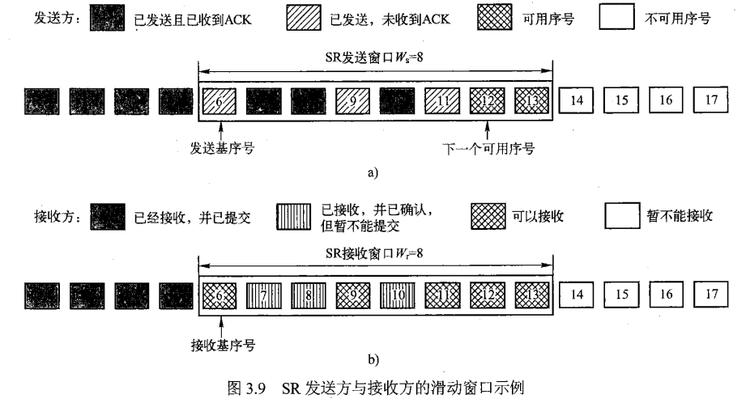
  
  * 发送方仅重传那些未被接收方确认（出错或丢失）的分组，从而避免了不必要的重传；
  * <font color='red'>发送窗口Ws>1，接收窗口Wr>1</font>；
  * 接收方对每个正确接收的分组逐个确认。

## 3.8.UDP用户数据报协议

* 特点：无连接，尽力交付，面向报文，首部开销小，支持一对一、一对多、多对多；
* 数据报结构：


* 校验和计算：
  * 对所有参与运算的校验和内容（2byte=16bit）按二进制16位对齐求和，求和过程中的任何溢出都会被回卷（即进位与和的最低位再加），最后得到的和取反码，就是UDP首部校验和；

  * 参与校验和运算的内容包括：UDP伪首部，UDP首部，应用层数据。

  * ```
    0110011001100000
    0101010101010101
    
    1011101110110101
    0100010001001010
    ```

## 3.9.TCP传输控制协议

面向连接，每一条tcp连接只有2个端点，可靠交付，全双工，面向字节流。

### 3.9.1.报文段结构


| 保留关键字 |           解释           |
| :--------: | :----------------------: |
|    URG     |       紧急指针字段       |
|    ACK     |       确认序号字段       |
|    PSH     | 推送字段，应用层数据传输 |
|    RST     |       连接重置字段       |
|    SYN     |       建立连接字段       |
|    FIN     |       关闭连接字段       |

### 3.9.2.序号与确认序号

* 序号：TCP的序号是对每个应用层数据的每个字节进行编号，因此TCP报文段的序号应该是该段所封装的应用层数据首字节的序号；

* 确认序号：期望从对方接收的下一个字节的序号；

* 假定主机A想通过TCP连接发送一个包含5000000byte的数据流，其MSS（最大报文段长度）为1000byte，数据量流的首字节编号是0，该TCP将为该数据流构建500个报文段，第一个分配序号0，第二个分配序号1000，依次类推，每一个序号都被填入到相应TCP报文段首部的序号字段中；

* 

* 假定主机B已经收到了来自主机A的序号为0-535的所有字节，这时B打算向A发送一个报文段，因为此时主机B在等待主机A的数据流中536号字节和其之后的，所以主机B会在发送给A的报文段的确认序号字段中填上536；

* 假定主机B已经收到主机A的包含0-535byte和900-1000byte的报文段。由于某种原因，主机B还未收到536-899的报文段，此时为了重新构建主机A的数据流，仍需等待字节536和其后字节，因此B到A的下一个报文段将在确认序号字段中填上536。


### 3.9.3.建立连接-三次握手


* 第一次握手：客户端发起连接建立的请求，初始序号x，发送（SYN=1，seq=x）的SYN段，客户端状态由CLOSE（初始）进入SYN_SEND（同步已发送）状态，等待服务器确认；
* 第二次握手：服务器收到客户发送的SYN段后，初始序号y，发送（SYN=1，ACK=1，seq=y，ack_seq=x+1）的SYNACK段，这时服务器的状态由LISTEN（监听）进入SYN_RCVD（同步已接收）状态；
* 第三次握手：客户端收到服务器的SYNACK段后，发送（ACK=1，seq=x+1，ack_seq=y+1）的ACK段，这时客户端进入ESTABLISHED（已建立）状态，服务器收到ACK段后也进入ESTABLISHED（已建立）状态，至此连接建立。

### 3.9.4.释放连接-四次挥手


* 第一次挥手：当客户端发送完最后一个数据段后，可以发送FIN段（FIN=1，seq=u）请求断开客户端到服务器的连接，其状态由ESTABLISHED进入FIN_WAIT_1，在该状态下只能接收服务器发送的数据但不能再发送数据了；
* 第二次挥手：服务器收到FIN段后，向客户端发送一个ACK段（ACK=1，seq=v，ack_seq=u+1），服务器状态由ESTABLISHED进入CLOSE_WAIT，在该状态下服务器仍可发送数据但不能接收数据了。当客户端收到ACK段，其状态由FIN_WAIT_1进入FIN_WAIT_2，仍然可以接收服务器的数据，此时TCP连接已经关闭了客户端向服务器方向的数据传输，也称半关闭；
* 第三次挥手：当服务器向客户端发送完最后一个数据段后，服务器向客户端发送FIN段（FIN=1，ACK=1，seq=w，ack_seq=u+1），该数据段也不携带应用层数据，此时服务器状态由CLOSE_WAIT进入LAST_ACK并不再发送数据；
* 第四次挥手：当客户端收到服务器发送的FIN段后，向服务器发送ACK段（ACK=1，seq=u+1，ack_seq=w+1），其状态由FIN_WAIT_2进入TIME_WAIT，等待2MSL时间后进入CLOSED状态，最终释放连接。服务器收到该ACK后，状态由LAST_ACK进入CLOSED，最终释放连接。

### 3.9.5.可靠数据传输机制

* TCP的可靠数据传输实现包括**差错编码、确认、序号、重传、计时器**等：
  * 序列号是针对每个字节的编号；
  * 确认序号指期望接收的字节序号，TCP通常采用累积确认；
  * 通常采用单一的重传计时器，计时器超时时间采用自适应算法设置超时时间；
  * 重传数据段主要针对两类事件，计时器超时和三次重复确认（TCP快速重传）。
  
* TCP的可靠传输基于**滑动窗口协议**，发送窗口大小动态变化，任一时刻的**发送窗口等于接收窗口和拥塞窗口取最小值**：
  $$
  W_s = min\{W_r,CongWin\}
  $$
  
* 可靠传输的工作机制：
  * **分组**：应用层数据被分割成TCP认为最适合发送的数据块（MSS），封装成TCP段，传递给IP；
  * **计时器**：当TCP发出一个段后，启动一个计时器，等待目的端确认收到这个报文段；
  * **校验和**：TCP首部中有校验和字段，用于检测数据在传输过程中是否发生差错；
  * **排序**：TCP将收到的错序报文段进行重新排序，以正确的顺序交给应用层；
  * **去重**：接收端根据序号丢弃重复的报文段；
  * TCP能够提供流量控制。
  
* 快速重传：

### 3.9.7.流量控制

* 协调发送方与接收方的数据发送与接收速度，避免因发送方发送数据太快，超出接收方的数据接收和处理能力，导致接收方被数据"淹没"，即：数据的到达速度超出接收方的接收、缓存或处理能力，致使数据在接收方被丢弃；
* TCP使用**窗口机制**进行流量控制（接收窗口）：
  * 连接建立时，接收端分配一块缓冲区用来存储接收的数据，并将缓冲区的尺寸发送给发送端；
  * 接收方发送的确认信息中包含了自己剩余的缓冲区尺寸；
  * 接收方剩余缓冲区空间的数量叫做窗口。


### 3.9.8.拥塞控制

* 基本概念：
  * 拥塞：大量的主机高速向网络发送大量的数据，超出了网络处理能力，导致大量分组"拥挤"在网络中间设备的队列中等待转发，网络性能显著下降的现象；
  * 拥塞控制：通过合理调度、规范、调整向网络中发送数据的主机数量、发送速率或数据量，以避免拥塞或尽快消除已发生的拥塞。
* TCP拥塞控制：
  * 采用拥塞控制窗口机制，通过调节窗口的大小实现对发送速率的调整；

  * TCP的拥塞窗口CongWin：发送端维持一个拥塞窗口用于**表示在未收到接收端确认的情况下，可以连续发送的数据字节数**。 CongWin的大小取决于网络的拥塞程度，并且动态地发生变化；

  * AIMD：网络未发生拥塞时，逐渐"加性"增大窗口大小，当网络拥塞时"乘性"快速减少窗口大小（拥塞控制基本思想）；

  * 发送端判断网络拥塞的依据是发生计时器超时或对某个报文段的3次重复确认（报文丢失）；

  * TCP拥塞控制窗口的调节，分为**慢启动**阶段和**拥塞避免**阶段：
    
    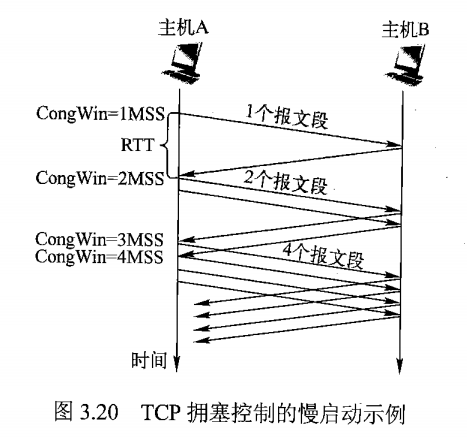
    
    * 慢启动阶段从一个MSS快速增长，达到某个阈值后转为拥塞避免阶段；
    * 在慢启动阶段，每收到1个确认段，拥塞窗口增加1个MSS，在1次RTT内拥塞窗口可以连续将所有报文段全部发送出去，也就是每经过1个RTT，拥塞窗口增长1倍；
    * 在拥塞避免阶段，每经过1个RTT，拥塞窗口才增加1个MSS。
    
  * TCP的拥塞控制算法：慢启动、拥塞避免、快速重传、快速恢复。

  * 计时器超时情况：

    

    * 在慢启动阶段，每次RTT都会让拥塞窗口扩大一倍，直到窗口大小到达Threshold阈值时，拥塞控制会进入拥塞避免阶段；
    * 在拥塞避免阶段，每次RTT只会增加窗口中的一个MSS，直到网络发送了拥塞，也就是计时器超时发送的丢失现象，这是拥塞控制会重新进入慢启动阶段，拥塞窗口复原为初值，此时阈值会更新为网络拥塞时窗口大小的一半；
    * 反复执行这个过程，实现TCP的拥塞控制。

  * 快速确认情况：
    
    
    * 与计时器超时发生网络拥塞的情况类似，在收到接收方3次重复确认（快速重传）的情况下，证明网络拥塞并不严重，不会直接进入慢启动阶段并将拥塞窗口复原为初值，而是更新阈值并进入拥塞避免阶段，这种处理方法称为快速恢复；
    * 注：拥塞窗口从网络拥塞阶段缩减到慢启动或拥塞避免阶段时会消耗一次RTT。

## 3.10.例题

1. **实现可靠数据传输的主要措施有哪些？这些措施主要用于解决哪些问题？**

   ```
   差错控制：数据传输过程差错的检验
   确认：数据是否正确接收的检验
   重传：重新发送未正确接收的数据
   序号：保证数据的按序和不重复提交
   计时器：超时机制解决数据的丢失问题
   ```

2. **UDP与TCP分别如何实现复用与分解？**

   ```
   UDP：UDP套接字（目的IP，目的端口）
   TCP：TCP套接字（源IP，源端口，目的IP，目的端口）
   ```

3. **请画出TCP报文结构，并简要说明各个字段的主要作用**

   ```
   源端口：发送方端口，目的端口：接收方端口，序号：所封装的数据首字节序号，确认序号：期望从对方接收的下一个字节的序号，首部长度，保留字段：ACK、SYN、FIN 、 …，接收窗口：滑动窗口，紧急指针：，选项：，填充：，数据：应用层字节数据。
   ```

4. **请说明TCP建立连接与断开连接的过程，并给出主要状态转移。**

   ```
   三次握手：C发送SYN(SYN=1,seq=x)段，从CLOSE进入SYN_SEND；S接收后发送SYNACK(SYN=1,ACK=1,seq=y,ack_seq=x+1),从LISTEN进入SYN_RCVD;C接收后发送ACK(ACK=1,seq=x+1,ack_seq=y+1)段,进入ESTABLISHED,S接收后也进入ESTABLISHED状态。
   
   四次挥手：C发送FIN(FIN=1,seq=u)段，从ESTABLISHED进入FIN_WAIT_1状态，C此时不能发只能收；S收到后发送ACK(ACK=1，seq=v,ack_seq=u+1)段，从ESTEBLISHED进入CLOSE_WAIT状态，S此时只发不收，C收到后进入FIN_WAIT_2状态；S发送FIN(FIN=1,ACK=1,seq=w,ack_seq=u+1),进入LAST_WAIT状态，S此时不再发送数据；C收到后发送ACK段(ACK=1,seq=u+1,seq_ack=w+1),进入TIME_WAIT状态，过2msl进入CLOSE状态，S收到数据后也进入CLOSE状态。
   ```

5. **TCP如果保证可靠数据传输？**

   ```
   基于滑动窗口协议，机制包括差错控制、确认、序号、重传、计时器。分组，计时器，校验和，排序，去重。
   ```

6. **TCP如何实现拥塞控制？**

   ```
   通过TCP拥塞窗口实现，慢启动和拥塞避免两个阶段：
   1.慢启动阶段：拥塞窗口每次接收确认都会增加1MSS，也就是说每经过1RTT都会扩增一倍；
   2.拥塞避免阶段：此时拥塞窗口每经过一个RTT才会增加1MSS。
   ```

7. **假设甲乙双方采用GBN协议发送报文段，甲已经发送了编号为0~7的报文段。当计时器超时时，若甲只收到0号和3号报文段的确认，则甲需要重发的报文段是哪些？**

   ```
   根据GBN累计确认的模式，只会重发最后一个正确接收的信息帧之后的未被确认的帧：4、5、6、7
   ```

8. **主机甲与主机乙之间已经建立一条TCP连接，主机甲向主机乙发送了两个连续的TCP段，分别包含300字节和500字节的有效载荷，第一个段的序列号是200，主机乙正确收到两个段后，发送给主机甲的确认序列号是多少？**

   ```
   第一段开始序号是200，tcp从200开始为每个字节进行编号，连续发送的两个tcp段：200~499，500~999，所以两段发送后的确认序号是1000。
   ```

9. **主机甲与主机乙之间已建立一个TCP连接，主机甲向主机乙发送了3个连续的TCP报文段，分别包含300字节、400字节和500字节的有效载荷，第3个段的序号为900。若主机乙仅正确接收到第1和第3个报文段，则主机乙发送给主机甲的确认序号是多少？**

   ```
   第3段的序号是900，前两段连续报文段序号为700，所以起始序号为200，此时为了重新构建主机A的数据流，仍需等待未正确接收的第2个报文段，所以从200~499是第2段的序号，乙发送的确认序号是500。
   ```

10. **主机甲与主机乙之间已建立一个TCP连接，双方持续有数据传输，且数据无差错与丢失。若甲收到1个来自乙的TCP段，该段的序号为1913、确认序号为 2046、有效载荷为100字节，则甲立即发送给乙的TCP段的序号和确认序号分别是多少？**

    ```
    乙发送的确认序号为2046，即期望获得的下一个字节序号为2046，所以甲发送的TCP序号为2046；
    乙发送的序号为1913，载荷为100byte，所以甲发送的TCP确认序号是2013。
    ```

11. **主机甲乙通过128kbit/s卫星信道互连，采用滑动窗口协议发送数据，链路单向传播时延250ms，分组长度为1000字节。不考虑确认分组的开销，为使信道利用率不小于80%，分组序号的位数至少要达到多少位？**

    ```
    链路带宽 = R = 128kbps = 128 * 10^3 = 128000bps
    单向传播时延 = dp = 250ms = 0.25s
    分组长度 = 1000byte = 1000 * 8 = 8000bit
    滑窗协议信道利用率 = Usender = Ws * tseg / (tseg + RTT + tack) = 80% = 0.8
    分组传输时延 = tseg = dt = L/R = 8000 / 128000 ≈ 0.06s
    一次请求的往返时间RTT = dp * 2 = 0.5s
    窗口大小 = Ws = 0.8 * (dt + RTT) / dt = 0.8 * 0.56 / 0.06 ≈ 7
    若使用GBN协议，则分组序号的位数k：Ws = 7 <= 2^k - 1, k = 4 
    若使用SR协议，则分组序号的位数k：Ws = 7 <= 2^(k-1), k = 4
    ```

12. **若甲乙之间已建立一条TCP连接，拥塞控制处于拥塞避免阶段，阈值为8 MSS，当甲的拥塞窗口大小为24 MSS时发生了超时，则甲的拥塞窗口和阈值将分别调整为多少？**

    ```
    因为是计时器超时发生的网络拥塞，所以拥塞控制进入慢启动阶段，此时拥塞窗口为1MSS，阈值重新调整为超时窗口的一半即12MSS。
    ```

13. **主机甲和主机乙已建立了TCP连接，甲始终以MSS=1 KB大小的报文段发送数据，并一直有数据发送；乙每收到一个报文段都会发出一个接收窗口为10 KB的确认段。若甲在t时刻发生超时时拥塞窗口为8 KB，则从t时刻起，不再发生超时的情况下，经过10个RTT后，甲的发送窗口是多少？**

    ```
    阈值减半为4kb，进入慢启动阶段，经过3次RTT（0-1，1-2，2-4）窗口为4kb进入拥塞避免阶段，加上剩余7次RTT的7kb = 11kb
    发送窗口 = min{接收窗口,拥塞窗口} = min{10kb,12kb} = 10kb
    ```

14. **主机甲和主机乙之间已建立了一个TCP连接，TCP最大段长度为1000字节。若主机甲的当前拥塞窗口为4000字节，在主机甲向主机乙连续发送两个最大段后，成功收到主机乙发送的对第一个段的确认段，确认段中通告的接收窗口大小为2000字节，则此时主机甲还可以向主机乙发送的最大字节数是多少？**

    ```
    TCP最大段1000字节，甲的拥塞窗口4000字节，说明可以连续发送4个TCP最大段；
    甲连续发送两段1000字节后，收到对第一段1000字节的确认，并通告接收窗口2000字节，除去第二段已经发送的1000字节，甲还能向乙再发送1000字节的数据。
    ```

15. **假设主机A向主机B发送5个连续的报文段，主机B对每个报文段进行确认，其中第二个报文段丢失，其余报文段以及重传的第二个报文段均被主机B正确接收，主机A正确接收所有ACK报文段；报文段从1开始依次连续编号（即1、2、3……），主机A的超时时间足够长。请回答下列问题：**

    1. **如果分别采用GBN、SR和TCP协议，则对应这三个协议，主机A分别总共发了多少个报文段？主机B分别总共发送了多少个ACK？它们的序号是什么？(针对3个协议分别给出解答）**

       ```
       GBN：
       	主机A总共发送9个报文段：若第二个报文段丢失，那么2，3，4，5会重新传，所以1，2，3，4，5，2，3，4，5；
       	主机B总共发送8个ACK段：第二个丢失不发，其他每收到一个发一个ACK，所以1，3，4，5，2，3，4，5。
       SR：
       	主机A总共发送6个报文段：只会重传丢失的2，所以1，2，3，4，5，2；
       	主机B总共发送5个ACK段：第二个丢失不发，其他每收到一个发一个ACK，所以1，3，4，5，2。
       TCP：
       	主机A总共发送6个报文段：只会重传丢失的2，所以1，2，3，4，5，2；
       	主机B总共发送5个ACK段：ack_seq=2会发送4次（1号报文成功接收后正常发送1次，快速重传机制发送3次），根据tcp累计确认的特性，最后会发送ack_seq=5。
       ```

    2. **如果对上述三个协议，超时时间比5RTT长得多，那么哪个协议将在最短的时间间隔内成功交付5个报文段？**

       ```
       TCP的快速重传机制，不需要等待超时就可以重传。
       ```

16. **假设A、B两个端系统通过唯一的一条8Mbps链路连接（M=10^6），该链路的双向传播时延是150ms；A通过一个TCP连接向B发送一个大文件，B的接收缓存足够大，每个TCP段最大段长度（MSS）为1500字节，TCP采用Reno版本，且总是处于拥塞避免阶段（即忽略慢启动）。请回答下列问题：**

    1. **该TCP连接能够获得的最大窗口尺寸（以TCP段数计）是多少？**

       ```
       设W是最大窗口尺寸，当最大发送速率超过链路带宽时会发生丢包，因此：W*MSS/RTT=8Mbps，于是W=100。
       ```

    2. **该TCP连接的平均窗口尺寸（以TCP段数计）和平均吞吐量（以bps计）是多少？**

       ```
       拥塞窗口从W/2（50）到W(100)之间变化，平均窗口尺寸:(50+100)/2=75 ；因此平均吞吐量为：75*1500*8/0.15=6Mbps。
       ```

    3. **该TCP连接的拥塞窗口从发生丢包到恢复到最大窗口尺寸要经历多长时间？**

       ```
       0.15*100/2=7.5秒，因为每个RTT窗口尺寸增加1个MSS。
       ```


# 4.网络层

## 4.1.网络层服务

* 网络互连：网络层是网络核心的最高层，是实现大型网络互连的关键，是网络体系结构中最重要的一层；
* 分组转发：当通过一条输入链路接收到一个分组后，路由器需要决策通过哪条链条将分组转发出去，并将分组从输入接口转移到输出接口；
* 路由选择：当分组从源主机流向目的主机时，必须通过某种方式决定分组经过的路由或路径，计算分组所经过的路径的算法被称为路由选择算法；
* 服务类型：数据报服务和虚电路网络。

## 4.2.数据报网络与虚电路网络

* 虚电路交换与数据报交换特点的比较：

  |        项目        |                     虚电路交换                     |            数据报交换            |
  | :----------------: | :------------------------------------------------: | :------------------------------: |
  |        连接        |                   需要先建立连接                   |          不需要建立连接          |
  |        地址        |            每个分组含有一个短的虚电路号            |   每个分组包含源地址和目的地址   |
  |      分组顺序      |                 按序发送，按序接收                 |     按序发送，不一定按序接收     |
  |      路由选择      | 建立VC时需要路由选择，之后所有分组都沿此条路径转发 |        对每个分组独立选择        |
  | 转发结点失效的影响 |              所有经过失效结点的VC终止              | 除了崩溃时丢失分组外，无其他影响 |
  |      差错控制      |                   由通信网络负责                   |           由端系统负责           |
  |      流量控制      |                   由通信网络负责                   |           由端系统负责           |
  |      拥塞控制      |    若有足够的缓冲区分配给已建立的VC，则容易控制    |           由端系统负责           |
  |      状态信息      |    建立的每条VC都要求占用经过的每个结点的表空间    |        网络不存储状态信息        |
  |      通信类型      |                传输质量要求高的通信                |       数据通信，非实时通信       |
  |      典型网络      |                 X.25、帧中继、ATM                  |             Internet             |

*  数据报网络与虚电路网络的工作原理：

  

  

## 4.3.网络互连与网络互连设备

* 异构网络互连：
  * 网络层协议：IP；
  * 网络层寻址：IP地址；
  * 网络层互连设备：IP路由器。
* 路由器：
  * 功能：实现网络层的路由选择与分组转发；
  * 体系结构：
    * 输入端口：负责从物理接口接收信号，还原数据链路层帧，提取IP数据报（或其他网络层协议分组），根据IP数据报的目的IP地址检索路由表，决策需要将该IP数据报交换到哪个输出端口；
    * 交换结构：将输入端口的IP数据报交换到指定的输出端口，基于<font color='red'>内存交换（性能最差）、总线交换、网络交换（性能最佳）</font>；
    * 输出端口：首先提供缓存队列功能，让交换到该端口的待发送分组排队，并从队列中不断的取出分组进行数据链路层数据帧的封装，最后通过物理线路端发送出去；
    * 路由处理器：路由器的CPU，负责执行路由器的各种指令，包括路由协议的运行、路由计算、路由表的更新维护等。
  * 路由表：
    * 路由器是根据路由表来进行分组的转发；
    * 路由表的组成：目的网络、吓一跳地址、接口。

## 4.4.网络层拥塞控制

* 拥塞的定义：

  在分组交换网络中，由于众多的用户随机的将信息送入网络中，使网络中需要传输的信息总量大于其传输能力，以至于某些网络结点因为缓冲区已满，从而无法接收新到达的分组，此时就发送了拥塞现象。

  

  当网络负荷增加到某一值后，网络吞吐量反而下降，表征就是网络出现了拥塞现象。

* 拥塞控制的定义：根据网络的通过能力或网络拥挤程度，来调整数据发送速率和数据量的过程，叫做拥塞控制。拥塞控制主要考虑端系统之间的网络环境，目的是使网络负载不超过网络的传送能力；

* 发生拥塞的原因：
  * 缓冲区容量有限；
  * 传输线路的带宽有限；
  * 网络结点的处理能力有限；
  * 网络中某些部分发生了故障。
  
* 拥塞预防和拥塞消除：
  * 拥塞预防：增加网络资源；
  * 拥塞消除：减少网络负载。
  
* 拥塞控制策略：
  * **流量感知路由**：链路的权值根据网络负载动态调整，将网络流量引导到不同的链路上，均衡网络负载了。流量感知路由是一种拥塞的预防措施，可以在一定程度上缓解或预防拥塞的发生；
  * **准入控制**：是一种<font color='red'>广泛应用于虚电路网络的拥塞预防技术</font>，对新建的VC进行审核，若新建的VC会导致网络拥塞（基于瞬时流量和平均流量来判断），则拒绝新VC的建立；
  * **流量调节**：
    * 在网络发生拥塞时，通过调整发送方向的网络发送数据的速率来消除拥塞；
    * **抑制分组**：当感知到拥塞的路由器选择一个被拥塞的数据报时，给发送该数据报的源主机返回一个抑制分组。同时对被拥塞数据报的首部的一个标志位进行修改，从而使该数据报在后续传输过程中不会被后续路由器再次选择来发送抑制分组。
    * **背压**：如果因发送速率过快而导致拥塞结点与源节点的距离或跳数较远，那么在抑制分组的发送过程中又会有新的分组进入网络。这时让抑制分组从拥塞结点到源节点的路径上的每一跳都发挥作用，这样从上游第一跳时就能立即降低分组的发送速率。
  * **负载脱落**：主动丢弃一些数据报来减轻网络负载，从而缓解或消除拥塞（当任何方法都不能消除通信子网的拥塞现象时，负载脱离是路由器的最后手段）。

## 4.5.Internet网络层

### 4.5.1.IPv4协议

* IP数据报格式：

  

  * **版本号**（4位）：IP版本号，路由器根据该字段确定版本规则来解析数据报；
  * **首部长度**（4位）：IP数据报的首部长度，包括可变长度的选项字段；
  * **区分服务**（8位）：用于指示期望获得哪种类型的服务（只有在网络提供区分服务时，该字段才有效）；
  * **数据报长度**（16位）：IP数据报的总字节数，包括首部和数据部分。16位可以表示最大IP数据报的总长度65535字节，除去最新IP数据报首部的20字节，最大IP数据报可封装65515字节数据；
  * **标识**（16位）：用于标识一个IP数据报，IP协议使用计数器，每产生一个IP数据报计算器加1，作为该IP数据报的ID标识。不同主机产生的IP数据报又可能存在相同的标识字段，IP是依靠标识字段+源IP+目的IP+协议等字段共同唯一标识一个IP数据报。标识字段的最重要用途是IP数据报的分片和重组过程中，用于标识属于同一原IP数据报；
  * **标志**（3位）：DF是禁止分片标志，MF是更多分片标志。DF=0表示允许数据报分片，DF=1表示禁止数据报分片，MF=0表示该数据报未被分片或者是分片的最后一个，MF=1表示该数据报是一个分片数据报但不是最后一个；
  * **片偏移**（13位）：表示一个IP数据报分片封装与原IP数据报数据的相对偏移，即封装的数据分片从整个原数据报的哪个字节开始；
  * **生存时间**（8位）：表示IP数据报在网络中可以通过的路由器数，即跳数。该字段用于确保一个IP数据报不会永远在网络中游荡（如错误的路由选择算法选择了一个环形路由）。源主机在生成IP数据报时设置TTL初值，每经过一跳路由TTL就减1，为0则会被路由器丢弃。TTL占8为位，因此一个IPv4数据报最多能经过256跳；
  * **上层协议**（8位）：指示该IP数据报封装的是哪个上层协议的报文段。IP就是利用该字段实现了多路复用和多路分解；
  * **首部校验和**（16位）：对IP数据报首部的差错检验。计算时，该字段置全0，整个首部以16位对齐，采用反码算数运算（按位加，最高位进位回卷）求和，最后得到的和取反码就是校验和字段。接收IP分组检验校验和时，将首部按相同算法求和，结果为16位1则无差错，存在不为1的任意位，则差错丢弃。首部校验和是逐跳校验、逐跳计算的；
  * **源IP地址**（32位）：是发出IP数据报的源主机地址；
  * **目的IP地址**（32位）：是IP数据报需要送达的主机IP地址；
  * **选项**（1~40字节）：对IP首部进行扩展，可以携带安全、源选路径、时间戳、路由记录等内容。之后还可能有一个填充字段，长度为0~3字节，取值全0。填充字段的目的是补齐首部，符合32位对齐，即保证首部长度是4字节的倍数；
  * **数据**：存放IP数据报所封装的传输层报文段，到目的主机后会将其所承载的数据交付给相应的上层协议。

* IP数据报分片：

  IP数据报是封装在数据链路层帧中进行传输的。一个数据链路层协议帧所能承载的最大数据量称为该链路的**最大传输单元（MTU）**；

  当路由器要将一个IP数据报转发至某个输出端口，而该数据报的总长度大于该输出端口所连接链路的MTU时，路由器将IP数据报进行**分片（DF=0时）**，或者将其**丢弃（DF=1时）**。IP分片的重组任务由目的主机完成。

  例，将一个总长度为3800byte的IP数据报通过MTU=1500byte的链路转发，该IP数据报被分为3个IP分片，得到的分片信息如下：

  **片偏移字段 = 1480 / 8 * (i - 1)**，1480为最大分片可封装的数据长度（1500减去首部20字节）；MF=1表示存在后续分片，MF=0时表示后续没有分片；分片中的字节数量都是从0开始。

  |  片   |      总长度/字节       | 片偏移 | 标志（DF） | 标志（MF） | 封装原IP数据报中的字节  |
  | :---: | :--------------------: | :----: | :--------: | :--------: | :---------------------: |
  | 第1片 | 1500（包含首部20字节） |   0    |     0      |     1      |  0~1479（共1480字节）   |
  | 第2片 | 1500（包含首部20字节） |  185   |     0      |     1      | 1480~2959（共1480字节） |
  | 第3片 | 840（包含首部20字节）  |  370   |     0      |     0      | 2960~3779（共820字节）  |

### 4.5.2.IPv4编址

* IP地址格式：IP地址由32位二进制数组成，采用点分十进制表示法。

  

  |            方法            |              表示方法               |
  | :------------------------: | :---------------------------------: |
  |        二进制标记法        | 11000000 10101000 00000001 01100101 |
  | 点分十进制标记法（八进制） |            192.168.1.101            |
  |       十六进制标记法       |             0xC0A80165              |

* 分类地址：

  

  |    类     | 前缀长度 |                 前缀                 | 首字节  |
  | :-------: | :------: | :----------------------------------: | :-----: |
  |     A     |   8位    |               0xxxxxxx               |  0~127  |
  |     B     |   16位   |          10xxxxxx  xxxxxxxx          | 128~191 |
  |     C     |   24位   |     110xxxxx  xxxxxxxx xxxxxxxx      | 192~223 |
  | D（组播） |  不可用  | 1110xxxx  xxxxxxxx xxxxxxxx xxxxxxxx | 224~239 |
  | E（保留） |  不可用  | 1111xxxx  xxxxxxxx xxxxxxxx xxxxxxxx | 240~255 |

  * A类地址，前缀长度为8位，第1位为0，后7位用于表示网络地址，即共有2^7=128个A类网络，每个A类网络中的IP地址总数为2^24=16777216；

  * B类地址，前缀长度为16位，前2位为10，后14位用于表示网络地址，即共有2^14=16384个B类网络，每个B类网络的IP地址总数为2^16=65536；
  * C类地址，前缀长度为24位，前3位为110，后21位用于表示网络地址，即共有2^21=2097152个C类网络，每个C类网络的IP地址总数为2^8=256。

* 特殊地址：

  * 本地主机地址：0.0.0.0/32。当主机需要发送一个IP数据报时，需要将自己的地址作为源地址，但是在某些情况下，主机还不知道自己的IP地址，此时可以使用本地主机地址来填充IP数据报的源地址字段。另外，在路由表中0.0.0.0/0用于表示默认路由。

  * 有限广播地址：255.255.255.255/32。当主机或路由器某接口需要向其所在网络中的所有设备发送数据报时，用该地址作为IP数据报的目的IP。注：使用有限广播地址广播的数据，只限于发送数据报的主机所在的子网范围内。

  * 回送地址：127.0.0.0/8。如果IP数据报的目的地址位于这个地址块中，那么该数据报将不会被发送到源主机之外，如：127.0.0.1。

  * 特殊IP地址：

    | 网络号 |    主机号    | 作为IP数据报源地址 | 作为IP数据报目的地址 |                     用途                     |
    | :----: | :----------: | :----------------: | :------------------: | :------------------------------------------: |
    |  全0   |     全0      |        可以        |        不可以        | 在本网范围内表示本机；在路由表中表示默认路由 |
    |  全0   |    特定值    |        可以        |        不可以        |            表示本网内某个特定主机            |
    |  全1   |     全1      |       不可以       |         可以         |         本网广播地址（路由器不转发）         |
    | 特定值 |     全0      |       不可以       |        不可以        |            网络地址，表示一个网络            |
    | 特定值 |     全1      |       不可以       |         可以         | 直接广播地址，对特定网络上的所有主机进行广播 |
    |  127   | 非全0或非全1 |        可以        |         可以         |      用于本地软件环回测试，称为环回地址      |

* 私有地址（用于内部网络，不能再公共互联网上使用）：

  | 私有地址类别 |                     范围                      |
  | :----------: | :-------------------------------------------: |
  |     A类      |     10.0.0.0~10.255.255.255 或 10.0.0.0/8     |
  |     B类      |  172.16.0.0~172.31.255.255 或 172.16.0.0/12   |
  |     C类      | 192.168.0.0~192.168.255.255 或 192.168.0.0/16 |

* 无类地址（CIDR地址）：不存在诸如分类寻址中的网络类别，网络前缀可以是0~32位的任意值； a.b.c.d/x，其中a.b.c.d是点分十进制形式的IP地址，x为网络前缀长度。如：192.168.1.0/24。

* 子网划分与子网掩码：

  * 子网划分：

    

    为了缓解地址空间的不足，提高IP地址的空间利用率。

  * 子网掩码：网络号和子网号全部为1，主机号全部为0。

    * A类子网掩码：255.0.0.0；
    * B类子网掩码：255.255.0.0；
    * C类子网掩码：255.255.255.0。

  * 已知子网中的**IP地址**和**子网掩码**：

    * 求子网网络ID（子网地址）：将IP地址与子网掩码做**按位与**运算（**主机位全写为0**）；
    * 求直接广播地址：将IP地址与子网掩码的**反码**做**按位或**运算（**主机位全写为1**）。

* 路由表：

  

  保存路由器到达每个目的网络的路径，由**目的网络地址（CIDR）**，**下一跳地址**，**接口**三项组成；

* 路由聚合：

  

  * 定义：路由聚合是为了提高路由效率，减少路由表项数，尽可能将能够聚合在一起的子网聚合成一个大的子网。在路由表中，满足路由聚合的子网是否要聚合为一个大的子网，还要看它们是否具有相同的路由路径，即下一跳地址和接口是否相同，相同才能聚合。

  * 算法实现：假设有4个路由，15.65.154.0/26，15.65.154.64/26，15.65.154.128/26，15.65.154.192/26，如果这4个路由进行路由聚合，则可能覆盖这4个路由的是：15.65.154.0/24。

    | 十进制 |  二进制  |
    | :----: | :------: |
    |   0    | 00000000 |
    |   64   | 01000000 |
    |  128   | 10000000 |
    |  192   | 11000000 |

    ```
    上下比较，有8位不同，视为主机位，网络位有24位。
    聚合网络ID把主机位全部置0，为15.65.154.00000000/24，即15.65.154.0/24。
    最长前缀匹配优先原则：在查找路由表时可能会得到不止一个匹配结果，这时应当从匹配结果中选择具有最长网络前缀的路由。
    ```

### 4.5.3.DHCP协议

即**动态主机配置协议**，为网络中的主机自动分配IP地址；


* 工作过程：
  * DHCP客户**广播**（因为不知道DHCP的IP地址）发送DHCP发现报文（DHCP Discover），以便发现DHCP服务器，报文中的目的IP字段会填入255.255.255.255，表明这个一次广播；
  * DHCP服务器**广播**（因为新接入网络的主机不具有可用IP）发送一个DHCP提供报文（DHCP Offer），用于响应主机，报文中包含为新主机分配的IP地址等信息；
  * DHCP客户收到一个或多个DHCP提供报文后，选择其中一个**广播**（因为DHCP可能存在多个，在响应选中的DHCP同时也要广而告之未被选择的DHCP）发送DHCP请求报文（DHCP Request）报文；
  * 被选定的DHCP服务器以DHCP确认报文（DHCP ACK）报文来对DHCP请求报文进行响应。
* 默认网关：在实际网络中，一台主机通常通过局域网与一台路由器直接相连，这台路由器称为该主机的默认路由器，连接该主机所在子网的**路由器接口**就是该主机的默认网关。

### 4.5.4.NAT协议

即**网络地址转换协议**，实现将私有地址转换成共有地址，从而访问internet；


* 工作原理：
  * 对于从内网进入公共互联网的IP数据报，将其源IP地址替换为NAT服务器拥有合法的公共IP地址，同时替换源端口号，并将替换关系记录到NAT转换表中；
  * 对于从公共互联网返回的IP数据报，依据其目的IP地址与目的端口号检索NAT转换表，并利用检索到的内部私有IP地址和目的端口号，然后将IP数据报转发到内部网络。

### 4.5.5.ICMP协议

即**互联网控制报文协议**，进行主机或路由器间的网络层差错报告与网络探测；


* 差错控制报文：目的不可达，源点抑制，路由重定向，时间超时，参数问题；
  * **目的不可达**：当路由器或主机不能将IP数据报成功交付到目的网络、主机、端口时，会丢弃数据报并向源主机发送目的不可达ICMP报文；
  * **源点抑制**：如果路由器由于拥塞导致丢弃了IP数据报，则可以通过向IP数据报的源主机发送源点抑制ICMP报文，反馈该异常情况，告知其拥塞现象；
  * **路由重定向**：如果默认网关路由器认为主机向某目的网络发送的IP数据报，应选择其他更好的路由时，则向主机发送路由重定向ICMP报文，主机收到后会将更好的路由信息更新到路由表中，以便后续发送时选择更好的路由；
  * **时间超时**：当路由器收到IP数据报的TTL为1，减1后变为0时，路由器不再继续转发该IP数据报，而是将其丢弃，同时向该IP数据报的源主机发送时间超时报文。
* 询问报文：回声请求/应答，时间戳请求/应答。

### 4.5.6.IPv6协议

* 数据报格式：

  

  * **版本**（4位）：与IPv4相同，给出协议版本号；
  * **流量类型**（8位）：与IPv4数据报的TOS服务类型字段有相似含义；
  * **流标签**（20位）：用于标识一系列数据报的流；
  * **有效载荷长度**（16位）：用于说明IPv6数据报中数据（有效载荷）的字节数量；
  * **下一个首部**（8位）：用于标识数据报中承载的数据应该交付给哪一个上层协议，如：UDP或TCP；
  * **跳数限制**（8位）：与IPv4数据报中的TTL具有相同含义；
  * **源IP地址**（128位）；
  * **目的IP地址**（128位）；
  * **数据**：为IPv6数据报中承载的有效载荷，上层协议报文段。

* 优点：更大的地址空间，扩展的地址层次结构，灵活的首部格式，改进的选项，允许协议继续扩充，支持即插即用（即自动配置），支持资源的预分配。

* 和IPv4的区别：

  * 首部固定40字节；
  * 无分片字段，如果IPv6数据报无法通过一条具有较小MTU的链路时，会直接丢弃并向源主机发送ICMP。避免了数据报的分片和重组；
  * 无首部校验和，IPv4的首部每经过一跳就计算一次，增加端到端的时延；
  * 无选择字段，通过下一个首部字段指向专门的选择首部，如果没有则指向上层协议。

* IPv6地址：

  * 长度128位，可以表示2^128个IP地址，采用8组冒号分隔的十六进制数表示，如：5000:0000:00A1:0128:4500:0000:89CE:ABCD；
  * 压缩格式：即对连续的多组0000，可以利用"::"进行代替，如：8000:0000:0000:0000:4321:0501:AB96:56CD，可以压缩成8000::4321:0501:AB96:56CD，注意一个IPv6地址只能使用一次；
  * 嵌入IPv4：即IPv6地址的低32位可以写成点分十进制的形式，如：6700::89A1:0321:206.36.45.19。

* 隧道技术：

  通信的源端和目的端都能够提供IPv6服务，但IPv6发送途径中的路由器并不是全能提供IPv6服务。若IPv6经过一个IPv4结点，即使该结点能够执行IPv6到IPv4的转换，但由于IPv6首部和IPv4不同，无法完成IPv4到IPv6的转换。此时使用隧道技术可以解决问题：

  

  当IPv6数据报途径一段IPv4网络，可以建立一条隧道，在IPv6数据报进入隧道前的最后一个IPv6路由器上时，该路由器将整个IPv6数据报封装进一个IPv4数据报中，即作为IPv4数据报的有效载荷部分。

  该IPv4数据报在隧道中转发并最终到达出口，在隧道出口的IPv6路由器上将IPv6数据报从IPv4数据报的有效载荷中提取出来，继续接下来的转发直到目的主机。

  VPN（虚拟专用网络）也使用了隧道技术。

## 4.6.路由算法

* 原理：
  * 路由器允许某种路由协议，与其他路由器交换信息，然后基于某种路由选择算法计算最佳路由，并存储到转发表中，作为路由器转发网络分组的决策依据；
  * 路由算法的目的，是在给定一组网络中的路由器以及路由器间的连接链路的情况下，寻找一条从源路由器到目的路由器的最优路径。
* 分类：
  * **全局式路由选择算法**（如LS算法）与**分布式路由选择算法**（如DV算法）；
  * 静态路由选择算法与动态路由选择算法；
  * 负载敏感的路由选择算法与负载迟钝的路由选择算法。

### 4.6.1.链路状态路由选择算法

是与一种**全局式**路由选择算法，每个路由器在计算路由时需要**构建出整个网络的拓扑图**。

* 为了构建整个网络的拓扑图，每个路由器周期性检测、收集与其直接相连链路的费用，以及与其直接相连的路由器ID等信息，构造链路状态分组并向全网扩散；
* 于是网络中的每个路由器都会周期性的收到其他路由器广播的链路状态分组，并将链路状态分组存储到自己的链路状态数据库中；
* 当数据库中收集到足够的链路状态信息后，路由器就可以基于数据库中的链路状态信息，构建出网络拓扑图；
* 最后利用Dijkstra算法求网络拓扑图的最短路径，Dijkstra算法：在无向图G中，求出源节点u到无向图G中所有结点的最短路径：
  * D(v)：到本次迭代为止，源结点（计算结点）到目的结点v的路径距离。初始化时，如果结点v和源结点直接相连，那么D(v)就是其链路上的权值，否则就是∞；
  * P(v)：到本次迭代为止，源结点到目的结点v的路径上，v的前序结点；
  * c(x, y)：结点x与结点y之间直接链路的费用，如果x和y之间没有直接链路相连，则c(x, y)=∞；
  * S：结点的集合，用于存储从源结点到其他结点的最短路径已求出的结点集合，初始值只有源点本身。

* 伪代码：

  ```
  输入：无向图G，源结点u
  输出：源结点u到无向图G所有结点的最短路径
  Dijkstra(G,u)
  	S = {u}
  	for i = 2 to n
  		D[i] = G[u][i]
  		P[i] = u
  	for i = 1 to n - 1
      	选择不在集合S中且使得D[w]最小的结点w
      	将结点w加入集合S
      	for v not in S
      		if D[w] + c(w,v) < D[v]
      			D[v] = D[w] + c(w,v)
      			P[v] = w
  ```

* 示例：

  

|  循环  |      S       | 每轮选择的结点 | D[y],P[y] | D[u],P[u] | D[v],P[v] | D[w],P[w] |
| :----: | :----------: | :------------: | :-------: | :-------: | :-------: | :-------: |
| 初始化 |     {x}      |       -        |   10,y    |     ∞     |   30,v    |   100,w   |
|   1    |    {x, y}    |       y        |           |   60,y    |   30,v    |   100,w   |
|   2    |    {x, v}    |       v        |           |   50,v    |           |   90,v    |
|   3    |  {x, v, u}   |       u        |           |           |           |   60,u    |
|   4    | {x, v, u, w} |       w        |           |           |           |           |

### 4.6.2.距离向量路由选择算法

是一种**异步**的、**迭代**的**分布式**路由选择算法。

* 基本思路：
  * 网络中的每个结点x，估计从自己到网络中所有结点y的最短距离，记为Dx(y)，称为结点x的距离向量，即该向量维护了从结点x出发到达网络中所有结点的最短距离（最低费用）的估计；
  * 每个结点向其邻居结点发送它的距离向量的一个拷贝；
  * 当结点收到来自邻居的一份距离向量或是观察到相连的链路上的费用发生变化后。根据B-F方程对自己的距离向量进行计算更新；
  * 如果结点的距离向量得到了更新，那么该结点会将更新后的距离向量发生给它的所有邻居节点。

* Bellman-Ford方程（简称B-F方程）：
  
  * 令dx(y)表示结点x到结点y的路径最低费用（即广义最短距离），根据B-F方程，有如下公式：
  
  $$
d_x(y)=min_{v\in\{x的邻居\}}\{c(x,v)+d_v(y)\}
  $$
  

  * c(x,v)为结点x与邻居节点v之间的直接链路距离（费用）；
  * dv(y)为邻居结点v通告给结点x的其到达结点y的最短距离（即邻居结点v到达y的最短距离）。
  
* 伪代码：

  ```
  输入：结点x与任意邻居结点v相连的链路费用c(x,v)
  输出：x到达无向图G中所有结点的最低费用估计，以及经过的邻居
  DV(G,v)
  	for y <- G
  		if y in {结点x的邻居}
  			Dx(y) = c(x,y)
  		else 
  			Dx(y) = ∞
  	for w <- {结点x的邻居}
  		向结点w发送结点x的距离向量
  	while true
  		等待来自邻居的距离向量或监测到连接的链路费用发生变化
  		for y <- G
  			根据B-F方程更新自己的距离向量
         	if Dx发生了变化
         		向其所有邻居发送更新后的距离向量
  ```

* 示例：

  

* 无穷计数问题：

  

  * 如上拓扑图，假设整个网络的路由已经收敛；
  * 此时C与D的链路断开，C的Fa0/1端口断掉，与之直连的路由失效；
  * 之后路由器B首先到达更新发送周期，会往外广播自己的路由表，其中包含到3.0.0.0/8网段的路由，跳数为1，这样一来C又学到了3.0.0.0/8网段的路由，下一跳指向B，跳数为2；
  * 随后C更新周期到达后，C又发送更新，B也会学到该路由，如此周而复始，跳数会无限增加。
  * **毒性逆转技术**：如果一个结点x获得到达某目的结点y的最短距离估计Dx(y)，利用了结点x的邻居结点v的距离向量值，那么结点x在向结点v交换距离向量时，申明Dx(y)=∞，从而让结点v将来不要再反过来依赖自己。

### 4.6.3.距离向量路由选择算法

将大规模的互联网按组织边界、管理边界、网络技术边界或功能边界划分为多个自治系统，层次化路由将网络路由选择分为自治系统内路由选择和自治系统间路由选择两个层次；

层次化路由解决了大规模网络路由选择问题。

## 4.7.路由选择协议

### 4.7.1.RIP

* 基于距离向量路由选择算法的IGP（也就是自治系统内的路由选择协议，也就是内部网关协议），主要用于较小规模的AS，RIP在度量路径时采用的是跳数，即每条链路的费用都为1；

* 路由器周期性的向其相邻路由器广播自己知道的路由信息（路由表），用于通知相邻路由器自己可以到达的网络以及到达该网络的距离（跳数），相邻路由器可以根据收到的路由信息修改和刷新自己的路由表；

* RIP被限制在网络直径不超过15跳的自治系统内使用，即分组从一个子网到另一个子网穿越的最多子网数目不超过15，因此RIP中一条路径的最大费用不超过15，路径费用16表示无穷大，即目的网络不可达；

* 相邻的路由器通过RIP响应报文来交换距离向量，交换频率约为30s一次，RIP响应报文中包含了从该路由器到达其他目的子网的估计距离的列表，RIP响应报文也称RIP通告。


上图展示了一个使用RIP的自治系统，与路由器相连的线表示子网，虚线表示子网的其它部分：

* 在某一时刻，路由器B收到路由器A的RIP通告，通告内容如4.12，路由器B根据DV算法计算更新其转发表4.11，更新的结果如表4.13所示；
* RIP规定若超过180s仍未从某个邻居接收到任何RIP响应报文，那么将认为该邻居已经不可达，修改本地转发表，并将此信息通过RIP响应报文通告给邻居；
* RIP是应用进程实现的，所以RIP报文的传输也需要封装到传输层的UDP报文中，但RIP完成的是网络层的功能，仍然称RIP是网络层协议，网络分层的划分是按功能，而不是具体实现。

### 4.7.2.OSPF

基于链路状态路由选择算法（使用Dijkstra算法求解最短路径）的IGP，应用于较大规模的AS；

不论是RIP还是OSPF都是将网络抽象成无向图，但RIP将无向图中边的权值（即费用）固定为跳数，而OSPF对权值表示的意义没有限制，可以是跳数，也可以是链路的带宽等，OSPF只关心在给定的结点、边和边的权值的集合下，如何求解最短路径；

在运行OSPF的自治系统内，每台路由器需要向与其同处一个自治系统内的所有路由器广播链路状态分组。为了使路由器能够更好的适应网络拓扑以及流量的变化情况，路由器需要在其相连链路上的费用发生变化时，及时广播链路状态分组；

优点：

* **安全**，所有OSPF报文都是经过认证的，这样可以预防恶意入侵者将不正确的路由信息注入到路由器的转发表中；

* **支持多条相同费用的路径**，OSPF允许使用多条具有相同费用的路径，这样可以防止在具有多条从源到目的的费用相同的路径时，所有流量都发往其中一条路径，有利于实现网络流量均衡；

* **支持区别化费用度量**，OSPF支持对于同一条链路，根据IP数据报的TOS不同，设置不同的费用度量，从而可以实现不同类型网络流量的分流；

* **支持单播路由与多播路由**，OSPF综合支持单播路由与多播路由，多播路由只是对OSPF的简单扩展，使用OSPF的链路状态数据库就可以计算多播路由；

* **分层路由**，OSPF支持在大规模自治系统内进一步进行分层路由。

  

  * 区域边界路由器，如上图C、D、E，主要负责为发送到区域之外的分组进行路由选择；
  * 主干路由器，在主干区域中运行OSPF路由算法的路由器被称为主干路由器；
  * AS边界路由器，如上图A，负责连接其他AS。

* OSPF报文直接封装到IP数据报中进行传输。

### 4.7.3.BGP

BGP实现跨自治系统的路由信息交换，功能：

* 从相邻AS获取某子网的可达性信息；
* 向本AS内部的所有路由器传播跨AS的某子网可达性信息；
* 基于某子网可达性信息和AS路由策略，决定到达该子网的最佳路由。

BGP主要有4种报文：


* OPEN（打开）报文，用来与BGP对等方建立BGP会话；
* UPDATE（更新）报文，用来通告某一路由可达性信息，或者撤销已有路由；
* KEEPALIVE（保活）报文，用于对打开的报文进行确认，或周期性的证实会话的有效；
* NOTIFICATION（通知）报文，用来通告差错。

## 4.8.例题

1. **标准C类网络192.168.1.0/24，要分成3个子网，每个子网分配给一个部门。而且要满足每个子网支持的主机数目为50台以上。应如何对此C类地址进行子网划分？**

   ```
   子网个数 = 2^n >= 3，要满足3个子网的要求，则子网号位数n = 2；
   原网络号是/24位，主机号则是32 - 24 = 8位，主机号位数m = 原主机号位数8 - 子网号位数2 = 6, 子网下的主机数 = 2^m-2 = 62 > 50符合要求；
   此时子网的网络位 = 原网络号24 + 子网号2 = 26位，子网掩码 = 11111111 11111111 11111111 11000000 = 255.255.255.192/26；
   
   子网列表：
   192.168.1.00000000/26 = 192.168.1.0/26
   192.168.1.01000000/26 = 192.168.1.64/26
   192.168.1.10000000/26 = 192.168.1.128/26
   192.168.1.11000000/26 = 192.168.1.192/26
   
   网络范围：
   192.168.1.00000000 网络ID
   192.168.1.00000001 网络起始地址 192.168.1.1/26
   ......
   192.168.1.11111110 网络结束地址 192.168.1.62/26
   192.168.1.11111111 直接广播地址
   ```

2. **假设某子网中的一个主机的IP地址是203.123.1.135，子网掩码是255.255.255.192，那么该子网的子网地址是什么？直接广播地址是什么？该子网IP地址总数是多少？该子网的可分配的IP地址数是多少？可分配IP地址范围是多少？**

   ```
   子网地址：203.123.1.135 & 255.255.255.192 = 203.123.1.128/26
   直接广播地址：128 = 10000000，将主机位全置1 = 10111111 = 191，则直接广播地址是203.123.1.191
   IP地址总数：主机号是6位，则IP总数为2^6 = 64
   可分配的IP地址数：ip总数 - (子网IP + 直接广播地址) = 62
   可分配的IP地址范围：203.123.1.123 ~ 203.1.123.190
   ```

3. **网络拓扑如题48图所示，每个结点为一个路由器，连线上的数字为路由器间代价。如采用最短路由选择算法，请填写R1的路由表。**

   

   | 目标路由器 | 下一跳 | 最小代价 |
   | :--------: | :----: | :------: |
   |     R2     |   R2   |    2     |
   |     R3     |   R2   |    3     |
   |     R4     |   R4   |    3     |
   |     R5     |   R4   |    4     |

4. **已知由6个路由器组成的通信子网如题50图所示，图中标注的数字为延迟(单位ms)，请用Dijkstra算法计算A到D延迟最小的路径及相应延迟（要求写出计算步骤）。**

   

   ```
   A - B - C - D: 9
   ```

5. **某通信子网如图所示，使用距离矢量路由算法。假设到达路由器c的路由器B、D、G的矢量分别为(7，0，8，10，5，6，3)、(12，9，5，0，7，4，8)和(11，3，9，11，2，6，0)；C到B、D、G的延迟分别为5、2、3，试在题48表所示的C的新路由表中注明使用的输出线路及从C出发到达各路由器的延迟。**

   

   首先写出B、D、G路由器发送过来的距离向量：

   |      |  B   |
   | :--: | :--: |
   |  A   |  7   |
   |  B   |  0   |
   |  C   |  8   |
   |  D   |  10  |
   |  E   |  5   |
   |  F   |  6   |
   |  G   |  3   |

   |      |  D   |
   | :--: | :--: |
   |  A   |  12  |
   |  B   |  9   |
   |  C   |  5   |
   |  D   |  0   |
   |  E   |  7   |
   |  F   |  4   |
   |  G   |  8   |

   |      |  G   |
   | :--: | :--: |
   |  A   |  11  |
   |  B   |  3   |
   |  C   |  9   |
   |  D   |  11  |
   |  E   |  2   |
   |  F   |  6   |
   |  G   |  0   |

   根据距离向量更新C的路由表：

   | 目的路由器 |  A   |  B   |  C   |  D   |  E   |  F   |  G   |
   | :--------: | :--: | :--: | :--: | :--: | :--: | :--: | :--: |
   |  输出线路  |  B   |  B   |  C   |  D   |  G   |  G   |  G   |
   |    延迟    |  12  |  5   |  0   |  2   |  5   |  9   |  3   |

6. **设某子网的拓扑结构图如下图a，路由器C中来自B、D、E的列表如下图b，C到B、D、E的延迟分别为5、1、3。根据距离矢量路由算法，在下图c所示C的新路由表中给出从C出发的延时及使用的输出线路。**

   

   根据B、D、E的距离向量更新路由表：

   | 目的路由 | 下一跳路由 | 延迟 |
   | :------: | :--------: | :--: |
   |    A     |     B      |  9   |
   |    B     |     B      |  5   |
   |    C     |     C      |  0   |
   |    D     |     D      |  1   |
   |    E     |     E      |  3   |
   |    F     |     D      |  4   |

7. **设网络中路由器使用RIP协议，路由器B的当前路由表如表1所示，B收到从路由器C发来的路由信息如表2所示。试给出路由器B更新后的路由表。**

   B当前的路由表：

   | 目的网络 | 距离 | 下一跳路由 |
   | :------: | :--: | :--------: |
   |    N1    |  7   |     A      |
   |    N2    |  2   |     C      |
   |    N6    |  8   |     F      |
   |    N8    |  4   |     E      |
   |    N9    |  4   |     F      |

   C发送的路由信息：

   | 目的网络 | 距离 |
   | :------: | :--: |
   |    N2    |  4   |
   |    N3    |  8   |
   |    N6    |  4   |
   |    N8    |  3   |
   |    N9    |  5   |

   B更新后的路由信息：

   | 目的网络 | 下一跳路由器 | 距离 |
   | :------: | :----------: | :--: |
   |    N1    |      A       |  7   |
   |    N2    |      C       |  5   |
   |    N3    |      C       |  9   |
   |    N6    |      C       |  5   |
   |    N8    |      E       |  4   |
   |    N9    |      F       |  4   |

8. **请将IP网络183.164.128.0/17划分为等长的8个子网，并分别给出每个子网的子网地址、广播地址、子网掩码、IP地址总数、可分配IP地址数和可分配IP地址范围。**

   ```
   分析：
   	8个子网，2^3=8，则需要取出3个主机位做为子网位；
   	128转二进制=10000000，/17表示该ip网络位17位；
   	再加上新划分的子网位，1000为网络位，0000为主机位。
   子网列表：
       183.164.10000000.0/20
       183.164.10010000.0/20
       183.164.10100000.0/20
       183.164.11010000.0/20
       183.164.10110000.0/20 
       183.164.11000000.0/20
       183.164.11100000.0/20
       183.164.11110000.0/20
   以第一个子网为例：
   	子网地址（网络位不变，主机位置为0）：183.164.10000000.0 -> 183.164.128.0/20
   	广播地址（网络位不变，主机位置为1）：183.164.10001111.11111111 -> 183.164.143.255/20
   	子网掩码（网络位置1，主机位置0）：255.255.11110000.0 -> 255.255.240.0/20
   	IP地址总数（二进制位总数-网络位）：32-20=12，2^12=4096
   	可分配IP地址数（总数减去网络地址和广播地址）：2^12-2=4094
   	可分配IP地址范围（网络地址+1，广播地址-1）：183.164.128.1 ~ 183.164.143.254
   ```

9. **某ISP拥有一个网络地址块201.123.16.0/21，现在该ISP要为4个组织分配IP地址，其需要的地址数量分别为985、486、246以及211，请给出一个合理的分配方案，并说明各组织所分配子网的子网地址、广播地址、子网掩码、IP地址总数、可分配IP地址数和可分配IP地址范围。**

   ```
   985个地址：201.123.16.0/21
   	2^10-2=1022>985符合要求，所以至少需要10位主机位；
   	32-21-10=1，所以需要取出一个主机位做为子网位划分子网，即：
   	201.123.00010000.0/22 -> 201.123.16.0/22
   	201.123.00010100.0/22 -> 201.123.20.0/22
   	201.123.20.0/22给需要985个地址的组织用，201.123.16.0/22继续划分。
   486个地址：201.123.16.0/22
   	2^9-2=510>486符合要求；
   	再取出一个主机位做为子网位，即：
   	201.123.00010000.0/23 -> 201.123.16.0/23
   	201.123.00010010.0/23 -> 201.123.18.0/23
   	201.123.18.0/23给需要486个地址的组织用，201.123.16.0/23继续划分。
   246和211个地址：201.123.16.0/23
   	2^8-2=254>246>211符合要求；
   	再取出一个主机位做为子网位，即：
   	201.123.00010000.0/24 -> 201.123.16.0/24
   	201.123.00010001.0/24 -> 201.123.17.0/24
   	201.123.16.0/24个246的用，201.123.17.0/24给211的用。
   ```

10. **某网络拓扑如下图所示，路由器R1通过接口E1 E2分别连接局域网1、局域网2，通过接口L0连接路由器R2，并通过路由器R2连接域名服务器与互联网。R1的L0接口的IP地址是202.118.2.1；R2的L0接口的IP地址是202.118.2.2，L1接口的IP地址是130.11.120.1，E0接口的IP地址是202.118.3.1；域名服务器的IP地址是202.118.3.2。**

    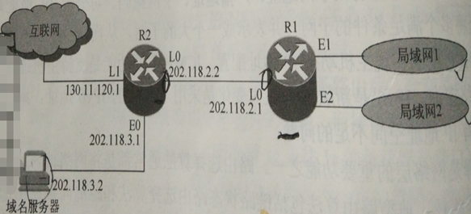

    **R1和R2的路由表结构为：**

    | 目的网络 | 子网掩码 | 下一跳 | 接口 |
    | -------- | -------- | ------ | ---- |
    |          |          |        |      |

    **请回答下列问题。**

    **（1）将IP地址空间202.118.1.0/24分配给局域网1、局域网2，每个局域网需分配的IP地址数不少于120个。请给出分配结果，并分别写出局域网1、局域网2的子网地址、广播地址、子网掩码、IP地址总数、可分配IP地址数和可分配IP地址范围。**

    ```
    2^7-2=126>120，所以主机位需要7位来保证局域网需要的地址个数；
    32-24-7=1，取出1位主机位做为子网位，即：
    202.118.1.00000000/25 -> 202.118.1.0/25：
        子网地址：202.118.1.0/25
        广播地址：202.118.1.127/25
        子网掩码：255.255.255.128/25
        IP地址总数：32-25=7，2^7=128
        可分配IP地址数：128-2=126
        可分配IP地址范围：202.118.1.1/25 ~ 202.118.1.126/25
    202.118.1.10000000/25 -> 202.118.1.128/25：
        子网地址：202.118.1.128/25
        广播地址：202.118.1.255/25
        子网掩码：255.255.255.128/25
        IP地址总数：32-25=7，2^7=128
        可分配IP地址数：128-2=126
        可分配IP地址范围：202.118.1.129/25 ~ 202.118.1.254/25
    ```

    **（2）请给出R1的路由表，使其明确包括到局域网1的路由、局域网2的路由、域名服务器的主机路由和互联网的路由。**

    |   目的网络    |    子网掩码     |   下一跳    | 接口 |
    | :-----------: | :-------------: | :---------: | :--: |
    |  202.118.1.0  | 255.255.255.128 |      —      |  E1  |
    | 202.118.1.128 | 255.255.255.128 |      —      |  E2  |
    |  202.118.3.2  | 255.255.255.255 | 202.118.2.2 |  L0  |
    |    0.0.0.0    |     0.0.0.0     | 202.118.2.2 |  L0  |

    **（3）请采用路由聚合技术，给出R2到局域网1、局域网2的路由。**solasta

    |  目的网络   |   子网掩码    |   下一跳    | 接口 |
    | :---------: | :-----------: | :---------: | :--: |
    | 202.118.1.0 | 255.255.255.0 | 202.118.2.1 |  L0  |

11. **请回答下列问题：**

    

    **(1) 主机在配置IP地址时，其正确的子网掩码和默认网关分别是多少？**

    ```
    子网掩码：/28 -> 11111111.11111111.11111111.11110000 -> 255.255.255.240
    默认网关：192.168.1.1
    ```

    **(2) 若路由器R在向互联网转发一个由主机192.168.1.5发送、ID=12345、length=500B、DF=1的IP分组时，则该IP分组首部的哪些字段会被修改？如何修改？**

    ```
    采用NAT技术，所以源IP会根据转发端不断变化，TTL每经过一次转发就减一，校验和也会重新计算；
    源IP地址，TTL超时次数（跳数），Checksum校验和会被修改；
    源IP地址被修改为130.11.22.3，TTL减1，校验和重新计算。
    ```

    **(3) 若主机192.168.1.10向互联网发送ID=6789、length=1500B、DF=0的IP分组时，路由器需要将该IP分组分为几片（每片尽可能封装为最大片）？给出分片结果，包括每片的ID、DF、MF、length、offset的取值。**

    ```
    最大分片可封装数据=(M-20)/8=(512-20)/8*8=488
    需要的总片数=(L-20)/488=(1500-20)/488=4
    偏移量=offset=488/8=61
    1：{ID=6789，DF=0，MF=1，length=508，offset=0}
    2：{ID=6789，DF=0，MF=1，length=508，offset=61}
    3：{ID=6789，DF=0，MF=1，length=508，offset=122}
    4：{ID=6789，DF=0，MF=0，length=36，offset=183}
    ```

12. **某网络拓扑如图所示，其中路由器内网接口、DHCP服务器、WWW服务器与主机1均采用静态IP地址配置，相关地址信息见图中标注；主机2～主机N通过DHCP服务器动态获取IP地址等配置信息。**

    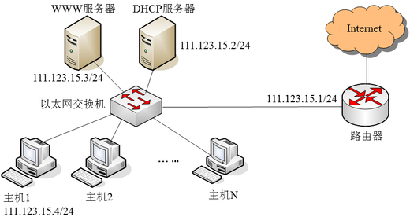

    **请回答下列问题。**

    **(1) DHCP服务器可为主机2～主机N动态分配IP地址的最大范围是什么？主机2使用DHCP协议获取IP地址的过程中，发送的封装DHCP Discover报文的IP分组的源IP地址和目的IP地址分别是什么？**

    ```
    最大范围：111.123.15.5 ~ 111.123.15.254
    源IP地址：0.0.0.0（未分配IP地址，使用0.0.0.0代表本机）
    目的IP地址：255.255.255.255（不知道DHCP服务器的位置，广播发送报文）
    ```

    **(2) 主机2在通过DHCP服务器获取IP地址的同时还可以获取哪些IP地址配置所必须的信息？**

    ```
    子网掩码（255.255.255.0），默认网关（111.123.15.1），DNS地址
    ```

    **(3) 若主机1的子网掩码和默认网关分别配置为255.255.255.0和111.123.15.2，则该主机是否能访问WWW服务器？是否能访问Internet？请说明理由。**

    ```
    能访问www服务器，不能访问internet服务器；
    主机可以通过交互机访问位于同一子网内的www服务器，但因为默认网关路由器设置错误，所以不能访问internet。
    ```

13. **如图所示网络拓扑，所有路由器均采用距离向量路由算法计算到达两个子网的路由（注：到达子网的路由度量采用跳步数）。**

    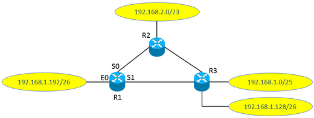

    | 目的网络 | 接口 |
    | :------: | :--: |
    |          |      |

    **请回答下列问题：**

    **(1) 若所有路由器均已收敛，请给出R1的路由表，要求包括到达图中所有子网的路由，且路由表中的路由项尽可能少。**

    题目要求尽可能少，那么就将192.168.1.0/25和192.168.1.128/26聚合成192.168.1.0/24

    |          目的网络          | 接口 |
    | :------------------------: | :--: |
    | 192.168.1.0/24（路由聚合） |  S1  |
    |      192.168.1.192/26      |  E0  |
    |       192.168.2.0/23       |  S0  |

    **(2) 在所有路由器均已收敛的状态下，R3突然检测到子网192.168.1.128/26不可到达，若接下来R2和R3同时向R1交换距离向量，则R1更新后的路由表是什么？更新后的R1距离向量是什么？**

    因为R3不可达，所以更新后的R1会更换成R2那条路径，从S0接口转发

    |     目的网络     | 接口 |
    | :--------------: | :--: |
    | 192.168.1.192/26 |  E0  |
    | 192.168.1.2.0/23 |  S0  |
    |  192.168.1.0/25  |  S1  |
    | 192.168.1.128/26 |  S0  |

    |     目的网络     | 跳数 |
    | :--------------: | :--: |
    |  192.168.1.0/25  |  1   |
    | 192.168.1.128/26 |  2   |
    | 192.168.1.192/26 |  0   |
    |  192.168.2.0/23  |  1   |


# 5.数据链路层

数据链路层负责通过一条链路，从一个结点向另一个物理链路直接相接相连的相邻结点，传送网络层数据报，中间通常不经过任何其他交换结点。

数据链路是在物理线路上，基于通信协议来控制数据帧传输的逻辑数据通路。

## 5.1.数据链路层服务

### 5.1.1.功能

从数据链路层来看，无论主机或是路由器等网络设备统称为结点，因为它们通常都是一条数据链路的端点；

沿着通信链路连接的相邻结点的通信信道称为链路。

* 组帧：

  

  * 将要传输的数据封装成帧结构的操作，称为组帧或成帧；

  * 在网络层的数据报基础上增加帧头帧尾，帧头包含发送结点和接收结点的地址信息，帧尾包含用于差错检查的差错编码；
  * 组帧过程增加的帧头尾中还有一部分用于帧定界的信息，即确保接收结点从物理层收到的比特流中，能够依据定界字符或比特串成功识别帧的开始和结束，如：帧头帧尾都加上01111110。

* 链路接入：

  * 点对点链路：发送结点和接收结点独占通信链路，只要链路空闲就能发送和接收帧；
  * 广播链路：通信链路被多个结点共享，任意两个结点同时通过链路发送帧，都会彼此干扰，导致帧传输失败，因此各个结点需要运行MAC媒介访问控制协议，来协调各阶段使用共享物理传输媒介，完成帧的传输。

* 可靠交付：

  * 并不是所有数据链路层协议都需要设计成可靠传输协议，高出错的链路如无线链路会适用可靠传输，低出错的链路如光纤双绞线等实施可靠传输没有太大的必要。

* 差错控制：

  * 帧在物理媒介传输会产生比特翻转的差错；
  * 一段时间内，出现差错的比特占总比特的比率称为误比特率。

## 5.2.差错控制

### 5.2.1.差错类型

* 差错控制就是通过差错编码技术，实现对信息传输差错的检测，并基于某种机制进行差错纠正和处理；

* 信号在信道中传输，会受到各种噪声的干扰，从而导致传输差错：
  * **随机噪声**：如热噪声、传输介质引起的噪声，具有典型的随机性。随机噪声引起的传输差错称为随机差错或独立差错，具有独立性、稀疏性和非相关性，二进制的传输通常为随机比特差错；
  * **冲击噪声**：如雷声、电机启停等，具有很强的突发性。突发差错通常是连续或成片的信息差错，具有相关性，通常集中发生在某段信息。

### 5.2.2.控制机制

* **检错重发**：典型的差错控制方式，发送端对数据进行差错编码，接收端利用差错编码检测数据是否出错，对于出错的数据需要重复发送，直到正确为止；
* **前向纠错**：接收端进行差错纠正的方法，需要利于纠错编码（能检测也能纠正），即发送端进行纠错编码，接收端利用纠错编码进行差错检测，发送错误直接纠正（适用于单工链路或实时性要求高的链路）；
* **反馈校验**：接收端将收到的数据原样发回发送端，发送端通过比对反馈可以确认是否正确发送，若发现不同则立即重发，直到比对反馈结果相同为止（缺点：效率低，实时性差）；
* **检错丢弃**：不纠正错误，直接丢弃数据。只适用于容许一定比例差错或实时性要求较高的系统（如多媒体播报应用）。

### 5.2.3.基本原理

* 发送端在待传输数据信息的基础上，附加一定的**冗余信息**，该冗余信息建立起数据信息的某种关联关系，将数据信息以及附加的冗余信息一起发送到接收端，接收端可以检测冗余信息表示的数据信息的关联信息是否存在，若存在则正确，否则出错；
* 差错编码的检测和纠错能力：
  * **汉明距离**：两个等长码字之间，对应位不同的位数，称为两个码字的汉明距离，记为dc。如：码字01100101和10011101之间的汉明距离为dc=5。一个编码集的汉明距离为该编码集中任意两个码字的汉明距离的最小值，记为ds；
  * 汉明距离（码距）与检测纠错有何关系？
    * 在一个码组内为了检测r位的差错，要求最小码距ds应该满足：**ds>=r+1**；
    * 在一个码组内为了纠正r位的差错，要求最小码距ds应该满足：**ds>=2r+1**。

### 5.2.4.差错编码-奇偶校验码

* 按位异或（XOR）运算，符号⊕，即参与运算的两个位值，相同则0，不同则1。
* 奇偶校验码包括奇校验和偶校验，利用了1位冗余信息实现了差错检测，表示为**(n, n-1)**；
* 在奇校验码编码的过程中，1位冗余的取值位0或1，使得编码后的码字中1的个数为为奇数；则偶校验则是1的个数为偶数；

* 即满足：
  $$
  奇校验：a_{n-1}⊕a_{n-2}⊕...⊕a_1⊕a_0=1
  $$

  $$
  偶校验：a_{n-1}⊕a_{n-2}⊕...⊕a_1⊕a_0=0
  $$

* a0为冗余位，a1~an-1是数据位；

* 等式右边为0是偶校验，左边含偶数个1；为1是奇校验，左边含奇数个1。

* 例，数据10110111：

  * 采用奇校验码编码后的码字为101101111（因为原数据为1的位数不满足奇数，则在尾部的冗余位加上1，若是满足，则加上0）；
  * 采用偶校验码编码后的码字为101101110（因为原数据为1的位数满足偶数，则在尾部冗余位加上0，若是不满足，则加上1）。

### 5.2.5.差错编码-汉明码

线性分组码，可以实现单个比特的差错纠正，当信息为足够长时，执行效率会很高；

若一个信息位为k=n-1位的比特流an-1an-2...a1，加上偶校验位a0，构成一个n位的码字an-1an-2...a1a0，在接收方校验时，可按关系式：
$$
S=a_{n-1}⊕a_{n-2}⊕...a1⊕a0
$$
来计算，若S=0，则无错，若S=1，则有错；

信息位为k位，增加r位冗余码，构成n=k+r位码字，若希望用r个监督关系式产生的r个校正因子来区分无错和在码字中n个不同位置的一位错，则要求：
$$
2^r>=n+1
$$

$$
2^r>=k+r+1
$$

如：4位信息码，则冗余位为3位；7位信息码，冗余位为4位。

汉明码的存放位置：

以信息码0101为例，采用偶校验：

| 自然顺序 |  1   |  2   |  3   |  4   |  5   |  6   |  7   |
| :------: | :--: | :--: | :--: | :--: | :--: | :--: | :--: |
| 汉明位置 |  C1  |  C2  |  C3  |  C4  |  C5  |  C6  |  C7  |
|  数据位  |  —   |  —   |  0   |  —   |  1   |  0   |  1   |

因为信息为4位，则冗余码需要3位，分别将这3位冗余码插入信息码的2^0^=C1、2^1^=C2、2^2^=C4位置；

```
S将3位二进制的各种含1的组合形式展开，求出冗余码组：
001 010 011 100 101 110 111
C1组：找出第0位为1的形式，001=1，011=3，101=5，111=7
C2组：找出第1位为1的形式，010=2，011=3，110=6，111=7
C3组：找出第2位为1的形式，100=4，101=5，110=6，111=7

分别求出3位冗余码：
C1=C3⊕C5⊕C7=0⊕1⊕1=0
C2=C3⊕C6⊕C7=0⊕0⊕1=1
C4=C5⊕C6⊕C7=1⊕0⊕1=0
所得的7位汉明码为：0100101
```

| 自然顺序 |  1   |  2   |  3   |  4   |  5   |  6   |  7   |
| :------: | :--: | :--: | :--: | :--: | :--: | :--: | :--: |
| 汉明位置 |  C1  |  C2  |  C3  |  C4  |  C5  |  C6  |  C7  |
|  数据位  |  0   |  1   |  0   |  0   |  1   |  0   |  1   |

假设接收端收到的编码位0100001，该如何通过汉明码纠错？

```
根据接受的编码位，求出纠错码：
S1=C1⊕C3⊕C5⊕C7=0⊕0⊕0⊕1=1
S2=C2⊕C3⊕C6⊕C7=1⊕0⊕0⊕1=0
S4=C4⊕C5⊕C6⊕C7=0⊕0⊕0⊕1=1
得到的纠错码为101=5，所以第5位出错，正确的汉明码应为0100101。
```

### 5.2.6.差错编码-CRC循环冗余码

CRC的基本思路：将二进制位串看成是系数为0或1的多项式的系数。一个k为二进制数可以看作是一个k-1次多项式的系数列表，该多项式共有k项，从x^k-1^到x^0^。这样的多项式被认为是k-1阶多项式。高次（最左边）位是x^k-1^项的系数，接下来的位是x^k-2^项的系数，以此类推。

如：100101有6位，因此代表一个6项的多项式，其系数分别是1、0、0、1、0、1，即1x^5^+0x^4^+0x^3^+1x^2^+0x^1^+1x^0^=x^5^+x^2^+1。

CRC编码：发送方和接收方先预定一个生成多项式G(x)，最高位和最低位系数必须是1。假设一帧数据有m位，对应多项式M(x)，为了计算CRC编码，帧必须比生成多项式长。基本思路是在帧的尾部附加上一个校验和，使得附加校验和之后的帧所对应的多项式能够被G(x)除尽。当接收方收到了带校验和的帧后，用G(x)去除它，如果余数不为0，则表明传输过程中有错，否则无错。

CRC编码的检错算法：接收端利用发送端编码时使用的相同的G(x)，当收到经过编码的数据时，利用G(x)系数对应的位串，去除（模2除）收到的数据，如果余数为0，则数据传输过程中未发生错误，否则判断有错。

例，生成多项式为G(x)=x^4^+x+1，请为原始报文10111001进行CRC编码：

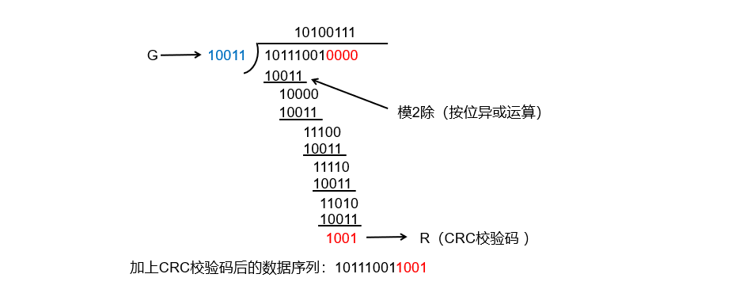

例，若接收方收到的二进制数字序号未11010110111101，CRC生成多项式未G(x)=x^4^+x+1，试说明数据传输过程中是否出错：

```
用10011去除（模2除）11010110111101，得到的余数不为0，则传输出错，为0则未出错；
余数：0011 != 0，传输出错。
```

## 5.3.多路访问控制协议

数据链路层使用的信道分类：

* 点对点信道：一对一通信，信道被通信双方共享；
* 广播信道：一对多广播通信，广播信道上连接的结点很多，信道被所有结点共享，因此需要使用多路访问控制MAC协议来**协调结点的数据发送**。
* 主要可以分为3种类型的MAC协议：
  * 信道划分MAC协议；
  * 随机访问MAC协议；
  * 受控接入MAC协议。

## 5.4.信道划分MAC协议

基本思想是将信道资源划分后，分配给不同的结点，各结点通信时只使用其分配到的资源，从而实现了信道共享，并避免了多结点通信时的相互干扰。

### 5.4.1.FDM频分多路复用

频域划分制，即在频域内将信道带宽划分为多个子信道，并利用载波调制技术，将原始信号调制到对应某个子信道的载波信号上，使同时传输的多路信号在整个物理信道带宽允许的范围内频谱不重叠，从而共用一个信道；

FDM系统的接收端，利用带通滤波器对信号进行分离、复原；

FDM常用于模拟传输的宽带网络种。

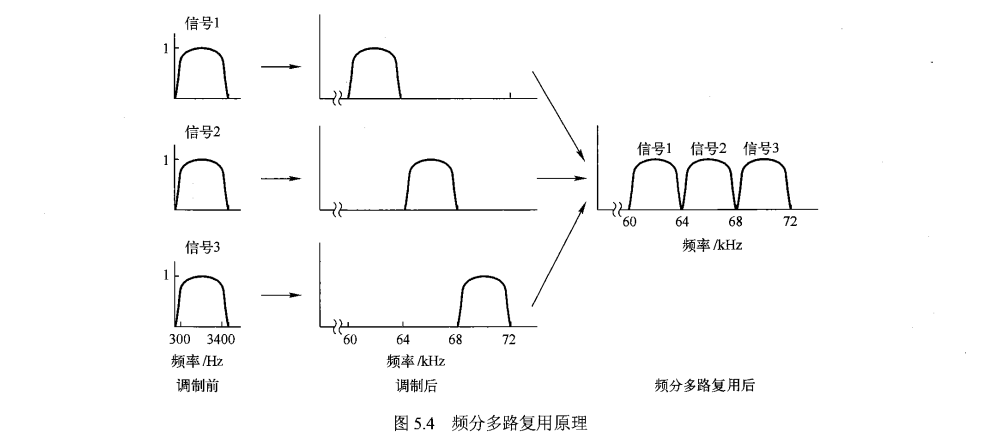

### 5.4.2.TDM时分多路复用

时域划分制，即将通信信道的传输信号在时域内划分为多个等长的时隙，每路信号占用不同的时隙，在时域上互不重叠，使多路信号合用单一的通信信道，从而实现信道共享；

TDM系统的接收端根据各路信号在通信信道上所占用的时隙分离并还原信息；

分为同步时分多路复用STDM和异步时分多路复用ATDM两种：

* STDM按照固定的顺序把时隙分配给各路信号；
* ATDM为有大量数据要发送的用户分配较多的时隙，数据量小的用户分配相对较小的时隙，没有数据的用户不再分配时隙，可以提高信道的利用率，主要应用于高速远程通信。


### 5.4.3.WDM波分多路复用

本质是频分多路复用，由于在光纤通信中，光载波频率很高，通常用光的波长来代替频率讨论；

波分多路复用是指在一根光纤中，传输多路不同波长的光信号，由于波长不同，所以各路光信号互不干扰，最后再用波长解复用器将各路波长的光载波分解出来。

密集波分复用DWDM：

波长更密集，复用度更高，信道利用率更高，通信容量更大；

其关键技术是光放大器，运行在特定光谱频带上，并根据现有的光纤进行优化，无须将光信号转换为电信号，直接放大光波信号；

DWDM是现代光纤通信网络的基础，有效支持IP、ATM等承载的电子邮件、视频、多媒体、语言等数据通过统一的光纤层进行高速传输。

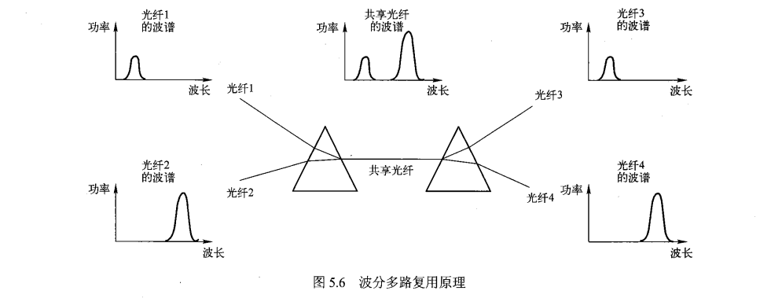

### 5.4.4.CDM码分多路复用

通过利用更长的相互正交的码组分别编码各路原始信息的每个码元，使得编码后的信号在同一信道中混合传输，接收端利用码组的正交特性分离各路信号，从而实现信道共享；

CDM的实质是基扩频技术，即将需要传输的、具有一定信号带宽的信息用一个带宽远大于信号带宽的码序列进行调制，使原始信号的带宽得到扩展，经载波调制后再发送出去，接收端则利用不同码序列之间的相互正交特性，分离特定信号。

## 5.5.随机访问MAC协议

所有的用户都根据自己的意愿随机的向信道上发送消息，如果一个用户在发送信息期间没有其他用户发送信息，则该用户信息发送成功，如果两个或以上用户都在共享信道中发送信息，则产生冲突或碰撞，导致发送失败，每个用户随机退让一段时间后再次尝试，直至成功；

随机访问的实质就是**争用接入**，竞争胜利者暂时占用信道发送信息，失败者随机等待一段时间再次竞争，直到成功。

### 5.5.1.ALOHA协议

任一站点有数据要发送时就可以直接发送至信道，发送站在发出数据后需要对信道侦听一段时间，通常这个时间为电波传到最远端的站再返回本站所需的时间，如果这段时间内收到接收站发来的应答信号，说明发送成功，否则就是发生了冲突，则等待一段随机时间再进行重发，直到成功为止。


* 纯ALOHA协议：
  * 吞吐量 ^*^S：在一个帧时内成功发送的平均帧数；
  * 网络负载 G：在一个帧时内发送的平均帧数，包括发送成功的帧和因冲突未发送成功而重发的帧，纯ALOHA协议的网络负载不能大于0.5；
* 时隙ALOHA协议：
  * 把信道时间分为**离散的时隙**，每个时隙为发送一帧所需的发送时间，每个通信站只能在每个时隙开始时刻发送帧，如果在一个时隙内发送帧出现冲突，下一个时隙以概率P重发该帧，以概率（1-P）不发该帧（等待下一个时隙），直到帧发送成功；
  * 需要所有通信站在时间上同步，降低了产生冲突的概率，最大信道利用率为36.8%。

### 5.5.2.CSMA载波监听多路访问协议

ALOHA协议的根本缺点：就是发送前无论信道是否空闲都会进行发送，这会大大增加冲突的可能性，在发送帧之前先判断信道是否空闲，若空闲则发送否则推迟发送，能够减少发生冲突的可能性；

CSMA就是为解决这一问题而提出的，通过载波监听装置，使通信站在发送数据前，监听信道上其他站点是否发送数据，若有站点在发送则暂时不发，从而减少发生冲突的概率，CSMA可以理解为**先听后说**。

* 非坚持CSMA：
  * 通信站有数据发送，先侦听信道；
  * 若发现信道空闲，则立即发送数据；
  * 若发现信道忙，则等待一个随机时间，然后重新开始侦听信道，尝试发送数据；
  * 若发送数据时产生冲突，则等待一个随机时间，然后重新开始侦听信道，尝试发送数据。
* 1-坚持CSMA：
  * 通信站有数据发送，先侦听信道；
  * 若发现信道空闲，则立即发送数据；
  * 若发现信道忙，则继续侦听信道直至发现信道空闲，然后立即发送数据。
* P-坚持CSMA：
  * 通信站有数据发送，先侦听信道；
  * 若发现信道空闲，则以P概率在最近时隙开始时刻发送数据，以概率Q=1-P延迟到下一个时隙发送；
  * 若下一个时隙仍空闲，重复此过程直到数据发出或时隙被其他通信站占用；
  * 若信道忙，则等待下一个时隙，重新开始发送数据；
  * 若发送数据时发生冲突，则等待一个随机时间，然后重新开始发送过程。

### 5.5.3.CSMA/CD带冲突检测的载波监听多路访问协议

CSMA即使监听后再发也会出现数据冲突问题，当两个帧冲突时，不仅双方都会被破坏，也会使信道无法被其他站使用，因此发生冲突时继续传输数据帧会造成信道的浪费；

CSMA/CD就是为解决这一问题而提出的，即一旦发现有冲突发生，所有通信站都立即停止继续发生数据，这就需要通信站在发送数据的同时，还要监听信道，其中CD表示冲突检测，CSMA/CD可以理解为**先听后说，边听边说**。


CSMA/CD的基本原理是：通信站使用CSMA协议进行数据发送，在发送期间如果检测到碰撞，立即终止发送，并发出一个冲突强化信号，使所有通信站都知道冲突的发生，信号发出后随机等待一段时间，再重复上述过程。

信道状态：

* 传输状态：一个通信站使用信道，其他站禁止使用；
* 竞争状态：所有通信站都有权尝试获取对信道的使用权；
* 空闲状态：没有通信站使用信道。

CSMA/CD发生冲突的原因：信号传播时延的问题，一个通信站发出的信号，需要经过一定的延迟才能到达其他站，而在信号到达其他站之前，如果某通信站此时也有数据发送，那么侦听信道的结果则依然为空闲状态，于是发送数据产生了冲突。

CSMA/CD冲突检测方法：通过检测信道中信号的强度来判断是否发生冲突的，适用于有线而不适用于无线信道。为了精确检测冲突，需要在发送数据的同时检测冲突，数据发送结束的同时也结束冲突检测，也就是**边发边听，不发不听**。

CSMA/CD协议实现多路访问控制时，通过共享信道通信的两个通信站之间相距的最远距离、信号传播速度、数据帧长度以及信道信息传输速率之间需要满足一下约束关系：
$$
L_{min}/R>=2D_{max}/v
$$
即：**传输时延>=2*传播时延**；

式中，Lmin为数据帧最小长度，R为信息传输速率，Dmax为两通信站之间的最远距离，v为信号传播速度。

例：在一个采用CSMA/CD协议的网络中，传输介质是一根完整的电缆，数据传输速率为1Gbit/s，电缆中的信号传播速度是2*10^5^km/s。若最小数据帧长度减少800bit，则最远的两个站点之间的距离至少需要减少多少？

```
题中R=1gbps=1*1024*1024*1024*8bps，v=2*10^6m/s，为不变量
根据Lmin/R=2d/v，有d=Lmin/R*v/2，令Lmin=-800bit，则可得d=80m
故若最小数据帧长度减少800bit，则最远的两个站点间距离至少需要减少80m
```

## 5.6.受控接入MAC协议

特点是各个用户不能随意接入信道而必须服从一定的控制。

### 5.6.1.集中式控制

系统中有一个主机负责调度其他通信站接入信道，从而避免冲突，主要方法是轮询技术，又分为轮叫轮询和传递轮询。

轮叫轮询：设有N个通信站连接共享线路，主机按顺序从站1开始逐个轮询，站1如有数据即可发送，若无则发送控制帧给主机，表示无数据可发，然后主机轮询站2，完成一轮后重复询问1站；

传递轮询：

* 轮叫轮询的缺点就是轮询帧在共享线路上不停的循环往返，形成较大的开销，增加帧发送的等待时延；
* 传递轮询可以解决这样的问题，主机先向站N发出轮询帧，站N在发送数据后或在告诉主机没有数据发送时，即将其相邻站（N-1）的地址附上，从站1到站N-1都各有两条输入线，一条接收主机发来的数据，另一条接收允许该站发送数据的控制信息。

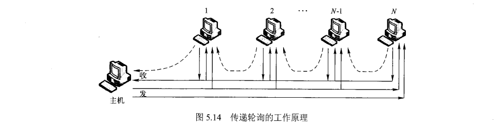

缺点是一旦主机出现了问题，那么整个网络都会陷入瘫痪。

### 5.6.2.分散式控制

令牌技术是典型的分散式控制方法，令牌是一种特殊的帧，代表了通信站使用信道的许可，在信道空闲时一直在信道上传输，一个通信站如果想发送数据就首先要获得令牌，然后在一定时间内发送数据，在发送完数据后重新产生令牌并发送到信道上，以便其他通信站使用信道。

最典型的使用令牌实现多路访问控制的是令牌环网。


**令牌堆是和数据帧无法撤销，是环网上最严重的错误**：

* 令牌本身是位串，绕环传递的过程种可能受干扰出错，另外，当某站点发送数据帧后，由于故障而无法将所发的数据帧从网上撤销时，又会造成网上数据帧持续循环的错误；
* 通过在环路上指定一个站点作为主动令牌管理站，以此来解决问题，通过超时机制来检测令牌是否丢失，若丢失则清除环路上的数据碎片，并发出一个令牌；
* 通过在经过的任何一个数据帧上置其监控位为1，来管理无法撤销的数据。

## 5.7.局域网LAN

覆盖面积小，网络传输速率高，传输误码率低。目前比较常见的局域网拓扑结构是星型和树型结构。

为了使数据链路层能更好的适应多种局域网标准，数据链路层被拆分为2个子层：LLC逻辑链路控制和介质访问控制MAC子层。

### 5.7.1.数据链路层MAC寻址与ARP协议

事实上，并不是主机或路由器具有链路层地址，而是它们的适配器，即网络接口卡具有链路层地址，或称为MAC地址、物理地址、局域网地址等，用于标识局域网中的结点或网络接口。

常见的以太网和IEEE 802.11无线局域网等，使用的MAC地址长度为6字节，共有2^48^个可能的MAC地址，6字节的MAC地址通常采用十六进制表示法，即每个字节表示为一个十六进制数，然后用“-”或“:”连接起来，如：00-2A-E1-76-8C-39或00:2A:E1:76:8C:39

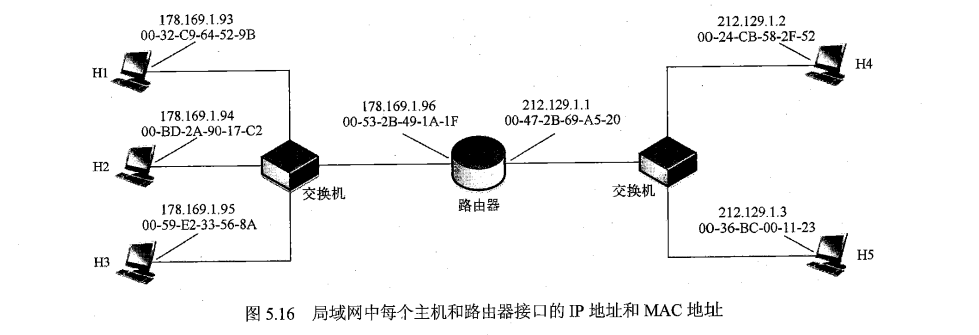

ARP地址解析协议：

* 用于根据本网内目的主机或默认网关的IP地址获取其MAC地址；
* ARP的基本思想是在每一台主机中设置专用内存区域，称为**ARP高速缓存（ARP表）**，存储该主机所在局域网中其他主机和路由器（默认网关）的IP地址与MAC地址的映射关系，并且这个映射表要进程更新；
* ARP通过**广播ARP查询报文**，来询问某目的IP地址对应的MAC地址，即知道本网内某主机的IP地址，就可以查询得到其MAC地址。

RARP反向地址解析协议：通过MAC地址解析得到IP地址。

### 5.7.2.以太网

IEEE 802.3系列标准以以太网为基础。

冲突域：

* 在一个局域网中，如果任意两个结点同时向物理介质中发送信号（数据），这两路信号一定会在物理介质中相互叠加干扰，从而导致数据发送的失败，那么这两个结点位于同一冲突域；
* 在以太网中，CSMA/CD的冲突检测范围就是一个冲突域，即任一结点在发送以太网帧时，基于CSMA/CD协议的边发边听，不发不听的特性，检测的就是在同一冲突域范围内，有没有其他结点也在使用物理介质发送数据；
* 同一冲突域的任意结点的连接（或是物理链路直连，或是通过中继器或集线器等物理设备互连），不存在诸如交换机等第二层设备，也不会存在诸如路由器等第三层设备；
* **交换机分隔冲突域**。

广播域：

* 任一结点如果发送链路层广播帧，即目的MAC地址为FF-FF-FF-FF-FF-FF，接收该广播帧的所有结点与发送结点同属于一个广播域；
* 通常路由器等第三层设备不转发链路层广播帧，因此一个广播域内不会存在第三层设备，可能存在第二层设备，如交换机（一个局域网的广播域通常对应一个子网）；
* **路由器分隔广播域**。’

以太网帧结构：

* 采用CSMA/CD协议，利用曼彻斯特编码发送，使用截断二进制指数后退算法来确定碰撞后重传的时机；
* 
* 帧结构包含两个地址：目的地址和源地址，均为48位物理地址即MAC地址。因为适配器生产时MAC地址就固化在其ROM中，所以MAC地址也称物理地址，如果计算机或路由器安装多个网络适配器，则具有多个MAC地址；
* 类型字段占2个字节，用于标识上层协议，即标识帧中封装的数据是上层什么协议的分组，如类型字段为0x0800时，就表示以太网封装的数据字段为一个IP数据报；
* 数据字段封装的是上层协议分组，如IP数据报，发送方适配器在一个以太网帧中封装一个IP数据报，并把该帧传递到物理层，接收方适配器从物理层收到这个帧，提取出IP数据报，并将IP数据报传递给网络层的IP协议处理；
* CRC字段占4字节，即循环冗余校验码，该字段的目的是使得接收方适配器检测帧是否出错。

以太网技术：

* 10Base-T：
  * 采用非屏蔽双绞线UTP作为传输介质；
  * 数据传输速率为10Mbit/s；
  * 支持以太网结构化布线方式和集线器设备；
  * 工作站集线器与双绞线间的物理接口采用RJ-45接口。
* 快速以太网：
  * 传统以太网帧格式和CSMA/CD介质访问控制方式；
  * IEEE 802.3u；
  * 数据传输速率为100Mbit/s；
  * 物理层规范：100Base-TX，100Base-T4，100Base-FX。
* 千兆位以太网：
  * IEEE802.3z标准；
  * 数据传输速率为1000Mbit/s；
  * 物理层规范：1000Base-SX，1000Base-LX，1000Base-CX。
* 万兆位以太网：
  * IEEE802.3ae标准；
  * 数据传输速率为10000Mbit/s。

### 5.7.3.交换机

网桥：扩展局域网范围、连接多个局域网、扩大网络的物理范围，可互连不同物理层、不同MAC子层和不同速率以太网局域网。目前使用最多的网桥是透明网桥，透明是指局域网上的站点并不知道所发送的帧将经过哪些网桥，因为网桥对于各站来说是看不见的。透明网桥支持即插即用。从工作原理角度看，交换机就是多端口网桥，是目前应用最广泛的数据链路层设备。

以太网交换机的转发和过滤：

* 当一帧到达时，交换机首先需要决策将该帧丢弃还是转发，如果转发，则必须进一步决策应该将帧转发到哪个或哪些端口去；
* 决策的依据是以帧的目的MAC地址为主键，查询其内部的交换表，如果交换表中有帧的目的MAC地址对应的交换表项，且对应的端口与接收到该帧的端口相同，则丢弃该帧（无须转发），否则向表项中的端口转发帧（选择性转发）。如果交换表中没有帧的目的MAC地址对应的交换表项，则向除接收到该帧的端口外的所有其他端口转发该帧（泛洪）；
* 交换机的交换表存储了当前已知站点的MAC地址与交换机端口的对应（连接）关系，初始时（如刚一上电时），交换机的交换表是空的，交换机并不知道主机与交换机的端口是怎样的连接关系，当收到一个帧时，也无法根据帧的目的MAC及交换表决策如何转发，只能泛洪；
* 交换机的交换表是在网络运行中通过算法自动学习逐渐建立起来的。

以太网交换机的自学习：

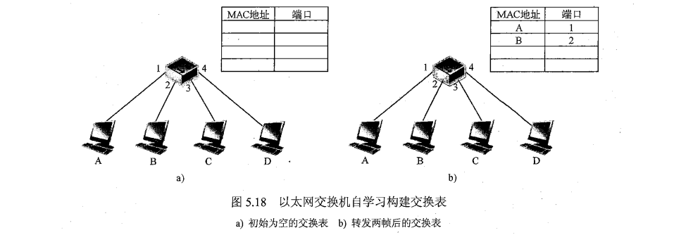

* 上图以太网交换机有4个端口，各连接一台计算机，MAC地址分别为A、B、C、D；

* 一开始交换表是空的，A向B发送一个帧，从端口1进入，交换机查找交换表无匹配项，会将帧的源MAC地址A和端口1写入交换表，即完成一次学习，并向除端口1以外的所有端口广播（泛洪）该帧；
* C、D会丢弃该帧，B因为符合目的MAC地址收下该帧；
* 交换机经历这样一次转发过程后，就会学习到A的MAC地址和端口的映射关系，这种根据网络中数据流动而动态更新交换表的行为称为交换机的自学习。

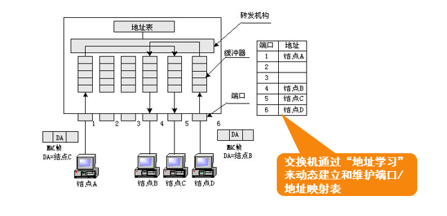

以太网交换机的优点：

* 消除冲突：分割了冲突域；
* 支持异质链路：使用交换机的局域网中，不同的链路可以使用不同的速率运行并且能够在不同的媒介上运行；
* 网络管理。

### 5.7.4.虚拟局域网

数据链路层互连的网络属于一个广播域，当太多的交换机互连大量主机时，会使网络域太大，这时任一主机发送广播帧（如ARP），广播域内所有主机都会收到，并且交换机的互连如果存在环路，则广播帧可能会被大量复制（交换机会向除接收广播帧的端口外的所有端口转发广播帧），从而发生网络风暴，大量消耗带宽影响网络运行。

实际组网时会通过路由器分隔广播域，减小规模，即分割子网。

除了路由器，还有一种技术VLAN，这是一种基于交换机的**逻辑分割广播域**的局域网应用形式，不受物理位置的影响，以软件的方式划分和管理局域网中的工作组。

划分VLAN的方法：

* **基于交换机端口划分**：局域网的网络管理员可以按照以太网交换机的端口定义VLAN成员，通常每个交换机端口属于一个VLAN；
* **基于MAC地址划分**：是按每个连接到交换机的主机MAC地址定义VLAN成员；
* **基于上层协议类型或地址划分**：根据帧携带的类型定义VLAN，这种方法的优点是有利于组成基于应用的VLAN。

VLAN的优点：

* **分割广播域**：某些情况下，广播无法避免，大量的广播会浪费大量的带宽，导致网络性能下降；
* **提供更好的安全性**：缺少路由的情况下，VLAN之间不能直接通讯，从而起到了隔离作用，并提高了VLAN中用户的安全性；
* **VLAN的设置不受物理连接限制**：同一VLAN的用户，可以连接不同的交换机，并可以位于不同的物理位置，增加了网络连接、组网和管理的灵活性。

## 5.8.点对点链路协议

MAC协议都是用于共享链路，网络中还有一类链路是点对点链路，该类链路大多数应用于广域网中，不存在介质共享的问题，不需要MAC协议，使用专门的点对点链路协议。

### 5.8.1.PPP协议

PPP差错检测、支持多种上层协议、允许在连接时刻协商IP地址、允许身份认证。

PPP主要提供的功能：

* 成帧：确定一帧的开始和结束，帧格式支持错误检测；
* 链路控制协议LCP：用于启动线路、检测线路、协商参数以及关闭线路；
* 网络控制协议NCP：用于协商网络层选项，并且协商方法与使用的网络层协议独立。

实际情况中，PPP的设计要困难得多，因此有部分功能不要求实现：

* 差错控制；
* 流量控制；
* 按序交付。

PPP数据帧结构：


* 标志字段F=0x7E，即01111110，作为帧的定界符，帧前后都有；
* 地址字段A=0xFF，即11111111，实际上并不起作用；
* 控制字段C=0x03，即00000011；
* 协议字段告诉PPP接收方封装数据所属的上层协议，当PPP接收方收到帧时，需要检测该帧的正确性，若出错丢弃，或者将帧中封装的数据传递给相应的上层协议；
* 信息字段的内容为上层协议分组，在PPP链路上发送被封装分组，该字段最大的默认长度是1500字节；
* 检验和字段用于检测已传输帧中的比特差错，使用2或4字节的CRC编码。

PPP需要提供透明传输服务，即无论上层协议的分组中包含什么样的位串或字节，都应该能够通过PPP正确传输，因此一旦上层协议分组中包含PPP帧的标志字段01111110，就会误导PPP将其解释成帧的定界符，从而出错；

解决问题的方法就是让PPP信息中和标志位中的01111110区分开来，不产生二义性，具体方法就是字节填充：


发送端扫描整个数字段，如果01111110出现在除标志字段以为的任何地方，PPP就会在01111110之前插入控制转义字节01111101。当接收端收到01111101后面紧跟一个01111110的数据，就会去除填充的控制转义字节，将01111110作为数据来处理。

### 5.8.2.HDLC协议

PPP只工作于具有单个发送方和单个接收方的点对点链路中，而HDLC高级数据链路控制协议则可以应用于点对点链路和点对多点链路，是面向位的协议。


帧定界符是01111110；地址字段用于标识一个终端；控制字段用作序列号、确认、查询与结果；数据是传送的内容；校验和采用循环冗余码校验。


信息帧，管理帧，无序号帧。HDLC使用了滑动窗口，其中序列号Seq为3位，是当前帧的序列号，Next字段用于确认Next之前的帧，Next值表示期望接收的下一帧；T/F位中的T位表示主机询问终端，终端发送帧结束时置F位。


HDLC为了确保数据透明传输，使用位填充。首先发送端扫描整个数据字段，只要发现5个连续的1，就立即插入一个0，经过此过程处理后，数据字段不会出现连续的6个1；

接收端收到一个帧后，先找到标志字段01111110确定帧的边界，接着利用硬件扫描整个比特流，当发现5个连续的1，就删除其后的0，以还原成原来的信息。


# 6.物理层

物理层在实现为数据终端设备提供数据传输通路、传送数据以及物理层管理等功能的过程中，定义了建立、维护和拆除物理链路的规范和标准，同时也定义了物理层接口通信的标准。

物理层接口标准的定义主要包括四大特性：机械特性、电气特性、功能特性以及规程特性；

物理层接口协议主要任务就是解决主机、工作站等数据终端设备与通信线路上通信设备之间的接口问题。

## 6.1.数据通信基础

### 6.1.1.基本概念

* 信息与消息：信息是对事物状态或存在方式的不确定性表述；人类能够感知的描述称为消息；
* 数据：对客观事物的符号表示，用于表示客观事物的未经加工的原始素材；
* 信号：数据的电子或电磁编码，信号是信息的载体（模拟信号、字信号）；
* 通信：通信的本质就是在一点精确或近似的再生另一点的信息；
* 信道：信号在通信系统中传输的通道（物理信道、逻辑信道）；
* 码元：单位时间内代表不同离散值的波形；
* 波特率：码元速率（Baud）最大信号传输速率，描述信道单位时间内传输码元的能力，2倍的带宽；
* 比特率：数据速率（bps）描述信道单位时间内传输；
* 带宽：指能够有效通过该信道的信号最大频带宽度（HZ）。

### 6.1.2.数据通信系统

系统的构成：通信系统的作用是将消息从信源传递到一个或多个目的地，能够实现信息传输的一切技术设备和传输介质的集合称为通信系统；


* 信源：将信息转换为信号的设备，如电话、摄像机、计算机；
* 发送设备：将信源产生的信号进行适当变换的装置，使之适用于信道中传输，主要通过编码和调制的方式变换；
* 信道：信号的传输媒介，分为有线和无线信道两类，具体类型如双绞线、同轴电缆、光纤、大气层、外层空间；
* 接收设备：完成发送设备的发变换，即进行译码和解调，还原原始的发送信号；
* 信宿：信号的终点，并将信号转换为供人们能识别的消息；
* 噪声：自然界和通信设备所固有的，对通信信号产生干扰和影响的各种信号，噪声对通信系统是有害的，但无法完全避免。

模拟通信和数字通信：通信系统根据信号种类分为模拟通信和数字通信系统，区别在于信道中传输的是模拟还是数字信号；


* 模拟信号是指信号的因变量完全随连续消息的变换而变化的信号，自变量可以是连续的，也可以是离散的，但因变量一定是连续的，如电视图像信号、电话语言信号、传感器的输出信号；

* 数字信号是指表示信息的因变量是离散的并且状态有限，自变量时间的取值也是离散的信号，如计算机数据、数字电话、数字电视等都是数字信号；

* 二者在一定条件下可以相互转换，模拟信号通过采样、量化、编码等步骤变成数字信号。数字信号通过解码、平滑等步骤恢复成模拟信号。

数据通信方式：

* 单向通信（单工）、双向交替通信（半双工）、双向同时通信（全双工）：单工通信就是任何时间都只有一个方向的通信，而没有反方向的交互；半双工通信就是通信双方都可以发送信息，但不能双方同时发送或接收，一方发另一方收，如对讲机系统；全双工通信就是双方可以同时发送和接收信息，如电话网、计算机网络；
* 并行通信、串行通信：并行通信是为字节的每一位都设置传输通道，全部位同时进行传输，传输速度快但成本高，适用于计算机内元器件的传输，如CPU与存储器的总线传输；串行通信只为信息传输设置一条通道数据字节中的每一位依次传输，传输速度慢但成本低，适用于长距离通信，如计算机与外置设备的数据传送；
* 异步通信、同步通信：
  * 异步通信以字符为单位发送，依次传输一字符，每个字符5~8位，字符前加上起始位指明开始，后面加上1或2个停止位指明结束，当无字符发送时就一直发送停止位，接收方就可以根据停止位判断范围。异步传输不需要传输时钟信号，实现简单，效率低下，适用于低速系统；
  * 同步通信以数据块为单位发送，内部包含多个字符，每个字符5~8位，在前面加上起始标志，后面加上结束标志，接收方以此判断范围。同步传输效率高，但需要双方建立同步时钟，实现复杂，适用于高速系统。

数据通信系统的功能：


## 6.2.物理介质

在进行数据通信时，信号需要通过某种介质才能进行传输，即物理介质。

### 6.2.1.引导型传输介质

又称有限信道，以导线为传输介质，信号沿导线进行传输，能量集中在导线附近，因此效率高，但部署不够灵活。

* 架空明线：指平行且相互分离或绝缘的架空裸线线路，通常采用铜线或铝线等金属导线；

* 双绞线：

  

  主要用于基带传输；

  将两根相互绝缘的铜线并排绞合在一起可以减少对相邻导线的电磁干扰，这样的一对线称为双绞线；

  屏蔽双绞线STP：在护套与线对间增加一层金属丝编制的屏蔽层，可以提高双绞线的抗电磁干扰能力，性能更优、价格高、安装复杂；

  非屏蔽双绞线UTP：没有屏蔽层的双绞线电缆，价格便宜、安装简单、局域网更普遍使用的是UTP。

* 同轴电缆：

  

  主要用于频带传输，如有线电视网络，具有较好的抗电磁干扰性能；

  由同轴的两个导体构成，外导体是空心圆柱型网状编织金属导体，内导体是金属导线，两者之间填充绝缘实心介质；

* 光纤：

  

  基本原理是利用了光的全反射现象；

  分为多模光纤和单模光纤；

  优点： 通信容量大，最高可达100Gbps；传输损耗小，中继距离长，特别适合远距离传输；抗雷电和抗电磁干扰性能好；无串音干扰，保密性好；体积小，重量轻。

### 6.2.2.非引导型传输介质

适合距离特别远的自由空间的传播通信；

电磁波按频率划分为若干频段，用于不同目的或场合的无线通信；

电磁波在外层空间的传播，如两艘飞船间的通信，为自由空间传播，在近地空间传播会受到地面和大气层的影响，更加电磁波频率、通信距离和位置的不同，电磁波的传播可以分为**地波、天波和视线传播**。

## 6.3.信道与信道容量

### 6.3.1.信道分类

狭义信道：即为信号传输介质；

广义信道，包括信号传输介质和通信系统的一些变换装置，如发送设备、接收设备、天线、调制器等：

* 调制信道：信号从调制器的输出端传输到解调器的输入端经过的部分（恒参信道、随参信道）；
* 编码信道：数字信号由编码器输出端传输到译码器输入端经过的部分，包括调制信道及调制器、解调器。


### 6.3.2.信达传输特性

不同类型的信道对信号传输的影响差异较大，恒参信道的传输特性变化小、缓慢，可以视为恒定，不随时间变化；随参信道的传输特性是时变的。

恒参信道传输特性：

* 各种有线信道和部分无线信道，如微波视线传播链路和卫星链路等，都属于恒惨信道；
* 对信号幅值产出固定的衰减；
* 对信号输出产生固定的时延。

随参信道传输特性：

* 随参信道的传播特性随时间随机快速变化，如依靠地波和天波传播的无线电信号；
* 信号的传输衰减随时间随机变化；
* 信号的传输时延随时间随机变化；
* 存在多径传播现象，多径现象是指发射天线发出的电磁波可能经过多条路径到达接收端。

### 6.3.3.信道容量

信道容量是指信道无差错传输信息的最大平均信息速率。广义信道可以分为调制信道和编码信道，信息论中将信道分为连续和离散信道；调制信道是一种连续信道，即输入和输出信号都是取值连续的；编码信道是离散信道，输入与输出信号都是取值离散的时间函数。

连续信道容量：

根据奈奎斯特公式，理想无噪声信道的信道容量为：
$$
C=2Blog_2M
$$
式中，C为信道容量，单位为bit/s，B为信道带宽，单位为Hz，M为进制数（信号状态数）。

理想无噪声的信道几乎不存在，所有奈奎斯特公式给出的信道容量不可能达到，实际有噪声连续信道的信道容量计算使用香农公式：
$$
C=Blog_2(1+S/N)
$$
式中，C为信道容量，B为信道带宽，S/N为信噪比。S为输入信号的功率，N为信道加性高斯白噪声的功率。由于S/N的比值通常太大，因此使用分贝数（dB）来表示，换算关系为：
$$
(S/N)_{dB}=10log_{10}(S/N)_{功率}
$$
若(S/N)功率=10，则(S/N)dB=10dB；若(S/N)功率=100，则(S/N)dB=20dB；若(S/N)功率=1000，则(S/N)dB=30dB。

例，已知某信道带宽为8kHz，信噪比为30dB，试求该信道的信道容量C：

```
信噪比(S/N)功率=10^((S/N)db/10)=10^(30/10)=10^3=1000
C=Blog2(1+S/N)=8*10^3*log2(1+1000)=80kbps
```

例1：设传输带宽为3000Hz，无噪声信道的调制电平数为32，试求出最大信号传输速率和最大数据传输速率。

```
最大信号传输速率=带宽*2=6kHz
C=2Blog2(32)=2*3000*5=30kbps
```

例2：在无噪声情况下，若某通信链路的带宽为3kHz，采用4个相位，每个相位具有4种振幅的QAM调制技术，则该通信链路的最大数据传输速率是多少？

```
信号状态数M=4*4=16
C=2Blog2(16)=2*3*10^3*4=24kbps
```

例3：一个用于发送二进制信号的3kHz信道，其信噪比为30dB，试计算其可以获得的最大数据传输速率是多少？

```
信噪比(S/N)功率=10^(S/N)/10=10^(30/10)=10^3=1000
C=Blog2(1+1000)=3*10^3*10=30kbps
```

离散信道容量，两种方式度量：

* 每个符号能够传输的最大平均信息量表示的信道容量C；
* 单位时间内能够传输的最大平均信息量表示的信道容量Ct。

## 6.4.基带传输

### 6.4.1.系统结构

在信道中直接传输基带信号，称为基带传输；

在信道中直接传输数字基带信号，称为数字基带传输。


### 6.4.2.传输编码

将二进制数字数据映射为脉冲信号的编码：

* 单极不归零码NRZ：

  二进制数字符号0和1分别用零电平和正电平表示，脉冲幅值只有零或正，只有一个极性，故称为单极；

  不归零是指整个脉冲持续时间内，电平保持不变，且脉冲持续时间结束时也不要求回归0电平；

  即：相邻两个脉冲区间如果表示的是同样的二进制符号，不要求回归0电平，幅值可以保持不变直到下一个脉冲区间表示的是不同的二进制符号。

  

  

* 双极不归零码：

  二进制数符号0和1分别用负电平和正电平表示。

  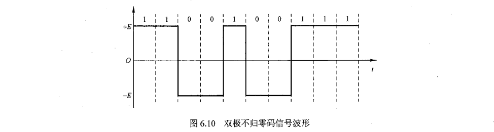

* 单极归零码：

  二进制数符号0和1分别用零电平和正电平表示；

  归零就是在每个正脉冲区间的中间时刻，电平要回归到零电平；

  即：不论下一个脉冲区间是相同还是不同，都需要在本次脉冲持续期中回归零电平，下一个脉冲信号再重新调整幅值。

  

* 双极归零码：

  二进制数符号0和1分别用负电平和正电平表示。

  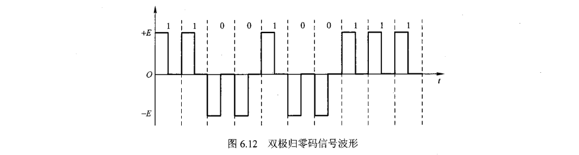

* 差分码：

  利用电平的变化与否来表示信息，相邻脉冲用电平跳变表示1，无跳变表示0；

  即：相邻的区脉冲区间若电平发生跳变则代表后者是1，若相邻脉冲区间幅值不变，则表示后者是0。

  

将数字基带信号的基本码型变换为数字基带传输码型的编码：

* AMI码：

  信号交替反转码，用3种电平进行编码，零电平编码0，正负电平交替编码1；

  即：若前一个1用正电平表示，那接下来又出现的1就用负电平表示，反之亦然。

  

* 双相码：

  曼彻斯特码，只有正负两种电平，每位脉冲持续时间的中间时刻要进行电平跳变，利用该跳变编码信息，正（高）电平跳到负（低）电平表示1，负电平跳到正电平表示0；

  即：每段脉冲区间都是从中间位置开始跳变，从上往下跳表示1，从下往上跳表示0；

  差分曼彻斯特编码，每位脉冲周期也要进行中间时刻跳变，但仅用于同步，而利用每位开始处是否存在电平跳变编码信息，其中，开始有跳变表示1，无跳变表示0；

  即：以区间的中间时刻为分界线，前一个脉冲周期的后半段和后一个脉冲周期的前半段之间，然后发生了电平跳变，则后一个脉冲周期表示的就是1，若无跳变，则表示0。

  

* 米勒码：

  是双相码的变形，也称延迟调制码，米勒码的编码规范如下：

  * 信息码中的1编码为双极非归零码的01或10；
  * 信息码连着是1时，后面的1要交替编码，即前面的1如果编码为01，后面的1就要编码为10，反之亦然；
  * 信息码中的0编码为双极不归零码的00或11，即码元中间不跳变；
  * 信息码单个0时，其前沿、中间时刻、后沿均不跳变；
  * 信息码连着是0时，两个0码元的间隔跳变（即前一个0的后沿，后一个0的前沿）。

  

* CMI码：

  即信号反转码，是一种双极性二电平码，也是将信息码的1为映射为双极不归零码的2位；

  编码规则是信息码的0编码为双极不归零码的01，1交替编码为双极不归零码的11和00。

  

* nBmB码：

  将n位二进制信息码作为一组，映射成m位二进制新码组，其中m>n。再光纤数字传输系统中，通常选择m=n+1构造编码；

  具有良好的同步和检错能力；

  例如：4B/5B编码，编码效率为80%，常用于100M以太网（快速以太网）、FDDI。8B/10B编码，编码效率80%，常用于千兆以太网。

* nBmT码：将n为二进制信息码作为一组，映射成m为三进制新码组，且m<=n。

## 6.5.频带传输

基带信号可以在具有低通特性的信道中传输，然而许多信道如无线信道不具有低通特性，因此不能再这些信道中之间传输基带信号；

基带信号去调制与对应信道传输特性相匹配的载波信号，通过在信道中传送经过调制的载波信号实现将基带信号所携带信息传送出去，因此需要使用频带传输这一信号传输方式。

### 6.5.1.基本结构

将实现调制、传输与解调的传输系统称为数字频带传输系，也称为通带传输或载波传输；

利用模拟基带信号调制载波，称为模拟调制；利用数字基带信号调制载波，称为数字调制。


### 6.5.2.数字调制与解调

调制：利用数字基带信号控制载波信号的某些特征参数，使载波信号这些参量的变化反映数字基带信号的信息，进而将数字基带信号变换为数字通信信号的过程；

解调：在接收端需要将调制到载波信号中的数字基带信号卸载下来，还原数字基带信号，这一个过程称为解调；

二进制数字调制：

|                调制技术                |                         说明                         | 码元种类 | 比特位 |                特点                |
| :------------------------------------: | :--------------------------------------------------: | :------: | :----: | :--------------------------------: |
|                  2ASK                  |         用恒定的载波振幅值表示1，无载波表示0         |    2     |   1    | 抗干扰性最差、误码率最高、性能最差 |
| 2FSK（应用较多）  （中、低速数据传输） |    选择两个不同频率的载波f1和f2表示两个不同值0和1    |    2     |   1    | 频带利用率最低，抗干扰性较2ASK更强 |
|                  2PSK                  |         用载波的相位变化来表示两个不同值0和1         |    2     |   1    |      抗干扰性最好、误码率最低      |
|   2DPSK（应用较多）（高速数据传输）    | 用相邻两个码元载波间的相对相位变化表示两个不同值0和1 |    2     |   1    |      抗干扰性最好、误码率最低      |

正交幅值调制QAM：

QAM是对载波信号的<font color="red">幅值</font>和<font color="red">相位</font>同时进行调制的二维调制技术，其信号矢量端点图称为星座图，星座间最小距离越大，抗噪性能就越好；

QAM调制技术具有频带利用率高、抗噪能力强、调制解调系统简单等优点，适用于频带资源有限的通信场合，在实际通信系统中得到了广泛的应用。

## 6.6.物理层接口规范

### 6.6.1.接口概述

物理层在实现为数据端设备提供传输数据的通路、传输数据以及完成物理层的一些管理工作的过程中，定义了建立、维护和拆除物理链路的规范和标准，也定义了物理层接口通信的标准。

物理层接口协议主要解决主机、工作站等数据终端设备与通信线路上通信设备之间的接口问题；

DTE：数据终端设备，如计算机；

DXE：数据电路端接设备，如调制解调器。

物理层接口规范主要是对DTE设备与DCE设备之间接口的定义，典型的物理层接口协议有IRDA物理层、USB物理层、<font color="red">RS-232</font>、ERA-422、RS--449、RS-485、DSL、ISDN、IEEE 1394 interface等。

### 6.6.2.接口特性（重点）

* 机械特性：也称物理特性，指明通信实体间**硬件连接**接口的机械特点，如接口所用接线器的形状和尺寸、引线数目和排列、固定和锁定装置等；
* 电气特性：规定了在物理连接上，导线的**电气连接**及有关电路的特性；
* 功能特性：指明物理层接口各条**信号线的用途**，包括接口信号线功能的规定方法以及接口信号线的功能分类；
* 规程特性：即**通信协议**，指明利用接口传输比特流的全过程，以及各项用于传输的事件发生的合法顺序，包括事件的执行顺序和数据传输方式，即在物理连接建立、维持和交换信息时，DTE、DCE双方在各自电路上的动作序列等。


# 7.无线与移动网络

## 7.1.无线网络

### 7.1.1.基本结构

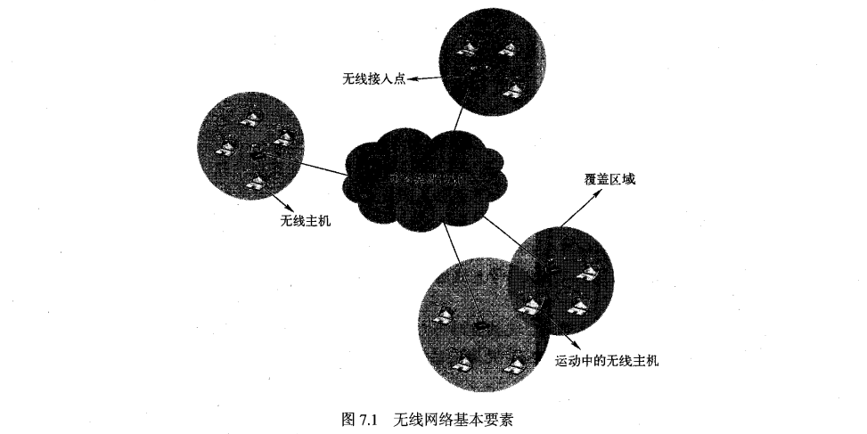

* **无线主机**：运行应用程序的端系统设备，如：便携机、掌上机、智能手机、桌面计算机；
* **无线链路**：主机通过无线通信链路连接到一个基站或者一台无线主机，不同的无线链路技术具有不同的传输速率和不同的传输距离；
* **基站**：通常负责协调与之相关联的多个无线主机的传输，所谓无线主机与基站相关联是指该主机位于该基站的无线通信覆盖范围内，并且使用该基站中继其与其他网络或主机传输数据，如：蜂窝网络中的蜂窝塔，IEEE 802.11中的接入点；
* **网络基础设施**：通常是大规模有线网络，如internet、公司网络、电话网络等；
* 无线链路将位于网络边缘的主机连接到基站，基站与更大的网络基础设施相连，因此基站在无线主机和网络基础设施间起着链路层的作用。


* **基础设施模式**：无线主机与基站关联，并通过基站实现通信中继的无线网络，所有的传统网络服务（地址分配和路由选择）都由网络通过基站向关联的主机提供；
* **自组织网络**：也称特点网络或Ad Hoc网络，即无线主机不通过基站，直接与另一个无线主机直接通信的无线网络；
* **切换**：在无线网络中如果支持无线主机移动，则当一台移动主机移动超出一个基站的覆盖范围，到达另一个基站的覆盖范围后，将改变其接入到网络基础设施的基站的过程称为切换。

### 7.1.2.无线链路与无线网络特性

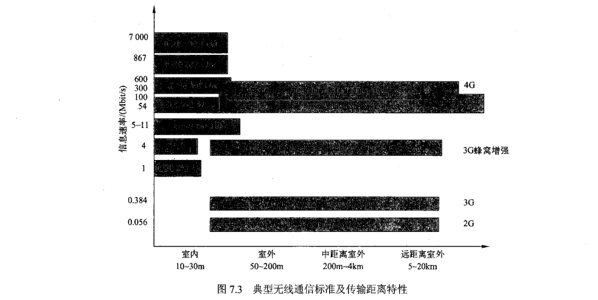

无线链路有别于有线网络的主要表现：

* **信号强度衰减**：电磁波在穿过物体时强度减弱，即使在自由空间中，信号也会衰减，这使得信号强度随着发送方和接收方距离的增加而减弱；

* **干扰**：在同一个频段发送信号的电波源将相互干扰，如：2.4GHz无线电话和802.11b无线局域网在相同的频段中传输，因此双方用户同时使用会导致网络和电话都工作的不好。环境中的电磁噪声也能形成干扰。

* **多径传播**：使得接收方收到的信号变得模糊，位于发送方和接收方之间的移动物体还会导致多径效应随时间而改变。

* **隐藏终端问题**：

  A站点和C站点存在物理环境阻挡，彼此间检测不到对方发送的信号，导致A和C同时向B发送数据时发生碰撞，B无法收到任何一方的数据；

  无线信号的衰减也可能导致碰撞，站点A和C所处的位置使得它们的信号强度不足以使它们检测到对方的传输，然而确能在B处相互干扰。

  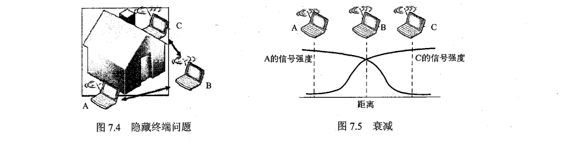

## 7.2.移动网络

### 7.2.1.基本原理 

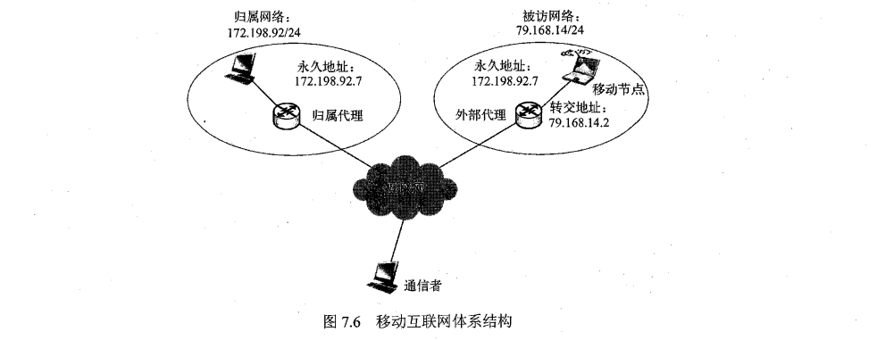

* 移动网络中的移动结点是随时间改变其与网络连接位置的结点。无线网络不一定是移动网络，但移动网络一定是无线网络；
* **移动结点**：如手机、掌上电脑或其他便携式工具；
* **归属网络**：移动结点的永久居所被称为归属网络或家网；
* **归属代理**：在归属网络中代表移动结点执行移动管理功能的实体叫归属代理或家代理；
* **外部网络**：移动结点当前所在的非归属网络被称为外部网络或被访问网络；
* **外部代理**：在外部网络中帮助移动结点做移动管理功能的实体称为外部代理或外代理。

### 7.2.2.寻址

为了使用户的移动性对网络应用透明，希望移动结点在从一个网络移动到另一个网络时保持其地址不变。当移动结点位于一个外部网络时，所有指向此结点永久地址的流量需要导向外部网络。

1. 方案一：**外部网络通过向所有其他网络发通告，告诉它们该移动结点正在它的网络中**。通过交换域内与域间路由选择信息来实现，当一个移动结点离开一个外部网络后，又加入另一个外部网络时，新的外部网络会通告一条新的通向该移动结点的特别路由，旧的外部网络则撤销与该移动结点相关的路由选择信息。

2. 方案二：**将移动性功能从网络核心搬到网络边缘，由该移动结点的归属网络来实现**。在移动结点的归属网络中的归属代理也能跟踪该移动结点的外部网络，这需要一个移动结点（或一个代表该移动结点的外部代理）与归属代理之间的协议来更新移动结点的位置。

图7.6的网络结构就是将外部网络代理放在网络边缘路由器上，外部代理的作用之一就是为移动结点创建一个所谓的**转交地址COA**，该COA的网络部分与外部网络部分相同，因此一个移动结点可以关联两个地址，即永久地址和COA。

图7.6中移动结点永久地址为172.198.92.7，被访网络为79.168.14/24，移动结点的COA为79.168.14.2。外部代理的第二个作用就是告诉归属代理，该移动结点在它的网络中具有COA，该COA的作用就是将数据报通过外部代理重新路由选择到移动节点。

### 7.2.3.移动结点的路由选择

移动结点的路由选择，即被访网络的数据报是如何寻址并转发给移动结点的：

* 间接路由选择：

  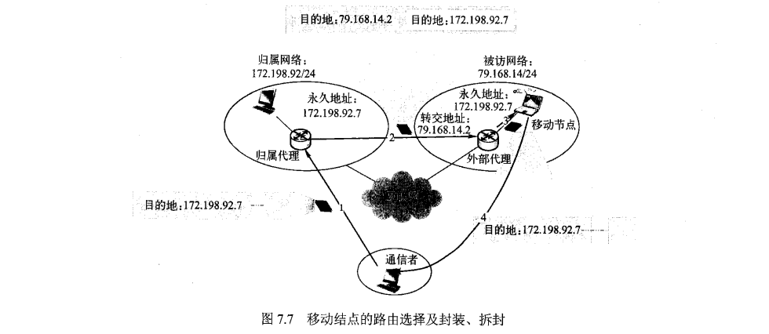

  * 通信者只是将数据报寻址到移动结点的永久地址，并将数据报发送到网络中，完全不知道移动结点是在归属网络中还是在外部网络中；
  * 这些数据报首先被路由到移动结点的归属网络，归属代理截获数据报并通过移动结点的COA转发给外部代理，然后通过外部代理转发给移动结点；
  * 最后移动结点使用自己的永久地址作为源地址，通信者的地址作为目的地址，将数据报寻址到通信者。

* 直接路由选择：

  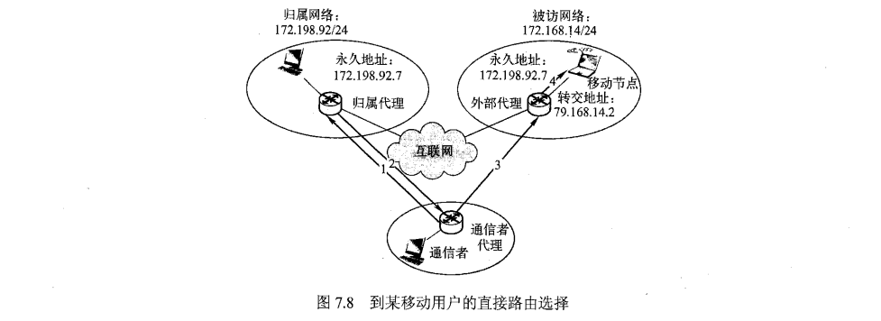

  * 间接路由选择存在一个低效的**三角选择问题**，指即使在通信者与移动结点之间存在一条更有效的路由，发往移动结点的数据报也要先发给归属代理，然后再发送到外部网络；

  * 直接路由选择克服了该问题，首先通信者所在的网络的通信者代理先获取移动结点的COA，可以通过通信者带来向归属代理询问得知，然后通信者代理将数据报直接通过隧道技术发往移动结点的COA。

## 7.3.无线局域网IEEE 802.11

IEEE 802家族是由一系列局域网技术规范所组成的。

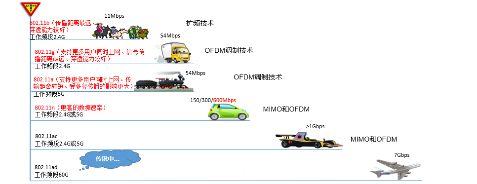

上图4个IEEE 802.11标准具有许多共同特征：

* 都使用相同的介质访问控制协议CSMA/CA；
* 链路层帧使用相同的帧格式；
* 都具有降低传输速率以传输更远距离的能力；
* 都支持基础设施模式和自组织模式。

### 7.3.1.体系结构

IEEE 802.11体系结构的基本构件由两部分组成：

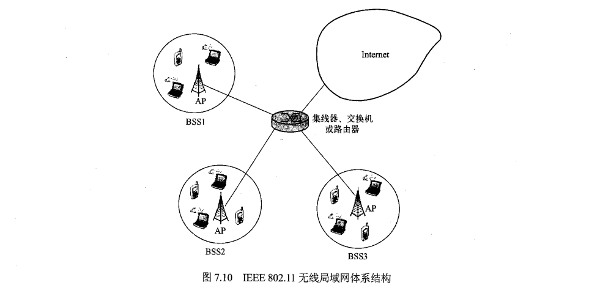

* 基站，又称为接入点AP；
* 基本服务集BSS，一个BSS包含一个或多个无线站点和一个接入点的中央基站。

### 7.3.2.MAC协议

多个无线站点或AP可能同时经过相同信道传输数据帧，因此需要多路访问控制协议来协调传输；

IEEE 802.11的MAC协议采用**CSMA/CA**协议，即**带冲突避免的多路访问控制协议**。

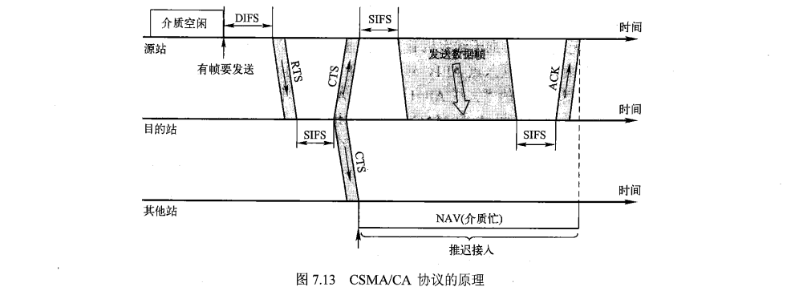

CSMA/CA协议原理：

* 源站再发送之前先监听信道，若空闲则等待一个**分布式帧间间隔DIFS**的短时间后，发送一个很短的**请求发送RTS**控制帧（包含源地址、目的地址、本次通信所需的持续等信息）；
* 若目的站正确收到源站发送的RTS帧，且物理介质空闲，则等待一个**短帧间间隔SIFS**时间后，发送一个很短的**允许发送CTS**控制帧作为响应（包含本次通信所需的持续等信息）；
* 这样，源站和目的站周围的站点可以监听到两者要通信的动作，并保持在其持续通信时间内不会发送，这个时间段称为**网络分配向量NAV**，是其他站根据监听到的RTS或CTS中的持续时间来确定数据帧传输的时间；
* 源站收到CTS帧后，再等待一段SIFS时间后，即可发送数据，若目的站正确收到，再等待SIFS时间后，就会发送**确认帧ACK**。

### 7.3.3.帧

IEEE 802.11帧共有3种类型：<font color='red'>控制帧、数据帧、管理帧</font>。

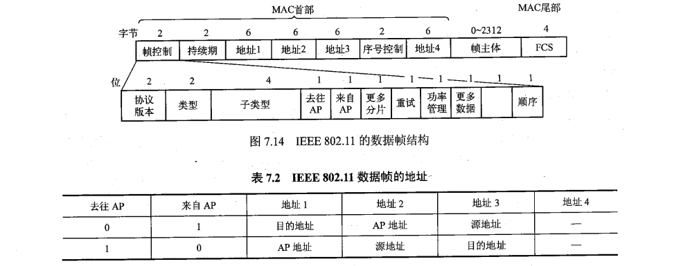

MAC首部共30字节，帧主体（数据部分）不超过2312字节；尾部帧校验序列FCS共4字节；

**地址字段**：IEEE 802.11数据帧具有4个地址字段，有基础设施的网络只使用前3种地址，地址4用于自组织网络；

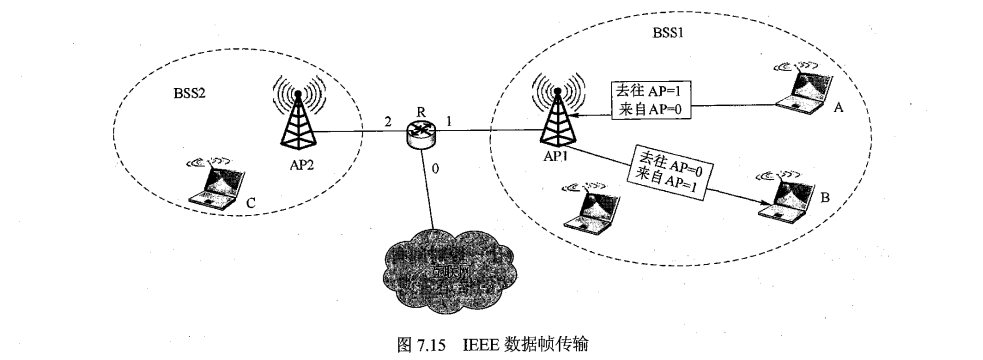

**数据帧传输**：（<font color='red'>重点</font>）

* 无线主机A向B发送数据帧，但该数据帧必须经过AP转发。首先A把数据帧发送到接入点AP1，然后AP1把数据帧发送给B； 
* A发送数据帧给AP1时，帧控制字段为“去往AP=1，来自AP=0”，因此地址1是AP1的MAC地址（接收地址），地址2是A的MAC地址（源地址），地址3是B的MAC地址（目的地址）。接收地址和目的地址的区别在于接收这个帧的地址是AP1的MAC，但该帧的最终目的B的MAC地址；
* 当AP1把数据帧转发给B时，帧控制字段为“去往AP=0，来自AP=1”，地址1是B的MAC地址（目的地址），地址2是AP1的MAC地址（发送地址），地址3是A的MAC地址（源地址）。发送地址和源地址的区别在于发送地址是AP1的MAC地址，但帧的源地址是A的MAC地址。

## 7.4.蜂窝网络

当一台无线主机位于一个IEEE 802.11接入点附近时，可以通过接入IEEE 802.11网络从而与互联网交互，但这是建立在无线主机附近有IEEE 802.11网络的基础上，然而大多数IEEE 802.11网络覆盖范围小，因此想要在任何时间、地点都能接入互联网需要依靠蜂窝网络结构。

### 7.4.1.体系结构

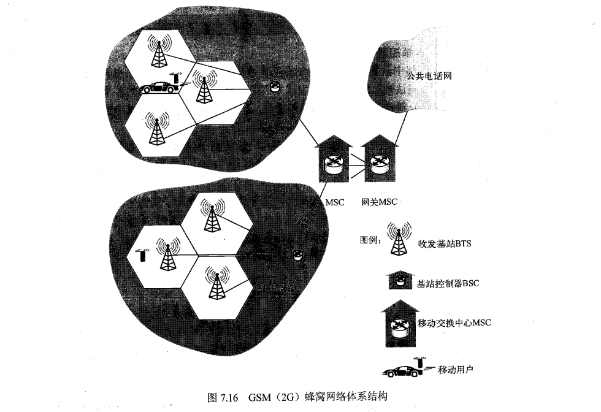

* 以**2G蜂窝移动通信网络GSM**系统为例。蜂窝是指由一个蜂窝网覆盖的区域被分成多个被称为小区cell的地理覆盖区域（如图六边形），每个小区包含一个**收发基站BTS**，负责向位于其小区内的移动站点发送或接收信号；
* 采用的是**FDMA**和**TDMA**混合接入的方式。

* GSM网络的**基站控制器BSC**服务于几十个收发基站，BSC的责任是为移动用户分配BTS无线信道，执行寻呼paging，即找出移动用户所在的小区，执行移动用户的切换；

* 基站控制器BSC及其控制的收发基站BTS共同构成GSM**基站系统BSS**；  

* **移动交换中心MSC**在用户鉴别和账户管理（决定是否允许某个移动设备与蜂窝网络连接）以及呼叫建立和切换中起决定性作用，单个MSC通常包含5个BSC，一个蜂窝网服务商的网络由若干MSC构成，并使用网**关MSC**将提供商的蜂窝网与更大的公共电话网相连。

### 7.4.2.移动性管理

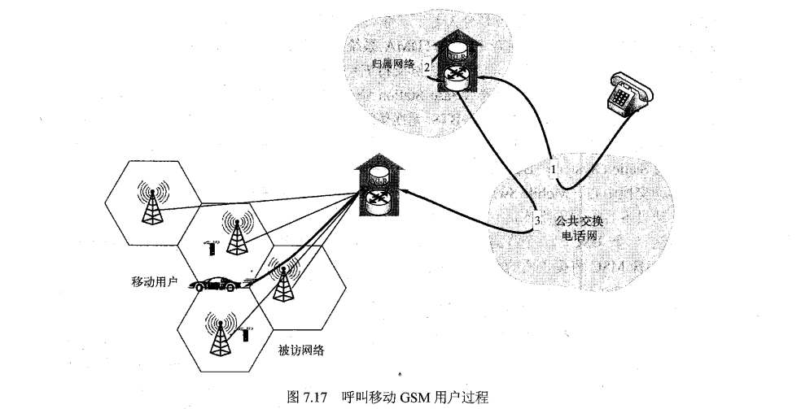

HLR：归属位置注册器；VLR：访问者位置注册器。

GSM标准采用了一种间**接路由选择方法**管理移动性，移动用户向某个蜂窝网提供商订购了服务，该蜂窝网就成为了这些用户的归属网络，移动用户当前所在的网络称为被访网络

### 7.4.3.移动通信2G/3G/4G/5G网络

* 3G网络：
  * 是将无线通信与互联网等多媒体通信结合的新一代移动通信系统，**能处理图像、音频和视频流**等多种媒体，提高包括浏览网页、电话会议和电子商务等多种信息服务；
  * 采用**CDMA和TDMA**技术，其中CDMA占主导地位；
  * 主要有**WCDMA、CDMA2000、TD-SCDMA**（时分同步码分多址）三大技术标准。
* 4G/LTE网络：
  * 下载速度：100Mbps；上传速度：20Mbps；
  * 采用**OFDMA、MIMO**等技术；
  * 主要有**TD-LTE、FDD-LTE**两大标准；
  * LTE系统架构分为两个部分，即演进后的**核心网**和**接入网**。核心网又分为两部分，一个是**移动管理实体**，负责移动性控制，另一个是**服务网关**，负责数据分组的路由和转发。
* 5G网络：
  * 超高速率、超高容量、超可靠性、随时随地可接入性；
  * 1Gbps，10Gbps的传输速率。

## 7.5.移动IP网络

移动IP允许计算机移动到外地时，仍然保留其原来的IP地址。

* 代理发现：通过捕获归属代理或外代理定期发送的代理报告；
  * ICMP报文，发现归属代理或外代理：代理通高；代理请求。
* 向归属代理注册：一旦某个移动IP结点收到一个COA，则该地址必须向归属代理注册，这可通过外部代理（由它向归属代理注册该COA）或直接通过移动IP结点自己完成；
* 数据报的间接路由选择：移动IP采用间接路由选择实现移动性。

通过外部代理向归属代理注册的步骤：

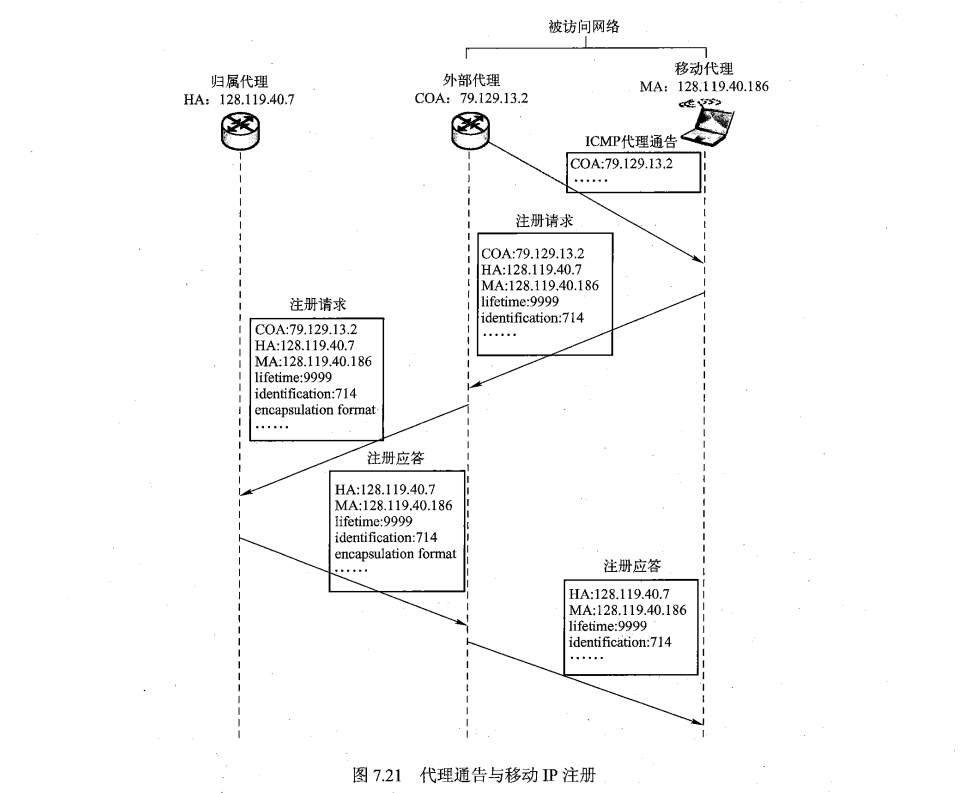

* 当收到一个外部代理的通告后，移动结点立即向外部代理发送一个移动IP注册报文；
* 外部代理收到注册报文并记录移动结点的永久IP地址，并向归属代理发送注册请求；
* 归属代理接收注册请求并检查真实性和正确性，把移动结点的永久IP地址与COA地址绑定；
* 外部代理接收归属代理的注册应答，然后将其转发给移动节点。

## 7.6.其他典型的无线网络

### 7.6.1.WiMax网络特点

全球微波互联网接入，**IEEE  802.16标准**，是一种城域网技术；

**解决了无线宽带接入的最后一公里问题**；

更远的传输距离，可达50km；更高的速率，可达300Mbps；不支持无缝切换；服务质量差；组网性能低；产业基础薄弱；和传统蜂窝网无法完全兼容。

### 7.6.2.蓝牙网络特点

短距离的无线网络；

<font color='red'>IEEE 802.15.1标准</font>；无线个人区域网络（WPAN）标准，2.4GHz；

小范围、低功率、低成本、自组网络。

### 7.6.3.ZigBee网络特点

<font color='red'>IEEE 802.15.4标准</font>；无线个人区域网络标准；

低功率、低速率、低工作周期；

网络结点分为两类：简化功能设备和全功能设备。


# 8.网络安全基础

## 8.1.网络安全概述

### 8.1.1.基本概念

* 概念：网络安全是指网络系统的硬件、软件及其系统中的数据受到保护，不因偶然的或者恶意的原因而遭到破坏、更改、泄密，系统连续可靠的正常运行，网络服务不中断。

* 属性：**机密性、消息完整性、可访问与可用性、身份认证**。  

### 8.1.2.网络安全威胁

* 报文传输方面，主要包括窃听、插入、假冒、劫持等安全威胁；
* 常见的网络攻击包括拒绝服务Dos以及分布式拒绝服务DDos等；
* 映射；
* 分组嗅探；
* IP欺骗。

## 8.2.数据加密

* 概念：密码技术是保障信息安全的核心基础，解决数据的机密性、完整性、不可否认性以及身份识别等问题均需要以密码为基础；

* 密码体制的5个要素：1. M 明文空间；2. C 密文空间；3. K 密钥空间；4. E 加密算法；5. D 解密算法。 

### 8.2.1.传统加密方式

* 替代密码：将明文字母表M中的每个字母用密文字母表C中的相应字母代替，常见的加密模型有移位密码、乘数密码、仿射密码等；
  * <font color='red'>凯撒密码</font>：是移位密码的典型应用，通过将字母按顺序推后3位起到加密的作用；
  * 例：如果对明文“bob. i love you, Alice”，利用k=3的凯撒密码加密，得到的密文是什么？
  * 解：k=3，每一位按字母表顺序后移3位，密文为“ere, l oryh brx. Dolfh”。

* 换位密码：又称置换密码，是根据一定的规则重新排列明文，以便打破明文的结构特性。置换密码的特点是保持明文的所有字符不变，只利用置换打乱明文字符的位置和次序。置换密码可以分为列置换密码和周期置换密码。

  * <font color='red'>简单列置换密码</font>：

    * 将明文P按密钥K的长度n分组，每组一行按行排列，即每行n个字符；
    * 若长度不足n的整数倍，则按双方约定的方式填充（如用字符x填充）；
    * 设最后得到的字符矩阵为M__mn__，m为明文划分的行数，n为列数；
    * 然后按照密钥规定的次序将M__mn__对应的列输出，即可得到密文C；
    * 密钥K中每个字母在字母表中的顺序，规定了M__mn__的列输出顺序。

  * 例：假设采用密钥K=nice的列置换密码，对明文“bob i love you”进行加密，加密得到的密文是什么？

    ```
    密钥K的长度n为4，字母顺序为(4, 3, 1, 2)，则密钥规定的列输出顺序为c->e->i->n，即第3列->第4列->第2列->第1列
    
    将明文按每行4位不足补x的规则排列成Mmn的矩阵，m=3，n=4：
    bobi
    love
    youx
    
    根据密钥规定的顺序输出：bvu iex ooo bly
    ```

### 8.2.2.对称密钥加密

对称加密和解密所使用的密钥是相同的。

DES：分组密码，使用56位密钥，明文位64位分组序列，进行16轮加密，每轮加密都会进行复杂的替代和置换操作，并且每轮都会使用一个56位密钥导出的48位子密钥，最终输出与明文等长的64位密文；

3DES：执行3次DES算法，加密过程是加密-解密-加密，解密过程是解密-加密-解密；

AES：涉及4种操作，字节替代、行移位、列混淆、轮密钥加，解密过程就是逆操作。

### 8.2.3.非对称/公开密钥加密

非对称加密和解密所使用的密钥是不同的，分为公钥和私钥。公加私解，私加公解。


Diffie-Hellman：基于数学中的素数原根理论设计的公开密钥密码系统；

RSA：也是基于数论设计的，其安全性建立在大数分解的难度上。

## 8.3.消息完整性与数字签名

报文/消息完整性，也称为报文/消息认证，主要目的是：

* 证明报文确定来自声称的发送方； 
* 验证报文在传输过程中没有被篡改；
* 预防报文的时间、顺序被篡改；
* 预防报文持有期被篡改；
* 预防抵赖，如发送方否认已发送的消息或接收方否认已接收的消息。

### 8.3.1.消息完整性检测方法

为了实现消息完整性检测，需要用到**密码散列函数H(m)**，表示对报文m进行散列化。

密码散列函数应具备的主要特性：

* 一般的散列函数具有算法公开；
* 能快速计算；
* 对任意长度的报文进行多对一映射均能产生定长输出；
* 对于任意报文无法预知其散列值；
* 不同报文不能产生相同的散列值。

密码散列函数还应该具有单向性、抗弱碰撞性、抗强碰撞性。

典型的散列函数：

* MD5：产生128位的散列值；
* SHA-1：产生160位的散列值。

### 8.3.2.报文认证

概念：消息完整性检测的一个重要的目的就是要完成报文认证的任务。报文认证是使消息的接收者能够检验收到的消息是否真实的认证方法。

报文认证的目的：

* 消息来源的认证：验证消息的来源是真实的；
* 消息的认证：验证消息在传送过程中未篡改。

认证方式：**简单报文认证**和**报文认证码MAC**。

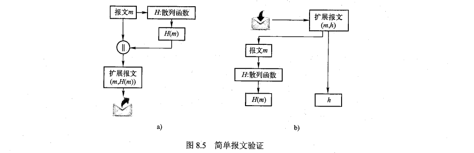


**报文摘要**：对报文m应用散列函数H，得到一个固定长度的散列码，称为报文摘要，记为H(m)，可以作为报文m的数字指纹。

### 8.3.3.数字签名

概念：数字签名用来**核实发送方的身份**，是实现认证的重要工具。

过程：**用发送方的私钥签名，用发送方的公钥核实签名**。

数字签名应该满足以下要求：

* 接收方能够确认或证实发送方的签名，但不能伪造；
* 发送方发出签名消息给接收方后，就不能再否认其所签发的消息；
* 接收方对已经收到的签名消息不能否认，即有收报认证；
* 第三者可以确认收发双方之间的消息传送，但不能伪造这一过程。


## 8.4.身份认证

概念：身份认证又称身份鉴别，是一个实体经过计算机网络向另一个实体证明其身份的过程。鉴别应当在通信双方的报文和数据交换的基础上，作为某鉴别协议的一部分独立完成。鉴别协议通常在两个通信实体运行其他协议之前运行。

基于共享对称密钥的身份认证：


* A向B发送报文；
* B选择一个一次性随机数R发送给A；
* A使用其与B共享的对称密钥来加密这个随机数，然后把密文发送给B；
* B解密收到的报文，若结果和自己发送的随机数相同，则确认A的身份。

基于公开密钥的身份认证：


* A向B发送报文；
* B选择一个一次性随机数R发送给A；
* A使用自己的私钥来加密R，并把密文发送给B；
* B向A请求获取A的公钥；
* A发送自己的公钥给B；
* B用公钥解密收到的报文，若结果和自己发送的随机数相同，则确认A的身份。

存在中间人攻击的问题：


## 8.5.密钥分发中心与证书认证机构

### 8.5.1.密钥分发中心KDC

概念：对称密钥分发的典型解决方案是通信各方建立一个大家都信赖的密钥分发中心KDC，并且每一方和KDC都保持一个长期的共享密钥。通信双方借助KDC建立一个临时的会话密钥，在会话密钥建立之前，通信双方与KDC之间的长期共享密钥，用于KDC对通信方进行验证以及双方间的验证。

基于KDC实现对称密钥分发的过程：


方式一：通信发起方生成会话密钥。

* A要与B进行保密通信，A先随机选择一个会话密钥，并标明通信目的B后用A与KDC的共享密钥加密，然后发送给KDC；
* KDC收到后，用与A的共享密钥解密，会获得会话密钥和A的通信目的B，KDC将会话密钥和通信来源A用与B的共享密钥加密，并发送给B；
* B接收到后，用于KDC的共享密钥解密，从而得知希望于自己通信的是A，并获取会话密钥开始保密通信。


方式二：由KDC为A和B生成通信的会话密钥。

* A在希望与B通信时，首先向KDC发送请求消息；
* KDC收到来自A的消息后，随机选择一个会话密钥，并通过与A和B的共享密钥分别加密，然后将加密的密文分别发送给A和B；
* A和B收到KDC的密文后，用自己与KDC的共享密钥解密，获取会话密钥开始保密通信。

### 8.5.2.证书认证机构CA

将公钥与特点实体绑定，通常是由认证中心CA完成的。

CA的作用：

* CA可以证实一个实体的真实身份，当通信方与CA打交道时，需要信任这个CA能够执行严格的身份认证；
* 一旦CA验证了某个实体的身份，CA会生成一个把其身份和实体的公钥绑定起来的证书，其中包含该实体的公钥及其全局唯一的身份识别信息等，并由CA对证书进行数字签名。

基于CA的公钥认证过程：


* 由CA为B签发证书，包含B的公钥和全局唯一的身份识别信息，最后由CA数字签名；
* A想要B的公钥时，首先获取B的证书，用CA的公钥解密签名获取B的公钥，然后保密通信。

基于KDC或CA避免身份认证的中间人攻击的基本原理：之所以会存在中间人攻击的安全隐患，跟密钥的可信性有很大关系，接收方没有验证公钥的真实性，于是中间人攻击就成功了。解决这一问题的关键就是要解决**对称密钥的分发**和**公钥的认证**问题。

## 8.6.防火墙与入侵检测系统

### 8.6.1.基本概念

防火墙是能够隔离组织内部网络与公共互联网，允许某些分组通过，而阻止其他分组进入或离开内部网络的软件、硬件或者软件与硬件结合的一种设施。

防火墙发挥作用的基本前提是需要保证从外部到内部和从内部到外部的所有流量都经过防火墙，并且仅被授权的流量允许通过，防火墙能够限制对授权流量的访问。

### 8.6.2.防火墙分类

* 无状态分组过滤器：典型的部署在内部网络和网络边缘路由器上的防火墙，分组过滤是网关路由器的重要功能。在路由器中通常使用访问控制列表ACL实现防火墙规则；
* 有状态分组过滤器：使用连接表跟踪每个TCP连接，分组过滤器跟踪连接建立SYN，拆除FIN，根据状态确定是否放行进入或外出的分组；
* 应用网关：进行身份鉴别，授权用户开发特定服务。

进行分组过滤时通常基于以下参数进行决策：

* IP数据报的源IP和目的IP；
* TCP/UDP报文段的源端口号和目的端口号；
* ICMP报文类型；
* TCP报文段的SYN和ACK标志位等。

### 8.6.3.入侵检测系统IDS

入侵检测系统IDS是当观察到**潜在的恶意流量**时，能够产生警告的设备或系统；

IDS不仅仅针对TCP/IP首部进行操作，而且会进行**深度包检测**，并检测多个数据之间的相关性；

IDS能够检测多种攻击，例如：网络映射、端口扫描、TCP栈扫描、Dos拒绝服务攻击。

## 8.7.网络安全协议

### 8.7.1.安全电子邮件PGP

提供邮件加密、报文完整性等安全服务，满足电子邮件对网络安全的需求。PGP是一种安全电子邮件标准。


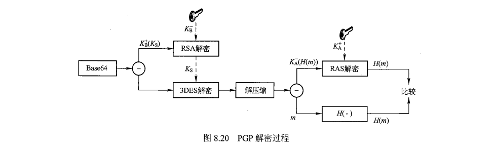

### 8.7.2.安全套接字层SSL

SSL提供的安全服务：

* 在传输层之上构建一个安全层是一种web安全解决方案，最典型的就是安全套接字层SSL或传输层安全TLS；
* SSL可以提供机密性、完整性、身份认证等安全服务；
* 简化的SSL主要包含4个部分：
  * 发送方和接收方利用各自的证书、私钥认证、鉴别彼此，并交换共享密钥；
  * 密钥派生或密钥导出，发送方和接收方利用共享密钥派生出一组密码；
  * 数据传输，将传输数据分割成一系列记录，加密后传输；
  * 连接关闭，通过发送特殊消息，安全关闭连接，不能留有漏洞被攻击方利用。

SSL协议栈：

* SSL是介于TCP和HTTP等应用层协议之间的一个可选层，绝大部分应用层协议可以直接建立在SSL协议上，SSL是两层协议；
* SSL使用的加密算法有：
  * 公开密钥加密算法：RSA；
  * 对称密钥加密算法：DES、3DES；
  * MAC算法：MD5、SHA-1。

SSL的握手过程：

* 客户发送其支持的算法列表，以及客户一次随机数，服务器从算法列表中选择算法，并发给客户自己的选择、公钥证书、服务器端的一次随机数；
* 客户验证证书， 提取服务器公钥，生成预主密钥，并利用服务器的公钥加密预主密钥，发送给服务器，实现密钥的分发；
* 客户与服务器基于预主密钥和一次随机数，分别独立计算加密密钥和MAC密钥，包括前面提到的4个密钥；
* 客户发送一个针对所有握手消息的MAC，并将此MAC发送给服务器；
* 服务器发送一个针对所有握手消息的MAC，并将此MAC发送给客户。

### 8.7.3.虚拟专用网VPN和IP安全协议IPSec

基本原理：VPN通过隧道技术、加密技术、密钥管理、身份认证和访问控制等，实现与专用网类似的功能，可以达到VPN安全性的目的，同时成本相对而言要低很多。VPN最重要的特点就是虚拟，连接总部网络和分支机构之间的安全通道实际上并不会独占网络资源，是一条逻辑上穿过公共网络的安全、稳定的隧道。

VPN的核心是隧道技术，包括3种协议：

* 乘客协议：确定封装的对象属于哪种协议；
* 封装协议：确定遵循哪一种协议进行封装，需要加什么字段等；
* 承载协议：确定最后的对象会放入哪类公共网络，如在internet网络中传输。

IPSec的核心协议及两种传输模式：

* IPSec是网络层使用最为广泛的安全协议，但IPSec不是一个单一的协议，而是一个安全体系，主要包括ESP协议、AH协议、安全关联SA、密钥交换IKE； 
* IPSec提供的安全服务包括机密性、数据完整性、源认证和防重防攻击等；
* 核心协议：**ESP（封装安全载荷）**和**AH（认证头）**协议；
* 传输模式：**传输模式**和**隧道模式**。

AH协议和ESP协议提供的安全服务：

* AH协议提供源认证和鉴别、数据完整性检验；
* ESP提供源认证和鉴别、数据完整性检验以及机密性，比AH应用更加广泛；
* 两种不同协议和两种模式结合起来的4种组合：
  * 传输模式AH；
  * 隧道模式AH；
  * 传输模式ESP；
  * 隧道模式ESP：是使用最为广泛的，最重要的IPSec形式。


1. 假设攻击者可以加密明文“The quick brown fox jumps over the lazy dogs”，并得到密文。请问：

   1. 攻击者是否可以利用选择明文攻击破解单码替代密码的所有报文？为什么？
   2. 攻击者是否可以利用选择明文攻击破解多码替代密码的所有报文？为什么？

   ```
   1）能破解；（1分）因为在单码替代密码系统中，字母之间的替代关系是固定的，而选择明文中已包含了所有字母，所以选择明文攻击可以完全确定字母替代关系，所以可以破解。（2分）
   2）不行，多码替代密码是采用多个单码替代密码的组合，不同位置采用不同的单码替代密码，一句话包含不了这些规律信息。
   ```

2. 假设Alice和Bob之间共享两个密钥：一个报文认证密钥S1和一个对称加密秘钥S2。请利用图示设计一个通信方案，要求支持报文完整性和机密性。

   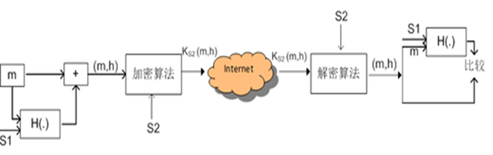

3. 假设Alice想给Bob发送一封邮件； Bob拥有公钥-私钥对(KB+，KB–)，Alice有Bob的证书，但是Alice没有公钥-私钥对；Alice和Bob共享相同的散列函数H(·)。请回答下列问题：

   1. 在这种情况下，是否能设计一个方案使得Bob可以核实邮件消息是由Alice创建的？如果能，请绘制框图解释该方案；如果不能，请简单解释原因。
   2. 能否设计一个方案，支持Alice向Bob发送机密性邮件？如果能，请绘制方案框图；如果不能，请简单解释原因。

   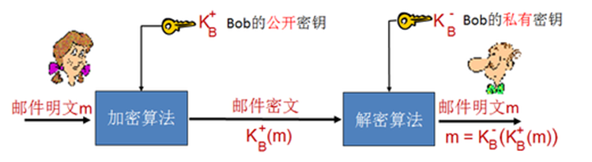

   ```
   1）不能，Alice只持有bob的公钥，没有自己和bob所独有的一段报文认证密钥s1，也没有自己的公钥私钥对，无法证明自己是Alice
   2）可以，只要Alice的报文经过Bob的公钥KB+加密，就可以实现机密传输，Bob收到之后可以用私钥解密。
   ```

4. 假设Alice和Bob基于SSL会话进行通信。假设有一个没有任何共享密钥的攻击者，在数据包流中插入一个具有正确TCP校验和与序列号（以及正确的IP地址和端口号）的伪造TCP段。接收端的SSL会接收该伪造TCP段并向上层应用提交载荷吗？为什么？

   ```
   不会
   
   SSL协议就是介于TCP和应用层之间的一个安全协议，用于提供传输过程中的机密性、完整性和认证，即便TCP校验通过，序列号正确，由于其没有遵循ssl协议，一样会被识别出来。
   
   因为伪造的TCP无法通过数据完整性校验（攻击者没有共享的MAC密钥）
   ```

   