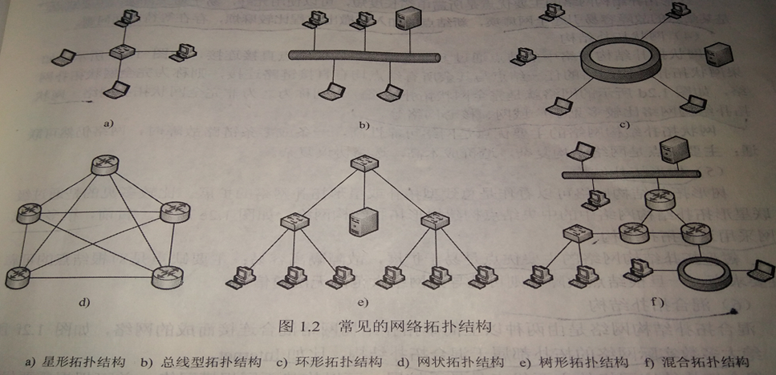
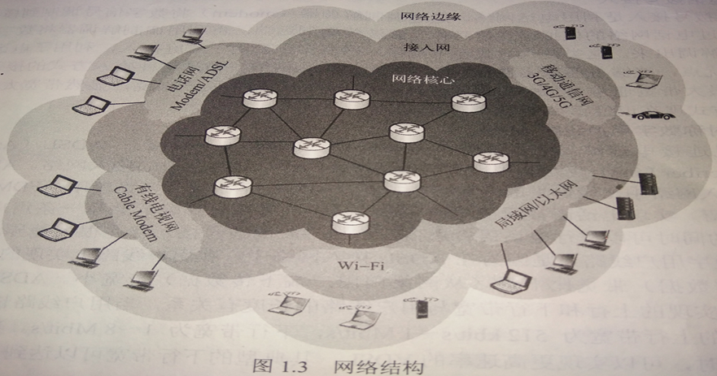
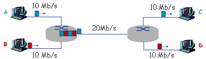
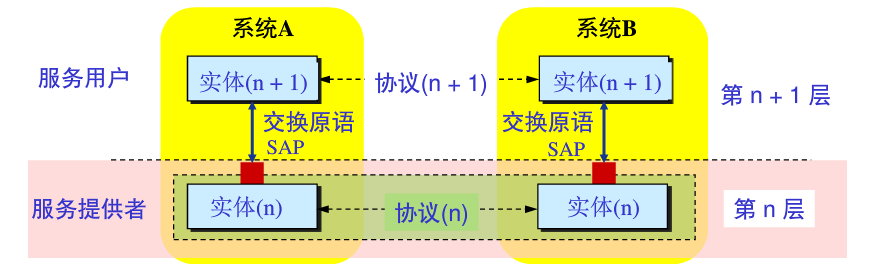
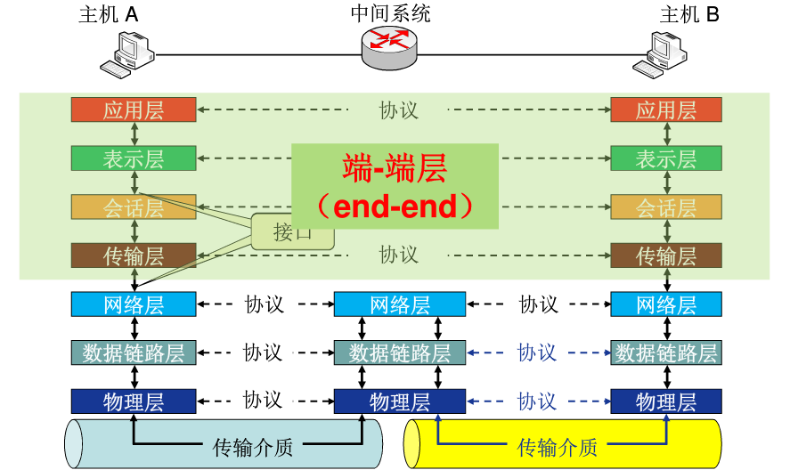
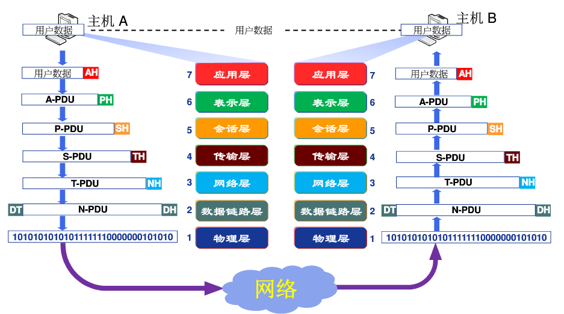
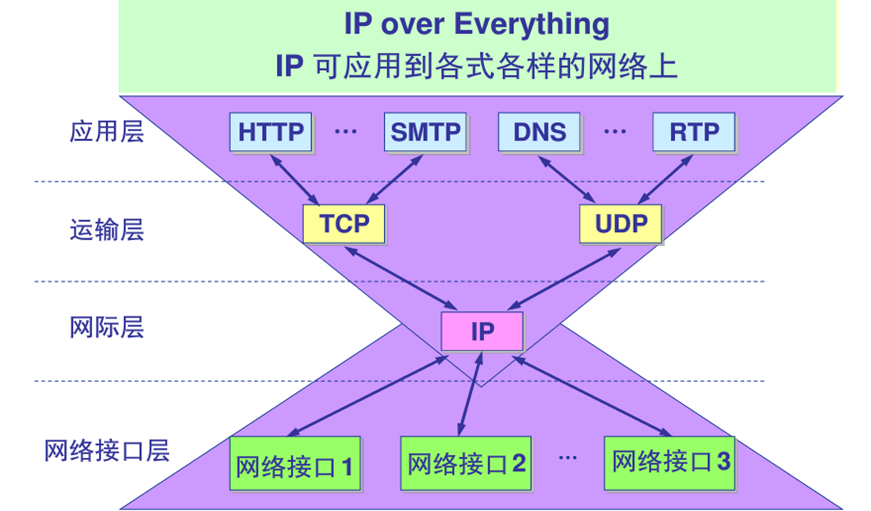
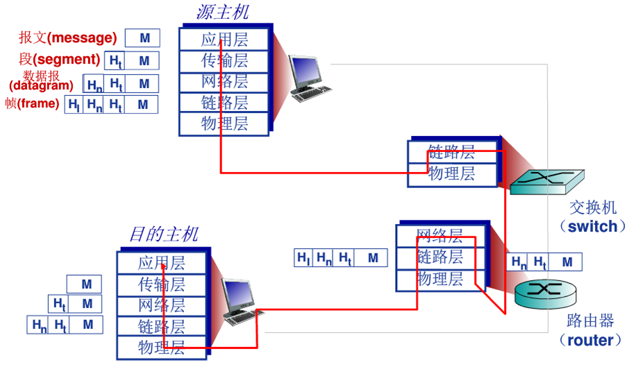

# 1.计算机网络基本概念

## 1.1.网络定义

计算机网络就是以能够相互共享资源的方式互联起来的自治计算机系统的集合：

* 在不同的主机间实现快速的信息交换，通过信息交换实现硬件，软件，信息资源的共享；
* 由分布在不同地理位置的多台独立的自治计算机组成；
* 通信必须遵守共同的网络协议。

## 1.2.网络协议

网络协议就是计算机网络中的实体在进行数据交换过程中必须遵守的规则或约定：

协议三要素：

* 语法：定义实体间交换信息的格式和结构，传输信息的电平等（涉及数据及控制信息的格式，编码，电平等）；
* 语义：定义实体间交换信息和差错处理的控制信息以及对其的响应（涉及用于协调与差错处理的控制信息）；
* 时序：定义实体间交换信息的顺序以及如何匹配速度（涉及速度匹配和排序）。

## 1.3.网络分类

* 覆盖范围区分：个域网，局域网，城域网，广域网；
* 拓扑结构区分：总线型，环型，星型，树型，网状型，混合型；
* 
* 交换方式区分：电路交换网，报文交换网，分组交换网；
* 用户属性区分：公用网，私有网。

## 1.4.网络结构

* 网络边缘：指连接到网络上的所有端系统，该层功能是为用户提供服务（资源子网，信息处理）；
* 接入网络：指实现了网络边缘和网络核心连接的网络（通信子网，信息交换）；
  * 电话拨号接入；
  * 非对称数字用户线路ADSL（家庭用户接入）；
  * 混合光纤同轴电缆HFC接入网络（有线电视网络接入）；
  * 局域网（企业、学校）；
  * 移动接入网络（移动通信网络）；
* 网络核心：指由通信链路互连的分组交换设备构成的网络，实现了网络边缘中主机间的数据中继和转发（通信子网，信息交换）；
* 

## 1.5.数据交换

实现了在大规模网络核心上进行数据传输的技术基础（路由器，交换机）：

* 电路交换：建立电路连接，传输数据，拆除电路。实时性高，时延小，不适合突发性数据传输，适用于音视频通信等实时性强的业务；
* 报文交换：无连接，发送方把要发送的信息加上发送/接收主机的地址及控制信息，组成一个报文通过存储-转发的方式独立传输。时延长。
* 分组交换：将报文分成较小的数据块，每个数据块加上地址，序号等控制信息构成分组。每个分组都通过存储-转发的方式独立传输，目的地将收到的分组重新组装还原为报文。优点：
  * 交换设备存储容量要求低；
  * 交换速度快；
  * 可靠传输效率高；
  * 更加公平。

## 1.6.网络性能

* 速率：网络中单位时间内传输的数据量，称为数据传输速率，单位bit/s；

* 带宽：链路或信道能不失真的传播电磁信号的最高频率和最低频率之差，称为信道的带宽，单位HZ；当描述链路或信道的数据传输能力时，通常用带宽表示最高数据速率，单位bit/s。

* 时延：时间延迟，例如：结点处理时延，排队时延，传输时延，传播时延：

  * 传输时延：也称发送时延，指分组数据从发送端第一个到做最后一个全部发送出去所需的时间，公式：
    $$
    d_t(分组长度)/R(链路带宽)
    $$
    
* 传播时延：指信号从发送端到接收端所需的时间，公式：
    $$
    d_p=D(物理链路长度)/V(信号传输速度)
    $$
  
* 时延带宽积：指一段物理链路的传播时延与链路带宽的乘积，公式：
  $$
  G=d_pR
  $$
  
* 丢包率：引发网络丢包的主要因素是网络拥塞，公式：
  $$
  η=N_l/N_s=(N_s-N_r)/N_s
  $$

  > Ns为发送分组总数，Nr为接收分组总数，Nl为丢失分组总数。

* 吞吐量：在单位时间内源主机通过网络向目的主机实际送达的数据量，单位bit/s，在理想情况下，吞吐量约等于瓶颈链路的带宽，公式：
  $$
  Thr=min(R1,R2,...,R_n)
  $$

例题：

* 若发送40字节的数据帧，从开始发送到收到确认帧的时间为120ms。设信道的数据传输速率为4Kbps，采用停等协议，帧的控制信息、确认帧长及帧处理时间均忽略不计。试求出信道的传播时延：

* 考虑两台主机A和主机B由一条带宽为R（bit/s）、长度为D（m）的链路互连，信号传播速度为V（m/s）。假设主机A从t=0时刻开始向主机B发送分组，分组长度为L位。试求：
  * 传播延迟（时延）dp；dp=D/V
  * 传输延迟dt;  dt=L/R
  * 若忽略节点处理延迟和排队延迟，则端到端延迟T是多少？T= L/R+D/V
  * 若dp>dt，则t=dt时刻，分组的第一位在哪里？距离主机A的V*dt米的链路上*
  * *若V=250 000 km/s，L=512 bit，R=100 Mbit/s，则使时延带宽积刚好为一个分组长度（即512 bit）的链路长度D是多少？带宽时延积=R*dp=R*（D/V）=512，因此，D=512V/R=512×250000000/100000000 =1280米。
* 假设主机A向主机B以存储-转发的分组交换方式发送一个大文件。主机A到达主机B的路径上有3段链路，其速率分别是R1=500 Kbit/s，R2=2 Mbit/s，R3=1 Mbit/s。试求：
  * 假设网络没有其他流量，则该文件传送的吞吐量是多少？500kbps
  * 假设文件大小为4 MB，则传输该文件到主机B大约需要多少时间？T=4×8×106/(500×103)=64s
* 假设主机A向主机B发送一个L=1500 B的分组，主机A到达主机B的路径上有3段链路、2个分组交换机，3段链路的长度分别为D1=5000 km、D2=4000 km，D3=1000 km；每段链路的传输速率均为R=2 Mbit/s，信号传播速度为V=250 000 km/s，分组交换机处理每个分组的时延为dc=3 ms。试求：
  * 若以存储-转发的分组交换方式，则该分组从主机A到达主机B的端到端时延是多少？3*L/R+(D1+D2+D3)/V+2*dc=64ms
  * 若dc=0，且不采取存储-转发的分组交换方式，而是分组交换机直接转发收到的每个分组（即直通交换），则该分组从主机A到达主机B的端到到时延是多少？3*L/R+(D1+D2+D3)/V=58ms
* 如图1.18所示的网络。A在t=0时刻开始向C发送一个2 Mbits的文件；B在t=0.1+e秒（e为无限趋近于0的小正实数）向D发送一个1 Mbits的文件。忽略传播延迟和结点处理延迟。（注：k=103，M=106）请回答下列问题：
  * 如果图中网络采用存储-转发的报文交换方式，则A将2 Mbit的文件交付给C需要多长时间？B将1 Mbit的文件交付给D需要多长时间？由于A的报文先到达第一个路由器，所以A的报文在路由器的队列中排在B的报文前面，所以A交付2Mbits报文需要时间为：2/10+2/20+2/10=0.5s=500ms；B将1Mbits的文件交付给D需要时间为：1/10+2/20(排队时间)+1/20+1/10=0.35s=350ms。
  * 如果图中网络采用存储-转发方式的分组交换，分组长度为等长的1 kbits，且忽略分组头开销以及报文的拆装开销，则A将2 Mbits的文件交付给C需要大约多长时间？B将1 Mbits的文件交付给D需要大约多长时间？从t=0时刻到t=0.1s，A发送了1000个分组（0.1s/（103b/107bps）=1000），即已经发送1Mbits的数据，从t=0.1s时刻起与B共享连接路由器的链路，平均各共享到带宽10Mbps，A大约再用时：1/10+2×1000/10000000=0.1002s交付剩余的1000个分组，故A向C交付2Mbits文件大约需要(0.1+0.1002)s≈0.2s。B向D交付1Mbits文件需要时间大约为：1/10+2×1000/10000000=0.1002s≈0.1s。
  * 报文交换与分组交换相比，哪种交换方式更公平？分组交换更公平

## 1.7.网络体系结构

* 体系结构定义：计算机网络各层次结构模型及其协议的集合。

* 层次结构：按照功能分成若干层，每层完成一部分子功能，分而治之，各个击破（不是按实现方式划分层次结构的）。

* 层次结构优点：

  * 各层间相互独立；
  * 灵活性好；
  * 结构上可分隔开；
  * 易于实现和维护；
  * 能促进网络标准化。

* 层次结构基本概念：

  * 

  * 实体：表示任何可发送或接收信息的硬件或软件进程；
  * 协议：控制两个对等实体进行通信的规则集合，协议是水平的；
  * 服务：下层为上层提供服务，上层使用下层提供的服务，服务是垂直的，下层协议的实现对上层的服务用户是透明的；
  * 接口：相邻层通过接口进行交互；
  * SAP：通过服务访问点SAP，交换原语，指定请求的特定服务。

## 1.8.OSI参考模型

OSI包括了体系结构，服务定义和协议规范三级抽象（异构网络系统互连的国际标准、理解网络通信的理论模型）：

* 物理层：使原始数据以比特流的形式在物理介质上传输（接口特性、比特编码、数据率、比特同步、传输模式）；
* 数据链路层：通过校验，确认，反馈重发等手段，将不可靠的物理链路改造成对网络层来说是无差错的数据链路，该层以帧为单位传输数据（点到点数据传输、成帧、物理寻址、流量控制、差错控制、访问控制）；
* 网络层：源主机到目的主机的数据分组交付，逻辑寻址，路由，分组转发。该层以数据包为单位传输数据（通过IP地址寻址通信）；
* 传输层：提供端到端（应用进程间）的透明数据传输服务，处理端到端的差错控制和流量控制问题。该层以数据段的形式传输数据（通过端口号寻址通信）；
* 会话层：负责建立，管理，终止进程间的会话和数据交换（会话控制，同步）；
* 表示层：负责数据的格式转换，加解密，压缩解压缩等；
* 应用层：为用户的应用进程提供网络服务。

通信过程：

数据封装：

## 1.9.TCP/IP参考模型

TCP/IP模型是简化的OSI参考模型，是因特网采用的标准化体系结构：

* 网络接口层：对应于OSI模型中的物理层和数据链路层（TCP/IP体系结构并没有对该层使用的协议做出强硬规定，允许主机连入网络时使用多种现成的和流行的协议）；
* 互联层：负责将源主机的报文分组发送到目的主机；
* 传输层：负责应用进程间的端到端的通信；
* 应用层：为用户提供各种网络应用服务。

## 1.10.五层参考模型

综合OSI和TCP/IP的优点，理论模型和实际应用的结合：

* 应用层：支持各种网络应用（FTP，HTTP，SMTP）；
* 传输层：进程到进程间的数据传输（TCP，UDP）；
* 网络层：源主机到目的主机的数据分组和路由转发（IP协议，路由协议）；
* 链路层：相邻节点（主机，交换机，路由器等）的数据传输（以太网，WIFI，PPP）；
* 物理层：比特流的传输。

数据封装：

