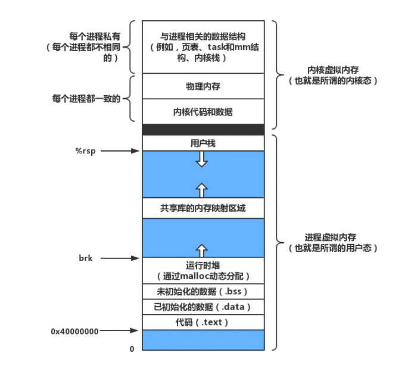

# 操作系统原理

## 基本概念

操作系统是一种运行在硬件系统上的特殊的软件程序，既能管理计算机的硬件和软件资源，又能为用户提供与系统交互的界面，内核是操作系统的核心逻辑。

### 基本功能

* **进程管理**：进程同步、进程控制、进程通信、死锁处理、处理器调度等；
* **内存管理**：内存分配、地址映射、内存保护与共享、虚拟内存等；
* **文件管理**：文件存储空间管理、目录管理、文件读写管理和保护等；
* **设备管理**：处理I/O请求，方便用户使用各种设备，并提高设备的利用率。主要包括缓冲管理、设备分配和处理、虚拟设备等。


### 内核概念

以Linux系统为例，其内核负责管理**文件系统、应用进程调度、中断处理设备驱动、CPU调度、内存管理、文件系统、网络系统**等，是连接应用程序和硬件系统的桥梁。

* **宏内核**：以Linux系统为例，Kernel和其周边被其管理的如CPU调度、文件系统、内存管理等功能划分为一个整体，将这个整体当作操作系统的核心，称为宏内核。
* **微内核**：以Linux系统为例，Kernel内核只负责进程调度，而其他如CPU调度、文件系统、内存管理等功能都可能是以分布式形式存在的（不同的核心管理不同的功能），所有功能之间的交互都需要通过Kernel内核进行调度，如：用户访问文件系统，需要通过Kernel代理，文件系统和CPU调度交互，也需要Kernel进行代理。
* **外内核**：会根据当前运行的应用自动调整使其更适合应用程序运行。
* **虚拟化**：通过底层的虚拟化技术管理多个虚拟的OS以充分的利用硬件资源。


### 硬件概念

#### CPU

CPU是计算机的核心，主要执行的是从内存中提取的指令。一个CPU执行的周期是从内存中提取第一条指令、解码并决定它的类型和操作数，执行后再提取后续指令，重复该过程直到程序运行完毕。

* **指令集**：每个CPU都有一组可以执行的特定指令集，所以x86架构的CPU不能执行ARM的程序，反之亦然。
* **寄存器**：由于CPU访问内存获取指令和数据需要花费较长的时间，因此所有的CPU内部都会有一些寄存器来缓存关键变量和临时结果。因此指令集中通常有一些指令用于将关键字从内存加载到寄存器中或从寄存器写入内存，还有一些指令会将寄存器和内存中的操作数组合。
* 除了用于保存临时结果的通用寄存器外，还有一些特殊的寄存器：
  * **程序计数器（PC，Program Counter）**：它指向下一条需要被提交的指令的内存地址，当提取后会继续向下指向。
  * **堆栈指针（Stack Pointer）**：它指向内存中当前栈的顶端，其包括输入过程中的有关参数、局部变量以及没有保存在寄存器中的临时变量。
  * **程序状态字（PSW，Program Status Word）**：是一个由操作系统维护的8Byte（64bit）的Long长整型数据集合，用于跟踪当前系统的状态，除非发生系统结束，否则可以忽略PSW。
* **时间多路复用（Time Multiplexing）**：操作系统往往停止一个程序转而运行另外一个，每当操作系统停止运行一个程序时，就会保存所有寄存器的值，以便于后续重新运行该程序。
* **流水线（Pipeline）**：现代CPU具有同时读取多条指令的机制。如一个CPU可能会有多条读取、解码和执行单元，所以当CPU执行第N条指令时，还可以对N+1条指令解码，还可以读取N+2条指令。
* **超标量（Superscalar）**：在该种设计中，存在多个执行单元，如一个用于进行整数运算，一个用于进行浮点数运算，一个用于进行布尔运算。多个指令被一次性取出、解码并放入缓冲区，直到执行完毕，只要一个执行单元空闲，就会去检查缓冲区是否有可以执行的指令，如果有就取出执行。
* **内核态/用户态（管态/目态）**：通常情况下，PSW中的一个二进制位会控制CPU当前的状态是内核态还是用户态。当运行在内核态时，CPU能够执行任何指令集中的指令并且能够使用硬件的功能。用户应用程序通常运行在用户态，此时CPU只能执行一部分指令集和访问一部分硬件功能，有关I/O和受保护内存的所有指令都是禁止的，并且主动将PSW模式的二进制位设置为内核态也是禁止的。
* **系统调用（System Call）**：为了获取内核级别的服务，用户程序需要通过系统调用转换到内核态并调用系统级功能。TRAP指令用于把用户态切换为内核态并调用操作系统的功能，待工作完成后，系统调用后面的指令会将控制权交还给用户程序。


#### 多核处理器


#### 内存


#### I/O设备


#### 总线


#### 计算机启动流程

* 开机，首先给主板通电；
* 主板上有一块BIOS芯片会加电自检，检测硬件的故障问题，自检完毕后加载boot loader到内存；
* 由boot loader启动操作系统（从硬盘到内存），在此之前的操作系统存储在磁盘的主引导记录MBR中，即磁盘的第一个扇区；
* OS启动后开始接管硬件系统；
* 注：在OS未启动之前，有些针对计算机硬件的设置信息，如：启动硬盘还是软盘等，会被写入到主板上的另一块芯片cmos中，这块芯片由电池供电。


### 进程概念


### 地址空间概念


### 文件概念


## 处理器管理

### 进程和线程

**进程**：是操作系统进行资源分配的基本单位。是操作系统管理**进程数据结构PCB+指令+数据+通用寄存器GR+程序状态字PSW**的集合。所谓的PCB（Process Control Block，进程控制块）是用于描述进程的基本信息和运行状态的一种数据结构，进程的创建和撤销，都是指对PCB的操作。下图是4个程序创建了4个进程，4个进程并发执行，可以发现同一时间段只会执行一个进程。


**线程：**是操作系统独立调度的基本单位。是一个进程内共享资源的多条执行路径。实现思路就是将进程的两个功能“独立分配资源”和“调度执行”功能分开。


**进程和线程的区别：**

* **调度**：线程是CPU调度的基本单位。在同一进程中，线程的切换不会引起进程的切换。只有从一个进程中的线程切换到另一个进程中的线程时，才会引起进程的切换；
* **并发性**：进程之间可以并发执行。同一进程内的多个线程之间也可以并发执行；

* **通信方面**：进程内的多个线程共享进程地址空间，可以通过直接读写同一进程中的数据进行通信。但是进程间通信需要借助IPC；

* **资源拥有**：进程是拥有资源的独立单位。而线程不拥有资源（只会有程序计数器，一组寄存器和私有堆栈），但可以访问所属进程的所有资源；
* **系统开销**：由于在创建或撤销进程时，系统都要为之分配或回收资源，在进程切换时，会涉及当前CPU环境的保存以及新调度进程CPU环境的设置。而线程切换只需要保存和设置少量寄存器信息，开销相对较小。


### 进程的状态和切换

#### 进程的状态

* **新建态（New）**：进程被创建且尚未进入就绪队列时的状态；
* **就绪态（Ready）**：当进程已经分配到除CPU以外的所有必要资源后就被称为就绪状态，一个系统中处于就绪状态的进程可能有多个，通常会用就绪队列存储；
* **运行态（Running）**：进程已经获得CPU的执行权且正在运行中。在单核时代，同一时刻只有一个进程在运行，多核时代则是多个进程并行；
* **阻塞态（Wait）**：也称等待或睡眠状态，是指一个进程正在等待某个事件的发生（如请求了I/O操作并等待其完成）而暂停运行，这时进程会让出CPU的执行权；
* **就绪/挂起态（Ready Suspend）**：进程具备运行条件，但正处于外存中被挂起，只有被换入到内存中的就绪队列才有资格被重新调度；
* **阻塞/挂起态（Blocked Susped）**：进程正处于外存中被挂起，并且也在等待某一个事件的发生；
* **终止态（Exit）**：处于终止状态的进程不会再被调度，下一步就会被系统撤销，回收资源。


#### 引起进程阻塞的事件

* **请求系统服务**：当正在执行的进程请求系统提供服务而系统由于资源正被占用无法满足其要求时，进程阻塞等待。最后由释放资源占用的进程唤醒阻塞的进程；
* **启动某种操作**：如当进程启动某种IO操作后阻塞以等待操作完成。最后由中断处理程序唤醒阻塞进程；
* **新数据尚未到达**：相互合作的进程中，消费者进程阻塞等待数据到达，生产者进程在数据发送后唤醒阻塞的消费者进程；
* **无新工作可做**：系统进程没有新工作可做时阻塞等待，当有进程发出请求时唤醒阻塞进程。


#### 引起进程挂起的事件

* **系统资源不足**：当系统资源尤其是内存资源不能再满足进程运行的要求时，必须把某些进程挂起，换出到磁盘交换区中，释放其所占有的某些资源，暂时不参与低级调度，起到平滑负载的目的；
* **系统出现故障**：当故障消除后再恢复进程运行；
* **用户调试程序**：以便进行某种检查和修改。


#### 进程状态的切换


* **新建态 —> 就绪态**：OS完成了创建进程的必要操作，且在系统的性能和容量允许的情况下，该进程会进入就绪队列。
* **新建态 —> 就绪/挂起态**：若当前系统的资源和性能情况不容乐观，可以将新建的进程直接换出到磁盘中的就绪挂起队列。
* **就绪态 <—> 就绪/挂起态**：
  * 若当前腾出内存空间的唯一方式就是挂起就绪态进程，或是阻塞/挂起态进程的优先级高于就绪态进程时，可以将就绪态进程换出到磁盘挂起；
  * 当内存中没有就绪态进程，或者处于就绪/挂起态进程比所有就绪态进程优先级都要高时，可以将就绪/挂起态进程换入到内存中等待调度。
* **就绪态 <—> 运行态**：
  * CPU根据某种调度算法将一个就绪态的进程转换到运行态，此时该进程就获得了CPU的执行权和时间片；
  * 当处于运行态的进程CPU时间片耗尽，或被更高优先级的进程抢占，就会转换到就绪态。
* **运行态 —> 阻塞态**：处于运行中的进程会因为等待某个事件的发生（如IO事件就绪等）而进入该事件对应的阻塞队列中等待。
* **运行态 —> 就绪/挂起态**：当一个具有更高优先级的阻塞/挂起态进程等待的事件发生后，需要抢占CPU，但此时主存空间不够，从而可能导致正在运行的进程转换为就绪/挂起态换出到外存中腾出空间。
* **阻塞态 —> 就绪态**：处于阻塞态的进程，若对应的事件发生，则会解除阻塞，重新进入就绪队列中等待调度；
* **阻塞态 <—> 阻塞/挂起态**：
  * 若系统确定当前正在运行的进程或就绪态进程为了维护基本的性能要求而需要更多空间时，就可能会将阻塞态的进程换出，因为当一个进程等待一个事件时，原则上不需要调入内存，可以挂起以腾出内存空间；
  * 但是当一个进程退出后，主存有了大块自由空间，而某个阻塞/挂起态进程具有较高的优先级并且操作系统已经得知导致它阻塞的事件即将发生，此时便可以将其换入到内存中；
* **阻塞/挂起态 —> 就绪/挂起态**：若引起进程阻塞的事件发生后，相应的阻塞/挂起态进程会转换为就绪/挂起态；
* **运行态 —> 退出态**：当一个进程到达了自然结束点，或是出现了无法克服的错误，或是被操作系统所终止，或是被其他有终止权的进程所终止时，就会发生这种转换。


#### 进程的队列模型


* **进程创建**：进程表增加一项，申请PCB并初始化，生成标识、建立映像、分配资源、移入就绪队列；
* **进程撤销**：从队列中移除，归还相应资源；
* **进程阻塞**：保存现场、修改PCB、移入相应事件的阻塞队列；
* **进程唤醒**：从阻塞队列中移出、修改PCB、进入就绪队列；
* **进程挂起**：修改进程状态并出队相关队列，暂时调离内存并换出到磁盘中的挂起队列中。


### 进程调度

#### 调度的层次


* **高级调度**：即作业调度，本质就是根据某种算法，把外存上的程序装入内存，并为之创建进程，进入就绪队列，分配处理器资源并执行，执行完毕后，回收资源；

* **中级调度**：即交换调度，本质就是让暂时不能运行的或优先级较低的进程挂起，释放内存资源，并把它们交换到外存上去等待；

* **低级调度**：即进程调度，本质就是使用调度算法，把处理器分配给就绪队列中的某个进程。进程调度首先会保存处理器现场，将程序计数器和各种寄存器中的数据保存到PCB中，然后按照某种算法从就绪队列中选取进程，把处理器分配给进程。之后，若失去CPU执行权的进程再次获得调度，就把指定PCB中的现场信息恢复到处理器中，再分配给其执行。


#### 批处理系统调度算法

因为没有太多的用户操作，在这种系统下，调度算法的目的是保证吞吐量和周转时间（从提交到终止时间）。

* **先来先服务（first-come first-serverd，FCFS）**：非抢占式调度算法，根据请求的顺序进行调度。有利于长作业但不利于短作业，排在前面的长作业执行时间可能很长，会造成排在后面的短作业等待时间过长，从而造成饥饿现象。

  

* **短作业优先（shortest job first，SJF）**：非抢占式调度算法，按估计的运行最短时间顺序进行调度。有利于短作业但不利于长作业，如果一直有短作业到来，长作业可能很长一段时间都不会得到调度，从而造成饥饿现象。

  

* **最短剩余时间优先（shortest remaining time next，SRTN）**：是最短作业优先的抢占式版本。按剩余运行时间的顺序进行调度，当一个新作业到达时，用其整体运行时间和当前进程的剩余时间比较，若新进程时间更少，则运行新进程，当前进程等待。反之，新进程等待，当前进程继续运行。


#### 交互式系统调度算法

因为有大量的用户频繁的交互操作，在这种系统下，调度算法的目的是快速的进行响应。

* **时间片轮转（Round-Robin, RR）**：将所有就绪进程按FCFS的原则排成一个队列，每次调度时都会将CPU的执行权分配给队头进程，该进程可以执行一个时间片段。当时间片用完后，由计时器发出时钟中断，调度程序停止该进程的执行，并将其加入就绪队列尾部，同时把CPU执行权分配给队头进程。时间片太小会导致进程切换频繁，在切换操作上浪费太多时间，时间片太大又会导致实时性得不到保证。

  

* **优先级调度（Highest Priority First, HPF）**：为每一个进程分配一个优先级，按优先级进行调度。为了防止低优先级的进程永远等不到调度，可以随着时间的推移增加等待进程的优先级。

* **彩票调度（lottery scheduling）**：是一种既可以给出预测结果而又有一种简单实现方式的算法。其基本思想就是为进程提供各种系统资源的彩票，当做出一个调度决策的时候，就随机抽出一张彩票，拥有彩票的进程将会获得资源。

* **多级反馈队列算法（Multilevel Feedback Queue Scheduling, MFQS）**：假设一个进程需要执行100个时间片，如果采用时间片轮转的算法，那么需要经过100次切换才能完成。多级队列的出现就是为了解决需要连续执行多个时间片的进程的调度而提出的，其设置了多个队列，每个队列的时间片大小都各不相同。进程在第一个队列耗尽了时间时间片但没有执行完，就会被移动到下一个队列，而不是进入第一个队列的尾部，这样依旧有被很快调度的可能，这种方式可以大大减少切换次数。每个队列的优先级也不同，最上面的队列优先级最高，因此只有上一个队列没有进程在排队，才能调度当前队列中的进程。多级反馈队列是综合了先进先出、时间片轮转和可抢占式最高优先级算法的一种进程调度算法。

  

  * **被调度队列的设置**：按优先级设置若干个就绪队列，不同优先级队列有不同的时间片，对级别较高的队列分配较小的时间片 `Si(i=1, 2, ..., n)`，从而有 `S1 < S2 < ... < Sn`；
  * **同一队列之内的调度原则**：除了第n级队列是按时间片轮转算法调度外，其他各级都是按FCFS算法调度；
  * **不同队列之间的调度原则**：总是调度优先级高的队列，仅当级别较高的队列为空时才会去调度次一级队列中的进程；
  * **进程优先级的调度原则**：当正在执行的进程用完其时间片后，便被换出并进入次一级的就绪队列。当阻塞的进程被唤醒时，会进入与其优先级相同的就绪队列，若该进程优先级高于正在执行的进程，则抢占处理器。


#### 实时系统调度算法

要求一个请求在一个确定的时间内得到响应。分为硬实时和软实时，前者必须满足绝对的截止时间，后者可以容忍一定的超时。


### 进程同步

#### 同步方式

* **同步与互斥：**同步是指多个进程因为合作而产生的相互制约关系，使得进程有一定的先后执行顺序。互斥则是多个进程在同一时刻只能有一个进入临界区。
* **临界资源和临界区：**若系统的某些资源一次只允许一个进程使用，则这类资源被称为临界资源或共享变量。而在进程中访问临界资源的代码段称为临界区。多个进程在进入临时区时会存在互斥关系，即同一时间只能有一个进程执行临界区的代码段。
* **信号量（Semaphore）：**是一个整型变量，可以对其执行down和up操作，即P和V操作。
  * **P（down）**：如果信号量大于0，执行减1操作。如果信号量等于0，进程阻塞等待信号量大于0；
  * **V（up）**：对信号量执行加1操作，唤醒阻塞的进程让其完成P操作；
  * **注**：P和V操作必须被设计成原语，通常的做法是在执行这些操作时屏蔽中断。
* **互斥量（Mutex）**：就是一种取值只有0和1的特殊信号量，0表示临界区已经加锁，1表示临界区无锁。
* **管程：**在同一时刻只能有一个进程使用管程，进程无法继续执行时不能一直占用管程，否则其他进程永远不能使用。管程引入了条件变量以及对其的操作  `wait()` 和 `signal()` 来实现同步，对条件变量的 `wait()` 会导致调用进程阻塞，把管程让出，``signal()``  操作用于唤醒被阻塞的进程。


#### 经典同步问题

* **生产者-消费者问题**：使用一个缓冲区来保存数据，只有当缓冲区未满时，生产者才能写入数据。反之，只有当缓冲区不为空时，消费者才可以获取数据。

* **读者-写者问题**：允许多个进程同时对共享数据进行读操作，但是不允许读和写以及写和写操作同时发生。

* **哲学家就餐问题**：五个哲学家围在一张圆桌上吃饭，桌子上只有五根筷子，如下图。当一个哲学家吃饭时，需要先拿起自己左右两边的两根筷子，并且一次只能拿起一根筷子。 为了防止死锁的发生，要求每个哲学家必须同时拿起两根筷子，并且只有在两个邻居都没有就餐的情况下自己才允许就餐。

  


### 进程通信

#### 通信概念

* **竞态条件（Race Condition）**：即两个或多个线程同时对一个共享数据进行修改，从而影响程序运行的正确性时，这种情况就被称为具有了竞态条件。

* **忙等互斥**：当一个进程在对资源进行修改时，其他进程必须进行等待，进程之间要具有互斥性。基本上大部分的解决方案都是基于忙等互斥的。

* **临界区**：不仅共享资源会造成竞态条件，共享文件、共享内存也会存在竞态条件的情况。可以通过禁止多个进程在同一时刻对共享资源进行读写，同一时间只能由一个进程访问来解决问题，即需要一种互斥条件（Mutual Exclusion）的存在。一个优秀的解决方案，应该包含以下四种条件。
  
  * 任意时刻进程不能同时处于临界区；
  * 不应对CPU的速度和数量做任何假设；
  * 位于临界区外的进程不能阻塞其他进程；
  * 不能让任何进程在临界区外无限等待。
  
  


#### IPC


**信号（Signal）**：

* 用于通知进程某个事件已经发生，只能发送单个信号而不能传送数据；
* 当用户通过外设触发时（如键盘鼠标按键），产生信号；
* 硬件异常也会产生信号；
* 一个进程通过 `kill` 函数将信号发送给另一个进程；
* 缺点：开销大，发送信号的进程需要系统调用，这时内核会中断接收进程，且要管理堆栈、调用处理程序、恢复被中断的接收进程。另外信号只能传送有限的信息，不能携带参数，不适合复杂的通信操作。

**管道（Pipeline）**：

* **匿名管道（pipe）**：半双工通信，数据只能单向流动，需要双向通信时需要建立两个管道，且只能在父子、兄弟进程间通信。

  

  ```c
  #include <unistd.h>
  int pipe(int fd[2]);
  ```

* **命名管道（FIFO）**：半双工通信，可以对管道命名，允许无亲缘关系的进程间通信。

  

  ```c
  #include <sys/stat.h>
  int mkfifo(const char *path, mode_t mode);
  int mkfifoat(int fd, const char *path, mode_t mode);
  ```

**消息队列（Message Passing）**：

* 底层由链表实现的消息队列，消息就是链表中具有特定格式和优先级的记录，对队列中消息的读/写都需要相应的权限；
* 在向队列中写消息之前，不需要读端进程阻塞读；
* 此外，消息队列是随内核持续的，管道是随进程持续的。

**共享内存（Shared Memory）**：

* 映射一段能被其他进程所访问的内存，这段内存由一个进程创建，但多个进程都可以访问；
* 共享内存并未提供同步机制，即在第一个进程结束对共享内存的写操作之前，并无任何机制可以阻止第二个进程对其进行读操作，所以通常会配合同步机制完成访问，如信号量/互斥量。

**套接字（Socket）**：

* 可以用于不同主机间进程通信的机制（通过网络通信）；
* 在两个进程进行网络通信时，首先本地的进程会绑定一个端口，并生成一个缓冲区，返回一个值，即Socket对其进行的标记。每当本地进程和远程进程建立连接时，就会根据远程进程的信息和本地进程的信息生成一个Socket，然后双方借助于Socket就可以进行通信，传输层得到的数据写入Socket标志的缓冲区，然后在里面进行相应的操作后提交网络层。


### 线程

#### 线程模型


* **一对一模型（ULT内核级线程）**：该模型为每个用户级线程都对应一个内核线程与之连接，并发能较强，但消耗较大；
* **多对一模型（KLT用户级线程）**：该模型为多个用户线程分配一个内核线程。这种方式线程管理的开销较小，但是当一个线程在访问内核时发生阻塞，则会导致整个进程被阻塞；
* **多对多模型（Processor混合式线程）**：多个用户线程连接到多个内核线程上，内核控制线程的数量可以根据应用和系统的不同而变化，可以比用户线程少，也可以与之相同。


#### 内核级线程


* 内核线程的创建、撤销和切换等，都是内核负责、通过系统调用完成的，即内核了解每一个作为可调度实体的线程；
* 这些线程可以在全系统内进行资源的竞争；
* 内核管理所有线程，并向应用程序提供API接口；
* 内核维护进程和线程的上下文；
* 内核以线程为基础进行调度；
* 内核空间内为每一个线程都设置了一个控制块PCB，根据该控制块，感知线程的存在，并进行控制；
* 内核线程驻留在内核空间，是内核对象；
* 有了内核线程，每个用户线程都会被映射或绑定到一个内核线程上，二者的生命周期相对应。


#### 用户级线程


* 在用户空间建立线程库，这个线程库里提供了一系列的针对线程的操作，这些线程的管理通过应用程序来管理；

* 但内核真正管理的单位还是进程，因为无法感知到线程的存在，因此线程的切换不需要内核的参与，更加高效；

* 内核资源的分配仍然是按照进程进行分配的，每个用户线程只能在进程内进行资源竞争。


#### 内核级线程和用户级线程的区别

* 用户级线程的创建、撤销和调度不需要OS内核的支持，是在语言层面处理的。而内核级线程则需要OS内核提供支持，在Linux中内核线程是进程机制的不同形式 ；
* 用户级线程执行系统调用指令时将导致其所属进程被中断，而内核级线程执行系统调用指令时，只会导致该线程被中断；
* 在只有用户级线程的系统内，CPU调度还是以进程为单位的，处于运行状态的进程中的多个线程，由用户程序控制线程的转换运行。在有内核支持线程的系统内，CPU调度则是以线程为单位，由OS负责调度。
* 用户级线程的程序实体是运行在用户态下的程序，而内核支持程序的实体则是可以运行在任何状态下的程序。


### 中断

#### 基本概念

* 操作系统是由中断驱动的，即中断是激活操作系统的唯一方式；
* 广义中断：停止CPU正在执行的进程，转而执行中断处理程序，处理完后返回原进程或调度新进程；
* 狭义中断：源于处理器之外的中断事件，IO中断、时钟中断、外部信号中断。


#### 中断分类

* **硬中断**：硬件通过发送中断信号和操作系统产生实时的交互。如键盘鼠标等设备被触发时会给OS发送一个中断信号，OS会中断目前正在处理的任务，根据该中断信号去OS内部的中断异常处理表中查询对应的编号，根据编号做出不同的处理；
* **软中断**：应用程序与操作系统的中断信号只有一个，也就是0x80号中断，即编译器安排了一次软中断去中断CPU，实现进程从用户态到内核态的切换，完成系统调用。


#### 中断处理流程


### 系统调用

#### 内核态和用户态

内核态（Kernel Mode）也称管态，用户态（User Mode）也称目态；

* **CPU指令级别**：Intel的CPU将指令级别划分为Ring0、Ring1、Ring2和ring3四个级别，用于区分不同优先级的指令操作；
* **CPU的内核态和用户态**：其中内核发出的都是0级指令，用户发出的都是3级指令，通过指令级别的划分，将CPU划分为拥有不同权限等级的两个状态。用户级别的指令无法访问OS的内核资源，提高了OS的安全性；
* **进程的内核态和用户态**：进程是根据访问资源的特点，将其在系统上的运行分为两个级别。处于用户态的进程只能操作用户程序相关的数据，处于内核态的进程能够操作计算机的任何资源；
* **内核空间和用户空间**：Linux按照特权等级，将进程的地址空间分为内核空间和用户空间，分别对应着CPU特权等级的Ring0和Ring3。


#### 基本概念

在应用程序的运行过程中，凡是与内核级别资源有关的操作（如文件管理、进程控制和内存管理），都必须通过系统调用的方式向内核提出服务请求，并陷入内核态由OS代为完成。


#### 系统调用按功能分类

* **设备管理**：完成设备的请求、释放和启动等功能；
* **文件管理**：完成文件的读、写、创建和删除等功能；
* **进程控制**：完成进程的创建、撤销、阻塞和唤醒等功能；
* **进程通信**：完成进程间的消息传递或信号传递等功能；
* **内存管理**：完成内存的分配、回收以及获取作业占用内存区大小及地址等功能。


#### Linux的主要系统调用

|   Task   |           Commands            |
| :------: | :---------------------------: |
| 进程控制 |   `fork(); exit(); wait();`   |
| 进程通信 |  `pipe(); shmget(); mmap();`  |
| 文件操作 |  `open(); read(); write();`   |
| 设备操作 |  `ioctl(); read(); write();`  |
| 信息维护 | `getpid(); alarm(); sleep();` |
|   安全   | `chmod(); umask(); chown();`  |


#### 应用程序系统调用流程

* 应用程序发出0x80中断指令（同时发送系统调用的的编号和参数）或调用sysenter原语（汇编层面的原语，并非所有CPU都支持）；
* 通过访管指令应用进程进入内核态；
* 根据应用程序发来的编号在中断向量表中查找处理例程（即对应的内核态系统函数）；
* 保存硬件现场（PC等寄存器值）；
* 保存应用程序现场（堆栈与寄存器值）；
* 执行中断例程 `system_call`：
  * 根据参数与编号寻找对应例程；
  * 执行并返回。
* 恢复现场；
* 应用进程返回用户态；
* 应用程序继续执行。


### 死锁

#### 必要条件

* **互斥条件（Mutual Exclusion）**：某段时间内某资源只能由一个进程使用。
* **占有和等待条件（Hold and Wait）**：进程因请求资源而阻塞，对已分配到的资源保持不放。
* **不剥夺条件（No Preemption）**：资源在进程未主动释放之前，不能被外部剥夺。
* **循环等待条件（Circular Wait）**：发生死锁时，有向图必构成一个环路。即存在两个或两个以上的进程组成一条环路，该环路中的每个进程都在等待下一个进程所占有的资源。


#### 检测和恢复

不试图阻止死锁，而是当检测到死锁发生时，再采取措施进行恢复。

**鸵鸟策略：**解决死锁问题的代价很高，因此不采取任何措施的方案会获得更高的性能。当发生死锁时不会对用户造成多大的影响，或发生死锁的概率很低时，可以采用鸵鸟策略。

**死锁的检测：**

* **每种类型一个资源的死锁检测**：下图为资源分配图，方形表示资源，圆形表示进程。资源指向进程表示已经被分配，进程指向资源表示进程请求获取该资源。图a可以抽取出环，而图b则满足了循环等待的条件，因此发生了死锁。每种类型一个资源的死锁检测算法是通过检测有向图是否存在环来实现的，从一个节点出发进行深度优先遍历，对访问过的节点进行标记，如果访问到了已经标记过的节点，则表示有向图存在环，即检测到了死锁的产生。

  

* **每种类型多个资源的死锁检测**。下图中有3个进程和4个资源，其中每个字母代表的含义如下：

  * E向量：资源总量；
  * A向量：资源剩余量；
  * C矩阵：每个进程所拥有的资源数量，每一行都代表一个进程拥有资源的数量；
  * R矩阵：每个进程请求的资源剩余量。

  进程P1和P2所请求的资源都得不到满足，只有进程P3可以，让P3执行，之后释放P3拥有的资源，此时A=(2 2 2 0)。此时P2可以执行，执行后释放P2拥有的资源，A=(4 2 2 1)。最后P1执行，所有的进程都顺利执行，没有发生死锁。

  总结：每个进程最开始都不被标记，执行过程中有可能被标记。当算法结束时，任何没有被标记的进程都是死锁进程。

  * 寻找一个没有标记的进程Pi，其所请求的资源小于等于A；
  * 如果找到了这样的一个进程，那么将C矩阵的第i行向量加到A中，标记该进程，并转回第一步；
  * 如果没有这样一个进程，算法终止。


**死锁的恢复：**可以利用抢占进程、回滚操作和杀死进程来恢复。


#### 死锁预防

在程序的设计和开发时预防死锁的发生。

* **破坏互斥条件**：互斥量是一种进程的同步机制，无法破坏；
* **破坏占有和等待条件：**让进程在开始执行前一次性申请所有资源，之后无需再做多余的请求；
* **破坏不剥夺条件：**占用部分资源的进程进一步申请其他资源时，若申请不到，可以主动释放自己占用的资源；
* **破坏循环等待条件：**靠按序资源来预防，按某一顺序申请资源，释放资源则反序释放。或者给资源统一编号，进程只能按照编号顺序来请求资源。


#### 死锁避免

在程序运行时避免死锁的发生。

* **安全状态**：图a的第二列Has表示进程已经拥有的资源，第三列Max表示总共需要的资源，Free表示还可以分配的资源。从图a开始出发，先让进程B拥有所需的所有资源（图b），运行结束后释放B拥有的资源，此时Free变为5（图c），接着以同样的方式运行C和A，使得所有进程都能成功运行，因此可以称图啊所示的状态是安全的。如果没有死锁发生，即使所有进程突然请求的资源超过可分配的资源，也仍然存在某种调度顺序能够使每个进程都运行完毕，则称该状态是安全的。

  

* **单个资源的银行家算法**：假设有一个银行家，他向一批客户分别承诺了一定的贷款额度，算法要做的是判断对请求的满足是否会进入不安全状态，如果是就拒绝请求，否则予以分配。下图中图a~图c的操作会进入不安全状态，因此算法会拒绝之前的请求，避免进入图c的状态。

  

* **多个资源的银行家算法**：下图中存在五个进程，四个资源。左图表示已经分配的资源数，右图表示还需分配的资源数。最右边的E、P和A这三个向量分别表示这四个资源的总数、已分配数和可用数。检查一个状态是否安全的算法如下：

  * 查找右边的矩阵判断是否存在小于等于向量A的行。若不存在，则表示系统会发生死锁，状态是不安全的；
  * 若存在这样的行，则将该进程标记为终止，并将其分配到的资源加入到A中；

* 重复以上两个步骤，直到所有进程都被标记为终止，则状态判断才会是安全的。

  


## 内存管理

### 基本概念

主要负责内存的分配 `malloc` 和回收 `free`，此外地址转换也就是将逻辑地址转换成对应的物理地址等功能也是内存管理做的事。

**内存管理的方式？**

* **连续分配管理**：指为用户程序分配一段连续的内存空间，如：块式管理；
* **非连续分配管理**：指为用户程序分配的内存空间是离散的不相邻的，如：页式、段式管理。


### 内存管理机制

* **块式管理**：将内存分成几个固定大小的块结构，每个块只存储一个进程的数据。如果应用程序需要申请内存的话，OS就分配一个内存块给它，不论应用程序需要的内存是大是小，统一分配一块，这会造成块中内存的浪费，这些块中未被利用的空间被称为碎片；
* **页式管理**：把内存分为大小相等且固定的一页一页的形式，页结构较小，比块划分力度大，提高了内存的利用率，减少碎片的产生。页式管理通过页表来关联逻辑地址和物理地址；
* **段式管理**：把内存分为一段一段的结构，每一段的空间比页空间要小很多且不固定。段具有实际的意义，即每个段对应了一组逻辑信息，如：主程序段MAIN、子程序段X、数据段D及栈段S等。段式管理通过段表来关联逻辑地址和物理地址；
* **段页式管理**：结合了段式和页式的优点，把内存分成若干段，每个段又分为若干页，这种管理机制中段与段之间以及段内部的页之间都是离散分配的。

**分页和分段机制的共同点和区别**：

* 共同点：
  * 二者都是为了提高内存利用率，减少内存碎片；
  * 页与页和段与段之间是离散分配内存的，但页和段中的内存是连续的。

* 区别：
  * 页的大小是固定的，由OS决定。而段的大小不固定，取决于当前运行的程序；
  * 分页仅仅是为了满足OS内存管理的需求。而段则是 对应了逻辑信息的单位，在程序中可以体现为代码段或数据段，能够更好的满足用户的需求。


### 快表和多级页表

在分页内存管理中，最重要的是虚拟地址到物理地址的快速转换和页表随着虚拟地址空间的增大而膨胀的问题。 

* **快表**：
  * 为解决虚拟地址到物理地址的转换速度问题，OS在页表方案上引入快表来加速。可以把快表理解成一种特殊的高速缓冲存储器，其内容是页表的一部分或全部；
  * 使用页表管理内存，在无快表的情况下，CPU读写内存数据时需要两次访问主存，一次访问页表获取物理地址，一次访问物理地址获取数据；
  * 在有快表的情况下，CPU只需要访问一次高速缓存，一次主存即可。

* **多级页表**：为了避免把全部页表一直放在内存中占用过多空间，而引入的节约内存的方案，属于用时间换空间的典型应用场景。

为了提高内存空间的性能，提出了多级页表的概念，但是也引入了时间性能浪费的问题，因此提出了快表来补充损失的时间性能。


### 虚拟地址和物理地址

* **虚拟地址**：程序设计语言和虚拟地址打交道，如：C中的指针存储的数值就是内存的虚拟地址，虚拟地址由OS决定；

* **物理地址**：指真实物理内存单元的地址。

* **CPU的寻址**：指CPU通过其MMU寄存器翻译虚拟地址为物理地址，然后访问真实内存地址的过程。


### 虚拟地址空间的意义

若是没有虚拟地址，程序直接访问和操作物理内存会存在的问题：

* 用户程序可以访问任意内存，寻址内存的每个字节，这种无限制的操作容易破坏OS；
* 运行多个程序特别困难，两个应用程序同时对某段地址赋值，会产生数据冲突。

使用虚拟地址空间带来的优势：

* 程序可以通过一系列相邻的虚拟地址来访问物理内存中不相邻的地址空间；

* 程序可以使用一系列的虚拟地址来访问大于可用物理内存的地址空间。当物理内存的供应量变小时，内存管理器会将物理内存页（4kb）保存到磁盘文件。数据页或代码页会根据需要在物理内存与磁盘间移动；

* 不同进程使用的虚拟地址彼此隔离，一个进程中的代码无法更改由另一个进程或操作系统使用的物理内存。


## 虚拟内存管理

### 基本概念

* 虚拟内存的目的是为了让物理内存扩充到磁盘成为更大的逻辑内存，从而让程序获得更多的、连续的可用地址空间。
* 为了更好的管理内存，OS将内存抽象成地址空间，每个进程会被分配到私有的、连续的地址空间，这个地址空间被分割为多个块，每一块称为一页。这些页被映射到物理内存，但不需要映射到连续的物理内存上，也不需要所有的页都在物理内存中，可以存储在磁盘中。当程序引用到不在内存中的页时，就会发生缺页异常的中断，由中断处理程序将缺失的页装入内存并重新执行失败的指令，若内存已满则需要通过页面置换算法交换内外存的页面。
* 由于同一个进程使用的物理内存空间可能是不连续的，中间会夹杂着其他进程的内存空间，所以虚拟内存的重要意义是为每个进程定义了一块连续的虚拟地址空间，并把内存扩展到外存空间。


### 分页系统地址映射

* CPU中的内存管理单元MMU管理着地址空间和物理内存的转换，其中页表（Page Table）是存储着页（进程虚拟地址空间）和页框（物理内存空间）的映射表。
* 一个虚拟地址分为两个部分，一部分存储页面号，一部分存储偏移量。
* 下图的页表存放着16个页，这16个页需要一个4bit的数据进行索引定位。如：对于虚拟地址 `0010000000000100`，前4位的 `0010` 表示页面号2，对应页表项为 `110 1`，页表项最后一位表示该页是否存在于内存中，1表示存在，0表示不存在。虚拟地址的后12位表示存储偏移量，则这个页面对应的页框地址为 `110000000000100`。


### Linux中的虚拟内存系统

* Linux为每个进程维护一个单独的虚拟地址空间，该空间分为内核空间和用户空间。用户空间包含代码、数据、堆、共享库以及栈。内核空间包括内核中的代码和数据结构，内核空间中的某些区域会被映射到所有进程共享的物理页面上。
* Linux将一组连续的虚拟页面（大小等同于内存总量）映射到相应的一组连续的物理页面，这种做法为内核提供了一种便利的方法来访问物理内存中任何特定的位置。



* Linux将虚拟内存划分为区域（段）的集合，区域的概念允许虚拟地址空间存在间隙，一个区域就是已经存在着的已分配的虚拟内存的连续片（chunk）。例如：代码段、数据段、堆、共享库段，以及用户栈都属于不同的区域。每个存在的虚拟页都保存在某个区域中，而不属于任何区域的虚拟页是不存在的，也不能被进程所引用。
* 内核为系统中的每个进程维护一个单独的任务结构task_struct。任务结构中的元素包含或者指向内核运行该进程所需的所有信息，如：PID、指向用户栈的指针、可执行目标文件的名字和程序计数器等。


### 局部性原理

局部性是虚拟内存技术的基础，程序运行正是具有局部性，才能只装入部分程序到内存就能运行。

* **局部性规律**：就是说在某个较短的时间段内，程序执行局限于某一个小部分，访问的存储空间也局限于某个区域；

* **时间局部性**：如果程序中的某条指令一旦执行，不久后该指令可能会再次执行。如果某数据被访问过，不久后该数据可能被再次访问。产生时间局部性的原因是因为程序中存在大量的循环。时间局部性是通过将最近使用的指令和数据保存到高速缓存中，并使用高速缓存的层次结构来实现；

* **空间局部性**：一旦程序访问了某个存储单元，不久后其附近的存储单元也将被访问，即程序在一段时间内所访问的地址，可能集中在一定的范围之内，这时因为指令通常是顺序存放、顺序执行的，数据也一般是以向量、数组、表的形式簇聚存储的。空间局部性通常使用较大的高速缓存，并将预取机制集成到高速缓存控制逻辑中实现。

虚拟内存技术就是建立了“内存-外存”的两级存储器结构，利用局部性原理实现高速缓存，即连续的局部的虚拟内存地址空间，同样利用局部性原则的还有CPU高速缓存的缓存行概念。局部性原则保证了在任意时刻，程序将趋向于在一个较小的活动页面集合上工作，这个集合被称为工作集，根据时间和空间局部性原则，只要将工作集缓存在物理内存中，接下来的地址翻译请求很大几率都在其中，从而减少了额外的磁盘流量。


### 虚拟存储器

* 基于局部性原理，在程序装入时，可以只装入一部分，其他部分留在外存，就可以启动程序执行，由于外存远大于内存，所以运行的软件内存大小可以大于计算机系统实际的内存大小；

* 在程序执行过程中，当所访问的信息不在内存时，由OS将所需的部分调入内存，然后继续执行程序；
* 另外，OS将内存中暂时不用的内容换到外存上，从而腾出空间存放将要调入内存的信息，这样计算机就好像为用户提供了一个比实际内存大得多得存储器，即虚拟存储器。


### 虚拟内存的技术实现

* **请求分页存储管理**：建立在分页管理之上，在作业开始运行前，仅装入当前要执行的部分分页即可运行，假如在作业运行过程中发现要访问的页面不在内存，则由处理器通知OS按照对应的页面置换算法将相应的页面调入主存，同时OS可以将暂时不用的页面置换到外存；
* **请求分段存储管理**：建立在分段管理之上，增加了请求调段功能、分段置换功能。请求分段存储管理方式就如同请求分页存储管理方式一样；
* **请求段页式存储管理**：建立在段页式管理之上，管理方式同上；
* **请求分页存储管理和分页存储管理的区别**：根本区别就是是否将程序所需的所有地址空间全部装入主存。分页存储管理是将所有地址空间装入内存，而请求分页存储管理只装入一部分，需要时再与外存置换。

**虚拟内存技术的实现一般要满足**：

* **一定量的内存和外存**：在载入程序时，只需要将程序的一部分装入内存，而将其他部分留在外存，就可以直接执行程序；
* **缺页中断**：如果需要执行的指令或访问的数据尚未在内存中，即发生缺页或缺段现象，则由CPU通知OS将相应的页面或段调入内存，然后继续执行；
* **虚拟地址空间**：逻辑地址到物理地址的转换。


### 页面置换算法

在地址映射的过程中，若在发现所要访问的页面不在内存中，则发生缺页中断，需要通过中断处理程序将缺失的页从外存调入内存。如果发生中断时当前内存没有多余的页面可供装入，就需要在内存中选择一个页面将其移出内存，为需要调入的页面腾出空间，而用来选择淘汰哪一页的规则叫做页面置换算法。

* **最佳页面置换（OPT，Optimal replacement algorithm）：**该算法选择的页面是以后永不使用的，或者是很长时间不再被访问的页面，这可以保证获得最低的缺页率。这是一种理论上的算法，因为无法知道一个页面多长时间不再被访问；

* **先进先出页面置换（FIFO，First In First Out）：**总是淘汰最先进入内存的页面，即选择在内存中驻留时间最长的页面进行淘汰。该算法可能会将经常访问的页面换出，导致缺页率的升高；

* **最近最久未使用页面置换（LRU，Least Recently Used）：**赋予每个页面一个访问字段，用于记录该页面上一次被访问的时间T，当淘汰一个页面时，选择现有页面的T的最大值，即最近最久未使用页面。可以在内存中维护一个关联所有页面的链表，当一个页面被访问时，就将这个页面移到链表的头部，这样就能保证链表尾部的页面是最近最久未使用的；

  

* **最少使用页面置换（LFU）：**该置换算法选择使用最少的页面淘汰；

* **最近未使用页面置换（NRU，Not Recently Used）：**每个页面都有两个状态位R与M，当页面被访问时设置页面的R=1，当页面被修改时设置M=1，其中R会定时被清零。可以将页面分为四类：`R=0, M=0`、`R=0, M=1`、`R=1, M=0`、`R=1, M=1`，当发生缺页中断时，NRU算法随机的从类编号最小的非空类中挑选一个页面将其换出。NRU优先换出已被修改的脏页面 `R=0, M=1`，而不是频繁被使用的干净页面 `R=1, M=0`；

* **第二次机会算法：**该算法是针对FIFO算法可能会将经常使用的页面换出而做出的改进。当页面被访问时设置该页面的R=1，在需要替换时，检查最老页面的R，若R=0，则表示这个页面可以立即被替换。若R=1，就将其清零，并将该页面放入链表尾部，即给它第二次成为新页面的机会。然后继续从链表头部开始搜索。

  

* **时钟页面置换（Clock）：**第二次机会算法需要在链表中移动页面，降低了效率。时钟算法使用了环形链表将所有页面连接，再使用一个指针指向最老的页面（即头节点）。当检测到需要给最老页面第二次机会的时候，只需要将指针后移一位即可。

  


## 磁盘管理

### 磁盘结构

* **盘面（Platter）**：一个磁盘有多个盘面；
* **磁道（Track）**：盘面上的圆形带状区域，一个盘面有多个磁道；
* **扇区（Track Sector）**：磁道上的一个弧段，一个磁道可以有多个扇区，是最小的存储单位，目前主要有512byte和4kb两种大小；
* **磁头（Head）**：与盘面非常接近，能够将盘面上的磁场转换为电信号（读），或者将电信号转换为磁场（写）；
* **制动手臂（Actuator arm）**：用于在磁道间移动磁头；
* **主轴（Spindle）**：使整个盘面转动。


### 磁盘调度算法

* 影响读写磁盘块时间的因素：

  * 旋转时间：主轴转动盘面，使得磁头移动到适当的扇区上；
  * 寻道时间：制动手臂转动，使得磁头移动到适当的磁道上。寻道时间最长，因此磁盘调度的主要目标是使磁盘的平均寻道时间最短；
  * 实际的数据传输时间。

* **先来先服务算法（FCFS，First Come First Served）**：按照磁盘请求的顺序进行调度。优点是公平简单，缺点是未对寻道做任何优化，使平均寻道时间较长；

* **最短寻道时间优先算法（SSTF，Shortest Seek Time First）**：优先调度与当前磁头所在磁道距离最近的磁道。虽然平均寻道时间较低，但是不够公平。如果新到达的磁道请求总是比一个在等待的磁道请求近，那么在等待的磁道请求会一直等待下去，即出现了饥饿现象；

  

* **电梯算法（SCAN）**：电梯总是保持一个方向运行，直到该方向没有请求为止，然后改变运行方向。电梯算法又称扫描算法，其和电梯的运行过程类似，总是朝着一个方向进行磁盘调度，直到该方向上没有未完成的磁盘请求，然后改变方向。因为扫描范围更广，因此所有磁盘请求都会被满足，解决了SSFT的饥饿问题。

  


### 直接内存访问DMA

所谓的直接内存访问技术就是CPU授予IO模块权限，让IO模块可以在不涉及CPU的情况下读取或写入内存。这个过程由DMA控制器的芯片管理，由于DMA设备可以直接在内存之间传输数据，而不是使用CPU作为中介，因此可以缓解总线上的拥塞。DMA允许在CPU执行任务的同时自己通过系统和内存总线传输数据来提高系统的并发性。