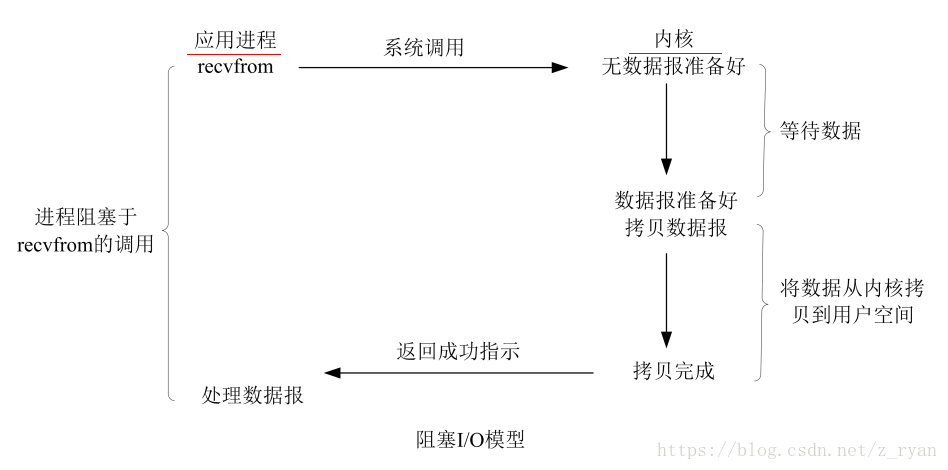
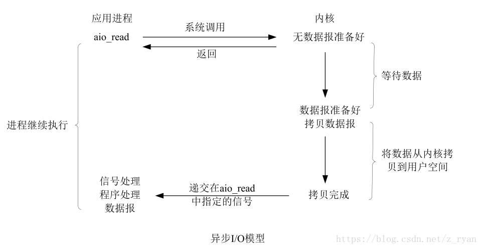
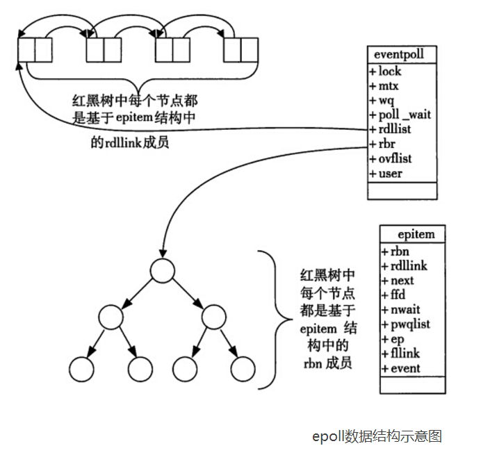
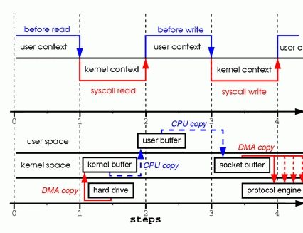
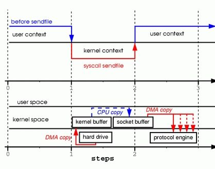
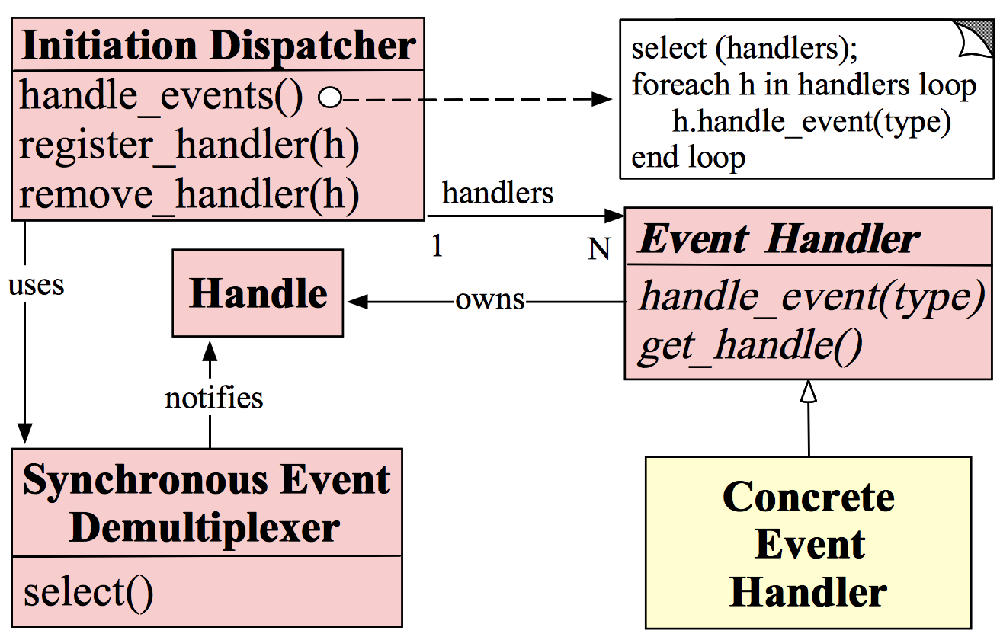
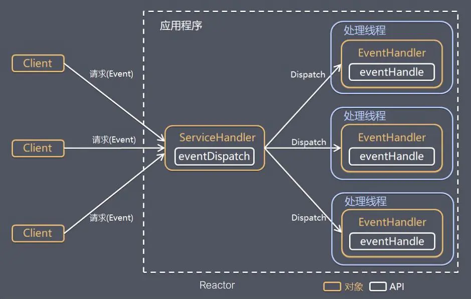
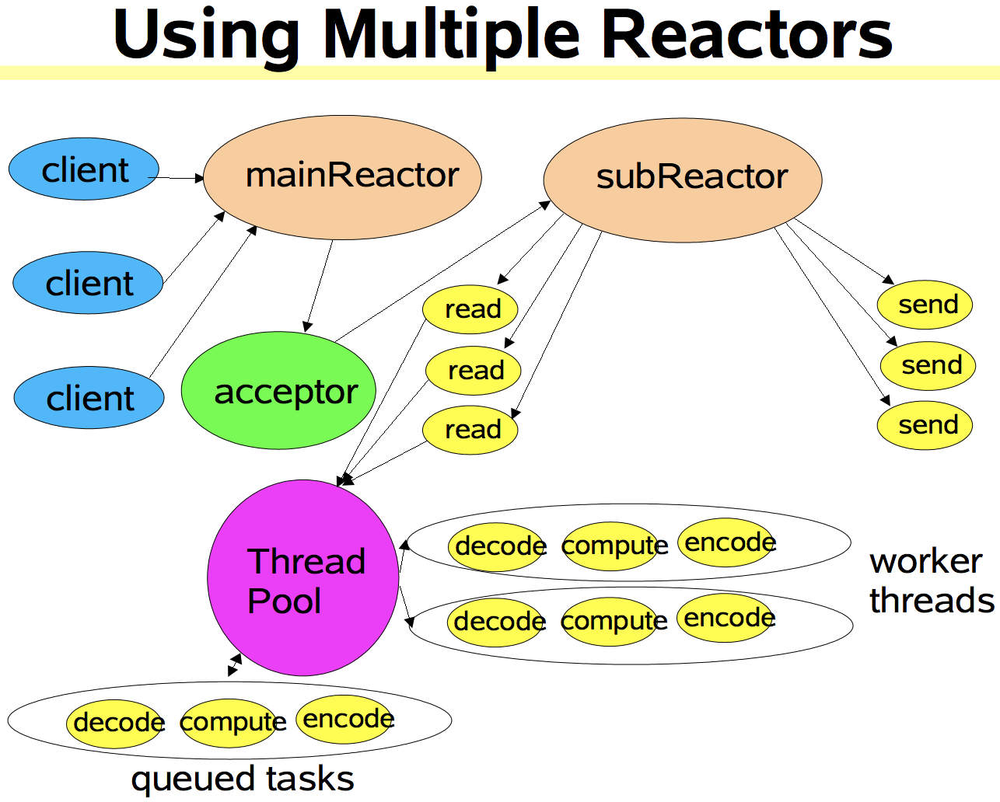
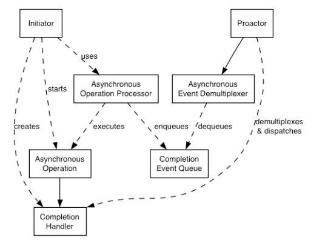

# I/O模型

## Linux的Socket API

网络应用进程通信时需要通过API接口请求底层协议的服务，如传输层服务，目前因特网最广泛的应用编程接口就是Socket API。Linux内核也实现了Socket API，实现了底层协议的封装。

### socket

```C
int socket(int family, int type, int protocol);
```

* **功能**：创建套接字；
* **参数**：
  * `family`：协议族，通常取值为PF_INET或AF_INET，表示面向IPv4或IPv6协议族；
  * `type`：套接字类型，取值有数据报套接字SOCK_DGRAM、流式套接字SOCK_STREAM和原始套接字SOCK_RAW；
  * `protocol`：协议，取值IPPROTO_TCP或IPPROTO_UDP，表示TCP和UDP协议。
* **返回**：成功返回非负整数（即套接字描述符）。失败则返回-1。


### bind

```C
int bind(int sockfd, const struct sockaddr *myaddr, socklen_t addrlen);
```

* **功能**：为套接字绑定本地端口；
* **参数**：
  * `sockfd`：本地套接字描述符；
  * `myaddr`：本地端点地址；
  * `addrlen`：端点地址长度。
* **返回**：成功返回0，失败则返回-1。


### listen

```C
int listen(int sockfd, int backlog);
```

* **功能**：将套接字置为监听状态；
* **参数**：
  * `sockfd`：本地套接字描述符；
  * `backlog`：连接请求的队列长度。
* **返回**：成功返回0，失败则返回-1。


### accept

```C
int accept(int sockfd, struct socketaddr *cliaddr, socklen_t addrlen);
```

* **功能**：从监听状态的流式套接字的客户连接请求队列中，出队一个请求，并且创建一个新的套接字来与客户套接字建立TCP连接；
* **参数**：
  * `sockfd`：本地流套接字描述符；
  * `cliaddr`：用于存储客户端点地址；
  * `addrlen`：端点地址长度。
* **返回**：成功返回非负整数，即新建的与客户连接的套接字描述符。失败则返回-1。


### send

```C
ssize_t send(int sockfd, const void *buff, size_t nbytes, int flags);
```

* **功能**：发送数据（流式套接字）；
* **参数**：
  * `sockfd`：本地套接字描述符；
  * `buff`：指向存储待发送数据的缓存指针；
  * `nbytes`：数据长度；
  * `flags`：控制比特，通常取0。
* **返回**：成功返回发送的字节数，失败则返回-1。


### recv

```C
ssize_t recv(int sockfd, void *buff, size_t nbytes, int flags);
```

* **功能**：接收数据（流式套接字）；
* **参数**：
  * `sockfd`：本地套接字描述符；
  * `buff`：指向存储接收数据的缓存指针；
  * `nbytes`：数据长度；
  * `flags`：控制比特，通常取0。
* **返回**：成功返回接收到的字节数，失败则返回-1。


## Linux的I/O模型

### I/O相关概念

**同步和异步（消息的通知机制）**：

* **同步**：所谓同步，就是发出一个功能调用时，在没有得到结果之前，该调用就不会返回。如应用程序调用 `readfrom` 系统调度时，必须等待内核的I/O操作执行完成后才能够返回；
* **异步**：异步的概念和同步相对，当一个异步的功能调用发出后，调用者会立即得到返回，但不会立即得到结果。当这个调用被真正的处理完毕后，再通过状态、信号和回调来通知调用者。如：应用程序调用 `aio_read` 系统调用时，不必等到操作完成就可以直接返回，操作的结果会在真正完成后通过信号通知调用者。

**阻塞和非阻塞（等待消息通知时的状态）**：

* **阻塞**：阻塞调用是指调用结果返回之前，当前线程会被阻塞，只有在得到结果之后才会继续执行。阻塞和同步是完全不同的概念，同步是对于消息的通知机制而言，而阻塞是针对等待消息通知时的状态来说的；
* **非阻塞**：非阻塞的概念和阻塞相对，即在不能立即得到调用结果时，不会阻塞当前线程，而会继续执行，并设置相应的异常序号。虽然表面上看非阻塞的方式可以明显提高CPU的利用率，但也带来了另外一种后果就是系统的线程切换频率增加。所以增加的CPU利用率能否补偿CPU频繁切换上下文带来的消耗需要好好的评估。

**事例描述（小明下载文件）**：

* **同步阻塞**：小明一直盯着下载进度条，直到100%的时候完成下载。
  * 同步：等待下载进度到100%；
  * 阻塞：等待下载完成的过程中，小明不干别的事。
* **同步非阻塞**：小明提交下载任务后就去干别的事，每过一段时间就去看一眼进度条，看到100%就完成下载。
  * 同步：等待下载进度到100%；
  * 非阻塞：等待进度条到底的过程中，干别的事，只是时不时的回来看一眼。即小明要在两个任务间来回切换，关注下载进度。
* **异步阻塞**：小明更换了一个带下载完成通知的下载器，当下载完成后会叮一声，不过小明一直等着叮声响起。
  * 异步：下载完成叮一声通知；
  * 阻塞：等待通知声响起，不去做其他得事。
* **异步非阻塞**：小明提交任务后就去干别的事，直到听见叮的一声就完成。
  * 异步：下载完成叮一声通知；
  * 非阻塞：先去做其他事，只需要等通知即可。

**Linux中的输入操作包括两个阶段**：

* 首先，等待数据准备好，即文件的状态发生变化，到达内核缓冲区；
* 其次，从内核向进程复制数据，即从内核空间拷贝到用户空间；
* 例：对于一个套接字上的输入操作，第一步通常涉及等待数据从网络中到达，当所有分组都到达时，会被复制到内核中的某缓冲区。第二步就是把数据从内核缓冲区复制到应用程序缓冲区。


### 阻塞式I/O



* 同步阻塞式I/O是最简单最常用的一种I/O模型。在Linux中，默认情况下所有套接字都是阻塞式的；
* 上图是阻塞套接字 `recvfrom` 系统调用的流程图，进程调用一个 `recvfrom` 请求，但是不能立即收到回复，需要等待内核的操作执行完成并返回成功提示后，进程才能处理数据报；
* 在I/O执行的两个阶段中，进程都处于阻塞（Blocked）状态，在等待数据返回的过程中不做其他任何工作，只能阻塞等待在那里。
* **优点**：简单、实时性高、响应及时无延迟；
* **缺点**：阻塞等待性能较差、CPU利用率较低。


### 非阻塞式I/O


* 非阻塞式I/O与阻塞I/O不同的是，非阻塞的 `recvfrom` 系统调用后，进程并没有被阻塞，内核会立即返回给进程消息，若是数据还未准备好，则返回一个 error（EAGAIN或EWOULDBLOCK）；
* 进程收到返回后，可以处理其他任务，每过一段时间就会再次发起 `recvfrom` 系统调用，采用轮询的方式检查内核数据，直到数据在内核空间准备好后，再进行数据处理（拷贝）；
* 上图是Linux中设置为非阻塞套接字的 `recvfrom` 系统调用的流程图，前三次调用 `recvfrom` 请求，但是数据还没有准备好，所以内核返回 `error:EWOULDBLOCK`，但是当第四次调用 `recvfrom` 时数据已经准备好了，就可以将数据拷贝到用户空间，处理数据；
* 在非阻塞状态下，对于I/O执行的两个阶段进程并不是完全非阻塞的，第一个阶段等待数据准备完毕会采用轮询访问的非阻塞方式，而第二个阶段等待数据从内核拷贝到用户空间时会处于阻塞等待状态。
* 同步非阻塞相对于同步阻塞：
  * **优点**：能够在等待任务完成的时间内做其他事，包括提交其他任务，也就是允许多个任务同时执行；
  * **缺点**：任务完成的响应延迟增大了，因为每过一段时间才去轮询一次 read 操作，而任务可能在两次轮询之间的任意时间完成，这样会导致整体数据处理的吞吐量降低。


### I/O多路复用


* 所谓的多路复用也是一种同步非阻塞式I/O，即使用单个进程同时处理多个I/O。基本原理就是不再由应用程序自己监听I/O状态，取而代之的是由内核替代应用程序监视文件描述符fd；
* 以 `select` 为例，当用户进程调用了 `select` 系统调用，那么整个进程会被阻塞。同时内核会监听所有在 `select` 上注册的Socket，当任何一个Socket中的数据准备好了，`select` 就会返回可读条件。这时用户进程再通过 `recvfrom` 系统调用，触发并等待数据从内核拷贝到用户进程；
* 上图就是Linux中使用 `select` 多路复用机制响应Socket连接的流程图。涉及到两个系统调用`select` 和 `recvfrom`，而阻塞I/O只会涉及 `system_call(recvfrom)`。所以，如果处理的连接请求不是很多的话，使用I/O多路复用不一定比使用多线程+非阻塞/阻塞I/O的性能更好，可能会有更大的延迟。I/O复用的优势并不是对于单个连接能处理的更快，而是使用单个进程就可以同时处理多个网络连接的I/O；
* 实际上在使用了I/O多路复用模型的用户进程在I/O的两个阶段都是阻塞的，只不过是阻塞在两个系统调用上，而是不阻塞在等待I/O操作上，即并不会阻塞等待I/O数据准备好，而是将非阻塞I/O的轮询访问交给了内核去做。
* **优点**：与传统的并发模型相比，I/O多路复用的最大优势是系统开销小，不需要创建额外的进程或线程，也不需要维护这些进程和线程的运行，降低了系统的维护工作量，节省了系统资源。
* **应用场景**：
  * 服务器需要同时处理多个处于监听或连接状态的套接字；
  * 服务器需要同时处理多种网络协议的套接字，如：同时处理TCP和UDP请求；
  * 服务器需要监听多个端口或处理多种服务；
  * 服务器需要同时处理用户输入和网络连接。


### 信号驱动式I/O


* 信号驱动式I/O模型是一种同步非阻塞式I/O。通过 `sigaction` 系统调用，允许Socket使用信号驱动I/O，并在用户进程注册一个SIGIO的信号处理函数（即返回一个信号处理程序），用户进程会继续运行而不阻塞。当数据准备好时，进程会收到一个SIGIO信号，然后可以在信号处理函数中调用I/O操作函数处理数据；
* 用户进程不会在I/O操作的第一阶段阻塞，只会在第二阶段阻塞。


### 异步I/O



* 即异步非阻塞式I/O。上述四种I/O都是同步模型，相对于同步I/O，异步I/O不是顺序执行的。用户进程进行 `aio_read` 系统调用后，就可以去处理其他的任务了，无论内核数据是否准备好，都会直接返回给用户进程，不会对进程造成阻塞；
* 等到数据准备完毕，内核直接复制数据到用户进程空间，然后从内核向进程发送通知信号，告知用户进程：此时数据已经在用户空间了，可以直接对数据进行处理；
* 在Linux中，通知的方式是信号，分为三种情况：
  * 如果这个进程正在用户态处理其他逻辑，那就强行中断，调用事先注册的信号处理函数，这个函数可以决定何时以及如何处理这个异步任务。由于信号处理函数是随机触发的，因此和中断处理程序一样，有很多事情是不能做的，为了保险起见，一般是把事件登记一下放进队列，然后返回该进程原来在做的事；
  * 如果这个进程正在内核态处理，如：正在以同步阻塞的方式读写磁盘，那就把这个通知挂起，等到内核态的事件处理完毕，快要回到用户态时，再触发信号的通知；
  * 如果这个进程现在被阻塞/挂起了，那就把这个进程唤醒，等待CPU调度，触发信号通知。
* 在此模型下，进程在I/O的两个阶段中均为非阻塞。


### 五种I/O模型的比较


* 前四种I/O模型都是同步模型，至于阻塞和非阻塞的区别在于I/O执行的第一阶段，而第二阶段都是一样阻塞的，都是在数据从内核缓冲区复制到应用程序缓冲区期间，进程阻塞于 `recvfrom` 调用；
* 相反，异步I/O模型在等待数据和接收数据这两个阶段都是非阻塞的，用户进程可以处理其他的逻辑，即用户进程将整个I/O操作交给内核完成，内核全部完成后才会发起通知，在此期间，用户进程不需要去检查I/O状态，也不需要主动的去触发数据的拷贝。


## Linux的I/O多路复用

### 基本概念

* **文件描述符（File Descriptor）**：表示指向文件引用的抽象化概念。fd在形式上是一个非负整数，实际上是一个索引值，指向内核为每一个进程所维护的该进程打开文件的记录表。当程序打开一个现有文件或创建一个新文件时，内核会向进程返回一个文件描述符。

* **缓存I/O**：又称标准I/O，是大多数文件系统的默认I/O。在Linux中，内核会将I/O的数据缓存在文件系统的页缓存中，即数据会被先拷贝到操作系统内核缓冲区中，然后才会从操作系统内核缓冲区拷贝到应用程序的地址空间中。


### select


```c
int select(int maxfdp1, fd_set *readset, fd_set *writeset, fd_set *exceptset, const struct timeval *timeout);
```

* **参数**：
  * `int maxfdp1`：指定待监听的文件描述符个数，它的值是待监听的最大描述符加1。
  * `fd_set *readset, fd_set *writeset, fd_set *exceptset`：fd_set可以理解为存放fd的集合，三种参数指定内核对fd集合的监听事件（读、写和异常）；
  * `const struct timeval *timeout`：超时参数，调用select会一直阻塞直到有fd发生事件或等待超时。
* **返回值**：若有就绪的fd则返回其数量，若超时则为0，出错则为-1。
* **运行机制**：select机制提供一种fd_set数据结构，是一个long类型的数组，数组中的每个元素都能与一个fd建立联系。当 `select()` 被调用时，由内核根据I/O状态修改fd_set的内容，由此来通知执行了 `select()` 的进程哪一个Socket或文件可读/写或建立连接。
* **优点**：在一个线程内可以同时处理多个Socket的I/O请求。
* **缺点**：
  * 每次调用select，都需要将fd_set从用户空间拷贝到内核空间，若集合很大会造成很大的开销；
  * 每次调用select，都需要在内核遍历整个fd_set，若集合很大会造成很大的开销；
  * 为了减少拷贝数据带来的性能消耗，内核对被监听的fd_set做了大小限制（1024），且是通过宏实现的，大小不可改变。


### poll

```C
int poll(struct pollfd *fds, nfds_t nfds, int timeout);

typedef struct pollfd {
	int fd;			// 需要被检测或选择的文件描述符
	short events;	// 文件描述符fd上感兴趣的事件
    short revents;	// 文件描述符fd当前实际发生的事件
} pollfd_t;
```

* **参数**：
  * `struct pollfd *fds`：fds是一个pollfd类型的数组，用于存放需要检测其状态的fd和对应事件，且调用poll后fds不会被清空。一个pollfd结构体用于表示一个被监听的fd，通过传递fds指示poll监视多个fd。其中，events域是该fd对应的感兴趣的事件掩码（由用户设置），revents域是该fd实际发生的事件掩码（由内核在调用返回时设置）；
  * `nfds_t nfds`：记录数组fds中描述符的总数量。
* **返回值**：返回集合中已就绪的读写或异常的fd数量，返回0表示超时，返回-1表示异常。
* **针对select的改进**：改变了fd集合的结构，使用pollfd链表结构替代了select的fd_set数组结构，使得poll没有了最大fd数量的限制。


### epoll


* epoll是Linux内核对I/O多路复用接口的改进版本，显著提高程序在大量并发连接中只有少量活跃情况下CPU的利用率。在监听事件就绪的过程中，不需要遍历整个被监听的描述符集合，只需要遍历那些发生内核I/O事件被异步唤醒而加入Ready队列（链表）的描述符集合即可。

  ```c
  struct eventpoll{  
      ....  
      // 红黑树的根节点，这颗树中存储着所有添加到epoll中的需要监听的描述符
      struct rb_root  rbr;  
      // 双向链表中则存放着将要通过 epoll_wait 返回给用户的发生事件就绪的数据
      struct list_head rdlist;
      ....  
  };
  ```

* fd进入红黑树时会对应的注册事件和回调函数，当网络连接和数据读写等事件发生时，由网卡驱动发出中断，产生事件然后调用call_back使fd加入就绪队列。

  
  
  ```c
  struct epitem{  
      struct rb_node rbn;			// 红黑树节点  
      struct list_head rdllink;	// 双向链表节点  
      struct epoll_filefd ffd;	// 事件句柄信息  
      struct eventpoll *ep;		// 指向其所属的eventpoll对象  
      struct epoll_event event;	// 期待发生的事件类型  
  };
  ```
  
* epoll没有描述符个数的限制，会将整个描述符集合放入一块用户和内核空间的共享内存中。这样在用户空间和内核空间的copy只需要一次即可。

* epoll提供了两种IO事件的触发方式：
  * **水平触发（LT，Level Trigger）**：默认工作模式，即当 `epoll_wait` 检测到某描述符事件的就绪并通知应用程序时，应用程序可以不立即处理该事件。等到下次调用 `epoll_wait` 时，会再次通知此事件；
  * **边缘触发（ET，Edge Trigger）**：当 `epoll_wait` 检测到某描述符事件就绪并通知应用程序时，应用程序必须立即处理该事件。如果不处理，下次调用 `epoll_wait` 时，不会再次通知此事件，即边缘触发机制只会在状态由未就绪变为就绪时通知一次。

```C
int epoll_create(int size);
int epoll_ctl(int epfd, int op, int fd, struct epoll_event *event);
int epoll_wait(int epfd, struct epoll_event * events, int maxevents, int timeout);
```

* `epoll_create`：创建一个epoll的fd，参数size表示内核要监听的fd数量，调用成功时返回一个epoll文件描述符，失败返回-1；

* `epoll_ctl`：用于注册要监听的fd和事件。

  * `epfd`：表示epoll的fd；

  * `op`：表示对fd的操作类型。

    * **EPOLL_CTL_ADD**：注册新的fd到epfd中；
    * **EPOLL_CTL_MOD**：修改已注册fd的监听事件；
    * **EPOLL_CTL_DEL**：从epfd中删除一个fd。

  * `fd`：表示需要监听的描述符；

  * `event`：表示需要监听的事件。

    * EPOLLIN：表示对应的文件描述符可以读（包括对端Socket正常关闭）；
    * EPOLLOUT：表示对应的文件描述符可以写；
    * EPOLLPRI：表示对应的文件描述符有紧急的数据可读（这里应该表示有带外数据到来）；
    * EPOLLERR：表示对应的文件描述符发生错误；
    * EPOLLHUP：表示对应的文件描述符被挂断；
    * EPOLLET：将EPOLL设为边缘触发（Edge Triggered）模式，这是相对于水平触发（Level Triggered）来说的；
    * EPOLLONESHOT：只监听一次事件，当监听完这次事件之后，如果还需要继续监听这个socket的话，需要再次把这个socket加入到EPOLL队列里。

    ```C
    struct epoll_event {
        __uint32_t events;  /* 配置epoll监听的事件类型 */
        epoll_data_t data;  /* User data variable */
    };
    
    typedef union epoll_data {
        void *ptr;
        int fd;
        __uint32_t u32;
        __uint64_t u64;
    } epoll_data_t;
    ```

* `epoll_wait`：等待事件的就绪，成功时返回就绪的事件数量，失败则返回-1，等待超时返回0。

  * `epfd`：表示epoll的fd；
  * `events`：表示从内核得到的就绪事件集合；
  * `maxevents`：通知内核events的大小；
  * `timeout`：表示等待的超时时间。


### select/poll/epoll总结

|            |                         select                         |                         poll                         |                            epoll                             |
| :--------: | :----------------------------------------------------: | :--------------------------------------------------: | :----------------------------------------------------------: |
|  操作方式  |                          遍历                          |                         遍历                         |                             回调                             |
|  底层实现  |                          数组                          |                         链表                         |                         红黑树+链表                          |
|   IO效率   |        每次调用都进行线性遍历，时间复杂度为O(n)        |       每次调用都进行线性遍历，时间复杂度为O(n)       | 事件通知方式，每当fd就绪，系统注册的回调函数就会被调用，将就绪fd放到readyList里面，时间复杂度O(1) |
| 最大连接数 |                1024（x86）或2048（x64）                |                        无上限                        |                            无上限                            |
|   fd拷贝   | 每次调用select，都需要把fd集合从用户空间拷贝到内核空间 | 每次调用poll，都需要把fd集合从用户空间拷贝到内核空间 | 调用epoll_ctl时拷贝进内核并保存，之后每次epoll_wait都不用拷贝 |


## Linux的零拷贝技术

### mmap

TODO


### sendfile

#### 系统调用

```c
ssize_t sendfile(int out_fd, int in_fd, off_t *offset, size_t count)
```

* `out_fd`：等待读数据的fd；
* `in_fd`：等待写数据的fd；
* `offset`：在正式开始读取数据时向前偏移的byte数；
* `count`：在两个fd直接移动的byte数。


#### 传统I/O发送文件到Socket的步骤

* **两次系统调**：
  * 进程调用 `sys_call(read)` 将文件从硬盘读入用户空间会陷入一次内核态；
  * 接着调用 `sys_call(write)` 将文件从用户空间写入协议引擎也会陷入一次内核态。
* **四次拷贝**：
  * `read()` 调用：
    * 通过硬件驱动从硬盘到内核缓冲区的DMA拷贝；
    * 从内核缓冲区到用户缓冲区的CPU拷贝；
  * `write()` 调用：
    * 从用户缓冲区到内核Socket缓冲区的CPU拷贝；
    * 从Socket缓冲区到协议引擎的DMA拷贝。




#### sendfile发送文件到Socket的步骤

* **一次系统调用**：进程调用 `sendfile()` 直接由内核完成硬盘中的文件拷贝到协议引擎的全部操作。
* **三次拷贝**：
  * 通过硬件驱动从硬盘到内核缓冲区的DMA拷贝；
  * 从内核缓冲区到Socket缓冲区的CPU拷贝；
  * 从内核Socket缓冲区到协议引擎的DMA拷贝。




#### 和传统I/O相比的优势和区别

* 更少的拷贝次数和更少的系统调用带来的上下文切换，即更小的性能损耗；
* 传统I/O需要应用程序主动调用读和写这两次操作，而sendfile则直接将读写操作全部交给内核来完成。


## 高性能I/O设计模式

### Reactor反应器模式

#### 组成结构



* **文件描述符（Handle）**：由操作系统提供，用于表示一个事件，事件既可以来自外部，也可以来自内部。外部事件如Socket描述符的客户端连接请求、客户端发送的数据等，内部事件如操作系统的定时事件等；
* **同步事件分离器（Synchronous Event Demultiplexer）**：是一个系统调用，用于等待一个或多个事件的发生。调用方会阻塞在它之上，直到分离器上有事件产生。Linux中该角色对应的就是I/O多路复用器，Java NIO中该角色对应的就是Selector；
* **事件处理器（Event Handler）**：由多个回调方法构成，这些回调方法构成了与应用相关的对于某事件的反馈机制。Netty中该角色对应的就是用于处理事件的ChannelHandler；
* **具体事务处理器（Concrete Event Handler）**：事件处理器的具体实现，用于实现特定的业务逻辑，本质上就是开发者编写的针对各种不同事件的处理器函数；
* **初始分发器/生成器（Initiation Dispatcher/Reactor）**：是Reactor模式的核心，定义了一些用于控制事件调度方式的规范，也提供了应用进行事件处理的注册、删除等机制。初始分发器会通过同步事件分离器来等待事件的发生，一旦事件发生，初始分发器会分离出事件，然后通过事件处理器和相应的处理方法处理该事件。如Netty中ChannelHandler的回调方法都是由BossGroup或WorkGroup中的某个EventLoop来调用的。




#### 工作流程


* **注册事件处理器**：首先初始化Reactor，由应用程序通过 `register_handle()` 将若干个具体事件处理器和其感兴趣的事件注册到Reactor中；
* **关联描述符**：事件由Handle标识，Reactor会通过 `get_handle()` 获取所有事件处理器对应的描述符并关联起来；
* **事件循环**：当所有事件注册完成，应用程序会通过 `handle_events()` 触发Reactor的事件循环机制。Reactor会通过 `select()` 让同步事件分离器去执行具体的事件循环，然后以同步阻塞的方式等待事件的发生；
* **事件就绪**：当与某个事件对应的Handle变为Ready就绪状态时，同步事件分离器就会通知Reactor；
* **执行事件处理**：Reactor会获取就绪事件对应的处理器，且通过 `handle_event()` 让处理器去执行相应的逻辑。


#### 单线程Reactor模式

* **概念**：所谓的单线程Reactor，是指所有的I/O操作和业务操作都在同一个线程上完成，该线程负责管理事件和处理器关联、事件循环、建立连接、分离事件和处理读/写操作。
* **缺点**：
  * 所有的操作都在单个线程上处理，无法同时处理大量的请求，会出现性能瓶颈，或因为单个耗时操作导致所有的请求都会受到影响，大大延迟了请求的响应或导致处理的超时；
  * 一旦这个单线程陷入死循环或其他问题，会导致整个系统无法对外提供服务，产生单点故障问题。


#### 多线程Reactor模式

* **概念**：多线程模式Reactor的会有一个专门的线程用于监听和建立客户端的连接，而读/写请求和业务操作则交由一个线程池负责。
* **缺点**：Reactor多线程模型可以满足大部分场景的性能要求。但在小部分情况下，一个线程负责监听和处理所有的客户端连接可能会存在性能问题，如百万级客户端并发连接，或者服务端需要对客户端的握手信息进行安全认证等消耗性操作时。这些场景下一个线程处理连接就会存在性能不足的问题。


#### 主从多线程Reactor模式

* **概念**：所谓主从模式是指将Reactor拆分成两个角色。其中mainReactor负责接受客户端请求、建立连接和接入认证等和连接相关的操作。当连接被建立后会将其交付给subReactor完成后续的读/写请求、编码解码和业务逻辑等操作。
* **优点**：mainReactor也可以维护一个线程池来处理和连接相关的操作，避免了单个连接处理线程带来的问题。




### Proactor主动器模式



#### 组成结构

TODO

* 句柄（Handle）：
* 异步操作处理器（Asynchronous Operation Processor）：
* 异步操作（Asynchronous Operation）：
* 完成事件队列（Completion Event Queue）：
* 主动器（Proactor）：
* 完成事件接口（Completion Handler）：
* 完成事件处理逻辑（Concrete Completion Handler）：


#### 工作流程

TODO


## Java的I/O模型

### BIO

#### 代码示例

```JAVA
public class SocketBIOExample {
    
    public static void main(String[] args) {
        ServerSocket server = new ServerSocket(9090);
        
        while (true) {
            final Socket client = server.accept();
        	
            new Thread(() -> {
                InputStream in = null;
                try {
                    in = client.getInputStream();
            		BufferedReader reader = new BufferedReader(new InputStreamReader(in));
                    while (true) {
                        String dataline = reader.readLine();
                        if (null != dataline) {
                            System.out.println(dataline);
                        } else {
                            client.close();
                            break;
                        }
               		}
                } catch(Exception e) { }    
            });
        }
    }
}
```


#### 系统调用分析

```shell
# 编译为字节码
/usr/java/j2sdk1.4.2_19/bin/javac SocketBIOExample.java
# 追踪应用程序的系统调用，并重定向到以out开头的文件中，每个线程一个文件
strace -ff -o out /usr/java/j2sdk1.4.2_19/bin/java SocketBIOExample
```

* 通过 `socket(PF_INET6, SOCKET_STREAM, IPPROTO_IP) = 3` 创建TCP的流式套接字，返回套接字的文件描述符；
* 通过 `bind(3, {sa_famliy=AF_INET6, sin6_port=htons(9090), inet_pton(AF_INET6, "::", &sin6_addr), sin6_flowinfo=0, sin6_scope_id=0}, 24) = 0` 为套接字绑定端口；
* 通过 `listen(3, 50)` 将套接字置为监听状态；
* 通过 `accept(3, {sa_family=AF_INET6, sin6_port=htons(53311), inet_pton(AF_INET6. "::1", &sin6_addr), sin6_flowinfo=0, sin6_scope_id=0}, [28]) = 5` 阻塞用户线程等待连接请求。

此时开启一个本地客户端发送连接请求：`nc localhost 9090`。

* 此时 `accept()` 会接收连接请求，并新建套接字，返回该套接字的文件描述符；
* 通过 `clone(child_stack=0xea2bd494, flags=CLONE_VM|CLONE_FS|CLONE_FILES|CLONE_SIGHAND|CLONE_THREAD|CLONE_SYSVEM|CLONE_SETTLS|CLONE_PARENT_SETTID|CLONE_CHILD_CLEARTID, parent_tidptr=0xea2bdbd8, tls=0xea2bdbd8, child_tidptr=0xffb2e44c) = 2386` 创建子线程去处理，每个线程处理一个连接，并返回其进程描述符（PID）；
* 在子线程中，通过 `recv() `读取套接字输入流（阻塞等待），直到有数据到来，继续接下来的处理。


#### BIO的缺点

* 基于同步阻塞式I/O模型，服务端需要在建立客户端连接时阻塞等待，还会在连接建立后，阻塞等待客户端的数据到来；
* 在BIO+多线程的编程模型下，每一个客户端连接就需要一个子线程去处理。若在大量连接的场景下，会造成大量的资源占用。即便使用线程池来处理连接，也会因为存在大量的线程而会将性能损耗在上下文切换上。


### NIO

#### 基本概念

* **Buffer**：缓冲区本质是一个可以读写数据的内存块，可以理解为容器对象，除了基本的容器操作之外，还提供了记录缓冲区状态变化情况的功能。

* **Channel**：通道类似于流，可以同时进行读/写且能实现异步操作，通道以缓冲区为单位读写数据。

|       属性       |                             描述                             |
| :--------------: | :----------------------------------------------------------: |
| 容量（Capacity） |      可容纳的最大数据量，在缓冲区创建时被设定且不能改变      |
|  Limit（范围）   | 表示缓冲区当前的终点，不能对超过极限的位置进行读写操作。 且极限 是可以修改的 |
| 位置（Position） | 下一个要被读写的元素的索引，每次读写缓冲区中数据时都会改变该值，为下次读写准备 |
|   标记（Mark）   |                             标记                             |


#### 代码示例

```JAVA
public class SocketNIOExample {
    
    public static void main(String[] args) {
        LinkedList<SocketChannel> clients = new LinkedList<>();
        
        // 服务端套接字的封装
        ServerSocketChannel ss = ServerSocketChannel.open();
        // 绑定端口
        ss.bind(new InetSocketAddress(9090));
        // 设置非阻塞
        ss.configureBlocking(false);
    	
        while (true) {
            Thread.sleep(1000);
            // 等待连接建立，非阻塞
            SocketChannel client = ss.accept();
            if (client != null) {
                client.configureBlocking(false);
                int port = client.socket().getPort();
               	clients.add(client);
            }
            
            // 设置缓冲区
            ByteBuffer buffer = ByteBuffer.allocateDirect(4096);
            for (SocketChannel c : clients) {
                // 读取客户端数据，非阻塞
                int num = c.read(buffer);
                if (num > 0) {
                    buffer.filp();
                    byte[] aaa = new byte[buffer.limit()];
                    buffer.get(aaa);
                    
                    String b = new String(aa);
               		System.out.println(c.socket().getPort() + ":" + b);
                    buffer.clear();
                }
            }
        }
    }
}
```


#### 系统调用分析

* 通过 `socket(PF_INET6, SOCK_STREAM, IPPROTO_IP) = 4` 创建TCP的流式套接字，并返回套接字的文件描述符；

* 通过 `bind(4, {sa_famliy=AF_INET6, sin6_port=htons(9090), inet_pton(AF_INET6, "::", &sin6_addr), sin6_flowinfo=0, sin6_scope_id=0}, 28) = 0` 为套接字绑定端口；

* 通过 `listen(4, 50)` 将套接字设置为监听状态；

* 通过 `fcntl(4, F_SETFL, 0_RDWR|0_NONBLOCK) = 0` 将套接字设置为非阻塞状态；

* 通过 `accept(4, 0x7f00580f0070, [28]) = -1` 接收连接请求，但不会阻塞线程，若是当前没有连接建立，则返回-1；


此时开启一个本地客户端发送连接请求：`nc localhost 9090`。

* 通过 `accept(4, {sa_family=AF_INET6, sin6_port=htons(53311), inet_pton(AF_INET6. "::1", &sin6_addr), sin6_flowinfo=0, sin6_scope_id=0}, [28]) = 5` 接收连接建立，新建和连接对应的套接字，返回套接字的文件描述符；
* 通过 `fcntl(5, F_SETFL, 0_RDWR|0_NONBLOCK) = 0` 将新的连接套接字设置为非阻塞；
* 通过 `read(5, 0x7f0003efcc10, 4096) = -1` 读取套接字输入流中的数据到大小为4096的缓冲区中，但不会阻塞线程，若是当前没有数据可读，则返回-1。


#### NIO的优缺点

* **优点**：避免了BIO的一个连接一个线程而导致存在大量线程造成的资源消耗巨大的问题，即会把大量资源用在线程的上下文切换上；
* **缺点**：可能会存在大量无意义的系统调用，若是有1w个连接，但只有1个连接有数据读取，但NIO机制每次循环还是会发送1w次的read系统调用，即会把大量的资源用在用户态到内核态的切换上。


### NIO+Selector

#### 基本概念

* **Selector**：选择器能够检测多个注册在其上的通道是否有具体的事件发生，只有当真正发生事件时，才会对应的进行回调处理（连接、读/写请求）。

* **工作流程**：
  * 服务端创建 `ServerSocketChannel` 并绑定端口，然后通过 `register()` 注册到Selector上和连接事件对应，最后通过Selector 的 `select()` 开始轮询监听通道的状态；
  * 当客户端连接时，会发生连接事件，Selector会通过回调方法给客户端建立对应的 `SocketChannel`，然后将其注册到Selector上和读/写事件对应；
  * 当连接有读/写事件发生时，返回 `SelectionKey`，反向获取对应的 `SocketChannel`，最后进行相应的处理。


#### 代码示例

```JAVA
// Java底层使用了epoll机制
public class SocketMultiplexingSingleThread {
    
    private ServerSocketChannel server = null;
    private Selector selector = null;
    int port = 9090;
    
    public void initServer() {
        try {
            // 服务端套接字通道
            server = ServerSocketChannel.open();
            // 非阻塞
            server.configureBlocking(false);
            // 绑定端口
            server.bind(new InetSocketAddress(port));
            
            // 开启多路复用器
            selector = Selector.open();
            // 将服务端套接字和相应的连接事件关联并注册到复用器上
            server.register(selector, SelectionKey.OP_ACCEPT);
        } catch (IOException e) {
            e.printStackTrace();
        }
    }
    
    public void start() {
        initServer();
        try {
            while (true) {
                Set<SelectionKey> keys = selector.keys();
                // 阻塞在select上500毫秒等待事件就绪
                while (selector.select(500) > 0) {
                    // 获取就绪事件
                    Set<SelectionKey> selectionKeys = selector.selectedKeys();
                    Iterator<SelectionKey> iter = selectionKeys.iterator();
                    while (iter.hasNext()) {
                        SelectionKey key = iter.next();
                        iter.remove();
                        // 根据事件类型处理
                        if (key.isAcceptable()) {
                        	// 连接处理器
                            acceptHandler(key);
                        } else if (key.isReadable()) {
                            // 读处理器
                            key.cancel();
                            readHandler(key);
                        } else if (key.isWritable()) {
                            // 写处理器
                            key.cancel();
                            writeHandler(key);
                        }
                    }
                }
            }
        } catch (IOException e) {
            e.printStackTrace();
        }
    }
    
    public void acceptHandler(SelectionKey key) {
        try {
            ServerSocketChannel ssc = (ServerSocketChannel) key.channel();
            SocketChannel client = ssc.accept();
            client.configureBlocking(false);
            
            ByteBuffer buffer = ByteBuffer.allocate(8192);
			client.register(selector, SelectionKey.OP_READ, buffer);
        } catch (IOException e) {
        	e.printStackTrace(); 
        }
    }
    
    public void readHandler(SelectionKey key) {
        SocketChannel client = (SocketChannel) key.channel();
        ByteBuffer buffer = (ByteBuffer) key.attachment();
        buffer.clear();
        int read = 0;
        try {
            while (true) {
             	// ...   
            }
        } catch (IOException e) {
            e.printStackTrace();
        }
    }
}
```


#### select/poll系统调用分析

* 通过 `socket` 创建套接字，返回文件描述符；
* 通过 `bind` 为套接字绑定端口；
* 通过 `listen` 将套接字置为监听状态；
* 通过 `select/poll` 将套接字的文件描述符注册给多路复用器（select对文件描述符的个数有限制，poll取消了限制），并使用户线程阻塞在 `select/poll` 这个系统调用上；
* 当内核遍历发现有文件描述符变为可连接或可读/写等状态时，`select/poll` 会返回，然后再通过 `accept` 或 `read` 等调用去处理对应的事件。

**优点**：通过一次系统调用，将所有文件描述符传递给内核，由内核进行遍历，直到相应事件的发生，这种方式相对于NIO减少了系统调用的次数，即避免了用户态到内核态的频繁切换，节省资源；

**缺点**：

* 每次select/poll系统调用时都需要传递整个文件描述符集合；
* 每次select/poll系统调用时都会让内核遍历整个文件描述符集合。


#### epoll系统调用分析

* 通过 `socket(PF_INET, SOCK_STREAM, IPPROTO_IP) = 4` 创建服务端套接字，并返回其文件描述符；

* 通过 `fcntl(4, F_SETFL, O_RDWR|O_NONBLOCK) = 0` 将套接字设置为非阻塞；

* 通过 `bind(4, {sa_family=AF_INET, sin_port=htons(9090)})` 为套接字绑定端口；

* 通过 `listen(4, 50)` 将套接字设置为监听状态；

* 通过 ``epoll_create(256) = 7`` 初始化多路复用器，并在内核空间建立一块用于保存套接字文件描述符的红黑树结构；

* 通过 `epoll_ctl(7, EPOLL_CTL_ADD, 4, {EPOLLIN, {u32=4, u64=13736798553693487108}}) = 0` 将服务端套接字的文件描述符和对应的连接事件挂入红黑树；

* 通过 `epoll_wait(7, {{EPOLLIN, {u32=4, u64=13736798553693487108}}}, 4096, -1) = 1` 阻塞用户线程，交由内核监听rbtree上的fd，当fd的状态发生变化时，即发生连接和读/写等事件后，返回事件的数量；

此时开启一个本地客户端发送连接请求：`nc localhost 9090`。

* 通过 `accept(4, {sa_family=AF_INET, sin_port=htons(53687), sin_addr=inet_addr("127.0.0.1")}, [16]) = 8` 接收连接，为连接建立套接字，并返回其文件描述符； 

* 接收连接后，接着通过 `epoll_ctl(7, EPOLL_CTL_ADD, 8, {EPOLLIN, {u32=8, u64=13823012355644063752}}) = 0` 将新套接字的文件描述符和其感兴趣的事件挂到红黑树上；

* 循环去通过 `epoll_wait` 监听事件、接收连接、添加套接字fd和处理读写请求，以此构建出使用epoll多路复用机制的服务器。