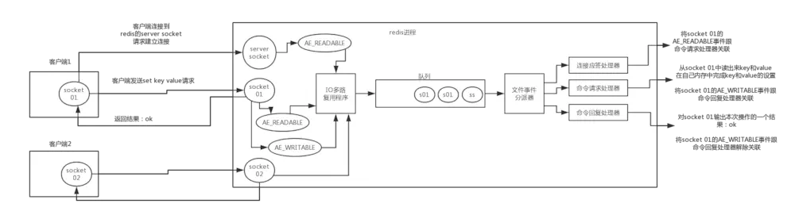
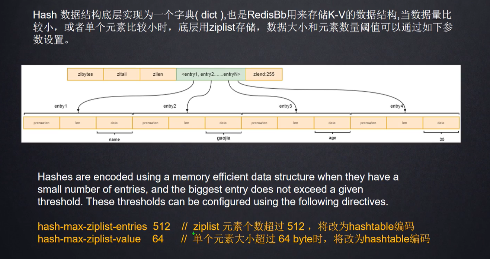
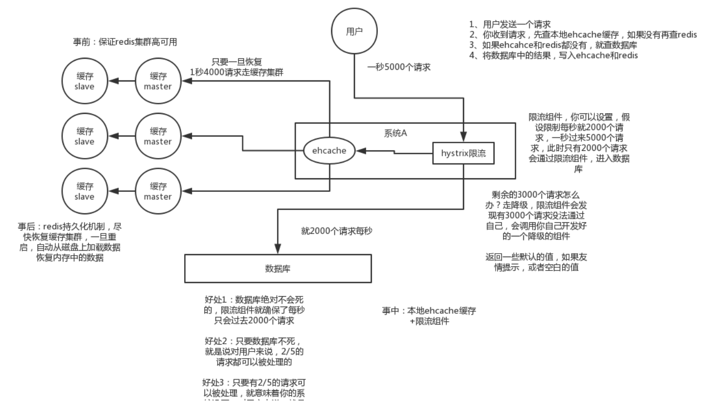

# Redis

## 线程模型

### 文件事件处理器

文件事件处理器（File Event Handler）是单线程的，所以Redis才叫做单线程的模型。其采用了I/O多路复用机制来同时监听多个Socket，根据Socket上就绪的事件来选择对应的事件处理器进行处理。

* 文件事件处理器的结构包含多个Socket、I/O多路复用器、事件分派器和事件处理器（连接应答处理器、命令请求处理器、命令回复处理器）；

* 多个Socket可能会并发产生不同的操作，每个操作对应不同的文件事件。I/O多路复用器会监听多个Socket，并将Socket产生的事件放入队列，事件分派器每次从队列中取出一个事件，把该事件交给相应的事件处理器进行处理。


### 客户端与Redis的通信过程



* **建立连接**：客户端通过Socket向Redis的Server Socket请求建立连接，Server Socket会产生一个 `AE_READABLE` 事件，多路复用器监听到Server Socket产生的事件后，将该事件入队。事件分派器从队列中获取到该事件，交给连接应答处理器。连接应答处理器会创建一个与客户端通信的Socket，并将该Socket的 `AE_READABLE` 事件与命令请求处理器关联；
* **命令请求**：客户端发送了一个 `set key value` 请求，Redis的Socket会产生 `AE_READABLE` 事件，多路复用器将事件入队，事件分派器从队列中获取到该事件，由于Socket的 `AE_READABLE` 事件已与命令请求处理器关联，因此事件分派器直接将事件交给命令请求处理器。命令请求处理器读取Socket的 `key value` 并在内存中完成设置。操作完成后，它会将Socket的 `AE_WRITABLE` 事件与命令回复处理器关联；
* **结果响应**：若客户端准备好接收返回结果了，那么Redis的Socket会产生一个 `AE_WRITABLE` 事件并由多路复用器入队，事件分派器找到相关联的命令回复处理器，由其对Socket输入本次操作的结果（如 `ok`），然后解除Socket的 `AE_WRITABLE` 事件与命令回复处理器的关联。


### Redis单线程模型的特点

* 纯内存操作；
* 核心是基于非阻塞的I/O多路复用机制；
* 单线程反而避免了多线程的频繁上下文切换问题。


## 数据结构

### RedisDB

* Redis默认情况下有16个数据库；
* Redis的一个数据库对应一个redisDb结构；
* redisDb中的dict字典字段维护了一个被封装HashTable，即dictht；
* dictht存储dictEntry类型的元素，若是不同的dictEntry哈希定位到了同一个位置，则通过dictEntry的next指针构成链表；
* redisObject中维护了元素的各种特性，如：类型指针、编码、LRU和引用计数器等。


### String

* 底层使用二进制安全的字节数组存储。
* **字符串操作**：
  * 分布式锁（`SETNS key:value)`）；
  * 集群Session共享；
  * 小文件存储（存储图片的二进制流）；
  * 对象缓存（JSON序列化后 `SET key:value`）。
* **数值操作**：
  * 秒杀（缓存内实时扣减商品数量）；
  * 限流（信号量）；
  * 计数器（`INCR key:value`）；
  * 分布式全局id。
* **位图操作（二进制操作）**：
  * 统计任意时间窗口内用户的登录次数：
    * 用户id做为key，日期做为offset，一年的天数设置为365个二进制位（0~364），用户在某天上线则将该天对应的二进制位置为1；
    * 要统计任意时间窗口内用户的登录天数只要使用 `bitcount user_id 0 364` 命令统计二进制位1的出现次数即可。
  * OA系统中各个用户对应的不同模块所具有的权限；
  * 用户是否参加过某次活动、是否已读过某篇文章、是否是注册会员；
  * 布隆过滤器。


### List

* List是一个按插入时间排序的数据结构，底层通过QuickList（维护双向链表）和ZipList（存储数据）两个结构体实现；
* 可以实现栈（`LPUSH+LPOP`）、双端队列（`LPUSH+RPOP/RPUSH+LPOP`）、数组（正负索引）、阻塞队列（`LPUSH+BRPOP`）和进行范围截取操作（`LRANGE key start end`）；
* 数据的共享、迁出和粉丝列表、文章评论列表；
* **微博和微信公众号的消息流**：
  * 用户关注的用户发微博：`LPUSH msg:{userId} {msgId}`；
  * 用户查看最新的微博消息：`LRANGE msg:{userId} 0 5`。


### Hash



* 底层使用存储K-V对的字典结构；
* 存储结构化数据，如对象缓存 `HMSET key field:value `；
* **好友/关注列表**：用户id做为key，field为所有好友id，value为对应好友id的关注时间；
* **用户维度统计**：用户id为key，不同的统计维度为field，对应维度的统计数据为value；
* **电商购物车**（用户id为key，商品id为field，商品数量为value）：
  * 添加商品：`HSET cart:1001 10088 1`；
  * 增加数量：`HINCRBY cart:1001 10088 1`；
  * 商品总数：`HLEN cart:1001`；
  * 删除商品：`HDEL cart:1001 10088`；
  * 获取购物车中所有商品：`HGETALL cart:1001`。
* **优点**：
  * 同类数据归类整合存储，方便数据管理；
  * 相比于String操作消耗的内存和CPU更小；
  * 相比于String更节省空间。
* **缺点**：
  * 过期功能不能使用在field上，只能使用在key上；
  * Redis集群下不适合大规模使用，因为Redis集群的分片是增对key做计算而不是field。


### Set

* 底层使用无序且唯一的哈希表存储；
* **抽奖（不能重复且无序的操作）**：
  * 用户参与抽奖：`SADD key {userId}`；
  * 查看参与抽象的所有用户：`SMEMBERS key`；
  * 随机抽取指定数量的中奖用户（放回/不放回）：`SRANDMEMBER key [count]/SPOP key [count]`。
* **微博点赞/收藏/标签（每个用户只能执行一次的操作）**：
  * 点赞操作：`SADD like:{msgId} {userId}`；
  * 取消点赞：`SREM like:{msgId} {userId}`；
  * 检查用户是否已经点过赞了：`SISMEMBER like:{msgId} {userId}`；
  * 获取所有点赞的用户：`SMEMBERS like:{msgId}`；
  * 获取点赞的用户数：`SCARD like:{msgId}`。
* **微博/微信关注模型（涉及到交兵集的操作）**：
  * 用户和好友的公共关注（交集）：`SINER userSet friendSet1`；
  * 我关注的人也关注他：`SISMEMBER friendSet1 friendSer2`；
  * 推荐给用户的好友（差集）：`SDIFF userSet friendSet1`。
* **电商商品按各维度标签筛选**：
  * 添加品牌维度标签：
    * `SADD brand:huawei P30`；
    * `SADD brand:xiaomi RedMi 8`；
    * `SADD brand:iPhone iPhone X`;
  * 添加CPU维度标签：`SADD CPU:Intel P30 RedMi 8`；
  * 添加操作系统维度标签：`SADD OS:Android P30 RedMi 8`；
  * 添加内存维度标签：`SADD RAM:8G P30 RedMi 8 iPhone X`；
  * 根据多种规格获取商品（取各标签的交集）：`SINTER OS:Android CPU:Intel RAM:8G`。


### Sorted Set

* 底层使用带分值排序的压缩表/跳表存储；

* **微博新闻排行榜（根据某种维度排序的操作）**：

  * 点击新闻：`ZINCRBY hotNews:20201211 1 xxx`；

  * 展示当日排行Top10：`ZREVRANGE hotNews:20201211 0 9 WITHSCORES`；
  * 计算近七日的排行榜（并集）：`ZUNIONSTORE hotNews:20201205-20201211 7 hotNews:20201205 ... hotNews:20201211`；
  * 展示近七日排行Top10：`ZREVRANGE hotNews:202005-20201211 0 9 WITHSCORES`。

* **微博动态翻页（根据某种维度数值的变化而实时更新的操作）**：

  * 每条微博做为元素，对应的发布时间戳做为分值； 
  * 通过 `zrevrange key start stop` 逆序获取最新发布的微博n条。如果在翻页时微博出现新的动态，有序集合也会动态的重新排序。

* **延迟队列**：

  * 当前时间戳+需要延长的时间做为分值score，消息内容做为元素；
  * 使用 `ZADD` 生产消息，消费者使用 `ZRANGEBYSCORE` 获取当前时间之前的数据做轮询处理，消费完后删除。

* **跳表**：是一种基于链表的数据结构，在数据层的基础上额外添加了多个索引层。使得查询数据时可以跳过某些节点，减少迭代次数。

  

  * **查询**：如查询元素11，先从最上层的索引层出发，到达5，发现下一个元素是13，大于11，则不会next而是进入下一层查找。下一层的下一个元素是9，因为小于11则next向后，下一个因为是13大于11所以再次进入下一层，最后找到11。查找的时间复杂度是 `O(logN)`。

  

  * **插入**：插入的时候，首先要进行查询，然后从最底层开始插入元素，插入时需要从下往上判断是否需要逐层插入。至于如何判断是否插入上一层，来保证每层的跳跃都非常高效，算法设计越是平衡就越好（第一层1级跳，第二层2级跳，第3层4级跳，第4层8级跳），严格地按照2的指数次幂，非常复杂，还要对原有地结构进行调整。所以跳表的思路是抛硬币，听天由命，产生一个随机数，50%概率再向上扩展，否则就结束，这样每一个元素能够有X层的概率为0.5^(X-1)次方。
  * **删除**：同插入一样，删除也是先查找，查找到了之后，再从下往上逐个删除。


## 过期策略和内存淘汰机制

### 过期策略

* **定性删除**：Redis默认每隔100ms就随机抽取一些设置了过期时间的key，并检查其是否过期，如果过期就删除。所谓的随机抽取就是为了避免大数据量下顺序遍历带来的性能消耗。
* **惰性删除**：定期删除可能会导致很多过期key到了时间却没有被删除，所以就引入了惰性删除。所谓的惰性删除就是过期却没被定性删除的key等到再次被访问的时候删除。

* **内存淘汰**：如果定性删除漏掉了很多的key，这些key也没有被及时的访问，无法惰性删除。此时可能会有大量的key堆积在内存中，导致Redis的内存很快就被耗尽。所以就引入了内存淘汰机制来解决这个问题。


### 内存淘汰机制

当内存不足以容纳新写入的数据时，Redis的内存淘汰策略就要登场了。

* **volatile-lru**：在设置了过期时间的键空间中选择最近最少使用的key淘汰；
* **volatile-ttl**：在设置了过期时间的键空间中选择将要过期的key淘汰；
* **volatile-random**：在设置了过期时间的键空间中随机选择key淘汰；
* **allkeys-lru**：在键空间内选择最近最少使用的key淘汰；
* **allkeys-random**：在键空间内随机选择key淘汰；
* **no-eviction**：使写入操作报错。
* **volatile-lfu**：在设置了过期时间的键空间中选择最不经常使用的key淘汰（4.0版本新增）；
* **allkeys-lfu**：在键空间中选择最不经常使用的key淘汰（4.0版本新增）。


## 持久化机制

所谓的持久化就是将内存中的数据写入磁盘中，大部分原因是为了之后重用数据（如重启机器或机器故障之后恢复数据），或者是为了防止系统故障而将数据备份到一个远程位置。

### 快照持久化RDB

就是通过创建快照的方式来获得内存中的数据在某个时间点上的副本。Redis创建快照之后，可以对快照进行备份，可以将快照复制到其他服务器从而创建具有相同数据的服务器副本（Redis主从结构），还可以将快照留在原地以便服务器重启后恢复数据。

* RDB是Redis采用的默认持久化方式，在 `redis.conf` 文件中配置：
  * `save 900 1`：在900秒即15min后，如果至少有1个key发生了变化，Redis就会自动触发BGSAVE命令创建快照；
  * `save 300 10`：在300秒即5min后，如果至少有10个key发生了变化，Redis就会自动触发BGSAVE命令创建快照；
  * `save 60 10000`：在60秒即1min后，如果至少有10000个key发生了变化，Redis就会自动触发BGSAVE命令创建快照。
* **RDB的优缺点**：


### 只追加文件AOF

AOF持久化方式的本质就是写命令日志，当Redis每执行一条会更改数据的命令时，就会将该命令追加到硬盘中的AOF文件中。每当服务器重启后，就将AOF中的命令重新执行一遍以还原内存状态。

* Redis默认不开启AOF，可以通过在配置文件中添加参数 `appendonly yes` 来开启。
* 在Redis的配置文件中存在三种不同的AOF持久化方式：
  * `appendfsync always`：每次有数据修改发生时都会写入AOF文件，但这样会严重影响性能；
  * `appendfsync everysec`：每秒同步一次，显示的将多个写命令同步到硬盘。为了兼顾数据和性能，可以选择该选项，让Redis每秒同步一次AOF文件，Redis的性能不会受什么大影响，而且即使出现了系统崩溃，用户最多也只会丢失一秒内产生的数据；
  * `appendfsync no`：让系统决定何时进行同步。
* **AOF的优缺点**：


### Redis4.0的混合持久化策略

* 通过配置项 `aof-use-rdb-preamble` 开启RDB和AOF的混合持久化。
* 如果混合持久化被开启，则AOF重写的时候就直接把RDB的内容写到AOF文件开头。这样做的好处是可以结合RDB和AOF的优点，快速加载同时避免丢失过多的数据。缺点就是AOF文件中的RDB部分是压缩格式存储的，可读性较差。
* **AOF重写**：
  * 重写机制可以产生一个新的文件，这个新AOF文件和原有的AOF文件所保存的数据库状态一样，但体积更小；
  * 该功能其实是通过读取数据库中的键值对来实现的，程序无须对现有的AOF文件进行任何的读取、分析和写入操作；
  * 在执行 `BGREWRITEAOF` 命令时，Redis服务器会维护一个AOF重写缓冲区，该缓冲区会在子进程创建新AOF文件期间，去记录服务器执行的所有写命令。当子进程完成创建新AOF文件的工作后，服务器会将重写缓冲区中的所有内容追加到新AOF文件的末尾，使得新旧两个AOF文件所保存的数据库状态一致。最后，服务器用新AOF替换旧AOF，以此来完成AOF文件的重写操作。


## 缓存雪崩/穿透/击穿

### 缓存雪崩

缓存同一时间大面积的失效，导致在高并发的场景下，大量的请求全部落到数据库上，造成数据库在短时间内承受超量的请求而崩溃。缓存短时间内大规模失效的原因与key的超时时间设置有关，即大量的key被同时写入缓存，也被设置了相同的超时时间。

**解决方法**：

* **事前**：Redis高可用、主从+哨兵、Redis Cluster、内存淘汰、超时时间添加随机值；
* **问题发生时**：本地缓存 + 限流&服务降级以避免数据库崩溃；
* **事后**：Redis重启后利用持久化机制快速恢复缓存。




### 缓存穿透

所谓的穿透就是请求越过缓存直接落在数据库上，当大量请求访问一个缓存和数据库中均没有的key时，请求会全部落在数据库上（因为数据库中也没有，所以不会写缓存，会直接通过数据库返回），导致缓存无法发挥作用。

**正常缓存处理流程**：


**缓存穿透情况处理流程**：


**解决方法**：

* **缓存无效的key**：如果缓存和数据库都查不到某个key，就不管其是否存在都写入Redis缓存并设置超时，这种方式可以解决请求的key变化不频繁的情况。但如果面临恶意攻击的情况，每个请求构建不同的key，就会导致Redis中缓存大量无效的key，所以不能完全的解决问题。

* **布隆过滤器**：通过该数据结构可以判断一个给定的数据是否存在于海量数据中。首先把所有可能存在的请求的值都存放在布隆过滤器中，当用户请求发送过来，就会先判断用户请求的值是否存在于布隆过滤器中，若不存在的话直接返回非法key，若存在的话走正常处理流程。


### 布隆过滤器

布隆过滤器（Bloom Filter）是由二进制向量（位数组）和一系列随机映射函数（哈希散列）两部分组成的数据结构。优点是其占用空间和效率方面相对更高，缺点是返回结果是概率性的（元素越多，误报的可能性就越大），而不是非常准确的，且存放在其中的数据不容易删除。其中位数组中的每个元素都只占用1bit，且每个元素只能是0或1。以这种方式申请一个100w元素的位数组只会占用 `1000000bit/8 = 125000byte = 125000/1024kb ≈ 122kb` 的空间。

**使用原理**：

* 在使用布隆过滤器之前，位数组会初始化，即所有的元素都置为0。当要将一个字符串存入其中时，先通过多个散列函数对字符串做计算生成多个偏移量，然后将位数组对应的多个位置上的元素置为1。
* 若要判断某个字符串是否存在于布隆过滤器中时，只需要对给定的字符串进行相同的哈希计算获得偏移量，然后以此获取数组中对应位置的元素，若所有位置上的元素都为1，则说明字符串已经存在，若有一个值不为1，则说明字符串不存在。

* **注**：但哈希函数也存在哈希碰撞的可能性，即不同的字符串可能计算出的哈希位置相同（可以相应的增加位数组大小或调整哈希函数）。因此，布隆过滤器判断数据是否存在有小概率会误判，但判断数据是否不存在一定会成功。

**使用场景**：

* 判断给定的数据是否存在于海量的数据集中，如：防止缓存穿透（判断请求的数据是否有效，避免绕过缓存去请求数据库）、垃圾邮件过滤、黑名单功能等；
* 对大量数据集进行去重操作。

**Java实现布隆过滤器**：

```JAVA
import java.util.BitSet;

public class BloomFilter {
    
    // 位数组大小
    private static final int DEFAULT_SIZE = 2 << 24;
    // 通过不同的随机数种子生成6种hash函数
    private static final int[] SEEDS = new int[]{3, 13, 46, 71, 91, 134};
   	// 位数组
    private BitSet bits = new BitSet(DEFAULT_SIZE);
    // hash函数数组
    private SimpleHash[] func = new SimpleHash[SEEDS.length];
  
    // 初始化hash函数数组，包含多个不同的hash函数
    public BloomFilter() {
        for (int i = 0; i < SEEDS.length; i++) {
    		func[i] = new SimpleHash(DEFAULT_SIZE, SEEDS[i]);
        }
    }
    
    // 添加元素到位数组
    public void add(Object value) {
        for (SimpleHash f : func) {
            bits.set(f.hash(value), true);
        }
    }
    
    // 判断元素是否在位数组中存在
    public boolean contains(Object value) {
 		boolean ret = true;
        for (SimpleHash f : func) {
            ret = ret & bits.get(f.hash(value));
        }
        return ret;
    }
    
    public static class SimpleHash {
        
        private int cap;
        private int seed;
    	
        public SimpleHash(int cap, int seed) {
            this.cap = cap;
            this.seed = seed;
        }
        
        // hash操作
        public int hash(Object value) {
            int h;
            return (value == null) ? 0 : Math.abs(seed * (cap-1) & ((h = value.hashCode()) ^ (h >>> 16)));
        }
    }
}
```


### 缓存击穿

所谓的缓存击穿就是某个热点key访问非常频繁，处于集中式高并发访问的情况，当这个key超时失效的瞬间，大量的请求就击穿了缓存，直接请求数据库，给数据库巨大的压力。

**解决方法**：

* **永不过期**：若缓存的数据基本不会发生更新，则可将热点key设置为永不过期；
* **分布式锁**：若缓存的数据更新不频繁，且缓存刷新的整个流程耗时较少，则可以采用基于Redis、Zookeeper等分布式中间件实现分布式锁，以保证仅有少量的请求能进入数据库并重新构建缓存，其余的请求则在锁释放后能访问到新缓存；
* **定时线程**：若缓存的数据更新频繁或者在缓存刷新的流程耗时较长的情况下，可以利用定时线程在缓存过期前主动的重新构建缓存或者延后缓存的过期时间，以保证所有的请求能一直访问到对应的缓存。


## 并发竞争的问题

所谓的并发竞争指的是多个用户同时对一个key进行操作，造成最后执行的顺序和期望的顺序不同，导致结果不同。

**分布式锁解决方案**：推荐使用Zookeeper实现的分布式锁来解决，当客户端需要对操作加锁时，在Zookeeper上与该操作对应的节点目录下，生成一个临时有序节点，判断是否获取锁的方式就是去获取有序节点中序号最小的一个。当释放锁时，只需要将这个临时有序节点删除即可。


## 双写一致性

⼀般情况下使用缓存的过程是先读缓存，缓存没有的话，就读数据库，然后取出数据后放⼊缓存，同时返回响应。这种⽅式很明显会存在缓存和数据库的数据不⼀致的情况。即只要使用了缓存，就可能会涉及到缓存与数据库双存储双写，就会有数据⼀致性的问题。

* 如果有数据更新，先删除了缓存，还没来得及写入数据库，另一个线程就读取缓存，发现为空则读取数据库并将旧数据写入缓存，此时缓存中为已过期数据；
* 如果先写入了数据库，在更新缓存之前其他线程就去读取或是写线程出现问题，此时从缓存中获取的也是过期数据。

**解决方案**：

* **允许稍许不一致**：⼀般来说，如果系统不是严格要求缓存+数据库必须⼀致性的话，缓存可以稍微的跟数据库偶尔有不⼀致的情况。
* **读写请求串行化**：一种方法是，读请求和写请求串行化，串到⼀个内存队列⾥去，这样就可以保证⼀定不会出现不⼀致的情况，但串行化后，就会导致系统的吞吐量⼤幅度的降低，用比正常情况下多⼏倍的机器去⽀撑线上的⼀个请求。  
* **消息队列异步更新**：另一种方法是通过第三方的消息队列，当数据库数据发生更新后发送消息给MQ，异步更新缓存。


## 主从复制

单机的Redis能够承载的QPS大概在上万到几万不等。一般缓存都是用来支撑并发读的，因此出现了主从（Master-Slave）架构，即一个主节点多从节点，主节点负责写，并且将数据复制到从节点。而从节点负责读，所有的读请求全部走从节点。这样可以很轻松实现水平扩容，支撑并发读请求。

* 一个Redis服务可以有多个该服务的复制品，这个Redis服务称为Master，其他复制品称为Slaves；
* 只要网络连接正常，Master会一直将自己的数据更新同步给Slaves，保持主从数据同步；
* 只有Master可以执行写命令，Slaves只能执行读命令。


Replication的特点：

- Redis采用异步方式复制数据到slave节点；
- 一个master可以配置多个slave；
- slave可以连接其他的slave；
- slave进行复制时，不会阻塞master的正常工作；
- slave进行复制时，也不会阻塞对自己的查询操作，它会用旧的数据集来提供服务。但是复制完成后，需要删除旧数据集，加载新数据集，这时就会暂停对外服务；
- slave主要是用来进行横向扩容、读写分离的。扩容的slave可以提高读的吞吐量。

**注意**：

* 如果采用了主从架构，那么建议开启master的持久化，不建议使用slave作为master的数据热备。因为如果关掉master的持久化后，可能在master宕机重启后数据是空的，然后一经过复制， slave的数据也丢失了。
* 另外，master各种备份方案也需要做。万一本地所有文件丢失了，从备份中挑选一份RDB去恢复master，这样才能确保启动时是有数据的。即使采用了高可用机制，slave可以自动接管master，也可能出现sentinel还没检测到master failure，master就自动重启了，还是可能导致所有的slave数据被清空。

当启动一个slave时，会发送一个 `PSYNC` 命令给master。如果是slave初次连接到master，那么会触发一次 `full resynchronization` 全量复制。此时master会启动一个后台线程，开始生成一份 `RDB` 快照文件，同时还会将从客户端client新收到的所有写命令缓存在内存中。 `RDB` 文件生成完毕后， master会将这个 `RDB` 发送给slave，slave会先写入本地磁盘，然后再从本地磁盘加载到内存中，接着 master 会将内存中缓存的写命令发送到 slave，slave 也会同步这些数据。slave node 如果跟 master node 有网络故障，断开了连接，会自动重连，连接之后 master node 仅会复制给 slave 部分缺少的数据。


## 哨兵网络

哨兵（Sentinel）是 Redis 集群架构中非常重要的一个组件。用于实现Redis集群的高可用，本身也是分布式的，作为一个哨兵集群去运行，互相协同工作。

* Sentinel会不断检查Master和Slaves是否正常。
* 每一个Sentinel可以监控任意多个Master和该Master下的Slaves。
* 监控同一个Master的Sentinel会自动连接，组成一个分布式的Sentinel网络，互相通信并交换彼此关于被监视的服务器信息。
* Sentinel会在Master下线后自动执行Failover操作，即提升一台Slave为Master，并让其他Slaves重新成为新Master的Slaves。

**主要功能**：

- **集群监控**：负责监控Redis Master和Slave进程是否正常工作。
- **消息通知**：如果某个Redis实例有故障，那么哨兵负责发送消息作为报警通知给管理员。
- **故障转移**：如果Master节点挂掉了，会自动转移到Slave节点上。
- **配置中心**：如果故障转移发生了，通知客户端新的Master地址。

**集群特点**：

- **选举**：故障转移时，如要判断一个Master是否宕机，需要大部分的哨兵都同意才行，涉及到了分布式选举的问题。
- **高可用**：即使部分哨兵节点挂掉了，哨兵集群还是能正常工作的。


## 分布式集群

由多个Redis服务器组成的分布式无中心节点服务器集群，每一个Redis服务器称为节点Node，节点之间会互相通信，两两相连。

**节点复制**：

* Redis集群的每个节点都有两种角色可选，主节点Master和从节点Slave，其中主节点用于存储数据，而从节点则是对应主节点的镜像复制。
* 当用户需要处理更多读请求的时候，添加从节点可以扩展系统的读性能，因为Redis集群重用了单机Redis复制特性的代码，所以集群的复制行为和单机复制特性的行为是完全一样的。

**故障转移**：

* Redis集群的主节点内置了类似Sentinel的节点故障检测和自动故障转移功能，当集群中的某个主节点下线时，集群中的其他在线主节点会注意到这一点，并对已下线的主节点进行故障转移。
* 集群进行故障转移的方法和Sentinel进行故障转移的方法基本一样，不同的是，在集群里面，故障转移是由集群中其他在线的主节点负责进行的，所以集群不必另外搭建Sentinel。

**集群分片**：

* 集群将整个数据库分为16384个slot槽位，所有key都归属于这些slot中的一个，key的槽位计算公式为`slot_number=crc16(key)%16384`，其中crc16为16位的循环冗余校验和函数。
* 集群中的每个主节点都可以处理0~16383的槽，当16384个槽都由各自的节点在负责处理时，集群进入上线状态，并开始处理客户端发送的请求。
* 数据库中所有的数据由集群中各个节点承载一段范围，客户端向某节点请求的数据如果不存在本地，则会指导客户端向存在该数据的节点重新发送请求。

**请求转向**：

* 由于Redis集群无中心节点，客户端请求会发送给集群中的任意节点。
* 当前主节点只会处理自己负责槽位的命令请求，如果是其它槽位的命令请求，该主节点会返回给客户端一个转向错误。
* 客户端根据错误中包含的地址和端口重新向正确负责的主节点发起命令请求。