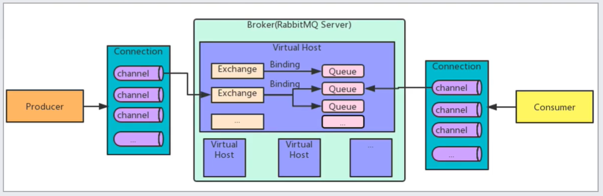

# RabbitMQ

## 基本概念

消息中间件MQ，全称为Message Queue（消息队列）。是在系统间通信的过程中保存和转发消息的容器，多用于分布式系统中各个模块之间的通信。

**优点**：

* **应用解耦**：
  * 系统间通过消息通信，断开了相互的强依赖性。
  * **问题引入**：系统之间的耦合性越高，其容错性就越低、可维护可扩展性也就越低。如下单操作可能会涉及到多个系统协作，如订单系统需要调用库存、支付和物流等系统才能完成整套流程，此时若其中一个系统出现了问题，会导致整套流程都发生错误。同样的，若有新的系统加入这套流程中，订单系统就需要相应的做出调整，可维护性大大降低。
  * **MQ提高容错性**：订单系统异步请求其他系统提供的服务，让各系统之间独立运行从而取消强关联。若是其中一个或多个系统发生了错误，就采用独立的补偿机制，重新修正出错的环节。如采用任务调度系统去补偿，和业务系统不存在关联，仅针对出错的系统，库存系统出错了就定时轮询这个任务，重新发送消息扣减库存，直到成功或是超过最大补偿次数告警。
  * **MQ提高可维护性**：下单流程中若需要新的系统参与，无需订单系统的大量调整，只需要发送相应的消息即可。
* **异步处理**：
  * 相对于传统的串行执行，异步处理提高了系统的响应速度。
  * **问题引入**：系统之间的调用若是按照串行方式执行，即一个系统调用完后再调用下一个，严重影响响应时间。如下单操作，订单系统挨个调用库存、支付和物流等系统，需要等待所有系统都处理完后才能响应给用户。
  * **MQ提高操作的响应速度**：订单系统在只需要将消息投递到MQ中，由MQ路由到指定的系统异步处理，自己完成任务后直接响应即可。
* **流量削锋**：
  * 通过队列的长度控制请求量，缓解高并发请求造成的问题。
  * **问题引入**：若在某个时间段内系统接收到的并发请求过高，超过了服务器的最大处理极限，会造成响应时间延长甚至无法响应等问题的发生。
  * **MQ限制请求**：让请求先通过消息队列再进入业务系统，通过控制队列的长度来限制请求到达服务器的速度。这样会让高峰期产生的请求积压在MQ中，达到了削峰的效果，在高峰期过后的一段时间内，再去消费堆积的消息，叫做填谷。
* **日志处理**：解决大量日志传输的问题。
* **消息通讯**：消息队列一般都会内置高效的通信机制，因此也可以用在纯消息通信上，如实现点对点消息队列或者聊天室等。

**缺点**：

* **系统可用性降低**：系统中若引入了MQ，就会导致系统产生外部依赖，若MQ宕机，就会对业务系统造成影响。可以通过搭建MQ集群来保证其的高可用性。
* **系统复杂度提高**：加入MQ需要考虑更多的问题，如一致性问题、消息重复消费问题、消息可靠性问题，导致系统复杂性提高。
* **一致性问题**：分布式系统环境下，业务逻辑的作用域横跨多个系统，相互之间通过消息队列异步协作。若其中一个系统操作失败，那么整套逻辑执行后就会出现数据不一致的情况。

## 多种MQ的对比

|                |                         RabbitMQ                         |                ActiveMQ                |         RocketMQ         |                 Kafka                 |
| :------------- | :------------------------------------------------------: | :------------------------------------: | :----------------------: | :-----------------------------------: |
| 公司/社区      |                          Rabbit                          |                 Apache                 |         Alibaba          |                Apache                 |
| 开发语言       |                          Erlang                          |                  Java                  |           Java           |              Scala&Java               |
| 协议支持       |                 AMQP、XMPP、SMTP、STOMP                  |   OpenWire、STOMP、REST、XMPP、AMQP    |          自定义          | 自定义协议，社区封装了HTTP协议的支持  |
| 客户端支持语言 |  官方支持Erlang、Java、Ruby等，社区提供了多种语言的API   | Java、C/C++、Python、PHP、Perl、.net等 |        Java、C++         | 官方支持Java，社区提供了多种语言的API |
| 单机吞吐量     |                       万级（第三）                       |              万级（最差）              |      十万级（最好）      |            十万级（第二）             |
| 消息延迟       |                          微秒级                          |                 毫秒级                 |          毫秒级          |               毫秒以内                |
| 功能特性       | 并发能力强、性能极其优秀、延迟低、社区活跃、管理界面丰富 |      老牌产品、成熟度高、文档较多      | MQ功能比较完善、扩展性好 |  只支持主要的MQ功能，适合大数据领域   |

## 基础架构

* **Broker**：RabbitMQ Server服务器实体，接收和分发消息的应用。
* **Exchange**：消息交换机，用于指定消息的路由规则。
* **Queue**：消息队列载体，每个消息都会被投递到一个或多个队列中。
* **Binding**：绑定关系，就是将交换机和队列按照路由规则绑定起来。
* **Routing Key**：路由关键字，交换机会根据关键字进行消息的投递。由Exchange、Queue和Routing Key三个角色共同决定消息的投递线路。
* **Virtual Host**：虚拟的Broker主机，也就是一套虚拟出的消息系统，内部含有独立的Queue、Exchange和Binding等。更重要的是其拥有一套独立的权限系统，可以做到VHost范围的用户控制，这让RabbitMQ可以使用VHost做为不同权限的隔离手段，典型的例子就是不同的应用可以通过不同的VHost运行在同一个MQ Server中。
* **Producer**：消息生产者，也就是投递消息的程序。
* **Consumer**：消息消费者，也就是接受消息的程序。
* **Connection**：生成者/消费者和Broker消息主机之间的TCP长连接。
* **Channel**：若每次访问MQ服务器都需要建立一个连接，那么在大量消息的情况下频繁的建立TCP连接造成的开销是巨大的。而Channel通道就是在一次TCP长连接中建立的虚拟连接，减少操作系统频繁建立TCP连接的开销，如果应用程序支持多线程，通常每个线程创建一个单独的通道进行通信，即每个Channel都代表一个会话任务。AMQP Method包含了Channel Id可以帮助客户端和消息服务识别Channel，所以Channel之间是完全隔离的。

## 工作模式

* **Simple**：收发模式。生产者生产消息，并将消息放入队列中。消费者监听队列，如果发现存在消息就获取并删除，这种机制存在的隐患就是消息可能没有被正确的处理，但却已经从队列中消失了，因此造成的消息丢失。可以通过设置手动ACK来解决问题，每次处理完毕后需要及时发送ACK应答给队列，否则会导致内存溢出。

  

* **Work**：资源的竞争模式。生产者将消息放入队列并且对应多个消费者，多个消费者同时监听一个队列，形成一个竞争关系。当队列中存在待消费的消息后，所有消费者都会去争抢消息，谁先获得的谁消费。这种机制存在的隐患就是高并发情况下，会产生某个消息被多个消费者共同使用，可以通过设置一个开关（syncronize）来保证一条消息只能被一个消费者消费。

  

* **Publish/Subscribe**：发布订阅模式。每个消费者都各自监听一个独自的队列。生产者将消息发送给broker，由交换机将消息转发到绑定到该交换机上的每个队列中。

  

* **Routing**：路由模式。生产者将消息发送给交换机，由交换机根据消息携带的路由关键字获取匹配到的消息队列，对应于该队列的消费者再进行消费。一般来说，都是根据业务逻辑进行的关键字绑定。

  

* **Topic**：主题模式。是一种提供了通配符和模糊匹配的路由模式。

  

## 保证消息的顺序性

* 拆分队列（Queue），使每个队列对应一个消费者（Consumer）；
* 一个队列（Queue）对应多个消费者（Consumer），消费者内部使用内存队列排队，分发给不同的工作线程（Worker）处理。

## 消息的重复消费/幂等性问题

* **前提**：通常情况下，消费者在消费完毕后会发送一个确认消息（ACK）给消息队列，消息队列会将该消息从队列中移除；
* **问题**：由于网络传输等故障的出现，ACK没有正确到达消息队列，导致消息队列不知道该消息是否被正确消费，会再次发送；
* **解决思路**：保证消息的唯一性，即使出现多次传输，也要让消费者可以有一个去重的依据，以此来保证消息前后的幂等；
* **解决方案**：在消息发送到队列之前对消息做唯一标识（如哈希码），在消息被消费时根据标识判断是否已经被消费过。消费端处理消息的业务逻辑必须保证前后的幂等性，即保证每条消息都有唯一标识且写入表中做为消息日志，利用这张日志表来记录消息的状态，如果新到来的消息标识在表中已经存在，那么就不需要再次处理这条消息了。

## 保证消息的正确发送/正确接收

* **发送方确认**：
  * 将信道设置为发送方确认模式（Confirm模式），则所有在信道上发布的消息对会被指派一个唯一的ID；
  * 一旦消息被投递到目标队列后，或消息被持久化写入磁盘后，信道会发送一个包含该ID的确认给生产者；
  * 如果是因为RabbitMQ内部错误导致的消息丢失，则会发送一条未确认消息（NACK）；
  * 发送方确认模式是异步的，生产者在等待确认的同时，可以继续发送消息，当确认消息到达后，触发回调方法去处理。
* **接收方确认**：
  * 消费者接收的每条消息都必须进行确认，只有消费者确认了消息，队列中的消息才会被删除；
  * RabbitMQ通过消费者的连接中断来确认是否需要重新发送消息。即只要连接不中断，不存在是否超时；
  * 如果消费者接收到消息后，在发送确认之前断开了连接或取消订阅，RabbitMQ会认为消息没有被分发，然后重新分发给下一个订阅的消费者；
  * 如果消费者接收到消息却没有确认消息，连接也未断开，则RabbitMQ认为该消费者繁忙，将不会再给其分发更多的消息。

## 消息的丢失问题

* **生产者丢失消息**：
  * **Transaction事务机制**：发送消息前开启事务（`channel.txSelect()`），发送过程中出现问题就会回滚（`channel.txRollback()`），发生成功则提交事务（`channel.txCommot()`）。该机制的缺点就是吞吐量下降。
  * **Confirm确认机制**：该机制会给一个Channel内的所有的消息都分配一个唯一ID，一旦消息被投递到所匹配的队列中时，消息服务会发送一个包含唯一ID的ACK给生产者，若没能正确处理消息，则发送一个NACK，生产者可以重发。
* **消息服务丢失消息**：
  * **消息持久化机制**：消息服务在处理消息时会将消息持久化到磁盘中。可以将持久化机制和Confirm机制配合使用，当消息持久化成功后再发送ACK，这样即使是消息还未持久化之前服务就宕机了，队列中的消息也还能重新被消费。
  * **RabbitMQ开启持久化**：将Queue的持久化标识durable设置为true，代表是一个持久的队列，发送消息时将deliveryMode置为2，这样设置后，即使RabbitMQ挂了，重启后也能恢复数据。
* **消费者丢失消息**：将消费者的自动消息确认改为手动消息确认。因为自动确认机制是消费者在收到消息之后、处理消息之前回复的，若是处理消息时消息丢失，则无法再次从消息服务那里获得消息了。
* **消息日志表+补偿机制**：可以使用一张日志表记录消息的状态，消费者可以依此判断是否是重复消息，补偿程序（任务调度系统）也可以通过消息状态判断消息是否丢失和是否被正确处理。若发生了上述情况，则由调度任务重新发送消息。

## 消息的持久化问题

首先，必然导致性能的下降，因为写磁盘比写 RAM 慢的多，message 的吞吐量可能有 10 倍的差距。

其次，message 的持久化机制用在 RabbitMQ 的内置 cluster 方案时会出现“坑爹”问题。矛盾点在于，若 message 设置了 persistent 属性，但 queue 未设置 durable 属性，那么当该 queue 的 owner node 出现异常后，在未重建该 queue 前，发往该 queue 的 message 将被 blackholed ；若 message 设置了 persistent 属性，同时 queue 也设置了 durable 属性，那么当 queue 的 owner node 异常且无法重启的情况下，则该 queue 无法在其他 node 上重建，只能等待其 owner node 重启后，才能恢复该 queue 的使用，而在这段时间内发送给该 queue 的 message 将被 blackholed 。

所以，是否要对 message 进行持久化，需要综合考虑性能需要，以及可能遇到的问题。若想达到 100,000 条/秒以上的消息吞吐量（单 RabbitMQ 服务器），则要么使用其他的方式来确保 message 的可靠 delivery ，要么使用非常快速的存储系统以支持全持久化（例如使用 SSD）。另外一种处理原则是：仅对关键消息作持久化处理（根据业务重要程度），且应该保证关键消息的量不会导致性能瓶颈。

## 消息的线上积压问题

消息积压处理办法：临时紧急扩容：

先修复 consumer 的问题，确保其恢复消费速度，然后将现有 cnosumer 都停掉。
新建一个 topic，partition 是原来的 10 倍，临时建立好原先 10 倍的 queue 数量。
然后写一个临时的分发数据的 consumer 程序，这个程序部署上去消费积压的数据，消费之后不做耗时的处理，直接均匀轮询写入临时建立好的 10 倍数量的 queue。
接着临时征用 10 倍的机器来部署 consumer，每一批 consumer 消费一个临时 queue 的数据。这种做法相当于是临时将 queue 资源和 consumer 资源扩大 10 倍，以正常的 10 倍速度来消费数据。
等快速消费完积压数据之后，得恢复原先部署的架构，重新用原先的 consumer 机器来消费消息。
MQ中消息失效：假设你用的是 RabbitMQ，RabbtiMQ 是可以设置过期时间的，也就是 TTL。如果消息在 queue 中积压超过一定的时间就会被 RabbitMQ 给清理掉，这个数据就没了。那这就是第二个坑了。这就不是说数据会大量积压在 mq 里，而是大量的数据会直接搞丢。我们可以采取一个方案，就是批量重导，这个我们之前线上也有类似的场景干过。就是大量积压的时候，我们当时就直接丢弃数据了，然后等过了高峰期以后，比如大家一起喝咖啡熬夜到晚上12点以后，用户都睡觉了。这个时候我们就开始写程序，将丢失的那批数据，写个临时程序，一点一点的查出来，然后重新灌入 mq 里面去，把白天丢的数据给他补回来。也只能是这样了。假设 1 万个订单积压在 mq 里面，没有处理，其中 1000 个订单都丢了，你只能手动写程序把那 1000 个订单给查出来，手动发到 mq 里去再补一次。

mq消息队列块满了：如果消息积压在 mq 里，你很长时间都没有处理掉，此时导致 mq 都快写满了，咋办？这个还有别的办法吗？没有，谁让你第一个方案执行的太慢了，你临时写程序，接入数据来消费，消费一个丢弃一个，都不要了，快速消费掉所有的消息。然后走第二个方案，到了晚上再补数据吧。

## 集群高可用

* **单机模式**：即本地启动的一个RabbitMQ实例。
* **集群模式**：即多台主机上启动的多个RabbitMQ实例，每台机器启动一个。客户端创建Queue只会存储在当前RabbitMQ实例中，但集群中每个实例都会同步Queue的元数据。当消费者连接的实例不是目标Queue所在的实例时，那么当前实例会根据元数据从Queue真正所在的实例那拉取数据。集群的作用是为了提高吞吐量，也就是说让多个节点服务某个Queue的读写操作。
* **镜像集群模式**：与普通的集群模式不一样的是，在镜像集群模式下，客户端创建的每一个Queue，不论是元数据还是消息都会被打包成镜像同步到集群中的所有实例上。当每次发送消息到Queue时，RabbitMQ都会将消息同步到所有实例所拥有的镜像Queue中去。RabbitMQ具有细致的集群管理策略，可以指定是数据同步到所有节点，还是只同步指定数量的节点。镜像集群的好处是，任何一个机器宕机都不会影响Queue的使用，因为其他节点上的实例还具有相同的镜像，可以让其他节点为客户端继续提供服务，缺点就是网络（消息同步）和存储（数据镜像）性能的开销很高。

