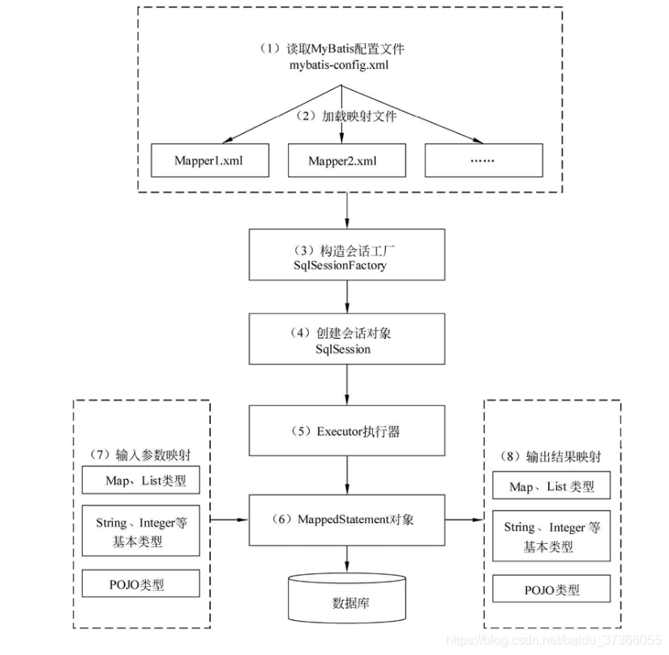

# MyBatis

## 基本概念

MyBatis是一个基于半ORM对象关系映射构建的持久层框架，支持定制化SQL、存储过程和高级映射。MyBatis提供了一种避免传统JDBC冗余代码的开发方式，可以使用XML和注解将原生类型、接口和Java Objects映射为数据库中的记录。

**ORM**：即Object Relational Mapping对象关系映射，是一种为了解决关系型数据库表与简单Java对象映射关系的技术。也就是说ORM是通过使用描述对象和数据库直接映射的元数据，将程序中的对象自动持久化到关系型数据库中。

**传统JDBC开发存在的问题**：

* 频繁创建数据库连接对象和释放连接，容易造成系统资源的浪费，影响系统的性能。可以使用连接池解决该问题；
* SQL语句的定义、参数设置和结果集的处理都是硬编码的。但在实际生产过程中SQL语句是动态变化的，一旦发生变化，需要重新修改代码、编译和发布，可维护性低下。

**MyBatis如何解决JDBC的问题**：

* MyBatis通过在 `mybatis-config.xml` 文件中配置数据库连接池来解决JDBC开发中频繁创建和释放连接的资源浪费问题；
* MyBatis通过在 `***mapper.xml` 文件中编写动态SQL语句，并通过Java代码传递参数，MyBatis在运行时动态拼接SQL。

**优点**：

* 基于动态SQL语句编程，更灵活且容易编写出复杂的SQL。且SQL是编写在XML文件中，避免了SQL语句和Java代码的耦合，便于统一管理。且提供动态XML标签，支持复用；
* 提供映射标签，支持对象与数据库的ORM字段关系映射。提供对象关系映射标签，支持对象关系组件的维护；
* 能被Spring很好的集成。

**缺点**：

* mapper文件中的SQL语句编写时工作量较大；
* 编写出的SQL语句存在数据库的适用性问题。

**适用场景**：

* 适用于SQL复杂度高，且需要灵活变化的项目；
* 也适用于对性能有较高要求的项目。

## 工作原理

* 读取 `mybatis-config.xml`，即MyBatis的全局配置文件，其中配置了MyBatis的运行环境等信息，如数据库连接信息；
* 加载mapper映射文件，该文件中配置了操作数据库的SQL语句。该文件的位置需要在 `mybatis-config.xml` 中配置，可以配置多个，每一个对应数据库的一张表；
* 通过已经加载的MyBatis环境信息构造会话工厂 `SqlSessionFactory`；
* 由会话工厂创建 `SqlSession` 会话对象，该对象中包含了执行SQL语句的所有方法；
* MyBatis底层定义了一个 `Executor` 接口用于操作数据库，它会根据 `SqlSession` 传递的参数动态生成SQL语句，同时负责查询缓存的维护；
* 在 `Executor` 接口执行的方法中有一个 `MappedStatement` 类型的参数，该参数是对映射信息的封装，用于存储要映射的SQL语句的id和参数；
* 对输入的参数进行映射，输入参数类型可以是Map、List等集合类型，也可以是基本数据类型和Object类型。输入参数映射过程类似于JDBC对preparedStatement对象设置参数的过程；
* 对输出的结果进程映射，输出结果类型可以是Map、List等集合类型，也可以是基本数据类型和Object类型。输出结果映射过程类似于JDBC对结果集的解析过程。

