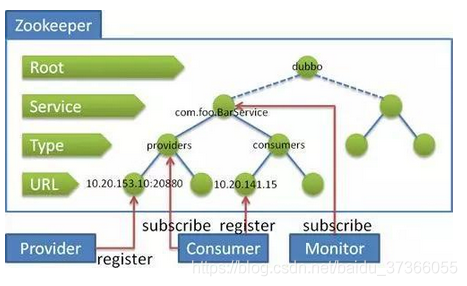

# Zookeeper

## 基本概念

Zookeeper是一个开源的分布式系统中间协调服务。是一个为分布式系统提供一致性服务的应用，分布式应用程序可以基于zk实现诸如数据发布/订阅、负载均衡、服务命名、分布式协调/通知、集群管理、Master选举、分布式锁和分布式队列等功能。zk的目标就是封装复杂易出错的关键服务，将简易的接口和性能高效、功能稳定的系统提供给用户。

**集群的特点**：

- **原子性**：所有操作都会准确的反馈成功或失败，没有中间状态。
- **最终一致性**：
  - 每个节点都有统一的数据视图，客户端的写请求总会由Leader处理，若是通过Follower提交的请求最终都会转发到Leader上。Leader会先保证所有节点达成一致，即和其他节点通信确认接下来的操作是否可以执行，等到半数以上的节点都响应后再对所有的节点做数据同步；
  - 如果因为发生网络延迟丢包的问题没有响应Leader导致节点数据没有更新，这时客户端如果立即向没更新的节点请求数据的话，该节点会向更新过的节点同步数据，同步完后再响应客户端；
  - 集群数据同步阶段，Leader会在本地内存中准备一个集群节点数量的消息队列，同步成功则出队消息。在集群中过半的节点完成同步后集群会确认同步完成，而因为出现网络延迟或其他问题未完成同步的节点在接下来也能够继续的通过出队从而达到集群数据的最终一致性。
- **高可用性**：Leader如果发生故障，zk集群会通过选举机制重新选出Leader。
- **防网络分区（脑裂）**：在客户端提交请求时如果集群中存在节点宕机的情况，那么会采取过半原则，如果集群半数以上的节点都能响应Client的请求，那么则表示集群能够响应请求。
- **有序性（顺序一致性）**：所有针对集群的写请求都是全局有序的，都会被分配一个唯一的时间戳，这个时间戳被称为zxid。而读请求只会相对于写请求有序，也就是说读请求的返回结果中会带有zk集群当前最新的zxid。zxid是一个64位的数字，高32位是epoch，用于标识Leader周期，如果有新Leader产生出来，epoch会自增。低32位用于递增计数，当新产生提议（写请求/事务请求）时，会基于数据库的两阶段提交XA机制实现分布式事务，首先会向其他的节点发出事务执行请求，如果超过半数的机器都能执行且成功，那么就会真正的提交事务。
- **读写请求**：客户端的读请求可以被集群中的任意节点处理，如果读请求在节点上注册了监听器，则这个监听器也是由所连接的节点来处理。而对于写请求，则会同时发送给其他节点并且在达成一致后，才会返回。因此，随着zk节点的增多，读请求的吞吐量会增加但写请求的吞吐量会减少。

## 服务端角色

* **Leader（领导者）**：
  * 写请求（事务请求）的唯一调度和处理者，保证集群事务处理的顺序性；
  * 集群内部各服务的调度者，负责进行投票的发起和决议。
* **Follower（追随者）**：
  * 处理客户端的读请求（非事务请求），转发写请求给Leader；
  * 参与写请求提议的投票；
  * 参与Leader选举的投票。
* **Observer（观察者）**：
  * 3.0版本后引入的服务器角色，在不影响集群事务处理能力的基础上提升集群的非事务处理能力；
  * 处理客户端的非事务请求，转发事务请求给Leader服务器；
  * 不参与任何形式的投票，只会同步Leader的状态。

## 目录节点

zk提供一个多层级的节点命名空间，节点被称为znode。与文件系统不同的是，这些节点都可以设置关联的数据，而文件系统中只有文件节点可以存放数据而目录节点不行。zk为了保证高吞吐和低延迟，会在内存中维护一个树状的目录结构，这种特性使得zk不能用于存放大量数据，每个节点存放的数据上限为1MB。

* **持久节点（persistent）**：除非手动删除，否则节点将一直存在于zk中；
* **临时节点（ephemeral）**：临时节点的生命周期与客户端会话绑定，一旦客户端会话失效，那么这个客户端创建的所有临时节点都会被移除；
* **持久顺序节点（persistent_sequential）**：在持久节点的基础上增加了顺序属性，节点名后会追加一个由父节点维护的自增型数字保证有序；
* **临时顺序节点（ephemeral_sequential）**：在临时节点的基础上增加了顺序属性，节点名后会最近一个由父节点维护的自增型数字保证有序。

**Session会话**：

* 客户端与集群中的节点建立TCP连接后，Leader会在客户端连接的节点上创建Session，同时该Session会被放到Leader的消息队列中，然后同步到所有节点；
* 如果客户端连接的节点出现问题，Session会经过一段时间自动销毁，如果没有超时，客户端可以连接其他节点，其他节点也会根据Session获知客户端的状态。

## 集群状态同步

zk的核心是原子广播机制，该机制保证了各个节点之间的数据同步。实现这个机制的协议叫做Zab协议，Zab协议有两种模式，分别是恢复模式和广播模式。

* **恢复模式（选举模式）**：当服务刚启动或是在Leader崩溃后，Zab就会进入恢复模式，直到Leader被选举出来，且大多数节点完成了和Leader的状态同步后，才会结束恢复模式。状态同步保证了Leader和集群中其他节点具有统一的数据视图。
* **广播模式**：一旦Leader已经和多数的Follower进行了状态同步后，就可以开始广播消息了，即进入广播状态。这时若有一个新节点加入zk集群，它会在恢复模式下启动，主动发现Leader并和其进行状态同步，待同步结束，也会参与消息广播。zk集群会一直维持在广播状态，直到Leader崩溃或是其失去了大部分Followers的支持。

## 事件监听机制

zk允许客户端向服务端的某个znode注册一个Watcher监听，当服务端的一些指定事件触发了这个Watcher，服务端会向注册该Watcher的客户端发送一个事件通知来实现分布式的通知功能，然后客户端根据Watcher的通知状态和事件类型做具体处理来实现分布式的回调功能。

* **注册Watcher的操作**：exists（目录节点是否存在），getChildren（观察子节点），getData（观察节点数据）；
* **触发Watcher的操作**：create（目录被创建），delete（目录被删除），setData（设置节点数据）。

**特点**：

* **一次性**：无论是服务端还是客户端，一旦有Watcher被触发，zk都会将其从相应的存储中移除。这样的是为了减轻服务端的压力，不然对于更新非常频繁的节点，服务端不断的向客户端发送事件通知，无论对于网络还是服务端的压力都非常大；
* **客户端串行执行**：客户端Watcher回调的过程是一个串行的过程，即一个接一个的处理事件回调；
* **轻量**：Watcher通知非常简单，只会告诉客户端发生了事件，而不会说明事件的具体内容。客户端向服务端注册Watcher时，并不会把客户端真实的Watcher对象实体传递到服务端，仅仅是在客户端请求中使用boolean数据进行标记；
* **异步**：Watcher的通知事件从服务器发送到客户端是异步的，这样就会存在一个问题，不同的客户端和服务器之间通过Socket进行通信，由于网络延迟或其他因素导致客户端不能及时监听到事件。由于zk本身提供有序性，即客户端监听的事件发生后，才会感知它所监听的znode的变化，所以使用zk只能保证客户端事件监听的最终一致性，而无法保证强一致性；
* 当一个客户端连接到一个新的服务器上时，Watche将会被以任意会话事件触发。当与一个服务器失去连接时，是无法接收到Watcher的。而当客户端重新连接时，如果需要的话，所有之前注册过的Watcher都会被重新注册。

**客户端注册Watcher流程**：

* 调用 `getData()/getChildren()/exist()` 传入Watcher对象；
* 标记请求request，封装Watcher到WatchRegistration；
* 封装成Packet对象，发送请求到服务端；
* 收到服务端响应后，将Watcher注册到ZKWatcherManager中进行管理；
* 请求返回，完成注册。

**服务端处理Watcher流程**：

* **服务端接收Watcher并存储**：接收到客户端请求后，先判断是否需要注册Watcher，需要的话将数据节点的节点路径和ServerCnxn（代表一个客户端和服务端的连接，实现了Watcher的process接口，此时可以看成是一个Watcher对象）存储在WatcherManager的WatchTable和Watch2Paths中去。 
* **Watcher触发（以服务器接收到setData()请求触发NodeDataChanged事件为例）**：
  * **封装WatchedEvent**：将通知状态（SyncConnected）、事件类型（NodeDataChanged）以及节点路径封装成一个WatchedEvent对象；
  * **查询Watcher**：从WatchTable中根据节点路径查找Watcher；
  * **若找到**：提取并从WatchTable和Watch2Paths中删除对应的Watcher；
  * **若没找到**：说明没有客户端在该数据节点上注册过Watcher。
* **调用process方法来触发Watcher**：这里的process就是通过ServerCnxn对应的TCP连接发送Watcher事件通知。

**客户端回调Watcher流程**：客户端SendThread线程接收事件通知，交由EventThread线程回调相应的Watcher。客户端的Watcher机制同样是一次性的，一旦被触发后，该Watcher就会失效。

## 节点宕机处理

* zk集群推荐不少于3个服务器，因为若服务器数量不是奇数将导致无法完成选举；
* 如果是一个Follower宕机，还会有2台服务器提供服务，由于数据存在副本，所以不会丢失；
* 如果是一个Leader宕机，则zk会选举出新的Leader；
* zk集群的机制是只要超过半数的节点正常，集群就能正常提供服务。只有在节点挂得过多，只剩下一半或一半不到的节点能工作时，集群才会失效；

## 应用场景

* **数据的发布/订阅**：数据发布订阅系统，即配置中心，就是一个发布者对应多个订阅者，由发布者提供数据，所有订阅者同时收到数据。主要用于动态数据（如配置信息）的获取，实现数据的集中式管理和动态更新。这种数据的特征通常是量比较小、数据内容在运行时会发生动态更新，集群中各机器共享且一致，如：机器列表信息、运行时开关配置、数据库配置信息等。
  * **数据存储**：将数据存储到zk的一个znode中；
  * **数据获取**：应用在启动时从znode读取数据，并在该znode上注册一个监听数据变更的Watcher；
  * **数据变更**：当数据发生变更时，同时更新zk对应节点的数据，zk会将数据发生变更的通知发送到各个监听的客户端，客户端接收到通知后通过事件回调重新读取变更后的数据即可。

* **负载均衡**：首先建立/servers节点，并建立Watcher监视其子节点的状态（用于在服务器增添时及时同步当前集群中服务器列表）。在每个服务器启动时，在/servers节点下建立子节点/worker_server_xx（可以用服务器地址命名），并在对应的子节点下存入服务器的相关信息。这样就可以在zk上获取当前集群中的服务器列表及相关信息，然后根据相应的负载均衡算法，在每个请求到来时从zk服务器中获取当前集群服务器的列表，通过算法选出其中一个服务器来处理请求。

* **命名服务**：命名服务是指通过指定的名字来获取资源或是服务的地址。使用zk创建一个全局唯一的目录，这个目录的路径就可以作为一个名字，指向集群中的机器、提供的服务的地址、一个远程的对象等。

* **分布式协调/通知**：对于系统调度来说。操作人员发送通知实际是通过控制台改变某个节点的状态，然后zk将这些变化发送给在这个节点上注册了Watcher的所有客户端。

* **集群管理**：
  * **节点的加入和退出**：所有的机器可以在约定的父目录下创建临时znode，然后监听父节点。一旦有机器挂掉，该机器与zk的连接断开，其所创建的临时znode会被删除，通过Watcher通知其他节点。一旦有新的机器加入，就会创建一个临时znode，集群中的节点就会收到通知；

  * **Master选举**：让所有集群中所有节点都在zk上创建临时顺序的znode，每次选取序号最小的节点做为Master即可。

* **分布式锁**：
  * **保持资源独占**：可以将zk上的一个znode看成是一把锁，通过创建znode的方式来实现。即所有客户端同时创建/distribute_lock节点，最终成功创建的那个客户端拥有这把锁，用完删除掉自己创建的/distribute_lock节点就释放了锁；
  * **控制访问顺序**：预先创建/distribute_lock，所有客户端在其下创建临时顺序的znode，和选举master一样，每次选序号最小的获得锁，用完删除，接下来按照序号依次获取释放即可。

* **分布式队列**：
  * **同步队列**：即当一个队列中的所有成员都聚齐时，这个队列才可用，否则一直等待所有成员到达。在约定的目录下创建临时znode，然后监听znode的数目是否是队列要求的数目。
  * **FIFO**：在特定的目录下创建持久顺序znode，创建成功时Watcher通知等待的队列，删除序号最小的节点表示出队。此场景下zk的znode用于存储消息，znode的序号就是消息在队列中的顺序，按序删除即可。由于创建的节点是持久化的，所以不必担心队列消息的丢失问题。

## 和Dubbo的关系

**zk的作用**：zk用来注册服务和进行负载均衡，哪一个服务由哪一个机器来提供必需让调用者知道，简单来说就是ip地址和服务名称的对应关系。当然也可以通过硬编码的方式把这种对应关系在调用方业务代码中实现，但是如果提供服务的机器挂掉调用者无法知晓，如果不更改代码会继续请求挂掉的机器提供服务。zookeeper通过心跳机制可以检测挂掉的机器并将挂掉机器的ip和服务对应关系从列表中删除。至于支持高并发，简单来说就是横向扩展，在不更改代码的情况通过添加机器来提高运算能力。通过添加新的机器向zk注册服务，服务的提供者多了能服务的客户也就多了。

**dubbo的作用**：是管理中间层的工具，在业务层到数据库间有非常多服务的接入和服务提供者需要调度，dubbo提供一个框架解决这个问题。这个框架中要完成调度必须要有一个分布式的注册中心，储存所有服务的元数据。

**zk和dubbo的关系**：dubbo将注册中心进行抽象，可以外接不同的存储媒介给注册中心提供服务，有zk、Memcached、Redis等。若是引入zk作为存储媒介，首先是负载均衡，单注册中心的承载能力是有限的，在流量达到一定程度时就需要分流，负载均衡就是为了分流而存在的，一个zk集群配合相应的服务就可以很容易达到负载均衡。然后是资源同步，单单有负载均衡还不够，分布式系统下各节点的数据和资源需要同步，zk集群就天然具备有这样的功能。最后是命名服务，将树状结构用于维护全局的服务器地址列表，服务提供者在启动时，向zk上的指定目录节点 /dubbo/${serviceName}/providers 下写入自己的URL，这个操作就完成了服务的发布。