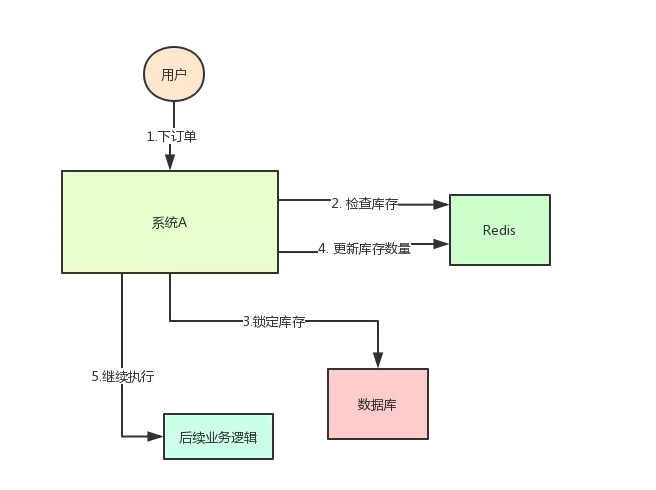
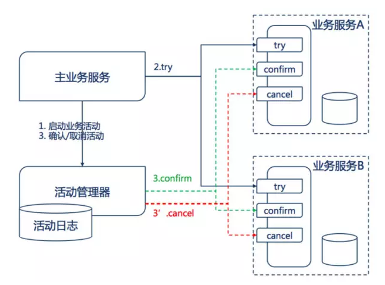
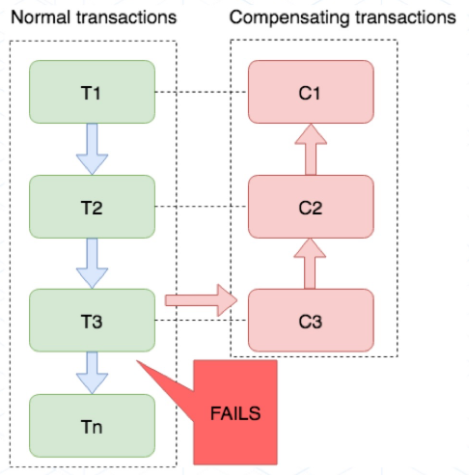
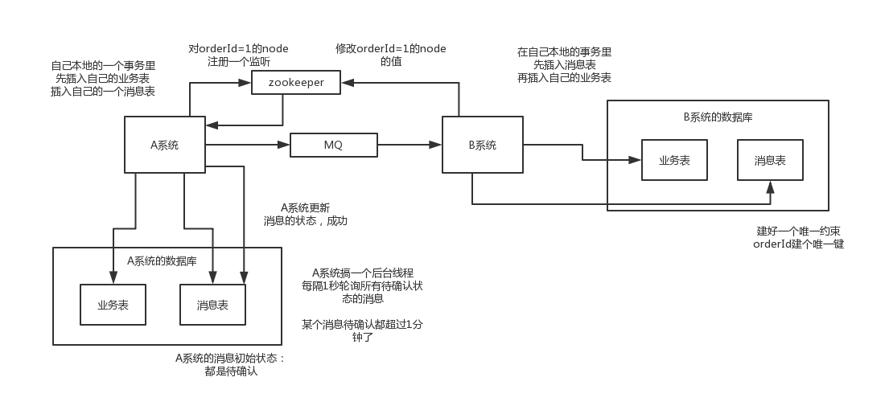

# 分布式解决方案

## 分布式锁

### 应用场景

系统A是一个电商系统，目前是一台机器部署，系统中有一个用户下订单的接口，但是用户下订单之前一定要去检查一下库存，确保库存足够了才会给用户下单。

由于系统有一定的并发，所以会预先将商品的库存保存在redis中，用户下单的时候会更新redis的库存。

此时系统架构如下：



但是这样一来会**产生一个问题**：假如某个时刻，redis里面的某个商品库存为1，此时两个请求同时到来，其中一个请求执行到上图的第3步，更新数据库的库存为0，但是第4步还没有执行。

而另外一个请求执行到了第2步，发现库存还是1，就继续执行第3步。

这样的结果，是导致卖出了2个商品，然而其实库存只有1个。

很明显不对啊！这就是典型的库存超卖问题

此时，我们很容易想到解决方案：用锁把2、3、4步锁住，让他们执行完之后，另一个线程才能进来执行第2步。


按照上面的图，在执行第2步时，使用Java提供的synchronized或者ReentrantLock来锁住，然后在第4步执行完之后才释放锁。

这样一来，2、3、4 这3个步骤就被“锁”住了，多个线程之间只能串行化执行。

但是好景不长，整个系统的并发飙升，一台机器扛不住了。现在要增加一台机器，如下图：


增加机器之后，系统变成上图所示，我的天！

假设此时两个用户的请求同时到来，但是落在了不同的机器上，那么这两个请求是可以同时执行了，还是会出现库存超卖的问题。

为什么呢？因为上图中的两个A系统，运行在两个不同的JVM里面，他们加的锁只对属于自己JVM里面的线程有效，对于其他JVM的线程是无效的。

因此，这里的问题是：Java提供的原生锁机制在多机部署场景下失效了

这是因为两台机器加的锁不是同一个锁(两个锁在不同的JVM里面)。

那么，我们只要保证两台机器加的锁是同一个锁，问题不就解决了吗？

此时，就该分布式锁隆重登场了，分布式锁的思路是：

在整个系统提供一个**全局、唯一**的获取锁的“东西”，然后每个系统在需要加锁时，都去问这个“东西”拿到一把锁，这样不同的系统拿到的就可以认为是同一把锁。

至于这个“东西”，可以是Redis、Zookeeper，也可以是数据库。

文字描述不太直观，我们来看下图：


### Redis分布式锁

#### 普通实现

使用 `SET key value [EX seconds] [PX milliseconds] NX` 创建一个key，做为互斥锁。

* **`NX`**：表示只有key不存在时才会设置成功，如果此时redis中存在这个key，那么设置失败，返回0；

* **`EX seconds`**：设置key的过期时间，精确到秒级，即seconds秒后自动释放锁；

* **`PX milliseconds`**：设置key的过期时间，精确到毫秒级。

**加锁**：`SET resource_name my_random_value PX 30000 NX`。

**释放锁**：通过lua脚本执行释放锁的逻辑（在删除key之前先判断是否合法）。

```lua
-- 删除key之前先判断是否是自己创建的，即释放自己持有的锁
if redis.call('get', KEYS[1]) == ARGV[1] then
    return redis.call('del', KEYS[1])
else
    return 0
end
```

**缺点**：如果是普通的Redis单实例，会存在单点故障问题。若是Redis主从异步复制，主节点宕机导致还未失效的key丢失，但key还没有同步到从节点，此时切换到从节点，其他用户就可以创建key从而获取锁。

**代码示例**：

```java
@Override
public String lock() {
    // 生成UUID用于标识当前线程的锁
    String uuid = UUID.randomUUID().toString().replaceAll("-", "");

    // 1.执行到此的所有线程都会循环不断的尝试获取锁
    boolean flag = false;
    do {
        // setnx命令只能设置一次，再次设置会操作失败，可以当作lock使用
        // 添加锁的过期时间，避免发生死锁
        Boolean lock = this.redisTemplate.opsForValue().setIfAbsent("lock", uuid, 5, TimeUnit.SECONDS);
        if (lock != null) {
            flag = lock;
        }
    } while (!flag);

    // 2.执行需要加锁的业务逻辑
    String numStr = this.redisTemplate.opsForValue().get("num");
    if (!StrUtil.isEmpty(numStr)) {
        int num = Integer.parseInt(numStr);
        this.redisTemplate.opsForValue().set("num", String.valueOf(++num));
    }

    // 3.使用lua脚本判断并删除lock以维持操作的原子性，保证删除当前线程的锁（uuid相同）
    String script = "if redis.call('get', KEYS[1]) == ARGV[1] then return redis.call('del', KEYS[1]) else return 0 end";
    this.redisTemplate.execute(new DefaultRedisScript<>(script), CollUtil.newArrayList("lock"), uuid);

    return numStr;
}
```


#### 注解+AOP+Redisson方式实现

**注解的定义**：

```java
@Target(ElementType.METHOD) // 作用于方法
@Retention(RetentionPolicy.RUNTIME) // 运行时
@Documented
public @interface ShopCache {

    /**
     * redis缓存key的前缀
     * @return
     */
    String prefix() default "";

    /**
     * 缓存的过期时间，分为单位
     * @return
     */
    int timeout() default 5;

    /**
     * 防止缓存雪崩指定的随机值范围
     * @return
     */
    int random() default 5;
}
```

**AOP环绕模式**：

```java
@Around("@annotation(com.abigtomato.shop.index.annotation.ShopCache)")  // 指定作用的注解
public Object around(ProceedingJoinPoint pjp) throws Throwable {
    MethodSignature signature = (MethodSignature) pjp.getSignature();
    // 获取目标方法
    Method method = signature.getMethod();

    // 获取方法的注解
    ShopCache shopCache = method.getAnnotation(ShopCache.class);
    String prefix = shopCache.prefix();
    
    // 获取方法的参数列表
    Object[] args = pjp.getArgs();
    String key = prefix + Arrays.asList(args).toString();

    // 获取方法的返回值
    Class<?> returnType = method.getReturnType();
    
    // 尝试从缓存中获取，若存在直接返回
    Optional<Object> optional = this.cacheHit(key, returnType);
    if (optional.isPresent()) {
        return optional.get();
    }

    // 获取锁
    RLock lock = this.redissonClient.getLock("lock" + Arrays.asList(args).toString());
    lock.lock();

    // 再次尝试从缓存中获取数据
    // 若是在此之前其他线程已经访问数据库并将数据放入缓存，则需要再次尝试获取缓存，避免重复访问数据库
    optional = this.cacheHit(key, returnType);
    if (optional.isPresent()) {
        lock.unlock();
        return optional.get();
    }

    // 执行目标方法
    Object result = pjp.proceed(args);

    // 获取注解的属性，超时时间和随机数范围
    int timeout = shopCache.timeout();
    int random = shopCache.random();
    
    // 写入redis缓存，设置的超时时间需要额外加上随机数（防止出现雪崩问题）
    this.redisTemplate.opsForValue().set(key, JSON.toJSONString(result),
                                         timeout + new Random().nextInt(random), TimeUnit.MINUTES);

    // 释放锁
    lock.unlock();
    return result;
}

/**
 * 尝试从缓存中获取数据
 * @param key
 * @param returnType
 * @return
 */
private Optional<Object> cacheHit(String key, Class<?> returnType) {
    String value = this.redisTemplate.opsForValue().get(key);
    if (StrUtil.isEmpty(value)) {
        return Optional.empty();
    }
    return Optional.of(JSON.parseObject(value, returnType));
}
```

**使用注解式缓存**：

```java
@Override
@ShopCache(prefix = "index:cates", timeout = 7200, random = 100)    // 自定义缓存注解
public List<CategoryVO> querySubCategoriesV2(Long pid) {
    Resp<List<CategoryVO>> listResp = this.shopPmsClient.querySubCategories(pid);
    return listResp.getData();
}
```


#### 保证分布式锁的可用的条件

* 互斥性：在任意时刻，只有一个客户端能持有锁；
* 不会发生死锁：即使有一个客户端在持有锁的期间内崩溃而没有主动解锁，也能保证后续其他客户端能获取锁；
* 加解锁需要同一个客户端：
  * 每个客户端都需要标识自己的锁，避免误删别人的锁；
  * 释放其他服务器锁的场景：
    1. index1获取到lock，业务逻辑没执行完，所拥有的lock过期自动释放；
    2. index2获取到lock，执行业务逻辑，之后lock过期被释放。
    3. index3获取到锁，执行业务逻辑；
    4. 此时index1业务逻辑执行完成，开始调用del释放锁，这时释放的是index3的锁，导致index3的业务只执行1s就被别人释放。
* 加锁和解锁操作需要原子性：
  * 解锁时需要先判断是否为当前客户端的锁，然后再删除，这两步操作需要同时成功同时失败。
  * 解锁操作缺乏原子性的场景：
    1. index1先判断是否为自己的锁，查询到的lock值确实和自己的uuid相等；
    2. index1在执行删除操作前，lock刚好过期时间，被redis自动释放；
    3. index2获取到了自己的lock；
    4. index1执行删除，此时会把index2的lock删除。


#### RedLock算法实现


### Zookeeper分布式锁

**临时znode**：加锁的时候由某个节点尝试创建临时的znode，若创建成功就获取到锁，这时其他客户端再创建znode时就会失败，只能注册监听器监听这个锁。释放锁就是删除这个znode，一旦释放就会通知客户端，然后有一个等待着的客户端就可以再次重新加锁。

```JAVA
public class ZookeeperSession {
    
    // 闭锁
    private static CountDownLatch connectedSemaphore = new CountDownLatch(1);
    // zk客户端
    private Zookeeper zookeeper;
    private CountDownLatch latch;
    
    public ZookeeperSession() {
        try {
            // zk客户端
            this.zookeeper = new Zookeeper("192.168.56.10:2181,192.168.56.10", 50000, new ZookeeperWatcher());
            try {
        	    connectedSemaphore .await();
            } catch (InterruptedException e) {
                e.printStackTrace();
            }
            // zk会话连接成功
            System.out.println("ZooKeeper session established......");
        } catch (Exception e) {
            e.printStackTrace();
        }
    }
    
    /**
     * 获取分布式锁
     */
    public Boolean acquireDistributedLock(Long productId) {
        // zk锁节点目录
        String path = "/product-lock-" + productId;
        try {
            // 创建znode，即获取锁
            zookeeper.create(path, "".getBytes(), Ids.OPEN_ACL_UNSAFE, CreateMode.EPHMERAL);
            return true;
        } catch (Exception e) {
            // 若创建失败，即证明获取失败，锁已被其他人创建，接着自旋等待获取锁节点的创建权
            while (true) {
                try {
                   // 给znode注册一个监听器，判断监听器是否存在
                   Stat stat = zk.exists(path, true);
                   if (stat != null) {
                       // 在闭锁上阻塞，直到超时或被唤醒（持有锁的用户countDown一次）
                       this.latch = new CountDownLatch();
                       this.latch.await(waitTime, TimeUnit.MILLISECOND);
                       this.latch = null;
                   }
                   // 尝试获取锁
                   zookeeper.create(path, "".getBytes(), Ids.OPEN_ACL_UNSAFE, CreateMode.EPHEMERAL);
                   return true;
                } catch (Exception e) {
                    // 抢锁失败，自旋
                    continue; 
                }
            }
        }
        return true;
    }
    
    /**
     * 释放分布式锁
     */
    public void releaseDistributedLock(Long productId) {
        // zk锁节点目录
        String path = "/product-lock-" + productId;
    	try {
            // 删除临时znode，即释放锁
            zookeeper.delete(path, -1);
            System.out.println("release the lock for product[id=" + productId + "]......");
        } catch (Exception e) {
            e.printStackTrace();
        }
    }
    
    /**
     * 实现zk的监听器
     */
    private class ZookeeperWatcher implements Watcher {
        
        private void process(WatchedEvent event) {
            System.out.println("Receive watched event: " + event.getState());
            if (KeeperState.SyncConnected == event.getState()) {
                connectedSemphore.countDown();
            }
            // 若监听器发现节点已被删除，就立即解除闭锁的阻塞，让自旋等待的线程去抢锁
            if (this.latch != null) {
                this.latch.countDown();
            }
        }
    }
    
    /**
     * 封装单例的静态内部类
     */
    private static class Singleton {
		
        // 单例的zk会话对象
        private static ZookeeperSession instance;
        
        static {
            instance = new ZookeeperSession();
        }
        
        public static ZookeeperSession getInstance() {
            return instance;
        }
    }
    
    /**
     * 获取单例
     */
    public static ZookeeperSession getInstance() {
        return Singleton.getInstance();
    }

    public static void init() {
        getInstance();
    }
}
```

**临时顺序节点**：如果有一把锁，被多个人竞争，此时多个人会排队，第一个拿到锁的人会执行，然后释放锁。后面的每个人都会在排在自己前面的那个人创建的znode上监听，一旦某个人释放了锁，排在自己后面的人就会被Zookeeper通知，即获取到了锁。

```JAVA
public class ZookeeperDistributedLock implements Watcher {
    
    private Zookeeper zk;
    private String locksRoot = "/locks";
    private String productId;
    private String waitNode;
    private String lockNode;
    private CountDownLatch latch;
    private CountDownLatch conectedLatch = new CountDownLatch(1);
    private int sessionTimeout = 30000;
    
    public ZookeeperDistributedLock(String productId) {
        this.productId = productId;
        try {
            String address = ;
            zk = new Zookeeper("192.168.56.10:2181,192.168.56.11:2181,192.168.56.12:2181", sessionTimeout, this);
            connectedLatch.await();
        } catch (IOException e) {
            throw new LockException(e);
        } catch (KeeperException e) {
            throw new LockException(e);
        } catch (InterruptedException e) {
            throw new LockException(e);
        }
    }
    
    public void process(WatchedEvent event) {
        if (event.getState() == KeeperState.SyncConnected) {
            connectedLatch.countDown();
            return;
        }
        
        if (this.latch != null) {
            this.latch.coutDown();
        }
    }
    
    /**
     * 获取锁
     */
    public void acquireDistributedLock() {
        try {
            if (this.tryLock()) {
                return;
            } else {
                waitForLock(waitNode, sessionTimeout);
            }
        } catch (KeeperException e) {
            throw new LockException(e);
        } catch (InterruptedException e) {
            throw new LockException(e);
        }
    }
    
    /**
     * 尝试获取锁
     */
    public boolean tryLock() {
        try {
            // 创建锁节点
            lockNode = zk.create(locksRoot + "/" + productId, new byte[0], ZooDefs.Ids.OPEN_ACL_UNSAFE, CreateMode.EPHEMERAL_SEQUENTIAL);
            
            // 对locksRoot目录下的所有节点排序
            List<String> locks = zk.getChildren(locksRoot, false);
            Collections.sort(locks);
            
            // 判断刚才创建的节点是否为最小节点
            if (lockNode.equals(locksRoot + "/" + locks.get(0))) {
                // 若是则表示获得锁
            	return true;    
            }
            
            // 若不是则找到自己的前一个节点
            int previousLockIndex = -1;
            for (int i = 0; i < locks.size(); i++) {
                if (lockNode.equals(locksRoot + "/" + locks.get(i))) {
               		previousLockIndex = i - 1;
                    break;
                }
            }
            // 并且将其设置为当前等待节点
            this.waitNode = locks.get(previousLockIndex);
        } catch (KeeperException e) {
            throw new LockException(e);
        } catch (InterruptedException e) {
            throw new LockException(e);
        }
        return false;
    }
    
    private boolean waitForLock(String waitNode, long waitTime) throws InterruptedException, KeeperException {
        Stat stat = zk.exists(locksRoot + "/" + waitNode, true);
        if (stat != null) {
            this.latch = new CountDownLatch(1);
            this.latch.await(waitTime, TimeUnit.MILLISECONDS);
            this.latch = null;
        }
        return true;
    }
    
    /**
     * 释放锁
     */
    public void unlock() {
        try {
            System.out.println("unlock " + lockNode);
            zk.delete(lockNode, -1);
            lockNode = null;
            zk.close();
        } catch (InterruptedException e) {
            e.printStackTrace();
        } catch (KeeperException e) {
            e.printStackTrace();
        }
    }
    
    /**
     * 自定义锁异常
     */
    public class LockException extends RuntimeException {
        
        private static final long serialVersionUID = 1L;
        
        public LockException(String e) {
            super(e);
        }
        
        public LockException(Exception e) {
            super(e);
        }
    }
}
```


### 二者的区别

* Redis的分布式锁需要不断去尝试获取锁，比较消耗性能。而Zookeeper的分布式锁，在获取不到锁时注册监听器即可，不需要不断的主动尝试获取锁，性能开销小。
* 当Redis获取锁的客户端挂了，那么只能等待超时时间过期才能释放锁。而Zookeeper只是创建了临时ZNode，只要客户端挂了，ZNode也就没了，就会自动释放锁。


## 分布式事务

### XA两阶段提交方案

**概念**：两阶段提交有一个事务管理器的概念，负责协调多个数据库（即资源管理器）的事务，事务管理器先询问各个数据库是否准备提交，如果每个数据库都回复ok，则正式提交事务，在各个数据库上执行操作，如果其中任何一个数据库回答不ok，则立即回滚事务。

**缺点**：XA适用于**单应用跨多个数据库**的分布式事务，因为严重依赖于数据库层面来处理复杂的事物，效率很低，不适合高并发场景。一个服务内部出现了跨多个库的访问操作，是不符合微服务的设计规定的，一般来说每个服务只能操作自己对应的一个数据库，如果需要操作其他数据库，必须通过调用目标数据库对应服务提供的接口来实现。


### TCC方案

**TCC是其内部三个阶段首字母的组合**：

* **Try阶段**：该阶段是对各个服务的资源做检测以及对资源进行锁定或者预留；
* **Confirm阶段**：该节点是在各个服务中执行实际的操作；
* **Cancel阶段**：释放Try阶段预留的业务资源。如果任何一个服务的业务方法执行出错，那么就需要进行补偿，就是执行已执行成功的业务逻辑的回滚操作。



**TCC业务流程分成两个阶段完成**：

* **第一阶段**：主业务服务分别调用所有从业务的Try操作，并在活动管理器中登记所有从业务服务。当所有从业务服务的Try操作都调用成功或者某个从业务服务的Try操作失败，进入第二阶段。
* **第二阶段**：活动管理器根据第一阶段的执行结果来执行Confirm或Cancel操作。如果第一阶段所有Try操作都成功，则活动管理器调用所有从业务活动的Confirm操作。否则调用所有从业务服务的Cancel操作。

**例**：Bob 要向 Smith 转账100元，执行一个转账方法，里面依次调用。

* 首先在 Try 阶段，要先检查Bob的钱是否充足，并把这100元锁住，Smith账户也冻结起来；
* 在 Confirm 阶段，执行远程调用的转账操作；
* 如果第2步执行成功，那么转账成功，如果第二步执行失败，则调用远程冻结接口对应的回滚方法 （Cancel）。

**缺点**：

* Canfirm和Cancel的**幂等性**很难保证；
* 这种方式通常在**复杂场景下不推荐使用**，除非是非常简单的场景，非常容易提供回滚的Cancel，而且依赖的服务也非常少的情况；
* 这种实现方式会造成**代码量庞大，耦合性高**。而且非常有局限性，因为有很多的业务是无法很简单的实现回滚的，如果串行的服务很多，回滚的成本实在太高。


### Saga方案

**概念**：业务流程中每个参与者都提交本地事务，若某一个参与者失败，则补偿前面已经成功的参与者。下图中的事务流程，当执行到T3时发生错误，则开始向上依次执行补偿流程T3、T2、T1，直到将所有已修改的数据复原。

**适用场景**：业务流程多、业务流程长，使用TCC的话成本高，同时无法要求其他公司或遗留的系统也遵循TCC。

**优点**：

* 一阶段提交本地事务，无锁，高性能；
* 参与者可异步执行，高吞吐；
* 补偿服务易于实现。

**缺点**：不保证事务的隔离性。




### 本地消息表

* A系统在本地事务操作的同时，插入一条数据到消息表中，接着将这个消息发送到MQ中；
* B系统接收到消息后，在一个事务中向自己的本地消息表中插入一条数据，同时执行其他的业务操作。如果这个消息已经被处理过了，那么此时这个事务会回滚，保证不会重复处理；
* B系统处理成功后，就会更新自己本地消息表的状态以及A系统消息表的状态；
* 若B系统处理失败，则不会更新消息表状态。A系统会定时扫描消息表，如果有未处理的消息，会再次发送到MQ中去，让B再次处理；
* 该方案保证了最终一致性，就算B事务失败了，A也会不断的重发消息，直到B成功为止。




### 可靠消息最终一致性方案


**事务消息处理流程**：

1. 事务消息与普通消息的区别就在于消息生产环节，生产者首先预发送一条消息到MQ(这也被称为发送half消息)
2. MQ接受到消息后，先进行持久化，则存储中会新增一条状态为待发送的消息；
3. 然后返回ACK给消息生产者，此时MQ不会触发消息推送事件；
4. 生产者预发送消息成功后，执行本地事务；
5. 执行本地事务，执行完成后，发送执行结果给MQ；
6. MQ会根据结果删除或者更新消息状态为可发送；
7. 如果消息状态更新为`可发送`，则MQ会push消息给消费者，后面消息的消费和普通消息是一样的。

**注意点**：由于MQ通常都会保证消息能够投递成功，因此，如果业务没有及时返回ACK结果，那么就有可能造成MQ的重复消息投递问题。因此，对于消息最终一致性的方案，消息的消费者必须要对消息的消费支持幂等，不能造成同一条消息的重复消费的情况。

**事务消息异常情况分析**：

| 异常情况                                                     | 一致性 | 处理异常方法                                                 |
| ------------------------------------------------------------ | ------ | ------------------------------------------------------------ |
| 消息未存储，业务操作未执行                                   | 一致   | 无                                                           |
| 存储`待发送`消息成功，但是ACK失败，导致业务未执行(可能是MQ处理超时、网络抖动等原因) | 不一致 | MQ确认业务操作结果，处理消息(删除消息)                       |
| 存储`待发送`消息成功，ACK成功，业务执行(可能成功也可能失败)，但是MQ没有收到生产者业务处理的最终结果 | 不一致 | MQ确认业务操作结果，处理消息(根据就业务处理结果，更新消息状态，如果业务执行成功，则投递消息，失败则删除消息) |
| 业务处理成功，并且发送结果给MQ，但是MQ更新消息失败，导致消息状态依旧为`待发送` | 不一致 | 同上                                                         |

**支持事务消息的MQ**：现在目前较为主流的MQ，比如ActiveMQ、RabbitMQ、Kafka、RocketMQ等，只有RocketMQ支持事务消息。据笔者了解，早年阿里对MQ增加事务消息也是因为支付宝那边因为业务上的需求而产生的。因此，如果我们希望强依赖一个MQ的事务消息来做到消息最终一致性的话，在目前的情况下，技术选型上只能去选择RocketMQ来解决。上面我们也分析了事务消息所存在的异常情况，即MQ存储了`待发送`的消息，但是MQ无法感知到上游处理的最终结果。对于RocketMQ而言，它的解决方案非常的简单，就是其内部实现会有一个定时任务，去轮训状态为`待发送`的消息，然后给producer发送check请求，而producer必须实现一个check监听器，监听器的内容通常就是去检查与之对应的本地事务是否成功(一般就是查询DB)，如果成功了，则MQ会将消息设置为`可发送`，否则就删除消息。

**常见问题**：

1. 问：如果预发送消息失败，是不是业务就不执行了？

   答：是的，对于基于消息最终一致性的方案，一般都会强依赖这步，如果这个步骤无法得到保证，那么最终也 就不可能做到最终一致性了。

2. 问：为什么要增加一个消息`预发送`机制，增加两次发布出去消息的重试机制，为什么不在业务成功之后，发送失败的话使用一次重试机制？

   答：如果业务执行成功，再去发消息，此时如果还没来得及发消息，业务系统就已经宕机了，系统重启后，根本没有记录之前是否发送过消息，这样就会导致业务执行成功，消息最终没发出去的情况。

3. 如果consumer消费失败，是否需要producer做回滚呢？

   答：这里的事务消息，producer不会因为consumer消费失败而做回滚，采用事务消息的应用，其所追求的是**高可用**和**最终一致性**，消息消费失败的话，MQ自己会负责重推消息，直到消费成功。因此，事务消息是针对生产端而言的，而消费端，消费端的一致性是通过MQ的重试机制来完成的。

4. 如果consumer端因为**业务异常**而导致回滚，那么岂不是两边最终无法保证一致性?

   答：基于消息的最终一致性方案必须保证消费端在**业务上的操作没障碍**，它只允许系统异常的失败，不允许业务上的失败，比如在你业务上抛出个NPE之类的问题，导致你消费端执行事务失败，那就很难做到一致了。


**概念**：基于消息中间件的两阶段提交往往用在高并发场景下，将一个分布式事务拆分成一个消息事务（A系统的本地事务+发消息）和一个B系统的本地事务。其中B系统的事务是由消息驱动的，只要消息事务成功，证明A事务一定成功，消息也一定发出来了，这时候B会收到消息去执行本地事务。如果本地操作失败，消息会重投，直到B操作成功，这样就变相地实现了A与B的分布式事务。

**特点**：虽然方案能够完成A和B的事务，但是A和B并不是严格一致的，而是最终一致的，在这里牺牲了一致性，换来了性能的大幅度提升。当然，这种方法也是有风险的，如果B一直执行不成功，那么一致性会被破坏，具体要不要使用，还是得看业务能够承担多少风险。


* A系统发送一个prepared消息到MQ，若消息发送失败则取消操作。若发送成功则执行本地事务，如果成功则通知MQ发送确认消息，失败则通知MQ回滚消息；
* 如果发送的是确认消息，则此时B系统会接收到确认消息，然后执行本地事务；
* MQ会自动定时轮询所有prepared消息并回调应用程序的接口，询问这个消息是不是本地事务处理失败了，所有没发送确认的消息，是继续重试还是回滚？一般来说这里就可以通过数据库查看之前的本地事务是否执行，如果回滚了，那么这里也回滚。这样能够避免本地事务执行成功，但确认消息发送失败的情况。
* 如果系统B的事务失败了就重试，不断重试直到成功，如果实在无法成功，则针对重要的业务（如资金类）进行回滚，如系统B本地回滚后，想办法通知系统A也回滚，或是发送报警由人工来手动回滚和补偿。


### 最大努力通知方案

* 系统A的本地事务执行完毕后，发送消息到MQ；
* 会有一个专门消费MQ的最大努力通知服务，这个服务会消费MQ然后写入数据库中记录，然后调用系统B的接口；
* 若系统B的事务执行失败，则最大努力通知服务就定时尝试重新调用系统B，直到成功，若超出重试次数，则放弃。


## 分布式一致性

### Paxos


### Raft


## CAP理论


## BASE理论


## 负载均衡