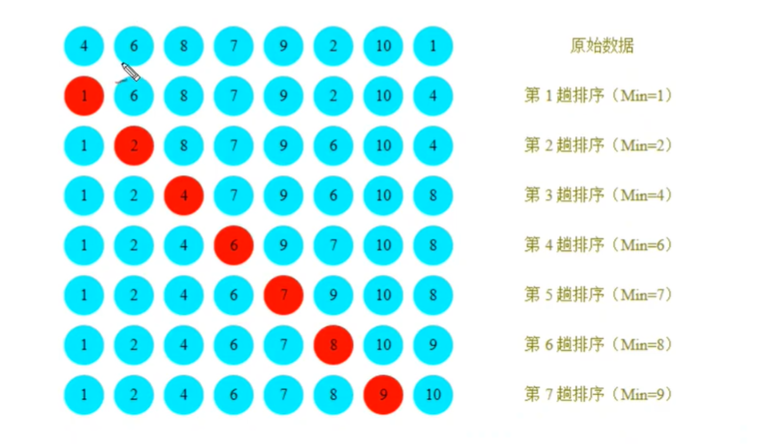
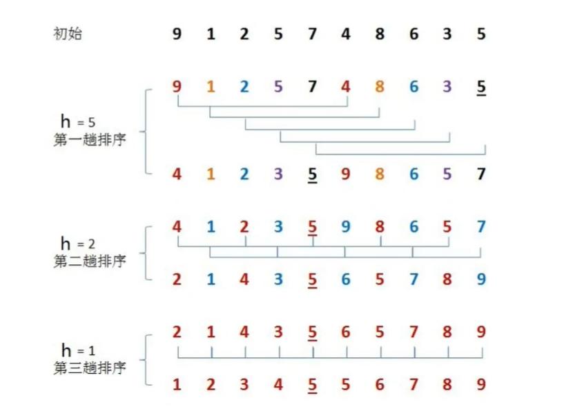
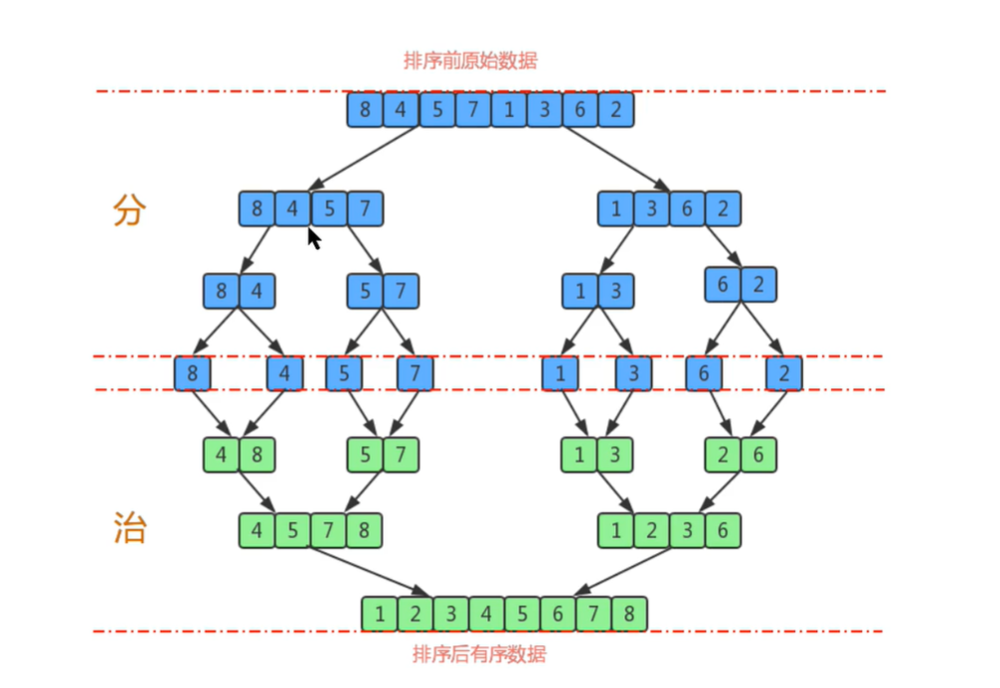
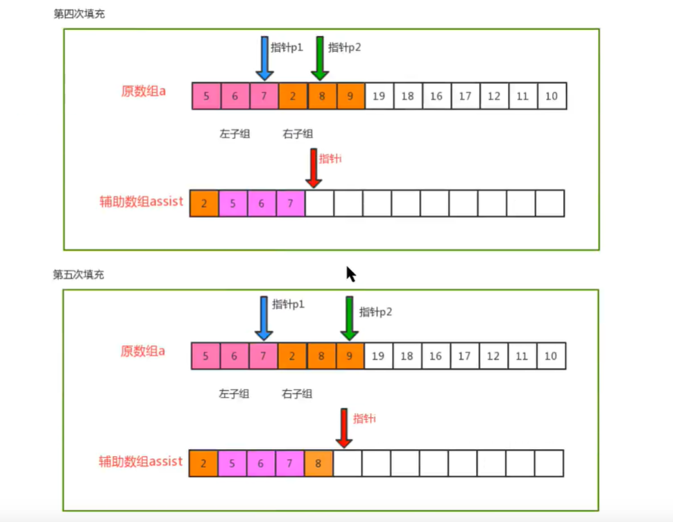
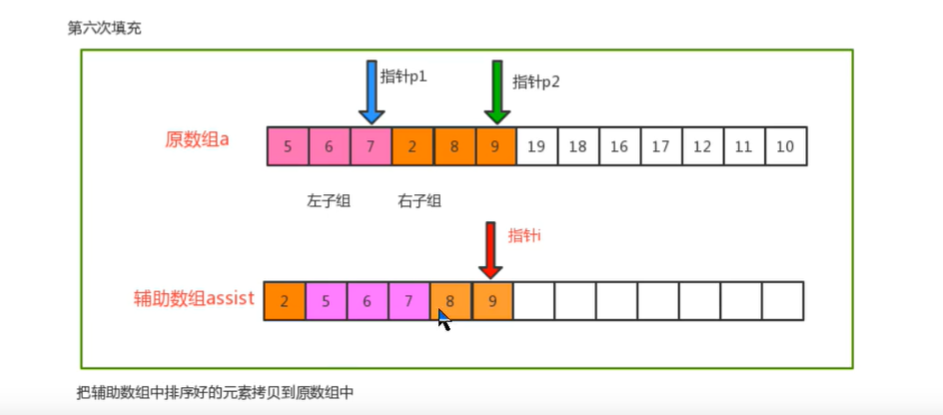
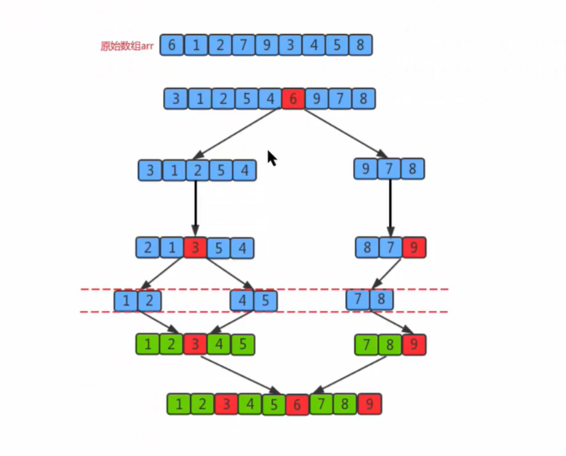
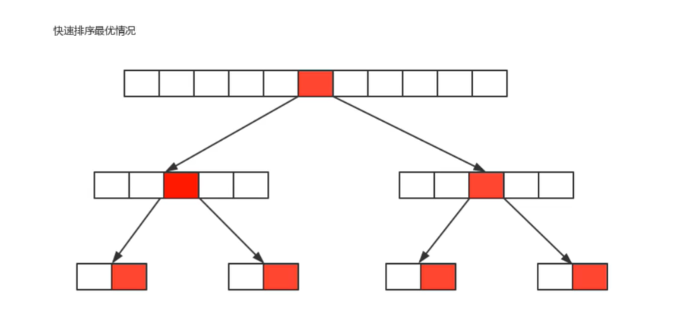
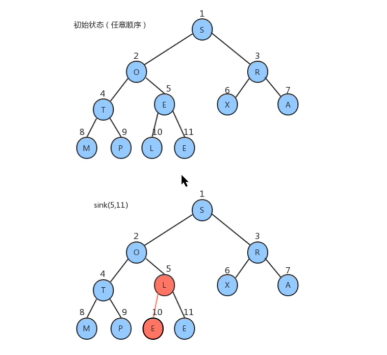
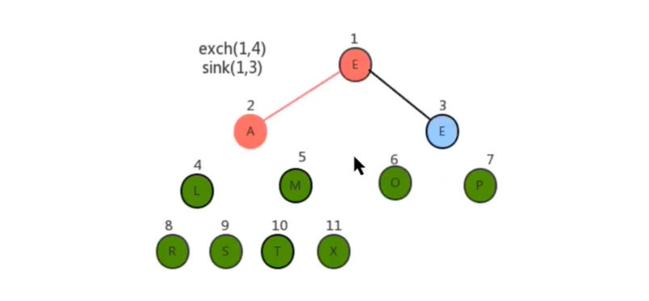
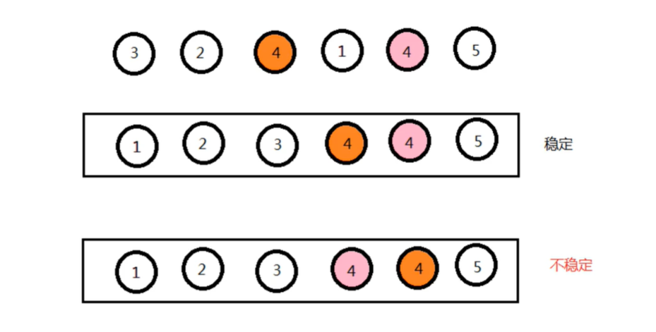

# 算法

## 基本概念

### 时间复杂度

#### 大O记法

在进行算法分析时，语句总的执行次数T(n)是关于问题规模n的函数，进而分析T(n)随着n的变化情况并确定T(n)的量级。算法的时间复杂度，就是算法的时间度量，记作T(n)=O(f(n))。即表示随着问题规模n的增大，算法执行的时间（执行次数）增长率和f(n)的增长率相同，称为算法的渐近时间复杂度，其中f(n)是问题规模n的某个函数。

使用大O记法表示时间复杂度的示例：

```java
// 共3次
public static void main(String[] args) {
    // 执行1次
    int sum = 0;
    // 执行1次
    int n = 100;
    // 执行1次
    sum = (n + 1) * n / 2;
    System.out.println("sum = " + sum);
} 
```

```JAVA
// 共n+3次
public static void main(String[] args) {
    // 执行1次
    int sum = 0;
    // 执行1次
    int n = 100;
    // 执行n次
    for (int i = 1; i <= n; i++) {
        sum += i;
    }
    System.out.println("sum = " + sum);
}
```

```JAVA
// 共n^2+2次
public static void main(String[] args) {
    // 执行1次
    int sum = 0;
    // 执行1次
    int n = 100;
    // 执行n^2次
    for (int i = 1; i <= n; i++) {
        for (int j = 1; j <= n; j++) {
    		sum += i;        
        }
    }
    System.out.println("sum = " + sum);
}
```

基于对函数渐近增长的分析，使用大O阶表示法有以下规则：

* 用常数1取代运行时间中的所有加法常数；
* 在修改后的运行次数中，只保留高阶项；
* 如果最高价项存在，且常数因子不为1，则去除与这个项相乘的常数。

所以，上述算法的大O记法为：O(1)、O(n)、O(n^2)。


#### 常见的大O阶

* 线性阶：一般含有非嵌套循环涉及线性阶，线性阶就是随着输入规模的扩大，对应计算的次数呈直线增长。

```JAVA
// O(n)
public static void main(String[] args) {
    int sum = 0;
    int n = 100;
    for (int i = 1; i <= n; i++) {
        sum += i;
    }
    System.out.println("sum = " + sum);
}
```

* 平方阶：一般嵌套循环属于这种时间复杂度。

```JAVA
// O(n^2)
public static void main(String[] args) {
    int sum = 0, n = 100;
    for (int i = 1; i <= n; i++) {
        for (int j = 1; j <= n; j++) {
    		sum += 1;        
        }
    }
    System.out.println("sum = " + sum);
}
```

* 立方阶：三层嵌套循环属于这种时间复杂度。

```JAVA
// O(n^3)
public static void main(String[] args) {
    int sum = 0, n = 100;
    for (int i = 1; i <= n; i++) {
        for (int j = i; j <= n; j++) {
    		for (int k = i; k <= n; k++) {	
        		sum++;        
            }        
        }
    }
    System.out.println("sum = " + sum);
}
```

* 对数阶：由于随着输入规模n的增大，不管底数是多少，其增长趋势是相同的，所以会忽略底数。

```JAVA
public static void main(String[] args) {
    int i = 1, n = 100;
    // 由于每次i*2后，就距离n更近一步，即共有x个2相乘后大于n，然后退出循环。
    // 由于是2^x=n，则得到x=log(2)n，所以该循环的时间复杂度为O(logN)。
    while (i < n) {
        i = i * 2;
    }
}
```

* 常数阶：不涉及循环操作的基本都是常数阶，因为其不会随着n的增长而增加操作次数。

```JAVA
// O(1)
public static void main(String[] args) {
    int n = 100;
    int i = n + 2;
    System.out.println(n);
}
```


#### 函数调用的时间复杂度分析

```JAVA
// O(n)
public static void main(String[] args) {
    int n = 100;
    for (int i = 0; i < n; i++) {
        show(i);
    }
}

private static void show(int i) {
    System.out.println(i);
}
```

```java
// O(n^2)
public static void main(String[] args) {
    int n = 100;
    for (int i = 0; i < n; i++) {
        show(i);
    }
}

private static void show(int i) {
    for (int i = 0; i < n; i++) {
        System.out.println(i);
    }
}
```

```java
// 2n^2+n+1 
// 根据大O规则，只保留n的最高阶项，并去掉最高阶项的常数因子，最终用大O记法得出 O(n^2)
public static void main(String[] args) {
    int n = 100; // 1
    show(n);	// n
    // n^2
    for (int i = 0; i < n; i++) {
        show(i);
    }
    // n^2
    for (int i = 0; i < n; i++) {
        for (int j = 0; j < n; j++) {
            System.out.println(j);
        }
    }
}

private static void show(int i) {
    for (int i = 0; i < n; i++) {
        System.out.println(i);
    }
}
```


#### 考虑最坏的情况

最坏情况是一种保证，指的是在应用程序中，即使遇到了最坏情况，也能够保证正常提供服务。所以默认情况下算法的时间复杂度都是在最坏情况下分析的。

```JAVA
// 从一个存储了n个随机数字的数组中找出指定的数字
public int search(int num) {
    int[] arr = {11, 10, 8, 9, 7, 22, 23, 0};
    for (int i = 0; i < arr.length; i++) {
        if (num == arr[i]) {
            return i;
        }
    }
    return -1;
} 
```

* 最好情况：查找第一个数字就是期望数字，那么算法的时间复杂度为O(1)；
* 最坏情况：一直查找到最后一个数字才是期望数字，那么算法的时间复杂度为O(n)；
* 平均情况：任何数字查找的平均成本是O(n/2)。


### 空间复杂度

#### Java中常见的内存占用

* 基本数据类型的内存占用情况：

| 数据类型 | 占用字节数 |
| :------: | :--------: |
|   byte   |     1      |
|  short   |     2      |
|   int    |     4      |
|   long   |     8      |
|  float   |     4      |
|  double  |     8      |
| boolean  |     1      |
|   char   |     2      |

* 一个引用类型的变量需要占用8个字节：如 `Date date = new Date` 语句中的date变量就是引用变量。

* 创建一个对象，除了对象内部数据占用的空间外，该对象本身也具有内存开销，每个对象的头信息占用16个字节。

* 一般内存的使用，如果不满足8个字节，都会被填充成8字节：

  ```JAVA
  // 对象头信息占用16个字节
  public class A {
      // 整型变量a占用4个字节
      public int a = 1;
  }
  new A();	// A对象共占用20个字节，由于不是8的整数倍，所以会被填充为24个字节
  ```

* Java中的数组被限定为对象，一般都会因为要记录其长度而需要额外的内存，一个基本数据类型的数组一般需要占用24个字节（即16个字节的头信息+4个字节的长度信息+4个填充字节）。


#### 算法的空间复杂度分析

案例分析：对指定的数组元素进行反转。

```JAVA
// 解法1：O(8) -> O(1)
public static int[] reverse01(int[] arr) {
    int n = arr.length;	// 4字节
    int temp;	// 4字节
    for (int start = 0, end = n - 1; start <= end; start++, end--) {
    	temp = arr[start];
        arr[start] = arr[end];
        arr[end] = temp;
    }
    return arr;
}
```

```java
// 解法2：O(4+24+4n) -> O(n)
public static int[] reverse02(int[] arr) {
    int n = arr.length;	// 4字节
    int[] temp = new int[n];	// 数组对象的24字节+元素的n*4字节
    for (int i = n - 1; i >= 0; i--) {
        temp[n - 1 - i] = arr[i];
    }
    return temp;
} 
```

由于Java存在垃圾回收机制，且JVM对程序的内存占用也有一定的优化，所以无法精确的评估一个Java程序的内存占用情况，只能进行估算。另外，现代计算机的内存一般都比较大，所以空间占用一般不是算法分析的主要方面（即不是算法的性能瓶颈），一般情况下所说的算法复杂度，默认就是时间复杂度。


## 排序算法

### 冒泡排序


* 比较两个相邻的元素，如果前一个大于后一个，就互换位置；
* 对集合中每一对相邻的元素做同样的工作，最终被交换到末尾的就是最大元素，下次比较就可以忽略末尾元素；
* 多次完成从头到尾的比较操作，每次比较完后都会在末尾确定一个元素的位置，等所有比较操作收敛后集合归于有序。


```JAVA
public class BubbleSort {
    
    public static void sort(Comparable[] arr) {
        // 控制整体比较操作执行的次数
        for (int i = arr.length - 1; i > 0; i--) {
            // 控制单次比较操作执行的次数
            for (int j = 0; j < i; j++) {
                // 比较相邻元素的大小
                if (greater(arr[j], arr[j + 1])) {
                    // 交换元素位置
                    swap(arr, j, j + 1);
                }
            }
        }
    }

    private static boolean greater(Comparable left, Comparable right) {
        return left.compareTo(right) > 0;
    }

    private static void swap(Comparable[] arr, int i, int j) {
        Comparable temp = arr[i];
        arr[i] = arr[j];
        arr[j] = temp;
    }
}
```

**时间复杂度分析**：冒泡排序使用了双层for循环，其中内层循环是真正完成排序操作的代码，所以分析时间复杂度时主要关注内层循环即可。在最坏的情况下，也就是要升序排序的集合为(6,5,4,3,2,1)时：

* 元素的比较次数为：`(N-1)+(N-2)+(N-3)+...+2+1=((N-1)+1)*(N-1)/2=N^2/2-N/2`；
* 元素的交换次数为：`(N-1)+(N-2)+(N-3)+...+2+1=((N-1)+1)*(N-1)/2=N^2/2-N/2`；
* 总执行次数为：`(N^2/2-N/2)+(N^2/2-N/2)=N^2-N`；
* 按照大O推导法则，保留函数中的最高阶项：`O(N^2)`。


### 选择排序


* 每次遍历的过程中，都假定一个位置的元素为最小值，然后和其之后的所有元素依次比较，并将本次发现的最小元素和其交换，一次遍历完后可以在首部确定一个位置；
* 多次完成比较交换的遍历操作，每次假定的最小值位置都会是上一次遍历确定的位置的后一位。当所有比较操作收敛后集合就会趋于有序。



```JAVA
public class SelectionSort {

    public static void sort(Comparable[] arr) {
        for (int i = 0; i < arr.length - 1; i++) {
            // 每次比较操作之前假定的最小值下标
            int minIndex = i;
            // 内层循环的作用是比较出本次真正的最小值
            for (int j = i + 1; j < arr.length; j++) {
                if (greater(arr[minIndex], arr[j])) {
                    minIndex = j;
                }
            }
            // 将最小值交换到合适的位置
            swap(arr, i, minIndex);
        }
    }

    private static boolean greater(Comparable left, Comparable right) {
        return left.compareTo(right) < 0;
    }

    private static void swap(Comparable[] arr, int i, int j) {
        Comparable temp = arr[i];
        arr[i] = arr[j];
        arr[j] = temp;
    }
}

```

**时间复杂度分析**：选择排序使用了双层for循环，其中外层循环控制数据的交换，内层循环控制数据的比较。

* 数据比较次数：`(N-1)+(N-2)+(N-3)+...+2+1=((N-1)+1)*(N-1)/2=N^2/2-N/2`；
* 数据交换次数：`N-1`；
* 总执行次数：`N^2/2-N/2+(N-1)=N^2/2+N/2+1`；
* 时间复杂度：根据大O推导法则，保留最高阶项，去除常数因子，时间复杂度为 `O(N^2)`。


### 插入排序


* 将集合中的所有元素逻辑上划分为有序和无序两组，有序在前，无序在后；
* 找到无序集合中的第一个元素，向有序集合中插入；
* 新插入的元素从有序组的末尾向前开始比较，遇到更大的元素则交换位置，直到遇到更小或相等的元素，才会停止比较。


```JAVA
public class InsertionSort {

    public static void sort(Comparable[] arr) {
        for (int i = 1; i < arr.length; i++) {
            for (int j = i - 1; j >= 0 &&
                    greater(arr[j], arr[j + 1]); j--) {
                swap(arr, j, j + 1);
            }
        }
    }

    private static boolean greater(Comparable left, Comparable right) {
        return left.compareTo(right) > 0;
    }

    private static void swap(Comparable[] arr, int i, int j) {
        Comparable temp = arr[i];
        arr[i] = arr[j];
        arr[j] = temp;
    }
}
```

**时间复杂度分析**：插入排序使用双层for循环，其中内层循环体是真正完成排序的代码，所以分析插入排序的时间复杂度主要分析内存代码的执行次数即可。在最坏的情况下，插入排序的时间复杂度分析：

* 比较次数为：`(N-1)+(N-2)+(N-3)+...+2+1=((N-1)+1)*(N-1)/2=N^2/2-N/2`；
* 交换次数为：`(N-1)+(N-2)+(N-3)+...+2+1=((N-1)+1)*(N-1)/2=N^2/2-N/2`；
* 总执行次数：`(N^2/2-N/2)+(N^2/2-N/2)=N^2-N`；
* 时间复杂度：根据大O推导法则，只保留函数中的最高阶项，时间复杂度为 `O(n^2)`。


### 希尔排序


* 首先选定一个步长h，以其做为依据对集合进行分组，即从首部元素开始，与和其间隔步长整数倍的元素分为一组；
* 对组内的数据进行比较/交换操作，也就是进行了插入排序； 
* 将步长h缩减为原来的1/2后重新对集合进行分组，然后重复第2步的比较操作。最后，当步长h缩减为1且比较完毕后，算法收敛。 



```JAVA
public class ShellSort {

    public static void sort(Comparable[] arr) {
        // 初始化步长
        int h = 1;
        while (h < arr.length / 2) {
            h = 2 * h + 1;
        }
		
        // 步长递减控制
        while (h >= 1) {
            // 根据步长分组进行插入排序
            for (int i = h; i < arr.length; i++) {
                for (int j = i; j >= h &&
                        greater(arr[j - h], arr[j]); j -= h) {
                    swap(arr, j - h, j);
                }
            }
            h = h / 2;
        }
    }

    private static boolean greater(Comparable left, Comparable right) {
        return left.compareTo(right) > 0;
    }

    private static void swap(Comparable[] arr, int i, int j) {
        Comparable temp = arr[i];
        arr[i] = arr[j];
        arr[j] = temp;
    }
}
```


### 归并排序


* 首先将原集合尽可能的拆分为元素相等的两个子几个，并对每个子集合继续进行拆分，直到元素个数为1为止；
* 然后将相邻的两个子集进行排序并合并；
* 重复第2部的操作，直到最终合并成一个有序集合为止。



归并操作的原理：






```JAVA
public class MergeSort {

    private static Comparable[] assist;

    private static boolean less(Comparable left, Comparable right) {
        return left.compareTo(right) < 0;
    }

    private static void exchange(Comparable[] arr, int i, int j) {
        Comparable temp = arr[i];
        arr[i] = arr[j];
        arr[j] = temp;
    }

    public static void sort(Comparable[] arr) {
        assist = new Comparable[arr.length];
        int start = 0;
        int end = arr.length - 1;
        sort(arr, start, end);
    }

    private static void sort(Comparable[] arr, int start, int end) {
        if (end <= start) {
            return;
        }

        int middle = start + (start + end) / 2;

        sort(arr, start, middle);
        sort(arr, middle + 1, end);

        merge(arr, start, middle, end);
    }

    private static void merge(Comparable[] arr, int start, int middle, int end) {
        int index = start, p1 = start, p2 = middle + 1;

        while (p1 <= middle && p2 <= end) {
            assist[index++] = less(arr[p1], arr[p2]) ? arr[p1++] : arr[p2++];
        }

        while (p1 <= middle) {
            assist[index++] = arr[p1++];
        }

        while (p2 <= end) {
            assist[index++] = arr[p2++];
        }

        for (int i = start; i <= end; i++) {
            arr[i] = assist[i];
        }
    }
}
```

**时间复杂度分析**：归并排序是分治思想的典型例子，该算法对arr[start, ..., end]进行排序，先将其分为arr[start, ..., middle]和arr[middle+1, ..., end]两个部分，然后分别通过递归调用将它们单独排序，最后将有序的子数组归并为最终的排序结果。该递归的出口在于如果一个数组不能再被分为两个子数组，那么就会执行merge进行归并操作，在归并的时候判断元素的大小进行排序。


用树状图来描述归并，如果一个数组有8个元素，那么它将每次除以2找到最小子数组，共拆分log8次，值为3，所以树共有3层，那么自顶向下第k层具有2^k个子数组，每个数组的长度为 `2^(3-k)`，归并最多需要 `2^(3-k)` 次比较。因此每层的比较次数为 `2^k*2^(3-k)=2^3`，那么3层总共为 `3*2^3`。

假设元素的个数为n，那么使用归并排序拆分的次数为log2(n)，所以共log2(n)层，那么使用log2(n)替换上面 `3*2^3` 中的3这个层数，最终得出的归并排序时间复杂度为：`log2(n)*2^(log2(n))=log2(n)*n`，根据大O推导法则，忽略底数，最终归并排序的时间复杂度为 `O(nlogn)`。


### 快速排序


* 首先设定一个分界值，通过该分界值将数组分为左右两个部分；
* 将大于或等于分界值的数据放到数据右边，小于分界值的数据放到数组左边。此时左边部分中各元素都小于或等于分界值，而右边部分中各元素都大于或等于分界值；
* 然后，左边和右边的数据可以独立的进行排序，对于每个子数组都可以再次设定分界值，同样的将数据分为左右两部分，左边为较小值，右边是较大值；
* 重复上述的过程，即通过递归将左右两侧的数据都排好顺序后，整个数组的排序也就完成了。



**切分操作的原理**：

1. 设定一个基准值，用两个指针分别指向数组的头部和尾部；
2. 先从尾部向头部开始搜索到一个比基准值小的元素，并记录指针的位置；
3. 再从头部向尾部开始搜索到一个比基准值大的元素，并记录指针的位置；
4. 交换左右两边指针指向的元素；
5. 重复2、3、4步骤，直到左边指针的值大于右边指针的值为止。


```JAVA
public class QuickSort {

    private static boolean less(Comparable left, Comparable right) {
        return left.compareTo(right) < 0;
    }

    private static void exchange(Comparable[] arr, int i, int j) {
        Comparable temp = arr[i];
        arr[i] = arr[j];
        arr[j] = temp;
    }

    private static void sort(Comparable[] arr) {
        int start = 0, end = arr.length - 1;
        sort(arr, start, end);
    }

    private static void sort(Comparable[] arr, int start, int end) {
        if (end <= start) {
            return;
        }

        int partition = partition(arr, start, end);

        sort(arr, start, partition - 1);
        sort(arr, partition + 1, end);
    }

    private static int partition(Comparable[] arr, int start, int end) {
        Comparable partitionKey = arr[start];

        int left = start, right = end + 1;

        while (true) {
            while (less(partitionKey, arr[--right])) {
                if (right == start) {
                    break;
                }
            }

            while (less(arr[++left], partitionKey)) {
                if (left == end) {
                    break;
                }
            }

            if (left >= right) {
                break;
            } else {
                exchange(arr, left, right);
            }
        }

        exchange(arr, start, right);

        return right;
    }
}
```

**和归并排序的区别**：快速排序是另外一种基于分治思想实现的排序算法，它将一个数组分成若干个子数组，并将每个部分独立的排序。快速排序和归并排序是互补的：归并排序将数组分成若干个子数组并分别排序，最后将有序的子数组合并从而使整个数组有序；而快速排序的方式则是当若干个数组有序时，整个数组自然就有序了。在归并排序中，一个数组会被均等的拆分，归并操作会在处理整个数组之前；而快速排序中，拆分数组的为止取决于数组的内容，递归调用发生在处理整个数组之后。

**时间复杂度分析**：快速排序的一次切分从头尾开始交替搜索，直到left和right重合。因此，一次切分算法的时间复杂度为O(n)，但整个快速排序的时间复杂度和切分的次数相关。

* **平均情况**：每一次切分选择的基准数字不是最大值、最小值和中值，这种情况下的时间复杂度为 `O(nlogn)`。

* **最优情况**：每一次切分选择的基准数字刚好能将当前序列等分。如果将数组的切分看成是一棵树，那么下图就是最优情况，共切分了logn次。所以，最优情况下快速排序的时间复杂度为 `O(nlogn)`。



* **最坏情况**：每一个切分选择的基准数字是当前序列的最大或最小值，这使得每次切分都会有一个子组，那么总共就得切分n次。所以，最坏情况下快速排序的时间复杂度为 `O(n^2)`。


### 堆排序


* 首先根据原集合构造出堆结构；
* 得到堆顶元素，这个值就是最大值；
* 交换堆顶元素和数组中的最后一个元素，此时所有元素中的最大元素都已经放到合适的位置了；
* 对堆进行调整，重新让除了最后一个元素的剩余元素的最大值放到堆顶；
* 重复2~4步骤，直到堆中只剩下一个元素为止。

**堆构造过程**：最直观的方法就是创建一个新的数组，然后从头开始遍历原数组，将每个元素按顺序添加到新数组中，并从数据长度的一半处（因为堆的特性，后半段的叶子结点无需下沉）开始下沉对堆进行调整，最后就形成了一个有序堆。




**堆排序过程**：对于构造好的堆，只需要做类似于堆删除的操作，就可以完成排序。

* 将堆顶元素和堆中最后一个元素交换位置；
* 通过对堆顶元素下沉调整堆，把最大的元素放到堆顶（此时最后一个元素不参与堆的调整，因为最大的数据已经到了数组的最右边）；
* 重复1~2步骤，直到堆中只剩最后一个元素。





```java
public class HeapSort {

    /**
     * 判断堆中索引i处的元素是否小于索引j处的元素
     */
    private static boolean less(Comparable[] heap, int i, int j) {
        return heap[i].compareTo(heap[j]) < 0;
    }

    /**
     * 交换堆中索引i和j处的元素
     */
    private static void exchange(Comparable[] heap, int i, int j) {
        Comparable temp = heap[i];
        heap[j] = heap[i];
        heap[i] = temp;
    }

    /**
     * 根据待排序的原数组构造出堆
     */
    private static void createHeap(Comparable[] source, Comparable[] heap) {
        System.arraycopy(source, 0, heap, 1, source.length);
        for (int i = heap.length / 2; i > 0; i--) {
            sink(heap, i, heap.length - 1);
        }
    }

    /**
     * 对原数组中的数据进行升序排序
     */
    public static void sort(Comparable[] source) {
        Comparable[] heap = new Comparable[source.length + 1];
        // 构建堆
        createHeap(source, heap);
        // 纪录未排序元素中最大的索引
        int N = heap.length - 1;
        while (N != 1) {
            // 将根结点（即最大元素），交换到数组末尾并确定其位置
            exchange(heap, 1, N);
            // 堆数组末尾的元素已经确定了位置，下次循环则无需参与操作
            N--;
            // 将索引1处的元素下沉，就是将下次循环的最大元素交换到根结点
            sink(heap, 1, N);
        }
        System.arraycopy(heap, 1, source, 0, source.length);
    }

    /**
     * 在堆中对索引target处的元素在range范围内下沉
     */
    private static void sink(Comparable[] heap, int target, int range) {
        while (2 * target <= range) {
            int childMax, leftIndex = 2 * target, rightIndex = 2 * target + 1;
            if (rightIndex <= range && less(heap, leftIndex, rightIndex)) {
                childMax = rightIndex;
            } else {
                childMax = leftIndex;
            }

            if (!less(heap, target, childMax)) {
                break;
            } else {
                exchange(heap, target, childMax);
            }

            target = childMax;
        }
    }
}
```


### 计数排序


```JAVA
public class CountSort {

    public static int[] sort(int[] arr, int range) {
        // 结果数组
        int[] result = new int[arr.length];
        // 计数数组
        int[] count = new int[range];

        // 原数组的值对应计算数组的下标，因为下标是天生有序的，所以原数据的值在计算数组中就已经有序了
        // 计数数组的值就是下标对应的元素在原数组出现的次数
        for (int elem : arr) {
            count[elem]++;
        }

//        /**
//         * 该方式具有局限性，若是数据的范围间隔非常大，就会造成空间的浪费。且该方式不稳定。
//         */
//        // 遍历计数数组
//        for (int i = 0, j = 0; i < count.length; i++) {
//            // 按下标顺序装入结果数组，最终得出的结果数组就是有序数组
//            while (count[i]-- > 0) {
//                result[j++] = i;
//            }
//        }

        // 根据计算数组构建出累计数组
        for (int i = 1; i < count.length; i++) {
            count[i] = count[i] + count[i - 1];
        }

        // 根据累计数组确定原数组的元素位置后并装入结果数组
        for (int i = arr.length - 1; i >= 0; i--) {
            result[--count[arr[i]]] = arr[i];
        }

        return result;
    }
}
```


### 基数排序


```JAVA
public class RadixSort {

    public static int[] sort(int[] arr, int range, int num) {
        int[] result = new int[arr.length];
        int[] count = new int[range];

        for (int i = 0; i < num; i++) {
            int division = (int) Math.pow(10, i);
            for (int j = 0; j < arr.length; j++) {
                count[arr[j] / division % 10]++;
            }
		
            // 计数排序
            for (int m = 1; m < count.length; m++) {
                count[m] = count[m] + count[m - 1];
            }

            for (int n = arr.length - 1; n >= 0; n--) {
                result[--count[arr[n] / division % 10]] = arr[n];
            }

            System.arraycopy(result, 0, arr, 0, arr.length);
            Arrays.fill(count, 0);
        }
        return result;
    }
}
```


### 桶排序

一句话总结：划分多个范围相同的区间，每个子区间自排序，最后合并。

桶排序是计数排序的扩展版本，计数排序可以看成每个桶只存储相同元素，而桶排序每个桶存储一定范围的元素，通过映射函数，将待排序数组中的元素映射到各个对应的桶中，对每个桶中的元素进行排序，最后将非空桶中的元素逐个放入原序列中。

桶排序需要尽量保证元素分散均匀，否则当所有数据集中在同一个桶中时，桶排序失效。


```JAVA
public class BucketSort {
    
    public static void sort(int[] arr) {
        // 计算最大值与最小值
        int max = Integer.MIN_VALUE;
        int min = Integer.MAX_VALUE;
        for(int i = 0; i < arr.length; i++){
            max = Math.max(max, arr[i]);
            min = Math.min(min, arr[i]);
        }

        // 计算桶的数量
        int bucketNum = (max - min) / arr.length + 1;
        ArrayList<ArrayList<Integer>> bucketArr = new ArrayList<>(bucketNum);
        for(int i = 0; i < bucketNum; i++){
            bucketArr.add(new ArrayList<Integer>());
        }

        // 将每个元素放入桶
        for(int i = 0; i < arr.length; i++){
            int num = (arr[i] - min) / (arr.length);
            bucketArr.get(num).add(arr[i]);
        }

        // 对每个桶进行排序
        for(int i = 0; i < bucketArr.size(); i++){
            Collections.sort(bucketArr.get(i));
        }

        // 将桶中的元素赋值到原序列
        int index = 0;
        for(int i = 0; i < bucketArr.size(); i++){
            for(int j = 0; j < bucketArr.get(i).size(); j++){
                arr[index++] = bucketArr.get(i).get(j);
            }
        }  
    }
}
```

**复杂度分析**：

* 时间复杂度：`O(N + C)`。

  * 对于待排序序列大小为 N，共分为 M 个桶，主要步骤有：

    * N 次循环，将每个元素装入对应的桶中
    * M 次循环，对每个桶中的数据进行排序（平均每个桶有 N/M 个元素）

  * 一般使用较为快速的排序算法，时间复杂度为 O ( N l o g N ) O(NlogN)*O*(*N**l**o**g**N*)，实际的桶排序过程是以链表形式插入的。

  * 整个桶排序的时间复杂度为：

    O(N)+O(M*(N/M*log(N/M)))=O(N*(log(N/M)+1))*O*(*N*)+*O*(*M*∗(*N*/*M*∗*l**o**g*(*N*/*M*)))=*O*(*N*∗(*l**o**g*(*N*/*M*)+1))

  * 当 N = M 时，复杂度为 `O(N) `。

* 额外空间复杂度：`O(N + M)`。

**稳定性分析**：桶排序的稳定性取决于桶内排序使用的算法。


### 排序的稳定性

数组arr中右若干元素，其中A元素和B元素相等，并且A元素在B元素前面，如果使用某种排序算法排序后，能够保证A元素依然在B元素的前面，就可以说该算法是稳定的。



常见算法的稳定性：

* **冒泡排序**：只有当arr[i]>arr[i+1]的时候，才会交换元素，而相等的时候不会交换，所以冒泡排序是一种稳定的排序算法；
* **选择排序**：该排序算法是每次都会选择一个当前最小的元素，现有数据(5(1)，8，5(2)，2，9)，选择出本次的最小元素2并和5(1)交换，导致稳定性被破坏；
* **插入排序**：比较操作是从有序序列的末尾开始的，也就是将想要插入的元素和已经有序的最大者开始比较，一直向前找到合适的位置，如果相等则直接放在后面，所以插入排序是稳定的；
* **希尔排序**：该排序算法是按照步长对元素分组进行各自的插入排序，虽然单次的插入排序是稳定的，但在不同的插入排序过程中，相同的元素可能会在各自的插入排序中移动，导致稳定性被破坏；
* **归并排序**：该算法在归并的过程中，只有arr[i]<arr[i+1]才会交换位置，如果两个元素相等则不会改变，所以归并排序也是稳定的；
* **快速排序**：该算法需要一个基准值，在基准值右侧找一个更小的元素，在基准值左侧找一个更大的元素，然后交换，会破坏稳定性。


## 常见算法题

### KMP

### 替换空格

### 最长公共前缀

### 回文串

### 两数相加

### 翻转链表

### 链表中倒数第K个节点

### 删除链表中倒数第N个节点

### 合并两个排序的链表

### 斐波那契数列

### 跳台阶问题

### 二维数组查找

### 数值的整数次方

### 调整数组顺序使奇数位于偶数前⾯  

### 反转链表

### 合并两个排序的链表  

### 用两个栈实现队列

### 栈的压入/弹出序列

