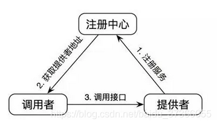
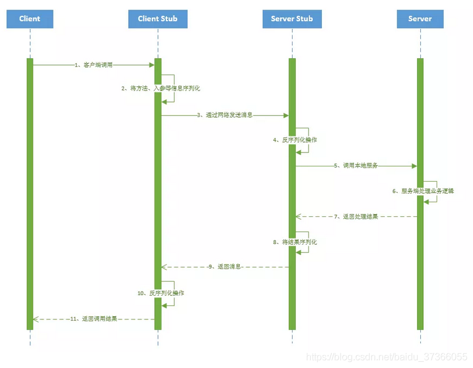
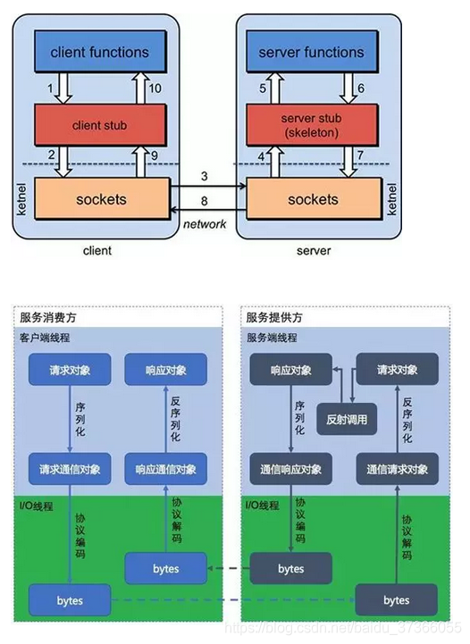
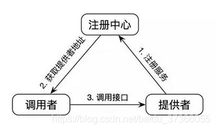
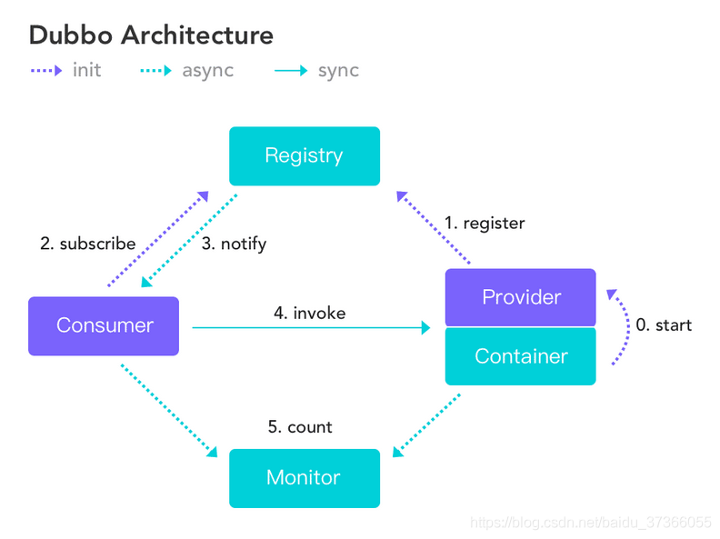
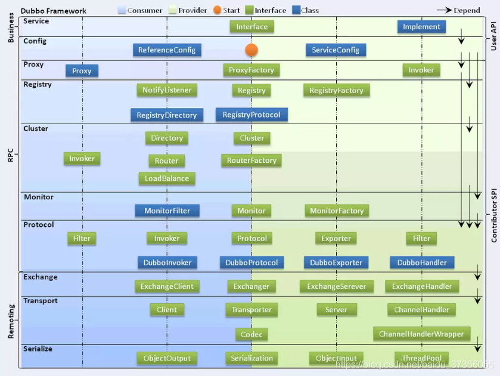
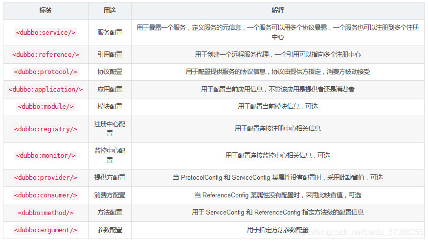

# Dubbo

## RPC基本概念

### 为什么要有RPC

http接口是在接口不多、系统与系统交互较少的情况下，解决信息孤岛初期常使用的一种通信手段；优点就是简单、直接、开发方便。利用现成的http协议进行传输。但是如果是一个大型的网站，内部子系统较多、接口非常多的情况下，RPC框架的好处就显示出来了，首先就是长链接，不必每次通信都要像http一样去3次握手什么的，减少了网络开销；其次就是RPC框架一般都有注册中心，有丰富的监控管理；发布、下线接口、动态扩展等，对调用方来说是无感知、统一化的操作。第三个来说就是安全性。最后就是最近流行的服务化架构、服务化治理，RPC框架是一个强力的支撑。

socket只是一个简单的网络通信方式，只是创建通信双方的通信通道，而要实现rpc的功能，还需要对其进行封装，以实现更多的功能。

RPC一般配合netty框架、spring自定义注解来编写轻量级框架，其实netty内部是封装了socket的，较新的jdk的IO一般是NIO，即非阻塞IO，在高并发网站中，RPC的优势会很明显

###  **什么是RPC**

RPC（Remote Procedure Call Protocol）远程过程调用协议，它是一种通过网络从远程计算机程序上请求服务，而不需要了解底层网络技术的协议。简言之，RPC使得程序能够像访问本地系统资源一样，去访问远端系统资源。比较关键的一些方面包括：通讯协议、序列化、资源（接口）描述、服务框架、性能、语言支持等。


简单的说，RPC就是从一台机器(客户端)上通过参数传递的方式调用另一台机器(服务器)上的一个函数或方法(可以统称为服务)并得到返回的结果。

### PRC架构组件

一个基本的RPC架构里面应该至少包含以下4个组件：

1、**客户端（Client）**:服务调用方（服务消费者）

2、**客户端存根（Client Stub）**:存放服务端地址信息，将客户端的请求参数数据信息打包成网络消息，再通过网络传输发送给服务端

3、**服务端存根（Server Stub）**:接收客户端发送过来的请求消息并进行解包，然后再调用本地服务进行处理

4、**服务端（Server）**:服务的真正提供者


 

具体调用过程：

1、服务消费者（client客户端）通过调用本地服务的方式调用需要消费的服务；

2、客户端存根（client stub）接收到调用请求后负责将方法、入参等信息序列化（组装）成能够进行网络传输的消息体；

3、客户端存根（client stub）找到远程的服务地址，并且将消息通过网络发送给服务端；

4、服务端存根（server stub）收到消息后进行解码（反序列化操作）；

5、服务端存根（server stub）根据解码结果调用本地的服务进行相关处理；

6、本地服务执行具体业务逻辑并将处理结果返回给服务端存根（server stub）；

7、服务端存根（server stub）将返回结果重新打包成消息（序列化）并通过网络发送至消费方；

8、客户端存根（client stub）接收到消息，并进行解码（反序列化）；

9、服务消费方得到最终结果；
而RPC框架的实现目标则是将上面的第2-10步完好地封装起来，也就是把调用、编码/解码的过程给封装起来，让用户感觉上像调用本地服务一样的调用远程服务。

### RPC和SOA、SOAP、REST的区别

**1、REST**

可以看着是HTTP协议的一种直接应用，默认基于JSON作为传输格式,使用简单,学习成本低效率高,但是安全性较低。

**2、SOAP**

SOAP是一种数据交换协议规范,是一种轻量的、简单的、基于XML的协议的规范。而SOAP可以看着是一个重量级的协议，基于XML、SOAP在安全方面是通过使用XML-Security和XML-Signature两个规范组成了WS-Security来实现安全控制的,当前已经得到了各个厂商的支持 。

它有什么优点？简单总结为：易用、灵活、跨语言、跨平台。

**3、SOA**

面向服务架构，它可以根据需求通过网络对松散耦合的粗粒度应用组件进行分布式部署、组合和使用。服务层是SOA的基础，可以直接被应用调用，从而有效控制系统中与软件代理交互的人为依赖性。

SOA是一种粗粒度、松耦合服务架构，服务之间通过简单、精确定义接口进行通讯，不涉及底层编程接口和通讯模型。SOA可以看作是B/S模型、XML（标准通用标记语言的子集）/Web Service技术之后的自然延伸。

**4、REST 和 SOAP、RPC 有何区别呢?**

没什么太大区别，他们的本质都是提供可支持分布式的基础服务，最大的区别在于他们各自的的特点所带来的不同应用场景 。

### RPC框架需要解决的问题？

1、如何确定客户端和服务端之间的通信协议？

2、如何更高效地进行网络通信？

3、服务端提供的服务如何暴露给客户端？

4、客户端如何发现这些暴露的服务？

5、如何更高效地对请求对象和响应结果进行序列化和反序列化操作？

 

### **RPC的实现基础？**

1、需要有非常高效的网络通信，比如一般选择Netty作为网络通信框架；

2、需要有比较高效的序列化框架，比如谷歌的Protobuf序列化框架；

3、可靠的寻址方式（主要是提供服务的发现），比如可以使用Zookeeper来注册服务等等；

4、如果是带会话（状态）的RPC调用，还需要有会话和状态保持的功能；


### RPC使用了哪些关键技术？

**1、动态代理**

生成Client Stub（客户端存根）和Server Stub（服务端存根）的时候需要用到Java动态代理技术，可以使用JDK提供的原生的动态代理机制，也可以使用开源的：CGLib代理，Javassist字节码生成技术。

**2、序列化和反序列化**

在网络中，所有的数据都将会被转化为字节进行传送，所以为了能够使参数对象在网络中进行传输，需要对这些参数进行序列化和反序列化操作。

- 序列化：把对象转换为字节序列的过程称为对象的序列化，也就是编码的过程。
- 反序列化：把字节序列恢复为对象的过程称为对象的反序列化，也就是解码的过程。

目前比较高效的开源序列化框架：如Kryo、FastJson和Protobuf等。

**3、NIO通信**

出于并发性能的考虑，传统的阻塞式 IO 显然不太合适，因此我们需要异步的 IO，即 NIO。Java 提供了 NIO 的解决方案，Java 7 也提供了更优秀的 NIO.2 支持。可以选择Netty或者MINA来解决NIO数据传输的问题。

**4、服务注册中心**

可选：Redis、Zookeeper、Consul 、Etcd。一般使用ZooKeeper提供服务注册与发现功能，解决单点故障以及分布式部署的问题(注册中心)。

### 主流RPC框架有哪些

**1、RMI**

利用java.rmi包实现，基于Java远程方法协议(Java Remote Method Protocol) 和java的原生序列化。

**2、Hessian**

是一个轻量级的remoting onhttp工具，使用简单的方法提供了RMI的功能。 基于HTTP协议，采用二进制编解码。

**3、protobuf-rpc-pro**

是一个Java类库，提供了基于 Google 的 Protocol Buffers 协议的远程方法调用的框架。基于 Netty 底层的 NIO 技术。支持 TCP 重用/ keep-alive、SSL加密、RPC 调用取消操作、嵌入式日志等功能。


**4、Thrift**

是一种可伸缩的跨语言服务的软件框架。它拥有功能强大的代码生成引擎，无缝地支持C + +，C#，Java，Python和PHP和Ruby。thrift允许你定义一个描述文件，描述数据类型和服务接口。依据该文件，编译器方便地生成RPC客户端和服务器通信代码。

最初由facebook开发用做系统内个语言之间的RPC通信，2007年由facebook贡献到apache基金 ，现在是apache下的opensource之一 。支持多种语言之间的RPC方式的通信：php语言client可以构造一个对象，调用相应的服务方法来调用java语言的服务，跨越语言的C/S RPC调用。底层通讯基于SOCKET。


**5、Avro**

出自Hadoop之父Doug Cutting, 在Thrift已经相当流行的情况下推出Avro的目标不仅是提供一套类似Thrift的通讯中间件,更是要建立一个新的，标准性的云计算的数据交换和存储的Protocol。支持HTTP，TCP两种协议。

**6、Dubbo**

Dubbo是 阿里巴巴公司开源的一个高性能优秀的服务框架，使得应用可通过高性能的 RPC 实现服务的输出和输入功能，可以和 Spring框架无缝集成。

### RPC的实现原理架构图



PS：这张图非常重点，是PRC的基本原理，请大家一定记住！

也就是说两台服务器A，B，一个应用部署在A服务器上，想要调用B服务器上应用提供的函数/方法，由于不在一个内存空间，不能直接调用，需要通过网络来表达调用的语义和传达调用的数据。

比如说，A服务器想调用B服务器上的一个方法：User getUserByName(String userName)


**1、建立通信**

首先要解决通讯的问题：即A机器想要调用B机器，首先得建立起通信连接。

主要是通过在客户端和服务器之间建立TCP连接，远程过程调用的所有交换的数据都在这个连接里传输。连接可以是按需连接，调用结束后就断掉，也可以是长连接，多个远程过程调用共享同一个连接。

通常这个连接可以是按需连接（需要调用的时候就先建立连接，调用结束后就立马断掉），也可以是长连接（客户端和服务器建立起连接之后保持长期持有，不管此时有无数据包的发送，可以配合心跳检测机制定期检测建立的连接是否存活有效），多个远程过程调用共享同一个连接。

**2、服务寻址**

要解决寻址的问题，也就是说，A服务器上的应用怎么告诉底层的RPC框架，如何连接到B服务器（如主机或IP地址）以及特定的端口，方法的名称名称是什么。

通常情况下我们需要提供B机器（主机名或IP地址）以及特定的端口，然后指定调用的方法或者函数的名称以及入参出参等信息，这样才能完成服务的一个调用。

可靠的寻址方式（主要是提供服务的发现）是RPC的实现基石，比如可以采用Redis或者Zookeeper来注册服务等等。




**2.1、从服务提供者的角度看：**

当服务提供者启动的时候，需要将自己提供的服务注册到指定的注册中心，以便服务消费者能够通过服务注册中心进行查找；

当服务提供者由于各种原因致使提供的服务停止时，需要向注册中心注销停止的服务；

服务的提供者需要定期向服务注册中心发送心跳检测，服务注册中心如果一段时间未收到来自服务提供者的心跳后，认为该服务提供者已经停止服务，则将该服务从注册中心上去掉。

**2.2、从调用者的角度看**：

服务的调用者启动的时候根据自己订阅的服务向服务注册中心查找服务提供者的地址等信息；

当服务调用者消费的服务上线或者下线的时候，注册中心会告知该服务的调用者；

服务调用者下线的时候，则取消订阅。

**3、网络传输**

**3.1、序列化**当A机器上的应用发起一个RPC调用时，调用方法和其入参等信息需要通过底层的网络协议如TCP传输到B机器，由于网络协议是基于二进制的，所有我们传输的参数数据都需要先进行序列化（Serialize）或者编组（marshal）成二进制的形式才能在网络中进行传输。然后通过寻址操作和网络传输将序列化或者编组之后的二进制数据发送给B机器。


**3.2、反序列化**

当B机器接收到A机器的应用发来的请求之后，又需要对接收到的参数等信息进行反序列化操作（序列化的逆操作），即将二进制信息恢复为内存中的表达方式，然后再找到对应的方法（寻址的一部分）进行本地调用（一般是通过生成代理Proxy去调用,
通常会有JDK动态代理、CGLIB动态代理、Javassist生成字节码技术等），之后得到调用的返回值。


**4、服务调用**

B机器进行本地调用（通过代理Proxy和反射调用）之后得到了返回值，此时还需要再把返回值发送回A机器，同样也需要经过序列化操作，然后再经过网络传输将二进制数据发送回A机器，而当A机器接收到这些返回值之后，则再次进行反序列化操作，恢复为内存中的表达方式，最后再交给A机器上的应用进行相关处理（一般是业务逻辑处理操作）。

通常，经过以上四个步骤之后，一次完整的RPC调用算是完成了，另外可能因为网络抖动等原因需要重试等。


## 基本概念

### 产生背景

随着服务模块化进一步发展，导致服务被划分的越来越多，服务之间的依赖和调用关系也越来越复杂。从而诞生了面向服务的架构体现SOA，也因此衍生出了一系列相应的技术，如服务提供、服务调用、连接处理、通信协议、序列化方式、服务发现、服务路由、日志输出等，将这些行为进行封装的服务治理框架Dubbo也因此诞生。

### 概念

Dubbo是一款高性能、轻量级的开源RPC框架，提供服务自动注册、自动发现等高效的服务治理方案，可以和Spring框架无缝集成。

### 优点

* **透明化的远程方法调用**：就像是调用本地方法一样调用远程方法，只需要简单的配置，而没有任何API的侵入；
* **软负载均衡及容错机制**：可在内网替代硬件负载均衡器，降低成本，减少单点故障问题；
* **服务自动注册于发现**：不再需要写死服务提供方地址，注册中心基于接口名查询服务提供者的IP地址，并且能够平滑的添加或删除服务提供者。

### 核心功能

* **Remoting**：网络通信框架，提供对多种NIO框架的抽象封装，包括同步转异步和请求-响应模式的信息交换方式；
* **Cluster**：服务框架，提供基于接口方法的透明远程过程调用，包括多协议支持、软负载均衡、失败容错、地址路由、动态配置等集群支持；
* **Registry**：服务注册，基于注册中心的目录服务，使服务消费方能动态的查找服务提供方（使地址透明），使服务提供方可以平滑的增加或减少机器。


### Dubbo和Spring Cloud的区别

* Dubbo底层使用Netty这样的NIO框架进行网络通信，是基于TCP协议传输的，配合Hession序列化完成RPC通信。
* Spring Cloud是基于HTTP协议REST接口调用远程过程的通信，相对来说HTTP请求会有更大的报文，占的带宽也会更多。但是REST相比于RPC更为灵活，服务提供方和调用方法的依赖只依靠协议，不存在代码级别的强依赖。


## 架构设计

### 核心组件

* **Provide**：暴露服务的服务提供方；
* **Consumer**：调用远程服务的服务消费方；
* **Registry**：服务注册与发现中心；
* **Monitor**：监控中心和访问调用统计；
* **Container**：服务运行容器。



### 服务注册与发现流程

* 服务容器Container负责启动、加载和运行服务提供者；
* 服务提供者Provider在启动后，向注册中心注册自己提供的服务；
* 服务消费者Consumer在启动后，向注册中心订阅自己所需的服务；
* 注册中心Registry返回服务提供者的地址列表给服务消费者。如果发生了变更，则基于长连接推送变更数据给消费者；
* 服务消费者Consumer从提供者的地址列表中，基于软负载均衡算法，选取一台提供者进行调用，如果调用失败，则选择其他调用；
* 服务消费者Consumer和提供者Provider在内存中统计调用次数和调用时机，定时每分钟发送一次统计数据到监控中心Monitor中。

### 架构分层

* **接口服务层（Service）**：该层与业务逻辑相关，根据Provider和Consumer的业务设计对应的接口和实现；
* **配置层（Config）**：对外配置接口。以ServiceConfig和ReferenceConfig为中心；
* **服务代理层（Proxy）**：服务接口透明代理。生成服务的客户端Stub和服务端的Skeleton，以ServiceProxy为中心，扩展接口为ProxyFactory；
* **服务注册层（Register）**：封装服务地址的注册和发现。以服务URL为中心，扩展接口为RegistryFactory、Registry、RegistryService；
* **路由层（Cluster）**：封装多个提供者路由并提供负载均衡，并桥接注册中心。以Invoke为中心，扩展接口为Cluster、Directory、Router和LoadBlance；
* **监控层（Monitor）**：RPC调用次数和调用时间监控。以Statistics为中心，扩展接口为MonitorFactory、Monitor和MonitorService；
* **远程调用层（Protocal）**：封装RPC调用。以Invocation和Result为中心，扩展接口为Protocal、Invoker和Exporter；
* **信息交换层（Exchange）**：封装请求响应模式和同步转异步。以Request和Response为中心，扩展接口为Exchanger、ExchangeChannel、ExchangeClient和ExchangeServer；
* **网络传输层（Transport）**：抽象Mina和Netty为统一接口。以Message为中心，扩展接口为Channel、Transporter、Client、Server和Codec；
* **数据序列化层（Serialize）**：可复用的一些工具。扩展接口为Serialization、ObjectInput、ObjectOutput和ThreadPool。



### Dubbo Monitor

Consumer端在发起调用之前和Provider在接收到请求时都会先走filter链，然后才会进行真正的业务逻辑处理。默认情况下，在Consumer和Provider的filter链中都会有MonitorFilter。

* MonitorFilter向Dubbo Monitor发送数据；
* Dubbo Monitor将数据进行聚合后（默认聚合1min内的统计数据）暂存到ConcurrentMap<Statistics, AtomicReference> statisticsMap中。然后使用一个含有3个线程（线程名DubboMonitorSendTimer）的线程池每隔1min就调用SimpleMonitorService遍历发送statisticsMap中的统计数据，每发送完一个，就重置当前的Statistics的AtomicReference；
* SimpleMonitorService具体的发送方式是将这些聚合数据塞入一个BlockingQueue queue中（队列大小为100000）；
* SimpleMonitorService使用一个后台线程（线程名DubboMonitorAsyncWriteLogThread）将queue中的数据写入文件（该线程以死循环的形式来写）；
* SimpleMonitorService还会使用一个含有1个线程（线程名DubboMonitorTimer）的线程池每隔5min将文件中的统计数据画成图表。


## 注册中心

* **Multicast注册中心**：该注册中心无需任何中心节点，只需要广播地址，就能进行服务注册和发现，基于网络中组播传输实现；
* **Zookeeper注册中心**：基于分布式协调系统Zookeeper实现，采用ZK的watch机制实现数据变更；
* **Redis注册中心**：基于Redis实现，采用Hash存储，key存储服务名和类型，field存储服务URL，value存储服务过期时间，基于发布/订阅模式通知数据变更。


## 集群

### 负载均衡策略

* **Random LoadBalance**：随机选取提供者策略，有利于动态调整提供者权重，调用次数越多，分布越均匀；
* **RoundRobin LoadBalance**：轮询选取提供者策略，平均分布，但是存在请求累积问题；
* **LeastActive LoadBalance**：最小活跃调用策略，解决慢提供者接收的请求较少问题；
* **ConstantHash LoadBalance**：一致性Hash策略，使相同参数的请求总是发送到同一提供者，一台机器宕机，可以基于虚拟节点，分摊至其他提供者，避免引起提供者的大幅变动。


### 集器容错方案

* **Failover Cluster**：失败自动切换，当出现失败，重试其他服务器。通常用于读操作，但重试会带来更大的延迟；
* **Failfast Cluster**：快速失败，只发起一次调用，失败立即报错。通常用于非幂等性的写操作，比如新增记录；
  * **幂等性**：就是用户对于同一操作发起的一次请求或者多次请求的结果是一致的，不会因为多次点击而产生了副作用。
* **Failsafe Cluster**：失败安全，出现异常时，直接忽略。通常用于写入审计日志等操作；
* **Failback Cluster**：失败自动恢复，后台记录失败请求，定时重发。通常用于消息通知操作；
* **Forking Cluster**：并行调用多个服务器，只要其中一个成功即返回。通常用于实时性要求较高的读操作，但需要浪费更多的服务资源；
* **Broadcast Cluster**：广播调用所有提供者，逐个调用，任意一台报错则报错。通常用于通知所有提供者更新缓存或日志等本地资源信息。


## 配置

### 核心配置




### 超时设置

* **服务提供方设置超时时间**：在Dubbo的用户文档中，推荐使用服务提供方配置，因为服务提供者比调用者更加清楚自己提供的服务特性；
* **服务调用方设置超时时间**：如果在调用方设置了超时时间，则以调用方为主，即优先级更高。因为服务调用方设置超时时间控制性更灵活，如果调用方超时，提供方线程不会停止，会产生警告。


## 通信协议

* **Dubbo**：单一长连接和NIO异步通信，适合大并发小数据量的服务调用，以及消费者数量远大于提供者的场景。传输协议TCP，异步Hessian序列化。
* **RMI**：采用JDK标准的RMI协议实现，传输参数和返回参数对象需要实现Serializable接口，使用Java标准序列化机制，使用阻塞式短连接，传输数据包大小混合，消费者和提供者个数差不多，可传文件，传输协议TCP。多个短连接TCP协议传输，同步传输，适用常规的远程服务调用和RMI互操作。在依赖低版本的Common-Collection包，Java序列化存在安全漏洞。
* **WebService**：基于WebService的远程调用协议，集成CXF实现，提供和原生WebService的互操作。多个短连接，基于HTTP传输，同步传输，适用系统集成和跨语言调用。
* **HTTP**：基于HTTP表单提交的远程调用协议，使用Spring的HttpInvoke实现。多个短连接，传输协议HTTP，传入参数大小混合，提供者个数多于消费者，需要给应用程序和浏览器JS调用。
* **Hession**：集成Hession服务，基于HTTP通信，采用Servlet暴露服务，Dubbo内嵌Jetty做为服务器默认实现，提供与Hession的互操作。多个短连接，同步HTTP传输，Hession序列化，传入参数较大，提供者大于消费者，提供者压力较大，可传文件。
* **Memcache**：基于Memcache实现的RPC协议；
* **Redis**：基于Redis实现的RPC协议。


## 设计模式

### 工厂模式

Provider在提供服务时，会调用ServiceConfig的export方法。

```java
private static final Protocol protocol = ExtensionLoader.getExtensionLoader(Protocol.class).getAdaptiveExtension();
```

Dubbo中有很多类似的代码，这也是一种工厂模式，只是实现类的获取采用了JDK SPI机制。这样实现的优点是可扩展性强，想要扩展实现，只需要在classpath下增加一个文件即可，代码零侵入。另外，向上面的Adaptive实现，可以做到调用时动态决定调用哪个实现，但是由于这种实现采用了动态代理，会造成代码调试比较麻烦，需要分析出实际调用的实现类，


### 装饰器模式

Dubbo在启动和调用阶段大量使用了装饰器模式。以Provider提供的调用链为例，具体的调用链代码是在ProtocolFilterWrapper的buildInvokerChain完成的，具体是将注解中含有group=provider的Filter实现，按照order排序，最后的调用顺序是：`EchoFilter -> ClassLoaderFilter -> GenericFilter -> ContextFilter -> ExecuteLimitFilter -> TraceFilter -> TimeoutFilter -> MonitorFilter -> ExceptionFilter `。

准确的说，这里是装饰器和责任链模式的混合使用。如：EchoFilter的作用是判断是否是回声测试请求，若是则直接返回内容，这是一种责任链的体现。而像ClassLoaderFilter则只是在主功能上添加了功能，更改当前线程的ClassLoader，这是典型的装饰器模式。


### 观察者模式

Dubbo的提供方启动时，需要与注册中心交互，先注册自己的服务，再订阅自己的服务。订阅时则采用了观察者模式，即开启一个Listener监听器，注册中心会每5秒定时检查是否有服务更新，如果有更新，则向该服务的提供者发送一个notify消息，提供者收到消息后，运行NotifyListener即notif()方法，执行监听器方法。


### 动态代理模式

Dubbo扩展JDK SPI的类ExtensionLoader的Adaptive实现是典型的动态代理实现。Dubbo需要灵活的控制实现类，即在调用阶段动态的根据参数决定调用哪个实现类，所以采用先生成代理类的方法，能够做到灵活的调用。生成代理类的代码是ExtensionLoader的createAdaptiveExtensionClassCode方法。代理类主要逻辑是获取URL参数中的指定参数值做为获取实现类的key。