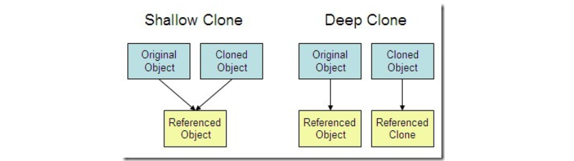

# Java基础

## 基本概念

### 面向过程和面向对象的区别

* **面向过程**：性能高于面向对象，因为类的调用需要实例化，更为消耗资源。所以当性能是最重要的考虑因素时，如单片机、嵌入式开发、Linux内核等一般采用面向过程开发；
* **面向对象**：更易维护、易复用、易扩展，因为面向对象有封装、继承、多态的特性，所以可用设计出低耦合的系统，时系统更加灵活、更加易于维护。


### JVM/JDK/JRE的区别

#### JVM

**概念**：JVM即Java虚拟机，是运行Java字节码的虚拟机器。通过针对不同操作系统的特定实现来跨平台，目的是使相同的字节码在不同系统上运行的结果相同。

**字节码**：JVM可以理解的代码就叫做字节码，即扩展名为 `.class` 的文件。它不面向特定的处理器，只面向虚拟机。Java通过字节码的方式，在一定程度上解决了传统解释型语言执行效率低的问题， 同时又保留了解释型语言可移植的特点。所以Java程序运行时比较高效，而且由于字节码不针对一种特定的机器，因此Java程序无需重新编译便可在各种操作系统上运行。

**Java程序从源代码到运行**：


1. 在 `.class —> 机器码` 这一步JVM的类加载器首先加载字节码文件，然后通过解释器逐行解释执行，这种方式执行速度较慢，而且有些方法和代码块是经常需要被调用的（热点代码），所以引入了JIT编译器，而JIT属于运行时编译器；
2. 当JIT完成第一次编译后，就会将字节码对应的机器码保存下来，下次可以直接使用，而机器码的执行效率远高于Java解释器。所以说Java是编译和解释共存的语言；
3. HotSpot采用了惰性评估策略（Lazy Evaluation），根据二八定律，消耗大部分资源的只有那一小部分的热点代码，而这也就是JIT所要编译的部分。JVM会根据代码每次被执行的情况收集信息并相应的做出优化，因此执行的次数越多，速度就越快。JDK9引入了新的编译模式AOT，会直接将字节码编译成机器码，从而避免JIT预热等各个方面的开销。


#### JDK和JRE的区别

* **JDK（Java Development Kit）**：是功能齐全的Java SDK，拥有JRE所拥有的一切，还具有编译工具javac和文档工具javadoc等，能够创建和编译程序；
* **JRE（Java运行时环境）**：是运行已编译Java程序所需要的所有内容的集合。包括JVM、Java类库、Java命令和其他一些基础构件，但不能创建新程序；
* 若只需要在机器上运行普通Java程序的话，只需要安装JRE即可。若还要进行Java源代码的编译等工作，就需要安装JDK了。


### OracleJDK和OpenJDK的区别

* OracleJDK大概每6个月发布一次主要版本。而OpenJDK大概每3个月发布一次，但并不是固定的；
* OpenJDK是一个参考模型并且是完全开源的。而OracleJDK是OpenJDK的一个实现，并不是完全开源的；
* OracleJDK比OpenJDK更稳定，虽然二者代码几乎相同，但OracleJDK有更多的类和一些错误修复；
* 在响应性和JVM性能方面，OracleJDK相对于OpenJDK有更好的表现；
* OracleJDK不会为即将发布的版本提供长期支持，用户每次都必须通过更新到最新版本获得支持来获取最新版本；
* OracleJDK根据二进制代码许可证获得许可。而OpenJDK根据GPL v2获得许可。


### Java和C++的区别

* 二者都是面向对象的语言，都支持封装、继承和多态；
* Java不像C++一样提供指针来直接访问内存，程序内存更加安全；
* Java的类是单继承的，C++支持多继承，但Java的接口可以多继承；
* Java有自动的内存管理机制，C++需要手动管理内存。


## 基本特性

### 引用传递和值传递

* **值传递**：是指在调用函数时将实际参数复制一份到函数中，这样的话如果函数对其传递过来的形式参数进行修改，将不会影响到实际参数；
* **引用传递**：是指在调用函数时将对象的地址直接传递到函数中，如果在对形式参数进行修改，将影响到实际参数的值。
* Java采用了值传递，即：
  * 一个方法不能修改一个基本数据类型的参数，因为是副本；
  * 一个方法可以改变一个对象参数的状态，对象参数就是指向这个对象的一个新的引用；
  * 一个方法不能让对象参数引用一个新的对象，只有通过其访问对象。


### Spring类重写的equals

* 首先判断引用是否相等；
* 接着判断对象是否是String类的实例；
* 接着判断字符串长度是否相等；
* 最后逐个比较字符是否全部相等。


### static关键字总结

* **修饰变量**：被static修饰的变量称为静态变量或类变量，属于类所有，对于不同的类来说，static变量只有一份，且存在于方法区中；
* **修饰方法**：被static修饰的方法称为静态方法，能直接通过类名.方法名的方式使用，在静态方法内部不能访问非静态的属性和方法；
* **修饰代码块**：被static修饰的代码块称为静态代码块 ；
* **修饰内部类**：被static修饰的内部类称为静态内部类。


### final关键字总结

* **修饰变量**：如果是基本数据类型的变量，则数值一旦在初始化后便不能修改。如果是引用类型变量，则在对其初始化后便不能再让其指向另一个对象。final修饰变量在一定程度上起到了不可变的效果，可以用来保护只读数据，在并发编程中，因为明确的不能再对final变量进行修改，所以能减少额外的同步开销；
* **修饰类**：表示这个类不能被继承，被final修饰的类中所有成员方法都会隐式的被指定为final修饰；
* **修饰方法**：被其修饰的方法不能被重写。早期会通过final方法提高性能，现版本已经不需要了。类中的所有private方法都隐式的指定为final。


### 接口和抽象类的区别

* **方法定义**：接口中的所有方法默认是public，所有方法在接口中不能有实现（JDK8中接口可以有默认方法和静态方法，JDK9中引入了私有方法和私有静态方法）。而抽象类可以有非抽象方法；
* **变量定义**：接口中除了static、final变量，不能有其他变量。而抽象类中则不一定；
* **类的继承/实现**：一个类可以实现多个接口（接口本身可以通过继承扩展多个接口），但只能继承一个抽象类；
* **访问修饰符**：接口的方法默认修饰符是public。抽象方法可以有public、protected和default这些修饰符，抽象方法就是为了被重写所以不能使用private关键字修饰；
* **设计层面**：抽象是对类的抽象，是一种模板设计。而接口是对行为的抽象，是一种行为的规范。


### byte类型的取值范围

* byte的取值范围是-128—127之间，共256个。一个byte类型在计算机中占一个字节，即8bit，最大2^7=1111 1111。
* Java中使用补码表示二进制数，补码的最高位是符号位，即0表示帧数，1表示负数。整数的补码就是其本身，由于最高位是符号位，所以正数的二进制表示是0111 1111，即127。
* 而最大的负数是1111 1111，其中会涉及到两个0，即+0和-0，+0归为正数，-0归为负数，所以负数的范围一直到-128。


### Integer缓存池

* IntegerCache是Integer的内部类，其维护了一个Integer类型的数组，用于缓存-128—127之间的数字，如果使用的是这个范围内的数字，则 `new Integer` 不会创建对象，而是直接从池中获取。这样可以减少堆中对象的分配，提高程序运行效率。

* 如创建 `Integer a = 24`，实际上调用的是Integer的 `valueOf` 方法：

```java
public static Integer valueOf(int i) {
    if (i >= IntegerCache.low && i <= IntegerCache.high)
        // 存在于缓存范围则直接从数组中获取
        return IntegerCache.cache[i + (-IntegerCache.low)];
    // 否则创建信对象
    return new Integer(i);
}
```


### fail-fast和fail-safe

* **fail-fast**：是Java中的一种快速失败机制，java.util包下的所有集合都是快速失败的，即会抛出 `ConcurrentModificationException` 异常。可以理解为一种快速检测机制，只能用来检测错误，不会对错误进行恢复。快速失败不一定只在多线程环境下存在，ArrayList也会由于modCount不等于expectedModCount而抛出这个异常；
* **fail-safe**：是Java中的一种安全失败机制，表示在集合遍历时不会直接在原集合上操作，而是先复制原有集合内容，在拷贝的集合上进行遍历。由于迭代操作是对拷贝进行的，所以在遍历过程中对原集合的一切修改都是不能被原集合检测到的，所以不会触发 `ConcurrentModificationException` 。JUC包下的容器都是安全失败的，可以在多线程条件下使用，并发修改。


### 动态代理原理

* 代理一般分为静态代理和动态代理，都是代理模式的一种应用，静态代理是指在程序运行前编译完毕，程序运行时就能明确知道由谁来执行代理方法；
* 而动态代理只能在程序的运行期间才能确定代理对象，相比于静态代理，其优势就是可以方便的对代理类的方法进行统一处理，而不用修改每个代理类中的方法。可以说动态代理是基于反射实现的；
* 动态代理是一种在运行时构建代理、动态处理方法调用的机制。动态代理的实现方式有很多，Java提供的代理被称为JDK动态代理，是基于类的继承实现的。


### int和Integer的区别

* int是Java的基本数据类型，代表的是整型类型，占4个字节，即32位。默认值为0，int在Java内存模型中被分配在栈上；
* Integer是Java中的基本数据类型包装类，是一个对象，默认值是null，在Java内存模型中被分配在堆中；
* int和Integer在使用的过程中可以隐式的相互转换，int转Integer的过程称为装箱，Integer转int的过程称为拆箱。


### Collection和Collections的区别

* 二者均位于java.util包下。
* **Collection**：是集合的父类，是一个顶级的接口，大部分的抽象类，如AbstactList、AbstractSet都继承了Collection类。Collection只会定义一组标准方法，如add、remove、set、equals等，具体由子类实现。
* **Collections**：是集合的工具类，提供了一系列静态方法。
  * sort方法为集合排序；
  * 线程安全容器，如：`Collections.synchronizedList`、`Collections.synchronizedMap`；
  * reverse方法反转集合；
  * fill方法使用指定元素替换指定列表中的所有元素。


### Comparator和Comparable的区别

* Comparable默认使用自然排序，若类已经实现了Comparator接口定制化排序，则按照定制规则进行比较。

* 对于一些普通的数据类型，如：Integer、String、Double，都默认实现了Comparable接口，实现了compareTo方法，可以直接使用。


### Object类的方法

* `hashCode()`：计算对象的哈希码；
* `equals()`：比较对象的值是否相等；
* `toString()`：返回对象的字符串表述；
* `clone()`：对象之间的拷贝；
* `wait()`：线程在对象上阻塞；
* `notify()`：随机唤醒一个阻塞在对象上的线程；
* `notifyAll()`：唤醒所有阻塞在对象上的线程；
* `finalize()`：完成对象的回收，析构函数；
* `getClass()`：获取对象的Class类。


### 内部类总结

* **成员内部类**：即在一个类内部定义的成员类，成员内部类可以访问外部类所有的变量和方法，包括静态和非静态，私有和公有；
* **局部内部类**：即在一个方法中定义的内部类，定义在实例方法中的局部类可以访问外部类的所有变量和方法，定义在静态方法中的局部类只能访问外部类的静态变量和方法；
* **匿名内部类**：即不定义名称的内部类。
  * 匿名内部类必须继承一个抽象类或实现一个接口；
  * 匿名内部类不能定义任何静态成员和静态方法；
  * 当匿名内部类所在方法的形参需要被匿名内部类使用时，必须声明为final；
  * 匿名内部类不能是抽象的，必须要实现继承的类或是实现接口的所有抽象方法。
* **静态内部类**：即在一个类内部定义的静态类，静态内部类可以访问外部类所有的静态变量，而不可访问外部类的非静态变量；


### 动态绑定和静态绑定的区别

绑定就是一个被调用的方法与这个方法所属的类连接在一起的过程被称为绑定。主要分为两种，即静态绑定和动态绑定，也称前期绑定和后期绑定，或编译时绑定和运行时绑定。

**静态绑定**：在程序运行前，也就是编译时期JVM就能确定调用的是谁的方法，这种机制称为静态绑定。如果一个方法是构造方法或是由private、static、final任意一个关键字所修饰，那么这个方法就是静态绑定的。

* private：即私有方法，这种方法无法被本类之外的其他类所调用的，所以是由编译器识别该方法属于哪个类；
* static：即类方法，可以由类名.的方法调用，不会涉及到new关键字，也就是说不会涉及到多态，所以可以编译时绑定；
* final：即方法不能重写，但是可以被子类进行调用，如果将方法声明为final可以有效的关闭动态绑定。

**动态绑定**：

* 在程序运行时根据具体对象的类型进行绑定。除了由private、final、static所修饰的方法和构造方法外，JVM在运行期间确定调用的是谁的方法的过程称为动态绑定；
* 当调用方法的对象满足了多态机制，即满足了继承、重写和父类引用指向子类对象的特点后，就会触发动态绑定机制；
* 动态绑定的过程：
  * 虚拟机提取对象的实际类型的方法表；
  * 虚拟机搜索方法签名；
  * 调用方法。

**二者的特点**：

* 静态绑定：
  * 编译器触发，能够提前知道代码错误；
  * 提高程序的运行效率。
* 动态绑定：
  * 使用动态绑定的前提条件是能够提高代码的可用性，使代码更加灵活；
  * 多态是动态绑定的依据，能够降低耦合度。


### 字符型常量和字符串常量的区别

* **形式上：**字符常量是单引号引起的一个字符。而字符串常量是双引号引起的若干个字符；
* **含义上：**字符常量相当于一个整型值，可以对应ASCII码值，可以参与表达式运算。字符串常量代表一个地址值，指向字符串在内存中的存放位置；
* **占内存大小：**字符常量通常占用2个字节。字符串常量占有若干个字节。


**注：**Java要确定每种基本类型所占存储空间的大小，它们的大小并不像其他大多数语言那样随机器硬件架构的变化而变化，这种所占存储空间大小的不变性是Java程序更具有可移植性的原因之一。


### 重载和重写的区别

* **重载（overloading）**：即同名的方法能够根据输入参数的不同，做出不同的处理。在同一类中，重载的方法名必须相同，参数类型、个数、顺序、返回值和访问修饰符可以不同。重载解析就是一个类中多个同名方法根据不同的传参来执行不同的处理逻辑。
* **重写（overview）**：即当子类需要定义父类的同名方法，输入参数一样，但要做出有别于父类的响应时，就要覆盖父类方法。重写发生在运行期间，是子类对父类的允许访问方法的实现过程进行重新编写。
  * 返回值类型、方法名和参数列表必须相同。抛出的异常范围要小于等于父类。访问修饰符范围大于等于父类；
    * 注：如果方法的返回值是基本类型和void，在重写时不能修改。但如果是引用类型，则是可以修改成子类的。
  * 如果父类方法访问修饰符为private/final/static，则子类就不能重写该方法，但被static修饰的方法能够被再次声明；
  * 构造方法无法被重写。


### 面向对象三大特性

#### 封装

即把一个对象的属性私有化，同时提供一些可以被外界访问的方法操作和获取属性的方式，如果属性不想被外界访问，则不提供对应的方法即可。如果一个类没有提供给外界访问的方法，那么这个类也就没有什么意义。


#### 继承

使用已存在的类定义作为基础建立新类的技术，新类的定义可以增加新的属性和新的功能，也可以使用父类的功能，但不能选择性的继承父类。通过继承能够非常方便的复用以前的代码。

* 子类拥有父类所有的属性和方法，包括私有属性和私有方法，但是父类中的私有属性和方法子类是无法访问的，只能拥有；
* 子类可以拥有自己的属性和方法，即子类可以对父类进行扩展；
* 子类可以用自己的方式实现父类的方法，即重写。


#### 多态

所谓多态就是指程序中定义的引用变量所指向的具体类型和通过该引用变量进行的方法调用在编程时并不确定，而是在程序运行期间才会确定。即一个引用变量到底会指向哪个类的实例对象，该引用变量进行的方法调用到底是哪个类中实现的方法，必须在程序运行期间才能决定。在Java中可以使用继承（多个子类对父类同一方法的重写）和接口（多个类实现一个接口并覆盖其中的同一方法）来实现多态。


### String/StringBuffer/StringBuilder的区别

#### 可变性

String类中使用final关键字修饰字符数组来保存字符串，所以String对象是不可变的。

```JAVA
public final class String
    implements java.io.Serializable, Comparable<String>, CharSequence {
    /** The value is used for character storage. */
    private final char value[];
}
```

**为什么String要设计成不可变的？**

* **可以缓存hash值**：如HashMap使用String类型的key，需要计算hash值，不可变的特性可以使得hash值不可变，只需要进行一次计算；

* **字符串常量池的需要**：如果一个String对象已被创建过，那么就会从字String Pool中取得引用。如果String Pool没有这个字符串，那么会创建并添加到String Pool。

  

* **安全性**：String经常做为参数，保证参数不可变操作更加安全；

* **线程安全**：使String天生支持线程安全，可以在多个线程安全使用。

StringBuilder和StringBuffer都继承自AbstractStringBuilder类。在该类中也是使用字符数组保存字符串，但没有使用final关键字修饰，所以这两个对象都是可变的。StringBuilder与StringBuffer的构造方法都是调用父类构造方法实现的。

```JAVA
abstract class AbstractStringBuilder implements Appendable, CharSequence {
    
    /**
     * The value is used for character storage.
     */
    char[] value;
    
    /**
     * The count is the number of characters used.
     */
    int count;
    
    AbstractStringBuilder(int capacity) {
    	value = new char[capacity];
    }
}
```


#### 线程安全性

* String对象是不可变的，可以理解为常量，也就是线程安全的；
* AbstractStringBuilder是StringBuilder和StringBuffer的公共父类，定义了一系列字符串基本操作。StringBuffer对方法加了同步锁保证了线程的安全。StringBuilder则没有加锁，所以线程不安全但开销更小。


#### 性能

* 每次对String类型进行改变的时候，都会生成一个新的String对象，然后将指针指向新的String对象；
* StringBuffer每次都会对StringBuffer对象本身进行操作，而不是生成新的对象并改变对象引用；
* StringBuilder虽然不存在同步锁消耗，但提高的性能有限，且线程不安全。


#### 适用场景

* 操作少量的数据时使用String；
* 单线程下通过字符串缓冲区操作大量数据时使用StringBuilder；
* 多线程下通过字符串缓冲区操作大量数据时使用StringBuffer。


### 成员变量和局部变量的区别

* **语法形式**：成员变量是定义在类中的，而局部变量是在方法中定义的变量或是方法的参数。成员变量可以被public、private和static等修饰符所修饰，而局部变量不能被访问控制修饰符及static所修饰，但二者皆可被final修饰；
* **存储方式**：若成员变量是使用static修饰的，那么这个成员变量就是属于类的，如果没有使用static修饰，这个成员变量就是属于实例的。对象存储在堆内存，如果局部变量类型为基本数据类型，则存储在栈空间，如果是引用类型，则在栈中存储指向堆中或常量池中对象的引用；
* **生命周期**：成员变量是对象的一部分，随着对象创建而存在。而局部变量是随着方法的调用结束而消失的；
* **初始值**：成员变量如果没有被赋予初始值，则会自动以该类型的默认值而赋值（被final修饰的成员变量也需要显式赋值）。而局部变量则不会自动赋值。


### 静态方法和实例方法的区别

* 在外部调用静态方法时，可以使用 `类名.方法名` 的形式，也可以使用 `对象名.方法名` 的形式。而实例方法只有后面这种方式，也就是说，调用静态方法无需创建对象；
* 静态方法在访问本类的成员时，只允许访问静态成员（静态变量和静态方法），不允许访问实例成员和实例方法。实例方法则无此限制。


### hashCode()和equals()

* **`hashCode()`**：作用是获取对象的哈希码。这个哈希码的作用是确定该对象在哈希表中的索引位置。`hashCode()` 定义在JDK的Object.java中，意味着Java中的任何类都包含 `hashCode()` 方法；
* **为什么需要 `hashCode()` ？**用于HashSet、HashMap中散列表结构的元素存储位置，当元素要加入时，会先计算hashCode，然后定位该元素在散列表中的存储位置，若是位置上有元素存在，则使用 `equals()` 判断是否是同一个元素，若不是则挂入这个位置的链表上，若是则操作失败达到了去重的目的；
* **为什么重写 `equals()` 时必须重写 `hashCode()`？**如果两个对象相等，则hashCode一定相同，调用equals也一定返回true。但两个对象hashCode相等不代表一定是相等的，因此在equals被覆盖后，hashCode也需要被覆盖；
* **为什么对象 `hashCode()` 相同，却不一定相等？**因为hashCode的本质是对堆上的对象进行单向散列计算，但是这种算法会出现哈希碰撞的情况，即不同的对象计算出相同的哈希值。这时就需要使用equals来判断对象是否真正相同，即hashCode是用于缩小查找成本的；


### ==和equals()

* **基本类型**：== 判断两个值是否相等，基本类型没有 `equals()`；
* **引用类型**：== 判断两个变量是否引用同一对象，而 `equals()` 则判断引用的对象是否等价。


### 反射

**概念**：每个类都有一个Class对象，包含了与类有关的信息。当编译一个新类时，会产生一个同名的 .class 文件，该文件保存着Class对象的信息。类加载就相当于Class对象的加载，类在第一次使用时才会动态加载到JVM中。反射则是提供了在运行时通过 `Class.forName("com.mysql.jdbc.Driver");` 这种方式来动态加载类到JVM中。

**Class 和 java.lang.reflect 对反射提供了支持，java.lang.reflect 类库主要包含了以下三个类：**

* **Field**：可以使用 `get()` 和 `set()` 方法读取和修改Field对象关联的字段； 
* **Method**：可以使用 `invoke()` 方法调用与Method对象关联的方法；
* **Constructor**：可以用Constructor的 `newInstance()` 创建新的对象。

**优点**：

* **可扩展性**：应用程序可以利用类的全限定名创建可扩展对象的实例，使用来自外部的用户自定义类；
* **类浏览器和可视化开发环境**：一个类浏览器需要可以枚举类的成员。可视化开发环境（如：IDE）可以从利用反射中可用的类型信息中受益，以帮助程序员编写正确的代码；
* **调试器和测试工具**：调试器需要检查一个类中的私有成员。测试工具可以利用反射来自动的调用类里定义的可被发现的API定义，以确保一组测试中有较高的代码覆盖率。

**缺点：**

* **性能开销**：反射涉及了动态类型解析，所以JVM无法对这些代码进行优化。因此反射操作的效率要比非反射操作低得多；
* **安全限制**：使用反射要求程序员必须在一个没有安全限制的环境中运行。如果一个程序必须在有安全限制的环境中运行，如Applet，那就不适用反射；
* **内部暴露**：由于反射允许代码执行一些在正常情况下不被允许的操作（如访问私有的属性和方法），所以使用反射可能会导致意料之外的副作用，这可能导致代码功能失调并破坏可移植性。发射代码破坏了抽象性，因此当平台发生改变时，代码的行为就有可能随之变化。


### 异常处理

#### 基本概念


* **Throwable**：在Java中，所有的异常都有一个公共的父类，即java.lang包下的Throwable类。该类有两个重要的子类，即Exception异常类和Error错误类。
* **Error错误**：是程序无法处理的错误。表示运行应用程序中较严重的问题。大多数错误与代码编写者执行的操作无关，而与代码运行时JVM有关。如：虚拟机运行错误VirtulMachineError、当JVM不再具有继续执行所需的内存资源时的OutOfMemoryError和类定义错误NoClassDefFoundError等，这些错误发生时JVM一般会选择终止线程。
* **Exception异常**：是程序本身可以处理的异常，可以通过编码时的catch语句进行捕获。Exception存在一个重要的子类RuntimeException运行时异常，该异常由JVM抛出。
  * **受检查异常**：所谓的受检查是指在程序在编译过程中，如果这种异常没有被catch/trows处理，就无法通过编译。除了RuntimeException及其子类，其他的Exception类及其子类都属于受检查异常。
  * **不受检查异常**：这类的异常就是即使不去处理也可以通过编译。RuntimeException类及其子类都是不受检查的异常。


#### 常见的异常

* **NullPointerException**：空指针异常，即要访问的变量没有引用任何对象；
* **NoSuchMethodException**：找不到方法；
* **IllegalArgumentException**：不合法的参数异常；
* **IndexOutOfBoundsException**：数组下标越界异常；
* **IOException**：文件未找到、未打开或者I/O操作不能进行而引起的异常；
* **ClassNotFoundException**：找不到文件所抛出的异常；
* **NumberFormatException**：字符串转数字异常；
* **ArithmeticException**：算术运算异常，如整数除0时会抛出；
* **ClassCastException**：类型转换错误；


#### 异常处理

* **try块**：用于捕获异常，其后可以接多个 catch 块，若没有 catch 块，则必须紧跟一个 finally 块；
* **catch块**：用于处理 try 捕获到的异常；
* **finally块**：无论是否捕获或处理异常，finally 块里的语句都会被执行。当在 try 块或 catch 块中遇到 return 语句时，finally 语句块将在方法返回前被执行。
* **finally不会被执行的特殊情况**：finally块内部发生了异常、线程死亡、CPU被关闭、`System.exit()` 退出程序。


### I/O流

#### 分类


**Java中的IO流划分**：

* **按照流的流向划分**：可以划分为输入流和输出流；
* **按照操作单元划分**：可以划分为字节流和字符流；
* **按照流的角色划分**：可以划分为节点流和处理流。

**I/O流的40多个类都是从4个抽象类中派生出来的**：

* **InputStream/Reader**：所有输入流的基类，前者是按字节操作，后者是字符；
* **OutputStream/Writer**：所有输出流的基类，前置是按字节操作，后者是字符。

**按操作方式分类结构图**：


**按操作对象分类结构图**：


**为什么需要字符流？**

* 无论文件的读写还是网络的发送接收，信息的最小存储单元都是字节，Java的IO流操作还提供了另外一种字符流操作；
* 如果不使用字符流，那么Java操作字符是通过JVM转换字节得到的，该过程耗时且存在编码的问题。所以Java提供字符流用于直接操作特定编码的字符。


#### BIO/NIO/AIO

* **BIO（Blocking I/O）**：同步阻塞I/O模型，数据的读取写入必须阻塞在一个线程内等待其完成。在活动连接数不是特别高（单机小于1000）的情况下，这种模型比较适用，可以让每个连接都专注于自己的I/O，且编程模型简单，不需要过多的考虑系统的过载、限流等问题。线程池本身就是一个天然的漏斗，可以缓冲一些系统处理不了的连接或请求。但是，当面对10w甚至100w级的连接时，传统的BIO模型就无能为力了。
* **NIO（Non-blocking/New I/O）**：同步非阻塞I/O模型，在JDK1.4中引入了NIO的框架，对应于 `java.nio` 包，提供了 `Channel、Selector、Buffer` 等抽象。其支持面向缓冲的，基于通道的I/O操作方法。NIO提供了与传统BIO模型中的Socket和ServerSocket相对应的SocketChannel和ServerSocketChannel两种不同的套接字通道实现，两种都支持阻塞和非阻塞模式。阻塞模式和传统IO一样，简单但性能欠佳，而非阻塞模式正好与之相反。对于低负载、低并发的网络应用，可以使用同步阻塞IO来提升并发速率和更好的维护性。对于高负载、高并发的网络应用，可以使用NIO的非阻塞模式来开发。
* **AIO（Asynchronous I/O）**：JDK1.7引入的NIO2，是异步的非阻塞IO模型。其基于事件回调机制实现，即应用操作后会直接返回，不会阻塞等待，当后台处理完成，OS会通知相应的线程进行后续的操作。对于NIO来说，业务线程是在IO操作准备好时，得到通知，接着由这个线程自己进行IO操作，IO操作本身是同步的。


### 深拷贝和浅拷贝



* **浅拷贝：**对基本数据类型进行值拷贝。对引用数据类型进行引用传递的拷贝；
* **深拷贝：**对基本数据类型进行值拷贝。对引用数据类型，则创建新对象，并复制其内容。