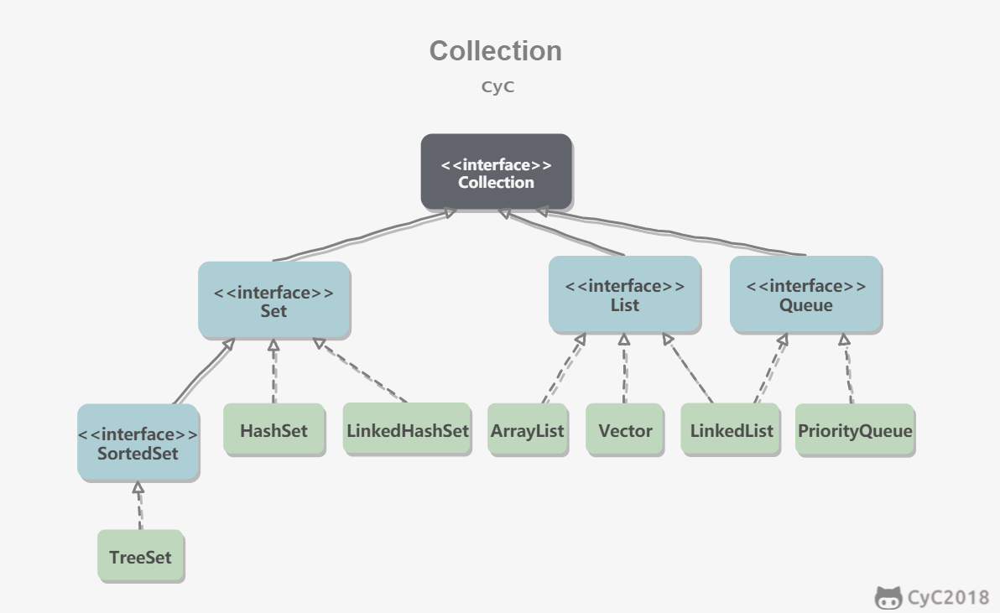
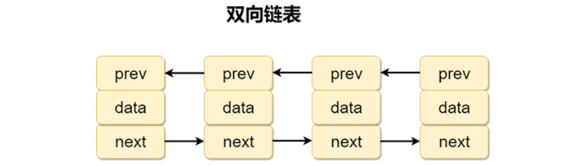
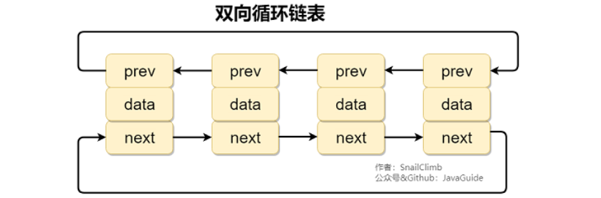
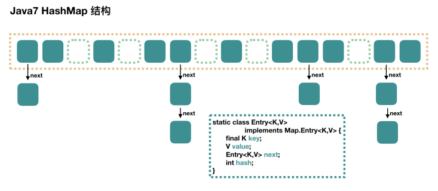
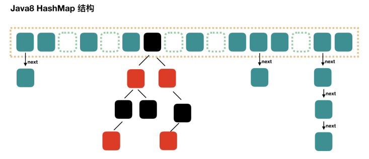
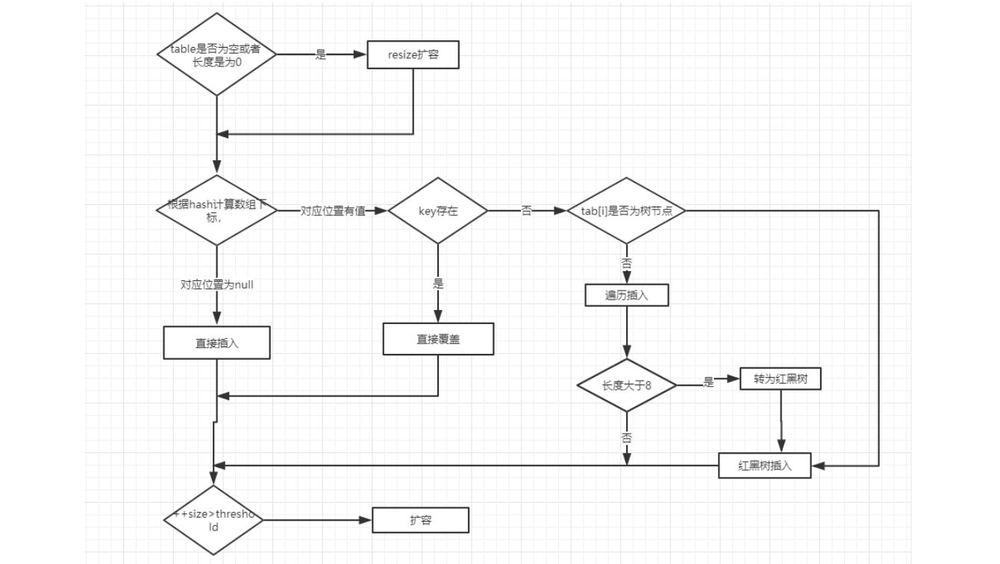
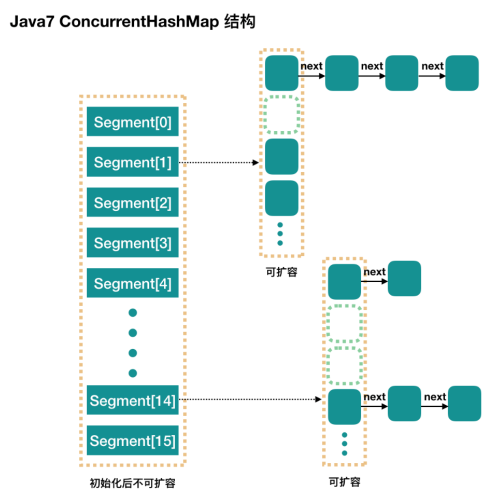

# Java容器

## 基本概念

### Collection接口概述

* **List**：
  * **ArrayList**：基于可动态扩容的数组实现，支持根据下标随机访问；
  * **Vector/Stack**：可以看成是线程安全的ArrayList（所有方法都是synchronized的）； 
  * **LinkedList**：基于双向链表实现，只能顺序访问，但可以快速在任意位置插入和删除元素。且还能够实现栈、队列等结构；
  * **CopyOnWriteArrayList**：写时复制的ArrayList，当一个ArrayList写操作非常少，读操作非常多时使用。所谓写时复制是当些操作发生时，会整体将数组复制一份并执行写操作，之后将引用重新指向。在大量线程同时访问时，写操作真正操作的是复制后的新数组，而读操作访问原数组就可以无需加锁，以此提高效率。

* **Set**：
  * **TreeSet**：底层使用红黑树实现，支持有序性操作，如：根据范围查找元素。查询效率不如HashSet，时间复杂度为O(logN)，而HashSet是O(1)；
  * **HashSet**：底层使用哈希表实现，支持快速查找，但不支持有序性操作。且失去了元素插入时的顺序信息，即HashSet中元素的位置是无序的；
  * **LinkedHashSet**：基于LinkedHashMap实现，额外使用了双向链表维护元素的插入顺序；
  * **EnumSet**：枚举集合；
  * **CopyOnWriteArraySet**：写时复制的ArraySet，相比于CopyOnWriteArrayList没有重复元素；
  * **ConcurrentSkipListSet**：基于ConcurrentSkipListMap实现，有序且线程安全的集合。

* **Queue**：
  * **Deque**：
    * **ArrayDeque**：底层使用数组实现的双端队列；
    * **BlockingDeque/LinkedBlockingDeque**：底层使用链表实现的阻塞的双端队列。
  * **BlockingQueue**：
    * **ArrayBlockingQueue**：底层使用数组实现的阻塞队列。队列为空则消费者阻塞，队列已满则生产者阻塞；
    * **PriorityBlockingQueue**：底层使用堆实现的带优先级的阻塞队列；
    * **LinkedBlockingQueue**：底层使用链表实现的阻塞队列；
    * **TransferQueue/LinkedTransferQueue**：底层使用链表实现的生产者和消费者必须成对的队列。生产者会一直阻塞在队列一端，直到另一端有消费者过来消费为止；
    * **SynchronousQueue**：容量为空的队列；
    * **DelayQueue**：基于阻塞队列实现的延迟队列。只有当指定的时间到其才能获取队列中的元素，队列头元素是最接近到期的元素。当生产者线程添加元素时，会触发队列排序，即队列中的元素顺序是按到期时间排序的。排在队列头部的元素是最早到期的，越往后到期时间越晚。
  * **PriorityQueue**：底层使用堆（小顶堆/大顶堆）实现的优先队列；
  * **ConcurrentLinkedQueue**：并发安全的且底层使用链表实现的队列。




### Map接口概述

* **TreeMap**：底层使用红黑树实现，元素具有顺序的特性；
* **HashMap**：JDK1.8之前使用数组+链表实现，数组是主体，链表是为了解决哈希冲突而存在的。JDK1.8后当链表的长度大于阈值8时，会将链表转换为红黑树（若当前数组长度小于64，则优先扩容数组），减少搜索时间；
* **HashTable**：可以看成是线程安全的HashMap；
* **LinkedHashMap**：使用双向链表维护元素顺序的HashMap，顺序为插入顺序或最近最少使用（LRU）顺序；
* **WeakHashMap**：键使用弱引用的散列表结构；
* **IdentityHashMap**：具备同一性的HashMap，在判断Map中的两个key是否相等时，只通过==来判断，而不通过equals，即允许两个key的值相同，但引用不能相同；
* **ConcurrentHashMap**：适用于高并发场景的HashMap；
* **ConcurrentSkipListMap**：底层使用跳表实现的、线程安全的、有序的哈希表，适用于高并发的场景。


### 如何选择集合？

+ 当需要根据键值对获取元素时，就选择Map接口下的集合。需要排序时选择TreeMap，不需要排序则使用HashMap，保证线程安全则使用ConcurrentHashMap；
+ 当只需要存放元素时，就选择Collection接口下的集合。需要保证元素唯一性就选择Set接口下的集合TreeSet和HashSet，不关心重复就选择List接口下的ArrayList和LinkedList。


### 为什么使用集合？

* 当需要保存一组类型相同的数据时，需要一个容器，但使用数组存储对象有很多弊端。因为在实际开发中，存储数据的类型是多种多样的，所以出现了集合；
* 数组的缺点是一旦声明后，长度就无法改变，同时声明数组也必须指定数据类型，一旦确定后就不法改变，另外，数组存储数据是不提供自定义排序和判重功能的，所以用数组存储数据功能单一不够灵活。


### 线程不安全和安全的集合有哪些？

* **线程不安全的集合：**ArrayList、LinkedList、HashMap、TreeMap、HashSet、TreeSet都不是线程安全的；
* **java.util.concurrent（JUC）包提供的各种并发容器**：
  * **ConcurrentHashMap**：线程安全的HashMap；
  * **CopyOnWriteArrayList**：使用写时复制实现的线程安全的ArrayList，在读多写少的场合性能非常好，远胜于Vector；
  * **ConcurrentLinkedQueue**：使用链表实现的并发队列，可以看成是一个线程安全的LinkedList，是一个非阻塞队列；
  * **BlockingQueue**：阻塞队列接口，JDK通过链表、数组等方式实现了这个接口，非常适合作为数据共享的通道；
  * **ConcurrentSkipListMap**：跳表的实现。底层是一个Map结构，使用跳表的数据结构实现了快速查找。


## 设计模式

### 迭代器模式

* **是什么？**Java通过Iterator接口实现设计模式中的迭代器，可以对集合进行遍历，但不同集合中的数据结构可能是不相同的，所以存取方式会存在区别。迭代器就是定义了一个统一的接口，并声明了 `hasNext()` 和 `next()` 这两个用于获取数据的方法，具体的实现交由具体的集合去完成。
* **有啥用？**主要是用于遍历集合，特点是安全，因为其可以确保在遍历集合的时候元素不会被更改，一旦被修改，就会抛出异常。


### 适配器模式

* 将一个类的接口转换成客户希望的另外一个接口。适配器模式使得原本由于接口不兼容而不能一起工作的那些类可以一起工作。
* Java中通过 `java.util.Arrays#asList()` 将数组类型转换为List类型。

```JAVA
@SafeVarargs
public static <T> List<T> asList(T... a)
```


## List接口

### ArrayList和Vector的区别

* ArrayList是List的主要实现类，底层使用 `Object[]` 存储，适用于频繁的查找工作，线程不安全；
* Vector是List的古老实现类，底层同样使用 `Object[]` 存储，线程安全，效率低，已经不适合使用了。


### ArrayList和LinkedList的区别

* **线程是否安全**：二者皆不同步，不保证线程安全。

* **底层数据结构**：ArrayList使用Object类型数组，LinkedList使用双向链表（JDK1.6之前是双向循环链表，JDK1.7之后取消了循环）。

  * **ArrayList存储结构**：

    

    ```java
    // Object类型数组
    private static final Object[] DEFAULTCAPACITY_EMPTY_ELEMENTDATA = {};
    ```

  * **LinkedList存储结构**：

    

    ```java
    // 基于双向链表，使用Node存储链表节点
    private static class Node<E> {
        E item;
        Node<E> next;	// 前驱指针
        Node<E> prev;	// 后继指针
    }
    
    // 每个链表都维护一对头尾指针
    transient Node<E> first;
    transient Node<E> last;
    ```

* **插入和删除是否受元素位置的影响**：

  * **ArrayList采用数组存储**：所以插入删除的时间复杂度受元素位置影响。如：执行 `add(E e)` 方法的时候，ArrayList会默认将指定元素插入到列表的末尾，时间复杂度是O(1)。但若是要通过 `add(int index, E element)` 在指定位置插入素的话，时间复杂度就是O(n-i)，因为在进行上述操作时集合中第i和第i个元素之后的(n-i)个元素都要执行向后移位的操作；
  * **LinkedList采用链表存储**：所以对于 `add(E e)` 的插入不受元素位置的影响，近似O(1)。而通过 `add(int index, E element)` 在指定位置i插入元素时，也无需像数组那样移动元素，但需要迭代访问到指定位置。

* **是否支持快速随机访问**：LinkedList不支持高效的随机元素访问，而ArrayList支持。快速随机访问就是通过元素的序号快速获取元素对象的过程，如：`get(int index)`；

* **内存空间占用**：ArrayList的空间浪费主要体现再列表的结尾会预留一定的容量空间，而LinkedList的空间花费则体现在它的每一个元素都需要消耗相对更多个空间（因为除了存放数据还需要存放prev和next指针）。

* **RandomAccess接口**：只有定义没有具体内容的接口，用于标识实现这个接口的类具有随机访问功能。查看 `binarySearch()` 的源码发现，若List实现了RandomAccess接口，说明具有随机访问功能，则调用 `indexedBinarySearch() `方法。若没实现，则调用`iteratorBinarySearc()`，则只能通过迭代去访问。

  ```JAVA
  public static <T> int binarySearch(List<? extends Comparable<? super Tjk list, T key) {
      if (list instanceof RandomAccess || list.size() < BINARYSEARCH_THRESHOLD)
      	return Collections.indexedBinarySearch(list, key);
      else
      	return Collections.iteratorBinarySearch(list, key);
  }
  ```

  ArrayList实现了RandomAccess接口，是因为底层是数组，具有通过下标进行随机访问的功能。而LinkedList没有实现，是因为底层是链表，只有通过迭代访问。

  ```JAVA
  public class ArrayList<E> extends AbstractList<E>
          implements List<E>, RandomAccess, Cloneable, java.io.Serializable
  ```

* **双向链表**：包含两个指针，一个prev指向前一个节点，一个next指向后一个节点。

  

* **双向循环链表**：最后一个节点的next指向head，而head的prev指向最后一个节点，构成一个环形。

  


### ArrayList扩容机制源码分析

#### 构造方法分析

```JAVA
// 数组的默认大小为10
private static final int DEFAULT_CAPACITY = 10;

// 初始化的空数组
private static final Object[] DEFAULTCAPACITY_EMPTY_ELEMENTDATA = {};

// 使用无参构造方法构造时，默认是一个空数组
public ArrayList() {
    this.elementData = DEFAULTCAPACITY_EMPTY_ELEMENTDATA;
}

// 带指定容量参数的构造方法
public ArrayList(int initialCapacity) {
    if (initialCapacity > 0) {
        // 创建initialCapacity大小的数组
        this.elementData = new Object[initialCapacity];
    } else if (initialCapacity == 0) {
        // 若初始容量被指定为0，则创建空数组
        this.elementData = EMPTY_ELEMENTDATA;
    } else {
        throw new IllegalArgumentException("Illegal Capacity: " + initialCapacity);
    }
}

// 构造包含指定collection元素的列表，这些元素利用该集合的迭代器顺序返回
public ArrayList(Collection<? extends E> c) {
    elementData = c.toArray();
    if ((size = elementData.length) != 0) {
        // c.toArray might (incorrectly) not return Object[] (see 6260652)
        if (elementData.getClass() != Object[].class)
            elementData = Arrays.copyOf(elementData, size, Object[].class);
    } else {
        // replace with empty array.
        this.elementData = EMPTY_ELEMENTDATA;
    }
}
```


#### add方法分析

**添加元素的流程分析**：

* 当add第1个元素，此时 `elementData.length = 0`。执行 `ensureCapacityInternal()` 方法后，因为是默认数组，所以 `minCapacity = DEFAULT_CAPACITY = 10`。接着执行 `ensureExplicitCapacity()` 方法，其中的 `minCapacity - elementData.length > 0` 条件成立。进入 `grow(minCapacity)` 扩容，`elementData.length` 被扩容为10；
* 当add第2个元素，此时 `elementData.length = 10`。执行 `ensureCapacityInternal()` 方法后，因为是扩容后的新数组，所以`minCapacity = 2`。接着执行 `ensureExplicitCapacity()` 方法，其中的 `minCapacity - elementData.length > 0`  条件不成立，所以不会扩容；
* 接下来add的3~10个元素都不会触发扩容，直到第11个元素，`minCapacity = 11` 时（即现有11个元素），大于`elementData.length = 10`（即数组容量10），触发数组的扩容。

```JAVA
// 将指定的元素追加到此列表的末尾
public boolean add(E e) {
    // 添加元素之前，先调用ensureCapacityInternal方法
    ensureCapacityInternal(size + 1);
    // ArrayList添加元素的实质就是为数组赋值
    elementData[size++] = e;
    return true;
}

// 得到最小扩容量
private void ensureCapacityInternal(int minCapacity) {
    if (elementData == DEFAULTCAPACITY_EMPTY_ELEMENTDATA) {
        // 获取默认容量和传入参数的较大值
        minCapacity = Math.max(DEFAULT_CAPACITY, minCapacity);
    }
    // 判断是否需要扩容
    ensureExplicitCapacity(minCapacity);
}
    
// 判断是否需要扩容
private void ensureExplicitCapacity(int minCapacity) {
    modCount++;
    // overflow-conscious code
    if (minCapacity - elementData.length > 0)	// 若最小扩容量超过数组现有容量
        // 调用grow方法进行扩容
        grow(minCapacity);
}
```

**总结**：

* 若不指定容量的情况下，默认创建空数组，长度为0；
* 那么第一次添加元素的时候就会触发扩容；
* 若接下来添加的元素数量达到了数组第一次扩容后的长度，则再次触发扩容。之后依此类推。


#### grow方法分析

**扩容流程分析**：

* 当add第1个元素，进入 `grow()` 方法时，`oldCapacity = 0`，经过 `if (newCapacity - minCapacity < 0) newCapacity = minCapacity`  操作后 `newCapacity = DEFAULT_CAPACITY = 10`，并通过 ``Arrays.copyOf()`` 创建新容量的数组；
* 当add第11个元素，进入 `grow()` 方法时，`oldCapacity = 10`，经过 `newCapacity = oldCapacity + (oldCapacity >> 1)`  操作后 `newCapacity = 15`，并通过  `Arrays.copyOf()`  创建新容量的数组。

```JAVA
// 要分配的最大数组大小
private static final int MAX_ARRAY_SIZE = Integer.MAX_VALUE - 8;

// ArrayList扩容的核心方法
private void grow(int minCapacity) {
    // oldCapacity为旧容量，newCapacity为新容量
    int oldCapacity = elementData.length;
    // 将oldCapacity右移一位，其效果相当于oldCapacity/2
    // 位运算的速度远远快于整除运算，该行代码就是将新容量更新为旧容量的1.5倍
    int newCapacity = oldCapacity + (oldCapacity >> 1);
    // 然后检查新容量是否大于最小需要容量，若还是小于最小需要容量，那么就把最小需要容量当作数组的新容量
    if (newCapacity - minCapacity < 0)
        newCapacity = minCapacity;
    // 如果新容量大于MAX_ARRAY_SIZE，则执行hugeCapacity()方法来比较minCapacity和MAX_ARRAY_SIZE
    // 若minCapacity大于最大容量，则新容量则为Integer.MAX_VALUE
    if (newCapacity - MAX_ARRAY_SIZE > 0)
        newCapacity = hugeCapacity(minCapacity);
    // 创建了一个新容量的新数组，然后将就数组拷贝过去，返回新数组
    elementData = Arrays.copyOf(elementData, newCapacity);
}
    
private static int hugeCapacity(int minCapacity) {
    if (minCapacity < 0) // overflow
        throw new OutOfMemoryError();
    // 若当前数组的容量大于默认的最大容量，则使用int的最大值作为数组的容量，若不大于，则使用默认最大容量
    return (minCapacity > MAX_ARRAY_SIZE) ? Integer.MAX_VALUE : MAX_ARRAY_SIZE;
}
```

**总结**：

* 若需要扩容的是默认的空数组，则直接将容量扩充为默认容量10，然后创建新数组并将旧元素拷贝进来；
* 若需要扩容的不是空数组，则将容量扩充为原来的1.5倍，若还不能满足需求，则直接扩充为最小所需容量。扩充的最大容量不能超过int类型的最大值减8。最后创建新数组并将旧元素拷贝进去。


## Set接口

### Comparable和Comparator的区别

* Comparable接口存在于 `java.lang` 包下，通过 `compareTo(Object obj)` 方法进行排序；
* Comparator接口存在于 `java.util` 包下，通过 `compare(Object obj1, Object obj2)` 方法进行排序。
* 一般需要对集合进行自定义排序时，需要重写 `compareTo()` 或 `compare()` 方法，或将二者结合使用。


**Comparator定制排序**：

```JAVA
public class SortTest {
    
    public static void main(String[] args) {
        ArrayList<Integer> arr = new ArrayList<Integer>();
 		arr.add(-1);
        arr.add(3);
        arr.add(0);
        Collections.sort(arr, new Comparator<Integer>() {
            @Override
            public int compare(Integer o1, Integer o2) {
                return o2.compareTo(o1);
            }
        });
    }
}
```

**Comparable让对象具备可比较性**：

```JAVA
public class Person implements Comparable<Person> {
    
    private String name;
    private int age;
    
    public Person(String name, int age) {
        super();
        this.name = name;
        this.age = age;
    }

    public String getName() {
        return name;
    }

    public void setName(String name) {
        this.name = name;
    }

    public int getAge() {
        return age;
    }

    public void setAge(int age) {
        this.age = age;
    }
	
    @Override
    public int compareTo(Person o) {
        if (this.age > o.getAge()) {
            return 1;
        }
        if (this.age < o.getAge()) {
            return -1;
        }
    }
}
```


### 无序性和不可重复性

* **什么是无序性？**无序性不等于随机性，无序性是指存储的数据在底层数组中并非按照数组索引的顺序添加，而是根据数据的哈希值决定的。
* **什么是不重复性？**不可重复性是指添加的元素按照 `equals()` 判断时，需要返回false，Set集合的不重复性判断需要同时重写`equals()` 方法 `hashCode()`。


### HashSet/LinkedHashSet/TreeSet的区别

* **HashSet**：是Set接口的主要实现类，底层是基于HashMap实现的，无序且不可重复且线程不安全，可以存储null值；
* **LinkedHashSet**：是HashSet的子类，额外维护了链表结构，能够按照元素添加时的顺序遍历；
* **TreeSet**：底层使用红黑树，能够按照添加元素的顺序遍历，排序的方式有自然排序和定制排序。


### HashSet如何检查重复

* 当元素倍add进HashSet中时，会先计算对象的 `hashCode()` 来判断对象加入的位置，同时也会与集合中已存在元素的 `hashCode()` 比较，若没有相同的，则假定对象没有重复出现；
* 但如果发现存在相同 `hashCode()` 的对象，这时会再调用 `equals()` 方法来检查 `hashCode()` 相同的对象是否真的相同，若相同就不允许加入操作。


## Map接口

### HashMap和HashTable的区别

* **线程安全**：HashMap的非线程安全的。而HashTable保证线程安全，其内部方法都被synchronized所修饰；

* **性能方面**：二者都是基于链表实现的哈希表，但HashMap进行put或get操作，可以达到常数时间的性能。而HashTable的put和get操作都添加了synchronized锁，效率相对较差；

* **空值支持**：HashMap中允许空的key和value，只能有一个空key，但可以有多个键对应的值为空。而HashTable中如果put的键值对只要有一个为空，就会抛空指针异常；

* **初始容量大小和每次扩充容量大小的不同**：

  * 创建时如果不指定容量初始值，HashTable默认的初始值大小为11，之后每次扩充，容量变为原来的2n+1。而HashMap的默认初始容量是16，之后每次扩容，容量变为原来的2倍；
  * 创建时如果给定了容量初始值，那么HashTable会直接使用给定的大小。而HashMap会将其置为2的幂次方大小，即HashMap总是使用2的幂作为哈希表的大小。

* **底层数据结构**：JDK1.8后得HashMap在解决哈希冲突时有了较大的变化，当链表长度大于阈值8时，会将链表转化为红黑树，以此来减少搜索时间。而HashTable则没有这样的机制。

* **HashMap指定容量的构造方法源码**：

  ```JAVA
  public HashMap(int initialCapacity) {
      this(initialCapacity, DEFAULT_LOAD_FACTOR);
  }
  
  public HashMap(int initialCapacity, float loadFactor) {
      if (initialCapacity < 0)
      	throw new IllegalArgumentException("Illegal initial capacity: " + initialCapacity);
      if (initialCapacity > MAXIMUM_CAPACITY)
      	initialCapacity = MAXIMUM_CAPACITY;
      if (loadFactor <= 0 || Float.isNaN(loadFactor))
      	throw new IllegalArgumentException("Illegal load factor: " + loadFactor);
      	this.loadFactor = loadFactor;
      	this.threshold = tableSizeFor(initialCapacity);
      }
  }
      
  // 保证了HashMap总是使用2的幂作为哈希表的大小
  static final int tableSizeFor(int cap) {
      int n = cap - 1;
      n |= n >>> 1;
      n |= n >>> 2;
      n |= n >>> 4;
      n |= n >>> 8;
      n |= n >>> 16;
      return (n < 0) ? 1 : (n >= MAXIMUM_CAPACITY) ? MAXIMUM_CAPACITY : n + 1;
  }
  ```


### HashMap和HashSet的区别

HashSet是基于HashMap实现的，除了 `clone()`、`writeObject()` 和 `readObject()` 三个方法外都是直接调用HashMap的方法。

|          HashMap           |           HashSet           |
| :------------------------: | :-------------------------: |
|       实现了Map接⼝        |         实现Set接⼝         |
|         存储键值对         |         仅存储对象          |
| 调⽤put方法向map中添加元素 | 调⽤add⽅法向Set中添加元素  |
| HashMap通过键计算 hashCode | HashSet通过元素计算hashCode |


### HashMap的长度为什么总是2的幂次方？

* 为了使HashMap存取高效，需要尽可能的减少哈希碰撞的发生，即尽量把数据分布均匀。Hash值的范围从-2147483648到2147483647，前后加起来⼤概40亿的映射空间，只要哈希函数映射得比较均匀松散，⼀般应用是很难出现碰撞的。

* 但一个具有40亿容量的数组，内存是放不下的，在使用之前还要先对数组的长度做取余运算，得到的余数才是真正用于存放的位置。这个确定数组下标的计算方法是 `(n - 1) & hash` ，这也就解释了HashMap的长度为什么是2的幂次方。

* 取余%操作中如果除数是2的幂次则等价于与其除数减⼀的按位与&操作。即满足 `hash % length = hash & (length - 1)` 的前提是数组长度是2的n次方。


### HashMap多线程操作导致的死循环问题

JDK1.7下在多线程的场景使用HashMap会造成死循环问题，问题出现在 `rehash` 方法中，在并发场景下会形成环。

```java
do {
    Entry<K,V> next = e.next; 
    int i = indexFor(e.hash, newCapacity);
    e.next = newTable[i];
    newTable[i] = e;
    e = next;
} while (e != null);
```


### HashMap源码分析

#### Jdk1.8之前的HashMap



HashMap的底层数据结构是数组和链表的结合使用，即链表散列。HashMap通过key的 `hasCode()` 经过扰动函数处理后得到hash值，然后通过 `(n-1)&hash` 判断当前元素的存放位置（n为数组长度）。如果当前位置存在元素的话，就判断该元素与新元素的key和hash是否相同，若相同则直接覆盖，若不相同则通过拉链法解决冲突。

* **扰动函数**：就是指HashMap的 `hash()` 方法，使用 `hash()` 方法是为了防止一些对象的 `hashCode()` 实现较差，即使用扰动函数减少哈希碰撞；

* **拉链法**：将链表和数组结合后，数组的每一个元素都是一个链表，若遇到哈希冲突的情况，通过 `equals()` 比较是否是相同元素，若不是则将其挂到链表上即可。


#### Jdk1.8之后的HashMap



这个版本的HashMap在解决哈希冲突的时候变化较大，当链表的长度大于阈值（默认为8），则会将链表转换为红黑树，以减少搜索时间。在链表转换之前会先判断，当数组的长度小于64，那么会先进行数组的扩容操作，而不是直接转换红黑树。


#### 类的基本属性和构造方法

**基本属性**：

* **loadFactor加载因子**：
  * 用于控制数组存放数据的疏密程度，加载因子越趋近于1，则数组中存放的数据entry就越多越密集，也就是会让链表的长度增加。相反，加载因子越小越趋近于0，数组中存放的数据entry就越少越稀疏；
  * loadFactor太大会导致查找元素效率低，太小会导致数组的利用率低，存放的数据会很分散，官方给出的默认值是0.75f；
  * 源码给出的数组默认容量是16，加载因子是0.75f。当HashMap在使用的过程中不断存放数据，直到数据达到了 `16 * 0.75 = 12` 时就需要将当前的数组进行扩容，扩容的过程则需要进行rehash、数据复制等操作，会产生非常大的消耗。
* **threshold临界值**：`threshold = capacity * loadFactor`，当集合中元素的个数 `size >= threshold` 时，就需要考虑对数组进行扩容。临界值的作用就是衡量数组是否需要扩容的一个标准。

```JAVA
public class HashMap<K,V> extends AbstractMap<K,V> implements Map<K,V>, Cloneable, Serializable {
    // 序列号
    private static final long serialVersionUID = 362498820763181265L;    
    // 默认的初始容量是16
    static final int DEFAULT_INITIAL_CAPACITY = 1 << 4;   
    // 最大容量
    static final int MAXIMUM_CAPACITY = 1 << 30; 
    // 默认的加载因子
    static final float DEFAULT_LOAD_FACTOR = 0.75f;
    // 当桶（bucket）上的结点数大于这个值时链表会转换成红黑树
    static final int TREEIFY_THRESHOLD = 8; 
    // 当桶（bucket）上的结点数小于这个值时红黑树会转换成链表
    static final int UNTREEIFY_THRESHOLD = 6;
    // 桶中结构转化为红黑树时对应的数组的最小大小（即不足64会先扩容数组）
    static final int MIN_TREEIFY_CAPACITY = 64;
    // 存储元素的数组，总是2次幂
    transient Node<k,v>[] table; 
    // 存放具体元素的集合
    transient Set<map.entry<k,v>> entrySet;
    // 存放元素的个数，注意这个不等于数组的长度
    transient int size;
    // 每次扩容和更改map结构的计数器
    transient int modCount;   
    // 临界值，当实际大小（容量*填充因子）超过临界值时，会进行扩容
    int threshold;
    // 加载因子
    final float loadFactor;
}
```

**链表节点类Node源码**：

```JAVA
// 继承自 Map.Entry<K,V>
static class Node<K,V> implements Map.Entry<K,V> {
    
    final int hash;	// 哈希值，存放元素到hashmap中时用来与其他元素的hash值比较
    final K key;	// 键
    V value;		// 值
    Node<K,V> next; // 指向下一个节点
    
    Node(int hash, K key, V value, Node<K,V> next) {
        this.hash = hash;
        this.key = key;
        this.value = value;
        this.next = next;
    }
    
    public final K getKey()        { return key; }
    public final V getValue()      { return value; }
    public final String toString() { return key + "=" + value; }

    // 重写hashCode()方法，即将key和value的hashCode按位异或做为Node的hashCode
    public final int hashCode() {
        return Objects.hashCode(key) ^ Objects.hashCode(value);
    }

    public final V setValue(V newValue) {
        V oldValue = value;
        value = newValue;
        return oldValue;
    }
    
    // 重写equals()方法
    public final boolean equals(Object o) {
        if (o == this)
            return true;
        if (o instanceof Map.Entry) {
            Map.Entry<?,?> e = (Map.Entry<?,?>)o;
            if (Objects.equals(key, e.getKey()) &&
                Objects.equals(value, e.getValue()))
                return true;
        }
        return false;
    }
}
```

**树节点类TreeNode源码**：

```java
static final class TreeNode<K,V> extends LinkedHashMap.Entry<K,V> {
    
    TreeNode<K,V> parent;  // 父节点
    TreeNode<K,V> left;    // 左孩子
    TreeNode<K,V> right;   // 右孩子
    TreeNode<K,V> prev;    // 前驱
    boolean red;           // 判断颜色
    
    TreeNode(int hash, K key, V val, Node<K,V> next) {
        super(hash, key, val, next);
    }
    
    // 返回根节点
    final TreeNode<K,V> root() {
        for (TreeNode<K,V> r = this, p;;) {
            if ((p = r.parent) == null)
                return r;
            r = p;
        }
    }
}
```

**构造方法**：

```JAVA
// 默认构造函数
public HashMap() {
    // 默认加载因子0.75f
    this.loadFactor = DEFAULT_LOAD_FACTOR;	
}

// 包含另一个Map的构造函数
public HashMap(Map<? extends K, ? extends V> m) {
    this.loadFactor = DEFAULT_LOAD_FACTOR;
    putMapEntries(m, false);
}

// 指定容量的构造函数
public HashMap(int initialCapacity) {
    this(initialCapacity, DEFAULT_LOAD_FACTOR);
}

// 指定容量和加载因子的构造函数
public HashMap(int initialCapacity, float loadFactor) {
    if (initialCapacity < 0)
        throw new IllegalArgumentException("Illegal initial capacity: " + initialCapacity);
    if (initialCapacity > MAXIMUM_CAPACITY)
        initialCapacity = MAXIMUM_CAPACITY;
    if (loadFactor <= 0 || Float.isNaN(loadFactor))
        throw new IllegalArgumentException("Illegal load factor: " + loadFactor);
    this.loadFactor = loadFactor;
    this.threshold = tableSizeFor(initialCapacity);
}
```


#### put方法分析



* 首先，对新元素根据hashCode计算数组的位置，若对应位置没有元素，则直接插入；

* 若定位到的数组位置有元素，就和要插入的key进行比较，若key相同就直接覆盖； 

* 若key不同，就判断是否是一个树节点，若是就挂到红黑树上；

* 不是树节点则判断链表长度是否大于等于8，若是则转换为红黑树，若不是则插入链表尾部；

* 最后，集合元素size相应增加，判断是否大于临界值，若大于则会触发扩容。

```java
public V put(K key, V value) {
    return putVal(hash(key), key, value, false, true);
}

final V putVal(int hash, K key, V value, boolean onlyIfAbsent, boolean evict) {
    Node<K,V>[] tab; Node<K,V> p; int n, i;
    // table未初始化或者长度为0，直接进行扩容
    if ((tab = table) == null || (n = tab.length) == 0)
        n = (tab = resize()).length;
    // 通过(n - 1) & hash确定元素该存放在哪个桶中，若桶为空，新结点直接放入桶中，此时该结点是放在数组中的
    if ((p = tab[i = (n - 1) & hash]) == null)
        tab[i] = newNode(hash, key, value, null);
    // 若桶中已经存在元素
    else {
        Node<K,V> e; K k;
        // 比较桶中第一个元素（即数组的节点）的hash值和key值是否和新元素相等
        if (p.hash == hash &&
            ((k = p.key) == key || (key != null && key.equals(k))))
                // 相等则直接覆盖，将第一个元素赋值给e，用e来记录
                e = p;
        // hash值不相等，即key不相等；判断是否为红黑树结点
        else if (p instanceof TreeNode)
            // 是树节点则插入树中
            e = ((TreeNode<K,V>)p).putTreeVal(this, tab, hash, key, value);
        // 不是树节点则为链表结点
        else {
            // 在链表尾部插入结点
            for (int binCount = 0; ; ++binCount) {
                // 到达链表的尾部
                if ((e = p.next) == null) {
                    // 在尾部插入新结点
                    p.next = newNode(hash, key, value, null);
                    // 结点数量达到阈值，转化为红黑树
                    if (binCount >= TREEIFY_THRESHOLD - 1) // -1 for 1st
                        xtreeifyBin(tab, hash);
                    // 跳出循环
                    break;
                }
                // 判断链表中结点的key值与插入的元素的key值是否相等
                if (e.hash == hash &&
                    ((k = e.key) == key || (key != null && key.equals(k))))
                    // 相等，跳出循环
                    break;
                // 用于遍历桶中的链表，与前面的e = p.next组合，可以遍历链表
                p = e;
            }
        }
        // 表示在桶中找到key值、hash值与插入元素相等的结点
        if (e != null) { 
            // 记录e的value
            V oldValue = e.value;
            // onlyIfAbsent为false或者旧值为null
            if (!onlyIfAbsent || oldValue == null)
                //用新值替换旧值
                e.value = value;
            // 访问后回调
            afterNodeAccess(e);
            // 返回旧值
            return oldValue;
        }
    }
    // 结构性修改
    ++modCount;
    // 实际大小大于阈值则扩容
    if (++size > threshold)
        resize();
    // 插入后回调
    afterNodeInsertion(evict);
    return null;
} 
```


#### get方法分析

```JAVA
public V get(Object key) {
    Node<K,V> e;
    return (e = getNode(hash(key), key)) == null ? null : e.value;
}

final Node<K,V> getNode(int hash, Object key) {
    Node<K,V>[] tab; Node<K,V> first, e; int n; K k;
    // 数组不为空/数组长度大于0/对应hash位置的元素不为空
    if ((tab = table) != null && (n = tab.length) > 0 &&
        (first = tab[(n - 1) & hash]) != null) {
        // 对应位置元素的hash和key相等，则直接获取到
        if (first.hash == hash && // always check first node
            ((k = first.key) == key || (key != null && key.equals(k))))
            return first;
        // 若对应位置存在后继节点
        if ((e = first.next) != null) {
            // 若是树节点则从树中获取
            if (first instanceof TreeNode)
                return ((TreeNode<K,V>)first).getTreeNode(hash, key);
            // 否则在链表上迭代获取
            do {
                if (e.hash == hash &&
                    ((k = e.key) == key || (key != null && key.equals(k))))
                    return e;
            } while ((e = e.next) != null);
        }
    }
    return null;
}
```


#### resize方法分析

```JAVA
// 若触发扩容操作，则会将数组容量和临界值扩充为原来的2倍，同时会重新进行hash的分配和桶的移动
final Node<K,V>[] resize() {
    Node<K,V>[] oldTab = table;
    int oldCap = (oldTab == null) ? 0 : oldTab.length；
    int oldThr = threshold;
    int newCap, newThr = 0;
    
    if (oldCap > 0) {
        // 超过最大值就不再扩充
        if (oldCap >= MAXIMUM_CAPACITY) {
            threshold = Integer.MAX_VALUE;
            return oldTab;
        }
        // 没超过最大值，就扩充为原来的2倍
        else if ((newCap = oldCap << 1) < MAXIMUM_CAPACITY && oldCap >= DEFAULT_INITIAL_CAPACITY)
            // 临界值也变为原来的2倍
            newThr = oldThr << 1;
    }
    else if (oldThr > 0) // initial capacity was placed in threshold
        newCap = oldThr;
    else { 
        // signifies using defaults
        newCap = DEFAULT_INITIAL_CAPACITY;
        newThr = (int)(DEFAULT_LOAD_FACTOR * DEFAULT_INITIAL_CAPACITY);
    }
    // 计算新的resize上限
    if (newThr == 0) {
        float ft = (float)newCap * loadFactor;
        newThr = (newCap < MAXIMUM_CAPACITY && ft < (float)MAXIMUM_CAPACITY ? (int)ft : Integer.MAX_VALUE);
    }
    threshold = newThr;
    @SuppressWarnings({"rawtypes","unchecked"})
    Node<K,V>[] newTab = (Node<K,V>[])new Node[newCap];
    table = newTab;
    if (oldTab != null) {
        // 把每个bucket都移动到新的buckets中
        for (int j = 0; j < oldCap; ++j) {
            Node<K,V> e;
            if ((e = oldTab[j]) != null) {
                oldTab[j] = null;
                if (e.next == null)
                    newTab[e.hash & (newCap - 1)] = e;
                else if (e instanceof TreeNode)
                    ((TreeNode<K,V>)e).split(this, newTab, j, oldCap);
                else { 
                    Node<K,V> loHead = null, loTail = null;
                    Node<K,V> hiHead = null, hiTail = null;
                    Node<K,V> next;
                    do {
                        next = e.next;
                        // 原索引
                        if ((e.hash & oldCap) == 0) {
                            if (loTail == null)
                                loHead = e;
                            else
                                loTail.next = e;
                            loTail = e;
                        }
                        // 原索引+oldCap
                        else {
                            if (hiTail == null)
                                hiHead = e;
                            else
                                hiTail.next = e;
                            hiTail = e;
                        }
                    } while ((e = next) != null);
                    // 原索引放到bucket里
                    if (loTail != null) {
                        loTail.next = null;
                        newTab[j] = loHead;
                    }
                    // 原索引+oldCap放到bucket里
                    if (hiTail != null) {
                        hiTail.next = null;
                        newTab[j + oldCap] = hiHead;
                    }
                }
            }
        }
    }
    return newTab;
}
```


### ConcurrentHashMap和HashTable的区别

* **底层数据结构**：JDK1.7的ConcurrentHashMap底层采用分段数组+链表实现，而JDK1.8中则采用和HashMap一样的数组+链表/红黑树的结构。HashTable底层采用数组+链表的形式存储数据，数组是本体，链表解决哈希冲突；

* **实现线程安全的方式**：

  * JDK1.7的时候，ConcurrentHashMap使用分段锁对整个桶数组进行分段（Segment），每个分段分配一把锁，即每把锁只锁定容器中的一部分数据，多线程访问容器中不同数据段的数据，就不会存在全局的锁竞争，使多个段的访问可以并发起来；
  * JDK1.8时的ConcurrentHashMap则摒弃了Segment的概念，直接使用Node数组+链表/红黑树的结构来实现，并发控制使用了synchronized和CAS操作，使其整体看上去就像是优化且线程安全的HashMap；
  * HashTable则直接使用一把全局锁synchronized来保证线程安全，效率低下，当一个线程访问同步方法时，其他线程也访问同步方法，就会进入阻塞或轮询状态，多线程的竞争越激烈效率越低。

* **HashTable结构图**：


* **JDK1.7的ConcurrentHashMap结构图**：

  

  

* **JDK1.8的ConcurrentHashMap结构图**：


### ConcurrentHashMap源码分析

#### 初始化分析

* 初始化操作通过自旋+CAS完成，变量sizeCtl的值决定着当前的初始化状态；
* 若sizeCtl小于0，证明其他线程正在对其初始化，当前线程让出CPU的执行权；
* 若sizeCtl不小于0，则使用CAS将sizeCtl修改为-1，表示正在初始化；
* 若当前table没有初始化，则sizeCtl表示table的默认初始化大小；
* 若当前table已经初始化，则sizeCtl表示table的容量。

```java
private final Node<K,V>[] initTable() {
    Node<K,V>[] tab; int sc;
    // 自旋操作，保证初始化成功
    while ((tab = table) == null || tab.length == 0) {
        //　如果sizeCtl < 0，说明有另外的线程CAS操作成功，正在进行初始化
        if ((sc = sizeCtl) < 0)
            // 主动让出CPU的使用权
            Thread.yield();
        else if (U.compareAndSwapInt(this, SIZECTL, sc, -1)) {	// 使用CAS将sizeCtl修改为-1
            try {
                if ((tab = table) == null || tab.length == 0) {
                    int n = (sc > 0) ? sc : DEFAULT_CAPACITY;
                    @SuppressWarnings("unchecked")
                    Node<K,V>[] nt = (Node<K,V>[])new Node<?,?>[n];
                    table = tab = nt;
                    sc = n - (n >>> 2);
                }
            } finally {
                sizeCtl = sc;
            }
            break;
        }
    }
    return tab;
}
```


#### put方法分析

* 根据key计算出hashCode，即获得了桶的位置；
* 若桶为空，则表示当前位置可以写入数据，使用CAS尝试写入，若失败则自旋保证成功；
* 若当前位置 `hashCode == MOVED == -1`，则需要进行扩容；
* 如果桶不为空且不需要扩容，则使用synchronized加锁插入数据到链表或红黑树上；
* 若桶是链表，如果此时数量大于 `TREEIFY_THRESHOLD`，则需要转换为红黑树。

```JAVA
public V put(K key, V value) {
    return putVal(key, value, false);
}

final V putVal(K key, V value, boolean onlyIfAbsent) {
    // key和value不能为空
    if (key == null || value == null) throw new NullPointerException();
    int hash = spread(key.hashCode());	// hash扰动
    int binCount = 0;
    
    for (Node<K,V>[] tab = table;;) {
        // f指目标位置元素，fh后面存放目标位置元素的hash值
        Node<K,V> f; int n, i, fh;
        if (tab == null || (n = tab.length) == 0)
            // 若数组为空，则通过CAS+自旋的方式初始化数组
            tab = initTable();
        else if ((f = tabAt(tab, i = (n - 1) & hash)) == null) {
            // 若桶为空，则通过CAS+自旋的方式插入，成功了就直接break跳出
            if (casTabAt(tab, i, null, new Node<K,V>(hash, key, value, null)))
                break;
        }
        else if ((fh = f.hash) == MOVED)
            // 需要扩容
            tab = helpTransfer(tab, f);
        else {
            V oldVal = null;
            // 使用synchronized加锁插入节点
            synchronized (f) {
                if (tabAt(tab, i) == f) {
                    // 如果是链表执行的操作
                    if (fh >= 0) {
                        binCount = 1;
                        // 循环加入新的或者覆盖节点
                        for (Node<K,V> e = f;; ++binCount) {
                            K ek;
                            if (e.hash == hash &&
                                ((ek = e.key) == key ||
                                 (ek != null && key.equals(ek)))) {
                                oldVal = e.val;
                                if (!onlyIfAbsent)
                                    e.val = value;
                                break;
                            }
                            Node<K,V> pred = e;
                            if ((e = e.next) == null) {
                                pred.next = new Node<K,V>(hash, key,
                                                          value, null);
                                break;
                            }
                        }
                    }
                    else if (f instanceof TreeBin) {
                        // 如果是红黑树执行的操作
                        Node<K,V> p;
                        binCount = 2;
                        if ((p = ((TreeBin<K,V>)f).putTreeVal(hash, key, value)) != null) {
                            oldVal = p.val;
                            if (!onlyIfAbsent)
                                p.val = value;
                        }
                    }
                }
            }
            if (binCount != 0) {
                if (binCount >= TREEIFY_THRESHOLD)
                    treeifyBin(tab, i);
                if (oldVal != null)
                    return oldVal;
                break;
            }
        }
    }
    addCount(1L, binCount);
    return null;
}
```


#### get方法分析

* 根据hashCode计算桶的位置；
* 查找到指定位置，如果头节点就是要找的，直接返回其value；
* 如果头节点hashCode小于0，说明正在扩容或是红黑树，查找之；
* 如果是链表，遍历查找之。

```java
public V get(Object key) {
    Node<K,V>[] tab; Node<K,V> e, p; int n, eh; K ek;
    // key所在的hash位置
    int h = spread(key.hashCode());
    if ((tab = table) != null && (n = tab.length) > 0 &&
        (e = tabAt(tab, (n - 1) & h)) != null) {
        // 如果指定位置元素存在，头结点hash值相同
        if ((eh = e.hash) == h) {
            if ((ek = e.key) == key || (ek != null && key.equals(ek)))
                // key hash 值相等，key值相同，直接返回元素 value
                return e.val;
        }
        else if (eh < 0)
            // 头结点hash值小于0，说明正在扩容或者是红黑树，find查找
            return (p = e.find(h, key)) != null ? p.val : null;
        while ((e = e.next) != null) {
            // 是链表，遍历查找
            if (e.hash == h &&
                ((ek = e.key) == key || (ek != null && key.equals(ek))))
                return e.val;
        }
    }
    return null;
}
```


### LinkedHashMap源码分析

LinkedHashMap继承自HashMap，具有和HashMap一样的快速查找特性。

```JAVA
public class LinkedHashMap<K, V> extends HashMap<K, V> implements Map<K, V>
```

其内部维护了一个双向链表，用于维护插入顺序或LRU顺序。

```JAVA
/**
 * The head (eldest) of the doubly linked list.
 */
transient LinkedHashMap.Entry<K,V> head;

/**
 * The tail (youngest) of the doubly linked list.
 */
transient LinkedHashMap.Entry<K,V> tail;
```

**`accessOrder`**：该字段决定了排序方式。默认为false，表示其维护的是插入顺序。

```java
final boolean accessOrder;
```

**`afterNodeAccess()`**：在get等操作之后执行。当一个节点被访问时，如果字段accessOrder为true，则会将该节点移动到链表尾部。也就是说当指定了LRU顺序后，在每次访问节点时，都会将该节点移动到链表尾部，即保证了链表尾部是最近访问的节点，反之链表的首部就是最久未使用节点。

```JAVA
void afterNodeAccess(Node<K,V> e) { // move node to last
    LinkedHashMap.Entry<K,V> last;
    if (accessOrder && (last = tail) != e) {
        LinkedHashMap.Entry<K,V> p =
            (LinkedHashMap.Entry<K,V>)e, b = p.before, a = p.after;
        p.after = null;
        if (b == null)
            head = a;
        else
            b.after = a;
        if (a != null)
            a.before = b;
        else
            last = b;
        if (last == null)
            head = p;
        else {
            p.before = last;
            last.after = p;
        }
        tail = p;
        ++modCount;
    }
}
```

**`afterNodeInsertion()`**：在put等操作之后执行。当 `removeEldestEntry()` 返回true时会移除最久未使用的节点，即链表首部节点first。

```JAVA
void afterNodeInsertion(boolean evict) { // possibly remove eldest
    LinkedHashMap.Entry<K,V> first;
    if (evict && (first = head) != null && removeEldestEntry(first)) {
        K key = first.key;
        removeNode(hash(key), key, null, false, true);
    }
}
```

**`removeEldestEntry()`**：默认返回false，如果需要让其返回true，需要继承LinkedHashMap并重写该方法的实现。

```JAVA
protected boolean removeEldestEntry(Map.Entry<K,V> eldest) {
    return false;
}
```


### LinkedHashMap实现LRU算法

```JAVA
class LRUCache<K, V> extends LinkedHashMap<K, V> {
    
    // 最大缓存空间为3
    private static final int MAX_ENTRIES = 3;
    
    // 调用LinkedHashMap的构造方法，传递最大节点数、负载因子和accessOrder=true（即开启LRU顺序）
    LRUCache() {
        super(MAX_ENTRIES, 0.75f, true);
    }
    
    // 重写removeEldestEntry方法，当执行put操作时，在节点多于MAX_ENTRIES的情况下就会移除最近最久未使用节点
    protected boolean removeEldestEntry(Map.Entry eldest) {
        return size() > MAX_ENTRIES;
    }
}
```
