# Java虚拟机原理

## 运行时数据区

### 整体结构


#### PC计数器为什么私有？

* 各线程的指令执行位置独立；
* 在JVM中，字节码解释器通过改变PC计数器的指向依次读取字节码指令，从而实现代码的流程控制（顺序、选择、循环、异常处理）；
* 在多线程情况下，PC计数器用于记录所属线程暂停执行时的位置，从而当线程被切换回来后能恢复之前的执行状态；
* 如果执行的是native方法，那么PC计数器记录的是undefined地址，只有执行Java代码时记录的才会是下一条指令的地址；
* 总结：因为PC计数器是针对各线程内字节码指令进行控制的，即针对程序的执行位置做控制。 


#### 虚拟机栈和本地方法栈为什么私有？

* 各线程的私有资源独立；

* 虚拟机栈：每个Java方法在执行时都会在VM栈中创建一个栈帧，用于存储局部变量表、操作数栈和动态链接等信息。从方法调用直至执行完成的过程，就对应一个栈帧在虚拟机栈中压栈和弹栈的过程；
* 本地方法栈：和虚拟机栈相似，区别是虚拟机栈为虚拟机执行Java方法的字节码服务，而本地方法栈则为虚拟机调用的native方法服务（在HotSpot的虚拟机实现中，虚拟机栈和本地方法栈合二为一了）；
* 总结：为了保证线程中的局部变量不能被其他线程所访问，虚拟机栈和本地方法栈都是线程私有的，其实也就是针对程序的各条执行路径的私有资源做控制。


#### 堆和元空间为什么共享？

* 代码执行中的共享资源；

* 堆是进程被分配到的内存中最大的一块，主要用于存放对象，而元空间主要用于存放已被加载的类信息，如：常量、静态变量、JIT编译的机器码等数据；
* 总结：因为二者存储的都是程序的资源单位，不存在执行时的独立问题，所以堆和元空间是和进程绑定的。


### 程序计数器

#### 概念

* 程序计数器（Program Counter Register）是一块较小的内存空间，可以看作是当前线程所执行的字节码的行号指示器。字节码解释器工作时通过改变这个计数器的指向来选取下一条需要执行的字节码指令，分支、循环、跳转、异常处理和线程恢复等功能的指令都需要依赖这个计数器来获取；
* 为了线程在切换后能够恢复到之前的执行位置，所以每条线程都需要有一个独立的程序计数器，各线程间的计数器互不影响，独立存储，这类内存区域就是线程私有内存；
* 程序计数器是唯一不会出现OOM的JVM内存区域，其生命周期随线程的创建而创建，随线程的结束而死亡。


#### 作用

* **指令标识**：字节码解释器通过改变程序计数器的指向来依次读取字节码指令，从而实现代码的流程控制；
* **保存现场**：在多线程的情况下，程序计数器用于记录当前线程的执行位置，从而当线程被切换回来后能正确恢复。


### 虚拟机栈

#### 概念

* 虚拟机栈（VM Stack）用于描述Java方法执行的内存模型，每次方法调用相关的数据都是通过栈传递的；
* 虚拟机栈也是线程私有的，生命周期和线程相同，因为每个线程的方法调用都是独立的；
* 虚拟机栈由一个个栈帧组成，栈帧就是栈中划分的存储单元，每个栈帧都拥有一套独立的局部变量表、操作数栈和动态链接等信息；
* 局部变量表中存放了编译器可知的各种数据类型和对象引用。


#### 异常

* **StackOverFlowError**：若虚拟机栈的内存大小不允许动态扩展，那么当线程请求栈的深度超过当前Java虚拟机栈的最大深度时，就会抛出该异常；
* **OutOfMemoryError**：若虚拟机栈的内存大小允许动态扩展，且当线程请求栈时无多余内存可分配，无法再动态扩展，就会抛出该异常。


#### 参数

`java -Xss2M` 指定每个线程的虚拟机栈的内存大小。


#### 方法调用

Java的方法每次调用都会对应一个栈帧被压入虚拟机栈中，每次方法调用结束后（return或抛出异常），其对应的栈帧都会被弹出，栈帧的压栈和弹栈遵循LIFO的机制。


### 本地方法栈

#### 概念

本地方法栈（Native Method Stack）与虚拟机栈的作用类似。区别是虚拟机栈为虚拟机提供Java方法的调用管理，本地方法栈则为虚拟机提供native方法的调用服务。在HotSpot虚拟机的实现中将二者合二为一了；


#### 本地方法

一般是用其他语言（C、C++或汇编）编写，并且被编译为基于本机硬件和操作系统的程序，要特别处理的方法。本地方法被调用时，也会发生栈帧的压栈和弹栈过程，栈帧中也会存在局部变量表、操作数栈、动态链接和出口信息；


#### 异常

和虚拟机栈一样，本地方法栈也会抛出StackOverFlowError和OutOfMemoryError两种异常。


### 堆

#### 概念

* 堆（Heap）是JVM管理的内存中最大的一块，是所有线程共享的区域，在虚拟机启动时创建，该区域的唯一作用就是存放对象的实例，几乎所有对象的实例以及数组都在这里分配内存。
* 随着JIT编译器和逃逸分析技术的发展，栈上分配、标量替换等优化技术让对象并不一定要在堆上分配。从JDK1.7开始已经默认开启了逃逸分析技术，如果方法中的对象引用没有被返回或被外部使用，那么可以直接在栈上分配。
* 堆是垃圾收集器主要管理的区域，因此也被称为GC堆。从GC的角度来看，垃圾收集器基本都采用分代收集算法，所以堆还可以细分为新生代（Eden、From Survivor、To Survivor空间等）和老年代，更细致划分的目的是更好的回收内存和更快的分配内存。

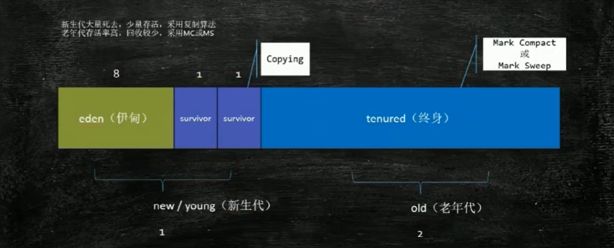

* 上图的Eden区、S0区和S1区都属于新生代，Tentired区属于老年代。大部分情况下对象都会在Eden区和其中一块Survivor From区中分配内存，在经过了一次Minor GC后，若还有对象存活，则会进入S0或S1中（取决于谁的角色是To）。并且对象的年龄会增加1（从Eden区进入Survivor To区后对象的初始年龄为1），当对象的年龄到达一个阈值后（默认15，可以通过参数 `-XX:MaxTenuringThreshold` 设置），就会进入老年代。
* 经过一次Minor GC后，所有存活的对象都会进入Survivor To区，Eden区和Survivor From区都会被清空，然后Survivor的From和To会互换角色，保证每次Minor GC后Survivor To区都是空的。


#### 异常

堆不需要连续内存，并且可以动态增加内存，增加失败则会抛出OutOfMemoryError异常。

* **`OutOfMemoryError: GC Overhead Limit Exceeded`**：当JVM的GC时间过长并且只能回收很少的堆空间时，会发生该类的OOM。
* **`java.lang.OutOfMemoryError: Java heap space`**：当前堆内存不足以存放新创建的对象时，就会发生该类OOM。


#### 参数

`java -Xms1M -Xmx2M` 指定一个程序的堆内存大小，第一个参数是初始值，第二个参数是最大值。


### 方法区/元空间

#### 概念

方法区（Method Area）/元空间（Metaspace）用于存储已被虚拟机加载的类信息、常量、静态变量和即时编译器编译后的代码等数据，和堆一样是多个线程共享的内存区域。别名是Non-Heap（非堆），目的是和堆空间区别开来。


#### 和永久代的关系

方法区是Java虚拟机制定的规范，而永久代是HotSpot虚拟机对规范的实现，类似于Java语法中接口和实现类的关系。也就是说永久代是HotSpot的概念，其他虚拟机没有这个概念。


#### 常用参数

* **`-XX:MetaspaceSize=N`**：设置元空间的初始容量，即最小空间；
* **`-XX:MaxMetaspaceSize=N`**：设置元空间的最大容量。


#### 为什么方法区会被元空间替换？

* 方法区/永久代受限于JVM的内存空间限制，无法进行调整。而元空间使用的是直接内存，受本机内存的限制，溢出的几率更小。当元空间溢出时会报 `java.lang.OutOfMemoryError: MetaSpace`。
* 由于元空间内存放的是类的元数据，将这块区域设置到直接内存中可以加载更多的类。
* 在JDK1.8的Hotspot和JRockit代码合并中，JRockit没有永久代的概念与Hotspot对应。


### 运行时常量池

#### 概念

运行时常量池（Runtime Constant Pool）是方法区的一部分。Class文件中除了有类的版本、字段、方法、接口等描述信息外，还有一项信息是常量池（Constant Pool Table），即静态常量池，用于存放编译期生成的各种字面量和符号引用。这部分内容将在类加载后进入方法区/元空间的运行时常量池中存放。


#### 特征

运行时常量池对于Class文件常量池的一个重要的特征就是动态性，Java并不要求常量一定只能在编译期才能产生，也就是并非预置入Class文件种常量池的内容才能进入方法区的运行时常量池，运行期间也可能放入新的常量到池中，如：String类的  `intern()` 方法。

* 在1.6中，intern的处理是先判断字符串常量是否在字符串常量池中，如果存在直接返回该常量。如果不存在，则将该字符串常量加入到字符串常量池中。
* 在1.7中，intern的处理是先判断字符串常量是否在字符串常量池中，如果存在直接返回该常量。如果不存在，说明该字符串常量在堆中，则会将堆区该对象的引用加入到字符串常量池中。


#### Java的三种常量池

* **字符串常量池（String Pool）**：Class文件的常量池中的文本字符串会在类加载时进入字符串常量池。在JDK1.7之后，运行时常量池存在于方法区中，而字符串常量池被剥离出来存放到了堆中。

* **运行时常量池（Runtime Constant Pool）**：当程序运行到某个类时，Class文件中的常量池信息就会被解析到方法区的运行时常量池中，每个类都对应一个运行时常量池。

* **Class文件常量池（Class Constant Pool）**：即静态常量池，是编译后每个Class文件都有的。Class文件除了包含类的版本、字段、方法、接口等描述信息外，还有一项信息就是常量池（Constant Pool Table），用于存放编译器生成的各种字面量和符号引用。
  * **字面量（Literal）**：包含文本字符串，即代码中能够看到的字符串，如`String a = "aa"`，其中"aa"就是字面量。以及被 `final` 修饰的变量。

  * **符号引用（Symbolic References）**：
    * **类和接口的全限定名**：如String类的全限定名就是 `java/lang/String`；
    * **字段的名称和描述符**：所谓字段就是类或者接口中声明的变量，包括类级别变量（静态）和实例级的变量；
    * **方法的名称和描述符**：所谓方法描述符就相当于方法的参数类型+返回值类型。


### 直接内存

#### 概念

直接内存（Direct Memory）不是JVM运行时数据区的一部分，其不是Java虚拟机规范中定义的内存区域，而是操作系统管理的直接内存区域，由于这部分内存也被频繁使用，也可能会导致出现OOM。直接内存的分配不会受到Java堆的限制，而是受到本机内存大小和处理器寻址空间的限制。


#### 应用场景

JDK1.4引入的NIO（New Input/Output，Non Blocking Input/Output），引入了基于通道channel和缓冲区buffer的IO方式，可以使用本地native函数直接分配堆外内存，然后通过一个存储在堆中的DirectByteBuffer对象作为这块内存的引用进行操作，在某些场景下显著提高性能，避免传统IO在Java堆和native堆之间来回复制数据。


## 类加载机制

### 基本概念

类的加载是指将类 `.class` 文件（通过编译Java代码得到）中的二进制数据读入到内存中，将其放在运行时数据区的方法区内，然后在内存中创建一个 `java.lang.Class` 对象用来封装类在方法区中的数据结构。class文件并非特指某个存在于磁盘中的文件，而应当是一串二进制数据，无论其以何种形式存在，包括但不限于磁盘文件、网络、数据库、内存或是动态产生等。


### 类文件结构


```JAVA
ClassFile {
    // 魔数：确认这个文件是否为一个能被虚拟机接收的Class文件。
    u4 magic;	
    // class文件版本号：保证编译的正常执行。
    u2 minor_version;	// 副版本号
    u2 major_version;	// 主版本号
    // 常量池：主要存放字面量和符号引用
    u2 constant_pool_count;							// 常量池计数器			
    cp_info constant_pool[constant_pool_count-1];	// 常量池数据区
    // 访问标志：用于识别一些类/接口层次的访问信息，如：这个Class是类还是接口、是否为public或者abstract类型、如果是类的话是否声明为final等。
    u2 access_flags; 
    // 类索引：用于确定这个类的全限定名，父类索引用于确定该类的父类的全限定名，除了java.lang.Object之外，所有Java类的父类索引都不为0。
    u2 this_class;	// 当前类索引									
    u2 super_class;	// ⽗类索引
    // 接口索引集合：用于描述该类/接口实现了哪些接口，这些被实现的接口将按implents/extends后的顺序从左到右排列放入接口索引集合中。
    u2 interfaces_count; 				// 接⼝计数器								
    u2 interfaces[interfaces_count]; 	// 接口信息数据区		
    // 字段表集合：描述类或接口中声明的变量，字段包括类变量以及实例变量，但不包括在方法内部声明的局部变量。
    u2 fields_count; 					// 字段计数器									
    field_info fields[fields_count];	// 字段信息数据区		
    // 方法表集合：描述类中的方法。
    u2 methods_count; 					// 方法计数器									
    method_info methods[methods_count]; // 方法信息数据区
    // 属性表集合：在Class文件中，字段表和方法表都可以携带自己的属性表集合。
    u2 attributes_count; 							// 属性计数器								
    attribute_info attributes[attributes_count];	// 属性信息数据区	
}
```


### 类加载过程

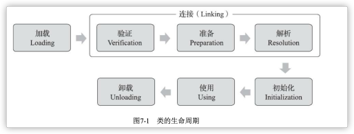

#### 加载（Loading）

**Java虚拟机规范规定类加载的过程要完成3件事**：

* **获取二进制数据**：通过类的全限定名获得定义此类的二进制字节流；
* **装入内存**：将字节流所代表的静态存储结构转换为方法区的运行时数据结构；
* **生成Class对象**：在内存中生成一个代表该类的Class对象，作为方法区中数据的访问入口。

**二进制字节流的获取方式**：

* **从zip包获取**：是成为jar、ear和war格式的基础；
* **从网络中获取**：最典型的应用是Applet；
* **运行时生成**：动态代理技术，如：在 `java.lang.reflect.Proxy` 使用 `ProxyGenerator.generateProxyClass` ；
* **由其他文件生成**：如通过jsp文件生成对应的Class。

**加载阶段的特点**：

* 一个非数组类的加载阶段（即加载阶段第一步获取类的二进制字节流的动作）是可控性最强的阶段，这一步可以通过重写类加载器的`loadClass()` 方法去控制字节流的获取方式；
* 数组不会通过类加载器创建，而是由JVM直接创建；
* 整个加载阶段和连接阶段是交叉进行的，加载阶段尚未结束，连接阶段可能就已经开始了。


#### 连接（Linking）

* **验证**：确保Class文件的字节流中包含的信息符合当前虚拟机的要求，并且不会危害虚拟机自身的安全。验证的内容包括类文件的结构、语义检查、字节码验证和二进制兼容性验证等。
* **准备**：该阶段会为类变量在方法区分配内存并设置初始值。实例变量不会在该阶段分配内存，而是在对象实例化时随着对象一起被分配在堆中。
* **解析**：将常量池的符号引用替换为直接引用的过程。其中解析过程在某些情况可以在初始化阶段之后再开始，这是为了支持Java的动态绑定。


#### 初始化（Initialization）

* **概念**：JVM规范要求每个类或接口在被首次主动使用时才会初始化。初始化是虚拟机执行类构造器 `<clinit>()` 方法的过程。在准备阶段，类变量已经赋过一次系统要求的初始值，而在初始化阶段，根据程序员通过程序制定的主观计划去初始化类变量和其他资源。
* **`<clinit>()`**：是由编译器自动收集类中所有类变量的赋值动作和静态语句块中的语句合并产生的，编译器收集的顺序是由语句在源文件中出现的顺序决定。
* **接口的类变量**：也具有初始化的赋值操作，因此接口与类一样都会生成 `<clinit>() ` 方法。但与类不同的是，执行接口的 `<clinit>() ` 方法不需要先执行父接口的  `<clinit>() ` 方法。只有当父接口中定义的类变量使用时，父接口才会出初始化。接口的实现类在初始化时也一样不会执行接口的 `<clinit>() ` 方法。
* **并发问题**：虚拟机会保证一个类的 `<clinit>() ` 方法在多线程环境下被正确加锁同步。多线程执行初始化，只会有一个线程真正执行，其他线程阻塞等待。
* **初始化顺序**：初始化是按照代码声明的顺序从上而下执行的，静态变量的声明语句，以及静态代码块都被看做是类的初始化语句，JVM会按照初始化语句在类文件中的先后顺序来依次执行它们。


### 类加载器

#### 基本概念

类加载器（Class Loader）就是将类加载阶段的“通过一个类的全限定名来获取描述该类的二进程字节流”这个动作放到虚拟机外部去实现，以便让应用程序自己决定如何获取所需的类。

* 类加载器不需要等到某个类被首次使用时再加载它；
* JVM规范允许类加载器在某个类将要被使用时预先加载它；
* 只有数组不是由类加载器加载的，而是由JVM动态生成的。


#### 启动类加载器

* 启动类加载器Bootstrap ClassLoader又称根类加载器，是由C++实现的最顶层的类加载器，是特定于操作系统的机器指令，负责开启整个类加载的过程；
* 负责加载 `jre/lib` 目录下的jar包和类，如 `java.lang.*`、`rt.jar`。以及被系统属性 `sun.boot.class.path` 所指定的路径下的jar包。以及被 `-Xbootclasspath` 参数所指定的路径下的所有类；
* 所有的类加载器本身都是由启动类加载器加载的，启动类加载器是内建于JVM中的。当JVM启动时，一段特殊的机器码会运行，它会加载扩展类加载器、系统类加载器，这段特殊的机器码就是启动类加载器。


#### 扩展类加载器

* 扩展类加载器Extension ClassLoader的父加载器是启动类加载器。其自身是Java实现的类，是java.lang.ClassLoader的子类；
* 主要负责加载 `jre/lib/ext` 目录下的jar和类，以及被 `java.ext.dirs ` 系统变量所指定的路径下的jar包；
* 扩展类加载器只能加载jar文件，不能加载class文件，所以需要先压缩为jar包才能加载。


#### 应用类加载器

* 应用类加载器Application ClassLoader又称系统类加载器，父加载器是扩展类加载器，是面向应用程序的类加载器。其自身是Java实现的类，是java.lang.ClassLoader的子类；
* 负责加载当前应用 `classpath` 下的所有jar包和类，以及 `java.class.path` 系统变量所指定的路径下的jar包；
* 由于该类加载器是 `ClassLoader ` 类中 `getSystemClassLoader()` 方法的返回值，因此一般被也被称为系统类加载器，如果应用程序没有自定义过类加载器，则该加载器就是程序的默认类加载器。


### 双亲委派机制

#### 双亲委派模型

* 每个类都有对应的类加载器，JVM中的类加载器在协同工作时会默认使用双亲委派模型，即在类加载的时候，系统会首先判断当前类是否已被加载过，已被加载的类会直接返回，否则才会尝试加载。
* 加载时，首先会把该请求委派给父类的加载器 `loadClass()` 处理，因此所有的请求最终都应该传递到顶层的启动类加载器`BootstrapClassLoader ` 中。
* 当父类加载器无法处理时，才由自己处理，当父类加载器为null时，会使用 `BootstrapClassLoader`。

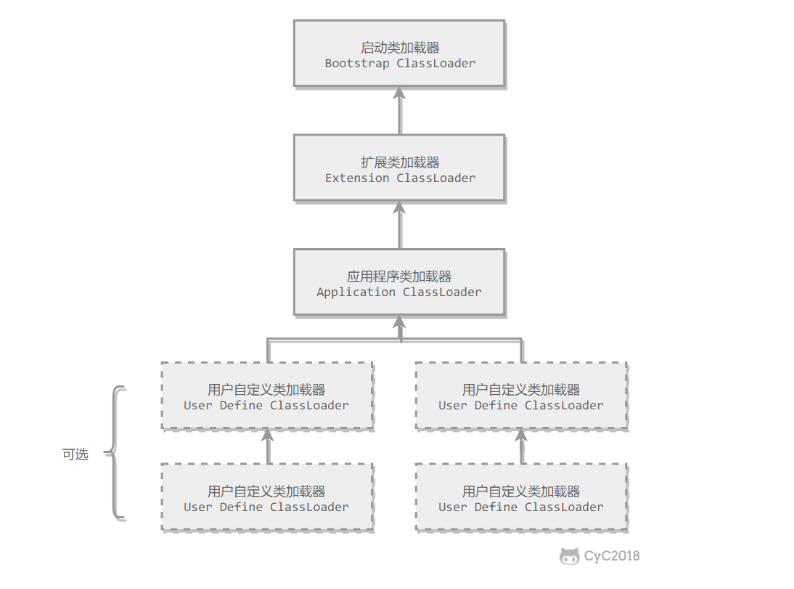


#### 代码示例

```JAVA
public class ClassLoaderDemo {
    
    // 注：这里的双亲关系不是通过基础来实现的，而是由加载器的优先级来决定的
    public static void main(String[] args) {
        // 获取当前类的类加载器，即应用程序类加载器
        System.out.println("ClassLodarDemo's ClassLoader is " +
ClassLoaderDemo.class.getClassLoader());
        // 获取当前类的父类的类加载器，即扩展类加载器
		System.out.println("The Parent of ClassLodarDemo's ClassLoader is " + ClassLoaderDemo.class.getClassLoader().getParent());
        // 获取当前类父类的父类的类加载器，为null，即代表是启动类加载器
		System.out.println("The GrandParent of ClassLodarDemo's ClassLoader is " +
ClassLoaderDemo.class.getClassLoader().getParent().getParent());
    }
}
```

```
ClassLodarDemo's ClassLoader is sun.misc.Launcher$AppClassLoader@18b4aac2
The Parent of ClassLodarDemo's ClassLoader is sun.misc.Launcher$ExtClassLoader@1b6d3586
The GrandParent of ClassLodarDemo's ClassLoader is null
```


#### 源码分析

双亲委派机制的源码集中在 `java.lang.ClassLoader` 的 `loadClass()` 方法中。

```JAVA
private final ClassLoader parent;

protected Class<?> loadClass(String name, boolean resolve) throws ClassNotFoundException {
    synchronized (getClassLoadingLock(name)) {
        // ⾸先检查请求的类是否已经被加载过
        Class<?> c = findLoadedClass(name);
        if (c == null) {
            long t0 = System.nanoTime();
        try {
            if (parent != null) {
                // 若⽗加载器不为空，调⽤⽗加载器loadClass()⽅法处理
            	c = parent.loadClass(name, false);
        	} else {
                // ⽗加载器为空，使⽤启动类加载器BootstrapClassLoader加载
        		c = findBootstrapClassOrNull(name);
        	}
        } catch (ClassNotFoundException e) {
        	// 抛出异常则说明⽗类加载器⽆法完成加载请求
        }
        if (c == null) {
        	long t1 = System.nanoTime();
            // 会⾃⼰尝试加载
            c = findClass(name);
            // this is the defining class loader; record the stats
            sun.misc.PerfCounter.getParentDelegationTime().addTime(t1 - t0);
            sun.misc.PerfCounter.getFindClassTime().addElapsedTimeFrom(t1);
            sun.misc.PerfCounter.getFindClasses().increment();
        }
        if (resolve) {
        	resolveClass(c);
        }
        return c;
    }
}
```


#### 双亲委派的作用

* **避免类的重复加载**：JVM区分不同类的方式不仅是根据类名，相同的类文件被不同的类加载器加载会产生两个不同的类；
* **沙箱安全机制**：保证Java的核心API由父类加载器加载，不会被自定义的类篡改，从而让Java程序稳定运行。


## 对象的创建过程


### 类加载检查

当JVM执行到一条new指令时，首先会去检查通过该指令的参数能否在常量池中定位到对应类的符号引用。并且检查这个符号引用代表的类是否已被加载、解析和初始化过。若没有，则必须先执行相应的类加载流程。


### 内存分配

#### 概念

类加载检查通过后，接下来JVM将为新生对象分配内存，对象所需的内存大小在类加载完成后就能确定，所谓的对象内存分配就是在堆空间划分一块确定大小的内存。


#### 内存分配的方式

JVM有两种分配方式，具体的选择由堆是否规整决定，而堆是否规整则由所采用的垃圾收集器是否具有压缩整理功能决定。

* **指针碰撞**：适用于堆内存规整，即没有内存碎片的情况下。将内存区域中使用过的整合到一边，未被使用的整合到另一边，中间由分界值指针隔开，只需要向着没用过的内存方向将该指针移动对象需要大小的偏移量即可。对应为Serial和ParNew。
* **空闲列表**：适用于堆内存不规整的情况下。JVM会维护一个列表，其中会记录哪些内存块是可用的，在分配的时候，找一块大小符合的内存划分给实例对象，最后更新表记录。对应为GC收集器为CMS。


#### 内存分配的并发问题

* **CAS+失败重试机制**：CAS是乐观锁的一种实现，所谓乐观锁分配内存就是不加锁而是假设没有冲突直接去执行分配操作，若发生了冲突则重试到成功为止。

* **TLAB（Thread Local Allocation Buffer）**：即线程本地分配缓冲区。为每个线程预先在eden区分配一块缓冲区，JVM在给线程中的对象分配内存时，首先在该线程的缓冲区中分配，当对象大于缓冲区的剩余空间或空间耗尽时，再采用CAS的方式去分配。


### 初始化零值

当内存分配完成后，JVM需要将分配到的内存空间都初始化为零值，这步操作保证了对象的实例字段在Java代码中可以不赋值就能直接使用，让程序能访问这些字段的数据类型所对应的零值。


### 设置对象头

初始化完成后，接下来JVM要为对象进行信息设置，如：所属类、哈希码、GC分代年龄和如何找到类的元数据等。这些信息都存放在对象头中。


### 执行init方法

此时从JVM的角度来看对象已经创建完毕，从Java程序的角度看，对象还需要执行对应的构造方法 `init` 才能算真正的创建完成。


## 内存分配策略

### 分配流程

* **栈上分配**：JVM首先通过逃逸分析技术分析对象的活动范围是否只局限于某个方法中。若是，则直接在线程的栈帧中分配，随着栈帧的pop而被清理。
* **大对象直接进入老年代**：若不能在栈上分配，就需要在堆中分配。首先判断是否为大对象，所谓大对象是指需要连续内存空间的对象，如很长的字符串和数组，经常出现大对象会提前触发垃圾回收以获得足够的连续空间分配。参数 `-XX:PretenureSizeThreshold` 用于制定判断大对象的标准，大于该值的对象直接在老年代分配，避免大对象在Eden和Survivor之间的大量内存复制。
* **TLAB**：即线程本地分配缓冲区Thread Local Allocation Buffer。每个线程在Eden都会有这样的一个私有缓冲区，对象会优先在TLAB上分配（解决并发安全问题），直到缓冲区空间不足时才会在Eden中分配。
* **Eden区分配**：大多数情况下，对象会在新生代的Eden区分配，当Eden空间不够时，会发起Minor GC。
* **长期存活的对象进入老年代**：对象具有年龄计数器，若对象在Eden区出生并经过Minor GC依然存活，年龄就会相应的增加1岁，当增加到一定的年龄后就会移动到老年代中。参数 `-XX:MaxTenuringThreshold` 用来设置年龄的阈值。

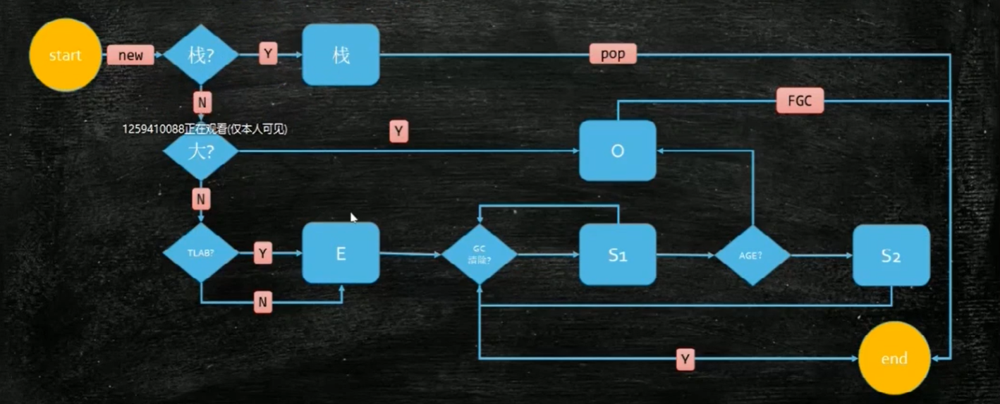


### 动态对象年龄判定

Hotspot遍历所有对象时，按年龄从小到大对它们所占用的空间大小进行累积，当累积的大小超过Survivor空间的一半时，则取最后累积到的那个年龄段和参数 `-XX:MaxTenuringThreshold` 中的较小值，作为新的晋升年龄阈值。以此来保证不会因为MaxTenuringThreshold设置过大导致对象无法晋升。

```C++
// survivor_capacity是survivor空间的⼤⼩
uint ageTable::compute_tenuring_threshold(size_t survivor_capacity) {
    // -XX:TargetSurvivorRatio 目标存活率，默认50%
    // desired_survivor_size是被计算出的期望值，就是Survivor空间大小的50%
    size_t desired_survivor_size = (size_t)((((double)survivor_capacity)*TargetSurvivorRatio)/100);
    // 用于累积出每个年龄段对象大小的总和
    size_t total = 0;
    uint age = 1;
    // 当累积的大小超过期望值时停止
    while (age < table_size) {
        // sizes数组是每个年龄段对象⼤⼩
        total += sizes[age];
        if (total > desired_survivor_size) break;
        age++;
    }
    // 取当前累积到的年龄段和参数-XX:MaxTenuringThreshold的较小值作为阈值
    uint result = age < MaxTenuringThreshold ? age : MaxTenuringThreshold;
    // ...
}
```


### 老年代的空间分配担保

* 在发生Minor GC之前，虚拟机会检查老年代最大可用的连续空间是否大于新生代所有对象所需空间的总和；
* 若大于，则此次Minor GC是安全的；
* 若小于，则虚拟机会检查参数 `-XX:HandlePromotoionFailure` 判断是否允许失败；
* 若为true，即允许失败，则继续检查老年代最大可用连续空间是否大于历届晋升到老年代的对象的平均大小。如果大于平均大小，则继续进行Minor GC，但是不安全的；
* 若是小于平均大小或是参数HandlePromotoionFailure=false，则进行一次Full GC。


## 对象引用机制

### 对象的访问定位方式

虚拟机规范规定Java程序通过栈上的引用数据来操作堆上的具体对象，至于具体的访问方式由JVM的实现而定。

#### 句柄指针

使用这种方式的Java堆会划分出一块内存作为句柄池，栈中的引用存储的就是对象的句柄地址，而句柄中包含了对象实例数据（堆空间）与对象的类数据（方法区）各自的具体内存地址。这种方式的好处是引用中存储的是稳定的句柄地址，在对象被移动时只会改变句柄的实例数据指针，而引用则无需变动。


#### 直接指针

使用这种方式的话，Java堆对象的布局就必须维护访问对象类数据的相关指针，而栈中的引用则直接存放堆对象的地址。这种方式的好处就是访问速度快，相比句柄的方式可以节省一次指针定位的时间开销。

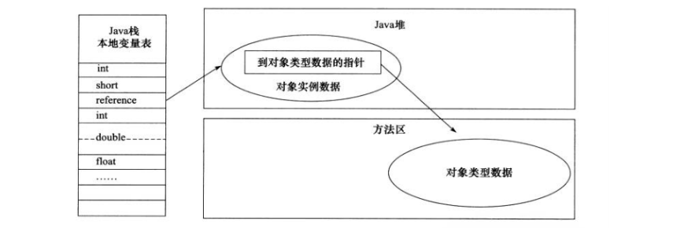


### 判断一个对象是否可被回收

堆空间的垃圾回收第一步就是判断有哪些对象已经死亡，即不能通过任何途径访问的对象。

#### 引用计数法

给对象添加一个引用计数器，每当有某处对其进行引用，计数器加增加1。每当有一处引用失效，计数器就减少1。任何时候计数器为0的对象就是不能再被使用的。在两个对象出现循环引用的情况下，引用计数器永不为0，导致无法进行回收。但是因为循环引用的存在，导致JVM不使用该算法。

```java
public class Test {
    
    public Object instance = null;
    
    public static void main(String[] args) {
        // a与b相互持有对方的引用
        Test a = new Test();
        Test b = new Test();
        a.instance = b;
        b.instance = a;
        // 取出a和b的引用，但a和b的instance依旧引用着对方，计数器永远不会为0
        a = null;
        b = null;
    }
}
```


#### 可达性分析算法

基本思路是通过一系列被称为GC Roots的对象作为起点，以此开始向下搜索，节点所经过的路径称为引用链。当一个对象到GC Roots没有任何引用链相连的话，则该对象就是不能再被使用的。可作为GC Roots的对象包括：

* 当前虚拟机栈中局部变量表中引用的对象；
* 当前本地方法栈中局部变量表中引用的对象；
* 方法区/元空间中类静态属性引用的对象；
* 方法区/元空间中的常量引用的对象。


### 判断一个常量是否被废弃

运行时常量池主要回收的是废弃的常量，若常量池中的常量无任何对象对其引用，说明该常量是废弃的常量，若此时发生了方法区的内存回收，则该常量就会被垃圾回收。


### 判断一个类是否无用

方法区主要回收的是无用的类，要判断一个类是无用的类需要满足以下3个条件：

* 该类的所有实例都已经被回收，即堆内存中不存在该类的任何实例；
* 加载该类的类加载器ClassLoader已经被回收；
* 该类对应的java.lang.Class对象没有在任何地方被引用，无法在任何地方通过反射访问该类的方法。


### 引用类型


#### 强引用（Strong Reference）

```JAVA
public class T01_NormalReference {

    public static void main(String[] args) throws IOException {
        // 强引用：str就是强引用一个字符串对象，若引用指向空，则之前指向的对象会被回收
        M m = new M();
        m = null;
					
        // DisableExplicitGC
        System.gc();
        System.out.println(m);

        // 阻塞main线程，给gc线程执行时间
        int read = System.in.read();
    }
}
```


#### 软引用（Soft Reference）

通过软引用指向的对象不会因为等到所有引用都断开后才会被回收，而是在内存不足时直接被回收。

```JAVA
public class T02_SoftReference {

    // 实验的前置条件：-Xmx: 20 将堆内存设置为20mb
    // 适用场景：缓存。如大文件写入内存中后使用软引用指向，需要使用时直接从内存获取，不需要时软引用自动断开，释放内存
    public static void main(String[] args) throws InterruptedException {
        // m指向的SoftReference对象是强引用，SoftReference对象内的成员变量指向的10mb的字节数组是软引用
        SoftReference<byte[]> m = new SoftReference<>(new byte[1024 * 1024 * 10]);
        System.out.println(Arrays.toString(m.get()));

        // 一次gc后软引用指向的对象未被回收，因为此时内存足够
        System.gc();
        Thread.sleep(500);
        System.out.println(Arrays.toString(m.get()));

        // 再次分配15mb的字节数组，超出堆内存，这时软引用指向的对象会被释放
        byte[] b = new byte[1024 * 1024 * 15];
        System.out.println(Arrays.toString(m.get()));
    }
}
```


#### 弱引用（Weak Reference）

弱引用可以像强引用一样正常的访问对象，但如果一个对象只存在一个弱引用指向时，下一次GC会被直接回收。

```JAVA
public class T03_WeakReference {

    public static void main(String[] args) {
        // m是指向WeakReference对象的强引用，而WeakReference中的成员通过弱引用指向M对象
        // 就是可以通过引用正常访问对象，但如果一个对象只被一个弱引用指向时，gc会直接回收
        WeakReference<M> m = new WeakReference<>(new M());

        System.out.println(m.get());
        System.gc();
        System.out.println(m.get());

        // ThreadLocalMap中的Entry就使用弱引用，其中的key就是指向ThreadLocal对象的弱引用
        // ThreadLocal为什么使用弱引用——防止内存泄漏：
        // 1.若Entry中的key使用强引用，此时外部所有的强引用断开，key不会被gc回收，可能造成内存泄漏问题；
        // 2.使用弱引用会在外部引用都断开后允许gc回收，但会造成key为null，value无人映射，也会出现内存泄漏问题；
        // 3.所以使用ThreadLocal后需要手动调用remove方法清除k-v对，防止内存泄漏。
        ThreadLocal<M> tl = new ThreadLocal<>();
        tl.set(new M());
        tl.remove();
    }
}
```


#### 虚引用（Phantom Reference）

虚引用和其他引用不同，其并不会决定对象的生命周期，若一个对象被虚引用指向，就会像没有引用一样，任何时候都会被GC回收。虚引用主要用于跟踪对象被垃圾回收的活动，当一个对象需要被回收时，会建立该对象的虚引用并放入虚引用队列（ReferenceQueue），相当于给GC线程一个通知。

```JAVA
public class T04_PhantomReference {

    private static final List<Object> LIST  = new LinkedList<>();
    private static final ReferenceQueue<M> QUEUE = new ReferenceQueue<>();

    public static void main(String[] args) throws InterruptedException {
        // 虚引用的作用：管理直接内存（堆外内存），NIO的零拷贝会在JVM堆外直接分配内存空间（JVM堆内对象管理堆外内存空间），当JVM堆内对象被回收时，需要通过虚引用和虚引用队列执行特定的回收操作，即同时释放堆外的内存。
        PhantomReference<M> phantomReference = new PhantomReference<>(new M(), QUEUE);
        // 无法通过虚引用访问其指向的对象
        System.out.println(phantomReference.get());

        // 占用内存资源
        new Thread(() -> {
            while (true) {
                LIST.add(new byte[1024 * 1024]);
                try {
                    Thread.sleep(1000);
                } catch (InterruptedException e) {
                    e.printStackTrace();
                }
                System.out.println(phantomReference.get());
            }
        }).start();

        // 模拟垃圾回收线程
        new Thread(() -> {
            while (true) {
                // gc线程从虚引用队列中获取到了虚引用，才会执行特定的回收操作
                Reference<? extends M> poll = QUEUE.poll();
                if (poll != null) {
                    // 真正执行的回收操作
                    System.out.println("--- 虚引用对象被jvm回收了" + poll);
                }
            }
        }).start();

        Thread.sleep(500);
    }
}
```


## 垃圾回收算法

### 标记-清除算法

**概念**：该算法分为标记和清除两个阶段，首先标记所有需要回收的对象，之后统一回收。是最基础的算法，后续的算法都是对其的改进。

**缺点**：回收效率低下，内存碎片化严重。


### 复制算法

**概念**：针对标记-清除算法效率不足和内存空间碎片化的改进，首先将内存分为大小相同的两块，每次使用其中的一块存放对象，当这块区域使用完后，就将还存活的对象复制到另一块去，这时当前使用的区域只剩下了可回收的垃圾，直接全部清理即可，这样每次的内存回收都是对内存区间的一半进行回收。

**适用于新生代**：商用虚拟机都采用复制算法回收新生代，但并不是划分为相等大小的两块，而是存在一块较大的Eden空间和两块较小的Survivor空间（from+to），每次使用Eden和其中的一块Survivor From。在回收时，将Eden和Survivor From中还存活的对象复制到另一块Survivor To中，最后清理Eden和Survivor From。回收完毕后，将Survivor From和Survivor To角色反转，等待下一次回收。


### 标记-整理算法

**概念**：根据老年代的特点推出的算法，标记的过程不变，但标记后不是直接回收对象，而是让所有存活的对象向一端移动，然后直接清理掉边界以外的内存，解决了内存的碎片化。

**优缺点**：不会产生内存碎片，但是需要大量移动对象，效率较低。


### 分代收集算法

**概念：**当前JVM使用的垃圾回收算法，这种算法会根据对象的存活周期将内存分为几块区域（一般划分为新生代和老年代），然后根据不同区域中对象的特点选择合适的垃圾回收算法；

**新生代使用复制算法**：新生代中的每次GC都会伴随着大量的对象被回收，实际存活的对象相对较少（高龄的对象已经进入了老年代），那么复制算法就会很合适，因为只需要复制较少的那部分对象（存活对象）就可以完成垃圾回收作业；

**老年代使用标记-整理算法**：因为老年代中对象的存活概率相对较高，所以使用标记-整理算法来进行垃圾回收。


## 垃圾收集器


垃圾回收器是基于垃圾回收算法的具体实现，不同的回收器适用于不同的场景，如HotSpot就实现了7种垃圾回收器用于适配各种场景的应用。

### Serial

* Serial串行收集器是最基本的单线程收集器，适用于新生代和老年代。新生代使用复制算法，老年代使用标记-整理算法；
* 单线程不仅是指只有一条垃圾回收线程工作，而且在进行垃圾回收作业时必须暂停其他所有的工作线程，即Stop the World，直到回收作业完成；
* **优点**：简单高效，单线程GC，没有多线程切换的额外开销，是运行在Client模式下的HotSpot虚拟机的默认收集器。

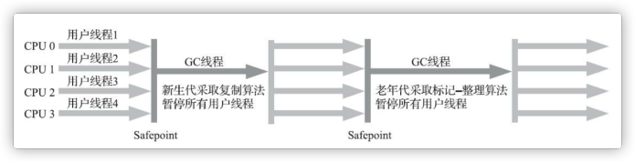


### Serial Old

* 是Serial串行收集器的老年代版本，同样是单线程收集器，使用标记-整理算法；
* 该收集器也是提供给Client模式下运行的HotSpot虚拟机使用；
* **使用方式**：如果运行在Server模式下，第一个用途是在JDK1.5之前与Parallel Scavenge收集器搭配使用。另一个用途是作为CMS收集器发生失败时的后备方案，在并发收集发生Concurrent Mode Failure时使用。


### ParNew

* ParNew是Serial的多线程版本，新生代采用复制算法，老年代采用标记-整理算法。除了使用多线程并行回收垃圾以外，其他的如回收算法、STW、对象分配规则、回收策略等都和Serial收集器一样；
* 除了Serial收集器外，只有ParNew收集器能与CMS收集器配合；
* 是HotSpot虚拟机运行在Server模式下的默认新生代收集器，但是在单CPU环境下，并不会比Serial有更好的效果；

* **优点**：适用于运行在Server模式下的虚拟机，能与CMS收集器配合工作。

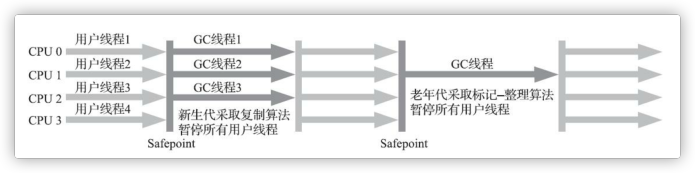


### Parallel Scavenge

* Parallel Scavengeping平行-清除收集器是与ParNew类似的收集器，也使用GC并行、复制算法和标记-整理算法；
* 但它的对象分配规则和回收策略都与ParNew收集器不同，它是以吞吐量（即CPU中用于运行用户程序代码的时间与CPU总消耗时间的比值）最大化为目标的收集器实现，即追求更高效率的利用CPU；
* 该收集器允许以较长时间的STW来换取吞吐量的最大化，即避免了STW次数过多导致线程的频繁切换；

* **参数**：
  * `-XX:+UseParallelGC`：使用Parallell收集器+老年代串行；
  * `-XX:+UseParallelOldGC`：使用Parallel收集器+老年代并行。

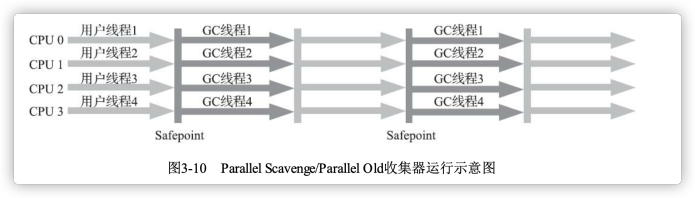


### Parallel Old

* Parallel Old是Parallel Scavenge的老年代版本，使用GC并行和标记-整理算法；
* 在注重吞吐量以及CPU资源的场合，都可以优先考虑Parallel Scavenge收集器和Parallel Old收集器；
* JDK1.8的默认收集器就是新生代Parallel Scavenge+老年代Parallel Old。


### CMS

#### 基本概念

CMS（Concurrent Mark Sweep，并发的标记-清除）收集器是一种以获取最短停顿时间为目标的收集器，也是HotSpot第一款真正意义上的并发收集器，基本实现了让垃圾回收线程和用户线程同时工作。

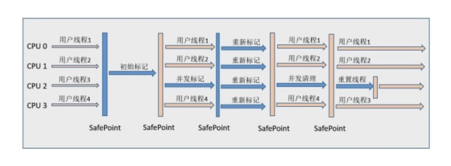


#### 运行步骤

* **初始标记（Initial Marking）**：暂停用户线程，运行单个GC线程记录直接与GC Roots相连的对象，这个阶段持续的时间很短；
* **并发标记（Concurrent Marking）**：该阶段会让GC和用户线程并发执行，用一个闭包结构去记录可达对象。但是在该阶段结束后，这个闭包结构并不能保证包含了所有的可达对象，因为用户线程可能会不断的更新引用域，会导致GC线程无法实时的分析可达性，所以这个阶段也会跟踪记录那些发生引用更新的对象；
* CMS中使用增量更新算法（Incremental update），即关注插入时的对象状态。只要在写屏障（write barrier）里发现有一个白色对象被黑色对象的成员所引用，那就把这个白对象变成灰色的（三色标记），在重新标记阶段重新扫描。
* **重新标记（Re-marking）**：暂停用户线程，多个GC线程并行执行。该阶段就是为了修正并发标记期间因为用户线程继续运行而导致引用发生变化的对象（即重新扫描灰色对象）。收集器处于该阶段的时间一般比初始标记阶段稍长，远比并发标记阶段时间短；
* **并发清除（Concurrent clean up）**：该阶段会恢复用户线程的执行，同时GC线程开始回收之前标记的区域。


#### 特点

**优点**：并发回收效率高、用户线程低停顿。

**缺点**：

* **低吞吐量**：是以牺牲吞吐量为代价带来的用户线程低停顿，即STW持续更短的时间，但STW发生的次数会增加。

* **浮动垃圾**：无法处理浮动垃圾。CMS的浮动垃圾是指并发清除阶段由于用户线程继续运行而产生的垃圾，这部分的垃圾只能等到下一个GC才能回收。由于浮动垃圾的存在，因此需要预留一部分内存，意味着CMS不能像其他收集器那样等老年代快满的时候才进行回收。如果预留的空间不够存放浮动垃圾，就会出现Concurrent Mode Failure，这时虚拟机将临时启动后备方案Serial Old来替代CMS。
* **内存碎片化**：使用标记-清除算法会导致内存碎片化。老年代出现空间碎片，当无法找到足够大的空间分配对象，会提前触发一次Full GC。


### G1

#### 基本概念

G1（Garbage-First）是面向运行在Server模式的虚拟机的垃圾收集器，主要针对配备了多核CPU以及大容量内存的机器。它会以极高的概率在满足GC低停顿时间要求的同时，还具备高吞吐量性能的特征。整体采用了标记-整理算法，局部（Region之间）采用复制算法。


#### 内存划分

* **Region区域**：和其他收集器不同的是，G1将堆划分为多个大小相等的独立区域Region（可通过 `-XX:G1HeapRegionSize` 指定大小），不再整体划分新生代和老年代。通过引入Region，将一整块内存划分为多个小空间，使得每个小空间可以单独进行垃圾回收，这种方法具有很高的灵活性，使得可预测的停顿模型成为可能；
* **优先回收**：通过记录每个Region的垃圾回收时间以及回收后所获得的空间，维护一个整体的优先列表，每次都会优先回收价值最大（回收时间最少、垃圾比例高）的Region；
* **Remembered Set**：每个Region都拥有一个RSet，用于记录其他Region中的对象对本Region中对象的引用，这样就能在可达性分析时避免全堆扫描。

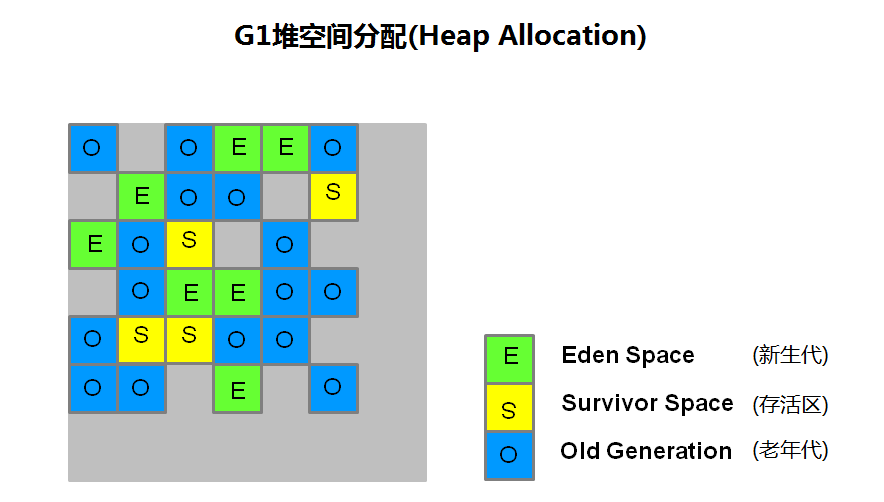


#### 新生代GC（Yong GC）

**特点**：

* **回收时机**：Eden Region耗尽时会触发Yong GC，会对整个Eden Regions进行回收；
* **STW**：在Yong GC期间，整个应用会Stop the Word；
* **GC并行**：Yong GC存在多个线程并行执行标记整理算法；
* **复制算法**：存活的对象会被拷贝到新的Survivor区或老年代。


#### 老年代GC（Mixed GC）

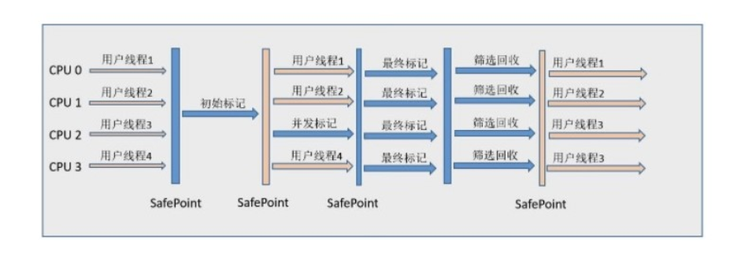

* **初始标记（Initial Mark）**：需要停顿用户线程，存在单个GC线程。耗时很短，通常该阶段会和一次Yong GC同时进行；
* **根分区扫描（Root Region Scan）**：不需要停顿，GC和用户线程并发执行。该阶段G1开始扫描Survivor分区，所有被Survivor分区中的对象所引用的对象都会被扫描和标记，该节点不能发生新生代收集；
* **并发标记（Concurrent Marking）**：不需要停顿，GC和用户线程并发执行。该阶段使用SATB算法解决应用程序执行过程中引用发生变化而产生的对象漏标问题；
* **再次标记（Remark）**：需要停顿用户线程，存在多个GC线程并行执行。该阶段的目的就是根据日志缓冲区Log Buffer重新扫描灰色对象，以解决并发标记阶段出现的引用漏标；
* **筛选回收（Clean up）**：需要停顿用户线程，存在多个GC线程并行执行。首先对各个Region中的回收价值和成本进行排序，根据用户所期望的GC停顿时间来制定回收计划，最后转移或拷贝存活对象到新的未使用的Region。


#### 三色标记算法

在并发标记的过程中，通过将对象分为三种颜色来标识对象的标记状态以保证并发时GC的正确性：

* **白色**：未被标记的对象（默认颜色），即垃圾对象；
* **灰色**：自身被标记，成员变量未被标记，即中间状态；
* **黑色**：自身和成员变量均已被标记，即存活对象。

**并发标记阶段的漏标问题**：

* 当GC开始扫描时，根对象被置为黑色，子对象被置为灰色，未扫描到的默认为白色；

  

* 继续由灰色开始遍历，将已扫描了的子对象的对象置为黑色；

  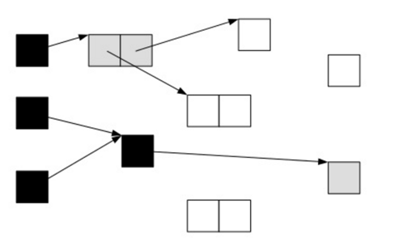

* 遍历了所有的可达对象后，所有可达对象都会变成黑色，不可达的对象即为白色，需要被清理。

* 若是在并发标记过程中，由于应用程序的继续运行导致对象的引用发生改变，就会发生漏标的问题。此时G1扫描的情况如下图：

  

* 这时应用程序执行了` A.c = C，B.c = null` 这样的操作，导致对象的状态变为：

  

* 这时垃圾收集器再进行标记的时候会出现如下情况。即因为A已经为黑色，A最新引用的C再也不会被扫描和标记到了，最后导致本该存活的C因为是白色而被回收掉。

  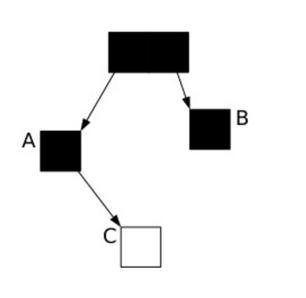

* CMS使用了增量更新算法来解决并发标记阶段的漏标问题，关注插入时记录对象的状态。而G1采用SATB快照标记算法来解决，关注删除时记录对象的状态。


#### SATB算法

* SATB（snapshot-at-the-beginning）快照标记算法。G1垃圾回收器使用该技术在初始标记阶段记录一个存活对象的快照。在并发标记阶段引用可能会发生改变，比如删除了一个原本的引用，这就会导致并发标记结束之后存活的对象和SATB的快照不一致。
* G1是通过在并发标记阶段引入一个写屏障（pre-write barrier）来解决这个问题的，即每当引用被删除的情况出现时，会将所有被删除之前的旧引用记录到一个Log Buffer中。并在在再次标记阶段（Remark）清空缓冲区，跟踪未被访问的存活对象，并标记为灰色，即以Log Buffer中的旧引用指向的对象为根重新扫描一遍。

* 这样STAB就保证了真正存活的对象不会被GC误回收，但同时也造成了某些可以被回收的对象逃过了GC，导致了内存里面存在浮动的垃圾（Float Garbage），这些浮动垃圾会在下一次GC被回收。


#### 特点

* **并行与并发**：充分利用多核CPU提供的硬件优势，缩短Stop the World的停顿时间。部分其他收集器需要暂停用户线程进行的GC动作，G1收集器仍然可以通过并发的方式让用户线程继续执行；
* **分代收集**：虽然G1可以不需要其他收集器的配合就能独立管理整个GC堆，但还是保留了分代的概念；
* **空间整合**：G1收集器从整体来看是基于标记-整理算法实现的，但从局部来看是基于复制算法实现的，意味着不会产生内存碎片；
* **可预测的停顿**：相对于CMS，G1除了追求低停顿外，还能建立可预测的停顿时间模型，能让使用者通过 `-XX:MaxGCPauseMillis` 将STW指定在一个长度为M毫秒的时间片段内。


### ZGC

TODO


## 垃圾回收策略

### Hotspot GC分类

* **部分收集（Partial GC）**：
  * **新生代GC（Minor GC/Yong GC）**：大多数情况下对象都会在新生代的eden区分配，当Eden区没有足够的空间可分配时，JVM会发起一次Minor GC，即发生在新生代的垃圾收集动作。因为新生代对象存活时间短，所以Miner GC执行频率高、回收速度快。
  * **老年代GC（Major GC/Old GC）**：指发生在老年代的GC，当老年代空间不足时触发，且经常会伴随着至少一次的Minor GC。
  * **混合收集（Mixed GC）**：对整个新生代和部分老年代进行收集，只有G1收集器有这个模式。
* **整堆收集（Full GC）**：收集整个Java堆和方法区。


### Full GC的触发条件

* **调用 `System.gc()`**：该方法是给虚拟机提出Full GC的建议，虚拟机并不一定会真正去执行；

* **老年代空间不足**：大对象直接进入，长期存活的对象进入。为了避免这两种情况引起的Full GC，尽量不要分配过大的对象或数组。还可以通过 `-Xmn` 调整新生代的大小，让对象尽量在新生代被回收，不进入老年代。还可以通过 `-XX:MaxTenuringThreshold` 调大对象进入老年代的年龄，让对象在新生代多存活一段时间；

* **空间分配担保失败**：使用复制算法的Miner GC需要老年代的内存空间做担保，如果担保失败会执行一次Full GC；

* **JDK1.7之前的永久代空间不足**：永久代中加载/反射的类和常量等数据过多时，也会执行一次Full GC；

* **Concurrent Mode Failure**：执行CMS的GC过程中同时有多个对象进入老年代，而此时老年代空间不足（也可能是GC过程中浮动垃圾过多而导致暂时性的空间不足），便会抛出Concurrent Mode Failure错误，并触发Full GC。


## 字节码


### 字节码文件结构

**字节码的两种数据类型**：

* **字节数据直接量**：基本数据类型，细分为u1、u2、u4和u8。分别代表连续的1字节、2字节、4字节和8字节组成的整体数据。
* **表（数组）**：有多个基本数据或其他表，按照既定顺序组成的大的数据集合。表是有结构的，体现在组成表的成分所在的位置和顺序都是严格定义好的。

**字节码文件结构分析（javap -verbose）**：

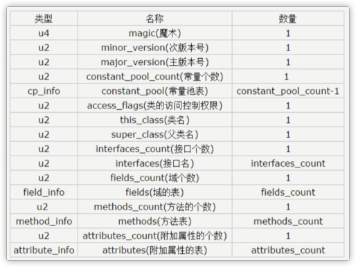

* **魔数**：每个Class文件的头4字节被称为魔数（Magic Number），其唯一的作用就是确定这个文件是否是一个能被JVM接受的字节码文件。魔数为固定值 `0xCAFEBABE`（即咖啡宝贝cafe babe）。

* **版本号**：紧接着魔数的4个字节存储的是Class文件的版本号。第5、6字节表示次版本号（Minor Version），第7、8字节表示主版本号（Major Version）。

* **常量池**：紧接着版本号的是常量池入口。一个类中定义的很多信息都是由常量池维护和描述的，可以看作Class文件的资源仓库。如：类中定义的方法与变量信息。

  * 常量池中主要存储的两类常量：
    * **字面量**：如文本字符串、Java中声明为final的常量值等；
    * **符号引用**：如类和接口的全限定名、字段的名称和描述符、方法的名称和描述符等。
  * 常量池的结构：
    * **常量池计数**：紧跟在主版本号后面，占2个字节。
    * **常量池数组（常量表）**：紧跟在常量池计数之后。与一般数组不同的是，常量池数组中元素的类型、结构和长度都是不同的。每种元素的第1个数据都是u1类型，即标志位，占1个字节，JVM在解析常量池时，根据u1来获取元素的具体类型。
    * **常量池数组中元素的个数=常量池数-1**：索引0是一个保留常量，对应null。所以索引池数组的索引从1开始。

* **访问标志**：用于识别一些类或接口层次的访问信息。如：该Class是类还是接口、是否定义为public类型、是否定义为abstract类型、如果是类那是否被声明为final等。

  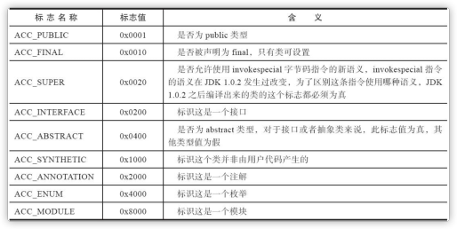

* **类/父类/接口索引集合**：这三项确定类的继承关系。类索引用于确定该类的全限定名，父类索引用于确定该类的父类的全限定名，接口索引集合就用来描述该类实现的所有接口（按照implements/extends从左到右的顺序排列在集合中）。

* **字段表集合**：字段表描述接口或类中声明的变量。字段包括类变量和实例变量，不包括方法中定义的局部变量。而字段的名字、数据类型都需要引用常量池中的常量来描述。字段表集合中不会列出从父类/接口继承的字段。但可能出现编译器自动添加的字段，如：内部类为了保证对外部类的访问性，会自动添加指向外部类实例的字段。

  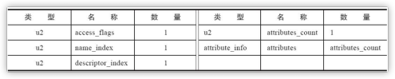

  * access_flags：访问标志；

    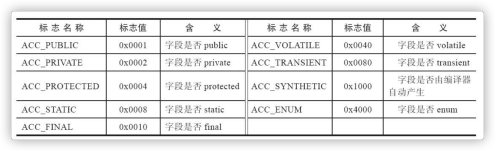

  * name_index：字段名索引；

  * descripter_index：描述符索引。所谓的描述符就是一种用于表示变量/字段描述信息的特殊符号。描述信息主要作用是描述字段的数据类型、方法的参数列表（数量、类型和顺序）和返回值。

    * 字段的描述符信息：根据描述符规则，基本数据类型和void都用一个大写字母表示，对象类型则用字符L加全限定名表示。对于数组类型，每一个维度都使用一个前缀 `[` 来表示，如：`int[]` 被记录为 `[I`、String[][]被记录为 `[[Ljava/lang/String`。

    |  B   |              byte               |
    | :--: | :-----------------------------: |
    |  C   |              char               |
    |  D   |             double              |
    |  F   |              float              |
    |  I   |               int               |
    |  J   |              long               |
    |  S   |              short              |
    |  Z   |             boolean             |
    |  V   |              void               |
    |  L   | 对象类型，如Ljava/ lang/String; |

    * 方法的描述符信息：用描述符描述方法时，按照先参数列表、后返回值的顺序来描述。参数列表按照参数的严格顺序放在一组 `()` 之内。如：`String getRealnamebyIdAndNickname(int id, String name)` 的描述符为 `(I, Ljava/lang/String) Ljava/lang/String`。

  * attribute_account：属性表计数器；

  * attribute_info：属性信息。

* **方法表集合**：描述方法的定义，但方法的代码经过编译器编译成字节码指令后，存放在属性表集合中的方法属性表中的Code属性里。如果没有重写父类方法，方法表集合中就不会出现父类的方法信息。但有可能出现由编译器自动添加的方法，如：类构造器<clinit>和实例构造器<init>。

* **属性表**：Class文件、字段表、方法表都可以携带自己的属性表集合，以描述某些场景专有的信息。如：方法的字节码指令就存储在Code属性表中。虚拟机规范预定义的属性：

  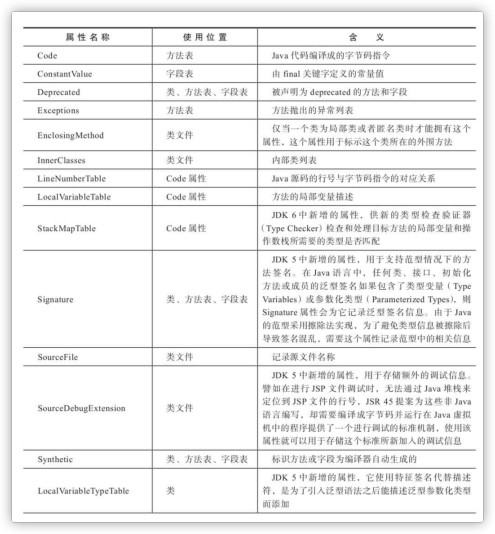

  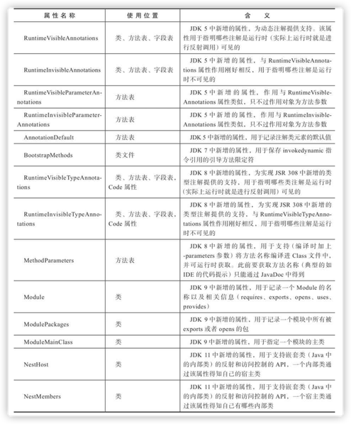


### 字节码示例

```java
public class Test01 {
    
    private int anInt = 1;

    public Test01() {
    }

    public int getAnInt() {
        return this.anInt;
    }

    public void setAnInt(int anInt) {
        this.anInt = anInt;
    }
}
```

```java
public class jvm.video.zhanglong.bytecode.Test01
  minor version: 0
  major version: 52
  flags: (0x0021) ACC_PUBLIC, ACC_SUPER
  this_class: #3                          // jvm/video/zhanglong/bytecode/Test01
  super_class: #4                         // java/lang/Object
  interfaces: 0, fields: 1, methods: 3, attributes: 1
Constant pool:
   #1 = Methodref          #4.#20         // java/lang/Object."<init>":()V
   #2 = Fieldref           #3.#21         // jvm/video/zhanglong/bytecode/Test01.anInt:I
   #3 = Class              #22            // jvm/video/zhanglong/bytecode/Test01
   #4 = Class              #23            // java/lang/Object
   #5 = Utf8               anInt
   #6 = Utf8               I
   #7 = Utf8               <init>
   #8 = Utf8               ()V
   #9 = Utf8               Code
  #10 = Utf8               LineNumberTable
  #11 = Utf8               LocalVariableTable
  #12 = Utf8               this
  #13 = Utf8               Ljvm/video/zhanglong/bytecode/Test01;
  #14 = Utf8               getAnInt
  #15 = Utf8               ()I
  #16 = Utf8               setAnInt
  #17 = Utf8               (I)V
  #18 = Utf8               SourceFile
  #19 = Utf8               Test01.java
  #20 = NameAndType        #7:#8          // "<init>":()V
  #21 = NameAndType        #5:#6          // anInt:I
  #22 = Utf8               jvm/video/zhanglong/bytecode/Test01
  #23 = Utf8               java/lang/Object
{
  public jvm.video.zhanglong.bytecode.Test01();
    descriptor: ()V
    flags: (0x0001) ACC_PUBLIC
    Code:
      stack=2, locals=1, args_size=1
         0: aload_0
         1: invokespecial #1                  // Method java/lang/Object."<init>":()V
         4: aload_0
         5: iconst_1
         6: putfield      #2                  // Field anInt:I
         9: return
      LineNumberTable:
        line 3: 0
        line 4: 4
      LocalVariableTable:
        Start  Length  Slot  Name   Signature
            0      10     0  this   Ljvm/video/zhanglong/bytecode/Test01;

  public int getAnInt();
    descriptor: ()I
    flags: (0x0001) ACC_PUBLIC
    Code:
      stack=1, locals=1, args_size=1
         0: aload_0
         1: getfield      #2                  // Field anInt:I
         4: ireturn
      LineNumberTable:
        line 7: 0
      LocalVariableTable:
        Start  Length  Slot  Name   Signature
            0       5     0  this   Ljvm/video/zhanglong/bytecode/Test01;

  public void setAnInt(int);
    descriptor: (I)V
    flags: (0x0001) ACC_PUBLIC
    Code:
      stack=2, locals=2, args_size=2
         0: aload_0
         1: iload_1
         2: putfield      #2                  // Field anInt:I
         5: return
      LineNumberTable:
        line 11: 0
        line 12: 5
      LocalVariableTable:
        Start  Length  Slot  Name   Signature
            0       6     0  this   Ljvm/video/zhanglong/bytecode/Test01;
            0       6     1 anInt   I
}
```


### 符号引用和直接引用

TODO


### 方法调用

方法调用不等同于方法执行，该阶段的唯一任务就是确定被调用方法的版本（即调用哪个方法），暂时不涉及方法内部的具体运行过程。

**JVM方法调用的字节码指令**：

* invokeinterface：调用接口中的方法，实际上是在运行期决定的，决定到底调用实现该接口的哪个对象的特定方法；
* invokestatic：调用静态方法；
* invokespecial：调用私有方法、构造方法和父类的方法；
* invokevirtual：调用虚方法，运行期动态查找的方法；
* invokedynamic：先在运行时期动态解析出调用点限定符所引用的方法，然后再执行该方法。

**解析与分派**：TODO


### 方法执行

现代JVM执行Java代码时，通常都会将解释执行与编译执行结合起来。

* **解释执行**：就是通过解释器读取字节码，遇到相应的指令就去执行。

* **编译执行**：就通过即时编译器JIT将字节码转换为本地机器码来执行，通常会根据热点代码来生成相应的本地机器码。

**基于栈的指令集**：在内存中完成操作，主要操作有入栈和出栈两种。其优点在于可以在不同平台移植，缺点是完成相同的操作所需的指令数量通常比寄存器指令集更多。

**基于寄存器的指令集**：是与硬件架构紧密相关的，无法做到可移植。但性能高，在CPU高速缓冲区中操作。

**栈帧**：JVM以方法做为最基本的执行单元，栈帧Stack Frame则是用于支持虚拟机进行方法调用和方法执行背后的数据结构，也是JVM运行时数据区的虚拟机栈中的基本单位。栈帧中存储了方法的局部变量表、操作数栈、动态链接和方法返回地址等信息。每一个方法从调用到执行结束的过程，都对应一个栈帧在虚拟机栈中入栈和出栈的过程。每一个栈帧都是由一个特定的线程执行，不存在同步和并发问题。


### 常用字节码

|     字节码     |                             作用                             |
| :------------: | :----------------------------------------------------------: |
|      ldc       |  表示将int、float或者String类型的常量值从常量池中推送至栈顶  |
|     bipush     |          表示将单字节（-128-127）的常量值推送到栈顶          |
|     sipush     |         表示将一个短整型值（-32768-32369）推送至栈顶         |
|   iconst_<n>   | 表示将int型的1推送至栈顶（iconst_m1到iconst_5） m1,0,1,2,3,4,5 最多到iconst_5，m1表示-1，如果是6，则会变为bipush |
|   anewarray    | 表示创建一个引用类型（如类、接口）的数组，并将其引用值压入栈顶 |
|    newarray    | 表示创建一个指定原始类型（int boolean float double）的数组，并将其引用值压入栈顶 |
|     return     |                           返回void                           |
|    aload_0     |                     将0推送到操作栈栈顶                      |
| invokespecial  |                    调用父类的相应构造方法                    |
|    putfiled    |                        为成员变量赋值                        |
|    getfield    |                       获取成员变量的值                       |
|     clinit     |                       对静态变量初始化                       |
|      new       |                       创建一个新的对象                       |
|      dup       |         赋值操作数栈最顶层的值，将结果推送到操作数栈         |
|   istore_<n>   |  将操作数栈顶元素出栈 并将其存储到局部变量表中索引为n的位置  |
|      pop       |                         弹出栈顶元素                         |
| invokervirtual |                          调用虚方法                          |
|      iadd      |                         int类型相加                          |
|      isub      |                         int类型相减                          |
|                |                                                              |
|                |                                                              |


## GC常用参数

### 基本参数

* -Xmn -Xms -Xmx -Xss：新生代 最小堆 最大堆 栈空间；
* -XX:+UseTLAB：是否使用TLAB，默认为true；
* -XX:PrintTLAB：打印TLAB的使用情况；
* -XX:TLABSize：设置TLAB的大小；
* -XX:+DisableExplictGC：是否禁用System.gc()；
* -XX:+PrintGC
* -XX:+PrintGCDetails
* -XX:+PrintHeapAtGC
* -XX:+PrintGCTimeStamps
* -XX:+PrintGCApplicationConcurrentTime：打印应用程序当前时间；
* -XX:+PrintGCApplicationStoppedTime：打印应用程序暂停时长；
* -XX:+PrintReferenceGC：打印回收了多少种不同引用类型的引用；
* -verbose:class：类加载的详细信息；
* -XX:+PrintVMOptions：打印虚拟机参数；
* -XX:+PrintFlagsFinal -XX:+PrintFlagsInitial
* -Xloggc:opt/log/gc.log
* -XX:MaxTenuringThreshold：升代年龄，最大值15；
* -XX:PreBlockSpin：锁自旋次数；
* -XX:CompileThreshold


### Parallel常用参数

* -XX:SurvivorRatio
* -XX:PreTenureSizeThreshold：大对象的大小；
* -XX:MaxTenuringThreshold
* -XX:+ParallelGCThreads：并行收集器的线程数，同一适用于CMS，一般设置为CPU的核数；
* -XX:+UseAdaptiveSizePollcy：自动选择各区的大小比例。


### CMS常用参数

* -XX:+UseConcMarkSweepGC：
* -XX:ParallelCMSThreads：CMS线程数量；
* -XX:CMSInitiatingOccupancyFraction：老年代比例达到多少后开始收集，默认68%，如果频繁的发生Serial Old卡顿，应该调小；
* -XX:UseCMSCompactAtFullCollection：是否在FGC时进行压缩；
* -XX:CMSFullGCsBeforeCompaction：多少次FGC后进行压缩；
* -XX:+CMSClassUnloadingEnabled：
* -XX:CMSInitiatingPermOccupancyFraction：达到什么比例时进行Perm回收；
* GCTimeRatio：设置GC时间占用程序运行时间的百分比；
* -XX:MaxGCPauseMillis：最大GC停顿时间，是一个建议时间，GC会尝试使用各种手段达到这个时间，如减小年轻代。


### G1常用参数

* -XX:+UseG1GC：
* -XX:MaxGCPauseMillis：建议值，G1会尝试调整Yong区的Region数来达到这个值；
* -XX:GCPauseIntervalMillis：GC的间隔时间；
* -XX:+G1HeapRegionSize：Region大小，建议逐渐增大该值，1 2 4 8 16 32。随着size的增加，垃圾的存活时间更长，GC的间隔更长，但每次GC的时间也会更长；
* G1NewSizePercent：新生代最小比例，默认5%；
* G1MaxNewSizePercent：新生代最大比例，默认60%；
* GCTimeRatio：GC时间建议比例，G1会根据这个值调整堆空间；
* ConcGCThreads：线程数量；
* InitiatingHeapOccupancyPercent：启动G1的堆空间占用比例。


## JIT即时编译器

### 概念

JIT（ just in time）即时编译器。使用即时编译技术，加速Java程序的执行速度。通常通过javac将程序源代码编译，转换成java字节码，JVM通过解释字节码将其翻译成对应的机器指令，逐条读入，逐条解释翻译。很显然，经过解释执行，其执行速度必然会比可执行的二进制字节码程序慢很多。而为了提高执行速度，引入了JIT技术。在运行时JIT会把翻译过的机器码保存起来，以备下次使用，因此从理论上来说，采用JIT技术可以接近于以前的纯编译技术。


### 编译过程

当JIT编译启用时（默认是启用的），JVM读入Class文件解释后，将其发送给JIT编译器。JIT编译器将字节码编译成本机机器代码，下图展示了该过程。


### HotSpot编译

当JVM执行Java代码时，它并不立即开始编译代码。这主要有两个原因：

* 首先，如果这段代码本身在将来只会被执行一次，那么从本质上看，编译就是在浪费精力。因为将代码翻译成 java 字节码相对于编译这段代码并执行代码来说，要快很多。当然，如果一段代码频繁的调用方法，或是一个循环，也就是这段代码被多次执行，那么编译就非常值得了。因此，编译器具有的这种权衡能力会首先执行解释后的代码，然后再去分辨哪些方法会被频繁调用来保证其本身的编译。其实说简单点，就是 JIT 在起作用，我们知道，对于 Java 代码，刚开始都是被编译器编译成字节码文件，然后字节码文件会被交由 JVM 解释执行，所以可以说 Java 本身是一种半编译半解释执行的语言。Hot Spot VM 采用了 JIT compile 技术，将运行频率很高的字节码直接编译为机器指令执行以提高性能，所以当字节码被 JIT 编译为机器码的时候，要说它是编译执行的也可以。也就是说，运行时，部分代码可能由 JIT 翻译为目标机器指令（以 method 为翻译单位，还会保存起来，第二次执行就不用翻译了）直接执行。
* 第二个原因是最优化，当 JVM 执行某一方法或遍历循环的次数越多，就会更加了解代码结构，那么 JVM 在编译代码的时候就做出相应的优化。我们将在后面讲解这些优化策略，这里，先举一个简单的例子：我们知道 equals() 这个方法存在于每一个 Java Object 中（因为是从 Object class 继承而来）而且经常被覆写。当解释器遇到 b = obj1.equals(obj2) 这样一句代码，它则会查询 obj1 的类型从而得知到底运行哪一个 equals() 方法。而这个动态查询的过程从某种程度上说是很耗时的。
