# Java多线程高并发

## 线程基础-基本概念

### 从OS的角度来看

**进程的概念**：

* 是资源分配的基本单位；
* 是内存中指令和数据的集合。

**线程的概念**：

* 是系统调度的基本单位；
* 是一个进程内共享资源的多条执行路径。


### 从JVM的角度来看

JVM进程运行时所管理的内存区域如下图，一个进程中可以存在多个线程，多个线程共享堆空间和元空间，每个线程有自己的虚拟机栈、本地方法栈和程序计数器。线程是进程划分出来的执行单元，最大的不同在于各个进程间是独立的，而线程则不一定，这是因为同一进程中各线程可能会相互影响。


### 并发和并行的区别

* **并发**：同一时间段内，多个任务都在执行，但单位时间内不一定同时执行；
* **并行**：单位时间内，多个任务同时执行。


### 为什么使用多线程？

* **从总体来看**：线程是程序执行的最小单位，切换和调度的成本远远小于进程，并且多核CPU时代意味着多线程可以并行执行，减少了并发执行时上下文切换的开销。再者，随着互联网飞速发展，存在百万千万级别的并发量要求，多线程做为撑起高并发系统的基石，更应该需要被使用。
* **从底层探讨**：
  * 单核时代：主要是为了提高CPU和IO设备的综合利用率。当只有一个线程时，会出现CPU计算时IO设备空闲、IO操作时CPU空闲的情况，但多个线程会让两个操作在一段时间内都执行；
  * 多核时代：主要是为了提高CPU利用率。每一个线程被分配到一个核心去执行，多核CPU就能够并行的执行多个线程。

* **使用多线程带来的问题**：内存泄漏、上下文切换的性能损耗、死锁和受限于硬件和软件的资源闲置问题。


### HotSpot后台运行的系统线程分类

|          类型           |                             功能                             |
| :---------------------: | :----------------------------------------------------------: |
| 虚拟机线程（VM thread） | 等待JVM到达安全点的操作出现。这些操作必须要在独立的线程里执行，因为当堆修改无法进行时，线程都需要JVM位于安全点。这些操作的类型有： STW垃圾回收、线程栈dump、线程暂停、线程偏向锁解除 |
|     周期性任务线程      |    负责定时器事件（也就是中断），用来调度周期性操作的执行    |
|         GC线程          |                 支持JVM中不同的垃圾回收活动                  |
|       编译器线程        |        在运行时将字节码动态编译成本地平台相关的机器码        |
|      信号分发线程       |        接收发送到 JVM 的信号并调用适当的 JVM 方法处理        |


## 线程基础-多线程机制

### 创建线程

**实现Runnable接口：**

```java
public class MyRunnable implements Runnable {
    
    @Override
    public void run() {
		// ...        
    }
}

public static void main(String[] args) {
    new Thread(new MyRunnable()).start();
}
```

**实现Callable接口：**

```java
public class MyCallable implements Callable<Integer> {
    
    public Integer call() {
        // ...
    }
}

public static void main(String[] args) throws ExecutionException, InterruptedException {
    MyCallable mc = new MyCallable();
    FutureTask<Integer> ft = new FutureTask<>(mc);
    new Thread(ft).start();
    System.out.println(ft.get());
}
```

**继承Thread类：**

```java
public class MyThread extends Thread {
    
    public void run() {
        // ...
    }
}

public static void main(String[] args) {
    new MyThread().start();
}
```


### 基础机制

**Exector**：线程池可以管理多个互不干扰，不需要同步操作的异步任务的执行。

```java
public static void main(String[] args) {
    ExecutorService executorService = Executors.newCachedThreadPool();
    for (int i = 0; i < 5; i++) {
        executorService.execute(() -> {
            // ......
        });
    }
    executorService.shutDown();
}
```

**Daemon**：守护线程是程序运行时在后台提供服务的线程。当所有守护线程结束时，程序也就终止，同时会杀死所有守护线程。

```JAVA
public static void main(String[] args) {
    Thread thread = new Thread(() -> {
        // ......
    });
    // 将线程设置为守护线程
    thread.setDaemon(true);
}
```

**`sleep()`**：会休眠执行它的线程一段时间。可能会抛出InterruptedException，由于异常不能跨线程传回main中，所以子线程处理异常只能在本地捕获处理。

```JAVA
public static void main(String[] args) {
    new Thread(() -> {
        try {
            Thread.sleep(3000);
        } catch (InterruptedException e) {
            e.printStackTrace();
        }
    }).start();
}
```

**`yield()`**：将调用它的线程的执行权让出，给其他线程执行的机会。该方法只是对调度器的一个建议，而且也只会建议具有相同优先级的线程可以运行。

```JAVA
public static void main(String[] args) {
    new Thread(() -> {
        Thread.yield();
    }).start();
}
```


### 中断机制

**`interrupt()`**：通过调用线程的 `interrupt()` 方法来中断该线程，如果该线程处于阻塞、有限期或无限期等待状态，就会抛出InterruptedException，从而提前结束线程。但是不能中断I/O阻塞或synchronized锁的阻塞。

**`isInterrupted()`**：如果一个线程执行了一个无限循环，且没有执行sleep等会抛出InterruptedException的操作，那么可以通过调用 `Thread.currentThread().isInterrupted()` 方法设置一个线程的中断标记。若该线程被调用了 `interrupet()` 方法，则 `isInterrupted()` 标记会返回true，因此可以在无限循环中判断中断标记来决定是否中断线程。

```JAVA
public static void main(String[] args) throws InterruptedException {
    Thread thread = new Thread(() -> {
        while (!Thread.currentThread().isInterrupted()) {
            System.out.println("执行逻辑");
        }
        System.out.println("线程中断");
    });
    thread.start();

    try {
        Thread.sleep(3000);
    } catch (InterruptedException e) {
        e.printStackTrace();
    }
    thread.interrupt();
}
```

**Executor的中断操作**：调用Executor的 `shutdown()` 方法会等待池中的线程都执行完毕后再关闭。若调用 `shutdownNow() ` 方法，则相当于调用了池中每个线程的 `interrupt()` 方法。

```JAVA
public static void main(String[] args) {
    ExecutorService executorService = Executors.newCachedThreadPool();
    executorService.execute(() -> {
        try {
            Thread.sleep(2000);
        } catch (InterruptedException e) {
            e.printStackTrace();
        }
    });
    executorService.shutdownNow();
}
```

如果只想中断Executor中的一个线程，可以通过 `submit()` 提交任务，会返回一个Future对象，通过Future提供的 `cancel()` 方法就可以中断该线程。

```JAVA
public static void main(String[] args) {
    ExecutorService executorService = Executors.newCachedThreadPool();
    Future<?> future = executorService.submit(() -> {
    	// ......
    });
    future.cancel(true);
}
```


### 同步机制

**线程间同步的方式**：

* **互斥量（Mutex）**：采用互斥对象机制，只有拥有互斥对象的线程才有访问公共资源的权限。因为互斥对象只有一个，所以可以保证公共资源不会被多个线程同时访问；
* **信号量（Semphares）**：允许同一时刻多个线程访问同一资源，但是需要控制同一时刻访问此资源的最大线程数量；
* **事件（Event）**：即 `wait/notify` 操作，通过通知的方式来保持多线程同步，还可以方便的实现多线程的优先级。

**synchronized同步锁**：

```JAVA
public class SynchronizedExample {
    
    private Object object = new Object();
    
    public void func1() {
        // 同步代码块-对象锁
        synchronized (object) {
            for (int i = 0; i < 10; i++) {
                System.out.println(i + " ");
            }
        }
    }
    
    public static void main(String[] args) {
        SynchronizedExample example = new SynchronizedExample();
        ExecutorService executorService = Executors.newCachedThreadPool();
        executorService.execute(() -> e1.func1());
        executorService.execute(() -> e1.func1());
    }
}
```

```JAVA
// 同步方法-this锁
public synchronized void func() {
    // ......
}
```

```JAVA
public class SynchronizedExample {
    
    public void func1() {
        // 同步代码块-类锁
        synchronized (SynchronizedExample.class) {
            for (int i = 0; i < 10; i++) {
                System.out.println(i + " ");
            }
        }
    }
    
    public static void main(String[] args) {
        SynchronizedExample example1 = new SynchronizedExample();
        SynchronizedExample example2 = new SynchronizedExample();
        ExecutorService executorService = Executors.newCachedThreadPool();
        executorService.execute(() -> e1.fun1());
        executorService.execute(() -> e2.fun1());
    }
}
```

```JAVA
// 同步静态方法-类锁
public synchronized static void func() {
    // ......
}
```

**ReentrantLock可重入锁**：

```JAVA
public class ReentrantLockExample {
    
    private Lock lock = new ReentrantLock();
    
    public void func() {
        lock.lock();
        try {
            for (int i = 0; i < 10; i++) {
                System.out.println(i + " ");
            }
        } finally {
            lock.unlock();
        }
    }
    
    public static void main(String[] args) {
        LockExample lockExample = new LockExample();
        ExecutorService executorService = Executors.newCachedThreadPool();
        executorService.execute(() -> lockExample.func());
        executorService.execute(() -> lockExample.func());
    }
}
```


### 协作机制

**`join()` 线程连接机制**：在一个线程中调用另一个线程的 `join()` 方法，会让当前线程阻塞，直到目标线程结束后才会继续执行，从而保证多线程解决问题的先后顺序。

```JAVA
public class JoinExample {

    private class A extends Thread {
        
        @Override
        public void run() {
            System.out.println("A");
        }
    }

    private class B extends Thread {

        private A a;

        B(A a) {
            this.a = a;
        }

        @Override
        public void run() {
            try {
                a.join();
            } catch (InterruptedException e) {
                e.printStackTrace();
            }
            System.out.println("B");
        }
    }

    public void test() {
        A a = new A();
        B b = new B(a);
        b.start();
        a.start();
    }
}

public static void main(String[] args) {
    JoinExample example = new JoinExample();
    example.test();
}
```

**`wait()&notify()/notifyAll()` 等待唤醒机制**：使用 `wait()` 会使线程等待某个条件满足，线程在等待时会进入阻塞状态，当其他线程的运行使得这个条件满足时，其他线程会调用 `notify()` 或 `notifyAll()` 来唤醒阻塞的线程。

```JAVA
public class WaitNotifyExample {
    
    public synchronized void before() {
        System.out.println("before");
        // notify会随机唤醒WaitSet中的一个线程，底层的操作是由操作系统完成
        // notifyAll会唤醒WaitSet中的所有线程
        notifyAll();
    }
    
    public synchronized void after() {
        try {
            // wait调用前线程必须持有锁
            // 调用后线程会释放this锁，然后进入this锁对应的WaitSet中阻塞
            // 直到被其他线程调用同一个对象的notify唤醒后，才会进入就绪状态竞争锁
            wait();
        } catch (InterruptedException e) {
            e.printStackTrace();
        }
        System.out.println("after");
    }
    
    public static void main(String[] args) {
        WaitNotifyExample example = new WaitNotifyExample();
        ExcutorService executorService = Executors.newCachedThreadPool();
        executorService.execute(() -> example.after());
        executorService.execute(() -> example.before());
    }
}
```

**`sleep()` 和 `wait()` 的区别**：

* 最主要的区别：sleep方法不会释放锁，wait方法会释放锁；
* wait通常被用于线程间交互/通信，sleep通常被用于暂停执行；
* wait被调用后，线程不会自动苏醒，而是需要别的线程调用同一个对象上的 `notify()` 或者 `notifyAll()` 方法进行唤醒。或者可以使用 `wait(long timeout)` 超时后自动苏醒。而sleep只有超时苏醒这一种模式。

**`await()&signal()/signalAll()` 等待唤醒机制**：JUC提供的Condition类来实现线程间的协作，可以在Condition上调用` await()` 方法使线程等待，其他线程调用 `signal()` 或 `signalAll()` 方法唤醒等待的线程。相对于wait/notify来说，await可以指定在哪个条件上等待，signal可以唤醒指定条件上阻塞的线程。

```JAVA
public class AwaitSignalExample {
    
    private Lock lock = new ReentrantLock();
    // 条件对象
    private Condition condition = lock.newCondition();
    
    public void before() {
        lock.lock();
        try {
            System.out.println("before");
            // 唤醒在此条件对象上阻塞的所有线程
            condition.signalAll();
        } finally {
            lock.unlock();
        }
    }
    
    public void after() {
        lock.lock();
        try {
            // 在指定的条件对象上阻塞
            condition.await();
            System.out.prinln("after");
        } catch (InterruptedException e) {
            e.printStackTrace();
        } finally {
            lock.unlock();
        }
    }
    
    public static void main(String[] args) {
        AwaitSignalExample example = new AwaitSignalExample();
        ExecutorService executorService = Executors.newCachedThreadPool();
        executorService.execute(() -> example.after());
        executorService.execute(() -> example.before());
    }
}
```


## 线程基础-状态及切换

### 线程状态

* **初始（New）**：新创建的线程对象，还没有调用 `start()` 方法时的状态；
* **运行（Runnable）**：
  * **就绪（Ready）**：线程对象创建后，其他线程如main调用了该对象的 `start()` 方法，线程就会位于就绪状态的队列中，等待被调度器选中，获得CPU的使用权；
  * **运行中（Running）**：就绪状态的线程在获得CPU的时间片后变为运行中状态。
* **阻塞（Blocked）**：表示线程阻塞于锁；
* **等待（Waiting）**：进入该状态的线程需要无限期的等待其他线程做出一些特定动作（如唤醒或中断）；
* **超时等待（Timed_Waiting）**：与Waiting相似，但可以经过指定的时间返回；
* **终止（Terminated）**：表示该线程已经执行完毕。


### 状态切换

* **初始 —> 运行**：线程对象被创建后处于New状态，调用 `start()` 后进入Runnable状态（准确的说是进入Ready状态）；
* **就绪 <—> 运行中**：Ready状态的线程若是被调度器选中获得了CPU时间片（timeslice）就会进入Running状态。Running状态的线程若是时间片耗尽或是调用 `yield()` 方法后会重新进入Ready状态；
* **运行 <—> 等待**：当线程调用 `Object.wait()/Thread.join()/LockSupport.park()` 方法后，会处于Waiting状态，处于等待状态的线程需要依靠其他线程的通知或其他线程执行完毕后才能取消等待返回到Ready状态，如通过 `Object.notify()/Object.notifyAll()/LockSupport.unpark(Thread)` 方法唤醒等待的线程；
* **运行 <—> 超时等待**：Timed_Waiting状态相当于在Waiting状态的基础上增加了超时限制，如通过  `Thread.sleep(long)/Object.wait(long)/Thread.join(long)/LockSupport.parkNanos()/LockSupport.parkUntil()` 方法可以将线程置于超时等待状态，当超时时间到达后或被其他线程唤醒会返回到Ready状态；
* **运行 <—> 阻塞：**当线程执行同步代码，且没有获取到锁的情况下，会处于Blocked状态，直到其获取到锁，才会回到Ready状态；
* **运行 —> 终止**：线程执行完毕后会进入Terminated状态。


### EntryList和WaitSet

JVM底层维护的两种队列用于管理处于等待/阻塞状态的线程：

* **_WaitSet**：处于wait状态的线程，会被加入到WaitSet；
* **_EntryList**：处于等待锁的block状态的线程，会被加入到EntryList。

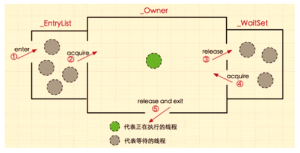

下图是线程通过wait/notify/synchronized操作后的状态变换图：

* synchronized同步锁在底层由对象监视器Monitor实现，Monitor维护了两个队列EntryList和WaitSet；
* 当线程进入同步代码中，并调用wait方法时，会进入同步锁（监视器）对应的WaitSet中等待（Waiting状态）；
* 当其他线程通过调用同一把锁对象的notify/notifyAll方法时，会唤醒WaitSet中的线程，让其进入EntryList中；
* 当线程获取锁失败时，会进入EntryList中等待，直到锁释放后才会被唤醒，然后竞争锁。

注：处于EntryList和WaitSet中的线程都处于OS级别的阻塞状态，不会参与调度。

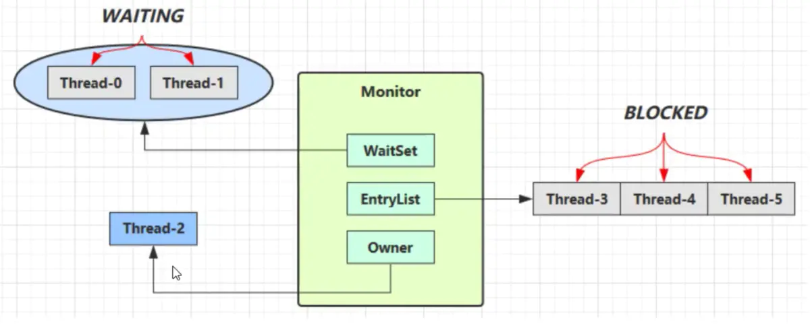


### 影响线程状态的方法

* **`Thread.sleep(long millis)`**：当前线程调用此方法会进入Timed_Waiting状态，但不会释放对象锁，millis时间后线程会自动苏醒进入Ready状态。这是一种给其他线程执行机会的最佳方式；
* **`Thread.yield()`**：当前线程调用此方法会让出CPU执行权，由Running状态切换为Ready状态，让调度器重新调度，但不会释放对象锁。可以让相同优先级的线程轮流执行，但并不保证一定会让其他线程执行，因为让步的线程还有可能再次被调度器选中；
* **`Thread.join()/Thread.join(long millis)`**：当前线程调用其他线程的join方法会让当前线程进入Waiting/Timed_Waiting状态，但不会释放对象锁，当被调用join方法的线程执行完毕或者millis时间已过，当前线程会进入Ready状态；
* **`Object.wait()/Object.wait(long timeout)`**：当前线程调用此方法后，会释放对象锁，进入对象的WaitSet中，依赖于notify/notifyAll唤醒或timeout时间到后自动唤醒；
* **`Object.notify()/Object.notify()`**：调用此方法会唤醒在对象上等待的单个或全部线程，若是notify则唤醒的是WaitSet中的头节点，即等待时间最长的线程（JDK1.8）；
* **`LockSupport.park()/LockSupport.parkUntil(long deadlines)`**：当前线程调用park/parkUntil会进入Waiting/Timed_Waiting状态，相对于wait方法，可以不用获取锁就进入等待状态，依赖于unpark唤醒或自动唤醒。


## 线程基础-上下文切换

### 进程上下文切换

由于Java的JVM线程和OS的内核线程是1:1的映射关系，所以在发生上下文切换时，需要通过OS完成。以Linux为例，在切换过程中，正在执行的进程现场会被保存起来，保证未来能被恢复。这里的现场包括所有有关的寄存器，和一些操作系统的必要数据。

**PCB**：操作系统中用于保存进程信息的数据结构被称为进程控制块（PCB，process control block）。PCB通常是系统内存占用区中的一块连续内存，其存放着操作系统用于描述进程情况及控制进程运行所需的全部信息，可以使一个在多道程序环境下不能独立运行的程序成为一个能独立运行的基本单位或一个能与其他进程并发执行的进程。

**以进程A切换到进程B为例看上下文切换的步骤：**

1. 保存进程A的CPU环境（各种寄存器的数据）到私有堆栈中；
2. 更新PCB中的信息，对进程A的状态做出切换；
3. 将进程A的PCB放入相关状态的队列；
4. 将进程B的PCB信息切换为运行态，并执行进程B；
5. 之后调度器若是选择了进程A，会从队列中取出A的PCB，根据里面的信息恢复A被切换时暂停的现场，继续执行。


### 引起上下文切换的原因

* **调度**：进程持有的CPU时间片耗尽，操作系统正常调度下一个任务；
* **抢占**：进程的CPU执行权被其他优先级更高的任务抢占；
* **中断**：因为CPU发生中断，切换到中断服务程序去执行。中断包括硬件中断和软中断，常见的软中断导致的上下文切换有IO阻塞和未抢到资源等；
* **让步**：用户代码主动让出CPU的执行权，导致调度器重新调度。


### 上下文切换的性能问题

* **现场的保存恢复**：每次上下文切换都是纳秒甚至微秒级的CPU时间消耗，若是在进程上下文频繁切换的场景下，很容易导致CPU将大量的时间耗费在寄存器、内核栈和虚拟内存等资源的保存和恢复上，进而大大缩短了真正运行进程任务的时间。

* **内存映射的刷新**：另外，Linux通过TLB来管理虚拟内存到物理内存的映射关系，当进程切换导致虚拟内存更新后，TLB也会随之刷新，内存的访问也会随之变慢。特别是在多处理器系统上，高速缓存是被多个核心共享的，刷新缓存不仅会影响当前处理器上的进程，还会影响到共享缓存的其他处理器上的进程。


### 系统调用上下文切换

**同一进程的状态切换**：一次系统调用的过程中，其实是发生了两次CPU的上下文切换，即用户态-内核态-用户态。但在系统调用过程中，并不会涉及到虚拟内存等进程用户态的资源，也不会切换进程，也就是系统调用是在同一个进程完成的。

**Linux的系统调用**：Linux在进行系统调用时，会从用户态到内核态进行切换，每个进程都有一个关联内核模式的堆栈，专门给系统调用时使用。在执行系统调用之前，尚处于用户态的进程的寄存器信息会保存在用户模式堆栈中。当进程处于内核态时，调用相同模式的函数不需要上下文切换，当结束调用后才会恢复用户态继续执行。

**系统调用情况下CPU的上下文切换步骤**：

1. 保存CPU寄存器中用户态的指令和数据；
2. 为了执行内核态指令，PC需要更新为内核态指令的位置；
3. 跳转到内核态运行系统调用的指令；
4. 系统调用结束后，寄存器恢复保存的用户态指令和数据，然后切换回用户态，继续运行进程。


### 线程上下文切换

所谓内核中的任务调度，就是线程的调度，进程是给线程提供了虚拟内存、全局变量等资源。在Linux中，线程就是和其他进程共享某些资源的进程，共享的资源包括虚拟内存和全局变量等，这些资源在线程上下文切换时不需要被修改。需要修改的是线程的私有数据，如栈和寄存器等。

**线程上下文切换的场景**：

1. 前后两个线程属于不同进程的情况：由于资源不共享，和进程切换是一样的；
2. 前后两个线程属于同一进程的情况：因为虚拟内存共享，所以切换时只需要保存和恢复寄存器等私有数据即可。


### 减少上下文切换的方式

* **无锁并发编程**：多线程竞争锁时，会引起上下文的切换，所以多线程处理数据时，可以使用其他方法规避锁的使用。如将数据的id按照Hash算法取模分段，不同的线程处理不同段的数据；
* **CAS算法**：CAS会用先比较后替换的方式去操作共享资源，无需加锁；
* **减少线程数量**：使用线程池来控制最大线程数，并且可以重复利用线程，避免了线程创建和销毁的开销；
* **协程/用户级线程**：与操作系统内核线程1:N或M:N的比例创建用户级线程，在一个内核线程内控制多个任务的执行，任务的调度和切换都在用户空间完成，无需操作系统参与。


## 线程同步-死锁问题

### 死锁演示

死锁指两个及以上的线程为一组，组内各个线程都互相持有着其他成员想要获取的资源，但在获取目标资源之前线程又不会释放自己已有的资源，所以形成了互相等待对方释放资源而自己又不能释放的环路结构。如下图，线程A持有资源2，线程B持有资源1，它们都想申请对方锁住的资源，但又不能释放自己锁住的资源，所以这两个线程会因为互相等待而进入死锁状态。


```JAVA
/**
 * 产生死所需要具备的条件：
 * 	1.锁资源是互斥的；
 * 	2.线程阻塞时不会释放自己持有的资源；
 * 	3.线程持有的资源不可被剥夺；
 * 	4.多个线程形成了互相等待对方释放而自己又不释放的环路结构。
 * 综上所述，要解决死锁问题只需要打破以上任意一个或多个原因即可。
 */
public class DeadLockExample {
    
    private static Object resource1 = new Object();
    private static Object resource2 = new Object();
    
    public static void main(String[] args) {
        new Thread(() -> {
            // 线程1首先获resource1锁
            synchronized (resource1) {
                System.out.println(Thread.currentThread() + " get resource1");
                try {
                	Thread.sleep(1000);
                } catch (InterruptedException e) {
                	e.printStackTrace();
                }
                System.out.println(Thread.currentThread() + " waiting get resource2");
                // 线程1继续阻塞等待resource2锁但没有释放自己持有的resource1锁
                // 但此时线程2持有resource2锁又阻塞在resourse1锁上
                synchronized (resource2) {
                    System.out.println(Thread.currentThread() + " get resource2");
                }
            }
        }, "线程1").start();
        
        new Thread(() -> {
            // 线程2获取resource2锁
            synchronized (resource2) {
                System.out.println(Thread.currentThread() + " get resource1");
                try {
                	Thread.sleep(1000);
                } catch (InterruptedException e) {
                	e.printStackTrace();
                }
                System.out.println(Thread.currentThread() + " waiting get resource2");
                // 线程2继续阻塞等待resource1锁但没有释放自己持有的resource2锁
                // 但此时线程1持有resource1锁又阻塞在resource2锁上
         		synchronized (resource1) {
                    System.out.println(Thread.currentThread() + " get resource1");
                }
            }
        }, "线程2").start();
    }
}
```

```
Thread[线程 1,5,main] get resource1
Thread[线程 2,5,main] get resource2
Thread[线程 1,5,main] waiting get resource2
Thread[线程 2,5,main] waiting get resource1
```


### 解决死锁

```java
/**
 * 要解决上面代码中的死锁问题，只需要破坏形成死锁的4个条件的1条或多条即可。
 * 修改线程2获取锁的顺序，通过破坏环路结构，从而解决死锁问题。
 */
// 重写线程2的代码
new Thread(() -> {
    // 让线程2在resource1锁上就与线程1发生竞争，最终达到一方持有一方阻塞的状态
    synchronized (resource1) {
        System.out.println(Thread.currentThread() + "get resource1");
        try {
            Thread.sleep(1000);
        } catch (InterruptedException e) {
            e.printStackTrace();
        }
        System.out.println(Thread.currentThread() + "waiting get resource2");
        // 获取锁的顺序和线程1保持一致，就会因为互斥关系而顺序执行
        synchronized (resource2) {
            System.out.println(Thread.currentThread() + "get resource1");
        }
    }
}, "线程2").start();
```

```
Thread[线程 1,5,main]get resource1
Thread[线程 1,5,main]waiting get resource2
Thread[线程 1,5,main]get resource2
Thread[线程 2,5,main]get resource1
Thread[线程 2,5,main]waiting get resource2
Thread[线程 2,5,main]get resource2

Process finished with exit code 0
```


## 线程同步-synchronized

### 基本概念

synchronized关键字用于解决多线程场景下资源访问的同步问题，保证在任意时刻被其修饰的代码块或方法只能被一个线程执行。在Java早期版本，synchronized底层使用效率低下重量级锁，因为其底层对象监视器（Monitor）是依赖于OS的Mutex Lock实现的，由于JVM线程是1:1与OS内核线程映射的，在这种方式的实现下，线程的阻塞、唤醒和重新调度，都需要CPU从用户态陷入内核态，开销较大。


### 使用方式

* **修饰实例方法**：即this对象锁，给当前对象的实例加锁，进入同步代码前要获得当前对象实例的锁；
* **修饰静态方法**：即类锁，给当前类的字节码对象加锁，会作用于类的所有对象实例，一旦线程持有类锁，无论其他线程调用的是该类的任意对象实例的方法，都会同步；
* **修饰代码块**：即手动指定加锁对象，对给定对象加锁，进入同步代码库前要获得给定对象的锁；
* 注：不要使用 `synchronized(String str)` 加锁，因为JVM中字符串常量池具有缓存功能。


### 字节码

```JAVA
public class Example {

    private static Object object = new Object();

    public static void main(String[] args) {
        synchronized (object) {
            System.out.println("welcome");
        }
    }
}
```

```shell
> javac Example.java
> javap -c -v Example.class
```

使用synchronized修饰同步代码块时，字节码层面是通过monitorenter和monitorexit这两条指令来实现锁对象监视器的获取和释放动作，这两个指令隐式的执行了lock和unlock的操作。

**为什么会执行两条monitorexit指令？**是为了应对异常情况的发生而多执行了一步释放锁的操作。

```java
public static void main(java.lang.String[]);
    descriptor: ([Ljava/lang/String;)V
    flags: ACC_PUBLIC, ACC_STATIC
    Code:
      stack=2, locals=3, args_size=1
         0: getstatic     #2                  // Field object:Ljava/lang/Object;
         3: dup
         4: astore_1
         5: monitorenter
         6: getstatic     #3                  // Field java/lang/System.out:Ljava/io/PrintStream;
         9: ldc           #4                  // String welcome
        11: invokevirtual #5                  // Method java/io/PrintStream.println:(Ljava/lang/String;)V
        14: aload_1
        15: monitorexit
        16: goto          24
        19: astore_2
        20: aload_1
        21: monitorexit
        22: aload_2
        23: athrow
        24: return
      Exception table:
         from    to  target type
             6    16    19   any
            19    22    19   any
      LineNumberTable:
        line 8: 0
        line 9: 6
        line 10: 14
        line 11: 24 
```


### 锁升级原理

JDK1.6之后优化了synchronized操作，锁会随着竞争的激烈而逐渐升级，主要存在4种状态：无锁（unlocked）、偏向锁（biasble）、轻量级锁（lightweight locked）和重量级锁（inflated）。


#### Java对象内存布局

HotSpot虚拟机堆中的对象实例被划分为三个组成部分：对象头、实例数据和对齐填充位。

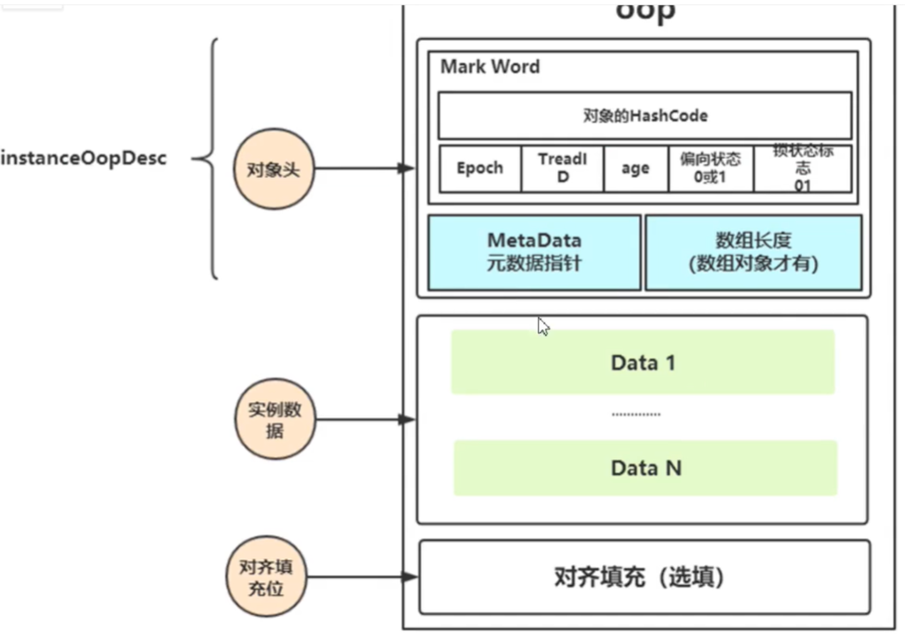

```JAVA
public class JOLExample {

    public static void main(String[] args) {
        Object o = new Object();
        System.out.println(ClassLayout.parseInstance(o).toPrintable());

        synchronized (o) {
            System.out.println(ClassLayout.parseInstance(o).toPrintable());
        }
    }
}
```

* 偏移量0开始的和偏移量4开始的共8个字节代表对象的MarkWord（对象头的前8字节/64bit）；
* 偏移量8开始的4个字节代表对象的ClassPoint（对象所属的类）；
* 因为没有成员变量，所有偏移量12开始的4个字节是填充字节（字节对齐），为了让整个对象的字节大小符合被8整除。

```JAVA
java.lang.Object object internals:
OFFSET  SIZE   TYPE DESCRIPTION                               VALUE
    0      4        (object header)                           01 00 00 00 (00000001 00000000 00000000 00000000) (1)
    4      4        (object header)                           00 00 00 00 (00000000 00000000 00000000 00000000) (0)
    8      4        (object header)                           e5 01 00 f8 (11100101 00000001 00000000 11111000) (-134217243)
    12     4        (loss due to the next object alignment)
Instance size: 16 bytes 空对象16个字节
Space losses: 0 bytes internal + 4 bytes external = 4 bytes total
```

使用synchronized后，此时从偏移量4开始的4个字节发生了变化，是因为偏向锁的信息被添加到了对象的MarkWord上。说白了偏向锁就是将线程的id直接关联到锁对象上，无需争抢竞争。

```JAVA
java.lang.Object object internals:
OFFSET  SIZE   TYPE DESCRIPTION                               VALUE
    0      4        (object header)                           28 f7 a8 02 (00101000 11110111 10101000 00000010) (44627752)
    4      4        (object header)                           00 00 00 00 (00000000 00000000 00000000 00000000) (0)
    8      4        (object header)                           e5 01 00 f8 (11100101 00000001 00000000 11111000) (-134217243)
    12     4        (loss due to the next object alignment)
Instance size: 16 bytes
Space losses: 0 bytes internal + 4 bytes external = 4 bytes total
```

MarkWord的结构：

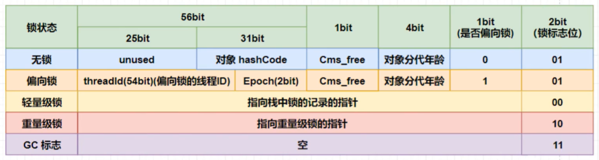


#### 偏向锁

**概念**：偏向锁会偏向第一个获取它的线程，若接下来的执行中，该锁没有被其他线程所获取，那么持有偏向锁的线程在访问锁住的资源时不需要再进行同步操作（即加锁和释放锁）。


**加锁过程**：

* 当一个线程访问同步块并获取锁时，会在锁对象的MarkWord和栈帧中的锁记录里存储锁偏向的线程id；
* 之后该线程进入或退出同步块时不需要再进行加锁操作，只需要测试锁对象的MarkWord是否设置了指向自己的偏向锁；
* 若测试成功则表示已获取锁，若失败则需要再测试MarkWord中偏向锁的标志位是否被设置为1；
* 若不为1，则使用CAS竞争锁并设置偏向。若为1则尝试使用CAS将锁对象的MarkWord中的偏向锁标志指向自己。

**释放锁过程**：

* 偏向锁直到出现竞争才会被释放，即当有其他线程尝试竞争偏向锁时，持有偏向锁的线程才会释放锁；
* 偏向锁的释放需要等待JVM的全局安全点，即在该时间点上没有正在执行的字节码指令；
* 首先会暂停持有锁的线程，然后检查该线程是否存活，若不存活，则将锁对象的MarkWord设置为无锁状态；
* 若仍存活，且出现了多个线程竞争，则锁对象的MarkWord的锁标志就会变为轻量级锁00，最后唤醒被阻塞的线程。

**偏向锁升级为轻量级锁：**在存在锁竞争的场合下，偏向锁就会失效，因为这样的场合存在每次申请锁的线程都是不相同的情况，所以不适合使用偏向锁，而是升级成轻量级锁。


#### 轻量级锁

**概念**：轻量级锁在多线程竞争不会非常激烈的情况下，可以减少获取重量级锁时需要操作系统进行调度和使用互斥量而产生的性能消耗，而轻量级锁使用的是自旋竞争锁和CAS的方式加锁/释放锁。

**自旋锁和适应性自旋锁**：

* **为什么引入自旋锁？**所谓自旋锁是为了避免线程在未获取到锁时的阻塞/唤醒操作而提出的技术，并且很多对象锁的锁定状态只会持续很短的一段时间（如整数的自增操作），在很短的时间内阻塞/唤醒线程显然不值得。
* 所谓自旋，就是让线程去执行一个空轮询，循环结束后再去重新竞争锁，如果竞争不到就继续循环，循环过程中线程会一直处于Running状态。但是基于线程的调度策略，一段时间后还是会让出时间片，让其他线程也能通过自旋获取锁和释放锁。
* JDK1.6引入了适应性自旋锁，自旋的轮次不固定，而是由前一次同一个锁上的自旋时间以及锁拥有者的状态决定。

**加锁过程**：

* 线程进入同步代码块之前，JVM会在轻量级锁运行过程中在当前线程的栈帧中创建锁记录（Lock Record）空间，并将锁对象的MarkWord拷贝到这片空间中（Displaced Mark Word）；

  

* 然后线程尝试使用CAS操作将锁对象的MarkWord中的stack指针指向自己的Lock Record，同时将Lock Record中的owner指针指向锁对象的MarkWord；

  

* 若替换成功，表示当前线程获取到锁，并且锁对象的MarkWord的锁标志位变为00，即表示此对象处于轻量级锁状态；
* 若替换失败，JVM首先检查对象的Mark Word的stack pointer是否指向当前线程的Lock Record，如果是则说明当前线程已拥有锁，直接执行同步操作；
* 若没有指向，则当前线程会尝试自旋获取锁，获取成功则持有锁。若自旋失败，即自旋若干轮后仍未获取到锁（适应性自旋决定轮次），此时轻量级锁会膨胀成重量级锁，锁对象的MarkWord的锁标志位变为10，线程会阻塞在互斥量上面。

**释放锁过程**：

* 线程首先使用CAS将自己的Displaced Mark Word替换回锁对象的MarkWord；

* 若替换成功，则表示同步操作完成；
* 若替换失败，则表示锁对象的MarkWord被修改过，即存在竞争锁的线程自旋失败将锁升级为重量级锁了，此时在释放锁（解锁对象的MarkWord的stack pointer指向）的同时要唤醒阻塞（互斥量的阻塞队列中）在该锁上的线程。

**轻量级锁一定比重量级锁效率更高吗？**不一定，如果锁的竞争非常激烈，有非常多的线程在自旋等待锁，则CPU的资源会大量消耗在空转和上下文切换上面（即不断切换线程去执行循环操作）。


#### 重量级锁

**概念**：JVM的重量级锁是基于进入与退出对象监视器（Monitor）实现的，Java中每个对象实例都关联一个共同创建和销毁的Monitor对象（由C++实现）。锁对象的MarkWord中记录了指向Monitor内存地址的指针，Monitor对象记录了当前持有锁的线程id。

**EntryList阻塞队列和WaitSet等待集合**：

* 当多个线程访问一段同步代码时，只有一个线程能够获取锁对象的监视器，其他线程会进入EntryList队列中阻塞，Monitor是基于操作系统的Mutex互斥量实现的（`Mutex(0|1)`）；
* 如果线程调用了 `wait()` 方法后，则会释放持有的锁监视器，然后进入WaitSet集合中等待被其他线程的 `notify()/notifyAll()` 唤醒。

**重量级锁涉及到的用户态到内核态的切换**：

* **互斥量修改时的切换**：Monitor是依赖于操作系统实现的，在线程尝试对Mutex进行原子修改时，会从用户态陷入到内核态，增加CPU性能的开销；
* **线程进入阻塞状态的切换**：EntryList和WaitSet中的线程均处于阻塞状态，阻塞操作是由操作系统完成的（Linux的 `pthread_mutex_lock()`），线程阻塞后会陷入内核态等待事件就绪（锁释放）和重新调度，当其重新获取CPU执行权后又会切回用户态，频繁的切换大幅增加CPU的开销。


#### 锁消除和锁粗化

**锁消除和逃逸分析：**JIT编译器（Just In Time即时编译器）在动态编译同步代码时，使用了逃逸分析技术，判断锁对象若只被一个线程使用，没有散布到其他线程中时，则JIT在编译同步代码时就不会生成相应的加锁释放锁的机器码，从而消除了锁的使用流程。

```java
public class Example {
    
    public void method() {
        Object object = new Object();
        synchronized (object) {
            System.out.println("hello world");
        }
	}
}
```

即使JIT的逃逸分析判定成功，字节码中还是能找到monitorenter和monitorexit这两个指令，但真正执行的机器码是由JIT来控制的。

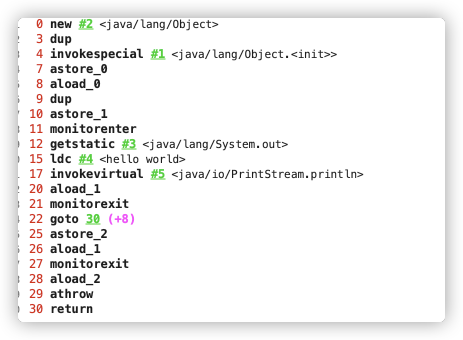

**锁粗化：**JIT编译器在执行动态编译时，若发现前后相邻的synchronized块使用的是同一个锁对象，则会将多个同步块合并起来，这样做的好处是线程在执行同步块时就无需频繁的申请和释放锁资源了。

```java
public class Example {
    
    private Object object = new Object();
    
    public void method() {
        synchronized (object) {
            System.out.println("hello world");
        }
        
        synchronized (object) {
            System.out.println("welcome");
        }
        
        synchronized (object) {
            System.out.println("person");
        }
    }
}
```

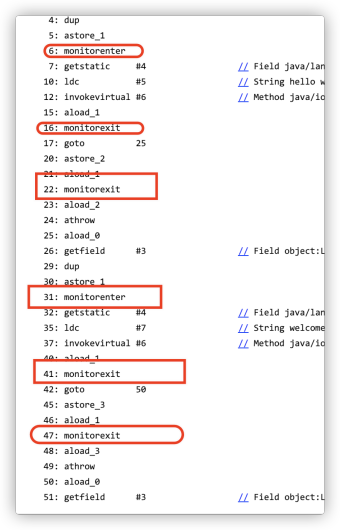


### synchronized与Lock的区别

* **都是可重入锁**：所谓可重入锁就是同一个线程可以重复获取自己已经获得的锁。如一个线程获得了某个对象的锁，此时该锁还没有释放，当其想要再次获取的时候仍能成功。若该锁是不可重入的话，会发生死锁，即同一个线程获取锁时，锁的计数器会自增1，只有等到0时才能释放；
* **实现方式**：synchronized是依赖于JVM实现的，而Lock是依赖于JDK的API实现的；
* **ReentrantLock比synchronized增加了一些高级功能**：
  * **等待可中断**：提供中断等待锁的线程的机制，ReentrantLock可通过 ``lock.lockInterruptibly()`` 来实现让正在等待该锁的线程放弃等待，改为处理其他事情；
  * **公平锁/非公平**：提供了指定公平锁或非公平锁的机制，synchronized只能是公平锁，所谓的公平锁就是先等待锁的线程先获取锁。ReentrantLock可通过 `new ReentrantLock(boolean fair)` 来指定锁的公平机制；
  * **多条件选择性通知**：借助Condition接口与newCondition()方法实现等待/唤醒机制，与synchronized不同之处在于ReentrantLock可以在一个Lock对象中创建多个Condition实例（对象监视器）实现多路通知功能，线程对象可以注册在指定的Condition中，从而可以有选择性的进行线程唤醒，而notify()/notifyAll()方式通知的线程是由JVM选择的。


## 线程安全-JMM内存模型

### 主内存和工作内存

**线程私有的工作内存**：程序中所有的变量都存储在主存（Main Memory）中，每个线程有自己的工作内存（Local Memory），一般存储在高速缓存和寄存器中，保存了该线程使用变量的主存副本。线程只能直接操作工作内存中的变量，不同线程之间的变量值传递需要通过主存完成。JMM内存模型存在的意义是定义了共享内存系统中多线程读写操作行为的规范，来屏蔽各种硬件和操作系统的内存访问差异，实现Java在各个平台下都能达到一致的内存访问效果。


**缓存一致性问题**：若多个缓存共享一块主内存区域，那么可能会出现数据不一致的情况，需要通过缓存一致性协议来解决问题。


### 缓存一致性协议


### 内存间的交互操作

* **read读取**：从主存读取变量的值到工作内存；
* **store存储**：把工作内存的一个变量的值传递到主存中；
* **load加载**：在read执行后，将变量的值放入工作内存的变量副本中；
* **use使用**：把工作内存中一个变量的值传递给执行引擎；
* **assign分配**：把一个从执行引擎接收到的值赋给工作内存中的变量；
* **write写入**：在store之后执行，将变量的值放入主内存变量中；
* **lock加锁**：为主内存中的变量加锁；
* **unlock解锁**：释放锁。


### 并发安全问题-原子性

**原子性**：JMM保证了load、assign、store等单个操作具有原子性，但并不保证一整个系列的操作具备原子性。如下图，T1读取cnt并修改但还未将其写入主存，T2此时读取的依然是旧值。

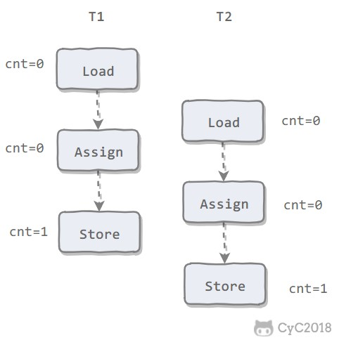

使用Atomic类或synchronized关键字可以保证一整个系列操作的原子性。

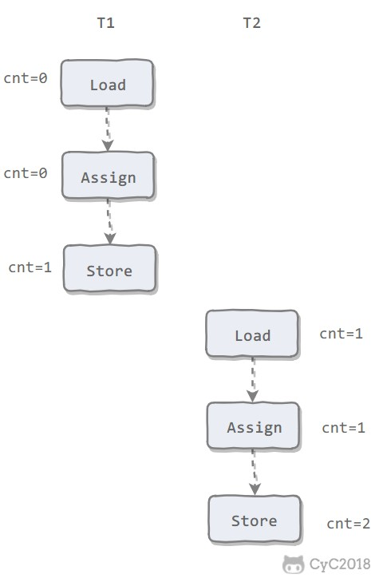


### 并发安全问题-可见性

指当一个线程修改共享内存中的变量后，其他线程能够立即得知这个修改。JMM是通过在变量修改后将新值同步回主存，和在变量读取前从主存刷新变量值来实现可见性的。

* **volatile**：被修饰的变量每次使用都需要从主存读取；
* **synchronized**：在操作变量前获取锁，释放锁之前必须将变量的值同步回主存；
* **final**：被修饰的字段在构造器中初始化完成，并且没有发生this逃逸，那么其他线程就能够看见final字段的值。


### 并发安全问题-有序性

有序性是指在本线程内观察，所有的操作都是有序的，但在一个线程观察另一个线程，操作会存在无序的特点。所谓的无序是因为发生了指令重排序，JMM允许编译器和处理器对指令进行重新排序，该过程不会影响到单线程的执行，却会影响到多线程并发执行的正确性。

* 使用volatile关键字可以通过添加内存屏障的方式来禁止指令重排，即发生重排时不能将内存屏障后的指令放到屏障之前；

* 使用synchronized关键字可以通过添加互斥锁的方式保证每一个时刻只有一个线程执行同步代码，相当于让多个线程顺序执行。 


## 线程安全-volatile

### JMM引出的问题

线程会将变量保存在本地内存（如高速缓存和寄存器）中，而不是直接在主存中进行读写，这样可能会造成一个线程在主存中修改了一个变量的值，而另一个线程还继续使用它之前存储在寄存器中变量值的拷贝，从而造成了数据的不一致。


通过将变量声明为volatile，指示JVM该变量是不稳定的，每次使用都需要从主存中进行读取。即volatile关键字就是保证了变量的可见性和防止指令重排序。


### 指令重排序

在Java程序的执行过程中，以提高性能为目的，编译器和处理器通常都会对其执行的指令顺序进行重新调整。

* **编译器优化重排序**：编译器在不改变单线程程序语义的前提下，可以重新安排语句的执行顺序；
* **指令并行重排序**：现代处理器使用了指令并行技术（ILP）来将多条指令重叠执行，如果不存在数据依赖性，处理器可以改变语句对应的机器指令的执行顺序；
* **内存系统重排序**：由于处理器使用高速缓存和读/写缓冲区，这使得加载和存储操作看上去可能是在乱序执行。


### 内存屏障

#### 基本概念

每个CPU都由自己的缓存（L1、L2、L3），缓存的目的是为了提高性能，避免每次都从主存中读取数据。但这样的弊端也很明显，即不能实时的和内存发生信息交换，分在不同CPU指向的不同线程对同一变量的缓存值可能不同。

而通过添加内存屏障，可阻止屏障两侧的指令重排序，强制把写缓冲区/高速缓存中的数据写回内存，和让缓存中的相应数据失效，以此来达到多CPU的多线程访问一致和有序。

内存屏障是硬件层的概念，不同的硬件平台实现可能不同，所以由JVM生成指令序列时在适当的位置插入内存屏障指令（Memory Barrier）来禁止特定类型的重排序，从而让指令按照预定的顺序执行，并且能够强制刷新/输出各种CPU的缓存。

硬件层次的内存屏障分为两种：

* Load Barrier：在指令前插入，可以让高速缓存中的数据实现，强制从主存中加载数据；
* Store Barrier：在指令后插入，可以让写入缓存中的最新数据更新到主存中，让其他线程可见。


#### JVM的4类内存屏障指令

|      屏障类型       |         指令示例         |                             说明                             |
| :-----------------: | :----------------------: | :----------------------------------------------------------: |
|  LoadLoad Barriers  |   Load1;LoadLoad;Load2   | 在Load2及后续读取操作被执行前，保证Load1要读取的数据从主存中加载完毕。 |
| StoreStore Barriers | Store1;StoreStore;Store2 | 在Store2及后续写入操作被执行前，保证Store1的写入会被更新到主存中。 |
| LoadStore Barriers  |  Load1;LoadStore;Store2  | 在Store2及后续写入操作被执行前，保证Load1要读取的数据从主存中加载完毕。 |
| StoreLoad Barriers  |  Store1;StoreLoad;Load2  | 在Load2及后续读取操作被执行前，保证Store1的写入会被更新到主存中。 |


#### 内存屏障分类

**按可见性保障划分**：

* **加载屏障Load Barrier**：StoreLoad屏障可充当加载屏障，即刷新缓存，从主存中读取最新数据。
* **存储屏障Store Barrier**：StoreLoad屏障可充当存储屏障，即缓存写出，将缓存中的数据写入主存。

**按有序性保障划分**：

* **获取屏障Acquire Barrier**：相当于LoadLoad与LoadStore屏障的组合。在读操作之后插入，禁止该读操作与其后面的任何读写操作发生指令重排。
* **释放屏障Release Barrier**：相当于LoadStore与StoreStore屏障的组合。在写操作之前插入，禁止该写操作与其前面的任何读写操作发生指令重排。


#### synchronized的内存屏障

synchronized的底层是通过获取屏障Acquire Barrier和释放屏障Release Barrier保证有序性，通过加载屏障Load Barrier和存储屏障Store Barrier保证可见性，最后通过互斥锁保证原子性。

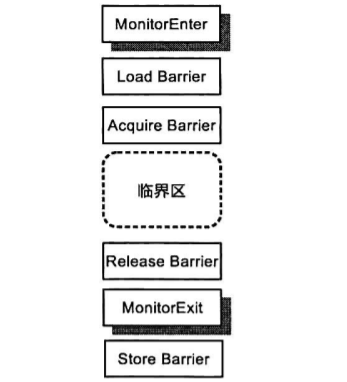


#### volatile的内存屏障

在每个volatile写操作前插入StoreStore屏障，在写操作后插入StoreLoad屏障。在每个volatile读操作前插入LoadLoad屏障，在读操作后插入LoadStore屏障。

**读操作**：

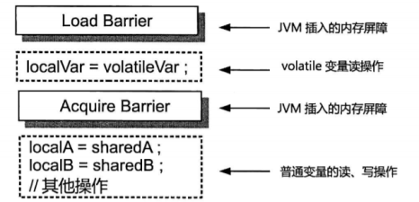

**写操作**： 

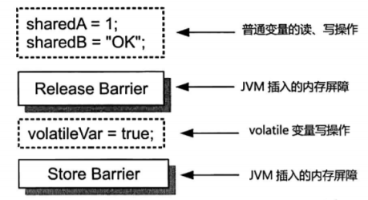


### volatile与synchronized的区别

* volatile是轻量级的实现多线程间可见性和有序性的机制，性能比synchronized好，但只能作用于变量。而synchronized可以修饰方法和代码块；
* 多线程访问volatile关键字修饰的变量不会发生阻塞。而synchronized修饰的代码可能会发生阻塞；
* volatile只能保证数据操作的可见和有序性但不能保证原子性。而synchronized三者都能保证。

  

### DCL双重检索式单例

```JAVA
/**
 * 饿汉式单例：类加载到内存后就实例化一个单例对象，JVM保证线程安全
 */
public class SingletonExample {

    private static final SingletonExample INSTANCE = new SingletonExample();

    // 私有化构造方法
    private SingletonExample() { }

    // 类加载的时候直接初始化，永远只会存在一个对象
    public static SingletonExample getInstance() {
        return INSTANCE;
    }

    public static void main(String[] args) {
        SingletonExample m1 = SingletonExample.getInstance();
        TSingletonExample m2 = SingletonExample.getInstance();
        System.out.println(m1 == m2);
    }
}
```

Java对象创建的字节码指令：`class T { int = 8; } T t = new T();`

```
0 new #2 <T>
3 dup
4 invokespecial #3 <T.<init>>
7 astore_1
8 return
```

使用DCL单例模式下，为什么需要加volatile？因为创建对象时的汇编指令可能会发生重排序：

* 0 new #2 \<T> 半初始化对象，成员变量赋予初始值
* 4 invokespecial #3 <T.\<init>> 调用构造方法
* 7 astore_1  引用和对象关联

4和7若是发生了指令重排，那会先关联引用和对象，此时INSTANCE就不为空了，当前线程先去执行权。此时新线程的外层检索 `if (INSTANCE == null)` 就会通过，新线程就会使用半初始化的对象，值都是默认值。

```JAVA
/**
 * 懒汉式单例：虽然达到了按需初始化的目的，但却带来了线程不安全的问题
 */
public class SingletonExample {

    private static volatile SingletonExample INSTANCE;

    private SingletonExample() { }

    // DCL双重检索式（Double Check Lock）
    public static SingletonExample getInstance() throws InterruptedException {
        // 外层检索：防止大量线程直接去竞争锁带来的性能问题
        if (INSTANCE == null) {
            synchronized (SingletonExample.class) {
                // 内层检索：防止其他通过外层检索的线程又执行一遍内部逻辑
                if (INSTANCE == null) {
                    Thread.sleep(1);
                    // 若不加锁则会出现多个线程创建多个对象的问题，单例则无从谈起
                    INSTANCE = new SingletonExample();
                }
            }
        }
        return INSTANCE;
    }

    public static void main(String[] args) {
        for (int i = 0; i < 100; i++) {
            new Thread(() -> {
                try {
                    System.out.println(SingletonExample.getInstance().hashCode());
                } catch (InterruptedException e) {
                    e.printStackTrace();
                }
            }).start();
        }
    }
}
```


## 线程安全-Atomic原子类

### 基本概念

原子操作是指一个操作是不可中断的，即使是在多个线程共同执行的时候，一个操作一旦开始，就不会被其他线程干扰。JUC的原子类都存放在 `java.util.concurrent.atomic` 包下。


### JUC包中的原子类

* 基本类型：`AtomicInteger`、`AtomicLong` 和 `AtomicBoolean`；

* 数组类型：`AtomicIntegerArray`、`AtomicLongArray` 和 `AtomicReferenceArray`；

* 引用类型：`AtomicReference`、`AtomicStampedReference` 原子更新带有版本号的引用类型（该类将整数值与引用关联起来，可用于解决使用CAS进行原子更新时可能出现的ABA问题）和 `AtomicMarkableReference` 原子更新带有标记位的引用类型；

* 对象属性修改类型：`AtomicIntegerFieldUpdater` 原子更新整型字段的更新器等。


### AtomicInteger使用示例

```JAVA
public final int get()	// 获取当前的值
public final int getAndSet(int newValue)	// 获取当前的值，并设置新的值
public final int getAndIncrement()	// 获取当前的值，并⾃增
public final int getAndDecrement() 	// 获取当前的值，并⾃减
public final int getAndAdd(int delta)	// 获取当前的值，并加上预期的值
boolean compareAndSet(int expect, int update)	// 如果输⼊的数值等于预期值expect，则以原⼦⽅式将更新值update设置为输⼊值
public final void lazySet(int newValue)	// 懒设置，即最终设置为newValue，使⽤lazySet设置之后可能导致其他线程在之后的⼀⼩段时间内还是可以读到旧的值
```

```JAVA
public class AtomicIntegerExample {

    private static final AtomicInteger m = new AtomicInteger(0);

    public static void main(String[] args) throws InterruptedException {
        Thread[] threads = new Thread[100];
        CountDownLatch latch = new CountDownLatch(threads.length);

        for (int i = 0; i < threads.length; i++) {
            threads[i] = new Thread(() -> {
                for (int j = 0; j < 1000; j++) {
                    // 原子性操作
                    m.incrementAndGet();
                }
                latch.countDown();
            });
        }

        Arrays.stream(threads).forEach(Thread::start);

        latch.await();

        System.out.println(m.get());
    }
}
```


### AtomicInteger源码分析

AtomicInteger底层主要使用了CAS+volatile+native方法来保证原子性。

```JAVA
public class AtomicInteger extends Number implements java.io.Serializable {
    
    private static final long serialVersionUID = 6214790243416807050L;

    // setup to use Unsafe.compareAndSwapInt for updates
    private static final Unsafe unsafe = Unsafe.getUnsafe();
    private static final long valueOffset;

    static {
        try {
            valueOffset = unsafe.objectFieldOffset
                (AtomicInteger.class.getDeclaredField("value"));
        } catch (Exception ex) { throw new Error(ex); }
    }

    // 内部维护一个具有内存可见性的变量
    private volatile int value;

    /**
     * Creates a new AtomicInteger with the given initial value.
     *
     * @param initialValue the initial value
     */
    public AtomicInteger(int initialValue) {
        value = initialValue;
    }

    /**
     * Creates a new AtomicInteger with initial value {@code 0}.
     */
    public AtomicInteger() {
    }

    /**
     * Gets the current value.
     *
     * @return the current value
     */
    public final int get() {
        return value;
    }

    /**
     * Sets to the given value.
     *
     * @param newValue the new value
     */
    public final void set(int newValue) {
        value = newValue;
    }
```

```java
/**
 * Atomically sets to the given value and returns the old value.
 *
 * @param newValue the new value
 * @return the previous value
 */
public final int getAndSet(int newValue) {
    return unsafe.getAndSetInt(this, valueOffset, newValue);
}

public final int getAndSetInt(Object var1, long var2, int var4) {
    int var5;
    do {
        var5 = this.getIntVolatile(var1, var2);
    } while(!this.compareAndSwapInt(var1, var2, var5, var4));

    return var5;
}

// 调用本地方法使用CAS操作
public final native boolean compareAndSwapInt(Object var1, long var2, int var4, int var5);
```


### CAS比较并交换

**概念**：CAS（Compare And Swap）是多线程的场景下，修改共享数据前先使用期望值与共享数据进行比较，若符合期望则允许修改，不符合期望则修改失败（也可以通过自旋的方式多次尝试）。CAS本身是由硬件提供的原子指令实现的，可以确保操作的原子性。

**操作过程**：每个CAS的操作过程都包含三个运算符，即内存地址V、期望值A和更新值B，每次更新前先比较期望值A和内存V上的变量值是否相同，若相同则直接对内存V赋新值，否则不做任何操作。若是自旋+CAS的方式则会通过循环一段时间后再去比较期望值，直到内存V中的值符合期望并操作成功为止。

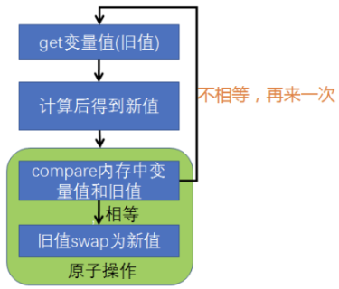

**ABA问题**：CAS在修改值时，会先比较期望值，但如果出现内存中的值从A被修改为B，再从B被修改为A的A->B->A情况发生，那么CAS的期望值比较就会认为值没有发生变化，从而操作成功，这对某些需要严格控制过程的场景来说是一个严重问题（如金融领域的资金流动等）。解决方式就是使用带有版本号的CAS进行操作，对内存中的变量设定唯一的版本号，每次被修改后都会让版本号递增，CAS的期望值比较也会增加版本号的比较，若期望值和期望版本都一致才会真正更新。

**大量线程自旋的性能开销问题**：如果使用自旋+CAS的方式实现了用户空间的自旋锁时，若竞争锁的线程过多，则会导致大量的线程处于就绪和运行状态，通过运行时空转和频繁的上下文切换损耗CPU的资源。


## 线程安全-ThreadLocal

### 基本概念

ThreadLocal是通过空间换取时间，从而实现每个线程当中都会有一套数据的副本，这样每个线程都会操作自己的副本，从而隔离了多线程对共享数据的操作造成的问题。


### 使用示例

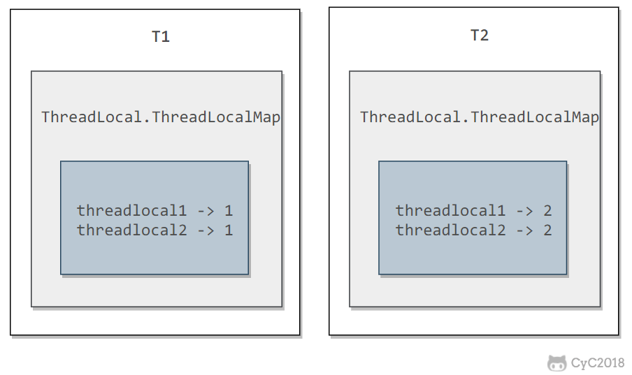

```JAVA
public class ThreadLockExample {
    
    public static void main(String[] args) {
        ThreadLocal threadLocal1 = new ThreadLocal();
        ThreadLocal threadLocal2 = new ThreadLocal();
        
        new Thread(() -> {
            threadLocal1.set(1);
            threadLocal2.set(1);
        }).start();
        
        new Thread(() -> {
            threadLocal1.set(2);
            threadLocal2.set(2);
        }).start();
    }
}
```


### 源码分析

```JAVA
// 每个Thread类都维护一个ThreadLocal.ThreadLocalMap对象
ThreadLocal.ThreadLocalMap threadLocals = null;
```

```JAVA
public void set(T value) {
    Thread t = Thread.currentThread();
    // 先获取当前线程的ThreadLocalMap对象
    ThreadLocalMap map = getMap(t);
    if (map != null)
        // 将当前ThreadLocal对象的引用和要存储的数据做为键值对插入Map中
        map.set(this, value);
    else
        createMap(t, value);
}
```

```JAVA
public T get() {
    Thread t = Thread.currentThread();
    ThreadLocalMap map = getMap(t);
    if (map != null) {
        // 通过当前ThreadLocal对象的引用做为key获取到对应的value
        ThreadLocalMap.Entry e = map.getEntry(this);
        if (e != null) {
            @SuppressWarnings("unchecked")
            T result = (T)e.value;
            return result;
        }
    }
    return setInitialValue();
}
```


### 内存泄漏

**ThreadLocal使用弱引用来防止内存泄漏**：

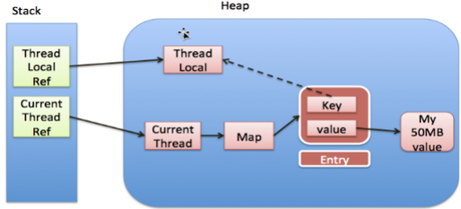

* 若Entry中的key使用强引用，当ThreadLocal变量被置为Null，相当于外部的强引用断开联系。但由于ThreadLocalMap中的key依旧强引用ThreadLocal对象导致其不会被GC回收，最终可能会因为积累过多会造成内存泄漏的发生；
* 若Entry中的key使用弱引用，那么会在外部的引用都断开后允许GC回收，但又会造成key为Null，value无key映射导致无法被访问的和回收（Entry中的value是强引用）的情况出现，也可能会出现内存泄漏；
* 所以使用ThreadLocal后需要手动调用 `remove()` 方法清除键值对，防止内存泄漏。

```JAVA
ThreadLocalMap(ThreadLocal<?> firstKey, Object firstValue) {
    table = new Entry[INITIAL_CAPACITY];
    int i = firstKey.threadLocalHashCode & (INITIAL_CAPACITY - 1);
    table[i] = new Entry(firstKey, firstValue);
    size = 1;
    setThreshold(INITIAL_CAPACITY);
}

// ThreadLocalMap中的元素类型Entry，其中的key就是指向ThreadLocal对象的弱引用
static class Entry extends WeakReference<ThreadLocal<?>> {
    // value使用强应用
    Object value;

    Entry(ThreadLocal<?> k, Object v) {
        super(k);
        value = v;
    }
}
```


## 线程管理-线程池

### 基本概念

**线程池是什么？**是一种使用了池化思想管理多线程执行任务的机制。在创建多个线程执行任务后不会销毁线程，而是将其缓存下来，等接下来的任务就绪后再次使用，以此来避免线程的频繁创建和销毁带来的性能浪费。

**为什么使用线程池？**

* **降低资源消耗**：通过重复利用已经创建的线程降低因为频繁创建和销毁而造成的消耗；

* **提高响应速度**：当任务到达时，无需等待线程的创建即可立即执行；

* **提高线程的可管理性**：线程池可以统一的分配、调优和监控线程。


### 创建方式

**创建线程池的两种方式**：

* 通过ThreadPoolExecutor重载的4种有参构造方法创建。

* 通过Executor的工具类Executors来创建4种类型的线程池：
  * **FixedThreadPool**：通过 `Executors.newFixedThreadPool()` 创建，该方法返回一个固定容量的线程池，当有新任务提交时，池中若有空闲线程，则立即执行，若没有则将任务暂存到任务队列中，待池中有线程空闲，便处理队列中的任务。
  * **SingleThreadExecutor**：通过 `Executors.newSingleThreadExecutor()` 创建，该方法返回一个只有一个线程的线程池，同一时间只能执行一个任务，若多余出来的任务被提交则会被暂存任务队列，待池中的线程空闲，便处理队列中的任务。
  * **CachedThreadPool**：通过 `Executors.newCachedThreadPool()` 创建，该方法返回一个可根据实际情况调整线程数量的线程池（带缓冲的线程池），其中的线程数量是不确定的，但若有空闲线程可以复用，则优先使用，若无空闲线程，则会创建新线程处理任务。
  * **ScheduledThreadPool**：通过 `Executors.newScheduledThreadPool()` 创建，可以管理定时任务的线程池。

不推荐使用Executors去创建，而是通过ThreadPoolExecutor的方式创建，因使用前者的弊端如下：

* FixedThreadPool和SingleThreadExecutor：默认允许请求的队列长度为Integer.MAX_VALUE，可能会**堆积过多的请求**，从而导致OOM。

* CachedThreadPool和ScheduledThreadPool：默认允许创建的线程数量为Integer.MAX_VALUE，可能会**创建过多的线程**，从而导致OOM。


### 任务提交

* `execute()`：用于提交不需要返回值的任务，无法判断任务是否被成功执行。

* `submit()`：用于提交需要返回值的任务，线程池会返回 Future对象，通过该对象可以判断任务是否成功执行，并且可以通过get方法获取返回值，get方法会阻塞当前线程直到任务完成，而使用 ``get(long timeout, TimeUnit unit)`` 方法则会阻塞当前线程一段时间后立即返回，这时候任务有可能没有执行完。
* 注：`submit()` 有3个重载的方法，但无论调用哪个方法，最终都是将传递进来的任务转换为 `Callable` 对象，并通过 `execute()` 方法提交任务。

```JAVA
/**
 * @throws RejectedExecutionException {@inheritDoc}
 * @throws NullPointerException       {@inheritDoc}
 */
public Future<?> submit(Runnable task) {
    if (task == null) throw new NullPointerException();
    RunnableFuture<Void> ftask = newTaskFor(task, null);
    execute(ftask);
    return ftask;
}

/**
 * @throws RejectedExecutionException {@inheritDoc}
 * @throws NullPointerException       {@inheritDoc}
 */
public <T> Future<T> submit(Runnable task, T result) {
    if (task == null) throw new NullPointerException();
    RunnableFuture<T> ftask = newTaskFor(task, result);
    execute(ftask);
    return ftask;
}

/**
 * @throws RejectedExecutionException {@inheritDoc}
 * @throws NullPointerException       {@inheritDoc}
 */
public <T> Future<T> submit(Callable<T> task) {
    if (task == null) throw new NullPointerException();
    RunnableFuture<T> ftask = newTaskFor(task);
    execute(ftask);
    return ftask;
}
```

**实现Runnable接口和Callable接口的区别**：

* Runnable接口不会返回结果或者抛出异常，Callable接口可以；
* 工具类Executors可以实现Runnable和Callable对象的相互转换，使用 `Executors.callable(Runnable task)` 或 `Executors.callable(Runnable task, Object result)`；

```JAVA
@FunctionalInterface
public interface Runnable {
    
    // 被线程执⾏，没有返回值也⽆法抛出异常
	public abstract void run();
}
```

```java
@FunctionalInterface
public interface Callable<V> {

    // 计算结果，或在⽆法得到结果时抛出异常
	V call() throws Exception;
}
```


### 使用示例

```java
public class ThreadPoolExecutorDemo {

    private static final int CORE_POOL_SIZE = 5;
    private static final int MAX_POOL_SIZE = 10;
    private static final int QUEUE_CAPACITY = 100;
    private static final Long KEEP_ALIVE_TIME = 1L;

    public static void main(String[] args) {
        // 通过ThreadPoolExecutor构造方法⾃定义参数创建线程池
        ThreadPoolExecutor executor = new ThreadPoolExecutor(
            CORE_POOL_SIZE,
            MAX_POOL_SIZE,
            KEEP_ALIVE_TIME,
            TimeUnit.SECONDS,
            new ArrayBlockingQueue<>(QUEUE_CAPACITY),
            new ThreadPoolExecutor.CallerRunsPolicy());
        for (int i = 0; i < 10; i++) {
            // 任务提交
            executor.execute(() -> "SayHello " + i);
        }

        // 优雅关闭
        executor.shutdown();
        // 主线程等待线程池的关闭
        while (!executor.isTerminated()) {}
        System.out.println("Finished all threads");
    }
}
```


### 源码分析

#### 构造方法分析

**构造方法参数**：

* **int corePoolSize**：线程池中的核心线程数，数量内的线程会一直保持不会被回收。当线程池处于初始状态，有一个任务被提交时，线程池会创建一个新线程执行任务，直到创建的线程数达到corePoolSize，再继续提交的任务会进入阻塞队列中，等待线程空闲后去执行。如果调用了线程池的 `prestartAllCoreThreads()` 方法，线程池会提前创建并启动所有核心线程。

* **int maximumPoolSize**：线程池允许的最大线程数，当阻塞队列已满，且继续提交任务时，才会创建新的线程执行任务，前提是不能超过最大线程数，这些在corePoolSize数量之外的线程若长时间空闲则会被回收。若超过了最大线程数，则会使用拒绝策略。

* **long keepAliveTime**：额外线程的空闲状态存活时间，这些corePoolSize数量之外的线程在keepAliveTime时间内若一直处于空闲状态，那么就会被回收。即当额外线程没有任务执行时，继续存活的时间。

* **TimeUnit unit**：keepAliveTime参数的时间单位。

* **BlockingQueue\<Runnable\> workQueue**：阻塞任务队列，当新任务到来的时会先判断当前池中线程数量是否达到corePoolSize，若已达到，则将新任务存入该队列中。一般会使用有界队列，使用无界队列会对线程池带来以下的影响：

  * 当线程池中的线程数到达corePoolSize后，所有的新任务都会进入无界队列中等待，因此不会出现额外线程被创建，导致maximumPoolSize和keepAliveTime参数无用；
  * 最重要的是，使用无界队列会耗尽系统资源。

  所以一般会使用ArrayBlockingQueue、LinkedBlockingQueue、SynchronousQueue和PriorityBlockingQueue做为workQueue。

* **ThreadFactory threadFactory**：设置executor创建新线程时使用的线程工厂，即为了统一在创建线程时设置的参数（如线程名、是否为守护线程），线程一些特性（如优先级）等。通过统一的工厂类创建出来的线程能保证具有相同的特性。Executors默认的线程工厂对线程的命名规则是"pool-数字-thread-数字"。

* **RejectedExecutionHandler handler**：线程池的饱和策略，当阻塞队列已满，且所有活动的线程已达到最大线程数量时，若继续提交任务，则会采取一种策略处理该任务，线程池提供了4种策略：

  * `ThreadPoolExecutor.AbortPolicy`：默认策略，直接抛出 `RejectedExecutionException` 异常来拒绝接收新任务；
  * `ThreadPoolExecutor.CallerRunsPolicy`：用调用者所在的线程执行该任务；；
  * `ThreadPoolExecutor.DiscardPolicy`：直接丢弃该任务；
  * `ThreadPoolExecutor.DiscardOldestPolicy`：丢弃队列中最早的未处理的任务，并入队当前任务。

  也可以根据应用场景实现 `RejectedExecutionHandler` 接口，自定义饱和策略，如记录日志或持久化存储不能处理的任务。

```java
// ⽤给定的初始参数创建⼀个新的ThreadPoolExecutor
public ThreadPoolExecutor(int corePoolSize,
                          int maximumPoolSize,
                          long keepAliveTime,
                          TimeUnit unit,
                          BlockingQueue<Runnable> workQueue,
                          ThreadFactory threadFactory,
                          RejectedExecutionHandler handler) {
    if (corePoolSize < 0 ||
        maximumPoolSize <= 0 ||
        maximumPoolSize < corePoolSize ||
        keepAliveTime < 0)
        throw new IllegalArgumentException();
    if (workQueue == null || threadFactory == null || handler == null)
        throw new NullPointerException();
    this.acc = System.getSecurityManager() == null ?
        null :
    AccessController.getContext();
    this.corePoolSize = corePoolSize;
    this.maximumPoolSize = maximumPoolSize;
    this.workQueue = workQueue;
    this.keepAliveTime = unit.toNanos(keepAliveTime);
    this.threadFactory = threadFactory;
    this.handler = handler;
}
```


#### 基本属性和方法分析

**线程池状态**：

* **RUNNING**：线程池可以接收新的任务提交，并且还可以正常处理阻塞队列中的任务；
* **SHUTDOWN**：线程池不再接收新的任务提交，但线程池还可以继续处理阻塞队列中的任务；
* **STOP**：线程池不再接收新的任务，同时还会丢弃阻塞队列中的任务。此外，它还会中断正在处理的任务；
* **TIDYING**：当所有任务都执行完毕后，当前线程池中的活动线程数降为0，将会调用terminated方法；
* **TERMINATED**：线程池的终止状态，当terminated方法执行完毕后，线程池将会处于该状态。

**状态转换**：

* **RUNNING -> SHUTDOWN**：当调用了线程池的 `shutdown()` 方法时；
* **RUNNING/SHUTDOWN -> STOP**：当调用了线程池的 `shutdownNow()` 方法时；
* **SHUTDOWN -> TIDYING**：当线程池中活动的线程数变为0，阻塞队列为空时；
* **STOP -> TIDYING**：当线程池变为空时；
* **TIDYING -> TERMINATED**：当 `terminated()` 方法被执行完毕时。

```java
// ctl的前3位表示线程池的状态，后29位表示线程池中运行的线程数量
private final AtomicInteger ctl = new AtomicInteger(ctlOf(RUNNING, 0));
private static final int COUNT_BITS = Integer.SIZE - 3;
private static final int CAPACITY   = (1 << COUNT_BITS) - 1;

// runState is stored in the high-order bits
private static final int RUNNING    = -1 << COUNT_BITS;
private static final int SHUTDOWN   =  0 << COUNT_BITS;
private static final int STOP       =  1 << COUNT_BITS;
private static final int TIDYING    =  2 << COUNT_BITS;
private static final int TERMINATED =  3 << COUNT_BITS;

// Packing and unpacking ctl
private static int runStateOf(int c)     { return c & ~CAPACITY; }
private static int workerCountOf(int c)  { return c & CAPACITY; }
private static int ctlOf(int rs, int wc) { return rs | wc; }
```


#### execute方法分析

* 如果线程池中活动线程数 < corePoolSize，那么线程池就会创建新的线程来执行任务；
* 如果线程池中活动线程数 >= corePoolSize，那么线程池就会将提交的任务放入阻塞排队；
* 如果提交的任务无法再加入到阻塞队列中，且当前活动线程数 < maximumPoolSize，那么线程池会创建新线程；
* 如果活动线程数 >= maximumPoolSize，那么就会按照拒绝策略处理任务。


```JAVA
// 存放线程池的运⾏状态runState和线程池内有效线程的数量workerCount
private final AtomicInteger ctl = new AtomicInteger(ctlOf(RUNNING, 0));

private static int workerCountOf(int c) {
	return c & CAPACITY;
}

// 阻塞任务队列
private final BlockingQueue<Runnable> workQueue;

public void execute(Runnable command) {
    // 如果提交的任务为null，则抛出空指针异常
    if (command == null)
    	throw new NullPointerException();
    // ctl中保存的是线程池当前的⼀些状态信息
    int c = ctl.get();
    
    // 1.⾸先判断当前线程池中执行的任务数量是否⼩于corePoolSize，若⼩于则通过addWorker(command, true)方法新建⼀个线程，并将任务command交给该线程执⾏
    if (workerCountOf(c) < corePoolSize) {
    	if (addWorker(command, true))
            return;
        c = ctl.get();
	}
	// 2.如果当前执行的任务数量⼤于等于corePoolSize时，则通过isRunning()⽅法判断线程池状态，只有线程池处于RUNNING状态并且队列未满时，该任务才会被加⼊队列中
	if (isRunning(c) && workQueue.offer(command)) {
        // 再次获取线程池状态
		int recheck = ctl.get();
		// 若线程池状态不是RUNNING状态就需要从任务队列中移除任务，并尝试判断线程是否全部执⾏完毕，同时执⾏拒绝策略
		if (!isRunning(recheck) && remove(command))
            reject(command);
        // 如果当前线程池为空就创建⼀个新线程并执⾏。
		else if (workerCountOf(recheck) == 0)
			addWorker(null, false);
    }
	// 3.若队列已满，则通过addWorker(command, false)新建⼀个线程，并将任务command添加到该线程中启动并执⾏任务。若addWorker(command, false)执⾏失败则代表线程池达到最大容量，则通过reject()执⾏相应的拒绝策略
	else if (!addWorker(command, false))
		reject(command);
}
```


#### worker分析

```java
// firstTask：线程第一次被创建时会执行的任务
// core：true表示创建核心线程，false表示创建额外线程
private boolean addWorker(Runnable firstTask, boolean core) {
    retry:
    for (;;) {
        // 线程数
        int c = ctl.get();
        // 线程池状态
        int rs = runStateOf(c);

        // Check if queue empty only if necessary.
        if (rs >= SHUTDOWN &&
            ! (rs == SHUTDOWN &&
               firstTask == null &&
               ! workQueue.isEmpty()))
            return false;

        for (;;) {
            int wc = workerCountOf(c);
            if (wc >= CAPACITY ||
                wc >= (core ? corePoolSize : maximumPoolSize))
                return false;
            // 这里是线程个数加1，不是真的创建线程
            if (compareAndIncrementWorkerCount(c))
                // 操作成功，退出循环，往下面走
                break retry;
            c = ctl.get();  // Re-read ctl
            if (runStateOf(c) != rs)
                continue retry;
            // else CAS failed due to workerCount change; retry inner loop
        }
    }

    boolean workerStarted = false;
    boolean workerAdded = false;
    Worker w = null;
    try {
        w = new Worker(firstTask);
        final Thread t = w.thread;
        if (t != null) {
            final ReentrantLock mainLock = this.mainLock;
            mainLock.lock();
            try {
                // Recheck while holding lock.
                // Back out on ThreadFactory failure or if
                // shut down before lock acquired.
                int rs = runStateOf(ctl.get());

                if (rs < SHUTDOWN ||
                    (rs == SHUTDOWN && firstTask == null)) {
                    if (t.isAlive()) // precheck that t is startable
                        throw new IllegalThreadStateException();
                    // 这里worker添加到集合中，但还是没执行任务
                    workers.add(w);
                    int s = workers.size();
                    if (s > largestPoolSize)
                        largestPoolSize = s;
                    workerAdded = true;
                }
            } finally {
                mainLock.unlock();
            }
            if (workerAdded) {
                // 开始执行任务
                t.start();
                workerStarted = true;
            }
        }
    } finally {
        if (! workerStarted)
            // 回滚操作
            addWorkerFailed(w);
    }
    return workerStarted;
}
```

```JAVA
// 基实现AQS实现，用于维护一个线程对象
private final class Worker
    extends AbstractQueuedSynchronizer
    implements Runnable
{

    private static final long serialVersionUID = 6138294804551838833L;

    // 工作线程
    final Thread thread;
    // 要运行的初始任务，可能为空
    Runnable firstTask;
    // 每个线程的任务计数器
    volatile long completedTasks;

    // 初始化Worker
    Worker(Runnable firstTask) {
        setState(-1); // inhibit interrupts until runWorker
        this.firstTask = firstTask;
        this.thread = getThreadFactory().newThread(this);
    }

    // 将主运行循环委托给runWorker
    public void run() {
        runWorker(this);
    }

    protected boolean isHeldExclusively() {
        return getState() != 0;
    }

    protected boolean tryAcquire(int unused) {
        if (compareAndSetState(0, 1)) {
            setExclusiveOwnerThread(Thread.currentThread());
            return true;
        }
        return false;
    }

    protected boolean tryRelease(int unused) {
        setExclusiveOwnerThread(null);
        setState(0);
        return true;
    }

    public void lock()        { acquire(1); }
    public boolean tryLock()  { return tryAcquire(1); }
    public void unlock()      { release(1); }
    public boolean isLocked() { return isHeldExclusively(); }

    void interruptIfStarted() {
        Thread t;
        if (getState() >= 0 && (t = thread) != null && !t.isInterrupted()) {
            try {
                t.interrupt();
            } catch (SecurityException ignore) {
            }
        }
    }
}
```

```java
final void runWorker(Worker w) {
    Thread wt = Thread.currentThread();
    Runnable task = w.firstTask;
    w.firstTask = null;
    w.unlock(); // allow interrupts
    boolean completedAbruptly = true;
    try {
        // 若worker中的firstTask不为空，就运行这个任务
        // 若为空，就调用getTask()从阻塞队列中获取一个任务去运行
        while (task != null || (task = getTask()) != null) {
            w.lock();
            // If pool is stopping, ensure thread is interrupted;
            // if not, ensure thread is not interrupted.  This
            // requires a recheck in second case to deal with
            // shutdownNow race while clearing interrupt
            if ((runStateAtLeast(ctl.get(), STOP) ||
                 (Thread.interrupted() &&
                  runStateAtLeast(ctl.get(), STOP))) &&
                !wt.isInterrupted())
                wt.interrupt();
            try {
                beforeExecute(wt, task);
                Throwable thrown = null;
                try {
                    task.run();
                } catch (RuntimeException x) {
                    thrown = x; throw x;
                } catch (Error x) {
                    thrown = x; throw x;
                } catch (Throwable x) {
                    thrown = x; throw new Error(x);
                } finally {
                    afterExecute(task, thrown);
                }
            } finally {
                task = null;
                w.completedTasks++;
                w.unlock();
            }
        }
        completedAbruptly = false;
    } finally {
        processWorkerExit(w, completedAbruptly);
    }
}
```


#### shutDown方法分析

`shutDown()`：不再接受新任务，正在执行的和阻塞队列中的任务继续执行。调用后会立即返回，但线程池中还可能存在任务被运行。

```java
public void shutdown() {
    final ReentrantLock mainLock = this.mainLock;
    mainLock.lock();
    try {
        // 权限检查，当前线程是否有权限关闭
        checkShutdownAccess();
        // CAS操作将线程池状态设置为ShutDown
        advanceRunState(SHUTDOWN);
        // 中断当前空闲的线程
        interruptIdleWorkers();
        onShutdown(); // hook for ScheduledThreadPoolExecutor
    } finally {
        mainLock.unlock();
    }
    // 唤醒其他线程
    tryTerminate();
}
```

`shutDownNow()`：尝试停止所有正在执行的线程，丢弃阻塞队列中的任务，并返回未执行的任务列表。

```java
public List<Runnable> shutdownNow() {
    List<Runnable> tasks;
    final ReentrantLock mainLock = this.mainLock;
    mainLock.lock();
    try {
        // 权限检查
        checkShutdownAccess();
        // CAS操作将线程池状态改为STOP
        advanceRunState(STOP);
        // 中断所有线程，包括正在执行的线程
        interruptWorkers();
        // 复制阻塞队列中的任务到tasks中
        tasks = drainQueue();
    } finally {
        mainLock.unlock();
    }
    // 唤醒其他线程
    tryTerminate();
    // 返回未执行完的任务
    return tasks;
}
```


## 线程工具-AQS

### 基本概念

AQS（AbstractQueuedSynchronizer）抽象的队列同步器是用来构建锁和同步组件的框架，其内置一个队列来管理资源获取线程的排队工作，并通过一个int类型的变量表示同步状态。


**核心思想**：如果请求的共享资源空闲，则将该线程设置为工作线程，并将共享资源设置为锁定状态。如果请求的共享资源被占用，那么使用CLH队列实现线程阻塞以及被唤醒时锁分配的机制，即将暂时获取不到锁的线程加入到队列中。

**CLH队列**：是一个底层使用链表实现的双向队列，AQS将每个请求共享资源的线程封装成CLH队列中的一个结点Node，并通过CAS、自旋和LockSupport的方式去维护state的状态，使并发达到同步的控制效果。

**AQS的结构**：是由一个阻塞队列和多个条件队列（ConditionObject）组成。阻塞队列管理竞争锁的线程，条件队列管理await状态的线程，条件队列中的线程被唤醒会先进入阻塞队列再竞争锁资源。

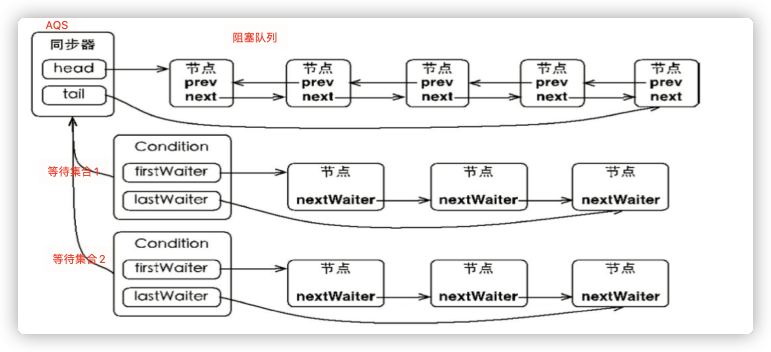

**AQS的使用**：其本身是抽象类，不能直接使用，其主要的使用方式是通过子类的继承，子类通过继承AQS并实现其抽象方法来管理同步状态。在实现上，子类推荐被定义为自定义同步组件的静态内部类，AQS自身没有实现任何接口，仅定义了若干同步状态获取和释放的方法来供自定义同步组件使用，同步器既支持独占获取，也支持共享获取。

```JAVA
static final class Node {
    
    // 表示节点处于共享模式下等待
    static final Node SHARED = new Node();
    // 表示节点处于独占模式下等待
    static final Node EXCLUSIVE = null;

    // 表示线程获取锁的请求已被取消
    static final int CANCELLED =  1;
    // 表示线程已经准备好了，等待资源被释放
    static final int SIGNAL    = -1;
    // 表示处于队列中的节点等待唤醒
    static final int CONDITION = -2;
    // 当前线程处于共享状态时才会使用该状态
    static final int PROPAGATE = -3;

    // 当前节点在队列中的等待状态，0表示Node被初始化时的默认值
    volatile int waitStatus;

    // 前驱指针
    volatile Node prev;

    // 后继指针
    volatile Node next;

    // 当前Node封装的线程
    volatile Thread thread;

    // 指向下一个处于CONDITION状态的节点
    Node nextWaiter;

    // 节点释放在共享模式下等待
    final boolean isShared() {
        return nextWaiter == SHARED;
    }

    // 返回当前节点的前驱节点
    final Node predecessor() throws NullPointerException {
        Node p = prev;
        if (p == null)
            throw new NullPointerException();
        else
            return p;
    }

    Node() {    // Used to establish initial head or SHARED marker
    }

    Node(Thread thread, Node mode) {     // Used by addWaiter
        this.nextWaiter = mode;
        this.thread = thread;
    }

    Node(Thread thread, int waitStatus) { // Used by Condition
        this.waitStatus = waitStatus;
        this.thread = thread;
    }
}

// 等待队列的头指针，延迟初始化。除初始化外，只能通过方法setHead修改
// 注意：如果head存在，它的waitStatus保证不会被取消
private transient volatile Node head;

// 等待队列的尾指针，延迟初始化。
// 仅通过方法enq修改以添加新的等待节点
private transient volatile Node tail;
```

```JAVA
// AQS维护了一个由内存可见性的int类型成员变量来表示同步状态
// 通过使用CAS对该同步状态进行修改，通过内置的FIFO队列来完成等待获取资源的线程的排队工作
private volatile int state;

// 返回同步状态的当前值
protected final int getState() {
    return state;
}

// 设置同步状态的值
protected final void setState(int newState) {
    state = newState;
}

// 若当前同步状态的值等于期望值，则将同步状态值设置为给定值update
protected final boolean compareAndSetState(int expect, int update) {
    // See below for intrinsics setup to support this
    return unsafe.compareAndSwapInt(this, stateOffset, expect, update);
}
```


### 共享资源的管理方式

**Exclusive独占**：

* 只有一个线程能够访问资源，如ReentrantLock，该方式又分为公平锁和非公平锁：

  * 公平锁：按照线程在队列中的排队顺序，FIFO的获取锁；
  * 非公平锁：当线程要获取锁时，先通过CAS操作去竞争锁，若没抢到，再入队等待唤醒。

**Shared共享**：

* 多个线程可以同时访问资源，如Semaphore信号量和CountDownLatch闭锁；
* ReentrantReadWriteLock允许多个线程同时对某一资源进行读操作，但写操作是互斥的。

注：不同同步器竞争共享资源的方式不同，自定义同步器在实现时只需要实现共享资源state的获取与释放方式即可，至于线程的等待队列的维护（如获取资源失败入队/唤醒出队等操作），AQS已经实现。


### 模板方法模式

**使用AQS自定义同步器**：

* 使用者继承AbstractQueuedSynchronizer并重写指定方法，即对共享资源state的获取和释放的方法；
* 将AQS组合在自定义同步器的实现中，并调用其模板方法，而这些模板方法会调用使用者重写的方法。

**模板方法设计模式**：

* 基于继承的模式，主要是为了在不改变模板结构的前提下在子类中重新定义模板中的内容以实现复用代码。
* 如生活中 **`购票butTicket() -> 安检securityCheck() -> 乘坐交通工具ride() -> 到达目的地arrive()`** 这样的一个常见的流程，除了具体乘坐哪种交通工具不确定外，其他的流程都可以固定下来，即可以定义抽象类，实现除了 `ride()` 以外的其他方法，而 `ride()` 则根据具体实现重写即可。

**自定义同步器需要重写的AQS模板方法**：这些方法默认都会抛出 ``UnsupportedOperationException``，方法内部的实现必须是线程安全的。AQS类中的其他方法都有final修饰，无法被其他类使用。

```JAVA
// 判断该线程是否正在独占资源，只有用到condition才需要去实现它
isHeldExclusively()
// 独占方式尝试获取资源，成功则返回true，失败则返回false
tryAcquire(int)
// 独占方式尝试释放资源，成功则返回true，失败则返回false
tryRelease(int)
// 共享方式尝试获取资源，负数表示失败；0表示成功，但没有剩余可用资源；正数表示成功，且有剩余资源
tryAcquireShared(int)
// 共享方式尝试释放资源，成功则返回true，失败则返回false
tryReleaseShared(int)
```

**基于AQS实现同步器的重写示例**：

* **ReetrantLock**：
  * state初始化为0，即未锁定状态；
  * 当有线程调用 `lock()` 加锁时，会调用 `tryAcquire()` 独占锁并将state加1，之后的其他线程调用 `tryAcquire()` 时就会失败（`CAS(0, 1)` 操作state失败），直到持有锁的线程调用 `unlock()` 释放锁为止（state减为0），其他线程才有机会获取锁；
  * 在释放锁之前，持有锁的线程可以重复获取该锁（state递增），即锁可重入，但线程在释放锁的时候同样需要多次释放，直到state减为0。

* **CountDownLatch**：
  * state会在初始化时被指定具体数值，即倒计时初始值或门闩上的锁数量（也可称闭锁），可理解为初始化了多把锁，只有其上的所有锁都被释放，闭锁才会被真正释放；
  * 某一线程会通过 `await()` 阻塞，当有线程调用 `countDown()` 方法一次，state就会以CAS的方式减1（释放一把锁）；
  * 当state减为0时，或者说所有的锁都被释放完毕时，会 `unpark()` 阻塞的线程，使其从 `await()` 方法返回，继续执行。


### Condition/ConditionObject条件对象

#### 基本概念

Condition将对象监视器Monitor的wait、notify/notifyAll方法根据不同的条件分解为多个对象，可以将这些对象与任意Lock接口的实现绑定起来，同时为每一个对象提供多个条件队列。Lock和Condition组合的目的是加强synchronized和wait/notify组合的等待唤醒机制，实现多线程的协调和通信可以针对特定的条件阻塞和唤醒。


#### 使用示例

Condition结合ReentrantLock实现生产者消费者模型。

```java
public class ProducterConsumer {
    
    private LinkedList<Object> buffer;
    private int maxSize;
    private Lock lock;
    private Condition producterCondition;	// 生产者条件（满时阻塞）
    private Condition consumerCondition;	// 消费者条件（空时阻塞）
    
    ProducerCustomer(int maxSize) {
        this.maxSize = maxSize;
        this.buffer = new LinkedList<Object>;
        this.lock = new ReentrantLock();
        this.producterCondition = lock.newCondition();
        this.consumerCondition = lock.newCondition();
    }
    
    public void put(Object obj) throws InterruptedException {
        lock.lock();
        try {
            // 当容器已满时在生产者条件上等待
            while (maxSize == buffer.size()) {
                producterCondition.await();
            }
            buffer.add(obj);
            // 唤醒在消费者条件上等待的线程
            consumerCondition.signal();
        } finally {
            lock.unlock();
        }
    }
    
    public Object get() throws InterruptedException {
        Object obj;
        lock.lock;
        try {
            // 当容器为空时在消费者条件上等待
            while (buffer.size() == 0) {
                consumerCondition.await();
            }
            obj = buffer.poll();
            // 唤醒在生产者条件上等待的线程
            producterCondition.signal();
        } finally {
            lock.unlock();
        }
        return obj;
    }
}
```


#### 源码分析

ConditionObject实现了Condition接口，是AQS的内部类。每个ConditionObject都包含一个等待队列，队列中的每个Node都包含一个线程引用，这些线程都等待在某个Condition条件上。

```JAVA
public class ConditionObject implements Condition, java.io.Serializable {
    private static final long serialVersionUID = 1173984872572414699L;
    // 条件队列的第一个节点
    private transient Node firstWaiter;
    // 条件队列最后一个条件
    private transient Node lastWaiter;
```

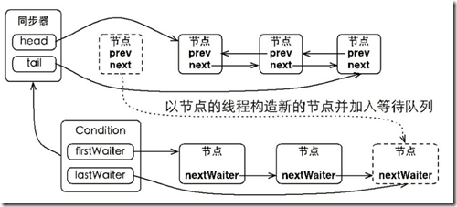

如果一个线程调用 `await()` 方法，就会释放锁并封装为Node加入条件队列中通过 `LockSupport.park(this)` 进入阻塞状态。

```JAVA
public final void await() throws InterruptedException {
    if (Thread.interrupted())
        throw new InterruptedException();
    // 向条件队列中添加一个等待者，并返回Node封装后的实例
    Node node = addConditionWaiter();
    int savedState = fullyRelease(node);
    int interruptMode = 0;
    while (!isOnSyncQueue(node)) {
        // 阻塞线程
        LockSupport.park(this);
        if ((interruptMode = checkInterruptWhileWaiting(node)) != 0)
            break;
    }
    if (acquireQueued(node, savedState) && interruptMode != THROW_IE)
        interruptMode = REINTERRUPT;
    if (node.nextWaiter != null) // clean up if cancelled
        unlinkCancelledWaiters();
    if (interruptMode != 0)
        reportInterruptAfterWait(interruptMode);
}
```

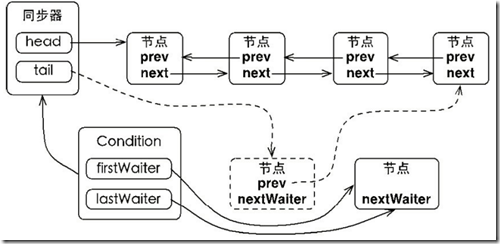

其他线程调用 `signal()` 方法，会通过 `LockSupport.unpark(node.thread)` 唤醒在条件队列中等待时间最长的Node（首节点），并将其移动到Lock的同步队列中去，让其获得竞争锁的资格。

```JAVA
public final void signal() {
    // 判断是否为排它锁
    if (!isHeldExclusively())
        throw new IllegalMonitorStateException();
    // 首节点
    Node first = firstWaiter;
    if (first != null)
        doSignal(first);
}

private void doSignal(Node first) {
    do {
        if ( (firstWaiter = first.nextWaiter) == null)
            lastWaiter = null;
        first.nextWaiter = null;
    } while (!transferForSignal(first) &&
             (first = firstWaiter) != null);
}

final boolean transferForSignal(Node node) {
    // 如果无法更改waitStatus，则节点已被取消。
    if (!compareAndSetWaitStatus(node, Node.CONDITION, 0))
        return false;

    /*
     * Splice onto queue and try to set waitStatus of predecessor to
     * indicate that thread is (probably) waiting. If cancelled or
     * attempt to set waitStatus fails, wake up to resync (in which
     * case the waitStatus can be transiently and harmlessly wrong).
     */
    Node p = enq(node);
    int ws = p.waitStatus;
    if (ws > 0 || !compareAndSetWaitStatus(p, ws, Node.SIGNAL))
        // 唤醒线程
        LockSupport.unpark(node.thread);
    return true;
}
```


### ReentrantLock可重入锁

#### 基本概念

ReentrantLock可重入锁是基于AQS实现的同步器。使用整型变量state记录锁的状态（0未占用，1已被占用），并维护一个管理未获取到锁而被阻塞的线程的队列。其最大的特点是已持有锁的线程再次加锁无需重新获取锁，而是让state状态加1，表示重入了一次，在释放锁的时候也需要释放相应的次数。


#### 基于AQS实现的同步器Sync

```JAVA
// 实现所有AQS同步机制的同步器
private final Sync sync;

abstract static class Sync extends AbstractQueuedSynchronizer {

    private static final long serialVersionUID = -5179523762034025860L;

    // 抽象的，有公平/非公平两种实现
    abstract void lock();

    // 尝试获取锁
    final boolean nonfairTryAcquire(int acquires) {
        final Thread current = Thread.currentThread();
        int c = getState();
        if (c == 0) {
            if (compareAndSetState(0, acquires)) {
                setExclusiveOwnerThread(current);
                return true;
            }
        }
        else if (current == getExclusiveOwnerThread()) {
            int nextc = c + acquires;
            if (nextc < 0) // overflow
                throw new Error("Maximum lock count exceeded");
            setState(nextc);
            return true;
        }
        return false;
    }

    // 尝试释放锁
    protected final boolean tryRelease(int releases) {
        int c = getState() - releases;
        if (Thread.currentThread() != getExclusiveOwnerThread())
            throw new IllegalMonitorStateException();
        boolean free = false;
        if (c == 0) {
            free = true;
            setExclusiveOwnerThread(null);
        }
        setState(c);
        return free;
    }

    protected final boolean isHeldExclusively() {
        return getExclusiveOwnerThread() == Thread.currentThread();
    }

    // 获取一个和Lock绑定的条件对象
    final ConditionObject newCondition() {
        return new ConditionObject();
    }

    // Methods relayed from outer class
    final Thread getOwner() {
        return getState() == 0 ? null : getExclusiveOwnerThread();
    }

    final int getHoldCount() {
        return isHeldExclusively() ? getState() : 0;
    }

    // 锁是否已被锁定
    final boolean isLocked() {
        return getState() != 0;
    }

    private void readObject(java.io.ObjectInputStream s)
        throws java.io.IOException, ClassNotFoundException {
        s.defaultReadObject();
        setState(0); // 重置为解锁状态
    }
}
```


#### 构造方法分析

```JAVA
// 空构造器默认使用非公平锁，性能更佳
public ReentrantLock() {
    sync = new NonfairSync();
}

// 通过参数指定使用公平锁还是非公平锁
public ReentrantLock(boolean fair) {
    sync = fair ? new FairSync() : new NonfairSync();
}

// 加锁（公平/非公平）
public void lock() {
    sync.lock();
}

// 释放锁
public void unlock() {
    sync.release(1);
}
```


#### 非公平锁加锁流程

```java
// 非公平锁类型的同步器
static final class NonfairSync extends Sync {

    private static final long serialVersionUID = 7316153563782823691L;

    // 非公平版的加锁
    final void lock() {
        // 非公平锁会直接进行一次CAS抢锁，成功就返回，否则和公平锁一样处理
        if (compareAndSetState(0, 1))
            setExclusiveOwnerThread(Thread.currentThread());
        else
            acquire(1);
    }
    
    // 尝试获取锁
    protected final boolean tryAcquire(int acquires) {
        return nonfairTryAcquire(acquires);
    }
}

// 非公平版的尝试获取锁
final boolean nonfairTryAcquire(int acquires) {
    final Thread current = Thread.currentThread();
    int c = getState();
    if (c == 0) {
        // 若锁未被占用，非公平锁会再次CAS抢锁
        if (compareAndSetState(0, acquires)) {
            // 若抢锁成功，则设置当前线程为持有锁的线程
            setExclusiveOwnerThread(current);
            return true;
        }
    } else if (current == getExclusiveOwnerThread()) {
        // 若是当前线程已经持有锁，则可重入，锁状态+1
        int nextc = c + acquires;
        if (nextc < 0) // overflow
            throw new Error("Maximum lock count exceeded");
        setState(nextc);
        return true;
    }
    return false;
}
```


#### 公平锁加锁流程

```java
// 公平锁类型的同步器
static final class FairSync extends Sync {

    private static final long serialVersionUID = -3000897897090466540L;

    // 公平版的加锁
    final void lock() {
        acquire(1);
    }

    // 公平版的尝试获取锁
    protected final boolean tryAcquire(int acquires) {
        final Thread current = Thread.currentThread();
        int c = getState();
        if (c == 0) {
            // 公平锁的实现和非公平锁相比，唯一的区别就是多了一个判断阻塞队列中是否有线程在等待
            // 若队列中存在等待的线程，则按照FIFO的规则出队一个线程去持有锁，若队列为空，则直接CAS抢锁
            if (!hasQueuedPredecessors() &&
                compareAndSetState(0, acquires)) {
                setExclusiveOwnerThread(current);
                return true;
            }
        }
        else if (current == getExclusiveOwnerThread()) {
            // 可重入机制
            int nextc = c + acquires;
            if (nextc < 0)
                throw new Error("Maximum lock count exceeded");
            setState(nextc);
            return true;
        }
        return false;
    }
}
```


#### 公共加锁流程

* 尝试以公平/非公平的方式获取锁 `tryAcquire()`；
* 获取成功的占用锁；
* 获取失败的封装为节点 `addWaiter()`，然后阻塞 `LockSupport.park()` 并入队 `acquireQueued()` 。

```java
// 获取锁的整体流程
public final void acquire(int arg) {
    if (!tryAcquire(arg) &&
        acquireQueued(addWaiter(Node.EXCLUSIVE), arg))
        // 未抢到锁的线程自我中断
        selfInterrupt();
}

// 封装未抢到锁的线程为Node
private Node addWaiter(Node mode) {
    Node node = new Node(Thread.currentThread(), mode);
    Node pred = tail;
    if (pred != null) {
        node.prev = pred;
        if (compareAndSetTail(pred, node)) {
            pred.next = node;
            return node;
        }
    }
    enq(node);
    return node;
}

// Node入队
final boolean acquireQueued(final Node node, int arg) {
    boolean failed = true;
    try {
        boolean interrupted = false;
        for (;;) {
            final Node p = node.predecessor();
            if (p == head && tryAcquire(arg)) {
                setHead(node);
                p.next = null; // help GC
                failed = false;
                return interrupted;
            }
            if (shouldParkAfterFailedAcquire(p, node) &&
                parkAndCheckInterrupt())
                interrupted = true;
        }
    } finally {
        if (failed)
            cancelAcquire(node);
    }
}

// 阻塞线程并检查中断
private final boolean parkAndCheckInterrupt() {
    LockSupport.park(this);
    return Thread.interrupted();
}

// 线程自我中断
static void selfInterrupt() {
    Thread.currentThread().interrupt();
}
```


#### 释放锁流程

```java
// 释放锁
public final boolean release(int arg) {
    if (tryRelease(arg)) {
        Node h = head;
        if (h != null && h.waitStatus != 0)
            unparkSuccessor(h);
        return true;
    }
    return false;
}

// 尝试释放锁
protected final boolean tryRelease(int releases) {
    // 锁状态state释放一次（重入几次释放几次）
    int c = getState() - releases;
    if (Thread.currentThread() != getExclusiveOwnerThread())
        throw new IllegalMonitorStateException();
    boolean free = false;
    if (c == 0) {
        // 锁被释放（state减为0）
        free = true;
        setExclusiveOwnerThread(null);
    }
    setState(c);
    return free;
}

// 释放锁后去唤醒队列中阻塞的线程
private void unparkSuccessor(Node node) {
    int ws = node.waitStatus;
    if (ws < 0)
        compareAndSetWaitStatus(node, ws, 0);

	// 获取头节点的后继节点，即队列中第一个节点
    Node s = node.next;
    if (s == null || s.waitStatus > 0) {
        s = null;
        for (Node t = tail; t != null && t != node; t = t.prev)
            if (t.waitStatus <= 0)
                s = t;
    }
    if (s != null)
        // 唤醒队列中第一个节点
        LockSupport.unpark(s.thread);
}
```


#### 公平/非公平锁的区别

* 非公平锁在调用lock后，首先就会使用CAS进行竞争锁的操作，若这时锁恰好没有被占用，则直接获取锁返回；
* 非公平锁在CAS操作失败后，和公平锁一样都会进入 `tryAcquire()` 方法，在该方法中，若发现锁的状态state为0，即锁已被释放，非公平锁会直接CAS抢占，但公平锁会判断等待队列中是否有线程处于等待状态，若有则出队线程去占有锁，新的线程入队等待；
* 若非公平锁的两次CAS都不成功，则接下来和公平锁一样，线程会进入阻塞队列等待唤醒；
* 相对公平锁，非公平锁具有更好的性能，但也会让线程获取锁的时间不确定，导致阻塞队列中的线程长期处于等待状态。


### ReentrantReadWriteLock可重入读写锁

#### 基本概念

ReentrantReadWriteLock可重入读写锁是基于AQS实现的同步器。同样也维护同步状态state和阻塞队列来保证同步，其特点是具有读/写两种锁状态，允许同一时刻多个读线程访问共享资源，但写线程访问时，其他所有的读写线程均被阻塞。这种分离读写操作的方式除了保证写操作的线程安全外，还能让读操作的并发性能得到提升，如应用在缓存结构上。


#### 构造方法和基本方法及属性

```JAVA
// 读锁
private final ReentrantReadWriteLock.ReadLock readerLock;
// 写锁
private final ReentrantReadWriteLock.WriteLock writerLock;
// AQS同步器
final Sync sync;

// 默认非公平
public ReentrantReadWriteLock() {
    this(false);
}

// 初始化两把锁
public ReentrantReadWriteLock(boolean fair) {
    sync = fair ? new FairSync() : new NonfairSync();
    readerLock = new ReadLock(this);
    writerLock = new WriteLock(this);
}

// 获取读/写锁
public ReentrantReadWriteLock.WriteLock writeLock() { return writerLock; }
public ReentrantReadWriteLock.ReadLock  readLock()  { return readerLock; }
```


#### 基于AQS实现的同步器Sync

```java
abstract static class Sync extends AbstractQueuedSynchronizer {
    
    private static final long serialVersionUID = 6317671515068378041L;

    /*
     * 读写计数提取常量和函数。
     * 锁状态逻辑上分为两个无符号短路：
     * 下面的一个表示独占（写入）锁保持计数，上限表示共享（读卡器）保持计数。
     */
    static final int SHARED_SHIFT   = 16;
    static final int SHARED_UNIT    = (1 << SHARED_SHIFT);
    static final int MAX_COUNT      = (1 << SHARED_SHIFT) - 1;
    static final int EXCLUSIVE_MASK = (1 << SHARED_SHIFT) - 1;

    // 返回以count表示的共享保留数，高16位
    static int sharedCount(int c)    { return c >>> SHARED_SHIFT; }
    // 返回以count表示的独占保留数，低16位
    static int exclusiveCount(int c) { return c & EXCLUSIVE_MASK; }
```


#### 公平/非公平锁

```java
static final class NonfairSync extends Sync {
    private static final long serialVersionUID = -8159625535654395037L;
    final boolean writerShouldBlock() {
        return false; // writers can always barge
    }
    final boolean readerShouldBlock() {
        return apparentlyFirstQueuedIsExclusive();
    }
}

static final class FairSync extends Sync {
    private static final long serialVersionUID = -2274990926593161451L;
    final boolean writerShouldBlock() {
        return hasQueuedPredecessors();
    }
    final boolean readerShouldBlock() {
        return hasQueuedPredecessors();
    }
}
```


#### 读锁的获取和释放流程

静态内部类——读锁：

```java
public static class ReadLock implements Lock, java.io.Serializable {
    private static final long serialVersionUID = -5992448646407690164L;
    private final Sync sync;

    protected ReadLock(ReentrantReadWriteLock lock) {
        sync = lock.sync;
    }
	
    // 读锁获取锁
    public void lock() {
        sync.acquireShared(1);
    }

    public void lockInterruptibly() throws InterruptedException {
        sync.acquireSharedInterruptibly(1);
    }
	
    // 读锁释放锁
    public boolean tryLock() {
        return sync.tryReadLock();
    }

    public boolean tryLock(long timeout, TimeUnit unit)
        throws InterruptedException {
        return sync.tryAcquireSharedNanos(1, unit.toNanos(timeout));
    }

    public void unlock() {
        sync.releaseShared(1);
    }

    public Condition newCondition() {
        throw new UnsupportedOperationException();
    }

    public String toString() {
        int r = sync.getReadLockCount();
        return super.toString() +
            "[Read locks = " + r + "]";
    }
}
```

读锁获取锁：

* 获取读锁时，会尝试判断当前对象是否拥有了写锁，如果拥有，则直接获取失败；
* 如果没有，就尝试加锁；
* 如果当前线程已经持有读锁，则直接读锁状态state加1。

```java
// AbstractQueuedSynchronizer
// 获取共享锁
public final void acquireShared(int arg) {
    if (tryAcquireShared(arg) < 0)
        doAcquireShared(arg);
}

// ReentrantReadWriteLock.ReadLock
// 尝试获取共享锁
protected final int tryAcquireShared(int unused) {
    Thread current = Thread.currentThread();
    int c = getState();
    // 获取低16位，独占计数，即写锁的state状态
    if (exclusiveCount(c) != 0 &&
        getExclusiveOwnerThread() != current)
        return -1;
    // 读取高16位，共享计数，即读锁的state状态
    int r = sharedCount(c);
    // 公平锁排队，非公平锁先抢后排队
    if (!readerShouldBlock() &&
        r < MAX_COUNT &&
        compareAndSetState(c, c + SHARED_UNIT)) {
        if (r == 0) {
            // 第一个获取读锁
            firstReader = current;
            firstReaderHoldCount = 1;
        } else if (firstReader == current) {
            // 如果当前线程已经持有读锁，则可重入
            firstReaderHoldCount++;
        } else {
            HoldCounter rh = cachedHoldCounter;
            if (rh == null || rh.tid != getThreadId(current))
                cachedHoldCounter = rh = readHolds.get();
            else if (rh.count == 0)
                readHolds.set(rh);
            rh.count++;
        }
        return 1;
    }
    return fullTryAcquireShared(current);
}

// AbstractQueuedSynchronizer
// 获取共享锁的具体实现
private void doAcquireShared(int arg) {
    final Node node = addWaiter(Node.SHARED);
    boolean failed = true;
    try {
        boolean interrupted = false;
        for (;;) {
            final Node p = node.predecessor();
            if (p == head) {
                int r = tryAcquireShared(arg);
                if (r >= 0) {
                    setHeadAndPropagate(node, r);
                    p.next = null; // help GC
                    if (interrupted)
                        selfInterrupt();
                    failed = false;
                    return;
                }
            }
            if (shouldParkAfterFailedAcquire(p, node) &&
                parkAndCheckInterrupt())
                interrupted = true;
        }
    } finally {
        if (failed)
            cancelAcquire(node);
    }
}
```

读锁释放锁：

```java
// AbstractQueuedSynchronizer
// 释放共享锁
public final boolean releaseShared(int arg) {
    if (tryReleaseShared(arg)) {
        doReleaseShared();
        return true;
    }
    return false;
}

// ReentrantReadWriteLock.ReadLock
// 尝试释放共享锁
protected final boolean tryReleaseShared(int unused) {
    Thread current = Thread.currentThread();
    if (firstReader == current) {
        // assert firstReaderHoldCount > 0;
        if (firstReaderHoldCount == 1)
            // 释放读锁计数
            firstReader = null;
        else
            // 释放一次读锁计数
            firstReaderHoldCount--;
    } else {
        HoldCounter rh = cachedHoldCounter;
        if (rh == null || rh.tid != getThreadId(current))
            rh = readHolds.get();
        int count = rh.count;
        if (count <= 1) {
            // 清除ThreadLocal，防止内存泄漏
            readHolds.remove();
            if (count <= 0)
                throw unmatchedUnlockException();
        }
        --rh.count;
    }
    for (;;) {
        int c = getState();
        int nextc = c - SHARED_UNIT;
        if (compareAndSetState(c, nextc))
            // CAS操作置换state，判断最终结果是否为0，若结果为0，则写线程可以参与竞争
            return nextc == 0;
    }
}

// AbstractQueuedSynchronizer
// 释放共享锁的具体实现
private void doReleaseShared() {
    for (;;) {
        Node h = head;
        if (h != null && h != tail) {
            int ws = h.waitStatus;
            if (ws == Node.SIGNAL) {
                if (!compareAndSetWaitStatus(h, Node.SIGNAL, 0))
                    continue;            // loop to recheck cases
                unparkSuccessor(h);
            }
            else if (ws == 0 &&
                     !compareAndSetWaitStatus(h, 0, Node.PROPAGATE))
                continue;                // loop on failed CAS
        }
        if (h == head)                   // loop if head changed
            break;
    }
}
```


#### 写锁的获取和释放流程

静态内部类——写锁：

```java
public static class WriteLock implements Lock, java.io.Serializable {
    private static final long serialVersionUID = -4992448646407690164L;
    private final Sync sync;

    protected WriteLock(ReentrantReadWriteLock lock) {
        sync = lock.sync;
    }

    // 写锁获取锁
    public void lock() {
        sync.acquire(1);
    }

    public void lockInterruptibly() throws InterruptedException {
        sync.acquireInterruptibly(1);
    }

    public boolean tryLock( ) {
        return sync.tryWriteLock();
    }

    public boolean tryLock(long timeout, TimeUnit unit)
        throws InterruptedException {
        return sync.tryAcquireNanos(1, unit.toNanos(timeout));
    }
	
    // 写锁释放锁
    public void unlock() {
        sync.release(1);
    }

    public Condition newCondition() {
        return sync.newCondition();
    }

    public String toString() {
        Thread o = sync.getOwner();
        return super.toString() + ((o == null) ?
                                   "[Unlocked]" :
                                   "[Locked by thread " + o.getName() + "]");
    }

    public boolean isHeldByCurrentThread() {
        return sync.isHeldExclusively();
    }

    public int getHoldCount() {
        return sync.getWriteHoldCount();
    }
}
```

写锁获取锁：

* 在获取写锁时，会尝试判断锁是否已被占用，如果已被占用且占用的线程非当前线程，则直接获取失败，加入阻塞队列；
* 如果锁没有被占用，则当前线程就会持有写锁，且写锁个数加1；

```java
public final void acquire(int arg) {
    if (!tryAcquire(arg) &&
        acquireQueued(addWaiter(Node.EXCLUSIVE), arg))
        selfInterrupt();
}

protected final boolean tryAcquire(int acquires) {
    Thread current = Thread.currentThread();
    int c = getState();
    // 获取state低16位的写锁计数
    int w = exclusiveCount(c);
    if (c != 0) {
        // (Note: if c != 0 and w == 0 then shared count != 0)
        if (w == 0 || current != getExclusiveOwnerThread())
            // 锁非当前线程持有
            return false;
        // 超过最大锁计数
        if (w + exclusiveCount(acquires) > MAX_COUNT)
            throw new Error("Maximum lock count exceeded");
        // 可重入获取
        setState(c + acquires);
        return true;
    }
    if (writerShouldBlock() ||
        !compareAndSetState(c, c + acquires))
        // 竞争写锁失败
        return false;
    // 竞争成功
    setExclusiveOwnerThread(current);
    return true;
}
```

写锁释放锁：

```JAVA
public final boolean release(int arg) {
    if (tryRelease(arg)) {
        Node h = head;
        if (h != null && h.waitStatus != 0)
            // 唤醒下一个线程
            unparkSuccessor(h);
        return true;
    }
    return false;
}

protected final boolean tryRelease(int releases) {
    if (!isHeldExclusively())
        // 当前线程不是持有锁的线程
        throw new IllegalMonitorStateException();
    int nextc = getState() - releases;
    // 判断写锁的计数是否为0，为0则表示不被任何线程持有
    boolean free = exclusiveCount(nextc) == 0;
    if (free)
        setExclusiveOwnerThread(null);
    setState(nextc);
    return free;
}
```


### Semaphore信号量

#### 基本概念

Semaphore信号量与synchronized和ReetrantLock的区别是后两者都是一次只允许一个线程访问资源，而Semaphore可以指定多个线程同时访问某个资源。


#### 使用示例

```JAVA
public class SemaphoreExample {
    	
    // 初始化请求数量
    private static final int threadCount = 550;
    
    public static void main(String[] args) throws InterruptedException {
        // 固定容量线程池
        ExecutorService threadPool = Executors.newFixedThreadPool(300);
        // Semaphore维护一个可获得许可证的数量，不存在具体的许可证对象，经常用于限制同时访问某种资源的线程数量
        final Semaphore semaphore = new Semaphore(20);
        
        for (int i = 0; i < threadCount; i++) {
            final int threadNum = i;
        	threadPool.execute(() -> {
                try {
                    // 线程阻塞，直到存在可以获取的许可证并获取一个
                    semaphore.acquire();	
                    // semaphore.acqurie(5);	// 获取多个许可证
                    // semaphore.tryAcqurie();	// 尝试获取许可证，但不会阻塞，获取不到会直接返回
                    
                    Thread.sleep(1000);
                    System.out.println("threadNum: " + threadNum);
                    Thread.sleep(1000);
                    
                    // 释放自己持有的许可证
                    semaphore.release();
                    // semaphore.release(5);
                } catch (InterruptedException e) {
                    e.printStackTrace();
                }
            });
        }
    }
    
    public static void test() throws InterruptedException {
        Thread.sleep(1000);
        System.out.println("threadNum: " + threadNum);
        Thread.sleep(1000);
    }
}
```


#### 源码分析

Semaphore与CoutDownLatch一样是共享锁的一种实现，默认初始化AQS的state为permits，当同时访问资源的线程超出permits（许可证发放完），那么超出的线程会进入阻塞队列并park，只有当state大于0时（有许可证被释放），阻塞的线程才能unpark继续执行。

```JAVA
public Semaphore(int permits) {
    // 默认非公平模式
    sync = new NonfairSync(permits);
}

public Semaphore(int permits, boolean fair) {
    // 公平模式：FIFO。非公平模式：抢占式
    sync = fair ? new FairSync(permits) : new NonfairSync(permits);
}
```

```JAVA
private final Sync sync;

/**
 * Synchronization implementation for semaphore.  Uses AQS state
 * to represent permits. Subclassed into fair and nonfair
 * versions.
 */
abstract static class Sync extends AbstractQueuedSynchronizer {
    
    private static final long serialVersionUID = 1192457210091910933L;

    Sync(int permits) {
        setState(permits);
    }

    final int getPermits() {
        return getState();
    }

    final int nonfairTryAcquireShared(int acquires) {
        for (;;) {
            int available = getState();
            int remaining = available - acquires;
            if (remaining < 0 ||
                compareAndSetState(available, remaining))
                return remaining;
        }
    }

    protected final boolean tryReleaseShared(int releases) {
        for (;;) {
            int current = getState();
            int next = current + releases;
            if (next < current) // overflow
                throw new Error("Maximum permit count exceeded");
            if (compareAndSetState(current, next))
                return true;
        }
    }

    final void reducePermits(int reductions) {
        for (;;) {
            int current = getState();
            int next = current - reductions;
            if (next > current) // underflow
                throw new Error("Permit count underflow");
            if (compareAndSetState(current, next))
                return;
        }
    }

    final int drainPermits() {
        for (;;) {
            int current = getState();
            if (current == 0 || compareAndSetState(current, 0))
                return current;
        }
    }
}
```

```JAVA
/**
 * NonFair version
 */
static final class NonfairSync extends Sync {
    private static final long serialVersionUID = -2694183684443567898L;

    NonfairSync(int permits) {
        super(permits);
    }

    protected int tryAcquireShared(int acquires) {
        return nonfairTryAcquireShared(acquires);
    }
}

/**
 * Fair version
 */
static final class FairSync extends Sync {
    private static final long serialVersionUID = 2014338818796000944L;

    FairSync(int permits) {
        super(permits);
    }

    protected int tryAcquireShared(int acquires) {
        for (;;) {
            if (hasQueuedPredecessors())
                return -1;
            int available = getState();
            int remaining = available - acquires;
            if (remaining < 0 ||
                compareAndSetState(available, remaining))
                return remaining;
        }
    }
}
```

```java
/**
     * Acquires a permit from this semaphore, blocking until one is
     * available, or the thread is {@linkplain Thread#interrupt interrupted}.
     *
     * <p>Acquires a permit, if one is available and returns immediately,
     * reducing the number of available permits by one.
     *
     * <p>If no permit is available then the current thread becomes
     * disabled for thread scheduling purposes and lies dormant until
     * one of two things happens:
     * <ul>
     * <li>Some other thread invokes the {@link #release} method for this
     * semaphore and the current thread is next to be assigned a permit; or
     * <li>Some other thread {@linkplain Thread#interrupt interrupts}
     * the current thread.
     * </ul>
     *
     * <p>If the current thread:
     * <ul>
     * <li>has its interrupted status set on entry to this method; or
     * <li>is {@linkplain Thread#interrupt interrupted} while waiting
     * for a permit,
     * </ul>
     * then {@link InterruptedException} is thrown and the current thread's
     * interrupted status is cleared.
     *
     * @throws InterruptedException if the current thread is interrupted
     */
public void acquire() throws InterruptedException {
    sync.acquireSharedInterruptibly(1);
}

/**
     * Releases a permit, returning it to the semaphore.
     *
     * <p>Releases a permit, increasing the number of available permits by
     * one.  If any threads are trying to acquire a permit, then one is
     * selected and given the permit that was just released.  That thread
     * is (re)enabled for thread scheduling purposes.
     *
     * <p>There is no requirement that a thread that releases a permit must
     * have acquired that permit by calling {@link #acquire}.
     * Correct usage of a semaphore is established by programming convention
     * in the application.
     */
public void release() {
    sync.releaseShared(1);
}
```


### CountDownLatch闭锁

#### 基本概念

基于AQS实现的一种共享锁，锁状态state做为count计数器使用，计数器的初值对应任务的数量，每当完成一个任务后（`CountDownLatch.countDown()`），就会减1。当计数器归0时，在闭锁上等待的线程就会恢复执行（`CountDownLatch.await()`）。


#### 使用场景

**当某个线程在开始运行前需要等待多个前置线程执行完毕的场景**：主调线程通过 `new CountDownLatch(n)` 将计数器初始化为0，并且通过 `countDownLatch.await() ` 阻塞，每当一个前置线程执行完毕就会通过`countDownLatch.countDown()`将计数器减1，直到计数器变为0，主调线程才会从 ``await()`` 返回继续执行。典型的场景就是扣款操作，若干个前置的身份认证、操作合法性认证、余额认证等完成后，主调线程再进行扣款操作。

**需要多个线程在某一时刻同时开始执行的场景**：多个线程在某一时刻同时开始执行的场景，如赛跑，多个线程在起点初始化，然后等待发令枪响，最后同时执行。首先主线程初始化一个`new CountDownLatch(1)`，然后多个子线程通过`countDownLatch.await()`阻塞，最后主线程调用`countDownLatch.coutDown()`让所有阻塞的子线程同时执行。


#### 使用示例

```JAVA
public class CountDownLatchExample {
    
    private static final int threadNum = 550;
    
    public static void main(String[] args) throws InterruptedException {
        ExecutorService threadPool = Executors.newFixedThreadPool(300);
        final CountDownLatch countDownLatch = new CountDownLatch(threadNum);
        
        threadPool.execute(() -> {
            try {
                // 模拟请求的耗时操作
                Thread.sleep(1000);
                System.out.println("threadNum: " + threadNum);
                Thread.sleep(1000);
            } catch (InterruptedException e) {
                e.printStackTrace();
            } finally {
                countDownLatch.countDown();
            }
        });
        
        countDownLatch.await();
        threadPool.shutdown();
    }
} 
```


#### 源码分析

Sync同步器分析：

```java
// 倒计时门闩的同步器，使用AQS的state状态表示计数
private static final class Sync extends AbstractQueuedSynchronizer {
    
    private static final long serialVersionUID = 4982264981922014374L;

    Sync(int count) {
        setState(count);
    }

    int getCount() {
        return getState();
    }

    protected int tryAcquireShared(int acquires) {
        return (getState() == 0) ? 1 : -1;
    }

    protected boolean tryReleaseShared(int releases) {
        // 计数减量，变为0时会发出唤醒信号
        for (;;) {
            int c = getState();
            if (c == 0)
                return false;
            int nextc = c-1;
            if (compareAndSetState(c, nextc))
                return nextc == 0;
        }
    }
}

private final Sync sync;
```

构造方法分析：

```java
// 初始化计数器的大小
public CountDownLatch(int count) {
    if (count < 0) throw new IllegalArgumentException("count < 0");
    this.sync = new Sync(count);
}
```

`await()` 方法分析：

```java
public void await() throws InterruptedException {
    sync.acquireSharedInterruptibly(1);
}

public final void acquireSharedInterruptibly(int arg)
    throws InterruptedException {
    if (Thread.interrupted())
        throw new InterruptedException();
    if (tryAcquireShared(arg) < 0)
        doAcquireSharedInterruptibly(arg);
}

// 尝试获取共享锁，计时器为0时不能获取
protected int tryAcquireShared(int acquires) {
    return (getState() == 0) ? 1 : -1;
}

// 以共享可中断模式获取锁
private void doAcquireSharedInterruptibly(int arg)
    throws InterruptedException {
    final Node node = addWaiter(Node.SHARED);
    boolean failed = true;
    try {
        for (;;) {
            final Node p = node.predecessor();
            if (p == head) {
                int r = tryAcquireShared(arg);
                if (r >= 0) {
                    setHeadAndPropagate(node, r);
                    p.next = null; // help GC
                    failed = false;
                    return;
                }
            }
            if (shouldParkAfterFailedAcquire(p, node) &&
                parkAndCheckInterrupt())
                throw new InterruptedException();
        }
    } finally {
        if (failed)
            cancelAcquire(node);
    }
}
```

`countDown()` 方法分析：

```java
public void countDown() {
    sync.releaseShared(1);
}

public final boolean releaseShared(int arg) {
    if (tryReleaseShared(arg)) {
        doReleaseShared();
        return true;
    }
    return false;
}

protected boolean tryReleaseShared(int releases) {
    // Decrement count; signal when transition to zero
    for (;;) {
        int c = getState();
        if (c == 0)
            return false;
        int nextc = c-1;
        if (compareAndSetState(c, nextc))
            return nextc == 0;
    }
}

/**
 * Release action for shared mode -- signals successor and ensures
 * propagation. (Note: For exclusive mode, release just amounts
 * to calling unparkSuccessor of head if it needs signal.)
 */
private void doReleaseShared() {
    /*
     * Ensure that a release propagates, even if there are other
     * in-progress acquires/releases.  This proceeds in the usual
     * way of trying to unparkSuccessor of head if it needs
     * signal. But if it does not, status is set to PROPAGATE to
     * ensure that upon release, propagation continues.
     * Additionally, we must loop in case a new node is added
     * while we are doing this. Also, unlike other uses of
     * unparkSuccessor, we need to know if CAS to reset status
     * fails, if so rechecking.
     */
    for (;;) {
        Node h = head;
        if (h != null && h != tail) {
            int ws = h.waitStatus;
            if (ws == Node.SIGNAL) {
                if (!compareAndSetWaitStatus(h, Node.SIGNAL, 0))
                    continue;            // loop to recheck cases
                unparkSuccessor(h);
            }
            else if (ws == 0 &&
                     !compareAndSetWaitStatus(h, 0, Node.PROPAGATE))
                continue;                // loop on failed CAS
        }
        if (h == head)                   // loop if head changed
            break;
    }
}
```


#### 注意事项

* CountDownLatch是一次性的，计数器只能在构造方法种初始化一次，之后没有任何机制可以修改，当CountDownLatch使用完毕后，就不能再次被使用。

* CountDownLatch的 `await()` 方法使用不当容易发生死锁，若是没有足够的线程去 · 将state置为0，那么通过 `await()` 阻塞的线程会永久等待下去。


### CyclicBarrier循环屏障

#### 基本概念

CyclicBarrier的字面意思是可循环使用的屏障，就是让一组线程到一个屏障/同步点时被阻塞，直到该组最后一个线程到达后才会放行，所有被拦截的线程才会继续执行。CountDownLatch是直接基于AQS实现的，而CyclicBarrier是基于ReentrantLock和Condition实现的。


#### 应用场景

主要适用于多线程计算数据，最后合并计算结果的场景。

如：统计2010-2020年某银行账户的年平均流水，可以通过多个子线程去计算每一年的流水总和，等所有线程计算完毕后，屏障打开，由主线程或是注册在栅栏上的方法合并这些数据求平均值。

若在上例的基础上，还要统计2010-2020各年度的流水占这10年总流水的比例，则屏障放开后还可以增加逻辑，在统计总流水之后，即放行之后，让线程各自再去计算比例。


#### 使用示例

```JAVA
public class CyclicBarrierExample {
    
    private static final int threadNum = 550;
    // private static final CyclicBarrier cyclicBarrier = new CyclicBarrier(5);
    private static final CyclicBayourrier cyclicBarrier = new CyclicBarrier(5, () -> {
    	System.out.println("当线程数量满足后，优先执行的代码逻辑。。。");
    });
    
    public static void main(String[] args) throws InterruptedException {
        ExecutorService threadPool = Executors.newFixedThreadPool(10);
        
        for (int i = 0; i < threadNum; i++) {
            final int threadNum = i;
            Thread.sleep(1000);
            threadPool.execute(() -> {
                try {
                    // 进入屏障之前的逻辑
                    System.out.println("threadNum: " + threadNum + " is ready");
                    
                    // 在屏障上阻塞，直到阻塞的线程数满足屏障的要求后才会继续执行
                    cyclicBarrier.await();
                    // 可以通过参数指定await的等待时间 
                    // cyclicBarrier.await(60, TimeUnit.SECONDS);
                    
                    // 通过屏障之后的逻辑
                    System.out.println("threadNum: " + threadNum + " is finish");
                } catch (InterruptedException e) {
                    e.printStackTrace();
                } catch (BrokenBarrierException e) {
                    e.printStackTrace();
                }
            });
        }
        
        threadPool.shutdown();
    }
}
```


#### 源码分析

基本属性和方法分析：

```java
// 分代（屏障和一组要共同通过屏障的线程就是一代）
private static class Generation {
    boolean broken = false;
}

// 控制同步的锁
private final ReentrantLock lock = new ReentrantLock();
// 等待跳闸的条件对象
private final Condition trip = lock.newCondition();
// 共同通过屏障的线程数
private final int parties;
// 屏障跳闸时执行的任务
private final Runnable barrierCommand;
// 当前代
private Generation generation = new Generation();

// 计数器
private int count;

// 创建屏障的下一代，并唤醒所有阻塞的线程，仅在同步锁中调用
private void nextGeneration() {
    // 发送上一代已经完成的信号
    trip.signalAll();
    // 建立下一代
    count = parties;
    generation = new Generation();
}

// 将屏障的当前代设置为损坏状态，并唤醒所有阻塞的线程，仅在同步锁中调用
private void breakBarrier() {
    generation.broken = true;
    count = parties;
    trip.signalAll();
}
```

构造方法分析：

```java
// parties表示屏障拦截的线程数，当拦截的线程数量达到该值时，就打开栅栏，放行所有线程
// barrierAction是在屏障打开时执行的任务
public CyclicBarrier(int parties, Runnable barrierAction) {
    if (parties <= 0) throw new IllegalArgumentException();
    this.parties = parties;
    this.count = parties;
    this.barrierCommand = barrierAction;
}

public CyclicBarrier(int parties) {
    this(parties, null);
}
```

`await()` 方法分析：

```JAVA
public int await() throws InterruptedException, BrokenBarrierException {
    try {
        return dowait(false, 0L);
    } catch (TimeoutException toe) {
        throw new Error(toe); // cannot happen
    }
}

private int dowait(boolean timed, long nanos) 
    throws InterruptedException, BrokenBarrierException,
		   TimeoutException {
    final ReentrantLock lock = this.lock;
    // 底层使用ReentrantLock获取和释放锁
    lock.lock();
    try {
        // 当前代（一组线程）
        final Generation g = generation;
        // 若这代损坏，则抛出异常
        if (g.broken)
            throw new BrokenBarrierException();

        // 若线程中断，则抛出异常
        if (Thread.interrupted()) {
            // 将损坏状态设置为true，并通知其他阻塞在该屏障上的线程
            breakBarrier();
            throw new InterruptedException();
        }
        
        // 每到达一个线程时，计算器count就会减1
        int index = --count;
        // 当count的数量减为0后，就说明最后一个线程已经到达屏障（即跳闸了），所有阻塞在屏障上的线程都可以继续执行
        if (index == 0) {  // tripped
            boolean ranAction = false;
            try {
                final Runnable command = barrierCommand;
                // 执行注册在屏障上的任务
                if (command != null)
                    command.run();
                ranAction = true;
                // 更新下一代，即重置count计数器，创建新的分代对象
                // 并且通过Condition.signalAll()方法唤醒所有在屏障上等待的线程
                nextGeneration();
                return 0;
            } finally {
                if (!ranAction)
                    breakBarrier();
            }
        }
	
        // 若count计数器不为0，则循环直到跳闸、损坏、中断或超时
        for (;;) {
            try {
                // 如果没有时间限制，则通过Condition.await()直接等待，直到被唤醒
                if (!timed)
                    trip.await();
                // 如果有时间限制，则等待指定的时间
                else if (nanos > 0L)
                    nanos = trip.awaitNanos(nanos);
            } catch (InterruptedException ie) {
                // 发生异常后，需要损坏当前代
                // g == generation 是当前代
                // ! g.broken 且没有损坏
                if (g == generation && ! g.broken) {
                    // 让屏障失效，即让当前代损坏，重置计数器，唤醒所有阻塞线程
                    breakBarrier();
                    throw ie;
                } else {
                    // 若上面的条件不满足，则说明当前线程不属于当前代
                    // 就不会影响当前这代的执行逻辑，只会打上中断标记
                    Thread.currentThread().interrupt();
                }
            }
			
            // 当有任何一个线程中断了，就会调用breakBarrier方法唤醒其他的线程，其他线程醒来后，也要抛出异常
            if (g.broken)
                throw new BrokenBarrierException();
			
            // 若g != generation，表示正常换代，返回当前线程所在的屏障的计数器个数
            // 如果g == generation，说明还没有换代，线程被其他的屏障唤醒了
            // 因为一个线程可以使用多个屏障，当别的屏障唤醒了这个线程，就会走到这里，所以需要判断是否是当前代
            // 正是因为这个原因，才需要generation来保证正确
            if (g != generation)
                return index;
			
            // 如果有时间限制，且时间被设置为小于等于0，则破坏屏障，并抛出异常
            if (timed && nanos <= 0L) {
                breakBarrier();
                throw new TimeoutException();
            }
        }
    } finally {
        // 释放锁
        lock.unlock();
    }
}
```


#### CyclicBarrier与CountDownLatch的区别

* CountDownLatch的计数器只能使用一次，在有些场合需要不停的创建CoutDownLatch的实例，存在浪费资源的现象。而CyclicBarrier的计数器可以多次使用，并且能够通过 ``reset()`` 方法重置。

* CountDownLatch是一个或多个线程，等待其他多个线程完成某些事情后才能执行。而CyclicBarrier是多个线程为一组互相等待，直到达到某一个同步点，再继续一起执行。


## 线程工具-JUC

### LockSupport锁支持

#### 基本概念

用于创建锁和其他同步类的基本线程阻塞原语。该类给使用它的每个线程关联一个许可证（在Semaphore类的意义上）， 如果许可证可用，将立即返回 `park` ，并在此过程中消耗许可证，否则线程阻塞。如果尚未提供许可，则需要通过 `unpark` 获得许可，与Semaphore不同的是，LockSupport的许可证最多只能存在一个。


#### 出现原因

synchronized&wait&notify/notifyAll机制的限制：

```java
public class WaitNotify {
	
    private static Object objectLock = new Object();
    
    public static void main(String[] args) {
        new Thread(() -> {
            synchronized (objectLock) {
                try {
                    // 若执行notify的线程先执行，执行wait的线程会无限的阻塞下去
                    TimeUnit.SECONDS.sleep(3);
                    objectLock.wait();
                } catch (InterruptedException e) {
                    e.printStackTrace();
                }
           System.out.println(Thread.currentThread().getName() + "\t线程已被唤醒");
            }
        }, "A").start();
    	
        new Thread(() -> {
            synchronized (objectLock) {
                objectLock.notify();
                System.out.println(Thread.currentThread().getName() + "\t线程已发送通知唤醒等待线程");
            }
        }, "B").start();
    }
}
```

ReentrantLock&await&signal机制的限制：

```java
public class AwaitSignalTest {
    
    private static Lock lock = new ReentrantLock();
    private static Condition condition = lock.newCondition();
    
    public static void main(String[] args) {
        new Thread(() -> {
            lock.lock();
            try {
                // 若执行notify的线程先执行，执行wait的线程会无限的阻塞下去
                TimeUnit.SECONDS.sleep(3);
                condition.await();
                System.out.println(Thread.currentThread().getName() + "\t线程已被唤醒");
            } catch (InterruptedException e) {
                e.printStackTrace();
            } finally {
                lock.unlock();
            }
        }, "A").start();
        
        new Thread(() -> {
            lock.lock();
            try {
                condition.signal();
                System.out.println(Thread.currentThread().getName() + "\t线程已发送通知唤醒等待线程");
            } catch (InterruptedException e) {
                e.printStackTrace();
            } finally {
                lock.unlock();
            }
        }, "B").start();
    } 
}
```


#### 使用示例

```java
public class LockSupport {
    
    public static void main(String[] args) {
        Thread a = new Thread(() -> {
            try {
                TimeUnit.SECONDS.sleep(3L);
            } catch (InterruptedException e) {
                e.printStackTrace();
            }
            // 阻塞当前线程，即凭证为0时阻塞，直到被发放凭证后才会唤醒
            LockSupport.park();
            System.out.println(Thread.currentThread().getName() + "\t线程已被唤醒");
        }, "A");
        a.start();
    	
        new Thread(() -> {
            // 唤醒指定线程，即为指定线程发放1个凭证（凭证的上限为1）
            LockSupport.unpark(a);
            System.out.println(Thread.currentThread().getName() + "\t线程已发送通知唤醒等待线程");
        }).start();
    }
}
```


#### 源码分析

LockSupport底层使用Posix线程库pthreads的系统级别锁互斥量mutex和condition，所以它的消耗是非常大的。所以在使用时通过一定的机制避免使用系统级资源的频率，如AQS会再三确认是否无法获得锁，如果确实无法获得，最后才会通过 `park()` 阻塞等待直到被唤醒后再去抢锁。

许可证permit：获得许可证则向下执行，没有许可证则等待直到获得为止。park 睡眠等待直到 permit >0，unpark 设置许可证以供 park 获取。许可证即就是 _counter，永远只有0、1两种值，即要么有许可，要么没有许可，不存在多个许可的情况。

注：不会释放锁资源，`park()` 更类似 `sleep()` 睡眠都不会释放锁，会继续持有当前锁，所以阻塞线程时需要手动管理锁的释放。

**`park()` 源码分析**：

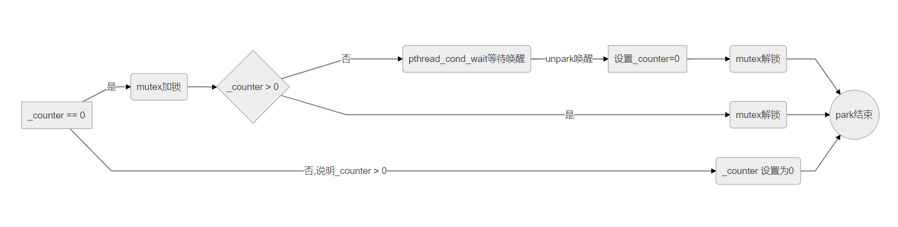

```c++
void Parker::park(bool isAbsolute, jlong time) {
    // 将_counter设置为0并返回旧值，若旧值>0则直接返回
    // 即有许可证的情况，直接消耗然后返回
    if (Atomic::xchg(0, &_counter) > 0) return;  
    ThreadBlockInVM tbivm(jt);  // mutex加锁
    // 如果 _counter > 0，直接设置 _counter=0，解锁mutex并返回
    // 即已经存在许可证的情况下，直接消耗许可证解除阻塞并返回
    if (_counter > 0)  {
        _counter = 0;
        status = pthread_mutex_unlock(_mutex);   // 解锁mutex
        return;
    }
    if (time == 0) {  
        // 否则通过condition条件等待，直到unpark()调用pthread_cond_signal()唤醒后，再继续向下执行
        // 即不存在许可证的情况下，阻塞等待唤醒
        status = pthread_cond_wait(_cond, _mutex);
    }  
    // 被唤醒后，直接设置 _counter=0，即消耗掉许可证
    _counter = 0;
    status = pthread_mutex_unlock(_mutex);    // 解锁mutex
    assert_status(status == 0, status, "invariant");
    OrderAccess::fence();
```

**`unpark()` 源码分析**：

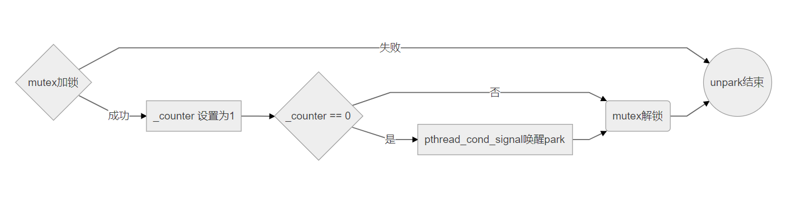

```c++
void Parker::unpark() {  
    int s, status ;  
    status = pthread_mutex_lock(_mutex);   // mutex加锁
    assert (status == 0, "invariant") ;   // 判断加锁是否成功
    s = _counter;  
    _counter = 1;   // 直接设置_counter=1，提供许可证
    /**
     * 此时：
     * 	若_counter=0，说明park()方法此时可能在睡眠中等待一个permit，需要unpark的signal唤醒
     * 	若_counter=1，说明存在许可permit，没有park()在此时睡眠，不需要额外操作
     */
    if (s < 1) {   // 判断_counter是否为0
        if (WorkAroundNPTLTimedWaitHang) {  
            status = pthread_cond_signal (_cond) ;  
            assert (status == 0, "invariant") ;  
            status = pthread_mutex_unlock(_mutex);  
            assert (status == 0, "invariant") ;  
        } else {  
            status = pthread_mutex_unlock(_mutex);  
            assert (status == 0, "invariant") ;  
            status = pthread_cond_signal (_cond) ;  
            assert (status == 0, "invariant") ;  
        }  
    } else {
        // 无论_counter旧值为几，最后都是要mutex解锁的，因为unpark最开始加了mutex锁。不做会导致mutex锁一直存在无法被其他线程获取到mutex锁
        pthread_mutex_unlock(_mutex);  
        assert (status == 0, "invariant") ;  
    }    
}
```


### FutureTask异步任务

#### 基本概念

Future用于异步获取执行结果或取消执行任务的场景。当一个计算任务需要执行很长时间，那么就可以用FutureTask来封装该任务，主线程可以在完成自己的任务后再去获取结果。


#### 使用示例

```java
public class FutureTaskExample {
    
    public static void main(String[] args) throws ExecutionException, InterruptedException {        
        new Thread(new FutureTask<Integer>(new Callable<Integer>() {
            @Override
            public Integer call() throws Exception {
                int result = 0;
                for (int i = 0; i < 100; i++) {
                    Thread.sleep(10);
                    result += i;
                }
                return result;
            }
        })).start();
        
        new Thread(() -> {
            try {
                Thread.sleep(1000);
            } catch (InterruptedException e) {
                e.printStackTrace();
            }
        }).start();
        
      	System.out.println(futureTask.get());
    }
}
```


#### 源码分析

```java
private volatile int state;
private static final int NEW          = 0;
private static final int COMPLETING   = 1;
private static final int NORMAL       = 2;
private static final int EXCEPTIONAL  = 3;
private static final int CANCELLED    = 4;
private static final int INTERRUPTING = 5;
private static final int INTERRUPTED  = 6;

// 异步任务
private Callable<V> callable;
// 异步任务的结果或是异常
private Object outcome; // non-volatile, protected by state reads/writes
// 异步任务执行的线程
private volatile Thread runner;
/** Treiber stack of waiting threads */
private volatile WaitNode waiters;
```

```java
// @throws CancellationException
public V get() throws InterruptedException, ExecutionException {
    // 通过state判断任务是否完成
    int s = state;
    if (s <= COMPLETING)
        s = awaitDone(false, 0L);
    // 返回完成后的结果
    return report(s);
}

// @throws CancellationException
public V get(long timeout, TimeUnit unit)
    throws InterruptedException, ExecutionException, TimeoutException {
    if (unit == null)
        throw new NullPointerException();
    int s = state;
    if (s <= COMPLETING &&
        (s = awaitDone(true, unit.toNanos(timeout))) <= COMPLETING)
        throw new TimeoutException();
    return report(s);
}
```


### CompletableFuture


### BlockingQueue阻塞队列

#### 基本概念

所谓阻塞队列，就是支持在特定情况下插入或移除元素时阻塞线程的队列。如队列已满则会阻塞执行插入操作的线程（直到不满），队列为空则会阻塞移除操作的线程（直到非空）。


#### FIFO队列的实现

* **`ArrayBlockingQueue`**：是基于数组实现的有界阻塞队列，按照FIFO的原则对元素进行操作。默认情况下不保证线程公平访问，所谓的公平访问是指阻塞的线程可按照阻塞的先后顺序访问队列，即先阻塞的先访问。所谓的非公平是当队列可用时，所有阻塞的线程都可以获得竞争队列访问权的资格，可能出现线程阻塞的线程后访问队列的情况（可通过参数调整）。

* **`LinkedBlockingQueue`**：是基于链表实现的有界阻塞队列（默认最大长度为Integer.MAX_VALUE），按照FIFO对元素进行操作。

* **二者的区别**：
  * **队列中的锁实现不同**：ArrayBlockingQueue使用的锁是没有分离的，即生产者消费者用的是同一把锁。而LinkedBlockingQueue使用的锁是分离的，即生产者使用putLock，消费者使用takeLock；
  * **生产或消费时的操作不同**：ArrayBlockingQueue在生产或消费时，直接将枚举对象插入或移除。而LinkedBlockingQueue在生产或消费时，需要将枚举对象包装为Node进行插入或移除，会影响性能；
  * **队列大小的初始化方式不同**：ArrayBlockingQueue必须指定队列的大小，LinkedBlockingQueue可以不指定，默认是 `Integer.MAX_VALUE`。


#### 优先级队列的实现


#### 使用示例

**阻塞队列实现生产者消费者模型**：

* 在线程的角度看，生产者就写入数据的线程，消费者就是获取数据的线程。在多线程并发的场景下，如果生产者处理很快，消费者很慢，那么需要让生产者的生产频率与消费者同步，反之亦如是。

* 通过引入阻塞队列，使生产者和消费者之间不用直接通信，而是通过阻塞队列间接通信，生产者生产完数据后无需等待消费者处理，而是直接丢给队列，消费者也不需要等待生产者给其数据，而是直接从队列中获取，这样阻塞队列就相当于一个中间的缓冲区，平衡了二者的处理速度不一致的问题。
* 当队列满时，如果生产者继续向里面生产数据，则会抛出 `IllegalStateException` 异常。当队列为空时，如果消费者继续从里面获取数据，则会抛出 `NoSuchElementException ` 异常。

```JAVA
public class ProducerConsumer {
    
    private static BlockingQueue<String> queue = new ArrayBlockingQueue<>(5);
    
    public static void main(String[] args) {
        for (int i = 0; i < 2; i++) {
            new Thread(() -> {
                try {
                    // 若队列已满，put()将阻塞
                    queue.put("product");
                } catch (InterruptedException e) {
                    e.printStackTrace();
                }
            }).start();
        }
        
        for (int i = 0; i < 3; i++) {
            new Thread(() -> {
                try {
                    // 若队列为空，task()将阻塞
                    String product = queue.task();
                    System.out.println("product: " + product);
                } catch (InterruptedException e) {
                    e.printStackTrace();
                }
            }).start();
        }   
    }
}
```


#### 源码分析


### ForkJoin分支合并

#### 基本概念

主要用于并行计算，和MapReduce原理相似，都是将大的计算任务拆分为小任务去并行计算，最后合并结果。ForkJoinPool使用工作窃取算法来提高CPU的利用率，即每个线程都维护了一个双端队列，用于存储自己需要执行的任务，工作窃取算法允许空闲的线程从其他线程的双端队列中窃取一个任务来执行，但窃取的必须是最晚进入队列的任务，避免和队列所属线程发生竞争。

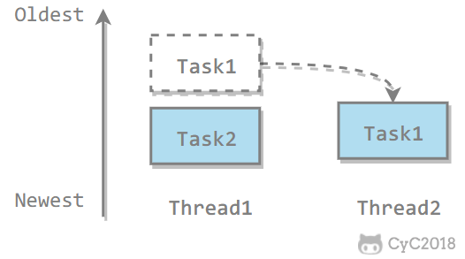


#### 使用示例

```JAVA
public class ForkJoinExample extends RecursiveTask<Integer> {
    
    private final int threshold = 5;
    private int first;
    private int last;
    
    public ForkJoinExample(int first, int last) {
        this.first = first;
        this.last = last;
    }
    
    protected Integer compute() {
        int result = 0;
        if (last - first <= threshold) {
            // 若任务足够小则直接计算
            for (int i = first; i <= last; i++) {
                result += i;
            }
        } else {
            // 否则拆分为更小的任务
            int middle = first + (last - first) / 2;
        	ForkJoinExample leftTask = new ForkJoinExample(first, middle);
            ForkJoinExample rightTask = new ForkJoinExample(middle + 1, last);
            leftTask.join();
            rightTask.join();
            result = leftTask.join() + rightTask.join();
        }
        return result;
    }
}

public static void main(String[] args) throws ExecutionException, InterruptedException {
	ForkJoinExample example = new ForkJoinExample(1, 10000);
    ForkJoinPool pool = new ForkJoinPool();
    Future result = pool.submit(example);
	System.out.println(result.get());
}
```


#### 源码分析


# 从计算机组成到操作系统再到JVM

## 计算机组成-冯·诺依曼体系

* 计算机由五大部件组成：
  * **运算器**：用于完成算术运算和逻辑运算，并能够暂存中间结果；
  * **存储器**：用于存放程序和数据；
  * **控制器**：用于控制、指挥程序和数据的输入、运行以及处理运算结果；
  * **输入设备**：用于将人们熟悉的信息形式转换为计算机能够识别的信息形式，如键盘和鼠标等输入设备；
  * **输出设备**：用于将计算机运算的结果转换为人们熟悉的信息形式，如打印机和显示器等输出设备。
* 指令和数据以同等地位存放于同一个存储器中，并可以通过地址寻访；
* 指令和数据均采用二进制数表示；
* 指令由操作码和地址码组成：
  * 操作码：用来表示操作性质；
  * 地址码：用于操作数的存储器寻址。
* 指令在存储器内按顺序存放，且指令也通常是按顺序执行的，但在特定条件下，可根据运算结果或设定的条件改变执行顺序；
* 计算机以运算器为中心，输入输出设备与存储器间的数据传输通过运算器完成。


## 计算机组成-数据与运算

### 位运算

**按位与&：**

* 定义：0为假，1为真，当&运算符两边都为真时，结果才为真；
* 规则：`0&0=0, 0&1=0, 1&0=0, 1&1=1`；
* 总结：全1为1，有0则0；
* 例子：`3&5 -> 0000 0011 & 0000 0101 = 0000 0001 = 1`；
* 注意：负数按补码的形式参与按位与运算。

**按位或|：**

* 定义：0为假，1为真，当|运算符两边任意一边为真时，结果为真；
* 规则：`0|0=0, 0|1=1, 1|0=1 1|1=1`；
* 总结：全0为0，有1则1；
* 例子：`3|5 -> 0000 0011 | 0000 0101 = 0000 0111 = 7`；
* 注意：负数按补码的形式参与按位或运算。

**按位异或^：**

* 定义：0为假，1为真，当^运算符两边各不相同时，结果为真；
* 规则：`0^0=0, 0^1=1, 1^0=1, 1^1=0`；
* 总结：相同为0，不同为1；
* 性质：
  * 交换律：`a^b=b^a`；
  * 结合律：`(a^b)^c=a^(b^c)`；
  * 对于任何数x，都有`x^x=0, x^0=x`；
  * 自反性：`a^b^b=a^0=a`。

**按位取反~：**

* 定义：对二进制位进行按位取反操作，即让各个位上的0变1，1变0；
* 规则：`~0=1, ~1=0`；
* 总结：1为0，0为1。

**左移<<：**

* 定义：将一个运算对象的各二进制位全部左移若干位（左边丢弃，并在右边补0）；
* 例如：`a=1010 1110, a<<2=1011 1000`；
* 注：若左移时舍弃的高位不包含1，则每左移1位，相当于该数乘2。

**右移>>：**

* 定义：将一个运算对象的各二进制位全部右移若干位（右边丢弃，正数左补0，负数左补1）；
* 例如：`a=1010 1110, a>>2=1110 1011`；
* 注：操作数每右移一位，相当于该数除以2。


### 原码、反码和补码

原码就是符号位加上真值的绝对值，即用第一位表示符号位，其余表示值，如：

```
[+1]原码 = 0000 0001
[-1]原码 = 1000 0001
第一位是符号位，所以8位二进制数的取值范围是：[1111 1111, 0111 1111] 即 [-127, 127]
```

正数的反码就是其本身。负数的反码是在其原码的基础上，符号位不变，其余各位取反：

```
[+1] = [00000001]原码 = [00000001]反码
[-1] = [10000001]原码 = [11111110]反码
```

正数的补码就是其本身。负数的补码是在其原码的基础上，符号位不变，其余各位取反，最后+1，即在反码的基础上+1：

```
[+1] = [00000001]原码 = [00000001]反码 = [00000001]补码
[-1] = [10000001]原码 = [11111110]反码 = [11111111]补码
```


### 进制转换

**二进制 —> 十进制：**

* 方法：二进制数从低位到高位（从右往左）计算，第0位的权值是2的0次方，第1位的权值是2的1次方，第2位的权值是2的2次方，依次递增计算下去，最后将所有结果求和就是十进制的值；

* 例：二进制(101011)B转十进制。

  ```
  第0位：1*2^0=1
  第1位：1*2^1=2
  第2位：0*2^2=0
  第3位：1*2^3=8
  第4位：0*2^4=0
  第5位：1*2^5=32
  求和：1+2+0+8+0+32=43，即(101011)B=(43)D
  ```


**八进制 —> 十进制：**

* 方法：八进制数从低位到高位（从右往左）计算，第0位的权值是8的0次方，第1位的权值是8的1次方，第2位的权值是8的2次方，依次递增计算下去，最后将所有结果求和就是十进制的值；

* 例：八进制(53)B转十进制。

  ```
  第0位：3*8^0=3
  第1位：5*8^1=40
  求和：3+40=43，即(53)O=(43)D
  ```

**十六进制 —> 十进制：**

* 方法：十六进制数从低位到高位（从右往左）计算，第0位的权值是16的0次方，第1位的权值是16的1次方，第2位的权值是16的2次方，依次递增计算下去，最后将所有结果求和就是十进制的值；

* 例：十六进制(2B)H转十进制。

  ```
  第0位：11*16^0=11
  第1位：2*16^1=32
  求和：11+32=43，即(2B)H=(43)D
  ```

**十进制 —> 二进制：**

* 方法：除2取余法，即每次将整数部分除以2，余数为该位权上的数据，而商继续除以2，余数又为上一个位权上的数，依次执行到商为0为止，最后读数的时候，从最后一个余数开始，直到最开始的余数结束。

* 例：十进制(43)D转二进制。

  ```
  43除2，商21，余1
  21除2，商10，余1
  10除2，商5，余0
  5除2，商2，余1
  2除2，商1，余0
  1除2，商0，余1
  读数：(43)D=(101011)B
  ```


**十进制 —> 八进制：**

* 方法：除8取余法，即每次将整数部分除以8，余数为该位权上的数据，而商继续除以8，余数又为上一个位权上的数，依次执行到商为0为止，最后读数的时候，从最后一个余数开始，直到最开始的余数结束。

* 例：十进制(796)D转八进制。

  ```
  796除8，商99，余4
  99除8，商12，余3
  12除8，商1，余4
  1除8，商0，余1
  读数：(796)D=(1434)O
  ```

**十进制 —> 十六进制：**

* 方法：除16取余法，即每次将整数部分除以16，余数为该位权上的数据，而商继续除以16，余数又为上一个位权上的数，依次执行到商为0为止，最后读数的时候，从最后一个余数开始，直到最开始的余数结束。

* 例：十进制(796)D转十六进制：

  ```
  796除16，商49，余12
  49除16，商3，余1
  3除16，商0，余3
  读数：(796)D=(31C)H
  ```

**二进制 —> 八进制：**

* 方法：取3合1法，即从二进制的小数点为分界点，向左（向右）每3位取成1位，接着将这3位二进制按权相加，然后按顺序排列，小数点位置不变，得到的数字就是所求的八进制数。如果向左（向右）取3位后，取到最高（最低）位时无法凑足3位，可以在小数点最左边（最右边），即整数的最高位（最低位）添0来凑足3位。最后从高位到低位（从左到右）开始读数。

* 例：二进制(11010111.0100111)B转八进制：

  ```
  小数点前取3合1：111=7，010=2，011=3
  小数点后取3合1：010=2，011=3，100=4
  读数：(11010111.0100111)B=(327.234)O
  ```

**二进制 —> 十六进制：**

* 方法：取4合1法，即从二进制的小数点为分界点，向左（向右）每4位取成1位，接着将这4位二进制按权相加，然后按顺序排列，小数点位置不变，得到的数字就是所求的十六进制数。如果向左（向右）取4位后，取到最高（最低）位时无法凑足4位，可以在小数点最左边（最右边），即整数的最高位（最低位）添0来凑足4位。最后从高位到低位（从左到右）开始读数。

* 例：二进制(11010111)B转十六进制：

  ```
  0111=7
  1101=D
  读数：(11010111)B=(7D)H
  ```

**八进制 —> 二进制：**

* 方法：取1分3法，即将每一位八进制数分解成3位二进制数（按十进制转二进制计算），用所有的3位二进制按权相加去拼凑，小数点位置不变。最后从高位到低位（从左到右）开始读数。

* 例：八进制(327)O转二进制：

  ```
  3=011
  2=010
  7=111
  读数：(327)O=(011010111)B
  ```

**十六进制 —> 二进制：**

* 方法：取1分4法，即将每一位十六进制数分解成4位二进制数（按十进制转二进制计算），用所有的4位二进制按权相加去拼凑，小数点位置不变。最后从高位到低位（从左到右）开始读数。

* 例：十六进制(D7)H转二进制：

  ```
  D=1101
  7=0111
  读数：(D7)H=(11010111)B
  ```

**八进制 —> 十六进制：**

* 方法：将八进制转换为二进制，然后将二进制转换为十六进制，小数点位置不变。

* 例：八进制(327)O转十六进制：

  ```
  3=011
  2=010
  7=111
  二进制：011010111
  0111=7
  1101=D
  读数：(327)O=(D7)H
  ```

**十六进制 —> 八进制：**

* 方法：将十六进制转换为二进制，然后将二进制转换为八进制，小数点位置不变。

* 例：十六进制(D7)转八进制：

  ```
  D=1101
  7=0111
  二进制：11010111
  111=7
  010=2
  011=3
  读数：(D7)H=(327)O
  ```


## 计算机组成-层次存储系统

* **存储器层次**：远程文件存储 -> 磁盘 -> 主存 -> 三级缓存 -> 二级缓存 -> 一级缓存 -> CPU寄存器；

* **高速缓存（Cache）**：介于CPU与内存之间，Intel系列的CPU有L1、L2、L3共三级缓存。其读写速度高于内存，当CPU在内存中读取或写入数据时，数据会被保存在高速缓冲存储器中，当下次访问该数据时，CPU直接读取高速缓存，而不是更慢的内存。

* **内存（Memory）**：也称内存储器或主存储器，是CPU能直接寻址的存储空间，其作用是用于暂时存放CPU的运算数据和指令，以及与硬盘等外部存储器交换的数据。内存是计算机中最重要的部件之一，是外存和CPU沟通的桥梁，计算机中所有程序的运行都是在内存中进行的，所以内存的速度影响整体计算机的速度。当计算机在运行过程中，操作系统会将需要运算的数据从内存中调入CPU再进行运算，当运算完成后再将结果写回，所以内存的运行情况也决定计算机的运行情况。
* **随机存取存储器（RAM）**：是一种可读可写的存储器，特点是存储器的任何一个存储单元的内容都可以随机存取，而且存取时间与存取单元的物理位置无关（计算机系统中的主存都采用这种随机存储器）。
* **只读存储器（ROM）**：只能读出其存储的内容，而不能对其重新写入。通常用于存放固定不变的程序、常数、汉字字库和操作系统的固定信息。与随机存储器共同作为主存的一部分，统一构成主存的地址域。
* **外存（辅存）**：指除了内存和高速缓存以外的需要通过I/O系统交换数据的存储器，此类存储器一般永久的保存数据，常见的外存有硬盘、软盘、光盘、U盘等；


## 计算机组成-指令系统

### 指令格式

* 指令集：一台机器所有指令的集合；
* 指令字长：指令中包含的二进制位数；
* 指令分类：
  * 根据层次结构划分：高级、汇编、机器、微指令；
  * 根据地址码字段个数划分：
    * 零地址指令：指令中只有操作码，没有地址码；
    * 一地址指令：只有一个地址码，指定一个操作数，另一个操作数是隐含的；
    * 二地址指令：双操作数指令，有两个地址码字段A1和A2，分别指明参与操作的两个数在内存或运算器中通用寄存器的地址，其中地址A1兼存放操作结果的地址；
    * 三地址指令：有三个操作数地址A1、A2和A3，A1为被操作数地址，A2为操作数地址，A3为存放操作结果的地址。
  * 根据操作数物理位置划分：
    * 存储器 - 存储器（SS）指令；
    * 寄存器 - 寄存器（RR）指令；
    * 寄存器 - 存储器（RS）指令。
* 指令格式：操作码+数据源+寻址方式。


### 寻址方式


* **指令顺序寻址**：由于指令地址在内存中按顺序存放，当执行一段程序时，通常是一条指令接一条指令的顺序进行。CPU中的PC就是用来存放当前需要执行的指令地址，其与主存的MAR之间有一条直接通路，且具有自增的功能，以此来形成下一条指令的地址。

* **指令跳跃寻址**：当程序需要转移执行的顺序时，指令的寻址就采取跳跃寻址的方式。所谓的跳跃，是指下条指令的地址码不是由PC给出的，而是由本条指令给出的。在程序跳跃后，按新的指令地址开始顺序执行，因此PC也必须改变，及时的跟踪指令地址。可以实现程序转移或构成循环程序，从而缩短程序的长度，或将某些程序作为公共程序引用。指令系统中的各种条件转移或无条件转移指令，就是为了实现指令的跳跃寻址而设置的。


## 计算机组成-中央处理器


#### 控制器

* 由**程序计数器、指令寄存器、指令译码器、时序产生器和操作控制器**组成；
* 控制器是发布命令的决策机构，即完成协调和指挥整个计算机系统的操作；
* 主要功能：
  * 从指令Cache中取出一条指令，并指出下一条指令在Cache中的位置；
  * 对指令进行译码或测试，并产生对应的操作控制信号，以便启动规定的动作。
* **程序计数器（PC，Program Counter）**：存储指令在内存中的地址，CPU会根据该地址从内存中将指令读取到指令寄存器中，交由ALU进行具体计算，本次计算完成后PC则自增指向下一条指令。
* **指令寄存器（IR，Instruction Register）**：用于临时放置CPU当前正在执行的一条指令。当执行一条指令时，先将其从内存读到数据寄存器DR中，然后再传送到指令寄存器IR。
* **指令译码器**：为了执行任何给定的指令，需要对指令的操作码进行测试，以便识别所要求的操作。IR中操作码字段的输出就是指令译码器的输入，操作码经过译码后，即可向操作控制器发出具体操作的特定信号。
* **时序产生器**：
* **操作控制器**：
* **内存管理单元（MMU，Memory Management Unit）**：负责CPU的虚拟寻址，即将虚拟地址翻译成物理地址，然后才能访问真实的物理内存。


#### 运算器

* 由**算术逻辑单元、通用寄存器、数据缓冲寄存器和状态条件寄存器**组成；
* 运算器是数据加工处理的部件；
* 主要功能：
  * 执行所有算术运算；
  * 执行所有的逻辑运算，并进行逻辑测试。
* **通用寄存器（GR，General register）**：可用于传输和暂存数据，也可参与算术逻辑运算，并保存运算结果。除此之外， 它们还各自具备一些特殊功能。
* **状态寄存器（SR，Status register）**：用来存放两类信息。一类是体现当前执行结果的各种状态信息（条件码），如有无进位、有无溢出、结果正负、结果是否为零和奇偶标志位等。另一类是存放控制信息（PSW程序状态字寄存器），如允许中断和跟踪标志等。
* **程序状态字PSW（PSW，Program Status Word）**：包括的状态位有进位标志位（CF）、结果为零标志位（ZF）、符号标志位（SF）、溢出标志位（OF）、陷阱标志位（TF）、中断屏蔽标志位（IF）、虚拟中断标志位（VIF）、虚拟中断待决标志位（VIP）、IO特权级别（IOPL）。
* **算术逻辑单元（ALU，Arithmetic&Logical Unit）**：从寄存器中获取数据进行算术和逻辑计算，并将结果写回内存。
  
* ALU的超线程概念：单核CPU只有一组寄存器和指令计数器，每次切换线程都需要保存现场和恢复现场。为了提高效率，单核CPU划分多组寄存器和PC，每一组管理一个线程的信息，利用ALU的高速在多组间不断切换计算以提高效率。
  
* **高速缓存（Cache）**：因为CPU和内存的速度相差巨大，所以在二者中间添加了共三级高速缓存做为中间层。多核CPU的每个核心都有自己独立的一级二级缓存，共用一个三级缓存；

* **地址总线（Address Bus）**：传输内存地址信息；

* **数据总线（Data Bus）**：传输数据信息。

* CPU执行指令的一般流程：

  


## 操作系统-基本概念

操作系统是一种运行在硬件系统上的特殊的软件程序，既能管理计算机的硬件和软件资源，又能为用户提供与系统交互的界面，内核就是操作系统的核心逻辑。

### 内核概念

以Linux系统为例，其内核负责管理文件系统、应用进程调度、中断处理设备驱动、CPU调度、内存管理、文件系统、网络系统等，是连接应用程序和硬件系统的桥梁。

* **宏内核**：以Linux系统为例，kernel和其周边被其管理的如CPU调度、文件系统、内存管理等功能划分为一个整体，将这个整体当作操作系统的核心，称为宏内核；
* **微内核**：以Linux系统为例，kernel内核只负责进程调度，而其他如CPU调度、文件系统、内存管理等功能都可能是以分布式形式存在的（不同的核心管理不同的功能），所有功能之间的交互都需要通过kernel内核进行调度，如：用户访问文件系统，需要通过kernel代理；文件系统和CPU调度交互，也需要kernel进行代理；
* **外内核**：会根据当前运行的应用自动调整使其更适合应用程序运行；
* **虚拟化**：通过底层的虚拟化技术管理多个虚拟的OS以充分的利用硬件资源。


### 基本功能

* **进程管理**：进程同步、进程控制、进程通信、死锁处理、处理器调度等；
* **内存管理**：内存分配、地址映射、内存保护与共享、虚拟内存等；
* **文件管理**：文件存储空间管理、目录管理、文件读写管理和保护等；
* **设备管理**：处理I/O请求，方便用户使用各种设备，并提高设备的利用率。主要包括缓冲管理、设备分配、设备处理、虚拟设备等。


### 启动流程

* 开机，首先给主板通电；
* 主板上有一块BIOS芯片会加电自检，检测硬件的故障问题，自检完毕后加载bootloader到内存；
* 由bootloader启动操作系统（从硬盘到内存），在此之前的操作系统存储在磁盘MBR中，即磁盘的第一个扇区；
* OS启动后开始接管硬件系统。
* 注：在OS未启动之前，有些针对计算机硬件的设置信息，如：启动硬盘还是软盘等，会被写入到主板上的另一块芯片cmos中，这块芯片由电池供电。


## 操作系统-处理器管理

### 进程和线程

**进程**：是操作系统进行资源分配的基本单位。是操作系统管理**进程数据结构PCB+指令+数据+通用寄存器GR+程序状态字PSW**的集合。所谓的PCB（Process Control Block，进程控制块）是用于描述进程的基本信息和运行状态，进程的创建和撤销，都是指对PCB的操作。下图是4个程序创建了4个进程，4个进程并发执行。


**线程：**是操作系统独立调度的基本单位。是一个进程内共享资源的多条执行路径。实现思路就是将进程的两个功能“独立分配资源”和“调度执行”功能分开。


**进程和线程的区别：**

* **调度**：线程是CPU调度和分配的基本单位。在同一进程中，线程的切换不会引起进程的切换。只有从一个进程中的线程切换到另一个进程中的线程时，才会引起进程的切换；
* **并发性**：进程之间可以并发执行。同一进程内的多个线程之间也可以并发执行；

* **通信方面**：进程内的多个线程共享进程地址空间，可以通过直接读写同一进程中的数据进行通信。但是进程间通信需要借助IPC；

* **资源拥有**：进程是拥有资源的独立单位。而线程不拥有资源（只会有程序计数器，一组寄存器和私有堆栈），但可以访问所属进程的所有资源；
* **系统开销**：由于在创建或撤销进程时，系统都要为之分配或回收资源，在进程切换时，会涉及整个进程当前CPU环境的保存以及新调度进程CPU环境的设置。而线程切换只需要保存和设置少量寄存器信息，开销相对较小。


### 进程的状态和切换

#### 进程的状态

* **新建态（New）**：进程被创建且尚未进入就绪队列时的状态；
* **就绪态（Ready）**：当进程已经分配到除CPU以外的所有必要资源后就被称为就绪状态，一个系统中处于就绪状态的进程可能有多个，通常会用就绪队列存储；
* **运行态（Running）**：进程已经获得CPU且正在运行中，在单核时代，同一时刻只有一个进程在运行，多核时代则是多个进程并行；
* **阻塞态（Wait）**：也称等待或睡眠状态，是指一个进程正在等待某个事件的发生（如请求I/O操作并等待其完成）而暂停运行，这时进程会让出CPU的执行权；
* **就绪/挂起态（Ready Suspend）**：进程具备运行条件，但正处于外存中被挂起，只有被换入到内存中的就绪队列才能被重新调度；
* **阻塞/挂起态（Blocked Susped）**：进程正处于外存中被挂起，并且也在等待某一个事件的发生；
* **终止态（Exit）**：处于终止状态的进程不会再被调度，下一步就会被系统撤销，回收资源。


#### 引起进程阻塞的事件

* **请求系统服务**：当正在执行的进程请求系统提供服务而系统无法满足请要求时，进程阻塞等待。由释放服务的进程唤醒阻塞的进程；
* **启动某种操作**：当进程启动某种IO操作后阻塞以等待操作完成。由中断处理程序唤醒阻塞进程；
* **新数据尚未到达**：相互合作的进程中，消费者进程阻塞等待数据到达，生产者进程在数据到达后唤醒阻塞的进程；
* **无新工作可做**：系统进程没有新工作可做时阻塞等待，当有进程发出请求时唤醒阻塞进程。


#### 引起进程挂起的事件

* **系统资源不足**：当系统资源尤其是内存资源不能再满足进程运行的要求时，必须把某些进程挂起，换出到磁盘交换区中，释放其所占有的某些资源，暂时不参与低级调度，起到平滑负载的目的；
* **系统出现故障**：当故障消除后再恢复进程运行；
* **用户调试程序**：以便进行某种检查和修改。


#### 进程状态的切换


* **新建态 —> 就绪态**：OS完成了创建进程的必要操作，且在系统的性能和容量允许的情况下，进程会进入就绪队列。
* **新建态 —> 就绪/挂起态**：若当前系统的资源和性能情况不容乐观，则可以将新建的进程直接换出到磁盘中的就绪挂起队列中。
* **就绪态 <—> 就绪/挂起态**：若当前腾出内存空间的唯一方式就是挂起就绪态进程，或是阻塞/挂起态进程的优先级高于就绪态进程时，可以将就绪态进程换出到磁盘挂起。当内存中没有就绪态进程，或者处于就绪/挂起态进程比所有就绪态进程优先级都要高时，可以将就绪/挂起态进程换入到内存中等待调度。
* **就绪态 <—> 运行态**：CPU根据某种调度算法将一个就绪态的进程转换到运行态，此时该进程就获得了CPU的执行权和时间片。当处于运行态的进程CPU时间片耗尽，或被更高优先级的进程抢占，就会转换到就绪态。
* **运行态 —> 阻塞态**：处于运行中的进程会因为等待某个事件的发生（IO事件就绪等）而进入该事件对应的阻塞队列中等待。
* **运行态 —> 就绪/挂起态**：当一个具有更高优先级的阻塞/挂起态进程等待的事件发生后，需要抢占CPU，但此时主存空间不够，从而可能导致正在运行的进程转换为就绪/挂起态换出到外存中腾出空间。
* **阻塞态 —> 就绪态**：处于阻塞态的进程，若对应的事件发生，则会解除阻塞，重新进入就绪队列等待调度；
* **阻塞态 <—> 阻塞挂起态**：若系统确定当前正在运行的进程或就绪态进程为了维护基本的性能要求而需要更多空间时，就可能会将阻塞态的进程换出，因为当一个进程等待一个事件时，原则上不需要调入内存，可以挂起以腾出内存空间。但是当一个进程退出后，主存有了大块自由空间，而某个挂起/阻塞态进程具有较高的优先级并且操作系统已经得知导致它阻塞的事件即将发生，此时便可以将其换入到内存中；
* **阻塞挂起态 —> 就绪挂起态**：若引起进程阻塞的事件发生后，相应的阻塞/挂起态进程会转换为就绪/挂起态；
* **运行态 —> 退出态**：当一个进程到达了自然结束点，或是出现了无法克服的错误，或是被操作系统所终止，或是被其他有终止权的进程所终止时，就会发生这种转换。


#### 进程的队列模型


* **进程创建**：进程表增加一项，申请PCB并初始化，生成标识、建立映像、分配资源、移入就绪队列；
* **进程撤销**：从队列中移除，归还相应资源；
* **进程阻塞**：保存现场、修改PCB、移入相应事件的阻塞队列；
* **进程唤醒**：从阻塞队列中移出、修改PCB、进入就绪队列；
* **进程挂起**：修改进程状态并出入相关队列，暂时调离内存并换出到磁盘中的挂起队列中。


### 进程调度

#### 调度的层次


* **高级调度**：即**作业调度**，本质就是根据某种算法，把外存上的程序装入内存，并为之创建进程，进入就绪队列，分配处理器资源并执行，执行完毕后，回收资源；

* **中级调度**：即**交换调度**，本质就是让暂时不能运行的或优先级较低的进程挂起，释放内存资源，并把它们交换到外存上去等待；

* **低级调度**：即**进程调度**，本质就是使用调度算法，把处理器分配给就绪队列中的某个进程。进程调度首先会保存处理器现场，将程序计数器和各种寄存器中的数据保存到PCB中，然后按照某种算法从就绪队列中选取进程，把处理器分配给进程。最后，把指定PCB中的现场信息恢复到处理器中，再分配给进程执行。


#### 批处理系统调度算法

因为没有太多的用户操作，在这种系统下，调度算法的目的是保证吞吐量和周转时间（从提交到终止时间）。

* **先来先服务（first-come first-serverd，FCFS）**：非抢占式调度算法，根据请求的顺序进行调度。有利于长作业但不利于短作业，排在前面的长作业执行时间可能很长，会造成排在后面的短作业等待时间过长；
* **短作业优先（shortest job first，SJF）**：非抢占式调度算法，按估计的运行最短时间顺序进行调度。有利于短作业但不利于长作业，如果一直有短作业到来，长作业永远都不会得到调度；
* **最短剩余时间优先（shortest remaining time next，SRTN）**：是最短作业优先的抢占式版本。按剩余运行时间的顺序进行调度，当一个新作业到达时，用其整个运行时间和当前进程的剩余时间比较，若新进程时间更少，则运行新进程，当前进程等待。反之，新进程等待，当前进程继续运行。


#### 交互式系统调度算法

因为有大量的用户频繁的交互操作，在这种系统下，调度算法的目的是快速的进行响应。

* **时间片轮转（Round-Robin, RR）**：将所有就绪进程按FCFS的原则排成一个队列，每次调度时都会将CPU的执行权分配给队头进程，该进程可以执行一个时间片段。当时间片用完后，由计时器发出时钟中断，调度程序停止该进程的执行，并将其加入就绪队列尾部，同时把CPU执行权分配给队头进程。但时间片太小会导致进程切换频繁，在切换操作上浪费太多时间，时间片太大又会导致实时性不能保证。

  

* **优先级调度（Highest Priority First, HPF）**：为每一个进程分配一个优先级，按优先级进行调度。为了防止低优先级的进程永远等不到调度，可以随着时间的推移增加等待进程的优先级。

* **多级反馈队列算法**：假设一个进程需要执行100个时间片，如果采用时间片轮转的算法，那么需要切换100次。多级队列的出现就是为了解决需要连续执行多个时间片的进程的调度而提出的，其设置了多个队列，每个队列时间片的大小都各不相同。进程在第一个队列没有执行完，就会被移动到下一个队列，这种方式可以大大减少切换次数。每个队列的优先级也不同，最上面的队列优先级最高，因此只有上一个队列没有进程在排队，才能调度当前队列中的进程。多级反馈队列是综合了先进先出、时间片轮转和可抢占式最高优先级算法的一种进程调度算法：

  * **被调度队列的设置**：按优先级设置若干个就绪队列，不同优先级队列有不同的时间片，对级别较高的队列分配较小的时间片 `Si(i=1, 2, ..., n)`，从而有 `S1 < S2 < ... < Sn`。
  * **同一队列之内的调度原则**：除了第n级队列是按时间片流转算法调度外，其他各级都是按FCFS算法调度。
  * **不同队列之间的调度原则**：总数调度优先级高的队列，仅当级别较高的队列为空时才会去调度次一级队列中的进程。
  * **进程优先级的调度原则**：当正在执行的进程用完其时间片后，便被换出并进入次一级的就绪队列。当阻塞的进程被唤醒时，会进入与其优先级相同的就绪队列，若该进程优先级高于正在执行的进程，则抢占处理器。
  
  


#### 实时系统调度算法

要求一个请求在一个确定的时间内得到响应。分为硬实时和软实时，前者必须满足绝对的截止时间，后者可以容忍一定的超时。


### 进程同步

#### 同步方式

* **同步与互斥：**同步是指多个进程因为合作而产生的直接制约关系，使得进程有一定的先后执行顺序。互斥则是多个进程在同一时刻只能有一个进入临界区。
* **临界资源和临界区：**若系统的某些资源一次只允许一个进程使用，则这类资源被称为临界资源或·共享变量。而在进程中访问临界资源的代码段称为临界区。多个进程在进入临时区时会存在互斥关系，即同一时间只能有一个进程访问临界区。
* **信号量（Semaphore）：**是一个整型变量，可以对其执行down和up操作，即P和V操作。
  * P：如果信号量大于0，执行-1操作。如果信号量等于0，进程阻塞等待信号量大于0；
  * V：对信号量执行+1操作，唤醒阻塞的进程让其完成P操作。
  * 注：P和V操作必须被设计成原语，通常的做法是在执行这些操作时屏蔽中断。
* **互斥量（Mutex）**：就是让信号量的取值只能为0和1，0表示临界区已经加锁，1表示临界区无锁。
* **管程：**在同一时刻只能有一个进程使用管程，进程无法继续执行时不能一直占用管程，否则其他进程永远不能使用。管程引入了条件变量以及对其的操作  `wait()` 和 `signal()` 来实现同步，对条件变量的 `wait()` 会导致调用进程阻塞，把管程让出，``signal()``  操作用于唤醒被阻塞的进程。


#### 经典同步问题

* **生产者-消费者问题**：使用一个缓冲区来保存数据，只有当缓冲区未满时，生产者才能写入数据。反之，只有当缓冲区不为空时，消费者才可以获取数据。

* **哲学家就餐问题**：五个哲学家围在一张圆桌上吃饭，桌子上只有五根筷子，如下图。当一个哲学家吃饭时，需要先拿起自己左右两边的两根筷子，并且一次只能拿起一根筷子。 为了防止死锁的发生，要求每个哲学家必须同时拿起两根筷子，并且只有在两个邻居都没有就餐的情况下自己才允许就餐。

  

* **读者-写者问题**：允许多个进程同时对共享数据进行读操作，但是不允许读和写以及写和写操作同时发生。


### 进程通信

#### 信号（Signal）

* 用于通知进程某个事件已经发生，只能发送单个信号而不能传送数据；
* 当用户通过外设触发时（如键盘鼠标按键），产生信号；
* 硬件异常也会产生信号；
* 一个进程通过 `kill` 函数将信号发送给另一个进程；
* 缺点：开销大，发送信号的进程需要系统调用，这时内核会中断接收进程，且要管理堆栈、调用处理程序、恢复被中断的接收进程。另外信号只能传送有限的信息，不能携带参数，不适和复杂的通信操作。


#### 管道（Pipeline）

* **匿名管道（pipe）**：半双工通信，数据只能单向流动，需要双向通信时需要建立两个管道，且只能在父子、兄弟进程间通信；

  

  ```c
  #include <unistd.h>
  int pipe(int fd[2]);
  ```

* **命名管道（FIFO）**：半双工通信，可以对管道命名，允许无亲缘关系的进程间通信。

  

  ```c
  #include <sys/stat.h>
  int mkfifo(const char *path, mode_t mode);
  int mkfifoat(int fd, const char *path, mode_t mode);
  ```


#### 消息队列（Message Passing）

* 底层由链表实现的消息队列，消息就是链表中具有特定格式和优先级的记录，对队列中消息的读/写都需要相应的权限；
* 在向队列中写消息之前，不需要读端进程阻塞读；
* 此外，消息队列是随内核持续的，管道是随进程持续的。


#### 共享内存（Shared Memory）

* 映射一段能被其他进程所访问的内存，这段内存由一个进程创建，但多个进程都可以访问；
* 共享内存并未提供同步机制，即在第一个进程结束对共享内存的写操作之前，并无任何机制可以阻止第二个进程对其进行读操作，所以通常会配合同步机制完成访问，如信号量/互斥量。


#### 套接字（Socket）

* 可以用于不同主机间进程通信的机制（通过网络通信）；
* 在两个进程进行网络通信时，首先本地的进程会绑定一个端口，并生成一个缓冲区，返回一个值，即socket对其进行的标记。每当本地进程和远程进程建立连接时，就会根据远程进程的信息和本地进程的信息生成一个socket，然后双方借助于socket就可以进行通信，传输层得到的数据写入socket标志的缓冲区，然后在里面进行相应的操作后提交网络层。


### 线程

#### 线程模型

分为KLT内核级多线程、ULT用户级多线程和混合式多线程。


* **一对一模型**：该模型为每个用户级线程都对应一个内核线程与之连接，并发能较强，但消耗较大；
* **多对一模型**：该模型为多个用户线程分配一个内核线程。这种方式线程管理的开销较小，但是当一个线程在访问内核时发生阻塞，则会导致整个进程被阻塞；
* **多对多模型**：多个用户线程连接到多个内核线程上，内核控制线程的数量可以根据应用和系统的不同而变化，可以比用户线程少，也可以与之相同。


#### 内核级线程


* 内核线程的创建、撤销和切换等，都是内核负责、通过系统调用完成的，即内核了解每一个作为可调度实体的线程；
* 这些线程可以在全系统内进行资源的竞争；
* 内核管理所有线程，并向应用程序提供API接口；
* 内核维护进程和线程的上下文；
* 内核以线程为基础进行调度；
* 内核空间内为每一个线程都设置了一个控制块PCB，根据该控制块，感知线程的存在，并进行控制；
* 内核线程驻留在内核空间，是内核对象；
* 有了内核线程，每个用户线程都会被映射或绑定到一个内核线程上，二者的生命周期相对应。


#### 用户级线程


* 在用户空间建立线程库，这个线程库里提供了一系列的针对线程的操作，这些线程的管理通过应用程序来管理；

* 但内核真正管理的单位还是进程，因为无法感知到线程的存在，因此线程的切换不需要内核的参与，更加高效；

* 内核资源的分配仍然是按照进程进行分配的，每个用户线程只能在进程内进行资源竞争。


#### 内核级线程和用户级线程的区别

* 用户级线程的创建、撤销和调度不需要OS内核的支持，是在语言层面处理的。而内核级线程则需要OS内核提供支持，在Linux中内核线程是进程机制的不同形式 ；
* 用户级线程执行系统调用指令时将导致其所属进程被中断，而内核级线程执行系统调用指令时，只会导致该线程被中断；
* 在只有用户级线程的系统内，CPU调度还是以进程为单位的，处于运行状态的进程中的多个线程，由用户程序控制线程的转换运行。在有内核支持线程的系统内，CPU调度则是以线程为单位，由OS负责调度。
* 用户级线程的程序实体是运行在用户态下的程序，而内核支持程序的实体则是可以运行在任何状态下的程序。


### 中断

#### 基本概念

* 操作系统是由中断驱动的，即中断是激活操作系统的唯一方式；
* 广义中断：停止CPU正在执行的进程，转而执行中断处理程序，处理完后返回原进程或调度新进程；
* 狭义中断：源于处理器之外的中断事件，IO中断、时钟中断、外部信号中断。


#### 中断分类

* **硬中断**：硬件通过发送中断信号和操作系统产生实时的交互。如键盘鼠标等设备被触发时会给OS发送一个中断信号，OS会中断目前正在处理的任务，根据该中断信号去OS内部的中断异常处理表中查询对应的编号，根据编号做出不同的处理；
* **软中断**：应用程序与操作系统的中断信号只有一个，也就是0x80号中断，即编译器安排了一次软中断去中断CPU，实现进程从用户态到内核态的切换，完成系统调用。


#### 中断处理流程


### 系统调用

#### 内核态和用户态

内核态（Kernel Mode）也称管态，用户态（User Mode）也称目态；

* **CPU指令级别**：Intel的CPU将指令级别划分为Ring0、Ring1、Ring2和ring3四个级别，用于区分不同优先级的指令操作；
* **CPU的内核态和用户态**：其中内核发出的都是0级指令，用户发出的都是3级指令，通过指令级别的划分，将CPU划分为拥有不同权限等级的两个状态。用户级别的指令无法访问OS的内核资源，提高了OS的安全性；
* **进程的内核态和用户态**：进程是根据访问资源的特点，将其在系统上的运行分为两个级别。处于用户态的进程只能操作用户程序相关的数据，处于内核态的进程能够操作计算机的任何资源；
* **内核空间和用户空间**：Linux按照特权等级，将进程的地址空间分为内核空间和用户空间，分别对应着CPU特权等级的Ring0和Ring3。


#### 基本概念

在应用程序的运行过程中，凡是与内核级别资源有关的操作（如文件管理、进程控制和内存管理），都必须通过系统调用的方式向内核提出服务请求，并陷入内核态由OS代为完成。


#### 系统调用按功能分类

* **设备管理**：完成设备的请求、释放和启动等功能；
* **文件管理**：完成文件的读、写、创建和删除等功能；
* **进程控制**：完成进程的创建、撤销、阻塞和唤醒等功能；
* **进程通信**：完成进程间的消息传递或信号传递等功能；
* **内存管理**：完成内存的分配、回收以及获取作业占用内存区大小及地址等功能。


#### Linux的主要系统调用

|   Task   |           Commands            |
| :------: | :---------------------------: |
| 进程控制 |   `fork(); exit(); wait();`   |
| 进程通信 |  `pipe(); shmget(); mmap();`  |
| 文件操作 |  `open(); read(); write();`   |
| 设备操作 |  `ioctl(); read(); write();`  |
| 信息维护 | `getpid(); alarm(); sleep();` |
|   安全   | `chmod(); umask(); chown();`  |


#### 应用程序系统调用流程

* 应用程序发出0x80中断指令（同时发送系统调用的的编号和参数）或调用sysenter原语（汇编层面的原语，并非所有CPU都支持）；
* 通过访管指令应用进程进入内核态；
* 根据应用程序发来的编号在中断向量表中查找处理例程（即对应的内核态系统函数）；
* 保存硬件现场（PC等寄存器值）；
* 保存应用程序现场（堆栈与寄存器值）；
* 执行中断例程 `system_call`：
  * 根据参数与编号寻找对应例程；
  * 执行并返回。
* 恢复现场；
* 应用进程返回用户态；
* 应用程序继续执行。


### 死锁

#### 必要条件

* **互斥条件**：某段时间内某资源只能由一个进程使用；
* **占有和等待条件**：进程因请求资源而阻塞，对已分配到的资源保持不放；
* **不剥夺条件**：资源在进程未主动释放之前，不能被外部剥夺；
* **循环等待条件**：发生死锁时，有向图必构成一个环路。即存在两个或两个以上的进程组成一条环路，该环路中的每个进程都在等待下一个进程所占有的资源。


#### 检测和恢复

不试图阻止死锁，而是当检测到死锁发生时，再采取措施进行恢复。

**鸵鸟策略：**解决死锁问题的代价很高，因此不采取任何措施的方案会获得更高的性能。当发生死锁时不会对用户造成多大的影响，或发生死锁的概率很低时，可以采用鸵鸟策略。

**死锁的检测：**

* **每种类型一个资源的死锁检测**：下图为资源分配图，方形表示资源，圆形表示进程。资源指向进程表示已经被分配，进程指向资源表示进程请求获取该资源。图a可以抽取出环，而图b则满足了循环等待的条件，因此发生了死锁。每种类型一个资源的死锁检测算法是通过检测有向图是否存在环来实现的，从一个节点出发进行深度优先遍历，对访问过的节点进行标记，如果访问到了已经标记过的节点，则表示有向图存在环，即检测到了死锁的产生。

  

* **每种类型多个资源的死锁检测**。下图中有3个进程和4个资源，其中每个字母代表的含义如下：

  * E向量：资源总量；
  * A向量：资源剩余量；
  * C矩阵：每个进程所拥有的资源数量，每一行都代表一个进程拥有资源的数量；
  * R矩阵：每个进程请求的资源剩余量。

  进程P1和P2所请求的资源都得不到满足，只有进程P3可以，让P3执行，之后释放P3拥有的资源，此时A=(2 2 2 0)。此时P2可以执行，执行后释放P2拥有的资源，A=(4 2 2 1)。最后P1执行，所有的进程都顺利执行，没有发生死锁。

  总结：每个进程最开始都不被标记，执行过程中有可能被标记。当算法结束时，任何没有被标记的进程都是死锁进程。

  * 寻找一个没有标记的进程Pi，其所请求的资源小于等于A；
  * 如果找到了这样的一个进程，那么将C矩阵的第i行向量加到A中，标记该进程，并转回第一步；
  * 如果没有这样一个进程，算法终止。


**死锁的恢复：**可以利用抢占进程、回滚操作和杀死进程来恢复。


#### 死锁预防

在程序的设计和开发时预防死锁的发生。

* **破坏互斥条件**：互斥量是一种进程的同步机制，无法破坏；
* **破坏占有和等待条件：**让进程在开始执行前一次性申请所有资源，之后无需再做多余的请求；
* **破坏不剥夺条件：**占用部分资源的进程进一步申请其他资源时，若申请不到，可以主动释放自己占用的资源；
* **破坏循环等待条件：**靠按序资源来预防，按某一顺序申请资源，释放资源则反序释放。或者给资源统一编号，进程只能按照编号顺序来请求资源。


#### 死锁避免

在程序运行时避免死锁的发生。

* **安全状态**：图a的第二列Has表示进程已经拥有的资源，第三列Max表示总共需要的资源，Free表示还可以分配的资源。从图a开始出发，先让进程B拥有所需的所有资源（图b），运行结束后释放B拥有的资源，此时Free变为5（图c），接着以同样的方式运行C和A，使得所有进程都能成功运行，因此可以称图啊所示的状态是安全的。如果没有死锁发生，即使所有进程突然请求的资源超过可分配的资源，也仍然存在某种调度顺序能够使每个进程都运行完毕，则称该状态是安全的。

  

* **单个资源的银行家算法**：假设有一个银行家，他向一批客户分别承诺了一定的贷款额度，算法要做的是判断对请求的满足是否会进入不安全状态，如果是就拒绝请求，否则予以分配。下图中图a~图c的操作会进入不安全状态，因此算法会拒绝之前的请求，避免进入图c的状态。

  

* **多个资源的银行家算法**：下图中存在五个进程，四个资源。左图表示已经分配的资源数，右图表示还需分配的资源数。最右边的E、P和A这三个向量分别表示这四个资源的总数、已分配数和可用数。检查一个状态是否安全的算法如下：
  
  * 查找右边的矩阵判断是否存在小于等于向量A的行。若不存在，则表示系统会发生死锁，状态是不安全的；
  * 若存在这样的行，则将该进程标记为终止，并将其分配到的资源加入到A中；
* 重复以上两个步骤，直到所有进程都被标记为终止，则状态判断才会是安全的。
  
  


## 操作系统-内存管理

### 基本概念

主要负责内存的分配 `malloc` 和回收 `free`，此外地址转换也就是将逻辑地址转换成对应的物理地址等功能也是内存管理做的事。

**内存管理的方式？**

* **连续分配管理**：指为用户程序分配一段连续的内存空间，如：块式管理；
* **非连续分配管理**：指为用户程序分配的内存空间是离散的不相邻的，如：页式、段式管理。


### 内存管理机制

* **块式管理**：将内存分成几个固定大小的块结构，每个块只存储一个进程的数据。如果应用程序需要申请内存的话，OS就分配一个内存块给它，不论应用程序需要的内存是大是小，统一分配一块，这会造成块中内存的浪费，这些块中未被利用的空间被称为碎片；
* **页式管理**：把内存分为大小相等且固定的一页一页的形式，页结构较小，比块划分力度大，提高了内存的利用率，减少碎片的产生。页式管理通过页表来关联逻辑地址和物理地址；
* **段式管理**：把内存分为一段一段的结构，每一段的空间比页空间要小很多且不固定。段具有实际的意义，即每个段对应了一组逻辑信息，如：主程序段MAIN、子程序段X、数据段D及栈段S等。段式管理通过段表来关联逻辑地址和物理地址；
* **段页式管理**：结合了段式和页式的优点，把内存分成若干段，每个段又分为若干页，这种管理机制中段与段之间以及段内部的页之间都是离散分配的。

**分页和分段机制的共同点和区别**：

* 共同点：
  * 二者都是为了提高内存利用率，减少内存碎片；
  * 页与页和段与段之间是离散分配内存的，但页和段中的内存是连续的。

* 区别：
  * 页的大小是固定的，由OS决定。而段的大小不固定，取决于当前运行的程序；
  * 分页仅仅是为了满足OS内存管理的需求。而段则是 对应了逻辑信息的单位，在程序中可以体现为代码段或数据段，能够更好的满足用户的需求。


### 快表和多级页表

在分页内存管理中，最重要的是虚拟地址到物理地址的快速转换和页表随着虚拟地址空间的增大而膨胀的问题。 

* **快表**：
  * 为解决虚拟地址到物理地址的转换速度问题，OS在页表方案上引入快表来加速。可以把快表理解成一种特殊的高速缓冲存储器，其内容是页表的一部分或全部；
  * 使用页表管理内存，在无快表的情况下，CPU读写内存数据时需要两次访问主存，一次访问页表获取物理地址，一次访问物理地址获取数据；
  * 在有快表的情况下，CPU只需要访问一次高速缓存，一次主存即可。

* **多级页表**：为了避免把全部页表一直放在内存中占用过多空间，而引入的节约内存的方案，属于用时间换空间的典型应用场景。

为了提高内存空间的性能，提出了多级页表的概念，但是也引入了时间性能浪费的问题，因此提出了快表来补充损失的时间性能。


### 虚拟地址和物理地址

* **虚拟地址**：程序设计语言和虚拟地址打交道，如：C中的指针存储的数值就是内存的虚拟地址，虚拟地址由OS决定；

* **物理地址**：指真实物理内存单元的地址。

* **CPU的寻址**：指CPU通过其MMU寄存器翻译虚拟地址为物理地址，然后访问真实内存地址的过程。


### 虚拟地址空间的意义

若是没有虚拟地址，程序直接访问和操作物理内存会存在的问题：

* 用户程序可以访问任意内存，寻址内存的每个字节，这种无限制的操作容易破坏OS；
* 运行多个程序特别困难，两个应用程序同时对某段地址赋值，会产生数据冲突。

使用虚拟地址空间带来的优势：
* 程序可以通过一系列相邻的虚拟地址来访问物理内存中不相邻的地址空间；

* 程序可以使用一系列的虚拟地址来访问大于可用物理内存的地址空间。当物理内存的供应量变小时，内存管理器会将物理内存页（4kb）保存到磁盘文件。数据页或代码页会根据需要在物理内存与磁盘间移动；

* 不同进程使用的虚拟地址彼此隔离，一个进程中的代码无法更改由另一个进程或操作系统使用的物理内存。


## 操作系统-虚拟内存管理

### 基本概念

* 虚拟内存的目的是为了让物理内存扩充到磁盘成为更大的逻辑内存，从而让程序获得更多的、连续的可用地址空间。
* 为了更好的管理内存，OS将内存抽象成地址空间，每个进程会被分配到私有的、连续的地址空间，这个地址空间被分割为多个块，每一块称为一页。这些页被映射到物理内存，但不需要映射到连续的物理内存上，也不需要所有的页都在物理内存中，可以存储在磁盘中。当程序引用到不在内存中的页时，就会发生缺页异常的中断，由中断处理程序将缺失的页装入内存并重新执行失败的指令，若内存已满则需要通过页面置换算法交换内外存的页面。
* 由于同一个进程使用的物理内存空间可能是不连续的，中间会夹杂着其他进程的内存空间，所以虚拟内存的重要意义是为每个进程定义了一块连续的虚拟地址空间，并把内存扩展到外存空间。


### 分页系统地址映射

* CPU中的内存管理单元MMU管理着地址空间和物理内存的转换，其中页表（Page Table）是存储着页（进程虚拟地址空间）和页框（物理内存空间）的映射表。
* 一个虚拟地址分为两个部分，一部分存储页面号，一部分存储偏移量。
* 下图的页表存放着16个页，这16个页需要一个4bit的数据进行索引定位。如：对于虚拟地址 `0010000000000100`，前4位的 `0010` 表示页面号2，对应页表项为 `110 1`，页表项最后一位表示该页是否存在于内存中，1表示存在，0表示不存在。虚拟地址的后12位表示存储偏移量，则这个页面对应的页框地址为 `110000000000100`。


### Linux中的虚拟内存系统

* Linux为每个进程维护一个单独的虚拟地址空间，该空间分为内核空间和用户空间。用户空间包含代码、数据、堆、共享库以及栈。内核空间包括内核中的代码和数据结构，内核空间中的某些区域会被映射到所有进程共享的物理页面上。
* Linux将一组连续的虚拟页面（大小等同于内存总量）映射到相应的一组连续的物理页面，这种做法为内核提供了一种便利的方法来访问物理内存中任何特定的位置。


* Linux将虚拟内存划分为区域（段）的集合，区域的概念允许虚拟地址空间存在间隙，一个区域就是已经存在着的已分配的虚拟内存的连续片（chunk）。例如：代码段、数据段、堆、共享库段，以及用户栈都属于不同的区域。每个存在的虚拟页都保存在某个区域中，而不属于任何区域的虚拟页是不存在的，也不能被进程所引用。
* 内核为系统中的每个进程维护一个单独的任务结构task_struct。任务结构中的元素包含或者指向内核运行该进程所需的所有信息，如：PID、指向用户栈的指针、可执行目标文件的名字和程序计数器等。

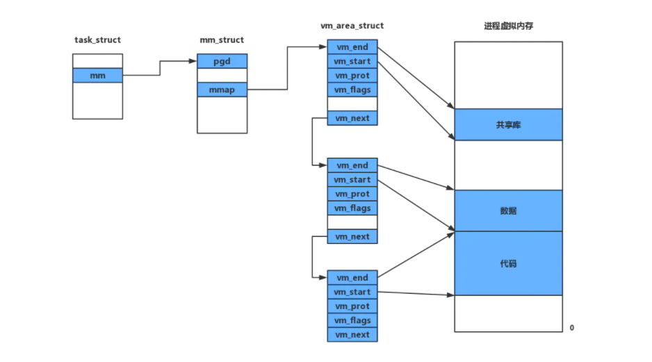


### 局部性原理

局部性是虚拟内存技术的基础，程序运行正是具有局部性，才能只装入部分程序到内存就能运行。

* **局部性规律**：就是说在某个较短的时间段内，程序执行局限于某一个小部分，访问的存储空间也局限于某个区域；

* **时间局部性**：如果程序中的某条指令一旦执行，不久后该指令可能会再次执行。如果某数据被访问过，不久后该数据可能被再次访问。产生时间局部性的原因是因为程序中存在大量的循环。时间局部性是通过将最近使用的指令和数据保存到高速缓存中，并使用高速缓存的层次结构来实现；

* **空间局部性**：一旦程序访问了某个存储单元，不久后其附近的存储单元也将被访问，即程序在一段时间内所访问的地址，可能集中在一定的范围之内，这时因为指令通常是顺序存放、顺序执行的，数据也一般是以向量、数组、表的形式簇聚存储的。空间局部性通常使用较大的高速缓存，并将预取机制集成到高速缓存控制逻辑中实现。

虚拟内存技术就是建立了“内存-外存”的两级存储器结构，利用局部性原理实现高速缓存，即连续的局部的虚拟内存地址空间，同样利用局部性原则的还有CPU高速缓存的缓存行概念。局部性原则保证了在任意时刻，程序将趋向于在一个较小的活动页面集合上工作，这个集合被称为工作集，根据时间和空间局部性原则，只要将工作集缓存在物理内存中，接下来的地址翻译请求很大几率都在其中，从而减少了额外的磁盘流量。


### 虚拟存储器

* 基于局部性原理，在程序装入时，可以只装入一部分，其他部分留在外存，就可以启动程序执行，由于外存远大于内存，所以运行的软件内存大小可以大于计算机系统实际的内存大小；

* 在程序执行过程中，当所访问的信息不在内存时，由OS将所需的部分调入内存，然后继续执行程序；
* 另外，OS将内存中暂时不用的内容换到外存上，从而腾出空间存放将要调入内存的信息，这样计算机就好像为用户提供了一个比实际内存大得多得存储器，即虚拟存储器。


### 虚拟内存的技术实现

* **请求分页存储管理**：建立在分页管理之上，在作业开始运行前，仅装入当前要执行的部分分页即可运行，假如在作业运行过程中发现要访问的页面不在内存，则由处理器通知OS按照对应的页面置换算法将相应的页面调入主存，同时OS可以将暂时不用的页面置换到外存；
* **请求分段存储管理**：建立在分段管理之上，增加了请求调段功能、分段置换功能。请求分段存储管理方式就如同请求分页存储管理方式一样；
* **请求段页式存储管理**：建立在段页式管理之上，管理方式同上；
* **请求分页存储管理和分页存储管理的区别**：根本区别就是是否将程序所需的所有地址空间全部装入主存。分页存储管理是将所有地址空间装入内存，而请求分页存储管理只装入一部分，需要时再与外存置换。

**虚拟内存技术的实现一般要满足**：

* **一定量的内存和外存**：在载入程序时，只需要将程序的一部分装入内存，而将其他部分留在外存，就可以直接执行程序；
* **缺页中断**：如果需要执行的指令或访问的数据尚未在内存中，即发生缺页或缺段现象，则由CPU通知OS将相应的页面或段调入内存，然后继续执行；
* **虚拟地址空间**：逻辑地址到物理地址的转换。


### 页面置换算法

在地址映射的过程中，若在发现所要访问的页面不在内存中，则发生缺页中断，需要通过中断处理程序将缺失的页从外存调入内存。如果发生中断时当前内存没有多余的页面可供装入，就需要在内存中选择一个页面将其移出内存，为需要调入的页面腾出空间，而用来选择淘汰哪一页的规则叫做页面置换算法。

* **最佳页面置换（OPT，Optimal replacement algorithm）：**该算法选择的页面是以后永不使用的，或者是很长时间不再被访问的页面，这可以保证获得最低的缺页率。这是一种理论上的算法，因为无法知道一个页面多长时间不再被访问；

* **先进先出页面置换（FIFO，First In First Out）：**总是淘汰最先进入内存的页面，即选择在内存中驻留时间最长的页面进行淘汰。该算法可能会将经常访问的页面换出，导致缺页率的升高；

* **最近最久未使用页面置换（LRU，Least Recently Used）：**赋予每个页面一个访问字段，用于记录该页面上一次被访问的时间T，当淘汰一个页面时，选择现有页面的T的最大值，即最近最久未使用页面。可以在内存中维护一个关联所有页面的链表，当一个页面被访问时，就将这个页面移到链表的头部，这样就能保证链表尾部的页面是最近最久未使用的；

  

* **最少使用页面置换（LFU）：**该置换算法选择使用最少的页面淘汰；

* **最近未使用页面置换（NRU，Not Recently Used）：**每个页面都有两个状态位R与M，当页面被访问时设置页面的R=1，当页面被修改时设置M=1，其中R会定时被清零。可以将页面分为四类：`R=0, M=0`、`R=0, M=1`、`R=1, M=0`、`R=1, M=1`，当发生缺页中断时，NRU算法随机的从类编号最小的非空类中挑选一个页面将其换出。NRU优先换出已被修改的脏页面 `R=0, M=1`，而不是频繁被使用的干净页面 `R=1, M=0`；

* **第二次机会算法：**该算法是针对FIFO算法可能会将经常使用的页面换出而做出的改进。当页面被访问时设置该页面的R=1，在需要替换时，检查最老页面的R，若R=0，则表示这个页面可以立即被替换。若R=1，就将其清零，并将该页面放入链表尾部，即给它第二次成为新页面的机会。然后继续从链表头部开始搜索。

  

* **时钟页面置换（Clock）：**第二次机会算法需要在链表中移动页面，降低了效率。时钟算法使用了环形链表将所有页面连接，再使用一个指针指向最老的页面（即头节点）。当检测到需要给最老页面第二次机会的时候，只需要将指针后移一位即可。

  


## 操作系统-设备管理

### 磁盘结构

* **盘面（Platter）**：一个磁盘有多个盘面；
* **磁道（Track）**：盘面上的圆形带状区域，一个盘面有多个磁道；
* **扇区（Track Sector）**：磁道上的一个弧段，一个磁道可以有多个扇区，是最小的存储单位，目前主要有512byte和4kb两种大小；
* **磁头（Head）**：与盘面非常接近，能够将盘面上的磁场转换为电信号（读），或者将电信号转换为磁场（写）；
* **制动手臂（Actuator arm）**：用于在磁道间移动磁头；
* **主轴（Spindle）**：使整个盘面转动。


### 磁盘调度算法

* 影响读写磁盘块时间的因素：
  * 旋转时间：主轴转动盘面，使得磁头移动到适当的扇区上；
  * 寻道时间：制动手臂转动，使得磁头移动到适当的磁道上。寻道时间最长，因此磁盘调度的主要目标是使磁盘的平均寻道时间最短；
  * 实际的数据传输时间。

* **先来先服务算法（FCFS，First Come First Served）**：按照磁盘请求的顺序进行调度。优点是公平简单，缺点是未对寻道做任何优化，使平均寻道时间较长；

* **最短寻道时间优先算法（SSTF，Shortest Seek Time First）**：优先调度与当前磁头所在磁道距离最近的磁道。虽然平均寻道时间较低，但是不够公平。如果新到达的磁道请求总是比一个在等待的磁道请求近，那么在等待的磁道请求会一直等待下去，即出现了饥饿现象；

  

* **电梯算法（SCAN）**：电梯总是保持一个方向运行，直到该方向没有请求为止，然后改变运行方向。电梯算法又称扫描算法，其和电梯的运行过程类似，总是朝着一个方向进行磁盘调度，直到该方向上没有未完成的磁盘请求，然后改变方向。因为扫描范围更广，因此所有磁盘请求都会被满足，解决了SSFT的饥饿问题。

  


## JVM-运行时数据区

### 整体结构

**PC计数器为什么私有？**

* **各线程的指令执行位置独立**；

* 在JVM中，字节码解释器通过改变PC计数器的指向依次读取字节码指令，从而实现代码的流程控制；
* 在多线程情况下，PC计数器用于记录所属线程暂停执行时的位置，从而当线程被切换回来后能恢复之前的执行状态；
* 总结：因为PC计数器是针对各线程内字节码指令进行控制的，即针对程序的执行位置做控制。 

**虚拟机栈和本地方法栈为什么私有？**

* **各线程的私有资源独立**；

* 虚拟机栈：每个Java方法在执行时都会在VM栈中创建一个栈帧，用于存储局部变量表、操作数栈和动态链接等信息。从方法调用直至执行完成的过程，就对应一个栈帧在虚拟机栈中压栈和弹栈的过程；
* 本地方法栈：和虚拟机栈相似，区别是VM栈为虚拟机执行java方法的字节码服务，而NM栈则为虚拟机使用的native方法服务（在HotSpot虚拟机中，虚拟机栈和本地方法栈合二为一了）；
* 总结：为了保证线程中的局部变量不能被其他线程所访问，虚拟机栈和本地方法栈都是线程私有的，其实也就是针对程序的各条执行路径的私有资源做控制。

**堆和元空间为什么共享？**

* **代码执行中的共享资源**；

* 堆是进程被分配到的内存中最大的一块，主要用于存放对象，方法区/元空间主要用于存放已被加载的类信息，如：常量、静态变量、即时编译器编译获得代码等数据；
* 总结：因为二者存储的都是程序的资源单位，不存在执行时的独立问题，所以堆和元空间是和进程绑定的。

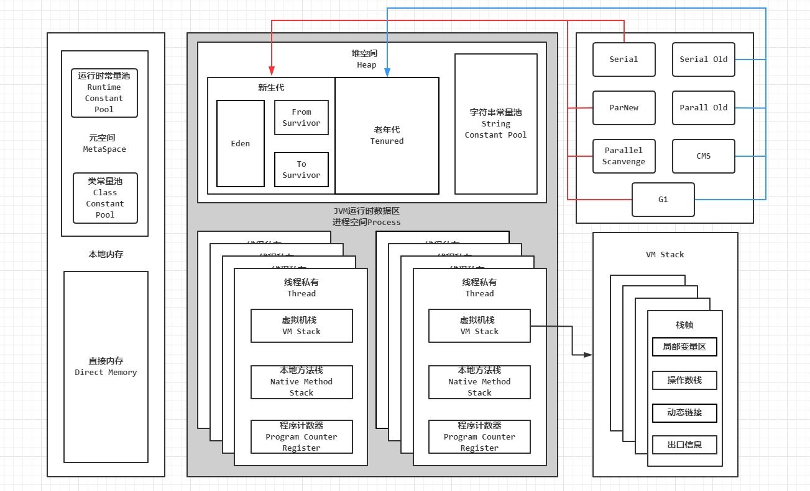


### 程序计数器

**概念：**

* 程序计数器（Program Counter Register）是一块较小的内存空间，可以看作是当前线程所执行的字节码的行号指示器。字节码解释器工作时通过改变这个计数器的指向来选取下一条需要执行的字节码指令，分支、循环、跳转、异常处理和线程恢复等功能的指令都需要依赖这个计数器来获取；
* 为了线程在切换后能够恢复到之前的执行位置，所以每条线程都需要有一个独立的程序计数器，各线程间的计数器互不影响，独立存储，这类内存区域就是线程私有内存；
* 程序计数器是唯一不会出现OOM的JVM内存区域，其生命周期随线程的创建而创建，随线程的结束而死亡。

**作用：**

* **指令标识**：字节码解释器通过改变程序计数器的指向来依次读取字节码指令，从而实现代码的流程控制；
* **保存现场**：在多线程的情况下，程序计数器用于记录当前线程的执行位置，从而当线程被切换回来后能正确恢复。


### 虚拟机栈

**概念：**

* 虚拟机栈（VM Stack）用于描述Java方法执行的内存模型，每次方法调用相关的数据都是通过栈传递的；
* 虚拟机栈也是线程私有的，生命周期和线程相同，因为每个线程的方法调用都是独立的；
* 虚拟机栈由一个个栈帧组成，栈帧就是栈中划分的存储单元，每个栈帧都拥有一套独立的局部变量表、操作数栈和动态链接等信息；
* 局部变量表中存放了编译器可知的各种数据类型和对象引用。

**异常：**

* **StackOverFlowError**：若虚拟机栈的内存大小不允许动态扩展，那么当线程请求栈的深度超过当前Java虚拟机栈的最大深度时，就会抛出该异常；
* **OutOfMemoryError**：若虚拟机栈的内存大小允许动态扩展，且当线程请求栈时无多余内存可分配，无法再动态扩展，就会抛出该异常。

**参数：**`java -Xss2M` 指定每个线程的虚拟机栈的内存大小。

**Java方法的调用**：Java的方法每次调用都会对应一个栈帧被压入虚拟机栈中，每次方法调用结束后（return或抛出异常），其对应的栈帧都会被弹出，栈帧的压栈和弹栈遵循LIFO的机制。


### 本地方法栈

**概念：**本地方法栈（Native Method Stack）与虚拟机栈的作用类似。区别是虚拟机栈为虚拟机提供Java方法的调用管理，本地方法栈则为虚拟机提供native方法的调用服务。在HotSpot虚拟机的实现中将二者合二为一了；

**本地方法：**一般是用其他语言（C、C++或汇编）编写，并且被编译为基于本机硬件和操作系统的程序，要特别处理的方法。本地方法被调用时，也会发生栈帧的压栈和弹栈过程，栈帧中也会存在局部变量表、操作数栈、动态链接和出口信息；

**异常：**和虚拟机栈一样，本地方法栈也会抛出StackOverFlowError和OutOfMemoryError两种异常。


### 堆

**概念：**

* 堆（Heap）是JVM管理的内存中最大的一块，是所有线程共享的区域，在虚拟机启动时创建，该区域的唯一作用就是存放对象的实例，几乎所有对象的实例以及数组都在这里分配内存；

* 堆是垃圾收集器主要管理的区域，因此也被称为GC堆。从GC的角度来看，垃圾收集器基本都采用分代收集算法，所以堆还可以细分为新生代（Eden、From Survivor、To Survivor空间等）和老年代，更细致划分的目的是更好的回收内存和更快的分配内存；

  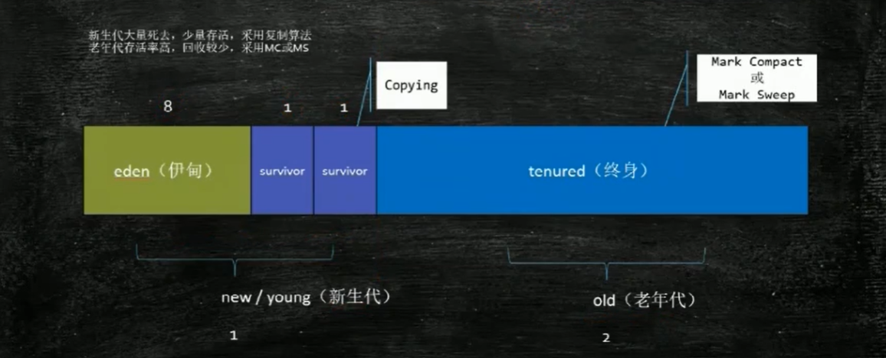

* 上图eden区、s0区、s1区都属于新生代，tentired区属于老年代。大部分情况下对象都会在Eden区分配内存，在经过了一次新生代GC后，若还有对象存活，则会进入s0或s1，并且对象的年龄会增加1（从eden区进入survivor区后对象的初始年龄为1），当对象的年龄到达一个阈值后（默认15，可以通过参数 `-XX:MaxTenuringThreshold` 设置），就会进入老年代。

**异常：**堆不需要连续内存，并且可以动态增加内存，增加失败则会抛出OutOfMemoryError异常。

**参数：**`java -Xms1M -Xmx2M` 指定一个程序的堆内存大小，第一个参数是初始值，第二个参数是最大值。


### 方法区/元空间

**概念：**方法区（Method Area）/元空间（Metaspace）用于存储已被虚拟机加载的类信息、常量、静态变量和即时编译器编译后的代码等数据，和堆一样是多个线程共享的内存区域。别名是Non-Heap（非堆），目的是和堆空间区别开来。

**和永久代的关系：**方法区是Java虚拟机制定的规范，而永久代是HotSpot虚拟机对规范的实现，类似于Java语法中接口和实现类的关系。也就是说永久代是HotSpot的概念，其他虚拟机没有这个概念。

**常用参数**：

* `-XX:MetaspaceSize=N`：设置元空间的初始容量（也就是最小空间）；
* `-XX:MaxMetaspaceSize=N`：设置元空间的最大容量。

**为什么方法区会被元空间替换？**方法区存在于JVM内存中，JVM内存区域有大小上限，而元空间使用直接内存，受本机可用内存的限制，且不存在OutOfMemoryError。当然还是存在本地内存耗尽的风险。


### 运行时常量池

**概念**：运行时常量池（Runtime Constant Pool）是方法区的一部分。Class文件中除了有类的版本、字段、方法、接口等描述信息外，还有一项信息是常量池（Constant Pool Table），用于存放编译期生成的各自字面量和符号引用，这部分内容将在类加载后进入方法区/元空间的运行时常量池中存放。


**特征**：运行时常量池对于Class文件常量池的一个重要的特征就是动态性，Java并不要求常量一定只能在编译期才能产生，也就是并非预置入Class文件种常量池的内容才能进入方法区的运行时常量池，运行期间也可能放入新的常量到池中，如：String类的 intern() 方法。

* `intern()` 方法：
  * 在1.6中，intern的处理是先判断字符串常量是否在字符串常量池中，如果存在直接返回该常量。如果不存在，则将该字符串常量加入到字符串常量池中；
  * 在1.7中，intern的处理是先判断字符串常量是否在字符串常量池中，如果存在直接返回该常量。如果不存在，说明该字符串常量在堆中，则会将堆区该对象的引用加入到字符串常量池中。

**Java的三种常量池**：

* **字符串常量池（String Pool）**：Class文件的常量池中的文本字符串会在类加载时进入字符串常量池。在JDK1.7之后，运行时常量池存在于方法区中，而字符串常量池存在于堆中；

* **运行时常量池（Runtime Constant Pool）**：当程序运行到某个类时，Class文件中的信息就会被解析到方法区的运行时常量池中，每个类都有一个运行时常量池；

* **Class文件常量池（Class Constant Pool）**：Class常量池是在编译后每个Class文件都有的，除了包含类的版本、字段、方法、接口等描述信息外，还有一项信息就是常量池（Constant Pool Table），用于存放编译器生成的各种字面量和符号引用。

  * **字面量（Literal）**：
    * 文本字符串，即代码中能够看到的字符串，如：`String a = “aa”`，其中"aa"就是字面量；
    * 被 `final` 修饰的变量。

  * **符号引用（Symbolic References）**：
    * **类和接口和全限定名**，如：String类的全限定名就是java/lang/String；
    * **字段的名称和描述符**，所谓字段就是类或者接口中声明的变量，包括类级别变量（静态）和实例级的变量；
    * **方法的名称和描述符**，所谓方法描述符就相当于方法的参数类型+返回值类型。


### 直接内存

**概念：**直接内存（Direct Memory）不是JVM运行时数据区的一部分，也不是Java虚拟机规范中定义的内存区域，而是操作系统管理的直接内存区域，由于这部分内存也被频繁使用，也可能会导致出现OutOfMemoryError。直接内存的分配不会受到Java堆的限制，而是受到本机内存大小和处理器寻址空间的限制。

**应用场景：**JDK1.4引入的NIO（New Input/Output，Non Blocking Input/Output），引入了基于通道channel和缓冲区buffer的IO方式，可以使用本地native函数直接分配堆外内存，然后通过一个存储在堆中的DirectByteBuffer对象作为这块内存的引用进行操作，在某些场景下显著提高性能，避免传统IO在Java堆和native堆之间来回复制数据；


## JVM-对象的创建过程


### 类加载检查

当JVM执行到一条new指令时，首先会去检查该指令的参数是否能在常量池中定位到对应类的符号引用。并且检查这个符号引用代表的类是否已被加载、解析和初始化过，若没有，则必须先执行相应的类加载过程。


### 分配内存

**概念**：类加载检查通过后，接下来JVM将为新生对象分配内存，对象所需的内存大小在类加载完成后就能确定，所谓的对象内存分配就是在堆空间划分一块确定大小的内存。

**分配方式**：JVM有两种分配方式，具体的选择由堆是否规整决定，而堆是否规整则由所采用的垃圾收集器是否具有压缩整理功能决定。

* **指针碰撞**：适用于堆内存规整，即没有内存碎片的情况下。将内存区域中使用过的整合到一边，未被使用的整合到另一边，中间由分界值指针隔开，只需要向着没用过的内存方向将该指针移动对象需要大小的距离即可。对应的GC收集器为Serial和ParNew；
* **空闲列表**：适用于堆内存不规整的情况下。JVM会维护一个列表，其中会记录哪些内存块是可用的，在分配的时候，找一块大小符合的内存划分给实例对象，最后更新表记录。对应的GC收集器为CMS。

**分配内存的并发问题**：

* **CAS+失败重试机制**：CAS是乐观锁的一种实现，所谓乐观锁分配内存就是不加锁而是假设没有冲突直接去执行分配操作，若发生了冲突则重试到成功为止；

* **TLAB（Thread Local Allocation Buffer，线程本地分配缓存区）**：为每个线程预先在eden区分配一块缓冲区，JVM在给线程中的对象分配内存时，首先在该线程的缓冲区中分配，当对象大于缓冲区的剩余空间或空间耗尽时，再采用CAS方式去分配。


### 初始化零值

当内存分配完成后，JVM需要将分配到的内存空间都初始化为零值，这步操作保证了对象的实例字段在Java代码中可以不赋值就能直接使用，程序能访问这些字段的数据类型所对应的零值。


### 设置对象头

初始化完成后，接下来JVM要对对象进行信息设置，如：所属类、哈希码、GC分代年龄、如何找到类的元数据等。这些信息都存放在对象头中。


### 执行init方法

此时从JVM的角度来看对象已经创建完毕，从Java程序的角度看，对象还需要执行对应的构造方法 `init` 才能算真正的创建完成。


## JVM-对象引用机制

### 对象的访问定位方式

虚拟机规范规定Java程序通过栈上的引用数据来操作堆上的具体对象，至于具体的访问方式由JVM的实现而定。

* **句柄指针**：使用这种方式的Java堆会划分出一块内存作为句柄池，栈中的引用存储的就是对象的句柄地址，而句柄中包含了对象实例数据（堆空间）与对象的类数据（方法区）各自的具体内存地址。这种方式的好处是引用中存储的是稳定的句柄地址，在对象被移动时只会改变句柄的实例数据指针，而引用则无需变动。

  

* **直接指针**：使用这种方式的话，Java堆对象的布局就必须维护访问对象类数据的相关指针，而栈中的引用则直接存放堆对象的地址。这种方式的好处就是访问速度快，相比句柄的方式可以节省一次指针定位的时间开销。

  


### 判断一个对象是否可被回收

堆空间的垃圾回收第一步就是判断有哪些对象已经死亡，即不能再被任何途径使用的对象。

* **引用计数法：**给对象添加一个引用计数器，每当有某处对其进行引用，计数器加增加1。每当有一处引用失效，计数器就减少1。任何时候计数器为0的对象就是不能再被使用的。在两个对象出现循环引用的情况下，引用计数器永不为0，导致无法进行回收。但是因为循环引用的存在，导致JVM不使用该算法。

  ```java
  public class Test {
      
      public Object instance = null;
      
      public static void main(String[] args) {
          // a与b相互持有对方的引用
          Test a = new Test();
          Test b = new Test();
          a.instance = b;
          b.instance = a;
          // 取出a和b的引用，但a和b的instance依旧引用着对方，计数器永远不会为0
          a = null;
          b = null;
      }
  }
  ```

* **可达性分析算法**：基本思路是通过一系列被称为GC Roots的对象作为起点，以此开始向下搜索，节点所经过的路径称为引用链。当一个对象到GC Roots没有任何引用链相连的话，则该对象就是不能再被使用的。可作为GC Roots的对象包括：

  * 当前虚拟机栈中局部变量表中引用的对象；
  * 当前本地方法栈中局部变量表中引用的对象；
  * 方法区/元空间中类静态属性引用的对象；
  * 方法区/元空间中的常量引用的对象。

  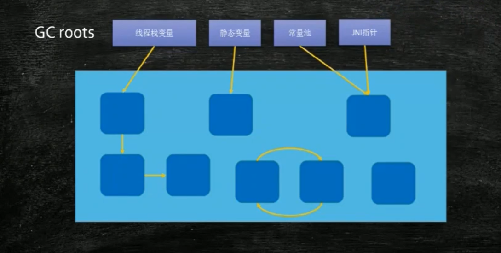


### 判断一个常量是否被废弃

运行时常量池主要回收的是废弃的常量，若常量池中的常量无任何对象对其引用，说明该常量是废弃的常量，若此时发生了方法区的内存回收，则该常量就会被垃圾回收。


### 判断一个类是否无用

方法区主要回收的是无用的类，要判断一个类是无用的类需要满足以下3个条件：

* 该类的所有实例都已经被回收，即堆内存中不存在该类的任何实例；
* 加载该类的类加载器ClassLoader已经被回收；
* 该类对应的java.lang.Class对象没有在任何地方被引用，无法在任何地方通过反射访问该类的方法。


### 引用类型

**强引用**：

```JAVA
public class T01_NormalReference {

    public static void main(String[] args) throws IOException {
        // 强引用：str就是强引用一个字符串对象，若引用指向空，则之前指向的对象会被回收
        M m = new M();
        m = null;

        System.gc();    // DisableExplicitGC
        System.out.println(m);

        int read = System.in.read();    // 阻塞main线程，给gc线程执行时间
    }
}
```

**软引用**：通过软引用指向的对象不会因为等到所有引用都断开后才会被回收，而是在内存不足时直接被回收。

```JAVA
public class T02_SoftReference {

    // 实验的前置条件：-Xmx: 20 将堆内存设置为20mb
    // 适用场景：缓存。如大文件写入内存中后使用软引用指向，需要使用时直接从内存获取，不需要时软引用自动断开，释放内存
    public static void main(String[] args) throws InterruptedException {
        // m指向的SoftReference对象是强引用，SoftReference对象内的成员变量指向的10mb的字节数组是软引用
        SoftReference<byte[]> m = new SoftReference<>(new byte[1024 * 1024 * 10]);
        System.out.println(Arrays.toString(m.get()));

        // 一次gc后软引用指向的对象未被回收，因为此时内存足够
        System.gc();
        Thread.sleep(500);
        System.out.println(Arrays.toString(m.get()));

        // 再次分配15mb的字节数组，超出堆内存，这时软引用指向的对象会被释放
        byte[] b = new byte[1024 * 1024 * 15];
        System.out.println(Arrays.toString(m.get()));
    }
}
```

**弱引用**：弱引用可以像强引用一样正常的访问对象，但如果一个对象只存在一个弱引用指向时，下一次GC会直接回收。

```JAVA
public class T03_WeakReference {

    public static void main(String[] args) {
        // m是指向WeakReference对象的强引用，而WeakReference中的成员通过弱引用指向M对象
        // 就是可以通过引用正常访问对象，但如果一个对象只被一个弱引用指向时，gc会直接回收
        WeakReference<M> m = new WeakReference<>(new M());

        System.out.println(m.get());
        System.gc();
        System.out.println(m.get());

        // ThreadLocalMap中的Entry就使用弱引用，其中的key就是指向ThreadLocal对象的弱引用
        // ThreadLocal为什么使用弱引用——防止内存泄漏：
        // 1.若Entry中的key使用强引用，此时外部所有的强引用断开，key不会被gc回收，可能造成内存泄漏问题；
        // 2.使用弱引用会在外部引用都断开后允许gc回收，但会造成key为null，value无人映射，也会出现内存泄漏问题；
        // 3.所以使用ThreadLocal后需要手动调用remove方法清除k-v对，防止内存泄漏。
        ThreadLocal<M> tl = new ThreadLocal<>();
        tl.set(new M());
        tl.remove();
    }
}
```

**虚引用**：当一个对象需要被回收时，会建立该对象的虚引用并放入虚引用队列，相当于给GC线程一个通知。

```JAVA
public class T04_PhantomReference {

    private static final List<Object> LIST  = new LinkedList<>();
    private static final ReferenceQueue<M> QUEUE = new ReferenceQueue<>();

    public static void main(String[] args) throws InterruptedException {
        // 虚引用的作用：管理直接内存（堆外内存），NIO的零拷贝会在JVM堆外直接分配内存空间（JVM堆内对象管理堆外内存空间），当JVM堆内对象被回收时，需要通过虚引用和虚引用队列执行特定的回收操作，即同时释放堆外的内存
        PhantomReference<M> phantomReference = new PhantomReference<>(new M(), QUEUE);
        // 无法通过虚引用访问其指向的对象
        System.out.println(phantomReference.get());

        // 占用内存资源
        new Thread(() -> {
            while (true) {
                LIST.add(new byte[1024 * 1024]);
                try {
                    Thread.sleep(1000);
                } catch (InterruptedException e) {
                    e.printStackTrace();
                }
                System.out.println(phantomReference.get());
            }
        }).start();

        // 模拟垃圾回收线程
        new Thread(() -> {
            while (true) {
                // gc线程从虚引用队列中获取到了虚引用，才会执行特定的回收操作
                Reference<? extends M> poll = QUEUE.poll();
                if (poll != null) {
                    // 真正执行的回收操作
                    System.out.println("--- 虚引用对象被jvm回收了" + poll);
                }
            }
        }).start();

        Thread.sleep(500);
    }
}
```


## JVM-垃圾回收算法

### 标记-清除算法

**概念**：该算法分为标记和清除两个阶段，首先标记所有需要回收的对象，之后统一回收。是最基础的算法，后续的算法都是对其的改进。

**缺点**：回收效率低下，内存碎片化严重。


### 复制算法

**概念**：针对标记-清除算法效率不足和内存空间碎片化的改进，首先将内存分为大小相同的两块，每次使用其中的一块存放对象，当这块区域使用完后，就将还存活的对象复制到另一块去，这时当前使用的区域只剩下了可回收的垃圾，直接全部清理即可，这样每次的内存回收都是对内存区间的一半进行回收。

**适用于新生代**：商用虚拟机都采用复制算法回收新生代，但并不是划分为相等大小的两块，而是存在一块较大的Eden空间和两块较小的Survivor空间（from+to），每次使用Eden和其中的一块Survivor From。在回收时，将Eden和Survivor From中还存活的对象复制到另一块Survivor To中，最后清理Eden和Survivor From。回收完毕后，将Survivor From和Survivor To角色反转，等待下一次回收。


### 标记-整理算法

**概念**：根据老年代的特点推出的算法，标记的过程不变，但标记后不是直接回收对象，而是让所有存活的对象向一端移动，然后直接清理掉边界以外的内存，解决了内存的碎片化。

**优缺点**：不会产生内存碎片，但是需要大量移动对象，效率较低。


### 分代收集算法

**概念：**当前JVM使用的垃圾回收算法，这种算法会根据对象的存活周期将内存分为几块区域（一般划分为新生代和老年代），然后根据不同区域中对象的特点选择合适的垃圾回收算法；

**新生代使用复制算法**：新生代中的每次GC都会伴随着大量的对象被回收，实际存活的对象相对较少（高龄的对象已经进入了老年代），那么复制算法就会很合适，因为只需要复制较少的那部分对象（存活对象）就可以完成垃圾回收作业；

**老年代使用标记-整理算法**：因为老年代中对象的存活概率相对较高，所以使用标记-整理算法来进行垃圾回收。


## JVM-垃圾收集器

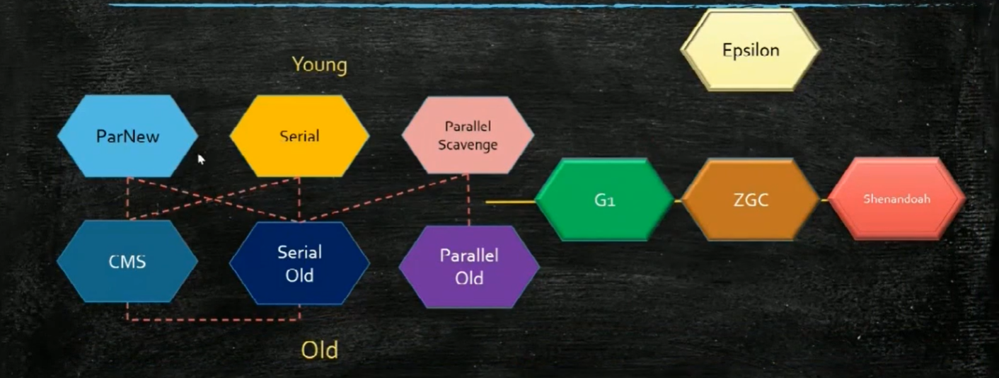

垃圾回收器是基于垃圾回收算法的具体实现，不同的回收器适用于不同的场景，如HotSpot就实现了7种垃圾回收器用于适配各种场景的应用。

### Serial收集器

* Serial串行收集器是最基本的单线程收集器，适用于新生代和老年代。新生代使用复制算法，老年代使用标记-整理算法；
* 单线程不仅是指只有一条垃圾回收线程工作，而且在进行垃圾回收作业时必须暂停其他所有的工作线程，即Stop the World，直到回收作业完成；
* **优点**：简单高效，单线程GC，没有多线程切换的额外开销，是运行在Client模式下的HotSpot虚拟机的默认收集器。

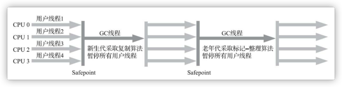


### Serial Old收集器

* 是Serial串行收集器的老年代版本，同样是单线程收集器，使用标记-整理算法；
* 该收集器也是提供给Client模式下运行的HotSpot虚拟机使用；
* **使用方式**：如果运行在Server模式下，第一个用途是在JDK1.5之前与Parallel Scavenge收集器搭配使用。另一个用途是作为CMS收集器发生失败时的后备方案，在并发收集发生Concurrent Mode Failure时使用。

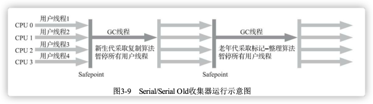


### ParNew收集器

* ParNew是Serial的多线程版本，新生代采用复制算法，老年代采用标记-整理算法。除了使用多线程并行回收垃圾以外，其他的如回收算法、STW、对象分配规则、回收策略等都和Serial收集器一样；
* 除了Serial收集器外，只有ParNew收集器能与CMS收集器配合；
* 是HotSpot虚拟机运行在Server模式下的默认新生代收集器，但是在单CPU环境下，并不会比Serial有更好的效果；

* **优点**：适用于运行在Server模式下的虚拟机，能与CMS收集器配合工作。

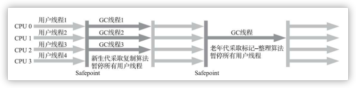


### Parallel Scavenge收集器

* Parallel Scavengeping平行-清除收集器是与ParNew类似的收集器，也使用GC并行、复制算法和标记-整理算法；
* 但它的对象分配规则和回收策略都与ParNew收集器不同，它是以吞吐量（即CPU中用于运行用户程序代码的时间与CPU总消耗时间的比值）最大化为目标的收集器实现，即追求更高效率的利用CPU；
* 该收集器允许以较长时间的STW来换取吞吐量的最大化，即避免了STW次数过多导致线程的频繁切换；

* **参数**：
  * `-XX:+UseParallelGC`：使用Parallell收集器+老年代串行；
  * `-XX:+UseParallelOldGC`：使用Parallel收集器+老年代并行。

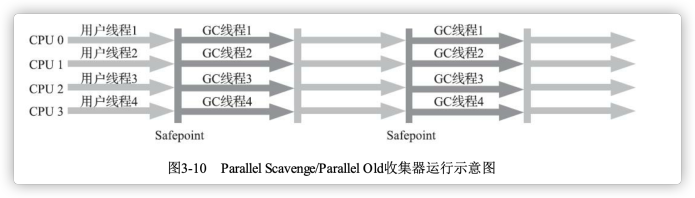


### Parallel Old收集器

* Parallel Old是Parallel Scavenge的老年代版本，使用GC并行和标记-整理算法；
* 在注重吞吐量以及CPU资源的场合，都可以优先考虑Parallel Scavenge收集器和Parallel Old收集器；
* JDK1.8的默认收集器就是新生代Parallel Scavenge+老年代Parallel Old。


### CMS收集器

#### 基本概念

CMS（Concurrent Mark Sweep，并发的标记-清除）收集器是一种以获取最短停顿时间为目标的收集器，也是HotSpot第一款真正意义上的并发收集器，基本实现了让垃圾回收线程和用户线程同时工作。

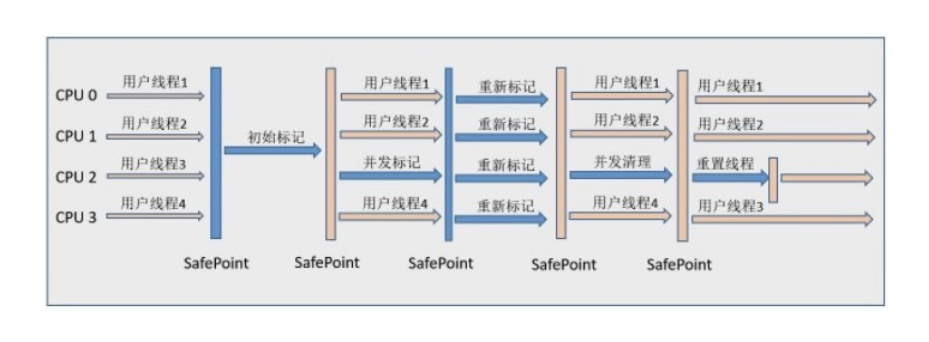


#### 运行步骤

* **初始标记（Initial Marking）**：暂停用户线程，运行单个GC线程记录直接与GC Roots相连的对象，这个阶段持续的时间很短；
* **并发标记（Concurrent Marking）**：该阶段会让GC和用户线程并发执行，用一个闭包结构去记录可达对象。但是在该阶段结束后，这个闭包结构并不能保证包含了所有的可达对象，因为用户线程可能会不断的更新引用域，会导致GC线程无法实时的分析可达性，所以这个阶段也会跟踪记录那些发生引用更新的对象；
* CMS中使用增量更新算法（Incremental update），即关注插入时的对象状态。只要在写屏障（write barrier）里发现有一个白色对象被黑色对象的成员所引用，那就把这个白对象变成灰色的（三色标记），在重新标记阶段重新扫描。
* **重新标记（Re-marking）**：暂停用户线程，多个GC线程并行执行。该阶段就是为了修正并发标记期间因为用户线程继续运行而导致引用发生变化的对象（即重新扫描灰色对象）。收集器处于该阶段的时间一般比初始标记阶段稍长，远比并发标记阶段时间短；
* **并发清除（Concurrent clean up）**：该阶段会恢复用户线程的执行，同时GC线程开始回收之前标记的区域。


#### 特点

**优点**：并发回收效率高、用户线程低停顿。

**缺点**：

* **低吞吐量**：是以牺牲吞吐量为代价带来的用户线程低停顿，即STW持续更短的时间，但STW发生的次数会增加。

* **浮动垃圾**：无法处理浮动垃圾。CMS的浮动垃圾是指并发清除阶段由于用户线程继续运行而产生的垃圾，这部分的垃圾只能等到下一个GC才能回收。由于浮动垃圾的存在，因此需要预留一部分内存，意味着CMS不能像其他收集器那样等老年代快满的时候才进行回收。如果预留的空间不够存放浮动垃圾，就会出现Concurrent Mode Failure，这时虚拟机将临时启动后备方案Serial Old来替代CMS。
* **内存碎片化**：使用标记-清除算法会导致内存碎片化。老年代出现空间碎片，当无法找到足够大的空间分配对象，会提前触发一次Full GC。


### G1收集器

#### 基本概念

G1（Garbage-First）是面向运行在Server模式的虚拟机的垃圾收集器，主要针对配备了多核CPU以及大容量内存的机器。它会以极高的概率在满足GC低停顿时间要求的同时，还具备高吞吐量性能的特征。整体采用了标记-整理算法，局部（Region之间）采用复制算法。


#### 内存划分

* **Region区域**：和其他收集器不同的是，G1将堆划分为多个大小相等的独立区域Region（可通过 `-XX:G1HeapRegionSize` 指定大小），不再整体划分新生代和老年代。通过引入Region，将一整块内存划分为多个小空间，使得每个小空间可以单独进行垃圾回收，这种方法具有很高的灵活性，使得可预测的停顿模型成为可能；
* **优先回收**：通过记录每个Region的垃圾回收时间以及回收后所获得的空间，维护一个整体的优先列表，每次都会优先回收价值最大（回收时间最少、垃圾比例高）的Region；
* **Remembered Set**：每个Region都拥有一个RSet，用于记录其他Region中的对象对本Region中对象的引用，这样就能在可达性分析时避免全堆扫描。

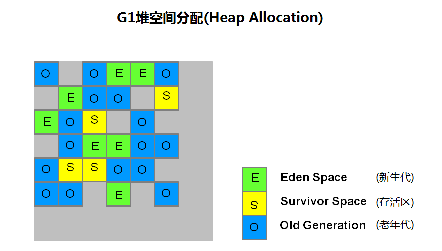


#### 新生代GC（Yong GC）

**特点**：

* **回收时机**：Eden Region耗尽时会触发Yong GC，会对整个Eden Regions进行回收；
* **STW**：在Yong GC期间，整个应用会Stop the Word；
* **GC并行**：Yong GC存在多个线程并行执行标记整理算法；
* **复制算法**：存活的对象会被拷贝到新的Survivor区或老年代。


#### 老年代GC（Mixed GC）

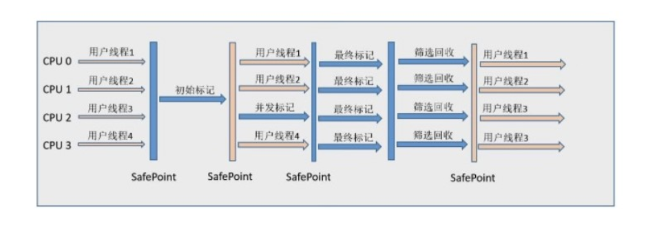

* **初始标记（Initial Mark）**：需要停顿用户线程，存在单个GC线程。耗时很短，通常该阶段会和一次Yong GC同时进行；
* **根分区扫描（Root Region Scan）**：不需要停顿，GC和用户线程并发执行。该阶段G1开始扫描Survivor分区，所有被Survivor分区中的对象所引用的对象都会被扫描和标记，该节点不能发生新生代收集；
* **并发标记（Concurrent Marking）**：不需要停顿，GC和用户线程并发执行。该阶段使用SATB算法解决应用程序执行过程中引用发生变化而产生的对象漏标问题；
* **再次标记（Remark）**：需要停顿用户线程，存在多个GC线程并行执行。该阶段的目的就是根据日志缓冲区Log Buffer重新扫描灰色对象，以解决并发标记阶段出现的引用漏标；
* **筛选回收（Clean up）**：需要停顿用户线程，存在多个GC线程并行执行。首先对各个Region中的回收价值和成本进行排序，根据用户所期望的GC停顿时间来制定回收计划，最后转移或拷贝存活对象到新的未使用的Region。


#### 三色标记算法

在并发标记的过程中，通过将对象分为三种颜色来标识对象的标记状态以保证并发时GC的正确性：

* **白色**：未被标记的对象（默认颜色），即垃圾对象；
* **灰色**：自身被标记，成员变量未被标记，即中间状态；
* **黑色**：自身和成员变量均已被标记，即存活对象。

**并发标记阶段的漏标问题**：

* 当GC开始扫描时，根对象被置为黑色，子对象被置为灰色，未扫描到的默认为白色；

  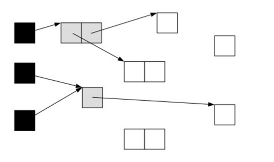

* 继续由灰色开始遍历，将已扫描了的子对象的对象置为黑色；

  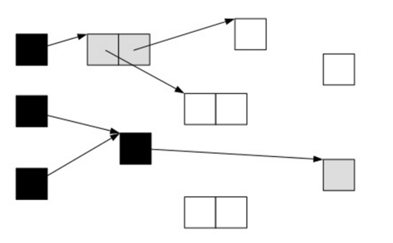

* 遍历了所有的可达对象后，所有可达对象都会变成黑色，不可达的对象即为白色，需要被清理。

* 若是在并发标记过程中，由于应用程序的继续运行导致对象的引用发生改变，就会发生漏标的问题。此时G1扫描的情况如下图：

  

* 这时应用程序执行了` A.c = C，B.c = null` 这样的操作，导致对象的状态变为：

  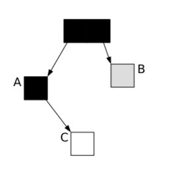

* 这时垃圾收集器再进行标记的时候会出现如下情况。即因为A已经为黑色，A最新引用的C再也不会被扫描和标记到了，最后导致本该存活的C因为是白色而被回收掉。

  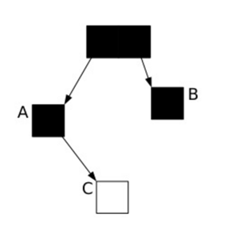

* CMS使用了增量更新算法来解决并发标记阶段的漏标问题，关注插入时记录对象的状态。而G1采用SATB快照标记算法来解决，关注删除时记录对象的状态。


#### SATB算法

* SATB（snapshot-at-the-beginning）快照标记算法。G1垃圾回收器使用该技术在初始标记阶段记录一个存活对象的快照。在并发标记阶段引用可能会发生改变，比如删除了一个原本的引用，这就会导致并发标记结束之后存活的对象和SATB的快照不一致。
* G1是通过在并发标记阶段引入一个写屏障（pre-write barrier）来解决这个问题的，即每当引用被删除的情况出现时，会将所有被删除之前的旧引用记录到一个Log Buffer中。并在在再次标记阶段（Remark）清空缓冲区，跟踪未被访问的存活对象，并标记为灰色，即以Log Buffer中的旧引用指向的对象为根重新扫描一遍。

* 这样STAB就保证了真正存活的对象不会被GC误回收，但同时也造成了某些可以被回收的对象逃过了GC，导致了内存里面存在浮动的垃圾（Float Garbage），这些浮动垃圾会在下一次GC被回收。


#### 特点

* **并行与并发**：充分利用多核CPU提供的硬件优势，缩短Stop the World的停顿时间。部分其他收集器需要暂停用户线程进行的GC动作，G1收集器仍然可以通过并发的方式让用户线程继续执行；
* **分代收集**：虽然G1可以不需要其他收集器的配合就能独立管理整个GC堆，但还是保留了分代的概念；
* **空间整合**：G1收集器从整体来看是基于标记-整理算法实现的，但从局部来看是基于复制算法实现的，意味着不会产生内存碎片；
* **可预测的停顿**：相对于CMS，G1除了追求低停顿外，还能建立可预测的停顿时间模型，能让使用者通过 `-XX:MaxGCPauseMillis` 将STW指定在一个长度为M毫秒的时间片段内。


## JVM-内存分配和回收策略

### Minor GC和Full GC

* **新生代GC（Minor GC）**：大多数情况下对象都会在新生代的eden区分配，当eden区没有足够的空间可分配时，JVM会发起一次Minor GC，即发生在新生代的垃圾收集动作。因为新生代对象存活时间短，所以Miner GC执行频率高、回收速度快。

* **老年代GC（Major GC/Full GC）**：指发生在老年代的GC，当老年代空间不足时触发，且经常会伴随着至少一次的Minor GC，Full GC的速度一般会比Minor GC的速度慢上10倍以上。


### 内存分配策略

* **栈上分配**：通过逃逸分析分析对象的活动范围是否只局限于某个方法中。若是，则直接在栈式上分配，随着栈帧的pop而被清理；
* **大对象直接进入老年代**：若不能在栈上分配，就需要在堆中分配。首先判断是否为大对象，所谓大对象是指需要连续内存空间的对象，典型的大对象是很长的字符串和数组，经常出现大对象会提前触发垃圾回收以获得足够的连续空间分配。参数 `-XX:PretenureSizeThreshold` 大于该值的对象直接在老年代分配，避免在Eden和Survivor之间的大量内存复制；
* **TLAB**：即线程本地分配缓冲区Thread Local Allocation Buffer。每个线程在Eden都会有这样的一个私有缓冲区，对象会优先在TLAB上分配（并发安全），直到缓冲区空间不足时才会在Eden中分配；

* **Eden区分配**：大多数情况下，对象会在新生代的Eden区分配，当Eden空间不够时，会发起Minor GC；
* **长期存活的对象进入老年代**：对象具有年龄计数器，若对象在Eden区出生并经过Minor GC依然存活，将会移动到Survivor中，年龄就会相应的增加1岁，当增加到一定的年龄后就会移动到老年代中。参数 `-XX:MaxTenuringThreshold` 用来设置年龄的阈值；
* **动态对象年龄判定**：虚拟机并不是一定要等对象的年龄到达阈值后才会将其移入老年代，如果Survivor空间中相同年龄的对象大小总和超过Survivor空间的一半，则大于等于该年龄的对象会直接进入老年代；
* **老年代的空间分配担保**：
  * 在发生Minor GC之前，虚拟机会检查**老年代最大可用的连续空间是否大于新生代所有对象的总空间**；
  * 若大于，则此次Minor GC是安全的；
  * 若小于，则虚拟机会查询参数 `-XX:HandlePromotoionFailure` 判断是否允许失败；
  * 若为true，即允许失败，则继续检查**老年代最大可用连续空间是否大于历届晋升到老年代的对象的平均大小**，如果大于平均大小，则继续进行Minor GC，但是不安全的；
  * 若是小于平均大小或是参数HandlePromotoionFailure=false，则进行一次Full GC。

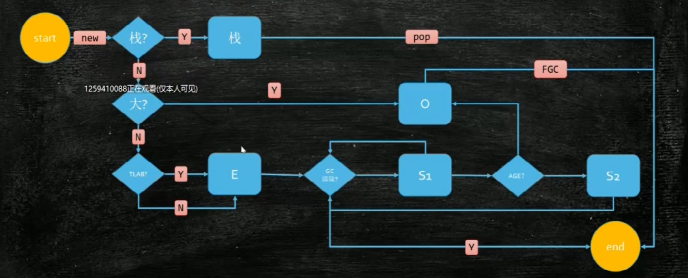


### Full GC的触发条件

* **调用 `System.gc()`**：该方法是给虚拟机提出Full GC的建议，虚拟机并一定会真正去执行；

* **老年代空间不足**：大对象直接进入，长期存活的对象进入。为了避免着两种情况引起的Full GC，尽量不要分配过大的对象或数组。还可以通过 `-Xmn` 调整新生代的大小，让对象尽量在新生代被回收，不进入老年代。还可以通过 `-XX:MaxTenuringThreshold` 调大对象进入老年代的年龄，让对象在新生代多存活一段时间；

* **空间分配担保失败**：使用复制算法的Miner GC需要老年代的内存空间做担保，如果担保失败会执行一次Full GC；

* **JDK1.7之前的永久代空间不足**：永久代中加载/反射的类和常量等数据过多时，也会执行一次Full GC；

* **Concurrent Mode Failure**：执行CMS的GC过程中同时有多个对象进入老年代，而此时老年代空间不足（也可能是GC过程中浮动垃圾过多而导致暂时性的空间不足），便会抛出Concurrent Mode Failure错误，并触发Full GC。


## JVM-类加载机制

### 基本概念

类的加载指将类的 `.class` 文件中的二进制数据读入到内存中，将其放在运行时数据区的方法区内，然后在内存中创建一个 `java.lang.Class` 对象用来封装类在方法区中的数据结构。Class文件并非特指某个存在于磁盘中的文件，而应当是一串二进制数据，无论其以何种形式存在，包括但不限于磁盘文件、网络、数据库、内存或是动态产生等。


### 类文件结构


```JAVA
ClassFile {
    // 魔数：确认这个文件是否为一个能被虚拟机接收的Class文件。
    u4 magic;	
    // class文件版本号：保证编译的正常执行。
    u2 minor_version;	// 副版本号
    u2 major_version;	// 主版本号
    // 常量池：主要存放字面量和符号引用
    u2 constant_pool_count;							// 常量池计数器			
    cp_info constant_pool[constant_pool_count-1];	// 常量池数据区
    // 访问标志：用于识别一些类/接口层次的访问信息，如：这个Class是类还是接口、是否为public或者abstract类型、如果是类的话是否声明为final等。
    u2 access_flags; 
    // 类索引：用于确定这个类的全限定名，父类索引用于确定该类的父类的全限定名，除了java.lang.Object之外，所有Java类的父类索引都不为0。
    u2 this_class;	// 当前类索引									
    u2 super_class;	// ⽗类索引
    // 接口索引集合：用于描述该类/接口实现了哪些接口，这些被实现的接口将按implents/extends后的顺序从左到右排列放入接口索引集合中。
    u2 interfaces_count; 				// 接⼝计数器								
    u2 interfaces[interfaces_count]; 	// 接口信息数据区		
    // 字段表集合：描述类或接口中声明的变量，字段包括类变量以及实例变量，但不包括在方法内部声明的局部变量。
    u2 fields_count; 					// 字段计数器									
    field_info fields[fields_count];	// 字段信息数据区		
    // 方法表集合：描述类中的方法。
    u2 methods_count; 					// 方法计数器									
    method_info methods[methods_count]; // 方法信息数据区
    // 属性表集合：在Class文件中，字段表和方法表都可以携带自己的属性表集合。
    u2 attributes_count; 							// 属性计数器								
    attribute_info attributes[attributes_count];	// 属性信息数据区	
}
```


### 类加载过程

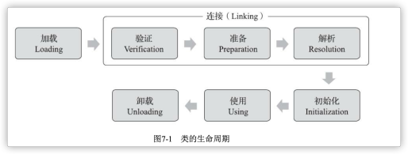

#### 加载（Loading）

**Java虚拟机规范规定类加载的过程要完成3件事**：

* **获取二进制数据**：通过类的全限定名获得定义此类的二进制字节流；
* **装入内存**：将字节流所代表的静态存储结构转换为方法区的运行时数据结构；
* **生成Class对象**：在内存中生成一个代表该类的Class对象，作为方法区中数据的访问入口。

**二进制字节流的获取方式**：

* **从zip包获取**：是成为jar、ear和war格式的基础；
* **从网络中获取**：最典型的应用是Applet；
* **运行时生成**：动态代理技术，如：在 `java.lang.reflect.Proxy` 使用 `ProxyGenerator.generateProxyClass` ；
* **由其他文件生成**：如通过jsp文件生成对应的Class。

**加载阶段的特点**：

* 一个非数组类的加载阶段（即加载阶段第一步获取类的二进制字节流的动作）是可控性最强的阶段，这一步可以通过重写类加载器的`loadClass()` 方法去控制字节流的获取方式；
* 数组不会通过类加载器创建，而是由JVM直接创建；
* 整个加载阶段和连接阶段是交叉进行的，加载阶段尚未结束，连接阶段可能就已经开始了。


#### 连接（Linking）

* **验证**：确保Class文件的字节流中包含的信息符合当前虚拟机的要求，并且不会危害虚拟机自身的安全。验证的内容包括类文件的结构、语义检查、字节码验证和二进制兼容性验证等。
* **准备**：该阶段会为类变量在方法区分配内存并设置初始值。实例变量不会在该阶段分配内存，而是在对象实例化时随着对象一起被分配在堆中。
* **解析**：将常量池的符号引用替换为直接引用的过程。其中解析过程在某些情况可以在初始化阶段之后再开始，这是为了支持Java的动态绑定。


#### 初始化（Initialization）

* **概念**：JVM规范要求每个类或接口在被首次主动使用时才会初始化。初始化是虚拟机执行类构造器 `<clinit>()` 方法的过程。在准备阶段，类变量已经赋过一次系统要求的初始值，而在初始化阶段，根据程序员通过程序制定的主观计划去初始化类变量和其他资源。
* **`<clinit>()`**：是由编译器自动收集类中所有类变量的赋值动作和静态语句块中的语句合并产生的，编译器收集的顺序是由语句在源文件中出现的顺序决定。
* **接口的类变量**：也具有初始化的赋值操作，因此接口与类一样都会生成 `<clinit>() ` 方法。但与类不同的是，执行接口的 `<clinit>() ` 方法不需要先执行父接口的  `<clinit>() ` 方法。只有当父接口中定义的类变量使用时，父接口才会出初始化。接口的实现类在初始化时也一样不会执行接口的 `<clinit>() ` 方法。
* **并发问题**：虚拟机会保证一个类的 `<clinit>() ` 方法在多线程环境下被正确加锁同步。多线程执行初始化，只会有一个线程真正执行，其他线程阻塞等待。
* **初始化顺序**：初始化是按照代码声明的顺序从上而下执行的，静态变量的声明语句，以及静态代码块都被看做是类的初始化语句，JVM会按照初始化语句在类文件中的先后顺序来依次执行它们。


### 类加载器

#### 基本概念

类加载器（Class Loader）就是将类加载阶段的“通过一个类的全限定名来获取描述该类的二进程字节流”这个动作放到虚拟机外部去实现，以便让应用程序自己决定如何获取所需的类。

* 类加载器不需要等到某个类被首次使用时再加载它；
* JVM规范允许类加载器在某个类将要被使用时预先加载它；
* 只有数组不是由类加载器加载的，而是由JVM动态生成的。


#### 启动类加载器

* 启动类加载器Bootstrap ClassLoader又称根类加载器，是由C++实现的最顶层的类加载器，是特定于操作系统的机器指令，负责开启整个类加载的过程；
* 负责加载 `jre/lib` 目录下的jar包和类，如 `java.lang.*`、`rt.jar`。以及被系统属性 `sun.boot.class.path` 所指定的路径下的jar包。以及被 `-Xbootclasspath` 参数所指定的路径下的所有类；
* 所有的类加载器本身都是由启动类加载器加载的，启动类加载器是内建于JVM中的。当JVM启动时，一段特殊的机器码会运行，它会加载扩展类加载器、系统类加载器，这段特殊的机器码就是启动类加载器。


#### 扩展类加载器

* 扩展类加载器Extension ClassLoader的父加载器是启动类加载器。其自身是Java实现的类，是java.lang.ClassLoader的子类；
* 主要负责加载 `jre/lib/ext` 目录下的jar和类，以及被 `java.ext.dirs ` 系统变量所指定的路径下的jar包；
* 扩展类加载器只能加载jar文件，不能加载class文件，所以需要先压缩为jar包才能加载。


#### 应用类加载器

* 应用类加载器Application ClassLoader又称系统类加载器，父加载器是扩展类加载器，是面向应用程序的类加载器。其自身是Java实现的类，是java.lang.ClassLoader的子类；
* 负责加载当前应用 `classpath` 下的所有jar包和类，以及 `java.class.path` 系统变量所指定的路径下的jar包；
* 由于该类加载器是 `ClassLoader ` 类中 `getSystemClassLoader()` 方法的返回值，因此一般被也被称为系统类加载器，如果应用程序没有自定义过类加载器，则该加载器就是程序的默认类加载器。


### 双亲委派机制

#### 双亲委派模型

* 每个类都有对应的类加载器，JVM中的类加载器在协同工作时会默认使用双亲委派模型，即在类加载的时候，系统会首先判断当前类是否已被加载过，已被加载的类会直接返回，否则才会尝试加载。
* 加载时，首先会把该请求委派给父类的加载器 `loadClass()` 处理，因此所有的请求最终都应该传递到顶层的启动类加载器`BootstrapClassLoader ` 中。
* 当父类加载器无法处理时，才由自己处理，当父类加载器为null时，会使用 `BootstrapClassLoader`。

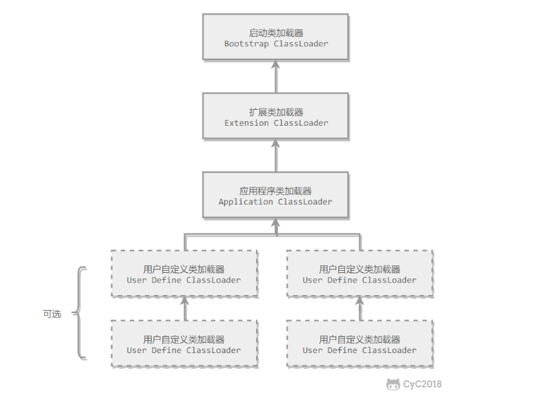


#### 代码示例

```JAVA
public class ClassLoaderDemo {
    
    // 注：这里的双亲关系不是通过基础来实现的，而是由加载器的优先级来决定的
    public static void main(String[] args) {
        // 获取当前类的类加载器，即应用程序类加载器
        System.out.println("ClassLodarDemo's ClassLoader is " +
ClassLoaderDemo.class.getClassLoader());
        // 获取当前类的父类的类加载器，即扩展类加载器
		System.out.println("The Parent of ClassLodarDemo's ClassLoader is " + ClassLoaderDemo.class.getClassLoader().getParent());
        // 获取当前类父类的父类的类加载器，为null，即代表是启动类加载器
		System.out.println("The GrandParent of ClassLodarDemo's ClassLoader is " +
ClassLoaderDemo.class.getClassLoader().getParent().getParent());
    }
}
```

```
ClassLodarDemo's ClassLoader is sun.misc.Launcher$AppClassLoader@18b4aac2
The Parent of ClassLodarDemo's ClassLoader is sun.misc.Launcher$ExtClassLoader@1b6d3586
The GrandParent of ClassLodarDemo's ClassLoader is null
```


#### 源码分析

双亲委派机制的源码集中在 `java.lang.ClassLoader` 的 `loadClass()` 方法中。

```JAVA
private final ClassLoader parent;

protected Class<?> loadClass(String name, boolean resolve) throws ClassNotFoundException {
    synchronized (getClassLoadingLock(name)) {
        // ⾸先检查请求的类是否已经被加载过
        Class<?> c = findLoadedClass(name);
        if (c == null) {
            long t0 = System.nanoTime();
        try {
            if (parent != null) {
                // 若⽗加载器不为空，调⽤⽗加载器loadClass()⽅法处理
            	c = parent.loadClass(name, false);
        	} else {
                // ⽗加载器为空，使⽤启动类加载器BootstrapClassLoader加载
        		c = findBootstrapClassOrNull(name);
        	}
        } catch (ClassNotFoundException e) {
        	// 抛出异常则说明⽗类加载器⽆法完成加载请求
        }
        if (c == null) {
        	long t1 = System.nanoTime();
            // 会⾃⼰尝试加载
            c = findClass(name);
            // this is the defining class loader; record the stats
            sun.misc.PerfCounter.getParentDelegationTime().addTime(t1 - t0);
            sun.misc.PerfCounter.getFindClassTime().addElapsedTimeFrom(t1);
            sun.misc.PerfCounter.getFindClasses().increment();
        }
        if (resolve) {
        	resolveClass(c);
        }
        return c;
    }
}
```


#### 双亲委派的作用

* **避免类的重复加载**：JVM区分不同类的方式不仅是根据类名，相同的类文件被不同的类加载器加载会产生两个不同的类；
* **沙箱安全机制**：保证Java的核心API由父类加载器加载，不会被自定义的类篡改，从而让Java程序稳定运行。


## JVM-字节码

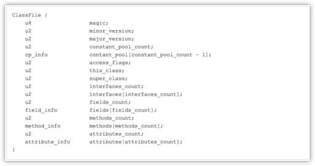

### 字节码文件结构

字节码的两种数据类型：

* **字节数据直接量**：基本数据类型，细分为u1、u2、u4和u8。分别代表连续的1字节、2字节、4字节和8字节组成的整体数据。
* **表（数组）**：有多个基本数据或其他表，按照既定顺序组成的大的数据集合。表是有结构的，体现在组成表的成分所在的位置和顺序都是严格定义好的。

字节码文件结构分析（javap -verbose）：

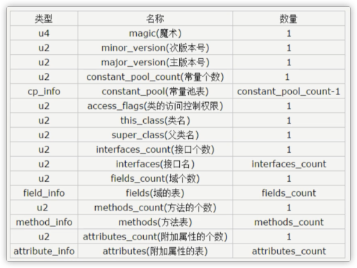

* **魔数**：每个Class文件的头4字节被称为魔数（Magic Number），其唯一的作用就是确定这个文件是否是一个能被JVM接受的字节码文件。魔数为固定值 `0xCAFEBABE`（即咖啡宝贝cafe babe）。

* **版本号**：紧接着魔数的4个字节存储的是Class文件的版本号。第5、6字节表示次版本号（Minor Version），第7、8字节表示主版本号（Major Version）。

* **常量池**：紧接着版本号的是常量池入口。一个类中定义的很多信息都是由常量池维护和描述的，可以看作Class文件的资源仓库。如：类中定义的方法与变量信息。

  * 常量池中主要存储的两类常量：
    * **字面量**：如文本字符串、Java中声明为final的常量值等；
    * **符号引用**：如类和接口的全限定名、字段的名称和描述符、方法的名称和描述符等。
  * 常量池的结构：
    * **常量池计数**：紧跟在主版本号后面，占2个字节。
    * **常量池数组（常量表）**：紧跟在常量池计数之后。与一般数组不同的是，常量池数组中元素的类型、结构和长度都是不同的。每种元素的第1个数据都是u1类型，即标志位，占1个字节，JVM在解析常量池时，根据u1来获取元素的具体类型。
    * **常量池数组中元素的个数=常量池数-1**：索引0是一个保留常量，对应null。所以索引池数组的索引从1开始。

* **访问标志**：用于识别一些类或接口层次的访问信息。如：该Class是类还是接口、是否定义为public类型、是否定义为abstract类型、如果是类那是否被声明为final等。

  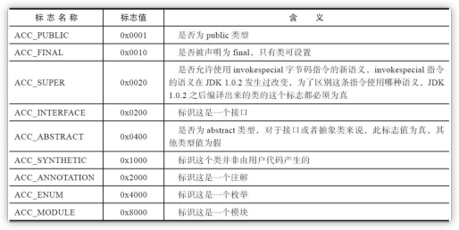

* **类/父类/接口索引集合**：这三项确定类的继承关系。类索引用于确定该类的全限定名，父类索引用于确定该类的父类的全限定名，接口索引集合就用来描述该类实现的所有接口（按照implements/extends从左到右的顺序排列在集合中）。

* **字段表集合**：字段表描述接口或类中声明的变量。字段包括类变量和实例变量，不包括方法中定义的局部变量。而字段的名字、数据类型都需要引用常量池中的常量来描述。字段表集合中不会列出从父类/接口继承的字段。但可能出现编译器自动添加的字段，如：内部类为了保证对外部类的访问性，会自动添加指向外部类实例的字段。

  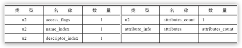

  * access_flags：访问标志；

    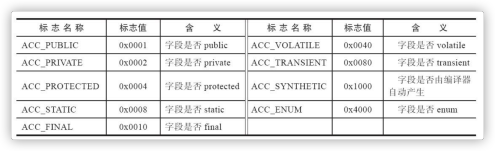

  * name_index：字段名索引；

  * descripter_index：描述符索引。所谓的描述符就是一种用于表示变量/字段描述信息的特殊符号。描述信息主要作用是描述字段的数据类型、方法的参数列表（数量、类型和顺序）和返回值。

    * 字段的描述符信息：根据描述符规则，基本数据类型和void都用一个大写字母表示，对象类型则用字符L加全限定名表示。对于数组类型，每一个维度都使用一个前缀 `[` 来表示，如：`int[]` 被记录为 `[I`、String[][]被记录为 `[[Ljava/lang/String`。

    |  B   |              byte               |
    | :--: | :-----------------------------: |
    |  C   |              char               |
    |  D   |             double              |
    |  F   |              float              |
    |  I   |               int               |
    |  J   |              long               |
    |  S   |              short              |
    |  Z   |             boolean             |
    |  V   |              void               |
    |  L   | 对象类型，如Ljava/ lang/String; |

    * 方法的描述符信息：用描述符描述方法时，按照先参数列表、后返回值的顺序来描述。参数列表按照参数的严格顺序放在一组 `()` 之内。如：`String getRealnamebyIdAndNickname(int id, String name)` 的描述符为 `(I, Ljava/lang/String) Ljava/lang/String`。

  * attribute_account：属性表计数器；

  * attribute_info：属性信息。

* **方法表集合**：描述方法的定义，但方法的代码经过编译器编译成字节码指令后，存放在属性表集合中的方法属性表中的Code属性里。如果没有重写父类方法，方法表集合中就不会出现父类的方法信息。但有可能出现由编译器自动添加的方法，如：类构造器<clinit>和实例构造器<init>。

* **属性表**：Class文件、字段表、方法表都可以携带自己的属性表集合，以描述某些场景专有的信息。如：方法的字节码指令就存储在Code属性表中。虚拟机规范预定义的属性：

  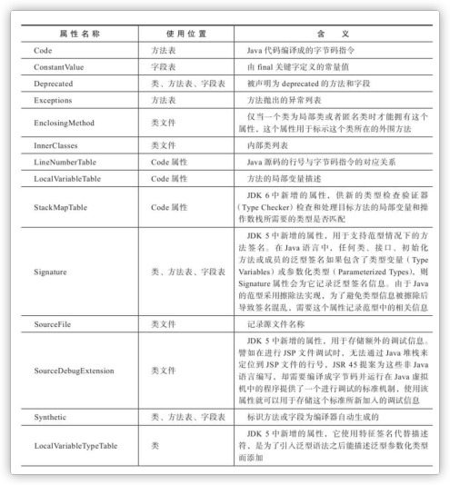

  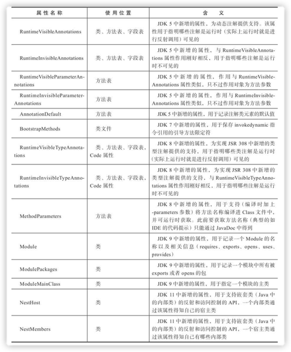


### 字节码示例

```java
public class Test01 {
    
    private int anInt = 1;

    public Test01() {
    }

    public int getAnInt() {
        return this.anInt;
    }

    public void setAnInt(int anInt) {
        this.anInt = anInt;
    }
}
```

```java
public class jvm.video.zhanglong.bytecode.Test01
  minor version: 0
  major version: 52
  flags: (0x0021) ACC_PUBLIC, ACC_SUPER
  this_class: #3                          // jvm/video/zhanglong/bytecode/Test01
  super_class: #4                         // java/lang/Object
  interfaces: 0, fields: 1, methods: 3, attributes: 1
Constant pool:
   #1 = Methodref          #4.#20         // java/lang/Object."<init>":()V
   #2 = Fieldref           #3.#21         // jvm/video/zhanglong/bytecode/Test01.anInt:I
   #3 = Class              #22            // jvm/video/zhanglong/bytecode/Test01
   #4 = Class              #23            // java/lang/Object
   #5 = Utf8               anInt
   #6 = Utf8               I
   #7 = Utf8               <init>
   #8 = Utf8               ()V
   #9 = Utf8               Code
  #10 = Utf8               LineNumberTable
  #11 = Utf8               LocalVariableTable
  #12 = Utf8               this
  #13 = Utf8               Ljvm/video/zhanglong/bytecode/Test01;
  #14 = Utf8               getAnInt
  #15 = Utf8               ()I
  #16 = Utf8               setAnInt
  #17 = Utf8               (I)V
  #18 = Utf8               SourceFile
  #19 = Utf8               Test01.java
  #20 = NameAndType        #7:#8          // "<init>":()V
  #21 = NameAndType        #5:#6          // anInt:I
  #22 = Utf8               jvm/video/zhanglong/bytecode/Test01
  #23 = Utf8               java/lang/Object
{
  public jvm.video.zhanglong.bytecode.Test01();
    descriptor: ()V
    flags: (0x0001) ACC_PUBLIC
    Code:
      stack=2, locals=1, args_size=1
         0: aload_0
         1: invokespecial #1                  // Method java/lang/Object."<init>":()V
         4: aload_0
         5: iconst_1
         6: putfield      #2                  // Field anInt:I
         9: return
      LineNumberTable:
        line 3: 0
        line 4: 4
      LocalVariableTable:
        Start  Length  Slot  Name   Signature
            0      10     0  this   Ljvm/video/zhanglong/bytecode/Test01;

  public int getAnInt();
    descriptor: ()I
    flags: (0x0001) ACC_PUBLIC
    Code:
      stack=1, locals=1, args_size=1
         0: aload_0
         1: getfield      #2                  // Field anInt:I
         4: ireturn
      LineNumberTable:
        line 7: 0
      LocalVariableTable:
        Start  Length  Slot  Name   Signature
            0       5     0  this   Ljvm/video/zhanglong/bytecode/Test01;

  public void setAnInt(int);
    descriptor: (I)V
    flags: (0x0001) ACC_PUBLIC
    Code:
      stack=2, locals=2, args_size=2
         0: aload_0
         1: iload_1
         2: putfield      #2                  // Field anInt:I
         5: return
      LineNumberTable:
        line 11: 0
        line 12: 5
      LocalVariableTable:
        Start  Length  Slot  Name   Signature
            0       6     0  this   Ljvm/video/zhanglong/bytecode/Test01;
            0       6     1 anInt   I
}
```


### 符号引用和直接引用

TODO


### 方法调用

方法调用不等同于方法执行，该阶段的唯一任务就是确定被调用方法的版本（即调用哪个方法），暂时不涉及方法内部的具体运行过程。

**JVM方法调用的字节码指令**：

* invokeinterface：调用接口中的方法，实际上是在运行期决定的，决定到底调用实现该接口的哪个对象的特定方法；
* invokestatic：调用静态方法；
* invokespecial：调用私有方法、构造方法和父类的方法；
* invokevirtual：调用虚方法，运行期动态查找的方法；
* invokedynamic：先在运行时期动态解析出调用点限定符所引用的方法，然后再执行该方法。

**解析与分派**：TODO


### 方法执行

现代JVM执行Java代码时，通常都会将解释执行与编译执行结合起来。

* **解释执行**：就是通过解释器读取字节码，遇到相应的指令就去执行。

* **编译执行**：就通过即时编译器JIT将字节码转换为本地机器码来执行，通常会根据热点代码来生成相应的本地机器码。

**基于栈的指令集**：在内存中完成操作，主要操作有入栈和出栈两种。其优点在于可以在不同平台移植，缺点是完成相同的操作所需的指令数量通常比寄存器指令集更多。

**基于寄存器的指令集**：是与硬件架构紧密相关的，无法做到可移植。但性能高，在CPU高速缓冲区中操作。

**栈帧**：JVM以方法做为最基本的执行单元，栈帧Stack Frame则是用于支持虚拟机进行方法调用和方法执行背后的数据结构，也是JVM运行时数据区的虚拟机栈中的基本单位。栈帧中存储了方法的局部变量表、操作数栈、动态链接和方法返回地址等信息。每一个方法从调用到执行结束的过程，都对应一个栈帧在虚拟机栈中入栈和出栈的过程。每一个栈帧都是由一个特定的线程执行，不存在同步和并发问题。


### 常用字节码

|     字节码     |                             作用                             |
| :------------: | :----------------------------------------------------------: |
|      ldc       |  表示将int、float或者String类型的常量值从常量池中推送至栈顶  |
|     bipush     |          表示将单字节（-128-127）的常量值推送到栈顶          |
|     sipush     |         表示将一个短整型值（-32768-32369）推送至栈顶         |
|   iconst_<n>   | 表示将int型的1推送至栈顶（iconst_m1到iconst_5） m1,0,1,2,3,4,5 最多到iconst_5，m1表示-1，如果是6，则会变为bipush |
|   anewarray    | 表示创建一个引用类型（如类、接口）的数组，并将其引用值压入栈顶 |
|    newarray    | 表示创建一个指定原始类型（int boolean float double）的数组，并将其引用值压入栈顶 |
|     return     |                           返回void                           |
|    aload_0     |                     将0推送到操作栈栈顶                      |
| invokespecial  |                    调用父类的相应构造方法                    |
|    putfiled    |                        为成员变量赋值                        |
|    getfield    |                       获取成员变量的值                       |
|     clinit     |                       对静态变量初始化                       |
|      new       |                       创建一个新的对象                       |
|      dup       |         赋值操作数栈最顶层的值，将结果推送到操作数栈         |
|   istore_<n>   |  将操作数栈顶元素出栈 并将其存储到局部变量表中索引为n的位置  |
|      pop       |                         弹出栈顶元素                         |
| invokervirtual |                          调用虚方法                          |
|      iadd      |                         int类型相加                          |
|      isub      |                         int类型相减                          |
|                |                                                              |
|                |                                                              |


## JVM-GC常用参数

### 基本参数

* -Xmn -Xms -Xmx -Xss：新生代 最小堆 最大堆 栈空间；
* -XX:+UseTLAB：是否使用TLAB，默认为true；
* -XX:PrintTLAB：打印TLAB的使用情况；
* -XX:TLABSize：设置TLAB的大小；
* -XX:+DisableExplictGC：是否禁用System.gc()；
* -XX:+PrintGC
* -XX:+PrintGCDetails
* -XX:+PrintHeapAtGC
* -XX:+PrintGCTimeStamps
* -XX:+PrintGCApplicationConcurrentTime：打印应用程序当前时间；
* -XX:+PrintGCApplicationStoppedTime：打印应用程序暂停时长；
* -XX:+PrintReferenceGC：打印回收了多少种不同引用类型的引用；
* -verbose:class：类加载的详细信息；
* -XX:+PrintVMOptions：打印虚拟机参数；
* -XX:+PrintFlagsFinal -XX:+PrintFlagsInitial
* -Xloggc:opt/log/gc.log
* -XX:MaxTenuringThreshold：升代年龄，最大值15；
* -XX:PreBlockSpin：锁自旋次数；
* -XX:CompileThreshold


### Parallel常用参数

* -XX:SurvivorRatio
* -XX:PreTenureSizeThreshold：大对象的大小；
* -XX:MaxTenuringThreshold
* -XX:+ParallelGCThreads：并行收集器的线程数，同一适用于CMS，一般设置为CPU的核数；
* -XX:+UseAdaptiveSizePollcy：自动选择各区的大小比例。


### CMS常用参数

* -XX:+UseConcMarkSweepGC：
* -XX:ParallelCMSThreads：CMS线程数量；
* -XX:CMSInitiatingOccupancyFraction：老年代比例达到多少后开始收集，默认68%，如果频繁的发生Serial Old卡顿，应该调小；
* -XX:UseCMSCompactAtFullCollection：是否在FGC时进行压缩；
* -XX:CMSFullGCsBeforeCompaction：多少次FGC后进行压缩；
* -XX:+CMSClassUnloadingEnabled：
* -XX:CMSInitiatingPermOccupancyFraction：达到什么比例时进行Perm回收；
* GCTimeRatio：设置GC时间占用程序运行时间的百分比；
* -XX:MaxGCPauseMillis：最大GC停顿时间，是一个建议时间，GC会尝试使用各种手段达到这个时间，如减小年轻代。


### G1常用参数

* -XX:+UseG1GC：
* -XX:MaxGCPauseMillis：建议值，G1会尝试调整Yong区的Region数来达到这个值；
* -XX:GCPauseIntervalMillis：GC的间隔时间；
* -XX:+G1HeapRegionSize：Region大小，建议逐渐增大该值，1 2 4 8 16 32。随着size的增加，垃圾的存活时间更长，GC的间隔更长，但每次GC的时间也会更长；
* G1NewSizePercent：新生代最小比例，默认5%；
* G1MaxNewSizePercent：新生代最大比例，默认60%；
* GCTimeRatio：GC时间建议比例，G1会根据这个值调整堆空间；
* ConcGCThreads：线程数量；
* InitiatingHeapOccupancyPercent：启动G1的堆空间占用比例。


## JVM-JIT即时编译器

### 概念

JIT（ just in time）即时编译器。使用即时编译技术，加速Java程序的执行速度。通常通过javac将程序源代码编译，转换成java字节码，JVM通过解释字节码将其翻译成对应的机器指令，逐条读入，逐条解释翻译。很显然，经过解释执行，其执行速度必然会比可执行的二进制字节码程序慢很多。而为了提高执行速度，引入了JIT技术。在运行时JIT会把翻译过的机器码保存起来，以备下次使用，因此从理论上来说，采用JIT技术可以接近于以前的纯编译技术。


### 编译过程

当JIT编译启用时（默认是启用的），JVM读入Class文件解释后，将其发送给JIT编译器。JIT编译器将字节码编译成本机机器代码，下图展示了该过程。


### HotSpot编译

当JVM执行Java代码时，它并不立即开始编译代码。这主要有两个原因：

* 首先，如果这段代码本身在将来只会被执行一次，那么从本质上看，编译就是在浪费精力。因为将代码翻译成 java 字节码相对于编译这段代码并执行代码来说，要快很多。当然，如果一段代码频繁的调用方法，或是一个循环，也就是这段代码被多次执行，那么编译就非常值得了。因此，编译器具有的这种权衡能力会首先执行解释后的代码，然后再去分辨哪些方法会被频繁调用来保证其本身的编译。其实说简单点，就是 JIT 在起作用，我们知道，对于 Java 代码，刚开始都是被编译器编译成字节码文件，然后字节码文件会被交由 JVM 解释执行，所以可以说 Java 本身是一种半编译半解释执行的语言。Hot Spot VM 采用了 JIT compile 技术，将运行频率很高的字节码直接编译为机器指令执行以提高性能，所以当字节码被 JIT 编译为机器码的时候，要说它是编译执行的也可以。也就是说，运行时，部分代码可能由 JIT 翻译为目标机器指令（以 method 为翻译单位，还会保存起来，第二次执行就不用翻译了）直接执行。
* 第二个原因是最优化，当 JVM 执行某一方法或遍历循环的次数越多，就会更加了解代码结构，那么 JVM 在编译代码的时候就做出相应的优化。我们将在后面讲解这些优化策略，这里，先举一个简单的例子：我们知道 equals() 这个方法存在于每一个 Java Object 中（因为是从 Object class 继承而来）而且经常被覆写。当解释器遇到 b = obj1.equals(obj2) 这样一句代码，它则会查询 obj1 的类型从而得知到底运行哪一个 equals() 方法。而这个动态查询的过程从某种程度上说是很耗时的。


# 从I/O模型到计算机网络再到Netty

## I/O模型-Linux的Socket API

网络应用进程通信时需要通过API接口请求底层协议的服务，如传输层服务，目前因特网最广泛的应用编程接口就是Socket API。Linux内核也实现了Socket API，实现了底层协议的封装。

### socket

```C
int socket(int family, int type, int protocol);
```

* **功能**：创建套接字；
* **参数**：
  * `family`：协议族，通常取值为PF_INET或AF_INET，表示面向IPv4或IPv6协议族；
  * `type`：套接字类型，取值有数据报套接字SOCK_DGRAM、流式套接字SOCK_STREAM和原始套接字SOCK_RAW；
  * `protocol`：协议，取值IPPROTO_TCP或IPPROTO_UDP，表示TCP和UDP协议。
* **返回**：成功返回非负整数（即套接字描述符）。失败则返回-1。


### bind

```C
int bind(int sockfd, const struct sockaddr *myaddr, socklen_t addrlen);
```

* **功能**：为套接字绑定本地端口；
* **参数**：
  * `sockfd`：本地套接字描述符；
  * `myaddr`：本地端点地址；
  * `addrlen`：端点地址长度。
* **返回**：成功返回0，失败则返回-1。


### listen

```C
int listen(int sockfd, int backlog);
```

* **功能**：将套接字置为监听状态；
* **参数**：
  * `sockfd`：本地套接字描述符；
  * `backlog`：连接请求的队列长度。
* **返回**：成功返回0，失败则返回-1。


### accept

```C
int accept(int sockfd, struct socketaddr *cliaddr, socklen_t addrlen);
```

* **功能**：从监听状态的流式套接字的客户连接请求队列中，出队一个请求，并且创建一个新的套接字来与客户套接字建立TCP连接；
* **参数**：
  * `sockfd`：本地流套接字描述符；
  * `cliaddr`：用于存储客户端点地址；
  * `addrlen`：端点地址长度。
* **返回**：成功返回非负整数，即新建的与客户连接的套接字描述符。失败则返回-1。


### send

```C
ssize_t send(int sockfd, const void *buff, size_t nbytes, int flags);
```

* **功能**：发送数据（流式套接字）；
* **参数**：
  * `sockfd`：本地套接字描述符；
  * `buff`：指向存储待发送数据的缓存指针；
  * `nbytes`：数据长度；
  * `flags`：控制比特，通常取0。
* **返回**：成功返回发送的字节数，失败则返回-1。


### recv

```C
ssize_t recv(int sockfd, void *buff, size_t nbytes, int flags);
```

* **功能**：接收数据（流式套接字）；
* **参数**：
  * `sockfd`：本地套接字描述符；
  * `buff`：指向存储接收数据的缓存指针；
  * `nbytes`：数据长度；
  * `flags`：控制比特，通常取0。
* **返回**：成功返回接收到的字节数，失败则返回-1。


## I/O模型-Linux的I/O模型

### I/O相关概念

**同步和异步（消息的通知机制）**：

* **同步**：所谓同步，就是发出一个功能调用时，在没有得到结果之前，该调用就不会返回。如应用程序调用 `readfrom` 系统调度时，必须等待内核的I/O操作执行完成后才能够返回；
* **异步**：异步的概念和同步相对，当一个异步的功能调用发出后，调用者会立即得到返回，但不会立即得到结果。当这个调用被真正的处理完毕后，再通过状态、信号和回调来通知调用者。如：应用程序调用 `aio_read` 系统调用时，不必等到操作完成就可以直接返回，操作的结果会在真正完成后通过信号通知调用者。

**阻塞和非阻塞（等待消息通知时的状态）**：

* **阻塞**：阻塞调用是指调用结果返回之前，当前线程会被阻塞/挂起，只有在得到结果之后才会继续执行。阻塞和同步是完全不同的概念，同步是对于消息的通知机制而言，而阻塞是针对等待消息通知时的状态来说的；
* **非阻塞**：非阻塞的概念和阻塞相对，即在不能立即得到调用结果时，不会阻塞当前线程，而会继续执行，并设置相应的异常序号。虽然表面上看非阻塞的方式可以明显提高CPU的利用率，但也带来了另外一种后果就是系统的线程切换频率增加。所以增加的CPU利用率能不能补偿CPU频繁切换上下文带来的消耗需要好好的评估。

**事例描述（小明下载文件）**：

* **同步阻塞**：小明一直盯着下载进度条，直到100%的时候完成下载。
  * 同步：等待下载进度到100%；
  * 阻塞：等待下载完成的过程中，小明不干别的事。
* **同步非阻塞**：小明提交下载任务后就去干别的事，每过一段时间就去看一眼进度条，看到100%就完成下载。
  * 同步：等待下载进度到100%；
  * 非阻塞：等待进度条到底的过程中，干别的事，只是时不时的回来看一眼。即小明要在两个任务间来回切换，关注下载进度。
* **异步阻塞**：小明更换了一个带下载完成通知的下载器，当下载完成后会叮一声，不过小明一直等着叮声响起。
  * 异步：下载完成叮一声通知；
  * 阻塞：等待通知声响起，不去做其他得事。
* **异步非阻塞**：小明提交任务后就去干别的事，直到听见叮的一声就完成。
  * 异步：下载完成叮一声通知；
  * 非阻塞：先去做其他事，只需要等通知即可。

**Linux中的输入操作包括两个阶段**：

* 首先，等待数据准备好，即文件的状态发生变化，到达内核缓冲区；
* 其次，从内核向进程复制数据，即从内核空间拷贝到用户空间；
* 对于一个套接字上的输入操作，第一步通常涉及等待数据从网络中到达，当所有分组都到达时，会被复制到内核中的某缓冲区。第二步就是把数据从内核缓冲区复制到应用程序缓冲区。


### 阻塞式I/O


* 同步阻塞式I/O。最简单最常用的一种I/O模型。在Linux中，默认情况下所有套接字都是阻塞式的；
* 上图是阻塞套接字 `recvfrom` 系统调用的流程图，进程调用一个 `recvfrom` 请求，但是不能立即收到回复，需要等待内核的操作执行完成返回成功提示后，进程才能处理数据报；
* 在IO执行的两个阶段中，进程都处于阻塞（Blocked）状态，在等待数据返回的过程中不做其他任何工作，只能阻塞等待在那里。
* **优点**：简单、实时性高、响应及时无延迟；
* **缺点**：阻塞等待性能较差、CPU利用率较低。


### 非阻塞式I/O


* 同步非阻塞式I/O。与阻塞I/O不同的是，非阻塞的 `recvfrom` 系统调用后，进程并没有被阻塞，内核会立即返回给进程消息，若是数据还未准备好，则返回一个error（EAGAIN或EWOULDBLOCK）；
* 进程收到返回后，可以处理其他的事情，每过一段时间就会再次发起 `recvfrom` 系统调用，采用轮询的方式检查内核数据，直到数据准备好，最后等到数据被拷贝到进程，再进行数据处理；
* 上图是Linux下设置为非阻塞套接字的 `recvfrom` 系统调用的流程图，前三次调用 `recvfrom` 请求，但是数据没有准备好，所以内核返回 `errno: EWOULDBLOCK`，但是当第四次调用 `recvfrom` 时数据已经准备好了，最后等待数据被拷贝到用户空间，处理数据；
* 在非阻塞状态下，对于I/O执行的两个阶段进程并不是完全非阻塞的，第一个阶段等待数据准备完毕会采用轮询访问的非阻塞方式，而第二个阶段等待数据从内核拷贝到用户空间时会处于阻塞等待状态。
* 同步非阻塞方式相对于同步阻塞方式：
  * **优点**：能够在等待任务完成的时间里做其他事，包括提交其他任务，也就是允许多个任务同时执行；
  * **缺点**：任务完成的响应延迟增大了，因为每过一段时间才去轮询一次 read 操作，而任务可能在两次轮询之间的任意时间完成，这样会导致整体数据吞吐量降低。


### I/O多路复用

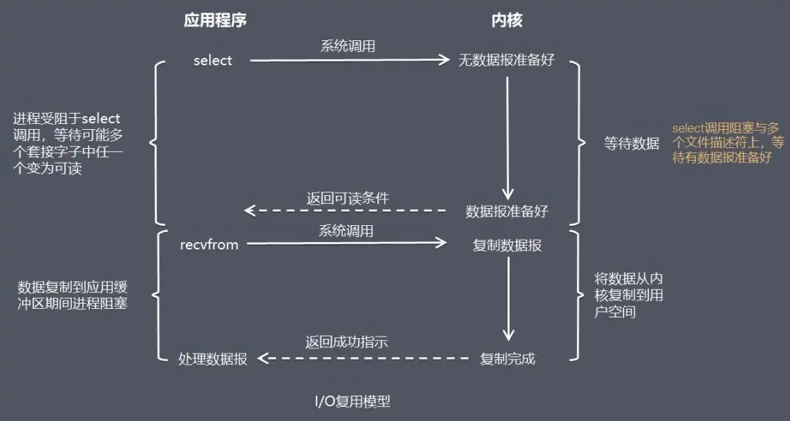

* 同步非阻塞式I/O。所谓多路复用，即使用单个进程同时处理多个网络连接的I/O。基本原理就是不再由应用程序自己监听连接，取而代之是由内核替代应用程序监视文件描述符；
* 以 `select` 为例，当用户进程调用了 `select` 系统调用，那么整个进程会被阻塞。同时Kernel会监听所有在 `select` 上注册的Socket，当任何一个Socket中的数据准备好了，`select` 就会返回可读条件。这时用户进程再通过 `recvfrom` 系统调用，触发并等待数据从内核拷贝到用户进程；
* 上图就是Linux中使用 `select` 多路复用机制响应Socket连接的流程图。涉及到两个系统调用（`select` 和 `recvfrom`），而阻塞IO只调用了一个 `system_call(recvfrom)`。所以，如果处理的连接请求不是很多的话，使用I/O复用器不一定比使用多线程+非阻塞/阻塞IO的性能更好，可以会有更大的延迟。I/O复用的优势并不是对于单个连接能处理的更快，而是使用单个进程就可以同时处理多个网络连接的I/O；
* 实际使用时，对于每一个Socket，都可以设置为非阻塞。用户进程在两个阶段都是阻塞的，只不过是阻塞在系统调用上，而是不阻塞在I/O操作上，即并不会阻塞等待I/O数据准备好，而是将非阻塞I/O的轮询访问交给了内核去做。
* **优点**：与传统的并发模型相比，I/O多路复用的最大优势是系统开销小，不需要创建额外的进程或线程，也不需要维护这些进程和线程的运行，降低了系统的维护工作量，节省了系统资源。
* **应用场景**：
  * 服务器需要同时处理多个处于监听或连接状态的套接字；
  * 服务器需要同时处理多种网络协议的套接字，如：同时处理TCP和UDP请求；
  * 服务器需要监听多个端口或处理多种服务；
  * 服务器需要同时处理用户输入和网络连接。


### 信号驱动式I/O


* 同步非阻塞I/O。通过 `sigaction` 系统调用，允许Socket使用信号驱动I/O，并在用户进程注册一个SIGIO的信号处理函数，用户进程会继续运行而不阻塞。当数据准备好时，进程会收到一个SIGIO信号，然后可以在信号处理函数中调用I/O操作函数处理数据；
* 用户进程不会在I/O操作的第一阶段阻塞，只会在第二阶段阻塞。


### 异步I/O


* 异步非阻塞I/O。上述四种IO都是同步模型，相对于同步IO，异步IO不是顺序执行的。用户进程进行 `aio_read` 系统调用后，就可以去处理其他的逻辑了，无论内核数据是否准备好，都会直接返回给用户进程，不会对进程造成阻塞；
* 等到数据准备完毕，内核直接复制数据到用户进程空间，然后从内核向进程发送通知信号，告知用户进程：此时数据已经在用户空间了，可以直接对数据进行处理；
* 在Linux中，通知的方式是信号，分为三种情况：
  * 如果这个进程正在用户态处理其他逻辑，那就强行中断，调用事先注册的信号处理函数，这个函数可以决定何时以及如何处理这个异步任务。由于信号处理函数是随机触发的，因此和中断处理程序一样，有很多事情是不能做的，为了保险起见，一般是把事件登记一下放进队列，然后返回该进程原来在做的事；
  * 如果这个进程正在内核态处理，如：正在以同步阻塞的方式读写磁盘，那就把这个通知挂起，等到内核态的事件处理完毕，快要回到用户态时，再触发信号的通知；
  * 如果这个进程现在被阻塞/挂起了，那就把这个进程唤醒，等待CPU调度，触发信号通知。
* 在此模型下，进程在I/O的两个阶段中均为非阻塞。


### 五种I/O模型的比较


* 前四种I/O模型都是同步模型，至于阻塞和非阻塞的区别在于I/O执行的第一阶段，而第二阶段都是一样阻塞的，都是在数据从内核缓冲区复制到应用程序缓冲区期间，进程阻塞于 `recvfrom` 调用；
* 相反，异步I/O模型在等待数据和接收数据这两个阶段都是非阻塞的，用户进程可以处理其他的逻辑，即用户进程将整个I/O操作交给内核完成，内核全部完成后才会发起通知，在此期间，用户进程不需要去检查I/O状态，也不需要主动的去触发数据的拷贝。


## I/O模型-Linux的I/O多路复用

### 基本概念

* **文件描述符（File Descriptor）**：表示指向文件引用的抽象化概念。fd在形式上是一个非负整数，实际上是一个索引值，指向内核为每一个进程所维护的该进程打开文件的记录表。当程序打开一个现有文件或创建一个新文件时，内核向进程返回一个文件描述符。

* **缓存I/O**：又称标准I/O，是大多数文件系统的默认I/O。在Linux中，内核会将I/O的数据缓存在文件系统的页缓存中，即数据会被先拷贝到操作系统内核缓冲区中，然后才会从操作系统内核缓冲区拷贝到应用程序的地址空间中。


### select


```c
int select(int maxfdp1, fd_set *readset, fd_set *writeset, fd_set *exceptset, const struct timeval *timeout);
```

* **参数**：
  * `int maxfdp1`：指定待监听的文件描述符个数，它的值是待监听的最大描述符加1。
  * `fd_set *readset, fd_set *writeset, fd_set *exceptset`：fd_set可以理解为存放fd的集合，三种参数指定内核对fd集合的监听事件（读、写和异常）；
  * `const struct timeval *timeout`：超时参数，调用select会一直阻塞直到有fd发生事件或等待超时。
* **返回值**：若有就绪的fd则返回其数量，若超时则为0，出错则为-1。
* **运行机制**：select机制提供一种fd_set数据结构，是一个long类型的数组，数组中的每个元素都能与一个fd建立联系。当 `select()` 被调用时，由内核根据I/O状态修改fd_set的内容，由此来通知执行了 `select()` 的进程哪一个Socket或文件可读/写或建立连接。
* **优点**：在一个线程内可以同时处理多个Socket的I/O请求。
* **缺点**：
  * 每次调用select，都需要将fd_set从用户空间拷贝到内核空间，若集合很大会造成很大的开销；
  * 每次调用select，都需要在内核遍历整个fd_set，若集合很大会造成很大的开销；
  * 为了减少拷贝数据带来的性能消耗，内核对被监听的fd_set做了大小限制（1024），且是通过宏实现的，大小不可改变。


### poll

```C
int poll(struct pollfd *fds, nfds_t nfds, int timeout);

typedef struct pollfd {
	int fd;			// 需要被检测或选择的文件描述符
	short events;	// 文件描述符fd上感兴趣的事件
    short revents;	// 文件描述符fd当前实际发生的事件
} pollfd_t;
```

* **参数**：
  * `struct pollfd *fds`：fds是一个pollfd类型的数组，用于存放需要检测其状态的fd和对应事件，且调用poll后fds不会被清空。一个pollfd结构体用于表示一个被监听的fd，通过传递fds指示poll监视多个fd。其中，events域是该fd对应的感兴趣的事件掩码（由用户设置），revents域是该fd实际发生的事件掩码（由内核在调用返回时设置）；
  * `nfds_t nfds`：记录数组fds中描述符的总数量。
* **返回值**：返回集合中已就绪的读写或异常的fd数量，返回0表示超时，返回-1表示异常。
* **针对select的改进**：改变了fd集合的结构，使用pollfd链表结构替代了select的fd_set数组结构，使得poll没有了最大fd数量的限制。


### epoll


* epoll是Linux内核对I/O多路复用接口的改进版本，显著提高程序在大量并发连接中只有少量活跃情况下CPU的利用率。在监听事件就绪的过程中，不需要遍历整个被监听的描述符集合，只需要遍历那些发生内核I/O事件被异步唤醒而加入Ready队列（链表）的描述符集合即可。

  ```c
  struct eventpoll{  
      ....  
      // 红黑树的根节点，这颗树中存储着所有添加到epoll中的需要监听的描述符
      struct rb_root  rbr;  
      // 双向链表中则存放着将要通过 epoll_wait 返回给用户的发生事件就绪的数据
      struct list_head rdlist;
      ....  
  };
  ```

* fd进入红黑树时会对应的注册事件和回调函数，当网络连接和数据读写等事件发生时，由网卡驱动发出中断，产生事件然后调用call_back使fd加入就绪队列。

  ```c
  struct epitem{  
      struct rb_node rbn;			// 红黑树节点  
      struct list_head rdllink;	// 双向链表节点  
      struct epoll_filefd ffd;	// 事件句柄信息  
      struct eventpoll *ep;		// 指向其所属的eventpoll对象  
      struct epoll_event event;	// 期待发生的事件类型  
  };
  ```

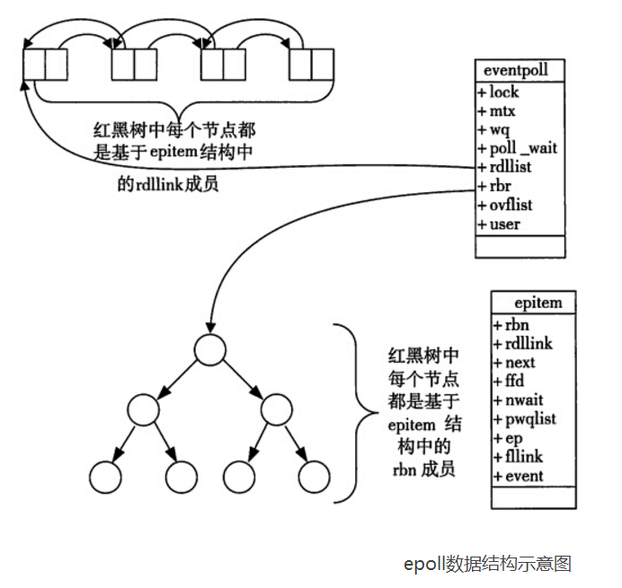

* epoll没有描述符个数的限制，会将整个描述符集合放入一块用户和内核空间的共享内存中。这样在用户空间和内核空间的copy只需要一次即可。
* epoll提供了两种IO事件的触发方式：
  * **水平触发（LT，Level Trigger）**：默认工作模式，即当 `epoll_wait` 检测到某描述符事件的就绪并通知应用程序时，应用程序可以不立即处理该事件。等到下次调用 `epoll_wait` 时，会再次通知此事件；
  * **边缘触发（ET，Edge Trigger）**：当 `epoll_wait` 检测到某描述符事件就绪并通知应用程序时，应用程序必须立即处理该事件。如果不处理，下次调用 `epoll_wait` 时，不会再次通知此事件，即边缘触发机制只会在状态由未就绪变为就绪时通知一次。

```C
int epoll_create(int size);
int epoll_ctl(int epfd, int op, int fd, struct epoll_event *event);
int epoll_wait(int epfd, struct epoll_event * events, int maxevents, int timeout);
```

* `epoll_create`：创建一个epoll的fd，参数size表示内核要监听的fd数量，调用成功时返回一个epoll文件描述符，失败返回-1；
* `epoll_ctl`：用于注册要监听的fd和事件。

  * `epfd`：表示epoll的fd；

  * `op`：表示对fd的操作类型。

    * **EPOLL_CTL_ADD**：注册新的fd到epfd中；
    * **EPOLL_CTL_MOD**：修改已注册fd的监听事件；
    * **EPOLL_CTL_DEL**：从epfd中删除一个fd。

  * `fd`：表示需要监听的描述符；

  * `event`：表示需要监听的事件。

    * EPOLLIN：表示对应的文件描述符可以读（包括对端Socket正常关闭）；
    * EPOLLOUT：表示对应的文件描述符可以写；
    * EPOLLPRI：表示对应的文件描述符有紧急的数据可读（这里应该表示有带外数据到来）；
    * EPOLLERR：表示对应的文件描述符发生错误；
    * EPOLLHUP：表示对应的文件描述符被挂断；
    * EPOLLET：将EPOLL设为边缘触发（Edge Triggered）模式，这是相对于水平触发（Level Triggered）来说的；
    * EPOLLONESHOT：只监听一次事件，当监听完这次事件之后，如果还需要继续监听这个socket的话，需要再次把这个socket加入到EPOLL队列里。

    ```C
    struct epoll_event {
        __uint32_t events;  /* 配置epoll监听的事件类型 */
        epoll_data_t data;  /* User data variable */
    };
    
    typedef union epoll_data {
        void *ptr;
        int fd;
        __uint32_t u32;
        __uint64_t u64;
    } epoll_data_t;
    ```
* `epoll_wait`：等待事件的就绪，成功时返回就绪的事件数量，失败则返回-1，等待超时返回0。
  
  * `epfd`：表示epoll的fd；
  * `events`：表示从内核得到的就绪事件集合；
  * `maxevents`：通知内核events的大小；
  * `timeout`：表示等待的超时时间。


### select/poll/epoll总结

|            |                         select                         |                         poll                         |                            epoll                             |
| :--------: | :----------------------------------------------------: | :--------------------------------------------------: | :----------------------------------------------------------: |
|  操作方式  |                          遍历                          |                         遍历                         |                             回调                             |
|  底层实现  |                          数组                          |                         链表                         |                         红黑树+链表                          |
|   IO效率   |        每次调用都进行线性遍历，时间复杂度为O(n)        |       每次调用都进行线性遍历，时间复杂度为O(n)       | 事件通知方式，每当fd就绪，系统注册的回调函数就会被调用，将就绪fd放到readyList里面，时间复杂度O(1) |
| 最大连接数 |                1024（x86）或2048（x64）                |                        无上限                        |                            无上限                            |
|   fd拷贝   | 每次调用select，都需要把fd集合从用户空间拷贝到内核空间 | 每次调用poll，都需要把fd集合从用户空间拷贝到内核空间 | 调用epoll_ctl时拷贝进内核并保存，之后每次epoll_wait都不用拷贝 |


## I/O模型-Linux的零拷贝技术

### mmap

TODO


### sendfile

#### 系统调用

```c
ssize_t sendfile(int out_fd, int in_fd, off_t *offset, size_t count)
```

* `out_fd`：等待读数据的fd；
* `in_fd`：等待写数据的fd；
* `offset`：在正式开始读取数据时向前偏移的byte数；
* `count`：在两个fd直接移动的byte数。


#### 传统I/O发送文件到Socket的步骤

* **两次系统调**：
  * 进程调用 `sys_call(read)` 将文件从硬盘读入用户空间会陷入一次内核态；
  * 接着调用 `sys_call(write)` 将文件从用户空间写入协议引擎也会陷入一次内核态。
* **四次拷贝**：
  * `read()` 调用：
    * 通过硬件驱动从硬盘到内核缓冲区的DMA拷贝；
    * 从内核缓冲区到用户缓冲区的CPU拷贝；
  * `write()` 调用：
    * 从用户缓冲区到内核Socket缓冲区的CPU拷贝；
    * 从Socket缓冲区到协议引擎的DMA拷贝。

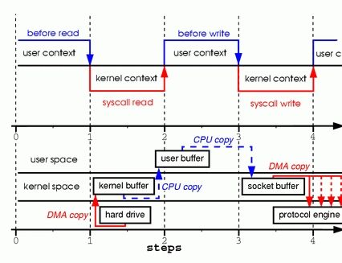


#### sendfile发送文件到Socket的步骤

* **一次系统调用**：进程调用 `sendfile()` 直接由内核完成硬盘中的文件拷贝到协议引擎的全部操作。
* **三次拷贝**：
  * 通过硬件驱动从硬盘到内核缓冲区的DMA拷贝；
  * 从内核缓冲区到Socket缓冲区的CPU拷贝；
  * 从内核Socket缓冲区到协议引擎的DMA拷贝。

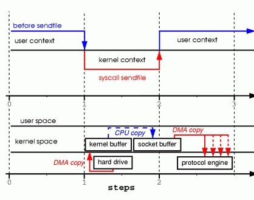


#### 和传统I/O相比的优势和区别

* 更少的拷贝次数和更少的系统调用带来的上下文切换，即更小的性能损耗；
* 传统I/O需要应用程序主动调用读和写这两次操作，而sendfile则直接将读写操作全部交给内核来完成。


## I/O模型-高性能I/O设计模式

### Reactor反应器模式

#### 组成结构


* **文件描述符（Handle）**：由操作系统提供，用于表示一个事件，事件既可以来自外部，也可以来自内部。外部事件如Socket描述符的客户端连接请求、客户端发送的数据等，内部事件如操作系统的定时事件等；
* **同步事件分离器（Synchronous Event Demultiplexer）**：是一个系统调用，用于等待一个或多个事件的发生。调用方会阻塞在它之上，直到分离器上有事件产生。Linux中该角色对应的就是I/O多路复用器，Java NIO中该角色对应的就是Selector；
* **事件处理器（Event Handler）**：由多个回调方法构成，这些回调方法构成了与应用相关的对于某事件的反馈机制。Netty中该角色对应的就是用于处理事件的ChannelHandler；
* **具体事务处理器（Concrete Event Handler）**：事件处理器的具体实现，用于实现特定的业务逻辑，本质上就是开发者编写的针对各种不同事件的处理器函数；
* **初始分发器/生成器（Initiation Dispatcher/Reactor）**：是Reactor模式的核心，定义了一些用于控制事件调度方式的规范，也提供了应用进行事件处理的注册、删除等机制。初始分发器会通过同步事件分离器来等待事件的发生，一旦事件发生，初始分发器会分离出事件，然后通过事件处理器和相应的处理方法处理该事件。如Netty中ChannelHandler的回调方法都是由BossGroup或WorkGroup中的某个EventLoop来调用的。

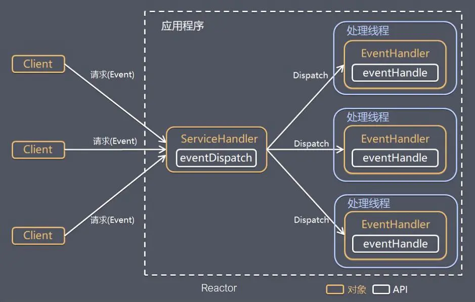


#### 工作流程


* **注册事件处理器**：首先初始化Reactor，由应用程序通过 `register_handle()` 将若干个具体事件处理器和其感兴趣的事件注册到Reactor中；
* **关联描述符**：事件由Handle标识，Reactor会通过 `get_handle()` 获取所有事件处理器对应的描述符并关联起来；
* **事件循环**：当所有事件注册完成，应用程序会通过 `handle_events()` 触发Reactor的事件循环机制。Reactor会通过 `select()` 让同步事件分离器去执行具体的事件循环，然后以同步阻塞的方式等待事件的发生；
* **事件就绪**：当与某个事件对应的Handle变为Ready就绪状态时，同步事件分离器就会通知Reactor；
* **执行事件处理**：Reactor会获取就绪事件对应的处理器，且通过 `handle_event()` 让处理器去执行相应的逻辑。


#### 单线程Reactor模式

* **概念**：所谓的单线程Reactor，是指所有的I/O操作和业务操作都在同一个线程上完成，该线程负责管理事件和处理器关联、事件循环、建立连接、分离事件和处理读/写操作。
* **缺点**：
  * 所有的操作都在单个线程上处理，无法同时处理大量的请求，会出现性能瓶颈，或因为单个耗时操作导致所有的请求都会受到影响，大大延迟了请求的响应或导致处理的超时；
  * 一旦这个单线程陷入死循环或其他问题，会导致整个系统无法对外提供服务，产生单点故障问题。


#### 多线程Reactor模式

* **概念**：多线程模式Reactor的会有一个专门的线程用于监听和建立客户端的连接，而读/写请求和业务操作则交由一个线程池负责。
* **缺点**：Reactor多线程模型可以满足大部分场景的性能要求。但在小部分情况下，一个线程负责监听和处理所有的客户端连接可能会存在性能问题，如百万级客户端并发连接，或者服务端需要对客户端的握手信息进行安全认证等消耗性操作时。这些场景下一个线程处理连接就会存在性能不足的问题。


#### 主从多线程Reactor模式

* **概念**：所谓主从模式是指将Reactor拆分成两个角色。其中mainReactor负责接受客户端请求、建立连接和接入认证等和连接相关的操作。当连接被建立后会将其交付给subReactor完成后续的读/写请求、编码解码和业务逻辑等操作。
* **优点**：mainReactor也可以维护一个线程池来处理和连接相关的操作，避免了单个连接处理线程带来的问题。

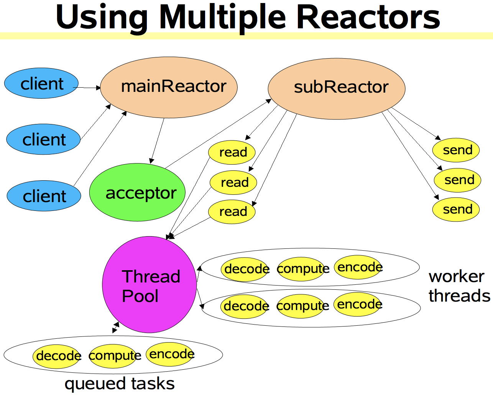


### Proactor主动器模式

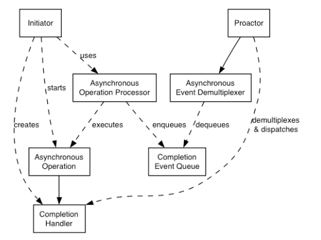

#### 组成结构

TODO

* 句柄（Handle）：
* 异步操作处理器（Asynchronous Operation Processor）：
* 异步操作（Asynchronous Operation）：
* 完成事件队列（Completion Event Queue）：
* 主动器（Proactor）：
* 完成事件接口（Completion Handler）：
* 完成事件处理逻辑（Concrete Completion Handler）：


#### 工作流程

TODO


## I/O模型-Java的I/O模型

### BIO

#### 代码示例

```JAVA
public class SocketBIOExample {
    
    public static void main(String[] args) {
        ServerSocket server = new ServerSocket(9090);
        
        while (true) {
            final Socket client = server.accept();
        	
            new Thread(() -> {
                InputStream in = null;
                try {
                    in = client.getInputStream();
            		BufferedReader reader = new BufferedReader(new InputStreamReader(in));
                    while (true) {
                        String dataline = reader.readLine();
                        if (null != dataline) {
                            System.out.println(dataline);
                        } else {
                            client.close();
                            break;
                        }
               		}
                } catch(Exception e) { }    
            });
        }
    }
}
```


#### 系统调用分析

```shell
# 编译为字节码
/usr/java/j2sdk1.4.2_19/bin/javac SocketBIOExample.java
# 追踪应用程序的系统调用，并重定向到以out开头的文件中，每个线程一个文件
strace -ff -o out /usr/java/j2sdk1.4.2_19/bin/java SocketBIOExample
```

* 通过 `socket(PF_INET6, SOCKET_STREAM, IPPROTO_IP) = 3` 创建TCP的流式套接字，返回套接字的文件描述符；
* 通过 `bind(3, {sa_famliy=AF_INET6, sin6_port=htons(9090), inet_pton(AF_INET6, "::", &sin6_addr), sin6_flowinfo=0, sin6_scope_id=0}, 24) = 0` 为套接字绑定端口；
* 通过 `listen(3, 50)` 将套接字置为监听状态；
* 通过 `accept(3, {sa_family=AF_INET6, sin6_port=htons(53311), inet_pton(AF_INET6. "::1", &sin6_addr), sin6_flowinfo=0, sin6_scope_id=0}, [28]) = 5` 阻塞用户线程等待连接请求。

此时开启一个本地客户端发送连接请求：`nc localhost 9090`。

* 此时 `accept()` 会接收连接请求，并新建套接字，返回该套接字的文件描述符；
* 通过 `clone(child_stack=0xea2bd494, flags=CLONE_VM|CLONE_FS|CLONE_FILES|CLONE_SIGHAND|CLONE_THREAD|CLONE_SYSVEM|CLONE_SETTLS|CLONE_PARENT_SETTID|CLONE_CHILD_CLEARTID, parent_tidptr=0xea2bdbd8, tls=0xea2bdbd8, child_tidptr=0xffb2e44c) = 2386` 创建子线程去处理，每个线程处理一个连接，并返回其进程描述符（PID）；
* 在子线程中，通过 `recv() `读取套接字输入流（阻塞等待），直到有数据到来，继续接下来的处理。


#### BIO的缺点

* 基于同步阻塞式I/O模型，服务端需要在建立客户端连接时阻塞等待，还会在连接建立后，阻塞等待客户端的数据到来；
* 在BIO+多线程的编程模型下，每一个客户端连接就需要一个子线程去处理。若在大量连接的场景下，会造成大量的资源占用。即便使用线程池来处理连接，也会因为存在大量的线程而会将性能损耗在上下文切换上。


### NIO

#### 基本概念

* **Buffer**：缓冲区本质是一个可以读写数据的内存块，可以理解为容器对象，除了基本的容器操作之外，还提供了记录缓冲区状态变化情况的功能。

* **Channel**：通道类似于流，可以同时进行读/写且能实现异步操作，通道以缓冲区为单位读写数据。

|       属性       |                             描述                             |
| :--------------: | :----------------------------------------------------------: |
| 容量（Capacity） |      可容纳的最大数据量，在缓冲区创建时被设定且不能改变      |
|  Limit（范围）   | 表示缓冲区当前的终点，不能对超过极限的位置进行读写操作。 且极限 是可以修改的 |
| 位置（Position） | 下一个要被读写的元素的索引，每次读写缓冲区中数据时都会改变该值，为下次读写准备 |
|   标记（Mark）   |                             标记                             |


#### 代码示例

```JAVA
public class SocketNIOExample {
    
    public static void main(String[] args) {
        LinkedList<SocketChannel> clients = new LinkedList<>();
        
        // 服务端套接字的封装
        ServerSocketChannel ss = ServerSocketChannel.open();
        // 绑定端口
        ss.bind(new InetSocketAddress(9090));
        // 设置非阻塞
        ss.configureBlocking(false);
    	
        while (true) {
            Thread.sleep(1000);
            // 等待连接建立，非阻塞
            SocketChannel client = ss.accept();
            if (client != null) {
                client.configureBlocking(false);
                int port = client.socket().getPort();
               	clients.add(client);
            }
            
            // 设置缓冲区
            ByteBuffer buffer = ByteBuffer.allocateDirect(4096);
            for (SocketChannel c : clients) {
                // 读取客户端数据，非阻塞
                int num = c.read(buffer);
                if (num > 0) {
                    buffer.filp();
                    byte[] aaa = new byte[buffer.limit()];
                    buffer.get(aaa);
                    
                    String b = new String(aa);
               		System.out.println(c.socket().getPort() + ":" + b);
                    buffer.clear();
                }
            }
        }
    }
}
```


#### 系统调用分析

* 通过 `socket(PF_INET6, SOCK_STREAM, IPPROTO_IP) = 4` 创建TCP的流式套接字，并返回套接字的文件描述符；

* 通过 `bind(4, {sa_famliy=AF_INET6, sin6_port=htons(9090), inet_pton(AF_INET6, "::", &sin6_addr), sin6_flowinfo=0, sin6_scope_id=0}, 28) = 0` 为套接字绑定端口；

* 通过 `listen(4, 50)` 将套接字设置为监听状态；

* 通过 `fcntl(4, F_SETFL, 0_RDWR|0_NONBLOCK) = 0` 将套接字设置为非阻塞状态；

* 通过 `accept(4, 0x7f00580f0070, [28]) = -1` 接收连接请求，但不会阻塞线程，若是当前没有连接建立，则返回-1；


此时开启一个本地客户端发送连接请求：`nc localhost 9090`。

* 通过 `accept(4, {sa_family=AF_INET6, sin6_port=htons(53311), inet_pton(AF_INET6. "::1", &sin6_addr), sin6_flowinfo=0, sin6_scope_id=0}, [28]) = 5` 接收连接建立，新建和连接对应的套接字，返回套接字的文件描述符；
* 通过 `fcntl(5, F_SETFL, 0_RDWR|0_NONBLOCK) = 0` 将新的连接套接字设置为非阻塞；
* 通过 `read(5, 0x7f0003efcc10, 4096) = -1` 读取套接字输入流中的数据到大小为4096的缓冲区中，但不会阻塞线程，若是当前没有数据可读，则返回-1。


#### NIO的优缺点

* **优点**：避免了BIO的一个连接一个线程而导致存在大量线程造成的资源消耗巨大的问题，即会把大量资源用在线程的上下文切换上；
* **缺点**：可能会存在大量无意义的系统调用，若是有1w个连接，但只有1个连接有数据读取，但NIO机制每次循环还是会发送1w次的read系统调用，即会把大量的资源用在用户态到内核态的切换上。


### NIO+Selector

#### 基本概念

* **Selector**：选择器能够检测多个注册在其上的通道是否有具体的事件发生，只有当真正发生事件时，才会对应的进行回调处理（连接、读/写请求）。

* **工作流程**：
  * 服务端创建 `ServerSocketChannel` 并绑定端口，然后通过 `register()` 注册到Selector上和连接事件对应，最后通过Selector 的 `select()` 开始轮询监听通道的状态；
  * 当客户端连接时，会发生连接事件，Selector会通过回调方法给客户端建立对应的 `SocketChannel`，然后将其注册到Selector上和读/写事件对应；
  * 当连接有读/写事件发生时，返回 `SelectionKey`，反向获取对应的 `SocketChannel`，最后进行相应的处理。


#### 代码示例

```JAVA
// Java底层使用了epoll机制
public class SocketMultiplexingSingleThread {
    
    private ServerSocketChannel server = null;
    private Selector selector = null;
    int port = 9090;
    
    public void initServer() {
        try {
            // 服务端套接字通道
            server = ServerSocketChannel.open();
            // 非阻塞
            server.configureBlocking(false);
            // 绑定端口
            server.bind(new InetSocketAddress(port));
            
            // 开启多路复用器
            selector = Selector.open();
            // 将服务端套接字和相应的连接事件关联并注册到复用器上
            server.register(selector, SelectionKey.OP_ACCEPT);
        } catch (IOException e) {
            e.printStackTrace();
        }
    }
    
    public void start() {
        initServer();
        try {
            while (true) {
                Set<SelectionKey> keys = selector.keys();
                // 阻塞在select上500毫秒等待事件就绪
                while (selector.select(500) > 0) {
                    // 获取就绪事件
                    Set<SelectionKey> selectionKeys = selector.selectedKeys();
                    Iterator<SelectionKey> iter = selectionKeys.iterator();
                    while (iter.hasNext()) {
                        SelectionKey key = iter.next();
                        iter.remove();
                        // 根据事件类型处理
                        if (key.isAcceptable()) {
                        	// 连接处理器
                            acceptHandler(key);
                        } else if (key.isReadable()) {
                            // 读处理器
                            key.cancel();
                            readHandler(key);
                        } else if (key.isWritable()) {
                            // 写处理器
                            key.cancel();
                            writeHandler(key);
                        }
                    }
                }
            }
        } catch (IOException e) {
            e.printStackTrace();
        }
    }
    
    public void acceptHandler(SelectionKey key) {
        try {
            ServerSocketChannel ssc = (ServerSocketChannel) key.channel();
            SocketChannel client = ssc.accept();
            client.configureBlocking(false);
            
            ByteBuffer buffer = ByteBuffer.allocate(8192);
			client.register(selector, SelectionKey.OP_READ, buffer);
        } catch (IOException e) {
        	e.printStackTrace(); 
        }
    }
    
    public void readHandler(SelectionKey key) {
        SocketChannel client = (SocketChannel) key.channel();
        ByteBuffer buffer = (ByteBuffer) key.attachment();
        buffer.clear();
        int read = 0;
        try {
            while (true) {
             	// ...   
            }
        } catch (IOException e) {
            e.printStackTrace();
        }
    }
}
```


#### select/poll系统调用分析

* 通过 `socket` 创建套接字，返回文件描述符；
* 通过 `bind` 为套接字绑定端口；
* 通过 `listen` 将套接字置为监听状态；
* 通过 `select/poll` 将套接字的文件描述符注册给多路复用器（select对文件描述符的个数有限制，poll取消了限制），并使用户线程阻塞在 `select/poll` 这个系统调用上；
* 当内核遍历发现有文件描述符变为可连接或可读/写等状态时，`select/poll` 会返回，然后再通过 `accept` 或 `read` 等调用去处理对应的事件。

**优点**：通过一次系统调用，将所有文件描述符传递给内核，由内核进行遍历，直到相应事件的发生，这种方式相对于NIO减少了系统调用的次数，即避免了用户态到内核态的频繁切换，节省资源；

**缺点**：

* 每次select/poll系统调用时都需要传递整个文件描述符集合；
* 每次select/poll系统调用时都会让内核遍历整个文件描述符集合。


#### epoll系统调用分析

* 通过 `socket(PF_INET, SOCK_STREAM, IPPROTO_IP) = 4` 创建服务端套接字，并返回其文件描述符；

* 通过 `fcntl(4, F_SETFL, O_RDWR|O_NONBLOCK) = 0` 将套接字设置为非阻塞；

* 通过 `bind(4, {sa_family=AF_INET, sin_port=htons(9090)})` 为套接字绑定端口；

* 通过 `listen(4, 50)` 将套接字设置为监听状态；

* 通过 ``epoll_create(256) = 7`` 初始化多路复用器，并在内核空间建立一块用于保存套接字文件描述符的红黑树结构；

* 通过 `epoll_ctl(7, EPOLL_CTL_ADD, 4, {EPOLLIN, {u32=4, u64=13736798553693487108}}) = 0` 将服务端套接字的文件描述符和对应的连接事件挂入红黑树；

* 通过 `epoll_wait(7, {{EPOLLIN, {u32=4, u64=13736798553693487108}}}, 4096, -1) = 1` 阻塞用户线程，交由内核监听rbtree上的fd，当fd的状态发生变化时，即发生连接和读/写等事件后，返回事件的数量；

此时开启一个本地客户端发送连接请求：`nc localhost 9090`。

* 通过 `accept(4, {sa_family=AF_INET, sin_port=htons(53687), sin_addr=inet_addr("127.0.0.1")}, [16]) = 8` 接收连接，为连接建立套接字，并返回其文件描述符； 

* 接收连接后，接着通过 `epoll_ctl(7, EPOLL_CTL_ADD, 8, {EPOLLIN, {u32=8, u64=13823012355644063752}}) = 0` 将新套接字的文件描述符和其感兴趣的事件挂到红黑树上；

* 循环去通过 `epoll_wait` 监听事件、接收连接、添加套接字fd和处理读写请求，以此构建出使用epoll多路复用机制的服务器。


## 计算机网络-层次结构


### 应用层（Application Layer）

**该层为应用程序之间的交互提供网络通信和交互规则**。对于不同的网络应用需要定义不同的应用层协议，如：域名系统DNS、支持Web应用的HTTP和支持电子邮件的SMTP协议等。应用层之间交互的数据单位被称为报文。


### 传输层（Transport Layer）

**该层为主机进程间提供端到端的通用的（复用和分解）数据传输服务**。应用程序就是通过该层的协议传输应用层的数据报/报文段的。


### 网络层（Network Layer）

**该层为源主机到目的主机提供分组交付、分组转发、路由寻址和路由选择的服务**。由于在网络中通信的两台主机之间可能会经过很多节点、数据链路和通信子网，所以该层就是针对这一过程提供主机间可靠的数据传输服务。该层会将传输层产生的报文段或数据报封装成分组或包进行传送，在TCP/IP体系中，分组也叫做IP数据报。互联网是由大量异构网络通过路由器相互连接起来的，互联网使用的网络层协议是无连接的网际协议和许多路由选择协议组成的，因此互联网的网络层也叫做网际层或IP层。


### 数据链路层（Data Link Layer）

**该层为网络中相邻节点间的数据传输提供可靠的逻辑链路服务**。在两个相邻节点间传输数据时，链路层会将网络层交付下来的IP数据报组装成帧结构，并在节点间建立逻辑链路传输，并通过差错控制为数据的正确传输提供保障。


### 物理层（Physical Layer）

**该层为相邻节点间的比特流传输提供屏蔽物理设备和传输介质差异的服务**。从而使上层的链路层不需要考虑具体的物理介质问题，透明传输，即经过实际电路传输后的比特流没有发生变化，对比特流来说，这些电路好像是看不见的。


## 计算机网络-应用层

### HTTP状态码


### 浏览器输入URL到显示主页的过程

* DNS解析：
* TCP连接：
* 发送HTTP请求：
* 服务器处理请求并返回HTTP响应：
* 浏览器解析渲染页面：


### 各协议与HTTP协议的关系


### HTTP如何保存用户状态

* HTTP是无状态（stateless）协议，即HTTP协议自身不对请求和响应之间的通信状态进行保存。
* 一般会使用存放在服务端持久化存储器中的Session来保存用户的某些状态，如：登录状态，服务器存储用户登录状态并设置超时，客户端通过请求携带Cookie附加Session ID的方式完成身份证明，之后就可以继续跟踪用户。
* 若Cookie被禁用，最常用的方式就是通过URL携带Session ID。


### Cookie和Session的区别

* **作用**：Cookie一般用来保存用户标识，如：Token。Session主要作用是通过服务端记录用户信息，如：登录状态。
* **存储**：Cookie的数据一般保存在浏览器端。Session的数据一般保存在服务器端。
* **安全性**：Session相对于Cookie安全性更高。如果需要在Cookie中存储关键信息，可以加密后传输，在服务端解密。


### HTTP/1.0和HTTP/1.1的区别

* **长/短连接**：
  * **HTTP/1.0默认使用短连接**：即客户端和服务器每进行一次HTTP操作，就建立一次TCP连接，传输任务结束后就断开连接。当浏览器访问的某个HTML或其他类型的Web页中包含其他Web资源（如js脚本、图像、CSS文件等），每遇到这样一个Web资源，浏览器就会重新建立一个HTTP请求。
  * **从HTTP/1.1开始默认使用长连接**：使用长连接的HTTP协议，会在响应头加入 `Connection:keep-alive`。当一个网页打开完成后，客户端和服务器之间用于传输HTTP数据的TCP的连接不会关闭，客户端再次访问这个服务器时，会继续使用这一条已经建立的连接。Keep-Alive不会永久保持连接，而是存在一个保持时间，该时间可以设置。

* **错误状态响应码**：HTTP/1.1新增了24个错误状态响应码，如：409表示请求的资源与资源的当前状态发生冲突、410表示服务器上的某个资源被永久性删除；

* **缓存处理**：在HTTP/1.0中主要使⽤header⾥的 `If-Modified-Since，Expires` 来做为缓存判断的标准。HTTP/1.1则引⼊了更多的缓存控制策略如： `Entity tag，If-Unmodified-Since，If-Match，If-None-Match` 等更多可供选择的缓存头来控制缓存策略；

* **带宽优化及网络连接的使用**：在HTTP/1.0中，存在一些浪费带宽的现象，如：客户端只是需要某个对象的一部分，而服务器却将整个对象送过来了，并且不支持断点续传功能。HTTP/1.1则在请求头引入了range头域，它允许只请求资源的某个部分，即返回码是206，这样方便了开发者自由选择以便充分利用带宽和连接。


### URI和URL的区别

* **URI**：是统一资源标志符，可以唯一标识一个资源，类似于身份证号；

* **URL**：是统一资源定位符，可以提供该资源的路径，类似于家庭住址。是一种具体的URI，即URL不仅能用来标识一个资源，而且还可以通过其获取这个资源。


### HTTP和HTTPS的区别

* **端口**：HTTP的URL以 ``http://`` 起始且默认使用80端口。而HTTPS的URL由 `https://` 起始且默认使用443端口；
* **安全性和资源消耗**：HTTP协议运行在TCP之上，所有的传输内容都是明文，客户端和服务器都无法验证对方的身份。HTTPS是运行在SSL/TLS之上的HTTP协议，SSL/TLS运行在TCP之上，所有的传输内容都使用对称加密，密钥使用了服务器的证书进行了非对称加密。所以HTTP安全性比HTTPS低，但消耗的资源更少。


### DNS域名系统

DNS将用户使用的域名映射为计算机使用的IP地址的过程称为域名解析，由域名服务器提供域名解析服务。DNS使用UDP的53号端口；

域名服务器：

* 本地域名服务器（默认DNS，首先查询）；
* 根域名服务器（13个不同IP地址的根域名服务器，由英文字母a-m命名）；
* 顶级域名服务器；
* 权威域名服务器（保存一个区内所有主机的域名到IP地址的映射）；
* 中间域名服务器。

迭代解析：

* 首先请求本地DNS；
* 本地DNS没有则代为请求根DNS；
* 若是根DNS也没有则由本地DNS依次代为请求顶级DNS和权威DNS，直到成功解析返回或无法解析。

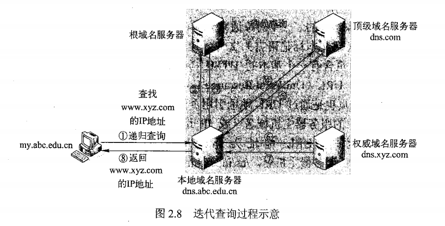

递归解析：

* 首先请求本地DNS；
* 没有则由本地DNS代为请求根DNS；
* 也没有则由根DNS代为请求顶级DNS；
* 若依旧没有则依次向高层的顶级和权威域名服务器递归请求，直到解析结果依次返回。

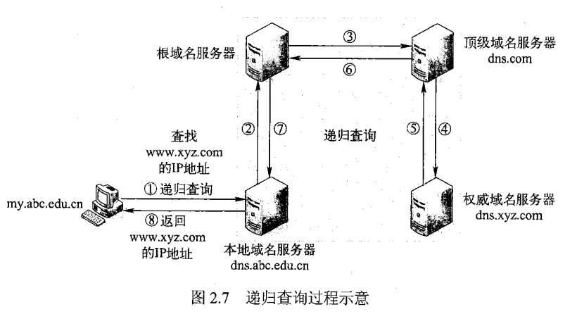


## 计算机网络-传输层

### 传输层的复用与分解

支持多个应用进程共用同一个传输层协议，并能够将接收到的数据准确交付给不同的应用进程：

* **复用**：在同一主机上，多个应用进程同时利用同一个传输层协议进行通信，此时该传输层协议就被多个应用进程复用；

* **分解**：传输层将同时接收到的不同应用进程的数据交付给正确的应用进程就叫做分解。

TCP与UDP实现复用分解的方法：

* **UDP**：通过数据报套接字（目的IP地址，目的端口号）实现分解；
* **TCP**：通过流式套接字（源IP地址，源端口号，目的IP地址，目的端口号）实现分解。


### TCP和UDP的区别

* **用户数据报协议（UDP，User Datagram Protocol）**：是无连接的，尽最大可能交付，没有拥塞控制，面向报文，支持一对一、一对多和多对多的通信协议；
* **传输控制协议（TCP，Transmission Control Protocol）**：是面向连接的，提供可靠交付，提供流量控制、拥塞控制，提供全双工通信，面向字节流，只支持一对一的通信协议。


### UDP的首部格式

首部字段占8byte，包括源端口、目的端口、长度、校验和。12byte的伪首部是为了计算校验和临时添加的。

**校验和计算**：

* 对所有参与运算的校验和内容按二进制16位对齐求和，求和过程中的任何溢出都会被回卷（即进位与和的最低位再加），最后得到的和取反码，就是UDP首部校验和；
* 参与校验和运算的内容包括：UDP伪首部，UDP首部，应用层数据。

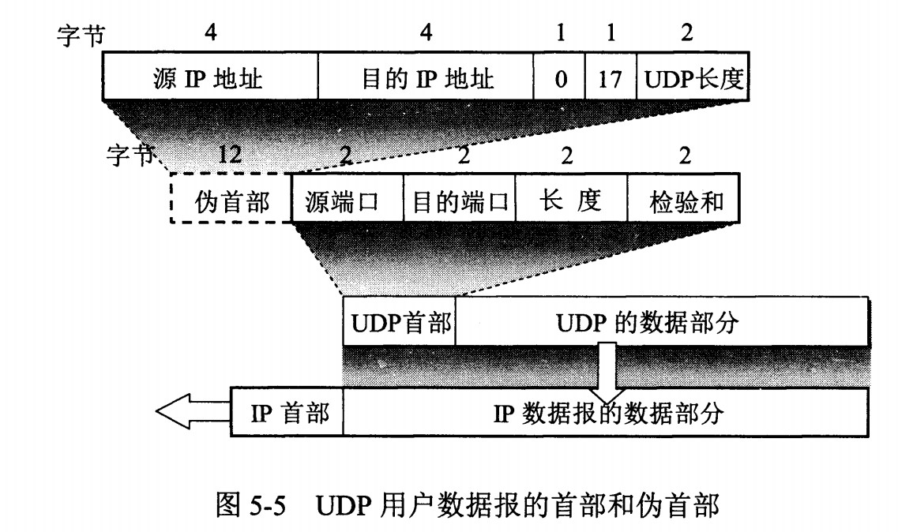


### TCP的首部格式

* **序号**：序号是对应用层数据的每个字节进行编号，因此TCP报文段的序号应该是该段所封装的应用层数据首字节的序号；
* **确认号**：期望从对方接收的下一个字节的序号，即该序号之前的字节已经全部正确接收；
* **数据偏移**：指数据部分距离报文段起始位置的偏移量，实际上指的就是首部长度；
* **保留关键字**：
  * **ACK**：`ACK=1` 表示确认报文；
  * **SYN**：`SYN=1` 表示连接请求报文；
  * **FIN**：`FIN=1` 表示连接释放报文。
* **窗口**：流量窗口值，标识接收方的最大缓存能力。


### TCP的三次握手


* **第一次握手**：客户端主动发起连接建立的请求，设置初始序号为x，发送SYN段 `(SYN=1，seq=x)` 。客户端状态由CLOSE进入 SYN_SEND状态，等待服务器确认；
* **第二次握手**：服务端收到客户端发送的SYN段后，设置初始序号为y，发送SYN_ACK段 `(SYN=1，ACK=1，seq=y，ack_seq=x+1)` 。这时服务端的状态由LISTEN进入 SYN_RCVD状态；
* **第三次握手**：客户端收到服务端的SYN_ACK段后，发送ACK段 `(ACK=1，seq=x+1，ack_seq=y+1)` 。这时客户端进入ESTABLISHED状态，服务器收到ACK段后也进入ESTABLISHED状态，至此连接建立。

**为什么要握手三次？**目的是为了建立可靠的通信信道，握手三次则是为了确认双方的发送和接收是正常的。

* 第一次握手能让服务端确认对方的发送和自己的接收都是正常的；
* 第二次握手能让客户端确认自己的发送和接收正常且对方的发送和接收也正常的；
* 第三次握手能让服务端确认自己的发送和对方的接收是正常的。

**为什么要回传SYN？**接收端回传SYN是为了通知发送端，本次的ACK是正对SYN连接请求的确认。

**为什么要回传ACK？**回传ACK是TCP可靠传输机制的一种手段，当发送方接收到接收方发送的ACK后，才能确认自己上一次是正确发送并且对方正确接收了。


### TCP的四次挥手


* **第一次挥手**：当客户端发送完最后一个数据段后，可以发送FIN段 `(FIN=1，seq=u)` 请求断开客户端到服务器的连接。客户端状态由ESTABLISHED进入FIN_WAIT_1，在该状态下只能接收服务器发送的数据但不能再发送数据了；
* **第二次挥手**：
  * 服务端收到FIN段后，向客户端发送ACK段 `(ACK=1，seq=v，ack_seq=u+1)`。服务端状态由ESTABLISHED进入CLOSE_WAIT，在该状态下服务端可发送数据但不能接收数据；
  * 当客户端收到ACK段，其状态由FIN_WAIT_1进入FIN_WAIT_2，仍然可以接收服务端的数据，此时TCP连接已经关闭了客户端向服务器方向的数据传输，也称半关闭。
* **第三次挥手**：当服务端向客户端发送完最后一个数据段后，才会发送FIN_ACK段 `(FIN=1，ACK=1，seq=w，ack_seq=u+1)`。此时服务端状态由CLOSE_WAIT进入LAST_ACK并不再发送数据；
* **第四次挥手**：
  * 当客户端收到服务端发送的FIN_ACK段后，向服务端发送ACK段 `(ACK=1，seq=u+1，ack_seq=w+1)`，其状态由FIN_WAIT_2进入TIME_WAIT，再等待2MSL时间后自动进入CLOSED状态，最终释放连接；
  * 服务器收到该ACK后，状态由LAST_ACK进入CLOSED，最终释放连接。

**为什么要挥手四次？**任何一方都可以在数据传输结束后发送连接释放的通知，待对方确认后进入半关闭状态。当另一方也没有数据需要发送的时候，则主动发送连接释放通知，接收方确认后就完全关闭了TCP连接。

**为什么要有TIME_WAIT状态？**确保最后一个确认报文能够到达。等待一段时间是为了让本连接持续时间内所产生的所有报文都从网络中消失，使得下一个新连接不会出现旧的连接请求报文。


### TCP的可靠传输

* **差错编码**：即首部校验和，可以检测数据在传输过程中的任何变化，若接收方收的报文段校验和有差错，则会直接丢弃该报文段并且不发送确认报文；
* **序号**：TCP会将应用层数据以有序字节流的形式对每个字节进行编号，并将整个报文划分为若干报文段，每个报文段的序号就是该段所封装的数据的首字节序号。序号还能够保障报文段的顺序重组和防重复。
* **确认**：即确认报文，通过首部的确认序号通知发送方自己正确接收了什么，下一次你需要传什么。即期望从对方那里接收到的下一个字节的序号，表示该序号之前的字节已经全部正确接收；
* **计时器重传**：发送方在发送一个报文段后会维护一个计时器，若计时器超时，表示报文段丢失接收方未收到或差错检测失败而被接收方丢弃，则重传报文段；
* **快速重传**：当接收方未正确接收到上一次自己发送的ACK报文中被确认序号标识的段时，则会在接下来的3次ACK中，重复确认那个未收到的序号，发送方发现接收方的3次重复确认后，就会立即重传；
* **滑动窗口**：TCP就是基于滑动窗口协议实现可靠传输机制的。发送方和接收方都会维护一个窗口，用于表示发送方可以发送且未被确认的分组最大数量和接收方可以接收并缓存的正确到达的分组最短数量。所谓滑动，是指当发送方收到确认或接收方向上提交数据后，窗口后移将之后的数据容纳进来；
* **流量控制**：用于协调发送方的数据发送速度，避免发送方发送数据过快，超出了接收方的缓存和处理能力。接收方通过窗口（缓冲区）来控制发送方发送数据大小，每次在确认时都会将缓冲区的剩余尺寸一并交付给发送方，这样发送方每次发送的数据量大小都会根据接收方缓冲区的大小而适当调整；
* **拥塞控制**：采用拥塞窗口机制，通过动态调节窗口大小来实现对发送速率的调整，避免在网络拥堵的情况下，数据发送过快而导致丢失。发送方维护一个拥塞窗口，表示在未收到确认的情况下，可以连续发送的字节数。整个拥塞控制分为慢启动和拥塞避免两个阶段，慢启动阶段窗口会乘性增加，拥塞避免阶段窗口会加性增加。


### 停-等协议

* 停-等协议也称ARQ自动重传请求协议；
* 发送方发送经过差错编码和编号后的报文段，等待接收方确认；
* 接收方如果正确接收报文段，即差错控制无误且序号正确，则接收报文段并向发送ACK，否则丢弃报文段并发送NAK；
* 发送方若收到ACK，则继续发送后续报文段，否则重新发送失败的报文段；
* 发送窗口Ws=1，接收窗口Wr=1，即停等协议的接收两端均无缓存能力。


### 滑动窗口协议

* **窗口**：窗口是缓存的一部分，用于暂时存放字节流。发送方和接收方各维护一个窗口，接收方通过TCP报文段中的窗口字段通知发送方自己窗口的大小，发送方根据这个值和其它信息设置自己的窗口大小。
* **滑动规则**：发送窗口内的字节都允许被发送，接收窗口内的字节都允许被接收。如果发送窗口左部的字节已经发送并且收到确认，那么就将发送窗口向右滑动一定距离，直到左部第一个字节不是已发送且已确认的状态。接收窗口的滑动类似，若左部字节已经发送确认并向上交付，就向右滑动接收窗口。
* 接收窗口只会对窗口内最后一个按序到达的字节进行确认，如：接收窗口已经收到的字节为31、34和35，其中31按序到达，而34和35就不是，因此只对31字节进行确认。发送方得到一个字节的确认后，也就知道这个字节之前的所有字节都已被接收。


### GBN回退N帧协议

* 当接收方检测出失序的信息帧后，要求发送方重发最后一个正确接受的信息帧之后的所有未被确认的帧；
* 或当发送方发送了n个帧后，若发现该n帧的前一帧在计时器超时区间内仍未返回其确认信息，则该帧被判定为出错或丢失，此时发送方不得不重新发送该出错帧及其后的n帧；
* 发送窗口Ws>1，接收窗口Wr=1，接收窗口缓存能力为1，所以只能累计确认最后一个正确接收的信息帧；
* 累积确认：只会确认最后一个正确接收的信息帧，回退也是从最后一个确认的信息帧向后回退。

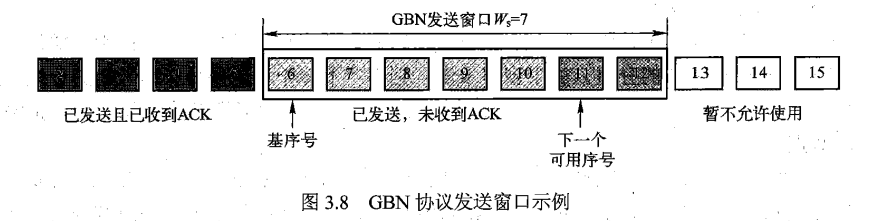


### SR选择重传协议

* 发送方仅重传那些未被接收方确认（出错或丢失）的分组，从而避免了不必要的重传；
* 发送窗口Ws>1，接收窗口Wr>1；
* 接收方对每个正确接收的分组逐个确认。

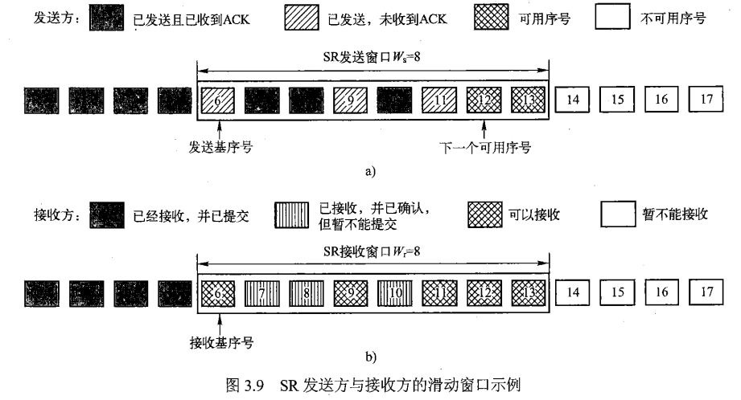


### TCP的流量控制

* 流量控制是为了控制发送方的发送速率，保证不会超过接收方的接收、缓存和处理能力。
* **TCP使用窗口机制进行流量控制**：连接建立时，接收方分配一块缓存区用于存储接收的数据，并在每次发送的确认报文中通过窗口字段将缓冲区的尺寸通知给发送端。

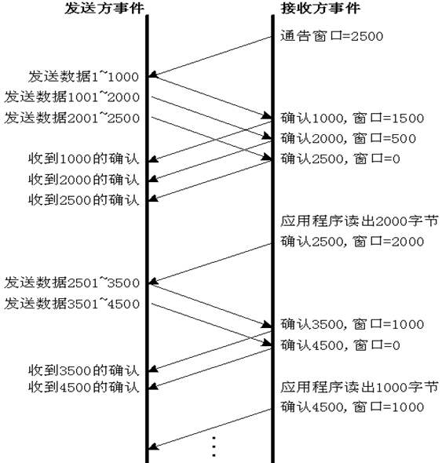


### TCP的拥塞控制

**基本概念**：

* **拥塞**：就是大量主机高速向网络发送大量数据，超出网络的处理能力，导致大量分组拥挤在网络中间设备的队列中等待转发，网络性能显著下降的现象。

* **拥塞控制**：即通过合理的调度、规范和调整网络中的主机数量、主机的发送速率或数据量，以避免拥塞或消除已发生的拥塞。


* **拥塞控制算法**：慢启动、拥塞避免、快速重传、快速恢复。

* **拥塞窗口**：发送方维护的一个表示可以连续发送报文段数量的窗口。发送方通过动态调整拥塞窗口以实现对发送速率的控制。

**拥塞控制流程**：

* 拥塞窗口默认从慢启动阶段开始，每经过一次RTT都会让拥塞窗口扩大一倍，即每一个ACK都会增加1；
* 直到窗口大小达到阈值，拥塞控制会进入拥塞避免阶段，此时每经过一次RTT拥塞窗口只会增加1；
* **当TCP通信过程中发生了计时器超时的情况**：此时拥塞控制会在下一次RTT重新进入慢启动阶段，拥塞窗口还原为初值，阈值更新为拥塞发生时的一半；
* **当TCP通信过程中发生了快速重传的情况**：此时拥塞控制会在下一次RTT重新进入拥塞避免阶段，拥塞窗口变为拥塞发生时的一半，即发生了快速恢复。


## 计算机网络-网络层

### 网络层拥塞控制

* **拥塞**：在分组交换网络中，由于众多的用户随机的将信息发送到网络中，使网络中需要传输的信息总量大于其传输能力，以至于某些网络结点因为缓冲区已满，从而无法接收新到达的分组，此时就发送了拥塞现象。

* **拥塞控制**：根据网络的通过能力或网络拥挤程度，来调整数据发送速率和数据量的过程，叫做拥塞控制。拥塞控制主要考虑端系统之间的网络环境，目的是使网络负载不超过网络的传送能力。

* **拥塞控制策略**：
  * **流量感知路由**：链路的权值根据网络负载动态调整，将网络流量引导到不同的链路上，均衡网络负载。流量感知路由是一种拥塞的预防措施，可以在一定程度上缓解或预防拥塞的发生；
  * **准入控制**：是一种广泛应用于虚电路网络的拥塞预防技术，对新建的VC进行审核，若新建的VC会导致网络拥塞（基于瞬时流量和平均流量来判断），则拒绝新VC的建立；
  * **流量调节**：在网络发生拥塞时，通过调整发送方向的网络发送数据的速率来消除拥塞。
    * **抑制分组**：当感知到拥塞的路由器选择一个被拥塞的数据报时，给发送该数据报的源主机返回一个抑制分组。同时对被拥塞的数据报的首部的一个标志位进行修改，从而使该数据报在后续传输过程中不会被后续路由器再次选择来发送抑制分组；
    * **背压策略**：如果因发送速率过快而导致拥塞结点与源节点的距离或跳数较远，那么在抑制分组的发送过程中又会有新的分组进入网络。这时让抑制分组从拥塞结点到源节点的路径上的每一跳都发挥作用，这样从上游第一跳时就能立即降低分组的发送速率。
  * **负载脱落**：主动丢弃一些数据报来减轻网络负载，从而缓解或消除拥塞。当任何方法都不能消除通信子网的拥塞现象时，负载脱离是路由器的最后手段。


### IP数据报格式


* **版本号**（4位）：IP版本号，路由器根据该字段确定版本规则来解析数据报；
* **首部长度**（4位）：IP数据报的首部长度，包括可变长度的选项字段。固定首部长度为20字节；
* **区分服务**（8位）：用于指示期望获得哪种类型的服务（只有在网络提供区分服务时，该字段才有效）；
* **数据报长度**（16位）：IP数据报的总字节数，包括首部和数据部分。16位可以表示最大IP数据报的总长度65535个字节，除去IP数据报首部的20字节，最大IP数据报可封装65515字节数据；
* **标识**（16位）：用于标识一个IP数据报，IP协议使用计数器，每产生一个数据报计数器就会加1，作为该数据报的ID标识。不同主机产生的数据报又可能存在相同的标识字段，IP协议是依靠标识字段+源IP+目的IP+协议等字段共同唯一标识一个IP数据报。标识字段的最重要用途是在IP数据报的分片和重组过程中，用于标识属于同一原IP数据报；
* **标志**（3位）：DF是禁止分片标志，MF是更多分片标志。DF=0表示允许数据报分片，DF=1表示禁止数据报分片。MF=0表示该数据报未被分片或者是分片的最后一个，MF=1表示该数据报是一个分片数据报但不是最后一个；
* **片偏移**（13位）：表示一个IP数据报分片与原IP数据报的相对偏移量，即封装的数据分片从整个原数据报的哪个字节开始；
* **生存时间**（8位）：表示IP数据报在网络中可以通过的路由器数，即跳数。该字段用于确保一个IP数据报不会永远在网络中游荡（如：错误的路由选择算法选择了一个环形路由）。源主机在生成IP数据报时设置TTL初值，每经过一跳路由TTL就减1，为0则会被路由器丢弃。TTL占8为位，因此一个IPv4数据报最多能经过256跳；
* **上层协议**（8位）：表示该IP数据报封装的是哪个上层协议的报文段。IP就是利用该字段实现了多路复用和多路分解；
* **首部校验和**（16位）：对IP数据报首部的差错检验。计算时，该字段置全0，整个首部以16位对齐，采用反码算数运算（按位加，最高位进位回卷）求和，最后得到的和取反码就是校验和字段。接收IP分组检验校验和时，将首部按相同算法求和，结果为16位1则无差错，存在不为1的任意位，则差错丢弃。首部校验和是逐跳校验、逐跳计算的；
* **源IP地址**（32位）：是发出IP数据报的源主机地址；
* **目的IP地址**（32位）：是IP数据报需要送达的主机IP地址；
* **选项**（1\~40字节）：对IP首部进行扩展，可以携带安全、源选路径、时间戳、路由记录等内容。之后还可能有一个填充字段，长度为0~3字节，取值全0。填充字段的目的是补齐首部，符合32位对齐，即保证首部长度是4字节的倍数；
* **数据**：存放IP数据报所封装的传输层报文段，到目的主机后会将其所承载的数据交付给相应的上层协议。


* **MTU**：IP数据报是封装在数据链路层帧中进行传输的。一个数据链路层协议帧所能承载的最大数据量称为该链路的最大传输单元（MTU）；
* **分片的目的**：当路由器要将一个IP数据报转发至某个输出端口，而该数据报的总长度大于该输出端口所连接链路的MTU时，路由器将IP数据报进行分片（DF=0时），或者将其丢弃（DF=1时）。IP分片的重组任务由目的主机完成。


### IP地址编址方式


**IP地址格式**：IP地址由32位二进制数组成，采用点分十进制表示法。

|       方法       |              表示方法               |
| :--------------: | :---------------------------------: |
|   二进制标记法   | 11000000 10101000 00000001 01100101 |
| 点分十进制标记法 |            192.168.1.101            |
|  十六进制标记法  |             0xC0A80165              |

|             类              |            前缀长度            |                         前缀                          |              首字节               |
| :-------------------------: | :----------------------------: | :---------------------------------------------------: | :-------------------------------: |
| <font color ='red'>A</font> | <font color ='red'>8位</font>  |          <font color ='red'>0xxxxxxx</font>           |  <font color ='red'>0~127</font>  |
| <font color ='red'>B</font> | <font color ='red'>16位</font> |     <font color ='red'>10xxxxxx  xxxxxxxx</font>      | <font color ='red'>128~191</font> |
| <font color ='red'>C</font> | <font color ='red'>24位</font> | <font color ='red'>110xxxxx  xxxxxxxx xxxxxxxx</font> | <font color ='red'>192~223</font> |
|          D（组播）          |             不可用             |         1110xxxx  xxxxxxxx xxxxxxxx xxxxxxxx          |              224~239              |
|          E（保留）          |             不可用             |         1111xxxx  xxxxxxxx xxxxxxxx xxxxxxxx          |              240~255              |

* A类地址：网络前缀长度为8位，第1位固定0，后7位用于表示网络地址，即共有2^7^=128个A类网络，每个A类网络中的IP地址总数为2^24^=16777216；

* B类地址：网络前缀长度为16位，前2位固定为10，后14位用于表示网络地址，即共有2^14^=16384个B类网络，每个B类网络的IP地址总数为2^16^=65536；
* C类地址：网络前缀长度为24位，前3位为110，后21位用于表示网络地址，即共有2^21^=2097152个C类网络，每个C类网络的IP地址总数为2^8^=256。

* 特殊地址：

  * 本地主机地址：0.0.0.0/32。当主机需要发送一个IP数据报时，需要将自己的地址作为源地址，但是在某些情况下，主机还不知道自己的IP地址，此时可以使用本地主机地址来填充IP数据报的源地址字段。另外，在路由表中0.0.0.0/0用于表示默认路由。
  * 有限广播地址：255.255.255.255/32<。当主机或路由器某接口需要向其所在网络中的所有设备发送数据报时，用该地址作为IP数据报的目的IP。注：使用有限广播地址广播的数据，只限于发送数据报的主机所在的子网范围内。
  * 回送地址：127.0.0.0/8。如果IP数据报的目的地址位于这个地址块中，那么该数据报将不会被发送到源主机之外，如：127.0.0.1。

**私有地址（用于内部网络，不能在公共互联网上使用）**：

| 私有地址类别 |                     范围                      |
| :----------: | :-------------------------------------------: |
|     A类      |     10.0.0.0~10.255.255.255 或 10.0.0.0/8     |
|     B类      |  172.16.0.0~172.31.255.255 或 172.16.0.0/12   |
|     C类      | 192.168.0.0~192.168.255.255 或 192.168.0.0/16 |


### 子网划分与子网掩码

**子网划分**：为了缓解地址空间的不足，提高IP地址的空间利用率。


**子网掩码**：网络号和子网号全部为1，主机号全部为0。

* A类地址的子网掩码：255.0.0.0；
* B类地址的子网掩码：255.255.0.0；
* C类地址的子网掩码：255.255.255.0。

**已知子网中的IP地址和子网掩码**：

* **求子网ID（子网地址）**：将IP地址与子网掩码做按位与运算。或网络位子网位不变，主机位全写为0；
* **求网络广播地址**：将IP地址与子网掩码的反码做按位或运算。或网络子网位不变，主机位全写为1。


### 动态主机配置协议DHCP

DHCP动态主机配置协议，为网络中的新加入的主机自动分配IP地址。

**工作过程**：

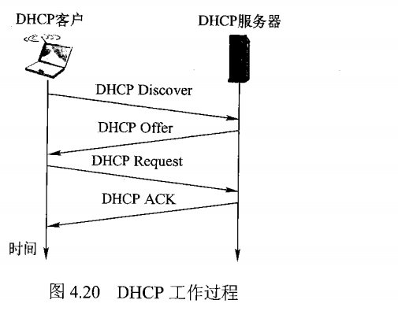

* DHCP客户广播（因为不知道DHCP服务器的IP地址）DHCP发现报文（DHCP Discover），以便发现DHCP服务器。报文中的目的IP字段会填入255.255.255.255，表明这个一次广播；
* DHCP服务器广播（因为新接入网络的主机不具有可用IP）发送一个DHCP提供报文（DHCP Offer），用于响应主机，报文中包含为新主机分配的IP地址等信息；
* DHCP客户收到一个或多个DHCP提供报文后，选择其中一个后广播（因为DHCP可能存在多个，在响应选中的DHCP的同时也要广而告之未被选择的DHCP）发送DHCP请求报文（DHCP Request）报文；
* 被选定的DHCP服务器以DHCP确认报文（DHCP ACK）来对DHCP请求报文进行响应。


### 网络地址转换协议NAT

NAT网络地址转换协议，实现将私有地址转换成公有地址，从而访问Internet。NAT协议通常运行在私有网络的边缘路由器或专门服务器上，同时连接内部私有网络和公共互联网，拥有公共IP地址。

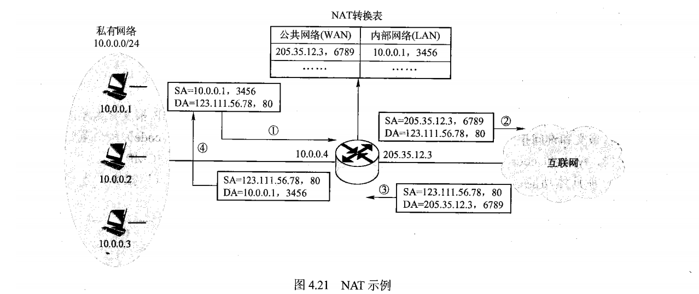

**工作原理**：


* 对于从内网进入公共互联网的IP数据报，将其源IP地址替换为NAT服务器拥有合法的公共IP地址，同时替换源端口号，并将替换关系记录到NAT转换表中；
* 对于从公共互联网返回的IP数据报，依据其目的IP地址与目的端口号检索NAT转换表，并利用检索到的内部私有IP地址和目的端口号，然后将IP数据报转发到内部网络。


### 网际控制报文协议ICMP

ICMP网际控制报文协议，进行主机或路由器间的网络层差错报告与网络探测。

**差错控制报文**：

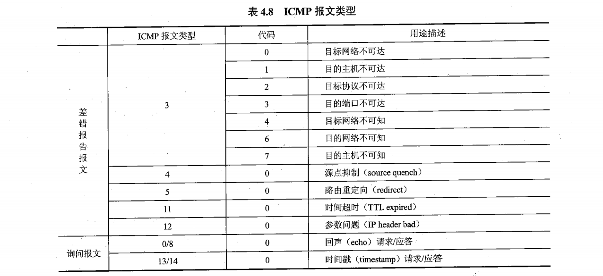

* **目的不可达**：当路由器或主机不能将IP数据报成功交付到目的网络、主机、端口时，会丢弃数据报并向源主机发送目的不可达ICMP报文；
* **源点抑制**：如果路由器由于拥塞导致丢弃了IP数据报，则可以通过向IP数据报的源主机发送源点抑制ICMP报文，反馈该异常情况，告知其拥塞现象；
* **路由重定向**：如果默认网关路由器认为主机向某目的网络发送的IP数据报，应选择其他更好的路由时，则向主机发送路由重定向ICMP报文，主机收到后会将更好的路由信息更新到路由表中，以便后续发送时选择更好的路由；
* **时间超时**：当路由器收到IP数据报的TTL为1，减1后变为0时，则不再继续转发该IP数据报，而是将其丢弃，同时向该IP数据报的源主机发送时间超时报文。


### 虚拟专用网VPN


### 路由器结构


* **输入端口**：负责从物理接口接收信号，还原数据链路层帧，提取IP数据报（或其他网络层协议分组），根据IP数据报的目的IP地址检索路由表，决策需要将该IP数据报交换到哪个输出端口；
* **交换结构**：将输入端口的IP数据报交换到指定的输出端口，基于内存交换（性能最差）、总线交换、网络交换（性能最佳）；
* **输出端口**：首先提供缓存队列功能，让交换到该端口的待发送分组排队，并从队列中不断的取出分组进行数据链路层数据帧的封装，最后通过物理线路端发送出去；
* **路由处理器**：路由器的CPU，负责执行路由器的各种指令，包括路由协议的运行、路由计算、路由表的更新与维护等；
* **路由表**：路由器是根据路由表来进行分组的转发。由目的网络、下一跳地址和接口组成。

**路由器的分组转发**：


### 路由算法

#### 链路状态路由选择算法LS

是与一种全局式路由选择算法，每个路由器在计算路由时需要构建出整个网络的拓扑图。

* 为了构建整个网络的拓扑图，每个路由器周期性检测、收集与其直接相连链路的费用，以及与其直接相连的路由器ID等信息，构造链路状态分组并向全网扩散；
* 于是网络中的每个路由器都会周期性的收到其他路由器广播的链路状态分组，并将链路状态分组存储到自己的链路状态数据库中；
* 当数据库中收集到足够的链路状态信息后，路由器就可以基于数据库中的链路状态信息，构建出网络拓扑图；


#### 距离向量路由选择算法DV

是一种异步的、迭代的分布式路由选择算法。

* 网络中的每个结点x，估计从自己到网络中所有结点y的最短距离，记为Dx(y)，称为结点x的距离向量，即该向量维护了从结点x出发到达网络中所有结点的最短距离（最低费用）的估计；
* 每个结点向其邻居结点发送它的距离向量的一个拷贝；
* 当结点收到来自邻居的一份距离向量或是观察到相连的链路上的费用发生变化后。根据B-F方程对自己的距离向量进行计算更新；
* 如果结点的距离向量得到了更新，那么该结点会将更新后的距离向量发生给它的所有邻居节点。


#### 层次化路由

将大规模的互联网按组织边界、管理边界、网络技术边界或功能边界划分为多个自治系统（AS），层次化路由将网络路由选择分为自治系统内路由选择和自治系统间路由选择两个层次。解决了大规模网络路由选择问题。


### 路由选择协议

#### 路由信息协议RIP

* 基于距离向量路由选择算法的IGP（也就是自治系统内的路由选择协议，也就是内部网关协议），主要用于较小规模的AS，RIP在度量路径时采用的是跳数，即每条链路的费用都为1；
* 路由器周期性的向其相邻路由器广播自己知道的路由信息（路由表），用于通知相邻路由器自己可以到达的网络以及到达该网络的距离（跳数），相邻路由器可以根据收到的路由信息修改和刷新自己的路由表；
* RIP被限制在网络直径不超过15跳的自治系统内使用，即分组从一个子网到另一个子网穿越的最多子网数目不超过15，因此RIP中一条路径的最大费用不超过15，路径费用16表示无穷大，即目的网络不可达；
* 相邻的路由器通过RIP响应报文来交换距离向量，交换频率约为30s一次，RIP响应报文中包含了从该路由器到达其他目的子网的估计距离的列表，RIP响应报文也称RIP通告。

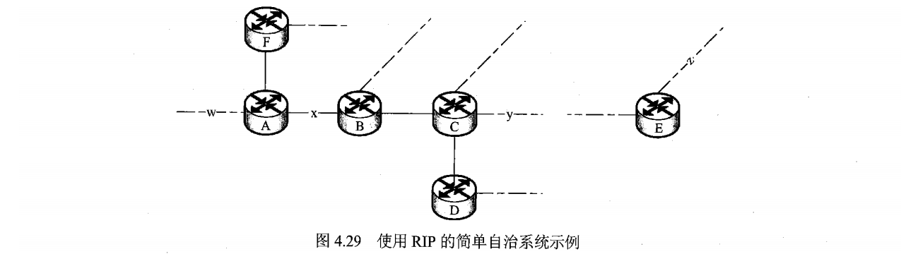

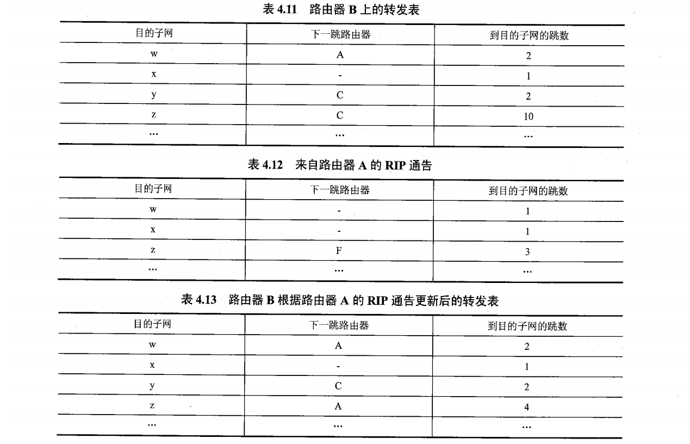

上图展示了一个使用RIP的自治系统，与路由器相连的线表示子网，虚线表示子网的其它部分：

* 在某一时刻，路由器B收到路由器A的RIP通告，通告内容如4.12，路由器B根据DV算法计算更新其转发表4.11，更新的结果如表4.13所示；
* RIP规定若超过180s仍未从某个邻居接收到任何RIP响应报文，那么将认为该邻居已经不可达，修改本地转发表，并将此信息通过RIP响应报文通告给邻居；
* RIP是应用进程实现的，所以RIP报文的传输也需要封装到传输层的UDP报文中，但RIP完成的是网络层的功能，仍然称RIP是网络层协议，网络分层的划分是按功能，而不是具体实现。


#### 开放式最短路径优先协议OSPF

* 基于链路状态路由选择算法（使用Dijkstra算法求解最短路径）的IGP，应用于较大规模的AS；
* 不论是RIP还是OSPF都是将网络抽象成无向图，但RIP将无向图中边的权值（即费用）固定为跳数，而OSPF对权值表示的意义没有限制，可以是跳数，也可以是链路的带宽等，OSPF只关心在给定的结点、边和边的权值的集合下，如何求解最短路径；
* 在运行OSPF的自治系统内，每台路由器需要向与其同处一个自治系统内的所有路由器广播链路状态分组。为了使路由器能够更好的适应网络拓扑以及流量的变化情况，路由器需要在其相连链路上的费用发生变化时，及时广播链路状态分组。

**优点**：

* **安全**，所有OSPF报文都是经过认证的，这样可以预防恶意入侵者将不正确的路由信息注入到路由器的转发表中；

* **支持多条相同费用的路径**，OSPF允许使用多条具有相同费用的路径，这样可以防止在具有多条从源到目的的费用相同的路径时，所有流量都发往其中一条路径，有利于实现网络流量均衡；

* **支持区别化费用度量**，OSPF支持对于同一条链路，根据IP数据报的TOS不同，设置不同的费用度量，从而可以实现不同类型网络流量的分流；

* **支持单播路由与多播路由**，OSPF综合支持单播路由与多播路由，多播路由只是对OSPF的简单扩展，使用OSPF的链路状态数据库就可以计算多播路由；

* **分层路由**，OSPF支持在大规模自治系统内进一步进行分层路由。

  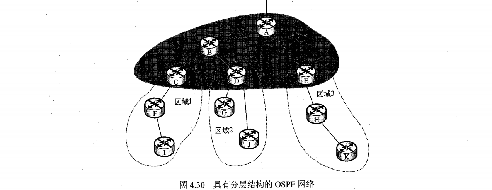

  * 区域边界路由器，如上图C、D、E，主要负责为发送到区域之外的分组进行路由选择；
  * 主干路由器，在主干区域中运行OSPF路由算法的路由器被称为主干路由器；
  * AS边界路由器，如上图A，负责连接其他AS。

* OSPF报文直接封装到IP数据报中进行传输。


#### 边界网关协议BGP

BGP实现跨自治系统的路由信息交换，功能：

* 从相邻AS获取某子网的可达性信息；
* 向本AS内部的所有路由器传播跨AS的某子网可达性信息；
* 基于某子网可达性信息和AS路由策略，决定到达该子网的最佳路由。

BGP主要有4种报文：

* OPEN（打开）报文，用来与BGP对等方建立BGP会话；
* UPDATE（更新）报文，用来通告某一路由可达性信息，或者撤销已有路由；
* KEEPALIVE（保活）报文，用于对打开的报文进行确认，或周期性的证实会话的有效；
* NOTIFICATION（通知）报文，用来通告差错。

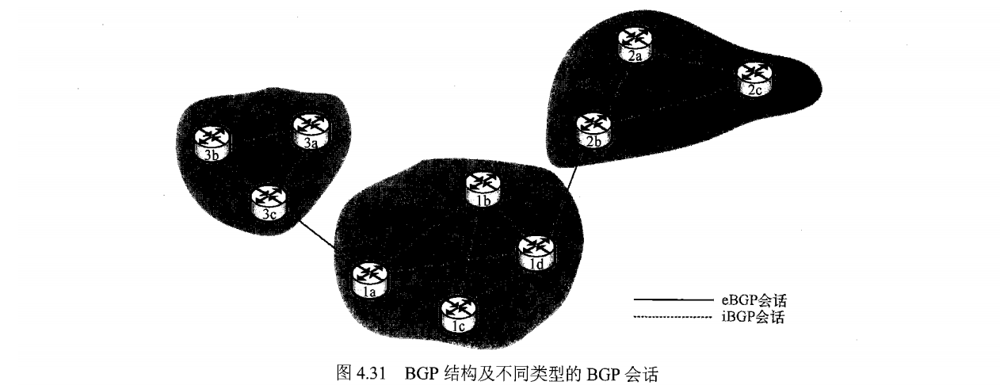


## 计算机网络-数据链路层

### 数据链路层服务

#### 基本概念

数据链路层负责通过一条数据链路，从一个结点向另一个物理链路直接相连的相邻结点，传送网络层数据报，中间通常不经过任何其他交换结点。所谓的数据链路是在物理线路上，基于通信协议来控制数据帧传输的逻辑数据通路。从数据链路层来看，无论主机或是路由器等网络设备统称为结点，因为它们通常都是一条数据链路的端点。沿着通信链路连接的相邻结点的通信信道称为链路。


#### 组帧


* 将要传输的数据封装成帧结构的操作，称为组帧或成帧；
* 在网络层的数据报基础上增加帧头帧尾，帧头包含发送结点和接收结点的地址信息，帧尾包含用于差错检查的差错编码；
* 组帧过程增加的帧头尾中还有一部分用于帧定界的信息，即确保接收结点从物理层收到的比特流中，能够依据定界字符或比特串成功识别帧的开始和结束，如：帧头帧尾都加上01111110。


#### 链路接入

* **点对点链路**：发送结点和接收结点独占通信链路，只要链路空闲就能发送和接收帧；
* **广播链路**：通信链路被多个结点共享，任意两个结点同时通过链路发送帧，都会彼此干扰，导致帧传输失败，因此各个结点需要运行MAC媒介访问控制协议，来协调各阶段使用共享物理传输媒介，完成帧的传输。


#### 可靠交付

并不是所有数据链路层协议都需要设计成可靠传输协议，高出错的链路如无线链路会适用可靠传输，低出错的链路如光纤双绞线等实施可靠传输没有太大的必要。


#### 差错控制

* 帧在物理媒介传输会产生比特翻转的差错；
* 一段时间内，出现差错的比特占总比特的比率称为误比特率。


### 差错控制

#### 差错类型

差错控制就是通过差错编码技术，实现对信息传输差错的检测，并基于某种机制进行差错纠正和处理。信号在信道中传输，会受到各种噪声的干扰，从而导致传输差错：

* 随机噪声：如热噪声、传输介质引起的噪声，具有典型的随机性。随机噪声引起的传输差错称为随机差错或独立差错，具有独立性、稀疏性和非相关性，二进制的传输通常为随机比特差错；
* 冲击噪声：如雷声、电机启停等，具有很强的突发性。突发差错通常是连续或成片的信息差错，具有相关性，通常集中发生在某段信息。


#### 控制机制

* **检错重发**：典型的差错控制方式，发送端对数据进行差错编码，接收端利用差错编码检测数据是否出错，对于出错的数据需要重复发送，直到正确为止；

* **前向纠错**：接收端进行差错纠正的方法，需要利于纠错编码（能检测也能纠正），即发送端进行纠错编码，接收端利用纠错编码进行差错检测，发送错误直接纠正（适用于单工链路或实时性要求高的链路）；
* **反馈校验**：接收端将收到的数据原样发回发送端，发送端通过比对反馈可以确认是否正确发送，若发现不同则立即重发，直到比对反馈结果相同为止（缺点：效率低，实时性差）；
* **检错丢弃**：不纠正错误，直接丢弃数据。只适用于容许一定比例差错或实时性要求较高的系统（如多媒体播报应用）。


#### 差错编码

发送端在待传输数据信息的基础上，附加一定的冗余信息，该冗余信息建立起数据信息的某种关联关系，将数据信息以及附加的冗余信息一起发送到接收端，接收端可以检测冗余信息表示的数据信息的关联信息是否存在，若存在则正确，否则出错。

* 奇偶校验码：按位异或（XOR）运算，符号⊕，即参与运算的两个位值，相同则0，不同则1；
* 汉明码：线性分组码，可以实现单个比特的差错纠正，当信息为足够长时，执行效率会很高；
* CRC循环冗余码：将二进制位串看成是系数为0或1的多项式的系数。一个k为二进制数可以看作是一个k-1次多项式的系数列表，该多项式共有k项，从x^k-1^到x^0^。这样的多项式被认为是k-1阶多项式。高次（最左边）位是x^k-1^项的系数，接下来的位是x^k-2^项的系数，以此类推。


### 多路访问-信道划分MAC协议

#### 基本概念

数据链路层使用的信道分类：

* 点对点信道：一对一通信，信道被通信双方共享；
* 广播信道：一对多广播通信，广播信道上连接的结点很多，信道被所有结点共享，因此需要使用多路访问控制MAC协议来协调结点的数据发送。

基本思想是将信道资源划分后，分配给不同的结点，各结点通信时只使用其分配到的资源，从而实现了信道共享，并避免了多结点通信时的相互干扰。


#### 频分多路复用FDM

频域划分制，即在频域内将信道带宽划分为多个子信道，并利用载波调制技术，将原始信号调制到对应某个子信道的载波信号上，使同时传输的多路信号在整个物理信道带宽允许的范围内频谱不重叠，从而共用一个信道；

FDM系统的接收端，利用带通滤波器对信号进行分离、复原；

FDM常用于模拟传输的宽带网络种。

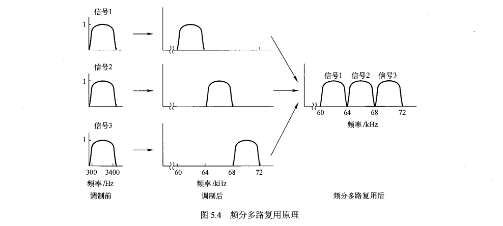

频分多路复用的主要优点是分路方便，是目前模拟通信中常采用的一种复用方式，特别是在有线和微波通信系统中应用广泛。


#### 时分多路复用TDM

时域划分制，即将通信信道的传输信号在时域内划分为多个等长的时隙，每路信号占用不同的时隙，在时域上互不重叠，使多路信号合用单一的通信信道，从而实现信道共享；

TDM系统的接收端根据各路信号在通信信道上所占用的时隙分离并还原信息；

分为同步时分多路复用STDM和异步时分多路复用ATDM两种：

* STDM按照固定的顺序把时隙分配给各路信号；
* ATDM为有大量数据要发送的用户分配较多的时隙，数据量小的用户分配相对较小的时隙，没有数据的用户不再分配时隙，可以提高信道的利用率，主要应用于高速远程通信。

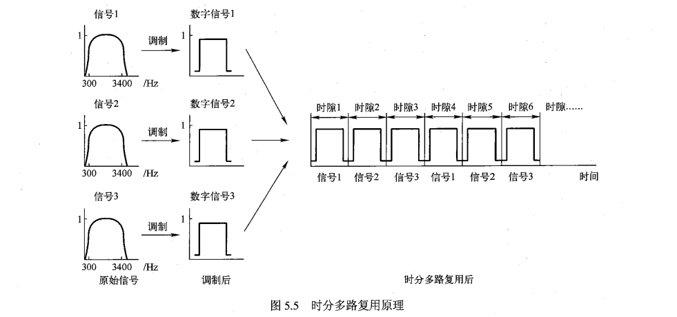


#### 波分多路复用WDM

本质是频分多路复用，广泛应用于在光纤通信中，光载波频率很高，通常用光的波长来代替频率讨论；

波分多路复用是指在一根光纤中，传输多路不同波长的光信号，由于波长不同，所以各路光信号互不干扰，最后再用波长解复用器将各路波长的光载波分解出来。

密集波分复用DWDM：

* 波长更密集，复用度更高，信道利用率更高，通信容量更大；
* 其关键技术是光放大器，运行在特定光谱频带上，并根据现有的光纤进行优化，无须将光信号转换为电信号，直接放大光波信号；
* DWDM是现代光纤通信网络的基础，有效支持IP、ATM等承载的电子邮件、视频、多媒体、语言等数据通过统一的光纤层进行高速传输。

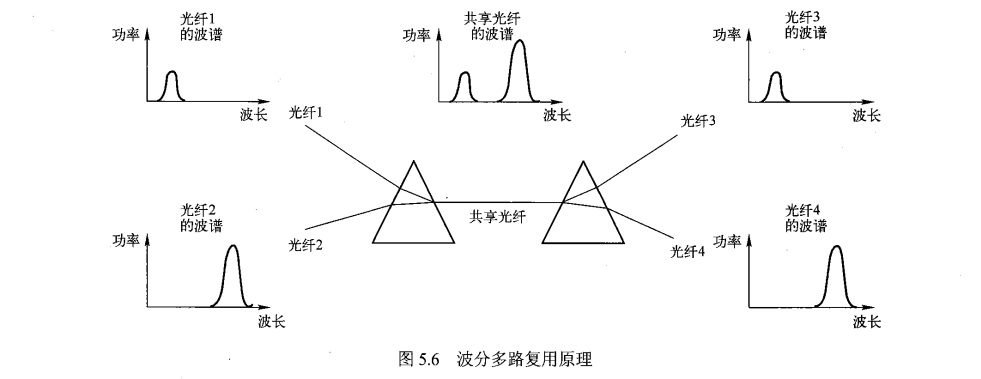


#### 码分多路复用CDM

通过利用更长的相互正交的码组分别编码各路原始信息的每个码元，使得编码后的信号在同一信道中混合传输，接收端利用码组的正交特性分离各路信号，从而实现信道共享；

CDM的实质是基扩频技术，即将需要传输的、具有一定信号带宽的信息用一个带宽远大于信号带宽的码序列进行调制，使原始信号的带宽得到扩展，经载波调制后再发送出去，接收端则利用不同码序列之间的相互正交特性，分离特定信号。


### 多路访问-随机访问MAC协议

#### 基本概念

所有的用户都根据自己的意愿随机的向信道上发送消息，如果一个用户在发送信息期间没有其他用户发送信息，则该用户信息发送成功，如果两个或以上用户都在共享信道中发送信息，则产生冲突或碰撞，导致发送失败，每个用户随机退让一段时间后再次尝试，直至成功；

随机访问的实质就是争用接入，竞争胜利者暂时占用信道发送信息，失败者随机等待一段时间再次竞争，直到成功。


#### ALOHA协议

任一站点有数据要发送时就可以直接发送至信道，发送站在发出数据后需要对信道侦听一段时间，通常这个时间为电波传到最远端的站再返回本站所需的时间，如果这段时间内收到接收站发来的应答信号，说明发送成功，否则就是发生了冲突，则等待一段随机时间再进行重发，直到成功为止。


* 纯ALOHA协议：
  * 吞吐量 ^*^S：在一个帧时内成功发送的平均帧数；
  * 网络负载 G：在一个帧时内发送的平均帧数，包括发送成功的帧和因冲突未发送成功而重发的帧，纯ALOHA协议的网络负载不能大于0.5；
* 时隙ALOHA协议：
  * 把信道时间分为**离散的时隙**，每个时隙为发送一帧所需的发送时间，每个通信站只能在每个时隙开始时刻发送帧，如果在一个时隙内发送帧出现冲突，下一个时隙以概率P重发该帧，以概率（1-P）不发该帧（等待下一个时隙），直到帧发送成功；
  * 需要所有通信站在时间上同步，降低了产生冲突的概率，最大信道利用率为36.8%。


#### CSMA载波监听多路访问协议

ALOHA协议的根本缺点：就是发送前无论信道是否空闲都会进行发送，这会大大增加冲突的可能性，在发送帧之前先判断信道是否空闲，若空闲则发送否则推迟发送，能够减少发生冲突的可能性；

CSMA就是为解决这一问题而提出的，通过载波监听装置，使通信站在发送数据前，监听信道上其他站点是否发送数据，若有站点在发送则暂时不发，从而减少发生冲突的概率，CSMA可以理解为先听后说。

非坚持CSMA：

* 通信站有数据发送，先侦听信道；
* 若发现信道空闲，则立即发送数据；
* 若发现信道忙，则等待一个随机时间，然后重新开始侦听信道，尝试发送数据；
* 若发送数据时产生冲突，则等待一个随机时间，然后重新开始侦听信道，尝试发送数据。

1-坚持CSMA：

* 通信站有数据发送，先侦听信道；
* 若发现信道空闲，则立即发送数据；
* 若发现信道忙，则继续侦听信道直至发现信道空闲，然后立即发送数据。

P-坚持CSMA：

* 通信站有数据发送，先侦听信道；
* 若发现信道空闲，则以P概率在最近时隙开始时刻发送数据，以概率Q=1-P延迟到下一个时隙发送；
* 若下一个时隙仍空闲，重复此过程直到数据发出或时隙被其他通信站占用；
* 若信道忙，则等待下一个时隙，重新开始发送数据；
* 若发送数据时发生冲突，则等待一个随机时间，然后重新开始发送过程。


#### CSMA/CD带冲突检测的载波监听多路访问协议

CSMA即使监听后再发也会出现数据冲突问题，当两个帧冲突时，不仅双方都会被破坏，也会使信道无法被其他站使用，因此发生冲突时继续传输数据帧会造成信道的浪费；

CSMA/CD就是为解决这一问题而提出的，即一旦发现有冲突发生，所有通信站都立即停止继续发送数据，这就需要通信站在发送数据的同时，还要监听信道，其中CD表示冲突检测，CSMA/CD可以理解为先听后说，边听边说。

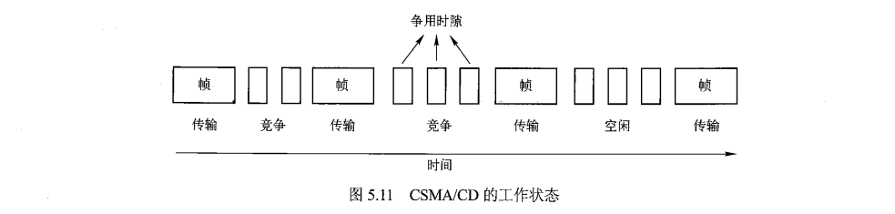

CSMA/CD的基本原理是：通信站使用CSMA协议进行数据发送，在发送期间如果检测到碰撞，立即终止发送，并发出一个冲突强化信号，使所有通信站都知道冲突的发生，信号发出后随机等待一段时间，再重复上述过程。

信道状态：

* 传输状态：一个通信站使用信道，其他站禁止使用；
* 竞争状态：所有通信站都有权尝试获取对信道的使用权；
* 空闲状态：没有通信站使用信道。

CSMA/CD发生冲突的原因：信号传播时延的问题，一个通信站发出的信号，需要经过一定的延迟才能到达其他站，而在信号到达其他站之前，如果某通信站此时也有数据发送，那么侦听信道的结果则依然为空闲状态，于是发送数据产生了冲突。

CSMA/CD冲突检测方法：通过检测信道中信号的强度来判断是否发生冲突的，适用于有线而不适用于无线信道。为了精确检测冲突，需要在发送数据的同时检测冲突，数据发送结束的同时也结束冲突检测，也就是**边发边听，不发不听**。


### 多路访问-受控接入MAC协议

#### 基本概念

特点是各个用户不能随意接入信道而必须服从一定的控制。


#### 集中式控制

系统中有一个主机负责调度其他通信站接入信道，从而避免冲突，主要方法是轮询技术，又分为轮叫轮询和传递轮询。

轮叫轮询：设有N个通信站连接共享线路，主机按顺序从站1开始逐个轮询，站1如有数据即可发送，若无则发送控制帧给主机，表示无数据可发，然后主机轮询站2，完成一轮后重复询问1站；

传递轮询：

* 轮叫轮询的缺点就是轮询帧在共享线路上不停的循环往返，形成较大的开销，增加帧发送的等待时延；
* 传递轮询可以解决这样的问题，主机先向站N发出轮询帧，站N在发送数据后或在告诉主机没有数据发送时，即将其相邻站（N-1）的地址附上，从站1到站N-1都各有两条输入线，一条接收主机发来的数据，另一条接收允许该站发送数据的控制信息。

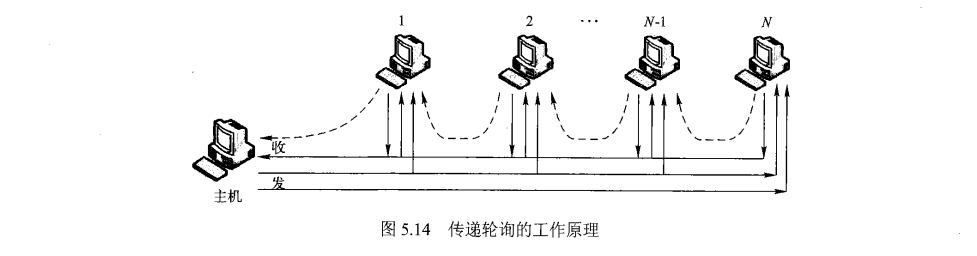

缺点是一旦主机出现了问题，那么整个网络都会陷入瘫痪。


#### 分散式控制

令牌技术是典型的分散式控制方法，令牌是一种特殊的帧，代表了通信站使用信道的许可，在信道空闲时一直在信道上传输，一个通信站如果想发送数据就首先要获得令牌，然后在一定时间内发送数据，在发送完数据后重新产生令牌并发送到信道上，以便其他通信站使用信道。最典型的使用令牌实现多路访问控制的是令牌环网。

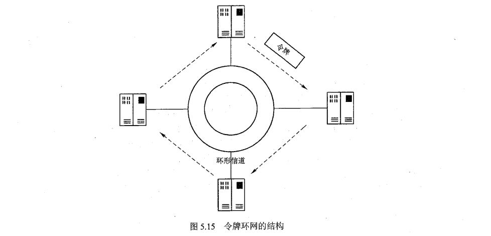

令牌丢失和数据帧无法撤销，是环网上最严重的错误：

* 令牌本身是位串，绕环传递的过程种可能受干扰出错，另外，当某站点发送数据帧后，由于故障而无法将所发的数据帧从网上撤销时，又会造成网上数据帧持续循环的错误；
* 通过在环路上指定一个站点作为主动令牌管理站，以此来解决问题，通过超时机制来检测令牌是否丢失，若丢失则清除环路上的数据碎片，并发出一个令牌；
* 通过在经过的任何一个数据帧上置其监控位为1，来管理无法撤销的数据。


## 计算机网络-物理层

物理层在实现为数据终端设备提供数据传输通路、传送数据以及物理层管理等功能的过程中，<font color='red'>定义了建立、维护和拆除物理链路的规范和标准，同时也定义了物理层接口通信的标准</font>。

<font color='red'>物理层接口标准</font>的定义主要包括四大特性：<font color='red'>机械特性、电气特性、功能特性以及规程特性</font>。

<font color='red'>物理层接口协议主要任务就是解决主机、工作站等数据终端设备与通信线路上通信设备之间的接口问题</font>。

### 数据通信基础

#### 基本概念

**信息与消息**：信息是对事物状态或存在方式的不确定性表述，而人类能够感知的描述称为消息；

**数据**：对客观事物的符号表示，用于表示客观事物的未经加工的原始素材；

**信号**：数据的电子或电磁编码，信号是信息的载体（模拟信号、数字信号）；

**通信**：通信的本质就是在一点精确或近似的再生另一点的信息；

**信道**：<font color='red'>信号在通信系统中传输的通道（物理信道、逻辑信道）</font>；

**码元**：<font color='red'>单位时间内代表不同离散值的波形</font>；

**波特率**：<font color='red'>码元速率（Baud）即最大信号传输速率，描述信道单位时间内传输码元的能力，即2倍的带宽</font>；

**比特率**：<font color='red'>数据速率（bps）描述信道单位时间内传输</font>；

**带宽**：<font color='red'>指能够有效通过该信道的信号最大频带宽度（HZ）</font>。


#### 数据通信系统

系统的构成：通信系统的作用是将消息从信源传递到一个或多个目的地，能够实现信息传输的一切技术设备和传输介质的集合称为通信系统。


* 信源：将信息转换为信号的设备，如电话、摄像机、计算机；
* 发送设备：将信源产生的信号进行适当变换的装置，使之适用于信道中传输，主要通过编码和调制的方式变换；
* 信道：<font color='red'>即信号的传输媒介，分为有线和无线信道两类，具体类型如双绞线、同轴电缆、光纤、大气层、外层空间</font>；
* 接收设备：完成发送设备的发变换，即进行译码和解调，还原原始的发送信号；
* 信宿：信号的终点，并将信号转换为供人们能识别的消息；
* 噪声：自然界和通信设备所固有的，对通信信号产生干扰和影响的各种信号，噪声对通信系统是有害的，但无法完全避免。

模拟通信和数字通信：通信系统根据信号种类分为模拟通信和数字通信系统，区别在于信道中传输的是模拟还是数字信号。


* <font color='red'>模拟信号是指信号的因变量完全随连续消息的变换而变化的信号</font>，自变量可以是连续的，也可以是离散的，但因变量一定是连续的，如电视图像信号、电话语言信号、传感器的输出信号；

* <font color='red'>数字信号是指表示信息的因变量是离散的并且状态有限，自变量时间的取值也是离散的信号</font>，如计算机数据、数字电话、数字电视等都是数字信号；

* <font color='red'>二者在一定条件下可以相互转换，模拟信号通过采样、量化、编码等步骤变成数字信号。数字信号通过解码、平滑等步骤恢复成模拟信号</font>。

数据通信方式：

* <font color='red'>单向通信（单工）、双向交替通信（半双工）、双向同时通信（全双工）</font>：单工通信就是任何时间都只有一个方向的通信，而没有反方向的交互；半双工通信就是通信双方都可以发送信息，但不能双方同时发送或接收，一方发另一方收，如对讲机系统；全双工通信就是双方可以同时发送和接收信息，如电话网、计算机网络；
* <font color='red'>并行通信、串行通信</font>：并行通信是为字节的每一位都设置传输通道，全部位同时进行传输，传输速度快但成本高，适用于计算机内元器件的传输，如CPU与存储器的总线传输；串行通信只为信息传输设置一条通道数据字节中的每一位依次传输，传输速度慢但成本低，适用于长距离通信，如计算机与外置设备的数据传送；
* <font color='red'>异步通信、同步通信</font>：
  * 异步通信以字符为单位发送，依次传输一字符，每个字符5~8位，字符前加上起始位指明开始，后面加上1或2个停止位指明结束，当无字符发送时就一直发送停止位，接收方就可以根据停止位判断范围。异步传输不需要传输时钟信号，实现简单，效率低下，适用于低速系统；
  * 同步通信以数据块为单位发送，内部包含多个字符，每个字符5~8位，在前面加上起始标志，后面加上结束标志，接收方以此判断范围。同步传输效率高，但需要双方建立同步时钟，实现复杂，适用于高速系统。

数据通信系统的功能：

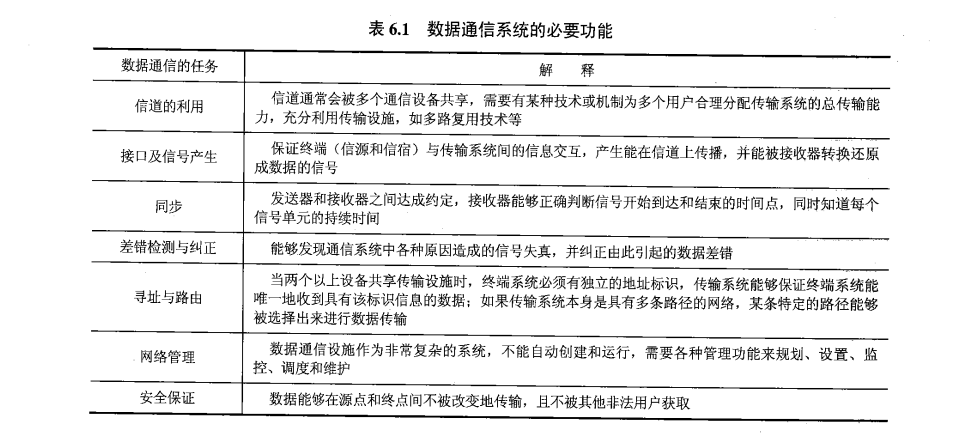


### 物理介质

<font color='red'>在进行数据通信时，信号需要通过某种介质才能进行传输，即物理介质</font>。

#### 引导型传输介质

又称有限信道，以导线为传输介质，信号沿导线进行传输，能量集中在导线附近，因此效率高，但部署不够灵活。

* 架空明线：指平行且相互分离或绝缘的架空裸线线路，通常采用铜线或铝线等金属导线；

* <font color='red'>双绞线</font>：主要用于基带传输。

  

  将两根相互绝缘的铜线并排绞合在一起可以减少对相邻导线的电磁干扰，这样的一对线称为双绞线；

  屏蔽双绞线STP：在护套与线对间增加一层金属丝编制的屏蔽层，可以提高双绞线的抗电磁干扰能力，性能更优、价格高、安装复杂；

  非屏蔽双绞线UTP：没有屏蔽层的双绞线电缆，价格便宜、安装简单、局域网更普遍使用的是UTP。

* <font color='red'>同轴电缆</font>：

  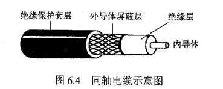

  主要用于频带传输，如有线电视网络，具有较好的抗电磁干扰性能；

  由同轴的两个导体构成，外导体是空心圆柱型网状编织金属导体，内导体是金属导线，两者之间填充绝缘实心介质；

* <font color='red'>光纤</font>：

  

  基本原理是利用了光的全反射现象；

  分为多模光纤和单模光纤；

  优点： 

  1. <font color='red'>通信容量大，最高可达100Gbps</font>；
  2. <font color='red'>传输损耗小，中继距离长，特别适合远距离传输</font>；
  3. <font color='red'>抗雷电和抗电磁干扰性能好</font>；
  4. <font color='red'>无串音干扰，保密性好</font>；
  5. <font color='red'>体积小，重量轻</font>。

#### 非引导型传输介质

适合距离特别远的自由空间的传播通信；

电磁波按频率划分为若干频段，用于不同目的或场合的无线通信；

电磁波在外层空间的传播，如两艘飞船间的通信，为自由空间传播，在近地空间传播会受到地面和大气层的影响，更加电磁波频率、通信距离和位置的不同，电磁波的传播可以分为<font color='red'>地波、天波和视线传播</font>。


### 信道与信道容量

#### 信道分类

狭义信道：即为信号传输介质；

广义信道，包括信号传输介质和通信系统的一些变换装置，如发送设备、接收设备、天线、调制器等：

* <font color='red'>调制信道：信号从调制器的输出端传输到解调器的输入端经过的部分（恒参信道、随参信道）</font>；
* <font color='red'>编码信道：数字信号由编码器输出端传输到译码器输入端经过的部分，包括调制信道及调制器、解调器</font>。

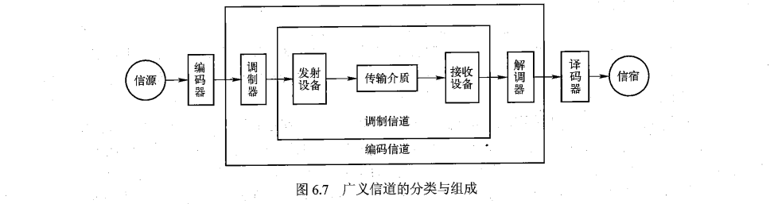

#### 信道传输特性

不同类型的信道对信号传输的影响差异较大，恒参信道的传输特性变化小、缓慢，可以视为恒定，不随时间变化；随参信道的传输特性是时变的。

恒参信道传输特性：

* 各种有线信道和部分无线信道，如微波视线传播链路和卫星链路等，都属于恒惨信道；
* 对信号幅值产出固定的衰减；
* 对信号输出产生固定的时延。

随参信道传输特性：

* 随参信道的传播特性随时间随机快速变化，如依靠地波和天波传播的无线电信号；
* 信号的传输衰减随时间随机变化；
* 信号的传输时延随时间随机变化；
* 存在多径传播现象，多径现象是指发射天线发出的电磁波可能经过多条路径到达接收端。

#### 信道容量

信道容量是指信道无差错传输信息的最大平均速率。广义信道可以分为调制信道和编码信道，信息论中将信道分为连续和离散信道；调制信道是一种连续信道，即输入和输出信号都是取值连续的；编码信道是离散信道，输入与输出信号都是取值离散的时间函数。


### 基带传输

#### 系统结构

在信道中直接传输基带信号，称为基带传输；

在信道中直接传输数字基带信号，称为数字基带传输。

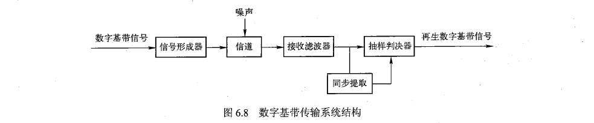

#### 传输编码

将二进制数字数据映射为脉冲信号的编码：

* 单极不归零码：

  二进制数字符号0和1分别用零电平和正电平表示，脉冲幅值只有零或正，只有一个极性，故称为单极；

  不归零是指整个脉冲持续时间内，电平保持不变，且脉冲持续时间结束时也不要求回归0电平；

  即：相邻两个脉冲区间如果表示的是同样的二进制符号，不要求回归0电平，幅值可以保持不变直到下一个脉冲区间表示的是不同的二进制符号。

  

  

* 双极不归零码：

  二进制数符号0和1分别用负电平和正电平表示。

  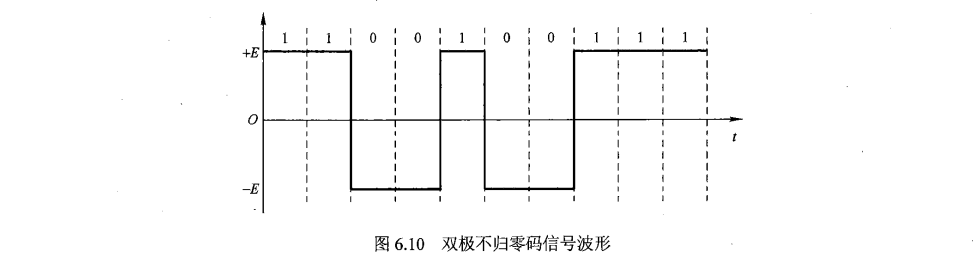

* 单极归零码：

  二进制数符号0和1分别用零电平和正电平表示；

  归零就是在每个正脉冲区间的中间时刻，电平要回归到零电平；

  即：不论下一个脉冲区间是相同还是不同，都需要在本次脉冲持续期中回归零电平，下一个脉冲信号再重新调整幅值。

  

* 双极归零码：

  二进制数符号0和1分别用负电平和正电平表示。

  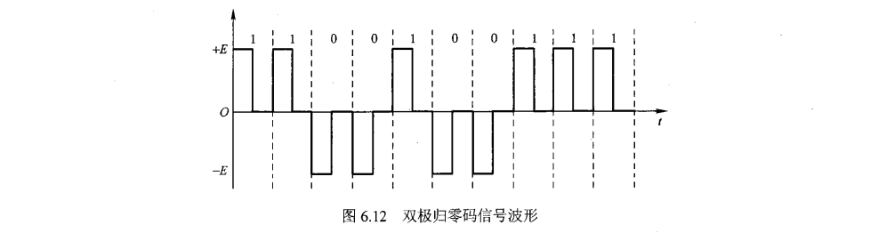

* 差分码：

  <font color='red'>利用电平的变化与否来表示信息，相邻脉冲用电平跳变表示1，无跳变表示0；</font>

  即：相邻的区脉冲区间若电平发生跳变则代表后者是1，若相邻脉冲区间幅值不变，则表示后者是0。

  

将数字基带信号的基本码型变换为数字基带传输码型的编码：

* AMI码：

  <font color='red'>信号交替反转码，用3种电平进行编码，零电平编码0，正负电平交替编码1</font>；

  即：若前一个1用正电平表示，那接下来又出现的1就用负电平表示，反之亦然。

  

* 双相码：

  <font color='red'>曼彻斯特码，只有正负两种电平，每位脉冲持续时间的中间时刻要进行电平跳变，利用该跳变编码信息，正（高）电平跳到负（低）电平表示1，负电平跳到正电平表示0；</font>

  即：每段脉冲区间都是从中间位置开始跳变，从上往下跳表示1，从下往上跳表示0。

  <font color='red'>差分曼彻斯特编码，每位脉冲周期也要进行中间时刻跳变，但仅用于同步，而利用每位开始处是否存在电平跳变编码信息，其中，开始有跳变表示1，无跳变表示0</font>；

  即：以区间的中间时刻为分界线，前一个脉冲周期的后半段和后一个脉冲周期的前半段之间，然后发生了电平跳变，则后一个脉冲周期表示的就是1，若无跳变，则表示0。

  

* 米勒码：

  是双相码的变形，也称延迟调制码，米勒码的编码规范如下：

  * <font color='red'>信息码中的1编码为双极非归零码的01或10</font>；
  * <font color='red'>信息码连着是1时，后面的1要交替编码，即前面的1如果编码为01，后面的1就要编码为10，反之亦然</font>；
  * <font color='red'>信息码中的0编码为双极不归零码的00或11，即码元中间不跳变</font>；
  * <font color='red'>信息码单个0时，其前沿、中间时刻、后沿均不跳变</font>；
  * <font color='red'>信息码连着是0时，两个0码元的间隔跳变（即前一个0的后沿，后一个0的前沿）</font>。

  

* CMI码：

  即信号反转码，是一种双极性二电平码，也是将信息码的1为映射为双极不归零码的2位；

  编码规则是信息码的0编码为双极不归零码的01，1交替编码为双极不归零码的11和00。

  

* nBmB码：

  将n位二进制信息码作为一组，映射成m位二进制新码组，其中m>n。再光纤数字传输系统中，通常选择m=n+1构造编码；

  具有良好的同步和检错能力；

  例如：4B/5B编码，编码效率为80%，常用于100M以太网（快速以太网）、FDDI。8B/10B编码，编码效率80%，常用于千兆以太网。

* nBmT码：将n为二进制信息码作为一组，映射成m为三进制新码组，且m<=n。

### 频带传输

<font color='red'>基带信号可以在具有低通特性的信道中传输，然而许多信道如无线信道不具有低通特性，因此不能再这些信道中之间传输基带信号</font>；

<font color='red'>基带信号去调制与对应信道传输特性相匹配的载波信号，通过在信道中传送经过调制的载波信号实现将基带信号所携带信息传送出去</font>，因此需要使用频带传输这一信号传输方式。

#### 基本结构

将实现调制、传输与解调的传输系统称为数字频带传输系，也称为通带传输或载波传输；

利用模拟基带信号调制载波，称为模拟调制；<font color='red'>利用数字基带信号调制载波，称为数字调制</font>。


#### 数字调制与解调

调制：利用数字基带信号控制载波信号的某些特征参数，使载波信号这些参量的变化反映数字基带信号的信息，进而将数字基带信号变换为数字通信信号的过程；

解调：在接收端需要将调制到载波信号中的数字基带信号卸载下来，还原数字基带信号，这一个过程称为解调；

二进制数字调制：

|                调制技术                |                         说明                         | 码元种类 | 比特位 |                特点                |
| :------------------------------------: | :--------------------------------------------------: | :------: | :----: | :--------------------------------: |
|                  2ASK                  |         用恒定的载波振幅值表示1，无载波表示0         |    2     |   1    | 抗干扰性最差、误码率最高、性能最差 |
| 2FSK（应用较多）  （中、低速数据传输） |    选择两个不同频率的载波f1和f2表示两个不同值0和1    |    2     |   1    | 频带利用率最低，抗干扰性较2ASK更强 |
|                  2PSK                  |         用载波的相位变化来表示两个不同值0和1         |    2     |   1    |      抗干扰性最好、误码率最低      |
|   2DPSK（应用较多）（高速数据传输）    | 用相邻两个码元载波间的相对相位变化表示两个不同值0和1 |    2     |   1    |      抗干扰性最好、误码率最低      |

**正交幅值调制QAM**：

QAM是对载波信号的<font color="red">幅值</font>和<font color="red">相位</font>同时进行调制的二维调制技术，其信号矢量端点图称为星座图，星座间最小距离越大，抗噪性能就越好；

QAM调制技术具有频带利用率高、抗噪能力强、调制解调系统简单等优点，适用于频带资源有限的通信场合，在实际通信系统中得到了广泛的应用。


## 计算机网络-网络安全

### 基本概念

* **概念**：网络安全是指网络系统的硬件、软件及其系统中的数据受到保护，不因偶然的或者恶意的原因而遭到破坏、更改、泄密，系统连续可靠的正常运行，网络服务不中断。

* **属性**：机密性、消息完整性、可访问与可用性、身份认证。  

* **网络安全威胁**：
  * 报文传输方面，主要包括窃听、插入、假冒、劫持等安全威胁；
  * 常见的网络攻击包括拒绝服务Dos以及分布式拒绝服务DDos等；
  * 映射；
  * 分组嗅探；
  * IP欺骗。


### 数据加密

#### 基本概念

* **概念**：密码技术是保障信息安全的核心基础，解决数据的机密性、完整性、不可否认性以及身份识别等问题均需要以密码为基础；

* **密码体制的5个要素**：1. M 明文空间、2. C 密文空间、3. K 密钥空间、4. E 加密算法、5. D 解密算法；

* **密码学**：分为密码编码学和密码分析学。


#### 传统加密方式

**替代密码**：将明文字母表M中的每个字母用密文字母表C中的相应字母代替，常见的加密模型有移位密码、乘数密码、仿射密码等。

* 凯撒密码：是移位密码的典型应用，通过将字母按顺序推后3位起到加密的作用。

**换位密码**：又称置换密码，是根据一定的规则重新排列明文，以便打破明文的结构特性。置换密码的特点是保持明文的所有字符不变，只利用置换打乱明文字符的位置和次序。置换密码可以分为列置换密码和周期置换密码。

* 简单列置换密码：

  * 将明文P按密钥K的长度n分组，每组一行按行排列，即每行n个字符；
  * 若长度不足n的整数倍，则按双方约定的方式填充（如用字符x填充）；
  * 设最后得到的字符矩阵为M__mn__，m为明文划分的行数，n为列数；
  * 然后按照密钥规定的次序将M__mn__对应的列输出，即可得到密文C；
  * 密钥K中每个字母在字母表中的顺序，规定了M__mn__的列输出顺序。


#### 对称密钥加密

对称加密的加密和解密所使用的密钥是相同的。

* **DES**：分组密码，使用56位密钥，明文位64位分组序列，进行16轮加密，每轮加密都会进行复杂的替代和置换操作，并且每轮都会使用一个56位密钥导出的48位子密钥，最终输出与明文等长的64位密文；
* **3DES**：执行3次DES算法，加密过程是加密-解密-加密，解密过程是解密-加密-解密；
* **AES**：涉及4种操作，字节替代、行移位、列混淆、轮密钥加，解密过程就是逆操作。


#### 非对称/公开密钥加密

非对称加密的加密和解密所使用的密钥是不同的，分为公钥和私钥。公加私解，私加公解。


* **Diffie-Hellman**：基于数学中的素数原根理论设计的公开密钥密码系统；

* **RSA**：也是基于数论设计的，其安全性建立在大数分解的难度上；
* **椭圆曲线**：TODO。


### 消息完整性与数字签名

#### 基本概念

报文/消息完整性，也称为报文/消息认证，主要目的是：

* 证明报文确定来自声称的发送方； 
* 验证报文在传输过程中没有被篡改；
* 预防报文的时间、顺序被篡改；
* 预防报文持有期被篡改；
* 预防抵赖，如发送方否认已发送的消息或接收方否认已接收的消息。


#### 消息完整性检测方法

为了实现消息完整性检测，需要用到密码散列函数H(m)，表示对报文m进行散列化。

密码散列函数应具备的主要特性：

* 一般的散列函数具有算法公开；
* 能快速计算；
* 对任意长度的报文进行多对一映射均能产生定长输出；
* 对于任意报文无法预知其散列值；
* 不同报文不能产生相同的散列值。
* 具有单向性、抗弱碰撞性、抗强碰撞性。

典型的散列函数：

* **MD5**：产生128位的散列值；
* **SHA-1**：产生160位的散列值，典型的用于数字签名的单向散列函数；
* **SHA-2**：TODO。


#### 报文认证

消息完整性检测的一个重要的目的就是要完成报文认证的任务。报文认证是使消息的接收者能够检验收到的消息是否真实的认证方法。

报文认证的目的：

* 消息来源的认证：验证消息的来源是真实的；
* 消息的认证：验证消息在传送过程中未篡改。

认证方式：简单报文认证和报文认证码MAC。

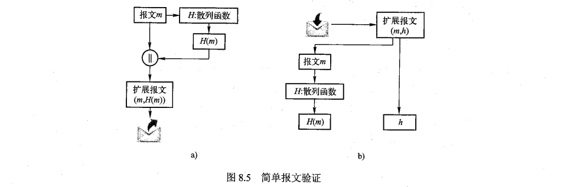


**报文摘要**：对报文m应用散列函数H，得到一个固定长度的散列码，称为报文摘要，记为H(m)，可以作为报文m的数字指纹。


#### 数字签名

概念：数字签名用来**核实发送方的身份**，是实现认证的重要工具。

过程：**用发送方的私钥签名，用发送方的公钥核实签名**。

数字签名应该满足以下要求：

* <font color='red'>接收方能够确认或证实发送方的签名，但不能伪造</font>；
* <font color='red'>发送方发出签名消息给接收方后，就不能再否认其所签发的消息</font>；
* <font color='red'>接收方对已经收到的签名消息不能否认，即有收报认证</font>；
* <font color='red'>第三者可以确认收发双方之间的消息传送，但不能伪造这一过程</font>。


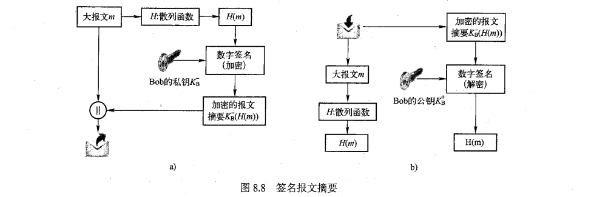


### 身份认证

概念：身份认证又称身份鉴别，是一个实体经过计算机网络向另一个实体证明其身份的过程。鉴别应当在通信双方的报文和数据交换的基础上，作为某鉴别协议的一部分独立完成。鉴别协议通常在两个通信实体运行其他协议之前运行。

基于共享对称密钥的身份认证：


* A向B发送报文；
* B选择一个一次性随机数R发送给A；
* A使用其与B共享的对称密钥来加密这个随机数，然后把密文发送给B；
* B解密收到的报文，若结果和自己发送的随机数相同，则确认A的身份。

基于公开密钥的身份认证：

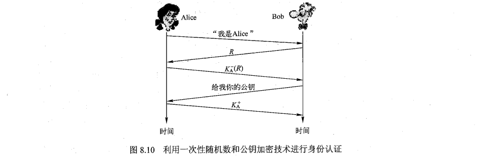

* A向B发送报文；
* B选择一个一次性随机数R发送给A；
* A使用自己的私钥来加密R，并把密文发送给B；
* B向A请求获取A的公钥；
* A发送自己的公钥给B；
* B用公钥解密收到的报文，若结果和自己发送的随机数相同，则确认A的身份。

存在中间人攻击的问题：

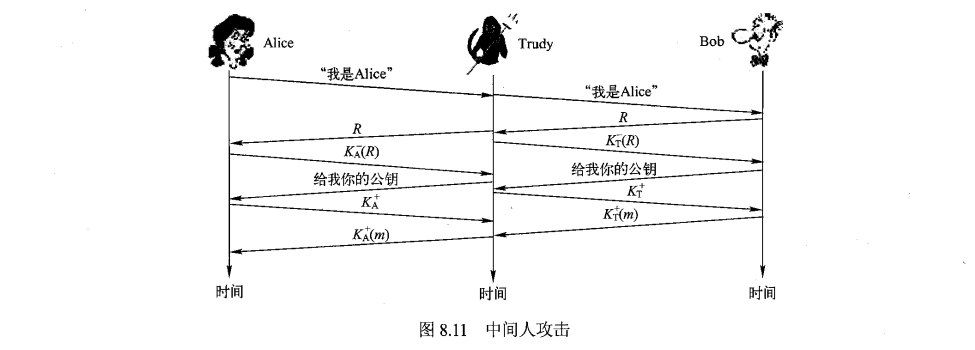


### 密钥分发中心与证书认证机构

#### 密钥分发中心KDC

概念：对称密钥分发的典型解决方案是通信各方建立一个大家都信赖的密钥分发中心KDC，并且每一方和KDC都保持一个长期的共享密钥。通信双方借助KDC建立一个临时的会话密钥，在会话密钥建立之前，通信双方与KDC之间的长期共享密钥，用于KDC对通信方进行验证以及双方间的验证。

基于KDC实现对称密钥分发的过程：


方式一：通信发起方生成会话密钥。

* A要与B进行保密通信，A先随机选择一个会话密钥，并标明通信目的B后用A与KDC的共享密钥加密，然后发送给KDC；
* KDC收到后，用与A的共享密钥解密，会获得会话密钥和A的通信目的B，KDC将会话密钥和通信来源A用与B的共享密钥加密，并发送给B；
* B接收到后，用于KDC的共享密钥解密，从而得知希望于自己通信的是A，并获取会话密钥开始保密通信。


方式二：由KDC为A和B生成通信的会话密钥。

* A在希望与B通信时，首先向KDC发送请求消息；
* KDC收到来自A的消息后，随机选择一个会话密钥，并通过与A和B的共享密钥分别加密，然后将加密的密文分别发送给A和B；
* A和B收到KDC的密文后，用自己与KDC的共享密钥解密，获取会话密钥开始保密通信。


#### 证书认证机构CA

将公钥与特定实体绑定，通常是由认证中心CA完成的。

CA的作用：

* CA可以证实一个实体的真实身份，当通信方与CA打交道时，需要信任这个CA能够执行严格的身份认证；
* 一旦CA验证了某个实体的身份，CA会生成一个把其身份和实体的公钥绑定起来的证书，其中包含该实体的公钥及其全局唯一的身份识别信息等，并由CA对证书进行数字签名。

基于CA的公钥认证过程：


* 由CA为B签发证书，包含B的公钥和全局唯一的身份识别信息，最后由CA数字签名；
* A想要B的公钥时，首先获取B的证书，用CA的公钥解密签名获取B的公钥，然后保密通信。

基于KDC或CA避免身份认证的中间人攻击的基本原理：之所以会存在中间人攻击的安全隐患，跟密钥的可信性有很大关系，接收方没有验证公钥的真实性，于是中间人攻击就成功了。解决这一问题的关键就是要解决**对称密钥的分发**和**公钥的认证**问题。


### 防火墙与入侵检测系统

#### 基本概念

<font color='red'>防火墙是能够隔离组织内部网络与公共互联网，允许某些分组通过，而阻止其他分组进入或离开内部网络的软件、硬件或者软件与硬件结合的一种设施</font>。

防火墙发挥作用的基本前提是需要保证从外部到内部和从内部到外部的所有流量都经过防火墙，并且仅被授权的流量允许通过，防火墙能够限制对授权流量的访问。


#### 防火墙分类

<font color='red'>无状态分组过滤器</font>：典型的<font color='red'>部署在内部网络和网络边缘路由器上的防火墙</font>，分组过滤是网关路由器的重要功能。在路由器中通常使用访问控制列表ACL实现防火墙规则；

<font color='red'>有状态分组过滤器</font>：使用连接表跟踪每个TCP连接，分组过滤器跟踪连接建立SYN，拆除FIN，根据状态确定是否放行进入或外出的分组；

<font color='red'>应用网关</font>：进行身份鉴别，授权用户开发特定服务。

进行分组过滤时通常基于以下参数进行决策：

* IP数据报的源IP和目的IP；
* TCP/UDP报文段的源端口号和目的端口号；
* ICMP报文类型；
* TCP报文段的SYN和ACK标志位等。


#### 入侵检测系统IDS

<font color='red'>入侵检测系统IDS是当观察到潜在的恶意流量时，能够产生警告的设备或系统</font>；

IDS不仅仅针对TCP/IP首部进行操作，而且会进行**深度包检测**，并检测多个数据之间的相关性；

IDS能够检测多种攻击，例如：网络映射、端口扫描、TCP栈扫描、Dos拒绝服务攻击。


### 网络安全协议

#### 安全电子邮件PGP

提供邮件加密、报文完整性等安全服务，满足电子邮件对网络安全的需求。PGP是一种安全电子邮件标准。

**电子邮件对网络安全的需求**：

* 机密性：传输过程中不被第三方阅读到邮件内容，只有真正的接收方才可以阅读邮件；
* 完整性：支持在邮件传输过程中不被篡改，若发生篡改，通过完整性验证可以判断出邮件被篡改过；
* 身份认证性：电子邮件的发送方不能被假冒，接收方能够确认发送方的身份；
* 抗抵赖性：发送方无法对发送的邮件进行抵赖，接收方能够预防发送方抵赖自己发送过的事实。

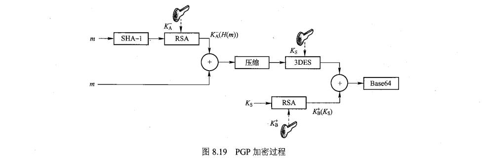


#### 安全套接字层SSL

**SSL提供的安全服务**：

* 在传输层之上构建一个安全层是一种Web安全解决方案，最典型的就是安全套接字层SSL或传输层安全TLS；
* SSL可以提供机密性、完整性、身份认证等安全服务；
* 简化的SSL主要包含4个部分：
  * 发送方和接收方利用各自的证书、私钥认证、鉴别彼此，并交换共享密钥；
  * 密钥派生或密钥导出，发送方和接收方利用共享密钥派生出一组密码；
  * 数据传输，将传输数据分割成一系列记录，加密后传输；
  * 连接关闭，通过发送特殊消息，安全关闭连接，不能留有漏洞被攻击方利用。

**SSL协议栈**：

* SSL是介于TCP和HTTP等应用层协议之间的一个可选层，绝大部分应用层协议可以直接建立在SSL协议上，SSL是两层协议；
* SSL使用的加密算法有：
  * 公开密钥加密算法：RSA；
  * 对称密钥加密算法：DES、3DES或AES；
  * MAC算法：MD5、SHA-1或SHA-2。

**SSL的握手过程**：

* 客户发送其支持的算法列表，以及客户一次随机数，服务器从算法列表中选择算法，并发给客户自己的选择、公钥证书、服务器端的一次随机数；
* 客户验证证书， 提取服务器公钥，生成预主密钥，并利用服务器的公钥加密预主密钥，发送给服务器，实现密钥的分发；
* 客户与服务器基于预主密钥和一次随机数，分别独立计算加密密钥和MAC密钥，包括前面提到的4个密钥；
* 客户发送一个针对所有握手消息的MAC，并将此MAC发送给服务器；
* 服务器发送一个针对所有握手消息的MAC，并将此MAC发送给客户。


#### 虚拟专用网VPN和IP安全协议IPSec

基本原理：<font color='red'>VPN通过隧道技术、加密技术、密钥管理、身份认证和访问控制等，实现与专用网类似的功能</font>，可以达到VPN安全性的目的，同时成本相对而言要低很多。VPN最重要的特点就是虚拟，连接总部网络和分支机构之间的安全通道实际上并不会独占网络资源，是一条逻辑上穿过公共网络的安全、稳定的隧道。

<font color='red'>VPN的核心是隧道技术，包括3种协议</font>：

* <font color='red'>乘客协议</font>：确定封装的对象属于哪种协议；
* <font color='red'>封装协议</font>：确定遵循哪一种协议进行封装，需要加什么字段等；
* <font color='red'>承载协议</font>：确定最后的对象会放入哪类公共网络，如在internet网络中传输。

IPSec的核心协议及两种传输模式：

* <font color='red'>IPSec是网络层使用最为广泛的安全协议，但IPSec不是一个单一的协议，而是一个安全体系</font>，主要包括ESP协议、AH协议、安全关联SA、密钥交换IKE； 
* <font color='red'>IPSec提供的安全服务包括机密性、数据完整性、源认证和防重防攻击等</font>；
* 核心协议：<font color='red'>ESP（封装安全载荷）和AH（认证头）协议</font>；
* 传输模式：<font color='red'>传输模式和隧道模式</font>。

AH协议和ESP协议提供的安全服务：

* AH协议提供源认证和鉴别、数据完整性检验；
* ESP提供源认证和鉴别、数据完整性检验以及机密性，比AH应用更加广泛；
* 两种不同协议和两种模式结合起来的4种组合：
  * 传输模式AH；
  * 隧道模式AH；
  * 传输模式ESP；
  * <font color='red'>隧道模式ESP：是使用最为广泛的，最重要的IPSec形式</font>。


## Netty-基本概念

### Netty是什么？

* 是一个基于NIO的C/S模式的网络通信框架，可以快速的通过它开发出高并发、高可靠的网络应用程序；
* 极大的简化了TCP、UDP套接字服务器等网络编程的开发难度，且性能和安全性都得到了更好的保证；
* 支持多种计算机网络应用层协议，如FTP、SMTP、HTTP以及各种二进制和基于文本的传输协议。


### 为什么使用Netty？

* 统一的API，支持多种传输类型（阻塞和非阻塞）；
* 基于IO多路复用技术的简单而强大的线程模型Reactor；
* 自带编码器解决TCP粘包和拆包问题；
* 自带各种协议栈；
* 真正的无连接数据包套接字支持；
* 相对于使用JDK API具有更高的吞吐量、更低的延迟、更低的资源消耗和更少的内存复制；
* 具有完整的SSL/TLS等安全机制的支持；
* 社区活跃；
* 成熟稳定，经历了各种开源项目的考验，如：Dubbo、RocketMQ、ElasticSearch、gRPC等。


### Netty的应用场景

* **RPC框架的网络通信结构**：在分布式系统中，不同的服务节点需要相互调用，需要使用RPC框架。而服务节点间可以通过Netty来通信；
* **高并发的HTTP网络服务器**：基于同步非阻塞IO和多路复用模型的HTTP服务器；
* 可以实现即时通讯系统；
* 可以实现消息推送系统。


## Netty-模块组件

### Bootstrap/ServerBootstrap

Netty的客户端和服务端启动引导类，主要作用是配置整个Netty程序，串联各个组件。

```JAVA
// 客户端启动引导
Bootstrap b = new Bootstrap();
b.group(group)
    .channel(NioSocketChannel.class)
    .handler(new ChannelInitializer<SocketChannel>() {
        @Override
        public void initChannel(SocketChannel ch) throws Exception {
            ChannelPipeline p = ch.pipeline();
            p.addLast(new HelloClientHandler(message));
        }
    });
```

```JAVA
// 服务端启动引导
ServerBootstrap b = new ServerBootstrap();
b.group(bossGroup, workerGroup)
 	.handler(new LoggingHandler(LogLevel.INFO))
    .channel(NioServerSocketChannel.class)
    .childHandler(new ChannelInitializer<SocketChannel>() {
        @Override
        public void initChannel(SocketChannel ch) {
            ChannelPipeline p = ch.pipeline();
            p.addLast(new HelloServerHandler());
        }
    });
```


### Future/ChannelFuture

Netty的API中所有的IO操作都是异步的，不会立即返回结果，但会通过ChannelFuture封装未来异步操作的结果。也可以注册一个监听器，当操作成功或失败后会自动触发注册的监听器回调。

```JAVA
public interface ChannelFuture extends Future<Void> {
	Channel channel();
	ChannelFuture addListener(GenericFutureListener<? extends Future<? super Voidjk var1);	// 注册监听器
	// ...
	ChannelFuture sync() throws InterruptedException;	// 修改同步或异步
}
```

```JAVA
serverBootstrap.bind(port).addListener(future -> {
    if (future.isSuccess()) {
        System.out.println(new Date() + ": 端口[" + port + "]绑定成功!");
    } else {
        System.err.println("端口[" + port + "]绑定失败!");
    }
});
```


### Channel/ChannelOption

Channel通道是Netty用于网络通信的组件，能够执行网络I/O操作，为用户提供：

* 当前网络连接的状态，即通道是否打开，Socket是否建立；
* 网络连接的参数配置，如：接收缓冲大小；
* 异步网络I/O操作，如：连接建立、读写、端口绑定；
* I/O操作与具体的处理逻辑对应。

ChannelOption为Channel提供了参数的设置：

* **ChannelOption.SO_BACKLOG**：用于初始化服务器可连接队列的大小。服务端处理客户端连接请求是顺序处理的，所以同时只能处理一个客户端连接。多个客户连接到来时，服务端会将请求排队。
* **ChannelOption.SO_KEEPALIVE**：一直保持连接活动状态。


### Selector

Netty基于NIO的选择器Selector机制实现I/O多路复用，通过Selector一个线程可以监听多个连接的Channel事件。当向一个Selector中注册Channel后，Selector内部的机制就可以轮询已注册到Channel上的事件是否就绪，当有事件真正就绪才会进行处理。


### NioEventLoop/NioEventLoopGroup

NioEventLoop事件循环中维护了一个Selector实例和其任务队列，支持异步提交任务，线程启动时会调用NioEventLoop的run方法，执行相应的IO或非IO任务：

* **IO任务**：即selectionKey中就绪的事件，如accept、connect、read、write等，由processSelectedKeys方法触发；
* **非IO任务**：会添加到taskQueue中，如register、bind等任务，由runAllTasks方法触发。

NioEventLoopGroup事件循环组主要管理NioEventLoop的生命周期，可以理解为线程池，内部维护了一组NioEventLoop线程，可以通过next接口按照一定规则获取一个NioEventLoop去处理任务，每个NioEventLoop线程负责处理多个Channel上的事件，而一个Channel只会对应一个线程。


### ChannelHandler/ChannelHandlerContext

通道处理器是一个接口，其处理IO事件或拦截IO操作，并将其转发到其所属ChannelPipeline链上的下一个handler程序。使用ChannelHandler时可以继承其子类或适配器类：

* **ChannelInboundHandler/ChannelInboundHandlerAdapter**：处理入站I/O事件；
* **ChannelOutboundHandler/ChannelOutboundHandlerAdapter**：处理出站I/O事件；
* **ChannelDuplexHandler**：处理入站和出站事件。

ChannelHandlerContext保存了Channel相关的所有上下文信息，同时关联了一个ChannelHandler对象。


### ChannelPipline

* 通道事件处理链是一个保存了ChannelHandler的List，用多个阶段拦截或处理Channel的入站和出站操作。ChannelPipline实现了一种高级形式的拦截过滤器模式，使用户可以完全控制事件处理方式的全过程，以及Channel对应的各个ChannelHandler如何交互。

* 下图描述了ChannelPipeline中的ChannelHandler如果处理IO事件。入站事件由自下而上的入站处理程序处理，如图左所示。出站事件由自上而下的出站处理程序处理，如图右所示。

  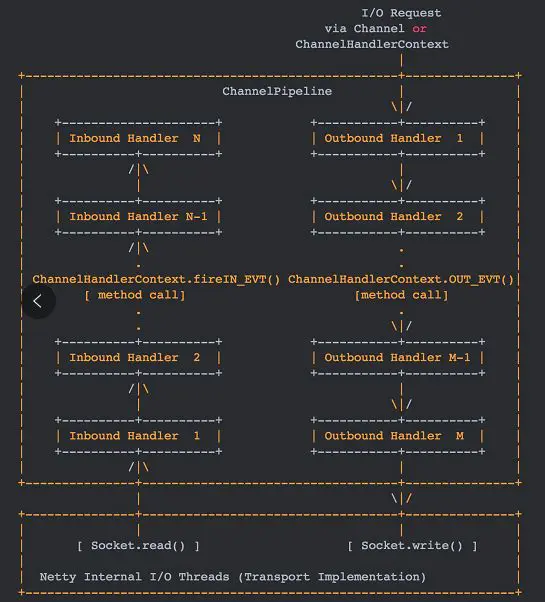

* Netty中每个Channel都有且仅有一个ChannelPipeline与之对应。而ChannelPipeline中又维护了一个由ChannelHandlerContext组成的双向链表，且每个ChannelHandlerContext又关联一个ChannelHandler。

* 入站事件和出站事件在一个双向链表中，入站事件会从链表head向后传递到最后一个入站的handler，出站事件会从链表tail向前传递到最前一个出站的handler，两种类型的handler互不干扰。

  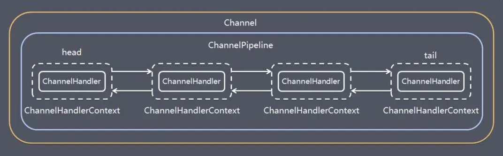


## Netty-线程模型

Netty的线程模式是基于Reactor模式实现的。

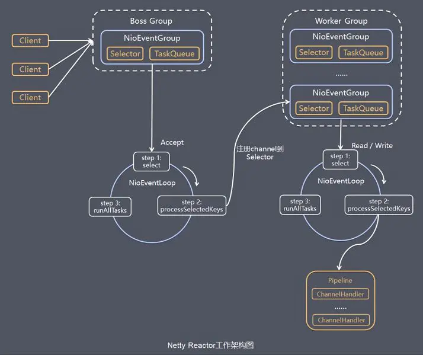

### 结构对应

* NioEventLoop <—> 初始化分发器/反应器（Initiation Dispatcher）；
* Selector <—> 同步事件分离器（Synchronous EventDemultiplexer）；
* ChannelHandler <—> 事件处理器（Event Handler）；
* 具体的ChannelHandler实现 <—> 具体的事件存储器。


### 模式对应

* NioEventLoop（bossGroup） <—> mainReactor；
* NioEventLoop（workGroup）<—> subReactor。
* ServerBootstrapAcceptor <—> acceptor。


### 工作流程

**Boss Group轮询步骤**：

* select轮询Accept事件；
* 通过processSelectedKeys处理Accept的I/O事件，与Client建立连接，生成对应的NioSocketChannel，并将其注册到Worker Group中的某个NioEventLoop的Selector上；
* 处理任务队列中的任务runAllTasks。任务队列中的任务包括用户调用eventLoop.execute或schedule执行的任务，或者其他线程提交到该eventLoop上的任务。

**Worker Group轮询步骤**：

* select轮询Read/Write事件；
* processSelectedKeys处理读写I/O事件。在NioSocketChannel可读/可写事件发生时将其传入ChannelPipeline中处理；
* 处理任务队列中的任务runAllTasks。


## Netty-编码解码器

### 基本概念

* 当Netty发送或接受一个消息时，就会发生一次数据转换。即入站消息会被解码（如字节转换为对象），出站消息会被编码（如对象转换为字节）。因此Netty提供了一系列编码解码器，都实现了ChannelInboundHandler或ChannelOutboundHandler接口，且channelRead方法都会被重写。
* 以入站为例，对于每个从入站Channel读取的消息，这个方法会被调用，随后将调用由解码器提供的 `decode()` 方法进行解码，并将已解码的字节转发给ChannelPipeline中的下一个ChannelInboundHandler。


### ByteToMessageDecoder解码器

由于TCP会出现粘包拆包的问题，所以不能确定发送方的数据包是一个完整的信息。该类会对入站数据进行缓存，直到它准备好被处理。

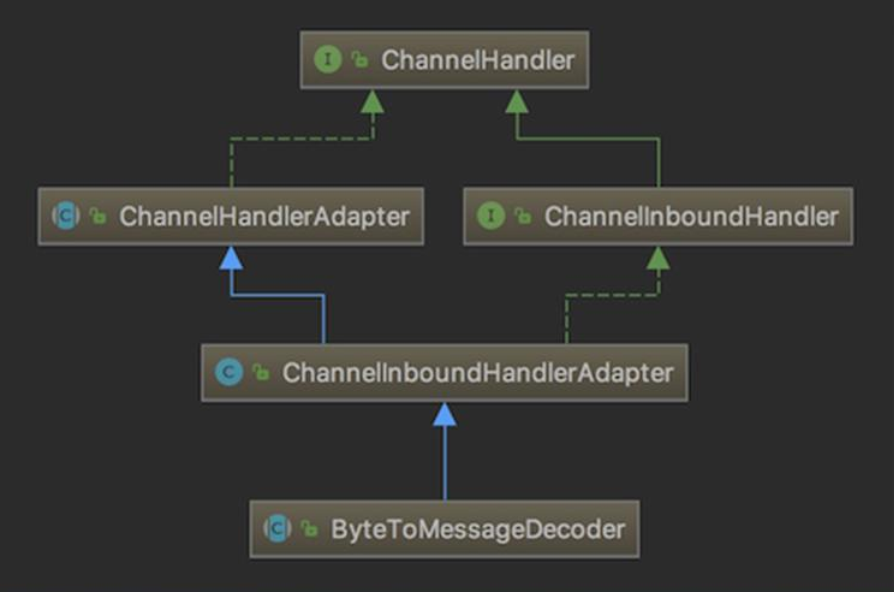

```JAVA
public class ToIntegerDecoder extends ByteToMessageDecoder {
    
    @Override
    protected void decode(ChannelHandlerContext ctx, ByteBuf in, List<Object> out) throws Exception {
        // 每次从入站的ByteBuf中读取4字节，然后编码为int类型，添加到一个List中，当没有更多元素可以被添加时，该内容会被发送给下一个ChannelInboundHandler
        if (in.readableBytes() >= 4) {
            out.add(in.readInt());
        }
    }
}
```


### ReplayingDecoder解码器

```JAVA
public abstract class ReplayingDecoder<S> extends ByteToMessageDecoder
```

ReplayingDecoder扩展了ByteToMessageDecoder类，使用这个类时无需调用 `readableBytes()` 方法，参数S指定了用户状态管理的类型，使用Void则不需要状态管理。

```JAVA
public class MyReplayingDecoder extends ReplayingDecoder<Void> {
    
    @Override
    protected void decode(ChannelHandlerContext ctx, ByteBuf in, List<Object> out) throws Exception {
        // 无需判断byte是否足够读取，内部会根据read的类型自动处理
        out.add(in.readLong());
    }
}
```


## Netty-源码分析

### 程序示例

以 `io.Netty.example` 下的示例程序做为源码分析的案例。

```JAVA
public final class EchoServer {

    static final boolean SSL = System.getProperty("ssl") != null;
    static final int PORT = Integer.parseInt(System.getProperty("port", "8007"));

    public static void main(String[] args) throws Exception {
        final SslContext sslCtx;
        if (SSL) {
            SelfSignedCertificate ssc = new SelfSignedCertificate();
            sslCtx = SslContextBuilder.forServer(ssc.certificate(), ssc.privateKey()).build();
        } else {
            sslCtx = null;
        }
		
        // mainReactor、subReactor
        EventLoopGroup bossGroup = new NioEventLoopGroup(1);
        EventLoopGroup workerGroup = new NioEventLoopGroup();
        try {
            // 启动引导，全局配置
            ServerBootstrap b = new ServerBootstrap();
            b.group(bossGroup, workerGroup)
             .channel(NioServerSocketChannel.class)
             .option(ChannelOption.SO_BACKLOG, 100)
             .handler(new LoggingHandler(LogLevel.INFO))
             .childHandler(new ChannelInitializer<SocketChannel>() {
                 @Override
                 public void initChannel(SocketChannel ch) throws Exception {
                     ChannelPipeline p = ch.pipeline();
                     if (sslCtx != null) {
                         p.addLast(sslCtx.newHandler(ch.alloc()));
                     }
                     p.addLast(new EchoServerHandler());
                 }
             });
				
            // 同步操作
            ChannelFuture f = b.bind(PORT).sync();
            f.channel().closeFuture().sync();
        } finally {
            bossGroup.shutdownGracefully();
            workerGroup.shutdownGracefully();
        }
    }
}
```

```JAVA
@Sharable
public class EchoServerHandler extends ChannelInboundHandlerAdapter {

    @Override
    public void channelRead(ChannelHandlerContext ctx, Object msg) {
        ctx.write(msg);
    }

    @Override
    public void handlerAdded(ChannelHandlerContext ctx) throws Exception {
        super.handlerAdded(ctx);
    }

    @Override
    public void handlerRemoved(ChannelHandlerContext ctx) throws Exception {
        super.handlerRemoved(ctx);
    }

    @Override
    public void channelReadComplete(ChannelHandlerContext ctx) {
        ctx.flush();
    }

    @Override
    public void exceptionCaught(ChannelHandlerContext ctx, Throwable cause) {
        cause.printStackTrace();
        ctx.close();
    }
}
```


### 启动过程分析

#### NioEventLoopGroup阶段分析

**NioEventLoopGroup构造方法**：

```JAVA
// 空参构造（不指定线程数）
public NioEventLoopGroup() {
	// 调⽤下⼀个构造⽅法
	this(0);
}

public NioEventLoopGroup(int nThreads) {
	// 继续调⽤下⼀个构造⽅法
	this(nThreads, (Executor) null);
}

// ......经过各种重载的构造方法后
public NioEventLoopGroup(int nThreads, Executor executor, final SelectorProvider selectorProvider, final SelectStrategyFactory selectStrategyFactory) {
    // 开始调⽤⽗类MultithreadEventLoopGroup的构造方法
    super(nThreads, executor, selectorProvider, selectStrategyFactory, RejectedExecutionHandlers.reject());
}
```

**MultithreadEventLoopGroup构造方法**：

```JAVA
// EventLoopGroup中默认的EventLoop线程数
private static final int DEFAULT_EVENT_LOOP_THREADS;

static {
    // 从1、系统属性、CPU核⼼数*2这三个值中取最⼤值，可以得出DEFAULT_EVENT_LOOP_THREADS的值为CPU核⼼数*2
    DEFAULT_EVENT_LOOP_THREADS = Math.max(1, SystemPropertyUtil.getInt(
        "io.netty.eventLoopThreads", NettyRuntime.availableProcessors() * 2));
}

// 被调⽤的⽗类构造函数，当指定的线程数nThreads为0时，使⽤默认的线程数DEFAULT_EVENT_LOOP_THREADS
protected MultithreadEventLoopGroup(int nThreads, ThreadFactory threadFactory, Object... args) {
    // 继续调用父类MultithreadEventExecutorGroup的构造方法
	super(nThreads == 0 ? DEFAULT_EVENT_LOOP_THREADS : nThreads, threadFactory, args);
}
```

**MultithreadEventExecutorGroup构造方法**：

```JAVA
protected MultithreadEventExecutorGroup(int nThreads, Executor executor, Object... args) {
    this(nThreads, executor, DefaultEventExecutorChooserFactory.INSTANCE, args);
}

protected MultithreadEventExecutorGroup(int nThreads, Executor executor,
                                        EventExecutorChooserFactory chooserFactory, Object... args) {
    if (nThreads <= 0) {
        throw new IllegalArgumentException(String.format("nThreads: %d (expected: > 0)", nThreads));
    }

    if (executor == null) {
        // 如果不指定执行器，就使用默认的线程工厂和默认执行器
        executor = new ThreadPerTaskExecutor(newDefaultThreadFactory());
    }
	
    // NioEventLoop实现了EventExecutor接口
    // 即本语句创建了一个线程数大小的NioEventLoop数组
    children = new EventExecutor[nThreads];

    // 通过循环初始化线程数组
    for (int i = 0; i < nThreads; i ++) {
        boolean success = false;
        try {
            // 初始化NioEventLoop
            children[i] = newChild(executor, args);
            success = true;
        } catch (Exception e) {
            // TODO: Think about if this is a good exception type
            throw new IllegalStateException("failed to create a child event loop", e);
        } finally {
            // ......
        }
    }

    chooser = chooserFactory.newChooser(children);
	
    // 实例化一个终止监听器
    final FutureListener<Object> terminationListener = new FutureListener<Object>() {
        @Override
        public void operationComplete(Future<Object> future) throws Exception {
            if (terminatedChildren.incrementAndGet() == children.length) {
                terminationFuture.setSuccess(null);
            }
        }
    };

    // 为每一个NioEventLoop添加一个终止监听器
    for (EventExecutor e: children) {
        e.terminationFuture().addListener(terminationListener);
    }

    // 将所有初始化后的NioEventLoop添加到一个LinkedHashSet中保存
    Set<EventExecutor> childrenSet = new LinkedHashSet<EventExecutor>(children.length);
    Collections.addAll(childrenSet, children);
    readonlyChildren = Collections.unmodifiableSet(childrenSet);
}
```

**总结**：

* 创建NioEventLoopGroup时，若不指定线程数，则默认使用CPU核数*2的数量创建。若指定，则按照指定的数量创建；
* NioEventLoopGroup内部通过数组来初始化所有EventLoop，初始化完毕后最终会通过只读的LinkedHashSet来维护。


#### ServerBootstrap阶段分析

**ServerBootstrap构造方法和基本属性**：

```java
private final Map<ChannelOption<?>, Object> childOptions = new LinkedHashMap<ChannelOption<?>, Object>();
private final Map<AttributeKey<?>, Object> childAttrs = new LinkedHashMap<AttributeKey<?>, Object>();
private final ServerBootstrapConfig config = new ServerBootstrapConfig(this);
private volatile EventLoopGroup childGroup;
private volatile ChannelHandler childHandler;
// 空参构造
public ServerBootstrap() { }
```

**ServerBootstrap#`group()`**：

```JAVA
public ServerBootstrap group(EventLoopGroup parentGroup, EventLoopGroup childGroup) {
    // parentGroup即bossGroup
    super.group(parentGroup);
    if (childGroup == null) {
        throw new NullPointerException("childGroup");
    }
    if (this.childGroup != null) {
        throw new IllegalStateException("childGroup set already");
    }
    // childGroup即workerGroup
    this.childGroup = childGroup;
    return this;
}
```

**AbstractBootstrap#`channel()`**：

```java
public B channel(Class<? extends C> channelClass) {
    if (channelClass == null) {
        throw new NullPointerException("channelClass");
    }
    // 创建反射工厂类，在bind阶段才会将Channel通过反射创建出来
    return channelFactory(new ReflectiveChannelFactory<C>(channelClass));
}
```

**AbstractBootstrap#`option()`**：

```JAVA
// 通过一个Map结构来存储各种配置
private final Map<ChannelOption<?>, Object> options = new LinkedHashMap<ChannelOption<?>, Object>();

public <T> B option(ChannelOption<T> option, T value) {
    if (option == null) {
        throw new NullPointerException("option");
    }
    if (value == null) {
        synchronized (options) {
            options.remove(option);
        }
    } else {
        synchronized (options) {
            options.put(option, value);
        }
    }
    return self();
}
```

**AbstractBootstrap#`bind()`**：

```JAVA
// 通过bind为服务端Channel绑定端口
public ChannelFuture bind(int inetPort) {
    return bind(new InetSocketAddress(inetPort));
}

public ChannelFuture bind(SocketAddress localAddress) {
    validate();
    if (localAddress == null) {
        throw new NullPointerException("localAddress");
    }
    return doBind(localAddress);
}

private ChannelFuture doBind(final SocketAddress localAddress) {
    final ChannelFuture regFuture = initAndRegister();
    final Channel channel = regFuture.channel();
    if (regFuture.cause() != null) {
        return regFuture;
    }

    if (regFuture.isDone()) {
        // At this point we know that the registration was complete and successful.
        ChannelPromise promise = channel.newPromise();
        doBind0(regFuture, channel, localAddress, promise);
        return promise;
    } else {
       // ......
    }
}

final ChannelFuture initAndRegister() {
    Channel channel = null;
    try {
        // 通过反射工厂类将Channel创建出来：
        // 	1.获取JDK NIO的ServerSocketChannel；
        // 	2.创建一个唯一的ChannelId；
        // 	3.创建一个NioMessageUnsafe，用于操作消息；
        // 	4.创建一个DefaultChannelPipeline，是一个双向链表结构；
        // 	5.创建了一个NioServerSocketChannelConfig对象，用于对外展示一些配置。
        channel = channelFactory.newChannel();
        // 初始化NioServerSocketChannel：
        // 	1.抽象方法，由ServerBootstrap实现；
        // 	2.设置NioServerSocketChannel的TCP属性；
        // 	3.对NioServerSocketChannel的ChannelPipeline添加ChannelInitializer处理器；
        // 	4.初始化DefaultChannelPipeline的head和tail节点，并通过addLast添加ChannelHandler。
        init(channel);
    } catch (Throwable t) {
        // ......
    }
    // 注册NioServerSocketChannel到bossGroup上，并返回一个封装注册结果的Future对象
    ChannelFuture regFuture = config().group().register(channel);
    if (regFuture.cause() != null) {
        if (channel.isRegistered()) {
            channel.close();
        } else {
            channel.unsafe().closeForcibly();
        }
    }
    return regFuture;
}

private static void doBind0(
    final ChannelFuture regFuture, final Channel channel,
    final SocketAddress localAddress, final ChannelPromise promise) {

    // This method is invoked before channelRegistered() is triggered.  Give user handlers a chance to set up
    // the pipeline in its channelRegistered() implementation.
    channel.eventLoop().execute(new Runnable() {
        @Override
        public void run() {
            if (regFuture.isSuccess()) {
                // 最终会调用到NioServerSocket的doBind，说明Netty底层使用的是NIO
                channel.bind(localAddress, promise).addListener(ChannelFutureListener.CLOSE_ON_FAILURE);
            } else {
                promise.setFailure(regFuture.cause());
            }
        }
    });
}
```

**DefaultChannelPipeline#`addLast()`**：

```JAVA
// 通过addLast将ChannelHandler添加到ChannelPipeline中
@Override
public final ChannelPipeline addLast(EventExecutorGroup group, String name, ChannelHandler handler) {
    final AbstractChannelHandlerContext newCtx;
    synchronized (this) {
        // 检查handler是否符合标准
        checkMultiplicity(handler);
		
        // 创建一个AbstractChannelHandlerContext对象
        // 每当有ChannelHandler添加到ChannelPipeline中时，都会创建对应的Context
        // 所以最终ChannelPipeline这个链表结构中存储的就是ChannelHandlerContext
        newCtx = newContext(group, filterName(name, handler), handler);

        // 将Context插入链表尾部，即追加到tail节点之前
        addLast0(newCtx);

        // If the registered is false it means that the channel was not registered on an eventloop yet.
        // In this case we add the context to the pipeline and add a task that will call
        // ChannelHandler.handlerAdded(...) once the channel is registered.
        if (!registered) {
            newCtx.setAddPending();
            callHandlerCallbackLater(newCtx, true);
            return this;
        }

        EventExecutor executor = newCtx.executor();
        if (!executor.inEventLoop()) {
            newCtx.setAddPending();
            executor.execute(new Runnable() {
                @Override
                public void run() {
                    callHandlerAdded0(newCtx);
                }
            });
            return this;
        }
    }
    callHandlerAdded0(newCtx);
    return this;
}

// 维护双向链表结构
private void addLast0(AbstractChannelHandlerContext newCtx) {
    AbstractChannelHandlerContext prev = tail.prev;
    newCtx.prev = prev;
    newCtx.next = tail;
    prev.next = newCtx;
    tail.prev = newCtx;
}
```

**NioEventLoop#`run()`**：

```JAVA
// 当bind阶段结束，就会进入NioEventLoop的run中执行
@Override
protected void run() {
    for (;;) {
        try {
            switch (selectStrategy.calculateStrategy(selectNowSupplier, hasTasks())) {
                case SelectStrategy.CONTINUE:
                    continue;
                case SelectStrategy.SELECT:
                    // NioEventLoop轮询的第一步：监听事件
                    select(wakenUp.getAndSet(false));

                    if (wakenUp.get()) {
                        selector.wakeup();
                    }
                    // fall through
                default:
            }

            cancelledKeys = 0;
            needsToSelectAgain = false;
            final int ioRatio = this.ioRatio;
            if (ioRatio == 100) {
                try {
                    // NioEventLoop轮询的第二步：处理发生的事件
                    processSelectedKeys();
                } finally {
                    // NioEventLoop轮询的第二步：处理队列中的任务
                    runAllTasks();
                }
            } else {
                final long ioStartTime = System.nanoTime();
                try {
                    processSelectedKeys();
                } finally {
                    // Ensure we always run tasks.
                    final long ioTime = System.nanoTime() - ioStartTime;
                    runAllTasks(ioTime * (100 - ioRatio) / ioRatio);
                }
            }
        } catch (Throwable t) {
            handleLoopException(t);
        }
        // Always handle shutdown even if the loop processing threw an exception.
        try {
            if (isShuttingDown()) {
                closeAll();
                if (confirmShutdown()) {
                    return;
                }
            }
        } catch (Throwable t) {
            handleLoopException(t);
        }
    }
}
```


#### Netty服务端启动过程总结

* 创建两个NioEventLoopGroup线程池，其内部维护着NioEventLoop的集合，集合默认大小是本机的CPU*2；

* ServerBootstrap设置一些属性，然后通过bind方法完成创建NIO相关对象、初始化、注册、绑定端口、启动事件循环等操作。
  * initAndRegister会创建NioServerSocketChannel、ChannelPipeline等对象，然后初始化这些对象，如ChannelPipeline的head和tail节点的初始化；
  * doBind会对底层JDK NIO的Channel和端口进行绑定；
  * 最后调用NioEventLoop的run方法监听连接事件，表示服务器正式启动。


### 接收请求过程分析

**NioEventLoop#`processSelectedKey()`**：

```JAVA
private void processSelectedKey(SelectionKey k, AbstractNioChannel ch) {
    final AbstractNioChannel.NioUnsafe unsafe = ch.unsafe();
    if (!k.isValid()) {
        final EventLoop eventLoop;
        try {
            eventLoop = ch.eventLoop();
        } catch (Throwable ignored) {
            // If the channel implementation throws an exception because there is no event loop, we ignore this
            // because we are only trying to determine if ch is registered to this event loop and thus has authority
            // to close ch.
            return;
        }
        // Only close ch if ch is still registered to this EventLoop. ch could have deregistered from the event loop
        // and thus the SelectionKey could be cancelled as part of the deregistration process, but the channel is
        // still healthy and should not be closed.
        // See https://github.com/netty/netty/issues/5125
        if (eventLoop != this || eventLoop == null) {
            return;
        }
        // close the channel if the key is not valid anymore
        unsafe.close(unsafe.voidPromise());
        return;
    }

    try {
        int readyOps = k.readyOps();
        // We first need to call finishConnect() before try to trigger a read(...) or write(...) as otherwise
        // the NIO JDK channel implementation may throw a NotYetConnectedException.
        if ((readyOps & SelectionKey.OP_CONNECT) != 0) {
            // remove OP_CONNECT as otherwise Selector.select(..) will always return without blocking
            // See https://github.com/netty/netty/issues/924
            int ops = k.interestOps();
            ops &= ~SelectionKey.OP_CONNECT;
            k.interestOps(ops);

            unsafe.finishConnect();
        }

        // Process OP_WRITE first as we may be able to write some queued buffers and so free memory.
        if ((readyOps & SelectionKey.OP_WRITE) != 0) {
            // Call forceFlush which will also take care of clear the OP_WRITE once there is nothing left to write
            ch.unsafe().forceFlush();
        }

        // Also check for readOps of 0 to workaround possible JDK bug which may otherwise lead
        // to a spin loop
        // 当就绪事件为可读或连接接收时
        if ((readyOps & (SelectionKey.OP_READ | SelectionKey.OP_ACCEPT)) != 0 || readyOps == 0) {
            // unsafe是boos线程中NioServerSocketChannel的AbstractNioMessageChannel$NioMessageUnsafe对象
            unsafe.read();
        }
    } catch (CancelledKeyException ignored) {
        unsafe.close(unsafe.voidPromise());
    }
}
```

**SelectionKey中的readyOps就绪事件常量**：

```JAVA
// 读事件就绪
public static final int OP_READ = 1 << 0;
// 写事件就绪
public static final int OP_WRITE = 1 << 2;
// 连接事件到来
public static final int OP_CONNECT = 1 << 3;
// 接收连接事件
public static final int OP_ACCEPT = 1 << 4;
```

**AbstractNioMessageChannel$NioMessageUnsafe#`read()`**：

```JAVA
private final class NioMessageUnsafe extends AbstractNioUnsafe {

    private final List<Object> readBuf = new ArrayList<Object>();

    @Override
    public void read() {
        // 断言检查eventLoop是否是当前线程
        assert eventLoop().inEventLoop();
        final ChannelConfig config = config();
        final ChannelPipeline pipeline = pipeline();
        final RecvByteBufAllocator.Handle allocHandle = unsafe().recvBufAllocHandle();
        allocHandle.reset(config);

        boolean closed = false;
        Throwable exception = null;
        try {
            try {
                do {
                    // readBuf是一个ArrayList，用做请求缓冲区
                    // 调用doReadMessages，读取boss线程中NioServerSocketChannel接收的请求，并将请求包装为NioSocketChannel放入缓冲区readBuf
                    int localRead = doReadMessages(readBuf);
                    if (localRead == 0) {
                        break;
                    }
                    if (localRead < 0) {
                        closed = true;
                        break;
                    }

                    allocHandle.incMessagesRead(localRead);
                } while (allocHandle.continueReading());
            } catch (Throwable t) {
                exception = t;
            }

            // 遍历请求缓冲区，为每个请求调用pipeline的fireChannelRead方法，具体处理这些请求（执行链中的handler的ChannelRead方法）
            int size = readBuf.size();
            for (int i = 0; i < size; i ++) {
                readPending = false;
                pipeline.fireChannelRead(readBuf.get(i));
            }
            readBuf.clear();
            allocHandle.readComplete();
            pipeline.fireChannelReadComplete();

            if (exception != null) {
                closed = closeOnReadError(exception);

                pipeline.fireExceptionCaught(exception);
            }

            if (closed) {
                inputShutdown = true;
                if (isOpen()) {
                    close(voidPromise());
                }
            }
        } finally {
            // Check if there is a readPending which was not processed yet.
            // This could be for two reasons:
            // * The user called Channel.read() or ChannelHandlerContext.read() in channelRead(...) method
            // * The user called Channel.read() or ChannelHandlerContext.read() in channelReadComplete(...) method
            //
            // See https://github.com/netty/netty/issues/2254
            if (!readPending && !config.isAutoRead()) {
                removeReadOp();
            }
        }
    }
}
```

**NioServerSocketChannel#`doReadMessages()`**：

```JAVA
@Override
protected int doReadMessages(List<Object> buf) throws Exception {
    // 通过JDK NIO的ServerSocketChannel的accept方法接收请求，并获取到一个JDK NIO的SocketChannel
    SocketChannel ch = SocketUtils.accept(javaChannel());

    try {
        if (ch != null) {
            // 将SocketChannel包装成NioSocketChannel并加入请求缓冲区
            buf.add(new NioSocketChannel(this, ch));
            return 1;
        }
    } catch (Throwable t) {
        logger.warn("Failed to create a new channel from an accepted socket.", t);

        try {
            ch.close();
        } catch (Throwable t2) {
            logger.warn("Failed to close a socket.", t2);
        }
    }

    return 0;
}
```

**ServerBootstrapAcceptor#`channelRead()`方法**：

```JAVA
// 调用pipeline的fireChannelRead方法，会执行链上的所有handler的channelRead方法。
// pipeline有4个handler：Head、LoggingHandler、ServerBootstrapAcceptor、Tail。
// 最后通过debug进入ServerBootstrapAcceptor的channelRead方法中。
@Override
@SuppressWarnings("unchecked")
public void channelRead(ChannelHandlerContext ctx, Object msg) {
    final Channel child = (Channel) msg;

    // 为NioSocketChannel的pipeline添加handler
    // 即main中通过ServerBootstrap设置的childHandler
    child.pipeline().addLast(childHandler);
	
    // 为NioSocketChannel设置日志和其他配置属性
    setChannelOptions(child, childOptions, logger);

    for (Entry<AttributeKey<?>, Object> e: childAttrs) {
        child.attr((AttributeKey<Object>) e.getKey()).set(e.getValue());
    }

    try {
        // 将NioSocketChannel即客户端连接注册到workerGroup线程池，并添加一个注册结果的监听器
        childGroup.register(child).addListener(new ChannelFutureListener() {
            @Override
            public void operationComplete(ChannelFuture future) throws Exception {
                if (!future.isSuccess()) {
                    forceClose(child, future.cause());
                }
            }
        });
    } catch (Throwable t) {
        forceClose(child, t);
    }
}
```

**debug追踪到workGroup#`register()`方法**：

```JAVA
@Override
public final void register(EventLoop eventLoop, final ChannelPromise promise) {
    AbstractChannel.this.eventLoop = eventLoop;
    // 将客户端连接对应的NioSocketChannel注册到一个EventLoop中去轮询
    if (eventLoop.inEventLoop()) {
        register0(promise);
    } else {
        eventLoop.execute(new Runnable() {
            @Override
            public void run() {
                register0(promise);
            }
        });
    }
}
```

**debug追踪到AbstractNioChannel#`doBeginRead()`方法**：

```JAVA
@Override
protected void doBeginRead() throws Exception {
    final SelectionKey selectionKey = this.selectionKey;
    if (!selectionKey.isValid()) {
        return;
    }
    
    readPending = true;
    
    // 直到这里，客户端的连接阶段完成，接下来就开始轮询监听读事件
    final int interestOps = selectionKey.interestOps();
    if ((interestOps & readInterestOps) == 0) {
        selectionKey.interestOps(interestOps | readInterestOps);
    }
}
```

**Netty请求接收过程总结**：

* 服务端轮询Accept事件，当获取事件后调用unsafe的read方法，unsafe是ServerSocket的内部类，其read方法由两部分组成：
  * **`doReadMessage()`方法**：用于创建NioSocketChannel对象，该对象包装了JDK NIO的SocketChannel，并将其加入请求缓冲区，即用一个ArrayList类型的集合来存储；
  * **pipeline的`fireChannelRead()`方法**：遍历缓冲区，循环调用NioSocketChannel对应Pipeline上的所有handler，如：添加用户自定义handler、设置日志和其他配置属性，最后将NioSocketChannel注册到workerGroup上；
* 最后workerGroup选择其中的一个EventLoop负责轮询该NioSockerChannel。自此，客户端请求建立过程结束。


### CP/CH/CHC分析

**三者关系概述**：

* 每当NioServerSocketChannel接收一个客户端连接，就会创建一个对应的NioSocketChannel；
* 每个NioSocketChannel创建时都会被分配一个ChannelPipeline；
* 每个ChannelPipeline中都包含多个ChannelHandlerContext；
* 这些ChannelHandlerContext用于包装ChannelHandler，并且组成了一个双向链表；
* 当一个客户端请求被接收时，会进入其对应的NioSocketChannel的Pipeline中，并经过Pipeline中所有的handler处理（使用了设计模式中的过滤器模式）。


#### ChannelPipeline

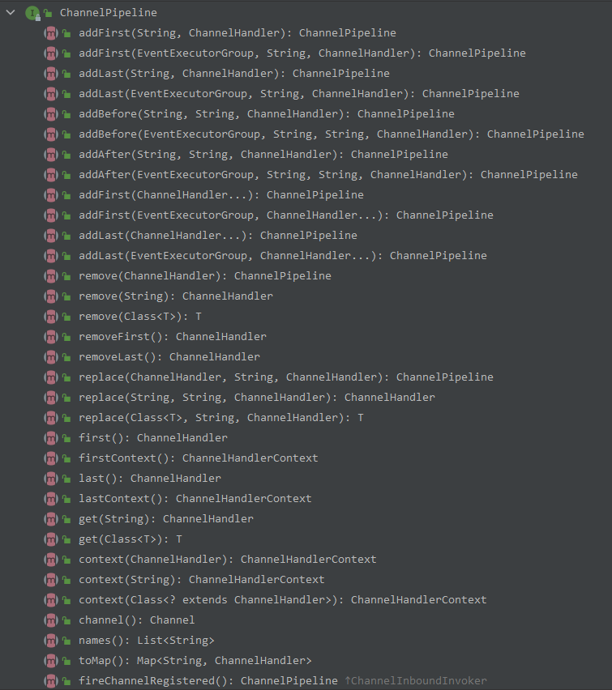

**ChannelPipeline接口**：

```JAVA
/**
 *                                                 I/O Request
 *                                            via {@link Channel} or
 *                                        {@link ChannelHandlerContext}
 *                                                      |
 *  +---------------------------------------------------+---------------+
 *  |                           ChannelPipeline         |               |
 *  |                                                  \|/              |
 *  |    +---------------------+            +-----------+----------+    |
 *  |    | Inbound Handler  N  |            | Outbound Handler  1  |    |
 *  |    +----------+----------+            +-----------+----------+    |
 *  |              /|\                                  |               |
 *  |               |                                  \|/              |
 *  |    +----------+----------+            +-----------+----------+    |
 *  |    | Inbound Handler N-1 |            | Outbound Handler  2  |    |
 *  |    +----------+----------+            +-----------+----------+    |
 *  |              /|\                                  .               |
 *  |               .                                   .               |
 *  | ChannelHandlerContext.fireIN_EVT() ChannelHandlerContext.OUT_EVT()|
 *  |        [ method call]                       [method call]         |
 *  |               .                                   .               |
 *  |               .                                  \|/              |
 *  |    +----------+----------+            +-----------+----------+    |
 *  |    | Inbound Handler  2  |            | Outbound Handler M-1 |    |
 *  |    +----------+----------+            +-----------+----------+    |
 *  |              /|\                                  |               |
 *  |               |                                  \|/              |
 *  |    +----------+----------+            +-----------+----------+    |
 *  |    | Inbound Handler  1  |            | Outbound Handler  M  |    |
 *  |    +----------+----------+            +-----------+----------+    |
 *  |              /|\                                  |               |
 *  +---------------+-----------------------------------+---------------+
 *                  |                                  \|/
 *  +---------------+-----------------------------------+---------------+
 *  |               |                                   |               |
 *  |       [ Socket.read() ]                    [ Socket.write() ]     |
 *  |                                                                   |
 *  |  Netty Internal I/O Threads (Transport Implementation)            |
 *  +-------------------------------------------------------------------+
 */
public interface ChannelPipeline
        extends ChannelInboundInvoker, ChannelOutboundInvoker, Iterable<Entry<String, ChannelHandler>> {
```


#### ChannelHandler

ChannelHandler的作用就是处理IO或拦截IO事件，并将其转发给链上的下一个ChannelHandler。Handler处理事件时分入站和出站，两个方向的操作都不同，因此Netty定义了两个子接口继承ChannelHandler。

```JAVA
public interface ChannelHandler {

    // 当前ChannelHandler被添加到pipeline时调用
    void handlerAdded(ChannelHandlerContext ctx) throws Exception;

    // 当前ChannelHandler从pipeline中移除时调用
    void handlerRemoved(ChannelHandlerContext ctx) throws Exception;

	// 当处理过程中发生异常时调用
    @Deprecated
    void exceptionCaught(ChannelHandlerContext ctx, Throwable cause) throws Exception;

    // ......
}
```

ChannelInboundHandler入站事件接口：

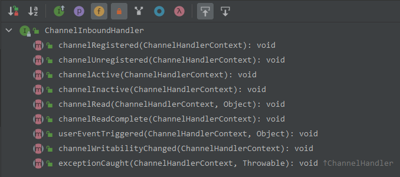

ChannelOutboundHandler出站事件接口：

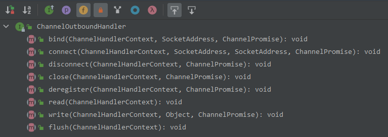


#### ChannelHandlerContext

继承了ChannelInboundInvoker和ChannelOutboundInvoker，同时也定义了一些能够获取Context上下文环境中channel、executor、handler、pipeline和内存分配器等方法。

```java
public interface ChannelHandlerContext extends AttributeMap, ChannelInboundInvoker, ChannelOutboundInvoker {
```

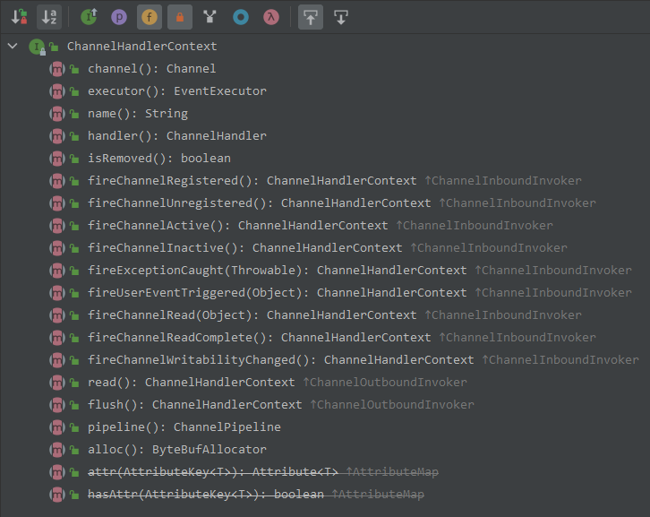

ChannelInboundInvoker和ChannelOutboundInvoker：这两个接口是在入站和出站的handler外层再包装一层，达到在方法前后拦截并做一些特定操作的目的。

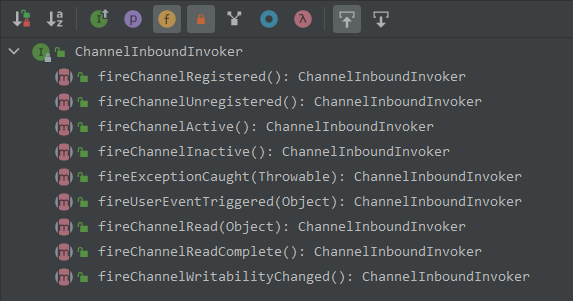

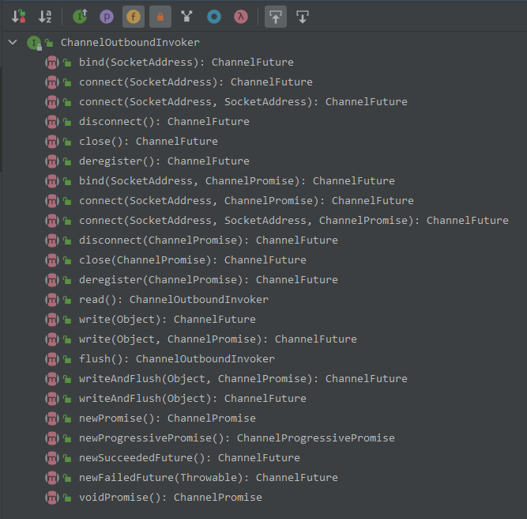


### CP/CH/CHC创建过程分析

#### ChannelPipeline的创建过程

每一个NioSocketChannel创建时都会创建一个ChannelPipeline。

```java
// NioSocketChannel的抽象父类AbstractChannel的构造方法
protected AbstractChannel(Channel parent) {
    this.parent = parent;
    id = newId();
    unsafe = newUnsafe();
    // 创建对应的Pipeline
    pipeline = newChannelPipeline();
}
```

```JAVA
protected DefaultChannelPipeline newChannelPipeline() {
    return new DefaultChannelPipeline(this);
}

protected DefaultChannelPipeline(Channel channel) {
    this.channel = ObjectUtil.checkNotNull(channel, "channel");
    // 创建Future用于异步回调使用 
    succeededFuture = new SucceededChannelFuture(channel, null);
    voidPromise =  new VoidChannelPromise(channel, true);

    // 创建pipeline链表结构的头尾节点
    tail = new TailContext(this);
    head = new HeadContext(this);
	
    // 将两个节点互相连接，形成双向链表
    head.next = tail;
    tail.prev = head;
}
```


#### ChannelHandlerContexte的创建过程

当用户或系统调用Pipeline的以add为前缀的方法添加handler时，都会创建一个包装这个handler的Context。

```JAVA
@Override
public final ChannelPipeline addLast(EventExecutorGroup group, String name, ChannelHandler handler) {
    final AbstractChannelHandlerContext newCtx;
    synchronized (this) {
        // 检查handler实例是否是共享的，若不是且已被其他pipeline使用，则抛出异常
        checkMultiplicity(handler);

        // 通过newContext创建一个和handler关联的context
        newCtx = newContext(group, filterName(name, handler), handler);

        // 将context追加到链表中
        addLast0(newCtx);

        // If the registered is false it means that the channel was not registered on an eventloop yet.
        // In this case we add the context to the pipeline and add a task that will call
        // ChannelHandler.handlerAdded(...) once the channel is registered.
        if (!registered) {
            newCtx.setAddPending();
            callHandlerCallbackLater(newCtx, true);
            return this;
        }

        EventExecutor executor = newCtx.executor();
        if (!executor.inEventLoop()) {
            newCtx.setAddPending();
            executor.execute(new Runnable() {
                @Override
                public void run() {
                    callHandlerAdded0(newCtx);
                }
            });
            return this;
        }
    }
    callHandlerAdded0(newCtx);
    return this;
}
```


### ChannelPipeline的Handler调度分析

#### 入站事件

当请求进入时，会调用Pipeline的相关方法，若是入站事件，这些方法由fire开头，表示开始在管道中流动，让后续的handler继续处理。其中调用的invoke开头的静态方法传入的是head，即会先调用head的ChannelInboundInvoker接口的方法，然后调用handler真正的方法。

```JAVA
@Override
public final ChannelPipeline fireChannelActive() {
    AbstractChannelHandlerContext.invokeChannelActive(head);
    return this;
}

@Override
public final ChannelPipeline fireChannelInactive() {
    AbstractChannelHandlerContext.invokeChannelInactive(head);
    return this;
}

@Override
public final ChannelPipeline fireExceptionCaught(Throwable cause) {
    AbstractChannelHandlerContext.invokeExceptionCaught(head, cause);
    return this;
}

@Override
public final ChannelPipeline fireUserEventTriggered(Object event) {
    AbstractChannelHandlerContext.invokeUserEventTriggered(head, event);
    return this;
}

@Override
public final ChannelPipeline fireChannelRead(Object msg) {
    AbstractChannelHandlerContext.invokeChannelRead(head, msg);
    return this;
}

@Override
public final ChannelPipeline fireChannelReadComplete() {
    AbstractChannelHandlerContext.invokeChannelReadComplete(head);
    return this;
}

@Override
public final ChannelPipeline fireChannelWritabilityChanged() {
    AbstractChannelHandlerContext.invokeChannelWritabilityChanged(head);
    return this;
}
```


#### 出站事件

若是出站事件，则由tail开始处理。

```JAVA
@Override
public final ChannelFuture bind(SocketAddress localAddress) {
    return tail.bind(localAddress);
}

@Override
public final ChannelFuture connect(SocketAddress remoteAddress) {
    return tail.connect(remoteAddress);
}

@Override
public final ChannelFuture connect(SocketAddress remoteAddress, SocketAddress localAddress) {
    return tail.connect(remoteAddress, localAddress);
}

@Override
public final ChannelFuture disconnect() {
    return tail.disconnect();
}

@Override
public final ChannelFuture close() {
    return tail.close();
}

@Override
public final ChannelFuture deregister() {
    return tail.deregister();
}

@Override
public final ChannelPipeline flush() {
    tail.flush();
    return this;
}

@Override
public final ChannelFuture bind(SocketAddress localAddress, ChannelPromise promise) {
    return tail.bind(localAddress, promise);
}

@Override
public final ChannelFuture connect(SocketAddress remoteAddress, ChannelPromise promise) {
    return tail.connect(remoteAddress, promise);
}

@Override
public final ChannelFuture connect(
    SocketAddress remoteAddress, SocketAddress localAddress, ChannelPromise promise) {
    return tail.connect(remoteAddress, localAddress, promise);
}

@Override
public final ChannelFuture disconnect(ChannelPromise promise) {
    return tail.disconnect(promise);
}
```


#### 调度过程

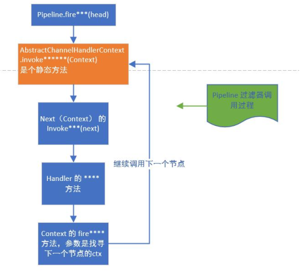

```JAVA
// 以入站事件为例，debug追踪到DefaultChannelPipeline的fireChannelRead方法的调用
@Override
public final ChannelPipeline fireChannelRead(Object msg) {
    // 调用AbstractChannelHandlerContext的invoke开头的静态方法，从head开始处理
    AbstractChannelHandlerContext.invokeChannelRead(head, msg);
    return this;
}
```

```JAVA
// AbstractChannelHandlerContext抽象类
@Override
public ChannelHandlerContext fireChannelRead(final Object msg) {
    invokeChannelRead(findContextInbound(), msg);
    return this;
}

static void invokeChannelRead(final AbstractChannelHandlerContext next, Object msg) {
    final Object m = next.pipeline.touch(ObjectUtil.checkNotNull(msg, "msg"), next);
    EventExecutor executor = next.executor();
    if (executor.inEventLoop()) {
        next.invokeChannelRead(m);
    } else {
        executor.execute(new Runnable() {
            @Override
            public void run() {
                next.invokeChannelRead(m);
            }
        });
    }
}
```

```JAVA
private void invokeChannelRead(Object msg) {
    if (invokeHandler()) {
        try {
            // 具体执行handler自定义的channelRead进行处理
            ((ChannelInboundHandler) handler()).channelRead(this, msg);
        } catch (Throwable t) {
            notifyHandlerException(t);
        }
    } else {
        fireChannelRead(msg);
    }
}
```

```JAVA
volatile AbstractChannelHandlerContext next;
volatile AbstractChannelHandlerContext prev;

private final boolean inbound;
private final boolean outbound;

private AbstractChannelHandlerContext findContextInbound() {
    AbstractChannelHandlerContext ctx = this;
    do {
        // 入站事件从head开始，通过next向后执行
        ctx = ctx.next;
    } while (!ctx.inbound);
    return ctx;
}

private AbstractChannelHandlerContext findContextOutbound() {
    AbstractChannelHandlerContext ctx = this;
    do {
        // 出站事件从tail开始，通过prev向前执行
        ctx = ctx.prev;
    } while (!ctx.outbound);
    return ctx;
}
```


### EventLoop事件循环分析

#### NioEventLoop继承关系图

* 继承自ScheduleExecutorService接口是一个定时任务接口，表示NioEventLoop可以接受定时任务；
* 继承自EventLoop接口是当Channel被注册时用于处理其对应I/O操作的接口；
* 继承自SingleThreadEventExecutor接口，表示NioEventLoop是一个单线程的线程池；
* NioEventLoop是一个单例的线程池，里面包含一个死循环的线程不断的做三件事，即端口监听、事件处理和队列任务处理。每个EventLoop都可以绑定多个Channel，但每个Channel只能由一个EventLoop处理。

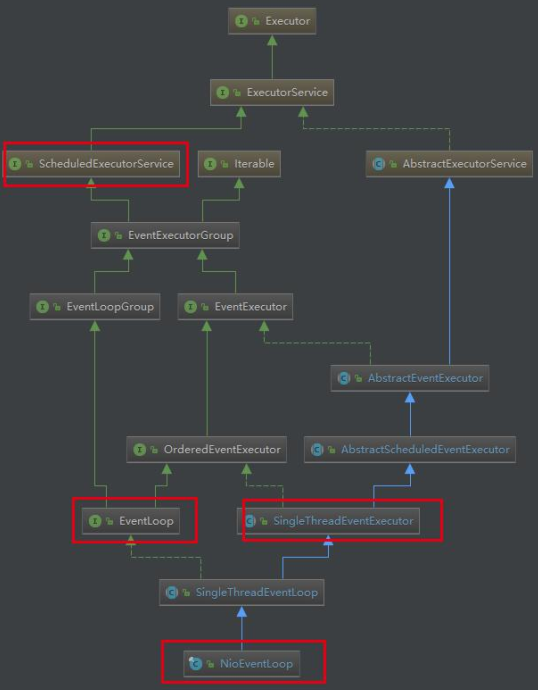


#### execute/schedule

* EventLoop通过 `SingleThreadEventExecutor#execute` 添加普通任务；

* 通过 `AbstractScheduledEventExecutor#schedule` 添加定时任务。

```JAVA
@Override
public void execute(Runnable task) {
    if (task == null) {
        throw new NullPointerException("task");
    }

    boolean inEventLoop = inEventLoop();
    // 判断当前线程是否已经是EventLoop线程
    if (inEventLoop) {
        // 若是，则代表线程已经运行了EventLoop，直接将task加入到任务队列中去
        addTask(task);
    } else {
        // 若不是，则尝试启动EventLoop，然后再将task加入到任务队列中
        startThread();
        addTask(task);
        // 若线程已经停止且删除任务失败，则执行task拒绝策略，默认是抛出异常
        if (isShutdown() && removeTask(task)) {
            reject();
        }
    }
	
    // 当执行execute方法时，唤醒selector，防止selector阻塞时间过长
    if (!addTaskWakesUp && wakesUpForTask(task)) {
        wakeup(inEventLoop);
    }
}
```

普通任务被存储在 `mpscQueue` 中，而定时任务则被存储在 `PriorityQueue<ScheduledFutureTask>()` 中。

```JAVA
@Override
public <V> ScheduledFuture<V> schedule(Callable<V> callable, long delay, TimeUnit unit) {
    ObjectUtil.checkNotNull(callable, "callable");
    ObjectUtil.checkNotNull(unit, "unit");
    if (delay < 0) {
        throw new IllegalArgumentException(
            String.format("delay: %d (expected: >= 0)", delay));
    }
    return schedule(new ScheduledFutureTask<V>(
        this, callable, ScheduledFutureTask.deadlineNanos(unit.toNanos(delay))));
}
```

```JAVA
<V> ScheduledFuture<V> schedule(final ScheduledFutureTask<V> task) {
    if (inEventLoop()) {
        scheduledTaskQueue().add(task);
    } else {
        execute(new Runnable() {
            @Override
            public void run() {
                scheduledTaskQueue().add(task);
            }
        });
    }
    return task;
}
```

普通任务加入 `taskQueue` 队列的源码分析：

```JAVA
protected void addTask(Runnable task) {
    if (task == null) {
        throw new NullPointerException("task");
    }
    if (!offerTask(task)) {
        reject(task);
    }
}

final boolean offerTask(Runnable task) {
    if (isShutdown()) {
        reject();
    }
    // 将task任务加入到EventLoop的任务队列中
    return taskQueue.offer(task);
}
```


#### startThread

```JAVA
// NioEventLoop#startThread
private void startThread() {
    // 判断状态state，是否已经启动过了
    if (state == ST_NOT_STARTED) {
        // 若是第一次启动，则通过CAS将状态state改为已启动
        if (STATE_UPDATER.compareAndSet(this, ST_NOT_STARTED, ST_STARTED)) {
            try {
                // 具体的启动方法
                doStartThread();
            } catch (Throwable cause) {
                STATE_UPDATER.set(this, ST_NOT_STARTED);
                PlatformDependent.throwException(cause);
            }
        }
    }
}
```

```JAVA
private void doStartThread() {
    assert thread == null;
    // exector就是在创建EventLoopGroup时创建的ThreadPerTaskExecutor对象
    // execute方法会将Runnable包装成Netty的FastThreadLocalThread，也就是将当前新的EventLoop提交到EventLoopGroup的线程池中
    executor.execute(new Runnable() {
        @Override
        public void run() {
            thread = Thread.currentThread();
            // 中断状态判断
            if (interrupted) {
                thread.interrupt();
            }

            boolean success = false;
            // 设置最后一次的执行时间
            updateLastExecutionTime();
            try {
                // SingleThreadEventExecutor是NioEventLoop的父类，其底层维护了一个单线程的线程池
                // run方法就是启动线程池中唯一的一个线程去执行事件循环机制，是整个EventLoop的核心
                SingleThreadEventExecutor.this.run();
                success = true;
            } catch (Throwable t) {
                logger.warn("Unexpected exception from an event executor: ", t);
            } finally {
                // 若执行到此处，则代表线程Loop结束了，会通过自旋+CAS的方式修改state的值为关闭状态
                for (;;) {
                    int oldState = state;
                    if (oldState >= ST_SHUTTING_DOWN || STATE_UPDATER.compareAndSet(
                        SingleThreadEventExecutor.this, oldState, ST_SHUTTING_DOWN)) {
                        break;
                    }
                }

                // Check if confirmShutdown() was called at the end of the loop.
                if (success && gracefulShutdownStartTime == 0) {
                    logger.error("Buggy " + EventExecutor.class.getSimpleName() + " implementation; " +
                                 SingleThreadEventExecutor.class.getSimpleName() + ".confirmShutdown() must be called " +
                                 "before run() implementation terminates.");
                }

                try {
                    // Run all remaining tasks and shutdown hooks.
                    for (;;) {
                        if (confirmShutdown()) {
                            break;
                        }
                    }
                } finally {
                    try {
                        cleanup();
                    } finally {
                        STATE_UPDATER.set(SingleThreadEventExecutor.this, ST_TERMINATED);
                        threadLock.release();
                        if (!taskQueue.isEmpty()) {
                            logger.warn(
                                "An event executor terminated with " +
                                "non-empty task queue (" + taskQueue.size() + ')');
                        }

                        terminationFuture.setSuccess(null);
                    }
                }
            }
        }
    });
}
```


#### run

* 通过 `select()` 获得感兴趣的事件；
* 通过 `processSelectedKeys()` 处理事件。在select返回后处理事件，并记录IO事件的处理事件ioTime；
* 通过 `runAllTasks()` 执行队列中的任务。执行任务处理的时间和IO处理的时间是1:1的关系。

```JAVA
// NioEventLoop#run
@Override
protected void run() {
    // 事件循环
    for (;;) {
        try {
            switch (selectStrategy.calculateStrategy(selectNowSupplier, hasTasks())) {
                case SelectStrategy.CONTINUE:
                    continue;
                case SelectStrategy.SELECT:
                    // 获取感兴趣的事件，在执行select前，标识一个状态，表示当前要进行select操作且处于未唤醒状态
                    select(wakenUp.getAndSet(false));

                    if (wakenUp.get()) {
                        selector.wakeup();
                    }
                default:
            }

            cancelledKeys = 0;
            needsToSelectAgain = false;
            final int ioRatio = this.ioRatio;
            if (ioRatio == 100) {
                try {
                    processSelectedKeys();
                } finally {
                    runAllTasks();
                }
            } else {
                // ioRation的值默认50，所以从这执行
                // ioStartTime记录processSelectedKeys开始执行的时间
                final long ioStartTime = System.nanoTime();
                try {
                    // 当select返回后，通过该方法处理事件
                    processSelectedKeys();
                } finally {
                    // ioTime是processSelectedKeys所执行的时间
                    final long ioTime = System.nanoTime() - ioStartTime;
                    // 根据ioRation的比例执行runAllTasks方法（执行任务队列中的所有任务）
                    // 默认IO任务和非IO任务的执行时间比是1:1
                    runAllTasks(ioTime * (100 - ioRatio) / ioRatio);
                }
            }
        } catch (Throwable t) {
            handleLoopException(t);
        }
        // 即使循环处理引发异常，也始终处理关闭
        try {
            if (isShuttingDown()) {
                closeAll();
                if (confirmShutdown()) {
                    return;
                }
            }
        } catch (Throwable t) {
            handleLoopException(t);
        }
    }
}
```


#### select

* 当发现下一个定时任务将在0.5m内需要被触发执行，会立即转为执行非阻塞的 `selectNow()`；
* 若任务队列中存在任务，则CAS将select状态置为唤醒，然后转为执行非阻塞的 `selectNow()`；
* 若都不满足则调用阻塞的 `select()` 去轮询事件一段时间；
* 若选择到了就绪事件、select被用户唤醒、任务队列中有任务和有定时任务即将被执行这些情况发生，则跳出事件循环。

```JAVA
// NioEventLoop#select
private void select(boolean oldWakenUp) throws IOException {
    Selector selector = this.selector;
    try {
        int selectCnt = 0;
        // select的开始执行时间和执行截止时间（也就是下一次定时任务的开始时间）
        long currentTimeNanos = System.nanoTime();
        // delayNanos返回的就是当前时间距离下一次定时任务开始执行的时间
        long selectDeadLineNanos = currentTimeNanos + delayNanos(currentTimeNanos);
        for (;;) {
            // 当下一个定时任务开始距离当前时间小于0.5ms时，则表示即将有定时任务要执行，会调用非阻塞的selectNow()
            long timeoutMillis = (selectDeadLineNanos - currentTimeNanos + 500000L) / 1000000L;
            if (timeoutMillis <= 0) {
                if (selectCnt == 0) {
                    selector.selectNow();
                    selectCnt = 1;
                }
                break;
            }

            // 如果任务是在wakenUp状态为true时提交的，则该任务没有机会调用
            // hasTasks判断队列中是否有任务，且通过CAS设置wakenUp唤醒状态
            // 若队列中有任务，且唤醒状态成功设置为true，就调用非阻塞的select去执行
            if (hasTasks() && wakenUp.compareAndSet(false, true)) {
                selector.selectNow();
                selectCnt = 1;
                break;
            }
			
            // 若以上条件都不满足，最后会调用阻塞的select
            int selectedKeys = selector.select(timeoutMillis);
            selectCnt ++;
	
            // 若select到了就绪事件 || select被用户唤醒 || 任务队列中有任务 || 有定时任务即将被执行
            // 满足以上任意一种情况，都会跳出循环
            if (selectedKeys != 0 || oldWakenUp || wakenUp.get() || hasTasks() || hasScheduledTasks()) {
                break;
            }
            // 判断线程中断
            if (Thread.interrupted()) {
                // Thread was interrupted so reset selected keys and break so we not run into a busy loop.
                // As this is most likely a bug in the handler of the user or it's client library we will
                // also log it.
                //
                // See https://github.com/netty/netty/issues/2426
                if (logger.isDebugEnabled()) {
                    logger.debug("Selector.select() returned prematurely because " +
                                 "Thread.currentThread().interrupt() was called. Use " +
                                 "NioEventLoop.shutdownGracefully() to shutdown the NioEventLoop.");
                }
                selectCnt = 1;
                break;
            }

            long time = System.nanoTime();
            if (time - TimeUnit.MILLISECONDS.toNanos(timeoutMillis) >= currentTimeNanos) {
                // timeoutMillis elapsed without anything selected.
                selectCnt = 1;
            } else if (SELECTOR_AUTO_REBUILD_THRESHOLD > 0 &&
                       selectCnt >= SELECTOR_AUTO_REBUILD_THRESHOLD) {
                // The selector returned prematurely many times in a row.
                // Rebuild the selector to work around the problem.
                logger.warn(
                    "Selector.select() returned prematurely {} times in a row; rebuilding Selector {}.",
                    selectCnt, selector);

                rebuildSelector();
                selector = this.selector;

                // Select again to populate selectedKeys.
                selector.selectNow();
                selectCnt = 1;
                break;
            }

            currentTimeNanos = time;
        }

        if (selectCnt > MIN_PREMATURE_SELECTOR_RETURNS) {
            if (logger.isDebugEnabled()) {
                logger.debug("Selector.select() returned prematurely {} times in a row for Selector {}.",
                             selectCnt - 1, selector);
            }
        }
    } catch (CancelledKeyException e) {
        if (logger.isDebugEnabled()) {
            logger.debug(CancelledKeyException.class.getSimpleName() + " raised by a Selector {} - JDK bug?",
                         selector, e);
        }
        // Harmless exception - log anyway
    }
}
```


#### processSelectedKeys

processSelectedKeys方法就是对就绪的时间做出响应的。即逐个取出就绪的IO时间，然后根据事件的具体类型执行不同的策略。

```JAVA
// NioEventLoop#processSelectedKeys
private void processSelectedKeys() {
    if (selectedKeys != null) {
        processSelectedKeysOptimized(selectedKeys.flip());
    } else {
        processSelectedKeysPlain(selector.selectedKeys());
    }
}

private void processSelectedKeysOptimized(SelectionKey[] selectedKeys) {
    for (int i = 0;; i ++) {
        final SelectionKey k = selectedKeys[i];
        if (k == null) {
            break;
        }
        selectedKeys[i] = null;

        final Object a = k.attachment();

        if (a instanceof AbstractNioChannel) {
            // 取出I/O事件，逐个调用processSelectedKey处理
            processSelectedKey(k, (AbstractNioChannel) a);
        } else {
            @SuppressWarnings("unchecked")
            NioTask<SelectableChannel> task = (NioTask<SelectableChannel>) a;
            processSelectedKey(k, task);
        }

        if (needsToSelectAgain) {
            for (;;) {
                i++;
                if (selectedKeys[i] == null) {
                    break;
                }
                selectedKeys[i] = null;
            }

            selectAgain();
            selectedKeys = this.selectedKeys.flip();
            i = -1;
        }
    }
}
```

**NioEventLoop#`processSelectedKey()`**：

```java
final AbstractNioChannel.NioUnsafe unsafe = ch.unsafe();
if (!k.isValid()) {
    final EventLoop eventLoop;
    try {
        eventLoop = ch.eventLoop();
    } catch (Throwable ignored) {
        return;
    }
    if (eventLoop != this || eventLoop == null) {
        return;
    }
    // close the channel if the key is not valid anymore
    unsafe.close(unsafe.voidPromise());
    return;
}
// 获取事件的就绪类型，执行不同的策略
int readyOps = k.readyOps();
if ((readyOps & SelectionKey.OP_CONNECT) != 0) {
    int ops = k.interestOps();
    ops &= ~SelectionKey.OP_CONNECT;
    k.interestOps(ops);
    unsafe.finishConnect();
}

// 写事件
if ((readyOps & SelectionKey.OP_WRITE) != 0) {
    ch.unsafe().forceFlush();
}

// 读事件
if ((readyOps & (SelectionKey.OP_READ | SelectionKey.OP_ACCEPT)) != 0 || readyOps == 0) {
    unsafe.read();
    if (!ch.isOpen()) {
        return;
    }
}
```


#### runAllTasks

* 首先进行任务聚合，即取出一个离截止时间最近的定时任务加入到普通任务队列中去；
* 然后依次从队列中出队任务开始串行执行，每执行64次就去检查一次超时时间，若到达任务执行的截止时间就退出。

```JAVA
// SingleThreadEventExecutor#runAllTasks
// 执行队列中的任务
protected boolean runAllTasks(long timeoutNanos) {
    // 任务聚合
    fetchFromScheduledTaskQueue();
    // 取出一个任务
    Runnable task = pollTask();
    if (task == null) {
        afterRunningAllTasks();
        return false;
    }

    // 计算截止时间，即for循环执行到deadline就截止
    final long deadline = ScheduledFutureTask.nanoTime() + timeoutNanos;
    // 任务执行计数器
    long runTasks = 0;
    long lastExecutionTime;
    for (;;) {
        // 以串行的方式执行任务
        safeExecute(task);

        runTasks ++;

        // 每执行64次检查一次超时（根据经验硬编码的次数）
        if ((runTasks & 0x3F) == 0) {
            lastExecutionTime = ScheduledFutureTask.nanoTime();
            // 若超过截止时间，则退出任务执行
            if (lastExecutionTime >= deadline) {
                break;
            }
        }

        task = pollTask();
        if (task == null) {
            lastExecutionTime = ScheduledFutureTask.nanoTime();
            break;
        }
    }

    // 执行一些收尾性质的任务
    afterRunningAllTasks();
    this.lastExecutionTime = lastExecutionTime;
    return true;
}

// 任务聚合：即将执行的定时任务和待处理的普通任务，都会放入mpscQueue里去执行
private boolean fetchFromScheduledTaskQueue() {
    // 可以看做是一个截止日期
    long nanoTime = AbstractScheduledEventExecutor.nanoTime();
    // 在定时任务队列中取出一个离截止日期事件最近的定时任务（定时任务队列是按照截止日期排队的）
    Runnable scheduledTask  = pollScheduledTask(nanoTime);
    while (scheduledTask != null) {
        // 尝试将取出的定时任务加入普通任务队列中
        if (!taskQueue.offer(scheduledTask)) {
            // 若普通任务队列中没有剩余空间，会将定时任务重新加入定时任务队列
            scheduledTaskQueue().add((ScheduledFutureTask<?>) scheduledTask);
            return false;
        }
        scheduledTask  = pollScheduledTask(nanoTime);
    }
    return true;
}
```


### 任务加入异步线程池过程分析

* 在Netty的NioEventLoop线程中做耗时的、不可预料的操作，如：数据库连接、网络请求等，都会严重影响Netty对Socket IO操作的效率。解决方法就是将耗时任务添加到异步线程池EventExecutorGroup中去执行；
* 将耗时任务添加到线程池中的操作有两种方式，一个是在handler中添加，一个是在Context中添加。

#### 在Channelhandler中加入异步线程池

```JAVA
@Sharable
public class EchoServerHandler extends ChannelInboundHandlerAdapter {

    // EventExecutorGroup充当业务线程池，可以将耗时任务提交到该线程池
    static final EventExecutorGroup group = new DefaultEventExecutorGroup(16);

    @Override
    public void channelRead(ChannelHandlerContext ctx, Object msg) throws Exception {
        // 任务执行方式1: 提交到当前channel所属的EventLoop线程的任务队列等待执行
        ctx.channel().eventLoop().execute(() -> {
            try {
                Thread.sleep(5 * 1000);
                ctx.writeAndFlush(Unpooled.copiedBuffer("hello, client", CharsetUtil.UTF_8));
            } catch (Exception ex) {
                System.out.println("exception: " + ex.getMessage());
            }
        });

        // 任务执行方式2：提交给异步的业务线程池来执行
        group.submit(() -> {
            // 以下的操作异步执行
            ByteBuf buf = (ByteBuf) msg;
            byte[] bytes = new byte[buf.readableBytes()];
            buf.readBytes(bytes);
            String body = new String(bytes, StandardCharsets.UTF_8);
            Thread.sleep(10 * 1000);
            // 这一步会将write操作返回给eventLoop线程执行（即放入eventLoop的任务队列中）
            ctx.writeAndFlush(Unpooled.copiedBuffer("hello, client", CharsetUtil.UTF_8));
            return null;
        });

        // 任务执行方式3：由当前channel所属的EventLoop线程同步执行
        ByteBuf buf = (ByteBuf) msg;
        byte[] bytes = new byte[buf.readableBytes()];
        buf.readBytes(bytes);
        String body = new String(bytes, StandardCharsets.UTF_8);
        Thread.sleep(10 * 1000);
        ctx.writeAndFlush(Unpooled.copiedBuffer("hello, client", CharsetUtil.UTF_8));
    }

    @Override
    public void channelReadComplete(ChannelHandlerContext ctx) {
        ctx.flush();
    }

    @Override
    public void exceptionCaught(ChannelHandlerContext ctx, Throwable cause) {
        ctx.close();
    }
}
```

任务执行方式2的写操作分析，即**AbstractChannelHandlerContext#`write()`**：当以异步线程池的方式执行任务时，若存在写操作发生，则会将该写操作封装为task加入到EventLoop的任务队列中去等待执行。

```JAVA
private void write(Object msg, boolean flush, ChannelPromise promise) {
    AbstractChannelHandlerContext next = findContextOutbound();
    final Object m = pipeline.touch(msg, next);
    // 获取handlerContext的channel对应的EventLoop线程executor（即I/O线程）
    EventExecutor executor = next.executor();
    // 判断当前的线程是否是executor
    if (executor.inEventLoop()) {
        // 若是，则执行正常处理流程
        if (flush) {
            next.invokeWriteAndFlush(m, promise);
        } else {
            next.invokeWrite(m, promise);
        }
    } else {
        // 若不是，代表当前调用write方法的是异步线程池中的线程（即业务线程），则将该写操作封装为task
        AbstractWriteTask task;
        if (flush) {
            task = WriteAndFlushTask.newInstance(next, m, promise);
        }  else {
            task = WriteTask.newInstance(next, m, promise);
        }
        // 最后让task加入到executor的任务队列中去执行
        safeExecute(executor, task, promise, m);
    }
}
```

```JAVA
private static void safeExecute(EventExecutor executor, Runnable runnable, ChannelPromise promise, Object msg) {
    try {
        // 加入任务队列
        executor.execute(runnable);
    } catch (Throwable cause) {
        try {
            promise.setFailure(cause);
        } finally {
            if (msg != null) {
                ReferenceCountUtil.release(msg);
            }
        }
    }
}
```


#### 在ChannelHandlerContext中加入异步线程池

```JAVA
public final class EchoServer {

    static final boolean SSL = System.getProperty("ssl") != null;
    static final int PORT = Integer.parseInt(System.getProperty("port", "8008"));

    // 异步的业务线程池
    static final EventExecutorGroup group = new DefaultEventExecutorGroup(2);

    public static void main(String[] args) throws Exception {
        final SslContext sslCtx;
        if (SSL) {
            SelfSignedCertificate ssc = new SelfSignedCertificate();
            sslCtx = SslContextBuilder.forServer(ssc.certificate(), ssc.privateKey()).build();
        } else {
            sslCtx = null;
        }

        EventLoopGroup bossGroup = new NioEventLoopGroup(1);
        EventLoopGroup workerGroup = new NioEventLoopGroup();
        try {
            ServerBootstrap b = new ServerBootstrap();
            b.group(bossGroup, workerGroup)
             .channel(NioServerSocketChannel.class)
             .option(ChannelOption.SO_BACKLOG, 100)
             .handler(new LoggingHandler(LogLevel.INFO))
             .childHandler(new ChannelInitializer<SocketChannel>() {
                 @Override
                 public void initChannel(SocketChannel ch) throws Exception {
                     ChannelPipeline p = ch.pipeline();
                     if (sslCtx != null) {
                         p.addLast(sslCtx.newHandler(ch.alloc()));
                     }
                     // 当handler被添加到pipeline上时可以手动指定一个异步的线程池来处理该handler
                     // 这种方式会将所有handler的操作全部异步执行，不如前一种方式灵活
                     p.addLast(group, new EchoServerHandler());
                 }
             });

            ChannelFuture f = b.bind(PORT).sync();
            f.channel().closeFuture().sync();
        } finally {
            bossGroup.shutdownGracefully();
            workerGroup.shutdownGracefully();
        }
    }
}
```


## Netty-零拷贝机制

### 操作系统层面的零拷贝机制

是指避免用户态和内核态之间来回拷贝数据，而划分出的共享空间供双方操作。如：Linux的 `sendfile()` 系统调用。


### Netty的零拷贝机制体现在以下几个方面

* 提供CompositeByteBuf类，可以将多个ByteBuf合并为一个逻辑上的ByteBuf，避免了各个ByteBuf间的拷贝；
* ByteBuf支持slice分片操作，因此可以将ByteBuf分解为多个共享同一存储区域的ByteBuf，避免了内存的拷贝；
* 通过FileRegion包装的FileChannel.tranferTo实现文件传输，可以直接将文件缓冲区的数据发送到目标Channel，避免了传统的write循环方式导致的内存拷贝问题。


## Netty-服务启动代码示例

### 服务端

```JAVA
// bossGroup⽤于Accept连接建立事件并分发请求
EventLoopGroup bossGroup = new NioEventLoopGroup(1);
// workerGroup⽤于处理I/O读写事件和业务逻辑
EventLoopGroup workerGroup = new NioEventLoopGroup();
try {
    // 服务端启动引导类
    ServerBootstrap bootstrap = new ServerBootstrap();
    bootstrap
        // 给引导类配置事件循环组
        .group(bossGroup, workerGroup)
        // 指定Channel为NIO模型
        .channel(NioServerSocketChannel.class)
        // 设置连接配置参数
        .option(ChannelOption.SO_BACKLOG, 1024)
        .childOption(ChannelOption.SO_KEEPALIVE, true)
        // 配置入站出站事件的处理器
        .childHandler(new ChannelInitializer<SocketChannel>() {
            @Override
            public void initChannel(SocketChannel ch) {
                ChannelPipeline p = ch.pipeline();
                // ⾃定义客户端消息的业务处理逻辑
                p.addLast(new HelloServerHandler());
            }
    	});
    // 阻塞绑定端⼝
    ChannelFuture f = b.bind(port).sync();
    // 阻塞等待直到服务端的Channel关闭
    f.channel().closeFuture().sync();
} finally {
    // 优雅关闭相关线程组资源
    bossGroup.shutdownGracefully();
    workerGroup.shutdownGracefully();
}
```


### 客户端

```JAVA
// 创建NioEventLoopGroup对象实例
EventLoopGroup group = new NioEventLoopGroup();
try {
    // 创建客户端启动引导类Bootstrap
    Bootstrap bootstrap = new Bootstrap();
    bootstrap
        // 指定线程组
        .group(group)
        // 指定NIO模型
        .channel(NioSocketChannel.class)
    	.handler(new ChannelInitializer<SocketChannel>() {
            @Override
        	public void initChannel(SocketChannel ch) throws Exception {
            	ChannelPipeline p = ch.pipeline();
            	// ⾃定义消息的业务处理逻辑
            	p.addLast(new HelloClientHandler(message));
        	}
    	});
    // 阻塞建⽴连接
    ChannelFuture f = b.connect(host, port).sync();
    // 阻塞等待连接关闭
    f.channel().closeFuture().sync();
} finally {
	group.shutdownGracefully();
}
```


## Netty-TCP粘包/拆包

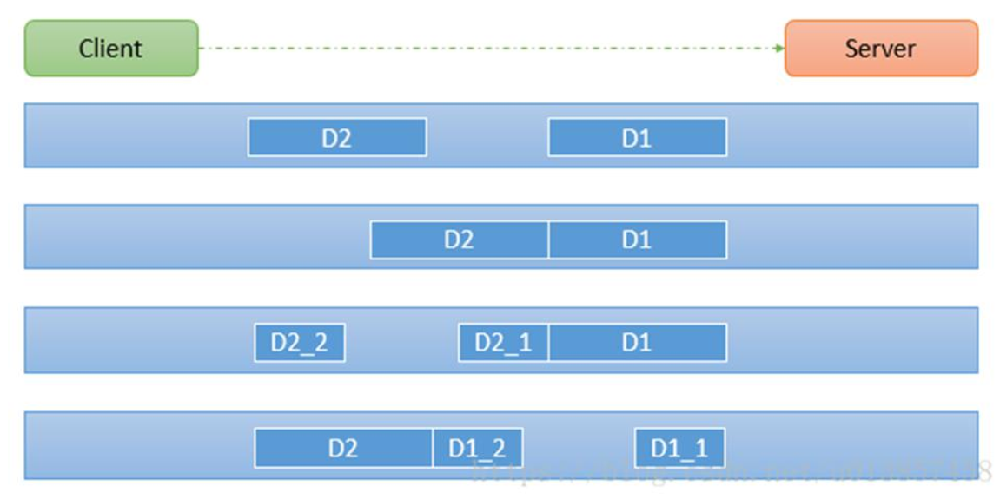

### 什么是TCP粘包/拆包

基于TCP传输数据时，发送方为了更有效的发送数据包，使用Nagle算法来优化，将多次间隔较小且数据量小的数据合成一个大的数据块，然后进行封包。这样做虽然提高了效率，但会造成接收端对数据的边界无法分辨，因为面向流的通信是无消息边界保护的。


### 使用Netty的解码器解决问题

* **LineBasedFrameDecoder**：发送端发送数据包时，每个数据包之间以换行符做为分隔，该解码器的工作原理就是依次比较ByteBuf中的可读字节，判断是否有换行符，然后进行对应的截取；
* **DelimiterBasedFrameDecoder**：即可自定义分隔符解码器，LineBasedFrameDecoder就是DelimiterBasedFrameDecoder的一种自定义实现；
* **FixedLengthFrameDecoder**：固定长度解码器，能够按照指定的长度对消息进行相应的拆包；
* **LengthFieldBasedFrameDecoder**：自定义长度解码器。


## Netty-长连接和心跳服务

### 基本概念

* **Netty的长连接机制即TCP的长连接机制**：当通信双方建立连接后，就不会轻易断开连接，而是维持一段时间，在这段时间内双方的数据收发不需要事先建立连接。

* **Netty的心跳机制**：在TCP保持长连接的过程中，可能会出现网络异常导致连接中断，因此Netty在应用层引入了心跳机制让通信双方能够知道对方是否在线。心跳机制的原理是client与server之间若一定的时间没有数据交互时，即处于idle状态，client就会发送一个特殊的报文，当server接收到后也会回复一个，即完成了一次PING-PONG交互。所以，当一方收到对方的心跳报文后，就知道其仍然在线。


### Netty提供的心跳机制

Netty提供了IdleStateHandler，ReadTimeoutHandler，WriteTimeoutHandler三个Handler来检测连接的有效性。

| 序号 |        名称         |                             作用                             |
| :--: | :-----------------: | :----------------------------------------------------------: |
|  1   |  IdleStateHandler   | 当连接空闲时间（读/写）过长时，将会触发一个IdleStateEvent事件，然后通过ChannelInboundHandler中重写userEventTrigged方法来处理该事件。 |
|  2   | ReadTimeoutHandler  | 如果在指定的时间内没有发生读事件，就会抛出异常，且自动关闭连接，可以在exceptionCaught方法中处理该异常。 |
|  3   | WriteTimeoutHandler | 当一个写操作不能在一定的事件内完成时，就会抛出异常，且自动关闭连接，可以在exceptionCaught方法中处理该异常。 |


# Linux操作和内核原理

## Linux操作-基本概念

## Linux操作-磁盘

## Linux操作-分区

## Linux操作-文件系统

## Linux操作-目录/文件

## Linux操作-压缩打包

## Linux操作-Bash

## Linux操作-管道指令

## Linux操作-正则表达式

## Linux操作-进程管理

## Linux操作-安全

## Linux操作-Shell


## Linux内核-进程管理

### 进程在Linux中的实现

* **Linux进程：**处于执行期的程序以及相关资源（打开的文件、挂起的信号、内核内部数据、处理器状态）的总称。 

* **Linux线程：**是在进程中活动的对象，每个线程都拥有一个独立的程序计数器、栈空间和一组寄存器。内核调度的对象是线程，而不是进程。Linux不区分进程和线程，对它来说线程就是一种特殊的进程。

* **进程描述符**：内核将其管理的所有进程存放在一个叫做任务队列的双向循环链表中，链表中的每一项类型都为 `task_struct`，称为进程描述符结构，描述了一个具体进程的所有信息。

  ```C
  struct task_struct {
  	// 进程状态
  	long state;
  	// 虚拟内存结构体
  	struct mm_struct *mm;
  	// 进程号
  	pid_t pid;
  	// 指向父进程的指针
  	struct task_struct __rcu *parent;
  	// 子进程列表
  	struct list_head children;
  	// 存放文件系统信息的指针
  	struct fs_struct *fs;
  	// 一个数组，包含该进程打开的文件指针
  	struct files_struct *files;
  };
  ```

* **分配进程描述符**：Linux通过slab分配器分配进程描述符结构，这样能够对象复用和缓存着色。每个任务的 `thread_info` 结构在其内核栈尾端分配，其中task域存放的是指向该任务实际的进程描述符的指针。

* **进程家族树**：所有的进程都是PID为1的init进程的后代，内核在系统启动的最后阶段启动init进程，该进程读取系统的初始化脚本并执行其他的相关程序，最终完成整个系统启动的过程。每个进程描述符结构都包含一个指向其父进程描述符结构的parent指针，还包含一个children列表。

  * **进程创建**：Linux将进程的创建分解为两个单独的函数执行：`fork()`  和 `exec()`。`fork()` 通过拷贝当前进程创建一个子进程，`exec()` 负责读取可执行文件并将其载入地址空间开始运行。

* **写时拷贝**：Linux的 `fork()` 使用写时拷贝页实现，这是一种推迟甚至免除拷贝数据的技术，在创建子进程时，内核并不复制整个进程地址空间，而是让父子进程共享一个拷贝，只有在写入的时候，数据才会被复制。 


### 进程创建操作fork

父进程通过调用fork函数创建子进程：

* 为子进程分配一个空闲的proc结构，即进程描述符；
* 赋予子进程唯一的标识PID；
* 以一次一页的方式复制父进程的用户地址空间；
* 获得子进程继承的共享资源的指针，如打开的文件和当前工作目录等；
* 子进程就绪，加入调度队列；
* 对子进程返回标识符0，向父进程返回子进程的PID。

fork函数复制了一个自己，但是创建子进程并非要运行另一个与父进程一模一样的进程，绝大部分的子进程需要运行不同的程序，这时需要调用exec函数来替换原父进程的代码：

* 在原进程空间装入新程序的代码、数据、堆和栈；
* 保持进程ID和父进程ID等；
* 继承控制终端；
* 保留所有文件信息，如目录、文件模式和文件锁等。

信号（Signal）函数是Linux/Unix处理异步事件的经典方法，信号可以说是进程控制的一部分：

* 当用户触发某些终端键时；
* 硬件异常产生信号，如除数为0、无效的存储访问等；
* 进程用kill函数可将信号发送给另一个进程或进程组；
* 用户可用kill函数将信号发送给其他进程；
* 当检测到某种事件已经发生，并将信号通知有关进程。


### 线程在Linux中的实现

* 从内核的角度来看，Linux将所有的线程当作进程来实现。线程仅仅被视为一个与其他进程共享某些资源的进程，拥有属于自己的`task_struct`描述符。 
* **创建线程**：和创建普通进程类似，在调用clone()时传递参数指明共享资源：`clone(CLONE_VM | CLONE_FS | CLONE_FILES | CLONE_SIGHAND, 0)`。调用结果和fork()差不多，只是父子进程共享地址空间、文件系统资源、打开的文件描述符和信号处理程序。
* **内核线程**：用于内核在后台执行一些任务，是独立运行在内核空间的标准进程。和普通进程的区别是内核线程没有独立的地址空间，只在内核空间运行，不切换到用户空间。如软中断ksoftirqd和flush都是内核线程的例子。


### Pthread线程包

|       线程调用       |              描述              |
| :------------------: | :----------------------------: |
|    Pthread_create    |         创建一个新线程         |
|     Pthread_exit     |         结束调用的线程         |
|     Pthread_join     |     等待一个特定的线程退出     |
|    Pthread_yield     |  释放处理器来运行另外一个线程  |
|  Pthread_attr_init   | 创建并初始化一个线程的属性结构 |
| Pthread_attr_destroy |     删除一个线程的属性结构     |


## Linux内核-进程调度

#### 基本概念

* 进程调度：在可运行态进程之间分配有限处理器时间资源的内核子系统。
* 多任务：多任务操作系统是同时并发的交互执行多个进程的操作系统。能使多个进程处于阻塞状态，这些任务位于内存中，但是并不处于可运行状态，而是通过内核阻塞自己，直到某一事件（键盘输入、网络数据等）发生而被唤醒。

* 多任务系统的分类：
  * **非抢占式**：
    * 除非进程自己主动停止运行，否则会一种运行下去（进程主动让出CPU的操作称为让步yielding）。
    * 缺点就是无法对每个进程该执行多长时间统一规定，进程独占的CPU时间可能超出预期。另外，一个绝不做出让步的悬挂进程就能使系统崩溃。
  * **抢占式**：
    * 由调度程序决定什么时候停止一个进程的运行，以便其他进程得到运行机会，这个强制的挂起动作叫做抢占。
    * 时间片：可运行进程在被抢占之前预先设置好的处理器时间段。

* 进程调度策略：**CPU消耗型进程和I/O消耗型进程**。前者把大量的时间用于执行代码上，调度策略往往是降低调度频率，延长其运行时间。而后者是把大量时间消耗在了等待I/O事件响应上，往往在其等待事件的时候调度其他进程让出执行权。

* 进程优先级：
  * **调度程序总是选择时间片用尽且优先级最高的进程运行**。
  * nice值：-20~+19，默认值0，越大的nice优先级越低，越低就越能获得更多时间片。
  * 实时优先级：0~99，数值越大优先级越高。


#### 进程调度算法

* **完全公平调度CFS**：允许每个进程运行一段时间、循环轮转、选择运行最少的进程作为下一个运行进程，在所有进程总数基础上计算一个进程应该运行多久，不在依靠nice值计算绝对时间片，而是作为进程获得的处理器运行比的权重，越高的nice值越获得更低的处理器使用权重（总之，**CFS中任何进程所获得的处理器时间是由自己和其他所有可运行进程nice值的相对差决定的**）。

* Linux调度实现主要关注以下四个部分：
  * **时间记账**：CFS不再有时间片的概念，但是会维护每个进程运行的时间记账，需要确保每个进程在分配给它的处理器时间内运行；
  * **进程选择**：CFS算法调度核心是当CFS需要选择下一个运行进程时，选择具有最小运行时间的进程。**CFS使用红黑树组织可运行进程的队列**，红黑树的键值为进程最小运行时间，检索对应节点的时间复杂度为log级别（当进程被唤醒或通过fork()调用创建时，会加入红黑树，当进程阻塞或终止则从树上删除）；
  * **调度器入口**：进程调度的入口函数是`schedule()`，其定义在kernel/sched.c文件，是内核其他部分调用进程调度器的入口；
  * **睡眠和唤醒**：睡眠（阻塞）的进程处于一个特殊的不可运行状态。当进程将自己标记为睡眠状态，则会从可执行进程对应的红黑树中移出，放入**等待队列（是由所有等待事件发生的进程组成的链表）**，然后调用`schedule()`调度下一个进程。唤醒的过程则相反，进程被设置为可执行状态，然后从等待队列转移到可执行红黑树中。


#### 抢占和上下文切换

* 上下文切换由定义在kernel/sched.c中的`context_switch()`函数负责，每当一个新的进程被选出投入运行的时候，`schedule()`会调用`context_switch()`完成：
* 将虚拟内存从上一个进程映射切换到新进程中；
* 从上一个进程的处理器状态切换到新进程的处理器状态，其中包括**保存、恢复栈信息和寄存器信息**。

* **用户抢占**： 内核在中断处理程序或者系统调用返回后，都会检测`need_resched`标志，从中断处理程序或者系统调用返回的返回路径都是跟体系结构相关的。**即用户抢占会发生在系统调用返回用户空间时，和中断处理程序返回用户空间时**。

* 内核抢占：2.6版本中，Linux内核引入抢占能力，只要重新调度是安全的（即没有持有锁的情况），内核可以在任何时间抢占正在执行的任务。内核抢占发生在：
  * 中断处理程序正在执行，且返回内核空间之前；
  * 进程在内核空间释放锁的时候；
  * 内核任务显式的调用`schedule()`；
  * 内核中的任务阻塞。


## Linux内核-系统调用

#### 编程接口

* API、POSI、C库：当需要使用系统功能时，应用程序通过在用户空间实现的应用编程接口API而不是直接通过系统调用来完成，一个API定义了一组应用程序使用的编程接口。

  

* 在Linux系统中，每个系统调度都被赋予了一个**系统调用号**，有以下特点：

  * 系统调用号一旦分配就不能再有变更，否则编译好的程序有可能崩溃；
  * 如果系统调用被删除，所占用的系统调用号不允许被回收利用，否则之前编译过的代码会调用这个系统调用，出现问题。Linux使用未实现系统调用``sys_ni_syscall()``来填补这种空缺，除了返回`-ENOSYS`不做任何工作。


#### 调用过程

* **系统调用处理程序**：**通知内核的机制通过软中断实现**。通过引发一个中断异常来促使系统切换到内核态去执行异常处理程序，在x86系统上预定义的软中断的中断号是128，**通过int $0x80指令触发**，这条指令触发一个异常导致系统切换到内核态并执行128号异常处理程序（这个异常处理程序就是系统调用处理程序），即``system_call()``。

* **参数传递**：**系统调用额外的参数是存放在寄存器传递给内核的**。在x86-32系统上，ebx、ecx、edx、esi和edi是按顺序存放的前5个参数，若超过5个，需要用单独的寄存器存放所有指向这些参数在用户空间地址的指针。给用户空间的返回值也是通过寄存器传递，在x86系统是存放在eax寄存器中的。

  


# Java基础和容器

## Java基础-基本概念

### 面向过程和面向对象

* **面向过程**：性能高于面向对象，因为类的调用需要实例化，更为消耗资源。所以当性能是最重要的考虑因素时，如单片机、嵌入式开发、Linux内核等一般采用面向过程开发；
* **面向对象**：更易维护、易复用、易扩展，因为面向对象有封装、继承、多态的特性，所以可用设计出低耦合的系统，时系统更加灵活、更加易于维护。


### JVM/JDK/JRE的区别

**JVM**：

* **概念**：即Java虚拟机，是运行Java字节码的虚拟机器。通过针对不同系统的特定实现来跨平台，目的是使用相同的字节码，它们都会给出相同的结果；

* **字节码**：JVM可用理解的代码就叫做字节码（扩展名为.class的文件），不面向特定的处理器，只面向虚拟机。Java通过字节码的方式，在一定程度上解决了传统解释型语言执行效率低的问题， 同时又保留了解释型语言可移植的特点。所以Java程序运行时比较高效，而且由于字节码不针对一种特定的机器，因此Java程序无需重新编译便可在各种操作系统上运行。

* **Java程序从源代码到运行**：

  

  * 在.class —> 机器码这一步JVM的类加载器首先加载字节码文件，然后通过解释器逐行解释执行，这种方式执行速度较慢，而且有些方法和代码块是经常需要被调用的（热点代码），所以引入了JIT编译器，而JIT属于运行时编译器；
  * 当JIT完成第一次编译后，就会将字节码对应的机器码保存下来，下次可以直接使用，而机器码的执行效率远高于Java解释器。所以说Java是编译和解释共存的语言。

  * HotSpot采用了惰性评估策略，根据二八定律，消耗大部分资源的只有那一小部分的热点代码，而这也就是JIT所要编译的部分。JVM会根据代码每次被执行的情况收集信息并相应的做出优化，因此执行的次数越多，速度就越快。JDK9引入了新的编译模式AOT，会直接将字节码编译成机器码，从而避免JIT预热等待各个方面的开销。

**JDK和JRE的区别**：

* **JDK是Java Development Kit**：是功能齐全的Java SDK，拥有JRE所拥有的一切，还有编译工具javac和javadoc等工具，能够创建和编译程序；
* **JRE是Java运行时环境**：是运行已编译Java程序所需要的所有内容的集合，包括JVM、Java类库、Java命令和其他一些基础构件，但不能创建新程序；
* 若只需要在机器上运行普通Java程序的话，只需要安装JRE即可，若要进行Java源代码的编译等工作，那么就需要安装JDK了。


### OracleJDK和OpenJDK的区别

* OracleJDK大概每6个月发布一次主要版本。而OpenJDK大概每3个月发布一次，但并不是固定的；
* OpenJDK是一个参考模型并且是完全开源的。而OracleJDK是OpenJDK的一个实现，并不是完全开源的；
* OracleJDK比OpenJDK更稳定，虽然二者代码几乎相同，但OracleJDK有更多的类和一些错误修复；
* 在响应性和JVM性能方面，OracleJDK相对于OpenJDK有更好的表现；
* OracleJDK不会为即将发布的版本提供长期支持，用户每次都必须通过更新到最新版本获得支持来获取最新版本；
* OracleJDK根据二进制代码许可证获得许可。而OpenJDK根据GPL v2获得许可。


### Java和C++的区别

* 都是面向对象的语言，都支持封装、继承和多态；
* Java不像C++一样提供指针来直接访问内存，程序内存更加安全；
* Java的类是单继承的，C++支持多继承，但Java的接口可以多继承；
* Java有自动的内存管理机制，不需要手动管理内存。


## Java基础-基本特性

### 字符型常量和字符串常量的区别

* **形式上：**字符常量是单引号引起的一个字符。而字符串常量是双引号引起的若干个字符；

* **含义上：**字符常量相当于一个整型值，可以对应ASCII码值，可以参与表达式运算。字符串常量代表一个地址值，指向字符串在内存中的存放位置；

* **占内存大小：**字符常量通常占用2个字节。字符串常量占有若干个字节。

* **注：**Java要确定每种基本类型所占存储空间的大小，它们的大小并不像其他大多数语言那样随机器硬件架构的变化而变化，这种所占存储空间大小的不变性是Java程序更具有可移植性的原因之一。


### 重载和重写的区别

* **重载：**就是同样的一个方法能够根据输入数据的不同，做出不同的处理。在同一类中，重载的方法名必须相同，参数类型、个数、顺序、返回值和访问修饰符可以不同。重载解析就是一个类中多个同名方法根据不同的传参来执行不同的逻辑处理；
* **重写：**就是当子类继承自父类的相同方法，输入数据一样，但要做出有别于父类的响应时，就要覆盖父类方法。重写发生在运行期间，是子类对父类的允许访问方法的实现过程进行重新编写。
  * 返回值类型、方法名、参数列表必须相同，抛出的异常范围小于等于父类，访问修饰符范围大于等于父类；
  * 如果父类方法访问修饰符为private/final/static，则子类就不能重写该方法，但是被static修饰的方法能够被再次声明；
  * 构造方法无法被重写；
  * **总结**：重写就是子类对父类方法的重新改造，外部样子不能改变，内部逻辑可以改变。


### 封装/继承/多态

* **封装：**把一个对象的属性私有化，同时提供一些可以被外界访问的方法操作和获取属性的方式，如果属性不想被外界访问，则不提供对应的方法即可。但如果一个类没有提供给外界访问的方法，那么这个类也就没有什么意义。
* **继承：**使用已存在的类定义作为基础建立新类的技术，新类的定义可以增加新的数据或新的功能，也可以使用父类的功能，但不能选择性的继承父类。通过使用继承能够非常方便的复用以前的代码。
  * 子类拥有父类所有的属性和方法，包括私有属性和私有方法，但是父类中的私有属性和方法子类是无法访问的，只能拥有；
  * 子类可以拥有自己的属性和方法，即子类可以对父类进行扩展；
  * 子类可以用自己的方式实现父类的方法，即重写。
* **多态：**指程序中定义的引用变量所指向的具体类型和通过该引用变量进行的方法调用在编程时并不确定，而是在程序运行期间才会确定。即一个引用变量到底会指向哪个类的实例对象，该引用变量进行的方法调用到底是哪个类中实现的方法，必须由程序运行期间才能决定。在Java中可以使用继承（多个子类对父类同一方法的重写）和接口（多个类实现一个接口并覆盖其中的同一方法）来实现多态。


### String/StringBuffer/StringBuilder的区别

**可变性**：

* String类中使用final关键字修饰字符数组来保存字符串，所以String对象是不可变的。

  ```JAVA
  public final class String
      implements java.io.Serializable, Comparable<String>, CharSequence {
      /** The value is used for character storage. */
      private final char value[];
  }
  ```

* **为什要设计成不可变？**

  * **可以缓存hash值**：如HashMap使用String类型的key，需要计算hash值，不可变的特性可以使得hash值不可变，只需要进行一次计算；

  * **字符串常量池的需要**：如果一个String对象已被创建过，那么就会从字String Pool中取得引用。如果String Pool没有这个字符串，那么会创建并添加到String Pool。

    

  * **安全性**：String经常做为参数，保证参数不可变操作更加安全；

  * **线程安全**：使String天生支持线程安全，可以在多个线程安全使用。

* 而StringBuilder与StringBuffer都继承自AbstractStringBuilder类。在该类中也是使用字符数组保存字符串，但没有使用final关键字修饰，所以这两个对象都是可变的。StringBuilder与StringBuffer的构造方法都是调用父类构造方法实现的。

  ```JAVA
  abstract class AbstractStringBuilder implements Appendable, CharSequence {
      
      /**
       * The value is used for character storage.
       */
      char[] value;
      
      /**
       * The count is the number of characters used.
       */
      int count;
      
      AbstractStringBuilder(int capacity) {
      	value = new char[capacity];
  	}
  }
  ```

**线程安全性**：

* String中的对象是不可变的，可以理解为常量，且线程安全；
* AbstractStringBuilder是StringBuilder和StringBuffer的公共父类，定义了一系列字符串基本操作。StringBuffer对方法加了同步锁保证了线程的安全。StringBuilder则没有，所以线程不安全但效率更高。

**性能**：

* 每次对String类型进行改变的时候，都会生成一个新的String对象，然后将指针指向新的String对象；
* StringBuffer每次都会对StringBuffer对象本身进行操作，而不是生成新的对象并改变对象引用；
* StringBuilder虽然不存在同步锁消耗，但提高的性能有限，且线程不安全。

**适用**：

* 操作少量的数据适用于String；
* 单线程下通过字符串缓冲区操作大量数据使用StringBuilder；
* 多线程下通过字符串缓冲区操作大量数据使用StringBuffer。


### 接口和抽象类的区别

* 接口中的所有方法默认是public，所有方法在接口中不能有实现（JDK8中接口可以有默认方法和静态方法功能，JDK9中引入了私有方法和私有静态方法）。而抽象类可以有非抽象方法；
* 接口中除了static、final变量，不能有其他变量。而抽象类中则不一定；
* 一个类可以实现多个接口，但只能实现一个抽象类。接口本身可以通过extends关键字扩展多个接口；
* 接口的方法默认修饰符是public。抽象方法可以有public、protected和default这些修饰符，抽象方法就是为了被重写所以不能使用private关键字修饰；
* 从设计层面来说，抽象是对类的抽象，是一种模板设计。而接口是对行为的抽象，是一种行为的规范。


### 成员变量和局部变量的区别

* **从语法形式上来看**：成员变量是定义在类中的，而局部变量是在方法中定义的变量或是方法的参数。成员变量可以被public、private、static等修饰符所修饰，而局部变量不能被访问控制修饰符及static所修饰，但二者皆可被final修饰；
* **从变量在内存中的存储方式来看**：若成员变量是使用static修饰的，那么这个成员变量就是属于类的，如果没有使用static修饰，这个成员变量就是属于实例的。对象存储在堆内存，如果局部变量类型为基本数据类型，则存储在栈内存，如果是引用类型，则在栈中存储指向堆内存对象的引用或是常量池中的地址；
* **从变量在内存中的生存时间上来看**：成员变量是对象的一部分，随着对象创建而存在。而局部变量是随着方法的调用结束而消失的；
* 成员变量如果没有被赋予初始值，则会自动以该类型的默认值而赋值（被final修饰的成员变量也需要显式赋值）。而局部变量则不会自动赋值。


### 静态方法和实例方法的区别

* 在外部调用静态方法时，可以使用 `类名.方法名` 的形式，也可以使用 `对象.方法名` 的形式。而实例方法只有后面这种方式，也就是说，调用静态方法无需创建对象；
* 静态方法在访问本类的成员时，只允许访问静态成员，不允许访问实例成员和实例方法。实例方法无此限制。


### hashCode()和equals()

* **`hashCode()`**：作用是获取对象的哈希码。这个哈希码的作用是确定该对象在哈希表中的索引位置。`hashCode()` 定义在JDK的Object.java中，意味着Java中的任何类都包含 `hashCode()` 方法；
* **为什么需要`hashCode()`？**用于HashSet、HashMap中散列表结构的元素存储位置，当元素要加入时，会先计算hashCode，然后定位该元素在散列表中的存储位置，若是位置上有元素存在，则使用 `equals()` 判断是否是同一个元素，若不是则挂入这个位置的链表上，若是则操作失败达到了去重的目的；
* **`hashCode()`和`equals()`的相关规定**：
  * 若两个对象相等，则 `hashCode()` 一定也相同；
  * 若两个对象相等，对两个对象分别调用 `equals()` 都会返回true；
  * 若两个对象hashCode相同，但不一定是相等的，即存在哈希碰撞的可能；
  * 若 `equals()` 被覆盖，`hashCode()` 也必须被覆盖；
  * `hashCode()` 的默认行为是对堆上的对象产生独特值，如果没有被重写，则类的两个对象无论如何都不会相等。
* **==和`equals()`**：
  * **对于基本类型**：== 判断两个值是否相等，基本类型没有 `equals()`；
  * **对于引用类型**：== 判断两个变量是否引用同一对象，而 `equals()` 则判断引用的对象是否等价。


### final关键字总结

* **当final修饰一个变量时**：如果是基本数据类型的变量，则数值一旦在初始化后便不能修改。如果是引用类型变量，则在对其初始化后便不能再让其指向另一个对象；
* **当final修饰一个类时**：表示这个类不能被继承，类中的所有成员方法都会隐式的被指定为final修饰；
* **当final修饰一个方法时**：第一是为了锁定方法，以防止任何子类修改其含义。第二是效率问题，早期会通过final方法提高性能，现版本已经不需要了。类中的所有private方法都隐式的指定为final。


### 反射

**概念**：每个类都有一个Class对象，包含了与类有关的信息。当编译一个新类时，会产生一个同名的 .class 文件，该文件保存着Class对象的信息。类加载就相当于Class对象的加载，类在第一次使用时才会动态加载到JVM中。反射则是提供了在运行时通过 `Class.forName("com.mysql.jdbc.Driver");` 这种方式来动态加载类到JVM中。

**Class 和 java.lang.reflect 对反射提供了支持，java.lang.reflect 类库主要包含了以下三个类：**

* **Field**：可以使用 `get()` 和 `set()` 方法读取和修改Field对象关联的字段； 
* **Method**：可以使用 `invoke()` 方法调用与Method对象关联的方法；
* **Constructor**：可以用Constructor的 `newInstance()` 创建新的对象。

**优点**：

* **可扩展性**：应用程序可以利用类的全限定名创建可扩展对象的实例，使用来自外部的用户自定义类；
* **类浏览器和可视化开发环境**：一个类浏览器需要可以枚举类的成员。可视化开发环境（如：IDE）可以从利用反射中可用的类型信息中受益，以帮助程序员编写正确的代码；
* **调试器和测试工具**：调试器需要检查一个类中的私有成员。测试工具可以利用反射来自动的调用类里定义的可被发现的API定义，以确保一组测试中有较高的代码覆盖率。

**缺点：**

* **性能开销**：反射涉及了动态类型解析，所以JVM无法对这些代码进行优化。因此反射操作的效率要比非反射操作低得多；
* **安全限制**：使用反射要求程序员必须在一个没有安全限制的环境中运行。如果一个程序必须在有安全限制的环境中运行，如Applet，那就不适用反射；
* **内部暴露**：由于反射允许代码执行一些在正常情况下不被允许的操作（如访问私有的属性和方法），所以使用反射可能会导致意料之外的副作用，这可能导致代码功能失调并破坏可移植性。发射代码破坏了抽象性，因此当平台发生改变时，代码的行为就有可能随之变化。


### 异常处理


* **Throwable**：在Java中，所有的异常都有一个公共的父类，即java.lang包下的Throwable类。该类有两个重要的子类：Exception异常类和Error错误类；
* **Error错误**：是程序无法处理的错误。表示运行应用程序中较严重的问题。大多数错误与代码编写者执行的操作无关，而与代码运行时JVM有关。如：虚拟机运行错误VirtulMachineError、当JVM不再有继续执行操作所需的内存资源时的OutOfMemoryError，这些错误发生时JVM一般会选择终止线程；
* **Exception异常**：是程序本身可以处理的异常。Exception存在一个重要的子类RuntimeException运行时异常，该异常由JVM抛出。常见的异常有NullPointerException（空指针异常，即要访问的变量没有引用任何对象）、ArithmeticException（算术运算异常，如整数除0时会抛出）、ArrayIndexOutOfBoundsException（数组下标越界异常）。
* **异常处理**：
  * **try块**：用于捕获异常，其后可以接多个 catch 块，若没有 catch 块，则必须紧跟一个 finally 块；
  * **catch块**：用于处理 try 捕获到的异常；
  * **finally块**：无论是否捕获或处理异常，finally 块里的语句都会被执行。当在 try 块或 catch 块中遇到 return 语句时，finally 语句块将在方法返回前被执行。finally 块不会被执行的特殊情况，如：finally块内部发生了异常、线程死亡、CPU被关闭、`System.exit()` 退出程序。


### I/O流

* Java中的IO流划分：

  * **按照流的流向划分**：可以划分为输入流和输出流；
  * **按照操作单元划分**：可以划分为字节流和字符流；
  * **按照流的角色划分**：可以划分为节点流和处理流。

* JavaIO流的40多个类都是从4个抽象类中派生出来的：

  * **InputStream/Reader**：所有输入流的基类，前者是按字节操作，后者是字符；
  * **OutputStream/Writer**：所有输出流的基类，前置是按字节操作，后者是字符。

* 按操作方式分类结构图：

  

* 按操作对象分类结构图：

  


### BIO/NIO/AIO

* **BIO（Blocking I/O）**：同步阻塞I/O模型，数据的读取写入必须阻塞在一个线程内等待其完成。在活动连接数不是特别高（单机小于1000）的情况下，这种模型是比较不错的，可以让每一个连接都专注于自己的I/O，且编程模型简单，不需要过多的考虑系统的过载、限流等问题。线程池本身就是一个天然的漏斗，可以缓冲一些系统处理不了的连接或请求。但是，当面对10w甚至100w级的连接时，传统的BIO模型就无能为力了；
* **NIO（Non-blocking/New I/O）**：同步非阻塞I/O模型，在JDK1.4中引入了NIO的框架，对应于java.nio包，提供了Channel、Selector、Buffer等抽象。其支持面向缓冲的，基于通道的I/O操作方法。NIO提供了与传统BIO模型中的Socket和ServerSocket相对应的SocketChannel和ServerSocketChannel两种不同的套接字通道实现，两种都支持阻塞和非阻塞模式。阻塞模式和传统IO一样，简单但性能欠佳，而非阻塞模式正好与之相反。对于低负载、低并发的网络应用，可以使用同步阻塞IO来提升并发速率和更好的维护性。对于高负载、高并发的网络应用，可以使用NIO的非阻塞模式来开发；
* **AIO（Asynchronous I/O）**：JDK1.7引入的NIO2，是异步的非阻塞IO模型。其基于事件回调机制实现，即应用操作后会直接返回，不会阻塞等待，当后台处理完成，OS会通知相应的线程进行后续的操作。对于NIO来说，业务线程是在IO操作准备好时，得到通知，接着由这个线程自己进行IO操作，IO操作本身是同步的。


### 深拷贝和浅拷贝


* **浅拷贝：**对基本数据类型进行值拷贝。对引用数据类型进行引用传递的拷贝；
* **深拷贝：**对基本数据类型进行值拷贝。对引用数据类型，则创建新对象，并复制其内容。


## Java容器-基本概念

### Collection接口概述

* **List**：
  * **ArrayList**：基于可动态扩容的数组实现，支持根据下标随机访问；
  * **Vector/Stack**：可以看成是线程安全的ArrayList（所有方法都是synchronized的）； 
  * **LinkedList**：基于双向链表实现，只能顺序访问，但可以快速在任意位置插入和删除元素。且还能够实现栈、队列等结构；
  * **CopyOnWriteArrayList**：写时复制的ArrayList，当一个ArrayList写操作非常少，读操作非常多时使用。所谓写时复制是当些操作发生时，会整体将数组复制一份并执行写操作，之后将引用重新指向。在大量线程同时访问时，写操作真正操作的是复制后的新数组，而读操作访问原数组就可以无需加锁，以此提高效率。

* **Set**：
  * **TreeSet**：底层使用红黑树实现，支持有序性操作，如：根据范围查找元素。查询效率不如HashSet，时间复杂度为O(logN)，而HashSet是O(1)；
  * **HashSet**：底层使用哈希表实现，支持快速查找，但不支持有序性操作。且失去了元素插入时的顺序信息，即HashSet中元素的位置是无序的；
  * **LinkedHashSet**：基于LinkedHashMap实现，额外使用了双向链表维护元素的插入顺序；
  * **EnumSet**：枚举集合；
  * **CopyOnWriteArraySet**：写时复制的ArraySet，相比于CopyOnWriteArrayList没有重复元素；
  * **ConcurrentSkipListSet**：基于ConcurrentSkipListMap实现，有序且线程安全的集合。

* **Queue**：
  * **Deque**：
    * **ArrayDeque**：底层使用数组实现的双端队列；
    * **BlockingDeque/LinkedBlockingDeque**：底层使用链表实现的阻塞的双端队列。
  * **BlockingQueue**：
    * **ArrayBlockingQueue**：底层使用数组实现的阻塞队列。队列为空则消费者阻塞，队列已满则生产者阻塞；
    * **PriorityBlockingQueue**：底层使用堆实现的带优先级的阻塞队列；
    * **LinkedBlockingQueue**：底层使用链表实现的阻塞队列；
    * **TransferQueue/LinkedTransferQueue**：底层使用链表实现的生产者和消费者必须成对的队列。生产者会一直阻塞在队列一端，直到另一端有消费者过来消费为止；
    * **SynchronousQueue**：容量为空的队列；
    * **DelayQueue**：基于阻塞队列实现的延迟队列。只有当指定的时间到其才能获取队列中的元素，队列头元素是最接近到期的元素。当生产者线程添加元素时，会触发队列排序，即队列中的元素顺序是按到期时间排序的。排在队列头部的元素是最早到期的，越往后到期时间越晚。
  * **PriorityQueue**：底层使用堆（小顶堆/大顶堆）实现的优先队列；
  * **ConcurrentLinkedQueue**：并发安全的且底层使用链表实现的队列。


### Map接口概述

* **TreeMap**：底层使用红黑树实现，元素具有顺序的特性；
* **HashMap**：JDK1.8之前使用数组+链表实现，数组是主体，链表是为了解决哈希冲突而存在的。JDK1.8后当链表的长度大于阈值8时，会将链表转换为红黑树（若当前数组长度小于64，则优先扩容数组），减少搜索时间；
* **HashTable**：可以看成是线程安全的HashMap；
* **LinkedHashMap**：使用双向链表维护元素顺序的HashMap，顺序为插入顺序或最近最少使用（LRU）顺序；
* **WeakHashMap**：键使用弱引用的散列表结构；
* **IdentityHashMap**：具备同一性的HashMap，在判断Map中的两个key是否相等时，只通过==来判断，而不通过equals，即允许两个key的值相同，但引用不能相同；
* **ConcurrentHashMap**：适用于高并发场景的HashMap；
* **ConcurrentSkipListMap**：底层使用跳表实现的、线程安全的、有序的哈希表，适用于高并发的场景。

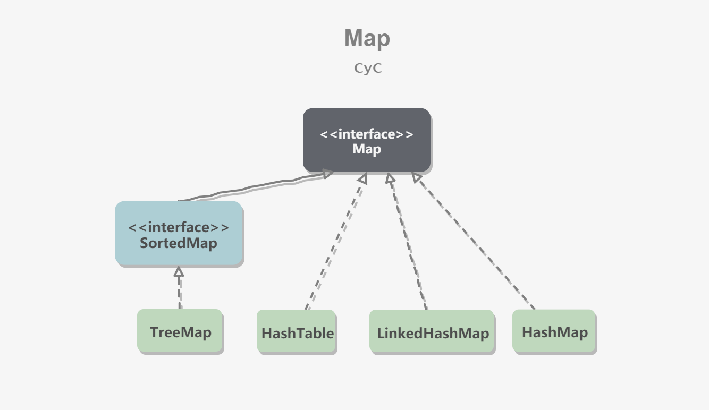


### 如何选择集合？

+ 当需要根据键值对获取元素时，就选择Map接口下的集合。需要排序时选择TreeMap，不需要排序则使用HashMap，保证线程安全则使用ConcurrentHashMap；
+ 当只需要存放元素时，就选择Collection接口下的集合。需要保证元素唯一性就选择Set接口下的集合TreeSet和HashSet，不关心重复就选择List接口下的ArrayList和LinkedList。


### 为什么使用集合？

* 当需要保存一组类型相同的数据时，需要一个容器，但使用数组存储对象有很多弊端。因为在实际开发中，存储数据的类型是多种多样的，所以出现了集合；
* 数组的缺点是一旦声明后，长度就无法改变，同时声明数组也必须指定数据类型，一旦确定后就不法改变，另外，数组存储数据是不提供自定义排序和判重功能的，所以用数组存储数据功能单一不够灵活。


### 线程不安全和安全的集合有哪些？

* **线程不安全的集合：**ArrayList、LinkedList、HashMap、TreeMap、HashSet、TreeSet都不是线程安全的；
* **java.util.concurrent（JUC）包提供的各种并发容器**：
  * **ConcurrentHashMap**：线程安全的HashMap；
  * **CopyOnWriteArrayList**：使用写时复制实现的线程安全的ArrayList，在读多写少的场合性能非常好，远胜于Vector；
  * **ConcurrentLinkedQueue**：使用链表实现的并发队列，可以看成是一个线程安全的LinkedList，是一个非阻塞队列；
  * **BlockingQueue**：阻塞队列接口，JDK通过链表、数组等方式实现了这个接口，非常适合作为数据共享的通道；
  * **ConcurrentSkipListMap**：跳表的实现。底层是一个Map结构，使用跳表的数据结构实现了快速查找。


## Java容器-设计模式

### 迭代器模式

* **是什么？**Java通过Iterator接口实现设计模式中的迭代器，可以对集合进行遍历，但不同集合中的数据结构可能是不相同的，所以存取方式会存在区别。迭代器就是定义了一个统一的接口，并声明了 `hasNext()` 和 `next()` 这两个用于获取数据的方法，具体的实现交由具体的集合去完成。
* **有啥用？**主要是用于遍历集合，特点是安全，因为其可以确保在遍历集合的时候元素不会被更改，一旦被修改，就会抛出异常。

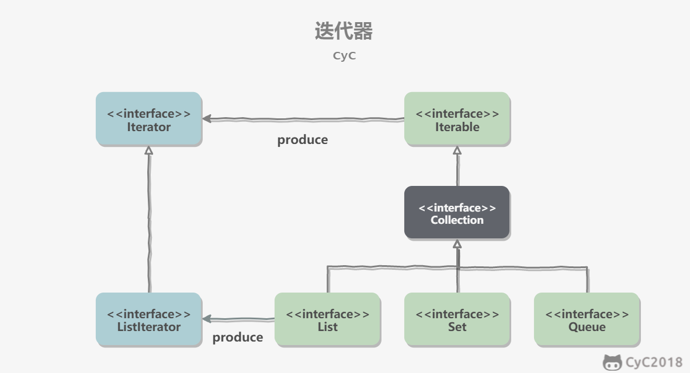


### 适配器模式

* 将一个类的接口转换成客户希望的另外一个接口。适配器模式使得原本由于接口不兼容而不能一起工作的那些类可以一起工作。
* Java中通过 `java.util.Arrays#asList()` 将数组类型转换为List类型。

```JAVA
@SafeVarargs
public static <T> List<T> asList(T... a)
```


## Java容器-List接口

### ArrayList和Vector的区别

* ArrayList是List的主要实现类，底层使用 `Object[]` 存储，适用于频繁的查找工作，线程不安全；
* Vector是List的古老实现类，底层同样使用 `Object[]` 存储，线程安全，效率低，已经不适合使用了。


### ArrayList和LinkedList的区别

* **线程是否安全**：二者皆不同步，不保证线程安全；

* **底层数据结构**：ArrayList使用Object类型数组，LinkedList使用双向链表（JDK1.6之前是双向循环链表，JDK1.7之后取消了循环）；

* **插入和删除是否受元素位置的影响**：

  * ArrayList采用数组存储，所以插入删除的时间复杂度受元素位置影响。如：执行 `add(E e)` 方法的时候，ArrayList会默认将指定元素插入到列表的末尾，时间复杂度是O(1)。但若是要通过 `add(int index, E element)` 在指定位置插入素的话，时间复杂度就是O(n-i)，因为在进行上述操作时集合中第i和第i个元素之后的(n-i)个元素都要执行向后移位的操作；
  * LinkedList采用链表存储，所以对于 `add(E e)` 的插入不受元素位置的影响，近似O(1)。而通过 `add(int index, E element)` 在指定位置i插入元素时，也无需像数组那样移动元素，但需要迭代访问到指定位置。

* **是否支持快速随机访问**：LinkedList不支持高效的随机元素访问，而ArrayList支持。快速随机访问就是通过元素的序号快速获取元素对象的过程，如：`get(int index)`；

* **内存空间占用**：ArrayList的空间浪费主要体现再列表的结尾会预留一定的容量空间，而LinkedList的空间花费则体现在它的每一个元素都需要消耗相对更多个空间（因为除了存放数据还需要存放prev和next指针）。

* **RandomAccess接口**：只有定义没有具体内容的接口，用于标识实现这个接口的类具有随机访问功能。查看 `binarySearch()` 的源码发现，若List实现了RandomAccess接口，说明具有随机访问功能，则调用 `indexedBinarySearch() `方法。若没实现，则调用`iteratorBinarySearc()`，则只能通过迭代去访问。

  ```JAVA
  public static <T> int binarySearch(List<? extends Comparable<? super Tjk list, T key) {
      if (list instanceof RandomAccess || list.size() < BINARYSEARCH_THRESHOLD)
      	return Collections.indexedBinarySearch(list, key);
      else
      	return Collections.iteratorBinarySearch(list, key);
  }
  ```

  ArrayList实现了RandomAccess接口，是因为底层是数组，具有通过下标进行随机访问的功能。而LinkedList没有实现，是因为底层是链表，只有通过迭代访问。

  ```JAVA
  public class ArrayList<E> extends AbstractList<E>
          implements List<E>, RandomAccess, Cloneable, java.io.Serializable
  ```

* **LinkedList存储结构**：

  ```JAVA
  // 基于双向链表，使用Node存储链表节点
  private static class Node<E> {
      E item;
      Node<E> next;	// 前驱指针
      Node<E> prev;	// 后继指针
  }
  
  // 每个链表都维护一对头尾指针
  transient Node<E> first;
  transient Node<E> last;
  ```

  

* **双向链表**：包含两个指针，一个prev指向前一个节点，一个next指向后一个节点。

  

* **双向循环链表**：最后一个节点的next指向head，而head的prev指向最后一个节点，构成一个环形。

  


### ArrayList扩容机制源码分析

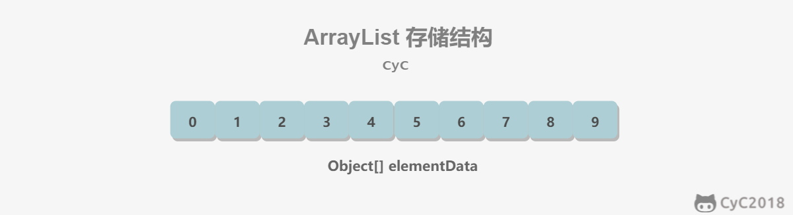

#### 构造方法分析

```JAVA
// 数组的默认大小为10
private static final int DEFAULT_CAPACITY = 10;

// 初始化的空数组
private static final Object[] DEFAULTCAPACITY_EMPTY_ELEMENTDATA = {};

// 使用无参构造方法构造时，默认是一个空数组
public ArrayList() {
    this.elementData = DEFAULTCAPACITY_EMPTY_ELEMENTDATA;
}

// 带指定容量参数的构造方法
public ArrayList(int initialCapacity) {
    if (initialCapacity > 0) {
        // 创建initialCapacity大小的数组
        this.elementData = new Object[initialCapacity];
    } else if (initialCapacity == 0) {
        // 若初始容量被指定为0，则创建空数组
        this.elementData = EMPTY_ELEMENTDATA;
    } else {
        throw new IllegalArgumentException("Illegal Capacity: " + initialCapacity);
    }
}

// 构造包含指定collection元素的列表，这些元素利用该集合的迭代器顺序返回
public ArrayList(Collection<? extends E> c) {
    elementData = c.toArray();
    if ((size = elementData.length) != 0) {
        // c.toArray might (incorrectly) not return Object[] (see 6260652)
        if (elementData.getClass() != Object[].class)
            elementData = Arrays.copyOf(elementData, size, Object[].class);
    } else {
        // replace with empty array.
        this.elementData = EMPTY_ELEMENTDATA;
    }
}
```


#### add方法分析

**添加元素流程**：

* 当add第1个元素，此时 `elementData.length = 0`。执行 `ensureCapacityInternal()` 方法后，因为是默认数组，所以 `minCapacity = DEFAULT_CAPACITY = 10`。接着执行 `ensureExplicitCapacity()` 方法，其中的 `minCapacity - elementData.length > 0` 条件成立。进入 `grow(minCapacity)` 扩容，`elementData.length` 被扩容为10；
* 当add第2个元素，此时 `elementData.length = 10`。执行 `ensureCapacityInternal()` 方法后，因为是扩容后的新数组，所以`minCapacity = 2`。接着执行 `ensureExplicitCapacity()` 方法，其中的 `minCapacity - elementData.length > 0`  条件不成立，所以不会扩容；
* 接下来add的3~10个元素都不会触发扩容，直到第11个元素，`minCapacity = 11` 时（即现有11个元素），大于`elementData.length = 10`（即数组容量10），触发数组的扩容。

**总结**：

* 若不指定容量的情况下，默认创建空数组，长度为0；
* 那么第一次添加元素的时候就会触发扩容；
* 之后添加的元素数量如果达到了数组扩容后的长度，则再次触发扩容。接下来，依次类推。

```JAVA
// 将指定的元素追加到此列表的末尾
public boolean add(E e) {
    // 添加元素之前，先调用ensureCapacityInternal方法
    ensureCapacityInternal(size + 1);
    // ArrayList添加元素的实质就是为数组赋值
    elementData[size++] = e;
    return true;
}

// 得到最小扩容量
private void ensureCapacityInternal(int minCapacity) {
    if (elementData == DEFAULTCAPACITY_EMPTY_ELEMENTDATA) {
        // 获取默认容量和传入参数的较大值
        minCapacity = Math.max(DEFAULT_CAPACITY, minCapacity);
    }
    // 判断是否需要扩容
    ensureExplicitCapacity(minCapacity);
}
    
// 判断是否需要扩容
private void ensureExplicitCapacity(int minCapacity) {
    modCount++;
    // overflow-conscious code
    if (minCapacity - elementData.length > 0)	// 若最小扩容量超过数组现有容量
        // 调用grow方法进行扩容
        grow(minCapacity);
}
```


#### grow方法分析

**扩容流程**：

* 当add第1个元素，进入 `grow()` 方法时，`oldCapacity = 0`，经过 `if (newCapacity - minCapacity < 0) newCapacity = minCapacity`  操作后 `newCapacity = DEFAULT_CAPACITY = 10`，并通过 ``Arrays.copyOf()`` 创建新容量的数组；
* 当add第11个元素，进入 `grow()` 方法时，`oldCapacity = 10`，经过 `newCapacity = oldCapacity + (oldCapacity >> 1)`  操作后 `newCapacity = 15`，并通过  `Arrays.copyOf()`  创建新容量的数组。

**总结**：

* 若需要扩容的是默认的空数组，则直接将容量扩充为默认容量10，然后创建新数组并将旧元素拷贝进来；
* 若需要扩容不是空数组，则将容量扩充为原来的1.5倍，若还不能满足需求，则直接扩充为需要的容量，扩充的最大容量不能超过int类型的最大值-8，最后创建新数组并将旧元素拷贝进来。

```JAVA
// 要分配的最大数组大小
private static final int MAX_ARRAY_SIZE = Integer.MAX_VALUE - 8;

// ArrayList扩容的核心方法
private void grow(int minCapacity) {
    // oldCapacity为旧容量，newCapacity为新容量
    int oldCapacity = elementData.length;
    // 将oldCapacity右移一位，其效果相当于oldCapacity/2
    // 位运算的速度远远快于整除运算，该行代码就是将新容量更新为旧容量的1.5倍
    int newCapacity = oldCapacity + (oldCapacity >> 1);
    // 然后检查新容量是否大于最小需要容量，若还是小于最小需要容量，那么就把最小需要容量当作数组的新容量
    if (newCapacity - minCapacity < 0)
        newCapacity = minCapacity;
    // 如果新容量大于MAX_ARRAY_SIZE，则执行hugeCapacity()方法来比较minCapacity和MAX_ARRAY_SIZE
    // 若minCapacity大于最大容量，则新容量则为Integer.MAX_VALUE
    if (newCapacity - MAX_ARRAY_SIZE > 0)
        newCapacity = hugeCapacity(minCapacity);
    // 创建了一个新容量的新数组，然后将就数组拷贝过去，返回新数组
    elementData = Arrays.copyOf(elementData, newCapacity);
}
    
private static int hugeCapacity(int minCapacity) {
    if (minCapacity < 0) // overflow
        throw new OutOfMemoryError();
    // 若当前数组的容量大于默认的最大容量，则使用int的最大值作为数组的容量，若不大于，则使用默认最大容量
    return (minCapacity > MAX_ARRAY_SIZE) ? Integer.MAX_VALUE : MAX_ARRAY_SIZE;
}
```


## Java容器-Set接口

### Comparable和Comparator的区别

* Comparable接口存在于 `java.lang` 包下，通过 `compareTo(Object obj)` 方法进行排序；
* Comparator接口存在于 `java.util` 包下，通过 `compare(Object obj1, Object obj2)` 方法进行排序。
* 一般需要对集合进行自定义排序时，需要重写 `compareTo()` 或 `compare()` 方法，或将二者结合使用。


**Comparator定制排序**：

```JAVA
public class SortTest {
    
    public static void main(String[] args) {
        ArrayList<Integer> arr = new ArrayList<Integer>();
 		arr.add(-1);
        arr.add(3);
        arr.add(0);
        Collections.sort(arr, new Comparator<Integer>() {
            @Override
            public int compare(Integer o1, Integer o2) {
                return o2.compareTo(o1);
            }
        });
    }
}
```

**Comparable让对象具备可比较性**：

```JAVA
public class Person implements Comparable<Person> {
    
    private String name;
    private int age;
    
    public Person(String name, int age) {
        super();
        this.name = name;
        this.age = age;
    }

    public String getName() {
        return name;
    }

    public void setName(String name) {
        this.name = name;
    }

    public int getAge() {
        return age;
    }

    public void setAge(int age) {
        this.age = age;
    }
	
    @Override
    public int compareTo(Person o) {
        if (this.age > o.getAge()) {
            return 1;
        }
        if (this.age < o.getAge()) {
            return -1;
        }
    }
}
```


### 无序性和不可重复性

* **什么是无序性？**无序性不等于随机性，无序性是指存储的数据在底层数组中并非按照数组索引的顺序添加，而是根据数据的哈希值决定的。
* **什么是不重复性？**不可重复性是指添加的元素按照 `equals()` 判断时，需要返回false，Set集合的不重复性判断需要同时重写`equals()` 方法 `hashCode()`。


### HashSet/LinkedHashSet/TreeSet的区别

* **HashSet**：是Set接口的主要实现类，底层是基于HashMap实现的，无序且不可重复且线程不安全，可以存储null值；
* **LinkedHashSet**：是HashSet的子类，额外维护了链表结构，能够按照元素添加时的顺序遍历；
* **TreeSet**：底层使用红黑树，能够按照添加元素的顺序遍历，排序的方式有自然排序和定制排序。


### HashSet如何检查重复

* 当元素倍add进HashSet中时，会先计算对象的 `hashCode()` 来判断对象加入的位置，同时也会与集合中已存在元素的 `hashCode()` 比较，若没有相同的，则假定对象没有重复出现；
* 但如果发现存在相同 `hashCode()` 的对象，这时会再调用 `equals()` 方法来检查 `hashCode()` 相同的对象是否真的相同，若相同就不允许加入操作。


## Java容器-Map接口

### HashMap和HashTable的区别

* **线程是否安全**：HashMap的非线程安全的。而HashTable保证线程安全，其内部方法都经过了synchronized的修饰；

* **效率**：因为线程安全的问题，HashMap要比HashTable效率更高，HashTable基本是被淘汰了；

* **对null key和null value的支持**：HashMap中null可以作为键，但只能有一个，但可以有多个键对应的值为null。HashTable中如果put的k-v只要有一个null，会抛空指针异常；

* **初始容量大小和每次扩充容量大小的不同**：

  * 创建时如果不指定容量初始值，HashTable默认的初始值大小为11，之后每次扩充，容量变为原来的2n+1。HashMap的默认初始容量是16，之后每次扩容，容量变为原来的2倍；
  * 创建时如果给定了容量初始值，那么HashTable会直接使用给定的大小，而HashMap会将其扩充为2的幂次方大小，即HashMap总是使用2的幂作为哈希表的大小。

* **底层数据结构**：JDK1.8后HashMap在解决哈希冲突时有了较大的变化，当链表长度大于阈值（默认8）时，会将链表转化为红黑树，以此来减少搜索时间。HashTable则没有这样的机制。

* **HashMap指定容量的构造方法源码**：

  ```JAVA
  public HashMap(int initialCapacity) {
      this(initialCapacity, DEFAULT_LOAD_FACTOR);
  }
  
  public HashMap(int initialCapacity, float loadFactor) {
      if (initialCapacity < 0)
      	throw new IllegalArgumentException("Illegal initial capacity: " + initialCapacity);
      if (initialCapacity > MAXIMUM_CAPACITY)
      	initialCapacity = MAXIMUM_CAPACITY;
      if (loadFactor <= 0 || Float.isNaN(loadFactor))
      	throw new IllegalArgumentException("Illegal load factor: " + loadFactor);
      	this.loadFactor = loadFactor;
      	this.threshold = tableSizeFor(initialCapacity);
      }
  }
      
  // 保证了HashMap总是使用2的幂作为哈希表的大小
  static final int tableSizeFor(int cap) {
      int n = cap - 1;
      n |= n >>> 1;
      n |= n >>> 2;
      n |= n >>> 4;
      n |= n >>> 8;
      n |= n >>> 16;
      return (n < 0) ? 1 : (n >= MAXIMUM_CAPACITY) ? MAXIMUM_CAPACITY : n + 1;
  }
  ```


### HashMap和HashSet的区别

HashSet是基于HashMap实现的，除了 `clone()`、`writeObject()`、`readObject()` 外都是直接调用HashMap的方法。

|          HashMap           |              HashSet              |
| :------------------------: | :-------------------------------: |
|       实现了Map接⼝        |            实现Set接⼝            |
|         存储键值对         |            仅存储对象             |
| 调⽤put方法向map中添加元素 |    调⽤add⽅法向Set中添加元素     |
| HashMap使⽤键计算 hashCode | HashSet使⽤成员对象来计算hashCode |


### HashMap的长度为什么是2的幂次方？

为了能让 HashMap存取⾼效，尽量较少碰撞，也就是要尽量把数据分配均匀。我们上⾯也讲到了过了，Hash值的范围值-2147483648到2147483647，前后加起来⼤概40亿的映射空间，只要哈希函数映射得⽐较均匀松散，⼀般应⽤是很难出现碰撞的。但问题是⼀个40亿⻓度的数组，内存是放不下的。所以这个散列值是不能直接拿来⽤的。⽤之前还要先做对数组的⻓度取模运算，得到的余数才能⽤来要存放
的位置也就是对应的数组下标。这个数组下标的计算⽅法是“ (n - 1) & hash ”。（n代表数组⻓度）。这也就解释了 HashMap 的⻓度为什么是2的幂次⽅。

这个算法应该如何设计呢？我们⾸先可能会想到采⽤%取余的操作来实现。但是，重点来了： “取余(%)操作中如果除数是2的幂次则
等价于与其除数减⼀的与(&)操作（也就是说 hash%lengthdehash&(length-1)的前提是 length 是2的n 次⽅；）。 ” 并且 采⽤⼆进制位操作 &，相对于%能够提⾼运算效率，这就解释了 HashMap 的⻓度为什么是2的幂次⽅。  


### HashMap源码分析

#### Jdk1.8之前的HashMap

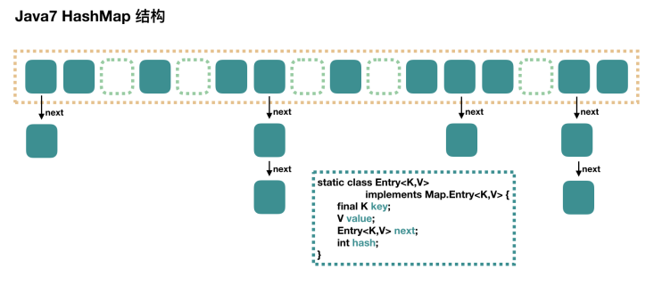

HashMap的底层数据结构是数组和链表的结合使用，即链表散列。HashMap通过key的 `hasCode()` 经过扰动函数处理后得到hash值，然后通过 `(n-1)&hash` 判断当前元素的存放位置（n为数组长度）。如果当前位置存在元素的话，就判断该元素与新元素的key和hash是否相同，若相同则直接覆盖，若不相同则通过拉链法解决冲突。

* **扰动函数**：就是指HashMap的 `hash()` 方法，使用 `hash()` 方法是为了防止一些对象的 `hashCode()` 实现较差，即使用扰动函数减少哈希碰撞；

* **拉链法**：将链表和数组结合后，数组的每一个元素都是一个链表，若遇到哈希冲突的情况，通过 `equals()` 比较是否是相同元素，若不是则将其挂到链表上即可。


#### Jdk1.8之后的HashMap

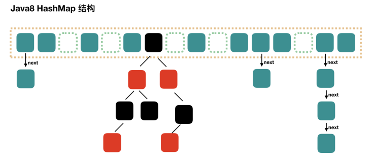

这个版本的HashMap在解决哈希冲突的时候变化较大，当链表的长度大于阈值（默认为8），则会将链表转换为红黑树，以减少搜索时间。在链表转换之前会先判断，当数组的长度小于64，那么会先进行数组的扩容操作，而不是直接转换红黑树。


#### 类的基本属性和构造方法

**基本属性**：

* **loadFactor加载因子**：
  * 用于控制数组存放数据的疏密程度，加载因子越趋近于1，则数组中存放的数据entry就越多越密集，也就是会让链表的长度增加。相反，加载因子越小越趋近于0，数组中存放的数据entry就越少越稀疏；
  * loadFactor太大会导致查找元素效率低，太小会导致数组的利用率低，存放的数据会很分散，官方给出的默认值是0.75f；
  * 源码给出的数组默认容量是16，加载因子是0.75f。当HashMap在使用的过程中不断存放数据，直到数据达到了 `16 * 0.75 = 12` 时就需要将当前的数组进行扩容，扩容的过程则需要进行rehash、数据复制等操作，会产生非常大的消耗。
* **threshold临界值**：`threshold = capacity * loadFactor`，当集合中元素的个数 `size >= threshold` 时，就需要考虑对数组进行扩容。临界值的作用就是衡量数组是否需要扩容的一个标准。

```JAVA
public class HashMap<K,V> extends AbstractMap<K,V> implements Map<K,V>, Cloneable, Serializable {
    // 序列号
    private static final long serialVersionUID = 362498820763181265L;    
    // 默认的初始容量是16
    static final int DEFAULT_INITIAL_CAPACITY = 1 << 4;   
    // 最大容量
    static final int MAXIMUM_CAPACITY = 1 << 30; 
    // 默认的加载因子
    static final float DEFAULT_LOAD_FACTOR = 0.75f;
    // 当桶（bucket）上的结点数大于这个值时链表会转换成红黑树
    static final int TREEIFY_THRESHOLD = 8; 
    // 当桶（bucket）上的结点数小于这个值时红黑树会转换成链表
    static final int UNTREEIFY_THRESHOLD = 6;
    // 桶中结构转化为红黑树时对应的数组的最小大小（即不足64会先扩容数组）
    static final int MIN_TREEIFY_CAPACITY = 64;
    // 存储元素的数组，总是2次幂
    transient Node<k,v>[] table; 
    // 存放具体元素的集合
    transient Set<map.entry<k,v>> entrySet;
    // 存放元素的个数，注意这个不等于数组的长度
    transient int size;
    // 每次扩容和更改map结构的计数器
    transient int modCount;   
    // 临界值，当实际大小（容量*填充因子）超过临界值时，会进行扩容
    int threshold;
    // 加载因子
    final float loadFactor;
}
```

**链表节点类Node源码**：

```JAVA
// 继承自 Map.Entry<K,V>
static class Node<K,V> implements Map.Entry<K,V> {
    
    final int hash;	// 哈希值，存放元素到hashmap中时用来与其他元素的hash值比较
    final K key;	// 键
    V value;		// 值
    Node<K,V> next; // 指向下一个节点
    
    Node(int hash, K key, V value, Node<K,V> next) {
        this.hash = hash;
        this.key = key;
        this.value = value;
        this.next = next;
    }
    
    public final K getKey()        { return key; }
    public final V getValue()      { return value; }
    public final String toString() { return key + "=" + value; }

    // 重写hashCode()方法，即将key和value的hashCode按位异或做为Node的hashCode
    public final int hashCode() {
        return Objects.hashCode(key) ^ Objects.hashCode(value);
    }

    public final V setValue(V newValue) {
        V oldValue = value;
        value = newValue;
        return oldValue;
    }
    
    // 重写equals()方法
    public final boolean equals(Object o) {
        if (o == this)
            return true;
        if (o instanceof Map.Entry) {
            Map.Entry<?,?> e = (Map.Entry<?,?>)o;
            if (Objects.equals(key, e.getKey()) &&
                Objects.equals(value, e.getValue()))
                return true;
        }
        return false;
    }
}
```

**树节点类TreeNode源码**：

```java
static final class TreeNode<K,V> extends LinkedHashMap.Entry<K,V> {
    
    TreeNode<K,V> parent;  // 父节点
    TreeNode<K,V> left;    // 左孩子
    TreeNode<K,V> right;   // 右孩子
    TreeNode<K,V> prev;    // 前驱
    boolean red;           // 判断颜色
    
    TreeNode(int hash, K key, V val, Node<K,V> next) {
        super(hash, key, val, next);
    }
    
    // 返回根节点
    final TreeNode<K,V> root() {
        for (TreeNode<K,V> r = this, p;;) {
            if ((p = r.parent) == null)
                return r;
            r = p;
        }
    }
}
```

**构造方法**：

```JAVA
// 默认构造函数
public HashMap() {
    // 默认加载因子0.75f
    this.loadFactor = DEFAULT_LOAD_FACTOR;	
}

// 包含另一个Map的构造函数
public HashMap(Map<? extends K, ? extends V> m) {
    this.loadFactor = DEFAULT_LOAD_FACTOR;
    putMapEntries(m, false);
}

// 指定容量的构造函数
public HashMap(int initialCapacity) {
    this(initialCapacity, DEFAULT_LOAD_FACTOR);
}

// 指定容量和加载因子的构造函数
public HashMap(int initialCapacity, float loadFactor) {
    if (initialCapacity < 0)
        throw new IllegalArgumentException("Illegal initial capacity: " + initialCapacity);
    if (initialCapacity > MAXIMUM_CAPACITY)
        initialCapacity = MAXIMUM_CAPACITY;
    if (loadFactor <= 0 || Float.isNaN(loadFactor))
        throw new IllegalArgumentException("Illegal load factor: " + loadFactor);
    this.loadFactor = loadFactor;
    this.threshold = tableSizeFor(initialCapacity);
}
```


#### put方法分析


* 首先，对新元素根据hashCode计算数组的位置，若对应位置没有元素，则直接插入；

* 若定位到的数组位置有元素，就和要插入的key进行比较，若key相同就直接覆盖； 

* 若key不同，就判断是否是一个树节点，若是就挂到红黑树上；

* 不是树节点则判断链表长度是否大于等于8，若是则转换为红黑树，若不是则插入链表尾部；

* 最后，集合元素size相应增加，判断是否大于临界值，若大于则会触发扩容。

```java
public V put(K key, V value) {
    return putVal(hash(key), key, value, false, true);
}

final V putVal(int hash, K key, V value, boolean onlyIfAbsent, boolean evict) {
    Node<K,V>[] tab; Node<K,V> p; int n, i;
    // table未初始化或者长度为0，直接进行扩容
    if ((tab = table) == null || (n = tab.length) == 0)
        n = (tab = resize()).length;
    // 通过(n - 1) & hash确定元素该存放在哪个桶中，若桶为空，新结点直接放入桶中，此时该结点是放在数组中的
    if ((p = tab[i = (n - 1) & hash]) == null)
        tab[i] = newNode(hash, key, value, null);
    // 若桶中已经存在元素
    else {
        Node<K,V> e; K k;
        // 比较桶中第一个元素（即数组的节点）的hash值和key值是否和新元素相等
        if (p.hash == hash &&
            ((k = p.key) == key || (key != null && key.equals(k))))
                // 相等则直接覆盖，将第一个元素赋值给e，用e来记录
                e = p;
        // hash值不相等，即key不相等；判断是否为红黑树结点
        else if (p instanceof TreeNode)
            // 是树节点则插入树中
            e = ((TreeNode<K,V>)p).putTreeVal(this, tab, hash, key, value);
        // 不是树节点则为链表结点
        else {
            // 在链表尾部插入结点
            for (int binCount = 0; ; ++binCount) {
                // 到达链表的尾部
                if ((e = p.next) == null) {
                    // 在尾部插入新结点
                    p.next = newNode(hash, key, value, null);
                    // 结点数量达到阈值，转化为红黑树
                    if (binCount >= TREEIFY_THRESHOLD - 1) // -1 for 1st
                        xtreeifyBin(tab, hash);
                    // 跳出循环
                    break;
                }
                // 判断链表中结点的key值与插入的元素的key值是否相等
                if (e.hash == hash &&
                    ((k = e.key) == key || (key != null && key.equals(k))))
                    // 相等，跳出循环
                    break;
                // 用于遍历桶中的链表，与前面的e = p.next组合，可以遍历链表
                p = e;
            }
        }
        // 表示在桶中找到key值、hash值与插入元素相等的结点
        if (e != null) { 
            // 记录e的value
            V oldValue = e.value;
            // onlyIfAbsent为false或者旧值为null
            if (!onlyIfAbsent || oldValue == null)
                //用新值替换旧值
                e.value = value;
            // 访问后回调
            afterNodeAccess(e);
            // 返回旧值
            return oldValue;
        }
    }
    // 结构性修改
    ++modCount;
    // 实际大小大于阈值则扩容
    if (++size > threshold)
        resize();
    // 插入后回调
    afterNodeInsertion(evict);
    return null;
} 
```


#### get方法分析

```JAVA
public V get(Object key) {
    Node<K,V> e;
    return (e = getNode(hash(key), key)) == null ? null : e.value;
}

final Node<K,V> getNode(int hash, Object key) {
    Node<K,V>[] tab; Node<K,V> first, e; int n; K k;
    // 数组不为空/数组长度大于0/对应hash位置的元素不为空
    if ((tab = table) != null && (n = tab.length) > 0 &&
        (first = tab[(n - 1) & hash]) != null) {
        // 对应位置元素的hash和key相等，则直接获取到
        if (first.hash == hash && // always check first node
            ((k = first.key) == key || (key != null && key.equals(k))))
            return first;
        // 若对应位置存在后继节点
        if ((e = first.next) != null) {
            // 若是树节点则从树中获取
            if (first instanceof TreeNode)
                return ((TreeNode<K,V>)first).getTreeNode(hash, key);
            // 否则在链表上迭代获取
            do {
                if (e.hash == hash &&
                    ((k = e.key) == key || (key != null && key.equals(k))))
                    return e;
            } while ((e = e.next) != null);
        }
    }
    return null;
}
```


#### resize方法分析

```JAVA
// 若触发扩容操作，则会将数组容量和临界值扩充为原来的2倍，同时会重新进行hash的分配和桶的移动
final Node<K,V>[] resize() {
    Node<K,V>[] oldTab = table;
    int oldCap = (oldTab == null) ? 0 : oldTab.length；
    int oldThr = threshold;
    int newCap, newThr = 0;
    
    if (oldCap > 0) {
        // 超过最大值就不再扩充
        if (oldCap >= MAXIMUM_CAPACITY) {
            threshold = Integer.MAX_VALUE;
            return oldTab;
        }
        // 没超过最大值，就扩充为原来的2倍
        else if ((newCap = oldCap << 1) < MAXIMUM_CAPACITY && oldCap >= DEFAULT_INITIAL_CAPACITY)
            // 临界值也变为原来的2倍
            newThr = oldThr << 1;
    }
    else if (oldThr > 0) // initial capacity was placed in threshold
        newCap = oldThr;
    else { 
        // signifies using defaults
        newCap = DEFAULT_INITIAL_CAPACITY;
        newThr = (int)(DEFAULT_LOAD_FACTOR * DEFAULT_INITIAL_CAPACITY);
    }
    // 计算新的resize上限
    if (newThr == 0) {
        float ft = (float)newCap * loadFactor;
        newThr = (newCap < MAXIMUM_CAPACITY && ft < (float)MAXIMUM_CAPACITY ? (int)ft : Integer.MAX_VALUE);
    }
    threshold = newThr;
    @SuppressWarnings({"rawtypes","unchecked"})
    Node<K,V>[] newTab = (Node<K,V>[])new Node[newCap];
    table = newTab;
    if (oldTab != null) {
        // 把每个bucket都移动到新的buckets中
        for (int j = 0; j < oldCap; ++j) {
            Node<K,V> e;
            if ((e = oldTab[j]) != null) {
                oldTab[j] = null;
                if (e.next == null)
                    newTab[e.hash & (newCap - 1)] = e;
                else if (e instanceof TreeNode)
                    ((TreeNode<K,V>)e).split(this, newTab, j, oldCap);
                else { 
                    Node<K,V> loHead = null, loTail = null;
                    Node<K,V> hiHead = null, hiTail = null;
                    Node<K,V> next;
                    do {
                        next = e.next;
                        // 原索引
                        if ((e.hash & oldCap) == 0) {
                            if (loTail == null)
                                loHead = e;
                            else
                                loTail.next = e;
                            loTail = e;
                        }
                        // 原索引+oldCap
                        else {
                            if (hiTail == null)
                                hiHead = e;
                            else
                                hiTail.next = e;
                            hiTail = e;
                        }
                    } while ((e = next) != null);
                    // 原索引放到bucket里
                    if (loTail != null) {
                        loTail.next = null;
                        newTab[j] = loHead;
                    }
                    // 原索引+oldCap放到bucket里
                    if (hiTail != null) {
                        hiTail.next = null;
                        newTab[j + oldCap] = hiHead;
                    }
                }
            }
        }
    }
    return newTab;
}
```


### ConcurrentHashMap和HashTable的区别

* **底层数据结构**：JDK1.7的ConcurrentHashMap底层采用分段数组+链表实现，而JDK1.8中则采用和HashMap一样的数组+链表/红黑树的结构。HashTable底层采用数组+链表的形式存储数据，数组是本体，链表解决哈希冲突；

* **实现线程安全的方式**：

  * JDK1.7的时候，ConcurrentHashMap使用分段锁对整个桶数组进行分段（Segment），每个分段分配一把锁，即每把锁只锁定容器中的一部分数据，多线程访问容器中不同数据段的数据，就不会存在全局的锁竞争，使多个段的访问可以并发起来；
  * JDK1.8时的ConcurrentHashMap则摒弃了Segment的概念，直接使用Node数组+链表/红黑树的结构来实现，并发控制使用了synchronized和CAS操作，使其整体看上去就像是优化且线程安全的HashMap；
  * HashTable则直接使用一把全局锁synchronized来保证线程安全，效率低下，当一个线程访问同步方法时，其他线程也访问同步方法，就会进入阻塞或轮询状态，多线程的竞争越激烈效率越低。

* **HashTable结构图**：


* **JDK1.7的ConcurrentHashMap结构图**：

  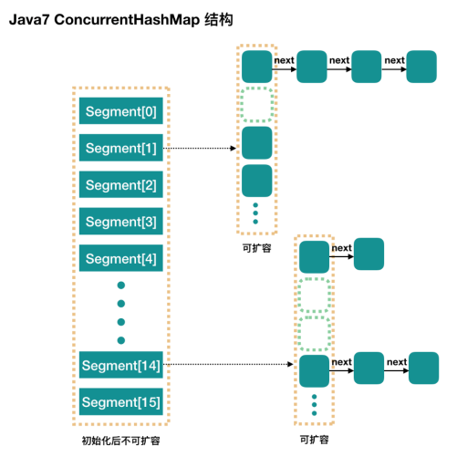

  

* **JDK1.8的ConcurrentHashMap结构图**：


### ConcurrentHashMap源码分析

#### 初始化分析

* 初始化操作通过自旋+CAS完成，变量sizeCtl的值决定着当前的初始化状态；
* 若sizeCtl小于0，证明其他线程正在对其初始化，让出CPU执行权；
* 若sizeCtl不小于0，则使用CAS将sizeCtl修改为-1，表示正在初始化；
* 若当前table没有初始化，则sizeCtl表示table的默认初始化大小；
* 若当前table已经初始化，则sizeCtl表示table的容量。

```java
private final Node<K,V>[] initTable() {
    Node<K,V>[] tab; int sc;
    // 自旋操作，保证初始化成功
    while ((tab = table) == null || tab.length == 0) {
        //　如果sizeCtl < 0，说明有另外的线程CAS操作成功，正在进行初始化
        if ((sc = sizeCtl) < 0)
            // 主动让出CPU的使用权
            Thread.yield();
        else if (U.compareAndSwapInt(this, SIZECTL, sc, -1)) {	// 使用CAS将sizeCtl修改为-1
            try {
                if ((tab = table) == null || tab.length == 0) {
                    int n = (sc > 0) ? sc : DEFAULT_CAPACITY;
                    @SuppressWarnings("unchecked")
                    Node<K,V>[] nt = (Node<K,V>[])new Node<?,?>[n];
                    table = tab = nt;
                    sc = n - (n >>> 2);
                }
            } finally {
                sizeCtl = sc;
            }
            break;
        }
    }
    return tab;
}
```


#### put方法分析

* 根据key计算出HashCode，即获得了桶的位置；
* 判断该位置的桶是否为空，为空则初始化一个桶；
* 若桶内为空，则表示当前位置可用写入数据，使用CAS尝试写入，若失败则自旋保证成功；
* 若当前位置的 `hashCode == MOVED == -1`，则需要进行扩容；
* 如果桶不为空且不需要扩容，则使用synchronized加锁插入数据到链表或红黑树上；
* 若桶内是链表，如果此时数量大于 `TREEIFY_THRESHOLD`，则需要转换为红黑树。

```JAVA
public V put(K key, V value) {
    return putVal(key, value, false);
}

final V putVal(K key, V value, boolean onlyIfAbsent) {
    // key和value不能为空
    if (key == null || value == null) throw new NullPointerException();
    int hash = spread(key.hashCode());	// hash扰动
    int binCount = 0;
    
    for (Node<K,V>[] tab = table;;) {
        // f指目标位置元素，fh后面存放目标位置元素的hash值
        Node<K,V> f; int n, i, fh;
        if (tab == null || (n = tab.length) == 0)
            // 若桶为空，则通过CAS+自旋的方式初始化数组桶（自旋+CAS)
            tab = initTable();
        else if ((f = tabAt(tab, i = (n - 1) & hash)) == null) {
            // 若桶内为空，则通过CAS+自旋的方式插入，成功了就直接break跳出
            if (casTabAt(tab, i, null, new Node<K,V>(hash, key, value, null)))
                break;
        }
        else if ((fh = f.hash) == MOVED)
            // 需要扩容
            tab = helpTransfer(tab, f);
        else {
            V oldVal = null;
            // 使用synchronized加锁插入节点
            synchronized (f) {
                if (tabAt(tab, i) == f) {
                    // 如果是链表执行的操作
                    if (fh >= 0) {
                        binCount = 1;
                        // 循环加入新的或者覆盖节点
                        for (Node<K,V> e = f;; ++binCount) {
                            K ek;
                            if (e.hash == hash &&
                                ((ek = e.key) == key ||
                                 (ek != null && key.equals(ek)))) {
                                oldVal = e.val;
                                if (!onlyIfAbsent)
                                    e.val = value;
                                break;
                            }
                            Node<K,V> pred = e;
                            if ((e = e.next) == null) {
                                pred.next = new Node<K,V>(hash, key,
                                                          value, null);
                                break;
                            }
                        }
                    }
                    else if (f instanceof TreeBin) {
                        // 如果是红黑树执行的操作
                        Node<K,V> p;
                        binCount = 2;
                        if ((p = ((TreeBin<K,V>)f).putTreeVal(hash, key, value)) != null) {
                            oldVal = p.val;
                            if (!onlyIfAbsent)
                                p.val = value;
                        }
                    }
                }
            }
            if (binCount != 0) {
                if (binCount >= TREEIFY_THRESHOLD)
                    treeifyBin(tab, i);
                if (oldVal != null)
                    return oldVal;
                break;
            }
        }
    }
    addCount(1L, binCount);
    return null;
}
```


#### get方法分析

* 根据hash值计算桶的位置；
* 查找到指定位置，如果头节点就是要找的，直接返回其value；
* 如果头节点hash值小于0，说明正在扩容或是红黑树，查找之；
* 如果是链表，遍历查找之。

```java
public V get(Object key) {
    Node<K,V>[] tab; Node<K,V> e, p; int n, eh; K ek;
    // key所在的hash位置
    int h = spread(key.hashCode());
    if ((tab = table) != null && (n = tab.length) > 0 &&
        (e = tabAt(tab, (n - 1) & h)) != null) {
        // 如果指定位置元素存在，头结点hash值相同
        if ((eh = e.hash) == h) {
            if ((ek = e.key) == key || (ek != null && key.equals(ek)))
                // key hash 值相等，key值相同，直接返回元素 value
                return e.val;
        }
        else if (eh < 0)
            // 头结点hash值小于0，说明正在扩容或者是红黑树，find查找
            return (p = e.find(h, key)) != null ? p.val : null;
        while ((e = e.next) != null) {
            // 是链表，遍历查找
            if (e.hash == h &&
                ((ek = e.key) == key || (ek != null && key.equals(ek))))
                return e.val;
        }
    }
    return null;
}
```


### LinkedHashMap源码分析

继承自HashMap，具有和HashMap一样的快速查找特性。

```JAVA
public class LinkedHashMap<K, V> extends HashMap<K, V> implements Map<K, V>
```

内部维护了一个双向链表，用于维护插入顺序或LRU顺序。

```JAVA
/**
 * The head (eldest) of the doubly linked list.
 */
transient LinkedHashMap.Entry<K,V> head;

/**
 * The tail (youngest) of the doubly linked list.
 */
transient LinkedHashMap.Entry<K,V> tail;
```

`accessOrder` 字段决定了顺序，默认为false，表示其维护的是插入顺序。

```java
final boolean accessOrder;
```

**`afterNodeAccess()`**：在get等操作之后执行。当一个节点被访问时，如果字段accessOrder为true，则会将该节点移动到链表尾部。也就是说当指定了LRU顺序后，在每次访问节点时，都会将该节点移动到链表尾部，即保证了链表尾部是最近访问的节点，反之链表的首部就是最久未使用节点。

```JAVA
void afterNodeAccess(Node<K,V> e) { // move node to last
    LinkedHashMap.Entry<K,V> last;
    if (accessOrder && (last = tail) != e) {
        LinkedHashMap.Entry<K,V> p =
            (LinkedHashMap.Entry<K,V>)e, b = p.before, a = p.after;
        p.after = null;
        if (b == null)
            head = a;
        else
            b.after = a;
        if (a != null)
            a.before = b;
        else
            last = b;
        if (last == null)
            head = p;
        else {
            p.before = last;
            last.after = p;
        }
        tail = p;
        ++modCount;
    }
}
```

**`afterNodeInsertion()`**：在put等操作之后执行。当 `removeEldestEntry()` 返回true时会移除最久未使用的节点，即链表首部节点first。

```JAVA
void afterNodeInsertion(boolean evict) { // possibly remove eldest
    LinkedHashMap.Entry<K,V> first;
    if (evict && (first = head) != null && removeEldestEntry(first)) {
        K key = first.key;
        removeNode(hash(key), key, null, false, true);
    }
}
```

**`removeEldestEntry()`**：默认返回false，如果需要让其返回true，需要继承LinkedHashMap并重写该方法实现。

```JAVA
protected boolean removeEldestEntry(Map.Entry<K,V> eldest) {
    return false;
}
```


### LinkedHashMap实现LRU算法

```JAVA
class LRUCache<K, V> extends LinkedHashMap<K, V> {
    
    // 最大缓存空间为3
    private static final int MAX_ENTRIES = 3;
    
    // 调用LinkedHashMap的构造方法，传递最大节点数、负载因子和accessOrder=true（即开启LRU顺序）
    LRUCache() {
        super(MAX_ENTRIES, 0.75f, true);
    }
    
    // 重写removeEldestEntry方法，当执行put操作时，在节点多于MAX_ENTRIES的情况下就会移除最近最久未使用节点
    protected boolean removeEldestEntry(Map.Entry eldest) {
        return size() > MAX_ENTRIES;
    }
}
```


# MySQL+Redis

## MySQL-存储引擎

* **是否支持行级锁**：MyISAM只支持表级锁。而InnoDB支持行级锁和表级锁；
* **是否支持事务和崩溃后的安全恢复**：MyISAM更强调性能，每次查询都具有原子性，执行速度相对于InnoDB更快，但不提供事务的支持。InnoDB则提供事务，且具有提交、回滚和崩溃修复能力的事务安全性表；
* **是否支持外键**：MyISAM不支持，InnoDB支持；
* **是否支持MVCC**：只有InnoDB支持，用于应对高并发的事务，MVCC比单纯的加锁更高效，MVCC只在 `READ COMMITIED` 和 `REPEATABLE READ` 两个隔离级别下工作，且可以使用乐观锁和悲观锁来实现。

|              |   MylSAM   |           InnoDB           |
| :----------: | :--------: | :------------------------: |
|   索引类型   | 非聚簇索引 |          聚簇索引          |
|   支持事务   |     否     |             是             |
|   支持表锁   |     是     |             是             |
|   支持行锁   |     否     |             是             |
|   支持外键   |     否     |             是             |
| 支持全文检索 |     是     |             是             |
| 适合操作类型 | 大量select | 大量insert、delete、update |


## MySQL-索引原理

### MySQL基本存储结构


* MySQL的基本存储结构是基于页式的存储结构；
* 各个数据页之间可以组成一个双向链表；
* 每个数据页中的记录又可以组成一个单向链表：
  * 每个数据页都会为其内部存储的记录创建一个页目录。当通过主键查找某条记录的时候可以在页目录中使用二分查找算法快速定位到对应的槽，然后再遍历该槽对应分组中的记录即可快速找到指定的记录；
  * 若是以其他非主键的列作为搜索条件，则只能从头开始遍历单链表中的每条记录。
* 当提交 `select * from user where name = 'albert';` 这种没有进行任何优化的SQL语句时，默认的执行流程：
  * 首先需要遍历双向链表，定位到记录所在的页；
  * 由于不是根据主键查询，所以只能遍历所在页的单链表查找相应的记录。


### 局部性原理

* **概念**：程序信息在不全部装入主存的情况下就可以保证正常的运行；
* **空间局部性**：程序和数据的访问都有聚集成群的倾向，在一个时间段内，仅使用部分（如数组）；
* **时间局部性**：最近被访问过的程序代码和数据，很快又再次被访问的可能性很大（如循环操作）。


### 磁盘结构/磁盘预读

**磁盘结构**：

* 磁盘是一种能够大量保存数据（GB~TB级别），但读取速度较慢（因为涉及到机器操作，读取速度为ms级）的硬件存储器。

* 磁盘是由**盘片**构成，每个盘片有两个面，称为**盘面**。盘片中央有一个可以旋转的**主轴**，会让盘片以固定的速度旋转（通常是5400rpm或7200rpm），一个磁盘中包含多个这样的盘片并封装在一个密闭的容器中。盘片的每个表面是由一组称为**磁道**的同心圆组成，每个磁道被划分为一组**扇区**，每个扇区包含相等数量的数据位（通常是512byte），扇区之间由一些间隙隔开，这些间隙中不存储数据。


* 磁盘是用**磁头**来读写存储在盘片表面的数据位，而磁头连接到一个**移动臂**上，移动臂沿着盘片半径前后移动，可以将磁头定位到任何磁道上，这被称为寻道操作。一旦定位到磁道后，盘片转动，磁道上的每个位经过磁头时，读写磁头就可以感知和修改该位的值。对磁盘的访问时间分为寻道时间、旋转时间和传送时间。


**磁盘预读**：

* **为什么要预读？**由于存储介质的特性，磁盘本身的存取速度就慢于主存，再加上机械运动的消耗，因此为了提高效率，要尽量减少磁盘IO，减少读写操作。为了达到这个目的，磁盘往往不会严格的按需读取，而是每次都会预读，即使只需要一个字节，磁盘也会从这个位置开始，顺序向后读取一定长度的数据放入内存，这样做的理论依据是计算机科学中著名的局部性原理（时间、空间局部性）。由于磁盘顺序读取的效率很高（不需要寻道，只需要旋转），因此预读可以提高IO的效率。

* **页存储**：页是计算机管理内存的逻辑块，硬件及操作系统往往将主存和磁盘存储区分割为连续的大小相等的块，每个存储块被称为一页（1024字节或其整数倍），预读的长度一般为页的整数倍。主存和磁盘以页为单位交换数据，当程序要读取的数据不在主存中时，会触发一个缺页异常，此时系统会向磁盘发出信号，磁盘会找到数据的起始位置并向后连续读取一页或几页装入内存中，然后异常中断返回，程序继续执行。

* **文件系统结构设计**：文件系统的设计上利用了磁盘预读的原理，将一个结点大小设为等于一个页，这样每个结点只需要一次IO操作就可以完全载入。那么3层的B树可以容纳 `1024*1024*1024` 将近10亿左右的数据，如果使用二叉树类结构来存储，则需要30层的深度。假设操作系统一次读取一个结点，且根结点保留在内存中，那么B树在10亿个数据中查找目标，只需要最大3次的磁盘IO就可以找到目标，但二叉树类结构如红黑树则需要30次以内的磁盘IO，因此B树做为文件系统的底层结构远远优于二叉树。


### 索引基本概念

#### 什么是索引？

* 是帮助数据库高效获取数据的一种数据结构；
* 索引存储在文件系统中；
* 索引的文件存储形式和存储引擎有关；
* 索引文件的结构通常为哈希表或B+树等。


#### 为什么使用索引？

* 可以大幅加快数据的检索速度，即大幅减少检索的数据量；
* 帮助服务器避免排序和临时表；
* 将随机IO变为顺序IO；
* 加快表和表之间的连接，在实现数据的参照完整性方面有意义。


#### 为什么不对表中的每列都创建索引呢？

* **动态维护**：当表中的数据进行增加、删除和修改时，索引也会动态维护，就降低了数据的维护速度；
* **额外空间占用**：索引需要占用额外的物理空间，除了数据表需要占用数据空间，每一个索引还要占一定的物理空间，如果要建立聚簇索引，那么需要的空间就会更大；
* **时间消耗**：创建索引和维护索引要耗费时间，这种时间随着数据量的增加而增加。


#### 索引的分类

* **主键索引**：唯一性索引，每个表只能有一个；
* **唯一索引**：索引列中的值只能出现一次，即必须唯一，但值可以为空；
* **普通索引**：基本的索引类型，值可以为空，没有唯一性的限制；
* **全文索引**：FULLTEXT类型的索引，可以在varchar、char和text类型的列上创建；
* **组合索引**：由多个列组成的索引，专门用于组合搜索。


### MySQL索引结构的选择

#### 为什么不使用哈希表？


* 需要将数据文件添加到内存中，耗费内存空间；
* 如果所有的查询都是等值查询，哈希表的性能会很高，但实际生产环境下范围查询的情况非常多，这时哈希表就不太合适了。


#### 为什么不使用二叉树/红黑树？

一棵树结构在极端的情况下（如：元素有序的被插入），会退化为链表，导致树的查询优势不复存在。


二分查找树/红黑树都是二叉树，每个节点最多只能有两个子节点，在特殊情况下都会导致树的深度过深而造成IO次数变多，影响数据的查询效率。并且红黑树为了保证平衡的旋转操作也会影响整体的效率。


#### 为什么不使用B树？

**B树的特点**：是所有键值分布在整棵树中。一次搜索有可能在非叶子节点就会结束，在关键字全集内做一次查找，性能接近二分查找。每个节点最多拥有m棵子树。

* 根节点至少拥有2棵子树；
* 分支节点至少拥有m/2棵子树（分支节点就是除根节点和叶子节点外的节点）；
* 所有叶子节点都在同一层，每个分支节点最多可以拥有m-1个key，并且以升序排序。

**B树索引原理**：每个结点占用一页（InnoDB是16kb），一个结点上有**2个升序排序的键值+对应数据记录+3个指向子树根节点的指针**，指针存储的是子节点所在页的地址。如下图所示，2个键值划分成的3个范围域对应3个指针指向的子树的数据范围域。以根节点为例，关键字为16和34，P1指针指向的子树数据范围小于16，P2指针值指向的子树数据范围为16~34，P3指针指向的子树的数据范围大于34。


**B树索引根据关键字28查找记录的过程**：

1. 根据根结点找到磁盘块1，读入内存（磁盘IO第1次）；
2. 比较出关键字28在（16，34）区间内，获取磁盘块1的P2指针；
3. 根据P2指针找到磁盘块3，读入内存（磁盘IO第2次）；
4. 比较出关键字28在（27，29）区间内，获取磁盘块3的P2指针；
5. 根据P2指针找到磁盘块8，读入内存（磁盘IO第3次）；
6. 在磁盘块8中的关键字列表中找到关键字28，并读取其对应的记录。

**缺点**：每个结点都有键值和其对应的记录，但每个页存储空间是有限的，如果记录比较大的话会导致每个结点存储的键值数量变小。当结点存储的数据量很大时会导致树的深度加深，即会增大查询时磁盘IO的次数，进而影响查询性能。


### B+树索引原理

#### B+树索引结构

**B+树索引和B树索引的区别**：B+Tree的分支结点不会再包含记录而是包含更多的键值和指针，这样做是为了降低树的高度以减少磁盘的IO次数，同时也能将数据的范围细分为更多的区间，区间越多，检索速度越快。

* B+Tree结构的索引只有叶子结点包含记录，分支结点只包含键值和指针；
* 叶子结点之间通过指针相互连接（符合磁盘预读的特性），使顺序查询性能更高。
* B+Tree上有两个头指针，一个指向根结点，另一个指向键值最小的结点，且所有叶子结点构成了一个环形链表结构。因此可以对B+Tree进行两种查找操作，一种是根据主键进行范围查找和分页查找，另一种就是从根结点开始进行随机查找。


#### InnoDB引擎实现的B+树索引

**聚簇索引**：InnoDB的文件存储方式是索引和数据存放在同一个文件中，所以叶子节点中之间包含数据记录（只有通过主键建立的索引才是聚簇索引）。InnoDB默认通过B+Tree结构对主键创建索引，然后叶子节点中存储记录，如果不存在主键，则会选择唯一键，如果没有唯一键，那么会生成一个6位的row_id来作为索引。


**回表**：如果是由其他字段创建的索引，那么在叶子节点中存储的是其对应记录的主键，之后再根据主键去主键索引中获取记录，这个步骤称为回表。这种通过其他字段创建的索引是非聚簇索引。


#### MyISAM引擎实现的B+树索引

**非聚簇索引**：MyISAM的文件存储方式是索引和数据分开存放为两个文件，B+Tree中叶子结点包含的是数据记录的地址。


### 使用索引的注意事项

* 在经常需要搜索的列上创建索引，可以加快搜索的速度；
* 在经常使用在 `where` 上的列创建索引，加快条件的判断速度；
* 在经常需要排序的列上创建索引，因为索引会完成排序，这样查询可以利用索引的排序，加快排序查询的时间；
* 对于中大型表来说索引都是非常有效的，但是特大型表的话维护开销会很大，不适合创建索引；
* 在经常使用在 `join` 上的列使用，这些列主要是一些外键，可以加快 `join` 的速度；
* 避免在 `where` 子句中对字段使用函数，这会造成索引无法命中；
* 在InnoDB中使用与业务无关的自增主键，而不要使用业务主键；
* 删除长期未使用的索引，不使用的索引会造成不必要的性能损耗；

* 选择索引和编写利用这些索引的原则：

  * 单行访问速度很慢，如果服务器从存储器中读取一个数据块只是为了获取其中一行，那么就浪费了很多工作，最好的情况是读取的块中能包含尽可能多的所需行，提高效率；
  * 按顺序访问范围数据是很快的，是因为顺序IO不需要多次磁盘寻道，所以比随机IO要快很多，还有就是如果服务器能够按需要的顺序读取数据，就不再需要额外的排序操作；
  * 使用**索引覆盖**查询效率是很高的，即如果一个索引包含了查询所需的所有列，那么存储引擎就不需要再回表查找需要的行。


### 最左前缀匹配原则

**概念**：MySQL可以为多个列按照一定的顺序建立联合索引，如：User表的nam和city字段添加联合索引 `(name, city)`。所谓的最左前缀原则是如果查询时查询条件精确匹配索引左边的连续一列或几列，则可以命中索引。

* 若查询的时候两个条件都被使用，但是顺序不同，那么查询引擎可以根据联合索引的顺序进行优化，使查询能够命中索引；
* 根据最左前缀匹配原则，再创建联合索引时，索引字段的顺序需要考虑字段值去重后的个数，较多的放在前面，ORDER BY子句也遵循此规则。

```sql
--可以命中索引
select * from user where name='albert' and city='hz';
--可以命中索引
select * from user where name='ablert';
--无法命中索引
select * from user where city='hz';
```


## MySQL-事务原理

### 事务的四大特性

* **原子性（Atomicity）**：事务是最小的执行单位，不允许分割。事务的原子性确保事务中的操作要么全都完成，要么都不完成；
* **一致性（Consistency）**：执行事务前后，数据保持一致，多个事务对同一个数据读取的结果是相同的；
* **隔离性（Isolation）**：并发访问数据库时，一个用户的事务不被其他事务所干扰，各个并发事务之间的数据库是独立的；
* **持久性（Durability）**：一个事务被提交之后，其对数据库中数据的改变是持久的，即使数据库发生故障也不应该对其有任何影响。


### 事务并发带来的问题

* **脏读（Dirty Read）**：一个事务读取到了另一个事务未提交的数据。事务B在执行过程中修改了数据X，在未提交之前，事务A读取了X，而事务B却回滚了，这时事务A读取的X就是脏数据，就形成了脏读的现象。即当前事务读到的是其他事务想要修改但没有修改成功的数据。脏读的本质就是因为操作完数据后就立即释放了锁，导致读数据的一方可能读取的是无用或错误的数据。
* **丢失更新（Lost to modify）**：两个事务同时进行更新，后一个事务的更新覆盖了前一个事务的更新。丢失更新是数据没有保证一致性导致的，如：事务A修改了一条记录，事务B在事务A提交之后也进行了一次修改并且提交，当事务A查询的时候，会发现刚才修改的内容没有被正确体现，好像更新丢失了一样。
* **不可重复读（Unrepeatableread）**：一个事务读取到另一个事务修改（update操作）成功的数据。事务A首先读取数据X，在执行接下来的逻辑前，事务B将数据X修改并提交了，然后事务A再次读取时发现前后两次读到的数据不匹配，这种情况就是不可重复读。即同一事务前后两次读取间隔存在数据已被其他事务修改的情况，导致前后不匹配。
* **幻读（Phantom Read）**：一个事务读取到另一个事务插入或删除（insert或delete操作）成功的数据。事务A首先根据条件获得了N条数据，然后事务B增加或删除了M条符合A查询条件的数据，从而导致事务A再次查询发现有N+M或N-M条数据，就产生了幻读。即同一事务前后两次读取存在前一次和后一次读出的数据集不一致的情况，导致前后不匹配。


### 事务的隔离级别

* **读未提交（Read uncommitted）**：会出现脏读、不可重复读、幻读。
* **读已提交（Read committed）**：会出现不可重复读、幻读。
  * **避免脏读**：将释放锁的位置调整到事务提交之后，在事务提交之前，其他任何用户都无法对数据进行操作。
* **可重复读（Repeatable read）**：会出现幻读。
  * **避免不可重复读**：Read committed是语句级别的快照，每次读取的数据都是最新版本，所以会出现被其他事务影响的情况。Repeatable read则通过事务级别的快照，每次读取的数据都是当前事务的版本，即使数据被修改了，本次操作也只会读取当前快照的版本。
  * **如何避免幻读？**：MySQL的Repeatable read隔离级别+GAP间隙锁就可以处理幻读。
* **可串行化（Serializable）**：事务串行化，避免所有并发的问题。


## MySQL-锁原理

### 锁机制概述

从锁的粒度可以将MySQL的锁分为表锁和行锁：
* **表锁**：开销小，加锁快。不会出现死锁。锁定粒度大，发生锁冲突的概率高，并发度低；
* **行锁**：开销大，加锁慢。会出现死锁。锁定粒度小，发生锁冲突的概率高，并发度高。

InnoDB支持表锁和行锁，MyISAM仅支持表锁。InnoDB只有通过索引条件检索数据才使用行级锁，否则将使用表锁，即InnoDB的行锁是基于索引的。


### 什么是表锁？

* MySQL的表锁分为表读锁（Table Read Lock）和表写锁（Table Write Lock）；
* 二者遵循读锁共享，写锁互斥的原则。即读读操作不阻塞，读写操作阻塞，写写操作阻塞：
  * 读读不阻塞：当前用户在对表进行读操作时不会加锁，其他用户也可以对该表进行读操作；
  * 读写阻塞：当前用户在对表进行读操作时会加锁，其他用户不能对该表进行写操作，反之亦然；
  * 写写阻塞：当前用户在对表进行写操作时会加锁，其他用户页不能对该表进行写操作。


### 什么是行锁？

* **分类**：MySQL的行锁分为共享锁（S锁）和排他锁（X锁）；
* **共享锁**：允许一个事务去读取一行，阻止其他事务获得相同数据集的排他锁，但依然可以获得共享锁。共享锁也叫做读锁，指多个用户可以同时读取同一个资源，但不允许其他用户修改；
* **排他锁**：只允许获得锁的事务操作数据，会阻止任何其他事务获取相同数据集的共享锁和排他锁。排他锁也叫做写锁，会阻塞其他的写锁和读锁。


### MVCC

* **MVCC（Multi-Version Concurrency Control）多版本并发控制**：可以简单的认为是行锁的一个升级，事务的隔离就是通过锁机制来实现的。
* **快照**：表锁中读写操作是阻塞的，基于提升并发性能的考虑，MVCC一般读写是非阻塞的。即通过一定机制生成一个数据请求时间点的一致性数据快照（Snapshot），并用这个快照来提供一定级别（语句级或事务级）的一致性读取。从用户的角度来看，就像是数据库可以提供同一数据的多个版本。
  * **语句级别快照**：对单条语句操作的数据生成请求时间点的一致性快照，如：读已提交隔离级别。
  * **事务级别快照**：对一个事务操作的数据生成请求时间点的一致性快照，如：可重复读隔离级别。


### 悲观锁和乐观锁

* **悲观锁**：是一种基于悲观的态度来防止并发带来数据冲突的加锁机制，所谓悲观是认为并发冲突一定会发生，所以在数据被操作前就将其锁住，然后再对数据进行读写，在释放锁之前任何人都不能对数据进行操作。数据库本身的锁机制都是悲观锁机制。
* **乐观锁**：对数据的冲突保持乐观的态度，操作时不会对数据进行加锁，使得多个任务可以并行。只有在数据提交时才通过一种机制验证数据是否存在冲突，一般的实现方式是通过加版本号对比的方式实现。如：数据表多加一个version字段，每次修改前先查询，获取修改前的版本号，提交修改操作时添加version的判断，若版本不同则表示会发生冲突，版本相同则在修改后升级版本。


### 间隙锁GAP

* **概念**：当通过范围条件检索数据而不是相等条件检索数据，并请求共享或排他锁时，InnoDB会给符合范围条件的已有数据记录的索引项加锁。对于未来可能存在的符合条件范围的但此时并不存在的记录（被称为间隙GAP），InnoDB也会对这个间隙加锁，这种锁机制就是间隙锁（间隙锁只会在可重复读这种隔离级别下使用）。

* **例子**：在索引记录之间、之前和之后的区间加上GAP锁。

  ```SQL
  SELECT c1 FROM t WHERE c1 BETWEEN 10 and 20 FOR UPDATE;
  ```

  间隙锁GAP对 `c1<10`、`c1=10~20` 和 `c1>20` 这3种情况都会加锁，在当前事务持有锁的过程中，任何其他事务都不能针对以上3种情况做操作，保证了当前事务多次范围查询时前后结果的一致，即解决了幻读问题。


### 死锁解决

* **以固定的顺序访问表和行**：如对两个job批量更新的情形，简单的方法是对id列表先排序，后执行。这样就避免了交叉等待锁的情形。将两个事务的SQL顺序调整为一致，能避免死锁；
* **将一个大的事务拆为小的事务**：操作资源的范围越窄越不容易发生死锁；
* **降低隔离级别**：如果业务允许，将隔离级别调低也是较好的选择，比如将隔离级别从可重复读调整为读已提交，可以避免掉很多因为GAP锁造成的死锁；
* **为表添加合理的索引**：添加索引将会为表的每一行记录上锁，死锁的概率大大增加。


## Redis-线程模型

### 文件事件处理器概述

**文件事件处理器（file event handler）**是单线程的，所以Redis才叫做单线程的模型。其采用了IO多路复用机制同时监听多个Socket，根据Socket上就绪的事件来选择对应的事件处理器进行处理。

* 文件事件处理器的结构包含多个Socket、IO多路复用器、文件事件分派器和事件处理器（连接应答处理器、命令请求处理器、命令回复处理器）；

* 多个Socket可能会并发产生不同的操作，每个操作对应不同的文件事件，但是IO多路复用器会监听多个Socket，并将Socket产生的事件放入队列，事件分派器每次从队列中取出一个事件，把该事件交给相应的事件处理器进行处理。


### 客户端与Redis的通信过程

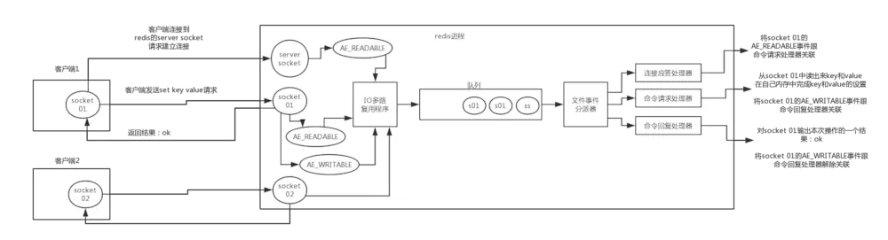

* **建立连接**：客户端通过Socket01向Redis的Server Socket请求建立连接，Server Socket会产生一个 `AE_READABLE` 事件，多路复用器监听到Server Socket产生的事件后，将该事件入队。文件事件分派器从队列中获取该事件，交给连接应答处理器。连接应答处理器会创建一个与客户端通信的Socket01，并将该Socket01的 `AE_READABLE` 事件与命令请求处理器关联；
* **命令请求**：客户端发送了一个 `set key value` 请求，Redis的Socket01会产生 `AE_READABLE` 事件，多路复用器将事件入队，事件分派器从队列中获取到该事件，由于Socket01的 `AE_READABLE` 事件已与命令请求处理器关联，因此事件分派器直接将事件交给命令请求处理器。命令请求处理器读取Socket01的 `key value` 并在内存中完成设置。操作完成后，它会将Socket01的 `AE_WRITABLE` 事件与命令回复处理器关联；
* **结果响应**：若客户端准备好接收返回结果了，那么Redis的Socket01会产生一个 `AE_WRITABLE` 事件并由多路复用器入队，事件分派器找到相关联的命令回复处理器，由其对Socket01输入本次操作的结果（如 `ok`），然后解除Socket01的 `AE_WRITABLE` 事件与命令回复处理器的关联。


### 为什么Redis单线程模型也能效率这么高？

* 纯内存操作；
* 核心是基于非阻塞的IO多路复用机制；
* 单线程反而避免了多线程的频繁上下文切换问题。


## Redis-数据结构和使用场景

### RedisDb数据结构

* Redis默认情况下有16个数据库；
* Redis的一个数据库对应一个redisDb结构；
* redisDb中的dict字典字段维护了一个被封装HashTable，即dictht；
* dictht存储dictEntry类型的元素，若是不同的dictEntry哈希定位到了同一个位置，则通过dictEntry的next指针构成链表；
* redisObject中维护了元素的各种特性，如：类型指针、编码、LRU和引用计数器等。


### String

* 底层使用二进制安全的字节数组存储。
* **字符串操作**：
  * 分布式锁（`SETNS key:value)`）；
  * 集群Session共享；
  * 小文件存储（存储图片的二进制流）；
  * 对象缓存（JSON序列化后 `SET key:value`）。
* **数值操作**：
  * 秒杀（缓存内实时扣减商品数量）；
  * 限流（信号量）；
  * 计数器（文章阅读量 `INCR key:value`）；
  * 分布式全局id。
* **位图操作（二进制操作）**：
  * 统计任意时间窗口内用户的登录次数：
    * 用户id做为key，日期做为offset，一年的天数设置为365个二进制位（0~364），用户在某天上线则将该天对应的二进制位置为1；
    * 要统计任意时间窗口内用户的登录天数只要使用 `bitcount user_id 0 364` 命令统计二进制位1的出现次数即可。
  * OA系统中各个用户对应的不同模块所具有的权限；
  * 用户是否参加过某次活动、是否已读过某篇文章、是否是注册会员；
  * 布隆过滤器。


### List

* List是一个按插入时间排序的数据结构，底层通过QuickList（维护双向链表结构）和ZipList（存储数据）两个结构体实现；
* 可以实现栈（`LPUSH+LPOP`）、双端队列（`LPUSH+RPOP/RPUSH+LPOP`）、数组（正负索引）、阻塞队列（`LPUSH+BRPOP`）和进行范围截取操作（`LRANGE key start end`）；
* 数据的共享、迁出和粉丝列表、文章评论列表；
* **微博和微信公众号的消息流**：
  * 用户关注的用户发微博：`LPUSH msg:{userId} {msgId}`；
  * 用户查看最新的微博消息：`LRANGE msg:{userId} 0 5`。

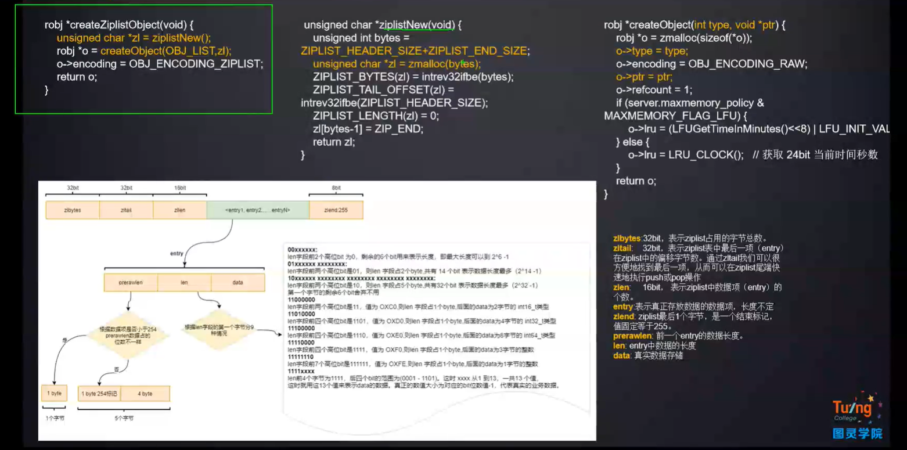

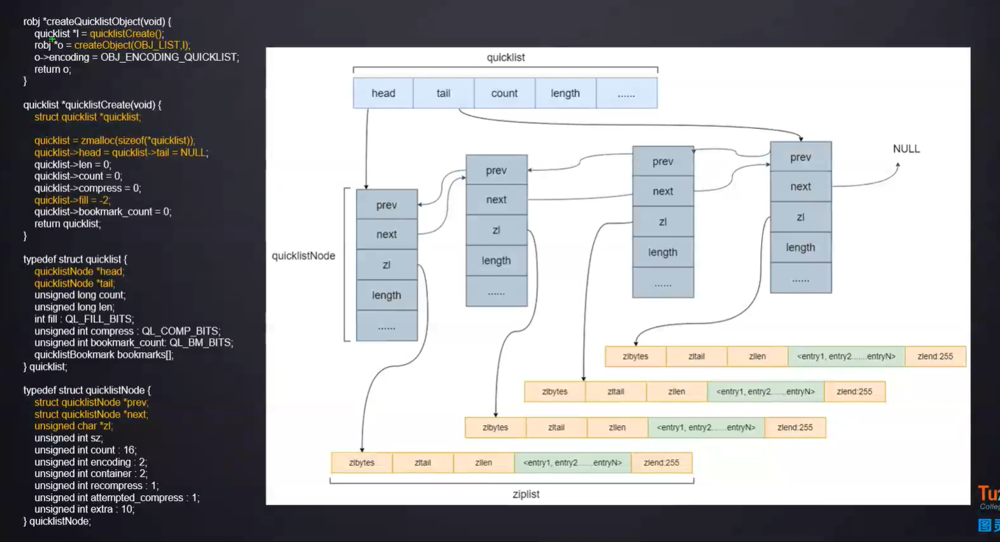


### Hash

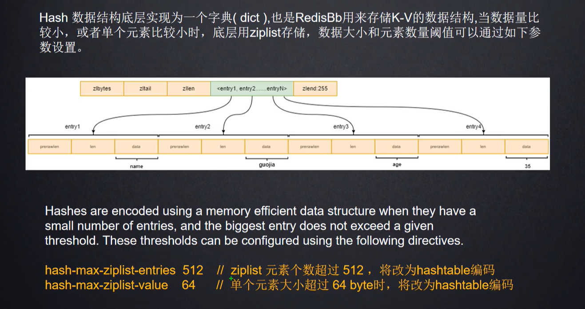

* 底层使用存储K-V对的字典结构；
* 存储结构化数据：对象缓存 `HMSET key field:value `；
* 好友/关注列表：用户id做为key，field为所有好友id，value为对应的关注时间；
* 用户维度统计：用户id为key，不同的统计维度为field，对应的统计数据为value；
* **电商购物车**（用户id为key，商品id为field，商品数量为value）：
* 添加商品：`HSET cart:1001 10088 1`；
  * 增加数量：`HINCRBY cart:1001 10088 1`；
  * 商品总数：`HLEN cart:1001`；
  * 删除商品：`HDEL cart:1001 10088`；
  * 获取购物车中所有商品：`HGETALL cart:1001`。
* **优点**：
* 同类数据归类整合存储，方便数据管理；
  * 相比于String操作消耗的内存和CPU更小；
  * 相比于String更节省空间。
* **缺点**：
  * 过期功能不能使用在field上，只能使用在key上；
  * Redis集群下不适合大规模使用。


### Set

* 底层使用无序且唯一的哈希表存储；
* **抽奖**：
  * 用户参与抽奖：`SADD key {userId}`；
  * 查看参与抽象的所有用户：`SMEMBERS key`；
  * 随机抽取指定数量的中奖用户（放回/不放回）：`SRANDMEMBER key [count]/SPOP key [count]`。
* **微博点赞、收藏、标签**：
  * 点赞操作：`SADD like:{msgId} {userId}`；
  * 取消点赞：`SREM like:{msgId} {userId}`；
  * 检查用户是否已经点过赞了：`SISMEMBER like:{msgId} {userId}`；
  * 获取所有点赞的用户：`SMEMBERS like:{msgId}`；
  * 获取点赞的用户数：`SCARD like:{msgId}`。
* **微博/微信关注模型**：
  * 用户和好友的公共关注（交集）：`SINER userSet friendSet1`；
  * 我关注的人也关注他：`SISMEMBER friendSet1 friendSer2`；
  * 推荐给用户的好友（差集）：`SDIFF userSet friendSet1`。
* **电商商品按各维度标签筛选（交集）**：
  * `SADD brand:huawei P30`；
  * `SADD brand:xiaomi RedMi 8`；
  * `SADD brand:iPhone iPhone X`;
  * `SADD CPU:Intel P30 RedMi 8`；
  * `SADD OS:Android P30 RedMi 8`；
  * `SADD RAM:8G P30 RedMi 8 iPhone X`；
  * `SINTER OS:Android CPU:Intel RAM:8G`。


### Sorted Set

* 底层使用带分值排序的压缩表/跳表存储；

* **微博新闻排行榜**：

  * 点击新闻：`ZINCRBY hotNews:20201211 1 xxx`；

  * 展示当日排行Top10：`ZREVRANGE hotNews:20201211 0 9 WITHSCORES`；
  * 计算近七日的排行榜（并集）：`ZUNIONSTORE hotNews:20201205-20201211 7 hotNews:20201205 ... hotNews:20201211`；
  * 展示近七日排行Top10：`ZREVRANGE hotNews:202005-20201211 0 9 WITHSCORES`。

* **微博动态翻页**：
  
  * 每条微博做为元素，对应的发布时间戳做为分值； 
  * 通过 `zrevrange key start stop` 逆序获取最新发布的微博n条。如果在翻页时微博出现新的动态，有序集合也会动态的重新排序。
  
* **延迟队列**：

  * 当前时间戳+需要延迟的时长做为score，消息内容做为元素；
  * 使用ZADD生产消息，消费者使用ZRANGEBYSCORE获取当前时间之前的数据做轮询处理，消费完后删除。
  
* **跳表**：是一种基于链表的数据结构，在数据层的基础上额外添加了多个索引层。使得查询数据时可以跳过某些节点，减少迭代次数。

  

  * **查询**：如查询元素11，先从最上层的索引层出发，到达5，发现下一个元素是13，大于11，则不会next而是进入下一层查找。下一层的下一个是9，next向后，下一个是13大于11则再次进入下一层，向后找到11。查找的时间复杂度是 `O(logN)`。

  

  * **插入**：插入的时候，首先要进行查询，然后从最底层开始，插入被插入的元素。然后看看从下而上，是否需要逐层插入。可是到底要不要插入上一层呢？我们都知道，我们想每层的跳跃都非常高效，越是平衡就越好（第一层1级跳，第二层2级跳，第3层4级跳，第4层8级跳）。但是用算法实现起来，确实非常地复杂的，并且要严格地按照2地指数次幂，我们还要对原有地结构进行调整。所以跳表的思路是抛硬币，听天由命，产生一个随机数，50%概率再向上扩展，否则就结束。这样子，每一个元素能够有X层的概率为0.5^(X-1)次方。反过来，第X层有多少个元素的数学期望大家也可以算一下。
  * **删除**：同插入一样，删除也是先查找，查找到了之后，再从下往上逐个删除。比较简单，就不再赘叙。


## Redis-过期策略和内存淘汰机制

### 过期策略

* **定性删除**：Redis默认每隔100ms就随机抽取一些设置了过期时间的key，并检查其是否过期，如果过期就删除。所谓的随机抽取就是为了避免大数据量下顺序遍历带来的性能消耗。
* **惰性删除**：定期删除可能会导致很多过期key到了时间却没有被删除，所以就引入了惰性删除。所谓的惰性删除就是过期却没被定性删除的key等到再次被访问的时候删除。

* **内存淘汰**：如果定性删除漏掉了很多的key，这些key也没有被及时的访问，无法惰性删除。此时可能会有大量的key堆积在内存中，导致Redis的内存块耗尽。所以就引入了内存淘汰机制来解决这个问题。


### 内存淘汰机制

当内存不足以容纳新写入的数据时，Redis的数据淘汰策略：
* **volatile-lru**：在设置了过期时间的键空间中选择最近最少使用的key淘汰；
* **volatile-ttl**：在设置了过期时间的键空间中选择将要过期的key淘汰；
* **volatile-random**：在设置了过期时间的键空间中随机选择key淘汰；
* **allkeys-lru**：在键空间内选择最近最少使用的key淘汰；
* **allkeys-random**：在键空间内随机选择key淘汰；
* **no-eviction**：使写入操作报错。
* **volatile-lfu**：在设置了过期时间的键空间中选择最不经常使用的key淘汰（4.0版本新增）；
* **allkeys-lfu**：在键空间中选择最不经常使用的key淘汰（4.0版本新增）。


## Redis-持久化机制

所谓的持久化就是将内存中的数据写入磁盘中，大部分原因是为了之后重用数据（如重启机器或机器故障之后恢复数据），或者是为了防止系统故障而将数据备份到一个远程位置。

### 快照持久化（RDB）

* 即通过创建快照的方式来获得内存中的数据在某个时间点上的副本。Redis创建快照之后，可以对快照进行备份，可以将快照复制到其他服务器从而创建具有相同数据的服务器副本（Redis主从结构），还可以将快照留在原地以便服务器重启后恢复数据。
* RDB是Redis采用的默认持久化方式，在redis.conf文件中配置：
  * `save 900 1` 在900秒即15min后，如果至少有1个key发生了变化，Redis就会自动触发BGSAVE命令创建快照；
  * `save 300 10	` 在300秒即5min后，如果至少有10个key发生了变化，Redis就会自动触发BGSAVE命令创建快照；
  * `save 60 10000` 在60秒即1min后，如果至少有10000个key发生了变化，Redis就会自动触发BGSAVE命令创建快照。
* **RDB的优缺点**：


### 只追加文件（AOF）

* AOF持久化方式的本质就是写命令日志，当Redis每执行一条会更改数据的命令时，就会将该命令写入硬盘中的AOF文件。每当服务器重启后，就将AOF中的命令重新执行一遍以还原内存状态。
* Redis默认不开启AOF，可以通过添加参数 `appendonly yes` 开启。
* 在Redis的配置文件中存在三种不同的AOF持久化方式：
  * `appendfsync always`：每次有数据修改发生时都会写入AOF文件，但这样会严重影响性能；
  * `appendfsync everysec`：每秒同步一次，显示的将多个写命令同步到硬盘。为了兼顾数据和性能，可以选择该选项，让Redis每秒同步一次AOF文件，Redis的性能不会受什么大影响，而且即使出现了系统崩溃，用户最多也只会丢失一秒内产生的数据；
  * `appendfsync no`：让系统决定何时进行同步。
* **AOF的优缺点**：


### Redis4.0的混合持久化策略

* 通过配置项 `aof-use-rdb-preamble` 开启RDB和AOF的混合持久化。
* 如果混合持久化被开启，则AOF重写的时候就直接把RDB的内容写到AOF文件开头。这样做的好处是可以结合RDB和AOF的优点，快速加载同时避免丢失过多的数据。缺点就是AOF文件中的RDB部分是压缩格式存储的，可读性较差。
* **AOF重写**：
  * 重写机制可以产生一个新的文件，这个新AOF文件和原有的AOF文件所保存的数据库状态一样，但体积更小；
  * 该功能其实是通过读取数据库中的键值对来实现的，程序无须对现有的AOF文件进行任何的读取、分析和写入操作；
  * 在执行 `BGREWRITEAOF` 命令时，Redis服务器会维护一个AOF重写缓冲区，该缓冲区会在子进程创建新AOF文件期间，去记录服务器执行的所有写命令。当子进程完成创建新AOF文件的工作后，服务器会将重写缓冲区中的所有内容追加到新AOF文件的末尾，使得新旧两个AOF文件所保存的数据库状态一致。最后，服务器用新AOF替换旧AOF，以此来完成AOF文件的重写操作。


## Redis-缓存雪崩/穿透/击穿

### 缓存雪崩

**概念**：缓存同一时间大面积的失效，导致在高并发的场景下，大量的请求全部落到数据库上，造成数据库在短时间内承受超量的请求而崩溃。缓存短时间内大规模失效的原因与key的超时时间设置有关，即大量的key被同时写入缓存，也被设置了相同的超时时间。

**解决方法**：

* **事前**：Redis高可用、主从+哨兵、Redis Cluster、内存淘汰、超时时间添加随机值；
* **问题发生时**：本地缓存 + 限流&服务降级，避免数据库崩溃；
* **事后**：Redis重启后利用持久化机制快速恢复缓存。

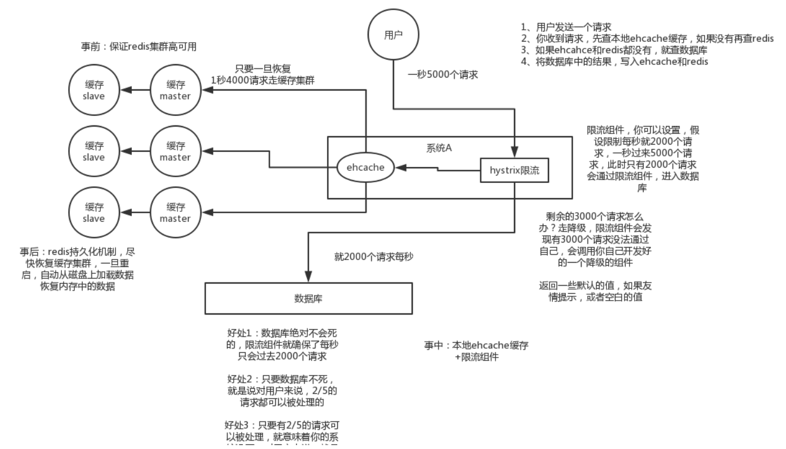


### 缓存穿透

**概念**：所谓的穿透就是请求越过缓存直接落在数据库上，当大量请求访问一个缓存和数据库中均没有的key时，请求会全部落在数据库上（因为数据库中也没有，所以不会写缓存，会直接通过数据库返回），导致缓存无法发挥作用。

**正常缓存处理流程**：

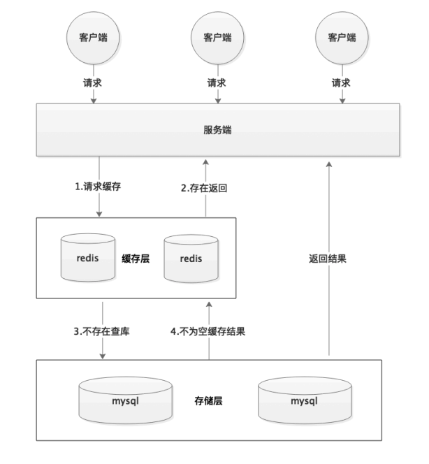

**缓存穿透情况处理流程**：

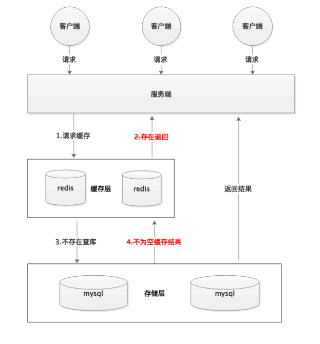

**解决方法**：

* **缓存无效的key**：如果缓存和数据库都查不到某个key，就不管其是否存在都写入Redis缓存并设置超时，这种方式可以解决请求的key变化不频繁的情况。但如果面临恶意攻击的情况，每个请求构建不同的key，就会导致Redis中缓存大量无效的key，所以不能完全的解决问题。

* **布隆过滤器**：通过该数据结构可以判断一个给定的数据是否存在于海量数据中。首先把所有可能存在的请求的值都存放在布隆过滤器中，当用户请求发送过来，就会先判断用户请求的值是否存在于布隆过滤器中，若不存在的话直接返回非法key，若存在的话走正常处理流程。

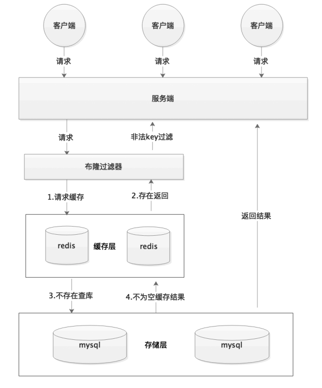


### 布隆过滤器

**布隆过滤器（Bloom Filter）**：是由二进制向量（位数组）和一系列随机映射函数（哈希散列）两部分组成的数据结构。优点是其占用空间和效率方面相对更高，缺点是返回结果是概率性的（元素越多，误报的可能性就越大），而不是非常准确的，且存放在其中的数据不容易删除。其中位数组中的每个元素都只占用1bit，且每个元素只能是0或1。以这种方式申请一个100w元素的位数组只会占用 `1000000bit/8 = 125000byte = 125000/1024kb ≈ 122kb` 的空间。

**使用原理**：

* 在使用布隆过滤器之前，位数组会初始化，即所有元素都置为0。当要将一个字符串存入其中时，先通过多个哈希函数对字符串生成多个哈希值，然后将数组对应的多个位置上的元素置为1。
* 若要判断某个字符串是否存在于布隆过滤器中时，只需要对给定的字符串进行相同的哈希计算，然后以此获取数组中对应位置的元素，若所有位置上的元素都为1，则说明字符串已经存在，若有一个值不为1，则说明字符串不存在。

**注意**：但哈希函数也存在哈希碰撞的可能性，即不同的字符串可能计算出的哈希位置相同（可以相应的增加位数组大小或调整哈希函数）。因此，布隆过滤器判断数据是否存在有小概率会误判，但判断数据是否不存在一定会成功。

**使用场景**：

* 判断给定的数据是否存在于海量的数据集中，如：防止缓存穿透（判断请求的数据是否有效，避免绕过缓存去请求数据库）、垃圾邮件过滤、黑名单功能等；
* 对大量数据集进行去重操作。

**Java实现布隆过滤器**：

```JAVA
import java.util.BitSet;

public class BloomFilter {
    
    // 位数组大小
    private static final int DEFAULT_SIZE = 2 << 24;
    // 通过不同的随机数种子生成6种hash函数
    private static final int[] SEEDS = new int[]{3, 13, 46, 71, 91, 134};
   	// 位数组
    private BitSet bits = new BitSet(DEFAULT_SIZE);
    // hash函数数组
    private SimpleHash[] func = new SimpleHash[SEEDS.length];
  
    // 初始化hash函数数组，包含多个不同的hash函数
    public BloomFilter() {
        for (int i = 0; i < SEEDS.length; i++) {
    		func[i] = new SimpleHash(DEFAULT_SIZE, SEEDS[i]);
        }
    }
    
    // 添加元素到位数组
    public void add(Object value) {
        for (SimpleHash f : func) {
            bits.set(f.hash(value), true);
        }
    }
    
    // 判断元素是否在位数组中存在
    public boolean contains(Object value) {
 		boolean ret = true;
        for (SimpleHash f : func) {
            ret = ret & bits.get(f.hash(value));
        }
        return ret;
    }
    
    public static class SimpleHash {
        
        private int cap;
        private int seed;
    	
        public SimpleHash(int cap, int seed) {
            this.cap = cap;
            this.seed = seed;
        }
        
        // hash操作
        public int hash(Object value) {
            int h;
            return (value == null) ? 0 : Math.abs(seed * (cap-1) & ((h = value.hashCode()) ^ (h >>> 16)));
        }
    }
}
```


### 缓存击穿

**概念**：所谓的缓存击穿就是某个热点key访问非常频繁，处于集中式高并发访问的情况，当这个key超时失效的瞬间，大量的请求就击穿了缓存，直接请求数据库，给数据库巨大的压力。

**解决方法**：

* 若缓存的数据基本不会发生更新，则可将热点key设置为**永不过期**；
* 若缓存的数据更新不频繁，且缓存刷新的整个流程耗时较少，则可以采用基于Redis、Zookeeper等分布式中间件的**分布式锁**，或者本地互斥锁以保证仅有少量的请求能进入数据库并重新构建缓存，其余线程则在锁释放后能访问到新缓存；
* 若缓存的数据更新频繁或者在缓存刷新的流程耗时较长的情况下，可以利用**定时线程**在缓存过期前主动的重新构建缓存或者延后缓存的过期时间，以保证所有的请求能一直访问到对应的缓存。


## Redis-并发竞争的问题

**概念**：所谓的并发竞争指的是多个用户同时对一个key进行操作，造成最后执行的顺序和期望的顺序不同，导致结果不同。

**分布式锁解决方法**：推荐使用Zookeeper实现的分布式锁来解决，当客户端需要对操作加锁时，在Zookeeper上与该操作对应的节点的目录下，生成一个唯一的瞬时有序节点，判断是否获取锁的方式就是去判断有序节点中序号最小的一个。当释放锁时，只需要将这个瞬时节点删除即可。


## Redis-双写一致性

**⼀般情况下使用缓存的过程**：先读缓存，缓存没有的话，就读数据库，然后取出数据后放⼊缓存，同时返回响应。这种⽅式很明显会存在缓存和数据库的数据不⼀致的情况。即只要使用了缓存，就可能会涉及到缓存与数据库双存储双写，就会有数据⼀致性的问题。

* 如果先删除了缓存，还没来得及写入数据库，另一个线程就读取缓存，发现为空则读取数据库并写入缓存，此时缓存中为过期数据；
* 如果先写入了数据库，在删除缓存之前写线程出现问题，导致缓存未成功删除，此时缓存中也是过期数据；

**解决方法**：

* ⼀般来说，如果系统不是严格要求缓存+数据库必须⼀致性的话，缓存可以稍微的跟数据库偶尔有不⼀致的情况。
* 一种方法是，读请求和写请求串行化，串到⼀个内存队列⾥去，这样就可以保证⼀定不会出现不⼀致的情况，但串行化后，就会导致系统的吞吐量⼤幅度的降低，用比正常情况下多⼏倍的机器去⽀撑线上的⼀个请求。  
* 另一种方法是通过第三方的消息队列，当数据库数据发生更新后发送消息给MQ，异步更新缓存。


## Redis-主从架构

### 基本概念

单机的Redis，能够承载的QPS大概就在上万到几万不等。对于缓存来说，一般都是用来支撑并发读的。因此出现了主从（master-slave）架构，即一个主节点多从节点，主负责写，并且将数据复制到从节点。而从节点负责读，所有的读请求全部走从节点。这样可以很轻松实现水平扩容，支撑并发读请求。


### Replication

**特点**：

- Redis采用异步方式复制数据到slave节点；
- 一个master可以配置多个slave；
- slave可以连接其他的slave；
- slave进行复制时，不会阻塞master的正常工作；
- slave进行复制时，也不会阻塞对自己的查询操作，它会用旧的数据集来提供服务。但是复制完成后，需要删除旧数据集，加载新数据集，这时就会暂停对外服务；
- slave主要是用来进行横向扩容、读写分离的。扩容的slave可以提高读的吞吐量。

**注意**：

* 如果采用了主从架构，那么建议开启master的持久化，不建议使用slave作为master的数据热备。因为如果关掉master的持久化后，可能在master宕机重启后数据是空的，然后一经过复制， slave的数据也丢失了。
* 另外，master各种备份方案也需要做。万一本地所有文件丢失了，从备份中挑选一份RDB去恢复master，这样才能确保启动时是有数据的。即使采用了高可用机制，slave可以自动接管master，也可能出现sentinel还没检测到master failure，master就自动重启了，还是可能导致所有的slave数据被清空。


### 主从复制

当启动一个slave时，会发送一个 `PSYNC` 命令给master。如果是slave初次连接到master，那么会触发一次 `full resynchronization` 全量复制。此时master会启动一个后台线程，开始生成一份 `RDB` 快照文件，同时还会将从客户端client新收到的所有写命令缓存在内存中。 `RDB` 文件生成完毕后， master会将这个 `RDB` 发送给slave，slave会先写入本地磁盘，然后再从本地磁盘加载到内存中，接着 master 会将内存中缓存的写命令发送到 slave，slave 也会同步这些数据。slave node 如果跟 master node 有网络故障，断开了连接，会自动重连，连接之后 master node 仅会复制给 slave 部分缺少的数据。


## Redis-哨兵集群

### 基本概念

哨兵（sentinel）是 Redis 集群架构中非常重要的一个组件，主要有以下功能：

- **集群监控**：负责监控 Redis master 和 slave 进程是否正常工作。
- **消息通知**：如果某个 Redis 实例有故障，那么哨兵负责发送消息作为报警通知给管理员。
- **故障转移**：如果 master node 挂掉了，会自动转移到 slave node 上。
- **配置中心**：如果故障转移发生了，通知 client 客户端新的 master 地址。

哨兵用于实现 Redis 集群的高可用，本身也是分布式的，作为一个哨兵集群去运行，互相协同工作：

- **选举**：故障转移时，判断一个 master node 是否宕机了，需要大部分的哨兵都同意才行，涉及到了分布式选举的问题。
- **高可用**：即使部分哨兵节点挂掉了，哨兵集群还是能正常工作的。


## 分布式锁

### Redis分布式锁

#### 普通实现

使用 `SET key value [EX seconds] [PX milliseconds] NX` 创建一个key，做为互斥锁。

* **`NX`**：表示只有key不存在时才会设置成功，如果此时redis中存在这个key，那么设置失败，返回0；

* **`EX seconds`**：设置key的过期时间，精确到秒级，即seconds秒后自动释放锁；

* **`PX milliseconds`**：设置key的过期时间，精确到毫秒级。

**加锁**：`SET resource_name my_random_value PX 30000 NX`。

**释放锁**：通过lua脚本执行释放锁的逻辑（在删除key之前先判断是否合法）。

```lua
-- 删除key之前先判断是否是自己创建的，即释放自己持有的锁
if redis.call('get', KEYS[1]) == ARGV[1] then
    return redis.call('del', KEYS[1])
else
    return 0
end
```

**缺点**：如果是普通的Redis单实例，会存在单点故障问题。若是Redis主从异步复制，主节点宕机导致还未失效的key丢失，但key还没有同步到从节点，此时切换到从节点，其他用户就可以创建key从而获取锁。

**代码示例**：

```java
@Override
public String lock() {
    // 生成UUID用于标识当前线程的锁
    String uuid = UUID.randomUUID().toString().replaceAll("-", "");

    // 1.执行到此的所有线程都会循环不断的尝试获取锁
    boolean flag = false;
    do {
        // setnx命令只能设置一次，再次设置会操作失败，可以当作lock使用
        // 添加锁的过期时间，避免发生死锁
        Boolean lock = this.redisTemplate.opsForValue().setIfAbsent("lock", uuid, 5, TimeUnit.SECONDS);
        if (lock != null) {
            flag = lock;
        }
    } while (!flag);

    // 2.执行需要加锁的业务逻辑
    String numStr = this.redisTemplate.opsForValue().get("num");
    if (!StrUtil.isEmpty(numStr)) {
        int num = Integer.parseInt(numStr);
        this.redisTemplate.opsForValue().set("num", String.valueOf(++num));
    }

    // 3.使用lua脚本判断并删除lock以维持操作的原子性，保证删除当前线程的锁（uuid相同）
    String script = "if redis.call('get', KEYS[1]) == ARGV[1] then return redis.call('del', KEYS[1]) else return 0 end";
    this.redisTemplate.execute(new DefaultRedisScript<>(script), CollUtil.newArrayList("lock"), uuid);

    return numStr;
}
```


#### 注解+AOP+Redisson方式实现

**注解的定义**：

```java
@Target(ElementType.METHOD) // 作用于方法
@Retention(RetentionPolicy.RUNTIME) // 运行时
@Documented
public @interface ShopCache {

    /**
     * redis缓存key的前缀
     * @return
     */
    String prefix() default "";

    /**
     * 缓存的过期时间，分为单位
     * @return
     */
    int timeout() default 5;

    /**
     * 防止缓存雪崩指定的随机值范围
     * @return
     */
    int random() default 5;
}
```

**AOP环绕模式**：

```java
@Around("@annotation(com.abigtomato.shop.index.annotation.ShopCache)")  // 指定作用的注解
public Object around(ProceedingJoinPoint pjp) throws Throwable {
    MethodSignature signature = (MethodSignature) pjp.getSignature();
    // 获取目标方法
    Method method = signature.getMethod();

    // 获取方法的注解
    ShopCache shopCache = method.getAnnotation(ShopCache.class);
    String prefix = shopCache.prefix();
    
    // 获取方法的参数列表
    Object[] args = pjp.getArgs();
    String key = prefix + Arrays.asList(args).toString();

    // 获取方法的返回值
    Class<?> returnType = method.getReturnType();
    
    // 尝试从缓存中获取，若存在直接返回
    Optional<Object> optional = this.cacheHit(key, returnType);
    if (optional.isPresent()) {
        return optional.get();
    }

    // 获取锁
    RLock lock = this.redissonClient.getLock("lock" + Arrays.asList(args).toString());
    lock.lock();

    // 再次尝试从缓存中获取数据
    // 若是在此之前其他线程已经访问数据库并将数据放入缓存，则需要再次尝试获取缓存，避免重复访问数据库
    optional = this.cacheHit(key, returnType);
    if (optional.isPresent()) {
        lock.unlock();
        return optional.get();
    }

    // 执行目标方法
    Object result = pjp.proceed(args);

    // 获取注解的属性，超时时间和随机数范围
    int timeout = shopCache.timeout();
    int random = shopCache.random();
    
    // 写入redis缓存，设置的超时时间需要额外加上随机数（防止出现雪崩问题）
    this.redisTemplate.opsForValue().set(key, JSON.toJSONString(result),
                                         timeout + new Random().nextInt(random), TimeUnit.MINUTES);

    // 释放锁
    lock.unlock();
    return result;
}

/**
 * 尝试从缓存中获取数据
 * @param key
 * @param returnType
 * @return
 */
private Optional<Object> cacheHit(String key, Class<?> returnType) {
    String value = this.redisTemplate.opsForValue().get(key);
    if (StrUtil.isEmpty(value)) {
        return Optional.empty();
    }
    return Optional.of(JSON.parseObject(value, returnType));
}
```

**使用注解式缓存**：

```java
@Override
@ShopCache(prefix = "index:cates", timeout = 7200, random = 100)    // 自定义缓存注解
public List<CategoryVO> querySubCategoriesV2(Long pid) {
    Resp<List<CategoryVO>> listResp = this.shopPmsClient.querySubCategories(pid);
    return listResp.getData();
}
```


#### 保证分布式锁的可用的条件

* 互斥性：在任意时刻，只有一个客户端能持有锁；
* 不会发生死锁：即使有一个客户端在持有锁的期间内崩溃而没有主动解锁，也能保证后续其他客户端能获取锁；
* 加解锁需要同一个客户端：
  * 每个客户端都需要标识自己的锁，避免误删别人的锁；
  * 释放其他服务器锁的场景：
    1. index1获取到lock，业务逻辑没执行完，所拥有的lock过期自动释放；
    2. index2获取到lock，执行业务逻辑，之后lock过期被释放。
    3. index3获取到锁，执行业务逻辑；
    4. 此时index1业务逻辑执行完成，开始调用del释放锁，这时释放的是index3的锁，导致index3的业务只执行1s就被别人释放。
* 加锁和解锁操作需要原子性：
  * 解锁时需要先判断是否为当前客户端的锁，然后再删除，这两步操作需要同时成功同时失败。
  * 解锁操作缺乏原子性的场景：
    1. index1先判断是否为自己的锁，查询到的lock值确实和自己的uuid相等；
    2. index1在执行删除操作前，lock刚好过期时间，被redis自动释放；
    3. index2获取到了自己的lock；
    4. index1执行删除，此时会把index2的lock删除。


#### RedLock算法实现


### Zookeeper分布式锁

**临时znode**：加锁的时候由某个节点尝试创建临时的znode，若创建成功就获取到锁，这时其他客户端再创建znode时就会失败，只能注册监听器监听这个锁。释放锁就是删除这个znode，一旦释放就会通知客户端，然后有一个等待着的客户端就可以再次重新加锁。

```JAVA
public class ZookeeperSession {
    
    // 闭锁
    private static CountDownLatch connectedSemaphore = new CountDownLatch(1);
    // zk客户端
    private Zookeeper zookeeper;
    private CountDownLatch latch;
    
    public ZookeeperSession() {
        try {
            // zk客户端
            this.zookeeper = new Zookeeper("192.168.56.10:2181,192.168.56.10", 50000, new ZookeeperWatcher());
            try {
        	    connectedSemaphore .await();
            } catch (InterruptedException e) {
                e.printStackTrace();
            }
            // zk会话连接成功
            System.out.println("ZooKeeper session established......");
        } catch (Exception e) {
            e.printStackTrace();
        }
    }
    
    /**
     * 获取分布式锁
     */
    public Boolean acquireDistributedLock(Long productId) {
        // zk锁节点目录
        String path = "/product-lock-" + productId;
        try {
            // 创建znode，即获取锁
            zookeeper.create(path, "".getBytes(), Ids.OPEN_ACL_UNSAFE, CreateMode.EPHMERAL);
            return true;
        } catch (Exception e) {
            // 若创建失败，即证明获取失败，锁已被其他人创建，接着自旋等待获取锁节点的创建权
            while (true) {
                try {
                   // 给znode注册一个监听器，判断监听器是否存在
                   Stat stat = zk.exists(path, true);
                   if (stat != null) {
                       // 在闭锁上阻塞，直到超时或被唤醒（持有锁的用户countDown一次）
                       this.latch = new CountDownLatch();
                       this.latch.await(waitTime, TimeUnit.MILLISECOND);
                       this.latch = null;
                   }
                   // 尝试获取锁
                   zookeeper.create(path, "".getBytes(), Ids.OPEN_ACL_UNSAFE, CreateMode.EPHEMERAL);
                   return true;
                } catch (Exception e) {
                    // 抢锁失败，自旋
                    continue; 
                }
            }
        }
        return true;
    }
    
    /**
     * 释放分布式锁
     */
    public void releaseDistributedLock(Long productId) {
        // zk锁节点目录
        String path = "/product-lock-" + productId;
    	try {
            // 删除临时znode，即释放锁
            zookeeper.delete(path, -1);
            System.out.println("release the lock for product[id=" + productId + "]......");
        } catch (Exception e) {
            e.printStackTrace();
        }
    }
    
    /**
     * 实现zk的监听器
     */
    private class ZookeeperWatcher implements Watcher {
        
        private void process(WatchedEvent event) {
            System.out.println("Receive watched event: " + event.getState());
            if (KeeperState.SyncConnected == event.getState()) {
                connectedSemphore.countDown();
            }
            // 若监听器发现节点已被删除，就立即解除闭锁的阻塞，让自旋等待的线程去抢锁
            if (this.latch != null) {
                this.latch.countDown();
            }
        }
    }
    
    /**
     * 封装单例的静态内部类
     */
    private static class Singleton {
		
        // 单例的zk会话对象
        private static ZookeeperSession instance;
        
        static {
            instance = new ZookeeperSession();
        }
        
        public static ZookeeperSession getInstance() {
            return instance;
        }
    }
    
    /**
     * 获取单例
     */
    public static ZookeeperSession getInstance() {
        return Singleton.getInstance();
    }

    public static void init() {
        getInstance();
    }
}
```

**临时顺序节点**：如果有一把锁，被多个人竞争，此时多个人会排队，第一个拿到锁的人会执行，然后释放锁。后面的每个人都会在排在自己前面的那个人创建的znode上监听，一旦某个人释放了锁，排在自己后面的人就会被Zookeeper通知，即获取到了锁。

```JAVA
public class ZookeeperDistributedLock implements Watcher {
    
    private Zookeeper zk;
    private String locksRoot = "/locks";
    private String productId;
    private String waitNode;
    private String lockNode;
    private CountDownLatch latch;
    private CountDownLatch conectedLatch = new CountDownLatch(1);
    private int sessionTimeout = 30000;
    
    public ZookeeperDistributedLock(String productId) {
        this.productId = productId;
        try {
            String address = ;
            zk = new Zookeeper("192.168.56.10:2181,192.168.56.11:2181,192.168.56.12:2181", sessionTimeout, this);
            connectedLatch.await();
        } catch (IOException e) {
            throw new LockException(e);
        } catch (KeeperException e) {
            throw new LockException(e);
        } catch (InterruptedException e) {
            throw new LockException(e);
        }
    }
    
    public void process(WatchedEvent event) {
        if (event.getState() == KeeperState.SyncConnected) {
            connectedLatch.countDown();
            return;
        }
        
        if (this.latch != null) {
            this.latch.coutDown();
        }
    }
    
    /**
     * 获取锁
     */
    public void acquireDistributedLock() {
        try {
            if (this.tryLock()) {
                return;
            } else {
                waitForLock(waitNode, sessionTimeout);
            }
        } catch (KeeperException e) {
            throw new LockException(e);
        } catch (InterruptedException e) {
            throw new LockException(e);
        }
    }
    
    /**
     * 尝试获取锁
     */
    public boolean tryLock() {
        try {
            // 创建锁节点
            lockNode = zk.create(locksRoot + "/" + productId, new byte[0], ZooDefs.Ids.OPEN_ACL_UNSAFE, CreateMode.EPHEMERAL_SEQUENTIAL);
            
            // 对locksRoot目录下的所有节点排序
            List<String> locks = zk.getChildren(locksRoot, false);
            Collections.sort(locks);
            
            // 判断刚才创建的节点是否为最小节点
            if (lockNode.equals(locksRoot + "/" + locks.get(0))) {
                // 若是则表示获得锁
            	return true;    
            }
            
            // 若不是则找到自己的前一个节点
            int previousLockIndex = -1;
            for (int i = 0; i < locks.size(); i++) {
                if (lockNode.equals(locksRoot + "/" + locks.get(i))) {
               		previousLockIndex = i - 1;
                    break;
                }
            }
            // 并且将其设置为当前等待节点
            this.waitNode = locks.get(previousLockIndex);
        } catch (KeeperException e) {
            throw new LockException(e);
        } catch (InterruptedException e) {
            throw new LockException(e);
        }
        return false;
    }
    
    private boolean waitForLock(String waitNode, long waitTime) throws InterruptedException, KeeperException {
        Stat stat = zk.exists(locksRoot + "/" + waitNode, true);
        if (stat != null) {
            this.latch = new CountDownLatch(1);
            this.latch.await(waitTime, TimeUnit.MILLISECONDS);
            this.latch = null;
        }
        return true;
    }
    
    /**
     * 释放锁
     */
    public void unlock() {
        try {
            System.out.println("unlock " + lockNode);
            zk.delete(lockNode, -1);
            lockNode = null;
            zk.close();
        } catch (InterruptedException e) {
            e.printStackTrace();
        } catch (KeeperException e) {
            e.printStackTrace();
        }
    }
    
    /**
     * 自定义锁异常
     */
    public class LockException extends RuntimeException {
        
        private static final long serialVersionUID = 1L;
        
        public LockException(String e) {
            super(e);
        }
        
        public LockException(Exception e) {
            super(e);
        }
    }
}
```


### 二者的区别

* Redis的分布式锁需要不断去尝试获取锁，比较消耗性能。而Zookeeper的分布式锁，在获取不到锁时注册监听器即可，不需要不断的主动尝试获取锁，性能开销小。
* 当Redis获取锁的客户端挂了，那么只能等待超时时间过期才能释放锁。而Zookeeper只是创建了临时ZNode，只要客户端挂了，ZNode也就没了，就会自动释放锁。


## 分布式事务

### XA两阶段提交方案

**概念**：两阶段提交有一个事务管理器的概念，负责协调多个数据库（即资源管理器）的事务，事务管理器先询问各个数据库是否准备提交，如果每个数据库都回复ok，则正式提交事务，在各个数据库上执行操作，如果其中任何一个数据库回答不ok，则立即回滚事务。

**缺点**：XA适用于**单应用跨多个数据库**的分布式事务，因为严重依赖于数据库层面来处理复杂的事物，效率很低，不适合高并发场景。一个服务内部出现了跨多个库的访问操作，是不符合微服务的设计规定的，一般来说每个服务只能操作自己对应的一个数据库，如果需要操作其他数据库，必须通过调用目标数据库对应服务提供的接口来实现。


### TCC方案

**TCC是其内部三个阶段首字母的组合**：

* **Try阶段**：该阶段是对各个服务的资源做检测以及对资源进行锁定或者预留；
* **Confirm阶段**：该节点是在各个服务中执行实际的操作；
* **Cancel阶段**：释放Try阶段预留的业务资源。如果任何一个服务的业务方法执行出错，那么就需要进行补偿，就是执行已执行成功的业务逻辑的回滚操作。


**TCC业务流程分成两个阶段完成**：

* **第一阶段**：主业务服务分别调用所有从业务的Try操作，并在活动管理器中登记所有从业务服务。当所有从业务服务的Try操作都调用成功或者某个从业务服务的Try操作失败，进入第二阶段。
* **第二阶段**：活动管理器根据第一阶段的执行结果来执行Confirm或Cancel操作。如果第一阶段所有Try操作都成功，则活动管理器调用所有从业务活动的Confirm操作。否则调用所有从业务服务的Cancel操作。

**例**：Bob 要向 Smith 转账100元，执行一个转账方法，里面依次调用。

* 首先在 Try 阶段，要先检查Bob的钱是否充足，并把这100元锁住，Smith账户也冻结起来；
* 在 Confirm 阶段，执行远程调用的转账操作；
* 如果第2步执行成功，那么转账成功，如果第二步执行失败，则调用远程冻结接口对应的回滚方法 （Cancel）。

**缺点**：

* Canfirm和Cancel的**幂等性**很难保证；
* 这种方式通常在**复杂场景下不推荐使用**，除非是非常简单的场景，非常容易提供回滚的Cancel，而且依赖的服务也非常少的情况；
* 这种实现方式会造成**代码量庞大，耦合性高**。而且非常有局限性，因为有很多的业务是无法很简单的实现回滚的，如果串行的服务很多，回滚的成本实在太高。


### Saga方案

**概念**：业务流程中每个参与者都提交本地事务，若某一个参与者失败，则补偿前面已经成功的参与者。下图中的事务流程，当执行到T3时发生错误，则开始向上依次执行补偿流程T3、T2、T1，直到将所有已修改的数据复原。

**适用场景**：业务流程多、业务流程长，使用TCC的话成本高，同时无法要求其他公司或遗留的系统也遵循TCC。

**优点**：

* 一阶段提交本地事务，无锁，高性能；
* 参与者可异步执行，高吞吐；
* 补偿服务易于实现。

**缺点**：不保证事务的隔离性。


### 本地消息表

* A系统在本地事务操作的同时，插入一条数据到消息表中，接着将这个消息发送到MQ中；
* B系统接收到消息后，在一个事务中向自己的本地消息表中插入一条数据，同时执行其他的业务操作。如果这个消息已经被处理过了，那么此时这个事务会回滚，保证不会重复处理；
* B系统处理成功后，就会更新自己本地消息表的状态以及A系统消息表的状态；
* 若B系统处理失败，则不会更新消息表状态。A系统会定时扫描消息表，如果有未处理的消息，会再次发送到MQ中去，让B再次处理；
* 该方案保证了最终一致性，就算B事务失败了，A也会不断的重发消息，直到B成功为止。


### 可靠消息最终一致性方案

**概念**：基于消息中间件的两阶段提交往往用在高并发场景下，将一个分布式事务拆分成一个消息事务（A系统的本地事务+发消息）和一个B系统的本地事务。其中B系统的事务是由消息驱动的，只要消息事务成功，证明A事务一定成功，消息也一定发出来了，这时候B会收到消息去执行本地事务。如果本地操作失败，消息会重投，直到B操作成功，这样就变相地实现了A与B的分布式事务。

**特点**：虽然方案能够完成A和B的事务，但是A和B并不是严格一致的，而是最终一致的，在这里牺牲了一致性，换来了性能的大幅度提升。当然，这种方法也是有风险的，如果B一直执行不成功，那么一致性会被破坏，具体要不要使用，还是得看业务能够承担多少风险。


* A系统发送一个prepared消息到MQ，若消息发送失败则取消操作。若发送成功则执行本地事务，如果成功则通知MQ发送确认消息，失败则通知MQ回滚消息；
* 如果发送的是确认消息，则此时B系统会接收到确认消息，然后执行本地事务；
* MQ会自动定时轮询所有prepared消息并回调应用程序的接口，询问这个消息是不是本地事务处理失败了，所有没发送确认的消息，是继续重试还是回滚？一般来说这里就可以通过数据库查看之前的本地事务是否执行，如果回滚了，那么这里也回滚。这样能够避免本地事务执行成功，但确认消息发送失败的情况。
* 如果系统B的事务失败了就重试，不断重试直到成功，如果实在无法成功，则针对重要的业务（如资金类）进行回滚，如系统B本地回滚后，想办法通知系统A也回滚，或是发送报警由人工来手动回滚和补偿。


### 最大努力通知方案

* 系统A的本地事务执行完毕后，发送消息到MQ；
* 会有一个专门消费MQ的最大努力通知服务，这个服务会消费MQ然后写入数据库中记录，然后调用系统B的接口；
* 若系统B的事务执行失败，则最大努力通知服务就定时尝试重新调用系统B，直到成功，若超出重试次数，则放弃。


# Spring技术栈

## Spring-基本概念

**概念**：

* Spring即Spring Framework，是一个轻量级的Java开发框架，目的是为了解决企业级应用开发的业务逻辑层和其他各层的耦合问题。

* 是一个分层的多模块的一站式的提高基础架构支持的开源框架，可以提高开发人员的开发效率以及系统的维护性和减少应用开发的复杂性，让Java开发者可以专注于业务逻辑的开发。

**特性**：

* **核心技术（Core technologies）**：依赖注入（DI）、AOP、事件（events）、资源、i18n、验证、数据绑定、类型转换、SpEL；
* **测试（Testing）**：模拟对象、TestContext框架、Spring MVC测试、WebTestClient；
* **数据访问（Data Access）**：事务、DAO支持、JDBC、ORM、编组XML；
* **Web支持（Spring MVC）**：Spring MVC和Spring WebFlux框架；
* **集成（Integration）**：远程处理、JMS、JCA、JMX、电子邮件、任务、调度、缓存；
* **语言（Languages）**：Kotlin、Groovy、动态语言。


## Spring-重要模块

* **Spring Core**：基础模块，Spring的其他所有功能都基于该模块，主要包括控制反转（Inversion of Control，IoC）和依赖注入（Dependency Injection，DI）功能；
* **Spring Beans**：提供了BeanFactory对象工厂，是工厂设计模式的一个经典实现，Spring将其管理的对象称为Bean；
* **Spring Context**：构建于Core基础上的Context封装，提供了一种框架式的对象访问方法；
* **Spring JDBC**：提供了JDBC数据库连接的抽象层，消除了原生JDBC编码的繁杂和数据库厂商特有的错误代码解析，用于简化JDBC；
* **Spring AOP**：提供了面向切面的编程实现，让用户可以自定义拦截器、切点等；
* **Spring Web**：提供了针对Web应用开发的集成特性，如：文件上传、使用Servlet Listeners进行IoC容器的初始化等；
* **Spring Test**：主要为测试提供支持，支持使用JUnit或TestNG对Spring组件进行单元测试和集成测试；

* **Spring Aspects**：为AspectJ的集成提供支持；
* **Spring JMS**：Java消息服务；
* **Spring ORM**：用于支持Hibernate等对象关系映射框架。


## Spring-设计模式

* **工厂设计模式**：Spring的BeanFactory和ApplicationContext都使用工厂模式创建Bean对象；
* **代理设计模式**：Spring AOP功能使用了JDK的动态代理和CGLIB字节码生成技术；
* **单例设计模式**：Spring的Bean对象默认都是单例的；
* **模板方法设计模式**：Spring的JpaTemplate、RestTemplate和JmsTemplate等都使用了模板方法设计，用于解决代码复用问题；
* **包装器设计模式**：当项目需要连接多个数据库，且不同的客户在每次访问中根据需要会去访问不同的数据库。这种包装器设计模式可以根据客户的需求动态切换不同的数据源；
* **观察者设计模式**：Spring的事件驱动模型，如ApplicationListener就是观察者模式的典型应用。定义对象的一对多依赖关系，当一个对象状态发生改变时，所有依赖于它的对象都会得到通知被自动更新；
* **适配器设计模式**：Spring AOP的增强或通知Advice使用了适配器模式。Spring MVC中的Controller也使用了适配器模式。


## Spring-基本注解

**@Controller返回一个页面：**单独使用的话一般适用于需要返回视图的场景，属于传统的Spring MVC应用。


**@RestController返回JSON或XML形式的数据：**只会返回对象，对象的数据直接以JSON或XML的形式写入HTTP响应体中，这种情况属于RESTful Web服务，也是目前常用的前后端分离开发使用的机制。


**@Controller+@ResponseBody返回JSON或XML形式的数据：**因为Spring4.x之后才新加了@RestController注解，所以在Spring4.x之前开发RESTful Web应用需要结合使用两个注解。@ResponseBody会将控制器返回的对象转换为特定格式后，写入HTTP响应体中。


## Spring-IoC

### 基本概念

**概念**：

* 控制反转（IOC，Inverse of Control）是一种程序的设计思想，将原本在程序中手动创建的对象的控制权交由Spring管理，通过IoC容器来实现对象组件的装配和管理，容器底层通过Map结构维护对象。
* 所谓的控制反转就是对组件对象控制权的转移，从程序代码本身反转到了外部框架。
* IoC负责创建对象、管理对象（DI）、装配对象、配置对象和管理对象的整个生命周期。

**作用**：

* **简化开发流程**：将对象间的依赖关系交给IoC容器管理，并由其完成对象的注入。这样可以很大程度上简化应用程序的开发流程，把开发者从复杂的依赖关系中解放出来。
* **解耦**：由独立于应用程序的第三方框架去维护具体的对象。
* **托管类的生产过程**：

**优点**：

* 降低应用程序开发的代码量，易于维护；
* 使应用程序容易测试，单元测试不再需要单例和JNDI查找机制；
* 最小的代价和最小的代码侵入性使得松散耦合得以实现；
* 支持加载服务时的饿汉式初始化和懒加载。


### 实现机制

IoC的实现原理就是工厂模式+反射机制：

```java
interface Fruit {
    
	public abstract void eat();
}

class Apple implements Fruit {
	
    public void eat() {
		System.out.println("Apple");
	}
}

class Orange implements Fruit {
    
    public void eat(){
		System.out.println("Orange");
	}
}

class Factory {
    
    public static Fruit getInstance(String className) {
        Fruit f = null;
        try {
            f = (Fruit) Class.forName(className).newInstance();
        } catch (Exception e) {
            e.printStackTrace();
        }
        return f;
    }
}

class Client {
    
	public static void main(String[] a) {
		Fruit f = Factory.getInstance("io.github.example.spring.Apple");
		if (f != null) {
			f.eat();
		}	
	}
}
```


### 功能支持

* **依赖注入**：从XML配置上来说，即ref标签，对应Spring的RuntimeBeanReference对象。
* 依赖检查：
* 自动装配：
* 支持集合：
* 指定初始化方法和销毁方法：
* 支持回调某些方法：
* **容器**：管理Bean的生命周期，控制着Bean的依赖注入。


### BeanFactory和ApplicationContext的区别


## Spring-Beans

## Spring-注解

## Spring-数据访问

## Spring-AOP


## Spring-事务

### Spring管理事务的方式

* 编程式事务，即在代码中硬编码；
* 声明式事务，即在配置文件中配置：
  * 基于XML的声明式事务；
  * 基于注解的声明式事务。


### Spring事务的隔离级别

* TransactionDefinition.ISOLATION_DEFAULT：即使用数据库的默认隔离级别，MySQL的默认隔离级别是REPEATABLE_READ；
* TransactionDefinition.ISOLATION_READ_UNCOMMITTED：读未提交。最低的隔离级别，允许读取尚未提交的数据变更，可能会导致脏读、幻读和不可重复读；
* TransactionDefinition.ISOLATION_READ_COMMITTED：读已提交。允许读取并发事务已经提交的数据，可以阻止脏读，但幻读和不可重复读仍有可能发生；
* TransactionDefinition.ISOLATION_REPEATABLE_READ：可重复读。对同一字段的多次读取结果都是一致的，除非数据是被当前事务所修改，可以阻止脏读和不可重复读，但不能阻止幻读；
* TransactionDefinition.ISOLATION_SERIALIZABLE：可串行化。最高的隔离级别，让所有事务依次执行，完全避免事务之间产生的相互影响，可以阻止脏读、不可重复读和幻读，但严重影响程序的性能。


### Spring事务的传播行为

支持当前事务的情况：

* TransactionDefinition.PROPAGATION_REQUIRED：如果当前存在事务，则加入该事务，如果当前没有事务，则创建一个新的事务；
* TransactionDefinition.PROPAGATION_SUPPORTS：如果当前存在事务，则加入该事务，如果当前没有事务，则以非事务的方式继续执行；
* TransactionDefinition.PROPAGATION_MANDATORY：如果当前存在事务，则加入该事务，如果当前没有事务，则抛出异常。

不支持当前事务的情况：

* TransactionDefinition.PROPAGATION_REQUIRES_NEW：创建一个新事务，如果当前存在事务，则把新事务挂起；
* TransactionDefinition.PROPAGATION_NOT_SUPPORTED：以非事务的方式运行，如果当前存在事务，则把当前事务挂起；
* TransactionDefinition.PROPAGATION_NEVER：以非事务的方式运行，如果当前存在事务，则抛出异常。

其他情况：TransactionDefinition.PROPAGATION_NESTED：如果当前存在事务，则创建一个事务做为当前事务的嵌套事务来运行，如果当前没有事务，则等价于TransactionDefinition.PROPAGATION_REQUIRED。


### @Transactional(rollback=Exception.class)注解

当@Transactional注解作用于类上时，该类的所有public方法都将具有该类型的事务属性，同时也可以在方法级别使用该注解，被注解表示的类或方法一旦抛出异常，就会回滚。在@Transactional中如果不指定rollback属性，那么只有在遇到RuntimeException运行时异常时才会回滚，指定rollback=Exception.class时会让事务在遇到非运行时异常时也能回滚。


## SpringMVC-基本概念

## SpringMVC-核心组件

## SpringMVC-工作流程

## SpringMVC-注解

## SpringMVC-其他特性

## SpringBoot-基本概念

## SpringBoot-配置

## SpringBoot-安全

## SpringBoot-监视器

## SpringBoot-整合

## SpringBoot-其他特性

## SpringCloud-基本概念

## SpringCloud-整体架构

## SpringCloud-核心组件

## MyBatis-基本概念

## MyBatis-运行原理

## MyBatis-映射器

## MyBatis-高级查询

## MyBatis-动态SQL

## MyBatis-插件模块

## MyBatis-多级缓存


## Spring Bean

### Spring中bean的作用域

* singleton：单例bean；
* prototype：每次请求创建一个新的bean实例；
* request：每次http请求创建新的bean，但仅在该次http请求内有效；
* session：每次http请求创建新的bean，但仅在当前http的session会话有效。


### Spring中单例bean的线程安全问题

单例bean存在线程安全问题，主要i是因为当多个线程操作同一个对象时，对这个对象的非静态成员变量的写操作存在线程安全问题。

解决方法就是在类中定义一个ThreadLocal的成员变量，将需要的可变成员变量保存在ThreadLocl中。


### @Component和@Bean的区别

* 作用对象不同，@Component作用于类，@Bean作用于方法；
* @Component通常是通过类路径扫描来字段侦测以及自动装配到Spring容器中，通常使用@ComponentScan来定义要扫描的路径从中找出标识了需要装配的类并自动装配到Spring的bean容器中。@Bean通常是在标有该注解的方法中手动产生一个bean，通知Spring这是某个类的创建过程，当需要时再将其执行并返回对象。
* @Bean注解比@Component注解的自定义性更强，而且很多情况下只能通过@Bean来注册bean。如引用第三方库中的类需要装配到Spring容器中时，则只能通过@Bean来实现。


### 声明类为Spring bean的注解

* @Component：通用注解，可以标注任意类为Spring组件。如果一个Bean不知道属于哪一层，可以使用@Component标注；
* @Repository：对应持久层即Dao层，主要用于数据库相关操作；
* @Service：对应服务层，主要涉及一些复杂的业务逻辑，需要用到Dao层；
* @Controller：对应于Spring MVC的控制层，主要用于接受客户端的请求并调用服务层处理业务，最后返回数据给前端页面。


### Spring bean的生命周期

 

* Bean容器找到配置文件中Spring Bean的定义；
* Bean容器使用Java Reflection API创建一个Bean的实例；
* 如果涉及到一些属性值则使用 `set()` 方法设置；
* 如果Bean实现了BeanNameAware接口，则调用setBeanName()方法，传入Bean的名字；
* 如果Bean实现了BeanClassLoaderAware接口，则调用setBeanClassLoader()方法，传入ClassLoader对象的实例；
* 如果Bean还实现了其他的 *.Aware 接口，就调用相应的方法；
* 如果存在和加载该Bean的Spring容器相关的BeanPostProcess对象，就执行postProcessBeforeInitialization()方法，即进行前置处理；
* 如果Bean实现了InitializingBean接口，就执行afterPropertiesSet()方法；
* 如果Bean在配置文件中定义了包含init-method属性，就执行指定方法；
* 如果存在和加载该Bean的Spring容器相关的BeanPostProcess对象，就执行postProcessBeforeInitialization()方法，即进行后置处理；
* 当要销毁Bean时，如果Bean实现了DisposableBean接口，则执行destroy()方法；
* 当要销毁Bean时，如果Bean在配置文件中的定义包含destroy-method属性，执行指定的方法。


## Spring MVC

### SpringMVC的概念

MVC是一种设计模式，Spring MVC就是基于了这种设计模式的框架。可以帮助开发任意更简洁的开发Web应用，且与Spring框架天然集成。Spring MVC将后端项目分为了Service层（业务层）、Dao层（持久化层）、Entity层（实体类）和Controller层（控制层）。


### SpringMVC的工作原理

* 客户端/浏览器发送请求，直接请求到前端控制器DispatcherServlet；
* 前端控制器DispatcherServlet根据请求信息调用处理器映射器HandlerMapping，解析与请求对应的Handler；
* 当解析到对应的Handler后（即Controller控制器），开始由处理器适配器HandlerAdapter处理；
* 处理器适配器HandlerAdapter根据Handler来调用真正的处理器来处理请，并执行相应的业务逻辑；
* 处理器处理完业务后，会返回一个ModelAndView对象，Model是返回的数据对象，View是逻辑上的视图；
* 视图解析器ViewResolver会根据逻辑View查找实际的View；
* 前端控制器DispatcherServlet会将返回的Model传给View，即渲染视图；
* 最后将View返回给请求者。


## Spring-IoC源码分析

源码注释：

```JAVA
BeanNameAware's setBeanName
BeanClassLoaderAware's setBeanClassLoader
BeanFactoryAware's setBeanFactory
EnvironmentAware's setEnvironment
EmbeddedValueResolverAware's setEmbeddedValueResolver
ResourceLoaderAware's setResourceLoader (only applicable when running in an application context)
ApplicationEventPublisherAware's setApplicationEventPublisher (only applicable when running in an application context)
MessageSourceAware's setMessageSource (only applicable when running in an application context)
ApplicationContextAware's setApplicationContext (only applicable when running in an application context)
ServletContextAware's setServletContext (only applicable when running in a web application context)
postProcessBeforeInitialization methods of BeanPostProcessors
InitializingBean's afterPropertiesSet
a custom init-method definition
postProcessAfterInitialization methods of BeanPostProcessors
```

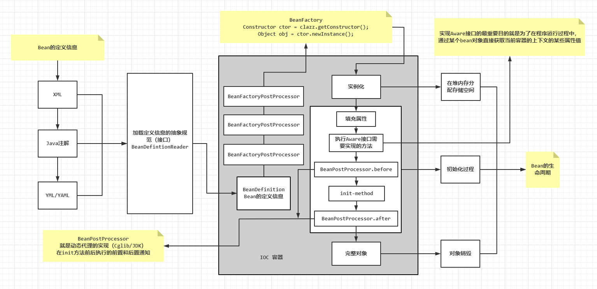

`applicationContext.xml`

```JAVA
<beans>
    <bean id="teacher" class="com.test.Teacher">
    	<property name="name" value="albert"></property>
    </bean>
</beans>
```

`Test.java`

```java
public static void main(String[] args) {
    AbstractApplicationContext ac = new ClassPathXmlApplicationContext("applicationContext.xml");
    Teacher bean = ac.getBean(Teacher.class);
    bean.getBeanName();
    bean.getEnvironment();
}
```

`ClassPathXmlApplicationContext构造方法`

```java
public ClassPathXmlApplicationContext(String[] configLocations, boolean refresh, ApplicationContext parent) throws BeansException {
    // 调用父类构造方法，进行相关对象的创建、属性的赋值等操作
    super(parent);
    setConfigLocations(configLocations);
    if (refresh) {
        refresh();
    }
}
```

`AbstractApplicationContext#refresh()`

```JAVA
@Override
public void refresh() throws BeansException, IllegalStateException {
    synchronized (this.startupShutdownMonitor) {
        // Prepare this context for refreshing.
        /**
         * 做容器刷新前的准备工作：
         * 1.设置容器的启动时间；
         * 2.设置活跃状态为true；
         * 3.设置关闭状态为false；
         * 4.获取Environment对象，并加载当前系统的属性值到Environment对象中；
         * 5.准备监听器和事件的集合对象，默认为空的集合。
         */
        prepareRefresh();

        // Tell the subclass to refresh the internal bean factory.
        // 创建容器对象，DefaultListableBeanFactory
        // 加载xml配置文件的属性值到当前工厂中，最重要的就是BeanDefinition
        ConfigurableListableBeanFactory beanFactory = obtainFreshBeanFactory();  

        // Prepare the bean factory for use in this context.
        // BeanFactory的准备工作，对各种属性进行填充
        prepareBeanFactory(beanFactory);

        try {
            // Allows post-processing of the bean factory in context subclasses.
            // 留给子类进行扩展的模板方法
            postProcessBeanFactory(beanFactory);

            // Invoke factory processors registered as beans in the context.
            // 真正执行各种BeanFactoryPostProcessor
            invokeBeanFactoryPostProcessors(beanFactory);

            // Register bean processors that intercept bean creation.
            // 注册BeanPostProcessor，这里只是注册功能，真正执行的是getBean方法
            registerBeanPostProcessors(beanFactory);

            // Initialize message source for this context.
            // 为上下文初始化message源，即不同语言的消息体、国际化处理
            initMessageSource();

            // Initialize event multicaster for this context.
            // 初始化事件监听的多路广播器
            initApplicationEventMulticaster();

            // Initialize other special beans in specific context subclasses.
            // 留给子类来初始化其他的Bean
            onRefresh();

            // Check for listener beans and register them.
            // 在所有注册的Bean中查找Listener Bean，注册到消息广播器中
            registerListeners();

            // Instantiate all remaining (non-lazy-init) singletons.
            // 实例化剩下的非懒加载的单实例
            finishBeanFactoryInitialization(beanFactory);

            // Last step: publish corresponding event.
            // 完成刷新过程，通知生命周期处理器LifecycleProcessor刷新过程，同时发出ContextRefreshEvent通知别人
            finishRefresh();
        }

        catch (BeansException ex) {
            if (logger.isWarnEnabled()) {
                logger.warn("Exception encountered during context initialization - " +
                            "cancelling refresh attempt: " + ex);
            }

            // Destroy already created singletons to avoid dangling resources.
            destroyBeans();

            // Reset 'active' flag.
            cancelRefresh(ex);

            // Propagate exception to caller.
            throw ex;
        }

        finally {
            // Reset common introspection caches in Spring's core, since we
            // might not ever need metadata for singleton beans anymore...
            resetCommonCaches();
        }
    }
}
```

`AbstractApplicationContext#prepareRefresh()`

```JAVA
protected void prepareRefresh() {
    // Switch to active.
    // 设置容器启动的时间
    this.startupDate = System.currentTimeMillis();
    // 容器的关闭标志位
    this.closed.set(false);
    // 容器的激活标志位
    this.active.set(true);

    // 日志记录
    if (logger.isDebugEnabled()) {
        if (logger.isTraceEnabled()) {
            logger.trace("Refreshing " + this);
        }
        else {
            logger.debug("Refreshing " + getDisplayName());
        }
    }

    // Initialize any placeholder property sources in the context environment.
    // 留给子类覆盖，初始化属性资源
    initPropertySources();

    // Validate that all properties marked as required are resolvable:
    // see ConfigurablePropertyResolver#setRequiredProperties
    // 创建并获取环境对象，验证需要的属性文件是否都已经放入环境中
    getEnvironment().validateRequiredProperties();

    // Store pre-refresh ApplicationListeners...
    // 判断刷新前的应用程序监听器集合是否为空，如果为空，则将监听器添加到该集合中
    if (this.earlyApplicationListeners == null) {
        this.earlyApplicationListeners = new LinkedHashSet<>(this.applicationListeners);
    }
    else {
        // Reset local application listeners to pre-refresh state.
        // 如果不为空，则清空集合中的元素对象
        this.applicationListeners.clear();
        this.applicationListeners.addAll(this.earlyApplicationListeners);
    }

    // Allow for the collection of early ApplicationEvents,
    // to be published once the multicaster is available...
    // 创建刷新前的监听器事件集合
    this.earlyApplicationEvents = new LinkedHashSet<>();
}
```

`AbstractApplicationContext#ConfigurableListableBeanFactory()`

```JAVA
protected ConfigurableListableBeanFactory obtainFreshBeanFactory() {
    refreshBeanFactory();
    return getBeanFactory();
}
```

`AbstractRefreshableApplicationContext#refreshBeanFactory()`

```JAVA
@Override
protected final void refreshBeanFactory() throws BeansException {
    // 如果存在beanFactory，则销毁
    if (hasBeanFactory()) {
        destroyBeans();
        closeBeanFactory();
    }
    try {
        // 创建DefaultListableBeanFactory对象
        DefaultListableBeanFactory beanFactory = createBeanFactory();
        // 为了序列化指定id，可以从id反序列化到beanFactory对象
        beanFactory.setSerializationId(getId());
        // 定制beanFactory，设置相关属性，包括是否允许覆盖同名的不同定义的对象以及循环依赖
        customizeBeanFactory(beanFactory);
        // 初始化documentReader，并进行XML文件读取及解析，默认命名空间的解析，自定义标签的解析
        loadBeanDefinitions(beanFactory);
        synchronized (this.beanFactoryMonitor) {
            this.beanFactory = beanFactory;
        }
    }
    catch (IOException ex) {
        throw new ApplicationContextException("I/O error parsing bean definition source for " + getDisplayName(), ex);
    }
}
```

`AbstractApplicationContext#prepareBeanFactory()`

```JAVA
protected void prepareBeanFactory(ConfigurableListableBeanFactory beanFactory) {
    // Tell the internal bean factory to use the context's class loader etc.
    // 设置beanFactory的classloader为当前context的classloader
    beanFactory.setBeanClassLoader(getClassLoader());
    // 设置beanFactory的表达式语言处理器
    beanFactory.setBeanExpressionResolver(new StandardBeanExpressionResolver(beanFactory.getBeanClassLoader()));
    // 为beanFactory增加一个默认的propertyEditor，这个主要是对bean的属性等设置管理的一个工具类
    beanFactory.addPropertyEditorRegistrar(new ResourceEditorRegistrar(this, getEnvironment()));

    // Configure the bean factory with context callbacks.
    // 添加beanPostProcessor。ApplicationContextAwareProcessor用于完成某些Aware对象的注入
    beanFactory.addBeanPostProcessor(new ApplicationContextAwareProcessor(this));
    // 设置要忽略自动装配的接口，因为这些接口的实现是由容器通过set方法进行注入，所以在使用Autowire时需要忽略这些接口
    beanFactory.ignoreDependencyInterface(EnvironmentAware.class);
    beanFactory.ignoreDependencyInterface(EmbeddedValueResolverAware.class);
    beanFactory.ignoreDependencyInterface(ResourceLoaderAware.class);
    beanFactory.ignoreDependencyInterface(ApplicationEventPublisherAware.class);
    beanFactory.ignoreDependencyInterface(MessageSourceAware.class);
    beanFactory.ignoreDependencyInterface(ApplicationContextAware.class);

    // BeanFactory interface not registered as resolvable type in a plain factory.
    // MessageSource registered (and found for autowiring) as a bean.
    // 设置几个自动装配的特殊规则，当在进行IOC初始化的如果有多个实现，那么就使用指定的对象进行注入
    beanFactory.registerResolvableDependency(BeanFactory.class, beanFactory);
    beanFactory.registerResolvableDependency(ResourceLoader.class, this);
    beanFactory.registerResolvableDependency(ApplicationEventPublisher.class, this);
    beanFactory.registerResolvableDependency(ApplicationContext.class, this);

    // Register early post-processor for detecting inner beans as ApplicationListeners.
    // 注册BeanPostProcessor
    beanFactory.addBeanPostProcessor(new ApplicationListenerDetector(this));

    // Detect a LoadTimeWeaver and prepare for weaving, if found.
    // 增加对AspectJ的支持，在Java中的织入分为三种方式，即编译期织入，类加载期织入，运行期织入。编译器织入发生在编译期间；类加载器织入是通过特殊的类加载器，在类字节码加载到JVM时，织入切面；运行期织入则是采用Cglib和jdk进行织入
    if (beanFactory.containsBean(LOAD_TIME_WEAVER_BEAN_NAME)) {
        beanFactory.addBeanPostProcessor(new LoadTimeWeaverAwareProcessor(beanFactory));
        // Set a temporary ClassLoader for type matching.
        beanFactory.setTempClassLoader(new ContextTypeMatchClassLoader(beanFactory.getBeanClassLoader()));
    }

    // Register default environment beans.
    // 注册默认的系统环境bean到一级缓存中
    if (!beanFactory.containsLocalBean(ENVIRONMENT_BEAN_NAME)) {
        beanFactory.registerSingleton(ENVIRONMENT_BEAN_NAME, getEnvironment());
    }
    if (!beanFactory.containsLocalBean(SYSTEM_PROPERTIES_BEAN_NAME)) {
        beanFactory.registerSingleton(SYSTEM_PROPERTIES_BEAN_NAME, getEnvironment().getSystemProperties());
    }
    if (!beanFactory.containsLocalBean(SYSTEM_ENVIRONMENT_BEAN_NAME)) {
        beanFactory.registerSingleton(SYSTEM_ENVIRONMENT_BEAN_NAME, getEnvironment().getSystemEnvironment());
    }
}
```

`AbstractApplicationContext#finishBeanFactoryInitialization()`

```JAVA
protected void finishBeanFactoryInitialization(ConfigurableListableBeanFactory beanFactory) {
    // Initialize conversion service for this context.
    if (beanFactory.containsBean(CONVERSION_SERVICE_BEAN_NAME) &&
        beanFactory.isTypeMatch(CONVERSION_SERVICE_BEAN_NAME, ConversionService.class)) {
        beanFactory.setConversionService(
            beanFactory.getBean(CONVERSION_SERVICE_BEAN_NAME, ConversionService.class));
    }

    // Register a default embedded value resolver if no bean post-processor
    // (such as a PropertyPlaceholderConfigurer bean) registered any before:
    // at this point, primarily for resolution in annotation attribute values.
    if (!beanFactory.hasEmbeddedValueResolver()) {
        beanFactory.addEmbeddedValueResolver(strVal -> getEnvironment().resolvePlaceholders(strVal));
    }

    // Initialize LoadTimeWeaverAware beans early to allow for registering their transformers early.
    String[] weaverAwareNames = beanFactory.getBeanNamesForType(LoadTimeWeaverAware.class, false, false);
    for (String weaverAwareName : weaverAwareNames) {
        getBean(weaverAwareName);
    }

    // Stop using the temporary ClassLoader for type matching.
    beanFactory.setTempClassLoader(null);

    // Allow for caching all bean definition metadata, not expecting further changes.
    beanFactory.freezeConfiguration();

    // Instantiate all remaining (non-lazy-init) singletons.
    beanFactory.preInstantiateSingletons();
}
```

`DefaultListableBeanFactory#preInstantiateSingletons()`

```java
@Override
public void preInstantiateSingletons() throws BeansException {
    if (logger.isTraceEnabled()) {
        logger.trace("Pre-instantiating singletons in " + this);
    }

    // Iterate over a copy to allow for init methods which in turn register new bean definitions.
    // While this may not be part of the regular factory bootstrap, it does otherwise work fine.
    // 将所有BeanDefinition的名字创建一个集合
    List<String> beanNames = new ArrayList<>(this.beanDefinitionNames);

    // Trigger initialization of all non-lazy singleton beans...
    // 触发所有非懒加载单例Bean的初始化，遍历集合的对象
    for (String beanName : beanNames) {
        // 合并父类BeanDefinition
        RootBeanDefinition bd = getMergedLocalBeanDefinition(beanName);
        // 条件判断、抽象、单例、非懒加载
        if (!bd.isAbstract() && bd.isSingleton() && !bd.isLazyInit()) {
            // 判断是否实现了FactoryBean接口
            if (isFactoryBean(beanName)) {
                // 根据&+beanName来获取具体的对象
                Object bean = getBean(FACTORY_BEAN_PREFIX + beanName);
                // 进行类型转换
                if (bean instanceof FactoryBean) {
                    final FactoryBean<?> factory = (FactoryBean<?>) bean;
                    // 判断这个FactoryBean是否希望急切的初始化
                    boolean isEagerInit;
                    if (System.getSecurityManager() != null && factory instanceof SmartFactoryBean) {
                        isEagerInit = AccessController.doPrivileged((PrivilegedAction<Boolean>)
                                                                    ((SmartFactoryBean<?>) factory)::isEagerInit,
                                                                    getAccessControlContext());
                    }
                    else {
                        isEagerInit = (factory instanceof SmartFactoryBean &&
                                       ((SmartFactoryBean<?>) factory).isEagerInit());
                    }
                    // 如果希望急切的初始化，则通过beanName获取bean实例
                    if (isEagerInit) {
                        getBean(beanName);
                    }
                }
            }
            else {
                // 如果beanName对应的bean不是FactoryBean，只是普通的bean，则通过beanName获取bean实例
                getBean(beanName);
            }
        }
    }

    // Trigger post-initialization callback for all applicable beans...
    // 遍历beanName，触发所有SmartInitializingSingleton的后初始化回调
    for (String beanName : beanNames) {
        Object singletonInstance = getSingleton(beanName);
        // 判断singletonInstance是否实现了SmartInitializingSingleton接口
        if (singletonInstance instanceof SmartInitializingSingleton) {
            final SmartInitializingSingleton smartSingleton = (SmartInitializingSingleton) singletonInstance;
            if (System.getSecurityManager() != null) {
                AccessController.doPrivileged((PrivilegedAction<Object>) () -> {
                    smartSingleton.afterSingletonsInstantiated();
                    return null;
                }, getAccessControlContext());
            }
            else {
                smartSingleton.afterSingletonsInstantiated();
            }
        }
    }
}
```


# 数据结构和算法

## 树形结构

### 基本概念

树是由n个有限结点组成的具有层次关系的集合，其具有如下特点：

* 每个结点有0个或n个子结点；
* 没有父结点的结点称为根结点，一棵树有且只有一个根节点；
* 每个非根结点只有一个父结点；
* 每个结点及其后代结点整体上可以看成一棵树，称为当前结点的父结点的一颗子树。

相关术语：

* 结点的度：一个结点具有的子树个数称为该结点的度；
* 叶子结点：度为0的结点称为叶子结点，也叫做终端结点；
* 分支结点：度不为0的结点称为分支结点，也叫做非终端结点；
* 结点的层次：从根结点开始记为1，之后的每个后继层次加1，以此类推；
* 结点的层序编号：将树中的结点，按照从上层到下层，同层从左到右的顺序排成一个线性序列，并且编成连续的自然数；
* 树的度：树中结点的最大度；
* 树的高度（深度）：树中结点的最大层次；
* 森林：m个互不相交的树的集。将一棵非空树的根结点删除，树就会变成一座森林；反之给森林添加一个统一的根结点，森林就会变成一颗树；
* 孩子结点：一个结点的直接后继结点称为该结点的孩子结点；
* 双亲结点（父结点）：一个结点的直接前驱结点称为该结点的双亲结点；
* 兄弟结点：同一双亲结点的孩子结点间互称为兄弟结点。


### 二叉树

#### 基本概念

所谓二叉树就是度不超过2的树，即每个结点最多有两个子结点。

**满二叉树**：对于一个二叉树，如果每一层的结点数都达到最大值，则这个二叉树就是满二叉树。

**完全二叉树**：叶子结点只能出现在最下层和次下层，并且最下面一层的结点都集中在该层最左边的若干位置的二叉树。


#### 二分搜索树

```JAVA
public class BinarySearchTree<Key extends Comparable<Key>, Value> {

    private Node<Key, Value> root;
    private int N;

    // 结点
    private static class Node<Key, Value> {

        private final Key key;
        private Value value;
        private Node<Key, Value> left;
        private Node<Key, Value> right;

        public Node(Key key, Value value, Node<Key, Value> left, Node<Key, Value> right) {
            this.key = key;
            this.value = value;
            this.left = left;
            this.right = right;
        }
    }

    public int size() {
        return N;
    }

    /**
     * 插入结点
     */
    public void put(Key key, Value value) {
        root = put(root, key, value);
    }

    public Node<Key, Value> put(Node<Key, Value> node, Key key, Value value) {
        if (node == null) {
            N++;
            return new Node<>(key, value, null, null);
        }

        int cmp = key.compareTo(node.key);
        if (cmp > 0) {
            node.right = put(node.right, key, value);
        } else if (cmp < 0) {
            node.left = put(node.left, key, value);
        } else {
            node.value = value;
        }
        return node;
    }

    /**
     * 按key搜索结点
     */
    public Value get(Key key) {
        return get(root, key);
    }

    public Value get(Node<Key, Value> node, Key key) {
        if (node == null) {
            return null;
        }

        int cmp = key.compareTo(node.key);
        if (cmp > 0) {
            return get(node.right, key);
        } else if (cmp < 0) {
            return get(node.left, key);
        } else {
            return node.value;
        }
    }
	
    /**
     * 按key删除结点
     */
    public void delete(Key key) {
        delete(root, key);
    }

    public Node<Key, Value> delete(Node<Key, Value> node, Key key) {
        if (node == null) {
            return null;
        }

        int cmp = key.compareTo(node.key);
        if (cmp > 0) {
            node.right = delete(node.right, key);
        } else if (cmp < 0) {
            node.left = delete(node.left, key);
        } else {
            // 要删除的结点是叶子结点的情况
            if (node.left == null && node.right == null) {
                return null;
            }

            // 要删除的结点左子树为空，只有右子树
            if (node.left == null) {
                return node.right;
            }

            // 要删除的结点右子树为空，只有左子树
            if (node.right == null) {
                return node.left;
            }

            // 要删除的结点既有左子树又有右子树，则获取该结点的右子树的最小结点和其替换即可
            Node<Key, Value> rightMinNode = null;	// 右子树的最小结点
            Node<Key, Value> rightNode = node.right;	// 右子树的根节点
            while (rightNode.left != null) {
                // 判断当前结点的左结点是否是最小结点
                if (rightNode.left.left == null) {
                    rightMinNode = rightNode.left;
                    // 若最小结点存在右子树，则将其挂入当前结点的左结点
                    if (rightMinNode.right != null) {
                        rightNode.left = rightMinNode.right;
                    }
                    break;
                }
                // 继续向左边移动
                rightNode = rightNode.left;
            }

            // 用右子树的最小结点替换要删除的结点
            assert rightMinNode != null;
            rightMinNode.left = node.left;
            rightMinNode.right = node.right;

            // 返回新结点，将其挂入树中
            return rightMinNode;
        }

        return null;
    }

    /**
     * 获取最小key的结点
     */
    public Key min() {
        return min(root).key;
    }

    public Node<Key, Value> min(Node<Key, Value> node) {
        if (node.left != null) {
            return min(node.left);
        } else {
            return node;
        }
    }

    /**
     * 获取最大key的结点
     */
    public Key max() {
        return max(root).key;
    }

    public Node<Key, Value> max(Node<Key, Value> node) {
        if (node.right != null) {
            return max(node.right);
        } else {
            return node;
        }
    }

    /**
     * 前序遍历
     */
    public LinkedList<Key> preErgodic() {
        LinkedList<Key> keys = new LinkedList<>();
        preErgodic(root, keys);
        return keys;
    }

    private void preErgodic(Node<Key, Value> node, LinkedList<Key> keys) {
        if (node == null) {
            return;
        }

        keys.addLast(node.key);
        if (node.left != null) {
            preErgodic(node.left, keys);
        }
        if (node.right != null) {
            preErgodic(node.right, keys);
        }
    }

    /**
     * 中序遍历
     */
    public LinkedList<Key> midErgodic() {
        LinkedList<Key> keys = new LinkedList<>();
        midErgodic(root, keys);
        return keys;
    }

    private void midErgodic(Node<Key, Value> node, LinkedList<Key> keys) {
        if (node == null) {
            return;
        }

        if (node.left != null) {
            midErgodic(node.left, keys);
        }
        keys.addLast(node.key);
        if (node.right != null) {
            midErgodic(node.right, keys);
        }
    }
	
    /**
     * 后序遍历
     */
    public LinkedList<Key> afterErgodic() {
        LinkedList<Key> keys = new LinkedList<>();
        midErgodic(root, keys);
        return keys;
    }

    private void afterErgodic(Node<Key, Value> node, LinkedList<Key> keys) {
        if (node == null) {
            return;
        }

        if (node.left != null) {
            midErgodic(node.left, keys);
        }
        if (node.right != null) {
            midErgodic(node.right, keys);
        }
        keys.addLast(node.key);
    }
	
    /**
     * 层次遍历
     */
    public LinkedList<Key> layerErgodic() {
        LinkedList<Key> keys = new LinkedList<>();
        layerErgodic(root, keys);
        return keys;
    }

    private void layerErgodic(Node<Key, Value> root, LinkedList<Key> keys) {
        LinkedList<Node<Key, Value>> nodes = new LinkedList<>();

        nodes.addLast(root);
        while (!nodes.isEmpty()) {
            Node<Key, Value> node = nodes.removeFirst();
            keys.addLast(node.key);
            if (node.left != null) {
                nodes.addLast(node.left);
            }
            if (node.right != null) {
                nodes.addLast(node.right);
            }
        }
    }
	
    /**
     * 树的最大深度
     */
    public int maxDepth() {
        return maxDepth(root);
    }

    private int maxDepth(Node<Key, Value> node) {
        if (node == null) {
            return 0;
        }

        int leftMax = 0, rightMax = 0;
        if (node.left != null) {
            leftMax = maxDepth(node.left);
        }
        if (node.right != null) {
            rightMax = maxDepth(node.right);
        }

        return leftMax > rightMax ? leftMax + 1 : rightMax + 1;
    }
}
```


### 堆

#### 基本概念

堆是完全二叉树，除了树的最后一层结点不需要是满的，其他的每一层从左到右都是满的，如果最后一层结点不是满的，那么要求左满右不满；

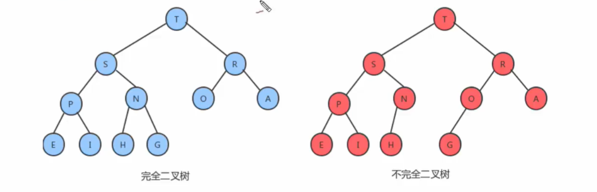

通常是由数组实现的树形结构，具体方法就是将二叉树的结点按照层级顺序放入数组中，根节点在位置1，子节点在位置2和3，而子结点的子结点则分别放在位置4，5，6和7，以此类推。

如果一个结点的位置为k，则它的父结点的位置为k/2，而它的两个子结点的位置分别为2k和2k+1。这样，在不使用指针的情况下，可以通过计算数组的索引在树中上下移动，如：从a[k]向上一层，就令k等于k/2，向下一层就令k等于2k或2k+1。

每个结点都大于等于它的两个子结点，但两个子结点之间的顺序不做规定。

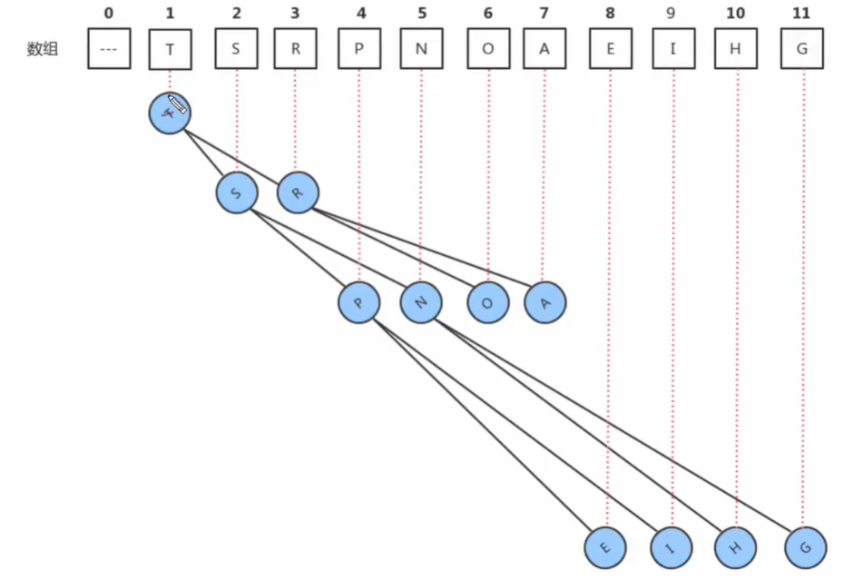


#### 最大堆

```java
public class Heap<T extends Comparable<T>> {

    // 存储堆中的元素
    private T[] items;
    // 记录堆中元素的个数
    private int N;
    // 记录堆中第一个元素的下标
    private static final int FIRST = 1;

    public Heap(int capacity) {
        this.items = (T[]) new Comparable[capacity + 1];
        this.N = 0;
    }

    /**
     * 判断堆中索引i处的元素是否小于索引j处的元素
     */
    private boolean less(int i, int j) {
        return items[i].compareTo(items[j]) < 0;
    }

    /**
     * 交换堆中索引i和索引j处的元素
     */
    private void exc(int i, int j) {
        T temp = items[i];
        items[i] = items[j];
        items[j] = temp;
    }

    /**
     * 插入元素，数组末尾
     */
    public void insert(T item) {
        items[++N] = item;
        swim(N);
    }

    /**
     * 上浮操作，将索引index处的元素浮动到正确的位置
     */
    private void swim(int index) {
        while (index > FIRST) {
            int parentIndex = index / 2;
            if (less(parentIndex, index)) {
                exc(parentIndex, index);
            }
            index = parentIndex;
        }
    }

    /**
     * 删除堆中最大的元素，数组开头
     */
    public T delMax() {
        T item = items[FIRST];
        exc(FIRST, N);
        items[N] = null;
        N--;
        sink(FIRST);
        return item;
    }

    /**
     * 下沉操作，将索引index处的元素沉入到正确位置
     */
    private void sink(int index) {
        while (2 * index <= N) {
            int childMax, leftIndex = 2 * index, rightIndex = 2 * index + 1;
            if (rightIndex<= N && less(leftIndex, rightIndex)) {
                childMax = rightIndex;
            } else {
                childMax = leftIndex;
            }

            if (!less(index, childMax)) {
                break;
            } else {
                exc(index, childMax);
            }

            index = childMax;
        }
    }
}
```


#### 优先队列

```JAVA
/**
 * 最大优先队列
 * @param <T>
 */
public class MaxPriorityQueue<T extends Comparable<T>> {

    private T[] items;
    private int N;

    public MaxPriorityQueue(int capacity) {
        this.items = (T[]) new Comparable[capacity + 1];
        this.N = 0;
    }

    public int size() {
        return this.N;
    }

    public boolean isEmpty() {
        return this.N == 0;
    }

    private boolean less(int i, int j) {
        return this.items[i].compareTo(this.items[j]) < 0;
    }

    private void exchange(int i, int j) {
        T temp = this.items[i];
        this.items[i] = this.items[j];
        this.items[j] = temp;
    }

    public void insert(T item) {
        this.items[++N] = item;
        swim(N);
    }

    private void swim(int index) {
        while (index > 1) {
            int parentIndex = index / 2;
            if (less(index, parentIndex)) {
                exchange(index, parentIndex);
            }
            index = parentIndex;
        }
    }

    public T delMax() {
        T max = this.items[1];
        exchange(1, N);
        this.items[N] = null;
        N--;
        sink(1);
        return max;
    }

    private void sink(int index) {
        while (2 * index <= N) {
            int childMax, leftIndex = 2 * index, rightIndex = 2 * index + 1;
            if (rightIndex <= N && less(leftIndex, rightIndex)) {
                childMax = rightIndex;
            } else {
                childMax = leftIndex;
            }

            if (less(childMax, index)) {
                break;
            } else {
                exchange(childMax, index);
            }

            index = childMax;
        }
    }
}
```


#### 索引优先队列

```java
/**
 * 最小索引优先队列
 * @param <T>
 */
public class IndexMinPriorityQueue<T extends  Comparable<T>> {

    private T[] items;
    private int[] pq;
    private int[] qp;
    private int N;

    public IndexMinPriorityQueue(int capacity) {
        this.items = (T[]) new Comparable[capacity + 1];
        this.pq = new int[capacity + 1];
        this.qp = new int[capacity + 1];
        this.N = 0;

        for (int i = 0; i < qp.length; i++) {
            qp[i] = -1;
        }
    }

    public int size() {
        return this.N;
    }

    public boolean isEmpty() {
        return this.N == 0;
    }

    private boolean less(int i, int j) {
        return items[pq[i]].compareTo(items[pq[j]]) < 0;
    }

    private void exchange(int i, int j) {
        int temp = pq[i];
        pq[i] = pq[j];
        pq[j] = temp;

        qp[pq[i]] = i;
        qp[pq[j]] = j;
    }

    public boolean contains(int index) {
        return qp[index] != -1;
    }

    public int minIndex() {
        return pq[1];
    }

    public void insert(int index, T item) {
        if (contains(index)) {
            return;
        }

        N++;
        items[index] = item;
        pq[N] = index;
        qp[index] = N;

        swim(N);
    }

    public int delMin() {
        int minIndex = pq[1];
        exchange(1, N);

        qp[pq[N]] = -1;
        pq[N] = -1;
        items[minIndex] = null;
        N--;

        sink(1);
        return minIndex;
    }

    public void delete(int index) {
        int sourceIndex = qp[index];
        exchange(sourceIndex, N);

        items[sourceIndex] = null;
        qp[pq[N]] = -1;
        pq[N] = -1;
        N--;

        sink(sourceIndex);
        swim(sourceIndex);
    }

    public void changeItem(int index, T item) {
        items[index] = item;
        int sourceIndex = qp[index];
        sink(sourceIndex);
        swim(sourceIndex);
    }

    private void swim(int index) {
        while (index > 1) {
            int parentIndex = index / 2;
            if (less(index, parentIndex)) {
                exchange(index, parentIndex);
            }
            index = parentIndex;
        }
    }

    private void sink(int index) {
        while (2 * index <= N) {
            int childMin, leftIndex = 2 * index, rightIndex = 2 * index + 1;
            if (rightIndex <= N && less(rightIndex, leftIndex)) {
                childMin = rightIndex;
            } else {
                childMin = leftIndex;
            }

            if (less(index, childMin)) {
                break;
            } else {
                exchange(index, childMin);
            }

            index = childMin;
        }
    }
}
```


### 平衡树

#### 基本概念

二分搜索树在极端情况下会退化成链表，导致查找元素的效率变得和链表一样低。如下图，依次向BST上插入9，8，7，6，5，4，3，2，1这9个数，那么最终构建出的树结构就是一个链表。

而平衡树就是一种能够不受插入数据的影响，让生成的树结构都能像完全二叉树一样，即使在极端情况下，依然能保证查询性能。

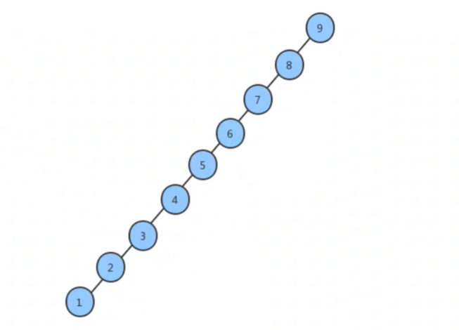


#### 2-3查找树

一颗2-3查找树需要满足以下两个要求：

* 2-结点：含有一个键值对和两条链，左链接指向的2-3树中的键都小于该结点，右链接指向的2-3树中的键都大于该结点；
* 3-结点：含有两个键值对和三条链，左链接指向的2-3树中的键都小于该结点，中链接指向的2-3树中的键都位于该结点的两个键之间，右链接指向的2-3树中的键都大于该结点。

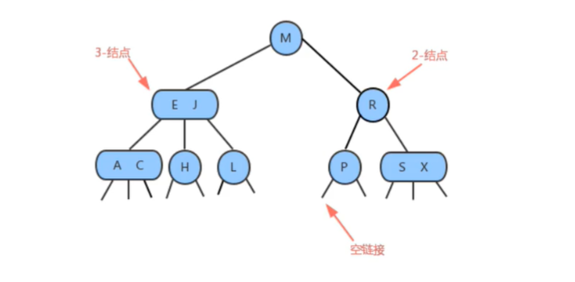

2-3树的查找：将BST查找算法一般化就能得到2-3树的查找算法。要判断一个键是否在树中，先将其和根结点中的键比较，如果和其中任意一个键相等，查询命中；否则就根据比较的结果找到指向相应区间的链接，并在其指向的子树上通过递归继续查找。如果找到空链接，则查询未命中。

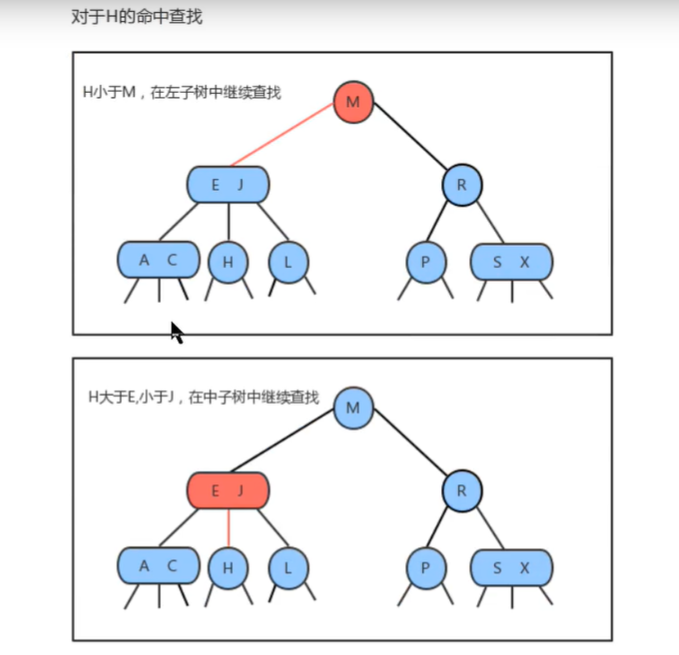

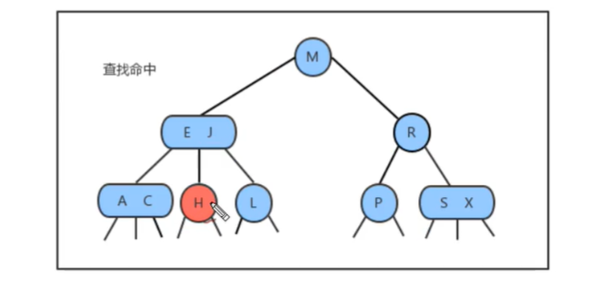

向2-结点下插入新结点：和BST插入元素一样，首先要按顺序进行查找，然后将结点挂到新位置上。2-3树之所以能在极端情况下保证效率是因为在其插入后能保证树的平衡猪状态。如果新结点被定位到一个2-结点上，那么只需要将新结点和2-结点组合成一个3-结点即可；如果是定位到一个3-结点上，则有下面几种情况。

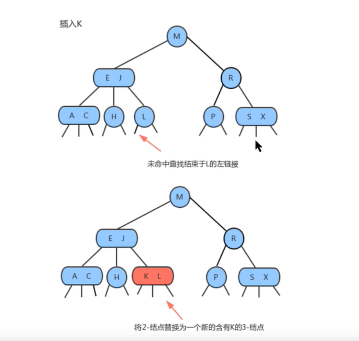

向只含有一个3-结点的树中插入新结点：若一棵2-3树只包含一个3-结点，即这个结点已经存在两个键，没有空间来插入第三个键了，则会先和这个3-结点组合成临时的4-结点。然后将这个4-结点的中间键向上提升为新得父节点，左键做为其左子结点，右键做为其右子结点，以此自底向上生长树。当插入完成后，2-3树保持平衡，树的高度加1。

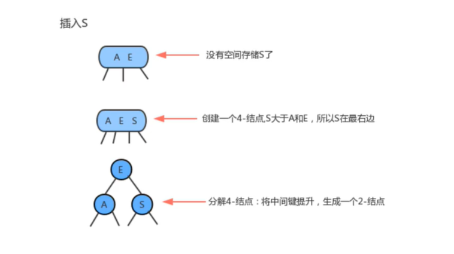

向一个父结点为2-结点的3-结点中插入新结点：和上面的方式一样将新元素和3-结点组合成临时的4-结点，然后将该结点中间键向上提升和处于2-结点的父结点组合成为3-结点，最后将左右键分别挂在这个新3-结点的合适位置。

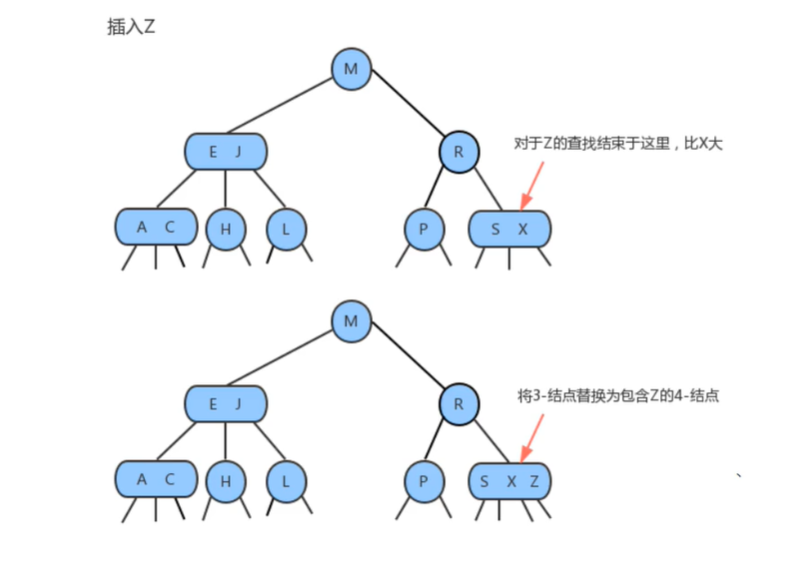

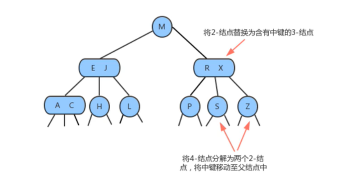

向一个父结点为3-结点的3-结点中插入新结点：当新结点插入，定位到一个3-结点上时，将结点临时组合后再拆分，中间键提升。但此时父结点是一个3-结点，插入后父结点被组合成了4-结点，这时还需要继续提升中间键，一直向上提升直到遇到一个是2-结点的父结点，和其组合后变为3-结点，此时保证了树的平衡，完成了插入。

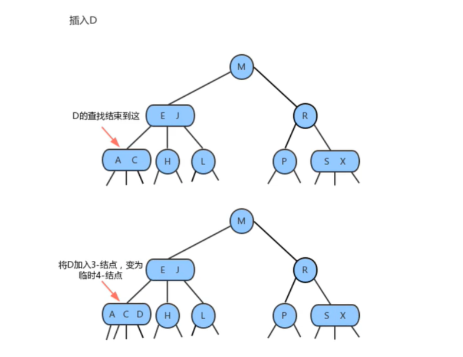

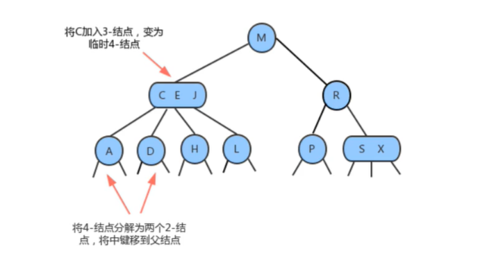

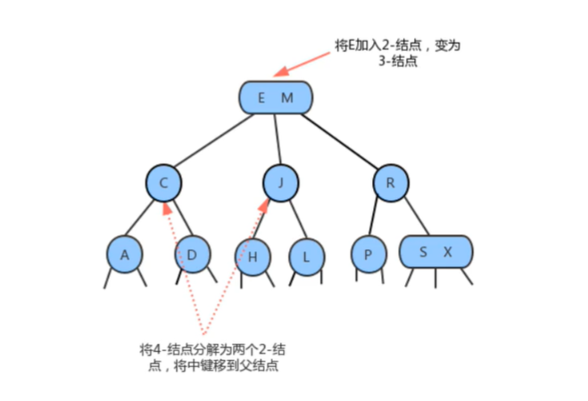

分解根结点：当插入结点到根结点的路径上全部都是3-结点的时候，最终根结点会变为一个临时的4-结点，此时就需要将中间键向上提升为新的根结点，左右键拆分为两个2-结点做为新根结点的左右子结点。完成插入后树会自底向上生长导致高度加1。

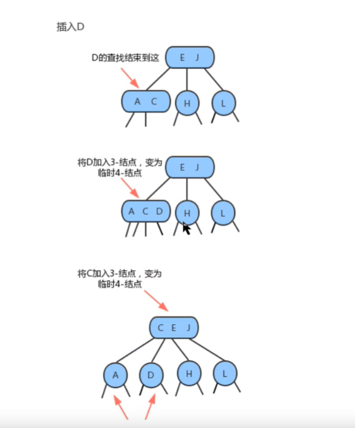

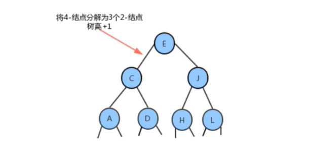

2-3树在插入元素的时候，需要做一些局部的交换来保持2-3树的平衡，一颗完全平衡的2-3树具有以下性质：

* 任意空链接到根结点的路径长度都是相等的；
* 4-结点变换为3-结点时，树的高度不会发生变化，只有当根结点是临时的4-结点，分解根结点时，树高才会+1；
* 2-3树与普通二分搜索树最大的区别是，BST是自顶向下生长的，而2-3树是自底向上生长的。


#### 红黑树

2-3在极端的情况下依旧能保证所有子结点都是2-结点，树的高度为logN，比之BST极端情况下的N，确保了时间复杂度，但是过于复杂。

红黑树主要是对2-3树进行编码，红黑树背后的基本思想是用标志的二分搜索树（完全由2-结点构成）和一些额外的信息（替换3-结点）来表示2-3树：

* 红链接：将两个2-结点连接起来构成一个3-结点；
* 黑链接：对比于2-3树中的普通链接。

准确的说，将3-结点表示为由一条左斜的红色链接（就是两个2-结点其中一个是另一个的左子结点）相连的两个2-结点，优点是无需修改就可以使用标准的BST的查找方法。

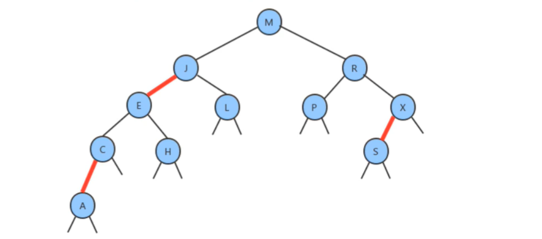

红黑树是含有红黑链接并满足下列条件的二发搜索树：

* 红链接均为左节点；
* 没有任何一个结点同时和两条红链接相连；
* 该树是完美黑色平衡的二叉树，即任意空链接到根结点的路径上的黑链接数量相同。

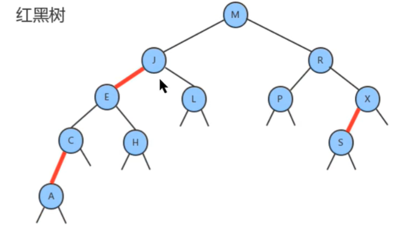

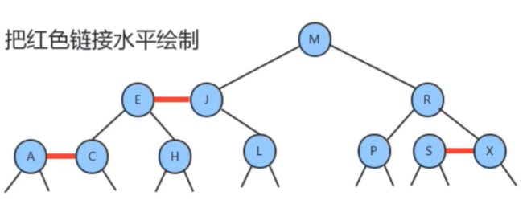

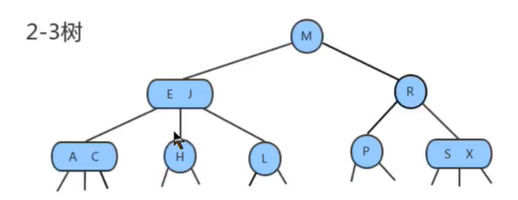

平衡化：在对红黑树进行一些增删改查操作后，很有可能会出现红色的右链接或者两条连续的红色链接，而这些都不满足红黑树的定义，所以我们需要对这些情况通过旋转进行修复，让红黑树保持平衡。

左旋：当某个结点的左子结点为黑色，右子结点为红色，此时需要左旋（当前结点为h，其右子结点为x）。

1. 将x的左子结点置为h的右子结点`h.right=x.left`；
2. 将h置为x的左子结点 `x.left=h`；
3. 将x的color置为h的color `x.color=h.color`；
4. 将h的color置为READ `h.color=true`。

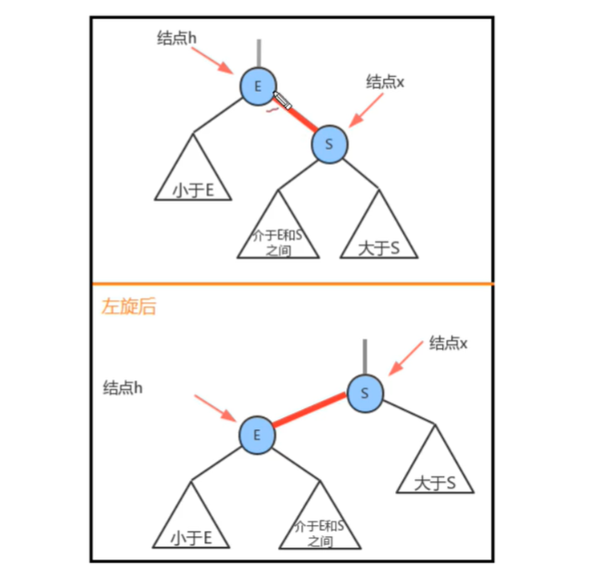

右旋：当某个结点的左子结点是红色，且左子结点的左子结点也是红色，则需要右旋（当前结点为h，其左子结点为x）。

1. 将x的右子结点置为h的左子结点`h.left=x.right`；
2. 将h置为x的右子结点 `x.right=h`；
3. 将x的color置为h的color `x.color=h.color`；
4. 将h的color置为READ `h.color=true`。

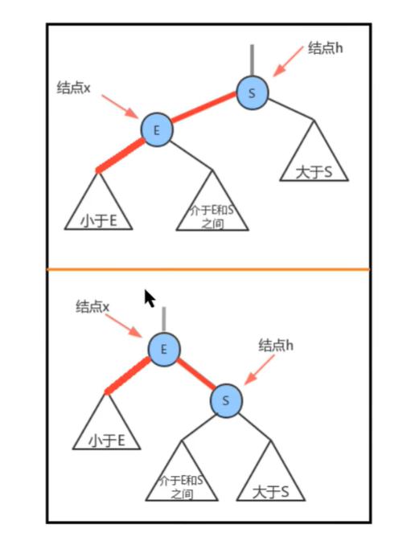

向单个2-结点插入新键：

* 一颗只含有一个键的红黑树只含有一个2-结点，在插入新键的同时也需要旋转操作；

* 如果新建小于当前结点的键，则只需要新增一个红色结点即可，新的红黑树和单个3-结点完全等价；

  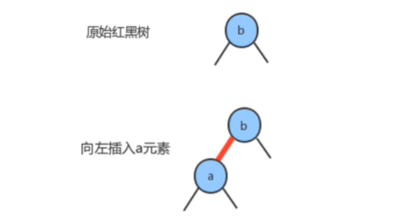

* 如果新键大于当前结点的键，那么新增的红色结点将会产生一条红色的右链接，此时需要通过左旋操作，将红色右链接变为左链接，插入操作才算完成。形成的新红黑树依然和3-结点等价，其包含两个键，一条红色链接。

  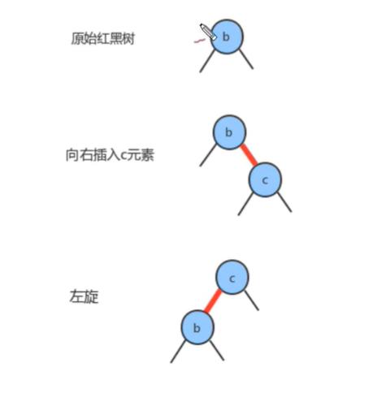

向底部的2-结点插入新键：用和二分搜索树相同的方式向一颗红黑树中插入新键，会在树的底部新增一个结点（可以保证有序性），唯一的区别就是红黑树需要用一条红链接将新结点和其父结点相连，如果其父结点是一个2-结点，那么刚才的方式仍然适用。

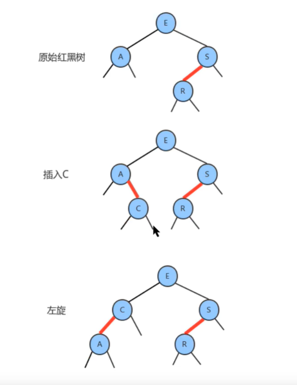

颜色反转：当一个结点的左子结点和右子结点的color都为RED时，也就是出现了临时的4-结点，此时只需要将左子结点和右子结点的颜色反转为BLACK，即让当前结点的颜色变为RED即可。

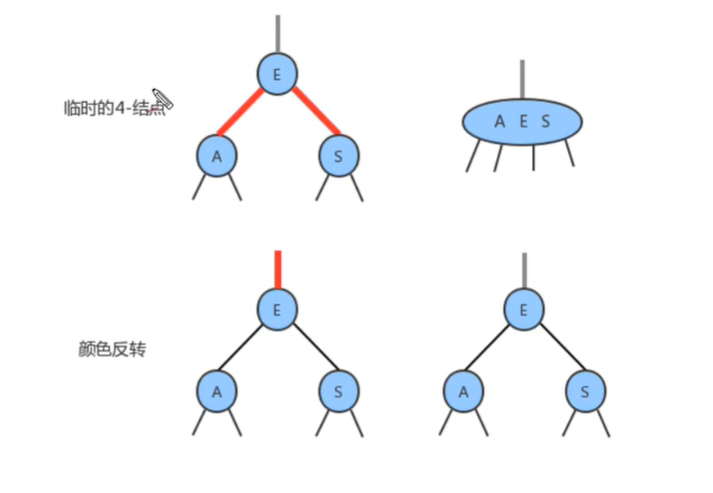

向一棵双键树（3-结点）中插入新键：

* 新键大于原树中的两个键：

  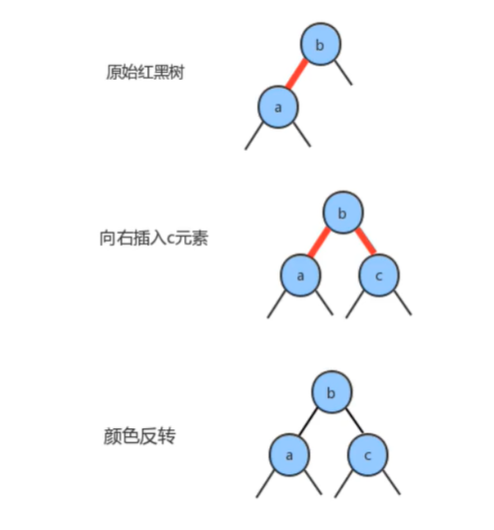

* 新建小于原树中的两个键：

  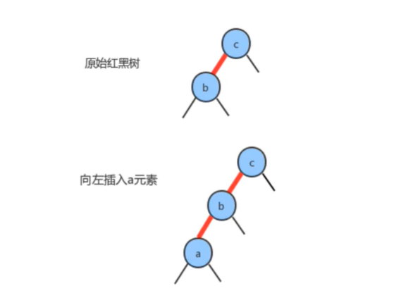

  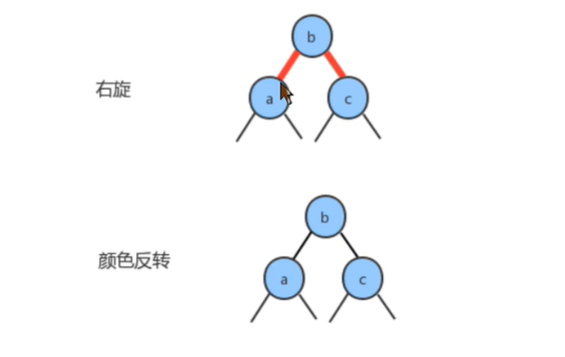

* 新建介于原树中两个键之间：

  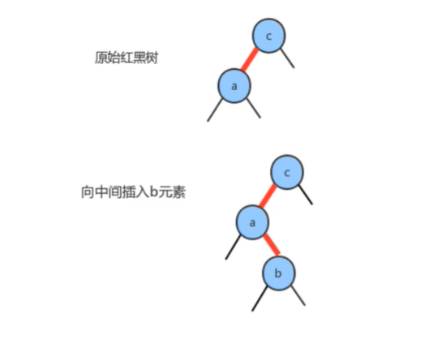

  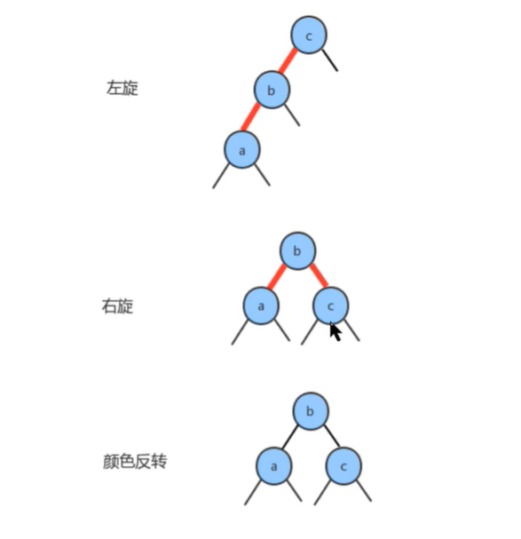

根结点的颜色总是黑色：结点的红色是由和其父结点间的链接决定的，由于根结点不存在父结点，所以每次插入后，都需要将根结点的颜色置为黑色，因为根结点可能会被旋转操作置换掉。

向树底部的3-结点插入新键：若是在树的底部的一个3-结点下插入新的结点，则出现三种情况，即指向新结点的链接可能是3-结点的右连接（此时只需要反转颜色即可）、左链接（此时需要进行右旋后再反转颜色）和中链接（此时先左旋再右旋最后反转颜色）。颜色的反转操作会使中间结点变红，相当于将其和其父结点变为了3-结点，也就意味着父结点会被插入一个新键，只需要用相同方法向上处理即可，直到向上遇到2-结点或根结点为止。

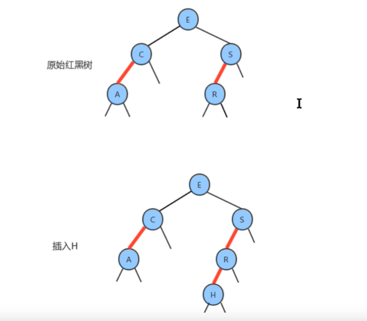

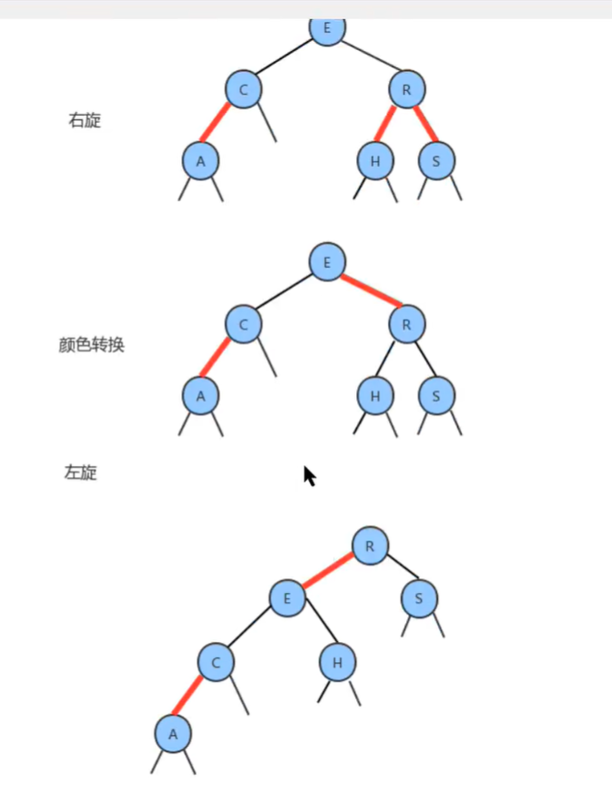

```JAVA
public class RedBlackTree<Key extends Comparable<Key>, Value> {

    // 根结点
    private Node root;
    // 记录树中元素的个数
    private int N;
    // 红色链接标记
    private static final boolean RED = true;
    // 黑色链接标记
    private static final boolean BLACK = false;

    /**
     * 树结点
     */
    private class Node {

        // 键
        public Key key;
        // 值
        private Value value;
        // 左链接
        public Node left;
        // 右链接
        public Node right;
        // 结点颜色（由和其父结点间的链接决定）
        public boolean color;

        public Node(Key key, Value value, Node left, Node right, boolean color) {
            this.key = key;
            this.value = value;
            this.left = left;
            this.right = right;
            this.color = color;
        }
    }

    /**
     *
     * @return
     */
    public int size() {
        return this.N;
    }

    /**
     *
     * @param node
     * @return
     */
    private boolean isRed(Node node) {
        if (node == null) {
            return false;
        }
        return node.color = RedBlackTree.RED;
    }

    /**
     *
     * @param h
     * @return
     */
    private Node rotateLeft(Node h) {
        Node x = h.right;
        h.right = x.left;
        x.left = h;
        x.color = h.color;
        h.color = RedBlackTree.RED;
        return x;
    }

    /**
     *
     * @param h
     * @return
     */
    private Node rotateRight(Node h) {
        Node x = h.left;
        h.left = x.right;
        x.right = h;
        x.color = h.color;
        h.color = RedBlackTree.RED;
        return x;
    }

    /**
     *
     * @param node
     */
    private void flipColors(Node node) {
        node.color = RedBlackTree.RED;
        node.left.color = RedBlackTree.BLACK;
        node.right.color = RedBlackTree.BLACK;
    }

    /**
     *
     * @param key
     * @param value
     */
    public void put(Key key, Value value) {
        root = put(root, key, value);
        root.color = RedBlackTree.BLACK;
    }

    /**
     *
     * @param node
     * @param key
     * @param value
     * @return
     */
    private Node put(Node node, Key key, Value value) {
        if (node == null) {
            N++;
            return new Node(key, value, null, null, RED);
        }

        int cmp = key.compareTo(node.key);
        if (cmp > 0) {
            node.right = put(node.right, key, value);
        } else if (cmp < 0) {
            node.left = put(node.left, key, value);
        } else {
            node.value = value;
        }

        if (isRed(node.right) && !isRed(node.left)) {
            node = rotateLeft(node);
        }

        if (isRed(node.left) && isRed(node.left.left)) {
            node = rotateRight(node);
        }

        if (isRed(node.left) && isRed(node.right)) {
            flipColors(node);
        }

        return node;
    }

    /**
     *
     * @param key
     * @return
     */
    public Value get(Key key) {
        return get(root, key);
    }

    /**
     *
     * @param node
     * @param key
     * @return
     */
    public Value get(Node node, Key key) {
        if (node == null) {
            return null;
        }

        int cmp = key.compareTo(node.key);
        if (cmp < 0) {
            return get(node.left, key);
        } else if (cmp > 0) {
            return get(node.right, key);
        } else {
            return node.value;
        }
    }
}
```


#### B树

B树中允许一个结点中包含多个key，看具体情况实现。假设一个参数M，以此来构造B树，即构造的是M阶的B树：

* 每个结点最多有M-1个key，并且以升序排列；
* 每个结点最多能有M个子结点；
* 根结点至少有两个子结点。

在实际应用中B树的阶数一般都比较大（通常大于100），所以即使存储大量的数据，B树的高度仍然比较小，这样在某些应用场景下可用显著体现优势（如MySQL的索引）。

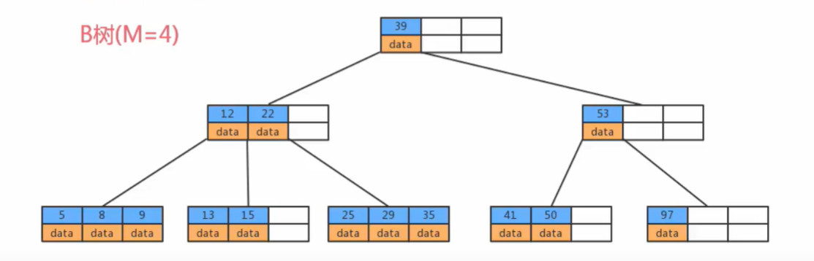

若参数M=5，则每个结点最多包含4对键值，下图以5阶B树为例，描述B树的数据存储：

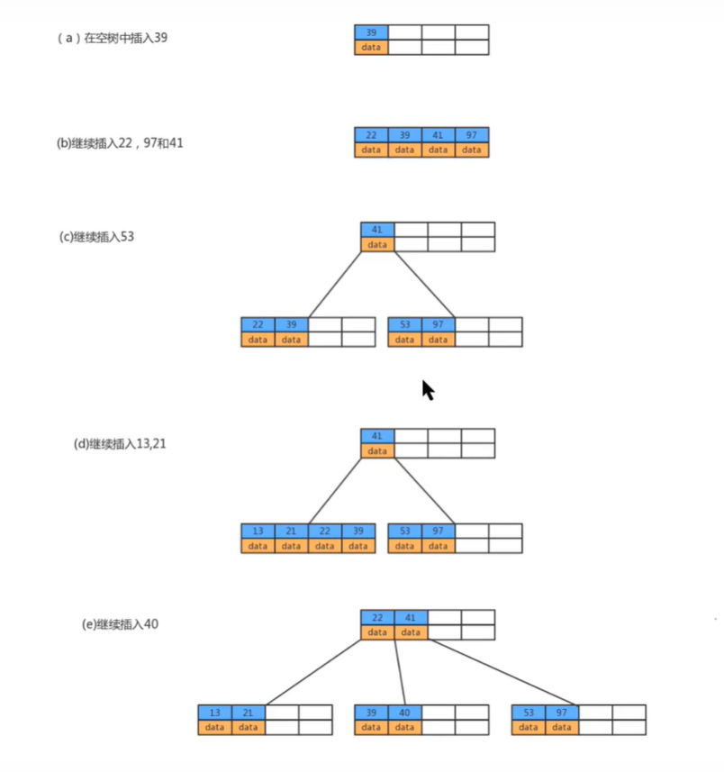

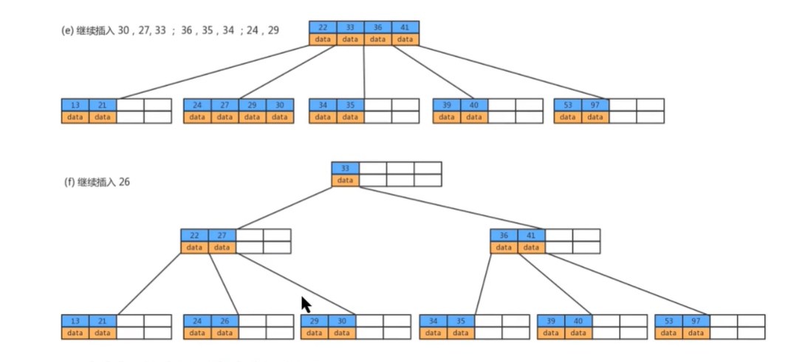


#### B+树

B+树是对B树的一种变形，与B树的区别在于：

* 非叶子结点具有索引的作用，即分支结点只存储key，不存储value；
* 树的所有叶子结点构成一个有序链表，可以按照key的顺序遍历全部数据。

假设参数M=5，那么B+树每个结点最多包含4个键值对，下图以5阶B+树为例，描述B+树的数据存储：

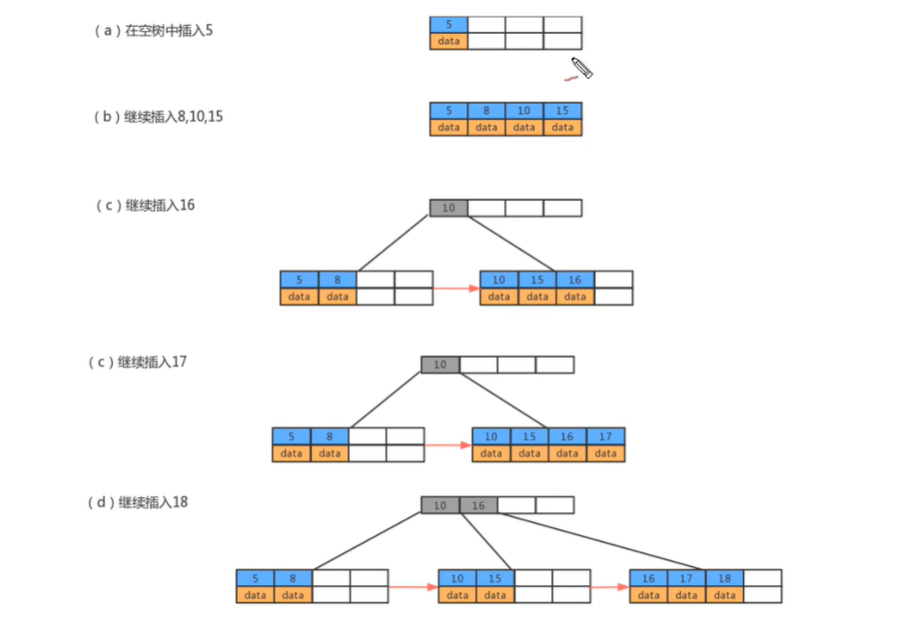

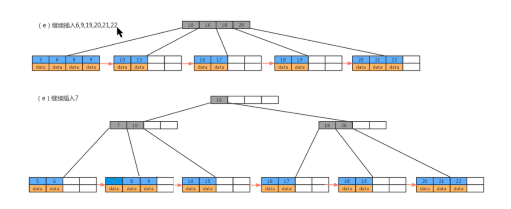

B树和B+树的优缺点对比：

* B+树：
  * 由于B+树在非叶子结点上不包含真正的数据，只当做索引使用，因此在内存相同大小的情况下，能够存放更多的key；
  * B+树的叶子结点都是相连的，因此对整棵树的遍历只需要一次线性遍历叶子结点即可。而且由于数据顺序排列且相连，更加便于范围性的查找，而B树则需要进行每一层的递归遍历。
* B树：由于B树的每一个结点都包含key和value，因此根据key查找value时，只需要找到key所在的位置，就能找到value，但B+树只有叶子结点存储数据，索引每一次查找，都必须找到树的最深处，也就是需要经过叶子结点的深度，才能找到value。

B+树在数据库中的应用：在操作数据库时，为了提高查询效率，可以基于某张表的某个字段建立索引，以提高查询效率，MySQL中的索引就是通过B+树结构实现的。

在未建立主键索引时进行查询：执行 `select * from user where id = 18;` 需要从第一条数据开始，一直查询到第6条数据才能发现id=18的数据，需要遍历比较6次。

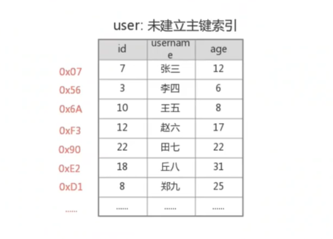

在建立了主键索引后进行查询：执行精确匹配时只需要通过key找到value即地址，通过地址之间定位到数据。不仅如此，在执行 `select * from user where id >= 12 and id <= 18;` 这种范围查询时，由于B+树的叶子结点形成了一个有序链表，所以只需要找到id=12的叶子结点，然后向后按顺序遍历即可。

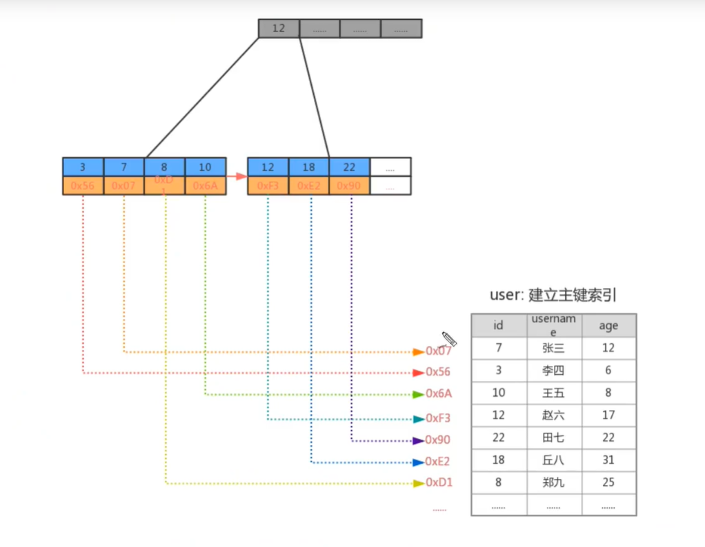


## 排序算法

### 时间复杂度

#### 大O记法

在进行算法分析时，语句总的执行次数T(n)是关于问题规模n的函数，进而分析T(n)随着n的变化情况并确定T(n)的量级。算法的时间复杂度，就是算法的时间度量，记作T(n)=O(f(n))。即表示随着问题规模n的增大，算法执行的时间（执行次数）增长率和f(n)的增长率相同，称为算法的渐近时间复杂度，其中f(n)是问题规模n的某个函数。

使用大O记法表示时间复杂度的示例：

```java
// 共3次
public static void main(String[] args) {
    // 执行1次
    int sum = 0;
    // 执行1次
    int n = 100;
    // 执行1次
    sum = (n + 1) * n / 2;
    System.out.println("sum = " + sum);
} 
```

```JAVA
// 共n+3次
public static void main(String[] args) {
    // 执行1次
    int sum = 0;
    // 执行1次
    int n = 100;
    // 执行n次
    for (int i = 1; i <= n; i++) {
        sum += i;
    }
    System.out.println("sum = " + sum);
}
```

```JAVA
// 共n^2+2次
public static void main(String[] args) {
    // 执行1次
    int sum = 0;
    // 执行1次
    int n = 100;
    // 执行n^2次
    for (int i = 1; i <= n; i++) {
        for (int j = 1; j <= n; j++) {
    		sum += i;        
        }
    }
    System.out.println("sum = " + sum);
}
```

基于对函数渐近增长的分析，使用大O阶表示法有以下规则：

* 用常数1取代运行时间中的所有加法常数；
* 在修改后的运行次数中，只保留高阶项；
* 如果最高价项存在，且常数因子不为1，则去除与这个项相乘的常数。

所以，上述算法的大O记法为：O(1)、O(n)、O(n^2)。


#### 常见的大O阶

* 线性阶：一般含有非嵌套循环涉及线性阶，线性阶就是随着输入规模的扩大，对应计算的次数呈直线增长。

```JAVA
// O(n)
public static void main(String[] args) {
    int sum = 0;
    int n = 100;
    for (int i = 1; i <= n; i++) {
        sum += i;
    }
    System.out.println("sum = " + sum);
}
```

* 平方阶：一般嵌套循环属于这种时间复杂度。

```JAVA
// O(n^2)
public static void main(String[] args) {
    int sum = 0, n = 100;
    for (int i = 1; i <= n; i++) {
        for (int j = 1; j <= n; j++) {
    		sum += 1;        
        }
    }
    System.out.println("sum = " + sum);
}
```

* 立方阶：三层嵌套循环属于这种时间复杂度。

```JAVA
// O(n^3)
public static void main(String[] args) {
    int sum = 0, n = 100;
    for (int i = 1; i <= n; i++) {
        for (int j = i; j <= n; j++) {
    		for (int k = i; k <= n; k++) {	
        		sum++;        
            }        
        }
    }
    System.out.println("sum = " + sum);
}
```

* 对数阶：由于随着输入规模n的增大，不管底数是多少，其增长趋势是相同的，所以会忽略底数。

```JAVA
public static void main(String[] args) {
    int i = 1, n = 100;
    // 由于每次i*2后，就距离n更近一步，即共有x个2相乘后大于n，然后退出循环。
    // 由于是2^x=n，则得到x=log(2)n，所以该循环的时间复杂度为O(logN)。
    while (i < n) {
        i = i * 2;
    }
}
```

* 常数阶：不涉及循环操作的基本都是常数阶，因为其不会随着n的增长而增加操作次数。

```JAVA
// O(1)
public static void main(String[] args) {
    int n = 100;
    int i = n + 2;
    System.out.println(n);
}
```


#### 函数调用的时间复杂度分析

```JAVA
// O(n)
public static void main(String[] args) {
    int n = 100;
    for (int i = 0; i < n; i++) {
        show(i);
    }
}

private static void show(int i) {
    System.out.println(i);
}
```

```java
// O(n^2)
public static void main(String[] args) {
    int n = 100;
    for (int i = 0; i < n; i++) {
        show(i);
    }
}

private static void show(int i) {
    for (int i = 0; i < n; i++) {
        System.out.println(i);
    }
}
```

```java
// 2n^2+n+1 
// 根据大O规则，只保留n的最高阶项，并去掉最高阶项的常数因子，最终用大O记法得出 O(n^2)
public static void main(String[] args) {
    int n = 100; // 1
    show(n);	// n
    // n^2
    for (int i = 0; i < n; i++) {
        show(i);
    }
    // n^2
    for (int i = 0; i < n; i++) {
        for (int j = 0; j < n; j++) {
            System.out.println(j);
        }
    }
}

private static void show(int i) {
    for (int i = 0; i < n; i++) {
        System.out.println(i);
    }
}
```


#### 考虑最坏的情况

最坏情况是一种保证，指的是在应用程序中，即使遇到了最坏情况，也能够保证正常提供服务。所以默认情况下算法的时间复杂度都是在最坏情况下分析的。

```JAVA
// 从一个存储了n个随机数字的数组中找出指定的数字
public int search(int num) {
    int[] arr = {11, 10, 8, 9, 7, 22, 23, 0};
    for (int i = 0; i < arr.length; i++) {
        if (num == arr[i]) {
            return i;
        }
    }
    return -1;
} 
```

* 最好情况：查找第一个数字就是期望数字，那么算法的时间复杂度为O(1)；
* 最坏情况：一直查找到最后一个数字才是期望数字，那么算法的时间复杂度为O(n)；
* 平均情况：任何数字查找的平均成本是O(n/2)。


### 空间复杂度

#### Java中常见的内存占用

* 基本数据类型的内存占用情况：

| 数据类型 | 占用字节数 |
| :------: | :--------: |
|   byte   |     1      |
|  short   |     2      |
|   int    |     4      |
|   long   |     8      |
|  float   |     4      |
|  double  |     8      |
| boolean  |     1      |
|   char   |     2      |

* 一个引用类型的变量需要占用8个字节：如 `Date date = new Date` 语句中的date变量就是引用变量。

* 创建一个对象，除了对象内部数据占用的空间外，该对象本身也具有内存开销，每个对象的头信息占用16个字节。

* 一般内存的使用，如果不满足8个字节，都会被填充成8字节：

  ```JAVA
  // 对象头信息占用16个字节
  public class A {
      // 整型变量a占用4个字节
      public int a = 1;
  }
  new A();	// A对象共占用20个字节，由于不是8的整数倍，所以会被填充为24个字节
  ```

* Java中的数组被限定为对象，一般都会因为要记录其长度而需要额外的内存，一个基本数据类型的数组一般需要占用24个字节（即16个字节的头信息+4个字节的长度信息+4个填充字节）。


#### 算法的空间复杂度分析

案例分析：对指定的数组元素进行反转。

```JAVA
// 解法1：O(8) -> O(1)
public static int[] reverse01(int[] arr) {
    int n = arr.length;	// 4字节
    int temp;	// 4字节
    for (int start = 0, end = n - 1; start <= end; start++, end--) {
    	temp = arr[start];
        arr[start] = arr[end];
        arr[end] = temp;
    }
    return arr;
}
```

```java
// 解法2：O(4+24+4n) -> O(n)
public static int[] reverse02(int[] arr) {
    int n = arr.length;	// 4字节
    int[] temp = new int[n];	// 数组对象的24字节+元素的n*4字节
    for (int i = n - 1; i >= 0; i--) {
        temp[n - 1 - i] = arr[i];
    }
    return temp;
} 
```

由于Java存在垃圾回收机制，且JVM对程序的内存占用也有一定的优化，所以无法精确的评估一个Java程序的内存占用情况，只能进行估算。另外，现代计算机的内存一般都比较大，所以空间占用一般不是算法分析的主要方面（即不是算法的性能瓶颈），一般情况下所说的算法复杂度，默认就是时间复杂度。


### 冒泡排序


* 比较两个相邻的元素，如果前一个大于后一个，就互换位置；
* 对集合中每一对相邻的元素做同样的工作，最终被交换到末尾的就是最大元素，下次比较就可以忽略末尾元素；
* 多次完成从头到尾的比较操作，每次比较完后都会在末尾确定一个元素的位置，等所有比较操作收敛后集合归于有序。

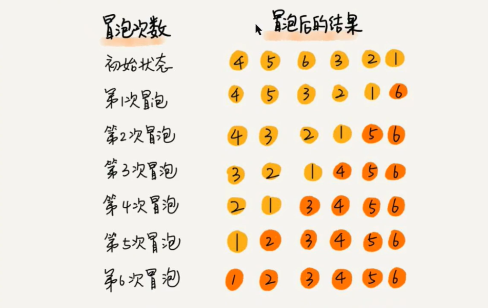

```JAVA
public class BubbleSort {
    
    public static void sort(Comparable[] arr) {
        // 控制整体比较操作执行的次数
        for (int i = arr.length - 1; i > 0; i--) {
            // 控制单次比较操作执行的次数
            for (int j = 0; j < i; j++) {
                // 比较相邻元素的大小
                if (greater(arr[j], arr[j + 1])) {
                    // 交换元素位置
                    swap(arr, j, j + 1);
                }
            }
        }
    }

    private static boolean greater(Comparable left, Comparable right) {
        return left.compareTo(right) > 0;
    }

    private static void swap(Comparable[] arr, int i, int j) {
        Comparable temp = arr[i];
        arr[i] = arr[j];
        arr[j] = temp;
    }
}
```

时间复杂度分析：冒泡排序使用了双层for循环，其中内层循环是真正完成排序操作的代码，所以分析时间复杂度时主要关注内层循环即可。在最坏的情况下，也就是要升序排序的集合为(6,5,4,3,2,1)时：

* 元素的比较次数为：`(N-1)+(N-2)+(N-3)+...+2+1=((N-1)+1)*(N-1)/2=N^2/2-N/2`；
* 元素的交换次数为：`(N-1)+(N-2)+(N-3)+...+2+1=((N-1)+1)*(N-1)/2=N^2/2-N/2`；
* 总执行次数为：`(N^2/2-N/2)+(N^2/2-N/2)=N^2-N`；
* 按照大O推导法则，保留函数中的最高阶项：`O(N^2)`。


### 选择排序


* 每次遍历的过程中，都假定一个位置的元素为最小值，然后和其之后的所有元素依次比较，并将本次发现的最小元素和其交换，一次遍历完后可以在首部确定一个位置；
* 多次完成比较交换的遍历操作，每次假定的最小值位置都会是上一次遍历确定的位置的后一位。当所有比较操作收敛后集合就会趋于有序。

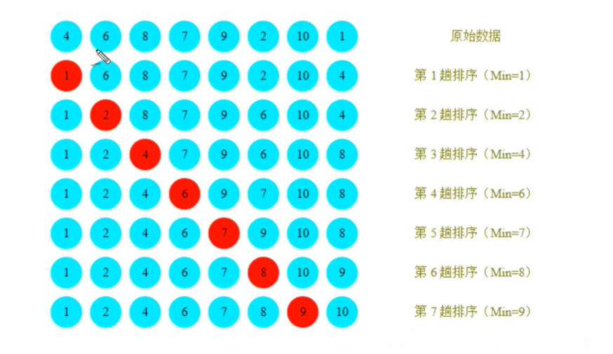

```JAVA
public class SelectionSort {

    public static void sort(Comparable[] arr) {
        for (int i = 0; i < arr.length - 1; i++) {
            // 每次比较操作之前假定的最小值下标
            int minIndex = i;
            // 内层循环的作用是比较出本次真正的最小值
            for (int j = i + 1; j < arr.length; j++) {
                if (greater(arr[minIndex], arr[j])) {
                    minIndex = j;
                }
            }
            // 将最小值交换到合适的位置
            swap(arr, i, minIndex);
        }
    }

    private static boolean greater(Comparable left, Comparable right) {
        return left.compareTo(right) < 0;
    }

    private static void swap(Comparable[] arr, int i, int j) {
        Comparable temp = arr[i];
        arr[i] = arr[j];
        arr[j] = temp;
    }
}

```

时间复杂度分析：选择排序使用了双层for循环，其中外层循环控制数据的交换，内层循环控制数据的比较。

* 数据比较次数：`(N-1)+(N-2)+(N-3)+...+2+1=((N-1)+1)*(N-1)/2=N^2/2-N/2`；
* 数据交换次数：`N-1`；
* 总执行次数：`N^2/2-N/2+(N-1)=N^2/2+N/2+1`；
* 时间复杂度：根据大O推导法则，保留最高阶项，去除常数因子，时间复杂度为 `O(N^2)`。


### 插入排序


* 将集合中的所有元素逻辑上划分为有序和无序两组，有序在前，无序在后；
* 找到无序集合中的第一个元素，向有序集合中插入；
* 新插入的元素从有序组的末尾向前开始比较，遇到更大的元素则交换位置，直到遇到更小或相等的元素，才会停止比较。

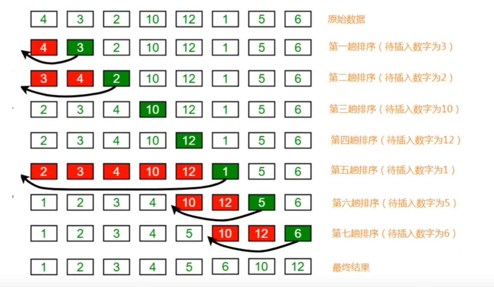

```JAVA
public class InsertionSort {

    public static void sort(Comparable[] arr) {
        for (int i = 1; i < arr.length; i++) {
            for (int j = i - 1; j >= 0 &&
                    greater(arr[j], arr[j + 1]); j--) {
                swap(arr, j, j + 1);
            }
        }
    }

    private static boolean greater(Comparable left, Comparable right) {
        return left.compareTo(right) > 0;
    }

    private static void swap(Comparable[] arr, int i, int j) {
        Comparable temp = arr[i];
        arr[i] = arr[j];
        arr[j] = temp;
    }
}
```

时间复杂度分析：插入排序使用双层for循环，其中内层循环体是真正完成排序的代码，所以分析插入排序的时间复杂度主要分析内存代码的执行次数即可。在最坏的情况下，插入排序的时间复杂度分析：

* 比较次数为：`(N-1)+(N-2)+(N-3)+...+2+1=((N-1)+1)*(N-1)/2=N^2/2-N/2`；
* 交换次数为：`(N-1)+(N-2)+(N-3)+...+2+1=((N-1)+1)*(N-1)/2=N^2/2-N/2`；
* 总执行次数：`(N^2/2-N/2)+(N^2/2-N/2)=N^2-N`；
* 时间复杂度：根据大O推导法则，只保留函数中的最高阶项，时间复杂度为 `O(n^2)`。


### 希尔排序


* 首先选定一个步长h，以其做为依据对集合进行分组，即从首部元素开始，与和其间隔步长整数倍的元素分为一组；
* 对组内的数据进行比较/交换操作，也就是进行了插入排序； 
* 将步长h缩减为原来的1/2后重新对集合进行分组，然后重复第2步的比较操作。最后，当步长h缩减为1且比较完毕后，算法收敛。 

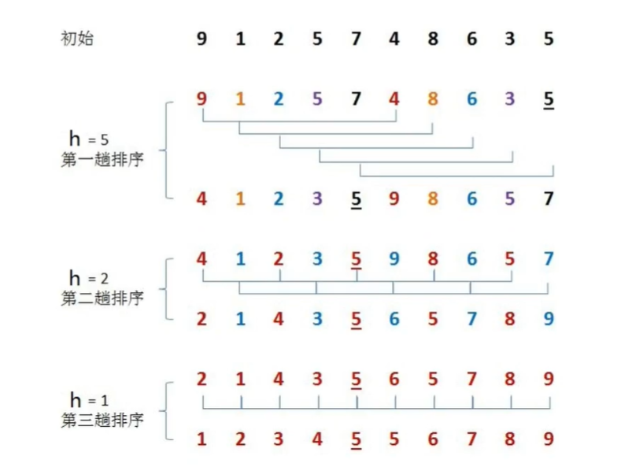

```JAVA
public class ShellSort {

    public static void sort(Comparable[] arr) {
        // 初始化步长
        int h = 1;
        while (h < arr.length / 2) {
            h = 2 * h + 1;
        }
		
        // 步长递减控制
        while (h >= 1) {
            // 根据步长分组进行插入排序
            for (int i = h; i < arr.length; i++) {
                for (int j = i; j >= h &&
                        greater(arr[j - h], arr[j]); j -= h) {
                    swap(arr, j - h, j);
                }
            }
            h = h / 2;
        }
    }

    private static boolean greater(Comparable left, Comparable right) {
        return left.compareTo(right) > 0;
    }

    private static void swap(Comparable[] arr, int i, int j) {
        Comparable temp = arr[i];
        arr[i] = arr[j];
        arr[j] = temp;
    }
}
```


### 归并排序


* 首先将原集合尽可能的拆分为元素相等的两个子几个，并对每个子集合继续进行拆分，直到元素个数为1为止；
* 然后将相邻的两个子集进行排序并合并；
* 重复第2部的操作，直到最终合并成一个有序集合为止。

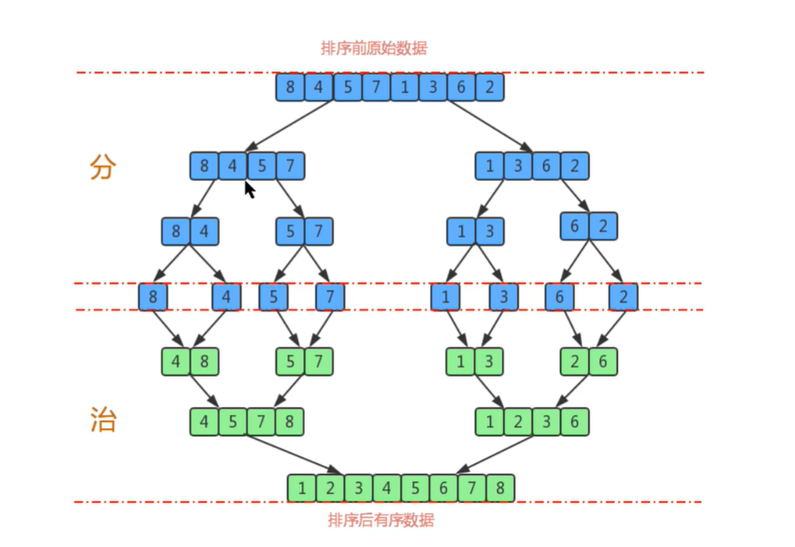

归并操作的原理：

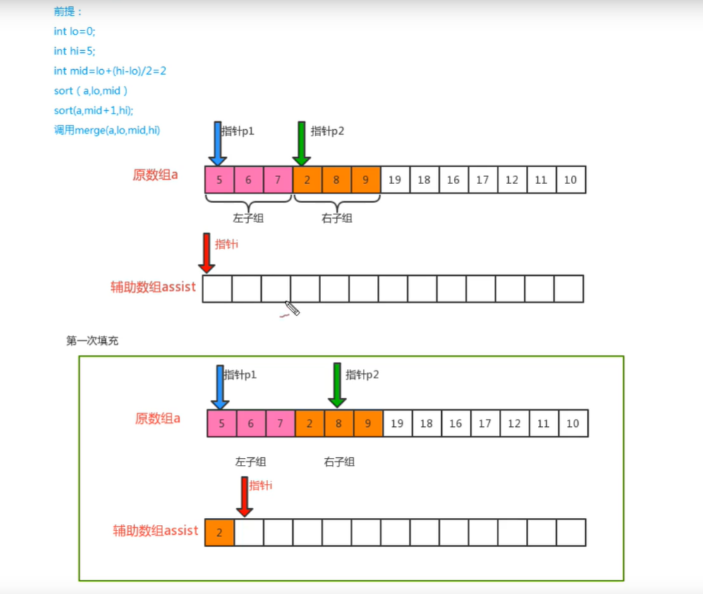

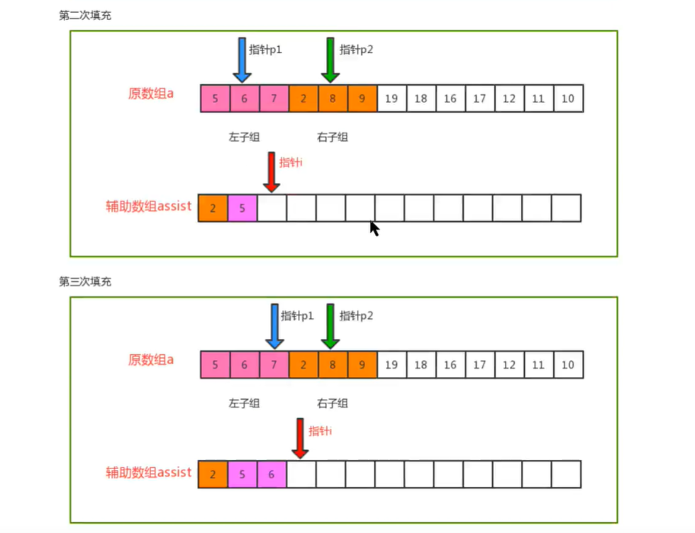

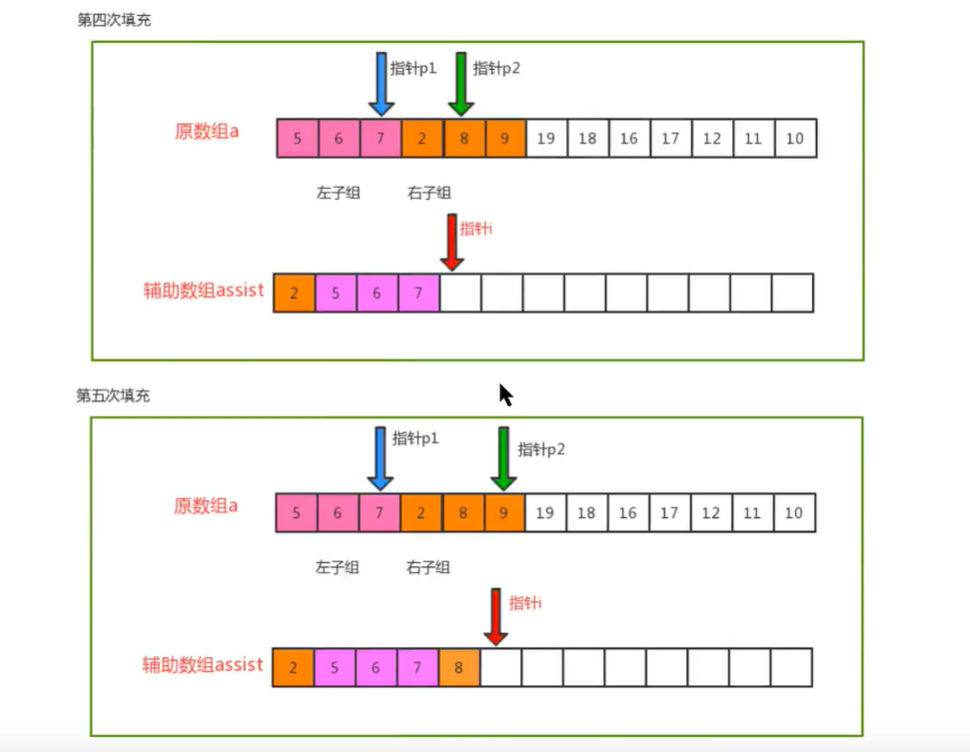

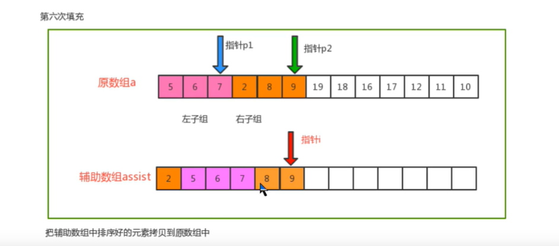

```JAVA
public class MergeSort {

    private static Comparable[] assist;

    private static boolean less(Comparable left, Comparable right) {
        return left.compareTo(right) < 0;
    }

    private static void exchange(Comparable[] arr, int i, int j) {
        Comparable temp = arr[i];
        arr[i] = arr[j];
        arr[j] = temp;
    }

    public static void sort(Comparable[] arr) {
        assist = new Comparable[arr.length];
        int start = 0;
        int end = arr.length - 1;
        sort(arr, start, end);
    }

    private static void sort(Comparable[] arr, int start, int end) {
        if (end <= start) {
            return;
        }

        int middle = start + (start + end) / 2;

        sort(arr, start, middle);
        sort(arr, middle + 1, end);

        merge(arr, start, middle, end);
    }

    private static void merge(Comparable[] arr, int start, int middle, int end) {
        int index = start, p1 = start, p2 = middle + 1;

        while (p1 <= middle && p2 <= end) {
            assist[index++] = less(arr[p1], arr[p2]) ? arr[p1++] : arr[p2++];
        }

        while (p1 <= middle) {
            assist[index++] = arr[p1++];
        }

        while (p2 <= end) {
            assist[index++] = arr[p2++];
        }

        for (int i = start; i <= end; i++) {
            arr[i] = assist[i];
        }
    }
}
```

时间复杂度分析：归并排序是分治思想的典型例子，该算法对arr[start, ..., end]进行排序，先将其分为arr[start, ..., middle]和arr[middle+1, ..., end]两个部分，然后分别通过递归调用将它们单独排序，最后将有序的子数组归并为最终的排序结果。该递归的出口在于如果一个数组不能再被分为两个子数组，那么就会执行merge进行归并操作，在归并的时候判断元素的大小进行排序。

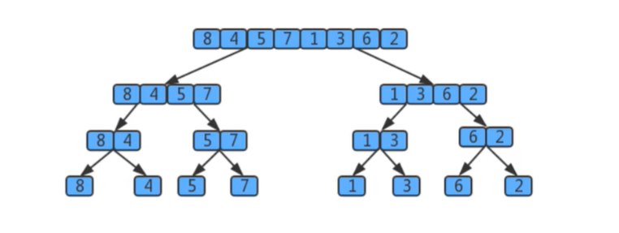

用树状图来描述归并，如果一个数组有8个元素，那么它将每次除以2找到最小

子数组，共拆分log8次，值为3，所以树共有3层，那么自顶向下第k层具有2^k个子数组，每个数组的长度为 `2^(3-k)`，归并最多需要 `2^(3-k)` 次比较。因此每层的比较次数为 `2^k*2^(3-k)=2^3`，那么3层总共为 `3*2^3`。

假设元素的个数为n，那么使用归并排序拆分的次数为log2(n)，所以共log2(n)层，那么使用log2(n)替换上面 `3*2^3` 中的3这个层数，最终得出的归并排序时间复杂度为：`log2(n)*2^(log2(n))=log2(n)*n`，根据大O推导法则，忽略底数，最终归并排序的时间复杂度为 `O(nlogn)`。


### 快速排序


* 首先设定一个分界值，通过该分界值将数组分为左右两个部分；
* 将大于或等于分界值的数据放到数据右边，小于分界值的数据放到数组左边。此时左边部分中各元素都小于或等于分界值，而右边部分中各元素都大于或等于分界值；
* 然后，左边和右边的数据可以独立的进行排序，对于每个子数组都可以再次设定分界值，同样的将数据分为左右两部分，左边为较小值，右边是较大值；
* 重复上述的过程，即通过递归将左右两侧的数据都排好顺序后，整个数组的排序也就完成了。

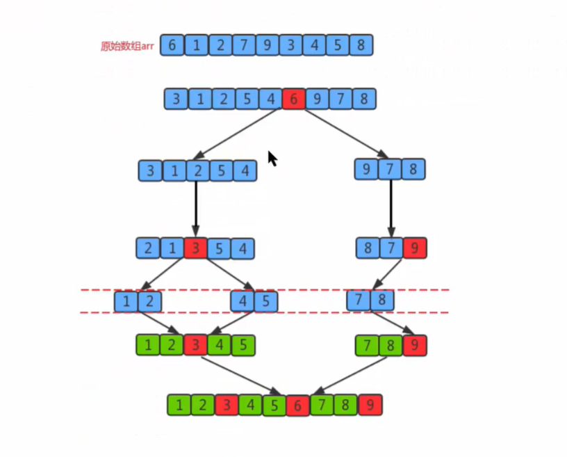

切分操作的原理：

1. 设定一个基准值，用两个指针分别指向数组的头部和尾部；
2. 先从尾部向头部开始搜索到一个比基准值小的元素，并记录指针的位置；
3. 再从头部向尾部开始搜索到一个比基准值大的元素，并记录指针的位置；
4. 交换左右两边指针指向的元素；
5. 重复2、3、4步骤，直到左边指针的值大于右边指针的值为止。

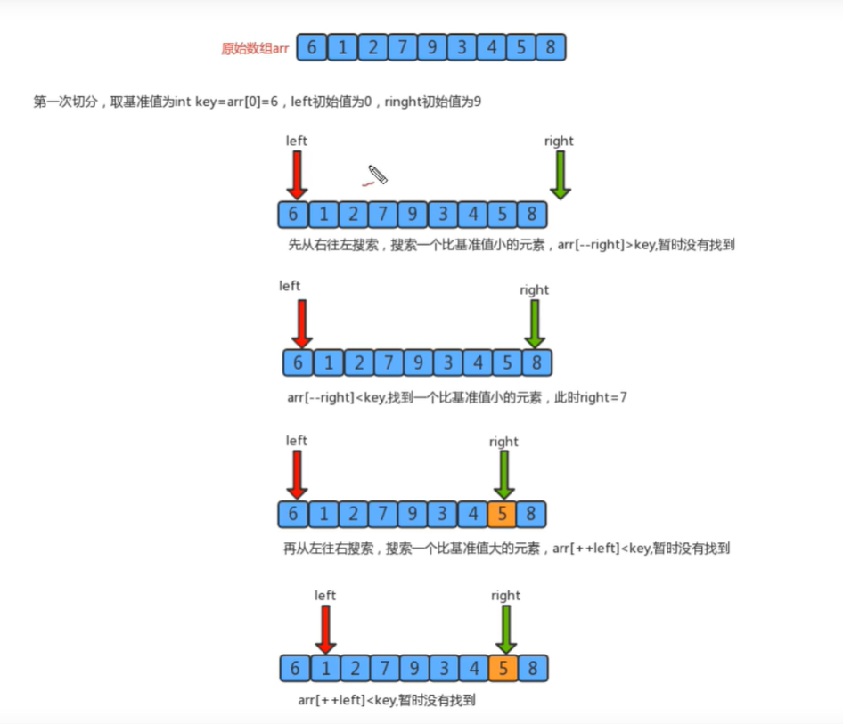

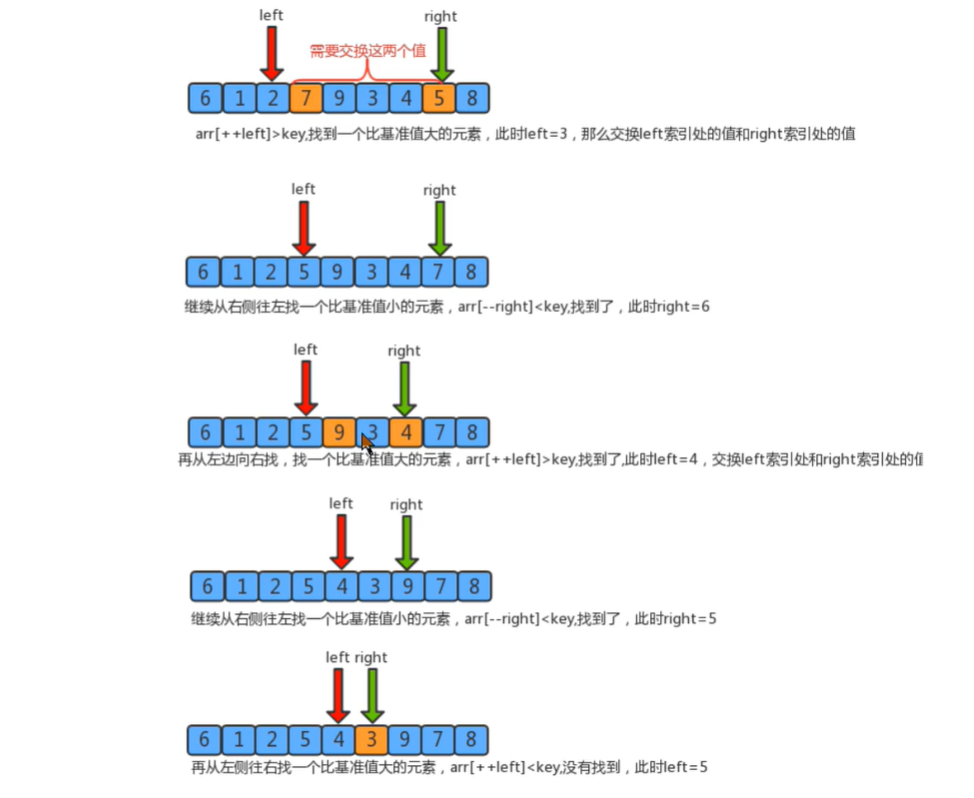

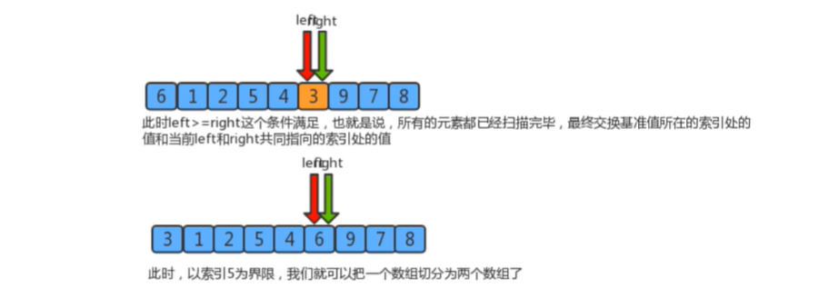

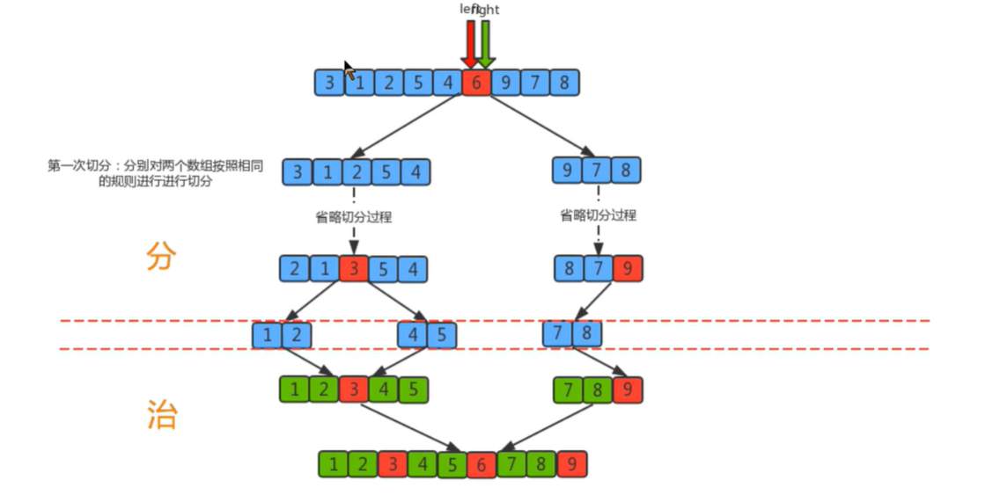

```JAVA
public class QuickSort {

    private static boolean less(Comparable left, Comparable right) {
        return left.compareTo(right) < 0;
    }

    private static void exchange(Comparable[] arr, int i, int j) {
        Comparable temp = arr[i];
        arr[i] = arr[j];
        arr[j] = temp;
    }

    private static void sort(Comparable[] arr) {
        int start = 0, end = arr.length - 1;
        sort(arr, start, end);
    }

    private static void sort(Comparable[] arr, int start, int end) {
        if (end <= start) {
            return;
        }

        int partition = partition(arr, start, end);

        sort(arr, start, partition - 1);
        sort(arr, partition + 1, end);
    }

    private static int partition(Comparable[] arr, int start, int end) {
        Comparable partitionKey = arr[start];

        int left = start, right = end + 1;

        while (true) {
            while (less(partitionKey, arr[--right])) {
                if (right == start) {
                    break;
                }
            }

            while (less(arr[++left], partitionKey)) {
                if (left == end) {
                    break;
                }
            }

            if (left >= right) {
                break;
            } else {
                exchange(arr, left, right);
            }
        }

        exchange(arr, start, right);

        return right;
    }
}
```

**和归并排序的区别**：快速排序是另外一种基于分治思想实现的排序算法，它将一个数组分成若干个子数组，并将每个部分独立的排序。快速排序和归并排序是互补的：归并排序将数组分成若干个子数组并分别排序，最后将有序的子数组合并从而使整个数组有序；而快速排序的方式则是当若干个数组有序时，整个数组自然就有序了。在归并排序中，一个数组会被均等的拆分，归并操作会在处理整个数组之前；而快速排序中，拆分数组的为止取决于数组的内容，递归调用发生在处理整个数组之后。

**时间复杂度分析**：快速排序的一次切分从头尾开始交替搜索，直到left和right重合。因此，一次切分算法的时间复杂度为O(n)，但整个快速排序的时间复杂度和切分的次数相关。

* **平均情况**：每一次切分选择的基准数字不是最大值、最小值和中值，这种情况下的时间复杂度为 `O(nlogn)`。

* **最优情况**：每一次切分选择的基准数字刚好能将当前序列等分。如果将数组的切分看成是一棵树，那么下图就是最优情况，共切分了logn次。所以，最优情况下快速排序的时间复杂度为 `O(nlogn)`。

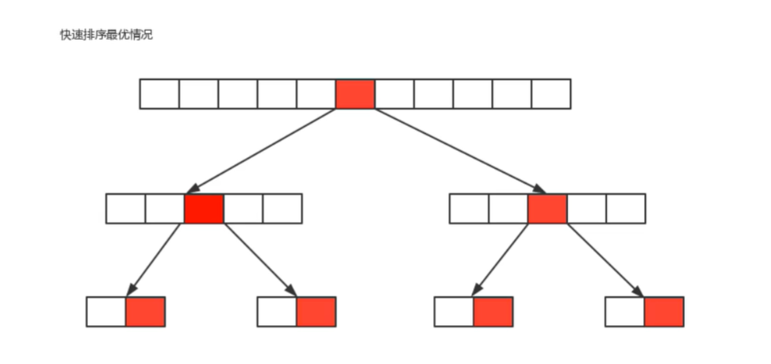

* **最坏情况**：每一个切分选择的基准数字是当前序列的最大或最小值，这使得每次切分都会有一个子组，那么总共就得切分n次。所以，最坏情况下快速排序的时间复杂度为 `O(n^2)`。

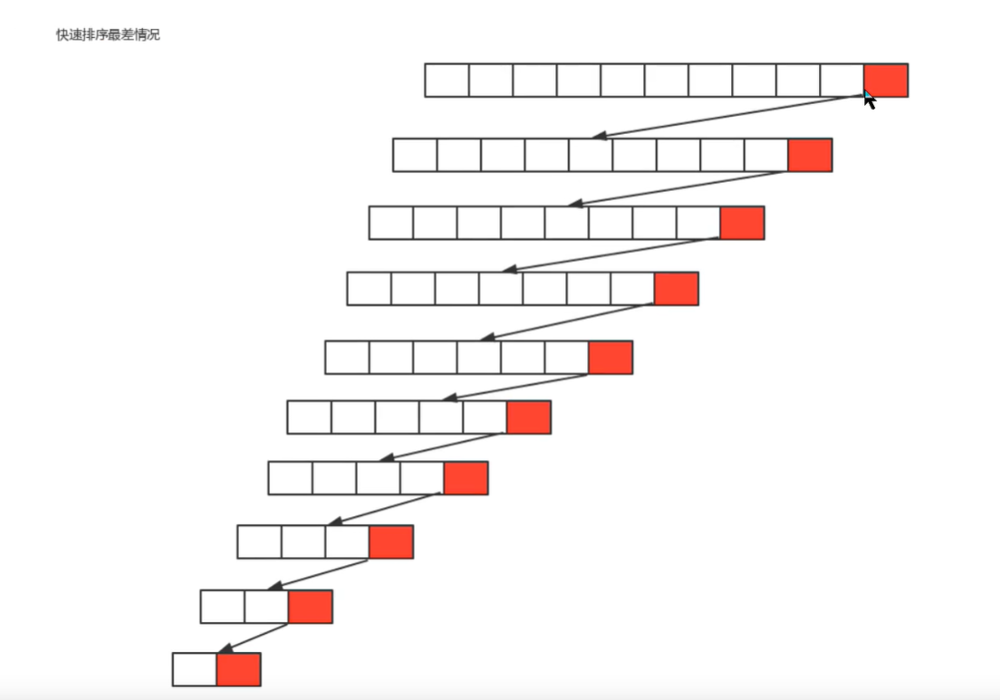


### 堆排序


* 首先根据原集合构造出堆结构；
* 得到堆顶元素，这个值就是最大值；
* 交换堆顶元素和数组中的最后一个元素，此时所有元素中的最大元素都已经放到合适的位置了；
* 对堆进行调整，重新让除了最后一个元素的剩余元素的最大值放到堆顶；
* 重复2~4步骤，直到堆中只剩下一个元素为止。

**堆构造过程**：最直观的方法就是创建一个新的数组，然后从头开始遍历原数组，将每个元素按顺序添加到新数组中，并从数据长度的一半处（因为堆的特性，后半段的叶子结点无需下沉）开始下沉对堆进行调整，最后就形成了一个有序堆。

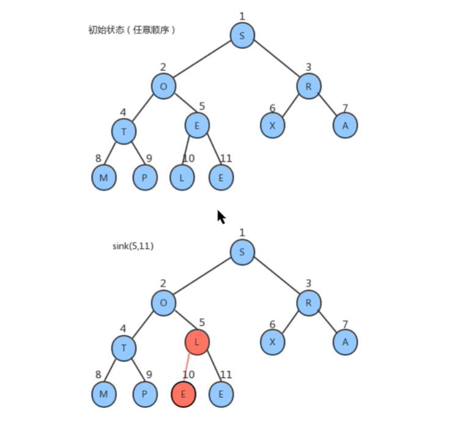

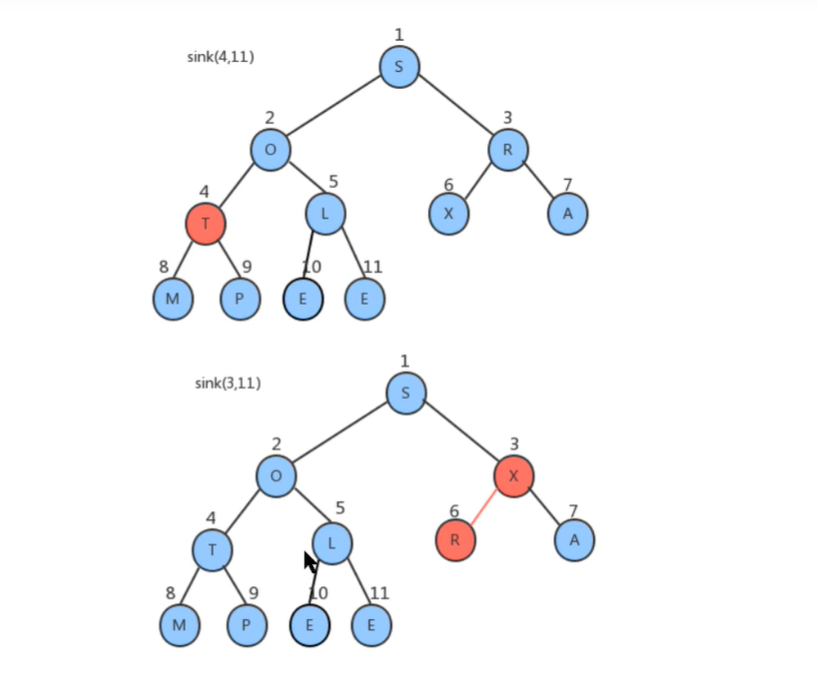

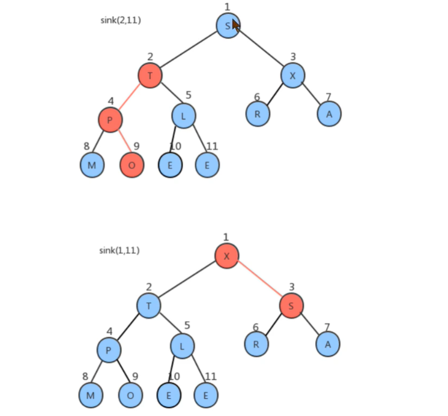

**堆排序过程**：对于构造好的堆，只需要做类似于堆删除的操作，就可以完成排序。

* 将堆顶元素和堆中最后一个元素交换位置；
* 通过对堆顶元素下沉调整堆，把最大的元素放到堆顶（此时最后一个元素不参与堆的调整，因为最大的数据已经到了数组的最右边）；
* 重复1~2步骤，直到堆中只剩最后一个元素。

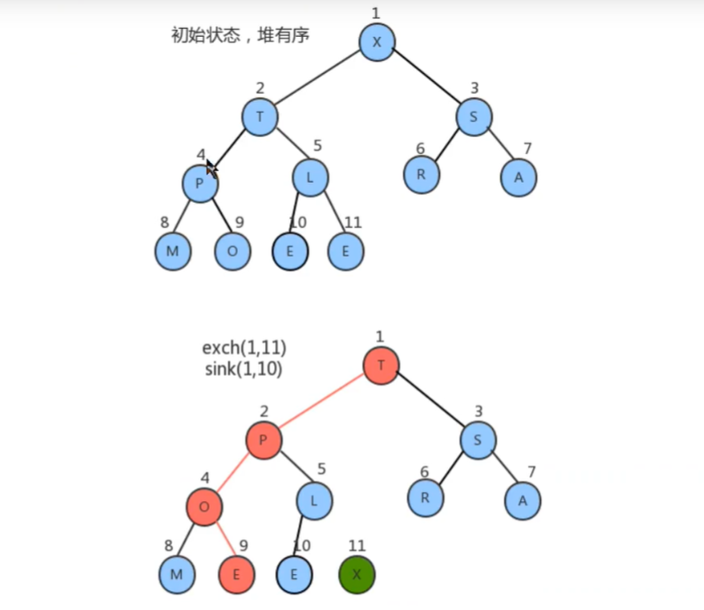

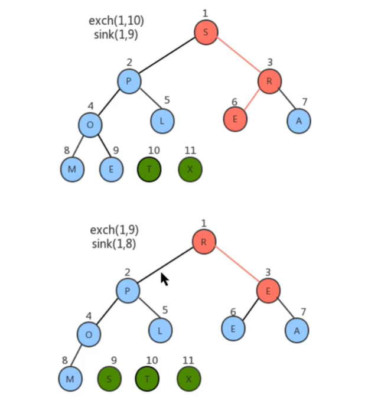

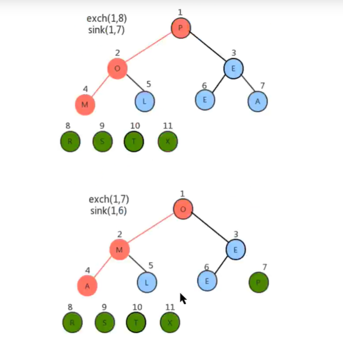

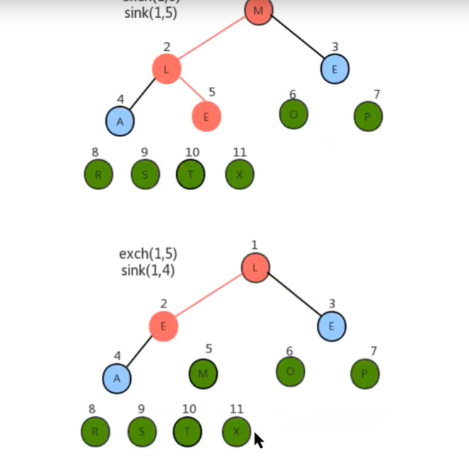

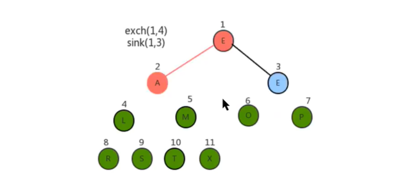

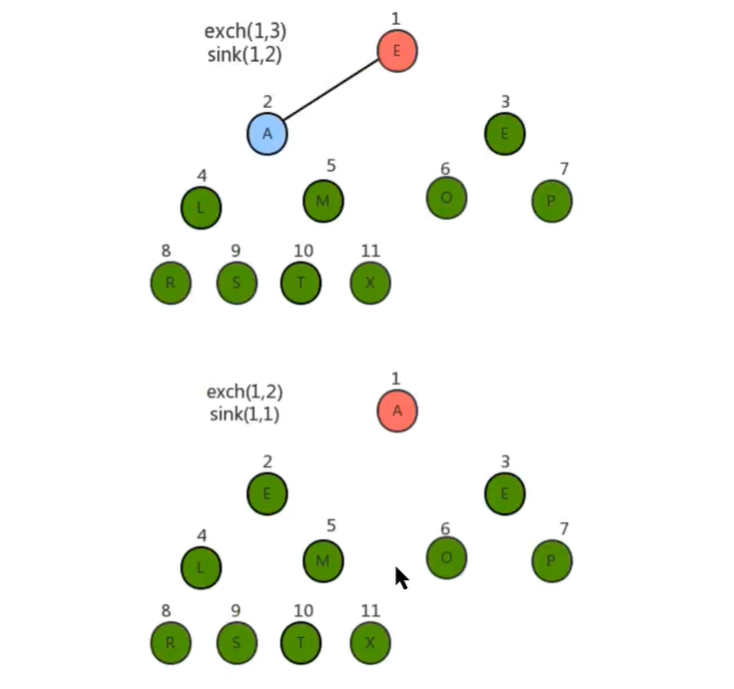

```java
public class HeapSort {

    /**
     * 判断堆中索引i处的元素是否小于索引j处的元素
     */
    private static boolean less(Comparable[] heap, int i, int j) {
        return heap[i].compareTo(heap[j]) < 0;
    }

    /**
     * 交换堆中索引i和j处的元素
     */
    private static void exchange(Comparable[] heap, int i, int j) {
        Comparable temp = heap[i];
        heap[j] = heap[i];
        heap[i] = temp;
    }

    /**
     * 根据待排序的原数组构造出堆
     */
    private static void createHeap(Comparable[] source, Comparable[] heap) {
        System.arraycopy(source, 0, heap, 1, source.length);
        for (int i = heap.length / 2; i > 0; i--) {
            sink(heap, i, heap.length - 1);
        }
    }

    /**
     * 对原数组中的数据进行升序排序
     */
    public static void sort(Comparable[] source) {
        Comparable[] heap = new Comparable[source.length + 1];
        // 构建堆
        createHeap(source, heap);
        // 纪录未排序元素中最大的索引
        int N = heap.length - 1;
        while (N != 1) {
            // 将根结点（即最大元素），交换到数组末尾并确定其位置
            exchange(heap, 1, N);
            // 堆数组末尾的元素已经确定了位置，下次循环则无需参与操作
            N--;
            // 将索引1处的元素下沉，就是将下次循环的最大元素交换到根结点
            sink(heap, 1, N);
        }
        System.arraycopy(heap, 1, source, 0, source.length);
    }

    /**
     * 在堆中对索引target处的元素在range范围内下沉
     */
    private static void sink(Comparable[] heap, int target, int range) {
        while (2 * target <= range) {
            int childMax, leftIndex = 2 * target, rightIndex = 2 * target + 1;
            if (rightIndex <= range && less(heap, leftIndex, rightIndex)) {
                childMax = rightIndex;
            } else {
                childMax = leftIndex;
            }

            if (!less(heap, target, childMax)) {
                break;
            } else {
                exchange(heap, target, childMax);
            }

            target = childMax;
        }
    }
}
```


### 计数排序


```JAVA
public class CountSort {

    public static int[] sort(int[] arr, int range) {
        // 结果数组
        int[] result = new int[arr.length];
        // 计数数组
        int[] count = new int[range];

        // 原数组的值对应计算数组的下标，因为下标是天生有序的，所以原数据的值在计算数组中就已经有序了
        // 计数数组的值就是下标对应的元素在原数组出现的次数
        for (int elem : arr) {
            count[elem]++;
        }

//        /**
//         * 该方式具有局限性，若是数据的范围间隔非常大，就会造成空间的浪费。且该方式不稳定。
//         */
//        // 遍历计数数组
//        for (int i = 0, j = 0; i < count.length; i++) {
//            // 按下标顺序装入结果数组，最终得出的结果数组就是有序数组
//            while (count[i]-- > 0) {
//                result[j++] = i;
//            }
//        }

        // 根据计算数组构建出累计数组
        for (int i = 1; i < count.length; i++) {
            count[i] = count[i] + count[i - 1];
        }

        // 根据累计数组确定原数组的元素位置后并装入结果数组
        for (int i = arr.length - 1; i >= 0; i--) {
            result[--count[arr[i]]] = arr[i];
        }

        return result;
    }
}
```


### 基数排序


```JAVA
public class RadixSort {

    public static int[] sort(int[] arr, int range, int num) {
        int[] result = new int[arr.length];
        int[] count = new int[range];

        for (int i = 0; i < num; i++) {
            int division = (int) Math.pow(10, i);
            for (int j = 0; j < arr.length; j++) {
                count[arr[j] / division % 10]++;
            }
		
            // 计数排序
            for (int m = 1; m < count.length; m++) {
                count[m] = count[m] + count[m - 1];
            }

            for (int n = arr.length - 1; n >= 0; n--) {
                result[--count[arr[n] / division % 10]] = arr[n];
            }

            System.arraycopy(result, 0, arr, 0, arr.length);
            Arrays.fill(count, 0);
        }
        return result;
    }
}
```


### 桶排序

一句话总结：**划分多个范围相同的区间，每个子区间自排序，最后合并**。

桶排序是计数排序的扩展版本，计数排序可以看成每个桶只存储相同元素，而桶排序每个桶存储一定范围的元素，通过映射函数，将待排序数组中的元素映射到各个对应的桶中，对每个桶中的元素进行排序，最后将非空桶中的元素逐个放入原序列中。

桶排序需要尽量保证元素分散均匀，否则当所有数据集中在同一个桶中时，桶排序失效。


```JAVA
public class BucketSort {
    
    public static void sort(int[] arr) {
        // 计算最大值与最小值
        int max = Integer.MIN_VALUE;
        int min = Integer.MAX_VALUE;
        for(int i = 0; i < arr.length; i++){
            max = Math.max(max, arr[i]);
            min = Math.min(min, arr[i]);
        }

        // 计算桶的数量
        int bucketNum = (max - min) / arr.length + 1;
        ArrayList<ArrayList<Integer>> bucketArr = new ArrayList<>(bucketNum);
        for(int i = 0; i < bucketNum; i++){
            bucketArr.add(new ArrayList<Integer>());
        }

        // 将每个元素放入桶
        for(int i = 0; i < arr.length; i++){
            int num = (arr[i] - min) / (arr.length);
            bucketArr.get(num).add(arr[i]);
        }

        // 对每个桶进行排序
        for(int i = 0; i < bucketArr.size(); i++){
            Collections.sort(bucketArr.get(i));
        }

        // 将桶中的元素赋值到原序列
        int index = 0;
        for(int i = 0; i < bucketArr.size(); i++){
            for(int j = 0; j < bucketArr.get(i).size(); j++){
                arr[index++] = bucketArr.get(i).get(j);
            }
        }  
    }
}
```

复杂度分析：

* 时间复杂度：`O(N + C)`。

  * 对于待排序序列大小为 N，共分为 M 个桶，主要步骤有：
    * N 次循环，将每个元素装入对应的桶中
    * M 次循环，对每个桶中的数据进行排序（平均每个桶有 N/M 个元素）
  * 一般使用较为快速的排序算法，时间复杂度为 O ( N l o g N ) O(NlogN)*O*(*N**l**o**g**N*)，实际的桶排序过程是以链表形式插入的。

  * 整个桶排序的时间复杂度为：

    O(N)+O(M*(N/M*log(N/M)))=O(N*(log(N/M)+1))*O*(*N*)+*O*(*M*∗(*N*/*M*∗*l**o**g*(*N*/*M*)))=*O*(*N*∗(*l**o**g*(*N*/*M*)+1))

  * 当 N = M 时，复杂度为 `O(N) `。

* 额外空间复杂度：`O(N + M)`。

稳定性分析：桶排序的稳定性取决于桶内排序使用的算法。


### 排序的稳定性

数组arr中右若干元素，其中A元素和B元素相等，并且A元素在B元素前面，如果使用某种排序算法排序后，能够保证A元素依然在B元素的前面，就可以说该算法是稳定的。

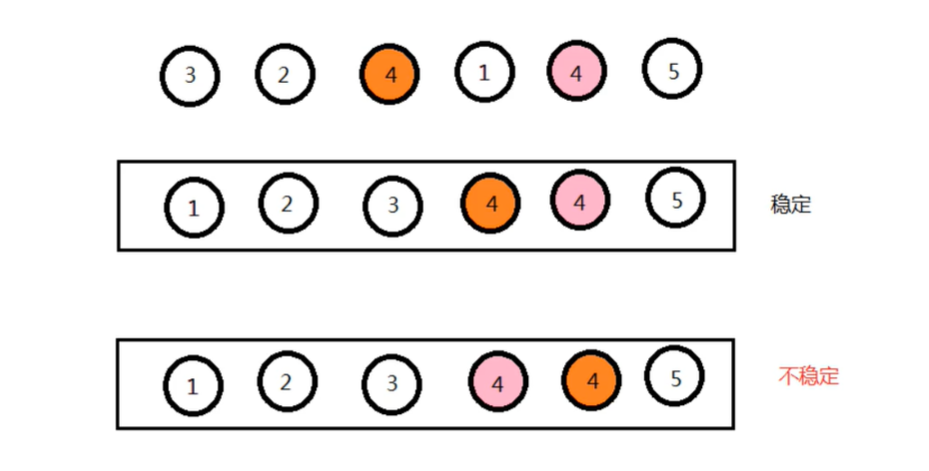

常见算法的稳定性：

* **冒泡排序**：只有当arr[i]>arr[i+1]的时候，才会交换元素，而相等的时候不会交换，所以冒泡排序是一种稳定的排序算法；
* **选择排序**：该排序算法是每次都会选择一个当前最小的元素，现有数据(5(1)，8，5(2)，2，9)，选择出本次的最小元素2并和5(1)交换，导致稳定性被破坏；
* **插入排序**：比较操作是从有序序列的末尾开始的，也就是将想要插入的元素和已经有序的最大者开始比较，一直向前找到合适的位置，如果相等则直接放在后面，所以插入排序是稳定的；
* **希尔排序**：该排序算法是按照步长对元素分组进行各自的插入排序，虽然单次的插入排序是稳定的，但在不同的插入排序过程中，相同的元素可能会在各自的插入排序中移动，导致稳定性被破坏；
* **归并排序**：该算法在归并的过程中，只有arr[i]<arr[i+1]才会交换位置，如果两个元素相等则不会改变，所以归并排序也是稳定的；
* **快速排序**：该算法需要一个基准值，在基准值右侧找一个更小的元素，在基准值左侧找一个更大的元素，然后交换，会破坏稳定性。


# 大数据相关

## Hadoop-HDFS存储模型

* 文件线性切割成block块，偏移量offset的单位是byte；
* block块分散存储在集群的各个节点中；
* 单一文件切分的block块大小是一致的，默认大小为128mb，可以设置block大小；
* block存在副本，副本分散在不同的节点中，默认副本数是3，可以设置副本数（注：副本数不要设置超过节点数）；
* 已上传的文件block副本数可以调整，block大小不能变化；
* hdfs只支持一次写入多次读取，同一时刻只有一个写入者；
* 文件可以append追加数据，hdfs会新增block块存储新数据，并创建副本；
* block副本放置策略：
  * 第一个副本：
    * 集群内提交：
      * 放置在上传文件的datanode中。
    * 集群外提交：
      * 随机挑选一台磁盘不太慢，cpu不太忙的节点。
  * 第二个副本：
    * 放置在与第一个副本不同机架的节点上。
  * 第三个副本：
    * 放置在与第二个副本相同机架的节点上。
  * 更多副本：
    * 随机挑选节点


## Hadoop-HDFS架构模型

**HDFS Client**：

* client与namenode交互元数据信息；
* client与datanode交互文件block数据。

**NameNode（NN）**：

* 保存文件的元数据（如文件大小，时间，block列表，分片位置信息，副本位置信息）；
* 基于内存存储元数据信息，不会和磁盘发生交换；
* 持久化：
  * fsimage：元数据存储到磁盘的文件名为fsimage（内存的快照），fsimage只在集群第一次启动时创建空的文件；
  * editslog：记录了对元数据的操作日志，每隔一段时间与fsimage合并（执行日志记录的操作），生成新的fsimage。

**DataNode（DN）**：

* 保存文件的block数据在磁盘上，同时存储block的元数据文件（MD5校验是否损坏）；
* datanode会向namenode上报心跳数据（3秒一次），提交block列表；
  * 如果namenode10分钟没有收到datanode的心跳，则判定次DN挂掉，从其他DN复制副本到新DN保持副本数。

**SecondaryNameNode（SNN）**：

* 帮助namenode合并fsimage和editslog（避免namenode磁盘IO消费资源）；
* SNN执行合并的时机：
  * 根据配置文件的时间间隔配置项fs.checkpoint.period，默认3600秒；
  * 根据配置文件设置editslog大小配置项fs.checkpoint.size规定，edits文件的最大默认值为64mb。


## Hadoop-HDFS读/写流程

**写流程**：

* client端将要写入的文件进行切分，block大小128mb；
* 与NN交互获取第一个block副本存放的DN列表；
* 将切分后的block再次切分为小文件，小文件大小为64kb；
* client根据从NN获取的DN列表，与其中DN交互，将小文件进行流式传输；
* 第一个DN接收到文件后流式传输副本到下一个DN，以pipeline的方式依次类推直到所有存放副本的DN都将副本写入完毕为止；
* block传输结束后：
  * DN向NN汇报block的信息，NN进行元数据的存储；
  * DN向client汇报写入完成；
  * client向NN汇报写入完成。
* client获取下一个block存放的DN列表，反复执行流式传输，直到文件的block全部写入完毕；
* 最终client汇报完成；
* NN会在写流程更新文件状态。

**读流程**：

* 与NN建立通信，获取一部分block副本的位置列表；
* 线性的从DN获取block，最终合并为一个文件；
* 在block副本列表中按距离择优选择DN。


## Hadoop-HA高可用集群

**HDFS 2.x**

* 解决单点故障：
  * HDFS HA（高可用）：通过主备NN解决，Active NN发生故障，切换到Standby NN。
* 解决内存受限：
  * HDFS Federation（联邦）：水平扩展支持多个NN，所有NN共享DN的存储资源，每个NN分管一部分的目录树结构（保存元数据）。

**HadoopHA 架构：**

* client与NN Active交互元数据，与DN交互block块，但不与NN Standby做交互；
* 所有的DN会同时向两个NN汇报block位置信息；
* NN Active会将元数据写入JournalNode集群（NN之间数据共享），JNN集群过半的节点返回成功消息则代表NN写入成功；
* NN Standby会读取JNN中的元数据，和NN Active保持数据同步；
* 两台NN节点中都存在Zookeeper Failover Controller（ZK的客户端进程）进程，ZKFC进程会与NN和ZK集群两端通信，与NN通信的进程监控NN的健康状态，这两个进程会在ZK集群的目录树结构中争抢创建文件的权利，当某个ZKFC进程成功创建文件，那这个进程管理的NN就是NN Active；
* 当NN Active挂掉，ZKFC进程接收不到心跳，会立即将ZK目录树节点上的文件删除产生事件触发回调，ZKFC Standby进程监听该事件（等待），一但发生事件，ZK将回调ZKFC Standby进程，在ZK集群中创建文件，并将NN Standby提升为NN Active，此时由此节点为client提供服务；
* 当ZKFC Active挂掉，ZK集群的session机制会启动，此时ZKFC Active与ZK集群的socket通信会断开，ZK集群会进行倒计时，计时完毕会产生事件回调，ZKFC Standby创建文件并提升NN Standby为NN Active（两个ZKFC进程还存在隐藏的与对方NN的通信，在提升自己管理的NN为主时会先尝试将对方的NN降级）。


## Hadoop-MapReduce原理

**MapTask**：

* Input Split：原始数据通过split逻辑进行分割；
* Map：多个map按照逻辑对分割后的所有块并行计算，结果会映射成（k，v）格式，并对处理的数据进行分区；
* Buffer In Memory：map处理后的数据会先写入内存缓冲，累加到100MB时会溢写到磁盘；
* Sort：写入磁盘会落地成小文件，小文件内部按照快速排序对相同key的数据分组；
* Merge：所有小文件会通过归并排序合并成一个文件，并行计算的map task阶段会产生多个文件，文件由reduce处理。

**ReduceTask**：

* Merge：reduce task会从多个map task拉取文件，会将一定数量的文件通过归并算法合并；
* Merge：合并后的文件会以归并算法传入reduce的逻辑进行处理；
* Reduce：会按照reduce的逻辑对数据进行处理；
* Output：将计算后的结果输出。


## Hadoop-Yarn资源调度集群

**Yarn集群架构**：

* yarn集群属于主从架构：
  * Resource Manager：管理集群所有的资源
  * NodeManager：管理本节点的资源，任务，并以心跳的方式向RM汇报
  * container：计算框架中的所有角色都由container表示，代表节点的资源单位；
* client提交job后，RM会挑选一台不太忙的节点启动Applocation Master管理当前job的资源调度；
* AM启动完成会回去向RM汇报，由RM决策job任务移动的目标点（container），NM默认启动线程监控container大小，一旦提交的job任务超出了申请资源的额度，会将job杀死；
* 由AM决定job任务的阶段（如MR的map和reduce阶段）提交到哪块container执行，并且job任务的执行情况还会汇报给AM；
* 如果其他的计算框架提交job，RM会在其他节点启动属于该框架的app master，框架之间的资源调度互相隔离。


## HBase-数据模型

| Row Key  | Time Stamp | CF1          | CF2         | CF3         |
| -------- | ---------- | ------------ | ----------- | ----------- |
|          | T6         |              | CF2:q1=val1 | CF3:q3=val3 |
| 11248112 | T3         |              |             |             |
|          | T2         | CF1：q2=val2 |             |             |

**Row Key（行键）**：

* 决定一行数据，相当于主键；
* 写数据时按照字典顺序插入（ASCII排序）；
* 行键只能存储64k的字节数据（越短越提高检索性能）。

**Time Stamp（时间戳）**：

* 列数据的版本号，当对某一列提交新数据时hbase表通过添加数据并标记版本实现update；
* 每个列族都可以设置maxversion，表示版本的最大有效数。

**Column Family（列族）& qualifier（列）**：

* HBase表中的每列都归属于列族（列族必须在表创建时预先定义）；
* 列族存在多个列成员，列族名作为该列族所有列名的前缀，列可以动态添加；
* HBase将列族数据存储在同一目录下，分多个文件保存。

**Cell（单元格）**：

* 由rowkey与列族：列交叉决定；
* 单元格表示列数据，存在版本；
* 内容是未解析的字节数组（字节码）；
* 由 {row key，column =（<family> + <qualifier>），version} 唯一决定。


## HBase-架构模型

**Client（客户端）**：

* 访问HBase的接口；
* 维护cache加快对hbase的访问。

**Zookeeper（分布式协同）**：

* 保证集群中只存在一个HMaster主节点，实现HA（高可用）；
* 监控Region Server的健康状态，出现宕机等情况会实时通知HMaster进行数据迁移；
* 存储所有Region的寻址入口；
* 存储HBase表的元数据信息。

**HMaster（主节点）**：

* 为Region Server从节点分配Region；
* 对Region Server做负载均衡；
* 重新分配宕机的Region Server上的Region；
* 管理用户对表的增删改查。

**HRegion Server（从节点）**：

* 维护Region，处理对Region的IO请求；
* 负责切分在运行过程中达到阈值的Region（等分原则）。

**HRegion（数据区域）**：

* 一段连续的表数据存储区域（Row Key会顺序排列）；
* Region中的数据达到某个阈值就会进行水平拆分（同一行的数据一定会存在同一个Region中）。

**Store（列族）**：

* 多个Store组成Region，1个Store对应1个列族；
* 由1个MemStore组成和0至多个StoreFile组成。

**MemStore（写缓存）**：

* MemStore是Client提交操作进行后Store先写入内存的缓存数据（1个）。

**StoreFile（持久化）**：

* StoreFile是MemStore达到阈值溢写到磁盘（Linux文件系统 or HDFS）的小文件（0或多个）；
* StoreFile的数量到达阈值时系统会进行合并（minor小范围合并，major大范围合并）；
* 当一个Region中的所有StoreFile大小数量达到阈值时，会拆分当前的Region，并由HMaster迁移到相应的从节点；
* Client检索数据会先在MemStore中找，找不到再在StoreFile中找；
* Store以HFile的格式保存在HDFS中。

**HLog（日志文件）**：

* 存储Client提交数据的动作和数据。


## Hive-架构模型

* 用户接口：命令行模式（CLI），客户端模式（JDBC），WebUI模式；
  * 在cli启动的同时会启动hive的副本；
  * 启动client模式需要指出hive server所在的节点，并在该节点启动hive server。
* hive的元数据存储在关系型数据库中，如mysql，derby；
  * hive的元数据包括表的名字，表的列，分区和属性，表的数据所在目录。
* 解释器、编译器、优化器完成HQL查询语句从词法分析、语法分析、编译、优化以及查询计划的生成；
  * 生成的查询计划存储在HDFS中，并在随后有MapReduce调用执行。
* Hive的数据存储在HDFS中，大部分的查询、计算由MapReduce完成（包含\*的查询，比如 ```select * from tbl``` 不会生成MapRedcue任务）；
* 编译器将一个Hive SQL转换操作符，操作符是Hive的最小的处理单元，每个操作符代表HDFS的一个操作或者一道MapReduce作业。


## Spark-组成部分

* **Spark Core**：包含 Spark 的基本功能；尤其是定义 RDD 的 API、操作以及这两者上的动作。其他 Spark 的库都是构建在 RDD 和 Spark Core 之上的。

* **Spark SQL**：提供通过 Apache Hive 的 SQL 变体 Hive 查询语言（HiveQL）与 Spark 进行交互的 API。每个数据库表被当做一个 RDD， Spark SQL 查询被转换为 Spark 操作。

* **Spark Streaming**：对实时数据流进行处理和控制。 Spark Streaming 允许程序能够像普通 RDD 一样处理实时数据。

* **Spark Mllib**：一个常用机器学习算法库，算法被实现为对 RDD 的 Spark 操作。这个库包含可扩展的学习算法，比如分类、回归等需要对大量数据集进行迭代的操作。

* **Spark GraphX**：控制图、并行图操作和计算的一组算法和工具的集合。 GraphX 扩展了 RDD API，包含控制图、创建子图、访问路径上所有顶点的操作。


## Spark-架构模型

* Cluster Manager：制整个集群，监控 worker在 standalone 模式中即为 Master 主节点，控制整个集群，监控 worker。在 YARN 模式中为资源管理器
* Worker 节点：负责控制计算节点从节点，负责控制计算节点，启动 Executor 或者 Driver。
* Driver：运行 Application 的 main() 函数。
* Executor：执行器，是为某个 Application 运行在 worker node 上的一个进程。


## Spark-编程模型

Spark 应用程序从编写到提交、执行、输出的整个过程如图所示，图中描述的步骤如下：

1. 用户使用 SparkContext 提供的 API（常用的有 textFile、 sequenceFile、 runJob、 stop 等）编写 Driver application 程序。此外 SQLContext、 HiveContext 及 StreamingContext 对 SparkContext 进行封装，并提供了 SQL、 Hive 及流式计算相关的 API；
2. 使用 SparkContext 提交的用户应用程序，首先会使用 BlockManager 和 BroadcastManager将任务的 Hadoop 配置进行广播。然后由 DAGScheduler 将任务转换为 RDD 并组织成 DAG，DAG 还将被划分为不同的 Stage。最后由 TaskScheduler 借助 ActorSystem 将任务提交给集群管理器（Cluster Manager）；
3. 集群管理器（ClusterManager）给任务分配资源，即将具体任务分配到Worker上， Worker创建 Executor 来处理任务的运行。 Standalone、 YARN、 Mesos、 EC2 等都可以作为 Spark的集群管理器。 


## Spark-计算模型

RDD 可以看做是对各种数据计算模型的统一抽象， Spark 的计算过程主要是 RDD 的迭代计算过程。RDD 的迭代计算过程非常类似于管道。分区数量取决于 partition 数量的设定，每个分区的数据只会在一个 Task 中计算。所有分区可以在多个机器节点的 Executor 上并行执行。 


## Spark-运行流程

1. 构建 Spark Application 的运行环境，启动 SparkContext
2. SparkContext 向资源管理器（可以是 Standalone， Mesos， Yarn）申请运行 Executor 资源，并启动 StandaloneExecutorbackend，
3. Executor 向 SparkContext 申请 Task
4. SparkContext 将应用程序分发给 Executor
5. SparkContext 构建成 DAG 图，将 DAG 图分解成 Stage、将 Taskset 发送给 Task Scheduler，最后由 Task Scheduler 将 Task 发送给 Executor 运行
6. Task 在 Executor 上运行，运行完释放所有资源 


## Spark-RDD模型

1. 创建 RDD 对象；
2. DAGScheduler 模块介入运算，计算 RDD 之间的依赖关系， RDD 之间的依赖关系就形成了DAG；
3. 每一个 Job 被分为多个 Stage。划分 Stage 的一个主要依据是当前计算因子的输入是否是确定的，如果是则将其分在同一个 Stage，避免多个 Stage 之间的消息传递开销。

创建RDD：

1. 从 Hadoop 文件系统（或与Hadoop兼容的其他持久化存储系统，如Hive、 Cassandra、
   HBase）输入（例如 HDFS）创建；
2. 从父 RDD 转换得到新 RDD；
3. 通过 parallelize 或 makeRDD 将单机数据创建为分布式 RDD。

转换（Transformation）： Transformation 操作是延迟计算的，也就是说从一个 RDD 转换生成另一个 RDD 的转换操作不是马上执行，需要等到有 Action 操作的时候才会真正触发运算。 

行动（Action）：Action 算子会触发 Spark 提交作业（Job），并将数据输出 Spark 系统。 


# 微服务认证授权

## Spring security Oauth2认证流程

* 用户请求认证服务完成认证；
* 认证服务下发用户身份令牌，拥有身份令牌表示身份合法；
* 用户携带令牌请求资源服务，需要先经过网关；
* 网关校验用户身份令牌的合法性，不合法则表示未登录，合法则表示放行请求；
* 资源服务获取令牌，根据令牌完成授权；
* 资源服务响应资源信息。

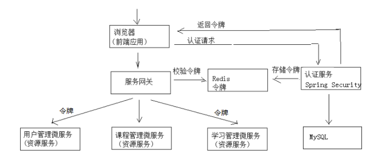


## JWT令牌授权过程

* 用户携带用户名密码请求认证服务；
* 认证服务校验后为用户颁发JWT令牌，使用RSA私钥进行加密；
* 客户端携带令牌访问资源服务，资源服务通过RSA公钥进行解密并校验令牌；
* 验证完成后根据权限返回相应的资源。

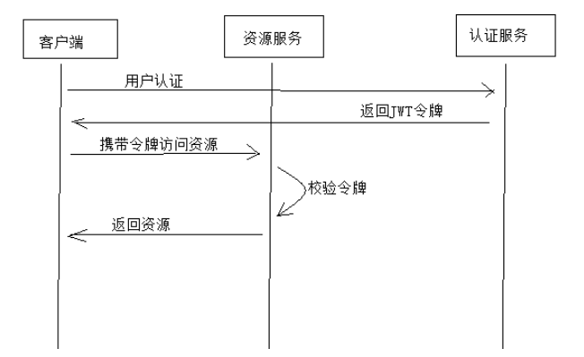


## JWT令牌结构

JWT令牌由三部分组成，每部分中间使用点（.）分隔，比如：xxxxx.yyyyy.zzzzz  

* Header：

  * 头部包括令牌的类型（即JWT）及使用的哈希算法（如HMAC SHA256或RSA）；  

  * ```json
    {
    	"alg": "HS256",
    	"typ": "JWT"
    }
    ```

  * 将上边的内容使用Base64Url编码，得到一个字符串就是JWT令牌的第一部分。

* Payload：

  * 第二部分是负载，内容也是一个json对象，它是存放有效信息的地方，它可以存放jwt提供的现成字段，比如：iss（签发者）,exp（过期时间戳）, sub（面向的用户）等，也可自定义字段；

  * 此部分不建议存放敏感信息，因为此部分可以解码还原原始内容；

  * 最后将第二部分负载使用Base64Url编码，得到一个字符串就是JWT令牌的第二部分。

  * ```json
    {
        "sub": "1234567890",
        "name": "456",
        "admin": true
    }
    ```

* Signature：

  * 第三部分是签名，此部分用于防止jwt内容被篡改；

  * 这个部分使用base64url将前两部分进行编码，编码后使用点（.）连接组成字符串，最后使用header中声明签名算法进行签名；

  * ```json
    HMACSHA256(
    	base64UrlEncode(header) + "." +
    	base64UrlEncode(payload),
    	secret
    )
    ```

  * base64UrlEncode(header)：jwt令牌的第一部分；

  * base64UrlEncode(payload)：jwt令牌的第二部分；

  * secret：签名所使用的密钥。


## 用户登录/身份认证

* 用户登录：
  * 请求认证服务通过认证，生成jwt令牌，将完整令牌信息写入redis，并将身份令牌写入cookie；
  * 用户访问资源服务，携带cookie经过网关；
  * 网关从cookie中获取身份令牌，查询redis校验令牌的合法性，不存在则拒绝访问，反之放行；
* 用户退出：
  * 先请求认证服务，清除redis中的令牌信息，并删除cookie中的身份令牌。

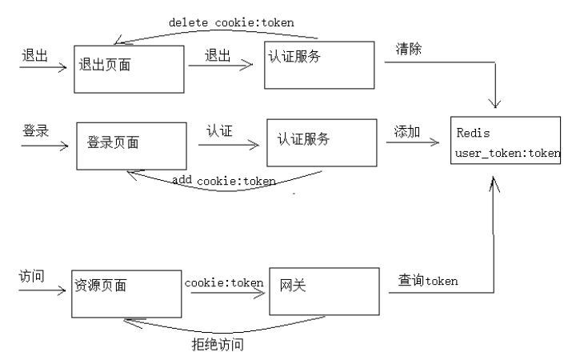


## 认证服务

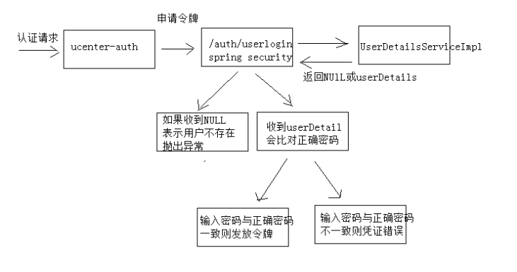


## 用户认证流程

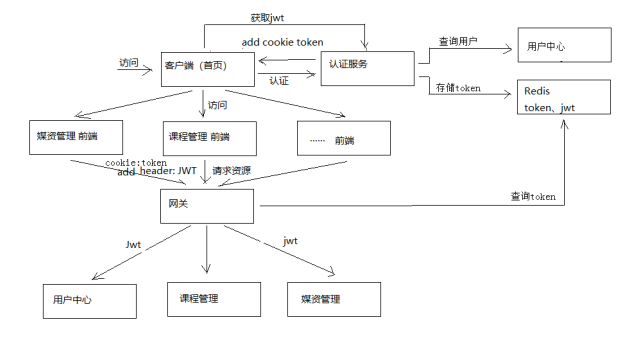

* 认证服务认证流程：
  * 认证服务请求用户中心查询用户信息；
  * 认证服务通过spring security申请令牌；
  * 认证服务将身份令牌和jwt令牌写入redis；
  * 认证服务向cookie写入身份令牌。
* 客户端显示用户信息：
  * 客户端携带身份令牌请求认证服务获取jwt令牌；
  * 客户端将jwt令牌存储到SessionStorage；
  * 客户端从jwt令牌中解析出用户信息并显示在页面。
* 客户端访问资源服务：
  * 客户端请求资源服务需要携带两个token，一个是cookie中的身份令牌，一个是http header中的jwt令牌。
* 网关校验令牌的合法性：
  * 用户的请求必须携带两个令牌；
  * 查询redis中的token是否和用户携带的token匹配，若过期则要求重新登录；


## 用户授权流程

资源服务授权：资源服务校验header中携带的jwt令牌，获取用户拥有的权限，根据权限开放相应的方法访问权限。

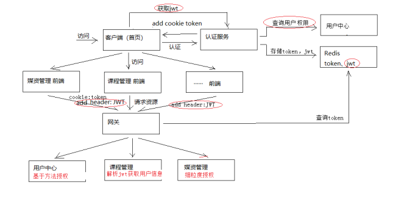


# Dubbo/gRPC/Thrift

## RPC基本概念

## Dubbo-基本概念

## Dubbo-架构设计

## Dubbo-类似框架

## Dubbo-注册中心

## Dubbo-集群

## Dubbo-配置

## Dubbo-通信协议

## Dubbo-设计模式

## Dubbo-运维管理

## Dubbo-SPI

## Dubbo-其他特性


# Zookeeper


# 消息中间件

