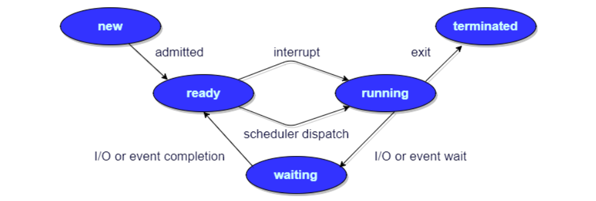

# 1.多线程高并发

## 1.1.什么是进程和线程？

1. **程序的本质**：

     1. 程序的本质就是CPU可以执行的指令和内存中的数据；
     2. 从内存中读出PC（指令计数器）当前指向的指令地址和对应数据，通过总线写入CPU的寄存器中；
     3. CPU的ALU（逻辑计算单元）会进行计算，并将计算结果写回到内存中；
     4. 此时CPU的PC会指向下一条指令。

 2. **进程的概念：**

    1. 是资源分配的基本单位；
    2. 是程序启动后从磁盘进入到被分配到的内存的资源和代码的集合；
    3. 也是CPU指令和内存数据的集合。

3. **线程的概念：**
   1. 程序执行的基本单位；
   2. 进程中代码执行的路径（可以存在多条执行路径）；
   3. 在JVM中，多个线程共享进程的堆和方法区，每个线程有自己的程序计数器、虚拟机栈和本地方法栈。

4. **普通Java程序启动会有哪些线程？**

   ```JAVA
   public class TestMultiThread {
       
       public static void main(String[] args) {
           // 获取 Java 线程管理 MXBean
           ThreadMXBean threadMXBean = ManagementFactory.getThreadMXBean();
           
           // 不需要获取同步的 monitor 和 synchronizer 信息，仅获取线程和线程堆栈信息
           ThreadInfo[] threadInfos = threadMXBean.dumpAllThreads(false, false);
           
           // 遍历线程信息，仅打印线程 ID 和线程名称信息
           for (ThreadInfo threadInfo : threadInfos) {
               System.out.println("[" + threadInfo.getThreadId() + "] " + threadInfo.getThreadName());
           }
       }
   }
   ```

   ```
   [5] Attach Listener 	// 添加事件
   [4] Signal Dispatcher	// 分发处理给 JVM 信号的线程
   [3] Finalizer			// 调⽤对象 finalize ⽅法的线程
   [2] Reference Handler 	// 清除 reference 线程
   [1] main 				// main 线程，即程序⼊⼝
   ```

## 1.2.进程和线程的关系、区别和优缺点

1. 以概念的角度解释：见1.1；

2. 以JVM的角度解释：一个JVM进程运行时所管理的内存区域如下图，一个进程中可以存在多个线程，多个线程共享堆空间和本地方法区（元空间），每个线程有自己的虚拟机栈、本地方法栈和程序计数器。

   

3. 总结：线程是进程划分出来的执行单元，最大的不同在于进程间是独立的，而线程则不一定，这是因为同一进程中各线程可能会相互影响。

4. 为什么PC计数器、VM栈、NM栈是线程私有？又为什么堆和元空间是线程共享的？

   1. PC计数器为什么私有？（**简单概括：各线程的代码执行位置独立**）
      1. 在JVM中，字节码解释器通过改变PC计数器的指向依次读取指令，从而实现代码的流程控制；
      2. 在多线程情况下，PC计数器用于记录所属线程暂停执行时的位置，从而当线程被切换回来后能恢复之前的执行状态；
      3. 总结：因为PC计数器是针对各线程内字节码指令进行控制的，即针对程序的执行单位做控制。
   2. VM栈和NM栈为什么私有？（**简单概括：各线程的局部资源独立**）
      1. 虚拟机栈：每个java方法在执行时都会在VM栈中创建一个栈帧用于存储局部变量表、操作数栈、常量池等信息。从方法调用直至执行完成的过程，就对应一个栈帧在虚拟机栈中压栈和弹栈的过程；
      2. 本地方法栈：和虚拟机栈相似，区别是VM栈为虚拟机执行java方法（即字节码）服务，而NM栈则为虚拟机使用的native方法服务（在HotSpot虚拟机中，虚拟机栈和本地方法栈合二为一了）；
      3. 总结：所以，为了保证线程中的局部变量不能被其他线程所访问，虚拟机栈和本地方法栈都是线程私有的，其实也就是针对程序的各条执行路径做控制。
   3. 堆和元空间为什么共享？（**简单概括：代码执行中的共享资源**）
      1. 堆是进程被分配到的内存中最大的一块，主要用于存放新创建的对象（所有的对象都在这里被分配内存），方法区主要用于存放已被加载的类信息，如：常量、静态变量、即时编译器编译获得代码等数据；
      2. 总结：因为二者存储的都是程序的资源单位，不存在执行时的独立问题，所以堆和元空间是和进程绑定的。

## 1.3.并发与并行有什么区别？

1. 并发：同一时间段，多个任务都在执行，但单位时间内不一定同时执行；
2. 并行：单位时间内，多个任务同时执行。

## 1.4.为什么要使用多线程?

1. 从总体来看：线程是程序执行的最小单位，切换和调度的成本远远小于进程，并且多核CPU时代意味着多线程可以并行执行，减少了线程上下文切换的开销，再者，随着互联网飞速发展，百万千万级别的并发量要求，多线程也是高并发系统的基础。
2. 从底层探讨：
    1. 单核时代：主要是为了提高CPU和IO设备的综合利用率。只有一个线程时，当CPU计算时IO设备空闲，IO操作时CPU空闲，但多个线程会让两个操作在一段时间内都执行；
    2. 多核时代：主要是为了提高CPU利用率。若CPU计算复杂的任务只使用一个线程，那只有一个核在工作，但多个线程会被分配到多个核去执行，从而提高多核CPU利用率。

## 1.5.使用多线程可能带来的问题？

内存泄漏、上下文切换、死锁还有受限于硬件和软件的资源闲置问题。

## 1.6.线程的生命周期和状态


1. 线程创建后处于**NEW（初始）**状态，调用``Thread.start()``方法后开始运行，进入**READY（就绪）**状态，这时可运行状态的线程若是获得了CPU时间片（timeslice）就会进入**RUNNING（运行）**状态；
2. 当线程执行``Object.wait()、Object.join()、LockSupport.park()``方法后，进入**WAITING（等待）**状态，处于等待状态的线程需要依靠其他线程的通知才能取消等待，如通过``Object.notify()、Object.notifyAll()、LockSupport.unpark(Thread)``方法通知唤醒等待的线程；
3. **TIME_WAITING（超时等待）**状态相当于在等待状态的基础上增加了超时限制，如通过``Thread.sleep(long)、Object.wait(long)、Thread.join(long)、LockSupport.parkNanos()、LockSupport.parkUntil()``方法可以将线程置于超时等待状态，当超时时间到达后线程会返回到运行状态（也可以像唤醒等待线程一样直接通知）；
4. 当线程调用同步方法，但没有获取到锁的时候，会进入**BLOCKED（阻塞）**状态，直到获取锁；
5. 线程在执行完Runnable的``run()``方法之后会进入**TERMINATED（终止状态）**。

## 1.7.线程的上下文切换

1. 线程数大于CPU核心数的情况下，每个CPU在同一时刻只能执行一个线程，为了让其他线程都能有效的执行，CPU采取的策略就是为每个线程分配时间片轮转，即当一个线程获取到CPU执行权时也会得到一个时间片，当时间片用完就会重新进入就绪状态给其他线程执行的机会；
2. 从当前线程在执行完CPU时间片切换到另一个线程前会保存自己的状态，以便下次再切换回这个线程时，可以恢复之前的执行状态，**线程从保存到恢复的过程就是一次上下文切换**；
3. 注：上下文切换通常是计算密集型，即对CPU来说需要相当可观的处理时间，每个切换都要消耗纳秒级的时间，所以频繁的切换意味着对CPU性能巨大的浪费；
4. 从计算机系统层面解释：当CPU的核心切换到其他线程执行时，当前中断的线程相关的数据（寄存器数据，堆栈信息）会被暂存在内存中，等下次切换回来时从中断的位置继续执行。

## 1.8.线程死锁，如何避免死锁?

 

 * 死锁指多个线程被同时阻塞，它们中的一个或全部都在等待某资源被释放，由于线程被无限期的阻塞，因此程序不可能正常终止。如上图，线程A持有资源2，线程B持有资源1，它们都想申请对方锁住的资源，但又不能释放自己锁住的资源，所以这两个线程会因为互相等待而进入死锁状态；

 * Java代码实现上图的死锁：

   ```JAVA
   public class DeadLockDemo {
       
       private static Object resource1 = new Object();
       private static Object resource2 = new Object();
       
       public static void main(String[] args) {
           new Thread(() -> {
               synchronized (resource1) {
                   System.out.println(Thread.currentThread() + "get resource1");
                   try {
                   	Thread.sleep(1000);
                   } catch (InterruptedException e) {
                   	e.printStackTrace();
                   }
                   System.out.println(Thread.currentThread() + "waiting get resource2");
                   synchronized (resource2) {
                       System.out.println(Thread.currentThread() + "get resource2");
                   }
               }
           }, "线程1").start();
           
           new Thread(() -> {
               synchronized (resource2) {
                   System.out.println(Thread.currentThread() + "get resource1");
                   try {
                   	Thread.sleep(1000);
                   } catch (InterruptedException e) {
                   	e.printStackTrace();
                   }
                   System.out.println(Thread.currentThread() + "waiting get resource2");
            		synchronized (resource1) {
                       System.out.println(Thread.currentThread() + "get resource1");
                   } 
               }
           }, "线程2").start();
       }
   }
   ```

   ```
   Thread[线程 1,5,main] get resource1
   Thread[线程 2,5,main] get resource2
   Thread[线程 1,5,main] waiting get resource2
   Thread[线程 2,5,main] waiting get resource1
   ```

 * 代码分析：线程1首先获resource1锁，线程2获取resource2锁。当两个线程休眠结束后，线程1内部阻塞等待resource2锁但没有释放resource1锁，线程2内部阻塞等待resource1锁但没有释放resource2锁，于是两个线程就陷入了等待对方释放锁自己又不能释放锁的尴尬境地，就产生了死锁。

 * 从OS层面来看产生死锁的四个条件：

   * 互斥条件：存在互斥量的条件任意时刻只能有一个线程占用；
   * 请求与保持条件：一个进程因为请求资源而阻塞时，对已获得的资源保持不放；
   * 不剥夺条件：线程已获取的资源在未使用完之前不能被其他线程强行剥夺，只有自己使用完毕后才释放资源；
   * 循环等待条件：若干进程之间形成一种头尾相接的循环等待资源关系。

 * **如何避免死锁？**（即只要能破坏OS产生死锁的四个条件中的其中之一即可）

   * 破坏互斥条件：互斥量是一种多线程的同步机制，无法破坏；
   * 破坏请求与保持条件：让进程一次性申请所有资源，无需再做多余的请求；
   * 破坏不剥夺条件：占用部分资源的线程进一步申请其他资源时，若申请不到，可以主动释放它占用的资源；
   * 破坏循环等待条件：靠按序资源来预防，按某一顺序申请资源，释放资源则反序释放。

 * 修改上述线程2的代码以解决死锁问题：

   ```java
   new Thread(() -> {
       synchronized (resource1) {
           System.out.println(Thread.currentThread() + "get resource1");
           try {
               Thread.sleep(1000);
           } catch (InterruptedException e) {
               e.printStackTrace();
           }
           System.out.println(Thread.currentThread() + "waiting get resource2");
           synchronized (resource2) {
               System.out.println(Thread.currentThread() + "get resource1");
           } 
       }
   }, "线程2").start();
   ```

   ```
   Thread[线程 1,5,main]get resource1
   Thread[线程 1,5,main]waiting get resource2
   Thread[线程 1,5,main]get resource2
   Thread[线程 2,5,main]get resource1
   Thread[线程 2,5,main]waiting get resource2
   Thread[线程 2,5,main]get resource2
   
   Process finished with exit code 0
   ```

 * 代码分析：两个线程竞争锁的顺序置为相同，线程1先后获得锁1和锁2，线程2无法获取锁1而阻塞，等线程1执行完毕释放锁1和锁2时，线程2就能够获取锁了。这样是破坏了循环等待条件。

## 1.9.sleep()方法和wait()方法的区别和共同点

 1. 最主要的区别：sleep方法不会释放锁，wait方法会释放锁；
 2. 二者都可以暂停线程的执行；
 3. wait通常被用于线程间交互/通信，sleep通常被用于暂停执行；
 4. wait被调用后，线程不会自动苏醒，而是需要别的线程调用同一个对象上的notify()或者notifyAll()方法进行唤醒。或者可以使用wait(long timeout)超时后自动苏醒。

## 1.10.synchronized关键字

### 1.10.1.概念

用于解决多线程间资源访问的同步问题，保证任意时刻被其修饰的代码块或方法只能有一个线程执行。在Java早期版本，synchronized底层使用效率低下重量级锁，因为监视器锁（monitor）是依赖于OS的Mutex Lock实现的，JVM线程是1:1与OS内核线程映射的，这种方式的实现下，线程的挂起和唤醒，都需要和OS产生系统调用的全套过程，即CPU从用户态转为内核态，开销较大。

### 1.10.2.使用方式

1. **修饰实例方法**：即对象锁，给当前对象实例加锁，进入同步代码前要获得当前对象实例的锁；
2. **修饰静态方法**：即类锁，给当前类加锁，会作用于类的所有对象实例，一旦线程持有类锁，无论其他线程调用的是该类的任意对象实例的方法，都会同步；
3. **修饰代码块**：指定加锁对象，对给定对象加锁，进入同步代码库前要获得给定对象的锁；
4. 注：不要使用``synchronized(String str)``加锁，因为JVM中字符串常量池具有缓存功能。

### 1.10.3.CAS

### 1.10.4.synchronized的底层原理

1. JDK1.6之后优化了synchronized操作，锁会随着竞争的激烈而逐渐升级，主要存在4种状态：无锁、偏向锁、轻量级锁、重量级锁。
2. 偏向锁：
   1. 概念：偏向锁会偏向第一个获取它的线程，若接下来的执行中，该锁没有被其他线程所获取，那么持有偏向锁的线程在访问锁住的资源时不需要再进行同步操作，即加锁和释放锁。
   2. 加锁：
      1. 当一个线程访问同步块并获取锁时，会在锁对象的对象头和栈帧中的锁记录里存储锁偏向的线程ID；
      2. 以后该线程进入或退出同步块时不需要再进行CAS操作来加锁和释放锁，只需要测试锁对象的对象头的MarkWord是否存储着指向自己的偏向锁；
      3. 若成功则表示已获取锁，若失败则需要再测试MarkWord中偏向锁的标识是否设置为1；
      4. 若没设置，则使用CAS竞争锁，若已设置则尝试使用CAS将锁对象的对象头中的偏向锁指向该线程。
   3. 释放锁：
      1. 偏向锁直到出现竞争才会释放锁，即当有其他线程尝试竞争偏向锁时，持有偏向锁的线程才会释放锁；
      2. 偏向锁的释放需要等到全局安全点，即在该时间点上没有正在执行的字节码指令；
      3. 首先会暂停持有锁的线程，然后检查该线程是否存活，若不活动，则将锁对象的对象头设置为无锁状态；
      4. 若仍存活，则锁对象的对象头中的MarkWord和栈中的锁记录要么重新偏向于其他线程要么恢复成无锁状态，最后唤醒被暂停的线程。
3. 轻量级锁：
   1. **偏向锁升级为轻量级锁**：在存在锁竞争的场合下，偏向锁就会失效，因为这样的场合存在每次申请锁的线程都是不相同的情况，所以不适合使用偏向锁，而是升级成轻量级锁；
   2. 概念：轻量级锁在多线程竞争不会非常激烈的情况下，可以减少获取重量级锁时需要操作系统进行调度和使用互斥量而产生的性能消耗（线程的挂起和唤醒需要CPU从用户态转为内核态），而轻量级锁使用的是自旋竞争锁和CAS的方式加锁。
   3. 自旋锁和适应性自旋锁：
      1. **为什么引入自旋锁？**所谓自旋锁是为了避免线程在未获取到锁时的挂起/唤醒操作而提出的技术，并且很多对象锁的锁定状态只会持续很短的一段时间（如整数的自增操作），在很短的时间内挂起/唤醒线程显然不值得；
      2. 所谓自旋，就是让线程去执行一个无意义的循环，循环结束后再去重新竞争锁，如果竞争不到继续循环，循环过程中线程会一直处于running状态，但是基于JVM的线程调度，会出让时间片（但不会让出CPU时间片），所以其他线程依旧有申请锁和释放锁的机会。
      3. JDK1.6引入了适应性自旋锁，自旋的次数不固定，而是由前一次同一个锁上的自旋时间以及锁拥有者的状态决定。
   4. 加锁：
      1. 线程进入同步代码块之前，JVM会在当前的线程的栈帧中创建用于存储锁记录（Lock Record）的空间，并将锁对象MarkWord拷贝到这片空间中（Displaced Mark Word）；
      2. 然后线程尝试使用CAS操作将锁对象MarkWord替换为指向自己锁记录的指针，同时将锁记录中的owner指针指向锁对象MarkWord；
      3. 若替换成功，则当前线程获取了锁，并且锁对象的MarkWord的锁标志位设置为00，即表示此对象处于轻量级锁定状态；
      4. 若替换失败，则当前线程尝试自旋获取锁，直到自旋失败，即自旋若干次后仍未获取到锁，这时线程会被挂起阻塞等待锁，轻量级锁会膨胀成重量级锁，锁对象的MarkWord的锁标志位设置为10。
   5. 释放锁：
      1. 线程使用CAS操作将自己的Displaced Mark Word替换回锁对象的MarkWord；
      2. 若替换成功，则表示同步操作完成；
      3. 若替换失败，则表示锁对象的MarkWord被修改过，即存在竞争锁的线程自旋失败将锁升级为重量级锁了，此时在释放锁的同时要唤醒阻塞在该锁上的线程。
4. 重量级锁：重量锁在JVM中又叫对象监视器（Monitor），它很像C中的Mutex，除了具备Mutex(0|1)互斥的功能，它还负责实现了Semaphore信号量的功能，也就是说它至少包含一个竞争锁的队列，和一个信号阻塞队列，前者负责做互斥，后者用于做线程同步。
5. 锁消除：当JVM检测到共享数据不存在竞争，就会撤销锁，节省无意义的请求锁的时间。
6. 锁粗化：在编写代码的时候，推荐将同步块的作用范围限制的尽量小，一直到共享数据的实际作用域才进行同步，这样是为了使需要同步操作的数据尽可能小，若存在锁竞争，那等待的线程也能够尽快的获取到锁。
7. **轻量级锁一定比重量级锁效率更高吗？**不一定，如果锁的竞争非常激烈，有非常多的线程在自旋等待锁，则CPU的资源会大量消耗在上下文切换上面（即不断切换线程去执行循环操作）。

### 1.10.5.synchronized和ReentrantLock的区别

1. **都是可重入锁**：所谓可重入锁就是同一个线程可以重复获取自己已经获得的锁。如一个线程获得了某个对象的锁，此时该锁还没有释放，当其想要再次获取的时候仍能成功。若该锁是不可重入的话，会发生死锁，即同一个线程获取锁时，锁的计数器会自增1，只有等到0时才能释放。
2. synchronized是依赖于JVM实现的，ReentrantLock是依赖于JDK的API实现的（需要通过lock()和unlock()方法和try/finally配合实现）。
3. ReentrantLock比synchronized增加了一些高级功能：
   1. **等待可中断**：提供中断等待锁的线程的机制，ReentrantLock可通过``lock.lockInterruptibly()``来实现让正在等待该锁的线程放弃等待，改为处理其他事情；
   2. **可实现公平锁**：提供了指定公平锁或非公平锁的机制，synchronized只能是公平锁，所谓的公平锁就是先等待锁先线程先获取锁。ReentrantLock可通过`new ReentrantLock(boolean fair)`来指定锁的公平机制；
   3. **可实现选择性通知（锁可以绑定多个条件）**：借助Condition接口与newCondition()方法实现等待/唤醒机制，与synchronized不同之处在于ReentrantLock可以在一个Lock对象中创建多个Condition实例（对象监视器）实现多路通知功能，线程对象可以注册在指定的Condition中，从而可以有选择性的进行线程唤醒，而notify()/notifyAll()方式通知的线程是由JVM选择的。

## 1.11.volatile关键字

 1. **Java内存模型引出的问题**：线程可以将变量保存在本地内存（如寄存器）中，而不是直接在主存中进行读写，这样可能会造成一个线程在主存中修改了一个变量的值，而另一个线程还继续使用它之前存储在寄存器中变量值的拷贝，从而造成了数据的不一致；

    

    通过将变量声明为volatile，指示JVM该变量是不稳定的，每次使用都需要从主存中进行读取。即**volatile关键字就是保证了变量的可见性和防止指令重排序**。

    

 2. 并发编程的三个重要特性：

      1. 原子性：一个操作或多次操作，要么所有操作都执行，要么都不执行。synchronized关键字可以保证代码的原子性；
      2. 可见性：当一个变量对共享变量进行修改，那么另外的线程都可以立即看到修改后的最新值。volatile关键字可以保证共享变量的可见性；
      3. 有序性：代码在执行过程中应具有先后顺序，Java在编译器以及运行期间的优化，代码的执行顺序未必就是编写代码时候的顺序。volatile关键字可以禁止指令进行重排序优化。

 3. 与synchronized的区别：

      1. volatile是轻量级实现线程同步的机制，性能比synchronized好，但只能作用于变量，而synchronized可以修饰方法和代码块；
      2. 多线程访问volatile关键字修饰的变量不会发生阻塞，而synchronized修饰的代码会发生阻塞；
      3. volatile只能保证数据的可见性但不能保证原子性，synchronized二者都能保证；
      4. volatile关键字主要用于解决多线程间的变量可见性，synchronized关键字主要解决多线程间访问资源的同步性。

## 1.12.volatile+synchronized+DCL带双重校验锁的单例模式

TODO

## 1.13.ThreadLocal类

TODO

## 1.14.线程池

1. 使用线程池带来的好处：

   1. 降低资源消耗：通过重复利用已经创建的线程降低因为频繁创建和销毁而造成的消耗；
   2. 提供响应速度：当任务到达时，无需等待线程的创建即可立即执行；
   3. 提高线程的可管理性：线程池可以统一的分配、调优和监控线程。

2. 实现`Runnable`接口和`Callable`接口的区别：

   1. Runnable接口不会返回结果或者抛出异常，Callable接口可以。

   2. 工具类Executors可以实现Runnable和Callable对象的相互转换，使用`Executors.callable(Runnable task)`或`Executors.callable(Runnable task, Object result)`。

   3. 源码分析：

      `Runnable.java`

      ```java
      @FunctionalInterface
      public interface Runnable {
          
          // 被线程执⾏，没有返回值也⽆法抛出异常
      	public abstract void run();
      }
      ```

      `Callable.java`

      ```java
      @FunctionalInterface
      public interface Callable<V> {
      
          /**
           * 计算结果，或在⽆法这样做时抛出异常
           * @return 计算得出的结果
           * @throws 如果⽆法计算结果，则抛出异常
           */
      	V call() throws Exception;
      }
      ```

3. 执行`execute()`方法和`submit()`方法的区别：

   1. `execute()`：用于提交不需要返回值的任务，无法判断任务是否被成功执行。

   2. `submit()`：用于提交需要返回值的任务，线程池会返回`Future`对象，通过该对象可以判断任务是否成功执行，并且可以通过get()方法获取返回值，``get()``方法会阻塞当前线程直到任务完成，而使用``get(long timeout, TimeUnit unit)``方法则会阻塞当前线程一段时间后立即返回，这时候任务有可能没有执行完。

   3. `AbstractExecutorService`接口的``submit()``方法源码分析：

      ```JAVA
      public Future<?> submit(Runnable task) {
          if (task WX null) throw new NullPointerException();
      	RunnableFuture<Void> ftask = newTaskFor(task, null);
      	execute(ftask);
      	return ftask;
      }
      ```

      ```JAVA
      protected <T> RunnableFuture<T> newTaskFor(Runnable runnable, T value) {
          return new FutureTask<T>(runnable, value);
      }
      ```

      ```JAVA
      public void execute(Runnable command) {
      	...
      }
      ```

4. 线程池的创建：

   1. 为什么不推荐使用`Executors`去创建，而是通过`ThreadPoolExecutor`的方式创建？使用前者的弊端如下：
      1. FixedThreadPool和SingleThreadExecutor：默认允许请求的队列长度为Integer.MAX_VALUE，可能堆积过多的请求，从而导致OOM。
      2. CachedThreadPool和ScheduledThreadPool：默认允许创建的线程数量为Integer.MAX_VALUE，可能会创建过多的线程，从而导致OOM。
   2. 创建线程池的方式：
      1. 通过ThreadPoolExecutor的重载的4种有参构造方法实现：
      2. 通过Executor框架的工具类Executors来创建3种类型的线程池：
         1. FixedThreadPool：通过`Executors.newFixedThreadPool()`创建，该方法返回一个固定容量的线程池，当有新任务提交时，池中若有空闲线程，则立即执行，若没有则将任务暂存到任务队列中，待池中有线程空闲，便处理队列中的任务。
         2. SingleThreadExecutor：通过`Executors.newSingleThreadExecutor()`创建，该方法返回一个只有一个线程的线程池，同一时间只能执行一个任务，若多余出来的任务被提交则会被暂存任务队列，待池中有线程空闲，按FIFO的原则出队任务执行。
         3. CachedThreadPool：通过`Executors.newCachedThreadPool()`创建，该方法返回一个可根据实际情况调整线程数量的线程池，其中的线程数量是不确定的，但若有空闲线程可以复用，则优先使用，反之无空闲线程，则会创建新线程处理任务。
         4. WorkStealingPool：通过`Executors.newWorkStealingPool()`创建，具有任务窃取机制的线程池。

5. ThreadPoolExecutor类构造方法源码分析：

   ```java
   /**
    * ⽤给定的初始参数创建⼀个新的ThreadPoolExecutor
    */
   public ThreadPoolExecutor(int corePoolSize,
                             int maximumPoolSize,
                             long keepAliveTime,
                             TimeUnit unit,
                             BlockingQueue<Runnable> workQueue,
                             ThreadFactory threadFactory,
                             RejectedExecutionHandler handler) {
   	if (corePoolSize < 0 ||
   		maximumPoolSize <= 0 ||
           maximumPoolSize < corePoolSize ||
   		keepAliveTime < 0)
   		throw new IllegalArgumentException();
   	if (workQueue == null || threadFactory == null || handler ==
   null)
   		throw new NullPointerException();
   	this.corePoolSize = corePoolSize;
   	this.maximumPoolSize = maximumPoolSize;
   	this.workQueue = workQueue;
   	this.keepAliveTime = unit.toNanos(keepAliveTime);
   	this.threadFactory = threadFactory;
   	this.handler = handler;
   }
   ```

   构造方法参数：

   * `corePoolSize`：核心线程数，定义了最小可以同时运行的线程数量；
   * `maximumPoolSize`：最大线程数，当队列中存放的任务达到队列容量时，当前可以同时运行的线程数量变为最大线程数；
   * `keepAliveTime`：线程等待超时，当线程池中的线程数量大于核心线程数时，如果这时没有新的任务提交，核心线程外的线程不会立即销毁，而是等待一个超时时间；
   * `unit`：keepAliveTime参数的时间单位；
   * `workQueue`：任务队列，当新任务到来的时候会先判断当前运行的线程数量是否达到核心线程数，若已经达到，则新任务会存放到该队列中；
   * `threadFactory`：executor创建新线程时使用的线程工厂，即为了统一在创建线程时设置的参数（如是否守护线程），线程一些特性（如优先级）等。通过这个ThreadFactory创建出来的线程能保证具有相同的特性。
   * `handler`：饱和策略。

   饱和策略（若当前同时运行的线程数量达到最大线程数并且队列中任务已满）：

   * `ThreadPoolExecutor.AbortPolicy`：默认策略，直接抛出`RejectedExecutionException  `异常来拒绝接收新的任务；
   * `ThreadPoolExecutor.CallerRunsPolicy`：由启动线程池的线程运行这个新任务；
   * `ThreadPoolExecutor.DiscardPolicy`：不处理新任务，直接丢弃；
   * `ThreadPoolExecutor.DiscardOldestPolicy`：丢弃最早的未处理的任务请求。

6. 线程池代码示例：

   ```JAVA
   import java.util.concurrent.ArrayBlockingQueue;
   import java.util.concurrent.ThreadPoolExecutor;
   import java.util.concurrent.TimeUnit;
   
   public class ThreadPoolExecutorDemo {
       
       private static final int CORE_POOL_SIZE = 5;
       private static final int MAX_POOL_SIZE = 10;
       private static final int QUEUE_CAPACITY = 100;
       private static final Long KEEP_ALIVE_TIME = 1L;
   	
       public static void main(String[] args) {
           // 通过ThreadPoolExecutor构造函数⾃定义参数创建
           ThreadPoolExecutor executor = new ThreadPoolExecutor(
               CORE_POOL_SIZE,
          		MAX_POOL_SIZE,
           	KEEP_ALIVE_TIME,
           	TimeUnit.SECONDS,
           	new ArrayBlockingQueue<>(QUEUE_CAPACITY),
           	new ThreadPoolExecutor.CallerRunsPolicy());
           for (int i = 0; i < 10; i++) {
               // 创建WorkerThread对象（WorkerThread类实现了Runnable 接⼝）
               Runnable worker = new MyRunnable("" + i);
               // 执⾏Runnable
               executor.execute(worker);
   		}
           
           // 终⽌线程池
   		executor.shutdown();
   		while (!executor.isTerminated()) {}
   		System.out.println("Finished all threads");
   	}
   }
   ```

7. 线程池底层原理：

   `execute()`方法源码分析：

   ```JAVA
   // 存放线程池的运⾏状态runState和线程池内有效线程的数量workerCount
   private final AtomicInteger ctl = new AtomicInteger(ctlOf(RUNNING, 0));
   
   private static int workerCountOf(int c) {
   	return c & CAPACITY;
   }
   
   // 任务队列
   private final BlockingQueue<Runnable> workQueue;
   
   public void execute(Runnable command) {
       // 如果提交的任务为null，则抛出空指针异常
       if (command == null)
       	throw new NullPointerException();
       // ctl中保存的是线程池当前的⼀些状态信息
       int c = ctl.get();
       
       // 1.⾸先判断当前线程池中执行的任务数量是否⼩于corePoolSize，若⼩于则通过addWorker(command, true)方法新建⼀个线程，并将任务command添加到该线程中执⾏任务
       if (workerCountOf(c) < corePoolSize) {
       	if (addWorker(command, true))
               return;
           c = ctl.get();
   	}
   	// 2.如果当前执行的任务数量⼤于等于corePoolSize时，则通过isRunning()⽅法判断线程池状态，只有线程池处于RUNNING状态并且队列未满，该任务才会被加⼊队列中
   	if (isRunning(c) && workQueue.offer(command)) {
   		int recheck = ctl.get();
   		// 再次获取线程池状态，若线程池状态不是RUNNING状态就需要从任务队列中移除任务，并尝试判断线程是否全部执⾏完毕，同时执⾏拒绝策略
   		if (!isRunning(recheck) && remove(command))
               reject(command);
           // 如果当前线程池为空就创建⼀个新线程并执⾏。
   		else if (workerCountOf(recheck) == 0)
   			addWorker(null, false);
       }
   	// 3.若队列已满，则通过addWorker(command, false)新建⼀个线程，并将任务command添加到该线程中启动并执⾏任务。若addWorker(command, false)执⾏失败则代表线程池已满，则通过reject()执⾏相应的饱和策略
   	else if (!addWorker(command, false))
   		reject(command);
   }
   ```

   

## 1.15.Atomic原子类

1. Atomic原子类的概念：原子是指一个操作是不可中断的，即使是在多个线程共同执行的时候，一个操作一旦开始，就不会被其他线程干扰。JUC下的原子类都存放在`java.util.concurrent.atomic`包下。

2. JUC包中的原子类：

   1. 基本类型：AtomicInteger、AtomicLong、AtomicBoolean；
   2. 数组类型：AtomicIntegerArray、AtomicLongArray、AtomicReferenceArray；
   3. 引用类型：AtomicReference、AtomicStampedReference原子更新带有版本号的引用类型（该类将整数值与引用关联起来，可用于解决原子的更新数据和数据的版本号，可以解决使用CAS进行原子更新时可能出现的ABA问题）、AtomicMarkableReference原子更新带有标记位的引用类型；
   4. 对象属性修改类型：AtomicIntegerFieldUpdater原子更新整型字段的更新器、AtomicLongFieldUpdater。

3. AtomicInteger的使用：

   ```JAVA
   public final int get()	// 获取当前的值
   public final int getAndSet(int newValue)	// 获取当前的值，并设置新的值
   public final int getAndIncrement()	// 获取当前的值，并⾃增
   public final int getAndDecrement() 	// 获取当前的值，并⾃减
   public final int getAndAdd(int delta)	// 获取当前的值，并加上预期的值
   boolean compareAndSet(int expect, int update)	// 如果输⼊的数值等于预期值expect，则以原⼦⽅式将更新值update设置为输⼊值
   public final void lazySet(int newValue)	// 懒设置，即最终设置为newValue,使⽤lazySet设置之后可能导致其他线程在之后的⼀⼩段时间内还是可以读到旧的值
   ```

   ```JAVA
   class AtomicIntegerTest {
       	
       // 使用原子类的变量存储数据，无需加锁也可以保证线程安全
       private AtomicInteger count = new AtomicInteger();
       
       public void increment() {
           cout.incrementAndGet();
       }
       
       public int getCount() {
           return count.get();
       }
   }
   ```

4. AtomicInteger的原理：

   源码分析（其底层主要使用了CAS+volatile+native方法来保证原子性）：

   ```JAVA
   // 更新操作时提供CAS
   private static final Unsafe unsafe = Unsafe.getUnsafe();
   private static final long valueOffset;
   
   static {
   	try {
   		valueOffset = unsafe.objectFieldOffset(AtomicInteger.class.getDeclaredField("value"));
   	} catch (Exception ex) { 
           throw new Error(ex); 
       }
   }
   
   private volatile int value;
   ```

5. CAS原理：比较并替换的原理就是当线程要修改数据时先用更新期望值与原来的旧值作比较，若相同则更新（相同则说明没有被其他线程修改）。UnSafe类的``objectFieldOffset()``方法是一个本地方法，这个方法用来获取旧值的内存地址，返回值是valueOffset。此外原子类中用于存值的value字段由volatile修饰，内存可见，因此JVM可以保证任意时刻任意线程都能获取原子变量的最新值。

## 1.16.AQS

### 1.16.1.AQS概念

AQS是用来构建锁和同步器的框架，如ReentrantLock、Semaphore、ReentrantReadWriteLock、SynchronousQueue、FutureTask都是基于AQS实现的。

### 1.16.2.AQS原理


1. **核心思想**：如果请求的共享资源空闲，则将该线程设置为工作线程，并将共享资源设置为锁定状态，如果请求的共享资源被占用，那么使用CLH队列实现线程阻塞等待以及被唤醒时锁分配的机制，即将暂时获取不到锁的线程加入到队列中。

2. **CLH队列**：是一个虚拟的双向队列，即不存在队列实例，仅存在结点间的关联关系。AQS是将每个请求共享资源的线程封装成一个CLH锁队列的一个结点Node来实现锁的分配。

3. 源码分析：

   ```JAVA
   // AQS维护了一个由内存可见性的int类型成员变量来表示同步状态，通过使用CAS对该同步状态进行修改，通过内置的FIFO队列来完成等待获取资源的线程的排队工作
   private volatile int state;
   ```

   ```JAVA
   // 返回同步状态的当前值
   protected final int getState() {
   	return state;
   }
   
   // 设置同步状态的值
   protected final void setState(int newState) {
   	state = newState;
   }
   
   // 若当前同步状态的值等于期望值，则将同步状态值设置为给定值update
   protected final boolean compareAndSetState(int expect, int update) {
   	return unsafe.compareAndSwapInt(this, stateOffset, expect, update);
   }
   ```


### 1.16.3.AQS对资源的共享方式

1. **Exclusive（独占）**：只有一个线程能够访问资源，如ReentrantLock，该方式又能分为公平锁和非公平锁：
   
   1. 公平锁：按照线程在队列中的排队顺序，先到者先拿到锁；
   
   2. 非公平锁：当线程要获取锁时，先通过两次CAS操作去竞争锁，若没抢到，再次入队等待唤醒。
   
   3. **ReentrantLock源码分析**：
   
      ```JAVA
      // 锁独占类型
      private final Sync sync;
      
      public ReentrantLock() {
          // 默认使用非公平锁，性能更佳
          sync = new NonfairSync();
      }
      
      // 通过参数指定使用公平锁还是非公平锁
      public ReentrantLock(boolean fair) {
          sync = fair ? new FairSync() : new NonfairSync();
      }
      ```
   
      公平锁的``lock()``方法：
   
      ```JAVA
      static final class FairSync extends Sync {
          
          final void lock() {
              acquire(1);
          }
          
          // AbstractQueuedSynchronizer.acquire(int arg)
          public final void acquire(int arg) {
              if (!tryAcquire(arg) &&
                  acquireQueued(addWaiter(Node.EXCLUSIVE), arg))
                  selfInterrupt();
          }
          
          protected final boolean tryAcquire(int acquires) {
              final Thread current = Thread.currentThread();
              int c = getState();
              // 判断锁是否已被释放
              if (c == 0) {
                  // 和非公平锁相比，这里多了一个判断阻塞队列中是否有线程在等待（hasQueuedPredecessors），若队列中存在等待中的线程，则按照FIFO出队一个线程去持有锁，若队列为空，则直接CAS抢锁
                  if (!hasQueuedPredecessors() &&
                      compareAndSetState(0, acquires)) {
                      setExclusiveOwnerThread(current);
                      return true;
                  }
              } else if (current == getExclusiveOwnerThread()) {
                  int nextc = c + acquires;
                  if (nextc < 0)
                      throw new Error("Maximum lock count exceeded");
                  setState(nextc);
                  return true;
              }
              return false;
          }
      }
      ```
   
      非公平锁的`lock `方法：
   
      ```JAVA
      static final class NonfairSync extends Sync {
          
          final void lock() {
              // 非公平锁会直接进行一次CAS抢锁，成功就返回
              if (compareAndSetState(0, 1))
                  setExclusiveOwnerThread(Thread.currentThread());
              else
                  acquire(1);
          }
          
          // AbstractQueuedSynchronizer.acquire(int arg)
          public final void acquire(int arg) {
              if (!tryAcquire(arg) &&
                  acquireQueued(addWaiter(Node.EXCLUSIVE), arg))
                  selfInterrupt();
          }
          
          protected final boolean tryAcquire(int acquires) {
              return nonfairTryAcquire(acquires);
          }
      }
      
      /**
       * Performs non-fair tryLock.  tryAcquire is implemented in
       * subclasses, but both need nonfair try for trylock method.
       */
      final boolean nonfairTryAcquire(int acquires) {
          final Thread current = Thread.currentThread();
          int c = getState();
          if (c == 0) {
              // 非公平锁不会先对阻塞队列进行判断，而是直接CAS抢锁
              if (compareAndSetState(0, acquires)) {
                  setExclusiveOwnerThread(current);
                  return true;
              }
          } else if (current == getExclusiveOwnerThread()) {
              int nextc = c + acquires;
              if (nextc < 0) // overflow
                  throw new Error("Maximum lock count exceeded");
              setState(nextc);
              return true;
          }
          return false;
      }
      ```
   
      ReentrantLock实现公平锁和非公平锁的区别和相同点：
   
      1. 非公平锁在调用lock后，首先就会使用CAS进行竞争锁的操作，若这时锁恰好没有被占用，则直接获取锁返回；
      2. 非公平锁在CAS操作失败后，和公平锁一样都会进入`tryAcquire()`方法，在该方法中，若发现锁的状态state为0，即锁已被释放，非公平锁会直接CAS抢占，但公平锁会判断等待队列中是否有线程处于等待状态，若有则出队线程去占有锁，新的线程入队等待；
      3. 若非公平锁的两次CAS都不成功，则接下来和公平锁一样，线程会进入阻塞队列等待唤醒；
      4. 相对公平锁，非公平锁具有更好的性能，但也会让线程获取锁的时间不确定，导致阻塞队列中的线程长期处于等待状态。
   
2. **Share（共享）**：

   1. 多个线程可以同时访问资源，如Semaphore信号量和CountDownLatch倒计时器；
   2. ReentrantReadWriteLock允许多个线程同时对某一资源进行读操作，但写操作是互斥的；
   3. 不同同步器竞争共享资源得方式不同，自定义同步器在实现时只需要实现共享资源state的获取与释放方式即可，至于线程的等待队列的维护（如获取资源失败入队/唤醒出队操作），AQS已经实现。

### 1.16.4.AQS底层使用了模板方法模式

1. 使用AQS自定义同步器：

   1. 使用者继承AbstractQueuedSynchronizer并重写指定方法，即对共享资源state的获取和释放的方法；
   2. 将AQS组合在自定义同步组件的实现中，并调用其模板方法，而这些模板方法会调用使用者重写的方法。

2. 模板方法设计模式：

   1. 基于继承的模式，主要是为了在不改变模板结构的前提下在子类中重新定义模板中的内容以实现复用代码。
   2. 如生活中``购票butTicket() -> 安检securityCheck() -> 乘坐交通工具ride() -> 到达目的地arrive()``这样的一个常见的流程，除了具体乘坐哪种交通工具不确定外，其他的流程都可以固定下来，即可以定义抽象类，重写除了ride()的其他方法，ride()则根据具体实现继承抽象类重写即可。

3. 自定义同步器需要重写的AQS模板方法：

   ```JAVA
   // 判断该线程是否正在独占资源，只有用到condition才需要去实现它
   isHeldExclusively()
   // 独占方式尝试获取资源，成功则返回true，失败则返回false
   tryAcquire(int)
   // 独占方式尝试释放资源，成功则返回true，失败则返回false
   tryRelease(int)
   // 共享方式尝试获取资源，负数表示失败；0表示成功，但没有剩余可用资源；正数表示成功，且有剩余资源
   tryAcquireShared(int)
   // 共享方式尝试释放资源，成功则返回true，失败则返回false
   tryReleaseShared(int)
   ```

   以上所有方法默认都会抛出``UnsupportedOperationException``，方法内部的实现必须是线程安全的。AQS类中的其他方法都有final修饰，无法被其他类使用；

4. 基于AQS实现同步器的重写示例：
   1. **ReetrantLock**：
      1. state初始化为0，即未锁定状态；
      2. 当有线程调用lock()加锁时，会调用tryAcquire()独占锁并将state自增，之后的其他线程调用tryAcquire()时就会失败（CAS操作state失败），直到持有锁的线程调用unlock()释放锁为止（state自减为0），其他线程才有机会获取锁；
      3. 在释放锁之前，持有锁的线程可以重复获取该锁（state继续自增），即锁可重入，但线程在释放锁的时候同样需要多次释放，直到state自减为0。
   2. **CountDownLatch**：
      1. state会在初始化时被指定具体数值，即倒计时初始值或门闩上的锁数量（也可称闭锁），可理解为初始化了多把锁，只有其上的所有锁都被释放，闭锁才会被真正释放；
      2. 主调用线程会通过await()阻塞，当有线程调用countDown()方法一次，state就会以CAS的方式自减一次（释放一把锁）；
      3. 当state归0时，或者说所有的锁都被释放完毕时，会unpark()主调用线程，使其从await()方法返回，继续执行。

### 1.16.5.Semaphore信号量

与synchronized和ReetrantLock去区别是前两者都是一次只允许一个线程访问资源，而Semaphore可以指定多个线程同时访问某个资源。

```JAVA
public class SemaphoreExample {
    	
    // 初始化请求数量
    private static final int threadCount = 550;
    
    public static void main(String[] args) throws InterruptedException {
        // 固定容量线程池
        ExecutorService threadPool = Executors.newFixedThreadPool(300);
        // Semaphore维护一个可获得许可证的数量，不存在具体的许可证对象。经常用于限制同时访问某种资源的线程数量
        final Semaphore semaphore = new Semaphore(20);
        
        for (int i = 0; i < threadCount; i++) {
            final int threadNum = i;
        	threadPool.execute(() -> {
                try {
                    // 线程阻塞，直到存在可以获取的许可证并获取一个
                    semaphore.acquire();	
                    // semaphore.acqurie(5);	// 获取多个许可证
                    // semaphore.tryAcqurie();	// 尝试获取许可证，但不会阻塞，获取不到会直接返回
                    
                    Thread.sleep(1000);
                    System.out.println("threadNum: " + threadNum);
                    Thread.sleep(1000);
                    
                    // 释放自己持有的许可证
                    semaphore.release();
                    // semaphore.release(5);
                } catch (InterruptedException e) {
                    e.printStackTrace();
                }
            });
        }
    }
    
    public static void test() throws InterruptedException {
        Thread.sleep(1000);
        System.out.println("threadNum: " + threadNum);
        Thread.sleep(1000);
    }
}
```

当许可证已经发放完，多余线程会进入阻塞队列，当有许可证被释放后，Semaphore为队列种的线程提供两种模式去获取许可证：

```JAVA
public Semaphore(int permits) {
    // 默认非公平模式
    sync = new NonfairSync(permits);
}

public Semaphore(int permits, boolean fair) {
    // 公平模式：FIFO；非公平模式：抢占式
    sync = fair ? new FairSync(permits) : new NonfairSync(permits);
}
```

Semaphore原理：与CoutDownLatch一样是共享锁的一种实现，默认初始化AQS的state为permits，当同时访问资源的线程超出permits，那么超出的线程会进入阻塞队列Park，并自旋判断state是否大于0，只有当state大于0时，阻塞的线程才能进行执行。

### 1.16.6.CountDownLatch倒计时器

1. 概念：
   1. 是共享锁的一种实现，默认构造AQS的state为count，当线程调用countDown()方法时，其底层是使用了tryReleaseShared()方法以CAS的操作来减少state；
   2. 当调用await()方法时，若state不为0，就代表countDown()的操作没有全部执行完，则会进入阻塞队列自旋等待，直到state归0则继续执行。
   
2. 典型用法：

   1. **当某个线程在开始运行前需要等待n个前置线程执行完毕的场景**。主调线程通过`new CountDownLatch(n)`将计数器初始化为0，并且通过`countDownLatch.await() `阻塞，每当一个前置线程执行完毕就会通过`countDownLatch.countDown()`将计数器减1，直到计数器变为0，主调线程才会从``await()``返回继续执行。典型的场景就是扣款操作，若干个前置的身份认证、操作合法性认证、余额认证等完成后，主调线程再进行扣款操作。
   2. **实现多个线程在某一时刻同时开始执行**。多个线程在某一时刻同时开始执行的场景，如赛跑，多个线程在起点初始化，然后等待发令枪响，最后同时执行。首先主线程初始化一个`new CountDownLatch(1)`，然后多个子线程通过`countDownLatch.await()`阻塞，最后主线程调用`countDownLatch.coutDown()`让所有阻塞的子线程同时执行。

3. 使用示例：

   ```JAVA
   public class CountDownLatchExample {
       
       private static final int threadNum = 550;
       
       public static void main(String[] args) throws InterruptedException {
           ExecutorService threadPool = Executors.newFixedThreadPool(300);
           final CountDownLatch countDownLatch = new CountDownLatch(threadNum);
           
           threadPool.execute(() -> {
               try {
                   // 模拟请求的耗时操作
                   Thread.sleep(1000);
                   System.out.println("threadNum: " + threadNum);
                   Thread.sleep(1000);
               } catch (InterruptedException e) {
                   e.printStackTrace();
               } finally {
                   countDownLatch.countDown();
               }
           });
           
           countDownLatch.await();
           threadPool.shutdown();
       }
   } 
   ```

4. 不足之处和注意事项：

   1. CountDownLatch是一次性的，计数器只能在构造方法种初始化一次，之后没有任何机制可以修改，当CountDownLatch使用完毕后，就不能再次被使用；
   2. CountDownLatch的await()方法使用不当容易发生死锁，若是没有足够的线程去countDown()将state置为0，那么通过await()阻塞的线程会永久等待下去。

### 1.16.7.CyclicBarrier循环栅栏

1. 概念：

   

   1. 与CountDownLatch类似，可以实现线程等待，但更为复杂强大。字面意思是可循环使用的屏障，就是让一组线程到一个屏障或同步点时被阻塞，直到最后一个线程到达时屏障才会放开，再让所有被拦截的的线程继续执行；

   2. CountDownLatlansanch是基于AQS实现的，而CyclicBarrier是居于ReentrantLock和Condition实现的（ReentrantLock也是基于AQS实现的同步器）；

   3. 构造方法：

      ```JAVA
      // parties表示屏障拦截的线程数，当拦截的线程数量达到该值时，就打开栅栏，放行所有线程
      public CyclicBarrier(int parties) {
          this(parties, null);
      }
      
      public CyclicBarrier(int parties, Runnable barrierAction) {
          if (parties <= 0) throw new IllegalArgumentException();
          this.parties = parties;
          this.count = parties;
          this.barrierCommand = barrierAction;
      }
      ```

2. 应用场景（可用于多线程计算数据，最后合并结果的场景）：

   1. 如要统计2010-2020年某银行账户的年平均流水，可以通过多个子线程去计算每一年的流水总和，等所有线程计算完毕后，放开栅栏，由主线程或是注册在栅栏上的方法合并这些数据求平均值；
   2. 若在上例的基础上，还要统计2010-2020各年度的流水占总流水的比例，则栅栏之后还可以加逻辑，在统计总流水之后，即放行之后，所有线程各自再去计算比例。

3. 使用示例：

   ```JAVA
   public class CyclicBarrierExample {
       
       private static final int threadNum = 550;
       // private static final CyclicBarrier cyclicBarrier = new CyclicBarrier(5);
       private static final CyclicBayourrier cyclicBarrier = new CyclicBarrier(5, () -> {
       	System.out.println("当线程数量满足后，优先执行的代码逻辑。。。");
       });
       
       public static void main(String[] args) throws InterruptedException {
           ExecutorService threadPool = Executors.newFixedThreadPool(10);
           
           for (int i = 0; i < threadNum; i++) {
               final int threadNum = i;
               Thread.sleep(1000);
               threadPool.execute(() -> {
                   try {
                       // 进入屏障之前的逻辑
                       System.out.println("threadNum: " + threadNum + " is ready");
                       
                       // 在屏障上阻塞，直到阻塞的线程数满足屏障的要求后才会继续执行
                       cyclicBarrier.await();
                       // 可以通过参数指定await的等待时间 
                       // cyclicBarrier.await(60, TimeUnit.SECONDS);
                       
                       // 通过屏障之后的逻辑
                       System.out.println("threadNum: " + threadNum + " is finish");
                   } catch (InterruptedException e) {
                       e.printStackTrace();
                   } catch (BrokenBarrierException e) {
                       e.printStackTrace();
                   }
               });
           }
           
           threadPool.shutdown();
       }
   }
   ```

4. 源码分析：

   ```java
   public int await() throws InterruptedException, BrokenBarrierException {
       try {
           return dowait(false, 0L);
       } catch (TimeoutException toe) {
           throw new Error(toe); // cannot happen
       }
   }
   ```

   ```JAVA
   // 屏障拦截的线程数量
   private int count;
   
   private int dowait(boolean timed, long nanos) 
       throws InterruptedException, BrokenBarrierException,
   		   TimeoutException {
       final ReentrantLock lock = this.lock;
       // 底层使用ReentrantLock保证同步
       lock.lock();
       try {
           // 当前代（一组线程）
           final Generation g = generation;
           // 若这代损坏，则抛出异常
           if (g.broken)
               throw new BrokenBarrierException();
   
           // 若线程中断，则抛出异常
           if (Thread.interrupted()) {
               // 将损坏状态设置为true，并通知其他阻塞在次栅栏上的线程
               breakBarrier();
               throw new InterruptedException();
           }
           
           // cout自减
           int index = --count;
           // 当count的数量减为0后，就说明最后一个线程已经到达栅栏，所有阻塞在栅栏上的线程都可以继续执行
           if (index == 0) {  // tripped
               boolean ranAction = false;
               try {
                   final Runnable command = barrierCommand;
                   // 执行注册在栅栏上的任务
                   if (command != null)
                       command.run();
                   ranAction = true;
                   // 更新下一代，重置count，重置generation指针
                   // 唤醒之前等待的线程
                   nextGeneration();
                   return 0;
               } finally {
                   if (!ranAction)
                       breakBarrier();
               }
           }
   
           for (;;) {
               try {
                   // 如果没有时间限制，则直接等待，直到被唤醒
                   if (!timed)
                       trip.await();
                   // 如果有时间限制，则等待指定的时间
                   else if (nanos > 0L)
                       nanos = trip.awaitNanos(nanos);
               } catch (InterruptedException ie) {
                   // g == generation >> 当前代
                   // ! g.broken >>> 没有损坏
                   if (g == generation && ! g.broken) {
                       // 让栅栏失效
                       breakBarrier();
                       throw ie;
                   } else {
                       // 上面条件不满足，说明这个线程不是这代的
                       // 就不会影响当前这代栅栏执行逻辑，所以打个标记就好
                       Thread.currentThread().interrupt();
                   }
               }
   			
               // 当有任何一个线程中断了，就会调用breakBarrier方法
               // 就会唤醒其他的线程，其他线程醒来后，也要抛出异常
               if (g.broken)
                   throw new BrokenBarrierException();
   			
               // g != generation >>> 正常换代了
               // 一切正常，返回当前线程所在栅栏的下标
               // 如果g == generation，说明还没有换代，那为什么会醒了？
               // 因为一个线程可以使用多个栅栏，当别的栅栏唤醒了这个线程，就会走到这里，所以需要判断是否是当前代
               // 正是因为这个原因，才需要generation来保证正确
               if (g != generation)
                   return index;
   			
               // 如果有时间限制，且时间小于等于0，销毁栅栏，并抛出异常
               if (timed && nanos <= 0L) {
                   breakBarrier();
                   throw new TimeoutException();
               }
           }
       } finally {
           // 释放锁
           lock.unlock();
       }
   }
   ```

5. 与CountDownLatch的区别：

   1. CountDownLatch的计数器只能使用一次，在有些场合需要不停的创建CoutDownLatch的示例，存在浪费资源的现象；CyclicBarrier的计数器可以多次使用，并且能够通过``reset()``方法重置。
   2. JavaDoc的描述：CountDownLatch是一个或多个线程，等待其他多个线程完成某些事情后才能执行；CyclicBarrier是多个线程互相等待，直达到达同一个同步点，再继续一起执行。

## 1.17.进程的状态

 

 1. **创建状态（new）**：进程正在被创建，尚未就绪；
 2. **就绪状态（ready）**：进程处于准备运行阶段，即进程获得了除CPU以外的所有资源；
 3. **运行状态（running）**：进程正在CPU上运行（CPU的任意核心的任意时刻只有一个进程处于运行中）；
 4. **阻塞状态（waiting）**：又称等待状态，进程正在等待某一事件而暂停运行（如：等待某资源可用，等待IO操作完成），这时即使CPU空闲，该进程也不能运行；
 5. **结束状态（terminated）**：进程正在从系统中消失，可能是进程正常结束或其他原因退出运行。

## 1.18.进程间的通信方式

 1. **管道/匿名管道（Pipes）**：用于具有亲缘关系的父子进程或兄弟进程间的通信，存在于内存中；
 2. **命名管道（Names Pipes）**：匿名管道由于没有名字，只能用于亲缘进程之间通信。命名管道的提出就是解决这个问题的，该种管理严格遵循先进先出（FIFO），以磁盘文件的的方式存在，可以实现本机任意两个进程间的通信；
 3. **信号（Signal）**：用于通知接收进程某个事件已经发生；
 4. **消息队列（Message Queuing）**：是存放在内存中具有特定格式的消息链表，和管道一样是FIFO的规则。其和内核绑定，只有在内核重启或显示的被删除时才会真正的删除。消息队列可以实现消息的随机查询，不一定要FIFO的读取，可以按照消息类型读取。MQ克服了信号承载信息少，管道只能承载无格式字节流以及缓冲区大小受限问题；
 5. **信号量（Semaphores）**：是一个计数器，用于多线程对共享数据的访问，信号量的意图是进程间同步，主要用于解决与同步相关的问题并避免竞争条件；
 6. **共享内存（Shared memory）**：使多个进程可以访问同一块内存，不同进程可以及时看到对方进程对共享内存数据的修改。这种方式需要依靠某种同步操作，如互斥锁和信号量等；
 7. **套接字（Sockets）**：该方法主要用于客户端和服务器间通过网络进行通信。套接字是支持TCP/IP网络通信的基本操作单元，可以看做是不同主机之间的进程进行双向通信的端点，即通信双方的一种约定，用套接字中提供的函数来完成通信过程。

## 1.19.线程间的同步方式

 1. **互斥量（Mutex）**：采用互斥对象机制，只有拥有互斥对象的线程才有访问公共资源的权限。因为互斥对象只有一个，所以可以保证公共资源不会被多个线程同时访问，如Java中的synchronized和各种Lock锁；
 2. **信号量（Semphares）**：允许同一时刻多个线程访问同一资源，但是需要控制同一时刻访问此资源的最大线程数量；
 3. **事件（Event）**：即`wait/notify`操作，通过通知操作的方式来保持多线程同步，还可以方便的实现多线程的优先级。

## 1.20.进程的调度算法

 1. **先到先服务调度算法（FCFS）**：从就绪队列中出队一个进程为之分配CPU资源，使其立即执行直到执行完成或发生某事件而被阻塞放弃CPU的占用再重新调度；
 2. **短作业优先调度算法（SJF）**：从就绪队列中选出一个估计运行时间最短的进程为之分配资源，使它立即执行直到执行完成或发生某事件被阻塞放弃CPU的占用再重新调度；
 3. **时间片轮转调度算法（Round robin）**：每个进程都会被分配一个时间段（时间片），即该进程允许被CPU运行的时间；
 4. **多级反馈队列调度算法**：既能使高优先级进程得到响应，又能使短作业进程迅速完成（UNIX使用）；
 5. **优先级调度**：为每个进程分配优先级，按照优先级依次执行，具有相同优先级的按FCFS方式执行，优先级的确认可以通过内存要求，时间要求或其他资源要求来确认。

## 1.21.协程

 1. 线程中的多条执行路径；
 2. JVM的线程和OS内核线程是1:1的关系，每启动一个线程就需要和OS交互，开销大。而协程就是在用户态模拟内核级别线程的调度，在用户态的内存空间维护寄存器信息和堆信息等，这样用户级别的线程（即协程）无需和OS交互就能撑起并发执行；
 3. 应用场景：用户空间的异步编程和回调函数。
    4. 什么是用户级别线程？什么是内核级别线程？
           1. 从Java的角度来看，JVM的用户线程和操作系统的内核线程是1:1的关系；
           2. 从Golang的角度来看，用户线程和内核线程是M:N的关系，而且M远远大于N。
    5. Golang的GPM：
              1. 自动创建一个线程池，维护一批内核线程，go关键字会将指定的任务存入任务队列中，由预先创建好的内核线程执行；
           2. 比起Java，Golang可以用更小的上下文切换的开销换取更大量任务的并发执行，Golang的任务就相当于用户线程；
           3. 类似于Java的线程池的概念，ForkJoinPool线程池，区别在于java线程池中的任务无法同步通信，而Golang可以通过channel来进行任务间的同步和通信。
 6. 有没有遇到过OOM的场景？重写了Object类的finalize()方法，该方法能自定义对象回收策略；  不断有新的对象涌入堆内存，重写的对象回收机制相当耗时，很快内存就报OOM。


# 2.从OS原理、CPU原理、Linux内核、计算机组成原理到JVM原理

## 2.1.操作系统及其内核

1. **什么是操作系统？**是一种运行在硬件系统上的特殊的软件程序，既能管理计算机的硬件和软件资源，又能为用户提供与系统交互的界面，内核就是操作系统的核心逻辑；
2. **什么是内核？**以Linux系统为例，负责管理文件系统、应用进程调度、中断处理设备驱动、CPU调度、内存管理、文件系统、网络系统等，是连接应用程序和硬件的桥梁；
3. **宏内核**：以Linux系统为例，kernel和其周边被其管理的如CPU调度、文件系统、内存管理等功能划分为一个整体，将这个整体当作操作系统的核心，称为宏内核；
4. **微内核**：以Linux系统为例，kernel内核只负责进程调度，而其他如CPU调度、文件系统、内存管理等功能都可能是以分布式形式存在的（不同的核心管理不同的功能），所有功能之间的交互都需要通过kernel内核进行调度，如：用户访问文件系统，需要通过kernel代理；文件系统和CPU调度交互，也需要kernel进行代理；
5. **外内核**：会根据当前运行的应用自动调整使其更适合应用程序运行；
6. **虚拟化**：通过底层的虚拟化技术管理多个虚拟的OS以充分的利用硬件资源。

## 2.2.操作系统启动流程

1. 开机，首先给主板通电；
2. 主板上有一块BIOS芯片会加电自检，检测硬件的故障问题，自检完毕后加载bootloader到内存；
3. 由bootloader启动操作系统（从硬盘到内存），在此之前的操作系统存储在磁盘MBR中，即磁盘的第一个扇区；
4. OS启动后开始接管硬件系统。
5. 在OS未启动之前，有些针对计算机硬件的设置信息，如：启动硬盘还是软盘等，会被写入到主板上的另一块芯片cmos中，这块芯片由电池供电。

## 2.3.操作系统的中断

1. **硬件中断信号**：硬件通过发送中断信号和操作系统产生实时的交互。如键盘鼠标等设备被触发时会给OS发送一个中断信号，OS会中断目前正在处理的任务，根据该中断信号去OS内部的中断异常处理表中查询对应的号别，根据号别做出不同的处理；
2. **软中断**：应用程序与操作系统的中断信号只有一个，也就是0x80号中断。

## 2.4.操作系统的系统调用

* **什么是系统调用？**先说明用户态和内核态的概念。
* **内核态和用户态**：
  * 内核态也称管态，用户态也称目态；
  * CPU指令级别：Intel的CPU将指令级别划分为0、1、2、3四个级别，用于区分不同优先级的指令操作；
  * 其中OS发出的都是0级指令，用户发出的都是3级指令，通过指令级别的划分，将CPU划分为拥有不同权限等级的两个状态，即用户级别的指令操作无法访问OS的内核资源，提高了OS的安全性；
  * 用户态（user mode）和内核态（kernel mode）是根据访问资源的特点，把进程在系统上的运行分为两个级别；
  * 处于用户态的进程只能操作用户程序相关的数据，处于内核态的进程能够操作计算机的任何资源。
* **系统调用**：在运行用户程序的过程中，凡是与内核态级别的资源有关的操作（如：文件管理、进程控制、内存管理），都必须通过系统调用的方式向OS内核提出服务请求，并由OS代为完成。
* 系统调用按功能分类：
  * 设备管理：完成设备的请求或释放，以及设备启动等功能；
  * 文件管理：完成文件的读、写、创建及删除等功能；
  * 进程控制：完成进程的创建、撤销、阻塞及唤醒等功能；
  * 进程通信：完成进程之间的消息传递或信号传递等功能；
  * 内存管理：完成内存的分配、回收以及获取作业占用内存区大小及地址等功能。
* **应用程序和内核态进行交互的流程（即系统调用内核态的函数）**：
  1. 应用程序发出0x80中断指令（同时发送需要调用的系统函数的编号和参数）或调用sysenter原语（汇编层面的原语，并非所有CPU都支持）；
  2. 通过访管指令应用进程或者说是CPU进入内核态；
  3. 根据应用程序发来的编号在中断向量表中查找处理例程（即对应的内核态系统函数）；
  4. 保存硬件现场（cs，ip等寄存器值）；
  5. 保存应用程序现场（堆栈与寄存器值）；
  6. 执行中断例程system_call：
     1. 根据参数与编号寻找对应例程；
     2. 执行并返回。
  7. 恢复现场；
  8. 应用进程返回用户态；
  9. 应用程序继续执行。

## 2.5.CPU的组成

* PC：指令计数器，存储指令在内存中的地址，CPU会根据该地址从内存中将指令和其对应的数据读取到寄存器中，交由ALU进行具体计算，本次计算完成后则指向下一条指令；
* Registers：寄存器，CPU中存在多个寄存器，用于保存从内存中读取的数据；
* ALU：逻辑计算单元，从寄存器中获取数据进行计算，并将结果写回内存；
* MMU：内存管理单元，负责CPU的虚拟寻址，即将虚拟地址翻译成物理地址，然后才能访问真实的物理内存；
* Cache：高速缓存，因为CPU和内存的速度相差巨大，所以在二者中间添加了共三级高速缓存做为中间层。多核CPU的每个核心都有自己独立的一级二级缓存，共用一个三级缓存；

* 总线：用于连接计算机各个组件并提供数据传输的一组导线。
* ALU的超线程概念：单核CPU只有一组寄存器和指令计数器，每次切换线程都需要保存现场和恢复现场。为了提高效率，单核CPU划分多组寄存器和PC，每一组管理一个线程的信息，利用ALU的高速在多组间不断切换计算以提高效率。

## 2.6.存储器层次结构

1. 远程文件存储 -> 磁盘 -> 主存 -> 三级缓存 -> 二级缓存 -> 一级缓存 -> CPU寄存器；
3. **按块读取**：即从内存中一次性读取一块存入缓存中，利用空间局部性原理（如一个数组，内存空间是紧挨着的），可以提高效率，充分发挥CPU一次性读取更多数据的能力；
4. **缓存行**：越大，局部性空间效率越高，读取时间越慢；越小，局部性空间效率越低，读取时间越块；目的工业实践的结果是64byte比较合适。
5. MESI Cache一致性协议（Intel芯片上采用的缓存一致性协议）：
   1. Modified：已修改的，一块数据存在于两颗CPU的缓存行中，若其中一个被修改则置为该状态并通知其他CPU已修改；
   2. Exclusive：独占的；
   3. Shared：共享的；
   4. Invalid：失效的，收到已修改通知的CPU需要将对应的缓存行置换为已失效状态，重新去主存读取；
   5. 注：有些无法被缓存的数据，或跨越多个缓存行的数据，依然需要使用总线锁。

## 2.7.操作系统的内存管理

1. **操作系统的内存管理主要是做什么？**主要负责内存的分配和回收（malloc函数申请内存，free函数释放内存），另外地址转换也就是将逻辑地址转换成相应的物理地址等功能也是内存管理做的事。
2. **内存管理有哪几种方式？**
   1. 连续分配管理：指为用户程序分配一段连续的内存空间，如：块式管理；
   2. 非连续分配管理：指为用户程序分配的内存空间是离散的不相邻的，如：页式，段式管理。
3. **内存管理机制：**
   1. **块式管理**：将内存分成几个固定大小的块，每个块只存储一个进程的数据。如果应用程序需要申请内存的话，OS就分配一个内存块给它，不论应用程序需要的内存是大是小，统一分配一块，这会造成块中内存的浪费，这些块中未被利用的空间被称为碎片；
   2. **页式管理**：把主存分为大小相等且固定的一页一页的形式，页较小，比块划分力度大，提供了内存利用率，减少碎片。页式管理通过页表对应逻辑地址和物理地址；
   3. **段式管理**：把主存分为一段一段的，每一段的空间比页空间小很多并且不固定，段具有实际意义，即每个段对应了一组逻辑信息，如：主程序段MAIN、子程序段X、数据段D及栈段S等。段式管理通过段表对应逻辑地址和物理地址；
   4. **段页式管理**：结合了段式和页式的优点，把主存分成若干段，每个段又分为若干页，即这种管理机制中段与段之间以及段的内部都是离散的。
4. 快表和多级页表：
   1. 在分页内存管理中，最重要的是虚拟地址到物理地址的快速转换和虚拟地址空间大页表也会很大的问题；
   2. **快表**：
      1. 为解决虚拟地址到物理地址的转换速度问题，OS在页表方案上引入快表来加速。可以把快表理解成一种特殊的高速缓冲存储器（Cache），内容是页表的一部分或全部；
      2. 使用页表管理内存，在无快表的情况下，CPU读写内存数据时需要两次访问主存，一次访问页表获取物理地址，一次访问物理地址获取数据；
      3. 在有快表的情况下，CPU只需要访问一次高速缓存，一次主存即可。
   3. **多级页表**：为了避免把全部页表一直放在内存中占用过多空间，而引入的节约内存的方案，属于用时间换空间的典型应用场景。
   4. 总结：为了提高内存空间的性能，提出了多级页表的概念，但是也引入了时间性能浪费的问题，因此提出了快表来补充损失的时间性能。
5. 分页机制和分段机制的共同点和区别：
   1. 共同点：
      1. 分页机制和分段机制都是为了提高内存利用率，减少内存碎片；
      2. 页与页段与段之间是离散分配内存的，但页和段中的内存是连续的。
   2. 区别：
      1. 页的大小是固定的，由OS决定；段的大小不固定，取决于当前运行的程序；
      2. 分页仅仅是为了满足OS内存管理的需求，而段对应逻辑信息的单位，在程序中可以体现为代码段或数据段，能够更好的满足用户的需求。
6. 逻辑地址和物理地址：
   1. **逻辑（虚拟）地址**：程序设计语言和逻辑地址打交道，如：C中的指针存储的数值就是内存的逻辑地址，逻辑地址由OS决定；
   2. **物理地址**：指真实物理内存单元的地址。
7. **CPU的寻址是什么？**是指CPU通过其中的单元MMU翻译虚拟地址为物理地址，然后访问真实内存地址的过程。
8. **为什么需要虚拟地址空间？**
   1. 若是没有虚拟地址，程序直接访问和操作物理内存存在的问题：
      1. 用户程序可以访问任意内存，寻址内存的每个字节，这种无限制的操作容易破坏OS；
      2. 运行多个程序特别困难，两个应用程序同时对某段地址赋值，会产生数据冲突。
   2. 虚拟地址空间带来的优势有：
      1. 程序可以使用一系列相邻的虚拟地址来访问物理内存中不相邻的大内存缓存区；
      2. 程序可以使用一系列的虚拟地址来访问大于可用物理内存的内存缓冲区。当物理内存的供应量变小时，内存管理器会将物理内存页（4kb）保存到磁盘文件。数据页或代码页会根据需要在物理内存与磁盘间移动；
      3. 不同进程使用的虚拟地址彼此隔离，一个进程中的代码无法更改正在另一进程或操作系统使用的物理内存。

## 2.8.操作系统的虚拟内存

## 2.8.1.什么是虚拟内存？

1. 虚拟内存可以让程序拥有超过系统物理内存大小的可用内存空间。同时也使得应用程序认为它拥有连续的可用的内存（一个连续完整的地址空间），而实际上，它通常是被分隔成多个物理内存碎片，还有部分暂时存储在外部磁盘存储器上，在需要时进行数据交换；
2. 为每个进程提供一个一致的、私有的地址空间，从而产生一种自己在独立主存的错觉，即每个进程拥有一片连续完整的内存空间以便更有效的管理内存；
3. 虚拟内存的重要意义是定义了一个**连续的虚拟地址空间**（同一个程序使用的物理内存空间可能是不连续的，中间可能夹杂着其他进程的内存空间），并把内存扩展到硬盘空间。

### 2.8.2.Linux中的虚拟内存系统


1. Linux为每个进程维护一个单独的虚拟地址空间，该空间分为内核空间和用户空间，用户空间包含代码、数据、堆、共享库以及栈，内核空间包括内核中的代码和数据结构，内核空间中的某些区域被映射到所有进程共享的物理页面；
2. Linux将一组连续的虚拟页面（大小等同于内存总量）映射到相应的一组连续的物理页面，这种做法为内核提供了一种便利的方法来访问物理内存中任何特定的位置。

### 2.8.3.局部性原理（高速缓存原理）

1. 局部性是虚拟内存技术的基础，程序运行正是具有局部性，才能只装入部分程序到内存就能运行；
2. 局部性规律：就是说在某个较短的时间段内，程序执行局限于某一个小部分，访问的存储空间也局限于某个区域；
3. **时间局部性**：如果程序中的某条指令一旦执行，不久后该指令可能会再次执行；如果某数据被访问过，不久后该数据可能被再次访问。产生时间局部性的原因是因为程序中存在大量的循环；
4. **空间局部性**：一旦程序访问了某个存储单元，不久后其附近的存储单元也将被访问，即程序在一段时间内所访问的地址，可能集中在一定的范围之内，这时因为指令通常是顺序存放、顺序执行的，数据也一般是以向量、数组、表的形式簇聚存储的。
5. 时间局部性是通过将最近使用的指令和数据保存到高速缓存中，并使用高速缓存的层次结构实现；
6. 空间局部性通常使用较大的高速缓存，并将预取机制集成到高速缓存控制逻辑中实现；
7. 虚拟内存技术就是建立了“内存-外存”的两级存储器结构，利用局部性原理实现高速缓存，即连续的局部的虚拟的内存地址空间，同样利用局部性原则的还有CPU高速缓存的缓存行概念；
8. 局部性原则保证了在任意时刻，程序将趋向于在一个较小的活动页面集合上工作，这个集合被称为工作集。根据时间和空间局部性原则，只要将工作集缓存在物理内存中，接下来的地址翻译请求很大几率都在其中，从而减少了额外的硬盘流量。

### 2.8.4.虚拟存储器（外存+内存=虚拟存储器）

1. 基于局部性原理，在程序装入时，可用只装入一部分，其他部分留在外存，就可以启动程序执行，由于外存远大于内存，所以运行的软件内存大小可以大于计算机系统实际的内存大小；
2. 在程序执行过程中，当所访问的信息不在内存时，由OS将所需的部分调入内存，然后继续执行程序；
3. 另外，OS将内存中暂时不用的内容换到外存上，从而腾出空间存放将要调入内存的信息，这样计算机就好像为用户提供了一个比实际内存大得多得存储器，即虚拟存储器。

### 2.8.5.虚拟内存的技术实现（建立在离散分配的内存管理方式的基础上）

1. 请求分页存储管理：建立在分页管理之上，在作业开始运行前，仅装入当前要执行的部分分页即可运行，假如在作业运行过程中发现要访问的页面不在内存，则由处理器通知OS按照对应的页面置换算法将相应的页面调入主存，同时OS可以将暂时不用的页面置换到外存；
2. 请求分段存储管理：建立在分段管理之上，增加了请求调段功能、分段置换功能。请求分段存储管理方式就如同请求分页存储管理方式一样；
3. 请求段页式存储管理：同上；
4. 请求分页存储管理和分页存储管理的区别：根本区别就是是否将程序所需的所有地址空间全部装入主存；
5. 虚拟内存技术的实现一般要满足：
   1. 一定量的内存和外存：在载入程序时，只需要将程序的一部分装入内存，而将其他部分留在外存，直接执行程序；
   2. 缺页中断：如果需要执行的指令或访问的数据尚未在内存中，即发生缺页或缺段现象，则由CPU通知OS将相应的页面或段调入内存，然后继续执行；
   3. 虚拟地址空间：逻辑地址到物理地址的变换。

### 2.8.6.页面置换算法

1. 地址映射过程中，若在发现所要访问的页面不在内存中，则发生缺页中断，需要OS将其从外存调入内存，这时，被内存映射的文件就是一个分页交换文件；
2. 当发生缺页中断时，如果当前内存没有空闲的页面可供调度，OS就需要在内存中选择一个页面将其移出内存，为需要调入的页面腾出空间，用来选择淘汰哪一页的规则叫做页面置换算法；
3. **OPT页面置换算法**（最佳页面置换）：该算法选择的页面是以后永不使用的，或者长时间不再访问的页面，这一可以保证获得最低的缺页率，但无法实现，仅作为参考；
4. **FIFO页面置换算法**（先进先出页面置换）：总是淘汰最先进入内存的页面，即选择在内存中驻留时间最长的页面进行淘汰；
5. **LRU页面置换算法**（最近最久未使用页面置换）：赋予每个页面一个访问字段，用于记录该页面上一次被访问的时间T，当淘汰一个页面时，选择现有页面的T的最大值，即最近最久未使用页面；
6. **LFU页面置换算法**（最少使用页面置换）：该置换算法选择在之前时期使用最少的页面作为淘汰。

## 2.9.Java运行时的内存区域

### 2.9.1.整体结构

JDK1.8之前的内存结构：


JDK1.8之后的内存结构（JVM运行时数据区中的方法区被直接内存中的元空间所替代）：


其中程序计数器、虚拟机栈、本地方法栈属于线程私有，而堆、方法区（元空间）、直接内存属于线程共享。

### 2.9.2.程序计数器

1. 概念：
   1. 是一块较小的内存空间，可以看作是当前线程所执行的字节码的行号指示器。字节码解释器工作时通过改变这个计数器的指向来选取下一条需要执行的字节码指令，分支、循环、跳转、异常处理、线程恢复等功能的指令都需要依赖这个计数器来获取；
   2. 为了线程在切换后能够恢复到之前的执行位置，所以每条线程都需要有一个独立的程序计数器，各线程间的计数器互不影响，独立存储，这类内存区域就是线程私有内存。
2. 作用：
   1. 字节码解释器通过改变程序计数器的指向来依次读取指令，从而实现代码的流程控制；
   2. 在多线程的情况下，程序计数器用于记录当前线程的执行位置，从而当线程被切换回来后能正确恢复。
3. 注：程序计数器是唯一不会出现OOM（OutOfMemoryError）的内存区域，其生命周期随线程的创建而创建，随线程的结束而死亡。

### 2.9.3.虚拟机栈

1. 概念：
   1. 用于描述Java方法执行的内存模型，每次方法调用相关的数据都是通过栈传递的；
   2. 虚拟机栈也是线程私有的，生命周期和线程相同，因为每个线程的方法调用都是独立的；
   3. 虚拟机栈由一个个栈帧组成，栈帧就是栈中划分的存储单元，每个栈帧都拥有一套独立的局部变量表、操作数栈、动态链接、方法出口信息；
   4. 局部变量表中注意存放了编译器可知的各种数据类型和对象引用。
2. 异常：
   1. StackOverFlowError：若虚拟机栈的内存大小不允许动态扩展，那么当线程请求栈的深度超过当前Java虚拟机栈的最大深度时，就会抛出该异常；
   2. OutOfMemoryError：若虚拟机栈的内存大小允许动态扩展，且当线程请求栈时无多余内存可分配，无法再动态扩展，就会抛出该异常。
3. Java方法的调用原理：Java的方法每次调用都会对应一个栈帧被压入虚拟机栈中，每次方法调用结束后（return或抛出异常），其对应的栈帧都会被弹出，栈帧的压栈和弹栈遵循LIFO的机制。

### 2.9.4.本地方法栈

1. 与虚拟机栈的作用类型。区别是虚拟机栈为虚拟机提供Java方法的调用管理，本地方法栈则为虚拟机提供native方法的调用服务。在HotSpot虚拟机的实现中将二者合二为一了；
2. 本地方法被调用时，也会发生栈帧的压栈和弹栈操作，栈帧中也会存在局部变量表、操作数栈、动态链接和出口信息；
3. 和虚拟机栈一样，本地方法栈也会抛出StackOverFlowError和OutOfMemoryError两种异常。

### 2.9.5.堆

1. 堆是JVM管理的内存中最大的一块，是所有线程共享的区域，在虚拟机启动时创建，该区域的唯一作用就是存放对象的实例，几乎所有对象的实例以及数组都在这里分配内存；

2. 堆是垃圾收集器主要管理的区域，因此也被称为GC堆。从GC的角度来看，垃圾收集器基本都采用分代收集算法，所以堆还可以细分为新生代和老年代（Eden、From Survivor、To Survivor空间等），更细致划分的目的是更好的回收内存和更快的分配内存；

   

3. 上图eden区、s0区、s1区都属于新生代，tentired区属于老年代。大部分情况下对象都会在Eden区分配内存，在经过了一次新生代GC后，若还有对象存活，则会进入s0或s1，并且对象的年龄会增加1（从eden区进入survivor区后对象的初始年龄为1），当对象的年龄到达一个阈值后（默认15，可以通过参数`-XX:MaxTenuringThreshold`设置），就会进入老年代。

### 2.9.6.方法区（元空间）

1. 概念：方法区用于存储已被虚拟机加载的类信息、常量、静态变量、即时编译器编译后的代码等数据，和堆一样是多个线程共享的内存区域。别名是Non-Heap非堆，目的是和堆空间区别开来。

2. 和永久代的关系：方法区是Java虚拟机规范制定的规则，而永久代是HotSpot虚拟机对规范的实现，类似于Java语法中接口和实现类的关系。也就是说永久代是HotSpot的概念，其他虚拟机没有这个概念。

3. 常用参数（JDK1.8之后，方法区被使用直接内存的元空间所取代）：

   ```JAVA
   // 设置元空间的初始容量（也就是最小空间）
   -XX:MetaspaceSize=N
   // 设置元空间的最大容量
   -XX:MaxMetaspaceSize=N
   ```

4. 为什么方法区会被元空间替换？方法区存在于JVM内存中，JVM内存区域有大小上限，而元空间使用直接内存，受本机可用内存的限制，且不存在OutOfMemoryError。

### 2.9.10.运行时常量池


1. JDK1.7之后，JVM已经将运行时常量池从方法区移动到堆空间的一块内存区域中；
2. Class文件中除了有类的版本、字段、方法、接口等描述信息外，还有常量池信息（用于存放编译期生成的各种字面量和符号引用）。

### 2.9.11.直接内存

1. 直接内存不是JVM运行时数据区的一部分，也不是Java虚拟机规范中定义的内存区域，而是操作系统管理的直接内存区域，由于这部分内存也被频繁使用，也可能会抛出OutOfMemoryError；
2. JDK1.4加入的NIO（New Input/Output），引入了基于通道channel和缓冲区buffer的IO方式，可以使用本地native函数直接分配堆外内存，然后通过一个存储在堆中的DirectByteBuffer对象作为这块内存的引用进行操作，在某些场景下显著提高性能，避免传统IO在Java堆和native堆之间来回复制数据；
3. 直接内存的分配不会受到Java堆的限制，而是受到本机内存大小和处理器寻址空间的限制。

## 2.10.Java对象的创建过程


1. **类加载检查**：当JVM执行到一条new指令时，首先会去检查这个指令的参数是否能在常量池中定位到该类的符号引用，并且检查这个符号引用代表的类是否已被加载、解析和初始化过。若没有，则必须先执行相应的类加载过程。
2. **分配内存**：
   1. 概念：类加载检查通过后，接下来JVM将为新生对象分配内存，对象所需的内存大小在类加载完成后就能确定，所谓的对象内存分配就是在堆空间划分一块确定大小的内存。
   2. JVM有两种分配方式，具体的选择由堆是否规整决定，而堆是否规整则由所采用的垃圾收集器是否具有压缩整理功能决定（即标记-整理算法）：
      1. 指针碰撞：适用于堆内存规整，即没有内存碎片的情况下。将内存区域中使用过的整合到一边，未被使用的整合到另一边，中间由分界值指针隔开，只需要向着没用过的内存方向将该指针移动对象需要大小的距离即可（GC收集器：Serial、ParNew）。
      2. 空闲列表：适用于堆内存不规整的情况下。JVM会维护一个列表，其中会记录哪些内存块是可用的，在分配的时候，找一块大小符合的内存划分给实例对象，最后更新表记录（GC收集器：CMS）。
   3. 分配内存的并发问题：
      1. CAS+失败重试机制：CAS是乐观锁的一种实现，所谓乐观锁就是不加锁而受假设没有冲突直接去完成某项操作，若发生了冲突则重试到成功为止；
      2. TLAB：为每个线程预先在eden区分配一块内存TLAB，JVM在给线程中的对象分配内存时，首先在该线程的TLAB中分配，当对象大于TLAB的剩余空间或空间耗尽时，再采用CAS去分配。
3. **初始化零值**：当内存分配完成后，JVM需要将分配到的内存空间都初始化为零值，这步操作保证了对象的实例字段在Java代码中可以不赋值就能直接使用，程序能访问这些字段的数据类型所对应的零值。
4. **设置对象头**：初始化完成后，接下来JVM要对对象进行如所属类、哈希码、GC分代年龄、如果找到类的元数据等信息的设置。这些信息都存放在对象头中。
5. **执行init方法**：此时从JVM的角度来看对象已经创建完毕，从Java程序的角度看，对象还需要执行对应的构造方法init才能算真正的创建完成。

## 2.11.对象的访问定位方式

1. Java程序通过栈上的引用数据来操作堆上的具体对象（这是规范，具体的访问方式由JVM的实现而定）；

2. **句柄**：使用这种方式的Java堆会划分出一块内存作为句柄池，栈中的引用存储的就是对象的句柄地址，而句柄中包含了对象实例数据（堆空间）与对象类型数据（元空间）各自的具体内存地址。这种方式的好处是引用中存储的是稳定的句柄地址，在对象被移动时只会改变句柄的实例数据指针，而引用则无需变动。

   

3. **直接指针**：使用这种方式的话，Java堆对象的布局就必须考虑如何存放访问类型数据的相关信息，而栈中的引用则直接存放堆对象的地址。这种方式的好处就是访问速度快，相比句柄的方式可以节省一次指针定位的时间开销。

   

## 2.12.堆内存中对象的分配策略

1. 对象优先在eden区进行分配；
2. 大对象直接进入老年代；
3. 长期存活的对象将进入老年代。

## 2.13.Minor GC和Full GC的区别

	1. 新生代GC（Minor GC）：大多数情况下对象都会在新生代的eden区分配，当eden区没有足够的空间可分配时，JVM会发起一次Minor GC，即发生在新生代的垃圾收集动作，执行频率高，回收速度快。
 	2. 老年代GC（Major GC/Full GC）：指发生在老年代的GC，出现Major GC时经常会伴随着至少一次的Minor GC，Major GC的速度一般会比Minor GC的速度慢上10倍以上。

## 2.14.如何判断一个对象是否死亡？

1. 堆空间的垃圾回收第一步就是判断有哪些对象已经死亡，即不能再被任何途径使用的对象。

2. 引用计数法：给对象添加一个引用计数器，每当有某处对其进行引用，计数器加增加1；每当有一处引用失效，计数器就减少1；任何时候计数器为0的对象就是不能再被使用的。

3. 可达性分析算法：基本思路是通过一系列被称为GC Roots的对象作为起点，以此开始向下搜索，节点所经过的路径称为引用链，当一个对象到GC Roots没有任何引用链相连的话，则该对象就是不能再被使用的。

   

## 2.15.强引用、软引用、弱引用、虚引用

TODO

## 2.16.如何判断一个常量是否废弃？

运行时常量池主要回收的是废弃的常量，若常量池中的常量无任何对象对其引用，说明该常量是废弃的常量，若此时发生内存回收，则该常量就会被垃圾回收。

## 2.17.如何判断一个类是否无用？

方法区主要回收的是无用的类，要判断一个类是无用的类需要满足以下3个条件（当类满足这3个条件后就可以被回收了，只是可以，不是一定要被回收）：

1. 该类的所有实例都已经被回收，即堆内存中不存在该类的任何实例；
2. 加载该类的类加载器ClassLoader已经被回收；
3. 该类对应的java.lang.Class对象没有在任何地方被引用，无法在任何地方通过反射访问该类的方法。

## 2.18.垃圾回收算法

### 2.18.1.标记-清除算法

1. 概念：该算法分为标记和清除两个阶段，首先标记所有需要回收的对象，之后统一回收。是最基础的算法，后续的算法都是对其的改进。

   

2. 问题：回收效率低下，内存碎片化严重。

### 2.18.2.复制算法


针对标记-清除算法效率不足和内存空间碎片化的改进，首先将内存分为大小相同的两块，每次使用其中的一块存放对象，当这块区域使用完后，就将还存活的对象复制到另一块去，这时当前使用的区域只剩下了可回收的垃圾，直接全部清理即可，这样每次的内存回收都是对内存区间的一半进行回收。

### 2.18.3.标记-整理算法


根据老年代的特点推出的算法，标记的过程不变，但标记后不是直接对象回收，而是让所有存活的对象向一端移动，然后直接清理掉边界以外的内存，解决了内存的碎片化。

### 2.18.4.分代收集算法

1. 当前JVM使用的垃圾回收算法，这种算法会根据对象的存活周期将内存分为几块区域（一般划分为新生代和老年代），然后根据不同区域中对象的特点选择合适的垃圾回收算法；
2. 如新生代中的对象，每次GC都会伴随着大量的对象被回收，实际存活的对象相对较少（高龄的对象已经进入了老年代），那么复制算法就会很合适，因为只需要复制较少的那部分对象就可以完成垃圾回收作业；
3. 而老年代中的对象存活概率相对较高，所以使用标记-清除或标记-整理算法来进行垃圾回收。

## 2.19.HotSpot为什么要划分新生代和老年代？

主要是为了提高GC的效率，能够使用分代收集。

## 2.20.垃圾回收器

垃圾回收器是基于垃圾回收算法的具体实现，不同的回收器适用于不同的场景，如HotSpot就实现了多种垃圾回收器用于适配各种场景的应用。

### 2.20.1.Serial收集器

串行收集器是最基本的单线程收集器（新生代使用复制算法，老年代使用标记-整理算法），单线程不仅是指只有一条垃圾回收线程工作，而且在进行垃圾回收作业时必须暂停其他所有的工作线程（Stop the World），直到回收作业完成。


Serial由于没有线程之间交互的开销所以高效，且实现简单，适用于运行在Client模式下的虚拟机。

### 2.20.2.ParNew收集器

ParNew是Serial的多线程版本，除了使用多线程进行垃圾回收以外，其他如控制参数、回收算法、回收策略等都和Serial一样。适用于运行在Server模式下的虚拟机，能与CMS收集器配合工作。


并行收集器：指多条垃圾回收线程并行工作，用户线程处于等待状态。

并发收集器：指用户线程与垃圾回收线程同时执行（可能是并行，也可能会交替执行），用户线程和垃圾回收线程可能运行在CPU不同的核心上。

### 2.20.3.Parallel Scavenge收集器

```JAVA
// 使用Parallel收集器+老年代串行
-XX:+UseParallelGC
// 使用Parallel收集器+老年代并行
-XX:+UseParallelOldGC
```

Parallel Scavenge收集器与ParNew收集器类似，但其关注点是吞吐量（CPU中用于运行用户代码的时间与CPU总消耗时间的比值），即高效率的利用CPU。


### 2.20.4.Serial Old收集器

Serial收集器的老年代版本，同样是单线程收集器。第一个用途是在JDK1.5之前与Parallel Scavenge收集器搭配使用，另一个用途是作为CMS收集器的后备方案。

### 2.20.5.Parallel Old收集器

Parallel Scavenge收集器的老年代版本。使用多线程和标记-整理算法。在注重吞吐量以及CPU资源的场合，都可以优先考虑Parallel Scavenge收集器和Parallel Old收集器。

### 2.20.6.CMS收集器

CMS（Concurrent Mark Sweep）收集器是一种以获取最短停顿时间为目标的收集器，也是HotSpot第一款真正意义上的并发收集器，基本实现了让垃圾回收线程和用户线程同时工作。

从命名来看“并发的标记清除”，整个工作过程分为4个步骤：

1. 初始标记：暂停用户线程，运行GC线程记录直接与GC Root相连的对象，这个阶段速度很快；
2. 并发标记：该阶段会同时运行GC和用户线程，用一个闭包结构去记录可达对象。但是在该阶段结束后，这个闭包结构不能保证包含了所有的可达对象，因为用户线程可能会不断的更新引用域，会导致GC线程无法实时的分析可达性，所以这个阶段也会跟踪记录这些发生引用更新的地方。
3. 重新标记：该阶段就是为了修正并发标记期间因为用户线程继续运行而导致引用发生变化的标记。收集器处于该阶段的时间一般比初始标记阶段稍长，远比并发标记阶段时间短。
4. 并发清除：该阶段会恢复用户线程的执行，同时GC线程开始回收之前标记的区域。


优点：并发回收效率高、用户线程低停顿。

缺点：对CPU资源敏感、无法处理浮动垃圾、使用标记-清除算法会导致内存碎片化。

### 2.20.7.G1收集器

G1（Garbage-First）是面向服务器的垃圾回收器，主要针对配备了多颗处理器以及大容量内存的机器，以极高的概率满足了GC停顿时间要求的同时，还具备高吞吐量性能的特征。

是JDK1.7中HotSpot的重要进化特征，具备以下4个特点：

1. 并行与并发：充分利用多核CPU提高的硬件优势，缩短Stop the World停顿时间。部分其他收集器需要暂停用户线程进行的GC动作，G1收集器仍然可以通过并发的方式让用户线程继续执行。
2. 分代收集：虽然G1可以不需要其他收集器的配合就能独立管理整个GC堆，单还是保留了分代的概念。
3. 空间整合：G1收集器从整体来看是基于标记-整理算法实现的，但从局部来看是基于复制算法实现的。
4. 可预测的停顿：相对于CMS，G1除了追求低停顿外，还能建立可预测的停顿时间模型，能让使用者明确将其指定在一个长度为M毫秒的时间片段内。

G1收集器的工作过程分为4个步骤：

1. 初始标记；
2. 并发标记；
3. 最终标记；
4. 筛选回收。

优先级：G1收集器使用Region划分内存空间，并在后台维护了一个优先列表，每次根据允许的收集时间，优先选择回收价值最大的Regin。通过这种方式保证G1收集器在有限时间内具有尽可能高的回收效率。

## 2.21.类文件结构

```JAVA
ClassFile {
    u4 magic;												// 魔法数
    u2 minor_version;										// 副版本号
    u2 major_version;										// 主版本号
    u2 constant_pool_count;									// 常量池计数器
    cp_info constant_pool[constant_pool_count-1];			// 常量池数据区
    u2 access_flags;										// 访问标志
    u2 this_class;											// 当前类索引
    u2 super_class;											// ⽗类索引
    u2 interfaces_count;									// 接⼝计数器
    u2 interfaces[interfaces_count];						// 接口信息数据区
    u2 fields_count;										// 字段计数器
    field_info fields[fields_count];						// 字段信息数据区
    u2 methods_count;										// 方法计数器
    method_info methods[methods_count];						// 方法信息数据区
    u2 attributes_count;									// 属性计数器
    attribute_info attributes[attributes_count];			// 属性信息数据区
}
```


1. 魔法数：确认这个文件是否为一个能被虚拟机接收的Class文件；
2. Class文件版本：Class文件的版本号，保证编译的正常执行；
3. 常量池：主要存放字面量和符号引用；
4. 访问标记：用于识别一些类或者接口层次的访问信息，如：这个Class是类还是接口、是否为public或者abstract类型、如果是类的话是否声明为final等；
5. 当前类索引/父类索引：类索引用于确定这个类的全限定名，父类索引用于确定该类的父类的全限定名，除了java.lang.Object之外，所有Java类的父类索引都不为0；
6. 接口索引集合：用于描述该类实现了哪些接口，这些被实现的接口将按implents/extends后的接口顺序从左到右排列在接口索引集合中；
7. 字段表集合：描述类或接口中声明的变量，字段包括类变量以及实例变量，但不包括在方法内部声明的局部变量；
8. 方法表集合：描述类中的方法；
9. 属性表集合：在Class文件中，字段表和方法表都可以携带自己的属性表集合。

## 2.22.类加载机制

### 2.22.1.类加载的过程

类加载过程：加载 -> 连接 -> 初始化；

连接过程：验证 -> 准备 -> 解析。

### 2.22.2.加载阶段的过程

Java虚拟机规范规定类加载的过程要完成3件事：

1. 通过全类名获取定义此类的二进制字节流；
2. 将字节流所代表的静态存储结构转换为方法区的运行时数据结构；
3. 在内存中生成一个代表该类的Class对象，作为方法区这些数据的访问入口。

虚拟机规范的实现非常灵活，比如通过全类名获取定义此类的二进制字节流，可以通过ZIP、JAR、EAR、WAR格式的文件获取，也可以通过其他文件生成（典型的应用就是JSP）。

一个非数组类的加载阶段（加载阶段第一步获取类的二进制字节流的动作）是可控性最强的阶段，这一步可以通过重写类加载器的loadClass()方法去控制字节流的获取方式。

此外，数组不会通过类加载器创建，而是由JVM直接创建。

整个加载阶段和连接阶段是交叉进行的，加载阶段尚未结束，连接阶段可能就已经开始了。

### 2.22.3.类加载器

1. **BootstrapClassLoader启动类加载器**：由C++实现的最顶层的类加载器，负责加载%JAVA_HOME%/lib目录下的jar包和类，以及被-Xbootclasspath参数所指定路径下的所有类。
2. **ExtensionClassLoader扩展类加载器**：主要负责加载%JRE_HOME%/lib/ext目录下的jar和类，以及被java.ext.dirs系统变量所指定的路径下的jar包。继承自java.lang.ClassLoader。
3. **AppClassLoader应用程序类加载器**：面向应用程序的加载器，负责加载当前应用classpath下的所有jar包和类。继承自java.lang.ClassLoader。

### 2.22.4.双亲委派机制

1. 双亲委派模型：

   

   1. 每个类都有对应的类加载器，JVM中的类加载器在协同工作时会默认使用双亲委派模型，即在类加载的时候，系统会首先判断当前类是否被加载过，已被加载的类会直接返回，否则才会尝试加载。
   2. 加载时，首先会把该请求委派给父类的加载器loadClass()处理，因此所有的请求最终都应该传递到顶层的启动类加载器BootstrapClassLoader中。
   3. 当父类加载器无法处理时，才由自己处理，当父类加载器为null时，会使用BootstrapClassLoader。

2. 通过代码验证每个类加载都有一个父类加载器：

   ```JAVA
   public class ClassLoaderDemo {
       
       // 注：这里的双亲关系不是通过基础来实现的，而是由加载器的优先级来决定的
       public static void main(String[] args) {
           // 获取当前类的类加载器，即应用程序类加载器
           System.out.println("ClassLodarDemo's ClassLoader is " +
   ClassLoaderDemo.class.getClassLoader());
           // 获取当前类的父类的类加载器，即扩展类加载器
   		System.out.println("The Parent of ClassLodarDemo's ClassLoader is " + ClassLoaderDemo.class.getClassLoader().getParent());
           // 获取当前类父类的父类的类加载器，为null，即代表是启动类加载器
   		System.out.println("The GrandParent of ClassLodarDemo's ClassLoader is " +
   ClassLoaderDemo.class.getClassLoader().getParent().getParent());
       }
   }
   ```

   ```
   ClassLodarDemo's ClassLoader is sun.misc.Launcher$AppClassLoader@18b4aac2
   The Parent of ClassLodarDemo's ClassLoader is sun.misc.Launcher$ExtClassLoader@1b6d3586
   The GrandParent of ClassLodarDemo's ClassLoader is null
   ```

3. 源码分析（双亲委派机制的源码集中在`java.lang.ClassLoader`的`loadClass()`方法中）：

   ```JAVA
   private final ClassLoader parent;
   
   protected Class<?> loadClass(String name, boolean resolve) throws ClassNotFoundException {
       synchronized (getClassLoadingLock(name)) {
           // ⾸先检查请求的类是否已经被加载过
           Class<?> c = findLoadedClass(name);
           if (c == null) {
               long t0 = System.nanoTime();
           try {
               if (parent != null) {
                   // 若⽗加载器不为空，调⽤⽗加载器loadClass()⽅法处理
               	c = parent.loadClass(name, false);
           	} else {
                   // ⽗加载器为空，使⽤启动类加载器BootstrapClassLoader加载
           		c = findBootstrapClassOrNull(name);
           	}
           } catch (ClassNotFoundException e) {
           	// 抛出异常说明⽗类加载器⽆法完成加载请求
           }
           if (c == null) {
           	long t1 = System.nanoTime();
               // ⾃⼰尝试加载
               c = findClass(name);
               // this is the defining class loader; record the stats
               sun.misc.PerfCounter.getParentDelegationTime().addTime(t1 - t0);
               sun.misc.PerfCounter.getFindClassTime().addElapsedTimeFrom(t1);
               sun.misc.PerfCounter.getFindClasses().increment();
           }
           if (resolve) {
           	resolveClass(c);
           }
           return c;
       }
   }
   ```

4. 双亲委派的好处：

   1. 保证Java程序的稳定运行，避免类的重复加载（JVM区分不同类的方式不仅是根据类名，相同的类文件被不同的类加载器加载会产生两个不同的类），也保证了Java的核心API不会被篡改。
   2. 若没有使用双亲委派机制，而是每个类加载器加载自己的话就会出现一些问题，比如编写一个java.lang.Object类的话，那么程序运行时，就会加载出多个不同的Object类。
   3. 自底向上检查类是否被重复加载，自定向下加载保证类加载的优先级。

5. 如何避免使用双亲委派机制：可以自定义类加载器，继承ClassLoader类，重写loadClass()方法即可。


# 3.从BIO/NIO/AIO、Epoll、Select到计算机网络、HTTP、TCP/IP再到Netty


# 4.数据结构和算法

# 5.Java基础和集合框架

# 6.Redis+MySQL

# 7.Spring原理

# 8.设计模式
