# Java多线程高并发

## 线程基础-基本概念

### 从OS的角度来看

**进程的概念**：

* 是资源分配的基本单位；
* 是内存中指令和数据的集合。

**线程的概念**：

* 是系统调度的基本单位；
* 是一个进程内共享资源的多条执行路径。


### 从JVM的角度来看

JVM进程运行时所管理的内存区域如下图，一个进程中可以存在多个线程，多个线程共享堆空间和元空间，每个线程有自己的虚拟机栈、本地方法栈和程序计数器。线程是进程划分出来的执行单元，最大的不同在于各个进程间是独立的，而线程则不一定，这是因为同一进程中各线程可能会相互影响。

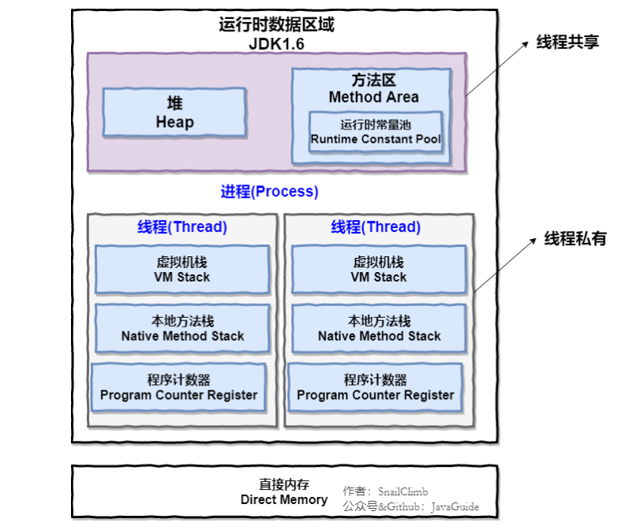


### 并发和并行的区别

* **并发**：同一时间段内，多个任务都在执行，但单位时间内不一定同时执行；
* **并行**：单位时间内，多个任务同时执行。


### 为什么使用多线程？

* **从总体来看**：线程是程序执行的最小单位，切换和调度的成本远远小于进程，并且多核CPU时代意味着多线程可以并行执行，减少了并发执行时上下文切换的开销。再者，随着互联网飞速发展，存在百万千万级别的并发量要求，多线程做为撑起高并发系统的基石，更应该需要被使用。
* **从底层探讨**：
  * 单核时代：主要是为了提高CPU和IO设备的综合利用率。当只有一个线程时，会出现CPU计算时IO设备空闲、IO操作时CPU空闲的情况，但多个线程会让两个操作在一段时间内都执行；
  * 多核时代：主要是为了提高CPU利用率。每一个线程被分配到一个核心去执行，多核CPU就能够并行的执行多个线程。

* **使用多线程带来的问题**：内存泄漏、上下文切换的性能损耗、死锁和受限于硬件和软件的资源闲置问题。


### HotSpot后台运行的系统线程分类

|          类型           |                             功能                             |
| :---------------------: | :----------------------------------------------------------: |
| 虚拟机线程（VM thread） | 等待JVM到达安全点的操作出现。这些操作必须要在独立的线程里执行，因为当堆修改无法进行时，线程都需要JVM位于安全点。这些操作的类型有： STW垃圾回收、线程栈dump、线程暂停、线程偏向锁解除 |
|     周期性任务线程      |    负责定时器事件（也就是中断），用来调度周期性操作的执行    |
|         GC线程          |                 支持JVM中不同的垃圾回收活动                  |
|       编译器线程        |        在运行时将字节码动态编译成本地平台相关的机器码        |
|      信号分发线程       |        接收发送到 JVM 的信号并调用适当的 JVM 方法处理        |


## 线程基础-多线程机制

### 创建线程

**实现Runnable接口：**

```java
public class MyRunnable implements Runnable {
    
    @Override
    public void run() {
		// ...        
    }
}

public static void main(String[] args) {
    new Thread(new MyRunnable()).start();
}
```

**实现Callable接口：**

```java
public class MyCallable implements Callable<Integer> {
    
    public Integer call() {
        // ...
    }
}

public static void main(String[] args) throws ExecutionException, InterruptedException {
    MyCallable mc = new MyCallable();
    FutureTask<Integer> ft = new FutureTask<>(mc);
    new Thread(ft).start();
    System.out.println(ft.get());
}
```

**继承Thread类：**

```java
public class MyThread extends Thread {
    
    public void run() {
        // ...
    }
}

public static void main(String[] args) {
    new MyThread().start();
}
```


### 基础机制

**Exector**：线程池可以管理多个互不干扰，不需要同步操作的异步任务的执行。

```java
public static void main(String[] args) {
    ExecutorService executorService = Executors.newCachedThreadPool();
    for (int i = 0; i < 5; i++) {
        executorService.execute(() -> {
            // ......
        });
    }
    executorService.shutDown();
}
```

**Daemon**：守护线程是程序运行时在后台提供服务的线程。当所有守护线程结束时，程序也就终止，同时会杀死所有守护线程。

```JAVA
public static void main(String[] args) {
    Thread thread = new Thread(() -> {
        // ......
    });
    // 将线程设置为守护线程
    thread.setDaemon(true);
}
```

**`sleep()`**：会休眠执行它的线程一段时间。可能会抛出InterruptedException，由于异常不能跨线程传回main中，所以子线程处理异常只能在本地捕获处理。

```JAVA
public static void main(String[] args) {
    new Thread(() -> {
        try {
            Thread.sleep(3000);
        } catch (InterruptedException e) {
            e.printStackTrace();
        }
    }).start();
}
```

**`yield()`**：将调用它的线程的执行权让出，给其他线程执行的机会。该方法只是对调度器的一个建议，而且也只会建议具有相同优先级的线程可以运行。

```JAVA
public static void main(String[] args) {
    new Thread(() -> {
        Thread.yield();
    }).start();
}
```


### 中断机制

**`interrupt()`**：通过调用线程的 `interrupt()` 方法来中断该线程，如果该线程处于阻塞、有限期或无限期等待状态，就会抛出InterruptedException，从而提前结束线程。但是不能中断I/O阻塞或synchronized锁的阻塞。

**`isInterrupted()`**：如果一个线程执行了一个无限循环，且没有执行sleep等会抛出InterruptedException的操作，那么可以通过调用 `Thread.currentThread().isInterrupted()` 方法设置一个线程的中断标记。若该线程被调用了 `interrupet()` 方法，则 `isInterrupted()` 标记会返回true，因此可以在无限循环中判断中断标记来决定是否中断线程。

```JAVA
public static void main(String[] args) throws InterruptedException {
    Thread thread = new Thread(() -> {
        while (!Thread.currentThread().isInterrupted()) {
            System.out.println("执行逻辑");
        }
        System.out.println("线程中断");
    });
    thread.start();

    try {
        Thread.sleep(3000);
    } catch (InterruptedException e) {
        e.printStackTrace();
    }
    thread.interrupt();
}
```

**Executor的中断操作**：调用Executor的 `shutdown()` 方法会等待池中的线程都执行完毕后再关闭。若调用 `shutdownNow() ` 方法，则相当于调用了池中每个线程的 `interrupt()` 方法。

```JAVA
public static void main(String[] args) {
    ExecutorService executorService = Executors.newCachedThreadPool();
    executorService.execute(() -> {
        try {
            Thread.sleep(2000);
        } catch (InterruptedException e) {
            e.printStackTrace();
        }
    });
    executorService.shutdownNow();
}
```

如果只想中断Executor中的一个线程，可以通过 `submit()` 提交任务，会返回一个Future对象，通过Future提供的 `cancel()` 方法就可以中断该线程。

```JAVA
public static void main(String[] args) {
    ExecutorService executorService = Executors.newCachedThreadPool();
    Future<?> future = executorService.submit(() -> {
    	// ......
    });
    future.cancel(true);
}
```


### 同步机制

**线程间同步的方式**：

* **互斥量（Mutex）**：采用互斥对象机制，只有拥有互斥对象的线程才有访问公共资源的权限。因为互斥对象只有一个，所以可以保证公共资源不会被多个线程同时访问；
* **信号量（Semphares）**：允许同一时刻多个线程访问同一资源，但是需要控制同一时刻访问此资源的最大线程数量；
* **事件（Event）**：即 `wait/notify` 操作，通过通知的方式来保持多线程同步，还可以方便的实现多线程的优先级。

**synchronized同步锁**：

```JAVA
public class SynchronizedExample {
    
    private Object object = new Object();
    
    public void func1() {
        // 同步代码块-对象锁
        synchronized (object) {
            for (int i = 0; i < 10; i++) {
                System.out.println(i + " ");
            }
        }
    }
    
    public static void main(String[] args) {
        SynchronizedExample example = new SynchronizedExample();
        ExecutorService executorService = Executors.newCachedThreadPool();
        executorService.execute(() -> e1.func1());
        executorService.execute(() -> e1.func1());
    }
}
```

```JAVA
// 同步方法-this锁
public synchronized void func() {
    // ......
}
```

```JAVA
public class SynchronizedExample {
    
    public void func1() {
        // 同步代码块-类锁
        synchronized (SynchronizedExample.class) {
            for (int i = 0; i < 10; i++) {
                System.out.println(i + " ");
            }
        }
    }
    
    public static void main(String[] args) {
        SynchronizedExample example1 = new SynchronizedExample();
        SynchronizedExample example2 = new SynchronizedExample();
        ExecutorService executorService = Executors.newCachedThreadPool();
        executorService.execute(() -> e1.fun1());
        executorService.execute(() -> e2.fun1());
    }
}
```

```JAVA
// 同步静态方法-类锁
public synchronized static void func() {
    // ......
}
```

**ReentrantLock可重入锁**：

```JAVA
public class ReentrantLockExample {
    
    private Lock lock = new ReentrantLock();
    
    public void func() {
        lock.lock();
        try {
            for (int i = 0; i < 10; i++) {
                System.out.println(i + " ");
            }
        } finally {
            lock.unlock();
        }
    }
    
    public static void main(String[] args) {
        LockExample lockExample = new LockExample();
        ExecutorService executorService = Executors.newCachedThreadPool();
        executorService.execute(() -> lockExample.func());
        executorService.execute(() -> lockExample.func());
    }
}
```


### 协作机制

**`join()` 线程连接机制**：在一个线程中调用另一个线程的 `join()` 方法，会让当前线程阻塞，直到目标线程结束后才会继续执行，从而保证多线程解决问题的先后顺序。

```JAVA
public class JoinExample {

    private class A extends Thread {
        
        @Override
        public void run() {
            System.out.println("A");
        }
    }

    private class B extends Thread {

        private A a;

        B(A a) {
            this.a = a;
        }

        @Override
        public void run() {
            try {
                a.join();
            } catch (InterruptedException e) {
                e.printStackTrace();
            }
            System.out.println("B");
        }
    }

    public void test() {
        A a = new A();
        B b = new B(a);
        b.start();
        a.start();
    }
}

public static void main(String[] args) {
    JoinExample example = new JoinExample();
    example.test();
}
```

**`wait()&notify()/notifyAll()` 等待唤醒机制**：使用 `wait()` 会使线程等待某个条件满足，线程在等待时会进入阻塞状态，当其他线程的运行使得这个条件满足时，其他线程会调用 `notify()` 或 `notifyAll()` 来唤醒阻塞的线程。

```JAVA
public class WaitNotifyExample {
    
    public synchronized void before() {
        System.out.println("before");
        // notify会随机唤醒WaitSet中的一个线程，底层的操作是由操作系统完成
        // notifyAll会唤醒WaitSet中的所有线程
        notifyAll();
    }
    
    public synchronized void after() {
        try {
            // wait调用前线程必须持有锁
            // 调用后线程会释放this锁，然后进入this锁对应的WaitSet中阻塞
            // 直到被其他线程调用同一个对象的notify唤醒后，才会进入就绪状态竞争锁
            wait();
        } catch (InterruptedException e) {
            e.printStackTrace();
        }
        System.out.println("after");
    }
    
    public static void main(String[] args) {
        WaitNotifyExample example = new WaitNotifyExample();
        ExcutorService executorService = Executors.newCachedThreadPool();
        executorService.execute(() -> example.after());
        executorService.execute(() -> example.before());
    }
}
```

**`sleep()` 和 `wait()` 的区别**：

* 最主要的区别：sleep方法不会释放锁，wait方法会释放锁；
* wait通常被用于线程间交互/通信，sleep通常被用于暂停执行；
* wait被调用后，线程不会自动苏醒，而是需要别的线程调用同一个对象上的 `notify()` 或者 `notifyAll()` 方法进行唤醒。或者可以使用 `wait(long timeout)` 超时后自动苏醒。而sleep只有超时苏醒这一种模式。

**`await()&signal()/signalAll()` 等待唤醒机制**：JUC提供的Condition类来实现线程间的协作，可以在Condition上调用` await()` 方法使线程等待，其他线程调用 `signal()` 或 `signalAll()` 方法唤醒等待的线程。相对于wait/notify来说，await可以指定在哪个条件上等待，signal可以唤醒指定条件上阻塞的线程。

```JAVA
public class AwaitSignalExample {
    
    private Lock lock = new ReentrantLock();
    // 条件对象
    private Condition condition = lock.newCondition();
    
    public void before() {
        lock.lock();
        try {
            System.out.println("before");
            // 唤醒在此条件对象上阻塞的所有线程
            condition.signalAll();
        } finally {
            lock.unlock();
        }
    }
    
    public void after() {
        lock.lock();
        try {
            // 在指定的条件对象上阻塞
            condition.await();
            System.out.prinln("after");
        } catch (InterruptedException e) {
            e.printStackTrace();
        } finally {
            lock.unlock();
        }
    }
    
    public static void main(String[] args) {
        AwaitSignalExample example = new AwaitSignalExample();
        ExecutorService executorService = Executors.newCachedThreadPool();
        executorService.execute(() -> example.after());
        executorService.execute(() -> example.before());
    }
}
```


## 线程基础-状态及切换

### 线程状态

* **初始（New）**：新创建的线程对象，还没有调用 `start()` 方法时的状态；
* **运行（Runnable）**：
  * **就绪（Ready）**：线程对象创建后，其他线程如main调用了该对象的 `start()` 方法，线程就会位于就绪状态的队列中，等待被调度器选中，获得CPU的使用权；
  * **运行中（Running）**：就绪状态的线程在获得CPU的时间片后变为运行中状态。
* **阻塞（Blocked）**：表示线程阻塞于锁；
* **等待（Waiting）**：进入该状态的线程需要无限期的等待其他线程做出一些特定动作（如唤醒或中断）；
* **超时等待（Timed_Waiting）**：与Waiting相似，但可以经过指定的时间返回；
* **终止（Terminated）**：表示该线程已经执行完毕。


### 状态切换

* **初始 —> 运行**：线程对象被创建后处于New状态，调用 `start()` 后进入Runnable状态（准确的说是进入Ready状态）；
* **就绪 <—> 运行中**：Ready状态的线程若是被调度器选中获得了CPU时间片（timeslice）就会进入Running状态。Running状态的线程若是时间片耗尽或是调用 `yield()` 方法后会重新进入Ready状态；
* **运行 <—> 等待**：当线程调用 `Object.wait()/Thread.join()/LockSupport.park()` 方法后，会处于Waiting状态，处于等待状态的线程需要依靠其他线程的通知或其他线程执行完毕后才能取消等待返回到Ready状态，如通过 `Object.notify()/Object.notifyAll()/LockSupport.unpark(Thread)` 方法唤醒等待的线程；
* **运行 <—> 超时等待**：Timed_Waiting状态相当于在Waiting状态的基础上增加了超时限制，如通过  `Thread.sleep(long)/Object.wait(long)/Thread.join(long)/LockSupport.parkNanos()/LockSupport.parkUntil()` 方法可以将线程置于超时等待状态，当超时时间到达后或被其他线程唤醒会返回到Ready状态；
* **运行 <—> 阻塞：**当线程执行同步代码，且没有获取到锁的情况下，会处于Blocked状态，直到其获取到锁，才会回到Ready状态；
* **运行 —> 终止**：线程执行完毕后会进入Terminated状态。


### EntryList和WaitSet

JVM底层维护的两种队列用于管理处于等待/阻塞状态的线程：

* **_WaitSet**：处于wait状态的线程，会被加入到WaitSet；
* **_EntryList**：处于等待锁的block状态的线程，会被加入到EntryList。


下图是线程通过wait/notify/synchronized操作后的状态变换图：

* synchronized同步锁在底层由对象监视器Monitor实现，Monitor维护了两个队列EntryList和WaitSet；
* 当线程进入同步代码中，并调用wait方法时，会进入同步锁（监视器）对应的WaitSet中等待（Waiting状态）；
* 当其他线程通过调用同一把锁对象的notify/notifyAll方法时，会唤醒WaitSet中的线程，让其进入EntryList中；
* 当线程获取锁失败时，会进入EntryList中等待，直到锁释放后才会被唤醒，然后竞争锁。

注：处于EntryList和WaitSet中的线程都处于OS级别的阻塞状态，不会参与调度。


### 影响线程状态的方法

* **`Thread.sleep(long millis)`**：当前线程调用此方法会进入Timed_Waiting状态，但不会释放对象锁，millis时间后线程会自动苏醒进入Ready状态。这是一种给其他线程执行机会的最佳方式；
* **`Thread.yield()`**：当前线程调用此方法会让出CPU执行权，由Running状态切换为Ready状态，让调度器重新调度，但不会释放对象锁。可以让相同优先级的线程轮流执行，但并不保证一定会让其他线程执行，因为让步的线程还有可能再次被调度器选中；
* **`Thread.join()/Thread.join(long millis)`**：当前线程调用其他线程的join方法会让当前线程进入Waiting/Timed_Waiting状态，但不会释放对象锁，当被调用join方法的线程执行完毕或者millis时间已过，当前线程会进入Ready状态；
* **`Object.wait()/Object.wait(long timeout)`**：当前线程调用此方法后，会释放对象锁，进入对象的WaitSet中，依赖于notify/notifyAll唤醒或timeout时间到后自动唤醒；
* **`Object.notify()/Object.notify()`**：调用此方法会唤醒在对象上等待的单个或全部线程，若是notify则唤醒的是WaitSet中的头节点，即等待时间最长的线程（JDK1.8）；
* **`LockSupport.park()/LockSupport.parkUntil(long deadlines)`**：当前线程调用park/parkUntil会进入Waiting/Timed_Waiting状态，相对于wait方法，可以不用获取锁就进入等待状态，依赖于unpark唤醒或自动唤醒。


## 线程基础-上下文切换

### 进程上下文切换

由于Java的JVM线程和OS的内核线程是1:1的映射关系，所以在发生上下文切换时，需要通过OS完成。以Linux为例，在切换过程中，正在执行的进程现场会被保存起来，保证未来能被恢复。这里的现场包括所有有关的寄存器，和一些操作系统的必要数据。

操作系统中用于保存进程信息的数据结构被称为进程控制块（PCB，process control block）。PCB通常是系统内存占用区中的一块连续内存，其存放着操作系统用于描述进程情况及控制进程运行所需的全部信息，可以使一个在多道程序环境下不能独立运行的程序成为一个能独立运行的基本单位或一个能与其他进程并发执行的进程。

**以进程A切换到进程B为例看上下文切换的步骤：**

1. 保存进程A的CPU环境（各种寄存器的数据）到私有堆栈中；
2. 更新PCB中的信息，对进程A的状态做出切换；
3. 将进程A的PCB放入相关状态的队列；
4. 将进程B的PCB信息切换为运行态，并执行进程B；
5. 之后调度器若是选择了进程A，会从队列中取出A的PCB，根据里面的信息恢复A被切换时暂停的现场，继续执行。


### 引起上下文切换的原因

* **调度**：进程持有的CPU时间片耗尽，操作系统正常调度下一个任务；
* **抢占**：进程的CPU执行权被其他优先级更高的任务抢占；
* **中断**：因为CPU发生中断，切换到中断服务程序去执行。中断包括硬件中断和软中断，常见的软中断导致的上下文切换有IO阻塞和未抢到资源等；
* **让步**：用户代码主动让出CPU的执行权，导致调度器重新调度。


### 上下文切换的性能问题

* **现场的保存恢复**：每次上下文切换都是纳秒甚至微秒级的CPU时间消耗，若是在进程上下文频繁切换的场景下，很容易导致CPU将大量的时间耗费在寄存器、内核栈和虚拟内存等资源的保存和恢复上，进而大大缩短了真正运行进程任务的时间。

* **内存映射的刷新**：另外，Linux通过TLB来管理虚拟内存到物理内存的映射关系，当进程切换导致虚拟内存更新后，TLB也会随之刷新，内存的访问也会随之变慢。特别是在多处理器系统上，高速缓存是被多个核心共享的，刷新缓存不仅会影响当前处理器上的进程，还会影响到共享缓存的其他处理器上的进程。


### 系统调用上下文切换

**同一进程的状态切换**：一次系统调用的过程中，其实是发生了两次CPU的上下文切换，即用户态-内核态-用户态。但在系统调用过程中，并不会涉及到虚拟内存等进程用户态的资源，也不会切换进程，也就是系统调用是在同一个进程完成的。

**Linux的系统调用**：Linux在进行系统调用时，会从用户态到内核态进行切换，每个进程都有一个关联内核模式的堆栈，专门给系统调用时使用。在执行系统调用之前，尚处于用户态的进程的寄存器信息会保存在用户模式堆栈中。当进程处于内核态时，调用相同模式的函数不需要上下文切换，当结束调用后才会恢复用户态继续执行。

**系统调用情况下CPU的上下文切换步骤**：

1. 保存CPU寄存器中用户态的指令和数据；
2. 为了执行内核态指令，PC需要更新为内核态指令的位置；
3. 跳转到内核态运行系统调用的指令；
4. 系统调用结束后，寄存器恢复保存的用户态指令和数据，然后切换回用户态，继续运行进程。


### 线程上下文切换

所谓内核中的任务调度，就是线程的调度，进程是给线程提供了虚拟内存、全局变量等资源。在Linux中，线程就是和其他进程共享某些资源的进程，共享的资源包括虚拟内存和全局变量等，这些资源在线程上下文切换时不需要被修改。需要修改的是线程的私有数据，如栈和寄存器等。

**线程上下文切换的场景**：

1. 前后两个线程属于不同进程的情况：由于资源不共享，和进程切换是一样的；
2. 前后两个线程属于同一进程的情况：因为虚拟内存共享，所以切换时只需要保存和恢复寄存器等私有数据即可。


### 减少上下文切换的方式

* **无锁并发编程**：多线程竞争锁时，会引起上下文的切换，所以多线程处理数据时，可以使用其他方法规避锁的使用。如将数据的id按照Hash算法取模分段，不同的线程处理不同段的数据；
* **CAS算法**：CAS会用先比较后替换的方式去操作共享资源，无需加锁；
* **减少线程数量**：使用线程池来控制最大线程数，并且可以重复利用线程，避免了线程创建和销毁的开销；
* **协程/用户级线程**：与操作系统内核线程1:N或M:N的比例创建用户级线程，在一个内核线程内控制多个任务的执行，任务的调度和切换都在用户空间完成，无需操作系统参与。


## 线程同步-死锁问题

### 死锁代码示例

死锁指两个或以上的线程被同时阻塞，它们中的一个或全部都在等待某资源被释放，由于线程被无限期的阻塞，因此程序不可能正常终止。

如下图，线程A持有资源2，线程B持有资源1，它们都想申请对方锁住的资源，但又不能释放自己锁住的资源，所以这两个线程会因为互相等待而进入死锁状态。


```JAVA
/**
 * 产生死锁的原因：
 * 	1.锁资源是互斥的；
 * 	2.线程阻塞时不会释放自己持有的资源；
 * 	3.线程持有的资源不可被剥夺；
 * 	4.多个线程形成了互相等待对方释放而自己又不释放的环路结构。
 * 综上所述，要解决死锁问题就需要打破以上任意一个或多个原因即可。
 */
public class DeadLockExample {
    
    private static Object resource1 = new Object();
    private static Object resource2 = new Object();
    
    public static void main(String[] args) {
        new Thread(() -> {
            // 线程1首先获resource1锁
            synchronized (resource1) {
                System.out.println(Thread.currentThread() + "get resource1");
                try {
                	Thread.sleep(1000);
                } catch (InterruptedException e) {
                	e.printStackTrace();
                }
                System.out.println(Thread.currentThread() + "waiting get resource2");
                // 线程1继续阻塞等待resource2锁但没有释放自己持有的resource1锁，但是线程2又阻塞在resourse1锁上
                synchronized (resource2) {
                    System.out.println(Thread.currentThread() + "get resource2");
                }
            }
        }, "线程1").start();
        
        new Thread(() -> {
            // 线程2获取resource2锁
            synchronized (resource2) {
                System.out.println(Thread.currentThread() + "get resource1");
                try {
                	Thread.sleep(1000);
                } catch (InterruptedException e) {
                	e.printStackTrace();
                }
                System.out.println(Thread.currentThread() + "waiting get resource2");
                // 线程2继续阻塞等待resource1锁但没有释放自己持有的resource2锁，但是线程1又阻塞在resource2上
         		synchronized (resource1) {
                    System.out.println(Thread.currentThread() + "get resource1");
                } 
            }
        }, "线程2").start();
    }
}
```

```
Thread[线程 1,5,main] get resource1
Thread[线程 2,5,main] get resource2
Thread[线程 1,5,main] waiting get resource2
Thread[线程 2,5,main] waiting get resource1
```

**代码分析**：线程1首先获resource1锁，线程2获取resource2锁。当两个线程休眠结束后，线程1内部阻塞等待resource2锁但没有释放resource1锁，线程2内部阻塞等待resource1锁但没有释放resource2锁。


### 解决死锁问题

```java
// 修改线程2获取锁的顺序，通过破除环形结构，从而解决死锁问题
new Thread(() -> {
    // 让线程2在resource1就与线程1发生竞争，最终达到一方持有一方阻塞的状态
    synchronized (resource1) {
        System.out.println(Thread.currentThread() + "get resource1");
        try {
            Thread.sleep(1000);
        } catch (InterruptedException e) {
            e.printStackTrace();
        }
        System.out.println(Thread.currentThread() + "waiting get resource2");
        // 获取锁的顺序和线程1一致
        synchronized (resource2) {
            System.out.println(Thread.currentThread() + "get resource1");
        }
    }
}, "线程2").start();
```

```
Thread[线程 1,5,main]get resource1
Thread[线程 1,5,main]waiting get resource2
Thread[线程 1,5,main]get resource2
Thread[线程 2,5,main]get resource1
Thread[线程 2,5,main]waiting get resource2
Thread[线程 2,5,main]get resource2

Process finished with exit code 0
```


## 线程同步-synchronized

### 概念

用于解决多线程间资源访问的同步问题，保证任意时刻被其修饰的代码块或方法只能有一个线程执行。在Java早期版本，synchronized底层使用效率低下重量级锁，因为对象监视器（Monitor）是依赖于OS的Mutex Lock实现的，JVM线程是1:1与OS内核线程映射的，这种方式的实现下，线程的阻塞、唤醒和重新调度，都需要OS从用户态陷入内核态，开销较大。


### 使用方式

* **修饰实例方法**：即对象锁，给当前对象实例加锁，进入同步代码前要获得当前对象实例的锁；
* **修饰静态方法**：即类锁，给当前类的字节码对象加锁，会作用于类的所有对象实例，一旦线程持有类锁，无论其他线程调用的是该类的任意对象实例的方法，都会同步；
* **修饰代码块**：即手动指定加锁对象，对给定对象加锁，进入同步代码库前要获得给定对象的锁；
* 注：不要使用``synchronized(String str)``加锁，因为JVM中字符串常量池具有缓存功能。


### 字节码

```JAVA
public class Example {

    private static Object object = new Object();

    public static void main(String[] args) {
        synchronized (object) {
            System.out.println("welcome");
        }
    }
}
```

```powershell
> javac Example.java
> javap -c -v Example.class
```

```java
public static void main(java.lang.String[]);
    descriptor: ([Ljava/lang/String;)V
    flags: ACC_PUBLIC, ACC_STATIC
    Code:
      stack=2, locals=3, args_size=1
         0: getstatic     #2                  // Field object:Ljava/lang/Object;
         3: dup
         4: astore_1
         5: monitorenter
         6: getstatic     #3                  // Field java/lang/System.out:Ljava/io/PrintStream;
         9: ldc           #4                  // String welcome
        11: invokevirtual #5                  // Method java/io/PrintStream.println:(Ljava/lang/String;)V
        14: aload_1
        15: monitorexit
        16: goto          24
        19: astore_2
        20: aload_1
        21: monitorexit
        22: aload_2
        23: athrow
        24: return
      Exception table:
         from    to  target type
             6    16    19   any
            19    22    19   any
      LineNumberTable:
        line 8: 0
        line 9: 6
        line 10: 14
        line 11: 24 
```

使用synchronized修饰同步代码块时，字节码层面是通过monitorenter和monitorexit这两个指令来实现锁对象监视器的获取和释放动作，这两个指令隐式的执行了lock和unlock的操作。

**为什么会执行两条monitorexit指令？**是为了应对异常情况的发生而多执行了一步释放锁的操作。


### 锁升级原理


JDK1.6之后优化了synchronized操作，锁会随着竞争的激烈而逐渐升级，主要存在4种状态：**无锁（unlocked）、偏向锁（biasble）、轻量级锁（lightweight locked）、重量级锁（inflated）**。

#### Java对象内存布局

HotSpot虚拟机堆中的对象实例被划分为三个组成部分：对象头、实例数据和对齐填充位。


```JAVA
public class JOLExample {

    public static void main(String[] args) {
        Object o = new Object();
        System.out.println(ClassLayout.parseInstance(o).toPrintable());

        synchronized (o) {
            System.out.println(ClassLayout.parseInstance(o).toPrintable());
        }
    }
}
```

* 偏移量0开始的和偏移量4开始的共8个字节代表对象的MarkWord（对象头）；
* 偏移量8开始的4个字节代表对象的ClassPoint（对象所属的类）；
* 因为没有成员变量，所有偏移量12开始的4个字节是填充字节（字节对齐），为了让整个对象的字节大小符合被8整除。

```JAVA
java.lang.Object object internals:
OFFSET  SIZE   TYPE DESCRIPTION                               VALUE
    0      4        (object header)                           01 00 00 00 (00000001 00000000 00000000 00000000) (1)
    4      4        (object header)                           00 00 00 00 (00000000 00000000 00000000 00000000) (0)
    8      4        (object header)                           e5 01 00 f8 (11100101 00000001 00000000 11111000) (-134217243)
    12     4        (loss due to the next object alignment)
Instance size: 16 bytes 空对象16个字节
Space losses: 0 bytes internal + 4 bytes external = 4 bytes total
```

使用synchronized后，此时从偏移量4开始的4个字节发生了变化，是因为偏向锁的信息被添加到了对象的MarkWord上（说白了偏向锁就是将对象的id信息直接贴到锁上，无需争抢竞争）

```JAVA
java.lang.Object object internals:
OFFSET  SIZE   TYPE DESCRIPTION                               VALUE
    0      4        (object header)                           28 f7 a8 02 (00101000 11110111 10101000 00000010) (44627752)
    4      4        (object header)                           00 00 00 00 (00000000 00000000 00000000 00000000) (0)
    8      4        (object header)                           e5 01 00 f8 (11100101 00000001 00000000 11111000) (-134217243)
    12     4        (loss due to the next object alignment)
Instance size: 16 bytes
Space losses: 0 bytes internal + 4 bytes external = 4 bytes total
```

**Java对象头：**对象头这些数据被称为Mark Word。


#### 偏向锁


**概念**：偏向锁会偏向第一个获取它的线程，若接下来的执行中，该锁没有被其他线程所获取，那么持有偏向锁的线程在访问锁住的资源时不需要再进行同步操作（即加锁和释放锁）。

**加锁过程**：

1. 当一个线程访问同步块并获取锁时，会在锁对象的对象头和栈帧中的锁记录里存储锁偏向的线程ID；
2. 以后该线程进入或退出同步块时不需要再进行CAS操作来加锁和释放锁，只需要测试锁对象的对象头的MarkWord是否设置着指向自己的偏向锁；
3. 若测试成功则表示已获取锁，若失败则需要再测试MarkWord中偏向锁的标识位是否被设置为1；
4. 若没设置，则使用CAS竞争锁，若已设置则尝试使用CAS将锁对象的对象头中的偏向锁指向该线程。

**释放锁过程**：

1. 偏向锁直到出现竞争才会释放锁，即当有其他线程尝试竞争偏向锁时，持有偏向锁的线程才会释放锁；
2. 偏向锁的释放需要等到全局安全点，即在该时间点上没有正在执行的字节码指令；
3. 首先会暂停持有锁的线程，然后检查该线程是否存活，若不活动，则将锁对象的对象头设置为无锁状态；
4. 若仍存活，则锁对象的对象头中的MarkWord和栈中的锁记录要么重新偏向于其他线程要么恢复成无锁状态，最后唤醒被暂停的线程。

**偏向锁升级为轻量级锁：**在存在锁竞争的场合下，偏向锁就会失效，因为这样的场合存在每次申请锁的线程都是不相同的情况，所以不适合使用偏向锁，而是升级成轻量级锁。


#### 轻量级锁

**概念**：轻量级锁在多线程竞争不会非常激烈的情况下，可以减少获取重量级锁时需要操作系统进行调度和使用互斥量而产生的性能消耗（线程的挂起和唤醒需要CPU从用户态转为内核态），而轻量级锁使用的是自旋竞争锁和CAS的方式加锁。

**自旋锁和适应性自旋锁**：

* 为什么引入自旋锁？所谓自旋锁是为了避免线程在未获取到锁时的阻塞/唤醒操作而提出的技术，并且很多对象锁的锁定状态只会持续很短的一段时间（如整数的自增操作），在很短的时间内阻塞/唤醒线程显然不值得；
* 所谓自旋，就是让线程在用户空间去执行一个无意义的循环，循环结束后再去重新竞争锁，如果竞争不到继续循环，循环过程中线程会一直处于running状态，但是基于JVM的线程调度，会出让时间片（但不会让出CPU时间片），所以其他线程依旧有申请锁和释放锁的机会。
* JDK1.6引入了适应性自旋锁，自旋的次数不固定，而是由前一次同一个锁上的自旋时间以及锁拥有者的状态决定。

**加锁过程**：

1. 线程进入同步代码块之前，JVM会在轻量级锁运行过程中在当前的线程的栈帧中创建锁记录（Lock Record）空间，并将锁对象的MarkWord拷贝到这片空间中（Displaced Mark Word）；

   

2. 然后线程尝试使用CAS操作将锁对象MarkWord替换为指向自己Lock Record的指针，同时将Lock Record中的owner指针指向锁对象MarkWord；

   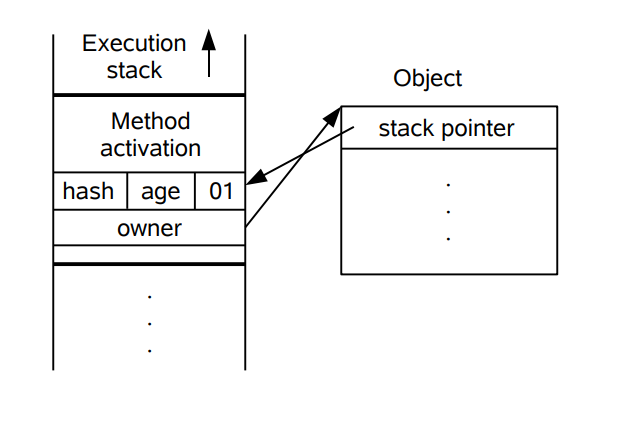

3. 若替换成功，则当前线程获取了锁，并且锁对象的MarkWord的锁标志位设置为00，即表示此对象处于轻量级锁定状态；

4. 若替换失败，JVM首先检查对象的Mark Word是否指向当前线程的Lock Record，如果是则说明当前线程已拥有锁，直接执行同步操作；

5. 否则当前线程尝试自旋获取锁，直到自旋失败，即自旋若干次后仍未获取到锁（适应性自旋）。这时轻量级锁会膨胀成重量级锁，锁对象的MarkWord的锁标志位设置为10，线程会阻塞在互斥量上面。

**释放锁过程**：

1. 线程首先使用CAS操作将自己的Displaced Mark Word替换回锁对象的MarkWord；
2. 若替换成功，则表示同步操作完成；
3. 若替换失败，则表示锁对象的MarkWord被修改过，即存在竞争锁的线程自旋失败将锁升级为重量级锁了，此时在释放锁的同时要唤醒阻塞在该锁上的线程。

**轻量级锁一定比重量级锁效率更高吗？**不一定，如果锁的竞争非常激烈，有非常多的线程在自旋等待锁，则CPU的资源会大量消耗在上下文切换上面（即不断切换线程去执行循环操作）。


#### 重量级锁

**概念**：JVM的重量级锁是基于进入与退出监视器对象（Monitor）实现的，Java中每个对象实例都关联一个共同创建和销毁的Monitor对象（由C++实现），Java对象中记录了指向Monitor内存地址的指针，Monitor对象记录了当前持有锁的线程ID。

**EntryList阻塞队列和WaitSet等待集合**：

* 当多个线程访问同一段同步代码时，只有一个线程能够获取锁对象的监视器，其他线程会进入EntryList队列中阻塞，Monitor是基于操作系统的Mutex互斥量实现的（`Mutex(0|1)`）；
* 如果线程调用了 `wait()` 方法后，则会释放持有的锁监视器，然后进入WaitSet集合中等待被其他线程的 `notify()/notifyAll()` 唤醒。

**重量级锁涉及到的用户态到内核态的切换**：

* Monitor是依赖于操作系统实现的，在线程尝试对Mutex进行原子修改时，会从用户态陷入到内核态，增加CPU性能的开销；
* EntryList和WaitSet中的线程均处于阻塞状态，阻塞操作是由操作系统完成的（Linux的 `pthread_mutex_lock()`），线程阻塞后会陷入内核态等待事件就绪（锁释放）和重新调度，当其重新获取CPU执行权后又会回到用户态，频繁的切换大幅增加CPU的开销。


#### 锁消除和锁粗化

**锁消除和逃逸分析：**JIT编译器（Just In Time即时编译器）在动态编译同步代码时，使用了逃逸分析技术，判断锁对象若只被一个线程使用，没有散布到其他线程中时，则JIT在编译同步代码时就不会生成相应的加锁释放锁的机器码，从而消除了锁的使用流程。

```java
public class Example {
    
    public void method() {
        Object object = new Object();
        synchronized (object) {
            System.out.println("hello world");
        }
	}
}
```

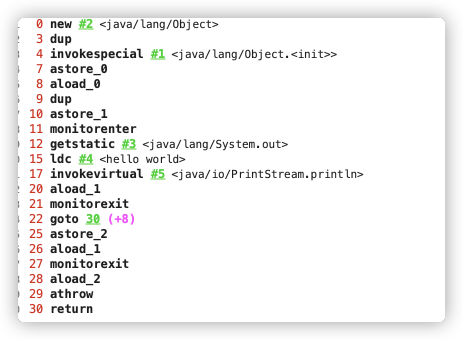

即使JIT的逃逸分析判定成功，字节码中还是能找到monitorenter和monitorexit这两个指令，但真正执行的机器码是由JIT来控制的。

**锁粗化：**JIT编译器在执行动态编译时，若发现前后相邻的synchronized块使用的是同一个锁对象，则会将多个同步块合并起来，这样做的好处是线程在执行同步块时就无需频繁的申请和释放锁资源了。

```java
public class Example {
    
    private Object object = new Object();
    
    public void method() {
        synchronized (object) {
            System.out.println("hello world");
        }
        
        synchronized (object) {
            System.out.println("welcome");
        }
        
        synchronized (object) {
            System.out.println("person");
        }
    }
}
```


### synchronized与Lock的区别

* **都是可重入锁**：所谓可重入锁就是同一个线程可以重复获取自己已经获得的锁。如一个线程获得了某个对象的锁，此时该锁还没有释放，当其想要再次获取的时候仍能成功。若该锁是不可重入的话，会发生死锁，即同一个线程获取锁时，锁的计数器会自增1，只有等到0时才能释放；
* **实现方式**：synchronized是依赖于JVM实现的，而Lock是依赖于JDK的API实现的；
* ReentrantLock比synchronized增加了一些高级功能：
  * **等待可中断**：提供中断等待锁的线程的机制，ReentrantLock可通过 ``lock.lockInterruptibly()`` 来实现让正在等待该锁的线程放弃等待，改为处理其他事情；
  * **可实现公平锁**：提供了指定公平锁或非公平锁的机制，synchronized只能是公平锁，所谓的公平锁就是先等待锁的线程先获取锁。ReentrantLock可通过`new ReentrantLock(boolean fair)`来指定锁的公平机制；
  * **可实现选择性通知（锁可以绑定多个条件）**：借助Condition接口与newCondition()方法实现等待/唤醒机制，与synchronized不同之处在于ReentrantLock可以在一个Lock对象中创建多个Condition实例（对象监视器）实现多路通知功能，线程对象可以注册在指定的Condition中，从而可以有选择性的进行线程唤醒，而notify()/notifyAll()方式通知的线程是由JVM选择的。


## 线程安全-volatile

### JMM引出的问题

线程会将变量保存在本地内存（如高速缓存和寄存器）中，而不是直接在主存中进行读写，这样可能会造成一个线程在主存中修改了一个变量的值，而另一个线程还继续使用它之前存储在寄存器中变量值的拷贝，从而造成了数据的不一致。


通过将变量声明为volatile，指示JVM该变量是不稳定的，每次使用都需要从主存中进行读取。即volatile关键字就是保证了变量的可见性和防止指令重排序。


### 指令重排序

在Java程序的执行过程中，以提高性能为目的，编译器和处理器通常都会对其执行的指令顺序进行重新调整。

* **编译器优化重排序**：编译器在不改变单线程程序语义的前提下，可以重新安排语句的执行顺序；
* **指令并行重排序**：现代处理器使用了指令并行技术（ILP）来将多条指令重叠执行，如果不存在数据依赖性，处理器可以改变语句对应的机器指令的执行顺序；
* **内存系统重排序**：由于处理器使用高速缓存和读/写缓冲区，这使得加载和存储操作看上去可能是在乱序执行。


### 内存屏障

Java的编译器会在生成指令序列时在适当的位置插入内存屏障指令（Memory Barrier）来禁止特定类型的处理器重排序，从而让指令按照预定的顺序执行，并且能够强制输出各种CPU的缓存，如写入屏障（Write-Barrier）将刷出所有在屏障之前写入缓存中的数据，因此任何CPU上的线程都能读取到这些数据的最新版本。

**JMM的4类内存屏障指令**：

|      屏障类型      |          指令示例          |                             说明                             |
| :----------------: | :------------------------: | :----------------------------------------------------------: |
| LoadLoad Barriers  |   Load1；LoadLoad；Load2   |    确保Load1的数据的装载先于Load2及所有后续装载指令的装载    |
| StoreStoreBarriers | Store1；StoreStore；Store2 | 确保Store1数据对其他处理器可见（刷新到内存）先于Store2及所有后续存储指令的存储 |
| LoadStore Barriers |  Load1；LoadStore；Store2  |   确保Load1的数据的装载先于Store2及所有后续存储指令的存储    |
| StoreLoad Barriers |  Store1；StoreLoad；Load2  | 确保Store1的数据对其他处理器可见（刷新到内存）先于Load2及所有后续的装载指令的装载 |

**内存屏障分类**：

* 按可见性保障划分：
  * **加载屏障Load Barrier**：StoreLoad屏障可充当加载屏障，作用是使用load 原子操作，即清空无效化队列，使处理器在读取共享变量时，先从主内存或其他处理器的高速缓存中读取相应变量，更新到自己的缓存中。刷新处理器缓存，同步其他处理器对该volatile变量的修改结果，保证当前读取到的变量是最新的。
  * **存储屏障Store Barrier**：StoreLoad屏障可充当存储屏障，作用是使用 store 原子操作，冲刷处理器缓存，即将写缓冲器内容写入高速缓存中，使处理器对共享变量的更新写入高速缓存或者主内存中。刷新处理器缓存，结果是可以确保该存储屏障之前一切的操作所生成的结果对于其他处理器来说都可见。
* 按有序性保障划分：
  * **获取屏障Acquire Barrier**：相当于**LoadLoad**屏障与 **LoadStore**屏障的组合。在读操作后插入，禁止该读操作与其后的任何读写操作发生重排序。防止上面的volatile读取操作与下面的所有操作语句的指令重排序。
  * **释放屏障Release Barrier**：相当于**LoadStore**屏障与**StoreStore**屏障的组合。在一个写操作之前插入，禁止该写操作与其前面的任何读写操作发生重排序。防止下面的volatile与上面的所有操作的指令重排序。

**synchronized的内存屏障**：其底层通过获取屏障Acquire Barrier和释放屏障Release Barrier保证有序性，通过加载屏障Load Barrier和存储屏障Store Barrier保证可见性，最后通过互斥锁保证原子性。

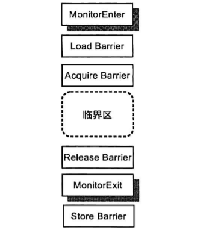

**volatile的内存屏障**：

* 读操作：

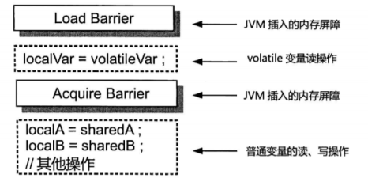

* 写操作： 


### volatile与synchronized的区别

* volatile是轻量级的实现多线程间可见性和有序性的机制，性能比synchronized好，但只能作用于变量，而synchronized可以修饰方法和代码块；
* 多线程访问volatile关键字修饰的变量不会发生阻塞，而synchronized修饰的代码会发生阻塞；
* volatile只能保证数据的可见和有序性但不能保证原子性，synchronized三者都能保证；
* volatile关键字主要用于解决多线程间的变量可见性，synchronized关键字主要解决多线程间访问资源的同步性。


### DCL双重检锁式单例

```JAVA
/**
 * 饿汉式单例
 * 类加载到内存后就实例化一个单例，JVM保证线程安全
 */
public class SingletonExample {

    private static final SingletonExample INSTANCE = new SingletonExample();

    private SingletonExample() {}

    // 类加载的时候直接初始化，永远只会存在一个对象
    public static SingletonExample getInstance() {
        return INSTANCE;
    }

    public void m() {
        System.out.println("m");
    }

    public static void main(String[] args) {
        SingletonExample m1 = SingletonExample.getInstance();
        TSingletonExample m2 = SingletonExample.getInstance();
        System.out.println(m1 == m2);
    }
}
```

```JAVA
/**
 * 懒汉式单例
 * 虽然达到了按需初始化的目的，但却带来了线程不安全的问题
 */
public class SingletonExample {

    /*
        对象的创建过程：
        class T {
            int m = 8;
        }
        T t = new T();
        汇编指令：
        0 new #2 <T>
        3 dup
        4 invokespecial #3 <T.<init>>
        7 astore_1
        8 return
    */
    private static volatile SingletonExample INSTANCE;

    private SingletonExample() {
    }

    /*
        问：使用DCL单例模式下，需不需要加volatile？
        答：需要加，因为创建对象时的汇编指令可能会发生重排序：
            0 new #2 <T> 半初始化对象，成员变量赋予初始值
            4 invokespecial #3 <T.<init>> 调用构造方法
            7 astore_1  引用和对象关联
        4和7若是发生了CPU指令重排，那会先关联引用和对象，此时INSTANCE就不为空了，此时该线程先去执行权；
        若正好进来一个新线程，外层检索 if (INSTANCE == null) 就会失效，新线程就会使用半初始化的对象，值就是默认值；
        加上了volatile会让该关键字修饰的内存空间在被指令操作时不存在乱序的情况。
    */
    /*
        问：volatile如何阻止指令的乱序执行？
        答：内存屏障
        JVM内存屏障规范：
        Hotspot虚拟机实现内存屏障：lock addl 锁总线的方式
    */
    public static SingletonExample getInstance() throws InterruptedException {
        // DCL双重检索式（Double Check Lock）
        // 外层检索：防止大量线程直接去竞争锁带来的性能问题
        if (INSTANCE == null) {
            synchronized (SingletonExample.class) {
                // 内层检索：防止其他通过外层检索的线程又执行一遍内部逻辑
                if (INSTANCE == null) {
                    Thread.sleep(1);
                    // 若不加锁则会出现多个线程创建多个对象的问题，单例则无从谈起
                    INSTANCE = new SingletonExample();
                }
            }
        }
        return INSTANCE;
    }

    public void m() {
        System.out.println("m");
    }

    public static void main(String[] args) {
        for (int i = 0; i < 100; i++) {
            new Thread(() -> {
                try {
                    System.out.println(SingletonExample.getInstance().hashCode());
                } catch (InterruptedException e) {
                    e.printStackTrace();
                }
            }).start();
        }
    }
}
```


## 并发模型-ThreadLocal

### 基本概念

ThreadLocal是通过空间换取时间，从而实现每个线程当中都会有一套数据的副本，这样每个线程都会操作自己的副本，从而隔离了多线程对共享数据的操作造成的问题。


### 使用示例

```JAVA
public class ThreadLockExample {
    
    public static void main(String[] args) {
        ThreadLocal threadLocal1 = new ThreadLocal();
        ThreadLocal threadLocal2 = new ThreadLocal();
        
        new Thread(() -> {
            threadLocal1.set(1);
            threadLocal2.set(1);
        }).start();
        
        new Thread(() -> {
            threadLocal1.set(2);
            threadLocal2.set(2);
        }).start();
    }
}
```


### 源码分析

```JAVA
// 每个Thread类都维护一个ThreadLocal.ThreadLocalMap对象
ThreadLocal.ThreadLocalMap threadLocals = null;
```

```JAVA
public void set(T value) {
    Thread t = Thread.currentThread();
    // 先获取当前线程的ThreadLocalMap对象
    ThreadLocalMap map = getMap(t);
    if (map != null)
        // 将当前ThreadLocal对象的引用和要存储的数据做为键值对插入Map中
        map.set(this, value);
    else
        createMap(t, value);
}
```

```JAVA
public T get() {
    Thread t = Thread.currentThread();
    ThreadLocalMap map = getMap(t);
    if (map != null) {
        // 通过当前ThreadLocal对象的引用做为key获取到对应的value
        ThreadLocalMap.Entry e = map.getEntry(this);
        if (e != null) {
            @SuppressWarnings("unchecked")
            T result = (T)e.value;
            return result;
        }
    }
    return setInitialValue();
}
```


### 内存泄漏

当把threadlocal变量置为null以后，没有任何强引用指向threadlocal实例，所以threadlocal将会被gc回收。这样一来，ThreadLocalMap中就会出现key为null的Entry，就没有办法访问这些key为null的Entry的value，如果当前线程再迟迟不结束的话，这些key为null的Entry的value就会一直存在一条强引用链：Thread Ref -> Thread -> ThreaLocalMap -> Entry -> value，而这块value永远不会被访问到了，所以存在着内存泄露。

只有当前thread结束以后，current thread就不会存在栈中，强引用断开，Current Thread、Map value将全部被GC回收。最好的做法是不在需要使用ThreadLocal变量后，都调用它的remove()方法，清除数据。

为什么使用弱引用而不是强引用？

key 使用强引用：对ThreadLocal对象实例的引用被置为null了，但是ThreadLocalMap还持有这个ThreadLocal对象实例的强引用，如果没有手动删除，ThreadLocal的对象实例不会被回收，导致Entry内存泄漏。

key 使用弱引用：对ThreadLocal对象实例的引用被被置为null了，由于ThreadLocalMap持有ThreadLocal的弱引用，即使没有手动删除，ThreadLocal的对象实例也会被回收。value在下一次ThreadLocalMap调用set，get，remove都有机会被回收。

比较两种情况，我们可以发现：由于ThreadLocalMap的生命周期跟Thread一样长，如果都没有手动删除对应key，都会导致内存泄漏，但是使用弱引用可以多一层保障。

因此，ThreadLocal内存泄漏的根源是：**由于ThreadLocalMap的生命周期跟Thread一样长，如果没有手动删除对应key就会导致内存泄漏，而不是因为弱引用**。

如何回收弱引用？JVM利用调用ThreadLocal的remove、get、set方法的时候，回收弱引用。

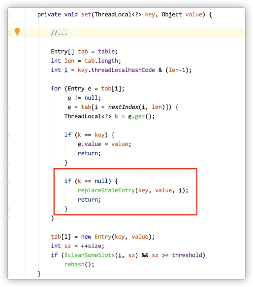

**ThreadLocal使用弱引用来防止内存泄漏**：

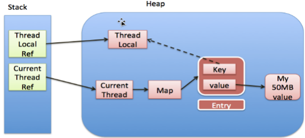

* 若Entry中的key使用强引用，此时外部所有的强引用断开联系，ThreadLocalMap中的key不会被GC回收，key积累过多会造成内存泄漏问题的发生；
* 使用弱引用会在外部引用都断开后允许GC回收，但会造成key为null，value无key映射导致无法删除，也可能会出现内存泄漏问题；
* 所以使用ThreadLocal后需要手动调用remove方法清除k-v对，防止内存泄漏。

```JAVA
ThreadLocalMap(ThreadLocal<?> firstKey, Object firstValue) {
    table = new Entry[INITIAL_CAPACITY];
    int i = firstKey.threadLocalHashCode & (INITIAL_CAPACITY - 1);
    table[i] = new Entry(firstKey, firstValue);
    size = 1;
    setThreshold(INITIAL_CAPACITY);
}

// ThreadLocalMap中的元素类型Entry，其中的key就是指向ThreadLocal对象的弱引用
static class Entry extends WeakReference<ThreadLocal<?>> {
    Object value;

    Entry(ThreadLocal<?> k, Object v) {
        super(k);
        value = v;
    }
}
```


## 多线程管理-线程池

### 基本概念

**线程池是什么？**是一种使用了池化思想管理多线程执行的任务的机制。在创建多个线程执行任务后不会销毁线程，而是将其缓存下来，等之后的任务就绪后再次使用，以此来避免线程的频繁创建和销毁带来的性能浪费。

**为什么使用线程池？**

* 降低资源消耗：通过重复利用已经创建的线程降低因为频繁创建和销毁而造成的消耗；

* 提高响应速度：当任务到达时，无需等待线程的创建即可立即执行；

* 提高线程的可管理性：线程池可以统一的分配、调优和监控线程。


### 创建方式

不推荐使用Executors去创建，而是通过ThreadPoolExecutor的方式创建，因使用前者的弊端如下：

* FixedThreadPool和SingleThreadExecutor：默认允许请求的队列长度为Integer.MAX_VALUE，可能会堆积过多的请求，从而导致OOM。

* CachedThreadPool和ScheduledThreadPool：默认允许创建的线程数量为Integer.MAX_VALUE，可能会创建过多的线程，从而导致OOM。

**创建线程池的两种方式**：

* 通过ThreadPoolExecutor重载的4种有参构造方法创建。

* 通过Executor的工具类Executors来创建4种类型的线程池：
  * **FixedThreadPool**：通过 `Executors.newFixedThreadPool()` 创建，该方法返回一个固定容量的线程池，当有新任务提交时，池中若有空闲线程，则立即执行，若没有则将任务暂存到任务队列中，待池中有线程空闲，便处理队列中的任务。
  * **SingleThreadExecutor**：通过 `Executors.newSingleThreadExecutor()` 创建，该方法返回一个只有一个线程的线程池，同一时间只能执行一个任务，若多余出来的任务被提交则会被暂存任务队列，待池中的线程空闲，便处理队列中的任务。
  * **CachedThreadPool**：通过 `Executors.newCachedThreadPool()` 创建，该方法返回一个可根据实际情况调整线程数量的线程池（带缓冲的线程池），其中的线程数量是不确定的，但若有空闲线程可以复用，则优先使用，若无空闲线程，则会创建新线程处理任务。
  * **WorkStealingPool**：通过 `Executors.newWorkStealingPool()` 创建，具有任务窃取机制的线程池。


### 任务提交

* `execute()`：用于提交不需要返回值的任务，无法判断任务是否被成功执行。

* `submit()`：用于提交需要返回值的任务，线程池会返回 Future对象，通过该对象可以判断任务是否成功执行，并且可以通过get方法获取返回值，get方法会阻塞当前线程直到任务完成，而使用 ``get(long timeout, TimeUnit unit)`` 方法则会阻塞当前线程一段时间后立即返回，这时候任务有可能没有执行完。
* 注：submit()有3个重载的方法，但无论哪个方法，最终都是将传递进来的任务转换为Callable对象，并通过execute()方法提交任务。

```JAVA
/**
 * @throws RejectedExecutionException {@inheritDoc}
 * @throws NullPointerException       {@inheritDoc}
 */
public Future<?> submit(Runnable task) {
    if (task == null) throw new NullPointerException();
    RunnableFuture<Void> ftask = newTaskFor(task, null);
    execute(ftask);
    return ftask;
}

/**
 * @throws RejectedExecutionException {@inheritDoc}
 * @throws NullPointerException       {@inheritDoc}
 */
public <T> Future<T> submit(Runnable task, T result) {
    if (task == null) throw new NullPointerException();
    RunnableFuture<T> ftask = newTaskFor(task, result);
    execute(ftask);
    return ftask;
}

/**
 * @throws RejectedExecutionException {@inheritDoc}
 * @throws NullPointerException       {@inheritDoc}
 */
public <T> Future<T> submit(Callable<T> task) {
    if (task == null) throw new NullPointerException();
    RunnableFuture<T> ftask = newTaskFor(task);
    execute(ftask);
    return ftask;
}
```

**实现Runnable接口和Callable接口的区别**：

* Runnable接口不会返回结果或者抛出异常，Callable接口可以；
* 工具类Executors可以实现Runnable和Callable对象的相互转换，使用 `Executors.callable(Runnable task)` 或 `Executors.callable(Runnable task, Object result)`；

```JAVA
@FunctionalInterface
public interface Runnable {
    
    // 被线程执⾏，没有返回值也⽆法抛出异常
	public abstract void run();
}
```

```java
@FunctionalInterface
public interface Callable<V> {

    // 计算结果，或在⽆法得到结果时抛出异常
	V call() throws Exception;
}
```


### 使用示例

```java
public class ThreadPoolExecutorDemo {

    private static final int CORE_POOL_SIZE = 5;
    private static final int MAX_POOL_SIZE = 10;
    private static final int QUEUE_CAPACITY = 100;
    private static final Long KEEP_ALIVE_TIME = 1L;

    public static void main(String[] args) {
        // 通过ThreadPoolExecutor构造方法⾃定义参数创建线程池
        ThreadPoolExecutor executor = new ThreadPoolExecutor(
            CORE_POOL_SIZE,
            MAX_POOL_SIZE,
            KEEP_ALIVE_TIME,
            TimeUnit.SECONDS,
            new ArrayBlockingQueue<>(QUEUE_CAPACITY),
            new ThreadPoolExecutor.CallerRunsPolicy());
        for (int i = 0; i < 10; i++) {
            // 任务提交
            executor.execute(() -> "SayHello " + i);
        }

        // 优雅关闭
        executor.shutdown();
        // 主线程等待线程池的关闭
        while (!executor.isTerminated()) {}
        System.out.println("Finished all threads");
    }
}
```


### 源码分析

#### 构造方法分析

**构造方法参数**：

* **int corePoolSize**：线程池中的核心线程数（处于活动状态的核心线程数量），数量内的线程会一直保持不会被回收。当线程池处于初始状态，有一个任务被提交时，线程池会创建一个新线程执行任务，直到当前线程数等于corePoolSize，再继续提交的任务会进入阻塞队列中，等待线程空闲后去执行。如果调用了线程池的 `prestartAllCoreThreads()` 方法，线程池会提前创建并启动所有核心线程。

* **int maximumPoolSize**：线程池允许的最大线程数（处于活动状态的最大线程数量），当阻塞队列已满，且继续提交任务时，才会创建新的线程执行任务，前提是不能超过最大线程数，这些在corePoolSize数量之外的线程若长时间空间则会被回收。若超过了最大线程数，则会使用拒绝策略。

* **long keepAliveTime**：额外线程的空闲状态存活时间，这些corePoolSize数量之外的线程在keepAliveTime时间内若一直处于空闲状态，那么就会被回收。即当额外线程没有任务执行时，继续存活的时间。默认情况下，该参数只在当前线程数大于corePoolSize时才有用。

* **TimeUnit unit**：keepAliveTime参数的时间单位。

* **BlockingQueue\<Runnable\> workQueue**：阻塞任务队列，当新任务到来的时会先判断当前运行的线程数量是否达到corePoolSize，若已达到，则将新任务存到该队列中。一般会使用有界队列，使用无界队列会对线程池带来以下的影响：

  * 当线程池中的线程数到达corePoolSize后，所有的新任务都会进入无界队列中等待，因此不会出现额外线程被创建，导致maximumPoolSize和keepAliveTime参数无用；
  * 最重要的是，使用无界队列会耗尽系统资源。

  所以一般会使用ArrayBlockingQueue、LinkedBlockingQueue、SynchronousQueue和PriorityBlockingQueue做为workQueue。

* **ThreadFactory threadFactory**：设置executor创建新线程时使用的线程工厂，即为了统一在创建线程时设置的参数（如线程名、是否为守护线程），线程一些特性（如优先级）等。通过这个ThreadFactory创建出来的线程能保证具有相同的特性。Executors默认的线程工厂threadFactory对线程的命名规则是"pool-数字-thread-数字"。

* **RejectedExecutionHandler handler**：线程池的饱和策略，当阻塞队列已满，且所有活动的线程已达到最大线程数量时，若继续提交任务，则会采取一种策略处理该任务，线程池提供了4种策略：

  * `ThreadPoolExecutor.AbortPolicy`：默认策略，直接抛出 `RejectedExecutionException` 异常来拒绝接收新任务；
  * `ThreadPoolExecutor.CallerRunsPolicy`：用调用者所在的线程执行该任务；；
  * `ThreadPoolExecutor.DiscardPolicy`：直接丢弃该任务；
  * `ThreadPoolExecutor.DiscardOldestPolicy`：丢弃队列中最早的未处理的任务，并入队当前任务。

  也可以根据应用场景实现 `RejectedExecutionHandler` 接口，自定义饱和策略，如记录日志或持久化存储不能处理的任务。

```java
// ⽤给定的初始参数创建⼀个新的ThreadPoolExecutor
public ThreadPoolExecutor(int corePoolSize,
                          int maximumPoolSize,
                          long keepAliveTime,
                          TimeUnit unit,
                          BlockingQueue<Runnable> workQueue,
                          ThreadFactory threadFactory,
                          RejectedExecutionHandler handler) {
    if (corePoolSize < 0 ||
        maximumPoolSize <= 0 ||
        maximumPoolSize < corePoolSize ||
        keepAliveTime < 0)
        throw new IllegalArgumentException();
    if (workQueue == null || threadFactory == null || handler == null)
        throw new NullPointerException();
    this.acc = System.getSecurityManager() == null ?
        null :
    AccessController.getContext();
    this.corePoolSize = corePoolSize;
    this.maximumPoolSize = maximumPoolSize;
    this.workQueue = workQueue;
    this.keepAliveTime = unit.toNanos(keepAliveTime);
    this.threadFactory = threadFactory;
    this.handler = handler;
}
```


#### 基本属性和方法分析

**线程池状态**：

* **RUNNING**：线程池可以接收新的任务提交，并且还可以正常处理阻塞队列中的任务；
* **SHUTDOWN**：线程池不再接收新的任务提交，但线程池还可以继续处理阻塞队列中的任务；
* **STOP**：线程池不再接收新的任务，同时还会丢弃阻塞队列中的任务。此外，它还会中断正在处理的任务；
* **TIDYING**：当所有任务都执行完毕后，当前线程池中的活动线程数降为0，将会调用terminated方法；
* **TERMINATED**：线程池的终止状态，当terminated方法执行完毕后，线程池将会处于该状态。

**状态转换**：

* **RUNNING -> SHUTDOWN**：当调用了线程池的shutdown方法时，或者当finalize方法被隐式调用后（该方法内部会调用shutdown方法）；
* **RUNNING/SHUTDOWN -> STOP**：当调用了线程池的shutdownNow方法时；
* **SHUTDOWN -> TIDYING**：当线程池中活动的线程数变为0，阻塞队列为空时；
* **STOP -> TIDYING**：当线程池变为空时；
* **TIDYING -> TERMINATED**：当terminated方法被执行完毕时。

```java
// 前3位表示线程池的状态，后29位表示线程池中运行的线程数量
private final AtomicInteger ctl = new AtomicInteger(ctlOf(RUNNING, 0));
private static final int COUNT_BITS = Integer.SIZE - 3;
private static final int CAPACITY   = (1 << COUNT_BITS) - 1;

// runState is stored in the high-order bits
private static final int RUNNING    = -1 << COUNT_BITS;
private static final int SHUTDOWN   =  0 << COUNT_BITS;
private static final int STOP       =  1 << COUNT_BITS;
private static final int TIDYING    =  2 << COUNT_BITS;
private static final int TERMINATED =  3 << COUNT_BITS;

// Packing and unpacking ctl
private static int runStateOf(int c)     { return c & ~CAPACITY; }
private static int workerCountOf(int c)  { return c & CAPACITY; }
private static int ctlOf(int rs, int wc) { return rs | wc; }
```


#### execute方法分析

* 如果线程池中活动线程数 < corePoolSize，那么线程池就会创建新的线程来执行任务；
* 如果线程池中活动线程数 >= corePoolSize，那么线程池就会将提交的任务放入阻塞排队；
* 如果提交的任务无法再加入到阻塞队列中，且当前活动线程数 < maximumPoolSize，那么线程池会创建新线程；
* 如果活动线程数 >= maximumPoolSize，那么就会按照拒绝策略处理任务。


```JAVA
// 存放线程池的运⾏状态runState和线程池内有效线程的数量workerCount
private final AtomicInteger ctl = new AtomicInteger(ctlOf(RUNNING, 0));

private static int workerCountOf(int c) {
	return c & CAPACITY;
}

// 任务队列
private final BlockingQueue<Runnable> workQueue;

public void execute(Runnable command) {
    // 如果提交的任务为null，则抛出空指针异常
    if (command == null)
    	throw new NullPointerException();
    // ctl中保存的是线程池当前的⼀些状态信息
    int c = ctl.get();
    
    // 1.⾸先判断当前线程池中执行的任务数量是否⼩于corePoolSize，若⼩于则通过addWorker(command, true)方法新建⼀个线程，并将任务command添加到该线程中执⾏任务
    if (workerCountOf(c) < corePoolSize) {
    	if (addWorker(command, true))
            return;
        c = ctl.get();
	}
	// 2.如果当前执行的任务数量⼤于等于corePoolSize时，则通过isRunning()⽅法判断线程池状态，只有线程池处于RUNNING状态并且队列未满，该任务才会被加⼊队列中
	if (isRunning(c) && workQueue.offer(command)) {
		int recheck = ctl.get();
		// 再次获取线程池状态，若线程池状态不是RUNNING状态就需要从任务队列中移除任务，并尝试判断线程是否全部执⾏完毕，同时执⾏拒绝策略
		if (!isRunning(recheck) && remove(command))
            reject(command);
        // 如果当前线程池为空就创建⼀个新线程并执⾏。
		else if (workerCountOf(recheck) == 0)
			addWorker(null, false);
    }
	// 3.若队列已满，则通过addWorker(command, false)新建⼀个线程，并将任务command添加到该线程中启动并执⾏任务。若addWorker(command, false)执⾏失败则代表线程池已满，则通过reject()执⾏相应的饱和策略
	else if (!addWorker(command, false))
		reject(command);
}

public <T> Future<T> submit(Callable<T> task) {
    if (task == null) throw new NullPointerException();
    // 包装为FutureTask
    RunnableFuture<T> ftask = newTaskFor(task);
    // 调用execute处理任务
    execute(ftask);
    return ftask;
}

protected <T> RunnableFuture<T> newTaskFor(Callable<T> callable) {
    return new FutureTask<T>(callable);
}
```


#### worker分析

```java
// firstTask：第一次创建时会执行的任务
// core：为true时使用corePoolSize进行判别，为false时使用maxpoolSize进行判别
private boolean addWorker(Runnable firstTask, boolean core) {
    retry:
    for (;;) {
        // 线程数
        int c = ctl.get();
        // 线程池状态
        int rs = runStateOf(c);

        // Check if queue empty only if necessary.
        if (rs >= SHUTDOWN &&
            ! (rs == SHUTDOWN &&
               firstTask == null &&
               ! workQueue.isEmpty()))
            return false;

        for (;;) {
            int wc = workerCountOf(c);
            if (wc >= CAPACITY ||
                wc >= (core ? corePoolSize : maximumPoolSize))
                return false;
            // 这里是线程个数加1，不是真的创建线程
            if (compareAndIncrementWorkerCount(c))
                // 操作成功，退出循环，往下面走
                break retry;
            c = ctl.get();  // Re-read ctl
            if (runStateOf(c) != rs)
                continue retry;
            // else CAS failed due to workerCount change; retry inner loop
        }
    }

    boolean workerStarted = false;
    boolean workerAdded = false;
    Worker w = null;
    try {
        w = new Worker(firstTask);
        final Thread t = w.thread;
        if (t != null) {
            final ReentrantLock mainLock = this.mainLock;
            mainLock.lock();
            try {
                // Recheck while holding lock.
                // Back out on ThreadFactory failure or if
                // shut down before lock acquired.
                int rs = runStateOf(ctl.get());

                if (rs < SHUTDOWN ||
                    (rs == SHUTDOWN && firstTask == null)) {
                    if (t.isAlive()) // precheck that t is startable
                        throw new IllegalThreadStateException();
                    // 这里worker添加到集合中，但还是没执行任务
                    workers.add(w);
                    int s = workers.size();
                    if (s > largestPoolSize)
                        largestPoolSize = s;
                    workerAdded = true;
                }
            } finally {
                mainLock.unlock();
            }
            if (workerAdded) {
                // 开始执行任务
                t.start();
                workerStarted = true;
            }
        }
    } finally {
        if (! workerStarted)
            // 回滚操作
            addWorkerFailed(w);
    }
    return workerStarted;
}
```

```JAVA
// 基实现AQS实现，用于维护一个线程对象
private final class Worker
    extends AbstractQueuedSynchronizer
    implements Runnable
{

    private static final long serialVersionUID = 6138294804551838833L;

    // 工作线程
    final Thread thread;
    // 要运行的初始任务，可能为空
    Runnable firstTask;
    // 每个线程的任务计数器
    volatile long completedTasks;

    // 初始化Worker
    Worker(Runnable firstTask) {
        setState(-1); // inhibit interrupts until runWorker
        this.firstTask = firstTask;
        this.thread = getThreadFactory().newThread(this);
    }

    // 将主运行循环委托给runWorker
    public void run() {
        runWorker(this);
    }

    protected boolean isHeldExclusively() {
        return getState() != 0;
    }

    protected boolean tryAcquire(int unused) {
        if (compareAndSetState(0, 1)) {
            setExclusiveOwnerThread(Thread.currentThread());
            return true;
        }
        return false;
    }

    protected boolean tryRelease(int unused) {
        setExclusiveOwnerThread(null);
        setState(0);
        return true;
    }

    public void lock()        { acquire(1); }
    public boolean tryLock()  { return tryAcquire(1); }
    public void unlock()      { release(1); }
    public boolean isLocked() { return isHeldExclusively(); }

    void interruptIfStarted() {
        Thread t;
        if (getState() >= 0 && (t = thread) != null && !t.isInterrupted()) {
            try {
                t.interrupt();
            } catch (SecurityException ignore) {
            }
        }
    }
}
```

```java
final void runWorker(Worker w) {
    Thread wt = Thread.currentThread();
    Runnable task = w.firstTask;
    w.firstTask = null;
    w.unlock(); // allow interrupts
    boolean completedAbruptly = true;
    try {
        // 若worker中的第一个任务不为空，就运行这个任务
        // 若worker中的第一个任务为空，就getTask()从阻塞队列中获取第一个任务去运行
        while (task != null || (task = getTask()) != null) {
            w.lock();
            // If pool is stopping, ensure thread is interrupted;
            // if not, ensure thread is not interrupted.  This
            // requires a recheck in second case to deal with
            // shutdownNow race while clearing interrupt
            if ((runStateAtLeast(ctl.get(), STOP) ||
                 (Thread.interrupted() &&
                  runStateAtLeast(ctl.get(), STOP))) &&
                !wt.isInterrupted())
                wt.interrupt();
            try {
                beforeExecute(wt, task);
                Throwable thrown = null;
                try {
                    task.run();
                } catch (RuntimeException x) {
                    thrown = x; throw x;
                } catch (Error x) {
                    thrown = x; throw x;
                } catch (Throwable x) {
                    thrown = x; throw new Error(x);
                } finally {
                    afterExecute(task, thrown);
                }
            } finally {
                task = null;
                w.completedTasks++;
                w.unlock();
            }
        }
        completedAbruptly = false;
    } finally {
        processWorkerExit(w, completedAbruptly);
    }
}
```


#### shutDown方法分析

`shutDown()`：不再接受新任务，已经提交的和阻塞队列中的任务继续执行，调用后会立即返回，但线程池中还可能存在任务被运行。

```java
public void shutdown() {
    final ReentrantLock mainLock = this.mainLock;
    mainLock.lock();
    try {
        // 权限检查，当前线程是否有权限关闭
        checkShutdownAccess();
        // CAS操作将线程池状态设置为ShutDown
        advanceRunState(SHUTDOWN);
        // 中断当前空闲的线程
        interruptIdleWorkers();
        onShutdown(); // hook for ScheduledThreadPoolExecutor
    } finally {
        mainLock.unlock();
    }
    // 唤醒其他线程
    tryTerminate();
}
```

`shutDownNow()`：尝试停止所有正在执行的线程，丢弃阻塞队列中的任务，并返回未执行的任务列表。

```java
public List<Runnable> shutdownNow() {
    List<Runnable> tasks;
    final ReentrantLock mainLock = this.mainLock;
    mainLock.lock();
    try {
        // 权限检查
        checkShutdownAccess();
        // CAS操作将线程池状态改为STOP
        advanceRunState(STOP);
        // 中断所有线程，包装正在执行的线程
        interruptWorkers();
        // 复制阻塞队列中的任务到tasks中
        tasks = drainQueue();
    } finally {
        mainLock.unlock();
    }
    // 唤醒其他线程
    tryTerminate();
    // 返回未执行完的任务
    return tasks;
}
```


## 线程安全-Atomic原子类

### 基本概念

原子是指一个操作是不可中断的，即使是在多个线程共同执行的时候，一个操作一旦开始，就不会被其他线程干扰。JUC下的原子类都存放在 `java.util.concurrent.atomic` 包下。


### JUC包中的原子类

* 基本类型：AtomicInteger、AtomicLong、AtomicBoolean；

* 数组类型：AtomicIntegerArray、AtomicLongArray、AtomicReferenceArray；

* 引用类型：AtomicReference、AtomicStampedReference原子更新带有版本号的引用类型（该类将整数值与引用关联起来，可用于解决原子的更新数据和数据的版本号，可以解决使用CAS进行原子更新时可能出现的ABA问题）、AtomicMarkableReference原子更新带有标记位的引用类型；

* 对象属性修改类型：AtomicIntegerFieldUpdater原子更新整型字段的更新器、AtomicLongFieldUpdater。


### AtomicInteger的常用方法

```JAVA
public final int get()	// 获取当前的值
public final int getAndSet(int newValue)	// 获取当前的值，并设置新的值
public final int getAndIncrement()	// 获取当前的值，并⾃增
public final int getAndDecrement() 	// 获取当前的值，并⾃减
public final int getAndAdd(int delta)	// 获取当前的值，并加上预期的值
boolean compareAndSet(int expect, int update)	// 如果输⼊的数值等于预期值expect，则以原⼦⽅式将更新值update设置为输⼊值
public final void lazySet(int newValue)	// 懒设置，即最终设置为newValue,使⽤lazySet设置之后可能导致其他线程在之后的⼀⼩段时间内还是可以读到旧的值
```

```JAVA
public class AtomicIntegerExample {

    private static final AtomicInteger m = new AtomicInteger(0);

    public static void main(String[] args) throws InterruptedException {
        Thread[] threads = new Thread[100];
        CountDownLatch latch = new CountDownLatch(threads.length);

        for (int i = 0; i < threads.length; i++) {
            threads[i] = new Thread(() -> {
                for (int j = 0; j < 1000; j++) {
                    // 原子性操作
                    m.incrementAndGet();
                }
                latch.countDown();
            });
        }

        Arrays.stream(threads).forEach(Thread::start);

        latch.await();

        System.out.println(m.get());
    }
}
```


### AtomicInteger源码分析

```JAVA
// 其底层主要使用了CAS+volatile+native方法来保证原子性。
public class AtomicInteger extends Number implements java.io.Serializable {
    private static final long serialVersionUID = 6214790243416807050L;

    // setup to use Unsafe.compareAndSwapInt for updates
    private static final Unsafe unsafe = Unsafe.getUnsafe();
    private static final long valueOffset;

    static {
        try {
            valueOffset = unsafe.objectFieldOffset
                (AtomicInteger.class.getDeclaredField("value"));
        } catch (Exception ex) { throw new Error(ex); }
    }

    // 内部维护一个具有内存可见性的变量
    private volatile int value;

    /**
     * Creates a new AtomicInteger with the given initial value.
     *
     * @param initialValue the initial value
     */
    public AtomicInteger(int initialValue) {
        value = initialValue;
    }

    /**
     * Creates a new AtomicInteger with initial value {@code 0}.
     */
    public AtomicInteger() {
    }

    /**
     * Gets the current value.
     *
     * @return the current value
     */
    public final int get() {
        return value;
    }

    /**
     * Sets to the given value.
     *
     * @param newValue the new value
     */
    public final void set(int newValue) {
        value = newValue;
    }
```

```java
/**
 * Atomically sets to the given value and returns the old value.
 *
 * @param newValue the new value
 * @return the previous value
 */
public final int getAndSet(int newValue) {
    return unsafe.getAndSetInt(this, valueOffset, newValue);
}

public final int getAndSetInt(Object var1, long var2, int var4) {
    int var5;
    do {
        var5 = this.getIntVolatile(var1, var2);
    } while(!this.compareAndSwapInt(var1, var2, var5, var4));

    return var5;
}

// 调用本地方法使用CAS操作
public final native boolean compareAndSwapInt(Object var1, long var2, int var4, int var5);
```


### CAS比较并交换

**概念**：CAS（Compare And Swap）是多线程的场景下，修改共享数据前先使用期望值与共享数据进行比较，若符合期望则允许修改，不符合期望则修改失败，也可以通过自旋的方式一直尝试，直到修改成功。CAS本身是由硬件提供的原子指令实现的，可以确保操作的原子性。

**操作过程**：每个CAS的操作过程都包含三个运算符，即内存地址V、期望值A和更新值B，每次更新前先比较期望值A和内存V上的变量值是否相同，若相同则直接对内存V赋新值，否则不做任何操作。若是自旋+CAS的方式则会通过循环不断的去比较期望值，直到内存V中的值符合期望并操作成功为止。

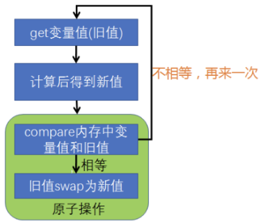

**ABA问题**：CAS在修改值时，会先比较期望值，但如果出现内存中的值从A被修改为B，再从B被修改为A的A->B->A情况发生，那么CAS的期望值比较就会认为值没有发生修改，从而操作成功，这对某些需要严格控制过程的场景来说是一个严重问题（如金融领域的资金流动等）。

解决方式就是使用带有版本号的CAS进行操作，对内存中的变量设定唯一的版本号，每次被修改后都会让版本号递增，CAS的期望值比较也会增加版本号的比较，若期望值和期望版本都一致才会真正更新。

**大量线程自旋的性能开销问题**：如果使用自旋+CAS的方式实现了用户空间的自旋锁时，若竞争锁的线程过多，则会导致大量的线程处于就绪和运行状态，通过运行时空转和频繁的上下文切换损耗CPU的资源。


## 并发工具-AQS

### 基本概念

AQS（AbstractQueuedSynchronizer，抽象的队列同步器）是用来构建锁和同步组件的框架，其内置一个队列来管理资源获取线程的排队工作，并通过一个int类型的变量表示同步状态。


**核心思想**：如果请求的共享资源空闲，则将该线程设置为工作线程，并将共享资源设置为锁定状态，如果请求的共享资源被占用，那么使用CLH队列实现线程阻塞等待以及被唤醒时锁分配的机制，即将暂时获取不到锁的线程加入到队列中。

**CLH队列**：是一个底层使用链表实现的双向队列，AQS将每个请求共享资源的线程封装成CLH队列中的一个结点Node，并通过CAS、自旋和LockSupport的方式去维护state的状态，使并发达到同步的控制效果。

**AQS的结构**：是由一个阻塞队列和多个条件队列（ConditionObject）组成，阻塞队列管理竞争锁的线程，条件队列管理await状态的线程，条件队列中的线程被唤醒会先进入阻塞队列再竞争锁资源。

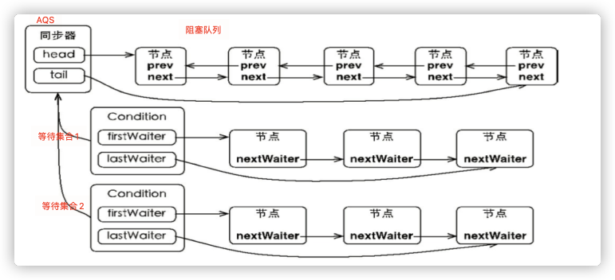

**AQS的使用**：其本身是抽象类，不能直接使用，其主要的使用方式是通过子类的继承，子类通过继承AQS并实现其抽象方法来管理同步状态。在实现上，子类推荐被定义为自定义同步组件的静态内部类，AQS自身没有实现任何接口，仅定义了若干同步状态获取和释放的方法来供自定义同步组件使用，同步器既支持独占获取，也支持共享获取。

```JAVA
static final class Node {
    
    /** Marker to indicate a node is waiting in shared mode */
    static final Node SHARED = new Node();
    /** Marker to indicate a node is waiting in exclusive mode */
    static final Node EXCLUSIVE = null;

    /** waitStatus value to indicate thread has cancelled */
    static final int CANCELLED =  1;
    /** waitStatus value to indicate successor's thread needs unparking */
    static final int SIGNAL    = -1;
    /** waitStatus value to indicate thread is waiting on condition */
    static final int CONDITION = -2;
    /**
     * waitStatus value to indicate the next acquireShared should
     * unconditionally propagate
     */
    static final int PROPAGATE = -3;

    /**
     * 当前节点在队列中的等待状态：
     * 	0：表示Node被初始化时的默认值；
     * 	CANCELLED：表示线程获取锁的请求已被取消；
     * 	CONDITION：表示处于队列中的节点等待唤醒；
     * 	PROPAGATE：当前线程处于shared状态才会使用该状态；
     * 	SIGNAL：表示线程已经准备好了，等待资源被释放。
     * 
     * Status field, taking on only the values:
     *   SIGNAL:     The successor of this node is (or will soon be)
     *               blocked (via park), so the current node must
     *               unpark its successor when it releases or
     *               cancels. To avoid races, acquire methods must
     *               first indicate they need a signal,
     *               then retry the atomic acquire, and then,
     *               on failure, block.
     *   CANCELLED:  This node is cancelled due to timeout or interrupt.
     *               Nodes never leave this state. In particular,
     *               a thread with cancelled node never again blocks.
     *   CONDITION:  This node is currently on a condition queue.
     *               It will not be used as a sync queue node
     *               until transferred, at which time the status
     *               will be set to 0. (Use of this value here has
     *               nothing to do with the other uses of the
     *               field, but simplifies mechanics.)
     *   PROPAGATE:  A releaseShared should be propagated to other
     *               nodes. This is set (for head node only) in
     *               doReleaseShared to ensure propagation
     *               continues, even if other operations have
     *               since intervened.
     *   0:          None of the above
     *
     * The values are arranged numerically to simplify use.
     * Non-negative values mean that a node doesn't need to
     * signal. So, most code doesn't need to check for particular
     * values, just for sign.
     *
     * The field is initialized to 0 for normal sync nodes, and
     * CONDITION for condition nodes.  It is modified using CAS
     * (or when possible, unconditional volatile writes).
     */
    volatile int waitStatus;

    /**
     * 前驱指针
     * 
     * Link to predecessor node that current node/thread relies on
     * for checking waitStatus. Assigned during enqueuing, and nulled
     * out (for sake of GC) only upon dequeuing.  Also, upon
     * cancellation of a predecessor, we short-circuit while
     * finding a non-cancelled one, which will always exist
     * because the head node is never cancelled: A node becomes
     * head only as a result of successful acquire. A
     * cancelled thread never succeeds in acquiring, and a thread only
     * cancels itself, not any other node.
     */
    volatile Node prev;

    /**
     * 后继指针 
     * 
     * Link to the successor node that the current node/thread
     * unparks upon release. Assigned during enqueuing, adjusted
     * when bypassing cancelled predecessors, and nulled out (for
     * sake of GC) when dequeued.  The enq operation does not
     * assign next field of a predecessor until after attachment,
     * so seeing a null next field does not necessarily mean that
     * node is at end of queue. However, if a next field appears
     * to be null, we can scan prev's from the tail to
     * double-check.  The next field of cancelled nodes is set to
     * point to the node itself instead of null, to make life
     * easier for isOnSyncQueue.
     */
    volatile Node next;

    /**
     * 当前Node封装的线程
     * 
     * The thread that enqueued this node.  Initialized on
     * construction and nulled out after use.
     */
    volatile Thread thread;

    /**
     * 指向下一个处于CONDITION状态的节点
     * 
     * Link to next node waiting on condition, or the special
     * value SHARED.  Because condition queues are accessed only
     * when holding in exclusive mode, we just need a simple
     * linked queue to hold nodes while they are waiting on
     * conditions. They are then transferred to the queue to
     * re-acquire. And because conditions can only be exclusive,
     * we save a field by using special value to indicate shared
     * mode.
     */
    Node nextWaiter;

    /**
     * Returns true if node is waiting in shared mode.
     */
    final boolean isShared() {
        return nextWaiter == SHARED;
    }

    /**
     * 返回当前节点的前驱节点
     * 
     * Returns previous node, or throws NullPointerException if null.
     * Use when predecessor cannot be null.  The null check could
     * be elided, but is present to help the VM.
     *
     * @return the predecessor of this node
     */
    final Node predecessor() throws NullPointerException {
        Node p = prev;
        if (p == null)
            throw new NullPointerException();
        else
            return p;
    }

    Node() {    // Used to establish initial head or SHARED marker
    }

    Node(Thread thread, Node mode) {     // Used by addWaiter
        this.nextWaiter = mode;
        this.thread = thread;
    }

    Node(Thread thread, int waitStatus) { // Used by Condition
        this.waitStatus = waitStatus;
        this.thread = thread;
    }
}


/**
 * 头结点
 * 
 * Head of the wait queue, lazily initialized.  Except for
 * initialization, it is modified only via method setHead.  Note:
 * If head exists, its waitStatus is guaranteed not to be
 * CANCELLED.
 */
private transient volatile Node head;

/**
 * 尾结点
 * 
 * Tail of the wait queue, lazily initialized.  Modified only via
 * method enq to add new wait node.
 */
private transient volatile Node tail;
```

```JAVA
/**
 * AQS维护了一个由内存可见性的int类型成员变量来表示同步状态，通过使用CAS对该同步状态进行修改，通过内置的FIFO队列来完成等待获取资源的线程的排队工作
 * 
 * The synchronization state.
 */
private volatile int state;

/**
 * 返回同步状态的当前值
 * 
 * Returns the current value of synchronization state.
 * This operation has memory semantics of a {@code volatile} read.
 * @return current state value
 */
protected final int getState() {
    return state;
}

/**
 * 设置同步状态的值
 * 
 * Sets the value of synchronization state.
 * This operation has memory semantics of a {@code volatile} write.
 * @param newState the new state value
 */
protected final void setState(int newState) {
    state = newState;
}

/**
 * 若当前同步状态的值等于期望值，则将同步状态值设置为给定值update
 * 
 * Atomically sets synchronization state to the given updated
 * value if the current state value equals the expected value.
 * This operation has memory semantics of a {@code volatile} read
 * and write.
 *
 * @param expect the expected value
 * @param update the new value
 * @return {@code true} if successful. False return indicates that the actual
 *         value was not equal to the expected value.
 */
protected final boolean compareAndSetState(int expect, int update) {
    // See below for intrinsics setup to support this
    return unsafe.compareAndSwapInt(this, stateOffset, expect, update);
}
```


### 资源共享方式

**Exclusive（独占）**：

* 只有一个线程能够访问资源，如ReentrantLock，该方式又能分为公平锁和非公平锁；

* 公平锁：按照线程在队列中的排队顺序，先到者先拿到锁；
* 非公平锁：当线程要获取锁时，先通过两次CAS操作去竞争锁，若没抢到，再次入队等待唤醒。

**Share（共享）**：

* 多个线程可以同时访问资源，如Semaphore信号量和CountDownLatch倒计时器；
* ReentrantReadWriteLock允许多个线程同时对某一资源进行读操作，但写操作是互斥的；
* 不同同步器竞争共享资源得方式不同，自定义同步器在实现时只需要实现共享资源state的获取与释放方式即可，至于线程的等待队列的维护（如获取资源失败入队/唤醒出队操作），AQS已经实现。


### 模板方法模式

**使用AQS自定义同步器**：

1. 使用者继承AbstractQueuedSynchronizer并重写指定方法，即对共享资源state的获取和释放的方法；
2. 将AQS组合在自定义同步组件的实现中，并调用其模板方法，而这些模板方法会调用使用者重写的方法。

**模板方法设计模式**：

1. 基于继承的模式，主要是为了在不改变模板结构的前提下在子类中重新定义模板中的内容以实现复用代码。
2. 如生活中``购票butTicket() -> 安检securityCheck() -> 乘坐交通工具ride() -> 到达目的地arrive()``这样的一个常见的流程，除了具体乘坐哪种交通工具不确定外，其他的流程都可以固定下来，即可以定义抽象类，重写除了ride()的其他方法，ride()则根据具体实现继承抽象类重写即可。

**自定义同步器需要重写的AQS模板方法**：

```JAVA
// 判断该线程是否正在独占资源，只有用到condition才需要去实现它
isHeldExclusively()
// 独占方式尝试获取资源，成功则返回true，失败则返回false
tryAcquire(int)
// 独占方式尝试释放资源，成功则返回true，失败则返回false
tryRelease(int)
// 共享方式尝试获取资源，负数表示失败；0表示成功，但没有剩余可用资源；正数表示成功，且有剩余资源
tryAcquireShared(int)
// 共享方式尝试释放资源，成功则返回true，失败则返回false
tryReleaseShared(int)
```

以上所有方法默认都会抛出 ``UnsupportedOperationException``，方法内部的实现必须是线程安全的。AQS类中的其他方法都有final修饰，无法被其他类使用；

**基于AQS实现同步器的重写示例**：

1. **ReetrantLock**：
   1. state初始化为0，即未锁定状态；
   2. 当有线程调用lock()加锁时，会调用tryAcquire()独占锁并将state自增，之后的其他线程调用tryAcquire()时就会失败（CAS操作state失败），直到持有锁的线程调用unlock()释放锁为止（state自减为0），其他线程才有机会获取锁；
   3. 在释放锁之前，持有锁的线程可以重复获取该锁（state继续自增），即锁可重入，但线程在释放锁的时候同样需要多次释放，直到state自减为0。
2. **CountDownLatch**：
   1. state会在初始化时被指定具体数值，即倒计时初始值或门闩上的锁数量（也可称闭锁），可理解为初始化了多把锁，只有其上的所有锁都被释放，闭锁才会被真正释放；
   2. 主调用线程会通过await()阻塞，当有线程调用countDown()方法一次，state就会以CAS的方式自减一次（释放一把锁）；
   3. 当state归0时，或者说所有的锁都被释放完毕时，会unpark()主调用线程，使其从await()方法返回，继续执行。


### Condition/ConditionObject条件对象

#### 基本概念

Condition将对象监视器Monitor的wait、notify和notifyAll方法根据不同的条件分解为多个Java对象，可以将这些对象与任意Lock接口的实现绑定起来，为每一个对象提供多个等待集合（WaitSet）。Lock和Condition组合的目的是加强synchronized和wait/notify的等待唤醒机制，实现多个线程的协调和通信。


#### 使用示例

Condition结合ReentrantLock实现生产者消费者模型。

```java
public class ProducterConsumer {
    
    private LinkedList<Object> buffer;
    private int maxSize;
    private Lock lock;
    private Condition producterCondition;
    private Condition consumerCondition;
    
    ProducerCustomer(int maxSize) {
        this.maxSize = maxSize;
        this.buffer = new LinkedList<Object>;
        this.lock = new ReentrantLock();
        this.producterCondition = lock.newCondition();
        this.consumerCondition = lock.newCondition();
    }
    
    public void put(Object obj) throws InterruptedException {
        lock.lock();
        try {
            while (maxSize == buffer.size()) {
                producterCondition.await();
            }
            buffer.add(obj);
            consumerCondition.signal();
        } finally {
            lock.unlock();
        }
    }
    
    public Object get() throws InterruptedException {
        Object obj;
        lock.lock;
        try {
            while (buffer.size() == 0) {
                consumerCondition.await();
            }
            obj = buffer.poll();
            producterCondition.signal();
        } finally {
            lock.unlock();
        }
        return obj;
    }
}
```


#### 源码分析

ConditionObject实现了Condition接口，是AQS的内部类。每个ConditionObject都包含一个等待队列，队列中每个Node都包含一个线程引用，这些线程都等待在某个Condition条件上。

```JAVA
public class ConditionObject implements Condition, java.io.Serializable {
    private static final long serialVersionUID = 1173984872572414699L;
    /** First node of condition queue. */
    private transient Node firstWaiter;
    /** Last node of condition queue. */
    private transient Node lastWaiter;
```

如果一个线程调用 `Condition.await()` 方法，就会释放锁并封装为Node加入等待队列中并通过 `LockSupport.park(this)` 进入阻塞状态。


```JAVA
public final void await() throws InterruptedException {
    if (Thread.interrupted())
        throw new InterruptedException();
    // 向条件队列中添加一个等待者，并返回Node封装后的实例
    Node node = addConditionWaiter();
    int savedState = fullyRelease(node);
    int interruptMode = 0;
    while (!isOnSyncQueue(node)) {
        LockSupport.park(this);
        if ((interruptMode = checkInterruptWhileWaiting(node)) != 0)
            break;
    }
    if (acquireQueued(node, savedState) && interruptMode != THROW_IE)
        interruptMode = REINTERRUPT;
    if (node.nextWaiter != null) // clean up if cancelled
        unlinkCancelledWaiters();
    if (interruptMode != 0)
        reportInterruptAfterWait(interruptMode);
}
```

其他线程通过调用 `Condition.signal()` 方法，会通过 `LockSupport.unpark(node.thread)` 唤醒在等待队列中等待时间最长的Node（首节点），并将其移动到Lock的同步队列中去。


```JAVA
public final void signal() {
    // 判断是否为排它锁
    if (!isHeldExclusively())
        throw new IllegalMonitorStateException();
    Node first = firstWaiter;
    if (first != null)
        doSignal(first);
}

private void doSignal(Node first) {
    do {
        if ( (firstWaiter = first.nextWaiter) == null)
            lastWaiter = null;
        first.nextWaiter = null;
    } while (!transferForSignal(first) &&
             (first = firstWaiter) != null);
}

final boolean transferForSignal(Node node) {
    /*
     * If cannot change waitStatus, the node has been cancelled.
     */
    if (!compareAndSetWaitStatus(node, Node.CONDITION, 0))
        return false;

    /*
     * Splice onto queue and try to set waitStatus of predecessor to
     * indicate that thread is (probably) waiting. If cancelled or
     * attempt to set waitStatus fails, wake up to resync (in which
     * case the waitStatus can be transiently and harmlessly wrong).
     */
    Node p = enq(node);
    int ws = p.waitStatus;
    if (ws > 0 || !compareAndSetWaitStatus(p, ws, Node.SIGNAL))
        LockSupport.unpark(node.thread);
    return true;
}
```


### ReentrantLock可重入锁

#### 基本概念

ReentrantLock可重入锁是基于AQS实现的同步器。使用整型变量state记录锁的状态（0未占用，1已被占用），并维护一个管理阻塞线程的队列。其最大的特点是已持有锁的线程再次加锁无需重新获取锁，而是让state状态加1，表示重入了一次，在释放锁的时候也需要释放相应的次数。


#### 基于AQS实现的同步器Sync

```JAVA
// 实现所有AQS同步机制的同步器
private final Sync sync;

abstract static class Sync extends AbstractQueuedSynchronizer {

    private static final long serialVersionUID = -5179523762034025860L;

    // 抽象的，有公平/非公平两种实现
    abstract void lock();

    // 尝试获取锁
    final boolean nonfairTryAcquire(int acquires) {
        final Thread current = Thread.currentThread();
        int c = getState();
        if (c == 0) {
            if (compareAndSetState(0, acquires)) {
                setExclusiveOwnerThread(current);
                return true;
            }
        }
        else if (current == getExclusiveOwnerThread()) {
            int nextc = c + acquires;
            if (nextc < 0) // overflow
                throw new Error("Maximum lock count exceeded");
            setState(nextc);
            return true;
        }
        return false;
    }

    // 尝试释放锁
    protected final boolean tryRelease(int releases) {
        int c = getState() - releases;
        if (Thread.currentThread() != getExclusiveOwnerThread())
            throw new IllegalMonitorStateException();
        boolean free = false;
        if (c == 0) {
            free = true;
            setExclusiveOwnerThread(null);
        }
        setState(c);
        return free;
    }

    protected final boolean isHeldExclusively() {
        return getExclusiveOwnerThread() == Thread.currentThread();
    }

    // 获取一个和Lock绑定的条件对象
    final ConditionObject newCondition() {
        return new ConditionObject();
    }

    // Methods relayed from outer class
    final Thread getOwner() {
        return getState() == 0 ? null : getExclusiveOwnerThread();
    }

    final int getHoldCount() {
        return isHeldExclusively() ? getState() : 0;
    }

    // 锁是否已被锁定
    final boolean isLocked() {
        return getState() != 0;
    }

    private void readObject(java.io.ObjectInputStream s)
        throws java.io.IOException, ClassNotFoundException {
        s.defaultReadObject();
        setState(0); // 重置为解锁状态
    }
}
```


#### 构造方法和基本方法及属性

```JAVA
// 空构造器默认使用非公平锁，性能更佳
public ReentrantLock() {
    sync = new NonfairSync();
}

// 通过参数指定使用公平锁还是非公平锁
public ReentrantLock(boolean fair) {
    sync = fair ? new FairSync() : new NonfairSync();
}

// 加锁（公平/非公平）
public void lock() {
    sync.lock();
}

// 释放锁
public void unlock() {
    sync.release(1);
}
```


#### 非公平锁加锁流程

```java
/**
 * 非公平锁类型的同步器
 */
static final class NonfairSync extends Sync {

    private static final long serialVersionUID = 7316153563782823691L;

    // 非公平版的加锁
    final void lock() {
        // 非公平锁会直接进行一次CAS抢锁，成功就返回，否则和
        if (compareAndSetState(0, 1))
            setExclusiveOwnerThread(Thread.currentThread());
        else
            acquire(1);
    }
    
    // 尝试获取锁
    protected final boolean tryAcquire(int acquires) {
        return nonfairTryAcquire(acquires);
    }
}

// 非公平版的尝试获取锁
final boolean nonfairTryAcquire(int acquires) {
    final Thread current = Thread.currentThread();
    int c = getState();
    if (c == 0) {
        // 若锁未被占用，非公平锁会再次CAS抢锁
        if (compareAndSetState(0, acquires)) {
            // 若抢锁成功，则设置当前线程为持有锁的线程
            setExclusiveOwnerThread(current);
            return true;
        }
    } else if (current == getExclusiveOwnerThread()) {
        // 若是当前线程已经持有锁，则可重入，锁状态+1
        int nextc = c + acquires;
        if (nextc < 0) // overflow
            throw new Error("Maximum lock count exceeded");
        setState(nextc);
        return true;
    }
    return false;
}
```


#### 公平锁加锁流程

```java
/**
 * 公平锁类型的同步器
 */
static final class FairSync extends Sync {

    private static final long serialVersionUID = -3000897897090466540L;

    // 公平版的加锁
    final void lock() {
        acquire(1);
    }

    // 公平版的尝试获取锁
    protected final boolean tryAcquire(int acquires) {
        final Thread current = Thread.currentThread();
        int c = getState();
        if (c == 0) {
            // 公平锁的实现和非公平锁相比，唯一的区别就是多了一个判断阻塞队列中是否有线程在等待（hasQueuedPredecessors）
            // 若队列中存在等待的线程，则按照FIFO的规则出队一个线程去持有锁，若队列为空，则直接CAS抢锁
            if (!hasQueuedPredecessors() &&
                compareAndSetState(0, acquires)) {
                setExclusiveOwnerThread(current);
                return true;
            }
        }
        else if (current == getExclusiveOwnerThread()) {
            // 可重入机制
            int nextc = c + acquires;
            if (nextc < 0)
                throw new Error("Maximum lock count exceeded");
            setState(nextc);
            return true;
        }
        return false;
    }
}
```


#### 公共加锁流程

* 尝试以公平/非公平的方式获取锁tryAcquire()；
* 获取成功的占用锁；
* 获取失败的封装为节点addWaiter()，然后阻塞LockSupport.park()并入队acquireQueued()，并；
* 最后自我中断Thread.currentThread().interrupt()。

```java
// 获取锁的整体流程
public final void acquire(int arg) {
    if (!tryAcquire(arg) &&
        acquireQueued(addWaiter(Node.EXCLUSIVE), arg))
        // 未抢到锁的线程自我中断
        selfInterrupt();
}

// 封装未抢到锁的线程为Node
private Node addWaiter(Node mode) {
    Node node = new Node(Thread.currentThread(), mode);
    Node pred = tail;
    if (pred != null) {
        node.prev = pred;
        if (compareAndSetTail(pred, node)) {
            pred.next = node;
            return node;
        }
    }
    enq(node);
    return node;
}

// Node入队
final boolean acquireQueued(final Node node, int arg) {
    boolean failed = true;
    try {
        boolean interrupted = false;
        for (;;) {
            final Node p = node.predecessor();
            if (p == head && tryAcquire(arg)) {
                setHead(node);
                p.next = null; // help GC
                failed = false;
                return interrupted;
            }
            if (shouldParkAfterFailedAcquire(p, node) &&
                parkAndCheckInterrupt())
                interrupted = true;
        }
    } finally {
        if (failed)
            cancelAcquire(node);
    }
}

// 阻塞线程并检查中断
private final boolean parkAndCheckInterrupt() {
    LockSupport.park(this);
    return Thread.interrupted();
}

// 线程自我中断
static void selfInterrupt() {
    Thread.currentThread().interrupt();
}
```


#### 释放锁流程：

```java
// 释放锁
public final boolean release(int arg) {
    if (tryRelease(arg)) {
        Node h = head;
        if (h != null && h.waitStatus != 0)
            unparkSuccessor(h);
        return true;
    }
    return false;
}

// 尝试释放锁
protected final boolean tryRelease(int releases) {
    // 锁状态state释放一次（重入几次释放几次）
    int c = getState() - releases;
    if (Thread.currentThread() != getExclusiveOwnerThread())
        throw new IllegalMonitorStateException();
    boolean free = false;
    if (c == 0) {
        // 锁被释放（state减为0）
        free = true;
        setExclusiveOwnerThread(null);
    }
    setState(c);
    return free;
}

// 释放锁后去唤醒队列中阻塞的线程
private void unparkSuccessor(Node node) {
    int ws = node.waitStatus;
    if (ws < 0)
        compareAndSetWaitStatus(node, ws, 0);

	// 获取头节点的后继节点，即队列中第一个节点
    Node s = node.next;
    if (s == null || s.waitStatus > 0) {
        s = null;
        for (Node t = tail; t != null && t != node; t = t.prev)
            if (t.waitStatus <= 0)
                s = t;
    }
    if (s != null)
        // 唤醒队列中第一个节点
        LockSupport.unpark(s.thread);
}
```

**ReentrantLock实现公平锁和非公平锁的区别和相同点**：

* 非公平锁在调用lock后，首先就会使用CAS进行竞争锁的操作，若这时锁恰好没有被占用，则直接获取锁返回；
* 非公平锁在CAS操作失败后，和公平锁一样都会进入 `tryAcquire()` 方法，在该方法中，若发现锁的状态state为0，即锁已被释放，非公平锁会直接CAS抢占，但公平锁会判断等待队列中是否有线程处于等待状态，若有则出队线程去占有锁，新的线程入队等待；
* 若非公平锁的两次CAS都不成功，则接下来和公平锁一样，线程会进入阻塞队列等待唤醒；
* 相对公平锁，非公平锁具有更好的性能，但也会让线程获取锁的时间不确定，导致阻塞队列中的线程长期处于等待状态。


### ReentrantReadWriteLock可重入读写锁

#### 基本概念

ReentrantReadWriteLock可重入读写锁是基于AQS实现的同步器。同样也维护state锁状态和阻塞队列来保证同步，其特点是具有读写两种锁状态，允许同一时刻多个读线程访问，但写线程访问时，所有的读写线程均被阻塞。这种分离读写的方式除了保证写操作的线程安全外，还能让读操作的并发性能提升（如缓存结构）。


#### 构造方法和基本方法及属性

```JAVA
// 读锁
private final ReentrantReadWriteLock.ReadLock readerLock;
// 写锁
private final ReentrantReadWriteLock.WriteLock writerLock;
// AQS同步器
final Sync sync;

// 默认非公平
public ReentrantReadWriteLock() {
    this(false);
}

// 初始化两把锁
public ReentrantReadWriteLock(boolean fair) {
    sync = fair ? new FairSync() : new NonfairSync();
    readerLock = new ReadLock(this);
    writerLock = new WriteLock(this);
}

// 获取读/写锁
public ReentrantReadWriteLock.WriteLock writeLock() { return writerLock; }
public ReentrantReadWriteLock.ReadLock  readLock()  { return readerLock; }
```


#### 基于AQS实现的同步器Sync

```java
abstract static class Sync extends AbstractQueuedSynchronizer {
    private static final long serialVersionUID = 6317671515068378041L;

    /*
     * 读写计数提取常量和函数。
     * 锁状态逻辑上分为两个无符号短路：
     * 下面的一个表示独占（写入）锁保持计数，上限表示共享（读卡器）保持计数。
     */
    static final int SHARED_SHIFT   = 16;
    static final int SHARED_UNIT    = (1 << SHARED_SHIFT);
    static final int MAX_COUNT      = (1 << SHARED_SHIFT) - 1;
    static final int EXCLUSIVE_MASK = (1 << SHARED_SHIFT) - 1;

    /** Returns the number of shared holds represented in count  */
    static int sharedCount(int c)    { return c >>> SHARED_SHIFT; }
    /** Returns the number of exclusive holds represented in count  */
    static int exclusiveCount(int c) { return c & EXCLUSIVE_MASK; }

    static final class HoldCounter {
        int count = 0;
        final long tid = getThreadId(Thread.currentThread());
    }

    static final class ThreadLocalHoldCounter
        extends ThreadLocal<HoldCounter> {
        public HoldCounter initialValue() {
            return new HoldCounter();
        }
    }

    private transient ThreadLocalHoldCounter readHolds;

    private transient HoldCounter cachedHoldCounter;

    private transient Thread firstReader = null;
    private transient int firstReaderHoldCount;

    Sync() {
        readHolds = new ThreadLocalHoldCounter();
        setState(getState()); // ensures visibility of readHolds
    }

    abstract boolean readerShouldBlock();

    abstract boolean writerShouldBlock();

    protected final boolean tryRelease(int releases) {
        if (!isHeldExclusively())
            throw new IllegalMonitorStateException();
        int nextc = getState() - releases;
        boolean free = exclusiveCount(nextc) == 0;
        if (free)
            setExclusiveOwnerThread(null);
        setState(nextc);
        return free;
    }

    protected final boolean tryAcquire(int acquires) {
        Thread current = Thread.currentThread();
        int c = getState();
        int w = exclusiveCount(c);
        if (c != 0) {
            // (Note: if c != 0 and w == 0 then shared count != 0)
            if (w == 0 || current != getExclusiveOwnerThread())
                return false;
            if (w + exclusiveCount(acquires) > MAX_COUNT)
                throw new Error("Maximum lock count exceeded");
            // Reentrant acquire
            setState(c + acquires);
            return true;
        }
        if (writerShouldBlock() ||
            !compareAndSetState(c, c + acquires))
            return false;
        setExclusiveOwnerThread(current);
        return true;
    }

    protected final boolean tryReleaseShared(int unused) {
        Thread current = Thread.currentThread();
        if (firstReader == current) {
            // assert firstReaderHoldCount > 0;
            if (firstReaderHoldCount == 1)
                firstReader = null;
            else
                firstReaderHoldCount--;
        } else {
            HoldCounter rh = cachedHoldCounter;
            if (rh == null || rh.tid != getThreadId(current))
                rh = readHolds.get();
            int count = rh.count;
            if (count <= 1) {
                readHolds.remove();
                if (count <= 0)
                    throw unmatchedUnlockException();
            }
            --rh.count;
        }
        for (;;) {
            int c = getState();
            int nextc = c - SHARED_UNIT;
            if (compareAndSetState(c, nextc))
                // Releasing the read lock has no effect on readers,
                // but it may allow waiting writers to proceed if
                // both read and write locks are now free.
                return nextc == 0;
        }
    }

    private IllegalMonitorStateException unmatchedUnlockException() {
        return new IllegalMonitorStateException(
            "attempt to unlock read lock, not locked by current thread");
    }

    protected final int tryAcquireShared(int unused) {
        Thread current = Thread.currentThread();
        int c = getState();
        if (exclusiveCount(c) != 0 &&
            getExclusiveOwnerThread() != current)
            return -1;
        int r = sharedCount(c);
        if (!readerShouldBlock() &&
            r < MAX_COUNT &&
            compareAndSetState(c, c + SHARED_UNIT)) {
            if (r == 0) {
                firstReader = current;
                firstReaderHoldCount = 1;
            } else if (firstReader == current) {
                firstReaderHoldCount++;
            } else {
                HoldCounter rh = cachedHoldCounter;
                if (rh == null || rh.tid != getThreadId(current))
                    cachedHoldCounter = rh = readHolds.get();
                else if (rh.count == 0)
                    readHolds.set(rh);
                rh.count++;
            }
            return 1;
        }
        return fullTryAcquireShared(current);
    }

    final int fullTryAcquireShared(Thread current) {
        HoldCounter rh = null;
        for (;;) {
            int c = getState();
            if (exclusiveCount(c) != 0) {
                if (getExclusiveOwnerThread() != current)
                    return -1;
                // else we hold the exclusive lock; blocking here
                // would cause deadlock.
            } else if (readerShouldBlock()) {
                // Make sure we're not acquiring read lock reentrantly
                if (firstReader == current) {
                    // assert firstReaderHoldCount > 0;
                } else {
                    if (rh == null) {
                        rh = cachedHoldCounter;
                        if (rh == null || rh.tid != getThreadId(current)) {
                            rh = readHolds.get();
                            if (rh.count == 0)
                                readHolds.remove();
                        }
                    }
                    if (rh.count == 0)
                        return -1;
                }
            }
            if (sharedCount(c) == MAX_COUNT)
                throw new Error("Maximum lock count exceeded");
            if (compareAndSetState(c, c + SHARED_UNIT)) {
                if (sharedCount(c) == 0) {
                    firstReader = current;
                    firstReaderHoldCount = 1;
                } else if (firstReader == current) {
                    firstReaderHoldCount++;
                } else {
                    if (rh == null)
                        rh = cachedHoldCounter;
                    if (rh == null || rh.tid != getThreadId(current))
                        rh = readHolds.get();
                    else if (rh.count == 0)
                        readHolds.set(rh);
                    rh.count++;
                    cachedHoldCounter = rh; // cache for release
                }
                return 1;
            }
        }
    }

    final boolean tryWriteLock() {
        Thread current = Thread.currentThread();
        int c = getState();
        if (c != 0) {
            int w = exclusiveCount(c);
            if (w == 0 || current != getExclusiveOwnerThread())
                return false;
            if (w == MAX_COUNT)
                throw new Error("Maximum lock count exceeded");
        }
        if (!compareAndSetState(c, c + 1))
            return false;
        setExclusiveOwnerThread(current);
        return true;
    }

    final boolean tryReadLock() {
        Thread current = Thread.currentThread();
        for (;;) {
            int c = getState();
            if (exclusiveCount(c) != 0 &&
                getExclusiveOwnerThread() != current)
                return false;
            int r = sharedCount(c);
            if (r == MAX_COUNT)
                throw new Error("Maximum lock count exceeded");
            if (compareAndSetState(c, c + SHARED_UNIT)) {
                if (r == 0) {
                    firstReader = current;
                    firstReaderHoldCount = 1;
                } else if (firstReader == current) {
                    firstReaderHoldCount++;
                } else {
                    HoldCounter rh = cachedHoldCounter;
                    if (rh == null || rh.tid != getThreadId(current))
                        cachedHoldCounter = rh = readHolds.get();
                    else if (rh.count == 0)
                        readHolds.set(rh);
                    rh.count++;
                }
                return true;
            }
        }
    }

    protected final boolean isHeldExclusively() {
        return getExclusiveOwnerThread() == Thread.currentThread();
    }

    final ConditionObject newCondition() {
        return new ConditionObject();
    }

    final Thread getOwner() {
        return ((exclusiveCount(getState()) == 0) ?
                null :
                getExclusiveOwnerThread());
    }

    final int getReadLockCount() {
        return sharedCount(getState());
    }

    final boolean isWriteLocked() {
        return exclusiveCount(getState()) != 0;
    }

    final int getWriteHoldCount() {
        return isHeldExclusively() ? exclusiveCount(getState()) : 0;
    }

    final int getReadHoldCount() {
        if (getReadLockCount() == 0)
            return 0;

        Thread current = Thread.currentThread();
        if (firstReader == current)
            return firstReaderHoldCount;

        HoldCounter rh = cachedHoldCounter;
        if (rh != null && rh.tid == getThreadId(current))
            return rh.count;

        int count = readHolds.get().count;
        if (count == 0) readHolds.remove();
        return count;
    }

    private void readObject(java.io.ObjectInputStream s)
        throws java.io.IOException, ClassNotFoundException {
        s.defaultReadObject();
        readHolds = new ThreadLocalHoldCounter();
        setState(0); // reset to unlocked state
    }

    final int getCount() { return getState(); }
}
```


#### 公平/非公平锁

```java
static final class NonfairSync extends Sync {
    private static final long serialVersionUID = -8159625535654395037L;
    final boolean writerShouldBlock() {
        return false; // writers can always barge
    }
    final boolean readerShouldBlock() {
        return apparentlyFirstQueuedIsExclusive();
    }
}

static final class FairSync extends Sync {
    private static final long serialVersionUID = -2274990926593161451L;
    final boolean writerShouldBlock() {
        return hasQueuedPredecessors();
    }
    final boolean readerShouldBlock() {
        return hasQueuedPredecessors();
    }
}
```


#### 读锁的获取和释放流程

静态内部类——读锁：

```java
public static class ReadLock implements Lock, java.io.Serializable {
    private static final long serialVersionUID = -5992448646407690164L;
    private final Sync sync;

    protected ReadLock(ReentrantReadWriteLock lock) {
        sync = lock.sync;
    }
	
    // 读锁获取锁
    public void lock() {
        sync.acquireShared(1);
    }

    public void lockInterruptibly() throws InterruptedException {
        sync.acquireSharedInterruptibly(1);
    }
	
    // 读锁释放锁
    public boolean tryLock() {
        return sync.tryReadLock();
    }

    public boolean tryLock(long timeout, TimeUnit unit)
        throws InterruptedException {
        return sync.tryAcquireSharedNanos(1, unit.toNanos(timeout));
    }

    public void unlock() {
        sync.releaseShared(1);
    }

    public Condition newCondition() {
        throw new UnsupportedOperationException();
    }

    public String toString() {
        int r = sync.getReadLockCount();
        return super.toString() +
            "[Read locks = " + r + "]";
    }
}
```

读锁获取锁：

* 获取读锁时，会尝试判断当前对象是否拥有了写锁，如果拥有，则直接获取失败；
* 如果没有，就尝试加锁；
* 如果当前线程已经持有读锁，则直接读锁状态state+1。

```java
// AbstractQueuedSynchronizer
// 获取共享锁
public final void acquireShared(int arg) {
    if (tryAcquireShared(arg) < 0)
        doAcquireShared(arg);
}

// ReentrantReadWriteLock.ReadLock
// 尝试获取共享锁
protected final int tryAcquireShared(int unused) {
    Thread current = Thread.currentThread();
    int c = getState();
    // 获取低16位，独占计数，即写锁的state状态
    if (exclusiveCount(c) != 0 &&
        getExclusiveOwnerThread() != current)
        return -1;
    // 读取高16位，共享计数，即读锁的state状态
    int r = sharedCount(c);
    // 公平锁排队，非公平锁先抢后排队
    if (!readerShouldBlock() &&
        r < MAX_COUNT &&
        compareAndSetState(c, c + SHARED_UNIT)) {
        if (r == 0) {
            // 第一个获取读锁
            firstReader = current;
            firstReaderHoldCount = 1;
        } else if (firstReader == current) {
            // 如果当前线程已经持有读锁，则可重入
            firstReaderHoldCount++;
        } else {
            HoldCounter rh = cachedHoldCounter;
            if (rh == null || rh.tid != getThreadId(current))
                cachedHoldCounter = rh = readHolds.get();
            else if (rh.count == 0)
                readHolds.set(rh);
            rh.count++;
        }
        return 1;
    }
    return fullTryAcquireShared(current);
}

// AbstractQueuedSynchronizer
// 获取共享锁的具体实现
private void doAcquireShared(int arg) {
    final Node node = addWaiter(Node.SHARED);
    boolean failed = true;
    try {
        boolean interrupted = false;
        for (;;) {
            final Node p = node.predecessor();
            if (p == head) {
                int r = tryAcquireShared(arg);
                if (r >= 0) {
                    setHeadAndPropagate(node, r);
                    p.next = null; // help GC
                    if (interrupted)
                        selfInterrupt();
                    failed = false;
                    return;
                }
            }
            if (shouldParkAfterFailedAcquire(p, node) &&
                parkAndCheckInterrupt())
                interrupted = true;
        }
    } finally {
        if (failed)
            cancelAcquire(node);
    }
}
```

读锁释放锁：

```java
// AbstractQueuedSynchronizer
// 释放共享锁
public final boolean releaseShared(int arg) {
    if (tryReleaseShared(arg)) {
        doReleaseShared();
        return true;
    }
    return false;
}

// ReentrantReadWriteLock.ReadLock
// 尝试释放共享锁
protected final boolean tryReleaseShared(int unused) {
    Thread current = Thread.currentThread();
    if (firstReader == current) {
        // assert firstReaderHoldCount > 0;
        if (firstReaderHoldCount == 1)
            // 释放读锁计数
            firstReader = null;
        else
            // 释放一次读锁计数
            firstReaderHoldCount--;
    } else {
        HoldCounter rh = cachedHoldCounter;
        if (rh == null || rh.tid != getThreadId(current))
            rh = readHolds.get();
        int count = rh.count;
        if (count <= 1) {
            // 清除ThreadLocal，防止内存泄漏
            readHolds.remove();
            if (count <= 0)
                throw unmatchedUnlockException();
        }
        --rh.count;
    }
    for (;;) {
        int c = getState();
        int nextc = c - SHARED_UNIT;
        if (compareAndSetState(c, nextc))
            // CAS操作置换state，判断最终结果是否为0，若结果为0，则写线程可以参与竞争
            return nextc == 0;
    }
}

// AbstractQueuedSynchronizer
// 释放共享锁的具体实现
private void doReleaseShared() {
    for (;;) {
        Node h = head;
        if (h != null && h != tail) {
            int ws = h.waitStatus;
            if (ws == Node.SIGNAL) {
                if (!compareAndSetWaitStatus(h, Node.SIGNAL, 0))
                    continue;            // loop to recheck cases
                unparkSuccessor(h);
            }
            else if (ws == 0 &&
                     !compareAndSetWaitStatus(h, 0, Node.PROPAGATE))
                continue;                // loop on failed CAS
        }
        if (h == head)                   // loop if head changed
            break;
    }
}
```


#### 写锁的获取和释放流程

静态内部类——写锁：

```java
public static class WriteLock implements Lock, java.io.Serializable {
    private static final long serialVersionUID = -4992448646407690164L;
    private final Sync sync;

    protected WriteLock(ReentrantReadWriteLock lock) {
        sync = lock.sync;
    }

    // 写锁获取锁
    public void lock() {
        sync.acquire(1);
    }

    public void lockInterruptibly() throws InterruptedException {
        sync.acquireInterruptibly(1);
    }

    public boolean tryLock( ) {
        return sync.tryWriteLock();
    }

    public boolean tryLock(long timeout, TimeUnit unit)
        throws InterruptedException {
        return sync.tryAcquireNanos(1, unit.toNanos(timeout));
    }
	
    // 写锁释放锁
    public void unlock() {
        sync.release(1);
    }

    public Condition newCondition() {
        return sync.newCondition();
    }

    public String toString() {
        Thread o = sync.getOwner();
        return super.toString() + ((o == null) ?
                                   "[Unlocked]" :
                                   "[Locked by thread " + o.getName() + "]");
    }

    public boolean isHeldByCurrentThread() {
        return sync.isHeldExclusively();
    }

    public int getHoldCount() {
        return sync.getWriteHoldCount();
    }
}
```

写锁获取锁：

* 在获取写锁时，会尝试判断锁是否已被占用（读锁或写锁），如果已被占用且占用的线程非当前线程，则直接获取失败，加入阻塞队列；
* 如果锁没有被占用，则当前线程就会持有写锁，且写锁个数加1；

```java
public final void acquire(int arg) {
    if (!tryAcquire(arg) &&
        acquireQueued(addWaiter(Node.EXCLUSIVE), arg))
        selfInterrupt();
}

protected final boolean tryAcquire(int acquires) {
    Thread current = Thread.currentThread();
    int c = getState();
    // 获取state低16位的写锁计数
    int w = exclusiveCount(c);
    if (c != 0) {
        // (Note: if c != 0 and w == 0 then shared count != 0)
        if (w == 0 || current != getExclusiveOwnerThread())
            // 锁非当前线程持有
            return false;
        // 超过最大锁计数
        if (w + exclusiveCount(acquires) > MAX_COUNT)
            throw new Error("Maximum lock count exceeded");
        // 可重入获取
        setState(c + acquires);
        return true;
    }
    if (writerShouldBlock() ||
        !compareAndSetState(c, c + acquires))
        // 竞争写锁失败
        return false;
    // 竞争成功
    setExclusiveOwnerThread(current);
    return true;
}
```

写锁释放锁：

```JAVA
public final boolean release(int arg) {
    if (tryRelease(arg)) {
        Node h = head;
        if (h != null && h.waitStatus != 0)
            // 唤醒下一个线程
            unparkSuccessor(h);
        return true;
    }
    return false;
}

protected final boolean tryRelease(int releases) {
    if (!isHeldExclusively())
        // 当前线程不是持有锁的线程
        throw new IllegalMonitorStateException();
    int nextc = getState() - releases;
    // 判断写锁的计数是否为0，为0则表示不被任何线程持有
    boolean free = exclusiveCount(nextc) == 0;
    if (free)
        setExclusiveOwnerThread(null);
    setState(nextc);
    return free;
}
```


### Semaphore信号量

#### 基本概念

Semaphore信号量与synchronized和ReetrantLock的区别是后两者都是一次只允许一个线程访问资源，而Semaphore可以指定多个线程同时访问某个资源。


#### 使用示例

```JAVA
public class SemaphoreExample {
    	
    // 初始化请求数量
    private static final int threadCount = 550;
    
    public static void main(String[] args) throws InterruptedException {
        // 固定容量线程池
        ExecutorService threadPool = Executors.newFixedThreadPool(300);
        // Semaphore维护一个可获得许可证的数量，不存在具体的许可证对象。经常用于限制同时访问某种资源的线程数量
        final Semaphore semaphore = new Semaphore(20);
        
        for (int i = 0; i < threadCount; i++) {
            final int threadNum = i;
        	threadPool.execute(() -> {
                try {
                    // 线程阻塞，直到存在可以获取的许可证并获取一个
                    semaphore.acquire();	
                    // semaphore.acqurie(5);	// 获取多个许可证
                    // semaphore.tryAcqurie();	// 尝试获取许可证，但不会阻塞，获取不到会直接返回
                    
                    Thread.sleep(1000);
                    System.out.println("threadNum: " + threadNum);
                    Thread.sleep(1000);
                    
                    // 释放自己持有的许可证
                    semaphore.release();
                    // semaphore.release(5);
                } catch (InterruptedException e) {
                    e.printStackTrace();
                }
            });
        }
    }
    
    public static void test() throws InterruptedException {
        Thread.sleep(1000);
        System.out.println("threadNum: " + threadNum);
        Thread.sleep(1000);
    }
}
```


#### 源码分析

当许可证已经发放完，多余线程会进入阻塞队列，当有许可证被释放后，Semaphore为队列种的线程提供两种模式去获取许可证。

Semaphore与CoutDownLatch一样是共享锁的一种实现，默认初始化AQS的state为permits，当同时访问资源的线程超出permits，那么超出的线程会进入阻塞队列Park，并自旋判断state是否大于0，只有当state大于0时，阻塞的线程才能进行执行。

```JAVA
public Semaphore(int permits) {
    // 默认非公平模式
    sync = new NonfairSync(permits);
}

public Semaphore(int permits, boolean fair) {
    // 公平模式：FIFO；非公平模式：抢占式
    sync = fair ? new FairSync(permits) : new NonfairSync(permits);
}
```


### CountDownLatch闭锁

#### 基本概念

基于AQS实现的一种共享锁，锁状态state做为count计数器使用，计数器的初值对应任务的数量，每当完成一个任务后（`CountDownLatch.countDown()`），就会减1。当计数器归0时，在闭锁上等待的线程就会恢复执行（`CountDownLatch.await()`）。


#### 使用场景

**当某个线程在开始运行前需要等待多个前置线程执行完毕的场景**：主调线程通过 `new CountDownLatch(n)` 将计数器初始化为0，并且通过 `countDownLatch.await() ` 阻塞，每当一个前置线程执行完毕就会通过`countDownLatch.countDown()`将计数器减1，直到计数器变为0，主调线程才会从 ``await()`` 返回继续执行。典型的场景就是扣款操作，若干个前置的身份认证、操作合法性认证、余额认证等完成后，主调线程再进行扣款操作。

**需要多个线程在某一时刻同时开始执行的场景**：多个线程在某一时刻同时开始执行的场景，如赛跑，多个线程在起点初始化，然后等待发令枪响，最后同时执行。首先主线程初始化一个`new CountDownLatch(1)`，然后多个子线程通过`countDownLatch.await()`阻塞，最后主线程调用`countDownLatch.coutDown()`让所有阻塞的子线程同时执行。


#### 使用示例

```JAVA
public class CountDownLatchExample {
    
    private static final int threadNum = 550;
    
    public static void main(String[] args) throws InterruptedException {
        ExecutorService threadPool = Executors.newFixedThreadPool(300);
        final CountDownLatch countDownLatch = new CountDownLatch(threadNum);
        
        threadPool.execute(() -> {
            try {
                // 模拟请求的耗时操作
                Thread.sleep(1000);
                System.out.println("threadNum: " + threadNum);
                Thread.sleep(1000);
            } catch (InterruptedException e) {
                e.printStackTrace();
            } finally {
                countDownLatch.countDown();
            }
        });
        
        countDownLatch.await();
        threadPool.shutdown();
    }
} 
```


#### 源码分析

Sync同步器分析：

```java
/**
 * 倒计时门闩的同步器，使用AQS的state状态表示计数
 */
private static final class Sync extends AbstractQueuedSynchronizer {
    private static final long serialVersionUID = 4982264981922014374L;

    Sync(int count) {
        setState(count);
    }

    int getCount() {
        return getState();
    }

    protected int tryAcquireShared(int acquires) {
        return (getState() == 0) ? 1 : -1;
    }

    protected boolean tryReleaseShared(int releases) {
        // 计数减量，变为0时会发出唤醒信号
        for (;;) {
            int c = getState();
            if (c == 0)
                return false;
            int nextc = c-1;
            if (compareAndSetState(c, nextc))
                return nextc == 0;
        }
    }
}

private final Sync sync;
```

构造方法分析：

```java
// 初始化计数器的大小
public CountDownLatch(int count) {
    if (count < 0) throw new IllegalArgumentException("count < 0");
    this.sync = new Sync(count);
}
```

`await()` 方法分析：

```java
public void await() throws InterruptedException {
    sync.acquireSharedInterruptibly(1);
}

public final void acquireSharedInterruptibly(int arg)
    throws InterruptedException {
    if (Thread.interrupted())
        throw new InterruptedException();
    if (tryAcquireShared(arg) < 0)
        doAcquireSharedInterruptibly(arg);
}

// 尝试获取共享锁，计时器为0时不能获取
protected int tryAcquireShared(int acquires) {
    return (getState() == 0) ? 1 : -1;
}

// 以共享可中断模式获取锁
private void doAcquireSharedInterruptibly(int arg)
    throws InterruptedException {
    final Node node = addWaiter(Node.SHARED);
    boolean failed = true;
    try {
        for (;;) {
            final Node p = node.predecessor();
            if (p == head) {
                int r = tryAcquireShared(arg);
                if (r >= 0) {
                    setHeadAndPropagate(node, r);
                    p.next = null; // help GC
                    failed = false;
                    return;
                }
            }
            if (shouldParkAfterFailedAcquire(p, node) &&
                parkAndCheckInterrupt())
                throw new InterruptedException();
        }
    } finally {
        if (failed)
            cancelAcquire(node);
    }
}
```

`countDown()` 方法分析：

```java
public void countDown() {
    sync.releaseShared(1);
}

public final boolean releaseShared(int arg) {
    if (tryReleaseShared(arg)) {
        doReleaseShared();
        return true;
    }
    return false;
}

protected boolean tryReleaseShared(int releases) {
    // Decrement count; signal when transition to zero
    for (;;) {
        int c = getState();
        if (c == 0)
            return false;
        int nextc = c-1;
        if (compareAndSetState(c, nextc))
            return nextc == 0;
    }
}

/**
 * Release action for shared mode -- signals successor and ensures
 * propagation. (Note: For exclusive mode, release just amounts
 * to calling unparkSuccessor of head if it needs signal.)
 */
private void doReleaseShared() {
    /*
     * Ensure that a release propagates, even if there are other
     * in-progress acquires/releases.  This proceeds in the usual
     * way of trying to unparkSuccessor of head if it needs
     * signal. But if it does not, status is set to PROPAGATE to
     * ensure that upon release, propagation continues.
     * Additionally, we must loop in case a new node is added
     * while we are doing this. Also, unlike other uses of
     * unparkSuccessor, we need to know if CAS to reset status
     * fails, if so rechecking.
     */
    for (;;) {
        Node h = head;
        if (h != null && h != tail) {
            int ws = h.waitStatus;
            if (ws == Node.SIGNAL) {
                if (!compareAndSetWaitStatus(h, Node.SIGNAL, 0))
                    continue;            // loop to recheck cases
                unparkSuccessor(h);
            }
            else if (ws == 0 &&
                     !compareAndSetWaitStatus(h, 0, Node.PROPAGATE))
                continue;                // loop on failed CAS
        }
        if (h == head)                   // loop if head changed
            break;
    }
}
```


#### 注意事项

* CountDownLatch是一次性的，计数器只能在构造方法种初始化一次，之后没有任何机制可以修改，当CountDownLatch使用完毕后，就不能再次被使用。

* CountDownLatch的await()方法使用不当容易发生死锁，若是没有足够的线程去countDown()将state置为0，那么通过await()阻塞的线程会永久等待下去。


### CyclicBarrier循环屏障

#### 基本概念

CyclicBarrier的字面意思是可循环使用的屏障，就是让一组线程到一个屏障/同步点时被阻塞，直到最后一个线程到达后才会被放行，所有被拦截的线程才会继续执行。


CountDownLatch是直接基于AQS实现的，而CyclicBarrier是基于ReentrantLock和Condition实现的。


#### 应用场景

主要适用于多线程计算数据，最后合并计算结果的场景。

如：统计2010-2020年某银行账户的年平均流水，可以通过多个子线程去计算每一年的流水总和，等所有线程计算完毕后，屏障打开，由主线程或是注册在栅栏上的方法合并这些数据求平均值。

若在上例的基础上，还要统计2010-2020各年度的流水占这10年总流水的比例，则屏障放开后还可以增加逻辑，在统计总流水之后，即放行之后，让线程各自再去计算比例。


#### 使用示例

```JAVA
public class CyclicBarrierExample {
    
    private static final int threadNum = 550;
    // private static final CyclicBarrier cyclicBarrier = new CyclicBarrier(5);
    private static final CyclicBayourrier cyclicBarrier = new CyclicBarrier(5, () -> {
    	System.out.println("当线程数量满足后，优先执行的代码逻辑。。。");
    });
    
    public static void main(String[] args) throws InterruptedException {
        ExecutorService threadPool = Executors.newFixedThreadPool(10);
        
        for (int i = 0; i < threadNum; i++) {
            final int threadNum = i;
            Thread.sleep(1000);
            threadPool.execute(() -> {
                try {
                    // 进入屏障之前的逻辑
                    System.out.println("threadNum: " + threadNum + " is ready");
                    
                    // 在屏障上阻塞，直到阻塞的线程数满足屏障的要求后才会继续执行
                    cyclicBarrier.await();
                    // 可以通过参数指定await的等待时间 
                    // cyclicBarrier.await(60, TimeUnit.SECONDS);
                    
                    // 通过屏障之后的逻辑
                    System.out.println("threadNum: " + threadNum + " is finish");
                } catch (InterruptedException e) {
                    e.printStackTrace();
                } catch (BrokenBarrierException e) {
                    e.printStackTrace();
                }
            });
        }
        
        threadPool.shutdown();
    }
}
```


#### 源码分析

基本属性和方法分析：

```java
// 分代（屏障和一组要共同通过屏障的线程就是一代）
private static class Generation {
    boolean broken = false;
}

// 控制同步的锁
private final ReentrantLock lock = new ReentrantLock();
// 等待跳闸的条件对象
private final Condition trip = lock.newCondition();
// 共同通过屏障的线程数
private final int parties;
// 屏障跳闸时执行的任务
private final Runnable barrierCommand;
// 当前代
private Generation generation = new Generation();

// 计数器
private int count;

// 创建屏障的下一代，并唤醒所有阻塞的线程，仅在同步锁中调用
private void nextGeneration() {
    // 发送上一代已经完成的信号
    trip.signalAll();
    // 建立下一代
    count = parties;
    generation = new Generation();
}

// 将屏障的当前代设置为损坏状态，并唤醒所有阻塞的线程，仅在同步锁中调用
private void breakBarrier() {
    generation.broken = true;
    count = parties;
    trip.signalAll();
}
```

构造方法分析：

```java
// parties表示屏障拦截的线程数，当拦截的线程数量达到该值时，就打开栅栏，放行所有线程
// barrierAction是在屏障打开时执行的任务
public CyclicBarrier(int parties, Runnable barrierAction) {
    if (parties <= 0) throw new IllegalArgumentException();
    this.parties = parties;
    this.count = parties;
    this.barrierCommand = barrierAction;
}

public CyclicBarrier(int parties) {
    this(parties, null);
}
```

`await()` 方法分析：

* 

```JAVA
public int await() throws InterruptedException, BrokenBarrierException {
    try {
        return dowait(false, 0L);
    } catch (TimeoutException toe) {
        throw new Error(toe); // cannot happen
    }
}

private int dowait(boolean timed, long nanos) 
    throws InterruptedException, BrokenBarrierException,
		   TimeoutException {
    final ReentrantLock lock = this.lock;
    // 底层使用ReentrantLock获取和释放锁
    lock.lock();
    try {
        // 当前代（一组线程）
        final Generation g = generation;
        // 若这代损坏，则抛出异常
        if (g.broken)
            throw new BrokenBarrierException();

        // 若线程中断，则抛出异常
        if (Thread.interrupted()) {
            // 将损坏状态设置为true，并通知其他阻塞在该屏障上的线程
            breakBarrier();
            throw new InterruptedException();
        }
        
        // 每到达一个线程时，计算器count就会减1
        int index = --count;
        // 当count的数量减为0后，就说明最后一个线程已经到达屏障（即跳闸了），所有阻塞在屏障上的线程都可以继续执行
        if (index == 0) {  // tripped
            boolean ranAction = false;
            try {
                final Runnable command = barrierCommand;
                // 执行注册在屏障上的任务
                if (command != null)
                    command.run();
                ranAction = true;
                // 更新下一代，即重置count计数器，创建新的分代对象
                // 并且通过Condition.signalAll()方法唤醒所有在屏障上等待的线程
                nextGeneration();
                return 0;
            } finally {
                if (!ranAction)
                    breakBarrier();
            }
        }
	
        // 若count计数器不为0，则循环直到跳闸、损坏、中断或超时
        for (;;) {
            try {
                // 如果没有时间限制，则通过Condition.await()直接等待，直到被唤醒
                if (!timed)
                    trip.await();
                // 如果有时间限制，则等待指定的时间
                else if (nanos > 0L)
                    nanos = trip.awaitNanos(nanos);
            } catch (InterruptedException ie) {
                // 发生异常后，需要损坏当前代
                // g == generation 是当前代
                // ! g.broken 且没有损坏
                if (g == generation && ! g.broken) {
                    // 让屏障失效，即让当前代损坏，重置计数器，唤醒所有阻塞线程
                    breakBarrier();
                    throw ie;
                } else {
                    // 若上面的条件不满足，则说明当前线程不属于当前代
                    // 就不会影响当前这代的执行逻辑，只会打上中断标记
                    Thread.currentThread().interrupt();
                }
            }
			
            // 当有任何一个线程中断了，就会调用breakBarrier方法唤醒其他的线程，其他线程醒来后，也要抛出异常
            if (g.broken)
                throw new BrokenBarrierException();
			
            // 若g != generation，表示正常换代，返回当前线程所在的屏障的计数器个数
            // 如果g == generation，说明还没有换代，线程被其他的屏障唤醒了
            // 因为一个线程可以使用多个屏障，当别的屏障唤醒了这个线程，就会走到这里，所以需要判断是否是当前代
            // 正是因为这个原因，才需要generation来保证正确
            if (g != generation)
                return index;
			
            // 如果有时间限制，且时间被设置为小于等于0，则破坏屏障，并抛出异常
            if (timed && nanos <= 0L) {
                breakBarrier();
                throw new TimeoutException();
            }
        }
    } finally {
        // 释放锁
        lock.unlock();
    }
}
```


#### CyclicBarrier与CountDownLatch的区别

* CountDownLatch的计数器只能使用一次，在有些场合需要不停的创建CoutDownLatch的实例，存在浪费资源的现象。而CyclicBarrier的计数器可以多次使用，并且能够通过 ``reset()`` 方法重置。

* JavaDoc的描述：CountDownLatch是一个或多个线程，等待其他多个线程完成某些事情后才能执行。而CyclicBarrier是多个线程为一组互相等待，直到达到某一个同步点，再继续一起执行。


## 并发工具-JUC

### LockSupport锁支持

#### 基本概念

用于创建锁和其他同步类的基本线程阻塞原语。

该类与使用它的每个线程关联一个许可证（在[`Semaphore`](https://www.apiref.com/java11-zh/java.base/java/util/concurrent/Semaphore.html)类的意义上）。 如果许可证可用，将立即返回`park` ，并在此过程中消费; 否则*可能会*阻止。 如果尚未提供许可，则致电`unpark`获得许可。 （与Semaphores不同，许可证不会累积。最多只有一个。）可靠的使用需要使用volatile（或原子）变量来控制何时停放或取消停放。 对于易失性变量访问保持对这些方法的调用的顺序，但不一定是非易失性变量访问。

方法`park`和`unpark`提供了阻止和解除阻塞线程的有效方法，这些线程没有遇到导致不推荐使用的方法`Thread.suspend`和`Thread.resume`无法用于此类目的的问题：一个线程调用`park`和另一个线程尝试`unpark`将保留活跃性，由于许可证。 此外，如果调用者的线程被中断，则会返回`park` ，并且支持超时版本。 `park`方法也可以在任何其他时间返回，“无理由”，因此通常必须在返回时重新检查条件的循环内调用。 在这个意义上， `park`可以作为“忙碌等待”的优化，不会浪费太多时间旋转，但必须与`unpark`配对才能生效。

三种形式的`park`每个也支持`blocker`对象参数。 在线程被阻塞时记录此对象，以允许监视和诊断工具识别线程被阻止的原因。 （此类工具可以使用方法[`getBlocker(Thread)`](https://www.apiref.com/java11-zh/java.base/java/util/concurrent/locks/LockSupport.html#getBlocker(java.lang.Thread))访问[阻止程序](https://www.apiref.com/java11-zh/java.base/java/util/concurrent/locks/LockSupport.html#getBlocker(java.lang.Thread)) 。）强烈建议使用这些表单而不是没有此参数的原始表单。 在锁实现中作为`blocker`提供的正常参数是`this` 。


#### 出现的原因

synchronized&wait&notify/notifyAll机制的限制：

```java
public class WaitNotify {
	
    private static Object objectLock = new Object();
    
    public static void main(String[] args) {
        new Thread(() -> {
            synchronized (objectLock) {
                try {
                    TimeUnit.SECONDS.sleep(3);
                    objectLock.wait();
                } catch (InterruptedException e) {
                    e.printStackTrace();
                }
           System.out.println(Thread.currentThread().getName() + "\t线程已被唤醒");
            }
        }, "A").start();
    	
        new Thread(() -> {
            synchronized (objectLock) {
                objectLock.notify();
                System.out.println(Thread.currentThread().getName() + "\t线程已发送通知唤醒等待线程");
            }
        }, "B").start();
    }
}
```

ReentrantLock&await&signal机制的限制：

```java
public class AwaitSignalTest {
    
    private static Lock lock = new ReentrantLock();
    private static Condition condition = lock.newCondition();
    
    public static void main(String[] args) {
        new Thread(() -> {
            lock.lock();
            try {
                TimeUnit.SECONDS.sleep(3);
                condition.await();
                System.out.println(Thread.currentThread().getName() + "\t线程已被唤醒");
            } catch (InterruptedException e) {
                e.printStackTrace();
            } finally {
                lock.unlock();
            }
        }, "A").start();
        
        new Thread(() -> {
            lock.lock();
            try {
                condition.signal();
                System.out.println(Thread.currentThread().getName() + "\t线程已发送通知唤醒等待线程");
            } catch (InterruptedException e) {
                e.printStackTrace();
            } finally {
                lock.unlock();
            }
        }, "B").start();
    } 
}
```


#### 使用示例

```java
public class LockSupport {
    
    public static void main(String[] args) {
        Thread a = new Thread(() -> {
            try {
                TimeUnit.SECONDS.sleep(3L);
            } catch (InterruptedException e) {
                e.printStackTrace();
            }
            // 阻塞当前线程（凭证为0时阻塞，直到被发放凭证后才会唤醒）
            LockSupport.park();
            System.out.println(Thread.currentThread().getName() + "\t线程已被唤醒");
        }, "A");
        a.start();
    	
        new Thread(() -> {
            // 唤醒指定线程（为指定线程发放1个凭证，凭证的上限为1）
            LockSupport.unpark(a);
            System.out.println(Thread.currentThread().getName() + "\t线程已发送通知唤醒等待线程");
        }).start();
    }
}
```


### FutureTask异步任务

Future用于异步获取执行结果或取消执行任务的场景。当一个计算任务需要执行很长时间，那么就可以用FutureTask来封装该任务，主线程可以在完成自己的任务后再去获取结果。

```java
public class FutureTaskExample {
    
    public static void main(String[] args) throws ExecutionException, InterruptedException {        
        new Thread(new FutureTask<Integer>(new Callable<Integer>() {
            @Override
            public Integer call() throws Exception {
                int result = 0;
                for (int i = 0; i < 100; i++) {
                    Thread.sleep(10);
                    result += i;
                }
                return result;
            }
        })).start();
        
        new Thread(() -> {
            try {
                Thread.sleep(1000);
            } catch (InterruptedException e) {
                e.printStackTrace();
            }
        }).start();
        
      	System.out.println(futureTask.get());
    }
}
```

```java
private volatile int state;
private static final int NEW          = 0;
private static final int COMPLETING   = 1;
private static final int NORMAL       = 2;
private static final int EXCEPTIONAL  = 3;
private static final int CANCELLED    = 4;
private static final int INTERRUPTING = 5;
private static final int INTERRUPTED  = 6;

// 异步任务
private Callable<V> callable;
// 异步任务的结果或是异常
private Object outcome; // non-volatile, protected by state reads/writes
// 异步任务执行的线程
private volatile Thread runner;
/** Treiber stack of waiting threads */
private volatile WaitNode waiters;
```

```java
// @throws CancellationException
public V get() throws InterruptedException, ExecutionException {
    // 通过state判断任务是否完成
    int s = state;
    if (s <= COMPLETING)
        s = awaitDone(false, 0L);
    // 返回完成后的结果
    return report(s);
}

// @throws CancellationException
public V get(long timeout, TimeUnit unit)
    throws InterruptedException, ExecutionException, TimeoutException {
    if (unit == null)
        throw new NullPointerException();
    int s = state;
    if (s <= COMPLETING &&
        (s = awaitDone(true, unit.toNanos(timeout))) <= COMPLETING)
        throw new TimeoutException();
    return report(s);
}
```


### CompletableFuture异步任务


### BlockingQueue阻塞队列

#### 基本概念

所谓阻塞队列，就是支持在特定情况下插入或移除元素时阻塞线程的队列。如队列已满则会阻塞执行插入操作的线程（直到不满），队列为空则会阻塞移除操作的线程（直到非空）。


#### FIFO队列的实现

`ArrayBlockingQueue`：是基于数组实现的有界阻塞队列，按照FIFO的原则对元素进行操作。默认情况下不保证线程公平访问，所谓的公平访问是指阻塞的线程可按照阻塞的先后顺序访问队列，即先阻塞先访问。所谓的非公平是当队列可用时，所有阻塞的线程都可以获得竞争队列访问权的资格，可能出现线程阻塞的线程后访问队列的情况（可通过参数调整）。

`LinkedBlockingQueue`：是基于链表实现的有界阻塞队列（默认最大长度为Integer.MAX_VALUE），按照FIFO的原则对元素进行操作。

**二者的区别**：

* 队列中的锁实现不同：ArrayBlockingQueue使用的锁是没有分离的，即生产者消费者用的是用一把锁。而LinkedBlockingQueue使用的锁是分离的，即生产者使用putLock，消费者使用takeLock；
* 生产或消费时操作不同：ArrayBlockingQueue在生产或消费时，直接将枚举对象插入或移除。而LinkedBlockingQueue在生产或消费时，需要将枚举对象包装为Node进行插入或移除，会影响性能；
* 队列大小初始化方式不同：ArrayBlockingQueue必须指定队列的大小，LinkedBlockingQueue可以不指定，默认是 `Integer.MAX_VALUE`。


#### 优先级队列的实现

`PriorityBlockingQueue`：


#### 使用示例

**阻塞队列实现生产者消费者模型**：

* 在线程的角度看，生产者就写入数据的线程，消费者就是获取数据的线程。在多线程并发的场景下，如果生产者处理很快，消费者很慢，那么需要让生产者的生产频率与消费者同步，反之亦如是。

* 通过引入阻塞队列，使生产者和消费者之间不直接通信，而是通过阻塞队列进行通信，生产者生产完数据后无需等待消费者处理，而是直接丢给队列，消费者也不需要等待生产者给其数据，而是直接从队列中取，这样阻塞队列就相当于一个中间的缓冲区，平衡了二者的处理速度不一致的问题。
* 当队列满时，如果生产者继续向里面生产数据，则会抛出 `IllegalStateException` 异常。当队列为空时，如果消费者继续从里面获取数据，则会抛出 `NoSuchElementException ` 异常。

```JAVA
public class ProducerConsumer {
    
    private static BlockingQueue<String> queue = new ArrayBlockingQueue<>(5);
    
    public static void main(String[] args) {
        for (int i = 0; i < 2; i++) {
            new Thread(() -> {
                try {
                    // 若队列已满，put()将阻塞
                    queue.put("product");
                } catch (InterruptedException e) {
                    e.printStackTrace();
                }
            }).start();
        }
        
        for (int i = 0; i < 3; i++) {
            new Thread(() -> {
                try {
                    // 若队列为空，task()将阻塞
                    String product = queue.task();
                    System.out.println("product: " + product);
                } catch (InterruptedException e) {
                    e.printStackTrace();
                }
            }).start();
        }   
    }
}
```


### ForkJoin分支合并

主要用于并行计算，和MapReduce原理相似，都是将大的计算任务拆分为小任务去并行计算，最后合并结果。


ForkJoinPool使用工作窃取算法来提高CPU的利用率。每个线程都维护了一个双端队列，用于存储需要执行的任务，工作窃取算法允许空闲的线程从其他线程的双端队列中窃取一个任务来执行，但窃取的必须是最晚进入队列的任务，为了避免和队列所属线程发生竞争。

```JAVA
public class ForkJoinExample extends RecursiveTask<Integer> {
    
    private final int threshold = 5;
    private int first;
    private int last;
    
    public ForkJoinExample(int first, int last) {
        this.first = first;
        this.last = last;
    }
    
    protected Integer compute() {
        int result = 0;
        if (last - first <= threshold) {
            // 若任务足够小则直接计算
            for (int i = first; i <= last; i++) {
                result += i;
            }
        } else {
            // 否则拆分为更小的任务
            int middle = first + (last - first) / 2;
        	ForkJoinExample leftTask = new ForkJoinExample(first, middle);
            ForkJoinExample rightTask = new ForkJoinExample(middle + 1, last);
            leftTask.join();
            rightTask.join();
            result = leftTask.join() + rightTask.join();
        }
        return result;
    }
}
```

```java
public static void main(String[] args) throws ExecutionException, InterruptedException {
	ForkJoinExample example = new ForkJoinExample(1, 10000);
    ForkJoinPool pool = new ForkJoinPool();
    Future result = pool.submit(example);
	System.out.println(result.get());
}
```


## 线程安全-JMM内存模型

### 主内存和工作内存

**缓存一致性问题**：若多个缓存共享一块主内存区域，那么可能会出现数据不一致的情况，需要通过缓存一致性协议来解决问题。

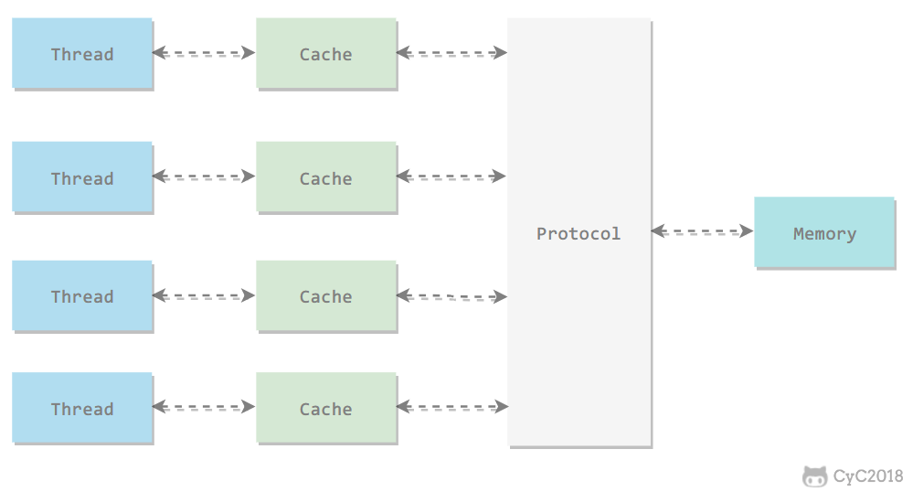

**线程私有的工作内存**：所有的变量都存储在主存（Main Memory）中，每个线程有自己的工作内存（Local Memory），一般存储在高速缓存和寄存器中，保存了该线程使用变量的主存副本。线程只能直接操作工作内存中的变量，不同线程之间的变量值传递需要通过主存完成。JMM内存模型存在的意义是定义了共享内存系统中多线程读写操作行为的规范，来屏蔽各种硬件和操作系统的内存访问差异，实现Java在各个平台下都能达到一致的内存访问效果。

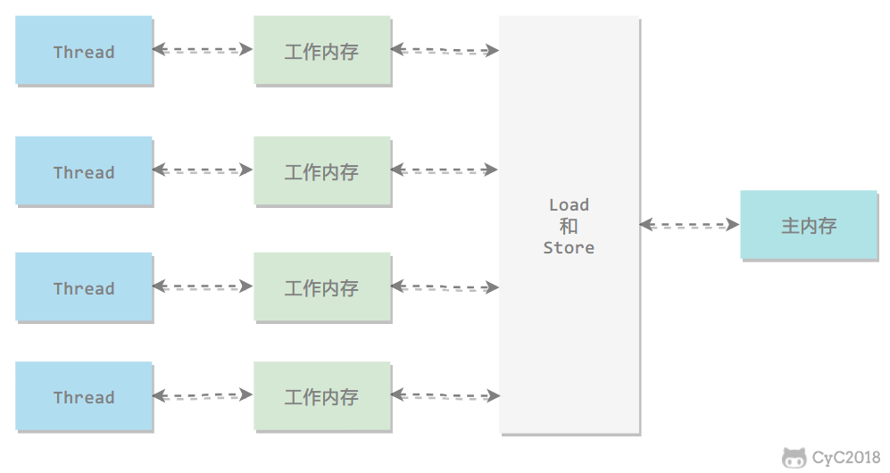


### 内存间的交互操作

* read：从主存读取变量的值到工作内存；
* store：把工作内存的一个变量的值传递到主存中；
* load：在read执行后，将变量的值放入工作内存的变量副本中；
* use：把工作内存中一个变量的值传递给执行引擎；
* assign：把一个从执行引擎接收到的值赋给工作内存中的变量；
* write：在store之后执行，将变量的值放入主内存变量中；
* lock：为主内存中的变量加锁；
* unlock：释放锁。

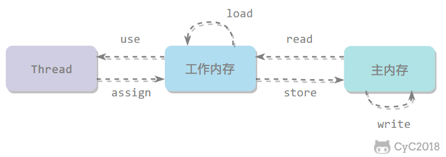


### 并发安全问题-原子性

**原子性**：JMM保证了load、assign、store等单个操作具有原子性，但并不保证一整个系列的操作具备原子性。如下图，T1读取cnt并修改但还未将其写入主存，T2此时读取的依然是旧值。


使用Atomic类或synchronized关键字可以保证一系列操作的原子性。


### 并发安全问题-可见性

指当一个线程修改共享内存中的变量后，其他线程能够立即得知这个修改。JMM是通过在变量修改后将新值同步回主存，和在变量读取前从主存刷新变量值来实现可见性的。

* **volatile**：被修饰的变量每次使用都需要从主存读取；
* **synchronized**：在操作变量前获取锁，释放锁之前必须将变量的值同步回主存；
* **final**：被修饰的字段在构造器中初始化完成，并且没有发生this逃逸（其他线程通过this引用访问到初始化一半的对象），那么其他线程就能够看见final字段的值。


### 并发安全问题-有序性

有序性是指在本线程内观察，所有的操作都是有序的，但在一个线程观察另一个线程，操作会存在无序的特点。所谓的无序是因为发生了指令重排序，JMM允许编译器和处理器对指令进行重新排序，该过程不会影响到单线程的执行，却会影响到多线程并发执行的正确性。

* 使用volatile关键字可以通过添加内存屏障的方式来禁止指令重排，即发生重排时不能将内存屏障后的指令放到屏障之前；

* 使用synchronized关键字可以通过添加互斥锁的方式保证每一个时刻只有一个线程执行同步代码，相当于让多个线程顺序执行同步代码。 

 

# 从计算机组成到操作系统再到JVM

## 计算机组成-冯·诺依曼体系

* 计算机由**运算器、存储器、控制器、输入设备和输出设备**五大部件组成：
  * 运算器：用于完成算术运算和逻辑运算，并能够暂存中间结果；
  * 存储器：用于存放程序和数据；
  * 控制器：用于控制、指挥程序和数据的输入、运行以及处理运算结果；
  * 输入设备：用于将人们熟悉的信息形式转换为计算机能够识别的信息形式，如键盘和鼠标等输入设备；
  * 输出设备：用于将计算机运算的结果转换为人们熟悉的信息形式，如打印机和显示器等输出设备。
* 指令和数据以同等地位存放于同一个存储器中，并可以通过地址寻访；
* 指令和数据均采用二进制数表示；
* 指令由操作码和地址码组成：
  * 操作码：用来表示操作性质；
  * 地址码：用于操作数的存储器寻址。
* 指令在存储器内按顺序存放，且指令也通常是按顺序执行的，但在特定条件下，可根据运算结果或设定的条件改变执行顺序；
* 计算机以运算器为中心，输入输出设备与存储器间的数据传输通过运算器完成。


## 计算机组成-数据与运算

### 位运算

**按位与&：**

* 定义：0为假，1为真，&运算符两边都为真时，结果才为真；
* 规则：`0&0=0 0&1=0 1&0=0 1&1=1`；
* 总结：全1为1，有0则0；
* 例如：`3&5 即 0000 0011 & 0000 0101 = 0000 0001 = 1`；
* 注意：负数按补码的形式参与按位与运算。

**按位或|：**

* 定义：0为假，1为真，|运算符两边任意一边为真时，结果为真；
* 规则：`0|0=0 0|1=1 1|0=1 1|1=1`；
* 总结：全0为0，有1则1；
* 例如：`3|5 即 0000 0011 | 0000 0101 = 0000 0111 = 7`；
* 注意：负数按补码的形式参与按位或运算。

**异或^：**

* 定义：0为假，1为真，^运算符两边各不相同时，结果为真；
* 规则：`0^0=0 0^1=1 1^0=1 1^1=0`；
* 总结：相同为0，不同为1；
* 性质：
  * 交换律：`a^b=b^a`；
  * 结合律：`(a^b)^c=a^(b^c)`；
  * 对于任何数x，都有`x^x=0,x^0=x`；
  * 自反性：`a^b^b=a^0=a`。

**取反~：**

* 定义：对二进制位进行按位取反操作，即让各位上的0变1，1变0；
* 规则：`~0=1 ~1=0`；
* 总结：1为0，0为1。

**左移<<：**

* 定义：将一个运算对象的各二进制位全部左移若干位（左边丢弃，并在右边补0）；
* 例如：`a=1010 1110, a=a<<2=1011 1000`；
* 若左移时舍弃的高位不包含1，则每左移1位，相当于该数乘2。

**右移>>：**

* 定义：将一个运算对象的各二进制位全部右移若干位（右边丢弃，正数左补0，负数左补1）；
* 例如：`a=1010 1110, a=a>>2=1110 1011`；
* 操作数每右移一位，相当于该数除以2。


### 原码、反码和补码

原码就是符号位加上真值的绝对值，即用第一位表示符号位，其余表示值，如：

```
[+1]原 = 0000 0001
[-1]原 = 1000 0001
第一位是符号位，所以8位二进制数的取值范围是：
[1111 1111, 0111 1111]即[-127, 127]
```

正数的反码就是其本身；负数的反码是在其原码的基础上，符号位不变，其余各位取反：

```
[+1] = [00000001]原 = [00000001]反
[-1] = [10000001]原 = [11111110]反
```

正数的补码就是其本身；负数的补码是在其原码的基础上，符号位不变，其余各位取反，最后+1，即在反码的基础上+1：

```
[+1] = [00000001]原 = [00000001]反 = [00000001]补
[-1] = [10000001]原 = [11111110]反 = [11111111]补
```


### 进制转换

**二进制 —> 十进制：**

* 方法：二进制数从低位到高位（即从右往左）计算，第0位的权值是2的0次方，第1位的权值是2的1次方，第2位的权值是2的2次方，依次递增计算下去，最后将所有结果求和就是十进制的值；

* 例：二进制(101011)B转十进制

  ```
  第0位：1*2^0=1
  第1位：1*2^1=2
  第2位：0*2^2=0
  第3位：1*2^3=8
  第4位：0*2^4=0
  第5位：1*2^5=32
  求和：1+2+0+8+0+32=43，即(101011)B=(43)D
  ```

* 方法2，把2进制从地位到高位的权值全部列举出来，如8位二进制位的权值列表：

  ```
  2^0=1
  2^1=2
  2^2=4
  2^3=8
  2^4=16
  2^5=32
  2^6=64
  2^7=128	
  2^8=255
  ```

  之后将二进制中的1的位置和权值列表中对应位置的权值取出来相加即可：

  ```
  1+2+8+32=43
  ```

**八进制 —> 十进制：**

* 方法：八进制数从低位到高位（即从右往左）计算，第0位的权值是8的0次方，第1位的权值是8的1次方，第2位的权值是8的2次方，依次递增计算下去，最后将所有结果求和就是十进制的值；

* 例：八进制(53)B转十进制：

  ```
  第0位：3*8^0=3
  第1位：5*8^1=40
  求和：3+40=43，即(53)O=(43)D
  ```

**十六进制 —> 十进制：**

* 方法：十六进制数从低位到高位（即从右往左）计算，第0位的权值是16的0次方，第1位的权值是16的1次方，第2位的权值是16的2次方，依次递增计算下去，最后将所有结果求和就是十进制的值；

* 例：十六进制(2B)H转十进制：

  ```
  第0位：11*16^0=11
  第1位：2*16^1=32
  求和：11+32=43，即(2B)H=(43)D
  ```

**十进制 —> 二进制：**

* 方法：除2取余法，即每次将整数部分除以2，余数为该位权上的数据，而商继续除以2，余数又为上一个位权上的数，依次执行到商为0为止，最后读数的时候，从最后一个余数开始，直到最开始的余数结束。

* 例：十进制(43)D转二进制：

  ```
  43除2，商21，余1
  21除2，商10，余1
  10除2，商5，余0
  5除2，商2，余1
  2除2，商1，余0
  1除2，商0，余1
  读数：(43)D=(101011)B
  ```

* 方法2，把2进制从地位到高位的权值全部列举出来，如8位二进制位的权值列表：

  ```
  2^0=1
  2^1=2
  2^2=4
  2^3=8
  2^4=16
  2^5=32
  2^6=64
  2^7=128	
  2^8=255
  ```

  权值列表中从高到低开始找寻小于十进制数的对应权值和位置，该位置就是二进制位的最高位，之后算出十进制数和权值之差，依次向后找出第一个权值小于差值的位置（每次都会更新差值），最后把找出的位置置为1，其他位置置为0：

  ```
  第一步：2^5=32<43，所以转换成的二进制是6位，且最高位为1
  第二步：43-32=11，2^3=8<21；11-8=3，2^1=2<3；3-2=1，2^0=1
  第三步：101011
  ```

**十进制 —> 八进制：**

* 方法：除8取余法，即每次将整数部分除以8，余数为该位权上的数据，而商继续除以8，余数又为上一个位权上的数，依次执行到商为0为止，最后读数的时候，从最后一个余数开始，直到最开始的余数结束。

* 例：十进制(796)D转八进制：

  ```
  796除8，商99，余4
  99除8，商12，余3
  12除8，商1，余4
  1除8，商0，余1
  读数：(796)D=(1434)O
  ```

**十进制 —> 十六进制：**

* 方法：除16取余法，即每次将整数部分除以16，余数为该位权上的数据，而商继续除以16，余数又为上一个位权上的数，依次执行到商为0为止，最后读数的时候，从最后一个余数开始，直到最开始的余数结束。

* 例：十进制(796)D转十六进制：

  ```
  796除16，商49，余12
  49除16，商3，余1
  3除16，商0，余3
  读数：(796)D=(31C)H
  ```

**二进制 —> 八进制：**

* 方法：取3合1法，即从二进制的小数点为分界点，向左（向右）每3位取成1位，接着将这3位二进制按权相加，然后按顺序排列，小数点位置不变，得到的数字就是所求的八进制数。如果向左（向右）取3位后，取到最高（最低）位时无法凑足3位，可以在小数点最左边（最右边），即整数的最高位（最低位）添0来凑足3位。最后从高位到低位（从左到右）开始读数。

* 例：二进制(11010111.0100111)B转八进制：

  ```
  小数点前取3合1：111=7，010=2，011=3
  小数点后取3合1：010=2，011=3，100=4
  读数：(11010111.0100111)B=(327.234)O
  ```

**二进制 —> 十六进制：**

* 方法：取4合1法，即从二进制的小数点为分界点，向左（向右）每4位取成1位，接着将这4位二进制按权相加，然后按顺序排列，小数点位置不变，得到的数字就是所求的十六进制数。如果向左（向右）取4位后，取到最高（最低）位时无法凑足4位，可以在小数点最左边（最右边），即整数的最高位（最低位）添0来凑足4位。最后从高位到低位（从左到右）开始读数。

* 例：二进制(11010111)B转十六进制：

  ```
  0111=7
  1101=D
  读数：(11010111)B=(7D)H
  ```

**八进制 —> 二进制：**

* 方法：取1分3法，即将每一位八进制数分解成3位二进制数（按十进制转二进制计算），用所有的3位二进制按权相加去拼凑，小数点位置不变。最后从高位到低位（从左到右）开始读数。

* 例：八进制(327)O转二进制：

  ```
  3=011
  2=010
  7=111
  读数：(327)O=(011010111)B
  ```

**十六进制 —> 二进制：**

* 方法：取1分4法，即将每一位十六进制数分解成4位二进制数（按十进制转二进制计算），用所有的4位二进制按权相加去拼凑，小数点位置不变。最后从高位到低位（从左到右）开始读数。

* 例：十六进制(D7)H转二进制：

  ```
  D=1101
  7=0111
  读数：(D7)H=(11010111)B
  ```

**八进制 —> 十六进制：**

* 方法：将八进制转换为二进制，然后将二进制转换为十六进制，小数点位置不变。

* 例：八进制(327)O转十六进制：

  ```
  3=011
  2=010
  7=111
  二进制：011010111
  0111=7
  1101=D
  读数：(327)O=(D7)H
  ```

**十六进制 —> 八进制：**

* 方法：将十六进制转换为二进制，然后将二进制转换为八进制，小数点位置不变。

* 例：十六进制(D7)转八进制：

  ```
  D=1101
  7=0111
  二进制：11010111
  111=7
  010=2
  011=3
  读数：(D7)H=(327)O
  ```


## 计算机组成-层次存储系统

* **存储器层次**：远程文件存储 -> 磁盘 -> 主存 -> 三级缓存 -> 二级缓存 -> 一级缓存 -> CPU寄存器；

* **高速缓存（Cache）**：介于CPU与内存之间，Intel系列的CPU有L1、L2、L3共三级缓存。读写速度高于内存，当CPU在内存中读取或写入数据时，数据会被保存在高速缓冲存储器中，当下次访问该数据时，CPU直接读取高速缓存，而不是更慢的内存；

* **内存（Memory）**：也称内存储器或主存储器，是CPU能直接寻址的存储空间，其作用是用于暂时存放CPU中的运算数据，以及与硬盘等外部存储器交换的数据。是计算机中最重要的部件之一，是外存和CPU沟通的桥梁，计算机中所有程序的运行都是在内存中进行的，所以内存的速度影响计算机的速度。当计算机在运行过程中，操作系统会将需要运算的数据从内存中调入CPU中进行运算，当运算完成后再将结果写回，所以内存的运行情况也决定计算机的运行情况。
* **随机存取存储器（RAM）：**是一种可读可写的存储器，特点是存储器的任何一个存储单元的内容都可以随机存储，而且存取时间与存取单元的物理位置无关（计算机系统中的主存都采用这种随机存储器）；
  * 只读存储器（ROM）：只能读出其存储的内容，而不能对其重新写入。通常用于存放固定不变的程序、常数、汉字字库和操作系统的固定信息。与随机存储器共同作为主存的一部分，统一构成主存的地址域。

* **外存**：外存储器是指除了内存和高速缓存以外的存储器，此类存储器一般永久的保存数据，常见的外存有硬盘、软盘、光盘、U盘等；

* **主存（Main Memory）**：主存储器，即内存。是计算机硬件的重要部件，作用的存放指令和数据，并能由CPU直接随机存取；

* **辅存**：外存，狭义上就是指硬盘。即需要通过I/O系统交换数据的外部存储器；

* **数据存储方式**：
  * 小端方式：先存储低位字节，后存储高位字节；
  * 大端方式：先存储告位字节，后存储低位字节。

* **边界对齐方式**：字节在任何CPU上都是8bit；

* **按块读取**：即从内存中一次性读取一块存入缓存中，利用空间局部性原理（如一个数组，内存空间是紧挨着的）可以提高效率，充分发挥CPU一次性读取更多数据的能力。


## 计算机组成-指令系统

### 指令格式

* 指令集：一台机器所有指令的集合；
* 指令字长：指令中包含的二进制位数；
* 指令分类：
  * 根据层次结构划分：高级、汇编、机器、微指令；
  * 根据地址码字段个数划分：
    * 零地址指令：指令中只有操作码，没有地址码；
    * 一地址指令：只有一个地址码，指定一个操作数，另一个操作数是隐含的；
    * 二地址指令：双操作数指令，有两个地址码字段A1和A2，分别指明参与操作的两个数在内存或运算器中通用寄存器的地址，其中地址A1兼存放操作结果的地址；
    * 三地址指令：有三个操作数地址A1、A2和A3，A1为被操作数地址，A2为操作数地址，A3为存放操作结果的地址。
  * 根据操作数物理位置划分：
    * 存储器 - 存储器（SS）；
    * 寄存器 - 寄存器（RR）；
    * 寄存器 - 存储器（RS）。
* 指令格式：操作码+数据源+寻址方式。


### 寻址方式

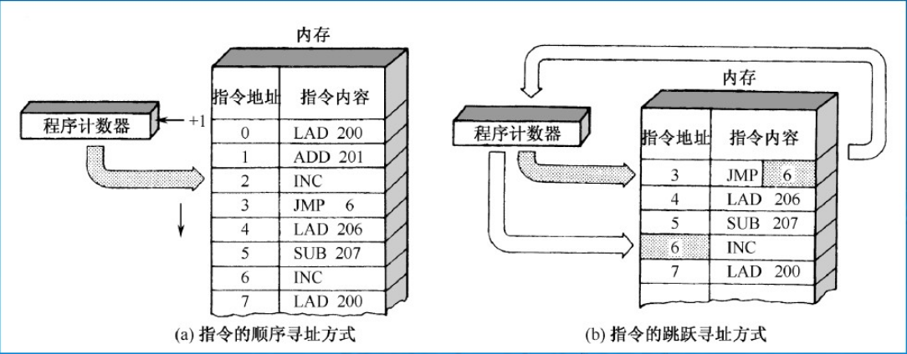

* **指令顺序寻址**：由于指令地址在内存中按顺序存放，当执行一段程序时，通常是一条指令接一条指令的顺序进行。CPU中的PC就是用来存放当前需要执行的指令地址，其与主存的MAR之间有一条直接通路，且具有自增的功能，以此来形成下一条指令的地址；

* **指令跳跃寻址**：当程序需要转移执行的顺序时，指令的寻址就采取跳跃寻址的方式。所谓的跳跃，是指下条指令的地址码不是由PC给出的，而是由本条指令给出的。在程序跳跃后，按新的指令地址开始顺序执行，因此PC也必须改变，及时的跟踪指令地址。可以实现程序转移或构成循环程序，从而缩短程序的长度，或将某些程序作为公共程序引用。指令系统中的各种条件转移或无条件转移指令，就是为了实现指令的跳跃寻址而设置的。


## 计算机组成-中央处理器

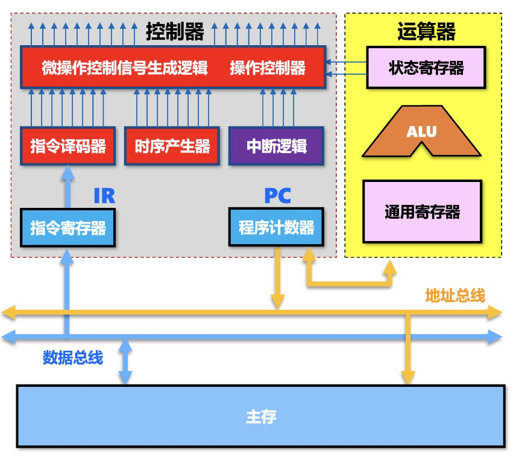

* 控制器：
  * 由程序计数器、指令寄存器、指令译码器、时序产生器和操作控制器组成；
  * 控制器是发布命令的决策机构，即完成协调和指挥整个计算机系统的操作；
  * 主要功能：
    * 从指令Cache中取出一条指令，并指出下一条指令在Cache中的位置；
    * 对指令进行译码或测试，并产生对应的操作控制信号，以便启动规定的动作。
  * **程序计数器（PC，Program Counter）**：存储指令在内存中的地址，CPU会根据该地址从内存中将指令读取到指令寄存器中，交由ALU进行具体计算，本次计算完成后PC则自增指向下一条指令；
  * **指令寄存器（IR，Instruction Register）**：用于临时放置CPU当前正在执行的一条指令。当执行一条指令时，先将其从内存读到数据寄存器DR中，然后再传送到指令寄存器IR；
    * 指令译码器：为了执行任何给定的指令，需要对指令的操作码进行测试，以便识别所要求的操作。IR中操作码字段的输出就是指令译码器的输入，操作码经过译码后，即可向操作控制器发出具体操作的特定信号；
  * **内存管理单元（MMU，Memory Management Unit）**：负责CPU的虚拟寻址，即将虚拟地址翻译成物理地址，然后才能访问真实的物理内存。
  
* 运算器：
  * 由算术逻辑单元、通用寄存器、数据缓冲寄存器和状态条件寄存器组成；
  * 运算器是数据加工处理的部件；
  * 主要功能：
    * 执行所有算术运算；
    * 执行所有的逻辑运算，并进行逻辑测试。
  * **通用寄存器（GR，General register）**：可用于传送和暂存数据，也可参与算术逻辑运算，并保存运算结果。初次之外， 它们还各自具备一些特殊功能；
  * **状态寄存器（SR，Status register）**：用来存放两类信息。一类是体现当前执行结果的各种状态信息（条件码），如有无进位、有无溢出、结果正负、结果是否为零、奇偶标志位等待。另一类是存放控制信息（PSW程序状态字寄存器），如允许中断和跟踪标志等；
    * **程序状态字PSW（PSW，Program Status Word）**：包括的状态位有进位标志位（CF）、结果为零标志位（ZF）、符号标志位（SF）、溢出标志位（OF）、陷阱标志位（TF）、中断屏蔽标志位（IF）、虚拟中断标志位（VIF）、虚拟中断待决标志位（VIP）、IO特权级别（IOPL）。
  * **算术逻辑单元（ALU，Arithmetic&Logical Unit）**：从寄存器中获取数据进行算术和逻辑计算，并将结果写回内存。
    * ALU的超线程概念：单核CPU只有一组寄存器和指令计数器，每次切换线程都需要保存现场和恢复现场。为了提高效率，单核CPU划分多组寄存器和PC，每一组管理一个线程的信息，利用ALU的高速在多组间不断切换计算以提高效率。
  
* **高速缓存（Cache）**：因为CPU和内存的速度相差巨大，所以在二者中间添加了共三级高速缓存做为中间层。多核CPU的每个核心都有自己独立的一级二级缓存，共用一个三级缓存；

* 地址总线（Address Bus）：传输内存地址信息；

* 数据总线（Data Bus）：传输数据信息；

* CPU执行指令的一般流程：

  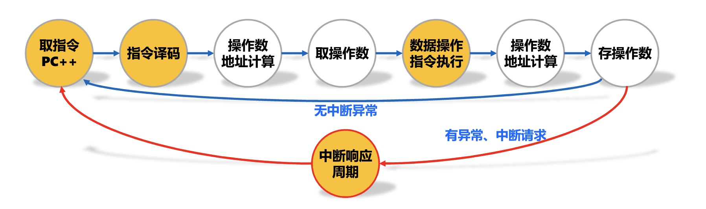


## 计算机组成-I/O系统

### 磁盘结构

* 硬磁盘存储器：
  * 磁盘驱动器：
    * 主轴：受传动机制控制，可使磁盘组高速运动；
    * 定位驱动：可以驱动磁头沿盘面径向指定位置运动，以寻找目标磁道位置；
    * 数据控制：完成数据转换和读写控制操作。
  * 磁盘控制器：是主机和磁盘驱动器的接口，其接受主机发来的命令，并转换成磁盘驱动器的控制命令，实现主机和驱动器之间的数据格式转换和数据传输，并控制驱动器的读写；
  * 盘片：是存储信息的载体。
* 磁头：由软磁材料做铁芯绕有读写线圈的电磁铁，写入时利用磁头来使盘片具有不同的磁化状态，读取时又利用磁头来判别这些不同的磁化状态；
* 磁道：通常将磁盘片表面称为记录面，记录面上一系列同心圆称为磁道；
* 扇区：将磁盘划分为若干个小的区段，这个区段被称为扇区。


### 中断请求与响应

* 概念：CPU由内部或外部事件引起的中断正在运行的程序的过程，具有随机性，即符合I/O系统的特性；

* 作用：主机与外设并行、故障处理、实时处理；

* 类型：内部中断（软件、异常）和外部中断（可屏蔽中断INTR、不可屏蔽中断NMI）；

* 基本功能：

  * 中断信号的保存与清除：通过寄存器存储，处理完清除；

  * 中断优先级：硬件响应优先序、软件服务优先序（中断服务程序开头，设置字节的中断屏蔽位）；

  * 中断源识别：系统分配给每个中断源的代号（中断号），中断号获取可以用硬件或软件方式；

  * 中断处理：

    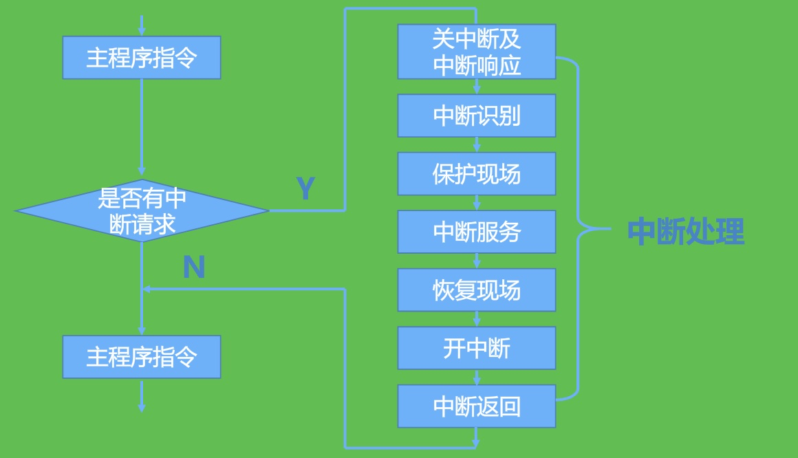

    * 响应：每执行完一条指令，就会判断是否有中断请求；
    * 处理：保存断点（返回地址）、执行中断程序、返回断点。

  * 中断控制：

    * 中断触发方式：指外设通过什么逻辑信号去申请中断；
    * 中断排队方式：按优先级、循环轮流排队；
    * 中断嵌套：中断正在执行的中断程序，不可屏蔽中断不能嵌套；
    * 中断屏蔽：处理器内部有个触发器，为"1"时才会。


## 操作系统-基本概念

**什么是操作系统？**是一种运行在硬件系统上的特殊的软件程序，既能管理计算机的硬件和软件资源，又能为用户提供与系统交互的界面，内核就是操作系统的核心逻辑；

**什么是内核？**以Linux系统为例，内核负责管理文件系统、应用进程调度、中断处理设备驱动、CPU调度、内存管理、文件系统、网络系统等，是连接应用程序和硬件的桥梁；

* **宏内核**：以Linux系统为例，kernel和其周边被其管理的如CPU调度、文件系统、内存管理等功能划分为一个整体，将这个整体当作操作系统的核心，称为宏内核；
* **微内核**：以Linux系统为例，kernel内核只负责进程调度，而其他如CPU调度、文件系统、内存管理等功能都可能是以分布式形式存在的（不同的核心管理不同的功能），所有功能之间的交互都需要通过kernel内核进行调度，如：用户访问文件系统，需要通过kernel代理；文件系统和CPU调度交互，也需要kernel进行代理；
* **外内核**：会根据当前运行的应用自动调整使其更适合应用程序运行；
* **虚拟化**：通过底层的虚拟化技术管理多个虚拟的OS以充分的利用硬件资源。

基本功能：

* 进程管理：进程同步、进程控制、进程通信、死锁处理、处理器调度等；
* 内存管理：内存分配、地址映射、内存保护与共享、虚拟内存等；
* 文件管理：文件存储空间管理、目录管理、文件读写管理和保护等；
* 设备管理：完成用户的I/O请求，方便用户使用各种设备，并提高设备的利用率。主要包括缓冲管理、设备分配、设备处理、虚拟设备等。


## 操作系统-启动流程

1. 开机，首先给主板通电；
2. 主板上有一块BIOS芯片会加电自检，检测硬件的故障问题，自检完毕后加载bootloader到内存；
3. 由bootloader启动操作系统（从硬盘到内存），在此之前的操作系统存储在磁盘MBR中，即磁盘的第一个扇区；
4. OS启动后开始接管硬件系统。

注：在OS未启动之前，有些针对计算机硬件的设置信息，如：启动硬盘还是软盘等，会被写入到主板上的另一块芯片cmos中，这块芯片由电池供电。


## 操作系统-处理器管理

* 处理器：
  * 特权指令和非特权指令：
  * 处理器工作状态：
    * 用户态和内核态：
    * 工作状态的切换：
  * 程序状态字PSW：
* 中断机制：
  * 中断与异常：
  * 中断系统：
  * 中断优先级、中断屏蔽和中断嵌套：
* 系统调用：
  * 系统调用和函数调用的区别：
  * 系统调用的分类：
  * 系统调用与库函数、API、内核函数的关系：
  * 系统调用处理过程：
* 进程：
  * 进程的概念：
  * 进程的状态与转换：
  * 进程控制块PCB：
  * 进程控制：
* 线程：
  * 线程的概念：
  * 线程和进程的区别：
  * 线程实现机制：
* 进程调度：
  * 调度的概念：
  * 调度算法：
* 进程同步：
  * 同步的概念：
  * 进程的互斥：
  * 临界区：
  * 信号量：
  * P、V操作：
  * 生产者—消费者问题：
  * 多生产者—消费者问题：
  * 读者—写者问题：
* 进程通信：
  * 共享内存：
  * 消息机制：
* 死锁：
  * 死锁产生原因：
  * 死锁预防：
  * 死锁避免：
  * 银行家算法：
  * 死锁检测和解除：
  * 哲学家就餐问题：


### 中断

**概念：**

* 操作系统是由中断驱动的，即中断是激活操作系统的唯一方式；
* 广义中断：停止CPU正在执行的进程，转而执行中断处理程序，处理完后返回原进程或调度新进程；
* 狭义中断：源于处理器之外的中断事件，IO中断、时钟中断、外部信号中断。

**硬件中断信号**：硬件通过发送中断信号和操作系统产生实时的交互。如键盘鼠标等设备被触发时会给OS发送一个中断信号，OS会中断目前正在处理的任务，根据该中断信号去OS内部的中断异常处理表中查询对应的编号，根据编号做出不同的处理；

**软中断**：应用程序与操作系统的中断信号只有一个，也就是0x80号中断，即编译器安排了一次软中断去中断CPU，实现用户态到内核态的切换，完成系统调用。

**中断处理流程：**


### 线程

分类：KLT内核级多线程、ULT用户级多线程、混合式线程。

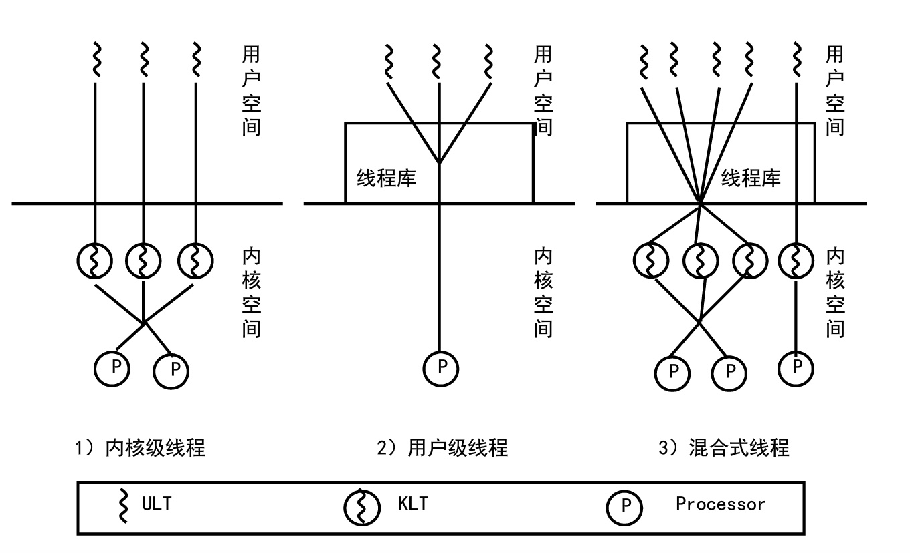

线程的实现方式：

* 一对一模型：该模型为每个用户级线程都设置一个内核线程与之连接，并发能较强，但消耗较大；
* 多对一模型：该模型为多个用户线程分配一个内核线程。这种方式线程管理的开销较小，但是当一个线程在访问内核时发生阻塞，则会导致整个进程被阻塞；
* 多对多模型：多个用户线程连接到多个内核线程上，内核控制线程的数量可以根据应用和系统的不同而变化，可以比用户线程少，也可以与之相同。

内核级线程：


* 内核线程的创建、撤销和切换等，都是内核负责、通过系统调用完成的，即内核了解了每一个作为可调度实体的线程；
* 这些线程可以在全系统内进行资源的竞争；
* 内核管理所有线程，并向应用程序提供API接口；
* 内核维护进程和线程的上下文；
* 内核以线程为基础进行调度；
* 内核空间内为每一个线程都设置了一个控制块PCB，根据该控制块，感知线程的存在，并进行控制；
* 内核线程驻留在内核空间，是内核对象；
* 有了内核线程，每个用户线程都会被映射或绑定到一个内核线程上，二者的生命周期相对应。

用户级线程：


* 在用户空间建立线程库，这个线程库里提供了一系列的针对线程的操作，这些线程的管理通过运行时系统（Run-time System）来管理；

* 但内核真正管理的单位还是进程，因为无法感知到线程的存在，因此线程的切换不需要内核的参与，更加高效；

* 内核资源的分配仍然是按照进程进行分配的，每个用户线程只能在进程内进行资源竞争。

用户级线程和内核级线程的区别：

* 用户级线程的创建、撤销和调度不需要OS内核的支持，是在语言层面处理的。而内核级线程则需要OS内核提供支持，在Linux中内核线程是进程机制的不同形式 ；
* 用户级线程执行系统调用指令时将导致其所属进程被中断，而内核级线程执行系统调用指令时，只会导致该线程被中断；
* 在只有用户级线程的系统内，CPU调度还是以进程为单位的，处于运行状态的进程中的多个线程，由用户程序控制线程的转换运行。在有内核支持线程的系统内，CPU调度则以线程为单位，由OS的线程调度负责。
* 用户级线程的程序实体是运行在用户态下的程序，而内核支持程序的实体则是可以运行在任何状态下的程序。


## 操作系统-系统调用

**内核态和用户态**：

* 内核态也称管态，用户态也称目态；
* CPU指令级别：Intel的CPU将指令级别划分为ring0、ring1、ring2和ring3四个级别，用于区分不同优先级的指令操作；
* 其中内核发出的都是0级指令，用户发出的都是3级指令，通过指令级别的划分，将CPU划分为拥有不同权限等级的两个状态，即用户级别的指令操作无法访问OS的内核资源，提高了OS的安全性；
* 用户态（user mode）和内核态（kernel mode）是根据访问资源的特点，把进程在系统上的运行分为两个级别；
* 处于用户态的进程只能操作用户程序相关的数据，处于内核态的进程能够操作计算机的任何资源；
* Linux按照特权等级，将进程的运行空间分为内核空间和用户空间，分别对应着CPU特权等级的Ring0和Ring3。

**系统调用**：在运行用户程序的过程中，凡是与内核态级别的资源有关的操作（如：文件管理、进程控制、内存管理），都必须通过系统调用的方式向内核提出服务请求，并陷入内核由OS代为完成。


**系统调用按功能分类：**

* 设备管理：完成设备的请求或释放，以及设备启动等功能；
* 文件管理：完成文件的读、写、创建及删除等功能；
* 进程控制：完成进程的创建、撤销、阻塞及唤醒等功能；
* 进程通信：完成进程之间的消息传递或信号传递等功能；
* 内存管理：完成内存的分配、回收以及获取作业占用内存区大小及地址等功能。

**Linux的主要系统调用：**

|   Task   |          Commands           |
| :------: | :-------------------------: |
| 进程控制 |   fork(); exit(); wait();   |
| 进程通信 |  pipe(); shmget(); mmap();  |
| 文件操作 |  open(); read(); write();   |
| 设备操作 |  ioctl(); read(); write();  |
| 信息维护 | getpid(); alarm(); sleep(); |
|   安全   | chmod(); umask(); chown();  |

**应用程序和OS内核交互的流程**：

1. 应用程序发出0x80中断指令（同时发送需要调用的系统函数的编号和参数）或调用sysenter原语（汇编层面的原语，并非所有CPU都支持）；
2. 通过访管指令应用进程或者说是CPU进入内核态；
3. 根据应用程序发来的编号在中断向量表中查找处理例程（即对应的内核态系统函数）；
4. 保存硬件现场（cs，ip等寄存器值）；
5. 保存应用程序现场（堆栈与寄存器值）；
6. 执行中断例程system_call：
   1. 根据参数与编号寻找对应例程；
   2. 执行并返回。
7. 恢复现场；
8. 应用进程返回用户态；
9. 应用程序继续执行。


## 操作系统-进程管理

### 进程和线程

**进程：**是操作系统进行资源分配的基本单位。是操作系统管理进程的数据结构PCB+内存指令+内存数据+通用寄存器GR+程序状态字PSW的集合。所谓的PCB（Process Control Block 进程控制块）用于描述进程的基本信息和运行状态，所谓的创建进程和撤销进程，都是指对PCB的操作。下图是4个程序创建了4个进程，4个进程并发执行。


**线程：**是操作系统独立调度的基本单位。是一个进程内共享资源的多条执行路径。实现思路就是将进程的两个功能“独立分配资源”和“调度执行”功能分开。


**进程和线程的区别：**

* **调度**：线程是CPU调度和分配的基本单位。在同一进程中，线程的切换不会引起进程的切换，从一个进程中的线程切换到另一个进程中的线程时，会引起进程的切换；
* **并发性**：进程之间可以并发执行，同一进程内的多个线程之间也可以并发执行；

* **通信方面**：进程内多个线程共享进程地址空间，线程间可以通过直接读写同一进程中的数据进行通信，但是进程间通信需要借助IPC；

* **资源拥有**：进程是拥有资源的一个独立单位，而线程不拥有资源（只会有程序计数器，一组寄存器和栈），但可以访问所属进程的所有资源；
* **系统开销**：由于在创建或撤销进程时，系统都要为之分配或回收资源，在进程切换时，会涉及整个进程当前CPU环境的保存以及新调度进程CPU环境的设置，而线程切换只需要保存和设置少量寄存器信息，开销相对更小。


### 进程的状态和切换

**进程的状态**：

* **新建态（new）**：进程被创建且尚未进入就绪队列时的状态；
* **就绪态（ready）**：当进程已经分配到除CPU以外的所有必要资源后就称为就绪状态，一个系统中处于就绪状态的进程可能有多个，通常会用就绪队列存储；
* **运行态（running）**：进程已经获取CPU且正在运行中，在单核时代，只有一个进程在运行，多核时代则是多个进程并行；
* **阻塞态（wait）**：也称等待或睡眠状态，指一个进程正在等待某事件的发生（如请求I/O操作等待完成）而暂停运行，这时进程会让出CPU的执行权；
* **就绪/挂起态（ready suspend）**：进程具备运行条件，但目前处于外存中的就绪挂起队列中，只有被换入到内存中的就绪队列才能被调度；
* **阻塞/挂起态（blocked susped）**：进程正处于外存中，并且正在等待某一个事件的发生；
* **终止态（exit）**：处于终止状态的进程不会再被调度，下一步就会被系统撤销，回收资源。

引起进程阻塞和唤醒的事件：

* 请求系统服务：当正在执行的进程请求系统提供服务而系统无法满足请要求时，进程阻塞等待。由释放服务的进程唤醒阻塞的进程；
* 启动某种操作：当进程启动某种IO操作后阻塞以等待操作完成。由中断处理程序唤醒阻塞进程；
* 新数据尚未到达：相互合作的进程中，消费者进程阻塞等待数据到达，生产者进程在数据到达后唤醒阻塞的进程；
* 无新工作可做：系统进程没有新工作可做时阻塞等待，当有进程发出请求时唤醒阻塞进程。

引起进程挂起的事件：

* 系统资源不足：当系统资源尤其是内存资源不能再满足进程运行的要求时，必须把某些进程挂起，对换到磁盘交换区中，释放其所占有的某些资源，暂时不参与低级调度，起到平滑负载的目的；
* 系统出现故障：以便故障消除后再接触挂起并恢复进程运行；
* 用户调试程序：以便进行某种检查和修改。

**进程状态的切换**：

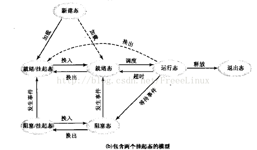

* **新建态 —> 就绪态**：OS完成了创建进程的必要操作，且系统的性能和容量允许的情况下，进程进入就绪队列；
* **新建态 —> 就绪挂起态**：若当前系统的资源和性能情况不容乐观，则可以将新建的进程交换到磁盘的中的就绪挂起队列中；
* **就绪态 —> 就绪挂起态**：若当前释放内存获得空间的唯一方式就是挂起就绪态进程，或者阻塞态进程优先级高于就绪态进程时，可以进行这种转换；
* **就绪挂起态 —> 就绪态**：当内存中没有就绪态进程，或者处于就绪挂起态的进程比所有就绪态进程的优先级都高时，可以进行这种转换；
* **就绪态 —> 运行态**：CPU根据某种调度算法将一个就绪态的进程转换到运行态，此时该进程就获得了CPU的执行权或时间片；
* **运行态 —> 就绪态**：CPU根据某种调度算法将处于运行态且时间片耗尽的进程，或被更高优先级进程抢占，会转换到就绪态；
* **运行态 —> 阻塞态**：通常当分配给一个运行进程的时间期满时，会被转换到就绪态。但此时位于阻塞挂起队列中具有更高优先级的进程变得不再被阻塞，OS需要抢占这个进程而内存空间又不够用，就可能会将当前运行的进程转换到就绪挂起队列中，释放内存空间；
* **运行态 —> 就绪挂起态**：当一个具有更高优先级的阻塞挂起态进程的等待事件发生后，需要抢占CPU，而此时主存空间不够，从而可能导致正在运行的进程转换为就绪挂起态。另外处于运行态的进程也可以自己挂起自己；
* **阻塞态 —> 就绪态**：处于阻塞态的进程，若对应事件发生，则会解除阻塞，进入就绪队列；
* **阻塞态 —> 阻塞挂起态**：若系统确定当前正在运行的进程或就绪态进程为了维护基本的性能要求而需要更多空间时，就可能会将阻塞态的进程换出；
* **阻塞挂起态 —> 阻塞态**：当一个进程等待一个事件时，原则上不需要调入内存。但是当一个进程退出后，主存已经有了一大块自由空间，而某个挂起等待态进程具有较高的优先级并且操作系统已经得知导致它阻塞的事件即将发生，此时便发生了这一状态转换；
* **阻塞挂起态 —> 就绪挂起态**：若引起进程等待的事件发生后，相应的阻塞挂起态进程会转换位就绪挂起态；
* **运行态 —> 退出态**：当一个进程到达了自然结束点，或是出现了无法克服的错误，或是被操作系统所终结，或是被其他有终止权的进程所终结时，会发生此种转换。

**进程实现的队列模型：**

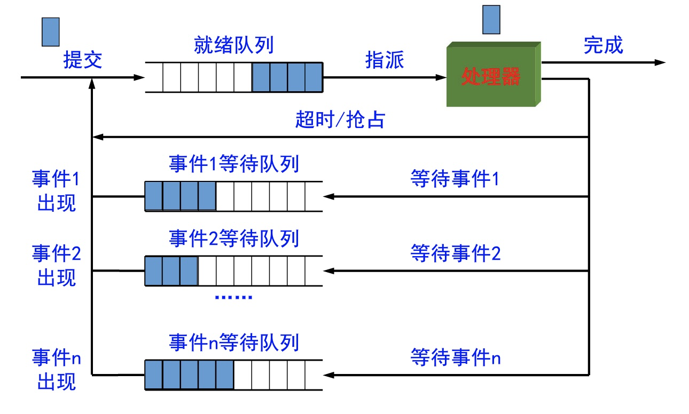

**进程控制流程：**

* 进程创建：进程表增加一项，申请PCB并初始化，生成标识、建立映像、分配资源、移入就绪队列；
* 进程撤销：从队列中移除，归还相应资源；
* 进程等待：保存现场、修改PCB、移入等待队列；
* 进程唤醒：从等待队列移出、修改PCB、进入就绪队列；
* 进程挂起：修改进程状态并出入相关队列，暂时调离内存并交换到磁盘中的挂起队列中；
* 进程激活：分配内存，修改状态并出入相关队列。


### 进程调度

**调度的层次：**

* **高级调度**：即**作业调度**，本质就是根据某种算法，把外存上的程序调入内存，并为之创建进程，挂入就绪队列，分配处理器资源并执行，执行完毕后，回收资源；

* **中级调度**：即**交换调度**，本质就是让暂时不能运行的进程挂起，释放内存资源，并把它们交换到外存上去等待；

* **低级调度**：即**进程调度**，本质就是使用调度算法，把处理器分配给就绪队列中的某个进程。进程调度首先会保存处理器现场，将程序计数器和各种寄存器中的数据保存到PCB中，然后按照某种算法从就绪队列中选取进程，把处理器分配给进程，最后，把指定PCB中的现场信息恢复到处理器中，再分配给进程执行。

  

**批处理系统调度算法：**因为没有太多的用户操作，在这种系统下，调度算法的目的是保证吞吐量和周转时间（从提交到终止时间）。

* 先来先服务（first-come first-serverd，FCFS）：非抢占式调度算法，根据请求的顺序进行调度。有利于长作业但不利于短作业，排在前面的长作业执行时间很长，会造成短作业等待时间过长；
* 短作业优先（shortest job first，SJF）：非抢占式调度算法，按估计的运行最短时间顺序进行调度。有利于短作业但不利于长作业，如果一直有短作业到来，长作业永远都不会得到调度；
* 最短剩余时间优先（shortest remaining time next，SRTN）：是最短作业优先的抢占式版本。按剩余运行时间的顺序进行调度，当一个新作业到达时，用其整个运行时间和当前进行的剩余时间比较，若新进程时间更少，则运行新进程，当前进程等待，反之，新进程等待，当前进程继续运行。

**交互式系统调度算法：**因为有大量的用户频繁的交互操作，在这种系统下，调度算法的目的是快速的进行响应。

* 时间片轮转：将所有就绪进程按FCFS的原则排成一个队列，每次调度时都会将CPU的执行权分配给队头进程，该进程可以执行一个时间片段。当时间片用完后，由计时器发出时钟中断，调度程序停止该进程的执行，并将其加入就绪队列尾部，同时把CPU执行权分配给队头进程。时间片太小会导致进程切换频繁，在切换操作上浪费太多时间，时间片太大会导致实时性不能保证。

  

* 优先级调度：为每一个进程分配一个优先级，按优先级进行调度。为了防止低优先级的进程永远等不到调度，可以随着时间的推移增加等待进程的优先级；

* 多级反馈队列：假设一个进程需要执行100个时间片，如果采用时间片轮转的算法，那么需要交换100次。多级队列的出现就是为了解决需要连续执行多个时间片的进程提出的，其设置了多个队列，每个队列时间片的大小都不同。进程在第一个队列没有执行完，就会被移动到下一个队列，这种方式可以大大减少交换次数。每个队列的优先级也不同，最上面的队列优先级最高，因此只有上一个队列没有进程在排队，才能调度当前队列中的进程。

  

**实时系统调度算法：**要求一个请求在一个确定的时间内得到响应。分为硬实时和软实时，前者必须满足绝对的截止时间，后者可以容忍一定的超时。


### 进程同步

**同步与互斥：**同步是指多个进程因为合作而产生的直接制约关系，使得进程有一定的先后执行顺序。互斥则是多个进程在同一时刻只能有一个进入临界区。

**临界资源和临界区：**若系统的某些资源一次只允许一个进程使用，则这类资源被称为临界资源活共享变量。而在进程中访问临界资源的代码段称为临界区。多个进程在进入临时区时会存在互斥关系，即同一时间只能有一个进程访问临界区。

**信号量（Semaphore）：**是一个整型变量，可以对其执行down和up操作，即P和V操作。

* P：如果信号量大于0，执行-1操作。如果信号量等于0，进程阻塞等待信号量大于0；
* V：对信号量执行+1操作，唤醒阻塞的进程让其完成P操作。
* 注：P和V操作必须被设计成原语，通常的做法是在执行这些操作时屏蔽中断。

**互斥量（**Mutex**）**：就是让信号量的取值只能为0和1，0表示临界区已经加锁，1表示临界区无锁。

**管程：**在一个时刻只能有一个进程使用管程，进程无法继续执行时不能一直占用管程，否则其他进程永远不能使用。管程引入了条件变量以及对其的操作 `wait()和signal()` 来实现同步，对条件变量的 `wait()` 会导致调用进程阻塞，把管程让出，``signal()`` 操作用于唤醒被阻塞的进程。


### 经典进程同步问题 

**生产者-消费者问题：**使用一个缓冲区来保存数据，只有当缓冲区未满时，生产者才能写入数据，只有当缓冲区不为空时，消费者才可以获取数据。

**哲学家就餐问题：**五个哲学家围在一张圆桌上吃饭，桌子上只有五根筷子，如下图。当一个哲学家吃饭时，需要先拿起自己左右两边的两根筷子，并且一次只能拿起一根筷子。 为了防止死锁的发生，要求每个哲学家必须同时拿起来个筷子，并且只有在两个邻居都没有就餐的情况下自己才允许就餐。


**读者-读者问题：**允许多个进程同时对数据进行操作，但是不允许读和写以及写和写操作同时发生。


### 进程通信

**信号（signal）**：

* 用于通知接收进程某个事件已经发生，只能发送单个信号而不能传送数据；
* 当用户通过外设触发时（如键盘鼠标按键），产生信号；
* 硬件异常产生信号；
* 一个进程通过kill函数将信号发送给另一个进程。
* 缺点：开销大，发送进程需要系统调用，这时内核会中断接收进程，且要管理堆栈、调用处理程序、恢复被中断的接收进程。另外信号只能传送有限的信息，不能携带参数，不适和复杂的通信操作。

**管道（pipeline）**：

* **匿名管道（pipe）**：半双工通信，数据只能单向流动，需要双向通信时需要建立两个管道，且只能在父子、兄弟进程间通信；

  ```C
  #include <unistd.h>
  int pipe(int fd[2]);
  ```

  

* **命名管道（FIFO）**：半双工通信，可以对管道命名，允许无亲缘关系的进程间通信。

  ```C
  #include <sys/stat.h>
  int mkfifo(const char *path, mode_t mode);
  int mkfifoat(int fd, const char *path, mode_t mode);
  ```

  

**消息队列（message passing）**：

* 底层由链表实现的消息队列，消息就是链表中具有特定格式和优先级的记录，对队列中消息的读写都需要相应的权限；
* 在向队列中写消息之前，不需要读端进程阻塞读；
* 此外，消息队列是随内核持续的，管道是随进程持续的。

**共享内存（shared memory）**：

* 映射一段能被其他进程所访问的内存，这段内存由一个进程创建，但多个进程都可以访问；
* 共享内存并未提供同步机制，即在第一个进程结束对共享内存的写操作之前，并无任何机制可以阻止第二个进程对其进行读操作，所以通常会配合同步机制完成访问，如信号量。

**套接字（socket）**：

* 可以用于不同主机间进程通信的机制（通过因特网通信）；
* 在两个进程进行网络通信时，首先本地的进程会绑定一个端口，并生成一个缓冲区，反回一个值，即socket对其进行标记。每当本地进程和远程进程建立连接时，就会根据远程进程的信息和本地进程的信息生成一个socket，然后双方借助于socket就可以进行通信，传输层得到的数据写入socket标志的缓冲区，然后在里面进行相应的操作后提交网络层。


## 操作系统-死锁问题

### 必要条件

* **互斥条件**：某段时间内某资源只能由一个进程使用；
* **占有和等待条件**：进程因请求资源而阻塞，对已分配到的资源保存不放；
* **不剥夺条件**：资源在未使用完之前，不能被剥夺，只能由使用进程主动释放；
* **循环等待条件**：发生死锁时，有向图必构成一个环路。即存在两个或两个以上的进程组成一条环路，该环路中的每个进程都在等待下一个进程所占有的资源。


### 死锁的检测和恢复

不试图阻止死锁，而是当检测到死锁发生时，再采取措施进行恢复。

**鸵鸟策略：**解决死锁问题的代价很高，因此不采取任何措施的方案会获得更高的性能。当发生死锁时不会对用户造成多大的影响，或发生死锁的概率很低，可以采用鸵鸟策略。

**死锁的检测：**

* 每种类型一个资源的死锁检测：下图为资源分配图，方形表示资源，圆形表示进程。资源指向进程表示已经被分配，进程指向资源表示进程请求获取该资源。图a可以抽取出环，而图b则满足了循环等待的条件，因此发生了死锁。每种类型一个资源的死锁检测算法是通过检测有向图是否存在环来实现的，从一个节点出发进行深度优先遍历，对访问过的节点进行标记，如果访问到了已经标记过的节点，则表示有向图存在环，即检测到了死锁的产生。

  

* 每种类型多个资源的死锁检测。下图中有3个进程和4个资源，其中每个字母代表的含义如下：

  * E向量：资源总量；
  * A向量：资源剩余量；
  * C矩阵：每个进程所拥有的资源数量，每一行都代表一个进程拥有资源的数量；
  * R矩阵：每个进程请求的资源剩余量。

  进程P1和P2所请求的资源都得不到满足，只有进程P3可以，让P3执行，之后释放P3拥有的资源，此时A=(2 2 2 0)。此时P2可以执行，执行后释放P2拥有的资源，A=(4 2 2 1)。最后P1执行，所有的进程都顺利执行，没有发生死锁。

  总结：每个进程最开始都不被标记，执行过程中有可能被标记。当算法结束时，任何没有被标记的进程都是死锁进程。

  1. 寻找一个没有标记的进程Pi，其所请求的资源小于等于A；
  2. 如果找到了这样的一个进程，那么将C矩阵的第i行向量加到A中，标记该进程，并转回第一步；
  3. 如果没有这样一个进程，算法终止。

  

**死锁的恢复：**可以利用抢占进程、回滚操作和杀死进程来恢复。


### 死锁预防

在程序的设计和开发时预防死锁的发生。

* **破坏互斥条件：**互斥量是一种进程的同步机制，无法破坏；
* **破坏占有和等待条件：**让进程在开始执行前一次性申请所有资源，之后无需再做多余的请求；
* **破坏不剥夺条件：**占用部分资源的进程进一步申请其他资源时，若申请不到，可以主动释放自己占用的资源；
* **破坏循环等待条件：**靠按序资源来预防，按某一顺序申请资源，释放资源则反序释放。或者给资源统一编号，进程只能按照编号顺序来请求资源。


### 死锁避免

在程序运行时避免死锁的发生。

**安全状态：**图a的第二列Has表示进程已经拥有的资源，第三列Max表示总共需要的资源，Free表示还可以分配的资源。从图a开始出发，先让进程B拥有所需的所有资源（图b），运行结束后释放B拥有的资源，此时Free变为5（图c），接着以同样的方式运行C和A，使得所有进程都能成功运行，因此可以称图啊所示的状态是安全的。

如果没有死锁发生，即使所有进程突然请求的资源超过可分配的资源，也仍然存在某种调度顺序能够使每个进程都运行完毕，则称该状态是安全的。


**单个资源的银行家算法：**假设有一个银行家，他向一批客户分别承诺了一定的贷款额度，算法要做的是判断对请求的满足是否会进入不安全状态，如果是就拒绝请求，否则予以分配。下图中图a~图c的操作会进入不安全状态，因此算法会拒绝之前的请求，避免进入图c的状态。


**多个资源的银行家算法**：下图中存在五个进程，四个资源。左图表示已经分配的资源数，右图表示还需分配的资源数。最右边的E、P和A这三个向量分别表示这四个资源的总数、已分配数和可用数。

检查一个状态是否安全的算法如下：

* 查找右边的矩阵判断是否存在小于等于向量A的行。若不存在，则表示系统会发生死锁，状态是不安全的；
* 若存在这样的行，则将该进程标记为终止，并将其分配到的资源加入到A中；
* 重复以上两个步骤，直到所有进程都被标记为终止，则状态判断才会是安全的。


## 操作系统-内存管理

### 内存管理概述

主要负责内存的分配和回收（`malloc`函数申请内存，`free`函数释放内存），另外地址转换也就是将逻辑地址转换成相应的物理地址等功能也是内存管理做的事。

**内存管理有哪几种方式？**

1. 连续分配管理：指为用户程序分配一段连续的内存空间，如：块式管理；
2. 非连续分配管理：指为用户程序分配的内存空间是离散的不相邻的，如：页式，段式管理。


### 内存管理机制

1. **块式管理**：将内存分成几个固定大小的块，每个块只存储一个进程的数据。如果应用程序需要申请内存的话，OS就分配一个内存块给它，不论应用程序需要的内存是大是小，统一分配一块，这会造成块中内存的浪费，这些块中未被利用的空间被称为碎片；
2. **页式管理**：把主存分为大小相等且固定的一页一页的形式，页较小，比块划分力度大，提供了内存利用率，减少碎片。页式管理通过页表对应逻辑地址和物理地址；
3. **段式管理**：把主存分为一段一段的，每一段的空间比页空间小很多并且不固定，段具有实际意义，即每个段对应了一组逻辑信息，如：主程序段MAIN、子程序段X、数据段D及栈段S等。段式管理通过段表对应逻辑地址和物理地址；
4. **段页式管理**：结合了段式和页式的优点，把主存分成若干段，每个段又分为若干页，即这种管理机制中段与段之间以及段的内部都是离散的。
5. 分页机制和分段机制的共同点和区别：
   1. 共同点：
      1. 分页机制和分段机制都是为了提高内存利用率，减少内存碎片；
      2. 页与页段与段之间是离散分配内存的，但页和段中的内存是连续的。
   2. 区别：
      1. 页的大小是固定的，由OS决定；段的大小不固定，取决于当前运行的程序；
      2. 分页仅仅是为了满足OS内存管理的需求，而段对应逻辑信息的单位，在程序中可以体现为代码段或数据段，能够更好的满足用户的需求。


### 快表和多级页表

1. 在分页内存管理中，最重要的是虚拟地址到物理地址的快速转换和虚拟地址空间大页表也会很大的问题；
2. **快表**：
   1. 为解决虚拟地址到物理地址的转换速度问题，OS在页表方案上引入快表来加速。可以把快表理解成一种特殊的高速缓冲存储器（Cache），内容是页表的一部分或全部；
   2. 使用页表管理内存，在无快表的情况下，CPU读写内存数据时需要两次访问主存，一次访问页表获取物理地址，一次访问物理地址获取数据；
   3. 在有快表的情况下，CPU只需要访问一次高速缓存，一次主存即可。
3. **多级页表**：为了避免把全部页表一直放在内存中占用过多空间，而引入的节约内存的方案，属于用时间换空间的典型应用场景。
4. 总结：为了提高内存空间的性能，提出了多级页表的概念，但是也引入了时间性能浪费的问题，因此提出了快表来补充损失的时间性能。


### 逻辑地址和物理地址

1. **逻辑（虚拟）地址**：程序设计语言和逻辑地址打交道，如：C中的指针存储的数值就是内存的逻辑地址，逻辑地址由OS决定；
2. **物理地址**：指真实物理内存单元的地址。
3. **CPU的寻址是什么？**是指CPU通过其中的单元MMU翻译虚拟地址为物理地址，然后访问真实内存地址的过程。


### 为什么需要虚拟地址空间？

1. 若是没有虚拟地址，程序直接访问和操作物理内存存在的问题：
   1. 用户程序可以访问任意内存，寻址内存的每个字节，这种无限制的操作容易破坏OS；
   2. 运行多个程序特别困难，两个应用程序同时对某段地址赋值，会产生数据冲突。
2. 虚拟地址空间带来的优势有：
   1. 程序可以使用一系列相邻的虚拟地址来访问物理内存中不相邻的大内存缓存区；
   2. 程序可以使用一系列的虚拟地址来访问大于可用物理内存的内存缓冲区。当物理内存的供应量变小时，内存管理器会将物理内存页（4kb）保存到磁盘文件。数据页或代码页会根据需要在物理内存与磁盘间移动；
   3. 不同进程使用的虚拟地址彼此隔离，一个进程中的代码无法更改正在另一进程或操作系统使用的物理内存。


## 操作系统-虚拟内存管理

### 虚拟内存概述

* 虚拟内存的目的是为了让物理内存扩充成更大的逻辑内存，从而让程序获得更多的、连续的可用内存。
* 为了更好的管理内存，操作系统将内存抽象成地址空间。每个程序拥有自己私有的、连续的地址空间，这个地址空间被分割为多个块，每一块称为一页。这些也被映射到物理内存，但不需要映射到连续的物理内存上，也不需要所有的页都在物理内存中（可以存储在外部磁盘中），当程序引用到不在物理内存中的页时，会发生缺页异常的中断，由中断处理程序将缺失的页装入内存并重新执行失败的指令，若内存已满则通过页面置换算法交换内外存的页面。
* 虚拟内存的重要意义是定义了一个**连续的虚拟地址空间**（同一个程序使用的物理内存空间可能是不连续的，中间可能夹杂着其他进程的内存空间），并把内存扩展到硬盘空间。


### 分页系统地址映射

* CPU中的内存管理单元MMU管理着地址空间和物理内存的转换，其中页表（Page Table）存储着页（进程地址空间）和页框（物理内存空间）的映射表。
* 一个虚拟地址分为两个部分，一部分存储页面号，一部分存储偏移量。
* 下图的页表存放着16个页，这16个页需要4个比特位进行索引定位。如：对于虚拟地址（0010000000000100），前4位0010表示页面号2，对应页表项为110 1，页表项最后一位表示该页是否存在于内存中，1表示存在，0表示不存在。后12位表示存储偏移量，则这个页面对应的页框地址为110000000000100。


### Linux中的虚拟内存系统

* Linux为每个进程维护一个单独的虚拟地址空间，该空间分为内核空间和用户空间，用户空间包含代码、数据、堆、共享库以及栈，内核空间包括内核中的代码和数据结构，内核空间中的某些区域被映射到所有进程共享的物理页面；
* Linux将一组连续的虚拟页面（大小等同于内存总量）映射到相应的一组连续的物理页面，这种做法为内核提供了一种便利的方法来访问物理内存中任何特定的位置。


* Linux将虚拟内存组织成一些区域（也称为段）的集合，区域的概念允许虚拟地址空间有间隙。一个区域就是已经存在着的已分配的虚拟内存的连续片（chunk）。例如，代码段、数据段、堆、共享库段，以及用户栈都属于不同的区域，每个存在的虚拟页都保存在某个区域中，而不属于任何区域的虚拟页是不存在的，也不能被进程所引用。
* 内核为系统中的每个进程维护一个单独的任务结构（task_struct）。任务结构中的元素包含或者指向内核运行该进程所需的所有信息（PID、指向用户栈的指针、可执行目标文件的名字、程序计数器等）。

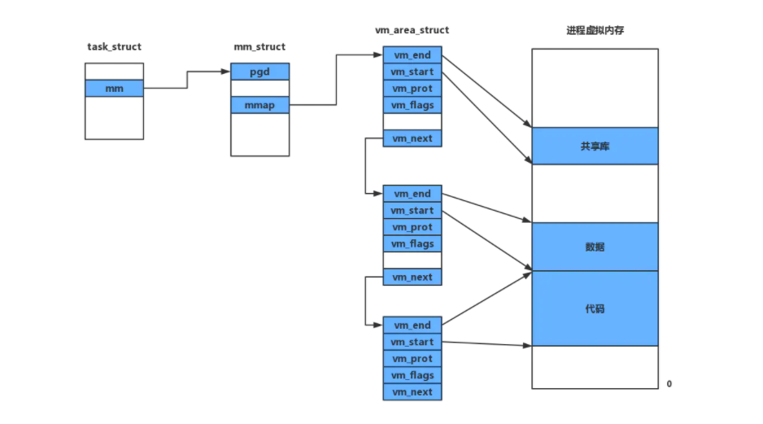

* mm_struct：描述了虚拟内存的当前状态。pgd指向一级页表的基址（当内核运行这个进程时，pgd会被存放在CR3控制寄存器，也就是页表基址寄存器中），mmap指向一个vm_area_structs的链表，其中每个vm_area_structs都描述了当前虚拟地址空间的一个区域。
* vm_starts：指向这个区域的起始处。
* vm_end：指向这个区域的结束处。
* vm_prot：描述这个区域内包含的所有页的读写许可权限。
* vm_flags：描述这个区域内的页面是与其他进程共享的，还是这个进程私有的以及一些其他信息。
* vm_next：指向链表的下一个区域结构


### 局部性原理

1. 局部性是虚拟内存技术的基础，程序运行正是具有局部性，才能只装入部分程序到内存就能运行；
2. 局部性规律：就是说在某个较短的时间段内，程序执行局限于某一个小部分，访问的存储空间也局限于某个区域；
3. **时间局部性**：如果程序中的某条指令一旦执行，不久后该指令可能会再次执行；如果某数据被访问过，不久后该数据可能被再次访问。产生时间局部性的原因是因为程序中存在大量的循环；
4. **空间局部性**：一旦程序访问了某个存储单元，不久后其附近的存储单元也将被访问，即程序在一段时间内所访问的地址，可能集中在一定的范围之内，这时因为指令通常是顺序存放、顺序执行的，数据也一般是以向量、数组、表的形式簇聚存储的。
5. 时间局部性是通过将最近使用的指令和数据保存到高速缓存中，并使用高速缓存的层次结构实现；
6. 空间局部性通常使用较大的高速缓存，并将预取机制集成到高速缓存控制逻辑中实现；
7. 虚拟内存技术就是建立了“内存-外存”的两级存储器结构，利用局部性原理实现高速缓存，即连续的局部的虚拟的内存地址空间，同样利用局部性原则的还有CPU高速缓存的缓存行概念；
8. 局部性原则保证了在任意时刻，程序将趋向于在一个较小的活动页面集合上工作，这个集合被称为工作集。根据时间和空间局部性原则，只要将工作集缓存在物理内存中，接下来的地址翻译请求很大几率都在其中，从而减少了额外的硬盘流量。


### 虚拟存储器

1. 基于局部性原理，在程序装入时，可用只装入一部分，其他部分留在外存，就可以启动程序执行，由于外存远大于内存，所以运行的软件内存大小可以大于计算机系统实际的内存大小；
2. 在程序执行过程中，当所访问的信息不在内存时，由OS将所需的部分调入内存，然后继续执行程序；
3. 另外，OS将内存中暂时不用的内容换到外存上，从而腾出空间存放将要调入内存的信息，这样计算机就好像为用户提供了一个比实际内存大得多得存储器，即虚拟存储器。


### 虚拟内存的技术实现

1. 请求分页存储管理：建立在分页管理之上，在作业开始运行前，仅装入当前要执行的部分分页即可运行，假如在作业运行过程中发现要访问的页面不在内存，则由处理器通知OS按照对应的页面置换算法将相应的页面调入主存，同时OS可以将暂时不用的页面置换到外存；
2. 请求分段存储管理：建立在分段管理之上，增加了请求调段功能、分段置换功能。请求分段存储管理方式就如同请求分页存储管理方式一样；
3. 请求段页式存储管理：同上；
4. 请求分页存储管理和分页存储管理的区别：根本区别就是是否将程序所需的所有地址空间全部装入主存；
5. 虚拟内存技术的实现一般要满足：
   1. 一定量的内存和外存：在载入程序时，只需要将程序的一部分装入内存，而将其他部分留在外存，直接执行程序；
   2. 缺页中断：如果需要执行的指令或访问的数据尚未在内存中，即发生缺页或缺段现象，则由CPU通知OS将相应的页面或段调入内存，然后继续执行；
   3. 虚拟地址空间：逻辑地址到物理地址的变换。


### 页面置换算法

在地址映射的过程中，若在发现所要访问的页面不在内存中，则发生缺页中断，需要通过中断处理程序将缺失的页从外存调入内存。如果发生中断时当前内存没有多余的页面可供装入，就需要在内存中选择一个页面将其移出内存，为需要调入的页面腾出空间，而用来选择淘汰哪一页的规则叫做页面置换算法。

* **最佳页面置换（OPT，Optimal replacement algorithm）：**该算法选择的页面是以后永不使用的，或者是很长时间不再被访问的页面，这可以保证获得最低的缺页率。这是一种理论上的算法，因为无法知道一个页面多长时间不再被访问；

* **先进先出页面置换（FIFO，First In First Out）：**总是淘汰最先进入内存的页面，即选择在内存中驻留时间最长的页面进行淘汰。该算法可能会将经常访问的页面换出，导致缺页率的升高；

* **最近最久未使用页面置换（LRU，Least Recently Used）：**赋予每个页面一个访问字段，用于记录该页面上一次被访问的时间T，当淘汰一个页面时，选择现有页面的T的最大值，即最近最久未使用页面。还可以在内存中维护一个所有页面的链表，当一个页面被访问时，就将这个页面移到链表的头部，这样就能保证链表尾部的页面是最近最久未使用的；

  

* **最少使用页面置换（LFU）：**该置换算法选择在之前时期使用最少的页面作为淘汰；

* **最近未使用页面置换（NRU，Not Recently Used）：**每个页面都有两个状态位R与M，当页面被访问时设置页面的R=1，当页面被修改时设置M=1。其中R会定时被清零。可以将页面分为四类：`R=0, M=0`、`R=0, M=1`、`R=1, M=0`、`R=1, M=1`，当发生缺页中断时，NRU算法随机的从类编号最小的非空类中挑选一个页面将其换出。NRU优先换出已被修改的脏页面 `R=0, M=1`，而不是频繁被使用的干净页面 `R=1, M=0`；

* **第二次机会算法：**该算法是针对FIFO算法可能会将经常使用的页面换出而做出的改进。当页面被访问时设置该页面的R位为1，在需要替换时，检查最老页面的R位，若R位是0，则表示这个页面可以立即被替换。若R位是1，就将其清零，并将该页面放入链表尾部，即给它第二次成为新入队页面的机会。然后继续从链表头部开始搜索。

  

* **时钟页面置换（Clock）：**第二次机会算法需要在链表中移动页面，降低了效率。时钟算法使用了环形链表将页面连接，再使用一个指针指向最老的页面。当检测到需要给最老页面第二次机会的时候，只需要将指针后移一位即可。

  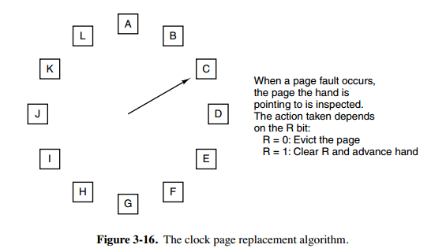


## 操作系统-设备管理

### 磁盘结构

* **盘面（Platter）**：一个磁盘有多个盘面；
* **磁道（Track）**：盘面上的圆形带状区域，一个盘面有多个磁道；
* **扇区（Track Sector）**：磁道上的一个弧段，一个磁道可以有多个扇区，是最小的存储单位，目前主要有512byte和4kb两种大小；
* **磁头（Head）**：与盘面非常接近，能够将盘面上的磁场转换为电信号（读），或者将电信号转换为磁场（写）；
* **制动手臂（Actuator arm）**：用于在磁道间移动磁头；
* **主轴（Spindle）**：使整个盘面转动。


### 磁盘调度算法

* 影响读写磁盘块时间的因素：
  * 旋转时间：主轴转动盘面，使得磁头移动到适当的扇区上；
  * 寻道时间：制动手臂转动，使得磁头移动到适当的磁道上。寻道时间最长，因此磁盘调度的主要目标是使磁盘的平均寻道时间最短；
  * 实际的数据传输时间。

* **先来先服务（FCFS，First Come First Served）**：按照磁盘请求的顺序进行调度。优点是公平简单，缺点是未对寻道做任何优化，使平均寻道时间较长；

* **最短寻道时间优先（SSTF，Shortest Seek Time First）**：优先调度与当前磁头所在磁道距离最近的磁道。虽然平均寻道时间较低，但是不够公平。如果新到达的磁道请求总是比一个在等待的磁道请求近，那么在等待的磁道请求会一直等待下去，即出现了饥饿现象；

  

* **电梯算法（SCAN）**：电梯总是保持一个方向运行，直到该方向没有请求为止，然后改变运行方向。电梯算法又称扫描算法，其和电梯的运行过程类似，总是朝着一个方向进行磁盘调度，直到该方向上没有未完成的磁盘请求，然后改变方向。因为扫描范围更广，因此所有磁盘请求都会被满足，解决了SSFT的饥饿问题。

  


## JVM-运行时数据区

### 整体结构

**PC计数器为什么私有？**

* 简单概括：各线程的代码执行位置独立；

* 在JVM中，字节码解释器通过改变PC计数器的指向依次读取指令，从而实现代码的流程控制；
* 在多线程情况下，PC计数器用于记录所属线程暂停执行时的位置，从而当线程被切换回来后能恢复之前的执行状态；
* 总结：因为PC计数器是针对各线程内字节码指令进行控制的，即针对程序的执行单位做控制。

**VM栈和NM栈为什么私有？**

* 简单概括：各线程的局部资源独立；

* 虚拟机栈：每个java方法在执行时都会在VM栈中创建一个栈帧用于存储局部变量表、操作数栈、常量池等信息。从方法调用直至执行完成的过程，就对应一个栈帧在虚拟机栈中压栈和弹栈的过程；
* 本地方法栈：和虚拟机栈相似，区别是VM栈为虚拟机执行java方法（即字节码）服务，而NM栈则为虚拟机使用的native方法服务（在HotSpot虚拟机中，虚拟机栈和本地方法栈合二为一了）；
* 总结：所以，为了保证线程中的局部变量不能被其他线程所访问，虚拟机栈和本地方法栈都是线程私有的，其实也就是针对程序的各条执行路径做控制。

**堆和元空间为什么共享？**

* 简单概括：代码执行中的共享资源；

* 堆是进程被分配到的内存中最大的一块，主要用于存放新创建的对象（所有的对象都在这里被分配内存），元空间主要用于存放已被加载的类信息，如：常量、静态变量、即时编译器编译获得代码等数据；
* 总结：因为二者存储的都是程序的资源单位，不存在执行时的独立问题，所以堆和元空间是和进程绑定的。

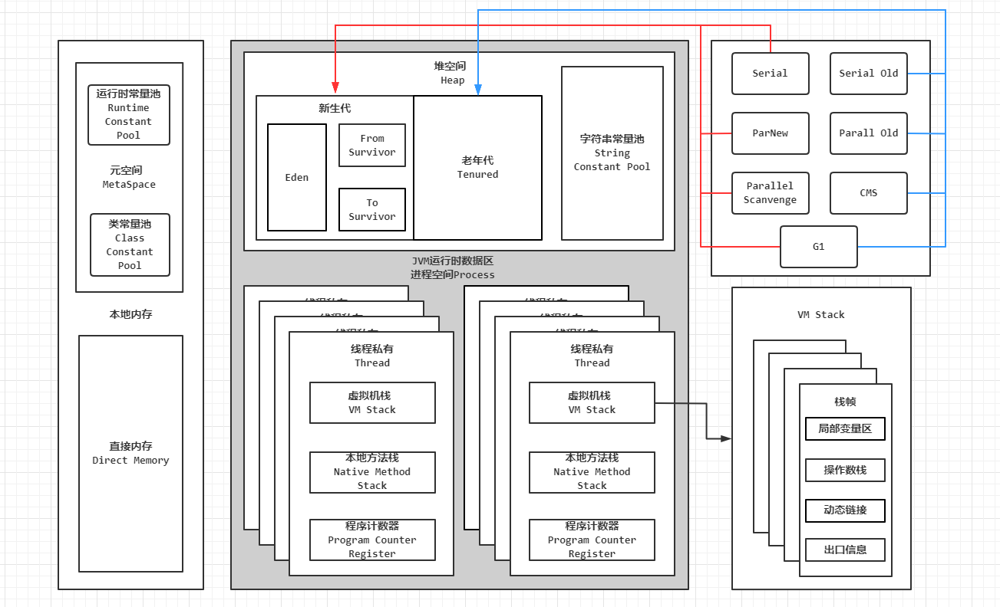


### 程序计数器

**概念：**

1. 是一块较小的内存空间，可以看作是当前线程所执行的字节码的行号指示器。字节码解释器工作时通过改变这个计数器的指向来选取下一条需要执行的字节码指令，分支、循环、跳转、异常处理、线程恢复等功能的指令都需要依赖这个计数器来获取；
2. 为了线程在切换后能够恢复到之前的执行位置，所以每条线程都需要有一个独立的程序计数器，各线程间的计数器互不影响，独立存储，这类内存区域就是线程私有内存。

**作用：**

1. 字节码解释器通过改变程序计数器的指向来依次读取字节码指令，从而实现代码的流程控制；
2. 在多线程的情况下，程序计数器用于记录当前线程的执行位置，从而当线程被切换回来后能正确恢复。

**注：**程序计数器是唯一不会出现OOM（OutOfMemoryError）的内存区域，其生命周期随线程的创建而创建，随线程的结束而死亡。


### 虚拟机栈

<div align="center">  </div><br>

**概念：**

1. 用于描述Java方法执行的内存模型，每次方法调用相关的数据都是通过栈传递的；
2. 虚拟机栈也是线程私有的，生命周期和线程相同，因为每个线程的方法调用都是独立的；
3. 虚拟机栈由一个个栈帧组成，栈帧就是栈中划分的存储单元，每个栈帧都拥有一套独立的局部变量表、操作数栈、常量池引用等信息；
4. 局部变量表中注意存放了编译器可知的各种数据类型和对象引用。

**异常：**

1. StackOverFlowError：若虚拟机栈的内存大小不允许动态扩展，那么当线程请求栈的深度超过当前Java虚拟机栈的最大深度时，就会抛出该异常；
2. OutOfMemoryError：若虚拟机栈的内存大小允许动态扩展，且当线程请求栈时无多余内存可分配，无法再动态扩展，就会抛出该异常。

**参数：**`java -Xss2M` 指定每个线程的虚拟机栈的内存大小。

**Java方法的调用原理**：Java的方法每次调用都会对应一个栈帧被压入虚拟机栈中，每次方法调用结束后（return或抛出异常），其对应的栈帧都会被弹出，栈帧的压栈和弹栈遵循LIFO的机制。


### 本地方法栈

<div align="center">  </div><br>

**概念：**与虚拟机栈的作用类似。区别是虚拟机栈为虚拟机提供Java方法的调用管理，本地方法栈则为虚拟机提供native方法的调用服务。在HotSpot虚拟机的实现中将二者合二为一了；

**本地方法：**一般是用其他语言（C、C++或汇编）编写，并且被编译为基于本机硬件和操作系统的程序，这些方法要特别处理；本地方法被调用时，也会发生栈帧的压栈和弹栈过程，栈帧中也会存在局部变量表、操作数栈、动态链接和出口信息；

**异常：**和虚拟机栈一样，本地方法栈也会抛出StackOverFlowError和OutOfMemoryError两种异常。


### 堆

**概念：**

* 堆是JVM管理的内存中最大的一块，是所有线程共享的区域，在虚拟机启动时创建，该区域的唯一作用就是存放对象的实例，几乎所有对象的实例以及数组都在这里分配内存；

* 堆是垃圾收集器主要管理的区域，因此也被称为GC堆。从GC的角度来看，垃圾收集器基本都采用分代收集算法，所以堆还可以细分为新生代和老年代（Eden、From Survivor、To Survivor空间等），更细致划分的目的是更好的回收内存和更快的分配内存；

  

* 上图eden区、s0区、s1区都属于新生代，tentired区属于老年代。大部分情况下对象都会在Eden区分配内存，在经过了一次新生代GC后，若还有对象存活，则会进入s0或s1，并且对象的年龄会增加1（从eden区进入survivor区后对象的初始年龄为1），当对象的年龄到达一个阈值后（默认15，可以通过参数 `-XX:MaxTenuringThreshold` 设置），就会进入老年代。

**异常：**堆不需要连续内存，并且可以动态增加内存，增加失败则会抛出OutOfMemoryError异常。

**参数：**`java -Xms1M -Xmx2M` 指定一个程序的堆内存大小，第一个参数是初始值，第二个参数是最大值。


### 方法区（元空间）

**概念：**方法区用于存储已被虚拟机加载的类信息、常量、静态变量、即时编译器编译后的代码等数据，和堆一样是多个线程共享的内存区域。别名是Non-Heap非堆，目的是和堆空间区别开来。

**和永久代的关系：**方法区是Java虚拟机规范制定的规则，而永久代是HotSpot虚拟机对规范的实现，类似于Java语法中接口和实现类的关系。也就是说永久代是HotSpot的概念，其他虚拟机没有这个概念。

**常用参数**：

```JAVA
// 设置元空间的初始容量（也就是最小空间）
-XX:MetaspaceSize=N
// 设置元空间的最大容量
-XX:MaxMetaspaceSize=N
```

**为什么方法区会被元空间替换？**方法区存在于JVM内存中，JVM内存区域有大小上限，而元空间使用直接内存，受本机可用内存的限制，且不存在OutOfMemoryError。


### 运行时常量池

JDK1.7之后，JVM已经将运行时常量池从方法区移动到堆空间的一块内存区域中。Class文件中的常量池（编译器生成的字面量和符号引用）会在类加载后被放入这个区域。

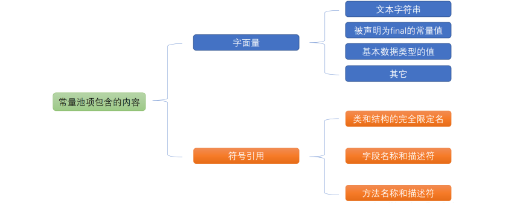


### 直接内存

**概念：**直接内存不是JVM运行时数据区的一部分，也不是Java虚拟机规范中定义的内存区域，而是操作系统管理的直接内存区域，由于这部分内存也被频繁使用，也可能会抛出OutOfMemoryError；

**应用场景：**JDK1.4加入的NIO（New Input/Output），引入了基于通道channel和缓冲区buffer的IO方式，可以使用本地native函数直接分配堆外内存，然后通过一个存储在堆中的DirectByteBuffer对象作为这块内存的引用进行操作，在某些场景下显著提高性能，避免传统IO在Java堆和native堆之间来回复制数据；

**注：**直接内存的分配不会受到Java堆的限制，而是受到本机内存大小和处理器寻址空间的限制。


## JVM-对象的创建过程


### 类加载检查

当JVM执行到一条new指令时，首先会去检查这个指令的参数是否能在常量池中定位到该类的符号引用，并且检查这个符号引用代表的类是否已被加载、解析和初始化过。若没有，则必须先执行相应的类加载过程。


### 分配内存

**概念：**类加载检查通过后，接下来JVM将为新生对象分配内存，对象所需的内存大小在类加载完成后就能确定，所谓的对象内存分配就是在堆空间划分一块确定大小的内存。

**JVM有两种分配方式**，具体的选择由堆是否规整决定，而堆是否规整则由所采用的垃圾收集器是否具有压缩整理功能决定（即标记-整理算法）：

* **指针碰撞：**适用于堆内存规整，即没有内存碎片的情况下。将内存区域中使用过的整合到一边，未被使用的整合到另一边，中间由分界值指针隔开，只需要向着没用过的内存方向将该指针移动对象需要大小的距离即可（GC收集器：Serial、ParNew）；
* **空闲列表：**适用于堆内存不规整的情况下。JVM会维护一个列表，其中会记录哪些内存块是可用的，在分配的时候，找一块大小符合的内存划分给实例对象，最后更新表记录（GC收集器：CMS）。

**分配内存的并发问题：**

* **CAS+失败重试机制：**CAS是乐观锁的一种实现，所谓乐观锁就是不加锁而受假设没有冲突直接去完成某项操作，若发生了冲突则重试到成功为止；

* **TLAB：**为每个线程预先在eden区分配一块内存TLAB，JVM在给线程中的对象分配内存时，首先在该线程的TLAB中分配，当对象大于TLAB的剩余空间或空间耗尽时，再采用CAS去分配。


### 初始化零值

当内存分配完成后，JVM需要将分配到的内存空间都初始化为零值，这步操作保证了对象的实例字段在Java代码中可以不赋值就能直接使用，程序能访问这些字段的数据类型所对应的零值。


### 设置对象头

初始化完成后，接下来JVM要对对象进行如所属类、哈希码、GC分代年龄、如果找到类的元数据等信息的设置。这些信息都存放在对象头中。


### 执行init方法

此时从JVM的角度来看对象已经创建完毕，从Java程序的角度看，对象还需要执行对应的构造方法init才能算真正的创建完成。


## JVM-垃圾回收机制

### 对象的访问定位方式

**概念：**Java程序通过栈上的引用数据来操作堆上的具体对象（这是规范，具体的访问方式由JVM的实现而定）。

**句柄：**使用这种方式的Java堆会划分出一块内存作为句柄池，栈中的引用存储的就是对象的句柄地址，而句柄中包含了对象实例数据（堆空间）与对象类型数据（元空间）各自的具体内存地址。这种方式的好处是引用中存储的是稳定的句柄地址，在对象被移动时只会改变句柄的实例数据指针，而引用则无需变动。


**直接指针：**使用这种方式的话，Java堆对象的布局就必须考虑如何存放访问类型数据的相关信息，而栈中的引用则直接存放堆对象的地址。这种方式的好处就是访问速度快，相比句柄的方式可以节省一次指针定位的时间开销。


### 判断一个对象是否可被回收

**概念：**堆空间的垃圾回收第一步就是判断有哪些对象已经死亡，即不能再被任何途径使用的对象。

**引用计数法：**给对象添加一个引用计数器，每当有某处对其进行引用，计数器加增加1。每当有一处引用失效，计数器就减少1。任何时候计数器为0的对象就是不能再被使用的。

在两个对象出现循环引用的情况下，引用计数器永不为0，导致无法进行回收。因为循环引用的存在，导致JVM不使用该算法。

```JAVA
public class Test {
    
    public Object instance = null;
    
    public static void main(String[] args) {
        // a与b相互持有对方的引用
        Test a = new Test();
        Test b = new Test();
        a.instance = b;
        b.instance = a;
        // 取出a和b的引用，但a和b的instance依旧引用着对方，计数器永远不会为0
        a = null;
        b = null;
    }
}
```

**可达性分析算法：**基本思路是通过一系列被称为GC Roots的对象作为起点，以此开始向下搜索，节点所经过的路径称为引用链。当一个对象到GC Roots没有任何引用链相连的话，则该对象就是不能再被使用的。

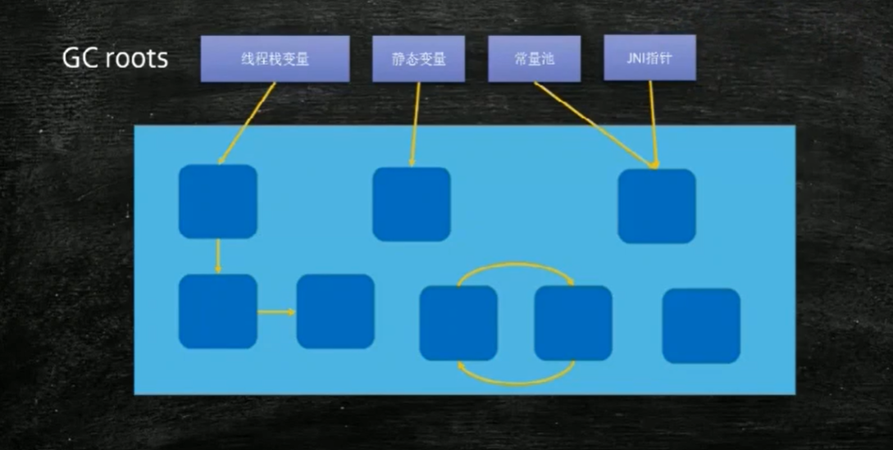


### 判断一个常量是否被废弃

运行时常量池主要回收的是废弃的常量，若常量池中的常量无任何对象对其引用，说明该常量是废弃的常量，若此时发生内存回收，则该常量就会被垃圾回收。


### 判断一个类是否无用

方法区主要回收的是无用的类，要判断一个类是无用的类需要满足以下3个条件（当类满足这3个条件后就具备了被回收的条件）：

* 该类的所有实例都已经被回收，即堆内存中不存在该类的任何实例；
* 加载该类的类加载器ClassLoader已经被回收；
* 该类对应的java.lang.Class对象没有在任何地方被引用，无法在任何地方通过反射访问该类的方法。


### 引用类型

**强引用**：

```JAVA
public class T01_NormalReference {

    public static void main(String[] args) throws IOException {
        // 强引用：str就是强引用一个字符串对象，若引用指向空，则之前指向的对象会被回收
        M m = new M();
        m = null;

        System.gc();    // DisableExplicitGC
        System.out.println(m);

        int read = System.in.read();    // 阻塞main线程，给gc线程执行时间
    }
}
```

**软引用**：

```JAVA
public class T02_SoftReference {

    public static void main(String[] args) throws InterruptedException {
        // 实验的前置条件：-Xmx: 20 将堆内存设置为20mb
        // 软引用：m指向SoftReference是强引用，SoftReference对象内的成员变量指向的10mb的字节数组是软引用
        // 适用场景：缓存，比如大文件，写入内存中后使用软引用指向，需要使用时直接从内存获取，不需要时软引用自动断开，释放内存
        SoftReference<byte[]> m = new SoftReference<>(new byte[1024 * 1024 * 10]);
        System.out.println(Arrays.toString(m.get()));

        // 一次gc后软引用指向的对象未被回收，因为此时内存足够
        System.gc();
        Thread.sleep(500);
        System.out.println(Arrays.toString(m.get()));

        // 再次分配15mb的字节数组，超出堆内存，这时软引用指向的对象会被释放
        byte[] b = new byte[1024 * 1024 * 15];
        System.out.println(Arrays.toString(m.get()));
    }
}
```

**弱引用**：

```JAVA
public class T03_WeakReference {

    public static void main(String[] args) {
        // 弱引用：可以通过引用正常访问对象，但如果一个对象只有一个弱引用，gc会直接回收
        WeakReference<M> m = new WeakReference<>(new M());

        System.out.println(m.get());
        System.gc();
        System.out.println(m.get());

        // ThreadLocalMap中的Entry就使用弱引用，其中的key就是指向ThreadLocal对象的弱引用
        /*
        * ThreadLocal为什么使用弱引用——防止内存泄漏：
        * 1.若Entry中的key使用强引用，此时外部所有的强引用断开联系，ThreadLocalMap中的key不会被gc回收，会造成内存泄漏问题；
        * 2.使用弱引用会在外部引用都断开后允许gc回收，但会造成key为null，value无人映射，也会出现内存泄漏问题；
        * 3.所以使用ThreadLocal后需要手动调用remove方法清除k-v对，防止内存泄漏。
        * */
        ThreadLocal<M> tl = new ThreadLocal<>();
        tl.set(new M());
        tl.remove();
    }
}
```

**虚引用**：

```JAVA
public class T04_PhantomReference {

    private static final List<Object> LIST  = new LinkedList<>();
    private static final ReferenceQueue<M> QUEUE = new ReferenceQueue<>();

    public static void main(String[] args) throws InterruptedException {
        // 虚引用：当一个对象需要被回收的时候，会建立该对象的虚引用并放入虚引用队列，相当于给gc线程一个通知
        // 作用：管理直接内存（堆外内存），nio的零拷贝会在jvm堆外直接分配内存空间（jvm堆内对象管理堆外内存空间buff），当jvm堆内对象被回收时
        // ，需要通过虚引用和虚引用队列执行特定的回收操作，即同时释放堆外的内存
        PhantomReference<M> phantomReference = new PhantomReference<>(new M(), QUEUE);
        // 无法通过虚引用访问其指向的对象
        System.out.println(phantomReference.get());

        // 占用内存资源
        new Thread(() -> {
            while (true) {
                LIST.add(new byte[1024 * 1024]);
                try {
                    Thread.sleep(1000);
                } catch (InterruptedException e) {
                    e.printStackTrace();
                }
                System.out.println(phantomReference.get());
            }
        }).start();

        // 模拟垃圾回收线程
        new Thread(() -> {
            while (true) {
                // gc线程从虚引用队列中获取到了虚引用，才会执行特定的回收操作
                Reference<? extends M> poll = QUEUE.poll();
                if (poll != null) {
                    // 真正执行的回收操作
                    System.out.println("--- 虚引用对象被jvm回收了" + poll);
                }
            }
        }).start();

        Thread.sleep(500);
    }
}
```

## JVM-垃圾回收算法

### 标记-清除算法

**概念：**该算法分为标记和清除两个阶段，首先标记所有需要回收的对象，之后统一回收。是最基础的算法，后续的算法都是对其的改进。

**缺点：**回收效率低下，内存碎片化严重。

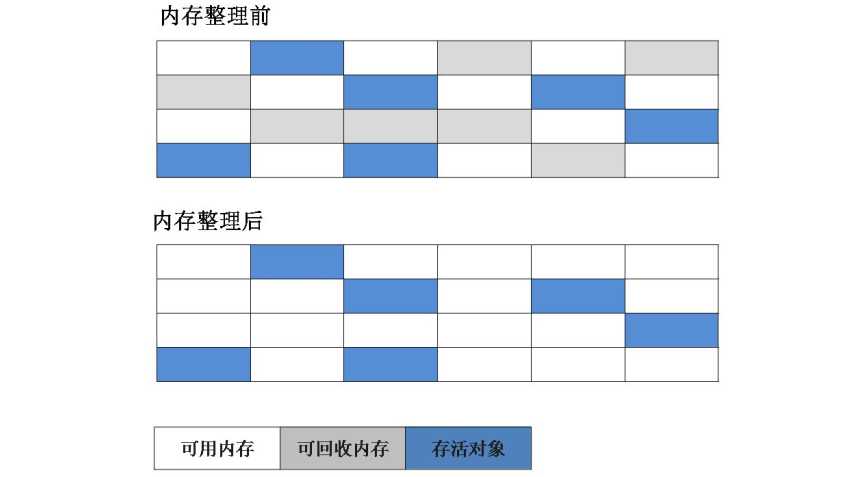


### 复制算法

**概念：**针对标记-清除算法效率不足和内存空间碎片化的改进，首先将内存分为大小相同的两块，每次使用其中的一块存放对象，当这块区域使用完后，就将还存活的对象复制到另一块去，这时当前使用的区域只剩下了可回收的垃圾，直接全部清理即可，这样每次的内存回收都是对内存区间的一半进行回收。

<div align="center">  </div><br>

**适用于新生代：**商用虚拟机都采用复制算法回收新生代，但并不是划分为相等大小的两块，而是存在一块较大的Eden空间和两块较小的Survivor空间（from+to），每次使用Eden和其中的一块Survivor From。在回收时，将Eden和Survivor From中还存活的对象复制到另一块Survivor To中，最后清理Eden和Survivor From。回收完毕后，将Survivor From和Survivor To角色反转，等待下一次回收。


### 标记-整理算法

**概念：**根据老年代的特点推出的算法，标记的过程不变，但标记后不是直接对象回收，而是让所有存活的对象向一端移动，然后直接清理掉边界以外的内存，解决了内存的碎片化。

**优缺点：**不会产生内存碎片，但是需要大量移动对象，效率较低。


### 分代收集算法

**概念：**当前JVM使用的垃圾回收算法，这种算法会根据对象的存活周期将内存分为几块区域（一般划分为新生代和老年代），然后根据不同区域中对象的特点选择合适的垃圾回收算法；

**新生代中的对象：**每次GC都会伴随着大量的对象被回收，实际存活的对象相对较少（高龄的对象已经进入了老年代），那么复制算法就会很合适，因为只需要复制较少的那部分对象就可以完成垃圾回收作业；

**老年代中的对象：**存活概率相对较高，所以使用标记-清除或标记-整理算法来进行垃圾回收。


## JVM-垃圾回收器

<div align="center">  </div><br>

垃圾回收器是基于垃圾回收算法的具体实现，不同的回收器适用于不同的场景，如HotSpot就实现了7种垃圾回收器用于适配各种场景的应用。

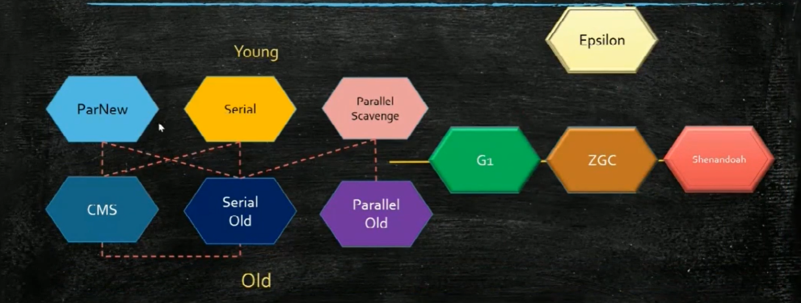

### Serial收集器

**概念：**串行收集器是最基本的单线程收集器（新生代使用复制算法，老年代使用标记-整理算法），单线程不仅是指只有一条垃圾回收线程工作，而且在进行垃圾回收作业时必须暂停其他所有的工作线程（Stop the World），直到回收作业完成。

**优点：**简单高效，在单CPU环境下，没有线程交互的开销，适用于Client应用。

<div align="center">  </div><br>


### ParNew收集器

**概念：**ParNew是Serial的多线程版本，除了使用多线程进行垃圾回收以外，其他如控制参数、回收算法、回收策略等都和Serial一样。

**优点：**适用于Server服务场景，能与CMS收集器配合工作。

<div align="center">  </div><br>

### Parallel Scavenge收集器

**概念：**Parallel Scavenge收集器与ParNew收集器类似，但其关注点是吞吐量（CPU中用于运行用户代码的时间与CPU总消耗时间的比值），即高效率的利用CPU。

**参数：**

* `-XX:+UseParallelGC` 使用Parallel收集器+老年代串行；
* `-XX:+UseParallelOldGC` 使用Parallel收集器+老年代并行。


### Serial Old收集器

Serial收集器的老年代版本，同样是单线程收集器。第一个用途是在JDK1.5之前与Parallel Scavenge收集器搭配使用，另一个用途是作为CMS收集器的后备方案。

<div align="center">  </div><br>


### Parallel Old收集器

Parallel Scavenge收集器的老年代版本，使用多线程和标记-整理算法。在注重吞吐量以及CPU资源的场合，都可以优先考虑Parallel Scavenge收集器和Parallel Old收集器。

<div align="center">  </div><br>


### CMS收集器

CMS（Concurrent Mark Sweep）收集器是一种以获取最短停顿时间为目标的收集器，也是HotSpot第一款真正意义上的并发收集器，基本实现了让垃圾回收线程和用户线程同时工作。

<div align="center">  </div><br>

从命名来看“并发的标记-清除算法”，整个工作过程分为4个步骤：

1. **初始标记：**暂停用户线程，运行GC线程记录直接与GC Roots相连的对象，这个阶段速度很快；
2. **并发标记：**该阶段会同时运行GC和用户线程，用一个闭包结构去记录可达对象。但是在该阶段结束后，这个闭包结构并不能保证包含了所有的可达对象，因为用户线程可能会不断的更新引用域，会导致GC线程无法实时的分析可达性，所以这个阶段也会跟踪记录那些发生引用更新的对象。
3. **重新标记：**暂停用户线程，该阶段就是为了修正并发标记期间因为用户线程继续运行而导致引用发生变化的对象（漏标：新垃圾，错标：垃圾被重新引用）。收集器处于该阶段的时间一般比初始标记阶段稍长，远比并发标记阶段时间短。 
4. **并发清除：**该阶段会恢复用户线程的执行，同时GC线程开始回收之前标记的区域。

**优点：**并发回收效率高、用户线程低停顿。

**缺点：**

* 以牺牲吞吐量为代价带来的用户线程低停顿；

* 无法处理浮动垃圾。所谓的浮动垃圾是指并发清除阶段由于用户线程继续运行而产生的垃圾，这部分的垃圾只能等到下一个GC才能回收。由于浮动垃圾的存在，因此需要预留一部分内存，意味着CMS不能像其他收集器那样等老年代快满的时候进行回收。如果预留的空间不够存放浮动垃圾，就会出现Concurrent Mode Failure，这时虚拟机将临时启动Serial Old来替代CMS；
* 使用标记-清除算法会导致内存碎片化。往往老年代出现空间碎片，无法找到足够大的空间分配对象，会提前触发一次Full GC。


### G1收集器

**概念：**G1（Garbage-First）是面向服务器的垃圾回收器，主要针对配备了多颗处理器以及大容量内存的机器，以极高的概率满足了GC停顿时间要求的同时，还具备高吞吐量性能的特征。

**内存划分：**和其他收集器不同的是，G1将堆划分为多个大小相等的独立区域（Region），新生代和老年代不再隔离。通过引入Region，将一整块内存划分为多个小空间，使得每个小空间可以单独进行垃圾回收。这种方法具有很高的灵活性，使得可预测的停顿模型成为可能。通过记录每个Region的垃圾回收时间以及回收后所获得的空间，并维护一个优先列表，每次根据允许的收集时间，优先回收价值最大的Region。每个Region都拥有一个Remembered Set，用于记录该Region中的对象的引用对象所在的Region，这样就能在做可达性分析的时候避免扫描全堆。

<div align="center">  </div><br>

**运行步骤：**

<div align="center">  </div><br>

1. 初始标记：和CMS相同；
2. 并发标记：和CMS相同；
3. 最终标记：为了修正并发标记期间因用户线程继续运行而导致标记产生变动的那一部分对象，虚拟机将这段时间对象的变化记录在线程的Remembered Set Logs中。该阶段就是要将Logs中的数据合并到Set中。该阶段需要停顿用户线程，存在多个GC线程并行；
4. 筛选回收：首先对各个Region中的回收价值和成本进行排序，根据用户所期望的GC停顿时间来制定回收计划。该阶段一般会停顿用户线程，多个GC线程并行回收。

**特点：**

1. 并行与并发：充分利用多核CPU提高的硬件优势，缩短Stop the World停顿时间。部分其他收集器需要暂停用户线程进行的GC动作，G1收集器仍然可以通过并发的方式让用户线程继续执行；
2. 分代收集：虽然G1可以不需要其他收集器的配合就能独立管理整个GC堆，但还是保留了分代的概念；
3. 空间整合：G1收集器从整体来看是基于标记-整理算法实现的，但从局部来看是基于复制算法实现的，意味着不会产生内存碎片；
4. 可预测的停顿：相对于CMS，G1除了追求低停顿外，还能建立可预测的停顿时间模型，能让使用者明确将其指定在一个长度为M毫秒的时间片段内。


### 扩展：三色标记算法


## JVM-内存分配和回收策略

### Minor GC和Full GC

**新生代GC（Minor GC）：**大多数情况下对象都会在新生代的eden区分配，当eden区没有足够的空间可分配时，JVM会发起一次Minor GC，即发生在新生代的垃圾收集动作。因为新生代对象存活时间短，所以Miner GC执行频率高、回收速度快。

**老年代GC（Major GC/Full GC）：**指发生在老年代的GC，出现Major GC时经常会伴随着至少一次的Minor GC，Major GC的速度一般会比Minor GC的速度慢上10倍以上。


### 内存分配策略


**对象优先在Eden分配：**大多数情况下，对象在新生代的Eden区分配，当Eden空间不够时，发起Minor GC；

**大对象直接进入老年代：**所谓大对象是指需要连续内存空间的对象，典型的大对象是很长的字符串和数组。经常出现大对象会提前触发垃圾回收以获得足够的连续空间分配。参数 `-XX:PretenureSizeThreshold` 大于该值的对象直接在老年代分配，避免在Eden和Survivor之间的大量内存复制；

**长期存活的对象进入老年代：**对象具有年龄计数器，对象在Eden区出生并经过Minor GC依然存活，将会移动到Survivor中，年龄就会相应的增加1岁，当增加到一定的年龄后就会移动到老年代中。参数 `-XX:MaxTenuringThreshold` 用来定义年龄的阈值；

**动态对象年龄判定：**虚拟机并不是一定要等对象的年龄到达阈值后才会将其移入老年代，如果Survivor空间中相同年龄的对象大小总和超过Survivor空间的一半，则大于等于该年龄的对象会直接进入老年代。

**空间担保分配：**


### Full GC的触发条件

**调用``System.gc()``：**该方法是给虚拟机提出Full GC的建议，虚拟机并一定会真正去执行；

**老年代空间不足**：大对象直接进入，长期存活的对象进入。为了避免着两种情况引起的Full GC，尽量不要分配过大的对象或数组。还可以通过 `-Xmn` 调整新生代的大小，让对象尽量在新生代被回收，不进入老年代。还可以通过 `-XX:MaxTenuringThreshold` 调大对象进入老年代的年龄，让对象在新生代多存活一段时间；

**空间分配担保失败：**使用复制算法的Miner GC需要老年代的内存空间做担保，如果担保失败会执行一次Full GC；

**JDK1.7之前的永久代空间不足：**永久代中加载的类、反射的类和常量等数据过多时，在未配置CMS GC时也会执行Full GC；

**Concurrent Mode Failure：**执行CMS GC的过程中同时有多个对象进入老年代，而此时老年代空间不足（可能是GC过程中浮动垃圾过多而导致暂时性的空间不足），便会抛出Concurrent Mode Failure错误，并触发Full GC。


## JVM-类加载机制

### 类文件结构


```JAVA
ClassFile {
    u4 magic; // 魔法数											
    u2 minor_version; // 副版本号									
    u2 major_version; // 主版本号									
    u2 constant_pool_count; // 常量池计数器							
    cp_info constant_pool[constant_pool_count-1]; // 常量池数据区		
    u2 access_flags; // 访问标志									
    u2 this_class; // 当前类索引										
    u2 super_class; // ⽗类索引										
    u2 interfaces_count; // 接⼝计数器								
    u2 interfaces[interfaces_count]; // 接口信息数据区				
    u2 fields_count; // 字段计数器									
    field_info fields[fields_count]; // 字段信息数据区				
    u2 methods_count; // 方法计数器									
    method_info methods[methods_count]; // 方法信息数据区			
    u2 attributes_count; // 属性计数器								
    attribute_info attributes[attributes_count]; // 属性信息数据区	
}
```

1. 魔法数：确认这个文件是否为一个能被虚拟机接收的Class文件；
2. Class文件版本：Class文件的版本号，保证编译的正常执行；
3. 常量池：主要存放字面量和符号引用；
4. 访问标记：用于识别一些类或者接口层次的访问信息，如：这个Class是类还是接口、是否为public或者abstract类型、如果是类的话是否声明为final等；
5. 当前类索引/父类索引：类索引用于确定这个类的全限定名，父类索引用于确定该类的父类的全限定名，除了java.lang.Object之外，所有Java类的父类索引都不为0；
6. 接口索引集合：用于描述该类实现了哪些接口，这些被实现的接口将按implents/extends后的接口顺序从左到右排列在接口索引集合中；
7. 字段表集合：描述类或接口中声明的变量，字段包括类变量以及实例变量，但不包括在方法内部声明的局部变量；
8. 方法表集合：描述类中的方法；
9. 属性表集合：在Class文件中，字段表和方法表都可以携带自己的属性表集合。


### 类的生命周期

<div align="center">  </div><br>


### 类加载的过程

1. 加载：
   * Java虚拟机规范规定类加载的过程要完成3件事：
     * 通过全类名获取定义此类的二进制字节流；
     * 将字节流所代表的静态存储结构转换为方法区的运行时数据结构；
     * 在内存中生成一个代表该类的Class对象，作为方法区这些数据的访问入口。
   * 其中二进制字节流可以从以下方式获取：
     * 从ZIP包获取，是成功JAR、EAR和WAR格式的基础；
     * 从网络中获取，最典型的应用是Applet；
     * 运行时计算生成，如动态代理技术，在 `java.lang.reflect.Proxy` 使用 `ProxyGenerator.generateProxyClass` 的代理类的二进制字节流；
     * 由其他文件生成，如通过JSP文件生成对应的Class。
   * 一个非数组类的加载阶段（加载阶段第一步获取类的二进制字节流的动作）是可控性最强的阶段，这一步可以通过重写类加载器的loadClass()方法去控制字节流的获取方式。而数组则不会通过类加载器创建，而是由JVM直接创建。整个加载阶段和连接阶段是交叉进行的，加载阶段尚未结束，连接阶段可能就已经开始了。
2. 连接：
   1. 验证：确保Class文件的字节流中包含的信息符合当前虚拟机的要求，并且不会危害虚拟机自身的安全；
   2. 准备：该阶段会为类变量在方法区或元空间分配内存。实例变量不会在该阶段分配内存，而是在对象实例化时随着对象一起被分配在堆中；
   3. 解析：将常量池的符号引用替换为直接引用的过程。其中解析过程在某些情况可以在初始化阶段之后再开始，这是为了支持Java的动态绑定。
3. 初始化：
   * 初始化是虚拟机执行类构造器 `<clinit>()` 方法的过程。在准备阶段，类变量已经赋过一次系统要求的初始值，而在初始化阶段，根据程序员通过程序制定的主观计划去初始化类变量和其他资源。
   * `<client>()`：是由编译器自动收集类中所有类变量的赋值动作和静态语句块中的语句合并产生的，编译器收集的顺序是由语句在源文件中出现的顺序决定。
   * 接口的类变量也会有初始化的赋值操作，因此接口与类一样都会生成 `<clinit>() ` 方法。但与类不同的是，执行接口的 `<clinit>() ` 方法不需要先执行父接口的  `<clinit>() ` 方法。只有当父接口中定义的类变量使用时，父接口才会出初始化。接口的实现类在初始化时也一样不会执行接口的 `<clinit>() ` 方法。
   * 虚拟机会保证一个类的 `<clinit>() ` 方法在多线程环境下被正确加锁同步。多线程执行初始化，只会有一个线程真正执行，其他线程阻塞等待。


### 类加载器

**启动类加载器（BootstrapClassLoader）**：由C++实现的最顶层的类加载器，负责加载 `%JAVA_HOME%/lib` 目录下的jar包和类，以及被 `-Xbootclasspath` 参数所指定路径下的所有类。

**扩展类加载器（ExtensionClassLoader）**：主要负责加载 `%JAVA_HOME%/lib/ext` 目录下的jar和类，以及被 `java.ext.dirs ` 系统变量所指定的路径下的jar包。

**应用程序类加载器（AppClassLoader）**：面向应用程序的加载器，负责加载当前应用 `classpath `下的所有jar包和类。由于该类加载器是 `ClassLoader ` 中的 `getSystemClassLoader()` 方法的返回值，因此一般被称为系统类加载器，如果应用程序没有自定义过类加载器，则AppClassLoader就是程序的默认类加载器。


### 双亲委派机制

**双亲委派模型（Parents Delegation Model）：**

* 每个类都有对应的类加载器，JVM中的类加载器在协同工作时会默认使用双亲委派模型，即在类加载的时候，系统会首先判断当前类是否已被加载过，已被加载的类会直接返回，否则才会尝试加载。
* 加载时，首先会把该请求委派给父类的加载器 `loadClass()` 处理，因此所有的请求最终都应该传递到顶层的启动类加载器`BootstrapClassLoader ` 中。
* 当父类加载器无法处理时，才由自己处理，当父类加载器为null时，会使用 `BootstrapClassLoader`。

<div align="center">  </div><br>

**通过代码验证每个类加载都有一个父类加载器：**

```JAVA
public class ClassLoaderDemo {
    
    // 注：这里的双亲关系不是通过基础来实现的，而是由加载器的优先级来决定的
    public static void main(String[] args) {
        // 获取当前类的类加载器，即应用程序类加载器
        System.out.println("ClassLodarDemo's ClassLoader is " +
ClassLoaderDemo.class.getClassLoader());
        // 获取当前类的父类的类加载器，即扩展类加载器
		System.out.println("The Parent of ClassLodarDemo's ClassLoader is " + ClassLoaderDemo.class.getClassLoader().getParent());
        // 获取当前类父类的父类的类加载器，为null，即代表是启动类加载器
		System.out.println("The GrandParent of ClassLodarDemo's ClassLoader is " +
ClassLoaderDemo.class.getClassLoader().getParent().getParent());
    }
}
```

```
ClassLodarDemo's ClassLoader is sun.misc.Launcher$AppClassLoader@18b4aac2
The Parent of ClassLodarDemo's ClassLoader is sun.misc.Launcher$ExtClassLoader@1b6d3586
The GrandParent of ClassLodarDemo's ClassLoader is null
```

**源码分析（双亲委派机制的源码集中在`java.lang.ClassLoader`的`loadClass()`方法中）：**

```JAVA
private final ClassLoader parent;

protected Class<?> loadClass(String name, boolean resolve) throws ClassNotFoundException {
    synchronized (getClassLoadingLock(name)) {
        // ⾸先检查请求的类是否已经被加载过
        Class<?> c = findLoadedClass(name);
        if (c == null) {
            long t0 = System.nanoTime();
        try {
            if (parent != null) {
                // 若⽗加载器不为空，调⽤⽗加载器loadClass()⽅法处理
            	c = parent.loadClass(name, false);
        	} else {
                // ⽗加载器为空，使⽤启动类加载器BootstrapClassLoader加载
        		c = findBootstrapClassOrNull(name);
        	}
        } catch (ClassNotFoundException e) {
        	// 抛出异常说明⽗类加载器⽆法完成加载请求
        }
        if (c == null) {
        	long t1 = System.nanoTime();
            // ⾃⼰尝试加载
            c = findClass(name);
            // this is the defining class loader; record the stats
            sun.misc.PerfCounter.getParentDelegationTime().addTime(t1 - t0);
            sun.misc.PerfCounter.getFindClassTime().addElapsedTimeFrom(t1);
            sun.misc.PerfCounter.getFindClasses().increment();
        }
        if (resolve) {
        	resolveClass(c);
        }
        return c;
    }
}
```

**双亲委派的好处：**

* 避免类的重复加载（JVM区分不同类的方式不仅是根据类名，相同的类文件被不同的类加载器加载会产生两个不同的类），也保证Java的核心API不被篡改，从而保证Java程序的稳定运行；

* 若没有使用双亲委派机制，而是每个类加载器加载自己的话就会出现一些问题，比如编写一个 `java.lang.Object ` 类的话，那么程序运行时，就会加载出多个不同的Object类；

* 自底向上检查类是否被重复加载，自顶向下加载保证类加载的优先级。


## JVM-GC常用参数

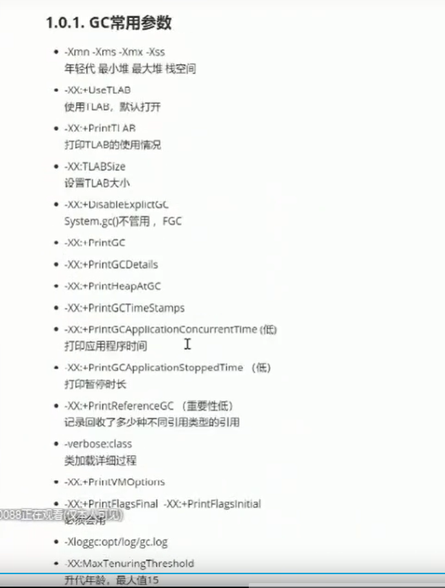

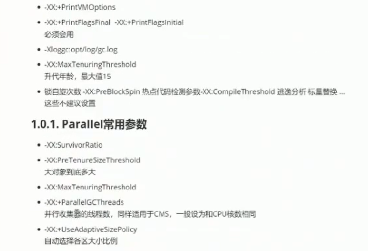

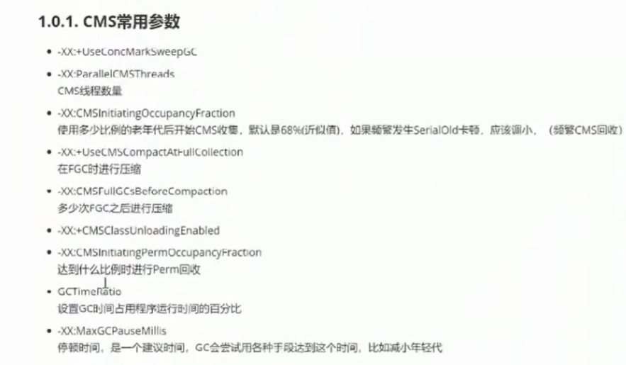

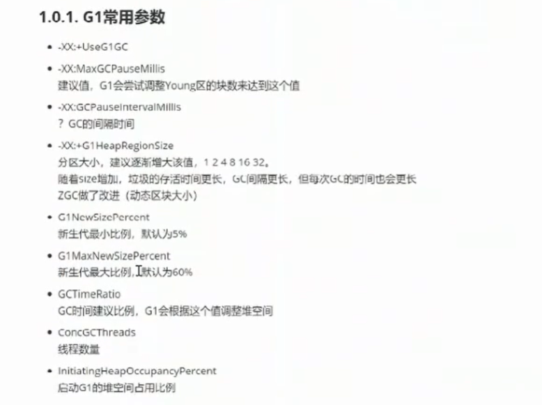

### 基本参数

### Parallel常用参数

### CMS常用参数

### G1常用参数


## JVM-GC调优案例


## JVM-JIT即时编译器

### 概念

JIT（ just in time）是即时编译器。使用即时编译器技术，能够加速 Java 程序的执行速度。下面，就对该编译器技术做个简单的讲解。

首先，我们大家都知道，通常通过 javac 将程序源代码编译，转换成 java 字节码，JVM 通过解释字节码将其翻译成对应的机器指令，逐条读入，逐条解释翻译。很显然，经过解释执行，其执行速度必然会比可执行的二进制字节码程序慢很多。为了提高执行速度，引入了 JIT 技术。

在运行时 JIT 会把翻译过的机器码保存起来，以备下次使用，因此从理论上来说，采用该 JIT 技术可以接近以前纯编译技术。下面我们看看，JIT 的工作过程。


### 编译过程

当 JIT 编译启用时（默认是启用的），JVM 读入.class 文件解释后，将其发给 JIT 编译器。JIT 编译器将字节码编译成本机机器代码，下图展示了该过程。


### HotSpot编译

当 JVM 执行代码时，它并不立即开始编译代码。这主要有两个原因：

首先，如果这段代码本身在将来只会被执行一次，那么从本质上看，编译就是在浪费精力。因为将代码翻译成 java 字节码相对于编译这段代码并执行代码来说，要快很多。

当然，如果一段代码频繁的调用方法，或是一个循环，也就是这段代码被多次执行，那么编译就非常值得了。因此，编译器具有的这种权衡能力会首先执行解释后的代码，然后再去分辨哪些方法会被频繁调用来保证其本身的编译。其实说简单点，就是 JIT 在起作用，我们知道，对于 Java 代码，刚开始都是被编译器编译成字节码文件，然后字节码文件会被交由 JVM 解释执行，所以可以说 Java 本身是一种半编译半解释执行的语言。Hot Spot VM 采用了 JIT compile 技术，将运行频率很高的字节码直接编译为机器指令执行以提高性能，所以当字节码被 JIT 编译为机器码的时候，要说它是编译执行的也可以。也就是说，运行时，部分代码可能由 JIT 翻译为目标机器指令（以 method 为翻译单位，还会保存起来，第二次执行就不用翻译了）直接执行。

第二个原因是最优化，当 JVM 执行某一方法或遍历循环的次数越多，就会更加了解代码结构，那么 JVM 在编译代码的时候就做出相应的优化。

我们将在后面讲解这些优化策略，这里，先举一个简单的例子：我们知道 equals() 这个方法存在于每一个 Java Object 中（因为是从 Object class 继承而来）而且经常被覆写。当解释器遇到 b = obj1.equals(obj2) 这样一句代码，它则会查询 obj1 的类型从而得知到底运行哪一个 equals() 方法。而这个动态查询的过程从某种程度上说是很耗时的。


# 从I/O模型到计算机网络再到Netty

## I/O模型-Linux的Socket API

网络应用进程通信时需要通过API接口请求底层协议的服务，如传输层服务，目前因特网最广泛的应用编程接口就是Socket API。Linux内核也实现了Socket API，实现了底层协议的封装。

### socket

```C
int socket(int family, int type, int protocol);
```

* 功能：创建套接字；
* 参数：
  * family：协议族，通常取值为PF_INET或AF_INET表示面向IPv4协议栈；
  * type：套接字类型，**数据报套接字SOCK_DGRAM、流式套接字SOCK_STREAM**和原始套接字SOCK_RAW；
  * protocol：协议，取值IPPROTO_TCP、IPPROTO_UDP分别表示TCP和UDP协议。
* 返回：成功返回非负整数，为套接字描述符。失败，则返回-1。


### bind

```C
int bind(int sockfd, const struct sockaddr *myaddr, socklen_t addrlen);
```

* 功能：为套接字绑定本地端口；
* 参数：
  * sockfd：本地套接字描述符；
  * myaddr：本地端点地址；
  * addrlen：端点地址长度。
* 返回：成功返回0，失败返回-1。


### listen

```C
int listen(int sockfd, int backlog);
```

* 功能：将套接字置为监听状态；
* 参数：
  * sockfd：本地套接字描述符；
  * backlog：连接请求队列大小。
* 返回：成功返回0，失败返回-1。


### accept

```C
int accept(int sockfd, struct socketaddr *cliaddr, socklen_t addrlen);
```

* 功能：从监听状态的流套接字的客户连接请求队列中，取出排在最前的一个客户请求，并且创建一个新的套接字来与客户套接字建立TCP连接；
* 参数：
  * sockfd：本地流套接字描述符；
  * cliaddr：用于存储客户端点地址；
  * addrlen：端点地址长度。
* 返回：成功返回非负整数，即新建与客户连接的套接字描述符。失败则返回-1。


### send

```C
ssize_t send(int sockfd, const void *buff, size_t nbytes, int flags);
```

* 功能：发送数据；
* 参数：
  * sockfd：本地套接字描述符；
  * buff：指向存储待发送数据的缓存指针；
  * nbytes：数据长度；
  * flags：控制比特，通常取0。
* 返回：成功返回发送的字节数，失败返回-1。


### recv

```C
ssize_t recv(int sockfd, void *buff, size_t nbytes, int flags);
```

* 功能：接收数据；
* 参数：
  * sockfd：本地套接字描述符；
  * buff：指向存储接收数据的缓存指针；
  * nbytes：数据长度；
  * flags：控制比特，通常取0。
* 返回：成功返回接收到的字节数，失败返回-1。


## I/O模型-Linux的五种I/O模型

### I/O相关概念

**同步和异步（消息的通知机制）**：

* 所谓同步，就是发出一个功能调用时，在没有得到结果之前，该调用就不返回。如应用程序调用readfrom系统调度时，必须等待内核的I/O操作执行完成才能够返回；
* 异步的概念和同步相对，当一个异步过程调用发出后，调用者不能立即得到结果。实际处理这个调用的部件在完成后，通过状态、通知和回调来通知调用者。如应用程序调用aio_read系统调用时，不必等到操作完成就可以直接返回，操作的结果通过信号通知调用者。

**阻塞和非阻塞（等待消息通知时的状态）**：

* 阻塞调用是指调用结果返回之前，当前线程会被挂起，函数只有在得到结果之后才会返回。阻塞和同步是完全不同的概念，首先，同步是对于消息的通知机制而言，阻塞是针对等待消息通知时的状态来说的。而且对于同步调用来说，大部分情况下线程还是激活的，只是从逻辑上当前函数没有返回而已；
* 非阻塞和阻塞的概念相对，指在不能立即得到结果时，该函数不会阻塞当前线程，而会立即返回，并设置相应的异常序号。虽然表面上看非阻塞的方式可以明显提高CPU的利用率，但也带来了另外一种后果就是系统的线程切换频率增加。所以增加的CPU利用率能不能补偿CPU频繁切换上下文带来的消耗需要好好的评估。

**事例描述（小明下载文件）：**

* 同步阻塞：小明一直盯着下载进度条，到100%的时候就完成。
  * 同步：等待下载进度到100%；
  * 阻塞：等待下载完成的过程中，小明不干别的事。
* 同步非阻塞：小明提交下载任务后就去干别的事，没过一段时间就去看一看进度条，看到100%就完成。
  * 同步：等待下载进度到100%；
  * 非阻塞：等待进度条到底的过程中，干别的事，只是时不时的回来看一眼。即小明要在两个任务间来回切换，关注下载进度。
* 异步阻塞：小明更换了一个带下载完成通知的下载器，当下载完成后会叮一声，不过小明一直等着叮声响起。
  * 异步：下载完成叮一声通知；
  * 阻塞：等待通知声响起，不去做其他得事。
* 异步非阻塞：小明提交任务后就去干别的事，直到听见叮的一声就完成。
  * 异步：下载完成叮一声通知；
  * 非阻塞：先去做其他事，只需要等通知即可。

**Linux中的输入操作包括两个阶段：**

* 首先，等待数据准备好，即文件的状态发生变化，到达内核缓冲区；
* 其次，从内核向进程复制数据，即从内核空间拷贝到用户空间；
* 对于一个套接字上的输入操作，第一步通常涉及等待数据从网络中到达，当所有分组都到达时，会被复制到内核中的某缓冲区。第二步就是把数据从内核缓冲区复制到应用程序缓冲区。


### 阻塞式I/O


* 最简单最常用的一种模型，在Linux中，默认情况下所有套接字都是阻塞的；
* 上图是阻塞套接字recvfrom的系统调用流程图，进程调用一个recvfrom请求，但是不能立即收到回复，需要等待内核的操作执行完成返回成功提示，进程才能处理数据报；
* 在IO执行的两个阶段中，进程都处于阻塞（blocked）状态，在等待数据返回的过程中不做其他任何工作，只能阻塞等待在那里；
* 优点是简单、实时性高、相应及时无延迟。缺点是阻塞等待性能差。


### 非阻塞式I/O

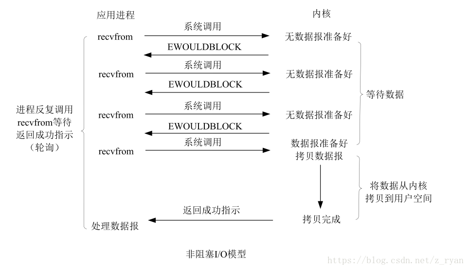

* 与阻塞IO不同的是，非阻塞的recvfrom系统调用后，进程并没有被阻塞，内核会立即返回给进程消息，若是数据还未准备好，则返回一个error（EAGAIN或EWOULDBLOCK）；
* 进程收到返回后，可以处理其他的事情，每过一段时间就会再次发起recvfrom系统调用，采用轮询的方式检查内核数据，直到数据准备好，再发起recvfrom系统调用，让数据拷贝到进程，再进行数据处理；
* 上图是Linux下设置为非阻塞的套接字的recvfrom系统调用的流程图，前三次调用recvfrom请求，但是数据没有准备好，所以内核返回errno(EWOULDBLOCK)，并不会阻塞进程，但是当第四次调用recvfrom时数据已经准备好了，然后触发并等待数据被拷贝到用户空间，处理数据；
* 在非阻塞状态下，IO执行的等待阶段并不是完全阻塞的，但第二个阶段等待数据从内核拷贝到用户空间时会处于阻塞状态；
* 同步非阻塞方式相对于同步阻塞方式：
  * 优点：能够在等待任务完成得时间里做其他事，包括提交其他任务，也就是后台可以有多个任务在同时执行；
  * 缺点：任务完成的响应延迟增大了，因为每过一段时间才去轮询一次read操作，而任务可能在两次轮询之间的任意时间完成，这样会导致整体数据吞吐量降低。


### I/O多路复用

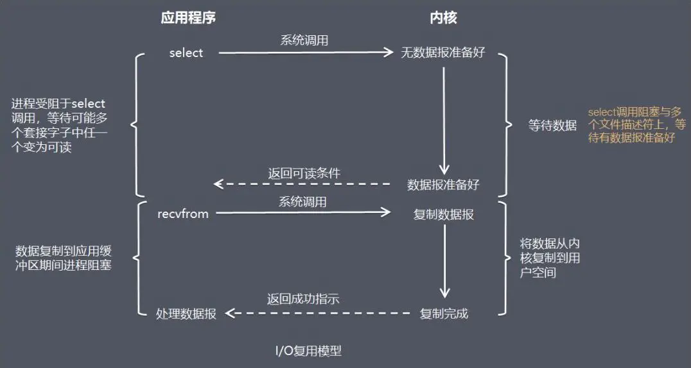

* 使用单个进程同时处理多个网络连接的IO。基本原理就是不再有应用程序自己监视连接，取而代之是由内核替应用程序监视文件描述符；
* 以select为例，当用户进程调用了select，那么整个进程会被阻塞，而同时，kernel会监视所有select负责的socket，当任何一个socket中的数据准备好了，select就会返回，这时用户进程再通过recvfrom系统调用，触发并等待数据从内核拷贝到用户进程；
* 上图就是Linux中使用select多路复用响应socket连接的流程图，需要使用两个系统调用（select和recvfrom），而阻塞IO只调用了一个system_call（recvfrom）。所以，如果处理的连接数不是很高的话，使用IO复用的服务器不一定比使用多线程+非阻塞/阻塞IO的性能更好，可以会有更大的延迟。IO复用的优势并不是对于单个连接能处理的更快，而是单个进程就可以同时处理多个网络连接的IO；
* 实际使用时，对于每一个socket，都可以设置为非阻塞。但是用户进程其实是一直被阻塞的，只不过是被select这个函数所阻塞，而不是被IO操作阻塞。所以IO多路复用是阻塞在select、poll、epoll这样的系统调用上，而没有真正阻塞在IO系统调用recvfrom上；
* 优势：与传统的多线程/多进程模型相比，IO多路复用的最大优势是系统开销小，不需要创建新的额外进程或线程，也不需要维护这些进程和线程的运行，降低了系统的维护工作量，节省了系统资源；
* 应用场景：
  * 服务器需要同时处理多个处于监听状态或者多个连接状态的套接字；
  * 服务器需要同时处理多种网络协议的套接字，如：同时处理TCP和UDP请求；
  * 服务器需要监听多个端口或处理多种服务；
  * 服务器需要同时处理用户输入和网络连接。


### 信号驱动式I/O

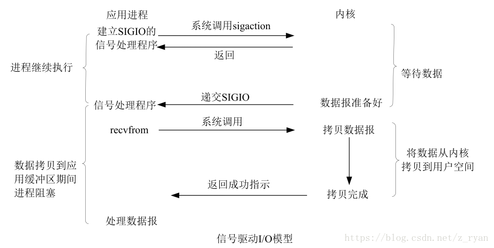

* 通过sigaction系统调用，允许socket进行信号驱动IO，并在用户进程注册一个SIGIO的信号处理函数，用户进程会继续运行不阻塞。当数据准备好时，进程会收到一个SIGIO信号，可以在信号处理函数中调用IO操作函数处理数据；
* 用户进程不会在IO操作的第一阶段阻塞，只会在第二阶段阻塞。


### 异步I/O


* 上述四种IO都是同步模型，相对于同步IO，异步IO不是顺序执行的。用户进程进行aio_read系统调用后，就可以去处理其他的逻辑了，无论内核数据是否准备好，都会直接返回给用户进程，不会对进程造成阻塞；
* 等到数据准备完毕，内核直接复制数据到用户进程空间，然后从内核向进程发送通知信号，此时数据已经在用户空间了，可以对数据进行处理；
* 在Linux中，通知的方式是信号，分为三种情况：
  * 如果这个进程正在用户态处理其他逻辑，那就强行中断，调用事先注册的信号处理函数，这个函数可以决定何时以及如何处理这个异步任务。由于信号处理函数是随机传递过来的，因此和中断处理程序一样，有很多事情是不能做的，为了保险起见，一般是把事件登记一下放进队列，然后返回该进程原来在做的事件；
  * 如果这个进程正在内核态处理，如以同步阻塞的方式读写磁盘，那就把这个通知挂起，等到内核态的事件处理完毕，快要回到用户态时，再触发信号的通知；
  * 如果这个进程现在被挂起了，如陷入睡眠，那就把这个进程唤醒，等待CPU调度，触发信号通知。
* 在此模型下，IO的两个阶段均为非阻塞。


### 五种I/O模型的比较

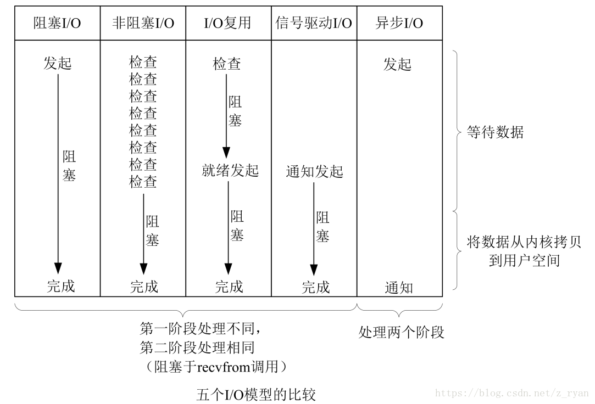

* 前四种IO模型都是同步模型，区别在于第一阶段，第二阶段都是一样的，都是在数据从内核复制到应用程序缓冲区期间（用户空间），进程阻塞于recvfrom调用；
* 相反，异步IO模型在等待数据和接收数据这两个阶段都是非阻塞的，可以处理其他的逻辑，即用户进程将整个IO操作交给内核完成，内核完成后会发起通知，在此期间，用户进程不需要去检查IO状态，也不需要主动的去触发数据的拷贝。


## I/O模型-Linux的I/O多路复用模型

**文件描述符（File Descriptor）：**用于表述指向文件引用的抽象化概念。fd在形式上是一个非负整数，实际上是一个索引值，指向内核为每一个进程所维护的该进程打开文件的记录表。当程序打开一个现有文件或创建一个新文件时，内核向进程返回一个文件描述符。

**缓存I/O：**又称标准I/O，是大多数文件系统的默认I/O。在Linux中，OS会将I/O的数据缓存在文件系统的页缓存中，即数据会被先拷贝到OS内核的缓冲区中，然后才会从操作系统内核的缓冲区拷贝到应用程序的地址空间。

### select/poll

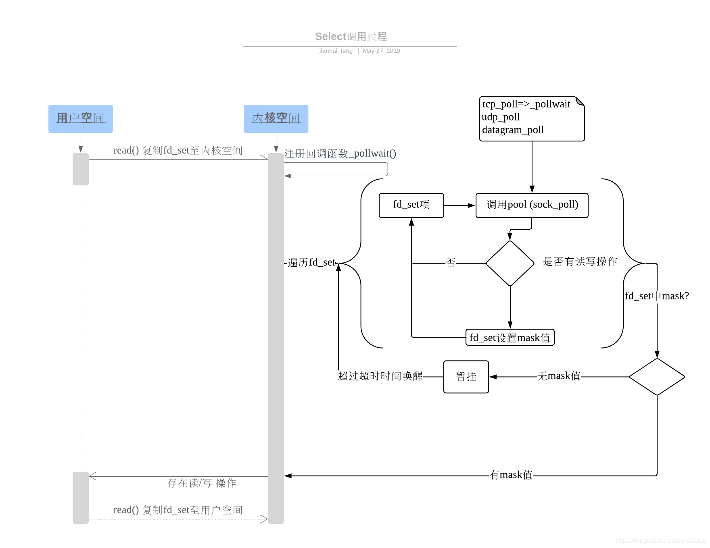

```c
int select(int maxfdp1, fd_set *readset, fd_set *writeset, fd_set *exceptset, const struct timeval *timeout);
```

* 参数：
  * `int maxfdp1`：指定待监听的文件描述符个数，它的值是待监听的最大描述符加1；
  * `fd_set *readset, fd_set *writeset, fd_set *exceptset`：fd_set可以理解为存放fd的集合，三种不同的参数指定内核监听读、写和异常的fd集合；
  * `const struct timeval *timeout`：超时参数，调用select会一直阻塞直到有fd事件发生或事件超时。
* 返回值：若有就绪的fd则返回其数量，若超时则为0，出错则为-1；
* 运行机制：select机制提供一种fd_set数据结构，是一个long类型的数组，数组中的每个元素都能于一个fd建立联系。当select()被调用时，由内核根据IO状态修改fd_set的内容，由此来通知执行了select()的进程哪一个Socket或文件可读/写或建立连接。TODO
* 优点：在一个线程内可以同时处理多个Socket的IO请求。
* 缺点：
  * 每次调用select，都需要将fd_set从用户空间拷贝到内核空间，若集合很大会造成很大的开销；
  * 每次调用select，都需要在内核遍历整个fd_set，若集合很大会造成很大的开销；
  * 为了减少拷贝数据带来的性能消耗，内核对被监控的fd_set做了大小限制（1024），且是通过宏实现的，大小不可改变。

```C
int poll(struct pollfd *fds, nfds_t nfds, int timeout);

typedef struct pollfd {
	int fd;			// 需要被检测或选择的文件描述符
	short events;	// 对文件描述符fd上感兴趣的事件
    short revents;	// 文件描述符fd上当前实际发生的事件
} pollfd_t;
```

* 参数：
  * `struct pollfd *fds`：fds是一个pollfd类型的数组，用于存放需要检测其状态的fd，且调用poll后fds不会被清空。一个pollfd结构体用于表示一个被监视的fd，通过传递fds指示poll监视多个fd。其中，events域是监视该fd的事件掩码（由用户设置），revents域是fd的操作结果事件掩码（内核在调用返回时设置）；
  * `nfds_t nfds`：记录数组fds中描述符的总数量。
* 返回值：返回集合中已就绪的读写或异常的fd数量，返回0表示超时，返回-1表示异常。
* 针对select的改进：改变了fd集合的结构，使用pollfd结构替代了select的fd_set结构，使得poll没有了最大fd数量的限制。


### epoll

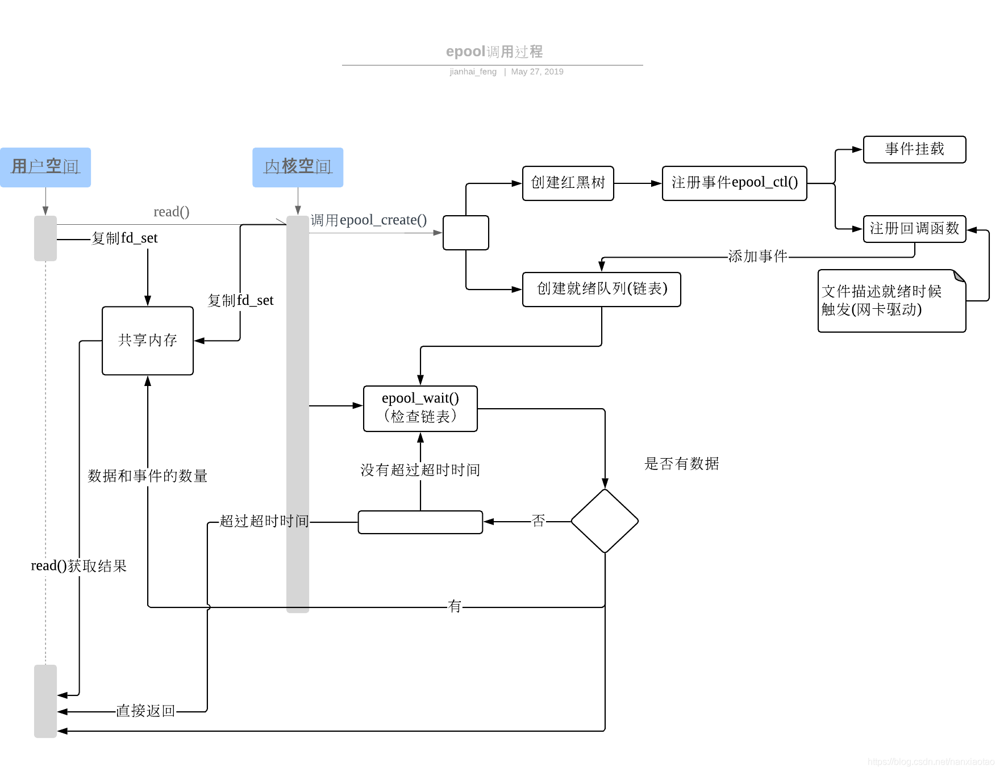

* epoll是Linux内核对多路复用IO接口作出的改进版本，显著提高程序在大量并发连接中只有少量活跃的情况下CPU的利用率。即在监听事件就绪的过程中，不需要遍历整个被监听的描述符集，只要遍历那些被内核IO事件异步唤醒而加入Ready队列（链表）的描述符集合即可。

  ```c
  struct eventpoll{  
      ....  
      /* 红黑树的根节点，这颗树中存储着所有添加到epoll中的需要监控的事件 */  
      struct rb_root  rbr;  
      /* 双链表中则存放着将要通过epoll_wait返回给用户的满足条件的事件 */  
      struct list_head rdlist;  
      ....  
  }; 
  ```

* fd进入红黑树时会注册事件和回调函数，当网络连接和数据读写等事件发生时，由网卡驱动发出中断，产生事件然后调用call_back使fd加入就绪队列。

  ```c
  struct epitem{  
      struct rb_node  rbn;//红黑树节点  
      struct list_head    rdllink;//双向链表节点  
      struct epoll_filefd  ffd;  //事件句柄信息  
      struct eventpoll *ep;    //指向其所属的eventpoll对象  
      struct epoll_event event; //期待发生的事件类型  
  }
  ```


* epoll没有描述符个数的限制，使用一个fd管理多个fd，将用户关心的fd的事件存放到内核的一个事件表中，这样在用户空间和内核空间的copy只需要一次。
* epoll提供了两种IO事件的触发方式：
  * **水平触发（LT，Level Trigger）**：默认工作模式，即当epoll_wait检测到某描述符事件的就绪并通知应用程序时，应用程序可以不立即处理该事件，待下次调用epoll_wait时，会再次通知此事件；
  * **边缘触发（ET，Edge Trigger）**：当epoll_wait检测到某描述符事件就绪并通知应用程序时，应用程序必须立即处理该事件。如果不处理，下次调用epoll_wait时，不会再次通知此事件，即边缘触发机制只会在状态由未就绪变为就绪时通知一次。

```C
int epoll_create(int size);
int epoll_ctl(int epfd, int op, int fd, struct epoll_event *event);
int epoll_wait(int epfd, struct epoll_event * events, int maxevents, int timeout);
```

* `epoll_create`：创建一个epoll句柄，参数size表示内核要监听的fd数量，调用成功时返回一个epoll句柄描述符，失败返回-1；
* `epoll_ctl`：用于注册要监听的事件类型。
  
  * `epfd`：表示epoll的句柄；
  
  * `op`：表示对fd的操作类型：
  
    * **EPOLL_CTL_ADD**：注册新的fd到epfd中；
    * **EPOLL_CTL_MOD**：修改已注册fd的监听事件；
    * **EPOLL_CTL_DEL**：从epfd中删除一个fd。
  
  * `fd`：表示需要监听的描述符；
  
  * `event`：表示需要监听的事件。
  
    ```C
    struct epoll_event {
        __uint32_t events;  /* Epoll events */
        epoll_data_t data;  /* User data variable */
    };
    
    typedef union epoll_data {
        void *ptr;
        int fd;
        __uint32_t u32;
        __uint64_t u64;
    } epoll_data_t;
    
    // events可以是以下几个宏的集合
    EPOLLIN ：表示对应的文件描述符可以读（包括对端SOCKET正常关闭）；
    EPOLLOUT：表示对应的文件描述符可以写；
    EPOLLPRI：表示对应的文件描述符有紧急的数据可读（这里应该表示有带外数据到来）；
    EPOLLERR：表示对应的文件描述符发生错误；
    EPOLLHUP：表示对应的文件描述符被挂断；
    EPOLLET：将EPOLL设为边缘触发（Edge Triggered）模式，这是相对于水平触发（Level Triggered）来说的；
    EPOLLONESHOT：只监听一次事件，当监听完这次事件之后，如果还需要继续监听这个socket的话，需要再次把这个socket加入到EPOLL队列里。
    ```
* `epoll_wait`：等待事件的就绪，成功时返回就绪的事件数目，失败则返回-1，等待超时返回0。
  
  * `epfd`：表示epoll的句柄；
  * `events`：表示从内核得到的就绪事件集合；
  * `maxevents`：通知内核events的大小；
  * `timeout`：表示等待的超时时间。


### select/poll/epoll总结

|            |                         select                         |                         poll                         |                            epoll                             |
| :--------: | :----------------------------------------------------: | :--------------------------------------------------: | :----------------------------------------------------------: |
|  操作方式  |                          遍历                          |                         遍历                         |                             回调                             |
|  底层实现  |                          数组                          |                         链表                         |                         红黑树+链表                          |
|   IO效率   |        每次调用都进行线性遍历，时间复杂度为O(n)        |       每次调用都进行线性遍历，时间复杂度为O(n)       | 事件通知方式，每当fd就绪，系统注册的回调函数就会被调用，将就绪fd放到readyList里面，时间复杂度O(1) |
| 最大连接数 |                1024（x86）或2048（x64）                |                        无上限                        |                            无上限                            |
|   fd拷贝   | 每次调用select，都需要把fd集合从用户空间拷贝到内核空间 | 每次调用poll，都需要把fd集合从用户空间拷贝到内核空间 | 调用epoll_ctl时拷贝进内核并保存，之后每次epoll_wait都不用拷贝 |


## I/O模型-Linux的零拷贝技术

### mmap

### sendfile

**系统调用：**

```c
ssize_t sendfile(int out_fd, int in_fd, off_t *offset, size_t count)
```

* `out_fd`：等待读数据的fd；
* `in_fd`：等待写数据的fd；
* `offset`：在正式开始读取数据时向前偏移的byte数；
* `count`：在两个fd直接移动的byte数。

**传统IO发送文件到Socket的步骤：**

* 硬盘 -> 内核buffer -> 用户buffer -> 内核Socket buffer -> 协议引擎。共经过2次陷入。
* 硬件驱动到内核缓冲区的DMA拷贝（read()调用）-> 内核缓冲区到用户缓冲区的CPU拷贝（read()返回） -> 用户缓冲区到内核Socket缓冲区的CPU拷贝（write()调用） -> Socket缓冲区到协议引擎的DMA拷贝（write()返回）。共经过4次拷贝。


**sendfile发送文件到Socket的步骤：**

* 硬盘 -> 内核缓冲区 -> 内核Socket缓冲区 -> 协议引擎。不需要任何陷入，所有操作都在内核完成。
* 硬件驱动到内核缓冲区的DMA拷贝、内核缓冲区到内核Socket缓冲区的CPU拷贝、内核Socket缓冲区到协议引擎的DMA拷贝。共经过3次拷贝。


## I/O模型-高性能的I/O设计模式

### Reactor反应器模式

**模式结构：**


* **文件描述符（Handle）：**由操作系统提供，用于表示一个事件，事件既可以来自外部，也可以来自内部。外部事件如Socket描述符的客户端连接请求、客户端发送的数据等。内部事件如操作系统的定时事件等；
* **同步事件分离器（Synchronous Event Demultiplexer）：**是一个系统调用，用于等待一个或多个事件的发生。调用方会阻塞在它之上，直到分离器上有事件产生。Linux中该角色对应的就是I/O多路复用器，Java NIO中该角色对应的就是Selector；
* **事件处理器（Event Handler）：**由多个回调方法构成，这些回调方法构成了与应用相关的对于某事件的反馈机制。Netty中该角色对应的就是ChannelHandler用于处理事件；
* **具体事务处理器（Concrete Event Handler）：**事件处理器的具体实现，用于实现特定的业务逻辑，本质上就是开发者编写的针对各种不同事件的处理器；
* **初始分发器/生成器（Initiation Dispatcher/Reactor）：**是模式的核心，定义了一些用于控制事件调度方式的规范，也提供了应用进行事件处理的注册、删除等机制。初始分发器会通过同步事件分离器来等待事件的发生，一旦事件发生，初始分发器会分离出事件，然后通过事件处理器和相应的处理方法处理该事件。Netty中ChannelHandler中的回调方法都是由BossGroup或WorkGroup中的某EventLoop来调用的。


**工作流程：**

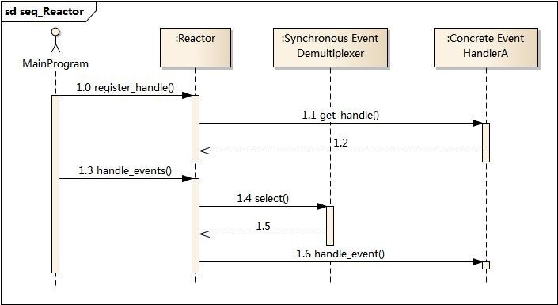

1. 首先初始化Reactor，由应用程序通过 `register_handle()` 将若干个具体事件处理器和其感兴趣的事件注册到Reactor中；
2. 事件由Handle标识，Reactor会通过 `get_handle()` 获取所有事件处理器对应的描述符并关联起来；
3. 当所有事件注册完成，应用程序会通过 `handle_events()` 触发Reactor的事件循环机制；
4. Reactor会通过 `select()` 让同步事件分离器去执行具体的事件循环，同步阻塞的等待事件发生；
5. 当与某个事件对应的Handle变为ready就绪状态时，同步事件分离器就会通知Reactor；
6. Reactor会获取就绪事件对应的处理器，且通过 `handle_event()` 调用回调方法去执行相应的逻辑。

**单线程Reactor模式：**

* 所谓的单线程，是指所有的I/O操作和业务操作都在同一个NIO线程上完成，一个NIO线程负责管理事件和处理器关联、事件循环、接收连接、分离事件和分配相应读写请求到处理器中执行。
* 缺点：
  * 所有的操作都在一个线程上处理，无法同时处理大量的连接，会出现性能瓶颈，或因为单个耗时操作导致所有的请求都会受到影响，大大延迟请求的响应或处理超时；
  * 一旦这个单线程陷入死循环或其他问题，会导致整个系统无法对外提供服务，产生单点故障问题。


**多线程Reactor模式：**

* 由一组NIO线程处理I/O和业务操作。有一个专门的NIO线程用于监听服务端，接收客户端的TCP连接请求。而网络读写、业务操作则交由一个NIO线程池负责。
* Reactor多线程模型可以满足大部分场景的性能要求。但在小部分情况下，一个NIO线程负责监听和处理所有的客户端连接可能会存在性能问题，如百万级客户端并发连接，或者服务端对客户端的握手信息进行安全认证等消耗性能的操作。这些场景下一个线程处理连接就会存在性能不足的问题。

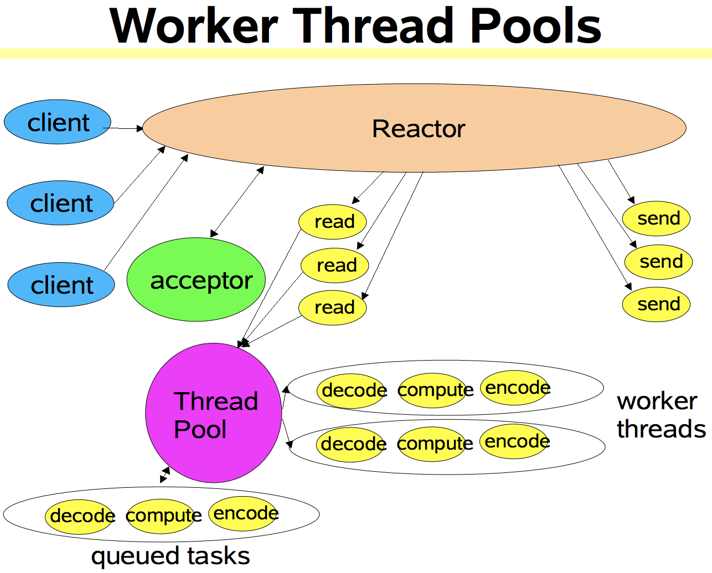

**主从多线程Reactor模式：**

* 服务端用一个NIO线程池接收客户端的连接，即mainReactor。
* 当接收连接请求并处理后（可能有接入认证等），将连接交付给另一个用于处理I/O和业务操作的NIO线程池负责后续工作，即subReactor。


### Proactor主动器模式


**模式结构：**

* 句柄（Handle）：
* 异步操作处理器（Asynchronous Operation Processor）：
* 异步操作（Asynchronous Operation）：
* 完成事件队列（Completion Event Queue）：
* 主动器（Proactor）：
* 完成事件接口（Completion Handler）：
* 完成事件处理逻辑（Concrete Completion Handler）：

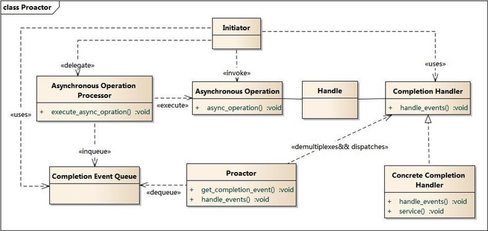

**工作流程：**

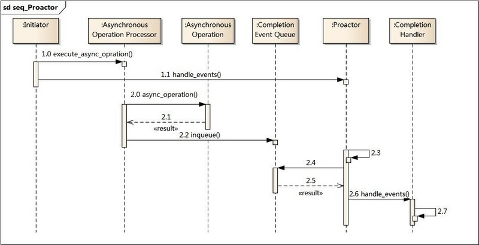


## I/O模型-Java的I/O API

### BIO

**Java角度：**

```JAVA
public class SocketBIO {
    
    public static void main(String[] args) {
        ServerSocket server = new ServerSocket(9090);
        
        while (true) {
            final Socket client = server.accept();
        	
            new Thread(() -> {
                InputStream in = null;
                try {
                    in = client.getInputStream();
            		BufferedReader reader = new BufferedReader(new InputStreamReader(in));
                    while (true) {
                        String dataline = reader.readLine();
                        if (null != dataline) {
                            System.out.println(dataline);
                        } else {
                            client.close();
                            break;
                        }
               		}
                } catch(Exception e) { }    
            });
        }
    }
}
```

**Kernel角度：**

```shell
/usr/java/j2sdk1.4.2_19/bin/javac SocketBIO.java
```

```shell
strace -ff -o out /usr/java/j2sdk1.4.2_19/bin/java SocketBIO	# 最终应用程序的系统调用，并重定向到以out开头的文件中，每个线程一个文件
```

* 通过`socket(PF_INET6, SOCKET_STREAM, IPPROTO_IP) = 3`创建TCP的流式套接字，返回套接字的文件描述符；

* 通过`bind(3, {sa_famliy=AF_INET6, sin6_port=htons(9090), inet_pton(AF_INET6, "::", &sin6_addr), sin6_flowinfo=0, sin6_scope_id=0}, 24) = 0`为套接字绑定端口；

* 通过`listen(3, 50)`将套接字置为监听状态；

```SHELL
nc localhost 9090	# 开启一个本地客户端
```

* 通过`accept(3, {sa_family=AF_INET6, sin6_port=htons(53311), inet_pton(AF_INET6. "::1", &sin6_addr), sin6_flowinfo=0, sin6_scope_id=0}, [28]) = 5`阻塞用户线程，等待连接请求并接收，新建套接字，返回该套接字的文件描述符；
* 通过`clone(child_stack=0xea2bd494, flags=CLONE_VM|CLONE_FS|CLONE_FILES|CLONE_SIGHAND|CLONE_THREAD|CLONE_SYSVEM|CLONE_SETTLS|CLONE_PARENT_SETTID|CLONE_CHILD_CLEARTID, parent_tidptr=0xea2bdbd8, tls=0xea2bdbd8, child_tidptr=0xffb2e44c) = 2386`创建子线程去处理，每个线程处理一个连接，返回进程描述符（PID）；
* 在子线程中，通过`recv(5, `读取套接字输入流（阻塞等待）。

**BIO的缺点：**


### NIO

**Buffer**缓冲区本质是一个可以读写数据的内存块，可以理解为容器对象，除了基本的容器操作之外，还提供了记录缓冲区状态变化情况的功能。

|       属性       |                             描述                             |
| :--------------: | :----------------------------------------------------------: |
| 容量（Capacity） |      可容纳的最大数据量，在缓冲区创建时被设定且不能改变      |
|  Limit（范围）   | 表示缓冲区当前的终点，不能对超过极限的位置进行读写操作。 且极限 是可以修改的 |
| 位置（Position） | 下一个要被读写的元素的索引，每次读写缓冲区中数据时都会改变该值，为下次读写准备 |
|   标记（Mark）   |                             标记                             |

**Channel**：通道类似于流，可以同时进行读写且能实现异步操作。通道以缓冲区为单位读写数据。

**代码示例**：

```JAVA
public class SocketNIO {
    
    public static void main(String[] args) {
        LinkedList<SocketChannel> clients = new LinkedList<>();
        
        ServerSocketChannel ss = ServerSocketChannel.open();
        ss.bind(new InetSocketAddress(9090));
        ss.configureBlocking(false);
    	
        while (true) {
            Thread.sleep(1000);
            SocketChannel client = ss.accept();
            if (client != null) {
                client.configureBlocking(false);
                int port = client.socket().getPort();
               	clients.add(client);
            }
            
            ByteBuffer buffer = ByteBuffer.allocateDirect(4096);
            for (SocketChannel c : clients) {
                int num = c.read(buffer);
                if (num > 0) {
                    buffer.filp();
                    byte[] aaa = new byte[buffer.limit()];
                    buffer.get(aaa);
                    
                    String b = new String(aa);
               		System.out.println(c.socket().getPort() + ":" + b);
                    buffer.clear();
                }
            }
        }
    }
}
```

**系统调用分析**：

* 首先通过`socket(PF_INET6, SOCK_STREAM, IPPROTO_IP) = 4`创建TCP的流式套接字，并返回套接字的文件描述符；

* 通过`bind(4, {sa_famliy=AF_INET6, sin6_port=htons(9090), inet_pton(AF_INET6, "::", &sin6_addr), sin6_flowinfo=0, sin6_scope_id=0}, 28) = 0`为套接字绑定端口；

* 通过`listen(4, 50)`将套接字置为监听状态；

* 通过`fcntl(4, F_SETFL, 0_RDWR|0_NONBLOCK) = 0`将套接字设置为非阻塞状态；

* 通过`accept(4, 0x7f00580f0070, [28]) = -1`接收连接请求，但不会阻塞线程，若是当前没有连接建立，则返回-1；

  ```SHELL
  nc localhost 9090	# 开启一个本地客户端
  ```

* 通过`accept(4, {sa_family=AF_INET6, sin6_port=htons(53311), inet_pton(AF_INET6. "::1", &sin6_addr), sin6_flowinfo=0, sin6_scope_id=0}, [28]) = 5`接收连接建立，新建和连接对应的套接字，返回套接字的文件描述符；
* 通过`fcntl(5, F_SETFL, 0_RDWR|0_NONBLOCK) = 0`将新的连接套接字设置为非阻塞；
* 通过`read(5, 0x7f0003efcc10, 4096) = -1`读取套接输入流中的数据到大小为4096的缓冲区中，但不会阻塞线程，若是当前没有数据可读，则返回-1。

**NIO的优缺点**：

* 优点：避免了BIO的一个连接一个线程而导致存在大量线程造成的资源消耗巨大的问题，即会把大量资源用在线程的上下文切换上；
* 缺点：可能会存在大量无意义的系统调用，若是有1w个连接，但只有1个连接有数据读取，但NIO机制每次循环还是会发送1w次的read系统调用，即会把大量的资源用在用户态到内核态的切换上。


### NIO多路复用

**Selector**：选择器能够检测多个注册在其上的通道是否有事件发生，只有当真正发生事件时，才会对应的进行回调处理（连接、读/写）。

**工作流程**：

1. 服务端创建ServerSocketChannel并绑定端口，然后通过register()注册到Selector上和连接事件对应，最后通过Selector的select()开始轮询监听通道的状态；
2. 当客户端连接时，会发生连接事件，Selector会回调方法给客户端建立对应的SocketChannel，然后将其注册到Selector上和读写事件对应；
3. 当连接有读写事件发生时，返回SelectionKey（事件关系），反向获取对应的SocketChannel，最后进行相应的处理。

**代码示例**：

```JAVA
// JDK底层使用了epoll机制
public class SocketMultiplexingSingleThread {
    
    private ServerSocketChannel server = null;
    private Selector selector = null;
    int port = 9090;
    
    public void initServer() {
        try {
            server = ServerSocketChannel.open();
            server.configureBlocking(false);
            server.bind(new InetSocketAddress(port));
            
            selector = Selector.open();
            server.register(selector, SelectionKey.OP_ACCEPT);
        } catch (IOException e) {
            e.printStackTrace();
        }
    }
    
    public void start() {
        initServer();
        try {
            while (true) {
                Set<SelectionKey> keys = selector.keys();
                while (selector.select(500) > 0) {
                    Set<SelectionKey> selectionKeys = selector.selectedKeys();
                    Iterator<SelectionKey> iter = selectionKeys.iterator();
                    while (iter.hasNext()) {
                        SelectionKey key = iter.next();
                        iter.remove();
                        if (key.isAcceptable()) {
                        	// 连接处理器
                            acceptHandler(key);
                        } else if (key.isReadable()) {
                            // 读处理器
                            key.cancel();
                            readHandler(key);
                        } else if (key.isWritable()) {
                            // 写处理器
                            key.cancel();
                            writeHandler(key);
                        }
                    }
                }
            }
        } catch (IOException e) {
            e.printStackTrace();
        }
    }
    
    public void acceptHandler(SelectionKey key) {
        try {
            ServerSocketChannel ssc = (ServerSocketChannel) key.channel();
            SocketChannel client = ssc.accept();
            client.configureBlocking(false);
            
            ByteBuffer buffer = ByteBuffer.allocate(8192);
			client.register(selector, SelectionKey.OP_READ, buffer);
        } catch (IOException e) {
        	e.printStackTrace(); 
        }
    }
    
    public void readHandler(SelectionKey key) {
        SocketChannel client = (SocketChannel) key.channel();
        ByteBuffer buffer = (ByteBuffer) key.attachment();
        buffer.clear();
        int read = 0;
        try {
            while (true) {
                
            }
        } catch (IOException e) {
            e.printStackTrace();
        }
    }
}
```

**select/poll系统调用分析**：

* 通过`socket`创建套接字，返回文件描述符；
* 通过`bind`为套接字绑定端口；
* 通过`listen`将套接字置为监听状态；
* 通过`select/poll`将所有套接字的文件描述符注册给多路复用器（select对文件描述符的个数有限制，poll取消了限制），并使用户线程阻塞在`select/poll`这个系统调用上；
* 当内核遍历发现有文件描述符变为可连接或可读写等状态时，`select/poll`会返回，然后再通过`accept`或`read`去处理对应的事件。

**select/poll的优缺点**：

* 优点：通过一次系统调用，将所有文件描述符传递给内核，由内核进行遍历，直到相应事件的发生，这种方式相对于NIO减少了系统调用的次数，即避免了用户态到内核态的频繁切换，节省资源；
* 缺点：
  * 每次select/poll系统调用时都需要传递整个文件描述符集合；
  * 每次select/poll系统调用时都会让内核遍历整个文件描述符集合。

**epoll系统调用分析**：

* 通过`socket(PF_INET, SOCK_STREAM, IPPROTO_IP) = 4`创建套接字，并返回其文件描述符；

* 通过`fcntl(4, F_SETFL, O_RDWR|O_NONBLOCK) = 0`将套接字设置为非阻塞；

* 通过`bind(4, {sa_family=AF_INET, sin_port=htons(9090)})`为套接字绑定端口；

* 通过`listen(4, 50)`将套接字设置为监听状态；

* 通过``epoll_create(256) = 7``初始化多路复用器，并在内核空间建立一块用于保留套接字文件描述符的红黑树结构；

* 通过`epoll_ctl(7, EPOLL_CTL_ADD, 4, {EPOLLIN, {u32=4, u64=13736798553693487108}}) = 0`将初始套接字的文件描述符加入红黑树；

* 通过`epoll_wait(7, {{EPOLLIN, {u32=4, u64=13736798553693487108}}}, 4096, -1) = 1`阻塞用户线程，交由内核监听rbtree上的fd，当fd的状态发生变化时，即发生连接和读写等事件后，返回事件的数量；

  ```SHELL
  nc localhost 9090	# 开启一个本地客户端
  ```

* 若发生的事件是连接请求，则通过`accept(4, {sa_family=AF_INET, sin_port=htons(53687), sin_addr=inet_addr("127.0.0.1")}, [16]) = 8`接收连接，为连接建立套接字，并返回其文件描述符； 

* 接收连接后，接着通过`epoll_ctl(7, EPOLL_CTL_ADD, 8, {EPOLLIN, {u32=8, u64=13823012355644063752}}) = 0`将连接套接字的文件描述符添加到红黑树上；

* 循环去通过epoll_wait监听事件、接收连接、添加套接字fd、处理读写请求，以此构建出使用epoll多路复用机制的服务器。


## 计算机网络-层次结构


### 应用层（application layer）

为用户的应用程序之间的交互提供网络服务。该层的协议是应用进程间的通信和交互的规则，对于不同的网络应用需要定义不同的应用层协议。运行在应用层的协议有很多，如域名系统DNS、支持Web应用的HTTP、支持电子邮件的SMTP协议等。应用层之间交互的数据单位称为报文。

1. DNS域名系统：
2. HTTP超文本传输协议：
3. SMTP电子邮件传输协议：
4. FTP文件传输协议：
5. P2P点对点传输协议：


### 传输层（transport layer）

为主机进程间的通信提供端到端的通用（所谓通用就是为上层应用提供复用和分解功能）数据传输服务。应用程序就是通过运行在该层的协议传输应用层的报文/报文段的。同时该层还会提供端到端数据传输的差错控制和流量控制。

1. 复用与分解：
2. ARQ自动重传请求协议（停等协议）：
3. 滑动窗口协议：
4. UDP用户数据报协议：
5. TCP传输控制协议：


### 网络层（network layer）

为源主机到目的主机提供分组交付、逻辑寻址、路由选择和分组转发服务。由于在网络中通信的两台主机之间可能会经过很多节点、数据链路和通信子网，所以该层就是针对这一过程提供主机间可靠的数据传输服务。该层会将传输层产生的报文段或数据报封装成分组或包进行传送，在TCP/IP体系中，分组也叫做IP数据报。

互联网是由大量异构网络通过路由器相互连接起来的，互联网使用的网络层协议是无连接的网际协议和许多路由选择协议，因此互联网的网络层也叫做网际层或IP层。

1. 拥塞控制策略：
2. IPv4协议：
3. DHCP动态主机配置协议：
4. NAT网络地址转换协议：
5. ICMP互联网控制报文协议：
6. IPv6协议：
7. RIP路由信息协议：
8. OSPF开放式最短路径优先协议：
9. BGP边界网关协议：


### 数据链路层（data link layer）

为网络中相邻节点间的数据传输提供可靠的逻辑链路服务。在两个相邻节点间传输数据时，链路层会将网络层交付下来的IP数据报组装成帧结构，并在节点间建立逻辑链路传输，并通过差错控制为数据的正确传输提供保障。

1. 差错编码-奇偶校验码：
2. 差错编码-汉明码：
3. 差错编码-CRC循环冗余校验码：
4. 信道划分MAC协议：
5. 随机访问MAC协议：
6. 受控接入MAC协议：


### 物理层（physical layer）

为相邻节点间的比特流传输提供屏蔽物理设备和传输介质差异的服务。从而使上层的链路层不需要考虑具体的物理介质问题，即透明传输（表示经过实际电路传送后的比特流没有发生变化，对比特流来说，这些电路好像是看不见的）。

1. 物理介质：
2. 通信基础：
3. 基带传输：
4. 频带传输：


## 计算机网络-应用层

### HTTP状态码


### 浏览器输入URL到显示主页的过程


### 各协议与HTTP协议的关系

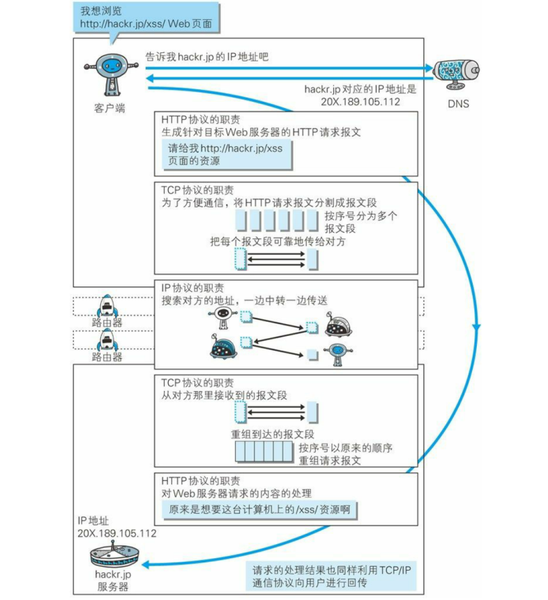


### HTTP长/短连接

* HTTP/1.0默认使用短连接，即客户端和服务器每进行一次HTTP操作，就建立一次连接，传输任务结束后就断开连接。当浏览器访问的某个HTML或其他类型的Web页中包含其他Web资源（如JS脚本、图像、CSS文件等），每遇到这样一个Web资源，浏览器就会重新建立一个HTTP会话。
* HTTP/1.1开始默认使用长连接，用以保持连接特性。使用长连接的HTTP协议，会在响应头加入`Connection:keep-alive`，在使用长连接的情况下，当一个网页打开完成后，客户端和服务器之间用于传输HTTP数据的TCP的连接不会关闭，客户端再次访问这个服务器时，会继续使用这一条已经建立的连接。Keep-Alive不会永久保持连接，而是存在一个保持时间，该时间可以设置。


### HTTP如何保存用户状态

* HTTP是无状态（stateless）协议，即HTTP协议自身不对请求和响应之间的通信状态进行保存。一般使用Session机制解决这个问题，Session的主要作业就是通过服务端记录用户的状态，典型的例子就是购物车，服务端给特定的用户创建特定的Session，之后就可以标识用户并跟踪用户。
* 一般Session会存放在服务端（Redis或数据库），并设置超时时间。大部分情况下，都是通过Cookie中附加Session ID的方式完成浏览器请求对Session的跟踪。
* 若Cookie被禁用，最常用的方式就是通过URL携带Session ID。


### Cookie和Session的区别

* Cookie一般用来保存用户标识，如Token，Session主要作用是通过服务端记录用户信息，如购物车；
* Cookie的数据保存在浏览器端，Session的数据保存在服务器端；
* Session相对于Cookie安全性更高，如果要在Cookie中存储关键信息，可以先加密后存储，最后在服务端解密。


### HTTP/1.0和HTTP/1.1的区别

1. **长/短连接**：短连接是每次请求都需要重新建立一次连接，每次都需要重新三次握手，开销大。长连接可以维持一段时间，分为流水和非流水方式，流水方式是客户端不需要等待收到响应就是继续发送新的请求，非流水方式就是客户端必须在收到响应后才能发送下一个请求；
2. **错误状态响应码**：HTTP/1.1新增了24个错误状态响应码，如409表示请求的资源与资源的当前状态发生冲突，如410表示服务器上的某个资源被永久性删除；
3. **缓存处理**：在HTTP/1.0中主要使⽤header⾥的`If-Modified-Since，Expires`来做为缓存判断的标准。HTTP/1.1则引⼊了更多的缓存控制策略例如`Entity tag，If-Unmodified-Since，If-Match，If-None-Match`等更多可供选择的缓存头来控制缓存策略；
4. **带宽优化及网络连接的使用**：在HTTP/1.0中，存在一些浪费带宽的现象，例如客户端只是需要某个对象的一部分，而服务器却将整个对象送过来了，并且不支持断点续传功能。HTTP/1.1则在请求头引入了range头域，它允许只请求资源的某个部分，即返回码是206，这样方便了开发者自由选择以便充分利用带宽和连接。


### URI和URL的区别

1. **URI**：是统一资源标志符，可以唯一标识一个资源，类似于身份证号；
2. **URL**：是统一资源定位符，可以提供该资源的路径，类似于家庭住址。是一种具体的URI，即URL不仅能用来标识一个资源，而且还可以通过其获取这个资源。


### HTTP和HTTPS的区别

1. **端口**：HTTP的URL有``http://``起始且默认使用端口80，而HTTPS的URL由`https://`起始且默认使用端口443；
2. **安全性和资源消耗**：HTTP协议运行在TCP之上，所有的传输内容都是明文，客户端和服务器都无法验证对方的身份。HTTPS是运行在SSL/TLS之上的HTTP协议，SSL/TLS运行在TCP之上，所有的传输内容都使用对称加密，密码使用了服务器的证书进行了非对称加密。所以HTTP安全性比HTTPS低，但消耗的资源更少。


## 计算机网络-传输层

### TCP和UDP的区别

* 用户数据报协议（UDP，User Datagram Protocol）：是无连接的，尽最大可能交付，没有拥塞控制，面向报文，支持一对一、一对多和多对多的通信协议。
* 传输控制协议（TCP，Transmission Control Protocol）：是面向连接的，提供可靠交付，提供流量控制、拥塞控制，提供全双工通信，面向字节流，只支持一对一的通信协议。


### UDP的首部格式

首部字段占8byte，包括源端口、目的端口、长度、校验和。12byte的伪首部是为了计算校验和临时添加的。


### TCP的首部格式

* 序号：用于对字节流中的每个字节进行编号；
* 确认号：期望收到的下一个报文段的序号；
* 数据偏移：指数据部分距离报文段起始位置的偏移量，实际上指的就是首部长度；
* 保留关键字：
  * ACK：ACK=1表示确认报文；
  * SYN：SYN=1表示连接请求报文；
  * FIN：FIN=1表示连接释放报文。
* 窗口：流量窗口值，标识接收方的最大缓存能力。


### TCP的三次握手


1. 第一次握手：客户端发起连接建立的请求，初始序号置为x，发送（SYN=1，seq=x）的SYN段，客户端状态由CLOSE（初始）进入SYN_SEND（同步已发送）状态，等待服务器确认；
2. 第二次握手：服务器收到客户发送的SYN段后，初始序号置为y，发送（SYN=1，ACK=1，seq=y，ack_seq=x+1）的SYNACK段，这时服务器的状态由LISTEN（监听）进入SYN_RCVD（同步已接收）状态；
3. 第三次握手：客户端收到服务器的SYNACK段后，发送（ACK=1，seq=x+1，ack_seq=y+1）的ACK段，这时客户端进入ESTABLISHED（已建立）状态，服务器收到ACK段后也进入ESTABLISHED（已建立）状态，至此连接建立。

**为什么要握手三次？**目的是为了建立可靠的通信信道，握手三次则是为了确认双方的发送和接收是正常的：

1. 第一次握手能让服务端确认对方的发送和自己的接收都是正常的；
2. 第二次握手能让客户端确认自己的发送和接收正常且对方的发送和接收也正常的；
3. 第三次握手能让服务端确认自己的发送和对方的接收是正常的。

**为什么要回传SYN？**接收端回传发送端发送的SYN是为了通知发送端，我接收到的确实是你发送的连接请求（SYN=1表示连接建立请求）。

**为什么要回传ACK？**回传ACK确认报文是TCP可靠传输机制的一种手段，当发送方接收到接收方发送的ACK后，才能确认自己上一次是正确发送并且对方正确接收了。


### TCP的四次挥手


1. 第一次挥手：当客户端发送完最后一个数据段后，可以发送FIN段（FIN=1，seq=u）请求断开客户端到服务器的连接，其状态由ESTABLISHED进入FIN_WAIT_1，在该状态下只能接收服务器发送的数据但不能再发送数据了；

2. 第二次挥手：服务器收到FIN段后，向客户端发送ACK段（ACK=1，seq=v，ack_seq=u+1），服务器状态由ESTABLISHED进入CLOSE_WAIT，在该状态下服务器仍可发送数据但不能接收数据了。当客户端收到ACK段，其状态由FIN_WAIT_1进入FIN_WAIT_2，仍然可以接收服务器的数据，此时TCP连接已经关闭了客户端向服务器方向的数据传输，也称半关闭；

3. 第三次挥手：当服务器向客户端发送完最后一个数据段后，服务器向客户端发送FIN段（FIN=1，ACK=1，seq=w，ack_seq=u+1），该数据段也不携带应用层数据，此时服务器状态由CLOSE_WAIT进入LAST_ACK并不再发送数据；

4. 第四次挥手：当客户端收到服务器发送的FIN段后，向服务器发送ACK段（ACK=1，seq=u+1，ack_seq=w+1），其状态由FIN_WAIT_2进入TIME_WAIT，再等待2MSL时间后进入CLOSED状态，最终释放连接。服务器收到该ACK后，状态由LAST_ACK进入CLOSED，最终释放连接。

**为什么要挥手四次？**任何一方都可以在数据传输结束后发送连接释放的通知，待对方确认后进入半关闭状态。当另一方也没有数据需要发送的时候，则主动发送连接释放通知，接收方确认后就完全关闭了TCP连接。

**为什么要有TIME_WAIT状态？**确保最后一个确认报文能够到达。等待一段时间是为了让本连接持续时间内所产生的所有报文都从网络中消失，使得下一个新连接不会出现旧的连接请求报文。


### TCP的可靠传输

1. 差错编码：即首部校验和，可以检测数据在传输过程中的任何变化，若接收方收的段校验和有差错，则会直接丢弃该报文段并且不发送确认报文；
2. 序号：TCP会将所有数据以有序字节流的形式，依次对每个字节进行编号，并将整个应用层报文划分为若干报文段，每个报文段的序号就是该段所封装的数据的首字节序号。序号还能够保障报文段的顺序重组和防重复。
3. 确认：即确认报文，通过首部的确认序号（期望从对方那里接收到的下一个字节的序号，即表示该序号之前的字节已经全部正确接收）通知发送方自己正确接收了什么，下一次你需要传什么；
4. 计时器重传：发送方在发送一个报文段后会维护一个计时器，若计时器超时，表示报文段丢失接收方未收到或差错检测失败而被接收方丢弃，则重传报文段；
5. 快速重传：当接收方未正确接收到上一次自己发送的ACK报文中确认序号标识的数据时，则会在接下来的3次ACK中，重复确认那个未收到的序号，发送方发现接收方的3次重复确认后，就会立即重传；
6. 滑动窗口：TCP就是基于滑动窗口协议实现可靠传输机制的。发送方和接收方都会维护一个窗口，用于表示发送方可以发送且未被确认的分组最大数量和接收方可以接收并缓存的正确到达的分组最短数量。所谓滑动，是指当发送方收到确认或接收方向上提交数据后，窗口将后移将之后的数据容纳进来；
7. 流量控制：用于协调发送方和接收方的数据发送和接收速度，避免发送方发送数据过快，超出了接收方的缓存和处理能力。接收方通过窗口（缓冲区）来控制发送方发送数据大小，每次在确认时都会将缓冲区的剩余尺寸一并交付给发送方，这样发送方每次发送的数据量大小都会根据接收方缓冲区的大小而适当调整。
8. 拥塞控制：采用拥塞窗口机制，通过动态调节窗口大小来实现对发送速率的调整，避免在网络拥堵的情况下，发送数据过快而导致丢失。发送方维护一个拥塞窗口，表示在未收到确认的情况下，可以连续发送的字节数。整个拥塞控制分为慢启动和拥塞避免两个阶段，慢启动阶段窗口会成倍增加，拥塞避免阶段窗口会加性增加。


### TCP的滑动窗口

窗口是缓存的一部分，用于暂时存放字节流。发送方和接收方各维护一个窗口，接收方通过TCP报文段中的窗口字段通知发送方自己窗口的大小，发送方根据这个值和其它信息设置自己的窗口大小。

发送窗口内的字节都允许被发送，接收窗口内的字节都允许被接收。如果发送窗口左部的字节已经发送并且收到确认，那么就将发送窗口向右滑动一定距离，直到左部第一个字节不是已发送且已确认的状态。接收窗口的滑动类似，若左部字节已经发送确认并交付主机，就向右滑动接收窗口。

接收窗口只会对窗口内最后一个按序到达的字节进行确认，如：接收窗口已经收到的字节为 {31，34，35}，其中31按序到达，而 34和35就不是，因此只对31字节进行确认。发送方得到一个字节的确认后，也就知道这个字节之前的所有字节都已被接收。

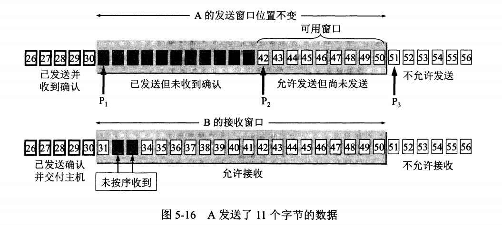


### TCP的流量控制

流量控制是为了控制发送方的发送速率，保证不会超过接收方的接收、缓存和处理能力。

TCP使用窗口机制进行流量控制：连接建立时，接收方分配一块缓存区用于存储接收的数据，并在每次发送的确认报文中通过窗口字段将缓冲区的尺寸通知给发送端；

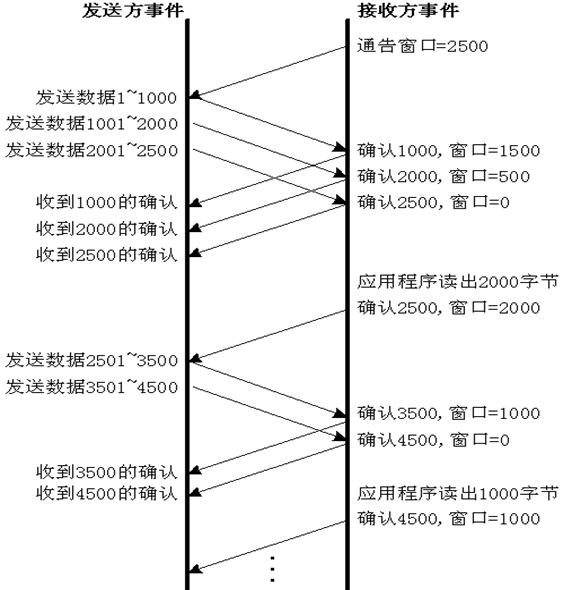


### TCP的拥塞控制

拥塞：就是大量主机高速向网络发送大量数据，超出网络的处理能力，导致大量分组拥挤在网络中间设备的队列中等待转发，网络性能下降的现象。

拥塞控制：即通过合理调度、规范和调整向网络发送数据的主机数量、发送速率或数据量，以避免拥塞或尽快消除已发生的拥塞。


拥塞控制算法：慢启动、拥塞避免、快速重传、快速恢复。

拥塞窗口：发送方维护的一个表示连接发送报文段的数量的窗口。发送方通过动态调整拥塞窗口以实现对发送速率的控制。

拥塞控制的变化情况：

* 拥塞窗口默认从慢启动阶段开始，每经过一次RTT（传输轮次）都会让拥塞窗口cwnd扩大一倍，即每一个ACK都会增加1；
* 直到窗口大小达到阈值，拥塞控制会进入拥塞避免阶段，此时每经过一次RTT拥塞窗口只会增加1；
* 当TCP通信过程中发生了计时器超时的情况，此时拥塞控制会在下一次RTT重新进入慢启动阶段，拥塞窗口还原为初值，阈值随之更新；
* 当TCP通信过程中发生了快速重传的情况（3次ACK），此时拥塞控制会在下一次RTT重新进入拥塞避免阶段，拥塞窗口变为拥塞发生时的一半，阈值随之更新，即发生了快速恢复。


## 计算机网络-网络层

### IP数据报格式


### IP地址编址方式


### 地址解析协议ARP


### 网际控制报文协议ICMP


### 虚拟专用网VPN


### 网络地址转换NAT


### 路由器结构


### 路由器的分组转发


### 路由选择协议


## 计算机网络-数据链路层


## 计算机网络-物理层


## Netty-基本概念

### Netty是什么？


* 是一个基于NIO的C/S模式的网络通信框架，可以快速的通过它开发出高并发、高可靠的网络应用程序；
* 极大的简化了TCP、UDP套接字服务器等网络编程的开发难度，且性能和安全性都得到了更好的保证；
* 支持多种计算机网络应用层协议，如FTP、SMTP、HTTP以及各种二进制和基于文本的传输协议。


### 为什么使用Netty？

* 统一的API，支持多种传输类型（阻塞和非阻塞）；
* 基于IO多路复用技术的简单而强大的线程模型Reactor；
* 自带编码器解决TCP粘包和拆包问题；
* 自带各种协议栈；
* 真正的无连接数据包套接字支持；
* 相对于使用JDK API具有更高的吞吐量、更低的延迟、更低的资源消耗和更少的内存复制；
* 具有完整的SSL/TLS等安全机制的支持；
* 社区活跃；
* 成熟稳定，经历了各种开源项目的考验，如：Dubbo、RocketMQ、ElasticSearch、gRPC等。


### Netty的应用场景

* RPC框架的网络通信结构：在分布式系统中，不同的服务节点需要相互调用，需要使用RPC框架。而服务节点间可以通过Netty来通信；
* 高并发的HTTP网络服务器：基于同步非阻塞IO和多路复用模型的HTTP服务器；
* 可以实现即时通讯系统；
* 可以实现消息推送系统。


## Netty-模块组件

### Bootstrap、ServerBootstrap

Netty的客户端和服务端启动引导类，主要作用是配置整个Netty程序，串联各个组件。

```JAVA
// 客户端启动引导
Bootstrap b = new Bootstrap();
b.group(group)
    .channel(NioSocketChannel.class)
    .handler(new ChannelInitializer<SocketChannel>() {
        @Override
        public void initChannel(SocketChannel ch) throws Exception {
            ChannelPipeline p = ch.pipeline();
            p.addLast(new HelloClientHandler(message));
        }
    });
```

```JAVA
// 服务端启动引导
ServerBootstrap b = new ServerBootstrap();
b.group(bossGroup, workerGroup)
 	.handler(new LoggingHandler(LogLevel.INFO))
    .channel(NioServerSocketChannel.class)
    .childHandler(new ChannelInitializer<SocketChannel>() {
        @Override
        public void initChannel(SocketChannel ch) {
            ChannelPipeline p = ch.pipeline();
            p.addLast(new HelloServerHandler());
        }
    });
```


### Future、ChannelFuture

Netty的API中所有的IO操作都是异步的，不会立即返回结果，但会通过ChannelFuture封装未来异步操作的结果。也可以注册一个监听器，当操作成功或失败后会自动触发注册的监听器回调。

```JAVA
public interface ChannelFuture extends Future<Void> {
	Channel channel();
	ChannelFuture addListener(GenericFutureListener<? extends Future<? super Voidjk var1);	// 注册监听器
	// ...
	ChannelFuture sync() throws InterruptedException;	// 修改同步或异步
}
```

```JAVA
serverBootstrap.bind(port).addListener(future -> {
    if (future.isSuccess()) {
        System.out.println(new Date() + ": 端口[" + port + "]绑定成功!");
    } else {
        System.err.println("端口[" + port + "]绑定失败!");
    }
});
```


### Channel、ChannelOption

通道是Netty用于网络通信的组件，能够执行网络I/O操作，为用户提供：

* 当前网络连接的状态，即通道是否打开，Socket是否建立；
* 网络连接的参数配置，如：接收缓冲大小；
* 异步网络I/O操作，如：连接建立、读写、端口绑定；
* I/O操作与具体的处理逻辑对应。

ChannelOption为Channel提供了参数的设置：

* ChannelOption.SO_BACKLOG：用于初始化服务器可连接队列的大小。服务端处理客户端连接请求是顺序处理的，所以同时只能处理一个客户端连接。多个客户连接到来时，服务端会将请求排队。
* ChannelOption.SO_KEEPALIVE：一直保持连接活动状态。


### Selector

Netty基于选择器Selector机制实现IO多路复用，通过Selector一个线程可以监听多个连接的Channel事件。当向一个Selector中注册Channel后，Selector内部的机制就可以轮询已注册的Channel是否发生事件的就绪，如读写、连接等，当有事件就绪才会真正进行处理。


### NioEventLoop、NioEventLoopGroup

NioEventLoop事件循环中维护了一个Selector实例和其任务队列，支持异步提交任务，线程启动时会调用NioEventLoop的run方法，执行相应的IO或非IO任务：

* IO任务：即selectionKey中就绪的事件，如accept、connect、read、write等，由processSelectedKeys方法触发；
* 非IO任务：会添加到taskQueue中，如register、bind等任务，由runAllTasks方法触发。

NioEventLoopGroup事件循环组主要管理NioEventLoop的生命周期，可以理解为线程池，内部维护了一组NioEventLoop线程，可以通过next接口按照一定规则获取一个NioEventLoop处理任务，每个NioEventLoop线程负责处理多个Channel上的事件，而一个Channel只会对应一个线程。


### ChannelHandler、ChannelHandlerContext

通道处理器是一个接口，其处理IO事件或拦截IO操作，并将其转发到其ChannelPipeline链上的下一个处理程序。使用ChannelHandler时可以继承其子类或适配器类：

* ChannelInboundHandler/ChannelInboundHandlerAdapter：处理入站I/O事件；
* ChannelOutboundHandler/ChannelOutboundHandlerAdapter：处理出站I/O事件；
* ChannelDuplexHandler：处理入站和出站事件。

ChannelHandlerContext保存了Channel相关的所有上下文信息，同时关联了一个ChannelHandler对象。


### ChannelPipline

通道事件处理链是一个保存了ChannelHandler的List，用多个阶段拦截或处理Channel的入站和出站操作。ChannelPipline实现了一种高级形式的拦截过滤器模式，使用户可以完全控制事件的处理方式，以及Channel对应的各个ChannelHandler如何交互。

下图描述了ChannelPipeline中的ChannelHandler如果处理IO事件。入站事件由自下而上的入站处理程序处理，如图左所示。出站事件由自上而下的出站处理程序处理，如图右所示。


Netty中每个Channel都有且仅有一个ChannelPipeline与之对应。而ChannelPipeline中又维护了一个由ChannelHandlerContext组成的双向链表，且每个ChannelHandlerContext又关联一个ChannelHandler。

入站事件和出站事件在一个双向链表中，入站事件会从链表head向后传递到最后一个入站的handler，出站事件会从链表tail向前传递到最前一个出站的handler，两种类型的handler互不干扰。

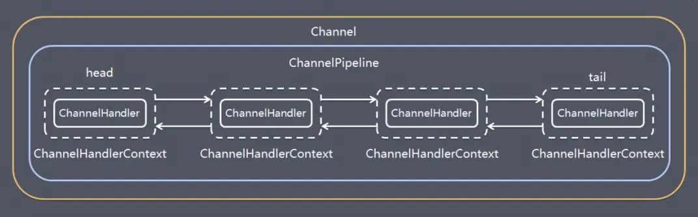


## Netty-线程模型

Netty的线程模式是基于Reactor模式实现的。


**结构对应：**

* NioEventLoop —— 初始化分发器/反应器（Initiation Dispatcher）；
* Selector —— 同步事件分离器（Synchronous EventDemultiplexer）；
* ChannelHandler —— 事件处理器（Event Handler）；
* 具体的ChannelHandler实现 —— 具体的事件存储器。

**模式对应：**

* NioEventLoop（bossGroup） —— mainReactor；
* NioEventLoop（workGroup）—— subReactor。
* ServerBootstrapAcceptor —— acceptor。

**工作流程：**

* Boss Group轮询步骤：
  1. select轮询Accept事件；
  2. processSelectedKeys处理Accept I/O事件。与Client建立连接，生成对应的NioSocketChannel，并将其注册到Worker Group中的某个NioEventLoop的Selector上；
  3. 处理任务队列中的任务runAllTasks。任务队列中的任务包括用户调用eventLoop.execute或schedule执行的任务，或者其他线程提交到该eventLoop上的任务。
* Worker Group轮询步骤：
  1. select轮询Read/Write事件；
  2. processSelectedKeys处理读写I/O事件。在NioSocketChannel可读/可写事件发生时将其传入ChannelPipeline中处理；
  3. 处理任务队列中的任务runAllTasks。


## Netty-编码解码器

当Netty发送或接受一个消息时，就会发生一次数据转换。即入站消息会被解码（如字节转换为对象），出站消息会被编码（如对象转换为字节）。因此Netty提供了一系列编码解码器，都实现了ChannelInboundHandler或ChannelOutboundHandler接口，且channelRead方法都被重写。

以入站为例，对于每个从入站Channel读取的消息，这个方法会被调用，随后将调用由解码器提供的decode()方法进行解码，并将已解码的字节转发给ChannelPipeline中的下一个ChannelInboundHandler。

**ByteToMessageDecoder解码器**：

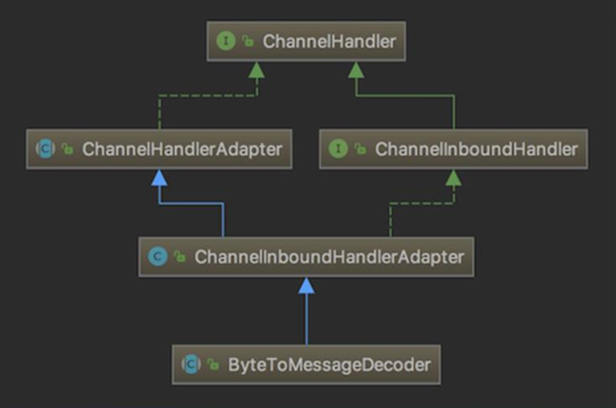

由于TCP会出现粘包拆包的问题，所以不能确定发送方的数据包是一个完整的信息。该类会对入站数据进行缓存，直到它准备好被处理。

```JAVA
public class ToIntegerDecoder extends ByteToMessageDecoder {
    
    @Override
    protected void decode(ChannelHandlerContext ctx, ByteBuf in, List<Object> out) throws Exception {
        // 每次从入站的ByteBuf中读取4字节，然后编码为int类型，添加到下一个List中，当没有更多元素可以被添加时，该内容会被发送给下一个ChannelInboundHandler
        if (in.readableBytes() >= 4) {
            out.add(in.readInt());
        }
    }
}
```

**ReplayingDecoder解码器**：

```JAVA
public abstract class ReplayingDecoder<S> extends ByteToMessageDecoder
```

ReplayingDecoder扩展了ByteToMessageDecoder类，使用这个类时无需调用readableBytes()方法，参数S指定了用户状态管理的类型，使用Void则不需要状态管理。

```JAVA
public class MyReplayingDecoder extends ReplayingDecoder<Void> {
    
    @Override
    protected void decode(ChannelHandlerContext ctx, ByteBuf in, List<Object> out) throws Exception {
        // 无需判断byte是否足够读取，内部会根据read的类型自动处理
        out.add(in.readLong());
    }
}
```


## Netty-源码分析

io.Netty.example的源码分析案例

```JAVA
public final class EchoServer {

    static final boolean SSL = System.getProperty("ssl") != null;
    static final int PORT = Integer.parseInt(System.getProperty("port", "8007"));

    public static void main(String[] args) throws Exception {
        final SslContext sslCtx;
        if (SSL) {
            SelfSignedCertificate ssc = new SelfSignedCertificate();
            sslCtx = SslContextBuilder.forServer(ssc.certificate(), ssc.privateKey()).build();
        } else {
            sslCtx = null;
        }

        EventLoopGroup bossGroup = new NioEventLoopGroup(1);
        EventLoopGroup workerGroup = new NioEventLoopGroup();
        try {
            ServerBootstrap b = new ServerBootstrap();
            b.group(bossGroup, workerGroup)
             .channel(NioServerSocketChannel.class)
             .option(ChannelOption.SO_BACKLOG, 100)
             .handler(new LoggingHandler(LogLevel.INFO))
             .childHandler(new ChannelInitializer<SocketChannel>() {
                 @Override
                 public void initChannel(SocketChannel ch) throws Exception {
                     ChannelPipeline p = ch.pipeline();
                     if (sslCtx != null) {
                         p.addLast(sslCtx.newHandler(ch.alloc()));
                     }
                     p.addLast(new EchoServerHandler());
                 }
             });

            ChannelFuture f = b.bind(PORT).sync();
            f.channel().closeFuture().sync();
        } finally {
            bossGroup.shutdownGracefully();
            workerGroup.shutdownGracefully();
        }
    }
}
```

```JAVA
@Sharable
public class EchoServerHandler extends ChannelInboundHandlerAdapter {

    @Override
    public void channelRead(ChannelHandlerContext ctx, Object msg) {
        ctx.write(msg);
    }

    @Override
    public void handlerAdded(ChannelHandlerContext ctx) throws Exception {
        super.handlerAdded(ctx);
    }

    @Override
    public void handlerRemoved(ChannelHandlerContext ctx) throws Exception {
        super.handlerRemoved(ctx);
    }

    @Override
    public void channelReadComplete(ChannelHandlerContext ctx) {
        ctx.flush();
    }

    @Override
    public void exceptionCaught(ChannelHandlerContext ctx, Throwable cause) {
        cause.printStackTrace();
        ctx.close();
    }
}
```

### Netty启动过程源码分析

#### NioEventLoopGroup阶段分析

**NioEventLoopGroup构造方法**：

```JAVA
// 若不指定线程数将从这里开始
public NioEventLoopGroup() {
	// 调⽤下⼀个构造⽅法
	this(0);
}

public NioEventLoopGroup(int nThreads) {
	// 继续调⽤下⼀个构造⽅法
	this(nThreads, (Executor) null);
}

// ......各种重载的构造方法
    
public NioEventLoopGroup(int nThreads, Executor executor, final SelectorProvider selectorProvider, final SelectStrategyFactory selectStrategyFactory) {
    // 开始调⽤⽗类的构造方法
    super(nThreads, executor, selectorProvider, selectStrategyFactory, RejectedExecutionHandlers.reject());
}
```

**MultithreadEventLoopGroup构造方法**：

```JAVA
// 从1和系统属性和CPU核⼼数*2这三个值中取最⼤值，可以得出DEFAULT_EVENT_LOOP_THREADS的值为CPU核⼼数*2
private static final int DEFAULT_EVENT_LOOP_THREADS;

static {
    DEFAULT_EVENT_LOOP_THREADS = Math.max(1, SystemPropertyUtil.getInt(
        "io.netty.eventLoopThreads", NettyRuntime.availableProcessors() * 2));
}

// 被调⽤的⽗类构造函数，NioEventLoopGroup默认的构造函数会起多少线程的秘密所在，当指定的线程数nThreads为0时，使⽤默认的线程数DEFAULT_EVENT_LOOP_THREADS
protected MultithreadEventLoopGroup(int nThreads, ThreadFactory threadFactory, Object... args) {
	super(nThreads == 0 ? DEFAULT_EVENT_LOOP_THREADS : nThreads, threadFactory, args);
}
```

**MultithreadEventExecutorGroup构造方法**：

```JAVA
protected MultithreadEventExecutorGroup(int nThreads, Executor executor, Object... args) {
    this(nThreads, executor, DefaultEventExecutorChooserFactory.INSTANCE, args);
}

protected MultithreadEventExecutorGroup(int nThreads, Executor executor,
                                        EventExecutorChooserFactory chooserFactory, Object... args) {
    if (nThreads <= 0) {
        throw new IllegalArgumentException(String.format("nThreads: %d (expected: > 0)", nThreads));
    }

    if (executor == null) {
        // 如果不指定执行器，就使用默认的线程工厂和默认执行器
        executor = new ThreadPerTaskExecutor(newDefaultThreadFactory());
    }
	
    // NioEventLoop实现了EventExecutor，即创建了一个线程数大小的NioEventLoop数组
    children = new EventExecutor[nThreads];

    // 循环初始化线程数组
    for (int i = 0; i < nThreads; i ++) {
        boolean success = false;
        try {
            // 创建NioEventLoop
            children[i] = newChild(executor, args);
            success = true;
        } catch (Exception e) {
            // TODO: Think about if this is a good exception type
            throw new IllegalStateException("failed to create a child event loop", e);
        } finally {
            // ......
        }
    }

    chooser = chooserFactory.newChooser(children);
	
    // 实例化一个终止监听器
    final FutureListener<Object> terminationListener = new FutureListener<Object>() {
        @Override
        public void operationComplete(Future<Object> future) throws Exception {
            if (terminatedChildren.incrementAndGet() == children.length) {
                terminationFuture.setSuccess(null);
            }
        }
    };

    // 为每一个NioEventLoop添加一个终止监听器
    for (EventExecutor e: children) {
        e.terminationFuture().addListener(terminationListener);
    }

    // 将所有初始化后的NioEventLoop添加到一个LinkedHashSet中保存
    Set<EventExecutor> childrenSet = new LinkedHashSet<EventExecutor>(children.length);
    Collections.addAll(childrenSet, children);
    readonlyChildren = Collections.unmodifiableSet(childrenSet);
}
```


#### ServerBootstrap阶段分析

**ServerBootstrap构造方法**：

```java
private final Map<ChannelOption<?>, Object> childOptions = new LinkedHashMap<ChannelOption<?>, Object>();
private final Map<AttributeKey<?>, Object> childAttrs = new LinkedHashMap<AttributeKey<?>, Object>();
private final ServerBootstrapConfig config = new ServerBootstrapConfig(this);
private volatile EventLoopGroup childGroup;
private volatile ChannelHandler childHandler;

public ServerBootstrap() { }
```

**ServerBootstrap#group**：

```JAVA
public ServerBootstrap group(EventLoopGroup parentGroup, EventLoopGroup childGroup) {
    super.group(parentGroup);	// parentGroup即bossGroup
    if (childGroup == null) {
        throw new NullPointerException("childGroup");
    }
    if (this.childGroup != null) {
        throw new IllegalStateException("childGroup set already");
    }
    this.childGroup = childGroup;	// childGroup即workerGroup
    return this;
}
```

**AbstractBootstrap#channel**：

```java
public B channel(Class<? extends C> channelClass) {
    if (channelClass == null) {
        throw new NullPointerException("channelClass");
    }
    // 创建反射工厂类，在bind阶段会将Channel反射出来
    return channelFactory(new ReflectiveChannelFactory<C>(channelClass));
}
```

**AbstractBootstrap#option**：

```JAVA
// 通过Map存储配置
private final Map<ChannelOption<?>, Object> options = new LinkedHashMap<ChannelOption<?>, Object>();

public <T> B option(ChannelOption<T> option, T value) {
    if (option == null) {
        throw new NullPointerException("option");
    }
    if (value == null) {
        synchronized (options) {
            options.remove(option);
        }
    } else {
        synchronized (options) {
            options.put(option, value);
        }
    }
    return self();
}
```

**AbstractBootstrap#bind**：

```JAVA
public ChannelFuture bind(int inetPort) {
    return bind(new InetSocketAddress(inetPort));
}

public ChannelFuture bind(SocketAddress localAddress) {
    validate();
    if (localAddress == null) {
        throw new NullPointerException("localAddress");
    }
    return doBind(localAddress);
}

private ChannelFuture doBind(final SocketAddress localAddress) {
    final ChannelFuture regFuture = initAndRegister();
    final Channel channel = regFuture.channel();
    if (regFuture.cause() != null) {
        return regFuture;
    }

    if (regFuture.isDone()) {
        // At this point we know that the registration was complete and successful.
        ChannelPromise promise = channel.newPromise();
        doBind0(regFuture, channel, localAddress, promise);
        return promise;
    } else {
       // ......
    }
}

final ChannelFuture initAndRegister() {
    Channel channel = null;
    try {
        // 通过反射工厂类将Channel创建出来：
        // 1.获取JDK NIO的ServerSocketChannel；
        // 2.创建一个唯一的ChannelId；
        // 3.创建一个NioMessageUnsafe，用于操作消息；
        // 4.创建一个DefaultChannelPipeline，是一个双向链表结构；
        // 5.创建了一个NioServerSocketChannelConfig对象，用于对外展示一些配置
        channel = channelFactory.newChannel();
        // 初始化NioServerSocketChannel：
        // 1.抽象方法，由ServerBootstrap实现；
        // 2.设置NioServerSocketChannel的TCP属性；
        // 3.对NioServerSocketChannel的ChannelPipeline添加ChannelInitializer处理器；
        // 4.初始化DefaultChannelPipeline的head和tail节点。并通过addLast添加ChannelHandler。
        init(channel);
    } catch (Throwable t) {
        // ......
    }
    // 注册NioServerSocketChannel到bossGroup上，并返回一个注册结果的future
    ChannelFuture regFuture = config().group().register(channel);
    if (regFuture.cause() != null) {
        if (channel.isRegistered()) {
            channel.close();
        } else {
            channel.unsafe().closeForcibly();
        }
    }
    return regFuture;
}

private static void doBind0(
    final ChannelFuture regFuture, final Channel channel,
    final SocketAddress localAddress, final ChannelPromise promise) {

    // This method is invoked before channelRegistered() is triggered.  Give user handlers a chance to set up
    // the pipeline in its channelRegistered() implementation.
    channel.eventLoop().execute(new Runnable() {
        @Override
        public void run() {
            if (regFuture.isSuccess()) {
                // 最终会调用到NioServerSocket的doBind，说明Netty底层使用的是NIO
                channel.bind(localAddress, promise).addListener(ChannelFutureListener.CLOSE_ON_FAILURE);
            } else {
                promise.setFailure(regFuture.cause());
            }
        }
    });
}
```

**DefaultChannelPipeline#addLast**：

```JAVA
@Override
public final ChannelPipeline addLast(EventExecutorGroup group, String name, ChannelHandler handler) {
    final AbstractChannelHandlerContext newCtx;
    synchronized (this) {
        // 检查handler是否符合标准
        checkMultiplicity(handler);
		
        // 创建一个AbstractChannelHandlerContext对象
        // 每当有ChannelHandler添加到Pipeline时，都会创建对应的Context
        newCtx = newContext(group, filterName(name, handler), handler);

        // 将Context插入链表尾部，即追加到tail节点之前
        addLast0(newCtx);

        // If the registered is false it means that the channel was not registered on an eventloop yet.
        // In this case we add the context to the pipeline and add a task that will call
        // ChannelHandler.handlerAdded(...) once the channel is registered.
        if (!registered) {
            newCtx.setAddPending();
            callHandlerCallbackLater(newCtx, true);
            return this;
        }

        EventExecutor executor = newCtx.executor();
        if (!executor.inEventLoop()) {
            newCtx.setAddPending();
            executor.execute(new Runnable() {
                @Override
                public void run() {
                    callHandlerAdded0(newCtx);
                }
            });
            return this;
        }
    }
    callHandlerAdded0(newCtx);
    return this;
}

private void addLast0(AbstractChannelHandlerContext newCtx) {
    AbstractChannelHandlerContext prev = tail.prev;
    newCtx.prev = prev;
    newCtx.next = tail;
    prev.next = newCtx;
    tail.prev = newCtx;
}
```

**NioEventLoop#run**：

```JAVA
// 当bind阶段结束，就会进入NioEventLoop的run中执行
@Override
protected void run() {
    for (;;) {
        try {
            switch (selectStrategy.calculateStrategy(selectNowSupplier, hasTasks())) {
                case SelectStrategy.CONTINUE:
                    continue;
                case SelectStrategy.SELECT:
                    // NioEventLoop轮询的第一步：监听事件
                    select(wakenUp.getAndSet(false));

                    if (wakenUp.get()) {
                        selector.wakeup();
                    }
                    // fall through
                default:
            }

            cancelledKeys = 0;
            needsToSelectAgain = false;
            final int ioRatio = this.ioRatio;
            if (ioRatio == 100) {
                try {
                    // NioEventLoop轮询的第二步：处理发生的事件
                    processSelectedKeys();
                } finally {
                    // NioEventLoop轮询的第二步：处理队列中的任务
                    runAllTasks();
                }
            } else {
                final long ioStartTime = System.nanoTime();
                try {
                    processSelectedKeys();
                } finally {
                    // Ensure we always run tasks.
                    final long ioTime = System.nanoTime() - ioStartTime;
                    runAllTasks(ioTime * (100 - ioRatio) / ioRatio);
                }
            }
        } catch (Throwable t) {
            handleLoopException(t);
        }
        // Always handle shutdown even if the loop processing threw an exception.
        try {
            if (isShuttingDown()) {
                closeAll();
                if (confirmShutdown()) {
                    return;
                }
            }
        } catch (Throwable t) {
            handleLoopException(t);
        }
    }
}
```

**Netty服务端启动过程总结**：

1. 创建两个NioEventLoopGroup线程池，其内部维护着NioEventLoop的集合，集合默认大小是本机的CPU*2；
2. ServerBootstrap设置一些属性，然后通过bind方法完成创建NIO相关对象、初始化、注册、绑定端口、启动事件循环等操作；
   1. initAndRegister会创建NioServerSocketChannel、Pipeline等对象，然后初始化这些对象，如Pipeline的head和tail节点的初始化；
   2. doBind会对底层JDK NIO的Channel和端口进行绑定；
   3. 最后调用NioEventLoop的run方法监听连接事件，表示服务器正式启动。


### Netty接收请求过程源码分析

* NioEventLoop的processSelectedKey()方法分析：

```JAVA
private void processSelectedKey(SelectionKey k, AbstractNioChannel ch) {
    final AbstractNioChannel.NioUnsafe unsafe = ch.unsafe();
    if (!k.isValid()) {
        final EventLoop eventLoop;
        try {
            eventLoop = ch.eventLoop();
        } catch (Throwable ignored) {
            // If the channel implementation throws an exception because there is no event loop, we ignore this
            // because we are only trying to determine if ch is registered to this event loop and thus has authority
            // to close ch.
            return;
        }
        // Only close ch if ch is still registered to this EventLoop. ch could have deregistered from the event loop
        // and thus the SelectionKey could be cancelled as part of the deregistration process, but the channel is
        // still healthy and should not be closed.
        // See https://github.com/netty/netty/issues/5125
        if (eventLoop != this || eventLoop == null) {
            return;
        }
        // close the channel if the key is not valid anymore
        unsafe.close(unsafe.voidPromise());
        return;
    }

    try {
        int readyOps = k.readyOps();
        // We first need to call finishConnect() before try to trigger a read(...) or write(...) as otherwise
        // the NIO JDK channel implementation may throw a NotYetConnectedException.
        if ((readyOps & SelectionKey.OP_CONNECT) != 0) {
            // remove OP_CONNECT as otherwise Selector.select(..) will always return without blocking
            // See https://github.com/netty/netty/issues/924
            int ops = k.interestOps();
            ops &= ~SelectionKey.OP_CONNECT;
            k.interestOps(ops);

            unsafe.finishConnect();
        }

        // Process OP_WRITE first as we may be able to write some queued buffers and so free memory.
        if ((readyOps & SelectionKey.OP_WRITE) != 0) {
            // Call forceFlush which will also take care of clear the OP_WRITE once there is nothing left to write
            ch.unsafe().forceFlush();
        }

        // Also check for readOps of 0 to workaround possible JDK bug which may otherwise lead
        // to a spin loop
        // 当就绪事件为可读或连接接收时
        if ((readyOps & (SelectionKey.OP_READ | SelectionKey.OP_ACCEPT)) != 0 || readyOps == 0) {
            // unsafe是boos线程中NioServerSocketChannel的AbstractNioMessageChannel$NioMessageUnsafe对象
            unsafe.read();
        }
    } catch (CancelledKeyException ignored) {
        unsafe.close(unsafe.voidPromise());
    }
}
```

* SelectionKey中的readyOps就绪事件常量：

```JAVA
// 读事件就绪
public static final int OP_READ = 1 << 0;
// 写事件就绪
public static final int OP_WRITE = 1 << 2;
// 连接事件到来
public static final int OP_CONNECT = 1 << 3;
// 接收连接事件
public static final int OP_ACCEPT = 1 << 4;
```

* AbstractNioMessageChannel中的NioMessageUnsafe的read()方法分析：

```JAVA
private final class NioMessageUnsafe extends AbstractNioUnsafe {

    private final List<Object> readBuf = new ArrayList<Object>();

    @Override
    public void read() {
        // 断言检查eventLoop是否是当前线程
        assert eventLoop().inEventLoop();
        final ChannelConfig config = config();
        final ChannelPipeline pipeline = pipeline();
        final RecvByteBufAllocator.Handle allocHandle = unsafe().recvBufAllocHandle();
        allocHandle.reset(config);

        boolean closed = false;
        Throwable exception = null;
        try {
            try {
                do {
                    // readBuf是一个ArrayList，用做请求缓冲区
                    // 调用doReadMessages，读取boss线程中NioServerSocketChannel接收的请求，并将请求包装为NioSocketChannel放入缓冲区readBuf
                    int localRead = doReadMessages(readBuf);
                    if (localRead == 0) {
                        break;
                    }
                    if (localRead < 0) {
                        closed = true;
                        break;
                    }

                    allocHandle.incMessagesRead(localRead);
                } while (allocHandle.continueReading());
            } catch (Throwable t) {
                exception = t;
            }

            // 遍历请求缓冲区，为每个请求调用pipeline的fireChannelRead方法，具体处理这些请求（执行链中的handler的ChannelRead方法）
            int size = readBuf.size();
            for (int i = 0; i < size; i ++) {
                readPending = false;
                pipeline.fireChannelRead(readBuf.get(i));
            }
            readBuf.clear();
            allocHandle.readComplete();
            pipeline.fireChannelReadComplete();

            if (exception != null) {
                closed = closeOnReadError(exception);

                pipeline.fireExceptionCaught(exception);
            }

            if (closed) {
                inputShutdown = true;
                if (isOpen()) {
                    close(voidPromise());
                }
            }
        } finally {
            // Check if there is a readPending which was not processed yet.
            // This could be for two reasons:
            // * The user called Channel.read() or ChannelHandlerContext.read() in channelRead(...) method
            // * The user called Channel.read() or ChannelHandlerContext.read() in channelReadComplete(...) method
            //
            // See https://github.com/netty/netty/issues/2254
            if (!readPending && !config.isAutoRead()) {
                removeReadOp();
            }
        }
    }
}
```

* NioServerSocketChannel的doReadMessages()方法分析：

```JAVA
@Override
protected int doReadMessages(List<Object> buf) throws Exception {
    // 通过JDK NIO的ServerSocketChannel的accept方法接收请求，并获取到一个JDK NIO的SocketChannel
    SocketChannel ch = SocketUtils.accept(javaChannel());

    try {
        if (ch != null) {
            // 将SocketChannel包装成NioSocketChannel并加入请求缓冲区
            buf.add(new NioSocketChannel(this, ch));
            return 1;
        }
    } catch (Throwable t) {
        logger.warn("Failed to create a new channel from an accepted socket.", t);

        try {
            ch.close();
        } catch (Throwable t2) {
            logger.warn("Failed to close a socket.", t2);
        }
    }

    return 0;
}
```

* ServerBootstrapAcceptor的channelRead()方法：

```JAVA
// 调用pipeline的fireChannelRead方法，会执行链上的所有handler的channelRead方法。
// pipeline有4个handler：Head、LoggingHandler、ServerBootstrapAcceptor、Tail。
// 最后通过debug进入ServerBootstrapAcceptor的channelRead方法中。
@Override
@SuppressWarnings("unchecked")
public void channelRead(ChannelHandlerContext ctx, Object msg) {
    final Channel child = (Channel) msg;

    // 为NioSocketChannel的pipeline添加handler
    // 即main中通过ServerBootstrap设置的childHandler
    child.pipeline().addLast(childHandler);
	
    // 为NioSocketChannel设置日志和其他配置属性
    setChannelOptions(child, childOptions, logger);

    for (Entry<AttributeKey<?>, Object> e: childAttrs) {
        child.attr((AttributeKey<Object>) e.getKey()).set(e.getValue());
    }

    try {
        // 将NioSocketChannel即客户端连接注册到workerGroup线程池，并添加一个注册结果的监听器
        childGroup.register(child).addListener(new ChannelFutureListener() {
            @Override
            public void operationComplete(ChannelFuture future) throws Exception {
                if (!future.isSuccess()) {
                    forceClose(child, future.cause());
                }
            }
        });
    } catch (Throwable t) {
        forceClose(child, t);
    }
}
```

* debug进入workGroup的register()方法：

```JAVA
@Override
public final void register(EventLoop eventLoop, final ChannelPromise promise) {
    AbstractChannel.this.eventLoop = eventLoop;
    if (eventLoop.inEventLoop()) {
        register0(promise);
    } else {
        eventLoop.execute(new Runnable() {
            @Override
            public void run() {
                register0(promise);
            }
        });
    }
}
```

* 最后debug追踪到AbstractNioChannel的doBeginRead()方法：

```JAVA
@Override
protected void doBeginRead() throws Exception {
    final SelectionKey selectionKey = this.selectionKey;
    if (!selectionKey.isValid()) {
        return;
    }
    
    readPending = true;
    
    // 直到这里，客户端的连接阶段完成，接下来就开始轮询监听读事件
    final int interestOps = selectionKey.interestOps();
    if ((interestOps & readInterestOps) == 0) {
        selectionKey.interestOps(interestOps | readInterestOps);
    }
}
```

**Netty请求接收过程总结**：

1. 服务端轮询Accept事件，当获取事件后调用unsafe的read方法，unsafe是ServerSocket的内部类，其read方法由两部分组成；
2. doReadMessage方法：用于创建NioSocketChannel对象，该对象包装了JDK NIO的SocketChannel，并将其加入请求缓冲区；
3. pipeline的fireChannelRead方法：循环所有NioSocketChannel，调用其pipeline上的所有handler，如添加用户自定义handler、设置日志和其他配置属性和将其注册到workerGroup上；
4. 最后workerGroup选择其中的一个EventLoop负责轮询该NioSockerChannel。自此，客户端请求建立过程结束。


### ChannelPipeline/ChannelHandler/ChannelHandlerContext源码分析

**三者关系概述**：

* 每当NioServerSocketChannel接收一个客户端连接，就会创建对应的NioSocketChannel；
* 每个NioSocketChannel创建时都会被分配一个ChannelPipeline；
* 每个ChannelPipeline中都包含多个ChannelHandlerContext；
* 这些ChannelHandlerContext用于包装ChannelHandler，并且它们一起组成了一个双向链表；
* 当一个客户端请求被接收时，会进入其对应的NioSocketChannel的pipeline，并经过pipeline中所有的handler处理（使用了设计模式中的过滤器模式）。

**ChannelPipeline**：


* ChannelPipeline接口：

```JAVA
/**
 *                                                 I/O Request
 *                                            via {@link Channel} or
 *                                        {@link ChannelHandlerContext}
 *                                                      |
 *  +---------------------------------------------------+---------------+
 *  |                           ChannelPipeline         |               |
 *  |                                                  \|/              |
 *  |    +---------------------+            +-----------+----------+    |
 *  |    | Inbound Handler  N  |            | Outbound Handler  1  |    |
 *  |    +----------+----------+            +-----------+----------+    |
 *  |              /|\                                  |               |
 *  |               |                                  \|/              |
 *  |    +----------+----------+            +-----------+----------+    |
 *  |    | Inbound Handler N-1 |            | Outbound Handler  2  |    |
 *  |    +----------+----------+            +-----------+----------+    |
 *  |              /|\                                  .               |
 *  |               .                                   .               |
 *  | ChannelHandlerContext.fireIN_EVT() ChannelHandlerContext.OUT_EVT()|
 *  |        [ method call]                       [method call]         |
 *  |               .                                   .               |
 *  |               .                                  \|/              |
 *  |    +----------+----------+            +-----------+----------+    |
 *  |    | Inbound Handler  2  |            | Outbound Handler M-1 |    |
 *  |    +----------+----------+            +-----------+----------+    |
 *  |              /|\                                  |               |
 *  |               |                                  \|/              |
 *  |    +----------+----------+            +-----------+----------+    |
 *  |    | Inbound Handler  1  |            | Outbound Handler  M  |    |
 *  |    +----------+----------+            +-----------+----------+    |
 *  |              /|\                                  |               |
 *  +---------------+-----------------------------------+---------------+
 *                  |                                  \|/
 *  +---------------+-----------------------------------+---------------+
 *  |               |                                   |               |
 *  |       [ Socket.read() ]                    [ Socket.write() ]     |
 *  |                                                                   |
 *  |  Netty Internal I/O Threads (Transport Implementation)            |
 *  +-------------------------------------------------------------------+
 */
public interface ChannelPipeline
        extends ChannelInboundInvoker, ChannelOutboundInvoker, Iterable<Entry<String, ChannelHandler>> {
```

**ChannelHandler**：

* ChannelHandler接口：ChannelHandler的作用就是处理IO或拦截IO事件，并将其转发给链上的下一个ChannelHandler。Handler处理事件时分入站和出站，两个方向的操作都不同，因此Netty定义了两个子接口继承ChannelHandler。

  ```JAVA
  public interface ChannelHandler {
  
      // 当前ChannelHandler被添加到pipeline时调用
      void handlerAdded(ChannelHandlerContext ctx) throws Exception;
  
      // 当前ChannelHandler从pipeline中移除时调用
      void handlerRemoved(ChannelHandlerContext ctx) throws Exception;
  
  	// 当处理过程中发生异常时调用
      @Deprecated
      void exceptionCaught(ChannelHandlerContext ctx, Throwable cause) throws Exception;
  
      // ......
  }
  ```

* ChannelInboundHandler入站事件接口：

  

* ChannelOutboundHandler出站事件接口：

  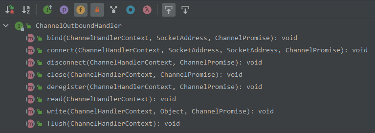

**ChannelHandlerContext**：

* ChannelHandlerContext：继承了ChannelInboundInvoker和ChannelOutboundInvoker，同时也定义了一些能够获取Context上下文环境中channel、executor、handler、pipeline和内存分配器等方法。

  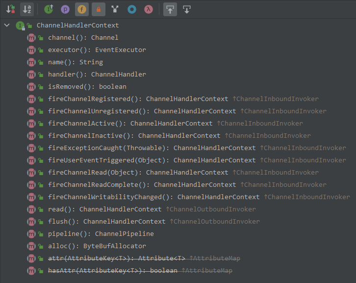

  ```JAVA
  public interface ChannelHandlerContext extends AttributeMap, ChannelInboundInvoker, ChannelOutboundInvoker {
  ```

* ChannelInboundInvoker和ChannelOutboundInvoker：这两个接口是在入站和出站的handler外层再包装一层，达到在方法前后拦截并做一些特定操作的目的。

  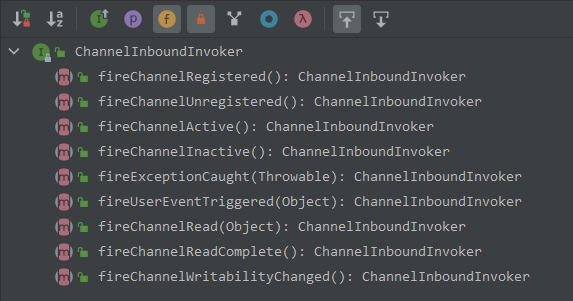

  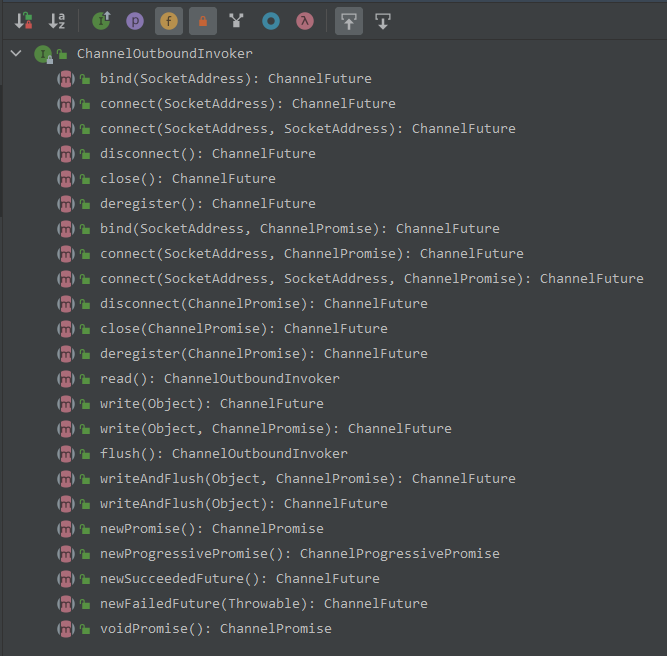

* AbstractChannelHandlerContext：


### ChannelPipeline/ChannelHandler/ChannelHandlerContext创建过程源码分析

* ChannelPipeline创建过程：每一个NioSocketChannel创建时都会创建一个ChannelPipeline。

```java
// NioSocketChannel的抽象父类AbstractChannel的构造方法
protected AbstractChannel(Channel parent) {
    this.parent = parent;
    id = newId();
    unsafe = newUnsafe();
    pipeline = newChannelPipeline();
}
```

```JAVA
protected DefaultChannelPipeline newChannelPipeline() {
    return new DefaultChannelPipeline(this);
}

protected DefaultChannelPipeline(Channel channel) {
    this.channel = ObjectUtil.checkNotNull(channel, "channel");
    // 创建future用于异步回调使用 
    succeededFuture = new SucceededChannelFuture(channel, null);
    voidPromise =  new VoidChannelPromise(channel, true);

    // 创建pipeline链表结构的头尾节点
    tail = new TailContext(this);
    head = new HeadContext(this);
	
    // 将两个节点互相连接，形成双向链表
    head.next = tail;
    tail.prev = head;
}
```

* ChannelHandlerContext创建过程：当用户或系统调用pipeline的addxxx方法添加handler时，都会创建一个包装这个handler的Context。

```JAVA
@Override
public final ChannelPipeline addLast(EventExecutorGroup group, String name, ChannelHandler handler) {
    final AbstractChannelHandlerContext newCtx;
    synchronized (this) {
        // 检查handler实例是否是共享的，若不是且已被其他pipeline使用，则抛出异常
        checkMultiplicity(handler);

        // 通过newContext创建一个和handler关联的context
        newCtx = newContext(group, filterName(name, handler), handler);

        // 将context追加到链表中
        addLast0(newCtx);

        // If the registered is false it means that the channel was not registered on an eventloop yet.
        // In this case we add the context to the pipeline and add a task that will call
        // ChannelHandler.handlerAdded(...) once the channel is registered.
        if (!registered) {
            newCtx.setAddPending();
            callHandlerCallbackLater(newCtx, true);
            return this;
        }

        EventExecutor executor = newCtx.executor();
        if (!executor.inEventLoop()) {
            newCtx.setAddPending();
            executor.execute(new Runnable() {
                @Override
                public void run() {
                    callHandlerAdded0(newCtx);
                }
            });
            return this;
        }
    }
    callHandlerAdded0(newCtx);
    return this;
}
```


### ChannelPipeline的handler调度源码分析

* 当请求进入时，会调用pipeline的相关方法，若是入站事件，这些方法由fire开头，表示开始在管道中流动，让后续的handler继续处理。其中调用的invoke开头的静态方法传入的是head，即会先调用head的ChannelInboundInvoker接口的方法，然后调用handler真正的方法。

```JAVA
@Override
public final ChannelPipeline fireChannelActive() {
    AbstractChannelHandlerContext.invokeChannelActive(head);
    return this;
}

@Override
public final ChannelPipeline fireChannelInactive() {
    AbstractChannelHandlerContext.invokeChannelInactive(head);
    return this;
}

@Override
public final ChannelPipeline fireExceptionCaught(Throwable cause) {
    AbstractChannelHandlerContext.invokeExceptionCaught(head, cause);
    return this;
}

@Override
public final ChannelPipeline fireUserEventTriggered(Object event) {
    AbstractChannelHandlerContext.invokeUserEventTriggered(head, event);
    return this;
}

@Override
public final ChannelPipeline fireChannelRead(Object msg) {
    AbstractChannelHandlerContext.invokeChannelRead(head, msg);
    return this;
}

@Override
public final ChannelPipeline fireChannelReadComplete() {
    AbstractChannelHandlerContext.invokeChannelReadComplete(head);
    return this;
}

@Override
public final ChannelPipeline fireChannelWritabilityChanged() {
    AbstractChannelHandlerContext.invokeChannelWritabilityChanged(head);
    return this;
}
```

* 若是出站事件，则由tail开始处理。

```JAVA
@Override
public final ChannelFuture bind(SocketAddress localAddress) {
    return tail.bind(localAddress);
}

@Override
public final ChannelFuture connect(SocketAddress remoteAddress) {
    return tail.connect(remoteAddress);
}

@Override
public final ChannelFuture connect(SocketAddress remoteAddress, SocketAddress localAddress) {
    return tail.connect(remoteAddress, localAddress);
}

@Override
public final ChannelFuture disconnect() {
    return tail.disconnect();
}

@Override
public final ChannelFuture close() {
    return tail.close();
}

@Override
public final ChannelFuture deregister() {
    return tail.deregister();
}

@Override
public final ChannelPipeline flush() {
    tail.flush();
    return this;
}

@Override
public final ChannelFuture bind(SocketAddress localAddress, ChannelPromise promise) {
    return tail.bind(localAddress, promise);
}

@Override
public final ChannelFuture connect(SocketAddress remoteAddress, ChannelPromise promise) {
    return tail.connect(remoteAddress, promise);
}

@Override
public final ChannelFuture connect(
    SocketAddress remoteAddress, SocketAddress localAddress, ChannelPromise promise) {
    return tail.connect(remoteAddress, localAddress, promise);
}

@Override
public final ChannelFuture disconnect(ChannelPromise promise) {
    return tail.disconnect(promise);
}
```

* 调度过程：

  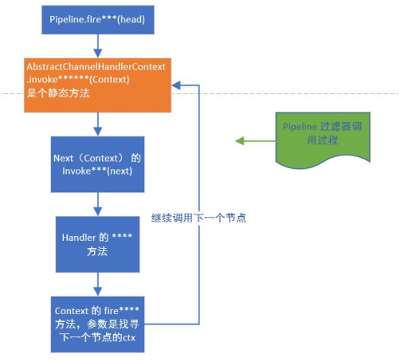

```JAVA
// 以入站事件为例，debug追踪到DefaultChannelPipeline的fireChannelRead方法的调用
@Override
public final ChannelPipeline fireChannelRead(Object msg) {
    // 调用AbstractChannelHandlerContext的invoke开头的静态方法，从head开始处理
    AbstractChannelHandlerContext.invokeChannelRead(head, msg);
    return this;
}
```

```JAVA
// AbstractChannelHandlerContext抽象类
@Override
public ChannelHandlerContext fireChannelRead(final Object msg) {
    invokeChannelRead(findContextInbound(), msg);
    return this;
}

static void invokeChannelRead(final AbstractChannelHandlerContext next, Object msg) {
    final Object m = next.pipeline.touch(ObjectUtil.checkNotNull(msg, "msg"), next);
    EventExecutor executor = next.executor();
    if (executor.inEventLoop()) {
        next.invokeChannelRead(m);
    } else {
        executor.execute(new Runnable() {
            @Override
            public void run() {
                next.invokeChannelRead(m);
            }
        });
    }
}
```

```JAVA
private void invokeChannelRead(Object msg) {
    if (invokeHandler()) {
        try {
            // 具体执行handler自定义的channelRead进行处理
            ((ChannelInboundHandler) handler()).channelRead(this, msg);
        } catch (Throwable t) {
            notifyHandlerException(t);
        }
    } else {
        fireChannelRead(msg);
    }
}
```

```JAVA
volatile AbstractChannelHandlerContext next;
volatile AbstractChannelHandlerContext prev;

private final boolean inbound;
private final boolean outbound;

private AbstractChannelHandlerContext findContextInbound() {
    AbstractChannelHandlerContext ctx = this;
    do {
        // 入站事件从head开始，通过next向后执行
        ctx = ctx.next;
    } while (!ctx.inbound);
    return ctx;
}

private AbstractChannelHandlerContext findContextOutbound() {
    AbstractChannelHandlerContext ctx = this;
    do {
        // 出站事件从tail开始，通过prev向前执行
        ctx = ctx.prev;
    } while (!ctx.outbound);
    return ctx;
}
```


### EventLoop事件循环源码分析


* EventLoop通过SingleThreadEventExecutor#execute添加普通任务，通过AbstractScheduledEventExecutor#schedule添加定时任务：

```JAVA
@Override
public void execute(Runnable task) {
    if (task == null) {
        throw new NullPointerException("task");
    }

    boolean inEventLoop = inEventLoop();
    // 判断当前线程是否已经是EventLoop线程
    if (inEventLoop) {
        // 若是，则代表线程已经运行了EventLoop，直接将task加入到任务队列中去
        addTask(task);
    } else {
        // 若不是，则尝试启动EventLoop，然后再将task加入到任务队列中
        startThread();
        addTask(task);
        // 若线程已经停止且删除任务失败，则执行task拒绝策略，默认是抛出异常
        if (isShutdown() && removeTask(task)) {
            reject();
        }
    }
	
    // 当执行execute方法时，唤醒selector，防止selector阻塞时间过长
    if (!addTaskWakesUp && wakesUpForTask(task)) {
        wakeup(inEventLoop);
    }
}
```

* 普通任务被存储在mpscQueue中，而定时任务则被存储在PriorityQueue\<ScheduledFutureTask\>()中。

```JAVA
@Override
public <V> ScheduledFuture<V> schedule(Callable<V> callable, long delay, TimeUnit unit) {
    ObjectUtil.checkNotNull(callable, "callable");
    ObjectUtil.checkNotNull(unit, "unit");
    if (delay < 0) {
        throw new IllegalArgumentException(
            String.format("delay: %d (expected: >= 0)", delay));
    }
    return schedule(new ScheduledFutureTask<V>(
        this, callable, ScheduledFutureTask.deadlineNanos(unit.toNanos(delay))));
}

<V> ScheduledFuture<V> schedule(final ScheduledFutureTask<V> task) {
    if (inEventLoop()) {
        scheduledTaskQueue().add(task);
    } else {
        execute(new Runnable() {
            @Override
            public void run() {
                scheduledTaskQueue().add(task);
            }
        });
    }
    return task;
}
```

* 普通任务加入taskQueue队列的源码分析：

```JAVA
protected void addTask(Runnable task) {
    if (task == null) {
        throw new NullPointerException("task");
    }
    if (!offerTask(task)) {
        reject(task);
    }
}

final boolean offerTask(Runnable task) {
    if (isShutdown()) {
        reject();
    }
    // 将task任务加入到EventLoop的任务队列中
    return taskQueue.offer(task);
}
```

* 启动EventLoop事件循环的源码分析：

```JAVA
private void startThread() {
    // 判断状态state，是否已经启动过了
    if (state == ST_NOT_STARTED) {
        // 若是第一次启动，则通过CAS将状态state改为已启动
        if (STATE_UPDATER.compareAndSet(this, ST_NOT_STARTED, ST_STARTED)) {
            try {
                // 具体的启动方法
                doStartThread();
            } catch (Throwable cause) {
                STATE_UPDATER.set(this, ST_NOT_STARTED);
                PlatformDependent.throwException(cause);
            }
        }
    }
}
```

```JAVA
private void doStartThread() {
    assert thread == null;
    // exector就是在创建EventLoopGroup时创建的ThreadPerTaskExecutor对象
    // execute方法会将Runnable包装成Netty的FastThreadLocalThread，也就是将当前新的EventLoop提交到EventLoopGroup的线程池中
    executor.execute(new Runnable() {
        @Override
        public void run() {
            thread = Thread.currentThread();
            if (interrupted) {
                thread.interrupt();
            }

            boolean success = false;
            updateLastExecutionTime();
            try {
                // SingleThreadEventExecutor是NioEventLoop的父类，其底层维护了一个单线程的线程池
                // 该行代码就是启动线程池中唯一的一个线程去执行事件循环机制
                SingleThreadEventExecutor.this.run();
                success = true;
            } catch (Throwable t) {
                logger.warn("Unexpected exception from an event executor: ", t);
            } finally {
                // 若执行到此处，则代表线程Loop结束了，会通过自旋+CAS的方式修改state的值为关闭状态
                for (;;) {
                    int oldState = state;
                    if (oldState >= ST_SHUTTING_DOWN || STATE_UPDATER.compareAndSet(
                        SingleThreadEventExecutor.this, oldState, ST_SHUTTING_DOWN)) {
                        break;
                    }
                }

                // Check if confirmShutdown() was called at the end of the loop.
                if (success && gracefulShutdownStartTime == 0) {
                    logger.error("Buggy " + EventExecutor.class.getSimpleName() + " implementation; " +
                                 SingleThreadEventExecutor.class.getSimpleName() + ".confirmShutdown() must be called " +
                                 "before run() implementation terminates.");
                }

                try {
                    // Run all remaining tasks and shutdown hooks.
                    for (;;) {
                        if (confirmShutdown()) {
                            break;
                        }
                    }
                } finally {
                    try {
                        cleanup();
                    } finally {
                        STATE_UPDATER.set(SingleThreadEventExecutor.this, ST_TERMINATED);
                        threadLock.release();
                        if (!taskQueue.isEmpty()) {
                            logger.warn(
                                "An event executor terminated with " +
                                "non-empty task queue (" + taskQueue.size() + ')');
                        }

                        terminationFuture.setSuccess(null);
                    }
                }
            }
        }
    });
}
```

**NioEventLoop#run**：

```JAVA
@Override
protected void run() {
    for (;;) {
        try {
            switch (selectStrategy.calculateStrategy(selectNowSupplier, hasTasks())) {
                case SelectStrategy.CONTINUE:
                    continue;
                case SelectStrategy.SELECT:
                    // 获取感兴趣的事件，在执行select前，标识一个状态，表示当前要进行select操作且处于未唤醒状态
                    select(wakenUp.getAndSet(false));

                    if (wakenUp.get()) {
                        selector.wakeup();
                    }
                default:
            }

            cancelledKeys = 0;
            needsToSelectAgain = false;
            final int ioRatio = this.ioRatio;
            if (ioRatio == 100) {
                try {
                    processSelectedKeys();
                } finally {
                    runAllTasks();
                }
            } else {
                // ioRation的值默认50，所以从这执行
                // ioStartTime记录processSelectedKeys开始执行的时间
                final long ioStartTime = System.nanoTime();
                try {
                    // 当select返回后，通过该方法处理事件
                    processSelectedKeys();
                } finally {
                    // ioTime是processSelectedKeys所执行的时间
                    final long ioTime = System.nanoTime() - ioStartTime;
                    // 根据ioRation的比例执行runAllTasks方法（执行任务队列中的所有任务），默认IO任务和非IO任务的执行时间比是1:1
                    runAllTasks(ioTime * (100 - ioRatio) / ioRatio);
                }
            }
        } catch (Throwable t) {
            handleLoopException(t);
        }
        // 即使循环处理引发异常，也始终处理关闭
        try {
            if (isShuttingDown()) {
                closeAll();
                if (confirmShutdown()) {
                    return;
                }
            }
        } catch (Throwable t) {
            handleLoopException(t);
        }
    }
}
```

**NioEventLoop#select**：

```JAVA
private void select(boolean oldWakenUp) throws IOException {
    Selector selector = this.selector;
    try {
        int selectCnt = 0;
        // select的开始执行时间和执行截止时间（也就是下一次定时任务的开始时间）
        long currentTimeNanos = System.nanoTime();
        // delayNanos返回的就是当前时间距离下一次定时任务开始执行的时间
        long selectDeadLineNanos = currentTimeNanos + delayNanos(currentTimeNanos);
        for (;;) {
            // 当下一个定时任务开始距离当前时间小于0.5ms时，则表示即将有定时任务要执行，会调用非阻塞的selectNow()
            long timeoutMillis = (selectDeadLineNanos - currentTimeNanos + 500000L) / 1000000L;
            if (timeoutMillis <= 0) {
                if (selectCnt == 0) {
                    selector.selectNow();
                    selectCnt = 1;
                }
                break;
            }

            // 如果任务是在wakenUp状态为true时提交的，则该任务没有机会调用
            // hasTasks判断队列中是否有任务，且通过CAS设置wakenUp唤醒状态
            // 若队列中有任务，且唤醒状态成功设置为true，就调用非阻塞的select去执行
            if (hasTasks() && wakenUp.compareAndSet(false, true)) {
                selector.selectNow();
                selectCnt = 1;
                break;
            }
			
            // 若以上条件都不满足，最后会调用阻塞的select
            int selectedKeys = selector.select(timeoutMillis);
            selectCnt ++;
	
            // 若select到了就绪事件 || select被用户唤醒 || 任务队列中有任务 || 有定时任务即将被执行
            // 满足以上任意一种情况，都会跳出循环
            if (selectedKeys != 0 || oldWakenUp || wakenUp.get() || hasTasks() || hasScheduledTasks()) {
                break;
            }
            // 判断线程中断
            if (Thread.interrupted()) {
                // Thread was interrupted so reset selected keys and break so we not run into a busy loop.
                // As this is most likely a bug in the handler of the user or it's client library we will
                // also log it.
                //
                // See https://github.com/netty/netty/issues/2426
                if (logger.isDebugEnabled()) {
                    logger.debug("Selector.select() returned prematurely because " +
                                 "Thread.currentThread().interrupt() was called. Use " +
                                 "NioEventLoop.shutdownGracefully() to shutdown the NioEventLoop.");
                }
                selectCnt = 1;
                break;
            }

            long time = System.nanoTime();
            if (time - TimeUnit.MILLISECONDS.toNanos(timeoutMillis) >= currentTimeNanos) {
                // timeoutMillis elapsed without anything selected.
                selectCnt = 1;
            } else if (SELECTOR_AUTO_REBUILD_THRESHOLD > 0 &&
                       selectCnt >= SELECTOR_AUTO_REBUILD_THRESHOLD) {
                // The selector returned prematurely many times in a row.
                // Rebuild the selector to work around the problem.
                logger.warn(
                    "Selector.select() returned prematurely {} times in a row; rebuilding Selector {}.",
                    selectCnt, selector);

                rebuildSelector();
                selector = this.selector;

                // Select again to populate selectedKeys.
                selector.selectNow();
                selectCnt = 1;
                break;
            }

            currentTimeNanos = time;
        }

        if (selectCnt > MIN_PREMATURE_SELECTOR_RETURNS) {
            if (logger.isDebugEnabled()) {
                logger.debug("Selector.select() returned prematurely {} times in a row for Selector {}.",
                             selectCnt - 1, selector);
            }
        }
    } catch (CancelledKeyException e) {
        if (logger.isDebugEnabled()) {
            logger.debug(CancelledKeyException.class.getSimpleName() + " raised by a Selector {} - JDK bug?",
                         selector, e);
        }
        // Harmless exception - log anyway
    }
}
```

**NioEventLoop#processSelectedKeys**：

```JAVA
private void processSelectedKeys() {
    if (selectedKeys != null) {
        processSelectedKeysOptimized(selectedKeys.flip());
    } else {
        processSelectedKeysPlain(selector.selectedKeys());
    }
}
```

**NioEventLoop#processSelectedKeysOptimized**：

```java
private void processSelectedKeysOptimized(SelectionKey[] selectedKeys) {
    for (int i = 0;; i ++) {
        final SelectionKey k = selectedKeys[i];
        if (k == null) {
            break;
        }
        selectedKeys[i] = null;

        final Object a = k.attachment();

        if (a instanceof AbstractNioChannel) {
            // 取出I/O事件，逐个调用processSelectedKey处理
            processSelectedKey(k, (AbstractNioChannel) a);
        } else {
            @SuppressWarnings("unchecked")
            NioTask<SelectableChannel> task = (NioTask<SelectableChannel>) a;
            processSelectedKey(k, task);
        }

        if (needsToSelectAgain) {
            for (;;) {
                i++;
                if (selectedKeys[i] == null) {
                    break;
                }
                selectedKeys[i] = null;
            }

            selectAgain();
            selectedKeys = this.selectedKeys.flip();
            i = -1;
        }
    }
}
```

**NioEventLoop#processSelectedKey**：

```java
final AbstractNioChannel.NioUnsafe unsafe = ch.unsafe();
if (!k.isValid()) {
    final EventLoop eventLoop;
    try {
        eventLoop = ch.eventLoop();
    } catch (Throwable ignored) {
        return;
    }
    if (eventLoop != this || eventLoop == null) {
        return;
    }
    // close the channel if the key is not valid anymore
    unsafe.close(unsafe.voidPromise());
    return;
}
// 获取事件的就绪类型，执行不同的策略
int readyOps = k.readyOps();
if ((readyOps & SelectionKey.OP_CONNECT) != 0) {
    int ops = k.interestOps();
    ops &= ~SelectionKey.OP_CONNECT;
    k.interestOps(ops);

    unsafe.finishConnect();
}

if ((readyOps & SelectionKey.OP_WRITE) != 0) {
    ch.unsafe().forceFlush();
}

if ((readyOps & (SelectionKey.OP_READ | SelectionKey.OP_ACCEPT)) != 0 || readyOps == 0) {
    unsafe.read();
    if (!ch.isOpen()) {
        return;
    }
}
```

**SingleThreadEventExecutor#runAllTasks**：

```JAVA
/**
 * 执行队列中的任务
 */
protected boolean runAllTasks(long timeoutNanos) {
    // 任务聚合
    fetchFromScheduledTaskQueue();
    // 取出一个任务
    Runnable task = pollTask();
    if (task == null) {
        afterRunningAllTasks();
        return false;
    }

    // 计算截止时间，即for循环执行到deadline就截止
    final long deadline = ScheduledFutureTask.nanoTime() + timeoutNanos;
    // 任务执行计数器
    long runTasks = 0;
    long lastExecutionTime;
    for (;;) {
        // 以串行的方式执行任务
        safeExecute(task);

        runTasks ++;

        // 每执行64次检查一次超时（根据经验硬编码的次数）
        if ((runTasks & 0x3F) == 0) {
            lastExecutionTime = ScheduledFutureTask.nanoTime();
            // 若超过截止时间，则退出任务执行
            if (lastExecutionTime >= deadline) {
                break;
            }
        }

        task = pollTask();
        if (task == null) {
            lastExecutionTime = ScheduledFutureTask.nanoTime();
            break;
        }
    }

    // 执行一些收尾性质的任务
    afterRunningAllTasks();
    this.lastExecutionTime = lastExecutionTime;
    return true;
}
```

**SingleThreadEventExecutor#fetchFromScheduledTaskQueue**：

```java
/**
 * 任务聚合：即将执行的定时任务和待处理的普通任务，都会放入mpscQueue里去执行
 */
private boolean fetchFromScheduledTaskQueue() {
    // 可以看做是一个截止日期
    long nanoTime = AbstractScheduledEventExecutor.nanoTime();
    // 在定时任务队列中取出一个离截止日期事件最近的定时任务（定时任务队列是按照截止日期排队的）
    Runnable scheduledTask  = pollScheduledTask(nanoTime);
    while (scheduledTask != null) {
        // 尝试将取出的定时任务加入普通任务队列中
        if (!taskQueue.offer(scheduledTask)) {
            // 若普通任务队列中没有剩余空间，会将定时任务重新加入定时任务队列
            scheduledTaskQueue().add((ScheduledFutureTask<?>) scheduledTask);
            return false;
        }
        scheduledTask  = pollScheduledTask(nanoTime);
    }
    return true;
}
```


### 任务加入异步线程池源码分析

* 在Netty的NioEventLoop线程中做耗时的，不可预料的操作，如数据连接，网络请求等，会严重影响Netty对Socket的IO操作的效率。解决方法就是将耗时任务添加到异步线程池EventExecutorGroup中去执行。
* 将耗时任务添加到线程池中的操作有两种方式，一个是在handler中添加，一个是在Context中添加。

**handler中加入异步线程池**：

```JAVA
@Sharable
public class EchoServerHandler extends ChannelInboundHandlerAdapter {

    // EventExecutorGroup充当业务线程池，可以将耗时任务提交到该线程池
    static final EventExecutorGroup group = new DefaultEventExecutorGroup(16);

    @Override
    public void channelRead(ChannelHandlerContext ctx, Object msg) throws Exception {
        // 任务执行方式1: 提交到当前channel所属的eventLoop线程的任务队列等待执行
        ctx.channel().eventLoop().execute(() -> {
            try {
                Thread.sleep(5 * 1000);
                ctx.writeAndFlush(Unpooled.copiedBuffer("hello, client", CharsetUtil.UTF_8));
            } catch (Exception ex) {
                System.out.println("exception: " + ex.getMessage());
            }
        });

        // 任务执行方式2：提交给异步的业务线程池来执行
        group.submit(() -> {
            // 以下的操作异步执行
            ByteBuf buf = (ByteBuf) msg;
            byte[] bytes = new byte[buf.readableBytes()];
            buf.readBytes(bytes);
            String body = new String(bytes, StandardCharsets.UTF_8);
            Thread.sleep(10 * 1000);
            // 这一步会将write操作返回给eventLoop线程执行（即放入eventLoop的任务队列中）
            ctx.writeAndFlush(Unpooled.copiedBuffer("hello, client", CharsetUtil.UTF_8));
            return null;
        });

        // 任务执行方式3：由当前channel所属的eventLoop线程同步执行
        ByteBuf buf = (ByteBuf) msg;
        byte[] bytes = new byte[buf.readableBytes()];
        buf.readBytes(bytes);
        String body = new String(bytes, StandardCharsets.UTF_8);
        Thread.sleep(10 * 1000);
        ctx.writeAndFlush(Unpooled.copiedBuffer("hello, client", CharsetUtil.UTF_8));
    }

    @Override
    public void channelReadComplete(ChannelHandlerContext ctx) {
        ctx.flush();
    }

    @Override
    public void exceptionCaught(ChannelHandlerContext ctx, Throwable cause) {
        ctx.close();
    }
}
```

* 任务执行方式2的write操作源码分析（分析AbstractChannelHandlerContext的write()源码）：


```JAVA
private void write(Object msg, boolean flush, ChannelPromise promise) {
    AbstractChannelHandlerContext next = findContextOutbound();
    final Object m = pipeline.touch(msg, next);
    // 获取handlerContext的channel对应的EventLoop线程executor（即I/O线程）
    EventExecutor executor = next.executor();
    // 判断当前的线程是否是executor
    if (executor.inEventLoop()) {
        // 若是，则执行正常处理流程
        if (flush) {
            next.invokeWriteAndFlush(m, promise);
        } else {
            next.invokeWrite(m, promise);
        }
    } else {
        // 若不是，代表当前调用write方法的是异步线程池中的线程（即业务线程），则将该write操作封装为task
        AbstractWriteTask task;
        if (flush) {
            task = WriteAndFlushTask.newInstance(next, m, promise);
        }  else {
            task = WriteTask.newInstance(next, m, promise);
        }
        // 最后让task加入executor的任务队列中去执行
        safeExecute(executor, task, promise, m);
    }
}
```

```JAVA
private static void safeExecute(EventExecutor executor, Runnable runnable, ChannelPromise promise, Object msg) {
    try {
        // 加入任务队列
        executor.execute(runnable);
    } catch (Throwable cause) {
        try {
            promise.setFailure(cause);
        } finally {
            if (msg != null) {
                ReferenceCountUtil.release(msg);
            }
        }
    }
}
```

**handlerContext中加入异步线程池**：

```JAVA
public final class EchoServer {

    static final boolean SSL = System.getProperty("ssl") != null;
    static final int PORT = Integer.parseInt(System.getProperty("port", "8008"));

    // 异步的业务线程池
    static final EventExecutorGroup group = new DefaultEventExecutorGroup(2);

    public static void main(String[] args) throws Exception {
        final SslContext sslCtx;
        if (SSL) {
            SelfSignedCertificate ssc = new SelfSignedCertificate();
            sslCtx = SslContextBuilder.forServer(ssc.certificate(), ssc.privateKey()).build();
        } else {
            sslCtx = null;
        }

        EventLoopGroup bossGroup = new NioEventLoopGroup(1);
        EventLoopGroup workerGroup = new NioEventLoopGroup();
        try {
            ServerBootstrap b = new ServerBootstrap();
            b.group(bossGroup, workerGroup)
             .channel(NioServerSocketChannel.class)
             .option(ChannelOption.SO_BACKLOG, 100)
             .handler(new LoggingHandler(LogLevel.INFO))
             .childHandler(new ChannelInitializer<SocketChannel>() {
                 @Override
                 public void initChannel(SocketChannel ch) throws Exception {
                     ChannelPipeline p = ch.pipeline();
                     if (sslCtx != null) {
                         p.addLast(sslCtx.newHandler(ch.alloc()));
                     }
                     // 指定一个异步线程池来执行handler的处理逻辑
                     p.addLast(group, new EchoServerHandler());
                 }
             });

            ChannelFuture f = b.bind(PORT).sync();
            f.channel().closeFuture().sync();
        } finally {
            bossGroup.shutdownGracefully();
            workerGroup.shutdownGracefully();
        }
    }
}
```


## Netty-零拷贝机制

**操作系统层面的零拷贝机制**：是指避免用户态和内核态之间来回拷贝数据，而划分出的共享空间供双方操作。

**Netty的零拷贝机制体现在以下几个方面**：

* 提供CompositeByteBuf类，可以将多个ByteBuf合并为一个逻辑上的ByteBuf，避免了各个ByteBuf间的拷贝；
* ByteBuf支持slice分片操作，因此可以将ByteBuf分解为多个共享同一存储区域的ByteBuf，避免了内存的拷贝；
* 通过FileRegion包装的FileChannel.tranferTo实现文件传输，可以直接将文件缓冲区的数据发送到目标Channel，避免了传统的write循环方式导致的内存拷贝问题。


## Netty-客户端和服务端启动过程

### 服务端

```JAVA
// bossGroup⽤于Accept连接建立事件并分发请求
EventLoopGroup bossGroup = new NioEventLoopGroup(1);
// workerGroup⽤于处理I/O读写事件和业务逻辑
EventLoopGroup workerGroup = new NioEventLoopGroup();
try {
    // 服务端启动引导类
    ServerBootstrap bootstrap = new ServerBootstrap();
    bootstrap
        // 给引导类配置事件循环组
        .group(bossGroup, workerGroup)
        // 指定Channel为NIO模型
        .channel(NioServerSocketChannel.class)
        // 设置连接配置参数
        .option(ChannelOption.SO_BACKLOG, 1024)
        .childOption(ChannelOption.SO_KEEPALIVE, true)
        // 配置入站出站事件的处理器
        .childHandler(new ChannelInitializer<SocketChannel>() {
            @Override
            public void initChannel(SocketChannel ch) {
                ChannelPipeline p = ch.pipeline();
                // ⾃定义客户端消息的业务处理逻辑
                p.addLast(new HelloServerHandler());
            }
    	});
    // 阻塞绑定端⼝
    ChannelFuture f = b.bind(port).sync();
    // 阻塞等待直到服务端的Channel关闭
    f.channel().closeFuture().sync();
} finally {
    // 优雅关闭相关线程组资源
    bossGroup.shutdownGracefully();
    workerGroup.shutdownGracefully();
}
```


### 客户端

```JAVA
// 创建NioEventLoopGroup对象实例
EventLoopGroup group = new NioEventLoopGroup();
try {
    // 创建客户端启动引导类Bootstrap
    Bootstrap bootstrap = new Bootstrap();
    bootstrap
        // 指定线程组
        .group(group)
        // 指定NIO模型
        .channel(NioSocketChannel.class)
    	.handler(new ChannelInitializer<SocketChannel>() {
            @Override
        	public void initChannel(SocketChannel ch) throws Exception {
            	ChannelPipeline p = ch.pipeline();
            	// ⾃定义消息的业务处理逻辑
            	p.addLast(new HelloClientHandler(message));
        	}
    	});
    // 阻塞建⽴连接
    ChannelFuture f = b.connect(host, port).sync();
    // 阻塞等待连接关闭
    f.channel().closeFuture().sync();
} finally {
	group.shutdownGracefully();
}
```


## Netty-解决TCP的粘包/拆包问题

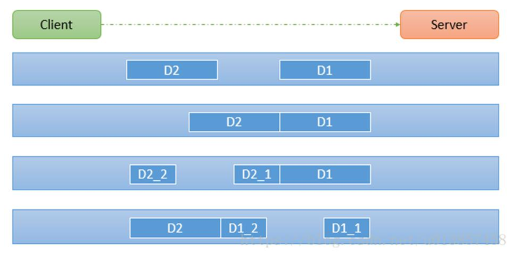

**什么是TCP粘包/拆包？**基于TCP传输数据时，发送方为了更有效的发送数据包，使用Nagle算法来优化，将多次间隔较小且数据量小的数据合成一个大的数据块，然后进行封包。这样做虽然提高了效率，但会造成接收端对数据的边界无法分辨，因为面向流的通信是无消息边界保护的。

**使用Netty的解码器解决**：

* LineBasedFrameDecoder：发送端发送数据包时，每个数据包之间以换行符做为分隔，该解码器的工作原理就是依次比较ByteBuf中的可读字节，判断是否有换行符，然后进行对应的截取；
* DelimiterBasedFrameDecoder：即可自定义分隔符解码器，LineBasedFrameDecoder就是DelimiterBasedFrameDecoder的一种自定义实现；
* FixedLengthFrameDecoder：固定长度解码器，能够按照指定的长度对消息进行相应的拆包；
* LengthFieldBasedFrameDecoder：自定义长度解码器。


## Netty-长连接和心跳服务

### 基本概念

**Netty的长连接机制即TCP的长连接机制**：当通信双方建立连接后，就不会轻易断开连接，而是维持一段时间，在这段时间内双方的数据收发不需要事先建立连接。

**Netty的心跳机制**：在TCP保持长连接的过程中，可能会出现网络异常导致连接中断，因此Netty在应用层引入了心跳机制让通信双方能够知道对方是否在线。心跳机制的原理是client与server之间若一定的时间没有数据交互时，即处于idle状态，client就会发送一个特殊的报文，当server接收到后也会回复一个，即完成了一次PING-PONG交互。所以，当一方收到对方的心跳报文后，就知道其仍然在线。


### Netty提供的心跳机制

Netty提供了IdleStateHandler，ReadTimeoutHandler，WriteTimeoutHandler三个Handler来检测连接的有效性。

| 序号 |        名称         |                             作用                             |
| :--: | :-----------------: | :----------------------------------------------------------: |
|  1   |  IdleStateHandler   | 当连接空闲时间（读/写）过长时，将会触发一个IdleStateEvent事件，然后通过ChannelInboundHandler中重写userEventTrigged方法来处理该事件。 |
|  2   | ReadTimeoutHandler  | 如果在指定的时间内没有发生读事件，就会抛出异常，且自动关闭连接，可以在exceptionCaught方法中处理该异常。 |
|  3   | WriteTimeoutHandler | 当一个写操作不能在一定的事件内完成时，就会抛出异常，且自动关闭连接，可以在exceptionCaught方法中处理该异常。 |


# Linux操作和概念及其内核原理

## Linux内核的进程管理

### 进程在Linux中的实现

* **Linux进程：**处于执行期的程序以及相关资源（打开的文件、挂起的信号、内核内部数据、处理器状态）的总称。 

* **Linux线程：**是在进程中活动的对象，每个线程都拥有一个独立的程序计数器、栈空间和一组寄存器。内核调度的对象是线程，而不是进程。Linux不区分进程和线程，对它来说线程就是一种特殊的进程。

* **进程描述符**：内核将其管理的所有进程存放在一个叫做任务队列的双向循环链表中，链表中的每一项类型都为`task_struct`，称为进程描述符结构，描述了一个具体进程的所有信息。

  ```C
  struct task_struct {
  	// 进程状态
  	long state;
  	// 虚拟内存结构体
  	struct mm_struct *mm;
  	// 进程号
  	pid_t pid;
  	// 指向父进程的指针
  	struct task_struct __rcu *parent;
  	// 子进程列表
  	struct list_head children;
  	// 存放文件系统信息的指针
  	struct fs_struct *fs;
  	// 一个数组，包含该进程打开的文件指针
  	struct files_struct *files;
  };
  ```

* **分配进程描述符**：Linux通过slab分配器分配进程描述符结构，这样能够对象复用和缓存着色。每个任务的`thread_info`结构在其内核栈尾端分配，其中task域存放的是指向该任务实际的进程描述符的指针。

* **进程家族树**：所有的进程都是PID为1的init进程的后代，内核在系统启动的最后阶段启动init进程，该进程读取系统的初始化脚本并执行其他的相关程序，最终完成整个系统启动的过程。每个进程描述符结构都包含一个指向其父进程描述符结构的parent指针，还包含一个children列表。

* **进程创建**：Linux将进程的创建分解为两个单独的函数执行：``fork()和exec()``。fork()通过拷贝当前进程创建一个子进程，exec()负责读取可执行文件并将其载入地址空间开始运行。

* **写时拷贝**：Linux的fork()使用写时拷贝页实现，这是一种推迟甚至免除拷贝数据的技术，在创建子进程时，内核并不复制整个进程地址空间，而是让父子进程共享一个拷贝，只有在写入的时候，数据才会被复制。 


### 进程创建操作fork

父进程通过调用fork函数创建子进程：

* 为子进程分配一个空闲的proc结构，即进程描述符；
* 赋予子进程唯一的标识PID；
* 以一次一页的方式复制父进程的用户地址空间；
* 获得子进程继承的共享资源的指针，如打开的文件和当前工作目录等；
* 子进程就绪，加入调度队列；
* 对子进程返回标识符0，向父进程返回子进程的PID。

fork函数复制了一个自己，但是创建子进程并非要运行另一个与父进程一模一样的进程，绝大部分的子进程需要运行不同的程序，这时需要调用exec函数来替换原父进程的代码：

* 在原进程空间装入新程序的代码、数据、堆和栈；
* 保持进程ID和父进程ID等；
* 继承控制终端；
* 保留所有文件信息，如目录、文件模式和文件锁等。

信号（Signal）函数是Linux/Unix处理异步事件的经典方法，信号可以说是进程控制的一部分：

* 当用户触发某些终端键时；
* 硬件异常产生信号，如除数为0、无效的存储访问等；
* 进程用kill函数可将信号发送给另一个进程或进程组；
* 用户可用kill函数将信号发送给其他进程；
* 当检测到某种事件已经发生，并将信号通知有关进程。


### 线程在Linux中的实现

* 从内核的角度来看，Linux将所有的线程当作进程来实现。线程仅仅被视为一个与其他进程共享某些资源的进程，拥有属于自己的`task_struct`描述符。 
* **创建线程**：和创建普通进程类似，在调用clone()时传递参数指明共享资源：`clone(CLONE_VM | CLONE_FS | CLONE_FILES | CLONE_SIGHAND, 0)`。调用结果和fork()差不多，只是父子进程共享地址空间、文件系统资源、打开的文件描述符和信号处理程序。
* **内核线程**：用于内核在后台执行一些任务，是独立运行在内核空间的标准进程。和普通进程的区别是内核线程没有独立的地址空间，只在内核空间运行，不切换到用户空间。如软中断ksoftirqd和flush都是内核线程的例子。


### Pthread线程包

|       线程调用       |              描述              |
| :------------------: | :----------------------------: |
|    Pthread_create    |         创建一个新线程         |
|     Pthread_exit     |         结束调用的线程         |
|     Pthread_join     |     等待一个特定的线程退出     |
|    Pthread_yield     |  释放处理器来运行另外一个线程  |
|  Pthread_attr_init   | 创建并初始化一个线程的属性结构 |
| Pthread_attr_destroy |     删除一个线程的属性结构     |


## Linux内核的进程调度

* 进程调度：在可运行态进程之间分配有限处理器时间资源的内核子系统。
* 多任务：多任务操作系统是同时并发的交互执行多个进程的操作系统。能使多个进程处于阻塞状态，这些任务位于内存中，但是并不处于可运行状态，而是通过内核阻塞自己，直到某一事件（键盘输入、网络数据等）发生而被唤醒。

* 多任务系统的分类：
  * **非抢占式**：
    * 除非进程自己主动停止运行，否则会一种运行下去（进程主动让出CPU的操作称为让步yielding）。
    * 缺点就是无法对每个进程该执行多长时间统一规定，进程独占的CPU时间可能超出预期。另外，一个绝不做出让步的悬挂进程就能使系统崩溃。
  * **抢占式**：
    * 由调度程序决定什么时候停止一个进程的运行，以便其他进程得到运行机会，这个强制的挂起动作叫做抢占。
    * 时间片：可运行进程在被抢占之前预先设置好的处理器时间段。

* 进程调度策略：**CPU消耗型进程和I/O消耗型进程**。前者把大量的时间用于执行代码上，调度策略往往是降低调度频率，延长其运行时间。而后者是把大量时间消耗在了等待I/O事件响应上，往往在其等待事件的时候调度其他进程让出执行权。

* 进程优先级：
  * **调度程序总是选择时间片用尽且优先级最高的进程运行**。
  * nice值：-20~+19，默认值0，越大的nice优先级越低，越低就越能获得更多时间片。
  * 实时优先级：0~99，数值越大优先级越高。

* Linux调度算法：**完全公平调度CFS**，允许每个进程运行一段时间、循环轮转、选择运行最少的进程作为下一个运行进程，在所有进程总数基础上计算一个进程应该运行多久，不在依靠nice值计算绝对时间片，而是作为进程获得的处理器运行比的权重，越高的nice值越获得更低的处理器使用权重（总之，**CFS中任何进程所获得的处理器时间是由自己和其他所有可运行进程nice值的相对差决定的**）。

* Linux调度实现主要关注以下四个部分：
  * **时间记账**：CFS不再有时间片的概念，但是会维护每个进程运行的时间记账，需要确保每个进程在分配给它的处理器时间内运行；
  * **进程选择**：CFS算法调度核心是当CFS需要选择下一个运行进程时，选择具有最小运行时间的进程。**CFS使用红黑树组织可运行进程的队列**，红黑树的键值为进程最小运行时间，检索对应节点的时间复杂度为log级别（当进程被唤醒或通过fork()调用创建时，会加入红黑树，当进程阻塞或终止则从树上删除）；
  * **调度器入口**：进程调度的入口函数是`schedule()`，其定义在kernel/sched.c文件，是内核其他部分调用进程调度器的入口；
  * **睡眠和唤醒**：睡眠（阻塞）的进程处于一个特殊的不可运行状态。当进程将自己标记为睡眠状态，则会从可执行进程对应的红黑树中移出，放入**等待队列（是由所有等待事件发生的进程组成的链表）**，然后调用`schedule()`调度下一个进程。唤醒的过程则相反，进程被设置为可执行状态，然后从等待队列转移到可执行红黑树中。

* **抢占和上下文切换**：
  * 上下文切换由定义在kernel/sched.c中的`context_switch()`函数负责，每当一个新的进程被选出投入运行的时候，`schedule()`会调用`context_switch()`完成：
  * 将虚拟内存从上一个进程映射切换到新进程中；
  * 从上一个进程的处理器状态切换到新进程的处理器状态，其中包括**保存、恢复栈信息和寄存器信息**。

  * **用户抢占**： 内核在中断处理程序或者系统调用返回后，都会检测`need_resched`标志，从中断处理程序或者系统调用返回的返回路径都是跟体系结构相关的。**即用户抢占会发生在系统调用返回用户空间时，和中断处理程序返回用户空间时**。

  * 内核抢占：2.6版本中，Linux内核引入抢占能力，只要重新调度是安全的（即没有持有锁的情况），内核可以在任何时间抢占正在执行的任务。内核抢占发生在：
    * 中断处理程序正在执行，且返回内核空间之前；
    * 进程在内核空间释放锁的时候；
    * 内核任务显式的调用`schedule()`；
    * 内核中的任务阻塞。


## Linux内核的系统调用

* API、POSI、C库：当需要使用系统功能时，应用程序通过在用户空间实现的应用编程接口API而不是直接通过系统调用来完成，一个API定义了一组应用程序使用的编程接口。

  

* 在Linux系统中，每个系统调度都被赋予了一个**系统调用号**，有以下特点：

  * 系统调用号一旦分配就不能再有变更，否则编译好的程序有可能崩溃；
  * 如果系统调用被删除，所占用的系统调用号不允许被回收利用，否则之前编译过的代码会调用这个系统调用，出现问题。Linux使用未实现系统调用``sys_ni_syscall()``来填补这种空缺，除了返回`-ENOSYS`不做任何工作。

* **系统调用处理程序**：**通知内核的机制通过软中断实现**。通过引发一个中断异常来促使系统切换到内核态去执行异常处理程序，在x86系统上预定义的软中断的中断号是128，**通过int $0x80指令触发**，这条指令触发一个异常导致系统切换到内核态并执行128号异常处理程序（这个异常处理程序就是系统调用处理程序），即``system_call()``。

* **参数传递**：**系统调用额外的参数是存放在寄存器传递给内核的**。在x86-32系统上，ebx、ecx、edx、esi和edi是按顺序存放的前5个参数，若超过5个，需要用单独的寄存器存放所有指向这些参数在用户空间地址的指针。给用户空间的返回值也是通过寄存器传递，在x86系统是存放在eax寄存器中的。

  


# Java基础和容器

## Java基础-概念

### 面向过程和面向对象

* **面向过程**：性能高于面向对象，因为类的调用需要实例化，更为消耗资源，所以当性能是最重要的考虑因素时，如单片机、嵌入式开发、Linux内核等一般采用面向过程开发；
* **面向对象**：更易维护、易复用、易扩展，因为面向对象有封装、继承、多态的特性，所以可用设计出低耦合的系统，时系统更加灵活、更加易于维护。


### JVM、JDK和JRE的区别

**JVM**：

* 概念：即Java虚拟机，是运行Java字节码的虚拟机。通过针对不同系统的特定实现来跨平台，目的是使用相同的字节码，它们都会给出相同的结果；

* 字节码：JVM可用理解的代码就叫做字节码（扩展名为.class的文件），不面向特定的处理器，只面向虚拟机。Java通过字节码的方式，在一定程度上解决了传统解释型语言执行效率低的问题， 同时又保留了解释型语言可移植的特点。所以Java程序运行时比较高效，而且由于字节码不针对一种特定的机器，因此Java程序无需重新编译便可在各种操作系统上运行。

* Java程序从源代码到运行：

  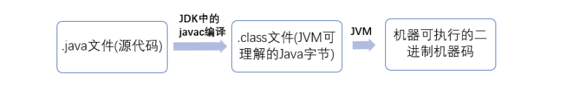

  * 在``.class—>机器码``这一步JVM的类加载器首先加载字节码文件，然后通过解释器逐行解释执行，这种方式执行速度较慢，而且有些方法和代码块是经常需要被调用的（热点代码），所以引入了JIT编译器，而JIT属于运行时编译器；
  * 当JIT完成第一次编译后，就会将字节码对应的机器码保存下来，下次可以直接使用，而机器码的执行效率远高于Java解释器。所以说Java是编译和解释共存的语言。

  * HotSpot采用了惰性评估策略，根据二八定律，消耗大部分资源的只有那一小部分的热点代码，而这也就是JIT所要编译的部分。JVM会根据代码每次被执行的情况收集信息并相应的做出优化，因此执行的次数越多，速度就越快。JDK9引入了新的编译模式AOT，会直接将字节码编译成机器码，从而避免JIT预热等待各个方面的开销。

**JDK和JRE的区别**：

* JDK是Java Development Kit，是功能齐全的Java SDK，拥有JRE所拥有的一切，还有编译工具javac和javadoc等工具，能够创建和编译程序；
* JRE是Java运行时环境，是运行已编译Java程序所需要的所有内容的集合，包括JVM、Java类库、Java命令和其他一些基础构件，但不能创建新程序；
* 若只需要在机器上运行普通Java程序的话，只需要安装JRE即可，若要进行Java源代码的编译等工作，那么就需要安装JDK了。


### OracleJDK和OpenJDK的区别

* OracleJDK大概每6个月发布一次主要版本，而OpenJDK大概每3个月发布一次，但并不是固定的；
* OpenJDK是一个参考模型并且是完全开源的，而OracleJDK是OpenJDK的一个实现，并不是完全开源的；
* OracleJDK比OpenJDK更稳定，虽然二者代码几乎相同，但OracleJDK有更多的类和一些错误修复；
* 在响应性和JVM性能方面，OracleJDK相对于OpenJDK有更好的表现；
* OracleJDK不会为即将发布的版本提供长期支持，用户每次都必须通过更新到最新版本获得支持来获取最新版本；
* OracleJDK根据二进制代码许可证获得许可，而OpenJDK根据GPL v2获得许可。


### Java和C++的区别

* 都是面向对象的语言，都支持封装、继承和多态；
* Java不像C++一样提供指针来直接访问内存，程序内存更加安全；
* Java的类是单继承的，C++支持多继承，但Java的接口可以多继承；
* Java有自动的内存管理机制，不需要手动释放内存。


## Java基础-特性

### 字符型常量和字符串常量的区别

* **形式上：**字符常量是单引号引起的一个字符。字符串常量是双引号引起的若干个字符；

* **含义上：**字符常量相当于一个整型值，对应ASCII码值，可以参与表达式运算。字符串常量代表一个地址值，指向字符串在内存种的存放位置；

* **占内存大小：**字符常量通常占用2个字节。字符串常量占有若干个字节。

* **注：**Java要确定每种基本类型所占存储空间的大小，它们的大小并不像其他大多数语言那样随机器硬件架构的变化而变化，这种所占存储空间大小的不变性是Java程序更具有可移植性的原因之一。

  


### 重载和重写的区别

* **重载：**就是同样的一个方法能够根据输入数据的不同，做出不同的处理。在同一类中，重载的方法名必须相同，参数类型、个数、顺序、返回值和访问修饰符可以不同。重载解析就是一个类中多个同名方法根据不同的传参来执行不同的逻辑处理；
* **重写：**就是当子类继承自父类的相同方法，输入数据一样，但要做出有别于父类的响应时，就要覆盖父类方法。重写发生在运气期间，是子类对父类的允许访问方法的实现过程进行重写编写：
  * 返回值类型、方法名、参数列表必须相同，抛出的异常范围小于等于父类，访问修饰符范围大于等于父类；
  * 如果父类方法访问修饰符为private/final/static，则子类就不能重写该方法，但是被static修饰的方法能够被再次声明；
  * 构造方法无法被重写；
  * 总结：重写就是子类对父类方法的重新改造，外部样子不能改变，内部逻辑可以改变。


### 封装、继承和多态

* **封装：**把一个对象的属性私有化，同时提供一些可以被外界访问的方法操作和获取属性，如果属性不想被外界访问，则不提供对应的方法即可。但如果一个类没有提供给外界访问的方法，那么这个类也就没有什么意义。
* **继承：**使用已存在的类定义作为基础建立新类的技术，新类的定义可以增加新的数据或新的功能，也可以使用父类的功能，但不能选择性的基础父类。通过使用继承能够非常方便的复用以前的代码。
  * 子类拥有父类所有的属性和方法，包括私有属性和私有方法，但是父类中的私有属性和方法子类是无法访问的，只能拥有；
  * 子类可以拥有自己的属性和方法，即子类可以对父类进行扩展；
  * 子类可以用自己的方式实现父类的方法。
* **多态：**指程序中定义的引用变量所指向的具体类型和通过该引用变量进行的方法调用在编程时并不确定，而是在程序运行期间才会确定，即一个引用变量到底会指向哪个类的实例对象，该引用变量进行的方法调用到底是哪个类中实现的方法，必须由程序运行期间才能决定。在Java中可以使用继承（多个子类对父类同一方法的重写）和接口（多个类实现一个接口并覆盖其中的同一方法）来实现多态。


### String、StringBuffer和StringBuilder的区别

**可变性**：

* String类中使用final关键字修饰字符数组来保存字符串，所以String对象是不可变的。

  ```JAVA
  public final class String
      implements java.io.Serializable, Comparable<String>, CharSequence {
      /** The value is used for character storage. */
      private final char value[];
  }
  ```

  为什要设计成不可变的？

  * 可以缓存hash值：如HashMap的String类型的key，需要使用hash值，不可变的特性可以使得hash值不可变，只需要进行一次计算；

  * 字符串常量池的需要：如果一个String对象已被创建过，那么就会从字String Pool中取得引用。如果String Pool没有这个字符串，那么会创建并添加到String Pool。

    

  * 安全性：String经常做为参数，保证参数不可变操作更加安全；

  * 线程安全：使String天生支持线程安全，可以在多个线程安全使用。

* 而StringBuilder与StringBuffer都继承自AbstractStringBuilder类。在该类中也是使用字符数组保存字符串，但没有使用final关键字修饰，所以这两个对象都是可变的；StringBuilder与StringBuffer的构造方法都是调用父类构造方法也就是``AbstractStringBuilder()``实现的。

  ```JAVA
  abstract class AbstractStringBuilder implements Appendable, CharSequence {
      
      /**
       * The value is used for character storage.
       */
      char[] value;
      
      /**
       * The count is the number of characters used.
       */
      int count;
      
      AbstractStringBuilder(int capacity) {
      	value = new char[capacity];
  	}
  }
  ```

**线程安全性**：

* String中的对象是不可变的，可以理解为常量，且线程安全；
* AbstractStringBuilder是StringBuilder和StringBuffer的公共父类，定义了一系列字符串基本操作。StringBuffer对方法加了同步锁保证了线程的安全，StringBuilder则没有，所以线程不安全但效率更高；

**性能**：

* 每次对String类型进行改变的时候，都会生成一个新的String对象，然后将指针指向新的String对象；
* StringBuffer每次都会对StringBuffer对象本身进行操作，而不是生成新的对象并改变对象引用；
* StringBuilder虽然不存在同步锁消耗，但提高的性能有限，且线程不安全。

**总结**：

* 操作少量的数据适用于String；
* 单线程操作字符串缓冲区操作大量数据使用StringBuilder；
* 多线程操作字符串缓冲区操作大量数据使用StringBuffer。


### 接口和抽象类的区别

* 接口中的所有方法默认是public，所有方法在接口中不能有实现（JDK8中接口可以有默认方法和静态方法功能，JDK9中引入了私有方法和私有静态方法）。而抽象类可以有非抽象方法；
* 接口中除了static、final变量，不能有其他变量。而抽象类中则不一定；
* 一个类可以实现多个接口，但只能实现一个抽象类。接口本身可以通过extends关键字扩展多个接口；
* 接口的方法默认修饰符是public，抽象方法可以有public、protected和default这些修饰符，抽象方法就是为了被重写所以不能使用private关键字修饰；
* 从设计层面来说，抽象是对类的抽象，是一种模板设计，而接口是对行为的抽象，是一种行为的规范。


### 成员变量和局部变量的区别

* **从语法形式上来看**：成员变量是属于类的，而局部变量是在方法中定义的变量或是方法的参数。成员变量可以被public、private、static等修饰符所修饰，而局部变量不能被访问控制修饰符及static所修饰，但二者皆可被final修饰；
* **从变量在内存中的存储方式来看**：若成员变量是使用static修饰的，那么这个成员变量就是属于类的，如果没有使用static修饰，这个成员变量就是属于实例的。对象存储在堆内存，如果局部变量类型为基本数据类型，则存储在栈内存，如果是引用类型，则在栈中存储指向堆内存对象的引用或是常量池中的地址；
* **从变量在内存中的生存时间上来看**：成员变量是对象的一部分，随着对象创建而存在，而局部变量是随着方法的调用结束而消失的；
* 成员变量如果没有被赋予初始值，则会自动以该类型的默认值而赋值（被final修饰的成员变量也需要显式赋值），而局部变量则不会自动赋值。


### 静态方法和实例方法的区别

* 在外部调用静态方法时，可以使用``类名.方法名``的形式，也可以使用``对象.方法名``的形式，而实例方法只有后面这种方式，也就是说，调用静态方法无需创建对象；
* 静态方法在访问本类的成员时，只允许访问静态成员，而不允许访问实例成员和实例方法，而实例方法无此限制。


### hashCode()和equals()

* **hashCode()**：作用是获取对象的哈希码。这个哈希码的作用是确定该对象在哈希表中的索引位置。hashCode()定义在JDK的Object.java中，意味着Java中的任何类都包含hashCode()方法；
* **为什么需要hashCode()？**用于HashSet、HashMap中散列表结构的元素存储位置，当元素要加入时，会先计算hashCode，然后定位该元素在散列表中的存储位置，若是位置上有元素存在，则使用equals()判断是否是同一个元素，若不是则重新散列到其他位置，若是则操作失败达到了去重的目的；
* **hashCode()和equals()的相关规定**：
  * 若两个对象相等，则hashCode一定也相同；
  * 若两个对象相等，对两个对象分别调用equals()都会返回true；
  * 若两个对象hashCode相同，但不一定是相等的；
  * equals()被覆盖过，hashCode也必须被覆盖；
  * hashCode()的默认行为是对堆上的对象产生独特值，如果没有重写hashCode()，则该class的两个对象无论如何都不会相等。
* **== 和 equals()**：
  * 对于基本类型，== 判断两个值是否相等，基本类型没有equals()；
  * 对于引用类型，== 判断两个变量是否引用同一对象，而equals()则判断引用的对象是否等价。


### final关键字总结

* **当final修饰一个变量时**：如果是基本数据类型的变量，则数值一旦在初始化后便不能修改。如果是引用类型变量，则在对其初始化后便不能再让其指向另一个对象；
* **当final修饰一个类时**：表名这个类不能被继承，类中的所有成员方法都会隐式的被指定为final修饰；
* **当final修饰一个方法时**：第一是为了锁定方法，以防止任何继承类修改其含义。第二是效率问题，早期会通过final方法提供性能，现版本已经不需要了。类中的所有private方法都隐式的指定为final。


### 反射

**概念：**每个类都有一个Class对象，包含了与类有关的信息。当编译一个新类时，会产生一个同名的 .class 文件，该文件保存着Class对象的信息。类加载就相当于Class对象的加载，类在第一次使用时才会动态加载到JVM中。反射则是提供了在运行时通过 `Class.forName("com.mysql.jdbc.Driver");` 这种方式来动加载类到JVM中。

**Class 和 java.lang.reflect 对反射提供了支持，java.lang.reflect 类库主要包含了以下三个类：**

* Field：可以使用 get() 和 set() 方法读取和修改Field对象关联的字段； 
* Method：可以使用 invoke() 方法调用与Method对象关联的方法；
* Constructor：可以用Constructor的 newInstance() 创建新的对象。

**优点：**

* 可扩展性：应用程序可以利用类的全限定名创建可扩展对象的实例，来使用来自外部的用户自定义类；
* 类浏览器和可视化开发环境：一个类浏览器需要可以枚举类的成员。可视化开发环境（如 IDE）可以从利用反射中可用的类型信息中受益，以帮助程序员编写正确的代码；
* 调试器和测试工具：调试器需要检查一个类中的私有成员。测试工具可以利用反射来自动的调用类里定义的可被发现的API定义，以确保一组测试中有较高的代码覆盖率。

**缺点：**

* 性能开销：反射涉及了动态类型解析，所以JVM无法对这些代码进行优化。因此反射操作的效率要比非反射操作低得多；
* 安全限制：使用反射要求程序员必须在一个没有安全限制的环境中运行。如果一个程序必须在有安全限制的环境中运行，如Applet，那就不适用反射；
* 内部暴露：由于反射允许代码执行一些在正常情况下不被允许的操作（如访问私有的属性和方法），所以使用反射可能会导致意料之外的副作用，这可能导致代码功能失调并破坏可移植性。发射代码破坏了抽象性，因此当平台发生改变时，代码的行为就有可能随之变化。


### 异常处理


* 在Java中，若有的异常都有一个公共的父类，即java.lang包下的Throwable类。该类有两个重要的子类：Exception异常类和Error错误类；
* **Error错误**：是程序无法处理的错误。表示运行应用程序中较严重的问题。大多数错误与代表编写者执行的操作无关，而与代码运行时JVM有关。如虚拟机运行错误VirtulMachineError、当JVM不再有继续执行操作所需的内存资源时的OutOfMemoryError，这些错误发生时JVM一般会选择终止线程；
* **Exception异常**：是程序本身可以处理的异常。Exception存在一个重要的子类RuntimeException运行时异常，该异常由JVM抛出。常见的异常有NullPointerException（空指针异常，即要访问的变量没有引用任何对象）、ArithmeticException（算术运算异常，如整数除0时会抛出）、ArrayIndexOutOfBoundsException（数组下标越界异常）。
* 异常处理：
  * **try块**：用于捕获异常，其后可以接多个catch块，若没有catch块，则必须紧跟一个finally块；
  * **catch块**：用于处理try捕获到的异常；
  * **finally块**：无论是否捕获或处理异常，finally块里的语句都会被执行。当在try块或catch块中遇到return语句时，finally语句块将在方法返回前被执行。
  * finally块不会被执行的特殊情况：finally块内部发生了异常、线程死亡、CPU被关闭、System.exit()退出程序。


### I/O流

* Java中的IO流划分：

  * 按照流的流向划分：可以划分为输入流和输出流；
  * 按照操作单元划分：可以划分为字节流和字符流；
  * 按照流的角色划分为节点流和处理流。

* JavaIO流的40多个类都是从4个抽象类中派生出来的：

  * InputStream/Reader：所有输入流的基类，前者是按字节操作，后者是字符；
  * OutputStream/Writer：所有输出流的基类，前置是按字节操作，后者是字符。

* 按操作方式分类结构图：

  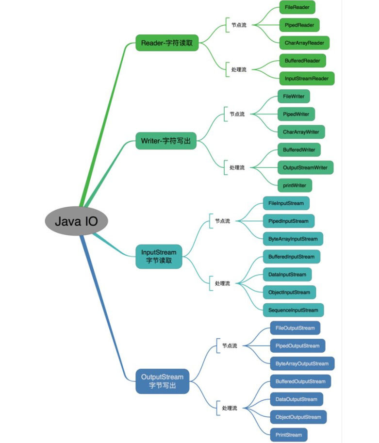

* 按操作对象分类结构图：

  


### BIO、NIO、AIO

* **BIO（Blocking I/O）**：同步阻塞I/O模型，数据的读取写入必须阻塞在一个线程内等待其完成。在活动连接数不是特别高（单机小于1000）的情况下，这种模型是比较不错的，可以让每一个连接都专注于自己的I/O，且编程模型简单，不需要过多的考虑系统的过载、限流等问题。线程池本身就是一个天然的漏斗，可以缓冲一些系统处理不了的连接或请求。但是，当面对10w甚至100w级的连接时，传统的BIO模型就无能为力了；
* **NIO（Non-blocking/New I/O）**：同步非阻塞I/O模型，在JDK1.4中引入了NIO的框架，对应于java.nio包，提供了Channel、Selector、Buffer等抽象。其支持面向缓冲的，基于通道的I/O操作方法。NIO提供了与传统BIO模型中的Socket和ServerSocket相对应的SocketChannel和ServerSocketChannel两种不同的套接字通道实现，两种都支持阻塞和非阻塞模式。阻塞模式和传统IO一样，简单但性能欠佳，而非阻塞模式正好与之相反。对于低负载、低并发的网络应用，可以使用同步阻塞IO来提升并发速率和更好的维护性。对于高负载、高并发的网络应用，可以使用NIO的非阻塞模式来开发；
* **AIO（Asynchronous I/O）**：JDK1.7引入的NIO2，是异步的非阻塞IO模型。其基于事件回调机制实现，即应用操作后会直接返回，不会阻塞等待，当后台处理完成，OS会通知相应的线程进行后续的操作。对于NIO来说，业务线程是在IO操作准备好时，得到通知，接着由这个线程自己进行IO操作，IO操作本身是同步的。


### 深拷贝和浅拷贝


* **浅拷贝：**对基本数据类型进行值拷贝，对引用数据类型进行引用传递的拷贝；
* **深拷贝：**对基本数据类型进行值拷贝，对引用数据类型，则创建新对象，并复制其内容。


## Java容器-基本概念

### Collection接口概述

* Set：
  * SortedSet/TreeSet：基于红黑树实现，支持有序性操作，如根据范围查找元素。查询效率不如HashSet，时间复杂度为O(logN)，而HashSet是O(1)；
  * HashSet/LinkedHashSet：基于哈希表实现，支持快速查找，但不支持有序性操作。且失去了元素插入时的顺序信息，即HashSet中元素的位置是无序的。而底层基于LinkedHashMap实现，可使用双向链表维护元素的插入顺序；
  * EnumSet：
  * CopyOnWriteArraySet：写时复制的ArraySet。相比于CopyOnWriteArrayList没有重复元素；
  * ConcurrentSkipListSet：跳表。
* List：
  * ArrayList：基于可动态扩容的数组实现，支持根据下标随机访问；
  * Vector/Stack：可以看成是线程安全的ArrayList（所有方法都是synchronized的）； 
  * LinkedList：基于双向链表实现，只能顺序访问，但可以快速在任意位置插入和删除元素。且还能够实现栈、队列等结构；
* CopyOnWriteArrayList：是写时复制的ArrayList，当一个ArrayList写操作非常少，读操作非常多时使用。所谓写时复制是当些操作发生时，会整体将数组复制一份并执行写操作，之后将引用重新指向。在大量线程同时访问时，写操作真正操作的是复制后的新数组，而读操作访问原数组就可以无需加锁，以此提高效率。
* Queue：
  * Deque：
    * ArrayDeque：底层使用数组实现的双端队列；
    * BlockingDeque/LinkedBlockingDeque：阻塞的双端队列。
  * BlockingQueue：
    * ArrayBlockingQueue：底层使用数组实现的阻塞队列。队列为空则消费者阻塞，队列已满则生产者阻塞。
    * PriorityBlockingQueue：底层使用堆实现的带优先级的阻塞队列；
    * LinkedBlockingQueue：底层使用链表实现的阻塞队列；
    * TransferQueue/LinkedTransferQueue：生产者和消费者必须成对的队列。生产者会一直阻塞在队列上，直到另一端有消费者过来消费为止；
    * SynchronousQueue：容量为空的队列；
    * DelayQueue：基于阻塞队列实现的延迟队列。提供了在指定时间才能获取队列元素的功能，队列头元素是最接近过期的元素。当生产者线程调用put之类的方法加入元素时，会触发Delayed接口中的compareTo方法进行排序，也就是说队列中元素的顺序是按到期时间排序的，而非它们进入队列的顺序。排在队列头部的元素是最早到期的，越往后到期时间赿晚。
  * LinkedList：可基于双向链表实现双端队列；
  * PriorityQueue：底层使用堆（小顶堆/大顶堆）实现的优先队列；
  * ConcurrentLinkedQueue：并发的且底层使用链表实现的队列；
  * DelayQueue：


### Map接口概述

* TreeMap：基于红黑树实现，元素具有顺序的特性；
* HashMap：JDK1.8之前是由数组+链表组成，数组是主体，链表是为了解决哈希冲突而存在的。JDK1.8后当链表的长度大于阈值8时，将链表转换为红黑树（若当前数组长度小于64，则优先扩容数组），减少搜索时间；
* HashTable：可以看成是线程安全的HashMap；
* LinkedHashMap：使用双向链表维护元素的顺序，顺序为插入顺序或最近最少使用（LRU）顺序；
* WeakHashMap：
* IdentityHashMap：
* ConcurrentHashMap：
* ConcurrentSkipListMap：


### 如何选择集合？

+ 当需要根据键值对获取元素时，就选择Map接口下的集合。需要排序时选择TreeMap，不需要排序则使用HashMap，保证线程安全则使用ConcurrentHashMap；
+ 当只需要存放元素时，就选择Collection接口下的集合。需要保证元素唯一性就选择Set接口下的集合TreeSet和HashSet，不关心重复就选择List接口下的ArrayList和LinkedList。


### 为什么使用集合？

* 当需要保存一组类型相同的数据时，需要一个容器，但使用数组存储对象由很多弊端。在实际开发中，存储数据的类型是多种多样的，所以出现了集合；
* 数组的缺点是一旦声明后，长度就无法改变，同时声明数组的同时也必须指定数据类型，一旦确定后就不法改变，另外，数组存储数据是不提供自定义排序和判重功能的。所以用数组存储数据功能单一不够灵活。


### 线程不安全和安全的集合有哪些？

* **线程不安全的集合：**ArrayList、LinkedList、HashMap、TreeMap、HashSet、TreeSet都不是线程安全的；
* **JUC（java.util.concurrent）包提供了各种并发容器**：
  * ConcurrentHashMap：线程安全的HashMap；
  * CopyOnWriteArrayList：可以看成线程安全的ArrayList，在读多写少的场合性能非常好，远胜于Vector；
  * ConcurrentLinkedQueue：使用链表实现的并发队列，可以看成是一个线程安全的LinkedList，是一个非阻塞队列；
  * BlockingQueue：阻塞队列接口，JDK通过链表、数组等方式实现了这个接口，非常适合作为数据共享的通道；
  * ConcurrentSkipListMap：跳表的实现。底层是一个Map结构，使用跳表的数据结构实现了快速查找。


## Java容器-设计模式

### 迭代器模式

* **是什么？**Java通过Iterator接口实现设计模式中的迭代器，可以对集合进行遍历，但不同集合中的数据结构可能是不相同的，所以存取方式会存在区别。迭代器就是定义了一个统一的接口，并声明了 `hasNext()` 和 `next()` 这两个用于获取数据的方法，具体的实现交由具体的集合去完成。
* **有啥用？**主要是用于遍历集合，特点是安全，因为其可以确保在遍历集合的时候元素不会被更改，一旦被修改，就会抛出异常。

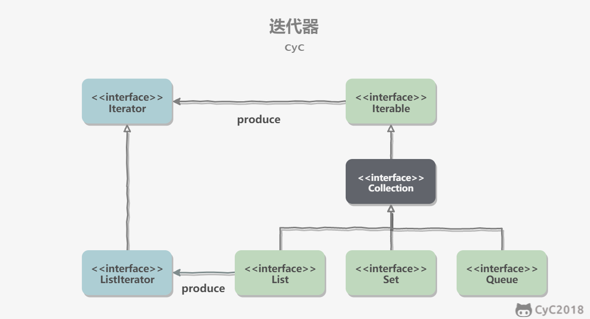


### 适配器模式

* **意图：**将一个类的接口转换成客户希望的另外一个接口。适配器模式使得原本由于接口不兼容而不能一起工作的那些类可以一起工作。
* Java中通过 `java.util.Arrays#asList()` 将数组类型转换为List类型。

```JAVA
@SafeVarargs
public static <T> List<T> asList(T... a)
```


## Java容器-List接口

### ArrayList和Vector的区别

* ArrayList是List的主要实现类，底层使用Object[]存储，适用于频繁的查找工作，线程不安全；
* Vector是List的古老实现类，底层使用Object[]存储，线程安全，效率低，已经不适合使用了。


### ArrayList和LinkedList的区别

* **线程是否安全**：二者皆不同步，不保证线程安全；

* **底层数据结构**：ArrayList使用Object类型数组，LinkedList使用双向链表（JDK1.6之前是双向循环链表，JDK1.7之后取消了循环）；

* **插入和删除是否受元素位置的影响**：

  * ArrayList采用数组存储，所以插入删除的时间复杂度受元素位置影响。如：执行add(E e)方法的时候，ArrayList会默认将指定元素插入到列表的末尾，时间复杂度是O(1)。但若是要通过add(int index, E element)在指定位置插入素的话，时间复杂度就是O(n-i)，因为在进行上述操作时集合中第i和第i个元素之后的(n-i)个元素都要执行向后移位的操作；
  * LinkedList采用链表存储，所以对于add(E e)的插入不受元素位置的影响，近似O(1)。若是要通过add(int index, E element)在指定位置i插入元素的话，时间复杂度近似为O(n)，因为需要先从头移动到指定位置再插入。

* **是否支持快速随机访问**：LinkedList不支持高效的随机元素访问，而ArrayList支持。快速随机访问就是通过元素的序号快速获取元素对象的过程，如get(int index)；

* **内存空间占用**：ArrayList的空间浪费主要体现再列表的结尾会预留一定的容量空间，而LinkedList的空间花费则体现在它的每一个元素都需要消耗相对更多个空间（因为除了存放数据还需要存放前驱和后继指针）。

* **RandomAccess接口：**只有定义没有具体内容的接口，用于标识实现这个接口的类具有随机访问功能。查看binarySearch()的源码发现，若List实现了RandomAccess接口，说明具有随机访问功能，则调用indexedBinarySearch()方法。若没实现，则调用iteratorBinarySearc()，则只能通过迭代去访问。

  ```JAVA
  public static <T> int binarySearch(List<? extends Comparable<? super Tjk list, T key) {
      if (list instanceof RandomAccess || list.size() < BINARYSEARCH_THRESHOLD)
      	return Collections.indexedBinarySearch(list, key);
      else
      	return Collections.iteratorBinarySearch(list, key);
  }
  ```

  ArrayList实现了RandomAccess接口，是因为底层是数组，具有通过下标进行随机访问的功能。而LinkedList没有实现，是因为底层是链表，只有通过迭代访问。

  ```JAVA
  public class ArrayList<E> extends AbstractList<E>
          implements List<E>, RandomAccess, Cloneable, java.io.Serializable
  ```

* LinkedList存储结构：

  ```JAVA
  // 基于双向链表，使用Node存储链表节点
  private static class Node<E> {
      E item;
      Node<E> next;
      Node<E> prev;
  }
  
  // 每个链表都维护first和last指针
  transient Node<E> first;
  transient Node<E> last;
  ```

  

* 双向链表：包含两个指针，一个prev指向前一个节点，一个next指向后一个节点。

  

* 双向循环链表：最后一个节点的next指向head，而head的prev指向最后一个节点，构成一个环形。

  


### ArrayList扩容机制源码分析


构造方法源码分析：

```JAVA
// 数组的默认大小为10
private static final int DEFAULT_CAPACITY = 10;

// 初始化的空数组
private static final Object[] DEFAULTCAPACITY_EMPTY_ELEMENTDATA = {};

// 使用无参构造方法构造时，默认是一个空数组
public ArrayList() {
    this.elementData = DEFAULTCAPACITY_EMPTY_ELEMENTDATA;
}

// 带指定容量参数的构造函数
public ArrayList(int initialCapacity) {
    if (initialCapacity > 0) {	// 若初始容量大于0
        // 创建initialCapacity大小的数组
        this.elementData = new Object[initialCapacity];
    } else if (initialCapacity == 0) {	// 若初始容量等于0
        // 创建空数组
        this.elementData = EMPTY_ELEMENTDATA;
    } else {	// 初始容量小于0，抛出异常
        throw new IllegalArgumentException("Illegal Capacity: " + initialCapacity);
    }
}

// 构造包含指定collection元素的列表，这些元素利用该集合的迭代器按顺序返回
public ArrayList(Collection<? extends E> c) {
    elementData = c.toArray();
    if ((size = elementData.length) != 0) {
        // c.toArray might (incorrectly) not return Object[] (see 6260652)
        if (elementData.getClass() != Object[].class)
            elementData = Arrays.copyOf(elementData, size, Object[].class);
    } else {
        // replace with empty array.
        this.elementData = EMPTY_ELEMENTDATA;
    }
}
```

`add()`  方法源码分析：

* 当add第1个元素时，elementData.length为0，执行``ensureCapacityInternal()`` 方法后，因为是默认数组，所以minCapacity为10。接着 ``ensureExplicitCapacity()`` 方法中的 `minCapacity - elementData.length > 0` 条件成立，进入 ``grow(minCapacity)`` 扩容；
* 当add第2个元素时，elementData.length已经被扩容为10，执行``ensureCapacityInternal()`` 方法后， 因为是扩容后的新数组，所以minCapacity为2。接着 ``ensureExplicitCapacity()`` 方法中的`minCapacity - elementData.length > 0` 条件不成立，所以不会扩容；
* 接下来添加的3~10个元素都不会触发扩容，直到第11个元素，minCapacity增加到了11（即现有11个元素），大于elementData.length的10（即数组容量10），满足条件后触发扩容。

```JAVA
// 将指定的元素追加到此列表的末尾
public boolean add(E e) {
    // 添加元素之前，先调用ensureCapacityInternal方法
    ensureCapacityInternal(size + 1);
    // ArrayList添加元素的实质就是为数组赋值
    elementData[size++] = e;
    return true;
}

// 得到最小扩容量
private void ensureCapacityInternal(int minCapacity) {
    if (elementData == DEFAULTCAPACITY_EMPTY_ELEMENTDATA) {
        // 获取默认容量和传入参数的较大值
        minCapacity = Math.max(DEFAULT_CAPACITY, minCapacity);
    }
    // 判断是否需要扩容
    ensureExplicitCapacity(minCapacity);
}
    
// 判断是否需要扩容
private void ensureExplicitCapacity(int minCapacity) {
    modCount++;
    // overflow-conscious code
    if (minCapacity - elementData.length > 0)	// 若最小扩容量超过数组现有容量
        // 调用grow方法进行扩容
        grow(minCapacity);
}
```

`grow()`  方法源码分析：

* 当add第1个元素，进入grow()方法时，oldCapacity为0，`if (newCapacity - minCapacity < 0) newCapacity = minCapacity;`  操作后newCapacity为10，并通过 ``Arrays.copyOf()`` 创建新容量的数组；
* 当add第11个元素，进入grow()方法时，oldCapacity为10，`newCapacity = oldCapacity + (oldCapacity >> 1)`  操作后newCapacity为15，并通过``Arrays.copyOf()`` 创建新容量的数组。

```JAVA
// 要分配的最大数组大小
private static final int MAX_ARRAY_SIZE = Integer.MAX_VALUE - 8;

// ArrayList扩容的核心方法
private void grow(int minCapacity) {
    // oldCapacity为旧容量，newCapacity为新容量
    int oldCapacity = elementData.length;
    // 将oldCapacity右移一位，其效果相当于oldCapacity/2
    // 位运算的速度远远快于整除运算，该行代码就是将新容量更新为旧容量的1.5倍
    int newCapacity = oldCapacity + (oldCapacity >> 1);
    // 然后检查新容量是否大于最小需要容量，若还是小于最小需要容量，那么就把最小需要容量当作数组的新容量
    if (newCapacity - minCapacity < 0)
        newCapacity = minCapacity;
    // 如果新容量大于MAX_ARRAY_SIZE，则执行hugeCapacity()方法来比较minCapacity和MAX_ARRAY_SIZE
    // 若minCapacity大于最大容量，则新容量则为Integer.MAX_VALUE
    if (newCapacity - MAX_ARRAY_SIZE > 0)
        newCapacity = hugeCapacity(minCapacity);
    // 创建了一个新容量的新数组，然后将就数组拷贝过去，返回新数组
    elementData = Arrays.copyOf(elementData, newCapacity);
}
    
private static int hugeCapacity(int minCapacity) {
    if (minCapacity < 0) // overflow
        throw new OutOfMemoryError();
    // 若当前数组的容量大于默认的最大容量，则使用int的最大值作为数组的容量，若不大于，则使用默认最大容量
    return (minCapacity > MAX_ARRAY_SIZE) ? Integer.MAX_VALUE : MAX_ARRAY_SIZE;
}
```


## Java容器-Set接口

### Comparable和Comparator的区别

* Comparable接口存在于java.lang包下，有一个compareTo(Object obj)方法用来排序；
* Comparator接口存在于java.util包下，有一个compare(Object obj1, Object obj2)方法用来排序。
* 一般需要对集合进行自定义排序时，需要重写compareTo()或compare()方法，或将二者结合使用。

* Comparator定制排序：

  ```JAVA
  public class SortTest {
      
      public static void main(String[] args) {
          ArrayList<Integer> arr = new ArrayList<Integer>();
   		arr.add(-1);
          arr.add(3);
          arr.add(0);
          Collections.sort(arr, new Comparator<Integer>() {
              @Override
              public int compare(Integer o1, Integer o2) {
                  return o2.compareTo(o1);
              }
          });
      }
  }
  ```

* Comparable定制对象比较规则：

  ```JAVA
  public class Person implements Comparable<Person> {
      
      private String name;
      private int age;
      
      public Person(String name, int age) {
          super();
          this.name = name;
          this.age = age;
      }
  
      public String getName() {
          return name;
      }
  
      public void setName(String name) {
          this.name = name;
      }
  
      public int getAge() {
          return age;
      }
  
      public void setAge(int age) {
          this.age = age;
      }
  	
      @Override
      public int compareTo(Person o) {
          if (this.age > o.getAge()) {
              return 1;
          }
          if (this.age < o.getAge()) {
              return -1;
          }
      }
  }
  ```


### 无序性和不可重复性

* **什么是无序性？**无序性不等于随机性，无序性是指存储的数据在底层数组中并非按照数组索引的顺序添加，而是根据数据的哈希值决定的。
* **什么是不重复性？**不可重复性是指添加的元素按照equals()判断时，需要返回false，Set集合的不重复性判断需要同时重写equals()方法hashCode()。


### HashSet、LinkedHashSet和TreeSet的区别

* HashSet是Set接口的主要实现类，底层是基于HashMap实现的，线程不安全，可以存储null值；
* LinkedHashSet是HashSet的子类，格外维护了链表结构，能够按照元素添加时的顺序遍历；
* TreeSet底层使用红黑树，能够按照添加元素的顺序遍历，排序的方式有自然排序和定制排序。


### HashSet如何检查重复

* 判重的过程：
  * 当对象add进HashSet中时，会先计算对象的HashCode来判断对象加入的位置，同时也会与集合中已存在元素的HashCode作比较，若没有相同的，则假定对象没有重复出现；
  * 但如果发现存在相同HashCode的对象，这时会再调用equals()方法来检查HashCode相同的对象是否真的相同，若相同就不允许加入操作。
* `hashCode()`和``equals()``的相关规定：
  * 如果两个对象相等，则HashCode也一定相同；
  * 两个对象相等，则equals()方法返回true；
  * 即使两个对象有相同的HashCode，也不一定相等；
  * equals()被重写的话，那hashCode()也必须被重写；
  * hashCode()的默认行为是对堆上的对象产生独特值，如果没有重写hashCode()，则该Class的两个对象无论如何都不会相等，即使它们指向相同的数据。
* ``==``和``equeals()``的区别：
  * ==是判断两个变量或实例是不是指向同一块内存空间。equals()是判断两个变量或实例所指向内存空间的数据是不是相同的；
  * 以字符串为例，==是对内存地址的比较，equals()是对字符串内容的比较；
  * ==指引用是否相同，equals()指值是否相同。


## Java容器-Map接口

### HashMap和HashTable的区别

* **线程是否安全**：HashMap的非线程安全的，HashTable保证线程安全。HashTable的内部方法都经过了synchronized修饰；

* **效率**：因为线程安全的问题，HashMap要比HashTable消息效率高，HashTable基本是被淘汰了；

* **对null key和null value的支持**：HashMap中null可以作为键，只能有一个，但可以有多个键对应的值为null。HashTable中如果put的k-v只要有一个null，会抛空指针异常；

* **初始容量大小和每次扩充容量大小的不同**：

  * 创建时如果不指定容量初始值，HashTable默认的初始值大小为11，之后每次扩充，容量变为原来的2n+1。HashMap的默认初始容量是16，之后每次扩容，容量变为原来的2倍；
  * 创建时如果给定了容量初始值，那么HashTable会直接使用给定的大小，而HashMap会将其扩充为2的幂次方大小，即HashMap总是使用2的幂作为哈希表的大小。

* **底层数据结构**：JDK1.8后HashMap在解决哈希冲突时有了较大的变化，当链表长度大于阈值（默认8）时，会将链表转化为红黑树，已减少搜索时间。HashTable没有这样的机制。

* HashMap允许指定容量的构造函数源码：

  ```JAVA
  public HashMap(int initialCapacity, float loadFactor) {
      if (initialCapacity < 0)
      	throw new IllegalArgumentException("Illegal initial capacity: " + initialCapacity);
      if (initialCapacity > MAXIMUM_CAPACITY)
      	initialCapacity = MAXIMUM_CAPACITY;
      if (loadFactor <= 0 || Float.isNaN(loadFactor))
      	throw new IllegalArgumentException("Illegal load factor: " + loadFactor);
      	this.loadFactor = loadFactor;
      	this.threshold = tableSizeFor(initialCapacity);
      }
  
  public HashMap(int initialCapacity) {
      this(initialCapacity, DEFAULT_LOAD_FACTOR);
  }
  
  ......
      
  // 保证了HashMap总是使用2的幂作为哈希表的大小
  static final int tableSizeFor(int cap) {
      int n = cap - 1;
      n |= n >>> 1;
      n |= n >>> 2;
      n |= n >>> 4;
      n |= n >>> 8;
      n |= n >>> 16;
      return (n < 0) ? 1 : (n >= MAXIMUM_CAPACITY) ? MAXIMUM_CAPACITY : n + 1;
  }
  ```


### HashMap和HashSet的区别

HashSet是基于HashMap实现的，除了``clone()、writeObject()、readObject()``外都是直接调用HashMap的方法。

|            HashMap             |                           HashSet                            |
| :----------------------------: | :----------------------------------------------------------: |
|         实现了Map接⼝          |                         实现Set接⼝                          |
|           存储键值对           |                          仅存储对象                          |
|    调⽤put()向map中添加元素    |                 调⽤add()⽅法向Set中添加元素                 |
| HashMap使⽤键 Key计算 HashCode | HashSet使⽤成员对象来计算HashCode值，对于两个对象来说HashCode可能相同，所以equals()⽅法⽤来判断对象的相等性 |


### HashMap源码分析

**JDK1.8之前的HashMap：**

* **底层数据结构**：是数组和链表的结合使用，即链表散列。HashMap通过key的hasCode()经过扰动函数处理后得到hash值，然后通过(n-1)&hash判断当前元素的存放位置（n为数组长度），如果当前位置存在元素的话，就判断该元素与新元素的key和hash是否相同，若相同则直接覆盖，若不相同则通过拉链法解决冲突；

* **扰动函数**：就是指HashMap的hash()方法，使用hash()方法是为了防止一些对象的hashCode()实现较差，即使用扰动函数减少哈希碰撞。

* **拉链法**：将链表和数组结合后，数组的每一个元素都是一个链表，若遇到哈希冲突的情况，比较是否是相同元素，若不是则将其挂到链表上即可。

  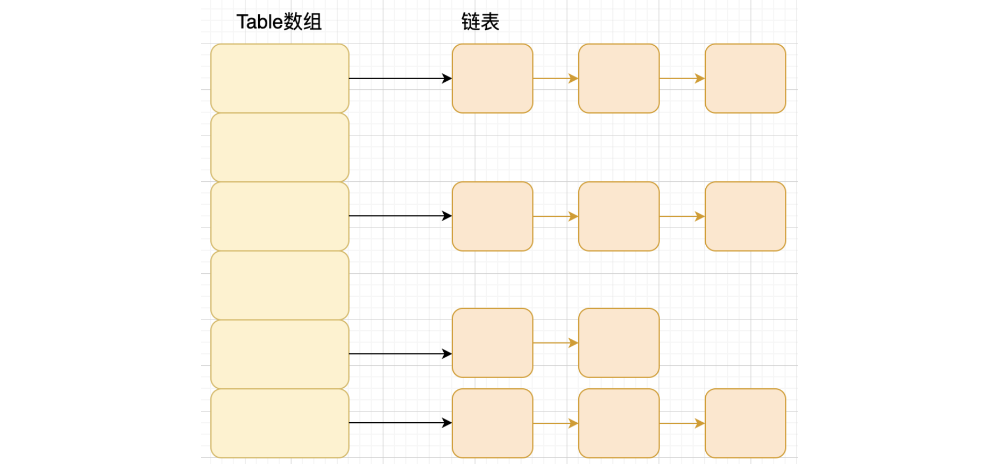

**JDk1.8之后的HashMap：**这个版本的HashMap在解决哈希冲突的时候变化较大，当链表的长度大于阈值（默认为8），则会将链表转换为红黑树，以减少搜索时间（在链表转换之前会先判断，当数组的长度小于64，那么会先进行数组的扩容操作，而不是直接转换红黑树）。

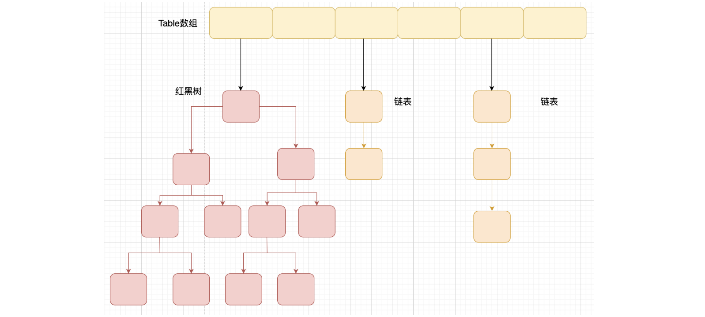

* 类的属性：

  ```JAVA
  public class HashMap<K,V> extends AbstractMap<K,V> implements Map<K,V>, Cloneable, Serializable {
      // 序列号
      private static final long serialVersionUID = 362498820763181265L;    
      // 默认的初始容量是16
      static final int DEFAULT_INITIAL_CAPACITY = 1 << 4;   
      // 最大容量
      static final int MAXIMUM_CAPACITY = 1 << 30; 
      // 默认的加载因子
      static final float DEFAULT_LOAD_FACTOR = 0.75f;
      // 当桶(bucket)上的结点数大于这个值时会转成红黑树
      static final int TREEIFY_THRESHOLD = 8; 
      // 当桶(bucket)上的结点数小于这个值时树转链表
      static final int UNTREEIFY_THRESHOLD = 6;
      // 桶中结构转化为红黑树对应的table的最小大小
      static final int MIN_TREEIFY_CAPACITY = 64;
      // 存储元素的数组，总是2的幂次倍
      transient Node<k,v>[] table; 
      // 存放具体元素的集
      transient Set<map.entry<k,v>> entrySet;
      // 存放元素的个数，注意这个不等于数组的长度
      transient int size;
      // 每次扩容和更改map结构的计数器
      transient int modCount;   
      // 临界值，当实际大小(容量*填充因子)超过临界值时，会进行扩容
      int threshold;
      // 加载因子
      final float loadFactor;
  }
  ```

  * **loadFactor加载因子**：用于控制数组存放数据的疏密程度，加载因子越趋近于1，则数组中存放的数据entry就越多越密集，也就是会让链表的长度增加。相反，加载因子越小越趋近于0，数组中存放的数据entry就越少越稀疏；

    loadFactor太大会导致查找元素效率低，太小会导致数组的利用率低，存放的数据会很分散，官方给出的默认值是0.75f；

    源码给出的数组默认容量是16，加载因子是0.75f。当HashMap在使用的过程中不断存放数据，直到数据达到了`16 * 0.75 = 12`就需要将当前的默认16的容量进行扩容，扩容的过程则需要进程rehash、数据复制等操作，会产生非常大的消耗。

  * **threshold临界值**：`threshold = capacity * loadFactor`，当集合中元素的个数`size >= threshold`时，就需要考虑对数组进行扩容。临界值的作用就是衡量数组是否需要扩容的一个标准。

* 链表节点类Node源码：

  ```JAVA
  // 继承自 Map.Entry<K,V>
  static class Node<K,V> implements Map.Entry<K,V> {
      final int hash;	// 哈希值，存放元素到hashmap中时用来与其他元素hash值比较
      final K key;	// 键
      V value;		// 值
      Node<K,V> next; // 指向下一个节点
      
      Node(int hash, K key, V value, Node<K,V> next) {
          this.hash = hash;
          this.key = key;
          this.value = value;
          this.next = next;
      }
      
      public final K getKey()        { return key; }
      public final V getValue()      { return value; }
      public final String toString() { return key + "=" + value; }
  
      // 重写hashCode()方法
      public final int hashCode() {
          return Objects.hashCode(key) ^ Objects.hashCode(value);
      }
  
      public final V setValue(V newValue) {
          V oldValue = value;
          value = newValue;
          return oldValue;
      }
      
      // 重写equals()方法
      public final boolean equals(Object o) {
          if (o == this)
              return true;
          if (o instanceof Map.Entry) {
              Map.Entry<?,?> e = (Map.Entry<?,?>)o;
              if (Objects.equals(key, e.getKey()) &&
                  Objects.equals(value, e.getValue()))
                  return true;
          }
          return false;
      }
  }
  ```

* 树节点类TreeNode源码：

  ```java
  static final class TreeNode<K,V> extends LinkedHashMap.Entry<K,V> {
      TreeNode<K,V> parent;  // 父节点
      TreeNode<K,V> left;    // 左孩子
      TreeNode<K,V> right;   // 右孩子
      TreeNode<K,V> prev;    // 删除后需要取消链接
      boolean red;           // 判断颜色
      
      TreeNode(int hash, K key, V val, Node<K,V> next) {
          super(hash, key, val, next);
      }
      
      // 返回根节点
      final TreeNode<K,V> root() {
          for (TreeNode<K,V> r = this, p;;) {
              if ((p = r.parent) == null)
                  return r;
              r = p;
          }
      }
  }
  ```

* 构造方法：

  ```JAVA
  // 默认构造函数
  public HashMap() {
      this.loadFactor = DEFAULT_LOAD_FACTOR;	// 默认加载因子0.75f
  }
  
  // 包含另一个Map的构造函数
  public HashMap(Map<? extends K, ? extends V> m) {
      this.loadFactor = DEFAULT_LOAD_FACTOR;
      putMapEntries(m, false);
  }
  
  // 指定容量的构造函数
  public HashMap(int initialCapacity) {
      this(initialCapacity, DEFAULT_LOAD_FACTOR);
  }
  
  // 指定容量和加载因子的构造函数
  public HashMap(int initialCapacity, float loadFactor) {
      if (initialCapacity < 0)
          throw new IllegalArgumentException("Illegal initial capacity: " + initialCapacity);
      if (initialCapacity > MAXIMUM_CAPACITY)
          initialCapacity = MAXIMUM_CAPACITY;
      if (loadFactor <= 0 || Float.isNaN(loadFactor))
          throw new IllegalArgumentException("Illegal load factor: " + loadFactor);
      this.loadFactor = loadFactor;
      this.threshold = tableSizeFor(initialCapacity);
  }
  ```

* `putVal()`方法添加元素分析：

  

  1. 首先，对新元素根据hash计算数组的位置，若对应位置没有元素，则直接插入；
  2. 若定位到的数组位置有元素，就和要插入的key进行比较，若key相同就直接覆盖；
  3. 若key不同，就判断是否是一个树节点，若是就插入到红黑树上；
  4. 不是树节点则判断链表长度是否大于等于8，若是则转换为红黑树，若不是则插入链表尾部；
  5. 最后，集合元素size相应增加，判断是否大于临界值，若大于则会触发扩容。

  ```java
  public V put(K key, V value) {
      return putVal(hash(key), key, value, false, true);
  }
  
  final V putVal(int hash, K key, V value, boolean onlyIfAbsent,
                     boolean evict) {
      Node<K,V>[] tab; Node<K,V> p; int n, i;
      // table未初始化或者长度为0，直接进行扩容
      if ((tab = table) == null || (n = tab.length) == 0)
          n = (tab = resize()).length;
      // 通过(n - 1) & hash确定元素该存放在哪个桶中，若桶为空，新结点直接放入桶中，此时该结点是放在数组中的
      if ((p = tab[i = (n - 1) & hash]) == null)
          tab[i] = newNode(hash, key, value, null);
      // 若桶中已经存在元素
      else {
          Node<K,V> e; K k;
          // 比较桶中第一个元素（即数组的节点）的hash值和key值是否和新元素相等
          if (p.hash == hash &&
              ((k = p.key) == key || (key != null && key.equals(k))))
                  // 相等则直接覆盖，将第一个元素赋值给e，用e来记录
                  e = p;
          // hash值不相等，即key不相等；判断是否为红黑树结点
          else if (p instanceof TreeNode)
              // 是树节点则插入树中
              e = ((TreeNode<K,V>)p).putTreeVal(this, tab, hash, key, value);
          // 不是树节点则为链表结点
          else {
              // 在链表尾部插入结点
              for (int binCount = 0; ; ++binCount) {
                  // 到达链表的尾部
                  if ((e = p.next) == null) {
                      // 在尾部插入新结点
                      p.next = newNode(hash, key, value, null);
                      // 结点数量达到阈值，转化为红黑树
                      if (binCount >= TREEIFY_THRESHOLD - 1) // -1 for 1st
                          xtreeifyBin(tab, hash);
                      // 跳出循环
                      break;
                  }
                  // 判断链表中结点的key值与插入的元素的key值是否相等
                  if (e.hash == hash &&
                      ((k = e.key) == key || (key != null && key.equals(k))))
                      // 相等，跳出循环
                      break;
                  // 用于遍历桶中的链表，与前面的e = p.next组合，可以遍历链表
                  p = e;
              }
          }
          // 表示在桶中找到key值、hash值与插入元素相等的结点
          if (e != null) { 
              // 记录e的value
              V oldValue = e.value;
              // onlyIfAbsent为false或者旧值为null
              if (!onlyIfAbsent || oldValue == null)
                  //用新值替换旧值
                  e.value = value;
              // 访问后回调
              afterNodeAccess(e);
              // 返回旧值
              return oldValue;
          }
      }
      // 结构性修改
      ++modCount;
      // 实际大小大于阈值则扩容
      if (++size > threshold)
          resize();
      // 插入后回调
      afterNodeInsertion(evict);
      return null;
  } 
  ```

* get方法：

  ```JAVA
  public V get(Object key) {
      Node<K,V> e;
      return (e = getNode(hash(key), key)) == null ? null : e.value;
  }
  
  final Node<K,V> getNode(int hash, Object key) {
      Node<K,V>[] tab; Node<K,V> first, e; int n; K k;
      // 1.数组不为空；2.数组长度大于0；3.对应hash位置的元素不为空
      if ((tab = table) != null && (n = tab.length) > 0 &&
          (first = tab[(n - 1) & hash]) != null) {
          // 对应位元素的hash和key相等，则直接获取到
          if (first.hash == hash && // always check first node
              ((k = first.key) == key || (key != null && key.equals(k))))
              return first;
          // 若对应位置存在后继节点
          if ((e = first.next) != null) {
              // 若是树节点则从树中获取
              if (first instanceof TreeNode)
                  return ((TreeNode<K,V>)first).getTreeNode(hash, key);
              // 否则在链表上迭代获取
              do {
                  if (e.hash == hash &&
                      ((k = e.key) == key || (key != null && key.equals(k))))
                      return e;
              } while ((e = e.next) != null);
          }
      }
      return null;
  }
  ```

* resize方法：

  ```JAVA
  // 若触发扩容操作，则会将数组容量和临界值扩充为原来的2倍，同时会重新进行hash的分配和桶的移动
  final Node<K,V>[] resize() {
      Node<K,V>[] oldTab = table;
      int oldCap = (oldTab == null) ? 0 : oldTab.length；
      int oldThr = threshold;
      int newCap, newThr = 0;
      
      if (oldCap > 0) {
          // 超过最大值就不再扩充
          if (oldCap >= MAXIMUM_CAPACITY) {
              threshold = Integer.MAX_VALUE;
              return oldTab;
          }
          // 没超过最大值，就扩充为原来的2倍
          else if ((newCap = oldCap << 1) < MAXIMUM_CAPACITY && oldCap >= DEFAULT_INITIAL_CAPACITY)
              newThr = oldThr << 1; // 临界值也变为原来的2倍
      }
      else if (oldThr > 0) // initial capacity was placed in threshold
          newCap = oldThr;
      else { 
          // signifies using defaults
          newCap = DEFAULT_INITIAL_CAPACITY;
          newThr = (int)(DEFAULT_LOAD_FACTOR * DEFAULT_INITIAL_CAPACITY);
      }
      // 计算新的resize上限
      if (newThr == 0) {
          float ft = (float)newCap * loadFactor;
          newThr = (newCap < MAXIMUM_CAPACITY && ft < (float)MAXIMUM_CAPACITY ? (int)ft : Integer.MAX_VALUE);
      }
      threshold = newThr;
      @SuppressWarnings({"rawtypes","unchecked"})
          Node<K,V>[] newTab = (Node<K,V>[])new Node[newCap];
      table = newTab;
      if (oldTab != null) {
          // 把每个bucket都移动到新的buckets中
          for (int j = 0; j < oldCap; ++j) {
              Node<K,V> e;
              if ((e = oldTab[j]) != null) {
                  oldTab[j] = null;
                  if (e.next == null)
                      newTab[e.hash & (newCap - 1)] = e;
                  else if (e instanceof TreeNode)
                      ((TreeNode<K,V>)e).split(this, newTab, j, oldCap);
                  else { 
                      Node<K,V> loHead = null, loTail = null;
                      Node<K,V> hiHead = null, hiTail = null;
                      Node<K,V> next;
                      do {
                          next = e.next;
                          // 原索引
                          if ((e.hash & oldCap) == 0) {
                              if (loTail == null)
                                  loHead = e;
                              else
                                  loTail.next = e;
                              loTail = e;
                          }
                          // 原索引+oldCap
                          else {
                              if (hiTail == null)
                                  hiHead = e;
                              else
                                  hiTail.next = e;
                              hiTail = e;
                          }
                      } while ((e = next) != null);
                      // 原索引放到bucket里
                      if (loTail != null) {
                          loTail.next = null;
                          newTab[j] = loHead;
                      }
                      // 原索引+oldCap放到bucket里
                      if (hiTail != null) {
                          hiTail.next = null;
                          newTab[j + oldCap] = hiHead;
                      }
                  }
              }
          }
      }
      return newTab;
  }
  ```


### ConcurrentHashMap和HashTable的区别

* **底层数据结构**：JDK1.7的ConcurrentHashMap底层采用分段数组+链表实现，而JDK1.8中则采用和HashMap一样的数组+链表/红黑树的结构。HashTable底层采用数组+链表的形式存储数据，数组是本体，链表解决哈希冲突；

* **实现线程安全的方式**：

  * JDK1.7的时候，ConcurrentHashMap使用分段锁对整个桶数组进行分段（Segment），每个分段分配一把锁，即每把锁只锁定容器中的一部分数据，多线程访问容器中不同数据段的数据，就不会存在全局的锁竞争，使多个段的访问可以并发起来；
  * JDK1.8时的ConcurrentHashMap则摒弃了Segment的概念，直接使用Node数组+链表/红黑树的结构来实现，并发控制使用了synchronized和CAS操作，使其整体看上去就像是优化且线程安全的HashMap；
  * HashTable则直接使用一把全局锁synchronized来保证线程安全，效率低下，当一个线程访问同步方法时，其他线程也访问同步方法，就会进入阻塞或轮询状态，多线程的竞争越激烈效率越低。

* HashTable结构图：

  

* JDK1.7的ConcurrentHashMap结构图：

  

* JDK1.8的ConcurrentHashMap结构图：

  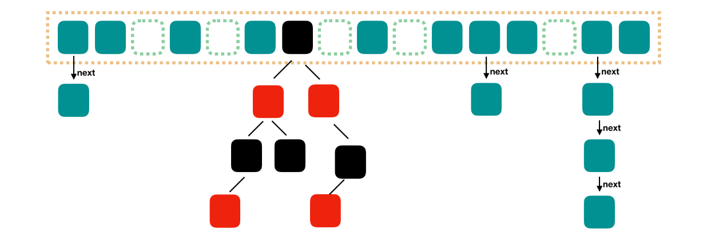


### ConcurrentHashMap源码分析

* 初始化：

  ```java
  private final Node<K,V>[] initTable() {
      Node<K,V>[] tab; int sc;、
      // 自旋操作，保证初始化成功
      while ((tab = table) == null || tab.length == 0) {
          //　如果sizeCtl < 0，说明有另外的线程CAS操作成功，正在进行初始化
          if ((sc = sizeCtl) < 0)
              // 主动让出CPU的使用权
              Thread.yield();
          else if (U.compareAndSwapInt(this, SIZECTL, sc, -1)) {	// 使用CAS将sizeCtl修改为-1
              try {
                  if ((tab = table) == null || tab.length == 0) {
                      int n = (sc > 0) ? sc : DEFAULT_CAPACITY;
                      @SuppressWarnings("unchecked")
                      Node<K,V>[] nt = (Node<K,V>[])new Node<?,?>[n];
                      table = tab = nt;
                      sc = n - (n >>> 2);
                  }
              } finally {
                  sizeCtl = sc;
              }
              break;
          }
      }
      return tab;
  }
  ```

  * ConcurrentHashMap的初始化是通过自旋和CAS操作完成的，变量sizeCtl的值决定着当前的初始化状态；
  * 若sizeCtl小于0，证明其他线程正在对其初始化，让出CPU执行权；
  * 若sizeCtl不小于0，则使用CAS将sizeCtl修改为-1，表示正在初始化；
  * 若当前table没有初始化，则sizeCtl表示table的默认初始化大小；
  * 若当前table已经初始化，则sizeCtl表示table的容量。

* put：

  ```JAVA
  public V put(K key, V value) {
      return putVal(key, value, false);
  }
  
  final V putVal(K key, V value, boolean onlyIfAbsent) {
      // key和value不能为空
      if (key == null || value == null) throw new NullPointerException();
      int hash = spread(key.hashCode());	// hash扰动
      int binCount = 0;
      
      for (Node<K,V>[] tab = table;;) {
          // f指目标位置元素，fh后面存放目标位置元素的hash值
          Node<K,V> f; int n, i, fh;
          if (tab == null || (n = tab.length) == 0)
              // 若桶为空，则通过CAS+自旋的方式初始化数组桶（自旋+CAS)
              tab = initTable();
          else if ((f = tabAt(tab, i = (n - 1) & hash)) == null) {
              // 若桶内为空，则通过CAS+自旋的方式插入，成功了就直接break跳出
              if (casTabAt(tab, i, null,new Node<K,V>(hash, key, value, null)))
                  break;
          }
          else if ((fh = f.hash) == MOVED)
              // 需要扩容
              tab = helpTransfer(tab, f);
          else {
              V oldVal = null;
              // 使用synchronized加锁插入节点
              synchronized (f) {
                  if (tabAt(tab, i) == f) {
                      // 如果是链表执行的操作
                      if (fh >= 0) {
                          binCount = 1;
                          // 循环加入新的或者覆盖节点
                          for (Node<K,V> e = f;; ++binCount) {
                              K ek;
                              if (e.hash == hash &&
                                  ((ek = e.key) == key ||
                                   (ek != null && key.equals(ek)))) {
                                  oldVal = e.val;
                                  if (!onlyIfAbsent)
                                      e.val = value;
                                  break;
                              }
                              Node<K,V> pred = e;
                              if ((e = e.next) == null) {
                                  pred.next = new Node<K,V>(hash, key,
                                                            value, null);
                                  break;
                              }
                          }
                      }
                      else if (f instanceof TreeBin) {
                          // 如果是红黑树执行的操作
                          Node<K,V> p;
                          binCount = 2;
                          if ((p = ((TreeBin<K,V>)f).putTreeVal(hash, key, value)) != null) {
                              oldVal = p.val;
                              if (!onlyIfAbsent)
                                  p.val = value;
                          }
                      }
                  }
              }
              if (binCount != 0) {
                  if (binCount >= TREEIFY_THRESHOLD)
                      treeifyBin(tab, i);
                  if (oldVal != null)
                      return oldVal;
                  break;
              }
          }
      }
      addCount(1L, binCount);
      return null;
  }
  ```

  * 根据key计算出HashCode，即获得了桶的位置；
  * 判断该位置的桶是否为空，为空则初始化一个桶；
  * 若桶内为空，则表示当前位置可用写入数据，使用CAS尝试写入，若失败则自旋保证成功；
  * 若当前位置的`hashCode == MOVED == -1`，则需要进行扩容；
  * 如果都不满足，则使用synchronized加锁插入数据到链表或红黑树上；
  * 若是桶内是链表，如果数量大于`TREEIFY_THRESHOLD`，则需要转换为红黑树。

* get：

  ```java
  public V get(Object key) {
      Node<K,V>[] tab; Node<K,V> e, p; int n, eh; K ek;
      // key所在的hash位置
      int h = spread(key.hashCode());
      if ((tab = table) != null && (n = tab.length) > 0 &&
          (e = tabAt(tab, (n - 1) & h)) != null) {
          // 如果指定位置元素存在，头结点hash值相同
          if ((eh = e.hash) == h) {
              if ((ek = e.key) == key || (ek != null && key.equals(ek)))
                  // key hash 值相等，key值相同，直接返回元素 value
                  return e.val;
          }
          else if (eh < 0)
              // 头结点hash值小于0，说明正在扩容或者是红黑树，find查找
              return (p = e.find(h, key)) != null ? p.val : null;
          while ((e = e.next) != null) {
              // 是链表，遍历查找
              if (e.hash == h &&
                  ((ek = e.key) == key || (ek != null && key.equals(ek))))
                  return e.val;
          }
      }
      return null;
  }
  ```

  * 根据hash值计算桶的位置；
  * 查找到指定位置，如果头节点就是要找的，直接返回其value；
  * 如果头节点hash值小于0，说明正在扩容或是红黑树，查找之；
  * 如果是链表，遍历查找之。


### LinkedHashMap源码分析

继承自HashMap，具有和HashMap一样的快速查找特性。

```JAVA
public class LinkedHashMap<K, V> extends HashMap<K, V> implements Map<K, V>
```

内部维护了一个双向链表，用于维护插入顺序或LRU顺序。

```JAVA
/**
 * The head (eldest) of the doubly linked list.
 */
transient LinkedHashMap.Entry<K,V> head;

/**
 * The tail (youngest) of the doubly linked list.
 */
transient LinkedHashMap.Entry<K,V> tail;
```

`accessOrder` 字段决定了顺序，默认为false，表示其维护的是插入顺序。

```java
final boolean accessOrder;
```

`afterNodeAccess()`：在get等操作之后执行，当一个节点被访问时，如果字段accessOrder为true，则会将该节点移动到链表尾部。也就是说当指定了LRU顺序后，在每次访问节点时，都会将该节点移动到链表尾部，即保证了链表尾部是最近访问的节点，反之链表的首部就是最久未使用节点。

```JAVA
void afterNodeAccess(Node<K,V> e) { // move node to last
    LinkedHashMap.Entry<K,V> last;
    if (accessOrder && (last = tail) != e) {
        LinkedHashMap.Entry<K,V> p =
            (LinkedHashMap.Entry<K,V>)e, b = p.before, a = p.after;
        p.after = null;
        if (b == null)
            head = a;
        else
            b.after = a;
        if (a != null)
            a.before = b;
        else
            last = b;
        if (last == null)
            head = p;
        else {
            p.before = last;
            last.after = p;
        }
        tail = p;
        ++modCount;
    }
}
```

`afterNodeInsertion()`：在put等操作之后执行，当removeEldestEntry()返回true时会移除最久未使用的节点，即链表首部节点first。

```JAVA
void afterNodeInsertion(boolean evict) { // possibly remove eldest
    LinkedHashMap.Entry<K,V> first;
    if (evict && (first = head) != null && removeEldestEntry(first)) {
        K key = first.key;
        removeNode(hash(key), key, null, false, true);
    }
}
```

`removeEldestEntry()`：默认返回false，如果需要让其返回true，需要继承LinkedHashMap并重写该方法实现。

```JAVA
protected boolean removeEldestEntry(Map.Entry<K,V> eldest) {
    return false;
}
```


### LinkedHashMap实现LRU算法

```JAVA
class LRUCache<K, V> extends LinkedHashMap<K, V> {
    
    // 最大缓存空间为3
    private static final int MAX_ENTRIES = 3;
    
    // 调用LinkedHashMap的构造方法，传递最大节点数、负载因子和accessOrder=true（即开启LRU顺序）
    LRUCache() {
        super(MAX_ENTRIES, 0.75f, true);
    }
    
    // 重写removeEldestEntry方法，当执行put操作时，在节点多于MAX_ENTRIES的情况下就会移除最近最久未使用节点
    protected boolean removeEldestEntry(Map.Entry eldest) {
        return size() > MAX_ENTRIES;
    }
}
```


# MySQL+Redis

## MySQL-存储引擎

|              |   MylSAM   |           InnoDB           |
| :----------: | :--------: | :------------------------: |
|   索引类型   | 非聚簇索引 |          聚簇索引          |
|   支持事务   |     否     |             是             |
|   支持表锁   |     是     |             是             |
|   支持行锁   |     否     |             是             |
|   支持外键   |     否     |             是             |
| 支持全文检索 |     是     |             是             |
| 适合操作类型 | 大量select | 大量insert、delete、update |

* 是否支持行级锁：MyISAM只支持表级锁，而InnoDB支持行级锁和表级锁；
* 是否支持事务和崩溃后的安全恢复：MyISAM更强调性能，每次查询都具有原子性，执行速度相对于InnoDB更快，但不提供事务的支持。InnoDB则提供事务，且具有提交、回滚和崩溃修复能力的事务安全性表；
* 是否支持外键：MyISAM不支持，InnoDB支持；
* 是否支持MVCC：只有InnoDB支持，用于应对高并发的事务，MVCC比单纯的加锁更高效，MVCC只在 `READ COMMITIED` 和 `REPEATABLE READ` 两个隔离级别下工作，且可以使用乐观锁和悲观锁来实现。


## MySQL-索引原理

### MySQL的基本存储结构


* MySQL的基本存储结构是页式存储结构；
* 各个数据页可以组成一个双向链表；
* 每个数据页中的记录又可以组成一个单向链表：
  * 每个数据页都会为其内部存储的记录创建一个页目录。当通过主键查找某条记录的时候可以在页目录中使用二分查找算法快速定位到对应的槽，然后再遍历该槽对应分组中的记录即可快速找到指定的记录；
  * 若是以其他非主键的列作为搜索条件，则只能从头开始遍历单链表中的每条记录。
* 当提交 `select * from user where name = 'albert';` 这种没有进行任何优化的SQL语句时，默认的执行流程：
  * 首先需要遍历双向链表，定位到记录所在的页；
  * 由于不是根据主键查询，所以只能遍历所在页的单链表查找相应的记录。


### 局部性原理

* **概念**：程序信息在不全部装入主存的情况下就可以保证正常的运行；
* **空间局部性**：程序和数据的访问都有聚集成群的倾向，在一个时间段内，仅使用部分（如数组）；
* **时间局部性**：最近被访问过的程序代码和数据，很快又再次被访问的可能性很大（如循环操作）。


### 磁盘预读

* 预读的长度一般是页（page）的整数倍；
* 页是存储器的逻辑块，OS往往将主存和磁盘存储区分割为连续且大小相等的块，单个存储块被称为页（通常为4k），主存和磁盘以页为单位交换数据。


### 什么是索引？

* 是帮助数据库高效获取数据的一种数据结构；
* 索引存储在文件系统中；
* 索引的文件存储形式和存储引擎有关；
* 索引文件的结构通常为哈希表或B+树等。


### 为什么使用索引？

* 可以大幅加快数据的检索速度，即大幅减少检索的数据量；
* 帮助服务器避免排序和临时表；
* 将随机IO变为顺序IO；
* 加快表和表之间的连接，在实现数据的参照完整性方面有意义。


### 为什么不对表中的每列都创建索引呢？

* 当表中的数据进行增加、删除和修改时，索引也会**动态维护**，就降低了数据的维护速度；
* 索引需要**占用物理空间**，除了数据表需要占用数据空间，每一个索引还要占一定的物理空间，如果要建立聚簇索引，那么需要的空间就会更大；
* 创建索引和维护索引要**耗费时间**，这种时间随着数据量的增加而增加。


### 索引的分类

* **主键索引**：唯一性索引，每个表只能有一个；
* **唯一索引**：索引列中的值只能出现一次，即必须唯一，但值可以为空；
* **普通索引**：基本的索引类型，值可以为空，没有唯一性的限制；
* **全文索引**：FULLTEXT类型的索引，可以在varchar、char和text类型的列上创建；
* **组合索引**：由多个列组成的索引，专门用于组合搜索。


### 为什么MySQL使用B+树作为索引的数据结构？

**为什么不使用哈希表？**

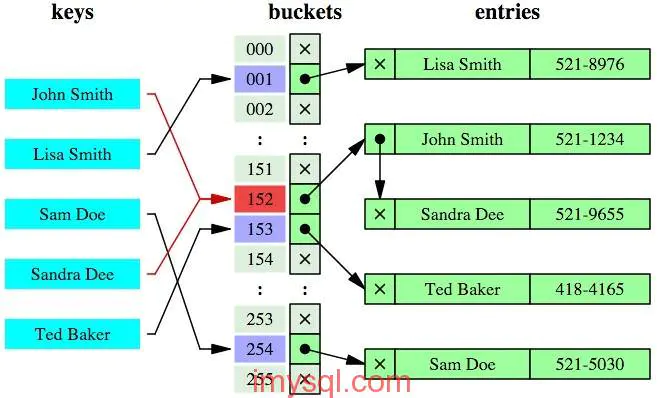

* 需要将数据文件添加到内存中，耗费内存空间；
* 如果所有的查询都是等值查询，哈希表的性能会很高，但实际生产环境下范围查询的情况非常多，这时哈希表就不太合适了。

**为什么不使用二叉树/红黑树？**


* 一棵树结构在极端的情况下，会退化成为链表，导致树的查询优势不复存在；

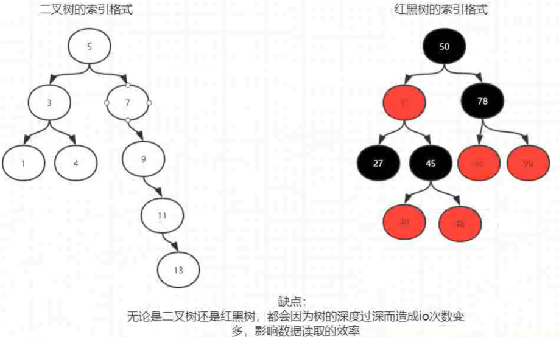

* 树的深度过深会导致IO的次数过多，影响数据的读取效率。

**为什么不使用B树？**

* B树的特点：

  * 所有键值分布在整棵树中；
* 搜索有可能在非叶子节点结束，在关键字全集内做一次查找，性能接近二分查找；
  
  * 每个节点最多拥有m棵子树；
* 根节点至少拥有2棵子树；
  * 分支节点至少拥有m/2棵子树（分支节点就是除根节点和叶子节点外的节点）；
  * 所有叶子节点都在同一层，每个节点最多可以拥有m-1个key，并且以升序排序。
  
* B树索引原理：每个节点占用一个页（InnoDB是16kb），一个节点上有2个升序排序的关键字+对应记录和3个指向子树根节点的指针，指针存储的是子节点所在页的地址。2个关键字划分成的3个范围域对应3个指针指向的子树的数据范围域。以根节点为例，关键字为16和34，P1指针指向的子树数据范围小于16，P2指针值指向的子树数据范围为16~34，P3指针指向的子树的数据范围大于34。

  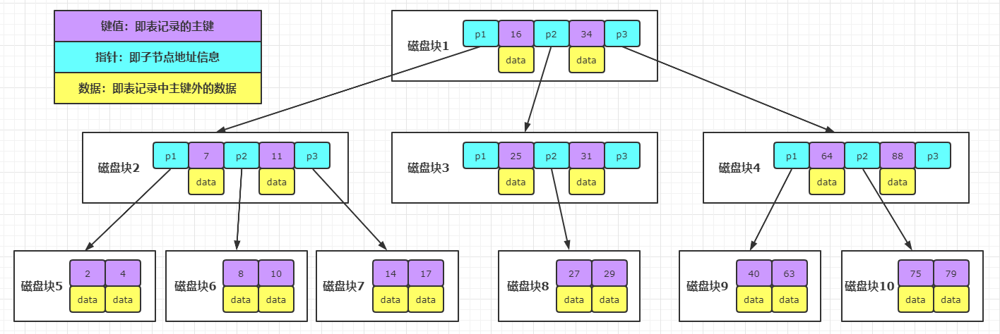

* B树索引根据关键字28查找记录的过程：
  1. 根据根节点找到磁盘块1，读入内存（磁盘IO第1次）；
  2. 比较出关键字28在（16，34）区间内，获取磁盘块1的P2指针；
  3. 根据P2指针找到磁盘块3，读入内存（磁盘IO第2次）；
  4. 比较出关键字28在（27，29）区间内，获取磁盘块3的P2指针；
  5. 根据P2指针找到磁盘块8，读入内存（磁盘IO第3次）；
  6. 在磁盘块8中的关键字列表中找到关键字28，并读取其对应的记录。
* 缺点：每个节点都有关键字和其对应的记录，但每个页存储空间是有限的，如果记录比较大的话会导致每个节点存储的关键字数量变小。当节点存储的数据量很大时会导致树的深度加深，即会增大查询时磁盘IO的次数，进而影响查询性能。


### B+树索引的原理

**B+树索引结构：**

* B+Tree的非叶子节点不会再包含记录而是包含更多的关键字和指针，这样做是为了降低树的高度减少磁盘的IO次数，同时也能将数据的范围变成更多的区间，区间越多，检索数据越快；
* B+Tree结构的索引只有叶子节点包含记录，非叶子节点只包含关键字和指针；
* 叶子节点之间通过指针相互连接（符合磁盘预读的特性），顺序查询性能更高。
* 注：B+Tree上有两个头指针，一个指向根节点，另一个指向最小关键字的节点，且所有叶子节点构成了一个环形链表结构。因此可以对B+Tree进行两种查找操作，一种是根据主键进行范围查找和分页查找，另一种就是从根节点开始进行随机查找。

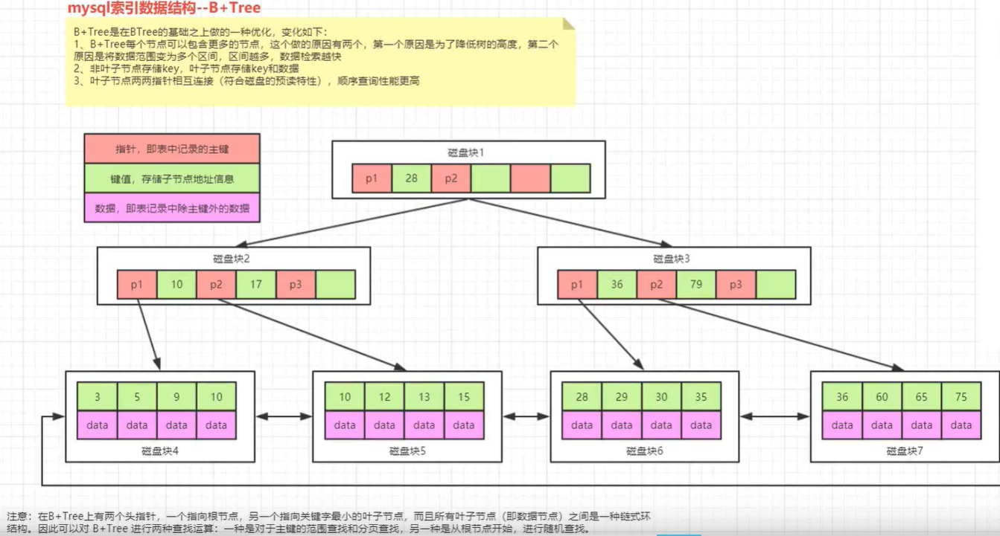

**InnoDB引擎实现的B+树索引：**

* 聚簇索引：InnoDB的文件存储方式是索引和数据存放在一个文件中，所以叶子节点中之间包含数据记录（只有通过主键建立的索引才是聚簇索引）；
* InnoDB是通过B+Tree结构对主键创建索引，然后叶子节点中存储记录，如果不存在主键，则会选择唯一键，如果没有唯一键，那么会生成一个6位的row_id来作为索引；

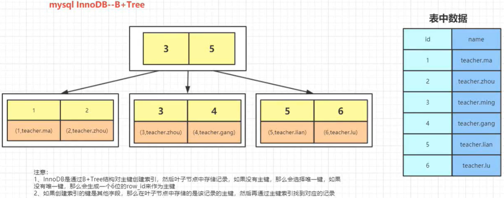

* 如果是由其他字段创建的索引，那么在叶子节点中存储的是其对应记录的主键，之后再根据主键去主键索引中获取记录，这个步骤称为回表（这种通过其他字段创建的索引是非聚簇索引）。


**MyISAM引擎实现的B+树索引：**

* 非聚簇索引：MyISAM的文件存储方式是索引和数据分开存放为两个文件，叶子节点中包含的是数据记录的地址。


### 使用索引的注意事项

* 在经常需要搜索的列上创建索引，可以加快搜索的速度；
* 在经常使用在where上的列创建索引，加快条件的判断速度；
* 在经常需要排序的列上创建索引，因为索引已经排序，这样查询可以利用索引的排序，加快排序查询的时间；
* 对于中到大型表来说索引都是非常有效的，但是特大型表的话维护开销会很大，不适合创建索引；
* 在经常用在连接的列上使用，这些列主要是一些外键，可以加快连接的速度；
* 避免在where子句中对字段使用函数，这会造成索引无法命中；
* 在InnoDB中使用与业务无关的自增主键，而不要使用业务主键；
* 删除长期未使用的索引，不使用的索引会造成不必要的性能损耗；

* 选择索引和编写利用这些索引的原则：

  * 单行访问速度很慢，如果服务器从存储器中读取一个数据块只是为了获取其中一行，那么就浪费了很多工作，最好的情况是读取的块中能包含尽可能多的所需行，提高效率；
  * 按顺序访问范围数据是很快的，是因为顺序IO不需要多次磁盘寻道，所以比随机IO要快很多，还有就是如果服务器能够按需要的顺序读取数据，就不再需要额外的排序操作；
  * 索引覆盖查询是很快的，如果一个索引包含了查询所需的所有列，那么存储引擎就不需要再回表查找行，避免了大量的单行范围。


### 最左前缀原则

* MySQL可以为多个列按照一定的顺序建立联合索引，如User表的nam和city字段添加联合索引(name, city)。所谓的最左前缀原则是如果查询时查询条件精确匹配索引的左边连续一列或几列，则可以命中索引；

  ```sql
  --可以命中索引
  select * from user where name='albert' and city='hz';
  --可以命中索引
  select * from user where name='ablert';
  --无法命中索引
  select * from user where city='hz';
  ```

* 若查询的时候两个条件都被使用，但是顺序不同，那么查询引擎可以根据联合索引的顺序进行优化，使查询能够命中索引；
* 根据最左前缀匹配原则，再创建联合索引时，索引字段的顺序需要考虑字段值去重后的个数，较多的放在前面，ORDER BY子句也遵循此规则。


## MySQL-事务原理

### 事务的四大特性

* **原子性（Atomicity）**：事务是最小的执行单位，不允许分割。事务的原子性确保事务中的操作要么全都完成，要么都不完成；
* **一致性（Consistency）**：执行事务前后，数据保持一致，多个事务对同一个数据读取的结果是相同的；
* **隔离性（Isolation）**：并发访问数据库时，一个用户的事务不被其他事务所干扰，各个并发事务之间的数据库是独立的；
* **持久性（Durability）**：一个事务被提交之后，其对数据库中数据的改变是持久的，即使数据库发生故障也不应该对其有任何影响。


### 事务并发带来的问题

* **脏读（Dirty Read）**：一个事务读取到了另一个事务未提交的数据。事务B在执行过程中修改了数据X，在未提交之前，事务A读取了X，而事务B却回滚了，这时事务A读取的X就是脏数据，就形成了脏读的现象。即当前事务读到的是其他事务想要修改但没有修改成功的数据。脏读的本质就是因为操作完数据后就立即释放了锁，导致读数据的一方可能读取的是无用或错误的数据。
* **丢失更新（Lost to modify）**：
* **不可重复读（Unrepeatableread）**：一个事务读取到另一个事务修改（update操作）成功的数据。事务A首先读取数据X，在执行接下来的逻辑前，事务B将数据X修改并提交了，然后事务A再次读取时发现前后两次读到的数据不匹配，这种情况就是不可重复读。即当前事务前后两次读取存在一次数据已被其他事务修改的情况，导致前后不匹配。
* **幻读（Phantom Read）**：一个事务读取到另一个事务插入或删除（insert或delete操作）成功的数据。事务A首先根据条件获得了N条数据，然后事务B增加或删除了M条符合A查询条件的数据，从而导致事务A再次查询发现有N+M或N-M条数据，就产生了幻读。即事务前后两次读取存在前一次和后一次读出的数据条目不一致的情况，导致前后不匹配。


### 事务的隔离级别

* **读未提交（Read uncommitted）**：会出现脏读、不可重复读、幻读。
* **读已提交（Read committed）**：会出现不可重复读、幻读。
  * 避免脏读：将释放锁的位置调整到事务提交之后，在事务提交之前，其他任何用户都无法对数据进行操作。
* **可重复读（Repeatable read）**：会出现幻读。
  * 避免不可重复读：Read committed是语句级别的快照，每次读取的都是当前最新的版本，所以会出现被其他事务影响的情况。Repeatable read则通过事务级别的快照，每次读取的都是当前事务的版本，即使数据被修改了，本次操作也只会读取当前快照的版本。
  * 避免幻读：MySQL的Repeatable read隔离级别加上GAP间隔锁处理了幻读。
* **可串行化（Serializable）**：事务串行化，避免所有并发的问题。


## MySQL-锁原理

### 锁机制概述

* 从锁的粒度可以将MySQL的锁分为表锁和行锁；
* 表锁：开销小，加锁快。不会出现死锁。锁定粒度大，发生锁冲突的概率高，并发度低；
* 行锁：开销大，加锁慢。会出现死锁。锁定粒度小，发生锁冲突的概率高，并发度高。
* InnoDB支持表锁和行锁，MyISAM仅支持表锁。
* InnoDB只有通过索引条件检索数据才使用行级锁，否则将使用表锁，即InnoDB的行锁是基于索引的。


### 什么是表锁？

* MySQL的表锁分为表读锁（Table Read Lock）和表写锁（Table Write Lock）；
* 二者遵循读锁共享，写锁互斥的原则。即读读操作不阻塞，读写操作阻塞，写写操作阻塞：
  * 读读不阻塞：当前用户在对表进行读操作时不会加锁，其他用户也可以对该表进行读操作；
  * 读写阻塞：当前用户在对表进行读操作时会加锁，其他用户不能对该表进行写操作，反之亦然；
  * 写写阻塞：当前用户在对表进行写操作时会加锁，其他用户页不能对该表进行写操作。


### 什么是行锁？

* **分类**：MySQL的行锁分为共享锁（S锁）和排他锁（X锁）；
* **共享锁**：允许一个事务去读取一行，阻止其他事务获得相同数据集的排他锁，但依然可以获得共享锁。共享锁也叫做读锁，指多个用户可以同时读取同一个资源，但不允许其他用户修改；
* **排他锁**：只允许获得锁的事务操作数据，会阻止任何其他事务获取相同数据集的共享锁和排他锁。排他锁也叫做写锁，会阻塞其他的写锁和读锁。


### MVCC

* **MVCC（Multi-Version Concurrency Control）多版本并发控制**。可以简单的认为是行锁的一个升级，事务的隔离就是通过锁机制来实现的。
* 表锁中读写操作是阻塞的，基于提升并发性能的考虑，MVCC一般读写是非阻塞的。即通过一定机制生成一个数据请求时间点的一致性数据快照（Snapshot），并用这个快照来提供一定级别（语句级或事务级）的一致性读取。从用户的角度来看，就像是数据库可以提供同一数据的多个版本。


### 悲观锁和乐观锁

* **悲观锁**：是一种基于悲观的态度来防止并发带来冲突的加锁机制，所谓悲观是认为并发冲突一定会发生，所以在数据修改前就将其锁住，然后再对数据进行读写，在释放锁之前任何人都不能对数据进行操作。数据库本身的锁机制都是悲观锁机制。
* **乐观锁**：对数据的冲突保持乐观的态度，操作时不会对数据进行加锁，使得多个任务可以并行。只有在数据提交时才通过一种机制验证数据是否存在冲突，一般的实现方式是通过加版本号对比的方式实现。如：数据表多加一个version字段，每次修改前先查询，获取修改前的版本号，提交修改操作时添加version的判断，若版本不同则表示会发生冲突，版本相同则在修改后升级版本。


### 间隔锁GAP

* **概念**：当通过范围条件检索数据而不是相等条件检索数据，并请求共享或排他锁时，InnoDB会给符合范围条件的已有数据记录的索引项加锁。对于未来可能存在的符合条件范围的但此时并不存在的记录（被称为间隙GAP），InnoDB也会对个间隙加锁，这种锁机制就是间隙锁（间隙锁只会在可重复读这种隔离级别下使用）。

* **例子**：

  在索引记录之间、之前和之后的区间加上GAP锁。
  
  ```SQL
SELECT c1 FROM t WHERE c1 BETWEEN 10 and 20 FOR UPDATE;
  ```
  
  间隙锁GAP对c1<10、c1=10~20和c1>20这3种情况都会加锁，在当前事务持有锁的过程中，任何其他事务都不能针对以上3种情况做操作，保证了当前事务多个范围查询时前后结果的一致，即解决了幻读问题。


### 死锁

* **以固定的顺序访问表和行**。比如对两个job批量更新的情形，简单的方法是对id列表先排序，后执行。这样就避免了交叉等待锁的情形。将两个事务的SQL顺序调整为一致，也能避免死锁；
* **将一个大的事务拆为小的事务**，操作资源的范围越窄越不容易发生死锁；
* **降低隔离级别**。如果业务允许，将隔离级别调低也是较好的选择，比如将隔离级别从可重复读调整为读已提交，可以避免掉很多因为GAP锁造成的死锁；
* **为表添加合理的索引**。如果不走索引将会为表的每一行记录添加上锁，死锁的概率大大增加。


## MySQL-执行SQL语句的流程

## MySQL-高性能优化规范

## MySQL-一条SQL执行很慢的原因有哪些？

## MySQL-书写高质量SQL的30条建议


## Redis-线程模型

### 文件事件处理器概述

* Redis内部使用**文件事件处理器（file event handler）**，这个处理器是单线程的，所以Redis才叫做单线程的模型。其采用了**IO多路复用机制**同时监听多个Socket，根据Socket上的事件来选择对应的事件处理器进行处理。

* 文件事件处理器的结构包含**多个Socket、IO多路复用器、文件事件分派器和事件处理器**（连接应答处理器、命令请求处理器、命令回复处理器）；

* 多个Socket可能会并发产生不同的操作，每个操作对应不同的文件事件，但是IO多路复用器会监听多个Socket，并将Socket产生的事件放入队列，事件分派器每次从队列中取出一个事件，把该事件交给相应的事件处理器进行处理。


### 客户端与Redis的通信过程


* **建立连接**：客户端通过Socket01向Redis的Server Socket请求建立连接，Server Socket会产生一个 `AE_READABLE` 事件，多路复用器监听到Server Socket产生的事件后，将该事件入队。文件事件分派器从队列中获取该事件，交给连接应答处理器。连接应答处理器会创建一个与客户端通信的 Socket01，并将该Socket01的 `AE_READABLE` 事件与命令请求处理器关联；
* **命令请求**：客户端发送了一个 `set key value` 请求，Redis的Socket01会产生 `AE_READABLE` 事件，多路复用器将事件入队，事件分派器从队列中获取到该事件，由于Socket01的 `AE_READABLE` 事件已与命令请求处理器关联，因此事件分派器直接将事件交给命令请求处理器。命令请求处理器读取Socket01的 `key value` 并在内存中完成设置。操作完成后，它会将Socket01的 `AE_WRITABLE` 事件与命令回复处理器关联；
* **结果响应**：若客户端准备好接收返回结果了，那么Redis的Socket01会产生一个 `AE_WRITABLE` 事件并由多路复用器入队，事件分派器找到相关联的命令回复处理器，由其对Socket01输入本次操作的结果（如 `ok`），然后解除Socket01的 `AE_WRITABLE` 事件与命令回复处理器的关联。


### 为什么Redis单线程模型也能效率这么高？

* 纯内存操作；
* 核心是基于非阻塞的IO多路复用机制；
* 单线程反而避免了多线程的频繁上下文切换问题。


## Redis-数据结构和使用场景

### RedisDb数据结构

* Redis默认情况下有16个数据库；
* Redis的一个数据库对应一个redisDb结构；
* redisDb中的dict字典字段维护了一个被封装HashTable，即dictht；
* dictht存储dictEntry类型的元素，若是不同的dictEntry哈希定位到了同一个位置，则通过dictEntry的next指针构成链表；
* redisObject中维护了元素的各种特性，如元素指针、编码、LRU和引用计数器等。


### String


* 底层使用二进制安全的字节数组存储；
* 字符串操作：分布式锁（`SETNS key: value)`）、集群Session共享、小文件存储（小图片的二进制流）、单值缓存（商品库存）、对象缓存（JSON序列化 `SET key:value`）；

* 数值操作：秒杀、限流（信号量）、计数器（文章阅读量 `INCR key:value`）、分布式全局ID；
* 位图操作（二进制操作）：

  * 统计任意时间窗口内用户的登录次数：

    1. 用户id做为key，日期做为offset，一年的天数设置为365个二进制位（0~364），用户在某天上线则将该天对应的二进制位置为1；
    2. 要统计任意时间窗口内用户的登录天数只要使用 `bitcount user_id 0 364` 命令统计二进制位1的出现次数即可。
* OA系统中各个用户对应的不同模块所具有的权限；
  * 用户是否参加过某次活动、是否已读过某篇文章、是否是注册会员；
* 布隆过滤器。


### List

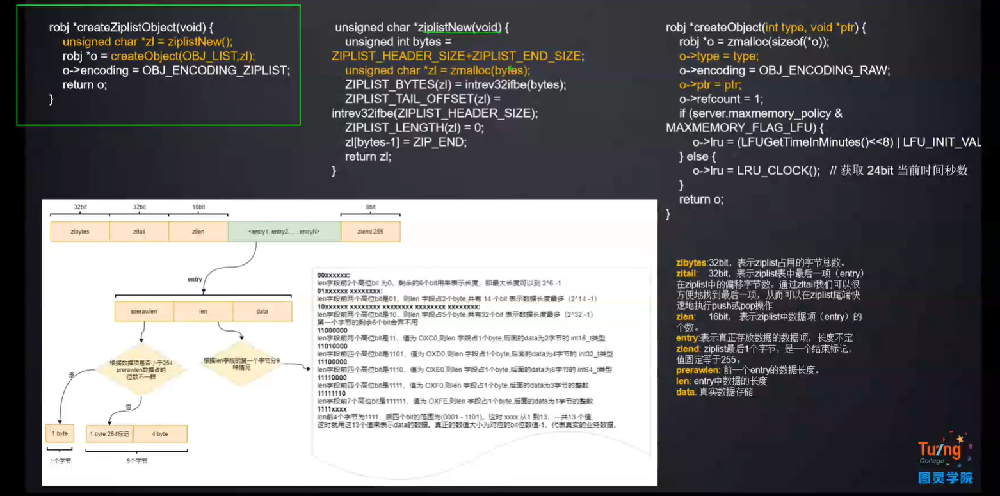

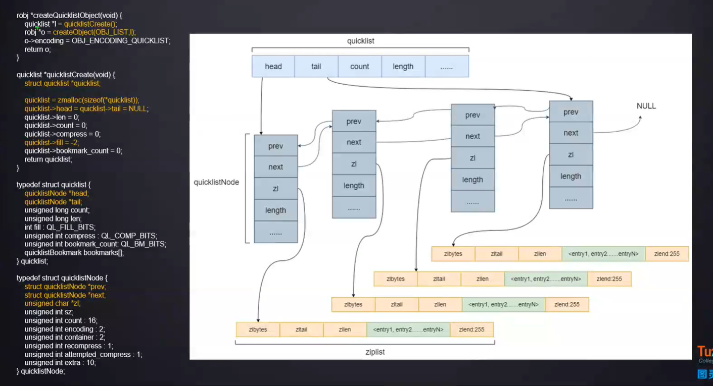

* List是一个按插入时间排序的数据结构，底层使用QuickList（维护双向链表）和ZipList（存储数据）实现；
* 可以实现栈（`LPUSH+LPOP`）、双端队列（`LPUSH+RPOP/RPUSH+LPOP`）、数组（正负索引）、阻塞队列（`LPUSH+BRPOP`）和进行范围截取操作（`LRANGE key start end`）；
* 数据的共享、迁出和粉丝列表、文章评论列表；
* 微博和微信公众号的消息流：
  * 用户关注的用户发微博：`LPUSH msg:{userId} {msgId}`；
  * 用户查看最新的微博消息：`LRANGE msg:{userId} 0 5`。


### Hash


* 类似于Java的HashMap；

* 存储结构化数据：如对象缓存 `HMSET key field:value `）；

* 好友关注：用户id做为key，field为所有好友的id，value为对应的关注时间；

* 用户维度统计：用户id为key，不同的统计维度为field，对应的统计数据为value；

* 电商购物车（用户id为key，商品id为field，商品数量为value）：

  * 添加商品：`HSET cart:1001 10088 1`；
  * 增加数量：`HINCRBY cart:1001 10088 1`；
  * 商品总数：`HLEN cart:1001`；
  * 删除商品：`HDEL cart:1001 10088`；
  * 获取购物车中所有商品：`HGETALL cart:1001`。

* 优点：

  * 同类数据归类整合存储，方便数据管理；
  * 相比于String操作消耗的内存和CPU更小；
  * 相比于String更节省空间。

* 缺点：

  

  * 过期功能不能使用在field上，只能使用在key上；
  * Redis集群下不适合大规模使用。


### Set

* 底层使用无序且唯一的哈希表存储；
* 抽奖：
  * 用户参与抽奖：`SADD key {userId}`；
  * 查看参与抽象的所有用户：`SMEMBERS key`；
  * 随机抽取指定数量的中奖用户：`SRANDMEMBER key [count]/SPOP key [count]`。
* 微博点赞、收藏、标签：
  * 点赞操作：`SADD like:{msgId} {userId}`；
  * 取消点赞：`SREM like:{msgId} {userId}`；
  * 检查用户是否已经点过赞了：`SISMEMBER like:{msgId} {userId}`；
  * 获取所有点赞的用户：`SMEMBERS like:{msgId}`；
  * 获取点赞的用户数：`SCARD like:{msgId}`。
* 微博微信关注模型：
  * 用户和好友的公共关注（交集）：`SINER userSet friendSet1`；
  * 我关注的人也关注他：`SISMEMBER friendSet1 friendSer2`；
  * 推荐给用户的好友（差集）：`SDIFF userSet friendSet1`。
* 电商商品按各维度标签筛选：
  * `SADD brand:huawei P30`；
  * `SADD brand:xiaomi RedMi 8`；
  * `SADD brand:iPhone iPhone X`;
  * `SADD CPU:Intel P30 RedMi 8`；
  * `SADD OS:Android P30 RedMi 8`；
  * `SADD RAM:8G P30 RedMi 8 iPhone X`；
  * `SINTER OS:Android CPU:Intel RAM:8G`。


### Sorted Set

* 底层使用带分值排序的压缩表/跳表存储；

* 微博新闻排行榜：

  * 点击新闻：`ZINCRBY hotNews:20201211 1 xxx`；

  * 展示当日排行Top10：`ZREVRANGE hotNews:20201211 0 9 WITHSCORES`；
  * 计算近七日的排行榜（并集）：`ZUNIONSTORE hotNews:20201205-20201211 7 hotNews:20201205 ... hotNews:20201211`；
  * 展示近七日排行Top10：`ZREVRANGE hotNews:202005-20201211 0 9 WITHSCORES`。

* 微博动态翻页：
  * 每条微博做为元素，对应的发布时间戳做为分值； 
  * 通过 `zrevrange key start stop` 逆序获取最新发布的微博n条（如果在翻页时微博出现新的动态，有序集合会动态的重新排序）。

* 延迟队列：

  * 当前时间戳+需要延迟的时长做为score，消息内容做为元素；
  * 使用ZADD生产消息，消费者使用ZRANGEBYSCORE获取当前时间之前的数据做轮询处理，消费完后删除。


## Redis的过期策略和内存淘汰机制

### 过期策略

* **定性删除**：Redis默认每隔100ms就随机抽取一些设置了过期时间的key，并检查其是否过期，如果过期就删除。所谓的随机抽取就是为了避免大数据量下顺序遍历带来的性能消耗；
* **惰性删除**：定期删除可能会导致很多过期key到了时间却没有被删除，所以就引入了惰性删除。所谓的惰性删除就是过期却没被定性删除的key等到再次被访问的时候删除。

* 如果定性删除漏掉了很多的key，这些key也没有被及时的访问，无法惰性删除。此时可能会有大量的key堆积在内存中，导致Redis的内存块耗尽。所以就引入了内存淘汰机制来解决这个问题；


### 内存淘汰机制

当内存不足以容纳新写入的数据时，Redis的数据淘汰策略：
* **volatile-lru**：在设置了过期时间的键空间中选择最近最少使用的key淘汰；
* **volatile-ttl**：在设置了过期时间的键空间中选择将要过期的key淘汰；
* **volatile-random**：在设置了过期时间的键空间中随机选择key淘汰；
* **allkeys-lru**：在键空间内选择最近最少使用的key淘汰；
* **allkeys-random**：在键空间内随机选择key淘汰；
* **no-eviction**：使写入操作报错。
* **volatile-lfu**：在设置了过期时间的键空间中选择最不经常使用的key淘汰（4.0版本新增）；
* **allkeys-lfu**：在键空间中选择最不经常使用的key淘汰（4.0版本新增）。


## Redis-持久化机制

所谓的持久化就是将内存中的数据写入磁盘中，大部分原因是为了之后重用数据（如重启机器或机器故障之后恢复数据），或者是为了防止系统故障而将数据备份到一个远程位置。

### 快照持久化（RDB）

* 即通过创建快照的方式来获得内存中的数据在某个时间点上的副本。Redis创建快照之后，可以对快照进行备份，可以将快照复制到其他服务器从而创建具有相同数据的服务器副本（Redis主从结构），还可以将快照留在原地以便服务器重启后恢复数据。
* RDB是Redis采用的默认持久化方式，在redis.conf文件中配置：
  * `save 900 1` 在900秒即15min后，如果至少有1个key发生了变化，Redis就会自动触发BGSAVE命令创建快照；
  * `save 300 10	` 在300秒即5min后，如果至少有10个key发生了变化，Redis就会自动触发BGSAVE命令创建快照；
  * `save 60 10000` 在60秒即1min后，如果至少有10000个key发生了变化，Redis就会自动触发BGSAVE命令创建快照。
* RDB的优缺点：


### 只追加文件（AOF）

* AOF持久化方式的本质就是写命令日志，当Redis每执行一条会更改数据的命令时，就会将该命令写入硬盘中的AOF文件。每当服务器重启后，就将AOF中的命令重新执行一遍以还原内存状态。
* Redis默认不开启AOF，可以通过添加参数 `appendonly yes` 开启；
* 在Redis的配置文件中存在三种不同的AOF持久化方式：
  * `appendfsync always`：每次有数据修改发生时都会写入AOF文件，但这样会严重影响性能；
  * `appendfsync everysec`：每秒同步一次，显示的将多个写命令同步到硬盘。为了兼顾数据和性能，可以选择该选项，让Redis每秒同步一次AOF文件，Redis的性能不会受什么大影响，而且即使出现了系统崩溃，用户最多也只会丢失一秒内产生的数据；
  * `appendfsync no`：让操作系统决定何时进行同步。
* AOF的优缺点：


### Redis4.0的混合持久化策略

* 通过配置项 `aof-use-rdb-preamble` 开启RDB和AOF的混合持久化；
* 如果混合持久化被开启，则AOF重写的时候就直接把RDB的内容写到AOF文件开头。这样做的好处是可以结合RDB和AOF的优点，快速加载同时避免丢失过多的数据。缺点就是AOF文件中的RDB部分是压缩格式存储的，可读性较差；
* AOF重写：
  * 重写机制可以产生一个新的文件，这个新AOF文件和原有的AOF文件所保存的数据库状态一样，但体积更小；
  * 该功能其实是通过读取数据库中的键值对来实现的，程序无须对现有的AOF文件进行任何的读取、分析和写入操作；
  * 在执行 `BGREWRITEAOF` 命令时，Redis服务器会维护一个AOF重写缓冲区，该缓冲区会在子进程创建新AOF文件期间，去记录服务器执行的所有写命令。当子进程完成创建新AOF文件的工作后，服务器会将重写缓冲区中的所有内容追加到新AOF文件的末尾，使得新旧两个AOF文件所保存的数据库状态一致。最后，服务器用新AOF替换旧AOF，以此来完成AOF文件的重写操作。


## Redis-缓存雪崩/穿透/击穿问题

### 缓存雪崩

* 缓存同一时间大面积的失效，导致在高并发的场景下，大量的请求全部落到数据库上，造成数据库在短时间内承受超量的请求而崩溃。缓存短时间内大规模失效的原因与key的超时时间设置有关，即大量的key被同时写入缓存，也被同时设置了相同的超时时间。

* 解决方法：

  

  * 事前：Redis高可用、主从+哨兵、Redis Cluster、内存淘汰、超时时间添加随机值；
  * 事中：本地ehcache缓存 + 限流&服务降级，避免数据库崩溃；
  * 事后：Redis重启后利用持久化机制快速恢复缓存。


### 缓存穿透

* 所谓的穿透就是请求越过缓存直接落在数据库上，当大量请求访问一个缓存和数据库中均没有的key时，请求会全部落在数据库上（因为数据库中也没有，所以不会写缓存，会直接通过数据库返回），导致缓存无法发挥作用。

* 正常缓存处理流程：

  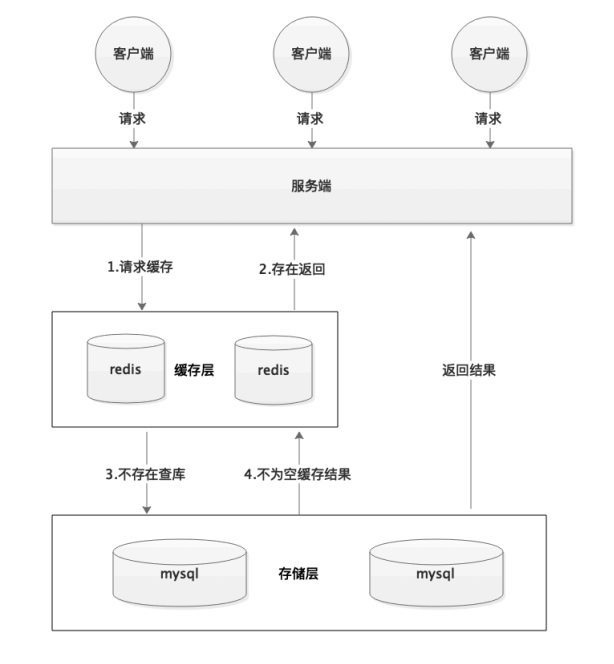

* 缓存穿透情况处理流程：

  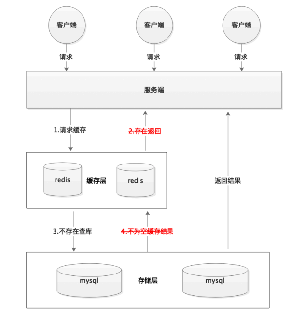

* 解决方法：

  * **缓存无效的key**：如果缓存和数据库都查不到某个key，就不管其是否存在都将写入Redis缓存并设置超时，这种方式可以解决请求的key变化不频繁的情况。但如果面临恶意攻击的情况，每个请求构建不同的key，就会导致Redis中缓存大量无效的key，所以不能完全的解决问题。

  * **布隆过滤器**：通过该数据结构可以判断一个给定的数据是否存在于海量数据中。首先把所有可能存在的请求的值都存放在布隆过滤器中，当用户请求发送过来，就会先判断用户请求的值是否存在于布隆过滤器中，若不存在的话直接返回非法key，若存在的话走正常处理流程。

    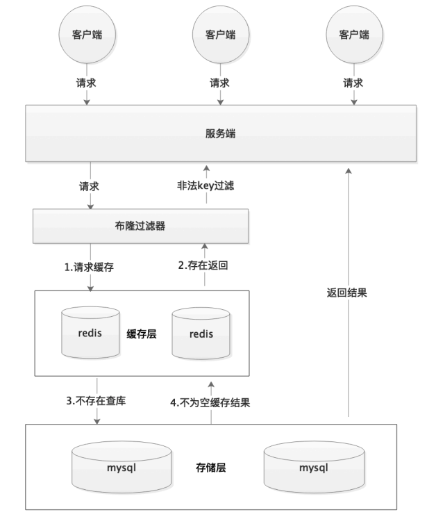


### 布隆过滤器

* **布隆过滤器（Bloom Filter）**，是由二进制向量（位数组）和一系列随机映射函数（哈希散列）两部分组成的数据结构。优点是其占用空间和效率方面相对更高，缺点是返回结果是概率性的（与元素越多，误报的可能性就越大），而不是非常准确的，且存放在其中的数据不容易删除。
* 其中位数组中的每个元素都只占用1bit，且每个元素只能是0或1。以这种方式申请一个100w元素的位数组只会占用 `1000000bit/8 = 125000byte = 125000/1024kb ≈ 122kb` 的空间。
* 使用原理：
  * 在使用布隆过滤器之前，位数组会初始化，即所有元素都置为0。当要将一个字符串存入其中时，先通过多个哈希函数对字符串生成多个哈希值，然后将数组对应位置的元素置为1。
  * 若要判断某个字符串是否存在于布隆过滤器中时，只需要对给定的字符串进行相同的哈希计算，然后以此获取数组中对应位置的元素，若所有位置上的元素都为1，则说明字符串已经存在，若有一个值不为1，则说明字符串不存在。
* 注意：但哈希函数也存在哈希碰撞的可能性，即不同的字符串可能计算出的哈希位置相同（可以相应的增加位数组大小或调整哈希函数）。因此，布隆过滤器判断数据是否存在有小概率会误判，但判断数据是否不存在一定会成功。

* 使用场景：

  * 判断给定的数据是否存在于海量的数据集中，如：防止缓存穿透（判断请求的数据是否有效，避免绕过缓存去请求数据库）、垃圾邮件过滤、黑名单功能等；
  * 对大量数据集进行去重操作。

* Java实现布隆过滤器：

  ```JAVA
  import java.util.BitSet;
  
  public class BloomFilter {
      
      private static final int DEFAULT_SIZE = 2 << 24;	// 位数组大小
      private static final int[] SEEDS = new int[]{3, 13, 46, 71, 91, 134};	// 通过不同的随机数种子生成6种hash函数
      private BitSet bits = new BitSet(DEFAULT_SIZE);	// 位数组
      private SimpleHash[] func = new SimpleHash[SEEDS.length];	// hash函数数组
    
      // 初始化hash函数数组，包含多个不同的hash函数
      public BloomFilter() {
          for (int i = 0; i < SEEDS.length; i++) {
      		func[i] = new SimpleHash(DEFAULT_SIZE, SEEDS[i]);
          }
      }
      
      // 添加元素到位数组
      public void add(Object value) {
          for (SimpleHash f : func) {
              bits.set(f.hash(value), true);
          }
      }
      
      // 判断元素是否在位数字中存在
      public boolean contains(Object value) {
   		boolean ret = true;
          for (SimpleHash f : func) {
              ret = ret & bits.get(f.hash(value));
          }
          return ret;
      }
      
      public static class SimpleHash {
          
          private int cap;
          private int seed;
      	
          public SimpleHash(int cap, int seed) {
              this.cap = cap;
              this.seed = seed;
          }
          
          // hash操作
          public int hash(Object value) {
              int h;
              return (value == null) ? 0 : Math.abs(seed * (cap-1) & ((h = value.hashCode()) ^ (h >>> 16)));
          }
      }
  }
  ```


### 缓存击穿

* 所谓的缓存击穿就是某个热点key访问非常频繁，处于集中式高并发访问的情况，当这个key超时失效的瞬间，大量的请求就击穿了缓存，直接请求数据库，给数据库巨大的压力。
* 解决方法：
  * 若缓存的数据基本不会发生更新，则可将热点key设置为**永不过期**；
  * 若缓存的数据更新不频繁，且缓存刷新的整个流程耗时较少，则可以采用基于Redis、Zookeeper等分布式中间件的**分布式锁**，或者本地互斥锁以保证仅有少量的请求能进入数据库并重新构建缓存，其余线程则在锁释放后能访问到新缓存；
  * 若缓存的数据更新频繁或者在缓存刷新的流程耗时较长的情况下，可以利用**定时线程**在缓存过期前主动的重新构建缓存或者延后缓存的过期时间，以保证所有的请求能一直访问到对应的缓存。


## Redis-并发竞争的问题

* 所谓的并发竞争指的是多个用户同时对一个key进行操作，造成最后执行的顺序和期望的顺序不同，导致结果不同。
* 分布式锁解决方法：推荐使用Zookeeper实现的分布式锁来解决，当客户端需要对操作加锁时，在zk上与该操作对应的节点的目录下，生成一个唯一的瞬时有序节点，判断是否获取锁的方式就是去判断有序节点中序号最小的一个，当释放锁时，只需要将这个瞬时节点删除即可。


## Redis-保证缓存和数据库的双写时一致性

## Redis-主从架构

## Redis-哨兵集群


## 分布式锁

### Redis分布式锁

* 普通实现，即使用 `SET key value [EX seconds] [PX milliseconds] NX` 创建一个key，做为互斥锁：
  * `NX`：表示只有key不存在时才会设置成功，如果此时redis中存在这个key，那么设置失败，返回nil；
  
  * `EX seconds`：设置key的过期时间，精确到秒级，即seconds秒后自动释放锁；

  * `PX milliseconds`：设置key的过期时间，精确到毫秒级。
  
* 加锁：`SET resource_name my_random_value PX 30000 NX`；
  
  * 释放锁：
  
    ```lua
    -- 删除key之前先判断释放是自己创建的，即释放自己持有的锁
    if redis.call('get', KEYS[1]) == ARGV[1] then
        return redis.call('del', KEYS[1])
    else
      return 0
    end
    ```
  ```
  
  * 缺点：如果是普通的Redis单实例，会存在单点故障问题。若是Redis主从异步复制，主节点宕机导致还未失效的key丢失，但key还没有同步到从节点，此时切换到从节点，其他用户就可以创建key从而获取锁。
  ```
  
* RedLock算法实现：TODO


### Zookeeper分布式锁

**临时znode**：加锁的时候由某个节点尝试创建临时的znode，若创建成功就获取到锁，这时其他客户端再创建znode时就会失败，只能注册监听器监听这个锁。释放锁就是删除这个znode，一旦释放就会通知客户端，然后有一个等待着的客户端就可以再次重新加锁。

```JAVA
public class ZookeeperSession {
    
    // 闭锁
    private static CountDownLatch connectedSemaphore = new CountDownLatch(1);
    // zk客户端
    private Zookeeper zookeeper;
    private CountDownLatch latch;
    
    public ZookeeperSession() {
        try {
            // zk客户端
            this.zookeeper = new Zookeeper("192.168.56.10:2181,192.168.56.10", 50000, new ZookeeperWatcher());
            try {
        	    connectedSemaphore .await();
            } catch (InterruptedException e) {
                e.printStackTrace();
            }
            // zk会话连接成功
            System.out.println("ZooKeeper session established......");
        } catch (Exception e) {
            e.printStackTrace();
        }
    }
    
    /**
     * 获取分布式锁
     */
    public Boolean acquireDistributedLock(Long productId) {
        // zk锁节点目录
        String path = "/product-lock-" + productId;
        try {
            // 创建znode，即获取锁
            zookeeper.create(path, "".getBytes(), Ids.OPEN_ACL_UNSAFE, CreateMode.EPHMERAL);
            return true;
        } catch (Exception e) {
            // 若创建失败，即证明获取失败，锁已被其他人创建，接着自旋等待获取锁节点的创建权
            while (true) {
                try {
                   // 给znode注册一个监听器，判断监听器是否存在
                   Stat stat = zk.exists(path, true);
                   if (stat != null) {
                       // 在闭锁上阻塞，直到超时或被唤醒（持有锁的用户countDown一次）
                       this.latch = new CountDownLatch();
                       this.latch.await(waitTime, TimeUnit.MILLISECOND);
                       this.latch = null;
                   }
                   // 尝试获取锁
                   zookeeper.create(path, "".getBytes(), Ids.OPEN_ACL_UNSAFE, CreateMode.EPHEMERAL);
                   return true;
                } catch (Exception e) {
                    // 抢锁失败，自旋
                    continue; 
                }
            }
        }
        return true;
    }
    
    /**
     * 释放分布式锁
     */
    public void releaseDistributedLock(Long productId) {
        // zk锁节点目录
        String path = "/product-lock-" + productId;
    	try {
            // 删除临时znode，即释放锁
            zookeeper.delete(path, -1);
            System.out.println("release the lock for product[id=" + productId + "]......");
        } catch (Exception e) {
            e.printStackTrace();
        }
    }
    
    /**
     * 实现zk的监听器
     */
    private class ZookeeperWatcher implements Watcher {
        
        private void process(WatchedEvent event) {
            System.out.println("Receive watched event: " + event.getState());
            if (KeeperState.SyncConnected == event.getState()) {
                connectedSemphore.countDown();
            }
            // 若监听器发现节点已被删除，就立即解除闭锁的阻塞，让等待自旋等待的线程去抢锁
            if (this.latch != null) {
                this.latch.countDown();
            }
        }
    }
    
    /**
     * 封装单例的静态内部类
     */
    private static class Singleton {
		
        // 单例的zk会话对象
        private static ZookeeperSession instance;
        
        static {
            instance = new ZookeeperSession();
        }
        
        public static ZookeeperSession getInstance() {
            return instance;
        }
    }
    
    /**
     * 获取单例
     */
    public static ZookeeperSession getInstance() {
        return Singleton.getInstance();
    }

    public static void init() {
        getInstance();
    }
}
```

**临时顺序节点**：如果有一把锁，被多个人竞争，此时多个人会排队，第一个拿到锁的人会执行，然后释放锁。后面的每个人都会在排在自己前面的那个人创建的znode上监听，一旦某个人释放了锁，排在自己后面的人就会被Zookeeper通知，即获取到了锁。

```JAVA
public class ZookeeperDistributedLock implements Watcher {
    
    private Zookeeper zk;
    private String locksRoot = "/locks";
    private String productId;
    private String waitNode;
    private String lockNode;
    private CountDownLatch latch;
    private CountDownLatch conectedLatch = new CountDownLatch(1);
    private int sessionTimeout = 30000;
    
    public ZookeeperDistributedLock(String productId) {
        this.productId = productId;
        try {
            String address = ;
            zk = new Zookeeper("192.168.56.10:2181,192.168.56.11:2181,192.168.56.12:2181", sessionTimeout, this);
            connectedLatch.await();
        } catch (IOException e) {
            throw new LockException(e);
        } catch (KeeperException e) {
            throw new LockException(e);
        } catch (InterruptedException e) {
            throw new LockException(e);
        }
    }
    
    public void process(WatchedEvent event) {
        if (event.getState() == KeeperState.SyncConnected) {
            connectedLatch.countDown();
            return;
        }
        
        if (this.latch != null) {
            this.latch.coutDown();
        }
    }
    
    /**
     * 获取锁
     */
    public void acquireDistributedLock() {
        try {
            if (this.tryLock()) {
                return;
            } else {
                waitForLock(waitNode, sessionTimeout);
            }
        } catch (KeeperException e) {
            throw new LockException(e);
        } catch (InterruptedException e) {
            throw new LockException(e);
        }
    }
    
    /**
     * 尝试获取锁
     */
    public boolean tryLock() {
        try {
            // 创建锁节点
            lockNode = zk.create(locksRoot + "/" + productId, new byte[0], ZooDefs.Ids.OPEN_ACL_UNSAFE, CreateMode.EPHEMERAL_SEQUENTIAL);
            
            // 对locksRoot目录下的所有节点排序
            List<String> locks = zk.getChildren(locksRoot, false);
            Collections.sort(locks);
            
            // 判断刚才创建的节点是否为最小节点
            if (lockNode.equals(locksRoot + "/" + locks.get(0))) {
                // 若是则表示获得锁
            	return true;    
            }
            
            // 若不是则找到自己的前一个节点
            int previousLockIndex = -1;
            for (int i = 0; i < locks.size(); i++) {
                if (lockNode.equals(locksRoot + "/" + locks.get(i))) {
               		previousLockIndex = i - 1;
                    break;
                }
            }
            // 并且将其设置为当前等待节点
            this.waitNode = locks.get(previousLockIndex);
        } catch (KeeperException e) {
            throw new LockException(e);
        } catch (InterruptedException e) {
            throw new LockException(e);
        }
        return false;
    }
    
    private boolean waitForLock(String waitNode, long waitTime) throws InterruptedException, KeeperException {
        Stat stat = zk.exists(locksRoot + "/" + waitNode, true);
        if (stat != null) {
            this.latch = new CountDownLatch(1);
            this.latch.await(waitTime, TimeUnit.MILLISECONDS);
            this.latch = null;
        }
        return true;
    }
    
    /**
     * 释放锁
     */
    public void unlock() {
        try {
            System.out.println("unlock " + lockNode);
            zk.delete(lockNode, -1);
            lockNode = null;
            zk.close();
        } catch (InterruptedException e) {
            e.printStackTrace();
        } catch (KeeperException e) {
            e.printStackTrace();
        }
    }
    
    /**
     * 自定义锁异常
     */
    public class LockException extends RuntimeException {
        
        private static final long serialVersionUID = 1L;
        
        public LockException(String e) {
            super(e);
        }
        
        public LockException(Exception e) {
            super(e);
        }
    }
}
```


### Redis分布式锁和ZK分布式锁的区别

* Redis的分布式锁需要不断去尝试获取锁，比较消耗性能。而zk的分布式锁，在获取不到锁时注册监听器即可，不需要不断的主动尝试获取锁，性能开销小。
* 当Redis获取锁的客户端挂了，那么只能等待超时时间过期才能释放锁。而zk只是创建了临时znode，只要客户端挂了，znode也就没了，就会自动释放锁。


## 分布式事务

### 两阶段提交方案（XA方案）

* 两阶段提交有一个事务管理器的概念，负责协调多个数据库（即资源管理器）的事务，事务管理器先询问各个数据库是否准备提交，如果每个数据库都恢复ok，则正式提交事务，在各个数据库上执行操作，如果其中任何一个数据库回答不ok，则立即回滚事务。

  

* XA适用于单应用跨多个数据库的分布式事务，因为严重依赖于数据库层面来处理复杂的事物，效率很低，不适合高并发的场景。

* 一个服务内部出现了跨多个库的访问操作，是不符合微服务的设计规定的，一般来说每个服务只能操作自己对应的一个数据库，如果需要操作其他数据库，必须通过调用目标数据库对应服务提供的接口来实现。


### TCC方案

* TCC是其内部三个阶段首字母的组合：

  * Try阶段：该阶段是对各个服务的资源做检测以及对资源进行锁定或者预留；
  * Confirm阶段：该节点是在各个服务中执行实际的操作；
  * Cancel阶段：如果任何一个服务的业务方法执行出错，那么就需要进行补偿，就是执行已执行成功的业务逻辑的回滚操作。

  

* TCC的事务回滚实际上是严重依赖于代码来完成补偿操作的。如支付、交易相关的场景，会使用TCC进行严格的代码补偿，保证分布式事务要么全部成功，要么全部复原。


### Saga方案

* 业务流程中每个参与者都提交本地事务，若某一个参与者失败，则补偿前面已经成功的参与者。下图中的事务流程，当执行到T3时发生错误，则开始向上依次执行补偿流程T3、T2、T1，直到将所有已修改的数据复原。


* 适用场景：业务流程多、业务流程长，使用TCC的话成本高，同时无法要求其他公司或遗留的系统也遵循TCC。
* 优点；
  * 一阶段提交本地事务，无锁，高性能；
  * 参与者可异步执行，高吞吐；
  * 补偿服务易于实现。
* 缺点：不保证事务的隔离性。


### 本地消息表

* A系统在本地事务操作的同时，插入一条数据到消息表中，接着将这个消息发送到MQ中；
* B系统接收到消息后，在一个事务中向自己的本地消息表中插入一条数据，同时执行其他的业务操作。如果这个消息已经被处理过了，那么此时这个事务会回滚，保证不会重复处理；
* B系统处理成功后，就会更新自己本地消息表的状态以及A系统消息表的状态；
* 若B系统处理失败，则不会更新消息表状态。A系统会定时扫描消息表，如果有未处理的消息，会再次发送到MQ中去，让B再次处理；
* 该方案保证了最终一致性，就算B事务失败了，A也会不断的重发消息，直到B成功为止。


### 可靠消息最终一致性方案

* A系统发送一个prepared消息到MQ，若消息发送失败则取消操作。若发送成功则执行本地事务，如果成功则通知MQ发送确认消息，失败则通知MQ回滚消息；
* 如果发送的是确认消息，则此时B系统会接收到确认消息，然后执行本地事务；
* MQ会自动定时轮询所有prepared消息并回调应用程序的接口，询问这个消息是不是本地事务处理失败了，所有没发送确认的消息，是继续重试还是回滚？一般来说这里就可以通过数据库查看之前的本地事务是否执行，如果回滚了，那么这里也回滚。这样能够避免本地事务执行成功，但确认消息发送失败的情况。
* 如果系统B的事务失败了就重试，不断重试直到成功，如果实在无法成功，则针对重要的业务（如资金类）进行回滚，如系统B本地回滚后，想办法通知系统A也回滚，或是发送报警由人工来手动回滚和补偿。


### 最大努力通知方案

* 系统A的本地事务执行完毕后，发送消息到MQ；
* 会有一个专门消费MQ的最大努力通知服务，这个服务会消费MQ然后写入数据库中记录，然后调用系统B的接口；
* 若系统B的事务执行失败，则最大努力通知服务就定时尝试重新调用系统B，直到成功，若超出重试次数，则放弃。


# Spring/SpringBoot/SpringCloud

## Spring-概念和特性

**什么是Spring框架？**即Spring Framework，是一种轻量级的开发框架，是很多模块的集合，使用这些模块可以提高开发人员的开发效率以及系统的维护性。

**Spring的特性：**

* 核心技术（Core technologies）：依赖注入（DI）、AOP、事件（events）、资源、i18n、验证、数据绑定、类型转换、SpEL；
* 测试（Testing）：模拟对象、TestContext框架、Spring MVC测试、WebTestClient；
* 数据访问（Data Access）：事务、DAO支持、JDBC、ORM、编组XML；
* Web支持（Spring MVC）：Spring MVC和Spring WebFlux框架；
* 集成（Integration）：远程处理、JMS、JCA、JMX、电子邮件、任务、调度、缓存；
* 语言（Languages）：Kotlin、Groovy、动态语言。


## Spring-重要模块

* Spring Core：基础模块，Spring的其他所有功能都基于该模块，其主要提供IOC依赖注入功能；
* Spring Aspects：为AspectJ的集成提供支持；
* Spring AOP：提供了面向切面的编程实现；
* Spring JDBC：Java数据库连接；
* Spring JMS：Java消息服务；
* Spring ORM：用于支持Hibernate等对象关系映射框架；
* Spring Web：为创建Web应用程序提供支持；
* Spring Test：提供了对JUnit和TestNG测试的支持。


## Spring-基本注解

**@Controller返回一个页面：**单独使用的话一般适用于需要返回视图的场景，属于传统的Spring MVC应用。


**@RestController返回JSON或XML形式的数据：**只会返回对象，对象的数据直接以JSON或XML的形式写入HTTP响应体中，这种情况属于RESTful Web服务，也是目前常用的前后端分离开发使用的机制。


**@Controller+@ResponseBody返回JSON或XML形式的数据：**因为Spring4.x之后才新加了@RestController注解，所以在Spring4.x之前开发RESTful Web应用需要结合使用两个注解。@ResponseBody会将控制器返回的对象转换为特定格式后，写入HTTP响应体中。


## Spring-IOC&AOP

### IOC

控制反转（IOC，Inverse of Control）是一种程序的设计思想，即将原本在程序中手动创建的对象的控制权交由Spring框架管理。IOC容器是Spring用来实现IOC的载体，其底层维护了Map结构用于存放对象。

将对象间的相互依赖交给IOC容器管理，并由其完成对象的注入。这样可以很大程度上简化应用程序的开发流程，把开发流程从复杂的依赖关系中解放出来。

IOC容器就像是一个工厂，当需要创建对象时，只需要写好配置文件或注解即可，将对象的创建过程交给IOC来完成。

Spring IOC的初始化过程：


### AOP

面向切面编程（AOP，Aspect-Oriented Programming）能够将与业务无关的，却为业务模块所共同调用的逻辑或责任（如事务处理、日志管理、权限控制）封装起来，便于减少系统的重复代码，降低模块的耦合度，有利于为了的可扩展性和可维护性。

AOP基于动态代理，如果要代理对象且实现了某个接口，则Spring AOP就会使用JDK Proxy去创建代理对象，而对于没有实现接口的对象，就无法使用JDK Proxy进行代理，这时Spring AOP会使用Cglib生成一个被代理对象的子类做为代理，如下图：


## Spring Bean

### Spring中bean的作用域

* singleton：单例bean；
* prototype：每次请求创建一个新的bean实例；
* request：每次http请求创建新的bean，但仅在该次http请求内有效；
* session：每次http请求创建新的bean，但仅在当前http的session会话有效。


### Spring中单例bean的线程安全问题

单例bean存在线程安全问题，主要i是因为当多个线程操作同一个对象时，对这个对象的非静态成员变量的写操作存在线程安全问题。

解决方法就是在类中定义一个ThreadLocal的成员变量，将需要的可变成员变量保存在ThreadLocl中。


### @Component和@Bean的区别

* 作用对象不同，@Component作用于类，@Bean作用于方法；
* @Component通常是通过类路径扫描来字段侦测以及自动装配到Spring容器中，通常使用@ComponentScan来定义要扫描的路径从中找出标识了需要装配的类并自动装配到Spring的bean容器中。@Bean通常是在标有该注解的方法中手动产生一个bean，通知Spring这是某个类的创建过程，当需要时再将其执行并返回对象。
* @Bean注解比@Component注解的自定义性更强，而且很多情况下只能通过@Bean来注册bean。如引用第三方库中的类需要装配到Spring容器中时，则只能通过@Bean来实现。


### 声明类为Spring bean的注解

* @Component：通用注解，可以标注任意类为Spring组件。如果一个Bean不知道属于哪一层，可以使用@Component标注；
* @Repository：对应持久层即Dao层，主要用于数据库相关操作；
* @Service：对应服务层，主要涉及一些复杂的业务逻辑，需要用到Dao层；
* @Controller：对应于Spring MVC的控制层，主要用于接受客户端的请求并调用服务层处理业务，最后返回数据给前端页面。


### Spring bean的生命周期

 

* Bean容器找到配置文件中Spring Bean的定义；
* Bean容器使用Java Reflection API创建一个Bean的实例；
* 如果涉及到一些属性值则使用 `set()` 方法设置；
* 如果Bean实现了BeanNameAware接口，则调用setBeanName()方法，传入Bean的名字；
* 如果Bean实现了BeanClassLoaderAware接口，则调用setBeanClassLoader()方法，传入ClassLoader对象的实例；
* 如果Bean还实现了其他的 *.Aware 接口，就调用相应的方法；
* 如果存在和加载该Bean的Spring容器相关的BeanPostProcess对象，就执行postProcessBeforeInitialization()方法，即进行前置处理；
* 如果Bean实现了InitializingBean接口，就执行afterPropertiesSet()方法；
* 如果Bean在配置文件中定义了包含init-method属性，就执行指定方法；
* 如果存在和加载该Bean的Spring容器相关的BeanPostProcess对象，就执行postProcessBeforeInitialization()方法，即进行后置处理；
* 当要销毁Bean时，如果Bean实现了DisposableBean接口，则执行destroy()方法；
* 当要销毁Bean时，如果Bean在配置文件中的定义包含destroy-method属性，执行指定的方法。


## Spring MVC

### SpringMVC的概念

MVC是一种设计模式，Spring MVC就是基于了这种设计模式的框架。可以帮助开发任意更简洁的开发Web应用，且与Spring框架天然集成。Spring MVC将后端项目分为了Service层（业务层）、Dao层（持久化层）、Entity层（实体类）和Controller层（控制层）。


### SpringMVC的工作原理

* 客户端/浏览器发送请求，直接请求到前端控制器DispatcherServlet；
* 前端控制器DispatcherServlet根据请求信息调用处理器映射器HandlerMapping，解析与请求对应的Handler；
* 当解析到对应的Handler后（即Controller控制器），开始由处理器适配器HandlerAdapter处理；
* 处理器适配器HandlerAdapter根据Handler来调用真正的处理器来处理请，并执行相应的业务逻辑；
* 处理器处理完业务后，会返回一个ModelAndView对象，Model是返回的数据对象，View是逻辑上的视图；
* 视图解析器ViewResolver会根据逻辑View查找实际的View；
* 前端控制器DispatcherServlet会将返回的Model传给View，即渲染视图；
* 最后将View返回给请求者。


## Spring-用到的设计模式

* 工厂设计模式：Spring的BeanFactory、ApplicationContexttong使用工厂模式创建bean对象；
* 代理设计模式：Spring AOP功能基于动态代理实现；
* 单例设计模式：Spring的Bean对象默认都是单例的；
* 模板方法设计模式：Spring的jdbTemplate、hibernateTemplate等以Template结尾的对数据库操作的类，使用了模板方法；
* 包装器设计模式：当项目需要连接多个数据库，且不同的客户在每次访问中根据需要会去访问不同的数据库。这种包装器设计模式可以根据客户的需求动态切换不同的数据源；
* 观察者设计模式：Spring的事件驱动模型就是观察者模式的典型应用；
* 适配器设计模式：Spring AOP的增强或通知Advice使用了适配器模式。Spring MVC中的Controller也使用了适配器模式。


## Spring-事务

### Spring管理事务的方式

* 编程式事务，即在代码中硬编码；
* 声明式事务，即在配置文件中配置：
  * 基于XML的声明式事务；
  * 基于注解的声明式事务。


### Spring事务的隔离级别

* TransactionDefinition.ISOLATION_DEFAULT：即使用数据库的默认隔离级别，MySQL的默认隔离级别是REPEATABLE_READ；
* TransactionDefinition.ISOLATION_READ_UNCOMMITTED：读未提交。最低的隔离级别，允许读取尚未提交的数据变更，可能会导致脏读、幻读和不可重复读；
* TransactionDefinition.ISOLATION_READ_COMMITTED：读已提交。允许读取并发事务已经提交的数据，可以阻止脏读，但幻读和不可重复读仍有可能发生；
* TransactionDefinition.ISOLATION_REPEATABLE_READ：可重复读。对同一字段的多次读取结果都是一致的，除非数据是被当前事务所修改，可以阻止脏读和不可重复读，但不能阻止幻读；
* TransactionDefinition.ISOLATION_SERIALIZABLE：可串行化。最高的隔离级别，让所有事务依次执行，完全避免事务之间产生的相互影响，可以阻止脏读、不可重复读和幻读，但严重影响程序的性能。


### Spring事务的传播行为

支持当前事务的情况：

* TransactionDefinition.PROPAGATION_REQUIRED：如果当前存在事务，则加入该事务，如果当前没有事务，则创建一个新的事务；
* TransactionDefinition.PROPAGATION_SUPPORTS：如果当前存在事务，则加入该事务，如果当前没有事务，则以非事务的方式继续执行；
* TransactionDefinition.PROPAGATION_MANDATORY：如果当前存在事务，则加入该事务，如果当前没有事务，则抛出异常。

不支持当前事务的情况：

* TransactionDefinition.PROPAGATION_REQUIRES_NEW：创建一个新事务，如果当前存在事务，则把新事务挂起；
* TransactionDefinition.PROPAGATION_NOT_SUPPORTED：以非事务的方式运行，如果当前存在事务，则把当前事务挂起；
* TransactionDefinition.PROPAGATION_NEVER：以非事务的方式运行，如果当前存在事务，则抛出异常。

其他情况：TransactionDefinition.PROPAGATION_NESTED：如果当前存在事务，则创建一个事务做为当前事务的嵌套事务来运行，如果当前没有事务，则等价于TransactionDefinition.PROPAGATION_REQUIRED。


### @Transactional(rollback=Exception.class)注解

当@Transactional注解作用于类上时，该类的所有public方法都将具有该类型的事务属性，同时也可以在方法级别使用该注解，被注解表示的类或方法一旦抛出异常，就会回滚。在@Transactional中如果不指定rollback属性，那么只有在遇到RuntimeException运行时异常时才会回滚，指定rollback=Exception.class时会让事务在遇到非运行时异常时也能回滚。


## Spring-IOC源码分析

```JAVA
BeanNameAware's setBeanName
BeanClassLoaderAware's setBeanClassLoader
BeanFactoryAware's setBeanFactory
EnvironmentAware's setEnvironment
EmbeddedValueResolverAware's setEmbeddedValueResolver
ResourceLoaderAware's setResourceLoader (only applicable when running in an application context)
ApplicationEventPublisherAware's setApplicationEventPublisher (only applicable when running in an application context)
MessageSourceAware's setMessageSource (only applicable when running in an application context)
ApplicationContextAware's setApplicationContext (only applicable when running in an application context)
ServletContextAware's setServletContext (only applicable when running in a web application context)
postProcessBeforeInitialization methods of BeanPostProcessors
InitializingBean's afterPropertiesSet
a custom init-method definition
postProcessAfterInitialization methods of BeanPostProcessors
```

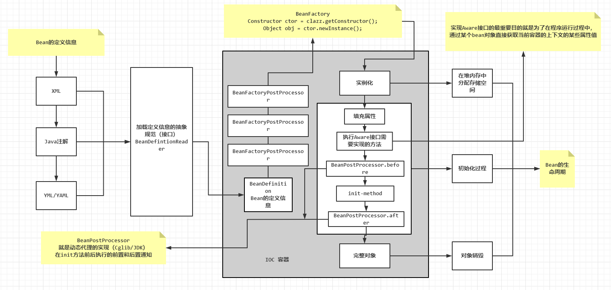

`applicationContext.xml`

```JAVA
<beans>
    <bean id="teacher" class="com.test.Teacher">
    	<property name="name" value="albert"></property>
    </bean>
</beans>
```

`Test.java`

```java
public static void main(String[] args) {
    AbstractApplicationContext ac = new ClassPathXmlApplicationContext("applicationContext.xml");
    Teacher bean = ac.getBean(Teacher.class);
    bean.getBeanName();
    bean.getEnvironment();
}
```

`ClassPathXmlApplicationContext构造方法`

```java
public ClassPathXmlApplicationContext(String[] configLocations, boolean refresh, ApplicationContext parent) throws BeansException {
    // 调用父类构造方法，进行相关对象的创建、属性的赋值等操作
    super(parent);
    setConfigLocations(configLocations);
    if (refresh) {
        refresh();
    }
}
```

`AbstractApplicationContext#refresh()`

```JAVA
@Override
public void refresh() throws BeansException, IllegalStateException {
    synchronized (this.startupShutdownMonitor) {
        // Prepare this context for refreshing.
        /**
         * 做容器刷新前的准备工作：
         * 1.设置容器的启动时间；
         * 2.设置活跃状态为true；
         * 3.设置关闭状态为false；
         * 4.获取Environment对象，并加载当前系统的属性值到Environment对象中；
         * 5.准备监听器和事件的集合对象，默认为空的集合。
         */
        prepareRefresh();

        // Tell the subclass to refresh the internal bean factory.
        // 创建容器对象，DefaultListableBeanFactory
        // 加载xml配置文件的属性值到当前工厂中，最重要的就是BeanDefinition
        ConfigurableListableBeanFactory beanFactory = obtainFreshBeanFactory();  

        // Prepare the bean factory for use in this context.
        // BeanFactory的准备工作，对各种属性进行填充
        prepareBeanFactory(beanFactory);

        try {
            // Allows post-processing of the bean factory in context subclasses.
            // 留给子类进行扩展的模板方法
            postProcessBeanFactory(beanFactory);

            // Invoke factory processors registered as beans in the context.
            // 真正执行各种BeanFactoryPostProcessor
            invokeBeanFactoryPostProcessors(beanFactory);

            // Register bean processors that intercept bean creation.
            // 注册BeanPostProcessor，这里只是注册功能，真正执行的是getBean方法
            registerBeanPostProcessors(beanFactory);

            // Initialize message source for this context.
            // 为上下文初始化message源，即不同语言的消息体、国际化处理
            initMessageSource();

            // Initialize event multicaster for this context.
            // 初始化事件监听的多路广播器
            initApplicationEventMulticaster();

            // Initialize other special beans in specific context subclasses.
            // 留给子类来初始化其他的Bean
            onRefresh();

            // Check for listener beans and register them.
            // 在所有注册的Bean中查找Listener Bean，注册到消息广播器中
            registerListeners();

            // Instantiate all remaining (non-lazy-init) singletons.
            // 实例化剩下的非懒加载的单实例
            finishBeanFactoryInitialization(beanFactory);

            // Last step: publish corresponding event.
            // 完成刷新过程，通知生命周期处理器LifecycleProcessor刷新过程，同时发出ContextRefreshEvent通知别人
            finishRefresh();
        }

        catch (BeansException ex) {
            if (logger.isWarnEnabled()) {
                logger.warn("Exception encountered during context initialization - " +
                            "cancelling refresh attempt: " + ex);
            }

            // Destroy already created singletons to avoid dangling resources.
            destroyBeans();

            // Reset 'active' flag.
            cancelRefresh(ex);

            // Propagate exception to caller.
            throw ex;
        }

        finally {
            // Reset common introspection caches in Spring's core, since we
            // might not ever need metadata for singleton beans anymore...
            resetCommonCaches();
        }
    }
}
```

`AbstractApplicationContext#prepareRefresh()`

```JAVA
protected void prepareRefresh() {
    // Switch to active.
    // 设置容器启动的时间
    this.startupDate = System.currentTimeMillis();
    // 容器的关闭标志位
    this.closed.set(false);
    // 容器的激活标志位
    this.active.set(true);

    // 日志记录
    if (logger.isDebugEnabled()) {
        if (logger.isTraceEnabled()) {
            logger.trace("Refreshing " + this);
        }
        else {
            logger.debug("Refreshing " + getDisplayName());
        }
    }

    // Initialize any placeholder property sources in the context environment.
    // 留给子类覆盖，初始化属性资源
    initPropertySources();

    // Validate that all properties marked as required are resolvable:
    // see ConfigurablePropertyResolver#setRequiredProperties
    // 创建并获取环境对象，验证需要的属性文件是否都已经放入环境中
    getEnvironment().validateRequiredProperties();

    // Store pre-refresh ApplicationListeners...
    // 判断刷新前的应用程序监听器集合是否为空，如果为空，则将监听器添加到该集合中
    if (this.earlyApplicationListeners == null) {
        this.earlyApplicationListeners = new LinkedHashSet<>(this.applicationListeners);
    }
    else {
        // Reset local application listeners to pre-refresh state.
        // 如果不为空，则清空集合中的元素对象
        this.applicationListeners.clear();
        this.applicationListeners.addAll(this.earlyApplicationListeners);
    }

    // Allow for the collection of early ApplicationEvents,
    // to be published once the multicaster is available...
    // 创建刷新前的监听器事件集合
    this.earlyApplicationEvents = new LinkedHashSet<>();
}
```

`AbstractApplicationContext#ConfigurableListableBeanFactory()`

```JAVA
protected ConfigurableListableBeanFactory obtainFreshBeanFactory() {
    refreshBeanFactory();
    return getBeanFactory();
}
```

`AbstractRefreshableApplicationContext#refreshBeanFactory()`

```JAVA
@Override
protected final void refreshBeanFactory() throws BeansException {
    // 如果存在beanFactory，则销毁
    if (hasBeanFactory()) {
        destroyBeans();
        closeBeanFactory();
    }
    try {
        // 创建DefaultListableBeanFactory对象
        DefaultListableBeanFactory beanFactory = createBeanFactory();
        // 为了序列化指定id，可以从id反序列化到beanFactory对象
        beanFactory.setSerializationId(getId());
        // 定制beanFactory，设置相关属性，包括是否允许覆盖同名的不同定义的对象以及循环依赖
        customizeBeanFactory(beanFactory);
        // 初始化documentReader，并进行XML文件读取及解析，默认命名空间的解析，自定义标签的解析
        loadBeanDefinitions(beanFactory);
        synchronized (this.beanFactoryMonitor) {
            this.beanFactory = beanFactory;
        }
    }
    catch (IOException ex) {
        throw new ApplicationContextException("I/O error parsing bean definition source for " + getDisplayName(), ex);
    }
}
```

`AbstractApplicationContext#prepareBeanFactory()`

```JAVA
protected void prepareBeanFactory(ConfigurableListableBeanFactory beanFactory) {
    // Tell the internal bean factory to use the context's class loader etc.
    // 设置beanFactory的classloader为当前context的classloader
    beanFactory.setBeanClassLoader(getClassLoader());
    // 设置beanFactory的表达式语言处理器
    beanFactory.setBeanExpressionResolver(new StandardBeanExpressionResolver(beanFactory.getBeanClassLoader()));
    // 为beanFactory增加一个默认的propertyEditor，这个主要是对bean的属性等设置管理的一个工具类
    beanFactory.addPropertyEditorRegistrar(new ResourceEditorRegistrar(this, getEnvironment()));

    // Configure the bean factory with context callbacks.
    // 添加beanPostProcessor。ApplicationContextAwareProcessor用于完成某些Aware对象的注入
    beanFactory.addBeanPostProcessor(new ApplicationContextAwareProcessor(this));
    // 设置要忽略自动装配的接口，因为这些接口的实现是由容器通过set方法进行注入，所以在使用Autowire时需要忽略这些接口
    beanFactory.ignoreDependencyInterface(EnvironmentAware.class);
    beanFactory.ignoreDependencyInterface(EmbeddedValueResolverAware.class);
    beanFactory.ignoreDependencyInterface(ResourceLoaderAware.class);
    beanFactory.ignoreDependencyInterface(ApplicationEventPublisherAware.class);
    beanFactory.ignoreDependencyInterface(MessageSourceAware.class);
    beanFactory.ignoreDependencyInterface(ApplicationContextAware.class);

    // BeanFactory interface not registered as resolvable type in a plain factory.
    // MessageSource registered (and found for autowiring) as a bean.
    // 设置几个自动装配的特殊规则，当在进行IOC初始化的如果有多个实现，那么就使用指定的对象进行注入
    beanFactory.registerResolvableDependency(BeanFactory.class, beanFactory);
    beanFactory.registerResolvableDependency(ResourceLoader.class, this);
    beanFactory.registerResolvableDependency(ApplicationEventPublisher.class, this);
    beanFactory.registerResolvableDependency(ApplicationContext.class, this);

    // Register early post-processor for detecting inner beans as ApplicationListeners.
    // 注册BeanPostProcessor
    beanFactory.addBeanPostProcessor(new ApplicationListenerDetector(this));

    // Detect a LoadTimeWeaver and prepare for weaving, if found.
    // 增加对AspectJ的支持，在Java中的织入分为三种方式，即编译期织入，类加载期织入，运行期织入。编译器织入发生在编译期间；类加载器织入是通过特殊的类加载器，在类字节码加载到JVM时，织入切面；运行期织入则是采用Cglib和jdk进行织入
    if (beanFactory.containsBean(LOAD_TIME_WEAVER_BEAN_NAME)) {
        beanFactory.addBeanPostProcessor(new LoadTimeWeaverAwareProcessor(beanFactory));
        // Set a temporary ClassLoader for type matching.
        beanFactory.setTempClassLoader(new ContextTypeMatchClassLoader(beanFactory.getBeanClassLoader()));
    }

    // Register default environment beans.
    // 注册默认的系统环境bean到一级缓存中
    if (!beanFactory.containsLocalBean(ENVIRONMENT_BEAN_NAME)) {
        beanFactory.registerSingleton(ENVIRONMENT_BEAN_NAME, getEnvironment());
    }
    if (!beanFactory.containsLocalBean(SYSTEM_PROPERTIES_BEAN_NAME)) {
        beanFactory.registerSingleton(SYSTEM_PROPERTIES_BEAN_NAME, getEnvironment().getSystemProperties());
    }
    if (!beanFactory.containsLocalBean(SYSTEM_ENVIRONMENT_BEAN_NAME)) {
        beanFactory.registerSingleton(SYSTEM_ENVIRONMENT_BEAN_NAME, getEnvironment().getSystemEnvironment());
    }
}
```

`AbstractApplicationContext#finishBeanFactoryInitialization()`

```JAVA
protected void finishBeanFactoryInitialization(ConfigurableListableBeanFactory beanFactory) {
    // Initialize conversion service for this context.
    if (beanFactory.containsBean(CONVERSION_SERVICE_BEAN_NAME) &&
        beanFactory.isTypeMatch(CONVERSION_SERVICE_BEAN_NAME, ConversionService.class)) {
        beanFactory.setConversionService(
            beanFactory.getBean(CONVERSION_SERVICE_BEAN_NAME, ConversionService.class));
    }

    // Register a default embedded value resolver if no bean post-processor
    // (such as a PropertyPlaceholderConfigurer bean) registered any before:
    // at this point, primarily for resolution in annotation attribute values.
    if (!beanFactory.hasEmbeddedValueResolver()) {
        beanFactory.addEmbeddedValueResolver(strVal -> getEnvironment().resolvePlaceholders(strVal));
    }

    // Initialize LoadTimeWeaverAware beans early to allow for registering their transformers early.
    String[] weaverAwareNames = beanFactory.getBeanNamesForType(LoadTimeWeaverAware.class, false, false);
    for (String weaverAwareName : weaverAwareNames) {
        getBean(weaverAwareName);
    }

    // Stop using the temporary ClassLoader for type matching.
    beanFactory.setTempClassLoader(null);

    // Allow for caching all bean definition metadata, not expecting further changes.
    beanFactory.freezeConfiguration();

    // Instantiate all remaining (non-lazy-init) singletons.
    beanFactory.preInstantiateSingletons();
}
```

`DefaultListableBeanFactory#preInstantiateSingletons()`

```java
@Override
public void preInstantiateSingletons() throws BeansException {
    if (logger.isTraceEnabled()) {
        logger.trace("Pre-instantiating singletons in " + this);
    }

    // Iterate over a copy to allow for init methods which in turn register new bean definitions.
    // While this may not be part of the regular factory bootstrap, it does otherwise work fine.
    // 将所有BeanDefinition的名字创建一个集合
    List<String> beanNames = new ArrayList<>(this.beanDefinitionNames);

    // Trigger initialization of all non-lazy singleton beans...
    // 触发所有非懒加载单例Bean的初始化，遍历集合的对象
    for (String beanName : beanNames) {
        // 合并父类BeanDefinition
        RootBeanDefinition bd = getMergedLocalBeanDefinition(beanName);
        // 条件判断、抽象、单例、非懒加载
        if (!bd.isAbstract() && bd.isSingleton() && !bd.isLazyInit()) {
            // 判断是否实现了FactoryBean接口
            if (isFactoryBean(beanName)) {
                // 根据&+beanName来获取具体的对象
                Object bean = getBean(FACTORY_BEAN_PREFIX + beanName);
                // 进行类型转换
                if (bean instanceof FactoryBean) {
                    final FactoryBean<?> factory = (FactoryBean<?>) bean;
                    // 判断这个FactoryBean是否希望急切的初始化
                    boolean isEagerInit;
                    if (System.getSecurityManager() != null && factory instanceof SmartFactoryBean) {
                        isEagerInit = AccessController.doPrivileged((PrivilegedAction<Boolean>)
                                                                    ((SmartFactoryBean<?>) factory)::isEagerInit,
                                                                    getAccessControlContext());
                    }
                    else {
                        isEagerInit = (factory instanceof SmartFactoryBean &&
                                       ((SmartFactoryBean<?>) factory).isEagerInit());
                    }
                    // 如果希望急切的初始化，则通过beanName获取bean实例
                    if (isEagerInit) {
                        getBean(beanName);
                    }
                }
            }
            else {
                // 如果beanName对应的bean不是FactoryBean，只是普通的bean，则通过beanName获取bean实例
                getBean(beanName);
            }
        }
    }

    // Trigger post-initialization callback for all applicable beans...
    // 遍历beanName，触发所有SmartInitializingSingleton的后初始化回调
    for (String beanName : beanNames) {
        Object singletonInstance = getSingleton(beanName);
        // 判断singletonInstance是否实现了SmartInitializingSingleton接口
        if (singletonInstance instanceof SmartInitializingSingleton) {
            final SmartInitializingSingleton smartSingleton = (SmartInitializingSingleton) singletonInstance;
            if (System.getSecurityManager() != null) {
                AccessController.doPrivileged((PrivilegedAction<Object>) () -> {
                    smartSingleton.afterSingletonsInstantiated();
                    return null;
                }, getAccessControlContext());
            }
            else {
                smartSingleton.afterSingletonsInstantiated();
            }
        }
    }
}
```


## Spring-AOP源码分析


# 数据结构和算法

## 树形结构

### 基本概念

树是由n个有限结点组成的具有层次关系的集合，其具有如下特点：

* 每个结点有0个或n个子结点；
* 没有父结点的结点称为根结点，一棵树有且只有一个根节点；
* 每个非根结点只有一个父结点；
* 每个结点及其后代结点整体上可以看成一棵树，称为当前结点的父结点的一颗子树。

相关术语：

* 结点的度：一个结点具有的子树个数称为该结点的度；
* 叶子结点：度为0的结点称为叶子结点，也叫做终端结点；
* 分支结点：度不为0的结点称为分支结点，也叫做非终端结点；
* 结点的层次：从根结点开始记为1，之后的每个后继层次加1，以此类推；
* 结点的层序编号：将树中的结点，按照从上层到下层，同层从左到右的顺序排成一个线性序列，并且编成连续的自然数；
* 树的度：树中结点的最大度；
* 树的高度（深度）：树中结点的最大层次；
* 森林：m个互不相交的树的集。将一棵非空树的根结点删除，树就会变成一座森林；反之给森林添加一个统一的根结点，森林就会变成一颗树；
* 孩子结点：一个结点的直接后继结点称为该结点的孩子结点；
* 双亲结点（父结点）：一个结点的直接前驱结点称为该结点的双亲结点；
* 兄弟结点：同一双亲结点的孩子结点间互称为兄弟结点。


### 二叉树

#### 基本概念

所谓二叉树就是度不超过2的树，即每个结点最多有两个子结点。

**满二叉树**：对于一个二叉树，如果每一层的结点数都达到最大值，则这个二叉树就是满二叉树。

**完全二叉树**：叶子结点只能出现在最下层和次下层，并且最下面一层的结点都集中在该层最左边的若干位置的二叉树。


#### 二分搜索树

```JAVA
public class BinarySearchTree<Key extends Comparable<Key>, Value> {

    private Node<Key, Value> root;
    private int N;

    // 结点
    private static class Node<Key, Value> {

        private final Key key;
        private Value value;
        private Node<Key, Value> left;
        private Node<Key, Value> right;

        public Node(Key key, Value value, Node<Key, Value> left, Node<Key, Value> right) {
            this.key = key;
            this.value = value;
            this.left = left;
            this.right = right;
        }
    }

    public int size() {
        return N;
    }

    /**
     * 插入结点
     */
    public void put(Key key, Value value) {
        root = put(root, key, value);
    }

    public Node<Key, Value> put(Node<Key, Value> node, Key key, Value value) {
        if (node == null) {
            N++;
            return new Node<>(key, value, null, null);
        }

        int cmp = key.compareTo(node.key);
        if (cmp > 0) {
            node.right = put(node.right, key, value);
        } else if (cmp < 0) {
            node.left = put(node.left, key, value);
        } else {
            node.value = value;
        }
        return node;
    }

    /**
     * 按key搜索结点
     */
    public Value get(Key key) {
        return get(root, key);
    }

    public Value get(Node<Key, Value> node, Key key) {
        if (node == null) {
            return null;
        }

        int cmp = key.compareTo(node.key);
        if (cmp > 0) {
            return get(node.right, key);
        } else if (cmp < 0) {
            return get(node.left, key);
        } else {
            return node.value;
        }
    }
	
    /**
     * 按key删除结点
     */
    public void delete(Key key) {
        delete(root, key);
    }

    public Node<Key, Value> delete(Node<Key, Value> node, Key key) {
        if (node == null) {
            return null;
        }

        int cmp = key.compareTo(node.key);
        if (cmp > 0) {
            node.right = delete(node.right, key);
        } else if (cmp < 0) {
            node.left = delete(node.left, key);
        } else {
            // 要删除的结点是叶子结点的情况
            if (node.left == null && node.right == null) {
                return null;
            }

            // 要删除的结点左子树为空，只有右子树
            if (node.left == null) {
                return node.right;
            }

            // 要删除的结点右子树为空，只有左子树
            if (node.right == null) {
                return node.left;
            }

            // 要删除的结点既有左子树又有右子树，则获取该结点的右子树的最小结点和其替换即可
            Node<Key, Value> rightMinNode = null;	// 右子树的最小结点
            Node<Key, Value> rightNode = node.right;	// 右子树的根节点
            while (rightNode.left != null) {
                // 判断当前结点的左结点是否是最小结点
                if (rightNode.left.left == null) {
                    rightMinNode = rightNode.left;
                    // 若最小结点存在右子树，则将其挂入当前结点的左结点
                    if (rightMinNode.right != null) {
                        rightNode.left = rightMinNode.right;
                    }
                    break;
                }
                // 继续向左边移动
                rightNode = rightNode.left;
            }

            // 用右子树的最小结点替换要删除的结点
            assert rightMinNode != null;
            rightMinNode.left = node.left;
            rightMinNode.right = node.right;

            // 返回新结点，将其挂入树中
            return rightMinNode;
        }

        return null;
    }

    /**
     * 获取最小key的结点
     */
    public Key min() {
        return min(root).key;
    }

    public Node<Key, Value> min(Node<Key, Value> node) {
        if (node.left != null) {
            return min(node.left);
        } else {
            return node;
        }
    }

    /**
     * 获取最大key的结点
     */
    public Key max() {
        return max(root).key;
    }

    public Node<Key, Value> max(Node<Key, Value> node) {
        if (node.right != null) {
            return max(node.right);
        } else {
            return node;
        }
    }

    /**
     * 前序遍历
     */
    public LinkedList<Key> preErgodic() {
        LinkedList<Key> keys = new LinkedList<>();
        preErgodic(root, keys);
        return keys;
    }

    private void preErgodic(Node<Key, Value> node, LinkedList<Key> keys) {
        if (node == null) {
            return;
        }

        keys.addLast(node.key);
        if (node.left != null) {
            preErgodic(node.left, keys);
        }
        if (node.right != null) {
            preErgodic(node.right, keys);
        }
    }

    /**
     * 中序遍历
     */
    public LinkedList<Key> midErgodic() {
        LinkedList<Key> keys = new LinkedList<>();
        midErgodic(root, keys);
        return keys;
    }

    private void midErgodic(Node<Key, Value> node, LinkedList<Key> keys) {
        if (node == null) {
            return;
        }

        if (node.left != null) {
            midErgodic(node.left, keys);
        }
        keys.addLast(node.key);
        if (node.right != null) {
            midErgodic(node.right, keys);
        }
    }
	
    /**
     * 后序遍历
     */
    public LinkedList<Key> afterErgodic() {
        LinkedList<Key> keys = new LinkedList<>();
        midErgodic(root, keys);
        return keys;
    }

    private void afterErgodic(Node<Key, Value> node, LinkedList<Key> keys) {
        if (node == null) {
            return;
        }

        if (node.left != null) {
            midErgodic(node.left, keys);
        }
        if (node.right != null) {
            midErgodic(node.right, keys);
        }
        keys.addLast(node.key);
    }
	
    /**
     * 层次遍历
     */
    public LinkedList<Key> layerErgodic() {
        LinkedList<Key> keys = new LinkedList<>();
        layerErgodic(root, keys);
        return keys;
    }

    private void layerErgodic(Node<Key, Value> root, LinkedList<Key> keys) {
        LinkedList<Node<Key, Value>> nodes = new LinkedList<>();

        nodes.addLast(root);
        while (!nodes.isEmpty()) {
            Node<Key, Value> node = nodes.removeFirst();
            keys.addLast(node.key);
            if (node.left != null) {
                nodes.addLast(node.left);
            }
            if (node.right != null) {
                nodes.addLast(node.right);
            }
        }
    }
	
    /**
     * 树的最大深度
     */
    public int maxDepth() {
        return maxDepth(root);
    }

    private int maxDepth(Node<Key, Value> node) {
        if (node == null) {
            return 0;
        }

        int leftMax = 0, rightMax = 0;
        if (node.left != null) {
            leftMax = maxDepth(node.left);
        }
        if (node.right != null) {
            rightMax = maxDepth(node.right);
        }

        return leftMax > rightMax ? leftMax + 1 : rightMax + 1;
    }
}
```


### 堆

#### 基本概念

堆是完全二叉树，除了树的最后一层结点不需要是满的，其他的每一层从左到右都是满的，如果最后一层结点不是满的，那么要求左满右不满；


通常是由数组实现的树形结构，具体方法就是将二叉树的结点按照层级顺序放入数组中，根节点在位置1，子节点在位置2和3，而子结点的子结点则分别放在位置4，5，6和7，以此类推。

如果一个结点的位置为k，则它的父结点的位置为k/2，而它的两个子结点的位置分别为2k和2k+1。这样，在不使用指针的情况下，可以通过计算数组的索引在树中上下移动，如：从a[k]向上一层，就令k等于k/2，向下一层就令k等于2k或2k+1。

每个结点都大于等于它的两个子结点，但两个子结点之间的顺序不做规定。


#### 最大堆

```java
public class Heap<T extends Comparable<T>> {

    // 存储堆中的元素
    private T[] items;
    // 记录堆中元素的个数
    private int N;
    // 记录堆中第一个元素的下标
    private static final int FIRST = 1;

    public Heap(int capacity) {
        this.items = (T[]) new Comparable[capacity + 1];
        this.N = 0;
    }

    /**
     * 判断堆中索引i处的元素是否小于索引j处的元素
     */
    private boolean less(int i, int j) {
        return items[i].compareTo(items[j]) < 0;
    }

    /**
     * 交换堆中索引i和索引j处的元素
     */
    private void exc(int i, int j) {
        T temp = items[i];
        items[i] = items[j];
        items[j] = temp;
    }

    /**
     * 插入元素，数组末尾
     */
    public void insert(T item) {
        items[++N] = item;
        swim(N);
    }

    /**
     * 上浮操作，将索引index处的元素浮动到正确的位置
     */
    private void swim(int index) {
        while (index > FIRST) {
            int parentIndex = index / 2;
            if (less(parentIndex, index)) {
                exc(parentIndex, index);
            }
            index = parentIndex;
        }
    }

    /**
     * 删除堆中最大的元素，数组开头
     */
    public T delMax() {
        T item = items[FIRST];
        exc(FIRST, N);
        items[N] = null;
        N--;
        sink(FIRST);
        return item;
    }

    /**
     * 下沉操作，将索引index处的元素沉入到正确位置
     */
    private void sink(int index) {
        while (2 * index <= N) {
            int childMax, leftIndex = 2 * index, rightIndex = 2 * index + 1;
            if (rightIndex<= N && less(leftIndex, rightIndex)) {
                childMax = rightIndex;
            } else {
                childMax = leftIndex;
            }

            if (!less(index, childMax)) {
                break;
            } else {
                exc(index, childMax);
            }

            index = childMax;
        }
    }
}
```


#### 优先队列

```JAVA
/**
 * 最大优先队列
 * @param <T>
 */
public class MaxPriorityQueue<T extends Comparable<T>> {

    private T[] items;
    private int N;

    public MaxPriorityQueue(int capacity) {
        this.items = (T[]) new Comparable[capacity + 1];
        this.N = 0;
    }

    public int size() {
        return this.N;
    }

    public boolean isEmpty() {
        return this.N == 0;
    }

    private boolean less(int i, int j) {
        return this.items[i].compareTo(this.items[j]) < 0;
    }

    private void exchange(int i, int j) {
        T temp = this.items[i];
        this.items[i] = this.items[j];
        this.items[j] = temp;
    }

    public void insert(T item) {
        this.items[++N] = item;
        swim(N);
    }

    private void swim(int index) {
        while (index > 1) {
            int parentIndex = index / 2;
            if (less(index, parentIndex)) {
                exchange(index, parentIndex);
            }
            index = parentIndex;
        }
    }

    public T delMax() {
        T max = this.items[1];
        exchange(1, N);
        this.items[N] = null;
        N--;
        sink(1);
        return max;
    }

    private void sink(int index) {
        while (2 * index <= N) {
            int childMax, leftIndex = 2 * index, rightIndex = 2 * index + 1;
            if (rightIndex <= N && less(leftIndex, rightIndex)) {
                childMax = rightIndex;
            } else {
                childMax = leftIndex;
            }

            if (less(childMax, index)) {
                break;
            } else {
                exchange(childMax, index);
            }

            index = childMax;
        }
    }
}
```


#### 索引优先队列

```java
/**
 * 最小索引优先队列
 * @param <T>
 */
public class IndexMinPriorityQueue<T extends  Comparable<T>> {

    private T[] items;
    private int[] pq;
    private int[] qp;
    private int N;

    public IndexMinPriorityQueue(int capacity) {
        this.items = (T[]) new Comparable[capacity + 1];
        this.pq = new int[capacity + 1];
        this.qp = new int[capacity + 1];
        this.N = 0;

        for (int i = 0; i < qp.length; i++) {
            qp[i] = -1;
        }
    }

    public int size() {
        return this.N;
    }

    public boolean isEmpty() {
        return this.N == 0;
    }

    private boolean less(int i, int j) {
        return items[pq[i]].compareTo(items[pq[j]]) < 0;
    }

    private void exchange(int i, int j) {
        int temp = pq[i];
        pq[i] = pq[j];
        pq[j] = temp;

        qp[pq[i]] = i;
        qp[pq[j]] = j;
    }

    public boolean contains(int index) {
        return qp[index] != -1;
    }

    public int minIndex() {
        return pq[1];
    }

    public void insert(int index, T item) {
        if (contains(index)) {
            return;
        }

        N++;
        items[index] = item;
        pq[N] = index;
        qp[index] = N;

        swim(N);
    }

    public int delMin() {
        int minIndex = pq[1];
        exchange(1, N);

        qp[pq[N]] = -1;
        pq[N] = -1;
        items[minIndex] = null;
        N--;

        sink(1);
        return minIndex;
    }

    public void delete(int index) {
        int sourceIndex = qp[index];
        exchange(sourceIndex, N);

        items[sourceIndex] = null;
        qp[pq[N]] = -1;
        pq[N] = -1;
        N--;

        sink(sourceIndex);
        swim(sourceIndex);
    }

    public void changeItem(int index, T item) {
        items[index] = item;
        int sourceIndex = qp[index];
        sink(sourceIndex);
        swim(sourceIndex);
    }

    private void swim(int index) {
        while (index > 1) {
            int parentIndex = index / 2;
            if (less(index, parentIndex)) {
                exchange(index, parentIndex);
            }
            index = parentIndex;
        }
    }

    private void sink(int index) {
        while (2 * index <= N) {
            int childMin, leftIndex = 2 * index, rightIndex = 2 * index + 1;
            if (rightIndex <= N && less(rightIndex, leftIndex)) {
                childMin = rightIndex;
            } else {
                childMin = leftIndex;
            }

            if (less(index, childMin)) {
                break;
            } else {
                exchange(index, childMin);
            }

            index = childMin;
        }
    }
}
```


### 平衡树

#### 基本概念

二分搜索树在极端情况下会退化成链表，导致查找元素的效率变得和链表一样低。如下图，依次向BST上插入9，8，7，6，5，4，3，2，1这9个数，那么最终构建出的树结构就是一个链表。

而平衡树就是一种能够不受插入数据的影响，让生成的树结构都能像完全二叉树一样，即使在极端情况下，依然能保证查询性能。


#### 2-3查找树

一颗2-3查找树需要满足以下两个要求：

* 2-结点：含有一个键值对和两条链，左链接指向的2-3树中的键都小于该结点，右链接指向的2-3树中的键都大于该结点；
* 3-结点：含有两个键值对和三条链，左链接指向的2-3树中的键都小于该结点，中链接指向的2-3树中的键都位于该结点的两个键之间，右链接指向的2-3树中的键都大于该结点。

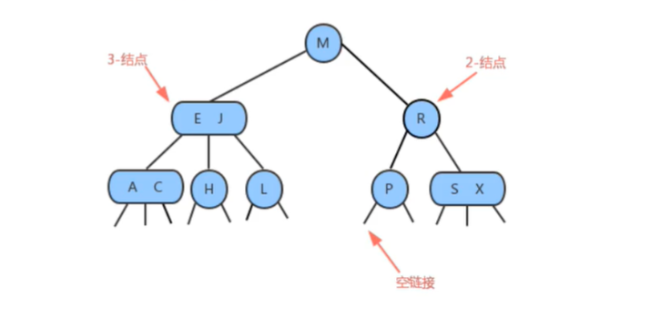

2-3树的查找：将BST查找算法一般化就能得到2-3树的查找算法。要判断一个键是否在树中，先将其和根结点中的键比较，如果和其中任意一个键相等，查询命中；否则就根据比较的结果找到指向相应区间的链接，并在其指向的子树上通过递归继续查找。如果找到空链接，则查询未命中。


向2-结点下插入新结点：和BST插入元素一样，首先要按顺序进行查找，然后将结点挂到新位置上。2-3树之所以能在极端情况下保证效率是因为在其插入后能保证树的平衡猪状态。如果新结点被定位到一个2-结点上，那么只需要将新结点和2-结点组合成一个3-结点即可；如果是定位到一个3-结点上，则有下面几种情况。

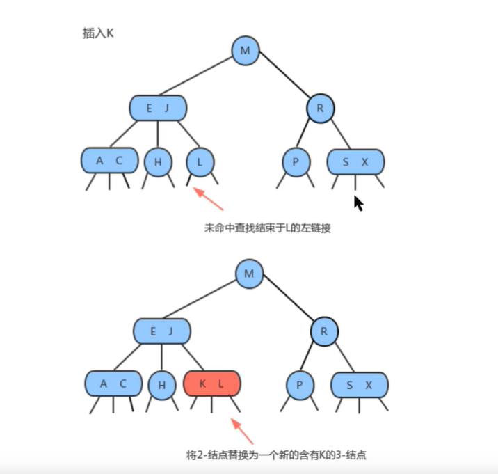

向只含有一个3-结点的树中插入新结点：若一棵2-3树只包含一个3-结点，即这个结点已经存在两个键，没有空间来插入第三个键了，则会先和这个3-结点组合成临时的4-结点。然后将这个4-结点的中间键向上提升为新得父节点，左键做为其左子结点，右键做为其右子结点，以此自底向上生长树。当插入完成后，2-3树保持平衡，树的高度加1。


向一个父结点为2-结点的3-结点中插入新结点：和上面的方式一样将新元素和3-结点组合成临时的4-结点，然后将该结点中间键向上提升和处于2-结点的父结点组合成为3-结点，最后将左右键分别挂在这个新3-结点的合适位置。


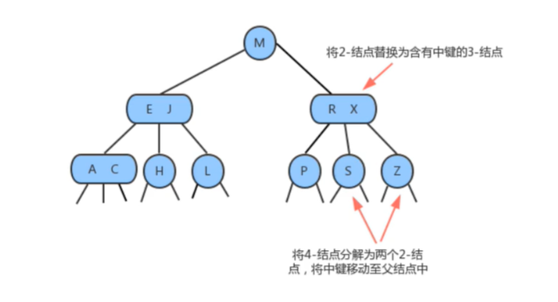

向一个父结点为3-结点的3-结点中插入新结点：当新结点插入，定位到一个3-结点上时，将结点临时组合后再拆分，中间键提升。但此时父结点是一个3-结点，插入后父结点被组合成了4-结点，这时还需要继续提升中间键，一直向上提升直到遇到一个是2-结点的父结点，和其组合后变为3-结点，此时保证了树的平衡，完成了插入。

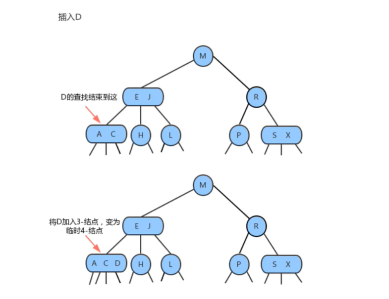


分解根结点：当插入结点到根结点的路径上全部都是3-结点的时候，最终根结点会变为一个临时的4-结点，此时就需要将中间键向上提升为新的根结点，左右键拆分为两个2-结点做为新根结点的左右子结点。完成插入后树会自底向上生长导致高度加1。


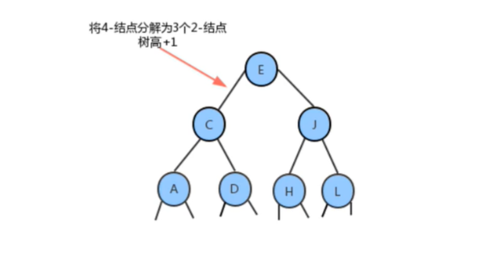

2-3树在插入元素的时候，需要做一些局部的交换来保持2-3树的平衡，一颗完全平衡的2-3树具有以下性质：

* 任意空链接到根结点的路径长度都是相等的；
* 4-结点变换为3-结点时，树的高度不会发生变化，只有当根结点是临时的4-结点，分解根结点时，树高才会+1；
* 2-3树与普通二分搜索树最大的区别是，BST是自顶向下生长的，而2-3树是自底向上生长的。


#### 红黑树

2-3在极端的情况下依旧能保证所有子结点都是2-结点，树的高度为logN，比之BST极端情况下的N，确保了时间复杂度，但是过于复杂。

红黑树主要是对2-3树进行编码，红黑树背后的基本思想是用标志的二分搜索树（完全由2-结点构成）和一些额外的信息（替换3-结点）来表示2-3树：

* 红链接：将两个2-结点连接起来构成一个3-结点；
* 黑链接：对比于2-3树中的普通链接。

准确的说，将3-结点表示为由一条左斜的红色链接（就是两个2-结点其中一个是另一个的左子结点）相连的两个2-结点，优点是无需修改就可以使用标准的BST的查找方法。


红黑树是含有红黑链接并满足下列条件的二发搜索树：

* 红链接均为左节点；
* 没有任何一个结点同时和两条红链接相连；
* 该树是完美黑色平衡的二叉树，即任意空链接到根结点的路径上的黑链接数量相同。

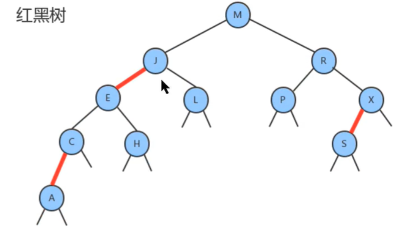

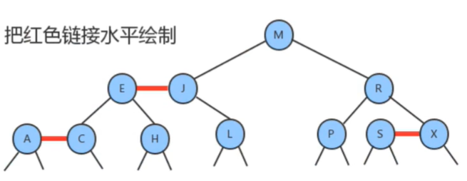


平衡化：在对红黑树进行一些增删改查操作后，很有可能会出现红色的右链接或者两条连续的红色链接，而这些都不满足红黑树的定义，所以我们需要对这些情况通过旋转进行修复，让红黑树保持平衡。

左旋：当某个结点的左子结点为黑色，右子结点为红色，此时需要左旋（当前结点为h，其右子结点为x）。

1. 将x的左子结点置为h的右子结点`h.right=x.left`；
2. 将h置为x的左子结点 `x.left=h`；
3. 将x的color置为h的color `x.color=h.color`；
4. 将h的color置为READ `h.color=true`。

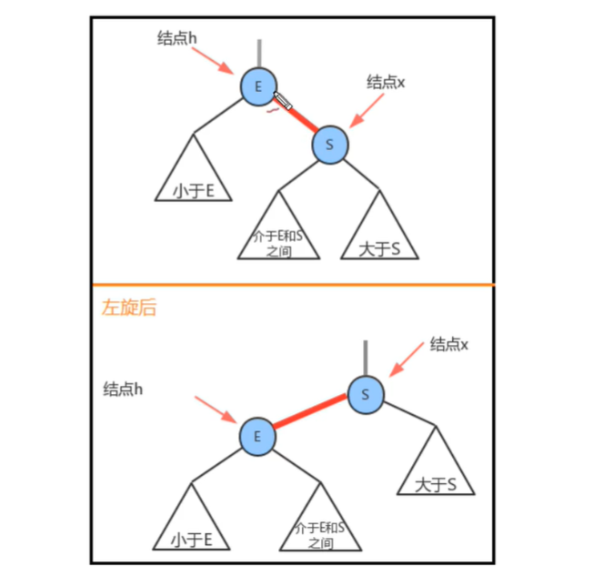

右旋：当某个结点的左子结点是红色，且左子结点的左子结点也是红色，则需要右旋（当前结点为h，其左子结点为x）。

1. 将x的右子结点置为h的左子结点`h.left=x.right`；
2. 将h置为x的右子结点 `x.right=h`；
3. 将x的color置为h的color `x.color=h.color`；
4. 将h的color置为READ `h.color=true`。

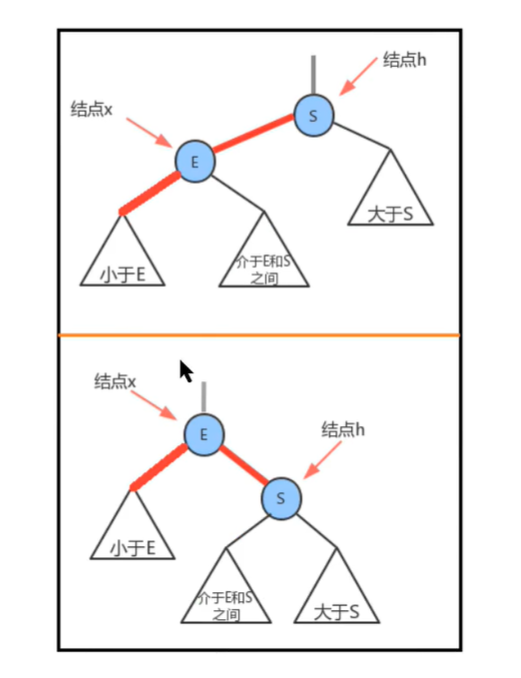

向单个2-结点插入新键：

* 一颗只含有一个键的红黑树只含有一个2-结点，在插入新键的同时也需要旋转操作；

* 如果新建小于当前结点的键，则只需要新增一个红色结点即可，新的红黑树和单个3-结点完全等价；

  

* 如果新键大于当前结点的键，那么新增的红色结点将会产生一条红色的右链接，此时需要通过左旋操作，将红色右链接变为左链接，插入操作才算完成。形成的新红黑树依然和3-结点等价，其包含两个键，一条红色链接。

  

向底部的2-结点插入新键：用和二分搜索树相同的方式向一颗红黑树中插入新键，会在树的底部新增一个结点（可以保证有序性），唯一的区别就是红黑树需要用一条红链接将新结点和其父结点相连，如果其父结点是一个2-结点，那么刚才的方式仍然适用。


颜色反转：当一个结点的左子结点和右子结点的color都为RED时，也就是出现了临时的4-结点，此时只需要将左子结点和右子结点的颜色反转为BLACK，即让当前结点的颜色变为RED即可。


向一棵双键树（3-结点）中插入新键：

* 新键大于原树中的两个键：

  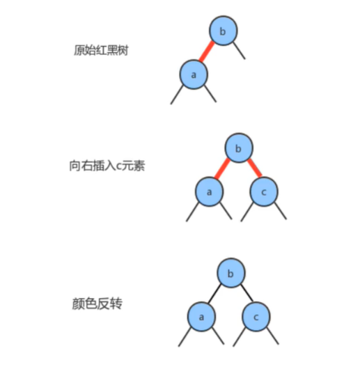

* 新建小于原树中的两个键：

  

  

* 新建介于原树中两个键之间：

  

  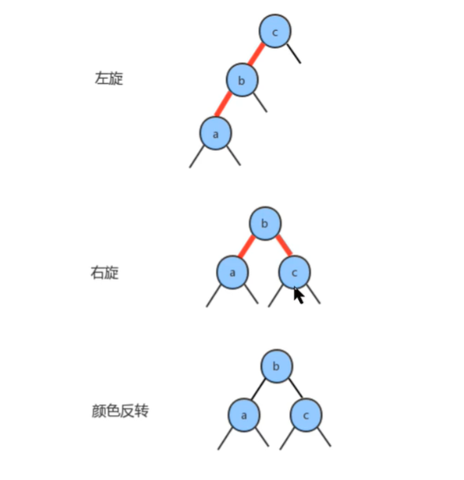

根结点的颜色总是黑色：结点的红色是由和其父结点间的链接决定的，由于根结点不存在父结点，所以每次插入后，都需要将根结点的颜色置为黑色，因为根结点可能会被旋转操作置换掉。

向树底部的3-结点插入新键：若是在树的底部的一个3-结点下插入新的结点，则出现三种情况，即指向新结点的链接可能是3-结点的右连接（此时只需要反转颜色即可）、左链接（此时需要进行右旋后再反转颜色）和中链接（此时先左旋再右旋最后反转颜色）。颜色的反转操作会使中间结点变红，相当于将其和其父结点变为了3-结点，也就意味着父结点会被插入一个新键，只需要用相同方法向上处理即可，直到向上遇到2-结点或根结点为止。

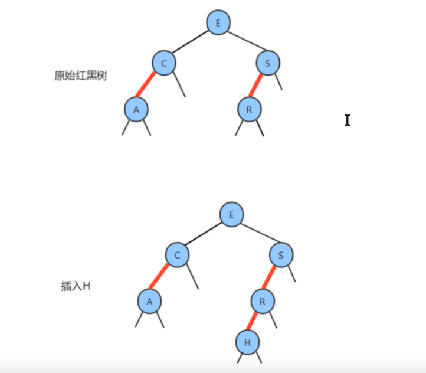


```JAVA
public class RedBlackTree<Key extends Comparable<Key>, Value> {

    // 根结点
    private Node root;
    // 记录树中元素的个数
    private int N;
    // 红色链接标记
    private static final boolean RED = true;
    // 黑色链接标记
    private static final boolean BLACK = false;

    /**
     * 树结点
     */
    private class Node {

        // 键
        public Key key;
        // 值
        private Value value;
        // 左链接
        public Node left;
        // 右链接
        public Node right;
        // 结点颜色（由和其父结点间的链接决定）
        public boolean color;

        public Node(Key key, Value value, Node left, Node right, boolean color) {
            this.key = key;
            this.value = value;
            this.left = left;
            this.right = right;
            this.color = color;
        }
    }

    /**
     *
     * @return
     */
    public int size() {
        return this.N;
    }

    /**
     *
     * @param node
     * @return
     */
    private boolean isRed(Node node) {
        if (node == null) {
            return false;
        }
        return node.color = RedBlackTree.RED;
    }

    /**
     *
     * @param h
     * @return
     */
    private Node rotateLeft(Node h) {
        Node x = h.right;
        h.right = x.left;
        x.left = h;
        x.color = h.color;
        h.color = RedBlackTree.RED;
        return x;
    }

    /**
     *
     * @param h
     * @return
     */
    private Node rotateRight(Node h) {
        Node x = h.left;
        h.left = x.right;
        x.right = h;
        x.color = h.color;
        h.color = RedBlackTree.RED;
        return x;
    }

    /**
     *
     * @param node
     */
    private void flipColors(Node node) {
        node.color = RedBlackTree.RED;
        node.left.color = RedBlackTree.BLACK;
        node.right.color = RedBlackTree.BLACK;
    }

    /**
     *
     * @param key
     * @param value
     */
    public void put(Key key, Value value) {
        root = put(root, key, value);
        root.color = RedBlackTree.BLACK;
    }

    /**
     *
     * @param node
     * @param key
     * @param value
     * @return
     */
    private Node put(Node node, Key key, Value value) {
        if (node == null) {
            N++;
            return new Node(key, value, null, null, RED);
        }

        int cmp = key.compareTo(node.key);
        if (cmp > 0) {
            node.right = put(node.right, key, value);
        } else if (cmp < 0) {
            node.left = put(node.left, key, value);
        } else {
            node.value = value;
        }

        if (isRed(node.right) && !isRed(node.left)) {
            node = rotateLeft(node);
        }

        if (isRed(node.left) && isRed(node.left.left)) {
            node = rotateRight(node);
        }

        if (isRed(node.left) && isRed(node.right)) {
            flipColors(node);
        }

        return node;
    }

    /**
     *
     * @param key
     * @return
     */
    public Value get(Key key) {
        return get(root, key);
    }

    /**
     *
     * @param node
     * @param key
     * @return
     */
    public Value get(Node node, Key key) {
        if (node == null) {
            return null;
        }

        int cmp = key.compareTo(node.key);
        if (cmp < 0) {
            return get(node.left, key);
        } else if (cmp > 0) {
            return get(node.right, key);
        } else {
            return node.value;
        }
    }
}
```


#### B树

B树中允许一个结点中包含多个key，看具体情况实现。假设一个参数M，以此来构造B树，即构造的是M阶的B树：

* 每个结点最多有M-1个key，并且以升序排列；
* 每个结点最多能有M个子结点；
* 根结点至少有两个子结点。

在实际应用中B树的阶数一般都比较大（通常大于100），所以即使存储大量的数据，B树的高度仍然比较小，这样在某些应用场景下可用显著体现优势（如MySQL的索引）。


若参数M=5，则每个结点最多包含4对键值，下图以5阶B树为例，描述B树的数据存储：


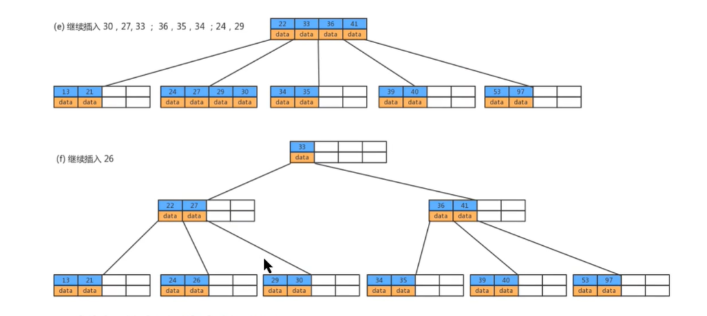

**B树在磁盘文件中的应用**：

在程序中不可避免的会存在通过IO操作磁盘中存储的文件，而操作系统操作磁盘上的文件是通过文件系统进行操作的，在文件系统中就使用了B树。

磁盘：是一种能够大量保存数据（GB到TB级别），但读取速度较慢（因为涉及到机器操作，读取速度为毫秒级）的硬件存储器。

磁盘是由盘片构成，每个盘片有两个面，称为盘面。盘片中央有一个可以旋转的主轴，会让盘片以固定的速度旋转（通常是5400 rpm或7200 rpm），一个磁盘中包含多个这样的盘片并封装在一个密闭的容器中。盘片的每个表面是由一组称为磁道的同心圆组成，每个磁道被划分为一组扇区，每个扇区包含相等数量的数据位（通常是512 byte），扇区之间由一些间隙隔开，这些间隙中不存储数据。


磁盘是用磁头来读写存储在盘片表面的位，而磁头链接到一个移动臂上，移动臂沿着盘片半径前后移动，可用将磁头定位到任何磁道上，这被称为寻道操作。一旦定位到磁道后，盘片转动，磁道上的每个位经过磁头时，读写磁头就可以感知和修改该位的值。对磁盘的访问时间分为寻道时间、旋转时间和传送时间。

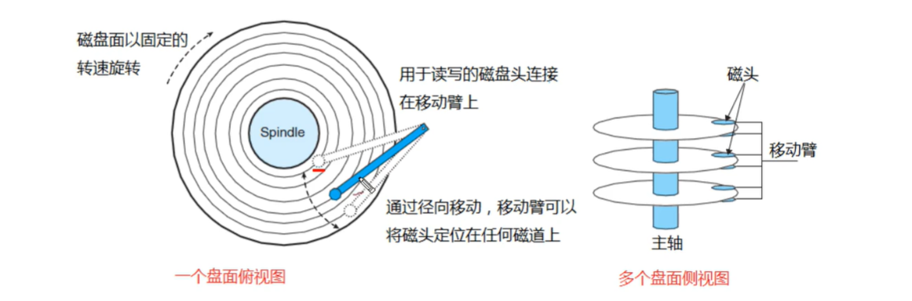

由于存储介质的特性，磁盘本身的存取速度就慢于主存，再加上机械运动的消耗，因此为了提高效率，要尽量减少磁盘IO，减少读写操作。为了达到这个目的，磁盘往往不会严格的按需读取，而是每次都会预读，即使只需要一个字节，磁盘也会从这个位置开始，顺序向后读取一定长度的数据放入内存，这样做的理论依据是计算机科学中著名的局部性原理（时间、空间局部性）。由于磁盘顺序读取的效率很高（不需要寻道，只需要旋转），因此预读可以提高IO的效率。

页是计算机管理存储器的逻辑块，硬件及操作系统往往将主存和磁盘存储区分割为连续的大小相等的块，每个存储块被称为一页（1024字节或其整数倍），预读的长度一般为页的整数倍。主存和磁盘以页为单位交换数据，当程序要读取的数据不在主存中时，会触发一个缺页异常，此时系统会向磁盘发出信号，磁盘会找到数据的起始位置并向后连续读取一页或几页装入内存中，然后异常中断返回，程序继续执行。

文件系统的设计上利用了磁盘预读的原理，将一个结点大小设为等于一个页，这样每个结点只需要一次IO操作就可以完全载入。那么3层的B树可以容纳 `1024*1024*1024` 将近10亿左右的数据，如果使用二叉树类结构来存储，则需要30层的深度。假设操作系统一次读取一个结点，且根结点保留在内存中，那么B树在10亿个数据中查找目标，只需要3次以内的磁盘IO就可以找到目标，但二叉树类结构如红黑树则需要30次以内的磁盘IO，因此B树做为文件系统的底层结构远远优于二叉树。


#### B+树

B+树是对B树的一种变形，与B树的区别在于：

* 非叶子结点具有索引的作用，即分支结点只存储key，不存储value；
* 树的所有叶子结点构成一个有序链表，可以按照key的顺序遍历全部数据。

假设参数M=5，那么B+树每个结点最多包含4个键值对，下图以5阶B+树为例，描述B+树的数据存储：

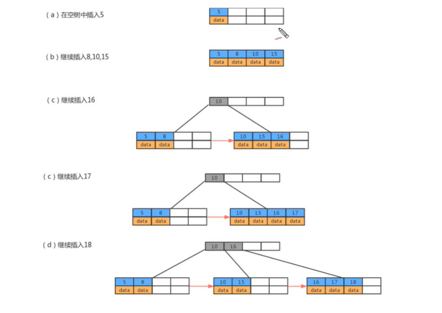


B树和B+树的优缺点对比：

* B+树：
  * 由于B+树在非叶子结点上不包含真正的数据，只当做索引使用，因此在内存相同大小的情况下，能够存放更多的key；
  * B+树的叶子结点都是相连的，因此对整棵树的遍历只需要一次线性遍历叶子结点即可。而且由于数据顺序排列且相连，更加便于范围性的查找，而B树则需要进行每一层的递归遍历。
* B树：由于B树的每一个结点都包含key和value，因此根据key查找value时，只需要找到key所在的位置，就能找到value，但B+树只有叶子结点存储数据，索引每一次查找，都必须找到树的最深处，也就是需要经过叶子结点的深度，才能找到value。

B+树在数据库中的应用：在操作数据库时，为了提高查询效率，可以基于某张表的某个字段建立索引，以提高查询效率，MySQL中的索引就是通过B+树结构实现的。

在未建立主键索引时进行查询：执行 `select * from user where id = 18;` 需要从第一条数据开始，一直查询到第6条数据才能发现id=18的数据，需要遍历比较6次。


在建立了主键索引后进行查询：执行精确匹配时只需要通过key找到value即地址，通过地址之间定位到数据。不仅如此，在执行 `select * from user where id >= 12 and id <= 18;` 这种范围查询时，由于B+树的叶子结点形成了一个有序链表，所以只需要找到id=12的叶子结点，然后向后按顺序遍历即可。


## 排序算法

### 时间复杂度

#### 大O记法

在进行算法分析时，语句总的执行次数T(n)是关于问题规模n的函数，进而分析T(n)随着n的变化情况并确定T(n)的量级。算法的时间复杂度，就是算法的时间度量，记作T(n)=O(f(n))。即表示随着问题规模n的增大，算法执行的时间（执行次数）增长率和f(n)的增长率相同，称为算法的渐近时间复杂度，其中f(n)是问题规模n的某个函数。

使用大O记法表示时间复杂度的示例：

```java
// 共3次
public static void main(String[] args) {
    // 执行1次
    int sum = 0;
    // 执行1次
    int n = 100;
    // 执行1次
    sum = (n + 1) * n / 2;
    System.out.println("sum = " + sum);
} 
```

```JAVA
// 共n+3次
public static void main(String[] args) {
    // 执行1次
    int sum = 0;
    // 执行1次
    int n = 100;
    // 执行n次
    for (int i = 1; i <= n; i++) {
        sum += i;
    }
    System.out.println("sum = " + sum);
}
```

```JAVA
// 共n^2+2次
public static void main(String[] args) {
    // 执行1次
    int sum = 0;
    // 执行1次
    int n = 100;
    // 执行n^2次
    for (int i = 1; i <= n; i++) {
        for (int j = 1; j <= n; j++) {
    		sum += i;        
        }
    }
    System.out.println("sum = " + sum);
}
```

基于对函数渐近增长的分析，使用大O阶表示法有以下规则：

* 用常数1取代运行时间中的所有加法常数；
* 在修改后的运行次数中，只保留高阶项；
* 如果最高价项存在，且常数因子不为1，则去除与这个项相乘的常数。

所以，上述算法的大O记法为：O(1)、O(n)、O(n^2)。


#### 常见的大O阶

* 线性阶：一般含有非嵌套循环涉及线性阶，线性阶就是随着输入规模的扩大，对应计算的次数呈直线增长。

```JAVA
// O(n)
public static void main(String[] args) {
    int sum = 0;
    int n = 100;
    for (int i = 1; i <= n; i++) {
        sum += i;
    }
    System.out.println("sum = " + sum);
}
```

* 平方阶：一般嵌套循环属于这种时间复杂度。

```JAVA
// O(n^2)
public static void main(String[] args) {
    int sum = 0, n = 100;
    for (int i = 1; i <= n; i++) {
        for (int j = 1; j <= n; j++) {
    		sum += 1;        
        }
    }
    System.out.println("sum = " + sum);
}
```

* 立方阶：三层嵌套循环属于这种时间复杂度。

```JAVA
// O(n^3)
public static void main(String[] args) {
    int sum = 0, n = 100;
    for (int i = 1; i <= n; i++) {
        for (int j = i; j <= n; j++) {
    		for (int k = i; k <= n; k++) {	
        		sum++;        
            }        
        }
    }
    System.out.println("sum = " + sum);
}
```

* 对数阶：由于随着输入规模n的增大，不管底数是多少，其增长趋势是相同的，所以会忽略底数。

```JAVA
public static void main(String[] args) {
    int i = 1, n = 100;
    // 由于每次i*2后，就距离n更近一步，即共有x个2相乘后大于n，然后退出循环。
    // 由于是2^x=n，则得到x=log(2)n，所以该循环的时间复杂度为O(logN)。
    while (i < n) {
        i = i * 2;
    }
}
```

* 常数阶：不涉及循环操作的基本都是常数阶，因为其不会随着n的增长而增加操作次数。

```JAVA
// O(1)
public static void main(String[] args) {
    int n = 100;
    int i = n + 2;
    System.out.println(n);
}
```


#### 函数调用的时间复杂度分析

```JAVA
// O(n)
public static void main(String[] args) {
    int n = 100;
    for (int i = 0; i < n; i++) {
        show(i);
    }
}

private static void show(int i) {
    System.out.println(i);
}
```

```java
// O(n^2)
public static void main(String[] args) {
    int n = 100;
    for (int i = 0; i < n; i++) {
        show(i);
    }
}

private static void show(int i) {
    for (int i = 0; i < n; i++) {
        System.out.println(i);
    }
}
```

```java
// 2n^2+n+1 
// 根据大O规则，只保留n的最高阶项，并去掉最高阶项的常数因子，最终用大O记法得出 O(n^2)
public static void main(String[] args) {
    int n = 100; // 1
    show(n);	// n
    // n^2
    for (int i = 0; i < n; i++) {
        show(i);
    }
    // n^2
    for (int i = 0; i < n; i++) {
        for (int j = 0; j < n; j++) {
            System.out.println(j);
        }
    }
}

private static void show(int i) {
    for (int i = 0; i < n; i++) {
        System.out.println(i);
    }
}
```


#### 考虑最坏的情况

最坏情况是一种保证，指的是在应用程序中，即使遇到了最坏情况，也能够保证正常提供服务。所以默认情况下算法的时间复杂度都是在最坏情况下分析的。

```JAVA
// 从一个存储了n个随机数字的数组中找出指定的数字
public int search(int num) {
    int[] arr = {11, 10, 8, 9, 7, 22, 23, 0};
    for (int i = 0; i < arr.length; i++) {
        if (num == arr[i]) {
            return i;
        }
    }
    return -1;
} 
```

* 最好情况：查找第一个数字就是期望数字，那么算法的时间复杂度为O(1)；
* 最坏情况：一直查找到最后一个数字才是期望数字，那么算法的时间复杂度为O(n)；
* 平均情况：任何数字查找的平均成本是O(n/2)。


### 空间复杂度

#### Java中常见的内存占用

* 基本数据类型的内存占用情况：

| 数据类型 | 占用字节数 |
| :------: | :--------: |
|   byte   |     1      |
|  short   |     2      |
|   int    |     4      |
|   long   |     8      |
|  float   |     4      |
|  double  |     8      |
| boolean  |     1      |
|   char   |     2      |

* 一个引用类型的变量需要占用8个字节：如 `Date date = new Date` 语句中的date变量就是引用变量。

* 创建一个对象，除了对象内部数据占用的空间外，该对象本身也具有内存开销，每个对象的头信息占用16个字节。

* 一般内存的使用，如果不满足8个字节，都会被填充成8字节：

  ```JAVA
  // 对象头信息占用16个字节
  public class A {
      // 整型变量a占用4个字节
      public int a = 1;
  }
  new A();	// A对象共占用20个字节，由于不是8的整数倍，所以会被填充为24个字节
  ```

* Java中的数组被限定为对象，一般都会因为要记录其长度而需要额外的内存，一个基本数据类型的数组一般需要占用24个字节（即16个字节的头信息+4个字节的长度信息+4个填充字节）。


#### 算法的空间复杂度分析

案例分析：对指定的数组元素进行反转。

```JAVA
// 解法1：O(8) -> O(1)
public static int[] reverse01(int[] arr) {
    int n = arr.length;	// 4字节
    int temp;	// 4字节
    for (int start = 0, end = n - 1; start <= end; start++, end--) {
    	temp = arr[start];
        arr[start] = arr[end];
        arr[end] = temp;
    }
    return arr;
}
```

```java
// 解法2：O(4+24+4n) -> O(n)
public static int[] reverse02(int[] arr) {
    int n = arr.length;	// 4字节
    int[] temp = new int[n];	// 数组对象的24字节+元素的n*4字节
    for (int i = n - 1; i >= 0; i--) {
        temp[n - 1 - i] = arr[i];
    }
    return temp;
} 
```

由于Java存在垃圾回收机制，且JVM对程序的内存占用也有一定的优化，所以无法精确的评估一个Java程序的内存占用情况，只能进行估算。另外，现代计算机的内存一般都比较大，所以空间占用一般不是算法分析的主要方面（即不是算法的性能瓶颈），一般情况下所说的算法复杂度，默认就是时间复杂度。


### 冒泡排序


* 比较两个相邻的元素，如果前一个大于后一个，就互换位置；
* 对集合中每一对相邻的元素做同样的工作，最终被交换到末尾的就是最大元素，下次比较就可以忽略末尾元素；
* 多次完成从头到尾的比较操作，每次比较完后都会在末尾确定一个元素的位置，等所有比较操作收敛后集合归于有序。

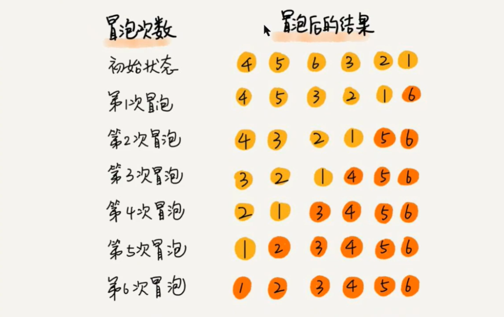

```JAVA
public class BubbleSort {
    
    public static void sort(Comparable[] arr) {
        // 控制整体比较操作执行的次数
        for (int i = arr.length - 1; i > 0; i--) {
            // 控制单次比较操作执行的次数
            for (int j = 0; j < i; j++) {
                // 比较相邻元素的大小
                if (greater(arr[j], arr[j + 1])) {
                    // 交换元素位置
                    swap(arr, j, j + 1);
                }
            }
        }
    }

    private static boolean greater(Comparable left, Comparable right) {
        return left.compareTo(right) > 0;
    }

    private static void swap(Comparable[] arr, int i, int j) {
        Comparable temp = arr[i];
        arr[i] = arr[j];
        arr[j] = temp;
    }
}
```

时间复杂度分析：冒泡排序使用了双层for循环，其中内层循环是真正完成排序操作的代码，所以分析时间复杂度时主要关注内层循环即可。在最坏的情况下，也就是要升序排序的集合为(6,5,4,3,2,1)时：

* 元素的比较次数为：`(N-1)+(N-2)+(N-3)+...+2+1=((N-1)+1)*(N-1)/2=N^2/2-N/2`；
* 元素的交换次数为：`(N-1)+(N-2)+(N-3)+...+2+1=((N-1)+1)*(N-1)/2=N^2/2-N/2`；
* 总执行次数为：`(N^2/2-N/2)+(N^2/2-N/2)=N^2-N`；
* 按照大O推导法则，保留函数中的最高阶项：`O(N^2)`。


### 选择排序


* 每次遍历的过程中，都假定一个位置的元素为最小值，然后和其之后的所有元素依次比较，并将本次发现的最小元素和其交换，一次遍历完后可以在首部确定一个位置；
* 多次完成比较交换的遍历操作，每次假定的最小值位置都会是上一次遍历确定的位置的后一位。当所有比较操作收敛后集合就会趋于有序。


```JAVA
public class SelectionSort {

    public static void sort(Comparable[] arr) {
        for (int i = 0; i < arr.length - 1; i++) {
            // 每次比较操作之前假定的最小值下标
            int minIndex = i;
            // 内层循环的作用是比较出本次真正的最小值
            for (int j = i + 1; j < arr.length; j++) {
                if (greater(arr[minIndex], arr[j])) {
                    minIndex = j;
                }
            }
            // 将最小值交换到合适的位置
            swap(arr, i, minIndex);
        }
    }

    private static boolean greater(Comparable left, Comparable right) {
        return left.compareTo(right) < 0;
    }

    private static void swap(Comparable[] arr, int i, int j) {
        Comparable temp = arr[i];
        arr[i] = arr[j];
        arr[j] = temp;
    }
}

```

时间复杂度分析：选择排序使用了双层for循环，其中外层循环控制数据的交换，内层循环控制数据的比较。

* 数据比较次数：`(N-1)+(N-2)+(N-3)+...+2+1=((N-1)+1)*(N-1)/2=N^2/2-N/2`；
* 数据交换次数：`N-1`；
* 总执行次数：`N^2/2-N/2+(N-1)=N^2/2+N/2+1`；
* 时间复杂度：根据大O推导法则，保留最高阶项，去除常数因子，时间复杂度为 `O(N^2)`。


### 插入排序


* 将集合中的所有元素逻辑上划分为有序和无序两组，有序在前，无序在后；
* 找到无序集合中的第一个元素，向有序集合中插入；
* 新插入的元素从有序组的末尾向前开始比较，遇到更大的元素则交换位置，直到遇到更小或相等的元素，才会停止比较。


```JAVA
public class InsertionSort {

    public static void sort(Comparable[] arr) {
        for (int i = 1; i < arr.length; i++) {
            for (int j = i - 1; j >= 0 &&
                    greater(arr[j], arr[j + 1]); j--) {
                swap(arr, j, j + 1);
            }
        }
    }

    private static boolean greater(Comparable left, Comparable right) {
        return left.compareTo(right) > 0;
    }

    private static void swap(Comparable[] arr, int i, int j) {
        Comparable temp = arr[i];
        arr[i] = arr[j];
        arr[j] = temp;
    }
}
```

时间复杂度分析：插入排序使用双层for循环，其中内层循环体是真正完成排序的代码，所以分析插入排序的时间复杂度主要分析内存代码的执行次数即可。在最坏的情况下，插入排序的时间复杂度分析：

* 比较次数为：`(N-1)+(N-2)+(N-3)+...+2+1=((N-1)+1)*(N-1)/2=N^2/2-N/2`；
* 交换次数为：`(N-1)+(N-2)+(N-3)+...+2+1=((N-1)+1)*(N-1)/2=N^2/2-N/2`；
* 总执行次数：`(N^2/2-N/2)+(N^2/2-N/2)=N^2-N`；
* 时间复杂度：根据大O推导法则，只保留函数中的最高阶项，时间复杂度为 `O(n^2)`。


### 希尔排序


* 首先选定一个步长h，以其做为依据对集合进行分组，即从首部元素开始，与和其间隔步长整数倍的元素分为一组；
* 对组内的数据进行比较/交换操作，也就是进行了插入排序； 
* 将步长h缩减为原来的1/2后重新对集合进行分组，然后重复第2步的比较操作。最后，当步长h缩减为1且比较完毕后，算法收敛。 


```JAVA
public class ShellSort {

    public static void sort(Comparable[] arr) {
        // 初始化步长
        int h = 1;
        while (h < arr.length / 2) {
            h = 2 * h + 1;
        }
		
        // 步长递减控制
        while (h >= 1) {
            // 根据步长分组进行插入排序
            for (int i = h; i < arr.length; i++) {
                for (int j = i; j >= h &&
                        greater(arr[j - h], arr[j]); j -= h) {
                    swap(arr, j - h, j);
                }
            }
            h = h / 2;
        }
    }

    private static boolean greater(Comparable left, Comparable right) {
        return left.compareTo(right) > 0;
    }

    private static void swap(Comparable[] arr, int i, int j) {
        Comparable temp = arr[i];
        arr[i] = arr[j];
        arr[j] = temp;
    }
}
```


### 归并排序


* 首先将原集合尽可能的拆分为元素相等的两个子几个，并对每个子集合继续进行拆分，直到元素个数为1为止；
* 然后将相邻的两个子集进行排序并合并；
* 重复第2部的操作，直到最终合并成一个有序集合为止。


归并操作的原理：

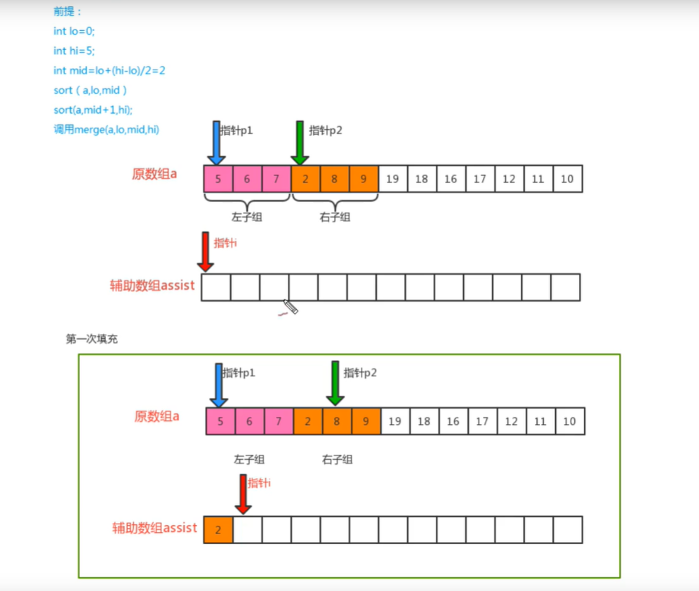

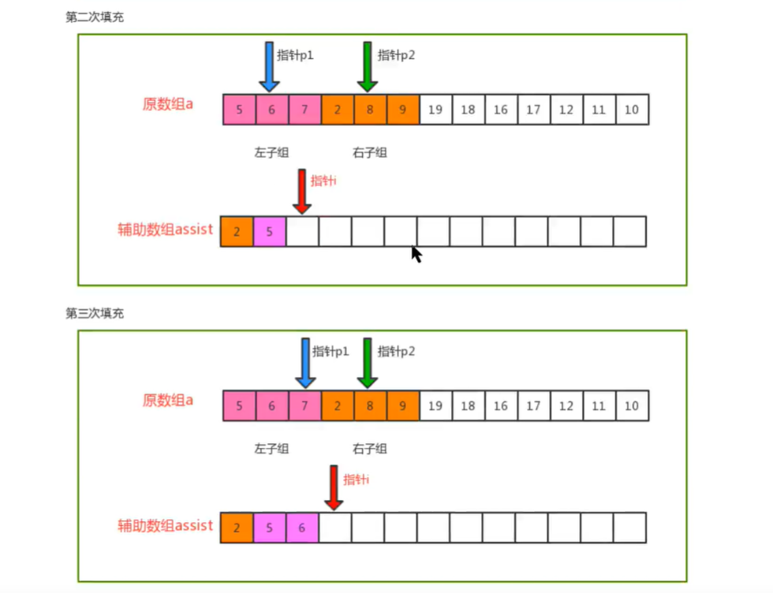


```JAVA
public class MergeSort {

    private static Comparable[] assist;

    private static boolean less(Comparable left, Comparable right) {
        return left.compareTo(right) < 0;
    }

    private static void exchange(Comparable[] arr, int i, int j) {
        Comparable temp = arr[i];
        arr[i] = arr[j];
        arr[j] = temp;
    }

    public static void sort(Comparable[] arr) {
        assist = new Comparable[arr.length];
        int start = 0;
        int end = arr.length - 1;
        sort(arr, start, end);
    }

    private static void sort(Comparable[] arr, int start, int end) {
        if (end <= start) {
            return;
        }

        int middle = start + (start + end) / 2;

        sort(arr, start, middle);
        sort(arr, middle + 1, end);

        merge(arr, start, middle, end);
    }

    private static void merge(Comparable[] arr, int start, int middle, int end) {
        int index = start, p1 = start, p2 = middle + 1;

        while (p1 <= middle && p2 <= end) {
            assist[index++] = less(arr[p1], arr[p2]) ? arr[p1++] : arr[p2++];
        }

        while (p1 <= middle) {
            assist[index++] = arr[p1++];
        }

        while (p2 <= end) {
            assist[index++] = arr[p2++];
        }

        for (int i = start; i <= end; i++) {
            arr[i] = assist[i];
        }
    }
}
```

时间复杂度分析：归并排序是分治思想的典型例子，该算法对arr[start, ..., end]进行排序，先将其分为arr[start, ..., middle]和arr[middle+1, ..., end]两个部分，然后分别通过递归调用将它们单独排序，最后将有序的子数组归并为最终的排序结果。该递归的出口在于如果一个数组不能再被分为两个子数组，那么就会执行merge进行归并操作，在归并的时候判断元素的大小进行排序。

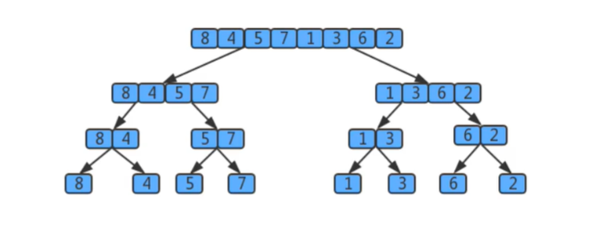

用树状图来描述归并，如果一个数组有8个元素，那么它将每次除以2找到最小

子数组，共拆分log8次，值为3，所以树共有3层，那么自顶向下第k层具有2^k个子数组，每个数组的长度为 `2^(3-k)`，归并最多需要 `2^(3-k)` 次比较。因此每层的比较次数为 `2^k*2^(3-k)=2^3`，那么3层总共为 `3*2^3`。

假设元素的个数为n，那么使用归并排序拆分的次数为log2(n)，所以共log2(n)层，那么使用log2(n)替换上面 `3*2^3` 中的3这个层数，最终得出的归并排序时间复杂度为：`log2(n)*2^(log2(n))=log2(n)*n`，根据大O推导法则，忽略底数，最终归并排序的时间复杂度为 `O(nlogn)`。


### 快速排序


* 首先设定一个分界值，通过该分界值将数组分为左右两个部分；
* 将大于或等于分界值的数据放到数据右边，小于分界值的数据放到数组左边。此时左边部分中各元素都小于或等于分界值，而右边部分中各元素都大于或等于分界值；
* 然后，左边和右边的数据可以独立的进行排序，对于每个子数组都可以再次设定分界值，同样的将数据分为左右两部分，左边为较小值，右边是较大值；
* 重复上述的过程，即通过递归将左右两侧的数据都排好顺序后，整个数组的排序也就完成了。


切分操作的原理：

1. 设定一个基准值，用两个指针分别指向数组的头部和尾部；
2. 先从尾部向头部开始搜索到一个比基准值小的元素，并记录指针的位置；
3. 再从头部向尾部开始搜索到一个比基准值大的元素，并记录指针的位置；
4. 交换左右两边指针指向的元素；
5. 重复2、3、4步骤，直到左边指针的值大于右边指针的值为止。


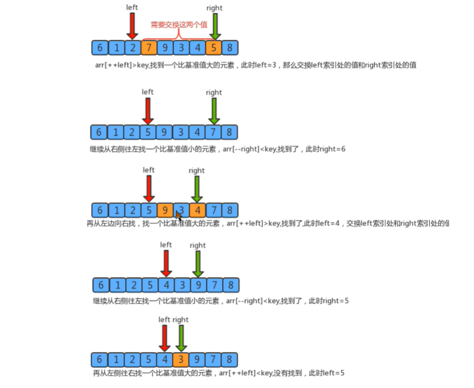

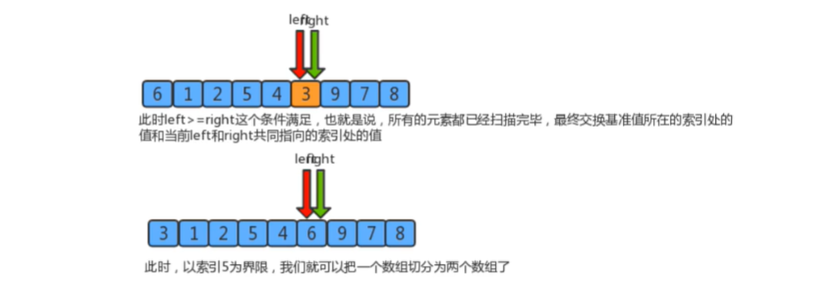

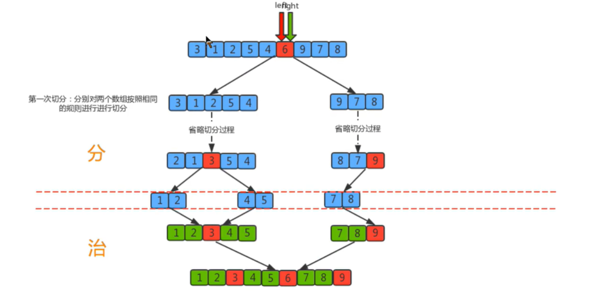

```JAVA
public class QuickSort {

    private static boolean less(Comparable left, Comparable right) {
        return left.compareTo(right) < 0;
    }

    private static void exchange(Comparable[] arr, int i, int j) {
        Comparable temp = arr[i];
        arr[i] = arr[j];
        arr[j] = temp;
    }

    private static void sort(Comparable[] arr) {
        int start = 0, end = arr.length - 1;
        sort(arr, start, end);
    }

    private static void sort(Comparable[] arr, int start, int end) {
        if (end <= start) {
            return;
        }

        int partition = partition(arr, start, end);

        sort(arr, start, partition - 1);
        sort(arr, partition + 1, end);
    }

    private static int partition(Comparable[] arr, int start, int end) {
        Comparable partitionKey = arr[start];

        int left = start, right = end + 1;

        while (true) {
            while (less(partitionKey, arr[--right])) {
                if (right == start) {
                    break;
                }
            }

            while (less(arr[++left], partitionKey)) {
                if (left == end) {
                    break;
                }
            }

            if (left >= right) {
                break;
            } else {
                exchange(arr, left, right);
            }
        }

        exchange(arr, start, right);

        return right;
    }
}
```

**和归并排序的区别**：快速排序是另外一种基于分治思想实现的排序算法，它将一个数组分成若干个子数组，并将每个部分独立的排序。快速排序和归并排序是互补的：归并排序将数组分成若干个子数组并分别排序，最后将有序的子数组合并从而使整个数组有序；而快速排序的方式则是当若干个数组有序时，整个数组自然就有序了。在归并排序中，一个数组会被均等的拆分，归并操作会在处理整个数组之前；而快速排序中，拆分数组的为止取决于数组的内容，递归调用发生在处理整个数组之后。

**时间复杂度分析**：快速排序的一次切分从头尾开始交替搜索，直到left和right重合。因此，一次切分算法的时间复杂度为O(n)，但整个快速排序的时间复杂度和切分的次数相关。

* **平均情况**：每一次切分选择的基准数字不是最大值、最小值和中值，这种情况下的时间复杂度为 `O(nlogn)`。

* **最优情况**：每一次切分选择的基准数字刚好能将当前序列等分。如果将数组的切分看成是一棵树，那么下图就是最优情况，共切分了logn次。所以，最优情况下快速排序的时间复杂度为 `O(nlogn)`。


* **最坏情况**：每一个切分选择的基准数字是当前序列的最大或最小值，这使得每次切分都会有一个子组，那么总共就得切分n次。所以，最坏情况下快速排序的时间复杂度为 `O(n^2)`。


### 堆排序


* 首先根据原集合构造出堆结构；
* 得到堆顶元素，这个值就是最大值；
* 交换堆顶元素和数组中的最后一个元素，此时所有元素中的最大元素都已经放到合适的位置了；
* 对堆进行调整，重新让除了最后一个元素的剩余元素的最大值放到堆顶；
* 重复2~4步骤，直到堆中只剩下一个元素为止。

**堆构造过程**：最直观的方法就是创建一个新的数组，然后从头开始遍历原数组，将每个元素按顺序添加到新数组中，并从数据长度的一半处（因为堆的特性，后半段的叶子结点无需下沉）开始下沉对堆进行调整，最后就形成了一个有序堆。


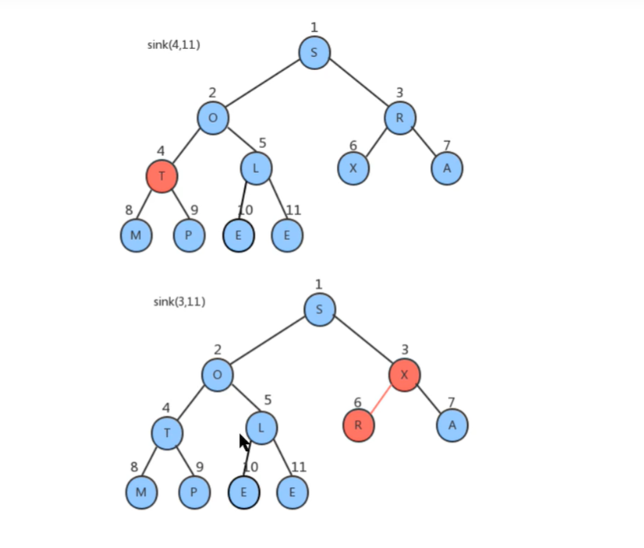

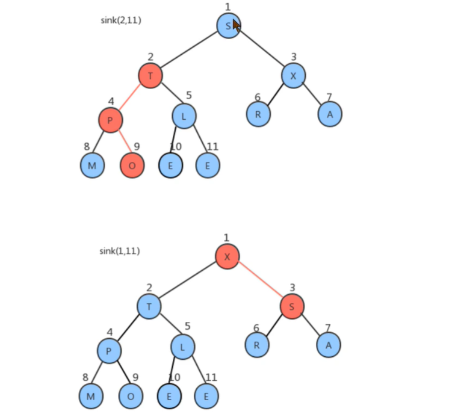

**堆排序过程**：对于构造好的堆，只需要做类似于堆删除的操作，就可以完成排序。

* 将堆顶元素和堆中最后一个元素交换位置；
* 通过对堆顶元素下沉调整堆，把最大的元素放到堆顶（此时最后一个元素不参与堆的调整，因为最大的数据已经到了数组的最右边）；
* 重复1~2步骤，直到堆中只剩最后一个元素。


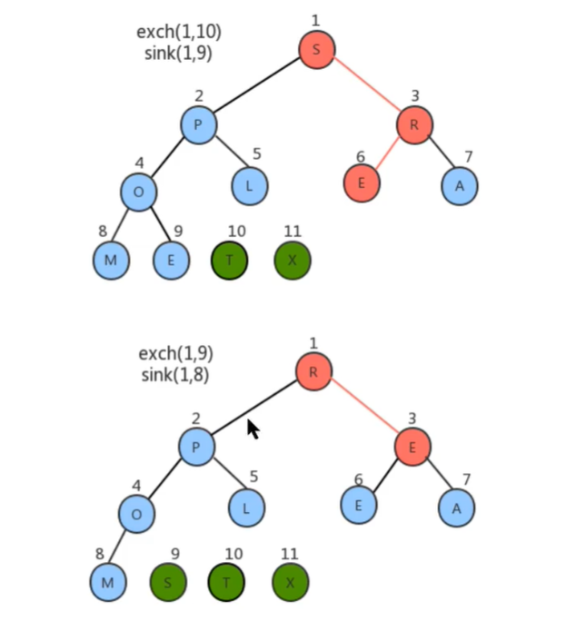


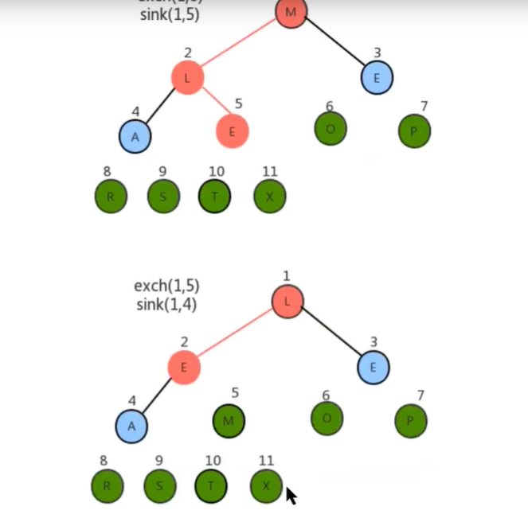


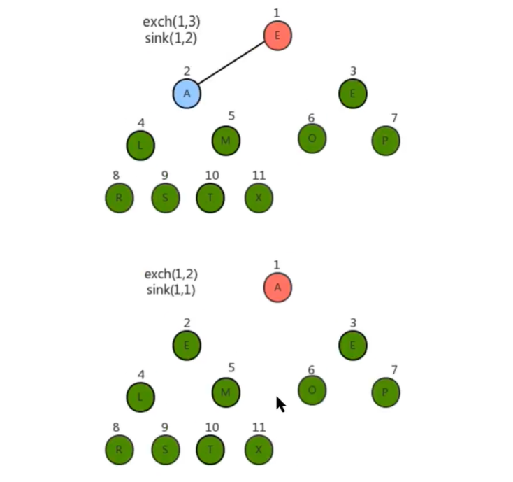

```java
public class HeapSort {

    /**
     * 判断堆中索引i处的元素是否小于索引j处的元素
     */
    private static boolean less(Comparable[] heap, int i, int j) {
        return heap[i].compareTo(heap[j]) < 0;
    }

    /**
     * 交换堆中索引i和j处的元素
     */
    private static void exchange(Comparable[] heap, int i, int j) {
        Comparable temp = heap[i];
        heap[j] = heap[i];
        heap[i] = temp;
    }

    /**
     * 根据待排序的原数组构造出堆
     */
    private static void createHeap(Comparable[] source, Comparable[] heap) {
        System.arraycopy(source, 0, heap, 1, source.length);
        for (int i = heap.length / 2; i > 0; i--) {
            sink(heap, i, heap.length - 1);
        }
    }

    /**
     * 对原数组中的数据进行升序排序
     */
    public static void sort(Comparable[] source) {
        Comparable[] heap = new Comparable[source.length + 1];
        // 构建堆
        createHeap(source, heap);
        // 纪录未排序元素中最大的索引
        int N = heap.length - 1;
        while (N != 1) {
            // 将根结点（即最大元素），交换到数组末尾并确定其位置
            exchange(heap, 1, N);
            // 堆数组末尾的元素已经确定了位置，下次循环则无需参与操作
            N--;
            // 将索引1处的元素下沉，就是将下次循环的最大元素交换到根结点
            sink(heap, 1, N);
        }
        System.arraycopy(heap, 1, source, 0, source.length);
    }

    /**
     * 在堆中对索引target处的元素在range范围内下沉
     */
    private static void sink(Comparable[] heap, int target, int range) {
        while (2 * target <= range) {
            int childMax, leftIndex = 2 * target, rightIndex = 2 * target + 1;
            if (rightIndex <= range && less(heap, leftIndex, rightIndex)) {
                childMax = rightIndex;
            } else {
                childMax = leftIndex;
            }

            if (!less(heap, target, childMax)) {
                break;
            } else {
                exchange(heap, target, childMax);
            }

            target = childMax;
        }
    }
}
```


### 计数排序


```JAVA
public class CountSort {

    public static int[] sort(int[] arr, int range) {
        // 结果数组
        int[] result = new int[arr.length];
        // 计数数组
        int[] count = new int[range];

        // 原数组的值对应计算数组的下标，因为下标是天生有序的，所以原数据的值在计算数组中就已经有序了
        // 计数数组的值就是下标对应的元素在原数组出现的次数
        for (int elem : arr) {
            count[elem]++;
        }

//        /**
//         * 该方式具有局限性，若是数据的范围间隔非常大，就会造成空间的浪费。且该方式不稳定。
//         */
//        // 遍历计数数组
//        for (int i = 0, j = 0; i < count.length; i++) {
//            // 按下标顺序装入结果数组，最终得出的结果数组就是有序数组
//            while (count[i]-- > 0) {
//                result[j++] = i;
//            }
//        }

        // 根据计算数组构建出累计数组
        for (int i = 1; i < count.length; i++) {
            count[i] = count[i] + count[i - 1];
        }

        // 根据累计数组确定原数组的元素位置后并装入结果数组
        for (int i = arr.length - 1; i >= 0; i--) {
            result[--count[arr[i]]] = arr[i];
        }

        return result;
    }
}
```


### 基数排序


```JAVA
public class RadixSort {

    public static int[] sort(int[] arr, int range, int num) {
        int[] result = new int[arr.length];
        int[] count = new int[range];

        for (int i = 0; i < num; i++) {
            int division = (int) Math.pow(10, i);
            for (int j = 0; j < arr.length; j++) {
                count[arr[j] / division % 10]++;
            }
		
            // 计数排序
            for (int m = 1; m < count.length; m++) {
                count[m] = count[m] + count[m - 1];
            }

            for (int n = arr.length - 1; n >= 0; n--) {
                result[--count[arr[n] / division % 10]] = arr[n];
            }

            System.arraycopy(result, 0, arr, 0, arr.length);
            Arrays.fill(count, 0);
        }
        return result;
    }
}
```


### 桶排序

一句话总结：**划分多个范围相同的区间，每个子区间自排序，最后合并**。

桶排序是计数排序的扩展版本，计数排序可以看成每个桶只存储相同元素，而桶排序每个桶存储一定范围的元素，通过映射函数，将待排序数组中的元素映射到各个对应的桶中，对每个桶中的元素进行排序，最后将非空桶中的元素逐个放入原序列中。

桶排序需要尽量保证元素分散均匀，否则当所有数据集中在同一个桶中时，桶排序失效。

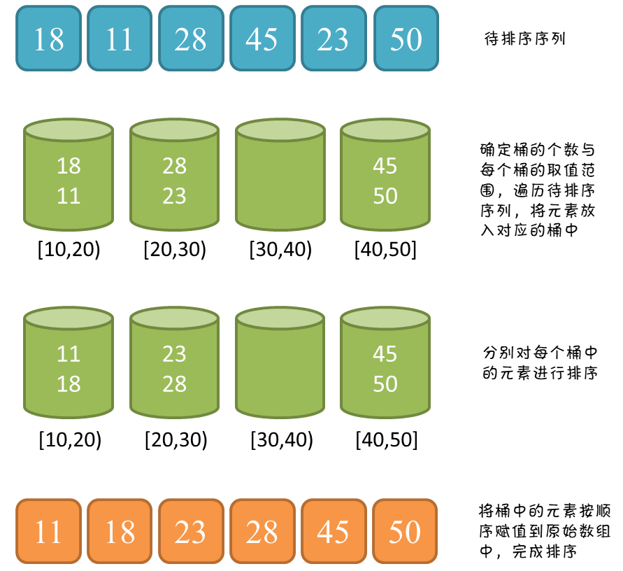

```JAVA
public class BucketSort {
    
    public static void sort(int[] arr) {
        // 计算最大值与最小值
        int max = Integer.MIN_VALUE;
        int min = Integer.MAX_VALUE;
        for(int i = 0; i < arr.length; i++){
            max = Math.max(max, arr[i]);
            min = Math.min(min, arr[i]);
        }

        // 计算桶的数量
        int bucketNum = (max - min) / arr.length + 1;
        ArrayList<ArrayList<Integer>> bucketArr = new ArrayList<>(bucketNum);
        for(int i = 0; i < bucketNum; i++){
            bucketArr.add(new ArrayList<Integer>());
        }

        // 将每个元素放入桶
        for(int i = 0; i < arr.length; i++){
            int num = (arr[i] - min) / (arr.length);
            bucketArr.get(num).add(arr[i]);
        }

        // 对每个桶进行排序
        for(int i = 0; i < bucketArr.size(); i++){
            Collections.sort(bucketArr.get(i));
        }

        // 将桶中的元素赋值到原序列
        int index = 0;
        for(int i = 0; i < bucketArr.size(); i++){
            for(int j = 0; j < bucketArr.get(i).size(); j++){
                arr[index++] = bucketArr.get(i).get(j);
            }
        }  
    }
}
```

复杂度分析：

* 时间复杂度：`O(N + C)`。

  * 对于待排序序列大小为 N，共分为 M 个桶，主要步骤有：
    * N 次循环，将每个元素装入对应的桶中
    * M 次循环，对每个桶中的数据进行排序（平均每个桶有 N/M 个元素）
  * 一般使用较为快速的排序算法，时间复杂度为 O ( N l o g N ) O(NlogN)*O*(*N**l**o**g**N*)，实际的桶排序过程是以链表形式插入的。

  * 整个桶排序的时间复杂度为：

    O(N)+O(M*(N/M*log(N/M)))=O(N*(log(N/M)+1))*O*(*N*)+*O*(*M*∗(*N*/*M*∗*l**o**g*(*N*/*M*)))=*O*(*N*∗(*l**o**g*(*N*/*M*)+1))

  * 当 N = M 时，复杂度为 `O(N) `。

* 额外空间复杂度：`O(N + M)`。

稳定性分析：桶排序的稳定性取决于桶内排序使用的算法。


### 排序的稳定性

数组arr中右若干元素，其中A元素和B元素相等，并且A元素在B元素前面，如果使用某种排序算法排序后，能够保证A元素依然在B元素的前面，就可以说该算法是稳定的。


常见算法的稳定性：

* **冒泡排序**：只有当arr[i]>arr[i+1]的时候，才会交换元素，而相等的时候不会交换，所以冒泡排序是一种稳定的排序算法；
* **选择排序**：该排序算法是每次都会选择一个当前最小的元素，现有数据(5(1)，8，5(2)，2，9)，选择出本次的最小元素2并和5(1)交换，导致稳定性被破坏；
* **插入排序**：比较操作是从有序序列的末尾开始的，也就是将想要插入的元素和已经有序的最大者开始比较，一直向前找到合适的位置，如果相等则直接放在后面，所以插入排序是稳定的；
* **希尔排序**：该排序算法是按照步长对元素分组进行各自的插入排序，虽然单次的插入排序是稳定的，但在不同的插入排序过程中，相同的元素可能会在各自的插入排序中移动，导致稳定性被破坏；
* **归并排序**：该算法在归并的过程中，只有arr[i]<arr[i+1]才会交换位置，如果两个元素相等则不会改变，所以归并排序也是稳定的；
* **快速排序**：该算法需要一个基准值，在基准值右侧找一个更小的元素，在基准值左侧找一个更大的元素，然后交换，会破坏稳定性。