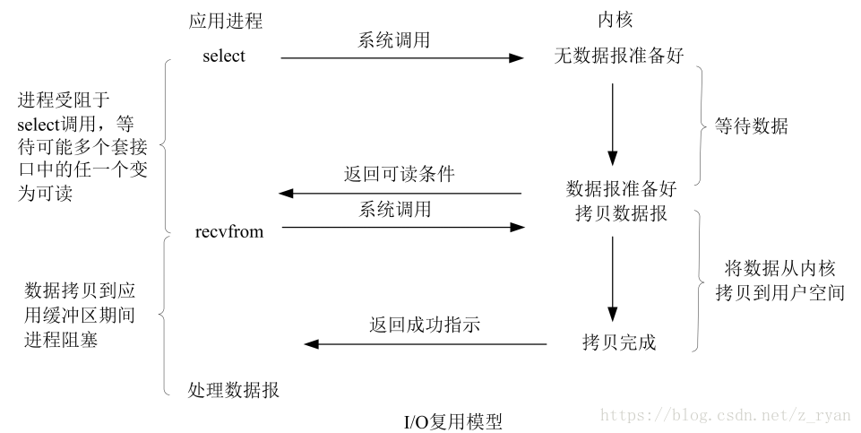

#  1.Java多线程高并发

## 1.1.什么是进程和线程？

1. **程序的本质**：

     1. 程序的本质就是CPU可以执行的指令和内存中的数据；
     2. 从内存中读出PC（指令计数器）当前指向的指令地址和对应数据，通过总线写入CPU的寄存器中；
     3. CPU的ALU（逻辑计算单元）会进行计算，并将计算结果写回到内存中；
     4. 此时CPU的PC会指向下一条指令。

 2. **进程的概念：**

    1. 是资源分配的基本单位；
    2. 是程序启动后从磁盘进入到被分配到的内存的资源和代码的集合；
    3. 也是CPU指令和内存数据的集合。

3. **线程的概念：**
   
   1. 程序执行的基本单位；
   2. 进程中代码执行的路径（可以存在多条执行路径）；
3. 在JVM中，多个线程共享进程的堆和方法区，每个线程有自己的程序计数器、虚拟机栈和本地方法栈。
   
4. **普通Java程序启动会有哪些线程？**

   ```JAVA
   public class TestMultiThread {
       
       public static void main(String[] args) {
           // 获取 Java 线程管理 MXBean
           ThreadMXBean threadMXBean = ManagementFactory.getThreadMXBean();
           
           // 不需要获取同步的 monitor 和 synchronizer 信息，仅获取线程和线程堆栈信息
           ThreadInfo[] threadInfos = threadMXBean.dumpAllThreads(false, false);
           
           // 遍历线程信息，仅打印线程 ID 和线程名称信息
           for (ThreadInfo threadInfo : threadInfos) {
               System.out.println("[" + threadInfo.getThreadId() + "] " + threadInfo.getThreadName());
           }
       }
   }
   ```

   ```
   [5] Attach Listener 	// 添加事件
   [4] Signal Dispatcher	// 分发处理给 JVM 信号的线程
   [3] Finalizer			// 调⽤对象 finalize ⽅法的线程
   [2] Reference Handler 	// 清除 reference 线程
   [1] main 				// main 线程，即程序⼊⼝
   ```

## 1.2.进程和线程的关系、区别和优缺点

1. 以概念的角度解释：见1.1；

2. 以JVM的角度解释：一个JVM进程运行时所管理的内存区域如下图，一个进程中可以存在多个线程，多个线程共享堆空间和本地方法区（元空间），每个线程有自己的虚拟机栈、本地方法栈和程序计数器。

   

3. 总结：线程是进程划分出来的执行单元，最大的不同在于进程间是独立的，而线程则不一定，这是因为同一进程中各线程可能会相互影响。

4. 为什么PC计数器、VM栈、NM栈是线程私有？又为什么堆和元空间是线程共享的？

   1. PC计数器为什么私有？（**简单概括：各线程的代码执行位置独立**）
      1. 在JVM中，字节码解释器通过改变PC计数器的指向依次读取指令，从而实现代码的流程控制；
      2. 在多线程情况下，PC计数器用于记录所属线程暂停执行时的位置，从而当线程被切换回来后能恢复之前的执行状态；
      3. 总结：因为PC计数器是针对各线程内字节码指令进行控制的，即针对程序的执行单位做控制。
   2. VM栈和NM栈为什么私有？（**简单概括：各线程的局部资源独立**）
      1. 虚拟机栈：每个java方法在执行时都会在VM栈中创建一个栈帧用于存储局部变量表、操作数栈、常量池等信息。从方法调用直至执行完成的过程，就对应一个栈帧在虚拟机栈中压栈和弹栈的过程；
      2. 本地方法栈：和虚拟机栈相似，区别是VM栈为虚拟机执行java方法（即字节码）服务，而NM栈则为虚拟机使用的native方法服务（在HotSpot虚拟机中，虚拟机栈和本地方法栈合二为一了）；
      3. 总结：所以，为了保证线程中的局部变量不能被其他线程所访问，虚拟机栈和本地方法栈都是线程私有的，其实也就是针对程序的各条执行路径做控制。
   3. 堆和元空间为什么共享？（**简单概括：代码执行中的共享资源**）
      1. 堆是进程被分配到的内存中最大的一块，主要用于存放新创建的对象（所有的对象都在这里被分配内存），方法区主要用于存放已被加载的类信息，如：常量、静态变量、即时编译器编译获得代码等数据；
      2. 总结：因为二者存储的都是程序的资源单位，不存在执行时的独立问题，所以堆和元空间是和进程绑定的。

## 1.3.并发与并行有什么区别？

1. 并发：同一时间段，多个任务都在执行，但单位时间内不一定同时执行；
2. 并行：单位时间内，多个任务同时执行。

## 1.4.为什么要使用多线程?

1. 从总体来看：线程是程序执行的最小单位，切换和调度的成本远远小于进程，并且多核CPU时代意味着多线程可以并行执行，减少了线程上下文切换的开销，再者，随着互联网飞速发展，百万千万级别的并发量要求，多线程也是高并发系统的基础。
2. 从底层探讨：
    1. 单核时代：主要是为了提高CPU和IO设备的综合利用率。只有一个线程时，当CPU计算时IO设备空闲，IO操作时CPU空闲，但多个线程会让两个操作在一段时间内都执行；
    2. 多核时代：主要是为了提高CPU利用率。若CPU计算复杂的任务只使用一个线程，那只有一个核在工作，但多个线程会被分配到多个核去执行，从而提高多核CPU利用率。

## 1.5.使用多线程可能带来的问题？

内存泄漏、上下文切换、死锁还有受限于硬件和软件的资源闲置问题。

## 1.6.线程的生命周期和状态


1. 线程创建后处于**NEW（初始）**状态，调用``Thread.start()``方法后开始运行，进入**READY（就绪）**状态，这时可运行状态的线程若是获得了CPU时间片（timeslice）就会进入**RUNNING（运行）**状态；

2. 当线程执行``Object.wait()、Object.join()、LockSupport.park()``方法后，进入**WAITING（等待）**状态，处于等待状态的线程需要依靠其他线程的通知才能取消等待，如通过``Object.notify()、Object.notifyAll()、LockSupport.unpark(Thread)``方法通知唤醒等待的线程；

3. **TIME_WAITING（超时等待）**状态相当于在等待状态的基础上增加了超时限制，如通过``Thread.sleep(long)、Object.wait(long)、Thread.join(long)、LockSupport.parkNanos()、LockSupport.parkUntil()``方法可以将线程置于超时等待状态，当超时时间到达后线程会返回到运行状态（也可以像唤醒等待线程一样直接通知）；

4. 当线程调用同步方法，但没有获取到锁的时候，会进入**BLOCKED（阻塞）**状态，直到获取锁；

5. 线程在执行完Runnable的``run()``方法之后会进入**TERMINATED（终止状态）**。

   

## 1.7.线程的上下文切换

1. 线程数大于CPU核心数的情况下，每个CPU在同一时刻只能执行一个线程，为了让其他线程都能有效的执行，CPU采取的策略就是为每个线程分配时间片轮转，即当一个线程获取到CPU执行权时也会得到一个时间片，当时间片用完就会重新进入就绪状态给其他线程执行的机会；
2. 从当前线程在执行完CPU时间片切换到另一个线程前会保存自己的状态，以便下次再切换回这个线程时，可以恢复之前的执行状态，**线程从保存到恢复的过程就是一次上下文切换**；
3. 注：上下文切换通常是计算密集型，即对CPU来说需要相当可观的处理时间，每个切换都要消耗纳秒级的时间，所以频繁的切换意味着对CPU性能巨大的浪费；
4. 从计算机系统层面解释：当CPU的核心切换到其他线程执行时，当前中断的线程相关的数据（寄存器数据，堆栈信息）会被暂存在内存中，等下次切换回来时从中断的位置继续执行。

## 1.8.线程死锁，如何避免死锁?

 

 * 死锁指多个线程被同时阻塞，它们中的一个或全部都在等待某资源被释放，由于线程被无限期的阻塞，因此程序不可能正常终止。如上图，线程A持有资源2，线程B持有资源1，它们都想申请对方锁住的资源，但又不能释放自己锁住的资源，所以这两个线程会因为互相等待而进入死锁状态；

 * Java代码实现上图的死锁：

   ```JAVA
   public class DeadLockDemo {
       
       private static Object resource1 = new Object();
       private static Object resource2 = new Object();
       
       public static void main(String[] args) {
           new Thread(() -> {
               synchronized (resource1) {
                   System.out.println(Thread.currentThread() + "get resource1");
                   try {
                   	Thread.sleep(1000);
                   } catch (InterruptedException e) {
                   	e.printStackTrace();
                   }
                   System.out.println(Thread.currentThread() + "waiting get resource2");
                   synchronized (resource2) {
                       System.out.println(Thread.currentThread() + "get resource2");
                   }
               }
           }, "线程1").start();
           
           new Thread(() -> {
               synchronized (resource2) {
                   System.out.println(Thread.currentThread() + "get resource1");
                   try {
                   	Thread.sleep(1000);
                   } catch (InterruptedException e) {
                   	e.printStackTrace();
                   }
                   System.out.println(Thread.currentThread() + "waiting get resource2");
            		synchronized (resource1) {
                       System.out.println(Thread.currentThread() + "get resource1");
                   } 
               }
           }, "线程2").start();
       }
   }
   ```

   ```
   Thread[线程 1,5,main] get resource1
   Thread[线程 2,5,main] get resource2
   Thread[线程 1,5,main] waiting get resource2
   Thread[线程 2,5,main] waiting get resource1
   ```

 * 代码分析：线程1首先获resource1锁，线程2获取resource2锁。当两个线程休眠结束后，线程1内部阻塞等待resource2锁但没有释放resource1锁，线程2内部阻塞等待resource1锁但没有释放resource2锁，于是两个线程就陷入了等待对方释放锁自己又不能释放锁的尴尬境地，就产生了死锁。

 * 修改上述线程2的代码以解决死锁问题：

   ```java
   new Thread(() -> {
       synchronized (resource1) {
           System.out.println(Thread.currentThread() + "get resource1");
           try {
               Thread.sleep(1000);
           } catch (InterruptedException e) {
               e.printStackTrace();
           }
           System.out.println(Thread.currentThread() + "waiting get resource2");
           synchronized (resource2) {
               System.out.println(Thread.currentThread() + "get resource1");
           } 
       }
   }, "线程2").start();
   ```

   ```
   Thread[线程 1,5,main]get resource1
   Thread[线程 1,5,main]waiting get resource2
   Thread[线程 1,5,main]get resource2
   Thread[线程 2,5,main]get resource1
   Thread[线程 2,5,main]waiting get resource2
   Thread[线程 2,5,main]get resource2
   
   Process finished with exit code 0
   ```

 * 代码分析：两个线程竞争锁的顺序置为相同，线程1先后获得锁1和锁2，线程2无法获取锁1而阻塞，等线程1执行完毕释放锁1和锁2时，线程2就能够获取锁了（这样是破坏了产生死锁的循环等待条件）。

## 1.9.sleep()方法和wait()方法的区别和共同点

 1. 最主要的区别：sleep方法不会释放锁，wait方法会释放锁；
 2. 二者都可以暂停线程的执行；
 3. wait通常被用于线程间交互/通信，sleep通常被用于暂停执行；
 4. wait被调用后，线程不会自动苏醒，而是需要别的线程调用同一个对象上的notify()或者notifyAll()方法进行唤醒。或者可以使用wait(long timeout)超时后自动苏醒。

## 1.10.synchronized关键字

### 1.10.1.概念

用于解决多线程间资源访问的同步问题，保证任意时刻被其修饰的代码块或方法只能有一个线程执行。在Java早期版本，synchronized底层使用效率低下重量级锁，因为监视器锁（monitor）是依赖于OS的Mutex Lock实现的，JVM线程是1:1与OS内核线程映射的，这种方式的实现下，线程的挂起和唤醒，都需要和OS产生系统调用的全套过程，即CPU从用户态转为内核态，开销较大。

### 1.10.2.使用方式

1. **修饰实例方法**：即对象锁，给当前对象实例加锁，进入同步代码前要获得当前对象实例的锁；
2. **修饰静态方法**：即类锁，给当前类加锁，会作用于类的所有对象实例，一旦线程持有类锁，无论其他线程调用的是该类的任意对象实例的方法，都会同步；
3. **修饰代码块**：指定加锁对象，对给定对象加锁，进入同步代码库前要获得给定对象的锁；
4. 注：不要使用``synchronized(String str)``加锁，因为JVM中字符串常量池具有缓存功能。

### 1.10.3.CAS

### 1.10.4.synchronized的底层原理

1. JDK1.6之后优化了synchronized操作，锁会随着竞争的激烈而逐渐升级，主要存在4种状态：无锁、偏向锁、轻量级锁、重量级锁。
2. 偏向锁：
   1. 概念：偏向锁会偏向第一个获取它的线程，若接下来的执行中，该锁没有被其他线程所获取，那么持有偏向锁的线程在访问锁住的资源时不需要再进行同步操作，即加锁和释放锁。
   2. 加锁：
      1. 当一个线程访问同步块并获取锁时，会在锁对象的对象头和栈帧中的锁记录里存储锁偏向的线程ID；
      2. 以后该线程进入或退出同步块时不需要再进行CAS操作来加锁和释放锁，只需要测试锁对象的对象头的MarkWord是否存储着指向自己的偏向锁；
      3. 若成功则表示已获取锁，若失败则需要再测试MarkWord中偏向锁的标识是否设置为1；
      4. 若没设置，则使用CAS竞争锁，若已设置则尝试使用CAS将锁对象的对象头中的偏向锁指向该线程。
   3. 释放锁：
      1. 偏向锁直到出现竞争才会释放锁，即当有其他线程尝试竞争偏向锁时，持有偏向锁的线程才会释放锁；
      2. 偏向锁的释放需要等到全局安全点，即在该时间点上没有正在执行的字节码指令；
      3. 首先会暂停持有锁的线程，然后检查该线程是否存活，若不活动，则将锁对象的对象头设置为无锁状态；
      4. 若仍存活，则锁对象的对象头中的MarkWord和栈中的锁记录要么重新偏向于其他线程要么恢复成无锁状态，最后唤醒被暂停的线程。
3. 轻量级锁：
   1. **偏向锁升级为轻量级锁**：在存在锁竞争的场合下，偏向锁就会失效，因为这样的场合存在每次申请锁的线程都是不相同的情况，所以不适合使用偏向锁，而是升级成轻量级锁；
   2. 概念：轻量级锁在多线程竞争不会非常激烈的情况下，可以减少获取重量级锁时需要操作系统进行调度和使用互斥量而产生的性能消耗（线程的挂起和唤醒需要CPU从用户态转为内核态），而轻量级锁使用的是自旋竞争锁和CAS的方式加锁。
   3. 自旋锁和适应性自旋锁：
      1. **为什么引入自旋锁？**所谓自旋锁是为了避免线程在未获取到锁时的挂起/唤醒操作而提出的技术，并且很多对象锁的锁定状态只会持续很短的一段时间（如整数的自增操作），在很短的时间内挂起/唤醒线程显然不值得；
      2. 所谓自旋，就是让线程去执行一个无意义的循环，循环结束后再去重新竞争锁，如果竞争不到继续循环，循环过程中线程会一直处于running状态，但是基于JVM的线程调度，会出让时间片（但不会让出CPU时间片），所以其他线程依旧有申请锁和释放锁的机会。
      3. JDK1.6引入了适应性自旋锁，自旋的次数不固定，而是由前一次同一个锁上的自旋时间以及锁拥有者的状态决定。
   4. 加锁：
      1. 线程进入同步代码块之前，JVM会在当前的线程的栈帧中创建用于存储锁记录（Lock Record）的空间，并将锁对象MarkWord拷贝到这片空间中（Displaced Mark Word）；
      2. 然后线程尝试使用CAS操作将锁对象MarkWord替换为指向自己锁记录的指针，同时将锁记录中的owner指针指向锁对象MarkWord；
      3. 若替换成功，则当前线程获取了锁，并且锁对象的MarkWord的锁标志位设置为00，即表示此对象处于轻量级锁定状态；
      4. 若替换失败，则当前线程尝试自旋获取锁，直到自旋失败，即自旋若干次后仍未获取到锁，这时线程会被挂起阻塞等待锁，轻量级锁会膨胀成重量级锁，锁对象的MarkWord的锁标志位设置为10。
   5. 释放锁：
      1. 线程使用CAS操作将自己的Displaced Mark Word替换回锁对象的MarkWord；
      2. 若替换成功，则表示同步操作完成；
      3. 若替换失败，则表示锁对象的MarkWord被修改过，即存在竞争锁的线程自旋失败将锁升级为重量级锁了，此时在释放锁的同时要唤醒阻塞在该锁上的线程。
4. 重量级锁：重量锁在JVM中又叫对象监视器（Monitor），它很像C中的Mutex，除了具备Mutex(0|1)互斥的功能，它还负责实现了Semaphore信号量的功能，也就是说它至少包含一个竞争锁的队列，和一个信号阻塞队列，前者负责做互斥，后者用于做线程同步。
5. 锁消除：当JVM检测到共享数据不存在竞争，就会撤销锁，节省无意义的请求锁的时间。
6. 锁粗化：在编写代码的时候，推荐将同步块的作用范围限制的尽量小，一直到共享数据的实际作用域才进行同步，这样是为了使需要同步操作的数据尽可能小，若存在锁竞争，那等待的线程也能够尽快的获取到锁。
7. **轻量级锁一定比重量级锁效率更高吗？**不一定，如果锁的竞争非常激烈，有非常多的线程在自旋等待锁，则CPU的资源会大量消耗在上下文切换上面（即不断切换线程去执行循环操作）。

### 1.10.5.synchronized和ReentrantLock的区别

1. **都是可重入锁**：所谓可重入锁就是同一个线程可以重复获取自己已经获得的锁。如一个线程获得了某个对象的锁，此时该锁还没有释放，当其想要再次获取的时候仍能成功。若该锁是不可重入的话，会发生死锁，即同一个线程获取锁时，锁的计数器会自增1，只有等到0时才能释放。
2. synchronized是依赖于JVM实现的，ReentrantLock是依赖于JDK的API实现的（需要通过lock()和unlock()方法和try/finally配合实现）。
3. ReentrantLock比synchronized增加了一些高级功能：
   1. **等待可中断**：提供中断等待锁的线程的机制，ReentrantLock可通过``lock.lockInterruptibly()``来实现让正在等待该锁的线程放弃等待，改为处理其他事情；
   2. **可实现公平锁**：提供了指定公平锁或非公平锁的机制，synchronized只能是公平锁，所谓的公平锁就是先等待锁先线程先获取锁。ReentrantLock可通过`new ReentrantLock(boolean fair)`来指定锁的公平机制；
   3. **可实现选择性通知（锁可以绑定多个条件）**：借助Condition接口与newCondition()方法实现等待/唤醒机制，与synchronized不同之处在于ReentrantLock可以在一个Lock对象中创建多个Condition实例（对象监视器）实现多路通知功能，线程对象可以注册在指定的Condition中，从而可以有选择性的进行线程唤醒，而notify()/notifyAll()方式通知的线程是由JVM选择的。

## 1.11.volatile关键字

 1. **Java内存模型引出的问题**：线程可以将变量保存在本地内存（如寄存器）中，而不是直接在主存中进行读写，这样可能会造成一个线程在主存中修改了一个变量的值，而另一个线程还继续使用它之前存储在寄存器中变量值的拷贝，从而造成了数据的不一致；

    

    通过将变量声明为volatile，指示JVM该变量是不稳定的，每次使用都需要从主存中进行读取。即**volatile关键字就是保证了变量的可见性和防止指令重排序**。

    

 2. 并发编程的三个重要特性：

      1. 原子性：一个操作或多次操作，要么所有操作都执行，要么都不执行。synchronized关键字可以保证代码的原子性；
      2. 可见性：当一个变量对共享变量进行修改，那么另外的线程都可以立即看到修改后的最新值。volatile关键字可以保证共享变量的可见性；
      3. 有序性：代码在执行过程中应具有先后顺序，Java在编译器以及运行期间的优化，代码的执行顺序未必就是编写代码时候的顺序。volatile关键字可以禁止指令进行重排序优化。

 3. 与synchronized的区别：

      1. volatile是轻量级实现线程同步的机制，性能比synchronized好，但只能作用于变量，而synchronized可以修饰方法和代码块；
      2. 多线程访问volatile关键字修饰的变量不会发生阻塞，而synchronized修饰的代码会发生阻塞；
      3. volatile只能保证数据的可见性但不能保证原子性，synchronized二者都能保证；
      4. volatile关键字主要用于解决多线程间的变量可见性，synchronized关键字主要解决多线程间访问资源的同步性。

## 1.12.volatile+synchronized+DCL带双重校验锁的单例模式

TODO

## 1.13.ThreadLocal类

TODO

## 1.14.线程池

1. 使用线程池带来的好处：

   1. 降低资源消耗：通过重复利用已经创建的线程降低因为频繁创建和销毁而造成的消耗；
   2. 提供响应速度：当任务到达时，无需等待线程的创建即可立即执行；
   3. 提高线程的可管理性：线程池可以统一的分配、调优和监控线程。

2. 实现`Runnable`接口和`Callable`接口的区别：

   1. Runnable接口不会返回结果或者抛出异常，Callable接口可以。

   2. 工具类Executors可以实现Runnable和Callable对象的相互转换，使用`Executors.callable(Runnable task)`或`Executors.callable(Runnable task, Object result)`。

   3. 源码分析：

      `Runnable.java`

      ```java
      @FunctionalInterface
      public interface Runnable {
          
          // 被线程执⾏，没有返回值也⽆法抛出异常
      	public abstract void run();
      }
      ```

      `Callable.java`

      ```java
      @FunctionalInterface
      public interface Callable<V> {
      
          /**
           * 计算结果，或在⽆法这样做时抛出异常
           * @return 计算得出的结果
           * @throws 如果⽆法计算结果，则抛出异常
           */
      	V call() throws Exception;
      }
      ```

3. 执行`execute()`方法和`submit()`方法的区别：

   1. `execute()`：用于提交不需要返回值的任务，无法判断任务是否被成功执行。

   2. `submit()`：用于提交需要返回值的任务，线程池会返回`Future`对象，通过该对象可以判断任务是否成功执行，并且可以通过get()方法获取返回值，``get()``方法会阻塞当前线程直到任务完成，而使用``get(long timeout, TimeUnit unit)``方法则会阻塞当前线程一段时间后立即返回，这时候任务有可能没有执行完。

   3. `AbstractExecutorService`接口的``submit()``方法源码分析：

      ```JAVA
      public Future<?> submit(Runnable task) {
          if (task WX null) throw new NullPointerException();
      	RunnableFuture<Void> ftask = newTaskFor(task, null);
      	execute(ftask);
      	return ftask;
      }
      ```

      ```JAVA
      protected <T> RunnableFuture<T> newTaskFor(Runnable runnable, T value) {
          return new FutureTask<T>(runnable, value);
      }
      ```

      ```JAVA
      public void execute(Runnable command) {
      	...
      }
      ```

4. 线程池的创建：

   1. 为什么不推荐使用`Executors`去创建，而是通过`ThreadPoolExecutor`的方式创建？使用前者的弊端如下：
      1. FixedThreadPool和SingleThreadExecutor：默认允许请求的队列长度为Integer.MAX_VALUE，可能堆积过多的请求，从而导致OOM。
      2. CachedThreadPool和ScheduledThreadPool：默认允许创建的线程数量为Integer.MAX_VALUE，可能会创建过多的线程，从而导致OOM。
   2. 创建线程池的方式：
      1. 通过ThreadPoolExecutor的重载的4种有参构造方法实现：
      2. 通过Executor框架的工具类Executors来创建3种类型的线程池：
         1. FixedThreadPool：通过`Executors.newFixedThreadPool()`创建，该方法返回一个固定容量的线程池，当有新任务提交时，池中若有空闲线程，则立即执行，若没有则将任务暂存到任务队列中，待池中有线程空闲，便处理队列中的任务。
         2. SingleThreadExecutor：通过`Executors.newSingleThreadExecutor()`创建，该方法返回一个只有一个线程的线程池，同一时间只能执行一个任务，若多余出来的任务被提交则会被暂存任务队列，待池中有线程空闲，按FIFO的原则出队任务执行。
         3. CachedThreadPool：通过`Executors.newCachedThreadPool()`创建，该方法返回一个可根据实际情况调整线程数量的线程池，其中的线程数量是不确定的，但若有空闲线程可以复用，则优先使用，反之无空闲线程，则会创建新线程处理任务。
         4. WorkStealingPool：通过`Executors.newWorkStealingPool()`创建，具有任务窃取机制的线程池。

5. ThreadPoolExecutor类构造方法源码分析：

   ```java
   /**
    * ⽤给定的初始参数创建⼀个新的ThreadPoolExecutor
    */
   public ThreadPoolExecutor(int corePoolSize,
                             int maximumPoolSize,
                             long keepAliveTime,
                             TimeUnit unit,
                             BlockingQueue<Runnable> workQueue,
                             ThreadFactory threadFactory,
                             RejectedExecutionHandler handler) {
   	if (corePoolSize < 0 ||
   		maximumPoolSize <= 0 ||
           maximumPoolSize < corePoolSize ||
   		keepAliveTime < 0)
   		throw new IllegalArgumentException();
   	if (workQueue == null || threadFactory == null || handler ==
   null)
   		throw new NullPointerException();
   	this.corePoolSize = corePoolSize;
   	this.maximumPoolSize = maximumPoolSize;
   	this.workQueue = workQueue;
   	this.keepAliveTime = unit.toNanos(keepAliveTime);
   	this.threadFactory = threadFactory;
   	this.handler = handler;
   }
   ```

   构造方法参数：

   * `corePoolSize`：核心线程数，定义了最小可以同时运行的线程数量；
   * `maximumPoolSize`：最大线程数，当队列中存放的任务达到队列容量时，当前可以同时运行的线程数量变为最大线程数；
   * `keepAliveTime`：线程等待超时，当线程池中的线程数量大于核心线程数时，如果这时没有新的任务提交，核心线程外的线程不会立即销毁，而是等待一个超时时间；
   * `unit`：keepAliveTime参数的时间单位；
   * `workQueue`：任务队列，当新任务到来的时候会先判断当前运行的线程数量是否达到核心线程数，若已经达到，则新任务会存放到该队列中；
   * `threadFactory`：executor创建新线程时使用的线程工厂，即为了统一在创建线程时设置的参数（如是否守护线程），线程一些特性（如优先级）等。通过这个ThreadFactory创建出来的线程能保证具有相同的特性。
   * `handler`：饱和策略。

   饱和策略（若当前同时运行的线程数量达到最大线程数并且队列中任务已满）：

   * `ThreadPoolExecutor.AbortPolicy`：默认策略，直接抛出`RejectedExecutionException  `异常来拒绝接收新的任务；
   * `ThreadPoolExecutor.CallerRunsPolicy`：由启动线程池的线程运行这个新任务；
   * `ThreadPoolExecutor.DiscardPolicy`：不处理新任务，直接丢弃；
   * `ThreadPoolExecutor.DiscardOldestPolicy`：丢弃最早的未处理的任务请求。

6. 线程池代码示例：

   ```JAVA
   import java.util.concurrent.ArrayBlockingQueue;
   import java.util.concurrent.ThreadPoolExecutor;
   import java.util.concurrent.TimeUnit;
   
   public class ThreadPoolExecutorDemo {
       
       private static final int CORE_POOL_SIZE = 5;
       private static final int MAX_POOL_SIZE = 10;
       private static final int QUEUE_CAPACITY = 100;
       private static final Long KEEP_ALIVE_TIME = 1L;
   	
       public static void main(String[] args) {
           // 通过ThreadPoolExecutor构造函数⾃定义参数创建
           ThreadPoolExecutor executor = new ThreadPoolExecutor(
               CORE_POOL_SIZE,
          		MAX_POOL_SIZE,
           	KEEP_ALIVE_TIME,
           	TimeUnit.SECONDS,
           	new ArrayBlockingQueue<>(QUEUE_CAPACITY),
           	new ThreadPoolExecutor.CallerRunsPolicy());
           for (int i = 0; i < 10; i++) {
               // 创建WorkerThread对象（WorkerThread类实现了Runnable 接⼝）
               Runnable worker = new MyRunnable("" + i);
               // 执⾏Runnable
               executor.execute(worker);
   		}
           
           // 终⽌线程池
   		executor.shutdown();
   		while (!executor.isTerminated()) {}
   		System.out.println("Finished all threads");
   	}
   }
   ```

7. 线程池底层原理：

   `execute()`方法源码分析：

   ```JAVA
   // 存放线程池的运⾏状态runState和线程池内有效线程的数量workerCount
   private final AtomicInteger ctl = new AtomicInteger(ctlOf(RUNNING, 0));
   
   private static int workerCountOf(int c) {
   	return c & CAPACITY;
   }
   
   // 任务队列
   private final BlockingQueue<Runnable> workQueue;
   
   public void execute(Runnable command) {
       // 如果提交的任务为null，则抛出空指针异常
       if (command == null)
       	throw new NullPointerException();
       // ctl中保存的是线程池当前的⼀些状态信息
       int c = ctl.get();
       
       // 1.⾸先判断当前线程池中执行的任务数量是否⼩于corePoolSize，若⼩于则通过addWorker(command, true)方法新建⼀个线程，并将任务command添加到该线程中执⾏任务
       if (workerCountOf(c) < corePoolSize) {
       	if (addWorker(command, true))
               return;
           c = ctl.get();
   	}
   	// 2.如果当前执行的任务数量⼤于等于corePoolSize时，则通过isRunning()⽅法判断线程池状态，只有线程池处于RUNNING状态并且队列未满，该任务才会被加⼊队列中
   	if (isRunning(c) && workQueue.offer(command)) {
   		int recheck = ctl.get();
   		// 再次获取线程池状态，若线程池状态不是RUNNING状态就需要从任务队列中移除任务，并尝试判断线程是否全部执⾏完毕，同时执⾏拒绝策略
   		if (!isRunning(recheck) && remove(command))
               reject(command);
           // 如果当前线程池为空就创建⼀个新线程并执⾏。
   		else if (workerCountOf(recheck) == 0)
   			addWorker(null, false);
       }
   	// 3.若队列已满，则通过addWorker(command, false)新建⼀个线程，并将任务command添加到该线程中启动并执⾏任务。若addWorker(command, false)执⾏失败则代表线程池已满，则通过reject()执⾏相应的饱和策略
   	else if (!addWorker(command, false))
   		reject(command);
   }
   ```

   

## 1.15.Atomic原子类

1. Atomic原子类的概念：原子是指一个操作是不可中断的，即使是在多个线程共同执行的时候，一个操作一旦开始，就不会被其他线程干扰。JUC下的原子类都存放在`java.util.concurrent.atomic`包下。

2. JUC包中的原子类：

   1. 基本类型：AtomicInteger、AtomicLong、AtomicBoolean；
   2. 数组类型：AtomicIntegerArray、AtomicLongArray、AtomicReferenceArray；
   3. 引用类型：AtomicReference、AtomicStampedReference原子更新带有版本号的引用类型（该类将整数值与引用关联起来，可用于解决原子的更新数据和数据的版本号，可以解决使用CAS进行原子更新时可能出现的ABA问题）、AtomicMarkableReference原子更新带有标记位的引用类型；
   4. 对象属性修改类型：AtomicIntegerFieldUpdater原子更新整型字段的更新器、AtomicLongFieldUpdater。

3. AtomicInteger的使用：

   ```JAVA
   public final int get()	// 获取当前的值
   public final int getAndSet(int newValue)	// 获取当前的值，并设置新的值
   public final int getAndIncrement()	// 获取当前的值，并⾃增
   public final int getAndDecrement() 	// 获取当前的值，并⾃减
   public final int getAndAdd(int delta)	// 获取当前的值，并加上预期的值
   boolean compareAndSet(int expect, int update)	// 如果输⼊的数值等于预期值expect，则以原⼦⽅式将更新值update设置为输⼊值
   public final void lazySet(int newValue)	// 懒设置，即最终设置为newValue,使⽤lazySet设置之后可能导致其他线程在之后的⼀⼩段时间内还是可以读到旧的值
   ```

   ```JAVA
   class AtomicIntegerTest {
       	
       // 使用原子类的变量存储数据，无需加锁也可以保证线程安全
       private AtomicInteger count = new AtomicInteger();
       
       public void increment() {
           cout.incrementAndGet();
       }
       
       public int getCount() {
           return count.get();
       }
   }
   ```

4. AtomicInteger的原理：

   源码分析（其底层主要使用了CAS+volatile+native方法来保证原子性）：

   ```JAVA
   // 更新操作时提供CAS
   private static final Unsafe unsafe = Unsafe.getUnsafe();
   private static final long valueOffset;
   
   static {
   	try {
   		valueOffset = unsafe.objectFieldOffset(AtomicInteger.class.getDeclaredField("value"));
   	} catch (Exception ex) { 
           throw new Error(ex); 
       }
   }
   
   private volatile int value;
   ```

5. CAS原理：比较并替换的原理就是当线程要修改数据时先用更新期望值与原来的旧值作比较，若相同则更新（相同则说明没有被其他线程修改）。UnSafe类的``objectFieldOffset()``方法是一个本地方法，这个方法用来获取旧值的内存地址，返回值是valueOffset。此外原子类中用于存值的value字段由volatile修饰，内存可见，因此JVM可以保证任意时刻任意线程都能获取原子变量的最新值。

## 1.16.AQS

### 1.16.1.AQS概念

AQS是用来构建锁和同步器的框架，如ReentrantLock、Semaphore、ReentrantReadWriteLock、SynchronousQueue、FutureTask都是基于AQS实现的。

### 1.16.2.AQS原理


1. **核心思想**：如果请求的共享资源空闲，则将该线程设置为工作线程，并将共享资源设置为锁定状态，如果请求的共享资源被占用，那么使用CLH队列实现线程阻塞等待以及被唤醒时锁分配的机制，即将暂时获取不到锁的线程加入到队列中。

2. **CLH队列**：是一个虚拟的双向队列，即不存在队列实例，仅存在结点间的关联关系。AQS是将每个请求共享资源的线程封装成一个CLH锁队列的一个结点Node来实现锁的分配。

3. 源码分析：

   ```JAVA
   // AQS维护了一个由内存可见性的int类型成员变量来表示同步状态，通过使用CAS对该同步状态进行修改，通过内置的FIFO队列来完成等待获取资源的线程的排队工作
   private volatile int state;
   ```

   ```JAVA
   // 返回同步状态的当前值
   protected final int getState() {
   	return state;
   }
   
   // 设置同步状态的值
   protected final void setState(int newState) {
   	state = newState;
   }
   
   // 若当前同步状态的值等于期望值，则将同步状态值设置为给定值update
   protected final boolean compareAndSetState(int expect, int update) {
   	return unsafe.compareAndSwapInt(this, stateOffset, expect, update);
   }
   ```


### 1.16.3.AQS对资源的共享方式

1. **Exclusive（独占）**：只有一个线程能够访问资源，如ReentrantLock，该方式又能分为公平锁和非公平锁：
   
   1. 公平锁：按照线程在队列中的排队顺序，先到者先拿到锁；
   
   2. 非公平锁：当线程要获取锁时，先通过两次CAS操作去竞争锁，若没抢到，再次入队等待唤醒。
   
   3. **ReentrantLock源码分析**：
   
      ```JAVA
      // 锁独占类型
      private final Sync sync;
      
      public ReentrantLock() {
          // 默认使用非公平锁，性能更佳
          sync = new NonfairSync();
      }
      
      // 通过参数指定使用公平锁还是非公平锁
      public ReentrantLock(boolean fair) {
          sync = fair ? new FairSync() : new NonfairSync();
      }
      ```
   
      公平锁的``lock()``方法：
   
      ```JAVA
      static final class FairSync extends Sync {
          
          final void lock() {
              acquire(1);
          }
          
          // AbstractQueuedSynchronizer.acquire(int arg)
          public final void acquire(int arg) {
              if (!tryAcquire(arg) &&
                  acquireQueued(addWaiter(Node.EXCLUSIVE), arg))
                  selfInterrupt();
          }
          
          protected final boolean tryAcquire(int acquires) {
              final Thread current = Thread.currentThread();
              int c = getState();
              // 判断锁是否已被释放
              if (c == 0) {
                  // 和非公平锁相比，这里多了一个判断阻塞队列中是否有线程在等待（hasQueuedPredecessors），若队列中存在等待中的线程，则按照FIFO出队一个线程去持有锁，若队列为空，则直接CAS抢锁
                  if (!hasQueuedPredecessors() &&
                      compareAndSetState(0, acquires)) {
                      setExclusiveOwnerThread(current);
                      return true;
                  }
              } else if (current == getExclusiveOwnerThread()) {
                  int nextc = c + acquires;
                  if (nextc < 0)
                      throw new Error("Maximum lock count exceeded");
                  setState(nextc);
                  return true;
              }
              return false;
          }
      }
      ```
   
      非公平锁的`lock `方法：
   
      ```JAVA
      static final class NonfairSync extends Sync {
          
          final void lock() {
              // 非公平锁会直接进行一次CAS抢锁，成功就返回
              if (compareAndSetState(0, 1))
                  setExclusiveOwnerThread(Thread.currentThread());
              else
                  acquire(1);
          }
          
          // AbstractQueuedSynchronizer.acquire(int arg)
          public final void acquire(int arg) {
              if (!tryAcquire(arg) &&
                  acquireQueued(addWaiter(Node.EXCLUSIVE), arg))
                  selfInterrupt();
          }
          
          protected final boolean tryAcquire(int acquires) {
              return nonfairTryAcquire(acquires);
          }
      }
      
      /**
       * Performs non-fair tryLock.  tryAcquire is implemented in
       * subclasses, but both need nonfair try for trylock method.
       */
      final boolean nonfairTryAcquire(int acquires) {
          final Thread current = Thread.currentThread();
          int c = getState();
          if (c == 0) {
              // 非公平锁不会先对阻塞队列进行判断，而是直接CAS抢锁
              if (compareAndSetState(0, acquires)) {
                  setExclusiveOwnerThread(current);
                  return true;
              }
          } else if (current == getExclusiveOwnerThread()) {
              int nextc = c + acquires;
              if (nextc < 0) // overflow
                  throw new Error("Maximum lock count exceeded");
              setState(nextc);
              return true;
          }
          return false;
      }
      ```
   
      ReentrantLock实现公平锁和非公平锁的区别和相同点：
   
      1. 非公平锁在调用lock后，首先就会使用CAS进行竞争锁的操作，若这时锁恰好没有被占用，则直接获取锁返回；
      2. 非公平锁在CAS操作失败后，和公平锁一样都会进入`tryAcquire()`方法，在该方法中，若发现锁的状态state为0，即锁已被释放，非公平锁会直接CAS抢占，但公平锁会判断等待队列中是否有线程处于等待状态，若有则出队线程去占有锁，新的线程入队等待；
      3. 若非公平锁的两次CAS都不成功，则接下来和公平锁一样，线程会进入阻塞队列等待唤醒；
      4. 相对公平锁，非公平锁具有更好的性能，但也会让线程获取锁的时间不确定，导致阻塞队列中的线程长期处于等待状态。
   
2. **Share（共享）**：

   1. 多个线程可以同时访问资源，如Semaphore信号量和CountDownLatch倒计时器；
   2. ReentrantReadWriteLock允许多个线程同时对某一资源进行读操作，但写操作是互斥的；
   3. 不同同步器竞争共享资源得方式不同，自定义同步器在实现时只需要实现共享资源state的获取与释放方式即可，至于线程的等待队列的维护（如获取资源失败入队/唤醒出队操作），AQS已经实现。

### 1.16.4.AQS底层使用了模板方法模式

1. 使用AQS自定义同步器：

   1. 使用者继承AbstractQueuedSynchronizer并重写指定方法，即对共享资源state的获取和释放的方法；
   2. 将AQS组合在自定义同步组件的实现中，并调用其模板方法，而这些模板方法会调用使用者重写的方法。

2. 模板方法设计模式：

   1. 基于继承的模式，主要是为了在不改变模板结构的前提下在子类中重新定义模板中的内容以实现复用代码。
   2. 如生活中``购票butTicket() -> 安检securityCheck() -> 乘坐交通工具ride() -> 到达目的地arrive()``这样的一个常见的流程，除了具体乘坐哪种交通工具不确定外，其他的流程都可以固定下来，即可以定义抽象类，重写除了ride()的其他方法，ride()则根据具体实现继承抽象类重写即可。

3. 自定义同步器需要重写的AQS模板方法：

   ```JAVA
   // 判断该线程是否正在独占资源，只有用到condition才需要去实现它
   isHeldExclusively()
   // 独占方式尝试获取资源，成功则返回true，失败则返回false
   tryAcquire(int)
   // 独占方式尝试释放资源，成功则返回true，失败则返回false
   tryRelease(int)
   // 共享方式尝试获取资源，负数表示失败；0表示成功，但没有剩余可用资源；正数表示成功，且有剩余资源
   tryAcquireShared(int)
   // 共享方式尝试释放资源，成功则返回true，失败则返回false
   tryReleaseShared(int)
   ```

   以上所有方法默认都会抛出``UnsupportedOperationException``，方法内部的实现必须是线程安全的。AQS类中的其他方法都有final修饰，无法被其他类使用；

4. 基于AQS实现同步器的重写示例：
   1. **ReetrantLock**：
      1. state初始化为0，即未锁定状态；
      2. 当有线程调用lock()加锁时，会调用tryAcquire()独占锁并将state自增，之后的其他线程调用tryAcquire()时就会失败（CAS操作state失败），直到持有锁的线程调用unlock()释放锁为止（state自减为0），其他线程才有机会获取锁；
      3. 在释放锁之前，持有锁的线程可以重复获取该锁（state继续自增），即锁可重入，但线程在释放锁的时候同样需要多次释放，直到state自减为0。
   2. **CountDownLatch**：
      1. state会在初始化时被指定具体数值，即倒计时初始值或门闩上的锁数量（也可称闭锁），可理解为初始化了多把锁，只有其上的所有锁都被释放，闭锁才会被真正释放；
      2. 主调用线程会通过await()阻塞，当有线程调用countDown()方法一次，state就会以CAS的方式自减一次（释放一把锁）；
      3. 当state归0时，或者说所有的锁都被释放完毕时，会unpark()主调用线程，使其从await()方法返回，继续执行。

### 1.16.5.Semaphore信号量

与synchronized和ReetrantLock去区别是前两者都是一次只允许一个线程访问资源，而Semaphore可以指定多个线程同时访问某个资源。

```JAVA
public class SemaphoreExample {
    	
    // 初始化请求数量
    private static final int threadCount = 550;
    
    public static void main(String[] args) throws InterruptedException {
        // 固定容量线程池
        ExecutorService threadPool = Executors.newFixedThreadPool(300);
        // Semaphore维护一个可获得许可证的数量，不存在具体的许可证对象。经常用于限制同时访问某种资源的线程数量
        final Semaphore semaphore = new Semaphore(20);
        
        for (int i = 0; i < threadCount; i++) {
            final int threadNum = i;
        	threadPool.execute(() -> {
                try {
                    // 线程阻塞，直到存在可以获取的许可证并获取一个
                    semaphore.acquire();	
                    // semaphore.acqurie(5);	// 获取多个许可证
                    // semaphore.tryAcqurie();	// 尝试获取许可证，但不会阻塞，获取不到会直接返回
                    
                    Thread.sleep(1000);
                    System.out.println("threadNum: " + threadNum);
                    Thread.sleep(1000);
                    
                    // 释放自己持有的许可证
                    semaphore.release();
                    // semaphore.release(5);
                } catch (InterruptedException e) {
                    e.printStackTrace();
                }
            });
        }
    }
    
    public static void test() throws InterruptedException {
        Thread.sleep(1000);
        System.out.println("threadNum: " + threadNum);
        Thread.sleep(1000);
    }
}
```

当许可证已经发放完，多余线程会进入阻塞队列，当有许可证被释放后，Semaphore为队列种的线程提供两种模式去获取许可证：

```JAVA
public Semaphore(int permits) {
    // 默认非公平模式
    sync = new NonfairSync(permits);
}

public Semaphore(int permits, boolean fair) {
    // 公平模式：FIFO；非公平模式：抢占式
    sync = fair ? new FairSync(permits) : new NonfairSync(permits);
}
```

Semaphore原理：与CoutDownLatch一样是共享锁的一种实现，默认初始化AQS的state为permits，当同时访问资源的线程超出permits，那么超出的线程会进入阻塞队列Park，并自旋判断state是否大于0，只有当state大于0时，阻塞的线程才能进行执行。

### 1.16.6.CountDownLatch倒计时器

1. 概念：
   1. 是共享锁的一种实现，默认构造AQS的state为count，当线程调用countDown()方法时，其底层是使用了tryReleaseShared()方法以CAS的操作来减少state；
   2. 当调用await()方法时，若state不为0，就代表countDown()的操作没有全部执行完，则会进入阻塞队列自旋等待，直到state归0则继续执行。
   
2. 典型用法：

   1. **当某个线程在开始运行前需要等待n个前置线程执行完毕的场景**。主调线程通过`new CountDownLatch(n)`将计数器初始化为0，并且通过`countDownLatch.await() `阻塞，每当一个前置线程执行完毕就会通过`countDownLatch.countDown()`将计数器减1，直到计数器变为0，主调线程才会从``await()``返回继续执行。典型的场景就是扣款操作，若干个前置的身份认证、操作合法性认证、余额认证等完成后，主调线程再进行扣款操作。
   2. **实现多个线程在某一时刻同时开始执行**。多个线程在某一时刻同时开始执行的场景，如赛跑，多个线程在起点初始化，然后等待发令枪响，最后同时执行。首先主线程初始化一个`new CountDownLatch(1)`，然后多个子线程通过`countDownLatch.await()`阻塞，最后主线程调用`countDownLatch.coutDown()`让所有阻塞的子线程同时执行。

3. 使用示例：

   ```JAVA
   public class CountDownLatchExample {
       
       private static final int threadNum = 550;
       
       public static void main(String[] args) throws InterruptedException {
           ExecutorService threadPool = Executors.newFixedThreadPool(300);
           final CountDownLatch countDownLatch = new CountDownLatch(threadNum);
           
           threadPool.execute(() -> {
               try {
                   // 模拟请求的耗时操作
                   Thread.sleep(1000);
                   System.out.println("threadNum: " + threadNum);
                   Thread.sleep(1000);
               } catch (InterruptedException e) {
                   e.printStackTrace();
               } finally {
                   countDownLatch.countDown();
               }
           });
           
           countDownLatch.await();
           threadPool.shutdown();
       }
   } 
   ```

4. 不足之处和注意事项：

   1. CountDownLatch是一次性的，计数器只能在构造方法种初始化一次，之后没有任何机制可以修改，当CountDownLatch使用完毕后，就不能再次被使用；
   2. CountDownLatch的await()方法使用不当容易发生死锁，若是没有足够的线程去countDown()将state置为0，那么通过await()阻塞的线程会永久等待下去。

### 1.16.7.CyclicBarrier循环栅栏

1. 概念：

   

   1. 与CountDownLatch类似，可以实现线程等待，但更为复杂强大。字面意思是可循环使用的屏障，就是让一组线程到一个屏障或同步点时被阻塞，直到最后一个线程到达时屏障才会放开，再让所有被拦截的的线程继续执行；

   2. CountDownLatlansanch是基于AQS实现的，而CyclicBarrier是居于ReentrantLock和Condition实现的（ReentrantLock也是基于AQS实现的同步器）；

   3. 构造方法：

      ```JAVA
      // parties表示屏障拦截的线程数，当拦截的线程数量达到该值时，就打开栅栏，放行所有线程
      public CyclicBarrier(int parties) {
          this(parties, null);
      }
      
      public CyclicBarrier(int parties, Runnable barrierAction) {
          if (parties <= 0) throw new IllegalArgumentException();
          this.parties = parties;
          this.count = parties;
          this.barrierCommand = barrierAction;
      }
      ```

2. 应用场景（可用于多线程计算数据，最后合并结果的场景）：

   1. 如要统计2010-2020年某银行账户的年平均流水，可以通过多个子线程去计算每一年的流水总和，等所有线程计算完毕后，放开栅栏，由主线程或是注册在栅栏上的方法合并这些数据求平均值；
   2. 若在上例的基础上，还要统计2010-2020各年度的流水占总流水的比例，则栅栏之后还可以加逻辑，在统计总流水之后，即放行之后，所有线程各自再去计算比例。

3. 使用示例：

   ```JAVA
   public class CyclicBarrierExample {
       
       private static final int threadNum = 550;
       // private static final CyclicBarrier cyclicBarrier = new CyclicBarrier(5);
       private static final CyclicBayourrier cyclicBarrier = new CyclicBarrier(5, () -> {
       	System.out.println("当线程数量满足后，优先执行的代码逻辑。。。");
       });
       
       public static void main(String[] args) throws InterruptedException {
           ExecutorService threadPool = Executors.newFixedThreadPool(10);
           
           for (int i = 0; i < threadNum; i++) {
               final int threadNum = i;
               Thread.sleep(1000);
               threadPool.execute(() -> {
                   try {
                       // 进入屏障之前的逻辑
                       System.out.println("threadNum: " + threadNum + " is ready");
                       
                       // 在屏障上阻塞，直到阻塞的线程数满足屏障的要求后才会继续执行
                       cyclicBarrier.await();
                       // 可以通过参数指定await的等待时间 
                       // cyclicBarrier.await(60, TimeUnit.SECONDS);
                       
                       // 通过屏障之后的逻辑
                       System.out.println("threadNum: " + threadNum + " is finish");
                   } catch (InterruptedException e) {
                       e.printStackTrace();
                   } catch (BrokenBarrierException e) {
                       e.printStackTrace();
                   }
               });
           }
           
           threadPool.shutdown();
       }
   }
   ```

4. 源码分析：

   ```java
   public int await() throws InterruptedException, BrokenBarrierException {
       try {
           return dowait(false, 0L);
       } catch (TimeoutException toe) {
           throw new Error(toe); // cannot happen
       }
   }
   ```

   ```JAVA
   // 屏障拦截的线程数量
   private int count;
   
   private int dowait(boolean timed, long nanos) 
       throws InterruptedException, BrokenBarrierException,
   		   TimeoutException {
       final ReentrantLock lock = this.lock;
       // 底层使用ReentrantLock保证同步
       lock.lock();
       try {
           // 当前代（一组线程）
           final Generation g = generation;
           // 若这代损坏，则抛出异常
           if (g.broken)
               throw new BrokenBarrierException();
   
           // 若线程中断，则抛出异常
           if (Thread.interrupted()) {
               // 将损坏状态设置为true，并通知其他阻塞在次栅栏上的线程
               breakBarrier();
               throw new InterruptedException();
           }
           
           // cout自减
           int index = --count;
           // 当count的数量减为0后，就说明最后一个线程已经到达栅栏，所有阻塞在栅栏上的线程都可以继续执行
           if (index == 0) {  // tripped
               boolean ranAction = false;
               try {
                   final Runnable command = barrierCommand;
                   // 执行注册在栅栏上的任务
                   if (command != null)
                       command.run();
                   ranAction = true;
                   // 更新下一代，重置count，重置generation指针
                   // 唤醒之前等待的线程
                   nextGeneration();
                   return 0;
               } finally {
                   if (!ranAction)
                       breakBarrier();
               }
           }
   
           for (;;) {
               try {
                   // 如果没有时间限制，则直接等待，直到被唤醒
                   if (!timed)
                       trip.await();
                   // 如果有时间限制，则等待指定的时间
                   else if (nanos > 0L)
                       nanos = trip.awaitNanos(nanos);
               } catch (InterruptedException ie) {
                   // g == generation >> 当前代
                   // ! g.broken >>> 没有损坏
                   if (g == generation && ! g.broken) {
                       // 让栅栏失效
                       breakBarrier();
                       throw ie;
                   } else {
                       // 上面条件不满足，说明这个线程不是这代的
                       // 就不会影响当前这代栅栏执行逻辑，所以打个标记就好
                       Thread.currentThread().interrupt();
                   }
               }
   			
               // 当有任何一个线程中断了，就会调用breakBarrier方法
               // 就会唤醒其他的线程，其他线程醒来后，也要抛出异常
               if (g.broken)
                   throw new BrokenBarrierException();
   			
               // g != generation >>> 正常换代了
               // 一切正常，返回当前线程所在栅栏的下标
               // 如果g == generation，说明还没有换代，那为什么会醒了？
               // 因为一个线程可以使用多个栅栏，当别的栅栏唤醒了这个线程，就会走到这里，所以需要判断是否是当前代
               // 正是因为这个原因，才需要generation来保证正确
               if (g != generation)
                   return index;
   			
               // 如果有时间限制，且时间小于等于0，销毁栅栏，并抛出异常
               if (timed && nanos <= 0L) {
                   breakBarrier();
                   throw new TimeoutException();
               }
           }
       } finally {
           // 释放锁
           lock.unlock();
       }
   }
   ```

5. 与CountDownLatch的区别：

   1. CountDownLatch的计数器只能使用一次，在有些场合需要不停的创建CoutDownLatch的示例，存在浪费资源的现象；CyclicBarrier的计数器可以多次使用，并且能够通过``reset()``方法重置。
   2. JavaDoc的描述：CountDownLatch是一个或多个线程，等待其他多个线程完成某些事情后才能执行；CyclicBarrier是多个线程互相等待，直达到达同一个同步点，再继续一起执行。

## 1.17.线程间的同步方式

 1. **互斥量（Mutex）**：采用互斥对象机制，只有拥有互斥对象的线程才有访问公共资源的权限。因为互斥对象只有一个，所以可以保证公共资源不会被多个线程同时访问，如Java中的synchronized和各种Lock锁；
 2. **信号量（Semphares）**：允许同一时刻多个线程访问同一资源，但是需要控制同一时刻访问此资源的最大线程数量；
 3. **事件（Event）**：即`wait/notify`操作，通过通知操作的方式来保持多线程同步，还可以方便的实现多线程的优先级。

## 1.18.协程

 1. 即线程中的多条执行路径，使用了操作系统的用户线程模型（即用户空间线程和内核空间线程多对一）；
 2. JVM的线程和OS内核线程是1:1的关系，每启动一个线程就需要和OS交互，开销大。而协程就是在用户态模拟内核级别线程的调度，在用户态的内存空间维护寄存器信息和堆信息等，这样用户级别的线程（即协程）无需和OS交互就能撑起并发执行；
 3. 应用场景：用户空间的异步编程和回调函数。
4. 什么是用户级别线程？什么是内核级别线程？
       1. 从Java的角度来看，JVM的用户线程和操作系统的内核线程是1:1的关系；
   
   2. 从Golang的角度来看，用户线程和内核线程是M:N的关系，而且M远远大于N。
5. Golang的GPM：

      1. 自动创建一个线程池，维护一批内核线程，go关键字会将指定的任务存入任务队列中，由预先创建好的内核线程执行；

       2. 比起Java，Golang可以用更小的上下文切换的开销换取更大量任务的并发执行，Golang的任务就相当于用户线程；
       3. 类似于Java的线程池的概念，ForkJoinPool线程池，区别在于java线程池中的任务无法同步通信，而Golang可以通过channel来进行任务间的同步和通信。

 6. 有没有遇到过OOM的场景？重写了Object类的finalize()方法，该方法能自定义对象回收策略；  不断有新的对象涌入堆内存，重写的对象回收机制相当耗时，很快内存就报OOM。


# 2.从计算机组成到操作系统再到JVM

## 2.1.计算机的组成

冯·诺依曼体系结构：

* 计算机由**运算器、存储器、控制器、输入设备和输出设备**五大部件组成：
  * 运算器：用于完成算术运算和逻辑运算，并能够暂存中间结果；
  * 存储器：用于存放程序和数据；
  * 控制器：用于控制、指挥程序和数据的输入、运行以及处理运算结果；
  * 输入设备：用于将人们熟悉的信息形式转换为计算机能够识别的信息形式，如键盘和鼠标等输入设备；
  * 输出设备：用于将计算机运算的结果转换为人们熟悉的信息形式，如打印机和显示器等输出设备。
* 指令和数据以同等地位存放于同一个存储器中，并可以通过地址寻访；
* 指令和数据均采用二进制数表示；
* 指令由操作码和地址码组成：
  * 操作码：用来表示操作性质；
  * 地址码：用于操作数的存储器寻址。
* 指令在存储器内按顺序存放，且指令也通常是按顺序执行的，但在特定条件下，可根据运算结果或设定的条件改变执行顺序；
* 计算机以运算器为中心，输入输出设备与存储器间的数据传输通过运算器完成。

## 2.2.计算机的数据与运算

### 2.2.1.位运算

按位与&：

* 定义：0为假，1为真，&运算符两边都为真时，结果才为真；
* 规则：`0&0=0 0&1=0 1&0=0 1&1=1`；
* 总结：全1为1，有0则0；
* 例如：`3&5 即 0000 0011 & 0000 0101 = 0000 0001 = 1`；
* 注意：负数按补码的形式参与按位与运算。

按位或|：

* 定义：0为假，1为真，|运算符两边任意一边为真时，结果为真；
* 规则：`0|0=0 0|1=1 1|0=1 1|1=1`；
* 总结：全0为0，有1则1；
* 例如：`3|5 即 0000 0011 | 0000 0101 = 0000 0111 = 7`；
* 注意：负数按补码的形式参与按位或运算。

异或^：

* 定义：0为假，1为真，^运算符两边各不相同时，结果为真；
* 规则：`0^0=0 0^1=1 1^0=1 1^1=0`；
* 总结：相同为0，不同为1；
* 性质：
  * 交换律：`a^b=b^a`；
  * 结合律：`(a^b)^c=a^(b^c)`；
  * 对于任何数x，都有`x^x=0,x^0=x`；
  * 自反性：`a^b^b=a^0=a`。

取反~：

* 定义：对二进制位进行按位取反操作，即让各位上的0变1，1变0；
* 规则：`~0=1 ~1=0`；
* 总结：1为0，0为1。

左移<<：

* 定义：将一个运算对象的各二进制位全部左移若干位（左边丢弃，并在右边补0）；
* 例如：`a=1010 1110, a=a<<2=1011 1000`；
* 若左移时舍弃的高位不包含1，则每左移1位，相当于该数乘2。

右移>>：

* 定义：将一个运算对象的各二进制位全部右移若干位（右边丢弃，正数左补0，负数左补1）；
* 例如：`a=1010 1110, a=a>>2=1110 1011`；
* 操作数每右移一位，相当于该数除以2。

### 2.2.2.原码、反码、补码

原码就是符号位加上真值的绝对值，即用第一位表示符号位，其余表示值，如：

```
[+1]原 = 0000 0001
[-1]原 = 1000 0001
第一位是符号位，所以8位二进制数的取值范围是：
[1111 1111, 0111 1111]即[-127, 127]
```

正数的反码就是其本身；负数的反码是在其原码的基础上，符号位不变，其余各位取反：

```
[+1] = [00000001]原 = [00000001]反
[-1] = [10000001]原 = [11111110]反
```

正数的补码就是其本身；负数的补码是在其原码的基础上，符号位不变，其余各位取反，最后+1，即在反码的基础上+1：

```
[+1] = [00000001]原 = [00000001]反 = [00000001]补
[-1] = [10000001]原 = [11111110]反 = [11111111]补
```

### 2.2.3.进制转换

二进制 —> 十进制：

* 方法：二进制数从低位到高位（即从右往左）计算，第0位的权值是2的0次方，第1位的权值是2的1次方，第2位的权值是2的2次方，依次递增计算下去，最后将所有结果求和就是十进制的值；

* 例：二进制(101011)B转十进制

  ```
  第0位：1*2^0=1
  第1位：1*2^1=2
  第2位：0*2^2=0
  第3位：1*2^3=8
  第4位：0*2^4=0
  第5位：1*2^5=32
  求和：1+2+0+8+0+32=43，即(101011)B=(43)D
  ```

* 方法2，把2进制从地位到高位的权值全部列举出来，如8位二进制位的权值列表：

  ```
  2^0=1
  2^1=2
  2^2=4
  2^3=8
  2^4=16
  2^5=32
  2^6=64
  2^7=128	
  2^8=255
  ```

  之后将二进制中的1的位置和权值列表中对应位置的权值取出来相加即可：

  ```
  1+2+8+32=43
  ```

八进制 —> 十进制：

* 方法：八进制数从低位到高位（即从右往左）计算，第0位的权值是8的0次方，第1位的权值是8的1次方，第2位的权值是8的2次方，依次递增计算下去，最后将所有结果求和就是十进制的值；

* 例：八进制(53)B转十进制：

  ```
  第0位：3*8^0=3
  第1位：5*8^1=40
  求和：3+40=43，即(53)O=(43)D
  ```

十六进制 —> 十进制：

* 方法：十六进制数从低位到高位（即从右往左）计算，第0位的权值是16的0次方，第1位的权值是16的1次方，第2位的权值是16的2次方，依次递增计算下去，最后将所有结果求和就是十进制的值；

* 例：十六进制(2B)H转十进制：

  ```
  第0位：11*16^0=11
  第1位：2*16^1=32
  求和：11+32=43，即(2B)H=(43)D
  ```

十进制 —> 二进制：

* 方法：除2取余法，即每次将整数部分除以2，余数为该位权上的数据，而商继续除以2，余数又为上一个位权上的数，依次执行到商为0为止，最后读数的时候，从最后一个余数开始，直到最开始的余数结束。

* 例：十进制(43)D转二进制：

  ```
  43除2，商21，余1
  21除2，商10，余1
  10除2，商5，余0
  5除2，商2，余1
  2除2，商1，余0
  1除2，商0，余1
  读数：(43)D=(101011)B
  ```

* 方法2，把2进制从地位到高位的权值全部列举出来，如8位二进制位的权值列表：

  ```
  2^0=1
  2^1=2
  2^2=4
  2^3=8
  2^4=16
  2^5=32
  2^6=64
  2^7=128	
  2^8=255
  ```

  权值列表中从高到低开始找寻小于十进制数的对应权值和位置，该位置就是二进制位的最高位，之后算出十进制数和权值之差，依次向后找出第一个权值小于差值的位置（每次都会更新差值），最后把找出的位置置为1，其他位置置为0：

  ```
  第一步：2^5=32<43，所以转换成的二进制是6位，且最高位为1
  第二步：43-32=11，2^3=8<21；11-8=3，2^1=2<3；3-2=1，2^0=1
  第三步：101011
  ```

十进制 —> 八进制：

* 方法：除8取余法，即每次将整数部分除以8，余数为该位权上的数据，而商继续除以8，余数又为上一个位权上的数，依次执行到商为0为止，最后读数的时候，从最后一个余数开始，直到最开始的余数结束。

* 例：十进制(796)D转八进制：

  ```
  796除8，商99，余4
  99除8，商12，余3
  12除8，商1，余4
  1除8，商0，余1
  读数：(796)D=(1434)O
  ```

十进制 —> 十六进制：

* 方法：除16取余法，即每次将整数部分除以16，余数为该位权上的数据，而商继续除以16，余数又为上一个位权上的数，依次执行到商为0为止，最后读数的时候，从最后一个余数开始，直到最开始的余数结束。

* 例：十进制(796)D转十六进制：

  ```
  796除16，商49，余12
  49除16，商3，余1
  3除16，商0，余3
  读数：(796)D=(31C)H
  ```

二进制 —> 八进制：

* 方法：取3合1法，即从二进制的小数点为分界点，向左（向右）每3位取成1位，接着将这3位二进制按权相加，然后按顺序排列，小数点位置不变，得到的数字就是所求的八进制数。如果向左（向右）取3位后，取到最高（最低）位时无法凑足3位，可以在小数点最左边（最右边），即整数的最高位（最低位）添0来凑足3位。最后从高位到低位（从左到右）开始读数。

* 例：二进制(11010111.0100111)B转八进制：

  ```
  小数点前取3合1：111=7，010=2，011=3
  小数点后取3合1：010=2，011=3，100=4
  读数：(11010111.0100111)B=(327.234)O
  ```

二进制 —> 十六进制：

* 方法：取4合1法，即从二进制的小数点为分界点，向左（向右）每4位取成1位，接着将这4位二进制按权相加，然后按顺序排列，小数点位置不变，得到的数字就是所求的十六进制数。如果向左（向右）取4位后，取到最高（最低）位时无法凑足4位，可以在小数点最左边（最右边），即整数的最高位（最低位）添0来凑足4位。最后从高位到低位（从左到右）开始读数。

* 例：二进制(11010111)B转十六进制：

  ```
  0111=7
  1101=D
  读数：(11010111)B=(7D)H
  ```

八进制 —> 二进制：

* 方法：取1分3法，即将每一位八进制数分解成3位二进制数（按十进制转二进制计算），用所有的3位二进制按权相加去拼凑，小数点位置不变。最后从高位到低位（从左到右）开始读数。

* 例：八进制(327)O转二进制：

  ```
  3=011
  2=010
  7=111
  读数：(327)O=(011010111)B
  ```

十六进制 —> 二进制：

* 方法：取1分4法，即将每一位十六进制数分解成4位二进制数（按十进制转二进制计算），用所有的4位二进制按权相加去拼凑，小数点位置不变。最后从高位到低位（从左到右）开始读数。

* 例：十六进制(D7)H转二进制：

  ```
  D=1101
  7=0111
  读数：(D7)H=(11010111)B
  ```

八进制 —> 十六进制：

* 方法：将八进制转换为二进制，然后将二进制转换为十六进制，小数点位置不变。

* 例：八进制(327)O转十六进制：

  ```
  3=011
  2=010
  7=111
  二进制：011010111
  0111=7
  1101=D
  读数：(327)O=(D7)H
  ```

十六进制 —> 八进制：

* 方法：将十六进制转换为二进制，然后将二进制转换为八进制，小数点位置不变。

* 例：十六进制(D7)转八进制：

  ```
  D=1101
  7=0111
  二进制：11010111
  111=7
  010=2
  011=3
  读数：(D7)H=(327)O
  ```

## 2.5.计算机的层次存储系统

* **存储器层次**：远程文件存储 -> 磁盘 -> 主存 -> 三级缓存 -> 二级缓存 -> 一级缓存 -> CPU寄存器；

* **高速缓存（Cache）**：介于CPU与内存之间，Intel系列的CPU有L1、L2、L3共三级缓存。读写速度高于内存，当CPU在内存中读取或写入数据时，数据会被保存在高速缓冲存储器中，当下次访问该数据时，CPU直接读取高速缓存，而不是更慢的内存；

* **内存（Memory）**：也称内存储器或主存储器，是CPU能直接寻址的存储空间，其作用是用于暂时存放CPU中的运算数据，以及与硬盘等外部存储器交换的数据。是计算机中最重要的部件之一，是外存和CPU沟通的桥梁，计算机中所有程序的运行都是在内存中进行的，所以内存的速度影响计算机的速度。当计算机在运行过程中，操作系统会将需要运算的数据从内存中调入CPU中进行运算，当运算完成后再将结果写回，所以内存的运行情况也决定计算机的运行情况。
* 随机存取存储器（RAM）：是一种可读可写的存储器，特点是存储器的任何一个存储单元的内容都可以随机存储，而且存取时间与存取单元的物理位置无关（计算机系统中的主存都采用这种随机存储器）；
  * 只读存储器（ROM）：只能读出其存储的内容，而不能对其重新写入。通常用于存放固定不变的程序、常数、汉字字库和操作系统的固定信息。与随机存储器共同作为主存的一部分，统一构成主存的地址域。

* **外存**：外存储器是指除了内存和高速缓存以外的存储器，此类存储器一般永久的保存数据，常见的外存有硬盘、软盘、光盘、U盘等；

* **主存（Main Memory）**：主存储器，即内存。是计算机硬件的重要部件，作用的存放指令和数据，并能由CPU直接随机存取；

* **辅存**：外存，狭义上就是指硬盘。即需要通过I/O系统交换数据的外部存储器；

* **数据存储方式**：
* 小端方式：先存储低位字节，后存储高位字节；
  * 大端方式：先存储告位字节，后存储低位字节。
  
* **边界对齐方式**：字节在任何CPU上都是8bit；

* **按块读取**：即从内存中一次性读取一块存入缓存中，利用空间局部性原理（如一个数组，内存空间是紧挨着的）可以提高效率，充分发挥CPU一次性读取更多数据的能力。


## 2.6.计算机的指令系统

### 2.6.1.指令格式

* 指令集：一台机器所有指令的集合；
* 指令字长：指令中包含的二进制位数；
* 指令分类：
  * 根据层次结构划分：高级、汇编、机器、微指令；
  * 根据地址码字段个数划分：
    * 零地址指令：指令中只有操作码，没有地址码；
    * 一地址指令：只有一个地址码，指定一个操作数，另一个操作数是隐含的；
    * 二地址指令：双操作数指令，有两个地址码字段A1和A2，分别指明参与操作的两个数在内存或运算器中通用寄存器的地址，其中地址A1兼存放操作结果的地址；
    * 三地址指令：有三个操作数地址A1、A2和A3，A1为被操作数地址，A2为操作数地址，A3为存放操作结果的地址。
  * 根据操作数物理位置划分：
    * 存储器 - 存储器（SS）；
    * 寄存器 - 寄存器（RR）；
    * 寄存器 - 存储器（RS）。
* 指令格式：操作码+数据源+寻址方式。

### 2.6.2.寻址方式


* **指令顺序寻址**：由于指令地址在内存中按顺序存放，当执行一段程序时，通常是一条指令接一条指令的顺序进行。CPU中的PC就是用来存放当前需要执行的指令地址，其与主存的MAR之间有一条直接通路，且具有自增的功能，以此来形成下一条指令的地址；

* **指令跳跃寻址**：当程序需要转移执行的顺序时，指令的寻址就采取跳跃寻址的方式。所谓的跳跃，是指下条指令的地址码不是由PC给出的，而是由本条指令给出的。在程序跳跃后，按新的指令地址开始顺序执行，因此PC也必须改变，及时的跟踪指令地址。可以实现程序转移或构成循环程序，从而缩短程序的长度，或将某些程序作为公共程序引用。指令系统中的各种条件转移或无条件转移指令，就是为了实现指令的跳跃寻址而设置的。

## 2.7.计算机的中央处理器


* 控制器：
  * 由程序计数器、指令寄存器、指令译码器、时序产生器和操作控制器组成；
  * 控制器是发布命令的决策机构，即完成协调和指挥整个计算机系统的操作；
  * 主要功能：
    * 从指令Cache中取出一条指令，并指出下一条指令在Cache中的位置；
    * 对指令进行译码或测试，并产生对应的操作控制信号，以便启动规定的动作。
  * **程序计数器（PC，Program Counter）**：存储指令在内存中的地址，CPU会根据该地址从内存中将指令读取到指令寄存器中，交由ALU进行具体计算，本次计算完成后PC则自增指向下一条指令；
  * **指令寄存器（IR，Instruction Register）**：用于临时放置CPU当前正在执行的一条指令。当执行一条指令时，先将其从内存读到数据寄存器DR中，然后再传送到指令寄存器IR；
    * 指令译码器：为了执行任何给定的指令，需要对指令的操作码进行测试，以便识别所要求的操作。IR中操作码字段的输出就是指令译码器的输入，操作码经过译码后，即可向操作控制器发出具体操作的特定信号；
  * **内存管理单元（MMU，Memory Management Unit）**：负责CPU的虚拟寻址，即将虚拟地址翻译成物理地址，然后才能访问真实的物理内存。
  
* 运算器：
  * 由算术逻辑单元、通用寄存器、数据缓冲寄存器和状态条件寄存器组成；
  * 运算器是数据加工处理的部件；
  * 主要功能：
    * 执行所有算术运算；
    * 执行所有的逻辑运算，并进行逻辑测试。
  * **通用寄存器（GR，General register）**：可用于传送和暂存数据，也可参与算术逻辑运算，并保存运算结果。初次之外， 它们还各自具备一些特殊功能；
  * **状态寄存器（SR，Status register）**：用来存放两类信息。一类是体现当前执行结果的各种状态信息（条件码），如有无进位、有无溢出、结果正负、结果是否为零、奇偶标志位等待。另一类是存放控制信息（PSW程序状态字寄存器），如允许中断和跟踪标志等；
    * **程序状态字PSW（PSW，Program Status Word）**：包括的状态位有进位标志位（CF）、结果为零标志位（ZF）、符号标志位（SF）、溢出标志位（OF）、陷阱标志位（TF）、中断屏蔽标志位（IF）、虚拟中断标志位（VIF）、虚拟中断待决标志位（VIP）、IO特权级别（IOPL）。
  * **算术逻辑单元（ALU，Arithmetic&Logical Unit）**：从寄存器中获取数据进行算术和逻辑计算，并将结果写回内存。
    * ALU的超线程概念：单核CPU只有一组寄存器和指令计数器，每次切换线程都需要保存现场和恢复现场。为了提高效率，单核CPU划分多组寄存器和PC，每一组管理一个线程的信息，利用ALU的高速在多组间不断切换计算以提高效率。
  
* **高速缓存（Cache）**：因为CPU和内存的速度相差巨大，所以在二者中间添加了共三级高速缓存做为中间层。多核CPU的每个核心都有自己独立的一级二级缓存，共用一个三级缓存；

* 地址总线（Address Bus）：传输内存地址信息；

* 数据总线（Data Bus）：传输数据信息；

* CPU执行指令的一般流程：

  

## 2.8.计算机的I/O系统

### 2.8.1.磁盘结构

* 硬磁盘存储器：
  * 磁盘驱动器：
    * 主轴：受传动机制控制，可使磁盘组高速运动；
    * 定位驱动：可以驱动磁头沿盘面径向指定位置运动，以寻找目标磁道位置；
    * 数据控制：完成数据转换和读写控制操作。
  * 磁盘控制器：是主机和磁盘驱动器的接口，其接受主机发来的命令，并转换成磁盘驱动器的控制命令，实现主机和驱动器之间的数据格式转换和数据传输，并控制驱动器的读写；
  * 盘片：是存储信息的载体。
* 磁头：由软磁材料做铁芯绕有读写线圈的电磁铁，写入时利用磁头来使盘片具有不同的磁化状态，读取时又利用磁头来判别这些不同的磁化状态；
* 磁道：通常将磁盘片表面称为记录面，记录面上一系列同心圆称为磁道；
* 扇区：将磁盘划分为若干个小的区段，这个区段被称为扇区。

### 2.8.2.中断请求与响应

* 概念：CPU由内部或外部事件引起的中断正在运行的程序的过程，具有随机性，即符合I/O系统的特性；

* 作用：主机与外设并行、故障处理、实时处理；

* 类型：内部中断（软件、异常）和外部中断（可屏蔽中断INTR、不可屏蔽中断NMI）；

* 基本功能：

  * 中断信号的保存与清除：通过寄存器存储，处理完清除；

  * 中断优先级：硬件响应优先序、软件服务优先序（中断服务程序开头，设置字节的中断屏蔽位）；

  * 中断源识别：系统分配给每个中断源的代号（中断号），中断号获取可以用硬件或软件方式；

  * 中断处理：

    

    * 响应：每执行完一条指令，就会判断是否有中断请求；
    * 处理：保存断点（返回地址）、执行中断程序、返回断点。

  * 中断控制：

    * 中断触发方式：指外设通过什么逻辑信号去申请中断；
    * 中断排队方式：按优先级、循环轮流排队；
    * 中断嵌套：中断正在执行的中断程序，不可屏蔽中断不能嵌套；
    * 中断屏蔽：处理器内部有个触发器，为"1"时才会。

## 2.9.操作系统及其内核

* **什么是操作系统？**是一种运行在硬件系统上的特殊的软件程序，既能管理计算机的硬件和软件资源，又能为用户提供与系统交互的界面，内核就是操作系统的核心逻辑；
* **什么是内核？**以Linux系统为例，内核负责管理文件系统、应用进程调度、中断处理设备驱动、CPU调度、内存管理、文件系统、网络系统等，是连接应用程序和硬件的桥梁；
* **宏内核**：以Linux系统为例，kernel和其周边被其管理的如CPU调度、文件系统、内存管理等功能划分为一个整体，将这个整体当作操作系统的核心，称为宏内核；
* **微内核**：以Linux系统为例，kernel内核只负责进程调度，而其他如CPU调度、文件系统、内存管理等功能都可能是以分布式形式存在的（不同的核心管理不同的功能），所有功能之间的交互都需要通过kernel内核进行调度，如：用户访问文件系统，需要通过kernel代理；文件系统和CPU调度交互，也需要kernel进行代理；
* **外内核**：会根据当前运行的应用自动调整使其更适合应用程序运行；
* **虚拟化**：通过底层的虚拟化技术管理多个虚拟的OS以充分的利用硬件资源。

## 2.10.操作系统启动流程

1. 开机，首先给主板通电；
2. 主板上有一块BIOS芯片会加电自检，检测硬件的故障问题，自检完毕后加载bootloader到内存；
3. 由bootloader启动操作系统（从硬盘到内存），在此之前的操作系统存储在磁盘MBR中，即磁盘的第一个扇区；
4. OS启动后开始接管硬件系统。

注：在OS未启动之前，有些针对计算机硬件的设置信息，如：启动硬盘还是软盘等，会被写入到主板上的另一块芯片cmos中，这块芯片由电池供电。

## 2.11.操作系统的处理器管理

* 处理器：
  * 特权指令和非特权指令：
  * 处理器工作状态：
    * 用户态和内核态：
    * 工作状态的切换：
  * 程序状态字PSW：
* 中断机制：
  * 中断与异常：
  * 中断系统：
  * 中断优先级、中断屏蔽和中断嵌套：
* 系统调用：
  * 系统调用和函数调用的区别：
  * 系统调用的分类：
  * 系统调用与库函数、API、内核函数的关系：
  * 系统调用处理过程：
* 进程：
  * 进程的概念：
  * 进程的状态与转换：
  * 进程控制块PCB：
  * 进程控制：
* 线程：
  * 线程的概念：
  * 线程和进程的区别：
  * 线程实现机制：
* 进程调度：
  * 调度的概念：
  * 调度算法：
* 进程同步：
  * 同步的概念：
  * 进程的互斥：
  * 临界区：
  * 信号量：
  * P、V操作：
  * 生产者—消费者问题：
  * 多生产者—消费者问题：
  * 读者—写者问题：
* 进程通信：
  * 共享内存：
  * 消息机制：
* 死锁：
  * 死锁产生原因：
  * 死锁预防：
  * 死锁避免：
  * 银行家算法：
  * 死锁检测和解除：
  * 哲学家就餐问题：

### 2.3.1.指令与处理器模式

* 指令执行周期：取址、译码、执行；
* 指令分类（根据权限）：
  * 特权指令：只能被操作系统内核使用（启动IP，置PC值）；
  * 非特权指令：所有程序都能使用。
* 处理器模式：
  * 共有四种：0内核模式、1系统调用、2共享库程序、3用户模式；
  * 一般来说只有0内核模式（能执行全部指令）和3用户模式（只能执行非特权指令）；
  * 模式切换：
    * 用户模式 —> 内核模式（系统调用、异常、响应中断）；
    * 内核模式 —> 用户模式（中断返回指令）。

### 2.3.2.中断

* 概念：

  * 操作系统是由中断驱动的，即中断是激活操作系统的唯一方式；
  * 广义中断：停止CPU正在执行的进程，转而执行中断处理程序，处理完后返回原进程或调度新进程；
  * 狭义中断：源于处理器之外的中断事件，IO中断、时钟中断、外部信号中断。

* **硬件中断信号**：硬件通过发送中断信号和操作系统产生实时的交互。如键盘鼠标等设备被触发时会给OS发送一个中断信号，OS会中断目前正在处理的任务，根据该中断信号去OS内部的中断异常处理表中查询对应的编号，根据编号做出不同的处理；

* **软中断**：应用程序与操作系统的中断信号只有一个，也就是0x80号中断，即编译器安排了一次软中断去中断CPU，实现用户态到内核态的切换，完成系统调用。

* 中断源：

  * 处理器硬件故障中断事件：内存故障；
  * 程序性中断事件：除0异常、缺页异常；
  * 自愿性中断事件：系统调用；
  * IO中断事件：IO完成；
  * 外部中断事件：鼠标、键盘触发。

* 中断装置：

  * 处理器外中断：由中断控制器实现；
  * 处理器内中断：由指令控制器实现；
  * 系统调用：执行相应指令时直接触发。

* 中断处理流程：

  

* 多中断处理：中断屏蔽、中断优先级、中断嵌套。

### 2.3.3.进程

* 概念：操作系统进行资源分配和调度的独立单位；
* 进程剖析：操作系统管理进程的数据结构PCB+内存指令+内存数据+通用寄存器GR+程序状态字PSW；
* **进程的状态**：
  
  * **新建态（new）**：进程被创建且尚未进入就绪队列时的状态；
  * **就绪态（ready）**：当进程已经分配到除CPU以外的所有必要资源后就称为就绪状态，一个系统中处于就绪状态的进程可能有多个，通常会用就绪队列存储；
  * **运行态（running）**：进程已经获取CPU且正在运行中，在单核时代，只有一个进程在运行，多核时代则是多个进程并行；
  * **阻塞态（wait）**：也称等待或睡眠状态，指一个进程正在等待某事件的发生（如请求I/O操作等待完成）而暂停运行，这时进程会让出CPU的执行权；
  * **就绪挂起态（ready suspend）**：进程具备运行条件，但目前处于外存中的就绪挂起队列中，只有被换入到内存中的就绪队列才能被调度；
  * **阻塞挂起态（blocked susped）**：进程正处于外存中，并且正在等待某一个事件的发生；
  * **终止态（exit）**：处于终止状态的进程不会再被调度，下一步就会被系统撤销，回收资源。
* 引起进程阻塞和唤醒的事件：

  * 请求系统服务：当正在执行的进程请求系统提供服务而系统无法满足请要求时，进程阻塞等待。由释放服务的进程唤醒阻塞的进程；
  * 启动某种操作：当进程启动某种IO操作后阻塞以等待操作完成。由中断处理程序唤醒阻塞进程；
  * 新数据尚未到达：相互合作的进程中，消费者进程阻塞等待数据到达，生产者进程在数据到达后唤醒阻塞的进程；
  * 无新工作可做：系统进程没有新工作可做时阻塞等待，当有进程发出请求时唤醒阻塞进程。

* 引起进程挂起的事件：
  * 系统资源不足：当系统资源尤其是内存资源不能再满足进程运行的要求时，必须把某些进程挂起，对换到磁盘交换区中，释放其所占有的某些资源，暂时不参与低级调度，起到平滑负载的目的；
  * 系统出现故障：以便故障消除后再接触挂起并恢复进程运行；
  * 用户调试程序：以便进行某种检查和修改。

* **进程状态的转换**：

  

  * **新建态 —> 就绪态**：OS完成了创建进程的必要操作，且系统的性能和容量允许的情况下，进程进入就绪队列；
  * **新建态 —> 就绪挂起态**：若当前系统的资源和性能情况不容乐观，则可以将新建的进程交换到磁盘的中的就绪挂起队列中；
  * **就绪态 —> 就绪挂起态**：若当前释放内存获得空间的唯一方式就是挂起就绪态进程，或者阻塞态进程优先级高于就绪态进程时，可以进行这种转换；
  * **就绪挂起态 —> 就绪态**：当内存中没有就绪态进程，或者处于就绪挂起态的进程比所有就绪态进程的优先级都高时，可以进行这种转换；
  * **就绪态 —> 运行态**：CPU根据某种调度算法将一个就绪态的进程转换到运行态，此时该进程就获得了CPU的执行权或时间片；
  * **运行态 —> 就绪态**：CPU根据某种调度算法将处于运行态且时间片耗尽的进程，或被更高优先级进程抢占，会转换到就绪态；
  * **运行态 —> 阻塞态**：通常当分配给一个运行进程的时间期满时，会被转换到就绪态。但此时位于阻塞挂起队列中具有更高优先级的进程变得不再被阻塞，OS需要抢占这个进程而内存空间又不够用，就可能会将当前运行的进程转换到就绪挂起队列中，释放内存空间；
  * **运行态 —> 就绪挂起态**：当一个具有更高优先级的阻塞挂起态进程的等待事件发生后，需要抢占CPU，而此时主存空间不够，从而可能导致正在运行的进程转换为就绪挂起态。另外处于运行态的进程也可以自己挂起自己；
  * **阻塞态 —> 就绪态**：处于阻塞态的进程，若对应事件发生，则会解除阻塞，进入就绪队列；
  * **阻塞态 —> 阻塞挂起态**：若系统确定当前正在运行的进程或就绪态进程为了维护基本的性能要求而需要更多空间时，就可能会将阻塞态的进程换出；
  * **阻塞挂起态 —> 阻塞态**：当一个进程等待一个事件时，原则上不需要调入内存。但是当一个进程退出后，主存已经有了一大块自由空间，而某个挂起等待态进程具有较高的优先级并且操作系统已经得知导致它阻塞的事件即将发生，此时便发生了这一状态转换；
  * **阻塞挂起态 —> 就绪挂起态**：若引起进程等待的事件发生后，相应的阻塞挂起态进程会转换位就绪挂起态；
  * **运行态 —> 退出态**：当一个进程到达了自然结束点，或是出现了无法克服的错误，或是被操作系统所终结，或是被其他有终止权的进程所终结时，会发生此种转换。

* **进程控制块PCB**：
  * 是OS用于记录进程状态和环境信息的数据结构；
  * 标识信息：进程标识（进程标识号、进程组标识号）；
  * 现场信息：用户可见寄存器内容、控制/状态寄存器内容、栈指针内容；
  * 控制信息：进程调度信息、进程组成信息、队列指引元、通信相关、进程特权信息、处理器使用信息、资源清单信息。

* 进程的管理：

  * 进程实现的队列模型：

    

  * 进程控制流程：
    
    * 进程创建：进程表增加一项，申请PCB并初始化，生成标识、建立映像、分配资源、移入就绪队列；
    * 进程撤销：从队列中移除，归还相应资源；
    * 进程等待：保存现场、修改PCB、移入等待队列；
    * 进程唤醒：从等待队列移出、修改PCB、进入就绪队列；
    * 进程挂起：修改进程状态并出入相关队列，暂时调离内存并交换到磁盘中的挂起队列中；
    * 进程激活：分配内存，修改状态并出入相关队列。
    
  * 原语：
    * 概念：由若干指令构成，用于完成某种特定功能，具有原子性；
    * 应用：修改OS核心数据结构（进程表、PCB池）。

### 2.3.4.线程

* 进程的多线程技术：一个进程内有多条执行路径；

* 实现思路：将进程的两个功能“独立分配资源”和“调度执行”功能分开。

* 分类：KLT内核级多线程、ULT用户级多线程、混合式线程。

  

线程的实现方式：

* 一对一模型：该模型为每个用户级线程都设置一个内核线程与之连接，并发能较强，但消耗较大；
* 多对一模型：该模型为多个用户线程分配一个内核线程。这种方式线程管理的开销较小，但是当一个线程在访问内核时发生阻塞，则会导致整个进程被阻塞；
* 多对多模型：多个用户线程连接到多个内核线程上，内核控制线程的数量可以根据应用和系统的不同而变化，可以比用户线程少，也可以与之相同。

内核级线程：


* 内核线程的创建、撤销和切换等，都是内核负责、通过系统调用完成的，即内核了解了每一个作为可调度实体的线程；
* 这些线程可以在全系统内进行资源的竞争；
* 内核管理所有线程，并向应用程序提供API接口；
* 内核维护进程和线程的上下文；
* 内核以线程为基础进行调度；
* 内核空间内为每一个线程都设置了一个控制块PCB，根据该控制块，感知线程的存在，并进行控制；
* 内核线程驻留在内核空间，是内核对象；
* 有了内核线程，每个用户线程都会被映射或绑定到一个内核线程上，二者的生命周期相对应。

用户级线程：


* 在用户空间建立线程库，这个线程库里提供了一系列的针对线程的操作，这些线程的管理通过运行时系统（Run-time System）来管理；

* 但内核真正管理的单位还是进程，因为无法感知到线程的存在，因此线程的切换不需要内核的参与，更加高效；

* 内核资源的分配仍然是按照进程进行分配的，每个用户线程只能在进程内进行资源竞争。

用户级线程和内核级线程的区别：

* 用户级线程的创建、撤销和调度不需要OS内核的支持，是在语言层面处理的。而内核级线程则需要OS内核提供支持，在Linux中内核线程是进程机制的不同形式 ；
* 用户级线程执行系统调用指令时将导致其所属进程被中断，而内核级线程执行系统调用指令时，只会导致该线程被中断；
* 在只有用户级线程的系统内，CPU调度还是以进程为单位的，处于运行状态的进程中的多个线程，由用户程序控制线程的转换运行。在有内核支持线程的系统内，CPU调度则以线程为单位，由OS的线程调度负责。
* 用户级线程的程序实体是运行在用户态下的程序，而内核支持程序的实体则是可以运行在任何状态下的程序。

进程和线程的区别：

1. **调度**：线程作为CPU调度和分配的基本单位，进程作为资源分配的基本单位。线程把传统进程的两个属性分开，提高系统的并发。在同一进程中，线程的切换不会引起进程的切换；
2. **并发性**：进程之间可以并发执行，同一进程的多个线程之间也可以并发执行；
3. **资源拥有**：进程是拥有资源的一个独立单位，而线程不拥有资源（只会有程序计数器，一组寄存器和栈），但可以访问所属进程的所有资源；
4. **系统开销**：由于在创建或撤销进程时，系统都要为之分配或回收资源，在进程切换时，会涉及整个进程当前的CPU环境的保存以及新调度进程的CPU环境的设置，而线程只需要保存和设置少量寄存器内容，开销相对更小。进程内多个线程共享进程地址空间，多线程之间的同步与通信非常容易实现，甚至无需OS干预。

### 2.3.5.处理器调度

处理器调度的层次：


* **高级调度**：即**作业调度**，本质就是根据某种算法，把外存上的程序调入内存，并为之创建进程，挂入就绪队列，分配处理器资源并执行，执行完毕后，回收资源；
* **中级调度**：即**交换调度**，本质就是让暂时不能运行的进程挂起，释放内存资源，并把它们交换到外存上去等待；
* **低级调度**：即**进程调度**，本质就是使用调度算法，把处理器分配给就绪队列中的某个进程。进程调度首先会保存处理器现场，将程序计数器和各种寄存器中的数据保存到PCB中，然后按照某种算法从就绪队列中选取进程，把处理器分配给进程，最后，把指定PCB中的现场信息恢复到处理器中，再分配给进程执行。

调度算法：

* 批处理系统：
  * **先来先服务（FCFS）**：非抢占式，优点是公平简单，缺点是不利于短作业；
  * **最短作业优先（SJF）**：非抢占式，优点是缩短了进程的平均周转，提高吞吐量，缺点是不利于长作业；
  * **最短剩余时间优先（SRTF）**：抢占式；
  * **最高响应比优先算法（HRRF）**：相应比=(进程执行时间+进程等待时间)/进程执行时间。
* 交互式系统：
  * **优先级调度算法（HPF）**：在进程队列中选择优先级最高的来执行；
  * **轮转调度算法（RR）**：抢占式调度，给每个进程固定执行时间，根据进程到达的先后顺序让进程在单位时间片内执行，执行完成后便调度下一个进程执行，时间片轮转调度不考虑进程等待时间和执行时间；
  * **多级反馈队列调度算法（MLFQ）**：适合不同类型应用特征的综合进程调度算法。

### 2.3.6.进程通信

进程间通信IPC，用于进程之间的数据传输、资源共享、通知事件和进程控制：

* **信号（signal）**：

  * 用于通知接收进程某个事件已经发生，只能发送单个信号而不能传送数据；
  * 当用户通过外设触发时（如键盘鼠标按键），产生信号；
  * 硬件异常产生信号；
  * 一个进程通过kill函数将信号发送给另一个进程。
  * 缺点：开销大，发送进程需要系统调用，这时内核会中断接收进程，且要管理堆栈、调用处理程序、恢复被中断的接收进程。另外信号只能传送有限的信息，不能携带参数，不适和复杂的通信操作。

* **管道（pipeline）**：

  * **匿名管道（pipe）**：半双工通信，数据只能单向流动，需要双向通信时需要建立两个管道，且只能在父子进程间通信；

    

  * 父进程和子进程都会有两个文件描述符指向管道两端，用于读写数据。

  * 在Linux中，命令行的“|”就是使用了管道，shell会为“|”两侧的命令各创建一个脚本，将左侧的输出管道和右侧的输入管道进行连接，实现单向通信。

  * **命名管道（FIFO）**：半双工通信，可以对管道命名，允许无亲缘关系的进程间通信。

* **消息队列（message passing）**：

  * 底层由链表实现的消息队列，消息就是链表中具有特定格式和优先级的记录，对队列中消息的读写都需要相应的权限；
  * 在向队列中写消息之前，不需要读端进程阻塞读；
  * 此外，消息队列是随内核持续的，管道是随进程持续的。

* **信号量（semaphore）**：

  * 是一个计数器，用来控制多个进程对共享资源的访问；
  * 常作为锁机制，防止某进程正在访问共享资源时，其他进程也访问该资源而造成的冲突；
  * 信号量是一个特殊的变量，程序对其的访问都是原子性的，且只允许等待和发送，即P(sv)和V(sv)：
    * P(sv)：若sv大于0，就减1。若为0，就挂起；
    * V(sv)：若存在因等待sv而挂起的进程，就恢复。若无进程等待，就加1。
  * 信号量只能取0和1这种形式就是互斥量信号。

* **共享内存（shared memory）**：

  * 映射一段能被其他进程所访问的内存，这段内存由一个进程创建，但多个进程都可以访问；
  * 共享内存并未提供同步机制，即在第一个进程结束对共享内存的写操作之前，并无任何机制可以阻止第二个进程对其进行读操作，所以通常会配合同步机制完成访问，如信号量。

* **套接字（socket）**：

  * 可以用于不同主机间进程通信的机制（通过因特网通信）；
  * 在两个进程进行网络通信时，首先本地的进程会绑定一个端口，并生成一个缓冲区，反回一个值，即socket对其进行标记。每当本地进程和远程进程建立连接时，就会根据远程进程的信息和本地进程的信息生成一个socket，然后双方借助于socket就可以进行通信，传输层得到的数据写入socket标志的缓冲区，然后在里面进行相应的操作后提交网络层。

### 2.3.7.进程同步

解决并发的方案：

* 空闲让进：TODO
* 忙则等待：TODO
* 有限等待：TODO
* 让权等待：TODO

经典的进程同步问题：

* 生产者-消费者问题：TODO
* 哲学家进餐问题：TODO
* 读者-写者问题：TODO

### 2.3.8.死锁

产生死锁的条件：

* **互斥条件**：某段时间内某资源只能由一个进程使用；
* **占有和等待条件**：进程因请求资源而阻塞，对已分配到的资源保存不放；
* **不剥夺条件**：资源在未使用完前，不能被剥夺，只能由使用进程释放；
* **循环等待条件**：发生死锁时，有向图必构成一个环路。

解决死锁的方法：

* 死锁防止，即破坏产生死锁的任意一个条件：
  * 破坏互斥条件：互斥量是一种多线程的同步机制，无法破坏；
  * 破坏占有和等待条件：让进程一次性申请所有资源，无需再做多余的请求；
  * 破坏不剥夺条件：占用部分资源的线程进一步申请其他资源时，若申请不到，可以主动释放它占用的资源；
  * 破坏循环等待条件：靠按序资源来预防，按某一顺序申请资源，释放资源则反序释放。
* 死锁避免：银行家算法；TODO
* 死锁的检查和恢复：死锁检测算法。TODO

## 2.12.操作系统的系统调用

* **什么是系统调用？**先说明用户态和内核态的概念。
* **内核态和用户态**：
  * 内核态也称管态，用户态也称目态；
  * CPU指令级别：Intel的CPU将指令级别划分为ring0、ring1、ring2和ring3四个级别，用于区分不同优先级的指令操作；
  * 其中OS发出的都是0级指令，用户发出的都是3级指令，通过指令级别的划分，将CPU划分为拥有不同权限等级的两个状态，即用户级别的指令操作无法访问OS的内核资源，提高了OS的安全性；
  * 用户态（user mode）和内核态（kernel mode）是根据访问资源的特点，把进程在系统上的运行分为两个级别；
  * 处于用户态的进程只能操作用户程序相关的数据，处于内核态的进程能够操作计算机的任何资源。
* **系统调用**：在运行用户程序的过程中，凡是与内核态级别的资源有关的操作（如：文件管理、进程控制、内存管理），都必须通过系统调用的方式向OS内核提出服务请求，并由OS代为完成。
* 系统调用按功能分类：
  * 设备管理：完成设备的请求或释放，以及设备启动等功能；
  * 文件管理：完成文件的读、写、创建及删除等功能；
  * 进程控制：完成进程的创建、撤销、阻塞及唤醒等功能；
  * 进程通信：完成进程之间的消息传递或信号传递等功能；
  * 内存管理：完成内存的分配、回收以及获取作业占用内存区大小及地址等功能。
* **应用程序和内核态进行交互的流程（即系统调用内核态的函数）**：
  1. 应用程序发出0x80中断指令（同时发送需要调用的系统函数的编号和参数）或调用sysenter原语（汇编层面的原语，并非所有CPU都支持）；
  2. 通过访管指令应用进程或者说是CPU进入内核态；
  3. 根据应用程序发来的编号在中断向量表中查找处理例程（即对应的内核态系统函数）；
  4. 保存硬件现场（cs，ip等寄存器值）；
  5. 保存应用程序现场（堆栈与寄存器值）；
  6. 执行中断例程system_call：
     1. 根据参数与编号寻找对应例程；
     2. 执行并返回。
  7. 恢复现场；
  8. 应用进程返回用户态；
  9. 应用程序继续执行。

## 2.13.操作系统的内存管理


1. **操作系统的内存管理主要是做什么？**主要负责内存的分配和回收（`malloc`函数申请内存，`free`函数释放内存），另外地址转换也就是将逻辑地址转换成相应的物理地址等功能也是内存管理做的事。

2. **内存管理有哪几种方式？**
   
   1. 连续分配管理：指为用户程序分配一段连续的内存空间，如：块式管理；
   2. 非连续分配管理：指为用户程序分配的内存空间是离散的不相邻的，如：页式，段式管理。
   
3. **内存管理机制：**
   1. **块式管理**：将内存分成几个固定大小的块，每个块只存储一个进程的数据。如果应用程序需要申请内存的话，OS就分配一个内存块给它，不论应用程序需要的内存是大是小，统一分配一块，这会造成块中内存的浪费，这些块中未被利用的空间被称为碎片；
   2. **页式管理**：把主存分为大小相等且固定的一页一页的形式，页较小，比块划分力度大，提供了内存利用率，减少碎片。页式管理通过页表对应逻辑地址和物理地址；
   3. **段式管理**：把主存分为一段一段的，每一段的空间比页空间小很多并且不固定，段具有实际意义，即每个段对应了一组逻辑信息，如：主程序段MAIN、子程序段X、数据段D及栈段S等。段式管理通过段表对应逻辑地址和物理地址；
   4. **段页式管理**：结合了段式和页式的优点，把主存分成若干段，每个段又分为若干页，即这种管理机制中段与段之间以及段的内部都是离散的。
   
4. 快表和多级页表：
   1. 在分页内存管理中，最重要的是虚拟地址到物理地址的快速转换和虚拟地址空间大页表也会很大的问题；
   2. **快表**：
      1. 为解决虚拟地址到物理地址的转换速度问题，OS在页表方案上引入快表来加速。可以把快表理解成一种特殊的高速缓冲存储器（Cache），内容是页表的一部分或全部；
      2. 使用页表管理内存，在无快表的情况下，CPU读写内存数据时需要两次访问主存，一次访问页表获取物理地址，一次访问物理地址获取数据；
      3. 在有快表的情况下，CPU只需要访问一次高速缓存，一次主存即可。
   3. **多级页表**：为了避免把全部页表一直放在内存中占用过多空间，而引入的节约内存的方案，属于用时间换空间的典型应用场景。
   4. 总结：为了提高内存空间的性能，提出了多级页表的概念，但是也引入了时间性能浪费的问题，因此提出了快表来补充损失的时间性能。
   
5. 分页机制和分段机制的共同点和区别：
   1. 共同点：
      1. 分页机制和分段机制都是为了提高内存利用率，减少内存碎片；
      2. 页与页段与段之间是离散分配内存的，但页和段中的内存是连续的。
   2. 区别：
      1. 页的大小是固定的，由OS决定；段的大小不固定，取决于当前运行的程序；
      2. 分页仅仅是为了满足OS内存管理的需求，而段对应逻辑信息的单位，在程序中可以体现为代码段或数据段，能够更好的满足用户的需求。
   
6. 逻辑地址和物理地址：
   1. **逻辑（虚拟）地址**：程序设计语言和逻辑地址打交道，如：C中的指针存储的数值就是内存的逻辑地址，逻辑地址由OS决定；
   2. **物理地址**：指真实物理内存单元的地址。
   
7. **CPU的寻址是什么？**是指CPU通过其中的单元MMU翻译虚拟地址为物理地址，然后访问真实内存地址的过程。

8. **为什么需要虚拟地址空间？**
   
   1. 若是没有虚拟地址，程序直接访问和操作物理内存存在的问题：
      1. 用户程序可以访问任意内存，寻址内存的每个字节，这种无限制的操作容易破坏OS；
      2. 运行多个程序特别困难，两个应用程序同时对某段地址赋值，会产生数据冲突。
   2. 虚拟地址空间带来的优势有：
      1. 程序可以使用一系列相邻的虚拟地址来访问物理内存中不相邻的大内存缓存区；
      2. 程序可以使用一系列的虚拟地址来访问大于可用物理内存的内存缓冲区。当物理内存的供应量变小时，内存管理器会将物理内存页（4kb）保存到磁盘文件。数据页或代码页会根据需要在物理内存与磁盘间移动；
      3. 不同进程使用的虚拟地址彼此隔离，一个进程中的代码无法更改正在另一进程或操作系统使用的物理内存。
   
9. 内存管理单元MMU：

   

   1. 作用：管理虚拟存储器的硬件控制线路，把虚拟地址映射为物理地址，并提供内存保护，必须时淘汰页面。
   2. 实现：使用一种叫做反置页表IPT。

## 2.14.操作系统的虚拟内存管理

### 2.8.1.什么是虚拟内存？

1. 虚拟内存可以让程序拥有超过系统物理内存大小的可用内存空间。同时也使得应用程序认为它拥有连续的可用的内存（一个连续完整的地址空间），而实际上，它通常是被分隔成多个物理内存碎片，还有部分暂时存储在外部磁盘存储器上，在需要时进行数据交换；
2. 为每个进程提供一个一致的、私有的地址空间，从而产生一种自己在独立主存的错觉，即每个进程拥有一片连续完整的内存空间以便更有效的管理内存；
3. 虚拟内存的重要意义是定义了一个**连续的虚拟地址空间**（同一个程序使用的物理内存空间可能是不连续的，中间可能夹杂着其他进程的内存空间），并把内存扩展到硬盘空间。

### 2.8.2.Linux中的虚拟内存系统


1. Linux为每个进程维护一个单独的虚拟地址空间，该空间分为内核空间和用户空间，用户空间包含代码、数据、堆、共享库以及栈，内核空间包括内核中的代码和数据结构，内核空间中的某些区域被映射到所有进程共享的物理页面；
2. Linux将一组连续的虚拟页面（大小等同于内存总量）映射到相应的一组连续的物理页面，这种做法为内核提供了一种便利的方法来访问物理内存中任何特定的位置。

### 2.8.3.局部性原理（高速缓存原理）

1. 局部性是虚拟内存技术的基础，程序运行正是具有局部性，才能只装入部分程序到内存就能运行；
2. 局部性规律：就是说在某个较短的时间段内，程序执行局限于某一个小部分，访问的存储空间也局限于某个区域；
3. **时间局部性**：如果程序中的某条指令一旦执行，不久后该指令可能会再次执行；如果某数据被访问过，不久后该数据可能被再次访问。产生时间局部性的原因是因为程序中存在大量的循环；
4. **空间局部性**：一旦程序访问了某个存储单元，不久后其附近的存储单元也将被访问，即程序在一段时间内所访问的地址，可能集中在一定的范围之内，这时因为指令通常是顺序存放、顺序执行的，数据也一般是以向量、数组、表的形式簇聚存储的。
5. 时间局部性是通过将最近使用的指令和数据保存到高速缓存中，并使用高速缓存的层次结构实现；
6. 空间局部性通常使用较大的高速缓存，并将预取机制集成到高速缓存控制逻辑中实现；
7. 虚拟内存技术就是建立了“内存-外存”的两级存储器结构，利用局部性原理实现高速缓存，即连续的局部的虚拟的内存地址空间，同样利用局部性原则的还有CPU高速缓存的缓存行概念；
8. 局部性原则保证了在任意时刻，程序将趋向于在一个较小的活动页面集合上工作，这个集合被称为工作集。根据时间和空间局部性原则，只要将工作集缓存在物理内存中，接下来的地址翻译请求很大几率都在其中，从而减少了额外的硬盘流量。

### 2.8.4.虚拟存储器（外存+内存=虚拟存储器）

1. 基于局部性原理，在程序装入时，可用只装入一部分，其他部分留在外存，就可以启动程序执行，由于外存远大于内存，所以运行的软件内存大小可以大于计算机系统实际的内存大小；
2. 在程序执行过程中，当所访问的信息不在内存时，由OS将所需的部分调入内存，然后继续执行程序；
3. 另外，OS将内存中暂时不用的内容换到外存上，从而腾出空间存放将要调入内存的信息，这样计算机就好像为用户提供了一个比实际内存大得多得存储器，即虚拟存储器。

### 2.8.5.虚拟内存的技术实现（建立在离散分配的内存管理方式的基础上）

1. 请求分页存储管理：建立在分页管理之上，在作业开始运行前，仅装入当前要执行的部分分页即可运行，假如在作业运行过程中发现要访问的页面不在内存，则由处理器通知OS按照对应的页面置换算法将相应的页面调入主存，同时OS可以将暂时不用的页面置换到外存；
2. 请求分段存储管理：建立在分段管理之上，增加了请求调段功能、分段置换功能。请求分段存储管理方式就如同请求分页存储管理方式一样；
3. 请求段页式存储管理：同上；
4. 请求分页存储管理和分页存储管理的区别：根本区别就是是否将程序所需的所有地址空间全部装入主存；
5. 虚拟内存技术的实现一般要满足：
   1. 一定量的内存和外存：在载入程序时，只需要将程序的一部分装入内存，而将其他部分留在外存，直接执行程序；
   2. 缺页中断：如果需要执行的指令或访问的数据尚未在内存中，即发生缺页或缺段现象，则由CPU通知OS将相应的页面或段调入内存，然后继续执行；
   3. 虚拟地址空间：逻辑地址到物理地址的变换。

### 2.8.6.页面置换算法

1. 地址映射过程中，若在发现所要访问的页面不在内存中，则发生缺页中断，需要OS将其从外存调入内存，这时，被内存映射的文件就是一个分页交换文件；
2. 当发生缺页中断时，如果当前内存没有空闲的页面可供调度，OS就需要在内存中选择一个页面将其移出内存，为需要调入的页面腾出空间，用来选择淘汰哪一页的规则叫做页面置换算法；
3. **OPT页面置换算法**（最佳页面置换）：该算法选择的页面是以后永不使用的，或者长时间不再访问的页面，这一可以保证获得最低的缺页率，但无法实现，仅作为参考；
4. **FIFO页面置换算法**（先进先出页面置换）：总是淘汰最先进入内存的页面，即选择在内存中驻留时间最长的页面进行淘汰；
5. **LRU页面置换算法**（最近最久未使用页面置换）：赋予每个页面一个访问字段，用于记录该页面上一次被访问的时间T，当淘汰一个页面时，选择现有页面的T的最大值，即最近最久未使用页面；
6. **LFU页面置换算法**（最少使用页面置换）：该置换算法选择在之前时期使用最少的页面作为淘汰。

## 2.15.Linux内核的进程管理

### 2.9.1.进程在Linux中的实现

* Linux进程：处于执行期的程序以及相关资源（打开的文件、挂起的信号、内核内部数据、处理器状态）的总称。 
* Linux线程：是在进程中活动的对象，每个线程都拥有一个独立的程序计数器、栈空间和一组寄存器。内核调度的对象是线程，而不是进程。Linux不区分进程和线程，对它来说线程就是一种特殊的进程。
* 现代操作系统的两种虚拟机制与进程的关系： 
  * 虚拟处理器：给进程一种假象，让其觉得自己在独享处理器；
  * 虚拟内存：让进程在分配和管理内存时觉得自己拥有整个系统的内存资源。
  * 线程间共享虚拟内存，都拥有自己的虚拟处理器。
* **进程描述符**：内核将其管理的所有进程存放在一个叫做任务队列的双向循环链表中，链表中的每一项类型都为`task_struct`，称为进程描述符结构，描述了一个具体进程的所有信息。
* **分配进程描述符**：Linux通过slab分配器分配进程描述符结构，这样能够对象复用和缓存着色。每个任务的`thread_info`结构在其内核栈尾端分配，其中task域存放的是指向该任务实际的进程描述符的指针。
* 进程状态：
  * 进程描述符中的state域描述了进程的当前状态。 
  * TASK_RUNNING：运行或就绪状态，此时进程是可执行的；
  * TASK_INTERRUPTIBLE：可中断睡眠状态；
  * TASK_UNINTERRUPTIBLE：不可中断睡眠状态；
  * __TASK_TRACED：被其他进程更正的进程，如ptrace调试的程序；
* __TASK_STOPPED：被暂停执行的任务，通常在接收到SIGSTOP、SIGTSTP、SIGTTIN、SIGTTOU等信号时。
* **进程家族树**：所有的进程都是PID为1的init进程的后代，内核在系统启动的最后阶段启动init进程，该进程读取系统的初始化脚本并执行其他的相关程序，最终完成整个系统启动的过程。每个进程描述符结构都包含一个指向其父进程描述符结构的parent指针，还包含一个children列表。
* **进程创建**：Linux将进程的创建分解为两个单独的函数执行：``fork()和exec()``。fork()通过拷贝当前进程创建一个子进程，exec()负责读取可执行文件并将其载入地址空间开始运行。
* **写时拷贝**：Linux的fork()使用写时拷贝页实现，这是一种推迟甚至免除拷贝数据的技术，在创建子进程时，内核并不复制整个进程地址空间，而是让父子进程共享一个拷贝，只有在写入的时候，数据才会被复制。 

### 2.9.2.线程在Linux中的实现

* 从内核的角度来看，Linux将所有的线程当作进程来实现。线程仅仅被视为一个与其他进程共享某些资源的进程，拥有属于自己的`task_struct`描述符。 
* **创建线程**：和创建普通进程类似，在调用clone()时传递参数指明共享资源：`clone(CLONE_VM | CLONE_FS | CLONE_FILES | CLONE_SIGHAND, 0)`。调用结果和fork()差不多，只是父子进程共享地址空间、文件系统资源、打开的文件描述符和信号处理程序。
* **内核线程**：用于内核在后台执行一些任务，是独立运行在内核空间的标准进程。和普通进程的区别是内核线程没有独立的地址空间，只在内核空间运行，不切换到用户空间。如软中断ksoftirqd和flush都是内核线程的例子。

## 2.16.Linux内核的进程调度

* 进程调度：在可运行态进程之间分配有限处理器时间资源的内核子系统。
* 多任务：多任务操作系统是同时并发的交互执行多个进程的操作系统。能使多个进程处于阻塞状态，这些任务位于内存中，但是并不处于可运行状态，而是通过内核阻塞自己，直到某一事件（键盘输入、网络数据等）发生而被唤醒。

* 多任务系统的分类：
  * **非抢占式**：
    * 除非进程自己主动停止运行，否则会一种运行下去（进程主动让出CPU的操作称为让步yielding）。
    * 缺点就是无法对每个进程该执行多长时间统一规定，进程独占的CPU时间可能超出预期。另外，一个绝不做出让步的悬挂进程就能使系统崩溃。
  * **抢占式**：
    * 由调度程序决定什么时候停止一个进程的运行，以便其他进程得到运行机会，这个强制的挂起动作叫做抢占。
    * 时间片：可运行进程在被抢占之前预先设置好的处理器时间段。

* 进程调度策略：**CPU消耗型进程和I/O消耗型进程**。前者把大量的时间用于执行代码上，调度策略往往是降低调度频率，延长其运行时间。而后者是把大量时间消耗在了等待I/O事件响应上，往往在其等待事件的时候调度其他进程让出执行权。

* 进程优先级：
  * **调度程序总是选择时间片用尽且优先级最高的进程运行**。
  * nice值：-20~+19，默认值0，越大的nice优先级越低，越低就越能获得更多时间片。
  * 实时优先级：0~99，数值越大优先级越高。

* Linux调度算法：**完全公平调度CFS**，允许每个进程运行一段时间、循环轮转、选择运行最少的进程作为下一个运行进程，在所有进程总数基础上计算一个进程应该运行多久，不在依靠nice值计算绝对时间片，而是作为进程获得的处理器运行比的权重，越高的nice值越获得更低的处理器使用权重（总之，**CFS中任何进程所获得的处理器时间是由自己和其他所有可运行进程nice值的相对差决定的**）。

* Linux调度实现主要关注以下四个部分：
  * **时间记账**：CFS不再有时间片的概念，但是会维护每个进程运行的时间记账，需要确保每个进程在分配给它的处理器时间内运行；
  * **进程选择**：CFS算法调度核心是当CFS需要选择下一个运行进程时，选择具有最小运行时间的进程。**CFS使用红黑树组织可运行进程的队列**，红黑树的键值为进程最小运行时间，检索对应节点的时间复杂度为log级别（当进程被唤醒或通过fork()调用创建时，会加入红黑树，当进程阻塞或终止则从树上删除）；
  * **调度器入口**：进程调度的入口函数是`schedule()`，其定义在kernel/sched.c文件，是内核其他部分调用进程调度器的入口；
  * **睡眠和唤醒**：睡眠（阻塞）的进程处于一个特殊的不可运行状态。当进程将自己标记为睡眠状态，则会从可执行进程对应的红黑树中移出，放入**等待队列（是由所有等待事件发生的进程组成的链表）**，然后调用`schedule()`调度下一个进程。唤醒的过程则相反，进程被设置为可执行状态，然后从等待队列转移到可执行红黑树中。

* **抢占和上下文切换**：
  * 上下文切换由定义在kernel/sched.c中的`context_switch()`函数负责，每当一个新的进程被选出投入运行的时候，`schedule()`会调用`context_switch()`完成：
  * 将虚拟内存从上一个进程映射切换到新进程中；
  * 从上一个进程的处理器状态切换到新进程的处理器状态，其中包括**保存、恢复栈信息和寄存器信息**。

  * **用户抢占**： 内核在中断处理程序或者系统调用返回后，都会检测`need_resched`标志，从中断处理程序或者系统调用返回的返回路径都是跟体系结构相关的。**即用户抢占会发生在系统调用返回用户空间时，和中断处理程序返回用户空间时**。
  
  * 内核抢占：2.6版本中，Linux内核引入抢占能力，只要重新调度是安全的（即没有持有锁的情况），内核可以在任何时间抢占正在执行的任务。内核抢占发生在：
    * 中断处理程序正在执行，且返回内核空间之前；
    * 进程在内核空间释放锁的时候；
    * 内核任务显式的调用`schedule()`；
    * 内核中的任务阻塞。

## 2.17.Linux内核的系统调用

* API、POSI、C库：当需要使用系统功能时，应用程序通过在用户空间实现的应用编程接口API而不是直接通过系统调用来完成，一个API定义了一组应用程序使用的编程接口。

  

* 在Linux系统中，每个系统调度都被赋予了一个**系统调用号**，有以下特点：
  * 系统调用号一旦分配就不能再有变更，否则编译好的程序有可能崩溃；
  * 如果系统调用被删除，所占用的系统调用号不允许被回收利用，否则之前编译过的代码会调用这个系统调用，出现问题。Linux使用未实现系统调用``sys_ni_syscall()``来填补这种空缺，除了返回`-ENOSYS`不做任何工作。

* **系统调用处理程序**：**通知内核的机制通过软中断实现**。通过引发一个中断异常来促使系统切换到内核态去执行异常处理程序，在x86系统上预定义的软中断的中断号是128，**通过int $0x80指令触发**，这条指令触发一个异常导致系统切换到内核态并执行128号异常处理程序（这个异常处理程序就是系统调用处理程序），即``system_call()``。

* **参数传递**：**系统调用额外的参数是存放在寄存器传递给内核的**。在x86-32系统上，ebx、ecx、edx、esi和edi是按顺序存放的前5个参数，若超过5个，需要用单独的寄存器存放所有指向这些参数在用户空间地址的指针。给用户空间的返回值也是通过寄存器传递，在x86系统是存放在eax寄存器中的。

  

### 2.9.1.整体结构

JDK1.8之前的内存结构：


JDK1.8之后的内存结构（JVM运行时数据区中的方法区被直接内存中的元空间所替代）：


其中程序计数器、虚拟机栈、本地方法栈属于线程私有，而堆、方法区（元空间）、直接内存属于线程共享。

### 2.9.2.程序计数器

1. 概念：
   1. 是一块较小的内存空间，可以看作是当前线程所执行的字节码的行号指示器。字节码解释器工作时通过改变这个计数器的指向来选取下一条需要执行的字节码指令，分支、循环、跳转、异常处理、线程恢复等功能的指令都需要依赖这个计数器来获取；
   2. 为了线程在切换后能够恢复到之前的执行位置，所以每条线程都需要有一个独立的程序计数器，各线程间的计数器互不影响，独立存储，这类内存区域就是线程私有内存。
2. 作用：
   1. 字节码解释器通过改变程序计数器的指向来依次读取指令，从而实现代码的流程控制；
   2. 在多线程的情况下，程序计数器用于记录当前线程的执行位置，从而当线程被切换回来后能正确恢复。
3. 注：程序计数器是唯一不会出现OOM（OutOfMemoryError）的内存区域，其生命周期随线程的创建而创建，随线程的结束而死亡。

### 2.9.3.虚拟机栈

1. 概念：
   1. 用于描述Java方法执行的内存模型，每次方法调用相关的数据都是通过栈传递的；
   2. 虚拟机栈也是线程私有的，生命周期和线程相同，因为每个线程的方法调用都是独立的；
   3. 虚拟机栈由一个个栈帧组成，栈帧就是栈中划分的存储单元，每个栈帧都拥有一套独立的局部变量表、操作数栈、动态链接、方法出口信息；
   4. 局部变量表中注意存放了编译器可知的各种数据类型和对象引用。
2. 异常：
   1. StackOverFlowError：若虚拟机栈的内存大小不允许动态扩展，那么当线程请求栈的深度超过当前Java虚拟机栈的最大深度时，就会抛出该异常；
   2. OutOfMemoryError：若虚拟机栈的内存大小允许动态扩展，且当线程请求栈时无多余内存可分配，无法再动态扩展，就会抛出该异常。
3. Java方法的调用原理：Java的方法每次调用都会对应一个栈帧被压入虚拟机栈中，每次方法调用结束后（return或抛出异常），其对应的栈帧都会被弹出，栈帧的压栈和弹栈遵循LIFO的机制。

### 2.9.4.本地方法栈

1. 与虚拟机栈的作用类型。区别是虚拟机栈为虚拟机提供Java方法的调用管理，本地方法栈则为虚拟机提供native方法的调用服务。在HotSpot虚拟机的实现中将二者合二为一了；
2. 本地方法被调用时，也会发生栈帧的压栈和弹栈操作，栈帧中也会存在局部变量表、操作数栈、动态链接和出口信息；
3. 和虚拟机栈一样，本地方法栈也会抛出StackOverFlowError和OutOfMemoryError两种异常。

### 2.9.5.堆

1. 堆是JVM管理的内存中最大的一块，是所有线程共享的区域，在虚拟机启动时创建，该区域的唯一作用就是存放对象的实例，几乎所有对象的实例以及数组都在这里分配内存；

2. 堆是垃圾收集器主要管理的区域，因此也被称为GC堆。从GC的角度来看，垃圾收集器基本都采用分代收集算法，所以堆还可以细分为新生代和老年代（Eden、From Survivor、To Survivor空间等），更细致划分的目的是更好的回收内存和更快的分配内存；

   

3. 上图eden区、s0区、s1区都属于新生代，tentired区属于老年代。大部分情况下对象都会在Eden区分配内存，在经过了一次新生代GC后，若还有对象存活，则会进入s0或s1，并且对象的年龄会增加1（从eden区进入survivor区后对象的初始年龄为1），当对象的年龄到达一个阈值后（默认15，可以通过参数`-XX:MaxTenuringThreshold`设置），就会进入老年代。

### 2.9.6.方法区（元空间）

1. 概念：方法区用于存储已被虚拟机加载的类信息、常量、静态变量、即时编译器编译后的代码等数据，和堆一样是多个线程共享的内存区域。别名是Non-Heap非堆，目的是和堆空间区别开来。

2. 和永久代的关系：方法区是Java虚拟机规范制定的规则，而永久代是HotSpot虚拟机对规范的实现，类似于Java语法中接口和实现类的关系。也就是说永久代是HotSpot的概念，其他虚拟机没有这个概念。

3. 常用参数（JDK1.8之后，方法区被使用直接内存的元空间所取代）：

   ```JAVA
   // 设置元空间的初始容量（也就是最小空间）
   -XX:MetaspaceSize=N
   // 设置元空间的最大容量
   -XX:MaxMetaspaceSize=N
   ```

4. 为什么方法区会被元空间替换？方法区存在于JVM内存中，JVM内存区域有大小上限，而元空间使用直接内存，受本机可用内存的限制，且不存在OutOfMemoryError。

### 2.9.10.运行时常量池


1. JDK1.7之后，JVM已经将运行时常量池从方法区移动到堆空间的一块内存区域中；
2. Class文件中除了有类的版本、字段、方法、接口等描述信息外，还有常量池信息（用于存放编译期生成的各种字面量和符号引用）。

### 2.9.11.直接内存

1. 直接内存不是JVM运行时数据区的一部分，也不是Java虚拟机规范中定义的内存区域，而是操作系统管理的直接内存区域，由于这部分内存也被频繁使用，也可能会抛出OutOfMemoryError；
2. JDK1.4加入的NIO（New Input/Output），引入了基于通道channel和缓冲区buffer的IO方式，可以使用本地native函数直接分配堆外内存，然后通过一个存储在堆中的DirectByteBuffer对象作为这块内存的引用进行操作，在某些场景下显著提高性能，避免传统IO在Java堆和native堆之间来回复制数据；
3. 直接内存的分配不会受到Java堆的限制，而是受到本机内存大小和处理器寻址空间的限制。

## 2.18.Java对象的创建过程


1. **类加载检查**：当JVM执行到一条new指令时，首先会去检查这个指令的参数是否能在常量池中定位到该类的符号引用，并且检查这个符号引用代表的类是否已被加载、解析和初始化过。若没有，则必须先执行相应的类加载过程。
2. **分配内存**：
   1. 概念：类加载检查通过后，接下来JVM将为新生对象分配内存，对象所需的内存大小在类加载完成后就能确定，所谓的对象内存分配就是在堆空间划分一块确定大小的内存。
   2. JVM有两种分配方式，具体的选择由堆是否规整决定，而堆是否规整则由所采用的垃圾收集器是否具有压缩整理功能决定（即标记-整理算法）：
      1. 指针碰撞：适用于堆内存规整，即没有内存碎片的情况下。将内存区域中使用过的整合到一边，未被使用的整合到另一边，中间由分界值指针隔开，只需要向着没用过的内存方向将该指针移动对象需要大小的距离即可（GC收集器：Serial、ParNew）。
      2. 空闲列表：适用于堆内存不规整的情况下。JVM会维护一个列表，其中会记录哪些内存块是可用的，在分配的时候，找一块大小符合的内存划分给实例对象，最后更新表记录（GC收集器：CMS）。
   3. 分配内存的并发问题：
      1. CAS+失败重试机制：CAS是乐观锁的一种实现，所谓乐观锁就是不加锁而受假设没有冲突直接去完成某项操作，若发生了冲突则重试到成功为止；
      2. TLAB：为每个线程预先在eden区分配一块内存TLAB，JVM在给线程中的对象分配内存时，首先在该线程的TLAB中分配，当对象大于TLAB的剩余空间或空间耗尽时，再采用CAS去分配。
3. **初始化零值**：当内存分配完成后，JVM需要将分配到的内存空间都初始化为零值，这步操作保证了对象的实例字段在Java代码中可以不赋值就能直接使用，程序能访问这些字段的数据类型所对应的零值。
4. **设置对象头**：初始化完成后，接下来JVM要对对象进行如所属类、哈希码、GC分代年龄、如果找到类的元数据等信息的设置。这些信息都存放在对象头中。
5. **执行init方法**：此时从JVM的角度来看对象已经创建完毕，从Java程序的角度看，对象还需要执行对应的构造方法init才能算真正的创建完成。

## 2.19.对象的访问定位方式

1. Java程序通过栈上的引用数据来操作堆上的具体对象（这是规范，具体的访问方式由JVM的实现而定）；

2. **句柄**：使用这种方式的Java堆会划分出一块内存作为句柄池，栈中的引用存储的就是对象的句柄地址，而句柄中包含了对象实例数据（堆空间）与对象类型数据（元空间）各自的具体内存地址。这种方式的好处是引用中存储的是稳定的句柄地址，在对象被移动时只会改变句柄的实例数据指针，而引用则无需变动。

   

3. **直接指针**：使用这种方式的话，Java堆对象的布局就必须考虑如何存放访问类型数据的相关信息，而栈中的引用则直接存放堆对象的地址。这种方式的好处就是访问速度快，相比句柄的方式可以节省一次指针定位的时间开销。

   

## 2.20.堆内存中对象的分配策略

1. 对象优先在eden区进行分配；
2. 大对象直接进入老年代；
3. 长期存活的对象将进入老年代。

## 2.21.Minor GC和Full GC的区别

	1. 新生代GC（Minor GC）：大多数情况下对象都会在新生代的eden区分配，当eden区没有足够的空间可分配时，JVM会发起一次Minor GC，即发生在新生代的垃圾收集动作，执行频率高，回收速度快。
 	2. 老年代GC（Major GC/Full GC）：指发生在老年代的GC，出现Major GC时经常会伴随着至少一次的Minor GC，Major GC的速度一般会比Minor GC的速度慢上10倍以上。

## 2.22.如何判断一个对象是否死亡？

1. 堆空间的垃圾回收第一步就是判断有哪些对象已经死亡，即不能再被任何途径使用的对象。

2. 引用计数法：给对象添加一个引用计数器，每当有某处对其进行引用，计数器加增加1；每当有一处引用失效，计数器就减少1；任何时候计数器为0的对象就是不能再被使用的。

3. 可达性分析算法：基本思路是通过一系列被称为GC Roots的对象作为起点，以此开始向下搜索，节点所经过的路径称为引用链，当一个对象到GC Roots没有任何引用链相连的话，则该对象就是不能再被使用的。

   

## 2.23.强引用、软引用、弱引用、虚引用

TODO

## 2.24.如何判断一个常量是否废弃？

运行时常量池主要回收的是废弃的常量，若常量池中的常量无任何对象对其引用，说明该常量是废弃的常量，若此时发生内存回收，则该常量就会被垃圾回收。

## 2.25.如何判断一个类是否无用？

方法区主要回收的是无用的类，要判断一个类是无用的类需要满足以下3个条件（当类满足这3个条件后就可以被回收了，只是可以，不是一定要被回收）：

1. 该类的所有实例都已经被回收，即堆内存中不存在该类的任何实例；
2. 加载该类的类加载器ClassLoader已经被回收；
3. 该类对应的java.lang.Class对象没有在任何地方被引用，无法在任何地方通过反射访问该类的方法。

## 2.26.垃圾回收算法

### 2.18.1.标记-清除算法

1. 概念：该算法分为标记和清除两个阶段，首先标记所有需要回收的对象，之后统一回收。是最基础的算法，后续的算法都是对其的改进。

   

2. 问题：回收效率低下，内存碎片化严重。

### 2.18.2.复制算法


针对标记-清除算法效率不足和内存空间碎片化的改进，首先将内存分为大小相同的两块，每次使用其中的一块存放对象，当这块区域使用完后，就将还存活的对象复制到另一块去，这时当前使用的区域只剩下了可回收的垃圾，直接全部清理即可，这样每次的内存回收都是对内存区间的一半进行回收。

### 2.18.3.标记-整理算法


根据老年代的特点推出的算法，标记的过程不变，但标记后不是直接对象回收，而是让所有存活的对象向一端移动，然后直接清理掉边界以外的内存，解决了内存的碎片化。

### 2.18.4.分代收集算法

1. 当前JVM使用的垃圾回收算法，这种算法会根据对象的存活周期将内存分为几块区域（一般划分为新生代和老年代），然后根据不同区域中对象的特点选择合适的垃圾回收算法；
2. 如新生代中的对象，每次GC都会伴随着大量的对象被回收，实际存活的对象相对较少（高龄的对象已经进入了老年代），那么复制算法就会很合适，因为只需要复制较少的那部分对象就可以完成垃圾回收作业；
3. 而老年代中的对象存活概率相对较高，所以使用标记-清除或标记-整理算法来进行垃圾回收。

## 2.27.HotSpot为什么要划分新生代和老年代？

主要是为了提高GC的效率，能够使用分代收集。

## 2.28.垃圾回收器

垃圾回收器是基于垃圾回收算法的具体实现，不同的回收器适用于不同的场景，如HotSpot就实现了多种垃圾回收器用于适配各种场景的应用。

### 2.20.1.Serial收集器

串行收集器是最基本的单线程收集器（新生代使用复制算法，老年代使用标记-整理算法），单线程不仅是指只有一条垃圾回收线程工作，而且在进行垃圾回收作业时必须暂停其他所有的工作线程（Stop the World），直到回收作业完成。


Serial由于没有线程之间交互的开销所以高效，且实现简单，适用于运行在Client模式下的虚拟机。

### 2.20.2.ParNew收集器

ParNew是Serial的多线程版本，除了使用多线程进行垃圾回收以外，其他如控制参数、回收算法、回收策略等都和Serial一样。适用于运行在Server模式下的虚拟机，能与CMS收集器配合工作。


并行收集器：指多条垃圾回收线程并行工作，用户线程处于等待状态。

并发收集器：指用户线程与垃圾回收线程同时执行（可能是并行，也可能会交替执行），用户线程和垃圾回收线程可能运行在CPU不同的核心上。

### 2.20.3.Parallel Scavenge收集器

```JAVA
// 使用Parallel收集器+老年代串行
-XX:+UseParallelGC
// 使用Parallel收集器+老年代并行
-XX:+UseParallelOldGC
```

Parallel Scavenge收集器与ParNew收集器类似，但其关注点是吞吐量（CPU中用于运行用户代码的时间与CPU总消耗时间的比值），即高效率的利用CPU。


### 2.20.4.Serial Old收集器

Serial收集器的老年代版本，同样是单线程收集器。第一个用途是在JDK1.5之前与Parallel Scavenge收集器搭配使用，另一个用途是作为CMS收集器的后备方案。

### 2.20.5.Parallel Old收集器

Parallel Scavenge收集器的老年代版本。使用多线程和标记-整理算法。在注重吞吐量以及CPU资源的场合，都可以优先考虑Parallel Scavenge收集器和Parallel Old收集器。

### 2.20.6.CMS收集器

CMS（Concurrent Mark Sweep）收集器是一种以获取最短停顿时间为目标的收集器，也是HotSpot第一款真正意义上的并发收集器，基本实现了让垃圾回收线程和用户线程同时工作。

从命名来看“并发的标记清除”，整个工作过程分为4个步骤：

1. 初始标记：暂停用户线程，运行GC线程记录直接与GC Root相连的对象，这个阶段速度很快；
2. 并发标记：该阶段会同时运行GC和用户线程，用一个闭包结构去记录可达对象。但是在该阶段结束后，这个闭包结构不能保证包含了所有的可达对象，因为用户线程可能会不断的更新引用域，会导致GC线程无法实时的分析可达性，所以这个阶段也会跟踪记录这些发生引用更新的地方。
3. 重新标记：该阶段就是为了修正并发标记期间因为用户线程继续运行而导致引用发生变化的标记。收集器处于该阶段的时间一般比初始标记阶段稍长，远比并发标记阶段时间短。
4. 并发清除：该阶段会恢复用户线程的执行，同时GC线程开始回收之前标记的区域。


优点：并发回收效率高、用户线程低停顿。

缺点：对CPU资源敏感、无法处理浮动垃圾、使用标记-清除算法会导致内存碎片化。

### 2.20.7.G1收集器

G1（Garbage-First）是面向服务器的垃圾回收器，主要针对配备了多颗处理器以及大容量内存的机器，以极高的概率满足了GC停顿时间要求的同时，还具备高吞吐量性能的特征。

是JDK1.7中HotSpot的重要进化特征，具备以下4个特点：

1. 并行与并发：充分利用多核CPU提高的硬件优势，缩短Stop the World停顿时间。部分其他收集器需要暂停用户线程进行的GC动作，G1收集器仍然可以通过并发的方式让用户线程继续执行。
2. 分代收集：虽然G1可以不需要其他收集器的配合就能独立管理整个GC堆，单还是保留了分代的概念。
3. 空间整合：G1收集器从整体来看是基于标记-整理算法实现的，但从局部来看是基于复制算法实现的。
4. 可预测的停顿：相对于CMS，G1除了追求低停顿外，还能建立可预测的停顿时间模型，能让使用者明确将其指定在一个长度为M毫秒的时间片段内。

G1收集器的工作过程分为4个步骤：

1. 初始标记；
2. 并发标记；
3. 最终标记；
4. 筛选回收。

优先级：G1收集器使用Region划分内存空间，并在后台维护了一个优先列表，每次根据允许的收集时间，优先选择回收价值最大的Regin。通过这种方式保证G1收集器在有限时间内具有尽可能高的回收效率。

## 2.29.类文件结构

```JAVA
ClassFile {
    u4 magic;												// 魔法数
    u2 minor_version;										// 副版本号
    u2 major_version;										// 主版本号
    u2 constant_pool_count;									// 常量池计数器
    cp_info constant_pool[constant_pool_count-1];			// 常量池数据区
    u2 access_flags;										// 访问标志
    u2 this_class;											// 当前类索引
    u2 super_class;											// ⽗类索引
    u2 interfaces_count;									// 接⼝计数器
    u2 interfaces[interfaces_count];						// 接口信息数据区
    u2 fields_count;										// 字段计数器
    field_info fields[fields_count];						// 字段信息数据区
    u2 methods_count;										// 方法计数器
    method_info methods[methods_count];						// 方法信息数据区
    u2 attributes_count;									// 属性计数器
    attribute_info attributes[attributes_count];			// 属性信息数据区
}
```


1. 魔法数：确认这个文件是否为一个能被虚拟机接收的Class文件；
2. Class文件版本：Class文件的版本号，保证编译的正常执行；
3. 常量池：主要存放字面量和符号引用；
4. 访问标记：用于识别一些类或者接口层次的访问信息，如：这个Class是类还是接口、是否为public或者abstract类型、如果是类的话是否声明为final等；
5. 当前类索引/父类索引：类索引用于确定这个类的全限定名，父类索引用于确定该类的父类的全限定名，除了java.lang.Object之外，所有Java类的父类索引都不为0；
6. 接口索引集合：用于描述该类实现了哪些接口，这些被实现的接口将按implents/extends后的接口顺序从左到右排列在接口索引集合中；
7. 字段表集合：描述类或接口中声明的变量，字段包括类变量以及实例变量，但不包括在方法内部声明的局部变量；
8. 方法表集合：描述类中的方法；
9. 属性表集合：在Class文件中，字段表和方法表都可以携带自己的属性表集合。

## 2.30.类加载机制

### 2.22.1.类加载的过程

类加载过程：加载 -> 连接 -> 初始化；

连接过程：验证 -> 准备 -> 解析。

### 2.22.2.加载阶段的过程

Java虚拟机规范规定类加载的过程要完成3件事：

1. 通过全类名获取定义此类的二进制字节流；
2. 将字节流所代表的静态存储结构转换为方法区的运行时数据结构；
3. 在内存中生成一个代表该类的Class对象，作为方法区这些数据的访问入口。

虚拟机规范的实现非常灵活，比如通过全类名获取定义此类的二进制字节流，可以通过ZIP、JAR、EAR、WAR格式的文件获取，也可以通过其他文件生成（典型的应用就是JSP）。

一个非数组类的加载阶段（加载阶段第一步获取类的二进制字节流的动作）是可控性最强的阶段，这一步可以通过重写类加载器的loadClass()方法去控制字节流的获取方式。

此外，数组不会通过类加载器创建，而是由JVM直接创建。

整个加载阶段和连接阶段是交叉进行的，加载阶段尚未结束，连接阶段可能就已经开始了。

### 2.22.3.类加载器

1. **BootstrapClassLoader启动类加载器**：由C++实现的最顶层的类加载器，负责加载%JAVA_HOME%/lib目录下的jar包和类，以及被-Xbootclasspath参数所指定路径下的所有类。
2. **ExtensionClassLoader扩展类加载器**：主要负责加载%JRE_HOME%/lib/ext目录下的jar和类，以及被java.ext.dirs系统变量所指定的路径下的jar包。继承自java.lang.ClassLoader。
3. **AppClassLoader应用程序类加载器**：面向应用程序的加载器，负责加载当前应用classpath下的所有jar包和类。继承自java.lang.ClassLoader。

### 2.22.4.双亲委派机制

1. 双亲委派模型：

   

   1. 每个类都有对应的类加载器，JVM中的类加载器在协同工作时会默认使用双亲委派模型，即在类加载的时候，系统会首先判断当前类是否被加载过，已被加载的类会直接返回，否则才会尝试加载。
   2. 加载时，首先会把该请求委派给父类的加载器loadClass()处理，因此所有的请求最终都应该传递到顶层的启动类加载器BootstrapClassLoader中。
   3. 当父类加载器无法处理时，才由自己处理，当父类加载器为null时，会使用BootstrapClassLoader。

2. 通过代码验证每个类加载都有一个父类加载器：

   ```JAVA
   public class ClassLoaderDemo {
       
       // 注：这里的双亲关系不是通过基础来实现的，而是由加载器的优先级来决定的
       public static void main(String[] args) {
           // 获取当前类的类加载器，即应用程序类加载器
           System.out.println("ClassLodarDemo's ClassLoader is " +
   ClassLoaderDemo.class.getClassLoader());
           // 获取当前类的父类的类加载器，即扩展类加载器
   		System.out.println("The Parent of ClassLodarDemo's ClassLoader is " + ClassLoaderDemo.class.getClassLoader().getParent());
           // 获取当前类父类的父类的类加载器，为null，即代表是启动类加载器
   		System.out.println("The GrandParent of ClassLodarDemo's ClassLoader is " +
   ClassLoaderDemo.class.getClassLoader().getParent().getParent());
       }
   }
   ```

   ```
   ClassLodarDemo's ClassLoader is sun.misc.Launcher$AppClassLoader@18b4aac2
   The Parent of ClassLodarDemo's ClassLoader is sun.misc.Launcher$ExtClassLoader@1b6d3586
   The GrandParent of ClassLodarDemo's ClassLoader is null
   ```

3. 源码分析（双亲委派机制的源码集中在`java.lang.ClassLoader`的`loadClass()`方法中）：

   ```JAVA
   private final ClassLoader parent;
   
   protected Class<?> loadClass(String name, boolean resolve) throws ClassNotFoundException {
       synchronized (getClassLoadingLock(name)) {
           // ⾸先检查请求的类是否已经被加载过
           Class<?> c = findLoadedClass(name);
           if (c == null) {
               long t0 = System.nanoTime();
           try {
               if (parent != null) {
                   // 若⽗加载器不为空，调⽤⽗加载器loadClass()⽅法处理
               	c = parent.loadClass(name, false);
           	} else {
                   // ⽗加载器为空，使⽤启动类加载器BootstrapClassLoader加载
           		c = findBootstrapClassOrNull(name);
           	}
           } catch (ClassNotFoundException e) {
           	// 抛出异常说明⽗类加载器⽆法完成加载请求
           }
           if (c == null) {
           	long t1 = System.nanoTime();
               // ⾃⼰尝试加载
               c = findClass(name);
               // this is the defining class loader; record the stats
               sun.misc.PerfCounter.getParentDelegationTime().addTime(t1 - t0);
               sun.misc.PerfCounter.getFindClassTime().addElapsedTimeFrom(t1);
               sun.misc.PerfCounter.getFindClasses().increment();
           }
           if (resolve) {
           	resolveClass(c);
           }
           return c;
       }
   }
   ```

4. 双亲委派的好处：

   1. 保证Java程序的稳定运行，避免类的重复加载（JVM区分不同类的方式不仅是根据类名，相同的类文件被不同的类加载器加载会产生两个不同的类），也保证了Java的核心API不会被篡改。
   2. 若没有使用双亲委派机制，而是每个类加载器加载自己的话就会出现一些问题，比如编写一个java.lang.Object类的话，那么程序运行时，就会加载出多个不同的Object类。
   3. 自底向上检查类是否被重复加载，自定向下加载保证类加载的优先级。

5. 如何避免使用双亲委派机制：可以自定义类加载器，继承ClassLoader类，重写loadClass()方法即可。


# 3.从I/O模型到计算机网络再到Netty

## 3.1.Linux的Socket API

* 网络应用进程通信时需要通过API接口请求底层协议的服务，如传输层服务，目前因特网最广泛的应用编程接口就是Socket API。Linux内核也实现了Socket API，实现了底层协议的封装。

```C
int socket(int family, int type, int protocol);
```

* 功能：创建套接字；
* 参数：
  * family：协议族，通常取值为PF_INET或AF_INET表示面向IPv4协议栈；
  * type：套接字类型，**数据报套接字SOCK_DGRAM、流式套接字SOCK_STREAM**和原始套接字SOCK_RAW；
  * protocol：协议，取值IPPROTO_TCP、IPPROTO_UDP分别表示TCP和UDP协议。
* 返回：成功返回非负整数，为套接字描述符。失败，则返回-1。

```C
int bind(int sockfd, const struct sockaddr *myaddr, socklen_t addrlen);
```

* 功能：为套接字绑定本地端口；
* 参数：
  * sockfd：本地套接字描述符；
  * myaddr：本地端点地址；
  * addrlen：端点地址长度。
* 返回：成功返回0，失败返回-1。

```C
int listen(int sockfd, int backlog);
```

* 功能：将套接字置为监听状态；
* 参数：
  * sockfd：本地套接字描述符；
  * backlog：连接请求队列大小。
* 返回：成功返回0，失败返回-1。

```C
int accept(int sockfd, struct socketaddr *cliaddr, socklen_t addrlen);
```

* 功能：从监听状态的流套接字的客户连接请求队列中，取出排在最前的一个客户请求，并且创建一个新的套接字来与客户套接字建立TCP连接；
* 参数：
  * sockfd：本地流套接字描述符；
  * cliaddr：用于存储客户端点地址；
  * addrlen：端点地址长度。
* 返回：成功返回非负整数，即新建与客户连接的套接字描述符。失败则返回-1。

```C
ssize_t send(int sockfd, const void *buff, size_t nbytes, int flags);
```

* 功能：发送数据；
* 参数：
  * sockfd：本地套接字描述符；
  * buff：指向存储待发送数据的缓存指针；
  * nbytes：数据长度；
  * flags：控制比特，通常取0。
* 返回：成功返回发送的字节数，失败返回-1。

```C
ssize_t recv(int sockfd, void *buff, size_t nbytes, int flags);
```

* 功能：接收数据；
* 参数：
  * sockfd：本地套接字描述符；
  * buff：指向存储接收数据的缓存指针；
  * nbytes：数据长度；
  * flags：控制比特，通常取0。
* 返回：成功返回接收到的字节数，失败返回-1。

## 3.2.Linux的五种I/O模型

### 3.1.1.相关概念

* **同步和异步（消息的通知机制）**：
  * 所谓同步，就是发出一个功能调用时，在没有得到结果之前，该调用就不返回。如应用程序调用readfrom系统调度时，必须等待内核的I/O操作执行完成才能够返回；
  * 异步的概念和同步相对，当一个异步过程调用发出后，调用者不能立即得到结果。实际处理这个调用的部件在完成后，通过状态、通知和回调来通知调用者。如应用程序调用aio_read系统调用时，不必等到操作完成就可以直接返回，操作的结果通过信号通知调用者。
* **阻塞和非阻塞（等待消息通知时的状态）**：
  * 阻塞调用是指调用结果返回之前，当前线程会被挂起，函数只有在得到结果之后才会返回。阻塞和同步是完全不同的概念，首先，同步是对于消息的通知机制而言，阻塞是针对等待消息通知时的状态来说的。而且对于同步调用来说，大部分情况下线程还是激活的，只是从逻辑上当前函数没有返回而已；
  * 非阻塞和阻塞的概念相对，指在不能立即得到结果时，该函数不会阻塞当前线程，而会立即返回，并设置相应的异常序号。虽然表面上看非阻塞的方式可以明显提高CPU的利用率，但也带来了另外一种后果就是系统的线程切换频率增加。所以增加的CPU利用率能不能补偿CPU频繁切换上下文带来的消耗需要好好的评估。
* 事例描述（小明下载文件）：
  * 同步阻塞：小明一直盯着下载进度条，到100%的时候就完成。
    * 同步：等待下载进度到100%；
    * 阻塞：等待下载完成的过程中，小明不干别的事。
  * 同步非阻塞：小明提交下载任务后就去干别的事，没过一段时间就去看一看进度条，看到100%就完成。
    * 同步：等待下载进度到100%；
    * 非阻塞：等待进度条到底的过程中，干别的事，只是时不时的回来看一眼。即小明要在两个任务间来回切换，关注下载进度。
  * 异步阻塞：小明更换了一个带下载完成通知的下载器，当下载完成后会叮一声，不过小明一直等着叮声响起。
    * 异步：下载完成叮一声通知；
    * 阻塞：等待通知声响起，不去做其他得事。
  * 异步非阻塞：小明提交任务后就去干别的事，直到听见叮的一声就完成。
    * 异步：下载完成叮一声通知；
    * 非阻塞：先去做其他事，只需要等通知即可。
* Linux中I/O执行：
  * 在Linux中，对于一次读取I/O操作，数据并不会直接拷贝到程序的缓冲区，而是经过两个阶段；
  * 首先，等待数据准备好，即文件的状态发送变化，到达内核缓冲区；
  * 其次，从内核向进程复制数据，即从内核拷贝到用户空间；
  * 对于一个套接字上的输入操作，第一步通常涉及等待数据从网络中到达，当所有分组都到达时，会被复制到内核中的某缓冲区。第二步就是把数据从内核缓冲区复制到应用程序缓冲区。

### 3.1.2.阻塞式I/O


* 最简单最常用的一种模型，在Linux中，默认情况下所有套接字都是阻塞的；
* 上图是阻塞套接字recvfrom的系统调用流程图，进程调用一个recvfrom请求，但是不能立即收到回复，需要等待内核的操作执行完成返回成功提示，进程才会处理数据报；
* 在IO执行的两个阶段中，进程都处于阻塞（blocked）状态，在等待数据返回的过程中不做其他任何工作，只能阻塞等待在那里；
* 优点是简单、实时性高、相应及时无延迟。缺点是阻塞等待性能差。

### 3.1.3.非阻塞式I/O


* 与阻塞IO不同的是，非阻塞的recvfrom系统调用后，进程并没有被阻塞，内核会立即返回给进程消息，若是数据还未准备好，则返回一个error（EAGAIN或EWOULDBLOCK）；
* 进程收到返回后，可以处理其他的事情，每过一段时间就会再次发起recvfrom系统调用，采用轮询的方式检查内核数据，直到数据准备好，再发起recvfrom系统调用，让数据拷贝到进程，再进行数据处理；
* 上图是Linux下设置为非阻塞的套接字的recvfrom系统调用的流程图，前三次调用recvfrom请求，但是数据没有准备好，所以内核返回errno(EWOULDBLOCK)，并不会阻塞进程，但是当第四次调用recvfrom时数据已经准备好了，然后触发并等待数据被拷贝到用户空间，处理数据；
* 在非阻塞状态下，IO执行的等待阶段并不是完全阻塞的，但第二个阶段等待数据从内核拷贝到用户空间时会处于阻塞状态；
* 同步非阻塞方式相对于同步阻塞方式：
  * 优点：能够在等待任务完成得时间里做其他事，包括提交其他任务，也就是后台可以有多个任务在同时执行；
  * 缺点：任务完成的响应延迟增大了，因为每过一段时间才去轮询一次read操作，而任务可能在两次轮询之间的任意时间完成，这样会导致整体数据吞吐量降低。

### 3.1.4.I/O多路复用



* 使用单个进程同时处理多个网络连接的IO。基本原理就是不再有应用程序自己监视连接，取而代之是由内核替应用程序监视文件描述符；
* 以select为例，当用户进程调用了select，那么整个进程会被阻塞，而同时，kernel会监视所有select负责的socket，当任何一个socket中的数据准备好了，select就会返回，这时用户进程再通过recvfrom系统调用，触发并等待数据从内核拷贝到用户进程；
* 上图就是Linux中使用select多路复用响应socket连接的流程图，需要使用两个系统调用（select和recvfrom），而阻塞IO只调用了一个system_call（recvfrom）。所以，如果处理的连接数不是很高的话，使用IO复用的服务器不一定比使用多线程+非阻塞/阻塞IO的性能更好，可以会有更大的延迟。IO复用的优势并不是对于单个连接能处理的更快，而是单个进程就可以同时处理多个网络连接的IO；
* 实际使用时，对于每一个socket，都可以设置为非阻塞。但是用户进程其实是一直被阻塞的，只不过是被select这个函数所阻塞，而不是被IO操作阻塞。所以IO多路复用是阻塞在select、poll、epoll这样的系统调用上，而没有真正阻塞在IO系统调用recvfrom上；
* 优势：与传统的多线程/多进程模型相比，IO多路复用的最大优势是系统开销小，不需要创建新的额外进程或线程，也不需要维护这些进程和线程的运行，降低了系统的维护工作量，节省了系统资源；
* 应用场景：
  * 服务器需要同时处理多个处于监听状态或者多个连接状态的套接字；
  * 服务器需要同时处理多种网络协议的套接字，如：同时处理TCP和UDP请求；
  * 服务器需要监听多个端口或处理多种服务；
  * 服务器需要同时处理用户输入和网络连接。

### 3.1.5.信号驱动式I/O


* 通过sigaction系统调用，允许socket进行信号驱动IO，并在用户进程注册一个SIGIO的信号处理函数，用户进程会继续运行不阻塞。当数据准备好时，进程会收到一个SIGIO信号，可以在信号处理函数中调用IO操作函数处理数据；
* 用户进程不会在IO操作的第一阶段阻塞，只会在第二阶段阻塞。

### 3.1.6.异步I/O


* 上述四种IO都是同步模型，相对于同步IO，异步IO不是顺序执行的。用户进程进行aio_read系统调用后，就可以去处理其他的逻辑了，无论内核数据是否准备好，都会直接返回给用户进程，不会对进程造成阻塞；
* 等到数据准备完毕，内核直接复制数据到用户进程空间，然后从内核向进程发送通知信号，此时数据已经在用户空间了，可以对数据进行处理；
* 在Linux中，通知的方式是信号，分为三种情况：
  * 如果这个进程正在用户态处理其他逻辑，那就强行中断，调用事先注册的信号处理函数，这个函数可以决定何时以及如何处理这个异步任务。由于信号处理函数是随机传递过来的，因此和中断处理程序一样，有很多事情是不能做的，为了保险起见，一般是把事件登记一下放进队列，然后返回该进程原来在做的事件；
  * 如果这个进程正在内核态处理，如以同步阻塞的方式读写磁盘，那就把这个通知挂起，等到内核态的事件处理完毕，快要回到用户态时，再触发信号的通知；
  * 如果这个进程现在被挂起了，如陷入睡眠，那就把这个进程唤醒，等待CPU调度，触发信号通知。
* 在此模型下，IO的两个阶段均为非阻塞。

### 3.1.7 .五种I/O模型的比较


* 前四种IO模型都是同步模型，区别在于第一阶段，第二阶段都是一样的，都是在数据从内核复制到应用程序缓冲区期间（用户空间），进程阻塞于recvfrom调用；
* 相反，异步IO模型在等待数据和接收数据这两个阶段都是非阻塞的，可以处理其他的逻辑，即用户进程将整个IO操作交给内核完成，内核完成后会发起通知，在此期间，用户进程不需要去检查IO状态，也不需要主动的去触发数据的拷贝。

## 3.3.Linux的I/O多路复用

* 文件描述符（File Descriptor）：用于表述指向文件引用的抽象化概念。fd在形式上是一个非负整数，实际上是一个索引值，指向内核为每一个进程所维护的该进程打开文件的记录表。当程序打开一个现有文件或创建一个新文件时，内核向进程返回一个文件描述符。
* 缓存I/O：又称标准I/O，是大多数文件系统的默认I/O。在Linux中，OS会将I/O的数据缓存在文件系统的页缓存中，即数据会被先拷贝到OS内核的缓冲区中，然后才会从操作系统内核的缓冲区拷贝到应用程序的地址空间。

### 3.2.1.select/poll


```c
int select(int maxfdp1, fd_set *readset, fd_set *writeset, fd_set *exceptset, const struct timeval *timeout);
```

* 参数：
  * `int maxfdp1`：指定待监听的文件描述符个数，它的值是待监听的最大描述符加1；
  * `fd_set *readset, fd_set *writeset, fd_set *exceptset`：fd_set可以理解为存放fd的集合，三种不同的参数指定内核监听读、写和异常的fd集合；
  * `const struct timeval *timeout`：告知内核等待所指定fd集合中的任何一个就绪的最大等待时间。
* 返回值：若有就绪的fd则返回其数量，若超时则为0，出错则为-1；
* 运行机制：select机制提供一种fd_set数据结构，是一个long类型的数组，数组中的每个元素都能于一个fd建立联系。当select()被调用时，由内核根据IO状态修改fd_set的内容，由此来通知执行了select()的进程哪一个Socket或文件可读/写或建立连接。TODO
* 优点：在一个线程内可以同时处理多个Socket的IO请求。
* 缺点：
  * 每次调用select，都需要将fd_set从用户空间拷贝到内核空间，若集合很大会造成很大的开销；
  * 每次调用select，都需要在内核遍历整个fd_set，若集合很大会造成很大的开销；
  * 为了减少拷贝数据带来的性能消耗，内核对被监控的fd_set做了大小限制（1024），且是通过宏实现的，大小不可改变。

```C
int poll(struct pollfd *fds, nfds_t nfds, int timeout);

typedef struct pollfd {
	int fd;			// 需要被检测或选择的文件描述符
	short events;	// 对文件描述符fd上感兴趣的事件
    short revents;	// 文件描述符fd上当前实际发生的事件
} pollfd_t;
```

* 参数：
  * `struct pollfd *fds`：fds是一个pollfd类型的数组，用于存放需要检测其状态的fd，且调用poll后fds不会被清空。一个pollfd结构体用于表示一个被监视的fd，通过传递fds指示poll监视多个fd。其中，events域是监视该fd的事件掩码（由用户设置），revents域是fd的操作结果事件掩码（内核在调用返回时设置）；
  * `nfds_t nfds`：记录数组fds中描述符的总数量。
* 返回值：返回集合中已就绪的读写或异常的fd数量，返回0表示超时，返回-1表示异常。
* 针对select的改进：改变了fd集合的结构，使用pollfd结构替代了select的fd_set结构，使得poll没有了最大fd数量的限制。

### 3.2.2.epoll

* epoll是Linux内核对多路复用IO接口作出的改进版本，显著提高程序在大量并发连接中只有少量活跃的情况下CPU的利用率。即在监听事件就绪的过程中，不需要遍历整个被监听的描述符集，只要遍历那些被内核IO事件异步唤醒而加入Ready队列（链表）的描述符集合即可。
* fd进入红黑树时会注册事件和回调函数，当网络连接和数据读写等事件发生时，由网卡驱动发出中断，产生事件然后调用call_back使fd加入就绪队列。
* epoll没有描述符个数的限制，使用一个fd管理多个fd，将用户关心的fd的事件存放到内核的一个事件表中，这样在用户空间和内核空间的copy只需要一次。
* epoll提供了两种IO事件的触发方式：
  * **水平触发（LT）**：默认工作模式，即当epoll_wait检测到某描述符事件的就绪并通知应用程序时，应用程序可以不立即处理该事件，待下次调用epoll_wait时，会再次通知此事件；
  * **边缘触发（ET）**：当epoll_wait检测到某描述符事件就绪并通知应用程序时，应用程序必须立即处理该事件。如果不处理，下次调用epoll_wait时，不会再次通知此事件，即边缘触发机制只会在状态由未就绪变为就绪时通知一次。


```C
int epoll_create(int size);
int epoll_ctl(int epfd, int op, int fd, struct epoll_event *event);
int epoll_wait(int epfd, struct epoll_event * events, int maxevents, int timeout);
```

* `epoll_create`：创建一个epoll句柄，参数size表示内核要监听的fd数量，调用成功时返回一个epoll句柄描述符，失败返回-1；
* `epoll_ctl`：用于注册要监听的事件类型。
  
  * `epfd`：表示epoll的句柄；
  
  * `op`：表示对fd的操作类型：
  
    * **EPOLL_CTL_ADD**：注册新的fd到epfd中；
    * **EPOLL_CTL_MOD**：修改已注册fd的监听事件；
    * **EPOLL_CTL_DEL**：从epfd中删除一个fd。
  
  * `fd`：表示需要监听的描述符；
  
  * `event`：表示需要监听的事件。
  
    ```C
    struct epoll_event {
        __uint32_t events;  /* Epoll events */
        epoll_data_t data;  /* User data variable */
    };
    
    typedef union epoll_data {
        void *ptr;
        int fd;
        __uint32_t u32;
        __uint64_t u64;
    } epoll_data_t;
    
    // events可以是以下几个宏的集合
    EPOLLIN ：表示对应的文件描述符可以读（包括对端SOCKET正常关闭）；
    EPOLLOUT：表示对应的文件描述符可以写；
    EPOLLPRI：表示对应的文件描述符有紧急的数据可读（这里应该表示有带外数据到来）；
    EPOLLERR：表示对应的文件描述符发生错误；
    EPOLLHUP：表示对应的文件描述符被挂断；
    EPOLLET：将EPOLL设为边缘触发（Edge Triggered）模式，这是相对于水平触发（Level Triggered）来说的；
    EPOLLONESHOT：只监听一次事件，当监听完这次事件之后，如果还需要继续监听这个socket的话，需要再次把这个socket加入到EPOLL队列里。
    ```
* `epoll_wait`：等待事件的就绪，成功时返回就绪的事件数目，失败则返回-1，等待超时返回0。
  
  * `epfd`：表示epoll的句柄；
  * `events`：表示从内核得到的就绪事件集合；
  * `maxevents`：通知内核events的大小；
  * `timeout`：表示等待的超时时间。

### 3.2.3.总结

|            |                         select                         |                         poll                         |                            epoll                             |
| :--------: | :----------------------------------------------------: | :--------------------------------------------------: | :----------------------------------------------------------: |
|  操作方式  |                          遍历                          |                         遍历                         |                             回调                             |
|  底层实现  |                          数组                          |                         链表                         |                         红黑树+链表                          |
|   IO效率   |        每次调用都进行线性遍历，时间复杂度为O(n)        |       每次调用都进行线性遍历，时间复杂度为O(n)       | 事件通知方式，每当fd就绪，系统注册的回调函数就会被调用，将就绪fd放到readyList里面，时间复杂度O(1) |
| 最大连接数 |                1024（x86）或2048（x64）                |                        无上限                        |                            无上限                            |
|   fd拷贝   | 每次调用select，都需要把fd集合从用户空间拷贝到内核空间 | 每次调用poll，都需要把fd集合从用户空间拷贝到内核空间 | 调用epoll_ctl时拷贝进内核并保存，之后每次epoll_wait都不用拷贝 |

### 3.2.4.内存映射和零拷贝

* 普通数据IO过程：

* 内存映射`mmap()`：

* 零拷贝`sendfile()`：

  ```java
  ssize_t sendfile(int out_fd, int in_fd, off_t *offset, size_t count);
  ```

* 应用：
  * Kafka：
  * Redis：
  * Nginx：

## 3.4.Java的I/O模型

### 3.3.1.BIO

* Java角度：

  ```JAVA
  public class SocketBIO {
      
      public static void main(String[] args) {
          ServerSocket server = new ServerSocket(9090);
          
          while (true) {
              final Socket client = server.accept();
          	
              new Thread(() -> {
                  InputStream in = null;
                  try {
                      in = client.getInputStream();
              		BufferedReader reader = new BufferedReader(new InputStreamReader(in));
                      while (true) {
                          String dataline = reader.readLine();
                          if (null != dataline) {
                              System.out.println(dataline);
                          } else {
                              client.close();
                              break;
                          }
                 		}
                  } catch(Exception e) { }    
              });
          }
      }
  }
  ```

* Kernel角度：

  ```shell
  /usr/java/j2sdk1.4.2_19/bin/javac SocketBIO.java
  ```

  ```shell
  strace -ff -o out /usr/java/j2sdk1.4.2_19/bin/java SocketBIO	# 最终应用程序的系统调用，并重定向到以out开头的文件中，每个线程一个文件
  ```

  * 通过`socket(PF_INET6, SOCKET_STREAM, IPPROTO_IP) = 3`创建TCP的流式套接字，返回套接字的文件描述符；
  
  * 通过`bind(3, {sa_famliy=AF_INET6, sin6_port=htons(9090), inet_pton(AF_INET6, "::", &sin6_addr), sin6_flowinfo=0, sin6_scope_id=0}, 24) = 0`为套接字绑定端口；
  
* 通过`listen(3, 50)`将套接字置为监听状态；
  
    ```SHELL
    nc localhost 9090	# 开启一个本地客户端
  ```
  
  * 通过`accept(3, {sa_family=AF_INET6, sin6_port=htons(53311), inet_pton(AF_INET6. "::1", &sin6_addr), sin6_flowinfo=0, sin6_scope_id=0}, [28]) = 5`阻塞用户线程，等待连接请求并接收，新建套接字，返回该套接字的文件描述符；
  * 通过`clone(child_stack=0xea2bd494, flags=CLONE_VM|CLONE_FS|CLONE_FILES|CLONE_SIGHAND|CLONE_THREAD|CLONE_SYSVEM|CLONE_SETTLS|CLONE_PARENT_SETTID|CLONE_CHILD_CLEARTID, parent_tidptr=0xea2bdbd8, tls=0xea2bdbd8, child_tidptr=0xffb2e44c) = 2386`创建子线程去处理，每个线程处理一个连接，返回进程描述符（PID）；
  * 在子线程中，通过`recv(5, `读取套接字输入流（阻塞等待）。

* BIO的缺点：

### 3.3.2.NIO

* Java角度：

  ```JAVA
  public class SocketNIO {
      
      public static void main(String[] args) {
          LinkedList<SocketChannel> clients = new LinkedList<>();
          
          ServerSocketChannel ss = ServerSocketChannel.open();
          ss.bind(new InetSocketAddress(9090));
          ss.configureBlocking(false);
      	
          while (true) {
              Thread.sleep(1000);
              SocketChannel client = ss.accept();
              if (client != null) {
                  client.configureBlocking(false);
                  int port = client.socket().getPort();
                 	clients.add(client);
              }
              
              ByteBuffer buffer = ByteBuffer.allocateDirect(4096);
              for (SocketChannel c : clients) {
                  int num = c.read(buffer);
                  if (num > 0) {
                      buffer.filp();
                      byte[] aaa = new byte[buffer.limit()];
                      buffer.get(aaa);
                      
                      String b = new String(aa);
                 		System.out.println(c.socket().getPort() + ":" + b);
                      buffer.clear();
                  }
              }
          }
      }
  }
  ```

* Kernel角度：

  * 首先通过`socket(PF_INET6, SOCK_STREAM, IPPROTO_IP) = 4`创建TCP的流式套接字，并返回套接字的文件描述符；
  
  * 通过`bind(4, {sa_famliy=AF_INET6, sin6_port=htons(9090), inet_pton(AF_INET6, "::", &sin6_addr), sin6_flowinfo=0, sin6_scope_id=0}, 28) = 0`为套接字绑定端口；
  
  * 通过`listen(4, 50)`将套接字置为监听状态；

  * 通过`fcntl(4, F_SETFL, 0_RDWR|0_NONBLOCK) = 0`将套接字设置为非阻塞状态；
  
  * 通过`accept(4, 0x7f00580f0070, [28]) = -1`接收连接请求，但不会阻塞线程，若是当前没有连接建立，则返回-1；

    ```SHELL
    nc localhost 9090	# 开启一个本地客户端
    ```
  
  * 通过`accept(4, {sa_family=AF_INET6, sin6_port=htons(53311), inet_pton(AF_INET6. "::1", &sin6_addr), sin6_flowinfo=0, sin6_scope_id=0}, [28]) = 5`接收连接建立，新建和连接对应的套接字，返回套接字的文件描述符；
  * 通过`fcntl(5, F_SETFL, 0_RDWR|0_NONBLOCK) = 0`将新的连接套接字设置为非阻塞；
  * 通过`read(5, 0x7f0003efcc10, 4096) = -1`读取套接输入流中的数据到大小为4096的缓冲区中，但不会阻塞线程，若是当前没有数据可读，则返回-1。

* NIO的优缺点：
  * 优点：避免了BIO的一个连接一个线程而导致存在大量线程造成的资源消耗巨大的问题，即会把大量资源用在线程的上下文切换上；
  * 缺点：可能会存在大量无意义的系统调用，若是有1w个连接，但只有1个连接有数据读取，但NIO机制每次循环还是会发送1w次的read系统调用，即会把大量的资源用在用户态到内核态的切换上。

### 3.3.3.多路复用器

* Java角度：

  ```JAVA
  // JDK底层使用了epoll机制
  public class SocketMultiplexingSingleThread {
      
      private ServerSocketChannel server = null;
      private Selector selector = null;
      int port = 9090;
      
      public void initServer() {
          try {
              server = ServerSocketChannel.open();
              server.configureBlocking(false);
              server.bind(new InetSocketAddress(port));
              
              selector = Selector.open();
              server.register(selector, SelectionKey.OP_ACCEPT);
          } catch (IOException e) {
              e.printStackTrace();
          }
      }
      
      public void start() {
          initServer();
          try {
              while (true) {
                  Set<SelectionKey> keys = selector.keys();
                  while (selector.select(500) > 0) {
                      Set<SelectionKey> selectionKeys = selector.selectedKeys();
                      Iterator<SelectionKey> iter = selectionKeys.iterator();
                      while (iter.hasNext()) {
                          SelectionKey key = iter.next();
                          iter.remove();
                          if (key.isAcceptable()) {
                          	// 连接处理器
                              acceptHandler(key);
                          } else if (key.isReadable()) {
                              // 读处理器
                              key.cancel();
                              readHandler(key);
                          } else if (key.isWritable()) {
                              // 写处理器
                              key.cancel();
                              writeHandler(key);
                          }
                      }
                  }
              }
          } catch (IOException e) {
              e.printStackTrace();
          }
      }
      
      public void acceptHandler(SelectionKey key) {
          try {
              ServerSocketChannel ssc = (ServerSocketChannel) key.channel();
              SocketChannel client = ssc.accept();
              client.configureBlocking(false);
              
              ByteBuffer buffer = ByteBuffer.allocate(8192);
  			client.register(selector, SelectionKey.OP_READ, buffer);
          } catch (IOException e) {
          	e.printStackTrace(); 
          }
      }
      
      public void readHandler(SelectionKey key) {
          SocketChannel client = (SocketChannel) key.channel();
          ByteBuffer buffer = (ByteBuffer) key.attachment();
          buffer.clear();
          int read = 0;
          try {
              while (true) {
                  
              }
          } catch (IOException e) {
              e.printStackTrace();
          }
      }
  }
  ```

* Kernel的角度看select/poll：

  * 通过socket创建套接字，返回文件描述符；
  * 通过bind为套接字绑定端口；
  * 通过listen将套接字置为监听状态；
  * 通过select或poll将所有套接字的文件描述符注册给多路复用器（select对文件描述符的个数有限制，poll取消了限制），并使用户线程阻塞在select/poll这个系统调用上；
  * 当内核遍历发现有文件描述符变为可连接或可读写等状态时，select/poll会返回，然后再通过accept或read去处理相应的事件。

* select/poll的优缺点：

  * 优点：通过一次系统调用，将所有文件描述符传递给内核，由内核进行遍历，直到相应事件的发生，这种方式相对于NIO减少了系统调用的次数，即避免了用户态到内核态的频繁切换，节省资源；
  * 缺点：
    * 每次调用select/poll系统调用时都需要传递文件描述符，解决方案是在内核开辟一块空间保存文件描述符避免重复传递；
    * 每次调用select/poll系统调用时还会让内核重新遍历一遍文件描述符。

* Kernel的角度看epoll：

  * 通过`socket(PF_INET, SOCK_STREAM, IPPROTO_IP) = 4`创建套接字，并返回其文件描述符；

  * 通过`fcntl(4, F_SETFL, O_RDWR|O_NONBLOCK) = 0`将套接字设置为非阻塞；

  * 通过`bind(4, {sa_family=AF_INET, sin_port=htons(9090)})`为套接字绑定端口；

  * 通过`listen(4, 50)`将套接字设置为监听状态；

  * 通过``epoll_create(256) = 7``初始化多路复用器，并在内核空间建立一块用于保留套接字文件描述符的红黑树结构；

  * 通过`epoll_ctl(7, EPOLL_CTL_ADD, 4, {EPOLLIN, {u32=4, u64=13736798553693487108}}) = 0`将初始套接字的文件描述符加入红黑树；

  * 通过`epoll_wait(7, {{EPOLLIN, {u32=4, u64=13736798553693487108}}}, 4096, -1) = 1`阻塞用户线程，交由内核监听rbtree上的fd，当fd的状态发生变化时，即发生连接和读写等事件后，返回事件的数量；

    ```SHELL
    nc localhost 9090	# 开启一个本地客户端
    ```

  * 若发生的事件是连接请求，则通过`accept(4, {sa_family=AF_INET, sin_port=htons(53687), sin_addr=inet_addr("127.0.0.1")}, [16]) = 8`接收连接，为连接建立套接字，并返回其文件描述符； 

  * 接收连接后，接着通过`epoll_ctl(7, EPOLL_CTL_ADD, 8, {EPOLLIN, {u32=8, u64=13823012355644063752}}) = 0`将连接套接字的文件描述符添加到红黑树上；

  * 循环去通过epoll_wait监听事件、接收连接、添加套接字fd、处理读写请求，以此构建出使用epoll多路复用机制的服务器。

* epoll和多线程结合使用：

  ```JAVA
  public class SocketMultiplexingThreads {
      
      private ServerSocketChannel server = null;
      private Selector selector1 = null;
      private Selector selector2 = null;
      private Selector selector3 = null;
      int port = 9090;
      
      public void initServer() {
          try {
              server = ServerSocketChannel.open();
              server.configureBlocking(false);
              server.bind(new InetSocketAddress(port));
              selector1 = Selector.open();
              selector2 = Selector.open();
              selector3 = Selector.open();
  			server.register(selector1, SelectionKey.OP_ACCEPT);
          } catch (IOException e) {
              e.printStackTrace();
          }
      }
      
      public static void main(String[] args) {
          SocketMultiplexingThreads service = new SocketMultiplexingThreads();
          service.initServer();
          NioThread T1 = new NioThread(service.selector1, 2);
          NioThread T1 = new NioThread(service.selector2);
          NioThread T1 = new NioThread(service.selector3);
          
          T1.start();
          try {
              
          } catch (InterruptedException e) {
              e.printStackTrace();
          }
          T2.start();
          T3.start();
      }
  }
  
  class NioThread extends Thread {
      
      Selector selector = null;
      static int selectors = 0;
      
      int id = 0;
      volatile static BlockingQueue<SocketChannel>[] queue;
      static AtomicInteger idx = new AtomicInteger();
      
      NioThread(Selector sel, int n) {
          this.selector = sel;
          this.selectors = n;
          
          queue = new LinkedBlockingQueue[selectors];
          for (int i = 0; i < n; i++) {
              queue[i] = new LinkedBlockingQueue<>();
          }
      }
      
      NioThread(Selector sel) {
          this.selector = sel;
          id = idx.getAndIncrement() % selectors;
      }
      
      @Override
      public void run() {
  		try {
              while (true) {
                  while (selector.select(10) > 0) {
                      Set<SelectionKey> selectionKeys = selector.selectedKeys();
                      Iterator<SelectionKey> iter = selectionKeys.iterator();
                      while (iter.hasNext()) {
                          SelectionKey key = iter.next();
                          iter.remove();
                          if (key.isAcceptable()) {
                              acceptHandler(key);
                          } else if (key.isReadable()) {
                              readHandler(key);
                          }
                      }
                  }
                  if (!queue[id].isEmpty()) {
                      ByteBuffer buffer = ByteBuffer.allocate(8192);
                      SocketChannel client = queue[id].take();
                      client.register(selector, SelectionKey.OP_READ, buffer);
                  }
              }
          } catch (IOException e) {
              e.printStackTrace();
          }     
      }
      
      public void acceptHandler(SelectionKey key) {
          try {
              ServerSocketChannel ssc = (ServerSocketChannel) key.channel();
              SockerChannel client = ssc.accept();
              client.configureBlocking(false);
              int num = idx.getAndIncrement() % selectors;
              queue[num].add(client);
          } catch (IOException e) {
              e.printStackTrace();
          }
      }
  }
  ```

## 3.1.OSI与TCP/IP各层结构、功能和协议


1. **应用层（application layer）**：为用户的应用程序之间的交互提供网络服务。该层的协议是应用进程间的通信和交互的规则，对于不同的网络应用需要定义不同的应用层协议。运行在应用层的协议有很多，如域名系统DNS、支持Web应用的HTTP、支持电子邮件的SMTP协议等。应用层之间交互的数据单位称为报文。

   1. DNS域名系统：
   2. HTTP超文本传输协议：
   3. SMTP电子邮件传输协议：
   4. FTP文件传输协议：
   5. P2P点对点传输协议：

2. **传输层（transport layer）**：为主机进程间的通信提供端到端的通用（所谓通用就是为上层应用提供复用和分解功能）数据传输服务。应用程序就是通过运行在该层的协议传输应用层的报文/报文段的。同时该层还会提供端到端数据传输的差错控制和流量控制。

   1. 复用与分解：
   2. ARQ自动重传请求协议（停等协议）：
   3. 滑动窗口协议：
   4. UDP用户数据报协议：
   5. TCP传输控制协议：

3. **网络层（network layer）**：为源主机到目的主机提供分组交付、逻辑寻址、路由选择和分组转发服务。由于在网络中通信的两台主机之间可能会经过很多节点、数据链路和通信子网，所以该层就是针对这一过程提供主机间可靠的数据传输服务。该层会将传输层产生的报文段或数据报封装成分组或包进行传送，在TCP/IP体系中，分组也叫做IP数据报。

   互联网是由大量异构网络通过路由器相互连接起来的，互联网使用的网络层协议是无连接的网际协议和许多路由选择协议，因此互联网的网络层也叫做网际层或IP层。

   1. 拥塞控制策略：
   2. IPv4协议：
   3. DHCP动态主机配置协议：
   4. NAT网络地址转换协议：
   5. ICMP互联网控制报文协议：
   6. IPv6协议：
   7. RIP路由信息协议：
   8. OSPF开放式最短路径优先协议：
   9. BGP边界网关协议：

4. **数据链路层（data link layer）**：为网络中相邻节点间的数据传输提供可靠的逻辑链路服务。在两个相邻节点间传输数据时，链路层会将网络层交付下来的IP数据报组装成帧结构，并在节点间建立逻辑链路传输，并通过差错控制为数据的正确传输提供保障。

   1. 差错编码-奇偶校验码：
   2. 差错编码-汉明码：
   3. 差错编码-CRC循环冗余校验码：
   4. 信道划分MAC协议：
   5. 随机访问MAC协议：
   6. 受控接入MAC协议：

5. **物理层（physical layer）**：为相邻节点间的比特流传输提供屏蔽物理设备和传输介质差异的服务。从而使上层的链路层不需要考虑具体的物理介质问题，即透明传输（表示经过实际电路传送后的比特流没有发生变化，对比特流来说，这些电路好像是看不见的）。

   1. 物理介质：
   2. 通信基础：
   3. 基带传输：
   4. 频带传输：

## 3.2.TCP的三次握手和四次挥手

1. 三次握手：

   

   1. 第一次握手：客户端发起连接建立的请求，初始序号置为x，发送（SYN=1，seq=x）的SYN段，客户端状态由CLOSE（初始）进入SYN_SEND（同步已发送）状态，等待服务器确认；

   2. 第二次握手：服务器收到客户发送的SYN段后，初始序号置为y，发送（SYN=1，ACK=1，seq=y，ack_seq=x+1）的SYNACK段，这时服务器的状态由LISTEN（监听）进入SYN_RCVD（同步已接收）状态；

   3. 第三次握手：客户端收到服务器的SYNACK段后，发送（ACK=1，seq=x+1，ack_seq=y+1）的ACK段，这时客户端进入ESTABLISHED（已建立）状态，服务器收到ACK段后也进入ESTABLISHED（已建立）状态，至此连接建立。
   4. 为什么要握手三次？目的是为了建立可靠的通信信道，握手三次则是为了确认双方的发送和接收是正常的：
      1. 第一次握手能让服务端确认对方的发送和自己的接收都是正常的；
      2. 第二次握手能让客户端确认自己的发送和接收正常且对方的发送和接收也正常的；
      3. 第三次握手能让服务端确认自己的发送和对方的接收是正常的。
   5. 为什么要回传SYN？接收端回传发送端发送的SYN是为了通知发送端，我接收到的确实是你发送的连接请求（SYN=1表示连接建立请求）。
   6. 为什么要回传ACK？回传ACK确认报文是TCP可靠传输机制的一种手段，当发送方接收到接收方发送的ACK后，才能确认自己上一次是正确发送并且对方正确接收了。

2. 四次挥手：

   

   1. 第一次挥手：当客户端发送完最后一个数据段后，可以发送FIN段（FIN=1，seq=u）请求断开客户端到服务器的连接，其状态由ESTABLISHED进入FIN_WAIT_1，在该状态下只能接收服务器发送的数据但不能再发送数据了；

   2. 第二次挥手：服务器收到FIN段后，向客户端发送ACK段（ACK=1，seq=v，ack_seq=u+1），服务器状态由ESTABLISHED进入CLOSE_WAIT，在该状态下服务器仍可发送数据但不能接收数据了。当客户端收到ACK段，其状态由FIN_WAIT_1进入FIN_WAIT_2，仍然可以接收服务器的数据，此时TCP连接已经关闭了客户端向服务器方向的数据传输，也称半关闭；

   3. 第三次挥手：当服务器向客户端发送完最后一个数据段后，服务器向客户端发送FIN段（FIN=1，ACK=1，seq=w，ack_seq=u+1），该数据段也不携带应用层数据，此时服务器状态由CLOSE_WAIT进入LAST_ACK并不再发送数据；

   4. 第四次挥手：当客户端收到服务器发送的FIN段后，向服务器发送ACK段（ACK=1，seq=u+1，ack_seq=w+1），其状态由FIN_WAIT_2进入TIME_WAIT，再等待2MSL时间后进入CLOSED状态，最终释放连接。服务器收到该ACK后，状态由LAST_ACK进入CLOSED，最终释放连接。
   5. 为什么要挥手四次？任何一方都可以在数据传输结束后发送连接释放的通知，待对方确认后进入半关闭状态。当另一方也没有数据需要发送的时候，则主动发送连接释放通知，接收方确认后就完全关闭了TCP连接。

## 3.3.TCP和UDP协议区别


1. UDP在传输数据之前不需要先建立连接，支持一对一、一对多、多对多通信。而TCP则提供面向连接的服务，不提供广播或多播通信，在传输数据之前必须建立连接，传输结束后要释放连接；
2. UDP不提供可靠交付，接收主机在收到UDP报文后不需要任何确认。而TCP会提供可靠传输，所以TCP在数据传输前要三次握手建立连接，传输时通过确认、窗口、计时器、重传、拥塞控制等机制保障可靠性，传输完毕后会断开连接节约资源，也因此TCP相比UDP需要消耗更多的资源、更低的效率、更大的首部；
3. UDP一般适用于对实时性要求号的即时通信。TCP适用于对通信数据可靠性有要求的场景。

## 3.4.TCP的可靠传输

1. 差错编码：即首部校验和，可以检测数据在传输过程中的任何变化，若接收方收的段校验和有差错，则会直接丢弃该报文段并且不发送确认报文；
2. 序号：TCP会将所有数据以有序字节流的形式，依次对每个字节进行编号，并将整个应用层报文划分为若干报文段，每个报文段的序号就是该段所封装的数据的首字节序号。序号还能够保障报文段的顺序重组和防重复。
3. 确认：即确认报文，通过首部的确认序号（期望从对方那里接收到的下一个字节的序号，即表示该序号之前的字节已经全部正确接收）通知发送方自己正确接收了什么，下一次你需要传什么；
4. 计时器重传：发送方在发送一个报文段后会维护一个计时器，若计时器超时，表示报文段丢失接收方未收到或差错检测失败而被接收方丢弃，则重传报文段；
5. 快速重传：当接收方未正确接收到上一次自己发送的ACK报文中确认序号标识的数据时，则会在接下来的3次ACK中，重复确认那个未收到的序号，发送方发现接收方的3次重复确认后，就会立即重传；
6. 滑动窗口：TCP就是基于滑动窗口协议实现可靠传输机制的。发送方和接收方都会维护一个窗口，用于表示发送方可以发送且未被确认的分组最大数量和接收方可以接收并缓存的正确到达的分组最短数量。所谓滑动，是指当发送方收到确认或接收方向上提交数据后，窗口将后移将之后的数据容纳进来；
7. 流量控制：用于协调发送方和接收方的数据发送和接收速度，避免发送方发送数据过快，超出了接收方的缓存和处理能力。接收方通过窗口（缓冲区）来控制发送方发送数据大小，每次在确认时都会将缓冲区的剩余尺寸一并交付给发送方，这样发送方每次发送的数据量大小都会根据接收方缓冲区的大小而适当调整。
8. 拥塞控制：采用拥塞窗口机制，通过动态调节窗口大小来实现对发送速率的调整，避免在网络拥堵的情况下，发送数据过快而导致丢失。发送方维护一个拥塞窗口，表示在未收到确认的情况下，可以连续发送的字节数。整个拥塞控制分为慢启动和拥塞避免两个阶段，慢启动阶段窗口会成倍增加，拥塞避免阶段窗口会加性增加。

## 3.5.ARQ协议

## 3.7.拥塞控制

## 3.8.浏览器输入URL到显示主页的过程

## 3.9.状态码


## 3.10.各协议与HTTP协议的关系


## 3.11.HTTP长/短连接

HTTP/1.0默认使用短连接，即客户端和服务器每进行一次HTTP操作，就建立一次连接，传输任务结束后就断开连接。当浏览器访问的某个HTML或其他类型的Web页中包含其他Web资源（如JS脚本、图像、CSS文件等），每遇到这样一个Web资源，浏览器就会重新建立一个HTTP会话。

HTTP/1.1开始默认使用长连接，用以保持连接特性。使用长连接的HTTP协议，会在响应头加入`Connection:keep-alive`，在使用长连接的情况下，当一个网页打开完成后，客户端和服务器之间用于传输HTTP数据的TCP的连接不会关闭，客户端再次访问这个服务器时，会继续使用这一条已经建立的连接。Keep-Alive不会永久保持连接，而是存在一个保持时间，该时间可以设置。

## 3.12.HTTP如何保存用户状态

HTTP是无状态（stateless）协议，即HTTP协议自身不对请求和响应之间的通信状态进行保存。一般使用Session机制解决这个问题，Session的主要作业就是通过服务端记录用户的状态，典型的例子就是购物车，服务端给特定的用户创建特定的Session，之后就可以标识用户并跟踪用户。

一般Session会存放在服务端（Redis或数据库），并设置超时时间。大部分情况下，都是通过Cookie中附加Session ID的方式完成浏览器请求对Session的跟踪。

若Cookie被禁用，最常用的方式就是通过URL携带Session ID。

## 3.13.Cookie和Session的区别

Cookie一般用来保存用户标识，如Token，Session主要作用是通过服务端记录用户信息，如购物车；

Cookie的数据保存在浏览器端，Session的数据保存在服务器端；

Session相对于Cookie安全性更高，如果要在Cookie中存储关键信息，可以先加密后存储，最后在服务端解密。

## 3.14.HTTP/1.0和HTTP/1.1的区别

1. **长/短连接**：短连接是每次请求都需要重新建立一次连接，每次都需要重新三次握手，开销大。长连接可以维持一段时间，分为流水和非流水方式，流水方式是客户端不需要等待收到响应就是继续发送新的请求，非流水方式就是客户端必须在收到响应后才能发送下一个请求；
2. **错误状态响应码**：HTTP/1.1新增了24个错误状态响应码，如409表示请求的资源与资源的当前状态发生冲突，如410表示服务器上的某个资源被永久性删除；
3. **缓存处理**：在HTTP/1.0中主要使⽤header⾥的`If-Modified-Since，Expires`来做为缓存判断的标准。HTTP/1.1则引⼊了更多的缓存控制策略例如`Entity tag，If-Unmodified-Since，If-Match，If-None-Match`等更多可供选择的缓存头来控制缓存策略；
4. **带宽优化及网络连接的使用**：在HTTP/1.0中，存在一些浪费带宽的现象，例如客户端只是需要某个对象的一部分，而服务器却将整个对象送过来了，并且不支持断点续传功能。HTTP/1.1则在请求头引入了range头域，它允许只请求资源的某个部分，即返回码是206，这样方便了开发者自由选择以便充分利用带宽和连接。

## 3.15.URI和URL的区别

1. **URI**：是统一资源标志符，可以唯一标识一个资源，类似于身份证号；
2. **URL**：是统一资源定位符，可以提供该资源的路径，类似于家庭住址。是一种具体的URI，即URL不仅能用来标识一个资源，而且还可以通过其获取这个资源。

## 3.16.HTTP和HTTPS的区别

1. **端口**：HTTP的URL有``http://``起始且默认使用端口80，而HTTPS的URL由`https://`起始且默认使用端口443；
2. **安全性和资源消耗**：HTTP协议运行在TCP之上，所有的传输内容都是明文，客户端和服务器都无法验证对方的身份。HTTPS是运行在SSL/TLS之上的HTTP协议，SSL/TLS运行在TCP之上，所有的传输内容都使用对称加密，密码使用了服务器的证书进行了非对称加密。所以HTTP安全性比HTTPS低，但消耗的资源更少。


# 4.从Java基础到集合框架

## 4.1.Java基础概念

### 4.1.1.面向过程和面向对象

* **面向过程**：性能高于面向对象，因为类的调用需要实例化，更为消耗资源，所以当性能是最重要的考虑因素时，如单片机、嵌入式开发、Linux内核等一般采用面向过程开发；
* **面向对象**：更易维护、易复用、易扩展，因为面向对象有封装、继承、多态的特性，所以可用设计出低耦合的系统，时系统更加灵活、更加易于维护。

### 4.1.2.JVM、JDK和JRE

* **JVM**：

  * 概念：即Java虚拟机，是运行Java字节码的虚拟机。通过针对不同系统的特定实现来跨平台，目的是使用相同的字节码，它们都会给出相同的结果；

  * 字节码：JVM可用理解的代码就叫做字节码（扩展名为.class的文件），不面向特定的处理器，只面向虚拟机。Java通过字节码的方式，在一定程度上解决了传统解释型语言执行效率低的问题， 同时又保留了解释型语言可移植的特点。所以Java程序运行时比较高效，而且由于字节码不针对一种特定的机器，因此Java程序无需重新编译便可在各种操作系统上运行。

  * Java程序从源代码到运行：

    

    * 在``.class—>机器码``这一步JVM的类加载器首先加载字节码文件，然后通过解释器逐行解释执行，这种方式执行速度较慢，而且有些方法和代码块是经常需要被调用的（热点代码），所以引入了JIT编译器，而JIT属于运行时编译器；
    * 当JIT完成第一次编译后，就会将字节码对应的机器码保存下来，下次可以直接使用，而机器码的执行效率远高于Java解释器。所以说Java是编译和解释共存的语言。

    * HotSpot采用了惰性评估策略，根据二八定律，消耗大部分资源的只有那一小部分的热点代码，而这也就是JIT所要编译的部分。JVM会根据代码每次被执行的情况收集信息并相应的做出优化，因此执行的次数越多，速度就越快。JDK9引入了新的编译模式AOT，会直接将字节码编译成机器码，从而避免JIT预热等待各个方面的开销。

* **JDK和JRE的区别**：

  * JDK是Java Development Kit，是功能齐全的Java SDK，拥有JRE所拥有的一切，还有编译工具javac和javadoc等工具，能够创建和编译程序；
  * JRE是Java运行时环境，是运行已编译Java程序所需要的所有内容的集合，包括JVM、Java类库、Java命令和其他一些基础构件，但不能创建新程序；
  * 若只需要在机器上运行普通Java程序的话，只需要安装JRE即可，若要进行Java源代码的编译等工作，那么就需要安装JDK了。

### 4.1.3.OracleJDK和OpenJDK的区别

* OracleJDK大概每6个月发布一次主要版本，而OpenJDK大概每3个月发布一次，但并不是固定的；
* OpenJDK是一个参考模型并且是完全开源的，而OracleJDK是OpenJDK的一个实现，并不是完全开源的；
* OracleJDK比OpenJDK更稳定，虽然二者代码几乎相同，但OracleJDK有更多的类和一些错误修复；
* 在响应性和JVM性能方面，OracleJDK相对于OpenJDK有更好的表现；
* OracleJDK不会为即将发布的版本提供长期支持，用户每次都必须通过更新到最新版本获得支持来获取最新版本；
* OracleJDK根据二进制代码许可证获得许可，而OpenJDK根据GPL v2获得许可。

### 4.1.4.Java和C++的区别

* 都是面向对象的语言，都支持封装、继承和多态；
* Java不像C++一样提供指针来直接访问内存，程序内存更加安全；
* Java的类是单继承的，C++支持多继承，但Java的接口可以多继承；
* Java有自动的内存管理机制，不需要手动释放内存。

## 4.2.Java基础特性

### 4.2.1.字符型常量和字符串常量的区别

* 形式上：字符常量是单引号引起的一个字符。字符串常量是双引号引起的若干个字符；

* 含义上：字符常量相当于一个整型值，对应ASCII码值，可以参与表达式运算。字符串常量代表一个地址值，指向字符串在内存种的存放位置；

* 占内存大小：字符常量通常占用2个字节。字符串常量占有若干个字节。

* 注：Java要确定每种基本类型所占存储空间的大小，它们的大小并不像其他大多数语言那样随机器硬件架构的变化而变化，这种所占存储空间大小的不变性是Java程序更具有可移植性的原因之一。

  

### 4.2.2.重载和重写的区别

* 重载就是同样的一个方法能够根据输入数据的不同，做出不同的处理。在同一类中，重载的方法名必须相同，参数类型、个数、顺序、返回值和访问修饰符可以不同。重载解析就是一个类中多个同名方法根据不同的传参来执行不同的逻辑处理；
* 重写就是当子类继承自父类的相同方法，输入数据一样，但要做出有别于父类的响应时，就要覆盖父类方法。重写发生在运气期间，是子类对父类的允许访问方法的实现过程进行重写编写：
  * 返回值类型、方法名、参数列表必须相同，抛出的异常范围小于等于父类，访问修饰符范围大于等于父类；
  * 如果父类方法访问修饰符为private/final/static，则子类就不能重写该方法，但是被static修饰的方法能够被再次声明；
  * 构造方法无法被重写；
  * 总结：重写就是子类对父类方法的重新改造，外部样子不能改变，内部逻辑可以改变。

### 4.2.3.封装、继承、多态

* 封装：把一个对象的属性私有化，同时提供一些可以被外界访问的方法操作和获取属性，如果属性不想被外界访问，则不提供对应的方法即可。但如果一个类没有提供给外界访问的方法，那么这个类也就没有什么意义；
* 继承：使用已存在的类定义作为基础建立新类的技术，新类的定义可以增加新的数据或新的功能，也可以使用父类的功能，但不能选择性的基础父类。通过使用继承能够非常方便的复用以前的代码；
  * 子类拥有父类所有的属性和方法，包括私有属性和私有方法，但是父类中的私有属性和方法子类是无法访问的，只能拥有；
  * 子类可以拥有自己的属性和方法，即子类可以对父类进行扩展；
  * 子类可以用自己的方式实现父类的方法。
* 多态：指程序中定义的引用变量所指向的具体类型和通过该引用变量进行的方法调用在编程时并不确定，而是在程序运行期间才会确定，即一个引用变量到底会指向哪个类的实例对象，该引用变量进行的方法调用到底是哪个类中实现的方法，必须由程序运行期间才能决定。在Java中可以使用继承（多个子类对父类同一方法的重写）和接口（多个类实现一个接口并覆盖其中的同一方法）来实现多态。

### 4.2.4.String、StringBuffer和StringBuilder的区别

* **可变性**：

  * String类中使用final关键字修饰字符数组来保存字符串，即`private final char value[]`，所以String对象是不可变的；

  * 而StringBuilder与StringBuffer都继承自AbstractStringBuilder类。在该类中也是使用字符数组保存字符串，但没有使用final关键字修饰，所以这两个对象都是可变的；

  * StringBuilder与StringBuffer的构造方法都是调用父类构造方法也就是``AbstractStringBuilder()``实现的。

    ```JAVA
    abstract class AbstractStringBuilder implements Appendable, CharSequence {
        
        /**
         * The value is used for character storage.
         */
        char[] value;
        
        /**
         * The count is the number of characters used.
         */
        int count;
        
        AbstractStringBuilder(int capacity) {
        	value = new char[capacity];
    	}
    }
    ```

* **线程安全性**：

  * String中的对象是不可变的，可以理解为常量，且线程安全；
  * AbstractStringBuilder是StringBuilder和StringBuffer的公共父类，定义了一系列字符串基本操作。StringBuffer对方法加了同步锁保证了线程的安全，StringBuilder则没有，所以线程不安全但效率更高；

* **性能**：

  * 每次对String类型进行改变的时候，都会生成一个新的String对象，然后将指针指向新的String对象；
  * StringBuffer每次都会对StringBuffer对象本身进行操作，而不是生成新的对象并改变对象引用；
  * StringBuilder虽然不存在同步锁消耗，但提高的性能有限，且线程不安全。

* **总结**：

  * 操作少量的数据适用于String；
  * 单线程操作字符串缓冲区操作大量数据使用StringBuilder；
  * 多线程操作字符串缓冲区操作大量数据使用StringBuffer。

### 4.2.5.接口和抽象类的区别

* 接口中的所有方法默认是public，所有方法在接口中不能有实现（JDK8中接口可以有默认方法和静态方法功能，JDK9中引入了私有方法和私有静态方法）。而抽象类可以有非抽象方法；
* 接口中除了static、final变量，不能有其他变量。而抽象类中则不一定；
* 一个类可以实现多个接口，但只能实现一个抽象类。接口本身可以通过extends关键字扩展多个接口；
* 接口的方法默认修饰符是public，抽象方法可以有public、protected和default这些修饰符，抽象方法就是为了被重写所以不能使用private关键字修饰；
* 从设计层面来说，抽象是对类的抽象，是一种模板设计，而接口是对行为的抽象，是一种行为的规范。

### 4.2.6.成员变量和局部变量的区别

* **从语法形式上来看**：成员变量是属于类的，而局部变量是在方法中定义的变量或是方法的参数。成员变量可以被public、private、static等修饰符所修饰，而局部变量不能被访问控制修饰符及static所修饰，但二者皆可被final修饰；
* **从变量在内存中的存储方式来看**：若成员变量是使用static修饰的，那么这个成员变量就是属于类的，如果没有使用static修饰，这个成员变量就是属于实例的。对象存储在堆内存，如果局部变量类型为基本数据类型，则存储在栈内存，如果是引用类型，则在栈中存储指向堆内存对象的引用或是常量池中的地址；
* **从变量在内存中的生存时间上来看**：成员变量是对象的一部分，随着对象创建而存在，而局部变量是随着方法的调用结束而消失的；
* 成员变量如果没有被赋予初始值，则会自动以该类型的默认值而赋值（被final修饰的成员变量也需要显式赋值），而局部变量则不会自动赋值。

### 4.2.7.静态方法和实例方法的区别

* 在外部调用静态方法时，可以使用``类名.方法名``的形式，也可以使用``对象.方法名``的形式，而实例方法只有后面这种方式，也就是说，调用静态方法无需创建对象；
* 静态方法在访问本类的成员时，只允许访问静态成员，而不允许访问实例成员和实例方法，而实例方法无此限制。

### 4.2.8.hashCode()和equals()

* `hashCode()`：作用是获取对象的哈希码。这个哈希码的作用是确定该对象在哈希表中的索引位置。hashCode()定义在JDK的Object.java中，意味着Java中的任何类都包含hashCode()方法；
* **为什么需要hashCode()？**用于HashSet、HashMap中散列表结构的元素存储位置，当元素要加入时，会先计算hashCode，然后定位该元素在散列表中的存储位置，若是位置上有元素存在，则使用equals()判断是否是同一个元素，若不是则重新散列到其他位置，若是则操作失败达到了去重的目的；
* `hashCode()`和`equals()`的相关规定：
  * 若两个对象相等，则hashCode一定也相同；
  * 若两个对象相等，对两个对象分别调用equals()都会返回true；
  * 若两个对象hashCode相同，但不一定是相等的；
  * equals()被覆盖过，hashCode也必须被覆盖；
  * hashCode()的默认行为是对堆上的对象产生独特值，如果没有重写hashCode()，则该class的两个对象无论如何都不会相等。

### 4.2.9.final关键字总结

* **当final修饰一个变量时**：如果是基本数据类型的变量，则数值一旦在初始化后便不能修改。如果是引用类型变量，则在对其初始化后便不能再让其指向另一个对象；
* **当final修饰一个类时**：表名这个类不能被继承，类中的所有成员方法都会隐式的被指定为final修饰；
* **当final修饰一个方法时**：第一是为了锁定方法，以防止任何继承类修改其含义。第二是效率问题，早期会通过final方法提供性能，现版本已经不需要了。类中的所有private方法都隐式的指定为final。

### 4.2.10.异常处理


* 在Java中，若有的异常都有一个公共的父类，即java.lang包下的Throwable类。该类有两个重要的子类：Exception异常类和Error错误类；
* **Error错误**：是程序无法处理的错误。表示运行应用程序中较严重的问题。大多数错误与代表编写者执行的操作无关，而与代码运行时JVM有关。如虚拟机运行错误VirtulMachineError、当JVM不再有继续执行操作所需的内存资源时的OutOfMemoryError，这些错误发生时JVM一般会选择终止线程；
* **Exception异常**：是程序本身可以处理的异常。Exception存在一个重要的子类RuntimeException运行时异常，该异常由JVM抛出。常见的异常有NullPointerException（空指针异常，即要访问的变量没有引用任何对象）、ArithmeticException（算术运算异常，如整数除0时会抛出）、ArrayIndexOutOfBoundsException（数组下标越界异常）。
* 异常处理：
  * **try块**：用于捕获异常，其后可以接多个catch块，若没有catch块，则必须紧跟一个finally块；
  * **catch块**：用于处理try捕获到的异常；
  * **finally块**：无论是否捕获或处理异常，finally块里的语句都会被执行。当在try块或catch块中遇到return语句时，finally语句块将在方法返回前被执行。
  * finally块不会被执行的特殊情况：finally块内部发生了异常、线程死亡、CPU被关闭、System.exit()退出程序。

### 4.2.11.I/O流

* Java中的IO流划分：

  * 按照流的流向划分：可以划分为输入流和输出流；
  * 按照操作单元划分：可以划分为字节流和字符流；
  * 按照流的角色划分为节点流和处理流。

* JavaIO流的40多个类都是从4个抽象类中派生出来的：

  * InputStream/Reader：所有输入流的基类，前者是按字节操作，后者是字符；
  * OutputStream/Writer：所有输出流的基类，前置是按字节操作，后者是字符。

* 按操作方式分类结构图：

  

* 按操作对象分类结构图：

  

### 4.2.12.BIO、NIO、AIO

* **BIO（Blocking I/O）**：同步阻塞I/O模型，数据的读取写入必须阻塞在一个线程内等待其完成。在活动连接数不是特别高（单机小于1000）的情况下，这种模型是比较不错的，可以让每一个连接都专注于自己的I/O，且编程模型简单，不需要过多的考虑系统的过载、限流等问题。线程池本身就是一个天然的漏斗，可以缓冲一些系统处理不了的连接或请求。但是，当面对10w甚至100w级的连接时，传统的BIO模型就无能为力了；
* **NIO（Non-blocking/New I/O）**：同步非阻塞I/O模型，在JDK1.4中引入了NIO的框架，对应于java.nio包，提供了Channel、Selector、Buffer等抽象。其支持面向缓冲的，基于通道的I/O操作方法。NIO提供了与传统BIO模型中的Socket和ServerSocket相对应的SocketChannel和ServerSocketChannel两种不同的套接字通道实现，两种都支持阻塞和非阻塞模式。阻塞模式和传统IO一样，简单但性能欠佳，而非阻塞模式正好与之相反。对于低负载、低并发的网络应用，可以使用同步阻塞IO来提升并发速率和更好的维护性。对于高负载、高并发的网络应用，可以使用NIO的非阻塞模式来开发；
* **AIO（Asynchronous I/O）**：JDK1.7引入的NIO2，是异步的非阻塞IO模型。其基于事件回调机制实现，即应用操作后会直接返回，不会阻塞等待，当后台处理完成，OS会通知相应的线程进行后续的操作。对于NIO来说，业务线程是在IO操作准备好时，得到通知，接着由这个线程自己进行IO操作，IO操作本身是同步的。

### 4.2.13.深拷贝和浅拷贝


* 浅拷贝：对基本数据类型进行值传递，对引用数据类型进行引用传递的拷贝；
* 深拷贝：对基本数据类型进行值传递，对引用数据类型，则创建新对象，并复制其内容。

## 4.1.Java集合概述


### 4.1.1.List、Set、Map的区别

* List（顺序）：存储一组不唯一（可以有多个元素引用相同的对象），并且有序的对象；
* Set（唯一）：不允许重复的集合，不会有多个元素引用相同的对象；
* Map（键值）：使用键值对存储，会维护一个与Key有关联的值，两个key可以引用相同的对象，但key不能重复。

### 4.1.2.集合底层数据结构

* List：
  * ArrayList：Object[]数组；
  * Vector：线程安全的Object[]数组；
  * LinkedList：双向链表（JDK1.6之前是双向循环链表，JDK1.7取消了循环）。
* Set：
  * HashSet：基于HashMap实现，底层结构和HashMap相同；
  * LinkedHashSet：是HashSet的子类，基于LinkedHashMap实现的；
  * TreeSet：红黑树，一种自平衡的排序二叉树。
* Map：
  * HashMap：JDK1.8之前是由数组+链表组成，数组是主体，链表是为了解决哈希冲突而存在的。JDK1.8后当链表的长度大于阈值8时，将链表转换为红黑树（若当前数组长度小于64，则优先扩容数组），减少搜索时间；
  * LinkedHashMap：继承自HashMap，底层仍是基于拉链式散列结构组成。并以此为基础增加了一条双向链表，使得上面的结构可以保持键值对的插入顺序，同时通过对链表进行操作，实现了访问顺序相关逻辑；
  * HashTable：数组+链表的组合，数组是主体，链表解决哈希冲突；
  * TreeMap：红黑树，一种自平衡的排序二叉树。

### 4.1.3.如何选择集合？

+ 当需要根据键值对获取元素时，就选择Map接口下的集合。需要排序时选择TreeMap，不需要排序则使用HashMap，保证线程安全则使用ConcurrentHashMap；
+ 当只需要存放元素时，就选择Collection接口下的集合。需要保证元素唯一性就选择Set接口下的集合TreeSet和HashSet，不关心重复就选择List接口下的ArrayList和LinkedList。

### 4.1.4.为什么使用集合？

* 当需要保存一组类型相同的数据时，需要一个容器，但使用数组存储对象由很多弊端。在实际开发中，存储数据的类型是多种多样的，所以出现了集合；
* 数组的缺点是一旦声明后，长度就无法改变，同时声明数组的同时也必须指定数据类型，一旦确定后就不法改变，另外，数组存储数据是不提供自定义排序和判重功能的。所以用数组存储数据功能单一不够灵活。

### 4.1.5.Iterator迭代器

* 是什么？Java通过Iterator接口实现设计模式中的迭代器，可以对集合进行遍历，但不同集合中的数据结构可能是不相同的，所以存取方式会存在区别。迭代器就是定义了一个同一的接口，并声明了hasNext()和next()这两个用于获取数据的方法，具体的实现交由具体的集合去完成。
* 有啥用？主要是用于遍历集合，特点是安全，因为其可以确保在遍历集合的时候元素不会被更改，一旦被修改，就会抛出异常。

### 4.1.6.线程不安全和安全的集合有哪些？

* 线程不安全的集合：ArrayList、LinkedList、HashMap、TreeMap、HashSet、TreeSet都不是线程安全的；
* **JUC（java.util.concurrent）包**提供了各种并发容器：
  * ConcurrentHashMap：线程安全的HashMap；
  * CopyOnWriteArrayList：可以看成线程安全的ArrayList，在读多写少的场合性能非常好，远胜于Vector；
  * ConcurrentLinkedQueue：使用链表实现的并发队列，可以看成是一个线程安全的LinkedList，是一个非阻塞队列；
  * BlockingQueue：阻塞队列接口，JDK通过链表、数组等方式实现了这个接口，非常适合作为数据共享的通道；
  * ConcurrentSkipListMap：跳表的实现。底层是一个Map结构，使用跳表的数据结构实现了快速查找。

## 4.2.Collection子接口——List

### 4.2.1.ArrayList和Vector的区别

* ArrayList是List的主要实现类，底层使用Object[]存储，适用于频繁的查找工作，线程不安全；
* Vector是List的古老实现类，底层使用Object[]存储，线程安全，效率低，已经不适合使用了。

### 4.2.2.ArrayList和LinkedList的区别

* **线程是否安全**：二者皆不同步，不保证线程安全；

* **底层数据结构**：ArrayList使用Object类型数组，LinkedList使用双向链表（JDK1.6之前是双向循环链表，JDK1.7之后取消了循环）；

* **插入和删除是否受元素位置的影响**：

  * ArrayList采用数组存储，所以插入删除的时间复杂度受元素位置影响。如：执行add(E e)方法的时候，ArrayList会默认将指定元素插入到列表的末尾，时间复杂度是O(1)。但若是要通过add(int index, E element)在指定位置插入素的话，时间复杂度就是O(n-i)，因为在进行上述操作时集合中第i和第i个元素之后的(n-i)个元素都要执行向后移位的操作；
  * LinkedList采用链表存储，所以对于add(E e)的插入不受元素位置的影响，近似O(1)。若是要通过add(int index, E element)在指定位置i插入元素的话，时间复杂度近似为O(n)，因为需要先从头移动到指定位置再插入。

* **是否支持快速随机访问**：LinkedList不支持高效的随机元素访问，而ArrayList支持。快速随机访问就是通过元素的序号快速获取元素对象的过程，如get(int index)；

* **内存空间占用**：ArrayList的空间浪费主要体现再列表的结尾会预留一定的容量空间，而LinkedList的空间花费则体现在它的每一个元素都需要消耗相对更多个空间（因为除了存放数据还需要存放前驱和后继指针）。

* RandomAccess接口：只有定义没有具体内容的接口，用于标识实现这个接口的类具有随机访问功能。

  查看binarySearch()的源码发现，若List实现了RandomAccess接口，说明具有随机访问功能，则调用indexedBinarySearch()方法。若没实现，则调用iteratorBinarySearc()，则只能通过迭代去访问。

  ```JAVA
  public static <T> int binarySearch(List<? extends Comparable<? super Tjk list, T key) {
      if (list instanceof RandomAccess || list.size() < BINARYSEARCH_THRESHOLD)
      	return Collections.indexedBinarySearch(list, key);
      else
      	return Collections.iteratorBinarySearch(list, key);
  }
  ```

  ArrayList实现了RandomAccess接口，是因为底层是数组，具有通过下标进行随机访问的功能。而LinkedList没有实现，是因为底层是链表，只有通过迭代访问。

* 双向链表：包含两个指针，一个prev指向前一个节点，一个next指向后一个节点。

  

* 双向循环链表：最后一个节点的next指向head，而head的prev指向最后一个节点，构成一个环形。

  

### 4.2.3.ArrayList的扩容机制源码分析

* 构造方法源码分析：

  ```JAVA
  // 默认初始容量大小为10
  private static final int DEFAULT_CAPACITY = 10;
  
  private static final Object[] DEFAULTCAPACITY_EMPTY_ELEMENTDATA = {};
  
  // 使用无参构造方法构造时，默认是一个空数组
  public ArrayList() {
      this.elementData = DEFAULTCAPACITY_EMPTY_ELEMENTDATA;
  }
  
  // 带指定容量参数的构造函数
  public ArrayList(int initialCapacity) {
      if (initialCapacity > 0) {	// 初始容量大于0
          // 创建initialCapacity大小的数组
          this.elementData = new Object[initialCapacity];
      } else if (initialCapacity == 0) {	// 初始容量等于0
          // 创建空数组
          this.elementData = EMPTY_ELEMENTDATA;
      } else {	// 初始容量小于0，抛出异常
          throw new IllegalArgumentException("Illegal Capacity: " + initialCapacity);
      }
  }
  
  // 构造包含指定collection元素的列表，这些元素利用该集合的迭代器按顺序返回
  public ArrayList(Collection<? extends E> c) {
      elementData = c.toArray();
      if ((size = elementData.length) != 0) {
          // c.toArray might (incorrectly) not return Object[] (see 6260652)
          if (elementData.getClass() != Object[].class)
              elementData = Arrays.copyOf(elementData, size, Object[].class);
      } else {
          // replace with empty array.
          this.elementData = EMPTY_ELEMENTDATA;
      }
  }
  ```

* `add()`方法源码分析：

  ```JAVA
  // 将指定的元素追加到此列表的末尾
  public boolean add(E e) {
      // 添加元素之前，先调用ensureCapacityInternal方法
      ensureCapacityInternal(size + 1);
      // ArrayList添加元素的实质就是为数组赋值
      elementData[size++] = e;
      return true;
  }
  
  ......
  
  // 得到最小扩容量
  private void ensureCapacityInternal(int minCapacity) {
      if (elementData == DEFAULTCAPACITY_EMPTY_ELEMENTDATA) {
          // 获取默认容量和传入参数的较大值
          minCapacity = Math.max(DEFAULT_CAPACITY, minCapacity);
      }
      ensureExplicitCapacity(minCapacity);
  }
  
  ......
      
  // 判断是否需要扩容
  private void ensureExplicitCapacity(int minCapacity) {
      modCount++;
      // overflow-conscious code
      if (minCapacity - elementData.length > 0)
          // 调用grow方法进行扩容，调用此方法代表已经开始扩容了
          grow(minCapacity);
  }
  ```

  * 当add第1个元素时，elementData.length为0，执行``ensureCapacityInternal()``方法后，因为是默认数组，所以minCapacity为10。接着``ensureExplicitCapacity()``方法中的`minCapacity - elementData.length > 0`条件成立，进入``grow(minCapacity)``扩容；
  * 当add第2个元素时，elementData.length已经被扩容为10，执行``ensureCapacityInternal()``方法时， 因为是扩容后的新数组，所以minCapacity为2，接着``ensureExplicitCapacity()``方法中的`minCapacity - elementData.length > 0`条件不成立，所以不会扩容；
  * 接下来添加的3~10个元素都不会触发扩容，直到第11个元素，minCapacity增加到了11（11个元素），大于elementData.length的10（数组容量10），满足条件后触发扩容。

* `grow()`方法源码分析：

  ```JAVA
  // 要分配的最大数组大小
  private static final int MAX_ARRAY_SIZE = Integer.MAX_VALUE - 8;
  
  // ArrayList扩容的核心方法
  private void grow(int minCapacity) {
      // oldCapacity为旧容量，newCapacity为新容量
      int oldCapacity = elementData.length;
      // 将oldCapacity右移一位，其效果相当于oldCapacity /2
      // 位运算的速度远远快于整除运算，该行代码就是将新容量更新为旧容量的1.5倍
      int newCapacity = oldCapacity + (oldCapacity >> 1);
      // 然后检查新容量是否大于最小需要容量，若还是小于最小需要容量，那么就把最小需要容量当作数组的新容量
      if (newCapacity - minCapacity < 0)
          newCapacity = minCapacity;
      // 如果新容量大于MAX_ARRAY_SIZE，则执行hugeCapacity()方法来比较minCapacity和MAX_ARRAY_SIZE
      // 若minCapacity大于最大容量，则新容量则为Integer.MAX_VALUE
      if (newCapacity - MAX_ARRAY_SIZE > 0)
          newCapacity = hugeCapacity(minCapacity);
      // 创建了一个新容量的新数组，然后将就数组拷贝过去，返回新数组
      elementData = Arrays.copyOf(elementData, newCapacity);
  }
  ```

  * 当add第1个元素，进入grow()方法时，oldCapacity为0，`if (newCapacity - minCapacity < 0)`后newCapacity为10，并通过``Arrays.copyOf()``创建新容量的数组；
  * 当add第11个元素，进入grow()方法时，oldCapacity为10，`newCapacity = oldCapacity + (oldCapacity >> 1)`后newCapacity为15，并通过``Arrays.copyOf()``创建新容量的数组。

* `hugeCapacity()`方法源码分析：

  ```JAVA
  private static int hugeCapacity(int minCapacity) {
      if (minCapacity < 0) // overflow
          throw new OutOfMemoryError();
      // 若当前数组的容量大于默认的最大容量，则使用int的最大值作为数组的容量，若不大于，则使用默认最大容量
      return (minCapacity > MAX_ARRAY_SIZE) ? Integer.MAX_VALUE : MAX_ARRAY_SIZE;
  }
  ```

## 4.3.Collection子接口——Set

### 4.3.1.Comparable和Comparator的区别

* Comparable接口存在于java.lang包下，有一个compareTo(Object obj)方法用来排序；
* Comparator接口存在于java.util包下，有一个compare(Object obj1, Object obj2)方法用来排序。
* 一般需要对集合进行自定义排序时，需要重写compareTo()或compare()方法，或将二者结合使用。

* Comparator定制排序：

  ```JAVA
  public class SortTest {
      
      public static void main(String[] args) {
          ArrayList<Integer> arr = new ArrayList<Integer>();
   		arr.add(-1);
          arr.add(3);
          arr.add(0);
          Collections.sort(arr, new Comparator<Integer>() {
              @Override
              public int compare(Integer o1, Integer o2) {
                  return o2.compareTo(o1);
              }
          });
      }
  }
  ```

* Comparable定制对象比较规则：

  ```JAVA
  public class Person implements Comparable<Person> {
      
      private String name;
      private int age;
      
      public Person(String name, int age) {
          super();
          this.name = name;
          this.age = age;
      }
  
      public String getName() {
          return name;
      }
  
      public void setName(String name) {
          this.name = name;
      }
  
      public int getAge() {
          return age;
      }
  
      public void setAge(int age) {
          this.age = age;
      }
  	
      @Override
      public int compareTo(Person o) {
          if (this.age > o.getAge()) {
              return 1;
          }
          if (this.age < o.getAge()) {
              return -1;
          }
      }
  }
  ```

### 4.3.2.无序性和不可重复性

* **什么是无序性？**无序性不等于随机性，无序性是指存储的数据在底层数组中并非按照数组索引的顺序添加，而是根据数据的哈希值决定的。
* **什么是不重复性？**不可重复性是指添加的元素按照equals()判断时，需要返回false，Set集合的不重复性判断需要同时重写equals()方法hashCode()。

### 4.3.3.HashSet、LinkedHashSet、TreeSet的区别

* HashSet是Set接口的主要实现类，底层是基于HashMap实现的，线程不安全，可以存储null值；
* LinkedHashSet是HashSet的子类，格外维护了链表结构，能够按照元素添加时的顺序遍历；
* TreeSet底层使用红黑树，能够按照添加元素的顺序遍历，排序的方式有自然排序和定制排序。

### 4.3.1.HashSet如何检查重复

* 判重的过程：
  * 当对象add进HashSet中时，会先计算对象的HashCode来判断对象加入的位置，同时也会与集合中已存在元素的HashCode作比较，若没有相同的，则假定对象没有重复出现；
  * 但如果发现存在相同HashCode的对象，这时会再调用equals()方法来检查HashCode相同的对象是否真的相同，若相同就不允许加入操作。
* `hashCode()`和``equals()``的相关规定：
  * 如果两个对象相等，则HashCode也一定相同；
  * 两个对象相等，则equals()方法返回true；
  * 即使两个对象有相同的HashCode，也不一定相等；
  * equals()被重写的话，那hashCode()也必须被重写；
  * hashCode()的默认行为是对堆上的对象产生独特值，如果没有重写hashCode()，则该Class的两个对象无论如何都不会相等，即使它们指向相同的数据。
* ``==``和``equeals()``的区别：
  * ==是判断两个变量或实例是不是指向同一块内存空间。equals()是判断两个变量或实例所指向内存空间的数据是不是相同的；
  * 以字符串为例，==是对内存地址的比较，equals()是对字符串内容的比较；
  * ==指引用是否相同，equals()指值是否相同。

## 4.4.Map接口

### 4.4.1.HashMap和HashTable的区别

* **线程是否安全**：HashMap的非线程安全的，HashTable保证线程安全。HashTable的内部方法都经过了synchronized修饰；

* **效率**：因为线程安全的问题，HashMap要比HashTable消息效率高，HashTable基本是被淘汰了；

* **对null key和null value的支持**：HashMap中null可以作为键，只能有一个，但可以有多个键对应的值为null。HashTable中如果put的k-v只要有一个null，会抛空指针异常；

* **初始容量大小和每次扩充容量大小的不同**：

  * 创建时如果不指定容量初始值，HashTable默认的初始值大小为11，之后每次扩充，容量变为原来的2n+1。HashMap的默认初始容量是16，之后每次扩容，容量变为原来的2倍；
  * 创建时如果给定了容量初始值，那么HashTable会直接使用给定的大小，而HashMap会将其扩充为2的幂次方大小，即HashMap总是使用2的幂作为哈希表的大小。

* **底层数据结构**：JDK1.8后HashMap在解决哈希冲突时有了较大的变化，当链表长度大于阈值（默认8）时，会将链表转化为红黑树，已减少搜索时间。HashTable没有这样的机制。

* HashMap允许指定容量的构造函数源码：

  ```JAVA
  public HashMap(int initialCapacity, float loadFactor) {
      if (initialCapacity < 0)
      	throw new IllegalArgumentException("Illegal initial capacity: " + initialCapacity);
      if (initialCapacity > MAXIMUM_CAPACITY)
      	initialCapacity = MAXIMUM_CAPACITY;
      if (loadFactor <= 0 || Float.isNaN(loadFactor))
      	throw new IllegalArgumentException("Illegal load factor: " + loadFactor);
      	this.loadFactor = loadFactor;
      	this.threshold = tableSizeFor(initialCapacity);
      }
  
  public HashMap(int initialCapacity) {
      this(initialCapacity, DEFAULT_LOAD_FACTOR);
  }
  
  ......
      
  // 保证了HashMap总是使用2的幂作为哈希表的大小
  static final int tableSizeFor(int cap) {
      int n = cap - 1;
      n |= n >>> 1;
      n |= n >>> 2;
      n |= n >>> 4;
      n |= n >>> 8;
      n |= n >>> 16;
      return (n < 0) ? 1 : (n >= MAXIMUM_CAPACITY) ? MAXIMUM_CAPACITY : n + 1;
  }
  ```

### 4.4.2.HashMap和HashSet的区别

HashSet是基于HashMap实现的，除了``clone()、writeObject()、readObject()``外都是直接调用HashMap的方法。

|            HashMap             |                           HashSet                            |
| :----------------------------: | :----------------------------------------------------------: |
|         实现了Map接⼝          |                         实现Set接⼝                          |
|           存储键值对           |                          仅存储对象                          |
|    调⽤put()向map中添加元素    |                 调⽤add()⽅法向Set中添加元素                 |
| HashMap使⽤键 Key计算 HashCode | HashSet使⽤成员对象来计算HashCode值，对于两个对象来说HashCode可能相同，所以equals()⽅法⽤来判断对象的相等性 |

### 4.4.3.HashMap的底层实现源码分析

JDK1.8之前的HashMap：

* **底层数据结构**：是数组和链表的结合使用，即链表散列。HashMap通过key的hasCode()经过扰动函数处理后得到hash值，然后通过(n-1)&hash判断当前元素的存放位置（n为数组长度），如果当前位置存在元素的话，就判断该元素与新元素的key和hash是否相同，若相同则直接覆盖，若不相同则通过拉链法解决冲突；

* **扰动函数**：就是指HashMap的hash()方法，使用hash()方法是为了防止一些对象的hashCode()实现较差，即使用扰动函数减少哈希碰撞。

* **拉链法**：将链表和数组结合后，数组的每一个元素都是一个链表，若遇到哈希冲突的情况，比较是否是相同元素，若不是则将其挂到链表上即可。

  

JDk1.8之后的HashMap：这个版本的HashMap在解决哈希冲突的时候变化较大，当链表的长度大于阈值（默认为8），则会将链表转换为红黑树，以减少搜索时间（在链表转换之前会先判断，当数组的长度小于64，那么会先进行数组的扩容操作，而不是直接转换红黑树）。


* 类的属性：

  ```JAVA
  public class HashMap<K,V> extends AbstractMap<K,V> implements Map<K,V>, Cloneable, Serializable {
      // 序列号
      private static final long serialVersionUID = 362498820763181265L;    
      // 默认的初始容量是16
      static final int DEFAULT_INITIAL_CAPACITY = 1 << 4;   
      // 最大容量
      static final int MAXIMUM_CAPACITY = 1 << 30; 
      // 默认的加载因子
      static final float DEFAULT_LOAD_FACTOR = 0.75f;
      // 当桶(bucket)上的结点数大于这个值时会转成红黑树
      static final int TREEIFY_THRESHOLD = 8; 
      // 当桶(bucket)上的结点数小于这个值时树转链表
      static final int UNTREEIFY_THRESHOLD = 6;
      // 桶中结构转化为红黑树对应的table的最小大小
      static final int MIN_TREEIFY_CAPACITY = 64;
      // 存储元素的数组，总是2的幂次倍
      transient Node<k,v>[] table; 
      // 存放具体元素的集
      transient Set<map.entry<k,v>> entrySet;
      // 存放元素的个数，注意这个不等于数组的长度
      transient int size;
      // 每次扩容和更改map结构的计数器
      transient int modCount;   
      // 临界值，当实际大小(容量*填充因子)超过临界值时，会进行扩容
      int threshold;
      // 加载因子
      final float loadFactor;
  }
  ```

  * **loadFactor加载因子**：用于控制数组存放数据的疏密程度，加载因子越趋近于1，则数组中存放的数据entry就越多越密集，也就是会让链表的长度增加。相反，加载因子越小越趋近于0，数组中存放的数据entry就越少越稀疏；

    loadFactor太大会导致查找元素效率低，太小会导致数组的利用率低，存放的数据会很分散，官方给出的默认值是0.75f；

    源码给出的数组默认容量是16，加载因子是0.75f。当HashMap在使用的过程中不断存放数据，直到数据达到了`16 * 0.75 = 12`就需要将当前的默认16的容量进行扩容，扩容的过程则需要进程rehash、数据复制等操作，会产生非常大的消耗。

  * **threshold临界值**：`threshold = capacity * loadFactor`，当集合中元素的个数`size >= threshold`时，就需要考虑对数组进行扩容。临界值的作用就是衡量数组是否需要扩容的一个标准。

* 链表节点类Node源码：

  ```JAVA
  // 继承自 Map.Entry<K,V>
  static class Node<K,V> implements Map.Entry<K,V> {
      final int hash;	// 哈希值，存放元素到hashmap中时用来与其他元素hash值比较
      final K key;	// 键
      V value;		// 值
      Node<K,V> next; // 指向下一个节点
      
      Node(int hash, K key, V value, Node<K,V> next) {
          this.hash = hash;
          this.key = key;
          this.value = value;
          this.next = next;
      }
      
      public final K getKey()        { return key; }
      public final V getValue()      { return value; }
      public final String toString() { return key + "=" + value; }
  
      // 重写hashCode()方法
      public final int hashCode() {
          return Objects.hashCode(key) ^ Objects.hashCode(value);
      }
  
      public final V setValue(V newValue) {
          V oldValue = value;
          value = newValue;
          return oldValue;
      }
      
      // 重写equals()方法
      public final boolean equals(Object o) {
          if (o == this)
              return true;
          if (o instanceof Map.Entry) {
              Map.Entry<?,?> e = (Map.Entry<?,?>)o;
              if (Objects.equals(key, e.getKey()) &&
                  Objects.equals(value, e.getValue()))
                  return true;
          }
          return false;
      }
  }
  ```

* 树节点类TreeNode源码：

  ```java
  static final class TreeNode<K,V> extends LinkedHashMap.Entry<K,V> {
      TreeNode<K,V> parent;  // 父节点
      TreeNode<K,V> left;    // 左孩子
      TreeNode<K,V> right;   // 右孩子
      TreeNode<K,V> prev;    // 删除后需要取消链接
      boolean red;           // 判断颜色
      
      TreeNode(int hash, K key, V val, Node<K,V> next) {
          super(hash, key, val, next);
      }
      
      // 返回根节点
      final TreeNode<K,V> root() {
          for (TreeNode<K,V> r = this, p;;) {
              if ((p = r.parent) == null)
                  return r;
              r = p;
          }
      }
  }
  ```

* 构造方法：

  ```JAVA
  // 默认构造函数
  public HashMap() {
      this.loadFactor = DEFAULT_LOAD_FACTOR;	// 默认加载因子0.75f
  }
  
  // 包含另一个Map的构造函数
  public HashMap(Map<? extends K, ? extends V> m) {
      this.loadFactor = DEFAULT_LOAD_FACTOR;
      putMapEntries(m, false);
  }
  
  // 指定容量的构造函数
  public HashMap(int initialCapacity) {
      this(initialCapacity, DEFAULT_LOAD_FACTOR);
  }
  
  // 指定容量和加载因子的构造函数
  public HashMap(int initialCapacity, float loadFactor) {
      if (initialCapacity < 0)
          throw new IllegalArgumentException("Illegal initial capacity: " + initialCapacity);
      if (initialCapacity > MAXIMUM_CAPACITY)
          initialCapacity = MAXIMUM_CAPACITY;
      if (loadFactor <= 0 || Float.isNaN(loadFactor))
          throw new IllegalArgumentException("Illegal load factor: " + loadFactor);
      this.loadFactor = loadFactor;
      this.threshold = tableSizeFor(initialCapacity);
  }
  ```

* `putVal()`方法添加元素分析：

  

  1. 首先，对新元素根据hash计算数组的位置，若对应位置没有元素，则直接插入；
  2. 若定位到的数组位置有元素，就和要插入的key进行比较，若key相同就直接覆盖；
  3. 若key不同，就判断是否是一个树节点，若是就插入到红黑树上；
  4. 不是树节点则判断链表长度是否大于等于8，若是则转换为红黑树，若不是则插入链表尾部；
  5. 最后，集合元素size相应增加，判断是否大于临界值，若大于则会触发扩容。

  ```java
  public V put(K key, V value) {
      return putVal(hash(key), key, value, false, true);
  }
  
  final V putVal(int hash, K key, V value, boolean onlyIfAbsent,
                     boolean evict) {
      Node<K,V>[] tab; Node<K,V> p; int n, i;
      // table未初始化或者长度为0，直接进行扩容
      if ((tab = table) == null || (n = tab.length) == 0)
          n = (tab = resize()).length;
      // 通过(n - 1) & hash确定元素该存放在哪个桶中，若桶为空，新结点直接放入桶中，此时该结点是放在数组中的
      if ((p = tab[i = (n - 1) & hash]) == null)
          tab[i] = newNode(hash, key, value, null);
      // 若桶中已经存在元素
      else {
          Node<K,V> e; K k;
          // 比较桶中第一个元素（即数组的节点）的hash值和key值是否和新元素相等
          if (p.hash == hash &&
              ((k = p.key) == key || (key != null && key.equals(k))))
                  // 相等则直接覆盖，将第一个元素赋值给e，用e来记录
                  e = p;
          // hash值不相等，即key不相等；判断是否为红黑树结点
          else if (p instanceof TreeNode)
              // 是树节点则插入树中
              e = ((TreeNode<K,V>)p).putTreeVal(this, tab, hash, key, value);
          // 不是树节点则为链表结点
          else {
              // 在链表尾部插入结点
              for (int binCount = 0; ; ++binCount) {
                  // 到达链表的尾部
                  if ((e = p.next) == null) {
                      // 在尾部插入新结点
                      p.next = newNode(hash, key, value, null);
                      // 结点数量达到阈值，转化为红黑树
                      if (binCount >= TREEIFY_THRESHOLD - 1) // -1 for 1st
                          xtreeifyBin(tab, hash);
                      // 跳出循环
                      break;
                  }
                  // 判断链表中结点的key值与插入的元素的key值是否相等
                  if (e.hash == hash &&
                      ((k = e.key) == key || (key != null && key.equals(k))))
                      // 相等，跳出循环
                      break;
                  // 用于遍历桶中的链表，与前面的e = p.next组合，可以遍历链表
                  p = e;
              }
          }
          // 表示在桶中找到key值、hash值与插入元素相等的结点
          if (e != null) { 
              // 记录e的value
              V oldValue = e.value;
              // onlyIfAbsent为false或者旧值为null
              if (!onlyIfAbsent || oldValue == null)
                  //用新值替换旧值
                  e.value = value;
              // 访问后回调
              afterNodeAccess(e);
              // 返回旧值
              return oldValue;
          }
      }
      // 结构性修改
      ++modCount;
      // 实际大小大于阈值则扩容
      if (++size > threshold)
          resize();
      // 插入后回调
      afterNodeInsertion(evict);
      return null;
  } 
  ```

* get方法：

  ```JAVA
  public V get(Object key) {
      Node<K,V> e;
      return (e = getNode(hash(key), key)) == null ? null : e.value;
  }
  
  final Node<K,V> getNode(int hash, Object key) {
      Node<K,V>[] tab; Node<K,V> first, e; int n; K k;
      // 1.数组不为空；2.数组长度大于0；3.对应hash位置的元素不为空
      if ((tab = table) != null && (n = tab.length) > 0 &&
          (first = tab[(n - 1) & hash]) != null) {
          // 对应位元素的hash和key相等，则直接获取到
          if (first.hash == hash && // always check first node
              ((k = first.key) == key || (key != null && key.equals(k))))
              return first;
          // 若对应位置存在后继节点
          if ((e = first.next) != null) {
              // 若是树节点则从树中获取
              if (first instanceof TreeNode)
                  return ((TreeNode<K,V>)first).getTreeNode(hash, key);
              // 否则在链表上迭代获取
              do {
                  if (e.hash == hash &&
                      ((k = e.key) == key || (key != null && key.equals(k))))
                      return e;
              } while ((e = e.next) != null);
          }
      }
      return null;
  }
  ```

* resize方法：

  ```JAVA
  // 若触发扩容操作，则会将数组容量和临界值扩充为原来的2倍，同时会重新进行hash的分配和桶的移动
  final Node<K,V>[] resize() {
      Node<K,V>[] oldTab = table;
      int oldCap = (oldTab == null) ? 0 : oldTab.length；
      int oldThr = threshold;
      int newCap, newThr = 0;
      
      if (oldCap > 0) {
          // 超过最大值就不再扩充
          if (oldCap >= MAXIMUM_CAPACITY) {
              threshold = Integer.MAX_VALUE;
              return oldTab;
          }
          // 没超过最大值，就扩充为原来的2倍
          else if ((newCap = oldCap << 1) < MAXIMUM_CAPACITY && oldCap >= DEFAULT_INITIAL_CAPACITY)
              newThr = oldThr << 1; // 临界值也变为原来的2倍
      }
      else if (oldThr > 0) // initial capacity was placed in threshold
          newCap = oldThr;
      else { 
          // signifies using defaults
          newCap = DEFAULT_INITIAL_CAPACITY;
          newThr = (int)(DEFAULT_LOAD_FACTOR * DEFAULT_INITIAL_CAPACITY);
      }
      // 计算新的resize上限
      if (newThr == 0) {
          float ft = (float)newCap * loadFactor;
          newThr = (newCap < MAXIMUM_CAPACITY && ft < (float)MAXIMUM_CAPACITY ? (int)ft : Integer.MAX_VALUE);
      }
      threshold = newThr;
      @SuppressWarnings({"rawtypes","unchecked"})
          Node<K,V>[] newTab = (Node<K,V>[])new Node[newCap];
      table = newTab;
      if (oldTab != null) {
          // 把每个bucket都移动到新的buckets中
          for (int j = 0; j < oldCap; ++j) {
              Node<K,V> e;
              if ((e = oldTab[j]) != null) {
                  oldTab[j] = null;
                  if (e.next == null)
                      newTab[e.hash & (newCap - 1)] = e;
                  else if (e instanceof TreeNode)
                      ((TreeNode<K,V>)e).split(this, newTab, j, oldCap);
                  else { 
                      Node<K,V> loHead = null, loTail = null;
                      Node<K,V> hiHead = null, hiTail = null;
                      Node<K,V> next;
                      do {
                          next = e.next;
                          // 原索引
                          if ((e.hash & oldCap) == 0) {
                              if (loTail == null)
                                  loHead = e;
                              else
                                  loTail.next = e;
                              loTail = e;
                          }
                          // 原索引+oldCap
                          else {
                              if (hiTail == null)
                                  hiHead = e;
                              else
                                  hiTail.next = e;
                              hiTail = e;
                          }
                      } while ((e = next) != null);
                      // 原索引放到bucket里
                      if (loTail != null) {
                          loTail.next = null;
                          newTab[j] = loHead;
                      }
                      // 原索引+oldCap放到bucket里
                      if (hiTail != null) {
                          hiTail.next = null;
                          newTab[j + oldCap] = hiHead;
                      }
                  }
              }
          }
      }
      return newTab;
  }
  ```

### 4.4.4.HashMap的长度为什么是2的幂次方？

### 4.4.5.HashMap的常见遍历方式

### 4.4.6.HashMap多线程操作导致的死循环问题

### 4.4.5.ConcurrentHashMap和HashTable的区别

* **底层数据结构**：JDK1.7的ConcurrentHashMap底层采用分段数组+链表实现，而JDK1.8中则采用和HashMap一样的数组+链表/红黑树的结构。HashTable底层采用数组+链表的形式存储数据，数组是本体，链表解决哈希冲突；

* **实现线程安全的方式**：

  * JDK1.7的时候，ConcurrentHashMap使用分段锁对整个桶数组进行分段（Segment），每个分段分配一把锁，即每把锁只锁定容器中的一部分数据，多线程访问容器中不同数据段的数据，就不会存在全局的锁竞争，使多个段的访问可以并发起来；
  * JDK1.8时的ConcurrentHashMap则摒弃了Segment的概念，直接使用Node数组+链表/红黑树的结构来实现，并发控制使用了synchronized和CAS操作，使其整体看上去就像是优化且线程安全的HashMap；
  * HashTable则直接使用一把全局锁synchronized来保证线程安全，效率低下，当一个线程访问同步方法时，其他线程也访问同步方法，就会进入阻塞或轮询状态，多线程的竞争越激烈效率越低。

* HashTable结构图：

  

* JDK1.7的ConcurrentHashMap结构图：

  

* JDK1.8的ConcurrentHashMap结构图：

  

### 4.4.6.ConcurrentHashMap的底层实现源码分析

* 初始化：

  ```java
  private final Node<K,V>[] initTable() {
      Node<K,V>[] tab; int sc;、
      // 自旋操作，保证初始化成功
      while ((tab = table) == null || tab.length == 0) {
          //　如果sizeCtl < 0，说明有另外的线程CAS操作成功，正在进行初始化
          if ((sc = sizeCtl) < 0)
              // 主动让出CPU的使用权
              Thread.yield();
          else if (U.compareAndSwapInt(this, SIZECTL, sc, -1)) {	// 使用CAS将sizeCtl修改为-1
              try {
                  if ((tab = table) == null || tab.length == 0) {
                      int n = (sc > 0) ? sc : DEFAULT_CAPACITY;
                      @SuppressWarnings("unchecked")
                      Node<K,V>[] nt = (Node<K,V>[])new Node<?,?>[n];
                      table = tab = nt;
                      sc = n - (n >>> 2);
                  }
              } finally {
                  sizeCtl = sc;
              }
              break;
          }
      }
      return tab;
  }
  ```

  * ConcurrentHashMap的初始化是通过自旋和CAS操作完成的，变量sizeCtl的值决定着当前的初始化状态；
  * 若sizeCtl小于0，证明其他线程正在对其初始化，让出CPU执行权；
  * 若sizeCtl不小于0，则使用CAS将sizeCtl修改为-1，表示正在初始化；
  * 若当前table没有初始化，则sizeCtl表示table的默认初始化大小；
  * 若当前table已经初始化，则sizeCtl表示table的容量。

* put：

  ```JAVA
  public V put(K key, V value) {
      return putVal(key, value, false);
  }
  
  final V putVal(K key, V value, boolean onlyIfAbsent) {
      // key和value不能为空
      if (key == null || value == null) throw new NullPointerException();
      int hash = spread(key.hashCode());	// hash扰动
      int binCount = 0;
      
      for (Node<K,V>[] tab = table;;) {
          // f指目标位置元素，fh后面存放目标位置元素的hash值
          Node<K,V> f; int n, i, fh;
          if (tab == null || (n = tab.length) == 0)
              // 若桶为空，则通过CAS+自旋的方式初始化数组桶（自旋+CAS)
              tab = initTable();
          else if ((f = tabAt(tab, i = (n - 1) & hash)) == null) {
              // 若桶内为空，则通过CAS+自旋的方式插入，成功了就直接break跳出
              if (casTabAt(tab, i, null,new Node<K,V>(hash, key, value, null)))
                  break;
          }
          else if ((fh = f.hash) == MOVED)
              // 需要扩容
              tab = helpTransfer(tab, f);
          else {
              V oldVal = null;
              // 使用synchronized加锁插入节点
              synchronized (f) {
                  if (tabAt(tab, i) == f) {
                      // 如果是链表执行的操作
                      if (fh >= 0) {
                          binCount = 1;
                          // 循环加入新的或者覆盖节点
                          for (Node<K,V> e = f;; ++binCount) {
                              K ek;
                              if (e.hash == hash &&
                                  ((ek = e.key) == key ||
                                   (ek != null && key.equals(ek)))) {
                                  oldVal = e.val;
                                  if (!onlyIfAbsent)
                                      e.val = value;
                                  break;
                              }
                              Node<K,V> pred = e;
                              if ((e = e.next) == null) {
                                  pred.next = new Node<K,V>(hash, key,
                                                            value, null);
                                  break;
                              }
                          }
                      }
                      else if (f instanceof TreeBin) {
                          // 如果是红黑树执行的操作
                          Node<K,V> p;
                          binCount = 2;
                          if ((p = ((TreeBin<K,V>)f).putTreeVal(hash, key, value)) != null) {
                              oldVal = p.val;
                              if (!onlyIfAbsent)
                                  p.val = value;
                          }
                      }
                  }
              }
              if (binCount != 0) {
                  if (binCount >= TREEIFY_THRESHOLD)
                      treeifyBin(tab, i);
                  if (oldVal != null)
                      return oldVal;
                  break;
              }
          }
      }
      addCount(1L, binCount);
      return null;
  }
  ```

  * 根据key计算出HashCode，即获得了桶的位置；
  * 判断该位置的桶是否为空，为空则初始化一个桶；
  * 若桶内为空，则表示当前位置可用写入数据，使用CAS尝试写入，若失败则自旋保证成功；
  * 若当前位置的`hashCode == MOVED == -1`，则需要进行扩容；
  * 如果都不满足，则使用synchronized加锁插入数据到链表或红黑树上；
  * 若是桶内是链表，如果数量大于`TREEIFY_THRESHOLD`，则需要转换为红黑树。

* get：

  ```java
  public V get(Object key) {
      Node<K,V>[] tab; Node<K,V> e, p; int n, eh; K ek;
      // key所在的hash位置
      int h = spread(key.hashCode());
      if ((tab = table) != null && (n = tab.length) > 0 &&
          (e = tabAt(tab, (n - 1) & h)) != null) {
          // 如果指定位置元素存在，头结点hash值相同
          if ((eh = e.hash) == h) {
              if ((ek = e.key) == key || (ek != null && key.equals(ek)))
                  // key hash 值相等，key值相同，直接返回元素 value
                  return e.val;
          }
          else if (eh < 0)
              // 头结点hash值小于0，说明正在扩容或者是红黑树，find查找
              return (p = e.find(h, key)) != null ? p.val : null;
          while ((e = e.next) != null) {
              // 是链表，遍历查找
              if (e.hash == h &&
                  ((ek = e.key) == key || (ek != null && key.equals(ek))))
                  return e.val;
          }
      }
      return null;
  }
  ```

  * 根据hash值计算桶的位置；
  * 查找到指定位置，如果头节点就是要找的，直接返回其value；
  * 如果头节点hash值小于0，说明正在扩容或是红黑树，查找之；
  * 如果是链表，遍历查找之。

# 5.MySQL+Redis

## 5.1.MySQL存储引擎

## 5.2.MySQL索引原理

## 5.3.MySQL的事务

## 5.4.MySQL的大表优化

## 5.5.数据库的池化设计

## 5.6.MySQL的分库分表

## 5.7.MySQL执行SQL语句的流程

## 5.8.MySQL的高性能优化规范

## 5.9.Redis的线程模型

## 5.10.Redis的数据结构和使用场景

## 5.11.Redis的内存淘汰机制

## 5.12.Redis的持久化机制

## 5.13.Redis缓存雪崩和缓存穿透问题

## 5.14.Redis的并发竞争Key问题

## 5.15.保证缓存和数据库双写时的一致性


Redis的特征

* 基于内存，k-v对存储；
* 单核心CPU使用单线程串行处理（IO+计算）；
* io threads：Redis6.x对于多核心CPU的并行优化，1个worker线程，n个io线程；
* 基于Linux的epoll多路复用处理大量IO事件。

Redis使用场景

* String：
  * 底层使用二进制安全的字节数组存储；
  * 字符串操作：session、对象和小文件存储；
  * 数值操作：秒杀、限流、计数；
  * 位图操作（二进制操作）：
    * 统计任意时间窗口内用户的登录次数；
    * 统计任意时间窗口内用户是否活跃；
    * OA系统用户对应模块是否有权限；
    * 布隆过滤器。
* List：
  * 底层使用双向链表存储；
  * 模拟栈、队列、数组，截取操作；
  * 数据共享、迁出；
* Hash：
  * 类似于Java的HashMap；
  * 商品详情页、用户的聚合数据。
* Set：
  * 底层使用无序且唯一的哈希表存储；
  * 随机抽取抽奖等场景、共同好友-交集、推荐好友-差集。
* Sorted Set：
  * 底层使用带分值排序的压缩表/跳表存储；
  * 排行榜、有序事件、评论+分页。

Redis持久化

* 快照RDB：内存快照写文件，重启恢复速度快，可能造成大的缺失；
* 日志AOF：操作更加完整，比起RDB需要重新执行指令更慢，且大量无意义操作也会冗余执行。

MySQL索引

* OLAP和OLTP：
* 为什么使用B+树？
  * 哈希表做索引存在的问题：
  * 使用BST、AVL、RBT、BT做索引存在的问题：
  * 使用B+树做索引：
* 什么是存储引擎？
  * innoDB和mySAM的区别：
* 聚簇索引：
* 回表：
* 索引下推：


# 6.Spring+SpringBoot


# 7.数据结构和算法

* 时间复杂度（流程决定）：
* 额外空间复杂度（流程决定）：
* 常数项时间（实现细节决定）：

选择排序：

```JAVA
public class SelectionSort {
    
    public static void selectionSort(int[] arr) {
        if (arr == null || arr.length < 2) {
            return;
        }
        for (int i = 0; i < arr.length - 1; i++) {
          	int minIndex = i;
            for (int j = i + 1; j < arr.length; j++) {
                minIndex = arr[j] < arr[minIndex] ? j : minIndex;
            }
            swap(arr, i, minIndex);
        }
    }
    
    public static void swap(int[] arr, int i, int j) {
        int tmp = arr[i];
        arr[i] = arr[j];
        arr[j] = tmp;
    }
}
```

冒泡排序：

```JAVA
public class BubbleSort {
    
    public static void bubbleSort(int[] arr) {
        if (arr == null || arr.length < 2) {
            return;
        }
        for (int e = arr.length - 1; e > 0; e--) {
            for (int i = 0; i < e; i++) {
                if (arr[i] > arr[i + 1]) {
                    swap(arr, i, i + 1);
                }
            }
        }
    }
    
    public static void swap(int[] arr) {
        arr[i] = arr[i] ^ arr[j];
        arr[j] = arr[i] ^ arr[j];
        arr[i] = arr[i] ^ arr[j];
    }
}
```

插入排序：

```JAVA
public class InsertionSort {
    
    public static void insertionSort(int[] arr) {
        if (arr == null || arr.length < 2) {
            return;
        }
        for (int i = 1; i < arr.length; i++) {
            for (int j = i - 1; j >= 0 && arr[j] > arr[j+1]; j--) 
                swap(arr, j, j+1); 
            }
        }
    }
    
    public static void swap(int[] arr) {
        arr[i] = arr[i] ^ arr[j];
        arr[j] = arr[i] ^ arr[j];
        arr[i] = arr[i] ^ arr[j];
    }
}
```


# 8.设计模式