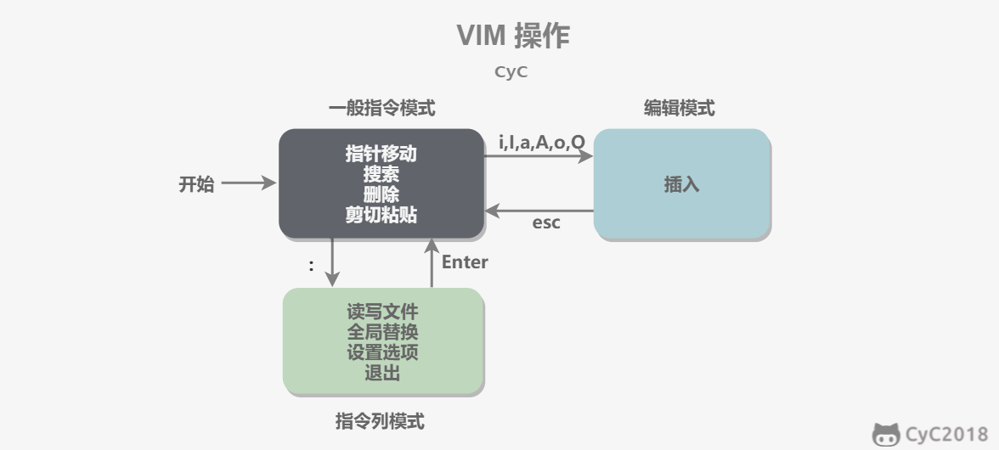
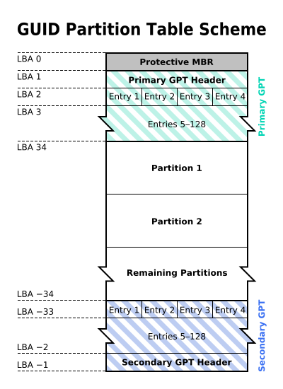

# Linux操作

## 常用操作

### 帮助

* --help参数：提供指令的基本用法与选项介绍。
* man命令：man 是 manual 的缩写，将指令的具体信息显示出来。当执行 `man date` 时，有 DATE(1) 出现，其中的数字代表指令的类型，常用的数字及其类型如下：

| 代号 | 类型                                            |
| ---- | ----------------------------------------------- |
| 1    | 用户在 shell 环境中可以操作的指令或者可执行文件 |
| 5    | 配置文件                                        |
| 8    | 系统管理员可以使用的管理指令                    |

* info命令：man类似，但是 info 将文档分成一个个页面，每个页面可以跳转。

* doc：/usr/share/doc 存放着软件的一整套说明文件。


### 关机

* who：在关机前需要先使用 who 命令查看有没有其它用户在线。

* sync：为了加快对磁盘文件的读写速度，位于内存中的文件数据不会立即同步到磁盘，因此关机之前需要先进行 sync 同步操作。
* shutdown：

```bash
shutdown [-krhc] 时间 [信息]
-k ： 不会关机，只是发送警告信息，通知所有在线的用户
-r ： 将系统的服务停掉后就重新启动
-h ： 将系统的服务停掉后就立即关机
-c ： 取消已经在进行的 shutdown
```


## VIM

### 工作模式

* **一般指令模式（Command mode）**：VIM 的默认模式，可以用于移动游标查看内容。
* **编辑模式（Insert mode）**：按下 "i" 等按键之后进入，可以对文本进行编辑。
* **指令列模式（Bottom-line mode）**：按下 ":" 按键之后进入，用于保存退出等操作。




### 基本操作

* **打开文件**：`vim filename` 打开或新建文件，并将光标置于第一行行首，如果文件不存在，则会新建文件。命令模式下的光标移动：h->左、j->下、k->上、L->右。
* **编辑文件**：如果通过 `vi/vim` 打开一个已经存在的文件，首先进入命令模式，此时输入的任何字符都被视为命令，不能输入内容。
* **保存文件**：要先退出编辑模式（按Esc进入命令模式），然后 `shift + zz`（按住 `shift` + 按两下 `z` 键）即可保存退出当前文件。


### 编辑模式

| 按键 |                功能                |
| :--: | :--------------------------------: |
|  a   |        光标位置右边插入文字        |
|  i   |       光标位置当前处插入文字       |
|  o   |        光标位置下方开启新行        |
|  O   |        光标位置上方开启新行        |
|  I   |        光标所在行首插入文字        |
|  A   |        光标所在行尾插入文字        |
|  s   | 以删除一个字符为条件，切换工作模式 |
|  S   |   以删除一行为条件，切换工作模式   |


### 退出

|     按键      |                     功能                     |
| :-----------: | :------------------------------------------: |
| zz(shift+z+z) |                   保存退出                   |
|      :wq      |                   保存退出                   |
|      :x       |                   保存退出                   |
|  :w filename  |                保存到指定文件                |
|      :q       | 退出，如果文件修改但没有保存，会提示无法退出 |
|      :q!      |                 退出，不保存                 |


### 复制粘贴

|   按键   |                             功能                             |
| :------: | :----------------------------------------------------------: |
|    yy    |                        复制光标所在行                        |
|  [n]yy   |                  复制光标所在行和之后的n行                   |
|    p     |                  粘贴至光标所在位置，下一行                  |
|    P     |                  粘贴至光标所在位置，上一行                  |
|    yw    |           将光标放置于单词的首字符上，复制一个单词           |
| 区域选择 | 将光标放置于待复制区的首字符上，按 "v" 键(左下角出现 "可视" 提示)，使用 h，j，k，l 选择复制区域 |


### 删除和修改

| 按键  |                            功能                             |
| :---: | :---------------------------------------------------------: |
|  dd   |                      剪切光标所在位置                       |
| [n]dd | 删除从当前行开始的n行（准确的说是剪切，剪切和粘贴即为删除） |
|  dw   |           将光标放置于单词首字符上，剪切一个单词            |
|  d0   |                 从光标所在位置，删除到行首                  |
| d$(D) |                 从光标所在位置，删除到行尾                  |
| [n]x  |                      删除光标后n个字符                      |
| [n]X  |                      删除光标前n个字符                      |
|  dG   |           删除光标所在行开始到文件末尾的所有字符            |


### 行定位

|     按键      |           功能            |
| :-----------: | :-----------------------: |
|   Ctrl + f    |     向前滚动一个屏幕      |
|   Ctrl + b    |     向后滚动一个屏幕      |
|      gg       |   跳转到文件第一行行首    |
|       G       |  跳转到文件最后一行行首   |
| [n]G 或 [n]gg | 跳转到指定行，n为目标行数 |


### 文本查找

|   按键   |                      功能                      |
| :------: | :--------------------------------------------: |
| :/字符串 |                 查找指定字符串                 |
|    n     | 寻找下一个（光标需放置在单词的任意一个字符上） |
|    \*    |           匹配一个已有字符，向后寻找           |
|    #     |           匹配一个已有字符，向前寻找           |


### 文本替换

|       按键        |                             功能                             |
| :---------------: | :----------------------------------------------------------: |
|    :s/old/new     | 单行替换，若有多个 "old" 被匹配，使用 "g" 键，否则只会替换一行的首个 |
|    :%s/old/new    | 通篇替换，若有多个 "old" 被匹配，使用 "g" 键，否则只会替换全文的首个 |
| :[n],[ms]/old/new | 替换从 n 开始，到 m 结束的所有 "old"，若有多个 "old" 被匹配，使用 "g" 键，否则只替换第一个 |


### set指令

|   按键    |    功能    |
| :-------: | :--------: |
|  :set nu  |  显示行号  |
| :set nonu | 不显示行号 |


## 磁盘管理

### 磁盘接口

* **IDE（ATA，Advanced Technology Attachment）**：接口速度最大为 133MB/s，因为并口线的抗干扰性太差，且排线占用空间较大，不利电脑内部散热，已逐渐被 SATA 所取代。
* **SATA（Serial ATA）**：也就是使用串口的 ATA 接口，抗干扰性强，且对数据线的长度要求比 ATA 低很多，支持热插拔等功能。SATA-II 的接口速度为 300MB/s，而 SATA-III 标准可达到 600MB/s 的传输速度。SATA 的数据线也比 ATA 的细得多，有利于机箱内的空气流通，整理线材也比较方便。
* **SCSI（Small Computer System Interface）**：即小型机系统接口，SCSI 硬盘广为工作站以及个人电脑以及服务器所使用，因此会使用较为先进的技术，如碟片转速 15000rpm 的高转速，且传输时 CPU 占用率较低，但是单价也比相同容量的 ATA 及 SATA 硬盘更加昂贵。
* **SAS（Serial Attached SCSI）**：是新一代的 SCSI 技术，和 SATA 硬盘相同，都是采取序列式技术以获得更高的传输速度，可达到 6Gb/s。此外也通过缩小连接线改善系统内部空间等。


### 磁盘文件名

Linux 中每个硬件都被当做一个文件，包括磁盘。磁盘以磁盘接口类型进行命名，常见磁盘的文件名如下：

- IDE 磁盘：/dev/hd[a-d]
- SATA/SCSI/SAS 磁盘：/dev/sd[a-p]

其中文件名后面的序号的确定与系统检测到磁盘的顺序有关，而与磁盘所插入的插槽位置无关。


### 分区表

* **MBR**：MBR 中，第一个扇区最重要，里面有主要开机记录（Master boot record, MBR）及分区表（partition table），其中主要开机记录占 446 bytes，分区表占 64 bytes。

  分区表只有 64 bytes，最多只能存储 4 个分区，这 4 个分区为主分区（Primary）和扩展分区（Extended）。其中扩展分区只有一个，它使用其它扇区来记录额外的分区表，因此通过扩展分区可以分出更多分区，这些分区称为逻辑分区。

  Linux 也把分区当成文件，分区文件的命名方式为：磁盘文件名 + 编号，例如 /dev/sda1。注意，逻辑分区的编号从 5 开始。

* **GPT**：扇区是磁盘的最小存储单位，旧磁盘的扇区大小通常为 512 bytes，而最新的磁盘支持 4 k。GPT 为了兼容所有磁盘，在定义扇区上使用逻辑区块地址（Logical Block Address, LBA），LBA 默认大小为 512 bytes。

  GPT 第 1 个区块记录了主要开机记录（MBR），紧接着是 33 个区块记录分区信息，并把最后的 33 个区块用于对分区信息进行备份。这 33 个区块第一个为 GPT 表头纪录，这个部份纪录了分区表本身的位置与大小和备份分区的位置，同时放置了分区表的校验码 (CRC32)，操作系统可以根据这个校验码来判断 GPT 是否正确。若有错误，可以使用备份分区进行恢复。

  GPT 没有扩展分区概念，都是主分区，每个 LBA 可以分 4 个分区，因此总共可以分 4 * 32 = 128 个分区。

  MBR 不支持 2.2 TB 以上的硬盘，GPT 则最多支持到 233 TB = 8 ZB。




### 开机检测程序

* **BIOS（Basic Input/Output System，基本输入输出系统）**：它是一个固件（嵌入在硬件中的软件），BIOS 程序存放在断电后内容不会丢失的只读内存中。

  BIOS 是开机的时候计算机执行的第一个程序，这个程序知道可以开机的磁盘，并读取磁盘第一个扇区的主要开机记录（MBR），由主要开机记录（MBR）执行其中的开机管理程序，这个开机管理程序会加载操作系统的核心文件。

  主要开机记录（MBR）中的开机管理程序提供以下功能：选单、载入核心文件以及转交其它开机管理程序。转交这个功能可以用来实现多重引导，只需要将另一个操作系统的开机管理程序安装在其它分区的启动扇区上，在启动开机管理程序时，就可以通过选单选择启动当前的操作系统或者转交给其它开机管理程序从而启动另一个操作系统。

  下图中，第一扇区的主要开机记录（MBR）中的开机管理程序提供了两个选单：M1、M2，M1 指向了 Windows 操作系统，而 M2 指向其它分区的启动扇区，里面包含了另外一个开机管理程序，提供了一个指向 Linux 的选单。

  安装多重引导，最好先安装 Windows 再安装 Linux。因为安装 Windows 时会覆盖掉主要开机记录（MBR），而 Linux 可以选择将开机管理程序安装在主要开机记录（MBR）或者其它分区的启动扇区，并且可以设置开机管理程序的选单。

  

* **UEFI**：BIOS 不可以读取 GPT 分区表，而 UEFI 可以。


## 文件系统管理

### 目录结构

* **/**：根目录一般只存放目录，在 linux 下有且只有一个根目录，所有的东西都是从这里开始的。
* **/bin; /usr/bin**：可执行二进制文件的目录，如常用命令 ls、tar、mv、cat。
* **/boot**：存放系统启动时用到的一些文件，如内核文件 /boot/vmlinuz，系统引导管理器 /boot/grub。
* **/dev**：存放系统下的设备文件，访问该目录下某个文件，相当于访问某个设备，常用的是挂载光驱 mount /dev/cdrom /mnt。
* **/etc**：存放系统配置文件，不建议在此目录下存放可执行文件。重要的配置文件有  /etc/inittab、/etc/fstab、/etc/init.d、/etc/X11、/etc/sysconfig和/etc/xinetd.d。
* **/home**：存放用户信息的家目录，新增用户账号时，用户的家目录都存放在此目录下。~ 表示当前用户的家目录，而~edu 则表示用户 edu 的家目录。
* **/lib; /usr/lib; /usr/local/lib**：系统使用的函数库的目录，程序在执行过程中，需要调用一些额外的参数时需要函数库的协助。
* **/lost + fount**：系统异常产生错误时，会将一些遗失的片段放置于此目录下。
* **/mnt; /media**：光盘默认挂载点，通常光盘挂载于 /mnt/cdrom 下，也可以选择任意位置进行挂载。
* **/opt**：给主机额外安装软件所摆放的目录。
* **/proc**：此目录的数据都在内存中，如系统核心，外部设备，网络状态，由于数据都存放于内存中，所以不占用磁盘空间，比较重要的目录有 /proc/cpuinfo、/proc/interrupts、/proc/dma、/proc/ioports、/proc/net/* 。
* **/root**：系统管理员 root 的家目录（宿主目录）。
* **/sbin; /usr/sbin; /usr/local/sbin**：放置系统管理员使用的可执行命令，如：fdisk、shutdown、mount 等。与 /bin 不同的是，这几个目录是给系统管理员 root 使用的命令，一般用户只能查看而不能设置和使用。
* **/tmp**：一般用户或正在执行的程序临时存放文件的目录，任何人都可以访问，重要数据不可放置在此目录下。
* **/srv**：服务启动之后需要访问的数据目录，如 www 服务需要访问的网页数据存放在 /srv/www 内。
* **/usr**：应用程序存放的目录。
  * /usr/bin：存放应用程序；
  * /usr/share：存放共享数据；
  * /usr/lib：存放不能直接运行的，却是许多程序运行所必需的一些函数库文件；
  * /usr/local：存放软件升级包；
  * /usr/share/doc：系统说明文件存放目录；
  * /usr/share/man：程序说明文件存放目录；
  * /usr/include：存放头文件。
* **/var**：放置系统执行过程中经常变化的文件。
  * /var/log：存放随时更改的日志文件；
  * /var/log/message：所有的登录文件存放目录；
  * /var/spool/mail：邮件存放的目录；
  * /var/run：程序或服务启动后，其 PID 存放在该目录下。


### 文件分类

* **统一抽象**：Unix/Linux 的数据文件 .mp3、.bmp，程序文件 .c、.h、*.o，设备文件 LCD、触摸屏、鼠标、网络文件Socket等都抽象为文件，使用统一的方式管理。
* **无扩展名**：在 Unix/Linux 操作系统中也必须区分文件类型，通过文件类型可以判断文件属于可执行文件，文本文件还是数据文件，在 Unix/Linux 系统中文件可以没有扩展名。
* **普通文件**：普通文件是计算机操作系统用于存放数据，程序等信息的文件，一般都长期存放于外存储器（磁盘，磁带等）中。普通文件一般包括文本文件，数据文件，可执行的二进制程序文件等。
* **设备文件**：Unix/Linux 系统把每个设备都映射成一个文件，这就是设备文件,用于向 I/O 设备提供连接的一种文件，分为字符设备和块设备文件。字符设备的存取以一个字符为单位，块设备的存取以字符块为单位。每一种 I/O 设备对应一个设备文件，存放在 /dev 目录中，如行式打印机对应 /dev/lp，第一个软盘驱动器对应 /dev/fd0；
* **管道文件**：管道文件也是 Unix/Linux 中较特殊的文件类型，这类文件多用于进程间的通信。
* **软链接文件**：类似于 Windows 下的快捷方式，链接又可以分为软链接（符号链接）和硬链接。

|   文件类型   | 标识符 |
| :----------: | :----: |
|   普通文件   |   -    |
|   目录文件   |   d    |
|   管道文件   |   p    |
|  套接字文件  |   s    |
|  软链接文件  |   l    |
|  块设备文件  |   b    |
| 字符设备文件 |   c    |


### 系统权限

**基本概念**：

* 文件权限就是文件的访问控制权限，即哪些用户和组群可以访问文件以及可以执行什么样的操作。
* Unix/Linux 系统是一个典型的多用户系统，不同的用户处于不同的地位，对文件和目录有不同的访问权限。为了保护系统的安全性，Unix/Linux 系统除了对用户权限作了严格的界定外，还在用户身份认证，访问控制，传输安全，文件读写权限等方面作了周密的控制。
* 在 Unix/Linux 中的每一个文件或目录都包含有访问权限，这些访问权限决定了谁能访问和如何访问这些文件和目录。

**访问用户**：

* **所有者**：即只允许用户自己访问。所有者就是创建文件的用户，用户是所有用户所创建文件的所有者，用户可以允许所在的用户组能访问用户的文件。
* **用户组**：即允许一个预先指定的用户组中的用户访问。用户都组合成用户组，例如：某一类或某一项目中的所有用户都能够被系统管理员归为一个用户组，一个用户能够授予所在用户组的其他成员的文件访问权限。
* **其他用户**：允许系统中的任何用户访问。用户也将自己的文件向系统内的所有用户开放，在这种情况下，系统内的所有用户都能够访问用户的目录或文件。在这种意义上，系统内的其他所有用户就是 other 类用户。

**访问权限**：

* **读权限r**：对文件而言，具有读取文件内容的权限。对目录来说，具有浏览目录的权限。
* **写权限w**：对文件而言，具有新增和修改文件内容的权限。对目录来说，具有删除和移动目录内文件的权限。
* **可执行权限x**：对文件而言，具有执行文件的权限。对目录来说，该用户具有进入目录的权限。
* 第1个字母代表文件的类型，即文件夹 `d`、普通文件 `-`、硬件字符设备 `c`、硬件块设备 `b`、管道文件 `s` 和软链接文件 `l`。
* 后9个字母分别代表三组权限，即文件所有者、用户所在的组和其他用户拥有的读权限 `r`、写权限 `w` 和执行权限 `x`。
  * 第一组权限控制访问自己的文件权限，即所有者权限；
  * 第二组权限控制用户组内访问其中一个用户的文件的权限；
  * 第三组权限控制其他所有用户访问一个用户的文件的权限。


### 组成


### 文件读取


### 磁盘碎片


## Bash


## 管道指令


## 正则表达式

### 普通字符

* 字母，数字，汉字，下划线以及没有特殊意义的标点符号都是普通字符；
* 正则中匹配字符串时，普通字符匹配与之相同的一个字符。


### 转义字符

|                        格式                        |       说明       |
| :------------------------------------------------: | :--------------: |
|                         \n                         |    代表换行符    |
|                         \t                         |      制表符      |
|                        \\\                         |    代表\本身     |
| \^  \$  \.  \(  \)  \{  \}  \?  \+  \*  \|  \[  \] | 匹配这些字符本身 |


### 标准字符集合

| 格式 |                             说明                             |
| :--: | :----------------------------------------------------------: |
|  \d  |                      匹配0-9中任意数字                       |
|  \w  |             匹配任意字母数字下划线，a-z A-Z 0-9              |
|  \s  |          匹配空格，制表符，换行符等空白字符任意一个          |
|  .   | 匹配任意一个字符(除换行符)，如果要匹配包括"\n"在内的所有字符，一般用[\s\S] |


### 自定义字符集合

|   格式    |                说明                |
| :-------: | :--------------------------------: |
|  [ab5@]   |       匹配a或b或5或@任意一个       |
|  [^abc]   | 匹配a，b，c这3个字符之外的任意一个 |
|   [f-k]   |        匹配f~k之间任意一个         |
| [^A-F0-3] |     匹配A~F，0~3之外的任意一个     |


### 量词

| 格式  |                    说明                    |
| :---: | :----------------------------------------: |
|  {n}  |            前面的表达式重复n次             |
| {m,n} |    前面的表达式至少重复m次，最多重复n次    |
| {m,}  |          前面的表达式至少重复m次           |
|   ?   |    前面的表达式出现0或1次，相当于{0,1}     |
|   +   |    前面的表达式至少出现1次，相当于{1,}     |
|   *   | 前面的表达式不出现或出现任意次，相当于{0,} |


### 贪婪/非贪婪

* 匹配次数中的贪婪模式（匹配字符越多越好，默认）；
* 匹配次数中的非贪婪模式（匹配字符越少越好，修饰匹配次数的特殊符号后再加上一个"?"号）。


### 字符边界

| 格式 |                       说明                       |
| :--: | :----------------------------------------------: |
|  ^   |                 匹配的字符串开头                 |
|  $   |                 匹配的字符串结尾                 |
|  \b  | 匹配一个单词边界(前面的字符和后面的字符不全是\w) |


### 选择符和分组

* `|` 分支结构：左右两边表达式之间存在"或"的关系，匹配左边或者右边；
* `()` 捕获组：
  * 在被修饰匹配次数的时候，括号中的表达式可以作为整体被修饰；
  * 取匹配结果的时候，括号中的表达式匹配到的内容可以被单独得到；
  * 每一对括号会分配一个编号，使用()的捕获根据左括号的顺序从1开始自动编号，捕获元素编号为零的第一个捕获是由整个正则表达式模式匹配的文本。
* `(?:Expression)` 非捕获组：一些表达式中，不得不使用()，但又不需要保存()中子表达式匹配的内容，这时可以用非捕获组来抵消使用()带来的副作用。


### 反向引用

每一对 `()` 会分配一个编号，使用 `()` 的捕获根据左括号的顺序从1开始自动编号，通过反向引用，可以对分组已捕获的字符串进行引用。


### 分组别名

|    格式    |                说明                |
| :--------: | :--------------------------------: |
| (?P<name>) |             分组起别名             |
| (?P=name)  | 引用别名为name的分组匹配到的字符串 |


### 预搜索/零宽断言

|   格式   |                  说明                   |
| :------: | :-------------------------------------: |
| (?=exp)  | 断言自身出现的位置的后面能匹配表达式exp |
| (?<=exp) | 断言自身出现的位置的前面能匹配表达式exp |
| (?!exp)  |    断言此位置的后面不能匹配表达式exp    |
| (?<!exp) |    断言此位置的前面不能匹配表达式exp    |


## 进程管理