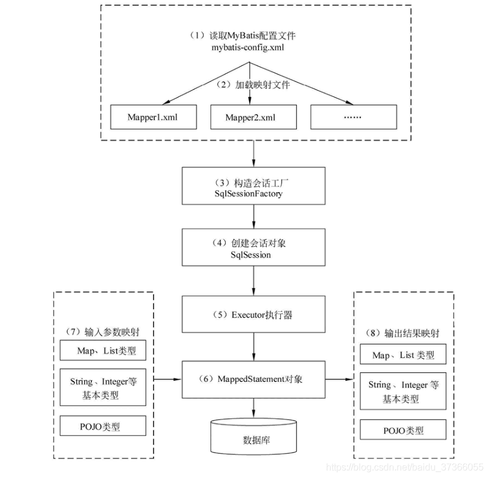
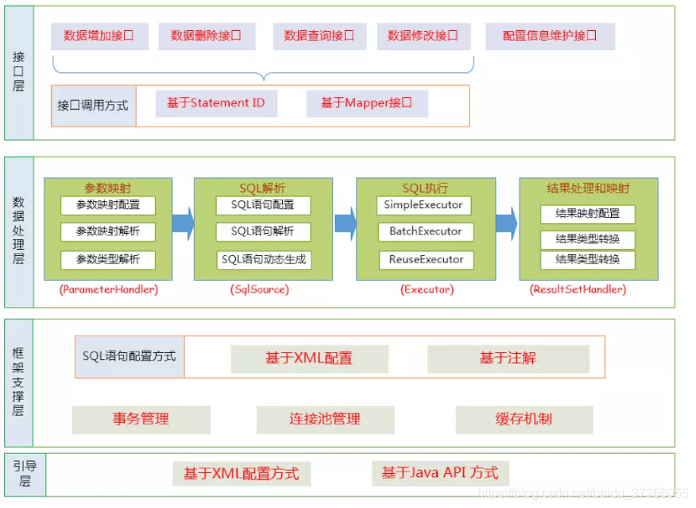
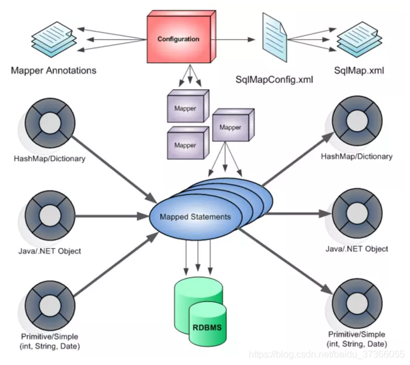

# MyBatis

## 基本概念

### MyBatis概念

MyBatis是一个基于半ORM对象关系映射构建的持久层框架，支持定制化SQL、存储过程和高级映射。MyBatis提供了一种避免传统JDBC冗余代码的开发方式，可以使用XML和注解将原生类型、接口和Java Objects映射为数据库中的记录。

### ORM概念

ORM（Object Relational Mapping，对象关系映射）是一种为了解决关系型数据库表与简单Java对象映射关系的技术。也就是说ORM是通过使用描述对象和数据库直接映射的元数据，将程序中的对象自动持久化到关系型数据库中。

### 传统JDBC开发存在的问题

* 频繁创建数据库连接对象和释放连接，容易造成系统资源的浪费，影响系统的性能。可以使用连接池解决该问题。
* SQL语句的定义、参数设置和结果集的处理都是硬编码的。但在实际生产过程中SQL语句是动态变化的，一旦发生变化，需要重写修改代码、重新编译和发布，不好维护。

### MyBatis如何解决JDBC的问题

* MyBatis通过在mybatis-config.x,ml文件中配置数据库连接池来解决JDBC开发中频繁创建和释放连接的资源浪费问题。
* MyBatis通过在***mapper.xml文件中编写动态SQL语句，并通过Java代码传递参数，MyBatis在运行时动态拼接SQL。

### MyBatis的优缺点

优点：

* 基于动态SQL语句编程，更灵活且容易编写出复杂的SQL。且SQL是编写在XML文件中，避免了SQL语句和Java代码的耦合，便于统一管理。且提供动态XML标签，支持复用。
* 提供映射标签，支持对象与数据库的ORM字段关系映射。提供对象关系映射标签，支持对象关系组件的维护。
* 能被Spring很好的集成。

缺点：

* mapper文件中的SQL语句编写时工作量较大。
* 编写出的SQL语句存在数据库的适用性问题。

### 适用场景

* 适用于SQL复杂度高，且需要灵活变化的项目。
* 也适用于对性能有较高要求的项目，如互联网项目。

## 工作原理

* 读取mybatis-config.xml，即MyBatis的全局配置文件，其中配置了MyBatis的运行环境等信息，如数据库连接信息。
* 加载mapper映射文件，该文件中配置了操作数据库的SQL语句。该文件的位置需要在mybatis-config.xml中配置，可以配置多个，每一个对应数据库的一张表。
* 通过已经加载的MyBatis环境信息构造会话工厂SqlSessionFactory。
* 由会话工厂创建SqlSession会话对象，该对象中包含了执行SQL语句的所有方法。
* MyBatis底层定义了一个Executor接口用于操作数据库，它会根据SqlSession传递的参数动态生成SQL语句，同时负责查询缓存的维护。
* 在Executor接口执行的方法中有一个MappedStatement类型的参数，该参数是对映射信息的封装，用于存储要映射的SQL语句的id和参数。
* 对输入的参数进行映射，输入参数类型可以是Map、List等集合类型，也可以是基本数据类型和Object类型。输入参数映射过程类似于JDBC对preparedStatement对象设置参数的过程。
* 对输出的结果进程映射，输出结果类型可以是Map、List等机会类型，也可以是基本数据类型和Object类型。输出结果映射过程类似于JDBC对结果集的解析过程。

## 功能架构

* **API接口层**：提供给外部使用的API接口，开发人员通过这些本地的API来操作数据库。接口层接收到调用请求就会调用数据处理层来完成具体的数据处理。
* **数据处理层**：负责具体的SQL查找、解析、执行和结果映射等处理。主要目的是根据调用的请求完成一次数据库操作。
* **基础支撑层**：负责最基础的功能支撑，包括连接管理、事务管理、配置加载和缓存处理，这些都是通用的功能，被抽取出来作为基础组件，为上层的数据处理层提供支持。

## 架构设计

* **加载配置**：MyBatis的配置主要来源于配置文件和代码注解，将每一个SQL配置信息都加载成一个MappedStatement对象，包括传入参数映射配置、执行的SQL语句、结果映射配置。
* **SQL解析**：当API接口层接收到调用请求时，会一并接收SQL的ID和传入参数。MyBatis会根据SQL的ID获取对应的MappedStatement，然后根据传入参数对其进行解析，解析后可以得到最终要执行的SQL。
* **SQL执行**：将解析后的SQL提交到数据库进行执行，并得到操作结果。
* **结果映射**：将SQL的执行结果按照映射的配置进行转换，并返回结果。

## 预编译

## Executor执行器

## 延迟加载

## 映射器#{}和${}的区别