# MySQL

## 存储引擎

### MyISAM的特点

* 不支持事务操作，也不存在ACID特性，这一设计是为了性能和效率考虑的。
* 不支持外键操作，强行添加外键也不会起作用。
* 默认的锁粒度是表级锁，并发性能较、加锁较块、锁冲突较少并且不容易发生死锁。
* 会在磁盘上存储三个文件，文件名和表名相同，扩展名分别是 `.frm` 用于存储表的定义、`.MYD` 用于存储数据和 `.MYI` 用于存储索引。MyISAM只缓存索引文件，并不缓存数据文件。
* 支持的索引有全文索引、B-Tree索引和R-Tree索引。Full-Text是为了解决针对文本的模糊查询效率低的问题。B-Tree是所有索引节点都按照B树结构存储，所有的索引和数据节点都在叶子节点。
* 数据库所在的主机如果宕机，MyISAM数据文件容易损坏，且不具备安全恢复的能力，。
* 增删改查性能方面，SELECT性能更高，适用于查询较多的情况。


### InnoDB的特点

* 支持事务操作，具有事务的ACID和隔离特性，默认的隔离级别是可重复读，是通过MVCC实现的。
* 支持外键操作。
* 默认的锁粒度是行级锁，并发性能较好，但更容易发生死锁的情况。
* InnoDB也有 `.frm` 的存在，不同的是InnoDB的表数据和索引数据是存储在一起的，都位于B+树的叶子节点上，而MyISAM的表数据和索引数据是分开的。
* 具有安全日志文件，该日志文件用于恢复因数据库崩溃或其他情况导致的数据丢失问题，保证数据的一致性。
* InnoDB和MyISAM支持的索引类型相同，但具体的实现会因为文件结构的不同而具有较大差异，即聚簇和非聚簇索引。
* 增删改查性能方面，增删改的性能要更优秀。


### MyISAM和InnoDB的区别

* **锁粒度**：InnoDB的锁粒度为行级锁，MyISAM的锁粒度为表级锁。由于行级锁需要对每一行单独加锁，所以锁的开销更大，但带来了更高的并发支持和解决脏读、不可重复读的问题，也相对来说更容易发生死锁。
* **可恢复性**：由于InnoDB是由事务日志的，所以在产生数据库崩溃等问题后，可以根据日志文件进行恢复。而MyISAM则没有事务日志。
* **查询性能**：MyISAM要优于InnoDB，因为InnoDB在查询过程中需要维护数据缓存，且查询过程是先定位到行所在的数据块，然后再从数据块中定位到要查找的行。而MyISAM则可以直接定位到数据所在的内存地址。
* **表结构文件**：MyISAM的表结构文件包括 `.frm `、`.MYI`、`.MYD`。而InnoDB的表结构文件包括 `.ibd` 和 `.frm`。
* **MVCC支持**：只有InnoDB支持，用于应对高并发的事务，MVCC比单纯的加锁更高效，MVCC只在 `READ COMMITIED` 和 `REPEATABLE READ` 两个隔离级别下工作，且可以使用乐观锁和悲观锁来实现。

|              |   MylSAM   |           InnoDB           |
| :----------: | :--------: | :------------------------: |
|   索引类型   | 非聚簇索引 |          聚簇索引          |
|   支持事务   |     否     |             是             |
|   支持表锁   |     是     |             是             |
|   支持行锁   |     否     |             是             |
|   支持外键   |     否     |             是             |
| 支持全文检索 |     是     |             是             |
| 适合操作类型 | 大量select | 大量insert、delete、update |


## 基础架构

从整体上看，MySQL可以分为Server层和存储引擎层：

* **Server层**：包括连接器、分析器、优化器和执行器，包括了大部分MySQL的核心功能，所有跨存储引擎的功能也会在该层实现，如存储过程、触发器、视图等。
* **存储引擎层**：包括MySQL常见的存储引擎，如MyISAM、InnoDB和Memory等，默认也是最常用的是InnoDB。存储引擎可以在创建表的时候通过 `ENGINE = <Storage Engine>` 手动指定  。

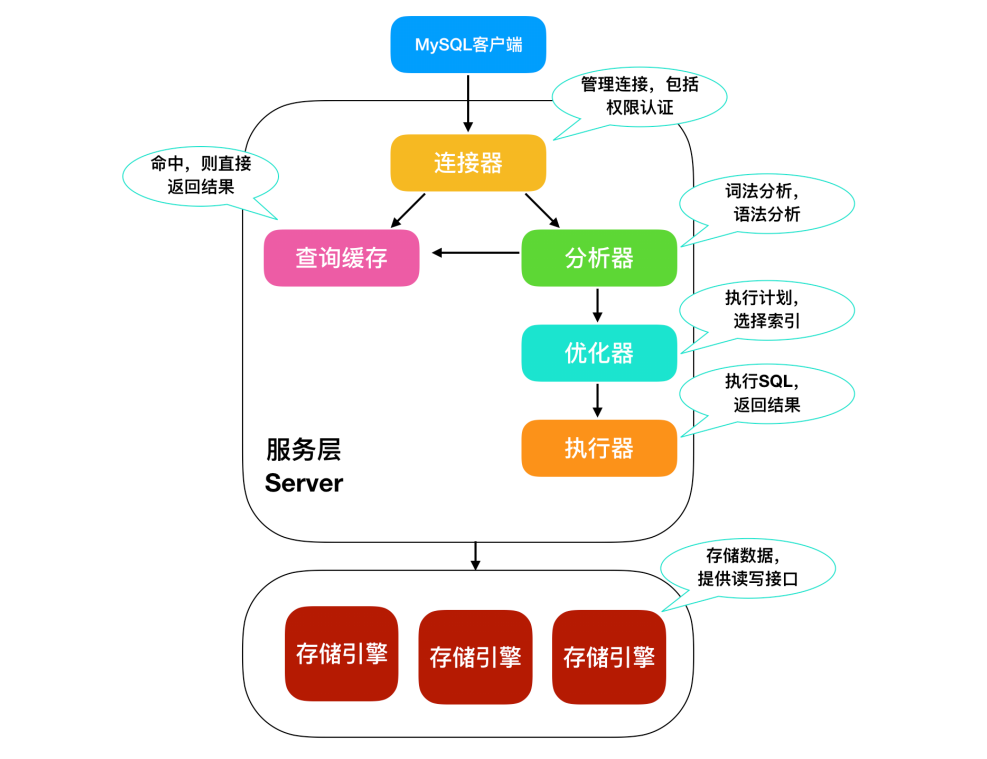

### 连接器

MySQL需要完成登录认证后才能使用，所以需要一个连接器去连接用户和数据库。当MySQL的客户端和服务端连接建立后，连接器会通过用户名密码验证完成身份的认证，若认证成功，再通过权限表中的记录来判定用户的权限。


### 查询缓存

连接完成后，客户端就可以提交SQL语句执行了。当MySQL服务端收到一个执行请求后，会先去查询缓存中查看是否执行过这条SQL语句，之前执行过的语句及结果会以k-v格式存储在内存中。如果能在缓存中直接查到这条SQL，那么可以直接返回结果，如果缓存中不存在，则会执行后续的阶段，并在执行完成后将结果放入查询缓存中。

**注**：若是MySQL对其中的一张表执行了更新操作，那么所有的查询缓存都会失效，对于更新频繁的数据库来说，查询缓存效率低。

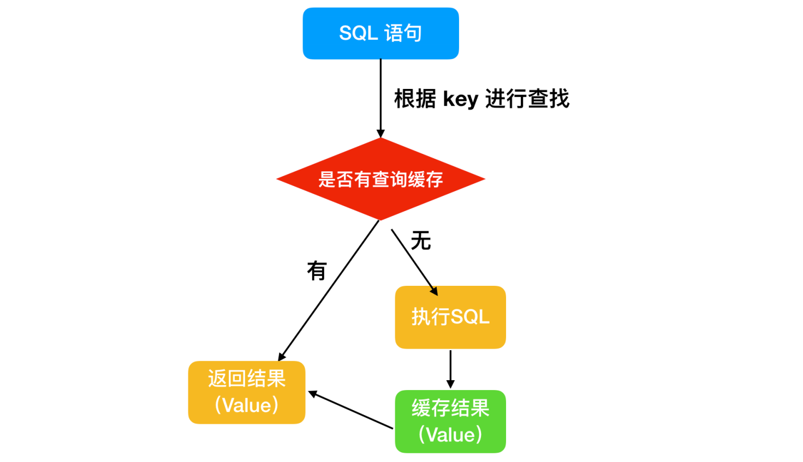


### 分析器

如果没有命中查询缓存，就会开始真正的执行SQL语句。

* 分析器会先进行词法分析，就是将代表SQL语句的字符串按空格解析出具体代表的含义；
* 然后再进行语法分析，就是根据词法分析的结果，判断是否符合MySQL的语法，若不正确，则会提示 `You have an error in your SQL syntax`。 


### 优化器

当一条SQL语句通过分析器的两步检查后，就证明是一条合法的SQL语句。但是在执行之前还需要经过优化器的处理，优化器会判断使用了哪种索引和连接，所谓的优化就是确定一个效率最高的执行方案。


### 执行器

在执行阶段，执行器首先会判断提交SQL的用户有没有执行该条SQL的权限。若具有权限，就会打开表继续执行，打开表的时候，执行器就会根据表的引擎定义，去使用该引擎提供的接口。至此，一条SQL执行完毕。


### SQL的执行顺序

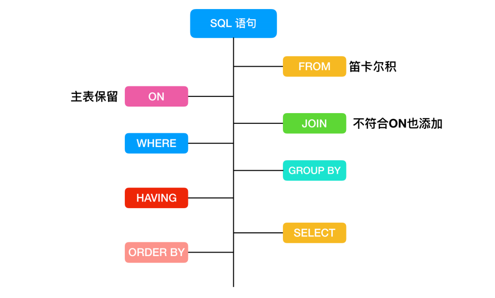

```sql
SELECT DISTINCT
	< select_list >
FROM
	< left_table > < join_type >
JOIN 
	< right_table > 
ON 
	< join_condition >
WHERE
	< where_condition >
GROUP BY
	< group_by_list >
HAVING
	< having_condition >
ORDER BY
	< order_by_condition >
LIMIT < limit_number >
```

* **FROM**：首先会对FROM关键字两边的表执行连接操作（MySQL可以在FROM后面加多张表，隐式的指定连接），形成笛卡尔积，这时会产生一个虚表VT1。所谓的虚表（Virtual Table）就是一个视图，其映射的数据可能会来自多张表的执行结果。
* **ON**：然后对FROM连接的结果进行ON关键字后的条件筛选，生成虚拟表VT2，该虚表中存储符合条件的记录。
* **JOIN**：如果通过JOIN关键字显式的指定连接，那么会将关键字后的表添加进来。如果是 `OUTER(left join、right join)`，那么就添加外部行，如果是left/right join，则将左/右表添加进来。从而生成新的虚拟表VT3。
* **WHERE**：执行WHERE关键字后的过滤条件，对上一步生成的虚拟表应用WHERE过滤，生成新的虚拟表VT4。
* **GROUP BY**：根据GROUP BY后指定的列，对VT4表中的记录进行分组操作，产生虚拟表VT5。
* **HAVING**：HAVING会针对分组后的数据进行过滤操作，将符合条件的记录放在VT6中。
* **SELECT**：对VT6中的数据按照SELECT指定的列进行筛选，生成VT7。
* **DISTINCT**：对VT7中的记录进行去重操作，生成VT8。当然，如果使用了GROUP BY语句，那么DISTINCT去重操作是多余的，因为分组时会将列中唯一值分为一组，同时只为每一组返回一行记录，那么所有的记录都是不相同的。
* **ORDER BY**：最后应用ORDER BY子句，按照指定的列进行排序，生成VT8。此时返回一个游标而不是虚拟表。


### 临时表

临时表就是在SQL语句执行过程中，创建的一种用于存储中间结果集的表。临时表只对当前连接可见，当连接关闭时，临时表会被删除并释放所有空间。MySQL在以下的几种情况会产生临时表：

* 使用UNION查询会产生临时表。UNION有两种，一种是普通的UNION，一种是UNION ALL，都用于联合查询。区别是UNION会去掉两个表中的重复数据，而UNION ALL则会返回所有行。
* 使用TEMPTABLE算法或是UNION查询中的视图会产生临时表。TEMPTABLE算法是一种创建临时表的算法，它是将结果放置到临时表中，然后使用该临时表进行相应的查询。
* ORDER BY和GROUP BY的子句不一样时会产生临时表。
* DISTINCT查询并且加上ORDER BY时会产生临时表。
* SQL中用到SQL_SMALL_RESULT选项时，如果查询结果比较小，可以加上SQL_SMALL_RESULT来优化产生临时表。
* FROM中的子查询会产生临时表。
* EXPLAIN查询执行计划结果的Extra列中，如果使用Using Temporary就表示用到了临时表。


### 各种连接

* **外连接（Outer Join）**：
  * **左外连接（Left Outer Join）**：这种连接方式会显示左表不符合条件的数据行，右边不符合条件的数据行显示NULL。
  * **左外连接（Right Outer Join）**：这种连接方式会显示右表不符合条件的数据行，左表不符合条件的数据行显示NULL。
  * **全外连接（Full Outer Join）**：两边不符合条件的数据行都会显示。
* **内连接（Inner Join）**：结合两个表中相同的字段，返回和关联字段相符的记录。
* **交叉连接（Cross Join）**：就是笛卡尔积在SQL中的实现，在交叉连接中，随便增加一个表的字段，都会对结果造成很大影响。在MySQL的语法中，使用 `CROSS FROM` 或 `FROM table1, table2` 都能表示交叉连接。
  * **笛卡尔积（Cartesian product）**：集合 `A={0, 1}` 和 `B={2, 3, 4}`，二者的笛卡尔积就是 `A*B={(0, 2), (1, 2), (0, 3), (1, 3), (0, 4), (1, 4)}` 和 `B*A={(2, 0), (2, 1), (3, 0), (3, 1), (4, 0), (4, 1)}`。
* **全连接（Full Join）**：MySQL中可以使用UNION或UNION ALL进行全连接，`(select colum1, colum2, ..., columN from table1) union (select colum1, colum2, ..., columN from table2)`。


## 索引原理

### MySQL基本存储结构


* MySQL的基本存储结构是基于页式的存储结构；
* 各个数据页之间可以组成一个双向链表；
* 每个数据页中的记录又可以组成一个单向链表：
  * 每个数据页都会为其内部存储的记录创建一个页目录。当通过主键查找某条记录的时候可以在页目录中使用二分查找算法快速定位到对应的槽，然后再遍历该槽对应分组中的记录即可快速找到指定的记录；
  * 若是以其他非主键的列作为搜索条件，则只能从头开始遍历单链表中的每条记录。
* 当提交 `select * from user where name = 'albert';` 这种没有进行任何优化的SQL语句时，默认的执行流程：
  * 首先需要遍历双向链表，定位到记录所在的页；
  * 由于不是根据主键查询，所以只能遍历所在页的单链表查找相应的记录。


### 局部性原理

* **概念**：程序信息在不全部装入主存的情况下就可以保证正常的运行；
* **空间局部性**：程序和数据的访问都有聚集成群的倾向，在一个时间段内，仅使用部分（如数组）；
* **时间局部性**：最近被访问过的程序代码和数据，很快又再次被访问的可能性很大（如循环操作）。


### 磁盘结构/磁盘预读

**磁盘结构**：

* 磁盘是一种能够大量保存数据（GB~TB级别），但读取速度较慢（因为涉及到机器操作，读取速度为ms级）的硬件存储器。

* 磁盘是由**盘片**构成，每个盘片有两个面，称为**盘面**。盘片中央有一个可以旋转的**主轴**，会让盘片以固定的速度旋转（通常是5400rpm或7200rpm），一个磁盘中包含多个这样的盘片并封装在一个密闭的容器中。盘片的每个表面是由一组称为**磁道**的同心圆组成，每个磁道被划分为一组**扇区**，每个扇区包含相等数量的数据位（通常是512byte），扇区之间由一些间隙隔开，这些间隙中不存储数据。

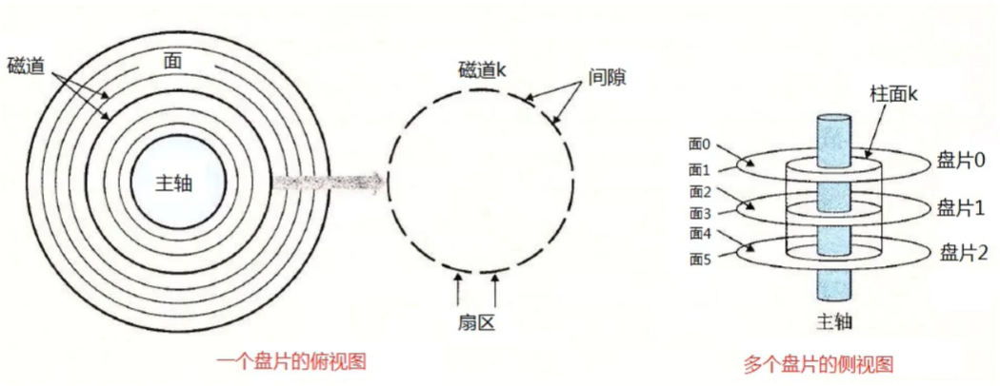

* 磁盘是用**磁头**来读写存储在盘片表面的数据位，而磁头连接到一个**移动臂**上，移动臂沿着盘片半径前后移动，可以将磁头定位到任何磁道上，这被称为寻道操作。一旦定位到磁道后，盘片转动，磁道上的每个位经过磁头时，读写磁头就可以感知和修改该位的值。对磁盘的访问时间分为寻道时间、旋转时间和传送时间。

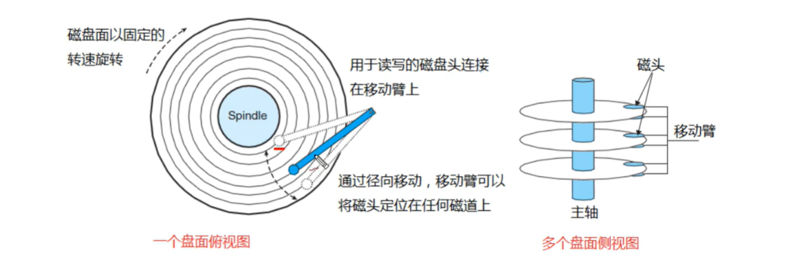


**磁盘预读**：

* **为什么要预读？**由于存储介质的特性，磁盘本身的存取速度就慢于主存，再加上机械运动的消耗，因此为了提高效率，要尽量减少磁盘IO，减少读写操作。为了达到这个目的，磁盘往往不会严格的按需读取，而是每次都会预读，即使只需要一个字节，磁盘也会从这个位置开始，顺序向后读取一定长度的数据放入内存，这样做的理论依据是计算机科学中著名的局部性原理（时间、空间局部性）。由于磁盘顺序读取的效率很高（不需要寻道，只需要旋转），因此预读可以提高IO的效率。

* **页存储**：页是计算机管理内存的逻辑块，硬件及操作系统往往将主存和磁盘存储区分割为连续的大小相等的块，每个存储块被称为一页（1024字节或其整数倍），预读的长度一般为页的整数倍。主存和磁盘以页为单位交换数据，当程序要读取的数据不在主存中时，会触发一个缺页异常，此时系统会向磁盘发出信号，磁盘会找到数据的起始位置并向后连续读取一页或几页装入内存中，然后异常中断返回，程序继续执行。

* **文件系统结构设计**：文件系统的设计上利用了磁盘预读的原理，将一个结点大小设为等于一个页，这样每个结点只需要一次IO操作就可以完全载入。那么3层的B树可以容纳 `1024*1024*1024` 将近10亿左右的数据，如果使用二叉树类结构来存储，则需要30层的深度。假设操作系统一次读取一个结点，且根结点保留在内存中，那么B树在10亿个数据中查找目标，只需要最大3次的磁盘IO就可以找到目标，但二叉树类结构如红黑树则需要30次以内的磁盘IO，因此B树做为文件系统的底层结构远远优于二叉树。


### 索引基本概念

#### 什么是索引？

* 是帮助数据库高效获取数据的一种数据结构；
* 索引存储在文件系统中；
* 索引的文件存储形式和存储引擎有关；
* 索引文件的结构通常为哈希表或B+树等。


#### 为什么使用索引？

* 可以大幅加快数据的检索速度，即大幅减少检索的数据量；
* 帮助服务器避免排序和临时表；
* 将随机IO变为顺序IO；
* 加快表和表之间的连接，在实现数据的参照完整性方面有意义。


#### 为什么不对表中的每列都创建索引呢？

* **动态维护**：当表中的数据进行增加、删除和修改时，索引也会动态维护，就降低了数据的维护速度；
* **额外空间占用**：索引需要占用额外的物理空间，除了数据表需要占用数据空间，每一个索引还要占一定的物理空间，如果要建立聚簇索引，那么需要的空间就会更大；
* **时间消耗**：创建索引和维护索引要耗费时间，这种时间随着数据量的增加而增加。


#### 索引的分类

* **主键索引**：唯一性索引，每个表只能有一个；
* **唯一索引**：索引列中的值只能出现一次，即必须唯一，但值可以为空；
* **普通索引**：基本的索引类型，值可以为空，没有唯一性的限制；
* **全文索引**：FULLTEXT类型的索引，可以在varchar、char和text类型的列上创建；
* **组合索引**：由多个列组成的索引，专门用于组合搜索。


### MySQL索引结构的选择

#### 为什么不使用哈希表？

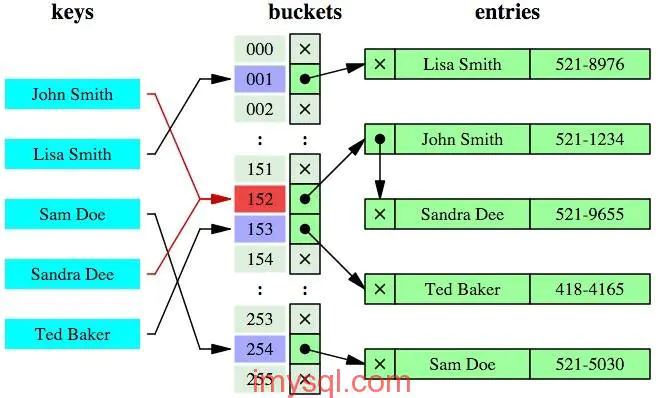

* 需要将数据文件添加到内存中，耗费内存空间；
* 如果所有的查询都是等值查询，哈希表的性能会很高，但实际生产环境下范围查询的情况非常多，这时哈希表就不太合适了。


#### 为什么不使用二叉树/红黑树？

一棵树结构在极端的情况下（如：元素有序的被插入），会退化为链表，导致树的查询优势不复存在。

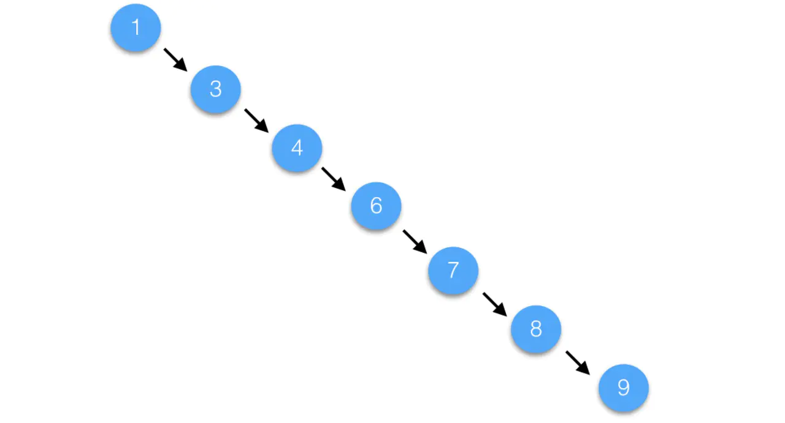

二分查找树/红黑树都是二叉树，每个节点最多只能有两个子节点，在特殊情况下都会导致树的深度过深而造成IO次数变多，影响数据的查询效率。并且红黑树为了保证平衡的旋转操作也会影响整体的效率。

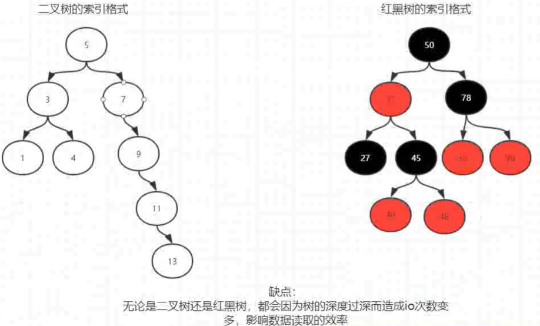


#### 为什么不使用B树？

**B树的特点**：是所有键值分布在整棵树中。一次搜索有可能在非叶子节点就会结束，在关键字全集内做一次查找，性能接近二分查找。每个节点最多拥有m棵子树。

* 根节点至少拥有2棵子树；
* 分支节点至少拥有m/2棵子树（分支节点就是除根节点和叶子节点外的节点）；
* 所有叶子节点都在同一层，每个分支节点最多可以拥有m-1个key，并且以升序排序。

**B树索引原理**：每个结点占用一页（InnoDB是16kb），一个结点上有**2个升序排序的键值+对应数据记录+3个指向子树根节点的指针**，指针存储的是子节点所在页的地址。如下图所示，2个键值划分成的3个范围域对应3个指针指向的子树的数据范围域。以根节点为例，关键字为16和34，P1指针指向的子树数据范围小于16，P2指针值指向的子树数据范围为16~34，P3指针指向的子树的数据范围大于34。

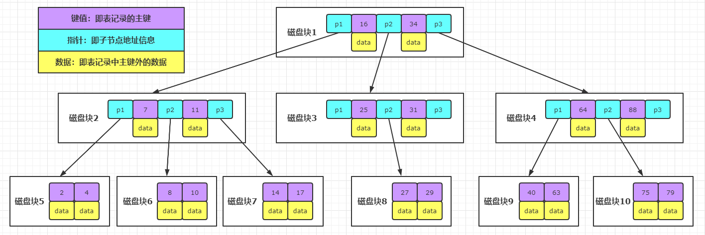

**B树索引根据关键字28查找记录的过程**：

1. 根据根结点找到磁盘块1，读入内存（磁盘IO第1次）；
2. 比较出关键字28在（16，34）区间内，获取磁盘块1的P2指针；
3. 根据P2指针找到磁盘块3，读入内存（磁盘IO第2次）；
4. 比较出关键字28在（27，29）区间内，获取磁盘块3的P2指针；
5. 根据P2指针找到磁盘块8，读入内存（磁盘IO第3次）；
6. 在磁盘块8中的关键字列表中找到关键字28，并读取其对应的记录。

**缺点**：每个结点都有键值和其对应的记录，但每个页存储空间是有限的，如果记录比较大的话会导致每个结点存储的键值数量变小。当结点存储的数据量很大时会导致树的深度加深，即会增大查询时磁盘IO的次数，进而影响查询性能。


### B+树索引原理

#### B+树索引结构

**B+树索引和B树索引的区别**：B+Tree的分支结点不会再包含记录而是包含更多的键值和指针，这样做是为了降低树的高度以减少磁盘的IO次数，同时也能将数据的范围细分为更多的区间，区间越多，检索速度越快。

* B+Tree结构的索引只有叶子结点包含记录，分支结点只包含键值和指针；
* 叶子结点之间通过指针相互连接（符合磁盘预读的特性），使顺序查询性能更高。
* B+Tree上有两个头指针，一个指向根结点，另一个指向键值最小的结点，且所有叶子结点构成了一个环形链表结构。因此可以对B+Tree进行两种查找操作，一种是根据主键进行范围查找和分页查找，另一种就是从根结点开始进行随机查找。

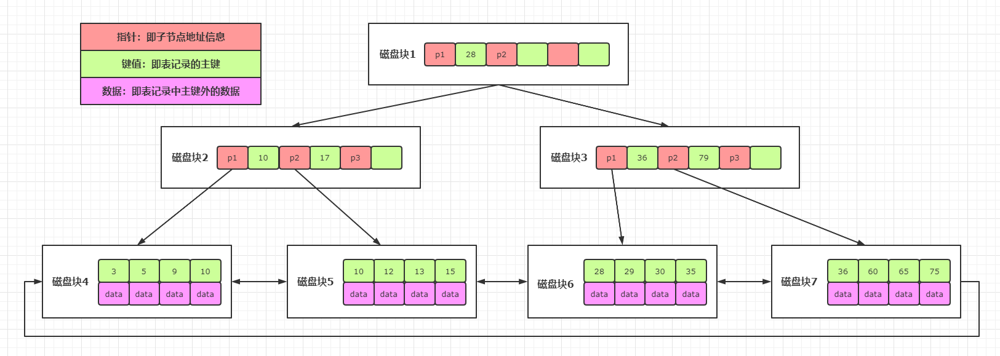


#### InnoDB引擎实现的B+树索引

**聚簇索引**：InnoDB的文件存储方式是索引和数据存放在同一个文件中，所以叶子节点中之间包含数据记录（只有通过主键建立的索引才是聚簇索引）。InnoDB默认通过B+Tree结构对主键创建索引，然后叶子节点中存储记录，如果不存在主键，则会选择唯一键，如果没有唯一键，那么会生成一个6位的row_id来作为索引。

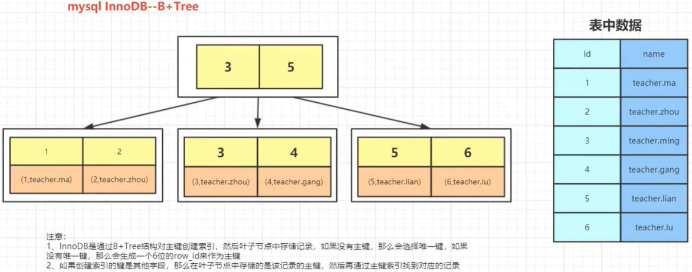

**回表**：如果是由其他字段创建的索引，那么在叶子节点中存储的是其对应记录的主键，之后再根据主键去主键索引中获取记录，这个步骤称为回表。这种通过其他字段创建的索引是非聚簇索引。

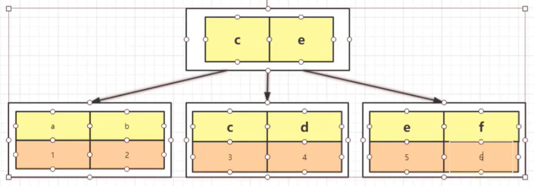


#### MyISAM引擎实现的B+树索引

**非聚簇索引**：MyISAM的文件存储方式是索引和数据分开存放为两个文件，B+Tree中叶子结点包含的是数据记录的地址。

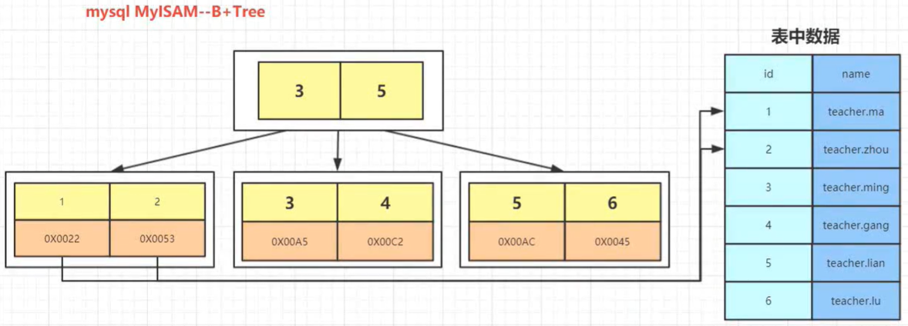


### 使用索引的注意事项

* 在经常需要搜索的列上创建索引，可以加快搜索的速度；
* 在经常使用在 `where` 上的列创建索引，加快条件的判断速度；
* 在经常需要排序的列上创建索引，因为索引会完成排序，这样查询可以利用索引的排序，加快排序查询的时间；
* 对于中大型表来说索引都是非常有效的，但是特大型表的话维护开销会很大，不适合创建索引；
* 在经常使用在 `join` 上的列使用，这些列主要是一些外键，可以加快 `join` 的速度；
* 避免在 `where` 子句中对字段使用函数，这会造成索引无法命中；
* 在InnoDB中使用与业务无关的自增主键，而不要使用业务主键；
* 删除长期未使用的索引，不使用的索引会造成不必要的性能损耗；

* 选择索引和编写利用这些索引的原则：

  * 单行访问速度很慢，如果服务器从存储器中读取一个数据块只是为了获取其中一行，那么就浪费了很多工作，最好的情况是读取的块中能包含尽可能多的所需行，提高效率；
  * 按顺序访问范围数据是很快的，是因为顺序IO不需要多次磁盘寻道，所以比随机IO要快很多，还有就是如果服务器能够按需要的顺序读取数据，就不再需要额外的排序操作；
  * 使用**索引覆盖**查询效率是很高的，即如果一个索引包含了查询所需的所有列，那么存储引擎就不需要再回表查找需要的行。


### 最左前缀匹配原则

**概念**：MySQL可以为多个列按照一定的顺序建立联合索引，如：User表的nam和city字段添加联合索引 `(name, city)`。所谓的最左前缀原则是如果查询时查询条件精确匹配索引左边的连续一列或几列，则可以命中索引。

* 若查询的时候两个条件都被使用，但是顺序不同，那么查询引擎可以根据联合索引的顺序进行优化，使查询能够命中索引；
* 根据最左前缀匹配原则，再创建联合索引时，索引字段的顺序需要考虑字段值去重后的个数，较多的放在前面，ORDER BY子句也遵循此规则。

```sql
--可以命中索引
select * from user where name='albert' and city='hz';
--可以命中索引
select * from user where name='ablert';
--无法命中索引
select * from user where city='hz';
```


## 事务原理

### 事务的四大特性

* **原子性（Atomicity）**：事务是最小的执行单位，不允许分割。事务的原子性确保事务中的操作要么全都完成，要么都不完成；
* **一致性（Consistency）**：执行事务前后，数据保持一致，多个事务对同一个数据读取的结果是相同的；
* **隔离性（Isolation）**：并发访问数据库时，一个用户的事务不被其他事务所干扰，各个并发事务之间的数据库是独立的；
* **持久性（Durability）**：一个事务被提交之后，其对数据库中数据的改变是持久的，即使数据库发生故障也不应该对其有任何影响。


### 事务并发带来的问题

* **脏读（Dirty Read）**：一个事务读取到了另一个事务未提交的数据。事务B在执行过程中修改了数据X，在未提交之前，事务A读取了X，而事务B却回滚了，这时事务A读取的X就是脏数据，就形成了脏读的现象。即当前事务读到的是其他事务想要修改但没有修改成功的数据。脏读的本质就是因为操作完数据后就立即释放了锁，导致读数据的一方可能读取的是无用或错误的数据。
* **丢失更新（Lost to modify）**：两个事务同时进行更新，后一个事务的更新覆盖了前一个事务的更新。丢失更新是数据没有保证一致性导致的，如：事务A修改了一条记录，事务B在事务A提交之后也进行了一次修改并且提交，当事务A查询的时候，会发现刚才修改的内容没有被正确体现，好像更新丢失了一样。
* **不可重复读（Unrepeatableread）**：一个事务读取到另一个事务修改（update操作）成功的数据。事务A首先读取数据X，在执行接下来的逻辑前，事务B将数据X修改并提交了，然后事务A再次读取时发现前后两次读到的数据不匹配，这种情况就是不可重复读。即同一事务前后两次读取间隔存在数据已被其他事务修改的情况，导致前后不匹配。
* **幻读（Phantom Read）**：一个事务读取到另一个事务插入或删除（insert或delete操作）成功的数据。事务A首先根据条件获得了N条数据，然后事务B增加或删除了M条符合A查询条件的数据，从而导致事务A再次查询发现有N+M或N-M条数据，就产生了幻读。即同一事务前后两次读取存在前一次和后一次读出的数据集不一致的情况，导致前后不匹配。


### 事务的隔离级别

* **读未提交（Read uncommitted）**：会出现脏读、不可重复读、幻读。
* **读已提交（Read committed）**：会出现不可重复读、幻读。
  * **避免脏读**：将释放锁的位置调整到事务提交之后，在事务提交之前，其他任何用户都无法对数据进行操作。
* **可重复读（Repeatable read）**：会出现幻读。
  * **避免不可重复读**：Read committed是语句级别的快照，每次读取的数据都是最新版本，所以会出现被其他事务影响的情况。Repeatable read则通过事务级别的快照，每次读取的数据都是当前事务的版本，即使数据被修改了，本次操作也只会读取当前快照的版本。
  * **如何避免幻读？**：MySQL的Repeatable read隔离级别+GAP间隙锁就可以处理幻读。
* **可串行化（Serializable）**：事务串行化，避免所有并发的问题。


## 锁原理

### 锁机制概述

从锁的粒度可以将MySQL的锁分为表锁和行锁：

* **表锁**：开销小，加锁快。不会出现死锁。锁定粒度大，发生锁冲突的概率高，并发度低；
* **行锁**：开销大，加锁慢。会出现死锁。锁定粒度小，发生锁冲突的概率高，并发度高。

InnoDB支持表锁和行锁，MyISAM仅支持表锁。InnoDB只有通过索引条件检索数据才使用行级锁，否则将使用表锁，即InnoDB的行锁是基于索引的。


### 什么是表锁？

* MySQL的表锁分为表读锁（Table Read Lock）和表写锁（Table Write Lock）；
* 二者遵循读锁共享，写锁互斥的原则。即读读操作不阻塞，读写操作阻塞，写写操作阻塞：
  * 读读不阻塞：当前用户在对表进行读操作时不会加锁，其他用户也可以对该表进行读操作；
  * 读写阻塞：当前用户在对表进行读操作时会加锁，其他用户不能对该表进行写操作，反之亦然；
  * 写写阻塞：当前用户在对表进行写操作时会加锁，其他用户页不能对该表进行写操作。


### 什么是行锁？

* **分类**：MySQL的行锁分为共享锁（S锁）和排他锁（X锁）；
* **共享锁**：允许一个事务去读取一行，阻止其他事务获得相同数据集的排他锁，但依然可以获得共享锁。共享锁也叫做读锁，指多个用户可以同时读取同一个资源，但不允许其他用户修改；
* **排他锁**：只允许获得锁的事务操作数据，会阻止任何其他事务获取相同数据集的共享锁和排他锁。排他锁也叫做写锁，会阻塞其他的写锁和读锁。


### MVCC

* **MVCC（Multi-Version Concurrency Control）多版本并发控制**：可以简单的认为是行锁的一个升级，事务的隔离就是通过锁机制来实现的。
* **快照**：表锁中读写操作是阻塞的，基于提升并发性能的考虑，MVCC一般读写是非阻塞的。即通过一定机制生成一个数据请求时间点的一致性数据快照（Snapshot），并用这个快照来提供一定级别（语句级或事务级）的一致性读取。从用户的角度来看，就像是数据库可以提供同一数据的多个版本。
  * **语句级别快照**：对单条语句操作的数据生成请求时间点的一致性快照，如：读已提交隔离级别。
  * **事务级别快照**：对一个事务操作的数据生成请求时间点的一致性快照，如：可重复读隔离级别。


### 悲观锁和乐观锁

* **悲观锁**：是一种基于悲观的态度来防止并发带来数据冲突的加锁机制，所谓悲观是认为并发冲突一定会发生，所以在数据被操作前就将其锁住，然后再对数据进行读写，在释放锁之前任何人都不能对数据进行操作。数据库本身的锁机制都是悲观锁机制。
* **乐观锁**：对数据的冲突保持乐观的态度，操作时不会对数据进行加锁，使得多个任务可以并行。只有在数据提交时才通过一种机制验证数据是否存在冲突，一般的实现方式是通过加版本号对比的方式实现。如：数据表多加一个version字段，每次修改前先查询，获取修改前的版本号，提交修改操作时添加version的判断，若版本不同则表示会发生冲突，版本相同则在修改后升级版本。


### 间隙锁GAP

* **概念**：当通过范围条件检索数据而不是相等条件检索数据，并请求共享或排他锁时，InnoDB会给符合范围条件的已有数据记录的索引项加锁。对于未来可能存在的符合条件范围的但此时并不存在的记录（被称为间隙GAP），InnoDB也会对这个间隙加锁，这种锁机制就是间隙锁（间隙锁只会在可重复读这种隔离级别下使用）。

* **例子**：在索引记录之间、之前和之后的区间加上GAP锁。

  ```SQL
  SELECT c1 FROM t WHERE c1 BETWEEN 10 and 20 FOR UPDATE;
  ```

  间隙锁GAP对 `c1<10`、`c1=10~20` 和 `c1>20` 这3种情况都会加锁，在当前事务持有锁的过程中，任何其他事务都不能针对以上3种情况做操作，保证了当前事务多次范围查询时前后结果的一致，即解决了幻读问题。


### 死锁解决

* **以固定的顺序访问表和行**：如对两个job批量更新的情形，简单的方法是对id列表先排序，后执行。这样就避免了交叉等待锁的情形。将两个事务的SQL顺序调整为一致，能避免死锁；
* **将一个大的事务拆为小的事务**：操作资源的范围越窄越不容易发生死锁；
* **降低隔离级别**：如果业务允许，将隔离级别调低也是较好的选择，比如将隔离级别从可重复读调整为读已提交，可以避免掉很多因为GAP锁造成的死锁；
* **为表添加合理的索引**：添加索引将会为表的每一行记录上锁，死锁的概率大大增加。