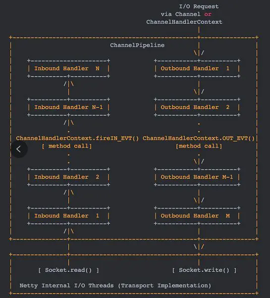
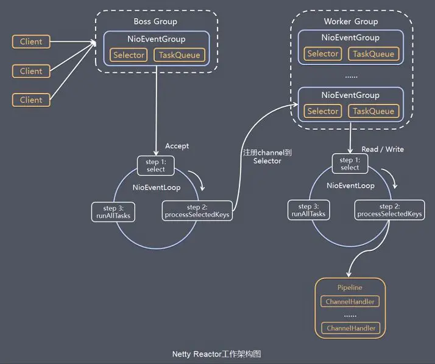
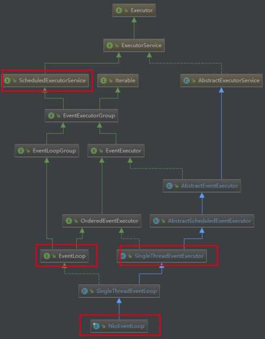

# Netty

## 基本概念

### Netty是什么？

* 是一个基于NIO的C/S模式的网络通信框架，可以快速的通过它开发出高并发、高可靠的网络应用程序；
* 极大的简化了TCP、UDP套接字服务器等网络编程的开发难度，且性能和安全性都得到了更好的保证；
* 支持多种计算机网络应用层协议，如FTP、SMTP、HTTP以及各种二进制和基于文本的传输协议。


### 为什么使用Netty？

* 统一的API，支持多种传输类型（阻塞和非阻塞）；
* 基于IO多路复用技术的简单而强大的线程模型Reactor；
* 自带编码器解决TCP粘包和拆包问题；
* 自带各种协议栈；
* 真正的无连接数据包套接字支持；
* 相对于使用JDK API具有更高的吞吐量、更低的延迟、更低的资源消耗和更少的内存复制；
* 具有完整的SSL/TLS等安全机制的支持；
* 社区活跃；
* 成熟稳定，经历了各种开源项目的考验，如：Dubbo、RocketMQ、ElasticSearch、gRPC等。


### Netty的应用场景

* **RPC框架的网络通信结构**：在分布式系统中，不同的服务节点需要相互调用，需要使用RPC框架。而服务节点间可以通过Netty来通信；
* **高并发的HTTP网络服务器**：基于同步非阻塞IO和多路复用模型的HTTP服务器；
* 可以实现即时通讯系统；
* 可以实现消息推送系统。


## 模块组件

### Bootstrap/ServerBootstrap

Netty的客户端和服务端启动引导类，主要作用是配置整个Netty程序，串联各个组件。

```JAVA
// 客户端启动引导
Bootstrap b = new Bootstrap();
b.group(group)
    .channel(NioSocketChannel.class)
    .handler(new ChannelInitializer<SocketChannel>() {
        @Override
        public void initChannel(SocketChannel ch) throws Exception {
            ChannelPipeline p = ch.pipeline();
            p.addLast(new HelloClientHandler(message));
        }
    });
```

```JAVA
// 服务端启动引导
ServerBootstrap b = new ServerBootstrap();
b.group(bossGroup, workerGroup)
 	.handler(new LoggingHandler(LogLevel.INFO))
    .channel(NioServerSocketChannel.class)
    .childHandler(new ChannelInitializer<SocketChannel>() {
        @Override
        public void initChannel(SocketChannel ch) {
            ChannelPipeline p = ch.pipeline();
            p.addLast(new HelloServerHandler());
        }
    });
```


### Future/ChannelFuture

Netty的API中所有的IO操作都是异步的，不会立即返回结果，但会通过ChannelFuture封装未来异步操作的结果。也可以注册一个监听器，当操作成功或失败后会自动触发注册的监听器回调。

```JAVA
public interface ChannelFuture extends Future<Void> {
	Channel channel();
	ChannelFuture addListener(GenericFutureListener<? extends Future<? super Voidjk var1);	// 注册监听器
	// ...
	ChannelFuture sync() throws InterruptedException;	// 修改同步或异步
}
```

```JAVA
serverBootstrap.bind(port).addListener(future -> {
    if (future.isSuccess()) {
        System.out.println(new Date() + ": 端口[" + port + "]绑定成功!");
    } else {
        System.err.println("端口[" + port + "]绑定失败!");
    }
});
```


### Channel/ChannelOption

Channel通道是Netty用于网络通信的组件，能够执行网络I/O操作，为用户提供：

* 当前网络连接的状态，即通道是否打开，Socket是否建立；
* 网络连接的参数配置，如：接收缓冲大小；
* 异步网络I/O操作，如：连接建立、读写、端口绑定；
* I/O操作与具体的处理逻辑对应。

ChannelOption为Channel提供了参数的设置：

* **ChannelOption.SO_BACKLOG**：用于初始化服务器可连接队列的大小。服务端处理客户端连接请求是顺序处理的，所以同时只能处理一个客户端连接。多个客户连接到来时，服务端会将请求排队。
* **ChannelOption.SO_KEEPALIVE**：一直保持连接活动状态。


### Selector

Netty基于NIO的选择器Selector机制实现I/O多路复用，通过Selector一个线程可以监听多个连接的Channel事件。当向一个Selector中注册Channel后，Selector内部的机制就可以轮询已注册到Channel上的事件是否就绪，当有事件真正就绪才会进行处理。


### NioEventLoop/NioEventLoopGroup

NioEventLoop事件循环中维护了一个Selector实例和其任务队列，支持异步提交任务，线程启动时会调用NioEventLoop的run方法，执行相应的IO或非IO任务：

* **IO任务**：即selectionKey中就绪的事件，如accept、connect、read、write等，由processSelectedKeys方法触发；
* **非IO任务**：会添加到taskQueue中，如register、bind等任务，由runAllTasks方法触发。

NioEventLoopGroup事件循环组主要管理NioEventLoop的生命周期，可以理解为线程池，内部维护了一组NioEventLoop线程，可以通过next接口按照一定规则获取一个NioEventLoop去处理任务，每个NioEventLoop线程负责处理多个Channel上的事件，而一个Channel只会对应一个线程。


### ChannelHandler/ChannelHandlerContext

通道处理器是一个接口，其处理IO事件或拦截IO操作，并将其转发到其所属ChannelPipeline链上的下一个handler程序。使用ChannelHandler时可以继承其子类或适配器类：

* **ChannelInboundHandler/ChannelInboundHandlerAdapter**：处理入站I/O事件；
* **ChannelOutboundHandler/ChannelOutboundHandlerAdapter**：处理出站I/O事件；
* **ChannelDuplexHandler**：处理入站和出站事件。

ChannelHandlerContext保存了Channel相关的所有上下文信息，同时关联了一个ChannelHandler对象。


### ChannelPipline

* 通道事件处理链是一个保存了ChannelHandler的List，用多个阶段拦截或处理Channel的入站和出站操作。ChannelPipline实现了一种高级形式的拦截过滤器模式，使用户可以完全控制事件处理方式的全过程，以及Channel对应的各个ChannelHandler如何交互。

* 下图描述了ChannelPipeline中的ChannelHandler如果处理IO事件。入站事件由自下而上的入站处理程序处理，如图左所示。出站事件由自上而下的出站处理程序处理，如图右所示。

  

* Netty中每个Channel都有且仅有一个ChannelPipeline与之对应。而ChannelPipeline中又维护了一个由ChannelHandlerContext组成的双向链表，且每个ChannelHandlerContext又关联一个ChannelHandler。

* 入站事件和出站事件在一个双向链表中，入站事件会从链表head向后传递到最后一个入站的handler，出站事件会从链表tail向前传递到最前一个出站的handler，两种类型的handler互不干扰。

  


## 线程模型

Netty的线程模式是基于Reactor模式实现的。



### 结构对应

* NioEventLoop <—> 初始化分发器/反应器（Initiation Dispatcher）；
* Selector <—> 同步事件分离器（Synchronous EventDemultiplexer）；
* ChannelHandler <—> 事件处理器（Event Handler）；
* 具体的ChannelHandler实现 <—> 具体的事件存储器。


### 模式对应

* NioEventLoop（bossGroup） <—> mainReactor；
* NioEventLoop（workGroup）<—> subReactor。
* ServerBootstrapAcceptor <—> acceptor。


### 工作流程

**Boss Group轮询步骤**：

* select轮询Accept事件；
* 通过processSelectedKeys处理Accept的I/O事件，与Client建立连接，生成对应的NioSocketChannel，并将其注册到Worker Group中的某个NioEventLoop的Selector上；
* 处理任务队列中的任务runAllTasks。任务队列中的任务包括用户调用eventLoop.execute或schedule执行的任务，或者其他线程提交到该eventLoop上的任务。

**Worker Group轮询步骤**：

* select轮询Read/Write事件；
* processSelectedKeys处理读写I/O事件。在NioSocketChannel可读/可写事件发生时将其传入ChannelPipeline中处理；
* 处理任务队列中的任务runAllTasks。


## 编码解码器

### 基本概念

* 当Netty发送或接受一个消息时，就会发生一次数据转换。即入站消息会被解码（如字节转换为对象），出站消息会被编码（如对象转换为字节）。因此Netty提供了一系列编码解码器，都实现了ChannelInboundHandler或ChannelOutboundHandler接口，且channelRead方法都会被重写。
* 以入站为例，对于每个从入站Channel读取的消息，这个方法会被调用，随后将调用由解码器提供的 `decode()` 方法进行解码，并将已解码的字节转发给ChannelPipeline中的下一个ChannelInboundHandler。


### ByteToMessageDecoder解码器

由于TCP会出现粘包拆包的问题，所以不能确定发送方的数据包是一个完整的信息。该类会对入站数据进行缓存，直到它准备好被处理。


```JAVA
public class ToIntegerDecoder extends ByteToMessageDecoder {
    
    @Override
    protected void decode(ChannelHandlerContext ctx, ByteBuf in, List<Object> out) throws Exception {
        // 每次从入站的ByteBuf中读取4字节，然后编码为int类型，添加到一个List中，当没有更多元素可以被添加时，该内容会被发送给下一个ChannelInboundHandler
        if (in.readableBytes() >= 4) {
            out.add(in.readInt());
        }
    }
}
```


### ReplayingDecoder解码器

```JAVA
public abstract class ReplayingDecoder<S> extends ByteToMessageDecoder
```

ReplayingDecoder扩展了ByteToMessageDecoder类，使用这个类时无需调用 `readableBytes()` 方法，参数S指定了用户状态管理的类型，使用Void则不需要状态管理。

```JAVA
public class MyReplayingDecoder extends ReplayingDecoder<Void> {
    
    @Override
    protected void decode(ChannelHandlerContext ctx, ByteBuf in, List<Object> out) throws Exception {
        // 无需判断byte是否足够读取，内部会根据read的类型自动处理
        out.add(in.readLong());
    }
}
```


## 源码分析

### 程序示例

以 `io.Netty.example` 下的示例程序做为源码分析的案例。

```JAVA
public final class EchoServer {

    static final boolean SSL = System.getProperty("ssl") != null;
    static final int PORT = Integer.parseInt(System.getProperty("port", "8007"));

    public static void main(String[] args) throws Exception {
        final SslContext sslCtx;
        if (SSL) {
            SelfSignedCertificate ssc = new SelfSignedCertificate();
            sslCtx = SslContextBuilder.forServer(ssc.certificate(), ssc.privateKey()).build();
        } else {
            sslCtx = null;
        }
		
        // mainReactor、subReactor
        EventLoopGroup bossGroup = new NioEventLoopGroup(1);
        EventLoopGroup workerGroup = new NioEventLoopGroup();
        try {
            // 启动引导，全局配置
            ServerBootstrap b = new ServerBootstrap();
            b.group(bossGroup, workerGroup)
             .channel(NioServerSocketChannel.class)
             .option(ChannelOption.SO_BACKLOG, 100)
             .handler(new LoggingHandler(LogLevel.INFO))
             .childHandler(new ChannelInitializer<SocketChannel>() {
                 @Override
                 public void initChannel(SocketChannel ch) throws Exception {
                     ChannelPipeline p = ch.pipeline();
                     if (sslCtx != null) {
                         p.addLast(sslCtx.newHandler(ch.alloc()));
                     }
                     p.addLast(new EchoServerHandler());
                 }
             });
				
            // 同步操作
            ChannelFuture f = b.bind(PORT).sync();
            f.channel().closeFuture().sync();
        } finally {
            bossGroup.shutdownGracefully();
            workerGroup.shutdownGracefully();
        }
    }
}
```

```JAVA
@Sharable
public class EchoServerHandler extends ChannelInboundHandlerAdapter {

    @Override
    public void channelRead(ChannelHandlerContext ctx, Object msg) {
        ctx.write(msg);
    }

    @Override
    public void handlerAdded(ChannelHandlerContext ctx) throws Exception {
        super.handlerAdded(ctx);
    }

    @Override
    public void handlerRemoved(ChannelHandlerContext ctx) throws Exception {
        super.handlerRemoved(ctx);
    }

    @Override
    public void channelReadComplete(ChannelHandlerContext ctx) {
        ctx.flush();
    }

    @Override
    public void exceptionCaught(ChannelHandlerContext ctx, Throwable cause) {
        cause.printStackTrace();
        ctx.close();
    }
}
```


### 启动过程分析

#### NioEventLoopGroup阶段分析

**NioEventLoopGroup构造方法**：

```JAVA
// 空参构造（不指定线程数）
public NioEventLoopGroup() {
	// 调⽤下⼀个构造⽅法
	this(0);
}

public NioEventLoopGroup(int nThreads) {
	// 继续调⽤下⼀个构造⽅法
	this(nThreads, (Executor) null);
}

// ......经过各种重载的构造方法后
public NioEventLoopGroup(int nThreads, Executor executor, final SelectorProvider selectorProvider, final SelectStrategyFactory selectStrategyFactory) {
    // 开始调⽤⽗类MultithreadEventLoopGroup的构造方法
    super(nThreads, executor, selectorProvider, selectStrategyFactory, RejectedExecutionHandlers.reject());
}
```

**MultithreadEventLoopGroup构造方法**：

```JAVA
// EventLoopGroup中默认的EventLoop线程数
private static final int DEFAULT_EVENT_LOOP_THREADS;

static {
    // 从1、系统属性、CPU核⼼数*2这三个值中取最⼤值，可以得出DEFAULT_EVENT_LOOP_THREADS的值为CPU核⼼数*2
    DEFAULT_EVENT_LOOP_THREADS = Math.max(1, SystemPropertyUtil.getInt(
        "io.netty.eventLoopThreads", NettyRuntime.availableProcessors() * 2));
}

// 被调⽤的⽗类构造函数，当指定的线程数nThreads为0时，使⽤默认的线程数DEFAULT_EVENT_LOOP_THREADS
protected MultithreadEventLoopGroup(int nThreads, ThreadFactory threadFactory, Object... args) {
    // 继续调用父类MultithreadEventExecutorGroup的构造方法
	super(nThreads == 0 ? DEFAULT_EVENT_LOOP_THREADS : nThreads, threadFactory, args);
}
```

**MultithreadEventExecutorGroup构造方法**：

```JAVA
protected MultithreadEventExecutorGroup(int nThreads, Executor executor, Object... args) {
    this(nThreads, executor, DefaultEventExecutorChooserFactory.INSTANCE, args);
}

protected MultithreadEventExecutorGroup(int nThreads, Executor executor,
                                        EventExecutorChooserFactory chooserFactory, Object... args) {
    if (nThreads <= 0) {
        throw new IllegalArgumentException(String.format("nThreads: %d (expected: > 0)", nThreads));
    }

    if (executor == null) {
        // 如果不指定执行器，就使用默认的线程工厂和默认执行器
        executor = new ThreadPerTaskExecutor(newDefaultThreadFactory());
    }
	
    // NioEventLoop实现了EventExecutor接口
    // 即本语句创建了一个线程数大小的NioEventLoop数组
    children = new EventExecutor[nThreads];

    // 通过循环初始化线程数组
    for (int i = 0; i < nThreads; i ++) {
        boolean success = false;
        try {
            // 初始化NioEventLoop
            children[i] = newChild(executor, args);
            success = true;
        } catch (Exception e) {
            // TODO: Think about if this is a good exception type
            throw new IllegalStateException("failed to create a child event loop", e);
        } finally {
            // ......
        }
    }

    chooser = chooserFactory.newChooser(children);
	
    // 实例化一个终止监听器
    final FutureListener<Object> terminationListener = new FutureListener<Object>() {
        @Override
        public void operationComplete(Future<Object> future) throws Exception {
            if (terminatedChildren.incrementAndGet() == children.length) {
                terminationFuture.setSuccess(null);
            }
        }
    };

    // 为每一个NioEventLoop添加一个终止监听器
    for (EventExecutor e: children) {
        e.terminationFuture().addListener(terminationListener);
    }

    // 将所有初始化后的NioEventLoop添加到一个LinkedHashSet中保存
    Set<EventExecutor> childrenSet = new LinkedHashSet<EventExecutor>(children.length);
    Collections.addAll(childrenSet, children);
    readonlyChildren = Collections.unmodifiableSet(childrenSet);
}
```

**总结**：

* 创建NioEventLoopGroup时，若不指定线程数，则默认使用CPU核数*2的数量创建。若指定，则按照指定的数量创建；
* NioEventLoopGroup内部通过数组来初始化所有EventLoop，初始化完毕后最终会通过只读的LinkedHashSet来维护。


#### ServerBootstrap阶段分析

**ServerBootstrap构造方法和基本属性**：

```java
private final Map<ChannelOption<?>, Object> childOptions = new LinkedHashMap<ChannelOption<?>, Object>();
private final Map<AttributeKey<?>, Object> childAttrs = new LinkedHashMap<AttributeKey<?>, Object>();
private final ServerBootstrapConfig config = new ServerBootstrapConfig(this);
private volatile EventLoopGroup childGroup;
private volatile ChannelHandler childHandler;
// 空参构造
public ServerBootstrap() { }
```

**ServerBootstrap#`group()`**：

```JAVA
public ServerBootstrap group(EventLoopGroup parentGroup, EventLoopGroup childGroup) {
    // parentGroup即bossGroup
    super.group(parentGroup);
    if (childGroup == null) {
        throw new NullPointerException("childGroup");
    }
    if (this.childGroup != null) {
        throw new IllegalStateException("childGroup set already");
    }
    // childGroup即workerGroup
    this.childGroup = childGroup;
    return this;
}
```

**AbstractBootstrap#`channel()`**：

```java
public B channel(Class<? extends C> channelClass) {
    if (channelClass == null) {
        throw new NullPointerException("channelClass");
    }
    // 创建反射工厂类，在bind阶段才会将Channel通过反射创建出来
    return channelFactory(new ReflectiveChannelFactory<C>(channelClass));
}
```

**AbstractBootstrap#`option()`**：

```JAVA
// 通过一个Map结构来存储各种配置
private final Map<ChannelOption<?>, Object> options = new LinkedHashMap<ChannelOption<?>, Object>();

public <T> B option(ChannelOption<T> option, T value) {
    if (option == null) {
        throw new NullPointerException("option");
    }
    if (value == null) {
        synchronized (options) {
            options.remove(option);
        }
    } else {
        synchronized (options) {
            options.put(option, value);
        }
    }
    return self();
}
```

**AbstractBootstrap#`bind()`**：

```JAVA
// 通过bind为服务端Channel绑定端口
public ChannelFuture bind(int inetPort) {
    return bind(new InetSocketAddress(inetPort));
}

public ChannelFuture bind(SocketAddress localAddress) {
    validate();
    if (localAddress == null) {
        throw new NullPointerException("localAddress");
    }
    return doBind(localAddress);
}

private ChannelFuture doBind(final SocketAddress localAddress) {
    final ChannelFuture regFuture = initAndRegister();
    final Channel channel = regFuture.channel();
    if (regFuture.cause() != null) {
        return regFuture;
    }

    if (regFuture.isDone()) {
        // At this point we know that the registration was complete and successful.
        ChannelPromise promise = channel.newPromise();
        doBind0(regFuture, channel, localAddress, promise);
        return promise;
    } else {
       // ......
    }
}

final ChannelFuture initAndRegister() {
    Channel channel = null;
    try {
        // 通过反射工厂类将Channel创建出来：
        // 	1.获取JDK NIO的ServerSocketChannel；
        // 	2.创建一个唯一的ChannelId；
        // 	3.创建一个NioMessageUnsafe，用于操作消息；
        // 	4.创建一个DefaultChannelPipeline，是一个双向链表结构；
        // 	5.创建了一个NioServerSocketChannelConfig对象，用于对外展示一些配置。
        channel = channelFactory.newChannel();
        // 初始化NioServerSocketChannel：
        // 	1.抽象方法，由ServerBootstrap实现；
        // 	2.设置NioServerSocketChannel的TCP属性；
        // 	3.对NioServerSocketChannel的ChannelPipeline添加ChannelInitializer处理器；
        // 	4.初始化DefaultChannelPipeline的head和tail节点，并通过addLast添加ChannelHandler。
        init(channel);
    } catch (Throwable t) {
        // ......
    }
    // 注册NioServerSocketChannel到bossGroup上，并返回一个封装注册结果的Future对象
    ChannelFuture regFuture = config().group().register(channel);
    if (regFuture.cause() != null) {
        if (channel.isRegistered()) {
            channel.close();
        } else {
            channel.unsafe().closeForcibly();
        }
    }
    return regFuture;
}

private static void doBind0(
    final ChannelFuture regFuture, final Channel channel,
    final SocketAddress localAddress, final ChannelPromise promise) {

    // This method is invoked before channelRegistered() is triggered.  Give user handlers a chance to set up
    // the pipeline in its channelRegistered() implementation.
    channel.eventLoop().execute(new Runnable() {
        @Override
        public void run() {
            if (regFuture.isSuccess()) {
                // 最终会调用到NioServerSocket的doBind，说明Netty底层使用的是NIO
                channel.bind(localAddress, promise).addListener(ChannelFutureListener.CLOSE_ON_FAILURE);
            } else {
                promise.setFailure(regFuture.cause());
            }
        }
    });
}
```

**DefaultChannelPipeline#`addLast()`**：

```JAVA
// 通过addLast将ChannelHandler添加到ChannelPipeline中
@Override
public final ChannelPipeline addLast(EventExecutorGroup group, String name, ChannelHandler handler) {
    final AbstractChannelHandlerContext newCtx;
    synchronized (this) {
        // 检查handler是否符合标准
        checkMultiplicity(handler);
		
        // 创建一个AbstractChannelHandlerContext对象
        // 每当有ChannelHandler添加到ChannelPipeline中时，都会创建对应的Context
        // 所以最终ChannelPipeline这个链表结构中存储的就是ChannelHandlerContext
        newCtx = newContext(group, filterName(name, handler), handler);

        // 将Context插入链表尾部，即追加到tail节点之前
        addLast0(newCtx);

        // If the registered is false it means that the channel was not registered on an eventloop yet.
        // In this case we add the context to the pipeline and add a task that will call
        // ChannelHandler.handlerAdded(...) once the channel is registered.
        if (!registered) {
            newCtx.setAddPending();
            callHandlerCallbackLater(newCtx, true);
            return this;
        }

        EventExecutor executor = newCtx.executor();
        if (!executor.inEventLoop()) {
            newCtx.setAddPending();
            executor.execute(new Runnable() {
                @Override
                public void run() {
                    callHandlerAdded0(newCtx);
                }
            });
            return this;
        }
    }
    callHandlerAdded0(newCtx);
    return this;
}

// 维护双向链表结构
private void addLast0(AbstractChannelHandlerContext newCtx) {
    AbstractChannelHandlerContext prev = tail.prev;
    newCtx.prev = prev;
    newCtx.next = tail;
    prev.next = newCtx;
    tail.prev = newCtx;
}
```

**NioEventLoop#`run()`**：

```JAVA
// 当bind阶段结束，就会进入NioEventLoop的run中执行
@Override
protected void run() {
    for (;;) {
        try {
            switch (selectStrategy.calculateStrategy(selectNowSupplier, hasTasks())) {
                case SelectStrategy.CONTINUE:
                    continue;
                case SelectStrategy.SELECT:
                    // NioEventLoop轮询的第一步：监听事件
                    select(wakenUp.getAndSet(false));

                    if (wakenUp.get()) {
                        selector.wakeup();
                    }
                    // fall through
                default:
            }

            cancelledKeys = 0;
            needsToSelectAgain = false;
            final int ioRatio = this.ioRatio;
            if (ioRatio == 100) {
                try {
                    // NioEventLoop轮询的第二步：处理发生的事件
                    processSelectedKeys();
                } finally {
                    // NioEventLoop轮询的第二步：处理队列中的任务
                    runAllTasks();
                }
            } else {
                final long ioStartTime = System.nanoTime();
                try {
                    processSelectedKeys();
                } finally {
                    // Ensure we always run tasks.
                    final long ioTime = System.nanoTime() - ioStartTime;
                    runAllTasks(ioTime * (100 - ioRatio) / ioRatio);
                }
            }
        } catch (Throwable t) {
            handleLoopException(t);
        }
        // Always handle shutdown even if the loop processing threw an exception.
        try {
            if (isShuttingDown()) {
                closeAll();
                if (confirmShutdown()) {
                    return;
                }
            }
        } catch (Throwable t) {
            handleLoopException(t);
        }
    }
}
```


#### Netty服务端启动过程总结

* 创建两个NioEventLoopGroup线程池，其内部维护着NioEventLoop的集合，集合默认大小是本机的CPU*2；

* ServerBootstrap设置一些属性，然后通过bind方法完成创建NIO相关对象、初始化、注册、绑定端口、启动事件循环等操作。
  * initAndRegister会创建NioServerSocketChannel、ChannelPipeline等对象，然后初始化这些对象，如ChannelPipeline的head和tail节点的初始化；
  * doBind会对底层JDK NIO的Channel和端口进行绑定；
  * 最后调用NioEventLoop的run方法监听连接事件，表示服务器正式启动。


### 接收请求过程分析

**NioEventLoop#`processSelectedKey()`**：

```JAVA
private void processSelectedKey(SelectionKey k, AbstractNioChannel ch) {
    final AbstractNioChannel.NioUnsafe unsafe = ch.unsafe();
    if (!k.isValid()) {
        final EventLoop eventLoop;
        try {
            eventLoop = ch.eventLoop();
        } catch (Throwable ignored) {
            // If the channel implementation throws an exception because there is no event loop, we ignore this
            // because we are only trying to determine if ch is registered to this event loop and thus has authority
            // to close ch.
            return;
        }
        // Only close ch if ch is still registered to this EventLoop. ch could have deregistered from the event loop
        // and thus the SelectionKey could be cancelled as part of the deregistration process, but the channel is
        // still healthy and should not be closed.
        // See https://github.com/netty/netty/issues/5125
        if (eventLoop != this || eventLoop == null) {
            return;
        }
        // close the channel if the key is not valid anymore
        unsafe.close(unsafe.voidPromise());
        return;
    }

    try {
        int readyOps = k.readyOps();
        // We first need to call finishConnect() before try to trigger a read(...) or write(...) as otherwise
        // the NIO JDK channel implementation may throw a NotYetConnectedException.
        if ((readyOps & SelectionKey.OP_CONNECT) != 0) {
            // remove OP_CONNECT as otherwise Selector.select(..) will always return without blocking
            // See https://github.com/netty/netty/issues/924
            int ops = k.interestOps();
            ops &= ~SelectionKey.OP_CONNECT;
            k.interestOps(ops);

            unsafe.finishConnect();
        }

        // Process OP_WRITE first as we may be able to write some queued buffers and so free memory.
        if ((readyOps & SelectionKey.OP_WRITE) != 0) {
            // Call forceFlush which will also take care of clear the OP_WRITE once there is nothing left to write
            ch.unsafe().forceFlush();
        }

        // Also check for readOps of 0 to workaround possible JDK bug which may otherwise lead
        // to a spin loop
        // 当就绪事件为可读或连接接收时
        if ((readyOps & (SelectionKey.OP_READ | SelectionKey.OP_ACCEPT)) != 0 || readyOps == 0) {
            // unsafe是boos线程中NioServerSocketChannel的AbstractNioMessageChannel$NioMessageUnsafe对象
            unsafe.read();
        }
    } catch (CancelledKeyException ignored) {
        unsafe.close(unsafe.voidPromise());
    }
}
```

**SelectionKey中的readyOps就绪事件常量**：

```JAVA
// 读事件就绪
public static final int OP_READ = 1 << 0;
// 写事件就绪
public static final int OP_WRITE = 1 << 2;
// 连接事件到来
public static final int OP_CONNECT = 1 << 3;
// 接收连接事件
public static final int OP_ACCEPT = 1 << 4;
```

**AbstractNioMessageChannel$NioMessageUnsafe#`read()`**：

```JAVA
private final class NioMessageUnsafe extends AbstractNioUnsafe {

    private final List<Object> readBuf = new ArrayList<Object>();

    @Override
    public void read() {
        // 断言检查eventLoop是否是当前线程
        assert eventLoop().inEventLoop();
        final ChannelConfig config = config();
        final ChannelPipeline pipeline = pipeline();
        final RecvByteBufAllocator.Handle allocHandle = unsafe().recvBufAllocHandle();
        allocHandle.reset(config);

        boolean closed = false;
        Throwable exception = null;
        try {
            try {
                do {
                    // readBuf是一个ArrayList，用做请求缓冲区
                    // 调用doReadMessages，读取boss线程中NioServerSocketChannel接收的请求，并将请求包装为NioSocketChannel放入缓冲区readBuf
                    int localRead = doReadMessages(readBuf);
                    if (localRead == 0) {
                        break;
                    }
                    if (localRead < 0) {
                        closed = true;
                        break;
                    }

                    allocHandle.incMessagesRead(localRead);
                } while (allocHandle.continueReading());
            } catch (Throwable t) {
                exception = t;
            }

            // 遍历请求缓冲区，为每个请求调用pipeline的fireChannelRead方法，具体处理这些请求（执行链中的handler的ChannelRead方法）
            int size = readBuf.size();
            for (int i = 0; i < size; i ++) {
                readPending = false;
                pipeline.fireChannelRead(readBuf.get(i));
            }
            readBuf.clear();
            allocHandle.readComplete();
            pipeline.fireChannelReadComplete();

            if (exception != null) {
                closed = closeOnReadError(exception);

                pipeline.fireExceptionCaught(exception);
            }

            if (closed) {
                inputShutdown = true;
                if (isOpen()) {
                    close(voidPromise());
                }
            }
        } finally {
            // Check if there is a readPending which was not processed yet.
            // This could be for two reasons:
            // * The user called Channel.read() or ChannelHandlerContext.read() in channelRead(...) method
            // * The user called Channel.read() or ChannelHandlerContext.read() in channelReadComplete(...) method
            //
            // See https://github.com/netty/netty/issues/2254
            if (!readPending && !config.isAutoRead()) {
                removeReadOp();
            }
        }
    }
}
```

**NioServerSocketChannel#`doReadMessages()`**：

```JAVA
@Override
protected int doReadMessages(List<Object> buf) throws Exception {
    // 通过JDK NIO的ServerSocketChannel的accept方法接收请求，并获取到一个JDK NIO的SocketChannel
    SocketChannel ch = SocketUtils.accept(javaChannel());

    try {
        if (ch != null) {
            // 将SocketChannel包装成NioSocketChannel并加入请求缓冲区
            buf.add(new NioSocketChannel(this, ch));
            return 1;
        }
    } catch (Throwable t) {
        logger.warn("Failed to create a new channel from an accepted socket.", t);

        try {
            ch.close();
        } catch (Throwable t2) {
            logger.warn("Failed to close a socket.", t2);
        }
    }

    return 0;
}
```

**ServerBootstrapAcceptor#`channelRead()`方法**：

```JAVA
// 调用pipeline的fireChannelRead方法，会执行链上的所有handler的channelRead方法。
// pipeline有4个handler：Head、LoggingHandler、ServerBootstrapAcceptor、Tail。
// 最后通过debug进入ServerBootstrapAcceptor的channelRead方法中。
@Override
@SuppressWarnings("unchecked")
public void channelRead(ChannelHandlerContext ctx, Object msg) {
    final Channel child = (Channel) msg;

    // 为NioSocketChannel的pipeline添加handler
    // 即main中通过ServerBootstrap设置的childHandler
    child.pipeline().addLast(childHandler);
	
    // 为NioSocketChannel设置日志和其他配置属性
    setChannelOptions(child, childOptions, logger);

    for (Entry<AttributeKey<?>, Object> e: childAttrs) {
        child.attr((AttributeKey<Object>) e.getKey()).set(e.getValue());
    }

    try {
        // 将NioSocketChannel即客户端连接注册到workerGroup线程池，并添加一个注册结果的监听器
        childGroup.register(child).addListener(new ChannelFutureListener() {
            @Override
            public void operationComplete(ChannelFuture future) throws Exception {
                if (!future.isSuccess()) {
                    forceClose(child, future.cause());
                }
            }
        });
    } catch (Throwable t) {
        forceClose(child, t);
    }
}
```

**debug追踪到workGroup#`register()`方法**：

```JAVA
@Override
public final void register(EventLoop eventLoop, final ChannelPromise promise) {
    AbstractChannel.this.eventLoop = eventLoop;
    // 将客户端连接对应的NioSocketChannel注册到一个EventLoop中去轮询
    if (eventLoop.inEventLoop()) {
        register0(promise);
    } else {
        eventLoop.execute(new Runnable() {
            @Override
            public void run() {
                register0(promise);
            }
        });
    }
}
```

**debug追踪到AbstractNioChannel#`doBeginRead()`方法**：

```JAVA
@Override
protected void doBeginRead() throws Exception {
    final SelectionKey selectionKey = this.selectionKey;
    if (!selectionKey.isValid()) {
        return;
    }
    
    readPending = true;
    
    // 直到这里，客户端的连接阶段完成，接下来就开始轮询监听读事件
    final int interestOps = selectionKey.interestOps();
    if ((interestOps & readInterestOps) == 0) {
        selectionKey.interestOps(interestOps | readInterestOps);
    }
}
```

**Netty请求接收过程总结**：

* 服务端轮询Accept事件，当获取事件后调用unsafe的read方法，unsafe是ServerSocket的内部类，其read方法由两部分组成：
  * **`doReadMessage()`方法**：用于创建NioSocketChannel对象，该对象包装了JDK NIO的SocketChannel，并将其加入请求缓冲区，即用一个ArrayList类型的集合来存储；
  * **pipeline的`fireChannelRead()`方法**：遍历缓冲区，循环调用NioSocketChannel对应Pipeline上的所有handler，如：添加用户自定义handler、设置日志和其他配置属性，最后将NioSocketChannel注册到workerGroup上；
* 最后workerGroup选择其中的一个EventLoop负责轮询该NioSockerChannel。自此，客户端请求建立过程结束。


### CP/CH/CHC分析

**三者关系概述**：

* 每当NioServerSocketChannel接收一个客户端连接，就会创建一个对应的NioSocketChannel；
* 每个NioSocketChannel创建时都会被分配一个ChannelPipeline；
* 每个ChannelPipeline中都包含多个ChannelHandlerContext；
* 这些ChannelHandlerContext用于包装ChannelHandler，并且组成了一个双向链表；
* 当一个客户端请求被接收时，会进入其对应的NioSocketChannel的Pipeline中，并经过Pipeline中所有的handler处理（使用了设计模式中的过滤器模式）。


#### ChannelPipeline


**ChannelPipeline接口**：

```JAVA
/**
 *                                                 I/O Request
 *                                            via {@link Channel} or
 *                                        {@link ChannelHandlerContext}
 *                                                      |
 *  +---------------------------------------------------+---------------+
 *  |                           ChannelPipeline         |               |
 *  |                                                  \|/              |
 *  |    +---------------------+            +-----------+----------+    |
 *  |    | Inbound Handler  N  |            | Outbound Handler  1  |    |
 *  |    +----------+----------+            +-----------+----------+    |
 *  |              /|\                                  |               |
 *  |               |                                  \|/              |
 *  |    +----------+----------+            +-----------+----------+    |
 *  |    | Inbound Handler N-1 |            | Outbound Handler  2  |    |
 *  |    +----------+----------+            +-----------+----------+    |
 *  |              /|\                                  .               |
 *  |               .                                   .               |
 *  | ChannelHandlerContext.fireIN_EVT() ChannelHandlerContext.OUT_EVT()|
 *  |        [ method call]                       [method call]         |
 *  |               .                                   .               |
 *  |               .                                  \|/              |
 *  |    +----------+----------+            +-----------+----------+    |
 *  |    | Inbound Handler  2  |            | Outbound Handler M-1 |    |
 *  |    +----------+----------+            +-----------+----------+    |
 *  |              /|\                                  |               |
 *  |               |                                  \|/              |
 *  |    +----------+----------+            +-----------+----------+    |
 *  |    | Inbound Handler  1  |            | Outbound Handler  M  |    |
 *  |    +----------+----------+            +-----------+----------+    |
 *  |              /|\                                  |               |
 *  +---------------+-----------------------------------+---------------+
 *                  |                                  \|/
 *  +---------------+-----------------------------------+---------------+
 *  |               |                                   |               |
 *  |       [ Socket.read() ]                    [ Socket.write() ]     |
 *  |                                                                   |
 *  |  Netty Internal I/O Threads (Transport Implementation)            |
 *  +-------------------------------------------------------------------+
 */
public interface ChannelPipeline
        extends ChannelInboundInvoker, ChannelOutboundInvoker, Iterable<Entry<String, ChannelHandler>> {
```


#### ChannelHandler

ChannelHandler的作用就是处理IO或拦截IO事件，并将其转发给链上的下一个ChannelHandler。Handler处理事件时分入站和出站，两个方向的操作都不同，因此Netty定义了两个子接口继承ChannelHandler。

```JAVA
public interface ChannelHandler {

    // 当前ChannelHandler被添加到pipeline时调用
    void handlerAdded(ChannelHandlerContext ctx) throws Exception;

    // 当前ChannelHandler从pipeline中移除时调用
    void handlerRemoved(ChannelHandlerContext ctx) throws Exception;

	// 当处理过程中发生异常时调用
    @Deprecated
    void exceptionCaught(ChannelHandlerContext ctx, Throwable cause) throws Exception;

    // ......
}
```

ChannelInboundHandler入站事件接口：


ChannelOutboundHandler出站事件接口：


#### ChannelHandlerContext

继承了ChannelInboundInvoker和ChannelOutboundInvoker，同时也定义了一些能够获取Context上下文环境中channel、executor、handler、pipeline和内存分配器等方法。

```java
public interface ChannelHandlerContext extends AttributeMap, ChannelInboundInvoker, ChannelOutboundInvoker {
```


ChannelInboundInvoker和ChannelOutboundInvoker：这两个接口是在入站和出站的handler外层再包装一层，达到在方法前后拦截并做一些特定操作的目的。


### CP/CH/CHC创建过程分析

#### ChannelPipeline的创建过程

每一个NioSocketChannel创建时都会创建一个ChannelPipeline。

```java
// NioSocketChannel的抽象父类AbstractChannel的构造方法
protected AbstractChannel(Channel parent) {
    this.parent = parent;
    id = newId();
    unsafe = newUnsafe();
    // 创建对应的Pipeline
    pipeline = newChannelPipeline();
}
```

```JAVA
protected DefaultChannelPipeline newChannelPipeline() {
    return new DefaultChannelPipeline(this);
}

protected DefaultChannelPipeline(Channel channel) {
    this.channel = ObjectUtil.checkNotNull(channel, "channel");
    // 创建Future用于异步回调使用 
    succeededFuture = new SucceededChannelFuture(channel, null);
    voidPromise =  new VoidChannelPromise(channel, true);

    // 创建pipeline链表结构的头尾节点
    tail = new TailContext(this);
    head = new HeadContext(this);
	
    // 将两个节点互相连接，形成双向链表
    head.next = tail;
    tail.prev = head;
}
```


#### ChannelHandlerContexte的创建过程

当用户或系统调用Pipeline的以add为前缀的方法添加handler时，都会创建一个包装这个handler的Context。

```JAVA
@Override
public final ChannelPipeline addLast(EventExecutorGroup group, String name, ChannelHandler handler) {
    final AbstractChannelHandlerContext newCtx;
    synchronized (this) {
        // 检查handler实例是否是共享的，若不是且已被其他pipeline使用，则抛出异常
        checkMultiplicity(handler);

        // 通过newContext创建一个和handler关联的context
        newCtx = newContext(group, filterName(name, handler), handler);

        // 将context追加到链表中
        addLast0(newCtx);

        // If the registered is false it means that the channel was not registered on an eventloop yet.
        // In this case we add the context to the pipeline and add a task that will call
        // ChannelHandler.handlerAdded(...) once the channel is registered.
        if (!registered) {
            newCtx.setAddPending();
            callHandlerCallbackLater(newCtx, true);
            return this;
        }

        EventExecutor executor = newCtx.executor();
        if (!executor.inEventLoop()) {
            newCtx.setAddPending();
            executor.execute(new Runnable() {
                @Override
                public void run() {
                    callHandlerAdded0(newCtx);
                }
            });
            return this;
        }
    }
    callHandlerAdded0(newCtx);
    return this;
}
```


### ChannelPipeline的Handler调度分析

#### 入站事件

当请求进入时，会调用Pipeline的相关方法，若是入站事件，这些方法由fire开头，表示开始在管道中流动，让后续的handler继续处理。其中调用的invoke开头的静态方法传入的是head，即会先调用head的ChannelInboundInvoker接口的方法，然后调用handler真正的方法。

```JAVA
@Override
public final ChannelPipeline fireChannelActive() {
    AbstractChannelHandlerContext.invokeChannelActive(head);
    return this;
}

@Override
public final ChannelPipeline fireChannelInactive() {
    AbstractChannelHandlerContext.invokeChannelInactive(head);
    return this;
}

@Override
public final ChannelPipeline fireExceptionCaught(Throwable cause) {
    AbstractChannelHandlerContext.invokeExceptionCaught(head, cause);
    return this;
}

@Override
public final ChannelPipeline fireUserEventTriggered(Object event) {
    AbstractChannelHandlerContext.invokeUserEventTriggered(head, event);
    return this;
}

@Override
public final ChannelPipeline fireChannelRead(Object msg) {
    AbstractChannelHandlerContext.invokeChannelRead(head, msg);
    return this;
}

@Override
public final ChannelPipeline fireChannelReadComplete() {
    AbstractChannelHandlerContext.invokeChannelReadComplete(head);
    return this;
}

@Override
public final ChannelPipeline fireChannelWritabilityChanged() {
    AbstractChannelHandlerContext.invokeChannelWritabilityChanged(head);
    return this;
}
```


#### 出站事件

若是出站事件，则由tail开始处理。

```JAVA
@Override
public final ChannelFuture bind(SocketAddress localAddress) {
    return tail.bind(localAddress);
}

@Override
public final ChannelFuture connect(SocketAddress remoteAddress) {
    return tail.connect(remoteAddress);
}

@Override
public final ChannelFuture connect(SocketAddress remoteAddress, SocketAddress localAddress) {
    return tail.connect(remoteAddress, localAddress);
}

@Override
public final ChannelFuture disconnect() {
    return tail.disconnect();
}

@Override
public final ChannelFuture close() {
    return tail.close();
}

@Override
public final ChannelFuture deregister() {
    return tail.deregister();
}

@Override
public final ChannelPipeline flush() {
    tail.flush();
    return this;
}

@Override
public final ChannelFuture bind(SocketAddress localAddress, ChannelPromise promise) {
    return tail.bind(localAddress, promise);
}

@Override
public final ChannelFuture connect(SocketAddress remoteAddress, ChannelPromise promise) {
    return tail.connect(remoteAddress, promise);
}

@Override
public final ChannelFuture connect(
    SocketAddress remoteAddress, SocketAddress localAddress, ChannelPromise promise) {
    return tail.connect(remoteAddress, localAddress, promise);
}

@Override
public final ChannelFuture disconnect(ChannelPromise promise) {
    return tail.disconnect(promise);
}
```


#### 调度过程


```JAVA
// 以入站事件为例，debug追踪到DefaultChannelPipeline的fireChannelRead方法的调用
@Override
public final ChannelPipeline fireChannelRead(Object msg) {
    // 调用AbstractChannelHandlerContext的invoke开头的静态方法，从head开始处理
    AbstractChannelHandlerContext.invokeChannelRead(head, msg);
    return this;
}
```

```JAVA
// AbstractChannelHandlerContext抽象类
@Override
public ChannelHandlerContext fireChannelRead(final Object msg) {
    invokeChannelRead(findContextInbound(), msg);
    return this;
}

static void invokeChannelRead(final AbstractChannelHandlerContext next, Object msg) {
    final Object m = next.pipeline.touch(ObjectUtil.checkNotNull(msg, "msg"), next);
    EventExecutor executor = next.executor();
    if (executor.inEventLoop()) {
        next.invokeChannelRead(m);
    } else {
        executor.execute(new Runnable() {
            @Override
            public void run() {
                next.invokeChannelRead(m);
            }
        });
    }
}
```

```JAVA
private void invokeChannelRead(Object msg) {
    if (invokeHandler()) {
        try {
            // 具体执行handler自定义的channelRead进行处理
            ((ChannelInboundHandler) handler()).channelRead(this, msg);
        } catch (Throwable t) {
            notifyHandlerException(t);
        }
    } else {
        fireChannelRead(msg);
    }
}
```

```JAVA
volatile AbstractChannelHandlerContext next;
volatile AbstractChannelHandlerContext prev;

private final boolean inbound;
private final boolean outbound;

private AbstractChannelHandlerContext findContextInbound() {
    AbstractChannelHandlerContext ctx = this;
    do {
        // 入站事件从head开始，通过next向后执行
        ctx = ctx.next;
    } while (!ctx.inbound);
    return ctx;
}

private AbstractChannelHandlerContext findContextOutbound() {
    AbstractChannelHandlerContext ctx = this;
    do {
        // 出站事件从tail开始，通过prev向前执行
        ctx = ctx.prev;
    } while (!ctx.outbound);
    return ctx;
}
```


### EventLoop事件循环分析

#### NioEventLoop继承关系图

* 继承自ScheduleExecutorService接口是一个定时任务接口，表示NioEventLoop可以接受定时任务；
* 继承自EventLoop接口是当Channel被注册时用于处理其对应I/O操作的接口；
* 继承自SingleThreadEventExecutor接口，表示NioEventLoop是一个单线程的线程池；
* NioEventLoop是一个单例的线程池，里面包含一个死循环的线程不断的做三件事，即端口监听、事件处理和队列任务处理。每个EventLoop都可以绑定多个Channel，但每个Channel只能由一个EventLoop处理。




#### execute/schedule

* EventLoop通过 `SingleThreadEventExecutor#execute` 添加普通任务；

* 通过 `AbstractScheduledEventExecutor#schedule` 添加定时任务。

```JAVA
@Override
public void execute(Runnable task) {
    if (task == null) {
        throw new NullPointerException("task");
    }

    boolean inEventLoop = inEventLoop();
    // 判断当前线程是否已经是EventLoop线程
    if (inEventLoop) {
        // 若是，则代表线程已经运行了EventLoop，直接将task加入到任务队列中去
        addTask(task);
    } else {
        // 若不是，则尝试启动EventLoop，然后再将task加入到任务队列中
        startThread();
        addTask(task);
        // 若线程已经停止且删除任务失败，则执行task拒绝策略，默认是抛出异常
        if (isShutdown() && removeTask(task)) {
            reject();
        }
    }
	
    // 当执行execute方法时，唤醒selector，防止selector阻塞时间过长
    if (!addTaskWakesUp && wakesUpForTask(task)) {
        wakeup(inEventLoop);
    }
}
```

普通任务被存储在 `mpscQueue` 中，而定时任务则被存储在 `PriorityQueue<ScheduledFutureTask>()` 中。

```JAVA
@Override
public <V> ScheduledFuture<V> schedule(Callable<V> callable, long delay, TimeUnit unit) {
    ObjectUtil.checkNotNull(callable, "callable");
    ObjectUtil.checkNotNull(unit, "unit");
    if (delay < 0) {
        throw new IllegalArgumentException(
            String.format("delay: %d (expected: >= 0)", delay));
    }
    return schedule(new ScheduledFutureTask<V>(
        this, callable, ScheduledFutureTask.deadlineNanos(unit.toNanos(delay))));
}
```

```JAVA
<V> ScheduledFuture<V> schedule(final ScheduledFutureTask<V> task) {
    if (inEventLoop()) {
        scheduledTaskQueue().add(task);
    } else {
        execute(new Runnable() {
            @Override
            public void run() {
                scheduledTaskQueue().add(task);
            }
        });
    }
    return task;
}
```

普通任务加入 `taskQueue` 队列的源码分析：

```JAVA
protected void addTask(Runnable task) {
    if (task == null) {
        throw new NullPointerException("task");
    }
    if (!offerTask(task)) {
        reject(task);
    }
}

final boolean offerTask(Runnable task) {
    if (isShutdown()) {
        reject();
    }
    // 将task任务加入到EventLoop的任务队列中
    return taskQueue.offer(task);
}
```


#### startThread

```JAVA
// NioEventLoop#startThread
private void startThread() {
    // 判断状态state，是否已经启动过了
    if (state == ST_NOT_STARTED) {
        // 若是第一次启动，则通过CAS将状态state改为已启动
        if (STATE_UPDATER.compareAndSet(this, ST_NOT_STARTED, ST_STARTED)) {
            try {
                // 具体的启动方法
                doStartThread();
            } catch (Throwable cause) {
                STATE_UPDATER.set(this, ST_NOT_STARTED);
                PlatformDependent.throwException(cause);
            }
        }
    }
}
```

```JAVA
private void doStartThread() {
    assert thread == null;
    // exector就是在创建EventLoopGroup时创建的ThreadPerTaskExecutor对象
    // execute方法会将Runnable包装成Netty的FastThreadLocalThread，也就是将当前新的EventLoop提交到EventLoopGroup的线程池中
    executor.execute(new Runnable() {
        @Override
        public void run() {
            thread = Thread.currentThread();
            // 中断状态判断
            if (interrupted) {
                thread.interrupt();
            }

            boolean success = false;
            // 设置最后一次的执行时间
            updateLastExecutionTime();
            try {
                // SingleThreadEventExecutor是NioEventLoop的父类，其底层维护了一个单线程的线程池
                // run方法就是启动线程池中唯一的一个线程去执行事件循环机制，是整个EventLoop的核心
                SingleThreadEventExecutor.this.run();
                success = true;
            } catch (Throwable t) {
                logger.warn("Unexpected exception from an event executor: ", t);
            } finally {
                // 若执行到此处，则代表线程Loop结束了，会通过自旋+CAS的方式修改state的值为关闭状态
                for (;;) {
                    int oldState = state;
                    if (oldState >= ST_SHUTTING_DOWN || STATE_UPDATER.compareAndSet(
                        SingleThreadEventExecutor.this, oldState, ST_SHUTTING_DOWN)) {
                        break;
                    }
                }

                // Check if confirmShutdown() was called at the end of the loop.
                if (success && gracefulShutdownStartTime == 0) {
                    logger.error("Buggy " + EventExecutor.class.getSimpleName() + " implementation; " +
                                 SingleThreadEventExecutor.class.getSimpleName() + ".confirmShutdown() must be called " +
                                 "before run() implementation terminates.");
                }

                try {
                    // Run all remaining tasks and shutdown hooks.
                    for (;;) {
                        if (confirmShutdown()) {
                            break;
                        }
                    }
                } finally {
                    try {
                        cleanup();
                    } finally {
                        STATE_UPDATER.set(SingleThreadEventExecutor.this, ST_TERMINATED);
                        threadLock.release();
                        if (!taskQueue.isEmpty()) {
                            logger.warn(
                                "An event executor terminated with " +
                                "non-empty task queue (" + taskQueue.size() + ')');
                        }

                        terminationFuture.setSuccess(null);
                    }
                }
            }
        }
    });
}
```


#### run

* 通过 `select()` 获得感兴趣的事件；
* 通过 `processSelectedKeys()` 处理事件。在select返回后处理事件，并记录IO事件的处理事件ioTime；
* 通过 `runAllTasks()` 执行队列中的任务。执行任务处理的时间和IO处理的时间是1:1的关系。

```JAVA
// NioEventLoop#run
@Override
protected void run() {
    // 事件循环
    for (;;) {
        try {
            switch (selectStrategy.calculateStrategy(selectNowSupplier, hasTasks())) {
                case SelectStrategy.CONTINUE:
                    continue;
                case SelectStrategy.SELECT:
                    // 获取感兴趣的事件，在执行select前，标识一个状态，表示当前要进行select操作且处于未唤醒状态
                    select(wakenUp.getAndSet(false));

                    if (wakenUp.get()) {
                        selector.wakeup();
                    }
                default:
            }

            cancelledKeys = 0;
            needsToSelectAgain = false;
            final int ioRatio = this.ioRatio;
            if (ioRatio == 100) {
                try {
                    processSelectedKeys();
                } finally {
                    runAllTasks();
                }
            } else {
                // ioRation的值默认50，所以从这执行
                // ioStartTime记录processSelectedKeys开始执行的时间
                final long ioStartTime = System.nanoTime();
                try {
                    // 当select返回后，通过该方法处理事件
                    processSelectedKeys();
                } finally {
                    // ioTime是processSelectedKeys所执行的时间
                    final long ioTime = System.nanoTime() - ioStartTime;
                    // 根据ioRation的比例执行runAllTasks方法（执行任务队列中的所有任务）
                    // 默认IO任务和非IO任务的执行时间比是1:1
                    runAllTasks(ioTime * (100 - ioRatio) / ioRatio);
                }
            }
        } catch (Throwable t) {
            handleLoopException(t);
        }
        // 即使循环处理引发异常，也始终处理关闭
        try {
            if (isShuttingDown()) {
                closeAll();
                if (confirmShutdown()) {
                    return;
                }
            }
        } catch (Throwable t) {
            handleLoopException(t);
        }
    }
}
```


#### select

* 当发现下一个定时任务将在0.5m内需要被触发执行，会立即转为执行非阻塞的 `selectNow()`；
* 若任务队列中存在任务，则CAS将select状态置为唤醒，然后转为执行非阻塞的 `selectNow()`；
* 若都不满足则调用阻塞的 `select()` 去轮询事件一段时间；
* 若选择到了就绪事件、select被用户唤醒、任务队列中有任务和有定时任务即将被执行这些情况发生，则跳出事件循环。

```JAVA
// NioEventLoop#select
private void select(boolean oldWakenUp) throws IOException {
    Selector selector = this.selector;
    try {
        int selectCnt = 0;
        // select的开始执行时间和执行截止时间（也就是下一次定时任务的开始时间）
        long currentTimeNanos = System.nanoTime();
        // delayNanos返回的就是当前时间距离下一次定时任务开始执行的时间
        long selectDeadLineNanos = currentTimeNanos + delayNanos(currentTimeNanos);
        for (;;) {
            // 当下一个定时任务开始距离当前时间小于0.5ms时，则表示即将有定时任务要执行，会调用非阻塞的selectNow()
            long timeoutMillis = (selectDeadLineNanos - currentTimeNanos + 500000L) / 1000000L;
            if (timeoutMillis <= 0) {
                if (selectCnt == 0) {
                    selector.selectNow();
                    selectCnt = 1;
                }
                break;
            }

            // 如果任务是在wakenUp状态为true时提交的，则该任务没有机会调用
            // hasTasks判断队列中是否有任务，且通过CAS设置wakenUp唤醒状态
            // 若队列中有任务，且唤醒状态成功设置为true，就调用非阻塞的select去执行
            if (hasTasks() && wakenUp.compareAndSet(false, true)) {
                selector.selectNow();
                selectCnt = 1;
                break;
            }
			
            // 若以上条件都不满足，最后会调用阻塞的select
            int selectedKeys = selector.select(timeoutMillis);
            selectCnt ++;
	
            // 若select到了就绪事件 || select被用户唤醒 || 任务队列中有任务 || 有定时任务即将被执行
            // 满足以上任意一种情况，都会跳出循环
            if (selectedKeys != 0 || oldWakenUp || wakenUp.get() || hasTasks() || hasScheduledTasks()) {
                break;
            }
            // 判断线程中断
            if (Thread.interrupted()) {
                // Thread was interrupted so reset selected keys and break so we not run into a busy loop.
                // As this is most likely a bug in the handler of the user or it's client library we will
                // also log it.
                //
                // See https://github.com/netty/netty/issues/2426
                if (logger.isDebugEnabled()) {
                    logger.debug("Selector.select() returned prematurely because " +
                                 "Thread.currentThread().interrupt() was called. Use " +
                                 "NioEventLoop.shutdownGracefully() to shutdown the NioEventLoop.");
                }
                selectCnt = 1;
                break;
            }

            long time = System.nanoTime();
            if (time - TimeUnit.MILLISECONDS.toNanos(timeoutMillis) >= currentTimeNanos) {
                // timeoutMillis elapsed without anything selected.
                selectCnt = 1;
            } else if (SELECTOR_AUTO_REBUILD_THRESHOLD > 0 &&
                       selectCnt >= SELECTOR_AUTO_REBUILD_THRESHOLD) {
                // The selector returned prematurely many times in a row.
                // Rebuild the selector to work around the problem.
                logger.warn(
                    "Selector.select() returned prematurely {} times in a row; rebuilding Selector {}.",
                    selectCnt, selector);

                rebuildSelector();
                selector = this.selector;

                // Select again to populate selectedKeys.
                selector.selectNow();
                selectCnt = 1;
                break;
            }

            currentTimeNanos = time;
        }

        if (selectCnt > MIN_PREMATURE_SELECTOR_RETURNS) {
            if (logger.isDebugEnabled()) {
                logger.debug("Selector.select() returned prematurely {} times in a row for Selector {}.",
                             selectCnt - 1, selector);
            }
        }
    } catch (CancelledKeyException e) {
        if (logger.isDebugEnabled()) {
            logger.debug(CancelledKeyException.class.getSimpleName() + " raised by a Selector {} - JDK bug?",
                         selector, e);
        }
        // Harmless exception - log anyway
    }
}
```


#### processSelectedKeys

processSelectedKeys方法就是对就绪的时间做出响应的。即逐个取出就绪的IO时间，然后根据事件的具体类型执行不同的策略。

```JAVA
// NioEventLoop#processSelectedKeys
private void processSelectedKeys() {
    if (selectedKeys != null) {
        processSelectedKeysOptimized(selectedKeys.flip());
    } else {
        processSelectedKeysPlain(selector.selectedKeys());
    }
}

private void processSelectedKeysOptimized(SelectionKey[] selectedKeys) {
    for (int i = 0;; i ++) {
        final SelectionKey k = selectedKeys[i];
        if (k == null) {
            break;
        }
        selectedKeys[i] = null;

        final Object a = k.attachment();

        if (a instanceof AbstractNioChannel) {
            // 取出I/O事件，逐个调用processSelectedKey处理
            processSelectedKey(k, (AbstractNioChannel) a);
        } else {
            @SuppressWarnings("unchecked")
            NioTask<SelectableChannel> task = (NioTask<SelectableChannel>) a;
            processSelectedKey(k, task);
        }

        if (needsToSelectAgain) {
            for (;;) {
                i++;
                if (selectedKeys[i] == null) {
                    break;
                }
                selectedKeys[i] = null;
            }

            selectAgain();
            selectedKeys = this.selectedKeys.flip();
            i = -1;
        }
    }
}
```

**NioEventLoop#`processSelectedKey()`**：

```java
final AbstractNioChannel.NioUnsafe unsafe = ch.unsafe();
if (!k.isValid()) {
    final EventLoop eventLoop;
    try {
        eventLoop = ch.eventLoop();
    } catch (Throwable ignored) {
        return;
    }
    if (eventLoop != this || eventLoop == null) {
        return;
    }
    // close the channel if the key is not valid anymore
    unsafe.close(unsafe.voidPromise());
    return;
}
// 获取事件的就绪类型，执行不同的策略
int readyOps = k.readyOps();
if ((readyOps & SelectionKey.OP_CONNECT) != 0) {
    int ops = k.interestOps();
    ops &= ~SelectionKey.OP_CONNECT;
    k.interestOps(ops);
    unsafe.finishConnect();
}

// 写事件
if ((readyOps & SelectionKey.OP_WRITE) != 0) {
    ch.unsafe().forceFlush();
}

// 读事件
if ((readyOps & (SelectionKey.OP_READ | SelectionKey.OP_ACCEPT)) != 0 || readyOps == 0) {
    unsafe.read();
    if (!ch.isOpen()) {
        return;
    }
}
```


#### runAllTasks

* 首先进行任务聚合，即取出一个离截止时间最近的定时任务加入到普通任务队列中去；
* 然后依次从队列中出队任务开始串行执行，每执行64次就去检查一次超时时间，若到达任务执行的截止时间就退出。

```JAVA
// SingleThreadEventExecutor#runAllTasks
// 执行队列中的任务
protected boolean runAllTasks(long timeoutNanos) {
    // 任务聚合
    fetchFromScheduledTaskQueue();
    // 取出一个任务
    Runnable task = pollTask();
    if (task == null) {
        afterRunningAllTasks();
        return false;
    }

    // 计算截止时间，即for循环执行到deadline就截止
    final long deadline = ScheduledFutureTask.nanoTime() + timeoutNanos;
    // 任务执行计数器
    long runTasks = 0;
    long lastExecutionTime;
    for (;;) {
        // 以串行的方式执行任务
        safeExecute(task);

        runTasks ++;

        // 每执行64次检查一次超时（根据经验硬编码的次数）
        if ((runTasks & 0x3F) == 0) {
            lastExecutionTime = ScheduledFutureTask.nanoTime();
            // 若超过截止时间，则退出任务执行
            if (lastExecutionTime >= deadline) {
                break;
            }
        }

        task = pollTask();
        if (task == null) {
            lastExecutionTime = ScheduledFutureTask.nanoTime();
            break;
        }
    }

    // 执行一些收尾性质的任务
    afterRunningAllTasks();
    this.lastExecutionTime = lastExecutionTime;
    return true;
}

// 任务聚合：即将执行的定时任务和待处理的普通任务，都会放入mpscQueue里去执行
private boolean fetchFromScheduledTaskQueue() {
    // 可以看做是一个截止日期
    long nanoTime = AbstractScheduledEventExecutor.nanoTime();
    // 在定时任务队列中取出一个离截止日期事件最近的定时任务（定时任务队列是按照截止日期排队的）
    Runnable scheduledTask  = pollScheduledTask(nanoTime);
    while (scheduledTask != null) {
        // 尝试将取出的定时任务加入普通任务队列中
        if (!taskQueue.offer(scheduledTask)) {
            // 若普通任务队列中没有剩余空间，会将定时任务重新加入定时任务队列
            scheduledTaskQueue().add((ScheduledFutureTask<?>) scheduledTask);
            return false;
        }
        scheduledTask  = pollScheduledTask(nanoTime);
    }
    return true;
}
```


### 任务加入异步线程池过程分析

* 在Netty的NioEventLoop线程中做耗时的、不可预料的操作，如：数据库连接、网络请求等，都会严重影响Netty对Socket IO操作的效率。解决方法就是将耗时任务添加到异步线程池EventExecutorGroup中去执行；
* 将耗时任务添加到线程池中的操作有两种方式，一个是在handler中添加，一个是在Context中添加。

#### 在Channelhandler中加入异步线程池

```JAVA
@Sharable
public class EchoServerHandler extends ChannelInboundHandlerAdapter {

    // EventExecutorGroup充当业务线程池，可以将耗时任务提交到该线程池
    static final EventExecutorGroup group = new DefaultEventExecutorGroup(16);

    @Override
    public void channelRead(ChannelHandlerContext ctx, Object msg) throws Exception {
        // 任务执行方式1: 提交到当前channel所属的EventLoop线程的任务队列等待执行
        ctx.channel().eventLoop().execute(() -> {
            try {
                Thread.sleep(5 * 1000);
                ctx.writeAndFlush(Unpooled.copiedBuffer("hello, client", CharsetUtil.UTF_8));
            } catch (Exception ex) {
                System.out.println("exception: " + ex.getMessage());
            }
        });

        // 任务执行方式2：提交给异步的业务线程池来执行
        group.submit(() -> {
            // 以下的操作异步执行
            ByteBuf buf = (ByteBuf) msg;
            byte[] bytes = new byte[buf.readableBytes()];
            buf.readBytes(bytes);
            String body = new String(bytes, StandardCharsets.UTF_8);
            Thread.sleep(10 * 1000);
            // 这一步会将write操作返回给eventLoop线程执行（即放入eventLoop的任务队列中）
            ctx.writeAndFlush(Unpooled.copiedBuffer("hello, client", CharsetUtil.UTF_8));
            return null;
        });

        // 任务执行方式3：由当前channel所属的EventLoop线程同步执行
        ByteBuf buf = (ByteBuf) msg;
        byte[] bytes = new byte[buf.readableBytes()];
        buf.readBytes(bytes);
        String body = new String(bytes, StandardCharsets.UTF_8);
        Thread.sleep(10 * 1000);
        ctx.writeAndFlush(Unpooled.copiedBuffer("hello, client", CharsetUtil.UTF_8));
    }

    @Override
    public void channelReadComplete(ChannelHandlerContext ctx) {
        ctx.flush();
    }

    @Override
    public void exceptionCaught(ChannelHandlerContext ctx, Throwable cause) {
        ctx.close();
    }
}
```

任务执行方式2的写操作分析，即**AbstractChannelHandlerContext#`write()`**：当以异步线程池的方式执行任务时，若存在写操作发生，则会将该写操作封装为task加入到EventLoop的任务队列中去等待执行。

```JAVA
private void write(Object msg, boolean flush, ChannelPromise promise) {
    AbstractChannelHandlerContext next = findContextOutbound();
    final Object m = pipeline.touch(msg, next);
    // 获取handlerContext的channel对应的EventLoop线程executor（即I/O线程）
    EventExecutor executor = next.executor();
    // 判断当前的线程是否是executor
    if (executor.inEventLoop()) {
        // 若是，则执行正常处理流程
        if (flush) {
            next.invokeWriteAndFlush(m, promise);
        } else {
            next.invokeWrite(m, promise);
        }
    } else {
        // 若不是，代表当前调用write方法的是异步线程池中的线程（即业务线程），则将该写操作封装为task
        AbstractWriteTask task;
        if (flush) {
            task = WriteAndFlushTask.newInstance(next, m, promise);
        }  else {
            task = WriteTask.newInstance(next, m, promise);
        }
        // 最后让task加入到executor的任务队列中去执行
        safeExecute(executor, task, promise, m);
    }
}
```

```JAVA
private static void safeExecute(EventExecutor executor, Runnable runnable, ChannelPromise promise, Object msg) {
    try {
        // 加入任务队列
        executor.execute(runnable);
    } catch (Throwable cause) {
        try {
            promise.setFailure(cause);
        } finally {
            if (msg != null) {
                ReferenceCountUtil.release(msg);
            }
        }
    }
}
```


#### 在ChannelHandlerContext中加入异步线程池

```JAVA
public final class EchoServer {

    static final boolean SSL = System.getProperty("ssl") != null;
    static final int PORT = Integer.parseInt(System.getProperty("port", "8008"));

    // 异步的业务线程池
    static final EventExecutorGroup group = new DefaultEventExecutorGroup(2);

    public static void main(String[] args) throws Exception {
        final SslContext sslCtx;
        if (SSL) {
            SelfSignedCertificate ssc = new SelfSignedCertificate();
            sslCtx = SslContextBuilder.forServer(ssc.certificate(), ssc.privateKey()).build();
        } else {
            sslCtx = null;
        }

        EventLoopGroup bossGroup = new NioEventLoopGroup(1);
        EventLoopGroup workerGroup = new NioEventLoopGroup();
        try {
            ServerBootstrap b = new ServerBootstrap();
            b.group(bossGroup, workerGroup)
             .channel(NioServerSocketChannel.class)
             .option(ChannelOption.SO_BACKLOG, 100)
             .handler(new LoggingHandler(LogLevel.INFO))
             .childHandler(new ChannelInitializer<SocketChannel>() {
                 @Override
                 public void initChannel(SocketChannel ch) throws Exception {
                     ChannelPipeline p = ch.pipeline();
                     if (sslCtx != null) {
                         p.addLast(sslCtx.newHandler(ch.alloc()));
                     }
                     // 当handler被添加到pipeline上时可以手动指定一个异步的线程池来处理该handler
                     // 这种方式会将所有handler的操作全部异步执行，不如前一种方式灵活
                     p.addLast(group, new EchoServerHandler());
                 }
             });

            ChannelFuture f = b.bind(PORT).sync();
            f.channel().closeFuture().sync();
        } finally {
            bossGroup.shutdownGracefully();
            workerGroup.shutdownGracefully();
        }
    }
}
```


## 零拷贝机制

### 操作系统层面的零拷贝机制

是指避免用户态和内核态之间来回拷贝数据，而划分出的共享空间供双方操作。如：Linux的 `sendfile()` 系统调用。


### Netty的零拷贝机制体现在以下几个方面

* 提供CompositeByteBuf类，可以将多个ByteBuf合并为一个逻辑上的ByteBuf，避免了各个ByteBuf间的拷贝；
* ByteBuf支持slice分片操作，因此可以将ByteBuf分解为多个共享同一存储区域的ByteBuf，避免了内存的拷贝；
* 通过FileRegion包装的FileChannel.tranferTo实现文件传输，可以直接将文件缓冲区的数据发送到目标Channel，避免了传统的write循环方式导致的内存拷贝问题。


## 服务启动代码示例

### 服务端

```JAVA
// bossGroup⽤于Accept连接建立事件并分发请求
EventLoopGroup bossGroup = new NioEventLoopGroup(1);
// workerGroup⽤于处理I/O读写事件和业务逻辑
EventLoopGroup workerGroup = new NioEventLoopGroup();
try {
    // 服务端启动引导类
    ServerBootstrap bootstrap = new ServerBootstrap();
    bootstrap
        // 给引导类配置事件循环组
        .group(bossGroup, workerGroup)
        // 指定Channel为NIO模型
        .channel(NioServerSocketChannel.class)
        // 设置连接配置参数
        .option(ChannelOption.SO_BACKLOG, 1024)
        .childOption(ChannelOption.SO_KEEPALIVE, true)
        // 配置入站出站事件的处理器
        .childHandler(new ChannelInitializer<SocketChannel>() {
            @Override
            public void initChannel(SocketChannel ch) {
                ChannelPipeline p = ch.pipeline();
                // ⾃定义客户端消息的业务处理逻辑
                p.addLast(new HelloServerHandler());
            }
    	});
    // 阻塞绑定端⼝
    ChannelFuture f = b.bind(port).sync();
    // 阻塞等待直到服务端的Channel关闭
    f.channel().closeFuture().sync();
} finally {
    // 优雅关闭相关线程组资源
    bossGroup.shutdownGracefully();
    workerGroup.shutdownGracefully();
}
```


### 客户端

```JAVA
// 创建NioEventLoopGroup对象实例
EventLoopGroup group = new NioEventLoopGroup();
try {
    // 创建客户端启动引导类Bootstrap
    Bootstrap bootstrap = new Bootstrap();
    bootstrap
        // 指定线程组
        .group(group)
        // 指定NIO模型
        .channel(NioSocketChannel.class)
    	.handler(new ChannelInitializer<SocketChannel>() {
            @Override
        	public void initChannel(SocketChannel ch) throws Exception {
            	ChannelPipeline p = ch.pipeline();
            	// ⾃定义消息的业务处理逻辑
            	p.addLast(new HelloClientHandler(message));
        	}
    	});
    // 阻塞建⽴连接
    ChannelFuture f = b.connect(host, port).sync();
    // 阻塞等待连接关闭
    f.channel().closeFuture().sync();
} finally {
	group.shutdownGracefully();
}
```


## TCP粘包/拆包


### 什么是TCP粘包/拆包

基于TCP传输数据时，发送方为了更有效的发送数据包，使用Nagle算法来优化，将多次间隔较小且数据量小的数据合成一个大的数据块，然后进行封包。这样做虽然提高了效率，但会造成接收端对数据的边界无法分辨，因为面向流的通信是无消息边界保护的。


### 使用Netty的解码器解决问题

* **LineBasedFrameDecoder**：发送端发送数据包时，每个数据包之间以换行符做为分隔，该解码器的工作原理就是依次比较ByteBuf中的可读字节，判断是否有换行符，然后进行对应的截取；
* **DelimiterBasedFrameDecoder**：即可自定义分隔符解码器，LineBasedFrameDecoder就是DelimiterBasedFrameDecoder的一种自定义实现；
* **FixedLengthFrameDecoder**：固定长度解码器，能够按照指定的长度对消息进行相应的拆包；
* **LengthFieldBasedFrameDecoder**：自定义长度解码器。


## 长连接和心跳服务

### 基本概念

* **Netty的长连接机制即TCP的长连接机制**：当通信双方建立连接后，就不会轻易断开连接，而是维持一段时间，在这段时间内双方的数据收发不需要事先建立连接。

* **Netty的心跳机制**：在TCP保持长连接的过程中，可能会出现网络异常导致连接中断，因此Netty在应用层引入了心跳机制让通信双方能够知道对方是否在线。心跳机制的原理是client与server之间若一定的时间没有数据交互时，即处于idle状态，client就会发送一个特殊的报文，当server接收到后也会回复一个，即完成了一次PING-PONG交互。所以，当一方收到对方的心跳报文后，就知道其仍然在线。


### Netty提供的心跳机制

Netty提供了IdleStateHandler，ReadTimeoutHandler，WriteTimeoutHandler三个Handler来检测连接的有效性。

| 序号 |        名称         |                             作用                             |
| :--: | :-----------------: | :----------------------------------------------------------: |
|  1   |  IdleStateHandler   | 当连接空闲时间（读/写）过长时，将会触发一个IdleStateEvent事件，然后通过ChannelInboundHandler中重写userEventTrigged方法来处理该事件。 |
|  2   | ReadTimeoutHandler  | 如果在指定的时间内没有发生读事件，就会抛出异常，且自动关闭连接，可以在exceptionCaught方法中处理该异常。 |
|  3   | WriteTimeoutHandler | 当一个写操作不能在一定的事件内完成时，就会抛出异常，且自动关闭连接，可以在exceptionCaught方法中处理该异常。 |