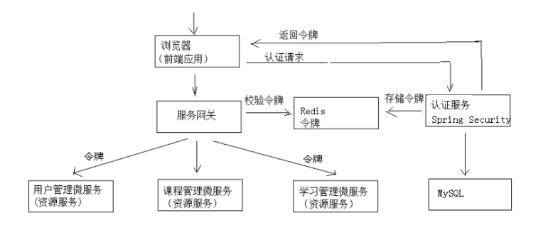
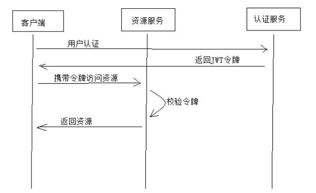
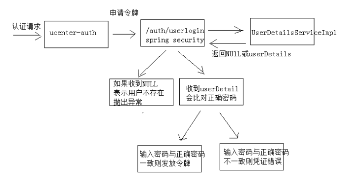
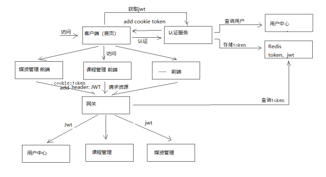
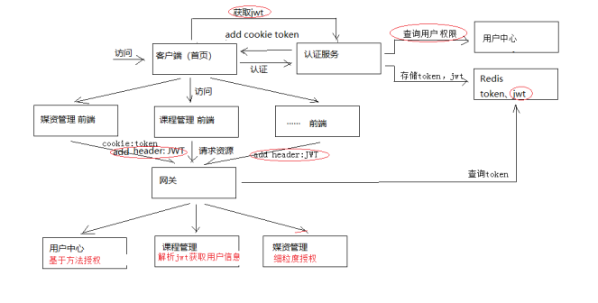

# Spring Security

## Spring Security Oauth2认证流程

* 用户请求认证服务完成认证；
* 认证服务下发用户身份令牌，拥有身份令牌表示身份合法；
* 用户携带令牌请求资源服务，需要先经过网关；
* 网关校验用户身份令牌的合法性，不合法则表示未登录，合法则表示放行请求；
* 资源服务获取令牌，根据令牌完成授权；
* 资源服务响应资源信息。




## JWT令牌授权过程

* 用户携带用户名密码请求认证服务；
* 认证服务校验后为用户颁发JWT令牌，使用RSA私钥进行加密；
* 客户端携带令牌访问资源服务，资源服务通过RSA公钥进行解密并校验令牌；
* 验证完成后根据权限返回相应的资源。




## JWT令牌结构

JWT令牌由三部分组成，每部分中间使用点（.）分隔，比如：xxxxx.yyyyy.zzzzz  

* Header：

  * 头部包括令牌的类型（即JWT）及使用的哈希算法（如HMAC SHA256或RSA）；  

  * ```json
    {
    	"alg": "HS256",
    	"typ": "JWT"
    }
    ```

  * 将上边的内容使用Base64Url编码，得到一个字符串就是JWT令牌的第一部分。

* Payload：

  * 第二部分是负载，内容也是一个json对象，它是存放有效信息的地方，它可以存放jwt提供的现成字段，比如：iss（签发者）,exp（过期时间戳）, sub（面向的用户）等，也可自定义字段；

  * 此部分不建议存放敏感信息，因为此部分可以解码还原原始内容；

  * 最后将第二部分负载使用Base64Url编码，得到一个字符串就是JWT令牌的第二部分。

  * ```json
    {
        "sub": "1234567890",
        "name": "456",
        "admin": true
    }
    ```

* Signature：

  * 第三部分是签名，此部分用于防止jwt内容被篡改；

  * 这个部分使用base64url将前两部分进行编码，编码后使用点（.）连接组成字符串，最后使用header中声明签名算法进行签名；

  * ```json
    HMACSHA256(
    	base64UrlEncode(header) + "." +
    	base64UrlEncode(payload),
    	secret
    )
    ```

  * base64UrlEncode(header)：jwt令牌的第一部分；

  * base64UrlEncode(payload)：jwt令牌的第二部分；

  * secret：签名所使用的密钥。


## 用户登录/身份认证

* 用户登录：
  * 请求认证服务通过认证，生成jwt令牌，将完整令牌信息写入redis，并将身份令牌写入cookie；
  * 用户访问资源服务，携带cookie经过网关；
  * 网关从cookie中获取身份令牌，查询redis校验令牌的合法性，不存在则拒绝访问，反之放行；
* 用户退出：
  * 先请求认证服务，清除redis中的令牌信息，并删除cookie中的身份令牌。


## 认证服务




## 用户认证流程



* 认证服务认证流程：
  * 认证服务请求用户中心查询用户信息；
  * 认证服务通过spring security申请令牌；
  * 认证服务将身份令牌和jwt令牌写入redis；
  * 认证服务向cookie写入身份令牌。
* 客户端显示用户信息：
  * 客户端携带身份令牌请求认证服务获取jwt令牌；
  * 客户端将jwt令牌存储到SessionStorage；
  * 客户端从jwt令牌中解析出用户信息并显示在页面。
* 客户端访问资源服务：
  * 客户端请求资源服务需要携带两个token，一个是cookie中的身份令牌，一个是http header中的jwt令牌。
* 网关校验令牌的合法性：
  * 用户的请求必须携带两个令牌；
  * 查询redis中的token是否和用户携带的token匹配，若过期则要求重新登录；


## 用户授权流程

资源服务授权：资源服务校验header中携带的jwt令牌，获取用户拥有的权限，根据权限开放相应的方法访问权限。


