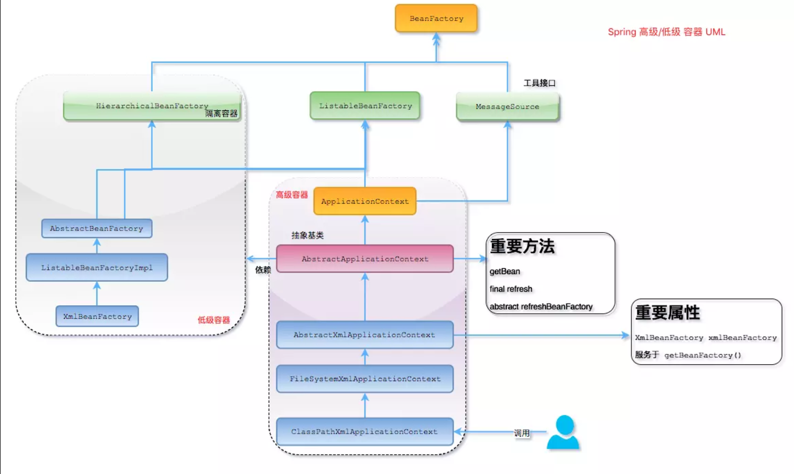
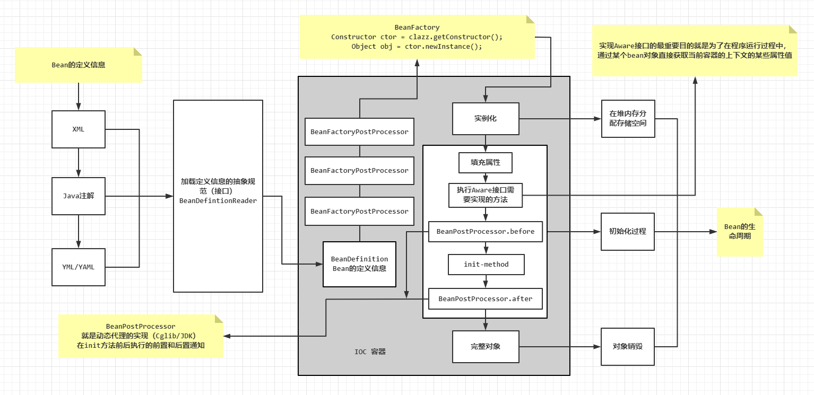
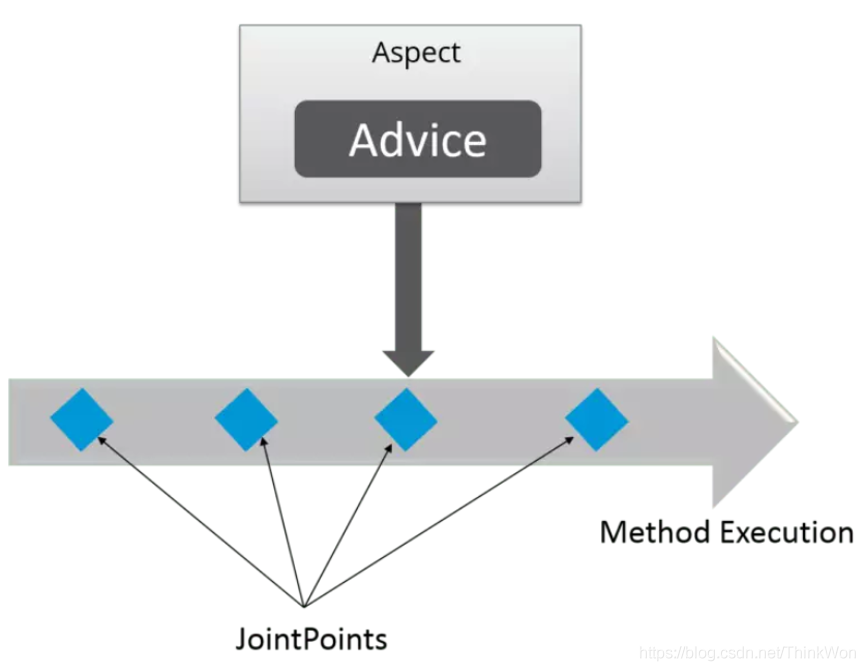

# Spring

## 基本概念

**概念**：

* Spring即Spring Framework，是一个轻量级的Java开发框架，目的是为了解决企业级应用开发的业务逻辑层和其他各层的耦合问题。

* 是一个分层的多模块的一站式的提高基础架构支持的开源框架，可以提高开发人员的开发效率以及系统的维护性和减少应用开发的复杂性，让Java开发者可以专注于业务逻辑的开发。

**特性**：

* **核心技术（Core technologies）**：依赖注入（DI）、AOP、事件（events）、资源、i18n、验证、数据绑定、类型转换、SpEL；
* **测试（Testing）**：模拟对象、TestContext框架、Spring MVC测试、WebTestClient；
* **数据访问（Data Access）**：事务、DAO支持、JDBC、ORM、编组XML；
* **Web支持（Spring MVC）**：Spring MVC和Spring WebFlux框架；
* **集成（Integration）**：远程处理、JMS、JCA、JMX、电子邮件、任务、调度、缓存；
* **语言（Languages）**：Kotlin、Groovy、动态语言。


## 重要模块

* **Spring Core**：基础模块，Spring的其他所有功能都基于该模块，主要包括控制反转（Inversion of Control，IoC）和依赖注入（Dependency Injection，DI）功能；
* **Spring Beans**：提供了BeanFactory对象工厂，是工厂设计模式的一个经典实现，Spring将其管理的对象称为Bean；
* **Spring Context**：构建于Core基础上的Context封装，提供了一种框架式的对象访问方法；
* **Spring JDBC**：提供了JDBC数据库连接的抽象层，消除了原生JDBC编码的繁杂和数据库厂商特有的错误代码解析，用于简化JDBC；
* **Spring AOP**：提供了面向切面的编程实现，让用户可以自定义拦截器、切点等；
* **Spring Web**：提供了针对Web应用开发的集成特性，如：文件上传、使用Servlet Listeners进行IoC容器的初始化等；
* **Spring Test**：主要为测试提供支持，支持使用JUnit或TestNG对Spring组件进行单元测试和集成测试；

* **Spring Aspects**：为AspectJ的集成提供支持；
* **Spring JMS**：Java消息服务；
* **Spring ORM**：用于支持Hibernate等对象关系映射框架。


## 设计模式

* **工厂设计模式**：Spring的BeanFactory和ApplicationContext都使用工厂模式创建Bean对象；
* **代理设计模式**：Spring AOP功能使用了JDK的动态代理和CGLIB字节码生成技术；
* **单例设计模式**：Spring的Bean对象默认都是单例的；
* **模板方法设计模式**：Spring的JpaTemplate、RestTemplate和JmsTemplate等都使用了模板方法设计，用于解决代码复用问题；
* **包装器设计模式**：当项目需要连接多个数据库，且不同的客户在每次访问中根据需要会去访问不同的数据库。这种包装器设计模式可以根据客户的需求动态切换不同的数据源；
* **观察者设计模式**：Spring的事件驱动模型，如ApplicationListener就是观察者模式的典型应用。定义对象的一对多依赖关系，当一个对象状态发生改变时，所有依赖于它的对象都会得到通知被自动更新；
* **适配器设计模式**：Spring AOP的增强或通知Advice使用了适配器模式。Spring MVC中的Controller也使用了适配器模式。


## 基本注解

**@Controller返回一个页面：**单独使用的话一般适用于需要返回视图的场景，属于传统的Spring MVC应用。


**@RestController返回JSON或XML形式的数据：**只会返回对象，对象的数据直接以JSON或XML的形式写入HTTP响应体中，这种情况属于RESTful Web服务，也是目前常用的前后端分离开发使用的机制。


**@Controller+@ResponseBody返回JSON或XML形式的数据：**因为Spring4.x之后才新加了@RestController注解，所以在Spring4.x之前开发RESTful Web应用需要结合使用两个注解。@ResponseBody会将控制器返回的对象转换为特定格式后，写入HTTP响应体中。


## IoC

### 基本概念

**概念**：

* 控制反转（IOC，Inverse of Control）是一种程序的设计思想，将原本在程序中手动创建的对象的控制权交由Spring管理，通过IoC容器来实现对象组件的装配和管理，容器底层通过Map结构维护对象。
* 所谓的控制反转就是对组件对象控制权的转移，从程序代码本身反转到了外部框架。
* IoC负责创建对象、管理对象（DI）、装配对象、配置对象和管理对象的整个生命周期。

**作用**：

* **简化开发流程**：将对象间的依赖关系交给IoC容器管理，并由其完成对象的注入。这样可以很大程度上简化应用程序的开发流程，把开发者从复杂的依赖关系中解放出来。
* **解耦**：由独立于应用程序的第三方框架去维护具体的对象。
* **托管类的生产过程**：

**优点**：

* 降低应用程序开发的代码量，易于维护；
* 使应用程序容易测试，单元测试不再需要单例和JNDI查找机制；
* 最小的代价和最小的代码侵入性使得松散耦合得以实现；
* 支持加载服务时的饿汉式初始化和懒加载。


### 实现机制

IoC的实现原理就是工厂模式+反射机制：

```java
interface Fruit {
    
	public abstract void eat();
}

class Apple implements Fruit {
	
    public void eat() {
		System.out.println("Apple");
	}
}

class Orange implements Fruit {
    
    public void eat(){
		System.out.println("Orange");
	}
}

class Factory {
    
    public static Fruit getInstance(String className) {
        Fruit f = null;
        try {
            f = (Fruit) Class.forName(className).newInstance();
        } catch (Exception e) {
            e.printStackTrace();
        }
        return f;
    }
}

class Client {
    
	public static void main(String[] a) {
		Fruit f = Factory.getInstance("io.github.example.spring.Apple");
		if (f != null) {
			f.eat();
		}	
	}
}
```


### 功能支持

* **依赖注入**：从XML配置上来说，即ref标签，对应Spring的RuntimeBeanReference对象。
* 依赖检查：
* 自动装配：
* 支持集合：
* 指定初始化方法和销毁方法：
* 支持回调某些方法：
* **容器**：管理Bean的生命周期，控制着Bean的依赖注入。


### BeanFactory和ApplicationContext的区别

BeanFactory和ApplicationContext是Spring的两大核心接口，都可以做为Spring容器。其中ApplicationContext是BeanFactory的子接口。

* **依赖关系**：

  * BeanFactory是Spring中的最底层接口，包含了各种Bean的定义，读取Bean配置文件，管理Bean的加载和实例化，控制Bean的生命周期，维护Bean之间的依赖关系。
  * ApplicationContext接口是BeanFactory的派生，除了具有BeanFactory的功能外，还提供了更完整的框架功能。如：继承MessageSource支持国际化，同一的资源文件访问方式，提供在监听器中注册Bean事件，同时加载多个配置文件等。

* **加载方式**：

  * BeanFactory通过延迟加载的形式注入Bean，即只有在使用某个Bean时（调用 `getBean()`），才对该Bean进行加载实例化。这样的缺点是不能及时发现Spring的配置问题，如果Bean的某个属性没有被注入，当BeanFactory加载后，直到第一次使用时才会抛出异常。
  * ApplicationContext是在容器启动时，一次性创建所有的Bean。这样做的可以在容器启动时就发现Spring中存中的配置问题，有利于检查所依赖属性是否注入。另一个好处是在启动后预载入所有的单实例Bean，当需要时无需等待直接使用。相对于BeanFactory，ApplicationContext唯一不足的是占用更多的内存空间，当应用程序配置的Bean较多时，启动较慢。

* **创建方式**：BeanFactory通常以编码的方式被创建，ApplicationContext还可以通过声明的方式创建，如使用ContextLoader。

* **注册方式**：BeanFactory和ApplicationContext都支持BeanPostProcessor、BeanFactoryPostProcessor的使用。二者的区别在于BeanFactory需要手动注册，而ApplicationContext则是自动注册。

* **容器设计**：

  * BeanFactory可以理解为一个HashMap，Key是BeanName，Value是Bean实例。通常只提供put注册和get获取这两个功能。

  * ApplicationContext继承了多个接口，具备更多的功能，如：资源的获取，支持多种消息（JSP tag的支持），工具级别的支持等待。该接口定义了一个refresh方法，用于刷新整个容器，即重新加载所有的Bean。

  * 通过ClassPathXmlApplicationContext类展示整个容器的UML层级关系：

    * 最上层是BeanFactory，下面3个绿色的是功能扩展接口；
    * 红色的派生于ApplicationContext的是高级容器，依赖着低级容器，即依赖着低级容器的getBean功能，且自己具有更多高级功能。如：支持不同的信息源头，文件资源访问，支持应用事件等；
    * 左边的灰色区域是低级容器，只负责加载和获取Bean。即加载配置文件，解析成BeanDefinition存入Map，当调用getBean获取时，从BeanDefinition所属的Map中获取Class对象实例化，如果存在依赖关系，则递归调用getBean方法，完成依赖注入。

    


### ApplicationContext的通常实现

* **FileSystemXmlApplicationContext**：该容器从XML文件中加载Beans的定义。会根据全路径名查找Bean的配置文件。
* **ClassPathXmlApplicatuionContext**：该容器从XML文件中加载Beans的定义。会在classpath下查找Bean的配置文件。
* **WebXmlApplicationContext**：允许从相对于Web根目录的路径中加载配置文件完成初始化工作。


### 依赖注入

**概念**：IoC的两个主要实现方式是依赖注入和依赖查找。所谓的依赖注入（Dependency Injection）是组件之间依赖关系由容器在应用程序运行期间来决定，即由容器动态的将某种依赖关系的目标对象实例注入到应用程序中的各个关联组件中。组件不做定位查询，只提供普通的Java方法让容器去决定依赖关系。

**基本原则**：应用组件不应该负责查找资源或者其他依赖的协作对象。配置对象的工作应该由IoC容器负责，查找资源的逻辑应该从应用组件的代码中抽取出来，交给IoC负责。容器全权负责组件的装配，会把符合依赖关系的对象通过属性（Java Bean的setter）或是构造器传递给需要的对象。

**优点**：容器全权负责依赖查询，受管理的组件只需要暴露Java Bean的setter方法或是有参构造器，使容器可以在初始化时组装对象的依赖关系。

* 查找定位操作与应用代码无关；
* 不依赖于容器的API，可以很容易的在任何容器以外使用应用对象；
* 不需要特殊的接口，绝大多数对象可以做到完全不必依赖容器。

**实现方式**：

* 接口注入（Interface Injection）：由于灵活性和易用性较差，从Spring4开始被废弃。

* Setter方法注入（Setter Injection）：是容器通过调用无参构造器或无参static工厂方法实例化Bean之后，调用该Bean的setter方法为其设置依赖的类，即实现了基于setter方法的依赖注入。
* 构造器注入（Constructor Injection）：通过容器触发一个类的构造器来实现，该类有一系列参数，每个参数代表一个对其他类的依赖。

* 二者区别：

|      **构造函数注入**      |    **setter** **注入**     |
| :------------------------: | :------------------------: |
|        没有部分注入        |         有部分注入         |
|    不会覆盖 setter 属性    |     会覆盖 setter 属性     |
| 任意修改都会创建一个新实例 | 任意修改不会创建一个新实例 |
|     适用于设置很多属性     |     适用于设置少量属性     |


### IoC源码分析

**源码注释**：

```JAVA
BeanNameAware's setBeanName
BeanClassLoaderAware's setBeanClassLoader
BeanFactoryAware's setBeanFactory
EnvironmentAware's setEnvironment
EmbeddedValueResolverAware's setEmbeddedValueResolver
ResourceLoaderAware's setResourceLoader (only applicable when running in an application context)
ApplicationEventPublisherAware's setApplicationEventPublisher (only applicable when running in an application context)
MessageSourceAware's setMessageSource (only applicable when running in an application context)
ApplicationContextAware's setApplicationContext (only applicable when running in an application context)
ServletContextAware's setServletContext (only applicable when running in a web application context)
postProcessBeforeInitialization methods of BeanPostProcessors
InitializingBean's afterPropertiesSet
a custom init-method definition
postProcessAfterInitialization methods of BeanPostProcessors
```



`applicationContext.xml`

```JAVA
<beans>
    <bean id="teacher" class="com.test.Teacher">
    	<property name="name" value="albert"></property>
    </bean>
</beans>
```

`Test.java`

```java
public static void main(String[] args) {
    AbstractApplicationContext ac = new ClassPathXmlApplicationContext("applicationContext.xml");
    Teacher bean = ac.getBean(Teacher.class);
    bean.getBeanName();
    bean.getEnvironment();
}
```

`ClassPathXmlApplicationContext构造方法`

```java
public ClassPathXmlApplicationContext(String[] configLocations, boolean refresh, ApplicationContext parent) throws BeansException {
    // 调用父类构造方法，进行相关对象的创建、属性的赋值等操作
    super(parent);
    setConfigLocations(configLocations);
    if (refresh) {
        refresh();
    }
}
```

`AbstractApplicationContext#refresh()`

```JAVA
@Override
public void refresh() throws BeansException, IllegalStateException {
    synchronized (this.startupShutdownMonitor) {
        // Prepare this context for refreshing.
        /**
         * 做容器刷新前的准备工作：
         * 1.设置容器的启动时间；
         * 2.设置活跃状态为true；
         * 3.设置关闭状态为false；
         * 4.获取Environment对象，并加载当前系统的属性值到Environment对象中；
         * 5.准备监听器和事件的集合对象，默认为空的集合。
         */
        prepareRefresh();

        // Tell the subclass to refresh the internal bean factory.
        // 创建容器对象，DefaultListableBeanFactory
        // 加载xml配置文件的属性值到当前工厂中，最重要的就是BeanDefinition
        ConfigurableListableBeanFactory beanFactory = obtainFreshBeanFactory();  

        // Prepare the bean factory for use in this context.
        // BeanFactory的准备工作，对各种属性进行填充
        prepareBeanFactory(beanFactory);

        try {
            // Allows post-processing of the bean factory in context subclasses.
            // 留给子类进行扩展的模板方法
            postProcessBeanFactory(beanFactory);

            // Invoke factory processors registered as beans in the context.
            // 真正执行各种BeanFactoryPostProcessor
            invokeBeanFactoryPostProcessors(beanFactory);

            // Register bean processors that intercept bean creation.
            // 注册BeanPostProcessor，这里只是注册功能，真正执行的是getBean方法
            registerBeanPostProcessors(beanFactory);

            // Initialize message source for this context.
            // 为上下文初始化message源，即不同语言的消息体、国际化处理
            initMessageSource();

            // Initialize event multicaster for this context.
            // 初始化事件监听的多路广播器
            initApplicationEventMulticaster();

            // Initialize other special beans in specific context subclasses.
            // 留给子类来初始化其他的Bean
            onRefresh();

            // Check for listener beans and register them.
            // 在所有注册的Bean中查找Listener Bean，注册到消息广播器中
            registerListeners();

            // Instantiate all remaining (non-lazy-init) singletons.
            // 实例化剩下的非懒加载的单实例
            finishBeanFactoryInitialization(beanFactory);

            // Last step: publish corresponding event.
            // 完成刷新过程，通知生命周期处理器LifecycleProcessor刷新过程，同时发出ContextRefreshEvent通知别人
            finishRefresh();
        }

        catch (BeansException ex) {
            if (logger.isWarnEnabled()) {
                logger.warn("Exception encountered during context initialization - " +
                            "cancelling refresh attempt: " + ex);
            }

            // Destroy already created singletons to avoid dangling resources.
            destroyBeans();

            // Reset 'active' flag.
            cancelRefresh(ex);

            // Propagate exception to caller.
            throw ex;
        }

        finally {
            // Reset common introspection caches in Spring's core, since we
            // might not ever need metadata for singleton beans anymore...
            resetCommonCaches();
        }
    }
}
```

`AbstractApplicationContext#prepareRefresh()`

```JAVA
protected void prepareRefresh() {
    // Switch to active.
    // 设置容器启动的时间
    this.startupDate = System.currentTimeMillis();
    // 容器的关闭标志位
    this.closed.set(false);
    // 容器的激活标志位
    this.active.set(true);

    // 日志记录
    if (logger.isDebugEnabled()) {
        if (logger.isTraceEnabled()) {
            logger.trace("Refreshing " + this);
        }
        else {
            logger.debug("Refreshing " + getDisplayName());
        }
    }

    // Initialize any placeholder property sources in the context environment.
    // 留给子类覆盖，初始化属性资源
    initPropertySources();

    // Validate that all properties marked as required are resolvable:
    // see ConfigurablePropertyResolver#setRequiredProperties
    // 创建并获取环境对象，验证需要的属性文件是否都已经放入环境中
    getEnvironment().validateRequiredProperties();

    // Store pre-refresh ApplicationListeners...
    // 判断刷新前的应用程序监听器集合是否为空，如果为空，则将监听器添加到该集合中
    if (this.earlyApplicationListeners == null) {
        this.earlyApplicationListeners = new LinkedHashSet<>(this.applicationListeners);
    }
    else {
        // Reset local application listeners to pre-refresh state.
        // 如果不为空，则清空集合中的元素对象
        this.applicationListeners.clear();
        this.applicationListeners.addAll(this.earlyApplicationListeners);
    }

    // Allow for the collection of early ApplicationEvents,
    // to be published once the multicaster is available...
    // 创建刷新前的监听器事件集合
    this.earlyApplicationEvents = new LinkedHashSet<>();
}
```

`AbstractApplicationContext#ConfigurableListableBeanFactory()`

```JAVA
protected ConfigurableListableBeanFactory obtainFreshBeanFactory() {
    refreshBeanFactory();
    return getBeanFactory();
}
```

`AbstractRefreshableApplicationContext#refreshBeanFactory()`

```JAVA
@Override
protected final void refreshBeanFactory() throws BeansException {
    // 如果存在beanFactory，则销毁
    if (hasBeanFactory()) {
        destroyBeans();
        closeBeanFactory();
    }
    try {
        // 创建DefaultListableBeanFactory对象
        DefaultListableBeanFactory beanFactory = createBeanFactory();
        // 为了序列化指定id，可以从id反序列化到beanFactory对象
        beanFactory.setSerializationId(getId());
        // 定制beanFactory，设置相关属性，包括是否允许覆盖同名的不同定义的对象以及循环依赖
        customizeBeanFactory(beanFactory);
        // 初始化documentReader，并进行XML文件读取及解析，默认命名空间的解析，自定义标签的解析
        loadBeanDefinitions(beanFactory);
        synchronized (this.beanFactoryMonitor) {
            this.beanFactory = beanFactory;
        }
    }
    catch (IOException ex) {
        throw new ApplicationContextException("I/O error parsing bean definition source for " + getDisplayName(), ex);
    }
}
```

`AbstractApplicationContext#prepareBeanFactory()`

```JAVA
protected void prepareBeanFactory(ConfigurableListableBeanFactory beanFactory) {
    // Tell the internal bean factory to use the context's class loader etc.
    // 设置beanFactory的classloader为当前context的classloader
    beanFactory.setBeanClassLoader(getClassLoader());
    // 设置beanFactory的表达式语言处理器
    beanFactory.setBeanExpressionResolver(new StandardBeanExpressionResolver(beanFactory.getBeanClassLoader()));
    // 为beanFactory增加一个默认的propertyEditor，这个主要是对bean的属性等设置管理的一个工具类
    beanFactory.addPropertyEditorRegistrar(new ResourceEditorRegistrar(this, getEnvironment()));

    // Configure the bean factory with context callbacks.
    // 添加beanPostProcessor。ApplicationContextAwareProcessor用于完成某些Aware对象的注入
    beanFactory.addBeanPostProcessor(new ApplicationContextAwareProcessor(this));
    // 设置要忽略自动装配的接口，因为这些接口的实现是由容器通过set方法进行注入，所以在使用Autowire时需要忽略这些接口
    beanFactory.ignoreDependencyInterface(EnvironmentAware.class);
    beanFactory.ignoreDependencyInterface(EmbeddedValueResolverAware.class);
    beanFactory.ignoreDependencyInterface(ResourceLoaderAware.class);
    beanFactory.ignoreDependencyInterface(ApplicationEventPublisherAware.class);
    beanFactory.ignoreDependencyInterface(MessageSourceAware.class);
    beanFactory.ignoreDependencyInterface(ApplicationContextAware.class);

    // BeanFactory interface not registered as resolvable type in a plain factory.
    // MessageSource registered (and found for autowiring) as a bean.
    // 设置几个自动装配的特殊规则，当在进行IOC初始化的如果有多个实现，那么就使用指定的对象进行注入
    beanFactory.registerResolvableDependency(BeanFactory.class, beanFactory);
    beanFactory.registerResolvableDependency(ResourceLoader.class, this);
    beanFactory.registerResolvableDependency(ApplicationEventPublisher.class, this);
    beanFactory.registerResolvableDependency(ApplicationContext.class, this);

    // Register early post-processor for detecting inner beans as ApplicationListeners.
    // 注册BeanPostProcessor
    beanFactory.addBeanPostProcessor(new ApplicationListenerDetector(this));

    // Detect a LoadTimeWeaver and prepare for weaving, if found.
    // 增加对AspectJ的支持，在Java中的织入分为三种方式，即编译期织入，类加载期织入，运行期织入。编译器织入发生在编译期间；类加载器织入是通过特殊的类加载器，在类字节码加载到JVM时，织入切面；运行期织入则是采用Cglib和jdk进行织入
    if (beanFactory.containsBean(LOAD_TIME_WEAVER_BEAN_NAME)) {
        beanFactory.addBeanPostProcessor(new LoadTimeWeaverAwareProcessor(beanFactory));
        // Set a temporary ClassLoader for type matching.
        beanFactory.setTempClassLoader(new ContextTypeMatchClassLoader(beanFactory.getBeanClassLoader()));
    }

    // Register default environment beans.
    // 注册默认的系统环境bean到一级缓存中
    if (!beanFactory.containsLocalBean(ENVIRONMENT_BEAN_NAME)) {
        beanFactory.registerSingleton(ENVIRONMENT_BEAN_NAME, getEnvironment());
    }
    if (!beanFactory.containsLocalBean(SYSTEM_PROPERTIES_BEAN_NAME)) {
        beanFactory.registerSingleton(SYSTEM_PROPERTIES_BEAN_NAME, getEnvironment().getSystemProperties());
    }
    if (!beanFactory.containsLocalBean(SYSTEM_ENVIRONMENT_BEAN_NAME)) {
        beanFactory.registerSingleton(SYSTEM_ENVIRONMENT_BEAN_NAME, getEnvironment().getSystemEnvironment());
    }
}
```

`AbstractApplicationContext#finishBeanFactoryInitialization()`

```JAVA
protected void finishBeanFactoryInitialization(ConfigurableListableBeanFactory beanFactory) {
    // Initialize conversion service for this context.
    if (beanFactory.containsBean(CONVERSION_SERVICE_BEAN_NAME) &&
        beanFactory.isTypeMatch(CONVERSION_SERVICE_BEAN_NAME, ConversionService.class)) {
        beanFactory.setConversionService(
            beanFactory.getBean(CONVERSION_SERVICE_BEAN_NAME, ConversionService.class));
    }

    // Register a default embedded value resolver if no bean post-processor
    // (such as a PropertyPlaceholderConfigurer bean) registered any before:
    // at this point, primarily for resolution in annotation attribute values.
    if (!beanFactory.hasEmbeddedValueResolver()) {
        beanFactory.addEmbeddedValueResolver(strVal -> getEnvironment().resolvePlaceholders(strVal));
    }

    // Initialize LoadTimeWeaverAware beans early to allow for registering their transformers early.
    String[] weaverAwareNames = beanFactory.getBeanNamesForType(LoadTimeWeaverAware.class, false, false);
    for (String weaverAwareName : weaverAwareNames) {
        getBean(weaverAwareName);
    }

    // Stop using the temporary ClassLoader for type matching.
    beanFactory.setTempClassLoader(null);

    // Allow for caching all bean definition metadata, not expecting further changes.
    beanFactory.freezeConfiguration();

    // Instantiate all remaining (non-lazy-init) singletons.
    beanFactory.preInstantiateSingletons();
}
```

`DefaultListableBeanFactory#preInstantiateSingletons()`

```java
@Override
public void preInstantiateSingletons() throws BeansException {
    if (logger.isTraceEnabled()) {
        logger.trace("Pre-instantiating singletons in " + this);
    }

    // Iterate over a copy to allow for init methods which in turn register new bean definitions.
    // While this may not be part of the regular factory bootstrap, it does otherwise work fine.
    // 将所有BeanDefinition的名字创建一个集合
    List<String> beanNames = new ArrayList<>(this.beanDefinitionNames);

    // Trigger initialization of all non-lazy singleton beans...
    // 触发所有非懒加载单例Bean的初始化，遍历集合的对象
    for (String beanName : beanNames) {
        // 合并父类BeanDefinition
        RootBeanDefinition bd = getMergedLocalBeanDefinition(beanName);
        // 条件判断、抽象、单例、非懒加载
        if (!bd.isAbstract() && bd.isSingleton() && !bd.isLazyInit()) {
            // 判断是否实现了FactoryBean接口
            if (isFactoryBean(beanName)) {
                // 根据&+beanName来获取具体的对象
                Object bean = getBean(FACTORY_BEAN_PREFIX + beanName);
                // 进行类型转换
                if (bean instanceof FactoryBean) {
                    final FactoryBean<?> factory = (FactoryBean<?>) bean;
                    // 判断这个FactoryBean是否希望急切的初始化
                    boolean isEagerInit;
                    if (System.getSecurityManager() != null && factory instanceof SmartFactoryBean) {
                        isEagerInit = AccessController.doPrivileged((PrivilegedAction<Boolean>)
                                                                    ((SmartFactoryBean<?>) factory)::isEagerInit,
                                                                    getAccessControlContext());
                    }
                    else {
                        isEagerInit = (factory instanceof SmartFactoryBean &&
                                       ((SmartFactoryBean<?>) factory).isEagerInit());
                    }
                    // 如果希望急切的初始化，则通过beanName获取bean实例
                    if (isEagerInit) {
                        getBean(beanName);
                    }
                }
            }
            else {
                // 如果beanName对应的bean不是FactoryBean，只是普通的bean，则通过beanName获取bean实例
                getBean(beanName);
            }
        }
    }

    // Trigger post-initialization callback for all applicable beans...
    // 遍历beanName，触发所有SmartInitializingSingleton的后初始化回调
    for (String beanName : beanNames) {
        Object singletonInstance = getSingleton(beanName);
        // 判断singletonInstance是否实现了SmartInitializingSingleton接口
        if (singletonInstance instanceof SmartInitializingSingleton) {
            final SmartInitializingSingleton smartSingleton = (SmartInitializingSingleton) singletonInstance;
            if (System.getSecurityManager() != null) {
                AccessController.doPrivileged((PrivilegedAction<Object>) () -> {
                    smartSingleton.afterSingletonsInstantiated();
                    return null;
                }, getAccessControlContext());
            }
            else {
                smartSingleton.afterSingletonsInstantiated();
            }
        }
    }
}
```


## Beans

### 什么是Spring Beans？

Spring Beans是一系列形成Spring应用的主干Java对象。被Spring IoC容器初始化、装配和管理。这些Beans通过容器中配置的元数据创建，如：XML文件形式的配置文件。

### 一个Spring Bean定义包含什么？

一个Spring Bean中定义包含容器必知的所有配置元数据，包括如何创建一个Bean，Bean的声明周期以及Bean的依赖。

### 如何给Spring容器提供配置元数据？Spring有几种配置方式？

* XML配置文件的方式；
* 基于注解的配置；
* 基于Java代码的配置。

### Spring配置文件包含了哪些信息？

包含类信息，描述了如果配置类以及如果相互依赖相互调用。

### Spring基于XML注入Bean的几种方式

* Set方法注入；
* 构造器注入：通过index设置参数位置，通过type参数设置参数类型；
* 静态工厂注入；
* 实例工厂注入。

### 怎样自定义类的作用域？

可以哦通过Bean定义中的scope属性来定义，如：当需要Spring在使用类时每次生产一个新的Bean实例，就将scope属性设置为prototype，若需要Bean每次使用时返回同一个实例，就将scope设置为singleton。

### Spring Bean的作用域

* singleton：默认，Bean在每个Spring IoC容器中只存在一个实例；
* prototype：一个Bean的定义可以有多个实例；
* request：每次HTTP请求创建新的Bean，但仅在该次HTTP请求内有效；
* session：每次HTTP请求创建新的Bean，但仅在当前HTTP的session会话有效；
* global-session：

### Spring单例Bean的线程安全问题

Spring并没有对单例Bean进行线程安全的保证。实际上大部分的Bean都是无状态的（如：dao层，不保存数据），所以某种程度上说Bean也是线程安全的，单如果Bean是有状态的（如：view、miodel对象，具有数据存储功能），那就需要开发者保证线程安全了。

最简单的方式就是改变Bean的作用域，即将singleton变为prototype，让每次请求都对应一个Bean实例，保证线程安全。

### Spring的线程并发问题

一般情况下，只有无状态的Bean才能在多线程环境下被共享，Spring中绝大部分Bean都可以声明为singleton，Spring会对Bean中非线程安全的状态采用ThreadLocal处理。

ThreadLocal和线程同步机制都是为了解决多线程中相同变量的访问冲突问题。同步机制采用时间换空间的方式，ThreadLocal采用了空间换时间的方式。

ThreadLocal为每个线程提供一个独立的变量副本，从而隔离多线程对数据的访问冲突。在编写代码时可以将线程不安全的变量装进ThreadLocal。

### Spring Bean的生命周期

Bean在Spring容器中从创建到销毁经历了若干阶段，每一阶段都可以针对Spring如果管理Bean进行个性化定制。


* Spring对Bean进行了实例化；
* Spring将值和Bean的引用注入到Bean对应的属性中；
* 如果Bean实现了BeanNameAware接口，那么会将Bean的ID传递给setBeanName()方法；
* 如果Bean实现了BeanFactory‘Aware接口，那么会调用setBeanFactory()方法，将BeanFactory容器实例传入；
* 如果Bean实现了ApplicationContextAware接口，那么会调用setApplicationContext()方法，将Bean所在的应用上下文引用传入；
* 如果Bean实现了InitiaizingBean接口，那么会调用它们的afterPropertiesSet()方法。同样的，如果Bean使用init-method声明了初始化方法，也会调用；
* 如果Bean实现了BeanPostProcessor接口，那么会调用它们的postProcessAfterInitialization()方法；
* 最后，Bean已经准备就绪，可以被应用程序所使用，它们将会一直驻留在内存中，直到应用上下文被销毁；
* 当容器关闭时，如果Bean实现了DisposableBean接口，Spring会调用其destroy()方法。同样的，如果Bean使用destroy-method声明了销毁方法，也会调用。

### 重要的Bean生命周期方法

Bean生命周期有两个重要的方法。第一个是setup，会在容器加载Bean时被调用。第二个是teardown，会在容器卸载类时被调用。

XML配置的Bean标签有两个重要属性init-method和destroy-method。可以自定义初始化和销毁方法，它们对应的注解是@PostConstruct和@PreDestroy。

### Spring Inner Beans

在Spring中，当一个Bean仅被当作另一个Bean的属性时，就能被声明为内部Bean。内部Bean可以通过setter注入属性和构造器注入构造参数的方式实现，内部Bean通常是匿名的，它们的scope一般是prototype。

### Spring注入Java集合

### Bean自动装配

**装配**：指在Spring容器中把Bean组装到一起，前提是容器需要知道Bean的依赖关系，以及如何通过依赖注入装配它们。

**自动装配**：在Spring中，对象无需查找或创建与其关联的其他对象，而是由容器负责把需要相互协作的对象引用赋予给各个对象，使用XML方式的autowire来配置自动装配模式。

* **no**：默认是不进行自动装配的，通过手动设置ref属性来进行Bean的装配；
* **byName**：通过Bean的名称进行自动装配，即如果一个Bean的property与另一个Bean的name相同，就进行自动装配；
* **byType**：通过参数的数据类型进行自动装配；
* **constructor**：使用构造器进行装配，构造器的参数通过byType进行装配；
* **autodetect**：自动探测，如果存在构造器，则通过construct的方式自动装配，否则使用byType的方式自动装配。

**@Autowired注解自动装配的流程**：

* 使用前需要在Spring配置文件中进行配置 `<context:annotation-config/>`；
* 在启动Spring IoC时，容器自动装载了一个AutowiredAnnotationBeanPostProcessor后置处理器，当容器扫描到@Autowired、@Resource或@Inject时，就会在IoC容器自动查找需要的Bean，并装配给该对象的属性。
* 在使用@Autowired时，首先在容器中查询对应类型的Bean：
  * 如果查询结果刚好一个，则将该Bean装配给@Autowirted修饰的对象；
  * 如果查询结果不止一个，那么@Autowired就会根据名称来查找；
  * 如果上述查询结果为空，那么会抛出异常。

**自动装配的局限性**：

* **重写**：
* **基本数据类型**：无法自动装配基本数据类型；
* **模糊特性**：不如显式装配精确。


### Spring的循环依赖问题


## 注解

### @Component/@Controller/@Repository/@Service的区别

* **@Component**：将Java类标记为Bean，是任何Spring管理组件都通用的类型；
* **@Controller**：将Java类标记为Spring Web MVC的控制器，会自动导入IoC容器中；
* **@Service**：是@Component的特化，没有提供任何其他功能，可以在服务层使用@Service来更加明确意图；
* **@Repository**：是@Component的特化，将DAO层类到日IoC容器，并使未经检查的异常有资格转换未SpringDataAccessException。


### @Required注解

表明Bean的属性在配置时必须被设置，通过XML配置文件设置或通过自动装配，若@Required注解修饰的Bean属性未被设置，容器将抛出BeanInitializationException。


### @Autowired注解

该注解默认是按照类型装配注入的，默认情况下要求依赖对象必须存储（可以设置required=false，可以不存在）。该注解提供了细粒度的控制，包括在何处以及如何完成自动装配。用法和@Required一样，修饰setter方法、构造器或成员变量。


### @Autowired和@Resource的区别

* @Autowired默认按照类型装配注入，默认情况下要求依赖的对象必须存在；
* @Resource默认按照名称装配注入，只有当找不到与名称匹配的Bean才会按照类型来装配注入。


### @Qualifier注解

当创建了多个相同类型的Bean并希望使用属性装配其中一个Bean时，可以使用该注解和@Autowired指定装配确切的Bean来消除歧义。


### @RequestMapping注解

用于将特定HTTP请求映射到MVC控制器中的相应处理类/方法上。

* 类级别：映射请求的URL；
* 方法级别：映射URL以及HTTP请求方法。


## 事务

### 事务管理方式

* **编程式事务**：通过编程的方式管理事务，带来极大灵活性的同时会难以维护。
* **声明式事务**：将业务代码和事务管理代码分离，只需要用注解和XML配置来管理事务。


### 事务隔离级别

* **TransactionDefinition.ISOLATION_DEFAULT**：即使用数据库的默认隔离级别，MySQL的默认隔离级别是REPEATABLE_READ；
* **TransactionDefinition.ISOLATION_READ_UNCOMMITTED**：读未提交。最低的隔离级别，允许读取尚未提交的数据变更，可能会导致脏读、幻读和不可重复读；
* **TransactionDefinition.ISOLATION_READ_COMMITTED**：读已提交。允许读取并发事务已经提交的数据，可以阻止脏读，但幻读和不可重复读仍有可能发生；
* **TransactionDefinition.ISOLATION_REPEATABLE_READ**：可重复读。对同一字段的多次读取结果都是一致的，除非数据是被当前事务所修改，可以阻止脏读和不可重复读，但不能阻止幻读；
* **TransactionDefinition.ISOLATION_SERIALIZABLE**：可串行化。最高的隔离级别，让所有事务依次执行，完全避免事务之间产生的相互影响，可以阻止脏读、不可重复读和幻读，但严重影响程序的性能。


### 事务传播行为

所谓的事务传播行为是指在当前事务内调用了其他方法，则其他方法如何处理事务，当前事务如何传播过去。 

* **TransactionDefinition.PROPAGATION_REQUIRED**：如果当前没有事务，就创建一个新事务，如果当前存在事务，就加入该事务；
* **TransactionDefinition.PROPAGATION_SUPPORTS**：如果当前存在事务，就加入该事务，如果当前不存在事务，就以非事务的方式执行；
* **TransactionDefinition.PROPAGATION_MANDATORY**：如果当前存在事务，就加入该事务，如果当前不存在事务，就抛出异常；
* **TransactionDefinition.PROPAGATION_REQUIRES_NEW**：无论当前是否存在事务，都会创建新事务；
* **TransactionDefinition.PROPAGATION_NOT_SUPPORTED**：以非事务的方式运行，如果当前存在事务，则把当前事务挂起；
* **TransactionDefinition.PROPAGATION_NEVER**：以非事务的方式运行，如果当前存在事务，则抛出异常；
* **TransactionDefinition.PROPAGATION_NESTED**：如果当前存在事务，则创建一个事务做为当前事务的嵌套事务来运行，如果当前没有事务，则等价于PROPAGATION_REQUIRED。


### @Transactional注解

当@Transactional注解作用于类上时，该类的所有public方法都将具有该类型的事务属性，同时也可以在方法级别使用该注解，被注解表示的类或方法一旦抛出异常，就会回滚。在@Transactional中如果不指定rollback属性，那么只有在遇到RuntimeException运行时异常时才会回滚，指定rollback=Exception.class时会让事务在遇到非运行时异常时也能回滚。


## AOP

### 什么是AOP？

**OOP（Object-Oriented Programming）**：即面向对象编程，允许开发者自定义纵向关系，但不适用与定义横向关系，导致产生大量重复代码，且不利于各个模块的重用。

**AOP（Aspect-Oriented Programming）**：即面向切面编程，是对面向对象的补充，用于将那些与业务无关的，但却对多个对象产生影响的公共行为和逻辑，抽取并封装为一个可重用的模块，这个模块被命名为切面（Aspect）。这样可以减少系统中的重复代码，降低模块间的耦合度，同时提高系统的可维护性。可用于权限认证、缓存查询、加锁解锁、日志记录和事务处理等场景。

### Spring AOP和AspectJ AOP的区别

AOP实现的关键在于代理模式，AOP代理主要分为静态代理和动态代理。

* AspectJ是静态代理的增强，所谓静态代理就是AOP框架会在编译阶段生成AOP代理类，因此也称为编译时增强。即会在编译阶段将AspectJ切面织入到Java字节码中，当运行时就是增强后的AOP对象。
* Spring AOP使用的是动态代理，所谓动态代理就是AOP框架不会修改字节码，而是在运行时生成AOP对象，这个AOP对象包含了目标对象的全部方法，并且在特定的切点做了增强处理，并且回调了原对象的方法。

### JDK动态代理和CGlib动态代理的区别

Spring AOP中的动态代理主要有两种方式，分别为是JDK动态代理和CGlib动态代理。

* JDK动态代理只提供接口的代理，不支持类的代理。核心InvocationHandler接口和Proxy类，InvocationHandler通过invoke()方法反射来调用目标类的代码，动态的将横切逻辑和业务编织在一起。然后Proxy通过InvocationHandler动态创建一个符合某一接口的实例，生成目标类的代理对象。
* 如果代理类没有InvocationHandler接口，那么Spring AOP会选择使用CGlib来动态代理目标类。CGlib（Code Generation Library）是一个代码生成类库，可以在运行时动态生成指定类的一个子类对象，并覆盖其中特定方法并添加增强代码，从而实现AOP。CGlib是通过继承的方式做的动态代理，因此如果某个类被标记为final，那么是无法使用CGlib做动态代理的。

静态代理与动态代理的区别在于生成AOP代理对象的时机不同，相对来说AspectJ的静态代理方式具有更好的性能，但是AspectJ需要特定的编译器进行处理，而Spring AOP则无需特定的编译器处理。

InvocationHandler的 `invoke(Object proxy, Method method, Object[] args);` ，其中proxy是最终生成的代理实例，method是被代理目标实例的某个具体方法，args是被代理目标实例某个方法的具体入参，在方法反射调用时使用。

### Spring AOP中的名词

Spring中的代理是将Advice应用于目标对象后创建的对象称为代理。在客户端对象的情况下，目标对象和代理对象是相同的。即：Advice + Target Object = Proxy。


* **切面（Aspect）**：切面是通知和切点的结合。通知和切点共同定义了切面的全部内容。在Spring AOP中，切面可以使用通用类（基于模式的风格）或者在普通类中以@AspectJ注解来实现；
* **连接点（Join point）**：指方法，在Spring AOP中，一个连接点总是代表一个方法的执行。应用可能有数以千计的时机应用通知。这些时机被称为连接点。连接点是在应用执行过程中能够插入切面的一个点。这个点可以是调用方法时、抛出异常时、甚至修改一个字段时。切面代码可以利用这些点插入到应用的正常流程之中，并添加新的行为；
* **通知（Advice）**：切面的工作被称为通知；
* **切入点（Pointcut）**：切点用于定义要对哪些连接点进行拦截，切入点的定义会匹配通知所要织入的一个或多个连接点。通常使用明确的类和方法名称，或是利用正则表达式定义所匹配的类和方法名称来指定这些切点；
* **引入（Introduction）**：向现有的类添加新方法或属性；
* **目标对象（Target Object）**：被一个或多个切面所通知的对象。通常是一个代理对象，也被称为通知对象。既然Spring AOP是通过运行时代理实现的，那么这个对象永远是一个被代理对象；
* **织入（Weaving）**：织入是把切面应用到目标对象并创建新代理对象的过程。在目标对象的生命周期里有多个点可以进行织入：
  * **编译期**：切面在目标类编译时被织入。AspectJ的织入编译器就是以这种方式织入切面的；
  * **类加载期**：切面在目标类加载到JVM时被织入。需要特殊的类加载器，它可以在目标类被引入应用之前增强该目标类的字节码。AspectJ5的加载时织入就支持这种方式；
  * **运行期**：切面在应用运行的某个时刻被织入。一般在织入切面时，AOP容器会为目标对象动态的创建一个代理对象。Spring AOP就是以这种方式织入的。

### Spring的运行时通知

通过代理类包裹切面，Spring在运行期把切面织入到Spring管理的Bean中。代理封装了目标类，并拦截被通知的方法调用，再把调用转发给真正的目标Bean。当代理拦截到方法调用时，在调用目标Bean方法之前，会执行切面逻辑。

直到应用是需要被代理的Bean时，Spring才创建代理对象。如果使用的是ApplicationContext的话，则在ApplicationContext从BeanFactory中加载所有Bean时，创建代理对象。因为Spring运行时才创建代理，所以不需要特殊的编译器来织入Spring AOP的切面。

Spring有5种类型的通知：

* **前置通知（Before）**：在目标方法被调用之前调用通知功能；
* **后置通知（After）**：在目标方法退出时调用，不会关心方法的输出（返回或异常）；
* **返回通知（After-returning）**：在目标方法成功执行后调用通知；
* **异常通知（After-throwing）**：在目标方法抛出异常后调用通知；
* **环绕通知（Around）**：通知包裹了被通知的方法，在被通知的方法调用之前和调用之后执行自定义的行为。

### 切面Aspect

Aspect切面由Pointcut切入点和Advice通知组成，切面是通知和切点的结合。既包含了横切逻辑的定义，也包含了连接点的定义，Spring AOP。Spring AOP就是负责实施切面的框架，它将切面所定义的横切逻辑编织到切面所指定的连接点中。

AOP的工作重心在于如何将增强行为编织到目标对象的连接点上：

* 如何通过Pointcut和Advice定位到特定的Join Point上；
* 如何在Advice中编写切面代码；
* 可以简单的认为，使用@Aspect注解就是定义了切面。


