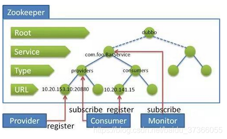

# Zookeeper

## 基本概念

Zookeeper是一个开源的分布式系统中间协调服务。是一个为分布式系统提供一致性服务的应用，分布式应用程序可以基于Zookeeper实现诸如数据发布/订阅、负载均衡、服务命名、分布式协调/通知、集群管理、Master选举、分布式锁和分布式队列等功能。Zookeeper的目标就是封装复杂易出错的关键服务，将简易的接口和性能高效、功能稳定的系统提供给用户。

Zookeeper保证了如下分布式一致性特性：

* 顺序一致性；
* 原子性；
* 单一视图；
* 可靠性；
* 实时性（最终一致性）。

客户端的读请求可以被集群中的任意一台机器处理，如果读请求在节点上注册了监听器，则这个监听器也是由所连接的Zookeeper机器来处理。对于写请求，会同时发给其他Zookeeper机器并且达成一致后，请求才会返回成功。因此，随着ZK的节点越多，读请求吞吐量增加但写请求吞吐量会减少。

有序性是ZK的重要特性，所有的更新都是全局有序的，每个更新都有一个唯一的时间戳，这个时间戳被称为zxid（Zookeeper Transaction Id）。而读请求只会相对于更新有序，也就是读请求的返回结果中会带有这个ZK最新的zxid。

* 集群的特点：
  - 原子性：准确的反馈成功或失败，没有中间状态。
  - 最终一致性：
    - 每个server都有统一的数据视图，client的写请求总会由leade处理（如果通过follower提交的请求会转发到leader），leader会先在集群中通信确认接下来的操作是否可以执行，等到半数以上的server都响应后再进行对所有server的数据同步；
    - 如果发生网络延迟丢包的问题没有响应leader导致节点数据没有更新，这时client如果向没更新的server请求数据的话，该server会向更新过的server同步数据，完毕后再响应client；
    - 集群数据同步阶段，leader会在本地内存中为每个server准备消息队列，各个server同步出队的数据，在集群中过半的server完成同步后集群确认同步完成，出现网络延迟或其他问题未同步完成的server在接下来也能够继续一个个的同步出队的数据从而达到集群数据的最终一致性。
  - 高可用性：leader如果发生故障，zk集群会通过选举机制重新选出leader。
  - 防网络分区（脑裂）：在client提交请求时如果集群中存在节点宕机的情况，那么会采取过半原则，如果集群半数以上的节点都能响应client的请求，那么则表示集群响应了请求。

* 集群状态：
  * 选举模式：
    * 无主模型选举leader的状态。
  * 广播模式：
    * leader向所有server同步数据的状态。
* Server状态：
  * leading：当前server为被选举出来的leader；
  * looking：当前server不知道leader是谁，正处于搜寻状态；
  * following：leader已经选举出来，当前server与之同步。
* 主从分工：
  * 领导者（leader）：负责处理clinet提交的增删改的请求，负责进行投票的发起和决议；
  * 学习者（learner）：
    * 跟随者（follower）用于接受客户端查询的请求并响应结果，如果是写请求则会转发请求到leader，也在选举主节点过程中参与投票；
    * 观察者（observer）接受客户端连接，将写请求转发给leader，但observer不参加投票过程，只同步leader的状态，observer的目的是为了扩展系统，提高读取速度。
  * 客户端（client）：请求发起方。
* Session会话：
  * clinet与集群server建立TCP连接后，leader会在client操作的节点上创建session，同时该session会被放到leader的消息队列中，让所有server都同步；
  * 如果clinet连接的Server出现问题，session会经过一段时间自动销毁，如果没有超过timeout，client可以连接其他server，其他server也会根据session获知client的状态。
* Znode数据模型：
  * 目录结构：层次的，目录型结构，便于管理逻辑关系。
  * Znode信息：包含最大1MB的数据信息，记录了Zxid等元数据信息。
  * 短暂模式（ephemeral）：短暂znode的客户端会话结束时，zookeeper会将该短暂znode删除，短暂znode不可以有子节点。
  * 持久模式（persistent）：持久znode不依赖于客户端会话，只有当客户端明确要删除该持久znode时才会被删除。
  * 序列化处理：如果存在同名的znode同时要求创建，序列化处理后保证都能创建成功并保持唯一性。
* Watcher事件监听机制：
  * Watcher是ZooKeeper的核心功能，Watcher可以监控目录节点以及子目录的数据变化，一旦这些状态发生变化，服务器就会通知所有设置在这个目录节点上的Watcher，从而每个客户端都能很快知道它所关注的目录节点状态是否发生变化，从而做出相应的反应。
  * 可以设置观察的操作：exists，getChildren，getData；
  * 可以触发观察的操作：create，delete，setData。

## 文件系统

ZK提供一个多层级的节点命名空间（节点被称为znode）。与文件系统不同的是，这些节点都可以设置关联的数据，而文件系统中只有文件节点可以存放数据而目录节点不行。

Zookeeper为了保证高吞吐和低延迟，会在内存中维护一个树状的目录结构，这种特性使得ZK不能用于存放大量数据，每个节点存放的数据上限为1MB。

## 主节点的状态同步

Zookeeper的核心是原子广播机制，该机制保证了各个Server之间的同步。实现这个机制的协议叫做Zab协议，Zab协议有两种模式，分别是恢复模式和广播模式。

* **恢复模式**：当服务刚启动或是在领导者节点崩溃后，Zab就会进入恢复模式，直到领导者被选举出来，且大多数Server完成了和Leader的状态同步后，才会结束恢复模式。状态同步保证了Leader和Server具有相同的系统状态。
* **广播模式**：一旦Leader已经和多数的Follower进行了状态同步后，就可以开始广播消息了，即进入广播状态。这时当一个Server加入ZK集群中，它会在恢复模式下启动，发现Leader并和进行状态同步，待同步结束，也会参与消息广播。ZK服务一直维持在Broadcast状态，直到Leader崩溃或是失去了大部分的Followers支持。

## 数据节点

* **持久节点（PERSISTENT）**：除非手动删除，否则节点将一直存在于Zookeeper中；
* **临时节点（EPHEMERAL）**：临时节点的生命周期与客户端会话绑定，一旦客户端会话失效，那么这个客户端创建的所有临时节点都会被移除；
* **持久顺序节点（PERSISTENT_SEQUENTIAL）**：在持久节点的基础上增加了顺序属性，节点名后会追加一个由父节点维护的自增型数字保证有序；
* **临时顺序节点（EPHEMERAL_SEQUENTIAL）**：在临时节点的基础上增加了顺序属性，节点名后会最近一个由父节点维护的则增型数字保证有序。

## Watcher机制

### 基本概念

Zookeeper允许客户端向服务端的某个ZNode注册一个Watcher监听，当服务端的一些指定事件触发了这个Watcher，服务端会向指定的客户端发送一个事件通知来实现分布式的通知功能，然后客户端根据Watcher通知状态和事件类型做具体处理来实现分布式的回调功能。

### 特点

* **一次性**：无论是服务端还是客户端，一旦有Watcher被触发，Zookeeper都会将其从相应的存储中移除。这样的设计有效的减轻了服务端的压力，不然对于更新非常频繁的节点，服务端不断的向客户端发送事件通知，无论对于网络还是服务端的压力都非常大；
* **客户端串行执行**：客户端Watcher回调的过程是一个串行同步的过程；
* **轻量**：Watcher通知非常简单，只会告诉客户端发生了事件，而不会说明事件的具体内容。客户端向服务端注册Watcher时，并不会把客户端真实的Watcher对象实体传递到服务端，仅仅是在客户端请求中使用布尔型属性进行标记；
* **异步**：Watcher的通知事件从Server发送到Client是异步的，这样就会存在一个问题，不同的客户端和服务器之间通过Socket进行通信，由于网络延迟或其他因素导致客户端在不同的时刻监听到事件。由于ZK本身提供有序性，即客户端监听的事件发生后，才会感知它所监听的ZNode的变化，所以使用ZK不期望能够监控到节点的每次变化，只能保证最终一致性，而无法保证强一致性；
* 注册Watcher通过getData、exists、getChildren相关操作；
* 触发Watcher通过create、delete、setData相关操作；
* 当一个客户端连接到一个新的服务器上时，Watche将会被以任意会话事件触发。当与一个服务器失去连接时，是无法接收到Watcher的。而当Client重新连接时，如果需要的话，所有之前注册过的Watcher都会被重新注册。

### 客户端注册Watcher流程

* 调用getData()/getChildren()/exist()传入Watcher对象；
* 标记请求request，封装Watcher到WatchRegistration；
* 封装成Packet对象，发送请求到服务端；
* 收到服务端响应后，将Watcher注册到ZKWatcherManager中进行管理；
* 请求返回，完成注册。

### 服务端处理Watcher流程

* **服务端接收Watcher并存储**：接收到客户端请求后，处理请求判断是否需要注册Watcher，需要的话将数据节点的节点路径和ServerCnxn（代表一个客户端和服务端的连接，实现了Watcher的process接口，此时可以看成是一个Watcher对象）存储在WatcherManager的WatchTable和Watch2Paths中去。 
* **Watcher触发**：以服务器接收到setData()请求触发NodeDataChanged事件为例。
  * **封装WatchedEvent**：将通知状态（SyncConnected）、事件类型（NodeDataChanged）以及节点路径封装成一个WatchedEvent对象；
  * **查询Watcher**：从WatchTable中根据节点路径查找Watcher；
  * **若找到**：提取并从WatchTable和Watch2Paths中删除对应的Watcher；
  * **若没找到**：说明没有客户端在该数据节点上注册过Watcher。
* **调用process方法来触发Watcher**：这里的process就是通过ServerCnxn对应的TCP连接发送Watcher事件通知。

### 客户端回调Watcher流程

* 客户端SendThread线程接收事件通知，交由EventThread线程回调Watcher；
* 客户端Watcher机制同样是一次性的，一旦被触发后，该Watcher就会失效。

## ACL权限控制机制

ACL（Access Control List）即访问控制列表：

* **权限模式（Scheme）**：
  * IP：从IP地址粒度进行权限控制；
  * Digset：最常用，类似于username:password的权限标识来进行权限配置，便于区分不同应用来进行权限控制；
  * World：最开放的权限控制方式，是一种特殊的digset模式，只有一个权限标识world:anyone；
  * Super：超级用户。
* **授权对象**：指的是权限赋予得用户或一个指定实体，如IP地址；
* **权限（Permission）**：
  * CREATE：数据节点创建权限，允许授权对象在该ZNode下创建子节点；
  * DELETE：子节点删除权限，允许授权对象删除该数据节点的子节点；
  * READ：数据节点的读取权限，允许授权对象访问该数据节点并读取其数据内容或子节点列表等；
  * WRITE：数据节点更新权限，允许授权对象对数据节点进行更新操作；
  * ADMIN：数据节点管理权限，允许授权对象对该数据节点进行ACL相关设置操作。

## 服务端角色

* **Leader**：
  * 事务请求的唯一调度和处理者，保证集群事务处理的顺序性；
  * 集群内部各服务的调度者。
* **Follower**：
  * 处理客户端的非事务请求，转发事务请求给Leader服务器；
  * 参与事务请求提议的投票；
  * 参与Leader选举的投票。
* **Observer**：
  * 3.0版本后引入的服务器角色，在不影响集群事务处理能力的基础上提升集群的非事务处理能力；
  * 处理客户端的非事务请求，转发事务请求给Leader服务器；
  * 不参与任何形式的投票。

## Server工作状态

* **LOOKING**：Leader寻找状态。当服务器处于该状态时，会认为当前集群中没有Leader，因此需要进入Leader选举状态；
* **FOLLOWING**：跟随者状态。表明当前服务器角色是Follower；
* **LEADING**：领导者状态。表明当前服务器角色是Leader；
* **OBSERVING**：观察者状态。表明当前服务器角色是Observer。

## 数据同步

整个集群完成Leader选举后，Learner（Follower和Observer的统称）会向Leader服务器进行注册，注册完成后进入数据同步环节。

TODO

## 事务的顺序一致性

ZK采用了全局递增的事务ID来标识，所有的Proposal提议都会在被提出时加上ZXID。是一个64位的数字，高32位是epoch用于标识Leader周期，如果有新Leader产生出来，epoch会自增。低32位用于递增计数，当新产生Proposal时，会基于数据库的两阶段提交XA，首先会向其他的Server发出事务执行请求，如果超过半数的机器都能执行且成功，那么就会真正的提交事务。

## 节点宕机处理

* Zookeeper集群推荐不少于3个服务器；
* 如果一个Follower宕机，还会有2台服务器提供服务，由于数据存在副本，所以不会丢失；
* 如果是一个Leader宕机，则Zookeeper会选举出新的Leader；
* Zookeeper集群的机制是只要超过半数的节点正常，集群就能正常提供服务。只有在节点挂得过多，只剩下一半或一半不到的节点能工作时，集群才会失效；
* 总结，3个节点的Cluster可以挂掉1个节点，即再次选举Leader可以得到2票。单2个节点的Cluster就不能挂掉任何一个节点，即Leader只能得到一票。

## 应用场景

### 数据发布/订阅

数据发布订阅系统，即配置中心，就是一个发布者对应多个订阅者，由发布者提供数据，订阅者同时收到数据。

主要用于动态数据（配置信息）获取，实现数据（配置信息）的集中式管理和数据的动态更新。

数据（配置信息的特征）：数据量通常比较小，数据内容在运行时会发生动态更新，集群中各机器共享且一致。如机器列表信息、运行时开关配置、数据库配置信息等。

基于Zookeeper实现：

* 数据存储：将数据存储到Zookeeper的一个数据节点中；
* 数据获取：应用在启动初始化节点从Zookeeper数据节点读取数据，并在该节点注册一个数据变更的Watcher；
* 数据变更：当数据发生变更时，更新Zookeeper对应节点的数据，Zookeeper会将数据发生变更的通知发送到各个客户端，客户端接收到通知后重新读取变更后的数据即可。

### 负载均衡

### 命名服务

命名服务是指通过指定的名字来获取资源或是服务的地址，使用ZK创建一个全局的路径，这个路径就可以作为一个名字，指向集群中的机器、提供的服务的地址、一个远程的对象等。

### 分布式协调/通知

对于系统调度来说：操作人员发送通知实际是通过控制台改变某个节点的状态，然后ZK将这些变化发送给在这个节点上注册了Watcher的所有客户端。

对于执行情况汇总：每个工作进程都在某个目录下创建一个临时节点。并携带工作的进度数据，这样汇总的进程可以监控目录子节点的变化获得工作进度的实时的全局情况。

### 集群管理

所谓的集群管理分为两点，一个是节点的加入和退出，另一个则Master节点的选举。

* **节点的加入和退出**：所有的机器可以在约定的父目录下创建临时节点，然后监听父节点。当子节点发生了变化，一旦有机器挂掉，该机器与ZK的连接断开，其所创建的临时节点被删除，通过Watcher通知其他节点。一旦有新的机器加入，就会创建一个临时ZNode，集群中的节点就会收到通知。

* **Master选举**：让所有机器创建临时节点时添加顺序编号，每次选取编号最小的机器作为Master即可。

### 分布式锁

基于Zookeeper的一致性文件系统，锁的问题变得容易。锁服务可以分为两类，一个是保持独占，另一个是控制时序。

对于第一类，我们将 zookeeper 上的一个 znode 看作是一把锁，通过 createznode的方式来实现。所有客户端都去创建 /distribute_lock 节点，最终成功创建的那个客户端也即拥有了这把锁。用完删除掉自己创建的 distribute_lock 节点就释放出锁。

对于第二类， /distribute_lock 已经预先存在，所有客户端在它下面创建临时顺序编号目录节点，和选 master 一样，编号最小的获得锁，用完删除，依次方便。

### 分布式队列

两种类型的队列：

（1）同步队列，当一个队列的成员都聚齐时，这个队列才可用，否则一直等待所有成员到达。

（2）队列按照 FIFO 方式进行入队和出队操作。

第一类，在约定目录下创建临时目录节点，监听节点数目是否是我们要求的数目。

第二类，和分布式锁服务中的控制时序场景基本原理一致，入列有编号，出列按编号。在特定的目录下创建 PERSISTENT_SEQUENTIAL 节点，创建成功时Watcher 通知等待的队列，队列删除序列号最小的节点用以消费。此场景下Zookeeper 的 znode 用于消息存储，znode 存储的数据就是消息队列中的消息内容，SEQUENTIAL 序列号就是消息的编号，按序取出即可。由于创建的节点是持久化的，所以不必担心队列消息的丢失问题。

## ZK和Dubbo的关系

Zookeeper的作用：

zookeeper用来注册服务和进行负载均衡，哪一个服务由哪一个机器来提供必需让调用者知道，简单来说就是ip地址和服务名称的对应关系。当然也可以通过硬编码的方式把这种对应关系在调用方业务代码中实现，但是如果提供服务的机器挂掉调用者无法知晓，如果不更改代码会继续请求挂掉的机器提供服务。zookeeper通过心跳机制可以检测挂掉的机器并将挂掉机器的ip和服务对应关系从列表中删除。至于支持高并发，简单来说就是横向扩展，在不更改代码的情况通过添加机器来提高运算能力。通过添加新的机器向zookeeper注册服务，服务的提供者多了能服务的客户就多了。

dubbo：

是管理中间层的工具，在业务层到数据仓库间有非常多服务的接入和服务提供者需要调度，dubbo提供一个框架解决这个问题。
注意这里的dubbo只是一个框架，至于你架子上放什么是完全取决于你的，就像一个汽车骨架，你需要配你的轮子引擎。这个框架中要完成调度必须要有一个分布式的注册中心，储存所有服务的元数据，你可以用zk，也可以用别的，只是大家都用zk。

zookeeper和dubbo的关系：

Dubbo 的将注册中心进行抽象，它可以外接不同的存储媒介给注册中心提供服务，有 ZooKeeper，Memcached，Redis 等。

引入了 ZooKeeper 作为存储媒介，也就把 ZooKeeper 的特性引进来。首先是负载均衡，单注册中心的承载能力是有限的，在流量达到一定程度的时 候就需要分流，负载均衡就是为了分流而存在的，一个 ZooKeeper 群配合相应的 Web 应用就可以很容易达到负载均衡；资源同步，单单有负载均衡还不 够，节点之间的数据和资源需要同步，ZooKeeper 集群就天然具备有这样的功能；命名服务，将树状结构用于维护全局的服务地址列表，服务提供者在启动 的时候，向 ZooKeeper 上的指定节点 /dubbo/${serviceName}/providers 目录下写入自己的 URL 地址，这个操作就完成了服务的发布。 其他特性还有 Mast 选举，分布式锁等。