# 数据结构

## 线性结构

TODO


## 树结构

### 基本概念

树是由n个有限结点组成的具有层次关系的集合，其具有如下特点：

* 每个结点有0个或n个子结点；
* 没有父结点的结点称为根结点，一棵树有且只有一个根节点；
* 每个非根结点只有一个父结点；
* 每个结点及其后代结点整体上可以看成一棵树，称为当前结点的父结点的一颗子树。

相关术语：

* 结点的度：一个结点具有的子树个数称为该结点的度；
* 叶子结点：度为0的结点称为叶子结点，也叫做终端结点；
* 分支结点：度不为0的结点称为分支结点，也叫做非终端结点；
* 结点的层次：从根结点开始记为1，之后的每个后继层次加1，以此类推；
* 结点的层序编号：将树中的结点，按照从上层到下层，同层从左到右的顺序排成一个线性序列，并且编成连续的自然数；
* 树的度：树中结点的最大度；
* 树的高度（深度）：树中结点的最大层次；
* 森林：m个互不相交的树的集。将一棵非空树的根结点删除，树就会变成一座森林；反之给森林添加一个统一的根结点，森林就会变成一颗树；
* 孩子结点：一个结点的直接后继结点称为该结点的孩子结点；
* 双亲结点（父结点）：一个结点的直接前驱结点称为该结点的双亲结点；
* 兄弟结点：同一双亲结点的孩子结点间互称为兄弟结点。


### 二叉树

#### 基本概念

所谓二叉树就是度不超过2的树，即每个结点最多有两个子结点。

**满二叉树**：对于一个二叉树，如果每一层的结点数都达到最大值，则这个二叉树就是满二叉树。

**完全二叉树**：叶子结点只能出现在最下层和次下层，并且最下面一层的结点都集中在该层最左边的若干位置的二叉树。


#### 二分搜索树

```JAVA
public class BinarySearchTree<Key extends Comparable<Key>, Value> {

    private Node<Key, Value> root;
    private int N;

    // 结点
    private static class Node<Key, Value> {

        private final Key key;
        private Value value;
        private Node<Key, Value> left;
        private Node<Key, Value> right;

        public Node(Key key, Value value, Node<Key, Value> left, Node<Key, Value> right) {
            this.key = key;
            this.value = value;
            this.left = left;
            this.right = right;
        }
    }

    public int size() {
        return N;
    }

    /**
     * 插入结点
     */
    public void put(Key key, Value value) {
        root = put(root, key, value);
    }

    public Node<Key, Value> put(Node<Key, Value> node, Key key, Value value) {
        if (node == null) {
            N++;
            return new Node<>(key, value, null, null);
        }

        int cmp = key.compareTo(node.key);
        if (cmp > 0) {
            node.right = put(node.right, key, value);
        } else if (cmp < 0) {
            node.left = put(node.left, key, value);
        } else {
            node.value = value;
        }
        return node;
    }

    /**
     * 按key搜索结点
     */
    public Value get(Key key) {
        return get(root, key);
    }

    public Value get(Node<Key, Value> node, Key key) {
        if (node == null) {
            return null;
        }

        int cmp = key.compareTo(node.key);
        if (cmp > 0) {
            return get(node.right, key);
        } else if (cmp < 0) {
            return get(node.left, key);
        } else {
            return node.value;
        }
    }
	
    /**
     * 按key删除结点
     */
    public void delete(Key key) {
        delete(root, key);
    }

    public Node<Key, Value> delete(Node<Key, Value> node, Key key) {
        if (node == null) {
            return null;
        }

        int cmp = key.compareTo(node.key);
        if (cmp > 0) {
            node.right = delete(node.right, key);
        } else if (cmp < 0) {
            node.left = delete(node.left, key);
        } else {
            // 要删除的结点是叶子结点的情况
            if (node.left == null && node.right == null) {
                return null;
            }

            // 要删除的结点左子树为空，只有右子树
            if (node.left == null) {
                return node.right;
            }

            // 要删除的结点右子树为空，只有左子树
            if (node.right == null) {
                return node.left;
            }

            // 要删除的结点既有左子树又有右子树，则获取该结点的右子树的最小结点和其替换即可
            Node<Key, Value> rightMinNode = null;	// 右子树的最小结点
            Node<Key, Value> rightNode = node.right;	// 右子树的根节点
            while (rightNode.left != null) {
                // 判断当前结点的左结点是否是最小结点
                if (rightNode.left.left == null) {
                    rightMinNode = rightNode.left;
                    // 若最小结点存在右子树，则将其挂入当前结点的左结点
                    if (rightMinNode.right != null) {
                        rightNode.left = rightMinNode.right;
                    }
                    break;
                }
                // 继续向左边移动
                rightNode = rightNode.left;
            }

            // 用右子树的最小结点替换要删除的结点
            assert rightMinNode != null;
            rightMinNode.left = node.left;
            rightMinNode.right = node.right;

            // 返回新结点，将其挂入树中
            return rightMinNode;
        }

        return null;
    }

    /**
     * 获取最小key的结点
     */
    public Key min() {
        return min(root).key;
    }

    public Node<Key, Value> min(Node<Key, Value> node) {
        if (node.left != null) {
            return min(node.left);
        } else {
            return node;
        }
    }

    /**
     * 获取最大key的结点
     */
    public Key max() {
        return max(root).key;
    }

    public Node<Key, Value> max(Node<Key, Value> node) {
        if (node.right != null) {
            return max(node.right);
        } else {
            return node;
        }
    }

    /**
     * 前序遍历
     */
    public LinkedList<Key> preErgodic() {
        LinkedList<Key> keys = new LinkedList<>();
        preErgodic(root, keys);
        return keys;
    }

    private void preErgodic(Node<Key, Value> node, LinkedList<Key> keys) {
        if (node == null) {
            return;
        }

        keys.addLast(node.key);
        if (node.left != null) {
            preErgodic(node.left, keys);
        }
        if (node.right != null) {
            preErgodic(node.right, keys);
        }
    }

    /**
     * 中序遍历
     */
    public LinkedList<Key> midErgodic() {
        LinkedList<Key> keys = new LinkedList<>();
        midErgodic(root, keys);
        return keys;
    }

    private void midErgodic(Node<Key, Value> node, LinkedList<Key> keys) {
        if (node == null) {
            return;
        }

        if (node.left != null) {
            midErgodic(node.left, keys);
        }
        keys.addLast(node.key);
        if (node.right != null) {
            midErgodic(node.right, keys);
        }
    }
	
    /**
     * 后序遍历
     */
    public LinkedList<Key> afterErgodic() {
        LinkedList<Key> keys = new LinkedList<>();
        midErgodic(root, keys);
        return keys;
    }

    private void afterErgodic(Node<Key, Value> node, LinkedList<Key> keys) {
        if (node == null) {
            return;
        }

        if (node.left != null) {
            midErgodic(node.left, keys);
        }
        if (node.right != null) {
            midErgodic(node.right, keys);
        }
        keys.addLast(node.key);
    }
	
    /**
     * 层次遍历
     */
    public LinkedList<Key> layerErgodic() {
        LinkedList<Key> keys = new LinkedList<>();
        layerErgodic(root, keys);
        return keys;
    }

    private void layerErgodic(Node<Key, Value> root, LinkedList<Key> keys) {
        LinkedList<Node<Key, Value>> nodes = new LinkedList<>();

        nodes.addLast(root);
        while (!nodes.isEmpty()) {
            Node<Key, Value> node = nodes.removeFirst();
            keys.addLast(node.key);
            if (node.left != null) {
                nodes.addLast(node.left);
            }
            if (node.right != null) {
                nodes.addLast(node.right);
            }
        }
    }
	
    /**
     * 树的最大深度
     */
    public int maxDepth() {
        return maxDepth(root);
    }

    private int maxDepth(Node<Key, Value> node) {
        if (node == null) {
            return 0;
        }

        int leftMax = 0, rightMax = 0;
        if (node.left != null) {
            leftMax = maxDepth(node.left);
        }
        if (node.right != null) {
            rightMax = maxDepth(node.right);
        }

        return leftMax > rightMax ? leftMax + 1 : rightMax + 1;
    }
}
```


### 堆

#### 基本概念

堆是完全二叉树，除了树的最后一层结点不需要是满的，其他的每一层从左到右都是满的，如果最后一层结点不是满的，那么要求左满右不满；

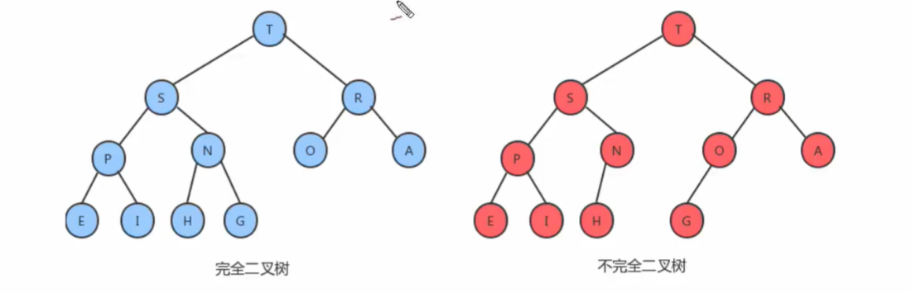

通常是由数组实现的树形结构，具体方法就是将二叉树的结点按照层级顺序放入数组中，根节点在位置1，子节点在位置2和3，而子结点的子结点则分别放在位置4，5，6和7，以此类推。

如果一个结点的位置为k，则它的父结点的位置为k/2，而它的两个子结点的位置分别为2k和2k+1。这样，在不使用指针的情况下，可以通过计算数组的索引在树中上下移动，如：从a[k]向上一层，就令k等于k/2，向下一层就令k等于2k或2k+1。

每个结点都大于等于它的两个子结点，但两个子结点之间的顺序不做规定。


#### 最大堆

```java
public class Heap<T extends Comparable<T>> {

    // 存储堆中的元素
    private T[] items;
    // 记录堆中元素的个数
    private int N;
    // 记录堆中第一个元素的下标
    private static final int FIRST = 1;

    public Heap(int capacity) {
        this.items = (T[]) new Comparable[capacity + 1];
        this.N = 0;
    }

    /**
     * 判断堆中索引i处的元素是否小于索引j处的元素
     */
    private boolean less(int i, int j) {
        return items[i].compareTo(items[j]) < 0;
    }

    /**
     * 交换堆中索引i和索引j处的元素
     */
    private void exc(int i, int j) {
        T temp = items[i];
        items[i] = items[j];
        items[j] = temp;
    }

    /**
     * 插入元素，数组末尾
     */
    public void insert(T item) {
        items[++N] = item;
        swim(N);
    }

    /**
     * 上浮操作，将索引index处的元素浮动到正确的位置
     */
    private void swim(int index) {
        while (index > FIRST) {
            int parentIndex = index / 2;
            if (less(parentIndex, index)) {
                exc(parentIndex, index);
            }
            index = parentIndex;
        }
    }

    /**
     * 删除堆中最大的元素，数组开头
     */
    public T delMax() {
        T item = items[FIRST];
        exc(FIRST, N);
        items[N] = null;
        N--;
        sink(FIRST);
        return item;
    }

    /**
     * 下沉操作，将索引index处的元素沉入到正确位置
     */
    private void sink(int index) {
        while (2 * index <= N) {
            int childMax, leftIndex = 2 * index, rightIndex = 2 * index + 1;
            if (rightIndex<= N && less(leftIndex, rightIndex)) {
                childMax = rightIndex;
            } else {
                childMax = leftIndex;
            }

            if (!less(index, childMax)) {
                break;
            } else {
                exc(index, childMax);
            }

            index = childMax;
        }
    }
}
```


#### 优先队列

```JAVA
/**
 * 最大优先队列
 * @param <T>
 */
public class MaxPriorityQueue<T extends Comparable<T>> {

    private T[] items;
    private int N;

    public MaxPriorityQueue(int capacity) {
        this.items = (T[]) new Comparable[capacity + 1];
        this.N = 0;
    }

    public int size() {
        return this.N;
    }

    public boolean isEmpty() {
        return this.N == 0;
    }

    private boolean less(int i, int j) {
        return this.items[i].compareTo(this.items[j]) < 0;
    }

    private void exchange(int i, int j) {
        T temp = this.items[i];
        this.items[i] = this.items[j];
        this.items[j] = temp;
    }

    public void insert(T item) {
        this.items[++N] = item;
        swim(N);
    }

    private void swim(int index) {
        while (index > 1) {
            int parentIndex = index / 2;
            if (less(index, parentIndex)) {
                exchange(index, parentIndex);
            }
            index = parentIndex;
        }
    }

    public T delMax() {
        T max = this.items[1];
        exchange(1, N);
        this.items[N] = null;
        N--;
        sink(1);
        return max;
    }

    private void sink(int index) {
        while (2 * index <= N) {
            int childMax, leftIndex = 2 * index, rightIndex = 2 * index + 1;
            if (rightIndex <= N && less(leftIndex, rightIndex)) {
                childMax = rightIndex;
            } else {
                childMax = leftIndex;
            }

            if (less(childMax, index)) {
                break;
            } else {
                exchange(childMax, index);
            }

            index = childMax;
        }
    }
}
```


#### 索引优先队列

```java
/**
 * 最小索引优先队列
 * @param <T>
 */
public class IndexMinPriorityQueue<T extends  Comparable<T>> {

    private T[] items;
    private int[] pq;
    private int[] qp;
    private int N;

    public IndexMinPriorityQueue(int capacity) {
        this.items = (T[]) new Comparable[capacity + 1];
        this.pq = new int[capacity + 1];
        this.qp = new int[capacity + 1];
        this.N = 0;

        for (int i = 0; i < qp.length; i++) {
            qp[i] = -1;
        }
    }

    public int size() {
        return this.N;
    }

    public boolean isEmpty() {
        return this.N == 0;
    }

    private boolean less(int i, int j) {
        return items[pq[i]].compareTo(items[pq[j]]) < 0;
    }

    private void exchange(int i, int j) {
        int temp = pq[i];
        pq[i] = pq[j];
        pq[j] = temp;

        qp[pq[i]] = i;
        qp[pq[j]] = j;
    }

    public boolean contains(int index) {
        return qp[index] != -1;
    }

    public int minIndex() {
        return pq[1];
    }

    public void insert(int index, T item) {
        if (contains(index)) {
            return;
        }

        N++;
        items[index] = item;
        pq[N] = index;
        qp[index] = N;

        swim(N);
    }

    public int delMin() {
        int minIndex = pq[1];
        exchange(1, N);

        qp[pq[N]] = -1;
        pq[N] = -1;
        items[minIndex] = null;
        N--;

        sink(1);
        return minIndex;
    }

    public void delete(int index) {
        int sourceIndex = qp[index];
        exchange(sourceIndex, N);

        items[sourceIndex] = null;
        qp[pq[N]] = -1;
        pq[N] = -1;
        N--;

        sink(sourceIndex);
        swim(sourceIndex);
    }

    public void changeItem(int index, T item) {
        items[index] = item;
        int sourceIndex = qp[index];
        sink(sourceIndex);
        swim(sourceIndex);
    }

    private void swim(int index) {
        while (index > 1) {
            int parentIndex = index / 2;
            if (less(index, parentIndex)) {
                exchange(index, parentIndex);
            }
            index = parentIndex;
        }
    }

    private void sink(int index) {
        while (2 * index <= N) {
            int childMin, leftIndex = 2 * index, rightIndex = 2 * index + 1;
            if (rightIndex <= N && less(rightIndex, leftIndex)) {
                childMin = rightIndex;
            } else {
                childMin = leftIndex;
            }

            if (less(index, childMin)) {
                break;
            } else {
                exchange(index, childMin);
            }

            index = childMin;
        }
    }
}
```


### 平衡树

#### 基本概念

二分搜索树在极端情况下会退化成链表，导致查找元素的效率变得和链表一样低。如下图，依次向BST上插入9，8，7，6，5，4，3，2，1这9个数，那么最终构建出的树结构就是一个链表。

而平衡树就是一种能够不受插入数据的影响，让生成的树结构都能像完全二叉树一样，即使在极端情况下，依然能保证查询性能。

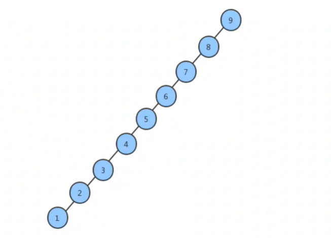


#### 2-3查找树

一颗2-3查找树需要满足以下两个要求：

* 2-结点：含有一个键值对和两条链，左链接指向的2-3树中的键都小于该结点，右链接指向的2-3树中的键都大于该结点；
* 3-结点：含有两个键值对和三条链，左链接指向的2-3树中的键都小于该结点，中链接指向的2-3树中的键都位于该结点的两个键之间，右链接指向的2-3树中的键都大于该结点。


2-3树的查找：将BST查找算法一般化就能得到2-3树的查找算法。要判断一个键是否在树中，先将其和根结点中的键比较，如果和其中任意一个键相等，查询命中；否则就根据比较的结果找到指向相应区间的链接，并在其指向的子树上通过递归继续查找。如果找到空链接，则查询未命中。

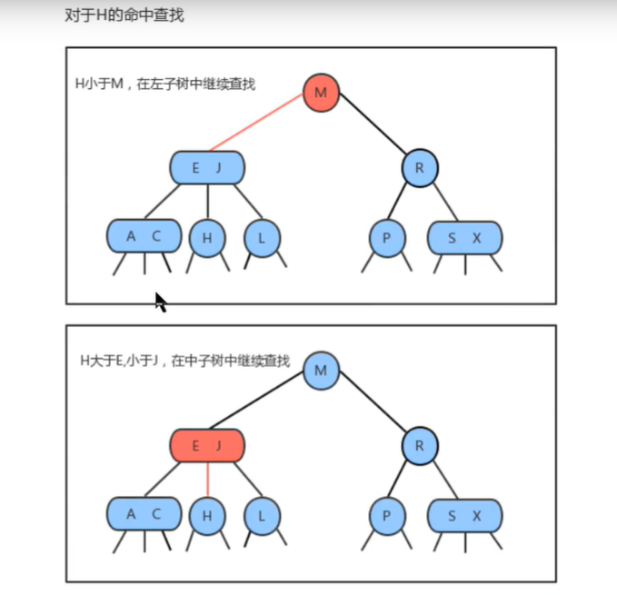

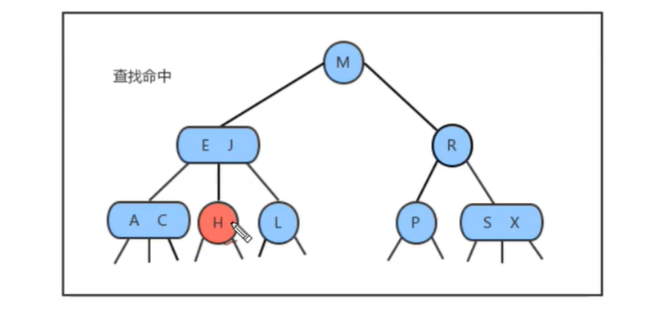

向2-结点下插入新结点：和BST插入元素一样，首先要按顺序进行查找，然后将结点挂到新位置上。2-3树之所以能在极端情况下保证效率是因为在其插入后能保证树的平衡猪状态。如果新结点被定位到一个2-结点上，那么只需要将新结点和2-结点组合成一个3-结点即可；如果是定位到一个3-结点上，则有下面几种情况。


向只含有一个3-结点的树中插入新结点：若一棵2-3树只包含一个3-结点，即这个结点已经存在两个键，没有空间来插入第三个键了，则会先和这个3-结点组合成临时的4-结点。然后将这个4-结点的中间键向上提升为新得父节点，左键做为其左子结点，右键做为其右子结点，以此自底向上生长树。当插入完成后，2-3树保持平衡，树的高度加1。


向一个父结点为2-结点的3-结点中插入新结点：和上面的方式一样将新元素和3-结点组合成临时的4-结点，然后将该结点中间键向上提升和处于2-结点的父结点组合成为3-结点，最后将左右键分别挂在这个新3-结点的合适位置。

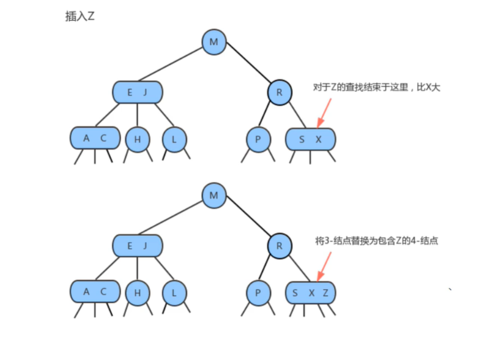


向一个父结点为3-结点的3-结点中插入新结点：当新结点插入，定位到一个3-结点上时，将结点临时组合后再拆分，中间键提升。但此时父结点是一个3-结点，插入后父结点被组合成了4-结点，这时还需要继续提升中间键，一直向上提升直到遇到一个是2-结点的父结点，和其组合后变为3-结点，此时保证了树的平衡，完成了插入。


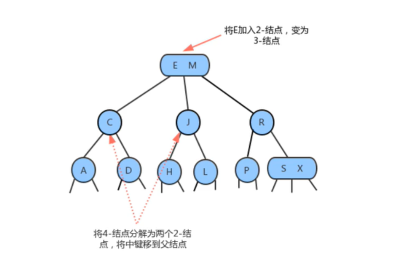

分解根结点：当插入结点到根结点的路径上全部都是3-结点的时候，最终根结点会变为一个临时的4-结点，此时就需要将中间键向上提升为新的根结点，左右键拆分为两个2-结点做为新根结点的左右子结点。完成插入后树会自底向上生长导致高度加1。

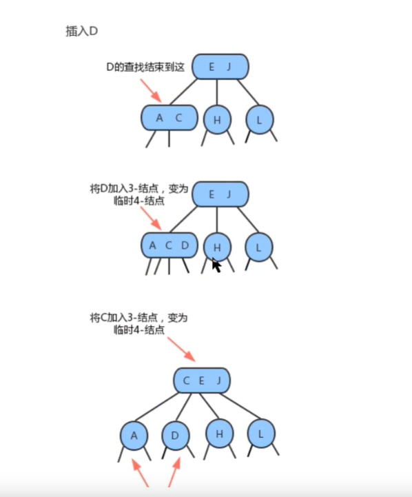


2-3树在插入元素的时候，需要做一些局部的交换来保持2-3树的平衡，一颗完全平衡的2-3树具有以下性质：

* 任意空链接到根结点的路径长度都是相等的；
* 4-结点变换为3-结点时，树的高度不会发生变化，只有当根结点是临时的4-结点，分解根结点时，树高才会+1；
* 2-3树与普通二分搜索树最大的区别是，BST是自顶向下生长的，而2-3树是自底向上生长的。


#### 红黑树

2-3在极端的情况下依旧能保证所有子结点都是2-结点，树的高度为logN，比之BST极端情况下的N，确保了时间复杂度，但是过于复杂。

红黑树主要是对2-3树进行编码，红黑树背后的基本思想是用标志的二分搜索树（完全由2-结点构成）和一些额外的信息（替换3-结点）来表示2-3树：

* 红链接：将两个2-结点连接起来构成一个3-结点；
* 黑链接：对比于2-3树中的普通链接。

准确的说，将3-结点表示为由一条左斜的红色链接（就是两个2-结点其中一个是另一个的左子结点）相连的两个2-结点，优点是无需修改就可以使用标准的BST的查找方法。

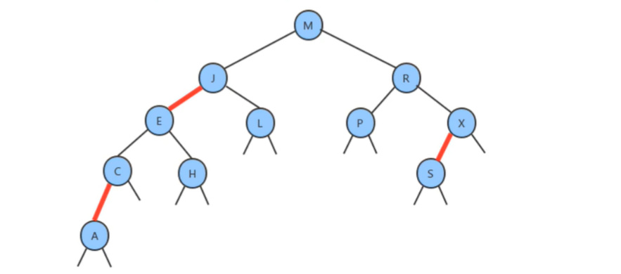

红黑树是含有红黑链接并满足下列条件的二发搜索树：

* 红链接均为左节点；
* 没有任何一个结点同时和两条红链接相连；
* 该树是完美黑色平衡的二叉树，即任意空链接到根结点的路径上的黑链接数量相同。


平衡化：在对红黑树进行一些增删改查操作后，很有可能会出现红色的右链接或者两条连续的红色链接，而这些都不满足红黑树的定义，所以我们需要对这些情况通过旋转进行修复，让红黑树保持平衡。

左旋：当某个结点的左子结点为黑色，右子结点为红色，此时需要左旋（当前结点为h，其右子结点为x）。

1. 将x的左子结点置为h的右子结点`h.right=x.left`；
2. 将h置为x的左子结点 `x.left=h`；
3. 将x的color置为h的color `x.color=h.color`；
4. 将h的color置为READ `h.color=true`。


右旋：当某个结点的左子结点是红色，且左子结点的左子结点也是红色，则需要右旋（当前结点为h，其左子结点为x）。

1. 将x的右子结点置为h的左子结点`h.left=x.right`；
2. 将h置为x的右子结点 `x.right=h`；
3. 将x的color置为h的color `x.color=h.color`；
4. 将h的color置为READ `h.color=true`。


向单个2-结点插入新键：

* 一颗只含有一个键的红黑树只含有一个2-结点，在插入新键的同时也需要旋转操作；

* 如果新建小于当前结点的键，则只需要新增一个红色结点即可，新的红黑树和单个3-结点完全等价；

  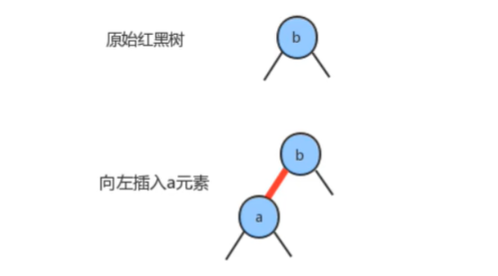

* 如果新键大于当前结点的键，那么新增的红色结点将会产生一条红色的右链接，此时需要通过左旋操作，将红色右链接变为左链接，插入操作才算完成。形成的新红黑树依然和3-结点等价，其包含两个键，一条红色链接。

  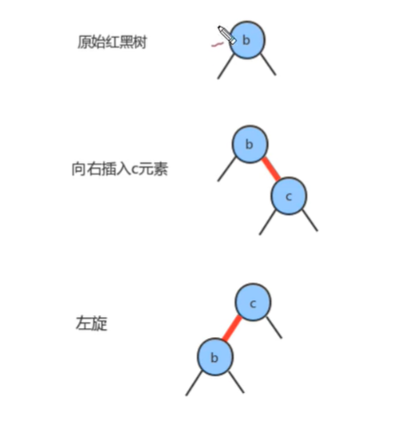

向底部的2-结点插入新键：用和二分搜索树相同的方式向一颗红黑树中插入新键，会在树的底部新增一个结点（可以保证有序性），唯一的区别就是红黑树需要用一条红链接将新结点和其父结点相连，如果其父结点是一个2-结点，那么刚才的方式仍然适用。

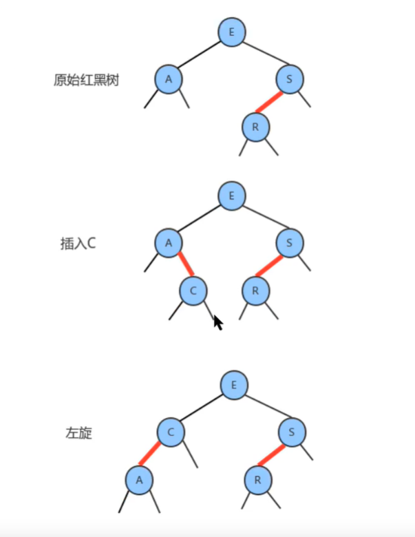

颜色反转：当一个结点的左子结点和右子结点的color都为RED时，也就是出现了临时的4-结点，此时只需要将左子结点和右子结点的颜色反转为BLACK，即让当前结点的颜色变为RED即可。

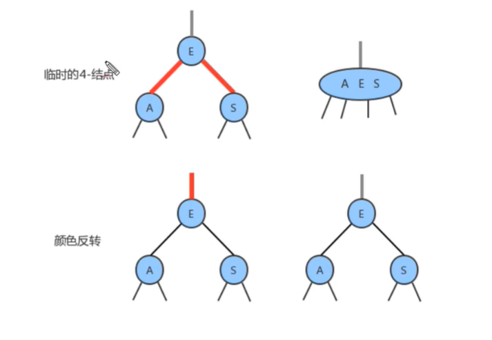

向一棵双键树（3-结点）中插入新键：

* 新键大于原树中的两个键：

  

* 新建小于原树中的两个键：

  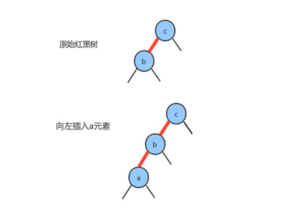

  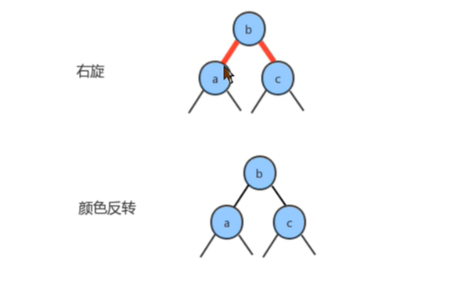

* 新建介于原树中两个键之间：

  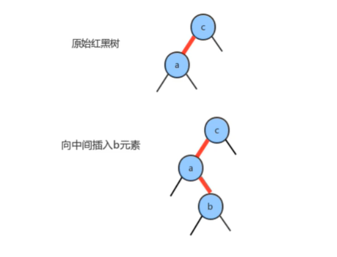

  

根结点的颜色总是黑色：结点的红色是由和其父结点间的链接决定的，由于根结点不存在父结点，所以每次插入后，都需要将根结点的颜色置为黑色，因为根结点可能会被旋转操作置换掉。

向树底部的3-结点插入新键：若是在树的底部的一个3-结点下插入新的结点，则出现三种情况，即指向新结点的链接可能是3-结点的右连接（此时只需要反转颜色即可）、左链接（此时需要进行右旋后再反转颜色）和中链接（此时先左旋再右旋最后反转颜色）。颜色的反转操作会使中间结点变红，相当于将其和其父结点变为了3-结点，也就意味着父结点会被插入一个新键，只需要用相同方法向上处理即可，直到向上遇到2-结点或根结点为止。


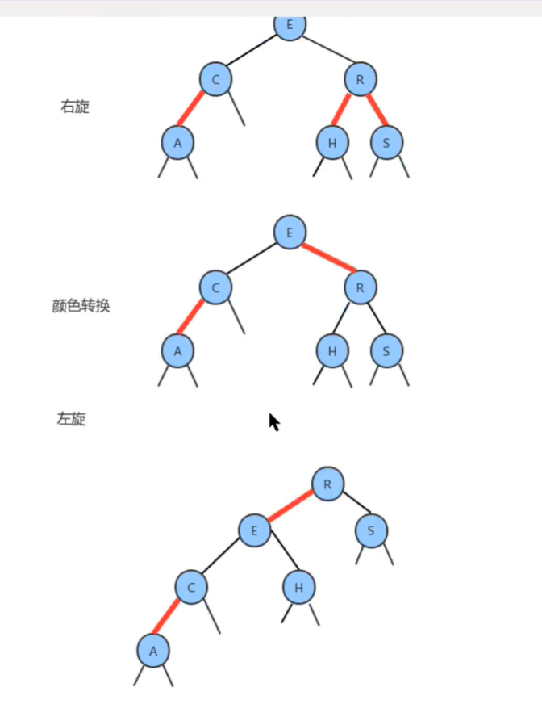

```JAVA
public class RedBlackTree<Key extends Comparable<Key>, Value> {

    // 根结点
    private Node root;
    // 记录树中元素的个数
    private int N;
    // 红色链接标记
    private static final boolean RED = true;
    // 黑色链接标记
    private static final boolean BLACK = false;

    /**
     * 树结点
     */
    private class Node {

        // 键
        public Key key;
        // 值
        private Value value;
        // 左链接
        public Node left;
        // 右链接
        public Node right;
        // 结点颜色（由和其父结点间的链接决定）
        public boolean color;

        public Node(Key key, Value value, Node left, Node right, boolean color) {
            this.key = key;
            this.value = value;
            this.left = left;
            this.right = right;
            this.color = color;
        }
    }

    /**
     *
     * @return
     */
    public int size() {
        return this.N;
    }

    /**
     *
     * @param node
     * @return
     */
    private boolean isRed(Node node) {
        if (node == null) {
            return false;
        }
        return node.color = RedBlackTree.RED;
    }

    /**
     *
     * @param h
     * @return
     */
    private Node rotateLeft(Node h) {
        Node x = h.right;
        h.right = x.left;
        x.left = h;
        x.color = h.color;
        h.color = RedBlackTree.RED;
        return x;
    }

    /**
     *
     * @param h
     * @return
     */
    private Node rotateRight(Node h) {
        Node x = h.left;
        h.left = x.right;
        x.right = h;
        x.color = h.color;
        h.color = RedBlackTree.RED;
        return x;
    }

    /**
     *
     * @param node
     */
    private void flipColors(Node node) {
        node.color = RedBlackTree.RED;
        node.left.color = RedBlackTree.BLACK;
        node.right.color = RedBlackTree.BLACK;
    }

    /**
     *
     * @param key
     * @param value
     */
    public void put(Key key, Value value) {
        root = put(root, key, value);
        root.color = RedBlackTree.BLACK;
    }

    /**
     *
     * @param node
     * @param key
     * @param value
     * @return
     */
    private Node put(Node node, Key key, Value value) {
        if (node == null) {
            N++;
            return new Node(key, value, null, null, RED);
        }

        int cmp = key.compareTo(node.key);
        if (cmp > 0) {
            node.right = put(node.right, key, value);
        } else if (cmp < 0) {
            node.left = put(node.left, key, value);
        } else {
            node.value = value;
        }

        if (isRed(node.right) && !isRed(node.left)) {
            node = rotateLeft(node);
        }

        if (isRed(node.left) && isRed(node.left.left)) {
            node = rotateRight(node);
        }

        if (isRed(node.left) && isRed(node.right)) {
            flipColors(node);
        }

        return node;
    }

    /**
     *
     * @param key
     * @return
     */
    public Value get(Key key) {
        return get(root, key);
    }

    /**
     *
     * @param node
     * @param key
     * @return
     */
    public Value get(Node node, Key key) {
        if (node == null) {
            return null;
        }

        int cmp = key.compareTo(node.key);
        if (cmp < 0) {
            return get(node.left, key);
        } else if (cmp > 0) {
            return get(node.right, key);
        } else {
            return node.value;
        }
    }
}
```


#### B树

B树中允许一个结点中包含多个key，看具体情况实现。假设一个参数M，以此来构造B树，即构造的是M阶的B树：

* 每个结点最多有M-1个key，并且以升序排列；
* 每个结点最多能有M个子结点；
* 根结点至少有两个子结点。

在实际应用中B树的阶数一般都比较大（通常大于100），所以即使存储大量的数据，B树的高度仍然比较小，这样在某些应用场景下可用显著体现优势（如MySQL的索引）。

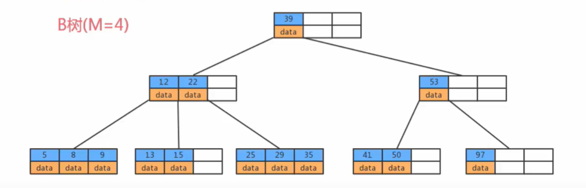

若参数M=5，则每个结点最多包含4对键值，下图以5阶B树为例，描述B树的数据存储：

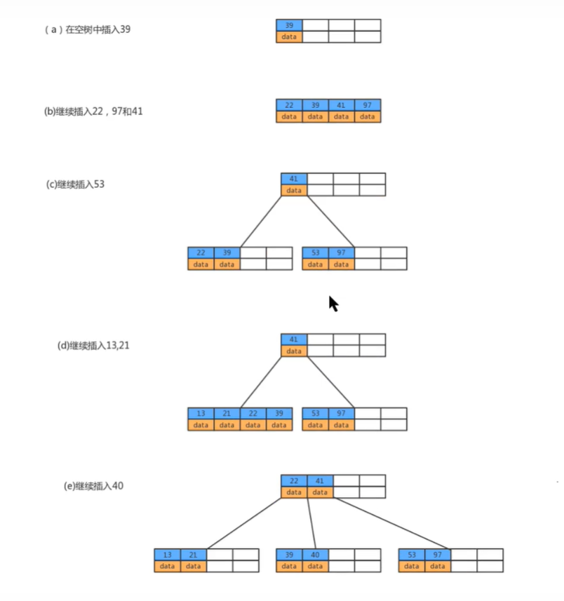


#### B+树

B+树是对B树的一种变形，与B树的区别在于：

* 非叶子结点具有索引的作用，即分支结点只存储key，不存储value；
* 树的所有叶子结点构成一个有序链表，可以按照key的顺序遍历全部数据。

假设参数M=5，那么B+树每个结点最多包含4个键值对，下图以5阶B+树为例，描述B+树的数据存储：


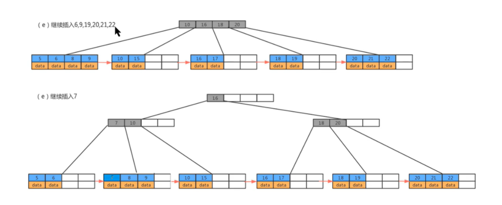

B树和B+树的优缺点对比：

* B+树：
  * 由于B+树在非叶子结点上不包含真正的数据，只当做索引使用，因此在内存相同大小的情况下，能够存放更多的key；
  * B+树的叶子结点都是相连的，因此对整棵树的遍历只需要一次线性遍历叶子结点即可。而且由于数据顺序排列且相连，更加便于范围性的查找，而B树则需要进行每一层的递归遍历。
* B树：由于B树的每一个结点都包含key和value，因此根据key查找value时，只需要找到key所在的位置，就能找到value，但B+树只有叶子结点存储数据，索引每一次查找，都必须找到树的最深处，也就是需要经过叶子结点的深度，才能找到value。

B+树在数据库中的应用：在操作数据库时，为了提高查询效率，可以基于某张表的某个字段建立索引，以提高查询效率，MySQL中的索引就是通过B+树结构实现的。

在未建立主键索引时进行查询：执行 `select * from user where id = 18;` 需要从第一条数据开始，一直查询到第6条数据才能发现id=18的数据，需要遍历比较6次。

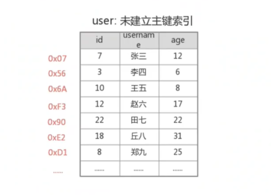

在建立了主键索引后进行查询：执行精确匹配时只需要通过key找到value即地址，通过地址之间定位到数据。不仅如此，在执行 `select * from user where id >= 12 and id <= 18;` 这种范围查询时，由于B+树的叶子结点形成了一个有序链表，所以只需要找到id=12的叶子结点，然后向后按顺序遍历即可。

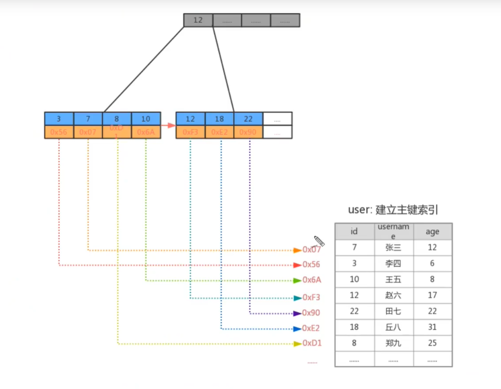


## 图结构

TODO
