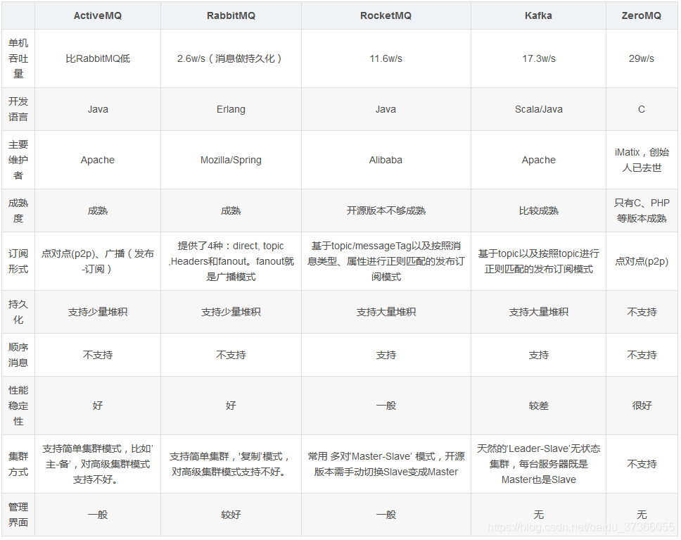
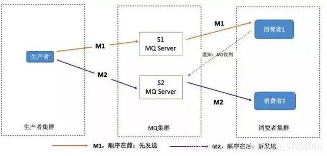
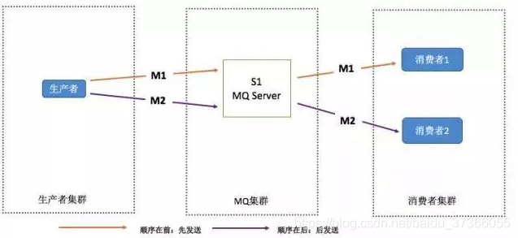

# 消息中间件

## MQ的优缺点

**优点**：

* **异步处理**：相对于传统的串行执行，提高了系统吞吐量。
* **应用解耦**：系统间通过消息通信，断开了相互的强依赖性。
* **流量削锋**：通过队列的长度控制请求量，缓解短时间内的高并发请求。
* **日志处理**：解决大量日志传输。
* **消息通讯**：消息队列一般都会内置高效的通信机制，因此也可以用在纯消息通信上，如实现点对点消息队列或者聊天室等。

**缺点**：

* **系统可用性降低**：若消息队列挂了，会影响相应的业务程序的执行。
* **系统复杂度提高**：加入消息队列需要考虑更多的问题，如一致性问题、消息重复消费问题、消息可靠性问题，导致系统复杂性提高。
* **一致性问题**：分布式系统环境下，业务逻辑的作用域横跨多个系统，相互之间通过消息队列异步协作。若其中一个系统操作失败，那么整套逻辑执行后就会出现数据不一致的情况。

## 多种MQ的对比

 

## MQ的常见问题

**消息的顺序问题**：

* **问题**：所谓消息的有序性是指消费方按照消息的发送顺序来消费。如下图，生产者要求消息M1要先于M2被消费，但MQ是以集群部署，不同的服务器发送顺序不同。

  

* **解决方案**：保证生产者、MQ Server和消费者是一对一的关系。

  

* **解决方案的缺点**：

  * 并行度就会成为MQ系统的性能瓶颈。
  * 会出现更多的异常，若一方出现问题，就会导致整个处理流程阻塞。
  * 队列无序并不意味着消息无序，所以从业务层面保证消息的顺序而不仅仅是依赖于消息系统，是一种更合理的方式。

**消息的重复问题**：

* **问题**：由于网络不可达原因导致的消费端收到两条一样的消息。
* **解决方案**：消费端处理消息的业务逻辑必须保证前后的幂等性，即保证每条消息都有唯一编号且与去重表的日志同时出现，利用一张日志表来记录已经处理成功的消息ID，如果新到来的消息ID已经存在于表中了，那么就不需要再次处理这条消息了。

## RabbitMQ基本概念

* **Broker**：消息队列服务器实体。
* **Exchange**：消息交换机，用于指定消息的路由规则。
* **Queue**：消息队列载体，每个消息都会被投递到一个或多个队列中。
* **Binding**：绑定关系，就是将交换机和队列按照路由规则绑定起来。
* **Routing Key**：路由关键字，交换机会根据关键字进行消息的投递。
* **VHost**：即虚拟的Broker主机，也就是一套虚拟出的消息系统，内部含有独立的Queue、Exchange和Binding等，更重要的是其拥有一套独立的权限系统，可以做到VHost范围的用户控制。这让RabbitMQ可以使用VHost作为不同权限的隔离手段，典型的例子就是不同应用可以运行在不同的VHost中。
* **Producer**：消息生产者，也就是投递消息的程序。
* **Consumer**：消息消费者，也就是接受消息的程序。
* **Channel**：消息通道，在客户端的每个连接里，可以创建多个Channel，每个通道都代表一个会话任务。
* 由Exchange、Queue和Routing Key三个角色共同决定消息的投递线路。

## RabbitMQ工作模式

* **simple**：收发模式。生产者生产消息，并将消息放入队列中。消费者监听队列，如果发现存在消息就获取并删除，这种机制存在的隐患就是消息可能没有被正确的处理，但却已经从队列中消失了，因此造成的消息丢失。可以通过设置手动ACK来解决问题，每次处理完毕后需要及时发送ACK应答给队列，否则会导致内存溢出。
* **work**：资源的竞争模式。生产者将消息放入队列并且对应多个消费者，多个消费者同时监听一个队列，形成一个竞争关系。当队列中存在待消费的消息后，所有消费者都会去争抢消息，谁先获得的谁消费。这种机制存在的隐患就是高并发情况下，会产生某个消息被多个消费者共同使用，可以通过设置一个开关（syncronize）来保证一条消息只能被一个消费者消费。
* **publish/subscribe**：发布订阅模式。每个消费者都各自监听一个独自的队列。生产者将消息发送给broker，由交换机将消息转发到绑定到该交换机上的每个队列中。
* **routing**：路由模式。生产者将消息发送给交换机，由交换机根据消息携带的路由关键字获取匹配到的消息队列，对应于该队列的消费者再进行消费。一般来说，都是根据业务逻辑进行的关键字绑定。
* **topic**：主题模式。是一种提供了通配符和模糊匹配的路由模式。

## RabbitMQ消息可靠性

### 消息的顺序性

* 拆分队列（Queue），每个队列对应一个消费者（Consumer）；
* 或是一个队列（Queue）对应多个消费者（Consumer），然后生产者内部使用内存队列排队，分发给不同的工作线程（Worker）处理。

### 消息如何分发

* 队列中的消息将会以轮询（Round-Robin）的方式发送给消费者；
* 每条消息只会分发给一个订阅的消费者（Consumer），并通过路由实现多路消费的功能。

### 消息的路由模式

* 从生产者->路由->队列时，消息将拥有一个路由键（Routing Key），会在消息被创建时设定。通过指定路由键，可以将队列绑定到交换机上；
* 当消息到达交换机后，MQ会将消息的路由键和队列的路由键进行匹配。常见的交换机路由模式有三种：
  * fanout：如果交换机收到消息，会广播到所有绑定的队列上；
  * direct：如果路由键完全匹配，会被投递到相应的队列上；
  * topic：可以使不同源头的消息能够到达同一个队列。

### 消息的传输基础

* 由于TCP的握手和挥手带来的开销较大，且并发数会受到系统资源的限制，造成性能瓶颈；
* 所以RabbitMQ使用信道的方式来传输数据。信道是建立在真实的TCP连接内的虚拟连接，且每条TCP连接上的信道数量没有限制。

### 消息的重复消费/幂等性

* 前提：通常情况下，消费者在消费完毕后会发送一个确认（ACK）消息给消息队列，消息队列会将该消息从队列中移除；
* 问题：由于网络传输等故障的出现，确认消息没有正确到达消息队列，导致消息队列不知道该消息是否被正确消费，会再次发送；
* 解决思路：保证消息的唯一性，即使多次传输，也不要让消费者多次消费的问题出现，保证消息前后的幂等；
* 解决方案：在消息发送到队列之前对相同的消息做相同标识，在消息被消费时根据标识判断是否已经消费过了。

### 消息的正确发送/正确接收

* 发送方确认：
  * 将信道设置为发送方确认模式（confirm模式），则所有在信道上发布的消息对会被指派一个唯一的ID；
  * 一旦消息被投递到目标队列时，或消息被持久化写入磁盘后，信道会发送一个包含ID的确认给生产者；
  * 如果是因为RabbitMQ内部错误导致的消息丢失，则会发送一条未确认消息（NACK）；
  * 发送方确认模式是异步的，生产者在等待确认的同时，可以继续发送消息。当确认消息到达后，触发回调方法去处理。
* 接收方确认：
  * 消费者接收的每条消息都必须进行确认，只有消费者确认了消息，队列中的消息才会被删除；
  * RabbitMQ通过消费者的连接中断来确认是否需要重新发送消息。即只要连接不中断，不存在是否超时；
  * 如果消费者接收到消息后，在发送确认之前断开了连接或取消订阅，RabbitMQ会认为消息没有被分发，然后重新分发给下一个订阅的消费者；
  * 如果消费者接收到消息却没有确认消息，连接也未断开，则RabbitMQ认为该消费者繁忙，将不会再给其分发更多的消息。

### 消息的丢失问题

* 生产者丢失消息：
  *  
* 队列丢失消息：
* 消费者丢失消息：

### 消息的持久化机制

## RabbitMQ集群高可用