# 计算机网络原理

## 层次结构

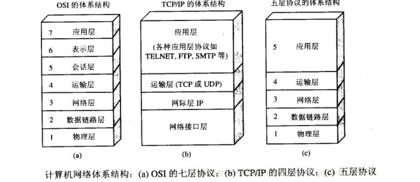

### 应用层（Application Layer）

**该层为应用程序之间的交互提供网络通信和交互规则**。对于不同的网络应用需要定义不同的应用层协议，如：域名系统DNS、支持Web应用的HTTP和支持电子邮件的SMTP协议等。应用层之间交互的数据单位被称为报文。

### 传输层（Transport Layer）

**该层为主机进程间提供端到端的通用的数据传输服务**。所谓的通用是指不针对某一个网络应用，而是多种网络应用可以使用同一个传输层服务，由传输层协议通过端口对同一主机上的进程数据做分解。应用程序就是通过该层提供的协议服务传输应用层的数据报/报文段的。

### 网络层（Network Layer）

**该层为源主机到目的主机提供分组交付、分组转发、路由寻址和路由选择的服务**。由于在网络中通信的两台主机之间可能会经过很多节点、数据链路和通信子网，所以该层就是针对这一过程提供主机间可靠的数据传输服务。该层会将传输层产生的报文段或数据报封装成分组或包进行传送，在TCP/IP体系中，分组也叫做IP数据报。互联网是由大量异构网络通过路由器相互连接起来的，互联网使用的网络层协议是无连接的网际协议和许多路由选择协议组成的，因此互联网的网络层也叫做网际层或IP层。

### 数据链路层（Data Link Layer）

**该层为网络中相邻节点间的数据传输提供可靠的逻辑链路服务**。在两个相邻节点间传输数据时，链路层会将网络层交付下来的IP数据报组装成帧结构，并在节点间建立逻辑链路传输，并通过差错控制为数据的正确传输提供保障。

### 物理层（Physical Layer）

**该层为相邻节点间的比特流传输提供屏蔽物理设备和传输介质差异的服务**。从而使上层的链路层不需要考虑具体的物理介质问题，透明传输，即经过实际电路传输后的比特流没有发生变化，对比特流来说，这些电路好像是看不见的。

## 应用层

### HTTP和HTTPS

#### HTTP

HTTP是一种超文本传输协议（Hypertext Transfer Protocol），是一个在计算机世界中专门在两点间传输文字、图片、音频、视频等超文本数据的约定和规范。

HTTP主要分为三部分，即超文本、传输和协议：

* 超文本就是不仅是文本数据，还包括图片、音频、视频，甚至超链接的跳转；
* 传输就是数据需要经过一系列的介质从一个端系统传送到另一个端系统的过程，通常把传输数据的一方称为请求方，把接收二进制数据的一方称为应答方；
* 协议指的是网络中传递、管理信息的一些规范，即收发双方需要共同遵守的规则。

#### HTTPS

HTTPS（Hypertext Tansfer Protocol Secure）即带有安全性保证的HTTP协议。实际上是由HTTP + TLS/SSL协议的组合，而其中安全性的保证就是由TLS/SSL所做的。

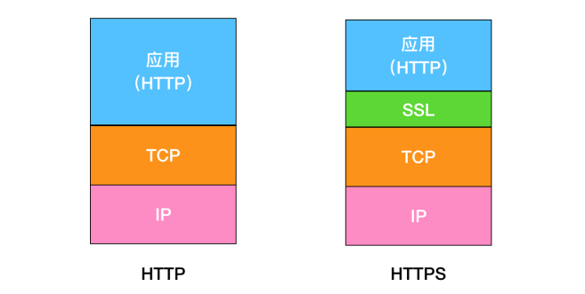

TLS是为Internet提供通信安全的加密协议，TLS握手是启动和使用TLS加密的通信会话过程。在TLS握手期间，Internet中的通信双方会彼此交换信息，验证密码套件，交换会话密钥。

每当用户通过HTTPS导航到具体的网站并发送请求时，就会进行TLS握手。除此之外，每当其他任何通信使用HTTPS（包括API调用和在HTTPS上查询DNS）时，也会发生TLS握手。

TLS具体的握手过程会根据所使用的密钥交换算法的类型和双方支持的密码套件而不同，下面以RSA非对称加密来讨论TLS的握手流程。

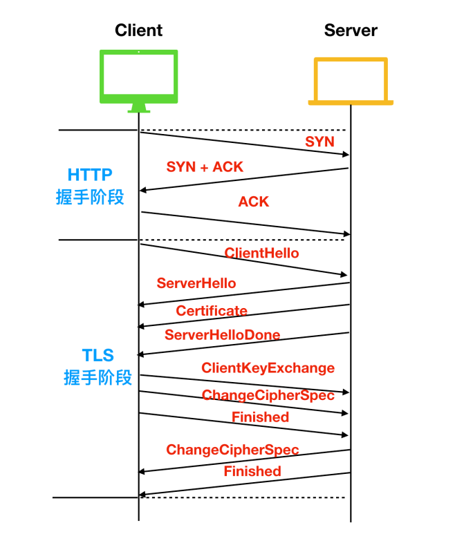

* 前提：在进行通信前，首先会完成TCP的三次握手，再进行TLS握手；
* ClientHello：客户端通过向服务器发送hello消息来发起握手过程，该消息中会携带着客户端支持的TLS版本号、客户端支持的密码套件和一串客户端随机数；
* ServerHello：收到客户端的hello消息后，服务端也会发送一条hello消息，这条消息包含了服务器的SSL证书、服务器选择的密码套件和服务器生成的随机数；
* 认证（Authentication）：客户端的证书颁发机构会认证SSL证书，然后发送Certificate报文，报文中包含公开密钥证书。最后服务发送ServerHelloDone作为hello请求的响应。至此，TLS握手的第一阶段结束。
* 加密阶段：在第一阶段握手完成后，客户端会发送ClientKeyExchange作为响应，该响应中包含一种称为The premaster secret的密钥字符串，这个字符串就是使用上面的公开密钥证书进行加密的字符串。随后客户端会发送ChangeCipherSpec，告诉服务端使用私钥解密这个premaster secret的字符串，然后客户端发送Finished通知服务端发送完毕；
* 实现了安全的非对称加密：最后，服务端也发送ChangeCipherSpec和Finished通知客户端解密完成，至此实现了RSA的非对称加密。

#### 二者的区别

* **协议头和端口**：HTTP的URL以 ``http://`` 起始且默认使用80端口。而HTTPS的URL由 `https://` 起始且默认使用443端口；
* **安全性和资源消耗**：HTTP协议运行在TCP之上，所有的传输内容都是明文，客户端和服务器都无法验证对方的身份。HTTPS是运行在SSL/TLS之上的HTTP协议，SSL/TLS运行在TCP之上，所有的传输内容都使用对称加密，密钥使用了服务器的证书进行了非对称加密。所以HTTP安全性比HTTPS低，但消耗的资源更少。

### HTTP Get和Post的区别

* get方法一般用于获取，主要特征就是请求服务器返回资源。而post方法一般用于提交，相当于是将信息提交给服务器；
* get方法是不安全的，在发送请求时会直接携带参数。而post方法会将参数放在请求体body中，对用户来说不可见；
* get请求的URL有长度限制。而post请求因为参数和值都放在请求体中，所以没有长度要求；
* get请求一般会被浏览器主动缓存。而post则不会，需要手动设置；
* get请求在发送过程中会产生一个TCP数据包。而post请求会在发送过程中产生两个TCP数据包。对于get方式，浏览器会把http header和data一并发送出去，服务器响应200。而对于post，浏览器先发送header，服务器响应100 continue，浏览器再发送data，服务器响应200 ok。

### HTTP状态码

* **1XX**：信息性状态码（Informational），接收的请求正在处理；
* **2XX**：成功状态码（Success），表示请求正常处理完毕；
* **3XX**：重定向状态码（Redirection），需要进行附加操作以完成请求；
* **4XX**：客户端错误状态码（Client Error），服务器无法处理请求；
* **5XX**：服务端错误状态码（Server Error），服务器处理请求出错。

### HTTP如何保存用户状态

* HTTP是无状态（Stateless Protocol）协议，即HTTP协议自身不对请求和响应之间的通信状态进行保存。
* 一般会使用存放在服务端持久化存储器中的Session来保存用户的某些状态，如：登录状态，服务器存储用户登录状态并设置超时，客户端通过请求携带Cookie附加Session ID的方式完成身份证明，之后就可以继续跟踪用户。
* 若Cookie被禁用，最常用的方式就是通过URL携带Session ID。

### Cookie和Session的区别

* **作用**：Cookie一般用来保存用户标识，如：Token。Session主要作用是通过服务端记录用户信息，如：登录状态。
* **存储**：Cookie的数据一般保存在浏览器端。Session的数据一般保存在服务器端。
* **安全性**：Session相对于Cookie安全性更高。如果需要在Cookie中存储关键信息，可以加密后传输，在服务端解密。

### 浏览器输入URL到显示主页的过程

* **DNS解析**：这一步用于解析域名和IP的映射关系，先查询本地DNS缓存，即通过浏览器缓存和本机hosts文件来获取。若没有，则向DNS服务器发起查询，经过根域名服务器 -> 顶级域名服务器 -> 权威域名服务器后，获得IP地址。
* **建立TCP连接**：浏览器与目标服务器通过三次握手来建立TCP连接；
* **发送HTTP请求**：当连接建立后，浏览器会发起HTTP-GET请求；
* **服务器处理请求并返回HTTP响应**：服务器收到请求后，会对应的进行处理，返回相应的HTTP响应；
* **浏览器解析渲染页面**：解析HTTP响应结构，渲染数据和页面。

### 各协议与HTTP协议的关系

### HTTP/1.0/1.1/2.0的区别

#### HTTP1.0

* HTTP1.0只会使用最基本的认证，这时的用户名密码还未加密；
* HTTP1.0默认使用短链接，即每次发送数据都需要经过TCP的三次握手和四次挥手，效率相对较低；
* HTTP1.0只会使用header中的If-Modified-Since和Expires作为缓存失效的标准；
* HTTP1.0不支持断点续传，即每次都会传输全部的页面和数据；
* HTTP1.0认为每台计算机都只能绑定一个IP，所以请求消息中的URL并没有传递主机名hostname。

#### HTTP1.1

* HTTP1.1使用了摘要算法进行身份认证；
* HTTP1.1默认使用长连接，即一次建立多次传输，当传输完成后，只需要断开一次连接即可。长连接的持续时间可以通过请求头中的 keep-alive 来设置；
* HTTP1.1新增了E-tag，If-Unmodified-Since，If-Match，If-None-Match等缓存控制标头来控制缓存失效；
* HTTP1.1支持断点续传，通过请求头中的Range来实现；
* HTTP1.1使用了虚拟网络，在一台物理服务器上可以存在多个虚拟机（Multi-homed Web Servers），并且共享一个IP地址。

#### HTTP2.0

* **头部压缩**：由于HTTP1.1经常会出现User-Agent、Cookie、Accept、Server、Range等字段可能会占用几百甚至几千字节，而Body却只有几十字节，所以导致头部偏重。到了HTTP2.0使用了HPACK算法进行压缩；
* **二进制格式**：HTTP2.0使用了更加靠近TCP/IP的二进制格式，而抛弃了ASCII码，提升了解析效率；
* **强化安全**：HTTP2.0一般都会运行在HTTPS上；
* **多路复用**：即每个请求都是对于连接共享的，一个请求对应一个id，这样一个连接就可以处理多个请求。

### URI和URL的区别

* **URI**：是统一资源标志符，可以唯一标识一个资源，类似于身份证号；

* **URL**：是统一资源定位符，可以提供该资源的路径，类似于家庭住址。是一种具体的URI，即URL不仅能用来标识一个资源，而且还可以通过其获取这个资源。

### DNS域名系统

#### 域名服务器

DNS将用户使用的域名映射为计算机使用的IP地址的过程称为域名解析，由域名服务器提供域名解析服务。DNS使用UDP的53号端口。

* 本地域名服务器（默认DNS，首先查询）；
* 根域名服务器（13个不同IP地址的根域名服务器，由英文字母a-m命名）；
* 顶级域名服务器；
* 权威域名服务器（保存一个区内所有主机的域名到IP地址的映射）；
* 中间域名服务器。

#### 迭代解析

如果根域名服务器能够告知下一步需要访问的顶级域名服务器，则会使用迭代解析的方式。

* 首先请求本地DNS；
* 本地DNS没有则代为请求根DNS；
* 若是根DNS也没有则由本地DNS依次代为请求顶级DNS和权威DNS，直到成功解析返回或无法解析。

#### 递归解析

如果根域名服务器无法告知下一步需要访问的顶级域名服务器，则会使用递归解析的方式。

* 首先请求本地DNS；
* 没有则由本地DNS代为请求根DNS；
* 也没有则由根DNS代为请求顶级DNS；
* 若依旧没有则依次向高层的顶级和权威域名服务器递归请求，直到解析结果依次返回。

## 传输层

### 传输层的复用与分解

支持多个应用进程共用同一个传输层协议，并能够将接收到的数据准确交付给不同的应用进程：

* **复用**：在同一主机上，多个应用进程同时利用同一个传输层协议进行通信，此时该传输层协议就被多个应用进程复用；

* **分解**：传输层将同时接收到的不同应用进程的数据交付给正确的应用进程就叫做分解。

TCP与UDP实现复用分解的方法：

* **UDP**：通过数据报套接字（目的IP地址，目的端口号）实现分解；
* **TCP**：通过流式套接字（源IP地址，源端口号，目的IP地址，目的端口号）实现分解。

### TCP和UDP的区别

* **用户数据报协议（UDP，User Datagram Protocol）**：是无连接的，尽最大可能交付，没有拥塞控制，面向报文，支持一对一、一对多和多对多的通信协议；
* **传输控制协议（TCP，Transmission Control Protocol）**：是面向连接的，提供可靠交付，提供流量控制、拥塞控制，提供全双工通信，面向字节流，只支持一对一的通信协议。

### UDP的首部格式

首部字段占8byte，包括源端口、目的端口、长度、校验和。12byte的伪首部是为了计算校验和临时添加的。

**校验和计算**：

* 对所有参与运算的校验和内容按二进制16位对齐求和，求和过程中的任何溢出都会被回卷（即进位与和的最低位再加），最后得到的和取反码，就是UDP首部校验和；
* 参与校验和运算的内容包括：UDP伪首部，UDP首部，应用层数据。

### TCP的首部格式

* **序号**：序号是对应用层数据的每个字节进行编号，因此TCP报文段的序号应该是该段所封装的应用层数据首字节的序号；
* **确认号**：期望从对方接收的下一个字节的序号，即该序号之前的字节已经全部正确接收；
* **数据偏移**：指数据部分距离报文段起始位置的偏移量，实际上指的就是首部长度；
* **保留关键字**：
  * **ACK**：`ACK=1` 表示确认报文；
  * **SYN**：`SYN=1` 表示连接请求报文；
  * **FIN**：`FIN=1` 表示连接释放报文。
* **窗口**：流量窗口值，标识接收方的最大缓存能力。

### TCP的三次握手

* **第一次握手**：客户端主动发起连接建立的请求，设置初始序号为x，发送SYN段 `(SYN=1，seq=x)` 。客户端状态由CLOSE进入 SYN_SEND状态，等待服务器确认；
* **第二次握手**：服务端收到客户端发送的SYN段后，设置初始序号为y，发送SYN_ACK段 `(SYN=1，ACK=1，seq=y，ack_seq=x+1)` 。这时服务端的状态由LISTEN进入 SYN_RCVD状态；
* **第三次握手**：客户端收到服务端的SYN_ACK段后，发送ACK段 `(ACK=1，seq=x+1，ack_seq=y+1)` 。这时客户端进入ESTABLISHED状态，服务器收到ACK段后也进入ESTABLISHED状态，至此连接建立。

**为什么要握手三次？**目的是为了建立可靠的通信信道，握手三次则是为了确认双方的发送和接收是正常的。

* 第一次握手能让服务端确认对方的发送和自己的接收都是正常的；
* 第二次握手能让客户端确认自己的发送和接收正常且对方的发送和接收也正常的；
* 第三次握手能让服务端确认自己的发送和对方的接收是正常的。

**为什么要回传SYN？**接收端回传SYN是为了通知发送端，本次的ACK是正对SYN连接请求的确认。

**为什么要回传ACK？**回传ACK是TCP可靠传输机制的一种手段，当发送方接收到接收方发送的ACK后，才能确认自己上一次是正确发送并且对方正确接收了。

### TCP的四次挥手

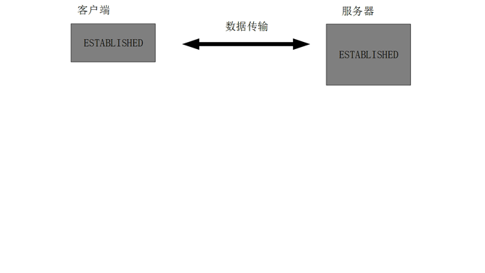

* **第一次挥手**：当客户端发送完最后一个数据段后，可以发送FIN段 `(FIN=1，seq=u)` 请求断开客户端到服务器的连接。客户端状态由ESTABLISHED进入FIN_WAIT_1，在该状态下只能接收服务器发送的数据但不能再发送数据了；
* **第二次挥手**：
  * 服务端收到FIN段后，向客户端发送ACK段 `(ACK=1，seq=v，ack_seq=u+1)`。服务端状态由ESTABLISHED进入CLOSE_WAIT，在该状态下服务端可发送数据但不能接收数据；
  * 当客户端收到ACK段，其状态由FIN_WAIT_1进入FIN_WAIT_2，仍然可以接收服务端的数据，此时TCP连接已经关闭了客户端向服务器方向的数据传输，也称半关闭。
* **第三次挥手**：当服务端向客户端发送完最后一个数据段后，才会发送FIN_ACK段 `(FIN=1，ACK=1，seq=w，ack_seq=u+1)`。此时服务端状态由CLOSE_WAIT进入LAST_ACK并不再发送数据；
* **第四次挥手**：
  * 当客户端收到服务端发送的FIN_ACK段后，向服务端发送ACK段 `(ACK=1，seq=u+1，ack_seq=w+1)`，其状态由FIN_WAIT_2进入TIME_WAIT，再等待2MSL时间后自动进入CLOSED状态，最终释放连接；
  * 服务器收到该ACK后，状态由LAST_ACK进入CLOSED，最终释放连接。

**为什么要挥手四次？**任何一方都可以在数据传输结束后发送连接释放的通知，待对方确认后进入半关闭状态。当另一方也没有数据需要发送的时候，则主动发送连接释放通知，接收方确认后就完全关闭了TCP连接。

**为什么要有TIME_WAIT状态？**确保最后一个确认报文能够到达。等待一段时间是为了让本连接持续时间内所产生的所有报文都从网络中消失，使得下一个新连接不会出现旧的连接请求报文。

### TCP的可靠传输

* **差错编码**：即首部校验和，可以检测数据在传输过程中的任何变化，若接收方收的报文段校验和有差错，则会直接丢弃该报文段并且不发送确认报文；
* **序号**：TCP会将应用层数据以有序字节流的形式对每个字节进行编号，并将整个报文划分为若干报文段，每个报文段的序号就是该段所封装的数据的首字节序号。序号还能够保障报文段的顺序重组和防重复。
* **确认**：即确认报文，通过首部的确认序号通知发送方自己正确接收了什么，下一次你需要传什么。即期望从对方那里接收到的下一个字节的序号，表示该序号之前的字节已经全部正确接收；
* **计时器重传**：发送方在发送一个报文段后会维护一个计时器，若计时器超时，表示报文段丢失接收方未收到或差错检测失败而被接收方丢弃，则重传报文段；
* **快速重传**：当接收方未正确接收到上一次自己发送的ACK报文中被确认序号标识的段时，则会在接下来的3次ACK中，重复确认那个未收到的序号，发送方发现接收方的3次重复确认后，就会立即重传；
* **滑动窗口**：TCP就是基于滑动窗口协议实现可靠传输机制的。发送方和接收方都会维护一个窗口，用于表示发送方可以发送且未被确认的分组最大数量和接收方可以接收并缓存的正确到达的分组最短数量。所谓滑动，是指当发送方收到确认或接收方向上提交数据后，窗口后移将之后的数据容纳进来；
* **流量控制**：用于协调发送方的数据发送速度，避免发送方发送数据过快，超出了接收方的缓存和处理能力。接收方通过窗口（缓冲区）来控制发送方发送数据大小，每次在确认时都会将缓冲区的剩余尺寸一并交付给发送方，这样发送方每次发送的数据量大小都会根据接收方缓冲区的大小而适当调整；
* **拥塞控制**：采用拥塞窗口机制，通过动态调节窗口大小来实现对发送速率的调整，避免在网络拥堵的情况下，数据发送过快而导致丢失。发送方维护一个拥塞窗口，表示在未收到确认的情况下，可以连续发送的字节数。整个拥塞控制分为慢启动和拥塞避免两个阶段，慢启动阶段窗口会乘性增加，拥塞避免阶段窗口会加性增加。

### 停-等协议

* 停-等协议也称ARQ自动重传请求协议；
* 发送方发送经过差错编码和编号后的报文段，等待接收方确认；
* 接收方如果正确接收报文段，即差错控制无误且序号正确，则接收报文段并向发送ACK，否则丢弃报文段并发送NAK；
* 发送方若收到ACK，则继续发送后续报文段，否则重新发送失败的报文段；
* 发送窗口Ws=1，接收窗口Wr=1，即停等协议的接收两端均无缓存能力。

### 滑动窗口协议

* **窗口**：窗口是缓存的一部分，用于暂时存放字节流。发送方和接收方各维护一个窗口，接收方通过TCP报文段中的窗口字段通知发送方自己窗口的大小，发送方根据这个值和其它信息设置自己的窗口大小。
* **滑动规则**：发送窗口内的字节都允许被发送，接收窗口内的字节都允许被接收。如果发送窗口左部的字节已经发送并且收到确认，那么就将发送窗口向右滑动一定距离，直到左部第一个字节不是已发送且已确认的状态。接收窗口的滑动类似，若左部字节已经发送确认并向上交付，就向右滑动接收窗口。
* 接收窗口只会对窗口内最后一个按序到达的字节进行确认，如：接收窗口已经收到的字节为31、34和35，其中31按序到达，而34和35就不是，因此只对31字节进行确认。发送方得到一个字节的确认后，也就知道这个字节之前的所有字节都已被接收。

### GBN回退N帧协议

* 当接收方检测出失序的信息帧后，要求发送方重发最后一个正确接受的信息帧之后的所有未被确认的帧；
* 或当发送方发送了n个帧后，若发现该n帧的前一帧在计时器超时区间内仍未返回其确认信息，则该帧被判定为出错或丢失，此时发送方不得不重新发送该出错帧及其后的n帧；
* 发送窗口Ws>1，接收窗口Wr=1，接收窗口缓存能力为1，所以只能累计确认最后一个正确接收的信息帧；
* 累积确认：只会确认最后一个正确接收的信息帧，回退也是从最后一个确认的信息帧向后回退。

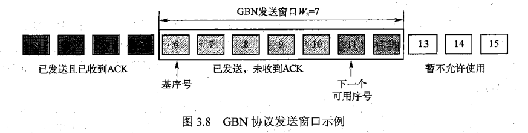

### SR选择重传协议

* 发送方仅重传那些未被接收方确认（出错或丢失）的分组，从而避免了不必要的重传；
* 发送窗口Ws>1，接收窗口Wr>1；
* 接收方对每个正确接收的分组逐个确认。

### TCP的流量控制

* 流量控制是为了控制发送方的发送速率，保证不会超过接收方的接收、缓存和处理能力。
* **TCP使用窗口机制进行流量控制**：连接建立时，接收方分配一块缓存区用于存储接收的数据，并在每次发送的确认报文中通过窗口字段将缓冲区的尺寸通知给发送端。

### TCP的拥塞控制

**基本概念**：

* **拥塞**：就是大量主机高速向网络发送大量数据，超出网络的处理能力，导致大量分组拥挤在网络中间设备的队列中等待转发，网络性能显著下降的现象。

* **拥塞控制**：即通过合理的调度、规范和调整网络中的主机数量、主机的发送速率或数据量，以避免拥塞或消除已发生的拥塞。

* **拥塞控制算法**：慢启动、拥塞避免、快速重传、快速恢复。

* **拥塞窗口**：发送方维护的一个表示可以连续发送报文段数量的窗口。发送方通过动态调整拥塞窗口以实现对发送速率的控制。

**拥塞控制流程**：

* 拥塞窗口默认从慢启动阶段开始，每经过一次RTT都会让拥塞窗口扩大一倍，即每一个ACK都会增加1；
* 直到窗口大小达到阈值，拥塞控制会进入拥塞避免阶段，此时每经过一次RTT拥塞窗口只会增加1；
* **当TCP通信过程中发生了计时器超时的情况**：此时拥塞控制会在下一次RTT重新进入慢启动阶段，拥塞窗口还原为初值，阈值更新为拥塞发生时的一半；
* **当TCP通信过程中发生了快速重传的情况**：此时拥塞控制会在下一次RTT重新进入拥塞避免阶段，拥塞窗口变为拥塞发生时的一半，即发生了快速恢复。

## 网络层

### 网络层拥塞控制

* **拥塞**：在分组交换网络中，由于众多的用户随机的将信息发送到网络中，使网络中需要传输的信息总量大于其传输能力，以至于某些网络结点因为缓冲区已满，从而无法接收新到达的分组，此时就发送了拥塞现象。

* **拥塞控制**：根据网络的通过能力或网络拥挤程度，来调整数据发送速率和数据量的过程，叫做拥塞控制。拥塞控制主要考虑端系统之间的网络环境，目的是使网络负载不超过网络的传送能力。

* **拥塞控制策略**：
  * **流量感知路由**：链路的权值根据网络负载动态调整，将网络流量引导到不同的链路上，均衡网络负载。流量感知路由是一种拥塞的预防措施，可以在一定程度上缓解或预防拥塞的发生；
  * **准入控制**：是一种广泛应用于虚电路网络的拥塞预防技术，对新建的VC进行审核，若新建的VC会导致网络拥塞（基于瞬时流量和平均流量来判断），则拒绝新VC的建立；
  * **流量调节**：在网络发生拥塞时，通过调整发送方向的网络发送数据的速率来消除拥塞。
    * **抑制分组**：当感知到拥塞的路由器选择一个被拥塞的数据报时，给发送该数据报的源主机返回一个抑制分组。同时对被拥塞的数据报的首部的一个标志位进行修改，从而使该数据报在后续传输过程中不会被后续路由器再次选择来发送抑制分组；
    * **背压策略**：如果因发送速率过快而导致拥塞结点与源节点的距离或跳数较远，那么在抑制分组的发送过程中又会有新的分组进入网络。这时让抑制分组从拥塞结点到源节点的路径上的每一跳都发挥作用，这样从上游第一跳时就能立即降低分组的发送速率。
  * **负载脱落**：主动丢弃一些数据报来减轻网络负载，从而缓解或消除拥塞。当任何方法都不能消除通信子网的拥塞现象时，负载脱离是路由器的最后手段。

### IP数据报格式

* **版本号**（4位）：IP版本号，路由器根据该字段确定版本规则来解析数据报；
* **首部长度**（4位）：IP数据报的首部长度，包括可变长度的选项字段。固定首部长度为20字节；
* **区分服务**（8位）：用于指示期望获得哪种类型的服务（只有在网络提供区分服务时，该字段才有效）；
* **数据报长度**（16位）：IP数据报的总字节数，包括首部和数据部分。16位可以表示最大IP数据报的总长度65535个字节，除去IP数据报首部的20字节，最大IP数据报可封装65515字节数据；
* **标识**（16位）：用于标识一个IP数据报，IP协议使用计数器，每产生一个数据报计数器就会加1，作为该数据报的ID标识。不同主机产生的数据报又可能存在相同的标识字段，IP协议是依靠标识字段+源IP+目的IP+协议等字段共同唯一标识一个IP数据报。标识字段的最重要用途是在IP数据报的分片和重组过程中，用于标识属于同一原IP数据报；
* **标志**（3位）：DF是禁止分片标志，MF是更多分片标志。DF=0表示允许数据报分片，DF=1表示禁止数据报分片。MF=0表示该数据报未被分片或者是分片的最后一个，MF=1表示该数据报是一个分片数据报但不是最后一个；
* **片偏移**（13位）：表示一个IP数据报分片与原IP数据报的相对偏移量，即封装的数据分片从整个原数据报的哪个字节开始；
* **生存时间**（8位）：表示IP数据报在网络中可以通过的路由器数，即跳数。该字段用于确保一个IP数据报不会永远在网络中游荡（如：错误的路由选择算法选择了一个环形路由）。源主机在生成IP数据报时设置TTL初值，每经过一跳路由TTL就减1，为0则会被路由器丢弃。TTL占8为位，因此一个IPv4数据报最多能经过256跳；
* **上层协议**（8位）：表示该IP数据报封装的是哪个上层协议的报文段。IP就是利用该字段实现了多路复用和多路分解；
* **首部校验和**（16位）：对IP数据报首部的差错检验。计算时，该字段置全0，整个首部以16位对齐，采用反码算数运算（按位加，最高位进位回卷）求和，最后得到的和取反码就是校验和字段。接收IP分组检验校验和时，将首部按相同算法求和，结果为16位1则无差错，存在不为1的任意位，则差错丢弃。首部校验和是逐跳校验、逐跳计算的；
* **源IP地址**（32位）：是发出IP数据报的源主机地址；
* **目的IP地址**（32位）：是IP数据报需要送达的主机IP地址；
* **选项**（1\~40字节）：对IP首部进行扩展，可以携带安全、源选路径、时间戳、路由记录等内容。之后还可能有一个填充字段，长度为0~3字节，取值全0。填充字段的目的是补齐首部，符合32位对齐，即保证首部长度是4字节的倍数；
* **数据**：存放IP数据报所封装的传输层报文段，到目的主机后会将其所承载的数据交付给相应的上层协议。

* **MTU**：IP数据报是封装在数据链路层帧中进行传输的。一个数据链路层协议帧所能承载的最大数据量称为该链路的最大传输单元（MTU）；
* **分片的目的**：当路由器要将一个IP数据报转发至某个输出端口，而该数据报的总长度大于该输出端口所连接链路的MTU时，路由器将IP数据报进行分片（DF=0时），或者将其丢弃（DF=1时）。IP分片的重组任务由目的主机完成。

### IP地址编址方式

**IP地址格式**：IP地址由32位二进制数组成，采用点分十进制表示法。

|       方法       |              表示方法               |
| :--------------: | :---------------------------------: |
|   二进制标记法   | 11000000 10101000 00000001 01100101 |
| 点分十进制标记法 |            192.168.1.101            |
|  十六进制标记法  |             0xC0A80165              |

|             类              |            前缀长度            |                         前缀                          |              首字节               |
| :-------------------------: | :----------------------------: | :---------------------------------------------------: | :-------------------------------: |
| A | 8位  |          0xxxxxxx           |  0~127  |
| B | 16位 |     10xxxxxx  xxxxxxxx      | 128~191 |
| C | 24位 | 110xxxxx  xxxxxxxx xxxxxxxx | 192~223 |
|          D（组播）          |             不可用             |         1110xxxx  xxxxxxxx xxxxxxxx xxxxxxxx          |              224~239              |
|          E（保留）          |             不可用             |         1111xxxx  xxxxxxxx xxxxxxxx xxxxxxxx          |              240~255              |

* A类地址：网络前缀长度为8位，第1位固定0，后7位用于表示网络地址，即共有2^7^=128个A类网络，每个A类网络中的IP地址总数为2^24^=16777216；

* B类地址：网络前缀长度为16位，前2位固定为10，后14位用于表示网络地址，即共有2^14^=16384个B类网络，每个B类网络的IP地址总数为2^16^=65536；
* C类地址：网络前缀长度为24位，前3位为110，后21位用于表示网络地址，即共有2^21^=2097152个C类网络，每个C类网络的IP地址总数为2^8^=256。

* 特殊地址：

  * 本地主机地址：0.0.0.0/32。当主机需要发送一个IP数据报时，需要将自己的地址作为源地址，但是在某些情况下，主机还不知道自己的IP地址，此时可以使用本地主机地址来填充IP数据报的源地址字段。另外，在路由表中0.0.0.0/0用于表示默认路由。
  * 有限广播地址：255.255.255.255/32<。当主机或路由器某接口需要向其所在网络中的所有设备发送数据报时，用该地址作为IP数据报的目的IP。注：使用有限广播地址广播的数据，只限于发送数据报的主机所在的子网范围内。
  * 回送地址：127.0.0.0/8。如果IP数据报的目的地址位于这个地址块中，那么该数据报将不会被发送到源主机之外，如：127.0.0.1。

**私有地址（用于内部网络，不能在公共互联网上使用）**：

| 私有地址类别 |                     范围                      |
| :----------: | :-------------------------------------------: |
|     A类      |     10.0.0.0~10.255.255.255 或 10.0.0.0/8     |
|     B类      |  172.16.0.0~172.31.255.255 或 172.16.0.0/12   |
|     C类      | 192.168.0.0~192.168.255.255 或 192.168.0.0/16 |

### 子网划分与子网掩码

**子网划分**：为了缓解地址空间的不足，提高IP地址的空间利用率。

**子网掩码**：网络号和子网号全部为1，主机号全部为0。

* A类地址的子网掩码：255.0.0.0；
* B类地址的子网掩码：255.255.0.0；
* C类地址的子网掩码：255.255.255.0。

**已知子网中的IP地址和子网掩码**：

* **求子网ID（子网地址）**：将IP地址与子网掩码做按位与运算。或网络位子网位不变，主机位全写为0；
* **求网络广播地址**：将IP地址与子网掩码的反码做按位或运算。或网络子网位不变，主机位全写为1。

### 动态主机配置协议DHCP

DHCP动态主机配置协议，为网络中的新加入的主机自动分配IP地址。

**工作过程**：

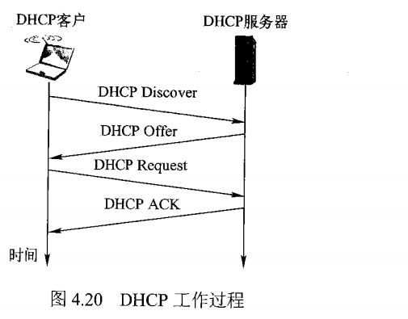

* DHCP客户广播（因为不知道DHCP服务器的IP地址）DHCP发现报文（DHCP Discover），以便发现DHCP服务器。报文中的目的IP字段会填入255.255.255.255，表明这个一次广播；
* DHCP服务器广播（因为新接入网络的主机不具有可用IP）发送一个DHCP提供报文（DHCP Offer），用于响应主机，报文中包含为新主机分配的IP地址等信息；
* DHCP客户收到一个或多个DHCP提供报文后，选择其中一个后广播（因为DHCP可能存在多个，在响应选中的DHCP的同时也要广而告之未被选择的DHCP）发送DHCP请求报文（DHCP Request）报文；
* 被选定的DHCP服务器以DHCP确认报文（DHCP ACK）来对DHCP请求报文进行响应。

### 网络地址转换协议NAT

NAT网络地址转换协议，实现将私有地址转换成公有地址，从而访问Internet。NAT协议通常运行在私有网络的边缘路由器或专门服务器上，同时连接内部私有网络和公共互联网，拥有公共IP地址。

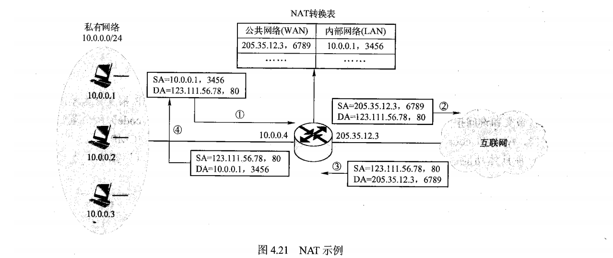

**工作原理**：

* 对于从内网进入公共互联网的IP数据报，将其源IP地址替换为NAT服务器拥有合法的公共IP地址，同时替换源端口号，并将替换关系记录到NAT转换表中；
* 对于从公共互联网返回的IP数据报，依据其目的IP地址与目的端口号检索NAT转换表，并利用检索到的内部私有IP地址和目的端口号，然后将IP数据报转发到内部网络。

### 网际控制报文协议ICMP

ICMP网际控制报文协议，进行主机或路由器间的网络层差错报告与网络探测。

**差错控制报文**：

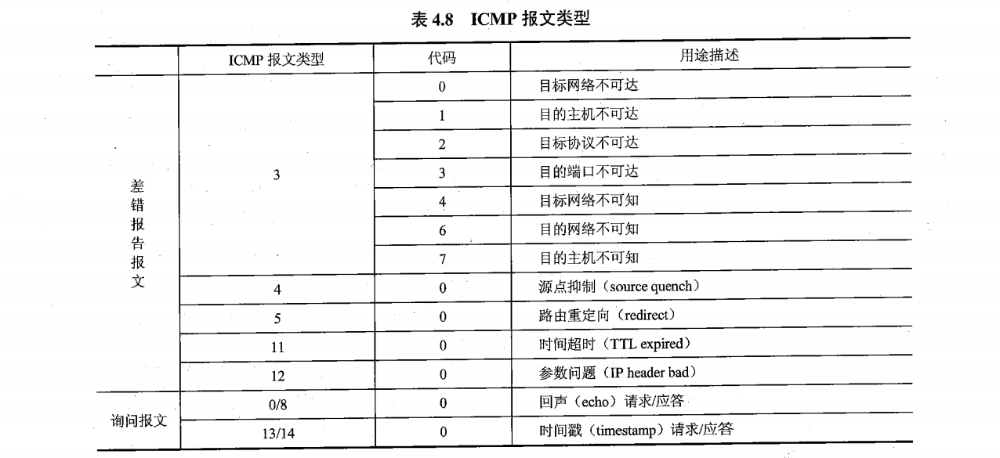

* **目的不可达**：当路由器或主机不能将IP数据报成功交付到目的网络、主机、端口时，会丢弃数据报并向源主机发送目的不可达ICMP报文；
* **源点抑制**：如果路由器由于拥塞导致丢弃了IP数据报，则可以通过向IP数据报的源主机发送源点抑制ICMP报文，反馈该异常情况，告知其拥塞现象；
* **路由重定向**：如果默认网关路由器认为主机向某目的网络发送的IP数据报，应选择其他更好的路由时，则向主机发送路由重定向ICMP报文，主机收到后会将更好的路由信息更新到路由表中，以便后续发送时选择更好的路由；
* **时间超时**：当路由器收到IP数据报的TTL为1，减1后变为0时，则不再继续转发该IP数据报，而是将其丢弃，同时向该IP数据报的源主机发送时间超时报文。

### 虚拟专用网VPN

### 路由器结构

* **输入端口**：负责从物理接口接收信号，还原数据链路层帧，提取IP数据报（或其他网络层协议分组），根据IP数据报的目的IP地址检索路由表，决策需要将该IP数据报交换到哪个输出端口；
* **交换结构**：将输入端口的IP数据报交换到指定的输出端口，基于内存交换（性能最差）、总线交换、网络交换（性能最佳）；
* **输出端口**：首先提供缓存队列功能，让交换到该端口的待发送分组排队，并从队列中不断的取出分组进行数据链路层数据帧的封装，最后通过物理线路端发送出去；
* **路由处理器**：路由器的CPU，负责执行路由器的各种指令，包括路由协议的运行、路由计算、路由表的更新与维护等；
* **路由表**：路由器是根据路由表来进行分组的转发。由目的网络、下一跳地址和接口组成。

**路由器的分组转发**：

### 路由算法

#### 链路状态路由选择算法LS

是与一种全局式路由选择算法，每个路由器在计算路由时需要构建出整个网络的拓扑图。

* 为了构建整个网络的拓扑图，每个路由器周期性检测、收集与其直接相连链路的费用，以及与其直接相连的路由器ID等信息，构造链路状态分组并向全网扩散；
* 于是网络中的每个路由器都会周期性的收到其他路由器广播的链路状态分组，并将链路状态分组存储到自己的链路状态数据库中；
* 当数据库中收集到足够的链路状态信息后，路由器就可以基于数据库中的链路状态信息，构建出网络拓扑图；

#### 距离向量路由选择算法DV

是一种异步的、迭代的分布式路由选择算法。

* 网络中的每个结点x，估计从自己到网络中所有结点y的最短距离，记为Dx(y)，称为结点x的距离向量，即该向量维护了从结点x出发到达网络中所有结点的最短距离（最低费用）的估计；
* 每个结点向其邻居结点发送它的距离向量的一个拷贝；
* 当结点收到来自邻居的一份距离向量或是观察到相连的链路上的费用发生变化后。根据B-F方程对自己的距离向量进行计算更新；
* 如果结点的距离向量得到了更新，那么该结点会将更新后的距离向量发生给它的所有邻居节点。

#### 层次化路由

将大规模的互联网按组织边界、管理边界、网络技术边界或功能边界划分为多个自治系统（AS），层次化路由将网络路由选择分为自治系统内路由选择和自治系统间路由选择两个层次。解决了大规模网络路由选择问题。

### 路由选择协议

#### 路由信息协议RIP

* 基于距离向量路由选择算法的IGP（也就是自治系统内的路由选择协议，也就是内部网关协议），主要用于较小规模的AS，RIP在度量路径时采用的是跳数，即每条链路的费用都为1；
* 路由器周期性的向其相邻路由器广播自己知道的路由信息（路由表），用于通知相邻路由器自己可以到达的网络以及到达该网络的距离（跳数），相邻路由器可以根据收到的路由信息修改和刷新自己的路由表；
* RIP被限制在网络直径不超过15跳的自治系统内使用，即分组从一个子网到另一个子网穿越的最多子网数目不超过15，因此RIP中一条路径的最大费用不超过15，路径费用16表示无穷大，即目的网络不可达；
* 相邻的路由器通过RIP响应报文来交换距离向量，交换频率约为30s一次，RIP响应报文中包含了从该路由器到达其他目的子网的估计距离的列表，RIP响应报文也称RIP通告。

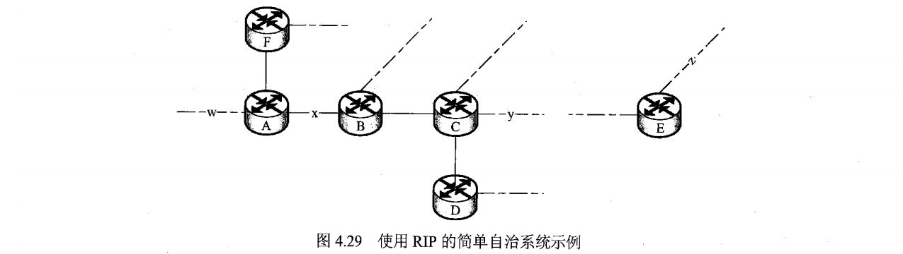

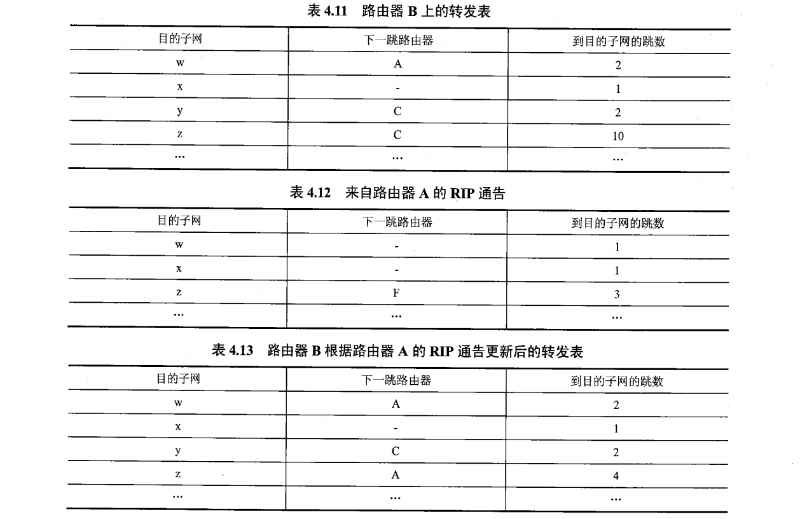

上图展示了一个使用RIP的自治系统，与路由器相连的线表示子网，虚线表示子网的其它部分：

* 在某一时刻，路由器B收到路由器A的RIP通告，通告内容如4.12，路由器B根据DV算法计算更新其转发表4.11，更新的结果如表4.13所示；
* RIP规定若超过180s仍未从某个邻居接收到任何RIP响应报文，那么将认为该邻居已经不可达，修改本地转发表，并将此信息通过RIP响应报文通告给邻居；
* RIP是应用进程实现的，所以RIP报文的传输也需要封装到传输层的UDP报文中，但RIP完成的是网络层的功能，仍然称RIP是网络层协议，网络分层的划分是按功能，而不是具体实现。

#### 开放式最短路径优先协议OSPF

* 基于链路状态路由选择算法（使用Dijkstra算法求解最短路径）的IGP，应用于较大规模的AS；
* 不论是RIP还是OSPF都是将网络抽象成无向图，但RIP将无向图中边的权值（即费用）固定为跳数，而OSPF对权值表示的意义没有限制，可以是跳数，也可以是链路的带宽等，OSPF只关心在给定的结点、边和边的权值的集合下，如何求解最短路径；
* 在运行OSPF的自治系统内，每台路由器需要向与其同处一个自治系统内的所有路由器广播链路状态分组。为了使路由器能够更好的适应网络拓扑以及流量的变化情况，路由器需要在其相连链路上的费用发生变化时，及时广播链路状态分组。

**优点**：

* **安全**，所有OSPF报文都是经过认证的，这样可以预防恶意入侵者将不正确的路由信息注入到路由器的转发表中；

* **支持多条相同费用的路径**，OSPF允许使用多条具有相同费用的路径，这样可以防止在具有多条从源到目的的费用相同的路径时，所有流量都发往其中一条路径，有利于实现网络流量均衡；

* **支持区别化费用度量**，OSPF支持对于同一条链路，根据IP数据报的TOS不同，设置不同的费用度量，从而可以实现不同类型网络流量的分流；

* **支持单播路由与多播路由**，OSPF综合支持单播路由与多播路由，多播路由只是对OSPF的简单扩展，使用OSPF的链路状态数据库就可以计算多播路由；

* **分层路由**，OSPF支持在大规模自治系统内进一步进行分层路由。

  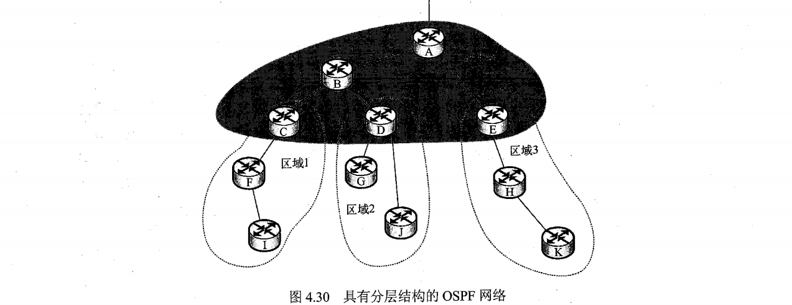

  * 区域边界路由器，如上图C、D、E，主要负责为发送到区域之外的分组进行路由选择；
  * 主干路由器，在主干区域中运行OSPF路由算法的路由器被称为主干路由器；
  * AS边界路由器，如上图A，负责连接其他AS。

* OSPF报文直接封装到IP数据报中进行传输。

#### 边界网关协议BGP

BGP实现跨自治系统的路由信息交换，功能：

* 从相邻AS获取某子网的可达性信息；
* 向本AS内部的所有路由器传播跨AS的某子网可达性信息；
* 基于某子网可达性信息和AS路由策略，决定到达该子网的最佳路由。

BGP主要有4种报文：

* OPEN（打开）报文，用来与BGP对等方建立BGP会话；
* UPDATE（更新）报文，用来通告某一路由可达性信息，或者撤销已有路由；
* KEEPALIVE（保活）报文，用于对打开的报文进行确认，或周期性的证实会话的有效；
* NOTIFICATION（通知）报文，用来通告差错。

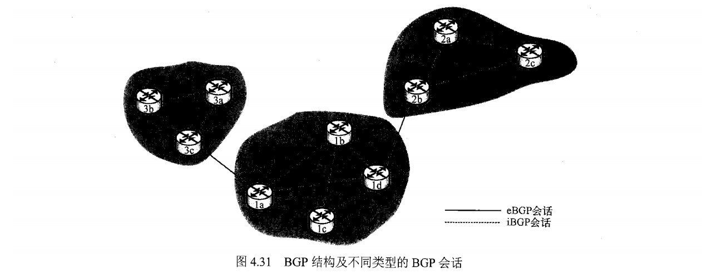

## 数据链路层

### 数据链路层服务

#### 基本概念

数据链路层负责通过一条数据链路，从一个结点向另一个物理链路直接相连的相邻结点，传送网络层数据报，中间通常不经过任何其他交换结点。所谓的数据链路是在物理线路上，基于通信协议来控制数据帧传输的逻辑数据通路。从数据链路层来看，无论主机或是路由器等网络设备统称为结点，因为它们通常都是一条数据链路的端点。沿着通信链路连接的相邻结点的通信信道称为链路。

#### 组帧

* 将要传输的数据封装成帧结构的操作，称为组帧或成帧；
* 在网络层的数据报基础上增加帧头帧尾，帧头包含发送结点和接收结点的地址信息，帧尾包含用于差错检查的差错编码；
* 组帧过程增加的帧头尾中还有一部分用于帧定界的信息，即确保接收结点从物理层收到的比特流中，能够依据定界字符或比特串成功识别帧的开始和结束，如：帧头帧尾都加上01111110。

#### 链路接入

* **点对点链路**：发送结点和接收结点独占通信链路，只要链路空闲就能发送和接收帧；
* **广播链路**：通信链路被多个结点共享，任意两个结点同时通过链路发送帧，都会彼此干扰，导致帧传输失败，因此各个结点需要运行MAC媒介访问控制协议，来协调各阶段使用共享物理传输媒介，完成帧的传输。

#### 可靠交付

并不是所有数据链路层协议都需要设计成可靠传输协议，高出错的链路如无线链路会适用可靠传输，低出错的链路如光纤双绞线等实施可靠传输没有太大的必要。

#### 差错控制

* 帧在物理媒介传输会产生比特翻转的差错；
* 一段时间内，出现差错的比特占总比特的比率称为误比特率。

### 差错控制

#### 差错类型

差错控制就是通过差错编码技术，实现对信息传输差错的检测，并基于某种机制进行差错纠正和处理。信号在信道中传输，会受到各种噪声的干扰，从而导致传输差错：

* 随机噪声：如热噪声、传输介质引起的噪声，具有典型的随机性。随机噪声引起的传输差错称为随机差错或独立差错，具有独立性、稀疏性和非相关性，二进制的传输通常为随机比特差错；
* 冲击噪声：如雷声、电机启停等，具有很强的突发性。突发差错通常是连续或成片的信息差错，具有相关性，通常集中发生在某段信息。

#### 控制机制

* **检错重发**：典型的差错控制方式，发送端对数据进行差错编码，接收端利用差错编码检测数据是否出错，对于出错的数据需要重复发送，直到正确为止；

* **前向纠错**：接收端进行差错纠正的方法，需要利于纠错编码（能检测也能纠正），即发送端进行纠错编码，接收端利用纠错编码进行差错检测，发送错误直接纠正（适用于单工链路或实时性要求高的链路）；
* **反馈校验**：接收端将收到的数据原样发回发送端，发送端通过比对反馈可以确认是否正确发送，若发现不同则立即重发，直到比对反馈结果相同为止（缺点：效率低，实时性差）；
* **检错丢弃**：不纠正错误，直接丢弃数据。只适用于容许一定比例差错或实时性要求较高的系统（如多媒体播报应用）。

#### 差错编码

发送端在待传输数据信息的基础上，附加一定的冗余信息，该冗余信息建立起数据信息的某种关联关系，将数据信息以及附加的冗余信息一起发送到接收端，接收端可以检测冗余信息表示的数据信息的关联信息是否存在，若存在则正确，否则出错。

* 奇偶校验码：按位异或（XOR）运算，符号⊕，即参与运算的两个位值，相同则0，不同则1；
* 汉明码：线性分组码，可以实现单个比特的差错纠正，当信息为足够长时，执行效率会很高；
* CRC循环冗余码：将二进制位串看成是系数为0或1的多项式的系数。一个k为二进制数可以看作是一个k-1次多项式的系数列表，该多项式共有k项，从x^k-1^到x^0^。这样的多项式被认为是k-1阶多项式。高次（最左边）位是x^k-1^项的系数，接下来的位是x^k-2^项的系数，以此类推。

### 多路访问-信道划分MAC协议

#### 基本概念

数据链路层使用的信道分类：

* 点对点信道：一对一通信，信道被通信双方共享；
* 广播信道：一对多广播通信，广播信道上连接的结点很多，信道被所有结点共享，因此需要使用多路访问控制MAC协议来协调结点的数据发送。

基本思想是将信道资源划分后，分配给不同的结点，各结点通信时只使用其分配到的资源，从而实现了信道共享，并避免了多结点通信时的相互干扰。

#### 频分多路复用FDM

频域划分制，即在频域内将信道带宽划分为多个子信道，并利用载波调制技术，将原始信号调制到对应某个子信道的载波信号上，使同时传输的多路信号在整个物理信道带宽允许的范围内频谱不重叠，从而共用一个信道；

FDM系统的接收端，利用带通滤波器对信号进行分离、复原；

FDM常用于模拟传输的宽带网络种。

频分多路复用的主要优点是分路方便，是目前模拟通信中常采用的一种复用方式，特别是在有线和微波通信系统中应用广泛。

#### 时分多路复用TDM

时域划分制，即将通信信道的传输信号在时域内划分为多个等长的时隙，每路信号占用不同的时隙，在时域上互不重叠，使多路信号合用单一的通信信道，从而实现信道共享；

TDM系统的接收端根据各路信号在通信信道上所占用的时隙分离并还原信息；

分为同步时分多路复用STDM和异步时分多路复用ATDM两种：

* STDM按照固定的顺序把时隙分配给各路信号；
* ATDM为有大量数据要发送的用户分配较多的时隙，数据量小的用户分配相对较小的时隙，没有数据的用户不再分配时隙，可以提高信道的利用率，主要应用于高速远程通信。

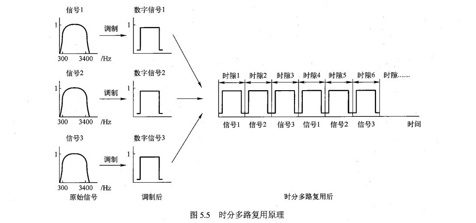

#### 波分多路复用WDM

本质是频分多路复用，广泛应用于在光纤通信中，光载波频率很高，通常用光的波长来代替频率讨论；

波分多路复用是指在一根光纤中，传输多路不同波长的光信号，由于波长不同，所以各路光信号互不干扰，最后再用波长解复用器将各路波长的光载波分解出来。

密集波分复用DWDM：

* 波长更密集，复用度更高，信道利用率更高，通信容量更大；
* 其关键技术是光放大器，运行在特定光谱频带上，并根据现有的光纤进行优化，无须将光信号转换为电信号，直接放大光波信号；
* DWDM是现代光纤通信网络的基础，有效支持IP、ATM等承载的电子邮件、视频、多媒体、语言等数据通过统一的光纤层进行高速传输。

#### 码分多路复用CDM

通过利用更长的相互正交的码组分别编码各路原始信息的每个码元，使得编码后的信号在同一信道中混合传输，接收端利用码组的正交特性分离各路信号，从而实现信道共享；

CDM的实质是基扩频技术，即将需要传输的、具有一定信号带宽的信息用一个带宽远大于信号带宽的码序列进行调制，使原始信号的带宽得到扩展，经载波调制后再发送出去，接收端则利用不同码序列之间的相互正交特性，分离特定信号。

### 多路访问-随机访问MAC协议

#### 基本概念

所有的用户都根据自己的意愿随机的向信道上发送消息，如果一个用户在发送信息期间没有其他用户发送信息，则该用户信息发送成功，如果两个或以上用户都在共享信道中发送信息，则产生冲突或碰撞，导致发送失败，每个用户随机退让一段时间后再次尝试，直至成功；

随机访问的实质就是争用接入，竞争胜利者暂时占用信道发送信息，失败者随机等待一段时间再次竞争，直到成功。

#### ALOHA协议

任一站点有数据要发送时就可以直接发送至信道，发送站在发出数据后需要对信道侦听一段时间，通常这个时间为电波传到最远端的站再返回本站所需的时间，如果这段时间内收到接收站发来的应答信号，说明发送成功，否则就是发生了冲突，则等待一段随机时间再进行重发，直到成功为止。

* 纯ALOHA协议：
  * 吞吐量 ^*^S：在一个帧时内成功发送的平均帧数；
  * 网络负载 G：在一个帧时内发送的平均帧数，包括发送成功的帧和因冲突未发送成功而重发的帧，纯ALOHA协议的网络负载不能大于0.5；
* 时隙ALOHA协议：
  * 把信道时间分为**离散的时隙**，每个时隙为发送一帧所需的发送时间，每个通信站只能在每个时隙开始时刻发送帧，如果在一个时隙内发送帧出现冲突，下一个时隙以概率P重发该帧，以概率（1-P）不发该帧（等待下一个时隙），直到帧发送成功；
  * 需要所有通信站在时间上同步，降低了产生冲突的概率，最大信道利用率为36.8%。

#### CSMA载波监听多路访问协议

ALOHA协议的根本缺点：就是发送前无论信道是否空闲都会进行发送，这会大大增加冲突的可能性，在发送帧之前先判断信道是否空闲，若空闲则发送否则推迟发送，能够减少发生冲突的可能性；

CSMA就是为解决这一问题而提出的，通过载波监听装置，使通信站在发送数据前，监听信道上其他站点是否发送数据，若有站点在发送则暂时不发，从而减少发生冲突的概率，CSMA可以理解为先听后说。

非坚持CSMA：

* 通信站有数据发送，先侦听信道；
* 若发现信道空闲，则立即发送数据；
* 若发现信道忙，则等待一个随机时间，然后重新开始侦听信道，尝试发送数据；
* 若发送数据时产生冲突，则等待一个随机时间，然后重新开始侦听信道，尝试发送数据。

1-坚持CSMA：

* 通信站有数据发送，先侦听信道；
* 若发现信道空闲，则立即发送数据；
* 若发现信道忙，则继续侦听信道直至发现信道空闲，然后立即发送数据。

P-坚持CSMA：

* 通信站有数据发送，先侦听信道；
* 若发现信道空闲，则以P概率在最近时隙开始时刻发送数据，以概率Q=1-P延迟到下一个时隙发送；
* 若下一个时隙仍空闲，重复此过程直到数据发出或时隙被其他通信站占用；
* 若信道忙，则等待下一个时隙，重新开始发送数据；
* 若发送数据时发生冲突，则等待一个随机时间，然后重新开始发送过程。

#### CSMA/CD带冲突检测的载波监听多路访问协议

CSMA即使监听后再发也会出现数据冲突问题，当两个帧冲突时，不仅双方都会被破坏，也会使信道无法被其他站使用，因此发生冲突时继续传输数据帧会造成信道的浪费；

CSMA/CD就是为解决这一问题而提出的，即一旦发现有冲突发生，所有通信站都立即停止继续发送数据，这就需要通信站在发送数据的同时，还要监听信道，其中CD表示冲突检测，CSMA/CD可以理解为先听后说，边听边说。

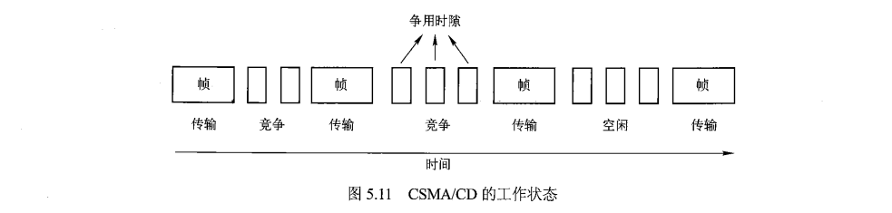

CSMA/CD的基本原理是：通信站使用CSMA协议进行数据发送，在发送期间如果检测到碰撞，立即终止发送，并发出一个冲突强化信号，使所有通信站都知道冲突的发生，信号发出后随机等待一段时间，再重复上述过程。

信道状态：

* 传输状态：一个通信站使用信道，其他站禁止使用；
* 竞争状态：所有通信站都有权尝试获取对信道的使用权；
* 空闲状态：没有通信站使用信道。

CSMA/CD发生冲突的原因：信号传播时延的问题，一个通信站发出的信号，需要经过一定的延迟才能到达其他站，而在信号到达其他站之前，如果某通信站此时也有数据发送，那么侦听信道的结果则依然为空闲状态，于是发送数据产生了冲突。

CSMA/CD冲突检测方法：通过检测信道中信号的强度来判断是否发生冲突的，适用于有线而不适用于无线信道。为了精确检测冲突，需要在发送数据的同时检测冲突，数据发送结束的同时也结束冲突检测，也就是**边发边听，不发不听**。

### 多路访问-受控接入MAC协议

#### 基本概念

特点是各个用户不能随意接入信道而必须服从一定的控制。

#### 集中式控制

系统中有一个主机负责调度其他通信站接入信道，从而避免冲突，主要方法是轮询技术，又分为轮叫轮询和传递轮询。

轮叫轮询：设有N个通信站连接共享线路，主机按顺序从站1开始逐个轮询，站1如有数据即可发送，若无则发送控制帧给主机，表示无数据可发，然后主机轮询站2，完成一轮后重复询问1站；

传递轮询：

* 轮叫轮询的缺点就是轮询帧在共享线路上不停的循环往返，形成较大的开销，增加帧发送的等待时延；
* 传递轮询可以解决这样的问题，主机先向站N发出轮询帧，站N在发送数据后或在告诉主机没有数据发送时，即将其相邻站（N-1）的地址附上，从站1到站N-1都各有两条输入线，一条接收主机发来的数据，另一条接收允许该站发送数据的控制信息。

缺点是一旦主机出现了问题，那么整个网络都会陷入瘫痪。

#### 分散式控制

令牌技术是典型的分散式控制方法，令牌是一种特殊的帧，代表了通信站使用信道的许可，在信道空闲时一直在信道上传输，一个通信站如果想发送数据就首先要获得令牌，然后在一定时间内发送数据，在发送完数据后重新产生令牌并发送到信道上，以便其他通信站使用信道。最典型的使用令牌实现多路访问控制的是令牌环网。

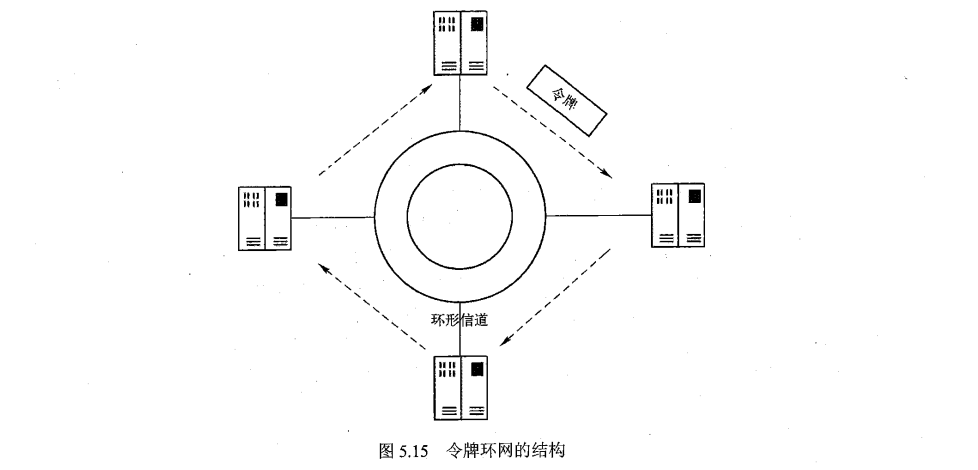

令牌丢失和数据帧无法撤销，是环网上最严重的错误：

* 令牌本身是位串，绕环传递的过程种可能受干扰出错，另外，当某站点发送数据帧后，由于故障而无法将所发的数据帧从网上撤销时，又会造成网上数据帧持续循环的错误；
* 通过在环路上指定一个站点作为主动令牌管理站，以此来解决问题，通过超时机制来检测令牌是否丢失，若丢失则清除环路上的数据碎片，并发出一个令牌；
* 通过在经过的任何一个数据帧上置其监控位为1，来管理无法撤销的数据。

## 物理层

物理层在实现为数据终端设备提供数据传输通路、传送数据以及物理层管理等功能的过程中，定义了建立、维护和拆除物理链路的规范和标准，同时也定义了物理层接口通信的标准。

物理层接口标准的定义主要包括四大特性：机械特性、电气特性、功能特性以及规程特性。

物理层接口协议主要任务就是解决主机、工作站等数据终端设备与通信线路上通信设备之间的接口问题。

### 数据通信基础

#### 基本概念

**信息与消息**：信息是对事物状态或存在方式的不确定性表述，而人类能够感知的描述称为消息；

**数据**：对客观事物的符号表示，用于表示客观事物的未经加工的原始素材；

**信号**：数据的电子或电磁编码，信号是信息的载体（模拟信号、数字信号）；

**通信**：通信的本质就是在一点精确或近似的再生另一点的信息；

**信道**：信号在通信系统中传输的通道（物理信道、逻辑信道）；

**码元**：单位时间内代表不同离散值的波形；

**波特率**：码元速率（Baud）即最大信号传输速率，描述信道单位时间内传输码元的能力，即2倍的带宽；

**比特率**：数据速率（bps）描述信道单位时间内传输；

**带宽**：指能够有效通过该信道的信号最大频带宽度（HZ）。

#### 数据通信系统

系统的构成：通信系统的作用是将消息从信源传递到一个或多个目的地，能够实现信息传输的一切技术设备和传输介质的集合称为通信系统。

* 信源：将信息转换为信号的设备，如电话、摄像机、计算机；
* 发送设备：将信源产生的信号进行适当变换的装置，使之适用于信道中传输，主要通过编码和调制的方式变换；
* 信道：即信号的传输媒介，分为有线和无线信道两类，具体类型如双绞线、同轴电缆、光纤、大气层、外层空间；
* 接收设备：完成发送设备的发变换，即进行译码和解调，还原原始的发送信号；
* 信宿：信号的终点，并将信号转换为供人们能识别的消息；
* 噪声：自然界和通信设备所固有的，对通信信号产生干扰和影响的各种信号，噪声对通信系统是有害的，但无法完全避免。

模拟通信和数字通信：通信系统根据信号种类分为模拟通信和数字通信系统，区别在于信道中传输的是模拟还是数字信号。

* 模拟信号是指信号的因变量完全随连续消息的变换而变化的信号，自变量可以是连续的，也可以是离散的，但因变量一定是连续的，如电视图像信号、电话语言信号、传感器的输出信号；

* 数字信号是指表示信息的因变量是离散的并且状态有限，自变量时间的取值也是离散的信号，如计算机数据、数字电话、数字电视等都是数字信号；

* 二者在一定条件下可以相互转换，模拟信号通过采样、量化、编码等步骤变成数字信号。数字信号通过解码、平滑等步骤恢复成模拟信号。

数据通信方式：

* 单向通信（单工）、双向交替通信（半双工）、双向同时通信（全双工）：单工通信就是任何时间都只有一个方向的通信，而没有反方向的交互；半双工通信就是通信双方都可以发送信息，但不能双方同时发送或接收，一方发另一方收，如对讲机系统；全双工通信就是双方可以同时发送和接收信息，如电话网、计算机网络；
* 并行通信、串行通信：并行通信是为字节的每一位都设置传输通道，全部位同时进行传输，传输速度快但成本高，适用于计算机内元器件的传输，如CPU与存储器的总线传输；串行通信只为信息传输设置一条通道数据字节中的每一位依次传输，传输速度慢但成本低，适用于长距离通信，如计算机与外置设备的数据传送；
* 异步通信、同步通信：
  * 异步通信以字符为单位发送，依次传输一字符，每个字符5~8位，字符前加上起始位指明开始，后面加上1或2个停止位指明结束，当无字符发送时就一直发送停止位，接收方就可以根据停止位判断范围。异步传输不需要传输时钟信号，实现简单，效率低下，适用于低速系统；
  * 同步通信以数据块为单位发送，内部包含多个字符，每个字符5~8位，在前面加上起始标志，后面加上结束标志，接收方以此判断范围。同步传输效率高，但需要双方建立同步时钟，实现复杂，适用于高速系统。

数据通信系统的功能：

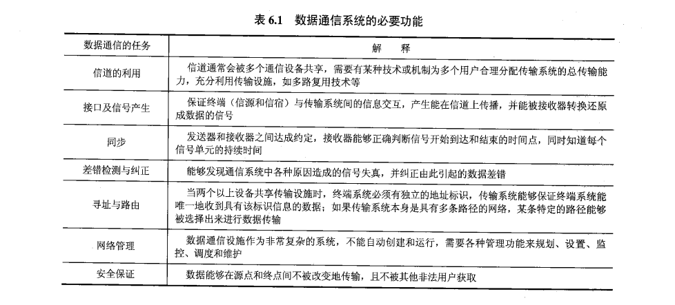

### 物理介质

在进行数据通信时，信号需要通过某种介质才能进行传输，即物理介质。

#### 引导型传输介质

又称有限信道，以导线为传输介质，信号沿导线进行传输，能量集中在导线附近，因此效率高，但部署不够灵活。

* 架空明线：指平行且相互分离或绝缘的架空裸线线路，通常采用铜线或铝线等金属导线；

* 双绞线：主要用于基带传输。

  

  将两根相互绝缘的铜线并排绞合在一起可以减少对相邻导线的电磁干扰，这样的一对线称为双绞线；

  屏蔽双绞线STP：在护套与线对间增加一层金属丝编制的屏蔽层，可以提高双绞线的抗电磁干扰能力，性能更优、价格高、安装复杂；

  非屏蔽双绞线UTP：没有屏蔽层的双绞线电缆，价格便宜、安装简单、局域网更普遍使用的是UTP。

* 同轴电缆：

  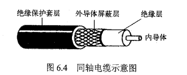

  主要用于频带传输，如有线电视网络，具有较好的抗电磁干扰性能；

  由同轴的两个导体构成，外导体是空心圆柱型网状编织金属导体，内导体是金属导线，两者之间填充绝缘实心介质；

* 光纤：

  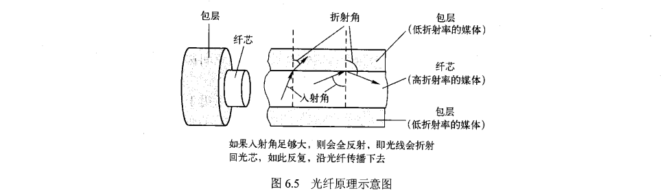

  基本原理是利用了光的全反射现象；

  分为多模光纤和单模光纤；

  优点： 

  1. 通信容量大，最高可达100Gbps；
  2. 传输损耗小，中继距离长，特别适合远距离传输；
  3. 抗雷电和抗电磁干扰性能好；
  4. 无串音干扰，保密性好；
  5. 体积小，重量轻。

#### 非引导型传输介质

适合距离特别远的自由空间的传播通信；

电磁波按频率划分为若干频段，用于不同目的或场合的无线通信；

电磁波在外层空间的传播，如两艘飞船间的通信，为自由空间传播，在近地空间传播会受到地面和大气层的影响，更加电磁波频率、通信距离和位置的不同，电磁波的传播可以分为地波、天波和视线传播。

### 信道与信道容量

#### 信道分类

狭义信道：即为信号传输介质；

广义信道，包括信号传输介质和通信系统的一些变换装置，如发送设备、接收设备、天线、调制器等：

* 调制信道：信号从调制器的输出端传输到解调器的输入端经过的部分（恒参信道、随参信道）；
* 编码信道：数字信号由编码器输出端传输到译码器输入端经过的部分，包括调制信道及调制器、解调器。

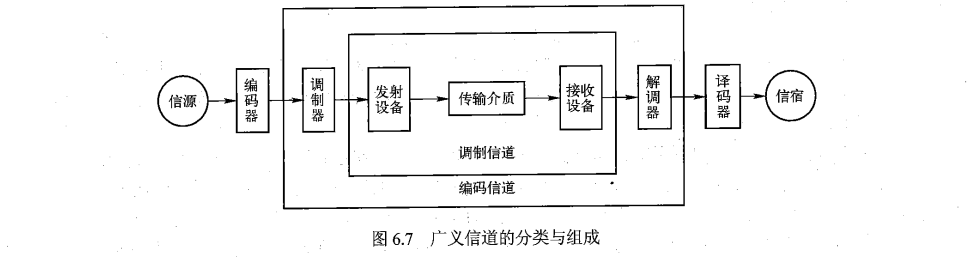

#### 信道传输特性

不同类型的信道对信号传输的影响差异较大，恒参信道的传输特性变化小、缓慢，可以视为恒定，不随时间变化；随参信道的传输特性是时变的。

恒参信道传输特性：

* 各种有线信道和部分无线信道，如微波视线传播链路和卫星链路等，都属于恒惨信道；
* 对信号幅值产出固定的衰减；
* 对信号输出产生固定的时延。

随参信道传输特性：

* 随参信道的传播特性随时间随机快速变化，如依靠地波和天波传播的无线电信号；
* 信号的传输衰减随时间随机变化；
* 信号的传输时延随时间随机变化；
* 存在多径传播现象，多径现象是指发射天线发出的电磁波可能经过多条路径到达接收端。

#### 信道容量

信道容量是指信道无差错传输信息的最大平均速率。广义信道可以分为调制信道和编码信道，信息论中将信道分为连续和离散信道；调制信道是一种连续信道，即输入和输出信号都是取值连续的；编码信道是离散信道，输入与输出信号都是取值离散的时间函数。

### 基带传输

#### 系统结构

在信道中直接传输基带信号，称为基带传输；

在信道中直接传输数字基带信号，称为数字基带传输。

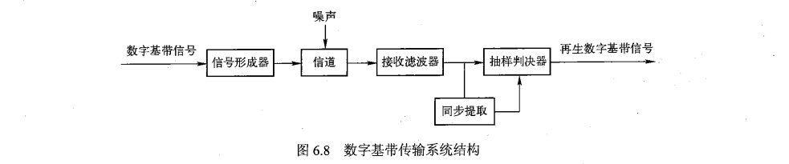

#### 传输编码

将二进制数字数据映射为脉冲信号的编码：

* 单极不归零码：

  二进制数字符号0和1分别用零电平和正电平表示，脉冲幅值只有零或正，只有一个极性，故称为单极；

  不归零是指整个脉冲持续时间内，电平保持不变，且脉冲持续时间结束时也不要求回归0电平；

  即：相邻两个脉冲区间如果表示的是同样的二进制符号，不要求回归0电平，幅值可以保持不变直到下一个脉冲区间表示的是不同的二进制符号。

  

  

* 双极不归零码：

  二进制数符号0和1分别用负电平和正电平表示。

  

* 单极归零码：

  二进制数符号0和1分别用零电平和正电平表示；

  归零就是在每个正脉冲区间的中间时刻，电平要回归到零电平；

  即：不论下一个脉冲区间是相同还是不同，都需要在本次脉冲持续期中回归零电平，下一个脉冲信号再重新调整幅值。

  

* 双极归零码：

  二进制数符号0和1分别用负电平和正电平表示。

  

* 差分码：

  利用电平的变化与否来表示信息，相邻脉冲用电平跳变表示1，无跳变表示0；

  即：相邻的区脉冲区间若电平发生跳变则代表后者是1，若相邻脉冲区间幅值不变，则表示后者是0。

  

将数字基带信号的基本码型变换为数字基带传输码型的编码：

* AMI码：

  信号交替反转码，用3种电平进行编码，零电平编码0，正负电平交替编码1；

  即：若前一个1用正电平表示，那接下来又出现的1就用负电平表示，反之亦然。

  

* 双相码：

  曼彻斯特码，只有正负两种电平，每位脉冲持续时间的中间时刻要进行电平跳变，利用该跳变编码信息，正（高）电平跳到负（低）电平表示1，负电平跳到正电平表示0；

  即：每段脉冲区间都是从中间位置开始跳变，从上往下跳表示1，从下往上跳表示0。

  差分曼彻斯特编码，每位脉冲周期也要进行中间时刻跳变，但仅用于同步，而利用每位开始处是否存在电平跳变编码信息，其中，开始有跳变表示1，无跳变表示0；

  即：以区间的中间时刻为分界线，前一个脉冲周期的后半段和后一个脉冲周期的前半段之间，然后发生了电平跳变，则后一个脉冲周期表示的就是1，若无跳变，则表示0。

  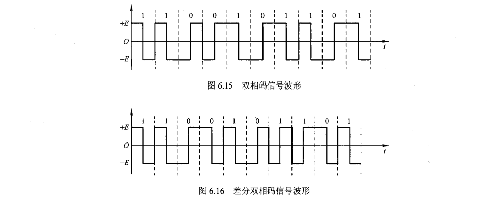

* 米勒码：

  是双相码的变形，也称延迟调制码，米勒码的编码规范如下：

  * 信息码中的1编码为双极非归零码的01或10；
  * 信息码连着是1时，后面的1要交替编码，即前面的1如果编码为01，后面的1就要编码为10，反之亦然；
  * 信息码中的0编码为双极不归零码的00或11，即码元中间不跳变；
  * 信息码单个0时，其前沿、中间时刻、后沿均不跳变；
  * 信息码连着是0时，两个0码元的间隔跳变（即前一个0的后沿，后一个0的前沿）。

  

* CMI码：

  即信号反转码，是一种双极性二电平码，也是将信息码的1为映射为双极不归零码的2位；

  编码规则是信息码的0编码为双极不归零码的01，1交替编码为双极不归零码的11和00。

  

* nBmB码：

  将n位二进制信息码作为一组，映射成m位二进制新码组，其中m>n。再光纤数字传输系统中，通常选择m=n+1构造编码；

  具有良好的同步和检错能力；

  例如：4B/5B编码，编码效率为80%，常用于100M以太网（快速以太网）、FDDI。8B/10B编码，编码效率80%，常用于千兆以太网。

* nBmT码：将n为二进制信息码作为一组，映射成m为三进制新码组，且m<=n。

### 频带传输

基带信号可以在具有低通特性的信道中传输，然而许多信道如无线信道不具有低通特性，因此不能再这些信道中之间传输基带信号；

基带信号去调制与对应信道传输特性相匹配的载波信号，通过在信道中传送经过调制的载波信号实现将基带信号所携带信息传送出去，因此需要使用频带传输这一信号传输方式。

#### 基本结构

将实现调制、传输与解调的传输系统称为数字频带传输系，也称为通带传输或载波传输；

利用模拟基带信号调制载波，称为模拟调制；利用数字基带信号调制载波，称为数字调制。

#### 数字调制与解调

调制：利用数字基带信号控制载波信号的某些特征参数，使载波信号这些参量的变化反映数字基带信号的信息，进而将数字基带信号变换为数字通信信号的过程；

解调：在接收端需要将调制到载波信号中的数字基带信号卸载下来，还原数字基带信号，这一个过程称为解调；

二进制数字调制：

|                调制技术                |                         说明                         | 码元种类 | 比特位 |                特点                |
| :------------------------------------: | :--------------------------------------------------: | :------: | :----: | :--------------------------------: |
|                  2ASK                  |         用恒定的载波振幅值表示1，无载波表示0         |    2     |   1    | 抗干扰性最差、误码率最高、性能最差 |
| 2FSK（应用较多）  （中、低速数据传输） |    选择两个不同频率的载波f1和f2表示两个不同值0和1    |    2     |   1    | 频带利用率最低，抗干扰性较2ASK更强 |
|                  2PSK                  |         用载波的相位变化来表示两个不同值0和1         |    2     |   1    |      抗干扰性最好、误码率最低      |
|   2DPSK（应用较多）（高速数据传输）    | 用相邻两个码元载波间的相对相位变化表示两个不同值0和1 |    2     |   1    |      抗干扰性最好、误码率最低      |

**正交幅值调制QAM**：

QAM是对载波信号的幅值和相位同时进行调制的二维调制技术，其信号矢量端点图称为星座图，星座间最小距离越大，抗噪性能就越好；

QAM调制技术具有频带利用率高、抗噪能力强、调制解调系统简单等优点，适用于频带资源有限的通信场合，在实际通信系统中得到了广泛的应用。

## 网络安全

### 基本概念

网络安全是指网络系统的硬件、软件及其系统中的数据受到保护，不因偶然的或者恶意的原因而遭到破坏、更改、泄密，系统连续可靠的正常运行，网络服务不中断。具体的网络安全机制需要具有的属性由机密性、消息完整性、可访问与可用性和身份认证。网络所受到的安全威胁有报文传输安全（如：窃听、插入、假冒和劫持等）、网络攻击（如：拒绝服务Dos以及分布式拒绝服务DDos等）、映射、分组嗅探和IP欺骗。

### 数据加密

#### 基本概念

密码技术是保障信息安全的核心基础，可以保证数据的机密性、完整性、不可否认性和身份识别等。而密码体制需要5个要素构成，即明文空间M、密文空间C、密钥空间K、加密算法E和解密算法D。

#### 传统加密

**替代密码**：

* 将明文字母表M中的每个字母用密文字母表C中的相应字母代替，常见的加密模型有移位密码、乘数密码、仿射密码等。

* **凯撒密码**：是移位密码的典型应用，通过将字母按顺序推后3位起到加密的作用。

**换位密码**：又称置换密码，是根据一定的规则重新排列明文，以便打破明文的结构特性。置换密码的特点是保持明文的所有字符不变，只利用置换打乱明文字符的位置和次序。置换密码可以分为列置换密码和周期置换密码。

**简单列置换密码**：

* 将明文P按密钥K的长度n分组，每组一行按行排列，即每行n个字符；
* 若长度不足n的整数倍，则按双方约定的方式填充（如用字符x填充）；
* 设最后得到的字符矩阵为M__mn__，m为明文划分的行数，n为列数；
* 然后按照密钥规定的次序将M__mn__对应的列输出，即可得到密文C；
* 密钥K中每个字母在字母表中的顺序，规定了M__mn__的列输出顺序。

#### 对称加密

对称加密的加密和解密所使用的密钥是相同的。

* **DES**：分组密码，使用56位密钥，明文位64位分组序列，进行16轮加密，每轮加密都会进行复杂的替代和置换操作，并且每轮都会使用一个56位密钥导出的48位子密钥，最终输出与明文等长的64位密文；
* **3DES**：执行3次DES算法，加密过程是加密-解密-加密，解密过程是解密-加密-解密；
* **AES**：涉及4种操作，字节替代、行移位、列混淆、轮密钥加，解密过程就是逆操作。

#### 非对称加密

非对称加密的加密和解密所使用的密钥是不同的，分为公钥和私钥。公加私解，私加公解。

* **Diffie-Hellman**：基于数学中的素数原根理论设计的公开密钥密码系统；

* **RSA**：也是基于数论设计的，其安全性建立在大数分解的难度上；
* **椭圆曲线**：TODO。

### 消息完整性与数字签名

#### 基本概念

报文/消息完整性，也称为报文/消息认证，主要目的是：

* 证明报文确定来自声称的发送方； 
* 验证报文在传输过程中没有被篡改；
* 预防报文的时间、顺序被篡改；
* 预防报文持有期被篡改；
* 预防抵赖，如发送方否认已发送的消息或接收方否认已接收的消息。

#### 消息完整性检测方法

为了实现消息完整性检测，需要用到密码散列函数H(m)，表示对报文m进行散列化。

密码散列函数应具备的主要特性：

* 一般的散列函数具有算法公开；
* 能快速计算；
* 对任意长度的报文进行多对一映射均能产生定长输出；
* 对于任意报文无法预知其散列值；
* 不同报文不能产生相同的散列值。
* 具有单向性、抗弱碰撞性、抗强碰撞性。

典型的散列函数：

* **MD5**：产生128位的散列值；
* **SHA-1**：产生160位的散列值，典型的用于数字签名的单向散列函数；
* **SHA-2**：TODO。

#### 报文认证

消息完整性检测的一个重要的目的就是要完成报文认证的任务。报文认证是使消息的接收者能够检验收到的消息是否真实的认证方法。

报文认证的目的：

* 消息来源的认证：验证消息的来源是真实的；
* 消息的认证：验证消息在传送过程中未篡改。

认证方式：简单报文认证和报文认证码MAC。

**报文摘要**：对报文m应用散列函数H，得到一个固定长度的散列码，称为报文摘要，记为H(m)，可以作为报文m的数字指纹。

#### 数字签名

概念：数字签名用来**核实发送方的身份**，是实现认证的重要工具。

过程：**用发送方的私钥签名，用发送方的公钥核实签名**。

数字签名应该满足以下要求：

* 接收方能够确认或证实发送方的签名，但不能伪造；
* 发送方发出签名消息给接收方后，就不能再否认其所签发的消息；
* 接收方对已经收到的签名消息不能否认，即有收报认证；
* 第三者可以确认收发双方之间的消息传送，但不能伪造这一过程。

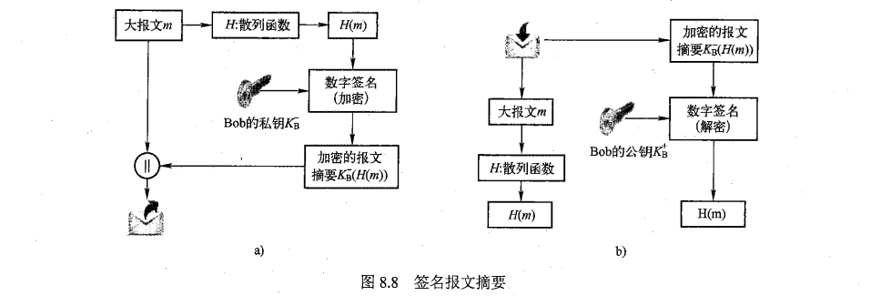

### 身份认证

概念：身份认证又称身份鉴别，是一个实体经过计算机网络向另一个实体证明其身份的过程。鉴别应当在通信双方的报文和数据交换的基础上，作为某鉴别协议的一部分独立完成。鉴别协议通常在两个通信实体运行其他协议之前运行。

基于共享对称密钥的身份认证：

* A向B发送报文；
* B选择一个一次性随机数R发送给A；
* A使用其与B共享的对称密钥来加密这个随机数，然后把密文发送给B；
* B解密收到的报文，若结果和自己发送的随机数相同，则确认A的身份。

基于公开密钥的身份认证：

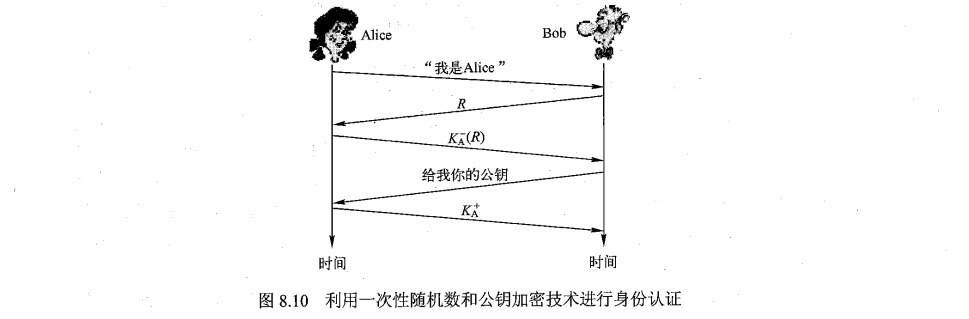

* A向B发送报文；
* B选择一个一次性随机数R发送给A；
* A使用自己的私钥来加密R，并把密文发送给B；
* B向A请求获取A的公钥；
* A发送自己的公钥给B；
* B用公钥解密收到的报文，若结果和自己发送的随机数相同，则确认A的身份。

存在中间人攻击的问题：

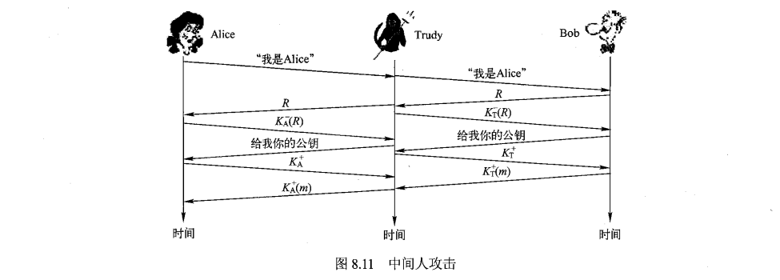

### 密钥分发中心与证书认证机构

#### 密钥分发中心KDC

概念：对称密钥分发的典型解决方案是通信各方建立一个大家都信赖的密钥分发中心KDC，并且每一方和KDC都保持一个长期的共享密钥。通信双方借助KDC建立一个临时的会话密钥，在会话密钥建立之前，通信双方与KDC之间的长期共享密钥，用于KDC对通信方进行验证以及双方间的验证。

基于KDC实现对称密钥分发的过程：

方式一：通信发起方生成会话密钥。

* A要与B进行保密通信，A先随机选择一个会话密钥，并标明通信目的B后用A与KDC的共享密钥加密，然后发送给KDC；
* KDC收到后，用与A的共享密钥解密，会获得会话密钥和A的通信目的B，KDC将会话密钥和通信来源A用与B的共享密钥加密，并发送给B；
* B接收到后，用于KDC的共享密钥解密，从而得知希望于自己通信的是A，并获取会话密钥开始保密通信。

方式二：由KDC为A和B生成通信的会话密钥。

* A在希望与B通信时，首先向KDC发送请求消息；
* KDC收到来自A的消息后，随机选择一个会话密钥，并通过与A和B的共享密钥分别加密，然后将加密的密文分别发送给A和B；
* A和B收到KDC的密文后，用自己与KDC的共享密钥解密，获取会话密钥开始保密通信。

#### 证书认证机构CA

将公钥与特定实体绑定，通常是由认证中心CA完成的。

CA的作用：

* CA可以证实一个实体的真实身份，当通信方与CA打交道时，需要信任这个CA能够执行严格的身份认证；
* 一旦CA验证了某个实体的身份，CA会生成一个把其身份和实体的公钥绑定起来的证书，其中包含该实体的公钥及其全局唯一的身份识别信息等，并由CA对证书进行数字签名。

基于CA的公钥认证过程：

* 由CA为B签发证书，包含B的公钥和全局唯一的身份识别信息，最后由CA数字签名；
* A想要B的公钥时，首先获取B的证书，用CA的公钥解密签名获取B的公钥，然后保密通信。

基于KDC或CA避免身份认证的中间人攻击的基本原理：之所以会存在中间人攻击的安全隐患，跟密钥的可信性有很大关系，接收方没有验证公钥的真实性，于是中间人攻击就成功了。解决这一问题的关键就是要解决**对称密钥的分发**和**公钥的认证**问题。

### 防火墙与入侵检测系统

#### 基本概念

防火墙是能够隔离组织内部网络与公共互联网，允许某些分组通过，而阻止其他分组进入或离开内部网络的软件、硬件或者软件与硬件结合的一种设施。防火墙发挥作用的基本前提是需要保证从外部到内部和从内部到外部的所有流量都经过防火墙，并且仅被授权的流量允许通过，防火墙能够限制对授权流量的访问。

#### 防火墙分类

无状态分组过滤器：典型的部署在内部网络和网络边缘路由器上的防火墙，分组过滤是网关路由器的重要功能。在路由器中通常使用访问控制列表ACL实现防火墙规则；

有状态分组过滤器：使用连接表跟踪每个TCP连接，分组过滤器跟踪连接建立SYN，拆除FIN，根据状态确定是否放行进入或外出的分组；

应用网关：进行身份鉴别，授权用户开发特定服务。

进行分组过滤时通常基于以下参数进行决策：

* IP数据报的源IP和目的IP；
* TCP/UDP报文段的源端口号和目的端口号；
* ICMP报文类型；
* TCP报文段的SYN和ACK标志位等。

#### 入侵检测系统IDS

入侵检测系统IDS是当观察到潜在的恶意流量时，能够产生警告的设备或系统；

IDS不仅仅针对TCP/IP首部进行操作，而且会进行**深度包检测**，并检测多个数据之间的相关性；

IDS能够检测多种攻击，例如：网络映射、端口扫描、TCP栈扫描、Dos拒绝服务攻击。

### 网络安全协议

#### 安全电子邮件PGP

提供邮件加密、报文完整性等安全服务，满足电子邮件对网络安全的需求。PGP是一种安全电子邮件标准。

**电子邮件对网络安全的需求**：

* 机密性：传输过程中不被第三方阅读到邮件内容，只有真正的接收方才可以阅读邮件；
* 完整性：支持在邮件传输过程中不被篡改，若发生篡改，通过完整性验证可以判断出邮件被篡改过；
* 身份认证性：电子邮件的发送方不能被假冒，接收方能够确认发送方的身份；
* 抗抵赖性：发送方无法对发送的邮件进行抵赖，接收方能够预防发送方抵赖自己发送过的事实。

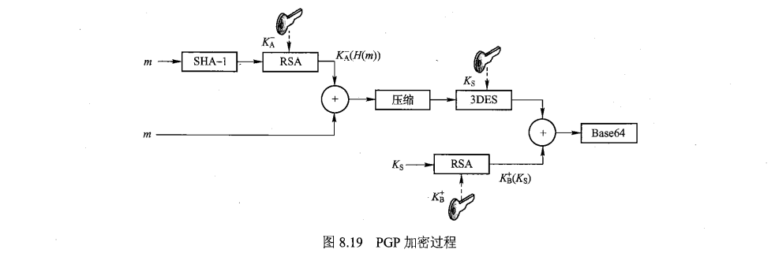

#### 安全套接字层SSL

**SSL提供的安全服务**：

* 在传输层之上构建一个安全层是一种Web安全解决方案，最典型的就是安全套接字层SSL或传输层安全TLS；
* SSL可以提供机密性、完整性、身份认证等安全服务；
* 简化的SSL主要包含4个部分：
  * 发送方和接收方利用各自的证书、私钥认证、鉴别彼此，并交换共享密钥；
  * 密钥派生或密钥导出，发送方和接收方利用共享密钥派生出一组密码；
  * 数据传输，将传输数据分割成一系列记录，加密后传输；
  * 连接关闭，通过发送特殊消息，安全关闭连接，不能留有漏洞被攻击方利用。

**SSL协议栈**：

* SSL是介于TCP和HTTP等应用层协议之间的一个可选层，绝大部分应用层协议可以直接建立在SSL协议上，SSL是两层协议；
* SSL使用的加密算法有：
  * 公开密钥加密算法：RSA；
  * 对称密钥加密算法：DES、3DES或AES；
  * MAC算法：MD5、SHA-1或SHA-2。

**SSL的握手过程**：

* 客户发送其支持的算法列表，以及客户一次随机数，服务器从算法列表中选择算法，并发给客户自己的选择、公钥证书、服务器端的一次随机数；
* 客户验证证书， 提取服务器公钥，生成预主密钥，并利用服务器的公钥加密预主密钥，发送给服务器，实现密钥的分发；
* 客户与服务器基于预主密钥和一次随机数，分别独立计算加密密钥和MAC密钥，包括前面提到的4个密钥；
* 客户发送一个针对所有握手消息的MAC，并将此MAC发送给服务器；
* 服务器发送一个针对所有握手消息的MAC，并将此MAC发送给客户。

#### 虚拟专用网VPN和IP安全协议IPSec

基本原理：VPN通过隧道技术、加密技术、密钥管理、身份认证和访问控制等，实现与专用网类似的功能，可以达到VPN安全性的目的，同时成本相对而言要低很多。VPN最重要的特点就是虚拟，连接总部网络和分支机构之间的安全通道实际上并不会独占网络资源，是一条逻辑上穿过公共网络的安全、稳定的隧道。

VPN的核心是隧道技术，包括3种协议：

* 乘客协议：确定封装的对象属于哪种协议；
* 封装协议：确定遵循哪一种协议进行封装，需要加什么字段等；
* 承载协议：确定最后的对象会放入哪类公共网络，如在internet网络中传输。

IPSec的核心协议及两种传输模式：

* IPSec是网络层使用最为广泛的安全协议，但IPSec不是一个单一的协议，而是一个安全体系，主要包括ESP协议、AH协议、安全关联SA、密钥交换IKE； 
* IPSec提供的安全服务包括机密性、数据完整性、源认证和防重防攻击等；
* 核心协议：ESP（封装安全载荷）和AH（认证头）协议；
* 传输模式：传输模式和隧道模式。

AH协议和ESP协议提供的安全服务：

* AH协议提供源认证和鉴别、数据完整性检验；
* ESP提供源认证和鉴别、数据完整性检验以及机密性，比AH应用更加广泛；
* 两种不同协议和两种模式结合起来的4种组合：
  * 传输模式AH；
  * 隧道模式AH；
  * 传输模式ESP；
  * 隧道模式ESP：是使用最为广泛的，最重要的IPSec形式。